USENIX

THE ADVANCED COMPUTING SYSTEMS ASSOCIATION

# Here, There and Everywhere: The Past, the Present and the Future of Local Storage in Cloud

Leping Yang, Shanghai Jiao Tong University; Yanbo Zhou, Gong Zeng, Li Zhang,   
Saisai Zhang, Ruilin Wu, Chaoyang Sun, Shiyi Luo, Wenrui Li, Keqiang Niu, Xiaolu Zhang, Junping Wu, Jiaji Zhu, and Jiesheng Wu, Alibaba Group; Mariusz Barczak and Wayne Gao, Solidigm; Ruiming Lu, Erci Xu, and Guangtao Xue, Shanghai Jiao Tong University

## https://www.usenix.org/conference/fast26/presentation/yang

This paper is included in the Proceedings of the 24th USENIX Conference on File and Storage Technologies.

February 24–26, 2026 • Santa Clara, CA, USA

ISBN 978-1-939133-53-3

Open access to the Proceedings of the 24th USENIX Conference on File and Storage Technologies is sponsored by

# Here, There and Everywhere: The Past, the Present and the Future of Local Storage in Cloud

Leping Yang1, Yanbo Zhou2, Gong Zeng2, Li Zhang2, Saisai Zhang2, Ruilin Wu2, Chaoyang Sun2, Shiyi Luo2, Wenrui Li2, Keqiang Niu2, Xiaolu Zhang2, Junping Wu2, Jiaji Zhu2, Jiesheng Wu2, Mariusz Barczak3, Wayne Gao3, Ruiming Lu1, Erci Xu1\* and Guangtao Xue1

1Shanghai Jiao Tong University

2Alibaba Group 3Solidigm

## Abstract

Cloud local storage has been a popular service among many vendors thanks to its near-physical performance and affordable price. In this paper, we revisit the evolution of the cloud local storage at Alibaba Cloud. We systematically analyze and evaluate the motivations, architectures and pros/cons of different methodologies from user space stack to hardware offloading. We also explore the future of local storage including a hybrid solution by integrating Elastic Block Storage to achieve better performance, availability and cost efficiency.

## 1 Introduction

Cloud local storage (i.e., ephemeral storage) is a service widely provided by many vendors, such as AWS [11], Azure [14], and Alibaba [18]. In this service, disks are physically attached to compute servers and exposed as virtual disks (VDs) to guest VMs via virtualization.

Storage devices, especially SSDs, have been rapidly evolving with IOPS tripled in recent years (500K [33, 61] to 1.5M [64]) and throughput doubled from 3 GB/s (PCIe Gen3) to 6 GB/s (PCIe Gen4). However, harnessing such great performance is challenging for the cloud local storage. At Alibaba Cloud, we initially used a kernel-based stack for HDDs, which fails to deliver satisfactory performance on SSDs due to frequent context switches under high-IOPS workloads.

Hence, we started our journey with ESPRESSO1, our firstgeneration cloud local storage with NVMe SSDs. Leveraging SPDK [68], we moved the stack to user space and used polling to reduce context switches. Each server (12× PCIe Gen3 NVMe SSDs) delivers a maximum of 38.4 GB/s throughput (3.2 GB/s per SSD) and 5,760K IOPS (480K per SSD). However, in ESPRESSO, each thread manages a VD and is bound to a dedicated CPU core. Therefore, while ESPRESSO was successfully launched around 2017 and deployed on thousands of servers, it cannot support bare-metal instances, has low CPU utilization efficiency (around 60%), and still suffers context switches between VMs and hypervisor.

We then moved on to develop DOPPIO, offloading virtualization and I/O processing to commercial ASIC-based Data Processing Units (DPUs). Each DPU manages two physically attached SSDs. The hardware assistance avoids using host CPU (i.e., bare-metal ready), alleviates CPU inefficiency, and uses fast hardware interrupts instead of software ones. With 6 DPUs (12× PCIe Gen3 NVMe SSDs), each DOPPIO server achieves up to 38.4GB/s throughput (3.2 GB/s per SSD) and 6M IOPS (500K per SSD). We again managed to scale DOPPIO to thousands of servers. But, DOPPIO still has its limitations. ASIC-based DPUs have limited processing power, and thus are not able to exploit the latest NVMe SSD with 1.5M IOPS. In addition, the fixed hardware logic of ASIC cannot well support the emerging cloud features (e.g., Logical Volume Management). While using high-performance FPGA may alleviate some of the issues, it would incur high energy cost and Capital Expenditure (CapEx).

In 2023, we built RISTRETTO, combining the flexibility of System-on-Chip (SoC) and the efficiency of ASIC through co-design. RISTRETTO works as a PCIe-extended board with an ASIC and SoC (embedded with 4× ARM Cortex-A72 [8] cores and 64 GB DRAM). The ASIC handles VD requests as an emulated NVMe controller, enabling SoC access to SSDs and encapsulating NVMe packets. The SoC provides a customizable block abstraction layer. RISTRETTO delivers near-physical performance: 900K IOPS for single VD on PCIe Gen4 NVMe SSD and 7.2M IOPS for 8 VDs combined.

Although RISTRETTO delivers performance similar to physical devices, the inherent disadvantages (e.g., weak availability and elasticity) make the local disks an unfavorable choice for many scenarios, such as Large Language Model System (LLMsys) with dynamic scale. While highperformance Elastic Block Storage (EBS) can already provide 30µs latency and 1M IOPS with strong availability and elasticity (e.g., Alibaba EBS [79]), the much higher price can deter users from adopting it as an alternative. We therefore propose a Proof-of-Concept (PoC), called LATTE, to integrate both local disk (i.e., RISTRETTO) and a more affordable standard EBS to serve together as the local storage. By integrating machine learning based I/O dispatcher and cache admission control, LATTE enjoys the advantages of both local disk and EBS, providing near-physical performance and high availability under a reasonable CapEx increase.

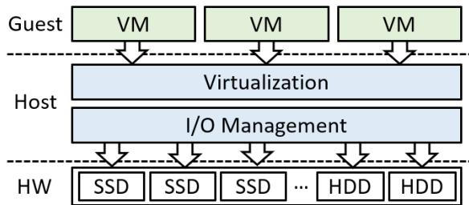  
Figure 1: Typical three-layer local storage stack (§2).

The contributions of this paper are summarized as follows: • We analyze the evolution behind the three generations of cloud local storage in the field, discussing their architectures, benefits, limitations, and design tradeoffs.

• We propose LATTE, a hybrid local storage solution with Alibaba EBS support, which achieves near-physical performance with high availability and competitive costeffectiveness.

• We extensively evaluate the varying local storage solutions from ESPRESSO to RISTRETTO and LATTE under a series of microbenchmarks and trace-driven macrobenchmarks.

## 2 Cloud Local Storage: A Background

Overview. Figure 1 shows the typical three-layer layout of local storage stack at Alibaba Cloud, including Virtual Machines (VMs) in the Guest layer, the hypervisor in the Host OS layer, and the physical disks in the Hardware layer. Guest VMs (a.k.a., computing instances) can mount one or several Virtual Disks (VDs). The VDs are backed by SSDs or HDDs that are directly attached to the same physical servers that operate VMs (i.e., co-located). The Host OS enables two essential functions: virtualization, which encapsulates partitions of physical disks as virtual block devices, and I/O management, which facilitates communication and data transfer between the VDs and physical disks.

Near-physical performance. Unlike compute-to-storage disaggregation in typical elastic cloud block services (e.g., AWS [12] and Alibaba EBS [19]), disks in cloud local storage are physically attached—instead of over data center network— to the compute servers. This architecture expedites data transfer between virtual and physical disks. In Table 1, we list the performance comparison between an enterprise-grade NVMe SSD (Physical) and one cloud local storage virtual disk (Local VD). We can see that the local storage VD demonstrates similar performance as the physical NVMe SSD, e.g., a few microseconds drop in latency due to virtualization overhead. A typical use case of cloud local storage is caching for cloud structures, such as serving Content Delivery Network (CDN) and storing intermediate results for big data analytics.

Limited elasticity and availability guarantees. Having the disks directly installed on the compute nodes also results in limited elasticity and availability. First, as the VDs are backed by the underlying disks, the elasticity of local storage is usually restrained to the granularity of an SSD (i.e., subscribing at least one disk). Moreover, VDs are usually not protected by redundancy mechanisms such as replication or erasure coding, shifting the responsibility to the client applications. For example, users need to build a distributed system with three-way replication (e.g., HDFS [26], Ceph [9]) or masterslave replication (e.g., MySQL [56]) over multiple VMs to provide data protection and availability.

<table><tr><td rowspan=1 colspan=1></td><td rowspan=1 colspan=1>IOPS(K)</td><td rowspan=1 colspan=1>Throughput(GB/s)</td><td rowspan=1 colspan=1>Lat.(μs)</td></tr><tr><td rowspan=1 colspan=1>Physical</td><td rowspan=1 colspan=1>1,000/180</td><td rowspan=1 colspan=1>6.9/4.1</td><td rowspan=1 colspan=1>75/15</td></tr><tr><td rowspan=1 colspan=1>Local VD</td><td rowspan=1 colspan=1>900/180</td><td rowspan=1 colspan=1>6.7/4.0</td><td rowspan=1 colspan=1>77/17</td></tr></table>

Table 1: A performance comparison between two types of disks (§2). The left side of slash refers to read; the right side refers to write in stable state. Data of physical disks are from a typical PCIe Gen4 SSD [62]; Local storage VD is RISTRETTO from Alibaba Cloud.

## 3 ESPRESSO: An SPDK-based Stack

## 3.1 Kernel-based Practice Turns Outdated

Stack overview. Our initial local storage stack was built atop HDDs. The stack uses Virtio [60], a KVM-based paravirtualization, to transfer I/Os between Virtual Disks (VDs) in VMs and kernel storage stack in the host OS. VMs can mount a VD backed by (a partition of) one or several HDDs. The control-/data-flow with detailed procedures (denoted as circled numbers) is described in Figure 2(a). Assume the VM issues a write request to the VD (i.e., /dev/vda). First, the guest OS operates virtual I/O queues via Virtio driver to interact with KVM module in the host kernel (⃝1 ). The KVM module activates the hypervisor (⃝2 ) to parse the Virtio request and then issue an I/O into underlying disks via kernel stack (⃝3 ). Then, the HDD issues a DMA write to the data buffer (⃝4 ). Upon completion, the disk generates an interrupt to notify the host kernel, which then returns the I/O completion to hypervisor (⃝5 ). Finally, the hypervisor invokes the KVM (⃝6 ) to generate an interrupt to guest OS, indicating the I/O completion (⃝7 ). The read procedure is similar.

Infeasible for NVMe SSDs. This stack works well for HDDs but fails to deliver satisfactory performance on NVMe SSDs. Specifically, a VD under this stack can at most achieve 9.54% of the maximum IOPS of the underlying NVMe PCIe Gen3 SSD but can require up to around 140% CPU utilization (i.e., 1.4 CPU cores). The situation further deteriorates when the VM mounts VDs from multiple NVMe SSDs. The root cause is that the NVMe SSDs significantly outperform HDDs with orders of magnitude more IOPS and much lower latency. This triggers frequent and expensive context switches, thereby leading to severe CPU contention and synchronization overhead. Note that there are three types of context switches in Figure 2(a) caused by VM\_Exits (⃝1 , ⃝7 ), system calls (⃝3 , ⃝6 ), and interrupts (⃝5 ), respectively.

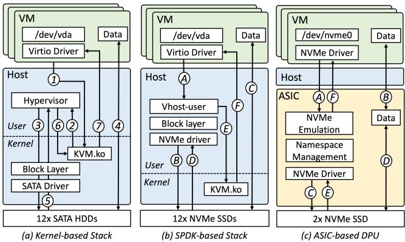  
Figure 2: Architecture comparison between kernel-based stack (a), ESPRESSO-based stack (b), and DOPPIO-based stack(c)

## 3.2 ESPRESSO Design

Architecture. Compared with the kernel stack, the most significant change in ESPRESSO is to shift the stack from kernel to user space by leveraging Storage Performance Development Kit (SPDK) [68]. Again, we reuse the example of VM issuing a write request in Figure 2(b) (denoted as circled capital letters) for illustration. In ESPRESSO, the vhost-user process actively polls the incoming I/O requests from virtual I/O queues from the guest OS (⃝A ). Vhost then forwards the new I/O to the underlying SSDs via the user space stack (⃝B ). The SSD issues a DMA write into the data buffer (⃝C ). Meanwhile, the vhost-user continues to actively poll the I/O completions from the SSD (⃝D ). Finally, the vhost-user interacts with KVM module (⃝E ) to generate an interrupt to guest OS, indicating the I/O completion (⃝F ).

Benefits. ESPRESSO introduces the following benefits:

• Adopting SPDK-based user space stack and using pollingmode event handling avoid frequent context switches caused by VM\_Exits (⃝A vs. ⃝1 ), system calls (⃝B vs. ⃝3 ), and interrupts (⃝D vs. ⃝5 ).

• Binding dedicated CPU cores to I/O threads for polling and adopting share-nothing data structures for each thread. This increases the CPU affinity and minimizes the impact of CPU contention and synchronization overhead.

• ESPRESSO stack mostly builds on mature open source software and libraries. Therefore, the development is straightforward with rich community support.

Field deployment. With ESPRESSO, we launched the firstgen NVMe SSD-based local storage instance in 2017 and later scaled up to tens of thousands of physical servers. The ESPRESSO-stack servers are backed by PCIe Gen3 NVMe SSDs. The physical server, when utilizing all 12 SSDs in the node, can achieve up to maximum 38.4GB/s throughput (3.2 GB/s × 12) and 5,760K IOPS (480K × 12). Compared to the HDD-based stack, ESPRESSO reduces software overhead by 82.35%. For 8 VDs (backed by 8 NVMe SSDs, our largest instance in ESPRESSO), the performance can achieve up to 3,848K IOPS with four cores (400% CPU utilization), much higher than the previous design under the same setup (440K IOPS with 340% CPU utilization).

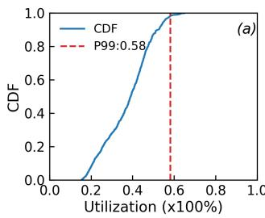

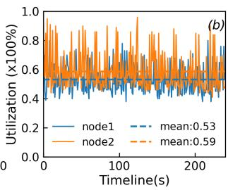  
Figure 3: Active CPU usage in local storage stack (§3.2). The results refer to the CPU cycles used for doing actual events/requests in the polling-mode software. The results on the left figure are based on field statistics from local storage production clusters.

Limitations. After mass deployment, the limitation of the ESPRESSO stack also gradually manifests itself. We summarize them as SWL\_1-3 (SoftWare Limitation) as follows.

• SWL\_1: Not supporting bare-metal service. ESPRESSO stack requires dedicated host CPU cores to serve I/Os (i.e., 6 cores for 12 SSDs), preventing us from providing baremetal service on ESPRESSO-enabled nodes for users who run high-performance applications (e.g., OLAP) or simply wish to migrate the setup from offline to the cloud with minimal changes. These users expect the exact same amount/ability of cores from the cloud.

• SWL\_2: Not efficiently using host CPU. Each dedicated core in ESPRESSO is exclusively used for serving requests. However, the 99th percentile actual utilization is below 60% of the CPU utilization as shown in Figure 3(a). Note that this cannot be simply remedied by harvesting idle CPUs for other tasks because of unpredictable CPU utilization caused by sudden burst I/O as shown in Figure 3(b) and expensive cost on task context switching.

• SWL\_3: Not free from context switches. Upon ESPRESSO finalizing I/Os, SPDK triggers the eventfd [1] to inform VM the completion of requests. This incurs additional context switches caused by system calls and VM\_Exits (i.e.,⃝E and ⃝F in Figure 2(b)), necessitating extra 5-12µs for processing. Hence performance gap between ESPRESSO and physical drive widens with deeper queue depth in Figure 4. A latency breakdown of original ESPRESSO and modified ESPRESSO with polling mode driver inside VM (i.e., no context switch upon I/O completion, denoted as ESPRESSO-M) in Figure 5 shows that the software latency of guest OS and hypervisor (VM bar in the Figure) reduces by 60.3% and that of vhost stack reduces by 65.6%, which is inevitable for many users’ legacy applications that still rely on interrupts.

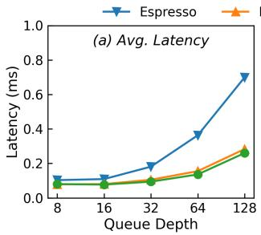

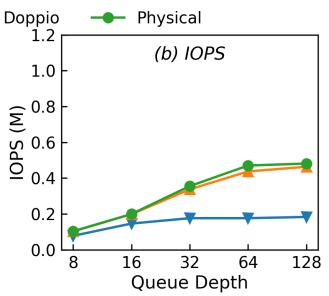  
Figure 4: Performance comparison on single drive with one FIO [2] job (§3.2). The results are from 4KB random reads.

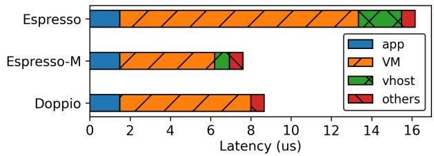  
Figure 5: Software latency breakdown (§3.2). The result is measured for a 4KB random read (queue depth one). ESPRESSO-M is the modified guest NVMe drive with polling mode. Note that the VM bar includes guest OS and hypervisor overhead.

## 4 DOPPIO: An ASIC-offloading Stack

## 4.1 DOPPIO Design

ASIC-based offloading. Data Processing Units (DPUs)— evolving from traditional NVMe RAID cards or NVMe Switches (e.g., Marvell NevoX [52])—provide virtualization capability to the host (e.g., SR-IOV [54]). Users can create Virtual Functions (VFs) to emulate various PCI devices (e.g., NVMe SSD) using SR-IOV and directly attach VFs into VMs. They hence offer the potential to offload local storage stacks to hardware and handle the SWL\_1-3 in ESPRESSO limitations. Since the basic computational logic is based on ASIC instead of CPU cores, these types of DPUs can provide similar processing power with reduced costs and energy consumption. Typically, the cost and power consumption of an ASIC-based DPU is about 1/20 and 1/3 of an SoC-based DPU, respectively. Therefore, we opted to use a commercial off-the-shelf ASIC-based DPU for DOPPIO instead of SoC.

Architecture. In DOPPIO, our DPU is equipped with an ASIC, 128KB internal SRAM, DMA engine, and 16 PCIe Gen3 lanes. The DPU is directly plugged to the host PCIe bus. Each DPU can manage two PCIe Gen3 NVMe SSDs via the on-chip PCIe Root Complex (RC). Further, we use DPU to partition each NVMe SSD into one or multiple independent namespaces and register each namespace as a VF that is assigned to the VM as a VD via the PCI passthrough.

Figure 2(c) further shows the control-/data-flow with procedures. After VMs issue I/Os to the VDs, the DPU can fetch the NVMe requests from the host via DMA engine (⃝A ), and process hardware-defined functions (e.g., throttling, device sharing) before further forwarding the I/Os to the SSDs (⃝C ). Upon completion of I/O operations by SSDs (⃝E ), DPU notifies guest OS (⃝F ) via MSI interrupts (hardware interrupts). Note that the DPU’s DRAM serves as an intermediate buffer for the user’s data. DPU should move data from the host into its intermediate buffer (⃝B ). The I/O completion is not acknowledged to the VMs until the SSD finishes the DMA read/write of user data from the intermediate buffer (⃝D ).

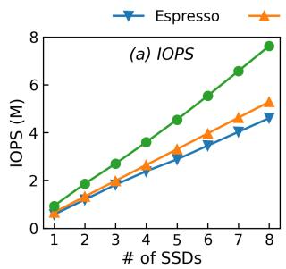

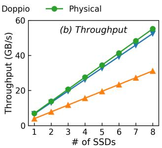

Figure 6: Performance scalability on multiple drives (§4.1). Note that for DOPPIO, the throughput (b) is limited by DOPPIO’s PCIe channel (8× Gen3 lanes).
<table><tr><td rowspan=2 colspan=1></td><td rowspan=1 colspan=2>2017</td><td rowspan=1 colspan=2>2020</td><td rowspan=1 colspan=2>2023</td></tr><tr><td rowspan=1 colspan=1>Read</td><td rowspan=1 colspan=1>Write</td><td rowspan=1 colspan=1>Read</td><td rowspan=1 colspan=1>Write</td><td rowspan=1 colspan=1>Read</td><td rowspan=1 colspan=1>Write</td></tr><tr><td rowspan=1 colspan=1>V-1</td><td rowspan=1 colspan=1>490K</td><td rowspan=1 colspan=1>38K</td><td rowspan=1 colspan=1>920K</td><td rowspan=1 colspan=1>135K</td><td rowspan=1 colspan=1>1.1M</td><td rowspan=1 colspan=1>390K</td></tr><tr><td rowspan=1 colspan=1>V-2</td><td rowspan=1 colspan=1>430K</td><td rowspan=1 colspan=1>40K</td><td rowspan=1 colspan=1>1M</td><td rowspan=1 colspan=1>180K</td><td rowspan=1 colspan=1>1.5M</td><td rowspan=1 colspan=1>250K</td></tr></table>

Table 2: NVMe SSD performance evolution over 2017-2023 (§4.1). Results refer to 4KB sustained random reads/writes IOPS from two SSD vendors (denoted as V1 and V2 in the Table).

Benefits. With DPU, DOPPIO obtains the following benefits:

• DOPPIO does not need host CPU for I/O processing (i.e., bare-metal ready, no SWL\_1) and alleviates host CPU utilization (i.e., SWL\_2).

• DOPPIO, with hardware-assisted virtualization (SR-IOV), reduces the context switches overhead of system calls and VM\_Exits (i.e., ⃝E and ⃝F of ESPRESSO in Figure 2(a)), led by software interrupts (i.e., SWL-3). DOPPIO mitigates the overhead by DPU-enabled hardware interrupts. Under the same tests, Figure 4 and Figure 5 show the latency and IOPS improvement led by DOPPIO (near-physical performance).

• We retain the ability to execute hardware-defined functions and manage storage devices through ASIC units.

Field deployment. We launched DOPPIO-backed local storage in 2019 and later scaled to thousands of nodes over the follow-up two years (2019-2021). The largest DOPPIObacked instance provides 38.4GB/s throughput (3.2GB/s × 12) and 6M IOPS (500K × 12). Moreover, DOPPIO-backed servers can provide bare-metal instances or offer 6 more vCPU cores to host common VMs compared to ESPRESSO.

Limitations. Over the years of field deployment, DOPPIO

manifests following limitations (denoted as HWL\_1-2).

• HWL\_1: Hard to keep up with SSD evolution. In Table 2, we list the random 4K read/write IOPS from 2017 to 2023 under two enterprise NVMe SSD model families (V-1 and V-2). While the SSD performance doubles or even triples across generations, commercial ASICs may take longer iteration cycles and can often fall behind the SSD evolution. Statistically, with one DPU for two Gen4 SSDs, a DOPPIO VD can at most achieve 1.3M IOPS, see Figure 6(a).

• HWL\_2: Inadequate support for cloud features. ASICs are usually optimized for specific functionalities with logic hard-wired during manufacturing. Hence, DOPPIO is inflexible when compared to ESPRESSO, and difficult to incorporate emerging techniques that require host management (e.g., logical volume management and ZNS [15]).

## 5 RISTRETTO: An ASIC/SoC Co-design Stack

The field lessons from ESPRESSO and DOPPIO drive us to further explore local disk design to adopt a software/hardware co-design aiming to: (1) eliminate host CPU usage for baremetal readiness and VM core reservation, (2) enable interrupt passthrough to avoid hypervisor processing delays, (3) ensure performance scalability with evolving SSD technology, and (4) provide flexible cloud features support for vendors. Following these goals, we develop RISTRETTO, a cloud local storage stack with ASIC and SoC co-design.

## 5.1 RISTRETTO Design

Figure 7 shows RISTRETTO’s overall architecture. At a high level, RISTRETTO serves as a PCIe extension card—with multiple NVMe SSDs installed—directly connected to the host server. RISTRETTO registers SSD partitions or entire SSDs as Virtual Functions (VFs) via SR-IOV. Each VF is assigned to a VM and mounted as a virtual disk.

RISTRETTO has two main components: ASIC and ARM SoC (see Figure 7, right). The ASIC includes a DMA engine and on-chip memory for storage offloading and acceleration. The SoC is equipped with an ARM Cortex-A72 [8] processor with 4 cores at 2.50GHz and 64GB DRAM for running Linux OS and software stack. ASIC and SoC interconnect via internal PCIe bus and integrated on a customized PCIe board, which has 32 PCIe Gen4 lanes, attaching to the host server via PCIe Root Complex and managing SSDs via PCIe Endpoints. We use ASIC Logic Elements to implement our proposed hardware designs, which supports over 1,000 VFs for NVMe controller emulation. The hardware uses round-robin polling for emulated NVMe registers and I/O completion events.

We now demonstrate the design for ASIC virtualization backend and ASIC-based SSD driver (upper and lower blue areas in Figure 8), and describe Runtime software on SoC (the yellow area in Figure 8) with its block abstraction layer enabling cloud features.

ASIC virtualization backend. The ASIC (see upper blue area in Figure 8) in RISTRETTO provides virtualization backend functionality. (1) It can configure Virtual Functions as virtual NVMe devices and assign it to VMs as standard NVMe storage. (2) VM I/O completion notifications use MSIs triggered by ASIC DMA writes to special host addresses through PCIe Subsystem. (3) To transfer NVMe commands from guest VM, ASIC gets new command offsets, issues DMA reads to corresponding host memory ranges, and writes I/O completions to NVMe CQ memory ranges in host. Besides, ASIC establishes ASIC-to-SoC channel with virtual queues (VQ) for transferring user requests.

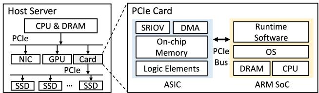  
Figure 7: RISTRETTO architecture (§5.1)

ASIC-based SSD driver. RISTRETTO builds SoC-to-ASIC channels via ASIC (see lower blue area in Figure 8) interacting with SoC through virtual queues. ASIC transforms block requests into standard NVMe requests by encapsulating data into Physical Region Pages (PRPs) or Scatter Gather List (SGL). ASIC achieves direct data transfer (zero copy) by routing DMA to guest OS. When an SSD launches a DMA request to SoC through PCIe bus, ASIC routes the DMA request to host memory space.

Runtime software on SoC. Runtime software built in SPDK application framework atop ARM SoC (see yellow area of Figure 8) continuously polls incoming I/Os from virtual queues to interact with ASIC and determines queue mapping through ASIC-to-SoC Channel, where RISTRETTO registers an SPDK poller on the thread binding to a dedicated CPU core for I/O fetching. Furthermore, we design two software functionalities: (1) There is a block abstraction layer implemented as an SPDK BDEV (block device) to process common block I/Os and cloud-specific functionalities, which enables advanced storage features including Logical Volume Management (LVM), RAID, Caching, and Flash Translation Layer (FTL) for new hardware devices such as ZNS SSDs [15]. (2) Runtime software interacts with ASIC via SoC-to-ASIC channels and uses an SPDK poller to repeatedly poll virtual queues to check I/O completions. To minimize CPU load, runtime software is designed only to process block-level requests and directly forwards block requests to ASIC.

Multiple queues support. For each block device in RISTRETTO, the runtime software allocates multiple virtual queues in ASIC-to-SoC and SoC-to-ASIC channels, matching the number of VM’s NVMe queues. For example, if guest OS enables multiple queue pairs (e.g., 4 NVMe queues), RISTRETTO runtime allocates four virtual queues in ASIC-to-SoC channel for VM communication and four virtual queues in SoC-to-ASIC channel for underlying SSD communication.

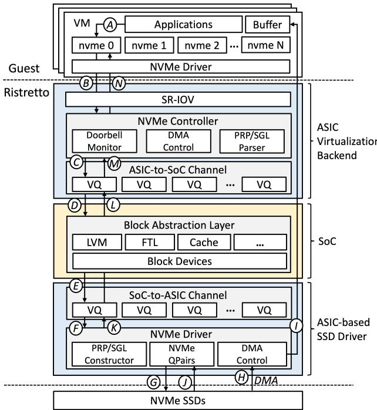  
Figure 8: RISTRETTO Design (§5)

## 5.2 RISTRETTO Data Flow

We use an example to go through the typical I/O procedures in RISTRETTO with Figure 8 (denoted as capital letters). First, the user application sends an I/O request to a virtual disk via NVMe driver (⃝A ), which submits an NVMe command to the submission queue (SQ), and updates the virtual doorbell register (the mapped ASIC BAR) with the current SQ tail.

Second, the RISTRETTO NVMe controller receives the doorbell notification and fetches the new NVMe command using its DMA engine (⃝B ). Host IOMMU is required for address translation from guest to host memory. Then, the NVMe controller parses the NVMe PRP/SGL and transforms it into a block I/O (bio), submitting it to virtual queues (VQ) in the ASIC-to-SoC channel (⃝C ).

Third, the runtime software polls the request from the VQ, fetches the new I/O request, and submits it into block abstraction layer (⃝D ). In block abstraction layer, RISTRETTO performs cloud-specific features. For example, the host-side FTL in RISTRETTO converts logical block address (LBA) to physical block address (PBA) for ZNS SSD through B-Plus Tree indexing.

Fourth, RISTRETTO forwards new block I/Os to the VQ of SoC-to-ASIC (⃝E ). ASIC repeatedly checks incoming requests from VQs (⃝F ), encapsulates received block requests into standard NVMe packets (e.g., PRPs and SGL) and interacts with NVMe SSDs via standard NVMe Queue Pairs.

Fifth, the SSD receives the doorbell notification and fetches the NVMe commands (⃝G ) from RISTRETTO’s DRAM. After parsing the command, the SSD issues a DMA request (⃝H ) which ASIC captures and routes to the user’s data buffer in

guest OS (⃝I ).

Finally, upon I/O completion, SSD returns the I/O to NVMe Queue Pairs (⃝J ). After receiving I/O completion, ASIC parses NVMe requests and moves the completed request to the VQ (⃝K ). The runtime software repeatedly polls VQs and processes block-level completion for cloud features. After that, the runtime software moves completed request to the VQ (⃝L ). RISTRETTO NVMe controller actively polls the VQ in ASIC-to-SoC channel to check response (⃝M) and returns the completed I/O to the host’s NVMe CQ via DMA (⃝N ), followed by a hardware interrupt to the guest OS.

Benefits. Here, we summarize the advantages of RISTRETTO from a qualitative perspective and later evaluate it in §7.

• Similar to DOPPIO, RISTRETTO offloads the entire I/O stack to the DPU (ASIC and SoC). Therefore, RISTRETTO does not rely on host CPUs (no SWL\_1-2).

• Inspired by hardware interrupt mechanism in DOPPIO, we enable the ASIC to directly inject hardware interrupts (MSIs) to the guest OS via PCI passthrough with Intel’s VT-D (i.e., alleviating SWL\_3).

• Redesigning ASIC to leverage high parallel execution improves computational power in adapting to storage device evolution (i.e., HWL\_1).

• Utilizing SoC CPU versatility to achieve cloud-defined features, such as LVM and FTL (i.e., HWL\_2).

• By offloading components and interaction between ASIC and SoC, RISTRETTO achieves more powerful computing capability with optimized total cost of ownership compared to SoC-only offloading (the more costly option in §4.1).

Field deployment. We launched RISTRETTO local storage instance in 2023 and have expanded deployment scale to several thousand nodes so far. The largest instance of RISTRETTO is backed by 8 NVMe SSDs corresponding to 8 VDs with 30.72TB of storage capacity (3.84TB × 8). All VDs in one RISTRETTO instance can provide a total of 48GB/s throughput (6GB/s × 8) and 7.2M IOPS (900K × 8), which achieves 80% per-VD IOPS increase over DOPPIO while conserves more CPU resources by SoC-based offloading and provides cloud-defined features like LVM and FTL.

Limitations. Although RISTRETTO has achieved nearphysical performance with flexible cloud feature support, it still has limitations in certain scenarios (noted as Local Disk Limitation, i.e., LDL\_1-3).

• LDL\_1: Availability. Upon a local disk crash (e.g., annual failure rate around 0.44% [65]), local storage users usually can tolerate data loss since use cases are typically hosting cache data (e.g., CDN). However, more often than not, we observe users may need to experience an hour-level service unavailability. This is because users may own multiple local SSDs and require all of them to properly run their services. In this case, while we can allocate a new node with SSDs, the user may still need to migrate data from the rest of functioning local disks to the new node, yielding high overhead. As a result, local storage users still desire disks with high availability.

• LDL\_2: Elasticity. Many recent application scenarios require highly elastic storage capacity (e.g., persisting temporal checkpoints, pulling model parameters and KV cache in LLMsys). The physical co-location limits a disk to be scaled up (capped at SSD’s capacity).

• LDL\_3: Accessibility. One not-so-well-known fact is that local storage is limited to certain regions where there are major local storage users (owning more than 1K disks). This is because the physical co-location, unlike computestorage disaggregation of cloud disk, limits the accessibility and can lead to wide under-utilization with not enough users.

## 6 Future of Local Storage

Limitations of RISTRETTO highlight the need to resolve the scalability, availability and flexibility problems of local storage. Fortunately, these essential features are inherent advantages of Elastic Block Storage (EBS), which is the crucial component in the following proposed future forms of local storage—the performance-optimized version of Alibaba EBS called EBSX, and the local-cloud combined storage stack called LATTE.

## 6.1 EBSX as Local Storage

Overview. Elastic Block Storage (EBS), a foundational component of modern cloud (e.g., AWS [12], Azure [13] and Alibaba Cloud [19]), draws our attention to serve as an alternative to local storage since it delivers storage services in the form of virtual block devices that offer high performance, availability, and elasticity. Here, we present an overview of Alibaba EBS architecture [79].

• Compute end in Alibaba EBS comprises multiple servers where each server runs one client and can host several VMs. A VM can mount one or more VDs. Users can access the VD as a block device and the host server forwards the I/O requests to the storage clusters via the client.

• Storage end utilizes dedicated storage servers atop selfdeveloped distributed file system [50]. The servers employ log-structured design to translate VD writes into appendonly writes in the file system, across which data is stored in three-replication or online erasure coding (EC) compression formats.

Pros and cons of adopting EBSX as local storage. Compared to physically co-located local storage, EBS, thanks to the compute-storage disaggregation, provides much better availability, scalability and accessibility by nature (i.e., alleviating LDL\_1-3). In addition, Alibaba Cloud has provided a high-performance version, called EBSX, which can deliver 30µs latency, 6GB/s throughput and up to 1M IOPS with the help of Persistent Memory (PMem) and 100Gbps highspeed network [79]. Unfortunately, this solution can incur a much higher price. For example, a 1M IOPS/4TB capacity EBSX virtual disk could lead to around 20× of a local disk (RISTRETTO) price with comparable performance and capacity2. Apart from using expensive hardware, another key factor is that EBS provides much better data reliability (e.g., via erasure coding or three-way replication) which often can be an overkill for local storage scenario.

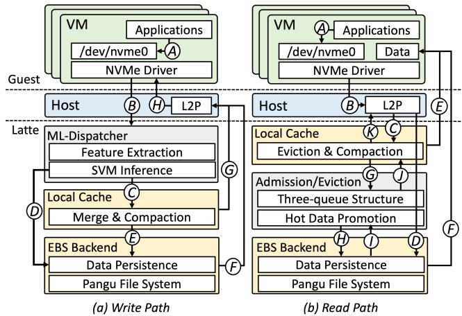  
Figure 9: Local-cloud combined: LATTE architecture (§6.2)

## 6.2 LATTE: Local-Cloud Combined Storage

The much higher price tag of EBSX certainly deters many from adopting cloud disk as a replacement. However, instead of solely relying on the high-performance EBSX, this also motivates us to combine the local disk with a more affordable cloud disk to serve together as a local storage solution. The frontend (i.e., local disk) can work as a high-performance buffer to absorb I/Os with tail latency and cache hot data. The backend is supported by a more cost-effective EBS.

Based on this idea, we propose LATTE. While layered/hybrid storage is not necessarily a new concept (e.g., Ziggurat [82], NOVA [73], Flashield [22]), many works require fundamental changes that are unsuitable for our user space stack. For example, Flashield is built upon Memcached [3] and Ziggurat requires kernel-level modification. Therefore, we choose to build LATTE based on CSAL [85], an opensource SPDK storage acceleration framework co-developed with Solidigm and widely deployed at our site. CSAL uses a high-performance Optane to absorb all incoming write I/Os, compact them as fixed-size chunks and append them to the underlying QLC SSD.

LATTE leverages CSAL by replacing Optane with local disk (i.e., RISTRETTO) and QLC SSD with remote cloud disk. Besides, we further improve three parts. First, we integrate a machine learning (ML) dispatcher to determine whether the incoming I/Os need to be stored at frontend (i.e., local disk) or backend (i.e., cloud disk). Second, we leverage the S3- FIFO [76] structure for better caching instead of classic LRU.

Third, we remove the log-structured compaction and GC since cloud disk has already supported those by nature [79].

Key procedure. At a high level, we now go through the steps of write and read as illustrated by Figure 9:

• For write path (Figure 9(a)), there are write-to-cache and write-bypass-cache paths. When an application sends a write I/O request (⃝A ), it is first routed to the ML Dispatcher module (⃝B ). The per-I/O inference then guides the request to either write cache (⃝C ) or backend (⃝D ). This facilitates the handling of frontend disk failure where request is automatically routed to backend. Upon completion of write I/O, the Logical-to-Physical (L2P) address table is updated to record whether data is written to the backend (⃝F ) or the cache (⃝G ), and notifies the VM (⃝H ). Note that frontend also periodically aggregates writes and flushes to backend(⃝E ).

• For read path (Figure 9(b)), we use S3-FIFO’s three FIFO queues structure [76] to record and promote frequently accessed data blocks from EBS to the local RISTRETTO-based cache. Specifically, a read request first checks the L2P (⃝B ) to determine location of the data, either frontend (⃝C ) or the backend (⃝D ). If in the cache, it is returned directly to VM (⃝E ). Otherwise, the admission controller evaluates whether the data block should be promoted to the cache (⃝I ). If the block has been accessed frequently, it is sent to the VM (⃝F ) while simultaneously being inserted into the cache (⃝J ). When cache space becomes insufficient and triggers compaction, the system evaluates whether the data block is worth preserving in the cache (⃝G ). If it lacks value or has become invalid, it is evicted to the backend (⃝H ). Whenever a block is promoted or evicted, its corresponding L2P mapping is promptly updated to ensure data consistency (⃝K ).

Note that LATTE can maintain the ordering of writes. Both write-to-cache and flush-to-backend paths operate in appendonly mode, and the write orders of the two are the same during compaction. This mechanism avoids the out-of-order eviction and data inconsistency issues associated with traditional write-back approaches [41, 59]. Besides, the L2P mapping continuously tracks the latest data location to ensure read consistency, same as the data management in CSAL.

ML-based dispatcher. The key to high performance of LATTE lies in I/O path selection to avoid congesting the backend device. Inspired by recent progress of using machine learning models to predict I/O latency (e.g., LinnOS [27] and Heimdall [44]), we build a lightweight ML-based I/O dispatching model, including the followings:

• Model input/output. We collect per-I/O traces of cache and backend latency, I/O size, and queue depth (QD). Using a slide window (by default 5 IOs) as input, the model outputs binary classification (i.e., forwarding I/O to cache or backend). We label slide windows by comparing cache, backend latency and QD congestion, enabling the model to learn optimal routing choices for avoiding I/O blocking.

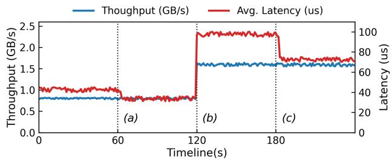  
Figure 10: Average latency variation caused by ML model weight updates as throughput rate changes. The results are tested under 4KB random write task with from 800MB/s to 1.6GB/s.

• Model selection. We choose linear-SVM [23] for fast boundary learning and inference latency is at most 200 ns, a negligible overhead (i.e., SSD’s latency is above 10 µs). Sparse parameters of model (5×6 inputs corresponding to 30 weight updates) occupy less than 1KB space, with CPU overhead below 10% even at 1M IOPS.

• Model retrain. Given the variability of I/O patterns, we collect the throughput and average latency of LATTE every 60 seconds for statistic analysis. If the variance is above a pre-defined threshold (10% by default), we retrain the model by short I/O traces and update the weights accordingly. Given the small scale of traces dataset and the use of a lightweight model, the process only takes 5s on average.

We provide a detailed example about the quick and effective retraining process. As shown in Figure 10, we run a write task at 800MB/s on a LATTE VD and increase throughput to 1.6GB/s after 120 seconds. The model parameters are initialized randomly at the beginning. At 60s (a), the model collects I/O traces and updates weights after several seconds, resulting in a decrease in latency. At 120s (b), the latency increases significantly due to doubling of throughput load. After another 60s (c), the monitor detects the throughput change and retrains the model in a few seconds using traces collected from the past 60s, substantially reducing latency.

Admission and eviction. We implement the cache admission and eviction control by building upon Solidigm Append-Cache [5], which integrates an S3-FIFO-based three-queue structure into SPDK. Upon the first read miss, a data block is not inserted into the cache immediately. Instead, it is recorded in a candidate queue that only maintains I/O metadata, and the block will be promoted into cache only when it has been accessed more than once as an admission candidate. Such design is to solve the problem that shorter requests subsequences (e.g., 10%) of whole I/O traces often have higher ratios of "one-hit-wonder" (e.g., 72%), which stands for the fraction of objects that are requested only once in traces [76]. When cache occupancy exceeds the capacity threshold and eviction is triggered, the eviction controller consults the access records and only retains recently visited blocks in the cache, thereby increasing the fraction of hot data in the cache. Results indicate that the caching design of LATTE achieves over 82% read hit rate in real online I/O traces, and its performance approaches EBSX in mixed read-write database workloads. (see §7.3 for details).

Benefits. By building a local-cloud hybrid storage stack, LATTE will achieve the following advantages:

• High performance with affordable cost. LATTE leverages local disk for offloading bursty IOs with tail latency while using a more affordable standard EBS as backend. Our evaluations suggest the performance of LATTE is comparable to EBSX with 1/5 to 1/10 of the listing price (see §7.4).

• Availability. All data in LATTE eventually would be routed to EBS backend through compaction or flush. Hence, on the long term, LATTE can achieve the same availability and reliability guarantees as standard EBS. In write-back mode, upon disk crash, unflushed data in local disk can be lost but the LATTE can still be accessed by routed to backend (i.e., no LDL\_1). Additionally, users can issue O\_DIRECT/O\_SYNC commands to trigger write-through mode in LATTE to ensure data always has a copy on EBS, enabling stronger durability.

• Elasticity. The local-cloud combination enables LATTE (temporally) scaling to a larger-capacity backend. In addition, our EBS is equipped with IOPS scaling capability allowing LATTE to elastically increase or decrease the IOPS (capped at 1M IOPS), thereby alleviating LDL\_2.

• Accessibility. Since users no longer rely on the local disk for providing capacity (i.e., backed by EBS), we can shareand-split one local disk as multiple LATTE instances. This is further facilitated by the emerging high-bandwidth SSDs (e.g., PCIe Gen5 SSD can deliver 14 GB/s bandwidth [63]). Therefore, vendors may not need to equip each node with 8-12 SSDs but just one to support LATTE, yielding better accessibility (i.e., mitigating LDL\_3).

Future work. At the moment, LATTE is still a proofof-concept (PoC) and has not been deployed in the field. Through the development, we have also identified several challenges. We will also release field traces in the hope that the community can collaborate and investigate opportunities along this direction.

• Quality-of-Service. A local disk can be shared among multiple LATTE instances. Under occurrence of simultaneous I/O bursts, users may experience noticeable performance drop. Hence, it is difficult for vendors to maintain QoS due to varying nature of workloads.

• Lower cost. Recall that a key factor in EBS price includes the redundancy (EC or replication). Given the fact local storage users do not demand high reliability, we therefore are interested in the possibility of building an EBS with weaker reliability support to further reduce the CapEx.

• Smarter routing/caching. Our existing implementation of ML dispatcher can achieve a precision of 95.6% and caching with data promotion can improve the average hit rate to 87.3% in our I/O traces. Alternative approaches (e.g., [27, 72, 81]) while may providing better I/O admission control or higher read hit ratios, often exert a higher overhead in terms of both computation and time.

<table><tr><td rowspan=1 colspan=1>CPU</td><td rowspan=1 colspan=1>Intel XeonCPU@2.90GHz (64-Core)</td></tr><tr><td rowspan=1 colspan=1>Memory</td><td rowspan=1 colspan=1>16×64GBDDR4DRAM</td></tr><tr><td rowspan=1 colspan=1>Storage</td><td rowspan=1 colspan=1>8×3.84TB1PCIeGen4 SSD</td></tr><tr><td rowspan=1 colspan=1>OS</td><td rowspan=1 colspan=1>Linux CentOSKernel4.19</td></tr><tr><td rowspan=1 colspan=1>VM</td><td rowspan=1 colspan=1>120 vCPU,1TBMemory,SSD/Virtual Disk</td></tr></table>

Table 3: Experimental system configuration. We enable Hyper-Threading Technology of Xeon CPU. Host can see 128 hyperthreaded cores (threads); each of them can be configured as a vCPU core for VM or run software in host.

## 7 Evaluation

## 7.1 Experimental Setup

Candidates. We test three categories of local storage, including local disks (i.e., ESPRESSO, DOPPIO and RISTRETTO), physical disks (i.e., a representative enterprise NVMe SSD model (M-1) , used by all three local disks3, and served as upper bound), and cloud disks (i.e., the standard EBS, EBSX and LATTE). Note that the cache part of LATTE uses RISTRETTO. Environment. Table 3 provides the detailed information of our testbed. For the three generations of local disks, we use one VM to mount up to 8 virtual disks (VD) where each VD is independently backed by an underlying local disk. Among 128 hyper-threaded vCPU cores, we allocate 120 cores to the VM and reserve the rest 8 cores for SPDK in all of three generations of local stacks. For cloud disks, one VM can mount one EBS VD for testing since the performance (throughput/IOPS) is bounded by network bandwidths (4GB/s for the standard EBS and 6GB/s for EBSX), not the number of VDs mounted. For LATTE, we combine one RISTRETTO and one standard EBS by a customized CSAL FTL and mount it in the VM as an SPDK Block Device. For the physical disk, we always test it with host OS (i.e., no VM).

## 7.2 Microbenchmark

Setup. We use direct-mode FIO [2] (i.e., set "direct=1") with libaio as the I/O engine for workload generation. We prepare all candidates with the same routine: twice whole-disk sequential writes followed by 8 hours of 4KB random writes. We apply this preparation for all following experiments except write IOPS under garbage collection (GC) impacts. All experiments are repeated three times to take the average.

We focus on three metrics: latency, IOPS and throughput. For latency and IOPS tests, we test the candidates with one FIO job which sends 4KB random read or write requests across the entire LBA of a (virtual) disk. Then, we measure the latency and IOPS variation with queue depth (QD) increasing from 8 to 128. As for throughput tests, we use one FIO job to generate 128KB sequential read and write I/Os under a QD of 128. Based on the hit rates of traces analysis in §7.3, we set the default read hit rate for LATTE to 75%. All tests start with a 60-second ramp\_time to warm up the test environment and provide I/O trace for initializing LATTE’s ML model. Additionally, we summarize the tested maximum read performance on single VD and 8 VDs of local disks in Table 4 and the read scalability results across multiple VDs and physical disks in Figure 15.

<table><tr><td rowspan=2 colspan=1></td><td rowspan=1 colspan=2>IOPS (K)</td><td rowspan=1 colspan=2>Throughput (GB/s)</td></tr><tr><td rowspan=1 colspan=1>1VD</td><td rowspan=1 colspan=1>8 VDs</td><td rowspan=1 colspan=1>1 VD</td><td rowspan=1 colspan=1>8 VDs</td></tr><tr><td rowspan=1 colspan=1>ESPRESSO</td><td rowspan=1 colspan=1>572</td><td rowspan=1 colspan=1>4,608</td><td rowspan=1 colspan=1>6.5</td><td rowspan=1 colspan=1>51.5</td></tr><tr><td rowspan=1 colspan=1>DOPPIO</td><td rowspan=1 colspan=1>661</td><td rowspan=1 colspan=1>5,281</td><td rowspan=1 colspan=1>4.1</td><td rowspan=1 colspan=1>31.2</td></tr><tr><td rowspan=1 colspan=1>RISTRETTO</td><td rowspan=1 colspan=1>949</td><td rowspan=1 colspan=1>7,385</td><td rowspan=1 colspan=1>6.7</td><td rowspan=1 colspan=1>53.4</td></tr></table>

Table 4: Performance evaluation over Alibaba local storage stacks (§7.2). Results refer to maximum 4KB random reads IOPS and 128KB sequential read throughput of 1 VD and scaled 8 VDs.

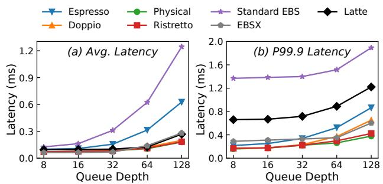  
Figure 11: Read latency comparison on different queue depths (§7.2). The test is sustained for 600 seconds. The workloads run 60 seconds (FIO ramp\_time) before logging performance numbers. The results are from 4KB random reads.

Read latency. Figure 11 shows read latency in average (a) and 99.9th percentile (b). DOPPIO shows comparable results except for higher 99.9th tail latency, while ESPRESSO exhibits highest latency. RISTRETTO achieves near-physical performance across queue depths. This indicates the two NVMe commands (VM→ASIC-SoC→SSD) in RISTRETTO only incur minor delays, whereas DOPPIO adds data DMA overhead (VM→DPU). ESPRESSO suffers from software interrupts (see SWL\_3 in §3.2), especially at deep queue depths. Standard EBS shows worst latency due to two-hop network overhead, while EBSX approaches local disk via Persistent Memory (PMem) and high-speed interconnection. LATTE shows mixed results with average latency matching EBSX. The tail latency remains high since requests can be routed to backend EBS.

Write latency. Figure 12 presents write latency (average (a), 99.9th (b)). RISTRETTO and DOPPIO demonstrate nearphysical performance except at QD 128. ESPRESSO shows highest latency due to software overhead and double DMA. Standard EBS exhibits worst latency while LATTE achieves the lowest via ML-based dispatching. The 99.9th tail latency of all local disks exceed 1ms at QD 128 due to GC.

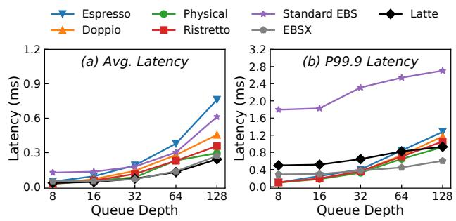  
Figure 12: Write latency comparison on different queue depths (§7.2). Sustained test time (600s) and the FIO ramp\_time (60s) are the same as read latency measurement. The results are from 4KB random writes.

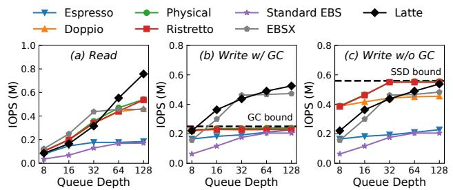  
Figure 13: 4KB random read and write IOPS comparison on different queue depths (§7.2). Sustained test time and the FIO ramp\_time are same as latency measurement. The write IOPS has upper limit for the SSD garbage collection in (b).

Read IOPS. Figure 13(a) shows read IOPS results. Physical device consistently delivers highest IOPS, followed by RISTRETTO, DOPPIO and ESPRESSO. Benefiting from ASIC’s processing power and parallel execution via multiple virtual queues, RISTRETTO always achieves near-physical IOPS. ESPRESSO shows notably lower performance compared to others, which affirms our argument on the influence of context switches (i.e., SWL\_3 in §3.2). For cloud disks, standard EBS always performs worst IOPS due to two-hop network and bandwidth constraints. EBSX achieves much better results until reaching PMem’s limit. LATTE has the best IOPS because of the effective data promotion mechanism and fully leveraging both cache and backend.

Write IOPS. For random writes IOPS after filling VDs (Figure 13(b)), local disks again show similar IOPS as physical drive. Random writes IOPS is around 230K when SSD enters stable state (GC activated). Figure 13(c), when not triggering GC, RISTRETTO can reach IOPS upper bound as physical SSD. Conversely, EBS storage architectures avoid GC impact thanks to internal append-only semantics and unified garbage collection management. Thus, EBSX and LATTE achieve much higher IOPS in random writes (Figure 13(b)).

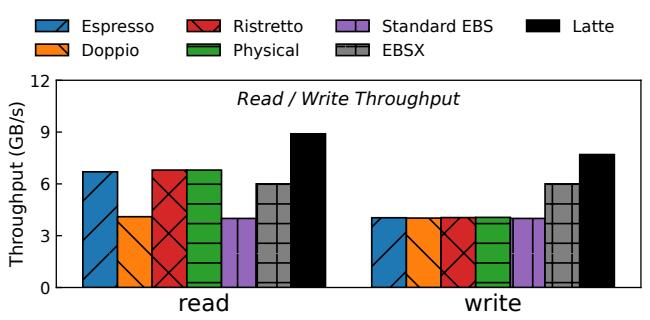

Figure 14: Read and write throughput comparison under the same queue depth 128 (§7.2). The test lasts for 600 seconds after 60 seconds of ramp\_time. The results are from 128KB sequential read and write.  
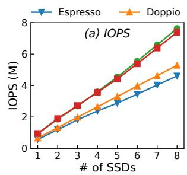

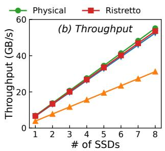  
Figure 15: Read Scalability Comparison. The results contain maximum 4KB random read IOPS (a) and 128KB sequential read throughput (b).

Throughput. In Figure 14, all local disks can saturate the Gen4 SSDs except the read bandwidth of DOPPIO, which only achieves around 4.1GB/s throughput on a Gen4 SSD (only 59.4% of physical drive) for limitation by its PCIe channel (4× PCIe Gen3 lanes for each SSD). The throughput of the standard EBS and EBSX are bounded by their network bandwidth, which are 4GB/s and 6GB/s respectively. LATTE achieves much higher 8.9GB/s read bandwidth at 75% hit rate and 7.8GB/s write bandwidth thanks to its dual-path dispatching and admission control.

Scalability. Figure 15(a) shows that RISTRETTO, thanks to the ASIC’s powerful computation and parallel execution design, can always match physical disk IOPS with the scaling of the SSDs. Moreover, due to software interrupts between VMs and host (i.e., SWL\_3 in §3.2), ESPRESSO consistently shows lower IOPS. DOPPIO, due to limited computational power (1.3M capability per DPU as described in HWL\_1 of §4.1), shows lower IOPS than both physical drive and RISTRETTO. Figure 15(b) demonstrates that all candidates can deliver close to physical disk performance except DOPPIO. The reason is that, unlike IOPS or latency, throughput—especially under sequential writes—tends to experience less impacts from virtualization. The DOPPIO suffers considerable throughput loss as the SSDs are physically attached to the DPU, instead of the host (i.e., HWL\_1 in §4.1).

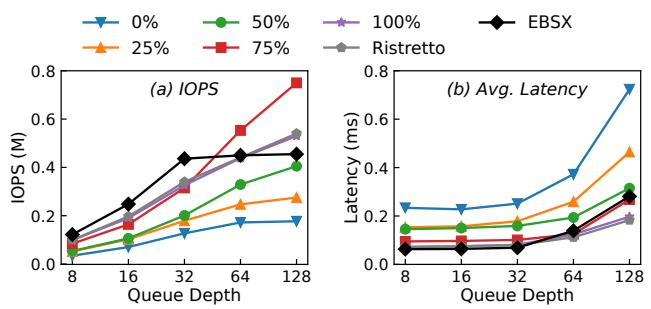  
Figure 16: LATTE read iops and latency comparison under different hit rates (§7.2). The hit rates are constructed by populating LATTE cache with varying proportions of data. The results are from 4KB random read with fixed hit rates.

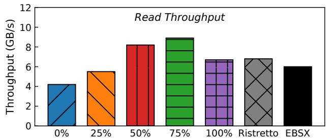  
Figure 17: LATTE read throughput comparison under different hit rates (§7.2). The data construction method and configuration are identical to those in Figure 16.

LATTE under varying cache hit rates. We test read hit rates of LATTE at 0%, 25%, 50%, 75%, and 100% respectively. We compare IOPS, average latency and throughput with RISTRETTO and EBSX under previous experiments setup. In Figure 16, read IOPS of LATTE gradually increases with the rate while average latency decreases for RISTRETTO as a cache delivers much higher performance than the standard EBS, which is even better than RISTRETTO at 75% hit rate. In Figure 17, LATTE further surpasses both RISTRETTO and EBSX in bandwidth when the hit rate reaches 50% because LATTE uses combined bandwidth of both frontend and backend. Interestingly, when the hit rate reaches 100% (i.e., all frontend hits), both IOPS and throughput are lower than the 75%-hit-rate scenario because data can only be read from the RISTRETTO while the backend EBS bandwidth is not utilized.

## 7.3 Macrobenchmark

Replaying field traces. We replay three field I/O traces from three production clusters deployment for evaluation on each candidate, including Social Networks (Trace 1), AI Model Inference (Trace 2) and Big Data Shuffle (Trace 3). The basic information of I/O traces is shown in Table 5. Figure 18 shows that local disks exhibit lower latency than standard EBS and

<table><tr><td rowspan=1 colspan=1>Names</td><td rowspan=1 colspan=1>Duration</td><td rowspan=1 colspan=1>I/O Number</td><td rowspan=1 colspan=1>Trace Size</td></tr><tr><td rowspan=1 colspan=1>Social Networks</td><td rowspan=1 colspan=1>2 hours</td><td rowspan=1 colspan=1>2,592,118</td><td rowspan=1 colspan=1>1,019.33 GB</td></tr><tr><td rowspan=1 colspan=1>AIModel Inference</td><td rowspan=1 colspan=1>8 hours</td><td rowspan=1 colspan=1>52,134,142</td><td rowspan=1 colspan=1>1,024.00 GB</td></tr><tr><td rowspan=1 colspan=1>Big Data Shuffle</td><td rowspan=1 colspan=1>6hours</td><td rowspan=1 colspan=1>83,861,317</td><td rowspan=1 colspan=1>2,568.79 GB</td></tr></table>

Table 5: Basic information about three I/O traces (§7.3). We sample three traces from different online scenarios in real-world. The total read/write coverage size of I/O traces reach the TB-level, with a duration of 2-8 hours.

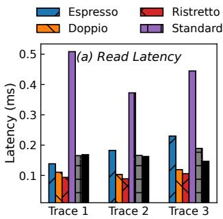

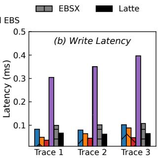  
Figure 18: Traces replay on different storage types (§7.3). Each trace covers more than 1TB block size and lasts for several hours. Different traces exhibit distinct read/write latency results.

EBSX. This is understandable since local disks are physically co-located with the VM but another factor is the significant amount of burst I/Os exacerbating latency spikes for networkattached storage. On the bright side, LATTE can leverage the ML dispatcher and admission controller to utilize the cache for absorbing short-term burst requests to significantly reduce write latency, thereby providing much better results than its cloud disk peers. Notably, the read hit rates for three traces reach 90.23%, 88.79%, and 82.80%, respectively, indicating that LATTE can effectively promote the frequently accessed data to the local storage cache.

Sysbench over MySQL. For each candidate, we launch one instance as a MySQL [56] server and run SysBench [69]. We prepare the database with 10 tables, each containing 100 million rows, totaling 240GB. MySQL server runs on a VD with XFS [29] filesystem. We benchmark the candidates with read-only, write-only, and mixed-read-write workloads using 4 threads with SysBench tool. Figure 19 contains QPS (queries-per-second) and average latency per query result. RISTRETTO prevails in all categories in read-only and mixed workloads. For example, RISTRETTO achieves a 1.22× and 1.77× QPS speedup with 17.97% and 43.75% latency reduction against DOPPIO and ESPRESSO in read-only workloads. LATTE achieves near EBSX QPS except for read-only workload, where EBSX can fully utilize its PMem as high-speed read cache. Notably, QPS and latency of LATTE even outperform RISTRETTO in write-only workloads. It verifies that under ML dispatching, LATTE can fully leverage cache to reduce write latency and use both local storage and cloud EBS storage bandwidth in write-bypass design.

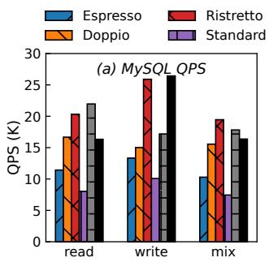

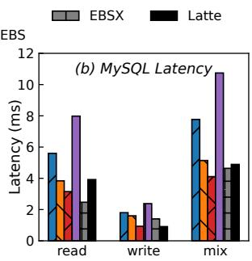

Figure 19: MySQL performance on local storage instances (§7.3). MySQL database tested on each instance is prepared with 10 tables, 100 million rows per table (totally 240GB data), followed by tests of read-only, write-only and read-write mixed workloads.
<table><tr><td rowspan=1 colspan=1>Type</td><td rowspan=1 colspan=1>Read IOPS</td><td rowspan=1 colspan=1>Read Throughput</td><td rowspan=1 colspan=1>Unit Price</td></tr><tr><td rowspan=1 colspan=1>RISTRETTO</td><td rowspan=1 colspan=1>550K</td><td rowspan=1 colspan=1>6.7GB/s</td><td rowspan=1 colspan=1>1</td></tr><tr><td rowspan=1 colspan=1>EBSX</td><td rowspan=1 colspan=1>450K</td><td rowspan=1 colspan=1>6.0GB/s</td><td rowspan=1 colspan=1>19</td></tr><tr><td rowspan=1 colspan=1>LATTE (Max)</td><td rowspan=1 colspan=1>750K</td><td rowspan=1 colspan=1>8.9GB/s</td><td rowspan=1 colspan=1>13</td></tr><tr><td rowspan=1 colspan=1>LATTE (Auto)</td><td rowspan=1 colspan=1>750K</td><td rowspan=1 colspan=1>8.9GB/s</td><td rowspan=1 colspan=1>2.1~ 4.0</td></tr></table>

Table 6: Monthly price of 4 TB capacity for different storage products purchased by users (§7.4). This table displays the maximum read IOPS and throughput performance for different storage stack types tested in the single FIO job evaluation (§7.2), along with their corresponding monthly prices under 4TB capacity. Prices are normalized relative to RISTRETTO as the baseline.

## 7.4 Resource Consumption

Hardware requirements. In scaling multiple SSDs (e.g., 8 NVMe SSDs at most in local storage stack), RISTRETTO requires total 4 ARM cores of the SoC, whereas ESPRESSO requires 8 Xeon cores. Note that ARM cores (2.50GHz) are designed for SoC, featuring a lower frequency than host Xeon cores (2.90GHz). With the help of ASIC, RISTRETTO significantly enhances per-core achievement for the local storage stack by a large margin (over 50%). Additionally, RISTRETTO requires two DPUs, while DOPPIO requires up to 4 DPUs for 8 NVMe SSDs and even shows lower performance.

CapEx. All local disks and EBS have been deployed (available off the shelf). Based on their listing prices, we compare the candidates under the same capacity (4TB) with performance level tested in §7.1 and prices shown in Table 6 are standardized based on RISTRETTO (i.e., unit price set to 1). With high-end hardware (e.g., Optane), proprietary software stack and the three-way replication tripling the storage costs, EBSX leads much larger CapEx (i.e., around 19). LATTE is an interesting case. If we enforce highest IOPS to be always available from the backend (i.e., LATTE Max), the unit price is around 13. However, if we enable auto-scaling of IOPS (i.e., LATTE Auto), the unit price drops to around 2.1∼4.0 based on workloads. Note that this can be reduced if we enforce weaker reliability support in EBS as mentioned in the future work of LATTE (e.g., two replicas or wider EC).

## 8 Discussion

Ad hoc to Alibaba Cloud. One concern is that our storage architecture design may be specific to Alibaba Cloud stack, limiting lessons for other practitioners. We clarify that local storage is popular among many cloud providers [11, 14, 18]. Discussing the evolution of three generations at Alibaba local storage and formats combined with EBS cloud storage provides stakeholders opportunities to rethink or improve infrastructures. Moreover, we implement all three local storage generations using open-source software (e.g., SPDK with FTL module) and off-the-shelf hardware (e.g., ASIC) to expedite development. These practices could guide other interested parties in academia and industry.

Static resource binding. Local storage design usually binds computing resources (number of vCPU cores and memory capacity) with the allocation of local disks. This is to avoid that if a user only subscribes one resource (e.g., all of the vCPU cores), it would leave other resources stranded (i.e., other tenants can no longer rent a local SSD since there is no available CPUs). However, resources can still be stranded if users cannot utilize the allocated. Solutions like LATTE might alleviate this situation since a server requires less disks installed (i.e., can be shared and split).

Deployed for storage disaggregation. Although many of the designs in this paper target local storage, their architectures can adapt for disaggregated storage systems by integrating a Network Interface Card (NIC) which serves as the connectivity endpoint for accessing network-attached storage resources. For example, RISTRETTO block abstraction layer supports various storage backends, such as NVMe-over-Fabrics [4], RADOS [6, 70], to provide virtual disks for VMs.

## 9 Related Works

Optimizing NVMe storage stack. Many works have optimized the stack for NVMe SSDs, including I/O virtualization [7, 28, 30, 38–40, 57, 58, 74, 77, 78] and file/block layer [24, 25, 31, 36, 43, 47, 67, 71, 75, 84]. For example, one group of work focuses on implementing polling-mode for NVMe storage stack [24, 47, 75] to further optimize I/O virtualization—such as Mdev-NVMe [58], Vhost-NVMe [78] and Spool [74]. However, these methods can encounter similar limitations of ESPRESSO due to host CPU usage or requiring polling-mode drivers in VMs. Other works, e.g., XRP [84], blk-switch [31], uDepot [43], and DevFS [36], minimize software overhead by optimizing storage stacks, but often focus on one aspect of our issues (i.e., SoC in RISTRETTO).

Hardware-assisted NVMe storage. Recent research employs specific hardware to offload storage stacks [17, 20, 21, 34, 45, 46, 80], such as BM-Store [17] and FVM [45], which enhance performance but face scalability and upgradeability challenges. SmartNICs offload software stacks into SoC cores [10,37,48,49,53,55], though they often require multiple devices, increasing power consumption and costs. Computational SSDs accelerate specific tasks like compression and encryption [16,42,66,86], but are limited by space and energy constraints. RISTRETTO differentiates itself by leveraging both ASIC for storage offloading and SoC for user-defined cloud functionalities.

Machine learning for hybrid storage. There are also a spate of works studying tiered storage to balance cost and performance layers [22, 32, 35, 73, 82, 83, 85]. However, the architectures of these methods are significantly different from LATTE, rendering them unsuitable for direct deployment in our environment. Since our previous stacks are implemented by SPDK in user space and leverage customized software and hardware to maximize performance, methods like Flashield [22] (based on Memcached [3]) and Ziggurat [82] (modifying kernel structure) cannot be applied directly. While CSAL [85] is also built on SPDK, its write-cache-only limitation and lack of cache admission control create bottlenecks in overall throughput and result in high read latency due to low cache hit rates. Learning from lessons, LATTE leverages the throughput of both the cache and backend through its writeback structure, while enhancing cache hit rates and reducing latency via cache admission and eviction control. Modern systems further adopt ML-based caching or workload-aware tier promotion and eviction [27, 51, 72, 81, 87], showing that combining tiered storage with advanced cache scheduling remains crucial for scalability and efficiency in heterogeneous environments. LATTE benefits from the above and further uses ML-based I/O dispatcher [27, 44, 76] to guide requests.

## 10 Conclusion

In this paper, we revisit and explore designs for cloud local storage stack. With years of field deployment, we identify a series of pros/cons from both software-based ESPRESSO, hardware-based DOPPIO approaches and propose ASIC/SoC co-design RISTRETTO to achieve best-effort performance of cloud local storage. Furthermore, by leveraging of EBS as the storage backend, we design latency-optimized EBSX as local storage backend and the local-cloud hybrid LATTE storage stack, which enables the implementation of cloud features while simultaneously reducing user costs.

## Acknowledgments

We sincerely thank our shepherd Peter Macko and anonymous reviewers for helping us improve our paper significantly. We thank engineers from Alibaba Group and Solidigm for providing high performance device and framework development support. This work is supported by National Natural Science Foundation of China (NSFC) under Grant No. 623B2072 and Alibaba Group through the Alibaba Innovative Research Program.

## References

[1] eventfd-Linux man page, 2025. URL: https://linux. die.net/man/2/eventfd.

[2] Flexible I/O Tester, 2025. URL: https://github. com/axboe/fio.

[3] Memcached, 2025. URL: https://memcached.org/.

[4] NVMe-oF Specification, 2025. URL: https: //nvmexpress.org/developers/nvme-ofspecification/.

[5] Solidigm S3 Fuse, 2025. URL: https://www. solidigm.com/products/technology/solidigms3-fuse-poc-for-ai-workloads.html.

[6] Abutalib Aghayev, Sage Weil, Michael Kuchnik, Mark Nelson, Gregory R Ganger, and George Amvrosiadis. File systems unfit as distributed storage backends: lessons from 10 years of Ceph evolution. In Proceedings of the 27th ACM Symposium on Operating Systems Principles (SOSP), 2019.

[7] Sungyong Ahn, Kwanghyun La, and Jihong Kim. Improving I/O Resource Sharing of Linux Cgroup for NVMe SSDs on Multi-core Systems. In Proceedings of the 8th USENIX Workshop on Hot Topics in Storage and File Systems (HotStorage), 2016.

[8] Arm. Cortex-A72, 2025. URL: https: //www.arm.com/products/silicon-ipcpu/cortex-a/cortex-a72.

[9] Ceph authors and contributors. Ceph - The Future of Storage, 2025. URL: https://ceph.io.

[10] Shinichi Awamoto, Erich Focht, and Michio Honda. Designing a storage software stack for accelerators. In Proceedings of the 12th USENIX Conference on Hot Topics in Storage and File Systems (HotStorage), 2020.

[11] AWS. Amazon EC2 I4i Instances, 2025. URL: https: //aws.amazon.com/ec2/instance-types/i4i/.

[12] AWS. Amazon Elastic Block Store (EBS), 2025. URL: https://aws.amazon.com/ebs/.

[13] Azure. Introduction to Azure managed disks, 2025. URL: https://learn.microsoft.com/enus/azure/virtualmachines/managed-disksoverview.

[14] Microsoft Azure. Lsv3-series - Azure Virtual Machines, 2024. URL: https://learn.microsoft.com/enus/azure/virtual-machines/lsv3-series.

[15] Matias Bjørling, Abutalib Aghayev, Hans Holmberg, Aravind Ramesh, Damien Le Moal, Gregory R Ganger, and George Amvrosiadis. ZNS: Avoiding the Block Interface Tax for Flash-based SSDs. In Proceedings of the 2021 USENIX Annual Technical Conference (ATC), 2021.

[16] Wei Cao, Yang Liu, Zhushi Cheng, Ning Zheng, Wei Li, Wenjie Wu, Linqiang Ouyang, Peng Wang, Yijing Wang, Ray Kuan, et al. POLARDB Meets Computational Storage: Efficiently Support Analytical Workloads in Cloud-Native Relational Database. In Proceedings of the 18th USENIX Conference on File and Storage Technologies (FAST), 2020.

[17] Yiquan Chen, Jiexiong Xu, Chengkun Wei, Yijing Wang, Xin Yuan, Yangming Zhang, Xulin Yu, Yi Chen, Zeke Wang, Shuibing He, et al. BM-Store: A Transparent and High-performance Local Storage Architecture for Bare-metal Clouds Enabling Large-scale Deployment. In Proceedings of the IEEE International Symposium on High-Performance Computer Architecture (HPCA), 2023.

[18] Alibaba Cloud. Local disks, 2024. URL: https: //www.alibabacloud.com/help/en/elasticcompute-service/latest/local-disks.

[19] Alibaba Cloud. Elastic Block Storage devices, 2025. URL: https://www.alibabacloud.com/help/ en/elastic-compute-service/latest/blockstorage-overview-elastic-block-storagedevices.

[20] David Cock, Abishek Ramdas, Daniel Schwyn, Michael Giardino, Adam Turowski, Zhenhao He, Nora Hossle, Dario Korolija, Melissa Licciardello, Kristina Martsenko, et al. Enzian: an open, general, CPU/FPGA platform for systems software research. In Proceedings of the 27th ACM International Conference on Architectural Support for Programming Languages and Operating Systems (ASPLOS), 2022.

[21] Niv Dayan, Moshe Twitto, Yuval Rochman, Uri Beitler, Itai Ben Zion, Edward Bortnikov, Shmuel Dashevsky, Ofer Frishman, Evgeni Ginzburg, Igal Maly, et al. The end of Moore’s law and the rise of the data processor. Proceedings of the VLDB Endowment, 14(12):2932– 2944, 2021.

[22] Assaf Eisenman, Asaf Cidon, Evgenya Pergament, Or Haimovich, Ryan Stutsman, Mohammad Alizadeh, and Sachin Katti. Flashield: a hybrid key-value cache that controls flash write amplification. In 16th USENIX Symposium on Networked Systems Design and Implementation (NSDI 19), pages 65–78, 2019.

[23] Rong-En Fan, Kai-Wei Chang, Cho-Jui Hsieh, Xiang-Rui Wang, and Chih-Jen Lin. LIBLINEAR: A library for large linear classification. the Journal of machine Learning research, 9:1871–1874, 2008.

[24] Hossein Golestani, Amirhossein Mirhosseini, and Thomas F Wenisch. Software data planes: You can’t always spin to win. In Proceedings of the ACM Symposium on Cloud Computing (SoCC), 2019.

[25] Abel Gordon, Nadav Amit, Nadav Har’El, Muli Ben-Yehuda, Alex Landau, Assaf Schuster, and Dan Tsafrir. ELI: Bare-metal performance for I/O virtualization. ACM SIGPLAN Notices, 47(4):411–422, 2012.

[26] Apache Hadoop. HDFS Architecture Guide, 2022. URL: https://hadoop.apache.org/docs/ r1.2.1/hdfs\_design.html.

[27] Mingzhe Hao, Levent Toksoz, Nanqinqin Li, Edward Edberg Halim, Henry Hoffmann, and Haryadi S Gunawi. LinnOS: Predictability on unpredictable flash storage with a light neural network. In 14th USENIX Symposium on Operating Systems Design and Implementation (OSDI 20), pages 173–190, 2020.

[28] Asias He and Red Hat. Virtio-blk performance improvement. In KVM Forum, 2012.

[29] Christoph Hellwig. XFS: the big storage file system for Linux. ; login:: the magazine of USENIX & SAGE, 34(5):10–18, 2009.

[30] Jian Huang, Anirudh Badam, Laura Caulfield, Suman Nath, Sudipta Sengupta, Bikash Sharma, and Moinuddin K Qureshi. FlashBlox: Achieving Both Performance Isolation and Uniform Lifetime for Virtualized SSDs. In Proceedings of the 15st USENIX Conference on File and Storage Technologies (FAST), 2017.

[31] Jaehyun Hwang, Midhul Vuppalapati, Simon Peter, and Rachit Agarwal. Rearchitecting Linux Storage Stack for µs Latency and High Throughput. In Proceedings of the 15th USENIX Symposium on Operating Systems Design and Implementation (OSDI), 2021.

[32] Soojun Im and Dongkun Shin. ComboFTL: Improving performance and lifespan of MLC flash memory using SLC flash buffer. Journal of Systems Architecture, 56(12):641–653, 2010.

[33] Intel. Intel Solid State Drive Data Center Family for PCIe, 2015. URL: https: //www.intel.com/content/dam/www/public/ us/en/documents/product-briefs/intel-ssddc-family-for-pcie-brief.pdf.

[34] Myoungsoo Jung. OpenExpress: Fully hardware automated open research framework for future fast NVMe devices. In Proceedings of the 2020 USENIX Conference on Usenix Annual Technical Conference (ATC), 2020.

[35] Pranav Kalavade. 4 bits/cell 96 Layer Floating Gate 3D NAND with CMOS under Array Technology and SSDs. In 2020 IEEE International Memory Workshop (IMW), pages 1–4, 2020.

[36] Sudarsun Kannan, Andrea C Arpaci-Dusseau, Remzi H Arpaci-Dusseau, Yuangang Wang, Jun Xu, and Gopinath Palani. Designing a true direct-access file system with DevFS. In Proceedings of the 16th USENIX

Conference on File and Storage Technologies (FAST), 2018.

[37] Jongyul Kim, Insu Jang, Waleed Reda, Jaeseong Im, Marco Canini, Dejan Kostic, Youngjin Kwon, Simon ´ Peter, and Emmett Witchel. LineFS: Efficient Smart-NIC offload of a distributed file system with pipeline parallelism. In Proceedings of the ACM SIGOPS 28th Symposium on Operating Systems Principles (SOSP), 2021.

[38] Jungkil Kim, Sungyong Ahn, Kwanghyun La, and Wooseok Chang. Improving I/O performance of NVMe SSD on virtual machines. In Proceedings of the 31st Annual ACM Symposium on Applied Computing (SAC), 2016.

[39] Sang-Hoon Kim, Jaehoon Shim, Euidong Lee, Seongyeop Jeong, Ilkueon Kang, and Jin-Soo Kim. NVMeVirt: A Versatile Software-defined Virtual NVMe Device. In Proceedings of the 21st USENIX Conference on File and Storage Technologies (FAST), 2023.

[40] Tae Yong Kim, Dong Hyun Kang, Dongwoo Lee, and Young Ik Eom. Improving performance by bridging the semantic gap between multi-queue SSD and I/O virtualization framework. In Proceedings of the 31st Symposium on Mass Storage Systems and Technologies (MSST), 2015.

[41] Ricardo Koller, Leonardo Marmol, Raju Rangaswami, Swaminathan Sundararaman, Nisha Talagala, and Ming Zhao. Write policies for host-side flash caches. In 11th USENIX Conference on File and Storage Technologies (FAST 13), pages 45–58, 2013.

[42] Gunjae Koo, Kiran Kumar Matam, Te I, HV Krishna Giri Narra, Jing Li, Hung-Wei Tseng, Steven Swanson, and Murali Annavaram. Summarizer: trading communication with computing near storage. In Proceedings of the 50th Annual IEEE/ACM International Symposium on Microarchitecture (MICRO), 2017.

[43] Kornilios Kourtis, Nikolas Ioannou, and Ioannis Koltsidas. Reaping the performance of fast NVM storage with uDepot. In Proceedings of the 17th USENIX Conference on File and Storage Technologies (FAST), 2019.

[44] Daniar H Kurniawan, Rani Ayu Putri, Peiran Qin, Kahfi S Zulkifli, Ray AO Sinurat, Janki Bhimani, Sandeep Madireddy, Achmad Imam Kistijantoro, and Haryadi S Gunawi. Heimdall: Optimizing Storage I/O Admission with Extensive Machine Learning Pipeline. In Proceedings of the Twentieth European Conference on Computer Systems, pages 1109–1125, 2025.

[45] Dongup Kwon, Junehyuk Boo, Dongryeong Kim, and Jangwoo Kim. FVM: FPGA-assisted virtual device emulation for fast, scalable, and flexible storage virtualization. In Proceedings of the 14th USENIX Conference on

Operating Systems Design and Implementation (OSDI), 2020.

[46] Dongup Kwon, Wonsik Lee, Dongryeong Kim, Junehyuk Boo, and Jangwoo Kim. SmartFVM: A Fast, Flexible, and Scalable Hardware-based Virtualization for Commodity Storage Devices. ACM Transactions on Storage (TOS), 18(2):1–27, 2022.

[47] Damien Le Moal. I/O latency optimization with polling. In Vault Linux Storage and Filesystems Conference, 2017.

[48] Huaicheng Li, Mingzhe Hao, Stanko Novakovic, Vaibhav Gogte, Sriram Govindan, Dan RK Ports, Irene Zhang, Ricardo Bianchini, Haryadi S Gunawi, and Anirudh Badam. Leapio: Efficient and portable virtual nvme storage on arm socs. In Proceedings of the 25th International Conference on Architectural Support for Programming Languages and Operating Systems (ASPLOS), 2020.

[49] Junru Li, Youyou Lu, Qing Wang, Jiazhen Lin, Zhe Yang, and Jiwu Shu. AlNiCo: SmartNIC-accelerated Contention-aware Request Scheduling for Transaction Processing. In Proceedings of the 2022 USENIX Annual Technical Conference (ATC), pages 951–966, 2022.

[50] Qiang Li, Qiao Xiang, Yuxin Wang, Haohao Song, Ridi Wen, Wenhui Yao, Yuanyuan Dong, Shuqi Zhao, Shuo Huang, Zhaosheng Zhu, et al. More than capacity: Performance-oriented evolution of pangu in alibaba. In 21st USENIX Conference on File and Storage Technologies (FAST 23), pages 331–346, 2023.

[51] Yan Li, Shiqiang Chen, Yu Wang, and Bo Li. Machine Learning-Based Caching: A Survey and Future Research Directions. IEEE Communications Surveys & Tutorials, 20(3):2356–2387, 2018.

[52] Marvell. Intelligent NVMe PCIe Gen3 Switch, 2025. URL: https://www.marvell.com/products/ system-solutions/nvme-switches.html.

[53] Rui Miao, Lingjun Zhu, Shu Ma, Kun Qian, Shujun Zhuang, Bo Li, Shuguang Cheng, Jiaqi Gao, Yan Zhuang, Pengcheng Zhang, et al. From luna to solar: the evolutions of the compute-to-storage networks in Alibaba cloud. In Proceedings of the ACM SIGCOMM 2022 Conference, 2022.

[54] Microsoft. Overview of Single Root I/O Virtualization (SR-IOV), 2024. URL: https: //learn.microsoft.com/en-us/windowshardware/drivers/network/overview-ofsingle-root-i-o-virtualization--sr-iov-.

[55] Jaehong Min, Ming Liu, Tapan Chugh, Chenxingyu Zhao, Andrew Wei, In Hwan Doh, and Arvind Krishnamurthy. Gimbal: enabling multi-tenant storage disaggregation on SmartNIC JBOFs. In Proceedings of

the 2021 ACM SIGCOMM 2021 Conference, pages 106– 122, 2021.

[56] MySQL. MySQL, 2025. URL: https://www.mysql. com/.

[57] Bo Peng, Ming Yang, Jianguo Yao, and Haibing Guan. A Throughput-Oriented NVMe Storage Virtualization With Workload-Aware Management. IEEE Transactions on Computers, 70(12):2112–2124, 2020.

[58] Bo Peng, Haozhong Zhang, Jianguo Yao, Yaozu Dong, Yu Xu, and Haibing Guan. MDev-NVMe: A NVMe storage virtualization solution with mediated pass-through. In Proceedings of the 2018 USENIX Annual Technical Conference (ATC), 2018.

[59] Dai Qin, Angela Demke Brown, and Ashvin Goel. Reliable writeback for client-side flash caches. In 2014 USENIX Annual Technical Conference (USENIX ATC 14), pages 451–462, 2014.

[60] Rusty Russell. virtio: towards a de-facto standard for virtual I/O devices. ACM SIGOPS Operating Systems Review, 42(5):95–103, 2008.

[61] SAMSUNG. Samsung SSD PM963, 2016. URL: https://www.compuram.de/documents/ datasheet/Samsung\_PM963-1.pdf.

[62] SAMSUNG. Optimized for data center storage, 2025. URL: https://semiconductor.samsung.com/us/ ssd/datacenter-ssd/.

[63] SAMSUNG. Samsung PCIe 5.0 SSD PM1743, 2025. URL: https://semiconductor.samsung. com/ssd/enterprise-ssd/pm1743/.

[64] SAMSUNG. Samsung PM1733 NVMe SSD, 2025. URL: https://semiconductor.samsung.cn/ssd/ enterprise-ssd/pm1733/.

[65] SAMSUNG. Samsung PM9A3 NVMe PCIe SSD, 2025. URL: https://download. semiconductor.samsung.com/resources/ brochure/SamsungPM9A3NVMePCIeSSD.pdf.

[66] Robert Schmid, Max Plauth, Lukas Wenzel, Felix Eberhardt, and Andreas Polze. Accessible near-storage computing with FPGAs. In Proceedings of the 15th European Conference on Computer Systems (EuroSys), 2020.

[67] Ji Yong Shin, Mahesh Balakrishnan, Tudor Marian, and Hakim Weatherspoon. Gecko: Contention-oblivious disk arrays for cloud storage. In Proceedings of the 11th USENIX Conference on File and Storage Technologies (FAST), 2013.

[68] SPDK. Build Ultra High-Performance Storage Applications with the Storage Performance Development Kit, 2025. URL: https://spdk.io/.

[69] Sysbench. Sysbench, 2025. URL: https://github. com/akopytov/sysbench.

[70] Sage A Weil, Scott A Brandt, Ethan L Miller, Darrell DE Long, and Carlos Maltzahn. Ceph: A scalable, highperformance distributed file system. In Proceedings of the 7th symposium on Operating systems design and implementation (OSDI), 2006.

[71] Youjip Won, Jaemin Jung, Gyeongyeol Choi, Joontaek Oh, Seongbae Son, Jooyoung Hwang, and Sangyeun Cho. Barrier-Enabled IO Stack for Flash Storage. In Proceedings of the 16th USENIX Conference on File and Storage Technologies (FAST), 2018.

[72] Daniel Lin-Kit Wong, Hao Wu, Carson Molder, Sathya Gunasekar, Jimmy Lu, Snehal Khandkar, Abhinav Sharma, Daniel S. Berger, Nathan Beckmann, and Gregory R. Ganger. Baleen: ML Admission & Prefetching for Flash Caches. In 22nd USENIX Conference on File and Storage Technologies (FAST 24), pages 347–371, Santa Clara, CA, February 2024. USENIX Association.

[73] Jian Xu and Steven Swanson. NOVA: A log-structured file system for hybrid Volatile/Non-volatile main memories. In 14th USENIX Conference on File and Storage Technologies (FAST 16), pages 323–338, 2016.

[74] Shuai Xue, Shang Zhao, Quan Chen, Gang Deng, Zheng Liu, Jie Zhang, Zhuo Song, Tao Ma, Yong Yang, Yanbo Zhou, et al. Spool: Reliable Virtualized NVMe storage pool in public cloud infrastructure. In Proceedings of the 2020 USENIX Annual Technical Conference (ATC), 2020.

[75] Jisoo Yang, Dave B Minturn, and Frank Hady. When poll is better than interrupt. In Proceedings of the 10th USENIX Conference on File and Storage Technologies (FAST), 2012.

[76] Juncheng Yang, Yazhuo Zhang, Ziyue Qiu, Yao Yue, and Rashmi Vinayak. FIFO queues are all you need for cache eviction. In Proceedings of the 29th Symposium on Operating Systems Principles, pages 130–149, 2023.

[77] Zhengyu Yang, Morteza Hoseinzadeh, Ping Wong, John Artoux, Clay Mayers, David Thomas Evans, Rory Thomas Bolt, Janki Bhimani, Ningfang Mi, and Steven Swanson. H-NVMe: A hybrid framework of NVMe-based storage system in cloud computing environment. In Proceedings of the 36th IEEE International Performance Computing and Communications Conference (IPCCC), 2017.

[78] Ziye Yang, Changpeng Liu, Yanbo Zhou, Xiaodong Liu, and Gang Cao. SPDK vhost-nvme: Accelerating i/os in virtual machines on nvme ssds via user space vhost target. In Proceedings of the 2018 IEEE 8th International Symposium on Cloud and Service Computing (SC2), 2018.

[79] Weidong Zhang, Erci Xu, Qiuping Wang, Xiaolu Zhang, Yuesheng Gu, Zhenwei Lu, Tao Ouyang, Guanqun Dai,

Wenwen Peng, Zhe Xu, et al. What’s the Story in EBS Glory: Evolutions and Lessons in Building Cloud Block Store. In 22nd USENIX Conference on File and Storage Technologies (FAST 24), pages 277–291, 2024.

[80] Xiantao Zhang, Xiao Zheng, Zhi Wang, Hang Yang, Yibin Shen, and Xin Long. High-density multi-tenant bare-metal cloud. In Proceedings of the 25th International Conference on Architectural Support for Programming Languages and Operating Systems (ASPLOS), 2020.

[81] Yu Zhang, Ke Zhou, Ping Huang, Hua Wang, Jianying Hu, Yangtao Wang, Yongguang Ji, and Bin Cheng. A Machine Learning Based Write Policy for SSD Cache in Cloud Block Storage. In 2020 Design, Automation & Test in Europe Conference & Exhibition (DATE), pages 1279–1282, 2020.

[82] Shengan Zheng, Morteza Hoseinzadeh, and Steven Swanson. Ziggurat: A Tiered File System for Non-Volatile Main Memories and Disks. In 17th USENIX Conference on File and Storage Technologies (FAST 19), pages 207–219, Boston, MA, February 2019. USENIX Association.

[83] Shengan Zheng, Morteza Hoseinzadeh, Steven Swanson, and Linpeng Huang. TPFS: A High-Performance Tiered File System for Persistent Memories and Disks. ACM Trans. Storage, 19(2), March 2023.

[84] Yuhong Zhong, Haoyu Li, Yu Jian Wu, Ioannis Zarkadas, Jeffrey Tao, Evan Mesterhazy, Michael Makris, Junfeng Yang, Amy Tai, Ryan Stutsman, et al. XRP: In-Kernel Storage Functions with eBPF. In Proceedings of the 16th USENIX Symposium on Operating Systems Design and Implementation (OSDI), 2022.

[85] Yanbo Zhou, Erci Xu, Li Zhang, Kapil Karkra, Mariusz Barczak, Wayne Gao, Wojciech Malikowski, Mateusz Kozlowski, Łukasz Łasek, Ruiming Lu, et al. CSAL: the next-gen local disks for the cloud. In Proceedings of the Nineteenth European Conference on Computer Systems, pages 608–623, 2024.

[86] You Zhou, Fei Wu, Weizhou Huang, and Changsheng Xie. LiveSSD: A low-interference RAID scheme for hardware virtualized SSDs. IEEE Transactions on Computer-Aided Design of Integrated Circuits and Systems (TCAD), 40(7):1354–1366, 2020.

[87] Yuanyuan Zhu, Fang Guo, Tianqi Chen, and Ming Liu. Workload-Aware Data Tiering for Heterogeneous Storage Systems. In Proceedings of the 2020 IEEE International Conference on Big Data (BigData), pages 151– 162. IEEE, 2020.