①

USENIX

THE ADVANCED COMPUTING SYSTEMS ASSOCIATION

# Cache-Centric Multi-Resource Allocation for Storage Services

Chenhao Ye, Shawn (Wanxiang) Zhong, Andrea C. Arpaci-Dusseau, and Remzi H. Arpaci-Dusseau, University of Wisconsin–Madison

## https://www.usenix.org/conference/fast26/presentation/ye

This paper is included in the Proceedings of the 24th USENIX Conference on File and Storage Technologies.

February 24–26, 2026 • Santa Clara, CA, USA

ISBN 978-1-939133-53-3

Open access to the Proceedings of the 24th USENIX Conference on File and Storage Technologies is sponsored by


# Cache-Centric Multi-Resource Allocation for Storage Services

Chenhao Ye Shawn (Wanxiang) Zhong Andrea C. Arpaci-Dusseau Remzi H. Arpaci-Dusseau University of Wisconsin–Madison

## Abstract

We present HARE, a cache-centric multi-resource allocation algorithm for storage services. HARE introduces a holistic allocation model that captures the demand correlation between cache size and other resources (e.g., I/O, network), and uses a novel two-phase harvest/redistribute method to optimize resource allocation across tenants, maximizing the throughput of each while maintaining fairness. To demonstrate that HARE is widely applicable, we built two systems. The first, HopperKV, is a cloud-native key-value store that modifies Redis to cache data from DynamoDB. The second, BunnyFS, is a microkernel-style local filesystem for NVMe SSDs. Our evaluation shows that HARE is effective for multiresource allocation in storage. Both systems are scalable and adaptive: HopperKV achieves up to a 1.9× performance improvement, and BunnyFS achieves up to 1.4×.

## 1 Introduction

Modern storage systems utilize caches for performance and cost efficiency. Facebook reports that 70% of web requests are served by CDN caches [12]. AWS applications [2–10, 44] commonly deploy ElastiCache [48] in front of backend databases to reduce database load and lower costs.

For better utilization, storage services are typically shared by multiple tenants [1, 27, 28, 50, 54]. However, resource management in multi-tenant storage services remains a significant challenge, due to the complexity of allocating multiple resource types and meeting diverse application demands. A workload with good locality may demand a large cache space to fit the working set and high network bandwidth to read from the caching service; a streaming workload, in contrast, needs a minimally-sized cache and massive disk I/O bandwidth.

We are thus left with the question: how should storage services allocate multiple resources, including caches, across tenants, to achieve high performance and fairness? Unfortunately, existing multi-resource allocation frameworks—namely, dominant resource fairness (DRF) and its variants [17, 24, 25]— do not apply to caches. DRF assumes resource demands are mutually independent; a change in cache allocation, in contrast, can significantly change a workload’s demands on other resources (e.g., more cache may reduce I/O). Existing cache partition frameworks [1, 13, 18–20, 22, 29, 38, 39] focus on caches alone and do not capture the interactions among other resources, e.g., a disk I/O-bound workload may become network-bound with more caches and a lower miss ratio.

We seek a generic, unified framework that bridges multiresource and cache allocation. This framework should generalize DRF, capturing each tenant’s demands on I/O, network, and other resources, and their complex interaction with caching as cache sizes change. It should perform allocation accordingly in real time with low overhead.

We present HARE, a cache-centric multi-resource allocation algorithm, which exploits heterogeneous cache sensitivity across tenants for better utility. It uses a novel two-phase harvest/redistribute approach. In the harvest phase, HARE iteratively searches for a “good” partition of caches such that all tenants maintain the same throughput as a baseline “fair” allocation but consume a lower amount of other resources in total; HARE harvests the saved resources. In the redistribute phase, HARE allocates the harvest to improve the throughput of all tenants. Critically, HARE discovers the most valuable resource type to harvest to maximize the gain for redistribution. HARE subsumes DRF: if tenants are equally sensitive to caches, HARE gracefully falls back to DRF.

We built two systems to demonstrate the generality of HARE. HopperKV is a cloud-native key-value store that modifies Redis [43] to cache data from the backend DynamoDB [45]. HopperKV uses lightweight ghost caches and resource accounting to construct tenants’ miss ratio curves and demand vectors. Based on this knowledge, HopperKV optimizes Redis memory allocation among tenants to fully utilize backend read/write capacity and network bandwidth. HopperKV also implements mechanisms to enhance robustness against estimation inaccuracy and bound tail latency. Through microbenchmarks, we show that HopperKV handles a variety of sharing scenarios. In particular, when all tenants have the same dominant resource, DRF does not achieve any gain over the baseline; Memshare [20] only improves a tenant’s performance at the cost of others, hurting fairness; HARE achieves up to 1.6× higher throughput via an optimized cache partition. We also show that HopperKV maintains fairness as the number of tenants increases. Finally, we show HopperKV adapts to workload changes and handles real-world workloads [59], achieving up to 1.9× improvement over the baseline.

BunnyFS is a high-performance microkernel-style filesystem that manages NVMe SSDs. It dynamically allocates resources, including page cache, I/O bandwidth, and worker threads CPU cycles, across tenants. Although the contexts are different, BunnyFS shares many techniques with HopperKV, demonstrating the wide applicability of HARE. Experiments show that BunnyFS is scalable and adaptive, improving throughput by up to 1.4× compared to the baseline.

The rest of the paper is structured as follows. Section 2 covers background and motivation. Section 3 describes the HARE algorithm. Section 4 details the design, implementation, and evaluation of HopperKV. Section 5 presents and evaluates BunnyFS. Section 6 covers related work. Section 7 concludes the paper.

## 2 Background and Motivation

In shared storage systems, multiple resources must be carefully allocated to achieve high throughput while respecting fairness goals. In this section, we describe how the types of shared resources are expanding, cover the background of existing cache-oblivious approaches, and discuss why caches bring new opportunities for more sophisticated allocation methods.

## 2.1 Diversified Resource Types in the Cloud

As storage systems move from traditional on-premises infrastructure to cloud environments, the range of resources that are shared is expanding. With on-premises infrastructure, resources are directly associated only with hardware, such as network and I/O bandwidth. In contrast, in the cloud, resources are expanding to include software infra-services, each with its own manageable resources and pricing units; for example, DynamoDB [45] is provisioned and priced by read units and write units, where requests consume units in proportion to their size [46]. Thus, a service running inside an EC2 [47] instance and utilizing DynamoDB must manage both hardware resources (e.g., VM network bandwidth) and software resources (e.g., DynamoDB read/write units).

Demand vectors [17,24,25] are typically used to denote the average amount of each resource required for a tenant to make one unit of progress. Demand vectors compactly represent the ratio of different resources needed by a tenant in a closed-loop system. For example, if a tenant of DynamoDB was served 20K requests with 40K read units (RU) and 20K write units (WU), then its demand vector is ⟨2 RU, 1 WU⟩ (units are omitted when clear from context). Since the tenant consumes resources in the ratio of 2:1, if it is allocated 100 read units and 100 write units, it will eventually be throttled due to its shortage of read units, with 50 write units underutilized.

## 2.2 Multi-Resource Allocation

A key fairness property that multi-tenant systems must provide is sharing incentive: in a system shared by x tenants, every tenant must have throughput no lower than that if it owned 1/x of total resources exclusively. Violating this property incentivizes tenants to utilize dedicated systems instead.

Basic Approach: Equal Partition. To ensure sharing incentives, a common approach is to partition resources equally [11, 30]: each tenant gets exactly 1/x of every resource. This approach is simple and provides performance isolation, but can be suboptimal; e.g., some tenants may demand more read units while others may demand more write units.

Advanced Approach: Dominant Resource Fairness. Dominant resource fairness (DRF) [25] is a widely-used multiresource allocation framework. DRF suggests that each tenant eventually bottlenecks on a dominant resource, and the system should equalize each tenant’s share of the dominant resource. DRF captures heterogeneous demands and always produces a better (or equivalent) allocation than equal partitioning.

Example. Consider two tenants that share DynamoDB with a total capacity of 1200 read units/s and 1200 write units/s. Assume tenant A’s workload consists of 50% reads and 50% writes, where each read costs 2 RU and each write costs 4 WU; its demand vector is the weighted per-request cost ⟨1, 2⟩. Assume tenant B’s demand vector is ⟨4, 1⟩. With equal partitioning, each tenant is allocated ⟨600, 600⟩. However, for A, writing is the bottleneck, and it can only achieve 300 req/s, leaving 300 RU/s unutilized; for B, reading is the bottleneck, and it can only achieve 150 req/s, leaving 450 WU/s unutilized. With DRF, A is allocated ⟨400, 800⟩ and B ⟨800, 200⟩, leaving only 200 WU/s underutilized; A gets 2/3 of the write units and B gets 2/3 of the read units. Both tenants achieve 33% higher throughput compared to equal partitioning.

## 2.3 Characterizing Caches as a Resource

We now consider multi-tenant storage systems that contain large amounts of memory for caches as shown in the simplified model below. Caches, of course, are ubiquitous and important resources: in a filesystem, a page cache sits on top of an SSD; in the cloud, Redis [43] or Memcached [23] cache data for databases [45,49]. However, caches are a special type of resource that does not fit into DRF’s model due to two properties: non-linear performance and demand correlation.

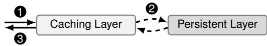

Property 1: Non-Linear Performance. In previous multiresource allocation algorithms [17, 24, 25, 53], the number of requests that can be served in a time window is proportional to the amount of resources allocated (e.g., processing 2× network packets requires 2× network bandwidth). However, this linear relationship does not apply to caches: 2× cache size does not imply 2× throughput. Not only can the cache miss ratio exhibit a complex non-linear relationship with cache size, but the demand vector is also unsuitable as “the amount of cache needed to serve one request” is ill-defined.

Property 2: Demand Correlation. Similarly, in many previous multi-resource allocation algorithms [17, 24, 25], resource demands are mutually independent (e.g., a shortage of network bandwidth cannot be compensated by more I/O). However, this is not the case for caches. With more cache space, a tenant will have a lower miss ratio and thus have less demand (step 2 ) for all the resources below the cache (e.g., I/O, network, DB read units). We call these resources cache-correlated resources.

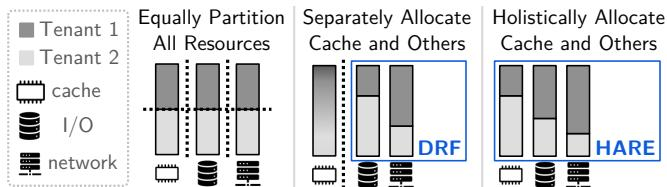  
Figure 1: Comparison of Existing Approaches and HARE. Equal partition provides fairness at the cost of efficiency; DRF allocates multiple resource types, but does not apply to caches; HARE features a holistic view that includes caches.

Cache correlation opens up a new dimension atop the existing multi-resource allocation problem. Each resource type benefits differently from caches. For example, I/O and DB read units are only consumed in step 2 and fully skipped upon hits; network, if required in all three steps, is partially saved upon hits; DB write units do not benefit from hits.

Existing Cache Partition is Not Multi-Resource-Aware. Most of the existing cache partition frameworks only tune cache size alone and leave other resources unmanaged [1, 13, 18–20, 22, 29, 38, 39]. CoPart [37] is a recent CPU last-level cache allocation algorithm that takes one step further by incorporating one cache-correlated resource (memory bandwidth). However, it is insufficient for a complex storage system with more resource types, where the allocation space significantly expands. For example, a high-miss-ratio workload may be disk I/O-bound; with more cache, its miss ratio decreases, and the bottleneck shifts to the network bandwidth of the caching services. An allocation framework must address the interaction among multiple cache-correlated resources.

Integrating Caches into Multi-Resource Allocation. Given caches, Figure 1 compares existing approaches with the vision of this work. First, the most straightforward approach that equally partitions all resources (including the cache) achieves fairness but at the cost of efficiency. Second, DRF improves on equal partitioning, but excludes caches since they do not fit into DRF’s model; as a result, the cache can be either partitioned equally [11, 30], non-partitioned [14, 33], or delegated to some standalone multi-tenant cache allocation framework [1, 18–20, 29, 38]. Non-partitioned caches can improve performance by capturing globally hot data, but may not guarantee the sharing incentive: a tenant’s performance can suffer from the interference of noisy neighbors [38, 55]. Standalone cache frameworks miss the opportunities to exploit the interaction among resources, leading to suboptimal allocations.

In contrast, we aim to integrate caches into multiresource allocation and holistically allocate caches and cachecorrelated resources to improve efficiency while maintaining fairness. To realize this vision, we first introduce an allocation algorithm, HARE, that captures cache-correlated demands. Second, we describe two systems, HopperKV and BunnyFS, that efficiently derive tenants’ miss ratio curves and demand vectors for HARE and adapt to workload changes at runtime.

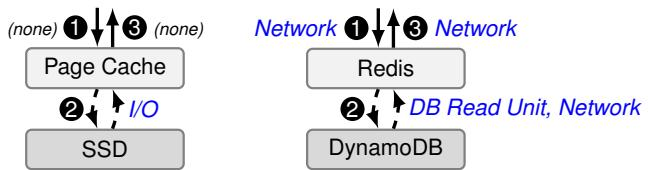  
(a) Local Filesystem (b) Distributed Key-Value Store  
Figure 2: Example Systems. Each step is labeled with the consumed resources; “(none)” means negligible cost.

## 3 Multi-Resource Allocation with Caches

We present Harvest-Redistribute (HARE), a cache-centric multi-resource allocation algorithm that extends DRF. The key idea is to exploit cache-correlated demands: HARE gives more cache to cache-sensitive tenants, whose demands for other resources may drop, and harvests the saved resources to benefit all tenants; among these resource types, the harvesting algorithm prioritizes the one that could maximize the gain.

In this section, we define the optimization goal, introduce HARE by progressing from a single cache-correlated resource to multiple ones, and follow with the discussion; since the basic algorithm assumes a static system, we show how dynamic workloads are handled by real systems in Sections 4 and 5.

## 3.1 Optimization Goal

In the cache-oblivious context, DRF [25] has shown that the system should pursue the max-min fairness of every tenant’s dominant resource share. We generalize this optimization goal to systems with caches. We define the normalized throughput of a tenant as its current throughput divided by its baseline (its throughput when all resources are equally partitioned), which quantifies how much a tenant benefits from an allocation. We propose the optimization goal of maximizing the minimum normalized throughput across tenants. To incentivize sharing, an allocation must ensure that the minimum normalized throughput across tenants is not lower than 1.

## 3.2 HARE with a Single Correlated Resource

We first present the HARE algorithm with only one cachecorrelated resource, namely, I/O bandwidth. HARE consists of two phases: harvest and redistribute. The harvest phase optimizes the cache partition such that all tenants maintain the same throughput as the baseline but consume less I/O bandwidth in total; the saved I/O bandwidth is harvested. In the redistribute phase, the harvested I/O is reallocated to improve every tenant’s throughput equally.

## 3.2.1 HARE Algorithm in the Basic Setting

We illustrate HARE through a filesystem example shown in Figure 2a, which only manages two resources: page cache and I/O bandwidth; upon a cache hit, no I/O is consumed.

Inputs and Notation. HARE takes two inputs from every tenant: the miss ratio curve (MRC) and per-request I/O cost (on cache misses). MRC is a function that maps cache size to miss ratio, denoted as m. Per-request I/O bandwidth cost is analogous to the demand in DRF, denoted as $d _ { b }$ . Since this cost only occurs upon cache misses, the actual per-request cost is $m ( r _ { c } ) \cdot d _ { b }$ . If a tenant is allocated $r _ { c }$ cache and $r _ { b }$ bandwidth, the throughput (unit: #req) is $\begin{array} { r } { T ( r _ { c } , r _ { b } ) = \frac { r _ { b } } { m ( r _ { c } ) \cdot d _ { b } } } \end{array}$ . Based on this model, we describe the algorithm procedures below.

1 Initialization. Every tenant starts with the baseline allocation, $i . e . ,$ , all resources are equally partitioned, denoted as $\langle r _ { c } ^ { b a s e } , r _ { b } ^ { b a s e } \rangle$ ⟩. We use $r _ { b } ^ { h a r \nu e s t }$ to denote the amount of I/O bandwidth harvested, initialized to zero.

2 Resource Harvest Phase. The harvest phase iteratively optimizes the cache partition. In each iteration, HARE relocates a chunk of cache from a tenant t1 to another tenant t2; to maintain the same throughput as the baseline, t1 requires extra I/O as compensation, and $t _ { 2 }$ relinquishes some. HARE harvests the difference between these two. We call this a cache-I/O trading deal between $t _ { 1 }$ and $t _ { 2 }$ . The size of the relocated cache chunk $\Delta r _ { c }$ is a tunable parameter denoting a step size. After the harvest phase, all tenants have the same throughput as their baseline but consume less total I/O bandwidth.

## Harvest Phase: Iteratively Trade Cache and I/O

## Repeat the following iteration:

▶ Each tenant reports: if taken a chunk of cache $\Delta r _ { c }$ away, how much I/O compensation does this tenant need to maintain the same throughput? Formally, suppose the tenant currently owns $r _ { c }$ cache and $r _ { b }$ I/O bandwidth with miss ratio $m ( r _ { c } )$ ; reducing the cache size by $\Delta r _ { c }$ causes the miss ratio to increase by $\Delta m ( r _ { c } )$ ; then the I/O compensation can be computed as $\begin{array} { r } { \Delta r _ { b } ^ { c o m p e n } = r _ { b } \cdot \frac { \Delta m ( r _ { c } ) } { m ( r _ { c } ) } } \end{array}$ ， where $\Delta m ( r _ { c } ) = m ( r _ { c } - \Delta r _ { c } ) - m ( r _ { c } )$

▶ Similarly, each tenant reports the amount of I/O bandwidth it can relinquish, if given additional cache $\Delta r _ { c } ,$ , to maintain the same throughput. This can be computed using the same equation as above, except with the sign of $\Delta r _ { c }$ flipped. We denote its absolute value as $\Delta r _ { b } ^ { r e l i n q }$ ▶ HARE seeks to make a deal between two tenants $t _ { 1 }$ and $t _ { 2 }$ where the amount of I/O bandwidth that $t _ { 2 }$ would relinquish is greater than the compensation to $t _ { 1 }$ . Given such a deal, HARE relocates cache $\Delta r _ { c }$ from $t _ { 1 }$ to $t _ { 2 } ;$ meanwhile, it takes I/O bandwidth $\Delta r _ { b , t _ { 2 } } ^ { r e l i n q }$ from t2 and gives $\Delta r _ { b , t _ { 1 } } ^ { c o m p e n }$ to $t _ { 1 } ;$ the difference $\left( \Delta { r } _ { b , t _ { 2 } } ^ { r e l i n q } - \Delta { r } _ { b , t _ { 1 } } ^ { c o m p e n } \right)$ is harvested and added to $r _ { b } ^ { h a r \nu e s t }$ . If there are multiple deals, HARE picks the most profitable one.

▶ Repeat the trading until no profitable deal can be made.

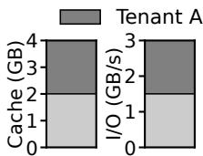

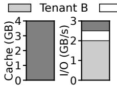  
(a) Baseline  
(b) Post-Harvest

unallocated  
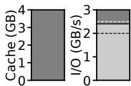  
(c) Final

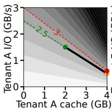

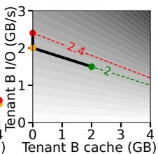  
(d) Performance Space

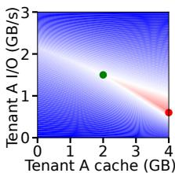  
(e) Fairness Space  
Figure 3: An Example of HARE with Visualization

3 Resource Redistribute Phase. The redistribute phase allocates the harvested I/O bandwidth to improve every tenant’s throughput. With the cache miss ratio fixed, the throughput is proportional to the I/O bandwidth. To increase every tenant’s throughput equally, HARE increases every tenant’s I/O bandwidth by the same relative amount.

## Redistribute Phase: Weighted-Partition the Harvest

▶ The harvested I/O bandwidth is allocated to each tenant weighted by the amount this tenant already owns. Suppose the sum of I/O bandwidth owned by all tenants (i.e., not harvested) is $r _ { b } ^ { s u m }$ ; then every tenant t receives additional I/O bandwidth $r _ { b } ^ { h a r v e s t } \cdot \frac { r _ { b , t } } { r _ { b } ^ { s u m } }$

## 3.2.2 An Illustrative Example with Visualization

Assume a filesystem manages 4 GB page cache and 3 GB/s I/O bandwidth, shared between two tenants A and B. A’s working set is 5 GB; B’s is 8 GB. Both tenants submit 1 MB read requests following a uniform hotness distribution.

Figures 3a, 3b, and 3c show each tenant’s share of resources during the algorithm. Initially (3a), each tenant owns half of the cache and I/O. Given that A’s miss ratio is 60%, with 1.5 GB/s I/O, its throughput is 2.5 GB/s (=2.5K req/s); similarly, B’s throughput is 2K req/s. During the harvest phase, A trades I/O for cache; after this phase (3b), A has all 4 GB of cache with 0.5 GB/s I/O bandwidth, and B has 2 GB/s I/O bandwidth, delivering the same throughput for both tenants as the baseline but consuming only 2.5 GB/s I/O bandwidth in total. The redistribute phase (3c) weighted-allocates the spare 0.5 GB/s I/O bandwidth, with A receiving 0.1 GB/s and B receiving 0.4 GB/s. As a result, A’s throughput increases from 2.5K req/s to 3K, and B’s increases from 2K to 2.4K; both tenants achieve 20% higher throughput.

The allocation process is detailed in Figure 3d. The figure shows two tenants’ performance spaces, where the shade at each point $( x , y )$ denotes the throughput of this tenant with x GB cache and y GB/s I/O (darker for higher throughput). The allocation changes are plotted with solid black lines, and the three stages are marked with / / . The harvest phase $( \bullet \sim \circ )$ essentially walks along a contour level without throughput change $( e . g .$ ., increasing cache and decreasing I/O for A). The redistribute phase $( 0 \sim \bullet )$ walks upwards along the I/O-axis to improve throughput for both tenants (e.g., increasing I/O bandwidth by 0.1 GB/s for A).

To further understand the merit of HARE, we visualize the fairness space in Figure 3e. The color at $( x , y )$ denotes the minimum normalized throughput between two tenants if A owns (x,y) and B owns the rest; blue means the minimum normalized throughput is below 1, violating the sharing incentive; red means larger than 1, showing improvements. The figure marks the baseline ( ) and final allocation ( ). As desired, HARE converges to the darkest red area, representing the maximum of the minimum normalized throughput.

## 3.2.3 What Has Been Simplified so Far?

The filesystem example in Figure 2a is simplified in two dimensions. Consider a more general example of a distributed key-value store in Figure 2b where Redis caches data for DynamoDB; the system manages three shared resources: Redis cache size, DynamoDB read units, and network bandwidth.

First, in the local filesystem, I/O bandwidth is consumed only on misses; more generally, some resources (e.g., network bandwidth in a distributed key-value store) are consumed on both hits and misses, with a lower consumption on hits. Our more general model captures such degree of cache-saving for different resources in Section 3.3.

Second, our previous example only involves one cachecorrelated resource (I/O bandwidth); when the miss ratio is zero, the modeled throughput becomes infinite. In practice, such a zero-miss system will eventually bottleneck on some other system resources (e.g., CPU cycles); this is not captured in the previous model, but is in Section 3.4.

## 3.3 Generalized Correlation

We generalize the cache-correlated demand by introducing another parameter $\alpha _ { i }$ for a resource type $r _ { i } .$ This parameter describes the ratio of resources saved upon a hit compared to a miss case. We call $\alpha _ { i }$ the cache-saving constant of this resource. I/O bandwidth in the filesystem example (Figure 2a) is a case with $\alpha = 1$ . Network in the key-value store example (Figure 2b) has $\alpha = 0 . 5$ , where a cache hit only saves the round trip between Redis and DynamoDB, but not the round trip between Redis and tenants.

Formally, a cache-miss request consumes $d _ { i }$ units of resource, and a hit request consumes $\left( 1 - \alpha _ { i } \right) \cdot d _ { i }$ units. Given the miss ratio m, one request consumes $( m + ( 1 - m ) ( 1 - \alpha _ { i } ) ) \cdot d _ { i }$ units on average. Therefore, the throughput (after reduction) is modeled as $\begin{array} { r } { T _ { i } ( r _ { c } , r _ { i } ) = \frac { r _ { i } } { ( 1 - \alpha _ { i } + \alpha _ { i } \cdot m ( r _ { c } ) ) \cdot d _ { i } } } \end{array}$ . Following this generalization, the compensated and relinquished resources can be computed as $\begin{array} { r } { \Delta r _ { i } = r _ { i } \cdot \frac { \mathbb { Q } _ { i } \cdot \Delta m ( r _ { c } ) } { 1 - \mathbb { Q } _ { i } + \mathbb { Q } _ { i } \cdot m ( r _ { c } ) } } \end{array}$

A special case is ${ \alpha } _ { i } = 0$ , where cache hits do not save cost for this resource. We call it a cache-independent resource. Such a resource can still gracefully fit into our model; the compensated and relinquished resources are simply zero.

In practice, $\alpha _ { i }$ can be derived by maintaining two variables: the resource cost if all requests are hits and if all are misses. $\alpha _ { i }$ equals one minus the ratio between these two variables.

## 3.4 HARE with Multiple Correlated Resources

We now present the complete HARE algorithm, where the system manages cache and n types of cache-correlated resources. The expanded allocation scope introduces complexity in the harvest phase: a deal may profit well on one resource type but poorly on others; without a careful deal selection strategy, the algorithm can easily converge to suboptimal states.

HARE’s solution is to select the deal that is most profitable on the system-wide dominant resource. The observation is that resources are not equally valuable to harvest: the scarcest $r _ { i } ^ { h a r \nu e s t }$ limits the system-wide improvement during the redistribution and should be the primary target to harvest.

HARE takes three inputs from every tenant: MRC, the demand vector $\langle d _ { 1 } , d _ { 2 } , \ldots , d _ { n } \rangle$ , and the cache saving constants $\langle \mathbf { a } _ { 1 } , \mathbf { a } _ { 2 } , \ldots , \mathbf { a } _ { n } \rangle$ . Every resource $r _ { i }$ supports a throughput $T _ { i }$ as modeled in Section 3.3; the end throughput bottlenecks on the dominant resource that supports the lowest throughput: $\begin{array} { r } { T ( r _ { c } , r _ { 1 } , r _ { 2 } , \ldots , r _ { n } ) = \operatorname* { m i n } _ { 1 \leqslant i \leqslant n } T _ { i } ( r _ { c } , r _ { i } ) } \end{array}$ . Other non-dominant resources are underutilized. Based on this model, we describe the algorithm procedure below.

1 Initialization. Every tenant starts with the baseline allocation $\langle r _ { c } ^ { b a s e } , r _ { 1 } ^ { b a s e } , r _ { 2 } ^ { b a s e } , \dots , r _ { n } ^ { b a s e } \rangle$ . With the baseline allocation, one resource is the dominant resource; others are underutilized. HARE collects underutilized resources across tenants as the initial harvests $\langle r _ { 1 } ^ { h a r v e s t } , r _ { 2 } ^ { h a r \nu e s t } , \cdot \cdot \cdot , r _ { n } ^ { h a r \nu e s t } \rangle$

2 Resource Harvest Phase. The harvest phase still follows a trading loop, with the trading resources represented in vectors. The major change is an additional step to determine the system-wide dominant resource before selecting a deal.

## Harvest Phase: Trade for the Dominant Resource Repeat the following iteration:

▶ For every tenant, compute the compensated and the relinquished resources to trade, denoted as vectors $\overrightarrow { \Delta r } ^ { c o m p e n } = \langle \Delta r _ { 1 } ^ { c o m p e n } , \cdot \cdot \cdot , \Delta r _ { n } ^ { c o m p e n } \rangle$ and $\vec { \Delta { r } } ^ { r e l i n q } =$ $\langle \Delta r _ { 1 } ^ { r e l i n q } , . . . , \Delta r _ { n } ^ { r e l i n q } \rangle$   
▶ Decide the system-wide dominant resource as the one relatively scarcest in the harvest: $r _ { d o m } = \mathrm { a r g }$ min $\mathsf { i } _ { r _ { i } } \frac { r _ { i } ^ { h a r v e s t } } { r _ { i } ^ { s u m } }$ ▶ Find a tenant $t _ { 1 }$ with the smallest $\Delta r _ { d o m , t _ { 1 } } ^ { c o m p e n }$ and another tenant $t _ { 2 }$ with the largest $\Delta r _ { d o m , t _ { 2 } } ^ { r e l i n q }$ . Make a deal between two tenants if $\Delta r _ { d o m , t _ { 2 } } ^ { r e l i n q } > \Delta r _ { d o m , t _ { 1 } } ^ { c o m p e n }$ : take the relinquished $\overline { { \Delta } } r _ { t _ { 2 } } ^ { r e l i n q }$ from $t _ { 2 }$ and give $t _ { 1 }$ the compensation $\overline { { \Delta } } r _ { t _ { 1 } } ^ { r e l i n q }$ ; harvest the difference $\left( \overrightarrow { \Delta r } _ { t _ { 2 } } ^ { r e l i n q } - \overrightarrow { \Delta r } _ { t _ { 1 } } ^ { r e l i n q } \right)$   
：1 。

▶ Repeat the trading until no profitable deal can be made. D

3 Resource Redistribute Phase. The redistribute phase flows as in the basic setting but applies to multiple resources.

```powershell
Redistribute Phase: Weighted-Partition the Harvest
▶ Allocate the harvest to every tenant weighted by the
amount that tenant already owns, i.e., for every resource
type ri, every tenant t receives additional $r _ { i } ^ { h a r v e s t } \cdot \frac { r _ { i , t } } { r _ { i } ^ { s u m } } .$
```

## 3.5 Analysis and Discussion

We present a theoretical analysis, empirical insight, and an extension of HARE.

Compatibility with DRF. HARE gracefully degrades to DRF when all tenants are equally cache-sensitive. If no deal is made during the harvest phase, HARE produces the same allocation as DRF on the system-wide dominant resource. With nondominant resources underutilized, DRF intentionally keeps them unallocated for strategy-proofness [25]; since strategyproofness is not a focus of HARE, these idle resources can be weighted-allocated, which we call conserving redistribution.

Conserving redistribution provides tenants additional “margins” of non-dominant resources to tolerate temporal burstiness and inaccuracy in demand estimation. This generally does not improve tenants’ throughput, except for tenants with zero demand on the system-wide dominant resource; for example, in an I/O-bound system, if a tenant has a zero miss ratio and demands no I/O, it can get additional throughput with more non-dominant resources.

Greediness. HARE is a greedy algorithm and may not be optimal. It is computationally hard to find an optimal allocation due to the arbitrary shape of MRCs. HARE does, however, guarantee a better or equal throughput for every tenant compared to the baseline and DRF with an equal cache partition.

Convergence Guarantee. HARE guarantees convergence because every trading iteration requires a positive improvement of normalized throughput; since the normalized throughput cannot grow to infinity, the algorithm must terminate.

Algorithm Complexity. For a system with n tenants, each trading iteration takes O(n) to compute trading resources and O(n) to select the deal; the redistribute phase also takes O(n). Therefore, the total complexity is O(n · trading\_iteration). It is safe to terminate the harvest phase early when the trading iteration reaches a maximum threshold, but we never run into a case needing that. Empirically, the algorithm running time is on the scale of microseconds; given that allocation frequency is at the scale of seconds, the cost is negligible.

Weighted Baseline Extension. The baselines as described thus far assume equal partitioning, but in practice, tenants may not be configured equally, $e . g .$ ., tenant $t _ { 1 }$ pays 2× as much as tenant $t _ { 2 } .$ . HARE can be generalized to handle such cases by using a weighted baseline, $i . e .$ , the baseline allocation is $t _ { 1 }$ owning 2/3 of all resources, and $t _ { 2 }$ owning 1/3. The rest of the algorithm works without changes.

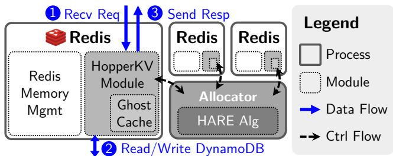  
Figure 4: HopperKV Architecture. The new components introduced by HopperKV are in shade: a customized module is loaded into each tenant’s dedicated Redis instance; an allocator daemon controls the resource limits of each Redis.

## 4 HopperKV

We developed HopperKV to demonstrate the utility of HARE in a real system. HopperKV is a cloud-native key-value store that modifies Redis [43] to cache data from DynamoDB [45]. HopperKV requires no prior knowledge of tenant demands and can dynamically adjust its allocation decisions when workloads change. HopperKV is implemented in 4K lines of C++, and the source code is publicly available [61].

We first describe the architecture and managed resources of HopperKV, how ghost caches are used to efficiently construct MRCs at runtime, and how HopperKV handles dynamic workloads. We then show that HopperKV outperforms alternatives across a range of benchmarks, including scenarios with up to 16 tenants, dynamic changes, and real-world traces.

## 4.1 HopperKV Architecture and Resources

Figure 4 shows the HopperKV architecture. HopperKV consists of two core components: a Redis Module and an allocator daemon. The Redis Module is loaded into every Redis instance; all Redis instances are co-located on a machine and managed by the allocator daemon; for better isolation, each tenant is assigned a dedicated Redis instance running LRU. HopperKV manages four resource types: Redis cache size, network bandwidth, DynamoDB read units (RU), and DynamoDB write units (WU). HopperKV does not incorporate CPU cycles into the allocation scope because Redis is rarely CPU-bound [40]. The allocation daemon determines each Redis instance’s resource budget.

Read request handling consists of three steps. 1 The request is delivered to the tenant’s Redis instance. 2 On a miss, the Redis server fetches data from DynamoDB. 3 The server sends data back. The write path follows similar steps, except that step 2 occurs on both cache hits and misses; the current implementation uses write-through caching.

Different resources are consumed in these steps: network is consumed in all three steps; read units are consumed in step 2 for read misses; write units are consumed in step 2 for all writes. Thus, network and read units are both cachecorrelated resources, while write units are cache-independent.

Example. Suppose each 2 KB read request costs ⟨4 KB, 1 RU, 0 WU⟩ on a miss and ⟨2 KB, 0 RU, 0 WU⟩ on a hit; each 1 KB write costs ⟨2 KB, 0 RU, 1 WU⟩.1 For a workload with 90% 2 KB reads and 10% 1 KB writes, the weighted-average perrequest cost is ⟨3.8 KB, 0.9 RU, 0.1 WU⟩ on a miss and ⟨2 KB, 0 RU, 0.1 WU⟩ on a hit. This provides the demand vector ⟨3.8 KB, 0.9 RU, 0.1 WU⟩ and the cache saving constants 0.47 for network, 1 for read units, and 0 for write units.

HopperKV Redis Module and APIs. A core component of HopperKV is a Redis Module [41], which is a piece of .so binary loaded into an unmodified Redis server at runtime via Redis MODULE LOAD command. The module supports customized commands with native performance. HopperKV exposes HOPPER.GET and HOPPER.SET as the data APIs.

HOPPER.GET wraps on top of Redis native GET. If Redis reports a miss, the module fetches data from DynamoDB. During this process, the module bookkeeps actual read unit and network usage and hypothetical usage if it was a hit/miss. The actual usage is useful for monitoring; the hypothetical usage provides the demand vectors and cache-saving constants. The module also updates the ghost cache for MRC (detailed in Section 4.2). HOPPER.SET inserts or updates key-value pairs in Redis and forwards the data to DynamoDB for persistence, also tracking network and write unit usage.

The module exposes control plane APIs to the allocator for extracting demand vectors and MRCs and setting resource limits. Internally, the module uses rate limiters to enforce the network and read/write unit consumption within the limit.

HopperKV Allocator Daemon. The allocator periodically collects demand vectors and MRCs from Redis instances, runs the HARE algorithm, and sets resource limits on each Redis instance based on algorithm outputs. Section 4.3 details its mechanisms built for dynamic and robust allocations.

HopperKV focuses on the multi-tenancy on a single node. As future work, a multi-node cluster can be implemented with another placement allocator on top, similar to Pisces [50].

## 4.2 Spatially-Sampled Ghost Cache

To learn MRCs at runtime, HopperKV leverages ghost caches [15, 56, 57], as illustrated in Figure 5. The ghost cache is implemented as an LRU list, where each entry records the hash of the key and the size of its KV data (no actual KV data is stored). At runtime, every key access is forwarded to the ghost cache, which runs simulated cache replacement and maintains a miss ratio table for a range of cache sizes. Since LRU satisfies the inclusion property [35] (i.e., given two caches with sizes $z _ { 1 } < z _ { 2 }$ , the set of in-cache keys follows $C ( z _ { 1 } ) \subseteq C ( z _ { 2 } ) ,$ ), the ghost cache only needs to maintain one LRU list of size $z _ { n } ;$ to determine whether an access is a hit in a cache of size $z _ { i } < z _ { n } .$ , the ghost cache checks whether the key is present in the $z _ { i }$ prefix of the LRU list. MRC is constructed as a piecewise function based on the miss ratio table.

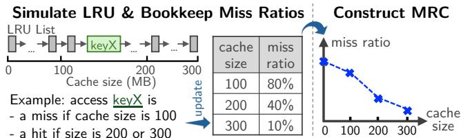  
Figure 5: Construct Miss Ratio Curve with Ghost Cache

To reduce ghost cache overhead, HopperKV applies spatial sampling [57], which only forwards a key access to the ghost cache if it falls in the sampling space (e.g., leading hash bits are all zeros). With a $1 / s$ sample ratio, the ghost cache maintains an LRU list of $1 / s$ size, substantially reducing CPU cost and memory footprints. Based on measurements, we use s = 32 to balance accuracy (<1% error) and overhead (<25ns/key). Note that even as the tenant count scales, the total overhead remains a small fraction of total resources, because the sampling ratio determines the fraction of total requests forwarded to the ghost cache, independent of the number of underlying tenants. If needed, more advanced MRC construction techniques can be applied, e.g., non-inclusive replacement policies [56], bias-reduced sampling [15].

## 4.3 Dynamic and Robust Allocation

The HARE algorithm itself takes a static view of tenants’ demands, but a real-world system must handle time-varying workloads. To adapt to workload changes, HopperKV runs an instance of HARE periodically (e.g., every 20 seconds) based on the statistics collected in a sliding window $( e . g . ,$ past one minute). This frequency suffices because workload changes take seconds to become statistically significant, only after which the system should react (e.g., Redis cache is usually a few GB while a tenant’s throughput is typically at the scale of 10K requests per second [59], accessing <1 MB of data).

HopperKV is built with robustness in mind. We implemented the following mechanisms to make the system resilient against noise and reduce tail latency.

Selectively Apply New Allocations. We observe that noise exists in the system even in a steady state; thus, the algorithm may converge to different (but close) resource allocations even when the workloads have not changed. To avoid oscillation between different, but similar, states, HopperKV only applies a new resource allocation if the new allocation is predicted to have a significant advantage $( e . g . , > 5 \% )$ over the current one. Smooth Cache Migrations. When applying a new allocation, the HopperKV allocator migrates memory quota across Redis instances. As a result, the instances that are receiving more cache will temporarily have some unpopulated cache space; since corresponding tenants may have had other resources decreased, these tenants may experience a temporary throughput degradation before the cache is warmed up.

To alleviate this degradation, the allocator divides cache space allocations (and other resources) into 16 MB chunks and migrates only one chunk at a time; the next chunk is only migrated after the previous one has been populated. The quota for other resources is synchronized with the migration of the individual cache chunks.

Take MRC with a Grain of Salt. In practice, the MRCs produced by the ghost caches are not perfectly accurate due to sampling and noise. These small errors are tolerable in most cases, but when the miss ratio is very low, a small absolute error leads to a large relative error. As an extreme example, consider a tenant with a very low miss ratio near 0.5%. If its miss ratio is incorrectly estimated as 0%, HARE will allocate it no read units, leaving that tenant’s (few) misses unhandled.

The simple and elegant solution is to add a small constant to MRCs. When computing $\Delta r _ { i }$ during trading, ∆m is unaffected, and m is impacted insignificantly unless m is small. This method slightly favors low-miss-ratio tenants, but such benefits are well-bounded since the added constant is small. This constant is tuned based on the measured ghost cache error; our implementation uses 1%. Empirically, this method significantly improves system robustness against inaccuracy at a minor cost of fairness.

Tail Latency. While HopperKV primarily optimizes throughput, it also performs decently in tail latency. Since tail latency primarily arises from cache misses, we focus on the miss-handling path. Queueing theory suggests that tail latency increases when the cache-miss processing rate is low and utilization is high. In practice, this occurs when a low-miss-ratio tenant is allocated few read units (i.e., a low processing rate), but a burst of cache misses arrives within a short time window, triggering rate-limiter throttling. In HopperKV, the MRC salting technique provides additional capacity to low-miss-ratio tenants (i.e., reducing utilization), which can effectively absorb such temporal bursts and lower tail latency. Section 4.4.1 presents an empirical measurement of tail latency. As future work, the system can incorporate a queueing-theoretic model into the harvest phase and filter out the deals that may lead to tail-latency spikes.

## 4.4 HopperKV Evaluation

Through the evaluation, we answer the following questions: When does HopperKV provide benefits over alternatives? Can HopperKV scale to many tenants? When workloads vary over time, can HopperKV dynamically adjust allocation? How does HopperKV perform on real-world workloads?

Experiment Settings. We design the following sets of experiments to evaluate HopperKV: two-tenant microbenchmarks (Section 4.4.1) validate that HopperKV can handle a variety of sharing cases; the scaling macrobenchmark (Section 4.4.2) verifies that HopperKV can scale with the number of tenants; the dynamic macrobenchmark (Section 4.4.3) shows HopperKV can handle workloads varying over time; the tracereplay macrobenchmark (Section 4.4.4) demonstrates that HopperKV performs well on real-world workloads.

We compare HARE with four alternatives: 1. baseline where all resources are equally partitioned; 2. pure DRF with caches equal-partitioned (conserving redistribution enabled for a fair comparison); 3. Memshare [20] for the cache partition with DRF for other resources (MS+DRF); 4. NonPart where tenants share a global resource pool and all resources are non-partitioned. Memshare [20], a state-of-the-art multitenant key-value store, allocates more cache to the tenant with larger MRC gradients [19]; it does not consider other cachecorrelated resources. The combination of Memshare and DRF represents the most sophisticated resource allocation prior to our work. NonPart represents real-world scenarios where system administrators enforce no performance isolation, favoring efficiency by caching globally hot data.

All comparison policies are ported to the HopperKV codebase. In baseline, pure DRF, Memshare+DRF, and HARE, each tenant is assigned a dedicated Redis instance for the cache partition. For Memshare, we configure the minimum cache size of a tenant to 50% as in the original paper [20]. To handle the global LRU in NonPart and make it resemble the Redis cluster mode [42] used in practice, for an experiment with x tenants, we use x Redis instances, and every instance hosts $1 / x$ of the working set from each tenant.

Unless otherwise specified, baseline resources are 2 GB cache, 50 MB/s network, 1K DynamoDB read units/s, and 1K write units/s; workloads use 16-byte keys and 500-byte values. Experiments run on AWS with a cluster of EC2 m6i instances; each tenant uses a 2xlarge instance (8 vCPUs, 32 GB memory) to submit requests for microbenchmarks, scaling, and dynamic experiments, and an 8xlarge instance (32 vCPUs, 128 GB memory) for trace-replay experiment; the server uses a 16xlarge instance (64 vCPU, 256 GB memory).

## 4.4.1 HopperKV Microbenchmarks

Through two-tenant microbenchmarks, we demonstrate HARE’s merits over the baseline, DRF, and Memshare+DRF. Varying Working Set Sizes. In the first experiment, we vary tenant $\mathrm { T } _ { 1 } \mathrm { \ ' } _ { \mathrm { s } }$ working set from 1 million to 16 million keys (each million keys occupies 0.55 GB Redis memory) while keeping T2’s fixed at 6 million keys. Both workloads consist of 95% reads and 5% writes, with uniform hotness.

Figure 6a shows the result, with the leftmost column highlighting the minimum normalized throughput between the two tenants. In all cases, HARE performs as well or better than pure DRF, which performs as well or better than the baseline; Memshare+DRF performs worse than the baseline in some cases. Specifically, when $\mathrm { T } _ { 1 }$ has $\leqslant 3$ M keys, pure DRF and HARE produce the same allocation since $\mathrm { T } _ { 1 }$ ’s working set fits within the baseline 2 GB cache, requiring no read units; meanwhile, $\mathrm { T } _ { 2 }$ is read-unit-bound. DRF handles this case well; since HARE finds no profitable cache trading, it gracefully falls back to DRF. When the working set of $\mathrm { T } _ { 1 }$ increases to 4 M keys, $\mathrm { T } _ { 1 }$ is also bound by read units. Since both tenants have the same dominant resource, pure DRF does not improve the baseline; Memshare performs slightly better by optimizing the cache partition. HARE achieves a 56% improvement by trading more cache to $\mathrm { T } _ { 1 }$ , allowing its working set to fit.

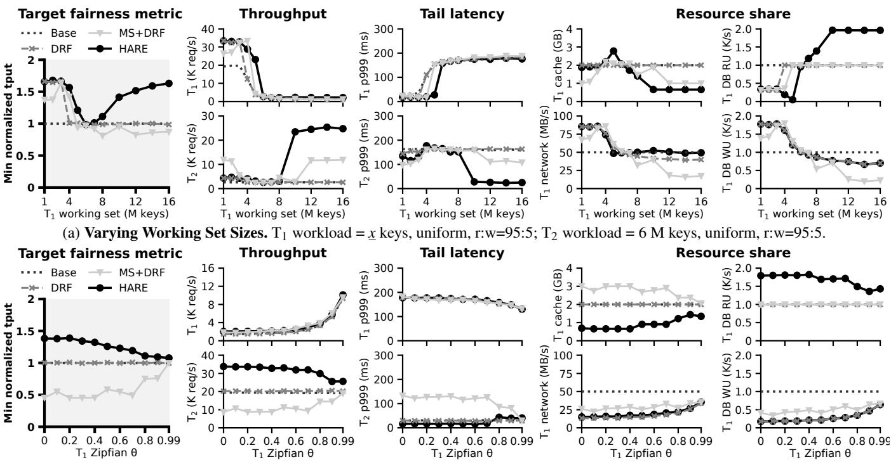  
(b) Varying Hotness Distribution. $\mathrm { T } _ { 1 }$ workload = 12 M keys, Zipfian $( \Theta = \underline { { x } } ) , \operatorname { r } \mathrm { . w = } 9 5 { : } 5 ; \operatorname { T } _ { 2 }$ workload = 6 M keys, Zipfian (θ = 0.99), r:w=95:5. Figure 6: HopperKV Microbenchmarks. We report minimum normalized throughput (the target metric; highlighted on the left), two tenants’ absolute throughput and p999 tail latency, and $\mathrm { T } _ { 1 } \mathrm { \ ' } _ { \mathrm { s } }$ resource share. $\mathrm { T } _ { 2 } \mathrm { \ ' } _ { \mathrm { s } }$ resource share is the remainder.

When $\mathrm { T } _ { 1 }$ has 6 M keys, the two tenants have identical workloads, so the equal partition baseline is already optimal. As $\mathrm { T } _ { 1 } \mathrm { \dot { \Omega } }$ ’s working set grows, T2’s workload is relatively more cache-friendly. Memshare and HARE react to this trend differently. Memshare prioritizes efficiency over fairness: since $\mathrm { T } _ { 2 }$ utilizes cache better, it takes cache from $\mathrm { T } _ { 1 }$ without compensation, degrading the performance of $\mathrm { T } _ { 1 }$ and breaking the sharing incentive. Lack of fairness is a fundamental limitation of Memshare (and other algorithms that only manage cache): it must hurt at least one tenant to benefit others unless there is an MRC plateau. In contrast, HARE captures the interaction between cache and other resources and ensures the cache trading between tenants is fair: $\mathrm { T } _ { 1 }$ donates more cache with additional read units compensated. In the end, HARE outperforms Memshare+DRF in both fairness and efficiency, with up to 63% higher throughput over the baseline.

Varying Hotness Distribution. In the second microbenchmark, we vary the skewness of $\mathrm { T } _ { 1 }$ from Zipfian θ = 0 to 0.99 (larger θ means more skewed) with a fixed 12 M keys working set; $\mathrm { T } _ { 2 }$ accesses 6 M keys with Zipfian $\theta = 0 . 9 9$ ; both workloads contain 95% reads and 5% writes.

Figure 6b shows that, when both tenants are bound by the same resource (read units), pure DRF and baseline are equivalent, Memshare+DRF causes about 50% degradation, and HARE improves throughput by up to 38%. When $_ { \textrm { T } _ { 1 } } \cdot$ s θ is small, its MRC gradient is much larger than ${ \mathrm { T } } _ { 2 } { \mathrm { \dot { s } } } ,$ so Memshare only allocates the minimum cache (1 GB) to $\mathrm { T } _ { 2 } .$ significantly degrading its performance. In contrast, HARE recognizes that allocating more cache to $\mathrm { T } _ { 2 }$ is more resourceefficient; the saved resources eventually benefit both tenants. Tail Latency. HARE primarily optimizes for throughput, but it still matches or outperforms other alternatives on p999 tail latency, because the MRC salting technique in HopperKV can well absorb the temporal bursts of cache misses.

## 4.4.2 HopperKV Scaling Macrobenchmark

We show that HopperKV can scale through an experiment with 16 tenants running YCSB workloads [21]. These tenants are categorized into four groups:

• Group $\mathrm { A } { : } \mathrm { T } _ { 1 } { - } \mathrm { T } _ { 4 }$ run YCSB-A (50% read, 50% write, Zipf)

• Group $\mathrm { B } { : } \mathrm { T } _ { 5 ^ { - } } \mathrm { T } _ { 8 }$ run YCSB-B (95% read, 5% write, Zipf)

• Group ${ \mathrm { C } } { : \mathrm { T } } { 9 ^ { - } \mathrm { T } } _ { 1 2 }$ run YCSB-C (read-only, Zipf)

• Group E: $\mathrm { T } _ { 1 3 } \mathrm { - T } _ { 1 6 }$ run YCSB-E-like (95% scan, 5% write, Zipf, scan length between 1∼100); to explicitly control the working set size, write ops are overwriting (instead of insertion in the original YCSB-E)

Within each group, the first two tenants have 6 million keys and the last two have 12 million keys; the first and the third tenants use 500-byte values, and the second and the fourth use 2000-byte values. Note that KV size impacts the ratio of read and write units: a 2000-byte value costs 1 RU or 2 WUs, while a 500-byte value only costs 1 RU or 1 WU.

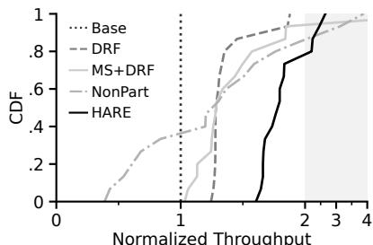  
(a) CDF of Normalized Throughput

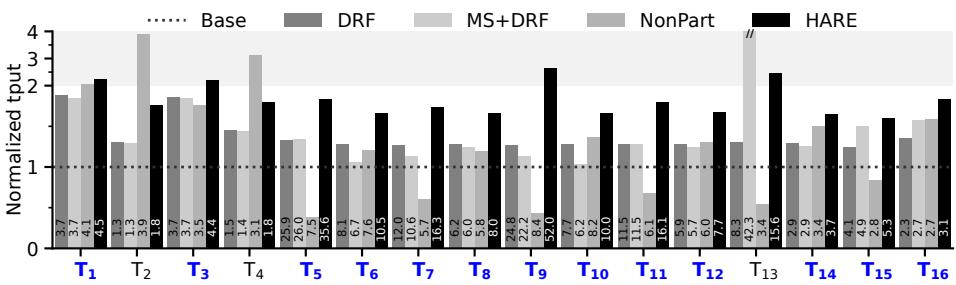  
(b) Individual Tenant’s Throughput. Each bar is labeled with absolute throughput (unit: K  
req/s). 13 out of 16 tenants achieve best throughput with HARE (highlight in blue).  
Figure 7: HopperKV Scaling Macrobenchmark Result. For better readability, the throughput axis is folded in the shaded area.

Figure 7 shows normalized throughput with the baseline, DRF, Memshare+DRF, NonPart, and HARE. As expected, DRF and HARE guarantee the sharing incentive, and their normalized throughputs are always greater than 1. DRF achieves $1 . 2 { \sim } 1 . 9 { \times }$ improvement over the baseline because Group A tenants are write-dominant and donate read units to others. Memshare+DRF performs similarly to pure DRF, but it favors $\mathrm { T } _ { 1 3 }$ (due to its large MRC gradient) at the cost of lower improvement for others $( e . g . , \mathrm { T } _ { 6 } ,$ T7, T9, and $\mathrm { T } _ { 1 0 } )$ . NonPart produces unfair allocations: 6 out of 16 tenants experience up to $3 \times$ slowdowns. These slowdowns occur for two reasons. First, even though a 2 KB KV pair consumes 4× more memory than a 0.5 KB pair, Redis’s LRU implementation evicts KV pairs only by recency, ignoring KV size; as a result, with a non-partitioned cache, tenants with larger value sizes take advantage of others. Second, NonPart does not provide isolation, so a cache-friendly workload can be dragged down by others: $\mathrm { T } _ { 5 } , \mathrm { T } _ { 7 } .$ , T9, and $\mathrm { T } _ { 1 1 }$ have high absolute throughput in the baseline and are largely slowed down in NonPart.

HARE significantly outperforms others in fairness: 13 out of 16 tenants achieve their best performance with HARE, with 1.6∼2.7× improvement. For Group A tenants, the cache yields less utility because half of their requests do not benefit from hits, making them less cache-sensitive; as a result, Group A becomes the major cache donor, despite the same hotness distribution as Groups B and C. Neither DRF nor Memshare exploits this important pattern.

## 4.4.3 HopperKV Dynamic Macrobenchmark

To evaluate the adaptivity of HopperKV, we conduct stress tests where every minute a tenant changes its workload pattern. Initially, $\mathrm { T } _ { 1 } / \mathrm { T } _ { 2 } / \mathrm { T } _ { 3 } / \mathrm { T } _ { 4 }$ runs YCSB-A/B/C/E-like workload; each with 6 million keys. Starting at the $4 ^ { \mathrm { t h } }$ minute, $\mathrm { T } _ { 1 } \mathrm { \ ' } _ { \mathrm { s } }$ write ratio oscillates between 50% and 30% (decreasing/increasing by 5% every 4 minutes); from the $5 ^ { \mathrm { t h } }$ minute, $\mathrm { T } _ { 2 } \mathrm { \ ' } _ { \mathrm { s } }$ working set expands by 0.5 million keys every 4 minutes; from the $6 ^ { \mathrm { { t h } } }$ minute, ${ \mathrm { T } } _ { 3 } { } ^ {  ' } { \mathrm { s } }$ Zipfian θ value cycles among 0.99/0.8/0.6 to emulate periodical hot spots; from the $7 ^ { \mathrm { t h } }$ minute, T4’s max scan range alternates among 100/80/60/40 keys. This drastically changing workload stresses the adaptivity of HopperKV.

Figure 8 shows tenants’ throughput over time, with the minimum normalized throughput across tenants summarized at the top. Among these policies, only pure DRF and HARE preserve the sharing incentive; Memshare hurts $\mathrm { T } _ { 2 }$ and $\mathrm { T } _ { 3 }$ to disproportionally benefit $\mathrm { T } _ { 4 } .$ , since $\mathrm { T } _ { 4 }$ has the highest MRC gradient; NonPart performs well for T1, T3, and $\mathrm { T } _ { 4 } .$ , but degrades T2’s performance after the $5 ^ { \mathrm { t h } }$ minute.

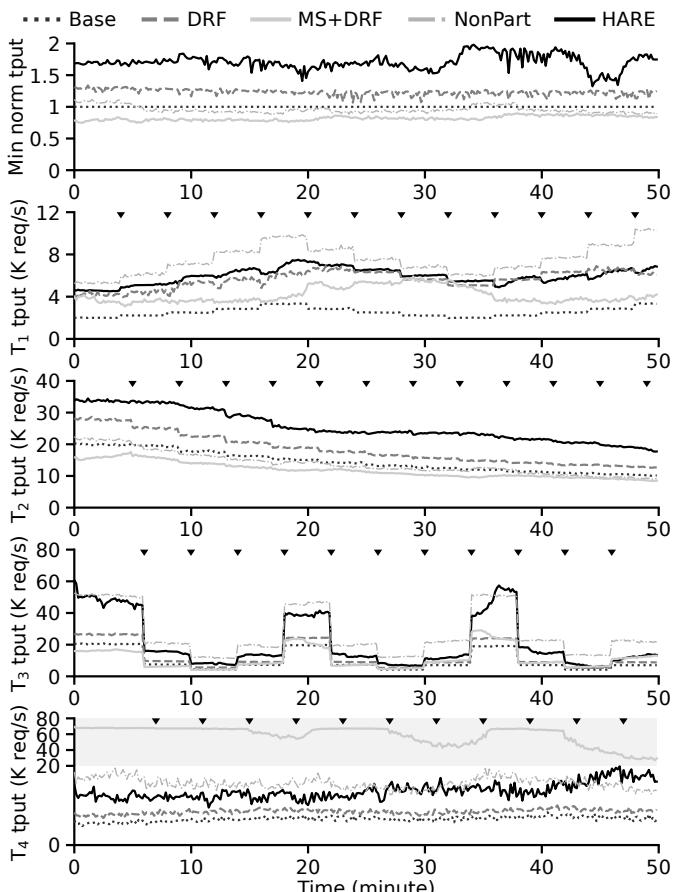  
Figure 8: HopperKV Dynamic Macrobenchmark Result. The top-most figure summarizes the minimum normalized throughput over time. Every $\bullet \bullet \bullet$ denotes a workload change. For better readability, $\mathrm { T } _ { 4 } \mathrm { \ ' } _ { \mathrm { s } }$ Y-axis is folded in the shaded area.

Focusing on the two fair algorithms, DRF and HARE, we see that initially, DRF improves throughput by 1.3× relative to the baseline, while HARE improves throughput by 1.7×.

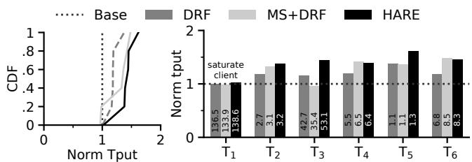  
Figure 9: HopperKV Twitter Trace Macrobenchmark. Each bar is labeled with absolute throughput (unit: K req/s).

When tenants change their workload, pure DRF reacts very quickly because it manages only stateless resources. HARE needs to migrate the cache quota, which takes time to converge; as shown, the migration mechanism of HopperKV (Section 4.3) performs this smoothly to ensure stable performance, achieving up to 1.9× improvement. Overall, HARE consistently outperforms other alternatives with the best fairness and comparable efficiency.

## 4.4.4 Real-World Macrobenchmark with Twitter Traces

We use a macrobenchmark with Twitter production traces [59] to demonstrate that HopperKV handles realistic workloads. We sample six cluster traces from the dataset (cluster IDs: 2, 19, 33, 34, 40, 54), covering a variety of key-value pair sizes (average sizes in bytes: 89, 143, 1142, 355, 199, 265), write ratios (0%, 25%, 1%, 6%, 50%, 3%), and hotness distributions; more detailed trace statistics are available [58]. Since these workloads are more skewed, we experiment with 1 GB baseline cache; other baseline resources remain the same.

The results are shown in Figure 9, with the CDF summary on the left. HARE generally achieves higher normalized throughput than pure DRF and Memshare+DRF. The performance of $\mathrm { T } _ { 1 }$ is identical across approaches because $\mathrm { T } _ { 1 }$ has a small working set (∼150 MB) and 0% miss ratio; even the baseline achieves high throughput that saturates the client VM’s request submission capacity. Excluding T1, HARE achieves at least 38% improvement, while pure DRF achieves only 16%, and Memshare+DRF degrades T3 by 4%.

With DRF, T5 donates read units, as it is the only writedominant workload. Memshare+DRF takes cache from $\mathrm { T } _ { 1 }$ due to $\mathrm { T } _ { 1 } \mathrm { \ ' } _ { \mathrm { s } }$ MRC plateau; however, it cannot take more than 500 MB because of Memshare’s 50% cache minimum limit, leaving 350 MB cache still wasted on $\mathrm { T } _ { 1 }$ ; it also takes 200 MB cache from T3 due to small MRC gradient, resulting in degradation. With HARE, $\mathrm { T } _ { 1 }$ donates its unused 850 MB cache, and $\mathrm { T } _ { 5 }$ trades 550 MB cache for read units. In summary, HARE handles real-world workloads with better or matching gains over the alternatives.

## 5 BunnyFS

To show the generality of HARE, we designed BunnyFS, a local filesystem based on the semi-microkernel uFS [34]. The uFS design instantiates the filesystem as a process that serves data through shared memory; the approach is tailored for high-performance NVMe SSDs with single-digit microsecond latency. Through such a performance-critical system, we demonstrate that HARE introduces minimal overhead. BunnyFS adds/modifies 4K lines of C++ code to uFS; the source code is publicly available [60]. We describe the BunnyFS design in Section 5.1 and present the evaluation in Section 5.2.

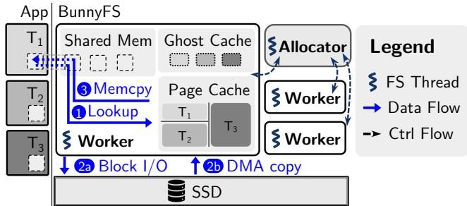  
Figure 10: BunnyFS Architecture.

## 5.1 BunnyFS Design and Implementation

The BunnyFS architecture is shown in Figure 10. The filesystem process contains multiple worker threads and an allocator thread. A tenant submits requests to a worker thread via a shared memory region. Read request handling consists of the following steps: 1 The worker polls the request and looks up the data in the tenant’s page cache. 2a On a cache miss, the worker submits a block I/O request to the SSD via SPDK [51]. 2b The NVMe controller of the SSD copies data to the page cache through direct memory access (DMA). For cache hits, step 2 is skipped. 3 The worker copies data from the page cache to the tenant’s shared memory region.

BunnyFS manages three types of resources: page cache, I/O bandwidth, and FS workers’ CPU cycles. The memory copy in step 3 is the major consumer of CPU cycles, while other steps are relatively CPU-light; since step 3 does not benefit from cache hits, we model CPU cycles as a cacheindependent resource. Our implementation of BunnyFS is primarily optimized for reads. A write workload is treated like an uncacheable read workload: it consumes I/O bandwidth and does not benefit much from a large cache.

BunnyFS Worker Threads. Workers manage per-tenant LRU page caches and request queues; they use rate limiters to control every tenant’s CPU and I/O bandwidth consumption. Workers perform resource accounting and maintain ghost caches to construct demand vectors and MRCs. BunnyFS uses a ghost cache implementation similar to HopperKV’s.

BunnyFS Allocator Thread. The allocator thread wakes up periodically to adjust resource allocation. It polls demand vectors and MRCs from workers, runs the HARE algorithm, and notifies workers of new allocation. By periodically adjusting resource allocations (every one or a few seconds), BunnyFS adapts to workload changes.

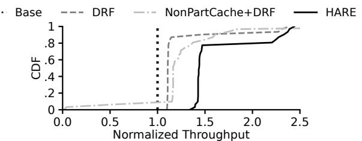  
Figure 11: BunnyFS Scaling Experiment Results as CDF.

## 5.2 BunnyFS Evaluation

We have conducted a complete evaluation of BunnyFS, but include only the major results here due to space limitations. Experiment Settings. We show two sets of experiments to evaluate BunnyFS: the scaling experiment (Section 5.2.1) verifies that BunnyFS is scalable using 32 tenants; the $d y -$ namic experiment (Section 5.2.2) shows BunnyFS can adapt to workload changes.

We integrated three alternative policies into BunnyFS for comparison: the equal partitioning baseline, DRF with equal cache partitions (labeled as “DRF”), and DRF with a shared, non-partitioned cache (labeled as “NonPartCache+DRF”). As seen in Section 4.4, NonPart is not fair; NonPartCache+DRF is a middle ground between DRF and NonPart, where I/O bandwidth and CPU cycles are carefully allocated by DRF, but cache management is delegated to a global LRU pool.

In all experiments, BunnyFS manages a total of 2 GB page cache, four vCPU for worker threads, and 2 GB/s I/O bandwidth, unless otherwise specified. To stress the filesystem, each tenant contains four threads submitting requests. Experiments are run on a machine with an Intel Xeon Gold 5218R 2.9 GHz processor, 64 GB memory, and an Intel Optane P4800X Series 375 GB SSD.

## 5.2.1 BunnyFS Scaling Experiment

We show that BunnyFS can manage workloads containing 32 tenants. There are four groups of tenants: $\mathrm { T _ { 1 } \mathrm { - } T _ { 8 } }$ read data with uniform distribution; $\mathrm { T } _ { 9 ^ { - } } \mathrm { T } _ { 1 6 }$ read data with Zipfian distribution $( \Theta = 0 . 9 9 ) ; \mathrm { T } _ { 1 7 } \mathrm { - T } _ { 2 4 }$ read data with less-skewed Zipfian distribution $( \Theta = 0 . 5 ) ; \mathrm { T } _ { 2 5 } \mathrm { - } \mathrm { T } _ { 3 2 }$ read data sequentially. Within each group, the working sets of tenants are 64 MB, 128 MB, 192 $\mathrm { M B , \ldots , }$ and 512 MB, respectively.

Figure 11 compares the normalized throughput of four policies. As expected, both HARE and pure DRF guarantee the sharing incentive, but while DRF achieves only 10% improvement, HARE improves most tenants’ throughput by 40%. HARE also outperforms NonPartCache+DRF in efficiency: HARE recognizes that the sequential workloads are uncacheable and does not allocate cache to them, while Non-PartCache+DRF allows those tenants to continuously add low-utility data to the cache, evicting other tenants’ data.

Importantly, NonPartCache+DRF violates the fairness goal: three tenants with low miss ratios $( \mathrm { T } _ { 1 } , \mathrm { T } _ { 2 } ,$ , and $\mathrm { T } _ { 1 7 }$ with 1%, 12%, and 3%, respectively) experience a dramatic throughput drop compared to the baseline. This unfairness occurs because a tenant’s demand vector depends on the miss ratios and is subject to other tenants’ interference. These low-miss-ratio tenants are allocated little I/O bandwidth; after DRF allocation, some other tenants have throughput increased and access the shared LRU more frequently, making their data appear hotter; those low-miss-ratio tenants consequently see higher miss ratios and suffer from insufficient I/O bandwidth. Moreover, once a tenant’s throughput drops, it accesses the shared LRU cache less frequently and is more likely to have data evicted; this further exacerbates unfairness and makes it more difficult for the victim to recover. Thus, DRF fundamentally does not interact well with a non-partitioned cache.

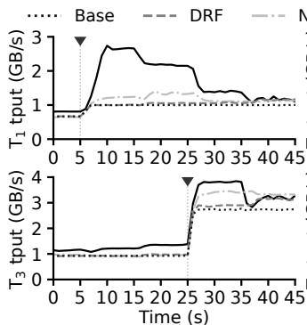

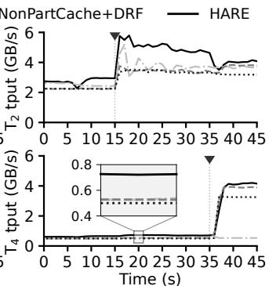  
Figure 12: BunnyFS Dynamic Experiment Results.

## 5.2.2 BunnyFS Dynamic Experiment

We evaluate how well BunnyFS can handle tenants whose workloads change over time. Our workload contains four tenants whose overall trend is to become less I/O-bound over time: $\mathrm { T } _ { 1 }$ performs uniform random reads over a working set that begins with 2 GB and shrinks to 1 GB at the $5 ^ { \mathrm { t h } }$ second; $\mathrm { T } _ { 2 }$ reads with Zipfian distribution $( \Theta = 0 . 9 9 )$ beginning with 2 GB and shrinking to 1 GB at the $1 5 ^ { \mathrm { t h } }$ second; $\mathrm { T } _ { 3 }$ reads a 1.5 GB working set following a Zipfian distribution, beginning with $\theta = 0 . 5$ and turning more skewed to $\theta = 0 . 9 9$ at the $2 5 ^ { \mathrm { t h } }$ second; $\mathrm { T } _ { 4 }$ reads data sequentially beginning with 2 GB and shrinking to 0.5 GB at the $3 5 ^ { \mathrm { t h } }$ second. We set the allocation frequency in BunnyFS to be every one second.

Figure 12 compares the four tenants’ throughput with the four allocation approaches over time. HARE consistently outperforms the other two fair alternatives (baseline and pure DRF). DRF does not achieve much improvement over the baseline in the first 35 seconds, because all tenants are I/Obound; DRF only improves throughput when there is a mix of CPU- and I/O-bound tenants. NonPartCache+DRF violates the sharing incentive goal, performing worse than the baseline after the $3 5 ^ { \mathrm { t h } }$ second: at this point, the working set of $\mathrm { T } _ { 4 }$ can fit into the baseline cache and therefore should have high throughput; however, with a non-partitioned cache, $\mathrm { T } _ { 4 } \mathrm { \ ' } _ { \mathrm { s } }$ data is evicted by others before being read again and its throughput remains the same as with 100% misses.

## 6 Related Work

Multi-Resource Allocation. DRF [25] is one of the earliest studies addressing fair allocation across multiple resource types. Since then, a series of variants have been proposed, tailored for systems with various considerations. DRFQ [24] applies DRF to network packet queueing. HUG [17] optimizes utilization when demands are elastic on non-dominant resources. Choosy [26] presents a fair cluster job scheduler that incorporates placement constraints. Choi et al. [16] propose a lifetime-aware DRF for flash-based caching systems. Synergy [36] jointly allocates GPUs, CPUs, and memory. They focus on resources with no (negative) correlation.

MIRA [53] introduces interchangeable resources (e.g., CPUs and GPUs) into DRF’s model, which is a case of linear correlation (e.g., a GPU’s speedup over a CPU by a constant factor). Our work focuses on the cache correlation, which is a more complicated non-linear relationship.

Cache Allocation. Multi-tenant caches have been extensively studied. A long line of research allocates caches as a standalone resource and optimizes only for miss ratios [1, 18–20, 29, 38]. As a result, they miss the opportunity to exploit the correlation between caches and other resources.

Moirai [52] and Centaur [31] capture the correlation between cache and backend I/O, but they treat cache as the primary knob and only passively report required I/O. Argon [55] targets the opposite, which only allocates I/O and passively reports the required cache. Consequently, none of them fully exploits cache correlations to holistically optimize allocation. CoPart [37] share the vision with HARE but focuses solely on the single cache correlation between CPU last-level cache and memory bandwidth. Similarly, the concurrent work Spirit [32] jointly allocates cache and network bandwidth, but is restricted to only a single cache-correlated resource.

## 7 Conclusion

We presented HARE, a cache-centric multi-resource allocation algorithm for storage services. Using a novel two-phase harvest/redistribute approach, HARE jointly allocates cache and other resources to fully exploit the heterogeneous cache sensitivity across tenants, maximizing the throughput of each while maintaining fairness.

We built HopperKV, a cloud-native key-value store, and BunnyFS, a high-performance local filesystem for NVMe SSDs. Both systems require no prior knowledge of tenants’ demands; they can efficiently learn the demands and adapt to dynamic workloads on the fly. Evaluations show that HopperKV achieves up to 1.9× higher throughput, and BunnyFS achieves up to 1.4×.

More broadly, this work highlights the importance of treating caches as integral components of multi-resource allocation, rather than as isolated subsystems. As storage services grow increasingly complex, spanning both hardware resources (e.g., network bandwidth) and software resources (e.g., backend read units), there is a growing need for a unified framework that captures demand correlations and allocates all resources holistically. HARE represents a practical step towards such a vision, demonstrating how cache-centric allocation can effectively account for these interactions and improve both efficiency and fairness in modern storage systems.

## Acknowledgments

We thank Carl Waldspurger, Ali R. Butt (our shepherd), and the anonymous reviewers for their valuable feedback. This work was supported by NSF grant CNS-2402859. Any opinions, findings, and conclusions or recommendations expressed do not necessarily reflect the views of NSF.

## References

[1] Christoph Albrecht, Arif Merchant, Murray Stokely, Muhammad Waliji, François Labelle, Nate Coehlo, Xudong Shi, and C. Eric Schrock. Janus: Optimal flash provisioning for cloud storage workloads. In 2013 USENIX Annual Technical Conference (USENIX ATC 13), pages 91–102, San Jose, CA, June 2013. USENIX Association.

[2] Amazon Web Services. MailUp Group: Marketing campaign planning and management (Italian). https: //www.youtube.com/watch?v=HwHVFWdczVw, 2019.

[3] Amazon Web Services. Mission: Gamified platform scaling with Amazon EKS. https://www.youtube. com/watch?v=xKaPAihW\_gE, 2019.

[4] Amazon Web Services. Heimdall Data: Query caching without code changes. https://www.youtube.com/ watch?v=OWLGK-eVrTw, 2020.

[5] Amazon Web Services. Ânima Educação: Digitizing student experience for colleges in Brazil. https://www. youtube.com/watch?v=9yziTe6lBwk, 2020.

[6] Amazon Web Services. Love, Bonito: Achieving scalability using Magento with Kubernetes. https://www. youtube.com/watch?v=BX1K8x1lVLc, 2021.

[7] Amazon Web Services. Social Quantum: Using serverless in gaming. https://www.youtube.com/watch? v=fSV0u48sEVg, 2021.

[8] Amazon Web Services. ADP: Unmatched people data for extraordinary outcomes. https://www.youtube. com/watch?v=KiH7hVJKzns, 2022.

[9] Amazon Web Services. Carbon by Indigo: Carbon credits for regenerative agriculture. https://www. youtube.com/watch?v=FfSNnH2bbNc, 2022.

[10] Amazon Web Services. Salesflo: Transforming fieldforce operations using event-driven architecture. https: //www.youtube.com/watch?v=qi017F1UwvM, 2023.

[11] Apache Hadoop. Hadoop: Fair Scheduler. https:// hadoop.apache.org/docs/stable/hadoop-yarn/ hadoop-yarn-site/FairScheduler.html.

[12] Benjamin Berg, Daniel S. Berger, Sara McAllister, Isaac Grosof, Sathya Gunasekar, Jimmy Lu, Michael Uhlar, Jim Carrig, Nathan Beckmann, Mor Harchol-Balter, and Gregory R. Ganger. The CacheLib caching engine: Design and experiences at scale. In 14th USENIX Symposium on Operating Systems Design and Implementation (OSDI 20), pages 753–768. USENIX Association, November 2020.

[13] Daniel S. Berger, Benjamin Berg, Timothy Zhu, Siddhartha Sen, and Mor Harchol-Balter. RobinHood: Tail latency aware caching – dynamic reallocation from Cache-Rich to Cache-Poor. In 13th USENIX Symposium on Operating Systems Design and Implementation (OSDI 18), pages 195–212, Carlsbad, CA, October 2018. USENIX Association.

[14] Daniel S. Berger, Ramesh K. Sitaraman, and Mor Harchol-Balter. AdaptSize: Orchestrating the hot object memory cache in a content delivery network. In 14th USENIX Symposium on Networked Systems Design and Implementation (NSDI 17), pages 483–498, Boston, MA, March 2017. USENIX Association.

[15] Damiano Carra and Giovanni Neglia. Efficient miss ratio curve computation for heterogeneous content popularity. In 2020 USENIX Annual Technical Conference (USENIX ATC 20), pages 741–751. USENIX Association, July 2020.

[16] Wonil Choi, Bhuvan Urgaonkar, Mahmut Taylan Kandemir, and George Kesidis. Multi-resource fair allocation for consolidated flash-based caching systems. In Proceedings of the 23rd ACM/IFIP International Middleware Conference, Middleware ’22, page 202–215, New York, NY, USA, 2022. Association for Computing Machinery.

[17] Mosharaf Chowdhury, Zhenhua Liu, Ali Ghodsi, and Ion Stoica. HUG: Multi-Resource fairness for correlated and elastic demands. In 13th USENIX Symposium on Networked Systems Design and Implementation (NSDI’16), pages 407–424, Santa Clara, CA, March 2016. USENIX Association.

[18] Asaf Cidon, Assaf Eisenman, Mohammad Alizadeh, and Sachin Katti. Dynacache: Dynamic cloud caching. In 7th USENIX Workshop on Hot Topics in Cloud Computing (HotCloud 15), Santa Clara, CA, July 2015. USENIX Association.

[19] Asaf Cidon, Assaf Eisenman, Mohammad Alizadeh, and Sachin Katti. Cliffhanger: Scaling performance cliffs in web memory caches. In 13th USENIX Symposium on Networked Systems Design and Implementation (NSDI 16), pages 379–392, Santa Clara, CA, March 2016. USENIX Association.

[20] Asaf Cidon, Daniel Rushton, Stephen M. Rumble, and Ryan Stutsman. Memshare: a dynamic multi-tenant key-value cache. In 2017 USENIX Annual Technical Conference (USENIX ATC 17), pages 321–334, Santa Clara, CA, July 2017. USENIX Association.

[21] Brian F Cooper, Adam Silberstein, Erwin Tam, Raghu Ramakrishnan, and Russell Sears. Benchmarking cloud serving systems with ycsb. In Proceedings of the 1st ACM symposium on Cloud computing, pages 143–154, 2010.

[22] Nosayba El-Sayed, Anurag Mukkara, Po-An Tsai, Harshad Kasture, Xiaosong Ma, and Daniel Sanchez. Kpart: A hybrid cache partitioning-sharing technique for commodity multicores. In 2018 IEEE International Symposium on High Performance Computer Architecture (HPCA), pages 104–117, 2018.

[23] Brad Fitzpatrick. Distributed caching with memcached. Linux journal, 2004(124):5, 2004.

[24] Ali Ghodsi, Vyas Sekar, Matei Zaharia, and Ion Stoica. Multi-resource fair queueing for packet processing. In Proceedings of the ACM SIGCOMM 2012 Conference on Applications, Technologies, Architectures, and Protocols for Computer Communication, SIGCOMM ’12, page 1–12, New York, NY, USA, 2012. Association for Computing Machinery.

[25] Ali Ghodsi, Matei Zaharia, Benjamin Hindman, Andy Konwinski, Scott Shenker, and Ion Stoica. Dominant resource fairness: Fair allocation of multiple resource types. In Proceedings of the 8th USENIX Conference on Networked Systems Design and Implementation, NSDI’11, page 323–336, USA, 2011. USENIX Association.

[26] Ali Ghodsi, Matei Zaharia, Scott Shenker, and Ion Stoica. Choosy: Max-min fair sharing for datacenter jobs with constraints. In Proceedings of the 8th ACM European Conference on Computer Systems, EuroSys ’13, page 365–378, New York, NY, USA, 2013. Association for Computing Machinery.

[27] Raúl Gracia-Tinedo, Josep Sampé, Edgar Zamora, Marc Sánchez-Artigas, Pedro García-López, Yosef Moatti, and Eran Rom. Crystal: Software-Defined storage for Multi-Tenant object stores. In 15th USENIX Conference on File and Storage Technologies (FAST 17), pages

243–256, Santa Clara, CA, February 2017. USENIX Association.

[28] Ajay Gulati, Irfan Ahmad, and Carl A. Waldspurger. PARDA: Proportional allocation of resources for distributed storage access. In 7th USENIX Conference on File and Storage Technologies (FAST 09), San Francisco, CA, February 2009. USENIX Association.

[29] Xiameng Hu, Xiaolin Wang, Yechen Li, Lan Zhou, Yingwei Luo, Chen Ding, Song Jiang, and Zhenlin Wang. LAMA: Optimized locality-aware memory allocation for key-value cache. In 2015 USENIX Annual Technical Conference (USENIX ATC 15), pages 57–69, Santa Clara, CA, July 2015. USENIX Association.

[30] Michael Isard, Vijayan Prabhakaran, Jon Currey, Udi Wieder, Kunal Talwar, and Andrew Goldberg. Quincy: Fair scheduling for distributed computing clusters. In Proceedings of the ACM SIGOPS 22nd Symposium on Operating Systems Principles, SOSP ’09, page 261–276, New York, NY, USA, 2009. Association for Computing Machinery.

[31] Ricardo Koller, Ali José Mashtizadeh, and Raju Rangaswami. Centaur: Host-side ssd caching for storage performance control. In 2015 IEEE International Conference on Autonomic Computing, pages 51–60, 2015.

[32] Seung-seob Lee, Jachym Putta, Ziming Mao, and Anurag Khandelwal. Spirit: Fair allocation of interdependent resources in remote memory systems. In Proceedings of the ACM SIGOPS 31st Symposium on Operating Systems Principles, SOSP ’25, page 120–135, New York, NY, USA, 2025. Association for Computing Machinery.

[33] Conglong Li and Alan L. Cox. Gd-wheel: a cost-aware replacement policy for key-value stores. In Proceedings of the Tenth European Conference on Computer Systems, EuroSys ’15, New York, NY, USA, 2015. Association for Computing Machinery.

[34] Jing Liu, Anthony Rebello, Yifan Dai, Chenhao Ye, Sudarsun Kannan, Andrea C. Arpaci-Dusseau, and Remzi H. Arpaci-Dusseau. Scale and performance in a filesystem semi-microkernel. In Proceedings of the ACM SIGOPS 28th Symposium on Operating Systems Principles, SOSP ’21, page 819–835, New York, NY, USA, 2021. Association for Computing Machinery.

[35] R.L. Mattson, J. Gecsei, D. R. Slutz, and I. L. Traiger. Evaluation techniques for storage hierarchies. IBM Systems Journal, 9(2):78–117, 1970.

[36] Jayashree Mohan, Amar Phanishayee, Janardhan Kulkarni, and Vijay Chidambaram. Looking beyond GPUs

for DNN scheduling on Multi-Tenant clusters. In 16th USENIX Symposium on Operating Systems Design and Implementation (OSDI 22), pages 579–596, Carlsbad, CA, July 2022. USENIX Association.

[37] Jinsu Park, Seongbeom Park, and Woongki Baek. Copart: Coordinated partitioning of last-level cache and memory bandwidth for fairness-aware workload consolidation on commodity servers. In Proceedings of the Fourteenth EuroSys Conference 2019, EuroSys ’19, New York, NY, USA, 2019. Association for Computing Machinery.

[38] Qifan Pu, Haoyuan Li, Matei Zaharia, Ali Ghodsi, and Ion Stoica. FairRide: Near-Optimal, fair cache sharing. In 13th USENIX Symposium on Networked Systems Design and Implementation (NSDI 16), pages 393–406, Santa Clara, CA, March 2016. USENIX Association.

[39] Moinuddin K. Qureshi and Yale N. Patt. Utility-based cache partitioning: A low-overhead, high-performance, runtime mechanism to partition shared caches. In 2006 39th Annual IEEE/ACM International Symposium on Microarchitecture (MICRO’06), pages 423–432, 2006.

[40] Redis. Redis FAQ. https://redis.io/docs/ latest/develop/get-started/faq/.

[41] Redis. Redis Module API Docs. https://redis.io/ docs/latest/develop/reference/modules/.

[42] Redis. Scale with Redis Cluster. https: //redis.io/docs/latest/operate/oss\_and\_ stack/management/scaling/.

[43] Salvatore Sanfilippo. Redis. https://redis.io/, 2009.

[44] Sambhav Satija, Chenhao Ye, Ranjitha Kosgi, Aditya Jain, Romit Kankaria, Yiwei Chen, Andrea C. Arpaci-Dusseau, Remzi H. Arpaci-Dusseau, and Kiran Srinivasan. Cloudscape: A study of storage services in modern cloud architectures. In 23rd USENIX Conference on File and Storage Technologies (FAST 25), pages 103– 121, Santa Clara, CA, February 2025. USENIX Association.

[45] Amazon Web Services. Amazon DynamoDB. https: //aws.amazon.com/dynamodb/.

[46] Amazon Web Services. Amazon DynamoDB Pricing. https://aws.amazon.com/dynamodb/pricing/.

[47] Amazon Web Services. Amazon EC2. https://aws. amazon.com/ec2/.

[48] Amazon Web Services. Amazon ElastiCache. https: //aws.amazon.com/elasticache/.

[49] Amazon Web Services. Amazon Relational Database Service. https://aws.amazon.com/rds/.

[50] David Shue, Michael J. Freedman, and Anees Shaikh. Performance isolation and fairness for Multi-Tenant cloud storage. In 10th USENIX Symposium on Operating Systems Design and Implementation (OSDI 12), pages 349–362, Hollywood, CA, October 2012. USENIX Association.

[51] SPDK Open-source Team. The Storage Performance Development Kit. https://spdk.io/doc, 2021.

[52] Ioan Stefanovici, Eno Thereska, Greg O’Shea, Bianca Schroeder, Hitesh Ballani, Thomas Karagiannis, Antony Rowstron, and Tom Talpey. Software-defined caching: Managing caches in multi-tenant data centers. In Proceedings of the Sixth ACM Symposium on Cloud Computing, SoCC ’15, page 174–181, New York, NY, USA, 2015. Association for Computing Machinery.

[53] Xiao Sun, Tan N. Le, Mosharaf Chowdhury, and Zhenhua Liu. Fair allocation of heterogeneous and interchangeableresources. SIGMETRICS Perform. Eval. Rev., 46(2):21–23, jan 2019.

[54] Eno Thereska, Hitesh Ballani, Greg O’Shea, Thomas Karagiannis, Antony Rowstron, Tom Talpey, Richard Black, and Timothy Zhu. Ioflow: A software-defined storage architecture. In Proceedings of the Twenty-Fourth ACM Symposium on Operating Systems Principles, SOSP ’13, page 182–196, New York, NY, USA, 2013. Association for Computing Machinery.

[55] Matthew Wachs, Michael Abd-El-Malek, Eno Thereska, and Gregory R Ganger. Argon: Performance insulation for shared storage servers. In 5th USENIX Conference on File and Storage Technologies (FAST 07), San Jose, CA, February 2007. USENIX Association.

[56] Carl Waldspurger, Trausti Saemundsson, Irfan Ahmad, and Nohhyun Park. Cache modeling and optimization using miniature simulations. In 2017 USENIX Annual Technical Conference (USENIX ATC 17), pages 487– 498, Santa Clara, CA, July 2017. USENIX Association.

[57] Carl A. Waldspurger, Nohhyun Park, Alexander Garthwaite, and Irfan Ahmad. Efficient MRC construction with shards. In Proceedings of the 13th USENIX Conference on File and Storage Technologies, FAST’15, page 95–110, USA, 2015. USENIX Association.

[58] Juncheng Yang, Yao Yue, and K. V. Rashmi. Anonymized cache request traces from twitter production. https://github.com/twitter/cache-trace, 2020.

[59] Juncheng Yang, Yao Yue, and K. V. Rashmi. A large scale analysis of hundreds of in-memory cache clusters at twitter. In 14th USENIX Symposium on Operating Systems Design and Implementation (OSDI 20), pages 191–208. USENIX Association, November 2020.

[60] Chenhao Ye, Shawn Zhong, Andrea C. Arpaci-Dusseau, and Remzi H. Arpaci-Dusseau. BunnyFS codebase. https://github.com/WiscADSL/bunnyfs, 2025.

[61] Chenhao Ye, Shawn Zhong, Andrea C. Arpaci-Dusseau, and Remzi H. Arpaci-Dusseau. HopperKV codebase. https://github.com/WiscADSL/hopperkv, 2025.