①

USENIX

THE ADVANCED COMPUTING SYSTEMS ASSOCIATION

# Cylon: Fast and Accurate Full-System Emulation of CXL-SSDs

Dongha Yoon, Hansen Idden, Jinshu Liu, Berkay Inceisci, Sam H. Noh, and Huaicheng Li, Virginia Tech

## https://www.usenix.org/conference/fast26/presentation/yoon

This paper is included in the Proceedings of the 24th USENIX Conference on File and Storage Technologies.

February 24–26, 2026 • Santa Clara, CA, USA

ISBN 978-1-939133-53-3

Open access to the Proceedings of the 24th USENIX Conference on File and Storage Technologies is sponsored by

# Cylon: Fast and Accurate Full-System Emulation of CXL-SSDs

Dongha Yoon†, Hansen Idden†, Jinshu Liu, Berkay Inceisci, Sam H. Noh, Huaicheng Li

Virginia Tech

## Abstract

We present Cylon, a fast and extensible full-system emulator for CXL-SSDs built on FEMU. Cylon bridges the gap between closed hardware prototypes and slow software simulators by faithfully reproducing sub-µs cache hits and tens-of-µs misses that fall to NAND through a hybrid execution path that mitigates hypervisor trap overheads. Cylon supports configurable caching policies and provides an applicationlevel interface for hardware-software co-design. Validated against a real CXL-SSD prototype, Cylon accurately models performance across a wide range of applications, from microbenchmarks to full-scale workloads. Our evaluation shows that Cylon reproduces realistic latency distributions, executes unmodified applications at near bare-metal speed, and scales to system-level studies. By combining speed, fidelity, and extensibility, Cylon fills a critical gap for evaluating today’s CXL-SSDs and exploring next-generation architectures that blend CXL-enabled memory and storage semantics.

## 1 Introduction

Modern data-intensive workloads such as ML/AI and graph processing increasingly strain the memory wall: processors and datasets continue to grow rapidly, while DRAM remains costly and difficult to scale, making it a dominant bottleneck for many applications. Compute Express Link (CXL) offers a promising path forward by enabling heterogeneous memory devices to attach directly to CPUs over a load/store interface. A notable option is to attach SSDs behind CXL as a byteaddressable tier: a small DRAM cache serves hot data at subµs latency, while large NAND flash provides multi-terabyte capacity with tens-of-µs misses [1–7]. This pairing aims to deliver memory-like programmability at storage-like cost.

While CXL-SSDs are promising to collapse the longstanding boundary between memory and storage, enabling new OS abstractions and near-data execution models that assume a fast tier for hits and tolerate tens-of-µs misses, the design space is still in its early stages. Yet the community lacks the tools to move from promise to practice. There is a lack of systematic understanding of how tens-of-µs misses translate into end-to-end stalls across full software stacks and real applications, which cache management and prefetching policies best blunt these stalls under mixed locality, or how to co-design hardware and software so that memory-like and storage-like semantics reinforce each other rather than conflict. Answering these questions requires a platform that is faithful enough to expose the true fast and slow paths, fast enough to run real workloads, and open enough to let researchers explore the policy levers that will define the next generation of CXL-SSD designs.

Industry prototypes validate feasibility but are poor research vehicles. Samsung’s CMM-H, for example, demonstrates costeffective expansion but is largely opaque: cache management is firmware-controlled, policy knobs are absent, and meaningful exploration requires hardware modification [1, 4, 8]. More broadly, hardware platforms are scarce, costly to access, and often demand the latest servers and firmware. Their black-box nature makes it difficult to study cache policies, prefetching, or hardware-software co-design, limiting the community’s ability to evaluate designs or optimize system software.

Academic and community efforts provide useful but incomplete alternatives. FPGA-based frameworks such as OpenCXD allow functional experimentation but abstract away NAND behavior and thus cannot evaluate latency or bandwidth [9]. Trace-driven simulators [3, 10] provide rich configurability, yet they operate orders of magnitude slower than real time and cannot capture dynamic interactions with full software stacks. Cycle-accurate simulators [11, 12] improve device fidelity but are prohibitively slow for system-level studies. Functional emulators such as QEMU run unmodified OSes and applications, but lack the speed, fidelity, and extensibility needed for policy or hardware evaluation.

Cylon is, to our knowledge, the first full-system platform that provides true CXL.mem load/store semantics with latency asymmetry (sub-µs hits vs. tens-of-µs misses) and configurable caching policies. Unlike QEMU-CXL [13], which forces all accesses through MMIO/VM-exit paths, Cylon’s Dynamic EPT Remapping (DER) enables cacheline-granular load/stores to complete without VM-exits. Unlike block-based emulators such as FEMU [14] and NVMeVirt [15], Cylon exposes CXL.mem interfaces, making it fundamentally different from NVMe SSD emulation.

This gap is especially pressing because the design space of CXL-SSDs is broad and unsettled. Beyond CMM-H, proposals envision tighter coupling between CXL and NVMe for coherent memory sharing [7], collapsing the boundary between CXL and SSD controllers to expose NAND parallelism [16], or even merging memory and storage semantics so software can steer capacity directly [5]. These directions raise open questions: how severe are end-to-end stalls from tens-of-µs misses in practice, which cache policies best mitigate them, and how hardware and software should be co-designed to balance memory-like and storage-like semantics. Addressing these questions requires a platform that faithfully models CXL-SSD behavior while supporting rapid, full-system exploration.

Building such a platform is technically challenging. Unlike block I/O emulation, a CXL-SSD must be exposed as byteaddressable memory mapped into the CPU’s physical address space. Capturing sub-µs cache hits alongside tens-of-µs cache misses that fall to NAND requires avoiding hypervisor overheads that plague conventional emulators. At the same time, the emulator must support flexible cache management policies and application-level hints, while remaining fast enough to run unmodified OSes and full workloads. Meeting all three demands, fidelity, speed, and extensibility, requires rethinking how full-system emulation integrates virtualization, cache modeling, and SSD timing.

We present Cylon, the first FEMU-based full-system emulator for CXL-SSDs that combines speed, fidelity, and extensibility. At its core is a hybrid access path that eliminates hypervisor VM-exit overhead [17–20] on cache hits while accurately trapping misses into FEMU for faithful SSD emulation. Validated against a commercial CXL-SSD prototype (CMM-H), Cylon reproduces sub-µs cache hits and tens-of-µs cache misses, matches bandwidth and latency distributions across microbenchmarks, and closely tracks application-level performance trends for Redis and graph analytics. By combining these properties, Cylon enables both faithful reproduction of today’s hardware and rapid exploration of next-generation designs, filling a critical gap for evaluating CXL-SSDs and guiding the development of future CXL-enhanced storage architectures. In sum, we make the following contributions:

• We design and implement Cylon, the first fast, full-system CXL-SSD emulator that faithfully captures both cache hits and cache misses.

• We introduce a hybrid access path combining dynamic EPT remapping and shared EPT memory to eliminate VM-exit overheads on hits and reduce transition costs on misses.

• We provide a flexible caching framework with configurable policies and an application-level interface, enabling systematic study of hardware-software co-design.

• We demonstrate that Cylon extends beyond CMM-H, supporting exploration of alternative CXL-storage designs that expose memory, storage, or hybrid semantics.

• We have upstreamed Cylon to FEMU at https://github .com/MoatLab/FEMU.

The rest of this paper is organized as follows. §2–§3 provide background and related work. §4 presents Cylon design, while §5 evaluates its fidelity, performance, and extensibility against CMM-H and applications. §6 concludes.

Throughout the paper, we use the term cache to refer specifically to the DRAM cache inside CXL-SSDs, and all eviction and prefetching policies we discuss are for CXL-SSDs, not for CPU caches or SSD-internal mechanisms.

## 2 Background and Motivation

Compute Express Link (CXL). CXL is a new interconnect that exposes memory semantics over a load/store interface [21]. Through the CXL.mem protocol, CPUs can issue cacheable loads and stores directly to attached devices, making them appear as part of the physical address space. This ability to integrate heterogeneous memory tiers transparently underpins the design of CXL-SSDs.

CMM-H as a representative CXL-SSD. CXL-SSDs pair a small DRAM cache with large-capacity NAND flash and present the entire SSD address space to the CPU through CXL.mem [16]. The DRAM cache serves frequent accesses at sub-µs latency, while NAND provides multi-terabyte capacity at far lower cost than DRAM but incurs tens of µs per miss [4]. Prototypes such as Samsung’s CMM-H [4, 8] demonstrate feasibility, yet also highlight the stark latency asymmetry that makes cache management central: a single cache miss can stall the CPU pipeline, whereas effective eviction and prefetching are essential to narrow the gap.

CMM-H is a hybrid CXL memory prototype that integrates a 48GB DRAM cache (4KB cacheline) with a 1TB NVMe SSD backend, coordinated by an Intel Agilex FPGA controller over PCIe Gen5 [8]. By using DRAM as a write-back cache with LRU replacement (or MRU insertion) [4], CMM-H aims to hide much of the SSD latency while exposing terabytescale, byte-addressable memory to the host. The device also supports prefetching, though the precise policy is opaque. Its performance peaks when working sets fit in cache, reaching near-PCIe saturation bandwidth, but degrades significantly as accesses exceed cache capacity.

Challenges in CXL-SSD research. Despite their promise, CXL-SSDs pose three fundamental challenges for researchers and system designers: (a) Opaque prototypes. Commercial platforms expose only narrow firmware knobs and provide little visibility into cache dynamics, preventing systematic policy exploration. (b) Memory-semantic modeling. Unlike block devices, CXL-SSDs must be modeled as byteaddressable memory, capturing DRAM/NAND asymmetry and fine-grained load/store concurrency. (c) Full-system context. The effectiveness of cache management depends on fast interactions with a real OS and applications.

FEMU as the SSD backend. FEMU [14] is a popular opensource SSD emulator built on QEMU that stores backend data in host DRAM and uses dedicated threads to model NAND flash timing, including channel, die, and plane parallelism, read/program/erase latencies, and garbage-collection interference. Cylon extends FEMU as its CXL-SSD backend: on a cache miss, the request is forwarded to FEMU, which returns

Table 1: CXL-SSD platforms. Cylon uniquely couples validated, high-performance full-stack emulation with extensible policies.
<table><tr><td rowspan="2">System</td><td rowspan="2"></td><td colspan="3"> $V _ { a / { j _ { d } } _ { d _ { d } } } \underset { 0 _ { l } } { P } _ { { \mathrm { e } } _ { r { f _ { 0 } } _ { r _ { m _ { d } } } } } \ F _ { u / { l } _ { \mathrm { - } s _ { t _ { d } } } } \overbrace { { P } _ { a } { { p } _ { d } } _ { r { \mathrm { e } } _ { l } } } { E } _ { { t } { { \mathrm { e } } _ { { n _ { c } } _ { j } } } { { b } } _ { { i } { j } _ { i } } } _ { { t } { { \mathrm { y } } } }$ </td></tr><tr><td></td><td></td><td></td></tr><tr><td>MQSim-CXL [3]</td><td>no</td><td>low</td><td>no</td><td></td><td>yes</td></tr><tr><td>ESF[10]</td><td>no</td><td>low</td><td>no</td><td></td><td>yes</td></tr><tr><td>CXL-SSD-Sim [11]</td><td>no</td><td>very low</td><td>no</td><td></td><td>no</td></tr><tr><td>CXL-DMSim [12]</td><td>no</td><td>very low</td><td>no</td><td>1</td><td>yes</td></tr><tr><td>OpenCXD [9]</td><td>1</td><td>low</td><td>yes</td><td>yes</td><td>二</td></tr><tr><td>QEMU [22]</td><td>一</td><td>low</td><td>yes</td><td>yes</td><td></td></tr><tr><td>Cylon</td><td>yes</td><td> high</td><td>yes</td><td>yes</td><td>yes</td></tr></table>

data after applying the appropriate NAND timing delay.

The need for Cylon. Studying CXL-SSDs requires a platform that unifies three properties: (1) full-stack execution, to run unmodified operating systems and applications; (2) near bare-metal speed, to reproduce sub-µs cache hits and tens-of-µs cache misses; and (3) accurate device modeling, capturing DRAM cache dynamics and NAND timing. Existing prototypes and simulators each deliver only a subset of these goals, forcing trade-offs between fidelity, speed, and transparency. Cylon closes this gap as the first fast, faithful, and extensible full-system emulator for CXL-SSDs.

## 3 Related Work

Table 1 groups prior CXL-SSD platforms by how they balance fidelity, execution speed, and accessibility to software stacks. Despite rapid progress, no existing framework simultaneously exposes real-time, full-system execution while offering validated device-model fidelity sufficient to study CXL-SSDs.

Prototype hardware. Early demonstrations rely on proprietary hardware prototypes. Commercial CMM-H devices and reference platforms [1, 16] highlight the promise of attaching commercial SSDs with a frontend DRAM cache over CXL, but vendors only expose narrow firmware knobs and provide little visibility into eviction or prefetching behavior. Hybrid approaches such as OpenCXD [9] combine host software with hardware, yet they remain gated by limited device availability, lack public extensibility, and cannot run arbitrary applications against modified controller logic. As a result, prototype platforms showcase feasibility but offer little flexibility for researchers exploring new policies.

Functional emulation. The community has therefore gravitated toward software emulators. QEMU’s upstream CXL support [13] inherits the ability to boot unmodified guests, making it attractive for OS and application integration studies. However, its device model focuses solely on CXL protocol functionality, without modeling any hardware components behind CXL, such as DRAM cache, SSD internals, etc. Worse, execution relies on emulated MMIO and VM-exits for every access, inflating latency to ∼15 µs, orders of magnitude slower than CXL-SSD targets. This functional-only approach provides transparency but sacrifices realism and performance.

Trace-driven simulators. Trace-driven infrastructures such as MQSim-CXL [3] and ESF [10] emphasize device configurability. By decoupling host execution from device timing, they can sweep buffer sizes and eviction heuristics while modeling flash pipelines. Yet they depend on pre-recorded traces, meaning (1) they cannot capture dynamic interactions with unmodified software stacks, (2) they are extremely slow due to cycle accuracy, and (3) they have not been validated against real CXL-SSDs. Thus, their results are analytically rich but detached from full-system context.

Cycle-accurate simulators. Cycle-level tools such as CXL-SSD-Sim [11] and CXL-DMSim [12] integrate with gem5 [23], pushing fidelity further by modeling controller pipelines in detail. However, their simulation is extremely slow. To run practical studies, researchers must shrink workloads or abstract away software behavior, precisely the layers most relevant to cache policy and end-to-end performance. Related efforts like CXLMemSim [? ] focus exclusively on CXL.mem timing, without SSD semantics, leaving cachingpolicy evaluation out of scope.

Summary of limitations. Taken together, existing emulation platforms face three fundamental drawbacks. First, slow emulation throughput: cycle-accurate simulators like gem5 yield faithful timing but are impractically slow for system-level studies. Second, limited full-stack visibility: trace-driven simulators capture device-side timing but cannot run unmodified operating systems or applications. Third, incomplete modeling of CXL-SSD features: while QEMU supports CXL type-3 devices, it does not capture NAND flash characteristics such as µs-scale program/read latencies, or the performance gap between DRAM cache hits and cache misses. Moreover, QEMU’s reliance on MMIO-driven VM-exits inflates latency into the microsecond regime, misrepresenting the sub-µs hit path of CXL memory. An ideal emulator must therefore combine (1) full-stack execution to reveal end-to-end implications, (2) near bare-metal speed to maintain realism, and (3) accurate device modeling, including both host-visible behavior and device-side timing. Support for host-provided hints and prefetching interfaces is equally important to enable hardware-software co-design.

Positioning of Cylon. Cylon bridges these divides: it retains QEMU’s commodity software compatibility and realtime execution, eliminates per-access VM-exits to achieve nanosecond-scale cache-hit latencies, and integrates analyzable models of DRAM-cache dynamics and SSD backend behavior. These properties enable simultaneous study of host-visible performance, algorithmic caching policies, and hardware-software co-designs, capabilities absent in all prior work. In short, whereas existing tools force researchers to choose between fidelity, speed, or transparency, Cylon is the first platform to combine all three.

## 4 Cylon Design and Implementation

This section presents the design of Cylon. We begin with high-level goals and challenges, then describe the architecture, followed by the core techniques for efficient and faithful emulation of CXL-SSDs. On top of these mechanisms we build configurable caching policies and application-level interfaces that enable hardware-software co-design.

## 4.1 Design Goals and Challenges

Cylon is designed with three key goals in mind. First, it must support full-stack execution of unmodified applications while accurately emulating CXL-SSD internals, including the CXL interface, the DRAM cache, and its interactions with the backend SSD. Second, it must reproduce realistic access latencies and bandwidth by eliminating overheads introduced by conventional emulators. Third, it must provide both application-level and hardware-level control over cache management to enable co-design. Achieving these goals requires addressing three challenges:

(1) Fidelity through load/store interface. CXL-SSDs support CXL.mem semantics: byte-addressable, cacheable memory accessible via load/store instructions. While FEMU and NVMeVirt model NAND behavior through a block I/O interface, Cylon’s CXL-SSD exposes its capacity directly in the CPU physical address space and is accessed through load/store instructions over CXL.mem. To emulate this model, Cylon must map the entire SSD logical address space into guest-physical memory address space, making it directly accessible and cacheable while preserving CXL semantics.

(2) Efficiency under strict latency constraints. Each memory-mapped I/O (MMIO) operation in QEMU incurs several microseconds of VM-exit latency, already an order of magnitude too slow to emulate cache hits that complete in a few hundred nanoseconds. Device logic in software adds further overhead. A new execution path is required to faithfully capture both sub-µs cache hits and tens-of-µs cache misses that fall to NAND.

(3) Extensibility for co-design. Future CXL-SSD systems will rely on sophisticated cache management. Eviction and prefetching policies, as well as application-provided hints/controls, will critically influence performance, alongside novel CXL-storage architecture designs. Cylon must therefore provide a configurable caching layer and interfaces that allow applications to influence placement, eviction, and prefetching strategies to mitigate the significant performance gap between DRAM cache and SSDs.

To address these challenges, Cylon integrates QEMU’s CXL emulation with FEMU, combining full-system execution with accurate device-level timing. QEMU supplies the CXL type-3 device model, virtual machine management, and unmodified guest OS support, while FEMU contributes its proven SSD timing engine for faithful NAND latency emulation. On top of this foundation, Cylon introduces a hybrid access path that separates fast cache hits from slow cache misses, together with a configurable caching layer for policy exploration. The following sections describe the architecture and mechanisms that enable this integration.

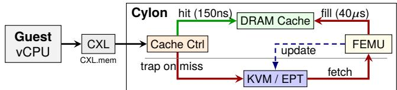  
Figure 1: Cylon architecture. Cylon with fast path (green, 150ns) for cache hits and slow path (red, 40𝜇s) for cache misses requiring SSD access. Blue dashed arrows show KVM/EPT updates.

## 4.2 Cylon Overview

Figure 1 shows the overall architecture of Cylon across three domains: the unmodified guest VM, a lightly modified host kernel/hypervisor, and host userspace with FEMU. To the guest, the emulated CXL-SSD appears as a standard CXL 2.0 Type-3 device, visible either as a DAX region or as a CPU-less NUMA node. The guest-visible capacity equals the backend SSD, while the DRAM cache is hidden and managed transparently, faithfully emulating a hardware-managed cache (e.g., similar to Samsung CMM-H). This design requires no guest driver changes and remains compatible with existing CXL software stacks.

Guest applications use it as regular memory by issuing ordinary load/store instructions over CXL.mem. The access path diverges into two cases. On a cache hit, the Extended Page Table Entry (EPTE) [24] points directly to the DRAM cache, and the access completes at DRAM speed with no VM-exit overhead. On a cache miss, the EPTE is marked as trapping, causing a VM-exit into KVM, where it is handled by the EPT page fault handler. KVM forwards the request to QEMU’s CXL emulation, which maps the guest-physical address (GPA) to an SSD offset and fetches data from the backend. Once the data returns, Cylon inserts it into the cache, evicting if necessary, and updates the EPTE to Direct state so subsequent accesses bypass VM-exits (more later). If the page is later evicted, the entry reverts to Trap state.

By combining direct mapping for hits and trapping for misses, Cylon faithfully reproduces the performance spectrum of CXL-SSDs: sub-µs cache hits and tens-of-µs misses. This hybrid design provides both fidelity to hardware semantics and efficiency within a full-system emulator.

## 4.3 Overcoming VM-Exit Overhead via Hybrid Path

Conventional QEMU/KVM device models (including QEMU CXL [13]) use MMIO, where each access traps into the hypervisor. While adequate for PCIe devices, MMIO is far too slow for modeling sub-microsecond DRAM cache hits in CXL-SSDs: a single guest load expands into tens of thousands of host instructions, with each VM-exit taking microseconds. Our measurements show that QEMU’s default CXL support relies on binary translation (TCG) [25], sustaining only a few

MB/s of bandwidth with highly unpredictable latencies, even when backed by DRAM. Without substantially improving QEMU’s baseline performance under CXL emulation and avoiding its slow execution path, an emulator cannot faithfully capture the performance characteristics of CXL-SSDs.

Cylon introduces three key optimizations to QEMU/KVM. First, Dynamic EPT Remapping eliminates VM-exits on cache hits. Second, Shared EPT Memory enables constant-time cache residency updates, reducing the overhead of miss and trap handling. Third, a modular caching layer with pluggable policies supports systematic evaluation of eviction and prefetching strategies. Together, these techniques capture both the fast path of sub-µs cache hits and the slow path of tens-of-µs misses while providing the flexibility for policy exploration. Algorithm 1 presents a high-level view of our optimizations. We next describe each component in detail.

## 4.3.1 Dynamic EPT Remapping (DER)

How can we avoid VM-exits for cache hits while preserving accurate emulation for cache misses? Every guest access undergoes address translation through Intel’s Extended Page Tables (EPT), which translate guest-physical addresses (GPAs) into host-physical addresses (HPAs) [24]. EPT is managed by CPU and KVM, where its leaf entry in this walk, the EPTE, encodes the target address and access permissions (R, W, X) as well as memory type. By manipulating EPTEs dynamically, Cylon toggles whether a page access is served directly from the cache or routed through the emulator. We call this mechanism Dynamic EPT Remapping (DER).

States. DER defines two legal states for each page. In the Direct state, the EPTE is set to [HPA | DIRECT MASK] with read (or read+write) permission enabled, execute cleared, and memory type of Write-Back (WB). The DIRECT MASK allows the EPT walk to complete without trapping and points directly to the target HPA, which corresponds to a physical address in the CXL-SSD DRAM cache. In the Trap state, the EPTE has R=W=X=0, which forces an EPT violation on any access. Although the PFN field is ignored by hardware in this state, Cylon programs it with a sentinel HPA to maintain tooling consistency and record the corresponding SSD address, which will later be used during miss handling (i.e., fetching data from SSD into the cache).

Transitions. DER uses a strict protocol to move pages between the cache and the SSD, ensuring both correctness and efficiency. On a cache fill operation, the requested data is copied into the cache, the EPTE is updated to [HPA | DIRECT MASK] so that subsequent accesses bypass the emulator, and an INVEPT single-context (or range) operation is issued to flush stale TLB entries before the guest is resumed. On a clean eviction, the page can be discarded without writeback; the EPTE is simply reset to R=W=X=0, and a targeted INVEPT invalidation is performed to maintain consistency. For a dirty eviction, the cached data is first written back to the SSD model (FEMU) to ensure persistence; only after the write completes is the EPTE cleared and the corresponding TLB entries invalidated. Together, these transitions preserve correct memory ordering and durability semantics, matching the behavior expected of a real CXL-SSD.

Invalidation. A central challenge in DER is maintaining consistency when EPTEs are updated. Naively issuing a global TLB shootdown on every transition would quickly overwhelm the system and destroy scalability. To avoid this, DER leverages hardware-supported primitives that target only the necessary entries. Specifically, INVEPT (Invalidate EPT) is used for page or range invalidations, ensuring that any stale translations are removed, and INVVPID is used to maintain consistency across guest contexts. Rather than issuing these invalidations one by one, Cylon KVM further improves efficiency by batching and coalescing them. For example, when many cache status flips occur close together, as in a prefetch burst, they are grouped into a small number of invalidate operations. This approach preserves correctness while keeping residency transitions lightweight and scalable, allowing DER to support high update rates without introducing prohibitive overhead.

Scalability. Cylon minimizes TLB shootdown overhead through: (1) Batching: We don’t issue a shootdown for every page flip; updates are batched (e.g., during prefetching); (2) Range Invalidation: We invalidate only the specific GPA range of the buffer, not the entire TLB; and (3) Miss-path only: EPT invalidation occurs strictly on the miss path. While broadcast costs increase with core count, the overhead remains negligible compared to the 40µs NAND fetch. Our validation with CMM-H shows performance saturating at 4 threads due to insufficient device parallelism, confirming device constraints, not host coherency, are the dominant bottleneck.

Safety. At VM creation, Cylon registers two immutable regions with KVM: (1) the pinned host-physical range that serves as the DRAM cache, and (2) the full guest-physical address range representing the backend SSD managed by FEMU. Cache residency transitions are constrained to flip EPTEs only between these two regions. Any attempt to install EPTEs outside these ranges is rejected. When updating an EPTE, KVM masks the operation so only the PFN selector and R/W/X bits are mutable; memory type and reserved bits remain under kernel control. Per-EPTE locks serialize concurrent updates, ensuring determinism under racing evictions or prefetches. Because DER manipulates only architected EPT permission bits, the design also maps cleanly to AMD’s Nested Page Tables (NPT) and ARM Stage-2 page tables [24], where equivalent permission bits and invalidation primitives exist.

## 4.3.2 Shared EPT Memory

While DER removes VM-exits from the hit path, residency transitions triggered by demand-read from FEMU or prefetching in QEMU still require modifying EPTEs. This requires a reliable and efficient mechanism for userspace-based QEMU to communicate with KVM for such EPTE updates. A straightforward approach is for FEMU to invoke a KVM ioctl() on every fill or eviction. Unfortunately, this introduces two forms of overhead. First, each syscall requires a kerneluserspace crossing, which takes microseconds even when the update itself is simple. Second, KVM must locate the relevant EPTE in host memory by walking internal data structures, since by default EPT pages are allocated lazily and scattered. Both costs add up quickly when workloads generate frequent cache transitions. Such overheads also lead to emulation inaccuracies due to potentially delayed EPTE updates with the latest DRAM cache status.

Algorithm 1: Dynamic EPT Remapping and Shared EPT   
Memory across Guest, FEMU, and KVM   
Input: Guest physical address (GPA)   
// Guest access (EPTE checking done by hardware)   
EPTE ← EPT[GPA];   
if EPTE.perm == Direct then   
Issue ld/st to Cylon cache; return data;   
else   
Trigger EPT violation; transfer control to KVM;   
// KVM miss handling   
LPN, Offset ← map(GPA);   
Enqueue Fill request with LPN, Offset to FEMU;   
Suspend guest vCPU until completion;   
// Cylon cache controller actions   
if request.type == Fill then   
Data ← backend.read(Offset);   
HPA ← cache.allocate(LPN);   
UpdateEPTE(LPN, Direct, HPA);   
Resume guest vCPU;   
else   
if request.type == EvictClean then   
cache.release(LPN);   
UpdateEPTE(LPN, Trap, ⊥);   
else   
if request.type == EvictDirty then   
backend.write(Offset, cache.data(LPN));   
cache.release(LPN);   
UpdateEPTE(LPN, Trap, ⊥);   
else   
foreach LPN’ in policy.pick(LPN) do   
if EPTE[LPN’].perm == Trap then   
Data ← backend.read(Offset(LPN’));   
HPA ← cache.allocate(LPN’);   
UpdateEPTE(LPN’, Direct, HPA);   
// KVM primitive: UpdateEPTE (index, state, HPA)   
if state == Direct then   
epte ← ComposeEPTE(hpa, perms=RW, type=WB)   
else   
epte ← ComposeEPTE(sentinel hpa, perms=0)   
Write epte to shared EPTE table at index;   
INVEPT(index);

How can we update EPTEs in constant time without repeated syscalls or costly walks? To eliminate this bottleneck, Cylon pre-allocates all leaf EPTEs in a single contiguous region at VM initialization. This region is mapped into both kernel space and userspace QEMU/FEMU. With this design, an EPTE can be addressed directly by its logical page number (LPN, the SSD address) using array-style indexing, without a syscall or page-table walk. The result is an 𝑂 (1) lookup and update cost per transition.

Update mechanism. FEMU does not update raw EPTEs directly. Instead, it issues small descriptors of the form <index, desired state, cookie> into shared memory. The kernel validates the descriptor, masks out any illegal fields, and applies the update. Only two fields are allowed to change: the PFN selector (choosing either the cache or the SSD region) and the R/W/X permission bits. All other fields, including memory type and reserved bits, remain fixed under kernel control. This ensures that userspace cannot create unsafe or illegal mappings.

Efficiency. Because updates are array-indexed and validated in constant time, Cylon can sustain very high transition rates. Moreover, when many updates occur close together (e.g., during a prefetch burst), KVM coalesces them into a single TLB invalidation. This amortizes the cost of invalidation and avoids flooding the hardware with redundant requests.

This design also brings another benefit: it enables Cylon to expose cache status back to the guest VM through a clean interface (i.e., an EPTE array), supporting more flexible dataplacement decisions. Applications can, for example, guide caching or prefetching policies based on access patterns (§4.4). Overall, shared EPT memory eliminates syscall overhead and page-table walks, while preserving strong safety invariants. Even under workloads with frequent cache churn, residency updates remain both accurate and scalable.

## 4.4 Configurable Caching Policies

The large latency gap between DRAM (∼100ns) and SSDs (tens of µs) makes cache management central to CXL-SSD performance. When a request hits in the DRAM cache, it completes quickly at near-memory speed. However, a miss that falls to NAND can take hundreds of times longer. Because CPUs can only track a limited number of outstanding misses through their Miss Status Holding Registers (MSHRs), even a single long-latency miss can block the pipeline. If multiple misses accumulate, the MSHR slots fill, preventing new memory operations from being issued. This creates a cascading effect where independent instructions that could otherwise execute in parallel are forced to wait, amplifying the impact of each miss. Effective cache management policies are therefore essential to minimize stalls and keep the CPU fully utilized. In short, the efficiency problem is two-fold: the long latency of cache misses and the loss of CPU throughput when those misses stall execution.

The choice of eviction and prefetching policies has a decisive impact on overall system efficiency. For instance,

CMM-H supports both eviction and prefetching to reduce the performance gap between the DRAM cache and the SSD backend. Yet because CXL-SSD designs are still in their infancy, the design space of caching policies remains largely unexplored [3]. System designers therefore need a flexible platform to evaluate existing policies, experiment with combinations of eviction and prefetching, and test new mechanisms.

To address this need, Cylon provides caching as a configurable framework with pluggable modules. At initialization, users can select from a range of standard eviction policies (e.g., FIFO, S3FIFO [26], CLOCK, etc.) and prefetching strategies (e.g., next-line prefetching). More importantly, the framework enables researchers to implement new policies with minimal effort. Each policy is defined through a clean interface that specifies how pages are retained, evicted, or prefetched, when the policy logic is triggered, and what statistics are collected. This design makes it straightforward to explore workload-aware heuristics, predictive prefetching, or other advanced strategies, positioning Cylon as a practical platform for systematic caching policy exploration.

Observability. A key feature of Cylon is its support for observability, enabling researchers to qualify and compare caching policies through detailed hit and miss statistics. Unlike cache misses, which trigger VM-exits and are naturally visible to Cylon, cache hits complete as direct loads and therefore leave no trace in the emulator. To expose this information, Cylon provides two complementary mechanisms. First, it can periodically clear EPT “accessed” bits and let the kernel record which pages were subsequently touched, leveraging existing infrastructure such as the Linux DAMON subsystem [27]. Second, it can optionally use hardware-assisted sampling (e.g., Intel PEBS) to capture references into the cache directly from the CPU. Both approaches involve accuracyoverhead trade-offs: access-bit sampling provides coarse but low-cost coverage, while PEBS offers fine-grained precision at the expense of higher overhead. At modest sampling rates (e.g., 1-in-1000), PEBS overhead remains low enough to make fine-grained profiling practical [28–30]. By combining these mechanisms, Cylon enables systematic profiling of cache behavior, allowing researchers to observe how different eviction and prefetching strategies translate into hit rates, miss penalties, and overall efficiency in realistic workloads.

## 4.5 Application-Level Interface for CXL-SSD Control

Another important goal of Cylon is not only to emulate device-side policies, but also to enable systematic study of how applications can directly influence CXL-SSD behavior, i.e., application-managed CXL-SSDs, in the same spirit as OpenChannel-SSDs for host-managed FTLs [31, 32]. Devicemanaged caching policies are necessary, yet they are fundamentally limited: the device can only react to observed access patterns and cannot anticipate higher-level intent. Many applications, however, possess domain knowledge that is invisible to the hardware. For example, a database engine knows when a join will scan an entire table, a graph analytics framework can predict which vertices will be revisited across iterations, and a machine learning pipeline knows which mini-batches will be consumed in the next training step. Without a way to convey this knowledge, the device is forced to rely on generic heuristics, often leading to suboptimal placement, eviction, or prefetching.

To address this gap, Cylon provides a lightweight application-level interface that extends the CXL device model with a simple control plane. This interface allows guest software to issue commands such as: (i) explicit cache prefetch, pin, and evict operations; (ii) dynamic policy selection or parameter tuning; and (iii) queries for fine-grained statistics. The interface is implemented through a ring queue in shared memory for low-latency command and completion, but can also be accessed via a kernel-mediated ioctl() path for unmodified guests. A thin userspace library wraps the supported commands and exposes them as a straightforward API.

With this structured API, Cylon enables cooperative caching, where hardware-managed policies are augmented with application hints. For example, a database can prefetch a table before a join, a graph engine can pin a frontier to avoid eviction, and a training pipeline can prefetch mini-batches ahead of the next epoch. This capability transforms Cylon from a pure emulator into a platform for exploring hybrid caching designs and is critical for studying the next generation of CXL-SSD systems, which will demand tighter cooperation between hardware and software.

## 4.6 Extensibility for CXL-SSD Architecture Exploration

The optimizations described so far allow Cylon to faithfully emulate the behavior of Samsung’s CMM-H, a first-generation CXL-SSD design that pairs a hardware-managed DRAM cache with a backend SSD. However, CMM-H represents only a single point in a much larger design space. CXL fundamentally decouples the host memory hierarchy from the storage stack, opening up numerous opportunities for how SSDs may be architected [5–7, 33–35]. A key strength of Cylon is its extensibility: by combining accurate CXL interface modeling with a pluggable backend emulator, it enables researchers to explore alternative designs well beyond CMM-H while still running unmodified OS and applications.

Beyond CMM-H. One path is tighter integration of CXL and NVMe interfaces. Proposals such as NVMe-oC [7] extend SSDs with memory-like regions that allow coherent sharing between host and device, eliminating data movement for fine-grained accesses. Another direction, championed by Kioxia [6], is to pair CXL with low-latency flash media, narrowing the gap between DRAM and NAND. Modeling such coherence and NAND requires an emulator capable of faithfully representing memory semantics at load/store granularity, a capability that Cylon already provides.

CXL–FTL integration. Another direction is to collapse the traditional boundary between the host interface and the

Flash Translation Layer (FTL). Rather than funneling all requests through NVMe queue pairs, the SSD controller can adopt CXL.mem directly, exposing internal parallelism more transparently to the host. This allows software to map requests to NAND channels, dies, and planes in ways that better exploit raw device bandwidth. Such designs require accurate emulation of CXL transaction semantics as well as NANDlevel concurrency, both of which are naturally supported by Cylon’s flexible FEMU-based backend.

Other opportunities. The design space is even broader. Researchers can use Cylon to investigate multi-device topologies where several CXL-SSDs share a fabric; hybrid designs that combine host-managed and device-managed policies; or software-driven abstractions that treat CXL-SSDs as elastic memory pools [36, 37] rather than block devices. Beyond hardware architecture, Cylon can also support exploration of software stacks for CXL-SSDs, such as building filesystems on top of DAX interfaces or developing new runtimes that exploit byte-addressable capacity. By reconfiguring the caching layer, customizing backend flash models, or extending the application-level API, new directions can be prototyped rapidly without sacrificing fidelity.

Role of Cylon. In short, Cylon is not limited to replicating CMM-H. It serves as a general platform for exploring the next generation of CXL-based SSD designs, from incremental policy refinements to entirely new architectural paradigms. By offering speed, fidelity, and flexibility in a single framework, Cylon provides the research community with the means to systematically chart this emerging design space.

## 4.7 Put It All Together

The hybrid path in Cylon unifies the mechanisms described above into a single flow. When the guest issues a memory access, the MMU performs a page table walk. If the page is uncached, its EPTE is in the Trap state, triggering a VM-exit into FEMU, which models NAND access and consults the caching framework. On a fill, data is copied into the DRAM cache, the EPTE is remapped to the Direct state via Dynamic EPT Remapping, and stale TLB entries are invalidated with INVEPT/INVVPID. On eviction, the chosen policy determines whether to discard or write back the page, after which the EPTE is reset to Trap. If the page is cached, the EPTE points directly to the DRAM cache and the guest executes native loads/stores without VM-exits.

Together, these components ensure accurate modeling of cache hits (hundreds of nanoseconds) and cache misses (tens of µs). Dynamic EPT Remapping and Shared EPT Memory minimize residency overhead, the pluggable caching framework enables systematic policy exploration, observability exposes hit/miss statistics, and the application-level API supports cooperative caching. With a modular backend, Cylon extends naturally beyond CMM-H to study designs such as CXL–NVMe integration, CXL–FTL mappings, and low-latency flash. In short, Cylon brings together efficient mechanisms, flexible policies, and extensible interfaces into a faithful full-system emulator for CXL-SSD research.

## 4.8 Implementation

Cylon is implemented as a set of extensions to QEMU, FEMU, and the Linux KVM kernel module, adding approximately 6,282 lines of code to FEMU (v8.0.0) and 1,261 lines to the Linux kernel (v6.4.6). Below we describe the key components.

Backend memory allocation. To provide a physically contiguous DRAM cache for the emulated CXL-SSD, we reserve memory on NUMA node 1 using the Linux boot parameter "memmap=[size]![offset]". Guest vCPUs are pinned to NUMA node 0 so that guest accesses to this region incur remote-NUMA latency (∼150ns).

Cache-hit latency. Cylon’s cache-hit latency is determined by the host’s remote-NUMA DRAM access time (∼150ns), which is close to but lower than the hit latency observed on CMM-H (∼800ns, due to FPGA controller overhead). This provides an idealized baseline that isolates cache-policy effects from prototype artifacts. The current design does not support independently configuring hit latency; adding calibrated delay injection on the hit path to match a specific target device is straightforward future work.

Sharing EPTE. When the guest first touches a page in the MMIO region, an EPT VIOLATION occurs and the KVM module installs the corresponding EPTE. We intercept this process to place the EPTE into a userspace-shared memory buffer rather than a kernel data structure. To distinguish Cylon’s memory region from regular guest memory, we introduce a new KVM memslot flag, KVM MEMSLOT DUAL MODE. During VM initialization, we allocate an anonymous memory area in userspace to store the EPTE and pass its address to the kvm ioctl argument. In EPT VIOLATION handling, if the fault address belongs to Cylon’s memslot, our customized handler allocates the necessary EPT blocks and maps them into userspace memory region.

Integration with QEMU/FEMU. Cylon builds on QEMU’s CXL Type-3 device (ct3d) for transparent guest access and leverages FEMU’s precise SSD emulation [13, 14]. When the guest issues a memory request (MMIO) to the CXL-SSD region, ct3d forwards the operation to the FEMU-side handler, which enqueues it to a dedicated FTL thread. The FTL thread performs in-storage mechanisms such as buffer management, NAND emulation, and garbage collection (GC).

Backend Storage and Capacity. Cylon currently stores backend SSD data in host DRAM, to prioritize speed and simplicity of implementation. This limits emulated capacity to the host’s available memory. The architecture, however, is not fundamentally tied to DRAM as the backend. Because DER and the CXL.mem frontend are agnostic to the storage backend, we can replace FEMU’s DRAM store with an SPDK-based NVMe backend to enable multi-terabyte emulated devices. This extension is ongoing work.

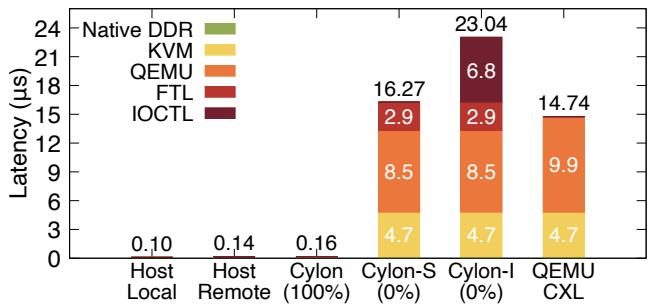  
Figure 2: Cylon vs. QEMU latency breakdown. Cylon (100%) shows cache-hit latency, while Cylon-S and Cylon-I show MMIO-path (cache-miss) latency using shared-EPT and ioctl() based EPT remapping, respectively. NAND latency is set to zero.

NAND timing and parallelism. Cylon reuses FEMU’s validated timing model for NAND flash. On a cache miss, the request is passed to FEMU, which simulates channel, die, and plane parallelism; read/program/erase latencies; queueing and GC interference; and FTL state-dependent latency. We do not use fixed miss delays; latency depends on the current FTL and NAND state, naturally capturing GC interference and contention. This provides realistic tens-of-µs miss latencies that vary with device state and workload patterns.

## 5 Cylon Evaluation

Our evaluation aims to answer three questions:

• Does Cylon faithfully reproduce the latency asymmetry of real CXL-SSD prototypes?

• Can Cylon execute unmodified workloads at near bare-metal speed?

• Does its flexibility enable exploration of cache management and hardware-software co-design?

To address these questions, we compare Cylon against real CXL-SSD hardware (Samsung CMM-H) and baseline software emulators (QEMU-CXL), using a mix of microbenchmarks and full applications. We use QEMU-CXL as the baseline because it is the only open-source full-system CXL emulator capable of running unmodified guest OSes. The other platforms listed in Table 1 are either trace-driven (MQSim-CXL, ESF), require gem5 and cannot execute full workloads at interactive speed (CXL-SSD-Sim, CXL-DMSim), or depend on specialized FPGA hardware (OpenCXD), making direct comparison infeasible.

## 5.1 Experiment setup

## 5.1.1 System Configuration

Host Platform. Experiments run on a dual-socket Intel Xeon Gold 6242 server with 384GB DDR4 DRAM (192GB per socket). Local and remote DRAM latencies, measured with Intel MLC [38], are 90ns and 150ns, respectively. The host runs Ubuntu 20.04 with a modified Linux kernel v6.4.6. Guest vCPUs are pinned to NUMA node 0, while backend memory is reserved on NUMA node 1, ensuring that guest accesses to the Cylon device incur remote-NUMA latency.

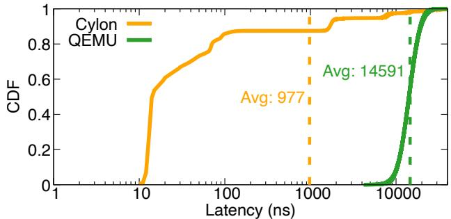  
Figure 3: Cylon vs. QEMU latency. CDF of access latencies (log-scale) for sequential pointer chasing with an 8GB working set. Cylon exhibits a bimodal distribution, sub-µs cache hits (avg. 977ns) and µs-scale misses, while QEMU collapses all accesses into a single inflated mode (avg. 14.6µs).

Cylon Emulation. The guest VM runs Ubuntu 22.04 with a vanilla Linux kernel v6.4.6, configured with 8 vCPUs and 96GB of local DRAM. Cylon exposes a 96GB CXL DAX device to the guest, emulating a CXL-SSD with a 4.8GB DRAM cache and 96GB NAND flash. NAND timing parameters are fixed to realistic values (40 µs read, 200 µs write, and 2,000 µs erase), drawn from vendor data sheets and prior work [14]. This configuration captures the sharp latency asymmetry of CXL-SSDs: hits complete in hundreds of nanoseconds while misses stall for tens to thousands of microseconds, enabling us to evaluate whether Cylon accurately models both fast and slow paths.

Validation Testbed. For hardware validation, we use a dualsocket Intel Xeon 6710E server with 512GB DDR5 DRAM (256GB per socket). A commercial CXL-SSD prototype, Samsung’s CMM-H, is attached and recognized by the host as a CPU-less NUMA node with 1TB capacity [1]. The system runs Ubuntu 24.04 with Linux kernel v6.13.0. CMM-H provides ground truth for our validation: by comparing Cylon against this device across micro- and macrobenchmarks, we demonstrate both the accuracy of our emulator and the ability to extend beyond opaque, black-box hardware.

## 5.1.2 Workloads

Because CMM-H provides a much larger DRAM cache and NAND capacity than Cylon, direct comparison would be misleading. To ensure fairness, we normalize each experiment’s working-set size (WSS) to the DRAM cache capacity of the target system. Unless otherwise noted, all results are reported using this normalized WSS-to-cache-size metric. This method allows an apples-to-apples comparison between Samsung CMM-H and Cylon, focusing on cache behavior rather than absolute capacity differences.

Microbenchmarks. We use Intel MLC [38] and MIO [39]. MLC provides precise measurements of local and remote NUMA latency and bandwidth, while MIO performs pointer chasing with configurable access patterns (sequential, random, stride). By varying WSS, we can stress the cache across both hit-dominated and miss-dominated regimes. These workloads are chosen because they expose device-level fidelity: MLC validates whether Cylon reproduces expected DRAM/NAND latencies, while MIO shows whether eviction and access-path mechanisms behave correctly under different locality patterns.

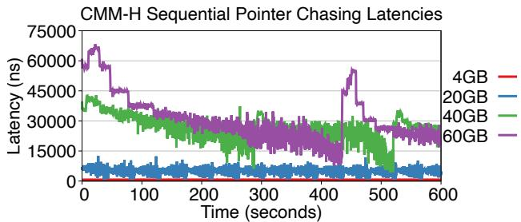  
Figure 4: CMM-H latency. Latency distribution for sequential pointer chasing across different buffer sizes on CMM-H.

Macrobenchmarks. To capture end-to-end performance, we use Redis and GAPBS [40, 41]. Redis represents a latencysensitive key-value store that stresses cache hit paths, while GAPBS stresses memory bandwidth and cache misses in graph analytics. For Redis, we run YCSB [42] workload C (100% reads) with 1KB records, scaling the record count to control WSS. For GAPBS, we vary the graph scale factor to adjust WSS.

## 5.2 Cylon Performance Optimizations

Latency breakdown of access paths. Figure 2 compares Cylon against QEMU’s upstream CXL Type-3 emulation using Intel MLC. To isolate the execution-path costs, we fixed cache hit rate to either 100% (Cylon-100%) or 0% (Cylon-0%) and set NAND latency to zero so that all misses reflect only emulation overheads rather than flash access time.

Finding #1: Cylon’s hybrid access path outperforms QEMU’s MMIO-based CXL emulation, eliminating VM-exit overhead on cache hits and faithfully modeling cache misses.

With a 100% cache-hit rate, Cylon matches remote-NUMA latency (0.16µs), because cached pages are served via direct load/store instructions with no VM-exit. By contrast, QEMU’s MMIO-based design inflates access latency to 14.74µs, more than two orders of magnitude slower than real DRAM. At 0% hit rate, the rightmost bars show the breakdown of miss costs. Cylon-I represents the initial Dynamic EPT Remapping (DER) design that uses ioctl-based updates (§4.3.1), while Cylon-S incorporates Shared EPT Memory to avoid syscalls and EPT walks (§4.3.2). The difference is striking: Cylon-S reduces miss-path latency to 16.27µs, compared to 23.04µs for Cylon-I, by eliminating costly kernel-userspace crossings. Although Cylon’s miss path includes FEMU’s FTL processing and EPT updates, this extra cost becomes negligible once realistic NAND latencies (tens of microseconds) are enabled.

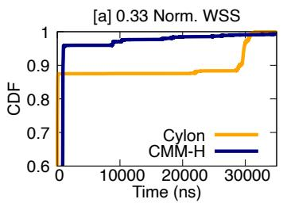

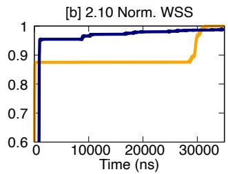  
Figure 5: Cylon vs. CMM-H latency distribution under different WSS. CDF latency of MIO for Cylon vs. CMM-H using 4 threads.

Overall, the figure shows that Cylon eliminates VM-exit costs on hits while keeping miss-path overhead low and analyzable.

Preserving realistic cache-hit and cache-miss latencies. Figure 3 plots the distribution of access latencies for Cylon and QEMU using the MIO pointer-chasing benchmark with an 8GB working set, larger than Cylon’s 4.8GB DRAM cache, so both hits and misses are exercised. The DRAM cache is managed with FIFO (First-In-First-Out) eviction, and NAND latency is set to zero to isolate emulation overhead.

The two curves are sharply different. QEMU’s line (green) shows a single, steep jump concentrated around 10-20µs, reflecting the fact that every access is forced through a VM-exit path. The average latency is 14.6µs, and no sub-microsecond hits appear, because QEMU lacks a fast path. In contrast, Cylon’s curve (orange) clearly separates into two regions. The first steep rise occurs at sub-microsecond latencies (hundreds of nanoseconds), with an average of 977ns, corresponding to cache hits that bypass VM-exits through Dynamic EPT Remapping. After the cache is exhausted, the curve extends into the tens-of-microseconds range, reflecting misses handled by FEMU and the caching framework. This bimodal shape, fast nanosecond-scale hits combined with slower microsecondscale misses, is exactly what we expect from real CXL-SSD hardware with a DRAM cache fronting NAND flash.

Takeaway. Figures 2 and 3 demonstrate that Cylon achieves what prior emulators could not: near-DRAM latency for cache hits, analyzable miss overheads, and realistic latency distributions that match CXL-SSD hardware behavior. These results validate that Dynamic EPT Remapping and Shared EPT Memory are essential to preserving fidelity while enabling high-speed, full-system execution.

## 5.3 CMM-H Latencies

Understanding CMM-H latency characteristics. We first characterize CMM-H with sequential pointer chasing while varying the WSS. Figure 4 plots per-access latency over time for 4GB, 20GB, 40GB, and 60GB buffers.

Sub-cache footprints. When WSS is well below the device’s 48GB internal DRAM cache (4GB, 20GB), latencies remain tightly clustered near the nanosecond regime with low variance. Occasional early spikes are warm starts.

Near-cache footprints. At 40GB (close to cache size), the run begins with elevated latencies that progressively decrease.

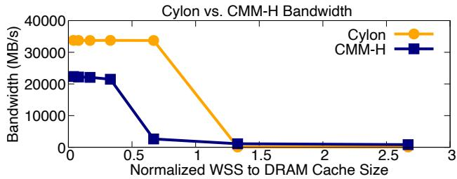  
Figure 6: Cylon vs. CMM-H MLC bandwidth. Bandwidth measured by Intel MLC as the WSS grows relative to each device’s DRAM cache. Cylon sustains remote-NUMA bandwidth until its 4.8 GB cache is saturated, while CMM-H drops earlier due to controller overhead. Beyond the cache size, both devices converge to NAND bandwidth.

Above-cache footprints. At 60GB, accesses frequently fall to NAND, producing sustained tens-of-µs latencies.

CMM-H exhibits the expected capacity transition: stable nanosecond latencies when WSS fits in DRAM, and µs-scale stalls as WSS approaches or exceeds cache capacity.

Figure 5 shows the comparison of latency distribution between Cylon and CMM-H by using MIO [39]. Both systems exhibit tail latency, but their performance characteristics differ based on DRAM cache behavior. When DRAM cache misses occur, Cylon experiences higher latency than CMM-H. However, Cylon achieves superior memory access latency on DRAM cache hits.

Interpreting the performance gaps. CMM-H is a firstgeneration FPGA prototype with evolving firmware and opaque controller behavior. Internal overheads (e.g., metadata management, controller-level prefetching) lead to higher cache-hit latency (∼800ns) and lower bandwidth even before cache saturation on our platform, as shown in Figure 6. Cylon models the intended architectural behavior of CXL-SSDs rather than reproducing prototype-specific artifacts, providing an idealized baseline for policy exploration. Despite absolute performance differences, Cylon matches CMM-H in qualitative trends: both show near-DRAM behavior when WSS fits in cache and a sharp transition to tens-of-µs latency when WSS exceeds cache capacity (Figures 7, 9). Cylon faithfully captures fundamental CXL-SSD performance characteristics.

## 5.4 Cylon vs. CMM-H Bandwidth

Finding #2: Cylon reproduces the performance characteristics of real CXL-SSD devices across a wide range of working-set sizes.

Figure 6 compares bandwidth scaling for Cylon and CMM-H as the WSS increases relative to each device’s DRAM cache. Prefetching is disabled and a FIFO eviction policy is used for Cylon. Both systems show the expected two-phase behavior: near-memory bandwidth when the WSS fits in cache, followed by a sharp drop to NAND-level bandwidth once the cache is saturated. Cylon sustains remote-NUMA bandwidth (32GB/s) up to its full 4.8GB cache capacity, closely mirroring the behavior of CMM-H. CMM-H, however, begins to degrade earlier, with bandwidth falling before its cache is fully saturated. We attribute this difference to opaque controller-level effects such as internal prefetching or metadata overheads that are hidden from the host. This behavior is also reported in a prior study [8]. Beyond the cache capacity, both devices converge to the same NAND-bound throughput, confirming that Cylon reproduces the fundamental transition while exposing subtleties that CMM-H masks.

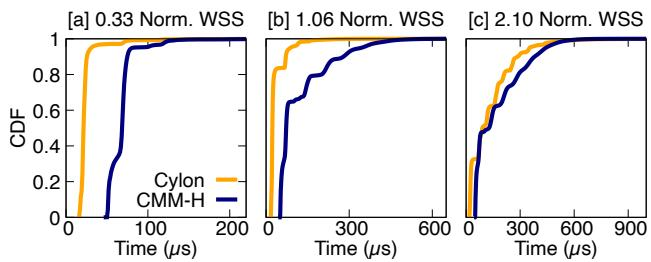  
Figure 7: Cylon vs. CMM-H latency with Redis. CDF of request latencies for Cylon vs. CMM-H under different WSS, from small (0.33×) to larger-than-cache-size WSS (2.10×).

For small WSS less than cache size, Cylon consistently delivers remote-NUMA bandwidth, whereas CMM-H exhibits lower bandwidth due to device-side controller overhead even on cache hits. As WSS approaches the cache size (WSS ≈1.0), CMM-H shows an earlier decline, while Cylon keeps full bandwidth until its cache saturates. We cannot examine the reason for the earlier bandwidth drop in CMM-H because it is a black-box device; we assume there is aggressive prefetching or extra memory overhead in CMM-H’s controller. This result confirms that Cylon accurately reproduces the DRAMto-NAND performance transition of real hardware, while exposing opportunities for profiling in-device configurations.

## 5.5 Real Applications: Redis and Graph

Finding #3: Cylon runs unmodified applications and tracks real-hardware trends across cache-hit and NAND-bound regimes.

Figure 7 compares request-latency CDFs for Redis under three normalized working-set sizes (WSS).

For the small WSS (0.33× cache, Figure 7a), all requests fit in DRAM. Cylon achieves remote-NUMA hit latencies on the order of hundreds of nanoseconds, while CMM-H incurs slightly higher latencies due to additional controller overhead. The result is a noticeable left-shift of Cylon’s CDF curve compared to hardware. At medium WSS (1.06× cache, Figure 7b), the working set just exceeds the cache. Both systems show a mix of fast hits and slower NAND-bound cache misses, yielding broader CDF curves. Cylon remains faster overall, but the gap narrows as misses begin to dominate request latency. For the large WSS (2.10× cache, Figure 7c), most requests fall to NAND, and both devices converge to tens to hundreds of µs latency. The overlap of the CDFs demonstrates that Cylon faithfully captures NAND-bound behavior under cache pressure. Together, these results confirm that Cylon not only runs unmodified applications like Redis but also reproduces the key transition from cache-dominated to NAND-dominated performance, with close alignment to CMM-H across the entire regime.

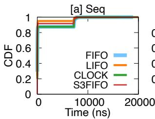

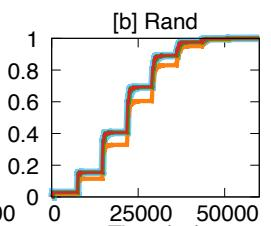  
Time (ns)

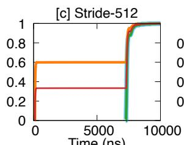  
Time (ns)

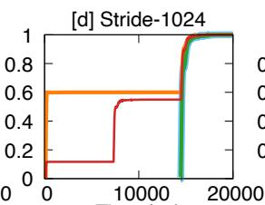  
Time (ns)

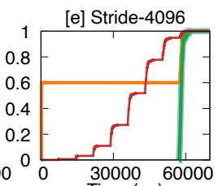  
Time (ns)

Figure 8: Impact of eviction policies on Cylon CXL-SSD latency. The figure shows Cylon latency CDFs under different eviction policies (FIFO, LIFO, CLOCK, S3FIFO) using a single thread with different access patterns (a)–(d): sequential, random, and strided accesses.  
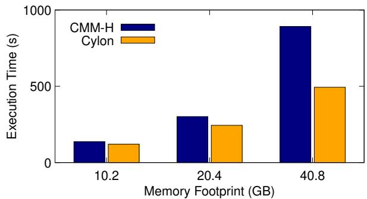  
Figure 9: Cylon vs. CMM-H GAPBS execution time. Cylon and CMM-H track closely across scales, with Cylon slightly faster due to lower DRAM hit latency, and both converging when workloads exceed cache capacity.

Table 2: Next-𝑁 prefetching and cache hit rate (S3FIFO). 𝑁 determines how many subsequent pages are proactively prefetched.
<table><tr><td rowspan=1 colspan=1>Pattern</td><td rowspan=1 colspan=1>N=0</td><td rowspan=1 colspan=1>N=1</td><td rowspan=1 colspan=1>N=2</td><td rowspan=1 colspan=1>N=4</td><td rowspan=1 colspan=1>N=8</td></tr><tr><td rowspan=5 colspan=1>SeqRandStride-512Stride-1024Stride-4096</td><td rowspan=1 colspan=1>99%</td><td rowspan=1 colspan=1>99%</td><td rowspan=1 colspan=1>99%</td><td rowspan=1 colspan=1>99%</td><td rowspan=5 colspan=1>99%25%98%96%86%</td></tr><tr><td rowspan=1 colspan=1>24%</td><td rowspan=1 colspan=1>25%</td><td rowspan=1 colspan=1>25%</td><td rowspan=4 colspan=1>25%97%94%77%</td></tr><tr><td rowspan=1 colspan=1>90%</td><td rowspan=1 colspan=1>92%</td><td rowspan=1 colspan=1>95%</td></tr><tr><td rowspan=1 colspan=1>80%</td><td rowspan=1 colspan=1>84%</td><td rowspan=1 colspan=1>89%</td></tr><tr><td rowspan=1 colspan=1>18%</td><td rowspan=1 colspan=1>35%</td><td rowspan=1 colspan=1>56%</td></tr></table>

Figure 9 shows execution time for GAPBS Betweenness Centrality on the kron dataset as we vary the graph scale. Because graph workloads do not allow precise control of working-set size (WSS), we match Cylon’s cache size to CMM-H’s for fairness.

At smaller footprints (10.2GB and 20.4GB), both systems keep most of the graph in DRAM cache, and execution times are similar. Cylon is slightly faster because its cache-hit latency matches remote-NUMA DRAM, whereas CMM-H adds several hundred nanoseconds of controller overhead per access. As the footprint grows (40.8GB), pressure on the cache increases and NAND misses begin to dominate. Both systems show longer runtimes, but Cylon still maintains an advantage due to its lower hit-path latency.

Overall, the figure confirms that Cylon tracks CMM-H closely across different graph sizes, reproducing both cacheresident speedups and NAND-dominated slowdowns, while consistently showing modestly better performance due to its faster DRAM hit path. Similar to previous validations, Cylon performs better than CMM-H when the WSS fits in cache, due to its lower DRAM cache-hit latency.

## 5.6 Buffer Management Policies

Finding #4: Cylon enables flexible exploration of in-device configurations, providing an effective platform for hardware–software co-design.

Eviction policy. Figure 8 presents latency CDFs for eviction policies: FIFO, LIFO, CLOCK (second-chance), and S3FIFO [26]. As described in §5.1, the NAND latency is set to 40 µs read, 200 µs write, and 2,000 µs erase to emulate realistic SSD behavior. Table 3 summarizes total SSD-cache misses and the resulting cache-hit rates.

For the Seq and Stride-N patterns, FIFO and CLOCK exhibit identical performance because sequential access provides no temporal reuse and thus no ’second-chance’ opportunities for cached pages. In contrast, the LIFO policy fills the cache with cold-missed pages that are never evicted except for the most recently inserted entry. Consequently, LIFO’s performance indicates that at least 4.8GB of pages remain resident and consistently hit. S3FIFO [26], which combines recency and frequency awareness, further improves reuse by retaining frequently accessed pages even when their recency is low, yielding higher hit rates and shorter access latencies across most sequential and moderate-stride workloads. Rand pattern collapses all policies to ∼24.3% hit rate and over 100 M misses. No policy can retain enough of the unpredictable working set to avoid misses.

Figure 11 evaluates real application performance using a Redis YCSB-C (read-only) workload under two different memory-footprint settings. A total of 8 threads issue requests following a Zipfian distribution, with a record size of 1KB. We measure the request latency and summarize as a CDF.

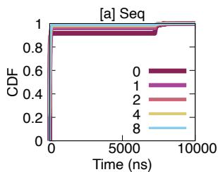

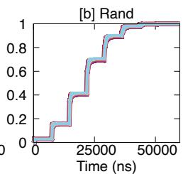

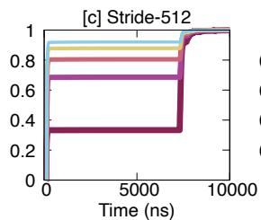

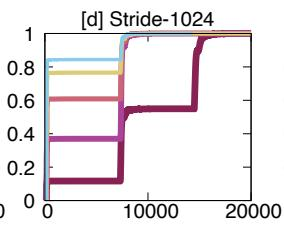

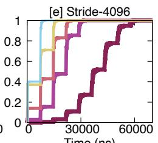  
Figure 10: Impact of prefetching degree on Cylon CXL-SSD latency. The figure shows CDF of access latencies for Cylon CXL-SSD under different prefetching degrees (0–8) with a single thread under sequential, random, and strided access patterns.

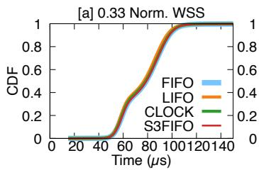

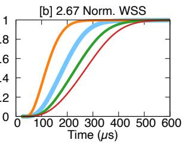  
Figure 11: Impact of eviction policies on Cylon latency (Redis). The figure shows CDF of request latencies for Cylon under different eviction policies (FIFO, LIFO, CLOCK, S3FIFO) using 8 threads.

Table 3: Various eviction policies and cache hit rates. Eviction policy efficiency depends on the underlying memory access patterns.
<table><tr><td>Pattern</td><td>FIFO</td><td>LIFO</td><td>CLOCK</td><td>S3FIFO</td></tr><tr><td>Seq Rand Stride-512 Stride-1024</td><td>97% 24% 88% 75% 0%</td><td>99% 21% 95% 90% 60%</td><td>97% 24% 88% 75% 0%</td><td>99% 24% 90% 80%</td></tr></table>

With a small memory footprint (0.33× Norm. WSS), all four policies achieve identical latency because the workload fits entirely in the cache and incurs cold misses only. When the footprint grows to 12.8GB, however, eviction policy affects the performance significantly. Interestingly, LIFO yields the lowest latency among the policies, because LIFO tends to keep older keys resident. As a result, LIFO maintains a higher hit rate under the skewed Zipfian access pattern.

Prefetching. Figure 10 evaluates S3FIFO with next-𝑁 prefetching, where 𝑁 determines how many subsequent pages are proactively fetched. The CDF plots show the distribution of access latency across different 𝑁 and access patterns. Table 2 reports total cache misses and resulting hit rates.

Prefetching consistently lowers miss counts for workloads with spatial locality. For the Seq and Stride-N patterns, increasing 𝑁 from 0 to 8 reduces cache misses dramatically, and the CDF curves confirm that larger 𝑁 values compress latency into the sub-10µs range as most requests are served directly from the SSD’s DRAM cache. For random accesses, prefetching provides little benefit: hit rates remain near 25% and the latency distributions change negligibly as 𝑁 increases.

Our evaluation shows that both eviction and prefetching strategies strongly influence the effectiveness of CXL-SSD performance. Together, these results highlight that cachemanagement effectiveness depends primarily on workload locality and that Cylon’s flexible framework makes it straightforward to evaluate and co-design eviction and prefetching policies for diverse applications.

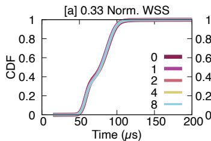

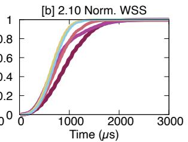  
Figure 12: Impact of prefetching degree on Cylon latency. The figure shows CDFs of access latencies for Cylon CXL-SSD under different prefetching degrees with a single thread with Redis.

Figure 12 illustrates the prefetching effect on Redis latency using a single thread. While prefetching does not affect performance when the WSS is smaller than cache size, with larger WSS, increasing prefetch degree improves overall latency.

## 6 Conclusion

CXL-SSDs have the potential to converge memory and storage, yet progress has been slowed by the absence of open, faithful evaluation platforms. This paper presented Cylon, the first fast, full-system emulator for CXL-SSDs that combines fidelity, speed, and extensibility. By eliminating VM-exit overheads on cache hits while faithfully modeling cache misses, Cylon reproduces the latency asymmetry of real devices. Its pluggable caching framework enables systematic exploration of eviction, prefetching, and cooperative caching strategies, while its modular backend extends beyond today’s CMM-H to emerging CXL-enhanced storage designs. We hope Cylon lays the foundation for a community-driven ecosystem around hardware-software CXL-SSD research.

## Acknowledgments

We thank Bingzhe Li (our shepherd) and the anonymous reviewers for their constructive feedback. We also thank CloudLab for providing the infrastructure used in our experimental evaluation. This research was partially supported by the NSF CAREER Award CNS-2339901, NSF Grant CNS-2312785, and Samsung.

## References

[1] Samsung CXL Solutions - CMM-H. https://semiconducto r.samsung.com/us/news-events/tech-blog/samsung-c xl-solutions-cmm-h/.

[2] Myoungsoo Jung. Hello Bytes, Bye Blocks: PCIe Storage Meets Compute Express Link for Memory Expansion (CXL-SSD). In the 14th Workshop on Hot Topics in Storage and File Systems (HotStorage), 2022.

[3] Shao-Peng Yang, Minjae Kim, Sanghyun Nam, Juhyung Park, Jin yong Choi, Eyee Hyun Nam, Eunji Lee, Sungjin Lee, and Bryan S. Kim. Overcoming the Memory Wall with CXL-Enabled SSDs. In Proceedings of the 2023 USENIX Annual Technical Conference (ATC), 2023.

[4] Performance Characterizations and Usage Guidelines of Samsung CXL Memory Module Hybrid Prototype. https: //arxiv.org/pdf/2503.22017.

[5] Haoyang Zhang, Yuqi Xue, Yirui Eric Zhou, Shaobo Li, and Jian Huang. SkyByte: Architecting an Efficient Memory-Semantic CXL-based SSD with OS and Hardware Co-design. In Proceedings of the 31st International Symposium on High Performance Computer Architecture (HPCA-31), 2025.

[6] Mahinder Saluja. Memory Expansion with CXL Interface with Low-latency Flash. https://files.futurememorystorage. com/proceedings/2025/20250806 CXLT-203-1 Saluja-f nl.pdf.

[7] NVMe-oC: Wolley’s New Take on CXL-Based SSDs. https: //thessdguy.com/nvme-oc-wolleys-new-take-on-cxl -based-ssds/.

[8] Mohammadreza Soltaniyeh, Gongjin Sun, Xuebin Yao, Amir Beygi, Ramdas Kachare, Dongwan Zhao, Hingkwan Huen, Andrew Chang, Senthil Murugesapandian, and Caroline Kahn. Revisiting Memory Hierarchies with CMM-H: Use Deviceside Caching to Integrate DRAM and SSD for a Hybrid CXL Memory. In the 17th Workshop on Hot Topics in Storage and File Systems (HotStorage), 2025.

[9] Hyunsun Chung, Junhyeok Park, Taewan Noh, Seonghoon Ahn, Kihwan Kim, Ming Zhao, and Youngjae Kim. OpenCXD: An Open Real-Device-Guided Hybrid Evaluation Framework for CXL-SSDs. In 33rd International Symposium on the Modeling, Analysis, and Simulation of Computer and Telecommunication System (MASCOTS), 2025.

[10] Yuda An, Shushu Yi, Bo Mao, Qiao Li, Mingzhe Zhang, Ke Zhou, Nong Xiao, Guangyu Sun, Xiaolin Wang, Yingwei Luo, and Jie Zhang. A Novel Extensible Simulation Framework for CXL-Enabled Systems. https://arxiv.org/abs/2411 .08312.

[11] Yaohui Wang, Zicong Wang, Fanfeng Meng, Yanjing Wang, Yang Ou, Lizhou Wu, Wentao Hong, Xuran Ge, and Jijun Cao. A Full-System Simulation Framework for CXL-Based SSD Memory System. https://arxiv.org/abs/2501.02524.

[12] Yanjing Wang, Lizhou Wu, Wentao Hong, Yang Ou, Zicong Wang, Sunfeng Gao, Jie Zhang, Sheng Ma, Dezun Dong, Xingyun Qi, Mingche Lai, and Nong Xiao. CXL-DMSim: A Full-System CXL Disaggregated Memory Simulator With Comprehensive Silicon Validation. IEEE Transactions on

Computer-Aided Design of Integrated Circuits and Systems, 2025.

[13] QEMU Compute Express Link (CXL). https://www.qemu.o rg/docs/master/system/devices/cxl.html.

[14] Huaicheng Li, Mingzhe Hao, Michael Hao Tong, Swaminathan Sundararaman, Matias Bjørling, and Haryadi S. Gunawi. The CASE of FEMU: Cheap, Accurate, Scalable and Extensible Flash Emulator. In Proceedings of the 16th USENIX Symposium on File and Storage Technologies (FAST), 2018.

[15] Sang-Hoon Kim, Jaehoon Shim, Euidong Lee, Seongyeop Jeong, Ilkueon Kang, and Jin-Soo Kim. NVMeVirt: A Versatile Software-defined Virtual NVMe Device. In Proceedings of the 21st USENIX Symposium on File and Storage Technologies (FAST), 2023.

[16] Miryeong Kwon, Sangwon Lee, and Myoungsoo Jung. Cache in Hand: Expander-Driven CXL Prefetcher for Next Generation CXL-SSDs. In the 15th Workshop on Hot Topics in Storage and File Systems (HotStorage), 2023.

[17] Abel Gordon, Nadav Amit, Nadav Har’El, Muli Ben-Yehuda, Alex Landau, Assaf Schuster, and Dan Tsafrir. ELI: Bare-Metal Performance for I/O Virtualization. In Proceedings of the 17th ACM International Conference on Architectural Support for Programming Languages and Operating Systems (ASPLOS), 2012.

[18] Nadav Har’El, Abel Gordon, Alex Landau, Muli Ben-Yehuda, Avishay Traeger, and Razya Ladelsky. Efficient and Scalable Paravirtual I/O System. In Proceedings of the 2013 USENIX Annual Technical Conference (ATC), 2013.

[19] Cheng-Chun Tu, Michael Ferdman, Chao tung Lee, and Tzi cker Chiueh. A Comprehensive Implementation and Evaluation of Direct Interrupt Delivery. In The 11th ACM SIGPLAN/SIGOPS International Conference on Virtual Execution Environments (VEE), 2015.

[20] Stijn Schildermans, Kris Aerts, Jianchen Shan, and Xiaoning Ding. Paratick: Reducing Timer Overhead in Virtual Machines. In Proceedings of the 50th International Conference on Parallel Processing (ICPP), 2021.

[21] Compute Express Link. https://www.computeexpresslink .org.

[22] Emulating CXL Shared Memory Devices in QEMU. https: //memverge.com/cxl-qemuemulating-cxl-shared-mem ory-devices-in-qemu/.

[23] The gem5 Simulator. https://www.gem5.org/.

[24] Second Level Address Translation. https://en.wikipedia .org/wiki/Second Level Address Translation.

[25] Yasunori Goto. Exploring CXL Memory: Configuration and Emulation. https://www.fujitsu.com/jp/documents/p roducts/software/os/linux/catalog/Exploring CXL M emory Configuration and Emulation.pdf.

[26] Juncheng Yang, Yazhuo Zhang, Ziyue Qiu, Yao Yue, and Rashmi Vinayak. FIFO Queues are All You Need for Cache Eviction. In Proceedings of the 29th ACM Symposium on Operating Systems Principles (SOSP), 2023.

[27] SeongJae Park, Yunjae Lee, and Heon Y. Yeom. Profiling Dynamic Data Access Patterns with Controlled Overhead and

Quality. In Proceedings of the 20th International Middleware Conference (Middleware), 2019.

[28] Amanda Raybuck, Tim Stamler, Wei Zhang, Mattan Erez, and Simon Peter. HeMem: Scalable Tiered Memory Management for Big Data Applications and Real NVM. In Proceedings of the 28th ACM Symposium on Operating Systems Principles (SOSP), 2021.

[29] Taehyung Lee, Sumit Kumar Monga, Changwoo Min, and Young Ik Eom. Memtis: Efficient Memory Tiering with Dynamic Page Classification and Page Size Determination. In Proceedings of the 29th ACM Symposium on Operating Systems Principles (SOSP), 2023.

[30] Hamid Hadian, Jinshu Liu, Hanchen Xu, and Huaicheng Li. PACT: A Criticality-First Design for Tiered Memory. In Proceedings of the 31st ACM International Conference on Architectural Support for Programming Languages and Operating Systems (ASPLOS), 2026.

[31] Matias Bjørling, Javier Gonzalez, and Philippe Bonnet. Light-NVM: The Linux Open-Channel SSD Subsystem. In Proceedings of the 15th USENIX Symposium on File and Storage Technologies (FAST), 2017.

[32] Huaicheng Li, Martin L. Putra, Ronald Shi, Xing Lin, Gregory R. Ganger, and Haryadi S. Gunawi. IODA: A Host/Device Co-Design for Strong Predictability Contract on Modern Flash Storage. In Proceedings of the 28th ACM Symposium on Operating Systems Principles (SOSP), 2021.

[33] Mingyao Shen, Suyash Mahar, Heewoo Kim, Joseph Izraelevitz, and Steven Swanson. AutoSSD: CXL-Enhanced Autonomous SSDs for Low Tail Latency. In Proceedings of the 34th IEEE International Symposium on High Performance Distributed Computing (HPDC), 2025.

[34] Shaobo Li, Yirui Eric Zhou, Hao Ren, and Jian Huang. ByteFS: System Support for (CXL-based) Memory-Semantic Solid-State Drives. In Proceedings of the 30th ACM International

Conference on Architectural Support for Programming Languages and Operating Systems (ASPLOS), 2025.

[35] Harry Juhyun Kim. How CXL Computational Memory Will Revolutionize Data Processing. https://files.futurememo rystorage.com/proceedings/2025/20250807 CXLT-301 -1 Kim-2025-07-27-01.00.16.pdf.

[36] Huaicheng Li, Daniel S. Berger, Lisa Hsu, Daniel Ernst, Pantea Zardoshti, Stanko Novakovic, Monish Shah, Samir Rajadnya, Scott Lee, Ishwar Agarwal, Mark D. Hill, Marcus Fontoura, and Ricardo Bianchini. Pond: CXL-Based Memory Pooling Systems for Cloud Platforms. In Proceedings of the 28th ACM International Conference on Architectural Support for Programming Languages and Operating Systems (ASPLOS), 2023.

[37] Daniel S. Berger, Daniel Ernst, Huaicheng Li, Pantea Zardoshti, Monish Shah, Samir Rajadnya, Scott Lee, Lisa Hsu, Ishwar Agarwal, Mark D. Hill, and Ricardo Bianchini. Design Tradeoffs in CXL-Based Memory Pools for Cloud Platforms. IEEE Micro Special Issue on Emerging System Interconnects, 43(2), 2023.

[38] Intel Memory Latency Checker (Intel MLC). https://www. intel.com/content/www/us/en/download/736633/inte l-memory-latency-checker-intel-mlc.html.

[39] Jinshu Liu, Hamid Hadian, Yuyue Wang, Daniel S. Berger, Marie Nguyen, Xun Jian, Sam H. Noh, and Huaicheng Li. Systematic CXL Memory Characterization and Performance Analysis at Scale. In Proceedings of the 30th ACM International Conference on Architectural Support for Programming Languages and Operating Systems (ASPLOS), 2025.

[40] Redis. https://redis.io.

[41] GAP Benchmark Suite. https://github.com/sbeamer/gap bs.

[42] YCSB. https://github.com/brianfrankcooper/YCSB.