USENIX

THE ADVANCED COMPUTING SYSTEMS ASSOCIATION

# GPU Checkpoint/Restore Made Fast and Lightweight

Shaoxun Zeng, Tingxu Ren, Jiwu Shu, and Youyou Lu, Tsinghua University

# https://www.usenix.org/conference/fast26/presentation/zeng

This paper is included in the Proceedings of the 24th USENIX Conference on File and Storage Technologies.

February 24–26, 2026 • Santa Clara, CA, USA

ISBN 978-1-939133-53-3

Open access to the Proceedings of the 24th USENIX Conference on File and Storage Technologies is sponsored by

# GPU Checkpoint/Restore Made Fast and Lightweight

Shaoxun Zeng, Tingxu Ren, Jiwu Shu, and Youyou Lu∗

Tsinghua University

## Abstract

System-level GPU checkpoint/restore (C/R) enables several critical features such as elastic scaling, task switching, and fault tolerance, for modern GPU workloads in a unified and application-transparent manner. However, existing approaches present fundamental limitations: they fail to simultaneously achieve low C/R latency and low overhead imposed on normal GPU execution, while also lacking efficient support for incremental checkpointing. We propose GCR, a GPU checkpoint/restore system that addresses all these limitations simultaneously. GCR employs a hybrid C/R scheme through control/data separation to deliver low C/R latency and negligible overhead imposed on normal GPU execution. To efficiently support incremental checkpointing, GCR introduces shadow execution on the CPU to reduce the overhead of dirty buffer identification, utilizing dirty templates for both lightweight CPU shadow execution and identification at a fine-grained instruction level.

Our evaluations demonstrate that GCR reduces GPU checkpointing latency by 72.1% and 63.6% compared to cuda-ckpt (NVIDIA’s official solution) and PhOS (the current state-ofthe-art), respectively, and restoration latency by 54.2% and 87.1%, while imposing negligible overhead (less than 1%). GCR also supports efficient incremental checkpointing, which reduces checkpoint sizes by 86.6% and latency by 43.8%.

## 1 Introduction

GPU checkpoint/restore (C/R) [39, 50, 57, 60] saves GPU states (including GPU control states and GPU data buffers) during checkpointing and restores them to resume execution during restoration. It plays a central role in enabling key features for modern GPU workloads as shown in Figure 1: elastic GPU serverless scaling via fast restoration, rapid GPU task switching through fast checkpointing and restoration, faulttolerant GPU computation through periodic checkpointing.

We focus on system-level GPU C/R [10, 16, 19, 23, 26, 27, 30, 39, 41, 48, 49, 49–51, 57, 60] that provides a unified approach across diverse GPU workloads, and is transparent to applications, in contrast to integrating C/R capabilities into individual applications. Existing system-level GPU C/R includes two categories: Driver-integrated C/R (e.g., NVIDIA’s cuda-ckpt [39,50]) is a vendor-specific mechanism embedded in drivers, while interception-based C/R (e.g., PhOS [57]) intercepts all GPU driver API calls and records the resource handlers during normal GPU execution to enable self-managed C/R. For GPU control states, interception-based C/R serializes resource handlers during checkpointing, then deserializes and restores them through API replay during restoration. For GPU data buffers, in addition to handling resource handlers, C/R involves GPU buffer copying.

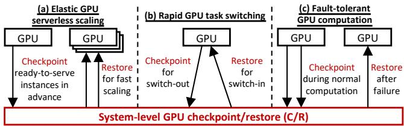  
Figure 1: System-level GPU checkpoint/restore enables (a) Elastic GPU serverless scaling, (b) Rapid GPU task switching, and (c) Fault-tolerant GPU computation, in a unified and application-transparent manner.

However, existing approaches suffer from significant limitations. First, existing approaches fail to simultaneously achieve low C/R latency and low overhead imposed on normal GPU execution. While driver-integrated C/R achieves zero overhead on normal GPU execution (§3.1) and demonstrates more efficient GPU control state C/R compared to interceptionbased methods, it suffers from prolonged latency for GPU data buffer C/R due to limited bandwidth utilization, achieving only 12.0% of the theoretical PCIe bandwidth limit during checkpointing and 28.8% during restoration. Interceptionbased C/R shows promise in achieving higher bandwidth for GPU data buffer C/R through efficient asynchronous data copying (can achieve 24.3GB/s, nearly saturating the available PCIe bandwidth). However, it is hindered by the complex serialization and deserialization of intercepted resource handlers, which doubles the latency for GPU data buffer checkpointing and also makes GPU control state C/R inefficient, with GPU control state checkpointing taking 3.5× longer and restoration taking 9.2× longer compared to driver-integrated C/R. Furthermore, interception-based C/R imposes overhead on normal GPU execution by requiring the interception and handling of all GPU driver API calls, resulting in an average of 8.7% slowdown with peaks up to 49.6%.

Second, incremental checkpointing is not supported. Existing approaches fail to support incremental checkpointing of only dirty buffers after the previous checkpoint. This limitation results in identical checkpoint size and checkpointing latency regardless of the proportion of dirty buffers, leading to significant checkpoint amplification (e.g., 7.2× in §3.2). This limitation occurs because they either lack a dirty buffer identification mechanism (e.g., cuda-ckpt [39], the NVIDIA’s official driver-integrated C/R solution) or have to disable it due to the substantial overhead imposed on normal GPU execution (e.g., the state-of-the-art interception-based C/R system PhOS [57] has such a mechanism but has to disable it as it incurs up to 12% overhead).

We design GCR (GPU Checkpoint/Restore) to simultaneously achieve low C/R latency, negligible overhead imposed on normal GPU execution, and efficient incremental checkpointing of dirty buffers. GCR includes two key designs:

• Hybrid C/R through control/data separation. Driverintegrated C/R offers zero overhead on normal GPU execution and efficient GPU control state handling, while interceptionbased C/R shows promise in higher data copying bandwidth but is constrained by costly API interception and handling. This inspires us to propose a hybrid scheme to achieve both low C/R latency and low overhead. Such hybrid scheme can be enabled by separation of GPU control states and data buffers through selectively intercepting GPU memory (de)allocations, and applying driver-integrated C/R for control states and interception-based C/R for data buffers.

However, this hybrid scheme brings a challenge in correct GPU buffer restoration. Buffer addresses must remain consistent across C/R operations, which is guaranteed in a blackbox manner when using driver-integrated C/R for GPU data buffers. With hybrid C/R, GCR must explicitly ensure address consistency, but GPU memory allocation (e.g., cudaMalloc) does not guarantee this, potentially causing null pointer dereferences after restoration.

We observe that address consistency and buffer deallocation operate on different aspects of memory management: address consistency involves virtual memory addresses, while buffer deallocation involves both virtual and physical memory. Therefore, GCR decouples virtual and physical memory management during C/R by checkpointing the virtual memory addresses (GPU page table) before deallocating them. These virtual addresses can thus be restored during the restoration, thereby maintaining consistency throughout the C/R process, while new physical memory can be allocated with arbitrary addresses and remapped to the preserved virtual addresses.

• Incremental checkpointing with shadow execution. To efficiently support incremental checkpointing, fine-grained dirty buffer identification is required to reduce checkpoint amplification. Existing solutions either identify dirty buffers in a coarse-grained manner, or incurs significant overhead (up to 5.3× slowdown of normal GPU execution, 7.1GB additional

GPU memory) because they perform dirty buffer identification in the critical path of GPU execution (§4.2).

GCR reduces the overhead of dirty buffer identification by proposing shadow execution of kernels on the CPU, which runs in parallel with the GPU, to move dirty buffer identification out of the GPU execution path. GCR further reduces the overhead of executing kernels on the CPU by skipping compute-intensive operations and only calculating dirty addresses and lengths. This is achieved through symbolic execution to generate dirty templates, which transform store instructions into expressions that represent dirty buffer addresses and lengths in terms of kernel arguments and kernel launch configurations. These templates enable lightweight CPU calculations with microsecond-level computation (e.g., 14µs) and less than 1MB CPU memory to identify dirty buffers. They also enable fine-grained identification at the instruction level.

We conduct extensive evaluations of GCR across diverse scenarios, including elastic GPU serverless scaling, rapid GPU task switching, and fault-tolerant GPU computation. Our evaluation encompasses various application domains, covering large language models (LLMs), deep neural networks (DNNs), and high-performance computing (HPC) applications. For model training, we utilize training frameworks including DeepSpeed [46] and Transformers [59], while for model inference, we employ inference frameworks such as vLLM [25] and Transformers [59]. We also compare with application-level C/R such as ServerlessLLM [18] and conduct evaluations on both single-GPU and multi-GPU setups. Our evaluations show that GCR reduces GPU checkpointing latency by 72.1% and 63.6% on average compared to cuda-ckpt [39] and PhOS [57], respectively. For GPU restoration, GCR achieves latency reductions of 54.2% and 87.1% on average. GCR achieves negligible overhead (less than 1%) imposed on normal GPU execution. Furthermore, GCR supports efficient incremental checkpointing, reducing checkpoint sizes by 86.6% and latencies by 43.8% on average.

## 2 Background

Why system-level GPU C/R? GPU checkpoint and restore (C/R) serves as a key enabler for several critical features in modern GPU workloads: (1) Elastic GPU serverless scaling: GPU states of ready-to-serve instances are checkpointed in advance to enable fast restoration that bypasses complex initialization, reducing cold-start latency for efficient elastic scaling in serverless inference [18, 57]. (2) Rapid GPU task switching: C/R enables rapid task switching through fast checkpointing (switch-out) and restoration (switch-in), improving GPU utilization in scenarios such as inference/- training colocation [56] and reinforcement learning [52]. (3) Fault-tolerant GPU computation: Checkpointing periodically saves GPU states for workloads such as model training and HPC applications, enabling restoration after failures to reduce costly re-computation [15, 54].

In this paper, we focus on system-level GPU C/R [10, 16, 19, 23, 26, 27, 30, 39, 41, 48, 49, 49–51, 57, 60] that provides a unified approach to checkpointing and restoring different GPU applications as a system primitive. Rather than integrating C/R capabilities as part of individual applications – an approach that necessitates reimplementing similar functionality across applications, and struggles to keep pace with rapidly evolving applications – system-level checkpoint/restore offers a more unified and application-transparent solution.

Composition of a GPU checkpoint. A GPU checkpoint consists of two main components: (1) GPU control states, which are driver-managed memory such as CUDA contexts [32] and CUDA streams [35]; (2) GPU data buffers, such as GPU memory allocated via cudaMalloc by applications. The size of GPU control state is relatively small, typically around 0.5GB, while GPU data buffers constitute the majority of checkpoint size – for example, 30GB for LLM inference in our setup.

Existing approaches. Existing GPU C/R approaches fall into two categories. (i) Driver-integrated C/R [39, 50]. This approach is vendor-specific. For example, NVIDIA’s official C/R solution, cuda-ckpt [39], is a black-box mechanism embedded in the driver [31] that checkpoints and restores the driver’s internal closed-source data structures.

(ii) Interception-based C/R [10, 16, 19, 23, 30, 48, 49, 51, 57]. This approach intercepts and handles all GPU driver API calls to enable self-managed C/R. It is necessary to implement a comprehensive set of logic for every API to ensure correct checkpointing and restoration. Note that in this paper, we use “GPU driver API” to denote both runtime API [7, 34] and driver API [6, 33], since interception of both APIs is feasible and existing work typically intercepts both.

Taking the state-of-the-art system PhOS [57] as an example. For GPU control state-related APIs, this approach intercepts all of them during normal GPU execution, and record their resource handlers. The checkpointing process requires complex serialization of resource handlers according to each API’s specific semantics, which are then deserialized and restored through API replay during restoration to recreate corresponding resources (e.g., CUDA streams [35]). Since replaying these APIs may yield different resource handlers from their originals (e.g., different CUDA stream identifiers), a one-toone mapping and dynamic substitution during normal GPU execution are required to maintain correspondence between resource handlers before and after replay.

For GPU data buffer-related APIs (operations that potentially affect GPU data buffers, such as memory (de)allocations and kernel launches), this approach intercepts them and records their resource handlers, which include GPU data buffer-specific information (address and length) as well as general management information for intercepted resource handlers (such as resource type, resource ID, and one-to-one resource mapping). When checkpointing is invoked, the system copies these buffers from GPU to storage and serializes resource handlers. During restoration, it deserializes the resource handlers, reallocates virtual addresses, and copies the data back to the GPU, thereby avoiding GPU kernel reexecution.

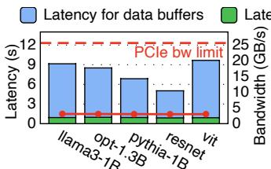  
(a) Driver-integrated C/R (cuda-ckpt)

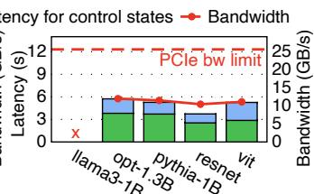  
(b) Interception-based C/R (PhOS)  
Figure 2: Checkpointing latency and average bandwidth for GPU data buffers using (a) Driver-integrated C/R (cuda-ckpt) and (b) Interception-based C/R (PhOS). PhOS cannot run with llama3-1B.

## 3 Motivation

We study the overhead and limitations of existing approaches in two scenarios involving initial full C/R operations (§3.1), and subsequent incremental checkpointing (§3.2).

## 3.1 Overhead of C/R

Limitation 1: Existing approaches exhibit suboptimal performance in achieving low C/R latency.

Checkpointing. We first present the GPU checkpointing latencies for various workloads in Figure 2; restoration performance is analyzed in the following section. Since model training is a critical use case for checkpointing, we use the Transformers [59] framework to train several LLM and DNN models and perform checkpointing. We present evaluations of additional workloads (e.g., DeepSpeed [46]) in §6.1.3.

We use NVIDIA’s official C/R solution cuda-ckpt [39] and the state-of-the-art system PhOS [57] as representative examples of driver-integrated and interception-based C/R approaches, respectively. We break down the checkpointing latency into two components: GPU control state checkpointing and GPU data buffer checkpointing. Additionally, we present the average checkpointing bandwidth, calculated as the total GPU data buffer size divided by the time spent in checkpointing GPU data buffers, to provide comprehensive performance analysis. The checkpointing bandwidth is constrained by the GPU-CPU PCIe bandwidth, as checkpoint data must be transferred from GPU to CPU memory.

As illustrated in Figure 2(a), the driver-integrated C/R approach exhibits suboptimal latency primarily due to limited bandwidth utilization. The majority of checkpointing latency stems from checkpointing GPU data buffers. The observed checkpointing bandwidth for GPU data buffers averages only

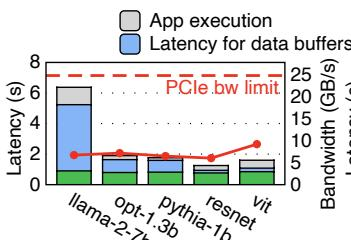  
(a) Driver-integrated C/R (cuda-ckpt)

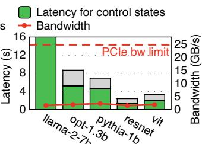  
(b) Interception-based C/R (PhOS)  
Figure 3: Restoration latency of (a) Driver-integrated C/R (cuda-ckpt) and (b) Interception-based C/R (PhOS). We also show the bandwidth of restoring GPU data buffers. The latency for restoring GPU data buffers in PhOS is included in application execution time.

3.0GB/s, achieving only 12.0% of the theoretical PCIe bandwidth limit (25GB/s) [47], resulting in suboptimal checkpointing performance. This bandwidth under-utilization has also been reported by others [22]; however, the underlying cause remains unclear due to cuda-ckpt’s closed-source implementation, and the community currently lacks effective solutions to address this issue.

As shown in Figure 2(b), the interception-based C/R approach exhibits suboptimal latency due to inefficient GPU control state handling and suboptimal bandwidth utilization. The time spent in checkpointing GPU control states is 3.5× higher than that of the driver-integrated C/R approach, on average. While the checkpointing bandwidth is 11.2GB/s on average, 3.7× higher than the driver-integrated approach due to its efficient asynchronous data copying (cudaMemcpyAsync), it achieves only 44.8% of the PCIe bandwidth limit.

This prolonged GPU control state checkpointing latency and suboptimal bandwidth stem from the interception-based C/R’s requirement to handle all GPU driver APIs during C/R, which involves complex serialization of resource handlers according to each API’s specific semantics. While copying GPU data buffers from GPU to CPU memory achieves high bandwidth – our evaluation shows that the asynchronous data copying implemented in PhOS reaches 24.3GB/s, nearly saturating the available PCIe bandwidth – the serialization of resource handlers for GPU data buffers consumes 53.9% of the total checkpointing time for data buffers, doubling the latency for GPU data buffer checkpointing and significantly degrading overall performance.

Restoration. We evaluate restoration performance in Figure 3. We use GPU model inference restoration as a representative example since model inference is a prevalent use case for elastic GPU serverless scaling [18], where cold-start latency serves as a critical performance metric that depends on fast restoration [9, 58].

We use Transformers as the model inference framework (additional workloads are evaluated in the evaluation section, e.g., vLLM) across 5 different models of varying sizes. We cache ready-to-serve checkpoints in CPU memory in advance. Upon request arrival, we restore GPU states from these checkpoints to resume model inference and serve the incoming request. For LLM models, the inference requests contain contexts of 1,155 tokens in length, reflecting realworld workload characteristics [43]. For DNN models, each request processes a single 224×224×3 image [24]. We focus on cold-start latency as the primary metric, which comprises two components: (1) GPU state restoration latency and (2) subsequent application execution latency (details in §6.1.1). We also present the average restoration bandwidth, calculated as the total GPU data buffer size divided by the time spent in restoring GPU data buffers.

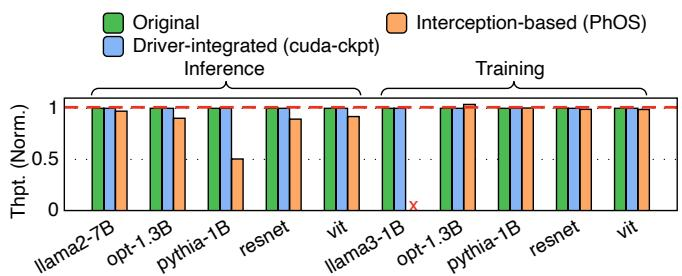  
Figure 4: Normalized application throughput (higher is better) showing the overhead imposed on normal GPU execution.

As shown in Figure 3(a), similar to the checkpointing, the bandwidth of the driver-integrated C/R is low (7.2GB/s on average, 28.8% of the PCIe bandwidth limit), resulting in suboptimal restoration latency.

As shown in Figure 3(b), the interception-based C/R exhibits substantial restoration latencies. GPU control state restoration is particularly time-consuming (9.2× longer than driver-integrated C/R on average) due to the complex deserialization of previously checkpointed resource handlers and API replay. For GPU data buffers, restoration latency is included in application execution time because PhOS employs a concurrent restoration mechanism that attempts to overlap model inference with GPU data buffer restoration. However, this approach results in prolonged application execution latencies (9.7× longer than those of driver-integrated C/R on average) and fails to adequately hide the restoration latency because model inference needs most GPU data buffers and executes significantly faster than GPU data buffer restoration. For example, Transformers achieves a prefill time of 1.1 seconds for 1,155 tokens, while PhOS requires 26.9 seconds for restoration. Restoration bandwidth is also limited to only 7.2% of PCIe bandwidth limit on average due to bottlenecks from the complex deserialization of checkpointed resource handlers and virtual address reallocation.

Limitation 2: Existing approaches impose overhead on normal GPU execution.

Overhead. Regarding the overhead imposed on normal GPU execution, we present results in Figure 4. The driverintegrated C/R approach exhibits zero overhead since the GPU application runs exactly the same, and the driver only performs C/R when explicitly called, requiring no intrusion into normal GPU execution. In contrast, the interception-based C/R approach imposes significant overhead on normal GPU execution, as it relies on intercepting and handling all GPU driver API calls (including mapping and dynamic substitution of resource handlers), thereby extending API execution time. This approach incurs an average performance slowdown of 8.7% during normal GPU execution, with a maximum slowdown of 49.6%.

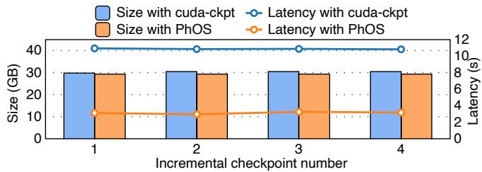  
Figure 5: Checkpoint sizes and latencies of the initial and subsequent checkpointing.

## 3.2 Limitations under Incremental Checkpointing

Limitation 3: Incremental checkpointing is not supported.

Ideal subsequent checkpointing follows an incremental manner, checkpointing only the modified GPU data buffers (dirty buffers) since the previous checkpoint, thereby reducing checkpoint size and latency when not all buffers are dirty. However, we observe that existing approaches all fail to support incremental checkpointing and suffer from checkpoint amplification, as shown in Figure 5.

In this experiment, we run Llama2-7B model inference using Transformers as the inference framework. We checkpoint it multiple times, serving several inference requests after every checkpointing, and monitor both checkpoint size and checkpointing latency. The ideal size and latency should decrease with incremental checkpointing, as it contains read-only GPU buffers (model parameters) that have not been modified during inference and are thus unnecessary to checkpoint repeatedly. Specifically, in this experiment, we monitor that newly generated KV cache entries take about 0.7GB and other buffers modified during inference take about 3.4GB, hence the ideal size of incremental checkpointing would be 4.1GB.

However, existing approaches exhibit identical checkpoint sizes and checkpointing latencies across all checkpointing operations. As shown in Figure 5, the checkpoint sizes with cudackpt and PhOS are nearly 30GB for every checkpoint, which is significantly larger than the dirty buffer sizes, resulting in 7.2× checkpoint amplification. Although PhOS proposes a dirty buffer identification mechanism, it only enables this mechanism during checkpointing and restoration to implement its concurrent C/R. To support incremental checkpointing, PhOS would need to enable dirty buffer identification all the time during normal GPU execution. This would further increase the impact on normal GPU execution, introducing additional slowdown of up to 12% according to PhOS’s evaluation. Furthermore, PhOS’s dirty buffer identification still suffers from amplification, as analyzed in §4.2.

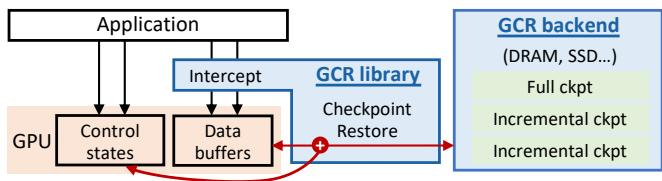  
Figure 6: Overview of GCR.

## 4 Design of GCR

We propose GCR (GPU Checkpoint/Restore) to simultaneously achieve low C/R latency, negligible overhead imposed on normal GPU execution, and efficient incremental checkpointing. GCR consists of a library that implements C/R functionalities and a storage backend that stores checkpoints as shown in Figure 6. It incorporates two key designs as follows.

## 4.1 Hybrid C/R by Control/Data Separation

Key idea: hybrid C/R. We propose a hybrid scheme that combines driver-integrated and interception-based C/R by separating GPU data buffers and GPU control states, assigning each to the appropriate approach.

As analyzed previously (§3), the driver-integrated C/R approach demonstrates zero overhead during normal GPU execution and achieves more efficient checkpointing and restoration of GPU control states compared to the interception-based C/R approach. However, it suffers from one significant drawback: inefficient checkpointing and restoration of GPU data buffers. Conversely, the interception-based C/R approach shows promise in achieving higher bandwidth for checkpointing and restoring GPU data buffers through more efficient asynchronous data copying, but is hindered by complex handling (serialization/deserialization) of intercepted resource handlers during C/R operations. This constraint prevents it from fully saturating the bandwidth and makes checkpointing and restoration of GPU control states inefficient. Additionally, the interception and handling of all GPU driver API calls imposes significant overhead on normal GPU execution. Such findings inspire us to propose a hybrid scheme.

Opportunity: control/data separation. This hybrid scheme is enabled by the opportunity that we can clearly separate GPU data buffers and GPU control states through selective interception of only GPU memory (de)allocations. This separation enables us to leverage interception-based C/R for its promising efficient GPU data buffer handling and driverintegrated C/R for its efficient GPU control state handling plus the low overhead on normal GPU execution.

This selective interception imposes negligible overhead on normal GPU execution. Specifically, GCR selectively intercepts GPU memory allocations (e.g., cuMemAlloc) and memory deallocations (e.g., cuMemFree) during normal GPU execution via LD\_PRELOAD [21, 57]. GCR records only the buffer address and length (16 bytes total) returned by memory allocation and removes these records upon deallocation, imposing negligible overhead on normal GPU execution – less than 1% as shown in §6.3.

This selective interception achieves low C/R latency. During checkpointing, GCR first checkpoints the intercepted GPU data buffers by copying them to CPU memory (cudaMemcpyAsync), along with the buffer address and length, achieving 20.5GB/s on average in our evaluation (§6.1.3). This approach reduces overhead compared to the original interception-based C/R approach, which requires complex handling (serialization) of intercepted resource handlers. Then GCR deallocates the intercepted GPU data buffers to prevent redundant checkpointing by the subsequent driverintegrated C/R. With data buffers deallocated, only GPU control states remain, allowing GCR to invoke driver-integrated C/R for efficient control state checkpointing. During restoration, GCR first leverages driver-integrated C/R to restore GPU control states, followed by restoration of GPU data buffers.

Challenge of GPU data buffer restoration: buffer address consistency. To achieve correct restoration, both GPU buffer contents and buffer addresses must be restored to the same state as when they were checkpointed. Although buffer content restoration is straightforward through memory copying, buffer address restoration presents a significant challenge caused by hybrid C/R. When using driver-integrated C/R for GPU data buffers, buffer address consistency is guaranteed in a black-box manner, while with hybrid C/R, GCR must ensure GPU data buffer address consistency explicitly. However, simply relying on GPU memory allocation (e.g., cudaMalloc) to allocate GPU data buffers does not guarantee address consistency across memory allocation operations, which may result in null pointer dereferences after restoration. We illustrate this challenge with the following example.

Suppose a pointer references a GPU data buffer at address 0x1234. After checkpointing this buffer, GCR deallocates it. During restoration, the buffer is reallocated through cudaMalloc, but this GPU memory allocation does not guarantee that the buffer will receive the same address 0x1234. Consequently, a different address assignment could cause subsequent pointer dereferences to fail.

Previous work [57] attempts to maintain address consistency by relying on a low-level GPU memory management API [37] that reserves buffers at specified addresses (cuMemAddressReserve). However, addresses passed to this

API serve merely as hints and do not guarantee success as stated in the official documentation [38]. Hence, reliance on this undocumented behavior introduces potential reliability risks. In practice, we observe that this API could fail to reserve specified addresses under intensive buffer allocations.

Our approach: decoupling virtual and physical address management during C/R. The address inconsistency arises from GPU memory deallocation after checkpointing followed by GPU memory allocation upon restoration. However, we observe that address consistency and buffer deallocation operate on different aspects of memory management: address consistency involves virtual memory addresses, while buffer deallocation involves both virtual and physical memory. Therefore, we can decouple virtual and physical memory management during C/R by checkpointing the virtual memory addresses (GPU page table) before deallocating them. These virtual addresses can thus be restored during restoration, maintaining virtual address consistency throughout the C/R process, while new physical memory can be allocated with arbitrary addresses and remapped to the preserved virtual addresses.

Specifically, after checkpointing intercepted GPU data buffers, GCR deallocates only the physical memory (cuMemUnmap and cuMemRelease) of these buffers while preserving their virtual memory addresses. The subsequent driver-integrated C/R operation then checkpoints the GPU control states, including the GPU page table, to preserve the virtual memory addresses. After the virtual memory addresses are checkpointed, they are cleared and returned to the driver’s address pool for reuse by other GPU applications. Checkpointing the GPU page table introduces negligible overhead, adding less than 0.1% to GPU control state checkpointing overhead (§6.1.3). During restoration, the driver-integrated C/R restores the control states (including the GPU page table with the original virtual memory addresses). These virtual addresses remain unchanged since they were never deallocated, and GCR recreates the physical memory (cuMemCreate) with arbitrary addresses and establishes the mappings to the preserved virtual memory addresses (cuMemMap). This remapping overhead is negligible, for example, only 432µs for 27.3GB of buffers when restoring llama2-7B inference. The correctness of buffer address consistency is ensured since the complete C/R process essentially remaps virtual memory addresses to physical, which is guaranteed by the semantics of the APIs used above.

Preserving virtual memory addresses brings additional benefits since there is no need to reallocate them during restoration, which shortens latency, enabling GCR to achieve 23.0GB/s (92.0% of PCIe bandwidth limit) during restoration.

## 4.2 Incremental Checkpointing with Shadow Execution

Challenge: trade-offs between fine-grained dirty buffer identification and overhead. To avoid checkpoint amplification and efficiently support incremental checkpointing, fine-grained dirty buffer identification is required. However, current GPU hardware lacks dirty bits for such identification [20]. Software-based solutions include speculation [57] and instrumentation [21, 45], but they involve trade-offs between fine-grained dirty buffer identification and overhead.

(i) Speculation intercepts all kernel launches and speculatively marks all kernel argument buffers without const qualifiers (immutable pointers) as dirty, treating the entire buffer as modified. However, this approach still suffers from amplification due to its coarse-grained identification when kernels have partially dirty buffers: a kernel that receives a large buffer but only modifies small portions of it. These partially dirty buffers can cause significant amplification in real-world workloads. For example, in LLM inference/training task switching, reshape and cache kernels [55] in vLLM inference engine receive large KV Cache buffers as kernel arguments while storing only a few key and value entries into them. In our evaluations, for instance, 13GB of KV Cache buffers are passed as kernel arguments, but processing 1,155 tokens requires storing only 0.7GB of key and value entries. Consequently, when checkpointing LLM inference, such speculation experiences 18.6× amplification. Additionally, this method introduces overhead, causing up to 12% slowdown (as reported by PhOS [57]), since it requires validating the speculation to ensure correctness, which occurs in the critical path of GPU execution.

(ii) Instrumentation inserts code snippets around every store instruction to identify and record dirty buffers at fine granularity during GPU execution. Dirty buffers are first recorded in GPU memory and then transferred to CPU memory. However, this approach introduces significant overhead. Taking the recent state-of-the-art system Neutrino [21] as an example, it slows normal GPU execution by up to 5.3× and consumes 7.1GB additional GPU memory for recording.

Key idea: shadow execution. We move the dirty buffer identification out of the GPU execution path instead of performing it during execution to reduce the overhead of identification. This out-of-execution is achieved by shadow execution of kernels on the CPU, running in parallel with the actual GPU execution. While executing complete kernels on the CPU would introduce significant latency, we find this unnecessary since we only need to identify the dirty addresses and lengths from store instructions – we can skip the computeintensive operations entirely. Hence, we employ symbolic execution [11–13, 28] to generate the dirty templates by transforming the store instructions (details follow) and eliminating unnecessary kernel computations, thereby enabling lightweight CPU calculations to identify dirty buffers. The dirty template also enables fine-grained identification at the instruction level.

Dirty templates. We explain the design of dirty templates using an example of the dirty buffer identification process in Figure 7. ➊ We apply symbolic execution to generate the dirty templates of kernels. A dirty template is a one-to-one transformation of an original kernel, with the purpose of identifying all dirty buffers that the original kernel modifies. The symbolic execution is performed at the PTX ISA [40]-level to achieve fine-grained analysis. The generation of a dirty template involves enumerating all store instructions and transforming their destination addresses and lengths into expressions of both kernel arguments and kernel launch configurations (e.g., gridDim and blockDim), while removing other unnecessary kernel executions. Hence, dirty buffers can be calculated when populated with actual arguments and configurations. The dirty template is generated as C++ functions, compiled, and linked into GCR as a library for subsequent dynamic linking with the GPU program. Since the generation of dirty templates is required only once per kernel, we perform it offline.

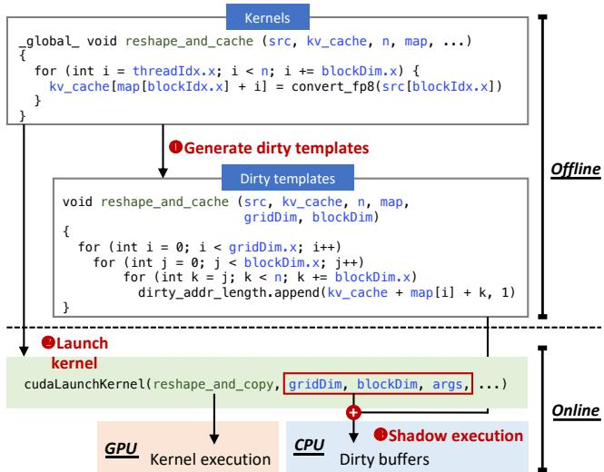  
Figure 7: Shadow execution with dirty templates. The kernel in this example is used by vLLM [55] to convert key/value entries (src) and cache them in the KV Cache. Kernel details have been simplified for demonstration purposes.

➋ The GPU program launches kernels during online phase. GCR intercepts kernels launches (e.g., cudaLaunchKernel) and extracts their arguments and kernel launch configurations, which are then used to populate the dirty templates. Such interception incurs negligible overhead (less than 1%) as shown in our evaluation (§6.2).

➌ GCR subsequently performs shadow execution of the dirty templates on the CPU in parallel with GPU kernel execution. The shadow execution completes quickly (microsecondlevel computation and less than 1MB CPU memory), which is faster than the typical GPU kernel execution times (usually in milliseconds).

Opportunistic dirty templates generation. To ensure correctness, GCR generates dirty templates opportunistically. Below, we provide a detailed discussion of all GPU data buffer-related APIs – operations that could potentially affect GPU data buffers. This includes (a) GPU memory (de)allocations, (b) GPU memory copies (e.g., cudaMemcpy) and GPU library kernels for both communication (e.g., ncclAllReduce) and computation (e.g., cublasSgemm), (c) kernel launches via cudaLaunchKernel.

For operations-(a), dirty templates are not required since solely memory allocations do not modify buffer contents, and deallocation of buffers means the contents are discarded, hence GCR treats all these buffers as clean. For operations-(b), although these operations are closed-source and lack PTX code, they provide detailed documentation specifying argument usage, enabling GCR to directly mark specific arguments as dirty based on their documented behavior. For operations-(c), these include both closed-source kernels and open-source kernels. Closed-source kernels with comprehensive documentation are handled similarly to operations-(b). However, for closed-source kernels lacking documentation, GCR cannot generate dirty templates and report them to users, thereby disabling incremental checkpointing for such applications. Fortunately, modern GPU applications often rely on frameworks with open-source kernels, such as PyTorch [8,42], thus alleviating this constraint in practice.

When generating dirty templates for open-source kernels, we generate templates exclusively for those whose dirty addresses and lengths can be opportunistically transformed as expressions of kernel arguments and kernel launch configurations. We do not generate templates when dirty addresses or lengths depend on additional GPU memory (e.g., pointer chasing) or involve complex computation (e.g., hash functions), since they incur high overhead from frequent CPU-GPU memory transfers or intensive CPU calculations. When these exceptions occur, we mark all non-const kernel argument buffers as dirty to ensure correctness.

## 5 Implementation

GCR synchronizes all executing kernels before checkpointing using cudaDeviceSynchronize [36], and this synchronized approach is also the default in many GPU C/R works [26, 39, 57]. Since kernel executions are typically fast (usually in milliseconds) – orders of magnitude lower than the C/R latency – the synchronization overhead is negligible in practice.

To efficiently support incremental checkpointing, we implement dirty buffer identification by exploiting well-known characteristics of the workload. For example, when incrementally checkpointing model inference using vLLM (§6.2), we observe that model parameters are read-only during inference, KV Cache is partially written by new requests, and other buffers storing intermediate results are fully modified. Based on these observations, we wrap model parameter and KV Cache allocation with two lines of code each during model inference initialization to capture their memory addresses and lengths. We then selectively apply dirty templates and shadow execution only to KV Cache operations.

This approach enables incremental checkpointing to exclude read-only model parameters, checkpoint only the dirty buffers within KV Cache, and include all other buffers.

Currently, we store checkpoints in CPU memory; additional storage backends including SSDs and remote memory could be supported as future work. When storing incremental checkpoints, we merge them with the previous full checkpoint, which accelerates restoration by eliminating the need for merging during the restoration.

The previous sections introduce GPU state checkpointing and restoration, which is our main focus. For CPU state checkpointing and restoration, mature solutions already exist, and GCR leverages CRIU [14] for this purpose.

## 6 Evaluation

Compared systems. We compare GCR with the following systems: ➊ cuda-ckpt, which is the representative example of driver-integrated C/R and NVIDIA’s official GPU C/R solution. ➋ PhOS, which is the state-of-the-art interception-based C/R. Despite our best efforts, we are only able to successfully run PhOS with commit ID 47d64ab [44]. This version does not support complex frameworks such as vLLM [25] and DeepSpeed [46], nor multi-GPU setups, since it requires intercepting and handling all GPU driver API calls. Supporting the complete GPU driver API set is challenging due to the large API set and complex semantics. Furthermore, we also compare with application-level C/R in §6.1.4.

Setups. Hardware platform: 2 A100-40GB GPUs with NVLink, PCIe 4.0. Software: Our evaluation covers model inference, model training, and HPC computing scenarios, using CUDA 12.6 and frameworks including PyTorch 2.7.1 [8, 42], Transformers 4.53.3 [59], vLLM 0.9.1 [25], and DeepSpeed 0.17.5 [46]. The model set includes representative LLM and DNN models. We selectively choose specific frameworks and applications based on different evaluation objectives. Since PhOS only supports Transformers 4.30.0, we use the same Transformers version when evaluating workloads that are supported by PhOS to ensure fair comparison. For workloads not supported by PhOS, we use newer versions of Transformers (4.53.3) to enable broader workload coverage.

## 6.1 Application Performance

## 6.1.1 Elastic GPU Serverless Scaling

Setups. We evaluate the performance of restoration that enables elastic GPU serverless scaling. We use model inference as our target application, as it represents a prevalent use case for elastic GPU serverless scaling. The evaluation follows the same setup as §3.1, with ready-to-serve checkpoints cached in CPU memory. Upon request arrival, we restore GPU states from these checkpoints to resume model inference. We measure cold-start latency – the key metric for serverless scaling [9, 58] – which comprises GPU state restoration latency and subsequent application execution latency. For LLM application execution, we use time-to-first-token (TTFT) as our application execution metric, as TTFT is the most critical performance measure in serverless LLM inference [18, 61]. Inference requests contain 1,155 tokens, reflecting real-world workloads [43]. For DNN application execution, we measure the execution latency of one request for a single 224×224×3 image [24].

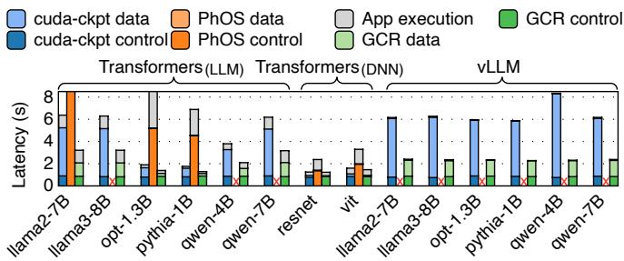  
Figure 8: Elastic model inference serverless cold-start time with restoration.

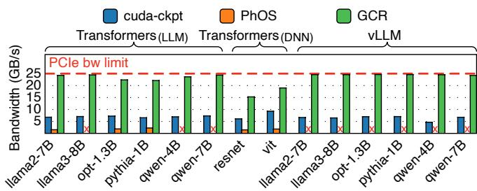  
Figure 9: Bandwidth for restoring GPU data buffers across all systems during restoration.

Overall performance. As shown in Figure 8, restoration constitutes the majority of cold-start latency. For example, with llama3-8B and vLLM, the restoration latency accounts for 95.8% of the overall cold-start latency in GCR, demonstrating that restoration optimization is critical for the cold-start latency. GCR consistently exhibits the lowest cold-start latency due to reduced restoration latency achieved by GCR’s hybrid C/R scheme. Compared to cuda-ckpt, GCR achieves an average reduction of 54.2% in cold-start latency. The reductions are even more pronounced when compared to PhOS, with an average reduction of 87.1%.

GPU control state restoration. The detailed breakdown of restoration latency shows that GCR achieves efficient GPU control state restoration comparable to driver-integrated C/R (cuda-ckpt). Compared to cuda-ckpt’s 0.8s GPU control state restoration latency, GCR incurs less than 0.02s overhead for GPU page table restoration. In contrast, GPU control state restoration latencies in PhOS are lengthy (averaging 8.0 seconds, 9.3× longer than GCR) due to substantial overhead from complex deserialization of previously checkpointed resource

handlers and API replay.

GPU data buffer restoration. GCR achieves the lowest GPU data buffer restoration latency. Compared to cuda-ckpt, GCR reduces GPU data buffer restoration latency by an average of 73.0%, while achieving a 92.2% reduction compared to PhOS. This is because GCR can achieve nearly the full available PCIe bandwidth when restoring GPU data buffers, as shown in Figure 9. GCR achieves an average bandwidth of 23.0GB/s, achieving 3.4× and 11.5× higher average bandwidth than cuda-ckpt and PhOS, respectively. PhOS’s GPU data buffer restoration is bottlenecked by the complex deserialization of checkpointed resource handlers. PhOS’s GPU data buffer restoration latency is included in application execution latency since it employs concurrent restoration which attempts to overlap model inference with GPU data buffer restoration. However, such concurrent restoration results in significantly longer application execution latencies, averaging 11.1× longer than GCR. This occurs because concurrent restoration fails to effectively hide latency, as model inference requires most GPU data buffers and executes considerably faster than GPU data buffer restoration. For instance, Transformers achieves a prefill time of 1.1 seconds for 1,155 tokens, whereas PhOS requires 26.9 seconds for restoration. In contrast, GCR maintains nearly identical application execution latencies after restoration, with less than 0.1% overhead compared to execution without restoration.

## 6.1.2 Rapid GPU Task Switching

Setups. We evaluate checkpointing and restoration that enable efficient GPU task switching. We conduct comprehensive evaluations across scenarios including switching from model training to model inference, and vice versa. Our evaluation encompasses training and inference frameworks including Transformers, DeepSpeed, and vLLM. The switch-out task is checkpointed to CPU memory, and the switch-in task restores from CPU memory. We present the initial full checkpointing performance; incremental checkpointing performance is analyzed in §6.2. We measure the switch latency and break it down into two components: checkpointing (switch-out) and restoration (switch-in). Since PhOS supports concurrent restoration, we further include training/inference execution to trigger PhOS’s concurrent restoration of GPU data buffers.

Overall performance. As shown in Figure 10, GCR achieves the lowest switching latency. Compared to cuda-ckpt, GCR reduces the switching latency by 71.6% on average. This performance improvement stems from GCR’s ability to reduce latency in both task switch-out (checkpointing) and switch-in (restoration) operations. Specifically, GCR reduces checkpointing latency by 77.9% on average, while achieving a 58.9% reduction in restoration latency.

Compared to PhOS, GCR reduces the switching latency by 74.1%, checkpointing latency by 51.8%, and restoration latency by 82.5%. PhOS also incurs significantly longer application execution time – 8.3× longer than GCR – because concurrent C/R remains inefficient. Since application execution requires most GPU data buffers and can be over an order of magnitude faster than C/R, effective latency hiding cannot be achieved. (Concurrent checkpointing is analyzed in the next section.)

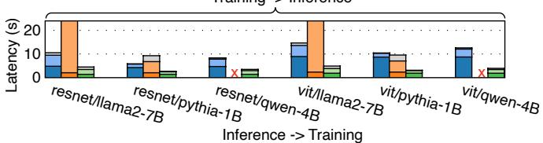

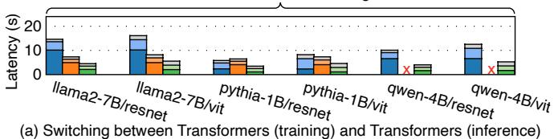

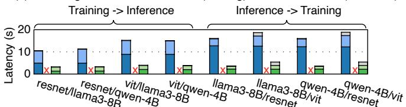

(b) Switching between DeepSpeed (training) and vLLM (inference)  
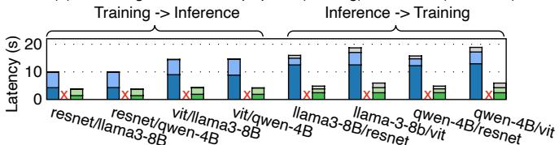  
(c) Switching between Transformers (training) and vLLM (inference)  
Figure 10: GPU task switching between model training and inference.

## 6.1.3 Fault-tolerant GPU Computation

Overall performance. We evaluate GPU checkpointing performance across various applications using the same experimental setup described in §3.1. We focus on evaluating the full checkpointing performance in this experiment; we present incremental checkpointing performance in §6.2. This experiment encompasses model training applications using the Transformers and DeepSpeed frameworks for LLM and DNN training, as well as an HPC workload for molecular dynamics simulation (comd) [53].

As shown in Figure 11, GCR reduces checkpointing latency by 72.1% and 63.6% on average compared to cuda-ckpt and PhOS, respectively. This improvement is achieved because GCR maintains the same low latency for GPU control state checkpointing as the driver-integrated C/R approach (cudackpt) – with less than a 0.1% increase. Compared to PhOS,

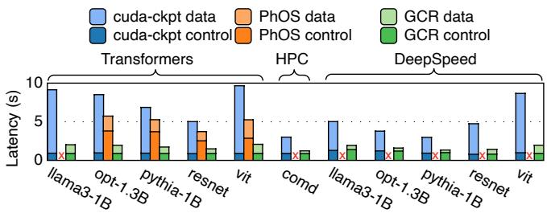  
Figure 11: GPU checkpointing latency.

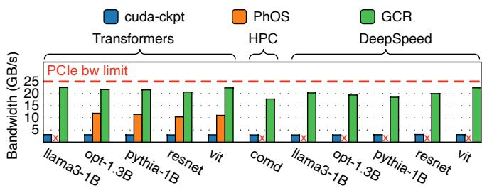  
Figure 12: Bandwidth for checkpointing GPU data buffers across all systems during checkpointing.

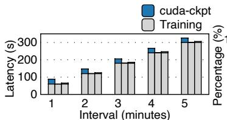  
(a) Training time with stalls

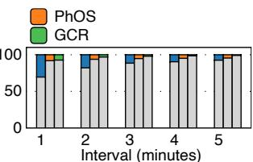  
(b) Effective training ratio  
Figure 13: Fault-tolerant model training time and effective training ratio at various checkpointing frequencies.

GCR achieves a 72.1% reduction of GPU control state checkpointing. For GPU data buffer checkpointing, GCR achieves 20.5 GB/s bandwidth compared to 3.0 GB/s for cuda-ckpt and 11.2GB/s for PhOS, as shown in Figure 12.

Training performance at various frequencies. We study the fault-tolerant GPU training performance at various checkpointing frequencies. This experiment uses opt-1.3B model with Transformers as the training framework. We vary the checkpointing interval (i.e., the duration in minutes of training time between checkpoints) and measure both the training time and the checkpointing-induced stalls within each interval. We also calculate the effective training ratio (defined as the ratio of actual training progress to the training progress that would be achieved without checkpointing) to evaluate the impact of checkpointing on normal training performance.

As shown in Figure 13(a), GCR consistently outperforms cuda-ckpt, reducing stall time by 78.4% on average. This improvement stems from GCR’s hybrid C/R design, which reduces C/R latency through higher bandwidth utilization. GCR exhibits higher stall time compared to PhOS, primarily because GCR performs GPU restoration after GPU checkpointing to enable continuous training as required by fault-tolerant GPU training. Specifically, GCR deallocates intercepted GPU data buffers to prevent redundant checkpointing by subsequent driver-integrated C/R operations, necessitating restoration of these buffers before model training can resume, resulting in longer stall time. However, this stall time remains acceptable in practice, accounting for only 3.0% of training time when frequent checkpointing is performed at 3-minute intervals. In terms of effective training ratio (Figure 13(b)), GCR achieves 99.1% at 5-minute checkpointing intervals.

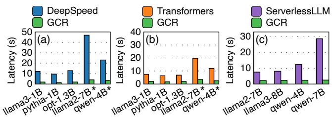  
Figure 14: Comparison with application-level C/R.

Note that PhOS employs concurrent checkpoining which runs in parallel with model training to reduce stall time. However, concurrent checkpointing is ineffective in this scenario because training iterations are fast (0.36s) compared to checkpointing (5.7 seconds). As a result, training updates all model parameters during concurrent checkpointing, making most GPU data buffers dirty. Consequently, PhOS must recopy or use copy-on-write for these GPU data buffers, preventing concurrent execution from hiding the checkpointing latency.

## 6.1.4 Application-level C/R

We compare GCR’s full checkpointing and restoration with application-level C/R as shown in Figure 14, including (a) DeepSpeed save\_checkpoint [15] and (b) Transformers save\_pretrained for checkpointing, and (c) Serverless-LLM for restoration. GCR shows consistent performance gain over all compared systems, achieving average latency reductions of 87.8%, 77.6%, and 83.3%, respectively. This is because application-level C/R employs complex logic specific to framework implementations. For example, ServerlessLLM experiences a lengthy initialization process to restore GPU states, while GCR achieves more efficient C/R by directly dumping GPU states.

We also evaluate multi-GPU scenarios for workloads labeled with . GCR remains efficient with multi-GPU setups ⋆since it employs parallel C/R across all GPUs, i.e., each GPU performs C/R independently.

## 6.2 Incremental Checkpointingfi

In this experiment, we evaluate incremental checkpointing by performing multiple checkpoint operations on applications.

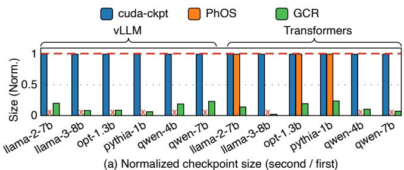

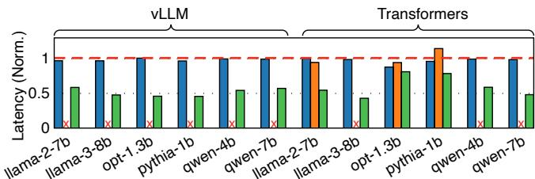  
(b) Normalized checkpoint latency (second / rst)  
Figure 15: Normalized checkpoint sizes and checkpointing latencies of subsequent checkpointing compared to the initial one. Lower is better. (a) Normalized checkpoint size is calculated as the second checkpoint size divided by the first. (b) Normalized checkpointing latency is calculated as the second checkpointing latency divided by the first.

We use model inference as our representative application, as checkpointing model inference represents an important use case for GPU task switching – each model switch-out requires a checkpoint operation. We conduct our evaluation using vLLM and Transformers as model inference engines, evaluating each with several representative models. After each checkpoint operation, we perform inference on 5 requests, each with 1,155 input tokens and 211 output tokens, matching the real-world dataset [43]. For each checkpoint operation, we measure both checkpoint size and checkpointing latency. We observe that checkpoint sizes and latencies stabilize from the second checkpoint onward. Therefore, we use the performance metrics from the second checkpoint compared to the first as indicators of incremental checkpointing performance.

As shown in Figure 15(a), GCR significantly reduces the checkpoint sizes with incremental checkpointing, while cudackpt and PhOS maintain the same checkpoint sizes. Specifically, GCR reduces checkpoint size by 86.6% on average compared to the first checkpoint. This dramatic reduction occurs because GCR eliminates the checkpointing of readonly model parameters, checkpointing only newly generated KV cache entries and other buffers modified since the last checkpoint. This reduction in checkpoint sizes leads to a corresponding reduction in checkpointing latencies as shown in Figure 15(b). GCR reduces checkpointing latency by 43.8% compared to the first checkpoint, while cuda-ckpt and PhOS maintain similar checkpointing latencies with minor fluctuations. The reduction in checkpointing latency for GCR is less than the reduction in checkpoint size because checkpointing latency includes the time required to checkpoint GPU control states, which is not reduced by incremental checkpointing.

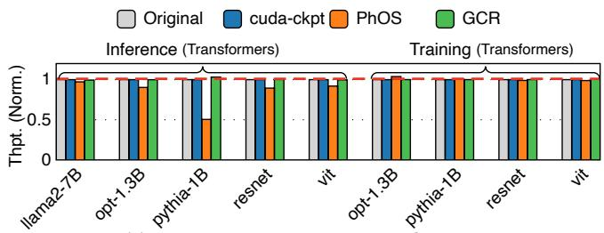  
(a) App execution throughput with all C/R systems

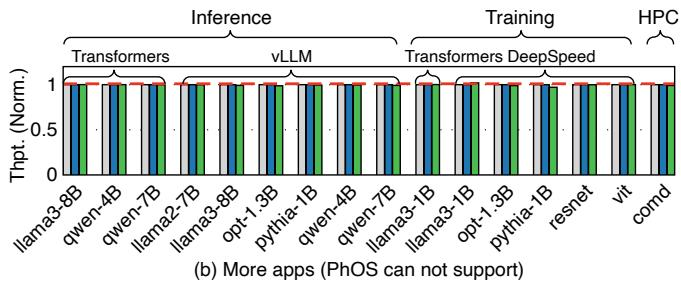  
Figure 16: Normalized application execution throughput. Higher is better.

We then analyze the incremental checkpointing overhead of GCR. The shadow execution performed on the CPU is fast and lightweight, operating at the microsecond level (e.g., 14µs) thanks to the design of dirty templates. The CPU memory required to store the dirty addresses and lengths for each incremental checkpoint during shadow execution is less than 1MB. Shadow execution overhead primarily includes copying parameters from GPU to CPU, and CPU calculations; these costs are hidden by performing shadow execution on the CPU in parallel with GPU kernel execution. As a result, the overhead to normal execution is negligible, averaging less than 1%.

## 6.3 Overhead on Normal Execution

We study the overhead imposed on normal GPU execution in this experiment. Since we analyzed incremental checkpointing overhead previously, we focus here on the overhead that full checkpointing introduces during normal execution. We evaluate all applications from the previous experiments, covering model inference, model training, and HPC computing scenarios across frameworks including Transformers, vLLM, and DeepSpeed, with models encompassing both DNN and LLM architectures. We calculate the normalized application throughput for all C/R systems, where higher values indicate better performance. Since PhOS cannot support several applications, we present the results in two separate figures for clearer presentation.

As shown in Figure 16(a), GCR achieves more than 99.9% throughput on average compared to normal GPU execution without C/R. This demonstrates that GCR imposes negligible overhead (less than 1%) on normal GPU execution, as it only intercepts and handles GPU data buffer-related APIs, introducing less overhead than PhOS’s interception and handling of all APIs. Furthermore, GCR records only buffer addresses and lengths (16 bytes total per buffer when intercepted), which incurs nearly zero overhead. PhOS slows down normal GPU execution by 8.7% on average, with a maximum slowdown of 49.6%. Figure 16(b) presents additional applications; since PhOS cannot support these applications, we only show performance results for cuda-ckpt and GCR, and the conclusions are similar.

## 7 Discussion

Bandwidth optimization. The bandwidth under-utilization during GPU data buffer C/R in driver-integrated approach (cuda-ckpt) remains unclear since its implementation is closed-source. However, we suspect that optimizing the bandwidth for GPU data buffer C/R is non-trivial; otherwise, it would not have remained unimplemented by the NVIDIA team for such a long time until now. GCR presents a potential design that may be integrated into drivers in the future to achieve higher bandwidth utilization.

Generalizability across GPU types. In this paper, we implement GCR on NVIDIA GPUs, but it is possible to implement GCR to other GPU types as long as they support driver-integrated C/R for GPU control state checkpointing and restoration, interception for GPU data buffer-related APIs, and can decouple virtual and physical GPU memory management. While these requirements are general features in modern GPUs and can be satisfied by other commercially available GPU types. For example, AMD GPUs support driverintegrated C/R [1–4] and interception of GPU data bufferrelated APIs, and provide similar APIs [5] for decoupling virtual and physical memory management as found in CUDA. Concurrent GPU C/R. Concurrent GPU C/R [57,60] enables checkpointing and restoring GPU states in parallel with GPU execution. Concurrent checkpointing requires efficient identification of dirty buffers modified during concurrent execution. GCR proposes shadow execution with dirty templates to efficiently support this requirement, enabling GCR to support concurrent checkpointing by design. Concurrent restoration requires identifying all touched buffers needed by kernel execution. We can extend dirty templates by further analyzing load instructions to identify all touched buffers to support this. However, we find that concurrent C/R is less efficient in the scenarios we evaluated, including fault-tolerant model training, serverless model inference, and model switching, since these applications require most GPU data buffers and can execute over an order of magnitude faster than C/R operations, preventing concurrent C/R from hiding the latency. Therefore, we do not implement concurrent C/R for now and leave it as future work.

## 8 Related Work

System-level GPU C/R includes driver-integrated [39,50] and interception-based [10,16,19,23,30,48,49,51,57] approaches, both of which fall short as analyzed previously. Instead, GCR is the first to propose a hybrid approach that achieves both low C/R latency and low overhead imposed on normal GPU execution.

To improve C/R efficiency, some work requires specialized GPU hardware [26, 27] or modified GPU drivers [60]; GCR focuses on currently available hardware and does not require modifying the GPU driver. To reduce the checkpoint size, some work [41, 49] employs checksum and deduplication techniques, but these either introduce additional computational overhead on normal GPU execution if performed on the GPU, or generate the same PCIe traffic if performed on the CPU, thus failing to reduce checkpointing latency. Instead, GCR proposes shadow execution with dirty templates to enable efficient dirty buffer identification.

Some work supports checkpointing applications with unified virtual memory (UVM) [19, 23, 41] or preempting GPU tasks in the middle of kernel execution [17], which could potentially be integrated into GCR; we leave this as future work. GCR is also compatible with multiple storage backends such as CPU memory or SSD, and can integrate with previous work [29] that optimizes checkpoint storage.

## 9 Conclusion

In this paper, we present GCR, a fast and lightweight GPU checkpoint/restore system that enables elastic scaling, task switching, and fault tolerance for modern GPU workloads. GCR employs a hybrid C/R scheme through control/data separation to deliver low C/R latency and negligible overhead imposed on normal GPU execution. By introducing shadow execution and dirty templates, GCR efficiently supports incremental checkpointing. Our evaluation demonstrates GCR’s performance advantages over existing approaches.

## Acknowledgements

We sincerely thank our shepherd, Annmary Justine, and anonymous reviewers for their valuable feedback and suggestions. This work is supported by the National Key R&D Program of China (Grant No. 2024YFB4505201), the National Natural Science Foundation of China (Grant No. 62332011), Beijing Natural Science Foundation (Grant No. L242016).

## References

[1] AMD. Amd criu fork. https://github.com/ROCm/ criu, 2025.

[2] AMD. Amd kfd ioctl apis. https://github.com/R OCm/amdgpu/commits/fxkamd/criu-wip, 2025.

[3] AMD. Criu: Amd gpu rfc. https://github.com/c heckpoint-restore/criu/pull/1556, 2025.

[4] AMD. Fast checkpoint restore for amd gpus with criu. https://indico.freedesktop.org/event/1/c ontributions/18/attachments/10/14/XDC%20 -%20Fast%20Checkpoint%20Restore%20for%20AM D%20GPUs%20with%20CRIU.pdf, 2025.

[5] AMD. Hip runtime api reference: Virtual memory management. https://rocm.docs.amd.com/projects /HIP/en/latest/doxygen/html/group\_\_\_virt ual.html, 2025.

[6] AMD. Porting cuda driver api. https://rocm.docs. amd.com/projects/HIP/en/docs-develop/how -to/hip\_porting\_driver\_api.html, 2025.

[7] AMD. Using hip runtime api. https://rocm.docs. amd.com/projects/HIP/en/docs-develop/how -to/hip\_runtime\_api.html, 2025.

[8] Jason Ansel, Edward Yang, Horace He, Natalia Gimelshein, Animesh Jain, Michael Voznesensky, Bin Bao, Peter Bell, David Berard, Evgeni Burovski, Geeta Chauhan, Anjali Chourdia, Will Constable, Alban Desmaison, Zachary DeVito, Elias Ellison, Will Feng, Jiong Gong, Michael Gschwind, Brian Hirsh, Sherlock Huang, Kshiteej Kalambarkar, Laurent Kirsch, Michael Lazos, Mario Lezcano, Yanbo Liang, Jason Liang, Yinghai Lu, C. K. Luk, Bert Maher, Yunjie Pan, Christian Puhrsch, Matthias Reso, Mark Saroufim, Marcos Yukio Siraichi, Helen Suk, Shunting Zhang, Michael Suo, Phil Tillet, Xu Zhao, Eikan Wang, Keren Zhou, Richard Zou, Xiaodong Wang, Ajit Mathews, William Wen, Gregory Chanan, Peng Wu, and Soumith Chintala. Pytorch 2: Faster machine learning through dynamic python bytecode transformation and graph compilation. In Proceedings of the 29th ACM International Conference on Architectural Support for Programming Languages and Operating Systems, Volume 2, ASPLOS ’24, page 929–947, New York, NY, USA, 2024. Association for Computing Machinery.

[9] Xiaohu Chai, Tianyu Zhou, Keyang Hu, Jianfeng Tan, Tiwei Bie, Anqi Shen, Dawei Shen, Qi Xing, Shun Song, Tongkai Yang, Le Gao, Feng Yu, Zhengyu He, Dong Du, Yubin Xia, Kang Chen, and Yu Chen. Fork in the road: Reflections and optimizations for cold start latency in production serverless systems. In 19th USENIX Symposium on Operating Systems Design and Implementation, OSDI’25, Boston, MA, USA, July 7-9, 2025, pages 199– 218. USENIX Association.

[10] Shubham Chaudhary, Ramachandran Ramjee, Muthian Sivathanu, Nipun Kwatra, and Srinidhi Viswanatha. Balancing efficiency and fairness in heterogeneous GPU clusters for deep learning. In EuroSys ’20: Fifteenth EuroSys Conference 2020, Heraklion, Greece, April 27- 30, 2020, pages 1:1–1:16. Association for Computing Machinery.

[11] Peter Collingbourne, Cristian Cadar, and Paul H. J. Kelly. Symbolic testing of opencl code. In Proceedings of the 7th International Haifa Verification Conference on Hardware and Software: Verification and Testing, HVC’11, page 203–218, Berlin, Heidelberg, 2011. Springer-Verlag.

[12] Peter Collingbourne, Cristian Cadar, and Paul H. J. Kelly. Symbolic crosschecking of data-parallel floating-point code. IEEE Trans. Softw. Eng., 40(7):710–737, July 2014.

[13] Peter Collingbourne, Cristian Cadar, and Paul H.J. Kelly. Symbolic crosschecking of floating-point and simd code. In Proceedings of the Sixth Conference on Computer Systems, EuroSys ’11, page 315–328, New York, NY, USA, 2011. Association for Computing Machinery.

[14] CRIU. Criu. https://github.com/checkpoint-r estore/criu, 2025.

[15] DeepSpeed. Deepspeed checkpoint. https://deepsp eed.readthedocs.io/en/latest/model-check pointing.html, 2025.

[16] Niklas Eiling, Jonas Baude, Stefan Lankes, and Antonello Monti. Cricket: A virtualization layer for distributed execution of CUDA applications with checkpoint/restart support. Concurr. Comput. Pract. Exp., 34(14), 2022.

[17] Ruwen Fan, Tingxu Ren, Minhui Xie, Shiwei Gao, Jiwu Shu, and Youyou Lu. GPREEMPT: GPU preemptive scheduling made general and efficient. In Deniz Altinbüken and Ryan Stutsman, editors, Proceedings of the 2025 USENIX Annual Technical Conference, USENIX ATC 2025, Boston, MA, USA, July 7-9, 2025, pages 263– 272. USENIX Association, 2025.

[18] Yao Fu, Leyang Xue, Yeqi Huang, Andrei-Octavian Brabete, Dmitrii Ustiugov, Yuvraj Patel, and Luo Mai. ServerlessLLM: Low-Latency serverless inference for large language models. In 18th USENIX Symposium on Operating Systems Design and Implementation, OSDI’24, pages 135–153, Santa Clara, CA, July 2024. USENIX Association.

[19] Rohan Garg, Apoorve Mohan, Michael B. Sullivan, and Gene Cooperman. CRUM: checkpoint-restart support

for cuda’s unified memory. In IEEE International Conference on Cluster Computing, CLUSTER 2018, Belfast, UK, September 10-13, 2018, pages 302–313. IEEE Computer Society.

[20] Yanan Guo, Zhenkai Zhang, and Jun Yang. GPU memory exploitation for fun and profit. In 33rd USENIX Security Symposium, USENIX Security 2024, Philadelphia, PA, USA, August 14-16, 2024. USENIX Association.

[21] Songlin Huang and Chenshu Wu. Neutrino: Finegrained GPU kernel profiling via programmable probing. In 19th USENIX Symposium on Operating Systems Design and Implementation, OSDI’25, Boston, MA, USA, July 7-9, 2025, pages 331–355. USENIX Association.

[22] Github Issue. Slower memory bandwidth than expected. https://github.com/NVIDIA/cuda-checkpoin t/issues/29, 2025.

[23] Twinkle Jain and Gene Cooperman. CRAC: checkpointrestart architecture for CUDA with streams and UVM. In Proceedings of the International Conference for High Performance Computing, Networking, Storage and Analysis, SC’20, Virtual Event / Atlanta, Georgia, USA, November 9-19, 2020, page 77. IEEE/ACM.

[24] Alex Krizhevsky and Geoffrey Hinton. Learning multiple layers of features from tiny images. Technical Report 0, University of Toronto, Toronto, Ontario, 2009.

[25] Woosuk Kwon, Zhuohan Li, Siyuan Zhuang, Ying Sheng, Lianmin Zheng, Cody Hao Yu, Joseph E. Gonzalez, Hao Zhang, and Ion Stoica. Efficient memory management for large language model serving with pagedattention. In Proceedings of the 29th Symposium on Operating Systems Principles, SOSP ’23, page 611–626. Association for Computing Machinery.

[26] Kyushick Lee, Michael B. Sullivan, Siva Kumar Sastry Hari, Timothy Tsai, Stephen W. Keckler, and Mattan Erez. Gpu snapshot: checkpoint offloading for gpudense systems. In Proceedings of the ACM International Conference on Supercomputing, ICS ’19, page 171–183, New York, NY, USA. Association for Computing Machinery.

[27] Chen Li, Andrew Zigerelli, Jun Yang, Youtao Zhang, Sheng Ma, and Yang Guo. A dynamic and proactive GPU preemption mechanism using checkpointing. IEEE Trans. Comput. Aided Des. Integr. Circuits Syst., 39(1):75–87, 2020.

[28] Guodong Li, Peng Li, Geof Sawaya, Ganesh Gopalakrishnan, Indradeep Ghosh, and Sreeranga P. Rajan. Gklee: concolic verification and test generation for gpus. SIGPLAN Not., 47(8):215–224, February 2012.

[29] Avinash Maurya, M. Mustafa Rafique, Thierry Tonellot, Hussain J. AlSalem, Franck Cappello, and Bogdan Nicolae. Gpu-enabled asynchronous multi-level checkpoint caching and prefetching. In Proceedings of the 32nd International Symposium on High-Performance Parallel and Distributed Computing, HPDC ’23, Orlando, FL, USA, June 16-23, 2023, pages 73–85. Association for Computing Machinery.

[30] Akira Nukada, Taichiro Suzuki, and Satoshi Matsuoka. Efficient checkpoint/restart of cuda applications. Parallel Comput., 116(C), July 2023.

[31] NVIDIA. Cuda checkpointing driver api. https://do cs.nvidia.com/cuda/cuda-driver-api/group \_CUDA\_\_CHECKPOINT.html#group\_\_CUDA\_\_CHE CKPOINT, 2025.

[32] NVIDIA. Cuda context. https://docs.nvidia.co m/cuda/cuda-driver-api/group\_\_CUDA\_\_CTX. html, 2025.

[33] NVIDIA. Cuda driver api. https://docs.nvidia. com/cuda/cuda-driver-api/index.html, 2025.

[34] NVIDIA. Cuda runtime api. https://docs.nvidia. com/cuda/cuda-runtime-api/index.html, 2025.

[35] NVIDIA. Cuda stream. https://docs.nvidia.co m/cuda/cuda-runtime-api/group\_\_CUDART\_\_ST REAM.html, 2025.

[36] NVIDIA. cudadevicesynchronize. https://docs.n vidia.com/cuda/cuda-runtime-api/group\_\_CU DART\_\_DEVICE.html, 2025.

[37] NVIDIA. Introducing low-level gpu virtual memory management. https://developer.nvidia.com/b log/introducing-low-level-gpu-virtual-mem ory-management/, 2025.

[38] NVIDIA. Introducing low-level gpu virtual memory management. https://docs.nvidia.com/cuda/c uda-driver-api/group\_\_CUDA\_\_VA.html, 2025.

[39] NVIDIA. Nvidia/cuda-checkpoint. https://github .com/NVIDIA/cuda-checkpoint, 2025.

[40] NVIDIA. Parallel thread execution isa version 9.0. ht tps://docs.nvidia.com/cuda/parallel-threa d-execution/, 2025.

[41] Konstantinos Parasyris, Kai Keller, Leonardo Bautista-Gomez, and Osman S. Unsal. Checkpoint restart support for heterogeneous HPC applications. In 20th IEEE/ACM International Symposium on Cluster, Cloud and Internet Computing, CCGRID’ 20, Melbourne, Australia, May 11-14, 2020, pages 242–251. IEEE.

[42] Adam Paszke, Sam Gross, Francisco Massa, Adam Lerer, James Bradbury, Gregory Chanan, Trevor Killeen, Zeming Lin, Natalia Gimelshein, Luca Antiga, Alban Desmaison, Andreas Köpf, Edward Yang, Zach DeVito, Martin Raison, Alykhan Tejani, Sasank Chilamkurthy, Benoit Steiner, Lu Fang, Junjie Bai, and Soumith Chintala. PyTorch: an imperative style, high-performance deep learning library. Curran Associates Inc., Red Hook, NY, USA, 2019.

[43] Pratyush Patel, Esha Choukse, Chaojie Zhang, Aashaka Shah, Íñigo Goiri, Saeed Maleki, and Ricardo Bianchini. Splitwise: Efficient generative LLM inference using phase splitting. In 51st ACM/IEEE Annual International Symposium on Computer Architecture, ISCA ’24, Buenos Aires, Argentina, June 29 - July 3, 2024, pages 118–132. IEEE.

[44] PhoenixOS. Phoenixos commit id of 47d64ab. https: //github.com/SJTU-IPADS/PhoenixOS/commit/ 47d64ababb235238a432bdfb0bcb79312bb29695, 2024.

[45] Behnam Pourghassemi and Aparna Chandramowlishwaran. cudacr: An in-kernel application-level checkpoint/restart scheme for cuda-enabled gpus. In 2017 IEEE International Conference on Cluster Computing, CLUSTER ’17, Honolulu, HI, USA, September 5-8, 2017, pages 725–732. IEEE Computer Society.

[46] Jeff Rasley, Samyam Rajbhandari, Olatunji Ruwase, and Yuxiong He. Deepspeed: System optimizations enable training deep learning models with over 100 billion parameters. In Proceedings of the 26th ACM SIGKDD International Conference on Knowledge Discovery & Data Mining, KDD ’20, page 3505–3506, New York, NY, USA, 2020. Association for Computing Machinery.

[47] Zhenghang Ren, Yuxuan Li, Zilong Wang, Xinyang Huang, Wenxue Li, Kaiqiang Xu, Xudong Liao, Yijun Sun, Bowen Liu, Han Tian, Junxue Zhang, Mingfei Wang, Zhizhen Zhong, Guyue Liu, Ying Zhang, and Kai Chen. Enabling efficient GPU communication over multiple nics with fuselink. In 19th USENIX Symposium on Operating Systems Design and Implementation, OSDI ’25, Boston, MA, USA, July 7-9, 2025, pages 91–108. USENIX Association.

[48] Lin Shi, Hao Chen, Jianhua Sun, and Kenli Li. vcuda: Gpu-accelerated high-performance computing in virtual machines. IEEE Trans. Comput., 61(6):804–816, June 2012.

[49] Dharma Shukla, Muthian Sivathanu, Srinidhi Viswanatha, Bhargav S. Gulavani, Rimma Nehme, Amey Agrawal, Chen Chen, Nipun Kwatra, Ramachandran Ramjee, Pankaj Sharma, Atul Katiyar, Vipul

Modi, Vaibhav Sharma, Abhishek Singh, Shreshth Singhal, Kaustubh Welankar, Lu Xun, Ravi Anupindi, Karthik Elangovan, Hasibur Rahman, Zhou Lin, Rahul Seetharaman, Cheng Xu, Eddie Ailijiang, Suresh Krishnappa, and Mark Russinovich. Singularity: Planet-scale, preemptive and elastic scheduling of AI workloads. CoRR, abs/2202.07848, 2022.

[50] Radostin Stoyanov, Viktória Spisaková, Jesus Ramos, Steven Gurfinkel, Andrei Vagin, Adrian Reber, Wesley Armour, and Rodrigo Bruno. Criugpu: Transparent checkpointing of gpu-accelerated workloads. CoRR, abs/2502.16631, 2025.

[51] Hiroyuki Takizawa, Katsuto Sato, Kazuhiko Komatsu, and Hiroaki Kobayashi. Checuda: A checkpoint/restart tool for CUDA applications. In 2009 International Conference on Parallel and Distributed Computing, Applications and Technologies, PDCAT ’09 , Higashi Hiroshima, Japan, 8-11 December 2009, pages 408–413. IEEE Computer Society.

[52] Kimi Team, Angang Du, Bofei Gao, Bowei Xing, Changjiu Jiang, Cheng Chen, Cheng Li, Chenjun Xiao, Chenzhuang Du, Chonghua Liao, Chuning Tang, Congcong Wang, Dehao Zhang, Enming Yuan, Enzhe Lu, Fengxiang Tang, Flood Sung, Guangda Wei, Guokun Lai, Haiqing Guo, Han Zhu, Hao Ding, Hao Hu, Hao Yang, Hao Zhang, Haotian Yao, Haotian Zhao, Haoyu Lu, Haoze Li, Haozhen Yu, Hongcheng Gao, Huabin Zheng, Huan Yuan, Jia Chen, Jianhang Guo, Jianlin Su, Jianzhou Wang, Jie Zhao, Jin Zhang, Jingyuan Liu, Junjie Yan, Junyan Wu, Lidong Shi, Ling Ye, Longhui Yu, Mengnan Dong, Neo Zhang, Ningchen Ma, Qiwei Pan, Qucheng Gong, Shaowei Liu, Shengling Ma, Shupeng Wei, Sihan Cao, Siying Huang, Tao Jiang, Weihao Gao, Weimin Xiong, Weiran He, Weixiao Huang, Wenhao Wu, Wenyang He, Xianghui Wei, Xianqing Jia, Xingzhe Wu, Xinran Xu, Xinxing Zu, Xinyu Zhou, Xuehai Pan, Y. Charles, Yang Li, Yangyang Hu, Yangyang Liu, Yanru Chen, Yejie Wang, Yibo Liu, Yidao Qin, Yifeng Liu, Ying Yang, Yiping Bao, Yulun Du, Yuxin Wu, Yuzhi Wang, Zaida Zhou, Zhaoji Wang, Zhaowei Li, Zhen Zhu, Zheng Zhang, Zhexu Wang, Zhilin Yang, Zhiqi Huang, Zihao Huang, Ziyao Xu, and Zonghan Yang. Kimi k1.5: Scaling reinforcement learning with llms. CoRR, abs/2501.12599, 2025.

[53] A. P. Thompson, H. M. Aktulga, R. Berger, D. S. Bolintineanu, W. M. Brown, P. S. Crozier, P. J. in ’t Veld, A. Kohlmeyer, S. G. Moore, T. D. Nguyen, R. Shan, M. J. Stevens, J. Tranchida, C. Trott, and S. J. Plimpton. LAMMPS - a flexible simulation tool for particle-based materials modeling at the atomic, meso, and continuum scales. Comp. Phys. Comm., 271:108171, 2022.

[54] Huggingface Transformers. Api save\_pretrained. ht tps://huggingface.co/docs/transformers/v 4.56.1/en/main\_classes/model#transformers. PreTrainedModel.save\_pretrained, 2025.

[55] vLLM Team. vllm reshape and cache kernels. https: //github.com/vllm-project/vllm/blob/3059b 9cc6bf7772ac53389e01c53e583e4dea0d0/csrc /cache\_kernels.cu, 2025.

[56] Jiali Wang, Yankui Wang, Mingcong Han, and Rong Chen. Colocating ML inference and training with fast GPU memory handover. In Proceedings of the 2025 USENIX Annual Technical Conference, USENIX ATC ’25, Boston, MA, USA, July 7-9, 2025, pages 1657–1675. USENIX Association.

[57] Xingda Wei, Zhuobin Huang, Tianle Sun, Yingyi Hao, Rong Chen, Mingcong Han, Jinyu Gu, and Haibo Chen. Phoenixos: Concurrent os-level gpu checkpoint and restore with validated speculation. In Proceedings of the ACM SIGOPS 31st Symposium on Operating Systems Principles, SOSP ’25, page 996–1013, New York, NY, USA, 2025. Association for Computing Machinery.

[58] Xingda Wei, Fangming Lu, Tianxia Wang, Jinyu Gu, Yuhan Yang, Rong Chen, and Haibo Chen. No provisioned concurrency: Fast RDMA-codesigned remote fork for serverless computing. In 17th USENIX Symposium on Operating Systems Design and Implementation, OSDI ’23, pages 497–517, Boston, MA, July. USENIX Association.

[59] Thomas Wolf, Lysandre Debut, Victor Sanh, Julien Chaumond, Clement Delangue, Anthony Moi, Pierric Cistac, Tim Rault, Rémi Louf, Morgan Funtowicz, and Jamie Brew. Huggingface’s transformers: State-of-theart natural language processing. CoRR, abs/1910.03771, 2019.

[60] Yanning Yang, Dong Du, Haitao Song, and Yubin Xia. On-demand and parallel checkpoint/restore for GPU applications. In Proceedings of the 2024 ACM Symposium on Cloud Computing, SoCC ’24, Redmond, WA, USA, November 20-22, 2024, pages 415–433. Association for Computing Machinery.

[61] Shaoxun Zeng, Minhui Xie, Shiwei Gao, Youmin Chen, and Youyou Lu. Medusa: Accelerating serverless llm inference with materialization. In Proceedings of the 30th ACM International Conference on Architectural Support for Programming Languages and Operating Systems, Volume 1, ASPLOS ’25, page 653–668, New York, NY, USA, 2025. Association for Computing Machinery.