USENIX

THE ADVANCED COMPUTING SYSTEMS ASSOCIATION

# Rearchitecting Buffered I/O in the Era of High-Bandwidth SSDs

Yekang Zhan, Tianze Wang, Zheng Peng, Haichuan Hu, Jiahao Wu, Xiangrui Yang, and Qiang Cao, Huazhong University of Science and Technology; Hong Jiang, University of Texas at Arlington; Jie Yao, Huazhong University of Science and Technology

# https://www.usenix.org/conference/fast26/presentation/zhan

This paper is included in the Proceedings of the 24th USENIX Conference on File and Storage Technologies.

February 24–26, 2026 • Santa Clara, CA, USA

ISBN 978-1-939133-53-3

Open access to the Proceedings of the 24th USENIX Conference on File and Storage Technologies is sponsored by

# Rearchitecting Buffered I/O in the Era of High-Bandwidth SSDs

Yekang Zhan1, Tianze Wang1, Zheng Peng1, Haichuan Hu1, Jiahao Wu1, Xiangrui Yang1, Qiang Cao1∗, Hong Jiang2 and Jie Yao1

1Huazhong University of Science and Technology, 2University of Texas at Arlington

## Abstract

Buffered I/O via page cache has been prevalently used by applications for decades due to its user-friendliness and high performance. However, the existing buffered I/O architecture fails to effectively utilize high-bandwidth Solid-State Drives (SSDs) caused by 1) costly page caching overused for buffering all incoming writes in the critical path, 2) the limited concurrency of page management, and 3) the high read-before-write penalty for partial-page writes.

This paper rearchitects buffered I/O and proposes a writescrap buffering approach (WSBuffer) to remove the aforementioned shackles of buffered I/O on writes to proactively exploit fast SSDs while retaining all the advantages of buffered I/O on reads. WSBuffer first presents a novel memory-page buffering structure, scrap buffer, to efficiently buffer SSD-I/O unfriendly writes and expensive partial-page writes. WSBuffer further proposes a buffer-minimized data access mechanism to partially buffer small and unaligned parts of user writes via the scrap buffer while directly sending large and aligned parts to underlying SSDs. Finally, WSBuffer devises an opportunistic two-stage dirty-data flushing mechanism and a concurrent page management mechanism to achieve fluent and fast dirtydata flushing. The experimental results show that WSBuffer outperforms Linux file systems of EXT4, F2FS, BTRFS and XFS, as well as the state-of-the-art buffered I/O optimization of ScaleCache by up to 3.91× and 82.80× in throughput and latency respectively.

## 1 Introduction

For decades, the buffered mode of I/O operations via page cache has been the most popular approach to bridge the performance gap between main memory and storage devices in a user-friendly and transparent manner, making it the preferred choice for the majority of applications. The performance of buffered I/O is primarily derived from the in-kernel page cache. Page cache has been an indispensable component of modern storage stack to fast respond to application reads/writes while shielding the application from the much slower storage I/Os whose latency and bandwidth are typically several orders of magnitude worse than the main memory.

With rapid development of Solid-State Drives (SSDs), especially for NVMe-based SSDs, the bandwidth gap between memory and storage has been narrowing. In the highbandwidth storage era, direct I/O has been receiving increasing attention [15, 21, 46, 73], because it bypasses page cache and transfers data between user buffers and storage devices directly. However, utilizing direct I/O necessitates adherence to its strict data alignment requirements for user requests, which complicates programming. Moreover, the access latency of SSDs is still far higher than that of memory. Therefore, the popularity of buffered I/O remains strong in storage systems.

However, this work reveals that buffered I/O writes, particularly intensive writes, fall far short of reaching the performance potentials offered by high-bandwidth SSDs due to 1) costly page caching overused for buffering all incoming writes, 2) limited concurrency of page management operations causing memory-inefficiency, and 3) high read-before-write penalty for partial-page writes (§ 2.3).

Prior studies have also reported that page cache becomes a performance bottleneck of data-intensive applications running on fast SSDs [38, 45, 46, 73]. Existing solutions approach the problem largely from two angles: optimizing page cache [5, 38, 45], and bypassing page cache partially or completely [21, 27, 46, 60, 71, 73]. The former improves page cache to enhance buffered I/O performance. However, the conventional buffered I/O architecture, which puts the buffer in the write critical path to buffer all writes, severely hinders the effective exploitation of the high bandwidth of modern SSDs. The latter partially or completely abandons the advantages of buffered I/O to bypass page cache, thus requiring additional program modifications and maintenance, especially for legacy codes.

To break through performance constraints of buffered I/O in face of high-bandwidth SSDs, this paper proposes to rearchitect buffered I/O by introducing a write-scrap buffering (WS-Buffer) to significantly enhance buffered I/O. First, WSBuffer presents a novel write buffering structure, scrap buffer, to take over the write buffer handling from page cache and achieve efficient partial-page writes (§ 3.2). Second, WSBuffer proposes a buffer-minimized data access mechanism (§ 3.3) to partially buffer user writes via the scrap buffer and directly send SSD-friendly large and aligned parts of writes to SSDs to proactively and effectively leverage their high bandwidth and save memory used for writes, while ensuring the data consistency between scrap buffer, page cache, and SSDs. Finally, WSBuffer devises an opportunistic two-stage dirty-data flushing mechanism (OTflush) (§ 3.4) and a concurrent page management mechanism (§ 3.5) to achieve fluent dirty-data flushing and minimize the blockage under intensive writes, while further exploiting SSD bandwidth. In addition, WS-Buffer enables page cache to focus on its strengths in serving reads, thus retaining buffered I/O’s high efficiency for reads. Furthermore, the memory saved by WSBuffer can be used by page cache to further accelerate reads.

We implement the WSBuffer architecture based on XFS under Linux kernel 6.8, and evaluate it under a variety of workloads. The experimental results show that, compared to representative file systems (EXT4 [8], F2FS [34], BTRFS [50] and XFS [58]) and the state-of-the-art buffered I/O optimization (ScaleCache [45]), WSBuffer gains up to 3.91× and 82.80× improvements in throughput and latency respectively. The major contributions of this work are:

• We experimentally analyze the root causes of poor write performance of buffered I/O on high-bandwidth SSDs.

• We propose the WSBuffer architecture and present several novel enabling techniques to enhance buffered I/O.

• We implement a WSBuffer prototype in Linux kernel and evaluate it against representative file systems and the stateof-the-art buffered I/O optimization under a variety of workloads and real-world applications.

## 2 Background and Motivation

## 2.1 High-Bandwidth SSDs

In recent years, the bandwidth of NVMe SSDs continues to expand exponentially, due to increasingly scalable I/O parallelism among multiple channels, chips and dies within an SSD. Specifically, from the PCIe3.0 era to the current PCIe5.0 era, the write bandwidth of SSDs has increased from less than 3GB/s to over 10GB/s, and their read bandwidth follows the trend closely [52, 61]. It is reasonable to anticipate that the bandwidth of PCIe6.0 SSDs will further double. How to improve the software stack to adapt to increasingly higherbandwidth SSDs has become a crucial research topic, especially for general operating system kernels.

## 2.2 Buffered I/O and Direct I/O

As the default mode of I/O operations offered by most operating systems, buffered I/O leverages the in-kernel page cache to effectively absorb user reads/writes while internally merging data, handling I/O alignment, prefetching pages, and flushing dirty pages to the underlying disks. Buffered I/O supports file access requests with diverse offsets and sizes without considering the I/O size and alignment constraints of the underlying storage devices.

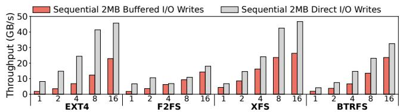  
Figure 1: Maximum performance of direct I/O via a RAID0 array with 8 PCIe4.0 SSDs [51] (about 55GB/s total bandwidth) and buffered I/O via 8 DDR4 DRAM (about 200GB/s total bandwidth) under different thread counts.

With continuous advancement of SSDs, the bandwidth gap between memory and fast SSD has gradually narrowed to within one order of magnitude, in contrast to the two to three orders of magnitudes of difference between memory and older generations of SATA SSDs and HDDs. Deploying multiple SSDs can further increase the aggregated bandwidth. To effectively exploit the high bandwidth of SSDs, some customized systems [12, 15, 21, 46] adopt direct I/O, which bypasses page cache and transfers data between user buffers and storage devices directly. For example, the DeepSeek’s fire-flyer file system (3FS) instance [15] includes 180 storage nodes, each equipped with 16 NVMe SSDs, achieving 6.6TB/s aggregate throughput via direct I/O.

However, using direct I/O imposes strict alignment constraints on the request’s offset, size, and user-buffer address. Furthermore, the access latency of the memory is still far lower than that of SSDs. Many page cache optimizations through long-term development and iteration [24, 25, 39, 53, 62] have been integrated into buffered I/O to accelerate user accesses. In particularly, the folio module [14, 63] of Linux kernel improves page management efficiency, e.g., supporting batch page allocation, which is particularly friendly to reads. Therefore, buffered I/O with attractive user-friendliness and performance is still dominant in applications in the era of high-bandwidth SSDs.

## 2.3 Write Performance of Buffered I/O

Compared to the well-optimized read process, the write process of buffered I/O is significantly more complex. In this section, we comprehensively and experimentally analyze the write performance of buffered I/O on high-bandwidth SSDs.

## 2.3.1 Limited Maximum Write Bandwidth

We first assess the maximum write throughput of buffered I/O and direct I/O in ideal case. We use FIO [4] to perform sequential 2MB-sized writes via buffered I/O and direct I/O with unlimited memory. We also disable background page flushing for buffered I/O to avoid its potential interference with foreground writes. As shown in Figure 1, the bandwidth of direct I/O outperforms that of buffered I/O via page cache in all cases (1.10×-4.46×). This result reveals that the bandwidth advantage of the memory over SSDs is insufficient to offset, much less overshadow, the cost of page cache management, such as page allocation, looking up, page state maintenance, and LRU list management for aging and reclaiming. The management cost of page cache generally was ignored in the slow-storage era. Nowadays, the storage bandwidth continues to scale by increasing both the inter-SSD and intra-SSD I/O parallelism. Therefore, overused page cache becomes the write bottleneck of buffered I/O on high-bandwidth SSDs.

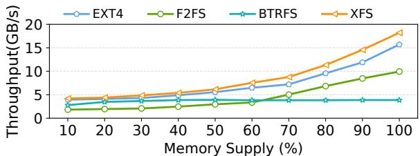  
Figure 2: The write throughput of file systems via buffered I/O under different memory supplies (i.e., the ratio of available memory capacity to the amount of written data). Page flushing is enabled throughout the entire process.

Overall, the write bandwidth of buffered I/O via page cache is limited and unable to directly scale with the rising storage performance due to the full buffering design that puts buffered I/O on the write critical path. Direct I/O bypasses page cache and effectively unleashes the full bandwidth of the underlying storage. However, direct I/O demands strict alignment among the IO size, offset, and memory-buffer address [1, 46, 73].

## 2.3.2 High Memory Dependency under Heavy Writes

Page cache first buffers user writes to dirty pages, and then strategically flushes them into the underlying storage and finally reclaims clean pages. To better understand the performance behavior of buffered I/O with page flushing, we use FIO to perform full-page 4KB-sized writes under different memory capacity limits and enabling page flushing at the beginning (i.e., setting dirty\_background\_ratio to 0). We use 16 user threads to represent a write-intensive scenario and let each thread exclusively access a dedicated file to avoid lock contention caused by concurrent file accesses [42]. Figure 2 shows that, except for BTRFS, which is limited by its own concurrency issues [41, 50], the write throughput of file systems via buffered I/O is highly dependent on the memory utilizations, despite enabling page flushing throughout the entire process. In particular, the write throughput of the case with supplied memory being 70% amount of written data is significantly lower than that of the 100% case by up to 54.0%. This indicates that buffered I/O needs a large amount of memory to sustain a high write throughput even on high-bandwidth SSDs.

We further find that, the high memory dependency of buffered I/O’s write process with flushing is mainly caused by severe lock contention of page management between concurrent free page insertions, clean page deletions, and page-state maintenance. The high-intensive writes under limited memory fast use up the available memory and lead to frequent page replacements, where the XArray of page cache [45] is frequently updated (e.g., free page insert and clean page delete). To avoid conflicts between multiple XArray updates, the non-scalable spinlock of XArray (i.e., xa\_lock) [38] limits the concurrency of tree updates. Meanwhile, each tree node of XArray maintains tag fields to mark whether the corresponding subtree contains any dirty pages or pages under flushing [64]. Due to the demand of acquiring the XArray spinlock for any page-state update (i.e., modifying tag fields), the page flushing process for each dirty page necessitates multiple acquisitions of the XArray spinlock, i.e., transitioning the tag field from dirty to writeback, and finally to clean, which further exacerbates the lock contention. Simply introducing multiple flushers cannot address this issue, because the root cause of this issue lies in the non-scalable lock mechanism, which hinders page-level concurrent updates.

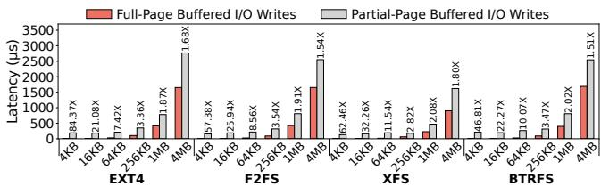  
Figure 3: Full-page writes vs. partial-page writes.

Overall, buffered I/O under high-intensity writes degrades the overall throughput of the foreground write process and the background flush process due to limited concurrency of page management, and freezes a large amount of memory.

## 2.3.3 Prohibitively Expensive Partial-Page Writes

Applications send write requests with diverse offsets and sizes to file systems. File systems via buffered I/O can transparently utilize page cache to handle these writes. However, for a partial page write missed in page cache, page cache first triggers a page fault to perform a slow SSD-read to fill this page, i.e., a read-before-write [36], and then updates it.

To better understand the penalty of such partial-page writes, we use FIO (thread=1, ioengine=psync and with sufficient memory) to compare the latencies of full-page writes and partial-page writes under four representative file systems via buffered I/O. Figure 3 shows that the latency of the partialpage writes is 1.51×-84.37× that of the corresponding fullpage writes. The additional penalty of partial-page writes is significant, even for large writes, and it is almost entirely attributed to the slow SSD-reads. This is because, despite modern SSDs being capable of providing sufficiently high bandwidth, they still exhibit long access latencies, especially for small accesses, which cannot benefit from the internal parallelism of SSDs.

Overall, for common partial-page writes missed in page cache, buffered I/O suffers from prohibitively expensive readbefore-write processes. Its efficiency relies on the smallaccess performance of SSDs, which is not SSD’s forte.

## 2.4 Motivation and Goals

Our experiments and analyses reveal that buffered I/O’s write process cannot effectively exploit the performance potentials of high-bandwidth SSDs due to page caching with three main challenges: C1 costly page caching overused for buffering all incoming writes, C2 limited concurrency of page management causing memory-inefficiency, and C3 high read-before-write penalty for partial-page writes.

Prior studies have also reported that page cache has become a performance bottleneck of data-intensive applications running on fast SSDs [38, 45, 46, 73]. Existing solutions can be roughly grouped into two categories: optimizing page cache, and bypassing page cache partially or completely.

Optimizing page cache. ScaleCache [45] proposes a concurrent data structure (ccXArray) for page management to perform page indexing, updating, and flushing in a higher parallelism. StreamCache [38] improves page management efficiency and concurrency for high-intensity file scanning, including page-state maintenance, page reclaiming, and page allocation. Uncached buffered I/O [5] reclaims the touchedranges memory-pages immediately after the access operation is completed while performing dirty-page flushing and subsequent reclaiming immediately after page writing. Uncached buffered I/O urgently reclaims memory to mitigate the pressure of page cache. Overall, these efforts effectively enhance the performance of page cache but with a limited potential due to the narrowing bandwidth gap between main memory and fast storage. More importantly, the existing full buffering architecture of buffered I/O overuses page cache on the write critical path, which causes the high bandwidth of modern SSDs to be underutilized (C1).

Bypassing page cache partially or completely. Some works introduce hybrid modes of I/O operations in which runtime decisions are made to strategically switch between buffered I/O and direct I/O. BeeGFS [7] supports switching between buffered I/O and direct I/O based on a fixed threshold value. Lustre AutoIO [46] makes its switching decision dynamically based on the I/O size, file lock contention, and memory constraints. They effectively combine the advantages of both buffered I/O and direct I/O to partially bypass page cache. Furthermore, some works outright abandon buffered I/O for writes to completely bypass page cache. Userspace OrchFS [73] utilizes non-volatile memory (NVM) via memorysemantic data-path to handle unaligned writes and processes SSD-page aligned writes via direct I/O only. Some userspace I/O engines [27, 60, 71], such as SPDK [71], further bypass the entire kernel to handle I/Os, thereby significantly reducing software overhead. Overall, these efforts partially or completely abandon the advantages of buffered I/O to bypass page cache, while incurring the cost of additional program modifications and maintenance. Therefore, these solutions potentially sacrifice applicability and portability, because buffered I/O has been extensively employed in a multitude of various applications and legacy codes.

Design goals. Our experimental observations and analysis, along with and the weaknesses and problems of existing solutions, motivate us to rethink whether and how buffered I/O fully exploits SSD bandwidth and overcomes the three challenges of buffered I/O in its write process while retaining the benefits in its read process. Therefore, we propose a write-scrap buffering (WSBuffer) to rearchitect buffered I/O to achieve the following design goals (Gs).

• Minimizing buffered user-writes (G1). The maximum write performance of buffered I/O is actually constrained by the complex page cache management, and cannot scale with the increasing aggregate bandwidth of SSDs. Moreover, a large number of buffered pages further increase the memory footprint, page management overhead, and potential lock contention. Therefore, WSBuffer should strategically partially buffer user writes and directly access the underlying SSDs for user-writes as much as possible, thereby minimizing buffered data while benefiting from the high bandwidth of SSDs, to fundamentally overcome C1 and indirectly alleviate C2.

• Fluent dirty-data flushing (G2). Limited concurrency of the foreground write process, background flush process, and page reclaiming can lead to intermittent and slow dirtydata flushing and a large number of dirty pages stagnating in memory, which further blocks foreground user-writes and encroaches caching capacity for reads, especially under memory pressure. Therefore, WSBuffer should achieve fluent dirty-data flushing to overcome C2, remove this write blocking, and reclaim memory used for writes quickly.

• Efficient partial-page writes (G3). Legacy buffered I/O supports any-pattern user accesses but must trigger slow read-before-write processes to fill pages before performing common and ubiquitous partial-page writes. Simply removing the read-before-write process to accelerate partialpage writes would significantly complicate page-data management and page flushing. Therefore, WSBuffer should overcome the penalty of read-before-write processes while maintaining efficient page-data management to address C3.

Different from the existing solutions that attempt to either optimize or bypass page cache, our design of WSBuffer aims to rearchitect the data path of buffered I/O by moving most of the buffering process out of the write critical path for incoming writes to proactively leverage SSD performance to enhance buffered I/O while retaining all of the advantages of buffered I/O without changing the I/O programming interface or requiring application modifications. Furthermore, WSBuffer is orthogonal to and can integrate with existing page cache optimizations.

## 3 Design and Implementation of WSBuffer

We propose WSBuffer, a novel write-scrap buffering to rearchitect buffered I/O. WSBuffer proactively utilizes highbandwidth SSDs and achieves the three design goals to enhance buffered I/O performance on high-bandwidth SSDs.

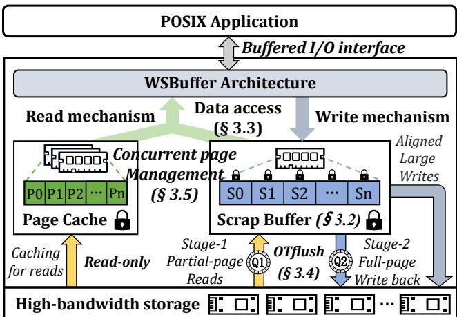  
Figure 4: WSBuffer overview.

## 3.1 Overview

Figure 4 shows the overview of WSBuffer. First, WSBuffer introduces a scrap buffer (§ 3.2) to take over the write buffer handling from page cache while allowing page cache to focus on its strengths in reads. Then, WSBuffer utilizes the scrap buffer to efficiently buffer small writes and partial-page writes by asynchronously performing their corresponding read-before-write processes and efficiently managing their data in a merge-friendly manner, thereby achieving G3.

Further, WSBuffer designs a buffer-minimized data access mechanism (§ 3.3) to handle user requests by combining scrap buffer, page cache and SSDs while efficiently maintaining data consistency. WSBuffer splits large writes into partial-scrap-page parts and scrap-page-aligned parts, and then directly sends the large and aligned parts to the underlying SSDs to achieve (G1), while utilizing the scrap buffer to buffer small writes and the partial-scrap-page parts of large writes. This also effectively reduces the number of dirty pages that need to be buffered in memory and the corresponding management overhead (G1), and further relieves the pressure of dirty-page flushing (G2).

Furthermore, WSBuffer devises an opportunistic two-stage flushing mechanism (OTflush) (§ 3.4) to handle these asynchronous read-before-write processes to fill scrap-pages (Stage-1) and perform dirty-page writeback at a large granularity (Stage-2), in an opportunistic load-aware and parallel manner, thus exploiting SSD performance to achieve G2 and enhance G3. Finally, WSBuffer proposes a concurrent page management mechanism (§ 3.5) to separately manage scrappages and read-only memory-pages and minimize the lock contention between free scrap-page insertions, invalid scrappage deletions, and page flushing of OTflush, to enhance G2.

## 3.2 Scrap Buffer

To efficiently buffer SSD-I/O unfriendly writes and expensive partial-page writes (§ 2.3.3), WSBuffer first presents a memory-page structure, scrap buffer. The scrap buffer is designed to strategically buffers small writes (§ 3.3) and fast handle partial-page writes by asynchronously performing the read-before-write processes via OTflush (§ 3.4), thus hiding and reducing the penalty of partial-page writes (C3).

Scrap-pages. Different from page cache, where all its memory-pages are always full, the scrap buffer presents a scrap-page structure to manage partial-page writes with diverse offsets and sizes. In addition to a data-zone for placing the page data, a scrap-page also has a header for efficiently maintaining the metadata (i.e., partial-page data-segment information) of this page. Specifically, the header is 128B-sized by default, including a 4B-sized counter field for recording the byte count of valid data within this page, a 1B-sized number field for recording the number of data-segments within this page, a 2B-sized SSD-id field for identifying the underlying SSD corresponding to this page (for OTflush), a 1B-sized tag field for recording page flushing state, and 15 8B-sized index entries, each of which records the offset of a data-segment within the page (4B) and the segment’s size (4B). A larger header means more index entries, i.e., accommodating more discontinuous data-segments, which applies to workloads primarily composed of small writes. In our evaluations, the number of index entries used within a scrap-page is less than 15 in more than 95% cases.

To maximize the internal parallelism of SSDs, the datazone size should also be an integral multiple of the number of channels × the SSD-page size [22, 73]. Further, the smaller the size, the more flexible the memory allocation. In contrast, larger size means more efficient OTflush (its handling granularity is data-zone-sized) and page indexing, and less management overhead. Therefore, for our evaluated SSDs (§ 4.1, 8 channels and 16KB-sized SSD-page), the data-zone size is set to 256KB (2 × 128KB) by default.

Scrap-page allocation. Memory allocation is often based on 4KB pages, thus the 128B-sized header can lead to significant memory fragmentation. Moreover, simply placing the header and data-zone together can result in a single crossscrap-page access being split into multiple scattered memory accesses, thereby reducing access efficiency. Therefore, WS-Buffer allocates 32 scrap-pages each time, and places headers and data-zones separately in a data layout format of 4KBsized header area + 8MB-sized data-zone area.

Scrap buffer writes. Straightforwardly placing writes to the scrap buffer in arrival order can lead to complex data indexing, leading to potentially reduced read performance and low memory utilization. Therefore, WSBuffer places writes in a merge-friendly manner. Specifically, a scrap buffer write is first split to corresponding one or more scrap-pages according to its offset. For each split sub-write, WSBuffer first performs the (partial-page) write in the scrap-page directly without the read-before-write process. Then, WSBuffer merges it with existing address-overlapping data-segments by querying and updating the corresponding scrap-page header. Finally, if the page state is changed (e.g., from unfilled to full), WSBuffer updates the tag field in the header, and notifies OTflush accordingly by fast inserting the address of this page header to the corresponding queue of OTflush.

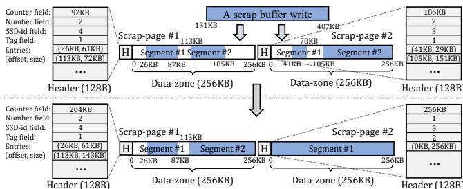  
Figure 5: A scrap buffer write example.

Example. Figure 5 shows a scrap buffer write example with offset=131KB and size=276KB. This write corresponds to two existing scrap-pages. After the partial-page write, the data-segment #2 of the scrap-page #1 is merged with the 131KB-256KB address-range of the write. The scrap-page #1 is still unfilled without requiring to update its tag field. The data-segments #1 and #2 of the scrap-page #2 are merged with the 256KB-407KB address-range of the write. The number of data-segments in the scrap-page #2 is changed to 1, and the page becomes full. Therefore, in scrap-page #2 header, the number field is updated to 1, and the tag field is updated to 2, while this page is inserted into the queue of OTflush Stage-2.

Overall, the scrap buffer overcomes C3 and utilizes the customized header to achieve efficient page-data management, while it simplifies the design of OTflush.

## 3.3 Buffer-Minimized Data Access

Legacy buffered I/O utilizes page cache to handle all user accesses, resulting in limited maximum write performance (§ 2.3.1) and high memory dependency (§ 2.3.2). WSBuffer introduces the scrap buffer to take over the write buffer handling from page cache while retains its read process. Further, WSBuffer aims to partially buffer user writes via the scrap buffer and proactively send writes to underlying SSDs directly to improve maximum write performance of buffered I/O (overcoming C1) and reduce memory footprint used for dirty-data (indirectly alleviating C2). However, introducing the scrap buffer complicates user accesses and data consistency. Therefore, WSBuffer presents a buffer-minimized data access mechanism to handle various user access requests across scrap buffer, page cache and SSDs, while maintaining data consistency, as shown in Algorithm 1.

Write mechanism. WSBuffer utilizes the scrap buffer and SSDs to handle writes without page cache writes. Figure 1 demonstrates how SSDs can achieve faster writes than main memory via buffered I/O. However, this requires the writes to be aligned and sufficiently large. Therefore, WSBuffer utilizes the scrap buffer to buffer small writes and unaligned parts of large writes, and proactively sends aligned parts of large writes to SSDs directly, to benefit from the respective strengths of both main memory and SSDs.

Specifically, WSBuffer first determines whether the write request is sufficiently large to benefit from the SSD bandwidth, based on a predefined request-size threshold (line 2), and utilizes the scrap buffer to fast absorb all small writes with any offsets (line 3). By default, the request-size threshold is 1MB, because on our evaluation platform (§ 4.1), using SSDs to handle writes of 1MB each or larger can provide higher performance than using the scrap buffer. A higher threshold means buffering more writes via the scrap buffer. Then, for large writes, WSBuffer splits them into partial-scrap-page parts and large aligned parts (line 6), and utilizes the scrap buffer to buffer the partial-scrap-page parts, while directly sends large and aligned parts of writes to SSDs (line 7-8).

Algorithm 1 Buffer-Minimized Data Access Mechanism   
Input: User Request Offset and Size: reqoffset, reqsize   
1: procedure WRITE MECHANISM(reqoffset, reqsize)   
2: if reqsize < Request-size Threshold then   
3: Performing\_Scrap\_Buffer\_writing(reqoffset, reqsize)   
4: Reclaiming\_Obsolete\_memory-pages(reqoffset, reqsize)   
5: else   
6: (poff[], psize[], aoff, asize) = Splitting\_Write(reqoffset, reqsize)   
7: Performing\_Scrap\_Buffer\_writing(poff[], psize[])   
8: Performing\_SSD\_writing(aoff, asize)   
9: Reclaiming\_Obsolete\_memory-pages(poff[], psize[])   
10: Reclaiming\_Obsolete\_Scrap-pages(aoff, asize)   
11: Reclaiming\_Obsolete\_memory-pages(aoff, asize)   
12: procedure READ MECHANISM(reqoffset, reqsize)   
13: Looking\_up\_Scrap\_Buffer(reqoffset, reqsize)   
14: if All data requested by the request is found on scrap buffer then   
15: Performing\_Scrap\_Buffer\_reading(reqoffset, reqsize)   
16: else   
17: Performing\_Scrap\_Buffer\_reading(reqoffset, reqsize)   
18: Performing\_legacy\_page\_cache\_reading(reqoffset, reqsize)

The alignment granularity is the scrap-page-data-zone size (e.g., 256KB) rather than the memory-page size (e.g., 4KB). This design aims to ensure that all SSD-write sizes are multiples of scrap-page-data-zone size, thereby achieving 1) file fragmentation resistance and 2) OTflush friendliness. For 1), it is because, in this way, the storage space of SSDs is orchestrated as multiple large and aligned data blocks that will never be further fragmented, i.e., the minimum storage unit of SSDs is scrap-page-data-zone-sized. Further, the scrap-pagedata-zone size is a multiple of the number of channels × the SSD-page size (§ 3.2). These designs fundamentally prevent the fragmentation-induced performance degradation [22]. For 2), it is because a scrap-page should correspond to a single contiguous address space on SSDs (if any), instead of being scattered across multiple locations, thereby enhancing OTflush efficiency.

In addition, a portion of the SSD-write address range may have already been allocated with scrap-pages to buffer written data and memory-pages to cache read data. These pages become obsolete after the SSD-write is completed, thus WS-Buffer reclaims these pages directly (line 10-11). Similarly, a portion of the scrap-buffer-write address range may have already been allocated with memory-pages to cache read data, thus WSBuffer reclaims these pages after the write (line 4 and 9). These reclaiming operations are performed in the background without interfering with foreground writes (§ 3.5).

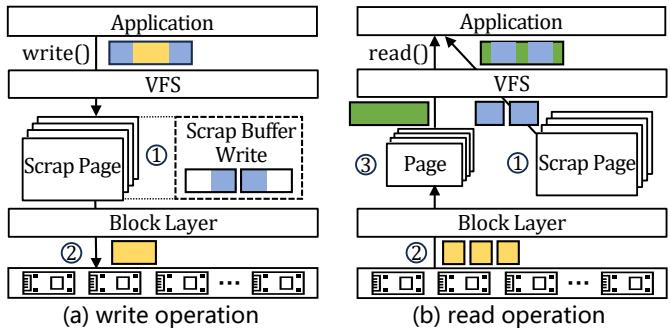  
Figure 6: The data flow of buffer-minimized data access.

Figure 6 (a) shows the data flow of a typical write operation. The write is first partially buffered by scrap-pages (⃝1 ), and then the large and scrap-page-size aligned sub-write is handled by SSDs directly (⃝2 ).

Read mechanism. Unlike writes, which can be proactively determined in their placement, read requests depend on the location where the data is placed. File data may be placed on scrap-pages, memory-pages and SSDs, causing potentially complex reads. Fortunately, the WSBuffer write mechanism has ensured that the data in the scrap buffer is always the latest, and the remaining data is on SSDs while page cache may have cached a part of the data of SSDs. Therefore, as shown in Figure 6 (b), WSBuffer first looks up the scrap buffer to read requested data (line 13-15 and ⃝1 ), and reads the remaining requested data (if any) via page cache and possible SSD accesses caused by page fault (line 16-18 and ⃝2 ⃝3 ) to benefit from mature page cache read optimizations.

Data consistency. Intuitively, the data consistency of the three sources could be particularly complex. Fortunately, WS-Buffer utilizes the scrap buffer and SSDs to handle writes while always keeping scrap-pages and memory-pages valid. The latest data are placed on scrap-pages or stored to SSDs directly. Memory-pages are always clean and used for caching data for reads only. Therefore, the data access mechanism simplifies and ensures data consistency by separating dirty scrap-pages from clean memory-pages.

## 3.4 Opportunistic Two-stage Flushing

Many scrap-pages are unfilled, and cannot be written back to SSDs directly, to avoid scrap-page data-zone-size unaligned SSD-writes (§ 3.3). Further, the underlying SSDs with high bandwidth may experience differing levels of busyness, because WSBuffer strategically sends a part of foreground writes to SSDs directly. Inappropriate page flushing sent to busy SSDs may be slow and block other page flushing operations corresponding to idle SSDs. Therefore, WSBuffer devises an opportunistic two-stage dirty-data flushing (OTflush) to dynamically utilize idle SSDs to perform fluent page filling and writeback (C2 and C3), as shown in Algorithm 2.

SSD busyness awareness. To avoid the inappropriate page flushing sent to busy SSDs, OTflush is designed to identify the SSD busyness by sensing the bandwidth usage of each SSD. Since the bandwidth usage of an SSD is almost directly proportional to the amount of I/O data being handled by the SSD, OTflush maintains the count of bytes of all writes sent to each SSD (Bcount). Specifically, OTflush increases Bcount by the size of the I/O before submitting each I/O (e.g., submit\_bio), and decreases Bcount after each I/O is completed (e.g., bi\_end\_io). OTflush uses per-SSD Bcount to separately identify the bandwidth usage of each SSD. Further, OTflush senses whether an SSD is busy by comparing its Bcount with a predefined threshold. In our evaluation, this threshold is set to 4MB by default, because a 4MB write can nearly saturate the bandwidth of the SSD [51]. Note that, since SSD performance behaviors are complex and dynamic [20, 29, 75], Bcount aims to provide a coarse-grained but effective SSD bandwidth awareness at a low cost. Bcount can be adjusted to strike a proper tradeoff between foregroundwrites and background OTflush.

Algorithm 2 OTflush Process   
1: procedure STAGE-1   
2: while Queue-1 is not empty do   
3: page = Taking out the head of Queue-1   
4: if page is full then   
5: continue   
6: if The corresponding SSD is not busy then   
7: Performing the corresponding SSD-read   
8: Inserting page into the tail of Queue-2   
9: else   
10: Inserting page into the tail of Queue-1   
11: procedure STAGE-2   
12: while Queue-2 is not empty do   
13: page = Taking out the head of Queue-2   
14: if page is invalid then   
15: continue   
16: if The corresponding SSD is NULL then   
17: Selecting the least busy SSD to allocate storage space   
18: Performing the page writeback to the SSD   
19: Reclaiming this page   
20: else if The corresponding SSD is not busy then   
21: Performing the page writeback to the corresponding SSD   
22: Reclaiming this page   
23: else   
24: Inserting page into the tail of Queue-2

Stage-1. OTflush Stage-1 is designed to read data from SSDs to asynchronously fill scrap-pages of which many are due to partial-page writes performed directly by WSBuffer upon their arrivals. Specifically, OTflush maintains a dedicated ring queue (Queue-1) for reads. Whenever an unfilled page is generated, the scrap buffer (§ 3.2) inserts it to Queue-1. To accelerate page insertion and page field query, the scrap buffer only inserts the address of the scrap-page header into Queue-1, and the same for Stage-2. When a scrap-page is taken out from Queue-1, OTflush first identifies whether it is full. If it is full, OTflush will discard it directly (line 4-5). This is because a scrap-page may have been filled by foreground writes before it is fetched (e.g., Figure 5). Then, OTflush identifies whether the scrap-page corresponding SSD (recorded in the SSD-id field of its header) is busy. If the corresponding SSD is not busy, OTflush performs the corresponding SSDread, and inserts this page to Stage-2 queue after reading (line 6-8) while updating the tag field of this page. Otherwise, the read is not executed, and the scrap-page is inserted into the tail of Queue-1 again (line 9-10) to fill later.

Stage-2. OTflush Stage-2 is designed to write full scrappages back to SSDs. Similarly, OTflush maintains another dedicated ring queue (Queue-2) for writing back. Whenever a full page is generated, the scrap buffer inserts it to Queue-2. When a scrap-page is taken out from Queue-2, OTflush first checks its validity. Because the scrap-page may have been deleted due to being obsolete (§ 3.3). If it is invalid, discarding it (line 14-15). Then, OTflush identifies the SSD corresponding to this page by querying the SSD-id field of its header. If SSD-id field=0, this means that the storage space corresponding to this page has not been allocated, because WSBuffer uses a delayed allocation approach [8,26,50] for the storage space corresponding to a new scrap-page. This allows OTflush to flexibly select the least busy SSD to allocate the corresponding space and performs the page writeback (line 16- 18). Otherwise, OTflush identifies whether its corresponding SSD is busy or not, and performs the page writeback (line 20-21) or inserts this page into the tail of Queue-2 again (line 23-24) to writeback later. After the page writeback is completed, WSBuffer reclaims the corresponding scrap-page immediately to reduce memory usage (line 19 and 22).

Due to the absence of dependencies between scrap-pages, OTflush, combined with § 3.5, can effectively enable concurrent page flushing by simply splitting Queue-1/2 into multiple sub-queues and allocating a thread to each sub-queue, at the cost of CPU resource. For a fair comparison, in our evaluation, WSBuffer sets only two queue-thread pairs by default, one for Stage-1 and the other for Stage-2. It should be emphasized that, due to high SSD bandwidth, scrap-pages exist only within a short time window, and are quickly flushed to SSDs without occupying excessive memory.

## 3.5 Concurrent Page Management

In the legacy buffered I/O, the XArray of page cache is used to unify the management of clean pages, dirty pages and page flushing via an non-scalable spinlock, resulting in high lock contention and blocked foreground writes and background flushing. The scrap buffer is used to take over the write buffer handling from page cache, thus it faces similar lock contention and further complicates page management. Therefore, WS-Buffer presents a concurrent page management mechanism to manage pages and minimize lock contention between concurrent page operations (C2), as shown in Figure 7.

XArray for read-only memory-pages. The bufferminimized data access mechanism (§ 3.3) ensures that all memory-pages of page cache are clean and used for reads only. In this way, the XArray of page cache no longer needs to maintain page states, but merely manage page replacements. Therefore, WSBuffer continues to use the XArray to manage memory-pages for read-only workloads. This design is efficient, because page-fault-induced tree structure updates will only hinder its corresponding thread, and do not block other read threads. Further, compared to the slow SSD-read triggered by a page fault, the overhead of non-concurrent tree structure updates is negligible.

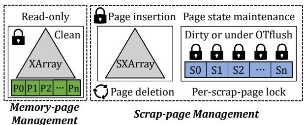  
Figure 7: Concurrent page management mechanism.

SXArray for scrap-pages. The scrap buffer faces lock contention between free scrap-page insertions, invalid scrap-page deletions, and scrap-page state maintenance. Therefore, WS-Buffer utilizes a slightly modified XArray, called SXArray, to index and manage scrap-pages. SXArray manages the insertions and deletions of scrap-pages, but does not manage scrappage states to avoid the required multiple lock-acquisitions for state maintenance. Further, concurrent operations of scrappage insertions and deletions can also lead to lock contention. Therefore, SXArray performs insertion operations normally, but for deletion operations, SXArray only changes the corresponding index entries to NULL by introducing extra indexentry-level locks (rather than using xa\_lock), and executes delayed tree structure updates (e.g., cascaded tree node deletions). Hence, these index-entry-level locks are lightweight.

SXArray executes the tree structure updates in an opportunistic manner, i.e., executing when the load of the corresponding file is light or the file is closed. This design could lead to a potentially larger tree structure, but it is acceptable. Because the scrap-page granularity is large, and most data of large writes are directly stored on SSDs, so that the number of scrap-pages of a file is small. Moreover, the delayed-deleted nodes can be reused directly for newly inserted scrap-pages.

Per-page locks for scrap-page state maintenance. Both scrap buffer writes and OTflush need to acquire a lock, resulting in potential lock contention. Therefore, WSBuffer introduces a fine-grained per-scrap-page lock to manage the scrap-page states. In this way, multiple scrap-pages are able to perform writes and OTflush concurrently. Specifically, scrappage updates and OTflush Stage-1 can be performed by acquiring the per-scrap-page lock without acquiring the SXArray lock, because these operations do not change the tree structure. OTflush Stage-2 acquires the per-scrap-page lock to perform page writeback and only needs to acquire a corresponding index-entry-level lock of SXArray to modify the index entry after flushing. Although scrap-page insertions still need to acquire the non-scalable xa\_lock, larger scrap-pages suffer much less from lock contention than memory-pages, and no lock contention at all with page flushing.

Moreover, scrap-page insertions and read-only memorypage management can benefit from existing XArray optimizations (e.g., ccXArray [45]) to further enhance concurrency.

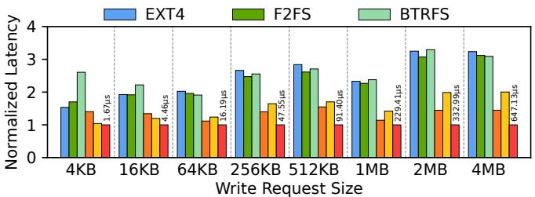  
(a) Full-page writes

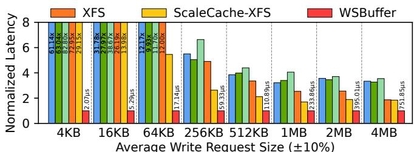  
(b) Partial-page writes  
Figure 8: Average write latency of file systems under different write offsets and sizes.

## 3.6 Implementation

WSBuffer Implementation. We implemented a WSBuffer prototype on XFS [58] with \~4500 lines of code (LoC) in Linux kernel 6.8 for evaluation. The WSBuffer prototype with XFS is compiled as a kernel file system module. The interaction logic between the scrap buffer and the file system is similar to that of page cache and the file system. Therefore, introducing the WSBuffer architecture does not compromise the integrity of the file system. All file accesses via buffered I/O are handled by WSBuffer data access mechanism (§ 3.3), which is implemented in the read and write functions. WS-Buffer implements several new functions for the scrap buffer structure (§ 3.2), OTflush (§ 3.4) and concurrent page management (§ 3.5). Further, the WSBuffer prototype inherits and expands the metadata maintenance processes used for page cache writes to adapt to WSBuffer writes.

fsync(). Most metadata operations in the WSBuffer prototype are similar to those in XFS, except for fsync(). When an fsync() is issued, WSBuffer first looks up relevant scrap-pages only without memory-pages. Then, WSBuffer wakes up a dedicated fsync thread to perform flushing for these scrap-pages, similar to the OTflush process. Due to scalable efficient OTflush and high SSD bandwidth, most scrap-pages are often already filled and even completed flushing, thus the remaining scrap-pages can be quickly written back to SSDs to achieve fast fsync. This also applies to other sync-like operations.

Durability and Crash Consistency. Similar to page cache of the legacy buffered I/O, WSBuffer delegates the underlying file system to ensure data durability and crash consistency (e.g., journaling mechanisms [44, 54, 74]).

Generality and Portability. The WSBuffer architecture is independent of XFS-specific features and can be deployed to other file systems. The scrap buffer structure and concurrent page-management can be directly applied to other file systems as well. However, due to the data structures and handling logic specific to individual existing file systems, the implementation of data-access mechanism and OTflush requires engineering efforts to carefully integrate WSBuffer into the logic between the file system and the page cache.

Additionally, the WSBuffer prototype can offer significant performance improvements to XFS with the best buffered I/O performance, detailed in § 4. File systems with lower buffered I/O performance can benefit more from WSBuffer.

## 4 Evaluation

In this section, we evaluate the efficacy of WSBuffer under a wide variety of workloads and real-world applications.

## 4.1 Experimental Setup

Environment. Our evaluation machine has two Intel Xeon Gold 6348 processors (2.60 GHz, 28 CPUs) and 256GB of DDR4 DRAM. For storage, the machine has 8 PCIe4.0 Samsung 990 PRO SSDs [51], with 7GB/s read and 6.9GB/s write bandwidths. We configure these SSDs as RAID0 using Linux software RAID (mdRAID [3]) and use the default stripe size (512KB) for evaluation. We run most experiments on Ubuntu 22.04 LTS with Linux kernel 6.8, except for ScaleCache [45], which is implemented on Linux kernel 5.4. For all experiments, we pin threads to the cores, disable CPU frequency scaling, and clear the kernel cache before each run. All experimental results are the average of at least five runs.

Baseline file systems. We use four popular file systems: EXT4 [8], F2FS [34], BTRFS [50], and XFS [58], as the baselines. Further, we configure ScaleCache [45] on XFS (ScaleCache-XFS or SC-XFS) to represent the state-of-the-art buffered I/O optimization. Note that, ScaleCache-XFS based on Linux kernel 5.4 is inferior to XFS based on Linux kernel 6.8 in some experiments, due to various XFS-optimizations that have been incorporated into the Linux kernel mainline, such as folio module [14,63], delayed logging [68], and batch inode activations [69]. StreamCache [38] is not open-source and it is designed for file scanning. In addition, since AutoIO [46] is implemented on the distributed Lustre parallel file system, we implement the AutoIO principle in userspace and deploy it on XFS (XFS-AutoIO) for a fair comparison, to represent the state-of-the-art hybrid modes of I/O operations.

## 4.2 Microbenchmark

In this section, we evaluate the WSBuffer performance under various request sizes and offsets. To fairly demonstrate WS-Buffer performance, we first disable page flushing for all file systems and provide sufficient memory.

Full-page write performance. We use the FIO benchmark with a single thread to perform random full-page writes with offsets aligned to scrap-page boundary, and measure the average write latency. As shown in Figure 8 (a), the WSBuffer performance is 1.03×-3.29× higher than that of the baseline file systems. For writes smaller than 1MB, WSBuffer utilizes the scrap buffer to buffer all writes. The performance advantage (1.03×-2.84×) of WSBuffer stems from the designs of batch allocation and data layout format of 32 scrap-pages in batch, and the large-size page management of scrap-pages (§ 3.2). These designs reduce the number of memory allocations and improve the efficiency of memory copying (due to more continuous-address copying) and page indexing (due to smaller index structure). For writes greater than or equal to 1MB, WSBuffer sends all writes to SSDs, and its performance is 1.14×-3.29× that of the baseline file systems. This demonstrates that WSBuffer effectively exploits the performance potentials of SSDs to accelerate foreground writes (C1).

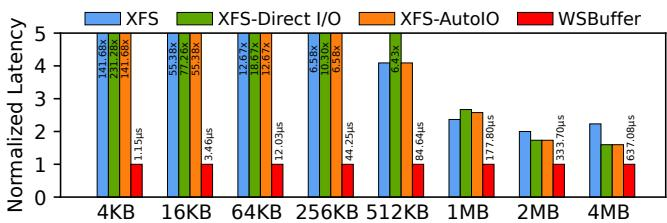  
Write Request Size (±10%)  
Figure 9: Comparison with direct I/O and hybrid I/O.

Partial-page write performance. Similarly, Figure 8 (b) shows the average write latency of partial-page writes with diverse offsets and size ±10%. The WSBuffer performance is 1.70×-82.80× higher than that of the baseline file systems. For writes smaller than 1MB, WSBuffer exhibits significant performance advantages (2.11×-82.80×) over the baseline file systems, demonstrating WSBuffer’s ability to remove the read-before-write penalty of partial-page writes (C3) via the scrap buffer (§ 3.2). For 1MB, 2MB, and 4MB writes, in WS-Buffer, respectively 32.4%, 82.3%, and 91.1% of the data are directly written into the SSDs, while achieving 1.70×-4.06× performance advantages over the baselines, demonstrating WSBuffer’s capability to overcome C1 and C3.

Comparison with direct I/O and hybrid I/O. To answer the natural question of what the effect of using direct I/O only or the hybrid direct-buffered I/O is, we use a FIO-like benchmark to perform random write experiments to compare WSBuffer with XFS-direct I/O (direct I/O only) and XFS-AutoIO (hybrid I/O). We use 1MB as the request-size threshold for XFS-AutoIO. We use the read-modify-write (RMW) process [55, 73] to execute I/Os for XFS-direct I/O, i.e., reading the corresponding unaligned pages from SSDs, then updating the user buffer, and finally writing the aligned data of the user buffer to SSDs. As shown in Figure 9, the WSBuffer performance is 1.59×-231.28× higher than that of the baselines. Because XFS-direct I/O suffers from slow and unavoidable RMWs in all cases and XFS-AutoIO suffers from slow partial-page writes for small-write cases and slow RMWs for large-write cases. This demonstrates that even without considering the additional programming costs, the performance of existing solutions that bypass page cache is still inferior to WSBuffer.

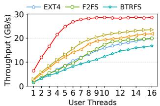  
(a) FIO results

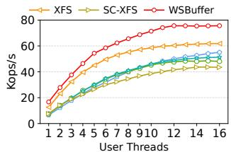  
(b) Fileserver results  
Figure 10: Multi-threaded performance. (a) Random writes with bsrange=4k-4m. (b) Fileserver load with read/write=1/2.

Multi-threaded performance. Further, we use the FIO benchmark with random writes whose size ranges from 4KB to 4MB (i.e., bsrange=4k-4m) to evaluate the multi-threaded write performance of WSBuffer. As shown in Figure 10 (a), WSBuffer exhibits a faster throughput growth with the increase of thread count, and its throughput is 1.21×-3.91× higher than that of the baseline file systems. We further use the Fileserver workload with read/write=1/2 [59] (detailed in Table 1), to evaluate the multi-threaded mixed read and write performance of WSBuffer. As shown in Figure 10 (b), WS-Buffer outperforms the baseline file systems by 1.19×-2.51× in throughput. These further demonstrate that WSBuffer effectively exploits SSD performance, especially bandwidth, to enhance buffered I/O performance (C1). In addition, the peak throughput of WSBuffer is mainly constrained by the total SSD bandwidth (about 55GB/s) and the unavoidable memory copy, i.e., copying the aligned part of a write request from the (unaligned) user buffer to the in-kernel address-aligned memory-space for submit\_bio(). Increasing the total SSD bandwidth or enhancing the efficiency of memory copying can directly improve the peak throughput of WSBuffer.

Reads. For read-only workloads, the performance of WS-Buffer and XFS is almost identical, as WSBuffer retains the original read process of page cache. Figure 10 (b) demonstrates that WSBuffer performs well (up to 2.51×) under the workload with a read-write ratio of 1:2. We will further assess WSBuffer under read-heavy workloads in § 4.3 and § 4.4.

## 4.3 Macrobenchmark

In this section, we use Filebench [59] with three representative workloads of Fileserver, Webproxy and Varmail to evaluate the overall performance of WSBuffer under mixed reads and writes of metadata and file data. Table 1 summarizes the characteristics of these three workloads.

## 4.3.1 Evaluation under Sufficient Memory Supply

First, we evaluate WSBuffer under sufficient memory with page flushing disabled. Figure 11 shows the throughput results of a single thread and 16 threads (at this point, the performance of these file systems has reached their peaks).

Fileserver. WSBuffer outperforms the baseline file systems by 1.23×-2.51× in throughput for the write-heavy Fileserver. XFS ranks second only to WSBuffer and significantly outperforms other baseline file systems due to its various optimizations for both metadata and data accesses. This demonstrates that the performance advantage of WSBuffer remains significant under mixed metadata and data accesses without reducing the efficiency of file system metadata operations.

Table 1: Filebench workload characteristics.
<table><tr><td rowspan=1 colspan=1>Workload</td><td rowspan=1 colspan=1>#Files</td><td rowspan=1 colspan=1> $\overline { { \mathbf { A v g . } } }$ File size</td><td rowspan=1 colspan=1> $\overline { { \mathbf { A v g . } } }$ I/O size (r/w)</td><td rowspan=1 colspan=1>Threads</td><td rowspan=1 colspan=1>R/W</td></tr><tr><td rowspan=1 colspan=1>Fileserver</td><td rowspan=1 colspan=1>10K</td><td rowspan=1 colspan=1>2MB</td><td rowspan=1 colspan=1>2MB/1MB</td><td rowspan=1 colspan=1>1/16</td><td rowspan=1 colspan=1>1:2</td></tr><tr><td rowspan=1 colspan=1>Webproxy</td><td rowspan=1 colspan=1>10K</td><td rowspan=1 colspan=1>2MB</td><td rowspan=1 colspan=1>2MB/1MB</td><td rowspan=1 colspan=1>1/16</td><td rowspan=1 colspan=1>5:1</td></tr><tr><td rowspan=1 colspan=1>Varmail</td><td rowspan=1 colspan=1>10K</td><td rowspan=1 colspan=1>1MB</td><td rowspan=1 colspan=1>1MB/64KB</td><td rowspan=1 colspan=1>1/16</td><td rowspan=1 colspan=1>1:1</td></tr></table>

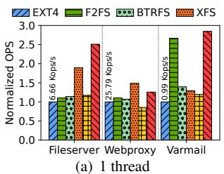

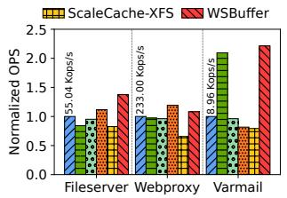  
(b) 16 threads  
Figure 11: Filebench throughputs under unlimited memory.

Webproxy. In read-heavy Webproxy, WSBuffer is slightly inferior to XFS and significantly outperforms other baseline file systems by 1.08×-1.65× in throughput. This is attributed to the increasing usage of scrap pages due to the disabled page flushing (i.e., OTflush § 3.4), which results in frequent twice page indexing (i.e., looking up SXArray first and then XArray) and twice tree structure updates. Enabling OTflush can mitigate this issue, and the more OTflush threads, the closer the performance of WSBuffer approaches that of XFS.

Varmail. WSBuffer outperforms the baseline file systems by 1.06×-2.84× in throughput for the metadata-intensive Varmail. In these file systems, more than 60% of the time is spent on fsync operations. For fsync() calls, WSBuffer achieves faster page locating, bio assembly, and page flushing due to the large scrap-page granularity (§ 3.2), as well as more efficient page-state maintenance (§ 3.5), especially for multiple user threads. F2FS ranks second only to WSBuffer and significantly outperforms other baseline file systems due to its multiple optimizations for fsync [2, 34, 72].

## 4.3.2 Evaluation under Limited Memory Supply

Then, we use data-intensive Fileserver and Webproxy to evaluate WSBuffer under limited memory supply and enabling page flushing for all file systems. For a fair comparison, we only enable two OTflush threads, one for Stage-1 and the other for Stage-2. ScaleCache-XFS is unable to run under strictly limited memory supply. We will further evaluate ScaleCache-XFS under less strictly limited memory supply in (§ 4.4).

Fileserver. Figure 12 (a)(b) show that WSBuffer significantly outperforms the baseline file systems by 1.23×-4.48× in throughput. This demonstrates that WSBuffer effectively improves buffered I/O performance under heavy writes and limited memory supply (C1 and C2) by utilizing bufferminimized data access mechanism (§ 3.3) to reduce memory footprint and using OTflush (§ 3.4) and concurrent page management (§ 3.5) to achieve fluent dirty-data flushing and minimize the lock contention. Due to the high throughput of WSBuffer, the rate of memory consumption by partially buffered foreground writes still surpasses the speed at which OTflush releases memory. Therefore, as the memory supply increases, the performance of WSBuffer continues to increase. Moreover, enabling more OTflush threads can accelerate page flushing to further enhance WSBuffer performance.

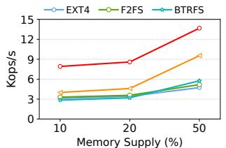

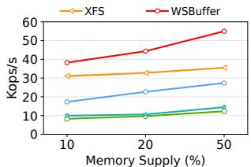

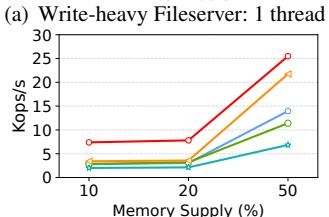

(b) Fileserver: 16 threads  
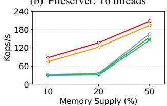  
(c) Read-heavy Webproxy: 1 thread  
(d) Webproxy: 16 threads  
Figure 12: Filebench throughputs under limited memory.

Webproxy. Figure 12 (c)(d) show that, even under readheavy workloads, WSBuffer outperforms the baseline file systems by 1.07×-4.37× in throughput. The baseline file systems under read-heavy Webproxy suffer from less lock contention (§ 2.3.2) compared to under Fileserver, especially XFS, which fully benefits from batch page allocation and flushing offered by folio [14, 63]. The performance advantage of WSBuffer stems from two factors. 1) WSBuffer’s significant savings in memory used for writes free up more memory for page cache to accelerate reads, which is especially significant for the 10% and 20% cases. 2) WSBuffer’s concurrent page management further minimizes the lock contention. Therefore, WSBuffer can enable more memory for reads under memory pressure.

## 4.4 Real-World Applications

In this section, we evaluate the WSBuffer performance under three real-world representative applications: key-value store [19], graph processing [78], and scientific computing [17].

Key-value store. We use LevelDB [19] as a representative key-value store, and utilize YCSB [13] as a workload generator. We set the SSTable size to 64MB to follow the recommended configuration [16]. We set 1 million, 3 million and 5 million record and operation counts with an 1KB record size respectively for evaluation. We disable page flushing and provide sufficient memory supply for a fair comparison.

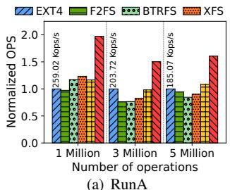

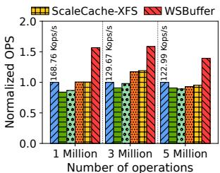  
Figure 13: YCSB+Leveldb throughputs.  
(b) RunF

Table 2: Workload characteristics of graph processing.
<table><tr><td rowspan=1 colspan=1>Dataset</td><td rowspan=1 colspan=1>IVI</td><td rowspan=1 colspan=1>IEI</td><td rowspan=1 colspan=1>DatasetSize</td><td rowspan=1 colspan=1>Writes</td><td rowspan=1 colspan=1>Reads</td><td rowspan=1 colspan=1>Numberof writes</td><td rowspan=1 colspan=1>Numberof reads</td></tr><tr><td rowspan=1 colspan=1>LiveJournal</td><td rowspan=1 colspan=1>4.85M</td><td rowspan=1 colspan=1>69.0M</td><td rowspan=1 colspan=1>539MB</td><td rowspan=1 colspan=1>1.8GB</td><td rowspan=1 colspan=1>13.1GB</td><td rowspan=1 colspan=1>14402</td><td rowspan=1 colspan=1>773</td></tr><tr><td rowspan=1 colspan=1>Twitter</td><td rowspan=1 colspan=1>61.6M</td><td rowspan=1 colspan=1>1.5B</td><td rowspan=1 colspan=1>11.5GB</td><td rowspan=1 colspan=1>35.4GB</td><td rowspan=1 colspan=1>18.8GB</td><td rowspan=1 colspan=1>34577</td><td rowspan=1 colspan=1>5582</td></tr><tr><td rowspan=1 colspan=1>Friendster</td><td rowspan=1 colspan=1>68.3M</td><td rowspan=1 colspan=1>2.6B</td><td rowspan=1 colspan=1>28.2GB</td><td rowspan=1 colspan=1>86.8GB</td><td rowspan=1 colspan=1>67.2GB</td><td rowspan=1 colspan=1>670679</td><td rowspan=1 colspan=1>10072</td></tr></table>

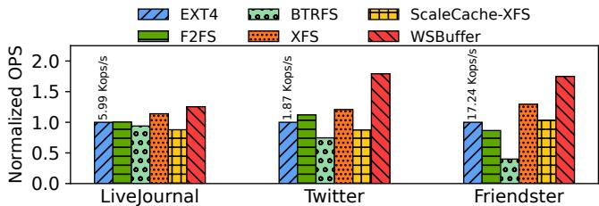  
Figure 14: File operations per second of graph processing.

Figure 13 shows the results of YCSB workload RunA (50%/50% read/write) and RunF (read/read-modify-write) on LevelDB. WSBuffer utilizes the scrap buffer to handle the large number of small accesses and sends the small number of large and asynchronous compaction writes to SSDs. Specifically, WSBuffer achieves 1.32×-2.02× higher performance than the baseline file systems. This demonstrates that the WSBuffer architecture can be effectively used to enhance the performance of popular key-value store applications.

Graph processing. We employ GridGraph [78], which is application for processing large-scale graphs on a single machine, to execute the Pagerank [18] algorithm under the Livejournal [57], Twitter [23], and Friendster [56] datasets respectively, and run 20 iterations on each graph. Table 2 summarizes the workload characteristics. Similarly, we disable page flushing and provide sufficient memory supply.

We measure the file operations per second (OPS). As shown in Figure 14, WSBuffer outperforms the baseline file systems by 1.09×-4.37×. The performance advantages of WSBuffer stem not only from writes but also from reads that are indirectly enhanced by the large and aligned write pattern for SSDs (§ 3.3). This demonstrates that the WSBuffer architecture can be effectively used to enhance the performance of applications with various mixtures of reads and writes and diverse request sizes and offsets.

Scientific computing. The Nek5000 application [17] is used for computational fluid dynamics, and we use it as a representative HPC application of scientific computing. We run a turbulence statistic calculation workload [30], which is used for nonlinear simulation of 3D periodic turbulent pipe. In this experiment, Nek5000 executes 1,000 time steps (running for about 130 minutes), and writes about 585GB of data in total. Figure 15 (a) shows the workload’s I/O request size distribution. We provide all the memory of our evaluation machine (256GB in total) to Nek5000, and enable page flushing.

We measure the I/O throughput of Nek5000. As shown in Figure 15 (b), WSBuffer outperforms the baseline file systems by 1.74×-3.09×. ScaleCache-XFS ranks second only to

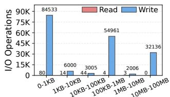  
(a) I/O request size distribution.

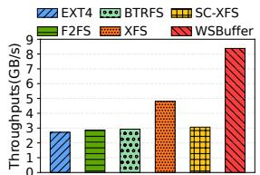  
(b) Nek5000 throughputs.  
Figure 15: The load characteristics and results of Nek5000.

Table 3: Average CPU utilization. Performing random writes of size ranging from 4KB to 4MB under sufficient memory.
<table><tr><td rowspan=1 colspan=1></td><td rowspan=1 colspan=5>The number of threads</td></tr><tr><td rowspan=1 colspan=1>File Systems</td><td rowspan=1 colspan=1>1</td><td rowspan=1 colspan=1>2</td><td rowspan=1 colspan=1>4</td><td rowspan=1 colspan=1>8</td><td rowspan=1 colspan=1>16</td></tr><tr><td rowspan=1 colspan=1>XFS</td><td rowspan=1 colspan=1>78.79%</td><td rowspan=1 colspan=1>166.67%</td><td rowspan=1 colspan=1>324.54%</td><td rowspan=1 colspan=1>644.12%</td><td rowspan=1 colspan=1>1417.65%</td></tr><tr><td rowspan=1 colspan=1>ScaleCache-XFS</td><td rowspan=1 colspan=1>87.88%</td><td rowspan=1 colspan=1>178.79%</td><td rowspan=1 colspan=1>353.52%</td><td rowspan=1 colspan=1>732.39%</td><td rowspan=1 colspan=1>1475.65%</td></tr><tr><td rowspan=1 colspan=1>WSBuffer</td><td rowspan=1 colspan=1>76.30%</td><td rowspan=1 colspan=1>154.55%</td><td rowspan=1 colspan=1>253.06%</td><td rowspan=1 colspan=1>541.18%</td><td rowspan=1 colspan=1>1273.53%</td></tr></table>

WSBuffer and outperforms other baselines, because it reduces the lock contention between foreground writes and background flushing. However, the costly page caching overused for buffering all incoming writes (C1) significantly limits its performance and prevents it from directly benefiting from high SSD bandwidth. This demonstrates that WSBuffer can be effectively used to enhance the performance of HPC applications, especially for highly memory-intensive scenarios.

## 4.5 CPU Utilization Analysis

Here, we detail the CPU utilization of WSBuffer.

We measure the CPU utilization of XFS, ScaleCache-XFS, and WSBuffer under different thread counts. As shown in Table 3, WSBuffer induces 3.2% to 28.4% lower CPU utilization than baselines. This is largely because more than 80% of the written data in WSBuffer are sent to SSDs directly, thereby benefiting from the DMA transfer and saving CPU resources. This also demonstrates that the introduced CPU overhead of WSBuffer is small, stemming mainly from maintaining data structures, e.g., scrap-page headers and OTflush Queues.

## 4.6 Memory Consumption Analysis

We discuss the memory consumption details of WSBuffer.

Analysis of microbenchmark writes. Table 4 shows the percentage of data written to memory of the baseline file systems and WSBuffer with different request-size threshold, which is 1MB-sized by default. The baseline file systems use page cache to handle all writes. For WSBuffer, the larger the threshold value, the more data is written to memory. Nevertheless, WSBuffer sends most of large-write data to SSDs directly, thus significantly reducing memory consumption.

Table 4: Memory consumption under Figure 8 workloads.
<table><tr><td></td><td>Baseline file systems</td><td>WSBuffer threshold=1MB</td><td>WSBuffer threshold=768KB</td><td>WSBuffer threshold=512KB</td><td>WSBuffer threshold=256KB</td></tr><tr><td>WriteSize</td><td colspan="5">Full-pagewrites: The percentage of data written tomemory</td></tr><tr><td>&lt;256KB</td><td>100%</td><td>100%</td><td>100%</td><td>100%</td><td>100%</td></tr><tr><td>256KB</td><td>100%</td><td>100%</td><td>100%</td><td>100%</td><td>0%</td></tr><tr><td>512KB</td><td>100%</td><td>100%</td><td>100%</td><td>0%</td><td>0%</td></tr><tr><td>768KB</td><td>100%</td><td>100%</td><td>0%</td><td>0%</td><td>0%</td></tr><tr><td>1MB</td><td>100%</td><td>0%</td><td>0%</td><td>0%</td><td>0%</td></tr><tr><td>2MB</td><td>100%</td><td>0%</td><td>0%</td><td>0%</td><td>0%</td></tr><tr><td>4MB</td><td>100%</td><td>0%</td><td>0%</td><td>0%</td><td>0%</td></tr><tr><td>Write Size</td><td colspan="5">Partial-page writes: Thepercentage of data writentomemory</td></tr><tr><td>&lt;256KB</td><td>100%</td><td>100%</td><td>100%</td><td>100%</td><td>100%</td></tr><tr><td>256KB</td><td>100%</td><td>100%</td><td>100%</td><td>100%</td><td>100%</td></tr><tr><td>512KB</td><td>100%</td><td>100%</td><td>100%</td><td>92.2%</td><td>65.5%</td></tr><tr><td>768KB</td><td>100%</td><td>100%</td><td>77.8%</td><td>45.2%</td><td>44.9%</td></tr><tr><td>1MB</td><td>100%</td><td>67.6%</td><td>34.7%</td><td>34.2%</td><td>34.2%</td></tr><tr><td>2MB</td><td>100%</td><td>17.7%</td><td>17.7%</td><td>17.7%</td><td>17.7%</td></tr><tr><td>4MB</td><td>100%</td><td>8.9%</td><td>8.9%</td><td>8.9%</td><td>8.9%</td></tr></table>

Table 5: Memory consumption of WSBuffer writes with default threshold=1MB under real-world applications.
<table><tr><td rowspan=1 colspan=1>Evaluation</td><td rowspan=1 colspan=3>Graph processing</td><td rowspan=1 colspan=1>Scientific computing</td></tr><tr><td rowspan=1 colspan=1>Workload</td><td rowspan=1 colspan=1>LiveJournal</td><td rowspan=1 colspan=1>Twitter</td><td rowspan=1 colspan=1>Friendster</td><td rowspan=1 colspan=1>Nek5000</td></tr><tr><td rowspan=1 colspan=1>Writememoryconsumption(%)</td><td rowspan=1 colspan=1>0.59%</td><td rowspan=1 colspan=1>1.45%</td><td rowspan=1 colspan=1>0.34%</td><td rowspan=1 colspan=1>1.67%</td></tr></table>

Analysis of real-world applications. For the KV store experiment, all foreground writes are buffered by memory due to small accesses. We focus on the graph processing and scientific computing applications, as shown in Table 5. Surprisingly, WSBuffer’s foreground writes consume only a small amount of memory. This is mainly because that, for large writes, most data are written to SSDs directly; and for small writes (most of their sizes are ranging from a few KB to tens of KB), although they are buffered on scrap-pages, they often become obsolete and are reclaimed (§ 3.3) due to subsequent large overwrites. This demonstrates that the WSBuffer architecture is particularly memory-efficient for modern data-intensive applications. The saved memory can be effectively utilized by page cache to accelerate reads.

## 4.7 Sensitivity Study

Finally, we explore the impact of RAID stripe size and the number of SSDs on WSBuffer performance.

Various stripe sizes. Figure 16 (a) shows the WSBuffer performance under different RAID stripe sizes, indicating that the performance advantages of WSBuffer are independent of the RAID stripe size.

Different number of SSDs. Figure 16 (b) shows that the WSBuffer performance improves with the increase in the number of SSDs, directly demonstrating that WSBuffer effectively utilizes the bandwidth of SSDs. In comparison, the XFS performance cannot benefit from increased SSD bandwidth.

## 5 Related Works

Different from existing solutions that enhance buffered I/O by either optimizing or bypassing page cache (detailed in § 2.4), WSBuffer, designed to fully adapt to high-bandwidth SSDs, proactively leverages SSD performance to enhance buffered I/O. Next, we further discuss other related works.

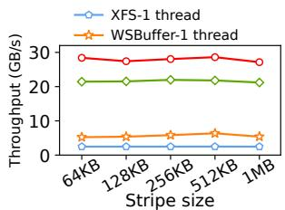  
(a) Various stripe sizes.

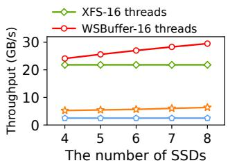  
(b) Different number of SSDs.  
Figure 16: Sensitivity study. Performing random writes with size ranges from 4KB to 4MB under sufficient memory.

Storage I/O stack optimizations. Falcon [31] optimizes the block layer of storage I/O stack by a per-drive I/O processing to parallelize I/O serving. AIOS [35] presents an asynchronous storage I/O stack to overlap I/O-related CPU operations, and reducing the sojourn time in the block layer. λ-IO [70] presents a unified I/O stack to manage both computation and storage resources across the host and the device. In addition, some works focus on ensuring the storage order with low overhead for I/O stack [28,65]. In comparison, WSBuffer focuses on rearchitecting the data path of buffered I/O.

Proactively exploiting SSD performance. NHC [67] redirects excess load to the underlying storage to proactively exploit the bandwidth of the lower layer in storage hierarchies. OrchFS [73] utilizes NVM to absorb unaligned I/Os and proactively exploits SSD bandwidth to handle large and SSD-page aligned I/Os. SPDK [71] bypasses the kernel to directly submit I/O requests to NVMe SSDs in userspace, thereby reducing software overhead and maximizing SSD performance, but at the cost of reduced generality and increased CPU overhead. In addition, many GPU-centric storage solutions [43, 48, 49] enable direct access from GPU to the storage device via NVMe queues to expand GPU memory. In comparison, WSBuffer enables mainstream buffered I/O to directly benefit from high SSD bandwidth, while retaining all advantages of buffered I/O.

Cache systems for SSDs. Most storage systems employ memory as a cache for SSDs to speedup data accesses by buffered I/O or various customized solutions [6, 9, 10, 33, 37]. In addition to memory, NVM is also widely used for SSD caching. AFCM [11] utilizes NVM to speedup synchronization operations for SSDs. P2Cache [40] leverages NVM to cache all write requests for underlying kernel file systems. Furthermore, some tiering file systems [32, 47, 66, 76] use the upper-layer NVMs as a cache to the lower-layer SSDs to absorb most workloads. In addition, CSAL [77] leverages a high-performance SSD as write buffers for a large-capacity QLC SSD. In comparison, WSBuffer focuses on buffered I/O while its insights can be applied to these systems based on a hierarchical architecture.

## 6 Conclusion

This paper identifies and analyzes the root causes for the failure of the current buffered I/O architecture to effectively utilize high-bandwidth SSDs. We further propose WSBuffer to rearchitect the data path of buffered I/O to proactively leverage SSD performance to enhance buffered I/O while retaining all its advantages, achieving higher performance, less memory consumption, and lower CPU utilization.

## Acknowledgement

We thank our shepherd Sarah Neuwirth and the anonymous reviewers for their insightful comments. This work was supported by National Key Research and Development Program of China (No.2024YFB4505105) and NSFC (No.62172175).

## References

[1] Direct i/o. https://www.kernel.org/doc/html/ latest/filesystems/iomap/operations.html# direct-i-o.

[2] What is flash-friendly file system (f2fs)? https://www.kernel.org/doc/html/latest/ filesystems/f2fs.html#design.

[3] mdraid. 2022. https://github.com/torvalds/ linux/tree/master/drivers/md.

[4] AXBOE. Fio: Flexible i/o tester. 2020. https:// github.com/axboe/fio.

[5] Jens Axboe. Uncached buffered io. https://lwn.net/ Articles/1000617/, 2024.

[6] Ryan Bannon, Alvin Chin, Faryaaz Kassam, Andrew Roszko, and Ric Holt. Innodb concrete architecture. University of Waterloo, 2002.

[7] BeeGFS. Client side caching modes. https: //doc.beegfs.io/latest/advanced\_topics/ client\_caching.html, 2024.

[8] Mingming Cao, Suparna Bhattacharya, and Ted Ts’o. Ext4: The next generation of ext2/3 filesystem. In LSF, 2007.

[9] Wei Cao, Yingqiang Zhang, Xinjun Yang, Feifei Li, Sheng Wang, Qingda Hu, Xuntao Cheng, Zongzhi Chen, Zhenjun Liu, Jing Fang, et al. Polardb serverless: A cloud native database for disaggregated data centers. In Proceedings of the 2021 International Conference on Management of Data, pages 2477–2489, 2021.

[10] Josiah Carlson. Redis in action. Simon and Schuster, 2013.

[11] Youmin Chen, Youyou Lu, Pei Chen, and Jiwu Shu. Efficient and consistent nvmm cache for ssd-based file system. IEEE Transactions on Computers, 68(8):1147– 1158, 2018.

[12] Orangefs configuration file. Orangefs documentation. https://docs.orangefs.com/configuration/ admin\_ofs\_configuration\_file/, 2023.

[13] Brian F Cooper, Adam Silberstein, Erwin Tam, Raghu Ramakrishnan, and Russell Sears. Benchmarking cloud serving systems with ycsb. In Proceedings of the 1st ACM symposium on Cloud computing, pages 143–154, 2010.

[14] Jonathan Corbet. Clarifying memory management with page folios. https://lwn.net/Articles/849538/, 2024.

[15] DeepSeek. Fire-flyer file system. https://github. com/deepseek-ai/3FS, 2024.

[16] Facebook. Rocksdb tuning guide. 2023. https://github.com/facebook/rocksdb/wiki/ RocksDB-Tuning-Guide.

[17] Paul Fischer, James Lottes, Henry Tufo, and USDOE Office of Science. Nek5000, 06 2007.

[18] Dániel Fogaras, Balázs Rácz, Károly Csalogány, and Tamás Sarlós. Towards scaling fully personalized pagerank: Algorithms, lower bounds, and experiments. Internet Mathematics, 2(3):333–358, 2005.

[19] Sanjay Ghemawat and Jeff Dean. Leveldb is a fast keyvalue storage library written at google that provides an ordered mapping from string keys to string values, 2014.

[20] Mingzhe Hao, Levent Toksoz, Nanqinqin Li, Edward Edberg Halim, Henry Hoffmann, and Haryadi S Gunawi. Linnos: Predictability on unpredictable flash storage with a light neural network. In OSDI, pages 173–190, 2020.

[21] Frank Herold. An introduction to beegfs. https://www.beegfs.io/docs/whitepapers/ Introduction\_to\_BeeGFS\_by\_ThinkParQ.pdf, 2014.

[22] Yuhun Jun, Shinhyun Park, Jeong-Uk Kang, Sang-Hoon Kim, and Euiseong Seo. We ain’t afraid of no file fragmentation: Causes and prevention of its performance impact on modern flash SSDs. In 22nd USENIX Conference on File and Storage Technologies (FAST 24), pages 193–208, Santa Clara, CA, February 2024. USENIX Association.

[23] KAIST. Twitter. 2023. http://an.kaist.ac.kr/ traces/WWW2010.html.

[24] Dong Hyun Kang and Young Ik Eom. Fslru: a page cache algorithm for mobile devices with hybrid memory architecture. IEEE Transactions on Consumer Electronics, 62(2):136–143, 2016.

[25] Linux kernel. Physical page allocation. https://www.kernel.org/doc/gorman/html/ understand/understand009.html, 2024.

[26] Dohyun Kim, Kwangwon Min, Joontaek Oh, and Youjip Won. ScaleXFS: Getting scalability of XFS back on the ring. In 20th USENIX Conference on File and Storage Technologies (FAST 22), pages 329–344, Santa Clara, CA, February 2022. USENIX Association.

[27] Hyeong-Jun Kim, Young-Sik Lee, and Jin-Soo Kim. NVMeDirect: A user-space I/O framework for

application-specific optimization on NVMe SSDs. In 8th USENIX Workshop on Hot Topics in Storage and File Systems (HotStorage 16), Denver, CO, June 2016. USENIX Association.

[28] Jieun Kim, Joontaek Oh, Juwon Kim, Seung Won Yoo, and Youjip Won. OPIMQ: Order preserving IO stack for Multi-Queue block device. In 23rd USENIX Conference on File and Storage Technologies (FAST 25), pages 425–439, Santa Clara, CA, February 2025. USENIX Association.

[29] Joonsung Kim, Pyeongsu Park, Jaehyung Ahn, Jihun Kim, Jong Kim, and Jangwoo Kim. Ssdcheck: Timely and accurate prediction of irregular behaviors in blackbox ssds. In MICRO, pages 455–468. IEEE, 2018.

[30] KTH-Nek5000. Kth framework. https://github. com/KTH-Nek5000/KTH\_Framework, 2024.

[31] Pradeep Kumar and H. Howie Huang. Falcon: Scaling IO performance in Multi-SSD volumes. In 2017 USENIX Annual Technical Conference (USENIX ATC 17), pages 41–53, Santa Clara, CA, July 2017. USENIX Association.

[32] Youngjin Kwon, Henrique Fingler, Tyler Hunt, Simon Peter, Emmett Witchel, and Thomas Anderson. Strata: A cross media file system. In Proceedings of the 26th Symposium on Operating Systems Principles, pages 460–477, 2017.

[33] Thomas Kyte and Darl Kuhn. Expert Oracle Database Architecture. Apress, 2014.

[34] Changman Lee, Dongho Sim, Jooyoung Hwang, and Sangyeun Cho. F2fs: A new file system for flash storage. In 13th USENIX Conference on File and Storage Technologies (FAST 15), pages 273–286, 2015.

[35] Gyusun Lee, Seokha Shin, Wonsuk Song, Tae Jun Ham, Jae W Lee, and Jinkyu Jeong. Asynchronous i/o stack: A low-latency kernel i/o stack for ultra-low latency ssds. In 2019 USENIX Annual Technical Conference (USENIX ATC 19), pages 603–616, 2019.

[36] Huiba Li, Yiming Zhang, Zhiming Zhang, Shengyun Liu, Dongsheng Li, Xiaohui Liu, and Yuxing Peng. PARIX: Speculative partial writes in Erasure-Coded systems. In 2017 USENIX Annual Technical Conference (USENIX ATC 17), pages 581–587, Santa Clara, CA, July 2017. USENIX Association.

[37] Qiang Li, Qiao Xiang, Yuxin Wang, Haohao Song, Ridi Wen, Wenhui Yao, Yuanyuan Dong, Shuqi Zhao, Shuo Huang, Zhaosheng Zhu, Huayong Wang, Shanyang Liu, Lulu Chen, Zhiwu Wu, Haonan Qiu, Derui Liu, Gexiao Tian, Chao Han, Shaozong Liu, Yaohui Wu, Zicheng

Luo, Yuchao Shao, Junping Wu, Zheng Cao, Zhongjie Wu, Jiaji Zhu, Jinbo Wu, Jiwu Shu, and Jiesheng Wu. More than capacity: Performance-oriented evolution of pangu in alibaba. In 21st USENIX Conference on File and Storage Technologies (FAST 23), pages 331–346, Santa Clara, CA, February 2023. USENIX Association.

[38] Zhiyue Li and Guangyan Zhang. StreamCache: Revisiting page cache for file scanning on fast storage devices. In 2024 USENIX Annual Technical Conference (USENIX ATC 24), pages 1119–1134, Santa Clara, CA, July 2024. USENIX Association.

[39] Yu Liang, Riwei Pan, Tianyu Ren, Yufei Cui, Rachata Ausavarungnirun, Xianzhang Chen, Changlong Li, Tei-Wei Kuo, and Chun Jason Xue. CacheSifter: Sifting cache files for boosted mobile performance and lifetime. In 20th USENIX Conference on File and Storage Technologies (FAST 22), pages 445–459, Santa Clara, CA, February 2022. USENIX Association.

[40] Zhen Lin, Lingfeng Xiang, Jia Rao, and Hui Lu. P2cache: Exploring tiered memory for in-kernel file systems caching. In 2023 USENIX Annual Technical Conference (USENIX ATC 23), pages 801–815, 2023.

[41] Lanyue Lu, Andrea C. Arpaci-Dusseau, Remzi H. Arpaci-Dusseau, and Shan Lu. A study of linux file system evolution. ACM Trans. Storage, 10(1), January 2014.

[42] Changwoo Min, Sanidhya Kashyap, Steffen Maass, and Taesoo Kim. Understanding manycore scalability of file systems. In 2016 USENIX Annual Technical Conference (USENIX ATC 16), pages 71–85, Denver, CO, June 2016. USENIX Association.

[43] Nvidia. Nvidia gpudirect storage. 2024. .https://docs.nvidia.com/gpudirect-storage/ index.html.

[44] Joontaek Oh, Seung Won Yoo, Hojin Nam, Changwoo Min, and Youjip Won. Cjfs: Concurrent journaling for better scalability. In 21st USENIX Conference on File and Storage Technologies (FAST 23), pages 167–182, 2023.

[45] Kiet Tuan Pham, Seokjoo Cho, Sangjin Lee, Lan Anh Nguyen, Hyeongi Yeo, Ipoom Jeong, Sungjin Lee, Nam Sung Kim, and Yongseok Son. Scalecache: A scalable page cache for multiple solid-state drives. In Proceedings of the Nineteenth European Conference on Computer Systems, pages 641–656, 2024.

[46] Yingjin Qian, Marc-André Vef, Patrick Farrell, Andreas Dilger, Xi Li, Shuichi Ihara, Yinjin Fu, Wei Xue, and André Brinkmann. Combining buffered i/o and direct i/o in

distributed file systems. In 22nd USENIX Conference on File and Storage Technologies (FAST 24), pages 17– 33, 2024.

[47] Sheng Qiu and AL Narasimha Reddy. Nvmfs: A hybrid file system for improving random write in nand-flash ssd. In 2013 IEEE 29th Symposium on Mass Storage Systems and Technologies (MSST), pages 1–5. IEEE, 2013.

[48] Shi Qiu, Weinan Liu, Yifan Hu, Jianqin Yan, Zhirong Shen, Xin Yao, Renhai Chen, Gong Zhang, and Yiming Zhang. Geminifs: A companion file system for gpus. In 23rd USENIX Conference on File and Storage Technologies (FAST 25), pages 221–236, Santa Clara, CA, February 2025. USENIX Association.

[49] Zaid Qureshi, Vikram Sharma Mailthody, Isaac Gelado, Seungwon Min, Amna Masood, Jeongmin Park, Jinjun Xiong, Chris J Newburn, Dmitri Vainbrand, I-Hsin Chung, et al. Gpu-initiated on-demand high-throughput storage access in the bam system architecture. In Proceedings of the 28th ACM International Conference on Architectural Support for Programming Languages and Operating Systems, Volume 2, pages 325–339, 2023.

[50] Ohad Rodeh, Josef Bacik, and Chris Mason. Btrfs: The linux b-tree filesystem. ACM Transactions on Storage (TOS), 9(3):1–32, 2013.

[51] Samsung. Samsung 990 pro. https:// semiconductor.samsung.com/consumer-storage/ internal-ssd/990-pro/.

[52] Samsung. Samsung ssd. https://semiconductor. samsung.com/ssd/, 2024.

[53] Prateek Sharma, Purushottam Kulkarni, and Prashant Shenoy. Per-vm page cache partitioning for cloud computing platforms. In 2016 8th International Conference on Communication Systems and Networks (COMSNETS), pages 1–8, 2016.

[54] Harshad Shirwadkar, Saurabh Kadekodi, and Theodore Tso. FastCommit: resource-efficient, performant and cost-effective file system journaling. In 2024 USENIX Annual Technical Conference (USENIX ATC 24), pages 157–171, Santa Clara, CA, July 2024. USENIX Association.

[55] Jiwu Shu, Fei Li, Siyang Li, and Youyou Lu. Towards unaligned writes optimization in cloud storage with highperformance ssds. IEEE Transactions on Parallel and Distributed Systems, 31(12):2923–2937, 2020.

[56] Stanford. Friendster. 2023. https://snap.stanford. edu/data/com-Friendster.html.

[57] Stanford. Livejournal. 2023. https://snap. stanford.edu/data/soc-LiveJournal1.html.

[58] Adam Sweeney, Doug Doucette, Wei Hu, Curtis Anderson, Mike Nishimoto, and Geoff Peck. Scalability in the xfs file system. In USENIX Annual Technical Conference, volume 15, 1996.

[59] Vasily Tarasov. Filebench-a model based file system workload generator. https://github.com/ filebench/filebench, 2018.

[60] DPDK Development Team. Data plane development kit. https://www.dpdk.org/, 2024.

[61] Wiki. Pci express. https://semiconductor. samsung.com/ssd/, 2024.

[62] Wikipeida. Buddy memory allocation. https://en.wikipedia.org/wiki/Buddy\_memory\_ allocation., 2024.

[63] Matthew Wilcox. Page folios. https: //lwn.net/ml/linux-kernel/20201216182335. 27227-1-willy@infradead.org/, 2024.

[64] Matthew Wilcox. Xarray. https://docs.kernel. org/core-api/xarray.html, 2024.

[65] Youjip Won, Jaemin Jung, Gyeongyeol Choi, Joontaek Oh, Seongbae Son, Jooyoung Hwang, and Sangyeun Cho. Barrier-Enabled IO stack for flash storage. In 16th USENIX Conference on File and Storage Technologies (FAST 18), pages 211–226, Oakland, CA, February 2018. USENIX Association.

[66] Hobin Woo, Daegyu Han, Seungjoon Ha, Sam H Noh, and Beomseok Nam. On stacking a persistent memory file system on legacy file systems. In 21st USENIX Conference on File and Storage Technologies (FAST 23), pages 281–296, 2023.

[67] Kan Wu, Zhihan Guo, Guanzhou Hu, Kaiwei Tu, Ramnatthan Alagappan, Rathijit Sen, Kwanghyun Park, Andrea C Arpaci-Dusseau, and Remzi H Arpaci-Dusseau. The storage hierarchy is not a hierarchy: Optimizing caching on modern storage devices with orthus. In 19th USENIX Conference on File and Storage Technologies (FAST 21), pages 307–323, 2021.

[68] XFS. Xfs delayed logging design. https: //www.infradead.org/\~mchehab/kernel\_docs/ filesystems/xfs-delayed-logging-design. html, 2024.

[69] XFS. Xfs: new code for 5.15. https://lkml.iu.edu/ hypermail/linux/kernel/2108.3/07604.html, 2024.

[70] Zhe Yang, Youyou Lu, Xiaojian Liao, Youmin Chen, Junru Li, Siyu He, and Jiwu Shu. λ-IO: A unified IO stack for computational storage. In 21st USENIX Conference on File and Storage Technologies (FAST 23), pages 347–362, Santa Clara, CA, February 2023. USENIX Association.

[71] Ziye Yang, James R Harris, Benjamin Walker, Daniel Verkamp, Changpeng Liu, Cunyin Chang, Gang Cao, Jonathan Stern, Vishal Verma, and Luse E Paul. Spdk: A development kit to build high performance storage applications. In 2017 IEEE International Conference on Cloud Computing Technology and Science (CloudCom), pages 154–161. IEEE, 2017.

[72] Jeseong Yeon, Minseong Jeong, Sungjin Lee, and Eunji Lee. RFLUSH: Rethink the flush. In 16th USENIX Conference on File and Storage Technologies (FAST 18), pages 201–210, Oakland, CA, February 2018. USENIX Association.

[73] Yekang Zhan, Haichuan Hu, Xiangrui Yang, Qiang Cao, Hong Jiang, Shaohua Wang, and Jie Yao. Rethinking the Request-to-IO transformation process of file systems for full utilization of High-Bandwidth SSDs. In 23rd USENIX Conference on File and Storage Technologies (FAST 25), pages 69–86, Santa Clara, CA, February 2025. USENIX Association.

[74] Yekang Zhan, Haichuan Hu, Xiangrui Yang, Shaohua Wang, Qiang Cao, Hong Jiang, and Jie Yao. Romefs: A cxl-ssd aware file system exploiting synergy of memoryblock dual paths. In Proceedings of the 2024 ACM Symposium on Cloud Computing, SoCC ’24, pages 720–736, New York, NY, USA, 2024. Association for Computing Machinery.

[75] Yekang Zhan, Xiangrui Yang, Haichuan Hu, Qiang Cao, Yifan Zhang, and Jie Yao. Ais: An active idleness i/o scheduler to reduce buffer-exhausted degradation of solid-state drives. ACM Transactions on Architecture and Code Optimization, 22(1):1–26, 2025.

[76] Shengan Zheng, Morteza Hoseinzadeh, and Steven Swanson. Ziggurat: A tiered file system for non-volatile main memories and disks. In 17th USENIX Conference on File and Storage Technologies (FAST 19), pages 207–219, 2019.

[77] Yanbo Zhou, Erci Xu, Li Zhang, Kapil Karkra, Mariusz Barczak, Wayne Gao, Wojciech Malikowski, Mateusz Kozlowski, Łukasz Łasek, Ruiming Lu, Feng Yang, Lilong Huang, Xiaolu Zhang, Keqiang Niu, Jiaji Zhu, and Jiesheng Wu. Csal: the next-gen local disks for the cloud. In Proceedings of the Nineteenth European Conference on Computer Systems, EuroSys ’24, page

608–623, New York, NY, USA, 2024. Association for Computing Machinery.

[78] Xiaowei Zhu, Wentao Han, and Wenguang Chen. Gridgraph: Large-scale graph processing on a single machine using 2-level hierarchical partitioning. In 2015 USENIX Annual Technical Conference (USENIX ATC 15), pages 375–386, 2015.