①

USENIX

THE ADVANCED COMPUTING SYSTEMS ASSOCIATION

# An Efficient Cloud Storage Model with Compacted Metadata Management for Performance Monitoring Timeseries Systems

Kai Zhang, The Chinese University of Hong Kong; Tianyu Wang, Shenzhen University; Zili Shao, The Chinese University of Hong Kong

## https://www.usenix.org/conference/fast26/presentation/zhang-kai

This paper is included in the Proceedings of the 24th USENIX Conference on File and Storage Technologies.

February 24–26, 2026 • Santa Clara, CA, USA

ISBN 978-1-939133-53-3

Open access to the Proceedings of the 24th USENIX Conference on File and Storage Technologies is sponsored by

# An Efficient Cloud Storage Model with Compacted Metadata Management for Performance Monitoring Timeseries Systems

Kai Zhang1, Tianyu Wang2 , Zili Shao1 1The Chinese University of Hong Kong, China 2Shenzhen University, China

## Abstract

Cloud-based performance monitoring timeseries systems are emerging due to their flexibility and pay-as-you-go capabilities. However, these systems encounter a major bottleneck in query performance, mainly attributed to the prolonged access latency of cloud storage and metadata redundancy of large number of timeseries. Thus, it is critical to optimize query performance within cloud environment and reduce metadata redundancy.

In this paper, we propose CloudTS, which is a novel timeseries data storage model with query optimization for cloud storage. CloudTS separately manages metadata and data, and introduces an efficient global metadata management for both space saving and query speedup. CloudTS also transparently supports the time-partitioned tag-based query model in performance monitoring timeseries systems. For metadata, a global tag dictionary is built to reduce metadata redundancy and a novel timeseries-tag mapping technique with a twodimension bitmap is designed so the mapping of timeseries and tags can be efficiently accomplished to support tag-based queries. For data, the compressed data chunks are put into objects by timeseries group. We have implemented a fully functional prototype of CloudTS and evaluated it with production timeseries data and synthetic workloads based on Amazon S3. In comparison, Cortex, a cloud-based timeseries system widely adopted by industries, and Apache Parquet and JSON Time Series, two representative cloud storage formats, are utilized in the evaluation. Experimental results show that CloudTS can improve query performance by 1.37× on average compared with Cortex, and outperforms Apache Parquet and JSON Time Series as well.

## 1 Introduction

Cloud-based performance monitoring timeseries systems are emerging [5, 10, 26–28, 40, 44, 49] due to cloud’s flexibility and pay-as-you-go capabilities. For instance, existing performance-monitoring systems, such as Prometheus [36] via Cortex [12] or Thanos [47], InfluxDB [21], TimescaleDB [42] and ModelarDB [22, 23], all provide a cloud-based version by which timeseries data can be stored and queried via cloud storage (e.g., Microsoft Azure [11], Amazon S3 [39] and Google Cloud Storage [46]). Despite these advancements, query performance with cloud storage significantly lags behind that with local storage because of the prolonged access latency of cloud storage [19, 24, 30, 33]. Thus, it is critical for performance monitoring timeseries systems to optimize query performance with cloud storage exploitation.

Existing storage models for performance monitoring timeseries systems are designed for local storage and cannot work well in a cloud environment. Specifically, these models are based on a time-partitioned approach, by which in a predefined time period, all metadata (e.g. tags and inverted index for timeseries) and raw timeseries data are encompassed into one file. Directly transforming files into cloud objects, which is adopted by timeseries systems such as Cortex and TimescaleDB, incurs substantial read amplification. Even if we require only a small portion of data, we need to load back the whole object from the cloud storage. While some systems adopt cloud-native file formats like Apache Parquet [35], which compress data to reduce file sizes, this approach does not fully address the challenges of read amplification. Parquet organizes data in a columnar format, where columns are treated independently. Consequently, accessing data for a specific timeseries within a given time range often requires retrieving unnecessary rows, further exacerbating read amplification. JSON Time Series (JTS) [41], another cloud-oriented approach, avoids this issue by organizing metadata and data of each timeseries into distinct objects. However, JTS struggles to scale effectively, as tag-based queries require scanning all the objects, significantly impacting query performance.

With the rise of containers and micro-services, timeseries databases face increasing demands to manage a large number of timeseries with highly dynamic trends, making timeseries management more complex. For example, the timeseries database system for performance monitoring ByteDance’s internet services must handle over ten billion distinct timeseries daily [32,45]. This includes a massive influx of new timeseries generated by rapidly appearing and disappearing containers and micro-services. These transient timeseries generate a large volume of tags, which are utilized to describe timeseries, accounting for more than 80% of the total metadata size, with a high level of redundancy (e.g. approximately 73% of the tags are repeated). Existing compression works [17, 25, 52] are primarily designed for timeseries data and do not focus on optimizing tags. Simply adopting existing file formats cannot fundamentally solve the issue of metadata redundancy.

In this paper, we propose CloudTS (Cloud TimeSeries Data Storage Model), a novel timeseries data storage model designed for cloud storage. The primary objective of CloudTS is to reduce query latencies and storage cost while transparently supporting existing time-partitioned tag-based query model in performance monitoring timeseries systems. To achieve this, our key idea is to separately manage metadata and data with an efficient global metadata management, enabling space saving and query optimization. This separation allows to eliminate unnecessary data access/fetching, reduce metadata duplication and provide succinct index and provide the opportunity to optimize metadata management.

Designing such a query and storage efficient cloud storage model involves addressing three key challenges: 1) For model design, how to preserve the connection between metadata and data when converting an existing local storage model to a cloud-based object model, ensuring effective metadata-data separation? 2) For metadata optimization, how to manage complex timeseries metadata succinctly and leverage it for indexing to improve query efficiency, considering frequent metadata access, a large volume of bidirectional timeseriestag mappings (inverted index and timeseries list), and repeated tags? 3) For data object optimization, how to organize data objects to reduce read amplification and fully exploit cloud object storage bandwidth?

To overcome these challenges, CloudTS incorporates several innovative designs as follows. First, CloudTS adopts a dual-structure approach to manage timeseries data by separating metadata and data. Metadata are maintained globally with a Tag Dictionary (TagDict) and Tag-Timeseries Mapping (TTMapping), which maintain a compact and efficient representation of metadata while preserving their linkage to the corresponding data. By decoupling metadata from data, this approach reduces read amplification and enables efficient query execution. Meanwhile, timeseries data chunks are stored in TSObjects, ensuring reduced storage costs and comparable performance. This design ensures that metadata and data remain logically connected while leveraging the benefits of cloud-based object storage.

Second, CloudTS introduces a global tag dictionary based on a Patricia trie-like structure to efficiently handle a large volume of highly redundant tags. This structure not only enables efficient tag management but also supports tag encoding, reducing the overhead of referencing tags. For each time partition, a local sequence is maintained to exclude unused tag information specific to that partition, further improving query efficiency. Additionally, CloudTS implements a novel timeseries-tag mapping technique using a two-dimensional bitmap. The inverted index between tags and timeseries is converted into this compact bitmap for each time partition, allowing for efficient tag-based query lookups. These combined strategies ensure succinct metadata management, reduced overhead, and enhanced query efficiency.

Table 1: List of terms utilized in this paper.
<table><tr><td rowspan=1 colspan=1>Term</td><td rowspan=1 colspan=1>Description</td></tr><tr><td rowspan=1 colspan=1>TagDict</td><td rowspan=1 colspan=1>A global dictionary that maps tag pairs (e.g.,node=“nodeOl&quot;) to a unique IDs.</td></tr><tr><td rowspan=1 colspan=1>TTMapping</td><td rowspan=1 colspan=1> A two-dimensional bitmap mapping time-series and tag pairs within each time parti-tion.</td></tr><tr><td rowspan=1 colspan=1>Tag Array</td><td rowspan=1 colspan=1>A list organized by time partition, storingonly the tag pairs associated with that parti-tion.</td></tr><tr><td rowspan=1 colspan=1>TSObject</td><td rowspan=1 colspan=1>A data object that stores compressed chunksof timeseries data, organized by timeseriesID and ordered chronologically.</td></tr></table>

Third, CloudTS introduces TSObject as the fundamental data unit for storing timeseries data. For each time partition, the data within compressed chunks of a group of timeseries is organized into a single TSObject. Each TSObject employs a chunk-based storage strategy, where compressed data chunks are sorted by timeseries ID and time order. This design tackles the trade-off between file size and storage efficiency and minimizes read amplification by ensuring that related data can be accessed sequentially, leveraging the high bandwidth of cloud object storage.

We have implemented a fully functional prototype of CloudTS. We evaluate CloudTS with production timeseries data and synthetic workloads, and compare it with Cortex, a cloud-based timeseries system widely adopted by industries, and Apache Parquet and JSON Time Series, two representative cloud storage formats, based on Amazon S3. First, a full-system evaluation under a real-world production environment has been conducted. Under this environment, CloudTS can achieve 1.43× speedup on average compared with Cortex. Second, with the TSBS benchmark [3], we evaluate query performance with different query patterns and experimental results show that CloudTS significantly outperforms Cortex, Apache Parquet and JSON Time Series.

The remainder of this paper is organized as follows. Section 2 provides the background of performance monitoring timeseries system and motivation. Section 3 presents the detailed design of CloudTS. Section 4 shows the evaluation. We discuss the related work in Section 5 and then conclude the paper in Section 6. The key terms used throughout this paper are summarized in Table 1.

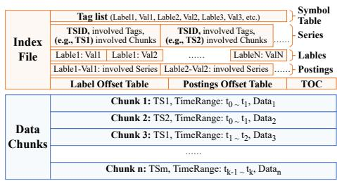  
(a) Data organization of Prometheus and Cortex.

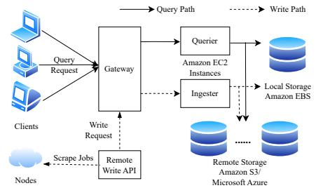  
(b) Architecture of a cloud-based timeseries system.

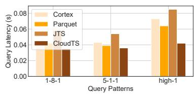  
(c) Average query durations comparison.  
Figure 1: (a) Data organization of Prometheus and Cortex. (b) Architecture of a typical cloud-based performance monitoring timeseries system. (c) Average query durations for one-hour continuous query. “1-8-1” indicates querying data on 1 timeseries from 8 targets, every 5 minutes window for 1 hour; “5-1-1” indicates querying data on 5 timeseries from 1 target, every 5 minutes window for 1 hour; “high-1” represents all the readings where one metric is above a threshold for a particular host.

## 2 Background and Motivation

## 2.1 Performance Monitoring Timeseries System

Performance-monitoring timeseries systems like Prometheus [36], Cortex [12] and InfluxDB [21] are used to collect realtime performance metrics such as CPU utilization and memory usage. These systems, commonly referred to as Timeseries Database (TSDB) systems, are essential for managing, storing, and querying timeseries data. Among them, Cortex is a popular system that provides horizontally scalable, highly available and long-term storage.

In these systems, timeseries data is a sequence of numerical data points collected over time. A timestamp is associated with each data point upon data generation. In a timeseries system, the storage unit for timeseries data is chunk, which contains a set of data points of one timeseries in a short time period. Most timeseries systems provide a tag-based interface to support flexible queries on timeseries data, by which each timeseries is identified by a metric name and a set of tags. Metric name represents the general topic of one timeseries. tags represents the monitored machine’s information, such as location, cluster information and etc. For instance, in a performance monitoring system, a client may create a metric called cpu\_usage to keep track of the processor usage across the system. The client may further specify timeseries based on tags such as node=“node01” and cpu=“1”. So this timeseries can be represented as cpu\_usage{node=“node01”, cpu=“1”}. In this paper, we treat both metric name and tags as tags and manage them together.

## 2.2 Timeseries Data Organization

Existing performance monitoring timeseries systems manage data in a time partitioned approach, such as Prometheus, Cortex and InfluxDB. Data blocks cover all the timeseries chunks in a given time period and an index file for metadata is maintained in each data block.

Figure 1(a) shows how Prometheus and Cortex organize timeseries metadata and data in each data block [37]. As illustrated, there are n data chunks in this data block, containing the data of timeseries T S1 to T Sm, and one index file to maintain timeseries metadata. Series maintains the timeseries id information and the corresponding tags and data chunk information in the given time period. Symbol Table holds a sorted list of deduplicated strings that occurred in label pairs and metric names of the stored series. Label Index indexes the existing (combined) values for one or more label names. Posting store lists of timeseries references that contain a given label pair. Working together, Symbol Table, Label Index and Posting make up the inverted index [29, 51, 53], so it can utilize the labels information to find targeted timeseries. In this paper, we treat both label pairs and metric names as tags.

## 2.3 TSDBs in Cloud Environment

To catch up with the trend of services moving to the cloud, cloud-based timeseries systems are required to collect a large amount of monitoring metrics and do analysis. As shown in Table 2, the size of data generated from 1 million timeseries can be greater than 90 PB [45], which is not realizable to maintain locally.

Table 2: Timeseries data size.
<table><tr><td rowspan=1 colspan=1>#ofMonitored Services</td><td rowspan=1 colspan=1>10 Thousands</td></tr><tr><td rowspan=1 colspan=1>#of Timeseries</td><td rowspan=1 colspan=1>1 Million</td></tr><tr><td rowspan=1 colspan=1>TS Data Sample Rate</td><td rowspan=1 colspan=1>1 data point every 15 seconds</td></tr><tr><td rowspan=1 colspan=1>Data Size per Day</td><td rowspan=1 colspan=1>94 PB</td></tr></table>

Due to cloud’s flexibility and pay-as-you-go capabilities, the current deployment choice is to migrate the whole performance monitoring timeseries to cloud environment [31]. For instance, Amazon Web Services (AWS) [43] is the world’s most comprehensive and broadly adopted cloud, offering over

200 fully featured services from data centers globally. AWS EC2 [14] provides computing service to support secure and resizable computing capacity for virtually any workload, which can be adopted as timeseries service server. AWS S3 [39] is an object-based storage service to provide unlimited storage space, high availability, and scalability, which can be utilized to maintain timeseries data. A typical architecture for cloudbased performance monitoring timeseries systems based on Amazon cloud environment is shown in Figure 1(b) [7, 8]. Gateway handles queries and write requests from clients and remote write services, and redirects them to querier or ingester accordingly. Ingester can maintain data in local storage (e.g., Amazon EBS [13]) or remote storage (e.g., Amazon S3 and Microsoft Azure). Querier accesses data from storage and ingester. If there exists metadata cache and data cache, querier can speed up queries by accessing cached data first.

However, migrating timeseries systems to the cloud introduces new challenges. Cloud storage operates on an objectbased model, lacking direct file-level access. Existing systems often fall short in achieving these goals, particularly as the scale of tags and timeseries grows. This necessitates careful organization of timeseries metadata and data to minimize read amplification, reduce storage costs, and leverage the high bandwidth of cloud storage.

## 2.4 Motivation

To underscore the limitations of existing timeseries systems in cloud environments, we present preliminary experiments that highlight key challenges and inefficiencies. We have evaluated the performance of popular methods for querying timeseries data in the cloud, including traditional TSDB systems (e.g., Cortex) and columnar storage formats (e.g., Apache Parquet and JSON Time Series). We compare the query latency of CloudTS and these methods under TSBS benchmark with the same environment as shown in Section 4.3, where the data are collected from one node exporter with 10 monitoring servers and totally we have 10K timeseries. Figure 1(c) shows the average query latency for one-hour continuous query. Our findings reveal that without fundamentally solving the metadata redundancy issue and fully utilizing cloud storage bandwidth, existing methods cannot provide efficient query performance for monitoring timeseries systems.

To further indicate the metadata redundancy issue, we analyze a large-scale timeseries dataset (described in Section 4.3), which reveals significant redundancy in tag information. Among tens of time partitions, over 70% of tags were repeated across multiple timeseries, with some tags (e.g., region and cluster) shared by more than 90% of the data. This redundancy inflates metadata size and hampers query efficiency, because these tags are repeatedly stored in each time partition, implying that they will also be repeatedly accessed for queries across time partitions.

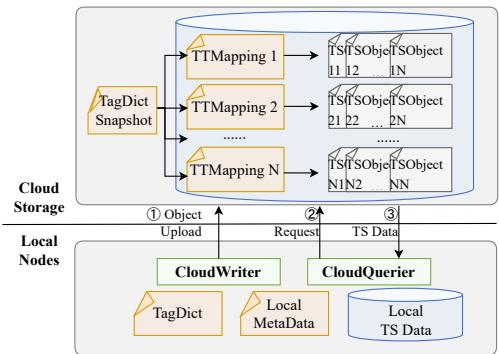  
Figure 2: CloudTS-based timeseries system design.

## 3 Design

In this section, we introduce the overview of CloudTS design first. Then, we describe the timeseries metadata and data organization, respectively. Finally, query processing for CloudTS is introduced.

## 3.1 Design Overview

The overall design of the proposed timeseries storage model, as depicted in Figure 2, serves as the backbone for seamless operation within existing performance monitoring timeseries systems. We propose a lightweight timeseries storage model designed for cloud storage, which separately manages metadata and data objects. The tags managed in TagDict contain metric names, tag labels and tag values from established systems such as Cortex and Prometheus, as detailed in Section 2.1. The core of this design is the TTMapping, a metadata object serving as the index for timeseries data objects known as TSObjects. The process of uploading timeseries data blocks to remote storage and converting data from local formats into TTMapping and TSObjects is facilitated by a dedicated Cloud-Writer. Additionally, data retrieval from remote storage is orchestrated by a CloudQuerier.

Figure 2 illustrates the three fundamental steps for a CloudTS-integrated timeseries system to handle data ingestion and queries:

1. Data Transformation and Upload: Processing begins once the data block is immutable. The CloudWriter takes charge of updating TagDict and transforming the data block into TTMapping and TSObjects, subsequently uploading them into the cloud storage.

2. Query Issuance: The CloudQuerier is employed to issue object requests to the cloud storage, initiating the retrieval process.

3. Data Retrieval: In response to the queries, the corresponding data objects are retrieved from the cloud storage, completing the lifecycle of data query within the CloudTS-integrated timeseries system.

The explicit separation of metadata and data, coupled with the use of cloud storage, makes CloudTS a compelling solution for scalable and effective timeseries data management.

## 3.2 Tag Management

Efficient metadata management is crucial in cloud-based timeseries systems, where tags form the basis for indexing, querying, and organizing vast amounts of data. To address challenges posed by high tag redundancy and frequent metadata access, TagDict leverages a Patricia Trie-like structure enhanced with encoding strategies and bidirectional lookup mechanisms, providing both storage efficiency and rapid access.

TagDict hierarchically organizes tag names and values, collectively referred to as tag pairs, as illustrated in Figure 3. Shared prefixes are stored only once, reducing redundancy and conserving storage. For example, tag pairs such as cpu=core1 and cpu=coren share the prefix cpu, stored as a single node in the trie, while the distinct values core1 and coren extend as separate branches. This hierarchical design ensures efficient use of memory, especially in scenarios with numerous overlapping tag prefixes.

Each unique tag pair is assigned a globally unique encoding stored at the leaf nodes of the trie. To enable efficient access, TagDict introduces bidirectional lookup functionality, supported by bidirectional pointers between encodings and their corresponding tag pairs. This design allows for seamless transitions between human-readable tag pairs and compact encodings. For instance, consider a query for the tag pair app=Test. TagDict is traversed to quickly resolve its encoding, such as “2”. Conversely, if the encoding “2” is provided (e.g., during a query execution step), the system directly retrieves the tag pair app=Test by following the reverse pointer. This bidirectional mapping avoids repeated trie traversal, significantly improving lookup performance.

To optimize performance further, TagDict is designed with a time partition-aware mechanism. Within each time partition, irrelevant tags — those not present in the given time partition — are excluded. Only relevant tag pairs are maintained in a time partition tag array, as shown in Figure 3. The order of time partition tag array is decided by the frequency of each tag pair in this time partition, as discussed in Section 3.3. When uploading a new immutable data block, it goes through TagDict to check whether it exists or not for each tag pair. If it already exists, a local encoding with time partition number will be added to the corresponding leaf node and the local tag array with bidirectional pointer. Otherwise, new nodes will be created for the tag pair and the above operation will be performed. By maintaining only relevant tag pairs in each time partition, the system minimizes search space and memory consumption while enhancing query efficiency.

An example illustrates the processing procedure of this mechanism. Imagine a query seeking timeseries associated with the tag pair cpu=core1. Using TagDict, the string cpu=core1 is resolved to an encoding like “2” in time partition 1 (TP1) and “0” in TP2, which is then used to access data structures such as the Tag-Timeseries Mapping (TTMapping). Conversely, when presenting query results, where encoded tags like “0” in TP1 and “3” in TP2 are part of the metadata, the system retrieves the original tag pair app=Test using the reverse lookup. This bidirectional capability ensures both human readability and computational efficiency throughout the query lifecycle.

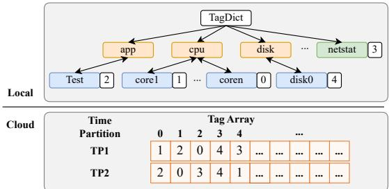  
Figure 3: Tag management in local memory and cloud objects.

Through the combination of a compact Patricia Trie-like structure, bidirectional lookup, and time partition-aware optimization, TagDict provides a robust and scalable approach to tag management in cloud-based timeseries systems. This design efficiently handles large-scale tags with high redundancy, ensuring rapid lookup and low storage overhead while supporting the demanding query requirements of modern timeseries applications.

## 3.3 Timeseries Index Management

We consider both timeseries ID information and inverted index as essential metadata. Specifically, when dealing with Cortex data in cloud storage, it becomes crucial to preserve all relevant details of Series, Labels and Posting, as discussed in Section 2.2. To maintain metadata for efficiency and simplicity, we have designed a two-dimensional bitmap capable of directly representing timeseries-tag mappings, called TTMapping. This structured approach enables a clear and concise representation of timeseries metadata information. In this bitmap, each row corresponds to a specific timeseries, with individual bits indicating the presence of associated tags by setting them as 1.

A new TTMapping is generated when a new block is uploaded and it is designed to work locally for each time period. For the new data block, both tag and timeseries information should be maintained so that the data can be indexed. Tags are handled by TagDict and TTMapping can utilize the generated local tag array for tag pair reference. For timeseries information, we directly append new rows for each timeseries based on the order in the index file of the block and make the row number to be timeseries ID. Then we set corresponding bits of the tag columns to migrate the information in Series and Posting to TTMapping. In this way, TTMapping always maintains all the information within corresponding data block.

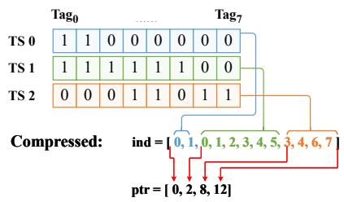  
(a) TTMapping Compression.

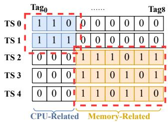  
(b) Ideal timeseries group.

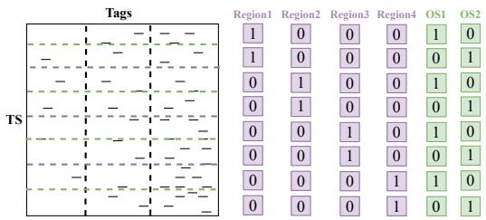  
(c) Timeseries group based on general tag pairs.  
Figure 4: (a) A TTMapping example illustrating TMMC effect. (b) An ideal timeseries group example based on CPU-related and Memory-related tags. (c) A timeseries group example based on general tag pairs.

TTMapping provides a bidirectional index, facilitating easy retrieval of information based on both timeseries ID and tags. Given a timeseries ID, the corresponding tag information can be extracted using the row information. Conversely, when provided with several tags, a search by column allows us to identify the timeseries associated with them. For example, as shown in Figure 4(a), there are three timeseries and eight tags in the system. To determine the tags defining TS0, we inspect the first row and find that Tag0 and Tag1 contribute to TS0 since the first two bits are set to 1. Similarly, a query seeking data for timeseries defined with Tag7 can be directly answered by searching the corresponding column and identifying TS2. This design ensures efficient mapping and retrieval of information, making TTMapping a robust solution for managing timeseries and associated tags in cloud storage scenarios.

While the original bitmap is functional, it introduces unnecessary space overhead. Viewing the bitmap as a matrix, TTMapping can be characterized as a sparse matrix. For instance, the Prometheus Node Exporter [16] employed in Section 4 generates 691 timeseries with a total of 452 tags, averaging three tags per timeseries. In such cases, only 0.7% of the bits are set to 1. Given the importance of metadata for querying timeseries data and the frequent access required for TTMapping, optimizing its design is crucial to improve query efficiency. To address this, we propose a two-fold optimization approach. First, we aim to reduce the overall size of the bitmap, thereby minimizing storage overhead and read amplification. Second, we leverage the distribution characteristics of tags and timeseries to further enhance efficiency, tailoring the design to the inherent patterns in their relationships.

## 3.3.1 Compression

Recognizing the sparse nature of TTMapping and its critical role, it is important to ensure that the compression process does not compromise the integrity of the maintained information. To achieve this, we enhance the conventional compressed sparse row (CSR) format by introducing a tailored scheme called Timeseries Metadata Mapping Compression (TMMC) for encoding TTMapping. Since TTMapping consists exclusively of binary values (‘0’ and ‘1’), the standard “value” array is excluded. TMMC maintains only the “index” and “pointer” arrays, enabling efficient detection of ‘1’ bit positions within the compressed format while reducing storage overhead. This compression is crucial for optimizing space utilization without sacrificing the accuracy and accessibility of the metadata during queries.

TMMC operates in two steps, each resulting in the generation of an array to record the information. In the initial step, the algorithm traverses the matrix to identify the locations where bits are settled. An array, denoted as ind, is employed to record these settled bit locations within each row. This approach enables efficient retrieval of the corresponding bit using the offset and size of the matrix. After gathering all the settled bit locations, the algorithm advances to analyze and record statistical information regarding the number of settled bits in each row. These statistics serve as offsets within the ind array. The second array, referred to as ptr, is generated during this step. The elements in the ptr array denote the cumulative sum of settled bits in the preceding rows. Consequently, the ptr array encapsulates vital information about the distribution of settled bits across the rows of the matrix, facilitating the compression and decompression processes.

Assume that there are M timeseries, N tags and a bitmap B, we can represent the compression result as following:

$$
i n d = \{ j | B _ { i j } = 1 , 0 \leq i \leq M , 0 \leq j \leq N \}\tag{1}
$$

$$
p t r _ { k } = \left\{ \begin{array} { l l } { 0 , } & { \mathrm { i f } k = 0 } \\ { { \sum _ { i = 0 } ^ { i = k } \sum _ { j = 0 } ^ { j = N } B _ { i j } , } } & { \mathrm { i f } 1 \leq k \leq M } \end{array} \right.\tag{2}
$$

For instance, as shown in Figure 4(a), to find which tags are used to define TS2, we first check ptr2 = 8 and ptr3 = 12 to get location range of tags. Then we get values from ind9 to ind12 to get tags information. If given tag1 to find corresponding timeseries, we can go through ind array to find value “1” and record locations (ind1 and ind3) to compare with elements in ptr to get timeseries ids (TS1 and TS2).

Space Overhead Analysis. Finally, we conduct a comprehensive analysis of the space overhead associated with TTMapping. In the case of the pure bitmap representation, tasked with maintaining information for M timeseries and N tags, the space complexity is ${ \cal O } ( M \times N )$ . However, the introduction of our compression mechanism results in a significant reduction in space complexity, making it $O ( M + N )$ . It is particularly evident when scaling up the system to handle substantial volumes of timeseries, as discussed in Section 2.3. With the potential maintenance of metadata for well over 1 million timeseries, the impact of the compression mechanism becomes increasingly pronounced. The compressed TTMapping not only ensures the preservation of vital information but also significantly mitigates the space overhead, allowing for more efficient storage and retrieval of metadata in cloud environments. This optimization in space complexity emphasizes the scalability and resource efficiency of TTMapping, making it a well-suited solution for cloud environments where effective space utilization is paramount. The compressed representation proves to be especially advantageous when dealing with large-scale datasets, showing the practical implications and benefits of adopting TTMapping in diverse and resourceintensive scenarios.

## 3.3.2 Timeseries Group

TTMapping plays a central role in connecting tags and timeseries, but its efficiency can be further improved by leveraging the inherent relationships between tags and timeseries. In particular, we observe two key patterns: (1) some tag names are mutually exclusive, meaning the presence of one implies the absence of another; and (2) some tag names are generic and appear across many timeseries with varying tag values. These patterns enable us to optimize TTMapping by exploiting the correlations between tags and timeseries.

An ideal scenario would allow all timeseries to be partitioned into distinct groups based on specific tags. For example, as illustrated in Figure 4(b), one group of timeseries may exclusively record CPU metrics, while another focuses entirely on memory metrics. Each group is associated with a mutually exclusive set of tag pairs. This allows the original large matrix representing TTMapping to be divided into smaller, diagonal submatrices. Such a design significantly reduces storage size while enhancing query efficiency, as irrelevant timeseries groups can be directly filtered out during query execution.

However, in practice, performance monitoring data from diverse sources rarely aligns neatly into such well-defined partitions. To address this, we analyzed the frequency distribution of tag pairs within timeseries information. Based on this analysis, we categorized tag pairs into groups according to their occurrence frequencies, as illustrated in Figure 4(c). Tags on the left have the lowest frequency, providing high selectivity during queries, while those in the middle appear more commonly, offering moderate selectivity. Tags on the right are shared across the majority of timeseries and cannot effectively filter timeseries during queries.

For these frequently shared tag pairs, timeseries cannot be cleanly divided into independent groups due to the presence of differing tag pairs. However, we introduced a finer-grained grouping approach based on tag pairs with the same tag name that covers all timeseries. These tag pairs, while not useful for filtering during queries, enable an alternative optimization: grouping timeseries based on shared tag names. By organizing timeseries into such groups, queries can access multiple groups in parallel, increasing query throughput and improving overall efficiency.

This optimization not only reduces the size of TTMapping by dividing the structure into smaller, more manageable components but also enhances query performance by enabling selective filtering and parallel access. Different from other grouping methods, this method is not designed for specific TS storage files, but for timeseries management with data generation patterns. These improvements make TTMapping a more robust and efficient metadata structure for large-scale timeseries management in cloud environments.

## 3.4 Data Organization and Transformation

In this section, we introduce how to organize timeseries data and convert local timeseries data to CloudTS format. The CloudWriter is responsible for converting and uploading data to remote storage.

## 3.4.1 TSObject

The TSObject is a fundamental building block in CloudTS, designed to optimize the storage and retrieval of timeseries data in a cloud environment. It organizes and manages the data for a group of timeseries within a specific time partition, offering an efficient and scalable solution for timeseries storage, which can address critical challenges such as balancing file size, storage efficiency, and query performance.

Each TSObject employs a chunk-based storage strategy, where compressed data chunks are arranged based on their timeseries ID and chronological order. By keeping related timeseries data contiguous, the system minimizes query latency and eliminates unnecessary scanning of irrelevant data. Unlike Apache Parquet’s rowgroup mechanism, which simply divides data into chunks, our TSObject not only orders compressed data chunks chronologically but also groups related timeseries based on tag similarity. This grouping reduces read amplification in cloud storage.

TSObject balances file size and access efficiency. Small files increase metadata lookup overhead, while large files cause read amplification. TSObjects address this trade-off by grouping timeseries into appropriately sized units. This ensures file sizes are neither too small to introduce inefficiencies nor too large to hinder fast access. The grouping strategy reduces storage costs while maintaining the efficient retrieval necessary for large-scale cloud-based timeseries systems.

The design of TSObjects significantly enhances query performance by optimizing data organization for efficient filtering and retrieval. When processing a query, it can target specific TSObjects, accessing only the relevant chunks of data without scanning unrelated timeseries. This targeted approach minimizes read amplification and improves query speed.

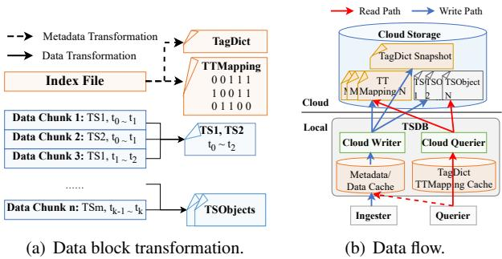  
Figure 5: (a) CloudTS data block transformation. (b) Data flow of CloudTS.

## 3.4.2 CloudWriter

The important role between local data and CloudTS format is the CloudWriter, a specialized entity designed to convert and upload data to cloud storage seamlessly. To ensure minimal impact on the normal performance monitoring service, the CloudWriter is designed as a daemon process, which remains inactive during most intervals, only springing into action when a data block is ready to be persisted within the system.

The daemonized nature of the CloudWriter is a deliberate choice to safeguard the continuous functionality of the normal performance monitoring service. Its dormancy during inactive periods preserves system resources, allowing the primary function of performance monitoring to operate without disruption. Activation only occurs when necessary, precisely when a data block is ready for persistence.

Upon activation, the CloudWriter orchestrates an efficient workflow for uploading timeseries data to cloud storage, as illustrated in Figure 5(a). The process starts by acquiring the index file and fetching the most recent tags, followed by updating TTMapping accordingly. Tag-Timeseries relationship analysis is executed during the procedure to decide the tag and timeseries group utilized in TTMapping. This step ensures that the metadata is up-to-date before organizing and uploading data. Subsequently, the CloudWriter fetches data chunks one by one, adhering to their chronological order. CloudWriter dynamically organizes TSObjects for each timeseries group. As it fetches data chunks in chronological order, each TSObject encapsulates a distinct timeseries group with ordered data chunks. The key, generated based on timeseries group, serves as the unique identifier for each TSObject.

Throughout the entire procedure, the primary function of the performance monitoring system remains uninterrupted. The data conversion and upload procedure ensures that the local system can effortlessly manage queries for the latest data without any disruption. This elegant integration of data management allows for a harmonious coexistence of the performance monitoring system and the CloudTS upload process.

Once all data chunks from one block are successfully uploaded to cloud storage, the responsibility of handling queries transitions to the CloudQuerier. This separation of duties ensures a smooth handover, allowing the CloudQuerier to efficiently respond to queries related to the uploaded data.

## 3.5 Query Processing

As we modify the data maintenance format, the original query procedure does not work. In traditional performance monitoring systems, queries for timeseries data typically involve specified tags and time range information. For example, a typical Cortex query, “GET /api/v1/query\_range?query=cpu\_usage&start=2015-07-01 T20:10:30.781Z&end=2015-07-01T20:11:00.781Z,” seeks timeseries data with “cpu” tags within a given time range.

Existing systems conventionally fetch the entire data block(s) covering the designated time range. Once the data block(s) are obtained, they load the index files to identify a group of involved timeseries defined by the given tags in each data block. Subsequently, unnecessary data is filtered out in data chunks, and only eligible data is returned. However, this approach, with one thread per query request accessing data chunks sequentially, introduces substantial read amplification and underutilizes network bandwidth.

To overcome these challenges, we introduce a novel query strategy for CloudTS and employ a specialized query worker, the CloudQuerier. The strategy unfolds in three distinct steps:

1. TagDict Lookup: CloudQuerier initiates the query by checking if the local tag arrays of the time partitions covering the specified time range are cached in local memory. If not, it retrieves the corresponding arrays and TTMappings of the time partitions from cloud storage.

2. Tag-Based Timeseries Identification: Once the tag arrays and TTMappings are acquired, CloudQuerier performs an efficient search within TagDict and TTMapping to identify the corresponding timeseries IDs based on the provided tags. This step minimizes the need for fetching unnecessary data, focusing on the specific timeseries relevant to the query.

3. TSObject Retrieval: Armed with the identified timeseries groups and IDs, CloudQuerier issues get operations in parallel, specifically targeting the required timeseries and the given time range.

With the query strategy, CloudTS avoids frequent remote storage access. By maintaining a local shortcut of TTMapping as a metadata cache, CloudQuerier efficiently operates without the need for repetitive network-intensive tasks.

## 4 Evaluation

In this section, we first introduce how we setup the evaluation environment. Then, we introduce evaluation for different cloud storage formats with TSBS workloads.

## 4.1 Environment Setup

Our experiments are conducted under the Amazon cloud environment with an Amazon EC2 Ubuntu 22.04 server (2.5GHz Intel Xeon Platinum 8259CL CPU,64 GB RAM and a 100Gbps network connection) and Amazon S3 storage. We install Cortex 1.16.0 on the server. We implement a fullyfunctional prototype of CloudTS in Go language and integrate it into Cortex [12]. In Cortex, all data are stored in Amazon S3, so different cloud timeseries formats (i.e. CloudTS, the Original Cortex) can be configured and evaluated accordingly.

We choose 10 Debian servers with Linux kernel 3.2.0.5 as the performance monitoring targets. On these targets, we run Prometheus Node Exporter [16], which is a program that can collect and export the metrics (CPU, memory, network, etc.) of the host periodically to a web page, so we can collect timeseries data from those targets.

To evaluate the practicality and performance of CloudTS, we have conducted a series of production environment and synthetic workload evaluations. For the production environment evaluation, we aim to evaluate the query performance of CloudTS with real-world performance monitoring workloads. For synthetic workload evaluation, we compare the performance of CloudTS, Parquet- and JSON Time Seriesintegrated Cortex and the original Configuration of Cortex (baseline). For Parquet and JTS-integrated Cortex, we modify the cloud storage engine to transform the original data block of Cortex into the corresponding format. For Parquet, the data of timeseries sharing the same metric\_name is maintained in the same file with different timeseries as columns. For JTS, each specific timeseries is maintained in one single file with the timeseries metadata in the file header, for which the query always needs to load the whole file to check whether it is the targeted timeseries. We select Parquet, JTS, and Cortex as baseline systems representing key paradigms in cloud-based time-series storage. Parquet typifies columnar storage widely adopted in cloud platforms; JTS embodies row-oriented JSON storage tailored for time-series workloads; and native Cortex serves as the production benchmark. Together, these systems span the principal architectural approaches to cloud-based time-series storage, enabling a fair and comprehensive evaluation of CloudTS’s performance.

## 4.2 Production Environment Evaluation

## 4.2.1 Performance Monitoring Targets

To evaluate end-to-end query latency performance, Cortex is deployed on the EC2 server to collect performance monitoring data of the 10 Debian servers, where we have a total of 100 targets (on each Debian server, 10 Prometheus Node Exporter programs are operated). The system is initialized without data and then data are collected from the targets and inserted into the system every 5 seconds. Queries will be processed after the system runs over 48 hours. We evaluate real-time endto-end query latency performance through the HTTP query interface [6] that is commonly used in real-world applications.

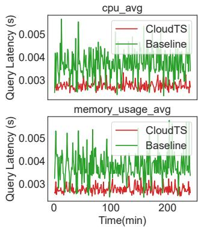

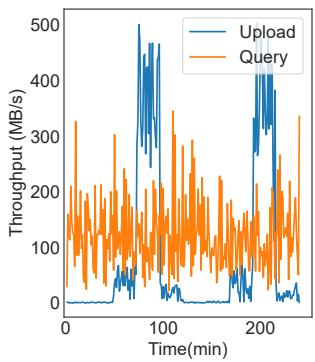  
(a) Query latency comparison.  
(b) Network throughput.  
Figure 6: CloudTS performance evaluation under production environment: (a) Query latency comparison for CloudTS and Baseline. (b) Network throughput for uploading and querying in CloudTS.

## 4.2.2 Performance Comparison

In this experiment, we execute queries with typical timeseries analysis workloads [9,15,38,48,50], which are sensitive to the query latency. For instance, anomaly detection is important to guarantee the system availability and should be accomplished to satisfy both effectiveness and real-time requirement, which means that the system should access corresponding timeseries in real time and get the data points as soon as possible. We represent this workload by queries that queries that request the latest 10-minute data and 5-minute data before one hour for one specified metric (“cpu\_avg” or “memory\_usage\_avg”). We capture a four-hour time range after the system warms up.

End-to-End Query Latency. In Figure 6, each polyline represents the query latency or throughput at every minute. Time statistic starts when the system has collected data for 48 hours. Compared with the baseline, CloudTS has lower query latency as illustrated in Figure 6(a). Specifically, it can achieve 1.43× speedups compared with the baseline. With the help of the new timeseries data format and tag management optimization, the data access latency is significantly reduced.

Data Transferring Throughput. During recording the query latency every minute, we also focus on the throughput of the whole system to upload and query data. As shown in Figure 6(b), the query throughput varies around 130 MB/s and has an amplitude of around 200 MB/s, which is because the query only accesses a small amount of data. The pattern of upload throughput is shown clearly. Every two hours, when one data block is persisted, CloudWriter is activated to converse and upload the data to cloud storage.

Query Latency During Data Uploading. As an extra component, CloudWriter should guarantee that it will not break the normal service provided by performance monitoring timeseries systems when uploading data to cloud storage. Figure 6 can show the query latency during data uploading. The result shows that the daemon thread CloudWriter will not affect the concurrent query performance.

## 4.3 Synthetic Workload Evaluation

## 4.3.1 Dataset and Queries

To collect data, we run 50 node exporters on each of the 10 monitoring servers and totally we have 500K timeseries. We scrape the targets every 5 seconds for 24 hours to make sure that the data time span in the dataset is large enough and we can randomly select a period for queries. To fairly and comprehensively compare the performance of different configurations, we adopt eight TSBS query patterns shown in Table 3 to generate queries.

## 4.3.2 Comparison with Existing File Formats

In the set of experiments, we examine the query performance of CloudTS and compare it with Cortex, Apache Parquet, and JSON Time Series.

Table 3: TSBS query patterns.
<table><tr><td rowspan=1 colspan=1>TSBSQuery</td><td rowspan=1 colspan=1>Description</td></tr><tr><td rowspan=1 colspan=1>1-8-1</td><td rowspan=1 colspan=1>Query interval data on 1 timeseries from 8 tar-gets,every 5 minutes window for 1 hour.</td></tr><tr><td rowspan=1 colspan=1>5-1-1</td><td rowspan=1 colspan=1>Query interval data on 5 timeseries from 1 target,every 5 minutes window for 1 hour.</td></tr><tr><td rowspan=1 colspan=1>5-1-12</td><td rowspan=1 colspan=1>Query interval data on 5 timeseries from 1 target,every 5 minutes window for12 hours.</td></tr><tr><td rowspan=1 colspan=1>5-8-1</td><td rowspan=1 colspan=1>Query interval data on 5 timeseries from 8 tar-gets,every 5 minutes window for 1 hour.</td></tr><tr><td rowspan=1 colspan=1>high-all</td><td rowspan=1 colspan=1>All the readings where one metric is above athreshold across all hosts.</td></tr><tr><td rowspan=1 colspan=1>high-1</td><td rowspan=1 colspan=1>All the readings where one metric is above athreshold for a particular host.</td></tr><tr><td rowspan=1 colspan=1>cpu-all-1</td><td rowspan=1 colspan=1>Aggregate across all CPU metrics per hour over1 hour for 1 host.</td></tr><tr><td rowspan=1 colspan=1>cpu-all-8</td><td rowspan=1 colspan=1>Aggregate across all CPU metrics per hour over1 hour for 8 hosts.</td></tr></table>

Query Latency. To measure query latency, we insert all the data into Cortex first and utilize the CloudWriter to upload data to AWS S3. Then, the corresponding queries are sent to retrieve the data. For every TSBS query pattern listed in Table 3, we run this step to avoid possible influence. Table 4 shows the average query latency. We divide 8 query patterns into 4 groups according to their characteristic. Group A (“1-8-1” and “5-8-1”) focuses on the query from multiple targets, while group B (“5-1-1” and “5-1-12”) shows the impact of query duration. Both groups C (“high-1” and “high-all”) and D (“cpu-all-1” and “cpu-all-8”) query large amounts of data; the difference is that the latter one generates aggregation result.

As shown in Table 4, it can be observed that CloudTS achieves lower query latency compared to the original Cortex mechanism. This is because CloudTS issues least cloud data access requests. For Parquet, it manages timeseries metadata and data mixed in columnar format, which exhibits read amplification. It requires more time to retrieve metadata and introduce extra overhead. For JTS, the mixed metadata and data in each single data object make the locate for targeted timeseries difficult and the employed extra metadata increases the round trip number. The performance gap is even more significant when the corresponding data size and metadata size are larger, as shown for the last four query patterns. Because the data size is small in group A or B and CloudTS can handle the semantics of both metadata and data, the performance of CloudTS is much better than other strategies. On average, CloudTS has 36% improvements over the baseline original Cortex mechanism.

First Data Arriving Time. For performance monitoring systems, the time utilized to get the first data record is important, because it decides whether the corresponding analysis workload using the data can start. To evaluate the first data arriving time, we conduct experiments for query pattern “highall” as mentioned above and record the time when the first piece of result is returned.

As shown in Figure 7(a), we compare the first data arriving time for baseline, Parquet, JTS, CloudTS with single request and CloudTS with 8 requests. Among all of them, JTS has the worst performance, because it needs to search the timeseries metadata for many objects to get the data of targeted timeseries. The average value of the first data arriving time of baseline is close to the query latency, because the baseline method needs to load the corresponding data blocks back first and then filter out unneeded data. Parquet needs to load the corresponding block timeseries metadata first and then locate the timeseries data column. However, CloudTS can directly access TSObjects on cloud storage with at most one extra roundtrip for TTMapping, so the first data arriving time is significantly shorter.

Accessed Data Volume. We evaluate the average volume of data accessed during query execution. As shown in Table 5, CloudTS consistently demonstrates superior efficiency across all query patterns, accessing significantly less data compared to alternative approaches. In various scenarios, CloudTS reduces data volume by 36–61%. This performance edge is most evident in complex queries—such as “high-all” and “cpu-all-8”—where CloudTS accesses nearly 50% less data than Cortex. This performance gain is driven by CloudTS’s

Table 4: Query durations with different queries.
<table><tr><td rowspan="2"></td><td rowspan="2">5-8-1</td><td colspan="7">QueryPatterns</td></tr><tr><td></td><td>5-1-1</td><td>5-1-12</td><td>high-1</td><td>high-all</td><td>cpu-all-1</td><td>cpu-all-8</td></tr><tr><td>Baseline</td><td>0.1452s</td><td>0.1492s</td><td>0.1429s</td><td>0.1551s</td><td>0.1949s</td><td>0.2351s</td><td>0.2159s</td><td>0.2549s</td></tr><tr><td>Parquet</td><td>0.1393s</td><td>0.1414s</td><td>0.1380s</td><td>0.1505s</td><td>0.1836s</td><td>0.2407s</td><td>0.2296s</td><td>0.2630s</td></tr><tr><td>JTS</td><td>0.1782s</td><td>0.1628s</td><td>0.1651s</td><td>0.1781s</td><td>0.2437s</td><td>0.3215s</td><td>0.2923s</td><td>0.3039s</td></tr><tr><td>CloudTS</td><td>0.1258s</td><td>0.1282s</td><td>0.1244s</td><td>0.1303s</td><td>0.1501s</td><td>0.1884s</td><td>0.1870s</td><td>0.2331s</td></tr></table>

Query Patterns

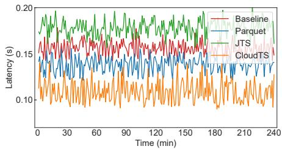  
(a) First data arriving time (“high-all”).

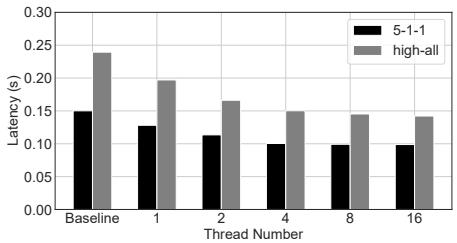

(b) Average query latency with different # of threads. (c) Network throughput during query(“high-all”).  
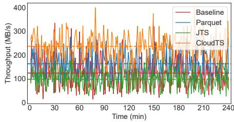

Figure 7: (a) First data arriving time comparison for query pattern “high-all”. (b) Average query latency with different number of threads. (c) Network throughput during query for query pattern “high-all”; dash lines represent the average throughput.

optimized storage architecture, which includes TagDict’s compressed metadata representation and TTMapping’s precise data selection capability—working together to eliminate unnecessary reads while maintaining high query performance.

Table 5: Comparison of data volume accessed (MB) across different queries.
<table><tr><td rowspan="2"></td><td colspan="4">QueryI Patterns</td></tr><tr><td>5-8-1</td><td>5-1-1</td><td>high-all</td><td>cpu-all-8</td></tr><tr><td>Baseline</td><td>154.05</td><td>152.76</td><td>626.29</td><td>695.65</td></tr><tr><td>Parquet</td><td>107.35</td><td>106.90</td><td>476.51</td><td>494.83</td></tr><tr><td>JTS</td><td>194.87</td><td>197.55</td><td>785.06</td><td>804.67</td></tr><tr><td>CloudTS</td><td>65.02</td><td>64.80</td><td>305.73</td><td>352.49</td></tr></table>

## 4.3.3 CloudTS Configuration Analysis

In this section, we show the scalability of CloudTS and the effectiveness when computation push-down functions are employed by CloudTS.

Query Latency and Threads Number. An important factor impacting query latency is the number of threads used to serve each query (the number of AWS S3 Select requests issued concurrently). To evaluate the effectiveness, we conducted experiments with varying maximum thread number thresholds with query patterns “5-1-1” and “high-all”.

As shown in Figures 7(a) and 7(b), the results highlight the significant improvement in query performance when multiple requests are issued concurrently. The improvement of query pattern “high-all” is better than “5-1-1”, which can be attributed to the fact that “high-all” involves accessing a larger number of TSObjects, and parallelism intuitively contributes to improved performance in such scenarios. Increasing the number of concurrent requests provides a finer division of the query workload. This allows the sub-queries to be processed in parallel, effectively reducing tail latency and enhancing the overall responsiveness of the system.

Network Utilization. Cloud-based environments provide sufficient network bandwidth which can be utilized by performance monitoring timeseries systems to transfer data between the cloud storage and the database servers. With higher utilization, it is more impossible for the network to be the bottleneck, because it can transfer messages/data in shorter time. To evaluate the network utilization rate, we conduct experiments for query patterns “high-all” to analyze the query performance and network utilization. We record the network throughput during the query procedure and calculate the average value finally. As shown in Figure 7(c), the average network throughput of CloudTS with 8 threads is 230.735MB/s, while the value of baseline is just 102.472MB/s. The result shows that CloudTS can make more use of network bandwidth to avoid it becoming the bottleneck of query performance.

## 4.3.4 Overall Overhead

CPU Utilization. To illustrate the CPU utilization of different systems, we record CPU Utilization when it is processing queries and calculate average values. As shown in Table 6, the CPU utilization for Baseline is 60.4%, which is higher than CloudTS. Compared with CloudTS, baseline system has more complicated operations, such as getting the whole data blocks back and searching inside the data blocks locally, which require more CPU resources.

Memory Overhead. To compare the memory usage, we measure the memory footprints of baseline, Parquet, JTS and

Table 6: Overhead analysis.
<table><tr><td rowspan=1 colspan=1>ComparedSystems</td><td rowspan=1 colspan=1>CPUUtilization</td><td rowspan=1 colspan=1>MemoryUsage&quot;high-all&#x27;</td><td rowspan=1 colspan=1>MemoryUsage&quot;cpu-all-8”</td></tr><tr><td rowspan=1 colspan=1>Cortex</td><td rowspan=1 colspan=1>60.4%</td><td rowspan=1 colspan=1>5.21 GB</td><td rowspan=1 colspan=1>4.92 GB</td></tr><tr><td rowspan=1 colspan=1>Parquet</td><td rowspan=1 colspan=1>53.8%</td><td rowspan=1 colspan=1>4.73 GB</td><td rowspan=1 colspan=1>4.49 GB</td></tr><tr><td rowspan=1 colspan=1>JTS</td><td rowspan=1 colspan=1>78.3%</td><td rowspan=1 colspan=1>5.92 GB</td><td rowspan=1 colspan=1>5.82 GB</td></tr><tr><td rowspan=1 colspan=1>CloudTS</td><td rowspan=1 colspan=1>45.7%</td><td rowspan=1 colspan=1>3.35 GB</td><td rowspan=1 colspan=1>3.26 GB</td></tr></table>

CloudTS when conducting experiments for query patterns “high-all” and “cpu-all-8”. We record the memory footprint for each query that accesses a new block and then utilize the average value as the memory usage. Table 6 shows the results. It can be observed that the overall memory usage of CloudTS is smaller than that of Cortex, because CloudTS only accesses necessary data and can reduce read amplification.

## 4.3.5 State-of-the-Art System Comparison

To further evaluate the effectiveness of CloudTS, we benchmark it against InfluxDB 3.x (InfluxDB), a state-of-the-art cloud-native time series database. InfluxDB utilizes Parquetbased storage alongside aggressive caching mechanisms, which offer strong performance for querying recent data. However, its efficiency diminishes in large-scale historical workloads due to substantial read amplification, as the system must scan and load extensive volumes of Parquet files to retrieve relevant information.

Figure 8(a) illustrates the average query latency for eight distinct query patterns, spanning from low-cardinality filters $( \mathrm { e . g . , } ^ { \mathrm { * * } } 1 \mathrm { - } 8 \mathrm { - } 1 ^ { \mathrm { , * } } , \mathrm { } ^ { \mathrm { * * } } 5 \mathrm { - } 8 \mathrm { - } 1 ^ { \mathrm { , * } } )$ to high-cardinality and all-series scans $( \mathrm { e . g . , \ ^ { \ast } h i g h \mathrm { - a l l ^ { \ast } , \ ^ { \ast } c p u \mathrm { - a l l - } 8 ^ { \ast } } } )$ . CloudTS consistently delivers lower or comparable latency across all query patterns. In complex workloads such as “high-all” and “cpu-all-8”, it reduces latency by 15.5% and 6.8%, respectively, compared to InfluxDB. This advantage is attributed to CloudTS’s hierarchical metadata layout and partition-aware filtering. For lightweight queries like “5-1-1” and “5-8-1”, both systems benefit from metadata caching, resulting in comparable performance. These findings affirm that CloudTS not only matches InfluxDB in simpler scenarios, but also offers significant improvements in challenging workloads featuring wide label diversity or extensive metadata filtering.

## 4.3.6 Metadata Memory Usage Under Long-Term Retention

To evaluate CloudTS metadata memory usage—specifically for TagDict, TTMapping, and Tag Arrays—under long-term retention conditions, we expand our synthetic dataset to simulate a workload spanning 200 partitions (200×2=400 hours) and 1.36 million unique timeseries. Figure 8(b)(1) presents aggregate metadata memory consumption across four progressively complex query patterns: $^ { \bullet \bullet } 5 \ – 1 \ – 1 ^ { \bullet \bullet } , \ ^ { \bullet \bullet } 5 – 8 – 1 ^ { \bullet \bullet }$ , “highall”, and “cpu-all-8”. Thanks to global deduplication, TagDict shows consistent memory usage across all patterns. In contrast, TTMapping and Tag Arrays demonstrate notable growth as label complexity and partition count increase. However, as shown in Figure 8(b)(2), the average memory consumption per partition for TTMapping and Tag Arrays—reflecting actual usage during partition-based processing—is approximately 21 MB across all query patterns. This indicates that metadata-related memory overhead is consistently wellmanaged. These findings highlight CloudTS’s scalability in supporting high cardinality, deep temporal partitioning, and intricate label-driven queries—achieving this by localizing metadata expansion to partition-specific structures while preserving compact global components.

## 4.3.7 Scalability Assessment under Heavy Label Churn

High-frequency label churn—where short-lived timeseries are rapidly created and retired—is a common challenge in cloudnative monitoring environments. To assess CloudTS under such demanding conditions, we build a synthetic dataset simulating a high-churn workload across 200 partitions over 400 hours, maintaining 125,000 long-lived timeseries while injecting up to 3 million short-lived timeseries per partition, each lasting under 15 minutes. This setup yields a total of 273.8 million short-lived timeseries, averaging 1.37 million per partition. In response to the intense memory pressure, CloudTS employs a finer-grained partitioning strategy with 15-minute intervals and performs frequent data flushing—optimizations designed to maintain stable performance and reduce memory consumption.

To evaluate system behavior under high-frequency label churn, we perform experiments using two query patterns—“high-all” and “cpu-all-8”—both featuring high cardinality and full-series scans. CloudTS performance is evaluated using two principal metrics—query duration and metadata memory usage—that effectively characterize system behavior under stress conditions. For comparison, we also include results from CloudTS operating on the original dataset (500K timeseries), configured with a 2-hour partitioning scheme—comprising 12 partitions over a 24-hour span—which is referred to as “Baseline” in Figure 8(c).

Figure 8(c)(1) illustrates a marked increase in query latency under high label churn, attributed to more frequent reads of time-partitioned data and metadata. This overhead is expected, given the average need to scan 1.37 million short-lived and 125K long-lived time series—compared to just 500K within a two-hour window in the baseline scenario. Figure 8(c)(2) shows elevated memory usage for TTMappings and Tag Arrays, driven by denser metadata per partition and finer-grained partitioning. Meanwhile, TagDict memory remains stable, since the original vocabulary is retained despite the churn. Figure 8(c)(3) confirms that per-partition memory consumption remains within acceptable bounds (below 30MB), underscoring CloudTS’s ability to localize churn effects within partition-level structures while preserving compact global metadata and scalable query performance.

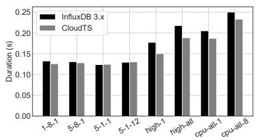  
(a) CloudTS vs. InfluxDB: query duration.

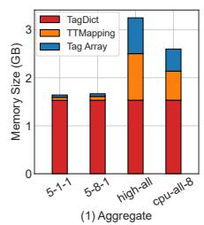

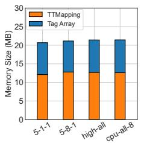  
(b) Metadata memory during long-term retention. (c) CloudTS performance under heavy label churn.

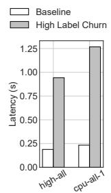

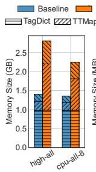

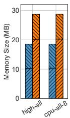  
Figure 8: (a) Query duration comparison between CloudTS and InfluxDB 3.x. (b) Metadata memory during long-term retention. (c) Evaluation of CloudTS performance under heavy label churn, compared to its operation on the original dataset (referred to as “Baseline”): (1) query duration; (2) aggregate metadata memory consumption; and (3) per-partition metadata memory consumption.

## 5 Related Work

OpenTSDB. OpenTSDB [34] is a distributed timeseries database based on HBase [18]. It stores all the metadata and data in HBase table, and the query performance is decided by backend HBase. CloudTS separately manages metadata and data and significantly reduces metadata access amplification.

ModelarDB. ModelarDB [22, 23] proposes a category of model-based compressions methods for timeseries and groups timeseries data for storage. Different from ModelarDB, CloudTS globally manages timeseries metadata and aims to distinguish timeseries by frequency to speed up query procedure with timeseries groups.

TVStore TVStore [4] introduces an adaptive timeseries ID management strategy using Time-Varying Compression (TVC), dynamically compressing older data based on its age while preserving consistent IDs. This approach balances storage efficiency with query accuracy, avoiding abrupt data loss. Unlike TVStore, which focuses on compression-based storage optimization, our method targets to reduce metadata redundancy and enhance query performance.

InfluxDB. InfluxDB 2 [1] leverages Time-Structured Merge (TSM) Tree [20] to maintain all data. Similar to Cortex, each TSM file will store all the data in a period of time. CloudTS can also cooperate with InfluxDB 2 to improve timeseries metadata query performance. InfluxDB 3.x [2] prioritizes low-latency access to recent data via ingesters and caches. However, large-scale historical queries may require scanning many Parquet files and loading column chunks, resulting in longer query paths. In contrast, CloudTS optimizes large-scale cold-data queries by reading only relevant object chunks using compacted metadata, significantly reducing read amplification. Although initial access may incur latency,

CloudTS maintains a local cache of recently ingested and accessed data chunks to support low-latency access to hot data at fine granularity.

ByteSeries. ByteSeries [45] is an in-memory timeseries database that efficiently compresses both timeseries metadata and data points. It proposes to utilize a trie-based structure for compressed inverted index in querying. Different from ByteSeries, the trie-based structure of CloudTS is designed to handle unified tag pairs index globally and can be utilized for all timeseries directly to avoid unnecessary metadata access.

TimescaleDB. TimescaleDB [42] is a timeseries SQL database providing fast analytics and scalability, with automated data management on a proven storage engine. Different from relational database, CloudTS separately manages timeseries metadata.

## 6 Conclusion

In this paper, we introduce CloudTS, a novel timeseries data management scheme designed specifically for cloud storage environments. CloudTS separately manages timeseries metadata and data and minimizes metadata redundancy, leveraging the inherent characteristics of object-based cloud storage. CloudTS demonstrates its ability to substantially reduce query latency by efficiently decreasing the volume of data transmission during query processing. A prototype of CloudTS is integrated with Cortex, exhibiting significant query speedup and minimum network bandwidth waste.

## Acknowledgments

We thank our shepherd, Uday Kiran Jonnala, and the anonymous reviewers for their constructive feedback and insightful comments. The work described in this paper is supported by the grants from the Research Grants Council of the Hong Kong Special Administrative Region, China (GRF 14219422, GRF 14202123).

## References

[1] InfluxDB 2. https://docs.influxdata.com/ influxdb/v2/.

[2] InfluxDB 3. https://docs.influxdata.com/ influxdb3/core/.

[3] Timescale. TSBS: a tool for comparing and evaluating databases for time series data. https://github.com/ timescale/tsbs.

[4] Yanzhe An, Yue Su, Yuqing Zhu, and Jianmin Wang. TVStore: Automatically bounding time series storage via Time-Varying compression. In 20th USENIX Conference on File and Storage Technologies (FAST 22), pages 83–100, Santa Clara, CA, February 2022. USENIX Association.

[5] Michael P. Andersen and David E. Culler. Btrdb: Optimizing storage system design for timeseries processing. In FAST, 2016.

[6] Cortex HTTP API. https://cortexmetrics.io/ docs/api/.

[7] Cortex Architecture. https://cortexmetrics.io/ docs/architecture/.

[8] InfluxDB 3.0: System Architecture. https://www.influxdata.com/blog/ influxdb-3-0-system-architecture/.

[9] James Lopez Bernal, Steven Cummins, and Antonio Gasparrini. Interrupted time series regression for the evaluation of public health interventions: a tutorial. International Journal of Epidemiology, 46(1):348–355, 06 2016.

[10] Wei Cao, Yusong Gao, Feifei Li, Sheng Wang, Bingchen Lin, Ke Xu, Xiaojie Feng, Yucong Wang, Zhenjun Liu, and Gejin Zhang. Timon: A timestamped event database for efficient telemetry data processing and analytics. In Proceedings of the 2020 ACM SIGMOD International Conference on Management of Data, pages 739–753, 2020.

[11] Microsoft Azure Storage Secure cloud storage. https://azure.microsoft.com/en-us/services/ storage/.

[12] Cortex. https://cortexmetrics.io/.

[13] Amazon Elastic Block Store (EBS). https://aws. amazon.com/ebs/.

[14] Amazon Elastic Compute Cloud (EC2). https://aws. amazon.com/ec2/.

[15] Philippe Esling and Carlos Agon. Time-series data mining. ACM Computing Surveys (CSUR), 45(1):1–34, 2012.

[16] Prometheus Node Exporter. https://github.com/ prometheus/node\_exporter.

[17] Apoorv Gupta, Aman Bansal, and Vidhi Khanduja. Modern lossless compression techniques: Review, comparison and analysis. In 2017 Second International Conference on Electrical, Computer and Communication Technologies (ICECCT), pages 1–8. IEEE, 2017.

[18] Apache hbase project. https://hbase.apache.org/.

[19] Binbing Hou, Feng Chen, Zhonghong Ou, Ren Wang, and Michael Mesnier. Understanding i/o performance behaviors of cloud storage from a client’s perspective. ACM Trans. Storage, 13(2), may 2017.

[20] Influxdata. In-memory indexing and the time-structured merge tree (tsm). https://docs.influxdata. com/influxdb/v1.7/concepts/storage\_engine/, 2020.

[21] InfluxDB. https://influxdata.com/.

[22] Søren Kejser Jensen, Torben Bach Pedersen, and Christian Thomsen. Scalable model-based management of correlated dimensional time series in modelardb+. In 2021 IEEE 37th International Conference on Data Engineering (ICDE), pages 1380–1391. IEEE, 2021.

[23] Søren Kejser Jensen, Christian Thomsen, and Torben Bach Pedersen. Modelardb: integrated model-based management of time series from edge to cloud. In Transactions on Large-Scale Data-and Knowledge-Centered Systems LIII, pages 1–33. Springer, 2023.

[24] Ana Klimovic, Heiner Litz, and Christos Kozyrakis. Selecta: Heterogeneous cloud storage configuration for data analytics. In 2018 USENIX Annual Technical Conference (USENIX ATC 18), pages 759–773, Boston, MA, July 2018. USENIX Association.

[25] Panagiotis Liakos, Katia Papakonstantinopoulou, and Yannis Kotidis. Chimp: efficient lossless floating point compression for time series databases. Proceedings of the VLDB Endowment, 15(11):3058–3070, 2022.

[26] Xinyu Liu, Zijing Wei, Wenqing Yu, Shaozhi Liu, Gang Wang, Xiaoguang Liu, and Yusen Li. Khronos: A realtime indexing framework for time series databases on large-scale performance monitoring systems. In Proceedings of the 32nd ACM International Conference on Information and Knowledge Management, CIKM ’23, page 1607–1616, New York, NY, USA, 2023. Association for Computing Machinery.

[27] Sumo logic. https://www.sumologic.com/.

[28] LogicMonitor. https://www.logicmonitor.com/.

[29] Ajit Kumar Mahapatra and Sitanath Biswas. Inverted indexes: Types and techniques. International Journal of Computer Science Issues (IJCSI), 8(4):384, 2011.

[30] Najme Mansouri and Mohammad Masoud Javidi. A new prefetching-aware data replication to decrease access latency in cloud environment. Journal of Systems and Software, 144:197–215, 2018.

[31] Yaser Mansouri, Adel Nadjaran Toosi, and Rajkumar Buyya. Data storage management in cloud environments: Taxonomy, survey, and future directions. ACM Comput. Surv., 50(6), dec 2017.

[32] Yancan Mao, Zhanghao Chen, Yifan Zhang, Meng Wang, Yong Fang, Guanghui Zhang, Rui Shi, and Richard T. B. Ma. Streamops: Cloud-native runtime management for streaming services in bytedance. Proc. VLDB Endow., 16(12):3501–3514, August 2023.

[33] Isaac Odun-Ayo, Olasupo Ajayi, Boladele Akanle, and Ravin Ahuja. An overview of data storage in cloud computing. In 2017 International Conference on Next Generation Computing and Information Systems (IC-NGCIS), pages 29–34, 2017.

[34] OpenTsdb. http://opentsdb.net/.

[35] Apache Parquet. https://parquet.apache.org/.

[36] Prometheus. https://prometheus.io/.

[37] Prometheus. https://github.com/prometheus/ prometheus/blob/main/tsdb/docs/format/ index.md.

[38] Thanawin Rakthanmanon, Bilson Campana, Abdullah Mueen, Gustavo Batista, Brandon Westover, Qiang Zhu, Jesin Zakaria, and Eamonn Keogh. Addressing big data time series: Mining trillions of time series subsequences under dynamic time warping. ACM Transactions on Knowledge Discovery from Data (TKDD), 7(3):1–31, 2013.

[39] Amazon Simple Storage Service (S3). https://aws. amazon.com/s3/.

[40] Miguel Saez, Francisco P. Maturana, Kira Barton, and Dawn M. Tilbury. Real-time manufacturing machine and system performance monitoring using internet of things. IEEE Transactions on Automation Science and Engineering, 15(4):1735–1748, 2018.

[41] JSON Time Series. https://docs.eagle.io/en/ latest/reference/historic/jts.html.

[42] Timescale: Time series data simplified. https://www. timescale.com/.

[43] Amazon Web Services. https://aws.amazon.com/.

[44] Chunhui Shen, Qianyu Ouyang, Feibo Li, Zhipeng Liu, Longcheng Zhu, Yujie Zou, Qing Su, Tianhuan Yu, Yi Yi, Jianhong Hu, Cen Zheng, Bo Wen, Hanbang Zheng, Lunfan Xu, Sicheng Pan, Bin Wu, Xiao He, Ye Li, Jian Tan, Sheng Wang, Dan Pei, Wei Zhang, and Feifei Li. Lindorm tsdb: A cloud-native time-series database for large-scale monitoring systems. Proc. VLDB Endow., 16(12):3715–3727, August 2023.

[45] Xuanhua Shi, Zezhao Feng, Kaixi Li, Yongluan Zhou, Hai Jin, Yan Jiang, Bingsheng He, Zhijun Ling, and Xin Li. Byteseries: an in-memory time series database for large-scale monitoring systems. In Proceedings of the 11th ACM Symposium on Cloud Computing, pages 60–73, 2020.

[46] Google Cloud Storage. https://cloud.google.com/ storage.

[47] Thanos. https://thanos.io/.

[48] Dat Thanh Tran, Alexandros Iosifidis, Juho Kanniainen, and Moncef Gabbouj. Temporal attention-augmented bilinear network for financial time-series data analysis. IEEE Transactions on Neural Networks and Learning Systems, 30(5):1407–1418, 2019.

[49] Alexander Visheratin, Alexey Struckov, Semen Yufa, Alexey Muratov, Denis Nasonov, Nikolay Butakov, Yury Kuznetsov, and Michael May. Peregreen–modular database for efficient storage of historical time series in cloud environments. In 2020 USENIX Annual Technical Conference (USENIX ATC 20), pages 589–601, 2020.

[50] Fang Wang, Menggang Li, Yiduo Mei, and Wenrui Li. Time series data mining: A case study with big data analytics approach. IEEE Access, 8:14322–14328, 2020.

[51] Zhiqi Wang and Zili Shao. Forestti: A scalable invertedindex-oriented timeseries management system with flexible memory efficiency. Proceedings of the ACM on Management of Data, 1(2):1–25, 2023.

[52] Jinzhao Xiao, Yuxiang Huang, Changyu Hu, Shaoxu Song, Xiangdong Huang, and Jianmin Wang. Time series data encoding for efficient storage: A comparative analysis in apache iotdb. Proceedings of the VLDB Endowment, 15(10):2148–2160, 2022.

[53] Jin Xue, Zhiqi Wang, Tianyu Wang, and Zili Shao. Tagtree: Global tagging index with efficient querying for time series databases. In 2022 IEEE International Parallel and Distributed Processing Symposium (IPDPS), pages 1283–1293. IEEE, 2022.