USENIX

THE ADVANCED COMPUTING SYSTEMS ASSOCIATION

# ParaSync: Exploiting Fine-Grained Parallelism for Efficient File Synchronization

Zhihao Zhang, NICE Lab, Xiamen University; and Alibaba Cloud; Lu Tang, NICE Lab, Xiamen University; Huiba Li, Alibaba Cloud; Yue Yu, Sun Yat-sen University; Guangtao Xue, Shanghai Jiao Tong University; Jiwu Shu, Tsinghua University; Yiming Zhang, Shanghai Jiao Tong University and NICE Lab, Xiamen University

# https://www.usenix.org/conference/fast26/presentation/zhang-zhihao-parasync

This paper is included in the Proceedings of the 24th USENIX Conference on File and Storage Technologies.

February 24–26, 2026 • Santa Clara, CA, USA

ISBN 978-1-939133-53-3

Open access to the Proceedings of the 24th USENIX Conference on File and Storage Technologies is sponsored by

# ParaSync: Exploiting Fine-Grained Parallelism for Efficient File Synchronization

Zhihao Zhang1,3, Lu Tang1, Huiba Li3, Yue Yu4, Guangtao Xue2, Jiwu Shu5, Yiming Zhang2,1 1NICE Lab, XMU 2SJTU 3Alibaba Cloud 4Sun Yat-sen University 5Tsinghua University

## Abstract

File synchronization (sync) based on Content-Defined Chunking (CDC) is gaining increasing importance for data migration over networks owing to its effectiveness in detecting and eliminating duplicate data within synchronized files. CDC-based sync schemes typically comprise three phases: file chunking, chunk matching, and delta reconstruction. Unfortunately, existing sync schemes fail to exploit parallelism inherent in these phases due to two dependencies: a sequential bottleneck in chunking, where checksums are computed only after boundaries are finalized, and rigid client-server stalls that serialize matching and reconstruction.

This paper presents ParaSync, a novel CDC-based file sync scheme that breaks these dependencies to exploit finegrained parallelism. First, ParaSync’s multi-threaded chunking algorithm reduces checksum computation to a lightweight combination step, decoupling it from boundary identification while preserving invariability. Second, ParaSync designs a streaming chunk matching method that removes the all-ornothing exchange dependency on both the client and the server sides. Finally, ParaSync introduces an efficient absolute-offsetbased pipelined delta reconstruction process that maximizes the overlap between network and disk I/O operations. We have done extensive experiments over both WANs and LANs using diverse real-world datasets. The results show that compared to the state-of-the-art file sync schemes, ParaSync achieves up to 7.6× speedup for file chunking and significantly improves the overall sync performance by up to 3.7×, while maintaining a consistent level of network traffic.

## 1 Introduction

File synchronization (sync) over Wide Area Networks (WANs) and Local Area Networks (LANs) has been widely employed for updating and sharing files across multiple nodes and geographically dispersed locations in cloud storage services [7, 10, 18, 21, 54], distributed storage systems [40, 41, 45, 55], and backup tools [3, 19, 38]. Content-Defined Chunking (CDC) [21, 32, 63] is a widely adopted chunking algorithm for optimizing file sync. It can detect and eliminate redundant data between synchronized files, thus significantly reducing the volume of data transmitted over the network.

Existing CDC-based sync schemes [21, 32, 63] typically involve three phases: (1) File Chunking: both the client (holding the new file) and the server (holding the old file) apply the CDC algorithm to divide the file into variable-length chunks and calculate a weak checksum (e.g., 32-bit) for each chunk. (2) Chunk Matching: the server compares the weak checksums received from the client with those of the old file to identify the matched chunks that have the same weak checksums, and calculates a strong checksum (e.g., 256-bit) for each of them. The strong checksums are then returned to the client, which performs its own strong checksum verification to confirm the matches. (3) Delta Reconstruction: based on the verification, the client generates delta data, which is sent to the server to reconstruct the new file from the old one.

Although CDC-based file sync minimizes data transfer, its performance is often limited by computationally intensive processing. As noted in prior studies [32, 63] and observed in our experiments, the file chunking phase is the most computationally expensive part of CDC-based sync. This process dynamically determines chunk boundaries based on file content by using rolling hash [20], which scans almost every byte in the input file using a fixed-sized rolling window and calculates a hash value for each window. Once the chunk boundaries are determined, weak checksums are calculated for the resulting variable-sized chunks. The CPU-intensive nature of chunking presents a significant performance bottleneck for file sync. The problem becomes increasingly pronounced as the volume and size of files continuously increase in distributed, data-intensive computing environments [8, 67]. The common practice of bundling numerous small files into large metadata-free packed files [39, 43, 66, 72] further exacerbates this issue, as these composite files must be processed as single, monolithic units.

To alleviate this problem, several parallel chunking techniques [43,56,60,61] have been proposed by segmenting files to leverage multiple cores. However, existing techniques are inadequate for CDC-based file sync. Some approaches [56] fail to guarantee chunk invariability, which is crucial for ensuring the correctness of the CDC-based sync process. Others [43] preserve invariability but at the cost of creating a new sequential bottleneck: while potential chunk boundaries are identified in parallel, the final checksum computation is deferred to a single thread. This is a direct consequence of the dependency that checksums can only be calculated after chunk boundaries have been serially finalized. Moreover, while such methods leverage vector instructions like AVX-512 to find boundary candidates, the rolling hash algorithm’s inherently irregular data access patterns lead to poor cache utilization and limited hardware prefetching, limiting the potential performance benefits of vectorization [12, 51].

In addition to file chunking, the subsequent chunk matching and delta reconstruction phases suffer from a rigid, bidirectional client-server dependency that stalls the sync parallelism [30, 50, 65]. First, the matching process operates as an all-or-nothing exchange: the client must wait idly for the server to return all weak-checksum-matching results before it can even begin its own strong checksum verification. Following this, the delta reconstruction stage suffers from a sequential data dependency. Because patch commands rely on relative offsets (e.g., copy data after the previous block), the location of one operation depends on the completion of the last, mandating a linear application process. Collectively, these dependencies prevent effective parallelization, forcing the latencies of endpoint computation, network transfer, and disk I/O to stack sequentially rather than overlap.

To accelerate computation and achieve efficient file sync, we propose ParaSync, a novel CDC-based file sync scheme that exploits fine-grained parallelism within individual sync phases and pipelines them to minimize the overall sync time. In summary, this paper makes the following contributions:

• We profile each phase of the CDC-based file sync, identifying file chunking as the dominant computational bottleneck, and analyze the limitations of existing parallel CDC methods. Based on this analysis, we propose a multithreaded algorithm that effectively reduces the checksum computation problem to a checksum combination problem. This approach generates checksums for intermediate subchunks in parallel and then combines them in a lightweight merge stage, thereby accelerating chunking while preserving chunk invariability.

• We design a parallel chunk matching mechanism and an efficient pipelined delta reconstruction process that co-design the client and server interactions. Specifically, we introduce a streaming matching protocol to remove sync stalls and employ absolute-offset patch commands to decouple delta generation from application, enabling maximal overlap of computation, network transfer, and disk I/O.

• We implement a prototype for ParaSync and conduct a comprehensive performance evaluation. The results demonstrate that, compared to state-of-the-art CDC-based file sync schemes, ParaSync achieves up to a 7.6× speedup for file chunking and significantly improves end-to-end file sync performance by up to 3.7×, while maintaining a consistent level of network traffic.

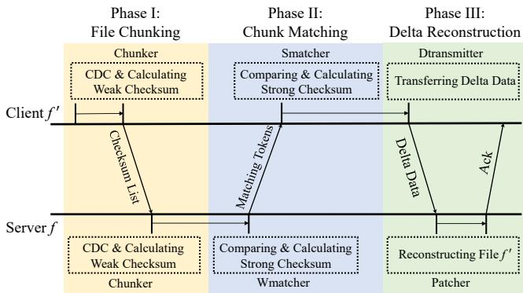  
Figure 1: Overview of CDC-based dsync workflow.

## 2 Background and Motivation

## 2.1 Delta Sync

In this subsection, we first describe the workflow of dsync, the state-of-the-art and most representative CDC-based delta sync methods [2, 9, 21], as shown in Fig. 1.

• Phase I: File Chunking. The client initially splits the new file f ′ into variable-sized chunks based on CDC and calculates weak checksums for each chunk (client-side chunking). It then transmits a list of these weak checksums to the server. Upon receiving the checksum list, the server applies the same CDC algorithm to the old file f , generating its own set of chunks and their corresponding weak checksums (server-side chunking).

• Phase II: Chunk Matching. The server identifies the weak-checksum-matched chunks and calculates their strong checksums (server-side weak checksum matching). Then, the server sends the strong checksums and metadata of matched chunks (i.e., matching tokens) back to the client. The client then computes strong checksums for its corresponding chunks and compares them against those received from the server (client-side strong checksum matching). A match in both weak and strong checksums confirms that the chunks are identical (referred to as matched chunks).

• Phase III: Delta Reconstruction. The client generates the patch commands and literal bytes (delta data), and sends them to the server. The server applies the delta data to the old file to generate a new file (server-side patching).

We conduct a detailed analysis of the dsync process in the following sections. We use the gigabyte-scale datasets described in Section 4.1, where each dataset is converted into the “mtar” (a metadata-free format) file format to serve as input for the sync process. For brevity and clarity, as illustrated in Fig. 1, we use the following simplified terms for each phase: chunker for file chunking, wmatcher for weak checksum matching, smatcher for strong checksum matching, dtransmitter for delta transmission, and patcher for patching. Fig. 3 shows the execution time for each phase of the sync process at both the client and server.

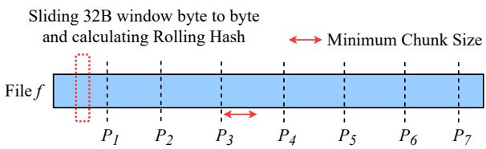  
Figure 2: Rolling process of chunking. $P _ { i }$ denotes the chunk boundaries. The red dotted box indicates the rolling window.

## 2.2 File Chunking as The Dominant Cost

The chunker scans the input file byte by byte using a fixedsized rolling window, as illustrated in Fig. 2, and computes a rolling hash for each window to identify chunk boundaries. A chunk boundary is determined when the following two conditions are satisfied: $h a s h ( C _ { w } )$ mod $n = r ,$ where $C _ { w }$ is the rolling window, n is the average chunk size, and r is a static value (typically “0”); and $S _ { m i n } < S _ { c h u n k } < S _ { m a x } .$ , where $S _ { m i n }$ and $S _ { m a x }$ are the minimum and maximum chunk sizes, respectively. Once the chunk boundaries are determined, the chunker calculates the weak checksums for each chunk.

We employ CRC32C as the rolling hash and weak checksum algorithm. We also leverage Intel SSE’s CRC hardware instructions [14, 15] to accelerate the CRC32C calculations. We set the minimum/expected average/maximum chunk sizes to 4KB/8KB/12KB, which is the same as the default chunk sizes in the Dell-EMC Data Domain system [6, 42]. After identifying a chunk boundary, we skip the minimum chunk size and continue searching for the next boundary. This avoids generating small chunks in CDC-based chunking [42, 62, 64]. As shown in Fig. 3, the chunker dominates the computational overhead in the sync process and accounts for 49.5%–75.1% (16.9s–178.2s) of the total sync time on both client and server. This computational cost scales linearly with the input file size, making it particularly detrimental for large datasets. To put this cost into perspective, we analyze the network overhead for transmitting the resulting checksum list for both WAN (500Mbps) and LAN (10Gbps) environments. This transmission takes at most 0.65s in WAN and 0.03s in LAN–a time that is negligible compared to the chunking computation. This contrast underscores that the sync critical path is dominated by endpoint computation in the file chunking phase.

## 2.3 Limitation of Existing Parallel Chunking

A straightforward approach to speed up chunking is to employ multiple threads to process the file in parallel [43, 56, 60, 61].

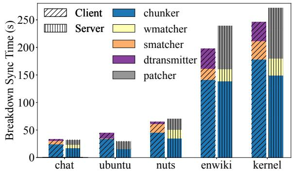  
Figure 3: Breakdown sync time for fine-grained tasks.

However, this can violate chunk invariability, the fundamental property guaranteeing consistent chunk boundaries for the same file. Because chunk boundaries are determined by the content that precedes them, arbitrarily partitioning a file for parallel processing breaks this dependency. As illustrated in Fig. 4, when a thread begins processing an arbitrary segment (Segment $S _ { 2 } )$ , it lacks the content-dependent context from the end of the previous segment. This causes boundary locations to shift $( P _ { 4 - 6 } ^ { \prime \prime } / P _ { 4 - 6 } ^ { \prime }$ versus the original $P _ { 4 - 6 } )$ , generating divergent chunks and checksums compared to a sequential scan. This discrepancy reduces matching efficiency and inflates network traffic by increasing the volume of literal data that must be transmitted.

To address this, parallel CDC methods like SS-CDC [43] enforce chunk invariability by splitting the process into two stages. In the first parallel stage, multiple threads scan the file for potential chunk boundaries (i.e., hash matches) and record them in a bit array. In the second, sequential stage, a single thread validates these candidates against size constraints to determine the final chunk boundaries. However, this introduces a critical sequential bottleneck: while boundary search is parallelized, the actual checksum computation is deferred to the single-threaded second stage. This is a direct consequence of the dependency that checksums can only be calculated after chunk boundaries have been serially finalized. They parallelize the search for cutoff points but do not compute the checksums of the actual data chunks during the parallel phase, forcing a sequential checksum calculation later.

Moreover, while such methods leverage vector instructions like AVX-512 to find boundary candidates, they face several limitations. First, SS-CDC relies on AVX scatter/gather instructions to load non-contiguous bytes into vector registers. These operations are costly and significantly constrain performance gains [36, 43, 51]. Second, the intermediate bit array scales linearly with input size, demanding excessive memory and complicating single-threaded processing. Most critically, SS-CDC’s design is tailored for data deduplication and is incompatible with checksums like CRC32C that possess algebraic properties (e.g., CRC32C [28, 33]). Because it cannot combine pre-computed values, SS-CDC is forced to serially re-calculate the checksum for each final chunk. As a result, SS-CDC fails to achieve linear scalability. Our findings (Fig. 17), consistent with prior work [51], show only moderate speedups on an 8-core server. This leaves a fundamental challenge unaddressed: How to compute checksums in parallel for chunks whose final boundaries are not yet known?

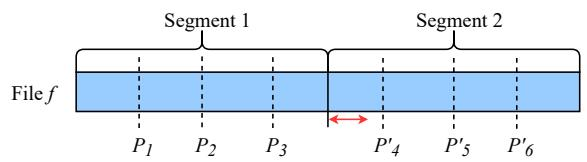

(a) Variable-sized chunks generated by two threads.  
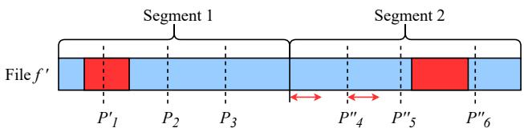  
(b) Variable-sized chunks of modified file generated by two threads. The red box denotes the modified region of the file.  
Figure 4: Illustration of a segment-based parallel chunking method that fails to produce identical chunk boundaries for the same file under multi-threaded execution.

## 2.4 The Next Bottlenecks after Chunking

While accelerating the file chunking phase is a crucial first step, our analysis reveals it is insufficient on its own for achieving efficient file sync. Optimizing a single component merely shifts the performance bottleneck to subsequent phases of the sync. To demonstrate this, we conduct an ablation study using an “ideal chunker” and an “ideal matcher”. The ideal chunker instantaneously provides pre-computed chunk boundaries and weak checksums, while the ideal matcher instantly returns pre-computed matching results. By keeping the experimental setup consistent with Fig. 3 but removing the computational cost of these phases, we can effectively isolate and measure the performance bottlenecks of the remaining sync phases.

Fig. 5 shows the results. With the chunking bottleneck removed and negligible network time for checksum list transmission (With Ideal Chunker), chunk matching (Phase II) and delta reconstruction (Phase III) emerge as the new dominant bottlenecks. Together, they account for the vast majority of the total sync time, which encompasses computation at both endpoints and the network transfer of metadata and data (i.e., literal bytes). This finding underscores the need for a holistic approach that optimizes the entire sync process. We now proceed to analyze these two subsequent bottlenecks in detail.

Chunk Matching. In this phase, the server-side wmatcher identifies candidate matches by building a hash table of weak checksums from the chunks of the new file. For each candidate, it then computes the corresponding strong checksum. The client-side smatcher, upon receiving these strong checksums, constructs its own strong hash table and compares the strong checksums of the new file’s chunks against those received to confirm matches. We employ a memory-efficient cuckoo hash table [1, 44] to construct the index and utilize BLAKE3 [11,24] as the strong checksum. As shown in Fig. 5, with the chunking bottleneck removed, the combined execution time of wmatcher and smatcher accounts for 0.9%–23.1% (1.2s–64.6s) of the total sync time in WAN, and 3.7%–53.4% in LAN. The lower end of this range corresponds to datasets with low data similarity (e.g., Ubuntu), which result in fewer matches and thus less computational work.

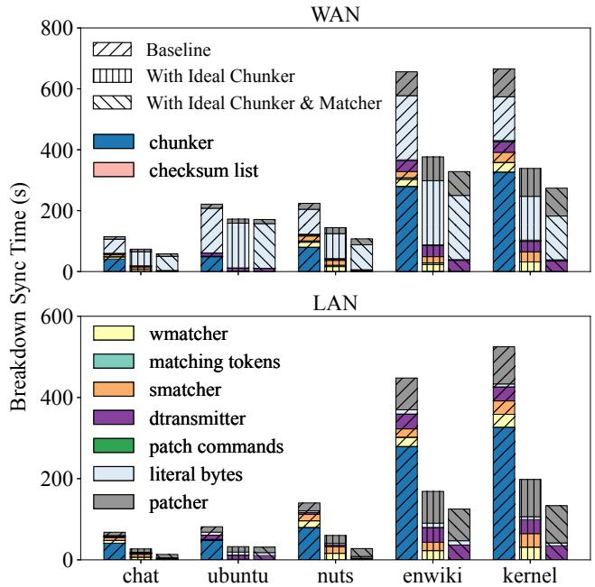  
Figure 5: Breakdown sync time in an ablation study. We compare the Baseline (dsync) against configurations with an ideal (zero-cost) chunker and with ideal chunker and matcher.

This overhead stems from two sources: the high computational cost of strong checksums and, more critically, a rigid client-server dependency we term the All-or-Nothing Checksum Exchange. The client must wait idly for the server to finish processing the entire file before it can begin its own strong checksum verification. This serialization forces the client to remain idle while waiting for the full response and leaves the network underutilized as the server computes. This dependency, exacerbated by network latency, creates a significant pipeline stall and presents a fundamental challenge: How to break this rigid sync to enable overlapping computation and communication between the client and server during chunk matching?

Delta Reconstruction. Once the client-side smatcher confirms a set of matched chunks, the dtransmitter produces patch commands and literal bytes to the server. The patch commands include two types: (i) copy commands, which instruct the server to copy data from the old file version for chunks that matched, and (ii) literal commands, which are accompanied by the raw byte data for new, unmatched chunks. The server’s patcher then consumes this stream of commands to reconstruct the new file. This entire phase involves significant disk I/O for file reads/writes and network I/O for transmitting the delta. In the evaluation, we use a C++ lightweight coroutine library [4, 5] for efficient I/O handling. As shown in Fig. 5, with the chunking bottleneck removed, the combined execution of the dtransmitter and patcher accounts for 13.9%– 44.7% of the total sync time in WAN and 39.2%–73.5% in LAN. The network transfer of literal bytes further consumes 49.2%–85.4% of the sync time in WAN.

Table 1: Comparison of parallelism. ✔: Efficiently Supported; : Inefficiently Supported; ✕: Not Supported. —: Not Applicable.
<table><tr><td></td><td>Intra- Phase I</td><td>Intra- Phase II</td><td>Intra- Phase III</td><td>Inter- Phase</td></tr><tr><td>rsync</td><td>-×</td><td>1</td><td>-×</td><td>v</td></tr><tr><td>dsync</td><td></td><td>×</td><td></td><td>一</td></tr><tr><td>pdsync</td><td>0</td><td>O</td><td>0</td><td></td></tr><tr><td>ParaSync</td><td>v</td><td>v</td><td>v</td><td></td></tr></table>

The fundamental bottleneck in this phase is the Sequential Dependency in Delta Reconstruction. Prior works typically use relative offsets for patch commands (e.g., insert data after the previous chunk), where the target location of one operation depends entirely on the completion of the preceding one. Consequently, the application of patch N depends on the completion of patch N − 1, preventing the server from applying patches in parallel or out-of-order. This forces the latencies of endpoint computation, network transfer, and disk I/O to stack sequentially rather than overlap, presenting a final challenge: How to decouple the application of patch commands to enable parallel reconstruction and overlap network transfer with disk I/O?

## 2.5 Parallelism Gap in Existing Sync Methods

After identifying the bottlenecks in the sync process, we analyze the parallelism characteristics of existing sync methods to pinpoint the gaps that ParaSync aims to fill. As summarized in Table 1, we categorize parallelism into three intra-phase types and one inter-phase type: (i) Intra-phase parallelism within file chunking (Intra-Phase I), (ii) Intra-phase parallelism within chunk matching (Intra-Phase II), (iii) Intra-phase parallelism within delta reconstruction (Intra-Phase III) and (iv) Interphase parallelism (pipelining) across different phases.

The Limits of CDC-based Parallelism. The original dsync [32, 63] is entirely sequential, offering no parallelism within or between phases. To establish a stronger baseline, we design and implement pdsync, which parallelizes dsync using stateof-the-art techniques. However, its parallelism is fundamentally constrained by unresolved data dependencies. Its chunking phase relies on SS-CDC [43], which, as noted in Section 2.3, simply pushes the checksum bottleneck to a serialized second stage. More critically, while pdsync can parallelize the internal computation of matching, it cannot break the All-or-Nothing Checksum Exchange barrier; the client still stalls until the server completes its work. Similarly, its reconstruction phase remains bound by relative offsets, forcing sequential application of patches. Thus, even with multi-threading, pdsync suffers from significant pipeline stalls where resources at one endpoint sit idle while waiting for the other.

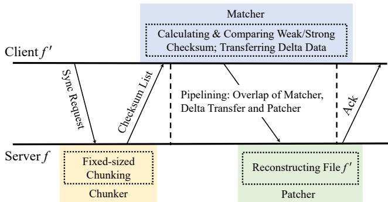  
Figure 6: The pipelined model of rsync.

The rsync Pipeline and its Incompatibility. Traditional delta sync methods like rsync [50, 65] (famously used by Dropbox [7]) employ FSC. While generally less efficient than CDCbased methods due to the boundary-shift issue [32, 58, 63], rsync introduces a different pipelined model to mitigate network latency. The rsync workflow differs fundamentally from dsync, as illustrated in Fig. 6. The server (holding the old file) first divides its file into fixed-sized chunks and sends their weak and strong checksums to the client. The client (holding the new file) then uses a rolling hash to find potential matches against the received weak checksums and verifies them with strong checksums. This workflow enables an effective three-stage pipeline, where the client’s matching, delta generation, and network transfer can be overlapped with the server’s reconstruction.

The pipelined model of rsync is incompatible with CDCbased sync workflow, which typically involves three sync barriers, both intra- and inter-phase: (i) the server’s wmatcher waiting for the client’s weak checksums (after client chunking and network transfer), (ii) the client’s smatcher waiting for the server’s strong checksums (after server wmatcher and network transfer), and (iii) the client’s dtransmitter waiting for smatcher completion (to organize metadata for all matched chunks before generating commands). These barriers create a client-server-client dependency that disrupts the continuous, unidirectional data flow required for rsync’s pipelining. This exposes an unresolved trade-off in existing sync systems: one must choose between rsync’s efficient pipelining at the cost of higher computation, or dsync’s reduced computation at the cost of a stall-prone workflow.

Our work is motivated by the conviction that achieving high-performance CDC-based sync requires a holistic approach that co-designs internal parallelism across all phases. Therefore, ParaSync is architected to close these parallelism gaps by breaking the fundamental dependencies we have identified. It achieves this by introducing: (i) a scalable parallel chunking algorithm that decouples boundary identification from checksum computation, (ii) a streaming matching protocol that eliminates the stall-inducing all-or-nothing exchange, and (iii) a deeply pipelined reconstruction process using absolute offsets to enable parallel patch application. By tackling these challenges in concert, ParaSync modernizes file sync to fully harness the power of contemporary hardware, delivering significant performance improvements.

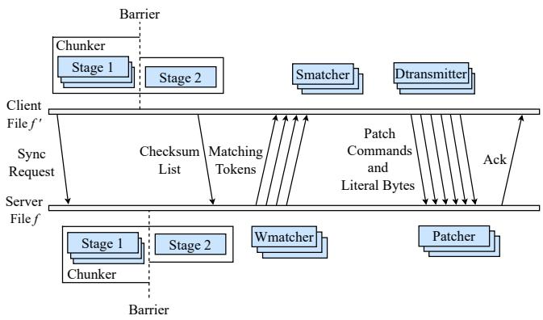  
Figure 7: The overall architecture and workflow of ParaSync. “Barrier” is the thread barrier used to synchronize threads.

## 3 Design of ParaSync

Fig. 7 shows the overall architecture and workflow of ParaSync. When initiating the sync for a file, the client first sends a sync request to the server to perform the file chunking process at the client and server. The process begins with the parallel first stage of the chunker, followed by the singlethreaded second stage on both the client and server sides. After receiving the checksum list of the new file and completing the chunking process, the server proceeds with the parallel chunk matching process, which is parallelized with the client’s smatcher. Subsequently, the smatcher generates copy patch commands in parallel. The dtransmitter processes these commands, generates and transfers literal bytes. Concurrently, the server receives these bytes and applies them to a new file. We describe the designs for parallel chunking, parallel chunk matching, and delta reconstruction in Sections 3.1, 3.2, and 3.3, respectively.

## 3.1 Parallel Chunking

The core challenge in parallelizing CDC is the dependency between chunk boundary identification and checksum computation. Previous methods parallelize the search for boundaries but defer checksum calculation to a sequential second stage, creating a new bottleneck. ParaSync addresses this by reducing the checksum computation problem to a checksum combination problem. It uses a two-stage design (Fig. 8) where sub-chunk checksums are computed in parallel and then combined in a lightweight sequential merge. In the first stage, the input data is first partitioned into equal-size segments $( S _ { 1 - 4 } ) .$ each of which is assigned to a separate thread for processing. Each thread then slides a fixed-sized window $( C _ { w } )$ across its segment, computing a hash for the window’s contents at each position.

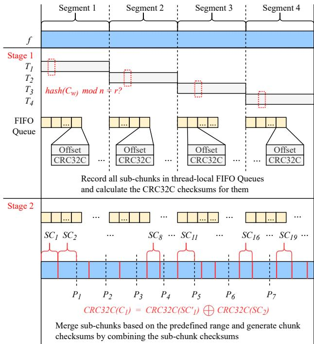  
Figure 8: Parallel chunking of ParaSync. In Stage 1, multiple threads chunk the file in parallel and calculate weak checksums for each sub-chunk (denoted as “SC”). In Stage 2, a single thread merges the sub-chunks and combines the weak checksums of the sub-chunks.

When a hash value satisfies the condition hash $\left( C _ { w } \right)$ mod $n = r$ (see Section 2.2), the thread identifies a potential chunk boundary. This boundary defines the end of a subchunk, which is a portion of a segment between two such boundaries. The thread then pushes the metadata of the subchunk into a thread-local FIFO queue. Each queue entry contains the sub-chunk offset (8-byte) and CRC32C checksum (4-byte). For instance, in Fig. 8, the thread processing segment S1 generates sub-chunks $S C _ { 1 }$ and SC2, upon encountering potential chunk boundaries. Given an expected average chunk size of 8KB, the queue remains small even for large files. For example, the queue size for a 256 GB file would be approximately 384 MB $( 2 ^ { 3 8 } / 2 ^ { 1 3 } \times 1 2 \mathrm { - b y t e } )$ . The memory overhead of the queue can be further optimized by dynamically allocating memory on demand [16, 22]. Specifically, the thread allocates a small, fixed-size array, records sub-chunk metadata using array indices, and pushes the full array into the queue before allocating a new one.

In the second stage, a single thread merges adjacent subchunks to form the final chunks. This process guarantees chunk invariability because the merge logic is deterministic: the thread scans the sub-chunk metadata from a canonical, ordered stream produced by concatenating the threadlocal queues and applies consistent size-based rules $( S _ { m i n } <$ $S _ { c h u n k } < S _ { m a x } )$ to finalize boundaries. Notably, the merge operation does not necessitate recalculating the hash value for the resulting chunk, as the CRC32C checksum of the merged chunk can be derived by combining the CRC32C checksums of its constituent sub-chunks. For instance, as illustrated in Fig. 8, ParaSync merges sub-chunks $S C _ { 1 }$ and $S C _ { 2 }$ into chunk $C _ { 1 }$ , as the cumulative size from the start of $S C _ { 1 }$ to the end of $S C _ { 2 }$ is within the range. The CRC32C checksums of $C _ { 1 }$ can be computed by XORing the CRC32C checksums of its constituent sub-chunks as follows:

$$
C R C 3 2 C ( C _ { 1 } ) = C R C 3 2 C ( S C _ { 1 } ^ { \prime } ) \oplus C R C 3 2 C ( S C _ { 2 } )\tag{1}
$$

$S C _ { 1 } ^ { \prime }$ is constructed by appending n zero bytes to $S C _ { 1 }$ , where n is the size of $S C _ { 2 }$

This approach leverages the linearity property of CRC32C checksums [14, 35], enabling the final checksum of a merged chunk to be efficiently derived from its constituent sub-chunks without rereading data. During the first stage, worker threads independently compute weak checksums for each sub-chunk, accelerated by lightweight SSE instructions [13]. A thread barrier synchronizes the completion of this parallel work before initiating the second stage. Here, a single thread finalizes chunks by combining their pre-computed checksums and recording the metadata as a 16-byte tuple: <offset, length (4- byte), crc32c>. The merge operation is lightweight because it processes only small, in-memory metadata rather than the file data itself. Consequently, it avoids becoming a sequential bottleneck, in stark contrast to approaches that necessitate a full, data-dependent recalculation.

## 3.2 Parallel and Streaming Chunk Matching

In traditional CDC-based sync, the chunk matching phase is crippled by a rigid client-server dependency (the All-or-Nothing Checksum Exchange). ParaSync breaks this dependency with a streaming chunk matching protocol that enables overlapping computation and communication. To reduce network traffic, the client sends only one CRC32C checksum for chunks that share the same CRC32C checksum in the new file. Consequently, the client must first construct a weak hash table (Fig. 9) for the new file to store the metadata of its chunks. Each entry in the hash table contains an array of metadata associated with the chunks, enabling and facilitating the parallel chunk matching process.

A naive parallel approach on the server, where worker threads are assigned distinct weak checksums, is ineffective due to severe load imbalance. As shown in Fig. 10, the distribution of chunks per weak checksum is highly skewed, which would lead to long-tail latency. For example, our datasets show that while 80%–90% of CRC32C checksums are associated with fewer than 10 chunks, 3%–5% are linked to more than 100, and 0.1%–0.5% map to over 1,000. In one observed case, a single checksum is shared by 120,000 chunks, demonstrating the flaw in this static assignment strategy.

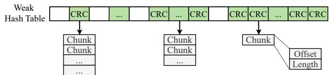

Figure 9: The hash table used for weak checksum lookup during parallel chunk matching.  
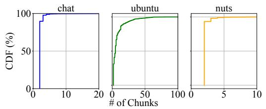

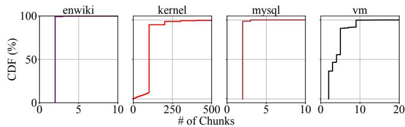  
Figure 10: The cumulative distribution of weak-checksummatched chunks sharing the same CRC32C checksum.

ParaSync addresses this with a dynamic workload distribution mechanism that enables streaming. Instead of assigning checksums to threads, ParaSync treats the list of chunks associated with a highly-colliding weak checksum as a work queue. The key idea is to divide chunks that share the same CRC32C checksum into multiple segments and assign each segment to a separate thread for processing. As shown in Fig. 11, for example, the wmatcher divides the 8 chunks from 3 different CRC32C checksums into 4 segments, which are then assigned to 4 threads $( T _ { 1 - 4 } )$ . The threads record the matching tokens in a pre-allocated array, whose size corresponds to the number of chunks sharing the same CRC32C checksum. Once a thread finishes computing strong checksums for its assigned segment, the resulting matching tokens are immediately dispatched to the client in a small batch, rather than being buffered until the entire file is processed.

On the client side, the smatcher operates in a pipelined fashion. Upon receiving a batch of matching tokens, it immediately builds a small strong hash sub-table for just those tokens and begins verification in parallel. This transforms the rigid, bulk exchange into a continuous stream, allowing the client’s smatcher to overlap its work with the server’s wmatcher and the network transfer. Moreover, for chunks sharing the same CRC32C checksum in the new file, the smatcher also divides them into multiple segments and assigns each segment to a separate thread, similar to the wmatcher’s approach. These threads calculate the BLAKE3 checksum and search for matches in the strong hash sub-table of the old file. To optimize resource usage, memory for hash sub-tables is reused for subsequent batches. For the identified strongchecksum-matched chunks, the thread records the metadata of these chunks in a global queue, which is subsequently processed by the dtransmitter.

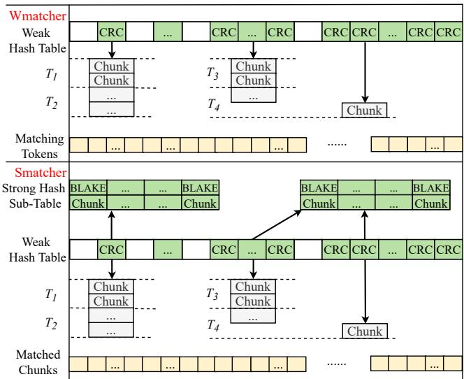  
Figure 11: The parallel chunk matching process of ParaSync.

## 3.3 Delta Reconstruction

After identifying matched chunks, the dtransmitter scans the offset and length of these matched chunks, and generates patch commands and literal bytes. The application of each patch depends on the successful completion of the one before it, forcing the server to process commands in a sequential order. This dependency prevents the parallel application of patches and inhibits the effective overlap of network transfer, disk I/O, and computation.

Fig. 12 illustrates the conventional delta generation process, typical of schemes like rsync [7, 49, 50] and dsync [32, 63]. The process relies on a single thread to sequentially scan the list of matched chunks, identifying gaps in data coverage and issuing commands relative to the previous operation. As the dtransmitter processes the matched chunks (e.g., matching chunks $M C _ { 1 }$ through $M C _ { 4 } )$ , it determines the necessary operations based on the continuity of offsets:

• Processing MC1: The scanner identifies MC1 as a match. However, it cannot immediately issue a command because it needs to check for any gaps before or after this chunk.

• Processing $M C _ { 2 } { \mathrm { : } }$ Upon examining $M C _ { 2 } .$ , the dtransmitter detects that $M C _ { 2 } { \ ' } _ { \mathrm { { s } } }$ start offset does not align with $M C _ { 1 } { \ ' } _ { \mathrm { { s } } }$ end offset. This discrepancy indicates an intervening sequence of literal bytes (new data). Consequently, the system first generates a copy command for $M C _ { 1 } \left( P A C _ { 1 } \right)$ ), followed immediately by an insert command (PAC2) containing the literal bytes located between $M C _ { 1 }$ and $M C _ { 2 }$

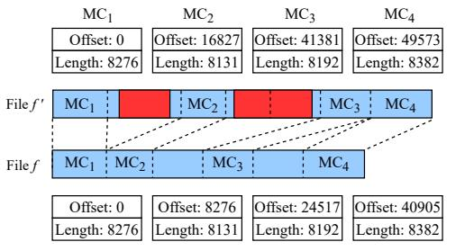

Scan the matched chunks' metadata sequentially ↓  
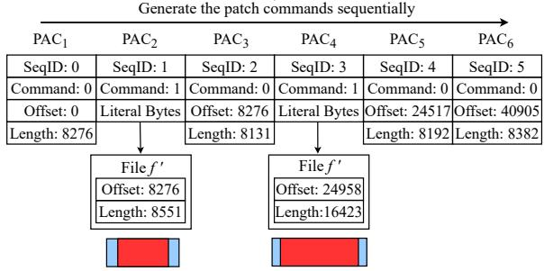  
Figure 12: The sequential delta data generation process. $\mathbf { \ddot { \theta } } ^ { 6 6 } \mathbf { M } \mathbf { C } ^ { \mathbf { \pi } }$ : Matched Chunks. “PAC”: PAtch Commands.

• Processing $M C _ { 3 } { \mathrm { : } }$ Similarly, a gap is found between $M C _ { 2 }$ and $M C _ { 3 }$ . The system generates a copy command for $M C _ { 2 }$ $( P A C _ { 3 } )$ and an insert command for the literal bytes $( P A C _ { 4 } )$

• Processing $M C _ { 4 } { \mathrm { : } }$ The scanner finds that $M C _ { 4 }$ immediately follows $M C _ { 3 }$ in the new file. However, because their corresponding locations in the old file are non-adjacent, distinct copy commands $( P A C _ { 5 }$ and $P A C _ { 6 } )$ must be generated to assemble them in the correct order.

As shown in Figure 13, while this approach allows for partial pipelining, where literal bytes can be transferred while the next command is being computed, a fundamental stall remains at the server. The application of any given command (e.g., inserting the literal bytes of $P A C _ { 2 } )$ is strictly blocked until the preceding command (e.g., copying $M C _ { 1 } )$ has fully completed. This serialization is unavoidable because the target offset for each operation is relative, implicitly determined only after the previous operation finishes writing. Consequently, the server cannot parallelize patch application or process independent file regions out-of-order, leaving disjointed CPU and I/O resources idle.

## 3.3.1 Pipelined Delta Reconstruction in ParaSync.

To break this sequential dependency, ParaSync introduces a pipelined delta reconstruction process centered on a key insight: using absolute offsets in all patch commands. This decouples the generation of the delta from its application.

The process begins with an improved parallel smatcher (Fig. 14), which directly generates copy commands as it identifies matched chunks. Crucially, each command is self-contained. A copy command specifies not only the source offset and length in the old file but also the absolute target offset in the new file (offset′). Similarly, an insert command contains the literal data’s length and its absolute target offset. This new format is nearly identical to the metadata of matched chunks, allowing ParaSync to avoid allocating additional memory for copy commands. By embedding the absolute target offset directly within each command, ParaSync eliminates the sequential dependency. The server no longer needs to wait for patch N −1 to finish to know where to place the data for patch N. This enables a deeply pipelined workflow, as illustrated in Fig. 15, that overlaps client-side generation, network transfer, and server-side application.

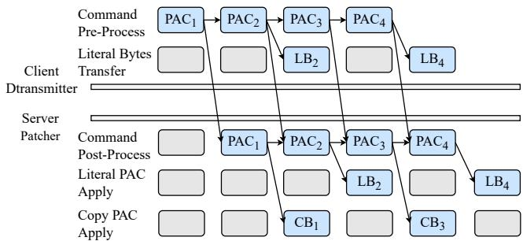  
Figure 13: Partial pipelining. “CD”: commands. “LB”: literal bytes. “CB” : copy bytes.

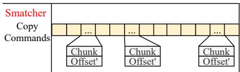  
Figure 14: Improved parallel smatcher in ParaSync, directly generating copy patch commands for matched chunks.

ParaSync further exploits this decoupling to maximize I/O efficiency. Literal data typically constitutes the bulk of the transfer volume and can be handled independently of command sequencing. Consequently, ParaSync segments literal data into fixed-sized chunks. These chunks are transferred concurrently to the server using multiple streams, akin to BitTorrent [23, 27].

On the server side, upon receiving literal data chunks (potentially via an I/O ring mechanism), ParaSync writes these chunks sequentially to the target file. This sequential write strategy enhances I/O efficiency, as sequential write throughput significantly exceeds that of random writes, even on modern storage like NVMe SSDs [37, 48]. Furthermore, this achievable write throughput often exceeds typical WAN bandwidth and approaches LAN speeds.

While writing the current portion of literal bytes, the server can simultaneously use another thread to begin sequentially copying chunks from the old file to the new file based on copy commands, even if subsequent literal bytes have not yet arrived. Once sufficient literal bytes are received, the write thread resumes writing the next portion. This overlapping of network transfers, literal data writes, and copy command execution maximizes utilization of both network and disk I/O bandwidth. Additionally, this method ensures that the pipeline remains full, guaranteeing that there is always data "in flight" on the network.

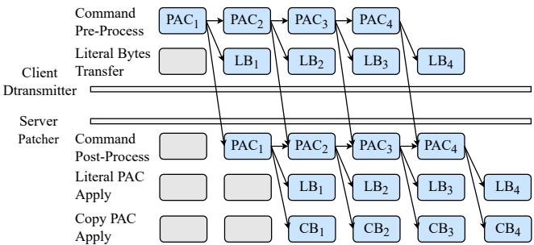  
Figure 15: Pipelining in ParaSync.

## 4 Evaluation

## 4.1 Experimental Setup

Testbed. Our experiments are conducted on three cloud ECS instances. Each instance is equipped with a 16-core Intel Xeon 8269CY CPU @2.5GHz and 512GB memory, running Ubuntu 22.04 (Linux kernel 5.15.0-71). In our setup, each thread is pinned to a separate physical core, limiting the maximum thread count per instance to 16. We choose this limit to fully utilize the available physical cores while avoiding the complexity and potential performance bottlenecks associated with higher thread counts on this architecture, such as increased resource contention, context switching overhead, and NUMA locality issues [31, 52, 53]. The storage devices are three 4TB cloud disks with EXT4 file system, each of which has a sequential read/write speed of 1400/1000 MB/s for single-threaded access. Instances 1 and 2 are deployed in separate data centers, connected by a WAN with 50ms average Round Trip Time (RTT) and 500Mbps bandwidth. Instances 2 and 3 are co-located in the same data center, connected by a LAN with 0.4ms average RTT and 10Gbps bandwidth.

Delta Sync Methods. We evaluate the performance of the following delta sync methods:

• Dsync. We implement dsync based on its published description [32] (∼1800 LoC C++), as the original prototype of dsync is not open-source. Dsync executes each sync phase sequentially using a single thread.

• PDsync (Parallel Dsync). Built upon our dsync implementation (∼2900 LoC C++), this method replaces key components with SS-CDC [43], straightforward parallel chunk matching and partial pipelining for delta reconstruction.

• ParaSync. Our proposed system (∼4200 LoC C++), which implements novel multi-threaded chunking, parallel matching, and an efficient pipelined delta reconstruction.

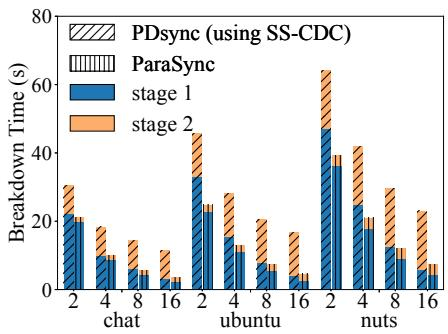

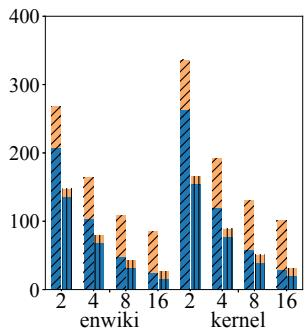

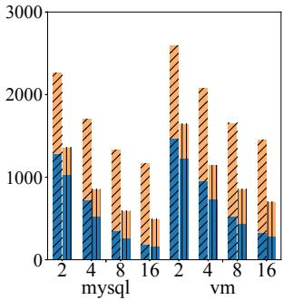  
Figure 16: Breakdown of file chunking time using 2, 4, 8, and 16 threads.

Moreover, we evaluate rsync using its pipelined sync model to compare total sync performance. All other implementation details, including the use of CRC32C and BLAKE3 checksums, the minimum/expected average/maximum chunk sizes, the hash table, the memory allocator and the coroutine-based I/O operations (4 coroutines per thread), are consistent across the evaluated sync methods. Unless otherwise specified, all experimental configurations remain unchanged, and each result represents the mean of 10 runs, with a standard deviation of less than 5% of the mean.

Dataset. Our evaluation uses seven real-world datasets spanning two orders of magnitude: five datasets at the gigabytescale and two at the terabyte-scale.

• Chat. Two versions of WeChat chat logs (2024-08-26 and 2025-02-23) comprising 16 backup files (25.4 GB).

• Ubuntu. 34 minor version images across five major Ubuntu releases (14.04-22.04) from Ubuntu Archives [25], used to construct version pairs for sync tests (32.8 GB).

• Nuts. Two versions of personal NutStore snapshots (2023- 12-07 and 2025-01-10, 53.7 GB).

• Enwiki. Two versions of Wikipedia backups (2024-07-01 and 2025-02-01) from a public dataset [26] (188.5 GB).

• Kernel. 200 minor versions of Linux Kernel source code across two major releases (5.15 and 6.1), obtained from the Linux Kernel Archives [17] (221.3 GB).

• MySQL. Two monthly MySQL database backups from a production server (2.1 TB).

• VM. Two versions of Virtual Machine snapshots from a production cloud server hosting an LLM model and its training data (2.4 TB).

Performance Metrics. We evaluate the different sync methods based on the following metrics:

• File Chunking Performance. Measures breakdown time across various threads and chunking throughput.

• Chunk Matching Performance. Evaluates breakdown time for different threads and total matching time under both WAN and LAN.

• Delta Reconstruction Performance. Includes total time for delta reconstruction under both WAN and LAN.

• Total Sync Performance. Measures network traffic and endto-end sync time under both WAN and LAN.

## 4.2 File Chunking Performance

We begin by evaluating the file chunking breakdown time on endpoints across seven real-world datasets using varying threads. Network transmission time for checksum lists is excluded, as it is negligible compared to the chunking duration. Fig. 16 shows the results of pdsync and ParaSync. The first stage of the SS-CDC method, employed by pdsync, achieves speedup as the number of threads increases. However, this speedup is constrained by the sequential determination of chunk boundaries and the computation of checksums in the second stage. In contrast, ParaSync’s second stage only requires merging sub-chunks and combining checksums, making it significantly faster than SS-CDC’s second stage. Further, SS-CDC’s first stage necessitates allocating a large memory space for a global bit array, which threads must access to record potential chunk boundaries. In comparison, ParaSync’s first stage allows threads to access only a local queue and employs on-demand memory allocation for sub-chunk metadata. ParaSync distributes checksum calculations across multiple threads, more efficient than the single-threaded checksum computation in SS-CDC’s second stage. Compared to pdsync, this reduces ParaSync’s chunking time by 9.8%–41.4% for the first stage and 62.8%–84.5% for the second stage.

We further evaluate the file chunking throughput of different sync methods without network transmission time. Fig. 17 shows the results. Using the sequential file chunking throughput of dsync as the baseline, we compare it to pdsync and ParaSync, both of which employ 8 threads for the first stage of file chunking and a single thread for the second stage. The 8-threaded configurations of pdsync and ParaSync achieve speedups of 2.9× and 7.6×, respectively, over the baseline. ParaSync’s significant speedup is attributed to its multi-threaded file chunking algorithm, which demonstrates near-linear scalability with the number of threads.

## 4.3 Chunk Matching Performance

We evaluate the execution time of the chunk matching phase, specifically examining the wmatcher (server-side) and smatcher (client-side) components as the thread number increases from 2 to 16. Fig. 18 shows the results for pdsync and ParaSync. Compared to pdsync, ParaSync’s wmatcher and smatcher execution times are reduced by 15.3%–56.1% and 16.7%–62.1%, respectively. This is because pdsync’s parallel chunk matching fails to evenly distribute checksum calculations and comparisons across threads. In contrast, ParaSync’s parallel chunk matching achieves a more balanced distribution of these operations. We use the original dsync as a baseline to compare the total chunk matching times of pdsync and ParaSync. The results are shown in Fig. 19. In this experiment, dsync uses a single thread for each task (wmatcher, smatcher, network transmission), operating sequentially with synchronous I/O. Pdsync uses 8 threads for wmatcher and smatcher, plus one for network transmission. While wmatcher runs in parallel with network transmission, smatcher begins only after all matching tokens are received. ParaSync adopts the same thread configuration as pdsync. In WAN, ParaSync reduces matching time by 72.5%–84.2% vs. dsync and 43.4%– 60.3% vs. pdsync. In LAN, reductions are 75.1%–85.6% vs. dsync and 43.1%–59.7% vs. pdsync. ParaSync’s gains come from overlapping wmatcher and smatcher operations and using strong hash sub-tables for efficient matching. Both network environments show significant improvements because matching token transmission constitutes a relatively small fraction of total sync time, making wmatcher and smatcher execution the dominant bottlenecks.

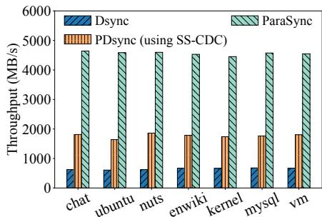  
Figure 17: File chunking throughput.

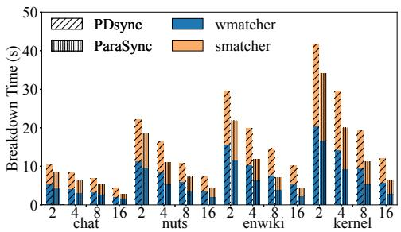

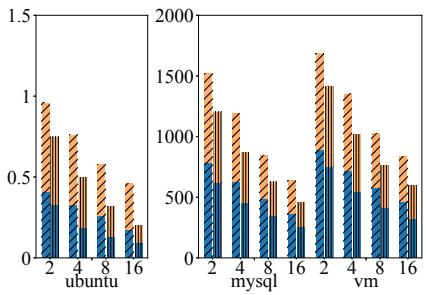  
Figure 18: Breakdown of chunk matching time using 2, 4, 8, and 16 threads.

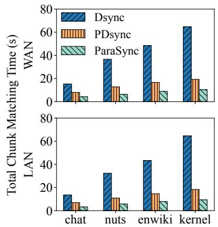

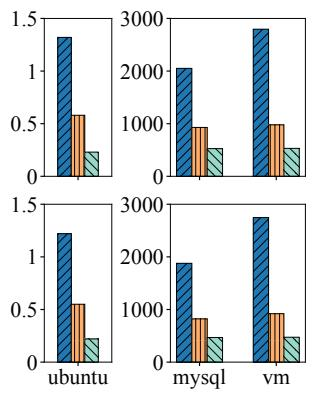  
Figure 19: Total chunk matching time.

## 4.4 Delta Reconstruction Performance

Fig. 20 shows the total delta reconstruction time. Each method uses a single thread for patch command processing, network

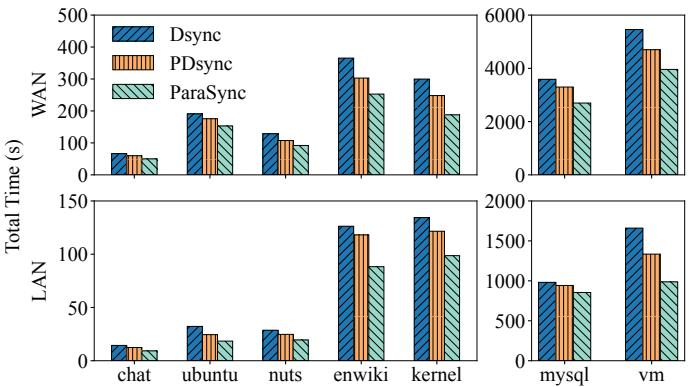  
Figure 20: Delta reconstruction.

I/O, and disk I/O. Dsync and pdsync process patches sequentially, with pdsync adding partial pipelining. ParaSync fully pipelines the client-side transfer of patch commands and literal bytes with server-side patch application. ParaSync outperforms dsync and pdsync, reducing time by 8.5%–35.2% vs. dsync and 5.1%–21.5% vs. pdsync in WAN, and 15.2%– 49.1% and 10.3%–26.7% in LAN, respectively. This reflects ParaSync’s effectiveness in overlapping and parallelizing these phases. The smaller gain in WAN indicates that literal byte transmission dominates the total time.

## 4.5 Total Sync Performance

We evaluate the total network traffic of various sync methods, including rsync, with the results shown in Fig. 21. The traffic volumes are nearly identical due to the use of fundamentally similar formats for checksums, matching tokens, and patch commands across all systems. ParaSync incurs a slight overhead (at most 3.2% more than dsync), resulting from protocol details like an initial sync request and embedded flags within patch commands (e.g., for BitTorrent-like streaming).

We further compare the total sync time of ParaSync against rsync, dsync and pdsync, with results shown in Fig. 22. ParaSync and pdsync both use eight threads for their respective processing phases, while rsync employs eight threads for delta transmission and dsync uses a single thread for each phase. To ensure a fair comparison, the client in all sync methods first sends a sync request to the server, initiating file chunking at both ends. In WAN, ParaSync achieves a speedup of 1.25×–2.4× over dsync and 1.14×–1.6× over pdsync. In LAN, ParaSync achieves a speedup of 2.3×–3.7× over dsync and 1.5×–1.74× over pdsync. Furthermore, rsync is slower than CDC-based methods in most cases, even when configured with pipelining, because its FSC-based rolling process incurs higher computational overhead than CDC-based chunking. In the eight-threaded configuration of ParaSync, network transmission time for literal bytes accounts for 76.1%–96.7% of the total sync time across all datasets. This time can be further reduced by employing overlay networks or multi-path transmission techniques [34, 57] in WAN scenarios. These optimizations are orthogonal to ParaSync’s design.

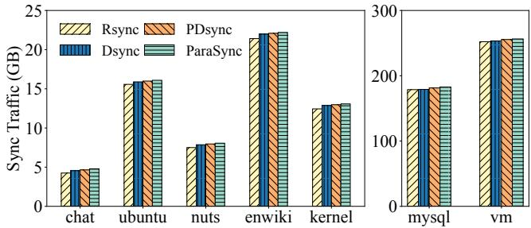  
Figure 21: Total sync network traffic.

## 5 Related Work and Discussion

## 5.1 Delta Sync

Delta-based sync [49, 50, 65] is widely used to transmit data in the form of differences (deltas) between different versions of a file. DeltaCFS [68] integrates delta sync with NFS-like file RPC to minimize computational overhead and network traffic. PandaSync [58] is a hybrid cloud sync scheme that dynamically selects between full sync and delta sync based on network characteristics and workloads. WebR2sync+ [65] performs the chunk search operations on the server side, and further exploits locality-aware chunk matching and lightweight checksum algorithm to reduce computational overhead. FeatureSync [59] improves sync efficiency and reduces network traffic of encryption-based cloud storage services by selecting a suitable feature to serve as the secret key for file encryption, merging several files together, and exploiting a fine-grained window size. SkySync [70] leverages the metadata from the conventional storage layer (including checksums and cryptographic digests) to perform a collaborative delta generation at low cost, which is orthogonal to ParaSync. All the aforementioned works fail to effectively exploit the inherent parallelism in file sync.

## 5.2 Design Rationale and Trade-offs

Strategic Resource Trade-offs. In extremely high-bandwidth environments (e.g., 100 Gbps or higher), one might consider bypassing CDC entirely and performing a full sync by transmitting the entire file without delta computation. This approach reduces endpoint CPU usage, as neither chunking nor matching is required. However, even with abundant bandwidth, transferring terabytes of data when only gigabytes have changed is wasteful, environmentally unsustainable, and misaligned with the emission reduction goals of cloud service providers. Such transfers consume resources on network interface cards, switches, and routers [46, 47], and at scale can contribute to network congestion [29, 69, 71], thereby impacting other applications and degrading overall network performance.

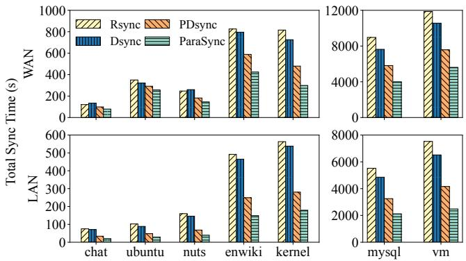  
Figure 22: End-to-end sync time.

In addition to the trade-off between delta sync and full file transfer, ParaSync’s design embodies a deliberate strategy of trading higher peak resource utilization for a significant reduction in total sync time. This choice has implications for CPU, energy, and memory overheads.

• CPU and Energy Overhead. By utilizing multiple cores simultaneously, ParaSync naturally incurs higher instantaneous power draw than sequential methods. By drastically reducing total sync time, ParaSync finishes tasks faster and returns resources to the system sooner. This improves overall system throughput and application responsiveness, which is critical for services dependent on fast data sync (e.g., collaborative tools, distributed computing, and backup restoration). The additional CPU cost of thread management and synchronization is largely a fixed cost that is amortized over the computation on large files.

• Memory Overhead. While thread-local states (e.g., stacks) introduce overhead, the dominant memory consumers in CDC-based sync are data structures scaling with file size (e.g., hash tables), not thread count. Thus, ParaSync’s footprint remains comparable to sequential approaches. Furthermore, any pre-allocation overhead determines by the pipelined design is effectively masked: memory for subsequent batches is prepared concurrently while worker threads process current data, preventing allocation latency from stalling the critical path.

Performance in Adversarial and Scaled Scenarios.   
ParaSync’s architecture provides resilience in corner cases.

• Low Similarity. When syncing files with little or no similarity, the bottleneck shifts from computation to the network transfer of literal data. Even here, ParaSync maintains a performance advantage. First, its parallel chunker still completes the initial, mandatory file scan faster than sequential methods. Second, its pipelined reconstruction allows the client to begin streaming literal bytes immediately, saturating network bandwidth sooner.

• High Fragmentation. In scenarios with thousands of small, scattered changes, the delta is composed of many small copy and insert commands. Sequential approaches that rely on relative offsets are heavily penalized, as they must apply each patch in a strict order. ParaSync’s use of absolute offsets in patch commands is a key advantage here. It decouples delta application, enabling the server to process these small commands in parallel batches and out-of-order, mitigating the performance degradation that plagues sequential methods in fragmented workloads.

• Concurrent Environments. In multi-tenant environments, ParaSync’s fine-grained parallelism makes it more efficient than running multiple instances of a sequential sync process on a busy server. Its pipelined architecture ensures that if one thread stalls on I/O, other threads can immediately utilize the available CPU core to process other parts of the same or different jobs. This inherent resilience to I/O stalls and head-of-line blocking leads to better resource utilization and higher aggregate throughput in concurrent environments.

## 6 Conclusion

CDC-based file sync can typically be decomposed into three phases: file chunking, chunk matching, and delta reconstruction. This paper presents ParaSync, a novel CDC-based file sync scheme that achieves fine-grained parallelism in individual phases. Specifically, ParaSync introduces a novel multithreaded file chunking algorithm, a streaming chunk matching process, and an efficient pipeline for delta reconstruction. Extensive evaluation demonstrates that ParaSync significantly outperforms state-of-the-art file sync schemes. In our future work, we will explore the potential of integrating ParaSync with advanced network optimization techniques to improve its network transmission efficiency. We have open-sourced ParaSync at https://github.com/nicexlab/parasync.

## Acknowledgments

We thank our shepherd, Prof. Jingwei Li, and the anonymous reviewers for their valuable comments and suggestions. The work is supported by the National Natural Science Foundation of China (grant no. 62441220). Yiming Zhang is the corresponding author.

## References

[1] A high-performance, concurrent hash table. https:// github.com/efficient/libcuckoo.

[2] Alibaba Cloud. https://www.alibabacloud.com/ en?\_p\_lc=1.

[3] Attic Backup System. https://attic-backup.org/.

[4] Cpp Coroutine. https://en.cppreference.com/w/ cpp/language/coroutines.

[5] Cpp Coroutine Library. https://github.com/ alibaba/PhotonLibOS.

[6] Dell EMC. https://www.dellemc.com/en-us/ data-protection/data-domain-backup-storage. htm.

[7] Dropbox. https://www.dropbox.com/dropbox.

[8] Falcon-40B-Instruct: A 40B parameters causal decoderonly model based on Falcon-40B and finetuned on specific dataset. https://huggingface.co/tiiuae/ falcon-40b-instruct.

[9] Google CDC File Transfer. https://github.com/ google/cdc-file-transfer.

[10] Google Drive. https://www.google.com/drive/.

[11] IETF-The BLAKE3 Hashing Framework. https: //www.ietf.org/id/draft-aumasson-blake3-00. html.

[12] Intel AVX-512. https://www.intel.com/content/ www/us/en/architecture-and-technology/ avx-512-overview.html.

[13] Intel Intrinsics Guide. https://www.intel.com/ content/www/us/en/docs/intrinsics-guide/ index.html#techs=SSE\_ALL.

[14] Intel SSE4 Programming Reference. https://www. intel.com/content/dam/develop/external/us/ en/documents/d9156103-705230.pdf.

[15] Intel(R) Intelligent Storage Acceleration Library. https://github.com/intel/isa-l.

[16] jemalloc is a general purpose malloc implementation. https://github.com/jemalloc/jemalloc.

[17] Linux Kernel Archives. https://www.kernel.org/.

[18] OneDrive. https://www.microsoft. com/en-us/microsoft-365/onedrive/ online-cloud-storage.

[19] Restic Backup System. https://restic.net/.

[20] Rolling Hash. https://en.wikipedia.org/wiki/ Rolling\_hash.

[21] Seafile. https://www.seafile.com/home/.

[22] TCMalloc is Google’s customized implementation of malloc. https://github.com/google/tcmalloc.

[23] The BitTorrent Protocol Specification. https://www. bittorrent.org/beps/bep\_0003.html.

[24] The official Rust and C implementations of the BLAKE3 cryptographic hash function. https://github.com/ BLAKE3-team/BLAKE3.

[25] Ubuntu Archive. http://archive.ubuntu.com/.

[26] Wikipedia Backups Dataset. https://dumps. wikimedia.org/enwiki/.

[27] Wikipedia BitTorrent. https://en.wikipedia.org/ wiki/BitTorrent.

[28] Zlib Project. https://www.zlib.net/.

[29] Saksham Agarwal, Arvind Krishnamurthy, and Rachit Agarwal. Host congestion control. In Proceedings of ACM SIGCOMM Conference (SIGCOMM’23), pages 275–287, 2023.

[30] Jian Chen, Minghao Zhao, Zhenhua Li, Ennan Zhai, Feng Qian, Hongyi Chen, Yunhao Liu, and Tianyin Xu. Lock-Free collaboration support for cloud storage services with operation inference and transformation. In Proceedings of USENIX Conference on File and Storage Technologies (FAST’20), pages 13–27, 2020.

[31] Bin Gao, Qingxuan Kang, Hao-Wei Tee, Kyle Timothy Ng Chu, Alireza Sanaee, and Djordje Jevdjic. Scalable and effective page-table and TLB management on NUMA systems. In Proceedings of USENIX Annual Technical Conference (ATC’24), pages 445–461, 2024.

[32] Yuan He, Lingfeng Xiang, Wen Xia, Hong Jiang, Zhenhua Li, Xuan Wang, and Xiangyu Zou. dsync: a lightweight delta synchronization approach for cloud storage services. In Proceedings of IEEE Symposium on Mass Storage Systems and Technologie (MSST’20), 2020.

[33] Intel. Using Adler-32 Checksum and CRC32 Hash to Ensure Data Compression Integrity. https://ext4. wiki.kernel.org/.

[34] Paras Jain, Sam Kumar, Sarah Wooders, Shishir G. Patil, Joseph E. Gonzalez, and Ion Stoica. Skyplane: Optimizing transfer cost and throughput using Cloud-Aware overlays. In Proceedings of USENIX Symposium on Networked Systems Design and Implementation (NSDI’23), pages 1375–1389, 2023.

[35] P. Koopman. 32-bit cyclic redundancy codes for internet applications. In Proceedings of International Conference on Dependable Systems and Networks, pages 459–468, 2002.

[36] Patrick Lavin, Jeffrey Young, Richard Vuduc, Jason Riedy, Aaron Vose, and Daniel Ernst. Evaluating gather and scatter performance on cpus and gpus. In Proceedings of International Symposium on Memory Systems (MEMSYS’20), pages 209–222, 2021.

[37] Gyusun Lee, Seokha Shin, Wonsuk Song, Tae Jun Ham, Jae W. Lee, and Jinkyu Jeong. Asynchronous I/O stack: A low-latency kernel I/O stack for Ultra-Low latency SSDs. In Proceedings of USENIX Annual Technical Conference (ATC’19), pages 603–616, 2019.

[38] Zonghui Li, Gilbert Chen, and Yangdong Deng. Duplicacy: A new generation of cloud backup tool based on lock-free deduplication. IEEE Transactions on Cloud Computing, pages 2508–2520, 2022.

[39] Xing Lin, Fred Douglis, Jim Li, Xudong Li, Robert Ricci, Stephen Smaldone, and Grant Wallace. Metadata considered {Harmful. . . to} deduplication. In Proceedings of USENIX Workshop on Hot Topics in Storage and File Systems (HotStorage’15), pages 1–11, 2015.

[40] Wenhao Lv, Youyou Lu, Yiming Zhang, Peile Duan, and Jiwu Shu. InfiniFS: An efficient metadata service for Large-Scale distributed filesystems. In 20th USENIX Conference on File and Storage Technologies (FAST’22), pages 313–328, 2022.

[41] Ali José Mashtizadeh, Andrea Bittau, Yifeng Frank Huang, and David Mazières. Replication, history, and grafting in the ori file system. In Proceedings of ACM Symposium on Operating Systems Principles (SOSP’13), pages 151–166, 2013.

[42] Fan Ni and Song Jiang. Rapidcdc: Leveraging duplicate locality to accelerate chunking in cdc-based deduplication systems. In Proceedings of ACM Symposium on Cloud Computing (SoCC’19), pages 220–232, 2019.

[43] Fan Ni, Xing Lin, and Song Jiang. Ss-cdc: a twostage parallel content-defined chunking for deduplicating backup storage. In Proceedings of ACM International Conference on Systems and Storage (SYSTOR’19), pages 86–96, 2019.

[44] Rasmus Pagh and Flemming Friche Rodler. Cuckoo hashing. In Algorithms-ESA, pages 121–133. Springer Berlin Heidelberg, 2001.

[45] Jonatan Schroeder. Device-Independent On Demand Synchronization in the Unico File System. PhD dissertation, The University of British Columbia, 2016.

[46] Hua Shao, Xiaoliang Wang, Yuanwei Lu, Yanbo Yu, Shengli Zheng, and Youjian Zhao. Accessing cloud with disaggregated Software-Defined router. In 18th USENIX Symposium on Networked Systems Design and Implementation (NSDI’21), pages 1–14, 2021.

[47] Arjun Singh, Joon Ong, Amit Agarwal, Glen Anderson, Ashby Armistead, Roy Bannon, Seb Boving, Gaurav Desai, Bob Felderman, Paulie Germano, Anand Kanagala, Jeff Provost, Jason Simmons, Eiichi Tanda, Jim Wanderer, Urs Hölzle, Stephen Stuart, and Amin Vahdat. Jupiter rising: A decade of clos topologies and centralized control in google’s datacenter network. In Proceedings of ACM Conference on Special Interest Group on Data Communication (SIGCOMM ’15), pages 183–197, 2015.

[48] Vasily Tarasov, Saumitra Bhanage, Erez Zadok, and Margo Seltzer. Benchmarking file system benchmarking: It \*IS\* rocket science. In Proceedings of Workshop on Hot Topics in Operating Systems (HotOS’13), pages 1–5, 2011.

[49] Andrew Tridgell. Efficient algorithms for sorting and synchronization. The Australian National University, pages 1–115, 1999.

[50] Andrew Tridgell and Paul Mackerras. The Rsync Algorithm. https://rsync.samba.org/tech\_report/.

[51] Sreeharsha Udayashankar, Abdelrahman Baba, and Samer Al-Kiswany. VectorCDC: Accelerating data deduplication with vector instructions. In Proceedings of USENIX Conference on File and Storage Technologies (FAST’25), pages 513–522, 2025.

[52] Qing Wang, Youyou Lu, Junru Li, and Jiwu Shu. Nap: A Black-Box approach to NUMA-Aware persistent memory indexes. In Proceedings of USENIX Symposium on Operating Systems Design and Implementation (OSDI’21), pages 93–111, 2021.

[53] Qing Wang, Youyou Lu, Junru Li, Minhui Xie, and Jiwu Shu. Nap: Persistent memory indexes for numa architectures. ACM Trans. Storage, January 2022.

[54] Qing Wang, Fan Yang, Qiang Liu, Geng Xiao, Yongpeng Chen, Hao Lan, Leiming Chen, Bangzhu Chen, Chenrui Liu, Pingchang Bai, Bin Huang, Zigan Luo, Mingyu Xie, Yu Wang, Youyou Lu, Huatao Wu, and Jiwu Shu. Cost-efficient Archive Cloud Storage with Tape: Design and Deployment. In 24th USENIX Conference on File and Storage Technologies (FAST’26), 2026.

[55] Sage A. Weil, Scott A. Brandt, Ethan L. Miller, Darrell D. E. Long, and Carlos Maltzahn. Ceph: A scalable,

high-performance distributed file system. In Proceedings of USENIX Symposium on Operating Systems Design and Implementation (OSDI’06), pages 307–320, 2006.

[56] Youjip Won, Kyeongyeol Lim, and Jaehong Min. Much: Multithreaded content-based file chunking. IEEE Transactions on Computers, pages 1375–1388, 2015.

[57] Sarah Wooders, Shu Liu, Paras Jain, Xiangxi Mo, Joseph E. Gonzalez, Vincent Liu, and Ion Stoica. Cloudcast: High-Throughput, Cost-Aware overlay multicast in the cloud. In Proceedings of USENIX Symposium on Networked Systems Design and Implementation (NSDI’24), pages 281–296, April 2024.

[58] Suzhen Wu, Longquan Liu, Hong Jiang, Hao Che, and Bo Mao. Pandasync: Network and workload aware hybrid cloud sync optimization. In Proceedings of IEEE International Conference on Distributed Computing Systems (ICDCS’19), pages 282–292, 2019.

[59] Suzhen Wu, Zhanhong Tu, Zuocheng Wang, Zhirong Shen, and Bo Mao. When delta sync meets messagelocked encryption: a feature-based delta sync scheme for encrypted cloud storage. In Proceedings of IEEE International Conference on Distributed Computing Systems (ICDCS’21), pages 337–347, 2021.

[60] Wen Xia, Dan Feng, Hong Jiang, Yucheng Zhang, Victor Chang, and Xiangyu Zou. Accelerating content-definedchunking based data deduplication by exploiting parallelism. Future Gener. Comput. Syst., 98(C):406–418, September 2019.

[61] Wen Xia, Hong Jiang, Dan Feng, Lei Tian, Min Fu, and Zhongtao Wang. P-dedupe: Exploiting parallelism in data deduplication system. In Proceedings of IEEE Seventh International Conference on Networking, Architecture, and Storage (NAS’12), pages 338–347, 2012.

[62] Wen Xia, Lifeng Pu, Xiangyu Zou, Philip Shilane, Shiyi Li, Haijun Zhang, and Xuan Wang. The design of fast and lightweight resemblance detection for efficient postdeduplication delta compression. ACM Trans. Storage, pages 1–30, 2023.

[63] Wen Xia, Can Wei, Zhenhua Li, Xuan Wang, and Xiangyu Zou. Netsync: A network adaptive and deduplication-inspired delta synchronization approach for cloud storage services. IEEE Transactions on Parallel and Distributed Systems, pages 2554–2570, 2022.

[64] Wen Xia, Yukun Zhou, Hong Jiang, Dan Feng, Yu Hua, Yuchong Hu, Qing Liu, and Yucheng Zhang. FastCDC: A fast and efficient Content-Defined chunking approach

for data deduplication. In Proceedings of USENIX Annual Technical Conference (ATC’16), pages 101–114, 2016.

[65] He Xiao, Zhenhua Li, Ennan Zhai, Tianyin Xu, Yang Li, Yunhao Liu, Quanlu Zhang, and Yao Liu. Towards web-based delta synchronization for cloud storage services. In Proceedings of USENIX Conference on File and Storage Technologies (FAST’18), pages 155–168, 2018.

[66] Hengying Xiao and Yangyang Liu. Dzip: A data deduplication-compatible enhanced version of gzip. In Proceedings of Springer Artificial Intelligence Security and Privacy, pages 328–341, 2024.

[67] Qirui Yang, Runyu Jin, and Ming Zhao. SmartDedup: Optimizing deduplication for resource-constrained devices. In Proceedings of USENIX Annual Technical Conference (ATC’19), pages 633–646, 2019.

[68] Quanlu Zhang, Zhenhua Li, Zhi Yang, Shenglong Li, Shouyang Li, Yangze Guo, and Yafei Dai. Deltacfs: Boosting delta sync for cloud storage services by learning from nfs. In Proceedings of IEEE International Conference on Distributed Computing Systems (ICDCS’17), pages 264–275, 2017.

[69] Yiran Zhang, Qingkai Meng, Chaolei Hu, and Fengyuan Ren. Revisiting congestion control for lossless ethernet. In Proceedings of USENIX Symposium on Networked Systems Design and Implementation (NSDI’24), pages 131–148, 2024.

[70] Zhihao Zhang, Huiba Li, Lu Tang, Guangtao Xue, Jiwu Shu, and Yiming Zhang. SkySync: Accelerating file synchronization with collaborative delta generation. In Proceedings of USENIX Conference on File and Storage Technologies (FAST’26), 2025.

[71] Yibo Zhu, Haggai Eran, Daniel Firestone, Chuanxiong Guo, Marina Lipshteyn, Yehonatan Liron, Jitendra Padhye, Shachar Raindel, Mohamad Haj Yahia, and Ming Zhang. Congestion control for large-scale rdma deployments. In Proceedings of ACM Conference on Special Interest Group on Data Communication (SIG-COMM’15), pages 523–536, 2015.

[72] Chunxue Zuo, Fang Wang, Ping Huang, Yuchong Hu, Dan Feng, and Yucheng Zhang. Pfcg: Improving the restore performance of package datasets in deduplication systems. In Proceedings of IEEE International Conference on Computer Design (ICCD’18), pages 553–560, 2018.