①

USENIX

THE ADVANCED COMPUTING SYSTEMS ASSOCIATION

# SkySync: Accelerating File Synchronization with Collaborative Delta Generation

Zhihao Zhang, Xiamen University and Alibaba Cloud; Huiba Li, Alibaba Cloud; Lu Tang, Xiamen University; Guangtao Xue, Shanghai Jiao Tong University; Jiwu Shu, Tsinghua University; Yiming Zhang, Shanghai Jiao Tong University and Xiamen University

## https://www.usenix.org/conference/fast26/presentation/zhang-zhihao

This paper is included in the Proceedings of the 24th USENIX Conference on File and Storage Technologies.

February 24–26, 2026 • Santa Clara, CA, USA

ISBN 978-1-939133-53-3

Open access to the Proceedings of the 24th USENIX Conference on File and Storage Technologies is sponsored by

# SkySync: Accelerating File Synchronization with Collaborative Delta Generation

Zhihao Zhang1,3, Huiba Li3, Lu Tang1, Guangtao Xue2, Jiwu Shu4, Yiming Zhang2,1 1NICE Lab, XMU 2SJTU 3Alibaba Cloud 4Tsinghua University

## Abstract

File synchronization (sync) is of increasing significance for not only intra-cloud but also inter-cloud applications and services, as cloud computing is evolving into the Sky computing paradigm with the illusion of utility computing on an infrastructure of multiple geographically-distributed clouds. However, existing file sync schemes, mainly including fixedsized chunking (FSC) based sync and content-defined chunking (CDC) based sync, heavily rely on complex algorithms for generating the delta data. These algorithms perform costly processing operations including (i) file chunking, (ii) chunk checksum computation, and (iii) chunk searching, which incur high computational overhead thus lowering sync performance.

This paper presents SkySync, a novel file sync scheme based on collaborative delta generation. Our insight is that the conventional storage layer has already maintained rich metadata (like checksums and cryptographic digests) for management purpose, e.g., to verify integrity and detect errors. Therefore, we leverage the existent metadata of the storage layer to obtain the chunk checksums with simple adaptation and combination, thus effectively reducing the computational overhead. We further streamline the chunk searching process by reusing checksum data produced during prior computations. We have implemented the FSC-based and CDC-based SkySync schemes by enhancing the communication protocol of the state-of-the-art rsync and dsync, respectively. Evaluation results show that compared to the existing file sync schemes (rsync and dsync), SkySync significantly reduces the computational overhead by up to 89.3% and improves the client and server sync performance by 1.1× ∼ 2×, while maintaining a consistent level of network traffic.

## 1 Introduction

Many traditional cloud storage services [15, 21, 27, 30], distributed storage systems [55, 61, 69], and backup tools [6, 29, 53] provide file synchronization (sync) capabilities for efficient and reliable data processing. Moreover, as cloud computing is evolving into the Sky computing paradigm [11, 41, 48, 64, 78] with the illusion of utility computing on an infrastructure of multiple geographically-distributed clouds, file sync is of increasing significance for not only intra-cloud but also inter-cloud applications and services.

Existing file sync schemes employ either full sync or delta sync techniques. Compared to full sync, delta sync is usually more efficient as it only needs to transfer the modified portion of a file. This has recently led to an increasing research emphasis on delta sync, particularly in scenarios involving large-scale file sync operations across multiple regions [15, 30, 45, 70, 72, 74].

Existing delta-sync schemes [42, 44, 45, 56, 66, 67, 70, 71, 74, 76, 79] use various methods to identify the delta between the client (which has the new file) and the server (which has the old file). Delta generation typically involves the following steps. (i) File chunking: splitting the synchronized file into chunks based on Fixed-Sized Chunking (FSC) [66, 67] or Content-Defined Chunking (CDC) [45, 74]. (ii) Chunk checksum calculation: computing the weak checksum or the strong checksum for each chunk. (iii) Chunk searching: looking for the weak-/strong-checksum-matched chunks between the new and old files. These three steps of delta generation are crucial to all delta sync schemes.

Unfortunately, existing delta generation methods are complex and costly. FSC-based sync schemes, such as rsync [66, 67], spend a considerable amount of time on checksum calculation and chunk searching [70, 76]. Although CDCbased sync schemes, such as NetSync [74] and dsync [45], use a smaller sliding window and a more lightweight rolling checksum, they still need to calculate weak checksums of all bytes in the file, which results in high overhead. Checksum calculation and chunk searching are time-consuming, occupying substantial CPU cycles when dealing with large files and making substantial modifications to the files.

Inefficient delta generation not only requires cloud vendors to deploy additional computing and storage resources for file sync, but also significantly increases file sync times [45, 74]. The high computational overhead of delta generation is the main factor that lowers file sync performance, and thereby limits the applicability of Sky computing. Therefore, it is vital to develop an efficient method for minimizing the computational overhead of delta generation.

Table 1: A brief summary of the metadata provided by storage layer.
<table><tr><td>Storage Type</td><td>Name</td><td>Checksum Type</td><td>Extraction Method</td></tr><tr><td>Block Devices</td><td>dm-verity</td><td>MD5&amp; SHA</td><td>User-space Tools</td></tr><tr><td>File Systems</td><td>EXT4&amp;F2FS&amp; BTRFS &amp; ZFS</td><td>CRC32C &amp; XXHASH&amp; SHA &amp; BLAKE2/3</td><td>User-space Tools</td></tr><tr><td>Deduplication Systems</td><td>MeGA&amp;MFDedup</td><td>CRC32C&amp;MD5&amp;SHA</td><td>Custom Functions</td></tr><tr><td>Distributed Systems</td><td>HDFS &amp; BlueStore &amp; MooseFS &amp; SeaweedFS</td><td>CRC32C&amp;MD5&amp;SHA</td><td>APIs</td></tr></table>

We observe that the high overhead of delta generation mainly comes from the calculation of chunk checksums. Our insight is that the conventional storage layer has already maintained rich metadata, such as the checksums and cryptographic digests, in modern storage systems for data integrity, error detection, deduplication, compression, authenticity protection, and other purposes as shown in Table [10, 19, 25, 28, 32, 39, 40, 62, 69, 80]. For instance, the fsverity [19] and dm-verity [14] are support layers that enable file systems and block devices to seamlessly provide integrity and authenticity protection for files and blocks by using cryptographic digests; BTRFS and ZFS apply checksums to both data and metadata stored within them [9, 10, 37]; and deduplication storage systems calculate checksums for identifying duplicated data [54, 63, 73, 77, 82]. Many distributed storage systems, such as HDFS [62], BlueStore [39], MooseFS [25], Haystack [40], and OneFS [28], also provide checksums for data protection and error detection. Moreover, major cloud vendors, including Amazon Web Services (AWS) [7], Google Cloud Platform (GCP) [20], Microsoft Azure [46], and Alibaba Cloud [4, 80], have provided checksums for data integrity verification.

Although the storage-layer metadata is originally designed for file and storage management, we argue that it can also be used for delta generation to improve file sync efficiency. With this idea, we propose SkySync, a novel file sync scheme based on collaborative delta generation. Specifically, SkySync inherits the existent checksums or cryptographic digests from the storage layer, and designs a simple but effective method for obtaining file chunk checksums from storage-layer metadata with simple adaptation and combination.

This paper makes the following contributions:

• We explore different methods for obtaining various types of storage-layer metadata, respectively from block devices, file systems, deduplication systems, and distributed systems. We propose a fast checksum combining algorithm that efficiently derives chunk checksums from this existing metadata. We further reuse these checksums to simplify and accelerate the chunk searching process.

• We implement the FSC-based and CDC-based SkySync schemes by enhancing the communication protocol and identifying the efficient checksum algorithms of rsync and dsync, respectively. We also provide an effective and complete prototype on top of rsync and dsync.

• We conduct a comprehensive performance evaluation of SkySync. The results demonstrate that compared to the state-of-the-art file sync schemes, SkySync significantly reduces the computational overhead by up to 89.3% and improves the client and server sync performance by 1.1× ∼ 2×, while maintaining a consistent level of network traffic.

## 2 Background and Motivation

## 2.1 Sky Computing

Sky computing extends beyond traditional cloud computing by enabling seamless interoperability across multiple, independent cloud providers. In Sky computing, users interact with a cloud service broker [41, 78] instead of directly engaging with a specific cloud provider. Users submit their jobs to the broker, which then selects the appropriate clouds to execute different parts of the jobs and manages their execution to optimize for cost, performance, and compliance requirements. For instance, machine learning serving jobs that do not require extensive data transfer during the computation can be moved to different clouds based on pricing or performance considerations. By decoupling workloads from specific cloud providers, Sky computing mitigates vendor lock-in, enhances scalability, and improves fault tolerance.

Despite the advantages, when splitting computation and storage across multiple clouds, Sky computing faces the challenge of decreased processing efficiency caused by inter-cloud data transfer limitations. Hence, delta sync, which only transfers the differences between old and new file versions, is more suitable for data sharing in Sky computing.

However, existing delta sync schemes, including FSCbased sync and CDC-based sync, bring significant computational overhead for both clients and servers, as discussed in

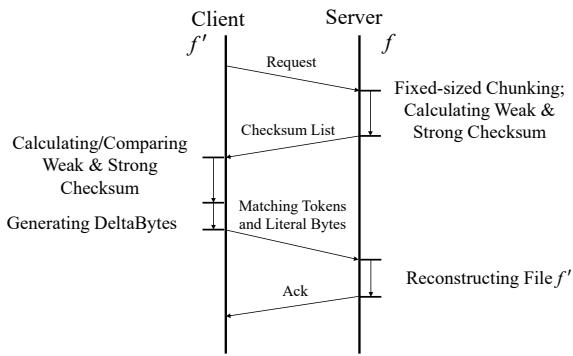  
(a) Workflow of rsync.

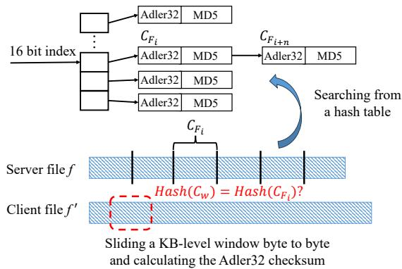  
(b) FSC-based rolling checksum and chunk searching from a hash table. CF denotes the fixed-sized chunk of file f . Cw denotes the current chunk in sliding window (red dashed box), which is designed to detect modifications.  
Figure 1: Overview of rsync process.

Section 2.3. This overhead exacerbates resource contention with primary compute tasks and degrades performance, particularly in scenarios where numerous compute-intensive jobs are being executed on various clouds [41, 78, 80]. Therefore, reducing the computational cost of delta sync is essential for minimizing CPU contention and enabling efficient data sharing and processing in Sky Computing.

## 2.2 Delta Sync

Delta sync schemes are classified into FSC-based and CDCbased approaches. Many traditional commercial cloud storage services such as Dropbox [15] and Seafile [30], as well as data backup tools such as Duplicacy [53], Attic [6], and Restic [29], adopt FSC-/CDC-based delta sync to update files over Wide Area Networks (WANs).

## 2.2.1 FSC-based Sync

The most widely used FSC-based sync method is rsync [66, 67], which has been adopted as the standard sync protocol in GNU/Linux. We now describe the workflow of rsync which consists of three phases, as shown in Figure 1(a):

• Phase I: Chunking. To synchronize a file f ′, the client initiates a request to the server. Upon receiving the request, the server splits the old file f into fixed-sized chunks, and calculates the weak checksums (Adler32) and strong checksums (MD5) of each chunk. These checksums are included in the checksum list and sent back to the client.

• Phase II: Matching. Once the client receives the checksums, it uses a fixed-sized sliding window to calculate the weak checksums of f ′ in a byte-by-byte manner. The client then searches the checksum list for a matched weak checksum. If the current chunk under the sliding window does not match any Adler32 checksums, the window continues sliding until a match is found. When a weak-checksummatched chunk is found, its strong checksum MD5 is calculated and compared with the corresponding chunk’s MD5 in the checksum list to verify that it is a duplicate chunk.

• Phase III: Reconstructing. The client then generates matching tokens and literal (delta) bytes based on phase II, which consists of the mismatched chunks and their metadata. These metadata are sent to the server, which will reconstruct file f ′ by combining file f with the delta bytes.

Figure 1(b) shows the process of rolling checksum and chunking searching. The sliding window size of rsync is usually set at the kilobyte (KB) level (e.g., 4 or 8 KB). During the process of searching for weak-checksum-matched chunks, rsync employs an additional hash table on the client side to store the weak checksums of the old file. Each entry in this hash table consists of a 16-bit hash code generated from the 32-bit Adler32 checksum. A 16-bit hash code can point to multiple weak and strong checksums. Thereby, the chunk searching mechanism of rsync traverses from the 16-bit hash code to the 32-bit weak checksum and eventually to the strong checksum in order to identify each matched chunk between the old and new files.

## 2.2.2 CDC-based Sync

The state-of-the-art CDC-based sync methods, such as dsync [45], have been proposed to simplify the rolling checksum process. The core workflow of dsync is depicted in Figure 2(a).

• Phase I: Chunking. The client initially splits the new file f ′ into chunks based on CDC [75] technique. For each chunk, the client computes a weak checksum using the FastFP algorithm [45]. Along with the chunk metadata, these weak checksums are compiled into a checksum list and transmitted to the server. Upon receiving the checksum list, the server splits the old file f into chunks using CDC technique and calculates weak checksums of the chunks.

• Phase II: Matching. The server then identifies the weakchecksum-matched chunks and calculates their strong checksums (SHA-1). These strong checksums, along with the corresponding chunk metadata (referred to as matching tokens) are sent back to the client. Upon receiving the matching tokens, the client calculates the strong checksums for the matched chunks and compares them with the strong checksums provided by the server. If the strong checksums align, it confirms that these chunks are duplicates.

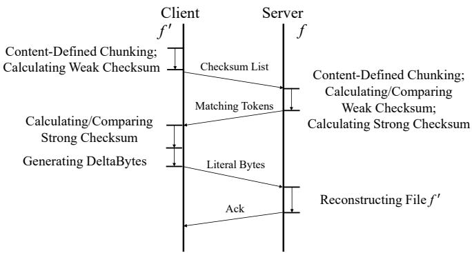  
(a) Workflow of dsync.

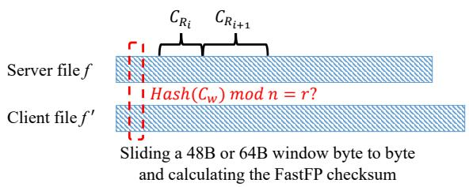  
(b) CDC-based rolling checksum. CR is the variable-sized chunk of files f and f ′. Cw is the sliding window, while n is the average chunk size and r is a predefined threshold value.  
Figure 2: Overview of dsync process.

We omit the third phase of dsync as it is analogous to that of rsync. Dsync leverages a small sliding window (e.g., of 48 bytes) that moves over the file contents as shown in Figure 2(b). The checksum of the window is compared against a predefined value. When a match is found, a chunk boundary is declared. Dsync moves the chunk searching process to the server side, thereby reducing the redundant strong checksum calculations of the weak-checksum-mismatched chunks.

## 2.3 Motivation and Challenge

We evaluate the total sync time of rsync and dsync in representative intra-/inter-cloud scenarios. Our testbed, detailed in Section 4.1, reflects typical cloud deployments, consisting of cloud virtual machines (e.g., AWS EC2 [5] and Alibaba Cloud ECS [3]) which rely on backend cloud storage such as Elastic Block Storage (EBS) [80] and object storage services (OSS) like AWS S3 [7]. The evaluation is performed on 10MB and 100MB files from public datasets [35, 74] under a 500Mbps network, with varying modification sizes.

Due to result similarities, we only show the “insert” modification in Figure 3. Figure 3(a) and 3(b) detail the time consumed by the client, network, and server within the total sync time. The client and server sync times dominate, ac-

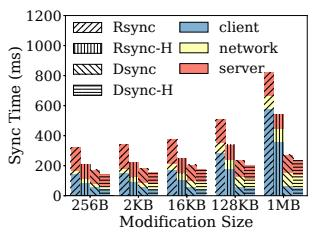  
(a) Sync time for 10MB file

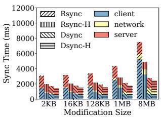  
(b) Sync time for 100MB file

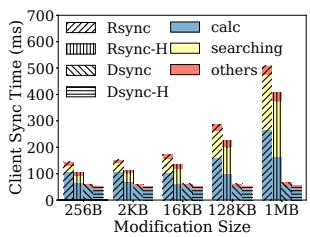

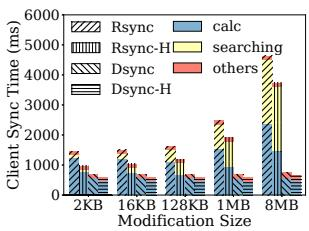  
(c) Client sync time for 10MB file (d) Client sync time for 100MB file

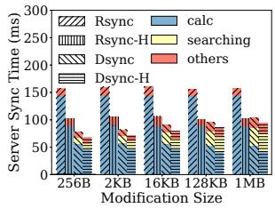

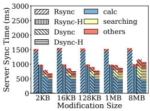  
(e) Server sync time for 10MB file (f) Server sync time for 100MB file

Figure 3: Sync time of rsync and dsync, where “calc” and “searching” denote checksum calculation and searching, respectively, and “-H” denotes hardware-accelerated process.

counting for 71.2% to 93.7% of the total sync time. This is primarily due to the computational overhead introduced by checksum calculations and searching operations at both the client and server. For rsync, the client sync time grows significantly with modification size, surpassing the server sync time. In contrast, dsync uses a faster rolling algorithm to identify modified chunks, making its client and server sync time more dependent on the file size than modification size. The network transfer time increases with modification size but remains a relatively small fraction. In modern cloud data centers with high-speed WAN infrastructure (e.g., over 500Mbps), the network transfer time is typically shorter than the client and server sync times.

Figures 3(c)-3(f) further decompose the client and server sync time into checksum calculation (calc), chunk searching (searching), and other operations (others). Remarkably, checksum calculation and searching together account for up to 95% of the total sync time in both rsync and dsync. Specifically, rsync incurs significant computational overhead due to its checksum calculation on the client and server. While dsync’s sync times are lower than rsync’s, it still faces overhead from calculating weak checksums for all file bytes. Additionally, both rsync and dsync suffer from inefficient chunk searching, requiring traversal from 16-bit hash codes to 32-bit weak checksums and strong checksums. These observations highlight checksum calculation and searching as the primary bottlenecks for both FSC-based and CDC-based sync methods.

Although high-end CPUs can accelerate checksum/hash calculations with vector instruction sets (like AVX-512 [1,58] and SSE [2]), these enhancements are insufficient to effectively reduce the computational overhead of file sync. The challenge lies in the sheer volume of checksum computations required, particularly when processing large files or handling frequent modifications. We use vector instruction sets to accelerate the checksum calculations in rsync and dsync, respectively. Following the methodology of SS-CDC [58], we use AVX-512 gather/scatter instructions to accelerate the Adler32 in rsync and the Gear in dsync. For dsync, we further decouple its rolling hash from boundary detection and use SSE SHA-NI to accelerate its SHA-1 computation. Figure 3 also presents the hardware-accelerated sync times, which corroborate the trends observed without hardware acceleration. Although AVX-based computations yield speedups, the overall computational overhead remains substantial. The underlying irregular access patterns, limited hardware prefetching, and suboptimal cache utilization [50, 68] diminish the parallelism benefits of AVX-512, reducing the performance gains.

## 2.4 Related Work and Their Problems

Recent studies are actively focused on optimizing both FSCbased and CDC-based sync schemes to improve efficiency and effectiveness across diverse scenarios. DeltaCFS [79] integrates delta sync with NFS-like file RPC to reduce computational overhead and network traffic. PandaSync [70] dynamically selects between full and delta sync based on network conditions and workloads. WebR2sync+ [76] offloads chunk search to the server and uses locality-aware chunk matching with a lightweight checksum algorithm to lower computational costs. NetSync [74] enhances dsync by dynamically adjusting chunk sizes and compression strategies based on network conditions.

The core sync processes in the studies mentioned above, remain fundamentally aligned with rsync and dsync. Despite extensive optimizations, the fundamental computational bottlenecks at both the client and server sides remain unresolved, as these approaches do not eliminate the need for exhaustive computations during file sync. This motivates us to reuse storage-layer metadata, which provides valuable insights for reducing redundant computations, to optimize sync.

Cloud storage solutions (like Dropbox [15] and Seafile [30]) rely on rsync-/dsync-like methods to sync files between the old and new versions. Dropbox employs an rsync-like method to sync files between clients and servers, as discussed in [16, 52, 76]; while Seafile utilizes a dsync-like method for file sync, as discussed in [31, 42, 81]. As a result, Dropbox and Seafile inevitably suffer from severe computational bottlenecks. Note that although (for deduplication) Dropbox and Seafile have generated fixed-size checksums that can be reused to identify modified parts of local files, they cannot use these existing checksums to generate delta data for file sync due to the boundary-shift problem [45]. They still have to adopt rsync-/dsync-like methods to calculate new checksums and generate delta data during the file sync process, even if operating on advanced file systems (such as BTRFS [9] and ZFS [37]) that already have various checksums.

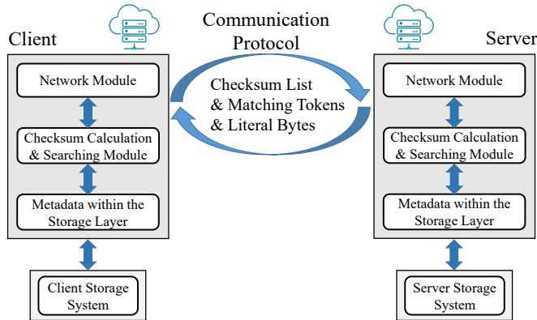  
Figure 4: The architecture overview of SkySync.

The storage layer has already introduced rich metadata that provides valuable insights to reduce redundant computations and improve overall system efficiency for file sync. However, the metadata and corresponding algorithms used by the storage layer are diverse and cannot be directly applied to the sync process. To address the computational overhead in file sync, we propose a lightweight file sync approach with collaborative delta generation that leverages the appropriate metadata within the storage layer.

## 3 Design and Implementation

The architecture of SkySync is shown in Figure 4. We begin by describing the storage-layer metadata in Section 3.1. Next, we present the design of checksum calculation and searching of SkySync in Section 3.2. We then introduce the communication protocol of SkySync in Section 3.3. Finally, we discuss storage-layer checksum extraction of SkySync and its implementation details in Section 3.4 and Section 3.5, respectively.

## 3.1 Rich Metadata of the Storage Layer

We begin by analyzing the rich metadata exposed by modern storage systems. As shown in Table 1, we categorize these systems into four key classes: block devices, file systems, deduplication systems, and distributed storage systems.

Block Devices. SkySync can utilize the metadata from block devices, such as dm-verity [14]. Dm-verity is a device mapper target that offers data verification for block devices by using a dedicated metadata device to store a hash tree of the data device. Each leaf node in this hash tree contains the cryptographic hash of a data block. User-space tools like cryptsetup [12] can be used to compute and dump this hash tree. Dm-verity utilizes the Linux kernel crypto API [24] (e.g., SHA-256, SHA-512, etc.) to calculate the hashes.

File Systems. SkySync can leverage metadata from file systems, such as those supporting fs-verity [19]. Fs-verity is a support layer that enables file systems to seamlessly provide integrity and authenticity protection for files. Currently, it is supported by several file systems, including EXT4 [17], F2FS [51], and BTRFS [9, 10]. Users can enable fs-verity for a file using the FS\_IOC\_ENABLE\_VERITY ioctl system call and retrieve verity metadata with the FS\_IOC\_READ\_VERITY\_METADATA ioctl system call. Moreover, BTRFS automatically applies checksums to both data and metadata. For example, metadata blocks include inline checksums within the B-tree node header, while each data block has a separate checksum stored in the checksum tree. BTRFS supports various hashing algorithms, including CRC32C, XXHASH, SHA-256, and BLAKE2b. ZFS also provides checksums for data and metadata. For each stored block, ZFS calculates and stores a checksum within the block pointer. User-space tools such as btrfs-progs [34] and zbd [36] can dump the checksums of files. These filesystem-level metadata not only serve the filesystem functionality but also play a vital role in enhancing the delta generation process and improving sync efficiency.

Deduplication Systems. SkySync can also benefit from metadata provided by deduplication-based storage and backup systems [53, 59, 82, 83]. For instance, MeGA [82] uses a fine-grained deduplication framework for backup storage. It identifies and removes identical chunks while employing byte-/string-level elimination for similar but non-identical chunks. The 256-bit fingerprints generated by MeGA’s deduplication can serve as strong checksums for SkySync. Additionally, MeGA can calculate 32-bit weak checksums for individual chunks post-deduplication. Other deduplication systems can adopt similar approaches to provide checksums for SkySync.

Distributed Systems. Distributed systems offer diverse metadata that SkySync can utilize. For example, HDFS (The Hadoop Distributed File System) [62] generates and stores checksums for each data block of an HDFS file, which are verified by the HDFS client during reads to detect corruption. BlueStore [8, 39], a storage backend for the Ceph distributed storage system, efficiently implements full data checksums by computing a checksum for every write and verifying it on every read. MooseFS [25] provides checksums for each data block in the chunk server, designed for managing large files. SeaweedFS [32], based on Facebook’s Haystack design [40], is an object store that handles small files efficiently and provides file checksums to ensure data integrity. It chunks files and stores their checksums in volume servers.

## 3.2 Checksum Calculation and Searching

In the case of FSC-based sync methods, SkySync directly leverages metadata of fixed-sized chunks from the storage layer. However, for the CDC-based sync methods like dsync, SkySync follows a two-step process. First, SkySync calculates the weak checksums of the variable-sized chunks, using the metadata acquired from the storage layer. Second, SkySync computes the strong checksums of the weakchecksum-matched chunks. In the following paper, for the sake of clarity and simplicity, we use CRC32C to illustrate the calculation and searching process of the weak checksum, and SHA-256 to represent the strong checksum. Note that, SkySync is not restricted to CRC32C and supports the use of any polynomial checksums that are widely employed in the storage layer.

## 3.2.1 Weak Checksum Calculation

Dsync uses FastCDC technique to split a file into variablesized chunks based on the file’s content and then calculate the weak checksums of all bytes of the file. The client and server of SkySync can also use CDC techniques to split the file, but first read the checksums of each chunk from the storage layer before calculating the weak checksums of the variable-sized chunks. As shown in Figure 5, $C _ { F _ { i } }$ denotes the 4KB chunk split by the storage layer, and $C _ { R _ { i } }$ denotes the variable-sized chunk split by CDC techniques. SkySync has obtained the CRC32C checksums of $C _ { F _ { i } }$ and then SkySync calculates the CRC32C checksums of the variable-sized chunks $C _ { R _ { i } }$ using the checksums of $C _ { F _ { i } }$ , as depicted in the following equations:

$$
C R C ( C _ { R _ { i - 1 } } ) = C R C ( C _ { F _ { i - 1 } } ^ { \prime } ) \oplus C R C ( x )\tag{1}
$$

$$
C R C ( C _ { R _ { i } } ) = \left( C R C ( C _ { F _ { i } } ) \oplus C R C ( x ^ { \prime } ) \right) ^ { \prime } \oplus C R C ( y )\tag{2}
$$

The left boundaries of $C _ { F _ { i - 1 } }$ and $C _ { R _ { i - 1 } }$ in Figure 5 are at the same position. Thus, the CRC32C of $C _ { R _ { i - 1 } }$ can be calculated by Equation 1. It should be noted that $C _ { F _ { i - 1 } } ^ { \prime }$ is constructed by concatenating $C _ { F _ { i - } }$ with zero bits, which have the same length as bytes x. Consequently, the CRC32C of $C _ { F _ { i - 1 } } ^ { \prime }$ can be computed by augmenting the CRC32C of $C _ { F _ { i - 1 } }$ with the appropriate number of trailing zero bits. Similarly, the different bytes between $C _ { F _ { i } }$ and $C _ { R _ { i } }$ are bytes x and bytes y. Therefore, the CRC32C of $C _ { R _ { i } }$ can be calculated by Equation 2.

This design for efficient checksum calculation is based on the algebraic properties of CRC32C. The checksum of a data sequence can be computed from the checksums of its constituent parts. Specifically, for a sequence S formed by concatenating subsequences A and B, its checksum is given by $C R C ( S ) = C R C ( A \cdot 0 ^ { | B | } ) \oplus C R C ( 0 ^ { | A | } \cdot B )$ , where · denotes concatenation, |X| is the length of sequence and $0 ^ { k }$ is a sequence of k zero bits. This combination requires inexpensive exclusive-or (XOR) and appending-zeros operations, regardless of the length of the original sequences. This property is a consequence of the linearity of CRC functions over the finite field GF(2) [49].

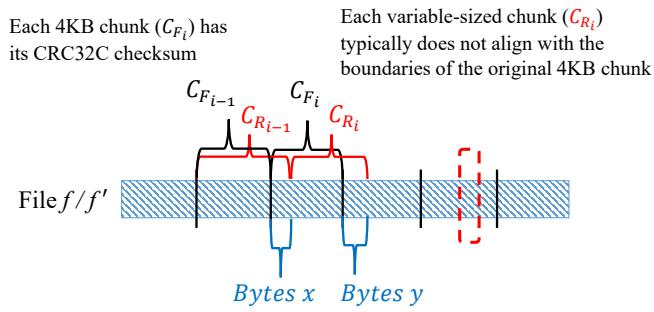  
Figure 5: The weak checksum calculation of SkySync.

Moreover, the calculation of CRC32C of $C _ { R _ { i } }$ uses the CRC32C of bytes x, which has already been calculated in the process of CRC32C calculation of $C _ { R _ { i - 1 } }$ . Thus, only the CRC32C of bytes y needs to be calculated in the process of the CRC32C calculation of $C _ { R _ { i } }$ . SkySync only calculates the CRC32C for the differing bytes, which are typically less than half of the average chunk size. These partial checksums are then concatenated using multiple exclusive-or operations or by appending zeros to obtain the CRC32C checksum of $C _ { R _ { i } }$

The proposed weak checksum calculation method can be generalized to any checksum algorithm that supports linear combination and possesses a XOR-friendly algebraic structure [38,47], as exemplified by CRC32C. This provides significant flexibility for SkySync in calculating weak checksums across various systems that apply different chunk sizes.

## 3.2.2 Chunk Searching

The chunk searching mechanism of rsync traverses from the 16-bit hash code to the 32-bit weak checksum and ultimately to the strong checksum. This process requires frequent dereferencing of pointers to locate the matched chunks between the old and new files. Dsync performs a comparison of the FastFP weak checksums between the old and new files on the server side, utilizing an additional hash table similar to rsync. On the client side, it compares the SHA-1 checksums of the weak-checksum-matched chunks based on the matching tokens received from the server.

In contrast with rsync and dsync, SkySync’s hash table is structured as a flat array of pre-allocated buckets as shown in Figure 6. Each bucket is a sub-array capable of storing metadata for multiple chunks. To support different sync modes, a bucket can hold two distinct types of entries: one is dedicated to storing solely the weak checksums of the chunks (Entry1, utilized by CDC-based SkySync in the server side), while the other is designed to accommodate both weak and strong checksums of the chunks (Entry2, utilized by FSC-based SkySync in the client side). To manage chunk placement and lookups, SkySync employs a streamlined Cuckoo hashing scheme [60, 65] that assigns two candidate buckets to each chunk. To eliminate the overhead of separate key generation and a second hash function, SkySync derives both bucket locations directly from a chunk’s existing CRC32C checksum. The primary bucket position $P _ { 1 }$ , and the secondary position $P _ { 2 }$ , are calculated as follows:

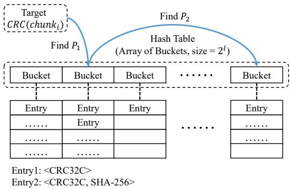  
Figure 6: The hash table used by SkySync.

$$
P _ { 1 } = C R C ( c h u n k _ { i } ) \mod 2 ^ { l }\tag{3}
$$

$$
P _ { 2 } = ( P _ { 1 } \oplus 2 ^ { l - 1 } )\tag{4}
$$

Here, $2 ^ { l }$ is the size of the hash table. As shown in Equation 3, P1 is the checksum modulo the table size. $P _ { 2 }$ is then derived by flipping the most significant bit of $P _ { 1 }$ via a single XOR operation (Equation 4). This lightweight, deterministic approach ensures that a chunk’s two candidate buckets always reside in different halves of the hash table, which is crucial for resolving collisions. During an insertion, a chunk’s entry can be placed in either of these two locations.

SkySync pre-allocates each hash bucket with a capacity of four entries. This choice is based on our empirical finding that the table-wide load factor reaches 0.85-0.91 before any bucket overflows, allowing for high memory utilization near the practical limits of Cuckoo hashing [43, 65, 84, 85] while minimizing resizing. The overall table size $2 ^ { l } .$ , is then calculated to accommodate the total number of chunks (csum\_nums) at a target load\_ f actor:

$$
l = \left\lceil \log _ { 2 } \left( \frac { c s u m \_ n u m s / 4 } { l o a d \_ f a c t o r } \right) \right\rceil\tag{5}
$$

This equation first determines the ideal number of buckets required (csum\_nums/4) and then provisions additional space based on the target load\_ f actor. Due to the lower hash collision ratio of CRC32C in comparison to Adler32 and FastFP, as well as the reduced collision ratio of a 32-bit hash value compared to a 16-bit hash value, SkySync encounters fewer entries in each bucket, resulting in a reduced need for resizing operations. Once the hash table is established, SkySync can efficiently locate the respective buckets and continuously compare the weak and strong checksums of the chunks.

## 3.3 Communication Protocol

Given the potential heterogeneity of storage environments between the client and server, variations in chunk size and checksum type can preclude direct utilization of storage layer metadata. To address this challenge, SkySync implements an enhanced communication protocol to negotiate metadata settings during file sync. This negotiation process includes determining the appropriate chunk size and checksum type to be used for delta generation. Regardless of whether rsync or dsync is employed, SkySync requires both the client and server to exchange their respective chunk size and checksum type information in the initial request. Subsequently, they align on a unified setting based on the predefined strategy in Section 3.3.1 and Section 3.3.2. By establishing these parameters upfront, SkySync ensures a seamless sync process across diverse storage environments, while minimizing the need for redundant computations.

## 3.3.1 Handling Differences in Chunk Sizes

When the client and server have different chunk sizes, SkySync resolves this discrepancy by aligning with the entity responsible for sending the checksum list first. Specifically, in FSC-based sync, SkySync adopts the server’s chunk size, while in CDC-based sync, it aligns with the client.

FSC-based Alignment. In the FSC-based sync workflow (see Figure 1), the server is responsible for sending the checksum list of the old file to the client upon receiving its sync request. Therefore, in SkySync, the client aligns with the server’s chunk size. Despite differing chunk sizes, the client can efficiently compute chunk weak checksums using existing storage metadata with simple adaptation and combination. For instance, if the client uses 4KB chunks while the server uses 8KB chunks, the client can derive the CRC32C checksum of an 8KB chunk S by XORing the CRC32C of two 4KB chunks A and B, i.e., CRC(S) = CRC(A′) ⊕CRC(B). Here, A′ represents an 8KB chunk constructed by concatenating A with a series of zero bits. This approach enables the client to adapt to the server’s chunk size using existing storage metadata with minimal computational overhead.

CDC-based Alignment. In CDC-based sync workflow (see Figure 2), the client first splits the file into variable-sized chunks according to its predefined minimum/expected average/maximum chunk sizes. The server then aligns with the client’s chunking strategy. Then the weak checksum of each variable-sized chunk is computed by combining the CRC32C checksums of fixed-sized chunks from the storage layer as detailed in Section 3.2.1.

## 3.3.2 Handling Differences in Checksum Types

When the client and server have different checksum types, SkySync resolves this issue by adopting a default strategy that prioritizes widely supported algorithms while maintaining compatibility with existing storage metadata.

Weak Checksum Selection. SkySync defaults to CRC32C as the weak checksum due to its widespread adoption in modern storage systems. If either the client or server provides CRC32C checksums, they are used directly.

Strong Checksum Selection. For strong checksums, SkySync prefers cryptographic hashes such as SHA-256 or SHA-1. If both the client and the server provide cryptographic hashes, SkySync adopts the server’s hash type to minimize computational overhead on the server side. For example, if the client uses SHA-256 and the server uses SHA-1, SkySync defaults to SHA-1 since the server computes the strong checksum first in both FSC and CDC.

## 3.4 Storage-layer Checksum Extraction

As summarized in Table 1, SkySync employs three methods to access the metadata and extract checksums across diverse storage systems, designed to balance broad compatibility with the practicalities of integration.

(1) User-space tools. SkySync utilizes user-space tools like fs-verity and btrfs-progs to directly extract checksums into memory for local file systems such as EXT4 and BTRFS. This method operates without requiring kernel modifications or deep integration into file system, ensuring broad compatibility and ease of deployment. Although fs-verity’s hash verification during reads can increase latency for small or random read workloads, it can mitigate this using a Merkle tree-based structure [19] for constant-time verification. Our tests on fs-verity-enabled file systems (EXT4, F2FS, BTRFS) using FIO [18] show a modest latency increase up to 4.7% for sequential and random read/write operations across different thread counts and block sizes. Throughput remains comparable to non-fs-verity systems. We thus conclude that enabling fs-verity has minimal impact on overall file system performance. This method shifts the integration burden to system administrators, as it requires explicit, per-filesystem configuration.

(2) System APIs. For systems that expose APIs for metadata retrieval, SkySync leverages these interfaces to fetch checksums from metadata files stored on either local or remote servers. This method is exemplified by its use with HDFS NameNode [62], where metadata is centrally managed and accessible via well-defined APIs. Using system APIs leverages existing distributed infrastructure to retrieve metadata quickly but may introduce network latency when accessing remote metadata servers. This latency can be partially mitigated through batched requests [32, 62] and the use of high-speed network interconnects. This API-driven method is the most robust and sustainable integration path, as it relies on stable, public interfaces maintained by the underlying system.

(3) Custom functions. For systems lacking suitable tools or APIs, such as the MeGA deduplication system, SkySync implements custom functions to directly parse on-disk metadata formats. To simplify this process, SkySync infers chunk offsets from their sequence number and fixed size, thus avoiding the need to track complex offset maps. SkySync decouples checksum extraction from storage-specific logic, ensuring compatibility across diverse systems without deep integration. However, this approach incurs a significant maintenance burden, as each custom function may require updates to remain compatible with new versions of the target storage system.

## 3.5 Implementation

SkySync adopts the same data structures as rsync and dsync for transmitting the checksum list, matching tokens and delta bytes because these data structures are also efficient and suitable for SkySync.

We provide an HTTP-based communication protocol between the client and server (Network Module shown in Figure 4) to facilitate SkySync. For FSC-based SkySync, the client initiates a HTTP(S) GET request to obtain the weak checksum list of the old file from the server. Then the client sends the matching tokens and delta bytes to the server via a HTTP(S) POST request. For CDC-based SkySync, the client first posts the weak checksum list of its file to the server. Subsequently, the server responds with the matching tokens and strong checksum list to the client. Finally, the client posts the matching tokens and delta bytes to the server.

We implement the client and server sides of FSC-based SkySync on top of the librsync [22] library using about 1100 lines of C++ code. As the original prototype of dsync [45] is not open-source, we implement the client and server side of dsync which leverage FastCDC as its chunking algorithm using about 1800 lines of C++ code. The prototype of dsync we implemented is as efficient as the original one. Then we implement the client and server sides of CDC-based SkySync by adding about 1600 lines of C++ code to dsync.

## 4 Evaluation

## 4.1 Experimental Setup

Testbed. We conduct our experiments on two Alibaba Cloud servers. Each instance is equipped with a quad-core Intel Xeon 8269CY vCPU (2.5 GHz), 32 GB of memory, and a 1 TB, 300 MB/s cloud SSD backed by EBS [80]. The instances run Ubuntu 22.04 with the Linux 5.15.0-71-generic kernel and use the BTRFS filesystem. Two instances are located in separate data centers, connected over WAN with an average network Round Trip Time (RTT) of 35ms and 500Mbps bandwidth.

Delta Sync Methods. We evaluate SkySync against two stateof-the-art baselines: rsync and dsync. In all figures presented, “Rsync”, “Dsync”, “SkySync-F”, and “SkySync-C” respectively denote rsync, dsync, FSC-based SkySync, and CDCbased SkySync. For rsync and FSC-based SkySync, we set the chunk size to 8KB. In the case of dsync and CDC-based SkySync, the minimum/average/maximum chunk sizes are 4KB/8KB/12KB, which is the same as the default chunk sizes in the Dell-EMC Data Domain system [13, 57]. We evaluate both traditional implementations and hardware-accelerated optimizations of these sync methods. In hardware-accelerated configurations, hash computations are optimized using AVX, SSE’s SHA-NI, and CRC instructions. We primarily depict the results for traditional implementations as the hardwareaccelerated (HW) version exhibits similar performance trends. The figures in this section show performance without HW assist, while the corresponding HW-assisted performance results are included throughout the descriptive text. All experimental configurations are kept consistent across tests, and each result represents the mean of 10 runs (with error bars).

Table 2: Five real-world datasets.
<table><tr><td rowspan=1 colspan=1>Name</td><td rowspan=1 colspan=1>Total Size</td><td rowspan=1 colspan=1>Description</td></tr><tr><td rowspan=1 colspan=1>Chat</td><td rowspan=1 colspan=1>25.4 GB</td><td rowspan=1 colspan=1>Two versions of personal WeChat chatlogs, dated 2024.03.26 and 2024.08.23.</td></tr><tr><td rowspan=1 colspan=1>Ubuntu</td><td rowspan=1 colspan=1>32.8 GB</td><td rowspan=1 colspan=1>Two versions including 34 minor ver-sions of Ubuntu images,spanning fivemajor versions (14.04-22.04) [33].</td></tr><tr><td rowspan=1 colspan=1>Nutsnap</td><td rowspan=1 colspan=1>53.7 GB</td><td rowspan=1 colspan=1>Two versions of personal NutStore[26] snapshots,dated 2023.12.07 and2024.08.10.</td></tr><tr><td rowspan=1 colspan=1>Enwiki</td><td rowspan=1 colspan=1>188.5 GB</td><td rowspan=1 colspan=1>Two versions from 2024.05.01 and2024.07.01 [35].</td></tr><tr><td rowspan=1 colspan=1>Kernel</td><td rowspan=1 colspan=1>221.3 GB</td><td rowspan=1 colspan=1>200 minor versions of the Linux Kernelsource code,spanning two major ver-sions (5.15 and 6.1) [23].</td></tr></table>

## Dataset. We consider two types of datasets:

• Micro-benchmark dataset. The dataset includes 10MB and 100MB files extracted from the public dataset [35]. Following the methodologies of WebR2sync+ [76] and dsync [45], we apply random modifications to the original files using three operations: “insert”, “cut”, and “inverse”. Specifically, “insert” adds a random data block, “cut” removes a portion, and “inverse” flips the binary data. The modification sizes for 10MB file are 256B, 2KB, 16KB, 128KB, and 1MB. Similarly, the modification sizes for 100MB file are 2KB, 16KB, 128KB, 1MB, and 8MB. We apply a series of randomly placed, non-overlapping modifications, each exactly 256 bytes in size. For example, to achieve 8MB of total changes within a 100MB file, we perform 32,768 distinct modifications. Moreover, we also include the unmodified files (where client and server files are identical) as part of the dataset.

• Real-world dataset. We collect five real-world datasets, as summarized in Table 2. Each dataset encompasses a variety of modifications, including insertions, deletions, updates, unmodified content, and mixed changes.

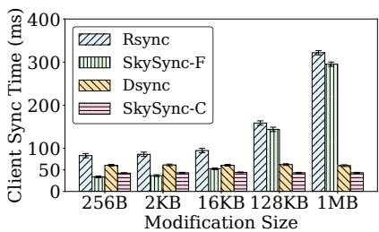

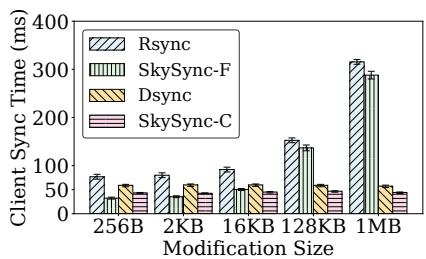

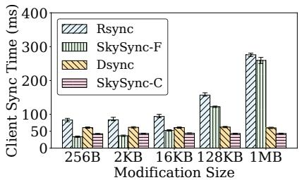  
Figure 7: Client sync time for insert (left), cut (middle) and inverse (right) modifications on 10MB file without HW.

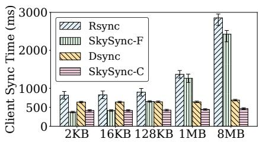  
Modification Size

  
Modification Size

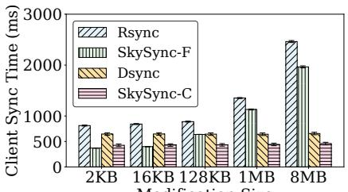  
Modification Size  
Figure 8: Client sync time for insert (left), cut (middle) and inverse (right) modifications on 100MB file without HW.

## 4.2 Micro-benchmarks

Client and Server Sync Time. We first evaluate the client sync time of rsync, dsync, and SkySync across varying modification sizes for four different types of modifications, as illustrated in Figures 7, 8, and 9. The sync time consumed by the client, which is mainly composed of delta generation, can represent the computing overhead and resource occupation of the client during the sync. As we described in Section 2.2, rsync and dsync have different delta generation operations on the client side. Rsync computes the weak checksums of the file using a sliding window byteby-byte. Therefore, when the modification size becomes larger, the client needs to calculate more weak checksums to find the duplicate chunks, which leads to a significant increase in client sync time. The client of SkySync-F performs 1.2×∼2.0× (1.1×∼1.8× with HW) faster than rsync while reducing 32.1%∼64.9% (20.5%∼54.3% with HW) computational overhead, owing to its faster checksum calculation and chunk searching process. The client of SkySync-C performs 1.3×∼1.7× (1.2×∼1.6× with HW) faster than dsync while reducing 25.7%∼42.3% (20.5%∼35.3% with HW) computational overhead because SkySync uses the faster exclusive-or and appending-zeros operations to calculate the weak checksums, and the lightweight hashing process to accelerate the chunk searching phase. It is worth noting that the client of SkySync-F performs fastest when the files on both client and server are identical.

We then evaluate the server sync time for insert modifications as shown in Figures 10 and 11. The results for other modifications are similar to the insert modifications, so we omit them here. Since the rsync server does not perform rolling checksum calculation and chunk searching, its sync time is lower than that of the client. For dsync, the server needs to calculate the weak and strong checksums of the chunks and perform chunk searching to find the weak-checksum-matched chunks. The server of SkySync only needs to read the checksums of files from the storage layer and employs the fast checksum combining and searching process. Therefore, it performs faster than other sync methods and reduces by up to 89.3% (76.5% with HW) computational overhead compared to rsync and dsync.

Total Sync Time. We evaluate the total sync time, consisting of client sync time, server sync time, and network transfer time, of different sync methods for insert modifications under 100Mbps and 500Mbps network bandwidths as shown in Figure 12. The total sync time under 100Mbps bandwidth is more than that under 500Mbps bandwidth due to the longer network transfer time, yet it is still dominated by checksum calculation and searching. As a result, we observe similar results as in previous experiments that SkySync outperforms its counterparts in all settings. When the modification size is small, SkySync-F shows the lowest total sync time. For example, SkySync-F reduces 26.7%∼72.1% (18.2%∼62.9% with HW) sync time compared to rsync and dsync when the modification size is smaller than 2KB (for 10MB file) and 128KB (for 100MB file).

Breakdown Sync Time. We further break down the sync time for insert modifications with 100MB file. Figure 13 shows the results of different sync methods with and without hardware acceleration. SkySync-F reduces the checksum calculation time by 23.4%∼88.3% (12.6%∼81.1% with HW) and the chunk searching time by up to 61.3% compared to rsync, as SkySync-F leverages storage-layer metadata and a lightweight hashing process to expedite the delta generation. Additionally, SkySync-C reduces the checksum calculation time by 24.5%∼33.6% (21.7%∼29.5% with HW) and the chunk searching time by 65.7% compared to dsync, owing to SkySync-C’s faster checksum combining and chunk searching processes. Moreover, the performance difference between hardware-accelerated and non-accelerated results is up to 10.8%, primarily due to reduced total sync time from faster checksum calculations across all three methods include SkySync. Nevertheless, the overall speed-up effect on sync remains modest. SkySync continues to outperform both rsync and dsync, even under hardware acceleration.

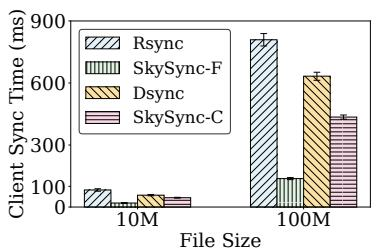  
Figure 9: Client sync time for unmodified files without HW.

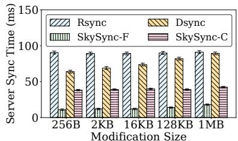  
Figure 10: Server sync time for insert with 10MB file without HW.

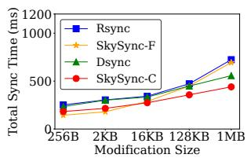  
(a) 10MB file and 100Mbps b/w

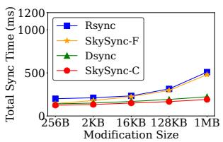  
(b) 10MB file and 500Mbps b/w

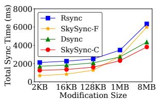

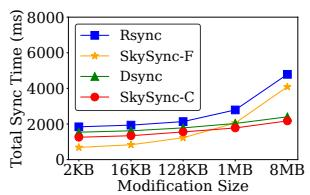  
(c) 100MB file and 100Mbps b/w (d) 100MB file and 500Mbps b/w  
Figure 12: Total sync time under different network bandwidths for insert modifications without HW.

## 4.3 Real-World Datasets

Multi-threaded Sync Time. We conduct our tests for five real-world datasets with different numbers of threads. Figure 14 shows the results. For a fair comparison, we implement the same multi-threading mechanism for rsync and dsync as used in SkySync. In this setup, upon receiving a sync request, a dedicated thread is assigned to process either an entire file or a specific region of a large file. The number of threads on both the client and server sides is consistent across all sync methods. The enwiki and kernel datasets have longer sync times, primarily due to their larger size than the other datasets. Furthermore, despite the ubuntu dataset being smaller than the nutsnap dataset, it had a significantly higher modification ratio. This resulted in longer sync times for ubuntu, as more bytes and checksums required calculation and comparison. SkySync consistently demonstrates advantages over rsync and dsync for all real-world datasets, achieving speed improvements of approximately 1.2×∼1.5× (1.15×∼1.4× with HW), due to the fast checksum calculation and chunk searching process.

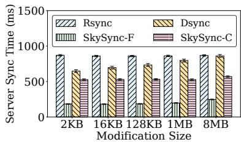  
Figure 11: Server sync time for insert with 100MB file without HW.

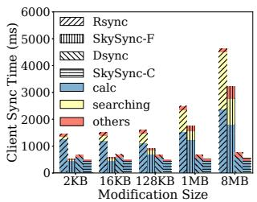

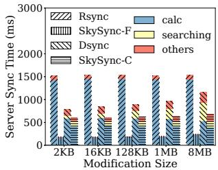

(a) Client sync time  
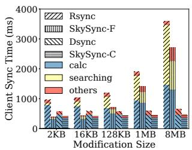  
(b) Server sync time

(c) Client sync time with HW  
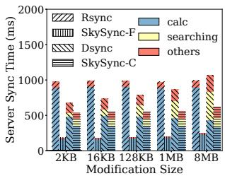  
(d) Server sync time with HW  
Figure 13: Breakdown sync time for insert modifications with 100MB file.

Total Sync Time. We then evaluate the total breakdown sync time of different sync methods using a single thread. Figures 15 and 16 show the results without and with hardware acceleration, respectively. The client and server sync times of SkySync are reduced by 19.2%∼43.7% (16.2%∼36.4% with HW) compared to rsync and dsync, which consistently demonstrates the effectiveness of SkySync in file sync.

Network Traffic. Figure 17 shows the network sync traffic of different sync methods. SkySync exhibits a consistent level of network traffic comparable to both rsync and dsync. This is because SkySync adopts 32-bit CRC32C and 256-bit SHA-256 checksums and uses the same data structures as rsync and dsync to transmit checksum list, matching tokens, and delta data. The traffic volume of SkySync is slightly more than rsync and dsync due to the inclusion of additional bits for strong checksums. Overall, the network transfer time of SkySync is almost the same as that of rsync and dsync. Furthermore, despite the ubuntu dataset being smaller in size compared to the nutsnap and kernel dataset, it generates more network traffic (delta data) due to its higher modification ratio. Overhead of Metadata Extraction. We measure the time required to extract metadata from the five real-world datasets across EXT4, F2FS, and BTRFS using user-space tools, and from MeGA using custom functions developed in SkySync. For EXT4 and F2FS, we enable fs-verity and extract SHA-256 checksums for each 8KB block. For BTRFS, we utilize its built-in SHA-256 and CRC32C checksums, with fsverity disabled. For MeGA, we extract SHA-256 and CRC32C checksums, respectively. The results, illustrated in Figure 18, demonstrate that metadata extraction from BTRFS and MeGA is significantly faster than that from EXT4 and F2FS. This discrepancy arises because fs-verity, as an extension to EXT4 and F2FS, requires a more complex metadata extraction process compared to BTRFS, which natively stores checksums within its file system metadata. Additionally, SkySync’s custom functions efficiently extract metadata from MeGA due to their known metadata storage structures. We observe that the time of extracting the metadata of each dataset (1.8 sec ∼ 119.2 sec) is much less than that of directly calculating the checksums of the same dataset (26 sec ∼ 246 sec, not shown in this figure) under the same experimental settings. Furthermore, the extraction time of each dataset accounts for a relatively small proportion of its total sync time in SkySync, ranging from 0.11% to 7.14% for BTRFS. This indicates that the metadata extraction process in SkySync is efficient and does not incur high overhead.

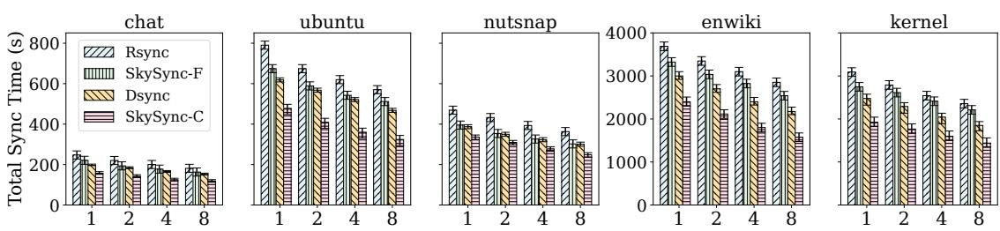  
Figure 14: Sync performance for five real-world datasets with different threads (1, 2, 4, and 8) without HW.

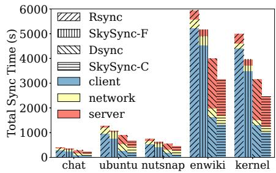  
Figure 15: Sync time breakdown.

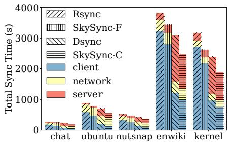  
Figure 16: Time breakdown with HW.

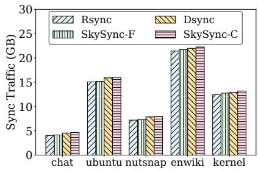  
Figure 17: Sync traffic for five realworld datasets.

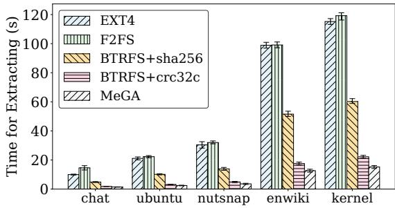  
Figure 18: Extracting metadata.

## 5 Conclusion

Traditional file sync schemes, such as rsync and dsync, introduce considerable computational burdens on both clients and servers due to their costly delta generation. This is inefficient for not only traditional intra-cloud data sharing and processing but also for the emerging inter-cloud Sky computing. This paper presents SkySync, a lightweight file sync scheme based on collaborative delta generation, which accelerates file sync by leveraging the storage-layer metadata. The evaluation results show that SkySync outperforms state-ofthe-art file sync schemes (rsync and dsync) while maintaining a consistent level of network traffic. In future work, we aim to expand metadata extraction to more storage systems. We have open-sourced SkySync at https://github.com/ skysync-project/skysync.

## Acknowledgments

We thank our shepherd, Prof. Dalit Naor, and the anonymous reviewers for their valuable comments and suggestions. Zhihao Zhang, Huiba Li, and Lu Tang are co-primary authors. The work is supported by the National Key Research and Development Program of China (grant no. 2022YFB4500300) and the National Natural Science Foundation of China (grant no. 62441220). Yiming Zhang is the corresponding author.

## References

[1] Accelerate MD5 using AVX-512. https://github. com/minio/md5-simd.

[2] Accelerate SHA-1 using Intel SHA intrinsics. https://www.intel.com/content/ www/us/en/developer/articles/technical/ intel-sha-extensions.html.

[3] Alibaba Cloud ECS Features. https://www. alibabacloud.com/en/product/ecs.

[4] Alibaba Cloud OSS Data Verification. https: //www.alibabacloud.com/help/en/oss/ developer-reference/data-verification-2.

[5] Amazon EC2 Features. https://aws.amazon.com/ ec2/features/.

[6] Attic Backup System. https://attic-backup.org/.

[7] AWS S3 Object Integrity. https://docs.aws. amazon.com/AmazonS3/latest/userguide/ checking-object-integrity.html.

[8] Bluestore Configuration Reference. https:// docs.ceph.com/en/reef/rados/configuration/ bluestore-config-ref/.

[9] BTRFS Checksumming. https://btrfs. readthedocs.io/en/latest/Checksumming.html.

[10] BTRFS Deduplication. https://btrfs. readthedocs.io/en/latest/Deduplication. html.

[11] Build hybrid and multicloud architectures using Google Cloud. https://cloud.google.com/ architecture/hybrid-multicloud-patterns.

[12] Cryptsetup. https://gitlab.com/cryptsetup/ cryptsetup/-/wikis/DMVerity.

[13] Dell EMC. https://www.dellemc.com/en-us/ data-protection/data-domain-backup-storage. htm.

[14] DM-Verity. https://docs.kernel.org/ admin-guide/device-mapper/verity.html.

[15] Dropbox. https://www.dropbox.com/dropbox.

[16] Dropbox Rsync. https://github.com/dropbox/ fast\_rsync.

[17] EXT4 File System. https://ext4.wiki.kernel. org/.

[18] Flexible I/O Tester. https://github.com/axboe/ fio.

[19] fs-verity. https://www.kernel.org/doc/html/ next/filesystems/fsverity.html.

[20] Google Cloud Storage Object Integrity. https:// cloud.google.com/storage/docs/hashes-etags.

[21] Google Drive. https://www.google.com/drive/.

[22] Librsync Library. https://github.com/librsync/ librsync.

[23] Linux Kernel Archives. https://www.kernel.org/.

[24] Linux Kernel Crypto API. https://www.kernel. org/doc/html/v4.10/crypto/index.html.

[25] MooseFS. https://github.com/moosefs/moosefs.

[26] Nutstore. https://www.jianguoyun.com/.

[27] OneDrive. https://www.microsoft. com/en-us/microsoft-365/onedrive/ online-cloud-storage.

[28] OneFS Operating System. https://www. dell.com/en-uk/dt/storage/isilon/ onefs-operating-system.htm.

[29] Restic Backup System. https://restic.net/.

[30] Seafile. https://www.seafile.com/home/.

[31] Seafile CDC Implementation. https://github.com/ haiwen/seafile/blob/master/common/cdc/cdc. c.

[32] SeaweedFS. https://github.com/seaweedfs/ seaweedfs/wiki.

[33] Ubuntu Archive. http://archive.ubuntu.com/.

[34] Userspace BTRFS Tools. https://github.com/ kdave/btrfs-progs.

[35] Wikipedia Backups Dataset. https://dumps. wikimedia.org/enwiki/.

[36] ZDB Manual Page. https://openzfs.github.io/ openzfs-docs/man/master/8/zdb.8.html.

[37] ZFS Checksums. https://openzfs.github.io/ openzfs-docs/Basic%20Concepts/Checksums. html.

[38] Zlib Project. https://www.zlib.net/.

[39] Abutalib Aghayev, Sage Weil, Michael Kuchnik, Mark Nelson, Gregory R. Ganger, and George Amvrosiadis. File systems unfit as distributed storage backends: lessons from 10 years of ceph evolution. In Proceedings of ACM Symposium on Operating Systems Principles (SOSP’19), pages 353–369, 2019.

[40] Doug Beaver, Sanjeev Kumar, Harry C. Li, Jason Sobel, and Peter Vajgel. Finding a needle in haystack: Facebook’s photo storage. In Proceedings of USENIX Symposium on Operating Systems Design and Implementation (OSDI’10), pages 1–14, 2010.

[41] Sarah Chasins, Alvin Cheung, Natacha Crooks, Ali Ghodsi, Ken Goldberg, Joseph E. Gonzalez, Joseph M. Hellerstein, Michael I. Jordan, Anthony D. Joseph, Michael W. Mahoney, Aditya Parameswaran, David Patterson, Raluca Ada Popa, Koushik Sen, Scott Shenker, Dawn Song, and Ion Stoica. The sky above the clouds. arXiv preprint arXiv:2205.07147, 2022.

[42] Jian Chen, Minghao Zhao, Zhenhua Li, Ennan Zhai, Feng Qian, Hongyi Chen, Yunhao Liu, and Tianyin Xu. Lock-Free collaboration support for cloud storage services with operation inference and transformation. In Proceedings of USENIX Conference on File and Storage Technologies (FAST’20), pages 13–27, 2020.

[43] Zhangyu Chen, Yu Hua, Bo Ding, and Pengfei Zuo. Lock-free concurrent level hashing for persistent memory. In Proceedings of USENIX Annual Technical Conference (ATC’20), pages 799–812, 2020.

[44] Yong Cui, Zeqi Lai, Xin Wang, Ningwei Dai, and Congcong Miao. Quicksync: Improving synchronization efficiency for mobile cloud storage services. In Proceedings of Annual International Conference on Mobile Computing and Networking (MobiCom’15), pages 592– 603, 2015.

[45] Yuan He, Lingfeng Xiang, Wen Xia, Hong Jiang, Zhenhua Li, Xuan Wang, and Xiangyu Zou. dsync: a lightweight delta synchronization approach for cloud storage services. In Proceedings of IEEE Symposium on Mass Storage Systems and Technologie (MSST’20), pages 1–14, 2020.

[46] Cheng Huang, Huseyin Simitci, Yikang Xu, Aaron Ogus, Brad Calder, Parikshit Gopalan, Jin Li, and Sergey Yekhanin. Erasure coding in windows azure storage. In Proceedings of USENIX Annual Technical Conference (ATC’12), pages 15–26, 2012.

[47] Intel. Using Adler-32 Checksum and CRC32 Hash to Ensure Data Compression Integrity. https://ext4. wiki.kernel.org/.

[48] Paras Jain, Sam Kumar, Sarah Wooders, Shishir G. Patil, Joseph E. Gonzalez, and Ion Stoica. Skyplane: Optimizing transfer cost and throughput using Cloud-Aware overlays. In Proceedings of USENIX Symposium on Networked Systems Design and Implementation (NSDI’23), pages 1375–1389, 2023.

[49] P. Koopman. 32-bit cyclic redundancy codes for internet applications. In Proceedings of International Conference on Dependable Systems and Networks, pages 459–468, 2002.

[50] Patrick Lavin, Jeffrey Young, Richard Vuduc, Jason Riedy, Aaron Vose, and Daniel Ernst. Evaluating gather and scatter performance on cpus and gpus. In Proceedings of the International Symposium on Memory Systems (MEMSYS’20), pages 209–222, 2021.

[51] Changman Lee, Dongho Sim, Jooyoung Hwang, and Sangyeun Cho. F2FS: A new file system for flash storage. In Proceedings of USENIX Conference on File and Storage Technologies (FAST’15), pages 273–286, 2015.

[52] Shenglong Li, Quanlu Zhang, Zhi Yang, and Yafei Dai. Understanding and surpassing dropbox: Efficient incremental synchronization in cloud storage services. In Proceedings of IEEE Global Communications Conference (GLOBECOM’15), pages 1–7, 2015.

[53] Zonghui Li, Gilbert Chen, and Yangdong Deng. Duplicacy: A new generation of cloud backup tool based on lock-free deduplication. IEEE Transactions on Cloud Computing, pages 2508–2520, 2022.

[54] Bo Mao, Jindong Zhou, Suzhen Wu, Hong Jiang, Xiao Chen, and Weijian Yang. Improving flash memory performance and reliability for smartphones with i/o deduplication. IEEE Transactions on Computer-Aided Design of Integrated Circuits and Systems, pages 1017– 1027, 2019.

[55] Ali José Mashtizadeh, Andrea Bittau, Yifeng Frank Huang, and David Mazières. Replication, history, and grafting in the ori file system. In Proceedings of ACM Symposium on Operating Systems Principles (SOSP’13), pages 151–166, 2013.

[56] Athicha Muthitacharoen, Benjie Chen, and David Mazières. A low-bandwidth network file system. In Proceedings of ACM Symposium on Operating Systems Principles (SOSP’01), pages 174–187, 2001.

[57] Fan Ni and Song Jiang. Rapidcdc: Leveraging duplicate locality to accelerate chunking in cdc-based deduplication systems. In Proceedings of ACM Symposium on Cloud Computing (SoCC’19), pages 220–232, 2019.

[58] Fan Ni, Xing Lin, and Song Jiang. Ss-cdc: a twostage parallel content-defined chunking for deduplicating backup storage. In Proceedings of ACM International Conference on Systems and Storage (SYSTOR’19), pages 86–96, 2019.

[59] Myoungwon Oh, Sungmin Lee, Samuel Just, Young Jin Yu, Duck-Ho Bae, Sage Weil, Sangyeun Cho, and Heon Y. Yeom. TiDedup: A new distributed deduplication architecture for ceph. In Proceedings of USENIX Annual Technical Conference (ATC’23), pages 117–131, 2023.

[60] Rasmus Pagh and Flemming Friche Rodler. Cuckoo hashing. In Algorithms-ESA, pages 121–133. Springer Berlin Heidelberg, 2001.

[61] Jonatan Schroeder. Device-Independent On Demand Synchronization in the Unico File System. PhD dissertation, The University of British Columbia, 2016.

[62] Konstantin Shvachko, Hairong Kuang, Sanjay Radia, and Robert Chansler. The hadoop distributed file system. In Proceedings of IEEE Symposium on Mass Storage Systems and Technologies (MSST’10), pages 1–10, 2010.

[63] Chunlin Song, Xianzhang Chen, Duo Liu, Xiaoliu Feng, Xi Yu, Jiali Li, Yujuan Tan, and Ao Ren. Cadedup: Highperformance consistency-aware deduplication based on persistent memory. In Proceedings of IEEE International Conference on Computer Design (ICCD’22), pages 726–729, 2022.

[64] Ion Stoica and Scott Shenker. From cloud computing to sky computing. In Proceedings of the Workshop on Hot Topics in Operating Systems (HotOS’21), pages 26–32, 2021.

[65] Yuanyuan Sun, Yu Hua, Song Jiang, Qiuyu Li, Shunde Cao, and Pengfei Zuo. SmartCuckoo: A fast and Cost-Efficient hashing index scheme for cloud storage systems. In Proceedings of USENIX Annual Technical Conference (ATC’17), pages 553–565, 2017.

[66] Andrew Tridgell. Efficient Algorithms for Sorting and Synchronization. PhD dissertation, The Australian National University, 1999.

[67] Andrew Tridgell and Paul Mackerras. The Rsync Algorithm. https://rsync.samba.org/tech\_report/.

[68] Sreeharsha Udayashankar, Abdelrahman Baba, and Samer Al-Kiswany. VectorCDC: Accelerating data deduplication with vector instructions. In Proceedings of USENIX Conference on File and Storage Technologies (FAST’25), pages 513–522, 2025.

[69] Sage A. Weil, Scott A. Brandt, Ethan L. Miller, Darrell D. E. Long, and Carlos Maltzahn. Ceph: A scalable, high-performance distributed file system. In Proceedings of Symposium on Operating Systems Design and Implementation (OSDI’06), pages 307–320, 2006.

[70] Suzhen Wu, Longquan Liu, Hong Jiang, Hao Che, and Bo Mao. Pandasync: Network and workload aware hybrid cloud sync optimization. In Proceedings of IEEE International Conference on Distributed Computing Systems (ICDCS’19), pages 282–292, 2019.

[71] Suzhen Wu, Zhanhong Tu, Zuocheng Wang, Zhirong Shen, and Bo Mao. When delta sync meets messagelocked encryption: a feature-based delta sync scheme for encrypted cloud storage. In Proceedings of IEEE International Conference on Distributed Computing Systems (ICDCS’21), pages 337–347, 2021.

[72] Suzhen Wu, Zhanhong Tu, Yuxuan Zhou, Zuocheng Wang, Zhirong Shen, Wei Chen, Wei Wang, Weichun Wang, and Bo Mao. Fastsync: A fast delta sync scheme for encrypted cloud storage in high-bandwidth network environments. ACM Transactions on Storage, pages 1–22, 2023.

[73] Nai Xia, Chen Tian, Yan Luo, Hang Liu, and Xiaoliang Wang. UKSM: Swift memory deduplication via hierarchical and adaptive memory region distilling. In Proceedings of USENIX Conference on File and Storage Technologies (FAST’18), pages 325–340, 2018.

[74] Wen Xia, Can Wei, Zhenhua Li, Xuan Wang, and Xiangyu Zou. Netsync: A network adaptive and deduplication-inspired delta synchronization approach for cloud storage services. IEEE Transactions on Parallel and Distributed Systems, pages 2554–2570, 2022.

[75] Wen Xia, Yukun Zhou, Hong Jiang, Dan Feng, Yu Hua, Yuchong Hu, Qing Liu, and Yucheng Zhang. FastCDC: A fast and efficient Content-Defined chunking approach for data deduplication. In Proceedings of USENIX Annual Technical Conference (ATC’16), pages 101–114, 2016.

[76] He Xiao, Zhenhua Li, Ennan Zhai, Tianyin Xu, Yang Li, Yunhao Liu, Quanlu Zhang, and Yao Liu. Towards web-based delta synchronization for cloud storage services. In Proceedings of USENIX Conference on File

and Storage Technologies (FAST’18), pages 155–168, 2018.

[77] Qirui Yang, Runyu Jin, and Ming Zhao. SmartDedup: Optimizing deduplication for resource-constrained devices. In Proceedings of USENIX Annual Technical Conference (ATC’19), pages 633–646, 2019.

[78] Zongheng Yang, Zhanghao Wu, Michael Luo, Wei-Lin Chiang, Romil Bhardwaj, Woosuk Kwon, Siyuan Zhuang, Frank Sifei Luan, Gautam Mittal, Scott Shenker, and Ion Stoica. SkyPilot: An intercloud broker for sky computing. In Proceedings of USENIX Symposium on Networked Systems Design and Implementation (NSDI’23), pages 437–455, 2023.

[79] Quanlu Zhang, Zhenhua Li, Zhi Yang, Shenglong Li, Shouyang Li, Yangze Guo, and Yafei Dai. Deltacfs: Boosting delta sync for cloud storage services by learning from nfs. In Proceedings of IEEE International Conference on Distributed Computing Systems (ICDCS’17), pages 264–275, 2017.

[80] Weidong Zhang, Erci Xu, Qiuping Wang, Xiaolu Zhang, Yuesheng Gu, Zhenwei Lu, Tao Ouyang, Guanqun Dai, Wenwen Peng, Zhe Xu, Shuo Zhang, Dong Wu, Yilei Peng, Tianyun Wang, Haoran Zhang, Jiasheng Wang, Wenyuan Yan, Yuanyuan Dong, Wenhui Yao, Zhongjie Wu, Lingjun Zhu, Chao Shi, Yinhu Wang, Rong Liu, Junping Wu, Jiaji Zhu, and Jiesheng Wu. What’s the story in ebs glory: evolutions and lessons in building cloud block store. In Proceedings of USENIX Conference on File and Storage Technologies (FAST’24), pages 1–16, 2024.

[81] Yupu Zhang, Chris Dragga, Andrea C. Arpaci-Dusseau, and Remzi H. Arpaci-Dusseau. Viewbox: integrating local file systems with cloud storage services. In Proceedings of USENIX Conference on File and Storage Technologies (FAST’14), pages 119–132, 2014.

[82] Xiangyu Zou, Wen Xia, Philip Shilane, Haijun Zhang, and Xuan Wang. Building a high-performance finegrained deduplication framework for backup storage with high deduplication ratio. In Proceedings of USENIX Annual Technical Conference (ATC’22), pages 19–36, 2022.

[83] Xiangyu Zou, Jingsong Yuan, Philip Shilane, Wen Xia, Haijun Zhang, and Xuan Wang. The dilemma between deduplication and locality: Can both be achieved? In Proceedings of USENIX Conference on File and Storage Technologies (FAST’21), pages 171–185, 2021.

[84] Pengfei Zuo and Yu Hua. A write-friendly and cacheoptimized hashing scheme for non-volatile memory systems. IEEE Transactions on Parallel and Distributed Systems, pages 985–998, 2018.

[85] Pengfei Zuo, Yu Hua, and Jie Wu. Write-Optimized and High-Performance hashing index scheme for persistent memory. In Proceedings of USENIX Symposium on Operating Systems Design and Implementation (OSDI’18), pages 461–476, 2018.