USENIX

THE ADVANCED COMPUTING SYSTEMS ASSOCIATION

# “Range as a Key” is the Key! Fast and Compact Cloud Block Store Index with RASK

Haoru Zhao, Mingkai Dong, and Erci Xu, Shanghai Jiao Tong University; Zhongyu Wang, Alibaba Group; Haibo Chen, Shanghai Jiao Tong University

# https://www.usenix.org/conference/fast26/presentation/zhao

This paper is included in the Proceedings of the 24th USENIX Conference on File and Storage Technologies.

February 24–26, 2026 • Santa Clara, CA, USA

ISBN 978-1-939133-53-3

Open access to the Proceedings of the 24th USENIX Conference on File and Storage Technologies is sponsored by

# “Range as a Key” is the Key! Fast and Compact Cloud Block Store Index with RASK

Haoru Zhao1, Mingkai Dong1, Erci Xu1, Zhongyu Wang2, Haibo Chen1

1Shanghai Jiao Tong University

2Alibaba Group

## Abstract

In cloud block store, indexing is on the critical path of I/O operations and typically resides in memory. With the scaling of users and the emergence of denser storage media, the index has become a primary memory consumer, causing memory strain. Our extensive analysis of production traces reveals that write requests exhibit a strong tendency to target continuous block ranges in cloud storage systems. Thus, compared to current per-block indexing, our insight is that we should directly index block ranges (i.e., range-as-a-key) to save memory.

In this paper, we propose RASK, a memory-efficient and high-performance tree-structured index that natively indexes ranges. While range-as-a-key offers the potential to save memory and improve performance, realizing this idea is challenging due to the range overlap and range fragmentation issues. To handle range overlap efficiently, RASK introduces the log-structured leaf, combined with range-tailored search and garbage collection. To reduce range fragmentation, RASK employs range-aware split and merge mechanisms. Our evaluations on four production traces show that RASK reduces memory footprint by up to 98.9% and increases throughput by up to 31.0× compared to ten state-of-the-art indexes.

## 1 Introduction

Elastic Block Store (EBS) (e.g., Alibaba Cloud EBS [1], AWS EBS [2], Azure Managed Disks [3, 4], and Google Persistent Disk [5]) provides the virtual block device (VD) service and serves as a cornerstone of modern cloud [6]. Typically, EBS uses an index (EBS-index) to map logical block addresses (LBA) in VDs to corresponding locations in the backend storage system (e.g., files in the distributed file system, DFS). To ensure performance, the active EBS-index has to fully reside in memory.

However, as users scale up and larger storage media emerge (e.g., QLC SSDs [7]), EBS-index now has to accommodate more entries and becomes the dominant DRAM consumer, causing memory strains and further constraining physical storage utilization. In Alibaba Cloud, a world-leading cloud vendor, its EBS-index consumes \~57.1% of the node’s memory; in the most severe cases, \~10% of clusters risk wasting \~35% of storage resources due to insufficient memory.

Given that the highly optimized EBS-index already outperforms other SOTA indexes in memory efficiency and performance (Fig. 2), we start by revisiting the workload characteristics in the field. We extensively analyze the large-scale

EBS traces provided by Alibaba Cloud, spanning four clusters and eight representative application categories over one week. One notable pattern is that individual writes that are close in time tend to have consecutive LBAs. For example, given three write requests with LBAs [1, 3]1, [9, 10], and [4, 7], the first and third are consecutive and can be merged into [1, 7]. Such consecutive write sequences are widespread; specifically, across eight representative workloads in Alibaba Cloud EBS traces, 65.0–81.5% of writes are part of such sequences (Fig. 3(a)). We term such a sequence as a consecutive write (CW), which typically covers a block range (e.g., [1, 7]).

Furthermore, writing to a range of blocks is not unique to Alibaba Cloud or cloud block store (i.e., EBS). We also observe frequent CW occurrences in Tencent’s EBS traces [8]. Cloud storage traces from Google [9] and Meta [10,11] further reveal that writing to a range is widespread in cloud storage systems.2 For example, 90.3% of writes span ranges exceeding four blocks in Meta’s traces. We discover the root cause of this phenomenon is that both upper-level applications [12– 16] (e.g., databases) and storage systems [17–24] (e.g., filesystems and caching) tend to issue sequential writes. We validate this through white-box analysis using blktrace [25] (§3.3). Results show that the ratio of range writes is high (29.0–99.0%), primarily caused by filesystem (FS) journaling and app-level services (e.g., Redis server, MySQL logs, etc.).

Given the prevalence of range writes, we argue that we should directly index ranges (i.e., range as a key) instead of individual blocks. For example, for the block range [1, 7], we should index it with one entry instead of seven entries for each block. Adapting range-as-a-key can reduce memory footprint by decreasing the number of entries, theoretically by 58.4% to 91.1% for EBS (Fig. 3(b)). It can also improve performance by (1) eliminating multiple index updates for a range and (2) speeding up queries due to the smaller index scale.

Thus, we propose RASK, a high-performance and memoryefficient Range-AS-a-Key tree index. It consists of trie-format internal nodes and B-tree style leaves, where leaf entries represent ranges rather than individual objects. RASK overcomes two key challenges to realize range-as-a-key efficiently.

Challenge-1: Range overlap. Range overlap occurs when a new range (e.g, [2, 4]) intersects with existing ones (e.g., [3, 5]). Range overlap degrades read performance as reads must identify the latest data from overlapping ranges. Additionally, range overlap leads to memory waste by making old ranges obsolete when they are fully covered by newer ones (e.g., [2, 4] is covered by [1, 5]); however, removing these covered ranges upon their appearance requires complex operations and increases write latency. Notably, the issues caused by range overlap cannot be resolved by adopting existing indexes, whether point-based (e.g., B-tree) or range-aware (e.g., interval tree [26], HINT [27]).

To handle range overlap efficiently, we propose three techniques. First, we employ log-structured leaf with append-only updates. It batches the removal of covered ranges by garbage collection (GC) only when it is full, reducing the impact of overlap handling on write performance. Using the leaf as the GC unit also enforces timely GC and limits memory overhead. Second, we design two-stage GC to reduce write blocking time caused by GC. The first stage quickly removes some common covered ranges to promptly resume writes, while the second stage thoroughly removes all fully covered ranges. Third, we propose ablation-based search to speed up lookups with overlapping ranges. It scans the log-structured leaf in reverse order and ablates the target range gradually (i.e., focusing only on the unfound portions). This efficiently avoids adding outdated values in the overlapping ranges to the result.

Challenge-2: Range fragmentation. Since a leaf cannot contain an infinite number of entries to represent an infinite range space (i.e., key space), range fragmentation will inevitably occur: User-written ranges have to be divided and stored in multiple leaf nodes if they span the range spaces of these leaf nodes. This issue increases query, range management, and memory overhead.

We propose two techniques to mitigate range fragmentation. We design range-conscious split to reduce range fragmentation caused by leaf splits. It tries to choose a split point that minimizes the number of ranges spanning the two new leaves, while balancing the entry count in these leaves. Range fragmentation can also occur when newly inserted ranges do not align with the leaf’s range space. Therefore, we introduce workload-aware merge and resplit to dynamically adjust the leaf’s range space to better fit the workload, further reducing fragmentation caused by new ranges.

We evaluate RASK against ten SOTA indexes with production traces from Alibaba Cloud, Google, Meta, and Tencent. Results show that RASK reduces memory footprint by 45.3– 98.9%, increases throughput to 1.37–32.0×, and reduces tail latency by 48.2–97.4% on average compared to baselines. We further integrate RASK into RocksDB [28] and evaluate its performance gains in KV store scenarios (e.g., DFS metadata service). RocksDB with RASK achieves up to 6.46× higher throughput than the original skiplist-based RocksDB.

In summary, we make the following contributions:

• Analyses. Based on cloud storage trace analysis (e.g., Alibaba Cloud), we find writes typically target a block range.

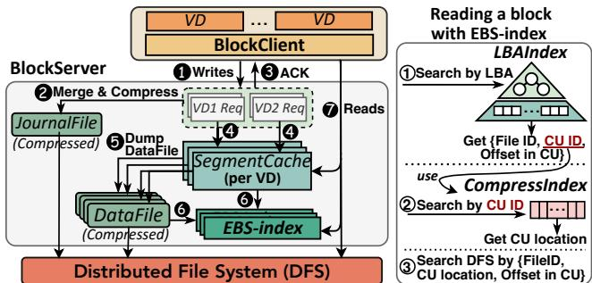  
Figure 1: EBS architecture and read procedure.

• Indexing by range. We propose that the index in cloud storage systems should use the block range as the key.

• RASK. We design RASK, a memory-efficient and highperformance index that natively supports range-as-a-key. Evaluations with traces from Alibaba Cloud and others show its performance gains over SOTA indexes.

We have open-sourced the code of RASK at https://ipad s.se.sjtu.edu.cn:1312/opensource/rask-index and Alibaba Cloud EBS traces at https://tianchi.aliyun.c om/dataset/218875.

## 2 Index Strains Memory in Modern EBS

## 2.1 Background: Elastic Block Store

Architecture. Elastic Block Store (EBS) is a core component of cloud service, providing VDs for compute instances [2,3,5, 29]. Fig. 1 shows the EBS architecture at Alibaba Cloud [1]. It consists of three layers: BlockClient in the compute layer, BlockServer in the proxy layer handling read/write requests from the BlockClient, and the DFS in the persistence layer.

Write/Read. For writes (❶), the path bifurcates. BlockServer first persists data in a JournalFile (❷) and then acknowledges the I/O completion (❸). The uncompressed data is cached in the SegmentCache (❹). Upon reaching a threshold (e.g., 512 KiB), the cached data is written to DataFiles in the DFS with compression (❺). To ensure the compression ratio and decompression efficiency, data is compressed in groups of four blocks, i.e., the compression unit (CU) is four blocks. The EBS-index is updated to map the VD’s LBA to the DataFile and the location in DataFile (❻). For reads, BlockServer first checks the SegmentCache; on a miss, it queries the EBS-index and then fetches data from DFS (❼).

Indexes in EBS. EBS-index includes in-memory LBAIndex and CompressIndex. LBAIndex maps LBA to the DataFile ID, CU ID, and offset in the CU. It is a LSM-tree-like structure: The top layer (i.e., MemTable) is in page-table format for fast LBA updates. Once the MemTable’s size reaches a threshold, it is converted into a more memory-friendly immutable sorted array (i.e., SSTable), where each entry represents a write request’s LBA range. CompressIndex maps CU ID to CU’s location in the DataFile using an array. When reading a block, as shown in Fig. 1, EBS first searches LBAIndex by the target

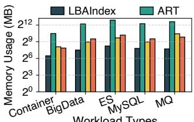  
Workload Types

(a) Average memory usage per VD  
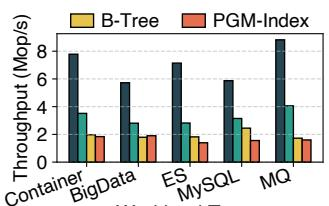  
Workload Types  
(b) Average throughput per VD  
Figure 2: Comparison of LBAIndex and SOTA indexes. In this paper, ES is Elasticsearch, MQ is message queue.

LBA (①), then uses the resulting CU ID to locate the CU in CompressIndex (②), and finally reads DFS accordingly (③).

## 2.2 Memory Strain: Index is the Culprit

Alibaba Cloud Sysadmins report that EBS has been experiencing escalating memory strains. In the most severe cases, \~10% of clusters are at risk of wasting \~35% of physical storage resources. The waste arises because these data cannot be indexed and thus become unusable under memory constraints. This memory pressure is further intensified as EBS accommodates more users and adopts larger SSDs with denser NANDs.

We find that the EBS-index is the main memory consumer, which consumes thousands of TBs of memory for indexing thousands of PBs of data. Alibaba Cloud’s statistics show that LBAIndex consumes \~17.2% memory, while CompressIndex accounts for \~39.9%. Indexes strain memory since: (1) LBAIndex scales with write requests, as a write request requires at least one SSTable entry. Besides, its log-structured format increases memory overhead due to multiple versions. (2) CompressIndex’s size is proportional to the data volume due to per 4-block compression.

## 2.3 Exploration of Possible Remedies

Modifying the architecture. One may ask if memory strain can be reduced by modifying EBS architecture (e.g., removing SegmentCache, writing directly to DataFile) or simply adding more memory. However, the memory overhead of EBS-index stems fundamentally from the indexed data volume, which architectural changes cannot resolve. Adding memory is costly, inflexible, and unsustainable in the nonstop production environment, as it needs a time-consuming and laborious maintenance beyond just the memory cost.

Replacing index structure. Another possibility is to use a more memory-efficient index that supports in-place updates, thereby avoiding the overhead from multiple versions. To evaluate this idea, we compare LBAIndex with B-tree [30], SOTA memory-efficient trie (adaptive radix tree, ART [31]), and learned index (PGM-Index [32]) under five typical EBS workloads. Fig. 2 shows that LBAIndex already consumes less memory and performs better than these SOTA indexes. This is because: (1) LBAIndex’s MemTable is size-limited and SSTables index at write-request granularity, while other indexes use LBA granularity; (2) MemTable updates have O(1) time complexity thanks to its page-table format.

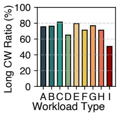  
(a) Long CW ratio

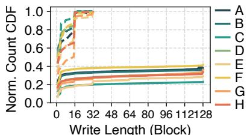  
(b) CDF of origin/compacted write length  
Figure 3: Write pattern analysis. (b) Write length CDF before (dashed lines) vs. after (solid lines) I/O compaction; y-axis is normalized to pre-compaction write count. Workloads are: Container (A), Message Queue (B), MySQL (C), Elasticsearch (D), Redis (E), MongoDB (F), BigData (G), WebApp (H), External (I).

Applying larger compression unit (CU). EBS uses a short CU (i.e., 4 blocks) to avoid severe read amplification during decompression. This is because EBS adopts a stream-based compression scheme [33, 34] (e.g., LZ4) which requires sequential decompression from the CU start. A possible alternative is to use a random-access compression scheme, which allows larger CUs by avoiding full decompression from the start. However, such schemes are inefficient and fail to decrease the volume of information to be indexed: (1) To support random access, these schemes need to build a dictionary [35, 36], unfriendly to the latency-sensitive EBS. For instance, we explore with a SOTA method called FSST [37], which takes \~1 ms to build the dictionary and compresses at a rate 9.78× slower than LZ4. (2) Compressed blocks have variable lengths; therefore, we still need to record their offset information within the compressed data for decompression, eliminating the memory benefits of introducing larger CUs.

## 3 Characterizing Block Service Access Pattern

The above analysis indicates that the memory pressure in EBS cannot be resolved by altering the architecture, modifying the index structure, or adopting alternative compression schemes. Hence, we analyze the field traces in the hope of exploiting the workload characteristics to reduce the memory footprint.

We get two datasets recently collected by Alibaba Cloud EBS: (1) one-week I/O traces of 1.4 k VDs in two clusters; (2) three-day I/O traces of 400 VDs in two other clusters. They cover representative applications like databases, KV stores, message queues, big data processing, search engines, containers, and web apps.

## 3.1 Write-Write Correlation

Observation. Individual write requests that are temporally close can be spatially consecutive. E.g., four write requests (A, B, C, D) target LBAs [1, 4], [11, 12], [5, 6], and [7, 8], respectively. While A, C, and D are independent requests, their LBAs are consecutive (i.e., [1, 4], [5, 6], and [7, 8] can be concatenated). To quantify this pattern, we define an observation window as the scope for checking consecutiveness. If the window covers 4 writes (i.e., we check consecutiveness among every 4 write requests), then in this example, A, C, and D form a consecutive sequence. We define such a consecutive write sequence within the observation window as a Consecutive Write (CW). For a CW with ≥ 2 requests, we classify it as a long CW. We further define long CW ratio as the proportion of write requests that belong to long CWs. The long CW ratio of this example is 75% (i.e., A, C, and D out of 4 requests).

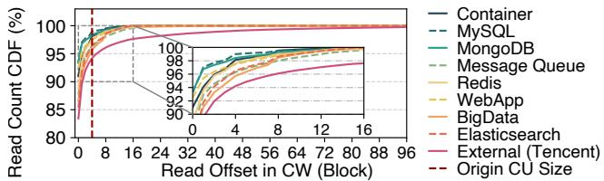  
Figure 4: CDF of read start offset relative to the associated CW.

As shown in Fig. 3(a), the long CW ratios are consistently high (65.0–81.5%) across all workloads when the window is 36 write requests. This phenomenon also shows in Tencent’s EBS traces [8] (External (I) in Fig. 3(a)). The prevalence of long CWs renders a memory-saving opportunity by consolidating multiple entries into one for a CW in the LBAIndex.

Optimization: I/O compaction. The first optimization is to enlarge the LBAIndex’s granularity to CWs. We can leverage the SegmentCache (Fig. 1) to capture CWs, using its size3 (128 blocks) as the observation window. When flushing the SegmentCache, we reorder/merge these cached writes into CWs and then write these CWs to DFS. This upsizes the granularity of LBAIndex from individual requests to CWs, reducing the entry count and lowering the memory footprint. Potential benefit. Fig. 3(b) compares the cumulative distribution function (CDF) of write lengths with/without I/O compaction. Results show that I/O compaction reduces LBAIndex write counts by 58.4–77.0%, greatly reducing the number of LBAIndex entries. Moreover, the reordering/merging overhead is negligible since: (1) The SegmentCache is small; (2) It only manipulates metadata (i.e., LBAs and block positions in cache) without interfering with DFS write processes.

## 3.2 Write-Read Correlation

Observation. When reading data written by a CW, the request nearly always starts from the CW beginning. E.g., if a CW covers LBAs [1, 8], the following reads tend to start from its beginning (i.e., 1), while the likelihood of starting from the later part (i.e., 5–8) is low. Fig. 4 shows that across 8 workloads, > 85.4% of reads align with the CW start, while < 1% of reads begin 10 blocks away from the CW start. Tencent’s traces also show a similar pattern, i.e., 83.4% of reads align with the CW start. Intuitively, this pattern reflects how an app writes implies how it would read, e.g., a CW for logging is likely to be read from the start. Notably, over 95.7% of reads start within 4 blocks (i.e., the Alibaba Cloud EBS CU size) of the CW’s beginning. It means that enlarging CU to CW causes negligible read amplification during decompression.

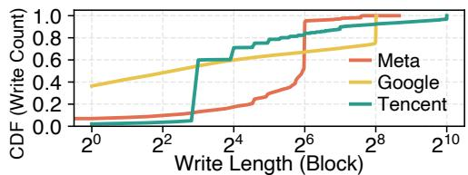  
Figure 5: Write length distribution of industry traces.

Optimization: CU alignment. The second optimization is to align the CU with the CW. We propose an adaptive compression scheme: CWs exceeding four blocks are compressed per CW, while shorter CWs use the 4-block CU to maintain the compression ratio. It expands the CU indexing granularity from 4-block to CWs, reducing the memory footprint.

Potential benefit. After applying CU alignment, the number of CUs to be indexed reduces by 69.1–91.1% across eight workloads. Additionally, the overhead of CU alignment is acceptable. Fig. 4 indicates that \~95.7% requests are basically unaffected, while the increased latency for the remaining ones is in an acceptable range (0.477%–2.60%).

## 3.3 Call for “Range as a Key”

The memory savings from I/O compaction and CU alignment rely on enlarging index granularity to CWs. In this case, the original EBS-index is not suitable because: (1) As shown in Fig. 3(b), CWs are often long LBA ranges but the LBAIndex’s MemTable uses single-LBA as index granularity. (2) CompressIndex only supports fixed-length CUs and not applicable for variable-length CWs. Thus, an index that uses range as a key (RKey) is essential to achieve memory savings. This index uses the LBA range of a CW as the key, mapping it to the corresponding DFS location and compression metadata.

Furthermore, the benefits of range-as-a-key are beyond just Alibaba Cloud and/or EBS. Based on the following analysis, we find that using range-as-a-key is advantageous for various cloud storage systems with range-write heavy workloads.

Common root causes. CW exists primarily because: (1) Both FSs and applications prefer sequential writes to match block device characteristics (e.g., sequential writes on HDD/SSDs are faster than random writes); (2) Multi-app interactions in the system interrupt an app’s sequential writes, creating multiple CWs. We confirm this via white-box analysis using blktrace [25]. Specifically, we analyze 1-hour I/O samples of MySQL and Redis running TPC-C and YCSB workloads, respectively. Results show that long CW ratios are high (29.0– 99.0%), primarily caused by FS journaling and application services (e.g., Redis server, MySQL InnoDB log, etc.).

Prevalence in cloud storage. Previously, we have shown similar patterns in Tencent traces. Further, by analyzing traces from Google [9], Meta [10, 11], we find that in their cloud storage systems, while block is the basic operation unit, writes typically span a range of blocks. As Fig. 5 shows, 51.6% (Google) and 90.3% (Meta) of writes exceed four blocks. Thus, RKey is not limited to a specific system or company.

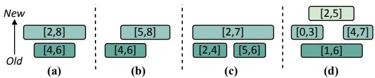  
Figure 6: Range overlap cases.

Given the prevalent range writes, indexing by block ranges (start LBA + write length) instead of individual blocks offers: (1) Memory efficiency: reduces N - 1 entries per N-block range. (2) Performance improvement: avoids multiple index updates for a range and speeds up queries via a smaller index scale.

Possible extensions of RKey. The wide existence of range writes implies the deployment of RKey is likely to benefit various scenarios. (1) Example-1: Flash cache. In bulk storage systems, flash cache stores hot data in SSDs to reduce HDD load [38, 39]. It needs a DRAM index to map block locations in SSDs. Compared to existing B-tree indexes [40], RKey can reduce index’s memory footprint, which is a key concern in flash cache [41]. (2) Example-2: DFS metadata service. Many DFSs use KV stores to manage metadata (e.g., LSM-tree [10, 42], B-tree [43]). To speed up metadata operations, it stores block-to-file mappings (e.g., Tectonic, Meta’s exabyte-scale DFS). Here, RKey is more efficient for block indexing as it avoids one-by-one updates and reduces entry count, allowing more entries to reside in memory for faster queries.

## 3.4 Range-as-a-key: Not off-the-shelf

Compared to point indexes (e.g., B-tree), indexing ranges is more challenging since it must handle various range overlap cases. Fig. 6 shows some range overlap cases: (1) cover an old range (Fig. 6(a)); (2) partially overlap an old range (Fig. 6(b)); (3) cover/partially overlap many old ranges (Fig. 6(c, d)). An efficient RKey index should promptly remove fully covered ranges to avoid memory waste and quickly locate the latest data in the overlapping ranges during reads. However, neither existing range-aware indexes nor adapted point indexes can meet these requirements well, as we will show next.

Porting the range-aware indexes? Indexing ranges is common in temporal databases, with typical indexes like interval tree [44], 1D-grids [45], segment tree [46], HINT [27], etc. [47–56]. However, these indexes mainly focus on intersection queries, without removing covered ranges automatically. This is because they primarily target secondary index scenarios, where the covered ranges are still useful and cannot be deleted (e.g., record $[ k _ { 1 } , \nu _ { 1 } ]$ with time range [t1, t2] is not overwritten by [k2, v2] with $[ t _ { 1 } , t _ { 3 } ] )$ . But in our case, not removing covered ranges wastes memory and degrades performance. Thus, as shown in Fig. 7, interval tree and segment tree are inefficient in both memory and read performance.

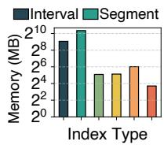  
(a) Memory usage

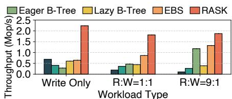  
(b) Throughput

Figure 7: Comparison of existing range-aware indexes, EBSindex, and RASK (our design). Eager and Lazy B-tree are adapted using the eager and lazy methods. EBS is EBS-index. The dataset is 10M ranges with uniformly distributed lengths 4–64.  
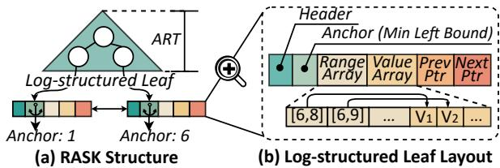  
Figure 8: The structure of RASK.

Adapting the point indexes? When adapting point indexes to RKey by indexing the range’s left bound, there are two possible ways. (1) Eager: Writes find all overlapping ranges and remove their intersecting portions before insertion; reads find all intersecting ranges with the target range. (2) Lazy: Writes insert ranges with sequence numbers and only remove covered ranges; reads find all intersecting ranges and select the ones with the highest sequence number for each overlapping position. However, both methods perform poorly due to the high cost of handling range overlaps. Fig. 7(b) shows that Eager and Lazy B-tree perform much worse than EBS-index under write-heavy and read-heavy workloads, respectively.

## 4 RASK Overview

We propose RASK, a high-performance and memory-efficient in-memory index that natively supports range-as-a-key. Based on the analysis in §3.3, RASK is a general-purpose index for range-write intensive workloads, not just for the EBS at Alibaba Cloud. It offers a general range read/write interface (§6.1), potentially benefiting more systems (e.g., flash cache, DFS metadata service).

## 4.1 Structure and Workflow

RASK structure. As Fig. 8(a) shows, RASK uses ART [31] for internal nodes and employs the log-structured leaf (i.e., leaves are globally ordered, but updates within the leaf are append-only). ART is a trie variant that indexes keys by storing them as paths of characters, with each internal node representing a common key prefix. We choose ART since it is more efficient than B-tree, while also being memory-friendly via path compression and internal node resizing. The logstructured leaf allows for efficient range overlap handling.

Fig. 8(b) shows the leaf layout. Each leaf is identified by an anchor key that represents the minimum left bound of its ranges, and this anchor key is indexed by internal nodes. A leaf’s range space covers all ranges4 whose left bound ≥ its anchor key and right bound < the next leaf’s anchor key, which is non-overlapping with other leaves. For each entry, the range (i.e., key) is stored in the Range Array and the value is stored in the Value Array. Leaves are doubly linked to support efficient range operations. Additionally, each leaf contains an 8-byte header to store current entry count and concurrency control information (§6.2).

Basic workflow. For reads, RASK first traverses internal nodes to locate the target leaf (i.e., the last leaf whose anchor key ≤ the target range’s left bound). Then it extracts the latest value from the intersection of the target range and the leaf’s ranges. For example, to read the range [7, 8] from Fig. 8(a), it first locates the leaf with anchor key = 6, then retrieves value for [7, 8] from entry [6, 9] in that leaf (not from [6, 8]). For writes, RASK first locates the target leaf as reads, then appends new entries to this leaf’s range and value arrays. If this leaf is full (i.e., entry count reaches the capacity), GC is triggered to remove old ranges that are fully covered by newer ones. E.g., for the leaf in Fig. 8(b), [6, 8] can be reclaimed by GC. If this leaf remains full after GC, it is split, and internal nodes are updated with the new leaf’s anchor key.

## 4.2 Challenges and Approaches

RASK tackles two key challenges from RKey: range overlap and fragmentation, achieving efficient read/write and structural modification operations (SMO, e.g., split/merge).

Challenge-1: Range overlap. When writing a new range, range overlaps may cause some old ranges to be fully covered (Fig. 6 (a), (c), (d)). If these ranges are not removed in time, they will waste memory and degrade read performance due to the need to check more ranges. However, promptly removing covered old ranges upon their appearance degrades write efficiency due to the complexity of identifying covered ranges. Additionally, overlapping ranges harm read performance, as reads must identify the latest data of the overlapped portions.

Addressing Challenge-1 in write and read. RASK’s logstructured leaf underpins efficient range overlap handling, benefiting both writes and reads. For writes, the log-structured design reduces the impact of removing covered ranges by batching them during GC, which is triggered only when the leaf is full. Moreover, using the leaf as a fine-grained GC unit ensures prompt GC, thereby limiting the memory overhead. For reads, the log-structured layout enables early termination once the target range is fully retrieved. To further optimize searches with overlapping ranges in a leaf, we propose ablation-based search (§5.1). For GC, we introduce two-stage GC (§5.2) to reduce the write blocking time caused by GC while removing fully covered ranges as much as possible.

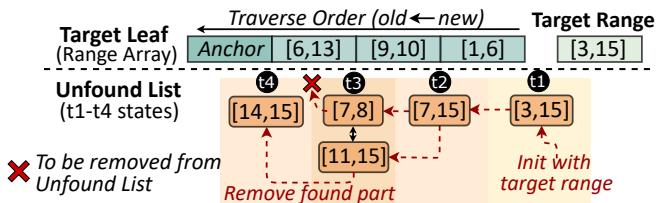  
Figure 9: Ablation-based search example.

Challenge-2: Range fragmentation. Given that a leaf cannot have an infinite capacity to represent the infinite range space, range fragmentation is inevitable to occur: A user-written range that spans multiple leaves’ range space is divided and stored in these leaves. This issue increases read/write, range management, and memory overhead.

Addressing Challenge-2 in split and merge. RASK reduces range fragmentation through proper split and merge/resplit operations. We employ range-conscious split (§5.3) to mitigate dividing the leaf’s ranges during leaf splits while balancing the entry count in new leaves. Range fragmentation can also occur when newly user-written ranges do not align with existing leaves’ range space. To resolve this issue, we introduce workload-aware merge and resplit (§5.4), which dynamically adjusts leaves’ range space to adapt to workload characteristics, reducing fragmentation-induced overhead.

## 5 RASK Design

We have achieved efficient range writes with the log-structured leaf (§4.1). In this section, we present how RASK support efficient read (§5.1), GC (§5.2), and SMOs (§5.3, §5.4).

## 5.1 Ablation-based Search

RASK’s search procedure traverses the leaf in reverse order until the target range is fully retrieved or all entries are processed. For each range in a leaf, RASK collects its intersection with the unfound portions of target range. For example, when searching for range [3, 15] in Fig. 9’s leaf, the range [1, 6] contributes [3, 6] to the result. The key challenge of search lies in efficiently maintaining the target range’s search state.

Given that this search procedure can be seen as ablating the target range with the leaf’s ranges, we propose an ablationbased search. It tracks the search state using an ordered list of target range’s unfound subranges (i.e., Unfound List). Specifically, the Unfound List is initialized with the target range (e.g., [3, 15] at t1 in Fig. 9). Then for each range R in leaf, the intersections of R and Unfound List (i.e., {R ∩ R′ | R′ ∈ Unfound List}) are retrieved and removed from Unfound List (e.g., at t2, [3, 6] is removed from [3, 15], leaving [7, 15]). As the search proceeds, Unfound List is gradually ablated.

In this scenario, the ordered list is well-suited for tracking the unfound subranges. Unfound List’s ordered property helps efficiently locate subranges that overlap with R when getting the intersection of R and Unfound List. Specifically, once the first overlapping subrange is found (e.g., [7, 8] for leaf range [6, 13] at t3), all subsequent overlapping ranges (e.g., [11, 15] at t3) can be accessed sequentially. Then the intersections can be removed with O(1) time complexity. While locating the first overlapping range in Unfound List requires linear search, the cost of linear search is bounded, as the number of unfound subranges is limited by processed entry count of the leaf.

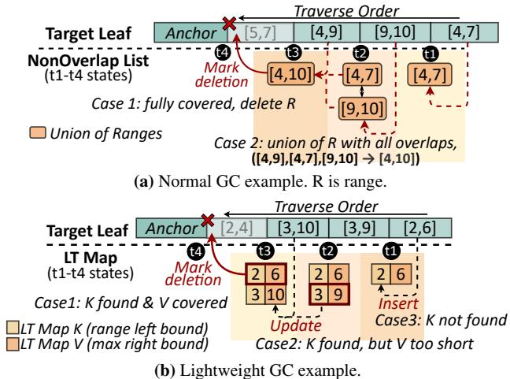  
Figure 10: Two-stage GC examples.

## 5.2 Two-stage GC

If a leaf is full, GC frees up space by removing fully covered old entries. GC efficiency is crucial to write performance, as writes must wait for GC to complete. The key challenge of GC is identifying old ranges covered by the union of multiple new ranges (e.g., [1, 6] in Fig. 6(d) is covered by three ranges).

To address this, we perform GC via reverse-order leaf scanning while maintaining the union of all processed ranges to check if a preceding range is covered (termed as normal GC). Specifically, we employ an ordered list (i.e., NonOverlap List) to track the union of processed ranges, stored as multiple nonoverlapping ranges. As shown in Fig. 10(a), for each range $R ,$ we check if R is fully covered by an entry in NonOverlap List. If so, R is marked for deletion (case 1 at t4: [5, 7] is covered by [4, 10]). Otherwise, NonOverlap List is updated by taking the union of R with all overlapping ranges in NonOverlap List (case 2 at t3: [4, 10] is the union of [4, 9], [4, 7] and [9, 10]).

Normal GC is efficient in most cases, where the NonOverlap List only has a few entries. However, when the number of entries in NonOverlap List is large, the linear search for identifying overlapping ranges can still be a bottleneck. We seek to further improve GC efficiency by avoiding the linear search. Fortunately, we find that many ranges are fully covered by new ranges with the same left bound. Specifically, we replay the EBS traces from Alibaba Cloud with only normal GC enabled in RASK. Among all reclaimable entries, we find that on average 73.8% of them can be reclaimed by only checking newer ranges with the same left bound.

Therefore, we further propose a lightweight GC that only checks if ranges are fully covered by newer ones with the same left bound. As Fig. 10(b) shows, lightweight GC scans the leaf’s range array backwards and maintains an O(1)- complexity map (i.e., LT Map) to track the maximum right bound per left bound. For each range R, if its left bound exists in LT Map and right bound $\leq$ the recorded value (case 1 at t4), R is marked for deletion; otherwise, LT Map is updated with R’s left and right bounds (case 2 at t3 & case 3 at t1). Lightweight GC avoids the linear search and can quickly reclaim some space, further reducing write blocking time.

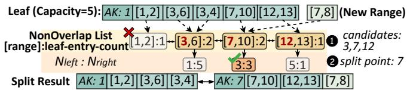  
Figure 11: Split example. AK is anchor key.

In summary, we design a two-stage GC to reduce the write blocking time: (1) Lightweight GC: remove some fully covered entries quickly; (2) Normal GC: remove all fully covered entries and is triggered only when lightweight GC cannot free up any space. After GC completes checking all entries, those marked for deletion are removed, and the remaining ones are shifted forward to fill holes and keep the original order.

## 5.3 Range-conscious Split

When inserting into a full leaf and GC cannot free up space, the leaf is split at the split point $P _ { s }$ to create a new right leaf $( L _ { r } )$ . Entries with range left bounds $\geq P _ { s }$ are moved to $L _ { r } ,$ and entries across the $P _ { s }$ are divided and stored in both leaves. Then internal nodes are updated with $L _ { r }$ ’s anchor key. The key difference between RASK and point indexes (e.g., B-tree) in split is that: The $P _ { s }$ should not only try to balance entry counts between two new leaves, but also avoid range fragmentation (i.e., $P _ { s }$ should not intersect with any ranges in the leaf).

To avoid range fragmentation, ❶ we use the left bounds of all entries in GC-obtained NonOverlap List (except the first one) as $P _ { s }$ candidates (e.g., 3, 7, 12 in Fig. 11). This is because these entries are non-overlapping, and their boundaries naturally guarantee no intersection with the leaf’s ranges. To achieve better balance, ❷ we choose the $P _ { s }$ candidate that most evenly balances entry count between two new leaves (e.g., 7 in Fig. 11 has three entries on the left and three on the right). This can be calculated according to the entry count information collected during the NonOverlap List construction.

When NonOverlap List cannot provide any candidates (i.e., it has only one entry), we directly select $P _ { s }$ from the boundaries of leaf’s ranges for efficiency (e.g., for Fig. 11’s leaf, the boundaries are 1, 2, 3, . . ., 10, 12, 13). In this case, the chosen $P _ { s }$ may intersect with the leaf’s ranges, and these ranges are divided and stored in both leaves. It may cause the new leaf overflow (i.e., entry count exceeds the capacity and cannot be addressed by GC). To resolve this, we select $P _ { s }$ that satisfies: (1) It is one of the two median points of all boundaries (as the number of boundaries is even); (2) It is not the smallest or largest bound (to ensure the split is effective). If both medians meet the second requirement, we choose the smaller one. We have proven that this selection ensures: (1) no overflow in most cases; (2) in other cases, only one leaf may overflow, which can always be addressed by splitting it again.5

▶Get value (v2) for the divided range [c, d] from [a, b]   
v2 = DivideValue([a, b], v, [c, d])   
▶Merge [a,b]:v1 & [c,d]:v2 to [a,d]:v3 if possible   
is\_mergeable, v3 = MergeRange([a, b], v1, [c, d], v2)  
Figure 12: RASK user-provided functions.

When dividing a range that crosses $P _ { s } ,$ this entry’s value also needs to be divided. The value is user-defined and may also represent a range (e.g., for Alibaba Cloud’s EBS, it is the location for a range of continuous physical blocks in DFS). Thus, RASK needs users to register a function (DivideValue in Fig. 12) to get the value corresponding to the divided ranges. Specifically, it returns the value for the divided ranges based on the original range, original value, and divided range.

## 5.4 Workload-aware Merge and Resplit

Unlike point indexes (e.g., B-tree), where merge only handles underfilled leaves caused by deletions, RASK’s merge operation also needs to reduce range fragmentation. Range fragmentation may occur frequently because splits depend only on current ranges in the leaf and cannot foresee future workload, potentially causing mismatches between the leaf’s range space and future insertions. For example, although the split in Fig. 11 does not directly cause range fragmentation, inserting a new range [6, 11] will span two leaves. Thus, we propose a workload-aware merge/resplit mechanism to dynamically adjust the leaf’s range space.

To record the severity of range fragmentation for a period of time, we use a leaf header field $N _ { f r a g }$ to count the insertions of fragmented ranges6. When $N _ { f r a g }$ exceeds a threshold, we perform the merge/resplit procedure for this leaf and its left neighbor as shown in Fig. 13. We first perform normal GC on both leaves to increase the likelihood of a successful merge. Then, we aggregate two leaves’ entries into a temporary merged array (❶). If it fits in the leaf’s capacity, we update the left leaf using the merged array, remove the right leaf, and update the internal nodes; otherwise, we resplit the merged array (❷) to produce two new leaves. The resplit is similar to the split, and it produces a more rational partitioning based on newer access patterns. When merging leaves, we also merge the ranges derived from the same user-written range, which can be identified by the user-provided function MergeRange (Fig. 12). MergeRange determines whether two entries can be merged based on their ranges and values. If the two are mergeable (e.g, both their ranges and values are continuous), it returns the merged value for subsequent use. For correct semantics, when merging ranges (e.g., [6, 6] in Node1 and [7, 8] in Node2), we preserve the relative order between the merged range and the leaf’s other ranges (e.g., order between [5, 6] & [6, 8], [9, 10] & [6, 8]). Merging ranges reduces fragmentation and improves the success rate of merge.

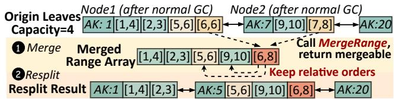  
Figure 13: Merge/resplit example. AK is anchor key.

1 Func Put(R range, V val):   
2 Leaf\* target\_leaf = TraverseInternalNodes(range)   
3 while range is not empty:   
4 if target\_leaf->IsFull(): GC(target\_leaf, range)   
5 if target\_leaf->IsFull():   
6 remaining = SplitAndInsert(target\_leaf, range, val)   
7 else:   
8 remaining = Append(target\_leaf, range, val)   
9 MergeResplitIfNeed(target\_leaf)   
10 // Update range & value to remaining range & value   
11 range, val = remaining.range, remaining.val   
12 target\_leaf = NextTargetLeaf(target\_leaf, range)  
Figure 14: Pseudocode of put operation.

## 6 Operations and Concurrency Support

## 6.1 Operations

RASK supports three operations with the above designs: Put (range, value). As the pseudocode in Fig. 14, ❶ we traverse internal nodes to locate the last leaf whose anchor key ≤ range left bound, assigning it as the target leaf for the new value (line 2). ❷ GC is performed if target leaf is full (line 4). ❸ If the leaf is still full after GC, it is split and the new entry is inserted together (line 6). ❹ Otherwise, the new entry is appended directly (line 8); then merge/resplit is performed if needed (line 9). We skip merge/resplit if a split occurs to avoid high write latency. ❺ As only the portion of the range that fits in the target leaf ’s range space is inserted, the uninserted portion (i.e., fragmented range) is iteratively inserted into subsequent target leaves (line 3-12). The next target leaf is located through the doubly-linked leaf list (line 12).

Delete (range). Delete (range) acts as Put (range, tombstone) basically. It inserts range with a tombstone and increments $N _ { f r a g }$ in the leaf’s header. During the normal GC, ranges with tombstone are physically removed. Specifically, we maintain an additional ordered list for ranges with tombstone (i.e., deleted list). When handling a leaf entry during GC, its overlapping portions with deleted list are removed before excuting the GC logic. During merge/resplit triggered by $N _ { f r a g } .$ , the underfilled leaf is merged. Note that reserving a value as tombstone is a common and acceptable practice in indexes [58,59]. Get (range). ❶ It locates the last leaf with anchor key ≤ range left bound (i.e., target leaf ) using the same method as Put. ❷ It traverses the doubly-linked leaf list to the last leaf with anchor key ≤ range right bound. ❸ It retrieves entries in each leaf via ablation-based search. The Unfound List is initialized with the intersection of the range and the leaf’s range space. Entries with tombstone are updated to the Unfound List but excluded from the result. Notably, we may only need the value of a subrange within a leaf’s range (e.g., in Fig. 9, only [3, 6] within [1, 6] is required). In this case, we use the DivideValue function (Fig. 12) to retrieve the value of the subrange. Finally, it returns a list of values and their corresponding ranges.

## 6.2 Concurrency Support

RASK uses the standard optimistic lock-based concurrency control techniques [60, 61] (i.e., per-node write locks and version numbers). Writes must acquire relevant lock(s) first. Version numbers are incremented before and after the node’s mutation. Reads check version numbers before and after accessing the node, and retries if any version is changed or odd (indicating the node is being modified). Since internal nodes directly employ ART’s optimistic lock mechanism [62], we focus on the concurrency safety of (1) inter-leaf interactions and (2) leaf and internal node interactions.

In RASK, after locating the target leaf via read-only internal node traversal, there may be six concurrent operations: insert, delete, GC, split, merge/resplit, and read. Here we explain the safety of write-write concurrency and read-write concurrency through a case-by-case analysis.

(1) Insert (also represents delete): To prevent concurrent leaf mutations (i.e., insert, delete, GC, split, merge/resplit), it locks the target leaf(s). For insertion across leaves, we use lock handover between leaves (i.e., lock next target node, then unlock current node) to prevent the disorder of crossleaf concurrent updates. Concurrent reads are safe and efficient because reads can be treated as capturing a snapshot of append-only leaves, and inserts never trigger read retries.

(2) GC: To prevent concurrent writes, it locks the target leaf. To ensure safe concurrent reads, it updates $V _ { G C }$ (4 bits in leaf’s header) on lock acquisition/release; reads check $V _ { G C }$ before and after accessing a leaf, and retry if necessary.

(3) Split/merge/resplit: ❶ To prevent concurrent writes, splits lock the original and new leaves, and merge/resplits lock both leaves to be merged. ❷ After the leaf is split/merged, it is inserted into (deleted from) the leaf linked-list. Then the deleted nodes are marked as deleted (i.e., a bit in the header) and reclaimed by epoch-based GC. Same as B-tree, linked-list updates are safe without acquiring additional locks. This is because the involved unlocked leaf must be the right neighbor of a locked leaf, whose prev pointer is protected by the lock in its locked left neighbor [60]. ❸ After the linked-list update is done and the leaf locks are released, the internal nodes are updated. Before the internal nodes update is completed, the concurrent internal node traversal may locate a wrong target leaf. To ensure the correctness of target leaf, after locating a leaf by internal node traversal, we traverse the doubly-linked leaf list to find the correct target leaf as this list maintains the latest state. ❹ To ensure safe concurrent reads, split and merge/resplit employ $V _ { s p l i t }$ and $V _ { m e r g e }$ (4 bits in leaf’s header)

Table 1: Statistics of the evaluated traces. The scale indicates the data volume used in our tests rather than the entire trace size.
<table><tr><td>Dataset</td><td>Alibaba Cloud</td><td>Meta</td><td>Google</td><td>Tencent</td></tr><tr><td>Scale</td><td>1.5 TB</td><td>150GB</td><td>92 GB</td><td>588GB</td></tr><tr><td>Duration</td><td>1 week</td><td>3year</td><td>3 month</td><td>10 days</td></tr></table>

like GC respectively. Particularly, besides re-searching current leaf, read retries triggered by $V _ { m e r g e }$ also search the updated left leaf as values in the target range may have been moved there. Retries trigggered by $V _ { s p l i t }$ do not need to search the new right leaf, as rightward leaf traversal ensures any target values in it will be retrieved. It is noteworthy that the split point selection is read-only and does not require synchronization with reads, thus $V _ { s p l i t }$ only needs to be updated around the actual data movement. While checking version numbers, reads also check the deleted bit, and skip deleted nodes.

Based on the above techniques, RASK’s read operations can get a consistent view (i.e., snapshot) of each leaf, but cross-leaf reads may (1) partially read a user-written range or (2) miss earlier inserts while seeing later ones. We argue that these issues are negligible in practice from both correctness and performance perspectives. Regarding correctness, applications (e.g., EBS, DFS metadata service, flash cache) already can tolerate these issues because they currently rely on point indexes (e.g., Masstree [60], ART [63], Cuckoo-Trie [64], and HydraList [65]), which exhibit the same issues when reading a range [60, 63–65]. Regarding performance, our breakdown of experiments in §7.3 reveals that such inconsistent crossleaf reads are exceedingly rare (\~0.0394%), thus their impact on overall performance and results is statistically negligible.

To further address the inconsistency of cross-leaf reads, we can first snapshot all involved leaves while ensuring no concurrent writes, which we leave as future work.

For persistence, RASK is currently an in-memory index. Applications (e.g., EBS) are responsible for persistence.

## 7 Evaluation

We evaluate RASK from the following perspectives:

• Does RASK perform well with different workloads? (§7.2)

• How is the concurrency scalability of RASK? (§7.3)

• How do workload characteristics and parameters affect RASK’s performance? (§7.4)

• How do RASK’s techniques contribute? (§7.5)

• Can other scenarios benefit from RASK? (§7.6)

## 7.1 Experimental Setup

Setup. We run experiments in §7.6 on a server with 2 Intel® Xeon® Gold 5317 CPUs (3.00 GHz, 12 cores), 188 GB DRAM and 7 TB NVMe SSD. Other experiments are run on a server with 1 Intel® Xeon® Platinum 8369B CPU (2.70 GHz, 24 cores) and 96 GB DRAM. All experiments except those in §7.3 and case 3 in §7.6 are single-threaded as the internal logic of the cloud block store is single-threaded.

Table 2: Baseline selection. For HOT and Cuckoo Trie, we do not implement RKey versions as their source code lacks the deletion interface. For PGM-index, we do not implement the Lazy version as it only supports numeric keys. As highlighted in bold, we choose Lazy B-tree, Lazy ART, original Wormhole, Eager Hydralist, and original PGM-index as subsequent baselines.
<table><tr><td rowspan="2">Index Type</td><td colspan="3">B-tree</td><td colspan="3">ART</td><td colspan="3">Wormhole</td><td colspan="3">HydraList</td><td colspan="3">PGM-index</td></tr><tr><td>Original</td><td>Eager</td><td>Lazy</td><td>Original</td><td>Eager</td><td>Lazy</td><td>Original</td><td>Eager</td><td>Lazy</td><td></td><td>Original</td><td>Eager</td><td>Lazy</td><td>Original</td><td>Eager</td></tr><tr><td>Throughput (Mop/s)</td><td>0.586</td><td>1.52</td><td>1.72</td><td>1.51</td><td>1.28</td><td>1.53</td><td>0.218</td><td>0.124</td><td>0.190</td><td></td><td>0.0540</td><td>0.170</td><td>0.050</td><td>0.725</td><td>0.003</td></tr><tr><td>Memory (MB)</td><td>470</td><td>50.2</td><td>48.6</td><td>1830</td><td>782</td><td>599</td><td></td><td>618</td><td>1820</td><td>1399</td><td>86.6</td><td>77.7</td><td>93.2</td><td>204</td><td>147</td></tr></table>

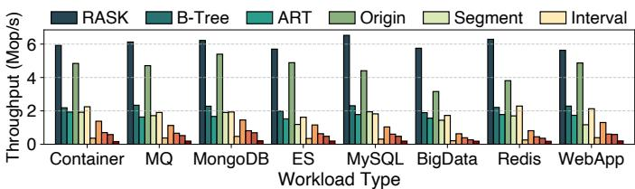  
(a) Average throughput per VD

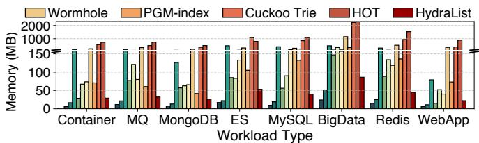  
(b) Average memory footprint per VD  
Figure 15: Throughput and memory footprint of RASK and baselines on the Full Dataset.

Parameters. By default, we configure RASK’s parameters as follows: (1) The leaf’s capacity is 16; (2) The merge/resplit trigger threshold is 4 (i.e., 1 of the leaf size). We also evaluate RASK across varied parameter settings in §7.4.1.

Benchmarks. Our primary benchmark is EBS traces of 1.8 k VDs from 4 clusters (§3) at Alibaba Cloud. We use post-I/O compaction (§3.1) results of these traces as Full Dataset. We sample 100 VDs to form Sampled Dataset, covering all workloads at all load levels. Since an experiment on Full Dataset takes at least 5–7 days, we only use Full Dataset for overall experiments (§7.2, §7.4.2) and use Sampled Dataset for the others. We also use traces from Tencent, Meta, and Google to show RASK’s effectiveness in other vendor’s EBS and various scenarios (e.g., flash cache, DFS metadata service).

Trace specifications. The traces from Alibaba Cloud EBS contain a sequence of I/O requests with LBA, length (in 4 KB blocks), type (read/write), and timestamp. We replay these requests in chronological order, with original time intervals omitted. This is a common evaluation practice [11, 66], as omitting time intervals does not affect the index’s memory usage or single-threaded performance, and better reveals its behavior under multi-threaded contention. Traces from other vendors are in similar formats and are replayed similarly. We further provide more statistics about these traces in Table 1.

Baselines. As a general-purpose index optimized for rangewrite heavy workloads, RASK can benefit any apps with such characteristics, no matter which index it currently uses. To verify this, we compare RASK with 9 SOTA ordered indexes7: Cuckoo Trie [64], HydraList [65], Wormhole [58], HOT [63], PGM-index [32], thread-safe STX B-tree [30, 67], (ROWEX) ART [62], segment tree [68], and interval tree [26, 69]. We also compare with the EBS-index (§2.1), refered as Origin. For EBS-index, we use its default configuration (converting to SSTable when MemTable’s size reaches 128 k LBA).

For the seven point indexes in baselines, we implement their Eager and Lazy RKey variants (§3.4) if possible for fairer comparison. Table 2 shows their throughput and memory usage on Sampled Dataset. We select their best-performing and most memory-efficient versions for subsequent experiments.

## 7.2 Overall Performance

Throughput. Fig. 15(a) shows RASK’s throughput reaches 2.76–37.8× that of 9 SOTA ordered indexes. Their poor performance stems from: (1) handling range overlaps per write and read (B-tree, ART, Hydralist, Wormhole), (2) splitting a range operation into multiple point operations (HOT, Cuckoo Trie), (3) frequent SMOs (PGM-index), and (4) accumulating obsolete ranges (segment tree, interval tree). The throughput of RASK is 1.15–1.82× that of Origin, proving RKey’s advantage over per-LBA updates. RASK’s log-structured leaf greatly reduces the frequency of GC, while two-stage GC and ablation-based search speed up overlap handling.

Memory footprint. As Fig. 15(b) shows, RASK uses only 1.15–54.7% of baselines’ memory. Notably, it requires only \~19.9% of Origin’s memory, showing that RASK can greatly reduce the memory footprint of EBS-index. Moreover, RASK uses only 5.31–20.5% of the memory required by the segment and interval tree, proving its memory efficiency from removing covered ranges. For baselines, Cuckoo Trie and HOT consume the most memory as they are point indexes requiring more entries. The memory overhead of the segment and interval tree mainly stems from the obsolete ranges. B-tree is the most memory-efficient baseline due to its multi-entry leaves. Trie-based indexes (Cuckoo Trie, ART, HOT) consume more memory due to single-entry leaves. RASK and HydraList mitigate this by packing multiple entries per leaf.

Latency. We measure both average and tail latency distributions (P99–P99.999) for RASK and baselines. As shown in Fig. 16, RASK achieves lower average and tail latency across all workloads, reducing P99 latency by 23.9–97.6% and P99.999 by 34.2–99.7% vs. baselines. It confirms the efficiency of log-structured design, two-stage GC, and rangetailored split/merge. Notably, RASK reduces P99.99/P99.999 latency by 90.9%/98.8% vs. Origin by avoiding write stalls from LBAIndex’s LSM-like structure. For other baselines, their high tail latency is mainly due to the frequent SMOs from handling range overlaps or using multiple point writes to achieve range updates. As a learned index, PGM-index exhibits the worst tail latency among baselines because of the overhead from model retraining and cascading updates.

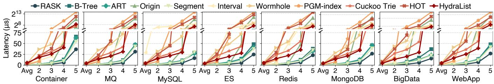  
Figure 16: Average and tail latency of RASK and baselines on the Full Dataset (per VD). In the x-axis tick labels, 2 represents P99, 3 represents P99.9, 4 represents P99.99, and 5 represents P99.999. All sub-figures share the same y-axis.

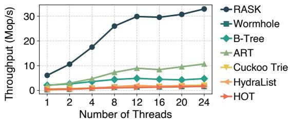  
Figure 17: Concurrency scalability.

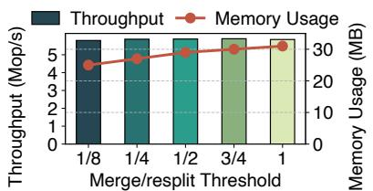  
(a) Merge/resplit trigger threshold

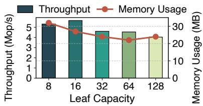  
(b) Leaf capacity  
Figure 18: Impact of RASK’s parameters on the Sampled Dataset.

## 7.3 Scalability Analysis

Fig. 17 compares the multi-threaded performance of RASK with other thread-safe baselines. Note that Alibaba Cloud’s EBS traces are inherently single-threaded for each VD. Therefore, we create multi-threaded workloads by distributing operations of a single VD trace evenly across multiple threads while maintaining their original order. RASK’s throughput reaches 3.08–21.5 × that of the baselines at 24 threads. This is because baselines use read-optimized concurrency control and in-place updates. Range writes and handling range overlaps cause longer write time, leading to higher contention and lower throughput. In contrast, RASK’s log-structured leaf reduces lock duration for most writes, and version numbers are modified only around node mutations, reducing read-write conflicts. Thus, RASK scales well with 1–12 threads. Beyond 12 threads, performance growth slows as some write-heavy, highly skewed traces increase contention. Our further analysis reveals that RASK still scales well for traces with more reads and less skewed writes at 12–24 threads.

We also measure the latency of RASK and baselines under multi-threading. Results show that as thread count increases, RASK outperforms baselines more significantly in both average and tail latency. At 24 threads, RASK reduces average latency by 85.9–98.3% and tail latency by 82.3–99.9% vs. baselines. It proves that RASK’s optimistic concurrency control is efficient, and GC/SMOs are not tail-latency bottlenecks. Particularly, split/merge merely blocks concurrent writes (< 0.01% cases), indicating negligible contention.

## 7.4 Sensitivity Analysis

In this section, we evaluate the sensitivity of RASK from two perspectives: (1) RASK’s parameters (§7.4.1), and (2) workload characteristics (§7.4.2).

## 7.4.1 Impact of RASK’s parameters

Impact of merge trigger threshold. Fig. 18(a) shows the throughput and memory usage of RASK when merge/resplit trigger threshold is $\textstyle { \frac { 1 } { 8 } } , { \frac { 1 } { 4 } } , { \frac { 1 } { 2 } } , { \frac { 3 } { 4 } }$ , and 1 of the leaf size. A lower threshold increases merge/resplit frequency, saving memory (\~24.0%) but slightly lowering throughput (\~1.67%).

Impact of leaf capacity. Fig. 18(b) shows RASK’s performance trend as the leaf capacity increases from 8 to 128 entries: the peak throughput occurs at 16 entries. Fewer entries increase GC frequency, hurting throughput. Meanwhile, more entries raise the overlap-handling cost, also degrading performance. Memory usage drops 31.3% from 8 to 64 entries as fewer nodes lower metadata costs, but rises 9.09% at 128 entries due to greater memory waste from idle entries.

## 7.4.2 Impact of workload characteristics

Impact of range length. Fig. 19(a) shows that RASK’s advantage scales with longer ranges. For short ranges (average length < 10), it achieves 1.84–12.71× higher throughput than 9 ordered indexes and 11.1% higher than Origin. Under worstcase sparse writes (average length ≤ 2), RASK outperforms 9 ordered indexes by at least 1.56×. It only slightly underperforms Origin by 6.64%, owing to Origin’s efficient O(1) updates for small writes. This indicates that tasks with range length > 2 can typically benefit from RASK. When the average range length ≥ 100, RASK outperforms Origin by 16.10× and exceeds other 9 baselines by 17.2–312.97×.

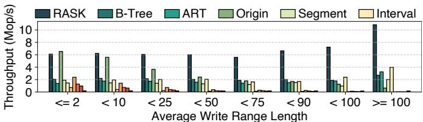  
(a) Varied write range length

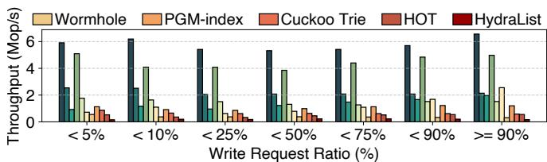  
(b) Varied read/write ratio

Figure 19: Performance comparison between RASK and baselines under different workload characteristics on the Full Dataset.  
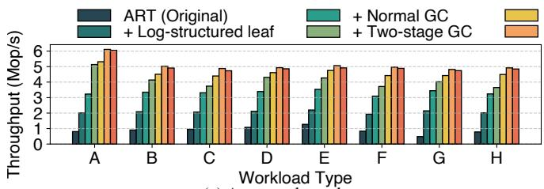  
(a) Average throughput

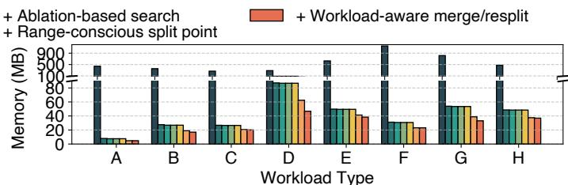  
(b) Average memory usage

Figure 20: The factor analysis for techniques in RASK on the Sampled Dataset. Workloads are: Container (A), MQ (B), MySQL (C), ES (D), Redis (E), MongoDB (F), BigData (G), WebApp (H).  
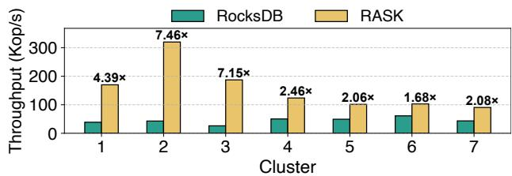  
Figure 21: Comparison on Meta traces.

Impact of read/write ratio. Fig. 19(b) shows that RASK performs well across all read/write ratios. It outperforms baselines by 16.0%–37.3× for read-heavy workloads (write ratio < 5%), 39.1%–38.7× for write-heavy workloads (write ratio ≥ 90%). As GC frequency correlates with write ratio, this also proves RASK’s strong performance under varying GC frequencies. This stems from: (1) The log-structured leaf speeds up writes while enabling early termination for efficient reads; (2) The ablation-based search enhances query efficiency.

## 7.5 Breakdown Analysis

Contributions of techniques. We apply each technique in RASK one by one to the original ART with optimistic locking. Fig. 20 shows how each technique contributes to the overall performance and memory usage.

\+ Log-structured leaf. We scale the leaf size from singleentry to multi-entry, adapt the log-structured design, and support RKey. It improves throughput by 1.50× and reduces memory usage by 90.3% compared to the original ART. The total frequency of GC relative to write operations is 5.08%, indicating that the log-structured design effectively circumvents the overhead of handling range overlaps for most writes.

\+ Normal GC. This step improves the throughput by 70.6% on average. This gain is primarily due to normal GC maintaining the NonOverlap List, which helps efficiently identify old ranges covered by multiple new ranges for batch deletion.

\+ Two-stage GC. In this step, in addition to normal GC, we implement lightweight GC, forming a two-stage GC mechanism. This step improves average throughput by 24.1% compared to the normal GC alone, owing to the lightweight GC’s ability to quickly free occupied slots, thereby reducing blocking time for incoming writes. The average effectiveness probability of lightweight GC is 59.1%.

\+ Ablation-based search. This step improves the average throughput by 12.6% even though most traces are write-heavy, proving the effectiveness of the ablation-based search.

\+ Range-conscious split. This step improves the average throughput by 7.56% and cuts memory usage by 26.0%, showing this technique effectively identifies suitable split points.

\+ Workload-aware merge and resplit. This step reduces the average memory usage by 7.70%, despite it incurs a slight performance overhead (1.90%) due to merge/resplit checks. In practice, the merge/resplit only occurs when necessary, keeping its overhead low (avg. frequency: 0.87% of writes).

Breakdown of range-conscious split. We further analyze the quality of split points obtained by range-conscious split. Across all workloads, 84.3% of splits do not divide any range, effectively avoiding range fragmentation. Less than 0.01% splits require a second split—making the overhead of second splits negligible. The average difference in entry counts between the two new leaves is less than 2.34, showing that the range-conscious split can achieve relatively balanced splits.

## 7.6 General Applicability Analysis

We apply RASK to the following three scenarios to show that RASK is not only effective for Alibaba Cloud’s EBS, but also generalizable to other scenarios with extensive range writes. Case 1: EBS of other vendors (Tencent trace). To verify RASK’s applicability beyond Alibaba Cloud, we evaluate it on Tencent’s EBS traces (thousands of VDs over ten days). As Fig. 22 shows, RASK achieves 2.35–49.21× throughput, 27.4– 99.3% lower memory usage, and 46.4–98.8% lower tail latency vs. baselines, as range-write is a widespread pattern in EBS. This proves RASK’s cross-vendor effectiveness.

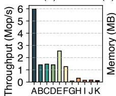  
Index Type

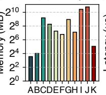  
Index Type

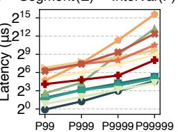  
Latency Type  
Figure 22: Comparison on Tencent traces.

Case 2: DFS metadata service (Meta trace). Meta’s exabytescale DFS (Tectonic) uses RocksDB [28, 70] for metadata service, including a block-to-file mapping. To validate RASK’s effectiveness in this scenario, we replace RocksDB’s MemTable with RASK and evaluate it with Tectonic’s 3-year traces (from 7 clusters). For RocksDB, we use its default configuration, including various parameters and concurrency control mechanisms (i.e., MVCC). Fig. 21 shows RASK achieves up to 7.46× the throughput of the original RocksDB since RASK is more memory-efficient than skiplist, allowing more entries to stay in memory and boosting query performance.

Case 3: Flash cache index (Google trace). Given Google’s storage clusters using flash cache [9], we simulate RASK’s effectiveness in flash cache scenarios using 3-month traces from 3 Google clusters. Fig. 23 shows that RASK achieves 1.52–37.52× higher throughput, reduces memory usage by 3.2–99.9%, and cuts tail latency by 4.2–99.4% vs. baselines. The only exception is that segment tree’s tail latency is lower than RASK, as it avoids the overhead of removing covered ranges—which has minor impact under light load—but incurs high memory overhead.

## 8 Related Work

Memory-efficient indexes in block devices. In SSDs, the Flash Translation Layer (FTL) handles logical-to-physical (L2P) mapping [71], which is ideally cached in memory. Various device-side FTL designs have explored reducing the memory footprint by leveraging I/O patterns [72–76], with some exploiting write sequentiality [77,78]. However, to meet SSD requirements, these designs still operate at the LBA granularity rather than range, thus incurring additional conversion and operational overhead. On the other hand, host-side FTLs for open-channel SSDs [79–81], Zoned Namespaces (ZNS) [82–85], and Flexible Data Placement (FDP) [86, 87] reduce memory overhead by degrading page-level mapping to zone/reclaim unit-level, thus reducing mapping entries. However, this fixed range size (e.g., zone size) limits flexibility and imposes more strict requirements on applications. RASK natively supports variable-length range indexing, making it more flexible and applicable for cloud block storage systems.

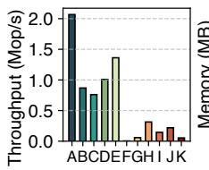  
Index Type

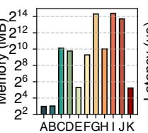  
Index Type

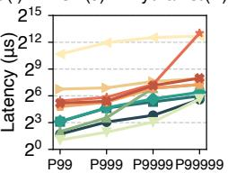  
Latency Type  
Figure 23: Comparison on Google traces.

B-tree/Trie-based in-memory indexes. Current SOTA inmemory ordered indexes are primarily based on B-trees [67, 88–90], tries [31, 63, 64], or their hybrids [60, 91]. HydraList [65] and Wormhole [58] use trie-like internal nodes for fast leaf access and B-tree-like leaves for efficient range queries and memory efficiency. While RASK also uses trie-style internal nodes and B-tree-style leaves, it is further designed for indexing ranges rather than individual objects.

Memory-efficient persistent KV stores. Persistent KV stores (e.g., LSM-tree) require an in-memory index and/or cache for faster data access. Many works have improved the performance of KV stores by optimizing cache [92–96] and indexing [97–101]. RASK can serve as the in-memory component for persistent KV stores, enhancing their memory efficiency.

## 9 Conclusion

We propose RASK, a memory-efficient and high-performance index that natively supports range-as-a-key. We employ several techniques to address the challenges of range overlap and range fragmentation. Evaluation on four industry traces shows RASK’s advantages compared to ten SOTA indexes.

## Acknowledgments

We thank our shepherd Youjip Won and the anonymous reviewers for their insightful comments and feedback. We are sincerely grateful to Jingkai He for his valuable support throughout this work, and to Yaheng Song and Shizhuo Sun for their dedicated efforts in collecting and processing the trace data. We also thank Qiuping Wang, Jifei Yi, Jingyao Zeng, and Tong Xin for their helpful suggestions. This work is supported in part by the National Natural Science Foundation of China (No. 62132014), the Fundamental Research Funds for the Central Universities, the Fundamental and Interdisciplinary Disciplines Breakthrough Plan of the Ministry of Education of China (JYB2025XDXM113), and the Alibaba ARF/AIR program. Corresponding authors: Mingkai Dong (mingkaidong@sjtu.edu.cn) and Erci Xu (jostep90@gmail.com).

## References

[1] Weidong Zhang, Erci Xu, Qiuping Wang, Xiaolu Zhang, Yuesheng Gu, Zhenwei Lu, Tao Ouyang, Guanqun Dai, Wenwen Peng, Zhe Xu, Shuo Zhang, Dong Wu, Yilei Peng, Tianyun Wang, Haoran Zhang, Jiasheng Wang, Wenyuan Yan, Yuanyuan Dong, Wenhui Yao, Zhongjie Wu, Lingjun Zhu, Chao Shi, Yinhu Wang, Rong Liu, Junping Wu, Jiaji Zhu, and Jiesheng Wu. What’s the story in EBS glory: Evolutions and lessons in building cloud block store. In 22nd USENIX Conference on File and Storage Technologies (FAST 24), pages 277–291, Santa Clara, CA, February 2024. USENIX Association.

[2] Amazon elastic block store. https://docs.aws.ama zon.com/ebs/latest/userguide/what-is-ebs .html, 2025. Accessed: 2025-04-20.

[3] Introduction to azure managed disks. https://do cs.azure.cn/en-us/virtual-machines/manage d-disks-overview, 2025. Accessed: 2025-04-20.

[4] Brad Calder, Ju Wang, Aaron Ogus, Niranjan Nilakantan, Arild Skjolsvold, Sam McKelvie, Yikang Xu, Shashwat Srivastav, Jiesheng Wu, Huseyin Simitci, Jaidev Haridas, Chakravarthy Uddaraju, Hemal Khatri, Andrew Edwards, Vaman Bedekar, Shane Mainali, Rafay Abbasi, Arpit Agarwal, Mian Fahim ul Haq, Muhammad Ikram ul Haq, Deepali Bhardwaj, Sowmya Dayanand, Anitha Adusumilli, Marvin McNett, Sriram Sankaran, Kavitha Manivannan, and Leonidas Rigas. Windows azure storage: a highly available cloud storage service with strong consistency. In Proceedings of the Twenty-Third ACM Symposium on Operating Systems Principles, SOSP ’11, page 143–157, New York, NY, USA, 2011. Association for Computing Machinery.

[5] Google Cloud. Persistent disk. https://cloud.goog le.com/persistent-disk?hl=en, 2025. Accessed: 2025-05-09.

[6] Sambhav Satija, Chenhao Ye, Ranjitha Kosgi, Aditya Jain, Romit Kankaria, Yiwei Chen, Andrea C. Arpaci-Dusseau, Remzi H. Arpaci-Dusseau, and Kiran Srinivasan. Cloudscape: A study of storage services in modern cloud architectures. In 23rd USENIX Conference on File and Storage Technologies (FAST 25), pages 103–121, Santa Clara, CA, February 2025. USENIX Association.

[7] Shuwen Liang, Zhi Qiao, Sihai Tang, Jacob Hochstetler, Song Fu, Weisong Shi, and Hsing-Bung Chen. An empirical study of quad-level cell (qlc) nand flash ssds for big data applications. In 2019 IEEE

International Conference on Big Data (Big Data), pages 3676–3685, 2019.

[8] Yu Zhang, Ping Huang, Ke Zhou, Hua Wang, Jianying Hu, Yongguang Ji, and Bin Cheng. OSCA: An Online-Model based cache allocation scheme in cloud block storage systems. In 2020 USENIX Annual Technical Conference (USENIX ATC 20), pages 785–798. USENIX Association, July 2020.

[9] Phitchaya Mangpo Phothilimthana, Saurabh Kadekodi, Soroush Ghodrati, Selene Moon, and Martin Maas. Thesios: Synthesizing Accurate Counterfactual I/O Traces from I/O Samples. In Proceedings of the 29th ACM International Conference on Architectural Support for Programming Languages and Operating Systems, Volume 3, ASPLOS ’24, page 1016–1032, New York, NY, USA, 2024. Association for Computing Machinery.

[10] Satadru Pan, Theano Stavrinos, Yunqiao Zhang, Atul Sikaria, Pavel Zakharov, Abhinav Sharma, Shiva Shankar P, Mike Shuey, Richard Wareing, Monika Gangapuram, Guanglei Cao, Christian Preseau, Pratap Singh, Kestutis Patiejunas, JR Tipton, Ethan Katz-Bassett, and Wyatt Lloyd. Facebook’s tectonic filesystem: Efficiency from exascale. In 19th USENIX Conference on File and Storage Technologies (FAST 21), pages 217–231. USENIX Association, February 2021.

[11] Daniel Lin-Kit Wong, Hao Wu, Carson Molder, Sathya Gunasekar, Jimmy Lu, Snehal Khandkar, Abhinav Sharma, Daniel S. Berger, Nathan Beckmann, and Gregory R. Ganger. Baleen: ML admission & prefetching for flash caches. In 22nd USENIX Conference on File and Storage Technologies (FAST 24), pages 347–371, Santa Clara, CA, February 2024. USENIX Association.

[12] Hoang Tam Vo, Sheng Wang, Divyakant Agrawal, Gang Chen, and Beng Chin Ooi. Logbase: a scalable log-structured database system in the cloud. Proc. VLDB Endow., 5(10):1004–1015, June 2012.

[13] Oracle Corporation. Mysql server logs. https://de v.mysql.com/doc/refman/8.4/en/server-logs. html, 2025. Accessed: 2025-04-28.

[14] Martín Abadi, Paul Barham, Jianmin Chen, Zhifeng Chen, Andy Davis, Jeffrey Dean, Matthieu Devin, Sanjay Ghemawat, Geoffrey Irving, Michael Isard, Manjunath Kudlur, Josh Levenberg, Rajat Monga, Sherry Moore, Derek G. Murray, Benoit Steiner, Paul Tucker, Vijay Vasudevan, Pete Warden, Martin Wicke, Yuan Yu, and Xiaoqiang Zheng. Tensorflow: a system for largescale machine learning. In Proceedings of the 12th

USENIX Conference on Operating Systems Design and Implementation, OSDI’16, page 265–283, USA, 2016. USENIX Association.

[15] Konstantin Shvachko, Hairong Kuang, Sanjay Radia, and Robert Chansler. The hadoop distributed file system. In Proceedings of the 2010 IEEE 26th Symposium on Mass Storage Systems and Technologies (MSST), MSST ’10, page 1–10, USA, 2010. IEEE Computer Society.

[16] Jay Kreps, Neha Narkhede, Jun Rao, et al. Kafka: A distributed messaging system for log processing. In Proceedings of the NetDB, volume 11, pages 1–7. Athens, Greece, 2011.

[17] Mendel Rosenblum and John K. Ousterhout. The design and implementation of a log-structured file system. ACM Trans. Comput. Syst., 10(1):26–52, February 1992.

[18] Changman Lee, Dongho Sim, Joo-Young Hwang, and Sangyeun Cho. F2fs: a new file system for flash storage. In Proceedings of the 13th USENIX Conference on File and Storage Technologies, FAST’15, page 273–286, USA, 2015. USENIX Association.

[19] The Linux Kernel Documentation Team. Journal (jbd2) - ext4 documentation. https://www.kernel.org/d oc/html/latest/filesystems/ext4/journal.ht ml, 2025. Accessed: 2025-04-28.

[20] The Linux Kernel Development Community. Page cache. https://docs.kernel.org/mm/page\_cach e.html, 2025. Accessed: 2025-04-28.

[21] Chandramohan A. Thekkath, Timothy Mann, and Edward K. Lee. Frangipani: a scalable distributed file system. SIGOPS Oper. Syst. Rev., 31(5):224–237, October 1997.

[22] Thomas E. Anderson, Marco Canini, Jongyul Kim, Dejan Kostic, Youngjin Kwon, Simon Peter, Waleed Reda, ´ Henry N. Schuh, and Emmett Witchel. Assise: Performance and availability via client-local NVM in a distributed file system. In 14th USENIX Symposium on Operating Systems Design and Implementation (OSDI 20), pages 1011–1027. USENIX Association, November 2020.

[23] Suli Yang, Tyler Harter, Nishant Agrawal, Salini Selvaraj Kowsalya, Anand Krishnamurthy, Samer Al-Kiswany, Rini T. Kaushik, Andrea C. Arpaci-Dusseau, and Remzi H. Arpaci-Dusseau. Split-level i/o scheduling. New York, NY, USA, 2015. Association for Computing Machinery.

[24] Caeden Whitaker, Sidharth Sundar, Bryan Harris, and Nihat Altiparmak. Do we still need io schedulers for low-latency disks? In Proceedings of the 15th ACM Workshop on Hot Topics in Storage and File Systems, HotStorage ’23, page 44–50, New York, NY, USA, 2023. Association for Computing Machinery.

[25] blktrace. https://linux.die.net/man/8/blktra ce, 2025. Accessed: 2025-04-21.

[26] J. L. Bentley and T. A. Ottmann. Algorithms for reporting and counting geometric intersections. IEEE Trans. Comput., 28(9):643–647, September 1979.

[27] George Christodoulou, Panagiotis Bouros, and Nikos Mamoulis. Hint: A hierarchical index for intervals in main memory. In Proceedings of the 2022 International Conference on Management of Data, SIGMOD ’22, page 1257–1270, New York, NY, USA, 2022. Association for Computing Machinery.

[28] Siying Dong, Andrew Kryczka, Yanqin Jin, and Michael Stumm. Evolution of development priorities in key-value stores serving large-scale applications: The RocksDB experience. In 19th USENIX Conference on File and Storage Technologies (FAST 21), pages 33– 49. USENIX Association, February 2021.

[29] Alibaba cloud elastic block storage devices. https: //www.alibabacloud.com/help/en/ecs/user-g uide/elastic-block-storage-devices, 2025. Accessed: 2025-04-20.

[30] Daniel Bingmann. Stx b-tree. https://github.com /bingmann/stx-btree, 2013. Accessed: 2025-05- 01.

[31] Viktor Leis, Alfons Kemper, and Thomas Neumann. The adaptive radix tree: Artful indexing for mainmemory databases. In Proceedings of the 2013 IEEE International Conference on Data Engineering (ICDE 2013), ICDE ’13, page 38–49, USA, 2013. IEEE Computer Society.

[32] Paolo Ferragina and Giorgio Vinciguerra. The pgmindex: a fully-dynamic compressed learned index with provable worst-case bounds. Proc. VLDB Endow., 13(8):1162–1175, April 2020.

[33] Google. Snappy. https://github.com/google/sn appy, 2025. Accessed: 2025-05-11.

[34] LZ4. Lz4: Extremely fast compression algorithm. ht tps://github.com/lz4/lz4, May 2025.

[35] ZRA Organization. Zra. https://github.com/zra org/ZRA, 2020. Accessed: 2025-04-21.

[36] L. Robert and R. Nadarajan. New algorithms for random access text compression. In Third International Conference on Information Technology: New Generations (ITNG’06), pages 104–111, 2006.

[37] Peter Boncz, Thomas Neumann, and Viktor Leis. Fsst: fast random access string compression. Proc. VLDB Endow., 13(12):2649–2661, July 2020.

[38] Tzu-Wei Yang, Seth Pollen, Mustafa Uysal, Arif Merchant, and Homer Wolfmeister. CacheSack: Admission optimization for google datacenter flash caches. In 2022 USENIX Annual Technical Conference (USENIX ATC 22), pages 1021–1036, Carlsbad, CA, July 2022. USENIX Association.

[39] Sara McAllister, Yucong "Sherry" Wang, Benjamin Berg, Daniel S. Berger, George Amvrosiadis, Nathan Beckmann, and Gregory R. Ganger. FairyWREN: A sustainable cache for emerging Write-Read-Erase flash interfaces. In 18th USENIX Symposium on Operating Systems Design and Implementation (OSDI 24), pages 745–764, Santa Clara, CA, July 2024. USENIX Association.

[40] Benjamin Berg, Daniel S. Berger, Sara McAllister, Isaac Grosof, Sathya Gunasekar, Jimmy Lu, Michael Uhlar, Jim Carrig, Nathan Beckmann, Mor Harchol-Balter, and Gregory R. Ganger. The CacheLib caching engine: Design and experiences at scale. In 14th USENIX Symposium on Operating Systems Design and Implementation (OSDI 20), pages 753–768. USENIX Association, November 2020.

[41] Sara McAllister, Benjamin Berg, Julian Tutuncu-Macias, Juncheng Yang, Sathya Gunasekar, Jimmy Lu, Daniel S. Berger, Nathan Beckmann, and Gregory R. Ganger. Kangaroo: Caching billions of tiny objects on flash. In Proceedings of the ACM SIGOPS 28th Symposium on Operating Systems Principles, SOSP ’21, page 243–262, New York, NY, USA, 2021. Association for Computing Machinery.

[42] Kai Ren, Qing Zheng, Swapnil Patil, and Garth Gibson. Indexfs: scaling file system metadata performance with stateless caching and bulk insertion. In Proceedings of the International Conference for High Performance Computing, Networking, Storage and Analysis, SC ’14, page 237–248. IEEE Press, 2014.

[43] Siyang Li, Youyou Lu, Jiwu Shu, Yang Hu, and Tao Li. Locofs: a loosely-coupled metadata service for distributed file systems. In Proceedings of the International Conference for High Performance Computing, Networking, Storage and Analysis, SC ’17, New York, NY, USA, 2017. Association for Computing Machinery.

[44] Herbert Edelsbrunner. Dynamic rectangle intersection searching. Technical Report 47, Institute for Information Processing, Technical University of Graz, Graz, Austria, 1980.

[45] Norbert Beckmann, Hans-Peter Kriegel, Ralf Schneider, and Bernhard Seeger. The r\*-tree: an efficient and robust access method for points and rectangles. SIGMOD Rec., 19(2):322–331, May 1990.

[46] Mark de Berg, Otfried Cheong, Marc J. van Kreveld, and Mark H. Overmars. Computational Geometry: Algorithms and Applications. Springer, 3rd edition, 2008.

[47] Andreas Behrend, Anton Dignös, Johann Gamper, Philip Schmiegelt, Hannes Voigt, Matthias Rottmann, and Karsten Kahl. Period index: A learned 2d hash index for range and duration queries. In Proceedings of the 16th International Symposium on Spatial and Temporal Databases, SSTD ’19, page 100–109, New York, NY, USA, 2019. Association for Computing Machinery.

[48] Martin Kaufmann, Amin Amiri Manjili, Panagiotis Vagenas, Peter Michael Fischer, Donald Kossmann, Franz Färber, and Norman May. Timeline index: a unified data structure for processing queries on temporal data in sap hana. In Proceedings of the 2013 ACM SIGMOD International Conference on Management of Data, SIGMOD ’13, page 1173–1184, New York, NY, USA, 2013. Association for Computing Machinery.

[49] Hans-Peter Kriegel, Marco Pötke, and Thomas Seidl. Managing intervals efficiently in object-relational databases. In Proceedings of the 26th International Conference on Very Large Data Bases, VLDB ’00, page 407–418, San Francisco, CA, USA, 2000. Morgan Kaufmann Publishers Inc.

[50] Panagiotis Bouros and Nikos Mamoulis. A forward scan based plane sweep algorithm for parallel interval joins. Proc. VLDB Endow., 10(11):1346–1357, August 2017.

[51] Panagiotis Bouros, Nikos Mamoulis, Dimitrios Tsitsigkos, and Manolis Terrovitis. In-memory interval joins. The VLDB Journal, 30(4):667–691, April 2021.

[52] Anton Dignös, Michael H. Böhlen, and Johann Gamper. Overlap interval partition join. In Proceedings of the 2014 ACM SIGMOD International Conference on Management of Data, SIGMOD ’14, page 1459–1470, New York, NY, USA, 2014. Association for Computing Machinery.

[53] Danila Piatov, Sven Helmer, Anton Dignös, and Fabio Persia. Cache-efficient sweeping-based interval joins for extended allen relation predicates. The VLDB Journal, 30(3):379–402, February 2021.

[54] Moez Chaabouni and Soon Myoung Chung. The pointrange tree: a data structure for indexing intervals. In International Conference on Scientific Computing, 1993.

[55] Eric N. Hanson. The interval skip list: A data structure for finding all intervals that overlap a point. In Workshop on Algorithms and Data Structures, 1991.

[56] Huiba Li, Yifan Yuan, Rui Du, Kai Ma, Lanzheng Liu, and Windsor Hsu. DADI: Block-Level image service for agile and elastic application deployment. In 2020 USENIX Annual Technical Conference (USENIX ATC 20), pages 727–740. USENIX Association, July 2020.

[57] Haoru Zhao, Mingkai Dong, Erci Xu, Zhongyu Wang, and Haibo Chen. "range as a key" is the key! fast and compact cloud block store index with RASK. https: //arxiv.org/abs/2601.14129, 2026.

[58] Xingbo Wu, Fan Ni, and Song Jiang. Wormhole: A fast ordered index for in-memory data management. In Proceedings of the Fourteenth EuroSys Conference 2019, EuroSys ’19, New York, NY, USA, 2019. Association for Computing Machinery.

[59] Patrick O’Neil, Edward Cheng, Dieter Gawlick, and Elizabeth O’Neil. The log-structured merge-tree (lsmtree). Acta Inf., 33(4):351–385, June 1996.

[60] Yandong Mao, Eddie Kohler, and Robert Tappan Morris. Cache craftiness for fast multicore key-value storage. In Proceedings of the 7th ACM European Conference on Computer Systems, EuroSys ’12, page 183–196, New York, NY, USA, 2012. Association for Computing Machinery.

[61] Nathan G. Bronson, Jared Casper, Hassan Chafi, and Kunle Olukotun. A practical concurrent binary search tree. In Proceedings of the 15th ACM SIGPLAN Symposium on Principles and Practice of Parallel Programming, PPoPP ’10, page 257–268, New York, NY, USA, 2010. Association for Computing Machinery.

[62] Viktor Leis, Florian Scheibner, Alfons Kemper, and Thomas Neumann. The ART of practical synchronization. In Proceedings of the 12th International Workshop on Data Management on New Hardware, DaMoN ’16, New York, NY, USA, 2016. Association for Computing Machinery.

[63] Robert Binna, Eva Zangerle, Martin Pichl, Günther Specht, and Viktor Leis. Hot: A height optimized trie

index for main-memory database systems. In Proceedings of the 2018 International Conference on Management of Data, SIGMOD ’18, page 521–534, New York, NY, USA, 2018. Association for Computing Machinery.

[64] Adar Zeitak and Adam Morrison. Cuckoo trie: Exploiting memory-level parallelism for efficient dram indexing. In Proceedings of the ACM SIGOPS 28th Symposium on Operating Systems Principles, SOSP ’21, page 147–162, New York, NY, USA, 2021. Association for Computing Machinery.

[65] Ajit Mathew and Changwoo Min. Hydralist: a scalable in-memory index using asynchronous updates and partial replication. Proc. VLDB Endow., 13(9):1332–1345, May 2020.

[66] Juncheng Yang, Yazhuo Zhang, Ziyue Qiu, Yao Yue, and Rashmi Vinayak. Fifo queues are all you need for cache eviction. In Proceedings of the 29th Symposium on Operating Systems Principles, SOSP ’23, page 130–149, New York, NY, USA, 2023. Association for Computing Machinery.

[67] Helen Xu, Amanda Li, Brian Wheatman, Manoj Marneni, and Prashant Pandey. Bp-tree: Overcoming the point-range operation tradeoff for in-memory b-trees. Proc. VLDB Endow., 16(11):2976–2989, July 2023.

[68] Jon Louis Bentley. Multidimensional divide-andconquer. Commun. ACM, 23(4):214–229, April 1980.

[69] Thomas H. Cormen, Charles E. Leiserson, Ronald L. Rivest, and Clifford Stein. Introduction to Algorithms. MIT Press and McGraw-Hill, 3rd edition, 2009.

[70] M. Annamalai. Zippydb - a distributed key-value store. https://www.youtube.com/embed/ZRP7z0HnClc, 2015. Online video.

[71] Eran Gal and Sivan Toledo. Algorithms and data structures for flash memories. ACM Computing Surveys, 37(2):138–163, 2005.

[72] You Zhou, Fei Wu, Ping Huang, Xubin He, Changsheng Xie, and Jian Zhou. An efficient page-level ftl to optimize address translation in flash memory. In Proceedings of the Tenth European Conference on Computer Systems, EuroSys ’15, New York, NY, USA, 2015. Association for Computing Machinery.

[73] Aayush Gupta, Youngjae Kim, and Bhuvan Urgaonkar. Dftl: a flash translation layer employing demand-based selective caching of page-level address mappings. In Proceedings of the 14th International Conference on Architectural Support for Programming Languages and Operating Systems, ASPLOS XIV, page 229–240, New

York, NY, USA, 2009. Association for Computing Machinery.

[74] Sang-Won Lee, Dong-Joo Park, Tae-Sun Chung, Dong-Ho Lee, Sangwon Park, and Ha-Joo Song. A log bufferbased flash translation layer using fully-associative sector translation. ACM Trans. Embed. Comput. Syst., 6(3):18–es, July 2007.

[75] Sungjin Lee, Dongkun Shin, Young-Jin Kim, and Jihong Kim. Last: locality-aware sector translation for nand flash memory-based storage systems. SIGOPS Oper. Syst. Rev., 42(6):36–42, October 2008.

[76] Junsu Im, Jeonggyun Kim, Seonggyun Oh, Jinhyung Koo, Juhyung Park, Hoon Sung Chwa, Sam H. Noh, and Sungjin Lee. Solid state drive targeted memoryefficient indexing for universal i/o patterns and fragmentation degrees. In Proceedings of the Twentieth European Conference on Computer Systems, EuroSys ’25, page 974–990, New York, NY, USA, 2025. Association for Computing Machinery.

[77] Song Jiang, Lei Zhang, XinHao Yuan, Hao Hu, and Yu Chen. S-ftl: An efficient address translation for flash memory by exploiting spatial locality. In Proceedings of the 2011 IEEE 27th Symposium on Mass Storage Systems and Technologies, MSST ’11, page 1–12, USA, 2011. IEEE Computer Society.

[78] Jinghan Sun, Shaobo Li, Yunxin Sun, Chao Sun, Dejan Vucinic, and Jian Huang. Leaftl: A learning-based flash translation layer for solid-state drives. In Proceedings of the 28th ACM International Conference on Architectural Support for Programming Languages and Operating Systems, Volume 2, ASPLOS 2023, page 442–456, New York, NY, USA, 2023. Association for Computing Machinery.

[79] Artem B. Bityutskiy. JFFS3 Design Issues. http: //www.linux-mtd.infradead.org/doc/JFFS3de sign.pdf, 2005. Accessed: 2024-05-22.

[80] Jian Ouyang, Shiding Lin, Song Jiang, Zhenyu Hou, Yong Wang, and Yuanzheng Wang. Sdf: softwaredefined flash for web-scale internet storage systems. In Proceedings of the 19th International Conference on Architectural Support for Programming Languages and Operating Systems, ASPLOS ’14, page 471–484, New York, NY, USA, 2014. Association for Computing Machinery.

[81] Jiacheng Zhang, Youyou Lu, Jiwu Shu, and Xiongjun Qin. Flashkv: Accelerating kv performance with openchannel ssds. ACM Trans. Embed. Comput. Syst., 16(5s), September 2017.

[82] Matias Bjørling, Abutalib Aghayev, Hans Holmberg, Aravind Ramesh, Damien Le Moal, Gregory R. Ganger, and George Amvrosiadis. ZNS: Avoiding the block interface tax for flash-based SSDs. In 2021 USENIX Annual Technical Conference (USENIX ATC 21), pages 689–703. USENIX Association, July 2021.

[83] Kyuhwa Han, Hyunho Gwak, Dongkun Shin, and Jooyoung Hwang. Zns+: Advanced zoned namespace interface for supporting in-storage zone compaction. In 15th USENIX Symposium on Operating Systems Design and Implementation (OSDI 21), pages 147–162. USENIX Association, July 2021.

[84] Myounghoon Oh, Seehwan Yoo, Jongmoo Choi, Jeongsu Park, and Chang-Eun Choi. Zenfs+: Nurturing performance and isolation to zenfs. IEEE Access, 11:26344–26357, 2023.

[85] Theano Stavrinos, Daniel S. Berger, Ethan Katz-Bassett, and Wyatt Lloyd. Don’t be a blockhead: zoned namespaces make work on conventional ssds obsolete. In Proceedings of the Workshop on Hot Topics in Operating Systems, HotOS ’21, page 144–151, New York, NY, USA, 2021. Association for Computing Machinery.

[86] Arun George, Adam Manzanares, and Joel Granados. Flexible Data Placement Open Source Ecosystem. Slide presentation at Storage Developer Conference (SDC), September 2023. https://storagedevelop er.org/sites/default/files/SDC/2023/presen tations/SNIA-SDC23Manzarnares-Granados-G eorge-Flexible-Data-Placement.pdf.

[87] Smriti Desai and Chris Sabol. SmartFTL SSDs. Slide presentation at Flash Memory Summit (FMS), August 2021. https://146a55aca6f00848c565a7635525 d40ac1c70300198708936b4e.ssl.cf1.rackcdn.c om/images/c867f55eaa86f735dc82d649bd18077e 9388f07f.pdf.

[88] Ziqi Wang, Andrew Pavlo, Hyeontaek Lim, Viktor Leis, Huanchen Zhang, Michael Kaminsky, and David G. Andersen. Building a bw-tree takes more than just buzz words. In Proceedings of the 2018 International Conference on Management of Data, SIGMOD ’18, page 473–488, New York, NY, USA, 2018. Association for Computing Machinery.

[89] Muhammad A. Awad, Saman Ashkiani, Rob Johnson, Martín Farach-Colton, and John D. Owens. Engineering a high-performance gpu b-tree. In Proceedings of the 24th Symposium on Principles and Practice of Parallel Programming, PPoPP ’19, page 145–157, New York, NY, USA, 2019. Association for Computing Machinery.

[90] Hokeun Cha, Xiangpeng Hao, Tianzheng Wang, Huanchen Zhang, Aditya Akella, and Xiangyao Yu. Blink-hash: An adaptive hybrid index for inmemory time-series databases. Proc. VLDB Endow., 16(6):1235–1248, February 2023.

[91] Changkyu Kim, Jatin Chhugani, Nadathur Satish, Eric Sedlar, Anthony D. Nguyen, Tim Kaldewey, Victor W. Lee, Scott A. Brandt, and Pradeep Dubey. Fast: fast architecture sensitive tree search on modern cpus and gpus. In Proceedings of the 2010 ACM SIGMOD International Conference on Management of Data, SIG-MOD ’10, page 339–350, New York, NY, USA, 2010. Association for Computing Machinery.

[92] Lanyue Lu, Thanumalayan Sankaranarayana Pillai, Andrea C. Arpaci-Dusseau, and Remzi H. Arpaci-Dusseau. Wisckey: separating keys from values in ssd-conscious storage. page 133–148, 2016.

[93] Yifan Dai, Yien Xu, Aishwarya Ganesan, Ramnatthan Alagappan, Brian Kroth, Andrea C. Arpaci-Dusseau, and Remzi H. Arpaci-Dusseau. From wisckey to bourbon: a learned index for log-structured merge trees. In Proceedings of the 14th USENIX Conference on Operating Systems Design and Implementation, OSDI’20, USA, 2020. USENIX Association.

[94] Lei Yang, Hong Wu, Tieying Zhang, Xuntao Cheng, Feifei Li, Lei Zou, Yujie Wang, Rongyao Chen, Jianying Wang, and Gui Huang. Leaper: a learned prefetcher for cache invalidation in lsm-tree based storage engines. Proc. VLDB Endow., 13(12):1976–1989, July 2020.

[95] Chen Luo. Breaking down memory walls in lsm-based storage systems. In Proceedings of the 2020 ACM SIGMOD International Conference on Management of Data, SIGMOD ’20, page 2817–2819, New York, NY, USA, 2020. Association for Computing Machinery.

[96] Fenggang Wu, Ming-Hong Yang, Baoquan Zhang, and David H.C. Du. AC-Key: Adaptive caching for LSMbased Key-Value stores. In 2020 USENIX Annual Technical Conference (USENIX ATC 20), pages 603– 615. USENIX Association, July 2020.

[97] Oana Balmau, Rachid Guerraoui, Vasileios Trigonakis, and Igor Zablotchi. Flodb: Unlocking memory in persistent key-value stores. In Proceedings of the Twelfth European Conference on Computer Systems, EuroSys ’17, page 80–94, New York, NY, USA, 2017. Association for Computing Machinery.

[98] Edward Bortnikov, Anastasia Braginsky, Eshcar Hillel, Idit Keidar, and Gali Sheffi. Accordion: better memory organization for lsm key-value stores. Proc. VLDB Endow., 11(12):1863–1875, August 2018.

[99] Oana Balmau, Diego Didona, Rachid Guerraoui, Willy Zwaenepoel, Huapeng Yuan, Aashray Arora, Karan Gupta, and Pavan Konka. TRIAD: Creating synergies between memory, disk and log in log structured Key-Value stores. In 2017 USENIX Annual Technical Conference (USENIX ATC 17), pages 363–375, Santa Clara, CA, July 2017. USENIX Association.

[100] Baptiste Lepers, Oana Balmau, Karan Gupta, and Willy Zwaenepoel. Kvell: the design and implementation of a fast persistent key-value store. In Proceedings of the 27th ACM Symposium on Operating Systems Principles, SOSP ’19, page 447–461, New York, NY, USA, 2019. Association for Computing Machinery.

[101] André Brinkmann, Reza Salkhordeh, Florian Wiegert, Peng Wang, Yao Xin, Renhai Chen, Huang Keji, and Gong Zhang. Hln-tree: A memory-efficient b+-tree with huge leaf nodes and locality predictors. ACM Trans. Storage, 21(2), February 2025.