USENIX

THE ADVANCED COMPUTING SYSTEMS ASSOCIATION

# SolidAttention: Low-Latency SSD-based Serving on Memory-Constrained PCs

Xinrui Zheng, Dongliang Wei, Jianxiang Gao, Yixin Song, and Zeyu Mi, and Haibo Chen, Shanghai Jiao Tong University

## https://www.usenix.org/conference/fast26/presentation/zheng

This paper is included in the Proceedings of the 24th USENIX Conference on File and Storage Technologies.

February 24–26, 2026 • Santa Clara, CA, USA

ISBN 978-1-939133-53-3

Open access to the Proceedings of the 24th USENIX Conference on File and Storage Technologies is sponsored by

# SolidAttention: Low-Latency SSD-based Serving on Memory-Constrained PCs

Xinrui Zheng, Dongliang Wei, Jianxiang Gao, Yixin Song, Zeyu Mi, Haibo Chen

Institute of Parallel and Distributed Systems (IPADS), Shanghai Jiao Tong University

## Abstract

AI personal computers (AIPCs) enable the local deployment of large language model (LLM) inference, offering enhanced privacy guarantees and customizable serving. However, such deployments are constrained by limited memory capacity, primarily due to the substantial key-value (KV) cache overhead. This paper introduces SolidAttention, an LLM inference engine which addresses these limitations through a tight co-design of dynamic attention sparsity algorithms and SSD-based storage management. Specifically, to maximize SSD bandwidth utilization, SolidAttention consolidates multiple KV pairs into coarse-grained blocks and implements speculative prefetching mechanisms that exploit temporal locality in sparse attention. By fine-grained orchestration of computation and I/O operations while reusing synchronization points, SolidAttention further minimizes SSD-induced blocking latency. With a 128k-token context, SolidAttention improves the inference speed by up to 3.1× and reduces the KV cache memory footprint by up to 98% without compromising inference accuracy.

## 1 Introduction

Large language models (LLMs) have garnered significant attention for their remarkable capabilities [20, 25, 27, 31], and are widely used in personal assistance tasks such as coding, summarization, and other applications. As these applications become increasingly integrated into daily workflows, considerations around privacy, customization, and deployment cost have driven a rapidly growing trend toward running LLMs locally on AI personal computers (AIPCs).

However, widespread adoption on AIPCs faces significant hardware barriers. Market analysis [17, 37, 47] reveals that most PCs currently shipping have constrained hardware configurations. These systems typically feature modest 8-16 GB DRAM capacities and either integrated GPUs (iGPUs) or entry-level discrete GPUs with 6-8 GB VRAM. These configurations are far from sufficient for running LLMs. As the context length of LLMs increases, 128k-token context has become the default configuration. Even an 8B-parameter model requires over 16 GB of memory solely for the key-value (KV) cache during inference. This represents over 4× the memory footprint of the model weights alone. Such high memory usage consumes a large portion of available system memory, leaving little room for other processes. This exposes a profound disconnect between practical hardware conditions and the assumptions made by many existing deployment solutions (e.g., llama.cpp [2], Ollama [3]) that the whole KV cache can be accommodated in memory.

To mitigate the memory overhead of the KV cache, one possible approach [26, 52, 55] is to apply INT4 or more aggressive quantization schemes to the KV cache. However, such methods typically degrade model accuracy significantly, making them unsuitable for many practical applications.

Another widely explored approach [12, 40] leverages the inherent dynamic attention sparsity in LLMs to offload KV caches to SSDs. Specifically, these methods selectively load relevant KV pairs and overlap I/O operations with computeintensive workloads of other concurrent requests to optimize throughput. However, this throughput-oriented strategy performs poorly in latency-sensitive local deployments, making SSD access a bottleneck during inference. The primary limitation lies in the generally low request concurrency in local scenarios. Insufficient computational workloads induced by small-batch inputs complete significantly faster than I/O operations and struggle to hide the SSD access latency.

In this paper, we argue that the root cause of the latency issues when integrating dynamic attention sparsity and SSD offloading is the fundamental conflict between sparse attention computation and SSD characteristics. Specifically, SSDs achieve optimal performance only when processing coarse-grained sequential operations. In contrast, the dynamic and irregular data access patterns inherent in the sparse attention mechanism introduce numerous fine-grained random I/O requests. This mismatch results in inefficient hardware utilization and widens the latency gap between I/O and computation, causing overlap failure. Existing approaches treat attention sparsity and storage management as isolated concerns, failing to account for the performance penalties induced by their interaction. Therefore, we propose our core insight: co-designing sparse attention algorithms and the storage management system to align data access granularity and strategically orchestrate computation-I/O overlap, thereby mitigating SSD access latency.

Based on this insight, we propose SolidAttention, an SSDbased LLM inference system that enables low-latency inference on memory-constrained PCs with minimal accuracy loss. Specifically, SolidAttention consolidates multiple KV pairs into a block as the basic transfer unit. This transforms irregular data access patterns into coarse-grained sequential ones. Additionally, SolidAttention preselects and prefetches critical KV blocks. This strategy provides sufficient time for computation-I/O overlap before attention computation. However, the pursuit of efficient SSD-based sparse attention systems encounters three significant challenges:

1. Accuracy Loss: Consolidating KV pairs requires extracting a representative vector for each block as the identifier involving the selection of attention sparsity. This presents a critical trade-off: large block sizes encode excessive KV pairs into a single representative, causing contextual information loss and degraded accuracy. Smaller blocks, however, introduce inefficient fine-grained data accesses, leading to poor SSD bandwidth utilization and increased I/O latency. This highlights the challenge of simultaneously maintaining model accuracy and hardware efficiency.

2. Prefetching Indeterminacy: Dynamic attention sparsity selects relevant KV blocks based on layer-specific input, making the selection for the subsequent layer indeterminable prior to its attention computation. This indeterminacy prevents preselecting or proactively prefetching KV blocks, thereby leaving insufficient time window for computation-I/O overlap. Consequently, this incurs significant blocking latency while waiting for loading KV cache.

3. Data Inconsistency: Computation-I/O overlap introduces concurrent accesses to the KV cache. For example, the GPU reads input KV blocks from DRAM while asynchronously prefetching the next layer’s KV cache from SSD. In memory-constrained scenarios, the prefetching may overwrite data that the GPU has not yet read. This risks data inconsistency. A naive solution would suspend attention computations until all I/O operations complete sequentially. However, this approach imposes substantial computational stalls and degrades system performance.

To address these challenges, SolidAttention introduces the following key innovations:

First, SolidAttention proposes a KV consolidator that transparently consolidates KV pairs. Concretely, leveraging the observation that K and V vectors share the same shape, SolidAttention interleaves them at token granularity to form coarse-grained data unit. This technique enables SSD accesses at a larger granularity while remaining transparent to attention computations, thereby maximizing SSD bandwidth utilization without sacrificing accuracy.

Second, SolidAttention introduces a speculative prefetcher to predict and prefetch KV blocks. The prefetcher exploits the temporal locality inherent in attention sparsity to speculatively fetch KV blocks based on historical selection outcomes. To handle incorrectly prefetched KV blocks, it retransmits missing blocks and overwrites incorrectly prefetched ones. Due to the relaxed ordering constraints on KV pairs during attention computation, existing KV blocks do not need costly reordering. This approach effectively advances the issuance of I/O requests and eliminates blocking latency.

Third, to resolve the concurrency issues in the KV cache, SolidAttention proposes an SSD-aware scheduler. This scheduler decomposes the attention module into microtasks and schedules computational tasks in parallel with asynchronous I/O tasks according to their data dependencies. Furthermore, non-critical tasks are grouped with those on the critical path to share synchronization points. This approach reduces the synchronization frequency and associated overhead while maximizing the utilization of both GPU computation capacity and SSD bandwidth.

SolidAttention is implemented on both CUDA and SYCL backends with about 25k lines of C++ and CUDA code. When evaluated on an AIPC prototype, SolidAttention demonstrates a performance improvement of up to 3.1× with a 128k-token context. Experiments indicate that SolidAttention reduces the KV cache memory usage by up to 98% without compromising model accuracy.

## 2 Background and Motivation

## 2.1 Generative Inference and KV Cache

Transformer Architecture. The Transformer architecture [23, 48] is the foundation of modern large language models (LLMs). It processes sequential data like text using a self-attention mechanism, which models dependencies between tokens regardless of their positions in the sequence. Input tokens are first embedded into vectors, and positional encodings are added to retain order information. By the projection of weight matrices, the input embedding generates Query (Q), Key (K), and Value (V) tensors. The self-attention mechanism is conducted using the $Q , K , V \in R ^ { N \times H }$ as:

$$
S = \frac { Q K ^ { T } } { \sqrt { H } } , \ P = s o f t m a x ( S ) , \ O = P V
$$

where N denotes sequence length and H denotes hidden dimension. S denotes attention scores. P denotes attention weights. The output O feeds into the Feed-Forward network (FFN), whose output serves as the next layer’s input. Multiple layers of these components are stacked to form the full model and the final output is passed through a linear projection to generate predictions.

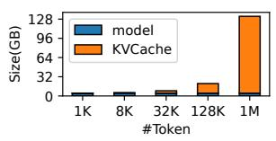

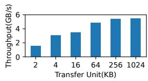  
(a) Memory consumption  
(b) SSD read throughput  
Figure 1: (a) The memory usage of model and KV cache as the input length grows. The model is Llama-3.1-8B quantized in INT4. (b) Random read throughput of SSD with various transfer unit sizes.

Autoregressive Generation. LLM inference comprises the prefill phase and the decode phase. In the prefill phase, LLM processes input tokens in parallel and produces the first output token. This token then triggers the decode phase. In each decoding step, the newly generated token is fed back into the model to produce the next one, resulting in an autoregressive process for token generation. Because each step processes only one token, the decode phase has a lower compute-tomemory ratio compared to the prefill phase, making it highly latency-sensitive.

Significant KV Cache Memory Overhead. The LLM’s autoregressive generation pattern presents computational challenges for long sequences because keys and values must be recomputed for all tokens during each decode iteration. The KV cache optimization addresses this issue by storing the computed keys and values and reusing them for subsequent token generation. This largely eliminates computational overhead and improves inference efficiency.

However, as new tokens are processed, keys and values are continuously added to the cache, causing its size to grow linearly with the context length. As shown in Figure 1a, the size of KV cache reaches 16 GB as the context length reaches 128k. This memory requirement greatly exceeds the capacity of memory-constrained devices like laptops, most of which are equipped with 8 GB or 16 GB memory.

## 2.2 Attention Sparsity

To address memory and computational challenges caused by expanding KV cache, recent studies [28–30, 45, 51, 53, 58] exploit the inherent sparsity of attention computation, where a small subset of tokens dominates the attention outputs. This enables KV cache compression by selecting KV pairs of critical tokens to approximate the attention mechanism. Attention sparsity methods typically prioritize tokens with higher attention scores and fall into Static Attention Sparsity and Dynamic Attention Sparsity categories.

Static attention sparsity evicts irrelevant tokens from the KV cache once after the prefill phase. SnapKV [30] identifies important tokens involved in attention computation via an end-position observation window. StreamingLLM [53] highlights the "attention sink" phenomenon, where initial tokens accumulate disproportionately high attention weights due to asymmetric distribution. However, as previous works point out [29, 45, 51], these approaches risk losing context information critical for future tokens by relying on current query data for permanent eviction decisions.

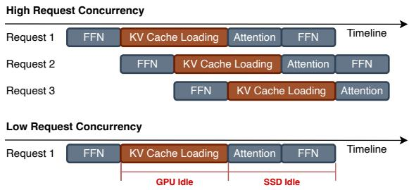  
Figure 2: Comparison of hiding SSD access latency by batching requests under different request concurrency.

Dynamic attention sparsity mitigates permanent information loss by keeping the whole KV cache and dynamically performing the selection during the decode phase. To reduce computational overhead induced by the selection, these approaches often partition the KV cache into blocks along the dimension of context length and extract a representative vector to serve as the identifier for each block. During the prefill phase, Quest [45] extracts representative vectors by the maxmin value in key vectors, while InfLLM [51] extracts those with the highest attention scores. During the decode phase, KV blocks with the top-k query-identifier similarities would involve in self-attention computation. Nevertheless, dynamic access patterns require the entire KV cache to be stored in memory for potential activation, which offsets the benefits of sparsity upon memory saving.

## 2.3 SSD-based Attention Sparsity

SSD offloading provides promising capacity for dynamic attention sparsity systems to extend KV cache storage. With the entire KV cache residing in the SSD, systems only need to fetch critical KV pairs from SSD. FlexGen [40] is an inference system integrating SSD offloading and attention sparsity to reduce memory usage. As shown in Figure 2, through a zigzag scheduling, FlexGen batches requests and overlaps KV cache loading with computational workloads of other concurrent requests without stalling during inference.

These approaches overlook the mismatch between data access patterns and SSD characteristics and load the KV cache at token granularity. As shown in Figure 1b, SSDs achieve optimal performance only with large transfer sizes, which better exploit the internal parallelism of SSD (e.g., channel parallelism) [10, 11, 49]. Therefore, FlexGen has to gather sufficient computational workloads to hide the I/O latency due to low bandwidth utilization.

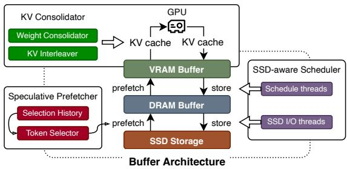  
Figure 3: Architecture overview of SolidAttention.

Additionally, such a throughput-prioritized approach performs poorly in local scenarios with insufficient request concurrency. Without concurrent requests, systems must wait for KV cache loading before launching subsequent computational tasks. The blocking latency induced between block selection and self-attention computation significantly degrades performance. For example, loading a 1k-token KV cache (128 MB) from SSD takes about 40ms, which can account for nearly half of the time in a decode step.

## 3 SolidAttention Overview

## 3.1 System Architecture

The goal of SolidAttention is to resolve the fundamental conflict between sparse attention computation and SSD characteristics, thereby maximizing SSD bandwidth utilization and mitigating SSD access latency on memory-constrained PCs. The system design follows two principles: (1) redesigning dynamic sparse attention computation to produce SSD-friendly access patterns and (2) scheduling SSD I/O to overlap with computation at fine granularity.

Figure 3 presents the SolidAttention architecture. The entire KV cache resides on the SSD and is dynamically loaded into GPU memory during inference. SolidAttention comprises three components: (a) a KV consolidator that transparently consolidates KV pairs into coarse-grained blocks, (b) a speculative prefetcher that preselects and prefetches critical KV blocks from the SSD to GPU memory, and (c) an SSD-aware scheduler that orchestrates GPU tasks and concurrent SSD I/O operations.

Block-wise Attention Sparsity. SolidAttention adopts and refines the block-wise attention sparsity [45, 51]. As shown in Figure 4, the KV cache is partitioned into blocks, which are classified into three types:

• Init Blocks: Fixed-size window covering the initial tokens.

• Local Blocks: Sliding window over the most recent tokens.

• Selected Blocks: Dynamically selected relevant blocks.

The init blocks and local blocks are designed to handle atten-

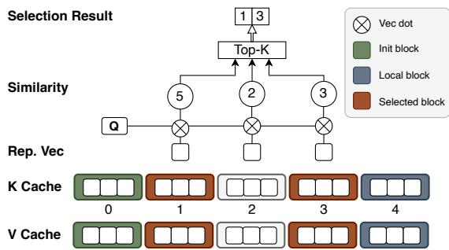

Figure 4: Partitioning and selection in SolidAttention’s block-wise dynamic attention sparsity. A representative vector is extracted from each block’s K cache and dotted with the query Q to obtain similarity scores. The blocks with the top-k scores (blocks 1 and 3) are selected to participate in the attention computation, together with the init block (block 0) and the local block (block 4).

tion sink phenomenon [53] and the latest context, respectively. Additionally, the block size denotes the number of tokens per block, and the context budget denotes the maximal number of tokens retained.

We follow the design of InfLLM [51] to extract the representative vector as the identifier for each block. During the decode phase, init blocks and local blocks are required deterministically. Other blocks with the top-k similarities between the query and the block representatives are selected to participate in the attention computation.

KV Consolidator. Typically, K and V caches are stored and processed separately. KV consolidator applies token-wise interleaving to K and V caches, constructing a novel data unit for both transfer and computation. Based on this layout, the KV Consolidator concatenates the K and V projection weight matrices offline to enable efficient generation of interleaved KV pairs. Furthermore, it provides GPU kernels for efficiently generating interleaved KV pairs.

Speculative Prefetcher. The inherent indeterminacy in KV block selection for subsequent layers prevents the system from identifying which blocks to prefetch. To address this, speculative prefetcher leverages temporal locality in block selections to anticipate critical KV blocks. The prefetcher proactively prefetches corresponding KV blocks from the SSD into GPU memory via host-mediated transfers, thereby preparing the KV cache for subsequent self-attention.

SSD-aware Scheduler. During inference, the scheduler receives an execution plan from the inference framework and schedules GPU computations alongside concurrent SSD I/O. By decomposing attention computation into microtasks, the scheduler orchestrates fine-grained computation-I/O overlap according to their data dependencies. To minimize synchronization overhead caused by fine-grained scheduling, the scheduler groups non-critical tasks with critical tasks to share synchronization points and eliminates redundant synchronization operations.

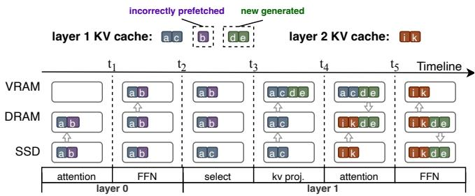

Figure 5: An illustrative example of how SolidAttention orchestrates the dataflow over the KV cache for a single LLM layer.  
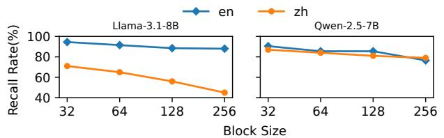  
Figure 6: Comparison of the recall rate under PassageRetrieval-en (en) and PassageRetrieval-zh (zh) workloads from LongBench [8] as block size varies.

## 3.2 Single Layer Example

Figure 5 illustrates the dataflow timeline for a single LLM layer. The process for a single layer (e.g., Layer 1) begins after the previous layer’s computation completes. First, KV blocks predicted for Layer 1 are prefetched and loaded into VRAM $( t _ { 1 }  t _ { 2 } )$ . Next, Layer 1 performs token selection (select), identifying which blocks were correctly prefetched and which were missing $( t _ { 2 } \to t _ { 3 } )$ . Missed blocks are loaded from the SSD to VRAM. Concurrently, the GPU computes the new KV pair for the current token (kv proj.) and transfers it to DRAM, preparing for eventual write-back to the SSD (t3 → t4). During the self-attention computation, the next layer’s KV blocks are prefetched from the SSD to DRAM for the subsequent attention computation $( t _ { 4 } \to t _ { 5 } )$ . Finally, during the FFN computation, the prefetched KV blocks are loaded into VRAM, and the new KV pairs of Layer 1 are written back to the SSD, entering the next iteration of the dataflow.

## 4 KV Consolidator

As depicted in §2.3, to maximize SSD bandwidth utilization, we need to consolidate multiple KV pairs to construct coarsegrained blocks that satisfy the I/O granularity requirements. However, a critical trade-off arises between the consolidation granularity of these blocks and the preservation of model accuracy. As discussed in §3.1, the dynamic attention sparsity mechanism extracts a representative vector for each KV block as the identifier for selecting relevant tokens. Figure 6 demonstrates a consistent decline in recall rates for long-context retrieval as block size increases from 32 to 256. This observation suggests that larger blocks encode an excessive number of tokens into a single representative vector, thereby incurring contextual information loss.

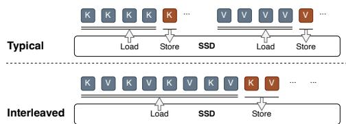  
Figure 7: Comparison between operations with separate KV cache layout (Typical) and interleaved KV cache layout (Interleaved).

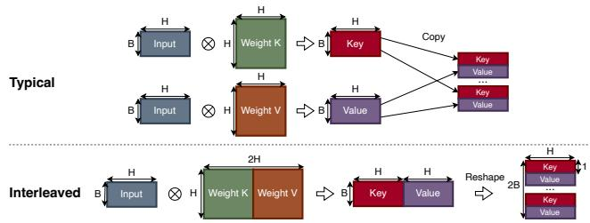  
Figure 8: Comparison between projection computations generating interleaved KV cache with separate weights (Typical) and preconcatenated weights (Interleaved).

Instead of being caught in a dilemma of the trade-off between accuracy and consolidation granularity, we seek a transparent approach to enlarge the transfer unit without excessively compressing tokens. Therefore, based on the observation that K and V pairs have the same shape (as described in §2.1), we apply token-level interleaving to K and V pairs, as shown in Figure 7. In SolidAttention, transfers across devices are all issued using this pattern.

By reorganizing KV pairs in an alternating pattern, we unify previously distinct data accesses into aggregated bulk transfers. This approach doubles the transfer unit size and halves the number of I/O operations, enabling better utilization of the SSD bandwidth. Note that interleaving K and V pairs does not increase the number of tokens in each block and thus avoids the accuracy degradation aforementioned.

As illustrated in Figure 8, a typical implementation of interleaving would necessitate costly runtime reordering, as K and V pairs are generated through two distinct matrix multiplications. To mitigate this overhead, we propose preconcatenating the weight tensors of the K and V projections into a unified tensor during the model initialization phase. This approach enables direct production of interleaved K and V outputs via a single matrix multiplication, thereby eliminating the need for post-processing steps. The unified projection weight tensors ensure structural coherence while preserving computational efficiency, as the interleaved ordering is inherently maintained during the projection process.

For self-attention computation, this approach does not introduce additional computational complexity. Modern inference frameworks such as PyTorch [38] and llama.cpp [2] support strided data access. By configuring the attention kernels to read K and V with a fixed stride of 2H (H denotes the hidden dimension of the model as discussed in §2.1), we can logically separate the interleaved buffer into distinct K and V tensors without physical rearrangement. This eliminates the need to rewrite complex GPU kernels. Benchmarks show that this strided access pattern introduces negligible latency overhead (≤ 2%) compared with contiguous layouts, confirming the practicality of the approach.

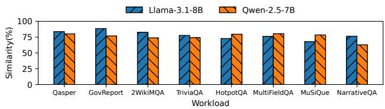  
Figure 9: Average similarity of selection results across consecutive iterations, evaluated across models and benchmarks in LongBench, with a 1k context budget

## 5 Speculative Prefetcher

To avoid permanently losing context information, dynamic attention sparsity approaches keep the whole KV cache and select relevant KV blocks at each layer. The system calculates the similarity between the input query and representative vectors of KV blocks. Only those KV blocks with the highest similarities are considered to be contextually significant and dynamically loaded into memory. However, this introduces a critical challenge: without prior knowledge of which data will be needed in future computation steps, the system cannot determine which tokens to prefetch. Therefore, KV cache cannot be loaded asynchronously from SSD to GPU in advance, leaving an insufficient time window between token selection and self-attention computation for SSD I/O.

While inspecting cross-layer selection patterns of LLMs under different workloads in LongBench [8] (please see §8.3 for details), we observe approximately 81% similarity in block selections across consecutive iterations. As shown in Figure 9, this consistency holds across diverse models and benchmarks. Motivated by this, we propose a speculative prefetcher to leverage this inherent temporal locality. By recording and analyzing historical selection results of previous iterations, the prefetcher predicts the cache blocks required for the subsequent layer, enabling proactive data prefetch. In the remainder of this section, we discuss the strategies for loading different categories of KV cache blocks and how the prefetcher deals with incorrectly prefetched data.

## 5.1 Speculative Prefetching

Based on the cache-block categories described in §3.1, the prefetcher applies different strategies depending on whether a block’s selection is deterministic. Init and local blocks are guaranteed to be used in subsequent layers and are therefore deterministically preloaded from the SSD into GPU memory. In contrast, selected blocks are prefetched speculatively, guided by historical selection patterns: the prefetcher records each layer’s prior selection outcomes and proactively fetches the KV blocks chosen in the preceding inference iteration.

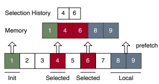  
(a) Prefetch cache data

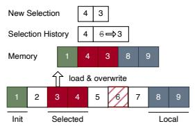  
(b) Load missing cache data  
Figure 10: (a) init block (block 1) and local blocks (blocks 8 and 9) are deterministically prefetched, while selected blocks (blocks 4 and 6) are prefetched according to the historical selection results of the preceding iteration. (b) After formal selection and the selection result is corrected, the missing cache block (block 3) is loaded from SSD and the incorrectly prefetched block (block 6) is directly overwritten.

As depicted in Figure 10a, blocks 4 and 6 are selected in the preceding iteration. Therefore, these blocks are predicted to be selected in this iteration and prefetched from SSD to GPU memory, together with the init block 1 and local blocks 8 and 9. By utilizing idle SSD bandwidth during intervals of attention computation, this approach effectively mitigates latency bottlenecks caused by limited SSD bandwidth, thereby improving the overall inference throughput.

## 5.2 Out-of-Order Overwrite

Although the selection similarity can be as high as 81%, selection may still vary across iterations, leading to mismatches between prefetched and required cache blocks. In such cases, the system must promptly fetch the missing blocks from the SSD into GPU memory. Naively correcting these mismatches would require an additional, costly reordering step for the fetched KV blocks, consuming substantial memory bandwidth for extensive copying and undermining the benefits of speculative prefetching.

Fortunately, the flexibility of the self-attention mechanism eliminates the need for reordering. As described in §2.1, selfattention requires only that each K and V pair align at the same position for a given token. In other words, the global ordering of tokens within the KV cache can be arbitrary.

Exploiting this property, the system converts potential cache mismatches into a lightweight correction process. Incorrectly prefetched blocks are invalidated and directly overwritten by newly loaded blocks, while valid blocks remain untouched. This design is transparent to the GPU kernels and does not need additional memory allocation. As shown in Figure 10b, if the computed selection differs from the historical prediction (e.g., block 3 is selected instead of the prefetched block 6), block 3 is loaded from the SSD and the incorrectly prefetched block 6 is overwritten without any full-cache reordering. This approach avoids costly reordering, thereby minimizing the overhead of misprediction.

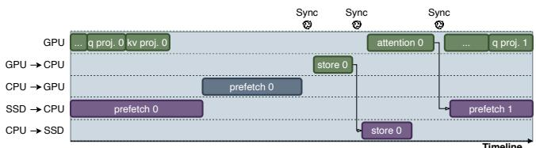  
(a) The typical implementation without attention sparsity

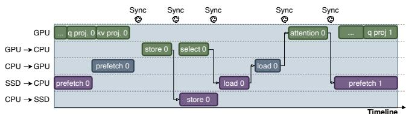  
(b) The naive implementation with attention sparsity

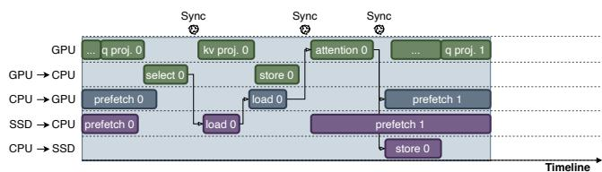  
(c) The SSD-aware schedule with attention sparsity  
Figure 11: The timeline of the attention module and I/O operations in one LLM layer. Operations with data dependencies are connected by arrows. Sync denotes synchronization between CPU and GPU.

## 6 SSD-aware Scheduler

Optimizing the performance of LLMs on memory-constrained systems requires a fine-grained approach to overlap GPU computations with SSD I/O operations. The core challenge lies in orchestrating these activities without compromising data integrity. While prior studies [5, 12, 19] typically manipulate data loading at the request or layer granularity and address this by adding multi-tier buffers for both computation and I/O, this approach is infeasible for systems with limited memory. Instead, sharing a constrained memory buffer introduces a critical problem: data conflicts. For example, a concurrent prefetch from the SSD could overwrite data in DRAM that the GPU is actively using for its computations, leading to incorrect results.

As shown in Figures 11a and 11b, a naive approach to prevent these conflicts is to serialize all I/O operations, but this severely underutilizes GPU’s capacity and increases latency. Furthermore, integrating dynamic attention sparsity, which requires frequent GPU-SSD interactions, introduces significant synchronization overhead that further degrade performance. The root cause of this inefficiency is the inability to recognize and resolve these data conflicts effectively.

To overcome these limitations, we propose an SSD-aware scheduler that orchestrates fine-grained overlap between computations and I/O. Our scheduler is built upon two core orchestration principles:

1. Microtask decomposition and fine-grained overlap: We decompose the attention module into microtasks and overlap them according to the data dependencies.

2. Synchronization point reuse: We minimize synchronization overhead by consolidating and reusing synchronization points across different microtasks.

As illustrated in Figure 11, these microtasks include attention projections for the query (q proj.) and key/value (kv proj.) vectors, storing newly generated KV pairs (store), prefetching and selecting relevant KV cache blocks (prefetch and select), loading and overwriting missing blocks (load), and the selfattention computation (attention). I/O operations are further partitioned at the KV block granularity. The following sections detail how our scheduler orchestrates these microtasks to achieve high parallelism and maintain data consistency.

## 6.1 Fine-grained Overlap

To model data dependencies and guide scheduler behavior, we formalize the inference process as a Directed Acyclic Graph (DAG), wherein each node represents a microtask and each directed edge denotes a data dependency. This representation enables systematic analysis of dependencies across heterogeneous hardware. Algorithm 1 details the mechanism for our fine-grained scheduling.

The scheduler leverages the DAG representation to identify the critical path—defined as the longest sequence of dependent tasks that determines the theoretical minimum latency. Tasks on the critical path are executed with the highest priority once their dependencies are met, preventing stalls.

For non-critical tasks, I/O operations are initiated as early as possible to maximize overlap with GPU computation. For instance, the DAG analysis reveals that the select operation, which identifies and prefetches required KV blocks from the SSD, depends solely on the completion of the q proj. task. Upon completion of q proj., the scheduler immediately initiates the select operation and subsequent load, effectively hiding the latency of loading missing blocks by overlapping with the concurrent kv proj. operation. This DAG-informed scheduling strategy ensures continuous GPU utilization by eliminating idle periods associated with data availability.

When multiple microtasks become concurrently ready for execution, the scheduler employs a latency-aware prioritization scheme. Via reverse traversal, the scheduler estimates the latest start time (LST) for each node. Ready microtasks with smaller LST are executed first to minimize critical-path delays. For example, correction processes frequently constitute bottlenecks along the critical path and depend on the prefetch of selected blocks. Consequently, the scheduler prioritizes the prefetch of selected blocks over transfers of init or local blocks. This prioritization strategy proactively addresses potential stall points before they impact overall system latency.

Algorithm 1 DAG Scheduler   
Require: DAG G = (V, E) where V is the set of microtasks,   
E is the set of dependencies   
Ensure: Scheduled execution order minimizing total latency   
1: Initialize: scheduled ← 0/ , V ← V \ {start\_task},   
ready ← {start\_task}   
2: critical\_path ← IdentifyCriticalPath(G)   
3: ComputeLST(G)   
4: while scheduled ̸= V do   
5: for all $\nu \in V \backslash$ (scheduled ∪ ready) do   
6: if $\ ` \forall ( u , \nu ) \in E : u \in$ scheduled then   
7: ready ← ready ∪ {v}   
8: end if   
9: end for   
10: if ready ̸= 0/ then   
11: next\_task ← SelectNext(ready,critical\_path)   
12: Schedule(next\_task)   
13: scheduled ← scheduled ∪ {next\_task}   
14: ready ← ready \ {next\_task}   
15: end if   
16: end while   
17: function SELECTNEXT(ready,critical\_path)   
18: critical\_ready ← ready ∩ critical\_path   
19: if critical\_read $y \neq \emptyset$ then   
20: return arg mint∈critical\_ready LST[t]   
21: end if   
22: io\_tasks ← {t ∈ ready : IsIOTask(t)}   
23: if $i o \_ t a s k s \neq 0$ then   
24: return arg mint∈io\_tasks LST[t]   
25: end if   
26: return arg min $t \in r e a d y$ LST[t]   
27: end function

## 6.2 Synchronization Point Reuse

While fine-grained overlap enhances parallelism, it entails frequent synchronization, which can introduce substantial overhead and stalls. Our approach mitigates these challenges through the consolidation of synchronization points, thereby reducing the frequency of device handshakes.

We establish a task taxonomy that distinguishes between critical and non-critical operations to optimize synchronization management. Critical tasks, exemplified by cache block prefetch operations, reside on the critical path and directly influence overall latency. Conversely, non-critical tasks (e.g., the transfer of newly generated cache data from GPU to SSD) exhibit latency tolerance and do not impede subsequent operations. We minimize overhead by merging synchronization points across these task categories. For instance, CPU-to-SSD store operations can execute concurrently with prefetch operations for subsequent layers. Both task types synchronize upon completion of the preceding GPU-side attention computation, eliminating the need for separate synchronization for non-critical store tasks.

The scheduler further consolidates synchronization points across different cache block types to minimize overhead. Although transfer processes for selected blocks and other KV cache blocks (init and local blocks) may be issued independently, their synchronization requirements ultimately converge. The synchronization point employed to track the loading of missing blocks before the self-attention computation is repurposed to monitor the transfer of init and local blocks, thereby eliminating redundant status tracking and mitigating synchronization overhead.

On platforms featuring unified memory architectures (e.g., integrated GPUs), where CPU and GPU memory spaces are shared, explicit synchronization requirements can be substantially reduced or eliminated. Through the allocation of KV cache within unified memory, data transfers between DRAM and VRAM are cut off that bypass explicit device handshake requirements, thereby enhancing parallelism and reducing pipeline complexity.

## 7 Implementation

We implement SolidAttention on top of llama.cpp [2], using liburing [6] for SSD I/O. Our implementation comprises about 25k lines of code (12k for GPU kernels, 1k for llama.cpp adapters), and we validate it on Llama and Qwen models. To save CPU resources, we use one dedicated core for I/O tasks and another for SSD-GPU coordination. Although frequent KV cache writes cause write amplification, we find its performance overhead negligible compared to read operations. To reduce SSD wear from this effect, we employ 32KB per-layer write buffers to consolidate writes into efficient chunks.

For inputs shorter than 4k tokens, the context budget corresponds to 25% of the input length. Otherwise, the context budget is maintained at 1k. Half of the context budget is allocated to init and local blocks; the other half is used for selected blocks. Additionally, the block size of SolidAttention is 32.

## 8 Evaluation

## 8.1 Experimental Setup

Hardware. Our experiments are conducted on two typical PC configurations: the CUDA [16] backend and the SYCL [22] backend. The CUDA backend is a Linux laptop (kernel version v6.8.0, CUDA version 12.8) featuring a 16-core Intel Ultra 9 185H CPU and NVIDIA GeForce RTX 4070 Laptop GPU with 8 GB GDDR6 VRAM. The SYCL backend is a Linux laptop (kernel version v6.11.0, oneAPI version 2025.0) featuring a 16-core Intel Ultra 7 255H CPU and Intel Arc

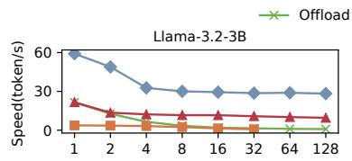

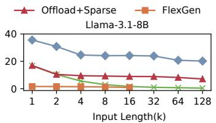

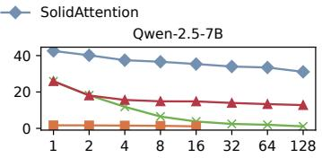  
Figure 12: End-to-end performance on CUDA backend.

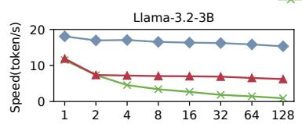

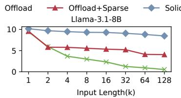

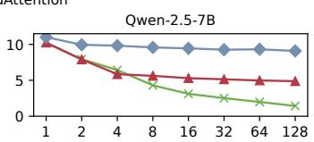  
Figure 13: End-to-end performance on SYCL backend.

140T integrated GPU. Both laptops are equipped with 64 GB DDR5 memory and a 1 TB Samsung 990 PRO PCIe 4.0 SSD.

Models. To avoid confounding effects from model scale and type, we evaluate the following open-source models: Llama-3.1-8B [35], Llama-3.2-3B [36] and Qwen-2.5-7B [46]. The KV cache is stored and used in FP16, in line with prior systems. All model weights are quantized to INT4. Note that Qwen-2.5-7B generates only half the size of KV cache compared to Llama-3.1-8B, but its FFN is more computeintensive.

Baseline System. We compare SolidAttention with three baseline systems. (1) Offload: It performs inference by offloading the entire Key-Value (KV) cache to an SSD. (2) Offload+Sparse: It also offloads the entire KV cache to an SSD but integrates InfLLM [51] to reduce both attention computation and I/O overhead related to the KV cache. (3) FlexGen [40]: It offloads the entire KV cache to an SSD and selectively loads KV cache entries based on their attention scores. Note that FlexGen is only compatible with OPT [56] models on the CUDA platform. We extend its implementation to support both Llama and Qwen models.

Inference Configuration. To reflect local AIPC deployments with limited request concurrency, we set the batch size to 1 and the maximum output length to 512 tokens in all experiments. We also set the attention sparsity ratio to 10% for FlexGen.

## 8.2 End-to-End Performance

We restrict DRAM usage to 16 GB and evaluate end-to-end performance of SolidAttention using prompts truncated from WikiText-2 [21] dataset. Notably, FlexGen encounters CUDA out-of-memory (OOM) errors for context lengths larger than 16k tokens.

Throughput. Figure 12 illustrates the throughput of each inference system on the CUDA backend. SolidAttention significantly outperforms baselines in long-context scenarios, achieving speedups of 2.8×, 3.1×, and 2.4× over Offload+Sparse for Llama-3.2-3B, Llama-3.1-8B, and Qwen-2.5-7B, respectively, with 128k input tokens. It also outperforms FlexGen by up to 58.9× with 16k tokens. On the SYCL backend, as shown in Figure 13, SolidAttention still outperforms Offload+Sparse by up to 2.1×, 2.5×, and 1.9× for the respective models. In contrast to Offload, both Offload+Sparse and SolidAttention maintain stable latency as input length exceeds 4k tokens. This stability arises from attention sparsity, which reduces KV cache demands and consequently lowers both I/O overhead and computational burden. Notably, Flex-Gen exhibits severe performance degradation under memory constraints due to numerous page-fault-based fine-grained SSD accesses, which waste bandwidth and cannot be hidden by small-batch computation workload.

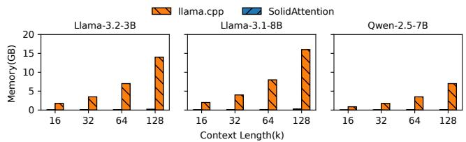  
Figure 14: Memory consumption of KV cache.

Memory Occupation. We record the memory allocation for the KV cache during the inference. To minimize memory consumption, SolidAttention allocates a buffer only for one layer of a 1k-token context’s KV cache, whereas typical systems keep the entire KV cache in memory. Although additional storage is required for representation vectors, this overhead is negligible relative to the total KV cache size. As shown in Figure 14, SolidAttention reduces memory usage by up to 61.9×, 62.0× and 61.9× on Llama-3.2-3B, Llama-3.1-8B and Qwen-2.5-7B, respectively.

Larger Model & Larger Memory. To demonstrate the scalability of SolidAttention with larger models and memory, we further evaluated the INT4-quantized Qwen2.5-14B model on the SYCL backend. Although the high computational intensity of FFNs dilutes the observed latency benefits, our method still reduces the KV cache memory footprint by 98% and achieves up to 1.7× throughput improvement over Offload+Sparse at a 128k-token context. These results confirm that the efficacy of SolidAttention is driven by the I/O-tocomputation ratio rather than absolute memory capacity.

<table><tr><td>Model</td><td>Approach</td><td>Winogrande</td><td>Arc-Challenge</td><td>MMLU</td><td>GSM8K</td><td>LongBench</td><td>Average</td></tr><tr><td rowspan="3">Llama-3.2-3B</td><td>Origin</td><td>54.49</td><td>66.41</td><td>57.80</td><td>70.31</td><td>40.10</td><td>57.82</td></tr><tr><td>Quant</td><td>51.93</td><td>65.76</td><td>55.48</td><td>64.06</td><td>36.29</td><td>54.70</td></tr><tr><td>Ours</td><td>55.25</td><td>66.28</td><td>58.29</td><td>70.30</td><td>38.25</td><td>57.67</td></tr><tr><td rowspan="3">Llama-3.1-8B</td><td>Origin</td><td>56.59</td><td>78.31</td><td>65.91</td><td>81.25</td><td>46.75</td><td>65.76</td></tr><tr><td>Quant</td><td>55.64</td><td>71.86</td><td>62.93</td><td>76.56</td><td>44.58</td><td>62.31</td></tr><tr><td>Ours</td><td>57.46</td><td>80.00</td><td>66.16</td><td>80.69</td><td>45.35</td><td>65.93</td></tr><tr><td rowspan="3">Qwen-2.5-7B</td><td>Origin</td><td>67.96</td><td>87.12</td><td>73.30</td><td>82.81</td><td>45.77</td><td>71.39</td></tr><tr><td>Quant</td><td>36.79</td><td>33.90</td><td>20.54</td><td>1.56</td><td>0.36</td><td>18.63</td></tr><tr><td>Ours</td><td>67.88</td><td>87.46</td><td>73.46</td><td>81.25</td><td>43.75</td><td>70.76</td></tr></table>

Table 1: Comparison of LLM inference accuracy. The evaluation metrics include Winogrande [39], Arc Challenge [13], MMLU [24], GSM8K [14], and LongBench [8].

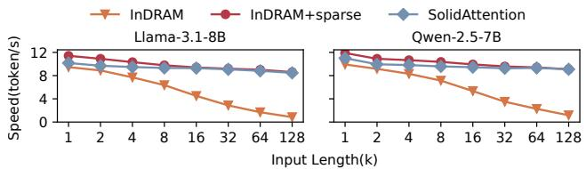  
Figure 15: End-to-end inference speeds of SolidAttention and inmemory counterparts on SYCL backend. InDRAM denotes the inmemory inference system; InDRAM+sparse additionally applies attention sparsity.

## 8.3 Accuracy

We evaluate accuracy using the OpenCompass benchmark [15], comparing SolidAttention against two baselines: the original llama.cpp (Origin) and llama.cpp with INT4- quantized KV cache (Quant). All model weights are INT4- quantized. As shown in Table 1, Quant suffers significant accuracy degradation, especially on Qwen-2.5-7B. This is due to outliers in the KV cache and loss of numerical precision under aggressive quantization, highlighting the limitations of naive KV cache quantization. In contrast, SolidAttention adopts dynamic attention sparsity to maintain accuracy comparable to the original model.

Furthermore, we use eight datasets from LongBench [8] to evaluate the long-context performance of systems, including 2WikiMQA, TriviaQA, HotpotQA, MultiFieldQA, MuSiQue, NarrativeQA, Qasper and GovReport. With context lengths reaching up to 64k, these datasets cover a variety of tasks, such as single-doc QA, multi-doc QA, few-shot learning and summarization, SolidAttention also maintains close accuracy to the original model and exhibits a considerable accuracy advantage compared to typical quantization approaches.

## 8.4 Ablation Study

## 8.4.1 Impact of SSD Offloading

To investigate the impact of SSD offloading on overall performance, we conduct tests of SolidAttention, InDRAM and

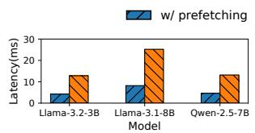  
(a) SYCL

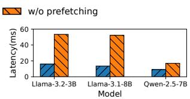  
(b) CUDA  
Figure 16: Average blocking latencies induced by cache loading with or without speculative prefetching on SYCL and CUDA backend.

InDRAM+sparse on the SYCL backend, where InDRAM denotes llama.cpp with the KV cache entirely in DRAM, while InDRAM+sparse further incorporates InfLLM [51] to accelerate attention computation via sparsity.

As illustrated in Figure 15, SolidAttention achieves performance comparable to its in-memory counterparts, exhibiting ≤ 11% throughput degradation despite SSD offloading. This demonstrates its effectiveness in minimizing SSD interaction overhead while preserving computational efficiency.

## 8.4.2 Impact of Speculative Prefetcher

To evaluate the effectiveness of speculative prefetching in reducing blocking latency from SSD-based KV cache loading, we assess SolidAttention across diverse model architectures using 16k-token prompts truncated from the WikiText-2 dataset [21]. We compare inference latency with and without prefetching, specifically measuring the reduction in blocking latency during KV cache retrieval from SSD.

As shown in Figures 16a and 16b, speculative prefetching effectively reduces inference latency across both SYCL and CUDA backends. It reduces blocking latency by up to 3.1× on the SYCL backend, despite computational bottlenecks. The CUDA backend shows an even greater 3.9× reduction, confirming that high-throughput architectures are more sensitive to I/O blocking latency.

The efficacy of this technique is slightly diminished for models like Qwen-2.5-7B, which have smaller KV caches than Llama models, leading to fewer gains from I/O latency decline. However, it still provides significant latency improvements of 2.9× and 1.9× on the SYCL and CUDA backends, respectively. This demonstrates SolidAttention’s adaptability to various accelerator architectures, accommodating different computational capacities and SSD bandwidths.

## 8.4.3 Impact of KV Consolidator

To investigate the impact of interleaved KV cache on bandwidth utilization, we also evaluate SolidAttention without the interleaved KV cache technique and compare their attention latency. The evaluation was conducted on CUDA backend where SSD accesses is the primary bottleneck and the inference is more susceptible to I/O latency.

As shown in Figure 17a, interleaving the KV cache reduced attention latency by up to 22% across various models. This improvement is attributed to the interleaved KV cache, which enhances the utilization of bandwidth resources between the CPU-GPU and SSD-CPU without requiring additional data copies. The interleaved KV cache also had a negligible effect on the attention computation, as it did not significantly impact the latency of operators.

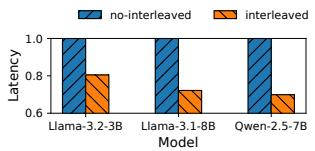

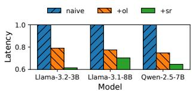  
(a) w/wo. Interleaved KV Cache  
(b) w/wo. SSD-aware Scheduler

Figure 17: (a) Comparison of normalized attention latencies in decode phase with or without interleaved KV cache. (b) Comparison of normalized attention latencies in decode phase without optimization (naive), with fine-grained overlap (+ol) and with synchronization points reusing (+sr).  
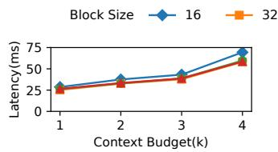

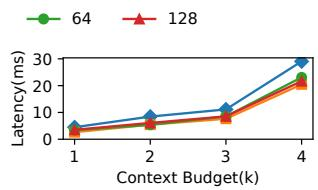  
(a) Attention Computation Latency  
(b) I/O Blocking Latency  
Figure 18: Average per-iteration attention-compute and I/O-blocking latencies on the SYCL backend while varying the context budget and block size.

## 8.4.4 Impact of SSD-aware Scheduler

By leveraging computation-I/O overlap, SolidAttention effectively mitigates blocking latency and hides SSD latency, especially on devices with limited computational capacity and high synchronization overhead. As shown in Figure 17b, experiments on the SYCL backend demonstrate that fine-grained overlap improves performance by up to 25% by overlapping computation with the latency of loading missing selected blocks. The reuse of synchronization points provides an additional 22% reduction in attention latency by decreasing the frequency of synchronization operations.

The performance gain from synchronization reuse is less pronounced for models with large computational workloads, such as Llama-3.1-8B. This is because the fixed delays reduced by synchronization reuse are overshadowed by the dominant computational workloads in the attention module.

## 8.5 Sensitivity Analysis

## 8.5.1 Impact of Context Budget

The context budget significantly impacts the amount of data communication during inference. As shown in Figure 18, latency increases slightly when the context budget is below 4k, as I/O operations remain largely overlapped by computational tasks. The increase of attention latency is primarily caused by the growing computational workloads of attention.

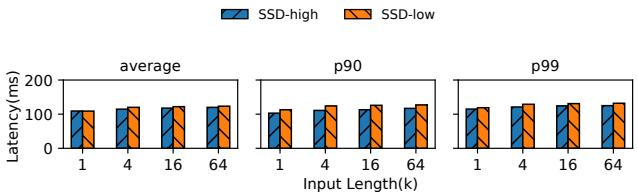  
(a) 1k Context Budget

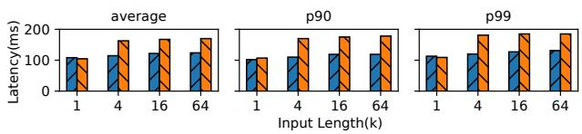  
(b) 4k Context Budget  
Figure 19: Average, P90 and P99 inference latency of SolidAttention on the SYCL backend.

However, as the context budget reaches 4k, SolidAttention suffers a sharp increase in attention latency, primarily because the I/O latency can no longer be hidden by computation and becomes the performance bottleneck. Nevertheless, §8.3 shows that SolidAttention exhibits negligible long-context accuracy degradation with a 1k context budget, so this increase is not concerning.

## 8.5.2 Impact of Block Size

Figure 1b shows that I/O request granularity significantly affects throughput. We evaluate this effect using SolidAttention on the SYCL backend. As shown in Figures 18a and 18b, a block size of 32 delivers approximately 14% higher throughput than a block size of 16 because larger blocks better exploit SSD-level parallelism. Finer-grained partitioning increases random I/O overhead, reducing bandwidth utilization. As the block size increases further, both throughput and attention latency plateau because the transfer size is large enough to fully utilize SSD bandwidth.

## 8.5.3 Impact of SSD Configuration

To assess how SSD bandwidth affects token-generation latency, we measure inference latency using two PCIe 4.0 NVMe SSDs: SSD-high (1 TB Samsung 990 PRO; up to 7.5 GB/s, 1.2M IOPS) and SSD-low (1 TB KIOXIA BG6; up to 5.0 GB/s, 650k IOPS). As shown in Figure 19, under a 1k context budget, the average token-generation latency is similar on both SSDs. With a 4k context budget, the tail latency on SSD-high remains stable, whereas SSD-low exhibits a 45% increase because the increased I/O demand exceeds what its lower bandwidth can sustain. Additionally, tail latencies on both SSDs remain stable as the input length increases even though the selection space of critical KV blocks expands, owing to speculative prefetching and scheduling that overlap compute and I/O. These results confirm SolidAttention’s robustness across diverse NVMe SSD configurations.

## 8.6 SSD Performance Interference

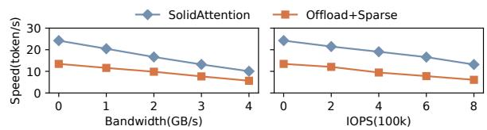  
Figure 20: Inference throughput on the CUDA backend under concurrent I/O workloads.

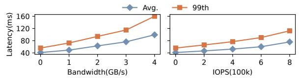  
Figure 21: Average and P99 inference latency of SolidAttention on the CUDA backend under concurrent I/O workloads.

We evaluate the performance of SolidAttention and Offload+Sparse under varying SSD resource contention from concurrent I/O-intensive applications. Experiments are conducted on CUDA backend (1 TB Samsung 990 PRO; up to 7.5 GB/s, 1.2M IOPS). Using cgroups and fio [1], we simulate bandwidth-bound workloads through sequential reads and IOPS-bound workloads via 4 KB random reads. Figure 20 illustrates the performance impact that SolidAttention’s throughput drops by 58% under 4 GB/s background traffic and 54% under 800k IOPS interference. Notably, as available bandwidth decreases, the performance gap between SolidAttention and Offload+Sparse narrows. This occurs because SolidAttention maximizes bandwidth utilization through efficient computation-I/O overlap, making it more sensitive to bandwidth scarcity than the baseline.

Furthermore, we study the influence of interference on tail latency of the decode phase. As shown in Figure 21, the average latency increases 2.4× with bandwidth-bound interference, while the 99.9th percentile increases 2.9×. This demonstrates that background interference introduces minor performance fluctuations to SolidAttention. This pattern persists under IOPS-bound workloads. However, this disparity becomes negligible for end-to-end inference request latency due to amortization across multiple token outputs.

## 8.7 Energy Consumption

We evaluate SolidAttention’s energy efficiency by measuring energy consumption during inference using document summarization prompts from the GovReport workload in

<table><tr><td>Framework</td><td> llama.cpp</td><td>SolidAttention</td></tr><tr><td>Peak Power (W)</td><td>32.98</td><td>36.27</td></tr><tr><td>Energy (J/token)</td><td>5.37</td><td>3.68</td></tr></table>

Table 2: Comparison of energy consumption.

LongBench [8], with input lengths averaging 10k tokens. We use joules per token (J/token) as the primary metric to quantify energy efficiency during inference. Despite higher peak power due to SSD accesses, SolidAttention achieves a mean energy consumption of 3.68 J/token, demonstrating a 46% improvement over llama.cpp (Table 2). This stems from SolidAttention’s ability to better utilize GPU computational resources and SSD bandwidth, which accelerates inference and improves energy efficiency.

## 9 Related Works

KV Cache Compression. Some memory-centric attentionsparsity mechanisms, such as H2O [58] and InfiniGen [28], select relevant KV pairs at the token granularity. These finegrained selection patterns lead to significant read/write amplification during SSD offloading, underutilizing SSD bandwidth and causing high latency.

SolidAttention adapts block-wise dynamic attention sparsity to SSD characteristics, thereby addressing these latency issues. Recent works, such as RetrievalAttention [33] and ClusterKV [34], mitigate internal fragmentation of block-wise attention sparsity by consolidating KV pairs via clustering, thereby improving the efficiency of context-budget usage. Although not the primary focus of this work, integrating such techniques into SolidAttention could further improve model accuracy and reduce the required context budget.

Other studies have explored KV-cache quantization, aiming to mitigate accuracy loss due to outliers during quantization. For example, AWQ [32] augments traditional quantization by dynamically adjusting quantization levels according to the weight distribution. These techniques are orthogonal to SolidAttention and can further reduce communication overhead.

Model Offloading. PowerInfer [42, 43] and PowerInfer-2 [54] exploit ReLU [4,57] activation sparsity in feed-forward networks (FFNs), allowing them to offload inactive neurons and reduce VRAM or DRAM usage. FlexInfer [18] proposes balanced memory locking and flexible tensor preservation to improve efficiency and adaptability for offloading. eMoE [44] and ProMoE [41] leverage intermediate computations to predict and prefetch future expert weights proactively. These techniques are orthogonal to SolidAttention, but I/O contention between loading the KV cache and loading model weights may arise when integrating them. We leave this for future work.

KV Cache Offloading. CachedAttention [19] and IM-

PRESS [12] target cloud scenarios, using multi-tier caches to exploit cross-request locality and shared prefixes. While effective in reducing TTFT, their reliance on high concurrency makes them ineffective for single-user local decoding where I/O latency poses the primary bottleneck. Crucially, IMPRESS leverages attention sparsity to prioritize cache retention, implicitly delegating I/O efficiency to the caching policy rather than directly optimizing instantaneous GPU-SSD data transmission.

Emerging Storage Technologies. While SolidAttention is evaluated based on PCIe 4.0 consumer SSDs, emerging storage technologies offer new opportunities. PCIe 5.0 SSDs double the bandwidth to 16 GB/s, potentially alleviating I/O bottlenecks in KV cache offloading and supporting LLMs with larger KV cache dimensions. Additionally, Zoned Namespace SSDs (ZNS) [7, 9, 50] enable explicit data placement control, allowing systems to strategically arrange KV cache blocks across zones to maximize SSD-level parallelism and improve throughput. SolidAttention continues to function effectively on these devices, because they share I/O characteristics with conventional block storage.

## 10 Conclusion

This paper presents SolidAttention, an SSD-based LLM inference system that enables long-context LLM inference with restricted memory. It co-designs the sparse attention algorithms and the storage management system to maximize the utilization of SSD bandwidth and GPU computation capacity. Experiments demonstrate that SolidAttention achieves up to 3.1× speedup over existing solutions with minimal accuracy loss and up to 98% memory reduction on KV cache.

## 11 Acknowledgments

We sincerely thank our shepherd Yuke Wang and anonymous reviewers for their insightful suggestions. This work was partially supported by NSFC (No. 62372287 and U24A20235) and Fundamental and Interdisciplinary Disciplines Breakthrough Plan of the Ministry of Education of China. Zeyu Mi (yzmizeyu@sjtu.edu.cn) is the corresponding author.

## References

[1] fio: Flexible i/o tester. https://github.com/axboe /fio, 2025.

[2] llama.cpp: LLM inference in C/C++. https://github .com/ggml-org/llama.cpp, 2025.

[3] Ollama: Get up and running with Llama 3.3, DeepSeek-R1, Phi-4, Gemma 3, and other large language models. https://github.com/ollama/ollama, 2025.

[4] Abien Fred Agarap. Deep Learning using Rectified Linear Units (ReLU). arXiv preprint arXiv:1803.08375, 2019.

[5] Reza Yazdani Aminabadi, Samyam Rajbhandari, Ammar Ahmad Awan, Cheng Li, Du Li, Elton Zheng, Olatunji Ruwase, Shaden Smith, Minjia Zhang, Jeff Rasley, et al. Deepspeed-Inference: Enabling Efficient Inference of Transformer Models at Unprecedented Scale. In Proceedings of the International Conference for High Performance Computing, Networking, Storage and Analysis (SC’22), 2022.

[6] Jens Axboe. liburing: Library providing helpers for the Linux kernel io\_uring support. https://github.com /axboe/liburing, 2025.

[7] Hanyeoreum Bae, Jiseon Kim, Miryeong Kwon, and Myoungsoo Jung. What You Can’t Forget: Exploiting Parallelism for Zoned Namespaces. In Proceedings of the 14th ACM Workshop on Hot Topics in Storage and File Systems (HotStorage’22), 2022.

[8] Yushi Bai, Xin Lv, Jiajie Zhang, Hongchang Lyu, Jiankai Tang, Zhidian Huang, Zhengxiao Du, Xiao Liu, Aohan Zeng, Lei Hou, Yuxiao Dong, Jie Tang, and Juanzi Li. LongBench: A Bilingual, Multitask Benchmark for Long Context Understanding. arXiv preprint arXiv:2308.14508, 2024.

[9] Matias Bjørling, Abutalib Aghayev, Hans Holmberg, Aravind Ramesh, Damien Le Moal, Gregory R Ganger, and George Amvrosiadis. ZNS: Avoiding the Block Interface Tax for Flash-based SSDs . In Proceedings of the 2021 USENIX Annual Technical Conference (USENIX ATC’21), 2021.

[10] Matias Bjørling, Javier González, and Philippe Bonnet. LightNVM: the Linux open-channel SSD subsystem. In Proceedings of the 15th Usenix Conference on File and Storage Technologies (FAST’17), pages 359–373, 2017.

[11] Feng Chen, Rubao Lee, and Xiaodong Zhang. Essential Roles of Exploiting Internal Parallelism of Flash Memory Based Solid State Drives in High-Speed Data Processing. In Proceedings of the 2011 IEEE International Symposium on High Performance Computer Architecture (HPCA’11), 2011.

[12] Weijian Chen, Shuibing He, Haoyang Qu, Ruidong Zhang, Siling Yang, Ping Chen, Yi Zheng, Baoxing Huai, and Gang Chen. IMPRESS: An Importance-Informed Multi-Tier Prefix KV Storage System for Large Language Model Inference. In 23rd USENIX Conference on File and Storage Technologies (FAST’25), pages 187– 201, 2025.

[13] Peter Clark, Isaac Cowhey, Oren Etzioni, Tushar Khot, Ashish Sabharwal, Carissa Schoenick, and Oyvind Tafjord. Think you have Solved Question Answering? Try ARC, the AI2 Reasoning Challenge. arXiv preprint arXiv:1803.05457, 2018.

[14] Karl Cobbe, Vineet Kosaraju, Mohammad Bavarian, Mark Chen, Heewoo Jun, Lukasz Kaiser, Matthias Plappert, Jerry Tworek, Jacob Hilton, Reiichiro Nakano, Christopher Hesse, and John Schulman. Training Verifiers to Solve Math Word Problems. arXiv preprint arXiv:2110.14168, 2021.

[15] OpenCompass Contributors. Opencompass: A universal evaluation platform for foundation models. https: //github.com/open-compass/opencompass, 2023.

[16] NVIDIA Corporation. Cuda toolkit - free tools and training. https://developer.nvidia.com/cuda-t oolkit, 2025.

[17] Valve Corporation. Steam Hardware & Software Survey. https://store.steampowered.com/hwsurvey/St eam-Hardware-Software-Survey-Welcome-to-S team, 2025.

[18] Hongchao Du, Shangyu Wu, Arina Kharlamova, Nan Guan, and Chun Jason Xue. FlexInfer: Breaking Memory Constraint via Flexible and Efficient Offloading for On-Device LLM Inference. arXiv preprint arXiv:2503.03777, 2025.

[19] Bin Gao, Zhuomin He, Puru Sharma, Qingxuan Kang, Djordje Jevdjic, Junbo Deng, Xingkun Yang, Zhou Yu, and Pengfei Zuo. Cost-Efficient Large Language Model Serving for Multi-Turn Conversations with CachedAttention. In Proceedings of the 2024 USENIX Conference on Usenix Annual Technical Conference (USENIX ATC’24), 2024.

[20] Alireza Ghadimi and Hamid Beigy. Hybrid Multi-Document Summarization using Pre-Trained Language Models. Expert Systems with Applications, 192:116292, 2022.

[21] Chengyue Gong, Di He, Xu Tan, Tao Qin, Liwei Wang, and Tie-Yan Liu. Frage: Frequency-Agnostic Word Representation. In Proceedings of the 32nd Advances in Neural Information Processing Systems (NIPS’18), 2018.

[22] The Khronos® SYCL™ Working Group. Sycl™ 2020 specification. https://registry.khronos.org/SYC L/specs/sycl-2020/html/sycl-2020.html, 2025.

[23] Kai Han, An Xiao, Enhua Wu, Jianyuan Guo, Chunjing XU, and Yunhe Wang. Transformer in Transformer. In Proceedings of the 35th Advances in Neural Information Processing Systems (NIPS’21), volume 34, 2021.

[24] Dan Hendrycks, Collin Burns, Steven Basart, Andy Zou, Mantas Mazeika, Dawn Song, and Jacob Steinhardt. Measuring Massive Multitask Language Understanding. arXiv preprint arXiv:2009.03300, 2020.

[25] Amr Hendy, Mohamed Abdelrehim, Amr Sharaf, Vikas Raunak, Mohamed Gabr, Hitokazu Matsushita, Young Jin Kim, Mohamed Afify, and Hany Hassan Awadalla. How Good Are GPT Models at Machine Translation? A Comprehensive Evaluation. arXiv preprint arXiv:2302.09210, 2023.

[26] Coleman Hooper, Sehoon Kim, Hiva Mohammadzadeh, Michael W Mahoney, Yakun Sophia Shao, Kurt Keutzer, and Amir Gholami. KVQuant: Towards 10 Million Context Length LLM Inference with KV Cache Quantization. arXiv preprint arXiv:2401.18079, 2024.

[27] Ahmad Faraz Khan, Azal Ahmad Khan, Anas Mohamed, Haider Ali, Suchithra Moolinti, Sabaat Haroon, Usman Tahir, Mattia Fazzini, Ali R. Butt, and Ali Anwar. Lads: Leveraging llms for ai-driven devops. arXiv preprint arXiv:2502.20825, 2025.

[28] Wonbeom Lee, Jungi Lee, Junghwan Seo, and Jaewoong Sim. InfiniGen: Efficient Generative Inference of Large Language Models with Dynamic KV Cache Management. In 18th USENIX Symposium on Operating Systems Design and Implementation (OSDI’24), 2024.

[29] Haoyang Li, Yiming Li, Anxin Tian, Tianhao Tang, Zhanchao Xu, Xuejia Chen, Nicole Hu, Wei Dong, Qing Li, and Lei Chen. A Survey on Large Language Model Acceleration based on KV Cache Management. arXiv preprint arXiv:2412.19442, 2025.

[30] Yuhong Li, Yingbing Huang, Bowen Yang, Bharat Venkitesh, Acyr Locatelli, Hanchen Ye, Tianle Cai, Patrick Lewis, and Deming Chen. SnapKV: LLM Knows What You are Looking for Before Generation. arXiv preprint arXiv:2404.14469, 2024.

[31] Hannah Lin, Martin Maas, Maximilian Roquemore, Arman Hasanzadeh, Fred Lewis, Yusuf Simonson, Tzu-Wei Yang, Amir Yazdanbakhsh, Deniz Altinbüken, Florin Papa, Maggie Nolan Edmonds, Aditya Patil, Don Schwarz, Satish Chandra, Chris Kennelly, Milad Hashemi, and Parthasarathy Ranganathan. ECO: An LLM-Driven Efficient Code Optimizer for Warehouse Scale Computers. arXiv preprint arXiv:2503.15669, 2025.

[32] Ji Lin, Jiaming Tang, Haotian Tang, Shang Yang, Wei-Ming Chen, Wei-Chen Wang, Guangxuan Xiao, Xingyu Dang, Chuang Gan, and Song Han. AWQ: Activationaware Weight Quantization for On-Device LLM Compression and Acceleration. In Proceedings of the 7th

Annual Conference on Machine Learning and Systems (MLSys’24), 2024.

[33] Di Liu, Meng Chen, Baotong Lu, Huiqiang Jiang, Zhenhua Han, Qianxi Zhang, Qi Chen, Chengruidong Zhang, Bailu Ding, Kai Zhang, Chen Chen, Fan Yang, Yuqing Yang, and Lili Qiu. RetrievalAttention: Accelerating Long-Context LLM Inference via Vector Retrieval. arXiv preprint arXiv:2409.10516, 2024.

[34] Guangda Liu, Chengwei Li, Jieru Zhao, Chenqi Zhang, and Minyi Guo. ClusterKV: Manipulating LLM KV Cache in Semantic Space for Recallable Compression. arXiv preprint arXiv:2412.03213, 2024.

[35] meta llama. Llama-3.1-8b. https://huggingface. co/meta-llama/Llama-3.1-8B, 2024.

[36] meta llama. Llama-3.2-3b. https://huggingface. co/meta-llama/Llama-3.2-3B, 2024.

[37] Jowi Morales. Analysts say average laptop RAM quota will reach 11.8GB in 2024 — up 12% year-on-year. https://www.tomshardware.com/laptops/analy sts-say-average-laptop-ram-quota-will-rea ch-118gb-in-2024-up-12-year-on-year?utm\_so urce=openai, 2024.

[38] Adam Paszke, Sam Gross, Francisco Massa, Adam Lerer, James Bradbury, Gregory Chanan, Trevor Killeen, Zeming Lin, Natalia Gimelshein, Luca Antiga, Alban Desmaison, Andreas Köpf, Edward Yang, Zach DeVito, Martin Raison, Alykhan Tejani, Sasank Chilamkurthy, Benoit Steiner, Lu Fang, Junjie Bai, and Soumith Chintala. Pytorch: An imperative style, high-performance deep learning library. arXiv preprint arXiv:1912.01703, 2019.

[39] Keisuke Sakaguchi, Ronan Le Bras, Chandra Bhagavatula, and Yejin Choi. WinoGrande: An Adversarial Winograd Schema Challenge at Scale. arXiv preprint arXiv:1907.10641, 2019.

[40] Ying Sheng, Lianmin Zheng, Binhang Yuan, Zhuohan Li, Max Ryabinin, Beidi Chen, Percy Liang, Christopher Ré, Ion Stoica, and Ce Zhang. FlexGen: High-Throughput Generative Inference of Large Language Models with a Single GPU. In Proceedings of the 40th International Conference on Machine Learning (ICML’23), 2023.

[41] Xiaoniu Song, Zihang Zhong, Rong Chen, and Haibo Chen. ProMoE: Fast MoE-based LLM Serving using Proactive Caching. arXiv preprint arXiv:2410.22134, 2025.

[42] Yixin Song, Zeyu Mi, Haotong Xie, and Haibo Chen. PowerInfer: Fast Large Language Model Serving with a Consumer-grade GPU. In Proceedings of the ACM SIGOPS 30th Symposium on Operating Systems Principles (SOSP’24), 2024.

[43] Yixin Song, Haotong Xie, Zhengyan Zhang, Bo Wen, Li Ma, Zeyu Mi, and Haibo Chen. Turbo sparse: Achieving llm sota performance with minimal activated parameters. arXiv preprint arXiv:2406.05955, 2024.

[44] Suraiya Tairin, Shohaib Mahmud, Haiying Shen, and Anand Iyer. eMoE: Task-aware Memory Efficient Mixture-of-Experts-Based (MoE) Model Inference. arXiv preprint arXiv:2503.06823, 2025.

[45] Jiaming Tang, Yilong Zhao, Kan Zhu, Guangxuan Xiao, Baris Kasikci, and Song Han. Quest: Query-Aware Sparsity for Efficient Long-Context LLM Inference. In Proceedings of the 41st International Conference on Machine Learning (ICML’24), 2024.

[46] Qwen Team. Qwen2.5: A party of foundation models. https://qwenlm.github.io/blog/qwen2.5/, 2024.

[47] TrendForce. CSPs to Expand into Edge AI, Driving Average NB DRAM Capacity Growth by at Least 7% in 2025, Says TrendForce. https://www.trendforce .com/presscenter/news/20240625-12200.html, 2025.

[48] Ashish Vaswani, Noam Shazeer, Niki Parmar, Jakob Uszkoreit, Llion Jones, Aidan N Gomez, Ł ukasz Kaiser, and Illia Polosukhin. Attention is All you Need. In Proceedings of the 31st Advances in Neural Information Processing Systems (NIPS’17), 2017.

[49] Yingjia Wang, Tao Lu, Yuhong Liang, Xiang Chen, and Ming-Chang Yang. Reviving In-Storage Hardware Compression on ZNS SSDs through Host-SSD Collaboration. In Proceedings of the 2025 IEEE International Symposium on High Performance Computer Architecture (HPCA’25), 2025.

[50] Yingjia Wang, You Zhou, Fei Wu, Jie Zhang, and Ming-Chang Yang. Land of Oz: Resolving Orderless Writes in Zoned Namespace SSDs. IEEE Transactions on Computers, 73(11):2520–2533, 2024.

[51] Chaojun Xiao, Pengle Zhang, Xu Han, Guangxuan Xiao, Yankai Lin, Zhengyan Zhang, Zhiyuan Liu, and Maosong Sun. InfLLM: Training-Free Long-Context Extrapolation for LLMs with an Efficient Context Memory. In Proceedings of the 38th Advances in Neural Information Processing Systems (NIPS’24), 2024.

[52] Guangxuan Xiao, Ji Lin, Mickael Seznec, Hao Wu, Julien Demouth, and Song Han. SmoothQuant: Accurate and Efficient Post-Training Quantization for Large Language Models. In Proceedings of the 40th International Conference on Machine Learning (ICML’23), 2023.

[53] Guangxuan Xiao, Yuandong Tian, Beidi Chen, Song Han, and Mike Lewis. Efficient Streaming Language Models with Attention Sinks. arXiv preprint arXiv:2309.17453, 2023.

[54] Zhenliang Xue, Yixin Song, Zeyu Mi, Xinrui Zheng, Yubin Xia, and Haibo Chen. PowerInfer-2: Fast Large Language Model Inference on a Smartphone. arXiv preprint arXiv:2406.06282, 2024.

[55] Zhewei Yao, Reza Yazdani Aminabadi, Minjia Zhang, Xiaoxia Wu, Conglong Li, and Yuxiong He. ZeroQuant: Efficient and Affordable Post-Training Quantization for Large-Scale Transformers. In Proceedings of the 36th International Conference on Neural Information Processing Systems (NIPS’22), 2022.

[56] Susan Zhang, Stephen Roller, Naman Goyal, Mikel Artetxe, Moya Chen, Shuohui Chen, Christopher Dewan, Mona Diab, Xian Li, Xi Victoria Lin, Todor Mihaylov, Myle Ott, Sam Shleifer, Kurt Shuster, Daniel Simig, Punit Singh Koura, Anjali Sridhar, Tianlu Wang, and Luke Zettlemoyer. Opt: Open pre-trained transformer language models. arXiv preprint arXiv:2205.01068, 2022.

[57] Zhengyan Zhang, Yixin Song, Guanghui Yu, Xu Han, Yankai Lin, Chaojun Xiao, Chenyang Song, Zhiyuan Liu, Zeyu Mi, and Maosong Sun. Relu2 wins: Discovering efficient activation functions for sparse llms, 2024.

[58] Zhenyu Zhang, Ying Sheng, Tianyi Zhou, Tianlong Chen, Lianmin Zheng, Ruisi Cai, Zhao Song, Yuandong Tian, Christopher Ré, Clark Barrett, Zhangyang Wang, and Beidi Chen. H2O: Heavy-Hitter Oracle for Efficient Generative Inference of Large Language Models. In Proceedings of the 37th International Conference on Neural Information Processing Systems (NIPS’23), 2023.