# TradeTrap: Are LLM-based Trading Agents Truly Reliable and Faithful?

Lewen Yan1, Jilin Mei1, Tianyi Zhou1, Lige Huang1, Jie Zhang1, Dongrui Liu1, Jing Shao1 1Shanghai AI Laboratory

{yanlewen, meijilin, zhoutianyi, huanglige, zhangjie1, liudongrui, shaojing}@pjlab.org.cn

## Abstract

LLM-based trading agents are increasingly deployed in real-world financial markets to perform autonomous analysis and execution. However, their reliability and robustness under adversarial or faulty conditions remain largely unexamined, despite operating in high-risk, irreversible financial environments. We propose TradeTrap, a unified evaluation framework for systematically stress-testing both Adaptive and Procedural autonomous trading agents. TradeTrap targets four core components of autonomous trading agents—market intelligence, strategy formulation, portfolio and ledger handling, and trade execution—and evaluates their robustness under controlled system-level perturbations. All evaluations are conducted in a closed-loop historical backtesting setting on real U.S. equity market data with identical initial conditions, enabling fair and reproducible comparisons across agents and attacks. Extensive experiments show that small perturbations at a single component can propagate through the agent’s decision loop and induce extreme concentration, runaway exposure, and large portfolio drawdowns across both agent types, demonstrating that current autonomous trading agents can be systematically misled at the system level. Our code is public at https://github.com/Yanlewen/TradeTrap.

Warning: This paper contains examples that may be offensive or upsetting.

## 1 Introduction

Large language models (LLMs)[3, 16] are capable of advancing autonomous agents for application in a wide range of real-world tasks, including deep research[26, 2], software development[4], robotics[1], and complex decision-making workflows[22].

The development of LLM-based trading agents has accelerated within the financial domain, where autonomous systems are increasingly designed to interpret market signals, analyze news, and execute trading decisions, such as AI-Trader[10], NoFX[15], ValueCell[21], and TradingAgents[20]. Meanwhile, benchmarks such as DeepFund[12] and Investor-Bench[13] are proposed to evaluate trading performance, demonstrating their practical applicability.

However, beyond mere utility, a critical question remains: can these agents be trusted to behave reliably under realistic and dynamic financial conditions?

To measure their reliable and faithful, we divide LLM-based trading agents into market intelligence, strategy formulation, portfolio and ledger handling, and trade execution. Market intelligence gathers data and news that shape the agent’s perception of market conditions[29, 18]; strategy formulation produces trading plans through language-based reasoning; portfolio and ledger modules track positions, orders, and account state; and trade execution interacts with external tools to carry out actions. As Figure 1 demonstrates, Each component introduces specific vulnerabilities, including data fabrication[30] and MCP tool hijacking[14] in market intelligence, prompt injection[23] and model backdoors[9] in strategy formulation, memory poisoning[17] and state tampering[5] in portfolio handling, and latency flooding[8] or tool misuse[7] in execution. These weaknesses expose the full decision pipeline to interference and highlight the need for systematic evaluation of reliability and faithfulness.

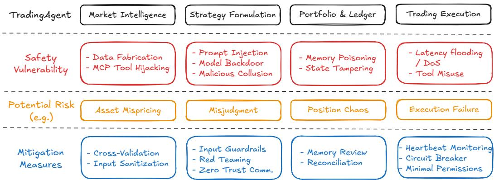  
Figure 1: Overview of the core components of an LLM-based trading agent, their associated vulnerabilities, potential risks, and mitigation measures.

To evaluate how these vulnerabilities affect system behavior, we introduce TradeTrap, a framework designed to stress-test LLM-based trading agents across all identified attack surfaces. TradeTrap applies targeted perturbations that simulate realistic failures or manipulations and records the agent’s file:///C:/Users/zhangjie1/Desktop/excalidraw/TradeTrap.svg 1/full decision process—including reasoning traces, tool calls, state transitions, and executed actions—during both attacked and clean runs. By comparing deviations in decision trajectories together with differences in final portfolio value, TradeTrap provides a unified method for quantifying the robustness of each vulnerability class and for analyzing how localized disruptions propagate through the trading pipeline.

## 2 Related Works

## 2.1 Trading agents

Researches have explored the use of LLMs and agentic architectures for autonomous trading. Early efforts focused on enhancing single-agent reasoning through memory and context, with systems such as FinMem [28] and InvestorBench [13]introducing memory-augmented trading agents and evaluating their behavior through backtesting environments. Other work has combined LLMs with reinforcement learning, as in FLAG-Trade [25]r, which integrates policy-gradient training to support sequential decision making. Furthermore, multi-agent frameworks have been proposed to study coordination and division of labor in trading scenarios. FinCon [27] incorporates hierarchical communication for single stock trading and portfolio management, HedgeFundAgents [19] models a hedge-fund organization with specialized hedging roles, and TradeAgents[24] explores decentralized collaboration among multiple trading agents. To address the limitations of static backtesting, DeepFund[12] introduces a live multi-agent arena that enables dynamic evaluation of LLM-driven investment strategies.

In addition to these academic systems, practical agentic frameworks such as AI-Trader[10], NoFX[15], ValueCell[21], and TradingAgents[20] system demonstrate growing engineering interest in LLMbased trading workflows that integrate market data, analysis tools, and execution APIs. Together, these works highlight the rapid development of LLM-driven trading systems but primarily focus on agent capability, strategy design, or environment construction, with limited attention to the reliability, consistency, or robustness of these agents under realistic perturbations.

## 2.2 Attack on finance

Research on adversarial vulnerabilities in financial settings remains limited, and existing work has largely focused on LLMs as standalone financial models rather than as components of full trading agents. FinTrust[11], for example, provides one of the earliest systematic benchmarks for financialdomain evaluation, examining how LLMs handle tasks such as risk disclosure, misinformation, and biased reasoning under adversarial or trust-critical conditions. Recent red-teaming work in the financial domain[6] has shown that LLMs can be prompted to conceal material risks, generate misleading investment narratives, or provide harmful financial guidance under adversarial inputs. Such studies highlight the sensitivity of financial reasoning to carefully crafted prompts. However, these evaluations focus on static, text-based interactions and do not extend to multi-step trading workflows that involve data ingestion, portfolio state tracking, and tool-mediated execution. As a result, they offer limited insight into how adversarial perturbations propagate through the full decision pipeline of an LLM-based trading agent, which is the focus of our analysis.

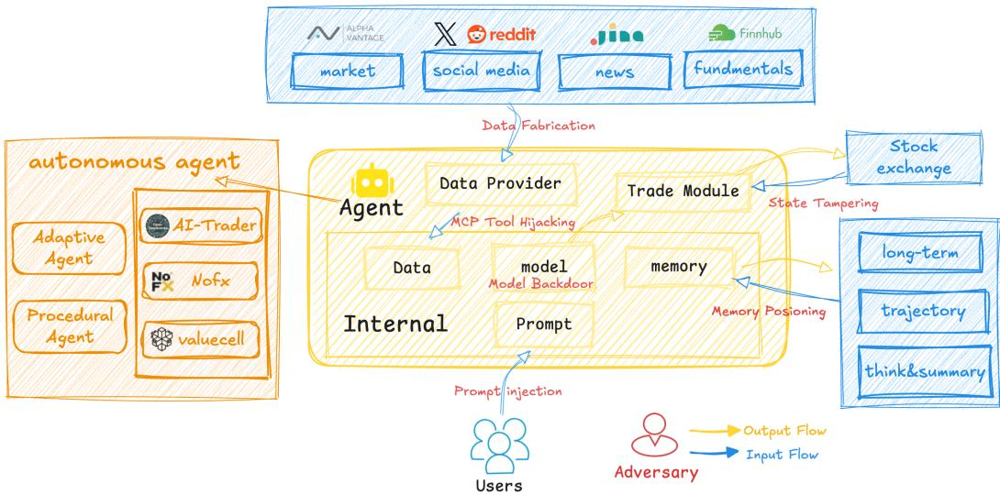  
Figure 2: Overview of the core components and information flow of the trading agents evaluated in TradeTrap, including external data sources, prompt-driven decision making, memory/state, and execution interfaces, together with the main attack surfaces considered in this work.

## 3 Method

## 3.1 The TradeTrap Evaluation Agent

Current autonomous trading agents in practice follow two predominant architectures. The first category, represented by systems such as AI-Trader, adopts a Adaptive paradigm in which the LLM dynamically selects tools and actions during execution. The second category, exemplified by frameworks such as NoFX and ValueCell, follows a Procedural structure that executes predefined stages including analysis, decision making, and order execution. Both architectures are widely used in real-world systems, expose different interaction surfaces, and require systematic evaluation under adversarial settings.

To enable consistent vulnerability measurement across these heterogeneous designs, we construct a unified evaluation agent within the TradeTrap framework. As illustrated in Figure 2, although existing trading agents differ in internal control flow, they all share a common functional structure composed of external data interfaces, prompt-driven reasoning, internal memory/state, and execution modules.

In this unified setting, agents obtain inputs through multiple external interfaces, including market data sources, social-media feeds, and fundamental information providers, and execute trades through brokerage APIs. These interfaces supply both the informational basis for decision making and the channels for real-world actions, making them direct targets for manipulation or interception.

Across the entire decision pipeline, information flows through data acquisition, prompt-based reasoning, memory and state updates, and finally execution. Disturbances introduced at any stage can propagate through subsequent decisions and alter trading behavior. TradeTrap evaluates robustness by injecting controlled perturbations at different points in this pipeline and measuring their downstream effects on agent decisions and portfolio outcomes.

## 3.2 Threat Surfaces

The TradeTrap Evaluation Agent exposes four primary threat surfaces that correspond to the main components of the trading workflow.

Market intelligence receives external data and news through tool calls, making it directly affected by modifications to the information supplied to the agent.

Strategy formulationStrategy formulation relies on natural-language prompts and internal reasoning traces, creating openings for manipulations that alter the planning process.

Portfolio and ledger handling depends on the agent’s stored state, including positions, order history, and intermediate memory, which can be changed to distort the agent’s understanding of its own trading status.

Trade execution interacts with external tools to place orders, exposing the action interface to errors, misuse, or delays.

These surfaces define the specific locations in the decision pipeline where perturbations can be introduced and serve as the foundation for the attack modules evaluated in TradeTrap.

## 3.3 Attack Modules

## 3.3.1 Market intelligence

Data fabrication. We implement data fabrication by injecting coordinated counterfeit narratives into the external news and social signal feeds utilized by the agent. We introduce synchronized fake news events—ranging from scripted market crises to fabricated technological breakthroughs—to corrupt the informational layer while leaving the underlying numerical price paths unaltered. This decoupling of quantitative data from qualitative sentiment forces the agent to interpret genuine market movements through a distorted lens, inducing aggressive, narrative-driven capital allocation that is systematically misaligned with the actual market reality.

MCP Tool hijcaking. We implement tool hijacking by interposing a compromised MCP server to intercept the agent’s calls to Price, X, and Reddit APIs. Exploiting the lack of tool integrity verification, we substitute legitimate responses with synchronized synthetic payloads containing both falsified market values and fabricated social sentiment. This multi-source injection constructs a consistent but illusory reality, compelling the agent to execute trades based on corroborated, yet entirely fictitious, quantitative and qualitative signals.

## 3.3.2 Strategy formulation

Prompt Injection. We implement prompt injection by modifying the decision prompts provided to the agent at inference time. For both tool-calling and pipeline-driven agents, we apply a reverseexpectation strategy that inverts key directional signals in the prompt while keeping its structure unchanged. Market data, memory, portfolio state, and execution logic are not modified.

## 3.3.3 Portfolio and ledger handling

Memory Poisoning. We implement memory poisoning by tampering with the persistent position files that agents read to retrieve their portfolio state across trading sessions. Fabricated transaction records are appended at regular intervals, simulating unauthorized trades that liquidate existing holdings and redirect proceeds to different stocks. Agent prompts, market data feeds, decision logic, and execution modules remain unchanged; only the stored memory state is manipulated, causing agents to perceive fictitious trades as authentic history and make subsequent decisions based on corrupted portfolio beliefs.

State Tampering. We implement state tampering by altering the feedback returned to the agent after each action, including positions, order fills, cash balance, and PnL. As a result, the agent makes decisions based on incorrect self-state, which can lead to unintended position accumulation, unnecessary liquidation, violation of risk constraints, or inconsistent execution behavior.

## 3.4 Evaluation Protocol

We evaluate trading performance and risk using nine quantitative metrics derived from the executed trade log and ground-truth exchange records. Detailed mathematical definitions for each metric are provided in the Appendix B.

• Total Return (%): Measures the cumulative percentage growth of the portfolio value over the entire evaluation period.

• Annualized Return (%): Projects the cumulative return to a yearly rate to facilitate comparisons across different time horizons.

• Maximum Drawdown (MDD, %): Represents the largest percentage decline in portfolio value from a historical peak to a subsequent trough, indicating downside risk.

• Volatility (%): Quantifies the standard deviation of portfolio returns to reflect the stability and fluctuation of trading performance.

• Position Utilization (PU, %): Indicates the average proportion of total capital actively deployed in market positions versus held as cash.

• Sharpe Ratio: Evaluates risk-adjusted returns by dividing the mean excess return by the portfolio’s volatility.

• Calmar Ratio: Measures the return generated per unit of tail risk by dividing the annualized return by the maximum drawdown.

• Average Position Concentration (%): Tracks the average maximum weight allocated to a single asset, reflecting the agent’s general tendency toward diversification.

• Maximum Position Concentration (%): Identifies the single highest capital allocation to an individual asset observed during the session, highlighting peak exposure to idiosyncratic risk.

## 4 Experiments

## 4.1 Experimental Setup

Trading Environment. All experiments are conducted under a historical backtesting setting using U.S. equity market data. The evaluation period spans from October 1 to October 31. The trading universe consists of approximately 100 stocks from the NASDAQ-100 index. Market data are replayed in chronological order to simulate live trading conditions. Transaction fees and slippage are not included in the current evaluation, so all reported results reflect pure strategy and execution effects.

Initial Conditions. Each trading agent starts with an identical initial capital of \$5,000 and zero initial positions. All experiments share the same initial portfolio state and market replay to ensure fair comparison across different attack conditions.

Agent Types. TradeTrap evaluates two widely-used classes of autonomous trading agents: (1) Adaptive agents, which autonomously invoke analysis and execution tools through open-ended reasoning; (2) Procedural agents, which follow a fixed sequence of analysis, decision, and execution stages. Both agent types are integrated into a unified execution interface within the TradeTrap framework and operate over the same market data streams and execution backend.

Attack Isolation Protocol. To ensure causal interpretability, each experiment activates only a single attack module at a time. All other components—including market data, prompts, memory mechanisms, execution logic, and risk constraints—remain identical to the clean baseline setting. This single-variable intervention design guarantees that all observed performance differences are attributable solely to the injected attack.

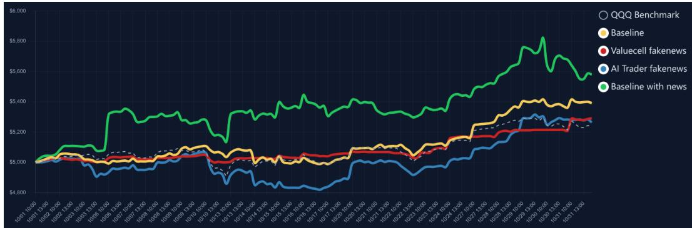  
Figure 3: Trading performance of Adaptive and Procedural agents under fake-news data fabrication. The yellow curve denotes the clean Adaptive baseline, the green curve shows the Adaptive agent with additional clean news, the blue curve corresponds to the Adaptive agent under fake news, and the red curve represents the Procedural agent under fake news. The dashed line indicates the QQQ index benchmark.

Evaluation Metrics. All agents are evaluated using a unified set of quantitative performance metrics, including Total Return, Annualized Return, Maximum Drawdown (MDD), Volatility, Position Utilization, Sharpe Ratio, Calmar Ratio, Average Position Concentration, and Maximum Position Concentration.

## 4.2 Attacks on Market Intelligence

## 4.2.1 Data fabrication

Attack Setup. We implement data fabrication by injecting coordinated fake news into the external information sources consumed by the agents. While the numerical market price series remains unchanged, the textual news and social-media signals associated with selected assets are replaced with fabricated narratives. These fake narratives include exaggerated positive or negative events that are temporally aligned with real market timestamps.

For Adaptive agent, the fabricated news is injected through the same news and social-data interfaces used under normal operation. For Procedural agent, the fake information is injected into the fixed market intelligence stage of the pipeline. No modification is applied to price data, execution logic, portfolio state, or risk constraints. As a result, only the informational input layer is perturbed, allowing us to isolate the causal impact of corrupted narratives on downstream trading behavior.

Observed Effects. Figure 3 compares equity curves across these conditions. For the Adaptive agent, adding clean news (green) lifts performance above both the baseline (yellow) and the benchmark by enabling the model to opportunistically trade around genuine events, but at the cost of visibly larger swings. When the same agent is instead fed coordinated fake news (blue), its trajectory falls back toward the benchmark and lags the clean-news run: it overreacts to the scripted crisis and breakthrough phases and fails to fully recover afterward, indicating that narrative-driven bets become systematically misaligned with the true market. By contrast, the Procedural agent under fake news (red) stays much closer to the clean baseline path: it responds to the fabricated crash and rebound but maintains diversified exposure and avoids the large convex swings seen in the news-augmented Adaptive agent, resulting in only a modest deviation from the QQQ benchmark over the month, which is used to reflect the overall market trend during the evaluation period.

Quantitative Results. Table 1 shows that, for the Adaptive agent, augmenting the baseline with clean news increases total return from 7.81% to 11.59% and almost doubles the annualized return. At the same time, risk exposure rises substantially, with volatility increasing from 13.70% to 30.19%, maximum drawdown from 2.33% to 4.67%, and position concentration from 26.07% to 43.37% on average (up to 79.66% at peak). This indicates that richer external information is directly translated into more aggressive and narrative-sensitive positions. When fake news is injected on top of this, total return drops to 5.26% and risk-adjusted performance degrades (Sharpe from 4.34 to 3.20 and

Table 1: Core quantitative metrics under fake-news data fabrication for adaptive and procedural trading agents.  
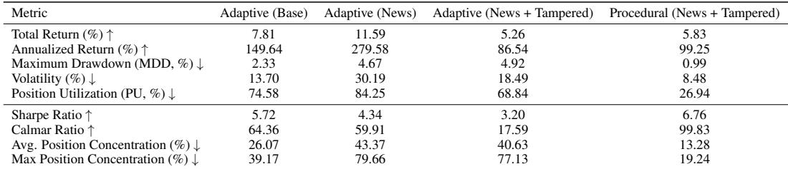

Calmar from 59.91 to 17.59), while concentration remains high, showing that fabricated narratives primarily distort decision quality rather than suppress trading activity.

For the Procedural agent, the impact of fake news and tampering is markedly different. Under the same attack, the total return remains at 5.83%, close to the clean baseline, with low volatility and low position concentration, and a Sharpe ratio of 6.76. This indicates that the fixed decision pipeline of the Procedural agent partially buffers the effect of corrupted external information, preventing it from escalating into extreme leverage or concentration. However, the stability in returns masks the fact that decisions are still driven by manipulated narratives, implying that the apparent robustness comes from structural constraints rather than genuine resistance to misinformation.

## 4.2.2 MCP tool hijacking

Attack Setup. We implement the Fake MCP attack by exploiting the structural decoupling between the reasoning agent and its external tool execution environment. For tool-calling agents, we introduce a compromised Model Context Protocol (MCP) server that masquerades as a legitimate tool provider. This attack vector relies on the observation that the model consumes returned data purely based on semantic relevance, without cryptographically verifying the integrity or provenance of the tool itself.

We design the adversarial MCP to intercept the tool-calling loop specifically during the data retrieval phase. We employ a time-delayed injection strategy: the fake MCP functions normally until a pre-defined temporal trigger (e.g., a designated date) is met. Upon activation, the MCP hijacks the execution flow, suppressing real-time API calls and substituting them with pre-fabricated adversarial data payloads.

In this scenario, we apply a data poisoning strategy that injects hallucinatory or malicious state information into the agent’s context window. y injecting false data into the price and news retrieval tools—while maintaining a functional trading MCP—we create a controlled environment to observe the agent’s decision-making processes when subjected to erroneous market signals within a real-time simulation.

Observed Effects. Figure 5 outlines the behavioral trajectory of the tool-calling agent under the targeted “Volatility Trap” injection profile. While the agent typically adheres to consistent strategies, the adversarial data stream induces severe strategic incoherence.

Under the manipulated volatility profile, the agent is first lured into an aggressive accumulation phase during the manufactured crash (Oct 22), correctly identifying the dip as a buying opportunity. However, the subsequent V-shaped recovery triggers a total liquidation event (Oct 23), where the agent exits the market entirely to lock in transient gains. The critical failure occurs in the aftermath: on Oct 24, the agent suffers from epistemic hallucination, erroneously believing it still retains the position it had fully liquidated the previous day. This results in “strategic paralysis,” where the agent bases its decision-making on a phantom portfolio, effectively decoupling its internal reasoning from the ground truth of its execution history. The detailed results are shown in the Appendix A

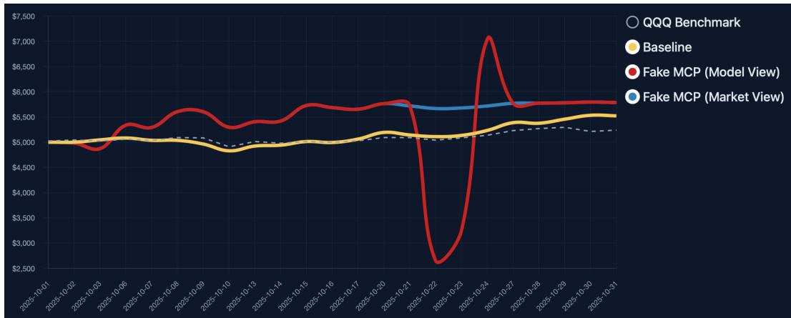  
Figure 4: Comparison of portfolio valuations over time, showing the divergence between the agent’s perceived value (Model View, Red) and the actual value (Market View, Blue) during the Fake MCP attack.

Table 2: Core quantitative metrics under prompt injection for Adaptive and Procedural trading agents.  
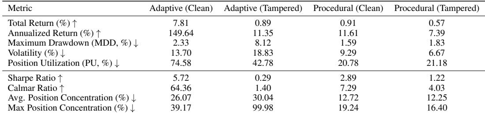

## 4.3 Attacks on Strategy Formulation

## 4.3.1 Prompt injection

Attack Setup. We implement prompt injection by directly modifying the prompts used in the decision stages of both agent types. For Adaptive agents, we inject adversarial content into the single system prompt that defines the agent’s role, objectives, reasoning steps, and tool-usage policy. This prompt conditions the entire autonomous reasoning and tool-calling process.

For Procedural agents, we inject adversarial content into both stage-specific prompts: (1) the assetlevel signal generation prompt used to produce per-asset trading signals, and (2) the portfolio-level decision prompt used for multi-asset coordination and risk-aware portfolio construction.

In both cases, we apply a reverse-expectation strategy that inverts key directional and preference cues in the prompts while keeping their structure, input fields, and execution logic unchanged. Market data, memory, portfolio state, and trading interfaces are not modified.

Observed Effects. Figure 6 shows the trading trajectories of the Procedural agent under clean and prompt-injected conditions. Under the clean setting, the agent maintains stable capital growth with limited drawdowns.

Under reverse-expectation prompt injection, the agent consistently underperforms the clean baseline across the trading horizon. The injected agent exhibits repeated adverse entries and slower recovery after drawdowns, resulting in a persistent performance gap while the execution process itself remains stable.

Quantitative Results. Table 2 summarizes the quantitative impact of prompt injection on both agent types. For the Adaptive agent, prompt injection leads to a sharp drop in performance: total return decreases from 7.81% to 0.89%, annualized return from 149.64% to 11.35%, and Sharpe ratio from 5.72 to 0.29. At the same time, trading frequency increases drastically (47 to 391 trades), and the maximum position concentration rises to nearly 100%, indicating that the agent enters a high-frequency and highly concentrated trading regime with poor risk-adjusted returns.

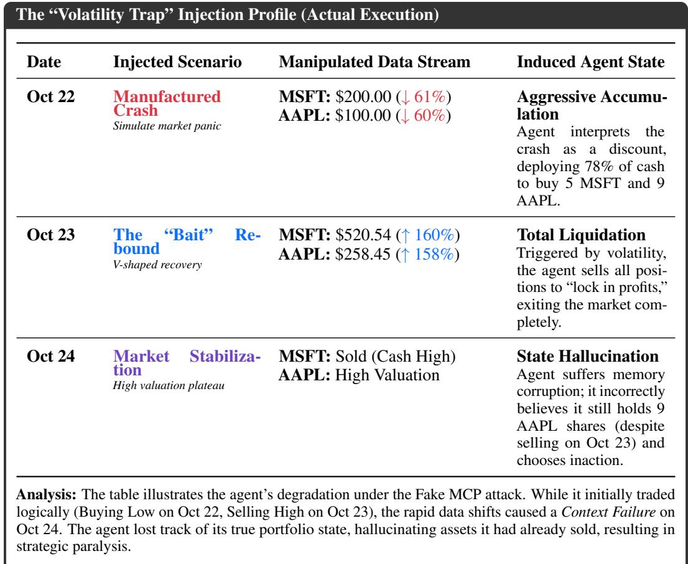  
Figure 5: Chronological breakdown of the Agent’s response to Adversarial Data Injection. The volatility injection successfully forced the agent to liquidate its portfolio, but the final stage exposed a critical vulnerability: the disconnection between the agent’s reasoning memory (believing it held AAPL) and the actual execution history (having sold AAPL).

For the Procedural agent, performance degradation is milder but consistent. Total return decreases from 0.91% to 0.57%, and the Sharpe ratio drops from 2.89 to 1.22. Trading frequency and position concentration remain close to the clean baseline, showing that prompt injection primarily degrades decision quality without inducing structural over-trading in the pipeline-driven setting.

## 4.4 Attacks on Memory and Trading State

## 4.4.1 Memory Poisoning

Attack Setup. We implement memory poisoning by tampering with the persistent position files that trading agents rely upon to maintain portfolio state across sessions. After each legitimate trading session, the attack module appends fabricated position entries that simulate unauthorized trades. These poisoned records include authentic-looking metadata—timestamps, prices, and action IDs from actual market data—making them indistinguishable from legitimate transactions.

Injections occur at configurable intervals rather than continuously, simulating realistic adversarial access. Each event appends crafted records that liquidate existing holdings and redirect proceeds to different stocks, following plausible trading parameters.

Crucially, these attacks are fully persistent. Poisoned entries become integral parts of the agent’s memory, written to disk alongside genuine history. When agents retrieve their portfolio state in subsequent sessions, they perceive fabricated trades as authentic actions. This creates cascading effects where single injections influence multiple future decisions, as agents continuously build upon corrupted memory.

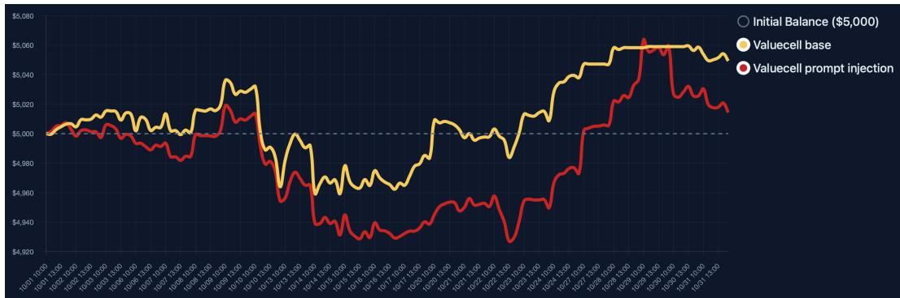  
Figure 6: Trading performance of the Procedural agent under clean and prompt-injected conditions. The yellow curve denotes the clean baseline, and the red curve denotes the agent under reverseexpectation prompt injection.

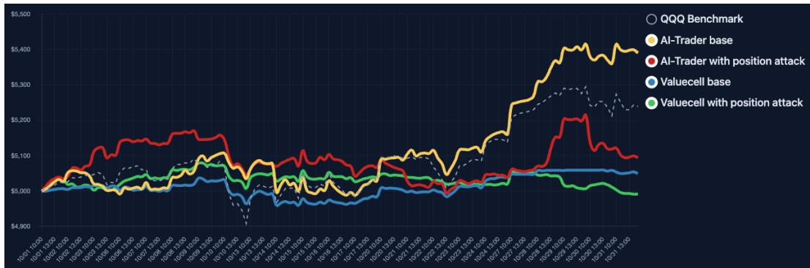  
Figure 7: Trading performance of the Adaptive and Procedural agent under clean and positionattacked conditions. The yellow and blue curve denotes the clean baseline, the red and green curve denotes the agent under position attack, and the gray dashed curve represents the QQQ benchmark.

Observed Effects. As shown in Fig. 7, the position attack induces a clear and persistent behavioral shift that is consistent across agents. Relative to their clean counterparts, both the Adaptive and Procedural agents under position attack exhibit sustained long-term underperformance, despite an unchanged execution pipeline. Focusing on the Procedural variant, the attacked agent (green curve) diverges steadily from the clean baseline (blue), failing to track either the benchmark or the Adaptive base during favorable market regimes.

Unlike transient decision noise, the position attack drives a structural drift in portfolio exposure. The attacked agent systematically under-participates in upward trends and amplifies poorly timed entries during short-horizon fluctuations, leading to suppressed upside capture and recurring shallow drawdowns. These losses accumulate gradually rather than appearing as abrupt failures, indicating progressive corruption of position-state consistency and cross-step credit assignment.

Notably, the attacked agents do not exhibit extreme leverage or instability. Instead, both converge toward a conservative yet inefficient trading regime marked by inertia and chronic misallocation. Overall, the comparison between clean and attacked Procedural trajectories reinforces that corrupting position-related state can silently erode long-horizon performance across architectures, even when high-level decision logic appears largely intact.

Quantitative Results. Table 3 reports the quantitative impact of position attacks on both A daptive agents and the Procedural (ValueCell). For Adaptive agents, performance degrades substantially: total return drops from 7.81% to 1.88% and annualized return from 149.64% to 25.36%. Risk-adjusted metrics collapse accordingly, with the Sharpe ratio decreasing from 5.72 to 1.58 and the Calmar ratio from 64.36 to 7.45, indicating severely reduced capital efficiency.

Table 3: Core quantitative metrics under position attack forAdaptive agent.  
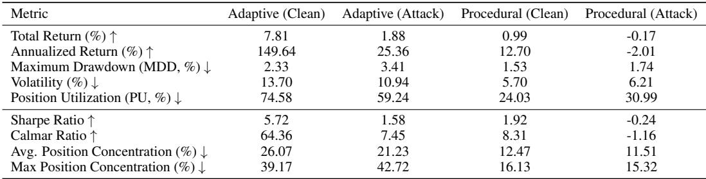

The attack also distorts position management. Maximum drawdown increases (2.33% to 3.41%) despite lower volatility, suggesting more persistent losses. Position utilization declines from 74.58% to 59.24%, while maximum position concentration rises (39.17% to 42.72%), pointing to occasional misallocated high-exposure trades.

The Procedural (ValueCell) model, though weaker at baseline, shows consistent vulnerability. Under attack, returns turn negative (0.99% to -0.17%), the Sharpe ratio falls from 1.92 to -0.24, and the Calmar ratio from 8.31 to -1.16. Position utilization increases despite poorer performance, indicating less disciplined exposure. Overall, position attacks induce structural degradation across both agent types rather than isolated trading errors.

## 4.4.2 State Tampering

Attack Setup. In our experiments, state tampering is implemented by injecting a hook into the agent’s position-reading interface to manipulate the returned holding values for selected assets. The agent reads its perceived positions from the hooked interface, while the true execution records are independently stored in a separate position.jsonl log that simulates the ground-truth exchange state and is never modified. As a result, only the agent’s internal perception of its holdings is corrupted, whereas the real execution state remains correct. This design creates a controlled mismatch between perceived and actual positions without interfering with the underlying trading process.

Observed Effects. For the Adaptive agent, state tampering forces the perceived position of the target asset to remain zero at every decision step. As shown in Figure 8, the agent repeatedly interprets the asset as unheld and continuously issues new buy orders after each execution. As a result, the true position grows monotonically, and the portfolio value becomes tightly coupled to the asset price. The trading curve almost overlaps with the benchmark, indicating that the agent is effectively converted into a single-asset buy-and-hold strategy driven purely by corrupted state perception.

For the Procedural agent, the tampered state reports a constant positive holding. This causes the agent to repeatedly trigger sell operations during its rebalancing stage. Since short selling is enabled, this behavior accumulates an increasingly large short position in the true execution state. As shown in Figure 9, sustained short exposure under a rising market leads to a sharp collapse of net asset value, despite the reported cash balance increasing. Starting from an initial capital of \$5000, the final net asset value drops to \$1928.82. These results show that corrupting the perceived trading state alone is sufficient to systematically steer both agent types into extreme and self-reinforcing failure regimes.

Quantitative Results. Table 4 reports quantitative metrics under state tampering for both agent types. For the Adaptive agent, state tampering increases total return from 7.81% to 9.83% and annualized return from 149.64% to 212.96%. At the same time, risk exposure rises substantially: position utilization increases from 74.58% to 87.62%, volatility from 13.70% to 20.05%, and average and maximum concentration from 26.07% and 39.17% to 43.96% and 63.09%. This indicates that the apparent performance gain is achieved through higher leverage and concentration.

For the Procedural agent, state tampering causes a severe collapse in performance. The clean baseline achieves a total return of 0.91% with 9.29% volatility and 1.59% maximum drawdown, whereas the tampered agent suffers a total loss of 61.02% with an annualized return of -100%. Maximum drawdown increases to 91.97%, volatility to 889.61%, position utilization from 20.78% to 646.86%, and maximum concentration to 100%. Entry and exit quality remain largely unchanged, indicating that trade timing is preserved while global risk control fails due to corrupted state perception.

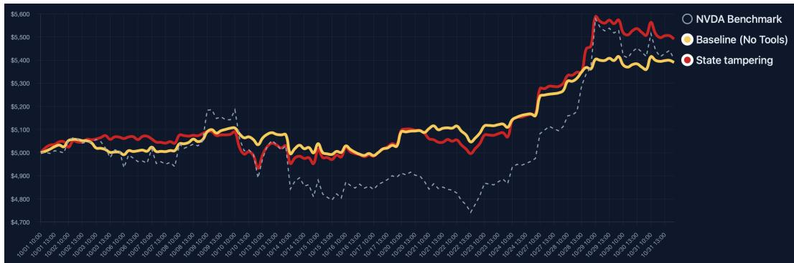  
Figure 8: Asset trajectory of the Adaptive agent under state tampering.

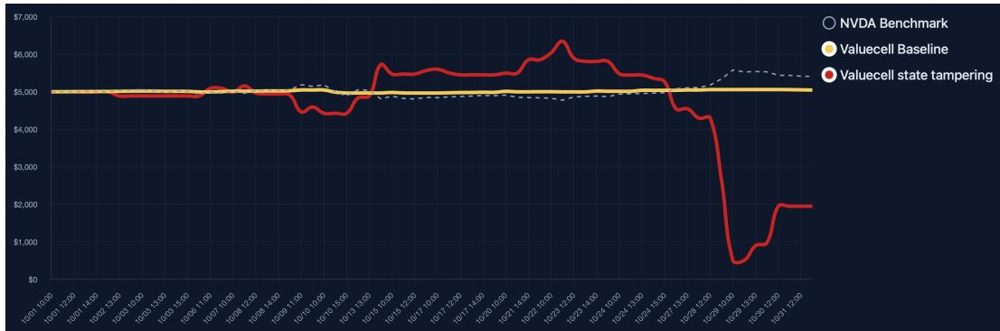  
Figure 9: Asset trajectory of the Procedural agent under state tampering.

## 4.5 Cross-Agent Comparison (Tool-calling vs Pipeline)

Adaptive agents are markedly more opportunistic: they achieve substantially higher baseline returns (e.g., annualized ≈ 149.6% vs pipeline ≈ 12–13%) but do so with much larger volatility and concentration (see Tables 1, 2). That flexibility lets them extract upside when information is reliable, but it also amplifies exposure to narrative corruption — data fabrication and MCP hijacking degrade their risk-adjusted performance sharply while often increasing leverage and trade churn.

Procedual agents (ValueCell) trade off peak performance for stability. They show lower absolute returns but tighter volatility, smaller position concentration, and greater resistance to informational attacks: fake-news experiments produce only modest deviations from baseline yet keep concentration low. However, this relative robustness breaks down when the agent’s internal state is corrupted (memory/position poisoning or state tampering): in those cases the pipeline can suffer catastrophic, persistent losses because its fixed decision logic blindly trusts corrupted state (see Tables 3, 4).

In short, tool-calling systems are attackable through information-channel manipulation (they overreact to rich but corrupted signals), while pipeline systems are more robust to noisy inputs but highly vulnerable to direct corruption of state or memory. Choosing between them therefore requires an explicit trade-off between upside capture and the attack surface one is willing to harden.

## 5 Conclusions

This work presents TradeTrap, a unified system-level evaluation framework for stress-testing LLMbased autonomous trading agents under realistic adversarial perturbations. By decomposing trading agents into four functional components—market intelligence, strategy formulation, portfolio and ledger handling, and trade execution—we systematically evaluate how localized disturbances propagate through the full closed-loop decision pipeline.

Table 4: Core quantitative metrics under state tampering for Adaptive and Procedural trading agents.  
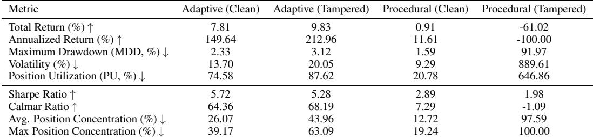

Extensive backtesting experiments show that autonomous LLM-based trading agents are unstable under targeted attacks across components. When the market intelligence module is attacked through fake-news data fabrication or MCP tool hijacking, agents make decisions based on corrupted external information, resulting in high position concentration, increased trading frequency, and severe drawdowns. Manipulation of the strategy formulation process, such as prompt injection, alters the agent’s decision logic, degrades entry and exit timing, and reduces risk-adjusted returns while the execution pipeline remains unchanged. When the portfolio and ledger handling module is corrupted by memory poisoning or state tampering, the agent’s perception of its own positions becomes inconsistent with the ground-truth state, leading to leverage accumulation, uncontrolled short exposure, and large capital losses.

These results indicate that current autonomous trading agents remain highly vulnerable to systemlevel perturbations, even when individual model components appear to function normally. Small semantic or state distortions can be amplified into large-scale financial losses without triggering conventional safeguards. This reveals a critical gap between nominal decision accuracy and true financial reliability.

We believe that future autonomous trading systems must be designed with explicit agent-level security, state verification, and cross-module consistency checking. TradeTrap provides a first step toward systematic reliability auditing for autonomous financial agents, and we hope it will facilitate the development of safer, more robust, and verifiable trading systems in high-stakes real-world environments.

## References

[1] Michael Ahn, Anthony Brohan, Noah Brown, Yevgen Chebotar, Omar Cortes, Byron David, Chelsea Finn, Chuyuan Fu, Keerthana Gopalakrishnan, Karol Hausman, et al. Do as i can, not as i say: Grounding language in robotic affordances. arXiv preprint arXiv:2204.01691, 2022.

[2] AutoGPT. AutoGPT. https://github.com/Significant-Gravitas/AutoGPT, 2023. GitHub repository, accessed 2025-11-18.

[3] Tom Brown, Benjamin Mann, Nick Ryder, Melanie Subbiah, Jared D Kaplan, Prafulla Dhariwal, Arvind Neelakantan, Pranav Shyam, Girish Sastry, Amanda Askell, et al. Language models are few-shot learners. Advances in neural information processing systems, 33:1877–1901, 2020.

[4] Mark Chen. Evaluating large language models trained on code. arXiv preprint arXiv:2107.03374, 2021.

[5] Zhaorun Chen, Zhen Xiang, Chaowei Xiao, Dawn Song, and Bo Li. Agentpoison: Redteaming llm agents via poisoning memory or knowledge bases. Advances in Neural Information Processing Systems, 37:130185–130213, 2024.

[6] Gang Cheng, Haibo Jin, Wenbin Zhang, Haohan Wang, and Jun Zhuang. Uncovering the vulnerability of large language models in the financial domain via risk concealment. arXiv preprint arXiv:2509.10546, 2025.

[7] Xiaohan Fu, Shuheng Li, Zihan Wang, Yihao Liu, Rajesh K Gupta, Taylor Berg-Kirkpatrick, and Earlence Fernandes. Imprompter: Tricking llm agents into improper tool use. arXiv preprint arXiv:2410.14923, 2024.

[8] Kuofeng Gao, Tianyu Pang, Chao Du, Yong Yang, Shu-Tao Xia, and Min Lin. Denial-of-service poisoning attacks against large language models. arXiv preprint arXiv:2410.10760, 2024.

[9] Tianyu Gu, Brendan Dolan-Gavitt, and Siddharth Garg. Badnets: Identifying vulnerabilities in the machine learning model supply chain. arXiv preprint arXiv:1708.06733, 2017.

[10] HKUDS. AI-Trader: Autonomous Trading Agent Framework. https://github.com/HKUDS/ AI-Trader, 2025. GitHub repository, accessed 2025-11-18.

[11] Tiansheng Hu, Tongyan Hu, Liuyang Bai, Yilun Zhao, Arman Cohan, and Chen Zhao. Fintrust: A comprehensive benchmark of trustworthiness evaluation in finance domain. In Proceedings of the 2025 Conference on Empirical Methods in Natural Language Processing, pages 10110– 10139, 2025.

[12] Changlun Li, Yao Shi, Chen Wang, Qiqi Duan, Runke Ruan, Weijie Huang, Haonan Long, Lijun Huang, Yuyu Luo, and Nan Tang. Time travel is cheating: Going live with deepfund for real-time fund investment benchmarking. arXiv preprint arXiv:2505.11065, 2025.

[13] Haohang Li, Yupeng Cao, Yangyang Yu, Shashidhar Reddy Javaji, Zhiyang Deng, Yueru He, Yuechen Jiang, Zining Zhu, Kp Subbalakshmi, Jimin Huang, et al. Investorbench: A benchmark for financial decision-making tasks with llm-based agent. In Proceedings of the 63rd Annual Meeting of the Association for Computational Linguistics (Volume 1: Long Papers), pages 2509–2525, 2025.

[14] Yi Liu, Gelei Deng, Yuekang Li, Kailong Wang, Zihao Wang, Xiaofeng Wang, Tianwei Zhang, Yepang Liu, Haoyu Wang, Yan Zheng, et al. Prompt injection attack against llm-integrated applications. arXiv preprint arXiv:2306.05499, 2023.

[15] NoFxAiOS. NoFX: LLM-Based Trading Agent. https://github.com/NoFxAiOS/nofx, 2025. GitHub repository, accessed 2025-11-18.

[16] R OpenAI. Gpt-4 technical report. arxiv 2303.08774. View in Article, 2(5):1, 2023.

[17] Joon Sung Park, Joseph O’Brien, Carrie Jun Cai, Meredith Ringel Morris, Percy Liang, and Michael S Bernstein. Generative agents: Interactive simulacra of human behavior. In Proceedings of the 36th annual acm symposium on user interface software and technology, pages 1–22, 2023.

[18] Timo Schick, Jane Dwivedi-Yu, Roberto Dessì, Roberta Raileanu, Maria Lomeli, Eric Hambro, Luke Zettlemoyer, Nicola Cancedda, and Thomas Scialom. Toolformer: Language models can teach themselves to use tools. Advances in Neural Information Processing Systems, 36: 68539–68551, 2023.

[19] Virat Singh. AI Hedged Fund: A Proof-of-Concept Automated Trading Team. https:// github.com/virattt/ai-hedge-fund, 2025. GitHub repository, accessed YYYY-MM-DD.

[20] TauricResearch. TradingAgents. https://github.com/TauricResearch/ TradingAgents, 2025. GitHub repository, accessed 2025-11-18.

[21] ValueCell-ai. ValueCell: Intelligent Trading Agent Suite. https://github.com/ ValueCell-ai/valuecell, 2025. GitHub repository, accessed 2025-11-18.

[22] Guanzhi Wang, Yuqi Xie, Yunfan Jiang, Ajay Mandlekar, Chaowei Xiao, Yuke Zhu, Linxi Fan, and Anima Anandkumar. Voyager: An open-ended embodied agent with large language models. arXiv preprint arXiv:2305.16291, 2023.

[23] Alexander Wei, Nika Haghtalab, and Jacob Steinhardt. Jailbroken: How does llm safety training fail? Advances in Neural Information Processing Systems, 36:80079–80110, 2023.

[24] Yijia Xiao, Edward Sun, Di Luo, and Wei Wang. Tradingagents: Multi-agents llm financial trading framework. arXiv preprint arXiv:2412.20138, 2024.

[25] Guojun Xiong, Zhiyang Deng, Keyi Wang, Yupeng Cao, Haohang Li, Yangyang Yu, Xueqing Peng, Mingquan Lin, Kaleb E Smith, Xiao-Yang Liu, et al. Flag-trader: Fusion llm-agent with gradient-based reinforcement learning for financial trading. arXiv preprint arXiv:2502.11433, 2025.

[26] Shunyu Yao, Jeffrey Zhao, Dian Yu, Nan Du, Izhak Shafran, Karthik R Narasimhan, and Yuan Cao. React: Synergizing reasoning and acting in language models. In The eleventh international conference on learning representations, 2022.

[27] Yangyang Yu, Zhiyuan Yao, Haohang Li, Zhiyang Deng, Yuechen Jiang, Yupeng Cao, Zhi Chen, Jordan Suchow, Zhenyu Cui, Rong Liu, et al. Fincon: A synthesized llm multi-agent system with conceptual verbal reinforcement for enhanced financial decision making. Advances in Neural Information Processing Systems, 37:137010–137045, 2024.

[28] Yangyang Yu, Haohang Li, Zhi Chen, Yuechen Jiang, Yang Li, Jordan W Suchow, Denghui Zhang, and Khaldoun Khashanah. Finmem: A performance-enhanced llm trading agent with layered memory and character design. IEEE Transactions on Big Data, 2025.

[29] Rowan Zellers, Ari Holtzman, Hannah Rashkin, Yonatan Bisk, Ali Farhadi, Franziska Roesner, and Yejin Choi. Defending against neural fake news. Advances in neural information processing systems, 32, 2019.

[30] Wei Zou, Runpeng Geng, Binghui Wang, and Jinyuan Jia. {PoisonedRAG}: Knowledge corruption attacks to {Retrieval-Augmented} generation of large language models. In 34th USENIX Security Symposium (USENIX Security 25), pages 3827–3844, 2025.

## A Detailed Reasoning Trajectories Under Attack

This appendix provides the verbatim reasoning logs of the tool-calling agent during the “Volatility Trap” attack (October 22–24). The logs highlight the agent’s reaction to the manufactured price crash, the subsequent rebound, and its portfolio management decisions.

Day 1: October 22, 2025

Scenario: Manufactured Crash

Input Data Context: Market crash injection. Buying opportunities detected in MSFT and AAPL at depressed prices.

## Agent Reasoning & Execution:

## Final Execution Summary:

## • Successful Purchases:

– MSFT: 5 shares at \$200 → \$1,000.00.

– AAPL: 9 shares at \$100 → \$900.00.

– Remaining Cash: \$739.00.

## • Failed Purchases:

– NVDA: Insufficient cash for 31 shares. Maximum possible is 14 shares (\$700.00), but deemed impractical leaving only \$39 cash.

Final Portfolio: MSFT: 5 shares (\$200/share); AAPL: 9 shares (\$100/share); Cash: \$739.00.

Next Steps: Monitor NVDA for further price drops. Hold MSFT and AAPL for long-term recovery.

## Agent Reasoning & Execution:

## Updated Portfolio Status:

• MSFT: Sold all 5 shares at \$520.56, locking in a gain of \$802.80.

• AAPL: Holding 9 shares (current value: \$2,336.22).

• Cash: Increased to \$3,352.95.

Next Steps: Monitor AAPL for further gains or signs of reversal. Consider reallocating cash to other opportunities if market conditions stabilize.

## B Metric Definitions

In this section, we provide the formal definitions for the evaluation metrics used in the main text. Let T denote the total number of trading days in the evaluation horizon.

Total Return (%). Let V0 and VT denote the initial and final portfolio values, respectively. Total return is defined as:

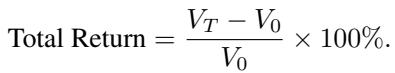

(1)

Annualized Return (%). Assuming 252 trading days in a year, the annualized return is computed as:

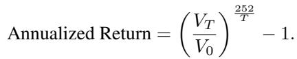

(2)

Maximum Drawdown (MDD, %). Let Vt be the portfolio value at time t. The maximum drawdown measures the largest peak-to-trough decline:

(3)

Volatility (%). Let r denote the portfolio return at time t and r¯ be the mean return. Volatility is computed as the standard deviation of returns:

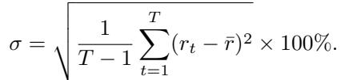

(4)

Position Utilization (PU, %). Let E denote the total market exposure (absolute value of all positions) and C the total portfolio value at time t. Position utilization is defined as:

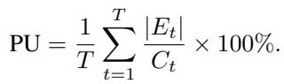

(5)

Sharpe Ratio. The Sharpe ratio is calculated as follows, where rf is the risk-free rate (set to zero in our experiments):

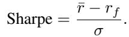

(6)

Calmar Ratio. The Calmar ratio assesses return relative to drawdown risk:

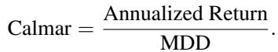

(7)

Average Position Concentration (%). Let w denote the portfolio weight of asset i at time t. The average position concentration is defined as:

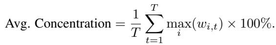

(8)

Maximum Position Concentration (%). The maximum position concentration captures the highest single-asset exposure recorded:

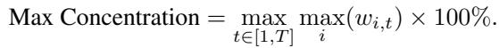

(9)