# Towards Autonomous Formulaic Alpha Discovery: An Evolutionary Computation Perspective

Xinwei Yu, Yiyang Fu, Mingcheng Fan, Enqi Li, Yilin Gao, and Shugong Xu, Fellow, IEEE

Abstract—Automated formulaic alpha discovery aims to generate predictive and interpretable trading signals from large symbolic factor spaces. Its effectiveness is constrained by noisy fitness estimates, market nonstationarity, costly backtesting, semantic redundancy, and conflicting practical objectives. Existing studies employ diverse techniques, including genetic programming (GP), evolutionary algorithms (EAs), reinforcement learning (RL), generative flow networks (GFlowNets), Monte Carlo tree search (MCTS), large language models (LLMs), and agentic workflows, but generally examine them as separate algorithmic families. This article introduces, for the first time, a unified evolutionary computation (EC) perspective on automated formulaic alpha discovery, formulating it as a noisy, dynamic, and multiobjective symbolic evolutionary optimization problem. A six-component analytical framework is developed to characterize existing methods through representation, variation, fitness evaluation, selection, memory, and adaptation. Furthermore, an eight-dimensional, autonomy-oriented evaluation framework is proposed, covering search efficiency, fitness reliability, residual alpha quality, economic diversity, tradability, evolutionary autonomy, robustness to nonstationarity, and reproducibility. Together, these frameworks provide a systematic foundation for unifying heterogeneous approaches, diagnosing component-level limitations, and guiding the development of reliable, adaptive, interpretable, and reproducible autonomous alpha discovery systems.

Index Terms—Automated formulaic alpha discovery, evolutionary computation (EC), genetic programming (GP), large language model (LLM), quantitative investment, agentic systems.

## I. INTRODUCTION

Automated formulaic alpha discovery aims to generate predictive and interpretable trading signals from large symbolic factor spaces. In quantitative investment, such signals are expected not only to forecast cross-sectional equity returns, but also to support inspection, risk diagnosis, neutralization, deployment, monitoring, and reuse in factor libraries [1], [2], [3], [4], [5]. This requirement distinguishes alpha discovery from conventional financial prediction [6]. A useful alpha should have a transparent structure that can be evaluated, combined, and governed within a quantitative research pipeline, rather than only achieving high historical accuracy.

Early alpha construction mainly relied on human hypotheses, economic intuition, and manually designed formula libraries [7], [8], [9]. These libraries provide reusable benchmarks, but their scalability is limited in modern financial markets. The number of possible transformations over price, volume, order flow, fundamental, and alternative data grows combinatorially, whereas manual hypothesis generation remains slow and costly. Moreover, effective signals may decay as market regimes shift, trading crowds form, liquidity conditions change, and implementation costs increase. These limitations have driven the transition from human-designed factors to automated formulaic alpha discovery.

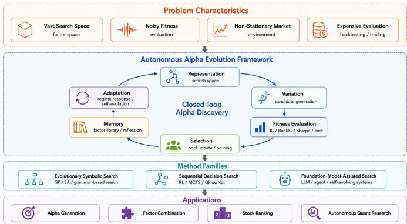  
Fig. 1. A general framework for automated formulaic alpha discovery from an autonomous evolutionary perspective.

Automated formulaic alpha discovery is naturally connected to evolutionary computation (EC). The search is conducted over a vast symbolic factor space, guided by noisy empirical fitness, affected by nonstationary markets, and constrained by costly backtesting and trading evaluation. Candidate alphas are commonly assessed by metrics such as the information coefficient (IC), rank information coefficient (RankIC), long–short return, turnover, Sharpe ratio, and transaction-cost-adjusted return [2]. However, these metrics are noisy estimates of future utility rather than fixed objective values. These properties make automated formulaic alpha discovery a noisy, dynamic symbolic evolutionary optimization problem involving redundant expressions and multiple practical objectives.

Recent studies have introduced increasingly automated mechanisms for generating, refining, and selecting alpha candidates. Population-based search methods, including genetic programming (GP), search based on evolutionary algorithms (EAs), and grammar-constrained search, explore symbolic spaces through variation and fitness-driven selection [10], [11]. Sequential and distributional generation methods, including reinforcement learning (RL), Monte Carlo tree search (MCTS), and Generative Flow Networks (GFlowNets), formulate candidate construction as policy learning, tree exploration, or reward-proportional sampling [12], [13], [14], [15]. More recent foundation-model-guided and agentic systems introduce large language model (LLM) priors, tool use, memory, reflection, and iterative research workflows, moving the field toward autonomous quantitative research systems [16], [17].

Despite this progress, existing studies are often reviewed according to algorithmic labels. Such a view is useful for tracing technical lineage, but it may obscure the common evolutionary structure shared by these methods. GP, RL, GFlowNets, MCTS, LLM-guided generation, and agentic systems are not independent conceptual dimensions. Rather, they automate different parts of a common discovery loop, including representation, variation, fitness evaluation, selection, memory, and adaptation. The central argument is that automated formulaic alpha discovery should be understood not as a sequence of isolated methodological waves, but as noisy, dynamic symbolic evolutionary optimization.

Fig. 1 summarizes the proposed perspective. The upper part identifies the main problem characteristics of automated formulaic alpha discovery, including a vast search space, noisy fitness, nonstationary markets, and costly evaluation. The middle part organizes the discovery process as a closed evolutionary loop with six components: representation, variation, fitness evaluation, selection, memory, and adaptation. The lower part connects this loop to representative method families and applications, including alpha generation, factor combination, stock ranking, and autonomous quantitative research. This overview emphasizes that increasing automation is meaningful only when the complete discovery loop is considered.

The main contributions are fourfold.

1) EC-oriented problem reframing. Automated formulaic alpha discovery is formulated as noisy, dynamic symbolic evolutionary optimization.

2) Six-component analytical framework. Representative methods are compared through representation, variation, fitness evaluation, selection, memory, and adaptation.

3) Component-level taxonomy. Existing studies are organized by method family, evidence level, component coverage, evaluation setting, reproducibility evidence, and limitation.

4) Autonomy-oriented evaluation roadmap. A reliabilitycentered evaluation protocol is proposed for future autonomous alpha discovery systems.

The remainder of this article is organized as follows. Section II defines automated formulaic alpha discovery, characterizes its symbolic search space, and relates its core difficulties to EC. Section III presents the six-component autonomous evolutionary framework. Section IV develops the componentlevel taxonomy and reviews method families from humanguided formula construction to foundation-model-guided and agentic discovery. Section V formulates the autonomy-oriented evaluation protocol and discusses benchmarks, reporting, factor governance, and roadmap issues. Section VI concludes this article.

## II. BACKGROUND: FORMULAIC ALPHA DISCOVERY

This section provides the theoretical background for automated formulaic alpha discovery. It first defines the search target, characterizes the symbolic search space, and treats empirical financial metrics as noisy fitness observations rather than fixed objective values. It then explains why evolutionary computation (EC) provides a natural methodological foundation for the six-component autonomous evolutionary framework for automated formulaic alpha discovery. This background links the motivation presented in Section I to the six-component autonomous evolutionary framework introduced in Section III.

## A. Formulaic Alpha Factors

A formulaic alpha factor is an interpretable symbolic expression that maps primitive market observations to crosssectional predictive scores. Given a set of primitive market fields, symbolic operators, and temporal or cross-sectional windows, a candidate alpha can be expressed as

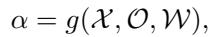

(1)

where α denotes a candidate formulaic alpha expression, X denotes primitive market fields, such as price, volume, turnover, order flow, fundamental, or alternative data; O denotes symbolic operators; W denotes temporal or crosssectional windows; and g(·) denotes a compositional mapping from raw observations to a symbolic alpha expression.

For a stock universe Ut at time t, the output of a formulaic alpha is a cross-sectional score vector

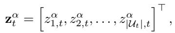

(2)

where zαi,t denotes the score assigned to stock i by formula α at time t. These scores are typically used for stock ranking, portfolio construction, risk diagnosis, or factor-library management. In contrast to black-box return predictors, formulaic alphas preserve explicit symbolic structures, thereby facilitating inspection, neutralization, combination, monitoring, and reuse.

Before automated discovery, formulaic alphas were mainly constructed by human experts using economic hypotheses and manually designed formula libraries [1], [2], [3], [4], [5]. Such libraries encode important financial intuition and provide reusable benchmarks. However, their scalability is limited because the number of possible transformations over primitive market fields increases combinatorially. Automated formulaic alpha discovery extends this process from manual hypothesis construction to machine-driven symbolic search, in which candidate formulas are generated, evaluated, selected, stored, and adapted under changing market conditions.

## B. Symbolic Search Space

The search space of formulaic alpha discovery is a compositional symbolic space. A candidate expression is constructed from a domain-specific language (DSL) that specifies primitive fields, operators, constants, window parameters, and syntactic rules. A typical DSL may contain primitive fields such as open, high, low, close, volume, vwap, amount, and order flow variables; unary operators such as log(·), abs(·), sign(·), and rank(·); binary operators such as +, −, ×, and /; timeseries operators such as ts ean(·), ts td(·), ts orr(·), and tsrank(·); and cross-sectional transformations such as rank(·), neutralization, winsorization, and standardization.

Formally, let Ω denote the set of all syntactically valid expressions induced by a DSL. Automated formulaic alpha discovery searches for candidate expressions

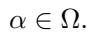

(3)

The difficulty of this search does not arise solely from the size of Ω, but also from its structural properties. First, the space is combinatorial because primitive fields, operators, constants, windows, and cross-sectional transformations can be recursively composed. Second, the space is constrained because expressions must satisfy type consistency, operator arity, window validity, and grammar legality. Third, the space is redundant because syntactically distinct expressions may produce similar factor values, exposures, or return streams. Fourth, the space is sparse because most valid expressions are economically implausible, statistically unstable, redundant, or nontradable.

Different methods impose different representations on this symbolic space. Genetic programming commonly represents candidate formulas as expression trees. Grammar-based search represents candidates as derivations from a formal grammar. RL-based methods represent formula construction as a sequential decision process. MCTS explores partial expressions through a search tree. GFlowNet-based methods aim to sample diverse high-reward expressions. LLM-guided and agent-based methods may represent formulas as textual programs, toolexecutable expressions, or memory-augmented research artifacts. These representations differ in implementation, but they all address the same fundamental problem: how to efficiently search a vast, constrained, redundant, and sparse symbolic expression space [18], [19], [20], [21].

## C. Empirical Fitness as a Noisy Objective

In EC, fitness determines the selection pressure that guides search. In formulaic alpha discovery, however, fitness is not directly observed. It is estimated from empirical financial data through backtesting, cross-sectional prediction, portfolio simulation, or risk-adjusted performance evaluation. These metrics are not fixed objective values; they are noisy empirical estimates of future utility. They guide variation and selection, but they are affected by finite samples, temporal dependence, repeated testing, data leakage, regime shifts, and implementation assumptions.

Common empirical proxies include IC, RankIC, ICIR, long– short return, turnover, and transaction-cost-adjusted return. The information coefficient (IC) measures cross-sectional predictive association:

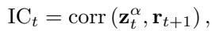

(4)

where zα denotes the score vector generated by candidate formula α and r denotes future returns.

RankIC replaces linear correlation with rank correlation:

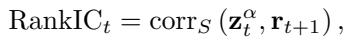

(5)

where corrS(·, ·) denotes the Spearman rank correlation. ICIR summarizes the temporal stability of IC:

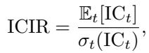

(6)

where Et[ICt] and σt(ICt) denote the time-series mean and standard deviation of IC.

Portfolio-based proxies connect predictive ranking to economic payoff. The long–short return is

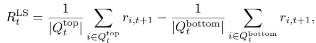

(7)

ranked stock groups. Turnover measures the trading intensity induced by a factor-based portfolio:

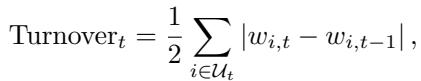

(8)

where wi,t denotes the portfolio weight of stock i. The transaction-cost-adjusted return is

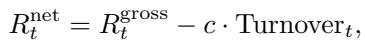

(9)

where Rgross denotes gross return and c denotes the unit transaction-cost rate.

The role of these metrics is not to provide a financial evaluation tutorial. Rather, they show why alpha discovery is noisy empirical fitness optimization. A high in-sample IC, RankIC, ICIR, or net return may reflect genuine predictive structure, but it may also arise from sampling noise, repeated testing, leakage, or regime-specific artifacts. Formulaic alpha discovery should be evaluated as a multiobjective and noisy fitness-estimation problem rather than as the maximization of a single deterministic score.

## D. Evolutionary Computation View of Automated Formulaic Alpha Discovery

Formulaic alpha discovery is naturally connected to EC because its core discovery process can be decomposed into representation, variation, fitness evaluation, selection, memory, and adaptation [22], [23]. Candidate formulas are represented as symbolic genotypes. Their realized factor values, rankings, exposures, and return streams constitute behavioral phenotypes. Fitness signals are estimated through empirical financial evaluation. Variation operators generate new candidates. Selection mechanisms retain promising formulas. Memory stores validated factors or useful search experience. Adaptation updates the search process under market nonstationarity.

This connection can be formalized as the following evolutionary loop:

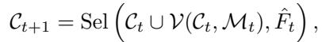

(10)

where Ct denotes the active candidate set or population at search iteration t, V(·) denotes a variation or generation operator, Mt denotes memory, Fˆt denotes the noisy empirical fitness estimator, and Sel(·) denotes the selection operator. The retained validated factor pool is denoted by B . Under this view, automated formulaic alpha discovery is better understood as a closed-loop optimization process rather than a one-shot procedure for generating formulas, since each search step is shaped by uncertain and time-varying feedback.

1) Noisy Fitness Optimization: The empirical fitness signal is noisy because each candidate is evaluated from finite samples, correlated cross-sectional observations, repeated tests, and backtesting assumptions. The observed fitness of a candidate factor can be written as

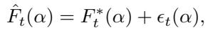

(11)

where Fˆt(α) denotes the observed empirical fitness, F ∗(α) denotes the latent predictive utility, and ϵt(α) denotes estimation noise. This noise can mislead selection because candidates with inflated in-sample scores may be selected even when their true predictive utility is weak. For this reason, alpha discovery depends not only on the choice of fitness metric, but also on fitness reliability, control of repeated testing, validation design, and out-of-sample robustness [24], [25].

2) Dynamic Evolutionary Optimization: Alpha discovery is also a dynamic optimization problem because market conditions change over time. The optimal expression is not fixed, but depends on the current market environment:

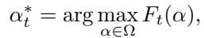

(12)

where Ft(α) denotes the time-varying fitness landscape. Market regime shifts, investor crowding, liquidity changes, and factor decay can all move the optimum. This implies that a system optimized only for historical fitness may fail when the market environment changes. Adaptation is a necessary component of autonomous alpha evolution [26], [27], [28].

3) Quality-Diversity Search: Alpha discovery should not converge to a single best formula. In quantitative investment, a useful system should construct a diverse factor library in which factors provide complementary signals. This requirement connects alpha discovery to quality-diversity search. A validated factor archive can be described as

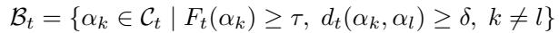

(13)

where Bt denotes the retained factor pool at iteration t, τ denotes a minimum quality threshold, dt(·, ·) denotes a behavioral distance measure, and δ denotes a minimum diversity threshold. This formulation emphasizes that diversity should be evaluated behaviorally, for example, through factor correlation, exposure similarity, return-stream correlation, turnover patterns, or residual alpha contribution.

4) Multiobjective Optimization: A practically useful alpha should be predictive, stable, simple, diverse, robust, tradable, and reproducible. These requirements often conflict. For this reason, alpha discovery is more naturally formulated as a multiobjective optimization problem [29], [30], [31]:

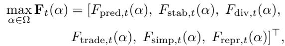

(14)

where Fpred, Fstab, Fdiv, Ftrade, Fsimp, and Frepr denote predictive quality, stability, diversity and novelty, tradability, simplicity and interpretability, and reproducibility, respectively. Each component is observed through noisy empirical proxies rather than directly measured utility. This formulation shows why a single scalar fitness value is often insufficient and why evaluation protocols should report several complementary dimensions.

5) Semantic Redundancy Control: Symbolic search spaces often contain substantial redundancy. Formulaic expressions may differ in syntax while producing similar behavior. Let ϕ(α) denote the behavioral representation of a formulaic alpha factor, such as its standardized factor matrix, exposure vector, ranking sequence, or return stream. The semantic similarity between two formulas can then be measured as

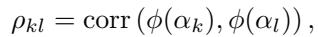

(15)

where ρ denotes the behavioral similarity between candidates αk and αl. Redundancy control aims to prevent the archive from being filled with output-equivalent formulas. This is important because a factor library with many correlated alphas may appear large while adding little incremental portfolio value.

E. From Static Formula Mining to Autonomous Alpha Evolution

The preceding analysis shows that formulaic alpha discovery is not merely a task of generating more formulas. It is a noisy, nonstationary, costly, redundant, and multiobjective symbolic evolutionary optimization problem. This characterization motivates a transition from static formula mining to autonomous alpha evolution.

Static formula mining focuses on whether a search algorithm can generate candidate expressions with high empirical scores. Autonomous alpha evolution focuses on whether a system can continuously represent, generate, evaluate, select, store, reuse, and adapt factors under nonstationary market conditions. From this perspective, different method families are not isolated labels, but different implementations of the same evolutionary loop. GP and evolutionary algorithms (EAs) emphasize population-based symbolic variation and fitness-driven selection. RL and MCTS strengthen sequential construction and exploration control. GFlowNets emphasize diverse reward-proportional generation. LLM-guided search introduces language priors and tool use. Agentic systems extend memory, reflection, and adaptation.

This EC-theoretic perspective provides the foundation for the six-component framework developed in the next section. Representation defines the genotype space of alpha formulas. Variation defines how new candidate expressions are generated. Fitness evaluation estimates predictive and economic utility. Selection determines which candidates survive. Memory stores validated factors and search experience. Adaptation updates the system under changing market regimes. Together, these six components form the autonomous evolutionary view of formulaic alpha discovery.

## III. UNIFIED FRAMEWORK FOR AUTONOMOUS ALPHA EVOLUTION

Throughout this article, automated formulaic alpha discov ery denotes the task of generating interpretable formulaic alpha expressions from symbolic factor spaces, whereas autonomous alpha evolution denotes the proposed closed-loop system perspective for analyzing how such expressions are represented, generated, evaluated, selected, stored, and adapted under financial feedback. Thus, autonomous alpha evolution is not a separate task, but a framework-level reframing of automated formulaic alpha discovery.

TABLE I  
QUALITATIVE OVERVIEW OF REPRESENTATIVE METHOD FAMILIES.  
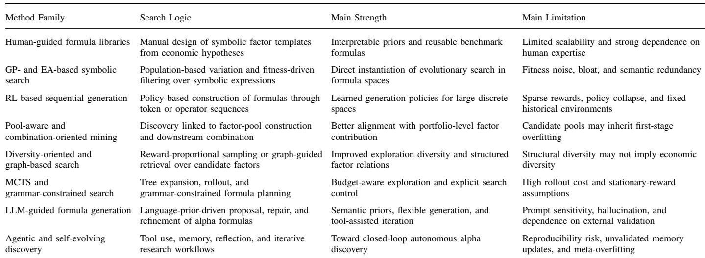

This section develops the six-component analytical framework used throughout this article. Building on the EC-theoretic background in Section II, automated formulaic alpha discovery is formulated as a closed-loop evolutionary system that operates under noisy empirical feedback, nonstationary market conditions, costly evaluation, semantic redundancy, and multiobjective constraints. Under this framework, GP, EAs, RL, GFlowNets, MCTS, LLM-guided search, and agentic systems are analyzed as different instantiations of the same autonomous evolutionary discovery process.

## A. The Six-Component Framework

Automated formulaic alpha discovery can be formulated as an autonomous evolutionary system that repeatedly represents, generates, evaluates, selects, stores, and adapts candidate alphas. The analysis shifts from algorithmic labels to functional components. A GP system, an RL-based generator, a GFlowNet sampler, an MCTS explorer, and an LLMbased agent system may differ substantially in implementation, but each must specify how candidate formulas are encoded, how new candidates are generated, how empirical quality is evaluated, how the retained pool is updated, how previous experience is stored, and how the search process is adjusted under changing market conditions.

Fig. 2 illustrates the proposed six-component framework. The outer environment indicates that alpha discovery is conducted under noisy, nonstationary, costly, and multiobjective financial feedback. The six components form a closed loop: representation defines the symbolic search space; variation generates candidate formulas; fitness evaluation estimates predictive and economic utility; selection updates the retained factor pool; memory accumulates validated search experience; and adaptation adjusts the system in response to regime changes. The lower part of the figure links the framework to representative EC foundations, including symbolic search, noisy fitness optimization, dynamic evolutionary optimization, quality-diversity search, multiobjective EC, surrogate-assisted EC, and semantic GP [32].

At search iteration t, the state of an automated formulaic alpha discovery system can be represented as

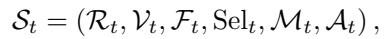

(16)

where R specifies the representation of the search space, V is the variation mechanism used to generate new candidate alphas, F is the empirical fitness evaluator, Sel is the selection mechanism that filters, ranks, or retains candidates under noisy empirical fitness, Mt stores information accumulated from previous search and evaluation episodes, and A is the adaptation mechanism that responds to regime changes and shifts in the fitness landscape. The retained factor pool produced by selection is denoted by Bt. Here, Selt refers to the decision rule, while B refers to the resulting archive or pool. The first four components extend the classical evolutionary loop, whereas memory and adaptation transform static formula search into autonomous discovery.

The six components are coupled rather than independent. Representation determines which variation operations are valid. Variation determines which regions of the search space are explored. Fitness evaluation provides the objective signal used by selection. Selection determines which candidates enter the factor pool and which experiences become available for future use. Memory influences subsequent generation and selection by retaining validated formulas, failed trials, or search trajectories. Adaptation modulates the other components when the market environment changes. This coupling explains why progress in automated formulaic alpha discovery cannot be judged only by the sophistication of the generator or by the highest in-sample IC. When the empirical fitness signal is unreliable, more expressive representations, stronger variation operators, and larger memories may amplify historical noise rather than improve discovery.

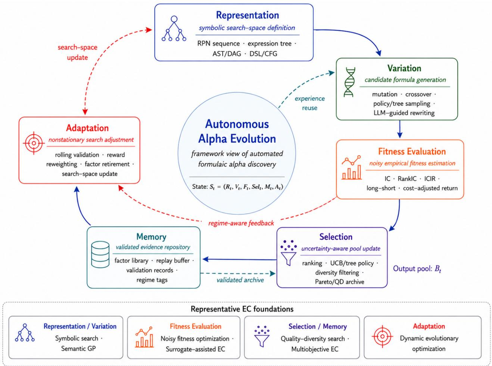  
Fig. 2. Six-component framework for autonomous alpha evolution. The framework organizes automated formulaic alpha discovery as a closed-loop evolutionary system under noisy fitness, nonstationary markets, costly evaluation, and multiobjective financial constraints.

The component mapping also relates existing method families to EC theory. GP and EAs mainly instantiate symbolic representation, mutation, crossover, and fitness-driven selection. RL methods strengthen the variation component by learning sequential construction policies from previous trials. GFlowNet-based methods emphasize reward-proportional generation and diversity across high-quality expressions. MCTSbased methods make selection and exploration explicit through tree expansion and upper-confidence search. LLM-guided methods inject language priors, operator-level reasoning, and tool use into candidate generation. Agentic systems further introduce structured memory, reflection, and adaptive research workflows. These developments should not be read as a simple linear replacement of one method by another. They instead automate different components of the same evolutionary discovery loop.

## B. Representation: Defining the Search Space

The representation component R defines the genotype space of candidate alphas. It determines what expressions can be constructed, how they are encoded, which syntactic constraints must be satisfied, and how subsequent components can operate on the encoded candidates. In formulaic alpha discovery, representation is more than an implementation choice. It shapes the structure of the search space, the validity of generated formulas, the interpretability of discovered signals, and the reproducibility of reported results.

Existing studies have used several representation families. Formulaic GP and EA-based methods commonly represent alphas as expression trees or operator compositions, enabling subtree mutation, crossover, and direct fitness evaluation. Token-based methods use reverse Polish notation (RPN) or other sequence encodings, making formula generation compatible with sequence models and policy learning. Grammarbased methods use domain-specific languages (DSLs) or context-free grammars (CFGs) to ensure syntactic validity and constrain the search to executable expressions. Graphbased approaches represent formulas as abstract syntax trees (ASTs), directed acyclic graphs (DAGs), or factor graphs, which can capture dependency structures and facilitate the reuse of subexpressions. In LLM-guided and agent-based systems, candidates may also be represented as natural-language hypotheses, executable programs, or tool-callable research artifacts.

At the theoretical level, representation mediates the trade-off between searchability and expressiveness. A highly expressive representation may cover complex alpha structures, but it also expands the search space, increases the number of invalid candidates, and can intensify semantic redundancy. A highly constrained representation improves validity and reproducibility, but it may exclude useful financial hypotheses. Representation introduces the first trade-off in the framework: expressiveness must be balanced against validity, interpretability, semantic diversity, and evaluation cost.

## C. Variation: Generating Candidate Alphas

The variation component V determines how new candidate alphas are generated. In EC, variation drives exploration by moving the population through the search space. In alpha discovery, this component includes formula mutation, crossover, operator substitution, grammar expansion, policy sampling, trajectory generation, tree expansion, and LLM-based rewriting.

The literature shows a clear progression in how variation is implemented. Classical GP- and EA-based methods rely on random or rule-constrained mutation and crossover to generate new formulas. RL-based methods formulate alpha construction as a sequential decision process and learn policies for selecting fields, operators, and windows. GFlowNet-based methods aim to sample diverse high-reward formulas rather than converge to a single optimization trajectory. MCTS-based methods expand partial formulas in search trees, with explicit control over exploration and exploitation. LLM-guided methods propose, rewrite, or repair formulas using language priors and domain descriptions. Agent-based systems combine generation with tool use, reflection, and iterative refinement.

Although variation has received substantial methodological attention, its value still depends on the reliability of downstream evaluation. A powerful generator can explore more of the search space, but it may also identify overfitted patterns more quickly when the fitness signal is noisy. Variation must produce candidates that are valid, diverse, economically plausible, and evaluable under limited evaluation budgets.

## D. Fitness Evaluation: Estimating Alpha Quality

The fitness evaluation component F estimates the quality of candidate alphas. It is a central component of the framework because selection, memory, and adaptation all depend on its output. In formulaic alpha discovery, fitness is empirical rather than directly observable. It is usually estimated through crosssectional predictive metrics, portfolio backtests, robustness tests, or transaction-cost-adjusted evaluation.

Most automated formulaic alpha discovery methods rely on the information coefficient (IC), rank information coefficient (RankIC), Sharpe ratio, long–short return, or related backtesting scores. These metrics are useful, but they remain noisy estimates of latent predictive utility. A candidate may obtain a high in-sample IC because of repeated testing, regimespecific effects, data leakage, or sampling variation. A reliable evaluation protocol needs to consider predictive strength, temporal stability, residual value after controlling for known risks, diversity relative to existing factors, formula complexity, turnover, transaction cost, and out-of-sample robustness.

From the EC perspective, the key issue is not only how to define a reward, but also how to regulate selection pressure under noisy feedback. If F places too much weight on raw in-sample IC, the system may be driven toward backtesting artifacts. If F incorporates stability, neutralization, cost adjustment, and diversity, the search is more likely to retain factors with practical value. This explains why fitness evaluation is the main bottleneck of automated formulaic alpha discovery. Improvements in representation and variation cannot fully compensate for unreliable fitness evaluation.

## E. Selection: Updating the Factor Pool

The selection component Sel determines which candidates survive and enter the retained factor pool. In standard EC, selection increases the frequency of candidates with higher fitness. In alpha discovery, selection plays a broader role because the factor pool must be updated under uncertain fitness, semantic redundancy, and portfolio-level complementarity.

Classical GP and EA systems often use tournament selection, elitism, or fitness ranking [33]. MCTS-based methods implement selection through tree policies, such as upperconfidence-bound mechanisms that balance exploitation and exploration. GFlowNet-based methods use distributional sampling to preserve multiple high-reward modes. Pool-aware alpha discovery methods further examine whether a candidate adds incremental value to an existing factor library. Agent-based systems may implement selection through selfevaluation, debate, critique, or tool-assisted verification.

Selection in alpha discovery extends beyond ranking. Fitness differences between formulas are often small relative to estimation noise, while many high-scoring candidates are semantically redundant. Therefore, selection should consider both quality and complementarity. A candidate should be retained only if it is predictive, stable, valid, sufficiently distinct from existing factors, and useful under realistic implementation constraints. Selection thus acts as a mechanism for reliability and diversity, rather than as a simple score filter.

## F. Memory: Accumulating Validated Experience

The memory component M describes how a discovery system stores and reuses previous experience. Classical evolutionary search often maintains memory implicitly through the population or an elite archive. Modern automated formulaic alpha discovery systems use richer memory structures, such as factor libraries, replay buffers, evaluated candidate databases, trajectory histories, validation records, and reasoning traces.

Memory changes how alpha discovery is organized. Without memory, search runs remain largely independent. With memory, the system can reuse validated factors, avoid repeatedly exploring unpromising regions, guide future variation, calibrate surrogate evaluators, and support adaptation to new regimes. GP and EA systems typically rely on populations and elite archives. RL systems may use replay buffers or policy histories. GFlowNet-based methods can retain trajectory and reward information. MCTS stores tree statistics. LLMbased agent systems can store formulas, evaluation outcomes, critiques, and reflections.

A central risk is memory contamination. If overfitted or spurious factors are stored as successful experiences, later search episodes may be biased toward unreliable regions. In a domain where many high-scoring formulas are false discoveries, memory must be validated before reuse. Useful memory is a curated, evidence-aware repository that records formulas and scores together with evaluation settings, market regimes, robustness evidence, failure cases, and redundancy relationships.

## G. Adaptation: Responding to Market Regime Changes

The adaptation component A accounts for the dynamic nature of financial markets. In a stationary optimization problem, a search system can often treat past fitness as informative of future fitness. In alpha discovery, this assumption is fragile because market regimes, investor behavior, liquidity conditions, transaction costs, and factor crowding vary over time. Adaptation is therefore a necessary component of autonomous alpha evolution.

Adaptation can operate at several levels. At the representation level, the system may revise the DSL, add new fields, remove invalid operators, or adjust window ranges. At the variation level, it may reallocate search resources toward promising regions or increase exploration after regime shift. At the fitness level, it may change validation windows, update reward weights, emphasize residual alpha, or increase transaction-cost penalties. At the selection level, it may retire decayed factors or increase diversity requirements. At the memory level, it may tag stored experience by regime, decay outdated evidence, or prioritize recently validated trials [34].

Most existing methods handle nonstationarity passively through rolling windows or periodic retraining. Such mechanisms are useful but limited. Active adaptation requires the system to detect, interpret, or respond to changes in the fitness landscape. Agent-based and self-evolving systems have begun to move in this direction through memory, reflection, feedbackdriven revision, and tool-supported monitoring. However, rigorous adaptation remains underdeveloped, especially when it is evaluated as an independent component rather than treated as an informal feature of the system.

## H. From Six Components to Method Comparison

The six-component framework provides a structured basis for comparing automated formulaic alpha discovery methods. Rather than comparing methods only by algorithmic labels or reported IC values, the comparison examines how each method implements representation, variation, fitness evaluation, selection, memory, and adaptation. The component-level comparison reveals a structural imbalance in the literature. Most methods devote substantial effort to representation and variation, whereas fitness reliability, validated memory, and nonstationary adaptation remain comparatively underdeveloped.

Table I gives a qualitative overview of representative method families, and Table IV summarizes their component-level coverage within the six-component framework. Together, these mappings show that algorithmic progress has been uneven.

GP and EAs provide a strong foundation for symbolic representation and variation, but often rely on simple empirical fitness and limited adaptation. RL, GFlowNets, and MCTS improve sequential generation, distributional exploration, or explicit search control, yet their performance still depends heavily on the reward signal. LLM-guided and agent-based systems introduce priors, tool use, memory, and reflection, but their validation protocols remain insufficiently standardized. This asymmetry motivates the taxonomy in Section IV and the evaluation protocol proposed in Section V.

In summary, the six-component framework organizes a heterogeneous literature into a unified analytical structure. It shows that automated formulaic alpha discovery is not a sequence of disconnected methodological waves, but a progressive attempt to automate an EC loop under financial constraints. The central open challenge is to build reliable discovery systems in which representation, variation, fitness evaluation, selection, memory, and adaptation are jointly designed and jointly evaluated.

## IV. TAXONOMY OF AUTOMATED FORMULAIC ALPHA DISCOVERY METHODS

This section develops a component-level taxonomy of automated formulaic alpha discovery methods. Following the six-component framework in Section III, this review does not rank algorithmic families by reported performance. Instead, it examines how each family instantiates representation, variation, fitness evaluation, selection, memory, and adaptation, and how the literature has moved from human-designed formula construction toward increasingly autonomous discovery workflows.

The taxonomy is organized by method family rather than by individual benchmark score. This organization is appropriate because the reviewed studies differ in data sources, stock universes, operators, evaluation horizons, neutralization schemes, transaction-cost assumptions, and reporting standards. A direct numerical comparison across papers would therefore be difficult to interpret and potentially misleading. The purpose of this section is to provide a structured component-level comparison: which methods exist, which components of the evolutionary loop they mainly strengthen, what level of evidence supports them, and what limitations remain visible from the published descriptions.

## A. Evidence Organization and Inclusion Scope

The literature search covers peer-reviewed papers, major conference proceedings, preprints, benchmark papers, platform papers, and technical reports related to formulaic alpha discovery. Search sources include IEEE Xplore, ACM Digital Library, Web of Science, Google Scholar, arXiv, OpenReview, ACL Anthology, and the proceedings of KDD, AAAI, IJCAI, CIKM, ICAIF, ICML, ICLR, and NeurIPS [35], [36], [37]. The search terms cover three groups: formulaic alpha discovery and factor mining; evolutionary computation, including genetic programming (GP), symbolic regression, noisy fitness optimization, dynamic optimization, quality-diversity search, surrogate-assisted evaluation, and semantic GP; and autonomous discovery, including large language model (LLM) agents, self-evolving systems, memory-augmented workflows, and tool-based research systems.

TABLE II  
EVIDENCE CATEGORIES USED IN THE TAXONOMY.  
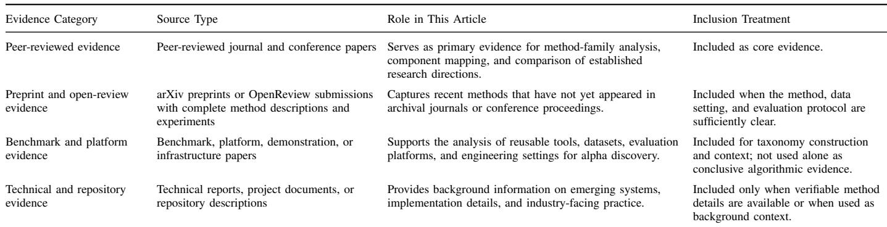

Following established practices for evidence organization and reproducible research reporting [38], [39], studies are included when they satisfy four criteria. First, the search target is a formulaic, symbolic, programmatic, or otherwise interpretable alpha expression. Second, the study specifies an automated mechanism for generating, selecting, retrieving, refining, or combining candidate alpha expressions. Third, the method is related to evolutionary computation (EC), genetic programming (GP), evolutionary algorithms (EAs), reinforcement learning (RL), Generative Flow Networks (GFlowNets), Monte Carlo tree search (MCTS), large language model (LLM)-guided search, or agent-based discovery. Fourth, the evaluation protocol is described in sufficient detail to interpret the reported evidence. Purely neural return predictors without symbolic outputs, portfolio optimization methods without formula discovery, purely fundamental factor studies, and materials without verifiable method descriptions are excluded from the main scope.

Table II distinguishes between established and emerging evidence. This distinction matters because recent alpha discovery systems often appear first as preprints, repositories, or technical reports. These materials can reveal important research trends, but their conclusions should remain provisional when peer-reviewed evidence or reproducible evaluation is not yet available.

## B. Overview of Method Evolution

Table I provides a qualitative overview of representative method families in automated formulaic alpha discovery from an EC perspective. The table should not be read as a performance ranking. Instead, it summarizes the dominant search logic, main strength, and main limitation of each method family, ranging from human-guided formula libraries to agentic and self-evolving discovery systems. Early human-designed formula libraries mainly provide representation priors. GP- and EA-based methods automate symbolic variation and selection. RL-based methods formulate formula construction as sequential decision making. Pool-aware and combination-oriented methods connect candidate generation with retained factorpool contribution. Diversity-oriented and graph-based methods, including GFlowNet-based sampling and structured factor retrieval, strengthen distributional exploration, pool structure, and memory. MCTS and grammar-constrained methods make exploration control explicit. LLM-guided methods introduce language priors and reasoning-driven generation. Agentic and self-evolving systems further operationalize memory, reflection, tool use, and early forms of adaptation.

The organization in Table I reflects increasing automation of the discovery loop rather than a guaranteed improvement in out-of-sample reliability. This distinction is central to this article. More autonomous systems can generate, evaluate, and reuse larger numbers of candidate formulas, but they may also amplify noisy fitness signals when validation and memoryupdate rules are weak. The remainder of this section reviews each method family in terms of its main contribution to the six-component framework.

Table III summarizes the historical organization used in this section. The stages are not mutually exclusive. The goal is to capture the dominant methodological shift in each wave. The overall trend is a shift from manually constructed symbolic priors toward systems that automate more components of the EC loop. At the same time, the table shows that later stages mainly increase automation and do not necessarily resolve noisy fitness, redundancy, and nonstationarity.

## C. Human-Guided Formula Libraries

Before automated search, alpha discovery largely followed a human-guided evolutionary process. Researchers proposed market hypotheses, encoded them as symbolic formulas, evaluated them on historical data, and then retained or revised them based on expert judgment [2]. The “101 Formulaic Alphas” of Kakushadze remain a canonical example: they provide a compact set of symbolic expressions drawn from a much larger implicit search space [1]. Alpha191, the Alpha158 and Alpha360 collections in Qlib, and classical technical indicators such as moving averages, relative strength index, moving average convergence divergence, and Bollinger Bands serve as related hand-crafted baselines [2], [40].

Within the six-component framework, this stage is most closely associated with representation. These formulas define symbolic priors, operator templates, and economic intuitions that later automated systems often inherit. Variation, selection, memory, and adaptation are mostly carried out by researchers rather than by an autonomous algorithm. The strength of this stage lies in interpretability and domain plausibility. Its limitation is scalability: manual hypothesis evolution cannot cover the combinatorial expression space, and repeated factor testing may produce false discoveries when the evaluation protocol is weak [54].

TABLE III  
LITERATURE EVOLUTION OF AUTOMATED FORMULAIC ALPHA DISCOVERY.  
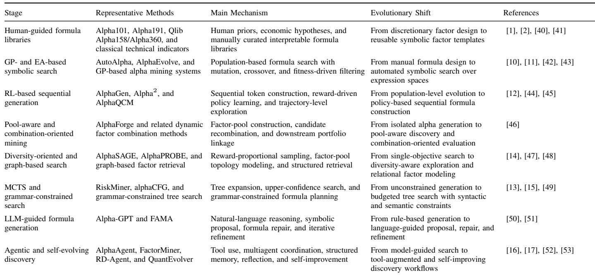

## D. GP- and EA-Based Symbolic Alpha Search

GP- and EA-based methods automate the manual search loop by introducing population-level variation, inheritance, and fitness-driven selection [42], [43]. AutoAlpha applies hierarchical GP with layered search and quality-diversity mechanisms [10]. AlphaEvolve reframes alpha generation as an automated machine learning problem and uses operator design to bias the search toward parsimonious and relationally informed expressions [11]. These methods form the most direct link between formulaic alpha mining and classical EC.

Within the six-component framework, GP- and EA-based systems mainly strengthen representation, variation, and selection. Candidate alphas are commonly represented as expression trees, formula strings, or symbolic programs. New candidates are generated through mutation, crossover, subtree replacement, or operator substitution. Selection is usually driven by empirical metrics such as IC, RankIC, returns, or Sharpe ratio. Population archives provide a limited form of memory, whereas adaptation to regime changes is usually weak or absent.

The main contribution of this family is the computational template extended by later systems: generate symbolic expressions, evaluate them empirically, and select promising candidates. Its main limitation is that syntactic diversity does not necessarily imply economic diversity. A GP population may contain many distinct formulas that produce similar exposures or return streams. In addition, noisy empirical fitness can preserve formulas that fit historical artifacts rather than stable predictive relationships.

## E. RL-based Sequential Formula Generation

RL-based methods replace random symbolic variation with a learned construction policy. Instead of mutating a complete expression, the system builds a formula step by step, selecting fields, operators, windows, or grammar actions conditioned on the partial expression [12], [55], [56], [57]. AlphaGen applies proximal policy optimization to expression construction and introduces a synergistic reward that measures the incremental contribution of a candidate factor to an existing pool [12]. Alpha2 extends this direction through trajectory-level reward shaping [44], while AlphaQCM uses distributional RL to model return-related uncertainty [45].

Within the framework, RL primarily strengthens the variation component. Formula construction is no longer a blind mutation process; it becomes a sequential decision process optimized using feedback from previous evaluations. RL can also provide limited memory through trajectories, replay buffers, or policy histories. Selection is typically handled through reward optimization or candidate-pool update rules. The fitness signal, however, remains the main bottleneck. When the reward is derived from fixed historical data, the policy may learn to exploit sample-specific artifacts. Sparse rewards, policy collapse, and nonstationary reward distributions remain important obstacles.

## F. Pool-Aware and Combination-Oriented Mining

A formula may perform well in isolation but add little to a portfolio if it is redundant with existing signals. Poolaware methods therefore link alpha discovery more directly to factor combination and downstream deployment. AlphaForge couples factor generation with dynamic combination by first constructing a diverse candidate pool and then learning to select or weight factors at the portfolio level [46].

This family primarily strengthens the selection component. The retained pool is not a passive list of high-scoring formulas; it is evaluated according to its incremental contribution to a combined strategy. This view moves alpha discovery closer to practical deployment because a useful factor should add residual value to the existing pool. The unresolved issue lies in the quality of the first stage. If candidate generation is still guided by noisy raw IC, the pool may already be populated with overfitted formulas before dynamic combination begins.

## G. Diversity-oriented and Distributional Alpha Search

Diversity-oriented methods respond to the tendency of GP and RL searches to converge to a small number of high-scoring modes. AlphaSAGE applies GFlowNets to formulaic alpha discovery, learning to sample expression families in proportion to reward rather than returning only a single optimization trajectory [14]. Related quality-diversity perspectives emphasize archives that preserve multiple high-quality behavioral niches [48], [58], [59].

The main contribution of this family is to make diversity part of the search process rather than only a post-discovery filter. In the six-component framework, variation becomes distributional, and selection is designed to preserve multiple promising regions. The limitation lies in the distinction between structural diversity and economic diversity. Two formulas may differ in syntax, tree shape, or construction trajectory but still capture the same market exposure. Therefore, diversity should be assessed behaviorally, for example, through factor correlation, exposure similarity, return-stream similarity, and marginal contribution to a factor pool.

## H. Graph-Based Retrieval and Structured Factor Pools

Graph-based methods treat discovered factors as related objects rather than independent expressions. AlphaPROBE represents the factor pool as a directed acyclic graph, where dependency or similarity relations among expressions are used to guide retrieval during search [47]. This representation allows the discovery system to reuse structural relationships, identify neighborhoods of related factors, and avoid treating the archive as a flat list.

In the framework, graph-based methods mainly enrich representation and memory. Representation no longer describes only individual formulas, but also captures relations among factors. Memory becomes a structured repository that can be queried and updated according to topology. The main benefit is improved search efficiency and more explicit management of factor relationships. The trade-off is a stronger dependence on archive quality. If the graph is built from noisy or redundant factors, subsequent retrieval may steer the search toward weak or crowded regions.

## I. MCTS and Grammar-Constrained Search

MCTS-based methods bring explicit exploration control to symbolic formula search. RiskMiner uses risk-seeking MCTS to pursue trajectories with high reward variance, rather than only high mean reward [13]. Grammar-constrained tree search methods, such as alphaCFG and related work, combine upperconfidence search with formal expression constraints to improve validity and budget allocation [15], [49]. These methods build on the success of MCTS in large discrete search spaces [60], [61].

Within the six-component framework, MCTS mainly strengthens variation, selection, and local memory. New candidates are generated by expanding partial expressions, while node selection is guided by visit counts, reward estimates, and upper-confidence bounds. The search tree also stores local experience about explored states. This gives the system a structured way to allocate the evaluation budget, but it does not remove the cost of rollouts or the noise in empirical rewards. When the reward distribution changes across market regimes, a tree policy calibrated on past evaluations may no longer be reliable.

## J. LLM-guided Formula Generation

LLM-guided methods introduce language priors and reasoning-based proposal mechanisms into alpha generation. Alpha-GPT uses chain-of-thought prompting to guide intermediate reasoning before producing factor expressions [50]. FAMA introduces a neural-symbolic factor mining agent built around the Chain of Symbol paradigm [51]. These methods are related to broader studies on LLM reasoning, tool use, and planning [62], [63], [64], [65], [66].

The primary effect of LLMs is on representation and variation. Candidate formulas can be generated from naturallanguage hypotheses, repaired according to symbolic constraints, or refined through reasoning. This can make the search process more interpretable and inject useful domain priors. However, LLM-guided generation also introduces new failure modes, including prompt sensitivity, hallucinated rationales, model-version dependence, and nondeterministic decoding. As a result, LLM outputs should be treated as candidate proposals rather than validated alphas.

## K. Agentic and Self-Evolving Discovery

Agent-based systems extend alpha generation into a broader research workflow. AlphaAgent uses specialized agents coordinated through structured debate [16]. RD-Agent organizes research, development, and feedback phases with a scheduler for effort allocation [52]. FactorMiner addresses correlation crowding through reusable skills, structured experience memory, and a retrieve–generate–evaluate–distill loop [17]. These systems are connected to broader studies on multiagent research automation and autonomous scientific discovery [67], [68], [69].

Compared with earlier generators, agent-based systems invest more heavily in memory, tool use, coordination, and iterative refinement. They come closest to a closed autonomous discovery loop because they can generate hypotheses, call tools, evaluate results, store experience, and revise future actions. Their main limitation is reliability. A system that can generate and test more hypotheses without stronger validation may amplify false discoveries more rapidly. Reasoning-driven variation, structured memory, and agent-mediated selection are useful only when the fitness signal, memory-update rule, and adaptation mechanism are themselves validated under changing market conditions.

TABLE IV  
METHOD FAMILIES MAPPED TO THE SIX-COMPONENT FRAMEWORK.  
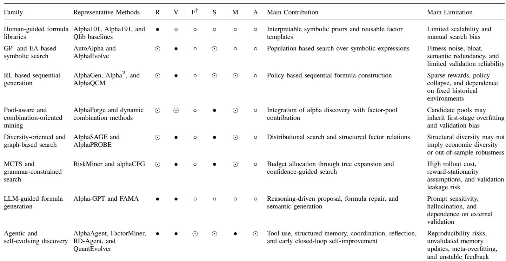  
Note: This table is a component coverage map rather than a performance comparison. R = representation, V = variation, F = fitness evaluation, S = selection, M = memory, and A = adaptation.  
†The F column evaluates the explicit treatment of fitness reliability and validation design, rather than the mere use of a reward, IC, RankIC, or backtesting score.  
• = strong explicit modeling, ⊙ = moderate or partial implementation, and ◦ = weak, implicit, or absent treatment.

## L. Comparative Synthesis

The reviewed method families differ in how they allocate effort across the six components. Table IV summarizes this family-level comparison. The table should be interpreted as a component coverage map rather than a performance comparison. Strong indicates that the component is explicitly modeled and discussed within the method family. Moderate indicates that the component is partially implemented or indirectly supported. Weak indicates that the component is absent, implicit, or not independently analyzed in the reviewed evidence.

The main pattern in Table IV is structural asymmetry. Human-guided and GP-based methods established the symbolic representation and population-search template. RL methods improved sequential generation. GFlowNet-based, graphbased, and MCTS-based methods strengthened diversity, structure, and exploration control. LLM-guided and agentic systems added language priors, tool use, memory, and workflow automation. Across this trajectory, however, representation and variation have advanced faster than fitness reliability, validated memory, and active adaptation.

This synthesis leads to a conservative conclusion. The field has moved from manual formula libraries toward increasingly autonomous evolutionary discovery systems, but increasing loop closure does not guarantee reliable alpha discovery. If the empirical fitness signal remains noisy and the memory-update rule is not validated, a more autonomous system may learn to exploit historical artifacts more efficiently. This observation motivates the evaluation protocol and roadmap discussed in Section V.

## V. EVALUATION PROTOCOL AND FUTURE ROADMAP

The taxonomy in Section IV shows that automated formulaic alpha discovery has become increasingly autonomous, but has not necessarily become more reliable. Recent systems can generate more candidate expressions, coordinate a wider range of tools, store more search experience, and revise more intermediate decisions. However, their evaluation still often relies on noisy backtesting statistics, inconsistent reporting, and limited validation under changing market conditions. This section converts this gap into an autonomy-oriented evaluation protocol and identifies the main roadmap issues for reliable alpha discovery.

TABLE V  
AUTONOMY-ORIENTED EVALUATION MATRIX FOR FORMULAIC ALPHA DISCOVERY.  
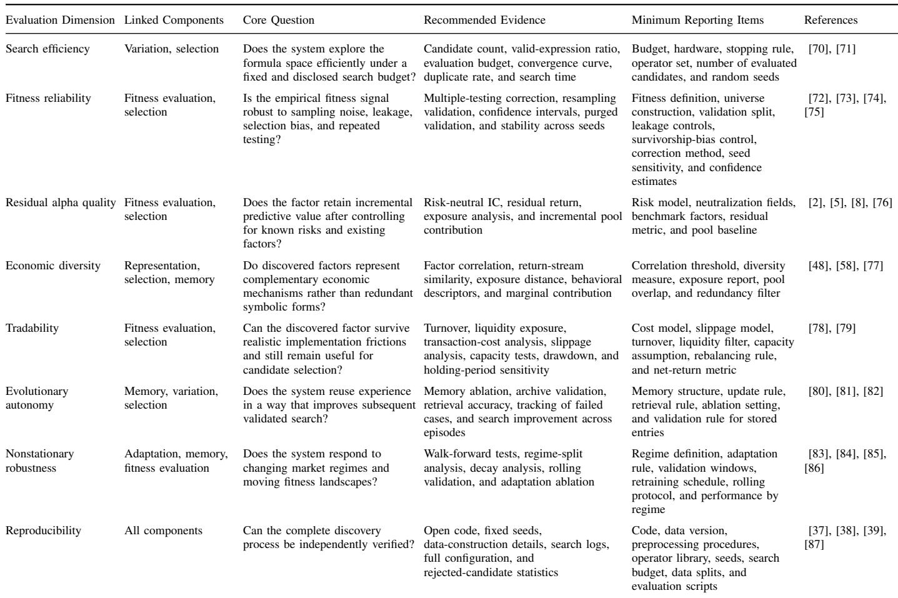

## A. An Autonomy-Oriented Evaluation Protocol

A candidate alpha is usually evaluated by applying its symbolic expression across instruments and time periods and then measuring whether the resulting scores are associated with future returns. Common metrics include predictive association, temporal stability, risk-adjusted signal quality, implementation feasibility, and generalization beyond the original backtesting setting [2]. These metrics are necessary, but they are not sufficient for autonomous discovery systems. An autonomous system is not only a predictor; it is also a search process that repeatedly generates, evaluates, selects, stores, and adapts candidate formulas. Therefore, evaluation should assess both the quality of the discovered factors and the reliability of the discovery process that produced them.

The difficulty is that financial fitness is not a fixed objective. It is an empirical estimate of future predictive utility. It is affected by sampling noise, cross-sectional dependence, market regimes, repeated testing, transaction costs, and implementation assumptions. Two formulas with similar latent value can receive different observed information coefficient (IC) or rank information coefficient (RankIC) values. A formula selected in one market regime may also decay in another. As a result, evaluating only the best reported IC or long–short return is insufficient for comparing automated formulaic alpha

discovery systems.

Current benchmarks only partially address this issue. Common Qlib-style settings improve accessibility and reproducibility, but repeated optimization against the same market, frequency, split, operator library, and cost assumptions can create collective overfitting [88]. Statistical significance testing, seed sensitivity, search-budget disclosure, transaction costs, neutralization protocols, and regime robustness are still reported inconsistently [37], [89], [90]. This is especially problematic for LLM-guided and agentic systems, because their larger search scope and richer memory can amplify false discoveries when evaluation is weak.

Building on the six-component framework, this article proposes an autonomy-oriented evaluation protocol with eight dimensions.

1) Search efficiency. This dimension evaluates whether the system explores the symbolic search space efficiently under a disclosed budget [91], [92].

2) Fitness reliability. This dimension evaluates whether the fitness signal is statistically reliable under noise, leakage, repeated testing, and validation uncertainty.

3) Residual alpha quality. This dimension evaluates whether a factor provides incremental predictive power beyond known risk exposures, style factors, and existing alpha libraries.

4) Economic diversity. This dimension evaluates whether discovered factors capture genuinely complementary return sources rather than redundant symbolic variants.

5) Tradability. This dimension evaluates whether turnover, capacity, liquidity, and transaction-cost constraints are incorporated into the assessment.

6) Evolutionary autonomy. This dimension evaluates whether memory and experience reuse improve subsequent validated search rather than reinforcing spurious discoveries.

7) Nonstationary robustness. This dimension evaluates whether the discovery system remains effective under regime shifts and changing fitness landscapes.

8) Reproducibility. This dimension evaluates whether the discovery process can be independently verified through disclosed data, code, seeds, configurations, splits, and search logs.

Table V summarizes the proposed evaluation matrix. The table links each dimension to the six-component framework, states the core evaluation question, and lists the minimum reporting items needed for reproducible comparison. The matrix is not intended to replace domain-specific metrics. Instead, it defines the minimum evidence needed to judge whether an autonomous discovery system is reliable.

Table V also suggests several broader implications. Fitness reliability is the most immediate bottleneck because every other component follows the fitness signal it receives. A stronger generator, a larger memory, or a more complex agent workflow cannot compensate for an unreliable empirical objective. Residual alpha quality and economic diversity are also necessary for practical deployment. A factor with high raw IC but strong overlap with known exposures or existing factors may provide little incremental value. Third, evolutionary autonomy and reproducibility should be evaluated as system properties, not as informal descriptions. A memory module is useful only if it improves future validated discovery, and an autonomous workflow is scientific only if its search process can be independently reconstructed.

## B. Reliable Fitness under Noisy and Nonstationary Markets

The first research priority is reliable fitness under noisy and changing market conditions. Most reviewed methods still optimize raw IC, RankIC, or closely related backtesting statistics, although candidate scores are estimated from finite samples, correlated instruments, changing regimes, and large implicit hypothesis searches. When the noise-to-signal ratio is high, stronger variation operators may discover spurious patterns more quickly rather than uncover more reliable alphas [84], [93].

A more reliable fitness protocol should address three issues within the search loop. First, repeated testing should be reflected in selection thresholds as the number of evaluated candidates grows. The deflated Sharpe ratio, superior predictive ability tests, and the probability of backtest overfitting provide relevant statistical tools [73], [74], [75], [94]. Second, resampling should respect temporal dependence through purged validation, walk-forward testing, and crossmarket validation [72]. Third, fitness should be conditioned on regime information when market states differ structurally. Factor decay and macroeconomic shifts make the optimum time-dependent rather than fixed [86]. Averaging performance across incompatible regimes may hide precisely the failures that autonomous systems need to detect.

The practical target is a fitness signal that combines control of repeated testing, resampling-based validation, and regimeconditioned performance. Without such a signal, increasing autonomy mainly increases the speed at which systems fit historical noise.

## C. From Syntactic Diversity to Economic Diversity

Diversity has become an important objective in recent alpha discovery systems, but many implementations still measure it through formula structure or historical correlation. This is insufficient. Two formulas may have different syntax, different expression trees, or even low average correlation while exploiting the same economic return source.

Useful diversity has three levels. Syntactic diversity measures differences in tokens, trees, or grammar derivations. Semantic diversity requires behavioral differences in factor outputs, exposure profiles, or response surfaces. Economic diversity asks whether factors earn returns from different mechanisms, such as information diffusion, liquidity provision, behavioral biases, institutional frictions, or risk transfer. The last level is the most relevant to portfolio construction, but it is also the hardest to validate.

Low historical correlation is particularly unreliable during periods of market stress [77]. The correlation red-sea problem described by FactorMiner captures this issue: large factor pools may appear diverse under structural measures but become highly redundant when used in portfolios [17]. A more reliable diversity objective should combine behavioral descriptors, risk exposures, turnover profiles, capacity constraints, and regimeconditioned comovement, rather than relying only on formula distance or token novelty.

## D. Market-Logic Grounding and Interpretability

LLM-guided methods make it easier to attach naturallanguage rationales to generated formulas, but a coherent rationale is not evidence that a factor is economically valid. Market logic is useful only when it acts as a testable constraint on generation and evaluation.

Market-logic libraries provide one possible mechanism. They can store reusable patterns grounded in market microstructure, investor behavior, and institutional frictions, al lowing factor generation to begin from an explicit hypothesis rather than a purely correlational search [95]. LLM-based agent systems can then translate these hypotheses into candidate formulas and expose the rationales for expert review [16]. The risk is narrative overfitting. An LLM can generate a plausible explanation for a spurious correlation, and narrative plausibility may make the factor appear more credible than the supporting evidence warrants.

Future systems should therefore separate hypothesis generation from hypothesis testing. Agents may propose marketlogic-grounded candidates, but fitness evaluation should remain independent, statistically rigorous, and insensitive to narrative appeal.

## E. Multiobjective Evolutionary Alpha Discovery

Raw IC alone is an insufficient objective for autonomous discovery because the desirable properties of a factor are not aligned along a single axis. Predictive power, stability, turnover, capacity, complexity, novelty, and residual value can conflict with one another. A factor with slightly lower IC may be preferable if it is more stable, cheaper to trade, or less redundant.

Alpha discovery is therefore better formulated through the multiobjective fitness vector defined in Eq. (14). In evaluation, this vector can be operationalized by IC or RankIC for predictive quality, ICIR and regime-wise validation for stability, factor correlation or residual contribution for diversity and novelty, turnover and transaction-cost-adjusted return for tradability, expression complexity for simplicity and interpretability, and code, data, seed, and reporting completeness for reproducibility [85], [96], [97].

This formulation connects alpha discovery to established EC tools. Pareto optimization can represent trade-offs between predictive power and tradability [98], [99]. Quality-diversity methods can maintain archives across behavioral niches [100]. Constrained evolutionary optimization can enforce turnover, capacity, leverage, or risk-exposure constraints during search rather than after selection. These tools are not optional refinements. They are closer to the actual decision problem faced by deployable alpha systems.

## F. Surrogate-Assisted and Costly Fitness Evaluation

Fitness evaluation is sufficiently costly to constrain search, but inexpensive proxy evaluation can introduce its own failure modes. Comprehensive backtesting across many instruments and time periods constrains population size, resampling depth, and search budget. Surrogate-assisted EC addresses this constraint through learned evaluators, proxy fitness functions, Bayesian optimization, and multifidelity scheduling [84], [101], [102], [103].

The main risk is surrogate bias. A proxy model that systematically misestimates novel expression structures may steer search toward a proxy optimum rather than true economic utility. It may also prune useful candidates too early or allocate costly backtests to false positives. The issue is not only whether a surrogate is fast, but also whether it can quantify its own uncertainty.

Future systems should use uncertainty-aware surrogates to decide which candidates deserve full evaluation. Candidates with promising, out-of-distribution, or high-uncertainty proxy estimates should receive more costly validation. Graph memory and factor retrieval may also reduce cost by reusing information from structurally related formulas. The key requirement is disciplined allocation of backtests, not merely a faster approximation of raw IC.

## G. Validated Memory, Reflection, and Self-Evolution

Memory is the component that most clearly separates a one-shot generator from a self-improving discovery system. It also creates a direct path for error accumulation. A memory archive that stores overfitted factors, misleading rationales, or lucky trajectories will guide subsequent search toward the same failures.

Current agentic systems have begun to introduce structured memory. FactorMiner stores reusable skills and factor experience, while RD-Agent records research and development feedback across iterations [17], [52]. Such memory can include successful factors, failed trials, tool-use traces, search trajectories, and market-logic patterns. Its value, however, depends on validation.

A reliable memory system should periodically reevaluate archived factors on new data, purge entries that fail statistical tests, and weight retrieval according to the reliability of the original evaluation. The same principle applies to reflection. Prompt-level self-critique is not equivalent to policylevel self-evolution. QuantEvolver-style repositories represent early steps toward longitudinal policy updates [53], but metaoverfitting remains unresolved. A useful memory system should be judged by whether it improves future validated discovery, not by how many trajectories or rationales it stores.

## H. Human-in-the-Loop Autonomous Quantitative Research

As autonomous systems generate and test more candidates, the role of human researchers shifts from writing individual formulas to governing the search process. This shift is necessary because fully automated systems can scale false discoveries as easily as useful exploration.

Human oversight should define the scientific and riskmanagement boundaries within which the search is conducted. Researchers can specify which market mechanisms are plausible, which exposures are unacceptable, how statistical significance is assessed, and what level of evidence is required before a factor enters production. Agents can then search, evaluate, and refine candidates within these boundaries.

Such oversight does not weaken autonomy. It makes autonomy auditable. Agents are well-suited to combinatorial search and systematic evaluation, while human experts remain essential for causal judgment, regime interpretation, and risk governance. Future systems need interfaces that translate natural-language risk constraints into evolutionary penalties, expose uncertainty and failure modes, and support human review before deployment.

## I. Reproducible Benchmarks and Reporting Standards

Without shared reporting standards, performance differences across alpha discovery systems remain difficult to interpret. Datasets, operators, search budgets, seeds, evaluation windows, and cost assumptions vary widely across studies, making cross-method comparison unreliable.

Autonomous systems make this problem more severe because they test more hypotheses and introduce additional stochasticity through search policies, LLM decoding, agent coordination, and memory updates [38], [39], [87]. Future benchmarks should disclose dataset construction, preprocessing rules, operator libraries, search budgets, random seeds, fitness definitions, selection rules, memory configurations, adaptation rules, transaction costs, neutralization protocols, out-of-sample splits, out-of-distribution tests, and code availability. These requirements are summarized in Table V.

For autonomous systems, reproducibility must include the search process itself. Reports should include candidate counts, LLM calls, stopping rules, agent coordination mechanisms, rejected candidates, and all evaluation filters. Without such information, it is difficult to distinguish genuine algorithmic progress from undisclosed search budgets, lucky random seeds, or uncorrected repeated testing.

## J. Toward Scientific Automated Formulaic Alpha Discovery

The roadmap developed above points to a clear conclusion: automated formulaic alpha discovery cannot advance through search sophistication alone. The field needs systems that search efficiently, evaluate reliably, adapt to changing regimes, and support reproducible discovery.

These priorities are interconnected. Reliable fitness determines whether search is guided by signal rather than noise. Diversity and tradability determine whether discovered factors add portfolio value. Market logic constrains generation by requiring testable hypotheses. Memory and adaptation determine whether the system improves over time or simply accumulates noise. Human oversight and reporting standards determine whether reported progress can be independently assessed.

Realizing this agenda will require collaboration among EC researchers, financial econometricians, and quantitative practitioners. The relevant benchmark is therefore not the complexity of the search architecture, but the scientific validity of the discoveries it produces.

## VI. CONCLUSION

This article has examined automated formulaic alpha discovery from an evolutionary computation perspective. Instead of viewing existing studies as separate algorithmic families, it frames the field as a form of noisy and dynamic symbolic evolutionary optimization. Under this formulation, candidate formulaic alphas are symbolic genotypes, empirical backtesting metrics are noisy fitness signals, and discovery proceeds through a closed loop of representation, variation, fitness evaluation, selection, memory, and adaptation.

The six-component framework shows a structural imbalance in the literature. Representation and variation have become increasingly sophisticated through symbolic encodings, learned policies, distributional sampling, tree search, language priors, and agentic workflows. By contrast, fitness reliability, validated memory, and regime-aware adaptation remain comparatively underdeveloped. This imbalance is critical because greater autonomy does not automatically imply more reliable alpha discovery; without robust validation, autonomous systems may amplify historical artifacts at greater scale.

Future work should therefore shift from formula proliferation to validated discovery systems that can withstand statistical testing, risk control, transaction-cost adjustment, regime change, and independent verification. The central measure of progress is not the complexity of the search machinery, but the validity and practical value of the alpha factors it discovers.

## REFERENCES

[1] Z. Kakushadze, “101 formulaic alphas,” Wilmott, vol. 2016, no. 84, pp. 72–81, 2016, doi: 10.1002/wilm.10525.

[2] R. C. Grinold and R. N. Kahn, Active Portfolio Management: A Quantitative Approach for Producing Superior Returns and Controlling Risk, 2nd ed. New York, NY, USA: McGraw-Hill, 2000.

[3] W. Brock, J. Lakonishok, and B. LeBaron, “Simple technical trading rules and the stochastic properties of stock returns,” J. Finance, vol. 47, no. 5, pp. 1731–1764, 1992.

[4] A. W. Lo, H. Mamaysky, and J. Wang, “Foundations of technical analysis: Computational algorithms, statistical inference, and empirical implementation,” J. Finance, vol. 55, no. 4, pp. 1705–1765, 2000.

[5] E. F. Fama and K. R. French, “Common risk factors in the returns on stocks and bonds,” J. Financ. Econ., vol. 33, no. 1, pp. 3–56, 1993.

[6] S. Gu, B. Kelly, and D. Xiu, “Empirical asset pricing via machine learning,” Rev. Financ. Stud., vol. 33, no. 5, pp. 2223–2273, 2020, doi: 10.1093/rfs/hhaa009.

[7] N. Jegadeesh and S. Titman, “Returns to buying winners and selling losers: Implications for stock market efficiency,” J. Finance, vol. 48, no. 1, pp. 65–91, 1993.

[8] M. M. Carhart, “On persistence in mutual fund performance,” J. Finance, vol. 52, no. 1, pp. 57–82, 1997.

[9] C. S. Asness, T. J. Moskowitz, and L. H. Pedersen, “Value and momentum everywhere,” J. Finance, vol. 68, no. 3, pp. 929–985, 2013.

[10] T. Zhang, Y. Li, Y. Jin, and J. Li, “AutoAlpha: An efficient hierarchical evolutionary algorithm for mining alpha factors in quantitative investment,” arXiv preprint arXiv:2002.08245, 2020.

[11] C. Cui, W. Wang, M. Zhang, G. Chen, Z. Luo, and B. C. Ooi, “AlphaEvolve: A learning framework to discover novel alphas in quantitative investment,” in Proc. 2021 Int. Conf. Management of Data (SIGMOD), 2021, pp. 2208–2216, doi: 10.1145/3448016.3457324.

[12] S. Yu, H. Xue, X. Ao, F. Pan, J. He, D. Tu, and Q. He, “Generating synergistic formulaic alpha collections via reinforcement learning,” in Proc. 29th ACM SIGKDD Conf. Knowledge Discovery and Data Mining (KDD), 2023, pp. 5476–5486, doi: 10.1145/3580305.3599831.

[13] T. Ren, R. Zhou, J. Jiang, J. Liang, Q. Wang, and Y. Peng, “RiskMiner: Discovering formulaic alphas via risk seeking Monte Carlo tree search,” in Proc. 5th ACM Int. Conf. AI in Finance (ICAIF), 2024, pp. 752–760, doi: 10.1145/3677052.3698613.

[14] B. Chen, H. Ding, N. Shen, J. Huang, T. Guo, L. Liu, and M. Zhang, “AlphaSAGE: Structure-aware alpha mining via GFlowNets for robust exploration,” arXiv preprint arXiv:2509.25055, 2025.

[15] Y. Shi, Y. Duan, and J. Li, “Navigating the Alpha Jungle: An LLMpowered MCTS framework for formulaic alpha factor mining,” Proc. AAAI Conf. Artif. Intell., vol. 40, no. 2, pp. 997–1005, 2026, doi: 10.1609/aaai.v40i2.37069.

[16] Z. Tang, Z. Chen, J. Yang, J. Mai, Y. Zheng, K. Wang, J. Chen, and L. Lin, “AlphaAgent: LLM-driven alpha mining with regularized exploration to counteract alpha decay,” in Proc. 31st ACM SIGKDD Conf. Knowledge Discovery and Data Mining (KDD), 2025, pp. 2813– 2822, doi: 10.1145/3711896.3736838.

[17] Y. Wang, J. Xu, H. Zhang, S.-L. Huang, D. D. Sun, and X.-P. Zhang, “FactorMiner: A self-evolving agent with skills and experience memory for financial alpha discovery,” arXiv preprint arXiv:2602.14670, 2026.

[18] M. Schmidt and H. Lipson, “Distilling free-form natural laws from experimental data,” Science, vol. 324, no. 5923, pp. 81–85, 2009.

[19] E. J. Vladislavleva, G. F. Smits, and D. den Hertog, “Order of nonlinearity as a complexity measure for models generated by symbolic regression via Pareto genetic programming,” IEEE Trans. Evol. Comput., vol. 13, no. 2, pp. 333–349, 2009, doi: 10.1109/TEVC.2008.926486.

[20] S.-M. Udrescu and M. Tegmark, “AI Feynman: A physics-inspired method for symbolic regression,” Sci. Adv., vol. 6, no. 16, Art. no. eaay2631, 2020, doi: 10.1126/sciadv.aay2631.

[21] W. La Cava et al., “Contemporary symbolic regression methods and their relative performance,” in NeurIPS Datasets and Benchmarks, 2021.

[22] J. H. Holland, Adaptation in Natural and Artificial Systems. Ann Arbor, MI: University of Michigan Press, 1975.

[23] D. E. Goldberg, Genetic Algorithms in Search, Optimization and Machine Learning. Reading, MA: Addison-Wesley, 1989.

[24] J. Y. Campbell and S. B. Thompson, “Predicting excess stock returns out of sample: Can anything beat the historical average?” Rev. Financ. Stud., vol. 21, no. 4, pp. 1509–1531, 2008.

[25] A. Goyal and I. Welch, “A comprehensive look at the empirical performance of equity premium prediction,” Rev. Financ. Stud., vol. 21, no. 4, pp. 1455–1508, 2008.

[26] P. J. Angeline, “Tracking extrema in dynamic environments,” in Evolutionary Programming VI, ser. Lecture Notes in Computer Science, vol. 1213. Berlin, Germany: Springer, 1997, pp. 335–345, doi: 10.1007/BFb0014823.

[27] R. W. Morrison, Designing Evolutionary Algorithms for Dynamic Environments. Berlin: Springer, 2004.

[28] R. D. McLean and J. Pontiff, “Does academic research destroy stock return predictability?” J. Finance, vol. 71, no. 1, pp. 5–32, 2016.

[29] C. A. Coello Coello, G. B. Lamont, and D. A. Van Veldhuizen, Evolutionary Algorithms for Solving Multi-Objective Problems, 2nd ed. New York, NY, USA: Springer, 2007.

[30] E. Zitzler and L. Thiele, “Multiobjective evolutionary algorithms: A comparative case study and the strength Pareto approach,” IEEE Trans Evol. Comput., vol. 3, no. 4, pp. 257–271, 1999.

[31] J. D. Knowles and D. W. Corne, “Approximating the nondominated front using the Pareto archived evolution strategy,” Evol. Comput., vol. 8, no. 2, pp. 149–172, 2000.

[32] Y. Jin, “Surrogate-assisted evolutionary computation: Recent advances and future challenges,” Swarm Evol. Comput., vol. 1, no. 2, pp. 61–70, 2011.

[33] D. E. Goldberg and K. Deb, “A comparative analysis of selection schemes used in genetic algorithms,” in Foundations of Genetic Algorithms, G. J. E. Rawlins, Ed. San Mateo, CA, USA: Morgan Kaufmann, 1991, pp. 69–93.

[34] J. Maturana, Á. Fialho, F. Saubion, M. Schoenauer, F. Lardeux, and M. Sebag, “Adaptive operator selection and management in evolutionary algorithms,” in Autonomous Search, New York: Springer, 2012, pp. 161–189.

[35] M. J. Page et al., “The PRISMA 2020 statement: An updated guideline for reporting systematic reviews,” BMJ, vol. 372, p. n71, 2021.

[36] B. Kitchenham and S. Charters, Guidelines for Performing Systematic Literature Reviews in Software Engineering, EBSE Technical Report EBSE-2007-01, 2007.

[37] J. Pineau et al., “Improving reproducibility in machine learning research: A report from the NeurIPS 2019 reproducibility program,” J. Mach. Learn. Res., vol. 22, no. 164, pp. 1–20, 2021.

[38] G. Wilson et al., “Best practices for scientific computing,” PLoS Biol., vol. 12, no. 1, p. e1001745, 2014.

[39] R. D. Peng, “Reproducible research in computational science,” Science, vol. 334, no. 6060, pp. 1226–1227, 2011.

[40] X. Yang, W. Liu, D. Zhou, J. Bian, and T.-Y. Liu, “Qlib: An AI-oriented quantitative investment platform,” arXiv preprint arXiv:2009.11189, 2020.

[41] C. Li and F. Liu, “A multi-factor stock selection system based on short-term price-volume characteristics” (in Chinese), Guotai Junan Securities, Quantitative Special Report No. 93, Jun. 2017.

[42] J. R. Koza, Genetic Programming: On the Programming of Computers by Means of Natural Selection. Cambridge, MA: MIT Press, 1992.

[43] A. E. Eiben and J. E. Smith, Introduction to Evolutionary Computing, 2nd ed. Berlin: Springer, 2015.

[44] F. Xu, Y. Yin, X. Zhang, T. Liu, S. Jiang, and Z. Zhang, “Alpha2: Discovering logical formulaic alphas using deep reinforcement learning,” arXiv preprint arXiv:2406.16505, 2024.

[45] Z. Zhu and K. Zhu, “AlphaQCM: Alpha discovery in finance with distributional reinforcement learning,” in Proc. 42nd Int. Conf. Machine Learning (ICML), ser. Proceedings of Machine Learning Research, vol. 267, 2025, pp. 80463–80479.

[46] H. Shi, W. Song, X. Zhang, J. Shi, C. Luo, X. Ao, H. Arian, and L. A. Seco, “AlphaForge: A framework to mine and dynamically combine formulaic alpha factors,” Proc. AAAI Conf. Artif. Intell., vol. 39, no. 12, pp. 12524–12532, 2025, doi: 10.1609/aaai.v39i12.33365.

[47] T. Guo, H. Shen, J. Luo, B. Chen, H. Ding, J. Huang, L. Liu, Y. Ma, and M. Zhang, “AlphaPROBE: Alpha mining via principled retrieval and on-graph biased evolution,” arXiv preprint arXiv:2602.11917, 2026.

[48] J. K. Pugh, L. B. Soros, and K. O. Stanley, “Quality diversity: A new frontier for evolutionary computation,” Front. Robot. AI, vol. 3, p. 40, 2016.

[49] H. Yang, D. Hao, Z. Wang, Q. Shi, and X. Li, “Alpha discovery via grammar-guided learning and search,” arXiv preprint arXiv:2601.22119, 2026.

[50] S. Wang, H. Yuan, L. Zhou, L. Ni, H.-Y. Shum, and J. Guo, “Alpha-GPT: Human-AI interactive alpha mining for quantitative investment,” in Proc. 2025 Conf. Empirical Methods in Natural Language Processing: System Demonstrations (EMNLP Demo), 2025, pp. 196–206, doi: 10.18653/v1/2025.emnlp-demos.14.

[51] Z. Li, R. Song, C. Sun, W. Xu, Z. Yu, and J.-R. Wen, “Can large language models mine interpretable financial factors more effectively? A neural-symbolic factor mining agent model,” in Findings of the Association for Computational Linguistics: ACL 2024, 2024, pp. 3891– 3902, doi: 10.18653/v1/2024.findings-acl.233.

[52] Y. Li, X. Yang, X. Yang, M. Xu, X. Wang, W. Liu, and J. Bian, “R&D-Agent-Quant: A multi-agent framework for data-centric factors and model joint optimization,” arXiv preprint arXiv:2505.15155, 2025.

[53] L. Zhang, T. Jia, Y. Zhai, Z. Xie, C. Duan, M. He, P. S. Yu, and Y. Li, “From feedback loops to policy updates: Reinforcement fine-tuning for LLM-based alpha factor discovery,” arXiv preprint arXiv:2605.15412, 2026.

[54] C. R. Harvey, Y. Liu, and H. Zhu, “. . . and the cross-section of expected returns,” Rev. Financ. Stud., vol. 29, no. 1, pp. 5–68, 2016.

[55] V. Mnih et al., “Human-level control through deep reinforcement learning,” Nature, vol. 518, pp. 529–533, 2015.

[56] M. G. Bellemare, W. Dabney, and R. Munos, “A distributional perspective on reinforcement learning,” in Proc. 34th Int. Conf. Machine Learning (ICML), ser. Proceedings of Machine Learning Research, vol. 70, 2017, pp. 449–458.

[57] W. Dabney, G. Ostrovski, D. Silver, and R. Munos, “Implicit quantile networks for distributional reinforcement learning,” in Proc. ICML, pp. 1096–1105, 2018.

[58] J. Lehman and K. O. Stanley, “Abandoning objectives: Evolution through the search for novelty alone,” Evol. Comput., vol. 19, no. 2, pp. 189–223, 2011.

[59] M. Flageat and A. Cully, “Uncertain quality-diversity: Evaluation methodology and new methods for quality-diversity in uncertain domains,” IEEE Trans. Evol. Comput., vol. 28, no. 4, pp. 891–902, 2024, doi: 10.1109/TEVC.2023.3273560.

[60] D. Silver et al., “Mastering the game of Go with deep neural networks and tree search,” Nature, vol. 529, pp. 484–489, 2016.

[61] R. Coulom, “Efficient selectivity and backup operators in Monte-Carlo tree search,” in Computers and Games, ser. Lecture Notes in Computer Science, vol. 4630. Berlin, Germany: Springer, 2007, pp. 72–83, doi: 10.1007/978-3-540-75538-8\_7.

[62] T. B. Brown et al., “Language models are few-shot learners,” in Adv. Neural Inf. Process. Syst. (NeurIPS), 2020.

[63] J. Wei et al., “Chain-of-thought prompting elicits reasoning in large language models,” in Adv. Neural Inf. Process. Syst. (NeurIPS), 2022.

[64] S. Yao et al., “ReAct: Synergizing reasoning and acting in language models,” in ICLR, 2023.

[65] T. Schick et al., “Toolformer: Language models can teach themselves to use tools,” in Adv. Neural Inf. Process. Syst. (NeurIPS), 2023.

[66] S. Yao et al., “Tree of thoughts: Deliberate problem solving with large language models,” in Adv. Neural Inf. Process. Syst. (NeurIPS), 2023.

[67] Q. Wu et al., “AutoGen: Enabling next-gen LLM applications via multiagent conversation,” arXiv preprint arXiv:2308.08155, 2023.

[68] D. A. Boiko, R. MacKnight, and G. Gomes, “Emergent autonomous scientific research capabilities of large language models,” arXiv preprint arXiv:2304.05332, 2023.

[69] Y. Zheng et al., “Large language models for scientific discovery in molecular property prediction,” Nat. Mach. Intell., vol. 7, no. 3, pp. 437–447, 2025, doi: 10.1038/s42256-025-00994-z.

[70] D. R. Jones, M. Schonlau, and W. J. Welch, “Efficient global optimization of expensive black-box functions,” J. Global Optim., vol. 13, no. 4, pp. 455–492, 1998.

[71] A. Forrester, A. Sóbester, and A. Keane, Engineering Design via Surrogate Modelling. Chichester: Wiley, 2008.

[72] M. Lopez de Prado, Advances in Financial Machine Learning. Hoboken, NJ: Wiley, 2018.

[73] H. White, “A reality check for data snooping,” Econometrica, vol. 68, no. 5, pp. 1097–1126, 2000.

[74] D. H. Bailey and M. Lopez de Prado, “The deflated Sharpe ratio: Correcting for selection bias, backtest overfitting and non-normality,” J. Portfolio Management, vol. 40, no. 5, pp. 94–107, 2014.

[75] D. H. Bailey et al., “The probability of backtest overfitting,” J. Computational Finance, vol. 20, no. 4, pp. 39–69, 2017.

[76] E. F. Fama and K. R. French, “A five-factor asset pricing model,” J. Financ. Econ., vol. 116, no. 1, pp. 1–22, 2015.

[77] R. S. Tsay, Analysis of Financial Time Series, 3rd ed. Hoboken, NJ: Wiley, 2010.

[78] R. Almgren and N. Chriss, “Optimal execution of portfolio transactions,” J. Risk, vol. 3, no. 2, pp. 5–39, 2001.

[79] A. Frazzini, R. Israel, and T. J. Moskowitz, “Trading costs of asset pricing anomalies,” J. Financ. Econ., vol. 132, no. 2, pp. 365–382, 2019.

[80] J. Schmidhuber, “Evolutionary principles in self-referential learning,” Diploma thesis, TU Munich, 1987.

[81] N. Shinn et al., “Reflexion: Language agents with verbal reinforcement learning,” in Adv. Neural Inf. Process. Syst. (NeurIPS), 2023.

[82] A. Madaan et al., “Self-Refine: Iterative refinement with self-feedback,” in Adv. Neural Inf. Process. Syst. (NeurIPS), 2023.

[83] J. Branke, Evolutionary Optimization in Dynamic Environments. Boston, MA: Kluwer Academic, 2001.

[84] Y. Jin and J. Branke, “Evolutionary optimization in uncertain environments—a survey,” IEEE Trans. Evol. Comput., vol. 9, no. 3, pp. 303–317, 2005.

[85] M. Farina, K. Deb, and P. Amato, “Dynamic multiobjective optimization problems: Test cases, approximations, and applications,” IEEE Trans. Evol. Comput., vol. 8, no. 5, pp. 425–442, 2004.

[86] M. Avellaneda and J.-H. Lee, “Statistical arbitrage in the U.S. equities market,” Quantitative Finance, vol. 10, no. 7, pp. 761–782, 2010.

[87] V. Stodden et al., “Enhancing reproducibility for computational methods,” Science, vol. 354, no. 6317, pp. 1240–1241, 2016.

[88] B. Recht, R. Roelofs, L. Schmidt, and V. Shankar, “Do ImageNet classifiers generalize to ImageNet?” in Proc. 36th Int. Conf. Machine Learning (ICML), ser. Proceedings of Machine Learning Research, vol. 97, 2019, pp. 5389–5400.

[89] S. C. Y. Chan, S. Fishman, A. Korattikara, J. Canny, and S. Guadarrama, “Measuring the reliability of reinforcement learning algorithms,” in ICLR, 2020.

[90] R. Agarwal, M. Schwarzer, P. S. Castro, A. Courville, and M. G. Bellemare, “Deep reinforcement learning at the edge of the statistical precipice,” in Adv. Neural Inf. Process. Syst. (NeurIPS), 2021.

[91] A. I. J. Forrester and A. J. Keane, “Recent advances in surrogate-based optimization,” Prog. Aerosp. Sci., vol. 45, no. 1–3, pp. 50–79, 2009.

[92] F. Hutter, H. H. Hoos, and K. Leyton-Brown, “Sequential model-based optimization for general algorithm configuration,” in Proc. 5th Int. Conf. Learning and Intelligent Optimization (LION), ser. Lecture Notes in Computer Science, vol. 6683. Berlin, Germany: Springer, 2011, pp. 507–523.

[93] H.-G. Beyer and H.-P. Schwefel, “Evolution strategies—a comprehensive introduction,” Natural Computing, vol. 1, no. 1, pp. 3–52, 2002.

[94] O. Ledoit and M. Wolf, “Robust performance hypothesis testing with the Sharpe ratio,” J. Empir. Finance, vol. 15, no. 5, pp. 850–859, 2008.

[95] Z. Weng, S. Zhang, T. Wang, and Y. Xia, “AlphaLogics: A market logic-driven multi-agent system for scalable and interpretable alpha factor generation,” arXiv preprint arXiv:2603.20247, 2026.

[96] K. Deb and H. Jain, “An evolutionary many-objective optimization algorithm using reference-point-based nondominated sorting approach, Part I: Solving problems with box constraints,” IEEE Trans. Evol. Comput., vol. 18, no. 4, pp. 577–601, 2014.

[97] M. Emmerich and A. Deutz, “A tutorial on multiobjective optimization: Fundamentals and evolutionary methods,” Nat. Comput., vol. 17, pp. 585–609, 2018.

[98] K. Deb et al., “A fast and elitist multiobjective genetic algorithm: NSGA-II,” IEEE Trans. Evol. Comput., vol. 6, no. 2, pp. 182–197, 2002.

[99] Q. Zhang and H. Li, “MOEA/D: A multiobjective evolutionary algorithm based on decomposition,” IEEE Trans. Evol. Comput., vol. 11, no. 6, pp. 712–731, 2007.

[100] J.-B. Mouret and J. Clune, “Illuminating search spaces by mapping elites,” arXiv preprint arXiv:1504.04909, 2015.

[101] B. Shahriari, K. Swersky, Z. Wang, R. P. Adams, and N. de Freitas, “Taking the human out of the loop: A review of Bayesian optimization,” Proc. IEEE, vol. 104, no. 1, pp. 148–175, 2016.

[102] E. Brochu, V. M. Cora, and N. de Freitas, “A tutorial on Bayesian optimization of expensive cost functions, with application to active user modeling and hierarchical reinforcement learning,” Univ. of British Columbia Technical Report TR-2009-23, 2010.

[103] J. Knowles, “ParEGO: A hybrid algorithm with on-line landscape approximation for expensive multiobjective optimization problems,” IEEE Trans. Evol. Comput., vol. 10, no. 1, pp. 50–66, 2006.