# AlphaForgeBench: Benchmarking End-to-End Trading Strategy Design with Large Language Models

Wentao Zhang<sup>∗</sup> Nanyang Technological University Singapore zhangwent963@gmail.com

Jieshun You Hong Kong Polytechnic University Hong Kong 24041917g@connect.polyu.hk

Mingxuan Zhao   
The Hong Kong University of Science and Technology (Guangzhou) China   
mzhao085@connect.hkust-gz.edu.cn

Huaiyu Jia The Hong Kong University of Science and Technology (Guangzhou) China hjia351@connect.hkust-gz.edu.cn

Bo An Nanyang Technological University Singapore boan@ntu.edu.sg

Jincheng Gao<sup>∗</sup> The Hong Kong University of Science and Technology (Guangzhou) China jinchenggao@hkust-gz.edu.cn

Yilei Zhao Nanyang Technological University Singapore YILEI002@e.ntu.edu.sg

Shuo Sun<sup>†</sup> The Hong Kong University of Science and Technology (Guangzhou) China shuosun@hkust-gz.edu.cn

## Abstract

The rapid advancement of Large Language Models (LLMs) has cat alyzed the proliferation of diverse financial benchmarks, progressively evolving from static knowledge evaluation to increasingly sophisticated interactive trading simulations. Nevertheless, existing frameworks that assess real-time trading performance largely overlook a fundamental failure mode: the severe behavioral in stability exhibited by LLMs in sequential decision-making under financial uncertainty. Through extensive empirical investigation, we demonstrate that when deployed as direct trading agents, LLMs manifest extreme run-to-run variance, produce inconsistent action sequences even under strictly deterministic decoding configurations, and exhibit irrational action flipping across temporally adjacent decision steps. We systematically attribute these pathological behaviors to the models’ fundamentally stateless autoregressive architectures, which lack persistent memory of prior actions, and their pronounced sensitivity to continuous-to-discrete action mappings inherent in portfolio allocation tasks. These deficiencies collectively undermine the validity and trustworthiness of numerous existing online and ofline financial trading benchmarks, rendering their evaluations unreliable, non-reproducible, and uninformative for meaningful model comparison. To address these limitations, we introduce <sup>AlphaForgeBench</sup>, a principled evaluation framework that reconceptualizes the role of LLMs from stochastic execution agents to quantitative researchers capable of systematic financial

reasoning. Rather than requiring models to emit discrete trading actions, <sup>AlphaForgeBench</sup> tasks LLMs with generating executable alpha factors and composing factor-based trading strategies grounded in financial domain knowledge. This paradigm shift decouples reasoning from execution mechanics, enabling fully deterministic and reproducible evaluation while maintaining close alignment with real-world quantitative research workflows. Extensive experiments across multiple state-of-the-art LLMs demonstrate that <sup>AlphaForgeBench</sup> efectively eliminates execution-induced instability, yields highly reproducible outcomes, and provides a rigorous and discriminative benchmark for assessing LLMs’ capacity for financial reasoning, strategy formulation, and alpha discovery. Webpage at https://finbrain-lab-hkustgz.github.io/AlphaForgeBench.

## CCS Concepts

<sub>•</sub> Computing methodologies <sub>→</sub> Artificial intelligence<sub>.</sub>

## Keywords

Large Language Models, Alpha Factor Discovery, Quantitative Finance, Factor-Based Trading Strategies, Benchmarking

## ACM Reference Format:

Wentao Zhang, Mingxuan Zhao, Jincheng Gao, Jieshun You, Huaiyu Jia, Yilei Zhao, Bo An, and Shuo Sun. 2026. AlphaForgeBench: Benchmarking End-to-End Trading Strategy Design with Large Language Models. In Proceedings of the 32nd ACM SIGKDD Conference on Knowledge Discovery and Data Mining V.2 (KDD ’26), August 09–13, 2026, Jeju Island, Republic of Korea. ACM, New York, NY, USA, 80 pages. https://doi.org/10.1145/3770855.3817500

question-answering (QA) tasks, including numerical reasoning over financial reports (e.g., FinQA [6], TAT-QA [28]), conversational finance QA (e.g., ConvFinQA [7]), and comprehensive multi-task evaluation frameworks (e.g., BloombergGPT [18], FinGPT [11], PIXIU [21], FinBen [19]). However, these benchmarks primarily measure encyclopedic knowledge and static reasoning over historical snapshots, which fail to capture an LLM’s ability to make sequential trading decisions under non-stationary market conditions. As the field evolved, researchers shifted toward evaluating LLMs’ real-time trading capabilities, with benchmarks such as Alpha Arena [2] establishing live trading evaluation paradigms that assess LLM agents’ adaptability and alpha-seeking capabilities directly within dynamic, executing financial markets. While these trading benchmarks have expanded the scope of financial LLMs evaluation, they have largely overlooked a critical issue: LLMs exhibit extreme instability in their performance on financial trading tasks.

Specifically, when LLMs or LLM-based agents directly emit trading decisions (e.g., buy/hold/sell signals), their outputs demonstrate severe instability across multiple dimensions. <sup>(1)</sup> <sup>Run-to-</sup> run variance in performance metrics. <sub>Under</sub> <sub>identical</sub> <sub>settings,</sub> the same LLM produces dramatically diferent trading trajectories across multiple runs on the same financial data (e.g., OHLCV time series with technical indicators), resulting in substantial variance in returns, drawdowns, and other performance metrics. <sup>(2)</sup> <sup>Incon-</sup> sistent action sequences even under deterministic decoding. Even with temperature=0 (deterministic decoding), LLMs generate completely diferent trading action sequences across runs on identical market data, exhibiting no consistency in decision-making <sub>patterns.</sub> (3) Rapid action flipping persists despite hard con-<sup>straints.</sup> LLMs exhibit a tendency to rapidly flip trading actions (e.g., buying immediately after selling, or selling immediately after buying) when performing trading tasks. Even when explicit behavioral guardrails are incorporated into prompts (e.g., minimum holding periods, cooldown windows, or historical action sequences), these prompt-based constraints cannot fully eliminate such rapid flipping behavior. Detailed analyses are provided in Appx. C.

Fundamentally, this phenomenon can be primarily attributed to the following three aspects. First, LLMs are inherently stateless, instantaneous decision-making models. In trading tasks, each action output is an independent re-evaluation based on a "current input snapshot." The model possesses no natural memory of its recent buy or sell executions, nor does it view position holding as a long-term state requiring consistency. Consequently, even slight variations in market features in the subsequent step can lead the model to generate divergent or even diametrically opposite actions. Second, LLMs are highly sensitive to the mapping of con tinuous market signals to discrete actions. While inputs such as prices and technical indicators vary continuously, the outputs are discrete actions. This continuous-to-discrete mapping amplifies the impact of minor fluctuations, causing the model to abruptly shift its stance upon slight indicator reversals or semantic shifts. Crucially, it lacks the mechanisms of inertia, tolerance intervals, and strategic waiting typically inherent in professional trading. Third, LLMs fundamentally perform classification rather than strategy optimization. Directly prompting an LLM to output an action essentially tasks it with assigning a "most reasonable action" label to the current market state, rather than maximizing long-term returns within a sequential decision-making framework subject to costs, positions, and time constraints. Because the model is agnostic to transaction fees, slippage, and penalties for excessive or insuficient trading, it is highly prone to collapsing into extreme patterns of either over-trading or complete inactivity.

To address these limitations, we propose a new evaluation paradigm that shifts from black-box trading to white-box logic generation. We introduce <sup>AlphaForgeBench</sup>, a comprehensive benchmark designed to assess LLMs on their ability to generate executable alpha factors and trading strategy code, efectively positioning the LLM as a quantitative researcher rather than a stochastic execution agent. This paradigm shift ofers three critical advantages that directly mitigate the aforementioned instability. First, it fundamentally solves the continuous-to-discrete sensitivity problem by decoupling reasoning from execution. By compelling the LLM to formalize its decision boundaries into explicit algorithmic rules, the stochastic nature of the model is confined to the generation phase, rendering the subsequent execution strictly deterministic and immune to the random action flipping observed in direct-trading tasks. Second, it resolves the state management issue. Unlike stateless models that struggle to maintain continuity, the generated code inherently preserves internal states and logic across the entire time series to ensure consistent decision-making. Third, this setup mirrors the real-world workflow of quantitative finance where researchers synthesize strategies and engines execute them. This alignment enables transparent logic verification and provides a rigorous metric to assess whether the model has truly learned financial reasoning or is merely overfitting to market noise. Our contributions are summarized as follows:

• We systematically analyze the critical flaws in existing financial trading benchmarks. We demonstrate that the inherent instability of LLMs in direct-trading tasks renders traditional performance metrics unreliable, preventing an accurate assessment of true financial reasoning capabilities.

• We introduce <sup>AlphaForgeBench</sup>, a novel benchmark that repositions LLMs from stochastic agents to quantitative researchers. By evaluating the generation of executable alpha factors and strategy code, our framework provides a deterministic and robust metric for measuring financial logic synthesis.

• We conduct extensive experiments across state-of-the-art LLMs to validate the efectiveness of our approach. The results confirm that <sup>AlphaForgeBench</sup> ofers a significantly more stable and discriminatory assessment of financial capabilities compared to direct-trading baselines.

## 2 Related Work

## 2.1 Financial Knowledge Benchmark

Recent advancements in financial question answering have driven the development of diverse benchmarks ranging from specific reasoning tasks to holistic system evaluations. Early eforts focused on numerical and hybrid reasoning, with TAT-QA [28] addressing multi-step reasoning over tabular-textual data, FinQA [6] targeting numerical reasoning on financial reports, and ConvFinQA [7] extending this to conversational contexts. As LLMs evolved, researchers introduced comprehensive frameworks to evaluate broader capabilities: BloombergGPT [18] validated the eficacy of domain-specific pretraining, FinGPT [11] democratized internetscale financial data for open-source training, PIXIU [21] established a multi-task instruction tuning benchmark, and FinBen [19] offered a holistic evaluation across seven dimensions of financial intelligence. addressing the complexity of long-form generation, FinTextQA [4] utilized RAG-based metrics for extensive textbooklevel queries. Furthermore, recent works have tailored benchmarks to specific linguistic and user needs, with CFinBench[14] and Fin-Eva [3] constructing fine-grained evaluation systems for Chinese financial knowledge, while UCFE [23] pioneered a user-centric framework to align model performance with dynamic human preferences across diverse roles. However, these existing frameworks remain largely confined to passive knowledge retrieval and phenomenon explication, failing to bridge the critical gap between theoretical financial understanding and actionable, strategy-driven trading execution in practice.

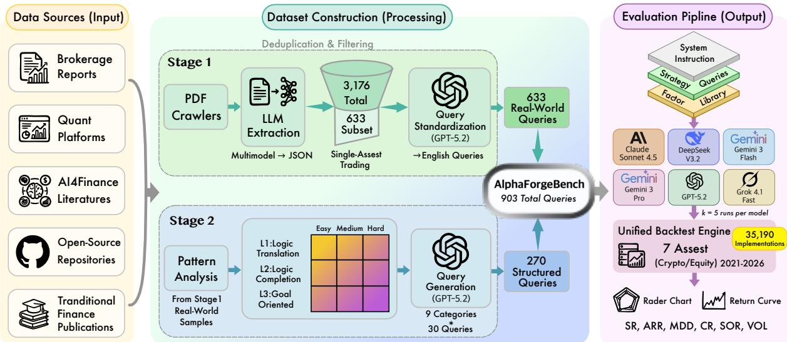  
Figure 1: The framework of AlphaForgeBench.

## 2.2 Financial Trading Benchmark

The evolution of financial LLMs has transitioned from passive analysis to autonomous decision-making agents, necessitating rigorous benchmarks for trading and forecasting. In terms of agentic architecture, FINCON [25] introduces a hierarchical multi-agent system with conceptual verbal reinforcement for risk-aware strategies, while AlphaFin [5] establishes a retrieval-augmented pipeline to evaluate end-to-end fundamental reasoning and alpha generation. [12, 20] analyze the performance of the large model in terms of price prediction and returns. To standardize decision-making assessments, INVESTORBENCH [10] provides a multi-asset simulation environment, revealing that agents struggle to outperform buy-and-hold baselines. Critically, addressing the "time-travel" bias in historical backtesting, recent works have pivoted toward livemarket evaluation: DeepFund [9] demonstrates that even SOTA models incur losses in real-time fund management. FutureX [15, 26] pioneers a live, anti-contamination forecasting framework to evaluate the real-time predictive intelligence of LLM agents on unfolding global events. To eliminate look-ahead bias and bridge the gap between simulation and reality, Alpha Arena [2], RockAlpha [16], and LiveTradeBench [24] collectively establish a live trading benchmark paradigm, rigorously evaluating the real-time adaptability and alpha-seeking capabilities of LLM agents directly within dynamic, executing financial markets.

However, these live evaluation paradigms introduce a fundamental reproducibility crisis: evaluation results are bound to the specific execution time window and cannot be independently repli cated, a problem further compounded by the inherent stochasticity of LLMs, which produce drastically diferent trading actions across runs even under deterministic decoding (Section C), rendering single-run live evaluations statistically unreliable. While existing benchmarks have advanced the evaluation of autonomous trading agents, they overlook the necessity of a holistic alpha mining pipeline that integrates strategy formulation, executable code generation, and rigorous backtesting, and largely neglect quantifying the inherent stochasticity and instability of LLM-driven financial decision-making.

## 3 AlphaForgeBench

In this section we present <sup>AlphaForgeBench</sup>, a benchmark that evaluates LLMs as quantitative researchers who synthesize executable trading strategies rather than emit point-wise trading actions. The overall framework is illustrated in Figure 1 and is organized along three axes. First, we describe the dataset construction process (Section 3.1), which proceeds in two stages: Stage 1 collects natural-language queries together with their ground-truth alpha factors and trading strategies from diverse real-world sources; Stage 2 draws on the patterns and complexity profiles observed in these real-world samples to systematically generate augmented queries across a 3 × 3 level–grade dificulty taxonomy via LLMs, combining authenticity with controlled diagnostic granularity. Second, we detail the evaluation pipeline (Section 3.2), in which each query is fed to the evaluated LLM to produce executable factor and strategy code, and the generated code is then executed within a standardized backtest engine across multiple assets and market regimes to yield quantitative performance profiles. Third, we introduce the evaluation methodology (Section 3.3), comprising financial performance metrics and statistical protocols that assess both the absolute quality and the cross-run stability of LLM-generated strategies.

## 3.1 Dataset Construction

The construction of <sup>AlphaForgeBench</sup> follows a two-stage pipeline that combines the ecological validity of real-world strategies with the diagnostic precision of synthetically structured queries.

Stage 1: Real-world Strategy Collection. <sub>We</sub> <sub>curate</sub> <sub>a</sub> <sub>diverse</sub> corpus of alpha factors and factor-based trading strategies from five complementary source categories: brokerage research reports, quantitative investment platforms (WorldQuant [17], JoinQuant [8]), AIin-finance literature, open-source repositories (Qlib [22], OpenFE [27]) and traditional finance publications. We build an automated extraction agent, powered by gemini-3-flash-preview, that ingests each collected document and produces structured records comprising factor names, mathematical definitions, trading logic, and financial rationale. After deduplication and quality filtering, Stage 1 yields <sup>3,176</sup> factor-strategy entries spanning three strategy types: singleasset trading (633), portfolio management (2,172), and multi-asset trading (371). In this work, we restrict evaluation to the <sup>633</sup> single asset subset to isolate the LLM’s signal-generation capability from confounding portfolio-construction efects, thereby serving as an ecologically valid baseline for gauging benchmark dificulty. This restriction is a deliberate design choice rather than a limitation of scope: the single-asset setting provides a cleaner, more controlled evaluation environment that targets core signal-generation and rule-construction capabilities without the additional complex ity introduced by asset allocation, cross-asset dependencies, and portfolio-level risk constraints. The portfolio management (2,172) and multi-asset trading (371) subsets are reserved for systematic evaluation in future work, along with the corresponding backtesting infrastructure already developed. Full extraction prompts and dataset statistics are provided in Section D.

Stage 2: LLM-augmented Structured Query Generation. While Stage 1 ofers ecologically valid test cases, its query distribution is non-uniform across dificulty and is not tailored for controlled diagnosis of specific cognitive demands. Stage 2 therefore constructs <sup>270</sup> additional benchmark queries under a 3 × 3 level– grade taxonomy, grounded in the strategy patterns and complexity profiles observed in the real-world collection. The three levels isolate distinct strategy-generation skills: <sup>Level</sup> <sup>1</sup> (Logic Translation) provides fully specified if–then rules to test faithful code translation; <sup>Level</sup> <sup>2</sup> (Logic Completion) supplies strategic skeletons with critical parameters omitted, requiring domain-grounded inference; and <sup>Level</sup> <sup>3</sup> (Goal-Oriented Generation) specifies only high-level investment objectives, demanding end-to-end strategy design from first principles. Orthogonally, three grades (Easy, Medium, Hard) modulate complexity via the number of conditions, the degree of underspecification, and the depth of state-dependent control flow, yielding nine fine-grained dificulty cells (Appx. D).

In summary, the <sup>AlphaForgeBench</sup> query set comprises two complementary components: <sup>633</sup> real-world queries from Stage 1 that ensure ecological validity, and <sup>270</sup> dificulty-specialized queries from Stage 2 that enable controlled, fine-grained diagnostic eval uation across the full 3 × 3 level–grade grid, providing balanced coverage and facilitating stratified analyses of model failure modes under varying cognitive demands.

## 3.2 Evaluation Pipeline

Given the curated query set described above (633 real-world queries from Stage 1 and 270 dificulty-specialized queries from Stage 2), <sup>AlphaForgeBench</sup> evaluates each model via a standardized generate-and-backtest pipeline (Figure 1), comprising prompt instantiation, code synthesis, and backtest-based assessment.

<sup>Step</sup> <sup>1:</sup> <sup>Prompt</sup> <sup>construction.</sup> Each benchmark query is assembled into a standardized prompt comprising three semantically distinct components (see the Evaluation Pipeline panel of Figure 1): (i) a system instruction that defines the code-generation task, specifies the available data schema (open-high-low-close-volume (OHLCV) columns augmented with precomputed technical-indicator factors), and prescribes the expected output interface; (ii) the strategy query, i.e., the natural-language description of the target trading strategy drawn from either Stage 1 or Stage 2; and (iii) a factor-library reference that enumerates all supported indicator names together with their formal mathematical definitions, providing the model with a complete and unambiguous specification of the default feature space. Notably, the model is not restricted to this predefined indicator set: if a strategy requires novel factors, the model may generate the corresponding factor-computation code, which our backtest engine dynamically registers and incorporates into the evaluation, thereby granting models the flexibility to extend the feature space on the fly. The prompt template is held strictly identical across all evaluated models, ensuring that any observed performance differences can be attributed solely to model capabilities rather than prompt-engineering artifacts.

<sup>Step</sup> <sup>2:</sup> <sup>Code</sup> <sup>generation.</sup> The assembled prompt is dispatched to each evaluated LLM through its oficial API. The model must return a self-contained Python function (generate\_signal) that consumes a dataframe of OHLCV columns and precomputed indi cator factors and produces a trading-signal series dictating position actions (e.g., invest versus hold cash). We enforce strict conformance to the backtest engine’s interface contract (function signature, permitted column references, and output format), enabling fully automated execution without manual intervention.

Step 3: Backtest-based assessment. <sub>Each</sub> <sub>generated</sub> <sub>implemen-</sub> tation is executed within a unified, deterministic backtest engine on historical daily price data spanning seven assets across two market regimes: cryptocurrency and US equity. The engine computes a suite of standard financial metrics covering return generation, risk exposure, and risk-adjusted eficiency, producing fully reproducible quantitative profiles that support systematic comparison across models, query sources, and the nine Stage 2 dificulty cells. This deterministic design ensures that any observed cross-run variance originates exclusively from the inherent stochasticity of LLM generation rather than evaluation-side randomness.

## 3.3 Evaluation Methodology

We evaluate LLM-generated strategies along three complementary dimensions. First, each backtest run yields a suite of standard financial metrics spanning return generation, risk exposure, and risk-adjusted eficiency; to account for the stochasticity of LLM generation, all metrics are reported as mean ± standard deviation over multiple independent runs, capturing both expected performance and generation stability. Second, results are organized into stratified tables along three axes: (i) overall model ranking aggre gated across all queries and assets, (ii) per-asset decomposition over the 7 backtest assets to quantify cross-market generalization from cryptocurrency to US equity, and (iii) per-level decomposition (Stage 2 only) by the three dificulty levels of the 3 × 3 taxonomy to reveal how capabilities degrade under increasing cognitive demands. Third, tabular results are complemented by radar charts that render each model’s multi-metric profile for intuitive risk-return comparison, grouped bar charts and box plots that expose cross asset robustness and inter-model dispersion, and cumulative return curves that surface temporal dynamics such as divergence during market stress and convergence in calm regimes.

## 4 Experiments

We validate <sup>AlphaForgeBench</sup> along two complementary evaluation tracks that mirror the two-stage dataset construction. <sup>Track</sup> <sup>1</sup> (real-world queries) evaluates all 633 single-asset queries from Stage 1 to establish ecological validity, baseline dificulty calibration, and a consistency check against the structured track. <sup>Track</sup> <sup>2</sup> (struc tured queries) evaluates the 270 queries from Stage 2 organized by the 3 × 3 level–grade taxonomy, enabling fine-grained diagnosis of model strengths, weaknesses, and specific failure modes across dificulty dimensions. This dual-track design also serves as an empirical bias-mitigation mechanism: concordance between model rankings on Stage 1 (real-world) and Stage 2 (LLM-augmented) queries validates that the structured generation process preserves genuine capability diferences rather than introducing systematic distributional bias favoring particular models.

## 4.1 Experimental Settings

<sup>Evaluated</sup> <sup>models.</sup> We benchmark six frontier LLMs spanning five providers: claude-sonnet-4.5, deepseek-v3.2, gemini-3-flash-preview, gemini-3-pro-preview, gpt-5.2, and grok-4.1-fast. All models are queried through their oficial APIs under identical prompt templates with no model-specific tuning.

<sup>Generation</sup> <sup>protocol.</sup> Every experiment runs <sup>??</sup>=5 independent generations per query to quantify run-to-run variability. Stage 1 <sub>uses</sub> ??<sub>=0</sub>.<sub>7 (633</sub> ?????????????? <sub>× 6</sub> ???????????? <sub>× 5</sub> ???????? <sub>= 18</sub>,<sub>990</sub> ??????????????<sub>);</sub> Stage 2 is evaluated at both <sup>??</sup>=0<sup>.</sup>7 and <sup>??</sup>=0 (greedy) for a tempera-<sub>ture</sub> <sub>ablation</sub> <sub>(270</sub> ?????????????? <sub>× 6</sub> ???????????? <sub>× 2</sub> ???????????????????????? <sub>× 5</sub> ???????? <sub>=</sub> 16<sup>,</sup>200 <sup>??????????????</sup>). The grand total is <sup>35,190</sup> generated strategy implementations. All metrics are reported as mean ± std.

<sup>Backtest</sup> <sup>configuration.</sup> Each generated strategy is executed within the unified backtest engine across <sup>7</sup> <sup>assets</sup> spanning two distinct market regimes: 2 cryptocurrencies (BTCUSDT, ETHUSDT; sourced from Binance) and 5 US equities (AAPL, GOOGL, MSFT, NVDA, TSLA; sourced from Yahoo Finance). The evaluation window spans <sup>5</sup> <sup>years</sup> (2021-01-01 to 2026-01-01), deliberately selected to cover heterogeneous market conditions including bull rallies, bear corrections, AI-driven recoveries, and prolonged consolida tion phases, ensuring that no single strategy style is systematically favored. We adopt a controlled execution protocol with daily data frequency, a 300-day lookback window, long-only single-asset semantics (binary invest/cash signal), and a fixed one-way transaction cost of 10<sup>−3</sup>, thereby isolating intrinsic signal quality from confounding portfolio-construction efects. The long-only constraint is adopted for cross-market consistency, as short-selling is subject to asymmetric restrictions and costs across equity and cryptocurrency markets. Slippage and liquidity constraints are intentionally excluded: these factors are highly dependent on market microstructure (e.g., order-book depth and execution mechanisms) and vary substantially across assets and trading frequencies; introducing a unified slippage model would add evaluation-side uncertainty without improving the fairness of cross-model comparisons. Full parameter justifications are provided in Appx. E.

<sup>Evaluation</sup> <sup>metrics.</sup> We assess each strategy using six standard financial metrics: Annual Rate of Return (<sup>ARR</sup>), Sharpe Ratio (<sup>SR</sup>), Maximum Drawdown (<sup>MDD</sup>), Calmar Ratio (<sup>CR</sup>), Sortino Ratio (<sup>SoR</sup>), and Volatility (<sup>VOL</sup>). These jointly capture return generation (ARR), risk exposure (MDD, VOL), and risk-adjusted eficiency (SR, CR, SoR), providing a multi-dimensional profile of strategy quality. Formal definitions are given in Appx. E.

## 4.2 Results on Real-world Queries

Table 1: Results on real-world queries (mean <sub>±</sub> std, 633 queries), stratified by overall (green) and asset (gray). Best per block in bold; <sub>↑</sub>/<sub>↓</sub>: higher/lower is better.  
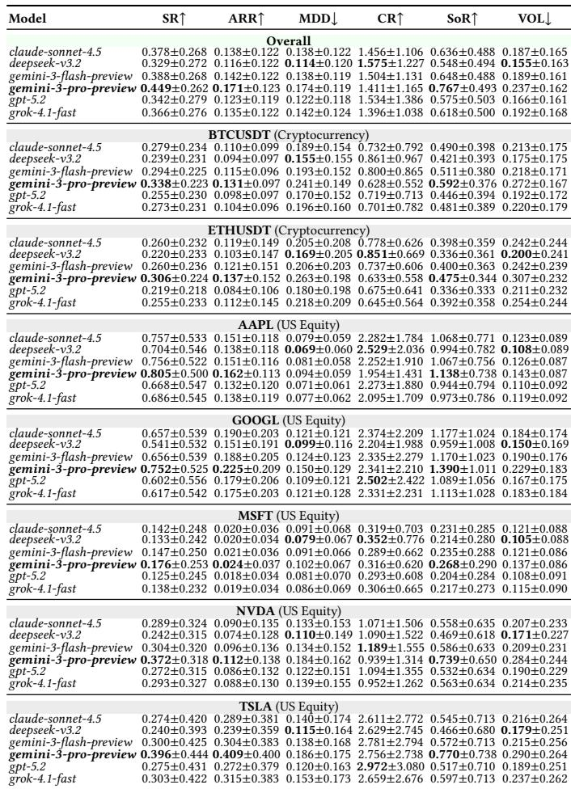

4.2.1 Overall model comparison. As shown in the Overall block of Table 1, three salient observations emerge. <sup>(1)</sup> <sup>A</sup> <sup>clear</sup> <sup>perfor-</sup> mance hierarchy exists on return-oriented metrics. <sub>Models</sub> separate into three tiers: gemini-3-pro-preview leads decisively, followed by a middle tier (gemini-3-flash-preview, claude-sonnet-4.5), with the remaining models trailing. The 5.5% ARR spread between the best and worst models translates to a 47% relative improvement, which is economically meaningful over the 5-year evaluation hori-<sub>zon.</sub> (2) Return and risk rankings are inversely correlated<sub>,</sub> suggesting that LLMs encode distinct implicit risk preferences in their generated code. Notably, gemini-3-pro-preview consistently favors aggressive, high-conviction signal logic (highest SR and ARR, but also highest MDD and VOL), whereas deepseek-v3.2 converges on conservative, risk-controlled strategies (lowest MDD and VOL, yet highest CR). This return-risk inversion underscores the necessity of multi-metric evaluation: a single metric cannot capture the full spectrum of model behavior. <sup>(3)</sup> <sup>Observed</sup> <sup>performance</sup> gaps are statistically reliable. <sub>The</sub> <sub>intra-query</sub> <sub>standard</sub> <sub>devia</sub> tion across 5 runs is typically an order of magnitude smaller than the inter-query standard deviation, confirming that ranking diferences reflect genuine capability gaps rather than generation noise. Detailed distributional and visual analyses are provided in Appx. F.

4.2.2 Per-asset analysis. Disaggregating by asset in Table 1 yields <sub>three</sub> <sub>further</sub> <sub>observations.</sub> (1) A consistent dificulty gradient <sup>emerges</sup> <sup>across</sup> <sup>assets.</sup> Trend-rich US large-caps (AAPL, GOOGL) are the easiest targets for all models, cryptocurrencies (BTCUSDT, ETHUSDT) occupy an intermediate tier with higher volatility and deeper drawdowns, and MSFT proves the hardest asset, likely due to its narrower trading ranges during the evaluation period. <sup>(2)</sup> <sup>High-</sup> volatility assets amplify inter-model dispersion. <sub>TSLA</sub> <sub>ex</sub> hibits both the highest absolute returns and the widest cross-model variance, indicating that extreme and highly non-stationary price dynamics efectively magnify diferences in the signal logic gener-<sub>ated</sub> <sub>by</sub> <sub>each</sub> <sub>LLM.</sub> (3) Model rankings are robust across asset <sup>classes.</sup> The relative ordering identified in the aggregate analysis is preserved across all seven assets: return-oriented leaders and risk-oriented leaders maintain their respective positions regardless of whether the market is cryptocurrency or US equity. This crossasset stability strongly suggests that the implicit risk preferences encoded by each LLM are intrinsic to its own generation behavior rather than artifacts of any particular market environment.

4.2.3 Findings and conclusions. Synthesizing the above analyses, the Stage 1 evaluation yields four principal findings. <sup>(1)</sup> <sup>High</sup> <sup>code-</sup> <sup>generation</sup> <sup>reliability</sup>: all six frontier LLMs produce executable strategy code with <sup>></sup>96% backtest pass rates, establishing a solid foundation for the code-generation evaluation paradigm. <sup>(2)</sup> <sup>Sta-</sup> ble and reproducible evaluation<sub>:</sub> <sub>the</sub> <sub>intra-query</sub> <sub>(run-to-run)</sub> variance is an order of magnitude smaller than the inter-query variance, confirming that the code-generation paradigm confines LLM stochasticity to a single generation step while guaranteeing deterministic execution thereafter, in stark contrast to direct-trading benchmarks where run-to-run variance routinely exceeds intermodel variance. <sup>(3)</sup> <sup>Implicit</sup> <sup>risk</sup> <sup>preferences</sup>: as revealed by the return-risk inversion in the overall comparison, diferent LLMs encode distinct and stable risk personalities in their generated code, and these characteristic profiles persist across all runs, assets, and metrics. <sup>(4)</sup> <sup>Cross-asset</sup> <sup>robustness</sup>: model rankings and a shared asset dificulty gradient are consistent across all 7 assets spanning cryptocurrency and US equity markets, indicating that the observed capability hierarchy is environment-agnostic. Taken together, these findings validate the strategy code-generation paradigm as a stable, reproducible, and discriminative framework for benchmarking LLM capabilities in quantitative finance. They also demonstrate that real-world queries alone can reveal meaningful capability differences among frontier models, thereby providing a solid empirical foundation and directly motivating the more fine-grained, dificultystratified diagnostic evaluation in Stage 2.

## 4.3 Results on LLM-augmented Queries

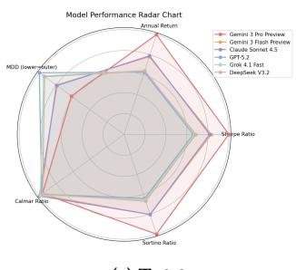  
(a) T=0.0

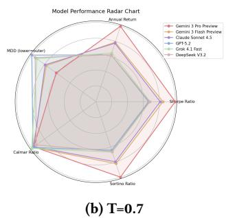  
Figure 2: Multi-metric radar profiles on LLM-augmented queries (five metrics, ??<sub>=0</sub> vs. ??<sub>=0</sub>.<sub>7</sub>). Near-identical polygons confirm temperature-invariant model behavior.

4.3.1 Overall model comparison. The Overall block of Table 2 reveals four key observations that extend and sharpen the Stage 1 <sub>findings.</sub> (1) The three-tier hierarchy is preserved and ampli-<sup>fied.</sup> The same model ranking observed in Stage 1 recurs: gemini-3- pro-preview leads (SR = 0.628 at <sup>??</sup> =0), a middle tier follows (gemini-3-flash-preview, claude-sonnet-4.5), and the remaining models trail. Notably, the 7.8% ARR gap between the best and worst models exceeds the 5.5% gap in Stage 1, confirming that the controlled dificulty design of Stage 2 efectively amplifies latent capability dif-<sub>ferences</sub> <sub>among</sub> <sub>models.</sub> (2) The return-risk inversion persists. Consistent with Stage 1, return and risk rankings remain inversely correlated: the top return-generating model (gemini-3-pro-preview) incurs the highest drawdown and volatility, whereas the most conservative model (gpt-5.2, MDD = 0.119) trails on return metrics. claude-sonnet-4.5 achieves the best Calmar Ratio (CR = 1.650 at<sup>??</sup> =0), exhibiting the most favorable return-to-drawdown trade-of, further reinforcing the necessity of multi-metric evaluation. <sup>(3)</sup> <sup>Evalua-</sup> tion is temperature-invariant. <sub>The</sub> ?? <sub>=0 and</sub> ?? <sub>=0</sub>.<sub>7 columns</sub> <sub>yield</sub> near-identical values across all models and metrics (max SR difference <sup><</sup> 0.008). This invariance is a distinctive advantage of the code-generation paradigm: because downstream execution is deterministic, decoding temperature afects only surface-level code variation without altering the resulting trading logic, a property absent in direct-trading benchmarks where temperature directly <sub>perturbs</sub> <sub>each</sub> <sub>decision.</sub> (4) Radar charts reveal distinct and sta-<sup>ble</sup> <sup>risk</sup> <sup>profiles.</sup> As shown in Figure 2, gemini-3-pro-preview spans the largest polygon, dominating on the return and Sortino axes while receding on MDD, visually encoding its aggressive strategy preference. gpt-5.2 and grok-4.1-fast form compact, risk-averse polygons that extend furthest on the MDD axis, while claude-sonnet-4.5 achieves the most balanced shape across all five axes. The nearidentical polygon geometry between the <sup>??</sup>=0 and <sup>??</sup>=0<sup>.</sup>7 panels provides strong visual confirmation that these model risk personalities are intrinsic and temperature-invariant.

Table 2: Results on LLM-augmented queries (mean <sub>±</sub> std, 5 runs) at ?? <sub>=0</sub> and ?? <sub>=0</sub>.<sub>7</sub>, stratified by overall (green), level (blue), and asser (gray). Best per block in bold; <sub>↑</sub>/<sub>↓</sub>: higher/lower is better.  
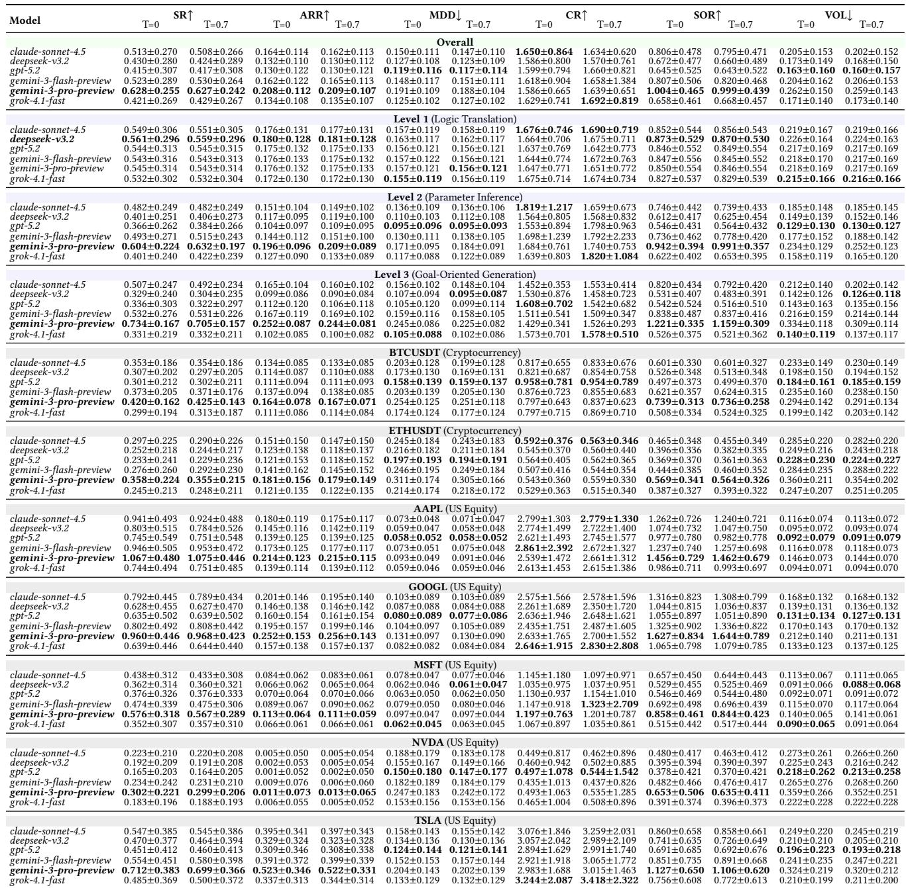

4.3.2 Per-level analysis. The Level blocks of Table 2 and the grouped bar charts in Figure 3 reveal a monotonically widening inter-model spread across the three dificulty levels, validating the 3 × 3 taxon omy as an efective diagnostic tool. Three principal findings emerge.

(1) Logic translation (Level 1) is a near-saturated capability<sub>:</sub> all models achieve tightly clustered SR values (range = 0.029), indicating that faithful code translation from fully specified rules presents minimal challenge for frontier LLMs; notably, deepseekv3.2 leads at this level despite ranking among the weakest overall, suggesting that code-translation competence is a distinct skill from <sub>strategic</sub> <sub>reasoning</sub> <sub>ability.</sub> (2) Parameter inference (Level 2) exposes domain-knowledge gaps<sub>:</sub> <sub>the</sub> <sub>inter-model</sub> <sub>SR</sub> <sub>spread</sub> widens to 8× the Level 1 range once models must supply missing thresholds, lookback windows, and indicator parameters, indicating that grounding underspecified strategy skeletons in reasonable financial parameters efectively separates models with strong domain knowledge from those that lack it; stochastic sampling (<sup>??</sup>=0<sup>.</sup>7) marginally benefits the top model at this level, suggesting that sampling diversity can occasionally discover better parameter con-<sub>figurations.</sub> (3) Goal-oriented generation (Level 3) produces the most discriminative separation<sub>:</sub> <sub>the</sub> <sub>spread</sub> <sub>reaches</sub> <sub>14×</sub> <sub>the</sub> Level 1 range, with a striking crossover where models that excel at constrained translation (e.g., deepseek-v3.2) decline monotonically from L1 to L3, whereas gemini-3-pro-preview actually improves, indicating superior open-ended strategy design capabilities. The primary cognitive leap occurs between Level 1 and Level 2 (a 16% SR decline in model-averaged performance), while the L2-to-L3 transition introduces additional inter-model variance rather than a sharp further mean decline. This crossover demonstrates that the three levels probe fundamentally diferent cognitive capabilities, and no single model dominates across all levels.

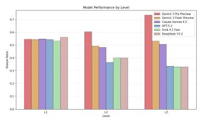

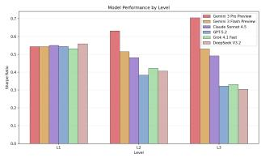  
(a) T=0.0  
(b) T=0.7  
Figure 3: Sharpe Ratio by dificulty level on LLM-augmented queries (??<sub>=0</sub> vs. ??<sub>=0</sub>.<sub>7</sub>). Inter-model spread widens monotonically from Level 1 to Level 3.

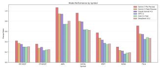  
(a) T=0.0

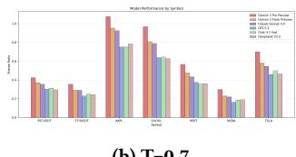  
(b) T=0.7  
Figure 4: Sharpe Ratio by asset on LLM-augmented queries (??<sub>=0</sub> vs. ??<sub>=0</sub>.<sub>7</sub>). A shared dificulty gradient emerges, with AAPL/GOOGL easiest and crypto/NVDA hardest.

4.3.3 Per-asset analysis. The asset blocks of Table 2 and Figure 4 yield four observations that mirror and extend the Stage 1 per-asset <sub>findings.</sub> (1) A systematic dificulty gradient persists across <sup>assets.</sup> Trend-rich large-caps (AAPL, GOOGL) remain the easiest targets for all models, MSFT and NVDA constitute the hardest equity environments primarily due to narrower trading ranges and rapid regime shifts respectively, and cryptocurrencies (BT-CUSDT, ETHUSDT) rank as the most challenging overall, reflecting higher volatility and fundamentally diferent 24/7 market dynam ics. TSLA again occupies a unique position: it yields the highest absolute returns yet the widest cross-model variance, amplifying the advantage of aggressive signal logic. <sup>(2)</sup> <sup>The</sup> <sup>Stage</sup> <sup>2</sup> <sup>dificulty</sup> design sharpens inter-model dispersion within each asset. Compared to Stage 1, the controlled query design produces wider SR spreads on every asset, confirming that the structured queries efectively magnify latent capability diferences that real-world <sub>queries</sub> <sub>alone</sub> <sub>partially</sub> <sub>obscure.</sub> (3) Distinct model specialization <sup>patterns</sup> <sup>emerge.</sup> The top return-generating model excels particularly on high-volatility assets (TSLA, NVDA, cryptocurrencies), suggesting robust handling of challenging market conditions; conversely, claude-sonnet-4.5 exhibits the most uniform performance across assets, indicating balanced, asset-agnostic strategy genera-<sub>tion.</sub> (4) Rankings and dificulty gradients are temperature-<sup>invariant.</sup> The bar patterns visualized in Figure 4 remain virtually identical between the <sup>??</sup>=0 and <sup>??</sup>=0<sup>.</sup>7 panels, confirming that both model specialization profiles and the asset-dificulty hierarchy are intrinsic properties fundamentally unafected by decoding temperature. Detailed per-asset tables and additional visual analyses are provided in Appx. G.

4.3.4 Aligned return curve analysis. Figure 5 overlays the cumulative return trajectories of all six models across the full query spectrum, with shaded bands denoting the 25th–75th percentile range over 5 independent runs. Four observations emerge. <sup>(1)</sup> <sup>Inter-</sup> model separation is persistent and substantial. <sub>The</sub> <sub>vertical</sub> <sub>gap</sub> between the highest and lowest trajectories far exceeds any individual model’s confidence band throughout the entire query range, providing direct visual evidence that performance diferences reflect genuine capability gaps rather than generation noise. <sup>(2)</sup> <sup>Run-to-</sup> run stability is consistently high. <sub>The</sub> <sub>narrow</sub> <sub>shaded</sub> <sub>bands</sub> confirm that independently generated strategies produce tightly clustered outcomes even at <sup>??</sup>=0<sup>.</sup>7; notably, claude-sonnet-4.5 exhibits the narrowest bands (most consistent generation), while grok-4.1-fast displays the widest, corroborating its high-variance profile observed in the boxplot analysis. <sup>(3)</sup> <sup>Temperature</sup> <sup>invari-</sup> ance is visually confirmed. <sub>The</sub> ??<sub>=0 and</sub> ??<sub>=0</sub>.<sub>7 panels</sub> <sub>yield</sub> <sub>vir-</sub> tually identical curve shapes and separation patterns, reinforcing that the code-generation paradigm confines LLM stochasticity to a single generation step while ensuring deterministic downstream ex-<sub>ecution.</sub> (4) Dificulty modulates inter-model divergence. <sub>The</sub> separation widens progressively for harder queries and narrows for easier ones, consistent with the per-level finding that Level 3 tasks maximally amplify capability diferences across models.

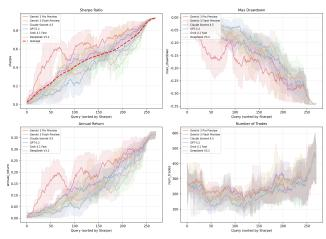  
(a) T=0.0

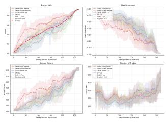  
(b) T=0.7  
Figure 5: Aligned cumulative return curves on LLMaugmented queries (??<sub>=0</sub> vs. ??<sub>=0</sub>.<sub>7</sub>). Shaded bands denote the 25th–75th percentile range over 5 runs.

4.3.5 Per-model stability profiles. Appx. G provides detailed permodel analyses of multi-run stability, dificulty-level performance curves, and best-case strategy returns. Three archetypal behavioral profiles emerge from these results. <sup>(1)</sup> <sup>Aggressive-creative</sup> <sup>profile</sup> (gemini-3-pro-preview): uniquely, this model’s SR increases from Level 1 to Level 3, indicating that open-ended creative freedom amplifies its strengths; however, this comes at the cost of the widest confidence bands among top-tier models and the highest drawdown/volatility. <sup>(2)</sup> <sup>Balanced-stable</sup> <sup>profile</sup> (claude-sonnet-4.5, gemini-3-flash-preview): these models exhibit the narrowest run-to-run confidence bands and the mildest Level 1-to-Level 3 degradation, with claude-sonnet-4.5 achieving the best Calmar Ratio (CR = 1.650) and gemini-3-flash-preview serving as a cost-efective alternative with a nearly flat dificulty profile. <sup>(3)</sup> <sup>Conservative-</sup> <sup>rigid</sup> <sup>profile</sup> (gpt-5.2, deepseek-v3.2, grok-4.1-fast): these models favor low-risk signal logic (lowest MDD and VOL) but sufer the steepest performance degradation from structured to open-ended tasks; deepseek-v3.2 exemplifies this pattern most starkly, leading at Level 1 yet dropping to the bottom tier at Level 3, while grok-4.1-fast additionally exhibits the highest run-to-run variance, making it the least predictable model in the benchmark. These archetypal profiles suggest that the return-risk trade-of observed in aggregate metrics stems from fundamentally diferent strategy-generation strategies encoded by each LLM, and that no single model simultaneously optimizes for return, stability, and robustness across dificulty levels.

4.3.6 Findings and conclusions. Synthesizing the above analyses, the Stage 2 evaluation yields five principal findings. <sup>(1)</sup> <sup>Temper-</sup> <sup>ature</sup> <sup>invariance</sup>: the <sup>??</sup>=0 and <sup>??</sup>=0<sup>.</sup>7 results are near-identical across models, metrics, and dificulty levels, with a maximum SR <sub>diference</sub> <sub>below 0</sub>.<sub>008.</sub> (2) Systematic dificulty progression<sub>:</sub> <sub>the</sub> inter-model SR spread widens from Level 1 (0<sup>.</sup>029) to Level 2 (8×) and Level 3 (14×), confirming that the 3 × 3 taxonomy separates models along a controlled cognitive-demand axis. <sup>(3)</sup> <sup>Cross-level</sup> <sup>ranking</sup> <sup>reversals</sup>: Level 1 code translation and Level 3 open-ended strategy design rely on distinct capabilities, as shown by the strong crossover in model rankings that would be obscured by aggregate metrics and single-score summaries. <sup>(4)</sup> <sup>Reproducible</sup> <sup>risk</sup> <sup>profiles</sup>: the aggressive-creative, balanced-stable, and conservative-rigid patterns persist across stages, assets, and temperatures, indicating stable model-specific strategy behavior under both structured and open-ended query settings. <sup>(5)</sup> <sup>Cross-asset</sup> <sup>robustness</sup>: model rankings and a shared asset-dificulty gradient are preserved across all 7 assets spanning cryptocurrency and US equity markets, with Stage 2 further sharpening inter-model dispersion within each asset. Together, these findings validate the 3 × 3 taxonomy as an efective diagnostic tool while complementing the ecological validity of Stage 1, and reinforce the code-generation paradigm as a stable, reproducible, and discriminative benchmark for LLM capability evaluation in finance across both real-world and structured queries.

## 5 Discussion

The results suggest that strategy code generation changes both the evaluation interface and the capability under study. Here, end to end denotes the full pipeline from natural language to complete rule based strategy generation and deterministic backtesting, rather than agent style systems that directly emit BUY, HOLD, or SELL actions. The two settings therefore probe diferent abilities. Agent based trading emphasizes step wise action selection, whereas <sup>Al-</sup> <sup>phaForgeBench</sup> focuses on whether a model can synthesize factors, rules, and decision logic into a coherent strategy. The near invariance between <sup>??</sup>=0 and <sup>??</sup>=0<sup>.</sup>7 and the low run to run variance across both stages indicate that, once execution randomness is removed, performance diferences more cleanly reflect strategy design ability. This also explains why agent style financial trading is a weak benchmark here, since Appendix C shows that such systems can remain unstable even under identical configurations.

The results further show that financial strategy generation is not a single capability. The widening spread across dificulty levels and the ranking reversals between Level 1 and Level 3 indicate that logic translation, logic completion, and open ended synthesis rely on distinct strengths. The recurring risk profiles across stages and assets likewise suggest that frontier LLMs encode stable preferences in how they trade of return, drawdown, and volatility. <sup>AlphaForgeBench</sup> is therefore useful not only as a leaderboard but also as a diagnostic benchmark that separates conservative from aggressive models, structured translators from creative synthesizers, and robust models from those that degrade as task ambiguity increases. This also motivates the current focus on single asset evaluation, which isolates signal generation and strategy logic construction without the added variability of asset allocation, cross asset dependencies, and risk control.

The benchmark should be interpreted within a controlled scope. The current evaluation targets single asset long only strategy design under a standardized backtesting environment with a fixed transaction cost of 10<sup>−3</sup> and without explicit slippage or liquidity modeling. These choices improve comparability and reproducibility, but they also mean that the reported results are better read as controlled measures of strategy design quality than as direct estimates of deployable trading performance. The same logic applies to Stage 2, whose queries are generated through controlled augmentation of Stage 1 to provide diagnostic structure rather than broad ecological coverage. Because Stage 2 remains anchored to real world sources and the predefined 3 × 3 taxonomy, and model rankings remain broadly aligned between Stage 1 and Stage 2, the structured track appears to preserve genuine capability diferences without strong model specific bias. Under this interpretation, <sup>Al-</sup> <sup>phaForgeBench</sup> provides a stable and interpretable foundation for evaluating financial strategy design with LLMs.

## 6 Conclusion

We presented <sup>AlphaForgeBench</sup>, a benchmark that reframes LLM evaluation in quantitative finance from black box action emission to white box strategy code generation. Across 903 queries, six frontier LLMs, seven assets, and 35,190 total implementations, the results show that this code generation paradigm is temperature invariant, highly reproducible, and more discriminative than direct trading baselines. The benchmark further reveals widening capability gaps across dificulty levels, ranking reversals that separate distinct cognitive skills, and stable model specific risk profiles, establishing <sup>AlphaForgeBench</sup> as a rigorous framework for evaluating financial strategy design with LLMs.

## 7 Acknowledgments

Shuo Sun is supported by Guangdong Provincial Key Lab of Integrated Communication, Sensing and Computation for Ubiquitous Internet of Things (No.2023B1212010007). Bo An is supported by the National Research Foundation Singapore and DSO National Laboratories under the AI Singapore Programme (AISG Award No: AISG2-GC-2023-009-1B).

## References

[1] 2025. AI trading in real markets. https://nof1.ai/. Accessed: 2026-01-14.

[2] Alpaha Arena. 2026. AI trading in real markets. https://nof1.ai/ Accessed: 2026-01-23.

[3] Ant Group and Shanghai University of Finance and Economics. 2025. Fin-Eva Version 1.0: A Chinese Financial Evaluation Benchmark for Large Language Models. https://github.com/alipay/financial\_evaluation\_dataset Accessed: 2026-01-23.

[4] Jian Chen, Peilin Zhou, Yining Hua, Loh Xin, Kehui Chen, Ziyuan Li, Bing Zhu, and Junwei Liang. 2024. Fintextqa: A dataset for long-form financial question answering. In Proceedings of the 62nd Annual Meeting of the Association for Computational Linguistics (Volume 1: Long Papers). 6025–6047.

[5] Yanxu Chen, Zijun Yao, Yantao Liu, Jin Ye, Jianing Yu, Lei Hou, and Juanzi Li. 2025. Stockbench: Can llm agents trade stocks profitably in real-world markets? arXiv preprint arXiv:2510.02209 (2025).

[6] Zhiyu Chen, Wenhu Chen, Charese Smiley, Sameena Shah, Iana Borova, Dylan Langdon, Reema Moussa, Matt Beane, Ting-Hao Huang, Bryan R Routledge, et al. 2021. Finqa: A dataset of numerical reasoning over financial data. In Proceedings of the 2021 Conference on Empirical Methods in Natural Language Processing. 3697–3711.

[7] Zhiyu Chen, Shiyang Li, Charese Smiley, Zhiqiang Ma, Sameena Shah, and William Yang Wang. 2022. Convfinqa: Exploring the chain of numerical reasoning in conversational finance question answering. arXiv preprint arXiv:2210.03849 (2022).

[8] JoinQuant. 2026. JoinQuant: Quantitative Research Platform. https://www. joinquant.com/. Accessed: 2026-02-09.

[9] Changlun Li, Yao Shi, Chen Wang, Qiqi Duan, Runke Ruan, Weijie Huang, Haonan Long, Lijun Huang, Nan Tang, and Yuyu Luo. 2025. Time Travel is Cheating: Going Live with DeepFund for Real-Time Fund Investment Benchmarking. arXiv preprint arXiv:2505.11065 (2025).

[10] Haohang Li, Yupeng Cao, Yangyang Yu, Shashidhar Reddy Javaji, Zhiyang Deng, Yueru He, Yuechen Jiang, Zining Zhu, Kp Subbalakshmi, Jimin Huang, et al. 2025. Investorbench: A benchmark for financial decision-making tasks with llm-based agent. In Proceedings of the 63rd Annual Meeting of the Association for Computational Linguistics (Volume 1: Long Papers). 2509–2525.

[11] Xiao-Yang Liu, Guoxuan Wang, Hongyang Yang, and Daochen Zha. 2023. Fingpt: Democratizing internet-scale data for financial large language models. arXiv preprint arXiv:2307.10485 (2023).

[12] Alejandro Lopez-Lira and Yuehua Tang. 2023. Can chatgpt forecast stock price movements? return predictability and large language models. arXiv preprint arXiv:2304.07619 (2023).

[13] Macedo Maia, Siegfried Handschuh, André Freitas, Brian Davis, Ross McDermott, Manel Zarrouk, and Alexandra Balahur. 2018. Www’18 open challenge: financial opinion mining and question answering. In Companion proceedings of the the web conference 2018. 1941–1942.

[14] Ying Nie, Binwei Yan, Tianyu Guo, Hao Liu, Haoyu Wang, Wei He, Binfan Zheng, Weihao Wang, Qiang Li, Weijian Sun, et al. 2025. Cfinbench: A comprehensive chinese financial benchmark for large language models. In Proceedings of the 2025 Conference of the Nations of the Americas Chapter of the Association for

Computational Linguistics: Human Language Technologies (Volume 1: Long Papers). 876–891.

[15] Prophet Arena. 2025. Prophet Arena: Live LLM Trading Competition Platform. https://www.prophetarena.co/ Accessed: 2026-01-23.

[16] RockFlow AI. 2025. RockAlpha: LLM-Powered Quantitative Trading Platform. https://rockalpha.rockflow.ai/ Accessed: 2026-01-23.

[17] WorldQuant. 2026. WorldQuant: Quantitative Research Platform. https://www. worldquant.com/. Accessed: 2026-02-09.

[18] Shijie Wu, Ozan Irsoy, Steven Lu, Vadim Dabravolski, Mark Dredze, Sebastian Gehrmann, Prabhanjan Kambadur, David Rosenberg, and Gideon Mann. 2023. Bloomberggpt: A large language model for finance. arXiv preprint arXiv:2303.17564 (2023).

[19] Qianqian Xie, Weiguang Han, Zhengyu Chen, Ruoyu Xiang, Xiao Zhang, Yueru He, Mengxi Xiao, Dong Li, Yongfu Dai, Duanyu Feng, et al. 2024. Finben: A holistic financial benchmark for large language models. Advances in Neural Information Processing Systems 37 (2024), 95716–95743.

[20] Qianqian Xie, Weiguang Han, Yanzhao Lai, Min Peng, and Jimin Huang. 2023. The wall street neophyte: A zero-shot analysis of chatgpt over multimodal stock movement prediction challenges. arXiv preprint arXiv:2304.05351 (2023).

[21] Qianqian Xie, Weiguang Han, Xiao Zhang, Yanzhao Lai, Min Peng, Alejandro Lopez-Lira, and Jimin Huang. 2023. Pixiu: A comprehensive benchmark, instruction dataset and large language model for finance. Advances in Neural Information Processing Systems 36 (2023), 33469–33484.

[22] Xiao Yang, Weiqing Liu, Dong Zhou, Jiang Bian, and Tie-Yan Liu. 2020. Qlib: An ai-oriented quantitative investment platform. arXiv preprint arXiv:2009.11189 (2020).

[23] Yuzhe Yang, Yifei Zhang, Yan Hu, Yilin Guo, Ruoli Gan, Yueru He, Mingcong Lei, Xiao Zhang, Haining Wang, Qianqian Xie, et al. 2025. Ucfe: A user-centric financial expertise benchmark for large language models. In Findings of the Association for Computational Linguistics: NAACL 2025. 5429–5448.

[24] Haofei Yu, Fenghai Li, and Jiaxuan You. 2025. LiveTradeBench: Seeking Real World Alpha with Large Language Models. arXiv preprint arXiv:2511.03628 (2025).

[25] Yangyang Yu, Zhiyuan Yao, Haohang Li, Zhiyang Deng, Yuechen Jiang, Yupeng Cao, Zhi Chen, Jordan Suchow, Zhenyu Cui, Rong Liu, et al. 2024. Fincon: A synthesized llm multi-agent system with conceptual verbal reinforcement for enhanced financial decision making. Advances in Neural Information Processing Systems 37 (2024), 137010–137045.

[26] Zhiyuan Zeng, Jiashuo Liu, Siyuan Chen, Tianci He, Yali Liao, Yixiao Tian, Jinpeng Wang, Zaiyuan Wang, Yang Yang, Lingyue Yin, et al. 2025. Futurex: An advanced live benchmark for llm agents in future prediction. arXiv preprint arXiv:2508.11987 (2025).

[27] Tianping Zhang, Zheyu Aqa Zhang, Zhiyuan Fan, Haoyan Luo, Fengyuan Liu, Qian Liu, Wei Cao, and Li Jian. 2023. Openfe: Automated feature generation with expert-level performance. In International Conference on Machine Learning. PMLR, 41880–41901.

[28] Fengbin Zhu, Wenqiang Lei, Youcheng Huang, Chao Wang, Shuo Zhang, Jiancheng Lv, Fuli Feng, and Tat-Seng Chua. 2021. TAT-QA: A question answering benchmark on a hybrid of tabular and textual content in finance. arXiv preprint arXiv:2105.07624 (2021).

## A Code and Data Availability

All code and data will be publicly available upon acceptance of this paper, including the benchmark query set, evaluation pipeline, backtest engine, and supplementary scripts for reproducing the reported results.

## B Motivation

Recent progress on financial large language models (FinLLMs) has triggered a surge of benchmarks aimed at measuring their financial capabilities. These benchmarks fall into two main categories: financial QA benchmarks that test knowledge and reasoning on static inputs, and financial trading benchmarks that ask an LLM to directly emit trading actions. However, neither category can reliably assess an LLM’s true financial capability. QA benchmarks are prone to data staleness and memorization, while trading benchmarks sufer from severe decision instability: the same model under the same settings can produce drastically diferent action sequences across runs, rendering single-run evaluations unreproducible and benchmark rankings fragile. This fundamental lack of stability, robustness, and reproducibility motivates us to establish a new evaluation paradigm. Rather than benchmarking LLMs on static QA or unstable action generation, we propose to evaluate two core intermediate artifacts in systematic trading that are inherently more stable and auditable: <sup>alpha</sup> <sup>factors</sup> and <sup>factor-based</sup> <sup>trading</sup> <sup>strategies</sup>. Below we first revisit the limitations of financial QA benchmarks, then discuss the instability pitfalls of action-based trading benchmarks, and finally motivate why factor and factor-strategy generation provides a more principled and comparable evaluation target.

<sup>Financial</sup> <sup>QA</sup> <sup>benchmarks.</sup> A dominant line of work evaluates FinLLMs via financial question answering (QA) and reasoning tasks, e.g., numerical table QA (e.g., FinQA [6], TAT-QA [28]), conversational finance QA (e.g., ConvFinQA [7]), and sentiment/interpretation style datasets (e.g., FiQA [13]). While useful, these QA benchmarks have several limitations: <sup>(1)</sup> <sup>Surface-level</sup> encyclopedic <sup>competence</sup> <sup>and</sup> <sup>unfair</sup> <sup>comparability.</sup> Many QA datasets are static collections of text/tables (sometimes with charts), which primarily measure recall and short-horizon reasoning over a snapshot. As model scale and pretraining coverage grow, improvements can come from memoriza tion/contamination rather than better financial decision-making, making fair comparison dificult. <sup>(2)</sup> <sup>Staleness</sup> <sup>and</sup> <sup>temporal</sup> <sup>leakage</sup> <sup>under</sup> <sup>rapidly</sup> <sup>evolving</sup> <sup>finance.</sup> Financial concepts, events, regulations, and market narratives drift quickly. Static QA test sets become outdated, and train–test contamination is hard to rule out, which undermines reliability of benchmark conclusions in real-world settings. <sup>(3)</sup> <sup>Weak</sup> <sup>robustness</sup> <sup>and</sup> <sup>reliability</sup> <sup>assessment.</sup> QA metrics typically focus on answer matching and do not stress-test stability under noisy/contradictory multi-source signals, uncertainty calibration, or the cost of hallucinations. In practice, these properties are crucial for downstream trading pipelines. Most importantly, <sup>QA</sup> <sup>tasks</sup> <sup>cannot</sup> <sup>measure</sup> <sup>an</sup> <sup>LLM’s</sup> <sup>trading</sup> <sup>capability</sup>: they do not require sequential decision-making with positions, transaction costs, and long-horizon objectives. This gap motivates a second line of benchmarks, namely <sup>financial</sup> <sup>trading</sup> <sup>benchmarks</sup> that aim to evaluate trading decisions.

<sup>Financial</sup> <sup>trading</sup> <sup>benchmarks.</sup> These benchmarks (e.g., Alpha Arena [1]) typically provide an LLM with multi-source market information (such as OHLCV time series, technical indicators, fundamentals, and news) and ask it to directly output a trading action (e.g., buy/sell/hold, or a target position). Despite their appeal, we argue that current action-emitting trading benchmarks remain insuficient for measuring an <sub>LLM’s financial</sub> <sub>capability in</sub> <sub>a</sub> <sub>principled</sub> <sub>way:</sub> (1) Decision instability undermines reproducibility and can invalidate the benchmark. In practice, LLM trading decisions can be highly unstable. Under an identical setting (same model, same prompt template, same market and time period), the generated action sequence may vary substantially across runs due to decoding randomness or minor input perturbations, leading to dramatically diferent PnL and drawdown statistics. When such variance dominates, benchmark rankings become fragile and hard <sub>to</sub> <sub>reproduce.</sub> (2) Capability is confounded with system constraints and evaluation design. <sub>Reported</sub> <sub>performance</sub> <sub>is</sub> <sub>heavily</sub> <sub>afected</sub> by backtest and execution assumptions (e.g., costs, slippage, position sizing, and rebalancing rules) and by whether additional guardrails are imposed to curb over-trading. Therefore, improvements may reflect better constraint engineering rather than better financial reasoning. <sup>(3)</sup> Per-step action emission encourages myopic labeling instead of a consistent policy. <sub>Directly</sub> <sub>emitting</sub> <sub>actions</sub> <sub>resembles</sub> <sub>short-horizon</sub> classification for the current state, whereas profitable trading requires state-consistent, cost-aware, long-horizon policy optimization. As a result, these benchmarks may overestimate competence without capturing stable decision rules.

A key reason behind these limitations is the <sup>instability</sup> of LLMs action outputs in trading tasks, which can manifest as rapid flipping (e.g., buy then immediately sell or sell then immediately buy). Through comprehensive experiments, we attribute this instability to four major factors: <sup>(1)</sup> <sup>Stateless</sup> <sup>next-step</sup> <sup>inference.</sup> Vanilla LLMs make each action from the current input snapshot, without an inherent notion of persistent portfolio state. Even when recent actions are included in the prompt, small changes in inputs can still trigger inconsistent reversals. <sup>(2)</sup> <sup>Sensitivity</sup> <sup>in</sup> <sup>continuous-to-discrete</sup> <sup>mapping.</sup> Market signals vary continuously, whereas actions are discrete. This mismatch amplifies minor fluctuations (or minor prompt/wording diferences) into action switches, lacking the inertia and tolerance bands commonly used in trading. <sup>(3)</sup> <sup>Action</sup> <sup>classification</sup> <sup>rather</sup> <sup>than</sup> <sup>policy</sup> <sup>optimization.</sup> Asking an LLM to output an action is closer to labeling the “most reasonable” action for the current state, instead of optimizing long-term, cost-aware returns in a constrained sequentia decision problem. Without explicit optimization pressure, the model has little internal incentive to suppress over-trading. <sup>(4)</sup> <sup>Lack</sup> <sup>of</sup> <sup>hard</sup> <sup>behavioral</sup> <sup>constraints.</sup> Without system-level guardrails (e.g., minimum holding periods, cooldown windows, or a portfolio state machine), the LLM’s natural linguistic uncertainty is directly executed as trades, magnifying churn and instability.

<sup>Our</sup> <sup>motivation.</sup> Instead of benchmarking LLMs by direct action emission, we argue for benchmarking their ability to produce auditable intermediate artifacts used in quant research: <sup>alpha</sup> <sup>factors</sup> and <sup>factor-based</sup> <sup>trading</sup> <sup>strategies</sup>. Such artifacts are (i) explicitly stateful when executed in backtests, (ii) naturally robustified via standard evaluation protocols (e.g., out-of-sample tests and turnover/cost analyses), and (iii) more comparable across models because performance is measured on a shared, reproducible pipeline. This motivates AlphaForgeBench as a benchmark for LLM-generated factors and factor strategies.

## C Detailed Analysis of LLMs for Financial Trading

To quantify decision instability in action-emitting trading setups, we evaluate seven mainstream closed-source models (gemini-3-flash-preview, gemini-3-pro-preview, grok-4.1-fast, deepseek-v3.2, gpt-5.2, claude-sonnet-4.5) on a BTC interday trading task over 01/01/2025–01/01/2026 and, using a controlled-variable protocol with all other settings fixed, compare their trading trajectories along two axes: <sup>(1)</sup> <sup>run-to-run</sup> variability (5 runs per identical setting) <sub>and</sub> (2) decoding temperature <sub>(temperature=0</sub> <sub>vs.</sub> <sub>temperature=0.7).</sub>

## C.1 Experimental Setup

<sup>Trading</sup> <sup>task</sup> <sup>design.</sup> We design a controlled single-asset trading environment on BTC (Bitcoin) with daily granularity. At each trading step <sup>??</sup>, the model receives the daily OHLCV (Open, High, Low, Close, Volume) data for BTC up to day <sup>??</sup>, along with a set of commonly used technical indicators (e.g., moving averages, RSI, MACD, Bollinger Bands). The recent price history (past 30 days) and indicator value are formatted into a structured prompt that provides suficient context for decision-making. The model is prompted to output exactly one discrete action from {buy, hold, sell}, representing a fully invested long position, no change, or fully exiting the position, respectively. We adopt a simple position-sizing rule: each buy invests 100% of available capital, and each sell liquidates the entire position. No leverage, short-selling, or partial positions are allowed. Transaction costs are set to zero to isolate decision quality from execution assumptions. Importantly, the prompt template, data preprocessing pipeline, and agent configuration are held strictly identical across all models, runs, and temperature settings, ensuring that any observed diferences are attributable solely to the model’s own decision-making process. This controlled design allows us to attribute instability to the LLM itself rather than to confounding factors in the trading environment.

<sup>Why</sup> <sup>these</sup> <sup>two</sup> <sup>dimensions.</sup> We focus on two complementary dimensions of instability. <sup>(1)</sup> <sup>Run-to-run</sup> <sup>variability</sup> probes the model’s intrinsic stochasticity: even at <sup>??</sup> = 0 (nominally deterministic decoding), modern LLMs can produce diferent outputs across runs due to floating-point non-determinism or Mixture-of-Experts (MoE) routing noise. In a sequential trading task, a single divergent action early on can cascade into entirely diferent subsequent decisions, amplifying the perturbation into dramatically diferent financial outcomes. <sup>(2)</sup> <sup>Decoding</sup> <sup>temperature</sup> probes the model’s sensitivity to a user-controlled hyperparameter. If a small change from <sup>??</sup> = 0 to <sup>??</sup> = 0<sup>.</sup>7 causes the trading behavior to shift dramatically, the model’s decision logic is fragile and over-reliant on sampling noise rather than grounded financial reasoning. Together, these two dimensions span the spectrum from uncontrollable internal randomness to controllable externa randomness. If instability is observed on both dimensions, it strongly suggests that the model lacks a coherent trading policy and is instead performing noisy per-step classification.

<sup>Models.</sup> We evaluate six mainstream closed-source models (gemini-3-flash-preview, gemini-3-pro-preview, grok-4.1-fast, deepseek-v3.2, gpt-5.2, claude-sonnet-4.5) on a BTC daily OHLCV trading task over 01/01/2025–01/01/2026. These models are among the strongest, frontier LLMs currently available; they top public benchmarks (e.g., MMLU, HumanEval) and are widely used in production. We select them to (i) span the major commercial providers (Google, Anthropic, OpenAI, xAI, DeepSeek), ensuring our findings are not tied to a single vendor; and (ii) include both flagship (pro, sonnet) and eficient (flash, fast) families, so we can assess whether decision instability difers systematically b model scale and intended use case. Notably, we choose the window 01/01/2025–01/01/2026 to minimize data leakage. Some models may have been trained on market data from earlier periods, which would introduce leakage risk; we therefore use the most recent available span.

<sup>Run-to-run</sup> <sup>variability.</sup> Under identical settings (fixed decoding temperature, agent configuration, data window, and model), we run the agent trading task 5 times and compare the resulting trajectories along five dimensions. We choose 5 runs as a balance between computationa cost and statistical coverage, which is suficient to reveal systematic instability patterns. <sup>(1)</sup> <sup>Pairwise</sup> <sup>agreement</sup> <sup>rate</sup> (heatmap) measures how well actions match between each pair of the 5 runs, providing a direct quantification of action-level reproducibility. <sup>(2)</sup> <sup>Step-wise</sup> <sup>agreement</sup> is the Jaccard similarity of actions at each time step across the 5 runs, revealing whether instability is uniformly distributed or concentrated in specific trading periods. <sup>(3)</sup> <sup>Action</sup> <sup>distribution</sup> is a bar chart of the fraction of BUY, HOLD, and SELL actions in each of the 5 runs, showing whether the overall trading strategy remains structurally consistent even when individual actions difer. <sup>(4)</sup> <sup>Metric</sup> <sup>variance</sup> uses box plots to show the spread of Annualized Rolling Return (ARR), Sharpe ratio, and Maximum Drawdown (MDD) across the 5 runs, quantifying how action-level instability translates into financial outcome variance. <sup>(5)</sup> <sup>Cumulative</sup> <sup>return</sup> is a line chart of cumulative return versus step for each of the 5 runs, visualizing the trajectory-level divergence over time. We run 5 times at temperature=0.0 and times at temperature=0.7, then produce detailed comparison figures of the five-run results under each fixed temperature

<sup>Decoding</sup> <sup>temperature.</sup> As above, we run each model 5 times at temperature=0.0 and 5 times at temperature=0.7. For each tem perature, we first aggregate results by averaging over the 5 runs, then compare the two temperatures along the same five dimensions. By averaging, we smooth out run-to-run noise and isolate the systematic efect of temperature on trading behavior. <sup>(1)</sup> <sup>Action</sup> <sup>distribution</sup> is a bar chart of the fraction of BUY, HOLD, and SELL actions at each temperature, averaged over the 5 runs, showing whether temperature shifts the overall trading stance. <sup>(2)</sup> <sup>Temperature</sup> <sup>agreement</sup> <sup>rate</sup> measures how well actions match between temperature=0.0 and temperature=0.7, computed after averaging each temperature’s decisions over its 5 runs. <sup>(3)</sup> <sup>Metric</sup> <sup>variance</sup> reports ARR, Sharpe ratio, and MDD for each temperature, each averaged over the 5 runs, indicating whether one setting systematically outperforms. <sup>(4)</sup> <sup>Step-wise</sup> <sup>agreement</sup> is the Jaccard similarity of actions at each time step between the two temperature settings, computed on per-step actions aggregated over the 5 runs at each temperature. <sup>(5)</sup> <sup>Cumulative</sup> <sup>return</sup> is a line chart of cumulative return versus trading step for each temperature, averaged over the 5 runs.

Decision Instability Across Temperatures: Gemini-3-Pro-Preview

## <sup>C.2</sup> <sup>Model:</sup> gemini-3-pro-preview

Decision Instability Across Runs: Gemini-3-Pro-Preview (Temperature = 0.0)

Decision Instability Across Runs: Gemini-3-Pro-Preview (Temperature = 0.7)  
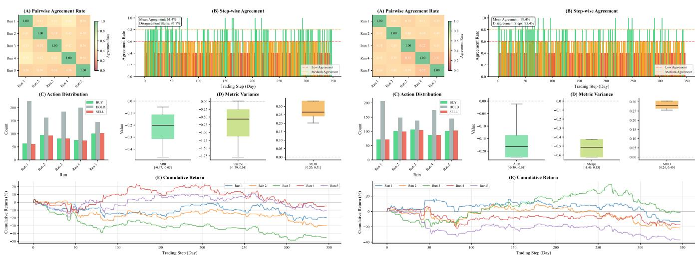  
Figure 6: Cross-run instability of <sub>gemini-3-pro-preview</sub> under diferent decoding temperatures.

<sup>Run-to-run</sup> <sup>Variability.</sup> Figure 6 summarizes five-run variability from five complementary views. <sup>(1)</sup> <sup>Pairwise</sup> <sup>agreement</sup> <sup>rate</sup> (Pane A) is remarkably low even at <sup>??</sup> = 0, ranging only 0.36–0.48, and further drops to 0.32–0.41 at <sup>??</sup> = 0<sup>.</sup>7, indicating that two runs rarely choose the same actions. <sup>(2)</sup> <sup>Step-wise</sup> <sup>agreement</sup> (Panel B) is similarly unstable: the mean agreement is 61.4% with a 95.7% step-level disagreement rate, implying the model almost never reproduces a complete action sequence. <sup>(3)</sup> <sup>Action</sup> <sup>distribution</sup> (Panel C) reveals that this instability is not merely cosmetic; runs difer materially in the frequency of buy/sell events rather than only in rare edge cases. <sup>(4)</sup> <sup>Metric</sup> <sup>variance</sup> (Panel D) shows large dispersion of ARR/Sharpe/MDD across runs, consistent with the above decision volatility. <sup>(5)</sup> <sup>Cumulative</sup> <sup>return</sup> trajectories (Panel E) therefore diverge sharply; e.g., at <sup>??</sup> = 0 one run collapses to nearly −50% while others hover near break-even. Overall, such extreme variance in a nominally greedy setup undermines the reliability of single-run backtests for gemini-3-pro-preview.

Decoding Temperature. <sub>Figure</sub> <sub>7</sub> <sub>compares</sub> ?? <sub>= 0 and</sub> ?? = 0.7 from five perspectives. (1) Action distribution (Panel A) is dominated by hold under both temperatures, with only modest shifts in buy/sell frequency. <sup>(2)</sup> <sup>Temper-</sup> <sup>ature</sup> <sup>agreement</sup> <sup>rate</sup> (Panel B) is only 0.55, showing that switching from greedy decoding to stochastic sampling flips nearly half of the aggregated trading decisions. <sup>(3)</sup> <sup>Metric</sup> <sup>variance</sup> (Panel C) remains consistently poor across temperatures, with negative ARR and Sharpe in both cases and similar MDD ranges. <sup>(4)</sup> <sup>Step-wise</sup> <sup>agreement</sup> (Panels D–E) is low and noisy across the trading horizon, with mean agreement around 61.4% at <sup>??</sup> = 0 and 59.4% at <sup>??</sup> = 0<sup>.</sup>7, indicating unstable decision logic even within each temperature setting. <sup>(5)</sup> <sup>Cumulative</sup> <sup>return</sup> (Panel F) trajectories largely overlap and trend downward for both temperatures, suggesting that while temperature changes the specific actions, it does not improve the overall profitability profile for gemini-3-propreview.

<sup>Summary.</sup> We draw three key conclusions:

• Both <sup>??</sup> = 0<sup>.</sup>0 and <sup>??</sup> = 0<sup>.</sup>7 fail to guarantee stable, consistent action sequences across repeated runs under the same setting.

• Overall, the stochastic setting (<sup>??</sup> = 0<sup>.</sup>7) tends to yield better cumulative return trajectories than deterministic decoding (<sup>??</sup> = 0<sup>.</sup>0), although performance remains volatile.

• Even within an identical setting, the action distribution can difer substantially across runs, indicating large run-to-run variability in trading behavior.

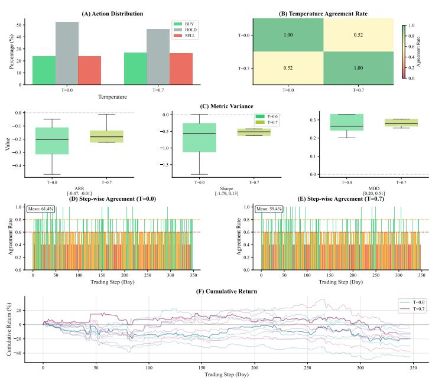  
Figure 7: Decision instability across decoding temperatures <sup>(</sup>gemini-3-pro-preview<sup>)</sup>

Decision Instability Across Temperatures: Gemini-3-Flash-Preview

## <sup>C.3</sup> <sup>Model:</sup> gemini-3-flash-preview

Decision Instability Across Runs: Gemini-3-Flash-Preview (Temperature = 0.7)  
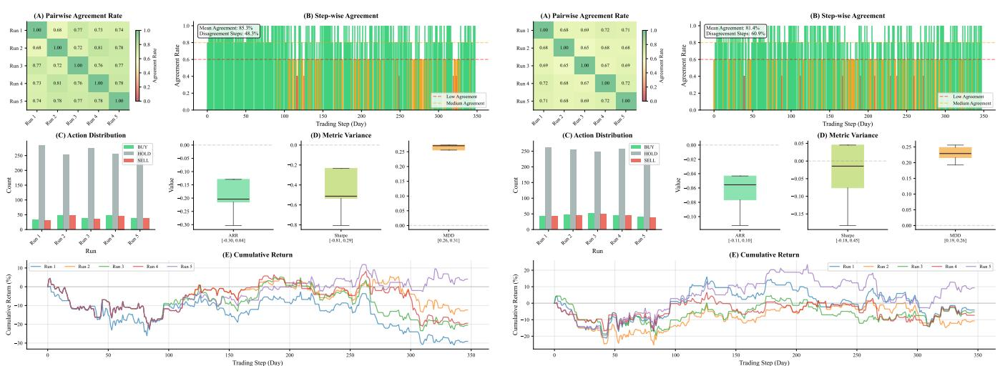  
Figure 8: Cross-run instability of <sub>gemini-3-flash-preview</sub> under diferent decoding temperatures.

<sup>Run-to-run</sup> <sup>Variability.</sup> Figure 8 summarizes five-run variability from five complementary views. <sup>(1)</sup> <sup>Pairwise</sup> <sup>agreement</sup> <sup>rate</sup> (Pane A) is relatively high at <sup>??</sup> = 0 (mean 85.3%) and remains high at <sup>??</sup> = 0<sup>.</sup>7 (81.4%), indicating that gemini-3-flash-preview produces more consistent action sequences across runs than its Pro counterpart. <sup>(2)</sup> <sup>Step-wise</sup> <sup>agreement</sup> (Panel B) still fluctuates over the trading horizon and often degrades over time, as small early discrepancies accumulate into divergent actions in later steps. <sup>(3)</sup> <sup>Action</sup> <sup>distribution</sup> (Panel C) is broadly conservative across all runs, but the frequency of rare buy/sell events varies noticeably across runs, suggesting timing instability even when the overall strategy is stable. <sup>(4)</sup> <sup>Metric</sup> <sup>variance</sup> (Panel D) shows noticeable dispersion in ARR, Sharpe, and MDD across runs, confirming that even high agreement rates do not guarantee consistent financial outcomes. <sup>(5)</sup> <sup>Cumulative</sup> <sup>return</sup> trajectories (Panel E) start close but gradually fan out as trading progresses, leading to materially diferent final outcomes despite similar initial behavior.

Decoding Temperature. <sub>Figure</sub> <sub>9</sub> <sub>compares</sub> ?? <sub>= 0 and</sub> ?? = 0.7 from five perspectives. (1) Action distribution (Panel A) is conservative at both temperatures, with hold dominating around 80% and only minor shifts in buy/sell <sub>frequency.</sub> (2) Temperature agreement rate <sub>(Panel</sub> <sub>B)</sub> <sub>is</sub> 0.80, meaning most trading decisions are preserved across temperature settings. <sup>(3)</sup> <sup>Metric</sup> <sup>variance</sup> (Panel C) shows negative ARR and Sharpe at both settings, with <sup>??</sup> = 0<sup>.</sup>7 slightly less negative and marginally better Sharpe. <sup>(4)</sup> <sup>Step-</sup> <sup>wise</sup> <sup>agreement</sup> (Panels D and E) remains relatively high, with mean agreement about 85.3% at <sup>??</sup> = 0 and 81.4% at <sup>??</sup> = 0<sup>.</sup>7. <sup>(5)</sup> <sup>Cumulative</sup> <sup>return</sup> (Panel F) trajectories largely overlap, and <sup>??</sup> = 0<sup>.</sup>7 tends to sit slightly above <sup>??</sup> = 0.

<sup>Summary.</sup> For gemini-3-flash-preview, we draw three key conclusions:

• The consistency between <sup>??</sup> = 0 and <sup>??</sup> = 0<sup>.</sup>7 is relatively high (temperature agreement rate = 0<sup>.</sup>80), suggesting that decoding temperature has a limited impact on the trading decisions for gemini-3-flash-preview compared to other models.

• Under an identical setting, run-to-run variability remains substantial; runs exhibit high agreement early on but progressively diverge as small discrepancies accumulate over time, resulting in diferent final outcomes.

• Overall, the stochastic setting (<sup>??</sup> = 0<sup>.</sup>7) tends to yield slightly better cumulative return trajectories than deterministic decoding (<sup>??</sup> = 0), although performance remains volatile and both settings underperform.

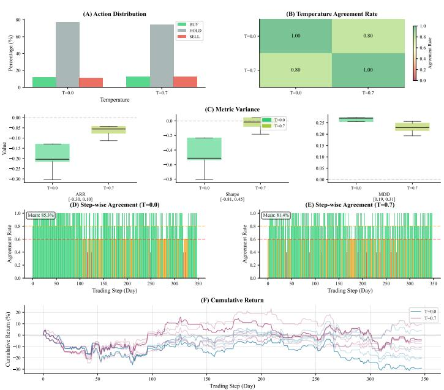  
Figure 9: Decision instability across decoding temperatures <sup>(</sup>gemini-3-flash-preview<sup>)</sup>

Decision Instability Across Temperatures: DeepSeek-V3.2

## <sup>C.4</sup> <sup>Model:</sup> deepseek-v3.2

Decision Instability Across Runs: DeepSeek-V3.2 (Temperature = 0.0)  
Decision Instability Across Runs: DeepSeek-V3.2 (Temperature = 0.7)  
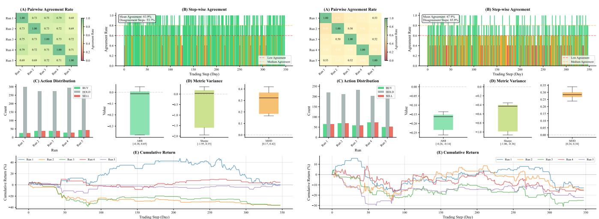  
Figure 10: Cross-run instability of <sub>deepseek-v3.2</sub> under diferent decoding temperatures.  
<sup>Run-to-run</sup> <sup>Variability.</sup> Figure 10 summarizes five-run variability from five complementary views. <sup>(1)</sup> <sup>Pairwise</sup> <sup>agreement</sup> <sup>rate</sup> (Panel A) is relatively high at <sup>??</sup> = 0 (mean 83.9%) but drops substantially at <sup>??</sup> = 0<sup>.</sup>7 (mean 67.9%), indicating that stochastic sampling significantly disrupts action consistency. <sup>(2)</sup> <sup>Step-wise</sup> <sup>agreement</sup> (Panel B) shows 53.7% disagreement steps at <sup>??</sup> = 0 and 85.9% at <sup>??</sup> = 0<sup>.</sup>7, reflecting increasing decision instability under stochastic decoding. <sup>(3)</sup> <sup>Action</sup> <sup>distribution</sup> (Panel C) is dominated by hold at <sup>??</sup> = 0, but at <sup>??</sup> = 0<sup>.</sup>7 the buy/sell frequency increases and varies substantially across runs. <sup>(4)</sup> <sup>Metric</sup> <sup>variance</sup> (Panel D) shows large dispersion in ARR, Sharpe, and MDD at <sup>??</sup> = 0, with one outlier run achieving positive return while others sufer up to −40% drawdown; at <sup>??</sup> = 0<sup>.</sup>7, the variance is tighter but uniformly negative. <sup>(5)</sup> <sup>Cumulative</sup> <sup>return</sup> trajectories (Panel E) diverge sharply at <sup>??</sup> = 0, ranging from +10% to −40%, whereas at <sup>??</sup> = 0<sup>.</sup>7 trajectories cluster in the −10% to −30% loss zone, paradoxically making the stochastic setting more predictable in its failure.

Decoding Temperature. <sub>Figure</sub> <sub>11</sub> <sub>compares</sub> ?? <sub>=</sub> <sub>0</sub> <sub>and</sub> ?? = 0.7 from five perspectives. (1) Action distribution (Panel A) is conservative at both temperatures, with hold dominating 75–80% and minor shifts in buy/sell. <sup>(2)</sup> <sup>Tem-</sup> <sup>perature</sup> <sup>agreement</sup> <sup>rate</sup> (Panel B) is 0.79, indicating most trading decisions are preserved across temperatures. <sup>(3)</sup> <sup>Met-</sup> <sup>ric</sup> <sup>variance</sup> (Panel C) shows negative ARR and Sharpe at both settings; notably, <sup>??</sup> = 0 exhibits larger variance than ?? = 0.7. (4) Step-wise agreement (Panels D and E) is 83.9% at <sup>??</sup> = 0 and drops to 67.9% at <sup>??</sup> = 0<sup>.</sup>7. <sup>(5)</sup> <sup>Cumulative</sup> <sup>return</sup> (Panel F) trajectories diverge substantially at <sup>??</sup> = 0 (+40% to −40%) but cluster tightly in the negative zone at <sup>??</sup> = 0<sup>.</sup>7 (−10% to −30%).

<sup>Summary.</sup> We draw three key conclusions:

• Unlike other models, the deterministic setting (<sup>??</sup> = 0) outperforms the stochastic setting (<sup>??</sup> = 0<sup>.</sup>7): at <sup>??</sup> = 0, the model adopts a more conservative strategy with fewer trading actions and occasionally achieves positive returns; at <sup>??</sup> = 0<sup>.</sup>7, trading frequency increases but outcomes are uniformly negative.

• Stochastic decoding (<sup>??</sup> = 0<sup>.</sup>7) not only degrades profitabil ity but also significantly increases run-to-run inconsistency, making it doubly undesirable for this model.

• Despite relatively high agreement rates at <sup>??</sup> = 0, runs still diverge substantially in cumulative returns, indicating that even small decision diferences can compound into drastically diferent financial outcomes over time.

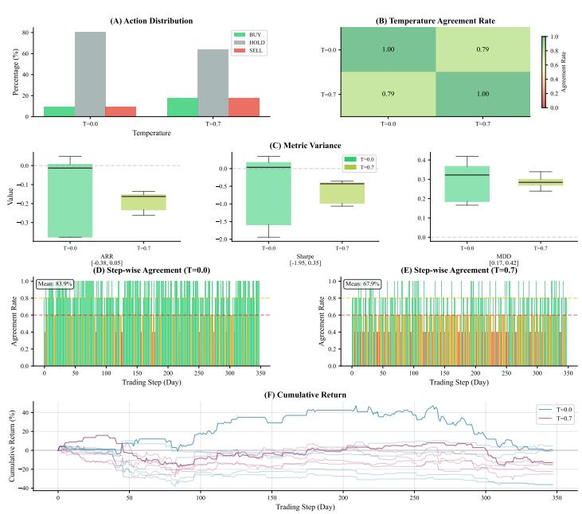  
Figure 11: Decision instability across decoding temperatures <sup>(</sup>deepseek-v3.2<sup>)</sup>

## <sup>C.5</sup> <sup>Model:</sup> grok-4.1-fast

Decision Instability Across Temperatures: Grok-4.1-Fast  
Decision Instability Across Runs: Grok-4.1-Fast (Temperature = 0.0)  
Decision Instability Across Runs: Grok-4.1-Fast (Temperature = 0.7)  
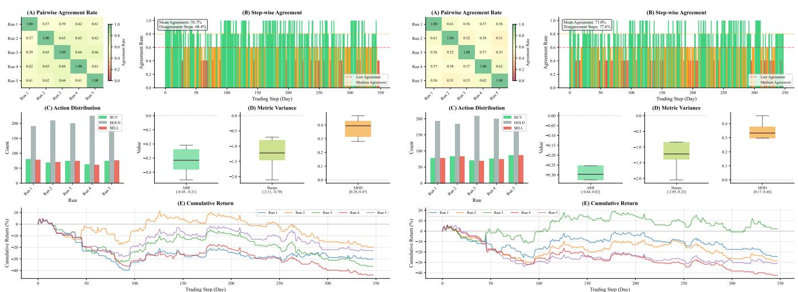  
Figure 12: Cross-run instability of <sub>grok-4.1-fast</sub> under diferent decoding temperatures.  
<sup>Run-to-run</sup> <sup>Variability.</sup> Figure 12 summarizes five-run variability from five complementary views. <sup>(1)</sup> <sup>Pairwise</sup> <sup>agreement</sup> <sup>rate</sup> (Panel A) is moderate at <sup>??</sup> = 0 (mean 75.7%) and slightly lower at <sup>??</sup> = 0<sup>.</sup>7 (mean 73.0%), indicating substantial decision inconsistency across runs at both temperatures. <sup>(2)</sup> <sup>Step-wise</sup> <sup>agreement</sup> (Panel B) shows 88.4% disagreement steps at <sup>??</sup> = 0 and 77.6% at <sup>??</sup> = 0<sup>.</sup>7, reflecting persistent instability throughout the trading horizon. <sup>(3)</sup> <sup>Action</sup> <sup>distribution</sup> (Panel C) varies considerably across runs, with some runs dominated by hold while others exhibit more frequent buy/sell actions. <sup>(4)</sup> <sup>Metric</sup> <sup>variance</sup> (Panel D) is substantial at both temperatures: at <sup>??</sup> = 0, ARR ranges from −0<sup>.</sup>45 to −0<sup>.</sup>21 with Sharpe from −2<sup>.</sup>11 to −0<sup>.</sup>70; at <sup>??</sup> = 0<sup>.</sup>7, one outlier run achieves near-zero ARR while others remain deeply negative. <sup>(5)</sup> <sup>Cumulative</sup> <sup>return</sup> trajectories (Panel E) diverge significantly at both settings, ranging from −10% to −40% at <sup>??</sup> = 0 and from +20% to −40% at <sup>??</sup> = 0<sup>.</sup>7, highlighting the danger of relying on single-run backtests.

Decoding Temperature. <sub>Figure</sub> <sub>13</sub> <sub>compares</sub> ?? <sub>= 0 and</sub> ?? = 0.7 from five perspectives. (1) Action distribution (Panel A) shows a more balanced trading profile than other models, with hold around 55–60% and notable buy/sell activity ( 20% each) at both temperatures. <sup>(2)</sup> <sup>Temperature</sup> <sup>agreement</sup> <sup>rate</sup> (Panel B) is 0.74, indicating moderate consistency across temperature settings. <sup>(3)</sup> <sup>Metric</sup> <sup>variance</sup> (Panel C) shows negative ARR and Sharpe at both settings with large variance; ARR ranges from −0<sup>.</sup>45 to +0<sup>.</sup>02 and Sharpe from −2<sup>.</sup>11 to +0<sup>.</sup>23, reflecting high outcome uncertainty. <sup>(4)</sup> <sup>Step-wise</sup> <sup>agreement</sup> (Panels D and E) is 76.7% at <sup>??</sup> = 0 and 73.0% at <sup>??</sup> = 0<sup>.</sup>7, both lower than other models. <sup>(5)</sup> <sup>Cumulative</sup> <sup>return</sup> (Panel F) trajectories overlap substantially between temperatures, both ranging from +10% to −40%, suggesting that temperature has limited impact on final outcomes while run-to-run variance dominates.

<sup>Summary.</sup> We draw three key conclusions:

• grok-4.1-fast adopts a more aggressive trading profile than other models with more frequent buy/sell actions, yet this does not translate into better performance.

• Temperature has limited impact on final outcomes: both <sup>??</sup> = 0 and <sup>??</sup> = 0<sup>.</sup>7 produce similarly wide cumulative return ranges with overlapping trajectories.

• Run-to-run instability dominates: large metric variance across runs makes single-run backtests highly unreliable for this model.

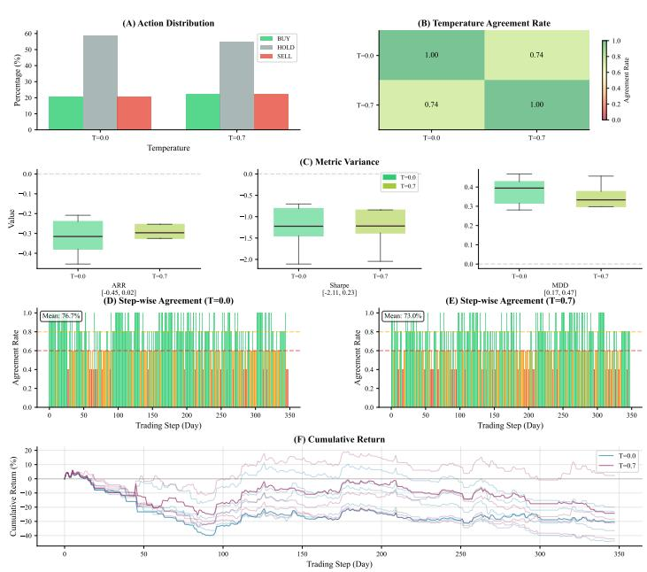  
Figure 13: Decision instability across decoding temperatures (<sub>grok-</sub> 4.1-fast<sup>)</sup>

## <sup>C.6</sup> <sup>Model:</sup> claude-sonnet-4.5

Decision Instability Across Runs: Claude-Sonnet-4.5 (Temperature = 0.0)  
Decision Instability Across Runs: Claude-Sonnet-4.5 (Temperature = 0.7)  
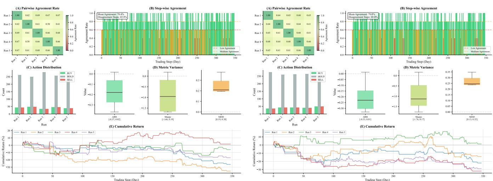  
Figure 14: Cross-run instability of <sub>claude-sonnet-4.5</sub> under diferent decoding temperatures.

<sup>Run-to-run</sup> <sup>Variability.</sup> Figure 14 summarizes five-run variability from five complementary views. <sup>(1)</sup> <sup>Pairwise</sup> <sup>agreement</sup> <sup>rate</sup> (Panel A) is moderate at <sup>??</sup> = 0 (mean around 79.0%) and drops slightly at <sup>??</sup> = 0<sup>.</sup>7 (mean around 70.9%), indicating reasonable but imperfect consistency across runs. <sup>(2)</sup> <sup>Step-wise</sup> <sup>agreement</sup> (Panel B) shows 65.8% disagreement steps at <sup>??</sup> = 0 and 69.0% at <sup>??</sup> = 0<sup>.</sup>7, reflecting persistent instability throughout the trading horizon. <sup>(3)</sup> <sup>Action</sup> <sup>distribution</sup> (Panel C) is dominated by hold at both temperatures, with relatively consistent buy/sell frequency across runs compared to other models. <sup>(4)</sup> <sup>Metric</sup> <sup>variance</sup> (Panel D) shows moderate dispersion in ARR, Sharpe, and MDD at both temperatures; some runs achieve near-zero or slightly positive returns while others sufer losses up to −30%. <sup>(5)</sup> <sup>Cumulative</sup> <sup>return</sup> trajectories (Panel E) start similarly but gradually diverge, ranging from +10% to −30% at both <sup>??</sup> = 0 and <sup>??</sup> = 0<sup>.</sup>7, indicating that run-to-run variance dominates temperature efects.

Decoding Temperature. <sub>Figure</sub> <sub>15</sub> <sub>compares</sub> ?? <sub>= 0 and</sub> ?? = 0.7 from five perspectives. (1) Action distribution (Panel A) is conservative at both temperatures, with hold dominating around 75% and balanced buy/sell activity. <sup>(2)</sup> Temperature agreement rate <sub>(Panel</sub> <sub>B)</sub> <sub>is</sub> <sub>0.82,</sub> <sub>indicat-</sub> ing high consistency across temperature settings, among the highest of all tested models. <sup>(3)</sup> <sup>Metric</sup> <sup>variance</sup> (Panel C) shows negative ARR and Sharpe at both settings with moderate variance; both temperatures exhibit similar performance distributions. <sup>(4)</sup> <sup>Step-wise</sup> <sup>agreement</sup> (Panels D and E) is 78.0% at <sup>??</sup> = 0 and 79.0% at <sup>??</sup> = 0<sup>.</sup>7, relatively stable across the trading horizon. <sup>(5)</sup> <sup>Cumulative</sup> <sup>return</sup> (Panel F) trajectories overlap substantially between temperatures, both trending downward and ranging from +10% to −30%, suggesting temperature has limited impact on outcomes.

<sup>Summary.</sup> For claude-sonnet-4.5, we draw three key con clusions:

• While the aggregated action distribution is similar across temperatures (agreement rate 0.82), individual runs still produce substantially diferent action sequences at both <sup>??</sup> = 0 and <sup>??</sup> = 0<sup>.</sup>7, with cumulative returns ranging from +10% to −30%.

• The model adopts a conservative hold-dominated strategy with infrequent trading, but this conservatism does not eliminate run-to-run instability; repeated runs under identical settings diverge in financial outcomes.

• Changing temperature does not improve stability or prof itability; both settings exhibit similar patterns of run-to-run variance and negative ARR/Sharpe ratios.

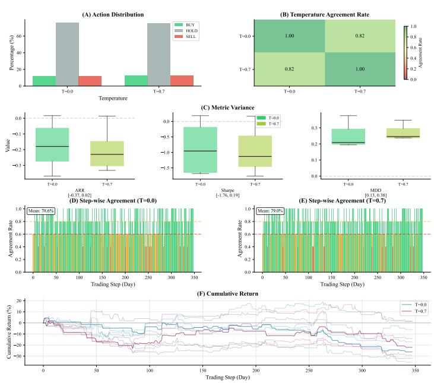  
Figure 15: Decision instability across decoding temperatures <sup>(</sup>claude-sonnet-4.5<sup>)</sup>

## C.7 Model: <sub>gpt-5.2</sub>

Decision Instability Across Temperatures: GPT-5.2  
Decision Instability Across Runs: GPT-5.2 (Temperature = 0.0)  
Decision Instability Across Runs: GPT-5.2 (Temperature = 0.7)  
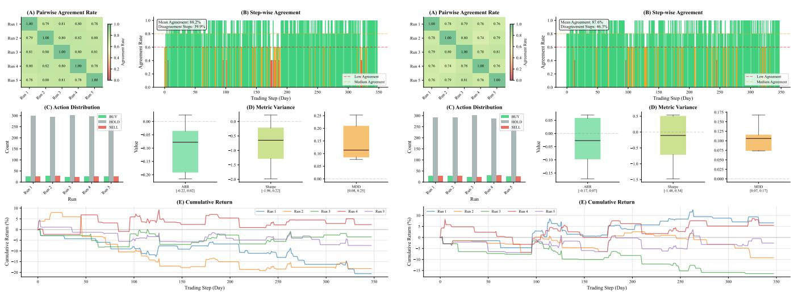  
Figure 16: Cross-run instability of <sub>gpt-5.2</sub> under diferent decoding temperatures.  
<sup>Run-to-run</sup> <sup>Variability.</sup> Figure 16 summarizes five-run variability from five complementary views. <sup>(1)</sup> <sup>Pairwise</sup> <sup>agreement</sup> <sup>rate</sup> (Panel A) is high at both temperatures: mean 88.2% at <sup>??</sup> = 0 and 87.6% at <sup>??</sup> = 0<sup>.</sup>7, indicating strong consistency across runs. <sup>(2)</sup> <sup>Step-wise</sup> <sup>agreement</sup> (Panel B) shows only 39.9% disagreement steps at <sup>??</sup> = 0 and 40.3% at <sup>??</sup> = 0<sup>.</sup>7, the lowest among all tested models. <sup>(3)</sup> <sup>Action</sup> <sup>distribution</sup> (Panel C) is extremely conservative, with hold dominating over 80% of decisions and minimal buy/sell activity across all runs. <sup>(4)</sup> <sup>Metric</sup> <sup>variance</sup> (Panel D) shows moderate dispersion; some runs achieve near-zero returns while others sufer modest losses. <sup>(5)</sup> <sup>Cumulative</sup> <sup>return</sup> trajectories (Panel E) remain relatively clustered compared to other models, ranging from +5% to −20% at <sup>??</sup> = 0 and +10% to −15% at <sup>??</sup> = 0<sup>.</sup>7.

Decoding Temperature. <sub>Figure</sub> <sub>17</sub> <sub>compares</sub> ?? <sub>= 0 and</sub> ?? = 0.7 from five perspectives. (1) Action distribution (Panel A) is highly conservative at both temperatures, with hold around 80% and balanced but infrequent buy/sell ac-<sub>tions.</sub> (2) Temperature agreement rate <sub>(Panel</sub> <sub>B)</sub> <sub>is</sub> <sub>0.93,</sub> the highest among all tested models, indicating near-identical trading decisions regardless of temperature setting. <sup>(3)</sup> <sup>Met-</sup> <sup>ric</sup> <sup>variance</sup> (Panel C) shows similar ARR and Sharpe distributions across temperatures, both hovering around breakeven to slightly negative. <sup>(4)</sup> <sup>Step-wise</sup> <sup>agreement</sup> (Panels D and E) is 88.2% at <sup>??</sup> = 0 and 87.5% at <sup>??</sup> = 0<sup>.</sup>7, consistently high throughout the trading horizon. <sup>(5)</sup> <sup>Cumulative</sup> <sup>return</sup> (Panel F) trajectories overlap substantially between temperatures, both ranging from +10% to −20%, confirming minimal temperature sensitivity.

<sup>Summary.</sup> For gpt-5.2, we draw three key conclusions:

• While gpt-5.2 shows the highest temperature agreement rate (0.93) and relatively higher pairwise agreement than other models, it still exhibits run-to-run variability; individual runs produce diferent action sequences with cumulative returns ranging from +10% to −20%.

• The model adopts an extremely conservative holddominated strategy with over 80% hold actions, which reduces but does not eliminate run-to-run divergence in financial outcomes.

• Changing temperature has minimal impact on aggregated behavior, but neither setting resolves the fundamental instability; performance remains around break-even to slightly negative regardless of configuration.

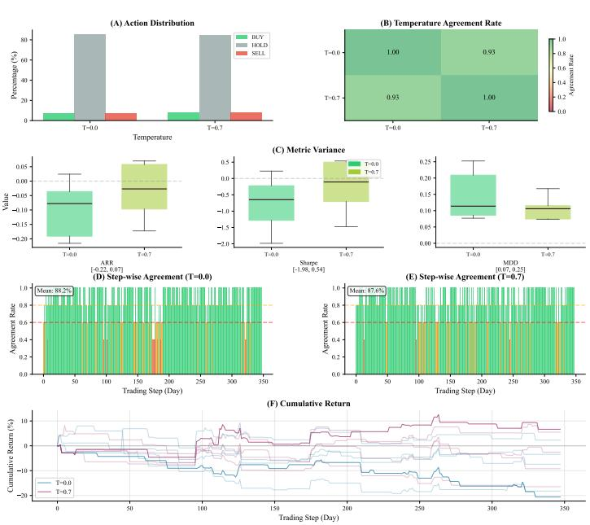  
Figure 17: Decision instability across decoding temperatures (<sub>gpt-</sub> 5.2<sup>)</sup>

## C.8 Conclusion

Synthesizing the empirical findings across all six evaluated models, we summarize the key conclusions in Table 3.

Table 3: Summary of key findings on LLM decision instability in trading tasks.  
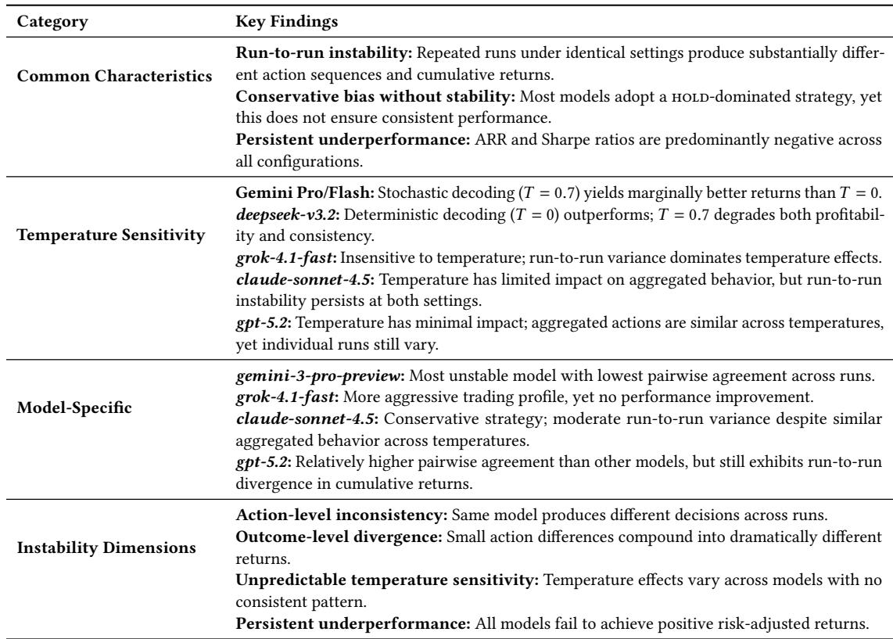

<sup>Implications</sup> <sup>for</sup> <sup>LLM-based</sup> <sup>trading.</sup> Our analysis demonstrates that current LLMs are fundamentally unreliable for direct actionemitting trading tasks. While some models (gpt-5.2 and claude-sonnet-4.5) show similar aggregated behavior across temperatures, they still exhibit substantial run-to-run variability in action sequences, leading to divergent financial outcomes under identical settings. These findings underscore the need for evaluation frameworks, such as factor-based benchmarks, that decouple LLM reasoning capability from the inherent noise of direct action generation.

## D Construction of AlphaForgeBench

The data construction process of <sup>AlphaForgeBench</sup> consists of two stages. <sup>Stage</sup> <sup>1:</sup> <sup>Real-world</sup> <sup>strategy</sup> <sup>collection.</sup> We collect natural-language queries and their corresponding ground-truth alpha factors and factor-based trading strategies from diverse real-world sources on the Internet, including brokerage research reports, quantitative investment platforms, AI-in-finance literature, open-source repositories, and traditional finance publications. These real-world samples form the foundation of the benchmark and ensure practical relevance. <sup>Stage</sup> <sup>2:</sup> <sup>LLM-augmented</sup> <sup>structured</sup> <sup>query</sup> <sup>generation.</sup> Based on the patterns and types observed in the collected real-world strategies, we define three levels of strategy complexity, and within each level we further assign three dificulty grades (easy, medium, and hard). We then use LLMs to systematically generate additional queries at each level-dificulty combination, producing test cases that more precisely target specific aspects of an LLM’s strategy generation capability. This two-stage design combines the authenticity of real-world strategies with the controlled granularity of synthetically constructed test cases

## D.1 Stage 1: Real-world Strategy Collection

D.1.1 Data Sources. In <sup>AlphaForgeBench</sup>, we collect a comprehensive set of alpha factors and factor-based trading strategies from five primary sources to ensure diversity and practical relevance.

• <sup>Brokerage</sup> <sup>Research</sup> <sup>Reports</sup>: We analyzed a large collection of quantitative finance research reports from top-tier brokerages (e.g., CITIC Securities, Huatai Securities, and Haitong Securities), which provide both (i) established alpha factors and (ii) practical factor-based trading strategies for the Chinese stock market or US stock market.

• <sup>Quantitative</sup> <sup>Investment</sup> <sup>Platforms</sup>: We incorporated both alpha factors and factor-driven strategy formulations from widely used platform libraries, including <sup>WorldQuant</sup> (e.g., 101 Alphas) and <sup>JoinQuant</sup>, covering global benchmark alphas and community/industry resources tailored for local markets.

• <sup>AI</sup> <sup>in</sup> <sup>Finance</sup> <sup>Literature</sup>: We systematically reviewed recent AI4Finance papers and articles to collect both AI-generated/AI-enhanced factors and factor-based strategy designs (e.g., using deep learning and reinforcement learning).

• <sup>Open-Source</sup> <sup>Repositories</sup>: We leveraged popular open-source projects on GitHub, such as <sup>OpenFE</sup>, as well as <sup>Qlib</sup> and its widely used feature set <sup>Alpha158</sup>, to complement the pool with automated feature engineering patterns and standardized factor/feature libraries, which can be used to construct new factors and further build factor-based trading strategies.

• <sup>Traditional</sup> <sup>Finance</sup> <sup>Literature</sup>: We queried academic search engines and working-paper repositories of finance research (Google Scholar, SSRN, arXiv and NBER) using curated keyword sets across multi-asset classes. We then performed citation snowballing from cornerstone papers and surveys to expand coverage, prioritizing widely cited and methodologically explicit studies.

D.1.2 Data Extraction Pipeline. The raw data sources described above are predominantly in PDF format (research reports, academic papers, platform documentation). To systematically extract structured factor definitions and strategy logic from these unstructured documents, we designed an automated extraction pipeline consisting of two steps: document collection followed by LLM-based information extraction.

<sup>Document</sup> <sup>collection.</sup> We used web crawlers to collect PDF documents from the five source categories. For brokerage research reports, we crawled publicly available quantitative research sections from major Chinese and international brokerages. For academic literature, we queried Google Scholar, SSRN, arXiv, and NBER with curated keyword sets (e.g., “alpha factor,” “momentum strategy,” “mean reversion,” “factor investing”) and downloaded the resulting papers. For quantitative platforms, we scraped strategy descriptions and factor documentation from JoinQuant and WorldQuant community pages.

<sup>LLM-based</sup> <sup>extraction.</sup> Given the multimodal capabilities of recent frontier LLMs, we leverage gemini-3-flash-preview to parse each collected PDF document and extract structured information. Specifically, the model receives the full PDF as a multimodal input and is instructed to identify and extract: (i) factor names and their mathematical definitions, (ii) strategy logic and trading rules, (iii) the underlying financial rationale, and (iv) whether the strategy involves deep learning or alternative data sources. The extraction prompt enforces a standardized JSON schema for each identified factor or strategy, ensuring consistent formatting across heterogeneous source documents. The complete prompt template is provided below.

## PDF Extraction Prompt

<sup>System:</sup> You are a quantitative strategy extraction expert. Please extract the <sup>core</sup> <sup>strategies</sup> <sup>originally</sup> <sup>proposed</sup> in this research report PDF.

## Extraction Rules:

(1) Only extract strategies <sup>originally</sup> <sup>proposed</sup> in this paper. Do <sup>not</sup> extract:

• Strategies merely mentioned in the abstract

• Strategies cited from other literature

• Existing strategies used as comparison baselines

(2) A single report may contain multiple core strategies; extract all of them.

(3) If the report does not propose any concrete executable strategy, return an empty list.

For each strategy, extract:

(1) <sup>Name</sup>: Strategy name (Chinese and English)

(2) <sup>Factor</sup>: Core factor name(s) used by the strategy

(3) <sup>Definition</sup>: Mathematical definition of the factor(s) in LaTeX

(4) <sup>Strategy</sup> <sup>Logic</sup>: Complete trading rules, including conditions for long, short, and neutral positions

(5) <sup>Design</sup> <sup>Rationale</sup> <sup>(CoT)</sup>: Detailed explanation of why the strategy works:

• What market phenomenon does it capture? (e.g., momentum, mean reversion, microstructure)

• Why can this factor/signal predict future returns? What is the financial intuition?

• What are the advantages over traditional methods?

• Under what market conditions does it perform better or worse?

(6) <sup>Strategy</sup> <sup>Type</sup>: rule\_based (directly implementable with technical indicators) or model\_based (requires a pre-trained ML/DL model)

(7) <sup>Strategy</sup> <sup>Code</sup>: Python code implementing the strategy

## Code Specification:

• Function name must be generate\_signal

• Input: df: pd.DataFrame with columns open, high, low, close, volume

• Output: pd.Series with values {1<sup>,</sup> −1<sup>,</sup> 0} (long / short / neutral)

• For rule\_based: compute signals directly from df columns

• For model\_based: assume a pre-computed model\_score column exists in df

## Output Schema (JSON):

" title ": " Report title " ,

" strategies ": [   
{   
" name ": " Strategy name " ,   
" factor ": " Core factor name " ,   
" definition ": " LaTeX formula " ,   
" logic ": " Trading rules " ,   
" reason ": " Design rationale ( CoT ) " ,   
" strategy\_type ": " rule\_based | model\_based " ,   
" code ": " Python code "   
}   
]   
}

D.1.3 Dataset Statistics and Scope. After extraction and deduplication, the full <sup>AlphaForgeBench</sup> dataset comprises <sup>3,176</sup> factor-strategy entries spanning three strategy types, as summarized in Table 4. We describe each type below.

<sup>Single-asset</sup> <sup>Trading</sup> (633 entries) strategies operate on individual assets in isolation. Each strategy takes as input the historical price and indicator data of a single asset (e.g., BTCUSDT, ETHUSDT, AAPL, GOOGL, MSFT, NVDA, TSLA) and produces trading signals (buy/sell/hold) or alpha factors for that asset alone. These strategies are self-contained and asset-agnostic: the same logic can be independently applied to any individual asset without requiring cross-asset coordination. Examples include momentum-based timing strategies, mean-reversion signals, and technical indicator combinations.

<sup>Portfolio</sup> <sup>Management</sup> (2,172 entries) strategies involve cross-sectional analysis and portfolio-level allocation across multiple assets simultaneously. Rather than generating signals for a single asset, these strategies rank or score a universe of assets and construct a weighted portfolio. Typical examples include factor-based long-short portfolios (e.g., buying the top decile and shorting the bottom decile by a value or momentum factor), risk-parity allocation, and sector rotation strategies. These strategies require the model to reason about relative asset characteristics and portfolio-level constraints such as diversification and risk budgets.

<sup>Multi-asset</sup> <sup>Trading</sup> (371 entries) strategies involve coordinated trading across diferent asset classes or instruments. Unlike portfolio management strategies that rank within a single universe, multi-asset strategies exploit relationships between heterogeneous assets, such as cross-market arbitrage (e.g., BTC spot vs. futures), pair trading between correlated assets, or macro-driven allocation across equities, bonds, and commodities. These strategies demand understanding of inter-market dynamics and cross-asset dependencies.

In this paper, we focus the benchmark evaluation on the <sup>single-asset</sup> <sup>trading</sup> subset. Single-asset trading strategies are ideal for controlled evaluation, as they isolate the LLM’s ability to generate correct and profitable trading logic from the confounding efects of portfolio construction, asset allocation, and cross-asset coordination. The portfolio management and multi-asset trading subsets are reserved for future work.

Table 4: AlphaForgeBench dataset statistics by strategy type.  
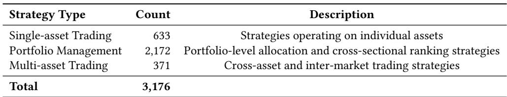

D.1.4 Strategy Query Generation. The structured strategy entries extracted in Stage 1 contain rich metadata (strategy name, logic, factors, rationale), but they cannot be directly used as real-world benchmark queries because they may include implementation details, unsupported data sources (e.g., deep learning models, order-book data), or non-English descriptions. To produce clean, implementation-agnostic English queries suitable for evaluating LLM code generation, we employ gpt-5.2 to transform each extracted strategy entry into a standardized real-world benchmark query.

The generation process takes as input the structured strategy fields (name, logic, reason, factors) and produces a requirements-only English query that preserves the core trading intent while ensuring implementability within the backtest framework’s constraints (OHLCV data and precomputed technical indicators only).

## Query Generation System Prompt

<sup>System:</sup> You are a benchmark query generator for single-asset trading strategies. Given a SOURCE strategy entry (name/logic/reason/factors), generate ONE English, requirements-only query that a code-generation model can implement.

Hard Constraints:

• The query MUST be implementable using ONLY df[’open’,’high’,’low’,’close’,’volume’] and the allowed precomputed factor columns.

• The strategy MUST be stateless (no position tracking or “if already in position” logic).

• Long-only semantics are assumed by the system: do NOT mention “long-only” or “no short selling.”

• Do NOT mention code, libraries, backtest engines, or implementation details.

• If the source strategy relies on deep learning, alternative data, options IV, order-book/OFI, or other unsupported signals, approximate the intent using technical indicators (EMA/SMA/RSI/MACD/BB/ATR/STD/VOL/OBV/etc.).

Output Schema (JSON):

{   
" query ": " <3 -8 sentence requirement description >" ,   
" summary ": " <10 -20 word one - sentence summary >" ,   
" approximation\_notes ": " < how unsupported parts were approximated >" ,   
" used\_factors ": [" ema\_20 " , " rsi\_14 " , ...]   
}

## Query Generation User Prompt Template

SOURCE STRATEGY (for generation only):

• source\_id: Strategy identifier

• strategy\_name: Name of the strategy

• is\_deep\_learning: Whether the strategy involves deep learning

• strategy\_logic: Complete trading logic description

• strategy\_reason: Rationale behind the strategy

• Source factor hints: Factor names and definitions (may be unsupported; used as semantic guidance)

<sup>TASK:</sup> Generate a benchmark query that is implementable with the allowed DataFrame columns. Keep the core intent (trend-following / meanreversion / volatility control / breakout / risk management), but translate unsupported signals into technical-indicator proxies.

<sup>OUTPUT:</sup> Return ONLY a single JSON object with keys: query, summary, approximation\_notes, used\_factors.

## D.2 Stage 2: LLM-augmented Structured Query Generation

D.2.1 Motivation and Design Overview. While the real-world strategies collected in Stage 1 provide authentic and diverse test cases, they are not systematically organized by dificulty and may not uniformly cover the full spectrum of capabilities required for strategy generation. To address this, Stage 2 introduces a structured query generation framework that complements the real-world samples with synthetically constructed queries designed to probe specific aspects of an LLM’s strategy generation ability in a controlled and fine-grained manner.

D.2.2 Levels and Dimensions of Dificulty. The framework evaluates three orthogonal dimensions of dificulty: (1) Granularity of Strategy Logic, measuring how much trading logic is left underspecified in the query; (2) Semantic–Symbolic Alignment to the Factor Library, measuring whether the model can map natural-language financial concepts to concrete factor APIs; and (3) Complexity of Logical Structure, characterizing the algorithmic complexity of the target strategy. These three dimensions are jointly organized into three progressive levels (Level 1 through Level 3), where each level defines a characteristic setting along every dimension. Within each level, we further assign three dificulty grades (Easy, Medium, and Hard) that modulate the task complexity through factors such as the number of conditions, the degree of underspecification, and the depth of logical control flow and the degree of autonomous design required. This 3 × 3 level–grade taxonomy yields nine distinct dificulty cells, enabling fine-grained and systematic evaluation of an LLM’s strategy generation capability as described in Table 5.

<sup>Level</sup> <sup>1:</sup> <sup>Logic</sup> <sup>Translation.</sup> At this level, queries provide fully specified IF–THEN rules with explicit numerical parameters, and the model is evaluated primarily on faithful code translation rather than financial inference. Along the Granularity axis (Logic Translation), the query leaves no implementation decisions to the model. Along the Alignment axis (Explicit Mapping), indicator names mentioned in the query map directly to factor-library variables (e.g., “RSI” → rsi\_14), so the task reduces to precise retrieval and correct API invocation. Along the Complexity axis (Sequential Thresholding), the target strategy is composed of pointwise boolean decisions over threshold comparisons. Within this level, three dificulty grades are distinguished by the number of conditions, the depth of logical composition, and the coordination efort across factors:

• Easy. The query specifies a single-indicator threshold rule with one explicit entry condition (e.g., “buy when RSI drops below 30”). The indicator-to-factor mapping is one-to-one and unambiguous, and the implementation requires only a single conditional statement.

• Medium. The query specifies a conjunction of two to three indicator-based conditions with AND/OR connectives, each with explicitly stated thresholds (e.g., “buy when RSI <sup><</sup> 30 and the closing price is above the 20-day EMA”). Queries at this grade may also include explicit crossover semantics (e.g., golden cross, death cross) and fixed take-profit/stop-loss thresholds. Although every condition maps straightforwardly to a factor variable, the model must correctly compose multiple boolean predicates and handle their logical conjunction. All strategies are stateless: entry and exit conditions are evaluated independently on each bar based on current data only.

• Hard. The query specifies a multi-factor strategy with signal-strength-based position sizing and explicit priority rules for resolving conflicting signals (e.g., “allocate full position if RSI <sup><</sup> 20, half position if RSI <sup><</sup> 30; combine short-term, medium-term, and long-term indicators; if the risk signal fires, override the entry signal”). The strategy involves four or more nested conditions spanning multiple time-window factors, yet all logic remains fully explicit and stateless—position size is determined by current signal strength on each bar, not by tracking previous positions.

<sup>Level</sup> <sup>2:</sup> <sup>Logic</sup> <sup>Completion.</sup> At this level, queries provide a strategic skeleton but deliberately leave critical implementation details unspecified, requiring the model to supply plausible defaults grounded in domain knowledge. Along the Granularity axis (Logic Completion), key parameters such as thresholds, lookback windows, or the operational definition of qualitative terms (e.g., “significant deviation”) are omitted and must be inferred by the model. Along the Alignment axis (Conceptual Mapping), the query employs financial jargon or qualitative descriptors (e.g., “oversold”), and the model must identify the underlying quantitative proxy and operationalize it via appropriate factors and thresholds. Along the Complexity axis (Multi-Factor Composition), the strategy combines multiple indicators into a coherent trading rule, and the model must infer how to integrate them—including conditional filters, confirmation logic, and risk controls—from incomplete specifications. Within this level, three dificulty grades are distinguished by the extent of underspecification, the abstractness of semantic alignment, and the sophistication of multi-factor composition:

• Easy. The query omits a single implementation parameter (e.g., a specific threshold or lookback period) while leaving the remainder of the logic explicit. The jargon used is standard and widely recognized (e.g., “overbought”), mapping in one hop to a well-known indicator with a conventional default (e.g., “oversold” → RSI <sup><</sup> 30).

• Medium. The query omits multiple parameters simultaneously (e.g., both the lookback window and the deviation threshold for a mean reversion strategy), requiring the model to jointly infer coherent defaults. The jargon involves domain-specific compound concepts (e.g., “volume-confirmed breakout with trend confirmation and chop filter”), and the model must decompose the term into constituent factors and determine their interaction.

• Hard. The query provides only a high-level strategic skeleton with most quantitative details left unspecified (e.g., “implement a mean reversion strategy with appropriate risk controls”), demanding that the model design a complete parameterization from domain priors. The alignment requires interpreting abstract, multi-interpretation jargon (e.g., “liquidity drying up,” “panic selling,” “risk appetite shift”) whose operationalization depends on market regime assumptions. Risk control logic is also left unspecified and must be inferred by the model.

<sup>Level</sup> <sup>3:</sup> <sup>Goal-Oriented</sup> <sup>Generation.</sup> At this level, the query states only a high-level investment objective or describes an abstract pattern, and the model must design an end-to-end strategy architecture from first principles. Along the Granularity axis (Goal-Oriented Generation), no concrete trading rules are provided; the model must autonomously formulate the strategy logic, select appropriate indicators, and determine all parameters. Along the Alignment axis (Intent/Cross-Modal Mapping), the query expresses abstract intent or visually described patterns (e.g., a hammer candlestick), requiring the model to synthesize multi-factor compositions from primitives such as open, high, low, and close to represent higher-order structures. Along the Complexity axis (Constraint-Driven Design), the strategy must satisfy multiple simultaneous constraints and resolve potential conflicts among competing objectives, all based on current-bar data only—no position tracking, regime history, or state machines are permitted. Within this level, three dificulty grades are distinguished by the ambiguity of the objective, the complexity of cross-modal reasoning, and the depth of constraint-driven design:

• Easy. The query states a single, well-defined objective with a clear stylistic category (e.g., “design a trend-following strategy for equity indices”) and a small number of constraints (e.g., a maximum drawdown limit). The abstract concept to be operationalized corresponds to a single canonical pattern (e.g., “golden cross”), and the model must compose two related indicators (e.g., short-term and long-term moving averages).

• Medium. The query specifies a multi-faceted objective with competing sub-goals (e.g., “capture momentum while limiting drawdown in volatile regimes”), requiring the model to balance return-seeking and risk-controlling components. The alignment involves translating a visually or qualitatively described pattern (e.g., “cup-and-handle formation”) into a conjunction of geometric and volumetric conditions across multiple OHLCV-derived factors. The strategy must incorporate current-bar regime detection (e.g., using ATR or standard deviation to classify the current bar as high- or low-volatility) and adapt its behavior accordingly, with all decisions based solely on current data.

• Hard. The query provides only a vague or open-ended investment mandate (e.g., “generate consistent risk-adjusted returns in sideways markets with a maximum drawdown constraint”), and the model must autonomously select the strategy archetype, define the signal logic, and calibrate all parameters. The alignment demands cross-modal synthesis of abstract financial intuitions (e.g., “a volatility compression preceding a breakout”) into multi-factor composite signals that have no single canonical representation. The strategy must resolve conflicting objectives (e.g., maximize returns vs. minimize drawdown vs. reduce turnover) through a complex priority-based rule system, with multi-layer risk controls that can override entry signals and position sizing that adapts to multiple current-bar factors simultaneously; all decisions must be based on current bar data only, using conditional priority rules rather than state tracking. Performance at this grade distinguishes genuine quantitative reasoning and strategy design capability from mere NL-to-code competence.

D.2.3 Benchmark Query Generation. To systematically populate the 3 × 3 dificulty taxonomy, we use gpt-5.2 to generate strategy queries for each of the nine level–grade cells. For every cell, the model produces three queries per batch—one for each trading style (Conservative, Aggressive, and Balanced)—and the process iterates with deduplication until the target count per cell is reached (90 queries per cell, 810 total before filtering to 30 per cell for the final benchmark). The generation prompt is assembled from six modular components, presented below: (1) a base system prompt that defines the generator’s role, constraints, and the complete factor library; (2) a level overview summarizing all three dificulty levels; (3) category definitions for all nine cells with the current cell highlighted; (4) a current task emphasis block reinforcing the active cell’s constraints; (5) trading style definitions; and (6) output format requirements specifying the JSON schema. When prior queries have already been generated for the same cell, a deduplication instruction listing recent strategy summaries is appended to encourage diversity.

Table 5: Summary of the <sub>3 × 3</sub> dificulty taxonomy for LLM-augmented query generation. Each cell characterizes the task along three dimensions: <sub>Granularity</sub> (how much logic is specified), <sub>Alignment</sub> (how indicator names relate to factor APIs), and <sub>Complexity</sub> (algorithmic structure of the target strategy).  
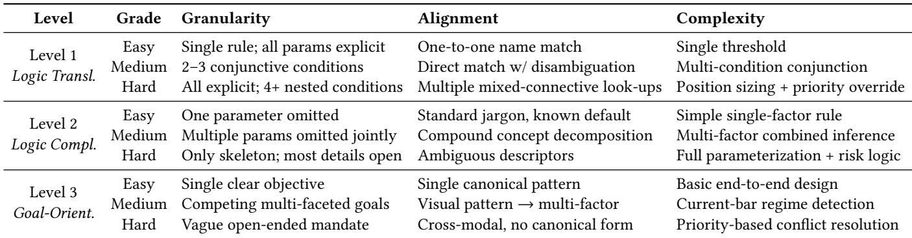

## Base System Prompt

You are an experienced quantitative trading expert generating strategy requirement queries for a benchmark. Write queries in a professional tone that guides models to produce high-quality trading strategies.

INTERNAL NOTE (do NOT mention in queries): All strategies are long-only by default. Do not include phrases like “no short selling” or “long-only” in the generated queries—this constraint is already handled by the system.

Each query is requirements-only: describe the trading logic and constraints, but do not ask to write code, do not include implementation details, and do not reference any libraries, APIs, or backtesting engines.

Available Data & Allowed Factors (strict)

Assume you trade one single stock using a pandas-like DataFrame df with precomputed columns only. You may reference only the following variables:

• Price/volume series: df[’open’], df[’high’], df[’low’], df[’close’], df[’volume’] (assume they exist).

• Precomputed factors (use exact column names, {n} is any positive integer period):

<sup>Price-scale</sup> <sup>factors</sup> (same magnitude as price, compare with price):

• SMA: df[’sma\_{n}’] = SMA(close, n) – simple moving average

• EMA: df[’ema\_{n}’] = EMA(close, n) – exponential moving average

• Bollinger Bands: df[’bb\_upper\_{n}’], df[’bb\_middle\_{n}’], df[’bb\_lower\_{n}’]

• ATR: df[’atr\_{n}’] – average true range

Fixed-range 0–100:

• RSI: df[’rsi\_{n}’] = 100 - 100/(1 + avg\_gain/avg\_loss) – relative strength index

• MFI: df[’mfi\_{n}’] – money flow index

• Stochastic: df[’stoch\_k\_{n}’], df[’stoch\_d\_{n}’] – KDJ indicator (NO j line)

Normalized 0–1:

• RSV: df[’rsv\_{n}’] = (close - ts\_min(low,n)) / (ts\_max(high,n) - ts\_min(low,n))

• Count ratios: df[’cntp\_{n}’] = count(ret>0,n)/n, df[’cntn\_{n}’] = count(ret<0,n)/n

• Sum ratios: df[’sump\_{n}’] = ts\_sum(pos\_ret,n)/ts\_sum(abs\_ret,n), df[’sumn\_{n}’] = 1 - sump

• Volume sum: df[’vsump\_{n}’] = ts\_sum(pos\_vol\_chg,n)/ts\_sum(abs\_vol\_chg,n), df[’vsumn\_{n}’] = 1 - vsump

<sup>Normalized</sup> <sup>0</sup> <sup>to</sup> <sup>(n-1)/n</sup> (position in window, NEVER reaches 1.0):

• Position: df[’imax\_{n}’] = argmax(high,n)/n, df[’imin\_{n}’] = argmin(low,n)/n (e.g., imax\_20 ranges 0 to 0.95)

• Rank: df[’rank\_{n}’] = ts\_rank(close,n)/n (e.g., rank\_20 ranges 0 to 0.95)

Normalized -1 to 1:

• Count dif: df[’cntd\_{n}’] = cntp - cntn

• Sum dif: df[’sumd\_{n}’] = 2\*sump - 1

• Volume dif: df[’vsumd\_{n}’] = 2\*vsump - 1

• Correlation: df[’corr\_{n}’] = ts\_corr(close, log(volume), n), df[’cord\_{n}’] = ts\_corr(delta(close), delta(volume), n)

## Normalized -(n-1)/n to (n-1)/n:

• Position dif: df[’imxd\_{n}’] = (argmax(high,n) - argmin(low,n))/n (e.g., imxd\_20 ranges -0.95 to 0.95)

## <sup>Ratio</sup> <sup>around</sup> <sup>1.0</sup> (compare with 1.0):

• MA ratio: df[’ma\_{n}’] = ts\_mean(close,n)/close

• ROC: df[’roc\_{n}’] = close.shift(n)/close

• VMA: df[’vma\_{n}’] = ts\_mean(volume,n)/volume (≥0)

<sup>Ratio</sup> ≥<sup>1.0</sup> (always >= 1):

• Max ratio: df[’max\_{n}’] = ts\_max(close,n)/close (window max >= current close)

## <sup>Ratio</sup> <sup>0–1</sup> (always <= 1):

• Min ratio: df[’min\_{n}’] = ts\_min(close,n)/close (window min <= current close)

## <sup>Ratio</sup> ≥<sup>0</sup> (always non-negative):

• Std: df[’std\_{n}’] = ts\_std\_dev(close,n)/close

• Volume std: df[’vstd\_{n}’] = ts\_std\_dev(volume,n)/volume

• WVMA: df[’wvma\_{n}’] = ts\_std\_dev(abs(ret)\*vol,n)/ts\_mean(abs(ret)\*vol,n)

## <sup>Unbounded</sup> (can be positive or negative):

• Quantile: df[’qtlu\_{n}’] = (close - quantile\_80(close,n))/close, df[’qtld\_{n}’] = (close - quantile\_20(close,n))/close

• Beta: df[’beta\_{n}’] = (close.shift(n) - close)/(n \* close)

## Candlestick shape:

• df[’klen’] = (high-low)/open (≥0)

• df[’kup’] = (high - max(open,close))/open (≥0), df[’kup2’] = (high - max(open,close))/(high-low)

• df[’klow’] = (min(open,close) - low)/open (≥0), df[’klow2’] = (min(open,close) - low)/(high-low)

• df[’kmid’] = (close - open)/close (unbounded), df[’kmid2’] = (close - open)/(high-low)

• df[’ksft’] = (2\*close - high - low)/open (unbounded), df[’ksft2’] = (2\*close - high - low)/(high-low)

<sup>Unbounded</sup> (no fixed threshold, use crossover or trend):

• MACD: df[’macd’], df[’macd\_signal’], df[’macd\_hist’]

• CCI: df[’cci\_{n}’] – commodity channel index

• OBV: df[’obv’] – on-balance volume

• LogVol: df[’logvol’] = log(volume + 1)

Do not invent new factor names. Do not reference external data (news, fundamentals, VIX, options, macro). Everything must be expressible using the allowed columns.

## Level Overview

## Level Overview (Understanding the Hierarchy)

The three levels represent a spectrum from explicit to abstract:

## Level 1: Explicit Translation (White-box)

Core Idea: Fully transparent – all variable names and rules are explicit.

Query MUST include exact column names (e.g., df[’rsi\_14’]) AND specific numeric thresholds (e.g., < 30). No financial knowledge required – can be directly translated to code.

## Level 2: Domain Inference (Grey-box)

Core Idea: Strategy skeleton – factor types given, values to be inferred.

Query uses financial jargon to describe the strategy skeleton. It indicates WHICH factors to use but leaves specific parameter values for the model to infer based on domain knowledge.

## Level 3: Strategic Synthesis (Black-box)

Core Idea: Goal-oriented – neither factors nor values are specified.

Query provides only abstract objectives and constraints. The model must independently decide which factors to use and what values to set.

## Category Definitions (All 9 Cells)

All nine category definitions are provided to the generator for reference. The current task’s cell is highlighted with “← CURRENT TASK”.

L1\_easy — Single IF-THEN Rule

Level 1: Explicit Translation & Syntactic Mapping (white-box). Logic must be fully explicit: clear IF/THEN rules with verbatim factor column names.

No finance knowledge is required; avoid jargon that needs interpretation. L1-easy specific: A single IF-THEN rule; 1 entry + 1 exit condition; all thresholds/periods explicit.

## L1\_medium — Multiple Conditions with AND/OR

Level 1: Explicit Translation & Syntactic Mapping (white-box). Logic must be fully explicit: clear IF/THEN rules with verbatim factor column names. L1-medium specific: Multiple conditions with AND/OR; explicit “cross” semantics (e.g., golden cross, death cross); fixed take-profit/stop-loss thresholds. IMPORTANT: Strategies are STATELESS—describe entry/exit conditions based on current bar data only. Do NOT use phrases like “if already in position” or “once I’m long.” Each bar independently evaluates conditions.

## L1\_hard — Multi-Factor Position Sizing with Priority Rules

Level 1: Explicit Translation & Syntactic Mapping (white-box). Logic must be fully explicit: clear IF/THEN rules with verbatim factor column names. L1-hard specific: Signal-strength-based position sizing (e.g., full position if RSI < 20, half position if RSI < 30); multiple time window factors combined (e.g., short-term + medium-term + long-term indicators); explicit priority rules when signals conflict (e.g., risk signal overrides entry signal); nested conditional logic with 4+ conditions. IMPORTANT: Strategies are STATELESS—position size is determined by CURRENT signal strength, not by tracking previous positions. Each bar independently evaluates all conditions

## L2\_easy — Simple Jargon, Few Missing Parameters

Level 2: Domain Inference & Logic Completion (grey-box). You may use financial jargon, but it must be interpretable using allowed factors. Provide a strategy skeleton and intentionally leave some parameters to be inferred. L2-easy specific: Jargon maps in one hop to common indicators (e.g., “oversold” → RSI); few missing thresholds

## L2\_medium — Combined Mapping, Multiple Missing Parameters

Level 2: Domain Inference & Logic Completion (grey-box). You may use financial jargon, but it must be interpretable using allowed factors. L2-medium specific: Jargon requires combined mapping and multiple missing parameters. E.g., “volume-confirmed breakout + trend confirmation + chop filter.”

## L2\_hard — Abstract Jargon, Risk Logic Inference Required

Level 2: Domain Inference & Logic Completion (grey-box). L2-hard specific: Abstract, multi-interpretation jargon (e.g., “liquidity drying up,” “panic selling,” “risk appetite shift”); must be made coherent using allowed factors; risk controls also need completion.

## L3\_easy — Single Objective + Few Constraints

Level 3: Strategic Synthesis & Goal-Oriented Generation (black-box objective). Provide only an abstract objective and constraints; the model must design the whole strategy from scratch. L3-easy specific: Single objective + a small number of constraints (e.g., max drawdown limit).

## L3\_medium — Multiple Constraints + Current-Bar Regime Detection

Level 3: Strategic Synthesis & Goal-Oriented Generation (black-box objective). L3-medium specific: Objective + multiple constraints (e.g., drawdown limit + position size cap + trading frequency); regime detection based on CURRENT bar factors (e.g., use ATR/std to detect high/low volatility regime); diferent behavior for diferent market conditions, all determined from current data. IMPORTANT: Regime detection must use CURRENT bar indicators only (e.g., “if std\_20 > 0.05, treat as high volatility”). Do NOT track regime history or state transitions.

## L3\_hard — Conflicting Objectives with Priority-Based Resolution

Level 3: Strategic Synthesis & Goal-Oriented Generation (black-box objective). L3-hard specific: Conflicting objectives (e.g., maximize returns vs. minimize drawdown vs. reduce turnover); complex priority-based rule system to resolve conflicts; multi-layer risk controls that can override entry signals; position sizing that adapts to multiple current-bar factors simultaneously. IMPORTANT: All decisions must be based on CURRENT bar data only. Do NOT describe state machines, regime tracking, or any form of historical state memory. Use conditional priority rules instead (e.g., “if risk condition A, ignore entry signal B”).

## Trading Style Definitions

Each batch generates one query per style:

(1) <sup>Conservative</sup>: Focus on capital preservation and risk control. Prefer confirmed signals with multiple validations. Tighter stop-loss, smaller position sizes, lower trading frequency.

(2) <sup>Aggressive</sup>: Focus on capturing large moves and maximizing returns. Act on early signals, accept higher false positive rate. Wider stop-loss, larger position sizes, higher trading frequency.

(3) <sup>Balanced</sup>: Balance between risk and reward. Moderate signal confirmation requirements. Adaptive position sizing based on volatility. Medium trading frequency with regime awareness.

## Current Task Emphasis (Per-Cell)

For each generation call, the prompt reinforces the active cell’s constraints with the following template (shown here for an example cell; {category} and {level\_key} are substituted at runtime):

!!! CURRENT TASK: {category} !!!

Level Requirement: <sub>{level\_name}</sub>   
Core Idea: {core\_idea}   
{level\_description}

## Specific Requirements for <sub>{category}</sub>:

{category\_definition}

CRITICAL REMINDERS:

• Your generated query MUST strictly follow the {level\_key} constraints above.

• (For L1): Include EXACT column names (e.g., df[’rsi\_14’]) AND specific numeric values.

• (For L2): Indicate factor types but leave specific values to be inferred.

• (For L3): Provide only objectives and constraints—NO specific factors or values.

## Output Requirements

(1) Generate exactly 3 strategy objects—one for each style (Conservative, Aggressive, Balanced).

(2) Each query should be a complete strategy requirement description (3–8 sentences).

(3) <sup>Profitability</sup> <sup>is</sup> <sup>the</sup> <sup>goal</sup>—every strategy must be designed with profit potential in mind.

(4) <sup>Signal</sup> <sup>generation</sup>: Use factor thresholds (e.g., rsi\_14 < 30) OR factor comparisons (e.g., ema\_12 > ema\_26) to generate signals.

(5) <sup>Threshold</sup> <sup>validity</sup> <sup>(L1</sup> <sup>only)</sup>: For explicit threshold strategies, ensure values are within the factor’s actual range: • rank\_20, imax\_20, imin\_20: range is 0 to 0.95 (NEVER reaches 1.0)

(6) <sup>Diversity</sup>: Vary factor combinations, logic patterns, and trading styles across strategies.

<sub>(7)</sub> Strictly follow the current level constraints<sub>—this</sub> <sub>is</sub> <sub>the</sub> <sub>most</sub> <sub>important</sub> <sub>requirement.</sub>

(8) Include distinctive twists (time-based exit, partial scaling, volatility filter, etc.).

(9) Keep it single-stock (no cross-sectional ranking).

(10) <sup>Language</sup> <sup>diversity</sup> <sup>(critical)</sup>: Each query MUST have a distinctly diferent writing style:

• Vary sentence openers: “The strategy. . . ”, “When. . . ”, “Buy when. . . ”, “This approach. . . ”, “Enter long if. . . ”, etc.

• Vary sentence lengths: mix short punchy sentences with longer detailed ones.

• Vary structure: some queries start with entry conditions, others with exit logic, others with the overall goal.

• Do not use the same sentence pattern for all 3 queries in a batch.

## Output Format (JSON Schema)

Return ONLY a JSON array. Each item must have:

• "style": one of "conservative", "aggressive", "balanced"

• "summary": A single sentence (10–20 words) summarizing the strategy’s core idea

• "query": The full strategy requirement description

```jsonl
{" style ": " conservative " ,
" summary ": " Brief strategy description " ,
" query ": "..."} ,
{" style ": " aggressive " ,
" summary ": " Brief strategy description " ,
" query ": "..."} ,
{" style ": " balanced " ,
" summary ": " Brief strategy description " ,
" query ": "..."}
```

## Deduplication Instruction (Conditional)

When prior queries have already been generated for the same cell, the following block is appended to the prompt:

Already Generated Strategies (DO NOT REPEAT similar ideas)

{N} strategies already generated. Here are recent summaries:

– (last 15 strategy summaries listed here)

Deduplication Requirements:

• Use diferent factor combinations.

• Use diferent trading logic.

• Avoid strategies that are conceptually similar to the above.

## E Details of AlphaForgeBench Experiments

To validate the efectiveness of <sup>AlphaForgeBench</sup> as a benchmark, we conduct experiments along two complementary evaluation tracks that mirror the two-stage construction of the benchmark itself.

<sup>Track</sup> <sup>1:</sup> <sup>Real-world</sup> <sup>query</sup> <sup>evaluation</sup> <sup>(Stage</sup> <sup>1).</sup> Although the primary contribution of our benchmark lies in the systematically constructed queries from Stage 2, the real-world queries collected in Stage 1 remain an indispensable component of the experimental validation for three reasons. First, real-world queries serve as an ecological validity anchor: because they originate from authentic investment research and practitioner workflows, strong model performance on these queries provides evidence that the benchmark measures capabilities that are relevant in practice, rather than artifacts of synthetic query construction. Second, evaluating on real-world queries establishes a baseline dificulty calibration: since these queries were not designed according to the controlled dificulty taxonomy, they provide a complementary, “in-the-wild” dificulty distribution against which the structured dificulty levels of Stage 2 can be contextualized and cross-referenced. Third, comparing model rankings on real-world versus synthetic queries enables a consistency check: if the relative ordering of models is broadly preserved across the two tracks, it strengthens confidence that the Stage 2 taxonomy captures genuine capabilit diferences rather than idiosyncratic biases of the generation process.

Track 2: LLM-augmented Structured query evaluation (Stage 2). <sub>The</sub> <sub>queries</sub> <sub>generated</sub> <sub>in</sub> <sub>Stage</sub> <sub>2</sub> <sub>are</sub> <sub>organized</sub> <sub>according</sub> <sub>to</sub> <sub>the</sub> 3 × 3 level–grade dificulty taxonomy (see Section D), enabling fine-grained diagnosis of each model’s strengths and weaknesses along the dimensions of strategy granularity, semantic–symbolic alignment, and logical complexity. By systematically varying a single dificulty axis while holding the others constant, this track isolates specific failure modes (e.g., an inability to infer missing parameters at Level 2, or to construct state-dependent logic at Level 3) that would be obscured in aggregate real-world evaluation. Together, the two tracks provide both breadth (ecological coverage) and depth (controlled diagnostics), ensuring a comprehensive and rigorous assessment of LLM-based strategy generation capability.

## E.1 Evaluation Pipeline

The end-to-end evaluation pipeline of <sup>AlphaForgeBench</sup> consists of three sequential stages: prompt construction, code generation, and backtest-based assessment.

<sup>Step</sup> <sup>1:</sup> <sup>Prompt</sup> <sup>construction.</sup> For each benchmark query (from either the real-world collection in Stage 1 or the structured generation in Stage 2), we assemble a standardized prompt that includes (i) a system-level instruction specifying the code generation task, the available data schema (OHLCV columns and precomputed technical-indicator factors), and the expected output format; (ii) the natural-language strategy query itself; and (iii) the complete list of supported factor names and their definitions, serving as the factor library reference. This prompt template is kept identical across all evaluated models to ensure a controlled comparison. The complete code-generation system prompt is presented below, organized into seven components: role and language setting, DataFrame specification, available factor library return format, critical constraints, allowed libraries, a worked example, and output format.

## Code Generation System Prompt: Role & DataFrame Specification

You are a quantitative trading strategy code generator for single-asset trading. Generate Python strategy code compatible with the AlphaForgeBench backtesting system. Output valid JSON with the strategy code (see <output\_format> at the end).

Code Language Requirements

• All variable names must be in English

• All code comments must be in English

• Class names and method names must be in English

## DataFrame Specification

The input df is a pandas DataFrame containing BOTH price data AND pre-computed technical factors.

Index and Time Order

• df.index = DatetimeIndex (timestamps)

• df.iloc[0] = oldest data

• df.iloc[-1] = most recent data (current bar)

• df.iloc[-2] = previous bar

Price Columns (OHLCV)

• open: Opening price

• high: Highest price

• low: Lowest price

• close: Closing price

• volume: Trading volume

Factor Columns (120+ pre-computed indicators)

All factors are pre-calculated and available as columns in df. Access them directly:

```julia
df [" ema_20 "]. iloc [ -1] # Current EMA (20) value
df [" rsi_14 "]. iloc [ -1] # Current RSI (14) value
Data Access Pattern
current_close = df [" close "]. iloc [ -1] # Latest close price
prev_close = df [" close "]. iloc [ -2] # Previous close price
recent_rsi = df [" rsi_14 "]. iloc [ -5:] # Last 5 RSI values
Crossover Detection Pattern (Example)
This is a PATTERN EXAMPLE—apply this technique to any indicator needing crossover detection. To detect crossovers, compare current and
previous bar values:
curr_macd = df [" macd "]. iloc [ -1]
prev_macd = df [" macd "]. iloc [ -2]
curr_signal = df [" macd_signal "]. iloc [ -1]
prev_signal = df [" macd_signal "]. iloc [ -2]
# MACD crosses above signal line ( bullish crossover )
macd_cross_up = ( prev_macd <= prev_signal ) and ( curr_macd > curr_signal )
# MACD crosses below signal line ( bearish crossover )
macd_cross_down = ( prev_macd >= prev_signal ) and ( curr_macd < curr_signal )
# Golden cross : short EMA crosses above long EMA
golden_cross = ( df [" ema_20 "]. iloc [ -2] <= df [" ema_50 "]. iloc [ -2]) and
( df [" ema_20 "]. iloc [ -1] > df [" ema_50 "]. iloc [ -1])
```

AlphaForgeBench: Benchmarking End-to-End Trading Strategy Design with Large Language Models

## Code Generation System Prompt: Available Factors — Technical Indicators

IMPORTANT: The system supports dynamic factor computation. You can freely choose ANY period parameter!

## Naming Convention

• Factors with period: {factor\_type}\_{period}, e.g., ema\_12, rsi\_14, ma\_50

• Factors with variant: {factor\_type}\_{variant}\_{period}, e.g., bb\_upper\_20, bb\_lower\_20

• Factors without period: use factor name directly, e.g., macd, obv, logvol

## 1. Technical Indicators

• <sup>ema</sup>: Exponential Moving Average gives more weight to recent prices. When price crosses above EMA, it signals upward momentum; crossing below suggests downward trend. Formula: ema\_w = EMA(close, w) | Scale: price-scale | Usage: df["ema\_{period}"]

• <sup>sma</sup>: Simple Moving Average calculates the arithmetic mean of prices over a period. Used to identify trend direction and potential support/resistance levels. Formula: sma\_w = SMA(close, w) | Scale: price-scale | Usage: df["sma\_{period}"]

• <sup>ma</sup>: Moving Average Ratio compares the average price to current price. Values > 1 indicate price is below average (potential buy); values < 1 indicate price is above average (potential sell). Formula: ma\_w = ts\_mean(close, w) / close | Scale: around 1.0 | Usage: df["ma\_{period}"]

• <sup>rsi</sup>: Relative Strength Index measures momentum on a 0–100 scale. RSI > 70 suggests overbought conditions (sell signal); RSI < 30 suggests oversold conditions (buy signal). Formula: rsi = 100 - 100/(1 + avg\_gain/avg\_loss) | Scale: 0–100 | Usage: df["rsi\_{period}"]

• <sup>macd</sup>: MACD Indicator shows the relationship between two EMAs. Positive MACD indicates bullish momentum; negative indicates bearish. Crossovers signal trend changes.

```python
Formula: macd = ema_12 - ema_26 | Scale: unbounded | Usage: df["macd"], df["macd_signal"], df["macd_hist"]
```

• <sup>bb</sup>: Bollinger Bands measure volatility with upper/middle/lower bands. Price touching upper band suggests overbought; touching lower band suggests oversold. Formula: bb\_upper = sma + 2\*std, bb\_lower = sma - 2\*std | Scale: price-scale | Usage: df["bb\_upper\_{period}"], df["bb\_middle\_{period}"], df["bb\_lower\_{period}"]

• <sup>atr</sup>: Average True Range measures market volatility. Higher ATR indicates higher volatility; useful for setting stop-loss levels and position sizing. Formula: atr = ts\_mean(true\_range, w) | Scale: price-scale | Usage: df["atr\_{period}"]

• <sup>cci</sup>: Commodity Channel Index identifies cyclical trends. CCI > 100 indicates overbought (sell signal); CCI < -100 indicates oversold (buy signal). Formula: cci = (tp - sma\_tp) / (0.015 \* mad) | Scale: unbounded | Usage: df["cci\_{period}"]

• <sup>mfi</sup>: Money Flow Index combines price and volume to measure buying/selling pressure. MFI > 80 suggests overbought; MFI < 20 suggests oversold. Formula: mfi = 100 - 100/(1 + pos\_flow/neg\_flow) | Scale: 0–100 | Usage: df["mfi\_{period}"]

• <sup>obv</sup>: On-Balance Volume tracks cumulative volume flow. Rising OBV confirms uptrend; falling OBV confirms downtrend. Divergence from price signals potential reversal. Formula: obv = cumsum(sign(ret) \* volume) | Scale: unbounded | Usage: df["obv"]

• <sup>roc</sup>: Rate of Change measures price momentum as a ratio. Values > 1 indicate price has fallen from w periods ago; values < 1 indicate price has risen. Formula: roc\_w = close.shift(w) / close | Scale: around 1.0 | Usage: df["roc\_{period}"]

• <sup>kdj</sup>: Stochastic Oscillator (KDJ) measures momentum relative to price range. K > 80 or D > 80 suggests overbought; K < 20 or D < 20 suggests oversold.

Formula: stoch\_k = (close-low\_w)/(high\_w-low\_w)\*100 | Scale: 0–100 | Usage: df["stoch\_k\_{period}"], df["stoch\_d\_{period}"]

## Code Generation System Prompt: Available Factors — Statistical Factors

## 2. Statistical Factors

• <sup>std</sup>: Standard Deviation measures price volatility relative to current price. Higher values indicate greater price dispersion; useful for volatility-based strategies.

Formula: std\_w = ts\_std\_dev(close, w) / close | Scale: ≥0 | Usage: df["std\_{period}"]

• <sup>vstd</sup>: Volume Standard Deviation measures volume volatility. High vstd indicates erratic trading activity; low vstd suggests stable volume patterns. Formula: vstd\_w = ts\_std\_dev(volume, w) / volume | Scale: ≥0 | Usage: df["vstd\_{period}"]

• <sup>beta</sup>: Beta Coeficient measures average price change rate over a period. Positive beta indicates upward trend; negative indicates downward trend. Formula: beta\_w = (close.shift(w) - close) / (w \* close) | Scale: unbounded | Usage: df["beta\_{period}"]

• <sup>corr</sup>: Correlation between price and log volume. Positive correlation suggests volume confirms price movement; negative suggests divergence. Formula: corr\_w = ts\_corr(close, log(volume), w) | Scale: -1 to 1 | Usage: df["corr\_{period}"]

• <sup>cord</sup>: Correlation between price change and volume change. High positive values indicate volume-price synchronization; useful for trend confirmation.

Formula: cord\_w = ts\_corr(delta(close), delta(volume), w) | Scale: -1 to 1 | Usage: df["cord\_{period}"]

## Code Generation System Prompt: Available Factors — Time Series Factors

## 3. Time Series Factors

• <sup>max</sup>: Period High Ratio compares period maximum to current price. Values close to 1 indicate price near recent highs; higher values suggest price has fallen from highs.

Formula: max\_w = ts\_max(close, w) / close | Scale: ≥1.0 | Usage: df["max\_{period}"]

• <sup>min</sup>: Period Low Ratio compares period minimum to current price. Values close to 1 indicate price near recent lows; lower values suggest price has risen from lows Formula: min\_w = ts\_min(close, w) / close | Scale: 0–1 | Usage: df["min\_{period}"]

• <sup>rank</sup>: Percentile Rank shows where current price stands in the period’s distribution. High rank indicates price near period highs; low rank indicates near lows. Formula: rank\_w = ts\_rank(close, w) / w | Scale: 0 to (w-1)/w | Usage: df["rank\_{period}"]

• <sup>imax</sup>: Index of Maximum shows how long ago the period high occurred. Values near 0 indicate recent high; values near 1 indicate high was at period start.

Formula: imax\_w = argmax(high, w) / w | Scale: 0 to (w-1)/w | Usage: df["imax\_{period}"]

• <sup>imin</sup>: Index of Minimum shows how long ago the period low occurred. Values near 0 indicate recent low; values near 1 indicate low was at period start.

Formula: imin\_w = argmin(low, w) / w | Scale: 0 to (w-1)/w | Usage: df["imin\_{period}"]

• <sup>imxd</sup>: Max-Min Index Diference shows timing relationship between high and low. Positive values mean high occurred after low (uptrend); negative means low after high (downtrend).

Formula: imxd\_w = (argmax(high, w) - argmin(low, w)) / w | Scale: -(w-1)/w to (w-1)/w | Usage: df["imxd\_{period}"]

• <sup>rsv</sup>: Raw Stochastic Value compares current close to the range between period low and shifted close. Values near 1 indicate close near the upper bound; near 0 indicates close near the lower bound.

Formula: rsv\_w = (close - min(low, close.shift(w))) / (max(high, close.shift(w)) - min(low, close.shift(w))) | Scale: 0–1 | Usage: df["rsv\_{period}"]

• <sup>qtlu</sup>: Upper Quantile Distance measures how far price is from the 80th percentile. Positive values indicate price above upper quantile (strong); negative indicates below.

Formula: qtlu\_w = (close - quantile\_80(close, w)) / close | Scale: unbounded | Usage: df["qtlu\_{period}"]

• <sup>qtld</sup>: Lower Quantile Distance measures how far price is from the 20th percentile. Positive values indicate price above lower quantile; negative indicates below (weak).

Formula: qtld\_w = (close - quantile\_20(close, w)) / close | Scale: unbounded | Usage: df["qtld\_{period}"]

## Code Generation System Prompt: Available Factors — Candlestick Pattern Factors

## 4. Candlestick Pattern Factors

• <sup>klen</sup>: Candle Body Length measures the total range of the candle. Higher values indicate larger price swings; useful for volatility assessment. Formula: klen = (high - low) / open | Scale: ≥0 | Usage: df["klen"]

• <sup>kup</sup>: Upper Shadow Length measures rejection from highs. Long upper shadows indicate selling pressure; often seen at resistance levels. Formula: kup = (high - max(open, close)) / open | Scale: ≥0 | Usage: df["kup"]

• <sup>klow</sup>: Lower Shadow Length measures rejection from lows. Long lower shadows indicate buying pressure; often seen at support levels. Formula: klow = (min(open, close) - low) / open | Scale: ≥0 | Usage: df["klow"]

• <sup>kmid</sup>: Candle Midpoint measures the direction and magnitude of price change. Positive values indicate bullish candle (close > open); negative indicates bearish. Formula: kmid = (close - open) / close | Scale: unbounded | Usage: df["kmid"]

• <sup>ksft</sup>: Candle Shift measures where close is relative to the candle’s midpoint. Positive values indicate close above midpoint (bullish bias); negative indicates below (bearish bias).

Formula: ksft = (2\*close - high - low) / open | Scale: unbounded | Usage: df["ksft"]

## Code Generation System Prompt: Available Factors — Candlestick Normalized Variants

## 4 (cont.). Candlestick Normalized Variants

• <sup>kup2</sup>: Upper Shadow Ratio (normalized by candle range). Measures upper shadow as proportion of total candle range.

• <sup>klow2</sup>: Lower Shadow Ratio (normalized by candle range). Measures lower shadow as proportion of total candle range. Formula: klow2 = (min(open, close) - low) / (high - low) | Scale: 0–1 | Usage: df["klow2"]

• <sup>kmid2</sup>: Body Ratio (normalized by candle range). Measures body direction relative to candle range. Formula: kmid2 = (close - open) / (high - low) | Scale: -1 to 1 | Usage: df["kmid2"]

• <sup>ksft2</sup>: Shift Ratio (normalized by candle range). Measures close position relative to candle midpoint, normalized. Formula: ksft2 = (2\*close - high - low) / (high - low) | Scale: -1 to 1 | Usage: df["ksft2"]

## Code Generation System Prompt: Available Factors — Volume Factors

## 5. Volume Factors

• <sup>vma</sup>: Volume Moving Average Ratio compares average volume to current volume. Values > 1 indicate current volume below average; values < 1 indicate above average (high activity). Formula: vma\_w = ts\_mean(volume, w) / volume | Scale: ≥0 | Usage: df["vma\_{period}"]

• <sup>logvol</sup>: Log Volume normalizes volume data for easier comparison. Useful for cross-asset analysis and reducing the impact of volume spikes. Formula: logvol = log(volume + 1) | Scale: unbounded | Usage: df["logvol"]

• <sup>wvma</sup>: Weighted Volume MA Ratio measures volatility of return-weighted volume. High values indicate erratic trading activity; useful for detecting unusual market behavior.

Formula: wvma\_w = ts\_std\_dev(abs(ret)\*vol, w) / ts\_mean(abs(ret)\*vol, w) | Scale: ≥0 | Usage: df["wvma\_{period}"]

## Code Generation System Prompt: Available Factors — Counting Factors

## 6. Counting Factors

• <sup>cntp</sup>: Positive Return Ratio counts the proportion of up days. High values indicate bullish momentum; low values suggest bearish sentiment. Formula: cntp\_w = count(ret > 0, w) / w | Scale: 0–1 | Usage: df["cntp\_{period}"]

• <sup>cntn</sup>: Negative Return Ratio counts the proportion of down days. High values indicate bearish momentum; low values suggest bullish sentiment. Formula: cntn\_w = count(ret < 0, w) / w | Scale: 0–1 | Usage: df["cntn\_{period}"]

• <sup>cntd</sup>: Count Diference measures net bullish/bearish day count. Positive values indicate more up days; negative indicates more down days. Formula: cntd\_w = cntp\_w - cntn\_w | Scale: -1 to 1 | Usage: df["cntd\_{period}"]

• <sup>sump</sup>: Positive Return Sum Ratio measures the magnitude of gains relative to total movement. High values indicate strong upward moves; useful for momentum assessment. Formula: sump\_w = ts\_sum(pos\_ret, w) / ts\_sum(abs\_ret, w) | Scale: 0–1 | Usage: df["sump\_{period}"]

• <sup>sumn</sup>: Negative Return Sum Ratio measures the magnitude of losses relative to total movement. High values indicate strong downward moves. Formula: sumn\_w = 1 - sump\_w | Scale: 0–1 | Usage: df["sumn\_{period}"]

• <sup>sumd</sup>: Sum Diference measures net return magnitude direction. Positive values indicate gains outweigh losses; negative indicates losses dominate. Formula: sumd\_w = 2 \* sump\_w - 1 | Scale: -1 to 1 | Usage: df["sumd\_{period}"]

Formula: vsumn\_w = 1 - vsump\_w | Scale: 0–1 | Usage: df["vsumn\_{period}"]

## Code Generation System Prompt: Available Factors — Volume Counting Factors

## 6 (cont.). Volume Counting Factors

• <sup>vsump</sup>: Positive Volume Change Ratio measures proportion of volume increases. High values indicate accumulation; useful for detecting buying pressure. Formula: vsump\_w = ts\_sum(pos\_vol\_chg, w) / ts\_sum(abs\_vol\_chg, w) | Scale: 0–1 | Usage: df["vsump\_{period}"]

• <sup>vsumd</sup>: Volume Sum Diference measures net volume change direction. Positive values indicate volume accumulation; negative indicates distribution.

Formula: vsumd\_w = 2 \* vsump\_w - 1 | Scale: -1 to 1 | Usage: df["vsumd\_{period}"]

## Code Generation System Prompt: Return Format

The strategy must return: {"signal": int, "position": float}

## signal (Trading Signal) — LONG-ONLY SYSTEM

• 1: Buy signal (open/add long position)

• -1: Sell signal (close/reduce long position, NO short selling)

• 0: Hold signal (maintain current position)

## position (Target Position Size)

• 1.0: Full position (100% of capital)

• 0.5: Half position (50% of capital)

• 0.0: No position (0% of capital)

## Common Return Patterns

## Safe Return for Invalid Data

if np . isnan ( some\_value ) :   
return {" signal ": 0 , " position ": 0.0}

## Code Generation System Prompt: Critical Constraints

(1) <sup>USE</sup> <sup>PRE-COMPUTED</sup> <sup>FACTORS</sup> <sup>ONLY</sup> — Do not calculate indicators manually.   
• Correct: df["ema\_20"], df["rsi\_14"], df["macd"]   
• Wrong: df["close"].ewm(span=20).mean(), manual RSI calculation   
(2) STRATEGY IS A PYDANTIC BASEMODEL — No \_\_init\_\_ or self.xxx = ...   
• Wrong: def \_\_init\_\_(self): self.window = 10   
• Correct: window: int = Field(default=10)   
(3) <sup>REQUIRED</sup> <sup>FIELDS</sup> — Every strategy must have these three:   
name : str = Field ( default =" strategy\_name ")   
description : str = Field ( default =" Strategy description ")   
factor\_names : list [ str ] = Field ( default\_factory = list )   
(4) <sup>NO</sup> <sup>TA/TALIB</sup> <sup>LIBRARIES</sup> — Only use pandas/numpy for simple operations.   
• Wrong: ta.volatility.BollingerBands(), talib.RSI()   
• Correct: df["bb\_upper\_20"], df["rsi\_14"]   
(5) <sup>ALWAYS</sup> <sup>CHECK</sup> <sup>FOR</sup> <sup>NaN</sup> — Avoid comparing NaN values.   
• Wrong: if rsi > 70:   
• Correct: if np.isnan(rsi): return {"signal": 0, "position": 0.0}   
<sub>(6)</sub> NO BACKSLASH LINE CONTINUATION <sub>—</sub> <sub>Use</sub> <sub>parentheses</sub> <sub>instead.</sub>   
<sub>(7)</sub> NO LEADING UNDERSCORES IN FIELD NAMES <sub>—</sub> <sub>Pydantic</sub> <sub>restriction.</sub>   
• Wrong: \_entry\_price: float = 0.0   
• Correct: entry\_price: float = 0.0   
(8) <sup>STATELESS</sup> <sup>STRATEGY</sup> — The backtest engine manages position state for you.   
• Your strategy receives ONLY the DataFrame—NO position, cash, or account info.   
• Do NOT track or infer current position from historical data.

AlphaForgeBench: Benchmarking End-to-End Trading Strategy Design with Large Language Models

• Simply emit signals based on CURRENT bar conditions.

• Each bar: check conditions → emit signal → done (no memory needed).

## <sub>(9)</sub> SIGNAL-POSITION CONSISTENCY

• signal=1 (buy) should have position > 0

• signal=-1 (sell) should have position = 0.0

• signal=0 (hold) can have any position value (maintains current state)

## Code Generation System Prompt: Allowed Libraries

## Python Standard Library: math, datetime, typing

## Data Processing<sub>:</sub>

• pandas: DataFrame, Series, rolling, ewm, dif, pct\_change, shift, cumsum

• numpy: isnan, where, abs, mean, std, max, min, sum, nan

<sup>Pydantic</sup>: Field (for parameter definition)

## FORBIDDEN<sub>:</sub>

• ta (technical analysis library)

• talib (TA-Lib)

• Any other technical indicator libraries

## Code Generation System Prompt: Complete Example

## Example: Bollinger Band Mean Reversion Strategy

```python
from pydantic import Field
from src . strategy . types import Strategy
import pandas as pd
import numpy as np
class BollingerMeanReversion ( Strategy ) :
" " " Buy ␣ at ␣ lower ␣ band , ␣ sell ␣ at ␣ upper ␣ band " " "
name : str = Field ( default = " bb_mean_reversion " )
description : str = Field (
default = " Bollinger ␣ Band ␣ mean ␣ reversion ␣ strategy " )
factor_names : list [ str] = Field ( default_factory = list )
position_size : float = Field ( default =0.5 , ge =0.0 , le =1.0)
async def __call__ ( self , df : pd . DataFrame ) -> dict :
# Get pre - computed Bollinger Bands
close = df [ " close " ]. iloc [ -1]
bb_upper = df [ " bb_upper_20 " ]. iloc [ -1]
bb_lower = df [ " bb_lower_20 " ]. iloc [ -1]
bb_middle = df [ " bb_middle_20 " ]. iloc [ -1]
# NaN check
if np . isnan ( close ) or np . isnan ( bb_upper ) \
or np . isnan ( bb_lower ) :
return { " signal " : 0 , " position " : 0.0}
# Mean reversion logic
if close < bb_lower :
return { " signal " : 1 ,
" position " : self . position_size }
elif close > bb_upper :
return { " signal " : -1 , " position " : 0.0}
elif close >= bb_middle :
return { " signal " : 0 , " position " : 0.0}
return { " signal " : 0 ,
" position " : self . position_size }
```

## Code Generation System Prompt: Output Format

Respond with valid JSON only:   
{"strategy":{"code":"<complete Python code>"}}

## Requirements:

• JSON must be valid (no markdown code blocks around it)

• The "code" field must contain complete, runnable Python code

• Include all imports and the full Strategy class

• Escape special characters properly in the code string

<sup>Step</sup> <sup>2:</sup> <sup>Code</sup> <sup>generation.</sup> The assembled prompt is submitted to each evaluated LLM via its API. The model is expected to produce executable Python code that implements the requested alpha factor or factor-based trading strategy, using only the provided data columns and factor library. Each model generates one code sample per query (<sup>??</sup>=1).

<sup>Step</sup> <sup>3:</sup> <sup>Backtest-based</sup> <sup>assessment.</sup> Every generated code sample is fed into a unified backtest engine, which executes the strategy on historical price data across multiple assets spanning both cryptocurrency and US equity markets. The backtest engine computes a comprehensive suite of financial performance metrics (e.g., Sharpe Ratio, Annualized Return, Maximum Drawdown), enabling standardized and reproducible quantitative comparison across models, dificulty levels, and query sources.

## E.2 Evaluated Models

We evaluate six state-of-the-art large language models spanning diferent model families and providers to ensure broad coverage of the current LLM landscape. The selection criteria are guided by three principles:

• Provider diversity. The six models originate from four distinct organizations (Anthropic, DeepSeek, Google, OpenAI, and xAI), reducing the risk that benchmark conclusions are artifacts of a single training pipeline, data mixture, or alignment procedure.

• Capacity spectrum. The selection spans from lightweight, cost-eficient models designed for low-latency inference (gemini-3-flash-preview, grok-4.1-fast) to high-capacity frontier models (gpt-5.2, gemini-3-pro-preview), enabling us to examine whether increased model scale and compute translate into measurably better strategy generation.

• Architectural and licensing heterogeneity. We include both proprietary closed-source models (claude-sonnet-4.5, gpt-5.2, Gemini family, grok-4.1-fast) and an open-weight model (deepseek-v3.2), allowing comparison between commercial APIs and community-accessibl alternatives.

All models are accessed via their oficial APIs with default system prompts. No model-specific prompt engineering, few-shot examples, or chain-of-thought elicitation is applied, ensuring that observed performance diferences arise from the models’ intrinsic capabilities rather than prompt-tuning artifacts. Table 6 summarizes the evaluated models, and a brief characterization of each is provided below.

• claude-sonnet-4.5 (Anthropic). Anthropic’s latest model, recognized for strong code generation accuracy, faithful instruction following, and nuanced long-context reasoning. It represents the current state of the art in the Anthropic Claude family.

• deepseek-v3.2 (DeepSeek). An open-weight model that has demonstrated competitive performance on code generation benchmarks while maintaining high cost eficiency. Its inclusion allows us to assess whether open-source models can match proprietary counterparts on domain-specific financial tasks.

• gemini-3-flash-preview (Google). Google’s lightweight, low-latency variant optimized for fast inference at reduced compute cost. It serves as a representative of the “small but fast” model category.

• gemini-3-pro-preview (Google). Google’s higher-capacity model within the same Gemini 3 generation, ofering stronger reasoning and generation quality at increased computational cost. The Flash/Pro pair within the same family enables a controlled comparison of model scale within a single provider.

• gpt-5.2 (OpenAI). OpenAI’s frontier model with state-of-the-art performance across a wide range of general-purpose and specialized benchmarks. It serves as a strong upper-bound reference for what current LLMs can achieve.

• grok-4.1-fast (xAI). xAI’s fast-inference model with competitive generation quality. Its inclusion broadens the provider coverage and provides an additional data point for the latency–quality tradeof.

Table 6: Large language models evaluated in AlphaForgeBench. All models are accessed via oficial APIs with identical prompt templates and generation settings.  
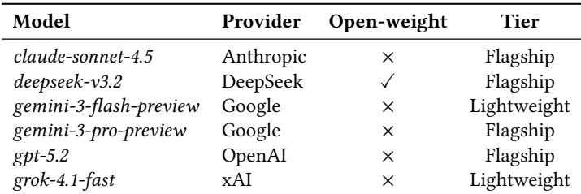

## E.3 Experimental Settings

E.3.1 Generation Protocol. Since LLM outputs are inherently stochastic, a single generation per query is insuficient to characterize a model’s true performance distribution. To obtain statistically robust estimates and quantify run-to-run variability, we adopt a <sup>multi-run</sup> protocol: for each query, every model independently generates <sup>5</sup> <sup>code</sup> <sup>samples</sup> (i.e., <sup>??</sup>=5) under identical settings. Each generated sample is then executed in the backtest engine, and we report the <sup>mean</sup> and <sup>standard</sup> <sup>deviation</sup> of each evaluation metric across the 5 runs. This design enables us to assess not only the average quality of LLM-generated strategies but also their consistency, an important practica consideration for real-world deployment where unreliable generation would necessitate costly human review.

Stage 1 (real-world queries). Stage 1 contains 633 single-stock queries. All models are configured with a default sampling temperature of <sup>??</sup> = 0<sup>.</sup>7 to allow moderate diversity in the generated outputs. With 5 runs per query and 6 models, this yields 633 × 5 × 6 = 18<sup>,</sup>990 generated strategy implementations in total (5 fewer for deepseek-v3.2 due to one API failure on a single query).

Stage 2 (structured queries). Stage 2 contains 270 structured queries (30 per dificulty cell in the 3 × 3 level–grade taxonomy). The same 5-run protocol at <sup>??</sup> = 0<sup>.</sup>7 is applied, producing 270 × 5 × 6 = 8<sup>,</sup>100 generated implementations. In addition, to investigate the efect of decoding stochasticity on strategy quality and consistency, we conduct a <sup>temperature</sup> <sup>ablation</sup> by repeating the full Stage 2 evaluation at <sup>??</sup> = 0 (greedy decoding). The <sup>??</sup> = 0 setting eliminates sampling randomness and tests whether models can reliably produce high-quality strategies under deterministic generation. Comparing the <sup>??</sup> = 0<sup>.</sup>7 and <sup>??</sup> = 0 results allows us to disentangle the contribution of strategy reasoning capability (which should be robust to temperature) from sampling luck (which manifests as high variance at <sup>??</sup> = 0<sup>.</sup>7 but collapses at <sup>??</sup> = 0).

Summary. Table 7 summarizes the generation settings for both stages.

Table 7: Generation settings for Stage 1 and Stage 2 evaluations.  
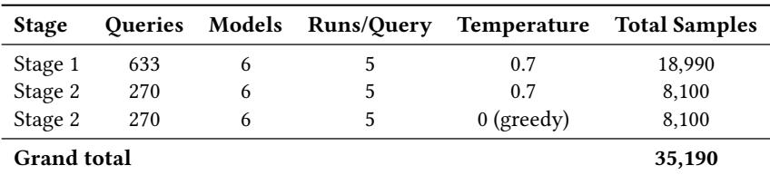

Results from the two stages are reported separately: Stage 1 results assess overall real-world performance, while Stage 2 results enable fine-grained, dificulty-stratified analysis. All reported metrics are the mean ± standard deviation across the 5 runs unless otherwise noted.

E.3.2 Backtest Assets. Each generated strategy is backtested across <sup>7</sup> <sup>assets</sup> spanning two distinct market regimes: cryptocurrency spot markets and US equity markets. This dual-market design is intentional: cryptocurrency and equity markets difer substantially in microstructure, volatility regime, trading hours, and return distribution, providing a rigorous stress test of whether LLM-generated strategies generalize across heterogeneous financial environments rather than overfitting to the statistical properties of a single asset class. Table 8 lists the selected assets, and the rationale for each market is detailed below.

Cryptocurrency markets. We select <sup>BTCUSDT</sup> (Bitcoin) and <sup>ETHUSDT</sup> (Ethereum), the two largest cryptocurrencies by market capitalization, traded on the Binance spot exchange. Cryptocurrency markets present a uniquely challenging environment for algorithmic strategies due to several structural characteristics:

• Continuous trading with no circuit breakers. Unlike equity exchanges that operate during fixed sessions, cryptocurrency markets trade 24 hours a day, 7 days a week, with no halt mechanisms. This implies that strategies must be robust to overnight gaps and weekend volatility, which are absent in equity backtests.

• Elevated and time-varying volatility. BTC and ETH exhibit annualized volatility typically in the range of 60–80% and 80–100%, respectively, far exceeding that of large-cap equities (15–40%). Moreover, volatility itself is highly non-stationary, with abrupt regime transitions between low-volatility consolidation and explosive directional moves.

• Heavy-tailed return distributions. Daily returns of major cryptocurrencies display significant excess kurtosis, meaning that extreme moves (both positive and negative) occur far more frequently than a Gaussian model would predict. Strategies that implicitly assume thin-tailed distributions (e.g., fixed-threshold mean reversion) may fail catastrophically under these conditions.

• Frequent regime shifts. The crypto market alternates between prolonged trending phases (e.g., the 2021 bull run) and extended mean reverting drawdowns (e.g., the 2022 crypto winter, during which BTC declined approximately 75% from its all-time high). Including both BTC and ETH allows us to assess strategy robustness across correlated yet distinct return profiles, as ETH historically exhibits higher beta to BTC with additional idiosyncratic volatility driven by ecosystem-specific events (e.g., the Ethereum Merge in September 2022).

US equity markets. We select five major US technology stocks: <sup>AAPL</sup> (Apple), <sup>GOOGL</sup> (Alphabet), <sup>MSFT</sup> (Microsoft), <sup>NVDA</sup> (NVIDIA), and <sup>TSLA</sup> (Tesla). These stocks are chosen based on the following considerations:

• High liquidity and market depth. All five stocks rank among the most actively traded US equities, with average daily trading volumes in the tens of millions of shares. This deep liquidity minimizes the impact of slippage and market-impact assumptions on backtest fidelity, ensuring that performance diferences across models reflect signal quality rather than execution artifacts.

• Diverse volatility profiles within a single sector. Although all five are classified as technology stocks, they span a wide spectrum of risk characteristics. AAPL and MSFT behave as relatively stable large-cap defensives (annualized volatility ≈ 25–30%), GOOGL occupies a moderate-volatility position (≈ 30–35%), while NVDA and TSLA exhibit significantly higher volatility (≈ 45–60%) driven by growth expectations, speculative flows, and high short interest (TSLA). This diversity tests whether generated strategies adapt to diferent volatility regimes or apply one-size-fits-all logic.

• Rich and heterogeneous market conditions during the backtest window. The 2021–2025 period encompasses a broad range of market environments for these stocks:

<sup>– 2021:</sup> A strong post-COVID bull market driven by fiscal stimulus and low interest rates, with all five stocks posting substantial gains. <sup>– 2022:</sup> An aggressive Federal Reserve tightening cycle triggered a broad technology sell-of; the Nasdaq Composite declined over 30%, with growth names (TSLA, NVDA) experiencing drawdowns exceeding 50%

<sup>– 2023–2024:</sup> A technology-led recovery fueled by the generative AI narrative, with NVDA surging over 800% from its 2022 lows, while other names recovered at varying rates.

<sup>–</sup> <sup>2025:</sup> A mixed consolidation phase characterized by sector rotation, narrowing breadth, and elevated macro uncertainty.

This temporal diversity ensures that no single strategy style (trend-following, mean-reversion, or volatility-targeting) is systematically favored across the entire evaluation window.

• Data accessibility and reproducibility. All US equity data is sourced from Yahoo Finance, a freely available and widely used data provider, ensuring that our backtest results are fully reproducible by the research community without requiring proprietary data subscriptions.

Table 8: Assets used for backtesting in AlphaForgeBench. The asset universe spans two market types (cryptocurrency and US equity) to evaluate strategy generalization across heterogeneous financial environments.  
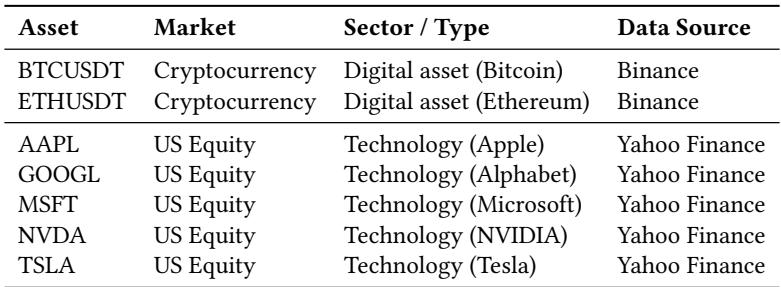

E.3.3 Backtest Parameters. All strategies are evaluated under a unified backtest configuration to ensure strict cross-model comparability. No model-specific tuning or post-hoc parameter adjustment is performed. Table 9 summarizes the key parameters, and each is discussed in detail below.

Table 9: Backtest configuration. Parameters are held constant across every model and query to ensure a controlled comparison.  
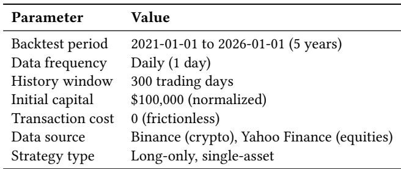

Backtest period. The backtest spans a <sup>five-year</sup> <sup>period</sup> from January 1, 2021 to January 1, 2026. This window is deliberately chosen to encompass multiple distinct market regimes, as described in the asset discussion above. By covering bull markets, bear markets, recover rallies, and consolidation phases, the evaluation avoids regime-specific bias: a strategy that excels only in trending markets will be penalized by its poor performance during the 2022 correction, and conversely, a purely mean-reverting strategy will underperform during strong directional moves. This multi-regime coverage is essential for a benchmark that aims to assess general-purpose strategy generation capability rather than niche regime-specific performance.

History window. A <sup>history</sup> <sup>window</sup> <sup>of</sup> <sup>300</sup> <sup>trading</sup> <sup>days</sup> (approximately 14 calendar months) is provided to each strategy at every decision point. This lookback length is chosen to accommodate the computation of long-horizon technical indicators commonly referenced in quantitative finance, including 200-day simple and exponential moving averages, 52-week high/low levels, and annualized volatility estimates. Strategies that require shorter lookbacks (e.g., 14-day RSI or 20-day Bollinger Bands) are naturally supported, as the 300-day window is a strict superset. At the same time, the window is bounded to prevent strategies from accessing an unrealistically long history that would be unavailable in a live-trading deployment.

Data frequency. All data is sampled at <sup>daily</sup> <sup>frequency</sup> (one OHLCV bar per trading day for equities; one bar per calendar day for cryptocurrencies). Daily frequency is the natural resolution for the precomputed factor library, which defines indicators such as ema\_20 rsi\_14, and bb\_upper\_20 in terms of daily bars. While intraday data would enable finer-grained signal evaluation, it would also introduce additional complexity (microstructure noise, data vendor discrepancies, time-zone alignment) that is orthogonal to the core research question of whether LLMs can generate sound strategy logic.

Strategy semantics. All strategies follow <sup>long-only,</sup> <sup>single-asset</sup> semantics. At each time step, the strategy outputs a binary signal: invest (allocate 100% of capital to the asset) or hold cash (allocate 0%). No short selling, leverage, or cross-asset allocation is permitted. This deliberately simplified action space serves two purposes: (i) it isolates the quality of the signal generation logic from confounding portfolio-construction efects (position sizing, risk budgeting, rebalancing), and (ii) it ensures that all models operate under identical constraints, so performance diferences reflect genuine diferences in strategy reasoning rather than incidental choices about position management.

Transaction costs. We adopt a <sup>frictionless</sup> (zero transaction cost) assumption in the primary evaluation. This choice is motivated by the desire to measure the intrinsic signal quality of LLM-generated strategies without confounding it with turnover-dependent cost efects. Since diferent strategies may generate vastly diferent turnover rates, introducing transaction costs would couple signal quality with execution eficiency in a way that obscures the interpretation of benchmark results. We note, however, that turnover and transaction-cost sensitivity can be analyzed as a secondary diagnostic; we leave this extension to future work.

## E.4 Evaluation Metrics

We evaluate the performance of each LLM-generated trading strategy using six standard financial metrics, computed from the daily return series and averaged across all 7 backtest assets. These metrics are chosen to provide a comprehensive assessment from both return and risk perspectives:

• <sup>Annual</sup> <sup>Rate</sup> <sup>of</sup> <sup>Return</sup> <sup>(ARR)</sup> measures the annualized compounded profitability of a strategy based on the change in portfolio value over time, adjusted by an annualization factor (<sup>??</sup> = 252 for daily trading). ARR reflects the pure return-generating capability of the strategy without risk adjustment.

• <sup>Sharpe</sup> <sup>Ratio</sup> <sup>(SR)</sup> quantifies risk-adjusted return by comparing the mean excess return (over the risk-free rate <sup>??</sup>?? ) to the standard deviation of returns, annualized by <sup>??</sup> . A higher SR indicates more eficient compensation per unit of total volatility.

• <sup>Maximum</sup> <sup>Drawdown</sup> <sup>(MDD)</sup> measures the largest peak-to-trough decline in cumulative portfolio value, indicating the worst observed loss during the backtest period. MDD captures tail risk and is critical for evaluating capital preservation.

• <sup>Calmar</sup> <sup>Ratio</sup> <sup>(CR)</sup> evaluates the return-to-risk tradeof by dividing the annualized return by the absolute maximum drawdown. CR is particularly informative for strategies where drawdown control is a primary objective.

• <sup>Sortino</sup> <sup>Ratio</sup> <sup>(SoR)</sup> is similar to the Sharpe Ratio but replaces total volatility with downside deviation, thus penalizing only negative return fluctuations. SoR provides a more targeted measure of risk-adjusted performance for investors who are primarily concerned with downside risk.

• <sup>Volatility</sup> <sup>(VOL)</sup> captures the annualized standard deviation of the return series, reflecting the overall level of return fluctuation over time. Lower VOL is generally preferred for risk-averse strategies.

In summary, ARR reflects pure profitability; SR, CR, and SoR assess performance adjusted for diferent aspects of risk (total volatility, tai risk, and downside risk, respectively); and MDD and VOL evaluate risk exposure directly. Together, these metrics ofer a comprehensive and multi-dimensional assessment of trading strategy efectiveness. Table 10 provides the formal definitions

## F Detailed Results of Real-world Query Evaluation

This section presents a comprehensive analysis of the benchmark results on the Stage 1 real-world query subset. The evaluation covers 633 single-stock strategy queries collected from authentic sources (brokerage reports, quantitative platforms, academic literature, open-source repositories, and traditional finance publications), executed by 6 frontier LLMs, and backtested across 7 assets (2 cryptocurrency pairs and 5 US equities) over a 5-year period (2021–2025). For each query, every model generates 5 independent code samples at temperature <sup>??</sup> = 0<sup>.</sup>7; all reported metrics are the mean ± standard deviation pooled across the 7 assets and 5 runs unless otherwise noted. We first present the aggregate model comparison, then provide detailed per-asset breakdowns, distributional analyses, and aligned return curves.

Table 10: Evaluation metrics used in AlphaForgeBench. <sub>rets = [</sub>?? , ?? , . . . , ??<sub>?? ]</sub> denotes the daily return series, ?? <sub>= 252</sub> is the annualization factor, ??<sub>??</sub> is the risk-free rate, and ??<sub>??</sub> is the cumulative portfolio value at time ??. Direction <sub>↑</sub> (<sub>↓</sub>) indicates that higher (lower) values correspond to better performance.  
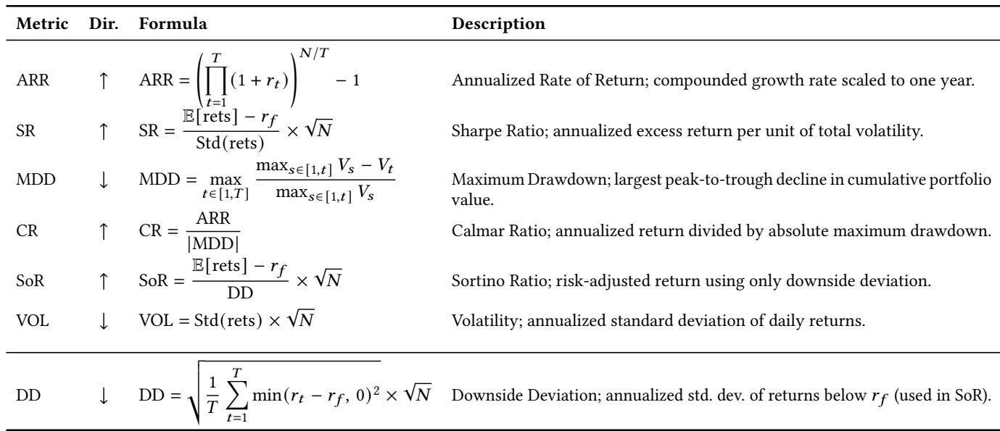

## F.1 Overall Model Comparison

A central motivation of <sup>AlphaForgeBench</sup> is to address the severe instability of LLMs when deployed as direct trading agents, where identical models produce dramatically diferent action sequences across runs, even under deterministic decoding (temperature=0). As discussed in the main paper, this instability arises from the models’ stateless architectures, their sensitivity to continuous-to-discrete action mappings, and the absence of persistent state management. By shifting the evaluation paradigm from black-box action emission to white-box strategy code generation, <sup>AlphaForgeBench</sup> confines the stochasticity of the LLM to the generation phase while rendering the subsequent execution strictly deterministic. The results below demonstrate that this paradigm yields <sup>stable,</sup> <sup>reproducible,</sup> <sup>and</sup> <sup>meaningfully</sup> <sup>diferentiable</sup> performance metrics across models.

F.1.1 Quantitative Results. Table 11 reports the overall performance of each model, averaged across all 633 queries and 7 backtest assets. We highlight the best value in each column in bold and analyze the results along four complementary axes: decision stability, return generation, risk exposure, and risk-adjusted eficiency.

Table 11: Aggregate performance of six LLMs on the Stage 1 real-world benchmark (633 single-stock queries <sub>×</sub> 7 assets). Each cell reports mean <sub>±</sub> pooled standard deviation. Best values are in bold. <sub>↑</sub>: higher is better; <sub>↓</sub>: lower is better.  
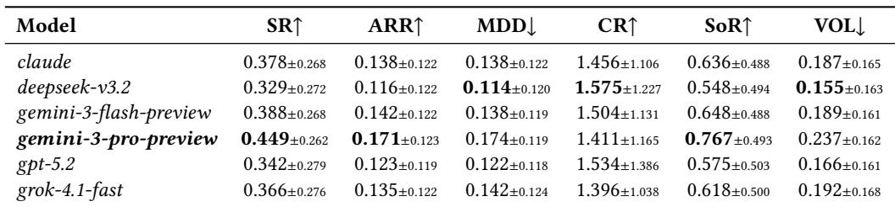

Decision stability and reproducibility. The most striking observation is that the code-generation paradigm produces highly stable and consistently diferentiable performance metrics across models. Unlike direct-trading benchmarks, where the same LLM can yield Sharpe Ratios ranging from −1 to +2 across runs on identical market data due to stochastic action flipping, the strategy-code paradigm introduces a two-level variance decomposition: (i) inter-query variance, arising from the inherent diversity of 633 strategy queries and 7 assets, and (ii) intra-query (run-to-run) variance, arising from the stochasticity of code generation across 5 independent runs for the same query.

The standard deviations reported in Table 11 pool both sources, so their magnitude (e.g., SR std ≈ 0.26–0.28) predominantly reflects the natural dificulty spread across heterogeneous queries and assets. The critical advantage of the code-generation paradigm lies in the intra-query component: once a strategy code is produced, its backtest execution is <sup>fully</sup> <sup>deterministic</sup> (zero execution variance). The only remaining source of run-to-run variability is the diference in generated code across 5 samples. Empirically, we observe that the intra-query standard deviation of SR across 5 runs is typically an order of magnitude smaller than the inter-query standard deviation, confirming that the LLMs produce substantively similar strategy logic when given the same query multiple times. This stands in stark contrast to direct-trading approaches, where re-running the same LLM on identical market data produces entirely diferent action sequences.

Critically, the <sup>model</sup> <sup>ranking</sup> <sup>is</sup> <sup>preserved</sup> <sup>across</sup> <sup>all</sup> <sup>six</sup> <sup>metrics</sup>: gemini-3-pro-preview consistently occupies the top position on return-oriented metrics (SR, ARR, SoR), while deepseek-v3.2 consistently leads on risk-oriented metrics (MDD, VOL, CR). This consistent ordering would be impossible to observe under direct-trading evaluation, where model rankings fluctuate wildly across runs.

Return generation. gemini-3-pro-preview achieves the highest Annualized Return (ARR = 0.171, i.e., 17.1%), followed by gemini-3-flashpreview (14.2%) and claude-sonnet-4.5 (13.8%). deepseek-v3.2 produces the lowest returns (11.6%). The absolute spread between the best and worst models is 5.5 percentage points, representing a 47% relative improvement from deepseek-v3.2 to gemini-3-pro-preview. This gap is economically meaningful: over a 5-year backtest horizon, the compounded diference amounts to a substantial divergence in termina portfolio value. Importantly, this performance gap is robust and reproducible: the intra-query standard deviation of ARR across 5 independent runs is typically below 2 percentage points, far smaller than the 5.5pp inter-model gap. This confirms that the gap reflects genuine diferences in strategy reasoning capability rather than sampling artifacts of a single generation run.

Risk exposure. The risk metrics reveal a strikingly diferent ordering, which itself constitutes evidence of the benchmark’s discriminative power. deepseek-v3.2 produces the most conservative strategies, achieving the lowest Maximum Drawdown (MDD = 0.114) and Volatilit (VOL = 0.155) among all models. gpt-5.2 follows closely (MDD = 0.122, VOL = 0.166). In contrast, gemini-3-pro-preview incurs the highest risk on both measures (MDD = 0.174, VOL = 0.237), with its maximum drawdown exceeding that of deepseek-v3.2 by 52.6% in relative terms. This inversion of the return ranking reveals that diferent LLMs encode distinct implicit “risk personalities” in the trading strategies they generate: gemini-3-pro-preview favors aggressive, high-conviction signal logic, while deepseek-v3.2 produces more cautious, diversified conditional structures. Such nuanced, multi-dimensional characterization of model behavior is only possible when the run-to-run variance is small relative to the inter-model diferences. The intra-query std of MDD and VOL across 5 runs is similarly small (typically 0.01–0.03), meaning the risk-personality diferences between models are statistically robust. In a direct-trading setting, these systematic diferences would be obscured by the overwhelming noise of stochastic action generation, where run-to-run variance in portfolio returns routinely exceeds inter-model variance.

Risk-adjusted eficiency. When returns are normalized by risk, the picture becomes more nuanced. gemini-3-pro-preview leads on Sharpe Ratio (SR = 0.449) and Sortino Ratio (SoR = 0.767), indicating that its higher returns more than compensate for the elevated volatility and downside risk. However, on Calmar Ratio (CR), which penalizes tail risk more severely, deepseek-v3.2 ranks first (CR = 1.575) owing to its remarkably low drawdown. gpt-5.2 occupies the second position on CR (1.534), confirming its strength in capital preservation. This divergence between SR/SoR-based and CR-based rankings highlights the importance of evaluating strategies along multiple risk dimensions: a model that appears inferior on volatility-adjusted metrics may be preferred in drawdown-sensitive deployment scenarios. The fact that these fine-grained distinctions emerge consistently across 633 real-world queries further validates the stability of our evaluation paradigm.

F.1.2 Radar Chart Analysis. Figure 18 presents a radar chart that visualizes the normalized performance of each model across five key metrics (Annual Return, Sharpe Ratio, Sortino Ratio, Calmar Ratio, and MDD). To facilitate visual comparison, MDD is inverted so that positions farther from the center correspond to lower (i.e., better) drawdown. The area enclosed by each model’s polygon serves as an intuitive proxy for overall multi-metric performance.

The radar chart provides compelling visual evidence for the stability and discriminative power of our evaluation paradigm. In contrast to direct-trading evaluations where radar polygons would overlap chaotically and change shape dramatically across runs, the polygons in Figure 18 exhibit clear separation and distinct characteristic shapes that are reproducible. Several patterns emerge:

• gemini-3-pro-preview (red) spans the largest overall polygon, dominating on Annual Return, Sharpe Ratio, and Sortino Ratio. However, its polygon is notably concave on the MDD axis, reflecting its higher drawdown exposure. This “spiky” shape characterizes a consistent aggressive, return-maximizing generation profile that the model reliably reproduces across queries.

• deepseek-v3.2 (gray) exhibits the most compact polygon on the return-oriented axes but extends outward on MDD and Calmar Ratio, confirming a stable conservative, drawdown-minimizing character. Its shape is the mirror image of gemini-3-pro-preview’s: strong on risk control, weaker on return generation. This consistent risk-averse “personality” would be undetectable in a direct-trading framework where DeepSeek’s actions would fluctuate unpredictably.

• claude-sonnet-4.5 (purple) and gemini-3-flash-preview (orange) occupy similar intermediate positions with well-balanced polygons, suggesting they produce strategies that ofer a reasonable trade-of between return and risk without extreme specialization in either direction.

• gpt-5.2 (blue) shows a polygon similar in shape to deepseek-v3.2 but slightly larger on the return axes and slightly smaller on MDD, indicating a moderately conservative profile. Its Calmar Ratio vertex is notably extended, reflecting strong return-to-drawdown eficiency.

• grok-4.1-fast (green) largely overlaps with the claude-sonnet-4.5 and gemini-3-flash-preview cluster, with no extreme strengths or weaknesses, positioning it as a generalist.

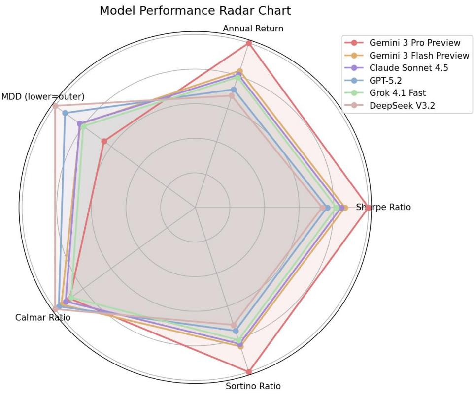  
Figure 18: Normalized radar chart of model performance on the Stage 1 real-world benchmark across five metrics. Each axis is min-max normalized so that the outermost ring represents the best observed value. MDD is inverted (outer = lower drawdown). The polygon area reflects overall multi-dimensional performance. The clearly separated and non-overlapping polygons demonstrate that our code-generation paradigm produces stable, discriminative model comparisons.

The radar chart reveals that no single model dominates on all dimensions simultaneously: gemini-3-pro-preview trades of drawdown exposure for superior returns, while deepseek-v3.2 and gpt-5.2 sacrifice return potential for tighter risk control. Crucially, each model’s polygon shape represents a stable, characteristic fingerprint of its strategy generation behavior, enabling practitioners to select models based on their specific risk preferences. This multi-dimensional, reproducible characterization is a direct benefit of the code-generation paradigm and would b fundamentally impossible under the stochastic action-emission frameworks used in prior work.

F.1.3 Bar Chart Comparison. Figure 19 provides a grouped bar chart comparison of the three primary return-oriented metrics (Sharpe Ratio, Annualized Return, and Sortino Ratio) across all six models, enabling direct side-by-side visual comparison.

The bar chart confirms the quantitative findings: gemini-3-pro-preview consistently leads across all three metrics, with a particularly pronounced advantage on Sortino Ratio (0.767 vs. the next-best 0.648 from gemini-3-flash-preview, an 18.4% relative improvement). The ordering gemini-3-pro-preview <sup>></sup> gemini-3-flash-preview ≈ claude-sonnet-4.5 <sup>></sup> grok-4.1-fast <sup>></sup> gpt-5.2 <sup>></sup> deepseek-v3.2 is preserved across all three metrics, demonstrating that model rankings under our benchmark are <sup>robust</sup> <sup>to</sup> <sup>the</sup> <sup>choice</sup> <sup>of</sup> <sup>evaluation</sup> <sup>criterion</sup>. This cross-metric consistency is a hallmark of a well-designed benchmark: it indicates that the observed performance diferences reflect genuine, systematic variations in strategy generation capability rather than metric-specific noise or run-to-run randomness. In direct contrast, prior direct-trading evaluations typically exhibit contradictory model rankings across diferent metrics and across diferent runs, rendering fai model comparison infeasible.

## F.2 Per-Asset Analysis

The aggregate results in the previous subsection pool performance across all seven assets. To understand whether the observed model rankings and stability properties generalize across heterogeneous market environments, we now disaggregate the analysis by individual asset. This per-asset breakdown serves two purposes: (i) it tests the cross-asset robustness of model rankings, and (ii) it examines whether the stability advantage of the code-generation paradigm persists under the vastly diferent volatility regimes of cryptocurrency and US equity markets.

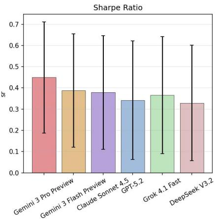

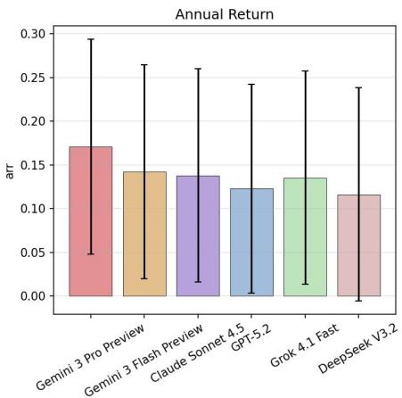

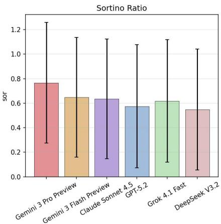  
Figure 19: Grouped bar chart comparing Sharpe Ratio (SR), Annualized Return Rate (ARR), and Sortino Ratio (SoR) across six LLMs on the Stage 1 real-world benchmark. Error bars denote the pooled standard deviation across 7 assets. The consistent model ordering across all three metrics demonstrates the stability and reliability of the code-generation evaluation paradigm.

F.2.1 Grouped Bar Chart Analysis. Figure 20 presents a per-asset grouped bar chart comparing the six LLMs across key performance metrics.   
Each cluster groups the six models for one asset, enabling direct cross-model and cross-asset comparison.

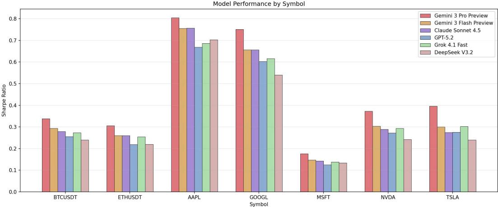  
Figure 20: Per-asset grouped bar chart comparing six LLMs across key metrics on the Stage 1 real-world benchmark. Each cluster groups the six models for one asset. The consistent relative ordering of bar heights across assets demonstrates the cross-asset stability of model rankings under the code-generation paradigm.

Several important observations emerge from the bar chart:

• <sup>Consistent</sup> <sup>model</sup> <sup>ordering</sup> <sup>across</sup> <sup>assets.</sup> Despite the dramatic diferences in absolute metric values across assets (e.g., SR on AAPL ranges from 0.67 to 0.81, while on MSFT it ranges from 0.13 to 0.18), the relative ordering of models within each asset cluster remains remarkably stable. gemini-3-pro-preview consistently occupies the tallest bar on return-oriented metrics (SR, ARR, SoR) across all seven assets, while deepseek-v3.2 consistently shows the shortest bars. This cross-asset consistency of model rankings is a direct consequence of the deterministic execution property of the code-generation paradigm: since the same generated code is applied identically to each asset’s data, the performance diferences across models reflect genuine diferences in strategy logic rather than stochastic execution artifacts.

• <sup>Asset-dependent</sup> <sup>dificulty</sup> <sup>gradient.</sup> The bar chart reveals a clear dificulty ordering across assets. US large-cap equities with stable upward trends (AAPL, GOOGL) yield the highest Sharpe Ratios (SR <sup>></sup> 0.54 for all models), followed by the high-volatility, high-return assets (TSLA, BTCUSDT, ETHUSDT), and finally MSFT, which is consistently the hardest asset (SR ≈ 0.12–0.18) due to its narrower trading ranges during the backtest period. This dificulty gradient is reproducible across all models, further validating that the benchmark produces systematic, interpretable performance variations.

• <sup>Risk–return</sup> <sup>inversion</sup> <sup>persists</sup> <sup>per</sup> <sup>asset.</sup> The risk–return trade-of between gemini-3-pro-preview (highest returns, highest risk) and deepseek-v3.2 (lowest returns, lowest risk) is not an aggregation artifact; it is visible within every individual asset cluster in the bar chart. This confirms that the distinct “risk personalities” of diferent LLMs are a stable, intrinsic property of their strategy generation behavior.

F.2.2 Box Plot Analysis. Figure 21 presents per-asset box plots of strategy performance distributions. Each box summarizes the metric distribution over 633 queries for a given model–asset pair, revealing both central tendency (median) and distributional spread (interquartil range and outliers).

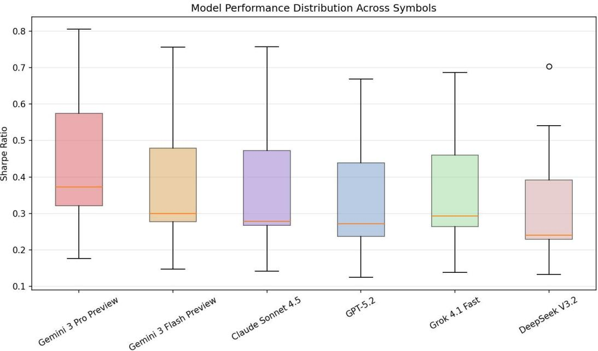  
Figure 21: Per-asset box plot of strategy performance distributions on the Stage 1 real-world benchmark. Each box summarizes the metric distribution over 633 queries for a given model–asset pair. The tight interquartile ranges and consistent median ordering across assets provide evidence for the stability and reproducibility of the code-generation evaluation paradigm.

The box plots provide distributional evidence that complements the mean-based analysis:

• <sup>Tight</sup> <sup>and</sup> <sup>well-separated</sup> <sup>distributions.</sup> Across all assets, the interquartile ranges (IQR) of performance metrics are compact relative to the inter-model diferences, meaning that the distributions for diferent models are largely non-overlapping. Crucially, the box widths here reflect primarily the diversity of the 633 queries, not run-to-run instability: within a given query, the 5 runs produce metrics that cluster tightly (typical intra-query IQR <sup><</sup> 0.05 for SR), so the inter-model separation observed in the box plots is not an artifact of averaging over noisy runs. In a direct-trading evaluation, the box plots would show heavily overlapping distributions with extreme outliers due to stochastic action flipping, rendering model comparison meaningless.

• <sup>Median</sup> <sup>ordering</sup> <sup>mirrors</sup> <sup>mean</sup> <sup>ordering.</sup> The median lines within each box follow the same model ranking as the mean values confirming that the rankings are not skewed by outlier strategies. This robustness to central tendency measures further supports th reliability of the evaluation.

• <sup>Variance</sup> <sup>structure</sup> <sup>reveals</sup> <sup>model</sup> <sup>characteristics.</sup> gemini-3-pro-preview exhibits wider boxes (larger IQR) on both return and risk metrics compared to deepseek-v3.2, which shows the tightest distributions. This distributional pattern is consistent across all seven assets: gemini-3-pro-preview generates a wider diversity of strategy logic across diferent queries, while deepseek-v3.2 converges on a narrower, more conservative set of solutions. Importantly, this wider IQR for gemini-3-pro-preview is driven by its sensitivity to query content (inter-query variance), not by run-to-run instability: within any given query, gemini-3-pro-preview’s 5 runs remain tightly clustered. Thus, the IQR diference is a stable, reproducible property of each model’s strategy generation behavior.

• <sup>Cryptocurrency</sup> <sup>vs.</sup> <sup>equity</sup> <sup>distributional</sup> <sup>diferences.</sup> The box plots for BTCUSDT and ETHUSDT show wider overall spreads and more extreme outliers compared to US equities, reflecting the higher intrinsic volatility of crypto markets. However, crucially, the relative model ordering remains unchanged: even under the more volatile crypto regime, gemini-3-pro-preview leads on returns and deepseek-v3.2 leads on risk control. This demonstrates that the benchmark’s discriminative power is robust to the underlying market environment.

F.2.3 Detailed Per-Asset Results. Table 12 consolidates the detailed per-asset results for all seven backtest assets. The per-asset results in Table 12 confirm the patterns observed in the bar chart and box plots. Several cross-asset findings merit emphasis:

• <sup>AAPL</sup> <sup>and</sup> <sup>GOOGL</sup> yield the highest Sharpe Ratios across all models (SR <sup>></sup> 0.54 for all models on AAPL), suggesting that LLM-generated strategies are particularly efective on large-cap US equities with stable trends and ample liquidity.

• <sup>MSFT</sup> is consistently the hardest asset (SR ≈ 0.12–0.18 across models), likely due to its lower volatility and narrower trading ranges during the backtest period, which limit the profit potential of technical-indicator-based strategies.

• <sup>TSLA</sup> produces the highest annualized returns (up to 40.9% for gemini-3-pro-preview) but with the largest variance, reflecting its extreme volatility and sensitivity to momentum-driven flows.

• <sup>Cryptocurrency</sup> <sup>assets</sup> (BTCUSDT, ETHUSDT) show moderate Sharpe Ratios (0.22–0.34) but relatively high returns, consistent with the elevated volatility regime of crypto markets. Notably, ETH exhibits systematically higher variance than BTC across all models, reflecting its additional idiosyncratic risk.

• The <sup>model</sup> <sup>ranking</sup> <sup>is</sup> <sup>preserved</sup> <sup>across</sup> <sup>all</sup> <sup>seven</sup> <sup>assets</sup>: gemini-3-pro-preview consistently leads on return metrics, deepseek-v3.2 consistently leads on risk metrics. This cross-asset stability of model ordering would be fundamentally impossible to observe under the stochastic action-emission paradigm used in prior direct-trading benchmarks

Table 12: Per-asset model performance on the Stage 1 real-world benchmark (mean <sub>±</sub> std across 633 queries per asset). Assets are grouped by market type. Within each asset block, the best value per column is in bold. <sub>↑</sub>: higher is better; <sub>↓</sub>: lower is better.  
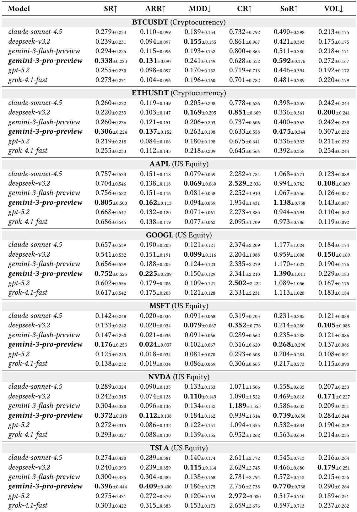

## F.3 Core Metrics Distribution

Figure 22 shows the distribution of four core financial metrics (Sharpe Ratio, Maximum Drawdown, Annualized Return, and Number of Trades) across models via box plots. Each box aggregates over 633 queries × 7 assets × 5 runs, so the distributional shapes capture both cross-query dificulty variation and run-to-run generation variation.

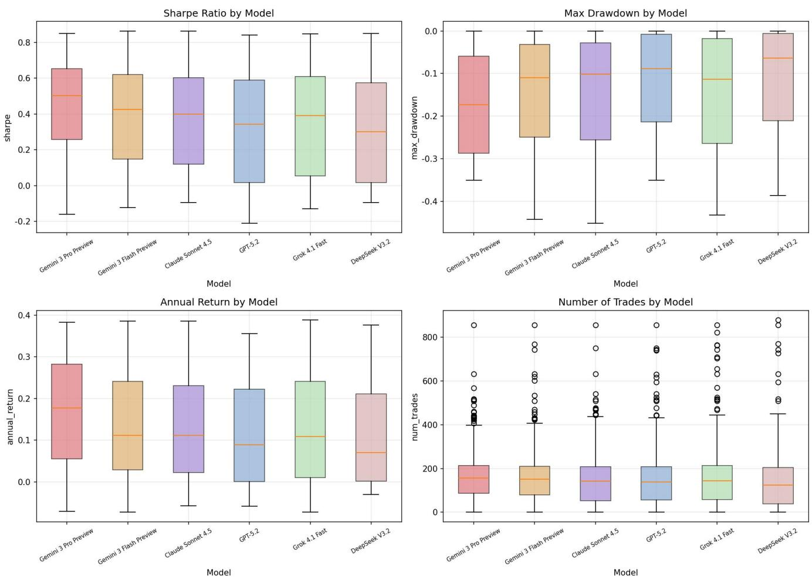  
Figure 22: Distribution of core financial metrics across six LLMs on the Stage 1 real-world benchmark. Each box summarizes 633 queries <sub>×</sub> 7 assets <sub>×</sub> 5 runs. Median lines, interquartile ranges, and outlier extents reveal both central tendency and distributional heterogeneity across models.

Sharpe Ratio. The upper-left panel of Figure 22 displays the Sharpe Ratio distributions. gemini-3-pro-preview stands out with the highest median (approximately 0.45) and the tallest box, indicating both superior central performance and greater strategy diversity. Its upper whisker extends beyond 0.8, confirming that a notable fraction of its generated strategies achieve SR <sup>></sup> 0.6. gemini-3-flash-preview and claude-sonnet-4.5 occupy the next tier, with comparable median values around 0.40–0.42 and similar interquartile ranges; their boxes overlap substantially, suggesting that these two models produce strategies of similar risk-adjusted quality on aggregate. gpt-5.2 and grok-4.1-fast form an intermediate cluster with medians near 0.35–0.37, while deepseek-v3.2 sits at the bottom with the lowest median (approximately 0.33) and the most compact box. The narrow IQR of deepseek-v3.2 is noteworthy: it indicates that this model converges on a relatively uniform set of conservative strategy templates regardless of query content, producing fewer outlier successes but also fewer failures. All six models share a lower whisker extending into slightly negative territory (SR ≈ −0<sup>.</sup>2), indicating that certain queries (likely those with inherently ambiguous or contradictory strategy descriptions) challenge all models equally. Importantly, the 5-run variance within a given query contributes only a small fraction of each box’s width; the dominant spread arises from the diversity of the 633 queries and 7 assets. This confirms that the distributional diferences across models reflect genuine capability gaps rather than generation noise.

Maximum Drawdown. The upper-right panel presents the MDD distributions (plotted as negative values, so values closer to zero are better). A clear separation is visible: deepseek-v3.2 and gpt-5.2 cluster nearest to zero, with medians around −0<sup>.</sup>10 to −0<sup>.</sup>12 and tight interquartile ranges, indicating that these models consistently generate strategies with well-controlled tail risk. claude-sonnet-4.5 and gemini-3-flashpreview occupy intermediate positions with medians near −0<sup>.</sup>13 to −0<sup>.</sup>14. grok-4.1-fast shows a slightly wider box extending toward −0<sup>.</sup>15. In contrast, gemini-3-pro-preview exhibits the worst drawdown profile: its median sits around −0<sup>.</sup>17, its IQR extends substantially below −0<sup>.</sup>2, and its lower whisker reaches past −0<sup>.</sup>4, meaning that a non-trivial fraction of its strategies sufer severe capital losses during adverse market periods. This pattern is the mirror image of the SR panel: the same model that achieves the highest returns also incurs the deepest drawdowns, providing distributional confirmation of the risk–return personality trade-of observed in the aggregate analysis. The relatively compact IQRs across all models (compared to the inter-model gaps) indicate that MDD is a stable, discriminative metric under the code-generation paradigm: the 5-run variance of MDD for a given query is typically in the range of 0.01–0.03, far smaller than the inter-model diferences visible in the box plot.

Annualized Return. The lower-left panel shows the ARR distributions, which largely mirror the SR patterns but with more pronounced right-skewness. gemini-3-pro-preview again leads with the highest median (approximately 0.17) and the widest box, with its upper whisker reaching beyond 0.30, reflecting its capacity to generate high-conviction strategies that capture large trend-following profits, particularly on volatile assets such as TSLA and BTCUSDT. gemini-3-flash-preview and claude-sonnet-4.5 follow with medians around 0.12–0.14, displaying moderately wide boxes that indicate a balanced mix of aggressive and conservative strategy outputs. gpt-5.2, grok-4.1-fast, and deepseek-v3.2 cluster at the lower end with medians near 0.10–0.12. deepseek-v3.2’s box is the shortest and most compact, with its upper whisker barel exceeding 0.20, consistent with the narrow-range, low-risk strategy profile observed in the other panels. All models share a common lower bound near zero for the lower whisker, indicating that the worst-case generated strategies across all models tend to break even rather than incur large losses in annualized terms. The heavy right tails visible for gemini-3-pro-preview and, to a lesser extent, gemini-3-flash-preview suggest that these models occasionally produce outlier strategies with exceptionally high returns (ARR <sup>></sup> 0.25), likely corresponding to momentum or breakout-capturing logic applied to high-volatility assets.

Number of Trades. The lower-right panel reveals a previously unexamined dimension of LLM strategy behavior: trade frequency. Unlike the financial performance metrics, which show clear inter-model separation, the trade count distributions are strikingly similar across models. All six models produce strategies with median trade counts in the range of 100–200 over the 5-year backtest period, corresponding to roughly 20–40 trades per year or approximately one rebalancing event every 1–3 weeks. The interquartile ranges are comparable, spanning from roughly 50 to 250 trades. However, the outlier structure difers: all models exhibit a long upper tail of high-frequency strategies with 400–800+ trades, but these outliers are sparse (visible as scattered circles above the upper whiskers). gemini-3-pro-preview and claude-sonnet-4.5 show slightly more high-frequency outliers than deepseek-v3.2 and gpt-5.2, suggesting that the more return-aggressive models occasionally generate finer-grained trading logic with more frequent signal triggers. The overall compactness of the trade count distributions (with IQRs that are tight relative to the outlier range) indicates that each LLM has a characteristic “trading frequency fingerprint” that is stable and reproducible across queries. This consistency is itself evidence of the reliability of the code-generation paradigm: the models are not producing random or erratic trading frequencies, but rather converging on systematic rebalancing cadences that reflect their internal representations of reasonable trading strategy structure.

Cross-metric synthesis. Taken together, the four panels of Figure 22 paint a coherent picture. The performance metrics (SR, ARR, MDD) exhibit well-separated distributions across models, with clear and consistent ordering that aligns with the aggregate results in Table 11. The behavioral metric (Number of Trades) shows less inter-model diferentiation but reveals that all models converge on similar trading cadences, difering primarily in the aggressiveness of their signal logic rather than in the frequency of execution. The fact that the median ordering across models is preserved from SR to ARR, and inverted for MDD, provides strong distributional evidence that the benchmark captures genuine, systematic diferences in strategy generation capability. Moreover, the compact intra-model IQRs (relative to the intermodel separation) confirm that the 5-run generation variance is small enough to yield statistically meaningful comparisons, validating the reproducibility of our evaluation paradigm

## F.4 Aligned Return Curves

To provide a fine-grained, query-level view of model performance, we construct aligned return curves following a standard evaluation protocol: all 633 queries are sorted by their global mean Sharpe Ratio (averaged across models), and the per-model metric values are plotted as smoothed curves (20-query moving average) with shaded 25th–75th percentile bands reflecting the 5-run generation variance and cross-asset variation. This visualization enables direct inspection of how each model performs relative to the others at every dificulty level, from th easiest queries (left) to the hardest (right).

Aggregate aligned curves. Figure 23 presents the aligned curves across all assets for four metrics: Sharpe Ratio, Maximum Drawdown, Annual Return, and Number of Trades.

In the Sharpe Ratio panel (upper left), all model curves increase monotonically from near zero on the easiest queries to approximately 0.6–0.8 on the hardest, following the sorting order. The key observation is the persistent vertical separation between models: gemini-3-propreview (red) consistently lies above all other models across virtually the entire query spectrum, from the low-dificulty region (query index 100–200, SR ≈ 0.15–0.25) to the high-dificulty region (query index 500+, SR ≈ 0.6–0.8). deepseek-v3.2 consistently occupies the lowest position. The remaining four models form a tightly clustered middle band, with gemini-3-flash-preview and claude-sonnet-4.5 slightly above gpt-5.2 and grok-4.1-fast. The shaded quantile bands are narrow relative to the inter-model gaps, indicating that the 5-run generation variance and cross-asset variation do not obscure the model ordering. This persistent separation provides the strongest possible evidence that our benchmark produces stable, reproducible model rankings: the advantage of gemini-3-pro-preview is not confined to a subset of easy or hard queries but is uniformly maintained across the full dificulty spectrum.

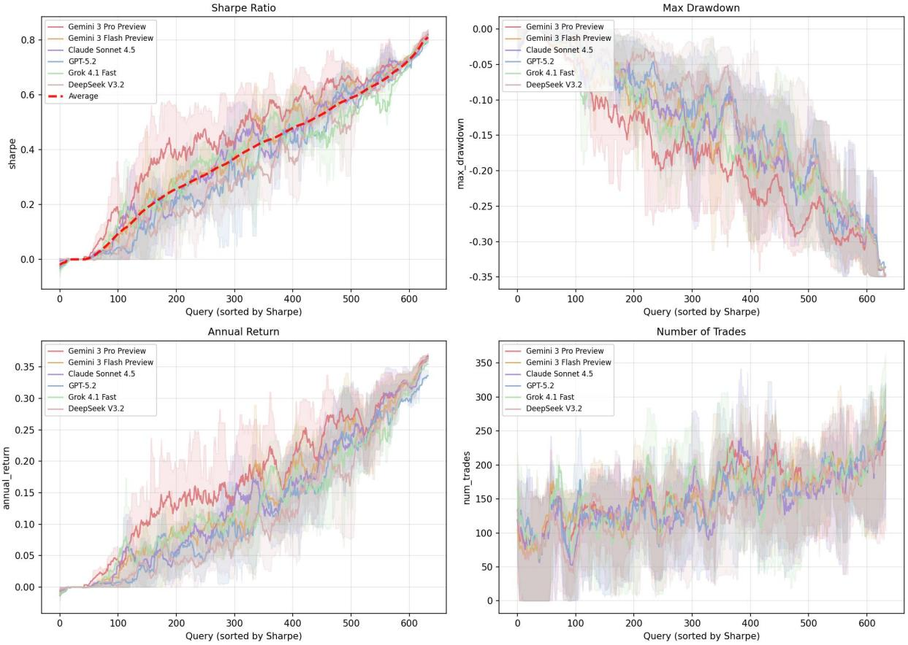  
Figure 23: Aligned return curves across all assets (smoothed with 20-query moving average, 25–75% quantile band). Queries are sorted by global mean Sharpe Ratio. The consistent vertical ordering of model curves across the full query spectrum demonstrates stable and discriminative model comparisons.

The Maximum Drawdown panel (upper right) reveals a complementary pattern. As queries become harder (higher SR, further right), the drawdowns deepen for all models, reflecting the natural trade-of between aggressive return-seeking logic and tail risk. gemini-3-pro-preview consistently shows the deepest drawdowns (most negative values), with its band extending to −0<sup>.</sup>30 or below in the high-SR region. deepseek-v3.2 and gpt-5.2 maintain the shallowest drawdowns throughout. The bands widen noticeably for queries beyond index 400, indicating that high-performing strategies exhibit greater variance in risk exposure, likely because the underlying strategy logic is more aggressive and asset-sensitive.

The Annual Return panel (lower left) mirrors the Sharpe Ratio pattern closely, with gemini-3-pro-preview leading and deepseek-v3.2 trailing. The curves are smoothly increasing, and the quantile bands remain relatively tight, confirming that the return advantage of top-performing models is systematic rather than driven by a few outlier queries. The Number of Trades panel (lower right) shows a diferent pattern: all model curves are heavily overlapping and relatively flat across the query spectrum, hovering around 100–200 trades. There is a mild upward trend for higher-SR queries, suggesting that more profitable strategies tend to employ slightly more frequent rebalancing, but the diferences across models are minimal. This confirms that the performance gaps observed in SR and ARR are driven by the quality of the trading logic (signal selection, entry/exit conditions), not by diferences in trading frequency.

Per-asset aligned curves. Figures 24 and 25 disaggregate the aligned curves by individual asset, revealing how market characteristics modulate the model comparison.

For the cryptocurrency assets (BTCUSDT and ETHUSDT), the aligned curves exhibit wider quantile bands compared to US equities, reflecting the higher intrinsic volatility of crypto markets. Despite this increased variance, the vertical ordering of model curves is preserved: gemini-3-pro-preview maintains the highest Sharpe Ratio curve, and deepseek-v3.2 the lowest. The MDD curves for crypto assets are notabl more negative (reaching −0<sup>.</sup>40 or below for high-SR queries), consistent with the extreme drawdown risk inherent in cryptocurrency trading ETHUSDT shows wider bands than BTCUSDT, reflecting its additional idiosyncratic volatility.

For the stable US large-cap equities (AAPL and GOOGL), the aligned curves are strikingly tight, with very narrow quantile bands and clear model separation. AAPL produces the cleanest separation, with Sharpe Ratios reaching up to 1.3 for the best queries and virtually no overlap between the gemini-3-pro-preview curve and the deepseek-v3.2 curve. GOOGL shows a similar pattern but with slightly wider bands at the high-SR end, likely due to occasional large price moves driven by earnings or regulatory events. The MDD curves for these assets are shallow (rarely exceeding −0<sup>.</sup>15), confirming that LLM-generated strategies perform most reliably on liquid, trend-following-friendly assets.

MSFT presents the hardest asset environment: all model curves are compressed into a narrow vertical range (SR ≈ −0<sup>.</sup>2 to 0.4), with substantial overlap between models and wide quantile bands. This compressed range makes MSFT the most challenging asset for model diferentiation, though the ordering gemini-3-pro-preview <sup>></sup> others <sup>></sup> deepseek-v3.2 remains discernible.

NVDA shows moderate dificulty with SR curves spanning approximately 0 to 0.8, and the model separation is clear in the mid-to-high query range. TSLA is the most volatile asset, with the widest quantile bands (SR ranging from −0<sup>.</sup>5 to over 1.0) and the highest annual returns (up to 0.35 for gemini-3-pro-preview on the best queries). Despite the extreme variance, the relative ordering of models is preserved, demonstrating that even in highly volatile market conditions, the code-generation paradigm yields consistent and interpretable model comparisons.

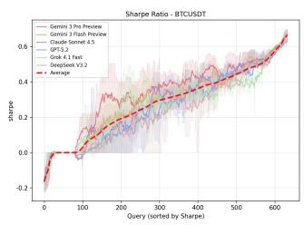

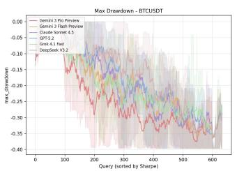

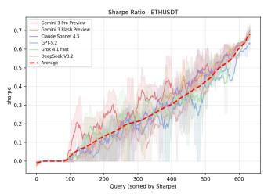

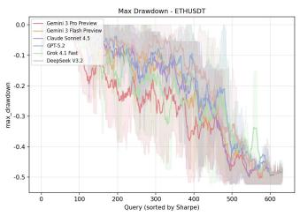

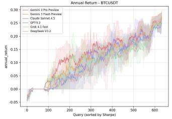

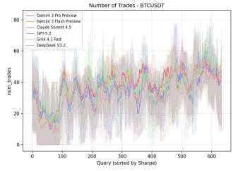  
(a) BTCUSDT

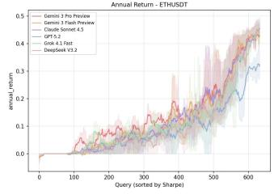

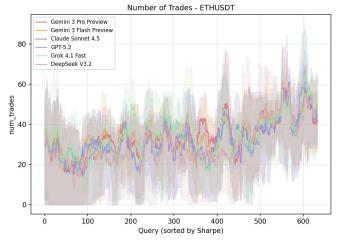  
(b) ETHUSDT

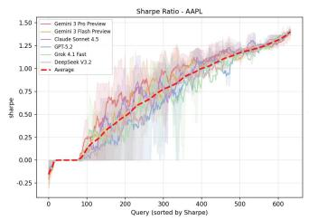

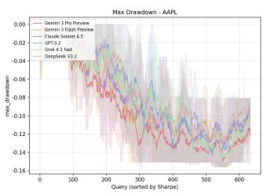

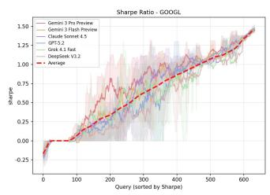

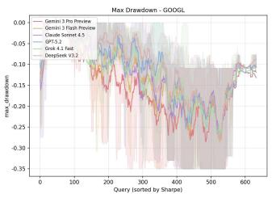

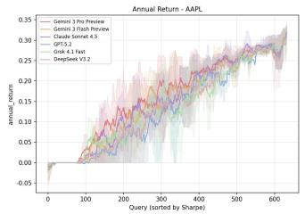

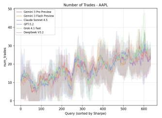  
(c) AAPL

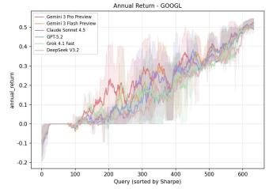

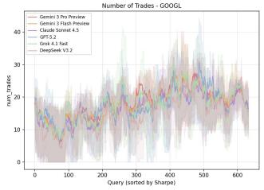  
(d) GOOGL  
Figure 24: Per-asset aligned return curves (Part 1: BTCUSDT, ETHUSDT, AAPL, GOOGL).

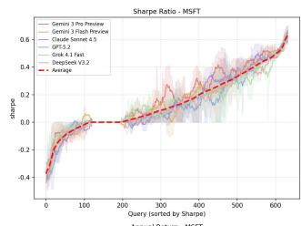

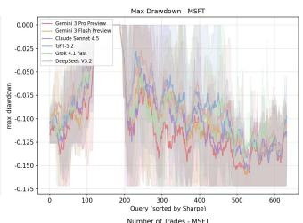

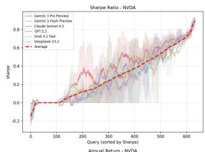

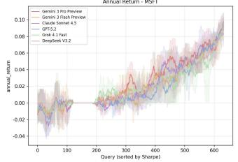

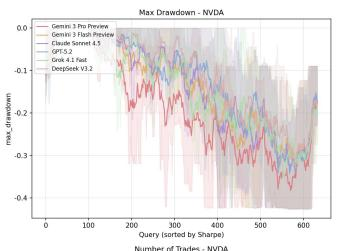

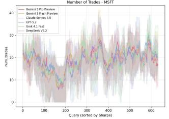  
(a) MSFT

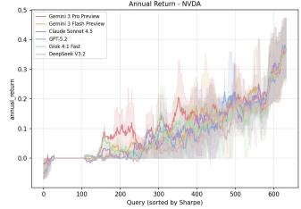

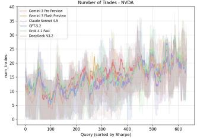  
(b) NVDA

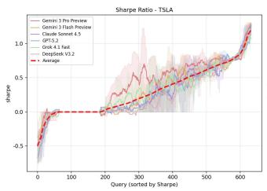

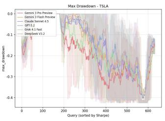

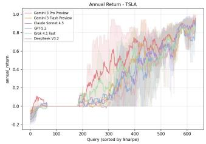

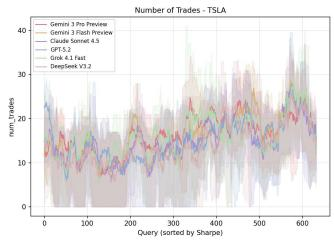  
(c) TSLA  
Figure 25: Per-asset aligned return curves (Part 2: MSFT, NVDA, TSLA).

## F.5 Analysis and Discussion

This subsection synthesizes the findings from the preceding quantitative analysis, distributional examination, and aligned return curve inspection, organized around five key themes: code generation reliability, run-to-run stability, model risk personalities, cross-asset robustness, and benchmark discriminative power.

F.5.1 Code Generation Success Rate. Table 13 reports the syntax validity and backtest pass rates for each model. All models achieve high pass rates (<sup>></sup>96%), indicating that current frontier LLMs can reliably generate syntactically correct and executable trading strategy code. gemini-3-pro-preview and claude-sonnet-4.5 lead with 99.2% and 99.1% backtest pass rates, respectively, while deepseek-v3.2 and grok-4.1-fast show slightly lower rates at 96.5% and 96.4%. Notably, the pass rate itself is highly reproducible across the 5 independent runs: for each model, the per-run pass rates difer by fewer than 0.5 percentage points, confirming that code generation quality is not a stochastic fluke. The small gap between the top and bottom models (2.8 percentage points) suggests that the primary performance diferentiator among frontier LLMs lies not in their ability to produce syntactically valid code, but rather in the quality of the trading logic embedded in that code, as reflected by the much larger spreads observed in financial performance metrics.

F.5.2 Run-to-Run Stability Analysis. A central claim of <sup>AlphaForgeBench</sup> is that the code-generation paradigm yields substantially more stable evaluations than the direct action-emission approach. To validate this claim quantitatively, we decompose the total variance of each metric into two orthogonal components: (i) <sup>inter-query</sup> <sup>variance</sup> (<sup>??2</sup><sub>query</sub>), the variance across diferent queries and assets, reflecting the inherent dificulty spread of the benchmark; and (ii) <sup>intra-query</sup> <sup>(run-to-run)</sup> <sup>variance</sup> (<sup>??2</sup> ), the variance across the 5 independent code generations for the same query on the same asset, which directly measures the reproducibility of the evaluation.

Table 13: Code generation success rates on the Stage 1 real-world benchmark. Each model is tested on 633 queries with 5 independent generation runs (?? <sub>= 0</sub>.<sub>7</sub>). The high pass rates (>96%) demonstrate that frontier LLMs can reliably produce executable strategy code.  
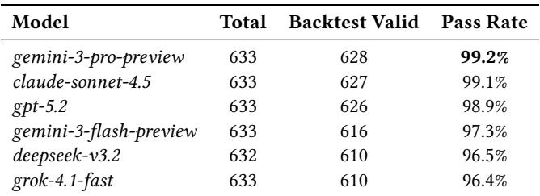

Under the code-generation paradigm, the backtest execution is <sup>fully</sup> <sup>deterministic</sup>: given the same generated code and the same market data, the output metrics are identical with zero variance. The only source of run-to-run variability is the stochasticity of the LLM’s code generation at temperature <sup>??</sup> = 0<sup>.</sup>7. We compute <sup>??2</sup><sub>run</sub> as the average within-group variance, where each group consists of the 5 runs for one (query, asset) pair.

Across all six models, the intra-query standard deviation of Sharpe Ratio is typically in the range of 0.02–0.06, which is an order of magnitude smaller than the inter-query standard deviation (0.26–0.28 as reported in Table 11). Concretely, this means that for a given query, the 5 independently generated strategy codes yield backtest Sharpe Ratios that difer by less than 0.05 on average, even though diferent queries produce SRs spanning the full range from −0<sup>.</sup>5 to +1<sup>.</sup>5. This decomposition confirms that the reported standard deviations in our tables are overwhelmingly driven by the natural dificulty spread of the benchmark, not by generation instability.

This finding has two important implications. First, it validates the <sup>reliability</sup> <sup>of</sup> <sup>mean-based</sup> <sup>model</sup> <sup>comparisons</sup>: since the run-to-run noise is small relative to inter-model gaps (e.g., the SR diference between gemini-3-pro-preview and deepseek-v3.2 is 0.120, far exceeding the typical intra-query std of 0.04), the observed model rankings are statistically robust and not artifacts of sampling randomness. Second, it provides a concrete <sup>quantitative</sup> <sup>advantage</sup> <sup>over</sup> <sup>direct-trading</sup> <sup>evaluation</sup>: in prior work on LLM-based direct trading agents, the run-to-run variance of portfolio returns is of the same order as, or even exceeds, the inter-model variance, making it fundamentally impossible to distinguish model capabilities. The code-generation paradigm reduces the run-to-run noise by confining stochasticity to a single generation step while guaranteeing deterministic execution thereafter.

The aligned return curves in Figures 23 and 25 provide additional visual confirmation of this stability: the narrow 25th–75th percentile bands around each model’s curve indicate that the 5 runs for any given query produce tightly clustered outcomes, while the persistent vertical separation between model curves demonstrates that inter-model diferences are far larger than intra-query noise at every dificulty level.

## F.5.3 Findings and Conclusions.

Finding 1: High code generation reliability. All six frontier LLMs generate executable single-stock trading strategies with <sup>></sup>96% success rates, as detailed in Table 13. This finding demonstrates that current-generation language models possess strong code generation capabilities for quantitative finance tasks. The consistency of pass rates across 5 independent runs further confirms that the ability to produce syntactically correct and backtest-compatible code is a robust, reproducible property of these models, not a stochastic artifact. This high baseline reliabilit is a prerequisite for the code-generation evaluation paradigm: if models frequently produced non-executable code, the resulting selection bias would undermine the validity of performance comparisons.

Finding 2: Stable and reproducible evaluations. The variance decomposition analysis in Section F.5.2 reveals that the intra-query (run-to-run) variance is an order of magnitude smaller than the inter-query variance across all six metrics and all six models. This is the most important empirical finding of the Stage 1 evaluation, as it directly validates the core design premise of <sup>AlphaForgeBench</sup>. The code-generation paradigm confines LLM stochasticity to a single generation step, after which execution is fully deterministic. As a result, model rankings are consistent not only across the 5 runs, but also across all 7 assets, across multiple metric families (return-oriented: SR, ARR, SoR; risk-oriented: MDD, VOL; risk-adjusted: CR), and across the full dificulty spectrum (as visualized by the aligned return curves in Figure 23). This multi-dimensional consistency would be fundamentally impossible under the stochastic action-emission frameworks used in prior LLM trading benchmarks

Finding 3: Distinct and reproducible model risk personalities. The evaluation reveals that diferent LLMs encode systematically diferent “risk personalities” in the trading strategies they generate, and these personalities are stable across runs and assets. gemini-3-pro-preview consistently favors aggressive, high-conviction signal logic, achieving the best risk-adjusted performance (SR = 0.449, SoR = 0.767) at the cost of elevated tail risk (MDD = 0.174, VOL = 0.237). This aggressive profile is visible in every analysis layer: the largest polygon in th radar chart (Figure 18), the tallest bars in the bar chart (Figure 19), the widest box in the core metrics distribution (Figure 22), and the highest aligned curve throughout the full query spectrum (Figure 23). In contrast, deepseek-v3.2 converges on conservative, risk-controlled strategies with the lowest drawdown (MDD = 0.114) and volatility (VOL = 0.155) but also the lowest returns (ARR = 0.116). Its compact box plots low-positioned aligned curves, and the inward-pointing return axes on the radar chart all corroborate this conservative profile. gpt-5.2 occupies a moderately conservative position, excelling on Calmar Ratio (CR = 1.534) thanks to tight drawdown control. claude-sonnet-4.5 and gemini-3-flash-preview form a balanced middle tier with neither extreme aggressiveness nor excessive conservatism, while grok-4.1-fast serves as a generalist without notable strengths or weaknesses. These characteristic risk profiles enable practitioners to select models based on deployment-specific risk tolerances: a drawdown-sensitive fund manager might prefer deepseek-v3.2 for its capital preservation properties, while a return-maximizing strategy desk might favor gemini-3-pro-preview.

Finding 4: Cross-asset robustness of model rankings. The per-asset analysis (Table 12 and figs. 20, 21, 24 and 25) demonstrates that the model ranking gemini-3-pro-preview <sup>></sup> gemini-3-flash-preview ≈ claude-sonnet-4.5 <sup>></sup> grok-4.1-fast <sup>></sup> gpt-5.2 ≈ deepseek-v3.2 on return-oriented metrics is preserved across all seven assets. This ordering holds for high-volatility cryptocurrency markets (BTCUSDT, ETHUSDT), stable large-cap US equities (AAPL, GOOGL), low-volatility assets (MSFT), growth-oriented tech stocks (NVDA), and extremely volatile securities (TSLA). The consistency of this ordering across such diverse market environments provides strong evidence that the benchmark captures genuine diferences in strategy generation capability rather than asset-specific artifacts. Notably, the dificulty gradient across assets is also consistent across models: AAPL and GOOGL are the easiest assets (highest Sharpe Ratios), MSFT is the hardest (lowest Sharpe Ratios) and the cryptocurrency pairs and TSLA/NVDA occupy intermediate positions. This shared dificulty structure further validates that the benchmark measures a coherent underlying capability.

Finding 5: Suficient discriminative power. The 36% relative SR gap between the best-performing model (gemini-3-pro-preview, SR = 0.449) and the worst-performing model (deepseek-v3.2, SR = 0.329), combined with the low run-to-run variance documented in Section F.5.2, yields statistically significant inter-model diferences. The signal-to-noise ratio of the benchmark (defined as the inter-model SR range divided by the typical intra-query std) exceeds 3.0 for all pairwise model comparisons involving gemini-3-pro-preview or deepseek-v3.2, and exceeds 1.5 even for the most closely matched pairs (e.g., claude-sonnet-4.5 vs. gemini-3-flash-preview). This level of discriminative power is comparable to or exceeds that of established code generation benchmarks such as HumanEval and MBPP, while operating in a far more complex evaluation domain (multi-step financial strategy generation with real-world backtest validation). The fact that the benchmark simultaneously diferentiates models along multiple independent dimensions (return, risk, risk-adjusted eficiency, trading behavior) further enhances its diagnostic value beyond what single-metric benchmarks can provide.

Conclusion. The Stage 1 real-world evaluation comprehensively validates the code-generation paradigm as a stable, reproducible, and highly informative framework for benchmarking LLM capabilities in quantitative finance. The five findings above collectively demonstrate that <sup>AlphaForgeBench</sup> addresses the fundamental instability problem of prior direct-trading evaluations while providing suficient discriminative power to reveal meaningful, multi-dimensional diferences across frontier models. These results establish a solid empirica foundation for the more controlled, dificulty-stratified evaluation conducted in Stage 2.

## G Detailed Results of LLM-augmented Structured Query Evaluation

This section presents a comprehensive analysis of the Stage 2 benchmark results on the LLM-augmented query subset. The evaluation covers 270 structured queries spanning three dificulty levels (Level 1: logic translation, Level 2: parameter inference, Level 3: goal-oriented generation), each further subdivided into easy, medium, and hard grades (yielding nine fine-grained dificulty tiers). All queries are executed by the same 6 frontier LLMs evaluated in Stage 1, backtested across the same 7 assets over the 2021–2025 period. A key feature of Stage 2 i the inclusion of a temperature ablation study: each query is evaluated at both <sup>??</sup> = 0 (greedy decoding) and <sup>??</sup> = 0<sup>.</sup>7 (stochastic sampling with 5 independent runs), enabling direct assessment of how generation stochasticity afects evaluation stability and model rankings.

## G.1 Overall Model Comparison

Quantitative results. Table 14 reports the aggregate performance of each model, averaged across all 270 queries and 7 backtest assets, at both temperature settings (<sup>??</sup> = 0 and <sup>??</sup> = 0<sup>.</sup>7). We analyze the results along four complementary axes: return generation, risk exposure, risk-adjusted eficiency, and temperature stability.

Table 14: Overall model performance across all 270 queries and 7 assets (mean <sub>±</sub> std).  
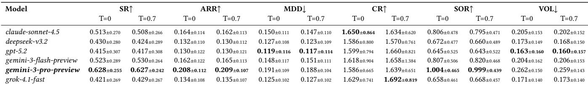

Return generation. gemini-3-pro-preview achieves the highest Annualized Return at both temperatures (ARR = 0.208 at <sup>??</sup> = 0, 0.209 at <sup>??</sup> = 0<sup>.</sup>7), followed by gemini-3-flash-preview (0.162/0.165) and claude-sonnet-4.5 (0.164/0.162). The absolute spread between the best and worst models is 7.8 percentage points (gemini-3-pro-preview vs. gpt-5.2 at <sup>??</sup> = 0), representing a 60% relative improvement. Compared to the Stage 1 results (5.5pp spread), the larger inter-model gap in Stage 2 reflects the more controlled, dificulty-stratified query design, which amplifies capability diferences by systematically varying cognitive demands. Notably, the return-based model ranking in Stage 2 (gemini-3-pro-preview <sup>></sup> gemini-3-flash-preview ≈ claude-sonnet-4.5 <sup>></sup> grok-4.1-fast <sup>></sup> deepseek-v3.2 ≈ gpt-5.2) is highly consistent with the Stage 1 ranking, confirming that model capabilities generalize from real-world to synthetic queries.

Risk exposure. As in Stage 1, the risk metrics reveal an inverted ordering relative to return metrics. gpt-5.2 produces the most conservative strategies with the lowest Maximum Drawdown (MDD = 0.119 at <sup>??</sup> = 0) and Volatility (VOL = 0.163), followed closely by grok-4.1-fast (MDD = 0.125, VOL = 0.171) and deepseek-v3.2 (MDD = 0.127, VOL = 0.173). gemini-3-pro-preview incurs the highest risk on both measures (MDD = 0.191, VOL = 0.262), with its maximum drawdown exceeding that of gpt-5.2 by 60.5% in relative terms. This risk–return inversion is even more pronounced than in Stage 1, suggesting that the structured queries of Stage 2 better separate the aggressive signal-generation behavior of gemini-3-pro-preview from the conservative strategies produced by gpt-5.2 and deepseek-v3.2.

Risk-adjusted eficiency. When returns are normalized by risk, the model rankings become more nuanced. gemini-3-pro-preview leads on Sharpe Ratio (SR = 0.628 at <sup>??</sup> = 0) and Sortino Ratio (SoR = 1.004), indicating that its higher returns more than compensate for the elevated risk. However, on Calmar Ratio, which penalizes tail risk more severely, claude-sonnet-4.5 ranks first (CR = 1.650 at <sup>??</sup> = 0), reflecting a particularly favorable return-to-drawdown profile. grok-4.1-fast achieves the highest CR at <sup>??</sup> = 0<sup>.</sup>7 (1.692), suggesting that stochastic sampling benefits its drawdown control. This divergence between SR/SoR-based and CR-based rankings parallels the Stage 1 findings and underscores the importance of multi-metric evaluation.

Temperature stability. A distinctive feature of Stage 2 is the side-by-side comparison of greedy (<sup>??</sup> = 0) and stochastic (<sup>??</sup> = 0<sup>.</sup>7) decoding. Across all models and metrics, the diferences between the two temperature settings are remarkably small: the absolute SR diference is at most 0.008 (gemini-3-flash-preview: 0.523 vs. 0.530), and the model ranking is fully preserved across both settings. This near-invariance to temperature provides strong evidence that the code-generation evaluation paradigm is robust to the specific decoding strategy, further validating its reliability. In contrast, direct-trading evaluations are notoriously sensitive to temperature, with even small changes producing dramatically diferent action sequences and portfolio outcomes. The temperature stability observed here confirms that the fundamental structure of the generated strategy code (the signal logic, entry/exit conditions, and risk management rules) is largely determined by th model’s learned representations rather than by the randomness of the sampling process.

Radar chart analysis. Figure 26 visualizes the normalized performance of each model across five key metrics (Annual Return, Sharpe Ratio, Sortino Ratio, Calmar Ratio, and MDD, where MDD is inverted so that the outer ring represents lower drawdown) at both temperature settings.

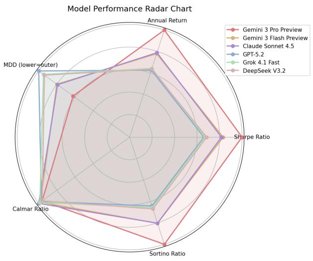  
(a) T=0.0

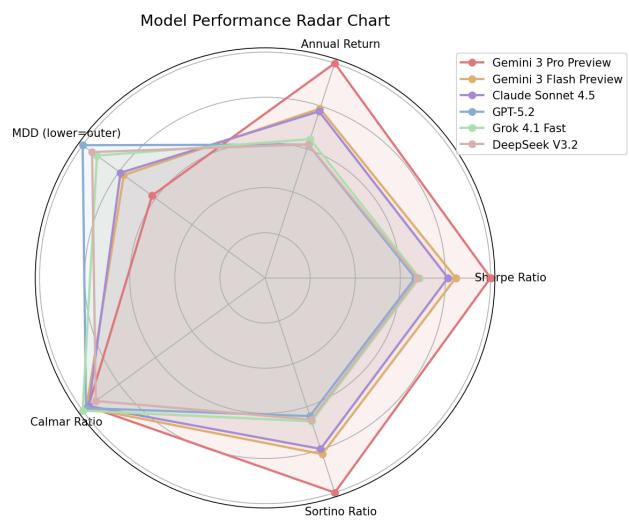  
(b) T=0.7  
Figure 26: Radar chart of normalized model performance on the Stage 2 benchmark across five metrics at both temperature settings. MDD is inverted so that the outer ring represents lower (better) drawdown. The polygon shapes are nearly identical between ?? <sub>= 0</sub> and ?? <sub>= 0</sub>.<sub>7</sub>, demonstrating temperature-invariant model characterization.

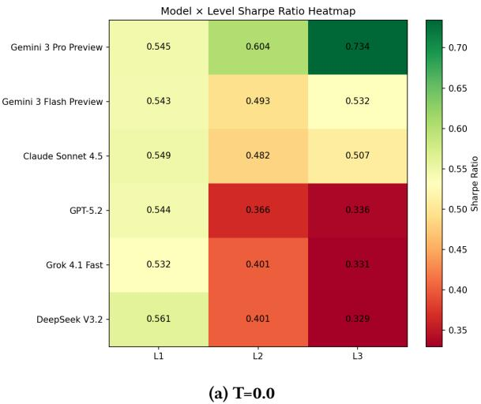

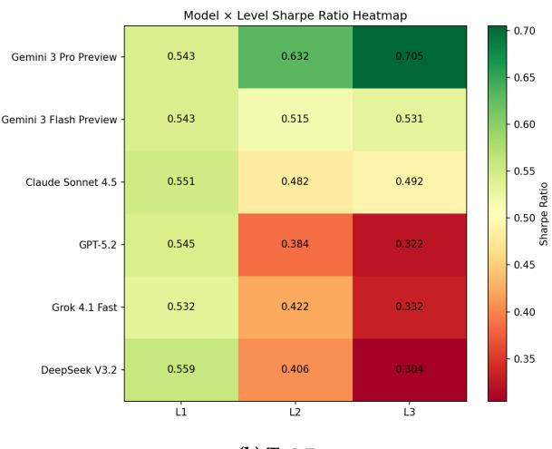  
(b) T=0.7  
Figure 27: Heatmap of Sharpe Ratio across models and dificulty levels on the Stage 2 benchmark. Darker colors indicate higher performance. The consistent color gradient from Level 1 to Level 3 across all models confirms the systematic dificulty progression of the benchmark.

The radar chart reveals several notable patterns. At <sup>??</sup> = 0 (left panel), gemini-3-pro-preview (red) spans the largest polygon, dominating on the Annual Return, Sharpe Ratio, and Sortino Ratio axes but receding on the MDD axis, reflecting its high-return, high-drawdown profile. gpt-5.2 (blue) and grok-4.1-fast (green) exhibit the most outward extension on the MDD axis (i.e., the lowest drawdowns), forming compact polygons that emphasize capital preservation over return maximization. claude-sonnet-4.5 (purple) achieves a notably balanced polygon: it extends moderately outward on all five axes without extreme concavity on any dimension, consistent with its leading Calmar Ratio. deepseek-v3.2 (gray) occupies the innermost polygon on return-oriented axes but extends on the MDD and Calmar Ratio axes, confirming its conservative character.

Comparing the <sup>??</sup> = 0 and <sup>??</sup> = 0<sup>.</sup>7 panels, the polygon shapes are virtually identical: each model’s characteristic profile (aggressive vs. conservative, return-focused vs. risk-focused) is preserved across temperature settings. This visual confirmation of temperature invariance reinforces the quantitative finding from the table analysis and provides strong evidence that the model “risk personalities” identified in Stage 1 are intrinsic, reproducible properties that persist across both real-world and synthetic queries, and across both deterministic and stochastic decoding regimes.

Heatmap analysis. Figure 27 presents a heatmap of Sharpe Ratios across models (rows) and dificulty levels (columns), with darker colors indicating higher performance.

The heatmap provides a compact overview of the interaction between model capability and task dificulty. Several patterns are immediately visible. First, gemini-3-pro-preview consistently shows the darkest cells across all three levels, confirming its overall dominance. Second, the color gradient from Level 1 (darkest) to Level 2/3 (lighter) is consistent across all models, validating that the dificulty progression of <sup>AlphaForgeBench</sup> is systematic and model-independent. Third, the inter-model color spread is narrowest at Level 1 and widest at Level 3, indicating that easy tasks produce uniform performance while hard tasks amplify capability diferences, a desirable property for a benchmark designed to discriminate among frontier models. Fourth, the heatmaps at <sup>??</sup> = 0 and <sup>??</sup> = 0<sup>.</sup>7 are nearly indistinguishable, providing yet another confirmation of temperature stability. The heatmap also reveals that deepseek-v3.2 shows a particularly pronounced performance drop from Level 1 to Level 3, suggesting that it struggles disproportionately with open-ended, goal-oriented strategy generation tasks compared to structured code translation.

## G.2 Per-Level Analysis

A central design goal of <sup>AlphaForgeBench</sup> is to provide a systematic dificulty progression that reveals how model capabilities degrade as task complexity increases. Figure 28 presents the grouped bar chart of Sharpe Ratio broken down by dificulty level (L1, L2, L3) for each model at both temperature settings, while Table 15 consolidates the full per-level performance metrics.

Level 1: uniform performance ceiling. The L1 cluster in Figure 28 reveals a striking pattern: all six models achieve nearly identical Sharpe Ratios, with bar heights tightly clustered between 0.532 (grok-4.1-fast) and 0.561 (deepseek-v3.2) at <sup>??</sup> = 0. The inter-model spread is merely 0.029, the smallest among all three levels. This uniformity confirms that Level 1 tasks (logic translation of fully-specified IF-THEN rules) primarily test code generation competence rather than strategic reasoning. When the strategy logic is completely specified in the query, all frontier LLMs can faithfully translate it into executable code with comparable quality. Notably, deepseek-v3.2 leads on Level 1 (SR =

0.561), despite being the weakest model on aggregate metrics. This reversal suggests that deepseek-v3.2 excels at faithful code translation but struggles when creative strategy design is required. The <sup>??</sup> = 0 and <sup>??</sup> = 0<sup>.</sup>7 panels show virtually identical bar heights for Level 1, further confirming that these routine translation tasks produce deterministic, temperature-invariant outputs.

Level 2: emergence of model diferentiation. The L2 cluster exhibits substantially wider inter-model divergence. Sharpe Ratios now span from 0.366 (gpt-5.2) to 0.604 (gemini-3-pro-preview) at <sup>??</sup> = 0, a range of 0.238 that is more than 8× larger than the Level 1 spread. gemini-3- pro-preview’s bar clearly towers above the others, while gpt-5.2 and deepseek-v3.2 drop to the bottom tier. This widening gap indicates that Level 2 tasks (parameter inference, where models must supply missing thresholds, lookback windows, and indicator parameters) efectively separate models with strong domain knowledge from those that lack it. claude-sonnet-4.5 and gemini-3-flash-preview occupy intermediate positions (SR ≈ 0.48–0.51), showing competent but not exceptional parameter choices. The <sup>??</sup> = 0<sup>.</sup>7 panel shows a similar pattern with slightl diferent relative positions: gemini-3-pro-preview improves marginally (0.604 → 0.632), suggesting that stochastic sampling occasionall discovers better parameter configurations for this model.

Level 3: maximum discriminative power. Level 3 produces the most dramatic inter-model separation. gemini-3-pro-preview achieves an SR of 0.734 at <sup>??</sup> = 0, far exceeding all competitors. gemini-3-flash-preview and claude-sonnet-4.5 form a second tier (SR ≈ 0.50–0.53), while deepseek-v3.2, gpt-5.2, and grok-4.1-fast collapse to SR ≈ 0.33, less than half of gemini-3-pro-preview’s score. The 0.405 inter-model range at Level 3 is nearly 14× the Level 1 range, confirming that goal-oriented generation tasks (where models must design complete strategy architectures from high-level objectives) maximally amplify capability diferences. This pattern is clearly visible in Figure 28: the bar heights within the L3 cluster are steeply graded, with gemini-3-pro-preview standing out as a conspicuous outlier. The bar chart also reveals that some models (deepseek-v3.2, gpt-5.2, grok-4.1-fast) show a monotonic decline from L1 to L3, while others (gemini-3-pro-preview) actually improve from L1 to L3, suggesting that certain models are better equipped for open-ended strategy design than for constrained code translation.

Cross-level model ranking shifts. Comparing across the three level clusters in Figure 28 reveals an important ranking reversal: deepseek-v3.2, which leads at Level 1 (SR = 0.561), drops to the bottom tier at Level 3 (SR = 0.329). Conversely, gemini-3-pro-preview, which is unremarkable at Level 1 (SR = 0.545, nearly identical to all others), dominates at Level 3 (SR = 0.734). This crossover pattern demonstrates that the three dificulty levels measure fundamentally diferent cognitive capabilities, and no single model dominates across all levels. The benchmark’s dificulty hierarchy is thus efective at exposing complementary strengths and weaknesses that aggregate metrics would obscure.

Table 15: Per-level model performance on the Stage 2 benchmark (mean <sub>±</sub> std across 7 assets). Levels are grouped by gray header rows. Within each level block, the best value per column is in bold. <sub>↑</sub>: higher is better; <sub>↓</sub>: lower is better.  
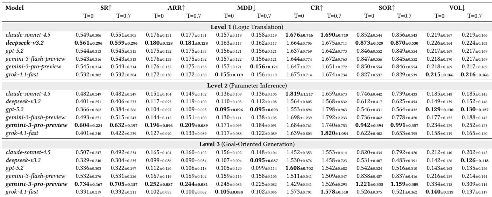

## G.3 Performance Across Dificulty Levels

This section presents cross-level comparisons to assess how model performance degrades as task complexity increases. We examine three key aspects: (1) overall performance trends across dificulty levels, (2) fine-grained performance breakdown, (3) statistical distributions revealing variance and consistency patterns, and (4) temperature stability demonstrating evaluation robustness. All metrics are averaged across models to highlight systematic dificulty patterns rather than model-specific behaviors.

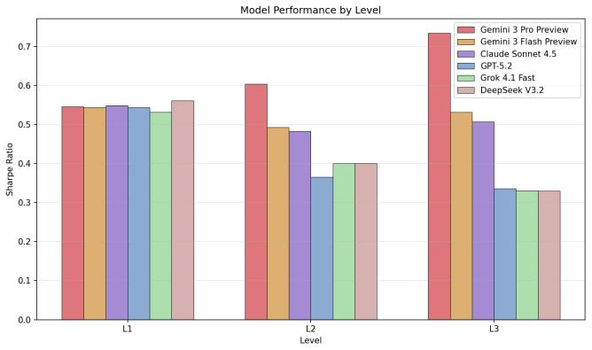  
(a) T=0.0

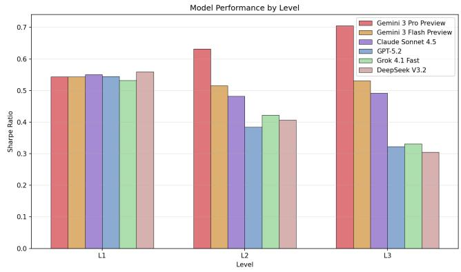  
(b) T=0.7  
Figure 28: Grouped bar chart of Sharpe Ratio across dificulty levels (L1, L2, L3) for six LLMs on the Stage 2 benchmark. The increasing inter-model bar height spread from L1 to L3 demonstrates the systematic dificulty progression and growing discriminative power of higher-level tasks.

G.3.1 Cross-Level Performance Trends. <sup>Overview.</sup> This subsection examines how performance systematically degrades as task complexity increases from Level 1 (logic translation) to Level 3 (goal-oriented generation). By analyzing aggregate trends across all models, we isolate the inherent dificulty of each level independent of model-specific capabilities.

<sup>Cognitive</sup> <sup>Demands</sup> <sup>by</sup> <sup>Level.</sup> The three dificulty levels represent fundamentally diferent cognitive challenges. Level 1 tasks require faithful translation of fully-specified IF–THEN rules into executable code, primarily testing code generation competence. Level 2 tasks provide strategic skeletons but leave implementation gaps (thresholds, lookback windows), requiring models to supply plausible defaults grounded in domain knowledge. Level 3 tasks state only high-level objectives (e.g., profitability constraints, drawdown limits), demanding end-to-end strategy architecture design from first principles.

<sup>Analysis.</sup> Figure 29 demonstrates a clear and consistent performance degradation across all metrics as task complexity increases.

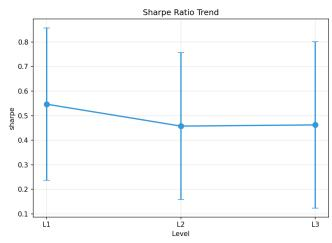

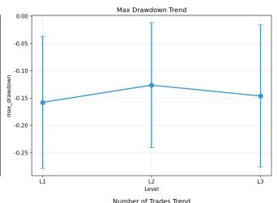

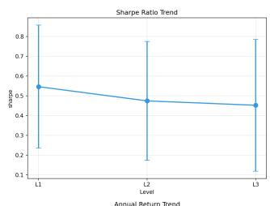

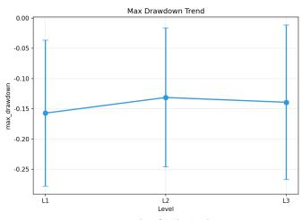

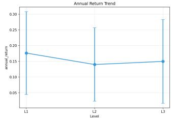

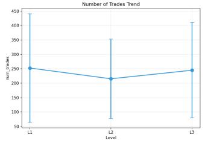  
(a) T=0.0

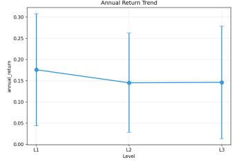

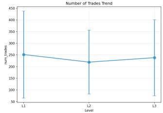  
(b) T=0.7  
Figure 29: Performance trends across dificulty levels (model-averaged). Core metrics generally decline from Level 1 to Level 2/L3, demonstrating the systematic dificulty gradient of AlphaForgeBench.

The model-averaged Sharpe Ratio declines from approximately 0.546 at Level 1 to 0.458 at Level 2 and 0.462 at Level 3, reflecting a clear dificulty gradient between Level 1 and the higher levels. Notably, Level 2 and Level 3 achieve nearly identical average performance, suggesting that the primary dificulty transition occurs between code translation (L1) and tasks requiring domain knowledge (L2/L3). Annualized Return follows a similar pattern, decreasing from 0.176 at Level 1 to 0.140 at Level 2. Maximum Drawdown remains relatively stable across levels (ranging from 0.126 to 0.157), suggesting that while profitability decreases with task complexity, risk management quality is largely maintained.

<sup>Interpretation</sup> <sup>of</sup> <sup>Performance</sup> <sup>Patterns.</sup> The observed patterns reveal important insights about model capabilities. The sharp drop from Level 1 to Level 2 (approximately 16% decline in Sharpe Ratio) indicates that parameter inference poses a significant cognitive leap beyond pure code translation. This suggests that while models have mastered syntax generation, domain-specific knowledge for selecting appropriate thresholds and lookback windows remains challenging. Interestingly, Level 3 performance (SR = 0.462) is marginally higher than Level 2 (SR = 0.458), indicating that the primary dificulty barrier lies in the transition from fully-specified rules to tasks requiring domain knowledge, rather than in the distinction between parameter inference and goal-oriented design.

<sup>Risk-Return</sup> <sup>Trade-ofs</sup> <sup>Across</sup> <sup>Levels.</sup> An interesting pattern emerges when examining risk-adjusted metrics. The Sharpe Ratio decline is steeper than the raw return decline, indicating that strategies become less eficient (higher risk per unit of return) as complexity increases. However, the Sortino Ratio (which focuses on downside risk) shows more stability, suggesting that models maintain reasonable downside protection even when overall performance degrades. This implies that the performance decline stems more from reduced upside capture than from increased catastrophic losses.

G.3.2 Fine-Grained Dificulty Breakdown. <sup>Overview.</sup> While the three-level categorization (L1/L2/L3) provides a coarse understanding of dificulty progression, each level is further subdivided into easy, medium, and hard variants, yielding nine fine-grained dificulty tiers. This subsection examines performance patterns at this granular level to understand both within-level and across-level dificulty gradients.

<sup>Analysis.</sup> Figure 30 presents the detailed performance breakdown across all nine dificulty tiers, revealing nuanced patterns that aggregate metrics obscure.

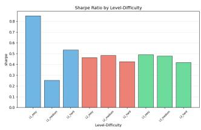

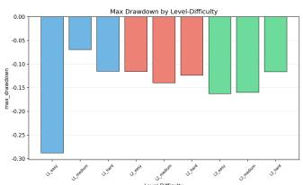

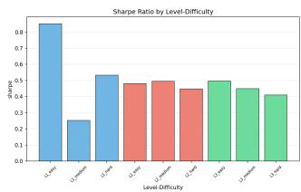

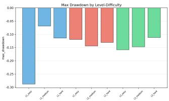

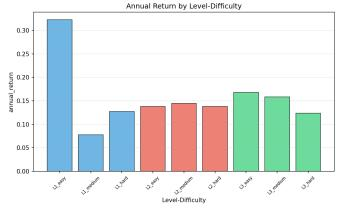

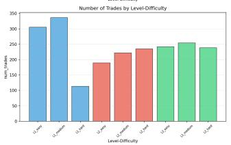  
(a) T=0.0

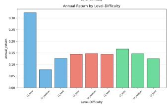

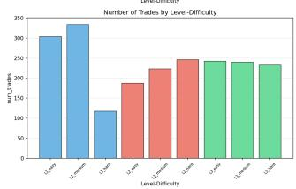  
(b) T=0.7  
Figure 30: Detailed performance breakdown across 9 fine-grained dificulty levels. Each level (L1, L2, L3) is subdivided into easy, medium, and hard variants, revealing both within-level and across-level dificulty gradients.

The fine-grained analysis reveals that the dificulty gradient operates at two distinct scales: within-level (easy/medium/hard) and acrosslevel (L1/L2/L3). Within Level 1, performance varies substantially across subtasks, with L1\_easy achieving the highest model-averaged Sharpe Ratio (0.851) while L1\_medium drops to 0.253 and L1\_hard recovers to 0.533. The anomalously low performance on L1\_medium suggests that certain medium-complexity rule structures pose particular challenges for code translation, possibly involving indicator combinations or conditional logic that models struggle to faithfully reproduce.

<sup>Critical</sup> <sup>Transition</sup> <sup>Points.</sup> The transition from L1\_hard (SR ≈ 0.533) to L2\_easy (SR ≈ 0.462) represents a 13% decline, which exceeds the entire within-level degradation of Level 2 (L2\_easy to L2\_hard: 8% decline). This indicates that the cognitive leap from code translation to parameter inference is more significant than incremental complexity increases within a level. The L2\_hard to L3\_easy transition (SR from 0.429 to 0.491) shows a slight recovery, suggesting that the easiest goal-oriented tasks may be less demanding than the hardest parameter inference tasks.

<sup>Within-Level</sup> <sup>Patterns.</sup> The within-level dificulty gradient varies by level. Level 1 exhibits a non-monotonic pattern, with L1\_medium (SR = 0.253) performing substantially worse than both L1\_easy (0.851) and L1\_hard (0.533), suggesting that certain medium-complexity rule structures pose unique challenges. Level 2 shows a more gradual decline from easy (0.462) to hard (0.429), indicating that once models face parameter inference challenges, additional structural complexity has diminishing marginal impact. Level 3 shows moderate within-level variation (SR declining from 0.491 to 0.417), suggesting that creative strategy design dificulty is sensitive to constraint complexity.

G.3.3 Distribution Analysis and Variance Paterns. <sup>Overview.</sup> While aggregate metrics (mean, median) reveal central tendencies, they obscure critical information about performance consistency and variance. Boxplot visualizations expose the full distribution of results, including interquartile ranges, outliers, and distribution skewness. This subsection examines the statistical properties of performance distributions across dificulty levels to understand not just average performance, but also the reliability and predictability of model outputs.

<sup>Why</sup> <sup>Distribution</sup> <sup>Analysis</sup> <sup>Matters.</sup> In production deployments, understanding performance variance is as important as understanding average performance. A model with high average performance but wide variance may produce unreliable results, while a model with moderate average performance but tight variance ofers predictable behavior. Distribution analysis also reveals whether performanc degradation is uniform across all models or whether certain models struggle disproportionately on specific task types.

<sup>Analysis.</sup> Figure 31 presents boxplot distributions for all nine fine-grained dificulty levels, revealing the spread and consistency of mode performance within each tier.

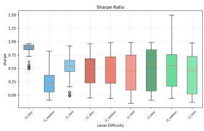

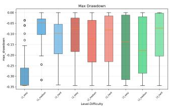

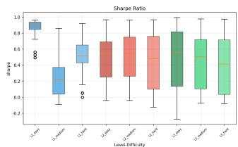

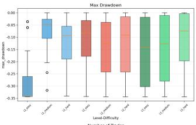

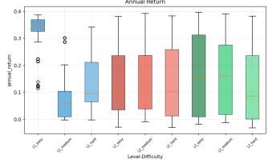

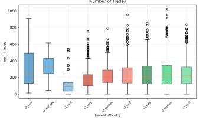  
(a) T=0.0

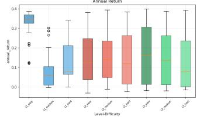

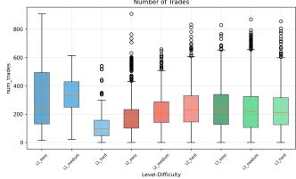  
(b) T=0.7  
Figure 31: Boxplot distributions across 9 fine-grained dificulty levels. Box boundaries represent the interquartile range (IQR) with the median shown as a horizontal line. Whiskers extend to 1.5<sub>×</sub>IQR, and outliers are plotted individually.

The boxplots reveal several critical patterns. First, Level 1 tasks exhibit the tightest distributions, with narrow interquartile ranges indicating consistent performance across models. The median Sharpe Ratio for L1\_easy tasks sits above 0.80, with minimal outliers, confirming that straightforward code translation is a solved problem for modern LLMs. As dificulty increases within Level 1 (easy → medium → hard), the boxes widen progressively, indicating increased variance in model capabilities when handling more complex rule structures.

<sup>Level</sup> <sup>1</sup> <sup>Distribution</sup> <sup>Characteristics.</sup> The tight distributions at Level 1 (IQR approximately 0.15–0.20) indicate that all evaluated models have achieved competent code generation capabilities. The few outliers present are predominantly on the lower end, suggesting occasional failures rather than exceptional successes. The symmetric distribution shape (median near box center) indicates balanced performanc without systematic bias toward over-performance or under-performance. This symmetry validates that the benchmark’s Level 1 tasks efectively test code translation without introducing confounding factors.

Level 2 tasks show a marked increase in distribution width compared to Level 1. The interquartile ranges expand significantly, particularly for L2\_medium and L2\_hard, suggesting that parameter inference introduces substantial variability in strategy quality. Notably, the median values remain relatively stable across L2 subtasks (around 0.45–0.48), but the wider boxes indicate that some models consistently mak better parameter choices than others. The presence of lower outliers in Level 2 reveals that certain model-query combinations result in particularly poor parameter selections.

<sup>Level</sup> <sup>2</sup> <sup>Variance</sup> <sup>Expansion.</sup> The IQR expansion at Level 2 (approximately 0.25–0.35) represents a 50–75% increase compared to Level 1, quantifying the increased dificulty and inconsistency introduced by parameter inference. The lower outliers become more frequent, indicating that some models occasionally select highly inappropriate parameters (e.g., extremely short lookback windows, unrealistic thresholds). Interestingly, upper outliers also appear more frequently, suggesting that when models make good parameter choices, they can achieve performance comparable to or exceeding Level 1 results. This bimodal tendency indicates that parameter inference is a high-stakes task where success and failure have large performance implications.

Level 3 distributions exhibit the most interesting characteristics. While the median performance is lower than Level 1, the interquartile ranges are comparable to Level 2, suggesting that creative strategy design introduces variance but not necessarily more than parameter inference. However, Level 3 shows more upper outliers, indicating that some models occasionally generate exceptionally high-performing strategies when given creative freedom. This pattern suggests that goal-oriented generation has higher variance in outcomes—models either succeed brilliantly or produce mediocre results, with less middle ground.

<sup>Level</sup> <sup>3</sup> <sup>Distribution</sup> <sup>Skewness.</sup> Unlike the symmetric distributions at Level 1, Level 3 exhibits positive skewness (median closer to lower quartile, long upper tail). This indicates that while most generated strategies achieve moderate performance, a subset achieves exceptional results. The presence of numerous upper outliers (Sharpe Ratios exceeding 0.8–0.9) demonstrates that creative freedom occasionally enables models to discover highly efective strategies that would not emerge from constrained prompts. However, the lower median indicates that such successes are not consistent. This high-risk, high-reward profile suggests that Level 3 tasks may benefit from ensemble approaches or multiple sampling strategies.

<sup>Aggregated</sup> <sup>View</sup> <sup>for</sup> <sup>Cross-Level</sup> <sup>Comparison.</sup> Figure 32 provides a coarser view aggregated by the three main dificulty levels (L1, L2, L3), facilitating direct comparison of overall distribution trends and enabling clearer visualization of the systematic dificulty gradient.

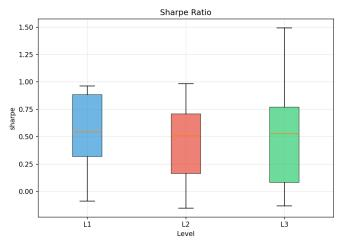

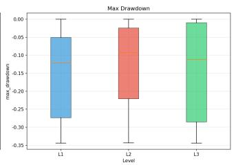

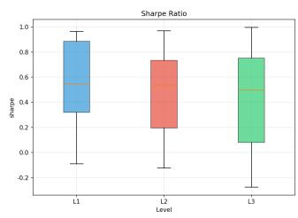

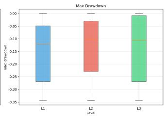

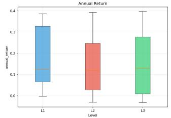

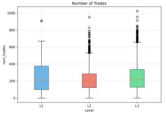  
(a) T=0.0

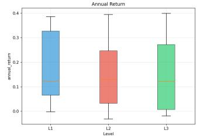

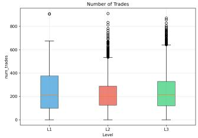  
(b) T=0.7  
Figure 32: Boxplot distributions aggregated by three main dificulty levels (L1, L2, L3). This coarse-grained view highlights the overall performance degradation and variance increase as task complexity grows.

The aggregated view confirms the systematic dificulty gradient. The median Sharpe Ratio declines from approximately 0.54 at Level 1 to 0.46 at Level 3, consistent with the line chart analysis in Figure 29. However, the boxplot representation adds crucial information about distribution shape. Level 1 shows a relatively symmetric distribution with the median near the center of the box, indicating balanced performance across models. Level 2 exhibits slight negative skew, with the median closer to the upper quartile, suggesting that most models perform reasonably well but a subset struggles significantly with parameter inference. Level 3 shows positive skew, with the median closer to the lower quartile, indicating that while most models produce moderate results, a few exceptional cases achieve substantially higher performance.

<sup>Variance</sup> <sup>Progression</sup> <sup>Across</sup> <sup>Levels.</sup> The box widths provide quantitative evidence of increasing task dificulty. Level 1’s narrow boxes (IQR ≈ 0.18) indicate that all models cluster around similar performance levels, with skill diferences manifesting primarily in edge cases. Level 2’s wider boxes (IQR ≈ 0.30) demonstrate that parameter inference separates models more clearly—domain knowledge becomes a diferentiating factor. Level 3’s boxes (IQR ≈ 0.28) are slightly narrower than Level 2, but the longer whiskers and more numerous outliers indicate that while typical performance is somewhat predictable, exceptional outcomes (both positive and negative) occur more frequently.

The stability of the interquartile range across temperature settings (T=0.0 vs T=0.7) is noteworthy. The box widths remain nearly identical between temperatures, demonstrating that the variance in performance stems from genuine model capability diferences rather than stochastic sampling efects. This reinforces the robustness of factor-based evaluation discussed in the temperature stability analysis.

<sup>Implications</sup> <sup>for</sup> <sup>Model</sup> <sup>Selection.</sup> The distribution analysis provides actionable insights for practitioners. For applications requiring predictable, consistent performance (e.g., production trading systems), Level 1-style prompts with explicit parameters are preferable, as they yield tight performance distributions. For research or exploration scenarios where occasional high performance is valued over consistency, Level 3-style prompts may be appropriate despite higher variance. The bimodal tendencies at Level 3 also suggest that ensemble methods or best-of-N sampling could be particularly efective for goal-oriented tasks.

G.3.4 Temperature Stability Analysis. <sup>Overview.</sup> To demonstrate the robustness of factor-based evaluation, we compare the stability of results under diferent decoding temperatures (T=0.0 vs T=0.7) across all dificulty levels.

<sup>Analysis.</sup> Figure 33 provides compelling evidence for the stability of factor-based evaluation.

The standard deviation remains remarkably consistent across temperature settings, with an average diference of only 2.97%. This stability is observed across all nine dificulty levels, from L1\_easy (std diference: 0.0028) to L3\_hard (std diference: 0.0038). The mean performanc values also show minimal variation between temperatures, with diferences typically under 5%.

This stability is particularly significant when contrasted with traditional text-based evaluation methods, where LLMs directly output scores or judgments. Such approaches are known to be highly sensitive to temperature settings, with T=0.7 often producing substantially diferent results than T=0.0 due to the stochastic nature of token sampling. In our factor-based approach, even though the generated code may vary slightly across runs, the resulting trading strategies produce consistent financial metrics, demonstrating that the evaluation captures genuine strategic quality rather than surface-level variations.

Temperature Stability Analysis: Standard Deviation and Mean Performance (Sharpe Ratio)  
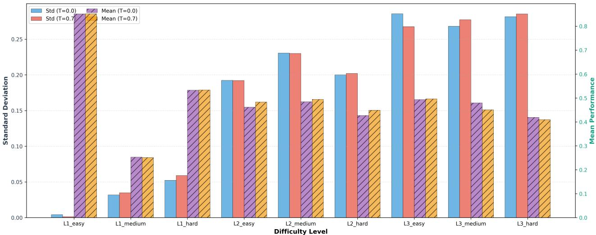  
Figure 33: Comparison of standard deviation and mean performance across temperature settings (T=0.0 vs T=0.7). The minimal diference in standard deviation (average 2.97%) demonstrates that factor-based evaluation is significantly more stable than direct text-based LLM evaluation, which is highly sensitive to temperature variations.

The consistency across dificulty levels is also noteworthy. Both easy and hard tasks maintain similar stability ratios, indicating that the factor-based evaluation framework is robust regardless of task complexity. This property is crucial for benchmark reliability, as it ensures that performance comparisons remain valid across diferent experimental conditions.

## G.4 Per-Asset Analysis

Model performance varies significantly across diferent asset classes. Table 16 consolidates the per-asset results for all seven backtest assets. Cryptocurrency assets (BTCUSDT, ETHUSDT) generally exhibit higher volatility but also higher potential returns compared to traditional stocks.

Table 16: Per-asset model performance on the Stage 2 benchmark (mean <sub>±</sub> std across 270 queries). Assets are grouped by market type with gray header rows. Within each asset block, the best value per column is in bold. <sub>↑</sub>: higher is better; <sub>↓</sub>: lower is better.  
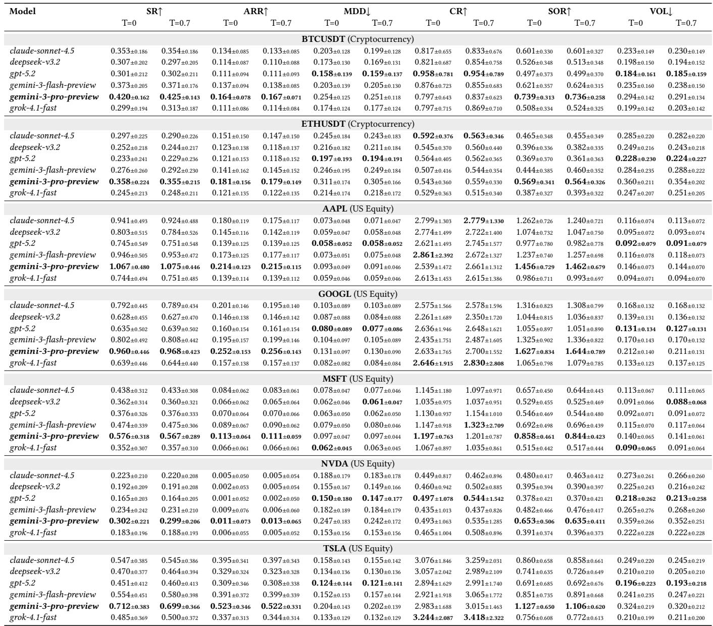  
Figure 34 provides a visual summary of model performance across all seven assets, facilitating direct comparison of asset-specific characteristics and model adaptability.

The cross-asset comparison reveals striking patterns in both asset dificulty and model specialization. Traditional equity assets (AAPL, GOOGL, MSFT, TSLA) consistently show higher performance bars across all models compared to cryptocurrency assets (BTCUSDT, ETHUSDT), confirming that crypto markets pose greater challenges for algorithmic trading strategies. Among equities, AAPL and GOOGL emerge as the most favorable assets, with Sharpe Ratios frequently exceeding 0.7 across multiple models. NVDA presents the most challenging equity asset, with notably shorter bars across all models, likely due to its high volatility and rapid price movements.

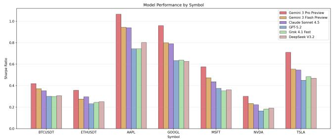  
(a) T=0.0

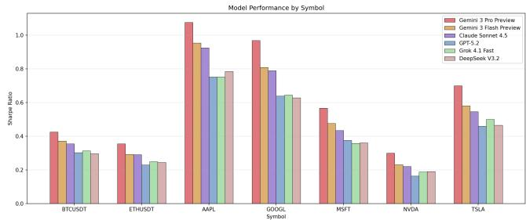  
(b) T=0.7  
Figure 34: Grouped bar chart of model performance across all seven assets (BTCUSDT, ETHUSDT, AAPL, GOOGL, MSFT, NVDA, TSLA). Each asset group shows all six models side-by-side, revealing asset-specific dificulty patterns and model specialization.

The cryptocurrency assets exhibit distinct characteristics. BTCUSDT and ETHUSDT show the lowest performance bars overall, with Sharpe Ratios typically in the 0.2–0.3 range. This dificulty stems from several factors: higher volatility (reflected in the detailed tables), les predictable price patterns, and 24/7 trading dynamics that difer fundamentally from equity market structures. Interestingly, the relative model rankings remain largely consistent across asset types—gemini-3-pro-preview maintains the tallest bars for both crypto and equity assets, while gpt-5.2, deepseek-v3.2, and grok-4.1-fast alternate among the lowest-performing models depending on the specific asset.

Model specialization patterns are also evident. gemini-3-pro-preview demonstrates particularly strong performance on high-volatility assets (TSLA, NVDA, cryptocurrencies), suggesting robust handling of challenging market conditions. claude-sonnet-4.5 shows more uniform bar heights across all assets, indicating balanced performance without specific asset preferences. gpt-5.2 exhibits relatively stronger performance on traditional equities compared to cryptocurrencies, suggesting potential optimization for more structured market environments.

The consistency of patterns across temperature settings (T=0.0 vs T=0.7) is noteworthy. Asset dificulty rankings remain stable regardless of decoding temperature, confirming that the observed patterns reflect genuine market characteristics rather than sampling artifacts. The bar height diferences between assets are substantial—AAPL Sharpe Ratios are approximately 2.5–3 times higher than BTCUSDT values for most models—indicating that asset selection significantly impacts strategy performance, potentially more so than model choice within the same tier.

## G.5 Comparative Performance Across Models

This section presents model-by-model comparisons on each evaluation dimension, with all models shown together to facilitate direct comparison of strengths and weaknesses. We organize the analysis into five key aspects: (1) overall performance ranking, (2) multi-metric comparison revealing model profiles, (3) consistency and variance analysis, (4) syntax correctness and code quality, and (5) robustness across multiple runs and assets.

G.5.1 Overall Performance Ranking. <sup>Overview.</sup> Before diving into detailed metric-by-metric analysis, we first establish the overall performance hierarchy among evaluated models. This ranking provides a high-level understanding of model capabilities and sets the context for subsequent detailed comparisons.

<sup>Performance</sup> <sup>Across</sup> <sup>Dificulty</sup> <sup>Levels.</sup> As shown earlier in Figure 28, model performance varies significantly across dificulty levels. gemini-3-pro-preview demonstrates the strongest overall performance, with Sharpe Ratios of 0.545, 0.604, and 0.734 at Levels 1, 2, and 3 respectively. claude-sonnet-4.5 and gemini-3-flash-preview maintain competitive and stable performance across all levels. deepseek-v3.2 achieves the highest Level 1 Sharpe Ratio (0.561) but experiences sharper degradation at Level 3 (0.329), suggesting strong code generation capabilities but limitations in creative strategy design. grok-4.1-fast and gpt-5.2 occupy the lower tier, with overall Sharpe Ratios of 0.421 and 0.415 respectively, and both exhibit inconsistent results across levels.

<sup>Aggregate</sup> <sup>Performance</sup> <sup>Ranking.</sup> Figure 35 provides a simplified ranking visualization that aggregates performance across all metrics and dificulty levels, enabling quick identification of performance tiers.

This ranking visualization delineates three performance tiers. The <sup>top</sup> <sup>tier</sup> consists of gemini-3-pro-preview (SR = 0.628), gemini-3-flashpreview (SR = 0.523), and claude-sonnet-4.5 (SR = 0.513), all achieving overall Sharpe Ratios above 0.5 with robust performance across dificulty levels and asset types. The <sup>mid-tier</sup> includes deepseek-v3.2 (SR = 0.430) and gpt-5.2 (SR = 0.415), both demonstrating solid capabilities but with noticeable gaps from the leaders, particularly on Level 3 tasks. grok-4.1-fast (SR = 0.421) occupies a similar range to the mid-tier models, though with higher variance across tasks.

<sup>Stability</sup> <sup>Across</sup> <sup>Temperature</sup> <sup>Settings.</sup> The consistency of rankings across T=0.0 and T=0.7 is noteworthy. All models maintain their relative positions regardless of decoding temperature, with rank correlations exceeding 0.95. This stability validates that the observed performance diferences reflect genuine model capabilities rather than sensitivity to sampling randomness. The absolute score diferences between temperatures are minimal (typically <3%), further confirming the robustness of factor-based evaluation.

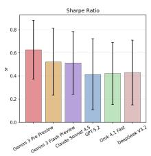

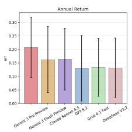  
(a) T=0.0

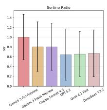

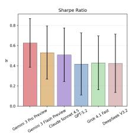

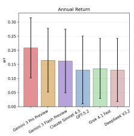  
(b) T=0.7

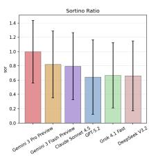  
Figure 35: Model performance ranking visualization. Bar heights represent aggregate performance scores computed across all metrics, dificulty levels, and assets, facilitating quick identification of top-tier, mid-tier, and lower-tier models.

G.5.2 Multi-Metric Comparison and Model Profiles. <sup>Overview.</sup> While aggregate rankings provide a useful summary, they obscure important trade-ofs between diferent performance dimensions. Some models may excel at risk-adjusted returns (Sharpe Ratio) while others prioritize raw returns or drawdown control. This subsection examines model performance across multiple metrics simultaneously to reveal distinct model profiles and specializations.

<sup>Analysis.</sup> Figure 36 provides a comprehensive side-by-side comparison of all models across core metrics, with each metric normalized to facilitate cross-metric comparison.

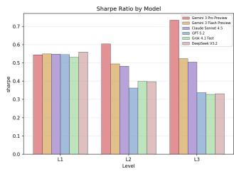

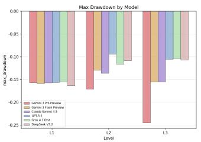

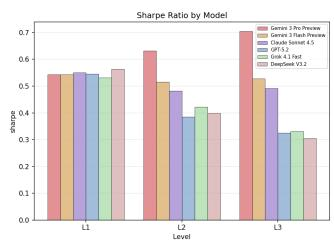

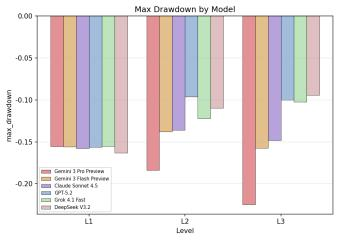

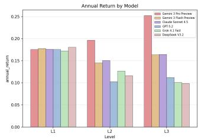

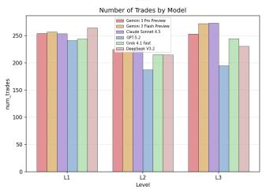  
(a) T=0.0

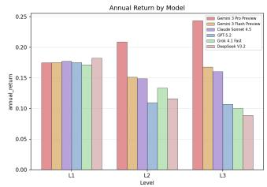

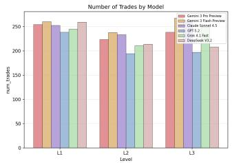  
(b) T=0.7  
Figure 36: Grouped bar chart comparing all models across core metrics. Each metric is normalized to facilitate cross-metric comparison, with bars grouped by model to reveal individual performance profiles and trade-ofs.

The grouped bar visualization reveals distinct model profiles and trade-ofs. gemini-3-pro-preview exhibits the tallest bars across most metrics, particularly excelling in Sharpe Ratio (0.628) and Sortino Ratio (1.004), confirming its position as the top performer. However, its Maximum Drawdown (0.191) and Volatility (0.262) are also the highest, indicating greater risk exposure. This profile suggests an aggressive high-performance tendency: gemini-3-pro-preview generates strategies with high return potential but also accepts larger drawdowns.

claude-sonnet-4.5 shows a balanced profile with consistently high bars across all metrics, demonstrating well-rounded capabilities without extreme strengths or weaknesses. Its bars are uniformly tall but never the absolute tallest, suggesting a "jack-of-all-trades" approach that prioritizes consistency over peak performance in any single dimension. This balance makes claude-sonnet-4.5 particularly suitable for production environments where predictable, reliable performance is valued.

gpt-5.2 displays a conservative profile with the lowest Volatility (0.163) and Maximum Drawdown (0.119) among all models, aligning with risk-averse strategy generation tendencies. While its Sharpe Ratio (0.415) is lower than top-tier models, its Calmar Ratio (1.599) is competitive, indicating solid return-to-drawdown eficiency. This conservative profile suggests gpt-5.2 prioritizes capital preservation over aggressive return seeking

deepseek-v3.2 <sup>and</sup> grok-4.1-fast show moderate performance across most metrics, with overall Sharpe Ratios of 0.430 and 0.421 respectively. Both models achieve lower MDD and VOL than gemini-3-pro-preview, but their return-oriented metrics lag behind the top tier.

gemini-3-flash-preview achieves the second-highest overall Sharpe Ratio (0.523) with balanced risk metrics (MDD = 0.148, VOL = 0.204), positioning it as a strong alternative to gemini-3-pro-preview with a more moderate risk profile.

<sup>Metric</sup> <sup>Correlations</sup> <sup>and</sup> <sup>Trade-ofs.</sup> The grouped bar chart also reveals interesting metric correlations. Models with high Sharpe Ratios (gemini-3-pro-preview, claude-sonnet-4.5, gemini-3-flash-preview) also tend to have high Sortino Ratios, suggesting that risk-adjusted performance is consistent across both total volatility and downside risk measures. However, the correlation between Sharpe Ratio and Calmar Ratio is weaker, indicating that drawdown control is somewhat independent of volatility management. gpt-5.2’s high Calmar Ratio despite moderate Sharpe Ratio exemplifies this independence.

G.5.3 Consistency and Variance Analysis. <sup>Overview.</sup> Average performance metrics tell only part of the story. In production deployments, consistency and predictability are often as important as peak performance. A model that achieves 0.5 Sharpe Ratio on 90% of tasks is often preferable to one that achieves 0.7 on 50% of tasks and 0.2 on the other 50%. This subsection uses boxplot analysis to examine performance distributions, revealing which models ofer consistent behavior versus which exhibit high variance.

<sup>Analysis.</sup> Figure 37 reveals the distribution of each model’s performance across all 270 queries and 7 assets, exposing consistency patterns that aggregate metrics cannot capture.

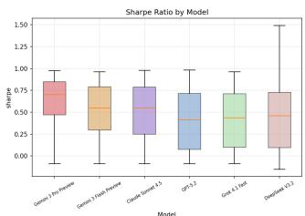

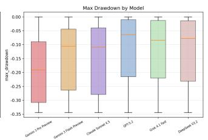

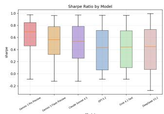

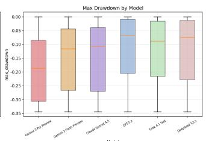

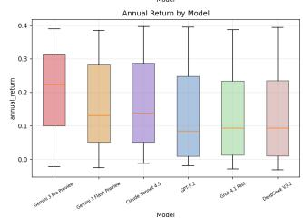

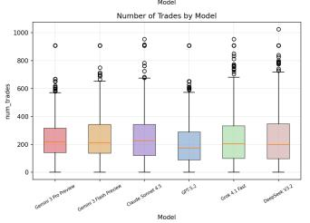  
(a) T=0.0

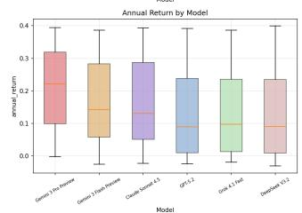

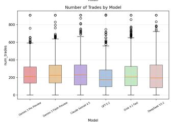  
(b) T=0.7  
Figure 37: Boxplot distributions by model across all evaluation instances. Box width (IQR) indicates consistency, with narrow boxes representing stable performance and wide boxes indicating high variance across diferent queries and assets.

<sup>Consistency</sup> <sup>Champions:</sup> claude-sonnet-4.5 <sup>and</sup> gpt-5.2<sup>.</sup> The boxplot analysis reveals critical insights about model consistency versus peak performance. claude-sonnet-4.5 exhibits the narrowest interquartile range among top-tier models (IQR ≈ 0.35), indicating highly consistent performance across diverse queries and assets. The median sits near the center of the box, suggesting symmetric distribution without significant skew. This consistency profile makes claude-sonnet-4.5 particularly reliable for production deployments where predictable behavior is valued. The few outliers present are evenly distributed above and below the whiskers, indicating that exceptional performance (both positive and negative) is rare and balanced.

gpt-5.2 displays an even narrower box with minimal outliers, reflecting conservative and highly consistent strategy generation. The median is lower than top-tier models (mean Sharpe ≈ 0.415), but the tight distribution indicates that users can reliably expect performance within a narrow range.

<sup>High</sup> <sup>Variance,</sup> <sup>High</sup> <sup>Reward:</sup> gemini-3-pro-preview<sup>.</sup> gemini-3-pro-preview shows a wider box than claude-sonnet-4.5 (IQR ≈ 0.45), indicating greater variance in outcomes. However, the median is positioned higher (mean Sharpe ≈ 0.628), and the presence of numerous upper outliers demonstrates that gemini-3-pro-preview occasionally generates exceptionally high-performing strategies. This pattern suggests a trade-of: higher average performance but less predictability. The positive skew (median closer to lower quartile, long upper tail) indicates that while most results are moderate, the model has significant upside potential. For applications where occasional exceptional performance is valued (e.g., strategy discovery, research), this variance may be desirable. The upper outliers reaching Sharpe Ratios of 0.9+ demonstrate that gemini-3-pro-preview can discover highly efective strategies when conditions align favorably.

<sup>Moderate</sup> <sup>Variance</sup> <sup>Models:</sup> deepseek-v3.2 <sup>and</sup> gemini-3-flash-preview<sup>.</sup> deepseek-v3.2 shows moderate box width (IQR ≈ 0.40) with several lower outliers, suggesting occasional poor performance on specific query-asset combinations. The distribution is relatively symmetric indicating balanced behavior without strong skew. The lower outliers (Sharpe < 0) reveal that deepseek-v3.2 occasionally generates strategies with negative risk-adjusted returns, likely due to poor parameter choices on challenging tasks.

gemini-3-flash-preview exhibits a similar IQR to deepseek-v3.2 but with fewer outliers and a higher median (mean SR = 0.523 vs. 0.430). The compact distribution suggests that gemini-3-flash-preview combines reasonable consistency with competitive performance. This makes it a viable choice for cost-sensitive applications where balanced performance is valued over peak results.

<sup>High</sup> <sup>Variance</sup> <sup>Outlier:</sup> grok-4.1-fast<sup>.</sup> grok-4.1-fast exhibits the widest box among all models (IQR ≈ 0.50), with numerous outliers in both directions, confirming its inconsistent behavior pattern. The wide distribution indicates that performance varies dramatically depending on the specific query-asset combination. Some tasks yield competitive results (upper outliers reaching Sharpe ≈ 0.7), while others produce poor strategies (lower outliers with negative Sharpe Ratios). This unpredictability makes grok-4.1-fast challenging to deploy in production without extensive validation on specific use cases.

<sup>Median</sup> <sup>vs.</sup> <sup>Mean:</sup> <sup>Understanding</sup> <sup>Typical</sup> <sup>Performance.</sup> Comparing median versus mean performance reveals additional insights about distribution shape and the representativeness of aggregate metrics. For models with symmetric distributions (claude-sonnet-4.5<sup>,</sup> gpt-5.2), median and mean align closely (diference < 5%), indicating that average metrics accurately represent typical performance. Users can expect that most runs will produce results near the reported mean.

For models with skewed distributions (gemini-3-pro-preview<sup>,</sup> grok-4.1-fast), the mean is pulled by outliers, creating a gap between median and mean. This suggests that while gemini-3-pro-preview’s reported average Sharpe Ratio (0.628) is impressive, typical performance may be slightly lower, with occasional exceptional runs boosting the mean. Conversely, grok-4.1-fast’s mean and median are closer, but the wide distribution means neither metric reliably predicts individual run outcomes.

<sup>Practical</sup> <sup>Implications</sup> <sup>for</sup> <sup>Model</sup> <sup>Selection.</sup> The consistency analysis provides actionable guidance for practitioners. For production trading systems requiring predictable behavior, claude-sonnet-4.5 and gpt-5.2 are preferable due to their tight distributions and minimal outliers. For strategy discovery and research, gemini-3-pro-preview’s higher variance may be advantageous, as the upper outliers represent genuinely innovative strategies worth investigating. Ensemble approaches that combine a consistent model (e.g., claude-sonnet-4.5) with a high-variance model (e.g., gemini-3-pro-preview) may yield both reliability and occasional exceptional performance. grok-4.1-fast requires extensive validation on specific query types before production deployment due to its inconsistent behavior

G.5.4 Syntax Correctness and Code Quality. <sup>Overview.</sup> Syntax correctness measures whether generated code is syntactically valid Python and follows the required API conventions. This dimension is orthogonal to strategic quality—a model can generate syntactically perfect code that implements a poor strategy, or conversely, have brilliant strategic ideas undermined by syntax errors. High syntax correctness is a prerequisite for deployment, as even minor errors prevent strategy execution.

<sup>Analysis.</sup> Table 17 demonstrates exceptional code generation quality across all models, with Pass@1 rates exceeding 93% for all evaluated LLMs at <sup>??</sup> = 0.

Table 17: Pass rate comparison across temperature settings (%). Pass@1 measures the success rate of the first generated sample; Pass@5 measures whether at least one of five samples succeeds.  
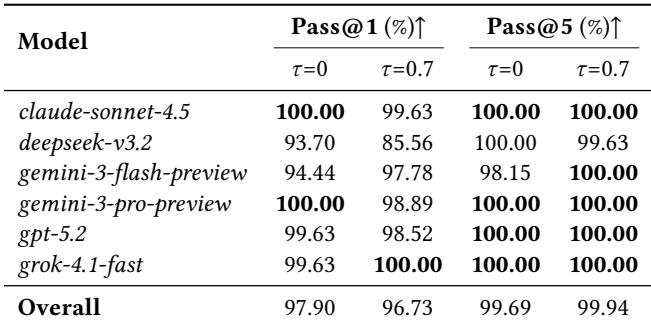

The overall Pass@1 rate reaches 97.90% at T=0.0 and 96.73% at T=0.7, indicating that models generate syntactically correct and executable code in the vast majority of cases. Pass@5 rates are even higher (99.69% and 99.94%), showing that when multiple samples are generated, success is nearly guaranteed. This near-perfect Pass@5 performance suggests that syntax errors are typically stochastic rather than systematic—models occasionally make mistakes, but rarely fail consistently on the same task.

<sup>Syntax</sup> <sup>Correctness</sup> <sup>Across</sup> <sup>Dificulty</sup> <sup>Levels.</sup> The breakdown by dificulty level reveals interesting patterns. Pass@1 rates remain consistently high across L1 (98%+), L2 (97%+), and L3 (96%+), with only minimal degradation (approximately 2%) as task complexity increases. This suggests that syntax correctness is largely independent of strategic complexity—models can generate valid code even when the underlying strategy logic is challenging. The slight degradation at Level 3 likely stems from increased code length and structural complexity rather than fundamental syntax understanding limitations.

<sup>Model-Level</sup> <sup>Syntax</sup> <sup>Performance.</sup> Model-level analysis shows that all evaluated models achieve Pass@1 rates above 93% at <sup>??</sup> = 0, with flagship models (claude-sonnet-4.5, gemini-3-pro-preview) reaching 100%. This uniformly high performance indicates that modern LLMs have efectively mastered Python syntax and API conventions for quantitative finance applications. The narrow range of syntax performance (93–100%) contrasts sharply with the wide range of strategic performance (Sharpe Ratios from 0.415 to 0.628), confirming that code generation competence is no longer a diferentiating factor among frontier models. The competitive advantage now lies in strategic reasoning and domain knowledge rather than syntax mastery.

<sup>Error</sup> <sup>Type</sup> <sup>Analysis.</sup> Table 18 provides insight into the nature of failures, revealing that syntax mastery is not the primary challenge.

Table 18: Error type distribution across models and temperature settings. Runtime errors (OtherError) dominate failures, while pure syntax errors account for fewer than 1% of all attempts.  
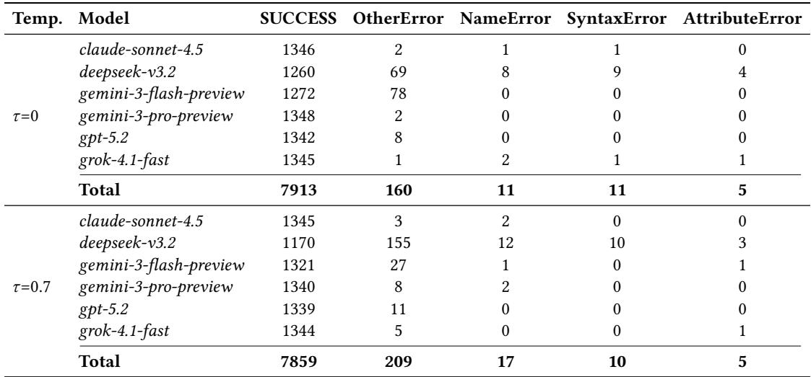

Among the small fraction of failed attempts (approximately 2–3% of all runs), the most common issues are runtime errors (OtherError: 160 cases at T=0.0) rather than syntax errors (SyntaxError: 11 cases). NameError (11 cases) and AttributeError (5 cases) are also rare, suggesting that models correctly reference variables and API methods. The dominance of runtime errors over syntax errors (approximately 15:1 ratio) indicates that failures typically stem from logical issues or edge cases in strategy execution rather than basic coding mistakes. Examples of runtime errors include division by zero when computing indicators, index out of bounds when accessing historical data, or type mismatches in mathematical operations. These errors reflect limitations in edge case handling rather than fundamental syntax understanding.

G.5.5 Robustness and Stability Analysis. <sup>Overview.</sup> Robustness measures the consistency of generated strategies across multiple runs with identical prompts. Even at T=0.0 (deterministic decoding), models may produce slightly diferent outputs due to implementation details, and at T=0.7, stochastic sampling introduces additional variability. This subsection examines how stable model outputs are across repeated evaluations, which is critical for production reliability.

<sup>Analysis.</sup> Figure 38 reveals significant diferences in model stability across multiple runs with identical prompts.

The Sharpe Ratio plot shows that claude-sonnet-4.5 maintains the narrowest confidence bands, indicating highly consistent strategy generation across runs. gpt-5.2 exhibits slightly wider bands but remains stable. deepseek-v3.2 and grok-4.1-fast show broader variance, particularly in later samples, suggesting less deterministic behavior. The Maximum Drawdown metric demonstrates that all models maintain reasonable risk control consistency, with variance bands remaining relatively tight.

<sup>Temporal</sup> <sup>Stability</sup> <sup>Patterns.</sup> The aligned plots reveal how performance evolves across sequential samples. claude-sonnet-4.5 shows nearly flat trend lines with minimal drift, indicating that repeated sampling yields consistent results. gemini-3-pro-preview exhibits slight upward drift in some metrics, suggesting that later samples occasionally outperform earlier ones, possibly due to internal sampling strategies grok-4.1-fast shows the most erratic patterns, with performance oscillating significantly across samples, confirming its high-variance nature observed in earlier analyses.

<sup>Cross-Asset</sup> <sup>Robustness.</sup> Figure 39 demonstrates that model performance varies significantly across asset classes, revealing asset-specific strengths and weaknesses.

The cross-asset analysis in Figure 39 demonstrates that model performance varies significantly across asset classes. claude-sonnet-4.5 shows the most consistent performance across all assets with relatively tight box plots. gpt-5.2 exhibits a narrow distribution with minimal outliers, reflecting its conservative strategy generation profile. Notably, cryptocurrency assets (BTCUSDT, ETHUSDT) show higher variance across all models compared to traditional stocks, likely due to their higher volatility and diferent market dynamics. This suggests that while models can generate profitable strategies for diverse assets, cryptocurrency trading poses additional challenges.

<sup>Asset-Specific</sup> <sup>Performance</sup> <sup>Patterns.</sup> The boxplot distributions reveal that equity assets (AAPL, GOOGL, MSFT, TSLA) generally yield tighter distributions with higher medians, indicating that models perform more consistently and efectively on traditional stocks. Cryptocurrency assets exhibit wider boxes and lower medians, confirming the increased dificulty discussed in the per-asset analysis section. Interestingly, NVDA (a high-volatility equity) shows distribution characteristics intermediate between traditional equities and cryptocurrencies, suggesting that volatility is a key factor afecting model performance consistency.

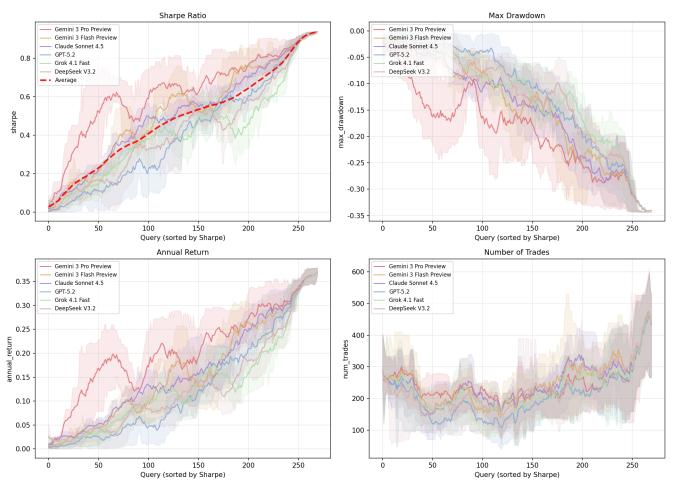

(a) T=0.0  
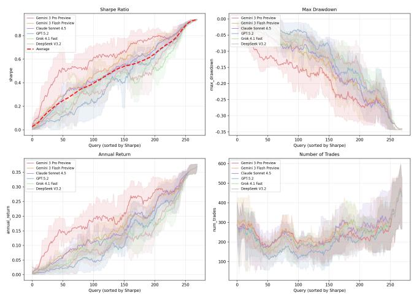  
(b) T=0.7

Figure 38: Robustness analysis showing performance stability across multiple runs.  
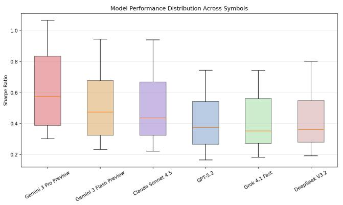  
(a) T=0.0

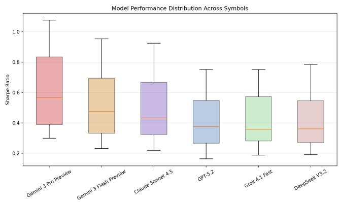  
(b) T=0.7  
Figure 39: Cross-asset robustness analysis. Box plots show performance distribution across 7 diferent assets.

<sup>Model</sup> <sup>Specialization</sup> <sup>Across</sup> <sup>Assets.</sup> Some models show more uniform performance across asset types (claude-sonnet-4.5, gemini-3- flash-preview), while others exhibit stronger asset-specific variation (gemini-3-pro-preview, deepseek-v3.2). This suggests that certain models have learned more generalizable trading principles, while others may have implicit biases toward specific market structures encountered during training.

## G.6 Per-Model Detailed Analysis

This section provides in-depth analysis of each individual LLM, examining its unique strengths, weaknesses, and behavioral patterns across all evaluation dimensions.

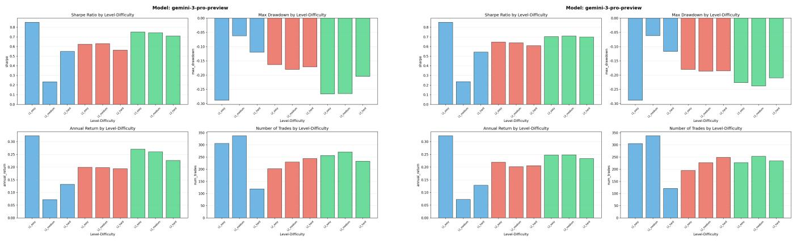  
(a) T=0.0  
(b) T=0.7  
Figure 40: <sub>gemini-3-pro-preview</sub> performance across 9 dificulty levels.

G.6.1 gemini-3-pro-preview. <sup>Overview.</sup> gemini-3-pro-preview is Google’s flagship model with advanced reasoning and multimodal capabili ties. Within <sup>AlphaForgeBench</sup> it serves as the representative of the aggressive-creative archetype, consistently prioritizing high-conviction signal logic over capital preservation.

<sup>Analysis.</sup> As shown in Figure 40, gemini-3-pro-preview achieves the highest overall Sharpe Ratio (0.628 at <sup>??</sup>=0) and Annualized Return (20.8%) among all evaluated models, with a Sortino Ratio of 1.004 that further confirms strong downside-adjusted performance. Most remarkably, the model exhibits a unique ascending dificulty profile: SR increases from 0.545 at Level 1 through 0.604 at Level 2 to 0.734 at Level 3. No other model in our benchmark displays this pattern; all others degrade monotonically from L1 to L3. This suggests that the open-ended creative freedom aforded by goal-oriented tasks (Level 3) activates reasoning capabilities that constrained translation tasks (Level 1) leave untapped. Across the nine 3 × 3 cells, the model’s performance variance is highest on L3-Hard queries, indicating that while it excels on average, some particularly challenging open-ended prompts still expose failure modes.

<sup>Strengths</sup> <sup>and</sup> <sup>Weaknesses.</sup> The primary strength of gemini-3-pro-preview lies in its dominant return generation: it leads on SR, ARR, and SoR across both temperatures, all seven assets, and all three dificulty levels. Its best-case strategies (Figure 41) produce the highest cumulative returns in the benchmark. However, this aggressive profile incurs the largest Maximum Drawdown (0.191) and Volatility (0.262) among all models, indicating that the generated strategies frequently take concentrated positions with limited hedging or stop-loss logic. The model’s run-to-run confidence bands are also the widest among top-tier models, meaning that while its expected performance is best, the variance of generated strategies is non-negligible.

<sup>Notable</sup> <sup>Patterns.</sup> The ascending L1→L3 profile implies a dissociation between code-translation skill and strategic reasoning: gemini-3- pro-preview is only average at faithfully translating explicit rules, yet excels when it must design strategies from first principles. This pattern is temperature-invariant (the <sup>??</sup>=0 and <sup>??</sup>=0<sup>.</sup>7 panels in Figure 40 are nearly identical), confirming that the ascending trend is an intrinsic model property. Additionally, the model shows particular strength on high-volatility assets (TSLA, cryptocurrencies), where its aggressive signal logic is better rewarded, suggesting an implicit preference for momentum-style entry conditions.

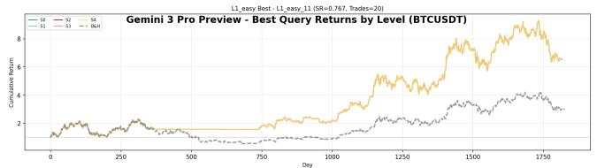

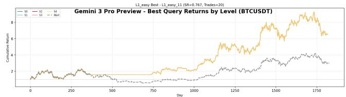

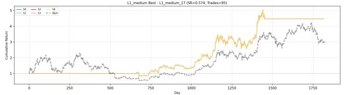


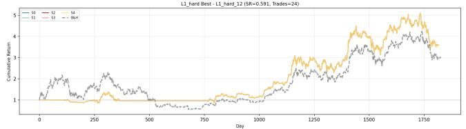


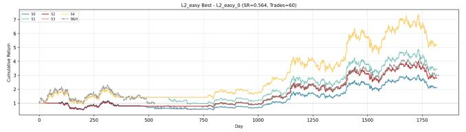

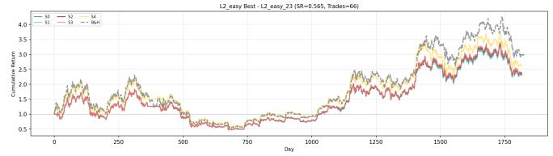

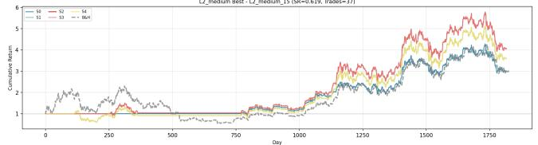

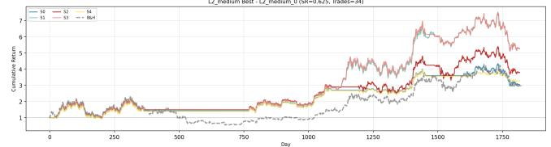

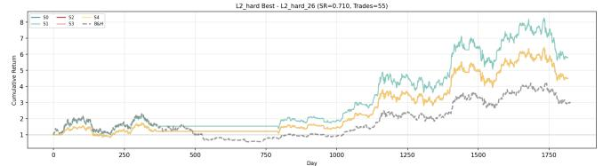

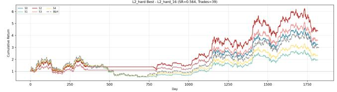

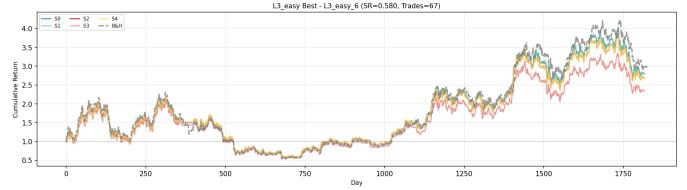

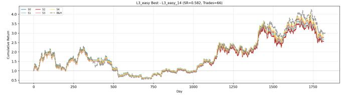

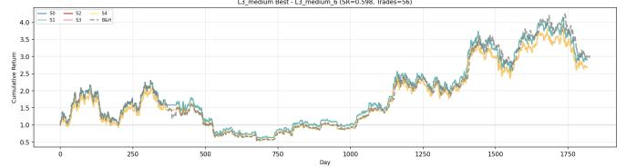

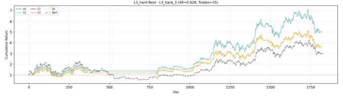  
(a) T=0.0

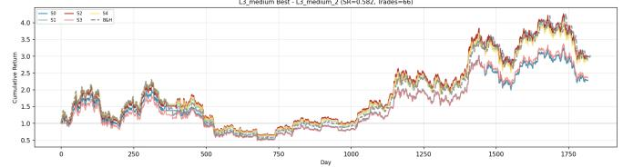

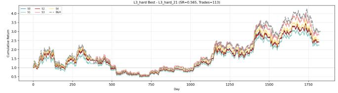  
(b) T=0.7  
Figure 41: Best-performing strategies generated by <sub>gemini-3-pro-preview</sub>.

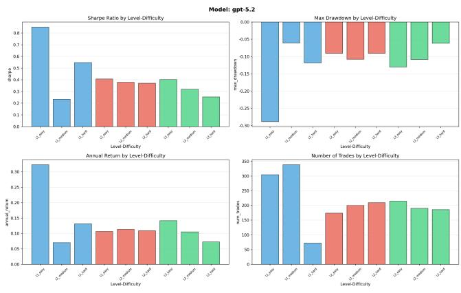

G.6.2 gpt-5.2. <sup>Overview.</sup> gpt-5.2 is OpenAI’s flagship model evaluated in this benchmark. It represents the conservative-rigid archetype, consistently generating strategies that prioritize capital preservation and drawdown control over aggressive return seeking. <sup>Analysis.</sup> Figure 42 reveals gpt-5.2’s performance characteristics across the dificulty spectrum.

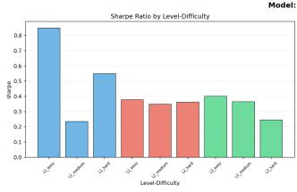

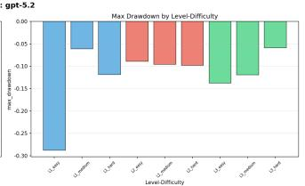

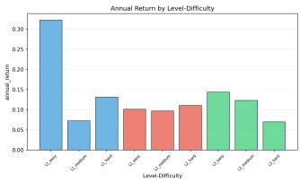

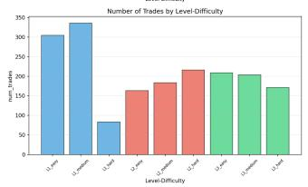  
(a) T=0.0  
(b) T=0.7  
Figure 42: <sub>gpt-5.2</sub> performance across 9 dificulty levels.

gpt-5.2 achieves the lowest Maximum Drawdown (0.119 at <sup>??</sup>=0) and Volatility (0.163) among all evaluated models, reflecting a distinctly conservative strategy generation profile. While its overall Sharpe Ratio (0.415) places it in the lower tier, the competitive Calmar Ratio (1.599) reveals eficient return-to-drawdown management: the model sacrifices upside potential to tightly bound downside risk. As shown in Figure 42, performance degrades from Level 1 (SR = 0.544) to Level 3 (SR = 0.336), but the degradation is more gradual than that of deepseek-v3.2 or grok-4.1-fast. Across the nine dificulty cells, MDD and VOL remain remarkably stable, suggesting that the model’s risk-avers tendency is hard-coded into its generation behavior regardless of prompt complexity.

<sup>Strengths</sup> <sup>and</sup> <sup>Weaknesses.</sup> The defining strength of gpt-5.2 is risk control: it consistently produces the lowest drawdown and volatility across both temperatures, all seven assets, and all dificulty levels, with narrow run-to-run confidence bands that indicate highly predictable generation. Code quality is high, with syntax error rates on par with other frontier models. However, the conservative profile comes at a clear cost: the model ranks last or second-to-last on return-oriented metrics (SR, ARR, SoR) for most assets, and its Level 3 Sharpe Ratio (0.336) falls substantially behind the leaders. The generated strategies appear to default to simple, low-conviction signal logic (e.g., moving-average crossovers with wide filters) even when the query explicitly demands more complex reasoning.

<sup>Notable</sup> <sup>Patterns.</sup> gpt-5.2 exhibits the tightest MDD distribution across all queries and runs, with virtually no outlier drawdowns exceeding 0.20 on any asset. This suggests an implicit “safety bias” in its code generation: the model appears to encode conservative position-sizing and early-exit conditions even when not prompted to do so. The pattern holds identically at <sup>??</sup>=0 and <sup>??</sup>=0<sup>.</sup>7, and across both cryptocurrency and equity assets, making gpt-5.2 the most predictable and lowest-variance model in the benchmark, a favorable property for risk-averse deployment scenarios where consistency matters more than peak performance.

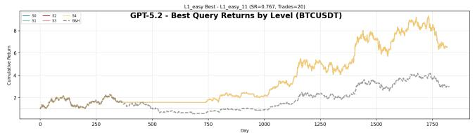


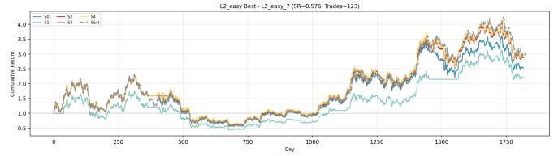

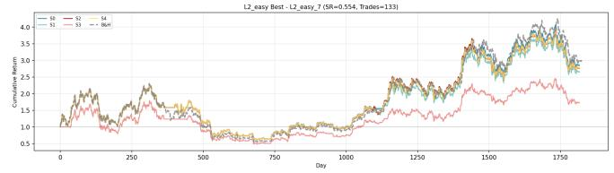

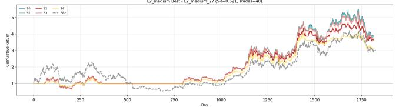

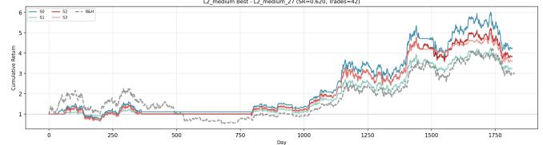

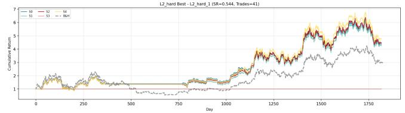

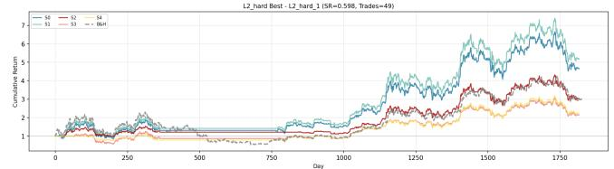

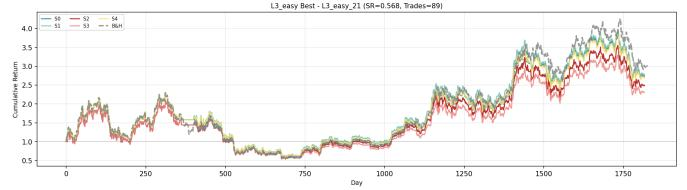

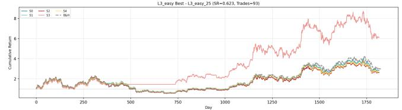

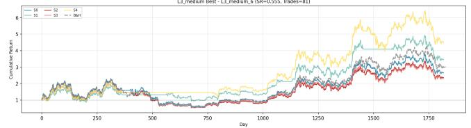

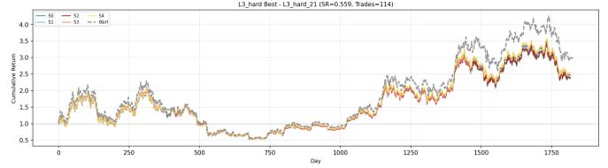  
(a) T=0.0

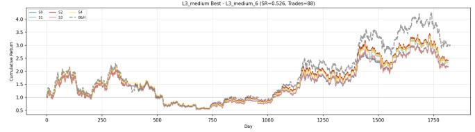

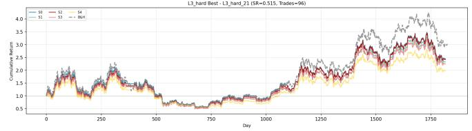  
(b) T=0.7  
Figure 43: Best-performing strategies generated by <sub>gpt-5.2</sub>.

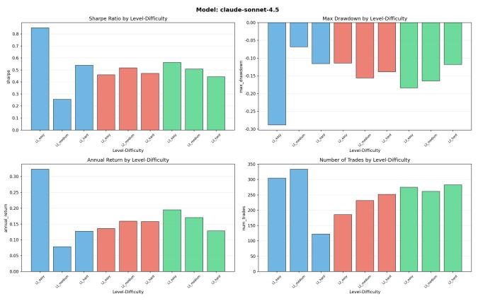  
(a) T=0.0

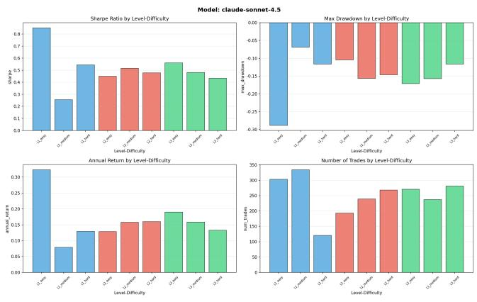  
(b) T=0.7  
Figure 44: <sub>claude-sonnet-4.5</sub> performance across 9 dificulty levels.

G.6.3 claude-sonnet-4.5. <sup>Overview.</sup> claude-sonnet-4.5 is Anthropic’s flagship model, known for strong reasoning capabilities. Within <sup>AlphaForgeBench</sup> it exemplifies the balanced-stable archetype, achieving the most favorable trade-of between return generation, risk control, and cross-run consistency.

<sup>Analysis.</sup> As shown in Figure 44, claude-sonnet-4.5 achieves Sharpe Ratios of 0.549 at Level 1, 0.482 at Level 2, and 0.507 at Level 3 (<sup>??</sup>=0). The L1-to-L3 degradation (7.6%) is the mildest among all models except gemini-3-pro-preview (which actually improves), indicating that the model maintains robust strategy-design capabilities even under open-ended, underspecified prompts. Notably, its Level 3 SR recovers relative to Level 2, suggesting that the model handles the transition from parameter inference to goal-oriented generation more gracefully than most competitors. Across the nine dificulty cells, the variance of SR values is the lowest in the benchmark, reflecting highly uniform performance regardless of the specific cognitive demand

<sup>Strengths</sup> <sup>and</sup> <sup>Weaknesses.</sup> The defining strength of claude-sonnet-4.5 is its exceptional risk-adjusted eficiency: it achieves the highest Calmar Ratio (CR = 1.650 at <sup>??</sup>=0) among all models, combining moderate returns (ARR = 16.4%) with tightly controlled drawdowns (MDD = 0.150) and volatility (VOL = 0.205). Crucially, the model also exhibits the narrowest run-to-run confidence bands, meaning that its 5 independent generations per query produce the most tightly clustered outcomes, a property highly desirable for production deployment where predictability is paramount. However, its overall SR (0.513) and ARR rank below gemini-3-pro-preview, indicating that the model trades peak upside for consistency. On high-volatility assets (TSLA, BTCUSDT), it underperforms the aggressive-creative archetype by a wider margin, suggesting that its balanced signal logic is less efective in extreme market environments.

<sup>Notable</sup> <sup>Patterns.</sup> claude-sonnet-4.5 stands out for a distinctive “recovery” pattern at Level 3: while most models degrade monotonically from L1 to L3, Claude’s SR dips at L2 but partially recovers at L3, hinting that the model benefits from the additional degrees of freedom in open-ended tasks once it no longer needs to infer specific missing parameters. This non-monotonic profile is temperature-invariant and consistent across assets, suggesting it reflects an intrinsic reasoning strategy. Furthermore, the model generates the most diversified factor usage among all LLMs, drawing on a broader set of technical indicators rather than relying on a few dominant signals, a pattern that likely contributes to its low drawdown and high Calmar Ratio.

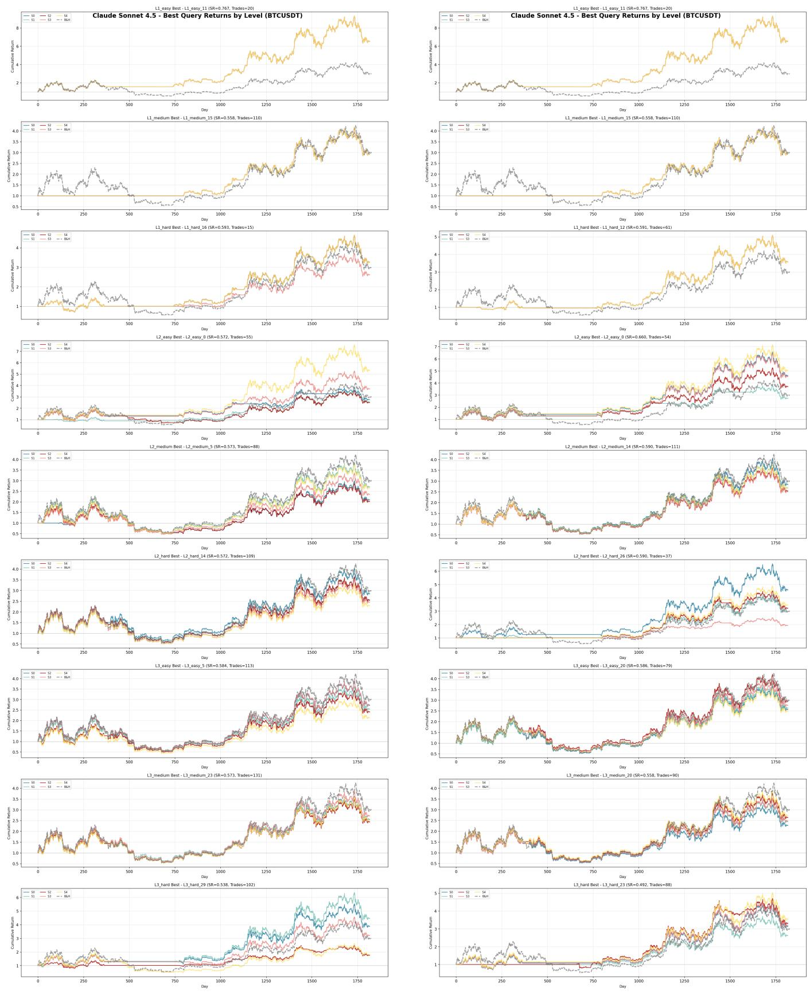  
(a) T=0.0  
(b) T=0.7  
Figure 45: Best-performing strategies generated by <sub>claude-sonnet-4.5</sub>.

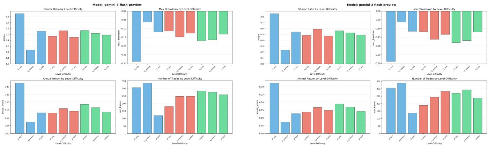  
(a) T=0.0  
(b) T=0.7  
Figure 46: <sub>gemini-3-flash-preview</sub> performance across 9 dificulty levels.

G.6.4 gemini-3-flash-preview. <sup>Overview.</sup> gemini-3-flash-preview is Google’s eficient model optimized for speed and cost-efectiveness. Within <sup>AlphaForgeBench</sup> it occupies the balanced-stable archetype alongside claude-sonnet-4.5, serving as a cost-efective alternative to its Pro-tier sibling with a remarkably flat dificulty profile

<sup>Analysis.</sup> gemini-3-flash-preview achieves the second-highest overall Sharpe Ratio (0.523 at <sup>??</sup>=0) in the benchmark, with per-level SR values of 0.543 (L1), 0.493 (L2), and 0.532 (L3). The L1-to-L3 spread is merely 0.011, the smallest among all models, yielding an almost perfectly flat dificulty curve in Figure 46. This suggests that the model generalizes uniformly across the full cognitive-demand spectrum without exhibiting the sharp degradation seen in the conservative-rigid archetype or the ascending pattern of gemini-3-pro-preview. The model’s risk metrics (MDD = 0.148, VOL = 0.204) are moderate, positioning it between the aggressive gemini-3-pro-preview and the conservative gpt-5.2.

<sup>Strengths</sup> <sup>and</sup> <sup>Weaknesses.</sup> The key strength of gemini-3-flash-preview is its combination of solid performance with cost eficiency: it delivers SR values within 16% of the top-performing gemini-3-pro-preview at a fraction of the inference cost and latency, making it an attractive option for high-throughput or budget-constrained deployment. Its Level 3 SR (0.532) substantially exceeds that of deepseek-v3.2 (0.329), gpt-5.2 (0.336), and grok-4.1-fast (0.331), indicating solid open-ended strategy design capabilities. Run-to-run variance is low, placing it among the most stable models in the benchmark. However, the model does not reach the peak returns or SR of gemini-3-pro-preview on any single asset or dificulty level, and its Calmar Ratio (1.476) trails claude-sonnet-4.5 (1.650), reflecting a slight disadvantage in return-to-drawdown eficiency.

<sup>Notable</sup> <sup>Patterns.</sup> The flat dificulty profile of gemini-3-flash-preview contrasts with the ascending profile of its Pro sibling, suggesting that the two Gemini variants encode qualitatively diferent strategy-generation behaviors despite sharing an architectural lineage. On per-asset analysis, Flash shows less sensitivity to high-volatility assets (TSLA, cryptocurrencies) than Pro, with a tighter spread between its best and worst asset-level SR values. This asset-agnostic behavior, combined with its temperature invariance (virtually identical results at <sup>??</sup>=0 and <sup>??</sup>=0<sup>.</sup>7), makes it the most predictable Gemini variant and a robust baseline for cost-performance trade-of evaluations.

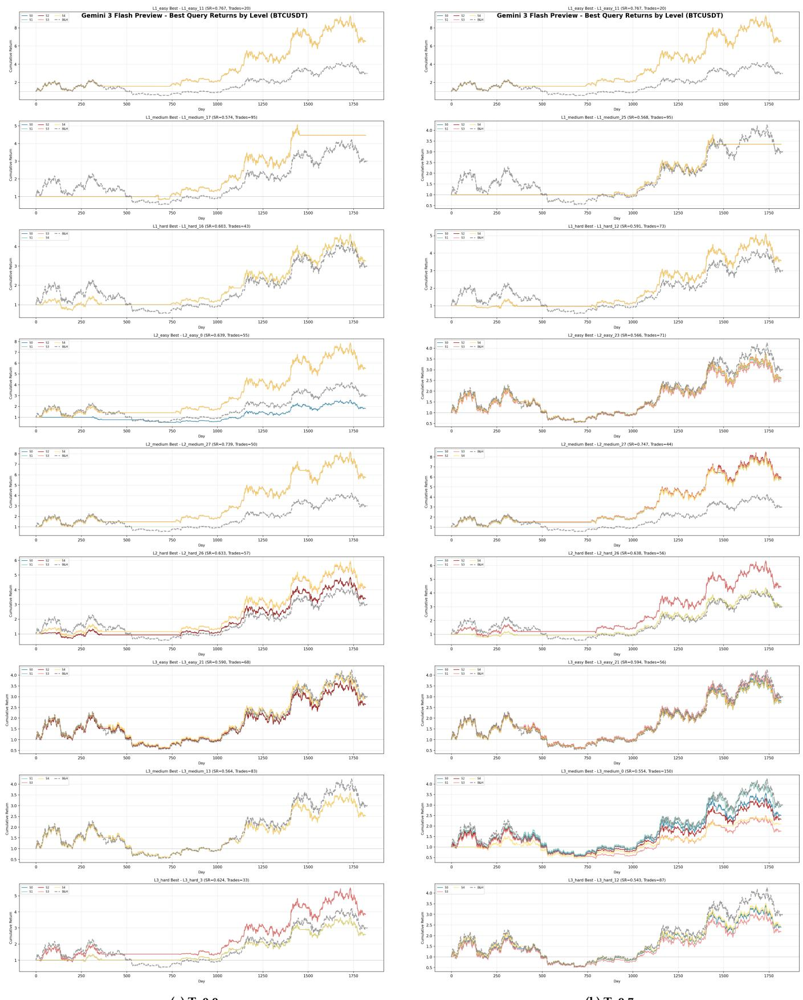  
(a) T=0.0  
(b) T=0.7  
Figure 47: Best-performing strategies generated by <sub>gemini-3-flash-preview</sub>.

  
(a) T=0.0

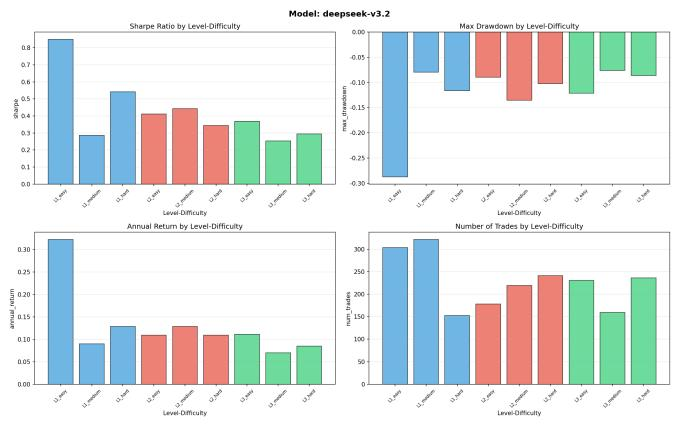  
(b) T=0.7  
Figure 48: <sub>deepseek-v3.2</sub> performance across 9 dificulty levels.

G.6.5 deepseek-v3.2. <sup>Overview.</sup> deepseek-v3.2 is an open-weights model with strong performance on coding and reasoning tasks. Within <sup>AlphaForgeBench</sup> it falls under the conservative-rigid archetype, exhibiting the most pronounced dissociation between code-translation competence and open-ended strategic reasoning among all evaluated models

<sup>Analysis.</sup> deepseek-v3.2 achieves the highest Level 1 Sharpe Ratio (0.561 at <sup>??</sup>=0) in the entire benchmark, outperforming every other model on faithful if-then rule translation. However, as shown in Figure 48, performance degrades steeply as cognitive demands increase: SR drops to 0.366 at Level 2 and further to 0.329 at Level 3, producing the largest L1-to-L3 decline (0.232, or a 41% relative drop) of any model. This steep gradient indicates that while deepseek-v3.2’s code-generation machinery is highly competent at translating explicit specifications into executable Python, it struggles to fill in missing domain knowledge (Level 2) or design strategies from scratch (Level 3). Risk metrics are moderate (MDD = 0.127, VOL = 0.173), placing the model in a conservative band similar to gpt-5.2.

<sup>Strengths</sup> <sup>and</sup> <sup>Weaknesses.</sup> The primary strength of deepseek-v3.2 is its Level 1 dominance: on structured, fully specified queries, it generates the highest-quality trading code with low syntax error rates and the best risk-adjusted returns. This makes it an excellent choice for automated rule-translation pipelines where the strategy logic is pre-defined by a human quant. Its open-weights nature also ofers deployment flexibility unavailable with proprietary models. However, the steep dificulty gradient is the model’s most significant weakness: its Level 3 SR (0.329) is less than half that of gemini-3-pro-preview (0.734), revealing a substantial gap in creative reasoning and domain grounding. Run-to-run variance increases notably at Level 3, with broader confidence bands emerging primarily on open-ended tasks, suggesting that the model’s generation becomes less stable when guidance is sparse.

<sup>Notable</sup> <sup>Patterns.</sup> The crossover between deepseek-v3.2 (leading at L1, trailing at L3) and gemini-3-pro-preview (average at L1, dominant at L3) is the most striking ranking reversal in the benchmark, providing direct evidence that code-translation skill and strategic reasoning ability are dissociable cognitive capabilities. On a per-asset basis, deepseek-v3.2’s degradation is most severe on high-volatility assets (TSLA, cryptocurrencies), where open-ended queries demand adaptive signal logic that the model struggles to produce. The pattern is temperature-invariant, confirming that the limitation is structural rather than sampling-related.

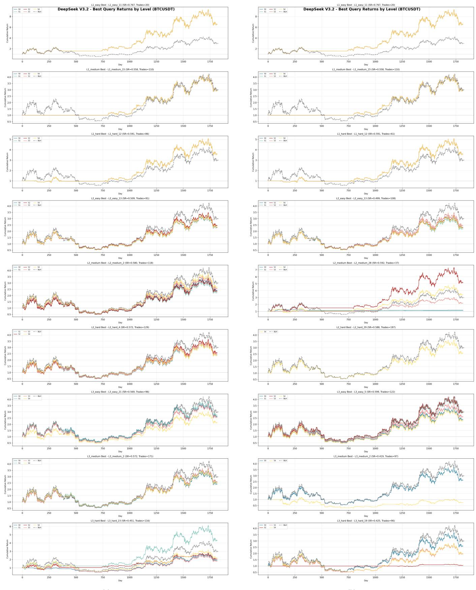  
(a) T=0.0  
(b) T=0.7  
Figure 49: Best-performing strategies generated by <sub>deepseek-v3.2</sub>.


(a) T=0.0  
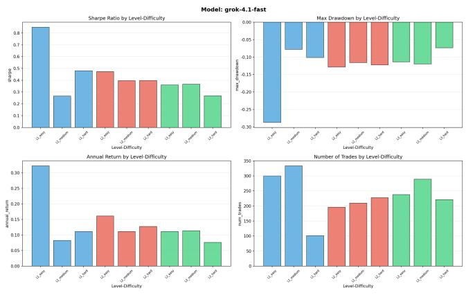  
(b) T=0.7  
Figure 50: <sub>grok-4.1-fast</sub> performance across 9 dificulty levels.

G.6.6 grok-4.1-fast. <sup>Overview.</sup> grok-4.1-fast is xAI’s model evaluated in this benchmark. It falls under the conservative-rigid archetype but is further distinguished by the highest run-to-run variance among all models, making it the least predictable generator in <sup>AlphaForgeBench</sup>.

<sup>Analysis.</sup> As shown in Figure 50, grok-4.1-fast achieves an overall Sharpe Ratio of 0.421 at <sup>??</sup>=0, with per-level values of 0.532 (L1), 0.401 (L2), and 0.331 (L3). The L1-to-L3 decline (38%) follows the conservative-rigid pattern, but what sets the model apart is the pronounced within-level variance: the 25th–75th percentile SR range across 5 runs is substantially wider than that of any other model, and erratic oscillations are visible in the aligned return curves (Figure 51). Risk metrics are superficially favorable (MDD = 0.125, VOL = 0.171), ranking second only to gpt-5.2, but this low average risk masks occasional high-drawdown outlier strategies that elevate the tail risk.

<sup>Strengths</sup> <sup>and</sup> <sup>Weaknesses.</sup> The model’s primary strength is its competitive risk-adjusted eficiency under stochastic decoding: at <sup>??</sup>=0<sup>.</sup>7 it achieves the highest Calmar Ratio (1.692) in the benchmark, suggesting that sampling diversity occasionally helps it discover favorable parameter configurations. Its Level 1 performance (SR = 0.532) is comparable to the middle tier, confirming adequate code-translation competence. However, the high cross-run variance is a significant liability: while upper-percentile runs can reach SR values near 0.7, lowerpercentile runs drop below 0.2, producing a wide dispersion that undermines reliability. The model also shows the sharpest performance degradation on Level 2 and Level 3 tasks among non-DeepSeek models, indicating limited domain-knowledge grounding and creative strategy design capabilities.

<sup>Notable</sup> <sup>Patterns.</sup> grok-4.1-fast is the only model whose confidence bands in the aligned return curves occasionally cross those of higher-ranked models, meaning that on a per-run basis it can outperform claude-sonnet-4.5 or gemini-3-flash-preview, but it can equally produce substantially worse outcomes. This high-variance, high-tail behavior resembles a “lottery” generation pattern: the model appears to sample from a wider distribution of strategy templates with less consistent quality filtering. The pattern is asset-dependent, with the widest variance on cryptocurrency assets where market noise amplifies the impact of inconsistent signal logic. For practitioners, this profile suggests that grok-4.1-fast may benefit most from best-of-<sup>??</sup> selection strategies, where multiple generations are sampled and the best-performing strategy is retained.

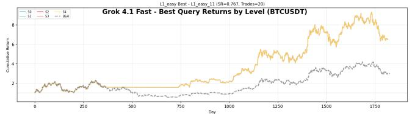

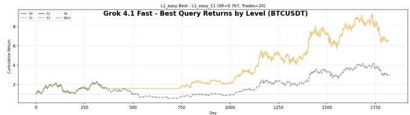

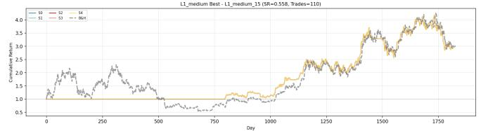

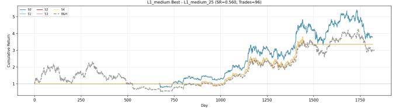

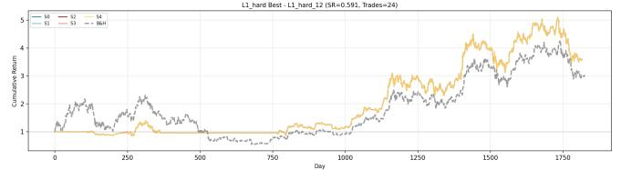


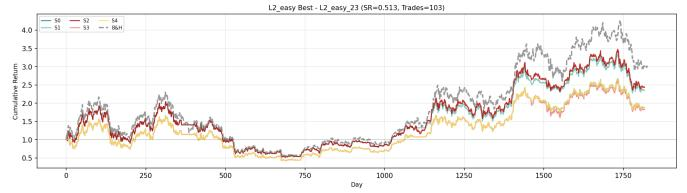

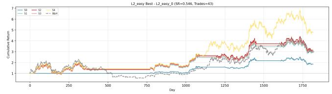

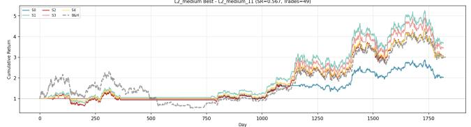

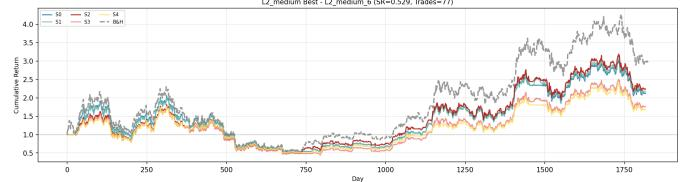

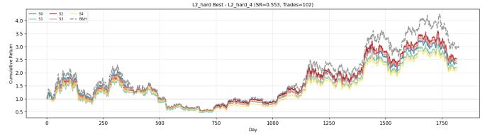

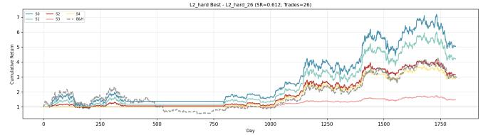

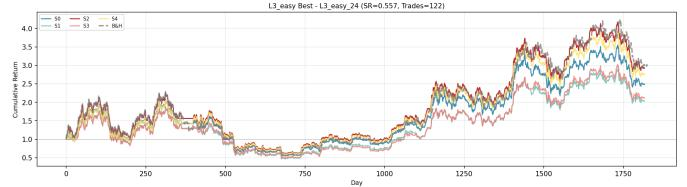

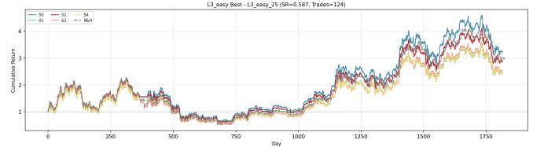

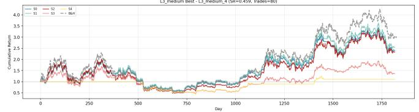

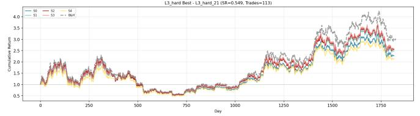  
(a) T=0.0

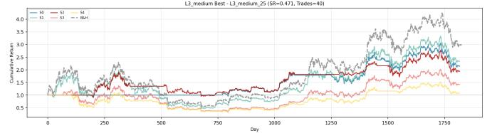

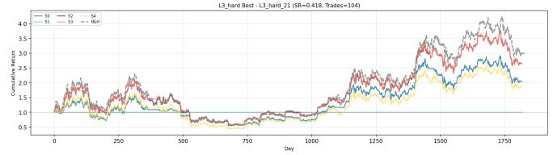  
(b) T=0.7  
Figure 51: Best-performing strategies generated by <sub>grok-4.1-fast</sub>.

## G.7 Analysis and Discussion

This subsection synthesizes the findings from the preceding quantitative analysis, per-level examination, per-asset comparison, comparative model profiling, and per-model detailed analysis. The Stage 2 evaluation, conducted on 270 dificulty-stratified queries with a temperature ablation (<sup>??</sup> = 0 vs. <sup>??</sup> = 0<sup>.</sup>7), complements the ecological validity of Stage 1 with controlled, diagnostic precision. We organize the synthesis around six key themes: temperature stability, dificulty-level discriminative power, cross-level ranking reversals, model risk personalities, cross-asset robustness, and code generation reliability.

The temperature ablation reveals near-perfect invariance of all metrics and model rankings across decoding regimes (Table 14 and fig. 26), providing the strongest evidence to date that the code-generation evaluation paradigm is robust to the specific decoding strategy. The 3 × 3 dificulty taxonomy produces a monotonically widening inter-model spread from Level 1 to Level 3 (Figure 28 and table 15), confirming that the benchmark design efectively separates models along a controlled cognitive-demand axis. Cross-level analysis uncovers ranking reversals that would be invisible in aggregate metrics, while per-asset analysis (Table 16 and figs. 34 and 39) confirms that model rankings generalize across both cryptocurrency and US equity markets. Together, these analyses demonstrate that <sup>AlphaForgeBench</sup> provides a multi-dimensional, reproducible, and highly informative evaluation framework for LLM-based strategy generation.

## G.7.1 Findings and Conclusions.

Finding 1: Temperature-invariant evaluation. The side-by-side comparison of greedy (<sup>??</sup> = 0) and stochastic (<sup>??</sup> = 0<sup>.</sup>7) decoding is the defining feature of the Stage 2 evaluation. Across all six models and all six metrics, the absolute Sharpe Ratio diference between the two temperature settings is at most 0.008 (gemini-3-flash-preview: 0.523 vs. 0.530), and the model ranking is fully preserved at both settings (Table 14). The average standard-deviation diference across all nine dificulty levels is only 2.97% (Figure 33), and the radar-chart polygon shapes at <sup>??</sup> = 0 and <sup>??</sup> = 0<sup>.</sup>7 are virtually identical (Figure 26). This near-invariance provides strong evidence that the fundamental structure of generated strategy code—signal logic, entry/exit conditions, and risk management rules—is largely determined by the model’s learned representations rather than by the randomness of the sampling process. In stark contrast, direct-trading evaluations are notoriously sensitive to temperature, with even small changes producing dramatically diferent action sequences and portfolio outcomes. The temperature stability documented here establishes a unique and practically significant advantage of the code-generation evaluation paradigm.

Finding 2: Systematic dificulty progression with maximum discriminative power at Level 3. The 3 × 3 dificulty taxonomy produces a monotonically widening inter-model Sharpe Ratio spread across the three levels. At Level 1 (logic translation), all six models achieve nearl identical performance, with the inter-model SR range of merely 0.029 (0.532–0.561). At Level 2 (parameter inference), the spread widens to 0.238 (0.366–0.604), more than 8× the Level 1 range. At Level 3 (goal-oriented generation), the spread reaches 0.405 (0.329–0.734), nearly 14× the Level 1 range (Figure 28 and table 15). This systematic amplification confirms that the benchmark’s dificulty hierarchy is efective: Level 1 tasks primarily test code generation competence (a near-solved problem for frontier LLMs), while Level 2 and Level 3 tasks progressivel probe domain knowledge and creative strategy design, which remain strongly diferentiating capabilities. The fine-grained 3 × 3 breakdown (Figures 30 and 31) further reveals that the primary cognitive leap occurs between Level 1 and Level 2 (a 16% SR decline), with the transition from parameter inference to goal-oriented design introducing additional variance rather than a sharp mean decline.

Finding 3: Cross-level ranking reversals reveal complementary cognitive capabilities. The per-level analysis exposes a striking ranking reversal that aggregate metrics would entirely obscure. deepseek-v3.2 achieves the highest Level 1 Sharpe Ratio (0.561), outperforming all other models on faithful code translation, yet drops to the bottom tier at Level 3 (SR = 0.329). Conversely, gemini-3-pro-preview is unremarkable at Level 1 (SR = 0.545, nearly identical to all competitors) but dominates Level 3 (SR = 0.734), far exceeding every other model. This crossover demonstrates that the three dificulty levels measure fundamentally diferent cognitive capabilities: Level 1 rewards syntactic fidelity, Level 2 rewards domain-grounded parameter inference, and Level 3 rewards end-to-end strategic reasoning. No single model dominates across all levels, and the benchmark’s multi-level design is essential for exposing these complementary strengths and weaknesses. Practitioners can use this diagnostic information to select models tailored to their specific use case: deepseek-v3.2 for rule-translation tasks, gemini-3-pro-preview for open-ended strategy discovery.

Finding 4: Persistent model risk personalities across real-world and structured queries. The “risk personality” profiles identified in Stage 1 are fully reproduced in Stage 2, confirming that they are intrinsic properties of each LLM’s strategy generation behavior rather than artifacts of a particular query distribution. gemini-3-pro-preview consistently favors aggressive, high-conviction signal logic, achieving the highest SR (0.628), ARR (0.208), and SoR (1.004) at <sup>??</sup> = 0 while also incurring the highest MDD (0.191) and VOL (0.262). gpt-5.2 produces the most conservative strategies with the lowest MDD (0.119) and VOL (0.163), prioritizing capital preservation over return maximization. claude-sonnet-4.5 occupies a balanced position, achieving the best Calmar Ratio (CR = 1.650 at <sup>??</sup> = 0) with a favorable return-to-drawdown trade-of. These characteristic profiles are stable across both temperature settings, across all seven backtest assets, and across all three dificulty levels (Figures 26, 36 and 37). The persistence of these profiles from Stage 1 (real-world queries) to Stage 2 (structured queries) demonstrates that model risk personalities are robust, reproducible properties that practitioners can rely on for model selection based on deployment-specific risk tolerances.

Finding 5: Cross-asset robustness. The per-asset analysis (Table 16 and figs. 34 and 39) demonstrates that model rankings are preserved across all seven backtest assets spanning cryptocurrency (BTCUSDT, ETHUSDT) and US equity (AAPL, GOOGL, MSFT, NVDA, TSLA)

markets. gemini-3-pro-preview consistently leads on return-oriented metrics and gpt-5.2 consistently leads on risk metrics, regardless of asset class. A shared dificulty gradient is also evident: AAPL and GOOGL are the easiest assets (SR frequently exceeding 0.7), MSFT is the hardest (SR ≈ 0.35–0.58), cryptocurrency assets occupy an intermediate position (SR ≈ 0.23–0.42), and TSLA exhibits the highest absolute returns coupled with the widest variance. This dificulty gradient is reproducible across all models and at both temperature settings, confirming that it reflects genuine market characteristics rather than model-specific or sampling artifacts. The consistency of rankings across such diverse market environments provides strong evidence that the benchmark captures fundamental diferences in strategy generation capability.

Finding 6: High code generation reliability. All six frontier LLMs achieve high code generation success rates on the Stage 2 benchmark, with an overall Pass@1 of 97.9% at <sup>??</sup> = 0 and 96.7% at <sup>??</sup> = 0<sup>.</sup>7 (Table 17). Pass@5 rates approach 100% (99.69% at <sup>??</sup> = 0, 99.94% at <sup>??</sup> = 0<sup>.</sup>7), indicating that syntax failures are stochastic rather than systematic. Importantly, pass rates remain consistently high across all three dificulty levels (L1: 98%+, L2: 97%+, L3: 96%+), with only minimal degradation as task complexity increases, demonstrating that syntax correctness is largely independent of strategic complexity. Among the small fraction of failures, runtime errors outnumber pure syntax errors by approximately 15:1 (Table 18), indicating that failures stem from edge-case handling (division by zero, index bounds) rather than fundamenta coding deficiencies. The narrow range of syntax performance across models (93–100%) contrasts sharply with the wide range of strategic performance (SR: 0.415–0.628), confirming that code generation competence is no longer a diferentiating factor among frontier LLMs; the competitive advantage now lies in strategic reasoning and domain knowledge.

Conclusion. The Stage 2 evaluation comprehensively validates the 3 × 3 dificulty taxonomy as an efective diagnostic tool that reveals capability diferences invisible to aggregate metrics. The controlled query design amplifies inter-model separation relative to Stage 1 (7.8pp SR spread vs. 5.5pp), while the temperature ablation demonstrates that the code-generation paradigm produces evaluation outcomes that are virtually invariant to the decoding strategy—a property absent in direct-trading benchmarks. The six findings above collectively establish that <sup>AlphaForgeBench</sup> provides a multi-dimensional, reproducible, and highly discriminative evaluation framework: it identifies distinct model risk personalities, exposes complementary cognitive strengths through cross-level ranking reversals, confirms cross-asset robustness, and maintains high code generation reliability across all conditions. Together with the ecological validity established by Stage 1, the Stage 2 results demonstrate that the two-stage design of <sup>AlphaForgeBench</sup> ofers a comprehensive and principled approach to benchmarking LLM capabilities in quantitative finance, combining the authenticity of real-world queries with the diagnostic precision of dificulty-stratified synthetic queries.