NBER WORKING PAPER SERIES

UNIVERSAL PORTFOLIO SHRINKAGE

Bryan T. Kelly Semyon Malamud Mohammad Pourmohammadi Fabio Trojani

Working Paper 32004 http://www.nber.org/papers/w32004

NATIONAL BUREAU OF ECONOMIC RESEARCH 1050 Massachusetts Avenue Cambridge, MA 02138 December 2023, Revised May 2026

AQR Capital Management is a global investment management firm that may or may not apply similar investment techniques or methods of analysis as described herein. The views expressed here are those of the authors and not necessarily those of AQR. Semyon Malamud gratefully acknowledges the financial support of the Swiss National Science Foundation (Grant 100018-228042) and the Swiss Finance Institute. The views expressed herein are those of the authors and do not necessarily reflect the views of the National Bureau of Economic Research.

At least one co-author has disclosed additional relationships of potential relevance for this research. Further information is available online at http://www.nber.org/papers/w32004

NBER working papers are circulated for discussion and comment purposes. They have not been peer-reviewed or been subject to the review by the NBER Board of Directors that accompanies official NBER publications.

© 2023 by Bryan T. Kelly, Semyon Malamud, Mohammad Pourmohammadi, and Fabio Trojani. All rights reserved. Short sections of text, not to exceed two paragraphs, may be quoted without explicit permission provided that full credit, including © notice, is given to the source.

Universal Portfolio Shrinkage   
Bryan T. Kelly, Semyon Malamud, Mohammad Pourmohammadi, and Fabio Trojani   
NBER Working Paper No. 32004   
December 2023, Revised May 2026   
JEL No. C1, C14, C53, C55, C58, G10, G11, G14, G17

## ABSTRACT

We introduce a nonlinear covariance shrinkage method for building optimal portfolios. Our universal portfolio shrinkage approximator (UPSA) is given in closed-form, is cheap to implement, and improves upon existing shrinkage methods. Rather than uniformly penalizing all principal components of returns or discarding low-variance ones, UPSA instead reweights components to explicitly optimize expected out-of-sample portfolio performance. In empirical applications using a large cross-section of anomaly factors, it delivers robust improvements over alternative shrinkage methods in the literature.

Bryan T. Kelly Yale University and NBER bryan.kelly@yale.edu

Semyon Malamud Swiss Finance Institute semyon.malamud@epfl.ch

Mohammad Pourmohammadi

Yale University

and Swiss Finance Institute

mo.pourmohammadi@yale.edu

Fabio Trojani

University of Geneva

fabio.trojani@alphacruncher.com

# Universal Portfolio Shrinkage

Bryan Kelly, Semyon Malamud, Mo Pourmohammadi, and Fabio Trojani

May 21, 2026

## Abstract

We introduce a nonlinear covariance shrinkage method for building optimal portfolios. Our universal portfolio shrinkage approximator (UPSA) is given in closed-form, is cheap to implement, and improves upon existing shrinkage methods. Rather than uniformly penalizing all principal components of returns or discarding low-variance ones, UPSA instead reweights components to explicitly optimize expected out-ofsample portfolio performance. In empirical applications using a large cross-section of anomaly factors, it delivers robust improvements over alternative shrinkage methods in the literature.

## 1 Introduction

Eficient portfolios that optimally balance risk and return are central to asset pricing. However, in practically relevant scenarios involving thousands of stocks or hundreds of factors, classical estimators of the Markowitz (1952) portfolio are severely contaminated by noise. Despite their stellar in-sample performance, they typically fail out-of-sample and are often dominated by na¨ıvely diversified portfolios (DeMiguel et al., 2009). When the number of estimated portfolio parameters exceeds the number of observations—as happens in many practical applications—the law of large numbers breaks down, which drives a wedge between in-sample and out-of-sample performance (Didisheim et al., 2024).1

Shrinkage reduces this wedge by tuning the bias-variance tradeof. Bias sacrifices insample estimator performance in order to reduce estimator variance and improve expected out-of-sample performance. Many existing portfolio shrinkage methods tightly constrain admissible forms of shrinkage (e.g., ridge regularizing the covariance matrix or dropping selected principal components as in Kozak et al., 2020) or are implemented through statistical objectives that deviate from the portfolio optimization objective (such as minimizing covariance matrix estimation error as in Ledoit and Wolf, 2017). These design choices can limit the efectiveness of portfolio shrinkage.

We propose the “universal portfolio shrinkage approximator,” or UPSA, to overcome the limitations of existing portfolio shrinkage methods. The method provides a semi-parametric approximation to a large class of nonlinear shrinkage functions, freeing it from the rigid structure of many existing approaches. Rather than targeting tangential statistical objectives, it directly optimizes expected out-of-sample portfolio performance. Additionally, it is available in closed form, computationally eficient, and scalable to truly high-dimensional settings in which the number of assets may greatly exceed the number of observations.

## 1.1 Universal Shrinkage

The nature of optimal shrinkage developed in this paper begins from the in-sample Markowitz portfolio. It is convenient to represent this solution as a portfolio of principal components (PCs), since these are investable assets with zero correlation in the estimation sample. Among a set of N assets, the portfolio assigns weights ¯πMark to the ith PC based on its individual risk-return tradeof. That is, the weight on each PC is proportional to its ratio of

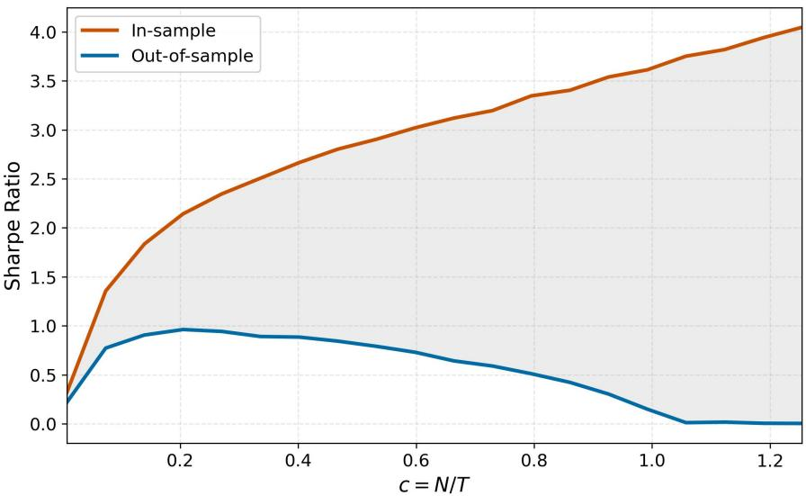  
Figure 1: In-sample vs. Out-of-sample Sharpe Ratios without Shrinkage.

Comparison of in-sample and out-of-sample Sharpe ratios for Markowitz portfolios averaged over 100 simulations. The x-axis shows c = N , where N is the number of factors in the portfolio, T is the number of observations used to build the portfolio, and factors are randomly selected from the 153 factors reported by Jensen et al. (2023). Out-of-sample performance is evaluated via 5-fold cross-validation, using data from November 1971 to December 2022.

average return (R¯P C) to sample variance (λ¯i):

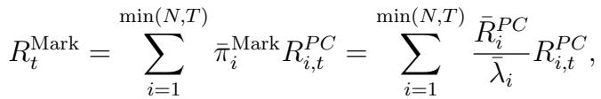

where T is the number of observations. When N is large relative to T , estimates of this mean-variance tradeof are corrupted by noise, giving rise to small-sample biases such as the tendency to overweight low-variance PCs. These distortions may remain hidden in-sample, but they can severely undermine out-of-sample portfolio performance.

Figure 1 illustrates how the unregularized Markowitz “plug-in” portfolio sufers in the face of estimation complexity, defined as c = N/T . When c ≈ 0, the investor is in a data-rich environment where the number of training observations far exceeds the number of parameters to be estimated. In this case, the law of large numbers kicks in and the plug-in portfolio recovers the true optimal portfolio. But when the environment is complex (c ≫ 0), in-sample performance becomes severely upward biased while out-of-sample performance collapses.

The literature has considered a range of shrinkage-based solutions to improve out-ofsample portfolio performance. One such approach uses ridge shrinkage, which adjusts the Markowitz portfolio weights via “soft” variance thresholding of PCs:

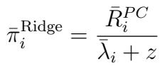

(1)

where z is the ridge shrinkage parameter (see, e.g., Kozak et al., 2020). Another approach is inspired by the Arbitrage Pricing Theory (APT) of Ross (1976). It applies a “hard” threshold to impose exactly zero weight on low-variance PCs:

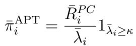

where κ is the hard threshold (e.g., Severini, 2022; Kelly et al., 2023). This enforces an economic restriction that only the factors that are responsible for a large fraction of market risk command a risk premium. In a third approach, Ledoit and Wolf (2004b) shrink portfolio weights linearly to a simple benchmark weight (such as 1/N):

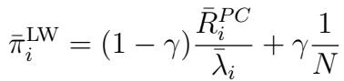

where γ is the shrinkage parameter.

The goal of UPSA is to generalize these prior examples to capture an optimal nonlinear portfolio shrinkage function, ¯πUPSA = f(λ¯ )R¯P C. Because our formulation is interpretable as a shallow neural network approximation to f, it enjoys universal approximation properties (Hornik et al., 1990). Despite this flexibility, it bypasses typical computational hurdles: the estimator retains a closed-form solution as a linear combination of ridge portfolios (as in equation (1)), each utilizing a diferent penalty parameter.

Furthermore, UPSA easily accommodates economic shape constraints on the shrinkage function, such as strict positivity and monotonicity, without losing tractability. Importantly, while the estimator fundamentally relies on spectral shrinkage of the assets’ second moment matrix, it simultaneously integrates average return information whenever the economic objective requires it. This allows the entire framework to extend naturally to any quadratic portfolio objective while preserving its analytical convenience.

## 1.2 Empirical Performance

We investigate the performance of UPSA in forming optimal portfolios from the large set of anomaly factors compiled by Jensen et al. (2023). We compare our method to three natural spectral shrinkage benchmarks: (i) a simple ridge-regularized Markowitz portfolio, (ii) a Markowitz portfolio whose plug-in second moment is estimated using the nonlinear spectral shrinkage approach of Ledoit and Wolf (2017), and (iii) a Markowitz portfolio that uses few PCs. In all our experiments, UPSA achieves higher out-of-sample Sharpe ratios than these benchmarks, and its outperformance is particularly pronounced post-2000, when many anomaly portfolios have underperformed. Moreover, those gains are statistically significant across benchmark portfolios with an α t-statistic of 3.72 against its closest competitor.

Viewing these portfolios as stochastic discount factors (SDFs), we find that the UPSA SDF yields the smallest out-of-sample pricing errors for anomaly portfolio test assets. In some cases, UPSA delivers a cross-sectional R2 for test asset average returns that is twice as large as its closest competitor (on a purely out-of-sample basis).

Inspecting the implied SDF across principal components helps explain these results. For the largest eigenvalue components, UPSA applies similar levels of shrinkage to ridge. The diference emerges in the middle of the spectrum, where it regularizes intermediate components more aggressively. As lower-variance principal components are added, performance deteriorates only gradually, behaving as though the investor had truncated the noisiest components without imposing an explicit cutof.

When decomposing portfolio weights using the thematic clusters of Jensen et al. (2023), we show that UPSA’s spectral diferences induce systematic tilts toward persistent firm fundamentals (e.g., quality, value, and low risk) and away from transient patterns (e.g., seasonality, skewness, and momentum). Using a Shapley decomposition, we show that these fundamental thematic tilts account for UPSA’s superior Sharpe ratio.

UPSA admits a natural Bayesian interpretation. A ridge penalty can be thought of as a belief about expected return uncertainty; by combining a discrete set of shrinkage levels selected from the data, UPSA efectively diversifies across a range of such beliefs rather than committing to a single one. Diversification across beliefs produces a more stable SDF, leading to lower portfolio turnover, and delivers more robust performance across business cycle regimes, with particularly strong gains during NBER recessions. These patterns are corroborated by simulation evidence and remain robust across variations in asset liquidity and training sample size.

## 1.3 Literature Review

Our work is related to several strands of literature. The first studies shrinkage-based estimation of return covariance matrices. A pioneering contribution in this area is the linear shrinkage estimator of Ledoit and Wolf (2004b), with applications to minimumvariance portfolios (Ledoit and Wolf, 2003) and tracking portfolios (Ledoit and Wolf, 2004a). Subsequent papers develop nonlinear spectral shrinkage estimators that exploit randommatrix-theory techniques introduced in Ledoit and P´ech´e (2011) (e.g., Ledoit and Wolf, 2012, 2015, 2020). We difer from these approaches by proposing a universal approximator for a broad class of shrinkage functions. Our method combines the flexibility of a neuralnetwork-type nonlinear mapping with analytical tractability and low computational cost.

A second strand examines shrinkage in portfolio optimization and regularized estimation of SDFs (e.g., Kozak et al., 2018; Kelly et al., 2019; Lettau and Pelger, 2020; Gu et al., 2021; Kozak et al., 2020; Pedersen et al., 2021; Bryzgalova et al., 2023b; Giglio and Xiu, 2021; Korsaye et al., 2025; Bryzgalova et al., 2025). UPSA generalizes these approaches by directly optimizing a nonlinear spectral shrinkage function for the portfolio’s mean–variance objective; its spectral reweighting implicitly shrinks the mean by tilting toward principal components with higher mean and lower variance.

A growing literature investigates the asset-pricing role of weak factors—factors whose risk premia are dificult to estimate precisely because their sampling variation is small relative to estimation noise (see, e.g., Bryzgalova et al., 2023a; Preite et al., 2022; Giglio et al., 2025). To address this problem, Lettau and Pelger (2020) propose a PC-based dimension-reduction approach that incorporates information about PC sample means. In contrast, UPSA achieves shrinkage without dimension reduction, reweighting all PCs through eigenvalue shrinkage directly in light of the portfolio-performance objective, so that the resulting shrinkage implicitly reflects information in PC means.

Finally, our paper contributes to a literature on the statistical limits of asset-pricing estimation in high-dimensional settings (Da et al., 2022; Didisheim et al., 2024; Martin and Nagel, 2022; Kelly et al., 2024). UPSA provides an economically motivated shrinkage methodology for such environments, and its ensemble structure connects naturally to Bayesian portfolio choice under prior uncertainty.

## 1.4 Roadmap

The remainder of the paper is organized as follows. Section 2 introduces the secondmoment shrinkage framework and formulates the optimal nonlinear spectral shrinkage problem. Section 3 develops UPSA as an ensemble of ridge portfolios, establishes its universal approximation properties, and derives the optimal ensemble weights using leave-one-out cross-validation. Section 4 presents the empirical analysis, comparing UPSA to ridge, Ledoit–Wolf, and PCA benchmarks using the anomaly factors of Jensen et al. (2023). Section 5 develops the economic interpretation of UPSA: a Bayesian foundation links the ensemble structure to integration over prior beliefs about expected-return uncertainty, and the empirical consequences—including lower turnover, greater recession robustness, and a detailed anatomy of how UPSA allocates risk across the principal component spectrum—are documented. A thematic decomposition translates these spectral diferences into portfolio tilts across recognizable asset pricing themes and quantifies their contribution to UPSA’s Sharpe ratio advantage. Section 6 presents simulation evidence that isolates the roles of economic tuning, nonlinear shrinkage, and adaptation to time-varying conditions. Section 7 concludes.

## 2 Second Moment Shrinkage

In this section, we outline our main setup. We consider an economy of N assets. We collect their excess returns in a vector Ft ∈ RN , with second moment matrix E[FtF ′] = Σ ∈ RN×N , and mean E[Ft] = µ ∈ RN . We consider the standard portfolio choice problem of optimizing expected quadratic utility. With full information, the eficient portfolio is the Markowitz

solution2

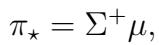

(2)

where Σ+ is the Moore–Penrose generalized inverse of matrix Σ. In contrast to the full information setting, an investor whose information includes only T observations of Ft can instead compute finite-sample moments

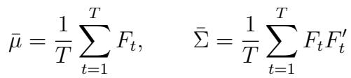

and construct an empirical counterpart of portfolio (2) given by

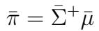

(3)

with return Rπ¯ = ¯π′Ft.

In most practical scenarios, investors find themselves with a large number of assets (e.g., thousands of stocks or hundreds of anomaly factors) and a limited time series of data (dozens or hundreds of monthly observations). When N is large relative to T , the law of large numbers breaks down and empirical moments do not consistently estimate theoretical moments: ¯µ ̸→ µ, Σ¯ ̸→ Σ (Didisheim et al., 2024). In such a setting, the estimated Markowitz portfolio (3) is a random quantity, even asymptotically, and can perform badly out-of-sample (see, for example, DeMiguel et al., 2009).

Let Σ = ¯ U¯ diag(λ¯)U¯ ′ be the spectral decomposition of the empirical second-moment matrix. A standard approach to improve the performance of the Markowitz plug-in solution is to inject bias through a shrinkage function, f , in order to rein in the estimator’s variance. In this paper we focus on a common class of so-called “spectral” shrinkage functions that regularize the sample second moment matrix by shrinking its empirical eigenvalues, λ¯, without altering its empirical eigenvectors U¯ :3

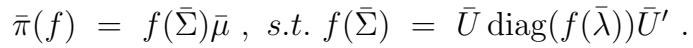

(4)

What does spectral shrinkage imply for the Markowitz portfolio? Define RP C = U¯ ′Ft to be the vector of returns of the associated principal component factors, and let R¯P C = E¯[RP C] be their in-sample means. We can rewrite the return of the shrunken Markowitz portfolio as the return of principal component factors:

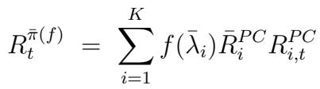

(5)

where K = min(N, T ). The weight on an individual PC captures a tradeof between that PC’s return (R¯P Ci ) and its variance (λi).4 For example, a common approach to this problem relies on the ridge portfolio estimator,

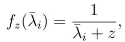

which is defined for some ridge parameter z > 0 (see, e.g., Kozak et al. (2020), Ledoit and Wolf (2003), among many others).5 As this example shows, portfolio shrinkage is achieved by manipulating how components’ risk and return map into portfolio weights.

“One size fits all” shrinkage methods like ridge can underperform in environments with complex eigenvalue structures and heterogeneous risk-return tradeofs across PCs. One would ideally build a portfolio that more flexibly manipulates the risk-return tradeof for diferent components. To this end, we develop a nonlinear spectral shrinkage function that learns from in-sample data how to weight PCs in order to maximize out-of-sample quadratic utility.

Definition 1 (Optimal Nonlinear Portfolio Shrinkage) Given in-sample return data for N assets, FIS = {F1, . . . , FT }, let Σ = ¯ U¯ diag(λ¯)U¯ ′ be the associated sample second moment matrix. An optimal spectral shrinkage portfolio estimator π¯(f⋆) for a class C of admissible shrinkage functions is defined by a strictly positive function f⋆ : R+ → R++ such that f⋆(Σ)¯ solves the out-of-sample (i.e., for t > T ) expected quadratic utility optimization problem:

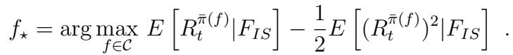

The key new feature of our optimal spectral shrinkage operator f⋆ is its potentially complex nonlinear dependence on the entire in-sample second-moment matrix Σ as well as on the¯ means through the portfolio utility objective.

With perfect knowledge of population moments Σ and µ, the exact solution to the optimal (but infeasible) spectral shrinkage problem reads:6

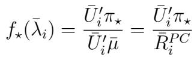

(6)

This solution depends on both the population moments and the noisy empirical ones. This infeasible example captures the key insight of UPSA: Efective nonlinear shrinkage should tilt portfolio weights toward the true Markowitz portfolio, while accounting for noise distortions in sample means, sample eigenvectors and sample eigenvalues.

## 3 UPSA

In this section, we formally define the universal portfolio shrinkage approximator (UPSA). Its formulation is surprisingly simple and amounts to an ensemble of ridge portfolios with heterogeneous penalties. Yet despite this simplicity, we prove that UPSA can approximate any nonlinear spectral shrinkage function satisfying basic regularity conditions.

We begin by demonstrating how a basic ridge shrinkage function, fz(λ) = λ+z , can serve 1 as the foundation for more flexible shrinkage functions.

Lemma 1 Let f be a strictly positive, matrix monotone-decreasing function such that K = limλ→∞ λf(λ). There then exists a positive finite measure ν on R+ such that:

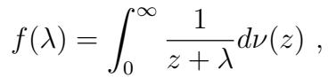

(7)

ν(R+) = K. Moreover, whenever the grid Z is suficiently wide and dense, there exists a function fZ ∈ F(Z) which approximates f uniformly over compact intervals:

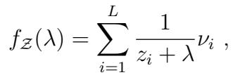

(8)

where ν1, . . . , νL > 0 and PLi=1 νi = K.

The key insight of Lemma 1 is equation (8). It formally establishes that combinations of basic ridge portfolios are universal approximators for a general nonlinear spectral shrinkage function. Based on this insight, we propose the following definition of the ridge ensemble as a non-negative linear combination of basic ridge portfolios indexed by distinct penalty parameters.

Definition 2 Given a grid Z = {z1, . . . , zL} of ridge penalties and a vector W = (wi)L of weights, define for any λ ≥ 0 the following weighted shrinkage function:

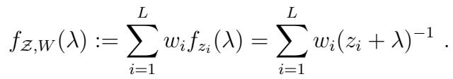

(9)

We call F(Z) = {fZ,W : W ∈ RL+} the ridge ensemble.7

The constraint that the ensemble weights must be positive ensures that the second moment matrix remains positive definite. Furthermore, the shrinkage function is matrix monotone, meaning that the risk ordering of components is preserved after shrinkage.8

Even within the family of ridge portfolios, varying the ridge parameter z can lead to markedly diferent portfolio behaviors. At one extreme, we have the “ridgeless” portfolio (Kelly et al., 2024) that uses minimal shrinkage:9

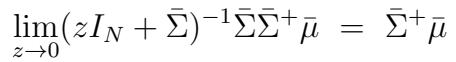

(10)

which recovers the Markowitz portfolio when N < T and more generally uses the sample second moment to its fullest expression. At the other extreme, we have

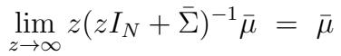

(11)

which eliminates all second moment information from the portfolio, thus behaving as a “momentum” strategy based only on past average returns. Lemma 1 shows that combining the heterogeneous behaviors of diferent ridge portfolios achieves more flexible shrinkage than those achieved by any single ridge portfolio.

The approximating function fZ in Lemma 1 coincides with the ridge ensemble in equation (9) when ensemble weights are appropriately chosen. To operationalize the ridge ensemble, we require an estimator of the ensemble weights, which gives rise to UPSA. In particular, we derive UPSA as the optimizer of an out-of-sample utility maximization objective. We first substitute (9) into the PC-based Markowitz shrinkage portfolio of equation (5), obtaining

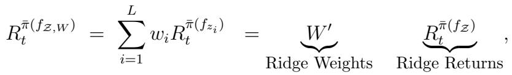

where Rπ¯(fZ )t = (Rπ¯(fzi)t )Li=1. We propose tuning the ensemble weights to optimize the outof-sample quadratic utility objective,

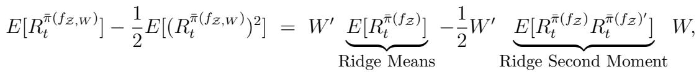

(12)

Equation (12) shows how the ensemble weight estimation problem amounts to a portfolio choice problem on the space of ridge shrinkage portfolios.

To implement this framework in practice, we require reliable estimates of ridge portfolio out-of-sample means and second moments. We suggest estimating these out-of-sample moments using classical leave-one-out (LOO) cross-validation.10 The LOO method drops one training observation t, trains on the remaining observations 1, . . . , t − 1, t + 1, . . . , T , and repeats this for each t = 1, . . . , T . LOO exploits the fact that, under the assumption of i.i.d. asset returns Ft, we obtain an unbiased estimate of this out-of-sample portfolio utility as the average utility of each trained portfolio on its corresponding left-out observation.11 From this procedure, we also obtain LOO estimates of the first and second moments of factor returns, denoted for each t = 1, . . . , T , as

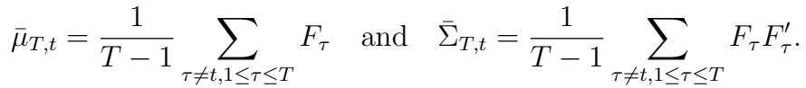

(13)

From the LOO asset moment estimates, we obtain spectral shrinkage portfolio estimates for each t that are LOO versions of the in-sample estimator (4),

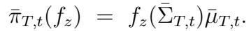

(14)

Finally, from (14), we recover the realized LOO portfolio returns {Rπ¯T ,t(fz)T,t = ¯πT,t(fz)′Ft : t = 1, . . . , T }. These proxies for out-of-sample returns are thus used to estimate the out-ofsample mean and second moment of the ridge portfolios, as described by the next lemma.

## Lemma 2 Consider the following LOO-based estimators for the means and second moment

of out-of-sample ridge portfolio returns Rπ¯(fz1), . . . , Rπ¯(fzL):

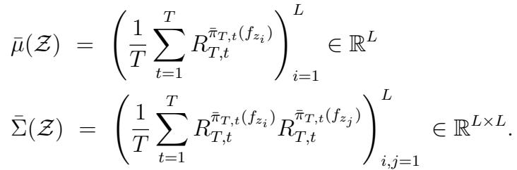

(15)

Then, from Definition 2, UPSA shrinkage is given by

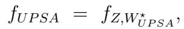

(16)

where W ⋆UP SA solves

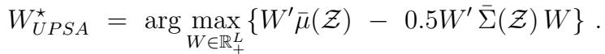

(17)

To summarize, our derivation, culminating in Lemma 2, shows that UPSA is a ridge ensemble that approximates an unknown nonlinear spectral shrinkage function f. The estimator of this ensemble is the solution to an out-of-sample utility maximization problem (in essence, an extension of the usual out-of-sample performance optimization that takes place in cross-validation). UPSA’s ridge ensemble weights require estimates of the out-ofsample moments of basic ridge portfolios, and Lemma 2 shows how to estimate these using the LOO methodology. Training UPSA reduces to finding the optimal weight vector W across basic ridge portfolios that maximizes quadratic utility, which is equivalent to solving a Markowitz portfolio optimization using LOO returns of basic ridge portfolios instead of the original N assets. This formulation of the estimator renders UPSA tractable and cheap to compute even in very high-dimensional contexts.12

## 4 Empirical Evidence

## 4.1 Data and Benchmarks

Our empirical analysis uses monthly returns on 153 characteristic-managed portfolios (“factors”) from Jensen et al. (2023).13 The factors are constructed as capped value-weighted long–short portfolios of U.S. stocks and cover the period from November 1971 to December 2022.14

We estimate portfolio weights using a rolling window of T = 120 months, with weights retrained and rebalanced on a monthly basis. We then use the estimated optimal portfolios as SDFs and evaluate their ability to price returns on the underlying factors. We fix the grid of ridge penalties15 available to UPSA as

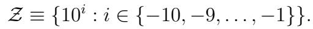

We compare the performance of UPSA with two spectral shrinkages, one sparse shrinkage, and two factor pricing models:16

• Ridge: The single ridge portfolio selected from the penalty grid Z that maximizes expected quadratic utility based on LOO cross-validation.

• LW: The nonlinear shrinkage estimator of Ledoit and Wolf (2020).

• PCA: Subset of principal components, ordered by variance, selected to maximize expected quadratic utility based on LOO cross-validation.

• FF5: The Markowitz portfolio constructed from the five factors of Fama and French (2015).

• CAPM: The market portfolio.

We train all benchmarks with the same rolling 120-month training window used for UPSA.17

## 4.2 Ridge Heterogeneity

Drawing on the insights of Lemma 2, UPSA generates performance benefits by eficiently combining a variety of basic ridge portfolios. Thus, for UPSA to be efective, it must leverage the heterogeneity across basic ridge portfolios to the extent it exists. Figure 2 reports the pairwise correlation of basic ridge portfolio returns using diferent penalties in the grid Z. There is indeed a high degree of diversity at UPSA’s disposal, with correlations as low as −2% for some pairs.

## 4.3 Comparative Performance of UPSA

The primary assessment of UPSA rests on its out-of-sample portfolio performance vis-\`avis competing methods. To this end, the left panel of Figure 3 reports the out-of-sample Sharpe ratio of UPSA and its benchmarks over the full out-of-sample period (beginning in November 1981). UPSA achieves a Sharpe ratio of 1.92, compared to 1.59 for the single best ridge model, 1.31 for LW, and 1.45 for PCA. The Sharpe ratios of 1.13 for the Fama-French factors and 0.54 for the CAPM provide a frame of reference from the factor pricing literature. The remaining two panels of Figure 3 report performance in pre-2000 and post-2000 subsamples. The relative outperformance of UPSA is similar across subsamples. To examine performance in further detail, Figure 4 plots the cumulative returns for UPSA and the benchmarks.

Next, we investigate the statistical significance of UPSA’s improvement over the benchmarks. Figure 5 reports the alpha of UPSA against each benchmark and associated standard error bars. UPSA’s annual alpha versus ridge, its second closest competitor, over the full sample is 4.46% with a t-statistic of 3.72. For other benchmarks, the alpha is even larger and statistically significant. Furthermore, the comparative benefits of UPSA are uniform across the sample, as evident from the pre-2000 and post-2000 subsample analyses in the center and right columns.

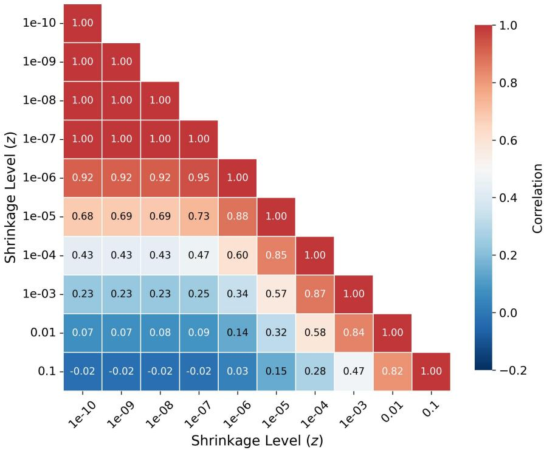  
Figure 2: Out-of-sample Return Correlations Across Shrinkage Levels.  
Average out-of-sample return correlations between portfolios with diferent levels of ridge shrinkage. The out-of-sample period is November 1981 to December 2022.

## 4.4 Asset Pricing Implications: The UPSA SDF

Classical asset pricing theory establishes an equivalence between the mean-variance eficient portfolio and the tradable SDF (Hansen and Jagannathan, 1991). By direct calculation, the infeasible portfolio π⋆ = Σ−1µ from equation (2) defines the unique tradable SDF that prices assets with zero error:

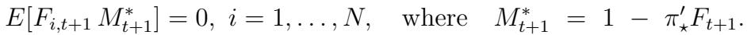

A similar calculation shows that the unregularized in-sample Markowitz portfolio achieves zero in-sample pricing error by construction. But, just as in the case of its out-of-sample

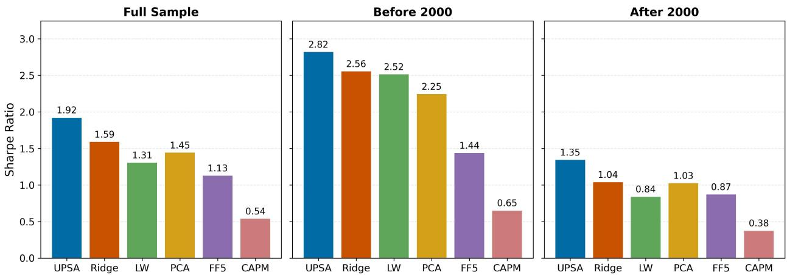  
Figure 3: Annualized Out-of-sample Sharpe Ratios for UPSA and Benchmarks.

Annualized out-of-sample Sharpe ratios for UPSA and benchmark strategies. The full-sample results are computed from November 1981 to December 2022.

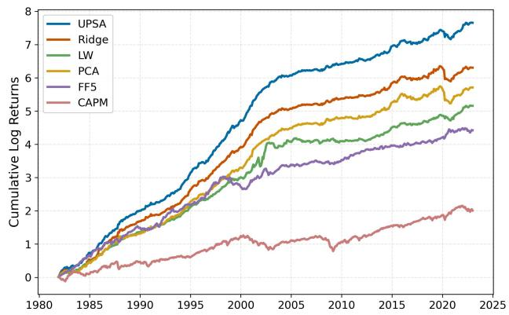  
Figure 4: Cumulative Log Returns for SDFs with Diferent Shrinkage Methods.  
Comparison of out-of-sample SDF performance across diferent shrinkage methods from November 1981 to December 2022. The figure shows cumulative log returns, scaled to 10% annualized volatility.

Sharpe ratio in Figure 1, the Markowitz portfolio typically prices assets exceedingly poorly out-of-sample. Given that portfolio shrinkage aims to improve out-of-sample performance, we now investigate whether UPSA’s superior portfolio returns also lead to lower out-of-sample pricing errors. Specifically, we compare

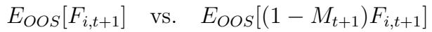

(18)

where Mt+1 denotes a candidate SDF, Fi,t+1 is a test asset, and EOOS denotes the sample average over the out-of-sample realizations of the SDF portfolio. The first object in equation

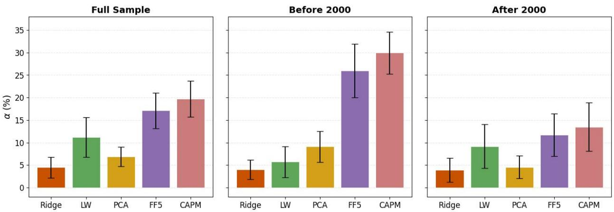  
Figure 5: α of UPSA vs. Benchmarks.

Annualized percentage α from regressions of UPSA on each benchmark using HAC standard errors (5 lags). All portfolios are scaled to 10% annualized volatility. The out-of-sample period is November 1981 to December 2022.

(18) is simply the out-of-sample average return of the test asset. The second object is the SDF-implied out-of-sample expected return for the test asset. An SDF with smaller out-ofsample pricing errors will exhibit a closer correspondence between these two objects.

The SDF corresponding to a candidate optimal portfolio j is computed as

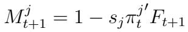

where πj is the optimal portfolio prescribed by model j ∈ {UPSA, ridge, LW, FF5, CAPM} and estimated using data through date t. The scaling factor sj normalizes each candidate SDF so that it prices its own basis portfolio out-of-sample. Without this adjustment, pricing errors on the test assets would be confounded by scale diferences rather than diferences in pricing ability.18 For the test assets Ft+1, we use the same set of 153 JKP factors that we use to construct the optimal UPSA, ridge, and LW portfolios. To put test assets on equal

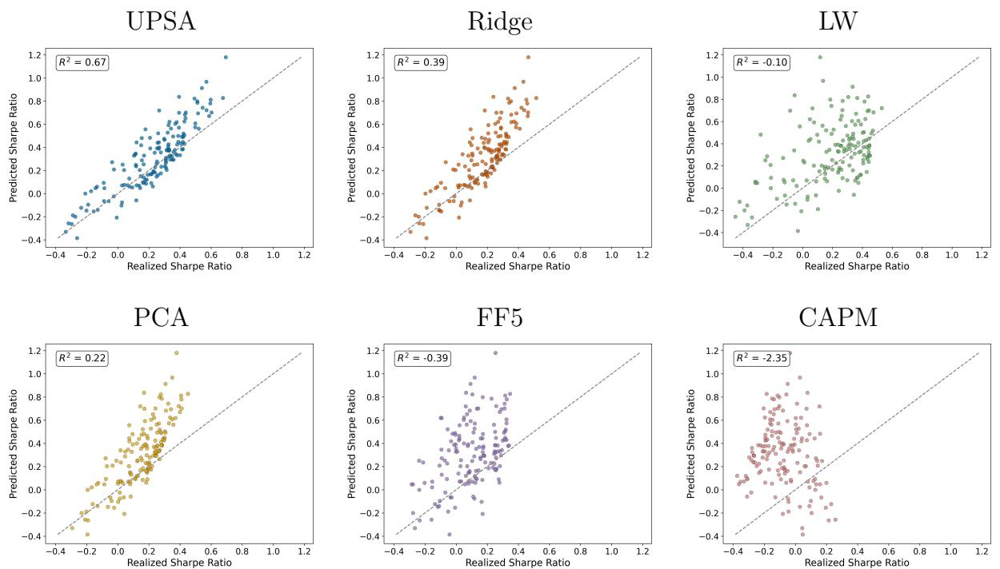  
Figure 6: Out-of-sample Pricing Accuracy of Optimal Portfolios.

Comparison of SDF-based out-of-sample Sharpe ratio predictions (vertical axis) versus realized out-of-sample Sharpe ratios (horizontal axis) for test assets defined as the 153 JKP factors, following equation (18). Test assets are standardized to unit volatility so that pricing errors are expressed in Sharpe ratio units. R2 represents fit versus the 45-degree line. Candidate SDFs are derived from UPSA, ridge, LW, PCA, FF5, and CAPM optimal portfolios. The out-of-sample period is November 1981 to December 2022.

footing, we normalize each by its sample standard deviation, thus restating pricing errors in terms of Sharpe ratios rather than average returns.19

Figure 6 reports the results of this analysis. UPSA achieves a high degree of accuracy in pricing test assets, explaining factor realized Sharpe ratios with an out-of-sample R2 of 67%.20 The next best performers are ridge and PCA, with R2 values of 39% and 22%, respectively. The remaining SDFs fare poorly at pricing the test assets and produce negative out-of-sample R2.

Jensen et al. (2023) categorizes the 153 JKP factors into 13 themes. We further extend the analysis of Figure 6 by calculating the out-of-sample R2 of SDF-based Sharpe ratio

## Table 1: Out-of-sample Pricing Accuracy By Factor Theme

This table calculates the R2 of SDF-based out-of-sample Sharpe ratio predictions versus realized out-of sample Sharpe ratios within each of the 13 JKP factor themes. R2 represents fit versus the 45-degree line, as described in the analysis of Figure 6.  
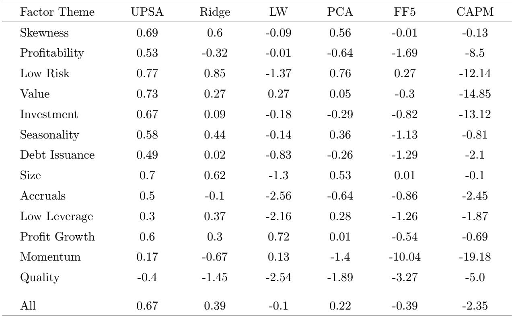

predictions versus realized Sharpe ratios within each theme. For reference, the last row reports the R2 for all factors combined, corresponding to the numbers reported in Figure 6. UPSA provides a more accurate out-of-sample fit to factor Sharpe ratios within 10 of the 13 themes. The exceptions are the “low risk” theme in which ridge achieves an R2 of 85%, though UPSA is a close second with a 77% R2; the “low leverage” theme in which ridge achieves 37% versus UPSA’s 30%; and the “profit growth” theme in which LW achieves 72% versus UPSA’s 60%. The most challenging theme for UPSA to price was the “quality” theme, where the R2 was −40%; however, alternative benchmarks performed even worse in this case.

## 4.5 Robustness

In this section, we provide additional robustness evidence.

## 4.5.1 Stratification on Size Groups

Following Jensen et al. (2023), we form capped value-weighted factors within size groups. At each period, stocks are classified using NYSE breakpoints into three groups—Mega (top 20%), Large (80th–50th percentile), and Small (50th–20th percentile), excluding micro and nano stocks for liquidity reasons. Figures 24 and 25 of the Appendix show the Sharpe ratio and α within size groups. UPSA has statistically significant alphas and larger Sharpe ratios across all groups, with the second-best benchmark difering by size: ridge for Mega, PCA for Large, and LW for Small. This suggests that diferent forms of shrinkage may be beneficial in diferent groups, but UPSA is flexible enough to adapt to the group-specific data-generating process.

## 4.5.2 Rolling Window

We evaluate the performance of UPSA across diferent rolling windows: T ∈ {60, 240, 360}. Figures 26 and 27 in the Appendix report the corresponding Sharpe ratios and alphas. UPSA outperforms across all horizons, with particularly strong results for the 360-month window, achieving a statistically significant alpha with a t-statistic of 2.4 and a Sharpe ratio gain of 12%. For the 60-month window, UPSA performs best, though its performance is similar to that of LW. In the 240-month case, UPSA again leads, with performance comparable to ridge.21

These results suggest that even if nonlinear shrinkage is not strictly optimal, it can perform on par with ridge. Likewise, if the primary noise source in the portfolio problem arises from the second moment matrix rather than the means (a situation in which LW thrives), UPSA performs as well as LW.

## 5 Economics of UPSA

UPSA dominates competing models in out-of-sample performance, with ridge as the closest benchmark. This section provides an economic interpretation of UPSA’s outperformance, focusing on how it resolves uncertainty about expected returns, how it allocates risk across principal components, and how these diferences manifest in economically interpretable portfolio tilts.

## 5.1 Bayesian Foundations of UPSA

Section 3 introduced UPSA as the solution to an out-of-sample portfolio utility maximization problem. This section shows that UPSA also admits a natural Bayesian interpretation: it can be viewed as the posterior optimal portfolio of an investor who faces uncertainty about expected returns and whose prior beliefs may vary across principal components of the return covariance matrix.

Consider an investor who observes IID Gaussian returns Ft ∼ N(µ, Σ) and knows Σ but faces uncertainty about µ22. A standard approach (e.g., Kozak et al., 2020; Pedersen et al., 2021) models this uncertainty through a Gaussian prior

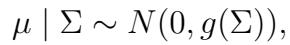

(19)

where g is a strictly positive matrix function. The function g(Σ) determines how prior uncertainty about expected returns varies across the eigen-directions of the covariance matrix. Intuitively, it encodes the investor’s beliefs about which principal components are more likely to contain economically meaningful risk premia.

After observing data, the posterior Markowitz portfolio b = Σ−1µ takes a spectral shrinkage form (Lemma 6 in Appendix B):

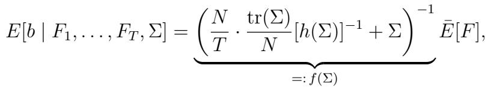

(20)

where h is a strictly positive matrix function derived from g.23 Equation (20) is a spectral shrinkage estimator of exactly the form used by UPSA. The complexity ratio N/T naturally enters the posterior: when data are abundant (N/T → 0), the prior vanishes and the investor recovers the sample Markowitz portfolio; in the complex regime relevant for our empirical setting (N/T → c > 0), the prior exerts non-negligible regularization, endogenously tying the amount of shrinkage to the dificulty of the estimation problem.

The form of shrinkage depends on the prior function g, or equivalently h, which determines how prior uncertainty varies across principal components. A restrictive parametric specification therefore implies a restrictive shrinkage rule. For example, the power function prior

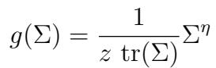

with η = 2 yields pure ridge shrinkage:

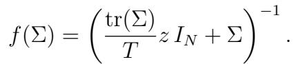

The case η = 2 implies that the investor assigns the same prior uncertainty to expected returns along all principal components, producing a single uniform penalty on all eigenvalues.

UPSA generalizes this framework by not committing to a specific parametric form for g. Instead, it learns the shrinkage function f directly from the data by optimizing out-of-sample portfolio performance. The universal approximation property (Lemma 1) guarantees that whenever the optimal Bayesian shrinkage rule is matrix monotonically decreasing, UPSA’s ridge ensemble can approximate it:

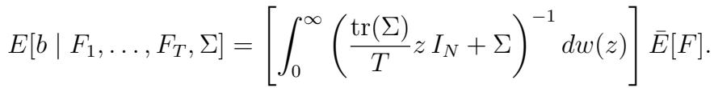

(21)

Each value of z corresponds to a diferent degree of prior uncertainty about expected returns. Small values of z correspond to weaker regularization and greater reliance on the sample mean, while larger values of z reflect stronger prior skepticism about the precision of estimated expected returns. UPSA can thus be interpreted as Bayesian portfolio choice under a mixture of priors, leading to a nonparametric Empirical Bayes learning rule that averages over diferent degrees of regularization. This rule decides on the appropriate degree of regularization in each eigen-direction of the covariance matrix, rather than imposing a fixed prior belief as ridge does.

## 5.2 Prior Instability and SDF Dynamics

The Bayesian framework in Section 5.1 interprets ridge as an investor with a single prior belief about expected-return uncertainty, and UPSA as an investor that integrates over a continuum of such priors. Figure 7 illustrates this distinction directly. The heatmap reports the time series of UPSA ensemble weights wj across the grid of ridge penalties, while the orange line overlays the single penalty selected by cross-validation. The selected ridge penalty is highly unstable, frequently shifting by several orders of magnitude across adjacent windows. UPSA instead maintains stable exposure across a range of shrinkage levels, avoiding these discrete reallocations.

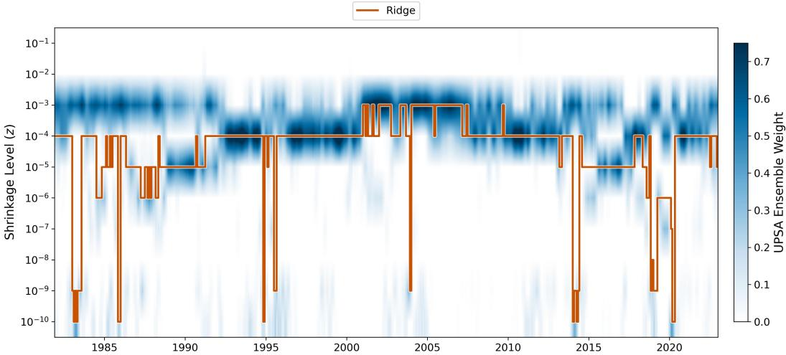  
Figure 7: UPSA Ensemble Weights vs. Ridge Penalty Selection.

Time series of the ridge penalty selected by leave-one-out cross-validation (orange line) overlaid on UPSA ensemble weights across the shrinkage grid. UPSA weights are determined using Lemma 2. The out-ofsample period is November 1981 to December 2022.

This time-series instability translates directly into higher turnover.24 Figure 8 reports the

24We define turnover as Turnovert = normalizing by the previous period’s gross PNi=1 |π¯i,t−1| exposure to ensure comparability across methods with diferent portfolio scales.

12-month rolling average. Although ridge exhibits lower turnover in roughly three-quarters of months, its average is about 30% higher and its standard deviation nearly five times larger.25

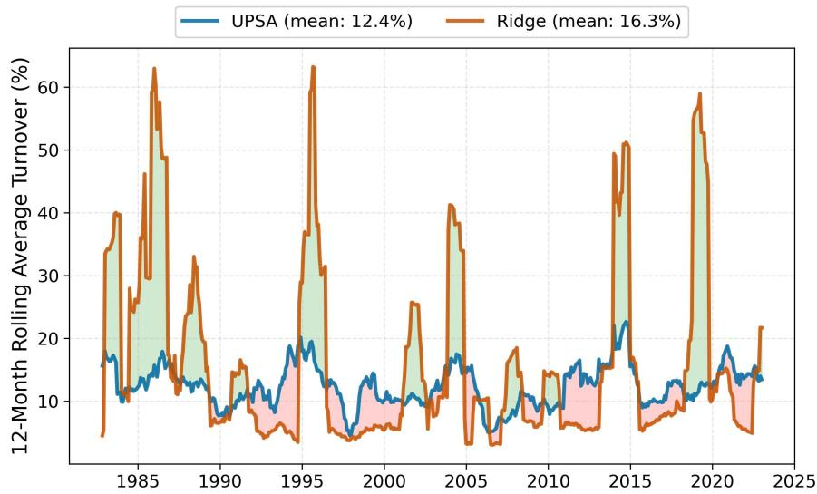  
Figure 8: 12-Month Rolling Average Turnover.

12-month rolling average turnover for UPSA and ridge. Green shading indicates periods in which ridge turnover exceeds UPSA; red shading marks the reverse. Ridge penalties are selected using leave-one-out cross-validation, and UPSA weights are determined using Lemma 2. The out-of-sample period is November 1981 to December 2022.

The cost of this prior instability is not just higher turnover. When the covariance structure shifts, as it often does in recessions, the single prior selected in the previous estimation window can quickly become stale. The performance consequences are substantial: the Sharpe ratio gap between UPSA and ridge more than doubles in recessions (∆ = 0.57) relative to expansions (∆ = 0.25). Ridge’s Sharpe ratio drops by 53% from expansions to recessions, compared with only 30% for UPSA. The diference is driven primarily by the mean-return channel. Because UPSA integrates across shrinkage levels, it is less exposed to regime-dependent misalignment in the mean estimate, whereas ridge’s single point estimate becomes more fragile in recessions (Appendix E.6).

Importantly, this performance gap is driven entirely by how each method resolves uncertainty over time, rather than a fundamental disagreement about the unconditional level of shrinkage. As Figure 9 demonstrates, the two approaches agree on average: the timeaveraged UPSA weights closely match the empirical distribution of ridge penalties selected by cross-validation. This confirms that the core advantage of UPSA lies in its Bayesian foundation: by integrating over penalty uncertainty rather than taking a fragile stand on a single prior, it delivers a more stable and economically robust portfolio.

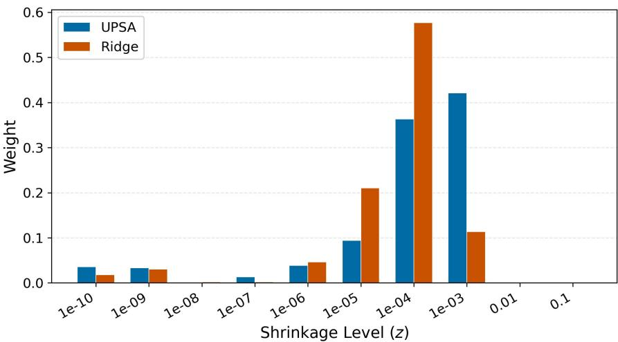  
Figure 9: Distribution of Penalty Weights.

Histogram of ridge penalties selected by cross-validation compared with the average UPSA ensemble weights across the same grid. UPSA weights are determined using Lemma 2. The out-of-sample period is November 1981 to December 2022.

## 5.3 The Anatomy of Nonlinear Shrinkage

UPSA and ridge investors also difer in how they treat the eigenvalue spectrum. Ridge applies a uniform penalty across all eigenvalues, while UPSA varies shrinkage across the spectrum, which matters most for low-variance components where estimation noise is largest. This diference becomes most visible when we examine how performance evolves as additional principal components are incorporated. Figure 10 shows how SDF performance changes as PCs are incrementally included, ordered from largest to smallest variance. Both SDFs peak at K = 32, achieving Sharpe ratios of 2.19 (UPSA) and 2.16 (Ridge).26

The key diference emerges beyond the peak. As lower-variance PCs are added, ridge deteriorates steadily, falling from 2.16 to 1.59 when all 120 PCs are included, a decline of roughly 26%. UPSA degrades far more gradually, from 2.19 to 1.92, a drop of only 12%. UPSA behaves as though the investor had truncated low-signal components ex ante, without imposing an explicit cutof.

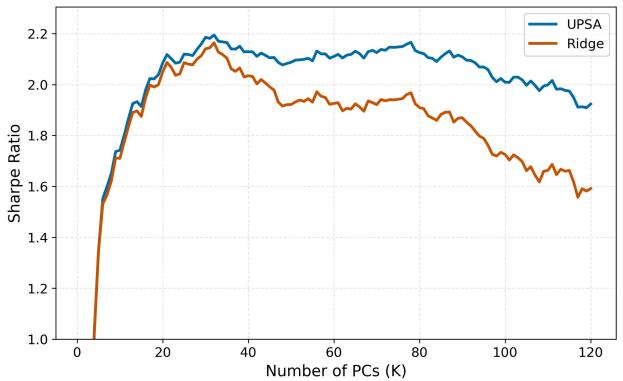  
(a) Out-of-sample Sharpe Ratio

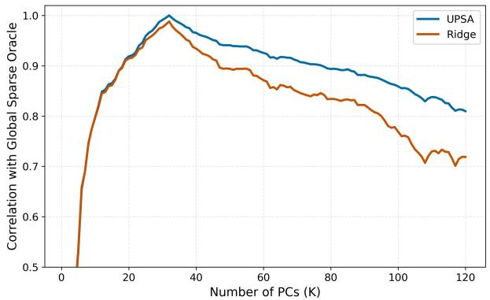  
(b) Correlation with (Infeasible) Sparse Oracle  
Figure 10: Out-of-sample Performance by Number of Principal Components.  
PCs are ordered by decreasing variance explained (eigenvalue rank). Panel (a): Annualized out-of-sample Sharpe ratio as PCs are incrementally added from the largest to the smallest eigenvalue. Panel (b): Correlation between the K-PC portfolio and the (infeasible) sparse oracle—the subset of K∗ PCs that maximizes the out-of-sample Sharpe ratio. The out-of-sample period is November 1981 to December 2022.

Panel (b) ofers a complementary view, comparing each method to the (infeasible) sparse oracle: the portfolio constructed from the K∗ = 32 PCs that maximize the out-of-sample Sharpe ratio.27 Ridge’s correlation with the oracle drops to 0.72 at K = 120, while UPSA maintains a correlation of 0.81, indicating that it attenuates the influence of low-signal components even when they are retained. This pattern points to a fundamental diference in how the two methods allocate shrinkage across the eigenvalue spectrum.

Figure 11 makes this mechanism explicit. It illustrates how shrinkage varies across the eigenvalue spectrum via the function f−1(λ¯), which maps sample eigenvalues to their shrunk counterparts. For the largest eigenvalues, the two methods behave similarly. Diferences emerge further along the spectrum, where UPSA applies stronger regularization to intermediate eigenvalues while continuing to shrink the smallest ones. This flexibility allows the estimator to dampen the influence of noisier components without discarding them entirely, helping explain the greater robustness observed in Figure 10.

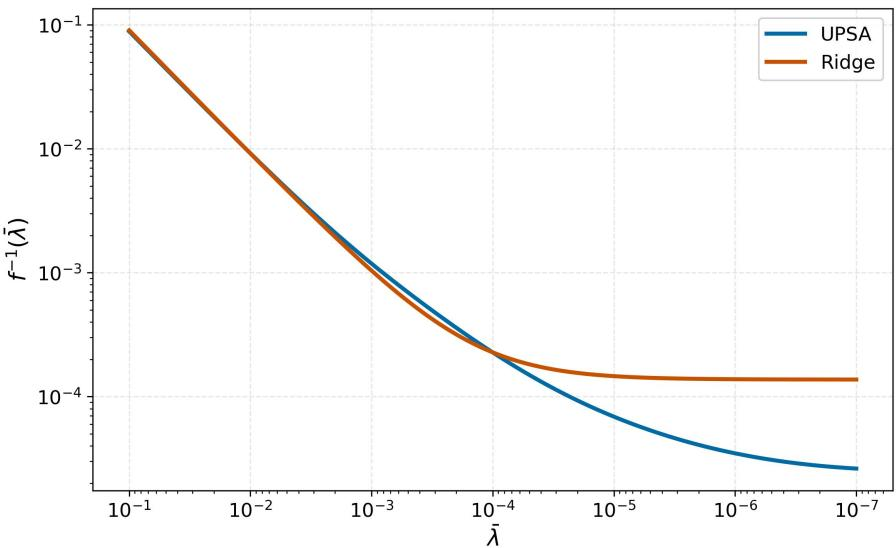  
Figure 11: Shrinkage Functions for Ridge and UPSA.

Time-averaged inverse shrinkage function f−1(λ) mapping sample eigenvalues to their shrunk counterparts (Definition 2). Ridge: f−1z (λ) = λ + z, with z selected by leave-one-out cross-validation. UPSA: f−1Z,W (λ) = -PLi=1 wi (λ + zi)−1−1, with ensemble weights W determined by Lemma 2. The out-of-sample period is November 1981 to December 2022.

A natural question raised by Figure 10 is whether explicitly selecting a subset of PCs could further improve performance. Empirically, augmenting ridge and UPSA with a lasso penalty produces only modest changes in Sharpe ratios while generating highly unstable factor selection across rolling windows: the number of selected PCs fluctuates substantially over time, especially during periods of market stress.28

## 5.4 Thematic Decomposition of SDF Loadings

The spectral diferences between UPSA and ridge translate into diferences in the economic composition of the SDF. We map SDF weights to the thematic clusters of Jensen et al. (2023) to characterize how each SDF allocates across asset pricing themes.

To isolate diferences in composition rather than scale, we normalize both SDFs to 10% annualized volatility. For each period, the share of absolute SDF weight allocated to theme k is skt = P |π¯i,t|/ P |π¯j,t|. Figure 12 reports the time-averaged allocation. Panel (a)

shows that both SDFs agree on the broad ranking: investment, value, low risk, and quality receive the largest shares.

Panel (b) shows how the allocations diverge. UPSA allocates relatively more to quality, low risk, and profitability, themes linked to persistent firm fundamentals. Ridge tilts toward seasonality, skewness, and momentum, themes driven by transient return dynamics. These diferences are consistent with the aforementioned fact that UPSA favors more stable and lower turnover allocations.

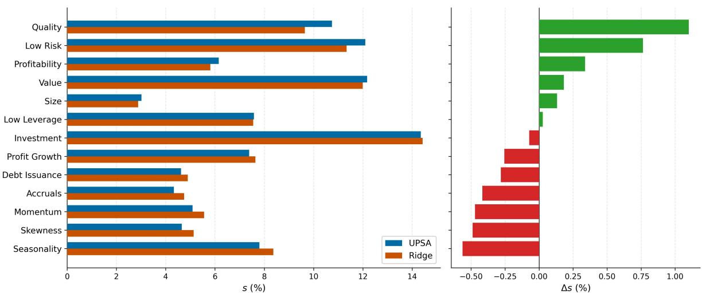  
Figure 12: Thematic Portfolio Allocation: UPSA vs. Ridge.

Panel (a): Time-averaged share of absolute portfolio weight allocated to each JKP theme cluster (Jensen et al., 2023) for UPSA and ridge. Panel (b): Diference in allocation share, s(UPSA) − s(Ridge), in percentage points. Themes are sorted by the diference. Both portfolios are normalized to 10% annualized volatility. The out-of-sample period is November 1981 to December 2022.

To assess how these allocation diferences contribute to the Sharpe ratio gap, we decompose it using Shapley values (Shapley, 1953). For each theme k, the Shapley value averages its marginal contribution to the Sharpe ratio diference ∆SR = SR(UPSA) − SR(Ridge) over all possible orderings in which themes can be added:

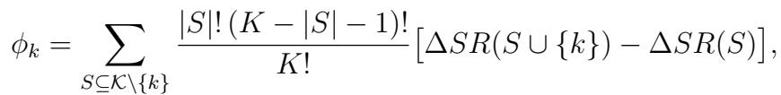

(22)

where K is the set of all themes, K = |K|, and ∆SR(S) denotes the Sharpe ratio gap computed using only the return contributions of factors belonging to themes in S. By construction, the Shapley values sum exactly to the total gap: P ϕk = ∆SR(K).

Figure 13 reports the results. The themes where UPSA allocates relatively more—value, quality, and low risk (Figure 12)—are precisely those with the largest positive Shapley contributions. Negative contributions are limited and small in magnitude. The thematic decomposition confirms that UPSA’s nonlinear shrinkage produces an SDF that systematically reallocates toward persistent, fundamental-related themes, and that these tilts account for a substantial share of UPSA’s out-of-sample outperformance.

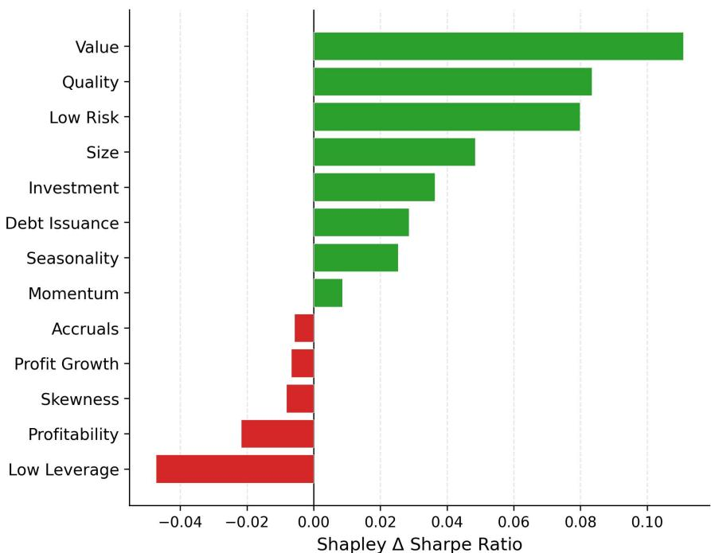  
Figure 13: Shapley Decomposition of ∆ Sharpe Ratio by Theme.

Shapley decomposition of the Sharpe ratio gap between UPSA and ridge by theme (Equation (22)). Bars show each theme’s contribution to ∆SR, which sums to the total gap. Positive values indicate contributions to UPSA’s outperformance; negative values indicate ofsets. Both portfolios are scaled to 10% annualized volatility. The out-of-sample period is November 1981 to December 2022.

## 6 UPSA Through the Lens of Simulation

We use simulations to isolate the mechanisms behind UPSA’s outperformance. The design separates two key ingredients: tuning shrinkage to a portfolio objective and allowing shrinkage to vary flexibly across the eigenvalue spectrum.

We simulate data from

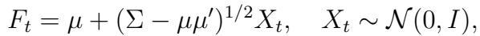

(23)

with diagonal Σ = diag(λ), so the infeasible optimal Markowitz weights are π∗,i = µi/λi. The eigenvalue distribution has 10% large (λ = 10), 80% medium (λ = 1), and 10% small (λ = 0.1) components. Expected returns are

(24)

The asset market thus consists of three types of factors: concentrated risks (λi = 10) commanding a significant return premium, a large set of moderate-variance factors (λi = 1) with no premium, and a minority of low-risk factors (λi = 0.1) with non-negligible expected returns resembling near-arbitrage opportunities. These near-arbitrage factors are dificult to estimate because their low variance makes them easily obscured by higher-variance components.

We produce 10,000 simulated samples with N = 150 assets and T = 600 observations, roughly matching our empirical dimensions in Section 4. The first half of each sample is used for training and the second half for out-of-sample testing. We compare model performance based on the out-of-sample Sharpe ratio SR(Rt) = E¯[Rt]/pE¯[R2].29

## 6.1 Economic vs. Statistical Tuning

We first isolate the role of the tuning objective by comparing two ridge shrinkage approaches that difer only in their calibration objective. Ridge Statistical minimizes second moment

estimation error:30

Ridge Economic instead selects the shrinkage parameter to maximize out-of-sample quadratic utility:31

(25)

At the population level, the low-variance PCs are the most profitable, delivering the highest optimal weights π∗,i. To maximize out-of-sample performance, the shrinkage function must tilt portfolio weights toward these components despite substantial finite-sample noise. Statistical shrinkage, however, corrects sample eigenvalues toward their population values, remaining agnostic to expected returns.

Figure 14 confirms this distinction. Statistical ridge shrinks eigenvalues toward the bulk of the population distribution, while economic ridge does the opposite and tilts more towards the smaller, high-return PCs. Economic tuning achieves a higher average Sharpe ratio (0.28 vs. 0.22) and outperforms in 87% of simulations, confirming that the choice of objective is a primary driver of improvement, even before allowing for nonlinear shrinkage.

## 6.2 Linear vs. Nonlinear Shrinkage

We next hold the economic objective (25) fixed and compare Ridge (linear shrinkage) with UPSA (nonlinear shrinkage maximizing out-of-sample quadratic utility as in Definition 1).32 An efective shrinkage rule should apply minimal shrinkage to the low-variance, high-return PCs to preserve their profitability, aggressively shrink the mid-variance PCs since they do not contribute to the eficient portfolio, and apply moderate shrinkage to the high-variance PCs, which are less noisy and moderately informative. Ridge cannot address all three cases simultaneously: if z is large enough to suppress the uninformative mid-variance PCs, it over-shrinks the profitable low-variance PCs; if z is small enough to preserve them, it underregularizes the noisy middle of the spectrum.

  
Figure 14: Tuning to Economic vs. Statistical Objectives.  
Data are simulated using the data-generating process (23)–(24) for N = 150 assets, T = 600 observations, and 10,000 simulations. The left panel shows the empirical eigenvalue distribution versus the shrunken eigenvalues for the statistical and economic tuning approaches (averaged across simulations). The right panel shows a scatter plot of the out-of-sample Sharpe ratio of portfolios built using linear economic tuning (horizontal axis) or linear statistical tuning (vertical axis), where each point represents a simulated data set.

UPSA resolves this tradeof by dynamically reallocating capital across the spectrum. As shown in Figure 15, UPSA assigns larger portfolio weights to principal components that pair small eigenvalues with high expected returns, strictly limits exposure to mid-range components, and maintains baseline weights on the largest eigenvalues owing to their high signal-to-noise ratio. Ultimately, this structural flexibility yields a higher average Sharpe ratio (0.33 vs. 0.28) and drives outperformance in 96% of the simulations.

The simulation also shows that only a small number of shrinkage regimes are needed to approximate the optimal rule. Because the data-generating process contains three distinct eigenvalue regions, a Bayesian investor who knew this structure would require a prior mixture with only two components (Section 5.1). Consistent with this intuition, most gains are achieved with a small grid, and additional grid points provide negligible improvements (Figure 30 in the Appendix).

  
Figure 15: Linear vs. Nonlinear Shrinkage with Economic Objectives.

Data are simulated using the data-generating process (23) and (24) for N = 150 assets, T = 600 observations, and 10,000 simulations. The left panel shows the empirical eigenvalue distribution versus the shrunken eigenvalues for the linear (ridge) and nonlinear (UPSA) economic tuning approaches (averaged across simulations). The right panel shows a scatter plot of the out-of-sample Sharpe ratio of portfolios built using linear economic tuning (horizontal axis) or nonlinear economic tuning (vertical axis), where each point represents a simulated data set.

## 6.3 Adapting to Time-Varying Uncertainty

We extend the data-generating process to isolate the efect of time-varying expected returns. The eigenvalue structure is held fixed while expected returns on the high-variance PCs switch between two regimes:

(26)

where s ∈ {1, 2} denotes the latent state. State 1 represents a recession-like environment in which concentrated-risk factors earn a moderate premium; State 2 represents normal times in which these same factors earn a substantially larger premium. The regime evolves as a two-state Markov chain: at each period, the state switches with probability p = 0.05 and persists with probability 1 − p, implying an expected regime duration of roughly 20 periods.

  
Figure 16: UPSA vs. Ridge Under Markov-Switching Regimes.  
Data are simulated from the Markov-switching data-generating process (26) with N = 150 assets, T = 600 observations, a rolling window of 300, and 10,000 independent paths. The left panel plots UPSA vs. ridge outof-sample Sharpe ratios; the right panel plots average portfolio turnover. Each point represents one simulated path. Points above (below) the 45-degree line indicate UPSA outperformance (underperformance).

Figure 16 summarizes the results. UPSA delivers a higher Sharpe ratio in 88% of simulations (mean 0.28 vs. 0.24) and lower turnover in 74% (mean 4.4% vs. 6.1%). Because the covariance structure is identical across regimes, these diferences isolate how the two estimators adapt to changes in expected returns.

Appendix Figures 31–33 examine a representative simulation path. The patterns closely mirror the empirical evidence in Section 5.2: UPSA gradually reallocates weight across the penalty grid as regimes change, whereas ridge alternates between extreme penalty values. The simulation shows that time variation in expected returns alone is suficient to generate the joint improvement in Sharpe ratios and turnover documented in the data.

## 7 Conclusions

We introduce the Universal Portfolio Shrinkage Approximator (UPSA), an objective-specific and adaptive shrinkage methodology. UPSA directly optimizes out-of-sample portfolio performance and achieves a balance between risk and return through a flexible, closed-form nonlinear shrinkage function.

Empirically, UPSA consistently outperforms existing methods, achieving higher Sharpe ratios and lower pricing errors. The estimator adapts to changing market conditions and allocates risk across principal components more efectively than standard spectral shrinkage methods. In particular, UPSA regularizes intermediate components more aggressively while allowing the most informative components to remain active, efectively tailoring shrinkage to each component’s signal-to-noise ratio without relying on arbitrary truncation rules. This flexibility admits a natural Bayesian interpretation in which the investor integrates over beliefs about expected-return uncertainty rather than committing to a single shrinkage level. Empirically, this leads to more stable portfolio allocations, lower turnover, and greater resilience during recessions. Our findings underscore the importance of designing shrinkage strategies that are flexible and aligned with the portfolio’s economic objective rather than based on ad hoc statistical criteria.

## References

Bryzgalova, Svetlana, Jiantao Huang, and Christian Julliard, “Bayesian solutions for the factor zoo: We just ran two quadrillion models,” The Journal of Finance, 2023, 78 (1), 487–557.

, Markus Pelger, and Jason Zhu, “Forest through the trees: Building cross-sections of stock returns,” The Journal of Finance, 2025, 80 (5), 2447–2506.

, Victor DeMiguel, Sicong Li, and Markus Pelger, “Asset-Pricing Factors with Economic Targets,” Available at SSRN 4344837, 2023.

Chamberlain, Gary and Michael Rothschild, “Arbitrage, factor structure, and meanvariance analysis on large asset markets,” 1982.

Chen, Andrew Y. and Chukwuma Dim, “High-Throughput Asset Pricing,” arXiv preprint, 2023, arXiv:2311.10685. Available at https://arxiv.org/abs/2311.10685.

Chen, Andrew Y and Tom Zimmermann, “Open source cross-sectional asset pricing,” Critical Finance Review, 2022, 11 (2), 207–264.

Cochrane, John H, Asset pricing: Revised edition, Princeton university press, 2009.

Da, Rui, Stefan Nagel, and Dacheng Xiu, “The Statistical Limit of Arbitrage,” Technical Report, Chicago Booth 2022.

DeMiguel, Victor, Lorenzo Garlappi, Francisco J Nogales, and Raman Uppal, “A generalized approach to portfolio optimization: Improving performance by constraining portfolio norms,” Management Science, 2009, 55, 798–812.

Didisheim, Antoine, Shikun Barry Ke, Bryan T Kelly, and Semyon Malamud, “APT or “AIPT”? The Surprising Dominance of Large Factor Models,” Technical Report, National Bureau of Economic Research 2024.

Fama, Eugene F and Kenneth R French, “A five-factor asset pricing model,” Journal of financial economics, 2015, 116 (1), 1–22.

Giglio, Stefano and Dacheng Xiu, “Asset pricing with omitted factors,” Journal of Political Economy, 2021, 129 (7), 1947–1990.

, , and Dake Zhang, “Test assets and weak factors,” The Journal of Finance, 2025, 80 (1), 259–319.

Golub, Gene H, Michael Heath, and Grace Wahba, “Generalized cross-validation as a method for choosing a good ridge parameter,” Technometrics, 1979, 21 (2), 215–223.

Gu, Shihao, Bryan Kelly, and Dacheng Xiu, “Autoencoder asset pricing models,” Journal of Econometrics, 2021, 222 (1), 429–450.

Hansen, Lars Peter and Ravi Jagannathan, “Implications of security market data for models of dynamic economies,” Journal of political economy, 1991, 99 (2), 225–262.

Hornik, Kurt, Maxwell Stinchcombe, and Halbert White, “Universal approximation of an unknown mapping and its derivatives using multilayer feedforward networks,” Neural networks, 1990, 3 (5), 551–560.

Jensen, Theis Ingerslev, Bryan Kelly, and Lasse Heje Pedersen, “Is there a replication crisis in finance?,” The Journal of Finance, 2023, 78 (5), 2465–2518.

Ke, Shikun (Barry) and Mohammad Pourmohammadi, “Shrinkage Alignment in High-Dimensional Portfolios,” 2025. Available at SSRN: https://papers.ssrn.com/ sol3/papers.cfm?abstract\_id=5723922.

Kelly, Bryan, Semyon Malamud, and Lasse Heje Pedersen, “Principal portfolios,” The Journal of Finance, 2023, 78 (1), 347–387.

, Seth Pruitt, and Yinan Su, “Characteristics are covariances: A unified model of risk and return,” Journal of Financial Economics, 2019, 134 (3), 501–524.

Kelly, Bryan T, Semyon Malamud, and Kangying Zhou, “The virtue of complexity in return prediction,” The Journal of Finance, 2024, 79 (1), 459–503.

Korsaye, Sofonias Alemu, Alberto Quaini, and Fabio Trojani, “Smart stochastic discount factors,” Management Science, 2025.

Kozak, Serhiy, Stefan Nagel, and Shrihari Santosh, “Interpreting factor models,” The Journal of Finance, 2018, 73 (3), 1183–1223.

, , and , “Shrinking the cross-section,” Journal of Financial Economics, 2020, 135 (2), 271–292.

Ledoit, Olivier and Michael Wolf, “Improved estimation of the covariance matrix of stock returns with an application to portfolio selection,” Journal of Empirical Finance, 2003, 10, 603–621.

and , “Honey, I shrunk the sample covariance matrix,” Journal of Portfolio Management, 2004, 30, 110–119.

and , “A well-conditioned estimator for large-dimensional covariance matrices,” Journal of multivariate analysis, 2004, 88 (2), 365–411.

and , “Nonlinear shrinkage estimation of large-dimensional covariance matrices,” The Annals of Statistics, 2012, 40 (2), 1024–1060.

and , “Spectrum estimation: A unified framework for covariance matrix estimation and PCA in large dimensions,” Journal of Multivariate Analysis, 2015, 139, 360–384.

and , “Nonlinear shrinkage of the covariance matrix for portfolio selection: Markowitz meets Goldilocks,” The Review of Financial Studies, 2017, 30 (12), 4349– 4388.

and , “Analytical nonlinear shrinkage of large-dimensional covariance matrices,” The Annals of Statistics, 2020, 48 (5), 3043–3065. and Sandrine P´ech´e, “Eigenvectors of some large sample covariance matrix ensembles,” Probability Theory and Related Fields, 2011, 150, 233–264.

Lettau, Martin and Markus Pelger, “Factors that fit the time series and cross-section of stock returns,” The Review of Financial Studies, 2020, 33 (5), 2274–2325.

L¨owner, Karl, “Uber monotone matrixfunktionen,” ¨ Mathematische Zeitschrift, 1934, 38 (1), 177–216.

Markowitz, Harry, “Portfolio Selection,” The Journal of Finance, 1952, 7 (1), 77–91.

Martin, Ian WR and Stefan Nagel, “Market eficiency in the age of big data,” Journal of Financial Economics, 2022, 145 (1), 154–177.

Murphy, Kevin P, “Conjugate Bayesian analysis of the Gaussian distribution,” def, 2007, 1 (2σ2), 16.

Pedersen, Lasse Heje, Abhilash Babu, and Ari Levine, “Enhanced portfolio optimization,” Financial Analysts Journal, 2021, 77 (2), 124–151.

Preite, Massimo Dello, Raman Uppal, Paolo Zafaroni, and Irina Zviadadze, “What is Missing in Asset-Pricing Factor Models?,” 2022.

Quaini, Alberto and Fabio Trojani, “Proximal Estimation and Inference,” arXiv preprint arXiv:2205.13469, 2022.

Ross, Stephen A., “The Arbitrage Theory of Capital Asset Pricing,” Journal of Economic Theory, 1976, 13, 341–360.

Rudin, Walter, Principles of Mathematical Analysis, 3 ed., New York: McGraw-Hill, 1976. See Chapter 7 for the Stone-Weierstrass Theorem.

Severini, Thomas A, “Some properties of portfolios constructed from principal components of asset returns,” Annals of Finance, 2022, 18 (4), 457–483.

Shapley, Lloyd S., “A value for n-person games,” in Harold W. Kuhn and Albert W. Tucker, eds., Contributions to the Theory of Games II, Princeton University Press, 1953, pp. 307–317.

Stein, Charles, “Lectures on the theory of estimation of many parameters,” Journal of Soviet Mathematics, 1986, 34, 1373–1403.

Tibshirani, Robert, “Regression shrinkage and selection via the lasso,” Journal of the Royal Statistical Society Series B: Statistical Methodology, 1996, 58 (1), 267–288.

## A Proofs

This appendix collects the proofs of all results stated in the main text. We prove the universal approximation properties of UPSA (Lemmas 1 and 5), the characterization of the optimal full-information shrinkage function (Lemma 3), and the unbiasedness of LOO cross-validation (Lemma 4).

Proof of Lemma 1. To prove the first statement of the lemma, let f be a real-valued, non-negative, matrix monotone decreasing function on R+ so that g := −f is negative and matrix monotone increasing. Using the L¨owner (1934) Theorem, it follows that there exist constants a ∈ R, b > 0 and a positive finite measure µ on R+ such that, for λ¯ ≥ 0:

(27)

By monotone convergence, 0 = limλ¯→∞ R0 ∞ z+λ z ¯ dµ(z). Therefore,

(28)

which implies a = 0 and b + µ(R+) = 0. This gives the representation:

(29)

for a positive measure ν on R+ having Radon-Nikodym derivative dν (z) = z with respect dµ to µ. In particular, we obtain that R ∞0 z−1dν(z) = 1 when f (0) = 1. Furthermore, λf¯ (λ¯) is bounded by assumption. Hence, there exists a constant K > 0 such that:

(30)

using in the last identity the monotone convergence theorem. In particular, we obtain that ν(R+) = K whenever K = limλ¯→∞ λf¯ (λ¯).

We next show the uniform approximation property of UPSA. To this end, note first that

for any z1, z2 ≥ 0 and λ¯ ≥ λ¯min > 0 we have:

Let further ϵ > 0 be arbitrary and zmax > 0 be such that 1z+λ¯ < ϵ for any λ¯ ≥ 0 and z ≥ zmax. There then exists a partition R+\[zmax, ∞) = SLi=1[zi−1, zi), where z0 := 0 and zL := zmax, such that |zi − zi−1| < ϵ for any i = 1 . . . L. Consider now a piecewise constant function g(λ, z ¯ ) with respect to variable z, which is defined for any λ¯ ≥ 0 by g(λ, z ¯ ) = zi+λ¯ 1 if z ∈ [zi−1, zi) and g(λ, z¯ ) = 1 ¯ if z ≥ zmax. Using this function, we obtain:

(31)

which is by definition a function in the UPSA family. Furthermore, since λ¯min < 1, without loss of generality, the following inequalities hold:

Note that ϵ was chosen arbitrary and that this bound holds uniformly for any λ¯ ≥ λ¯0, given a fixed but otherwise arbitrary λ¯0 > 0. Therefore, the stated uniform approximation property of UPSA for decreasing matrix monotone shrinkage functions follows. This concludes the proof. □

Lemma 3 If return process (Ft) is identically and independently distributed over time with expectation µ and second moment matrix Σ, the solution to the optimization problem in Definition 1 under full information, i.e., under knowledge of both µ and Σ, is such that for

any i = 1, . . . , K := min(N, T ):

(32)

Proof. For a fixed t > T , we first write explicitly the criterion that has to be optimized in Definition 1, while recalling that returns are identically and independently distributed over time:

where f (λ¯) := (f (λ¯1), . . . , f (λ¯K))′ and ◦ denotes the Hadamard product. It follows that the optimal shrinkage f⋆(λ¯) is such that:

(33)

where π⋆ denotes the (unfeasible) population Markowitz portfolio. Assuming that all PC’s have a nonzero average return, it then follows for any i = 1, . . . , K:

(34)

This concludes the proof.

Lemma 4 Let {F1, . . . , FT , FT+1} be an exchangeable random sequence and

(35)

denote the sequence of LOO portfolio returns. Then,

(36)

is an unbiased estimator of the out-of-sample portfolio’s expected utility:

for any τ > T .

Proof of Lemma 4. Exchangeability implies that the distribution of ((Fs)s̸=τ,1≤s≤T , Fτ ) is independent of τ ∈ {1, . . . , T }. Therefore, the distribution of return RT,τ (f ) = ¯πT,τ (f )′Fτ does also not depend on τ . This gives, for any τ ′ ∈ {1, . . . T }:

Since E[U (RT,T (f ))] is the out-of-sample portfolio expected utility criterion implied by all data available up to time T − 1 for factor return FT , the proof is complete. □

Lemma 5 Any continuous function f can be uniformly approximated over compact intervals by a function fZ ∈ F(Z), whenever the grid Z is suficiently wide and dense.

Proof of Lemma 5. The proof relies on an application of the Stone-Weierstrass Theorem; see, e.g., Rudin (1976). Consider the algebra of functions generated by the ridge ensemble {Θz : z > 0}, where Θz(x) := (z + x)−1 for any x ≥ 0. These functions are bounded, strictly monotonically decreasing, and continuous on R+. Using the identity

(37)

it follows that on any compact interval [a, b], the linear span of the ridge ensemble is dense in the algebra generated by the ridge ensemble. Moreover, it is easy to see that the ridge ensemble separates points on any compact interval [a, b], and it vanishes nowhere. As a consequence, for any compact interval [a, b], the algebra generated by the ridge ensemble is dense in C(a, b) – by the Stone-Weierstrass Theorem – and the claim follows. □

## B Bayesian Foundations: Technical Details

This appendix provides the formal details underlying the Bayesian interpretation of UPSA developed in Section 5.1. Section B.1 derives the posterior Markowitz portfolio under expected return uncertainty and discusses its economic implications. Section B.2 extends the analysis to joint mean and covariance uncertainty. Proofs are collected in Section B.3.

## B.1 Expected Return Uncertainty

Let F1, . . . , FT be IID Gaussian in RN with expectation µ and positive definite covariance matrix Σ:

(38)

The unknown Markowitz portfolio is b := Σ−1µ. We model expected return uncertainty with a Gaussian prior whose dispersion depends on Σ:

(39)

where g is a strictly positive matrix function.

This prior has direct implications for the Markowitz portfolio through two economically interpretable quantities. First, the prior expected squared Sharpe ratio:

(40)

and second, the prior expected squared norm of the portfolio weights:

(41)

where d1, . . . , dN are the eigenvalues of Σ. These show that g implicitly governs how diferent principal components contribute to the portfolio’s performance and leverage.

Lemma 6 Given the Gaussian likelihood (38) and prior (39), the posterior Markowitz portfolio is:

(42)

To connect this to UPSA, we factorize g as g(Σ) = 1 Σ h(Σ) Σ for some strictly positive tr(Σ)   
matrix function h. This specific factorization provides a clean economic mapping: since the optimal portfolio weights are b = Σ−1µ, specifying the prior variance of µ as proportional to Σh(Σ)Σ implies that the prior variance of the weights b is proportional to Σ−1(Σh(Σ)Σ)Σ−1 = h(Σ). This ensures that the prior uncertainty about expected returns directly translates into the desired spectral shrinkage on the portfolio weights, yielding the exact form stated in equation (20) of the main text.

Under this factorization, the prior expected portfolio norm simplifies to

(43)

so the monotonicity of h directly governs whether high-variance or low-variance PCs contribute more to the Markowitz portfolio norm a priori.

Established parametric prior specifications in the literature include matrix power functions g(Σ) = z tr(Σ) 1 Ση for z > 0 and η ≥ 0, giving h(d) = 1 dη−2. This function is decreasing z when η ≤ 2 and increasing when η ≥ 2. The boundary case η = 2 makes all PCs contribute equally to the portfolio norm, producing ridge shrinkage:

More generally, whenever the posterior shrinkage f is matrix monotonically decreasing, the universal approximation property (Lemma 1 of the main text) yields the UPSA representation in equation (21).

## B.2 Joint Mean and Covariance Uncertainty

The analysis above conditions on a known covariance matrix. We now show that UPSA emerges even when the investor faces joint uncertainty about both µ and Σ, modeled through a mixture of L conjugate Normal–Inverse Wishart priors (see, e.g., Murphy, 2007):

(44)

(45)

with probability ωj > 0 for each j = 1, . . . , L, where τ > 0, mj > 0, and Λj are N × N positive definite matrices. Each mixture component represents a distinct hypothesis about the scale of covariance uncertainty.

Lemma 7 Given the Gaussian likelihood (38) and the mixture prior (44)–(45), the posterior Markowitz portfolio is:

(46)

with strictly positive weights

(47)

where q1, . . . , qL are strictly positive posterior mixing probabilities.

Setting the hyper-parameters Λj = NzjIN for a grid of constants 0 < z1 < · · · < zL, equation (46) becomes

(48)

which is precisely a UPSA ridge ensemble.

The posterior ensemble weights νj are endogenous: they are determined jointly by the prior (through ωj and mj) and the data (through the posterior mixing probabilities qj).

When the mixture reduces to a single component (ωk = 1, ωj = 0 for j ̸= k), the posterior collapses to a single ridge portfolio, confirming that ridge is a special case corresponding to a non-mixing prior.

Even when the prior on expected returns is uninformative (τ → 0), a UPSA ensemble emerges with weights

(49)

In the standard data regime (N/T → 0), covariance uncertainty vanishes and the weights are proportional to the posterior mixing probabilities qj. In the complex regime (N/T → c > 0), the weights tilt toward components with larger mj (greater prior covariance uncertainty), proportionally to complexity N/T .

It is worth contrasting this foundation with that of Section B.1. There, UPSA arises from a nonlinear prior on expected returns—function g(Σ) introduces diferential uncertainty across PCs, and the posterior shrinkage inherits this nonlinearity. Here, UPSA arises from uncertainty about the scale of the covariance matrix in a mixture model, even when the prior on expected returns is flat across PCs. Indeed, prior (44)–(45) implies a flat contribution of diferent principal components to the squared Sharpe ratio:

(50)

but a decreasing contribution to the Markowitz portfolio norm:

(51)

These are economically distinct mechanisms, yet both produce the same UPSA functional form.

## B.3 Proofs of Bayesian Lemmas

Proof of Lemma 6. Given hyper-parameters µ0 = 0 and Σ0 = g(Σ) in prior (39), the posterior expected return is given in closed-form by standard conjugate Gaussian results (see, e.g., Murphy, 2007):

Therefore, the expected posterior Markowitz portfolio is:

This concludes the proof.

Proof of Lemma 7. Under IID assumption (38) for observations F := (F1, . . . , FT ), the Gaussian likelihood factorizes as L(F | µ, Σ) = QT f (Ft | µ, Σ), where f (· | µ, Σ) is the Gaussian density. The conjugate Normal–Inverse Wishart mixture prior for (µ, Σ) is such that:

with probability ωj > 0 for each j = 1, . . . , L. Therefore, the posterior density π(µ, Σ | F ) satisfies:

where g(µ, Σ) is the joint prior density of (µ, Σ), gj(µ | Σ) the density of N (0, Σ/τ ), and hj(Σ) the density of W −1(mj, Λj). Consequently, the posterior is a mixture of L posteriors

πj(µ, Σ | F ), each arising from a standard Normal–Inverse Wishart conjugate update:

By standard conjugate results (see, e.g., Murphy, 2007), under posterior πj we have:

where

This gives the posterior Markowitz portfolio:

(52)

We next compute Eπ[Σ−1 | F ]. The posterior distribution of Σ is a mixture of inverse Wishart distributions with mixing weights

The posterior distribution of Σ−1 is therefore a mixture of Wishart distributions with mixing weights qj and parameters (mjT , Λ−1jT ). Using the fact that E[Σ−1] = m Λ−1 when Σ−1 ∼ W (m, Λ−1), we obtain:

Applying the Sherman–Morrison formula to handle the rank-one adjustment by − T2τ+T E¯[F ]E¯[F ]′:

Therefore, using identity (52):

where:

For hyper-parameter choices Λj = NzjIN with 0 < z1 < · · · < zL, this gives:

with the UPSA portfolio weights:

This concludes the proof.

## C Sensitivity to the Ridge Grid

The performance of UPSA depends on the grid Z of ridge penalties used to construct the basis functions. As shown in equations (11) and (10), the grid must span values well above the largest eigenvalue (strong regularization, approaching identity shrinkage) to well below the smallest (weak regularization, approaching the ridgeless limit), with logarithmically spaced points in between.

  
Figure 17: Sensitivity of UPSA to the Number and Placement of Ridge Grid Points.  
The left panel varies the number of logarithmically spaced ridge penalties between the fixed endpoints used in the main analysis (10−10 to 10−1). The right panel constructs the grid between the smallest and largest empirical eigenvalues of the covariance matrix. The out-of-sample period is November 1981 to December 2022.

Figure 17 assesses sensitivity via two experiments. The left panel fixes the endpoints at 10−10 and 10−1 and varies the number of intermediate grid points; the right panel instead spans the empirical eigenvalue range. In both cases, UPSA consistently outperforms ridge, and its out-of-sample Sharpe ratio stabilizes once the grid contains roughly four points. These results confirm that UPSA’s performance is not sensitive to the number or placement of ridge penalties.

Figure 18 shows that this robustness extends to turnover. UPSA’s average monthly turnover stabilizes at approximately 12.5% once the grid contains three or more points, and remains flat regardless of further grid refinement. Ridge turnover is both higher (15–17%) and more volatile across grid sizes, reflecting the instability of the cross-validated penalty parameter documented in Section 5.2.

One could also impose an ℓ1 penalty on the ensemble weights W to let the data select a sparse subset of grid points. However, the results above suggest this is unnecessary, as the estimated weights already concentrate on a small number of penalties.

  
Figure 18: Turnover Sensitivity to the Number and Placement of Ridge Grid Points.

Average monthly turnover (%) as a function of the number of ridge grid points for UPSA and Ridge. The left panel uses a fixed grid (10−10 to 10−1); the right panel uses the empirical eigenvalue range. The out-ofsample period is November 1981 to December 2022.

## D Lasso Regularization

Motivated by classic arbitrage pricing theory (Ross, 1976; Chamberlain and Rothschild, 1982), it is plausible to argue that any candidate SDF should be sparse in the space of PCs. Hence, we follow the intuition in Kozak et al. (2020) and implement a sequential elasticnet shrinkage procedure.33 Specifically, we first apply our spectral shrinkage methods— UPSA and Ridge—and then apply an additional Lasso34 penalty in a second stage. For any spectral shrinkage function f , the matrix f −1(Σ) is diagonal in PC space, so the elastic-net ¯ problem separates across coordinates and admits a closed-form solution via soft-thresholding (Tibshirani, 1996, Section 10).

## D.1 Efect on Portfolio Performance

Figure 19 reports the annualized out-of-sample Sharpe ratios of UPSA and ridge with and without Lasso augmentation. Introducing an additional ℓ1 penalty has little efect on performance. UPSA’s Sharpe ratio increases slightly from 1.92 to 1.94, while ridge declines

marginally from 1.59 to 1.54. These results indicate that imposing explicit sparsity through a Lasso penalty does not materially change the portfolios’ out-of-sample Sharpe ratios.

  
Figure 19: Annualized Sharpe Ratios: Base vs. Lasso-Augmented Portfolios.  
Annualized out-of-sample Sharpe ratios for UPSA and ridge, with (hatched) and without (solid) an additional Lasso penalty. The Lasso penalty is selected from the same grid as the ridge penalty using leave-one-out cross-validation. The out-of-sample period is November 1981 to December 2022.

## D.2 Instability of Factor Selection

Figure 20 plots the number of non-zero PCs retained by lasso-augmented ridge and UPSA over time. The number of selected components varies substantially across rolling windows. In many periods both methods retain a large share of the available N = 120 PCs, while in other periods the number of selected components declines markedly. The median number of retained PCs is roughly 80, although the count occasionally falls to around 17–18.

This variability helps explain why augmenting UPSA with a Lasso penalty has little impact on portfolio performance. As shown in Section 5.3 (Figure 10), UPSA’s Sharpe ratio remains relatively stable across a wide range of included PCs. As a result, fluctuations in the number of retained components translate into only modest changes in the resulting portfolios.

  
Figure 20: Number of Non-Zero PCs Retained by Lasso Over Time.

Number of non-zero principal components retained by ℓ1-penalized ridge and UPSA. The number of selected PCs varies across rolling windows, with periods in which most components are retained and others in which the selected set becomes substantially smaller. The Lasso penalty is selected by leave-one-out crossvalidation. The out-of-sample period is November 1981 to December 2022.

The turnover cost of explicit sparsity is substantial. Figure 21 compares the 12-month rolling average turnover for each method with and without the lasso penalty. Adding lasso increases UPSA’s mean monthly turnover from 12.4% to 19.5% and ridge’s from 16.3% to 24.7%. The turnover spikes are particularly pronounced for ridge, where lasso-augmented turnover exceeds 100% during periods of market stress. These spikes reflect the instability of discrete factor selection: as the set of retained PCs changes across adjacent estimation windows, the portfolio undergoes large reallocations.

  
Figure 21: 12-Month Rolling Average Turnover for Base vs. Lasso-Augmented Portfolios.  
12-month rolling average turnover for UPSA (left) and ridge (right), with (grey dotted) and without (solid) an additional Lasso penalty. Red shading indicates periods in which the lasso-augmented portfolio exhibits higher turnover. The Lasso penalty is selected by leave-one-out cross-validation. The out-of-sample period is November 1981 to December 2022.

Taken together, UPSA implicitly achieves the regularization benefits that explicit ℓ1 penalties aim to provide, without the instability of discrete factor selection.

## E Additional Empirics and Robustness

This appendix presents supplementary empirical results that complement the analysis in Sections 4 and 5. We begin with a mean-sorted variant of the principal component analysis (Section E.1), followed by a comparison of UPSA against additional benchmarks (Section E.2). Sections E.3 and E.4 document robustness across size-sorted stock universes and alternative rolling window lengths. Section E.5 provides a beta-based pricing evaluation, and Section E.6 examines performance across NBER business cycle regimes.

## E.1 Mean-Sorted Principal Components

Figure 10 in the main text orders PCs by decreasing variance (eigenvalue rank). An alternative ordering, by decreasing absolute sample mean return, places the PCs most likely to carry a risk premium first. Figure 22 repeats the analysis under this ordering. The results are qualitatively similar but saturation happens sooner, around K = 15 PCs.

  
(a) Out-of-sample Sharpe Ratio

  
(b) Correlation with (Infeasible) Sparse Oracle  
Figure 22: Out-of-sample Performance by Number of Principal Components (Mean-Sorted).

PCs are ordered by decreasing absolute sample mean return. Panel (a): Annualized out-of-sample Sharpe ratio as PCs are incrementally added. Panel (b): Correlation between the K-PC portfolio and the (infeasible) sparse oracle—the subset of K∗ PCs that maximizes the out-of-sample Sharpe ratio. The out-of-sample period is November 1981 to December 2022.

## E.2 Other Benchmarks

We compare UPSA against two additional benchmarks not considered in the main text:

• KNS: Elastic-net shrinkage applied to principal components following Kozak et al. (2020). This method jointly applies ridge and Lasso penalties to the SDF weights in PC space, selecting both penalty parameters by LOO cross-validation.

• PCA SR: A subset-selection approach that retains only those principal components with the highest absolute sample mean returns. The number of retained PCs is selected by LOO cross-validation.

Both methods are cross-validated using LOO and trained on the same rolling 120-month window as in the main analysis. Figure 23 reports the results. UPSA delivers the highest out-of-sample Sharpe ratio, achieving 1.92 in the full sample compared to 1.61 for KNS and 1.32 for PCA SR.

  
Figure 23: Annualized Out-of-sample Sharpe Ratios: UPSA and Additional Benchmarks.

Annualized out-of-sample Sharpe ratios for UPSA and additional benchmark strategies across three subperiods. All methods use leave-one-out cross-validation with a 120-month rolling window. The out-of-sample period is November 1981 to December 2022.

## E.3 Robustness Across Size Groups

To assess whether UPSA’s performance is driven by a particular segment of the cross-section, we re-estimate all methods on three size-sorted stock universes: mega-cap, large-cap, and small-cap. The main analysis uses the full cross-section of value-weighted anomaly portfolios; here we restrict to size sub-samples while maintaining the same 120-month rolling window and LOO cross-validation.

Figures 24 and 25 report Sharpe ratios and regression alphas, respectively. UPSA delivers the highest Sharpe ratio in all three size groups—1.36 (mega), 1.38 (large), and 2.28 (small)— with the largest margin of relative outperformance among large-cap stocks. The alpha estimates remain positive and economically meaningful across all size groups, confirming that UPSA’s advantage is not concentrated in any single liquidity segment.

  
Figure 24: Annualized Sharpe Ratios Across Size Groups.

Annualized out-of-sample Sharpe ratios for UPSA and benchmarks across mega-cap, large-cap, and small-cap stock universes. All methods use a 120-month rolling window with LOO cross-validation. The out-of-sample period is November 1981 to December 2022.

  
Figure 25: α Across Size Groups.

Annualized percentage α from regressions of UPSA on each benchmark using HAC standard errors (5 lags). All portfolios are scaled to 10% annualized volatility. The out-of-sample period is November 1981 to December 2022.

## E.4 Robustness Across Rolling Windows

The main analysis uses a 120-month (10-year) rolling window for estimation. Here we examine sensitivity to this choice by varying the window length across 60, 240, and 360 months. Shorter windows allow the model to adapt more quickly to changing market conditions but increase estimation noise; longer windows provide more stable estimates but may miss structural shifts.

Figures 26 and 27 report the results. UPSA maintains the highest or near-highest Sharpe ratio across all window lengths. Notably, at the 240-month window, LW produces a negative Sharpe ratio.35 The alpha estimates remain consistently positive for UPSA across all specifications, indicating that its outperformance is robust to the investor’s choice of estimation horizon.

  
Figure 26: Annualized Sharpe Ratios Across Rolling Windows.  
Annualized out-of-sample Sharpe ratios for UPSA and benchmarks across three rolling window lengths: 60 months (November 1976–December 2022), 240 months (November 1991–December 2022), and 360 months (November 2001–December 2022).

  
Figure 27: α Across Rolling Windows.

Annualized percentage α from regressions of UPSA on each benchmark using HAC standard errors (5 lags). All portfolios are scaled to 10% annualized volatility. Rolling window lengths: 60 months (November 1976– December 2022), 240 months (November 1991–December 2022), and 360 months (November 2001–December 2022).

## E.5 Beta-Based Pricing Errors

The pricing accuracy analysis of Section 4.4 evaluates model-implied expected returns using the direct out-of-sample SDF representation in equation (18). A classical alternative is to express expected returns through a factor-model beta representation.

Consider a candidate SDF portfolio j with out-of-sample returns

where ¯πjt denotes the portfolio weights on the base assets and j indexes the shrinkage rule used to estimate the SDF. In a beta representation, the expected return of each test asset should satisfy

where βj measures the exposure of asset i to the SDF portfolio.

A natural estimator of βj uses the in-sample second moment matrix Σ (defined in ¯ Section 2):

(53)

Model-implied expected returns are then computed as

and pricing accuracy is evaluated via the R2 relative to the 45-degree line, following the methodology of Section 4.4.

Figure 28 reports scatter plots of model-implied versus realized out-of-sample expected returns using specification (53). Table 2 reports the corresponding R2 statistics by factor theme. The results are broadly consistent with the direct SDF-based analysis in Figure 6. UPSA attains positive R2 in 12 of 13 factor themes, while ridge, LW, and PCA remain competitive in selected categories. FF5 and CAPM yield uniformly negative R2, confirming that UPSA’s superior pricing performance is robust to the choice of evaluation methodology.

Quantitatively, UPSA achieves the highest overall beta-based R2 at 73%, followed by Ridge at 63%, PCA at 55%, and LW at 52%. FF5 and CAPM produce negative R2 values of −59% and −197%, respectively. At the theme level, all four shrinkage-based methods achieve strong pricing accuracy in profit growth (R2 ≥ 86%) and remain competitive across most themes. The most challenging theme is value, where UPSA produces a near-zero R2 (−1%), though the shrinkage-based SDFs substantially outperform FF5 and CAPM in this category. Overall, the beta-based evaluation confirms the conclusions of the direct SDF analysis: shrinkage-based methods deliver materially better out-of-sample pricing accuracy than traditional factor models, with UPSA achieving the strongest aggregate performance.

  
Figure 28: Beta-Based Out-of-sample Pricing Accuracy of Optimal Portfolios.

Scatter plots of beta-based out-of-sample Sharpe ratio predictions (vertical axis) versus realized out-ofsample Sharpe ratios (horizontal axis) using the in-sample beta specification (53). Test assets are the 153 JKP factors, standardized to unit volatility so that pricing errors are expressed in Sharpe ratio units. R2 measures fit relative to the 45-degree line. Candidate SDFs are derived from UPSA, ridge, LW, PCA, FF5, and CAPM. The out-of-sample period is November 1981 to December 2022.

Table 2: Out-of-sample Pricing Accuracy By Factor Theme (In-Sample Second-Moment Beta)  
This table evaluates the accuracy of SDF-based out-of-sample Sharpe ratio predictions for the 153 JKP factors, utilizing the in-sample second-moment beta representation. R2 represents fit versus the 45-degree line within each JKP theme, as described in the analysis of Figure 28.  

## E.6 Business Cycle Performance

To assess robustness across macroeconomic regimes, we normalize all portfolios to 10% annualized volatility over the full sample and compare performance during NBER recessions and expansions. Figure 29 reports the results.

UPSA is the most recession-resilient estimator across all three metrics. Its Sharpe ratio declines by 30% from expansion to recession (2.01 to 1.40), compared with 53% for ridge (1.77 to 0.83), 55% for LW, and 50% for PCA. The mean return panel reveals why: UPSA’s annualized return is virtually flat across regimes (18.8% in recessions vs. 19.3% in expansions), while all other methods earn substantially less in recessions. Ridge’s mean return falls from 16.2% to 13.2%, and CAPM turns negative (−11.2%). On the volatility side, while most SDFs experience realized risk above their 10% unconditional averages during recessions, the increase for UPSA is notably more contained than for other shrinkage-based methods. Specifically, UPSA’s realized volatility rises to 13.5%, whereas the next-best alternative—LW—reaches 14.1%. This relative stability suggests that integrating over a continuum of shrinkage levels efectively hedges against the heightened parameter uncertainty and regime shifts characteristic of economic downturns, providing a smoother risk profile than methods tethered to a single point-selected penalty.

  
Figure 29: SDF Performance by NBER Regime.

Annualized Sharpe ratios, mean returns, and volatilities of candidate SDF portfolios during NBER recessions (hatched bars) and expansions (solid bars). All SDFs are normalized to 10% annualized volatility over the full out-of-sample period. Candidate SDFs are derived from UPSA, ridge, LW, PCA, FF5, and CAPM optimal portfolios. The out-of-sample period is November 1981 to December 2022 (48 recession months, 446 expansion months).

## F Simulation: Supplementary Figures

## F.1 Grid-Size Robustness

Figure 30 reports the mean out-of-sample Sharpe ratio as a function of the number of grid points in the simulation setting of Section 6.

  
Figure 30: Grid-Size Robustness of UPSA.

Data are simulated using the data-generating process (23)–(24) for N = 150 assets and T = 600 observations. The figure reports the mean out-of-sample Sharpe ratio across simulations as a function of the number of grid points L. Two grid types are shown: a fixed logarithmic grid spanning 10−4 to 104 and an eigenvalue-based grid that adapts its range to the empirical eigenvalue distribution.

## F.2 Time-Varying Simulation: Additional Figures

Figures 31, 32, and 33 display the ensemble weights, rolling turnover, and penalty distributions for a representative Markov-switching simulation path.

  
Figure 31: UPSA Ensemble Weights and Ridge Penalty Over Time.

Time series of the ridge penalty selected by leave-one-out cross-validation (orange line) overlaid on UPSA ensemble weights across the shrinkage grid, for a representative Markov-switching simulation. UPSA weights are determined using Lemma 2. Pink shading marks periods in Regime 2, where the high-variance PCs earn a larger premium. Data are simulated from the data-generating process (26) with N = 150 assets, T = 600 observations, and a rolling window of 300.

  
Figure 32: Rolling Turnover for UPSA vs. Ridge Under Regime Switching.

12-month rolling average turnover for UPSA and ridge from a representative Markov-switching simulation. Ridge penalties are selected using leave-one-out cross-validation, and UPSA weights are determined using Lemma 2. Pink shading marks periods in Regime 2, where the high-variance PCs earn a larger premium. Green shading marks periods in which ridge turnover exceeds UPSA. Data are simulated from the datagenerating process (26) with N = 150 assets, T = 600 observations, and a rolling window of 300.

  
Figure 33: Distribution of Penalty Weights, Markov-Switching Simulation.  
Histogram of ridge penalties selected by cross-validation compared with the average UPSA ensemble weights across the same grid, for a representative Markov-switching simulation. UPSA weights are determined using Lemma 2. Data are simulated from the data-generating process (26) with N = 150 assets, T = 600 observations, and a rolling window of 300.