NBER WORKING PAPER SERIES

THE INEFFICIENT PRICING OF NEWS

Antoine Didisheim Bryan T. Kelly Mohammad Pourmohammadi Hanqing Tian

Working Paper 35093 http://www.nber.org/papers/w35093

NATIONAL BUREAU OF ECONOMIC RESEARCH 1050 Massachusetts Avenue Cambridge, MA 02138 April 2026

Bryan Kelly: I have received consulting income from AQR Capital Management exceeding \$10,000 over the past three years. AQR Capital Management is a global investment management firm, which may or may not apply similar investment techniques or methods of analysis as described herein. The views expressed here are those of the authors and not necessarily those of AQR or the National Bureau of Economic Research.

NBER working papers are circulated for discussion and comment purposes. They have not been peer-reviewed or been subject to the review by the NBER Board of Directors that accompanies official NBER publications.

© 2026 by Antoine Didisheim, Bryan T. Kelly, Mohammad Pourmohammadi, and Hanqing Tian. All rights reserved. Short sections of text, not to exceed two paragraphs, may be quoted without explicit permission provided that full credit, including © notice, is given to the source.

The Inefficient Pricing of News   
Antoine Didisheim, Bryan T. Kelly, Mohammad Pourmohammadi, and Hanqing Tian   
NBER Working Paper No. 35093   
April 2026   
JEL No. C45, C58, G02, G1, G11, G12, G14, G17, G40, G41

## ABSTRACT

The stock market fails to efficiently process information in news text (Chen et al., 2026). But news itself is highly predictable by prevailing stock characteristics, which complicates inferences about market efficiency. After purging news of its predictable content, the resulting “news shocks” more than double the monthly return predictive power of raw news, and they continue to significantly predict returns up to 18 months ahead. The magnitude and longevity of the news shock anomaly is larger than every anomaly in the Jensen et al. (2022) universe. The news shock anomaly derives from negative-tone and quantitative topics to which investors underreact and from high-attention and ambiguous topics to which investors overreact.

Antoine Didisheim University of Melbourne Faculty of Business and Economics Department of Finance antoine.didisheim@unimelb.edu.au

Bryan T. Kelly Yale University and NBER bryan.kelly@yale.edu

Mohammad Pourmohammadi Yale University and Swiss Finance Institute mo.pourmohammadi@yale.edu

Hanqing Tian University of Melbourne hanqing.tian1@unimelb.edu.au

## 1 Introduction

Few topics are as central to economics as market efficiency. The extent of efficiency determines how effectively investment capital is allocated for productive uses. It dictates whether savvy investors can earn returns larger than justified by their risk (and whether passive investors suffer lower returns). Efficient prices establish guideposts for corporate decisions and government policy (Hayek, 1945; Baumol, 1965; Fama, 1970; Dow and Gorton, 1997; Feldman and Schmidt, 2003).

The field of behavioral economics has accumulated ample evidence of inefficiencies in financial markets and theories for their origins (Barberis, 2018; Hirshleifer, 2015). Yet the questions of how prices reflect new information—how accurately, how quickly, and which information—remain partially answered at best. In this paper we present a new analysis of price efficiency upon the arrival of financial news articles, using a data set whose coverage, detail, and timeliness are second-to-none in financial research.

The investigation of market behavior in light of news text has a long history in economics, dating at least to Cowles’ (1933) manual reading of The Wall Street Journal’s editorials to predict returns of the Dow Jones Industrials Index. Advances in computation have made it possible to gradually expand the scope of research relating news text to market prices, including early forms of sentiment analysis (Antweiler and Frank, 2004; Tetlock, 2007) and machine learning analysis of word counts (Jegadeesh and Wu, 2013; Ke et al., 2019; Bybee et al., 2024).

Most recently, large language models (LLMs) refine examinations of price efficiency with far more comprehensive consideration of the information in news text (Lopez-Lira and Tang, 2024; Chen et al., 2026, CKX henceforth). CKX propose a particularly tractable procedure in which news is summarized via its numerical vector representation internal to an LLM—known as an “embedding”—which is then used in otherwise traditional regressions to investigate price responses to news.1 These papers conclude that stock prices respond to news with a delay of up to a few days and that this inefficiency is large enough for sophisticated investors to earn a small but statistically significant profit after trading costs. The magnitude of this inefficiency appears in line with traditional behavioral theories of limits to arbitrage and limits to attention/cognition.

Building on the approach of CKX, we show that estimates of price responses to news article text are confounded by the fact that much of what we read in news media is not news at all—i.e., not in a statistical or economic sense. Instead, news article content is highly predictable by prevailing economic data. We show that it is only after purging news text of its predictable content that one arrives at a clearer picture of price responsiveness to news. Indeed, it is the unpredictable component of news text, what we call the “news shock,” that the market responds to gradually and slowly, which gives rise to news-based return predictability.

On one hand, it is reassuring from a rational pricing theory perspective that investors appear to disregard predictable aspects of news and respond primarily to news shocks. However, by isolating the news shock we uncover evidence that markets digest news media far less efficiently than suggested by previous studies. The inefficient pricing of news shocks translates into an asset pricing anomaly that dwarfs other well known informational inefficiencies such as momentum, reversal, and post-earnings announcement drift. In fact, the news shock anomaly is roughly twice as large as any anomaly in the compilation of Jensen et al. (2022), JKP henceforth. News shocks present a new and particularly acute puzzle for asset pricing and behavioral finance.

Financial News is Predictable. Our first contribution is to show that a significant portion of the information contained in news articles can be predicted ahead of time. To demonstrate this, we follow CKX and use an LLM to represent articles as numerical embedding vectors. This embedding summarizes the semantic and contextual information detected by the LLM. State-of-the-art embeddings are such a comprehensive representation of text that an LLM can often recover the original text from the numerical embedding alone (e.g. Ge et al., 2023). Because all articles are represented as a fixed length numerical vector, embeddings are ideal for modeling the information content of text with relatively simple statistical tools such as regression.

Focusing on articles about individual stocks, we show that on average around 10% of variation in article embeddings can be predicted using only standard stock-level characteristics from the literature. This fact implies that prevailing stock-level data can be leveraged to purge news articles of their predictable content and isolate the arrival of truly new information. After regressing article embeddings on stock characteristics, we retrieve the unexpected content of news in the form of a residual embedding, which we call the “news shock.” This innovation overcomes a core challenge in investigating price responsiveness to news media: separating old news that has already been incorporated in prices from the new information arrival that is relevant for re-valuing assets.

News Shocks: The Greatest Anomaly? CKX show that raw article embeddings are significant return predictors, and that most of the information in raw embeddings is incorporated in prices within a few days. Expanding on their analysis, we show that raw embeddings can be used to form profitable monthly trading strategies with Sharpe ratios, alphas, and turnover similar in magnitude to many anomalies.

These raw embeddings, however, understate the amount of return predictability contained in news articles. When we split raw embeddings into their predictable component and the news shock, we find that the predictable component has little power to predict returns. The fact that embeddings are predictable by stock characteristics means that return predictions from raw embeddings have significant overlap with well known anomalies. Most existing anomalies are comparatively small in magnitude, therefore the return predictability due to raw embedding is likewise muted.

In contrast, the residual embedding, or news shock, is an especially powerful predictor of returns. This is revealed only after the raw embedding is purged of its “old news” and we isolate the effect of new information arrival on prices. The return predictability associated with news shocks appears to be the largest price inefficiency documented to date. A longshort portfolio formed on the basis of news shocks produces an annualized Sharpe ratio of 3.1 over our sample 1996-2022. By comparison, the largest Sharpe ratio among the universe of JKP anomaly factors is 1.4 over the same period.2 If we restrict analysis to stocks above the NYSE 50th size percentile, the news shock Sharpe ratio is 1.4, versus 0.9 for the best performing JKP factor in this same large stock universe. We consider exhaustive robustness checks that vary the stock universe, the portfolio construction methodology, the LLM that generates embeddings, the news article data set, the stock characteristics used to predict news, the time sample, and so on. In every variation we consider, the conclusion is the same: the news shock anomaly is nearly double the size of the next largest anomaly in the JKP data.

Nature of the News Shocks Anomaly. LLM embeddings are highly efficient compressions of text and make it possible to build powerful text-based return prediction models, but they are uninterpretable to the human eye. We adapt a methodology from the machine learning literature to decode embeddings into interpretable news topics. From thousands of distinct interpretable topics in raw text, we identify 12 economic themes whose news is inefficiently incorporated into prices and thus contribute to the news shock anomaly. They are: “Earnings & Financial Results;” “Corporate Guidance & Outlook;” “Analyst Ratings & Sentiment;” “Distress, Bankruptcy & Delisting;” “Momentum & Trading Activity;” “Corporate Actions & Restructuring;” “Leadership & Governance;” “Growth & Demand Trends;” “Biotech, Pharma & Healthcare;” “Regulatory & Legal Actions;” “Sector-Specific Signals;” and “Product Launches & Operations.” Tracing the relative importance of these themes through the news anomaly’s portfolio weights reveals that the anomaly’s composition evolves over time. While “Corporate Actions & Restructuring” remains a constant fixture throughout our sample, “Momentum & Trading Activity” makes up a substantial portion of the anomaly early on before fading after the tech bubble. Conversely, “Corporate Guidance & Outlook” starts with a minor role but steadily expands to become the most prominent theme by the end of the sample.

Next, we evaluate which individual news topics trigger market underreaction or overreaction by measuring the correlation between a topic’s initial price impact and its subsequent return trajectory. Intuitively, a positive correlation reflects underreaction: the market’s initial response is insufficient, causing prices to continue drifting in the same direction. Conversely, a negative correlation reflects overreaction: the initial response overshoots, leading to a subsequent price reversal. Underreaction topics account for 62.1% of the news shock portfolio’s weight, suggesting that the anomaly is predominantly, though not exclusively, driven by market underreaction.

By mapping the specific language of each topic to established behavioral theories, we can investigate the drivers of under- versus over-reaction in the cross-section of topics. Distinct behavioral patterns emerge across four key channels. First, topics driven by negative news tone, such as “cybersecurity breaches” and “corporate criminal charges,” exhibit pronounced underreaction: the market is slow to fully incorporate bad news. Similarly, topics with high quantitative intensity, such as “EPS guidance” and “year-over-year financial metrics,” induce underreaction as investors slowly digest dense numerical data. Conversely, markets overreact to topics characterized by high linguistic ambiguity, such as “material adverse impact disclosures,” as investors overweight these noisy signals. Finally, high-attention topics like “intraday stock swings” and “TARP bailouts” systematically overshoot and subsequently reverse.

Lookahead Bias in LLMs. A recent literature emphasizes the importance of guarding against lookahead bias in pre-trained LLMs, particularly for financial applications (He et al., 2025; Sarkar and Vafa, 2024). To prove that our results are not driven by lookahead bias, we repeat our analysis using “chronologically consistent” LLMs from He et al. (2025) that are trained recursively using only backward-looking data. This ensures that our trading strategy performance is not inflated by information about future realized returns that has been inadvertently stored in the LLMs’ parameters. The findings from this robustness test confirm the qualitative conclusions of our full sample analysis. While the magnitudes are somewhat weaker, the news shock anomaly constructed from chronologically consistent models continues to exceed that of any other anomaly in the JKP dataset. Furthermore, we note that news shocks derived from chronologically consistent models imply a lower bound on the true magnitude of the news shock anomaly because the degradation in performance comes not only from guarding against lookahead bias, but also arises from the fact that chronologically consistent models are lower quality models than those used in our full sample (they rely on less sophisticated architectures, less training data, and less thorough training computation).

Literature Review Our paper builds upon and contributes to a literature that strives to incorporate textual data in empirical asset pricing. Gentzkow et al. (2019), Loughran and McDonald (2020), and Hoberg and Manela (2025) provide comprehensive surveys of this fast developing field. Our work is particularly related to the literature studying news text in return prediction and asset pricing. In addition to the work referenced earlier, this includes Jiang et al. (2021), Hoberg and Phillips (2018), Wang et al. (2018), Bybee et al. (2023), Meursault et al. (2023), and Hong (2026), among others. We contribute to this literature by demonstrating that financial news text is highly predictable, and emphasizing the importance of modeling this predictability in order to isolate genuinely new information—shocks—in news text. We also reinforce the convenient and powerful role that LLM embeddings play in devising text-based asset pricing models (building on CKX).

Second, we contribute to a large literature studying asset pricing anomalies. While far too large to survey here, this literature is evaluated in a number of recent meta-studies including Hou et al. (2020a), Harvey et al. (2016), Novy-Marx and Velikov (2016, 2024), Chen and Zimmermann (2022), and JKP.

Third, we contribute to a large literature studying the behavioral foundations of financial market inefficiencies. Foundational models of over- and underreaction include Daniel et al.

(1998) and Hong and Stein (1999). More recent work identifies specific mechanisms that modulate the direction and severity of misreaction, including news sentiment (Hong et al., 2000; Tetlock et al., 2008), investor attention (Hou et al., 2025), signal ambiguity and compression (Augenblick et al., 2025), and selective recall (Hong, 2026), among others (see also Ba et al. 2024 for a unified framework). We contribute to this literature by empirically testing these behavioral channels using the interpretable topic-level decomposition afforded by our interpretable news topics. By connecting the textual attributes of news directly to the mechanisms that drive mispricing, we provide large-scale evidence that markets overreact to ambiguous and high-attention news, but underreact to negative, quantitatively intense, and low-attention news.

## 2 Data

We use the following news and financial markets data for our analysis:

News. News article text data is from the Thomson Reuters Real-time News Feed (“Reuters”) over the period January 1996 to December 2022. We clean and filter the data following the procedure of CKX. Most importantly, we restrict our analysis to articles tagged as associated with a single stock (according to the metadata provided by the vendor).

Table 1: Article Summary Statistics  
We reduce our Reuters news sample using a sequence of filters described in the text. This table reports summary statistics at each stage of the filtering process.
<table><tr><td colspan="3">Raw Articles</td><td rowspan="2">Remove 3PTY</td><td rowspan="2">Tagged with Single Stock</td><td rowspan="2">Linked to Returns</td><td rowspan="2">Filter Short &amp;Long</td><td rowspan="2">Filter Redundancy</td></tr><tr><td></td><td></td><td></td><td>Total</td></tr><tr><td>Reuters</td><td>3PTY</td><td>Total</td><td></td><td>Total</td><td>Total</td><td>Total</td><td>Total</td></tr><tr><td>11,747,260</td><td>3,304,518</td><td>15,051,778</td><td>11,747,260</td><td>10,075,064</td><td>8,569,207</td><td>7,670,692</td><td>6,680,550</td></tr></table>

We remove articles with fewer than 100 characters or more than 100,000 characters, and exclude near-duplicate articles. One difference versus CKX is that our main analysis focuses on the higher quality news content from Reuters and excludes their less informative articles aggregated from “third-party” (3PTY) news providers.3 The final Reuters article count after applying all filters is 6.7 million. Robustness analyses in Section 6 show that including third-party news has virtually no effect on our results. While CKX perform a multinational analysis, we focus on US firms.4 In Section 6 we also explore the robustness of our findings to using an alternative news source of similar quality and expansiveness: the Dow Jones Newswires.

Embeddings. “Embeddings,” broadly speaking, refer to numerical vector representations of text. They are translations of human language into a numerical language suitable for statistical modeling. A successful translation of this sort should arrive at similar vectors for two texts that have similar meaning.

Some embeddings can be very simple, such as vectors of counts for certain terms in a text (or even scalar “sentiment” scores). Such simple embeddings, however, are poor representations of information in text (Baroni et al., 2014). With the advent of LLMs, modern embeddings are capable of expressing text meaning with extraordinary efficiency using embedding vectors of only a few hundred or few thousand dimensions (Gentzkow et al., 2019; Tao et al., 2024; Patil et al., 2023; Ash and Hansen, 2023). While the machine learning literature extols LLM embeddings for their efficacy in tasks like web search and multi-modal prediction (Huang et al., 2025), we are particularly influenced by CKX who emphasize the value of embeddings for modeling the link between text and asset returns.

We embed each news article using the E5-Mistral-7B model of Wang et al. (2024), which we refer to as simply “Mistral” henceforth. Naturally, there are many embedding models one might adopt and we analyze the sensitivity of our results to different open-weight LLMs in Section 6.5

Mistral embeddings represent each token within a document as a 4096-dimensional numerical vector. Following the methodology of CKX, we define an “article embedding” as the equally weighted average of token embeddings within the article. Next, we define a stock-month embedding as the equally weighted average of article embeddings for a given stock within a month. Stocks without any news coverage within the month are assigned a missing value.

A well known property of LLM embeddings is “anisotropy,” meaning that embeddings between very different texts nonetheless tend to have a high degree of similarity (Gao et al., 2019). This arises in part from the natural structure of human language—documents often significantly overlap in terms of words and syntax even when referencing different topics. While anisotropy does not necessarily hinder LLMs in text generation and other natural language tasks, it can create a drag on the effectiveness of embeddings for downstream regression models (Gao et al., 2019).

The machine learning literature proposes various ways to mitigate this issue, including recentering and re-scaling embeddings, which helps dampen their commonalities and amplify their distinct content (e.g. Su et al., 2021; Fei et al., 2021). Following this literature, we apply a Z-score normalization to all stock-month embeddings. Specifically, in each month t, each embedding coordinate is normalized by i) subtracting a pooled mean estimated from all stock-month observations through month t − 1 and ii) dividing the difference by the pooled expanding standard deviation. Ultimately, we arrive at a stock-month news observation, denoted $E _ { i , t }$ , that is a 4,096-dimensional vector of averaged and Z-scored article embeddings.

Stock Characteristics and Returns. We use monthly excess returns and characteristics of individual stocks from JKP. We apply coverage filters following Didisheim et al. (2024) to arrive at the 132 JKP characteristics with the highest coverage over our sample period. All characteristics are then rank-standardized each month following Gu et al. (2020). The remaining missing characteristic observations are imputed with zeros (the cross-sectional mean rank within each month). We also use data for 25 GICS industry groups from JKP. Articles are aligned with stock identifiers based on precise time stamps. Our analysis is conducted on monthly data and all articles that arrive within the month are (conservatively) used only at month-end.

## Table 2: News Coverage and Stock Size

This table reports, for each market capitalization decile, the average percentage of firms with at least one news article per month. It also reports the average number of news articles for stocks conditional on having at least one article. The sample covers U.S. stocks from January 1996 to December 2022.
<table><tr><td></td><td>10</td><td>20</td><td>30</td><td>40</td><td>50</td><td>60</td><td>70</td><td>80</td><td>90</td><td>100</td><td>All</td></tr><tr><td>% With News</td><td>30.0</td><td>35.4</td><td>39.5</td><td>44.0</td><td>47.9</td><td>53.2</td><td>58.2</td><td>64.5</td><td>70.9</td><td>81.5</td><td>52.5</td></tr><tr><td># Articles</td><td>4.6</td><td>4.9</td><td>5.3</td><td>5.7</td><td>6.0</td><td>6.5</td><td>7.1</td><td>7.7</td><td>9.4</td><td>19.7</td><td>8.7</td></tr></table>

On average, our cross section consists of 4,198 stocks per month. On average 52.5% of our stocks have at least one news article in a given month. Conditional on having at least one article in a month, the average number of news articles per stock-month is 8.7. Table 2 reports more detailed coverage statistics by market capitalization decile (reported coverage percentages are conditional on having at least one article per month). In the largest 10% of stocks, on average 81.5% of stocks have at least one article in a given month, and the average number of articles per stock-month is 19.7. In the smallest decile, 30.0% of stocks have news in a given month and the average stock has 4.6 articles per month. The strong correlation between firm size and news coverage naturally skews our sample toward larger and more liquid stocks.

## 3 Predicting News with Stock Characteristics

From this point forward, our use of text embeddings for return prediction deviates from CKX. Our analysis begins from the premise that substantial content of financial news articles can be anticipated ahead of time and therefore may not induce changes in stock prices. In this section we document the predictability of stock news and introduce an approach to isolating “news shocks” that strip out the predictable component of embeddings.

This first step in purging the common component in news among stocks is to remove the common embedding location and scale shared by all articles in our sample, accomplished with the global Z-score described in Section 2. It is likely, however, that even after adjusting for structure that is common to all news embeddings, a large degree of the remaining heterogeneity in news across stocks is predictable based on stock-level attributes. For example, conditional on a stock belonging to the technology sector, there is a sharp increase in the likelihood of an article discussing computer hardware and software and a decrease in the probability of news about, say, fertilizer. Stocks with high book-to-market ratios are more likely to see articles written about cash flow stability and dividends. Younger stocks are more likely to see news about growth trajectory. Highly levered stocks are more likely to experience news about debt covenants and credit ratings.

We investigate the news predictability hypothesis with regressions of news embeddings on stock characteristics. Let $S _ { t }$ be an $N _ { t } \times L$ matrix of L stock characteristics for a universe of $N _ { t }$ stocks in month t (including a constant characteristic). Let $E _ { t }$ be the $N _ { t } \times D$ matrix stacking at time t embeddings for all stocks in month t (for Mistral, $D = 4 { , } 0 9 6 )$ . Each month we run the cross-sectional regression:

$$
E _ { t } = S _ { t } \beta _ { t } + \varepsilon _ { t } ,\tag{1}
$$

Panel A: Pooled $R ^ { 2 }$ Over Time  
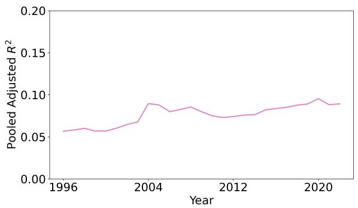

Panel B: Distribution of $R ^ { 2 }$ at Coordinate Level  
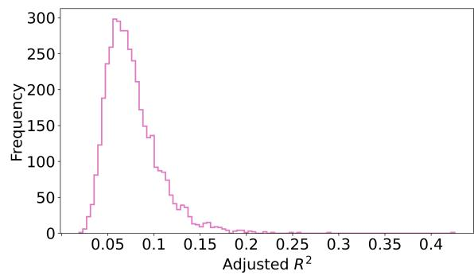  
Figure 1: Adjusted $R ^ { 2 }$ of News Embeddings Predictability Based on Stock Characteristics Note. This figure reports the adjusted $R ^ { 2 }$ for predicting stock-month embeddings using stock-level JKP characteristics. Panel A reports the monthly $R ^ { 2 }$ pooled over all coordinate dimensions. Panel B reports the distribution of average coordinate-level $R ^ { 2 }$ values.

with $L \times D$ coefficient matrix $\beta _ { t } = ( S _ { t } ^ { \prime } S _ { t } ) ^ { - 1 } S _ { t } ^ { \prime } E _ { t }$ . The fitted value $S _ { t } \beta _ { t }$ is the “predictable news” component. We refer to the residual embedding that is orthogonal to $S _ { t }$ , denoted $\varepsilon _ { t } .$ as the “news shock.”

How much “news” is explained by prevailing asset characteristics? The regression in (1) produces an adjusted $R ^ { 2 }$ for each of the 4, 096 embedding coordinate dependent variables. Let $E _ { i , t } ( c )$ denote the $c ^ { t h }$ coordinate of the embedding vector for stock i at time t (and likewise for $\varepsilon _ { i , t } ( c ) )$ . The coordinate-specific $R ^ { 2 }$ for c is defined as

$$
R ^ { 2 } ( c ) = 1 - \frac { \sum _ { i , t } \varepsilon _ { i , t } ( c ) ^ { 2 } / ( N - k ) } { \sum _ { i , t } E _ { i , t } ( c ) ^ { 2 } / N } , \mathrm { ~ w h e r e ~ } N = \sum _ { t } N _ { t } , \quad k = \sum _ { t } L .\tag{2}
$$

Because the embeddings are element-wise Z-scores, each coordinate has nearly zero mean,6 thus we leave the denominator of the $R ^ { 2 }$ uncentered. Each coordinate also has approximately unit standard deviation, thus it is reasonable to calculate a pooled $R ^ { 2 }$ over all embedding coordinates to summarize the overall predictability of news:

$$
R ^ { 2 } = 1 - \frac { \sum _ { i , t , c } \varepsilon _ { i , t } ( c ) ^ { 2 } / ( N - k ) } { \sum _ { i , t , c } \Bigl ( E _ { i , t } ( c ) \Bigr ) ^ { 2 } / N } .\tag{3}
$$

On average, we find that JKP stock characteristics predict news in our sample with a pooled

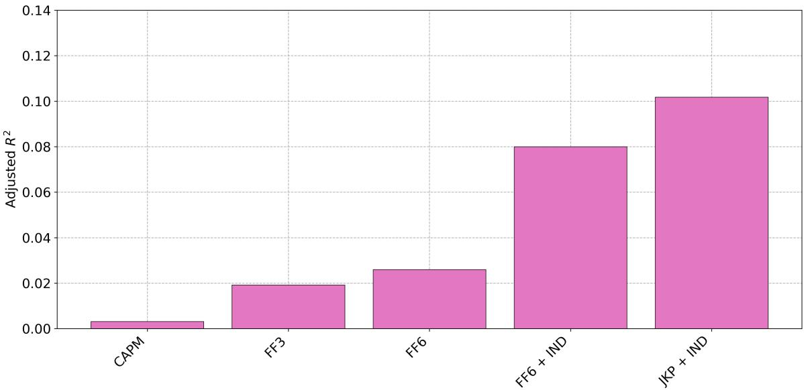  
Figure 2: Adjusted $R ^ { 2 }$ by Group of Stock Characteristics  
Note. This figure shows the pooled adjusted $R ^ { 2 }$ from Equation (3) using different groups of stock characteristics. “CAPM” uses a stock’s beta, “FF3” adds market capitalization and book-to-market, and “FF6” adds profitability, investment, and momentum characteristics. “IND” uses 25 GICS industry indicators, and ${ } ^ { 6 6 } \mathrm { J K P } ^ { 9 }$ uses 132 anomaly characteristics.

$R ^ { 2 }$ of roughly 7.5%. Panel A of Figure 1 shows that the predictability of news is fairly consistent over time ranging from 5-10% and gradually increasing over time. Panel B shows a histogram of $R ^ { 2 } \mathrm { { ^ { s } } }$ for individual embedding coordinates. Around 90% of coordinates have an average adjusted $R ^ { 2 }$ between 4% and 12%. This distribution shows that there are some aspects of news text that are more strongly predictable with stock characteristics, corresponding to a few embedding coordinates having $R ^ { 2 }$ over 25%.

Figure 2 shows the predictive gains from gradually adding characteristics to the model in terms of their effect on overall $R ^ { 2 }$ . The first bar shows the effect of controlling only for market beta (denoted “CAPM”), which explains news with an $R ^ { 2 }$ of less than 1%. Next, we add market capitalization and book-to-market (denoted “FF3”), which increase the predicted variation in news to 2%. Adding profitability, investment, and momentum characteristics (denoted “FF6”) raises the $R ^ { 2 }$ to 2.6%. The next bar shows the effect of adding 25 GICS industry indicators, raising the $R ^ { 2 }$ to 8%. The 132 JKP characteristics predict news with an $R ^ { 2 }$ of 7.6%, and JKP together with industry indicators culminate in an $R ^ { 2 }$ of 10.2%. The main takeaway from this figure is that both industry variables and JKP characteristics give a large boost in news predictability, and there appears to be a significant degree of shared information in these two predictor sets.

Table 3: Characteristic Importance for News Prediction  
This table reports the distribution of adjusted $R ^ { 2 }$ from regressing embedding coordinates on subsets of firm characteristics. Characteristics are grouped into 13 themes defined in JKP. For each theme, we estimate Equation (1) for every embedding coordinate and report the mean, median, and key percentiles of the resulting $R ^ { 2 }$ distribution across coordinates. Themes are sorted by their mean adjusted $R ^ { 2 }$
<table><tr><td colspan="2"></td><td colspan="5">Adjusted  $R ^ { 2 }$  Percentiles</td></tr><tr><td>Theme</td><td>Mean</td><td>25%</td><td>50%</td><td>75%</td><td>95%</td><td>Max</td></tr><tr><td>Value</td><td>0.037</td><td>0.023</td><td>0.032</td><td>0.045</td><td>0.074</td><td>0.320</td></tr><tr><td>Quality</td><td>0.034</td><td>0.021</td><td>0.029</td><td>0.042</td><td>0.068</td><td>0.277</td></tr><tr><td>Low Leverage</td><td>0.031</td><td>0.019</td><td>0.027</td><td>0.039</td><td>0.065</td><td>0.294</td></tr><tr><td>Low Risk</td><td>0.027</td><td>0.018</td><td>0.024</td><td>0.032</td><td>0.050</td><td>0.162</td></tr><tr><td>Profitability</td><td>0.026</td><td>0.016</td><td>0.022</td><td>0.032</td><td>0.051</td><td>0.135</td></tr><tr><td>Investment</td><td>0.025</td><td>0.016</td><td>0.022</td><td>0.031</td><td>0.050</td><td>0.178</td></tr><tr><td>Size</td><td>0.019</td><td>0.012</td><td>0.017</td><td>0.024</td><td>0.039</td><td>0.124</td></tr><tr><td>Seasonality</td><td>0.015</td><td>0.009</td><td>0.012</td><td>0.018</td><td>0.031</td><td>0.108</td></tr><tr><td>Momentum</td><td>0.014</td><td>0.009</td><td>0.012</td><td>0.017</td><td>0.027</td><td>0.114</td></tr><tr><td>Accruals</td><td>0.009</td><td>0.005</td><td>0.007</td><td>0.011</td><td>0.023</td><td>0.113</td></tr><tr><td>Debt Issuance</td><td>0.009</td><td>0.004</td><td>0.007</td><td>0.011</td><td>0.022</td><td>0.122</td></tr><tr><td>Profit Growth</td><td>0.009</td><td>0.006</td><td>0.008</td><td>0.011</td><td>0.016</td><td>0.063</td></tr><tr><td>ShortTerm Reversal</td><td>0.006</td><td>0.004</td><td>0.005</td><td>0.007</td><td>0.010</td><td>0.034</td></tr></table>

Table 3 further decomposes news predictability according to the 13 characteristic themes from JKP by running separate embedding regressions using only characteristics within a given theme. The results reveal a clear dichotomy between characteristics that describe a stock’s fundamental identity and those that capture transient price dynamics. Returnbased characteristics, such as momentum and short-term reversal, have low explanatory power for news. In other words, price trends are rarely an important driver of stock-level news. In contrast, characteristics based on persistent fundamental attributes (such as value, quality, leverage, risk, and profitability) are much stronger predictors of news. Their variable importances hover around 3% on average, triple that of momentum. These findings align with our hypothesis that embeddings encode structural economic narratives about firms.

The regressions in (1) explain realized news with contemporaneous stock characteristics. In Figure 3 we explore how news predictability is impacted if we instead regress embeddings

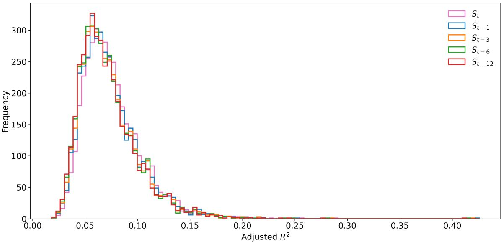  
Figure 3: News Predictability With Lagged Stock Characteristics

Note. This figure reports the distribution of adjusted $R ^ { 2 }$ across embedding coordinates $\left( E _ { t } \right)$ when using lagged rather than contemporaneous JKP characteristics $S _ { t - j }$ for prediction. We consider lags of $j \in$ {0, 1, 3, 6, 12} months.

on past stock characteristics:

$$
E _ { t } = S _ { t - j } \beta _ { t } + \varepsilon _ { t }\tag{4}
$$

for lags $j \in \{ 1 , 3 , 6 , 1 2 \}$ months. Figure 3 plots the distribution of $R ^ { 2 }$ across embedding coordinates for the contemporaneous model $( j = 0 )$ versus the lagged specifications. The distributions of adjusted $R ^ { 2 }$ across individual embedding coordinates are more or less indistinguishable for lags up to 12 months. Evidently, news predictability is not driven by contemporaneous innovations in stock characteristics but instead by their long-lived attributes, consistent with the evidence in Table 3 that fundamental characteristics are the strongest predictors of news content.

In summary, the news shock $\left( \varepsilon _ { i , t } \right)$ collects what is left in news after filtering out expected content based on well established stock characteristics. The strongest news predictors are persistent characteristics associated with stock fundamentals. In contrast, news shocks represent the irregular, event-driven component of news.

## 4 News Shocks and Return Predictability

In this section we investigate stock return predictability with news text. News, however, is not a single predictor because effective summarization of text requires a high-dimensional representation. LLMs achieve this by refracting news into thousands of signals that constitute the embedding. Therefore, when working with news text, the standard predictive analysis in the asset pricing literature of sorting on a scalar stock-level predictor requires modification.

Our main approach directly trains a long-short investment portfolio that leverages news embeddings via maximum Sharpe ratio regression (or “MSRR,” see Kelly and Xiu, 2023). In Section 6, we show that our findings are robust to an alternative MSE-based approach that first predicts returns with embeddings then performs traditional portfolio sorts based on predicted returns, following CKX.

## 4.1 The MSRR Approach

Let $x _ { i , t }$ be a generic D-dimensional vector of predictors for the one-month-ahead excess return of stock i, $R _ { i , t + 1 }$ . The $N \times D$ matrix of signals for all stocks is denoted $X _ { t }$ and the N -vector of returns is $R _ { t + 1 }$ . Our MSRR approach models stock-level portfolio weights as a linear function of stock characteristics:

$$
w _ { i , t } = x _ { i , t } ^ { \prime } b \mathrm { o r , i n ~ v e c t o r ~ f o r m , } \quad w _ { t } = X _ { t } b .\tag{5}
$$

This portfolio rule is trained to optimize the unconditional Sharpe ratio (potentially subject to shrinkage) according to the objective function7

$$
\operatorname* { m i n } _ { b } \sum _ { t } \left( 1 - b ^ { \prime } X _ { t } ^ { \prime } R _ { t + 1 } \right) ^ { 2 } + \lambda b ^ { \prime } b .\tag{6}
$$

Kelly and Xiu (2023) explain that when $\lambda = 0$ this problem is equivalent to estimating the tangency portfolio of the characteristic-managed factors, $F _ { t + 1 } = X _ { t } ^ { \prime } R _ { t + 1 }$ , and the MSRR estimator $\hat { b }$ that optimizes (6) are the tangency weights. The ridge penalty term λb′b shrinks the portfolio weights to stabilize portfolio estimates. The MSRR portfolio return is $F _ { t + 1 } ^ { \prime } \hat { b }$

In our analysis we use news embeddings—either raw embeddings $E _ { i , t }$ or residual “news shocks” $\varepsilon _ { i , t }$ —to stand in for the predictor vector $x _ { i , t }$ . Raw embeddings factors (denoted

$F _ { t + 1 } ^ { E } = E _ { t } ^ { \prime } R _ { t + 1 } )$ and news shock factors (denoted $F _ { t + 1 } ^ { \varepsilon } = \varepsilon _ { t } ^ { \prime } R _ { t + 1 } )$ are linked through regression (1), and their difference equates to factors that trade “predictable news” (denoted $F _ { t + 1 } ^ { E | S } =$ $( S _ { t } \hat { \beta } _ { t } ) ^ { \prime } R _ { t + 1 } )$ :

$$
\begin{array} { r l } & { E _ { t } ^ { \prime } R _ { t + 1 } = ( S _ { t } \hat { \beta } _ { t } ) ^ { \prime } R _ { t + 1 } + \varepsilon _ { t } ^ { \prime } R _ { t + 1 } } \\ { \Leftrightarrow } & { F _ { t + 1 } ^ { E } \quad = F _ { t + 1 } ^ { E | S } \qquad + F _ { t + 1 } ^ { \varepsilon } . } \end{array}\tag{7}
$$

All news factors, $F ^ { E } , F ^ { E | S }$ , and $F ^ { \varepsilon }$ , consist of D different news-managed portfolios that treat each individual embedding coordinate as a signal (viewing each month of stock news through the D-dimensional embedding prism referenced earlier). The MSRR estimator $\hat { b }$ aggregates factors for each embedding coordinate into a single comprehensive news portfolio, which we denote as $F ^ { \star E } = F _ { t + 1 } ^ { E ^ { \prime } } \hat { b }$ (likewise for $F ^ { \star E | S }$ and $F ^ { \star \varepsilon } )$ .

In our empirical analysis, we recursively estimate the MSRR portfolio weights at time t using an expanding rolling window through t, and then use these to construct the outof-sample news portfolio return at t + 1 (we use an initial 12-month training window at the beginning of the sample). In each training sample we select the ridge penalty, λ, via leave-one-out cross-validation.

## 4.2 News Shock Anomaly Performance

Figure 4 reports performance of news-based strategies. Panel A shows the Sharpe ratio of the total embedding portfolio, $F ^ { \star E }$ , in the green dashed line. This news portfolio has a Sharpe ratio of 1.1 (this portfolio is not dollar neutral because the embeddings do not have a zero mean in the cross section). The first set of bars shows the effect of cross-sectionally de-meaning the embeddings, which corresponds to running regression (1) while setting $S _ { t }$ to be a constant. This ensures that $F ^ { \star \varepsilon }$ is a dollar-neutral long-short portfolio, which raises the Sharpe ratio to 1.7. The remaining bars show the effect of residualizing embeddings with respect to an expanding set of predictors. First we consider stock beta along with the constant (denoted “CAPM”), then adding further market capitalization and book-to-market ratio (“FF3”), followed by the addition of investment, profitability, and momentum (“FF6”), and finally including all JKP characteristics.

As we add more predictors to $S _ { t } ,$ , the Sharpe ratio of the news shock strategy $F ^ { \star \varepsilon }$ gradually climbs, eventually reaching 3.1 when controlling for the full suite of JKP characteristics. The interpretation of this surprisingly strong news shock portfolio is that the unexpected component of news is poorly reflected in prices at the time it arrives. Trading on news shocks

Panel A: News Portfolio Sharpe Ratios Across Models  
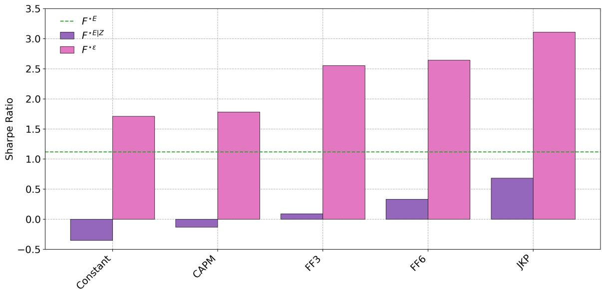

Panel B: CAPM Alpha  
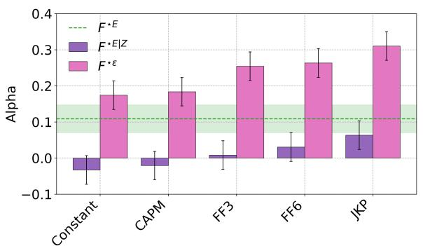

Panel C: Cumulative Returns  
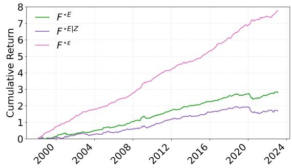  
Figure 4: News Portfolio Performance

Note. Panel A reports the annualized out-of-sample Sharpe ratios for MSRR news portfolios. The dashed green line represents the raw embeddings portfolios, $F ^ { \star E }$ . Purple bars correspond to the “predictable news” portfolios $F ^ { \star E | S }$ and pink bars represent news shock portfolios $F ^ { \star \varepsilon }$ . Panel B reports the annualized CAPM alpha and its 95% confidence interval for each model. Panel C reports cumulative returns of news portfolios when JKP factors are used to residualize embeddings. All portfolios are (ex post) standardized to 10% annual volatility to aid in interpretation of alphas and cumulative returns.

produces large and significant excess returns as prices respond to this information with a delay. Panel C of Figure 4 plots the cumulative return on the news shock strategy (based on the full set of JKP predictors). The strategy does not suffer any major drawdowns and does not appear to decay late in the sample, like many other anomalies (McLean and Pontiff, 2016; Pénasse, 2022).

In contrast, news that can be predicted ahead of time indeed appears priced-in ahead of time. Trading on “predictable news” in the form of $F ^ { \star E | S }$ produces smaller Sharpe ratios. Because $F ^ { \star E }$ and $F ^ { \star E | S }$ are not dollar neutral—both raw and fitted embeddings possess nonzero cross-sectional means—it is important to evaluate their performance in excess of the market. Thus Panel B reports alphas and their confidence intervals for each news strategy. Predictable news has insignificant alpha versus the market except in the JKP case. News shocks, on the other hand, have large and significant alpha in all cases. The muted (though non-negligible and statistically significant) alpha of the raw news portfolio $F ^ { \star E }$ arises from mixing highly informative news shocks with much less informative predictable news content.

How many conditioning characteristics are necessary to purge the predictable component of news and isolate news shocks? To examine this, we fix a grid of $k \_ =$ $[ 5 , 1 0 , 2 0 , 3 0 , 4 0 , 5 0 , 6 0 , 7 0 , 8 0 , 9 0 , 1 0 0 ]$ characteristics, and construct $S _ { t }$ as a random sample of k predictors from the set of 132 JKP characteristics. We use these k signals to construct residual embeddings and repeat our MSRR procedure to arrive at a final news shock portfolio. To abstract from the effects of predictor ordering, for each k we repeat this analysis 100 times randomizing the set of anomaly predictors in $S _ { t }$

Figure 5 reports the average Sharpe ratio of the news shock portfolio at each value of k. The figure also displays 95% confidence intervals derived from the 100 repetitions. There is a monotonically increasing and concave effect to adding signals that capture the predictable content of news. The first few characteristics are extremely valuable for stripping away predictable news. By the time 50 predictors are used, most of the improvement from purging old news is realized, and after 80 predictors the marginal benefit of another predictor is close to zero. This pattern is consistent with the significant correlation among stock characteristics documented in JKP. There is relatively little variation in news shock portfolio performance as we vary the set of stock characteristics, even when $k = 5$

## 4.3 News Shocks In the Broader Anomaly Universe

In Figure 6 we compare the news shock anomaly to the full universe of 132 anomalies studied by JKP. As described in Section 2 the JKP characteristics are cross-sectionally rankstandardized, and the corresponding factors are defined as $S _ { t } ^ { \prime } R _ { t + 1 }$ . Thus the JKP factors are directly comparable to the way embeddings factors are formed within the MSRR procedure.

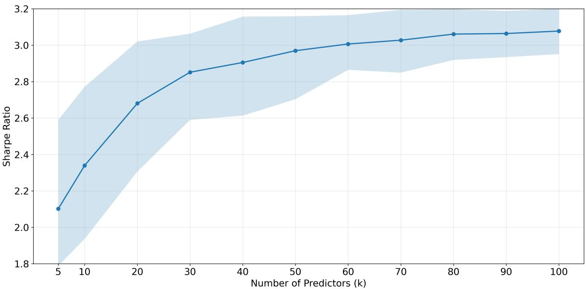  
Figure 5: How Many Predictors Are Necessary to Construct News Shocks?

Note. This figure reports Sharpe ratios of MSRR news shock portfolios when news embeddings are residualized against a gradually expanding set of stock characteristics. For each k, we randomly select k characteristics from the full set of 132 characteristics, use this subset to construct news shocks, and then apply MSRR to arrive at a final news shock portfolio. To abstract from the effects of predictor ordering, for each k we repeat this analysis 100 times randomizing the set of anomaly predictors in $S _ { t }$ and report the average Sharpe ratio. The shaded region shows the $5 ^ { \mathrm { { \fontfamily { q } \mathrm { { \tiny { h } } } } } }$ to $9 5 ^ { \mathrm { t h } }$ percentile range of Sharpe ratios across repetitions.

The maximum Sharpe ratio among the JKP factor universe is 1.41,8 roughly half that of the news shock portfolio.

MSRR can also be used to aggregate the JKP anomaly factors into a single optimal portfolio in real time, following the same methodology we use to aggregate individual embedding factors.9 The MSRR portfolio of JKP factors is shown in the green bar in Panel A. The news shock anomaly remains larger in magnitude than the mean-variance efficient combination of all JKP anomalies taken together.

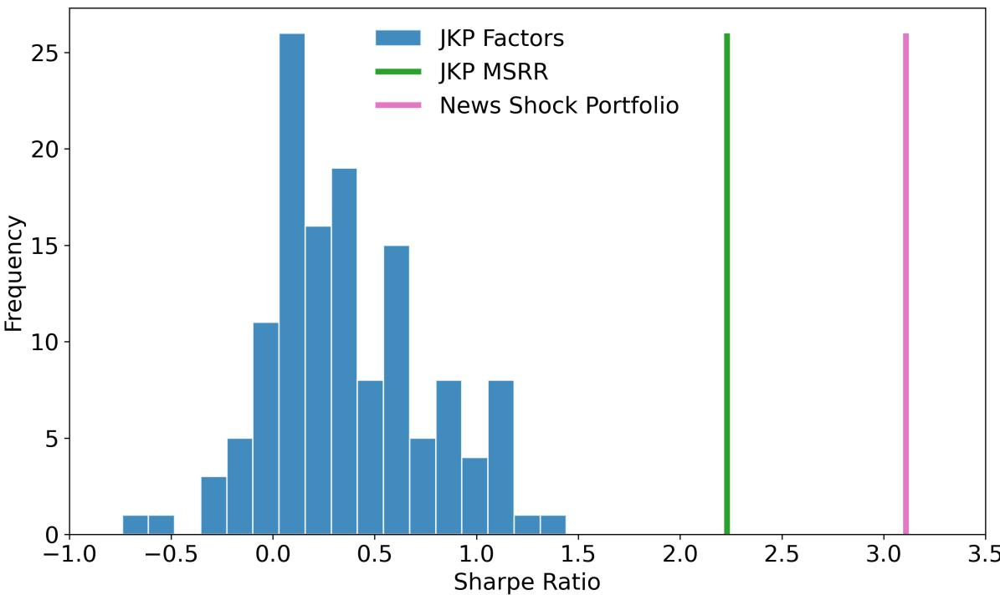  
Figure 6: News Shocks and the Broader Anomaly Universe

Note. This Figure shows the Sharpe ratio distribution of individual JKP factors, the Sharpe ratio of the MSRR portfolio of JKP factors, and the Sharpe ratio of the news shock portfolio.

Building on Figure 6, Table 4 studies similarities and differences of the news shock anomaly versus previously documented anomalies. The table reports time series regressions of news portfolios on the 13 anomaly theme portfolios studied in JKP. Controlling for 13 anomalies is a particularly stringent alpha test,10 while the betas allow us to assess whether any previously documented patterns lurk beneath the news shock anomaly.

The columns of Table 4 correspond to different notions of news shocks, beginning with de-meaned embeddings (“Constant”) and then working with residualized embeddings from a growing set of characteristic predictors as we move to the right of the table (following the same progression reported in Figure 4). When accounting for only a constant or a constant plus beta, nearly 40% of news portfolio variation is explained by well known anomalies. The largest overlap shows up in the form of large and significant exposure to the momentum and

## Table 4: News Portfolio Exposures

This table reports regressions of the news shock portfolio constructed from various news predictor sets (Constant, CAPM, FF3, FF6, and JKP) on anomaly theme portfolios from JKP. All portfolios are (ex post) standardized to have 10% annual volatility to aid interpretation of alpha and beta coefficients, and alphas are reported in annualized terms. t-statistics are reported in parentheses. ∗∗∗, ∗∗, and ∗ denote significance at the 1%, 5%, and 10% levels, respectively.
<table><tr><td></td><td>Constant</td><td>CAPM</td><td>FF3</td><td>FF6</td><td>JKP</td></tr><tr><td>Alpha</td><td>0.146*** (7.58)</td><td>0.157*** (8.32)</td><td>0.218*** (9.88)</td><td>0.243*** (10.65)</td><td>0.294*** (12.74)</td></tr><tr><td>Market</td><td>0.128* (1.69)</td><td>0.146* (1.96)</td><td>0.145* (1.66)</td><td>0.107 (1.19)</td><td>0.094 (1.03)</td></tr><tr><td>Accruals</td><td>0.022 (0.32)</td><td>0.021 (0.32)</td><td>0.123 (1.54)</td><td>0.069 (0.84)</td><td>0.082 (0.98)</td></tr><tr><td>Debt Issuance</td><td>0.026 (0.26)</td><td>-0.000 (-0.00)</td><td>0.056 (0.48)</td><td>0.004 (0.03)</td><td>0.024 (0.20)</td></tr><tr><td>Investment</td><td>0.100 (0.50)</td><td>0.058 (0.30)</td><td>-0.304 (-1.32)</td><td>-0.143 (-0.61)</td><td>0.110 (0.46)</td></tr><tr><td>Low Leverage</td><td>-0.366 (-1.13)</td><td>-0.304 (-0.96)</td><td>0.004 (0.01)</td><td>0.205 (0.53)</td><td>0.532 (1.37)</td></tr><tr><td>Low Risk</td><td>-0.211 (-1.07)</td><td>0.015 (0.08)</td><td>0.063 (0.28)</td><td>0.271 (1.15)</td><td>0.476** (2.00)</td></tr><tr><td>Momentum</td><td>0.241*** (2.69)</td><td>0.262*** (2.99)</td><td>0.282*** (2.74)</td><td>0.072 (0.68)</td><td>-0.053 (-0.49)</td></tr><tr><td>Profit Growth</td><td>0.026 (0.36)</td><td>-0.012 (-0.18)</td><td>0.008 (0.10)</td><td>-0.119 (-1.40)</td><td>-0.047 (-0.54)</td></tr><tr><td>Profitability</td><td>0.237 (1.21)</td><td>0.262 (1.36)</td><td>-0.010 (-0.04)</td><td>0.171 (0.73)</td><td>0.205 (0.87)</td></tr><tr><td>Quality</td><td>0.275*** (2.67)</td><td>0.244** (2.42)</td><td>0.222* (1.87)</td><td>0.127 (1.04)</td><td>-0.062 (-0.50)</td></tr><tr><td>Seasonality</td><td>-0.048 (-0.80)</td><td>-0.065 (-1.09)</td><td>0.036 (0.51)</td><td>0.047 (0.65)</td><td>0.035 (0.49)</td></tr><tr><td>Short-Term Reversal</td><td>-0.014 (-0.25)</td><td>-0.046 (-0.85)</td><td>0.072 (1.13)</td><td>0.045 (0.69)</td><td>0.151** (2.26)</td></tr><tr><td>Size</td><td>-0.187** (-2.27)</td><td>-0.126 (-1.56)</td><td>-0.013 (-0.14)</td><td>0.068 (0.69)</td><td>0.007 (0.07)</td></tr><tr><td>Value</td><td>-0.496 (-1.43)</td><td>-0.588* (-1.73)</td><td>0.194 (0.49)</td><td>-0.240 (-0.58)</td><td>-0.353 (-0.85)</td></tr><tr><td>R²</td><td>0.384</td><td>0.409</td><td>0.184</td><td>0.131</td><td>0.11</td></tr></table>

quality themes. Despite this, the news shock anomaly has a highly significant alpha of about 15% per year (news shock portfolio is normalized 10% per year).

As more and more of the predictable content is purged from news, the $R ^ { 2 }$ versus other anomalies gradually drops and the alpha gradually rises. In the last column, only 11% of the variation in news shock anomaly returns is explained by the theme factors, and the alpha reaches 29% per year. Exposures to momentum and quality weaken and change sign, while a notable exposure to low risk and a small but statistically significant exposure to short-term reversal emerge.

## 4.4 Large Versus Small Stocks

Informational inefficiencies are typically most pronounced in market segments where limits to arbitrage are binding, such as small and illiquid stocks (e.g. Hou et al., 2020b). Motivated by this, we compare anomaly behavior across size groups. We restrict analysis to stocks in the JKP “mega” and “large” size categories (those above the 50th percentile of the NYSE size distribution each month) versus those in the “small” and “micro” (those below the 50th but above the 1st percentile of the NYSE size distribution).11

Figure 7 repeats the analysis of Figure 4 Panel A but reports performance within each size group. The Sharpe ratio of the news shock portfolio is substantially stronger for small stocks. When news is residualized versus the JKP characteristics (right-most bars), the news shock portfolio earns a Sharpe ratio of 2.7 for small stocks and 1.4 for large stocks. The pattern that news shock anomaly becomes stronger when embeddings are residualized to larger characteristics sets is preserved in both size groups. Panel B of Figure 7 plots the cumulative return of the news shock portfolio separately for large stocks and small stocks. The relative performance between the two portfolios appears stable over time and neither appears to decay much in the latter part of the sample.

Figure 8 shows that the comparison between the news shock anomaly and the broader anomaly universe is also robust across size groups. The news shock portfolio’s Sharpe ratio of 1.4 for large stocks compares to 0.9 for the best performing JKP large stock factor (and versus 0.9 for the out-of-sample mean-variance portfolio of JKP factors). Among small stocks, the news shock portfolio Sharpe ratio is 2.7 versus 1.5 for the best performing JKP small stock factor and 2.3 for mean-variance portfolio of JKP small stock factors. The basic conclusion from Figure 8 is that the outperformance of news shocks relative to other anomalies is not driven by small stocks.

Interestingly, we find that the discrepancy between the Sharpe ratios of the small and large stock samples is not entirely due to differences in the strength of the anomaly, but is

Panel A: News Portfolio Sharpe Ratio  
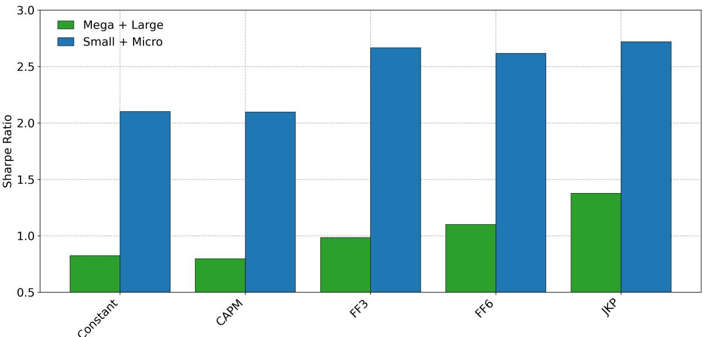

Panel B: Cumulative Return by Size Groups  
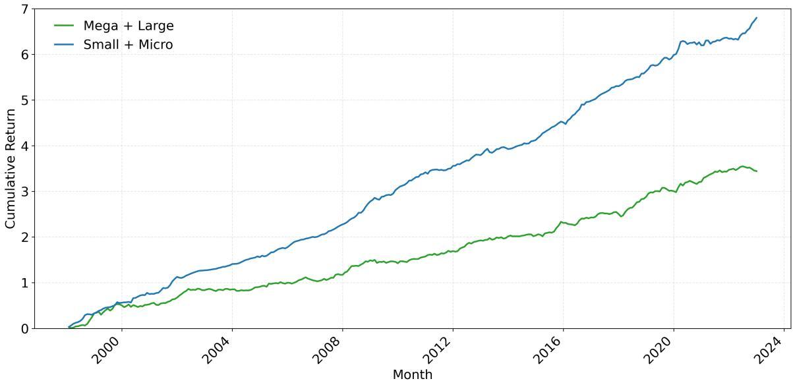  
Figure 7: News Portfolio Size Group Analysis

Note. Panel A repeats the analysis of Panel A in Figure 4 but uses only stocks above/below the 50th percentile of the NYSE size distribution each month (JKP “mega” and “large” / “small” and “micro” size categories) to construct the news shock factor. Panel B reports cumulative news shock returns for each size group.

in large part attributable to the large stock sample having fewer stocks in the cross section.

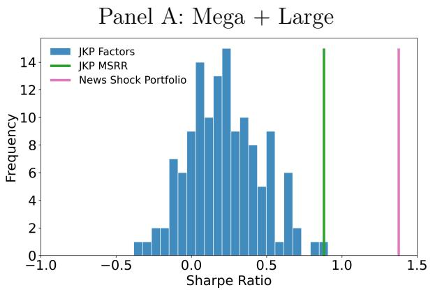

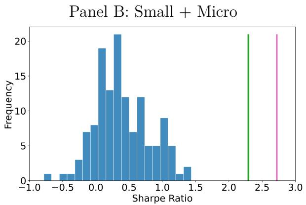  
Figure 8: The Broader Anomaly Universe (By Size)

Note. This figure repeats the analysis of Figure 6 but only uses stocks above/below the $5 0 ^ { \mathrm { t h } }$ percentile of the NYSE size distribution each month (JKP “mega” and “large” / “small” and “micro” size categories) to construct JKP factors and the news shock factor.

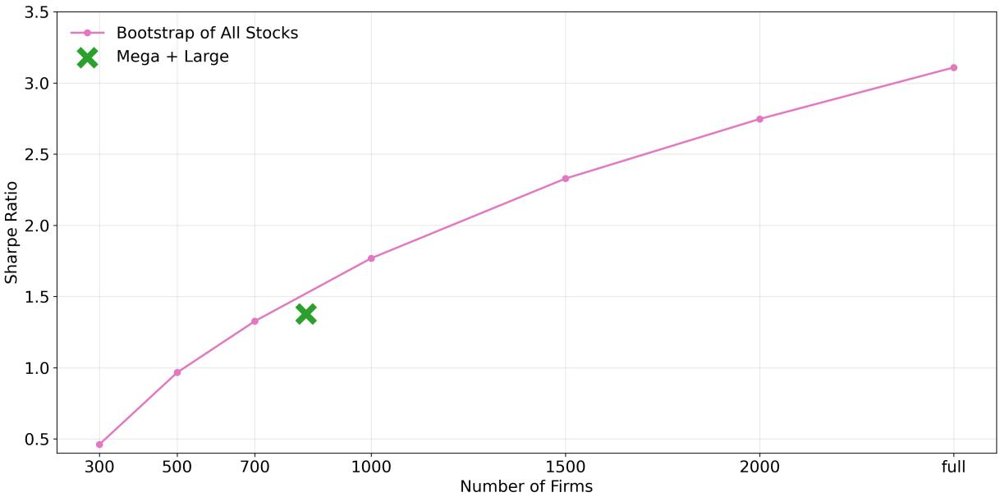  
Figure 9: News Shock Anomaly and Number of Stocks in the Cross Section

Note. This figure shows the Sharpe ratio of bootstrapped news shock portfolios for different numbers of stocks N sampled from the full cross section of stocks each month. All other aspects of the portfolio construction follow the baseline specification. We repeat the bootstrap 100 times for each N and plot the average Sharpe ratio. The green point shows the news shock Sharpe ratio in the large stock subsample.

This leads to less diversification in the large stock version of the anomaly and therefore to a lower Sharpe ratio. To show this, we design a bootstrapping experiment that isolates the effect of the number of stocks in the cross section (N) while holding sample composition in terms of market capitalization fixed. First, we fix a sample size N ranging from 300 stocks to as many as 2,500 stocks (representing the average number of stocks in the cross section in our full sample). We randomly sample N firms per month from the full universe and reconstruct the news shock strategy.12 For each N we repeat this with 100 bootstrap samples and report the average Sharpe ratio across bootstraps. Our bootstrap design ensures that, for any N , the composition of the sample in terms of market capitalization matches (on average) that of our full sample. In this way, we isolate the impact of diversification on our subsample analysis.

Figure 9 reports the results. The performance of the bootstrapped news shock strategy shows large variation across N . When N = 300, there is comparatively little diversification, and the news shock Sharpe ratio is 1.1. Raising N gradually improves performance until we reach the full sample result of 3.1 for $N = 2 , 5 0 0$ Plotted alongside the bootstrap curve is the Sharpe ratio for the large stock subsample. On average, the subsample of large stocks has a cross section of 832 stocks. The Sharpe ratio of 1.4 when using large stocks alone is very close to the bootstrap Sharpe ratio of 1.5 that is realized when the size distribution matches the full sample but the cross section size is restricted to 832 stocks. The conclusion from this analysis is that the lower Sharpe ratio among large caps is not because large caps are more efficient in pricing news shocks. To the contrary, it appears that large and small stocks have a similar degree of news shock inefficiency, and the difference in their portfolio performance is merely an artifact of differential diversification.

## 4.5 Persistence, Turnover, and Net-of-cost Performance

How long does it take for news shocks to become fully incorporated in prices? Said another way, how persistent are news shock mispricings and how quickly do returns to the news shock anomaly decay? We investigate this by introducing a time delay before the news shock signal is allowed to be used in the portfolio. While our main analysis forms news shock factors as $F _ { t + 1 } ^ { \varepsilon } = \varepsilon _ { t } ^ { \prime } R _ { t + 1 }$ , we modify these factors as $\scriptstyle \varepsilon _ { t - \tau } ^ { \prime } R _ { t + 1 }$ with a trading delay of $\tau = 1 , . . . , 3 6$ months.

Figure 10 shows the persistence of the news shocks anomaly. The strategy with no delays

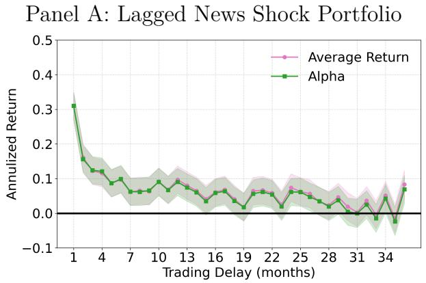

Panel B: Other Factors  
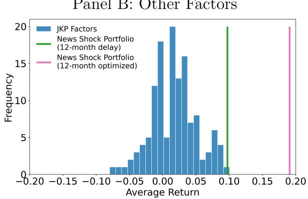  
Figure 10: Decay of the News Shocks Anomaly

Note. Panel A shows annualized average returns and CAPM alpha of news shock portfolios $\varepsilon _ { t - \tau } ^ { \prime } R _ { t + 1 }$ constructed with various trading delays $\tau = 1 , \dots , 3 6$ months. Panel B reports mean returns of JKP anomalies constructed with a 12-month trading delay alongside the news shock portfolio with a 12-month delay, computed using either the 1-month optimized MSRR weights or weights re-optimized specifically for forecasting 12-month-ahead returns. Shaded areas indicate 95% confidence intervals for means and alphas.

(our main specification) earns an average return of about 30% per year on a 10% volatility (essentially all of which is alpha versus the CAPM, which is also plotted). While the return predictability of news shocks drops by roughly half after one month, it takes at least a year and a half before the predictive content of news becomes insignificant. Contrast this with other well known anomalies whose levels and longevity are much less than the news shock anomaly.

Our main news shock strategy leverages unanticipated information arrival each month, which is likely to generate significant portfolio turnover. We define one-sided portfolio turnover as one-half of the absolute change in portfolio positions between the return-drifted portfolio from period t − 1 and the rebalanced portfolio at period t, scaled by gross exposure at t − 1:

$$
\mathrm { T u r n o v e r } _ { t } = \frac { 1 } { 2 G _ { t - 1 } } \sum _ { i } \left| w _ { i , t } - ( 1 + r _ { i , t } ) w _ { i , t - 1 } \right| ,\tag{8}
$$

where $\begin{array} { r } { G _ { t - 1 } = \sum _ { i } | w _ { i , t - 1 } | } \end{array}$ denotes total gross exposure at the end of period t − 1. Panel A of Figure 11 reports the turnover of the news shock portfolio relative to turnover of JKP anomaly portfolios. The turnover of the news shock portfolio is indeed high at 75%, which exceeds that of all JKP factors (the highest turnover JKP factor is short-term reversal with turnover of 0.67). Panel B of Figure 11 reports the net-of-cost Sharpe ratio of the JKP

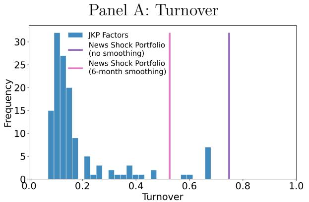

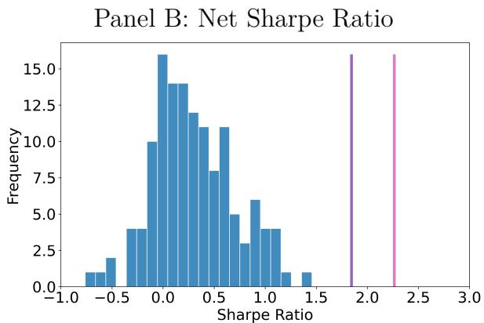  
Figure 11: Turnover and Net Sharpe Ratio of the News Shock Anomaly

Note. Panel A reports the one-sided turnover of the JKP factors, the news shock factor using one-month average embeddings, and the news shock factor using average embeddings over the most recent six months. Panel B reports the net Sharpe ratio of each portfolio assuming a 10 basis point trading cost per dollar traded.

factors and the news shock portfolio, assuming a 10 basis point trading cost per dollar traded (following Frazzini et al., 2018). Adjusting for trading costs narrows the performance gap between the news shock strategy and the JKP factors.

However, the relatively long-horizon predictability of news shocks documented in Figure 10 suggests that much of the predictability in news shocks can be leveraged with less turnover by averaging embeddings over longer lookback windows. In our main specification, embeddings are averaged over articles from the most recent month. We now consider the effect of averaging article embeddings over the most recent $j = 1 , . . . , 2 4$ months in order to smooth out the signal and reduce turnover.

Panel A of Figure 12 shows how the strategy’s Sharpe ratio and CAPM alpha are affected by aggregating embeddings in the past $j = 1 , . . . , 2 4$ months. The Sharpe ratio remains near 3.0 for lookback windows of up to 6 months. When embeddings are averaged over 24 months the Sharpe ratio is 2.4—smaller but still large relative to the distribution of JKP anomalies. Panel B of Figure 12 shows how turnover of the news shock strategy drops when embeddings are averaged over longer lookback windows. Panel B also plots the net Sharpe ratio and shows that the optimal tradeoff between news timeliness and trading costs occurs when embeddings are averaged over the most recent 6 months. The version of the news shock portfolio based on 6-month average embeddings is also shown in Figure 11 to compare it with the broader anomaly universe. The basic conclusion from Figures 11 and 12 is that the news shock anomaly is not an artifact of unrealistic trading costs. It can be implemented with similar trading costs as many anomalies in the literature by averaging embeddings over longer lookback windows and its net performance still exceeds that of all JKP anomalies.

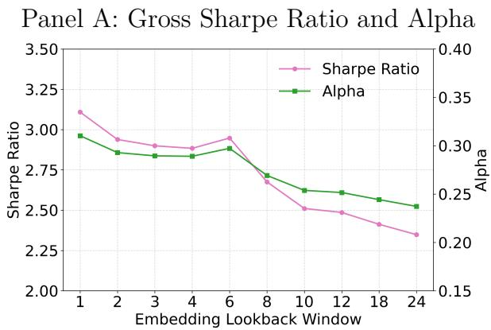

Panel B: Turnover and Net Sharpe Ratio  
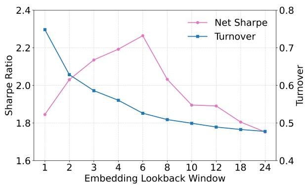  
Figure 12: Rolling Average Embeddings  
Note. Panel A reports the news shock portfolio gross Sharpe ratio and CAPM alpha when embeddings are averaged over the most recent 1, . . . , 24 months. Panel B reports the corresponding portfolio turnover and net Sharpe ratio.

## 5 Interpreting the News Shock Anomaly

## 5.1 The Embeddings Interpretation Problem and the SAE Solution

Embeddings strive to accurately represent a vast number of concepts (all concepts conceivable with human language) in a relatively low-dimensional vector space. Typical embeddings of dimension D (say a few thousand) thus tend to be dense, as all D coordinates in the small vector space must work together to convey the much larger variety of distinct concepts. Concepts therefore cannot be traced to individual coordinates but are instead distributed across thousands of dimensions in a complex, overlapping pattern (commonly described as “superposition,” Elhage et al., 2022). This “polysemantic” property of embeddings is part and parcel of the highly efficient compression achieved in an LLM, the benefits of which are exemplified by our findings above: Compressing rich information in news text into a 4,096-dimensional vector makes it possible to build powerful return prediction models with a reasonably parsimonious regression. The downside of efficient compression is that polysemantic embeddings are, to the human eye, uninterpretable.

It would be easier to interpret embeddings if they were somehow sparse; that is, if just one or a few coordinates corresponded to distinct concepts. This is possible by decompressing

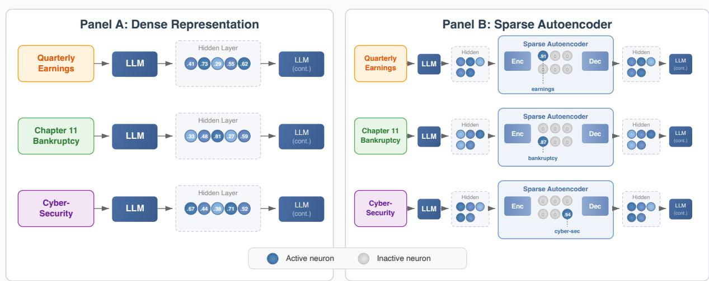  
Figure 13: Comparison of Dense vs. Sparse Autoencoder Representations

Note. Panel A illustrates a standard dense representation in which concepts are entangled across dimensions. Panel B illustrates the SAE representation, where narratives (e.g., Quarterly Earnings, Chapter 11 Bankruptcy, Cyber-security) correspond to sparse and more localized patterns of latent feature activation.

the embeddings into a higher-dimension vector space. Decompression disentangles the small number of mixed, polysemantic embedding coordinates into a much larger number of disjoint, monosemantic coordinates. Imagine this process as a prism that splits a single mixed beam of light into its constituent spectral colors. With sparse, monosemantic embeddings it is possible to inspect which embedding coordinates are activated by distinct concepts, thereby assigning an interpretation to individual coordinates.

We construct interpretable embeddings using an LLM sparse autoencoder (or “SAE,” Cunningham et al., 2024; Bricken et al., 2023). In most architectures, the dense embedding is extracted from the final hidden layer of the LLM. An SAE is an interpretability layer appended to the LLM that receives the dense embedding and outputs a much larger sparse embedding. The SAE is trained to retain as much information as possible from the dense embedding but is constrained by a lasso penalty that forces most coordinates in the new layer to be zero most of the time.

Figure 13 illustrates this schematically. The original dense embedding is shown as the “hidden layer” in Panel A, with semantic content broadly distributed across its coordinates. In Panel B the SAE is inserted as a new and larger sparse layer whose coordinates specialize in individual concepts. This layer is structured as an autoencoder that takes the original dense embedding as both input and output, illustrating that the goal of the SAE is to preserve information. But the SAE’s encoder and decoder parameters are trained to achieve sparsity (and thus interpretability) in the new intermediate layer. The machine learning literature demonstrates the efficacy of SAEs for interpreting LLMs (see the survey of Shu et al., 2025, and references therein).

## 5.2 From Sparse Embeddings To Interpretation

Successfully disentangling polysemantic embeddings requires an extremely high-dimensional sparse layer. For this purpose, we use a pre-trained SAE with an embedding dimension of 131,000 (from the 9 billion parameters Gemma2 model of Lieberum et al., 2024). From a practical perspective, the SAE can be treated as just another LLM that ingests raw articles and outputs (very large) embedding vectors.

Of these 131,000 coordinates, we focus on a subset of 5,000 “financially important” coordinates identified by Chen et al. (2025).13 The Chen et al. (2025) coordinate selection is based on a full sample return prediction objective. At first blush, one may wonder if this introduces some kind of lookahead bias in our analysis. To the contrary, our objective in this section is an interpretable description of the forces underlying the news shock anomaly. We use the selected feature set to decompose already-established predictive performance into interpretable components, rather than to assess out-of-sample model performance.

We assign interpretable labels to each of the 5,000 SAE embedding coordinates with the following procedure. First, we select the top 100 articles exhibiting the highest activation values for each coordinate. Next, we prompt an LLM with those articles and with instructions to generate a short, descriptive label that summarizes their common theme. Finally, we manually audit the generated labels to verify that they align with the content of top articles.14

We focus our exposition on the coordinates that are most important for understanding the news shock anomaly. To this end, we identify the SAE embedding coordinates that are most prominently represented in the news shock portfolio. To re-construct the news shock anomaly, interpretable sparse embeddings (denoted $\tilde { E } _ { t } )$ can be used in exactly the same manner as the original dense embeddings $\left( E _ { t } \right)$ from our main analysis. We orthogonalize $\tilde { E } _ { t }$ with respect to the JKP factors to construct news shocks, denoted $\tilde { \epsilon } _ { t } .$ . Then, we use news shocks to form interpretable news-managed portfolios $F ^ { \tilde { \varepsilon } } = \tilde { \varepsilon } _ { t } ^ { \prime } R _ { t + 1 }$ . Finally, we aggregate these news-managed portfolios into a single news shock portfolio $F ^ { \star \tilde { \varepsilon } }$ via MSRR. We train

MSRR with a lasso penalty in order to identify elements of $F ^ { \tilde { \varepsilon } }$ that are the most important drivers of the news shock anomaly. We tune the lasso penalty parameter to select exactly 30 interpretable coordinates with non-zero MSRR weights at any given time; over the full sample, 148 unique coordinates receive non-zero weight at some point.

## 5.3 News Themes Underlying the News Shock Anomaly

By the end of the sample, the union of interpretable news-managed portfolios that receive positive weight in the news shock portfolio amounts to 148 unique elements of $F ^ { \tilde { \varepsilon } }$ . We focus our interpretation on these 148 SAE embedding coordinates. The interpretable labels for every coordinate are listed in Table 9 of Appendix B. Examples of coordinate labels include concepts such as “Chapter 11 bankruptcy and going-concern distress,” “Executive appointments and leadership changes,” and “Cryptocurrency regulatory scrutiny and adoption.”

To achieve a manageable dimension for exposition, we further cluster these 148 interpretable coordinates into 12 broad economic themes: “Earnings & Financial Results;” “Corporate Guidance & Outlook;” “Analyst Ratings & Sentiment;” “Distress, Bankruptcy & Delisting;” “Momentum & Trading Activity;” “Corporate Actions & Restructuring;” “Leadership & Governance;” “Growth & Demand Trends;” “Biotech, Pharma & Healthcare;” “Regulatory & Legal Actions;” “Sector-Specific Signals;” and “Product Launches & Operations.” Figure 14 displays word clouds constructed from the labels of all coordinates within a theme to illustrate theme content in more detail.

We quantify the economic contribution of these 12 themes (and in turn the 148 interpretable embedding coordinates) to the news shock anomaly by studying the MSRR weights over the 148 corresponding news-managed portfolios. Theme importance is calculated as the sum of absolute portfolio weights allocated to each theme on a monthly basis. Figure 15 illustrates how the news shock portfolio allocation to themes evolves over time. News about “Corporate Actions & Restructuring” remains a fixture of the news shock anomaly throughout our sample. Early in the sample, news about “Momentum & Trading Activity” constitutes a large share of the anomaly but dies off after the tech bubble in the early 2000s. In contrast, “Corporate Guidance & Outlook” has little role in the anomaly early on but steadily grows to become the most important theme by the end of the sample.

While Figures 14 and 15 provide a top-down perspective on news themes that are important sources of news shock returns, Figure 16 provides a bottom-up perspective with a few detailed examples of interpretable news-managed portfolios. It presents five SAE coordinates that capture either long-term economic shifts or short-term event-driven shocks.

Earnings & Financial Results   
guidances yearCompanyupdates e   
ear lossstrongo d   
Quarter saless r

Distress, Bankruptcy & Delisting

SECaC nternal CCss bankruptcies   
S evere   
downgradet   
ankruptcv e measures enforcement

Leadership & Governance

Executiveε g dutytransitions events appointment interim Retainingadvisor

Regulatory & Legal Actions

Government Corporate ww licensesapprova meetings hearings Upcomingheadlines s

Corporate Guidance & Outlook Forward operational   
update Cor porate risk Cautiouslosking   
guidance Momentum & Trading Activity   
momentumvolatility   
splits y "stoc frenzy Surges Reversal cea spikes TS Smalivolume riven retail Premelloffs

Growth & Demand Trends "industries me guidance mdemanddecline Moderatingstructural T losses Tech

Sector-Specific Signals   
changexSales tente tr 4 Pcing Motear C   
Ai a ee supply

Analyst Ratings & Sentiment

Multi downgrade target pricerating upgradesraisedements estimate

Corporate Actions & Restructuring   
Corporate ientannouncement's   
publiccont disclosures laneousHostil agreements financing urcingRegu deal offerings imbalanceswindalternativesaCt1OnS

Biotech, Pharma & Healthcare

regula La atory   
data technoPagks backs T mussst a Disappointing . u updates Genomicapprovals drug Product Launches & Operations   
prod safety Specialty   
Newesupdates deaths businessdelinquency

## Figure 14: MSRR Factor Theme Word Clouds

Note. Each panel displays a word cloud of the factor names assigned to the corresponding theme. Word size is proportional to frequency. The 148 classified factors are grouped into 12 themes based on the interpretable labels from the SAE dictionary. Word clouds are generated from the human-readable factor labels within each theme. Larger words indicate factors whose name tokens appear more frequently within the theme grouping.

We report the interpretable labels of each coordinate and the cumulative return of the newsmanaged portfolio (corresponding to $F _ { t } ^ { \tilde { \varepsilon } } )$ for each coordinate.

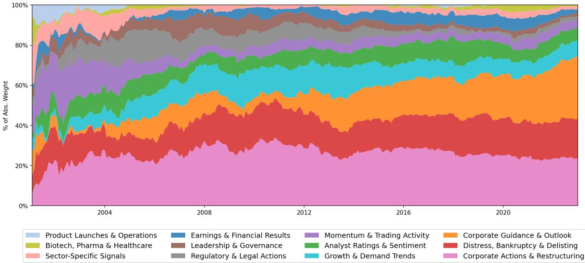  
Figure 15: Dynamic Theme Allocation in the News Shock Portfolio  
Note. Stacked area chart showing the relative importance of the 12 interpretable economic themes over time. The vertical axis represents the sum of absolute portfolio weights for each theme as a percentage of the total portfolio weight.

Panel A focuses on three macroeconomic coordinates: “E-commerce expansion”, “Systemic crisis contagion”, and “Corporate COVID response”. The “E-commerce expansion” portfolio rises and falls with the Dot-com bubble. The “Corporate COVID response” lies dormant for the majority of the sample and spikes at the onset of the pandemic in 2020. “Systemic crisis contagion” has a consistent negative slope and posts sharp declines during recessions.

Panels B and C illustrate how our news portfolios can capture market movements associated with punctuated events. Panel B displays the “Meme stock short squeeze” portfolio, which is dominated by a discrete jump coinciding with this historic short-squeeze (as a frame of reference, the secondary axis in Panel B tracks the share price of GameStop). Similarly, Panel C plots the “Crypto” news portfolio alongside the price of Bitcoin. Although our interpretable factors trade solely in stocks based on firm-level news coverage, the cumulative return of the “crypto” factor appears to slightly presage the Bitcoin run-up of 2021. We present further detail for these examples in Appendix B, where Table 10 reports specific headlines tied to the meme stock and crypto portfolios. The composition of the crypto portfolio is dominated by six firms that account for an average of 50% of its absolute weights, including Riot Blockchain, Silvergate Capital, MicroStrategy, International Money

Panel A: Crisis & Macro Factors  
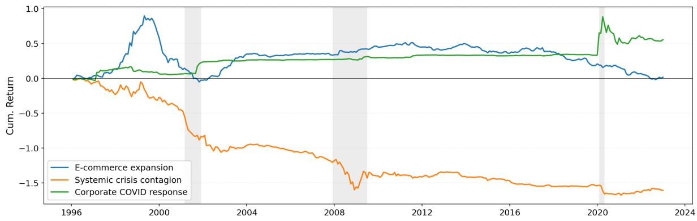

Panel B: Meme Stocks  
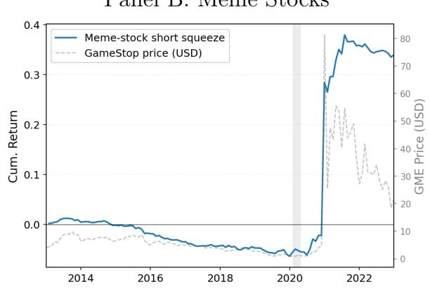

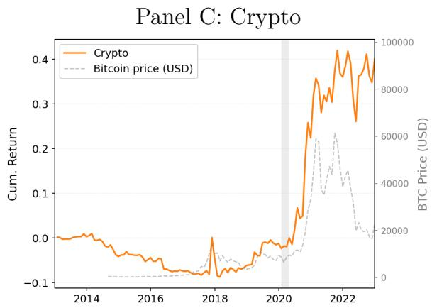  
Figure 16: Evolution of Individual Interpretable Features

Note. This figure presents the cumulative returns of five select sparse features, standardized to 10% annualized volatility. Panel A displays three macro-oriented features (“E-commerce expansion,” “Systemic crisis contagion,” and “Corporate COVID response”) overlaid with grey shaded areas indicating NBER recessions. Panel B plots the “Meme Stock” feature alongside the GameStop share price (right axis). Panel C plots the “Crypto-correlated” feature alongside the Bitcoin price (right axis).

Express, WSFS Financial, and MercadoLibre, all of whom have business models tightly linked to the cryptocurrency ecosystem.

## 5.4 Underreaction and Overreaction to News

Section 5.3 describes the thematic content of news underlying the news shock anomaly. We now leverage the interpretable, topic-level structure of our SAE decomposition to unpack the nature of this return predictability. Because each factor isolates a recognizable news theme, we can test whether the market’s response varies systematically depending on the type of information.

We frame this analysis through the lens of the behavioral finance literature, specifically focusing on underreaction and overreaction phenomena. Using our SAE embeddings, we categorize news topics based on whether they subsequently induce price continuation or price reversal. This allows us to quantify which behavioral frictions dominate the broader news shock anomaly.

Empirically, we capture these dynamics by comparing the initial price impact of a news event to its subsequent trajectory. We begin by defining contemporaneous (and hence nontradeable) news-managed portfolios as

$$
F _ { t , t } ^ { \tilde { \epsilon } } = \tilde { \epsilon } _ { t } ^ { \prime } R _ { t } ,\tag{9}
$$

which captures the immediate price impact of a news shock. We then define the tradeable post-news return as

$$
F _ { t , t + 1 } ^ { \tilde { \epsilon } } = \tilde { \epsilon } _ { t } ^ { \prime } R _ { t + 1 } ,\tag{10}
$$

which measures subsequent price response to news shocks. These returns follow the same news-managed portfolio construction of our main analysis, with additional subscripts to draw a clear distinction between initial $( F _ { t , t } ^ { \tilde { \epsilon } } )$ and subsequent $( F _ { t , t + 1 } ^ { \tilde { \epsilon } } )$ price responses.

In the spirit of Kwon and Tang (2025), we measure the direction and severity of misreaction in terms of autocorrelation in returns associated with news of type k:

$$
\rho _ { k } = \mathrm { C o r r } \big ( F _ { t , t } ^ { \tilde { \epsilon } , ( k ) } , ~ F _ { t , t + 1 } ^ { \tilde { \epsilon } , ( k ) } \big ) .\tag{11}
$$

A positive correlation $\left( \rho _ { k } \ > \ 0 \right)$ indicates that the subsequent return drifts in the same direction as the initial response, consistent with market underreaction to topic k. A negative correlation $( \rho _ { k } < 0 )$ indicates that the market walks back its initial price response, reflecting overreaction.

In the full universe of 5,000 SAE coordinates, 61.0% have $\rho _ { k } > 0$ , indicating that underreaction is the more prevalent pattern. Likewise, 56.8% of the 148 selected factors have $\rho _ { k } > 0$ , and 62.1% of the strategy’s total absolute weight is assigned to underreaction topics. In short, the news-shock anomaly is predominantly, though not exclusively, driven by the market’s underreaction to news.

## 5.4.1 Behavioral Determinants of Over- and Underreaction

The central role that text data plays in our analysis presents a unique opportunity to understand the determinants of overreaction and underreaction in financial markets with the benefit of verbal interpretation. Drawing on the behavioral finance literature, we measure four linguistic properties of SAE topics based on their constituent news articles.15 We calculate four metrics designed to capture behavioral themes frequently discussed in the financial literature:

The first is negative sentiment $( N e g S e n t _ { k } )$ Hong et al. (2000) argue that bad news is incorporated into prices more slowly than good news (see also Tetlock et al., 2008). We define $N e g S e n t _ { k }$ as the prevalence of negative language in articles associated with SAE topic k, calculated as the fraction of words appearing in the Loughran and McDonald (2011) negative word dictionary.

The second metric is quantitative news intensity $( Q u a n t _ { k } )$ . Experimental evidence shows that memory retains stories more durably than statistics, leading to slower incorporation of quantitative information in prices (Graeber et al., 2024). Related literature demonstrates this pattern in price responses to corporate news (Hong, 2025) and equity research analyst reports (Ke, 2025). We measure $Q u a n t _ { k }$ as the fraction of tokens that contain at least one digit in articles for a SAE topic k.

The third metric is linguistic ambiguity $( A m b i g u i t y _ { k } )$ . News that employs more ambiguous or hedging language conveys a noisier signal. Augenblick et al. (2025) argues that such relatively weaker signals lead to price overreaction. We measure ambiguity as the fraction of words appearing in the Loughran and McDonald (2011) uncertainty dictionary within articles for SAE topic k.

The fourth metric is news attention $\left( A t t e n t i o n _ { k } \right)$ . Media coverage serves as a key driver of investor attention and has first-order effects on asset prices (Fang and Peress, 2009). Building on the limited attention literature, topics that attract significant attention are expected to amplify initial price responses and potentially lead to overreaction (Hou et al., 2025). We measure attention as the average number of articles published about the same stock on the same day, averaged across all articles in SAE topic k.

With textual/behavioral topic attributes in place, we investigate the behavioral channels driving price dynamics among SAE topics. We regress the misreaction measure $\rho _ { k }$ from

Equation (11) on topic attributes in a cross-sectional regression:

$$
\rho _ { k } = \alpha + \theta _ { 1 } N e g S e n t _ { k } + \theta _ { 2 } Q u a n t _ { k } + \theta _ { 3 } A m b i g u i t y _ { k } + \theta _ { 4 } A t t e n t i o n _ { k } + \epsilon _ { k } .\tag{12}
$$

Importantly, because the dependent variable $\rho _ { k }$ is estimated exclusively from asset returns, it is structurally independent of the textual topic attributes derived from the raw article text.

Table 5 reports regression results. Columns (2) through (5) introduce each channel individually, while Column (6) includes all channels jointly. To facilitate interpretation, all textual topic attributes are standardized to mean zero and unit variance.

## Table 5: Behavioral Determinants of News Mispricing

This table reports cross-sectional regressions of the misreaction measure $\rho _ { k }$ from Equation (11) on behavioral proxies (Equation (12)). The sample consists of all 5,000 SAE features. Negative news fraction is the share of Loughran and McDonald (2011) negative words in the combined headline and body text of each factor’s 100 highest-activation articles. Quantitative intensity is the fraction of tokens containing digits. Ambiguity is the fraction of words in the Loughran and McDonald (2011) uncertainty word list. Attention is the log of the average number of articles about the same stock on the same day. All proxies are standardized to mean zero and unit variance. Standard errors are HC1-robust. t-statistics are reported in parentheses. ∗∗∗, ∗∗, and ∗ denote significance at the 1%, 5%, and 10% levels, respectively.
<table><tr><td></td><td>(1)</td><td>(2)</td><td>(3)</td><td>(4)</td><td>(5)</td><td>(6)</td></tr><tr><td>Intercept</td><td>0.026*** (18.90)</td><td>0.026*** (18.99)</td><td>0.026*** (19.09)</td><td>0.026*** (18.91)</td><td>0.026*** (18.91)</td><td>0.026*** (19.28)</td></tr><tr><td>Neg. Sentiment</td><td></td><td>0.010*** (8.41)</td><td></td><td></td><td></td><td>0.014*** (10.08)</td></tr><tr><td>Quant. Intensity</td><td></td><td></td><td>0.014*** (8.40)</td><td></td><td></td><td>0.015*** (8.89)</td></tr><tr><td>Ambiguity</td><td></td><td></td><td></td><td>-0.004*** (-2.95)</td><td></td><td>-0.007*** (-5.49)</td></tr><tr><td>Attention</td><td></td><td></td><td></td><td></td><td>-0.004*** (-3.01)</td><td>-0.003** (-2.12)</td></tr><tr><td> $R ^ { 2 }$ </td><td>0.000</td><td>0.011</td><td>0.021</td><td>0.002</td><td>0.002</td><td>0.041</td></tr><tr><td>N</td><td>5,000</td><td>5,000</td><td>5,000</td><td>5,000</td><td>5,000</td><td>5,000</td></tr></table>

Topics with stronger negative sentiment are associated with significantly stronger investor underreaction. In the univariate specification (Column 2) $\theta _ { 1 } ~ = ~ 0 . 0 1 0$ with t = 8.41, significant at the 1% level. In the joint specification (Column 6), the estimate strengthens to $\theta _ { 1 } = 0 . 0 1 4 ~ ( t = 1 0 . 0 8 )$ , indicating that the effect is robust to the inclusion of all other channels. Economically, a one-standard-deviation increase in negative news content raises the misreaction measure by 0.014, roughly 54% of the unconditional mean $( \bar { \rho } = 0 . 0 2 6 )$ . This finding is consistent with the delayed price incorporation of bad news documented by Tetlock et al. (2008).16

Turning to quantitative intensity, we document a strong positive effect on the misreaction measure, with $\theta _ { 2 } = 0 . 0 1 4 ~ ( t = 8 . 4 0 )$ in the univariate regression and $\theta _ { 2 } = 0 . 0 1 5 \ : ( t = 8 . 8 9 )$ in the full specification. Economically, a one-standard-deviation increase in quantitative intensity raises the misreaction measure by 0.015, roughly 58% of the unconditional mean $( \bar { \rho } = 0 . 0 2 6 )$ . This indicates that features whose news is rich in numeric content, such as earnings figures, revenue numbers, and percentage changes, exhibit stronger post-news drift. This is consistent with the “story-statistics gap” documented in stock price responses to corporate news by Hong (2025).

The ambiguity proxy loads with the predicted negative sign: $\theta _ { 3 } = - 0 . 0 0 4 \ : ( t = - 2 . 9 5 )$ in the univariate specification and $\theta _ { 3 } = - 0 . 0 0 7 \ ( t = - 5 . 4 9 )$ in the full specification. Economically, a one-standard-deviation increase in linguistic uncertainty reduces the misreaction measure by 0.007, roughly 27% of the unconditional mean $( \bar { \rho } = 0 . 0 2 6 )$

Turning to attention, we document a significant negative effect on the misreaction measure, with $\theta _ { 4 } \ = \ - 0 . 0 0 4 \ ( t \ = \ - 3 . 0 1 )$ in the univariate regression and $\theta _ { 4 } ~ = ~ - 0 . 0 0 3$ $( t = - 2 . 1 2 )$ in the full specification. Economically, a one-standard-deviation increase in same-day news coverage reduces the misreaction measure by 0.003, roughly 12% of the unconditional mean $( \bar { \rho } = 0 . 0 2 6 )$

Illustrative features. Table 6 illustrates the empirical patterns reported in Table 5. It reports the specific SAE news topics that best exemplify each channel. We report topics that rank highly both on their value for a given textual/behavioral regressor and on their value of $\rho _ { k } \ { \mathrm { ( i . e . } }$ , the features that are most impactful in determining the regression coefficients in Table 5).17

The examples align with economic intuition in the regressor description at the start of this

## Table 6: Illustrative Features by Behavioral Channel

This table presents the SAE features that best exemplify the predicted relationship for each behavioral channel. For each panel, features are selected from the theory-consistent corner: extreme proxy value and strong misreaction in the predicted direction. p denotes the feature’s cross-sectional percentile rank (0–100) for the behavioral proxy. ρk is the misreaction measure.

<table><tr><td colspan="4">Panel A:Negative Sentiment - Underreaction (0 &gt; 0)</td></tr><tr><td>Feature</td><td>p</td><td>pk</td><td>pp</td></tr><tr><td>Cybersecurity vulnerability patches Corporate criminal charges</td><td>99 100</td><td>0.34 0.22</td><td>100 98</td></tr><tr><td>Food product recalls</td><td>99</td><td>0.15</td><td>96</td></tr><tr><td>Panel B: Quantitative Intensity - Underreaction (0 &gt; 0) Feature</td><td>p</td><td>pk</td><td>pp</td></tr><tr><td>EPS guidance updates Quarterly financial metrics YoY</td><td>100 99</td><td>0.30 0.35</td><td>99 100</td></tr><tr><td>Boeing aircraft orders/deliveries</td><td>99</td><td>0.37</td><td>100</td></tr><tr><td>Panel C:Ambiguity - Overreaction (0 &lt; 0) Feature</td><td>p</td><td>pk</td><td>pp</td></tr><tr><td>COVID-19 antiviral therapies</td><td></td><td></td><td></td></tr><tr><td>Material adverse impact disclosures</td><td>98</td><td>-0.24</td><td>1</td></tr><tr><td>Proposed corporate transactions</td><td>98</td><td>-0.20</td><td>2</td></tr><tr><td></td><td>99</td><td>-0.18</td><td>3</td></tr><tr><td>Panel D: Attention— Overreaction (0 &lt; 0)</td><td></td><td></td><td></td></tr><tr><td>Feature</td><td>p</td><td>pk</td><td>pp</td></tr><tr><td>TARP bailouts of systemically important frms</td><td></td><td></td><td></td></tr><tr><td></td><td>100</td><td>-0.27</td><td>0</td></tr><tr><td>Intraday stock swings hitting highs/lows</td><td>99</td><td>-0.29</td><td>0</td></tr><tr><td></td><td></td><td></td><td></td></tr><tr><td>GDP growth forecasts and revisions</td><td>85</td><td>-0.29</td><td>0</td></tr></table>

section. In Panel A, topics with strong negative sentiment and strong price underreaction include “cybersecurity breaches,” “corporate criminal charges,” and “food product recalls.” Panel B shows that topics with heavy numerical content and strong underreaction include topics labeled “EPS guidance,” “YoY financial metrics,” and “Boeing orders.” Panel C shows that topics with ambiguous language and overreaction include “COVID-19 therapies,” “material adverse impact disclosures,” and “proposed transactions.” Finally, Panel D shows that topics with high media attention and large overreaction are “TARP bailouts,” “intraday stock swings,” and “GDP forecasts.”

Appendix C extends this analysis by listing the ten MSRR-selected SAE factors with the strongest underreaction and overreaction, along with their percentile ranks on each behavioral proxy. The patterns reinforce the regression results. Among the strongest underreactors, “consumer protection enforcement” and “negative EPS guidance” rank in the top percentiles on negative sentiment, while “clinical trial updates” and “EPS guidance” are quantitatively intensive, consistent with investors slowly incorporating bad news and numeric information. Among the strongest overreactors, “COVID-19 response” topics and “investigation findings” score in the top decile on linguistic uncertainty, while “analyst rating changes” attract heavy media coverage, consistent with noisy signals and attention-driven overshooting generating subsequent reversals.

The analysis in this section focused on four textual topic attributes emphasized in the behavioral finance literature. In Appendix D, we study a broader battery of 18 text-based and SAE-derived topic attributes motivated by the broader textual analysis literature. In a kitchen-sink regression including all 18 variables, eleven survive at the 5% level. Three of the four main channels remain significant alongside measures of readability, lexical diversity, discourse coherence, and divergence of opinion.

## 6 LLM Lookahead Bias and Other Robustness

## 6.1 Chronologically Consistent LLMs

Due to their extremely large number of parameters, LLMs have a tendency to “memorize” data that they were trained on (Carlini et al., 2022). When using LLMs output for financial time series modeling, there is potential for lookahead bias when the LLM has been trained on data that was not available at the time when a so-called out-of-sample financial model forecast is being produced (see, e.g. Glasserman and Lin, 2024; Sarkar and Vafa, 2024).

Perhaps the most direct way to ensure that our results are not being driven by lookahead bias in the pre-trained Mistral model is to replicate our analysis using a sequence of LLMs that are trained only on data that would have been available to the forecaster in real-time. This idea lies behind the “chronologically consistent” LLMs (or CCLLMs) developed by He et al. (2025). CCLLMs are trained on carefully curated datasets where the training corpus is restricted to information available up to specific timestamps.

We design a dual experiment to isolate the impact of lookahead bias. First, we construct a clean “point-in-time” specification where, for each month t, we generate embeddings using

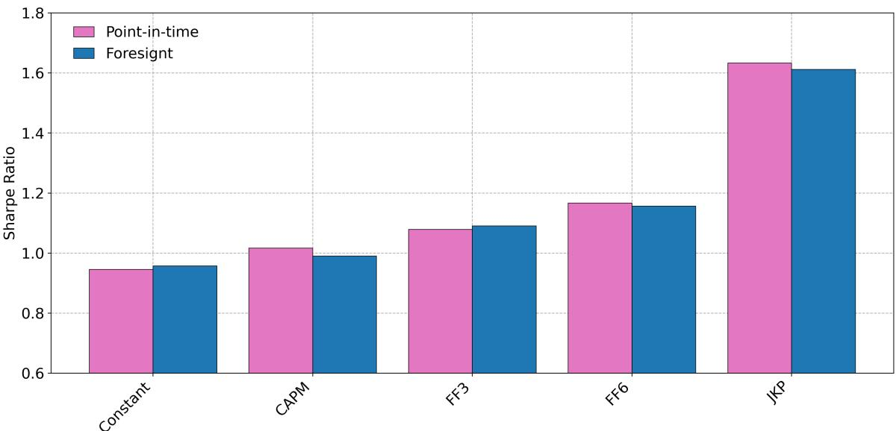  
Figure 17: News Portfolio Performance with Chronologically Consistent LLMs

Note. This figure reports Sharpe ratios of news shock portfolios constructed using ChronoGPT embeddings from He et al. (2025). The pink bars (“point-in-time”) use embeddings generated by models with expanding training windows that exclude future data. The blue bars (“foresight”) use embeddings generated by a single ChronoGPT model trained on data up to 2022 and applied to the full historical sample.

the CCLLM18 trained only on data available up to t, then use these embeddings to construct MSRR news portfolios. In parallel, we also construct a biased “foresight” counterfactual portfolio where we generate embeddings for the entire sample using a single CCLLM that is trained on all data up to 2022, thereby voluntarily introducing lookahead bias. The only difference between the point-in-time and foresight models is the training data set; their architectures are identical. If LLM lookahead bias is a major issue, then we should see the point-in-time model significantly underperform the foresight model.

Figure 17 compares the performance of the CCLLM point-in-time model versus the same model trained with foresight. Two key facts emerge from this analysis. First, and most importantly, the performance is virtually identical whether we use point-in-time or foresight models, indicating that lookahead bias is not a driver of portfolio performance. In fact, in the case of JKP-based news residuals (the right-most bars in the figure), the foresight model has slightly worse performance (Sharpe ratio of 1.61) than the point-in-time model (1.63).

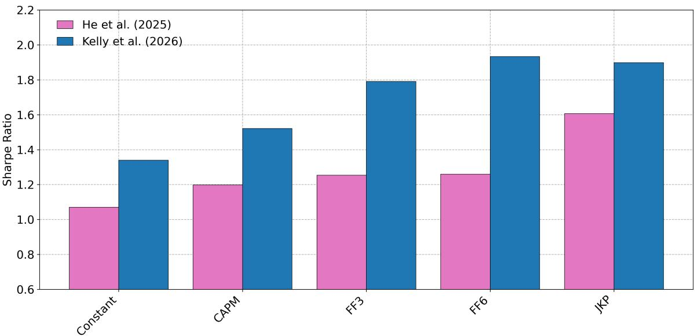  
Figure 18: Comparison of Point-in-Time GPT-1.5B

Note. This figure shows the Sharpe ratios of the chronologically consistent GPT-2 model of He et al. (2025) and an identical model architecture trained on a larger dataset by Kelly et al. (2026). The sample period for this figure is 2014-2022.

The literature documenting LLM lookahead bias focuses on biases in text generation (e.g. Sarkar and Vafa, 2024). To the best of our knowledge, it has not been shown that applications using the “embeddings for downstream regression” workflow are subject to the same lookahead bias. Indeed, He et al. (2025) note the “somewhat surprising finding is that lookahead bias appears to be modest in this [news-embedding-based] stock return forecasting application.” Consistent with He et al. (2025), Figure 17 suggests that lookahead is likely to be a minor concern in our setting. This is because, in the “embeddings for downstream regression” workflow, the downstream objective (portfolio performance/return prediction) is decoupled from the LLMs’ training objective (token prediction). Lookahead bias is ultimately a form of small-sample overfit. It has a larger impact on tasks like text generation that derive directly from the LLM’s training objective, than on a downstream task like return prediction that has no influence on the LLM’s training (this logic is formalized by Wolpert, 1992).

The second main fact from Figure 17 is that replacing the industrial-scale Mistral model with the smaller academic CCLLM model leads to a decline in out-of-sample Sharpe ratio from 3.1 to 1.6 (in the case of JKP residualization). This is true even when the CCLLM is allowed “foresight.” While the performance of the CCLLM-based news portfolio nonetheless exceeds the best performing anomalies in the prior literature, it is important to recognize that this attenuated performance is a conservative lower bound on the news shock anomaly. This is simply due to the fact that Mistral is a far more sophisticated language model than the point-in-time CCLLM. It is well accepted that LLM behavior is accurately described by “scaling laws” (Kaplan et al., 2020; Hoffmann et al., 2022). In particular, language model performance follows a power law that increases with the number of parameters, the number of training observations, and the amount of compute used for training. In terms of parameter scale, the CCLLM is the 1.5 billion parameter GPT2 model, while the Mistral model uses 7 billion parameters. In terms of training data scale, the initial vintage CCLLM is trained on 71 billion tokens; in contrast, the Mistral model is trained on seven trillion tokens (then fine-tuned on another 1.8 million tokens). In terms of compute scale, compute details for the training of Mistral are undisclosed, but it is well understood that a few private institutions like Mistral possess computing resources far in excess of typical academic research teams (this is the so-called “compute divide” emphasized by Ahmed and Wahed, 2020).

Recent developments in the literature show that the chronologically consistent LLMs of He et al. (2025) can be improved on by training with more tokens and by training models with more parameters. For example, Kelly et al. (2026) retrain the same ChronoGPT (GPT-2) model of He et al. (2025), using approximately 140 times more training tokens, scaling the model from 1.5B to 4B parameters, and extending the context length from 1792 tokens to 2048 tokens. Kelly et al. (2026) show that changes in training alone improve point-in-time model performance by 30.6 % on standard LLM benchmarks such as HellaSwag (Zellers et al., 2019). Here we show that improved CCLLM training also gives a more positive read on real-time return predictive power of news shocks, as demonstrated in Figure 18. In particular, the more extensively trained point-in-time CCLLM improves the news shock portfolio Sharpe ratio from 1.6 (with the He et al., 2025) to 1.9 with the Kelly et al. (2026) model. Presumably, inferences about the point-in-time news shock anomaly can be improved even further when the improved model training of Kelly et al. (2026) is combined with larger LLM architectures.

## 6.2 Other Embedding Models

In our baseline specification, we employ the E5-Mistral-7B embedding model. We select this architecture for three reasons. First, it consistently achieves state-of-the-art results on common LLM benchmark tasks (Wang et al., 2024). Second, it is an open-weight model, so we perform data computations privately on our own hardware and maintain privacy of the news data per our licensing agreement (this is in contrast to “closed” models such as GPT-5 and Gemini that typically require that data be transferred to OpenAI or Google servers). Third, with only 7 billion parameters, it is sufficiently compact to run on a single A100 GPU, facilitating large-scale experimentation.

Naturally, there are alternatives to Mistral that we may consider. CKX show that their results are fairly similar across a variety of state-of-the-art LLMs. In this section, we examine the sensitivity of our results to the choice of LLM using the Llama3 family of open-weight models developed by Meta (Grattafiori et al., 2024). Unlike E5-Mistral-7B, which is explicitly fine-tuned for embedding tasks, the Llama3 models are generative LLMs trained to predict the probability distribution of next tokens. Nevertheless, following the methodology of Chen et al. (2026), we extract high-quality embeddings from these models by averaging the finallayer hidden states across all tokens in a sequence. A key advantage of the Llama3 suite is the simultaneous release of three models differing primarily in parameter count with either 8 billion, 70 billion, or 405 billion parameters.19 We also consider older and smaller models such as BERT with 110 million parameters and GPT2 with 1.5 billion parameters (this is the OpenAI pre-trained version of GPT2 and not the chronologically trained model discussed above). This setup provides a controlled setting to isolate the effect of model size on the performance of news shock portfolios.

Figure 19 reports Sharpe ratios for the news shock portfolios derived from each LLM. The results show a monotonic relationship between model size and investment performance. As we increase parameter count from the 110 million parameter BERT model to the 405 billion Llama3 model, the Sharpe ratios rise. Focusing on the full JKP specification, the Sharpe ratio rises from 1.5 with BERT to 3.1 for our baseline Mistral model, to 3.3 for Llama3-8B, then to 3.8 for Llama3-70B, and eventually to 4.1 for the massive Llama3-405B model.

## 6.3 Other News Text Data Sources

Our main analysis uses news text from the Reuters news service. In this section we investigate the robustness of our findings to using other sources of news. The first is the Dow Jones Newswires, analyzed previously by Ke et al. (2019). This sample spans the period 1996–

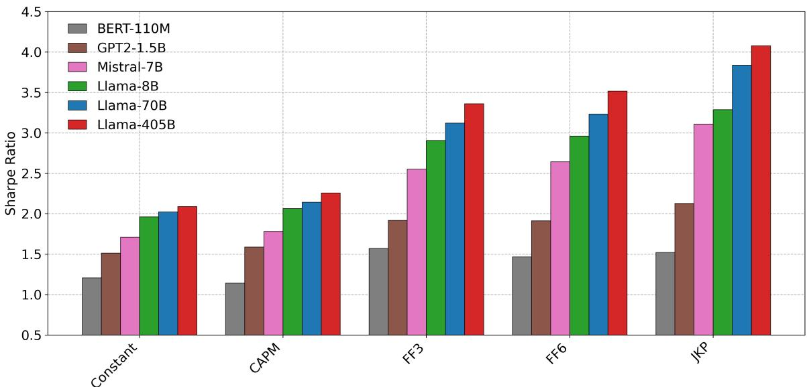  
Figure 19: News Shock Portfolios From Various Embedding Models

Note. This figure reports the Sharpe ratios of news shock portfolios constructed using alternative embedding models. The smallest model is BERT-110M and the largest model is Llama3-405B. Mistral-7B is the model used in the main analysis.

2021. We apply the same article filters to Dow Jones that we applied to the Reuters data,20 arriving at a final article count of 5,378,838.

The second data set is the set of third-party news aggregated by Reuters, which we filtered out from our main analysis. This amounts to 2,265,171 articles over the period 1996-2022 after filtering.

We repeat our main analysis for each data set using the same procedure described in Section 4.1. In particular, we produce article embeddings via Mistral, compute stock-month average embeddings, residualize average embeddings versus JKP factors, and use MSRR to construct the news shock portfolio. Figure 20 reports the results. Third-party news shows weaker return prediction performance than the main Reuters data set but nonetheless achieves a Sharpe ratio as high as 2.3 (in the JKP case). On the other hand, the news shock portfolio derived from Dow Jones Newswires earns a Sharpe ratio as high as 3.7, exceeding

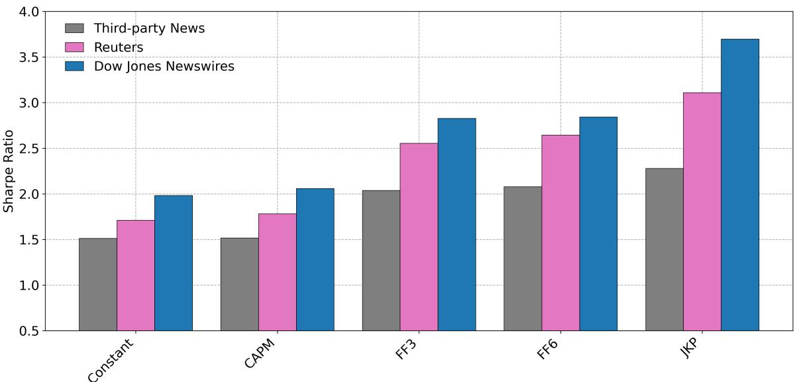  
Figure 20: News Shock Portfolios From Alternative Data Sources

Note. This figure reports Sharpe ratios of news shock portfolios constructed using alternative news data sources: Reuters (main analysis), Third-party News, and Dow Jones Newswires. We consider the same embedding predictor sets as in Figure 4.

the performance of the baseline Reuters data set. The conclusion from this analysis is that the news shock anomaly is robust to using alternative news data sources.

## 6.4 The “MSE Approach” and Portfolio Sorts

The MSRR approach in Section 4.1 estimates the stock-level portfolio weights as a function of (residual) embeddings to directly maximize the portfolio’s Sharpe ratio. In this section we investigate an alternative approach to evaluating the news shock anomaly that takes a more conventional tack of first predicting stock-level returns using news embeddings, following CKX, then conducting portfolio sorts based on the predicted returns.

In particular, we modify the MSRR problem in (5)–(6) to a standard return predictive regression for minimizing squared errors (“MSE”). Referring once again to a generic D-vector of stock-level predictors $x _ { i , t }$ , the MSE model is

$$
R _ { i , t + 1 } = x _ { i , t } ^ { \prime } b + u _ { i , t + 1 } ,
$$

with estimation objective21

$$
\operatorname* { m i n } _ { b } \sum _ { t } \sum _ { i } \left( R _ { i , t + 1 } - x _ { i , t } ^ { \prime } b \right) ^ { 2 } + \lambda b ^ { \prime } b .\tag{13}
$$

Given the estimator $\hat { b } ,$ we denote the predicted values from this regression as

$$
\hat { \mu } _ { i , t } = \hat { E } [ R _ { i , t + 1 } | x _ { i , t } ] = x _ { i , t } ^ { \prime } \hat { b } .
$$

In other words, the MSE approach condenses the high-dimensional representation of news into a scalar expected return “characteristic.” Given the condensed news characteristic $\hat { \mu } _ { i , t }$ we conduct traditional quintile portfolio sorts following the asset pricing literature.

In the interest of space, we focus on the case where the return predictors $x _ { i , t }$ are defined as residual embeddings $\epsilon _ { i , t }$ derived from the full set of JKP characteristics. We form zeronet-investment quintile-spread portfolios that are long the 20% of stocks with the highest news-based expected return $\hat { \mu } _ { i , t }$ and short those with the lowest expected returns. Long and short quintile portfolios are either equally weighted or value weighted (for value weights we use the “capped-value-weight” approach of JKP).

Panel A of Table 7 reports the performance of news shock portfolios using the MSE approach. The basic patterns in Table 7 align with the results documented in earlier sections that news shocks are significant predictors of returns. In the case of equal-weight portfolios, the quintile spread portfolio returns 12.8% per month (the alpha versus the CAPM model is also 12.8%). For capped value-weight portfolios the quintile spread portfolio returns 6.7% per month (with an alpha of 6.7% and t-statistic of 6.1).

We can also sort stocks into portfolios based on the estimated portfolio weights $w _ { i , t }$ from the MSRR specification in equation (5). This provides a direct comparison of the MSE and MSRR approaches. When sorting on MSRR weights from our main JKP specification we find an equal-weight news shock anomaly Sharpe ratio of 2.9, compared to 3.1 for the main MSRR analysis in Figure 4 and 2.7 for the MSE approach (and Sharpe ratios of 1.4 versus 1.3 for the value-weight versions of MSRR and MSE sorts, respectively). MSE and MSRR methods are based on the same data and differ only in their estimation objective. They both deliver strong performance and their returns are highly correlated (67%). The relative outperformance of MSRR indicates that a Sharpe ratio-based training objective more

## Table 7: News Shock Portfolio Sorts

This table reports the performance of quintile portfolios sorted by MSE news signals. For each model specification, firms are sorted each month into five quintiles based on the MSE/MSRR predictions. We report the average monthly excess return (Avg), monthly standard deviation (Std), annualized Alpha with t-stat (Alpha/t-stat) and Sharpe ratio (SR).

Panel A: MSE
<table><tr><td></td><td colspan="5">Equal-weighted</td><td colspan="5">Capped value-weighted</td></tr><tr><td></td><td>Avg</td><td>Std</td><td>Alpha</td><td>t-stat</td><td>SR</td><td>Avg</td><td>Std</td><td>Alpha</td><td>t-stat</td><td>SR</td></tr><tr><td>Low(L)</td><td>0.025</td><td>0.226</td><td>-0.067</td><td>-3.5</td><td>0.11</td><td>0.059</td><td>0.188</td><td>-0.021</td><td>-1.9</td><td>0.32</td></tr><tr><td>2</td><td>0.071</td><td>0.220</td><td>-0.020</td><td>-1.1</td><td>0.32</td><td>0.070</td><td>0.183</td><td>-0.010</td><td>-1.1</td><td>0.38</td></tr><tr><td>3</td><td>0.090</td><td>0.220</td><td>-0.002</td><td>-0.1</td><td>0.41</td><td>0.086</td><td>0.185</td><td>0.005</td><td>0.6</td><td>0.47</td></tr><tr><td>4</td><td>0.116</td><td>0.218</td><td>0.026</td><td>1.5</td><td>0.53</td><td>0.104</td><td>0.184</td><td>0.024</td><td>2.6</td><td>0.57</td></tr><tr><td>High(H)</td><td>0.153</td><td>0.226</td><td>0.061</td><td>3.2</td><td>0.68</td><td>0.127</td><td>0.187</td><td>0.045</td><td>4.6</td><td>0.68</td></tr><tr><td>H-L</td><td>0.128</td><td>0.048</td><td>0.128</td><td>13.3</td><td>2.68</td><td>0.067</td><td>0.054</td><td>0.067</td><td>6.1</td><td>1.25</td></tr></table>

Panel B: MSRR
<table><tr><td></td><td colspan="5">Equal-weighted</td><td colspan="5">Capped value-weighted</td></tr><tr><td></td><td>Avg</td><td>Std</td><td>Alpha</td><td>t-stat</td><td>SR</td><td>Avg</td><td>Std</td><td>Alpha</td><td>t-stat</td><td>SR</td></tr><tr><td>Low(L)</td><td>0.033</td><td>0.221</td><td>-0.059</td><td>-3.3</td><td>0.15</td><td>0.062</td><td>0.187</td><td>-0.019</td><td>-1.8</td><td>0.33</td></tr><tr><td>2</td><td>0.075</td><td>0.224</td><td>-0.018</td><td>-1.0</td><td>0.34</td><td>0.078</td><td>0.186</td><td>-0.004</td><td>-0.4</td><td>0.42</td></tr><tr><td>3</td><td>0.094</td><td>0.220</td><td>0.003</td><td>0.2</td><td>0.43</td><td>0.088</td><td>0.183</td><td>0.008</td><td>0.9</td><td>0.48</td></tr><tr><td>4</td><td>0.114</td><td>0.222</td><td>0.023</td><td>1.2</td><td>0.51</td><td>0.100</td><td>0.184</td><td>0.020</td><td>2.2</td><td>0.54</td></tr><tr><td>High(H)</td><td>0.139</td><td>0.222</td><td>0.048</td><td>2.7</td><td>0.63</td><td>0.118</td><td>0.185</td><td>0.037</td><td>3.9</td><td>0.64</td></tr><tr><td>H-L</td><td>0.107</td><td>0.037</td><td>0.107</td><td>14.3</td><td>2.89</td><td>0.056</td><td>0.041</td><td>0.056</td><td>6.8</td><td>1.36</td></tr></table>

precisely identifies the investment-relevant aspects of price inefficiency associated with news shocks.

The main conclusion from the analysis in Table 7 is that our conclusions do not depend on the methodology used to assess news-based predictability. Whether using direct MSRR portfolios, using traditional portfolio sorts based on MSRR estimates, or using sorts based on predictive regression estimates, we find evidence for inefficient pricing of news shock with a magnitude that stands against the backdrop of the broader anomaly literature.

## 6.5 The Role of Industry Information

Section 4.2 demonstrates that industry indicators are marginally useful predictors of news after controlling for JKP characteristics. The lexicon describing a biotechnology firm (e.g., “clinical trials,” “FDA approval”) is structurally distinct from that describing an energy

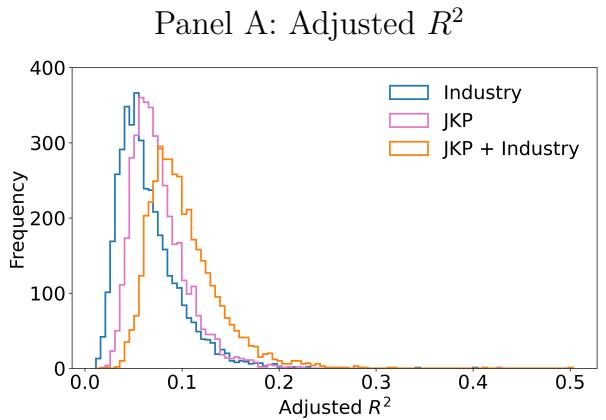

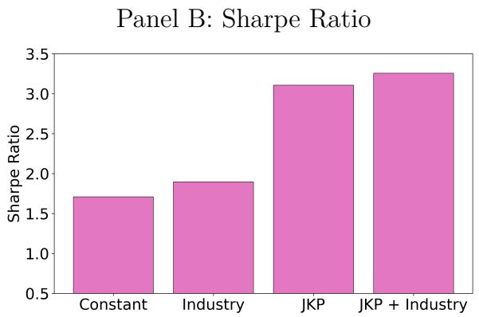  
Figure 21: Adjusted $R ^ { 2 }$ and Sharpe Ratio with Industry Fixed Effects

Note. Panel A shows the distribution of adjusted $R ^ { 2 }$ across embedding coordinates for three specifications: “Industry,” which predicts embeddings using 25 GICS industry indicators; “JKP,” which uses 132 stock characteristics; and “JKP+Industry,” which combines the two. Panel B reports the Sharpe ratios of news shock portfolios constructed using each specification.

producer (e.g., “drilling,” “crude reserves”). In this section, we investigate the incremental portfolio performance impact of using industry information to construct news shocks.

Panel A of Figure 21 builds on the earlier analysis of Figure 2 to compare the power of industry indicators for predicting news. The distribution of predictive $R ^ { 2 }$ across embedding coordinates has a slightly lower mean $R ^ { 2 }$ based on industry dummies (6.5%) than that based on JKP characteristics (mean $R ^ { 2 }$ of 7.7%). Stock characteristics and industry dummies contain some distinct information from one another, as evidenced by the orange curve showing the effects of combining both predictor sets together in $S _ { t } .$ . The combination increases the average news prediction $R ^ { 2 }$ to 10.2%, and increases the maximum $R ^ { 2 }$ from 42.6% for JKP alone to 50.3% when including industry effects.

While industry indicators have incremental explanatory power for news, they have little impact on the performance of the news shock portfolio. Panel B of Figure 21 reports MSRR results for the industry-only residualization, as well as the case when industry dummies are combined with JKP factors. The improvement from a constant-only embedding prediction model to an industry-based model improves the Sharpe ratio from 1.7 to 1.9. As previously shown, there is a much larger improvement from the JKP-based (to a Sharpe ratio of 3.1). Including both JKP and industry predictors raises the news shock Sharpe ratio further to 3.3. While this gain is small in magnitude, it is statistically significant, as the alpha t-statistic from regressing the JKP+Industry model on the JKP-only model is 3.8.

In summary, while news text has a high degree of industry specificity as shown in Panel A, much of this can be captured by controlling for stock characteristics. This fact is explained in part by the fact that stock characteristics tend to cluster by industry (e.g., tech stocks tend to have low book-to-market ratios and high volatility; utility stocks have low betas and high dividend-payout ratios). But non-industry characteristics also help purge other predictable aspects of news in a manner that significantly enhances our ability to detect news-based price inefficiencies.

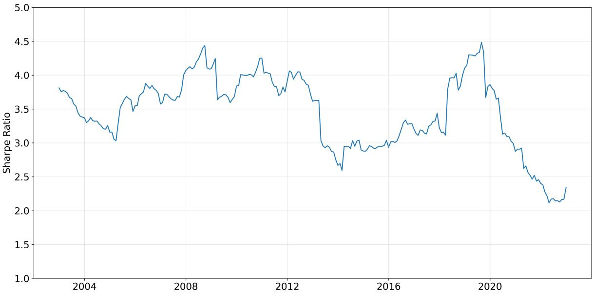  
Figure 22: News Shock Portfolio 5-Year Rolling Sharpe Ratio  
Note. This figure plots the rolling 5-year Sharpe ratio of the main news shock portfolio based on embeddings residualized against JKP characteristics.

## 6.6 Subsample Analysis

Section 4.4 explores robustness of the news shock anomaly in different subsamples of the cross section. In this section, we investigate the robustness of news shock portfolios in different time subsamples. In particular, we compute rolling 5-year Sharpe ratios of the main news shock portfolio (based on embeddings residualized against JKP characteristics). Figure 22 reports the results. Subsample Sharpe ratios range between 2.1 and 4.5. The advent of LLMs corresponds loosely to the post-2018 sample (after BERT is introduced), where we see a level shift in Sharpe ratio to the range of 2.0 to 2.5. This likely arises from LLMs aiding the integration of news-based information into asset managers’ portfolios, thus increasing competition around the news shock anomaly and decreasing its returns.

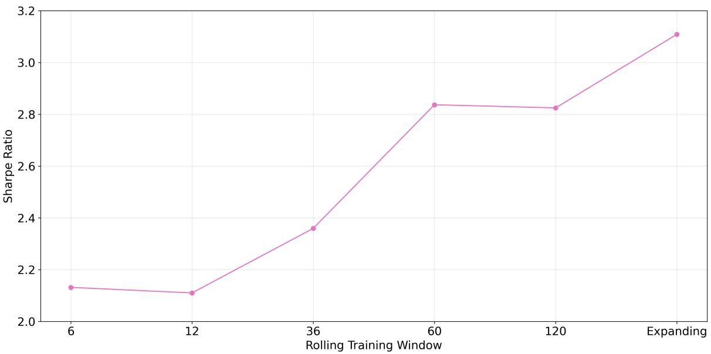  
Figure 23: News Shock Portfolio Performance With Alternative Training Windows

Note. This figure shows the Sharpe ratio of the MSRR news portfolio for different choices of the maximum lookback window. All other aspects of the model follow the baseline specification. The x-axis reports the maximum window length (in months) used when estimating the news portfolio, with “Expanding” indicating an unrestricted expanding window.

## 6.7 Alternative Training Windows

An important modeling decision in machine learning applications for asset pricing is the training window size (Gu et al., 2020). In our baseline MSRR specification, we use an expanding window (with a minimum window of twelve months early in the sample). The expanding window maximizes the amount of data used in training. In this section, we assess the sensitivity of using a shorter rolling training window; we consider windows as short as the most recent six months. Figure 23 reports Sharpe ratios of the main news shock portfolio when MSRR is trained in rolling windows of [6, 12, 36, 60, 120], with the last point on the x-axis representing the expanding window specification used in our baseline analysis. The conclusions from Figure 23 are i) that performance of the news shock portfolio increases with the length of the training window and ii) even with very short windows of a year or less, the portfolio Sharpe ratio remains above 2.1.

## 7 Conclusions

We show that the content of stock-level news articles is predictable based on a stock’s prevailing characteristics. We use this insight to purge articles of “old news” and isolate new information arrival which we refer to as “news shocks.” News shocks demonstrate pronounced and prolonged return predictability with greater magnitude than many other anomalies in the literature. The inefficient pricing of news shocks is highly robust. It exists in a variety of samples (both different asset universes and different time periods), with embeddings from a variety of different LLMs, with multiple news data sources, and with different predictive modeling approaches. Our results are not driven by lookahead bias in pre-trained LLMs—repeating our analysis using “chronologically consistent” LLMs confirms the qualitative conclusions of our main analysis.

We identify 12 economically interpretable themes whose news is inefficiently incorporated into prices and give rise to the news shock anomaly. We also show that different news types possess distinct, predictable price dynamics driven by specific behavioral channels. While markets overreact to ambiguous and high-attention news, they consistently underreact to news characterized by negative sentiment and high quantitative intensity. Ultimately, the profitability of the news shock anomaly derives predominantly from its ability to exploit this market underreaction.

## References

Ahmed, N. and Wahed, M. (2020). The de-democratization of ai: Deep learning and the compute divide in artificial intelligence research. arXiv preprint arXiv:2010.15581.

Antweiler, W. and Frank, M. Z. (2004). Is all that talk just noise? the information content of internet stock message boards. The Journal of Finance, 59(3):1259–1294.

Ash, E. and Hansen, S. (2023). Text algorithms in economics. Annual Review of Economics, 15:659–688.

Augenblick, N., Lazarus, E., and Thaler, M. (2025). Overinference from weak signals and underinference from strong signals. The Quarterly Journal of Economics, 140(1):335– 401.

Ba, C., Bohren, J. A., and Imas, A. (2024). Over-and underreaction to information. Working Paper.

Ball, R., Gerakos, J., Linnainmaa, J. T., and Nikolaev, V. (2016). Accruals, cash flows, and operating profitability in the cross section of stock returns. Journal of financial economics, 121(1):28–45.

Barberis, N. (2018). Psychology-based models of asset prices and returns. The Oxford Handbook of Behavioral Economics and Behavioral Finance, pages 1–44.

Baroni, M., Dinu, G., and Kruszewski, G. (2014). Don’t count, predict! a systematic comparison of context-counting vs. context-predicting semantic vectors. In Proceedings of the 52nd Annual Meeting of the Association for Computational Linguistics (Volume 1: Long Papers), pages 238–247.

Baumol, W. J. (1965). The Stock Market and Economic Efficiency. Fordham University Press, New York.

Brandt, M. W., Santa-Clara, P., and Valkanov, R. (2009). Parametric portfolio policies: Exploiting characteristics in the cross-section of equity returns. The Review of Financial Studies, 22(9):3411–3447.

Bricken, T., Templeton, A., Batson, J., Chen, B., Jermyn, A., Conerly, T., Turner, N., Anil, C., Denison, C., Askell, A., et al. (2023). Towards monosemanticity: Decomposing language models with dictionary learning. Transformer Circuits Thread, 2(5):6.

Britten-Jones, M. (1999). The sampling error in estimates of mean-variance efficient portfolio weights. The Journal of Finance, 54(2):655–671.

Brysbaert, M., Warriner, A. B., and Kuperman, V. (2014). Concreteness ratings for 40 thousand generally known English word lemmas. Behavior Research Methods, 46(3):904– 911.

Bybee, L., Kelly, B., and Su, Y. (2023). Narrative asset pricing: Interpretable systematic risk factors from news text. The Review of Financial Studies, 36(12):4759–4787.

Bybee, L., Kelly, B. T., Manela, A., and Xiu, D. (2024). The structure of economic news. The Review of Economic Studies, 91(2):689–737.

Carlini, N., Ippolito, D., Jagielski, M., Lee, K., Tramer, F., and Zhang, C. (2022). Quantifying memorization across neural language models. In The Eleventh International Conference on Learning Representations.

Chen, A. Y. and Zimmermann, T. (2022). Open source cross-sectional asset pricing. The Critical Finance Review, 11(2):207–264.

Chen, H., Didisheim, A., Somoza, L., and Tian, H. (2025). A financial brain scan of the llm. arXiv preprint arXiv:2508.21285.

Chen, Y., Kelly, B. T., and Xiu, D. (2026). Expected returns and large language models. The Review of Financial Studies, 38:3542–3579.

Cowles, A. (1933). Can stock market forecasters forecast? Econometrica: Journal of the Econometric Society, 1(3):309–324.

Cunningham, H. et al. (2024). Sparse autoencoders find highly interpretable features in language models. In Proceedings of the International Conference on Learning Representations (ICLR).

Daniel, K., Hirshleifer, D., and Subrahmanyam, A. (1998). Investor psychology and security market under- and overreactions. The Journal of Finance, 53(6):1839–1885.

Didisheim, A., Ke, S. B., Kelly, B. T., and Malamud, S. (2024). Apt or “aipt”? the surprising dominance of large factor models. Technical report, National Bureau of Economic Research.

Diether, K. B., Malloy, C. J., and Scherbina, A. (2002). Differences of opinion and the cross section of stock returns. The journal of finance, 57(5):2113–2141.

Dow, J. and Gorton, G. (1997). Stock market efficiency and economic efficiency: Is there a connection? The Journal of Finance, 52(3):1087–1129.

Elhage, N., Hume, T., Olsson, C., Schiefer, N., Henighan, T., Kravec, S., Hatfield-Dodds, Z., Lasenby, R., Drain, D., Chen, C., Grosse, R., McCandlish, S., Kaplan, J., Amodei, D., Wattenberg, M., and Olah, C. (2022). Toy models of superposition. Transformer Circuits Thread.

Fama, E. F. (1970). Efficient capital markets: A review of theory and empirical work. The Journal of Finance, 25(2):383–417.

Fama, E. F. and French, K. R. (2015). A five-factor asset pricing model. Journal of financial economics, 116(1):1–22.

Fang, L. and Peress, J. (2009). Media coverage and the cross-section of stock returns. The Journal of Finance, 64(5):2023–2052.

Fei, N., Gao, Y., Lu, Z., and Xiang, T. (2021). Z-score normalization, hubness, and fewshot learning. In Proceedings of the IEEE/CVF International Conference on Computer Vision, pages 142–151.

Feldman, R. J. and Schmidt, J. E. (2003). Supervisory disclosures and financial system resilience: An empirical analysis. The B.E. Journal of Macroeconomics, 3(1):1–24.

Frazzini, A., Israel, R., and Moskowitz, T. J. (2018). Trading costs. Available at SSRN 3229719.

Gao, J., He, D., Tan, X., Qin, T., Wang, L., and Liu, T.-Y. (2019). Representation degeneration problem in training natural language generation models. arXiv preprint arXiv:1907.12009.

Ge, T., Hu, J., Wang, L., Wang, X., Chen, S.-Q., and Wei, F. (2023). In-context autoencoder for context compression in a large language model. arXiv preprint arXiv:2307.06945.

Gentzkow, M., Kelly, B., and Taddy, M. (2019). Text as data. Journal of Economic Literature, 57(3):535–574.

Glasserman, P. and Lin, C. (2024). Assessing lookahead bias in stock return predictions generated by GPT sentiment analysis. The Journal of Financial Data Science, 6(1):25– 42.

Graeber, T., Roth, C., and Zimmermann, F. (2024). Stories, statistics, and memory. The Quarterly Journal of Economics.

Graesser, A. C., McNamara, D. S., Louwerse, M. M., and Cai, Z. (2004). Coh-Metrix: Analysis of text on cohesion and language. Behavior Research Methods, Instruments, & Computers, 36(2):193–202.

Grattafiori, A. et al. (2024). The llama 3 herd of models. arXiv preprint arXiv:2407.21783. github.com/meta-llama/llama3.

Gu, S., Kelly, B., and Xiu, D. (2020). Empirical asset pricing via machine learning. The Review of Financial Studies, 33(5):2223–2273.

Harvey, C. R., Liu, Y., and Zhu, H. (2016). ... and the cross-section of expected returns. The Review of Financial Studies, 29(1):5–68.

Hayek, F. A. (1945). The use of knowledge in society. The American Economic Review, 35(4):519–530.

He, S., Lv, L., Manela, A., and Wu, J. (2025). Chronologically consistent large language models. arXiv preprint arXiv:2502.21206.

Hirshleifer, D. (2015). Behavioral finance. Annual Review of Financial Economics, 7(1):133– 159.

Hoberg, G. and Manela, A. (2025). The natural language of finance. Foundations and Trends in Finance, 14(4):244–365.

Hoberg, G. and Phillips, G. M. (2018). Text-based industry momentum. Journal of Financial and Quantitative Analysis, 53(6):2355–2388.

Hoffmann, J., Borgeaud, S., Mensch, A., Buchatskaya, E., Cai, T., Rutherford, E., Casas, D. d. L., Hendricks, L. A., Welbl, J., Clark, A., et al. (2022). Training compute-optimal large language models. 35.

Hong, H., Lim, T., and Stein, J. C. (2000). Bad news travels slowly: Size, analyst coverage, and the profitability of momentum strategies. The Journal of finance, 55(1):265–295.

Hong, H. and Stein, J. C. (1999). A unified theory of underreaction, momentum trading, and overreaction in asset markets. The Journal of Finance, 54(6):2143–2184.

Hong, W. (2025). Selective recall and the story-statistics gap in stock market misreaction. Working Paper, Yale School of Management.

Hong, W. (2026). Selective recall and the story-statistics gap in stock market misreaction. Working paper.

Hou, K., Loh, R., Peng, L., and Xiong, W. (2025). A tale of two anomalies: The implications of investor attention for price and earnings momentum. Working Paper.

Hou, K., Mo, H., Xue, C., and Zhang, L. (2021). An augmented q-factor model with expected growth. Review of Finance, 25(1):1–41.

Hou, K., Xue, C., and Zhang, L. (2020a). Replicating anomalies. The Review of Financial Studies, 33(5):2019–2133.

Hou, K., Xue, C., and Zhang, L. (2020b). Replicating anomalies. The Review of Financial Studies, 33(5):2019–2133.

Huang, H., LeCun, Y., and Balestriero, R. (2025). Llm-jepa: Large language models meet joint embedding predictive architectures. arXiv preprint arXiv:2509.14252.

Jegadeesh, N. and Wu, D. (2013). Word power: A new approach for content analysis. Journal of Financial Economics, 110(3):712–729.

Jensen, T. I., Kelly, B., and Pedersen, L. H. (2022). Is there a replication crisis in finance? The Journal of Finance.

Jiang, H., Li, S. Z., and Wang, H. (2021). Pervasive underreaction: Evidence from highfrequency data. Journal of Financial Economics, 141(2):573–599.

Kaplan, J., McCandlish, S., Henighan, T., Brown, T. B., Chess, B., Child, R., Gray, S., Radford, A., Wu, J., and Amodei, D. (2020). Scaling laws for neural language models. arXiv preprint arXiv:2001.08361.

Ke, S. (2025). Analysts’ belief formation in their own words. Working Paper, Yale School of Management. Available at SSRN: https://ssrn.com/abstract=5025830.

Ke, Z. T., Kelly, B. T., and Xiu, D. (2019). Predicting returns with text data. The Journal of Finance, 74(6):2987–3035.

Kelly, B., Malamud, S., Schwab, J., and Xu, A. (2026). Improvements in Point-in-time LLMs. Yale working paper, Social Science Research Network.

Kelly, B. T. and Xiu, D. (2023). Financial machine learning. Foundations and Trends in Finance, 13(3–4):205–363.

Kwon, S. Y. and Tang, J. (2025). Extreme categories and overreaction to news. Review of Economic Studies, page rdaf037.

Li, F. (2008). Annual report readability, current earnings, and earnings persistence. Journal of Accounting and Economics, 45(2–3):221–247.

Lieberum, T., Rajamanoharan, S., Conmy, A., Smith, L., Sonnerat, N., Varma, V., Kramár, J., Dragan, A., Shah, R., and Nanda, N. (2024). Gemma scope: Open sparse autoencoders everywhere all at once on gemma 2. In Proceedings of the 7th BlackboxNLP Workshop: Analyzing and Interpreting Neural Networks for NLP, pages 278–300.

Lopez-Lira, A. and Tang, Y. (2024). Can chatgpt forecast stock price movements? return predictability and large language models. Journal of Financial Economics. Forthcoming.

Loughran, T. and McDonald, B. (2011). When is a liability not a liability? textual analysis, dictionaries, and 10-ks. The Journal of Finance, 66(1):35–65.

Loughran, T. and McDonald, B. (2014). Measuring readability in financial disclosures. The Journal of Finance, 69(4):1643–1671.

Loughran, T. and McDonald, B. (2020). Textual analysis in finance. Annual Review of Financial Economics, 12(1):357–375.

McLean, R. D. and Pontiff, J. (2016). Does academic research destroy stock return predictability? The Journal of Finance, 71(1):5–32.

Meursault, V., Liang, P. J., Routledge, B. R., and Scanlon, M. M. (2023). Pead.txt: postearnings-announcement drift using text. Journal of Financial and Quantitative Analysis, 58(6):2299–2326.

Miller, E. M. (1977). Risk, uncertainty, and divergence of opinion. The Journal of Finance, 32(4):1151–1168.

Novy-Marx, R. and Velikov, M. (2016). A taxonomy of anomalies and their trading costs. The Review of Financial Studies, 29(1):104–147.

Novy-Marx, R. and Velikov, M. (2024). Assaying anomalies. Available at SSRN 4338007.

Patil, R., Boit, S., Gudivada, V., and Nandigam, J. (2023). A survey of text representation and embedding techniques in nlp. IEEE Access, 11:36120–36146.

Pénasse, J. (2022). Understanding alpha decay. Management Science, 68(5):3966–3973.

Sarkar, S. K. and Vafa, K. (2024). Lookahead bias in pretrained language models. SSRN Working Paper No. 4754678.

Shu, D., Wu, X., Zhao, H., Rai, D., Yao, Z., Liu, N., and Du, M. (2025). A survey on sparse autoencoders: Interpreting the internal mechanisms of large language models. In Findings of the Association for Computational Linguistics: EMNLP 2025, pages 1690– 1712. Association for Computational Linguistics.

Su, J., Cao, J., Liu, W., and Ou, Y. (2021). Whitening sentence representations for better semantics and faster retrieval. arXiv preprint arXiv:2103.15316.

Tao, C., Shen, T., Gao, S., Zhang, J., Li, Z., Hua, K., Hu, W., Tao, Z., and Ma, S. (2024). Llms are also effective embedding models: An in-depth overview. arXiv preprint arXiv:2412.12591.

Tetlock, P. C. (2007). Giving content to investor sentiment: The role of media in the stock market. The Journal of Finance, 62(3):1139–1168.

Tetlock, P. C., Saar-Tsechansky, M., and Macskassy, S. (2008). More than words: Quantifying language to measure firms’ fundamentals. The Journal of Finance, 63(3):1437–1467.

Wang, L., Yang, N., Huang, X., Yang, L., Majumder, R., and Wei, F. (2024). Improving text embeddings with large language models.

Wang, Y., Zhang, B., and Zhu, X. (2018). The momentum of news. Available at SSRN 3267337.

Wolpert, D. H. (1992). Stacked generalization. Neural networks, 5(2):241–259.

Zellers, R., Holtzman, A., Bisk, Y., Farhadi, A., and Choi, Y. (2019). Hellaswag: Can a machine really finish your sentence? In Proceedings of the 57th annual meeting of the association for computational linguistics, pages 4791–4800.

## A Additional Results

Table 8 supplements our main asset pricing tests by evaluating the news shock portfolio against standard factor models, specifically the Fama and French (2015) five-factor (FF5) model and the Hou et al. (2021) Q5-factor model.

Consistent with our findings using the JKP anomaly themes in the main text, the news shock anomaly generates economically large and highly statistically significant alphas across all specifications. In both panels, as we purge more predictable content from the news embeddings (moving from left to right across the columns), the explanatory power of the factor models declines. The $R ^ { 2 }$ drops from roughly 17-19% in the baseline specifications to below 10% in the most stringent “JKP” column. Concurrently, the annualized alpha grows steadily, reaching approximately 31% in the Q5 model and 30% in the FF5 model.

While the news shock portfolio does exhibit some significant factor exposures—most notably a growth tilt (negative loadings on HML and Investment) and a profitability tilt (positive loadings on RMW and ROE)—these standard risk factors explain only a small fraction of the strategy’s overall variance. This confirms that the news shock anomaly captures a distinct mispricing phenomenon not subsumed by traditional asset pricing models.

Table 8: News Shock Portfolio Exposures—FF5 and Q5 Models  
This table reports regressions of the news shock portfolio constructed from various news predictor sets (Constant, CAPM, FF3, FF6, and JKP) on the Fama and French (2015) five-factor model (Panel A) and the Hou et al. (2021) Q5-factor model (Panel B). All portfolios are (ex post) standardized to have 10% annual volatility to aid interpretation of alpha and beta coefficients, and alphas are reported in annualized terms. t-statistics are reported in parentheses. ∗∗∗, ∗∗, and ∗ denote significance at the 1%, 5%, and 10% levels, respectively.  
Panel A: FF5 Model Exposures
<table><tr><td></td><td>Constant</td><td>CAPM</td><td>FF3</td><td>FF6</td><td>JKP</td></tr><tr><td>Alpha</td><td>0.153*** (7.96)</td><td>0.165*** (8.66)</td><td>0.237*** (12.08)</td><td>0.256*** (13.05)</td><td>0.305*** (15.14)</td></tr><tr><td>Market</td><td>0.048 (0.79)</td><td>-0.016 (-0.26)</td><td>0.064 (1.03)</td><td>0.018 (0.30)</td><td>0.002 (0.03)</td></tr><tr><td>SMB</td><td>0.046 (0.75)</td><td>0.037 (0.60)</td><td>0.212*** (3.35)</td><td>0.178*** (2.82)</td><td>0.142** (2.18)</td></tr><tr><td>HML</td><td>-0.511*** (-6.78)</td><td>-0.511*** (-6.84)</td><td>-0.372*** (-4.82)</td><td>-0.363*** (-4.72)</td><td>-0.326*** (-4.12)</td></tr><tr><td>RMW</td><td>0.359*** (5.17)</td><td>0.348*** (5.06)</td><td>0.370*** (5.20)</td><td>0.266*** (3.75)</td><td>0.169** (2.32)</td></tr><tr><td>CMA</td><td>0.136* (1.87)</td><td>0.110 (1.52)</td><td>-0.019 (-0.25)</td><td>-0.080 (-1.08)</td><td>-0.023 (-0.30)</td></tr><tr><td>R²</td><td>0.179</td><td>0.196</td><td>0.141</td><td>0.145</td><td>0.097</td></tr></table>

Panel B: Q5 Model Exposures
<table><tr><td></td><td>Constant</td><td>CAPM</td><td>FF3</td><td>FF6</td><td>JKP</td></tr><tr><td>Alpha</td><td>0.154*** (7.76)</td><td>0.166*** (8.52)</td><td>0.248*** (12.16)</td><td>0.267*** (13.05)</td><td>0.310*** (14.59)</td></tr><tr><td>Market</td><td>0.076 (1.16)</td><td>0.014 (0.22)</td><td>0.049 (0.73)</td><td>-0.022 (-0.33)</td><td>-0.014 (-0.20)</td></tr><tr><td>Size</td><td>0.076 (1.28)</td><td>0.073 (1.25)</td><td>0.160*** (2.62)</td><td>0.100 (1.64)</td><td>0.069 (1.09)</td></tr><tr><td>Investment</td><td>-0.221*** (-3.91)</td><td>-0.250*** (-4.50)</td><td>-0.280*** (-4.83)</td><td>-0.345*** (-5.94)</td><td>-0.214*** (-3.55)</td></tr><tr><td>ROE</td><td>0.394*** (5.33)</td><td>0.427*** (5.87)</td><td>0.313*** (4.12)</td><td>0.098 (1.29)</td><td>0.013 (0.17)</td></tr><tr><td>Expected Growth</td><td>0.073 (0.99)</td><td>0.041 (0.56)</td><td>-0.011 (-0.15)</td><td>0.059 (0.77)</td><td>0.093 (1.17)</td></tr><tr><td>R²</td><td>0.17</td><td>0.197</td><td>0.124</td><td>0.12</td><td>0.052</td></tr></table>

## B Interpretable Factors Additional Results

Table 9 supplements the discussion in Section 5.3 by detailing the specific classification of our interpretable news factors. While the main text summarizes the content of our 12 broad economic themes visually using word clouds (Figure 14), this table provides a granular breakdown. It lists representative examples of the LLM-generated semantic labels assigned to the 148 unique sparse features selected by the MSRR procedure. This detailed mapping bridges the high-dimensional interpretable coordinates with the manageable economic clusters we use to analyze the drivers of the news shock anomaly.

Table 9: Classification of Interpretable News Factors into Economic Themes This table presents the 12 broad economic themes derived from the manual clustering of the 148 unique sparse features selected by the MSRR procedure. The second column provides representative examples of the LLM-generated semantic labels corresponding to features within each cluster.
<table><tr><td>Theme</td><td>Example Factors</td></tr><tr><td>Results</td><td>Earnings &amp; Financial Quarterly sales/revenue change announcements; Quarterly earn- ings results: EPS and revenue; Fourth-quarter and full-year results metrics; GAAP earnings or loss per share; Record/strong earn- ings with raised guidance; Strong year-over-year growth metrics; Quantitative growth and increases (percent); Quarterly company operating metrics changes； Quarterly comps/subscriber metrics and guidance updates; Operational/financial metrics with numeric</td></tr><tr><td>Outlook</td><td>guidance (+12 more) Corporate Guidance &amp; Company growth metrics and forward guidance; Corporate forward-looking guidance and forecasts; Cautious corporate guid- ance amid uncertainty; Company press-release style corporate actions and guidance; Corporate operational outlook and risk commentary; Company-specific operational/fnancial update head- lines; Company operational milestones and forward guidance;</td></tr><tr><td>Analyst Ratings &amp; Sen-1 timent</td><td>Analyst downgrades and estimate cuts; Analyst upgrades and raised price targets; Analyst rating and price target changes; Analyst upgrades and raised price targets; Analyst rating down- grade to “perform"; Multi-company analyst notes and updates; Bullish praise and positive endorsements; Management/activist disappointment with performance; Analyst downgrades to market</td></tr><tr><td>Distress,Bankruptcy &amp; Delisting</td><td>perform; Analyst ratings and outlook ranges (+2 more) Chapter 11 bankruptcy and going-concern distress; Distressed debt refinancing and bankruptcy risk; Severe distress: downgrade, default， bankruptcy risk; Credit downgrades and severe financial distress; Severe business distress and downside risk; Severe cost- cutting and distress measures; Bankruptcy and business shut- down announcements； Regulatory enforcement， lawsuits, delist- ings,bankruptcies; Delisting risk and contract termination; Late SEC filings and delisting risk (+7 more)</td></tr><tr><td>Momentum &amp; Trading Activity</td><td>Turnaround signals: improving profits, momentum; Sharp market selloffs and volatility spikes; Reversal or slowing of momentum; Small-cap catalyst-driven stock surges; Meme-stock short squeeze retail frenzy; Unusually high trading volume spikes; Unusually high stock trading volume spikes; Premarket/intraday stock price moves; Stock volatility spikes on company news; Stock splits and reverse splits</td></tr><tr><td>Restructuring</td><td>Corporate Actions &amp; Corporate financing and capital markets actions; Uncertain po- tential deals or breakthroughs; SPAC reverse-merger going-public deals； Regulatory or deal intent indications； Deal terminations and corporate wind-downs; Strategic alternatives and financial restructuring; Corporate actions and company announcements; Miscellaneous corporate event disclosures; Corporate agreements and order imbalances； Corporate agreements and litigation an- nouncements (+10 more)</td></tr><tr><td>nance</td><td>Leadership &amp; Gover-Executive appointments and leadership changes；Executive turnover:CEO/CFO resignations and interim appointments; Executive transitions to chair/advisor roles; CEO appointment, succession， or resignation news; Corporate executive leader- ship transitions and successions; Executive/Founder leadership and board changes; CEO succession planning and executive search； Shareholder fiduciary duty breach investigations; Execu- tive/board changes and financing events; Retaining outside firms for searches/investigations Growth &amp;Demand1 Rising scale metrics and guidance increases; Strong demand driving</td></tr><tr><td>Healthcare</td><td>down; Earnings headwinds and negative guidance; Worsening losses，provisions, guidance cuts; Structural decline in legacy in- dustries demand; Decline of legacy physical media industries; Cor- porate financial outperformance and shareholder returns; Highly specific company operational disclosures; U.S. domestic market metrics and outlook (+2 more) Biotech， Pharma &amp;Disappointing outcomes: trial/regulatory/court setbacks； Clini- cal trial endpoints and efficacy results; Alzheimer's disease clin-</td></tr><tr><td>tions</td><td>Regulatory &amp; Legal Ac-Government ministry/regulatory approvals and licenses; Upcom- ing hearings/committee meetings; pending decisions; Consumer protection enforcement, refunds,penalties; E-cigarette/vaping to- bacco regulatory actions; Cryptocurrency regulatory scrutiny and adoption； Suspensions， halts， and crisis disruptions; Corporate newswire headlines mixing financial results with fraud/conviction headlines； Investigation findings on incidents/attacks; Canada-</td></tr><tr><td></td><td>Video game publishers’ franchise releases and delays； Pay-TV streaming carriage rights deals; Casual dining chain restaurant operations; Photovoltaic solar panels modules inverters supply; Airline fare sales and change-fee waivers; FXCM retail forex trad- ing metrics; Call center/BPO service center expansion or closure (+10 more)</td></tr><tr><td>Operations</td><td>Product Launches &amp; New product launch and regulatory approval; Corporate op- erational updates:orders, launches， partnerships； Specialty business units and financing updates; Percentages and own- ership/delinquency rates； Product safety incidents,recalls，in-</td></tr></table>

Figure 24 provides the exact system and user prompts used to assign semantic labels to the SAE embedding coordinates. As outlined in the main text, the language model is provided with the top-activating headlines for a given feature and is strictly constrained to output a concise, human-readable summary of the underlying economic or financial theme.

Table 10 provides concrete examples of the underlying text that drives the event-specific news portfolios highlighted in the main text. Specifically, we report the highest-scoring headlines for the “Cryptocurrency” and “Meme-Stock Short Squeeze Retail Frenzy” features presented in Figure 16. These representative headlines illustrate the precision with which the

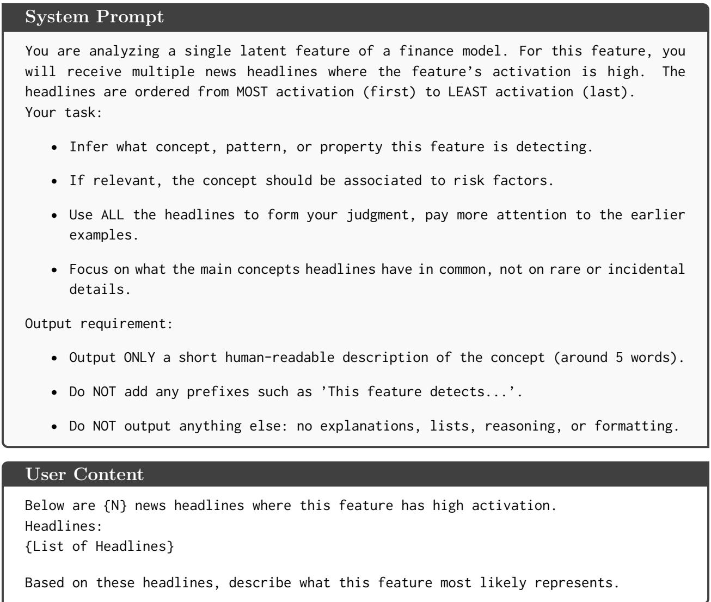  
Figure 24: SAE Feature Labeling Prompt

Note. The exact system and user prompts used to generate semantic labels for the SAE features. The model is provided with the top-activating headlines for a specific feature index and instructed to synthesize a short, finance-related concept label.

sparse autoencoder isolates distinct, highly cohesive economic narratives from the broader news corpus.

Table 10: Selected High-Activation Headlines

Representative headlines selected from the highest-scoring activations of each feature, ranked by cosine similarity to the learned SAE direction. Headlines are drawn from the Reuters/Dow Jones news corpus (1996–2022).

<table><tr><td colspan="2">Panel A: Cryptocurrency</td></tr><tr><td>1</td><td>U.S. Treasury offcial says any cryptocurrency project, including Libra, operating in whole or substantial parts of U.S. will clearly have to satisfy U.S. regulatory standards regardless of base</td></tr><tr><td>2</td><td>Coinbase says it has received regulatory approval in Ireland to operate as a virtual asset service provider (VASP)</td></tr><tr><td>3</td><td>Google ends ban on cryptocurrency-related ads, plans to allow regulated crypto exchanges to buy ads in U.S., Japan; new policy starts in October</td></tr><tr><td>4</td><td>BNY Mellon will hold, transfer and issue Bitcoin and other cryptocurrencies on behalf of its asset-management clients</td></tr><tr><td>5</td><td>Musk says Bitcoin paid to Tesla will be retained as Bitcoin, not converted to fiat currency</td></tr><tr><td colspan="2">Panel B: Meme-Stock Short Squeeze Retail Frenzy AMC Entertainment Holdings Inc - more than 80% of AMC shares are held by a broad</td></tr><tr><td>1 2</td><td>base of retail investors with an average holding of around 12O shares Popular Reddit &quot;WallStreetBets” forum which investors said helped drive surge in GameStop appears to go private</td></tr><tr><td>3</td><td>Citadel CEO Ken Griffin says &quot;I think the GameStop situation is incredibly unique in that it was such a heavily shorted stock&quot;</td></tr><tr><td>4</td><td>Shares of GameStop reverse loss, last up 2% after Keith Gill, known as &#x27;Roaring Kitty&#x27;, gives congressional testimony</td></tr><tr><td>5</td><td>Robinhood must face market manipulation claims over trading restrictions during last year&#x27;s &quot;meme stock” rally — U.S. judge</td></tr></table>

## C Extreme Features

Tables 11 and 12 list the ten MSRR-selected factors with the strongest underreaction and overreaction, along with their percentile ranks (computed across all 5,000 SAE features) on each behavioral proxy. Among underreactors, several themes stand out: consumer protection enforcement, fact-checking algorithms, and airline fare changes rank highly on negative sentiment, while EPS guidance and clinical trial updates are quantitatively intensive. Among overreactors, COVID-19 response topics, high trading volume spikes, and housing market trends dominate—topics characterized by high uncertainty and concentrated media attention.

Table 11: Top 10 Underreacting MSRR Factors  
The 10 MSRR-selected factors with the highest $\rho _ { k }$ (strongest underreaction). Neg. S, Q, U, and News denote the feature’s percentile rank (0–100) among all 5,000 SAE features on negative sentiment, quantitative intensity, linguistic uncertainty, and news count, respectively.
<table><tr><td> $\rho _ { k }$ </td><td>Neg. S</td><td>Q</td><td>U</td><td>News</td><td>Description</td></tr><tr><td>+0.34</td><td>96</td><td>12</td><td>48</td><td>42</td><td>Consumer protection enforcement, refunds</td></tr><tr><td>+0.32</td><td>44</td><td>2</td><td>70</td><td>62</td><td>Social media fact-checking algorithms updates</td></tr><tr><td>+0.28</td><td>5</td><td>72</td><td>71</td><td>7</td><td>Airline fare sales and change-fee waivers</td></tr><tr><td>+0.26</td><td>94</td><td>96</td><td>20</td><td>56</td><td>Negative EPS/EBITDA guidance (loss outlook)</td></tr><tr><td>+0.25</td><td>14</td><td>9</td><td>89</td><td>2</td><td>Genomics and sequencing technology developments</td></tr><tr><td>+0.24</td><td>9</td><td>75</td><td>5</td><td>67</td><td>Clinical trial updates and FDA approvals</td></tr><tr><td>+0.22</td><td>74</td><td>39</td><td>51</td><td>69</td><td>Executive transitions to chair/advisor roles</td></tr><tr><td>+0.22</td><td>45</td><td>68</td><td>42</td><td>82</td><td>CEO saaries and symbolic pay cuts</td></tr><tr><td>+0.22</td><td>11</td><td>44</td><td>19</td><td>95</td><td>Automaker EV battery scaling plans</td></tr><tr><td>+0.21</td><td>84</td><td>27</td><td>59</td><td>43</td><td>Cruise sailings and events cancellations</td></tr></table>

Table 12: Top 10 Overreacting MSRR Factors  
The 10 MSRR-selected factors with the lowest $\rho _ { k }$ (strongest overreaction). Neg. S, Q, U, and News denote the feature’s percentile rank (0–100) among all 5,000 SAE features on negative sentiment, quantitative intensity, linguistic uncertainty, and news count, respectively.
<table><tr><td> $\rho _ { k }$ </td><td>Neg. S</td><td>Q</td><td>U</td><td>News</td><td>Description</td></tr><tr><td>-0.42</td><td>51</td><td>25</td><td>59</td><td>66</td><td>Corporate COVID-19 response: PPE, testing,vaccines</td></tr><tr><td>-0.26</td><td>39</td><td>84</td><td>98</td><td>7</td><td>Unusually high trading volume spikes</td></tr><tr><td>-0.24</td><td>58</td><td>82</td><td>71</td><td>55</td><td>FXCM retail forex trading metrics</td></tr><tr><td>-0.24</td><td>24</td><td>6</td><td>35</td><td>27</td><td>Programmatic advertising targeting</td></tr><tr><td>-0.20</td><td>30</td><td>85</td><td>21</td><td>89</td><td>Analyst rating and price target changes</td></tr><tr><td>-0.18</td><td>68</td><td>6</td><td>80</td><td>11</td><td>Antibiotic approvals for resistant infections</td></tr><tr><td>-0.16</td><td>82</td><td>14</td><td>90</td><td>76</td><td>Investigation findings on incidents/attacks</td></tr><tr><td>-0.16</td><td>77</td><td>38</td><td>89</td><td>28</td><td>U.S. housing market prices and sales trends</td></tr><tr><td>-0.14</td><td>71</td><td>92</td><td>54</td><td>2</td><td>Small-cap SEC filings with numeric guidance</td></tr><tr><td>-0.14</td><td>12</td><td>20</td><td>5</td><td>27</td><td>Media distribution and merger agreements</td></tr></table>

## D Additional Behavioral Proxies

In Section 5.4.1, we investigate the behavioral determinants of over- and underreaction using the textual attributes of SAE topics. To maintain brevity and focus the main analysis, we limited that discussion to four linguistic properties prominently featured in the behavioral finance literature: negative sentiment, quantitative intensity, ambiguity, and news attention. In this appendix, we expand our scope to investigate a broader battery of 18 text-based and SAE-derived topic attributes, motivated by the broader textual analysis literature.

For each SAE feature k, we first assemble a feature-specific corpus consisting of the 100 news articles that yield the highest activations. Based exclusively on this corpus, we construct our 18 topic-level proxies. We organize these proxies into five distinct categories, and all variables are subsequently standardized to mean zero and unit variance.

First, we focus on readability, which captures how easily readers can process and comprehend the information contained within the text. We construct three specific proxies to measure this dimension: (i) the Flesch–Kincaid Grade Level (Li, 2008; Loughran and McDonald, 2014), which translates syntactic and vocabulary difficulty into a U.S. school grade equivalent; (ii) average sentence length, measured as words per sentence, to capture structural complexity; and (iii) average word length, measured as characters per word, to capture lexical complexity.

Our second category is lexical tone and content, which captures what the text communicates in terms of sentiment, certainty, and abstraction. We construct five specific proxies to measure this dimension: (i) negative sentiment, calculated as the fraction of negative words defined by Loughran and McDonald 2011, to capture pessimistic tone; (ii) linguistic ambiguity, utilizing the same dictionary to measure the frequency of ambiguous or noncommittal language; (iii) quantitative intensity, defined as the fraction of tokens containing digits, reflecting the text’s reliance on hard numerical data; (iv) concreteness, calculated as the mean rating of content words based on Brysbaert et al. 2014, to assess how tangible versus abstract the language is; and (v) modal verb density, measured as the fraction of modal verbs, which further qualifies the certainty and conditionality of the statements.

Our third category is lexical complexity and structure, which captures how the text is constructed in terms of vocabulary diversity and composition. We construct four specific proxies to measure this dimension: (i) the type–token ratio, which measures overall lexical diversity by comparing unique words to the total word count; (ii) the noun ratio, representing the fraction of nouns and proper nouns to indicate the focus on specific entities; (iii) content word density, measured as the fraction of content words (verbs, adjectives, adverbs, and conjunctions), to reflect the concentration of semantic content within the text; and (iv) logic connective density, calculated as the proportion of causal and logical connectives (such as “therefore,” “however,” and “because”), which indicates the explicit complexity of the underlying reasoning.22

Our fourth category is information environment, which characterizes the broader media context, thematic structure, and novelty of the information surrounding the text. We construct four specific proxies to measure this dimension: (i) attention, measured as the average volume of articles published about the same stock on the same day, to reflect the overall level of media coverage; (ii) argument overlap, defined as the noun overlap ratio between adjacent sentences following the referential cohesion framework of Graesser et al. (2004), which measures the local cohesion and flow of information;23 (iii) dormancy, measured using the rarity of activated features in the corpus, capturing signal novelty and infrequency;24 and (iv) SAE complexity, defined as the Shannon entropy of the stock’s Sparse Autoencoder (SAE) activation profile, to gauge the broader representational complexity of the information state.

Our fifth and final category is divergence of opinion, which captures the degree of disagreement and conflicting perspectives across the articles. We construct two specific proxies to measure this dimension: (i) sentiment disagreement, calculated as the variance of per-article sentiment scores based on Loughran and McDonald 2011, which serves as a textual analogue of the forecast dispersion proxy for divergence of opinion (Miller, 1977; Diether et al., 2002); and (ii) SAE divergence, defined as the mean distance of each article’s SAE embedding to the feature centroid, which captures dispersion of content in the embedding space.

To systematically evaluate these 18 linguistic and structural properties, we expand upon the baseline regression model introduced in Section 5.4.1 (Equation (12)). We first estimate a series of 18 separate univariate regressions to assess the standalone explanatory power of each proxy. For each proxy $j \in \{ 1 , \dots , 1 8 \}$ , we regress the misreaction measure $\rho _ { k }$ on the standardized textual attribute $X _ { k } ^ { ( j ) }$

$$
\rho _ { k } = \alpha ^ { ( j ) } + \theta ^ { ( j ) } X _ { k } ^ { ( j ) } + \epsilon _ { k } ^ { ( j ) } .\tag{14}
$$

Next, to account for the overlapping information embedded across these textual dimensions and to identify the independent drivers of mispricing, we estimate a comprehensive “kitchensink” specification that includes all 18 proxies simultaneously:

$$
\rho _ { k } = \alpha + \sum _ { j = 1 } ^ { 1 8 } \theta _ { j } X _ { k } ^ { ( j ) } + \epsilon _ { k } .\tag{15}
$$

Table 13 reports the results; all standard errors are HC1-robust. Column (1) summarizes the univariate regressions, reporting the respective $\theta ^ { ( j ) }$ coefficient from Equation (14) for each proxy. Many proxies are univariately significant. For example, readability measures and lexical complexity proxies generally load with signs consistent with underreaction and overreaction, respectively, in their standalone regressions. Within the information environment category, the complexity and opacity measures—dormancy and SAE complexity—load negatively in the univariate regressions, consistent with the prediction that more complex information environments generate overreaction (Ba et al., 2024). Conversely, argument overlap, which captures discourse coherence, loads positively, consistent with the converse prediction that more coherent, easier-to-process text mitigates overreaction. Sentiment disagreement also loads negatively, consistent with Miller (1977): when articles covering a given topic exhibit greater dispersion in tone, short-sale constraints prevent pessimists from expressing their views, leading to prices that reflect the optimistic end of the belief distribution.

Column (2) reports the results of the kitchen-sink specification (Equation (15)) with all 18 variables estimated jointly $( R ^ { 2 } = 5 . 8 \% , N = 5 , 0 0 0 )$ ).25 While several variables, such as the content word density and logic connective metrics, are absorbed in the multivariate setting, eleven proxies remain statistically significant at the 5% level. Three of the four main channels emphasized in Section 5.4.1—negative sentiment, quantitative intensity, and ambiguity— retain their significance. Attention is absorbed, subsumed by the richer information environment proxies in this expanded specification. Beyond these baseline variables, the regression identifies independent explanatory power in Flesch–Kincaid (t = −2.94), average sentence length (t = 3.82), average word length (t = 4.28), type–token ratio (t = 2.43), argument overlap (t = 2.47), dormancy (t = −3.50), SAE complexity (t = −4.15), and sentiment disagreement (t = −2.59).

## Table 13: Additional Behavioral Proxies

This table reports cross-sectional regressions of the misreaction measure $\rho _ { k }$ on all behavioral proxies evaluated in this paper. Column (1) reports the coefficients from univariate regressions estimated separately for each proxy (Equation (14)). Column (2) reports the results of a joint “kitchen-sink” specification that includes all 18 variables simultaneously (Equation (15)). All proxies are standardized to mean zero and unit variance. Standard errors are HC1-robust. t-statistics are reported in parentheses. ∗∗∗, ∗∗, and ∗ denote significance at the 1%, 5%, and 10% levels, respectively.

<table><tr><td></td><td>(1) Univariate</td><td>(2) Kitchen Sink</td></tr><tr><td>Readability</td><td></td><td></td></tr><tr><td>Flesch-Kincaid</td><td>-0.002</td><td>-0.010***</td></tr><tr><td rowspan="2">Avg.Sentence Length</td><td>(-1.40)</td><td>(-2.94)</td></tr><tr><td>-0.009***</td><td>0.013***</td></tr><tr><td rowspan="2">Avg.Word Length</td><td>(-5.73)</td><td>(3.82)</td></tr><tr><td>0.008***</td><td>0.010***</td></tr><tr><td></td><td>(5.54)</td><td>(4.28)</td></tr><tr><td>Lexical Tone  Content</td><td></td><td>0.011***</td></tr><tr><td rowspan="2">Neg.Sentiment</td><td>0.010***</td><td></td></tr><tr><td>(8.41) -0.004***</td><td>(5.64)</td></tr><tr><td rowspan="2">Ambiguity</td><td></td><td>-0.004***</td></tr><tr><td>(-2.95) 0.014***</td><td>(-2.67)</td></tr><tr><td rowspan="2">Quant.Intensity</td><td>(8.40)</td><td>0.013***</td></tr><tr><td>0.000</td><td>(2.95) 0.003*</td></tr><tr><td rowspan="2">Concreteness Modal Verb Density</td><td>(0.06)</td><td>(1.80)</td></tr><tr><td>-0.008***</td><td>0.002</td></tr><tr><td></td><td>(-5.37)</td><td>(1.32)</td></tr><tr><td>Lexical Complexity &amp; Structure</td><td></td><td></td></tr><tr><td rowspan="2">Type-Token Ratio</td><td>0.002</td><td>0.005**</td></tr><tr><td>(1.21)</td><td>(2.43)</td></tr><tr><td rowspan="2">Noun Ratio</td><td>-0.001</td><td>-0.004</td></tr><tr><td>(-1.00) -0.012***</td><td>(-1.32)</td></tr><tr><td rowspan="2">Content Word Density</td><td></td><td>-0.002</td></tr><tr><td>（-8.28) -0.011***</td><td>(-0.36)</td></tr><tr><td rowspan="2">Logic Conn. Density</td><td></td><td>-0.002 (-0.72)</td></tr><tr><td>(-7.80)</td><td></td></tr><tr><td>Information Environment</td><td></td><td></td></tr><tr><td>Attention</td><td>-0.004***</td><td>-0.003</td></tr><tr><td rowspan="2">Argument Overlap</td><td>(-3.01)</td><td>(-1.64) 0.004**</td></tr><tr><td>0.009***</td><td></td></tr><tr><td rowspan="2">Dormancy</td><td>(7.71)</td><td>(2.47) -0.009***</td></tr><tr><td>-0.007***</td><td></td></tr><tr><td rowspan="2">SAE Complexity</td><td>(-5.21)</td><td>(-3.50) -0.009***</td></tr><tr><td>-0.008***</td><td></td></tr><tr><td></td><td>(-4.76)</td><td>(-4.15)</td></tr><tr><td>Divergence of Opinion</td><td></td><td></td></tr><tr><td rowspan="2">Sent.Disagreement</td><td>-0.008***</td><td>-0.004***</td></tr><tr><td>(-6.02) -0.000</td><td>(-2.59)</td></tr><tr><td rowspan="2">SAE Divergence</td><td>(-0.06)</td><td>-0.000</td></tr><tr><td></td><td>(-0.06)</td></tr><tr><td>R</td><td>5,000</td><td>0.058 5,000</td></tr></table>