# STREAM2LLM: OVERLAP CONTEXT STREAMING AND PREFILL FOR REDUCED TIME-TO-FIRST-TOKEN

Rajveer Bachkaniwala 1 Chengqi Luo 1 Richard So 1 Divya Mahajan 1 Kexin Rong 1

ABSTRACT

Context retrieval systems for LLM inference face a critical challenge: high retrieval latency creates a fundamental tension between waiting for complete context (poor time-to-first-token) and proceeding without it (reduced quality). Recent work mitigates this via streaming–overlapping retrieval with inference–but prior systems focus on single-request settings and overlook challenges in multi-tenant deployments where concurrent requests contend for GPU memory and scheduling must adapt to dynamic context arrivals.

We present STREAM2LLM, a system that extends vLLM to support streaming prompts with adaptive scheduling and preemption for two distinct retrieval patterns: append-mode (progressive context accumulation) and updatemode (iterative refinement with cache invalidation). STREAM2LLM decouples scheduling decisions from resource acquisition, enabling flexible preemption strategies guided by hardware-specific cost models, and uses cache invalidation based on longest common prefix matching to minimize redundant computation when prompts change dynamically. To evaluate STREAM2LLM, we collect and characterize two large-scale, real-world streaming workloads based on web crawling and approximate nearest neighbor search. Our evaluation demonstrates that streaming architecture delivers up to 11× TTFT improvements, with cost-aware scheduling providing critical benefits under memory pressure, while maintaining throughput parity with non-streaming baselines.

## 1 INTRODUCTION

Modern large language models (LLMs) increasingly rely on external context retrieval to provide accurate, up-to-date responses. Context retrieval mechanisms such as ANNS search over large vector databases and fetching relevant documents can take hundreds of milliseconds to seconds, during which the LLM inference engine sits idle, waiting for context before generating any output. This creates a fundamental tension between two undesirable outcomes: either wait for complete context retrieval (resulting in poor time-tofirst-token and degraded user experience), or proceed with incomplete context (resulting in lower quality responses).

Recent systems have proposed streaming context incrementally (Jiang et al., 2024; Yu et al., 2025): overlapping retrieval with inference by feeding context chunks to the LLM as they arrive, rather than waiting for complete retrieval. While these approaches demonstrate promising latency improvements, they focus mainly on optimizing latency for a single request or assume a fixed batch size with fixed input sequence length and context retrieval pattern. Real-world production deployments, however, must serve multiple concurrent requests to maximize GPU utilization and system throughput. Multi-tenant environments introduce additional challenges: scheduling decisions must adapt dynamically as context chunks arrive at different rates for different requests, and concurrent requests compete for limited GPU memory and KV cache blocks.

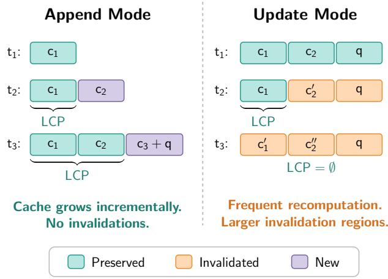  
Figure 1. Longest Common Prefix (LCP) invalidation for streaming modes.

The challenges of multi-tenant streaming context retrieval are substantial. When multiple requests stream context concurrently, GPU memory becomes a contested resource: each request maintains KV cache blocks for its growing prompt, and memory exhaustion forces the system to preempt requests, either by swapping their cache to CPU or discarding it entirely for later recomputation. Scheduling policies must decide which requests to prioritize when new context chunks arrive, balancing fairness, latency, and cache locality. Furthermore, context retrieval exhibits two distinct patterns that require different handling: append-mode, where context chunks progressively extend the prompt (as in crawler-based document retrieval), and update-mode, where the entire context set changes iteratively as search algorithms refine results (as in ANNS-based systems like AquaPipe). Naive approaches that treat all streaming requests uniformly suffer from either poor scheduling decisions or excessive cache recomputation overhead.

We present STREAM2LLM, a system that extends the vLLM inference engine (Kwon et al., 2023) to support streaming prompts in multi-tenant production environments. STREAM2LLM introduces a two-phase scheduling architecture that decouples priority-based request ordering from resource acquisition, enabling flexible preemption strategies. When memory is exhausted, the system preempts low-priority requests using cost-based decisions guided by hardware-specific performance models, choosing between recomputing invalidated cache versus swapping cache blocks to CPU. To minimize redundant computation when prompts change dynamically, STREAM2LLM uses longest common prefix (LCP)-based cache invalidation, preserving cache for unchanged prefix tokens while invalidating only changed portions. This mechanism handles both appendmode and update-mode retrieval patterns uniformly.

STREAM2LLM targets the prefill instance in a prefilldecode disaggregated deployment (Patel et al., 2024; Qin et al., 2024; Zhong et al., 2024), following industry practice. In this architecture, TTFT and throughput are the relevant prefill-instance metrics; decode latency (TPOT) is determined by the separate decode instance.

We conducted a comprehensive evaluation using real-world streaming traces collected from web crawling and ANNSbased retrieval systems, capturing both append-mode and update-mode retrieval patterns. Our evaluation on H100 and H200 GPUs with Llama-3.1 models reveals that streaming architecture provides substantial benefits across different schedulers, but intelligent scheduling becomes increasingly important as load increases. At low loads, all streaming schedulers converge to similar performance, with improvements of up to 3.9–11.0 in time-to-first-token over nonstreaming baselines. However, as load and memory contention increase, scheduler choice becomes critical: proper prioritization strategies enable efficient cache reuse and responsiveness, while naive scheduling causes catastrophic tail latency degradation (up to 10 worse in extreme memory pressure scenarios). These findings hold across GPU architectures and workload types, demonstrating that streaming is necessary but insufficient—intelligent scheduling is essential for making streaming viable in production deployments.

This paper makes the following contributions:

• STREAM2LLM, a system that extends vLLM to support streaming prompts in multi-tenant LLM inference, handling both append-mode (progressive context accumulation) and update-mode (iterative context refinement) workloads.

We introduce a two-phase scheduling architecture that decouples request prioritization from GPU memory allocation and preemption, enabling policies that maximize KV cache reuse. This is combined with costbased adaptive preemption (recomputation vs. swapping) and longest common prefix-based cache invalidation to reduce redundant computation for dynamically changing prompts.

We evaluate STREAM2LLM using real-world, streaming traces from web crawling and ANNS-based retrieval systems. Results show that streaming architecture itself delivers up to 11× TTFT improvements, while scheduler differentiation becomes important primarily under memory pressure.

## 2 BACKGROUND

## 2.1 LLM Inference and KV Cache Management

Large language model inference follows an autoregressive generation process consisting of two distinct phases. Given an input prompt with n tokens $\mathbf { x } = [ x _ { 1 } , x _ { 2 } , \ldots , x _ { n } ] .$ , the prefill phase processes all prompt tokens in parallel, computing attention scores and generating key-value pairs $( K _ { i } , V _ { i } )$ for each token position $i \in [ 1 , n ]$ These KV pairs are stored in GPU memory as the KV cache. The decode phase then generates output tokens autoregressively: at each step t, the model attends to all previously computed KV pairs $\{ ( K _ { 1 } , V _ { 1 } ) , \dotsc , ( K _ { n + t - 1 } , V _ { n + t - 1 } ) \}$ to generate the next token $x _ { n + t }$ . The newly generated token’s KV pair $\left( K _ { n + t } , V _ { n + t } \right)$ is appended to the cache, avoiding redundant recomputation of attention for tokens processed in earlier steps.

For a transformer model with L layers, hidden dimension $d ,$ total attention heads $h ,$ and $h _ { \mathrm { k v } }$ key-value heads (head dimension $d _ { h } = d / h )$ , each token position stores $2 L d \frac { h _ { \mathrm { k v } } } { h }$ values across all layers (keys and values). The total KV cache memory for a sequence of length ℓ is $\begin{array} { r } { M _ { \mathrm { K V } } = 2 L \ell d \frac { h _ { \mathrm { k v } } } { h } \cdot b , } \end{array}$ where b is the number of bytes per parameter (typically 2 bytes for FP16). For Meta Llama-3.1-8B with $L = 3 2$ $d = 4 0 9 6 , h = 3 2 , h _ { \mathrm { k v } } = 8 .$ and ℓ = 32K, this amounts to $M _ { \mathrm { K V } } \approx 1 . 3 { \mathrm { G B } }$ per request in FP16 precision. When serving B concurrent requests through batching, total memory consumption becomes $B \cdot M _ { \mathrm { K V } }$ , making memory the primary bottleneck. As B increases to improve throughput, available memory per request decreases, forcing systems to either limit batch size or preempt requests to free KV cache blocks.

## 2.2 vLLM and PagedAttention

Traditional KV cache implementations allocate a single contiguous memory region of size $M _ { \mathrm { K V } }$ for each request, leading to memory fragmentation as requests arrive and complete at different times. vLLM (Kwon et al., 2023) addresses this through PagedAttention, which divides the KV cache into fixed-size blocks. For a block size of k tokens, the KV cache for a sequence is stored as a sequence of blocks $\boldsymbol { B } = \{ B _ { 1 } , B _ { 2 } , \ldots , B _ { \lceil \ell / k \rceil } \}$ , where each block $B _ { j }$ stores KV pairs for tokens $[ ( j - \dot { 1 } ) \dot { k } + 1 , \operatorname* { m i n } ( j k , \ell ) ]$ . These blocks need not be contiguous in physical memory, similar to virtual memory paging in operating systems.

The attention computation in PagedAttention operates blockwise. For computing attention at position $t ,$ the system retrieves all blocks $\{ B _ { 1 } , \ldots , B _ { \lceil t / k \rceil } \}$ containing KV pairs for positions [1, t], regardless of their physical memory locations. This design provides two key benefits: (1) reduced fragmentation by allocating blocks on-demand from a free block pool, and (2) efficient prefix sharing when multiple requests share common prompt prefixes, as blocks containing the shared prefix can be referenced by multiple requests without duplication.

vLLM supports continuous batching, maintaining a dynamic batch $\mathcal { R } _ { t } = \{ r _ { 1 } , r _ { 2 } , . . . , r _ { B _ { t } } \}$ where requests can be added or removed at any scheduling step t. When total KV cache memory exceeds GPU capacity $M _ { \mathrm { G P U } }$ , the system must preempt requests. For a request r with $\ell _ { r }$ processed tokens occupying $\lceil \ell _ { r } / k \rceil$ blocks, preemption follows one of two strategies:

Recomputation: Discard all KV cache blocks for r, freeing $\lceil \ell _ { r } / k \rceil \cdot M _ { \mathrm { b l o c k } }$ memory (where $M _ { \mathrm { b l o c k } } =$ $2 L k d \cdot b )$ Upon resumption, recompute the prefill phase for all $\ell _ { r }$ tokens, incurring compute cost $C _ { \mathrm { r e c o m p } } ( r ) = \ell _ { r } \cdot C _ { \mathrm { p r e f l l } }$ where $C _ { \mathrm { p r e f i l } }$ is the per-token prefill latency.

• Swapping: Transfer all blocks $\{ B _ { 1 } , \dots , B _ { \lceil \ell _ { r } / k \rceil } \}$ from GPU to CPU memory, incurring data transfer cost $\begin{array} { r } { C _ { \mathrm { s w a p } } ( r ) \ = \ \frac { \lceil \ell _ { r } / k \rceil \cdot M _ { \mathrm { b l o c k } } } { B W _ { \mathrm { P C I e } } } } \end{array}$ where $B W _ { \mathrm { P C I e } }$ is the PCIe bandwidth. Upon resumption, swap blocks back to GPU with symmetric cost. The blocks preserve computed KV values, avoiding recomputation.

The preemption decision compares $C _ { \mathrm { r e c o m p } } ( r )$ versus $2$ $C _ { \mathrm { s w a p } } ( r )$ (accounting for bidirectional transfer), selecting the strategy with lower predicted latency.

## 2.3 Context Retrieval for LLMs

Modern LLM deployments require external context  to augment the model’s parametric knowledge. Given a query $q ,$ context retrieval systems produce a set of relevant documents $\mathcal { D } = \{ d _ { 1 } , d _ { 2 } , \dots , d _ { m } \}$ that are concatenated with $q$ to form the final prompt. Two retrieval mechanisms are commonly used:

Web crawler retrieval: Given a query $q ,$ the system fetches documents from the web or internal knowledge bases. Latency $T _ { \mathrm { w e b } }$ includes network round-trip time, DNS resolution, content fetching, and parsing, typically ranging from 200ms to multiple seconds per document.

ANNS-based retrieval: Given a query embedding ${ \bf e } _ { q } \in  { }$ $\mathbb { R } ^ { d _ { e } }$ and a corpus $\begin{array} { r c l } { \mathcal { C } } & { = } & { \{ c _ { 1 } , \ldots , c _ { N } \} } \end{array}$ with embeddings $\{ \mathbf { e } _ { c _ { 1 } } , \hdots , \mathbf { e } _ { c _ { N } } \}$ , find the k-nearest neighbors $\mathcal { D } =$ $\begin{array} { r } { \{ \mathbf { o p } { - } k \big ( \{ c _ { i } \ : \ \sin ( \mathbf { e } _ { q } , \mathbf { e } _ { c _ { i } } ) \ \mid \ c _ { i } \ \in \ \mathcal { C } \} \big ) } \end{array}$ where $\sin ( \cdot , \cdot )$ is a similarity metric $( e . g .$ ., cosine similarity or L2 distance). While popular in-memory ANNS solutions such as HNSW (Malkov & Yashunin, 2018) achieve low retrieval latency, storing the entire index in memory becomes impractical for large corpora $( N \sim 1 0 ^ { 9 } )$ . Disk-based ANNS solutions such as DiskANN (Jayaram Subramanya et al., 2019) address this by storing graph-based indexes on disk, where search performs O(log N ) graph traversals with disk I/O at each step. Retrieval latency TANNS ranges from 100ms to several seconds depending on corpus size, index complexity parameter (e.g., search list size L in DiskANN), and disk bandwidth.

## 2.4 Traditional vs Streaming Inference

Traditional inference systems construct the complete prompt $\mathbf { x } = [ \mathcal { D } , q ]$ only after retrieval finishes at time $T _ { \mathrm { r e t r i e v e } } .$ , then begin prefill. This results in time-to-first-token (TTFT) of $T _ { \mathrm { T T F T } } = T _ { \mathrm { r e t r i e v e } } + T _ { \mathrm { p r e f i l l } } ( | \mathcal { D } | + | q | ) + T _ { \mathrm { d e c o d e - f i r s t } }$ , where $T _ { \mathrm { r e t r i e v e } }$ often dominates. Streaming context approaches reduce TTFT by sending context chunks incrementally. Instead of waiting for complete $\mathcal { D } ,$ documents arrive over time: $d _ { 1 }$ at time $t _ { 1 } , d _ { 2 }$ at time $t _ { 2 } ,$ etc. The LLM begins inference with partial context ${ \mathcal { D } } _ { t } = \{ d _ { i } : t _ { i } \leq t \}$ and continues as new documents arrive.

Recent work explores two streaming modes. PipeRAG (Jiang et al., 2024) demonstrates progressive accumulation where $\mathcal { D } _ { t } \subseteq \mathcal { D } _ { t }$ ′ for $t \ < \ t ^ { \prime }$ (append mode). AquaPipe (Yu et al., 2025) addresses ANNS with iterative refinement where $\mathcal { D } _ { t }$ may differ from $\mathcal { D } _ { t ^ { \prime } }$ as the search algorithm replaces lower-quality candidates with higher-quality ones (update mode). Both systems show TTFT improvements by overlapping retrieval with prefill/decode, but evaluate single-request scenarios $( B = 1 )$ without addressing multi-tenant scheduling.

While AquaPipe is the only published system demonstrating update-mode streaming for LLM inference, multi-phase retrieval pipelines that naturally produce progressive context updates are widely used in production. Systems such as Vespa implement phased ranking where documents are progressively filtered and re-ranked across multiple stages (Vespa Team, 2024), and distributed search engines like Elasticsearch emit partial results as individual shards complete. These patterns map naturally to update-mode streaming. For append mode, our crawler workload applies per-document filtering and deduplication inline as each page is retrieved, enabling incremental streaming without a global reranking step.

## 3 CHALLENGES

Streaming multi-tenant inference workloads differ fundamentally from static batch inference. Requests stream context incrementally over time, evolve asynchronously, and compete for shared GPU resources. These unique properties create several system design challenges.

Dynamic Workload Variability. Each request expands dynamically as new chunks of context arrive and generates outputs of unpredictable length until termination tokens appear. This variability makes both compute demand and memory footprint time-dependent, and requires dynamic policies.

Chunk arrivals are asynchronous: some requests stall waiting for retrieval while others suddenly receive new context. Requests that just received a chunk should be prioritized to process it while the request’s KV cache blocks remain allocated in GPU memory, but traditional scheduling policies (e.g., FCFS or progress-based heuristics) cannot capture this temporal priority. Schedulers must dynamically re-rank requests as chunk arrival patterns shift, balancing freshness, fairness, and preemption cost.

All requests draw from the same finite pool of GPU memory for KV cache blocks. As input sequences grow, total cache usage can exceed GPU capacity, forcing the system to free memory through preemption. The optimal strategy–whether to recompute discarded cache or to swap it to CPU memory– depends on request progress, hardware bandwidth ratios, and expected resumption time.

Mode-Dependent Context Evolution. Streaming retrieval workloads differ in how input sequences evolve. In webcrawler-style retrievers (append mode), requests extend the existing sequences, whereas in ANNS-style retrievers (update mode), requests replace parts of the sequence as retrieval refines results. These modes require different scheduling and cache management behaviors.

In update mode, the system must determine which KV cache blocks remain valid after each update. If the scheduler naively invalidates all blocks, it wastes memory by discarding valid cached results and forces expensive recomputation. Conversely, if the scheduler reuses blocks without verification, it risks computing incorrect output based on stale cache, since subsequent attention computations would attend to outdated key-value pairs that no longer correspond to the current input sequence. Frequent replacements early in the sequence can lead to high recomputation costs.

Append and update workloads also differ in optimal preemption strategies. Append-mode requests favor swapping to preserve reusable cache, while update-mode requests often prefer recomputation to avoid retaining soon-invalid data.

## 4 SYSTEM DESIGN

Deployment Assumption. STREAM2LLM targets the prefill instance in a prefill-decode disaggregated architecture (Qin et al., 2024), where prefill and decode run on separate GPU pools. This is standard practice in production LLM serving (Patel et al., 2024; Zhong et al., 2024). TTFT and throughput are the metrics relevant to the prefill instance; token generation latency (TPOT) is handled by the decode instance and is not evaluated.

STREAM2LLM addresses the challenges with multi-tenant, streaming workloads (Figure 2) with two key design principles:

• Support for two distinct streaming modes: Requests can either append new input chunks to the existing sequence or replace parts of the input sequence entirely. Each mode imposes different requirements on cache management, scheduling, and preemption.

• Decoupling scheduling from resource acquisition: STREAM2LLM separates the decision of which request to prioritize from the mechanics of allocating GPU memory and applying preemption. This decoupling enables sophisticated policies that maximize KV cache reuse while adapting to dynamic workloads.

The subsequent subsections introduce the two-phase scheduling design (§ 4.1), cache invalidation mechanisms (§ 4.2), cost-based preemption strategies (§ 4.3), and scheduling policies (§ 4.4).

## 4.1 Two-Phase Scheduling and Request Lifecycle

A key insight in STREAM2LLM is the separation of scheduling decisions from resource acquisition. Rather than embedding both in a single control loop, STREAM2LLM organizes them into two distinct phases, allowing scheduling policies to reason about priorities independently of allocation and preemption mechanics.

When scheduling, allocation, and preemption are tightly

coupled, several challenges arise:

• Fixed Policy Coupling. A monolithic loop forces the scheduler to preempt immediately when resources are exhausted, using a static rule that may contradict the policy’s notion of priority. This prevents different scheduling algorithms from expressing distinct preemption behaviors.

• Cache Invalidation Coupling. When an input sequence is updated, two operations must occur: token count increases and cached KV blocks may become invalid. In a monolithic loop, these operations interleave with scheduling and allocation, making it unclear whether to invalidate before or after attempting allocation.

STREAM2LLM decouples scheduling and resource acquisition into two phases that explicitly separate concerns:

Phase 1: Priority Ordering and Feasibility Analysis. The scheduler invokes the selected scheduling algorithm (Section 4.4) to compute an ordered list of all unfinished requests ranked by priority. It then performs a feasibility analysis that determines which requests can theoretically be scheduled given current token budget and estimated GPU block requirements. Crucially, this phase performs no resource allocation and modifies no request state—it only computes feasibility. Requests that cannot fit within current resources are added to a not scheduled reqs list while preserving their priority order. This separation allows priority decisions to be independent of resource constraints.

Phase 2: Resource Acquisition with Adaptive Preemption. The scheduler attempts to allocate GPU blocks for each request selected in Phase 1. If allocation fails, the scheduler selects a preemption candidate from the not - scheduled reqs list (in priority order) and applies the decision framework from § 4.3 to choose between recomputation and swapping. By deferring allocation to this phase, the scheduler can incorporate cost-based or multi-objective heuristics before committing to preemption.

This two-phase structure separates what to run from how to allocate resources and provides several benefits. Preemption naturally follows the scheduling priority order without hardcoded rules. Cache invalidation occurs at precise boundaries between analysis and allocation. The resource-acquisition phase can flexibly integrate cost- or latency-aware strategies without altering core scheduling logic.

Request Lifecycle.. The scheduler tracks requests through three primary queues: waiting (arrived but not yet scheduled), running (currently executing or scheduled in the current batch), and finished (completed). As shown in Figure 3, transitions between these queues are governed by the two-phase design. Requests move from waiting to running when selected in Phase 1 and allocated in Phase 2. If a running request is preempted, it returns to waiting:

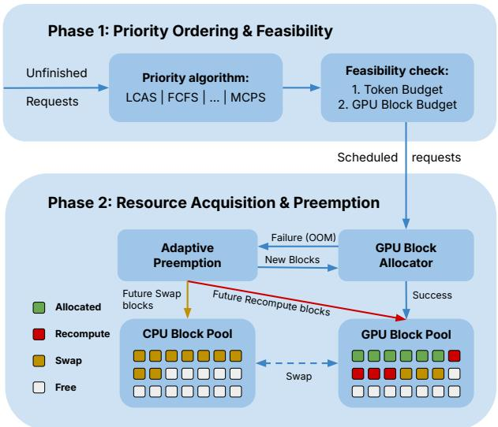

Figure 2. STREAM2LLM design.  
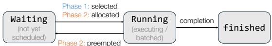  
Figure 3. STREAM2LLM request state transitions.

recomputation resets its token progress, while swapping preserves state by offloading KV blocks to CPU memory. Upon completion, requests transition from running to finished.

## 4.2 KV Cache Invalidation for Streaming Prompts

STREAM2LLM supports two input sequence modification modes suited to different context retrieval patterns:

• Append Mode: New input chunks are appended to the existing sequences, typical in crawler-style workloads.

• Update Mode: The entire input sequence is updated dynamically, typical in ANNS-style workloads.

A unique challenge for streaming prompt workloads is that the prompt token sequence itself changes dynamically. When a new prompt chunk arrives, the scheduler must decide which cached KV blocks remain valid and which must be invalidated. Traditional LLM inference assumes a fixed prompt at request arrival, computing KV cache blocks once for the entire request lifetime. However, in streaming context retrieval workloads, the prompt grows or changes as new document chunks arrive. For example, the prompt may evolve from $[ d _ { 1 } , q ]$ (document chunk 1 + query) to $[ d _ { 1 } , d _ { 2 } , q ]$ as document chunks are added, or from [d1, d2, q] to $[ d _ { 1 } ^ { \prime } , d _ { 2 } , q ]$ when chunks are replaced in ANNS-style systems. If the scheduler naively invalidates all KV cache blocks upon each prompt update, it wastes memory by discarding previously computed blocks that remain valid and forces expensive recomputation. Conversely, if the scheduler reuses blocks without verification, it risks computing incorrect output based on stale cache.

Longest Common Prefix Invalidation. STREAM2LLM addresses this by computing the longest common prefix (LCP) between the old and new prompt token sequences, as illustrated in Figure 1. When a streaming request receives a new prompt chunk, the engine computes the LCP and invalidates only the KV cache blocks corresponding to tokens beyond the LCP. Blocks for tokens within the LCP are preserved, avoiding redundant recomputation. The LCP approach is optimal when prompt updates involve appending new chunks or replacing suffix tokens, which is typical in context retrieval systems. It becomes less beneficial when updates are frequent or affect early tokens.

For example, suppose a request previously computed KV cache for tokens $[ d _ { 1 } , d _ { 2 } , q ;$ , out $\mathrm { \ u t _ { 1 } } , \mathrm { o u t p u t _ { 2 } } ]$ , and a prompt update replaces this with $[ d _ { 1 } , d _ { 2 } ^ { \prime } , q$ , output1, output2], where $d _ { 2 } ^ { \prime } \neq d _ { 2 } ,$ , the LCP is $\left[ d _ { 1 } \right]$ (length 1). The scheduler invalidates cache blocks for tokens 1 onward (corresponding to $d _ { 2 } , q ,$ and output) while preserving the KV cache for token 0 (document chunk 1).

For analysis, STREAM2LLM tracks the total number of tokens invalidated across all prompt updates per request via total tokens invalidated. This metric is reported when the request finishes, allowing researchers to measure the cost of cache invalidation in context retrieval workloads. High invalidation counts indicate frequent or aggressive prompt updates, suggesting that the system is spending significant effort on recomputation.

Cache Invalidation Semantics. When k tokens are invalidated beyond the LCP, the scheduler frees the corresponding KV cache blocks and returns them to the free block pool. For CPU-swapped requests, the scheduler also frees the corresponding CPU blocks to reduce memory pressure. The scheduler then sets num computed tokens to the LCP length, forcing recomputation only for tokens that changed.

The interaction between cache invalidation and preemption requires careful sequencing to avoid freeing blocks that are about to be swapped back in. When a preempted request receives a prompt update, the scheduler invalidates blocks from the LCP onward on CPU and frees these blocks from CPU memory. When the request resumes, it first swaps its remaining blocks (those before the LCP) back to GPU, then recomputes tokens from the LCP onward. This design ensures that prompt updates do not cause memory leaks or inconsistencies in the swapped state.

## 4.3 Cost-based Preemption

When GPU memory is exhausted, STREAM2LLM preempts requests and chooses between recomputation and swapping strategies based on cost models. STREAM2LLM profiles two hardware-specific latency cost functions offline on each target platform, as shown in Figure 4. recomputation latency(T ) predicts the time to recompute T tokens via prefill. We measure prefill latency across varying token counts (1K-128K) on each GPU (A40, H100, H200) and fit a piecewise-linear model to account for memory bandwidth saturation. swap latency(C) predicts the time to swap C KV cache blocks between GPU and CPU memory. We measure transfer latency for typical block sizes of 2 MB (for the given model Llama 3.1 8B, and default block size of 16) and account for PCIe bandwidth constraints. On systems with NVLink or faster interconnects, swap costs are correspondingly lower.

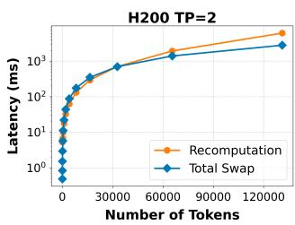

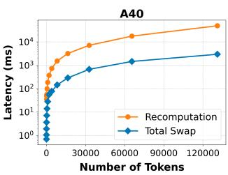  
Figure 4. Performance models for recomputation vs. total swap latency costs across token counts on H200 and A40.

These cost functions are hardware-specific: a recomputation that takes 50ms on H100 may take 200ms on A40 due to differences in compute density and memory bandwidth. The scheduler evaluates both cost functions at preemption time and selects the strategy with lower predicted latency. The cost functions can be updated dynamically to adapt to changing system characteristics (e.g., contention for PCIe bandwidth), though our current implementation uses static profiles derived from idle-system benchmarks.

## 4.4 Scheduling and Eviction Policies

The scheduling algorithm determines request execution order. Different policies optimize different tradeoffs: throughput, latency, fairness. Each policy selects its lowest-priority request for eviction when GPU memory fills, and uses the cost model from § 4.3 to decide between recomputation and swapping strategies.

STREAM2LLM implements multiple scheduling algorithms with different trade-offs, selected via the SCHED-ULER TYPE variable. Table 1 summarizes each algorithm’s performance under different streaming workloads.

DEFAULT vLLM (variant of FIFO). The baseline scheduler uses arrival-time ordering for the waiting queue, processing new requests in FIFO order. For running requests, it maintains their current execution order without explicit arrival-time re-sorting. When GPU memory is exhausted, it preempts the last request in the running queue (LIFO eviction). Preempted requests are re-queued at the front of the waiting queue, bypassing newly arrived requests.

Table 1. Scheduling algorithm performance on streaming workloads.
<table><tr><td>Policy</td><td>Append Rating</td><td>Append Reason</td><td>Update Rating</td><td>Update Reason</td></tr><tr><td>DEFAULT vLLM</td><td>Poor</td><td>Ignores when input arrives</td><td>Poor</td><td>Ignores recomputation cost</td></tr><tr><td>FCFS</td><td>Good</td><td>Doesn&#x27;t prioritize recent input</td><td>Moderate</td><td>Doesn&#x27;t prioritize updates</td></tr><tr><td>MCPS</td><td>Good</td><td>Tracks progress well</td><td>Poor</td><td>Priority crashes on update</td></tr><tr><td>LCAS</td><td>Good</td><td>Recent-input first</td><td>Good</td><td>Recent-update first</td></tr></table>

Default vLLM ignores both when input chunks arrive and when sequences are updated. A request that arrived early but has been idle receives higher priority than a request that arrived later but has freshly received input or updates, delaying progress on active requests. In update mode, DEFAULT vLLM prioritizes based on arrival time rather than recomputation cost. This causes requests with less recomputation work to be delayed behind requests requiring significant recomputation, extending their latency unnecessarily.

FCFS (First-Come-First-Served). This scheduler separates requests into two tiers: full requests (input sequence complete) scheduled in arrival order, and partial requests (still receiving input) scheduled opportunistically. Eviction removes requests in reverse scheduling order.

The two-tier structure improves upon FIFO by separating complete from incomplete requests and prioritizing completed requests for output generation. However, FCFS shares FIFO’s limitations: within each tier, scheduling uses only arrival order and ignores both chunk arrival recency and recomputation costs. Requests with older arrivals are prioritized over newer requests with fresh input or high-cost updates, delaying progress on active requests.

MCPS (Most Chunks Processed Scheduling). Requests are prioritized by the number of tokens already computed (num computed tokens, highest first), with ties broken by arrival time. Eviction removes the request with fewest computed tokens.

MCPS’s progress-based metric works well in append mode, and naturally favors completing requests before starting new ones. Requests receiving chunks frequently maintain high priority and make steady progress. MCPS becomes problematic in update mode. When a request’s input sequence is updated with a short LCP, num computed tokens resets to the LCP length (potentially near zero). A request that had computed many tokens suddenly drops to lowest priority, even though significant work has been done. This wastes prior computation and delays progress on requests undergoing frequent updates with short LCPs.

LCAS (Last Chunk Arrival Scheduling). This scheduler combines two strategies: (1) separating complete and partial requests into two tiers, and (2) ordering both tiers by most recent chunk arrival time (last chunk arrival time, most recent first). Eviction removes the request with oldest chunk arrival.

LCAS provides strong performance in append mode by prioritizing requests with recent chunk arrivals. When a chunk is appended at time t, the request is boosted to highest priority. The scheduler processes the expanded input sequence immediately while prior context is warm, maximizing efficiency. Requests transition from partial to complete tier as input finishes, and complete requests are prioritized for output generation. The approach naturally handles temporally clustered chunk arrivals well.

LCAS also performs well in update mode. When an input sequence is updated, the request is boosted to high priority. This enables immediate recomputation of invalidated tokens, making progress on high-cost updates quickly. The priority boost benefits requests with short LCPs. The main weakness in both modes is potential starvation: requests with infrequent chunk arrivals may be delayed indefinitely if other requests have more recent arrivals.

## 5 IMPLEMENTATION AND USAGE

We implement STREAM2LLM on top of the vLLM v1 engine, extending the core scheduler to support streaming prompts and the two-phase scheduling architecture described in Section 4.1. The scheduler is modified to detect streaming request lifecycle events (initial request, prompt chunks, and completion) and invoke the KV cache manager to compute the longest common prefix (LCP) between old and new prompts, invalidating only the cache blocks corresponding to changed tokens. We implement the preemption decision framework as a cost comparison between recomputation and swapping strategies using performance models derived from hardware profiling. Multiple scheduling algorithms (Section 4.4) are implemented as priority sorting functions that can be selected at runtime via the SCHEDULER TYPE environment variable.

The KV cache manager is extended with GPU and CPU block pools to support both swapping and recomputation preemption strategies. When a request is preempted via swapping, its blocks are transferred to CPU memory and later swapped back when the request resumes.

When preempted via recomputation, blocks are freed and the request recomputes affected tokens upon resumption. The evaluation drivers (crawler and ANNS) implement the streaming request lifecycle, submitting initial requests with the is streaming prompt flag, appending or updating prompts as chunks arrive (via is prompt - update), and signaling completion with is streaming prompt finished. Event tracking records key state transitions (QUEUED, SCHEDULED, KV ON GPU, PREEMPTED SWAP, PREEMPTED RECOMPUTE, FIN-ISHED) to enable detailed latency analysis and telemetry for streaming workloads.

## 5.1 Public Interface

STREAM2LLM extends the vLLM engine interface with streaming-aware request objects and lifecycle management. The EngineCoreRequest object supports append and update modes via three key flags: is streaming - prompt (incomplete input), is streaming prompt - finished (signals completion), and is prompt update (toggles update vs. append). Clients may append input chunks or replace the input sequence entirely, and the engine automatically computes longest-common-prefix matches for cache invalidation.

The driver provides convenience functions for both modes: new stream (create initial request), append (add chunks), and update (replace input).

REQUEST LIFECYCLE. Append mode submits an initial request with is streaming prompt=True, appends additional chunks as they arrive, then signals completion with is streaming prompt finished=True. Update mode follows the same pattern but sets is prompt - update=True when replacing the entire input sequence. The engine tracks both modes transparently and manages KV cache invalidation accordingly.

OUTPUT AND TELEMETRY. The engine returns EngineCoreOutput objects containing newly generated tokens, finish reason, and event timestamps. Events (QUEUED, SCHEDULED, KV ON GPU, PREEMPTED - SWAP, PREEMPTED RECOMPUTE, FINISHED) enable latency analysis and scheduling diagnostics. The scheduler algorithm is selected via SCHEDULER TYPE environment variable (DEFAULT VLLM, FCFS, MCPS, or LCAS).

## 6 EVALUATION

We evaluate STREAM2LLM on two distinct streaming workloads: crawler-based context retrieval (append mode) and ANNS-based refinement (update mode). Our experiments demonstrate that scheduling policies designed for streaming prompts significantly improve responsiveness without sacrificing system throughput.

<table><tr><td>Metric</td><td>Mean</td><td>P50</td><td>P75</td><td>P95</td></tr><tr><td>ANNS (Update Mode, 500 queries) Total Tokens per Query Retrieval Latency (s)</td><td>13K 4.5</td><td>10K 3.9</td><td>15K</td><td>31K</td></tr><tr><td colspan="3">Crawler(Append Mode,4,322 queries)</td><td>5.3</td><td>8.5</td></tr><tr><td>Total Tokens per Query</td><td>9.1K</td><td>5.8K</td><td>11.3K</td><td>28.9K</td></tr><tr><td>Retrieval Latency (s)</td><td>9.9</td><td>9.3</td><td>11.6</td><td>16.7</td></tr></table>

Table 2. Summary of streaming workload characteristics.

## 6.1 Experiment Setup

Streaming Workloads. Due to the lack of large-scale, publicly available streaming workloads, we collected two realistic retriever traces with full response and timing information. These traces are replayed at varying query-per-second (QPS) rates to emulate moderate load conditions where scheduling decisions are most impactful. Table 2 summarizes their characteristics.

Update Mode. We use the Fineweb-edu corpus (index: 372 GB, vectors: 279 GB) with SQuAD queries (Rajpurkar et al., 2016), both encoded using e5-base-v2 (Wang et al., 2022). We build a DiskANN index (Jayaram Subramanya et al., 2019) with L2 distance and configure search with beam width W = 8 and list size L = 10000. This large L increases retrieval accuracy but introduces significant latency, creating the high-latency, I/O-bound scenario STREAM2LLM targets. We implement AquaPipe’s recallaware prefetching (Yu et al., 2025), which progressively refines the top-k candidate list and enables early emission of partial results with sufficient recall.

Append Mode. We use the crawl4ai Python library for core web crawling and scraping functionalities, which include content pruning and link filtering with the BM25 algorithm to extract content only relevant to the original query (UncleCode, 2024). Each crawl explores pages up to depth 2 and streams retrieved content to STREAM2LLM in arrival order. Queries are from OpenAI’s SimpleQA dataset (Wei et al., 2024), which contains 4,327 fact-seeking questions requiring web-based evidence.

Chunk Arrival Patterns. Chunk inter-arrival times vary significantly across workloads (Figure 8, Figure 9). ANNS queries receive a median of 4 chunks per query with median inter-arrival time of 37 ms, while crawler queries receive a median of 8 chunks with median inter-arrival time of 701 ms (Figure 10). Crawler arrivals exhibit high variability (P95: 3.1 s), creating extended periods where requests have no new context to process—motivating scheduling policies that can re-prioritize requests as chunks arrive.

Hardware and Configuration. Experiments run on

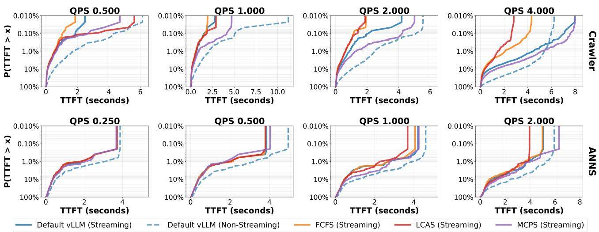  
Figure 5. TTFT CCDF across load levels for the crawler and ANNS workloads on H200. Streaming achieves up to 10.8–11.0× faster median latencies than non-streaming on the crawler workload, and up to 2.49–2.63× P95 speedups on the ANNS workload.

NVIDIA H200 (141GB) and NVIDIA H100 (80GB) GPUs. We use Llama-3.1-8B-Instruct as the primary model. Tensor parallelism is set to 2, and GPU memory utilization target is 80% (20% buffer to prevent OOM). Token budget per scheduling step varies from 2048 to 8192. STREAM2LLM extends the capabilities of the vLLM inference system. All experiments target the prefill instance in a disaggregated serving configuration; decode latency (TPOT) is handled by a separate decode instance and is not evaluated.

Methods of Comparison. We compare STREAM2LLM against two baselines: (1) vanilla vLLM without streaming support, and (2) vanilla vLLM with streaming support. We also evaluate STREAM2LLM under its three custom scheduling and preemption policies–FCFS, MCPS, and LCAS–to assess the impact of scheduling strategy on latency and throughput.

Metrics. We report two key performance metrics: (1) TTFT (Time-To-First-Token), the time from request arrival to first generated token, which directly captures user-facing responsiveness, and (2) Trace Completion Time, the total wallclock time to complete all requests in a workload, reflecting system throughput and end-to-end performance.

## 6.2 Prefill Latency

Figure 5 shows TTFT performance on H200 across load levels for Crawler (top) and ANNS (bottom) workloads.

Crawler Workload (Append Mode): Streaming consistently improves TTFT across all loads. The performance gap between streaming and non-streaming widens with increasing load: at low loads (QPS 0.5–1.0), streaming achieves 3.9–4.3 faster median latencies over non-streaming, while at QPS 4.0, it delivers 10.8–11.0× faster median latencies by effectively overlapping retrieval and prefill.

Within the streaming approaches, scheduler differentiation becomes apparent only when the page arrival rate approaches the prefill rate. At QPS 2, FCFS’s arrival-time ordering and LCAS’s prioritization of recent page arrivals both achieve 1.44× and 1.32× P95 speedups over the default streaming baseline, respectively, while MCPS’s progressbased prioritization degrades to 0.73× as recent pages with fresh content are deprioritized. This effect amplifies at QPS 4.0, where FCFS and LCAS reach 3.16 and 2.64 P95 speedups over the default streaming baseline, whereas MCPS falls to 0.71 . Beyond QPS 4.0, GPU utilization saturates and queuing delay dominates scheduling decisions, causing all approaches to converge to similar performance.

ANNS Workload (Update Mode): Streaming also provides substantial and consistent benefits in update-mode workloads across all load levels. Similar to the crawler workload, at low loads (QPS 0.25–0.5) and high loads (>QPS 2.0), all schedulers perform similarly–prefill rate dominates at low loads while queuing dominates at high loads. At QPS 1.0, streaming schedulers converge tightly with 2.49– 2.63× P95 speedups over non-streaming, indicating that prefill rate still dominates update arrival rate, and streaming architecture provides the dominant benefit regardless of scheduler choice. As load increases to QPS 2.0, scheduler differentiation emerges: FCFS achieves 2.26× P95 speedup over non-streaming, LCAS 1.81 , and MCPS 1.53 over non-streaming. MCPS slightly underperforms because accumulated token progress becomes invalid when document sets change. All maintain 1.30–1.42× P50 advantage over non-streaming. Streaming incurs significant cache invalidation (Figure 12) : more than 10% of requests at all loads invalidate over 10,000 tokens across all schedulers. Despite this cost, streaming achieves up to  2 faster TTFT than non-streaming, proving the responsiveness gains justify the trade-off. Beyond QPS 2.0, queueing delay dominates scheduling decisions, making cache efficiency gains secondary to responsiveness.

Table 3. Scheduler and Eviction Strategy Ablation Study. Each cell shows TTFT speedup vs. Default vLLM non-streaming baseline (in secs) at different percentiles (P50/P99). Crawler: 4.0 QPS, 10× delays. ANNS: 2.0 QPS, 30× delays.
<table><tr><td></td><td colspan="5">Crawler Workload</td><td colspan="6">ANNS Workload</td></tr><tr><td> Scheduler</td><td colspan="2">Recompute P50 P99</td><td colspan="2">Swap P50 P99</td><td colspan="2">Cost-Based P50 P99</td><td colspan="2">Recompute P50 P99</td><td colspan="2">Swap P50 P99</td><td colspan="2">Cost-Based P50 P99</td></tr><tr><td>Default Nonstream</td><td>0.64s</td><td>8.97s</td><td>0.64s</td><td>8.97s</td><td>0.64s</td><td>8.97s</td><td>0.72s</td><td>6.56s</td><td>0.72s</td><td>6.56s</td><td>0.72s</td><td>6.56s</td></tr><tr><td>Default Stream</td><td>8.59×</td><td>0.78x</td><td>7.29×</td><td>0.66×</td><td>8.25×</td><td>0.71×</td><td>2.53×</td><td>0.19x</td><td>2.26×</td><td>0.18x</td><td>2.63×</td><td>0.19×</td></tr><tr><td>FCFS</td><td>8.77×</td><td>10.03x</td><td>7.78x</td><td>6.69×</td><td>8.30×</td><td>8.62×</td><td>2.70x</td><td>1.84×</td><td>2.37×</td><td>1.26×</td><td>2.70×</td><td>2.04×</td></tr><tr><td>LCAS</td><td>8.61×</td><td>9.23×</td><td>7.32x</td><td>4.80×</td><td>7.82×</td><td>9.14×</td><td>2.38x</td><td>1.79×</td><td>1.62×</td><td>0.97×</td><td>2.44×</td><td>1.79x</td></tr><tr><td>MCPS</td><td>5.92×</td><td>0.73x</td><td>3.86×</td><td>0.48x</td><td>4.96×</td><td>0.77×</td><td>2.20×</td><td>0.19×</td><td>1.47×</td><td>0.22×</td><td>2.23×</td><td>0.19×</td></tr></table>

Table 4. Preemption Statistics Across Workloads. Crawler (4.0 QPS, 10×delays) shows higher preemption with balanced SWAP/RECOMPUTE. ANNS (2.0 QPS, 30×delays) shows lower frequency with cost-based heavily favoring RECOMPUTE.
<table><tr><td>Scheduler</td><td>Recompute</td><td> Swap</td><td>Cost-Based</td></tr><tr><td>CrawlerWorkload</td><td></td><td></td><td></td></tr><tr><td>DEFAULT vLLM</td><td>2,448</td><td>779</td><td>1,735 (17%/83%)</td></tr><tr><td>FCFS</td><td>3,552</td><td>709</td><td>1,575 (21%/79%)</td></tr><tr><td>LCAS</td><td>12,564</td><td>1,049</td><td>3,486 (21%/80%)</td></tr><tr><td>MCPS</td><td>3,316</td><td>721</td><td>1,741 (19%/81%)</td></tr><tr><td>ANNSWorkload</td><td></td><td></td><td></td></tr><tr><td>DEFAULTvLLM</td><td>130</td><td>35</td><td>125 (2%/98%)</td></tr><tr><td>FCFS</td><td>342</td><td>50</td><td>331 (1%/99%)</td></tr><tr><td>LCAS</td><td>385</td><td>48</td><td>373 (2%/98%)</td></tr><tr><td>MCPS</td><td>215</td><td>40</td><td>237 (0%/100%)</td></tr></table>

Crawler Workload: TTFT Comparison across schedulers (QPS ≤ 4)  
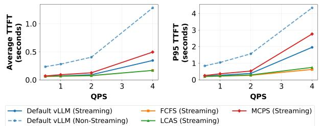  
Figure 6. Crawler workload: TTFT (average and P95) vs. QPS on H200 across all schedulers. QPS range: 0.5–4.0.

## 6.3 Throughput

Figure 6 and Figure 7 show average and P95 TTFT as a function of QPS for both workloads. As QPS increases, TTFT rises across all methods, but streaming schedulers consistently outperform the non-streaming baseline. In the crawler workload, FCFS and LCAS maintain the lowest

ANNS Workload: TTFT Comparison across schedulers (QPS ≤ 2)  
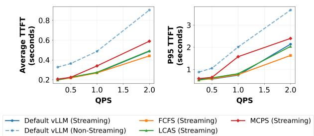  
Figure 7. ANNS workload: TTFT (average and P95) vs. QPS on H200 across all schedulers. QPS range: 0.25–2.0.

TTFT at high QPS, while MCPS degrades. In the ANNS workload, all streaming schedulers track closely until QPS 2.0, where FCFS pulls ahead.

Trace completion times are near-identical across all methods (within ∼1%), confirming that streaming and scheduling optimizations provide latency benefits without sacrificing system throughput.

## 6.4 Performance under Memory Pressure

Our default H200 setup (141GB memory, 80% utilization) has sufficient memory to eliminate preemption. To evaluate scheduler behavior under memory pressure, we modified the workloads to saturate the GPU KV cache pool by increasing chunk delays: 10 for the crawler workload (append-mode) and 30 for ANNS (update-mode), where the delay multiplier equals total KV tokens capacityavg tokens per query×avg query duration×QP S .

Scheduler and Eviction Strategy Ablation: We vary scheduler and eviction policy independently on both workloads. Table 3 shows median (P50) and tail (P99) latency speedups versus the non-streaming baseline. The study shows two key findings: (1) DEFAULT vLLM streaming exhibits catastrophic tail latency degradation under memory pressure—at P99, it performs 0.71× (crawler) and 0.19× (ANNS) vs. non-streaming baseline, demonstrating that streaming without proper scheduling is harmful under contention. (2) Eviction strategy choice creates substantial performance variation: in the crawler workload, FCFS achieves 10.03 speedup with recompute-only but only 6.69 with swap-only at P99, while LCAS shows similar sensitivity (9.23 vs. 4.80 ). The cost-based approach balances these extremes, achieving 8.62× (FCFS) and 9.14× (LCAS). For ANNS, the pattern repeats with smaller absolute speedups due to update-mode characteristics: FCFS achieves 1.84 (recompute) vs. 1.26 (swap) vs. 2.04 (cost-based) at P99. These results confirm that hardware-aware eviction is essential for performance under memory pressure, and proper scheduling (FCFS/LCAS) prevents catastrophic tail latency.

Preemption Statistics: Table 4 reports preemption frequencies across configurations. The crawler workload triggers 779–12,564 total preemptions depending on scheduler aggressiveness (LCAS highest at 12.5K for recompute-only). Cost-based eviction allocates 17–21% to SWAP and 79–83% to RECOMPUTE for crawler, confirming balanced strategy selection. The ANNS workload exhibits lower preemption frequency (35–385 total) with cost-based heavily favoring RECOMPUTE (98–100%), validating the earlier claim that update-mode characteristics make recomputation nearly always cost-optimal due to smaller effective KV caches after context invalidation.

Scheduling Overhead. Scheduler sorting and budget allocation add sub-millisecond overhead per scheduling step. With 50 concurrent requests (representative of peak QPS), sorting latency is 15–16 µs for FCFS/LCAS and 12–13 µs for MCPS. Even at 500 requests, P99 latency remains below 165 µs—negligible compared to prefill computation. The one-time offline profiling for hardware-specific cost models takes approximately five minutes per GPU configuration and is stored as a JSON file, imposing no runtime overhead.

## 7 RELATED WORK

Streaming Context Retrieval. Recent systems have explored overlapping retrieval and inference to reduce latency. AquaPipe (Yu et al., 2025) demonstrates time-to-first-token improvements by prefetching intermediate ANNS results while computation continues, using recall-aware prefetching that adapts based on result set stability. However, it does not support multi-tenant scheduling where concurrent requests compete for GPU resources and require dynamic priority adjustments. PipeRAG (Jiang et al., 2024) employs pipeline parallelism with flexible retrieval intervals for iterative retrieval-generation, but evaluates with fixed batch sizes and does not address variable sequence lengths in multitenant deployments. Notably, PipeRAG targets encoderdecoder architectures with cross-attention, which is architecturally incompatible with the causal self-attention models used by STREAM2LLM. AquaPipe has no publicly available implementation. Both systems leave open questions about scheduling policies for multi-request batching, adaptive preemption, and cache invalidation mechanisms across requests with different retrieval patterns. STREAM2LLM addresses these by introducing a two-phase scheduling architecture supporting both append-mode and update-mode retrieval patterns in multi-tenant environments.

LLM Inference Serving. vLLM (Kwon et al., 2023) provides PagedAttention for efficient KV cache storage and supports preemption via recomputation or swapping, but its scheduler assumes static input sequences. Orca (Yu et al., 2022), Sarathi (Agrawal et al., 2024), and FastServe (Wu et al., 2023) improve batch efficiency and throughput through iteration-level scheduling, chunked prefills, and preemptive prioritization, respectively. DistServe (Zhong et al., 2024) and Splitwise (Patel et al., 2024) use disaggregated GPU pools for prefill and decode. These systems assume static input sequences and do not support dynamic updates or cache invalidation when sequences change dynamically.

Scheduling and Cache Optimization. Scheduling policies range from FCFS to SJF variants (Patel et al., 2024) and sophisticated approaches like Sarathi-Serve (Agrawal et al., 2024) that minimize pipeline stalls. However, existing policies assume static input sequences and do not account for dynamic priority shifts from streaming context arrival. For cache optimization, PagedAttention divides KV cache into fixed blocks, while RadixAttention (Zheng et al., 2023) enables fine-grained sharing via radix trees. These optimize memory for static input sequences but lack mechanisms for cache invalidation when sequences change. STREAM2LLM addresses this with longest common prefix (LCP)-based cache invalidation that preserves valid blocks while selectively invalidating only affected blocks, minimizing recomputation across dynamic retrieval patterns.

## 8 CONCLUSION

STREAM2LLM bridges the latency gap in context retrieval systems by enabling streaming prompt processing in multitenant deployments. Its decoupled scheduling architecture, LCP-based cache invalidation, and hardware-aware preemption models extend vLLM to handle dynamically evolving contexts efficiently. Our evaluation shows that streaming delivers order-of-magnitude improvements in time-to-firsttoken latency without sacrificing throughput. Scheduler choice has limited impact when memory is abundant but becomes critical under pressure, improving append-mode performance and preventing degradation in update-mode workloads. STREAM2LLM establishes streaming as a core architectural primitive for low-latency, high-throughput context retrieval in large-scale LLM deployments.

## REFERENCES

Agrawal, A., Kedia, N., Panwar, A., Mohan, J., Kwatra, N., Gulavani, B., Tumanov, A., and Ramjee, R. Taming throughput-latency tradeoff in llm inference with sarathiserve. In 18th USENIX Symposium on Operating Systems Design and Implementation (OSDI 24), pp. 117–134, 2024.

Jayaram Subramanya, S., Devvrit, F., Simhadri, H. V., Krishnawamy, R., and Kadekodi, R. Diskann: Fast accurate billion-point nearest neighbor search on a single node. Advances in neural information processing Systems, 32, 2019.

Jiang, W., Zhang, S., Han, B., Wang, J., Wang, B., and Kraska, T. Piperag: Fast retrieval-augmented generation via algorithm-system co-design. arXiv preprint arXiv:2403.05676, 2024.

Kwon, W., Li, Z., Zhuang, S., Sheng, Y., Zheng, L., Yu, C. H., Gonzalez, J., Zhang, H., and Stoica, I. Efficient memory management for large language model serving with pagedattention. Proceedings of the 29th Symposium on Operating Systems Principles, pp. 611–626, 2023. doi: 10.1145/3600006.3613165.

Malkov, Y. A. and Yashunin, D. A. Efficient and robust approximate nearest neighbor search using hierarchical navigable small world graphs. IEEE transactions on pattern analysis and machine intelligence, 42(4):824– 836, 2018.

Patel, P., Choukse, E., Zhang, C., ´Inigo Goiri, Warrier, ˜ B., Mahalingam, N., and Bianchini, R. Splitwise: Efficient generative llm inference using phase splitting. 51st International Symposium on Computer Architecture (ISCA), pp. 784–796, 2024. doi: 10.1109/ISCA59077. 2024.00061.

Qin, R., Li, Z., He, W., Zhang, M., Wu, Y., Zheng, W., and Xu, X. Mooncake: A kvcache-centric disaggregated architecture for llm serving. arXiv preprint arXiv:2407.00079, 2024.

Rajpurkar, P., Zhang, J., Lopyrev, K., and Liang, P. SQuAD: 100,000+ questions for machine comprehension of text. In Su, J., Duh, K., and Carreras, X. (eds.), Proceedings of the 2016 Conference on Empirical Methods in Natural Language Processing, pp. 2383–2392, Austin, Texas, November 2016. Association for Computational Linguistics. doi: 10.18653/v1/D16-1264. URL https: //aclanthology.org/D16-1264.

UncleCode. Crawl4ai: Open-source llm friendly web crawler & scraper. https://github.com/ unclecode/crawl4ai, 2024.

Vespa Team. Perplexity: Show what great rag takes. https://blog.vespa.ai/ perplexity-show-what-great-rag-takes, 2024. Accessed: 2025-12-01.

Wang, L., Yang, N., Huang, X., Jiao, B., Yang, L., Jiang, D., Majumder, R., and Wei, F. Text embeddings by weakly-supervised contrastive pre-training. arXiv preprint arXiv:2212.03533, 2022.

Wei, J., Karina, N., Chung, H. W., Jiao, Y. J., Papay, S., Glaese, A., Schulman, J., and Fedus, W. Measuring shortform factuality in large language models. arXiv preprint arXiv:2411.04368, 2024.

Wu, B., Zhong, Y., Zhang, Z., Huang, G., Liu, X., and Jin, X. Fast distributed inference serving for large language models. arXiv preprint arXiv:2305.05920, 2023.

Yu, G.-I., Amizadeh, S., Kim, S., Pagnoni, A., Zheng, C., He, Q., Huang, D., Kebrya, S. R., Yao, Z., Gao, X., Ashkboos, S., Hassanpour, M., Aminabadi, R. Y., Lee, Y., Awan, A. A., Najibi, M., Chau, J., Yang, A., You, C., Sivasubramanian, K., and Chowdhury, M. Orca: A distributed serving system for transformer-based generative models. 16th USENIX Symposium on Operating Systems Design and Implementation (OSDI 22), pp. 521–538, 2022. URL https://www.usenix.org/conference/ osdi22/presentation/yu.

Yu, R., Huang, W., Bai, S., Zhou, J., and Wu, F. Aquapipe: A quality-aware pipeline for knowledge retrieval and large language models. Proceedings of the ACM on Management of Data, 3(1):1–26, 2025.

Zheng, L., Li, Z., Zhang, H., Yang, Z., Gonzalez, J. E., and Stoica, I. Sglang: Efficient execution of structured language model programs. arXiv preprint arXiv:2312.07104, 2023.

Zhong, Y., Liu, S., Chen, J., Hu, J., Zhu, Y., Li, J., and Bin, C. Distserve: Disaggregating prefill and decoding for goodput-optimized large language model serving. 18th USENIX Symposium on Operating Systems Design and Implementation (OSDI 24), pp. 307–325, 2024. URL https://www.usenix.org/conference/ osdi24/presentation/zhong-yinmin.

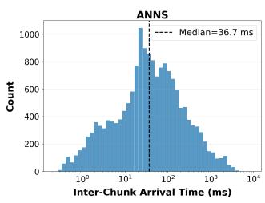

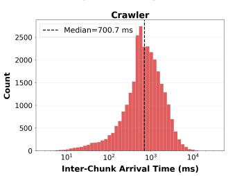

Figure 8. Distribution of inter-chunk arrival times for ANNS and Crawler workloads (log-scale). ANNS chunks arrive with a median of 36.7 ms, while crawler chunks arrive with a median of 700.7 ms, exhibiting significantly higher variability.  
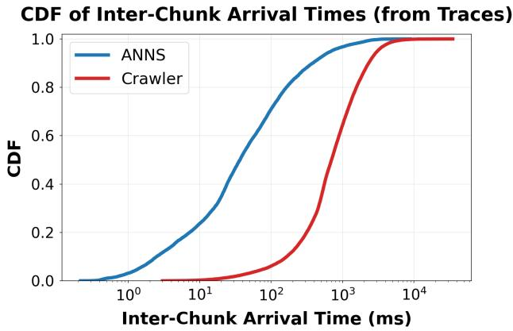  
Figure 9. CDF of inter-chunk arrival times. ANNS arrivals are tightly concentrated, with 100% of chunks arriving within 1 s, while crawler arrivals span three orders of magnitude, with a long tail extending beyond 10 s.

## A ADDITIONAL EVALUATION

## A.1 Cache Invalidation in Update Mode

Figure 12 shows the CCDF of tokens invalidated per request across QPS levels for the ANNS workload. All three streaming schedulers (FCFS, LCAS, MCPS) exhibit nearly overlapping invalidation curves, indicating that cache invalidation behavior is driven by the retrieval workload rather than the scheduling policy. The non-streaming baseline (Default vLLM) shows zero invalidation by design, as it waits for complete retrieval before beginning inference. Invalidation patterns remain stable across load levels: at all QPS values, more than 10% of requests invalidate over 10,000 tokens, reflecting the update-mode characteristic of iterative document replacement.

## A.2 Throughput Parity

Figure 11 confirms that streaming and scheduling optimizations do not affect aggregate throughput. Trace completion times decrease hyperbolically with increasing QPS, and all scheduler variants (including non-streaming) produce indistinguishable curves—appearing as a single overlapping line—on both workloads. This demonstrates that the TTFT improvements reported in the main evaluation come at no cost to system-level throughput.

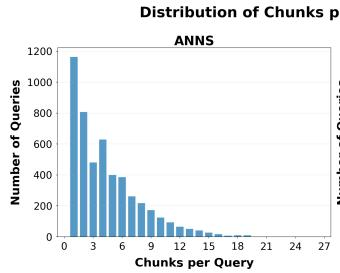

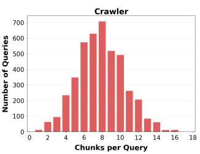

Figure 10. Distribution of chunks per query. ANNS queries are heavily skewed toward 1–3 chunks, while crawler queries are concentrated around 6–10 chunks per query.  
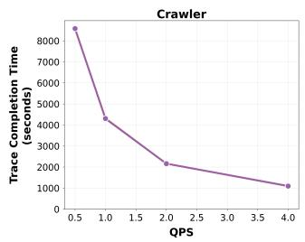

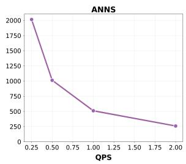  
Figure 11. Trace completion time across QPS levels for both workloads. All scheduler variants achieve near-identical completion times, confirming throughput parity.

## A.3 Chunk Arrival Characterization

The two workloads exhibit fundamentally different chunk arrival patterns, which drive the scheduling challenges described in the main paper.

Figure 8 shows the distribution of inter-chunk arrival times. ANNS arrivals are tightly concentrated around 36.7 ms (median), with the bulk of the distribution spanning 1–1,000 ms. Crawler arrivals are 19× slower (median 700.7 ms) and span approximately three orders of magnitude, from tens of milliseconds to over 30 seconds. This high variability in crawler chunk arrivals creates extended idle periods for individual requests, motivating scheduling policies that can dynamically re-prioritize requests as new chunks arrive.

Figure 9 presents the same data as a CDF. 100% of ANNS inter-chunk arrivals complete within 1 second, while the crawler long tail extends beyond 10 seconds. This separation confirms that ANNS workloads allow aggressive prefetching, while crawler workloads require adaptive scheduling to avoid GPU starvation during long inter-arrival gaps.

Figure 10 shows the distribution of chunks per query. ANNS queries are heavily right-skewed, with the majority receiving 1–3 chunks (>50% of queries receive 3 chunks). Crawler queries follow a broader, roughly unimodal distribution centered around 6–10 chunks. The combination of more chunks per query and higher per-chunk variability makes the crawler workload substantially more demanding for streaming schedulers.

Token Invalidation CCDF - Update Mode, ANNS Workload  
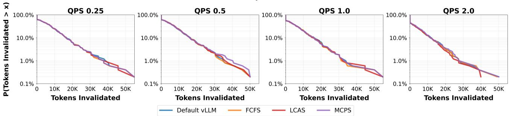  
Figure 12. Tokens invalidated per request (CCDF) across QPS levels (0.25–2.0) for the ANNS workload. All streaming schedulers show similar cache invalidation behavior. Default vLLM with non-streaming has zero invalidation as it waits for complete retrieval.

## B ARTIFACT APPENDIX

## B.1 Abstract

This artifact contains the open-source Stream2LLM system: a modified vLLM 0.8.1 engine with streaming input support, along with all scripts, pre-computed run logs, and workload traces needed to reproduce every figure, table, and inline number in the paper. The repository includes two evaluation paths: (1) an artifact-only path that regenerates all paper artifacts from pre-computed data in approximately five minutes without GPU hardware, and (2) a full re-run path that re-executes the experiments end-to-end on NVIDIA GPUs. For a detailed version of this artifact appendix, see the repository README.md.

## B.2 Artifact check-list (meta-information)

• Algorithm: FCFS, LCAS, MCPS scheduling; cost-based preemption

• Program: Python scripts; modified vLLM 0.8.1 engine

• Data set: Web-crawler traces; ANNS pipeline traces; performance-model JSONs

• Run-time environment: Linux, Python 3.10.9, CUDA, conda, pip

• Hardware: Artifact-only: any machine. Full re-run: 2× H200 or 2× H100 GPUs

• Metrics: TTFT, trace completion time, preemption counts, scheduler sorting latency

• Output: Figures in figures/, tables in tables/, logs in data/run log/

• How much disk space required (approximately)?: ∼5 GB

• How much time is needed to prepare workflow (approximately)?: ∼15 minutes

• How much time is needed to complete experiments (approximately)?: ∼5 minutes (artifact-only); ∼48 hours (full re-run)

• Publicly available?: Yes

• Code licenses (if publicly available)?: MIT

• Data licenses (if publicly available)?: CC-BY-4.0

• Archived (provide DOI)?: https://doi.org/10. 5281/zenodo.18906769

## B.3 Description

## B.3.1 How delivered

The artifact is delivered as a GitHub repository on the mlsys artifact branch:

https://github.com/rajveerb/stream2llm

All large data (run logs, workload traces, performancemodel JSONs) is stored in a git submodule hosted on HuggingFace:

https://huggingface.co/datasets/ rbachkaniwala3/stream2llm-data

## B.3.2 Hardware dependencies

No GPU is required for artifact-only evaluation. For full experiment re-runs, the paper’s experiments used NVIDIA 2 H200 and 2 H100 GPUs. See README.md for details.

## B.3.3 Software dependencies

Dependencies are installed in a conda environment via pip. See README.md for setup instructions and requirements.txt for the full package list.

## B.3.4 Data sets

All data is hosted as a HuggingFace dataset (rbachkaniwala3/stream2llm-data) and fetched

automatically via the git submodule. See the “Data Organization” section of README.md for details.

## B.4 Installation

Refer to the README.md.

## B.5 Experiment workflow

## B.5.1 Artifact-only (no GPU required)

bash reproduce\_artifacts.sh

This generates all figures in figures/ and analysis tables in tables/ from pre-computed run logs. Takes approximately five minutes.

## B.5.2 Full re-run (GPU required)

The experiment drivers run each scheduler variant (default vllm, fcfs, lcas, mcps) across all arrival-time configurations and write logs to data/run log/. See README.md (“Building Stream2LLM Engine” and “Running Experiments”) and experiments/README.md for the full list of experiment configurations and commands.

## B.6 Evaluation and expected result

Figures and tables. Generated figures in figures/ should visually match the pre-built reference copies in figures/reference/. Analysis scripts produce .txt files in tables/. The mapping from paper artifacts to scripts is:

• Figure 4 → plot recomp vs swap clean.py

• Figure 5 (Crawler row) → plot ttft ccdf - combined 1x4.py

• Figure 5 (ANNS row) → plot ttft ccdf anns - 1x4.py

• Figures 6 and 7 → plot ttft qps comparison.py

• Figure 12 plot tokens invalidated - aggregated.py

• Figure 11 (Crawler) → plot trace completion - time.py (crawler)

• Figure 11 (ANNS) → plot trace completion - time.py (anns)

• Figures 8 to 10 → plot chunk arrival - characterization.py

• Table 3 → compute scheduler improvements.py

• Table 4 → analyze preemptions.py

• Scheduler latency → benchmark scheduler - latency.py

## B.7 Experiment customization

• Scheduler selection: per-scheduler YAML configs in experiments/{crawler,anns}/configs/

• Arrival-time sweeps: supported via the driver script’s scheduler and compare modes

• Hardware adaptation: modify YAML configs and performance-model JSONs in data/perf model/

See experiments/README.md for full details.

## B.8 Methodology

Submission, reviewing, and badging methodology:

• http://cTuning.org/ae/ submission-20190109.html

• http://cTuning.org/ae/ reviewing-20190109.html

• https://www.acm.org/publications/ policies/artifact-review-badging