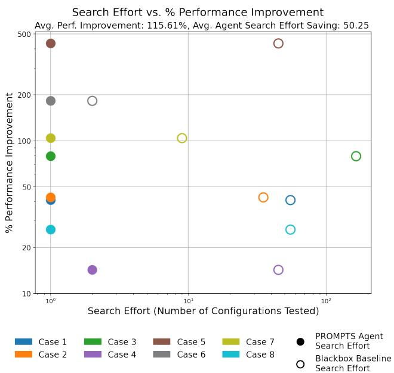
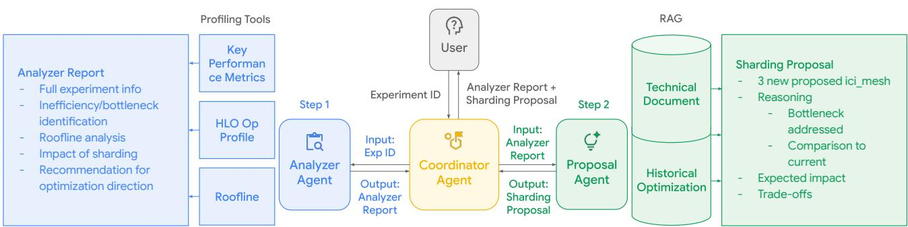
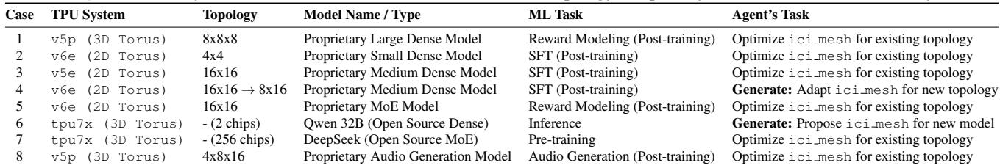
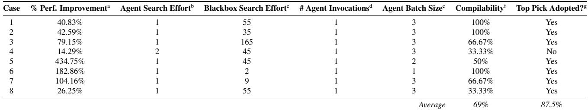

# PROMPTS: PERFORMANCE OPTIMIZATION VIA MULTI-AGENT PLANNING FOR LLM TRAINING AND SERVING

Yuran Ding 1 2 Ruobing Han 3 Xiaofan Zhang 3 Xinwei Chen 2

## ABSTRACT

Optimizing large-language model (LLM) training and serving on large-scale distributed systems is a significant challenge. This difficulty stems from the rapidly evolving LLM landscape, the requirement for deep domain expertise, and the need for workload-specific optimization strategies. Existing methods rely on either handcrafted optimization performed by human experts, which is tedious and time-consuming, or resource-intensive black-box searches, which lack the extensibility to keep pace with evolving models and hardware. To address this, we introduce PROMPTS, a novel multi-agent framework that complements traditional search methods with expertinformed reasoning to deliver system-level optimization with much fewer shots. Key components of the proposed framework include an Analyzer Agent that diagnoses performance bottlenecks by synthesizing profiler data and a Proposal Agent that leverages a knowledge base to generate optimized sharding configurations with detailed justifications through retrieval-augmented generation (RAG).

Experimental results across eight real-world LLM workloads have demonstrated that PROMPTS can provide valid reasoning and accurate recommendations by considering LLM workload characteristics and backend hardware features, delivering performance improvements of up to 434%. These workloads spanned LLMs with Mixture-of-Experts (MoE) and dense models, system configurations from 2-TPU chips to 2048 chips systems with 2D/3D Torus interconnects, and the full LLM lifecycle including pre-training, post-training, and serving.

To validate our agent’s system optimization proposals, we benchmarked them against production configurations that were previously optimized by experts, either through extensive manual analysis or automated black-box searches. In every case, our agent independently identified this expert-validated solution within its top three recommendations from a single invocation. Furthermore, the agent’s top-ranked recommendation matched the production solution in 87.5% of cases, demonstrating its ability to not only find optimized configurations but also to correctly prioritize the optimization candidates.

## 1 INTRODUCTION

The costs of LLM training and serving are increasing exponentially. Given the targeted model, hardware budget, and development timeframe, identifying the most-efficient system configuration becomes the first critical task to enable the most efficient model deployment. It requires an in-depth understanding of available system-level optimization methods, such as data, model, and sequence parallelism, as well as the characteristics of emerging LLM architectures and potential hardware limitations to select the most efficient configuration (Shoeybi et al., 2019; Zhao et al., 2024; Li et al., 2023).

This, however, is a complex and time-consuming task. Engineers typically resort to a laborious trial-and-error cycle: running experiments, profiling performance, analyzing execution traces for bottlenecks like memory limits or communication overheads, and iteratively refining sharding strategies. This manual approach is often slow and yields suboptimal configurations.

While detailed performance analysis tools and analytical models offer valuable insights, interpreting their outputs demands considerable domain-specific expertise. Automated black-box optimization techniques (Song et al., 2024; Golovin et al., 2017) have demonstrated success in navigating the vast and complex search spaces for optimal configurations. However, by design, these methods operate without deep system knowledge, often leading to sample inefficiency. They typically require numerous costly and time-consuming evaluations, a burden that remains significant even when offloaded to detailed simulators. Furthermore, the optimal parameters discovered are often brittle, failing to generalize to new hardware platforms or model architectures, thus necessitating a complete restart of the expensive search process. Even more specialized automated tuning systems may only support a limited range of models or frameworks. An agentic, reasoning-based framework offers a promising complement. By embedding domain knowledge and performance engineering principles, such a framework can intelligently prune the search space, leading to more efficient optimization. This approach not only has the potential to find effective solutions faster but also to provide explainable recommendations, thereby accelerating development and improving resource utilization.

  
Figure 1. PROMPTS Agent vs. Blackbox Baseline search effort for a given performance improvement across eight experiments. For each experiment (unique color), the line connects the PROMPTS Agent’s search effort (solid dot) to the Blackbox baseline search effort (hollow dot). Search effort, plotted on a log scale, is defined as the number of configurations that were actually tested until the expert-validated configuration was identified. While both methods yield the same average performance improvement (115.61%), the agent’s search effort is consistently and significantly lower, saving an average of 50.25 experimental runs per task.

Recent work has leveraged machine learning to build performance models and improve search efficiency (Wen et al., 2024; Cha et al., 2024). The rise of LLMs has also inspired agentic systems for performance engineering, such as automated GPU code transformation (Damani et al., 2024), code optimization for tensor accelerators (Hong et al., 2025), and multi-agent frameworks for complex ML tasks (Gandhi et al., 2025; Liu et al., 2025; Novikov et al., 2025). However, these advancements have not yet produced a specialized agent for the nuanced task of optimizing sharding strategies—the process of partitioning a model’s parameters, data, and computations across hardware devices. Such an agent must integrate with performance tools, understand model architecture, hardware platforms, workload types, theoretical bounds, and leverage a knowledge base to propose explainable configurations in a manner that is both robust and adaptable to new challenges.

To address the optimization difficulites and bridge the knowledge gaps, we introduce PROMPTS: PeRformance Optimization via Multi-Agent Planning for LLM Training and Serving. PROMPTS is a novel, agentic framework designed to automate the large-scale AI system optimization process by embedding expert diagnostic reasoning. PROMPTS is designed to assist the manual annotation phase in hybrid partitioning systems (like GSPMD), serving as an orthogonal layer to search-based methods. It is composed of:

• Coordinator Agent: Orchestrates the workflow, manages agent interactions, and processes user requests.

• Analyzer Agent: Diagnoses performance bottlenecks by analyzing data from profiling tools and experiment logs.

• Proposal Agent: Generates optimized sharding configurations with detailed reasoning by querying a knowledge base.

• Sharding Memory: Provides persistent storage for logs, tool calls, and agent responses to ensure context.

Inter-chip Interconnect (ICI) refers to links connecting networked chips, such as on a TPU tray. Often used in reference to signal-integrity testing. The ici mesh defines the logical mesh used for SPMD parallelism within a TPU slice. It specifies how model parameters and data are sharded across the available devices. We specifically focus on ICI-mesh sharding because it is one of the most critical configs that determines feasibility (e.g., memory fit and communication layout) and sets the performance ceiling. Once sharding is fixed, batch size is largely constrained by HBM capacity, and compiler flags are often chip- and compiler-specific, limiting generalizability; we therefore hold them fixed to avoid confounding and accuracy changes.

By integrating LLM-based reasoning with a curated knowledge base and specialized tools, PROMPTS automates the diagnosis and generation of optimized, explainable system configurations. Our evaluation demonstrates that PROMPTS’ LLM-based expert reasoning can prune a key combinatorial subspace in only a few shots, across diverse models, hardware, and tasks. Our design provides a scalable and extensible methodology for AI-driven performance engineering. Although currently focusing on ICI-mesh sharding, PROMPTS can be extended to broader joint optimization scope (e.g., batch size, offloading, or compiler flags) via extensions to the agent’s heuristics and knowledge base. Our system achieves one-shot optimization, delivering performance gains of up to 434%. Crucially, the knowledge base encodes general optimization principles; 7 of 8 evaluation cases required novel reasoning rather than exact workload matches from the historical database. Human engineers adopt its top-ranked recommendation 87.5% of the time, drastically reducing manual effort and improving hardware efficiency. PROMPTS is designed to replace or assist the manual annotation phase in hybrid partitioning systems (like GSPMD), serving as an orthogonal layer to search-based methods.

## 2 RELATED WORK

Existing work in LLM optimization offers powerful components for parallelism, search, and diagnostics, yet lacks an automated way to connect performance analysis to effective solutions—a process that still requires human expertise. PROMPTS automates this expert reasoning, serving as an intelligent layer that complements and accelerates traditional search methods.

## 2.1 Sharding and Parallelism Strategies

Driven by scaling laws, modern machine learning models continue to grow in scale, both in parameter count and computational cost. Consequently, training these models necessitates distributing the workload across an increasing number of computational units (e.g., GPUs or TPUs).

Early approaches relied on manually-designed parallelism strategies. The most common, data parallelism (Jia et al., 2018; Sun et al., 2019; You et al., 2019), partitions the training batch across nodes, which are processed in parallel to gather more computational resources. To address the prohibitive memory footprint of large models on a single device, model parallel and pipeline parallel are proposed to partition the model parameters (Narayanan et al., 2021; Liu et al., 2024; Huang et al., 2019; Narayanan et al., 2019; Shoeybi et al., 2019; Jeon et al., 2025). These techniques can be combined with optimizer state sharding (Rajbhandari et al., 2020) to further reduce per-device memory consumption. The combinatorial complexity of configuring these hybrid strategies creates the vast, high-dimensional search space that motivates the need for automated solutions.

## 2.2 Automated Black-box Search

As model architectures increase in complexity and scale, the design space of hybrid parallelism strategies explodes. Manually discovering an optimal strategy becomes infeasible. This has led to the development of automated systems that frame optimization as a complex search problem to find the optimal parallelism strategy (Zheng et al., 2022; Xu et al., 2021; Lepikhin et al., 2020; Alabed et al., 2025; Jia et al., 2019; Miao et al., 2022). For example, FlexFlow (Jia et al., 2019) employs a guided randomized search, using an execution simulator to rapidly evaluate candidate strategies. Alpa (Zheng et al., 2022) formulates the problem as an integer linear programming (ILP) problem, leveraging an ILP solver to find an optimal solution. Recent works like Metis (Um et al., 2024) and Sailor (Strati et al., 2025) further advance this by utilizing performance-model-guided structured search to identify reasonable candidates across heterogeneous and geo-distributed clusters without requiring exhaustive real-world benchmarking.

While powerful, these systems primarily treat optimization as structured search task guided by cost models. As argued in our motivation, these approach can still be “knowledgeblind” in a diagnostic sense; it often involves trial-anderror evaluations within a model’s constraints without the domain-aware reasoning required to bypass fundamentally sub-optimal regions of the design space. PROMPTS complements these methods by first applying expert reasoning to dramatically prune the search space, allowing such searchbased systems to operate on a much smaller, higher-quality subspace. Other systems like GSPMD (Xu et al., 2021) and Partir (Alabed et al., 2025) offer a hybrid approach, propagating user-provided sharding annotations—a form of expert guidance that PROMPTS aims to automate. PROMPTS can be applied orthogonally with these methods: PROMPTS first assists/automates manual annotations with agentic expert reasoning and then has search methods figure out the rest.

## 2.3 Performance Modeling: Diagnostics without Proposals

A parallel line of research focuses on performance modeling and diagnostics. Trace-based simulators like dPRO and Lumos build detailed execution graphs from runtime data, offering powerful ”what-if” analysis for experts (Hu et al., 2022; Liang et al., 2025) . However, these tools are purely diagnostic; they reveal what is slow but do not prescribe how to fix it, creating a manual gap that requires expert interpretation. PROMPTS is designed to automate this step with a two-agent workflow: our Analyzer Agent first diagnoses performance bottlenecks from profiling traces, and our Proposal Agent then synthesizes this diagnosis with a knowledge base of best practices and past optimizations to generate an expert-informed solution.

## 2.4 Other LLM Optimizations

In addition to sharding, other optimizations also play crucial roles in LLM performance. Checkpointing (Chen et al., 2016; Jain et al., 2020) allows users to save memory space via recomputation. Quantization and low-precision arithmetic accelerate computation and save memory space by using fewer bits (Micikevicius et al., 2017; Han et al., 2021; Tabak et al.; Sheng et al., 2023). Similarly, end-to-end frameworks like AutoDistill integrate knowledge distillation with multi-objective neural architecture search to find smaller, hardware-efficient student models with lower serving latency (Zhang et al., 2022). As more operations are implemented by Deep Learning compilers (Chen et al., 2018; Tillet et al., 2019; Sabne, 2020), tuning kernel generation flags will also affect model performance.

All these optimizations, similar to the sharding problem, involve exploring a large search space to find an optimal choice for a given AI model. In this paper, we use sharding as a proof-of-concept problem to demonstrate the capabilities of PROMPTS’s agentic reasoning methodology. We plan to enhance PROMPTS to address these optimization challenges in future work, as the core framework of diagnosis and proposal is highly generalizable.

## 3 MOTIVATION

## 3.1 The Challenge: Sharding Optimization as a High-Dimensional Maze

The central problem is to identify an optimized and perhaps optimal sharding configuration from a combinatorially large search space. This task is notoriously difficult due to three primary factors:

1. Vast and Complex Search Space: The number of ways to partition a model’s data, parameters, and activations across a distributed system is immense. Performance trade-offs are non-linear; for example, increasing model parallelism reduces memory pressure per device but can introduce significant communication bottlenecks.

2. Hardware-Software Co-dependence: An optimized strategy is tightly coupled to the specifics of the hardware. A configuration tuned for a 2D Torus network will be suboptimal on a 3D Torus network, which favors different communication patterns.

3. Opaque Bottlenecks: Performance issues are often subtle and require deep analysis of low-level profiler outputs (e.g., execution traces, memory usage reports) to diagnose correctly.

## 3.2 The Challenge of Unconstrained Black-box Search

Automated approaches, particularly black-box optimization, have demonstrated considerable success in navigating vast and complex configuration spaces. However, when applied to system performance tuning, they face three critical challenges that limit their efficiency:

1. It is Knowledge-Blind: Black-box methods operate without domain understanding. They cannot be informed that a bottleneck is memory-related. This forces them into a highly inefficient, brute-force search. As our experiments show, this can require evaluating a search space of over 150 valid configurations, whereas our agentic approach consistently required only one single attempt.

2. It Lacks True Extensibility: The surrogate models learned by black-box optimizers are brittle. The “knowledge” they acquire is a static map of one specific performance landscape. If the model, hardware, or workload changes, the map becomes outdated. This brittleness is often compounded by their design, which may rely on specialized search space generators pre-configured for specific model families or internal frameworks. This makes them difficult to adapt to new and fast-evolving open-source models or different software stacks without significant reengineering, limiting their general applicability.

3. It Fails to Scale with Complexity: Our experiments focus on ici mesh optimization within a valid TPU topology, but this is just one piece of a much larger puzzle. A complete optimization would also explore parameters like batch size, rematerialization strategies, and low-level compiler optimization flags. As these knobs are introduced, the search space grows exponentially. A sample-based or brute-force approach becomes computationally intractable in such a high-dimensional space, highlighting the need for a more intelligent strategy.

## 3.3 Why ICI-mesh Sharding?

We identify ICI-mesh sharding as the primary determinant of both memory fit and communication layout, effectively establishing the system’s performance ceiling. In a highdimensional joint optimization space, we prioritize sharding as the foundational problem to solve. By holding hardwarespecific compiler flags and capacity-constrained batch sizes constant, we isolate the impact of sharding, thereby avoiding confounding variables and maintaining a stable baseline for evaluation.

PROMPTS navigates this complexity by integrating LLMdriven reasoning with specialized tools to generate explainable, high-performance configurations. While the current implementation does not explicitly solve for compiler flags or offloading strategies, the framework is architected for extensibility; PROMPTS can be bridged to these additional optimization dimensions through modular updates to the agent’s heuristics and knowledge base.

## 3.4 Our Approach: An Agentic Framework for Extensible Reasoning

The limitations of unconstrained search motivated us to re-frame the problem. Instead of asking, “How can we search this vast space faster?” we asked, “How can we assist expert reasoning to prune vast configuration spaces into high-potential subspaces? Specifically, how can we assist the manual annotation phase in hybrid partitioning systems as a layer orthogonal to traditional search?” An expert does not search blindly; they diagnose, hypothesize, and propose solutions based on evidence and generalizable principles.

Our reasoning-based framework operationalizes this twostep process with specialized agents. An Analyzer Agent emulates the diagnostic step, synthesizing profiler data to identify the root cause of a performance bottleneck. A Proposal Agent then emulates the solution-generation step, querying a knowledge base to generate optimized configurations with clear justifications. This structured process is not a replacement for black-box optimization but a powerful complement. By intelligently pruning the search space, our framework allows a black-box optimizer to perform fine-grained tuning with dramatically improved sample efficiency.

Our framework is built on decoupling the reasoning engine from the specific context:

• The LLM-powered agents form the core reasoning engine, performing the cognitive tasks of diagnosis and solution generation.

• The tools and knowledge base are modular components that provide the context, including profilers and a knowledge base of optimization principles across various models, workloads and hardware, as well as database of optimizations by engineers.

This separation is the key to our framework’s extensibility. To adapt PROMPTS to a new model, hardware or workload, we do not re-architect the agents; we simply provide them with new documents on model architectures, hardware platforms or workload specific knowledge to read, enabled by Retrieval-Augmented Generation (RAG). The agent’s core skill—reasoning about performance—is general-purpose. This design allows PROMPTS to not only optimize existing configurations but also to generatively propose solutions for entirely novel scenarios. Its reasoning capability is general, but its expertise is dependent on its knowledge base. This distinction is key: the framework’s power lies in its ability to apply knowledge to new problems, a capability validated in our experiments and far beyond the reach of traditional black-box search-based systems.

## 4 PROMPTS FRAMEWORK

The PROMPTS framework is a multi-agent system designed to operationalize our agentic methodology. It mirrors an expert’s reasoning process by replacing unguided search with a structured workflow of diagnosis, solution generation, and justification. Built on Google’s Agent Development Kit (ADK)1, it integrates LLM-based reasoning with specialized tools and custom prompts. The system is invoked via the command line interface with an experiment ID2 and consists of the following specialized agents:

• Coordinator Agent: Acting as the system’s entry point, this agent orchestrates the workflow. It receives an experiment ID from the user, invokes the Analyzer and Proposal agents in sequence, and routes the structured data output from one agent to the input of the next one.

• Analyzer Agent: Serving as the system’s diagnostician, this agent’s function is to transform raw profiling data into a structured bottleneck analysis. It is provided instructions on how to use tools that analyzes Xprof key performance analysis, HLO Operation Profiles, roofline analysis, and workload analysis from experiment config file. These tools calls the Xprof profiling API3 to ingest three specific data types: high-level Key Performance Indicators (KPIs)4, HLO Operation Profiles5, and on-device roofline analysis data6, as well as experiment configuration metadata. The agent’s core task is to synthesize these inputs to produce a structured report that identifies the primary bottleneck—categorized as compute, memory, or communication—and lists the specific HLO operations responsible.

• Proposal Agent: As the solutions architect, this agent generates optimized sharding configurations using a RAG workflow. Its instructions involve basic knowledge of optimizing performance workload, including the common sharding axis and operations that causes specific performance bottleneck. The proposal agent is also provided a set of tools to query into our knowl-- Full experiedge base. Taking the Analyzer’s bottleneck report as - Inefficiencyinput, it performs a semantic search to retrieve context identificatifrom two knowledge sources. This search identifies the - Impact of sk-nearest neighbors based on cosine distance within an - Recommenembedding space generated by a proprietory embedding model. The knowledge base sources are:

  
Figure 2. Overview of the PROMPTS Agentic Performance Optimization Framework

– A structured database of past optimizations7 to find relevant precedents.

– A document knowledge base of expert-written technical guides, covering foundational principles (e.g., How to Scale Large Models8) and specific strategies for different models and TPU architectures.

By synthesizing this retrieved information, the agent generates concrete, justified sharding proposals.

This modular access to a heterogeneous knowledge base is what makes the system extensible: supporting a new hardware platform requires only adding the relevant documentation, not re-engineering the agent. Finally, the agent synthesizes this retrieved information to produce its output: a list of three distinct ici mesh configurations, each accompanied by a textual justification and citations to the evidence it used.

• Sharding Memory: Functioning as the system’s execution log, this is a persistent, file-based module that records all tool calls, intermediate LLM responses, and user inputs. It provides a complete audit trail for debugging and ensures traceability for the entire reasoning process.

PROMPTS has invariant components to ensure stability:

workload characterization, agent instructions, and the knowledge base are fixed, and the framework’s inputs (workload nfo - 3 new proposed ici\_mesh categorization, and profiling) are invariant for a given workleneck  - Reasoning load. Retrieval is mediated by the underlying LLM where addressedLLM formulates queries based on invariant inputs; thus, the ng  - Comparison to only sources of stochasticity are LLM queries and proposal n for  current generation, not the PROMPTS framework. In practice, this - Trade-offsstochasticity does not materially affect the resulting ICImesh proposals.

We also want to highlight that sharding validity is enforced by the TPU compiler: invalid configurations (e.g., incompatible meshes or memory violations) are rejected at compilation, which serves as the authoritative correctness check. This is an automatic process integrated into the existing workflow, requiring no additional instrumentation or overhead.

This structured, two-stage workflow—diagnosis followed by solution generation—directly mirrors an expert’s reasoning process. By systematically analyzing performance and grounding its proposals in a modular and expandable knowledge base, PROMPTS can recommend high-performance sharding configurations with the explainability and adaptability required for modern, large-scale AI development.

## 5 EVALUATION

To validate the extensibility and robustness of our agentic framework, we conducted a comprehensive suite of experiments designed to test its performance across a wide array of real-world scenarios, detailed in Table 1. We use large-scale production workloads drawn from real engineersubmitted optimization cases, ranging from millions to billions of parameters and running on up to 2,048 TPUs across pre-training, post-training, and serving scenarios. The central hypothesis of this evaluation is that our framework is not a narrow, single-purpose tool, but an extensible system capable of providing intelligent ici mesh sharding recommendations. We structured our evaluation to test the framework’s adaptability across several key dimensions: (1)

Table 1. Summary of experimental configurations for extensibility testing using real production workloads. We separate the ML Task from the Agent’s Task. System versions are annotated with their network topology. Proprietary model names have been anonymized.  


Table 2. Summary of Experimental Results. The agent consistently identifies high-performance configurations with minimal search effort compared to the total size of the valid search space.  
  
a% Perf. Improvement: The percentage increase in throughput (e.g., steps/sec), calculated from the reduction in end-to-end step time. bAgent Search Effort: The number of agent-suggested configurations evaluated until the desired one was found.  
cBlackbox Search Effort: The total number of configurations in the search space, equivalent to the evaluations needed in an exhaustive (brute-force) search to find the optimal configuration.  
d# Agent Invocations: The number of times the agent was executed to generate configuration suggestions.  
eAgent Batch Size: The number of ici mesh configurations provided by the agent per invocation.  
fCompilability: The percentage of suggested configurations in the agent’s batch that successfully compile.  
gTop Pick Adopted?: Indicates if the agent’s top-suggested configuration was the one ultimately adopted by the engineer.

diverse LLM workloads, including a spectrum of model architectures and various stages of the LLM lifecycle; (2) different scales of computation across varied hardware; and (3) the nature of the problem formulation itself.

Our evaluation emphasizes regime coverage rather than statistical sampling (Table 1). The eight cases are deliberately selected to span orthogonal system dimensions, including TPU generations (v5p, v5e, v6e, tpu7x), network topologies (2D vs. 3D torus), scales ranging from 2 to 2,048 chips, model architectures (dense and MoE), and stages of the ML lifecycle (training, inference, and post-training). The scenarios differ from database entries in that retrieval is semantic. Only Case 1 contains an exact historical workload match; all other cases (7 of 8) are absent from the database and require the agent to generate proposals based on firstprinciples reasoning. Furthermore, while six cases were provided with baseline ICI-mesh configurations, Cases 4 and 6 were solved generatively without any initial sharding configuration. Although modern LLMs primarily differ in scale, they share core architectural primitives and execution patterns, resulting in similar sharding constraints. The agent’s consistent behavior across these regimes therefore provides evidence of robustness and generalizability despite the limited number of test cases.

For each workload, the agent was presented with a suboptimal baseline configuration that a human engineer started with. The agent’s task was to propose its top three ici mesh configurations to improve performance. An ici mesh (Inter-Chip Interconnect mesh) defines a logical grid of TPU cores within a single slice, specifying how a model’s parallelism is distributed across the available devices. It maps named logical axes—such as data (for batch parallelism), model (for sharding model parameters), and seq (for sequence parallelism)—onto the high-speed, direct Inter-Chip Interconnect network of the TPU hardware. We evaluated these suggestions against the production baselines that were previously validated and implemented by human engineers. The agent’s success was measured by the following criteria:

1. Validity: All proposed configurations must be compilable and executable on the target hardware.

2. Solution Coverage: The set of three proposals must contain the engineer-optimized production configuration.

3. Ranking Accuracy: The agent’s top-suggested recommendation must match the production baseline.

The results, summarized in Figure 1 and Table 2, highlight the agent’s remarkable efficiency and effectiveness. The agent achieved its primary goal in every workload, successfully including the engineer-validated configuration in its initial batch of suggestions. The framework’s efficiency is most evident when comparing the Agent Search Effort against the Blackbox Search Effort. The blackbox search effort is defined by the total number of configurations in the Vizier search space (Song et al., 2024; Golovin et al., 2017) that needs to be tested in an exhaustive (brute-force) search to find the optimal configuration. In seven out of the eight workloads, the most optimized (human adopted) configuration was the very first attempt tested, indicating a very high successful rate of performing one-shot trials. This represents a monumental reduction in engineering validation cycles compared to a brute-force approach, which would need to evaluate a search space of up to 165 valid configurations (Case 3).

We report search effort as number of configurations evaluated instead of wall-clock time to isolate algorithmic efficiency. In our experiments, PROMPTS completes in under one minute, whereas industrial black-box searches require 5 minutes to hours due to repeated model setup (e.g., resource allocation and compilation) that can each take several minutes per run. These overheads are largely independent of the search algorithm and dominated by infrastructure latency, so we report search-space size as a cleaner measure of optimization efficiency.

Crucially, this search space is constrained only to ici mesh optimization; a holistic search including other parameters like batch size or compiler flags would cause this space to grow exponentially, rendering brute-force methods intractable and underscoring the scalability of our reasoning-based approach. These results were achieved with just a single Agent Invocation per workload. The agent’s suggestions, while not always perfect (averaging 69% Compilability), were of high enough quality to solve the task immediately. The ultimate success is reflected in the Top Pick Adopted? metric: the agent’s number one recommendation was the chosen production configuration in 87.5% of cases. As shown below, this demonstrates its ability to not only find optimized solutions but also to correctly reason about and defend them. We also analyze boundary cases where the agent proposes invalid configurations, but were able to validate using cross-compilation (Case 4).

## 5.1 Adaptability Across Diverse LLM Workloads

The framework demonstrated broad applicability by successfully providing sharding recommendations for a wide range of model architectures and tasks. This included proprietary dense models, open-source models like Qwen and DeepSeek (Cases 6, 7), and complex Mixture-of-Experts (MoE) architectures (Cases 5, 7). Notably, for the proprietary MoE model (Case 5), the agent found a configuration that delivered a 434.75% performance increase. It also proved effective across the entire ML lifecycle, from pretraining (104.16% gain in Case 7) and SFT (post-training) to inference (serving) (182.86% gain in Case 6) and specialized tasks like audio generation (Case 8). The agent’s suggestions were confirmed to be performant for all tested workloads.

## 5.2 Generalization Across Varied Hardware and Scale

The agent’s logic proved to be hardware-agnostic, delivering optimized configurations for systems with different network topologies, including 2D Torus (v6e, v5e) and 3D Torus (v5p, tpu7x) interconnects. It demonstrated robust performance at vastly different scales, from small two-TPU pods (Case 6) to large 2048 TPUs systems (Case 5), delivering performance improvements of 40.83% and 79.15% on large-scale systems (Cases 1, 3). The framework correctly reasoned about both single-slice and multi-slice jobs (Case 5) and adapted to both very small (batch size=2) and large (batch size=256) batch sizes.

Beyond quantitative success, we qualitatively validated the agent’s reasoning for key hardware-specific optimizations (Cases 1, 2, and 3). After receiving its top recommendation, we challenged the agent to justify its choice. In each instance, the agent defended its proposed sharding configuration with high confidence (85-90%), correctly identifying the underlying performance bottlenecks—whether computebound (Case 1), HBM-bound (Case 2), or communicationbound (Case 3). This demonstrates a deeper level of understanding that goes beyond simple pattern matching and confirms its ability to generalize core performance principles to novel hardware contexts.

## 5.3 Flexible Problem-Solving for Novel Scenarios

Beyond optimizing existing setups, the framework demonstrated true generative capabilities. When tasked with creating a configuration from scratch for a new model where no ici mesh existed (Case 6), it proposed a valid and efficient solution in a single attempt, improving performance by 182.86%. Furthermore, it demonstrated dynamic adaptability when a hardware topology change invalidated the old setup (Case 4); the agent generated three candidate ici mesh configurations in a single pass, with compiler validation automatically rejecting infeasible proposals while the remaining valid configuration achieved a 14.29% performance uplift. This ability to both incrementally optimize and generatively solve for new scenarios highlights its utility as a versatile problem-solving partner.

## 5.4 Qualitative Analysis: Agent Reasoning in Practice

Beyond the quantitative results, it is crucial to validate the agent’s reasoning. To illustrate this, we present a qualitative analysis of the agent’s workflow for three representative workloads, each dominated by a different fundamental bottleneck. These case studies highlight the agent’s diagnostic accuracy, its ability to synthesize novel solutions, and its capacity to provide clear, evidence-based justifications for its recommendations. An expert review of the agent’s analyses for Cases 1–3 found no factual errors in its diagnoses or reasoning, confirming that its conclusions were technically sound.

Case 1: Optimizing a Compute-Bound Workload (TPU v5p). In this scenario, the Analyzer Agent correctly diagnosed a compute-bound workload by identifying a nearperfect device duty cycle (99.7%) combined with very low communication overhead (2.6%). Its top recommendation was to trade sequence parallelism for data parallelism (seq: 8→4, data: 8→16), reasoning that this would better saturate the TPU’s computational units. When challenged, the agent defended this proposal with high confidence (85- 90%), citing the profiler data as primary evidence and correctly identifying its proposal as a low-risk, high-reward change. The full dialogue is available in Appendix A.1.3.

Case 2: Resolving an HBM Bottleneck (TPU v6e). Here, the workload was severely HBM-bound. Despite a high duty cycle, the Analyzer Agent correctly diagnosed that the top collective operations were limited by memory bandwidth, a classic symptom of replicating a large model without sufficient model parallelism. This optimization was novel (not present in the historical database of engineer’s optimizations), requiring the agent to reason from first principles. It proposed introducing 4-way model parallelism to shard the model and directly alleviate HBM pressure. When challenged, it confidently defended this as the most critical first step, demonstrating its ability to generalize from its knowledge base to solve unseen problems. The full dialogue is available in Appendix A.2.3.

Case 3: Mitigating a Communication Bottleneck (TPU v5e). For this workload, the Analyzer Agent identified a clear communication bottleneck, noting that the top five most time-consuming operations were all collectives (e.g., all-reduce). It correctly inferred that the 4-way model parallelism was generating excessive network traffic. The agent’s top recommendation was to halve model parallelism while doubling data parallelism (model: 4→2, data: 4→8). It successfully justified this upon being challenged by explaining that reducing the degree of model parallelism was the most direct way to mitigate the communication overhead dominating the step time. The full dialogue is available in Appendix A.3.3.

Collectively, these cases demonstrate that PROMPTS moves beyond simple search. It can accurately diagnose distinct performance limiters, propose tailored and correct solutions even for novel scenarios, and articulate coherent, evidencebased justifications for its decisions, confirming its capability for expert-informed, explainable reasoning.

Case 4: Diagnosing a Topology-Constrained Memory Failure (TPU v6e) In Case 4, the agent correctly diagnosed the bottleneck but its top recommendation for the smaller 8×16 topology prioritized step-time optimization over High Bandwidth Memory (HBM) constraints. The proposed configuration {data:2, model:4, seq:16} triggered an out-of-memory error because reducing sequence parallelism doubled activation memory per chip. The successful configuration {data:2, model:2, seq:32} instead preserved higher sequence parallelism, remaining within memory limits despite increased communication cost. This illustrates a key regime boundary: under constrained hardware topologies, memory capacity is a hard feasibility constraint, while performance tuning is secondary. Compiler-level crosscompilation provides a fail-fast validation step that detects such violations before execution, preventing wasted hardware runs. (See A.4)

## 5.5 Probing Diagnostic Depth: A Zero-Knowledge Stress Test

To isolate the value of the agent’s knowledge and test our extensibility claim, we conducted a “zero-knowledge” stress test. We used the identical experimental setup from the successful Case 6 (Table 1) run—the open-source Qwen 32B model on a new tpu7x platform—but with one critical difference: we deliberately withheld all specific documentation about the new model and hardware from the agent’s knowledge base.

This approach established a crucial baseline for the agent’s raw reasoning ability in a completely novel scenario. A senior performance engineer then performed a post-hoc critique by annotating the agent’s generated output. (For full agent run details, including engineer annotations, see A.5). Analyzing the gaps between the agent’s diagnosis and the expert’s feedback demonstrates precisely how targeted, simple knowledge upgrades can bridge the gap to expert performance. This comparison highlights a key advantage over traditional black-box methods, where a new model or hardware platform would require constructing an entirely new search space. The key gaps revealed by this critique are highlighted below:

From Symptom to Root Cause: Model Extensibility. The agent correctly identified a copy.2700 operation as the top HBM bottleneck. The engineer’s post-hoc annotation, however, provided a deeper root-cause analysis: the operation was not a simple copy but a tensor relayout due to mismatched input and output shapes. This reveals a critical aspect of our framework’s extensibility. Bridging this gap doesn’t require a new search algorithm; it simply requires adding context about the new model’s architectural family, allowing the agent to leverage existing knowledge to infer the relayout issue. This simple, knowledge-based update is fundamentally more scalable than redesigning a search space from scratch.

General Principles vs. Hardware-Specific Exceptions: Platform Extensibility. The agent’s extensibility to new hardware was similarly validated. Based on general principles in its knowledge base, the agent suggested fusing memory-bound operations or overlapping them to hide latency. The expert rejected this, noting that for the novel tpu7x platform, this is ineffective due to shared HBM bandwidth saturation. The expert then suggested advanced, platform-specific techniques like sparse core offloading. This demonstrates that adapting PROMPTS to new hardware is a matter of adding documentation about its unique architectural constraints and features, a far more tractable problem than building a new performance model for a blackbox optimizer.

Isolated Analysis vs. Contextual Pattern Recognition. The agent analyzed the all-gather.3023 operation in isolation, correctly noting its general inefficiency and suggesting its removal if possible. The expert’s analysis was far more contextual, noting that for this specific workload’s embedding table, the operation was mandatory— a crucial exception to the general rule. Furthermore, the expert identified a common anti-pattern the agent missed: an all-gather followed immediately by a slice operation can often be replaced by a more efficient reduce-scatter. This demonstrates the expert’s ability to analyze sequences of operations, a more global view that represents a clear path for deepening the agent’s capabilities. This highlights a promising direction for future work: equipping the agent with access to the full execution graph, allowing it to move beyond isolated analysis and recognize these more complex, sequential anti-patterns.

Conclusion of the Stress Test. This post-hoc analysis validates our central thesis. The agent functions as a highly effective junior partner, automating the critical first pass of data gathering and symptom identification. The gap between its analysis and an expert’s is not an opaque failure of a monolithic model, but a transparent and quantifiable set of knowledge gaps. The fact that we can pinpoint the exact declarative knowledge the agent is missing is the strongest evidence of our framework’s clarity and extensibility. Its performance is a direct, understandable, and—most importantly—upgradable function of its knowledge, making it a more scalable and adaptable solution than traditional black-box optimization.

## 6 LIMITATIONS & FUTURE WORK

While PROMPTS demonstrates a significant step forward, the current work has three primary limitations that define our roadmap for future research. First, the agent’s reasoning is dependent on the accuracy and availability of post-run profiling data. PROMPTS relies on profiling data of the same type used by human performance engineers. Specifically, it consumes execution traces automatically collected by JAX via XProf, requiring no additional instrumentation. As in standard performance debugging workflows, the quality of optimization depends on the fidelity of profiler outputs: noisy or incomplete traces may reduce diagnostic accuracy. This dependency is therefore not a limitation unique to PROMPTS, but a shared boundary of applicability inherent to any profiler-driven optimization process.

Second, its optimization scope is currently confined to proposing new values for a pre-defined set of ici mesh dimensions. The current implementation focuses on optimizing ici mesh sharding parameters and does not yet jointly optimize other system-level variables such as offloading strategies, rematerialization policies, or batch size. This scoping is intentional and reflects a staged design choice rather than an architectural constraint. The PROMPTS framework is modular and extensible: extending it to joint optimization primarily requires augmenting the knowledge base with additional domain heuristics and constraint models for these dimensions, rather than redesigning the agent architecture. This defines a clear roadmap for future work, where new optimization axes can be incorporated incrementally as structured knowledge modules.

To enhance robustness and ensure correctness, our first line of future work is to introduce an Evaluator–Verifier loop that creates a closed feedback cycle. A Verifier module will deterministically check the agent’s reasoning against profiler evidence and hard constraints (e.g., topology legality, divisibility, and memory feasibility), while an Evaluator module will validate practical feasibility via cross-compilation and lightweight test runs. To further improve cross-run stability, the system can sample multiple proposals under fixed inputs and select a configuration using a deterministic scoring rule that prioritizes feasibility before performance. Together, this layered validation converts stochastic agent outputs into stable, reproducible recommendations.

We will also expand the agent’s optimization scope. A critical step will be to move the agent beyond analyzing isolated operations, a limitation identified in our zero-knowledge stress test. To achieve this, we plan to incorporate the full computational graph as an input, providing the global context necessary to reason about advanced techniques like perlayer sharding and to identify sequential anti-patterns. This deeper, contextual understanding is a prerequisite for holistically addressing critical compiler-level decisions, such as operator fusion and memory layout selection, evolving PROMPTS into a comprehensive, automated performance engineering system.

## 7 CONCLUSION

Addressing the critical challenge of optimizing LLM performance—a task ill-suited for traditional black-box methods that lack the necessary extensibility and domain awareness—we introduced PROMPTS, a novel multi-agent framework. Our work demonstrates that an agentic methodology, grounded in expert reasoning, reduces the effective search space for performance optimization by orders of magnitude, transforming the problem from inefficient bruteforce black-box search to targeted validation.

Through a comprehensive evaluation of eight real-world production workloads—encompassing diverse model architectures, hardware platforms, computational scales, and ML lifecycle stages—we demonstrated that PROMPTS is both highly effective and efficient. PROMPTS agent delivered performance improvements of up to 434% while consistently identifying the human-validated configuration in a single invocation, with its top-ranked recommendation being adopted in 87.5% of cases. Beyond these quantitative benchmarks, our qualitative analysis confirmed the agent’s ability to perform expert-informed explainable reasoning. It successfully diagnosed and addressed distinct performance bottlenecks—whether compute-, HBM-, or communicationbound—and demonstrated true extensibility by generating optimized configurations for novel scenarios, models, and hardware not present in its knowledge base.

The primary contribution of this work is a methodological shift that reframes performance optimization from unguided black-box search to expert-guided subspace identification. Our framework achieves this by automating an expert’s reasoning: it analyzes performance bottlenecks from profiling tools, uses a knowledge base to reason potential optimization directions and then generates a small, targeted set of promising configurations. This process intelligently prunes the vast search space, identifying a high-potential subspace where traditional black-box methods can then perform fine-grained tuning with dramatically improved sample efficiency. PROMPTS thus serves as a powerful complement to search, establishing a scalable and explainable foundation for AI-driven performance engineering that accelerates development cycles and maximizes the efficiency of large-scale ML systems.

## 8 ACKNOWLEDGEMENT

We would like to express our sincere gratitude to our colleagues for their invaluable contributions, performance engineering insights, reviews, and support throughout the development of this work: Jake Ades, Ben Albrecht, Deniz Altınbuken, Chidubem Arachie, Charles Chang, Liqun ¨ Cheng, Samrat Ghosh, Carlos Guia, Eugene Ie, Naveen Kumar, Hao Luo, Jesse Lu, Martin Maas, Michael Moffitt, Caitlin Stanton, Tengyu Sun, Gil Tabak, and Arissa Wongpanich.

## REFERENCES

Alabed, S., Belov, D., Chrzaszcz, B., Franco, J., Grewe, D., Maclaurin, D., Molloy, J., Natan, T., Norman, T., Pan, X., et al. Partir: Composing spmd partitioning strategies for machine learning. In Proceedings of the 30th ACM International Conference on Architectural Support for Programming Languages and Operating Systems, Volume 1, pp. 794–810, 2025.

Cha, J., Lee, M., Kwon, J., Lee, J., Lee, J., and Kwon, Y. ML2 Tuner: Efficient code tuning via multi-level machine learning models. arXiv preprint arXiv:2411.10764, 2024.

Chen, T., Xu, B., Zhang, C., and Guestrin, C. Training deep nets with sublinear memory cost. arXiv preprint arXiv:1604.06174, 2016.

Chen, T., Moreau, T., Jiang, Z., Zheng, L., Yan, E., Shen, H., Cowan, M., Wang, L., Hu, Y., Ceze, L., et al. {TVM}: An automated {End-to-End} optimizing compiler for deep learning. In 13th USENIX Symposium on Operating Systems Design and Implementation (OSDI 18), pp. 578–594, 2018.

Damani, S., Hari, S. K. S., Stephenson, M., and Kozyrakis, C. Warpdrive: An agentic workflow for ninja gpu transformations. In NeurIPS Mach. Learn. Syst. Workshop, 2024.

Gandhi, S., Patwardhan, M., Vig, L., and Shroff, G. Budgetmlagent: A cost-effective llm multi-agent system for automating machine learning tasks. In Proceedings of the 4th International Conference on AI-ML Systems, AIMLSystems ’24, New York, NY, USA, 2025. Association for Computing Machinery. ISBN 9798400711619. doi: 10.1145/3703412.3703416. URL https://doi. org/10.1145/3703412.3703416.

Golovin, D., Solnik, B., Moitra, S., Kochanski, G., Karro, J. E., and Sculley, D. (eds.). Google Vizier: A Service for Black-Box Optimization, 2017.

Han, R., Demmel, J., and You, Y. Auto-precision scaling for distributed deep learning. In International Conference on High Performance Computing, pp. 79–97. Springer, 2021.

Hong, C., Bhatia, S., Cheung, A., and Shao, Y. S. Autocomp: Llm-driven code optimization for tensor accelerators. arXiv preprint arXiv:2505.18574, 2025.

Hu, H., Jiang, C., Zhong, Y., Peng, Y., Wu, C., Zhu, Y., Lin, H., and Guo, C. dpro: A generic performance diagnosis and optimization toolkit for expediting distributed dnn training. Proceedings of Machine Learning and Systems, 4:623–637, 2022.

Huang, Y., Cheng, Y., Bapna, A., Firat, O., Chen, D., Chen, M., Lee, H., Ngiam, J., Le, Q. V., Wu, Y., et al. Gpipe: Efficient training of giant neural networks using pipeline parallelism. Advances in neural information processing systems, 32, 2019.

Jain, P., Jain, A., Nrusimha, A., Gholami, A., Abbeel, P., Gonzalez, J., Keutzer, K., and Stoica, I. Checkmate: Breaking the memory wall with optimal tensor rematerialization. Proceedings of Machine Learning and Systems, 2:497–511, 2020.

Jeon, B., Wu, M., Cao, S., Kim, S., Park, S., Aggarwal, N., Unger, C., Arfeen, D., Liao, P., Miao, X., et al. Graphpipe: Improving performance and scalability of dnn training with graph pipeline parallelism. In Proceedings of the 30th ACM International Conference on Architectural Support for Programming Languages and Operating Systems, Volume 1, pp. 557–571, 2025.

Jia, X., Song, S., He, W., Wang, Y., Rong, H., Zhou, F., Xie, L., Guo, Z., Yang, Y., Yu, L., et al. Highly scalable deep learning training system with mixed-precision: Training imagenet in four minutes. arXiv preprint arXiv:1807.11205, 2018.

Jia, Z., Zaharia, M., and Aiken, A. Beyond data and model parallelism for deep neural networks. Proceedings of Machine Learning and Systems, 1:1–13, 2019.

Lepikhin, D., Lee, H., Xu, Y., Chen, D., Firat, O., Huang, Y., Krikun, M., Shazeer, N., and Chen, Z. Gshard: Scaling giant models with conditional computation and automatic sharding. arXiv preprint arXiv:2006.16668, 2020.

Li, S., Liu, H., Bian, Z., Fang, J., Huang, H., Liu, Y., Wang, B., and You, Y. Colossal-ai: A unified deep learning system for large-scale parallel training. In Proceedings of the 52nd International Conference on Parallel Processing, pp. 766–775, 2023.

Liang, M., Kassa, H. T., Fu, W., Coutinho, B., Feng, L., and Delimitrou, C. Lumos: Efficient performance modeling and estimation for large-scale llm training. arXiv preprint arXiv:2504.09307, 2025.

Liu, A., Feng, B., Xue, B., Wang, B., Wu, B., Lu, C., Zhao, C., Deng, C., Zhang, C., Ruan, C., et al. Deepseek-v3 technical report. arXiv preprint arXiv:2412.19437, 2024.

Liu, Z., Chai, J., Zhu, X., Tang, S., Ye, R., Zhang, B., Bai, L., and Chen, S. Ml-agent: Reinforcing llm agents for autonomous machine learning engineering. arXiv preprint arXiv:2505.23723, 2025.

Miao, X., Wang, Y., Jiang, Y., Shi, C., Nie, X., Zhang, H., and Cui, B. Galvatron: Efficient transformer training over multiple gpus using automatic parallelism. arXiv preprint arXiv:2211.13878, 2022.

Micikevicius, P., Narang, S., Alben, J., Diamos, G., Elsen, E., Garcia, D., Ginsburg, B., Houston, M., Kuchaiev, O., Venkatesh, G., et al. Mixed precision training. arXiv preprint arXiv:1710.03740, 2017.

Narayanan, D., Harlap, A., Phanishayee, A., Seshadri, V., Devanur, N. R., Ganger, G. R., Gibbons, P. B., and Zaharia, M. Pipedream: Generalized pipeline parallelism for dnn training. In Proceedings of the 27th ACM symposium on operating systems principles, pp. 1–15, 2019.

Narayanan, D., Shoeybi, M., Casper, J., LeGresley, P., Patwary, M., Korthikanti, V., Vainbrand, D., Kashinkunti, P., Bernauer, J., Catanzaro, B., et al. Efficient large-scale language model training on gpu clusters using megatronlm. In Proceedings of the international conference for high performance computing, networking, storage and analysis, pp. 1–15, 2021.

Novikov, A., Vu, N., Eisenberger, M., Dupont, E., Huang, ˜ P.-S., Wagner, A. Z., Shirobokov, S., Kozlovskii, B., Ruiz, F. J., Mehrabian, A., et al. Alphaevolve: A coding agent for scientific and algorithmic discovery. arXiv preprint arXiv:2506.13131, 2025.

Rajbhandari, S., Rasley, J., Ruwase, O., and He, Y. Zero: Memory optimizations toward training trillion parameter models. In SC20: International Conference for High Performance Computing, Networking, Storage and Analysis, pp. 1–16. IEEE, 2020.

Sabne, A. Xla: Compiling machine learning for peak performance, 2020.

Sheng, Y., Zheng, L., Yuan, B., Li, Z., Ryabinin, M., Chen, B., Liang, P., Re, C., Stoica, I., and Zhang, C. Flexgen: ´ High-throughput generative inference of large language models with a single gpu. In International Conference on Machine Learning, pp. 31094–31116. PMLR, 2023.

Shoeybi, M., Patwary, M., Puri, R., LeGresley, P., Casper, J., and Catanzaro, B. Megatron-lm: Training multibillion parameter language models using model parallelism. arXiv preprint arXiv:1909.08053, 2019.

Song, X., Zhang, Q., Lee, C., Fertig, E., Huang, T.-K., Belenki, L., Kochanski, G., Ariafar, S., Vasudevan, S., Perel, S., et al. The vizier gaussian process bandit algorithm. arXiv preprint arXiv:2408.11527, 2024.

Strati, F., Zhang, Z., Manos, G., Periz, I. S., Hu, Q., Chen, ´ T., Buzcu, B., Han, S., Delgado, P., and Klimovic, A. Sailor: Automating distributed training over dynamic, heterogeneous, and geo-distributed clusters. In Proceedings of the ACM SIGOPS 31st Symposium on Operating Systems Principles, pp. 204–220, 2025.

Sun, P., Wen, Y., Han, R., Feng, W., and Yan, S. Gradientflow: Optimizing network performance for large-scale distributed dnn training. IEEE Transactions on Big Data, 8(2):495–507, 2019.

Tabak, G., Schaefer, C. J., Zhang, X., Molitor, D., Wei, J., Zhou, Z., Hendrix, P. G., and Rasquinha, M. Profileguided quantization: a compiler solution to automate quantization for efficient llm training. In Machine Learning for Computer Architecture and Systems 2025.

Tillet, P., Kung, H.-T., and Cox, D. Triton: an intermediate language and compiler for tiled neural network computations. In Proceedings of the 3rd ACM SIGPLAN International Workshop on Machine Learning and Programming Languages, pp. 10–19, 2019.

Um, T., Oh, B., Kang, M., Lee, W.-Y., Kim, G., Kim, D., Kim, Y., Muzzammil, M., and Jeon, M. Metis: Fast automatic distributed training on heterogeneous {GPUs}. In 2024 USENIX Annual Technical Conference (USENIX ATC 24), pp. 563–578, 2024.

Wen, W., Zhu, Q., Chu, W., Chen, W.-Y., and Yang, J. Cubicml: Automated ml for large ml systems codesign with ml prediction of performance. arXiv preprint arXiv:2409.04585, 2024.

Xu, Y., Lee, H., Chen, D., Hechtman, B., Huang, Y., Joshi, R., Krikun, M., Lepikhin, D., Ly, A., Maggioni, M., et al. Gspmd: general and scalable parallelization for ml computation graphs. arXiv preprint arXiv:2105.04663, 2021.

You, Y., Li, J., Reddi, S., Hseu, J., Kumar, S., Bhojanapalli, S., Song, X., Demmel, J., Keutzer, K., and Hsieh, C.-J. Large batch optimization for deep learning: Training bert in 76 minutes. arXiv preprint arXiv:1904.00962, 2019.

Zhang, X., Zhou, Z., Chen, D., and Wang, Y. E. Autodistill: an end-to-end framework to explore and distill hardware-efficient language models, 2022. URL https://arxiv.org/abs/2201.08539.

Zhao, X., Jia, B., Zhou, H., Liu, Z., Cheng, S., and You, Y. Hetegen: Efficient heterogeneous parallel inference for large language models on resource-constrained devices. Proceedings of Machine Learning and Systems, 6:162– 172, 2024.

Zheng, L., Li, Z., Zhang, H., Zhuang, Y., Chen, Z., Huang, Y., Wang, Y., Xu, Y., Zhuo, D., Xing, E. P., et al. Alpa: Automating inter-and {Intra-Operator} parallelism for distributed deep learning. In 16th USENIX Symposium on Operating Systems Design and Implementation (OSDI 22), pp. 559–578, 2022.

## A DETAILED AGENT REASONING TRANSCRIPTS

This appendix provides the unabridged agent interaction transcripts for the qualitative case studies (Cases 1, 2, 3 and 4), as well as the zero-knowledge stress test on an open-source model (qwen 32b) discussed in the main text (Table 1). These transcripts serve as the primary evidence for our claims about the agent’s expert-informed explainable reasoning capabilities.

For each case, we present:

1. The complete diagnostic report from the Analyzer Agent, showing how it identified the specific performance bottleneck (compute-bound, HBM-bound, or communication-bound).

2. The full set of sharding proposals from the Proposal Agent, including its detailed justifications for each.

3. The subsequent justification dialogue, which demonstrates the agent’s ability to defend its top recommendation with high confidence when challenged, offering a transparent view of its decision-making process.

## A.1 Case 1: Compute-Bound Workload on TPU v5p-512

Baseline sharding {‘model’: 8, ‘data’: 8, ‘seq’: 8} was optimized by human engineers to {‘model’: 8, ‘data’: 16, ‘seq’: 4} in the code change.

The following is the user-agent dialogue to optimize the baseline experiment.

## A.1.1 Initial State and Agent’s Analysis

User: Please analyze training job id=xxxxxxxxx (redacted due to confidentiality), Xprof session id = xxxxxxxxx (redacted due to confidentiality).

## Agent:

## A. Full Experiment Details:

• Extracted Sharding Parameters (Baseline Configuration): {‘model’: 8, ‘data’: 8, ‘seq’: 8} for training.updater.partition. Other model components (vision encoder, decoder, decoder block) had null sharding.

• Device Type: TPU v5p-512

• TPU Topology: 8x8x8

• Model Name: (redacted due to confidentiality)

• Model Version: (redacted due to confidentiality)

• Batch Size: 256

• Sequence Length: 8192

C. Correlated Analysis of KPIs and HLO/Roofline: A. High-Level KPI Health Check:

Step Time: 35656.45 ms

• Device Duty Cycle: 99.73%

Communication Overhead: 2.57%

• Initial Hypothesis: The KPIs show a very high device duty cycle (99.73%), which suggests that the TPU is well-utilized and not bottlenecked by input/output or host-side processing. The low communication overhead (2.57%) indicates that collective operations are not a major contributor to the overall step time. The primary focus for optimization should be on the on-device computation itself.

B. Detailed HLO/Roofline Bottleneck Identification: (Note: the exact operation names are omitted here due to confidentiality) The top 5 time-consuming operations are:

1. Operation: Custom point-to-point transpose operation

• Category: Custom-call

• % of Total Time: 0.62%

• Bottleneck: Unknown

• Roofline Efficiency: 0.0%

2. Operation: Asynchronous collective completion

• Category: Custom fusion

• % of Total Time: 0.55%

• Bottleneck: HBM Roofline Efficiency: 0.0017%

3. Operation: Custom point-to-point transpose operation

• Category: Custom-call

• % of Total Time: 0.53%

• Bottleneck: Unknown

• Roofline Efficiency: 0.0%

4. Operation: Custom matrix multiplication with scatter

• Category: Custom-call

• % of Total Time: 0.48%

• Bottleneck: Compute

• Roofline Efficiency: 74.14%

5. Operation: All-gather matrix multiplication

• Category: Custom-call

• % of Total Time: 0.45%

• Bottleneck: Compute

• Roofline Efficiency: 79.53%

## C. Correlating KPI and HLO/Roofline:

• High Device Duty Cycle: The high duty cycle is confirmed by the HLO/Roofline analysis. The top operations are a mix of custom-calls and fusions, with several of the most time-consuming being compute-bound with high roofline efficiency. This indicates that the model is making good use of the TPU’s computational resources.

Low Communication Overhead: The All-Reduce operations are not in the top 5, and their total contribution to the step time is small, which aligns with the low communication overhead seen in the KPIs.

Sharding Configuration Impact: The sharding configuration {’model’: 8, ’data’: 8, ’seq’: 8} shows a high degree of model and data parallelism. This is likely contributing to the high device utilization, as the workload is being effectively distributed across the available cores. However, the presence of HBM-bound operations like “Asynchronous collective completion” suggests that the high degree of parallelism may be putting some pressure on memory bandwidth, although it is not currently the primary bottleneck.

D. Structured Analysis of Inefficiency: The analysis indicates a highly optimized workload with excellent device utilization. The primary inefficiency is the presence of several “custom-call” operations with “Unknown” bottlenecks and 0% roofline efficiency. These operations, particularly “custom point-to-point transpose” operations, are consuming a significant amount of time but their performance characteristics are not well-understood by the profiling tools. These are likely candidates for further investigation and optimization. The sharding configuration, with its 8-way model, 8-way data and 8-way sequence parallelism, is well-suited for this model and hardware, resulting in the high device utilization. However, the HBM-bound “Asynchronous collective completion” suggests that memory bandwidth could become a bottleneck if the model or batch size were to be scaled up further.

## A.1.2 Agent’s Proposals for Optimization

Agent: Here are three new sharding configurations designed to improve the performance of your model on the TPU v5p-512, along with the reasoning behind each proposal.

Proposal 1: Increase Data Parallelism, Reduce Sequence Parallelism

• New ICI Mesh: {‘model’: 8, ‘data’:   
16, ‘seq’: 4}

• Reasoning:

Addresses Compute and Unknown Bottlenecks: The primary bottleneck is identified as a mix of compute-bound operations and custom-calls with “Unknown” bottlenecks. The current configuration has a balanced 8x8x8 sharding. This proposal shifts the balance to favor data parallelism (from 8 to 16) while reducing sequence parallelism (from 8 to 4). By increasing data parallelism, we can potentially improve the efficiency of the computebound operations by feeding the TPU more data in parallel. This can lead to better utilization of the compute units and a reduction in step time.

HBM Impact: Reducing sequence parallelism from 8 to 4 is expected to decrease HBM pressure. With a large sequence length of 8192, high sequence parallelism can lead to increased memory usage for activations. This change could alleviate the HBM-bound “Asynchronous collective completion” operation, even though it’s not the primary bottleneck.

Comparison to Current: Compared to the current {’model’: 8, ’data’: 8, ’seq’: 8} sharding, this configuration doubles the data parallelism at the expense of sequence parallelism. This is a strategic trade-off to address the compute-bound nature of the workload, as suggested by the high device duty cycle.

## • Expected Impact:

Step Time: Decrease

Duty Cycle: Remain high

Communication Overhead: May see a slight increase due to more data parallelism, but the impact is expected to be minimal given the already low communication overhead.

• Trade-offs: A potential increase in communication overhead, although likely negligible.

Proposal 2: Increase Model Parallelism, Reduce Sequence Parallelism

• New ICI Mesh: {‘model’: 16, ‘data’:   
8, ‘seq’: 4}

• Reasoning:

Addresses Compute and Unknown Bottlenecks: This proposal takes a different approach by significantly increasing model parallelism (from 8 to 16) while also reducing sequence parallelism (from 8 to 4). This strategy is often effective for very large models, as it can reduce the memory footprint of the model on each core and potentially improve the efficiency of the compute-bound operations within the model’s layers.

HBM Impact: Similar to the first proposal, reducing sequence parallelism will help to reduce HBM pressure. The increased model parallelism will also distribute the model’s parameters across more cores, which can further reduce memory pressure on individual cores.

Comparison to Current: This is a more aggressive change than the first proposal, doubling the model parallelism. This is a common strategy for very large models where reducing the memory footprint per core is critical for performance. This proposal is based on general knowledge of sharding large models.

• Expected Impact:

Step Time: Decrease

Duty Cycle: Remain high

Communication Overhead: May see a slight increase due to the increased model parallelism, but the impact is expected to be minimal.

• Trade-offs: A potential increase in communication overhead due to more frequent communication between model-parallel replicas.

Proposal 3: Prioritize Data Parallelism, Minimal Model Parallelism

• New ICI Mesh: {‘model’: 4, ‘data’:   
16, ‘seq’: 8}

## • Reasoning:

– Addresses Compute and Unknown Bottlenecks: This proposal aggressively increases data parallelism to 16, halves the model parallelism to 4, and maintains the current sequence parallelism of 8. This is a good strategy to try if the model is not memory-bound but is compute-bound. By increasing data parallelism, we can potentially increase the throughput of the system.

HBM Impact: This configuration may increase HBM pressure due to the high data and sequence parallelism. However, since the primary bottleneck is compute, this trade-off might be acceptable if it leads to a significant reduction in step time.

Comparison to Current: This proposal is a significant departure from the current balanced sharding, and it prioritizes data parallelism over model and sequence parallelism. This is a good experiment to run to see if the model’s performance is more sensitive to data parallelism than the other parallelism dimensions.

## • Expected Impact:

– Step Time: Decrease

Duty Cycle: Remain high

Communication Overhead: May see a slight increase due to the increased data parallelism.

• Trade-offs: A potential increase in HBM pressure. A potential increase in communication overhead.

## A.1.3 Agent’s Recommendation and Justification Dialogue

User: Which one of the proposals would you most recommend to start with?

Agent: I would most recommend starting with Proposal 1: {‘model’: 8, ‘data’: 16, ‘seq’: 4}. Here’s why:

Directly Addresses the Primary Bottleneck: The analysis indicates a compute-bound workload. Proposal 1 directly targets this by increasing data parallelism, which is a common and effective way to improve the performance of compute-bound models.

• Balanced Approach: It’s a well-balanced change that doesn’t drastically alter the sharding configuration. It maintains the current model parallelism while making a strategic trade-off between data and sequence parallelism. This makes it a lower-risk change compared to the more aggressive changes in Proposals 2 and 3.

Reduces HBM Pressure: The reduction in sequence parallelism is a nice secondary benefit that could lead to further performance improvements by reducing memory pressure.

While Proposals 2 and 3 are also good candidates, they represent more significant changes to the sharding configuration. Proposal 2’s focus on model parallelism is a good strategy for very large models, but it might not be the most effective approach for this specific workload. Proposal 3’s aggressive increase in data parallelism could lead to a significant performance improvement, but it also carries a higher risk of increasing HBM pressure. Therefore, starting with Proposal 1 is the most logical and prudent choice. It offers a good balance of potential performance improvement and risk, and it directly addresses the primary bottleneck identified in the analysis.

User: Are you really sure? How confident are you with this proposal that will improve workload performance?

Agent: You’ve asked a very important question. It’s impossible to be 100% certain about performance improvements without actually running the experiment. However, I can give you a confidence level based on the data and my analysis. I am highly confident (around 85-90%) that Proposal 1 will improve the workload performance. Here’s a breakdown of my reasoning for this confidence level:

## Factors that Increase My Confidence:

• Strong Data-Driven Justification: My recommendation is not a random guess. It’s based on a detailed analysis of the performance data, which shows a computebound workload with high device utilization. Increasing data parallelism is a well-established and effective strategy for optimizing compute-bound workloads.

Low-Risk, High-Reward: Proposal 1 is a relatively safe change that is likely to yield positive results. It’s a strategic trade-off that is well-aligned with the performance characteristics of the model. Even if the performance improvement is not as large as expected, it’s unlikely to cause a significant performance regression.

Secondary Benefits: The reduction in sequence parallelism is a nice secondary benefit that could further improve performance by reducing HBM pressure. This adds to my confidence in the proposal. Logical Progression: Starting with Proposal 1 is a logical first step in the optimization process. If it doesn’t yield the desired results, we can then move on to the more aggressive changes in Proposals 2 and 3.

Factors that Prevent 100% Certainty:

Complex Interactions: The performance of a deep learning model is a complex interplay of many factors, including the model architecture, the hardware, and the sharding configuration. It’s always possible that there are some unforeseen interactions that could limit the effectiveness of the proposed change.

• “Unknown” Bottlenecks: The presence of “Unknown” bottlenecks in the performance data introduces a small element of uncertainty. While my proposal is designed to address the known bottlenecks, it’s possible that the “Unknown” bottlenecks will become more prominent after the initial optimization.

In summary, I am highly confident that Proposal 1 is the right starting point for optimizing this workload. It’s a data-driven, low-risk, and high-reward proposal that is well-aligned with the performance characteristics of the model. I strongly recommend running an experiment with this configuration to validate its effectiveness.

User: But I think the other two proposals look more promising

Agent: That’s a great point, and it’s completely valid to have a different perspective. It’s true that Proposals 2 and 3 have the potential for even greater performance gains. Let’s delve deeper into why they might be more appealing and the trade-offs involved.

Why Proposal 2 ({‘model’: 16, ‘data’: 8, ‘seq’: 4}) Could Be a Strong Contender:

• Aggressive Model Parallelism for Large Models: You’re right to see this as promising. For very large models, increasing model parallelism can be the most effective way to reduce memory pressure on each core. This can lead to significant speedups, especially if the model is close to the memory capacity of the TPU cores. If the “Unknown” bottlenecks are related to memory, this could be a big win.

• Reduced Communication for Model States: By splitting the model across more cores, you can reduce the amount of data that needs to be communicated for model state updates.

Why Proposal 3 ({‘model’: 4, ‘data’: 16, ‘seq’: 8}) Is Also Appealing:

• Maximizing Data Throughput: This is the most aggressive approach to increasing data parallelism. If the model’s performance is highly sensitive to the rate at which data is fed to the TPUs, this could result in a substantial performance improvement.

• Potentially Better for Certain Architectures: Some model architectures benefit more from data parallelism than model or sequence parallelism. If your model has a lot of data-parallel components, this could be the optimal configuration.

The Trade-offs and Why I Still Lean Towards Proposal 1 as the First Step: While Proposals 2 and 3 have a higher potential reward, they also come with a higher risk:

Increased Communication Overhead: Both proposals are more likely to increase communication overhead. Proposal 2 requires more communication between model-parallel replicas, while Proposal 3 requires more communication for data-parallel operations.

Potential for New Bottlenecks: A more aggressive change in the sharding configuration is more likely to introduce new bottlenecks. For example, Proposal 3 could create an HBM bottleneck, while Proposal 2 could create a communication bottleneck.

A Strategic Approach to Experimentation: The best way to determine the optimal sharding configuration is through experimentation. Here’s a possible plan:

1. Start with Proposal 1: This is the safest and most logical first step. It’s a low-risk experiment that is likely to yield positive results.

2. Evaluate the Results: Analyze the results of the experiment with Proposal 1.

• If you see a significant performance improvement: You can either stop there or try to push the performance even further by experimenting with Proposals 2 and 3.

• If you see a small performance improvement or no improvement: This would be a good indication that you need to try a more aggressive approach. In this case, you could move on to either Proposal 2 or 3, depending on whether you think the bottleneck is more related to model size or data throughput.

In conclusion, you are right to be optimistic about Proposals 2 and 3. They have the potential for significant performance gains. However, I still recommend starting with Proposal 1 because it’s a more conservative and data-driven approach that is less likely to introduce new bottlenecks. It’s a great way to “test the waters” before diving into more aggressive and potentially riskier optimizations.

## A.2 Case 2: HBM-Bound Workload on TPU v6e-16

Baseline sharding {‘replica’: 1, ‘data’: 4, ‘seq’: 4, ‘model’: 1} was optimized by human engineers to {‘replica’: 1, ‘data’: 4, ‘seq’: 1, ‘model’: 4} in the code change.

The following is the user-agent dialogue to optimize the baseline experiment.

## A.2.1 Initial State and Agent’s Analysis

User: Please analyze training job id=xxxxxxxxx (redacted due to confidentiality), Xprof session id = xxxxxxxxx (redacted due to confidentiality).

## Agent:

## A. Full Experiment Details:

• Extracted Sharding Parameters (Baseline Configuration): {‘data’: 4, ‘model’: 1, ‘replica’: 1, ‘seq’: 4} for TrainExperimentPlan.training.updater. partition. Other model components (decoder block, decoder, vision encoder) had null sharding.

• Device Type: TPU v6e-16

• TPU Topology: 4x4

• Model Name: unknown

• Model Version: None

• Batch Size: None

• Sequence Length: None

C. Correlated Analysis of KPIs and HLO/Roofline: A. High-Level KPI Health Check:

• Step Time: 2516.50 ms

• Device Duty Cycle: 99.95% (Calculated from busy time / step time)

Communication Overhead: 7.52% (Calculated from collective operation time / step time)

Initial Hypothesis: The KPIs show a very high device duty cycle (99.95%), indicating that the TPU is almost constantly busy. This suggests that the workload is compute-bound. The communication overhead is relatively low (7.52%), which further supports the idea that the bottleneck is not in the communication between chips.

B. Detailed HLO/Roofline Bottleneck Identification: (Note: the exact operation names are omitted here due to confidentiality)

The top 5 time-consuming operations are:

1. Operation: All-reduce operation

Category: All-reduce

• Total Time (ps): 11,996,554,572,500.0

Occurrences: 672

• Avg Time (ps): 17,852,015,732.89

• Roofline Analysis:

• % of Total Time: 4.97%

• Bottleneck: HBM

• Roofline Efficiency: 11.02%

Compute Efficiency: 0.00%

• Max Mem BW Utilization: 11.02%

## 2. Operation: Asynchronous collective completion

• Category: Custom fusion

• Total Time (ps): 5,804,720,502,500.0

Occurrences: 672

• Avg Time (ps): 8,637,976,938.24

• Roofline Analysis:

• % of Total Time: 2.40%

• Bottleneck: HBM

• Roofline Efficiency: 23.48%

Compute Efficiency: 0.00%

• Max Mem BW Utilization: 23.48%

## 3. Operation: Bitcast add fusion

• Category: Convolution fusion

• Total Time (ps): 3,914,190,556,250.0

Occurrences: 4208

• Avg Time (ps): 930,178,364.13

• Roofline Analysis:

• % of Total Time: 1.62%

• Bottleneck: HBM

• Roofline Efficiency: 81.76%

Compute Efficiency: 18.16%

• Max Mem BW Utilization: 81.76%

## 4. Operation: Custom forward operation (computeintensive)

• Category: Custom-call

• Total Time (ps): 2,993,809,555,000.0

Occurrences: 1048 Avg Time (ps): 2,856,688,506.68

• Roofline Analysis:

• % of Total Time: 1.24%

• Bottleneck: Compute

• Roofline Efficiency: 26.20%

Compute Efficiency: 26.20%

• Max Mem BW Utilization: 1.54%

## 5. Operation: Custom DKV fused operation (computeintensive)

• Category: Custom-call

• Total Time (ps): 2,625,064,416,250.0

Occurrences: 1016

• Avg Time (ps): 2,583,724,819.14

• Roofline Analysis:

• % of Total Time: 1.09%

• Bottleneck: Compute

• Roofline Efficiency: 72.43%

Compute Efficiency: 72.43%

• Max Mem BW Utilization: 3.47%

Summary of Key Findings (from Analyzer): The HLO/Roofline analysis reveals that the most timeconsuming operations are a mix of communication (allreduce, asynchronous collective completion), memorybound (bitcast add fusion), and compute-bound (custom forward and custom DKV fused operation). The all-reduce and asynchronous collective completion operations are the top two contributors to the total time, and both are bound by HBM, not inter-chip interconnect (ICI). This suggests that the communication overhead is not due to network contention, but rather due to the time spent reading from and writing to HBM.

C. Correlating KPI and HLO/Roofline: The high device duty cycle is consistent with the HLO/Roofline analysis, which shows that the program is dominated by computeand memory-bound operations. The communication overhead of 7.52% is largely explained by the all-reduce and asynchronous collective completion operations, which together account for 7.37% of the total time. The fact that these communication operations are bound by HBM rather than ICI suggests that the sharding strategy is not optimal, as it is causing a lot of data to be read from and written to HBM.

The ici mesh configuration of {‘data’: 4, ‘model’: 1, ‘replica’: 1, ‘seq’: 4} indicates that the model is not partitioned across the chips, and that data and sequence are partitioned. This means that each chip is running the full model, which is likely causing the HBM bottleneck.

D. Structured Analysis of Inefficiency: The primary inefficiency in this workload is the HBM bottleneck caused by the sharding configuration. The ici mesh of {‘data’: 4, ‘model’: 1, ‘replica’: 1, ‘seq’: 4} results in the entire model being loaded onto each chip, leading to high HBM usage and memory-bound operations. This is evident in the roofline analysis, where the top time-consuming operations (all-reduce, asynchronous collective completion, bitcast add fusion) are all bound by HBM. The high device duty cycle is misleading, as it is not indicative of efficient computation, but rather of time spent waiting for data from HBM.

To improve performance, the sharding configuration should be changed to partition the model across the chips. This would reduce the amount of memory required on each chip, and would likely make the workload more compute-bound.

## A.2.2 Agent’s Proposals for Optimization

Agent: Here are three new sharding configurations designed to improve the performance of your model on the 4x4 TPU v6e-16.

## Proposal 1: Model Parallelism

• New ICI Mesh: {‘replica’: 1, ‘data’: 4, ‘model’: 4, ‘seq’: 1}

Reasoning:

– This configuration introduces 4-way model parallelism, sharding the model across 4 chips. It keeps the same level of data parallelism as before but removes sequence parallelism.

This directly addresses the HBM bottleneck by reducing the amount of the model that needs to be stored on each chip. With the model sharded, each chip now only needs to store 1/4 of the model’s parameters, significantly reducing HBM usage.

This change is expected to make the all-reduce operations, which are currently HBM-bound, more efficient, as they will be working with smaller chunks of data on each chip.

## • Expected Impact:

– Step Time: Significant reduction.

Duty Cycle: May decrease slightly as HBM wait times are reduced.

Communication Overhead: May increase slightly due to the introduction of model parallelism, but the overall step time is still expected to decrease.

HBM Memory Impact: Significant reduction.

• Trade-offs: This configuration removes sequence parallelism, which could impact the performance of sequence-level operations. However, given that the current bottleneck is HBM, this is a reasonable trade-off.

## Proposal 2: Hybrid Parallelism

```yaml
• New ICI Mesh: {‘replica’: 1, ‘data’:
1, ‘model’: 4, ‘seq’: 4}
```

## • Reasoning:

This configuration also introduces 4-way model parallelism, but it removes data parallelism and keeps sequence parallelism.

This is a good alternative to Proposal 1 if the model benefits more from sequence parallelism than data parallelism.

Like the first proposal, this will significantly reduce HBM pressure by sharding the model.

## • Expected Impact:

– Step Time: Significant reduction.

– Duty Cycle: May decrease slightly.

Communication Overhead: May increase slightly.

HBM Memory Impact: Significant reduction.

• Trade-offs: This configuration removes data parallelism, which could impact the overall training throughput if the batch size is large.

## Proposal 3: Balanced Hybrid Parallelism

• New ICI Mesh: {‘replica’: 1, ‘data’: 2, ‘model’: 2, ‘seq’: 4}

## • Reasoning:

This configuration introduces a balance between data, model and sequence parallelism.

This approach still shards the model (2-way), which will help with the HBM bottleneck, but it also retains some data parallelism (2-way), which can help with training throughput.

## • Expected Impact:

Step Time: Reduction, though perhaps not as dramatic as in the first two proposals.

– Duty Cycle: May decrease slightly.

Communication Overhead: May increase slightly.

HBM Memory Impact: Reduction.

• Trade-offs: This is a more conservative approach that may not fully alleviate the HBM bottleneck if the model is very large. However, it’s a good starting point for finding the optimal balance between different parallelism strategies.

## A.2.3 Agent’s Recommendation and Justification Dialogue

User: Which one of the proposals would you most recommend to start with?

Agent: I would recommend starting with Proposal 1: Model Parallelism. Here’s why:

Directly Addresses the Primary Bottleneck: The analysis clearly points to HBM as the main issue. This proposal directly tackles that by introducing significant model parallelism, which will have the most substantial impact on reducing memory pressure.

Keeps Data Parallelism: Maintaining a high level of data parallelism (’data’: 4) is generally beneficial for training throughput, especially with large datasets. This configuration allows you to continue processing a good amount of data in parallel.

• Logical First Step: It’s a clear and aggressive change that will provide a strong signal about whether model parallelism is the right direction. If you see a significant improvement, you can then fine-tune with the other, more balanced proposals.

In short, Proposal 1 is the most direct and likely most impactful solution to the identified problem. It’s better to make a significant change to confirm the hypothesis (that model parallelism is key) and then iterate, rather than starting with a more conservative approach that might not yield a clear result.

User: Are you really sure? How confident are you with this proposal that will improve workload performance?

Agent: You’re right to ask for a confidence level. Based on the data, I am highly confident that Proposal 1 will improve the workload performance. Here’s a breakdown of my confidence and the reasoning behind it:

## 1. Strong Evidence from the Analysis:

• The HBM bottleneck is undeniable. The roofline analysis is not ambiguous. The top three most timeconsuming operations are all memory-bound. This is a very strong signal.

• The sharding configuration is the clear culprit. The ici mesh of {‘data’: 4, ‘model’: 1, ‘replica’: 1, ‘seq’: 4} confirms that the model is fully replicated on each chip. This is a classic recipe for HBM bottlenecks, especially with large models.

• The proposed solution directly targets the problem. Introducing model parallelism is the standard and most effective way to address this specific type of HBM bottleneck. It’s a well-understood and proven technique.

## 2. Quantifiable Potential for Improvement:

• By sharding the model 4-ways, you are reducing the memory footprint of the model on each chip by a factor of 4. This is a substantial reduction that will have a direct and positive impact on the performance of the memory-bound operations.

The communication overhead, while it might increase slightly, is currently a small fraction of the step time. The potential gains from alleviating the HBM bottleneck are likely to far outweigh any small increase in communication time.

3. Caveats and Why It’s Not 100% Guaranteed: While I am highly confident, there are a few factors that could influence the outcome:

• Model Architecture: Some model architectures can have complex dependencies that make them less amenable to certain sharding strategies. However, for most common architectures, this is a standard and effective approach. Implementation Details: The exact implementation of the model and the training loop can have an impact.

Sequence Parallelism: Removing sequence parallelism might have a negative impact if there are critical operations that rely heavily on it. However, given the severity of the HBM bottleneck, this is a trade-off that is very likely to be worthwhile.

In conclusion, while there’s always a small degree of uncertainty in performance tuning, the evidence in this case is very strong. The current configuration is a clear antipattern for performance on a multi-chip system, and the proposed solution is a direct and well-established remedy. I would be very surprised if you did not see a significant improvement in your step time after implementing Proposal 1.

User: But I think the other two proposals look more promising

Agent: That’s a fair point. It’s true that the other proposals also have their merits, and the “best” configuration can sometimes be counterintuitive. Let’s dig deeper into why you might find Proposals 2 and 3 more promising. Could you tell me a bit more about what aspects of those proposals appeal to you? For example:

Do you have reasons to believe that sequence parallelism (as in Proposal 2) is particularly important for your model’s performance? Perhaps there are specific operations in your model that benefit from having the sequence dimension sharded.

• Have you had past experiences with similar models where a balanced approach (like Proposal 3) worked well?

Understanding your perspective will help me to refine my recommendation and provide a more nuanced comparison of the three proposals. It’s entirely possible that with more context, one of the other proposals could indeed be the better starting point. I’m here to help you make the most informed decision, so please don’t hesitate to share your thoughts and concerns.

User: Without further input from me, are you still most confident about proposal 1?

Agent: Yes, even without further input from you, I am still most confident in Proposal 1. Here’s the critical line of reasoning:

1. The analysis points to a single, dominant problem: The HBM bottleneck.

2. Proposal 1 is the most direct and aggressive solution to that specific problem. It tackles the issue head-on by introducing significant model parallelism.

While Proposals 2 and 3 also introduce model parallelism and will likely offer some improvement, they do so less aggressively or by making other trade-offs that might not be as beneficial. Think of it like this: If your car has a flat tire, the first and most important thing to do is to change the tire. You could also check the oil and wash the windows (which might be good things to do in general), but the flat tire is the immediate problem that’s preventing you from moving forward. In this case, the HBM bottleneck is the “flat tire.” Proposal 1 is the “change the tire” solution. Proposals 2 and 3 are more like “change the tire, but also rotate the other tires and check the alignment.” They’re not bad ideas, but they’re not as focused on the most critical issue. In the absence of any other information, the most logical and data-driven approach is to address the biggest, most clearly identified bottleneck first. That’s why I still stand by Proposal 1 as the best starting point for improving your workload’s performance.

## A.3 Case 3: Communication-Bound Workload on TPU v5e-256

Baseline sharding {’replica’: 1, ‘data’: 4, ‘seq’: 16, ‘model’: 4} was optimized by human engineers to {‘replica’: 1, ‘data’: 8, ‘seq’: 16, ‘model’: 2} in the code change.

The following is the user-agent dialogue to optimize the baseline experiment.

## A.3.1 Initial State and Agent’s Analysis

User: Please analyze training job id=xxxxxxxxx (redacted due to confidentiality), Xprof session id = xxxxxxxxx (redacted due to confidentiality).

## Agent:

## A. Full Experiment Details:

• Extracted Sharding Parameters (Baseline Configuration): {‘data’: 4, ‘model’: 4, ‘replica’: 1, ‘seq’: 16} for TrainExperimentPlan.training.updater. partition. Other model components (decoder block, decoder, vision encoder) had null sharding.

• Device Type: TPU v5e-256

• TPU Topology: 16x16

• Model Name: unknown

• Model Version: None

• Batch Size: 8

• Sequence Length: None

C. Correlated Analysis of KPIs and HLO/Roofline: A. High-Level KPI Health Check:

• Step Time & Device Duty Cycle:

• step time ms: 7354.69 ms

• tc busy time ms: 7354.53 ms

• duty cycle percent: (7354.53 / 7354.69) \* 100 = 99.99%

Communication Overhead:

• mean all reduce us: 393435.26 us

communication percent: ((393435.26 / 1000) / 7354.69) \* 100 = 5.35%

• Initial Hypothesis: The KPIs show a very high device duty cycle (99.99%), indicating that the TPU is almost always busy with computation. The communication overhead is relatively low at 5.35%. This suggests that the primary bottleneck is likely compute-bound, and there is little room for improvement by reducing communication or data input time.

B. Detailed HLO/Roofline Bottleneck Identification: (Note: the exact operation names are omitted here due to confidentiality)

The top 5 time-consuming operations are:

1. Operation: All-reduce operation

• Category: All-reduce

• Total Time (ps): 4192472280000.0

Occurrences: 528

• Avg Time (ps): 7940288409.090909

• Roofline Analysis:

• % of Total Time: 0.017%

• Bottleneck: HBM

• Roofline Efficiency: 0.041%

Compute Efficiency: 4.17e-05%

• Max Mem BW Utilization: 0.041%

## 2. Operation: All-reduce-scatter fusion

• Category: All-reduce-scatter fusion

• Total Time (ps): 2375953732500.0

Occurrences: 528

• Avg Time (ps): 4499912372.159091

• Roofline Analysis:

• % of Total Time: 0.009%

• Bottleneck: HBM

• Roofline Efficiency: 0.002%

Compute Efficiency: 1.84e-05%

• Max Mem BW Utilization: 0.002%

## 3. Operation: Collective permute operation

• Category: Collective-permute

• Total Time (ps): 2150317575000.0

Occurrences: 528

• Avg Time (ps): 4072571164.7727275

• Roofline Analysis:

• % of Total Time: 0.008%

• Bottleneck: VMEM Write

• Roofline Efficiency: 0.00017%

Compute Efficiency: 0.0%

• Max Mem BW Utilization: 0.00017%

## 4. Operation: All-reduce operation

• Category: All-reduce

• Total Time (ps): 1907855473750.0

Occurrences: 528

• Avg Time (ps): 3613362639.6780305

• Roofline Analysis:

• % of Total Time: 0.007%

• Bottleneck: VMEM Read

• Roofline Efficiency: 0.00045%

Compute Efficiency: 2.03e-05% Max Mem BW Utilization: 0.00045%

## 5. Operation: All-reduce-scatter fusion

Category: All-reduce-scatter fusion Total Time (ps): 1810710692500.0 Occurrences: 528 Avg Time (ps): 3429376311.5530305 Roofline Analysis:

• % of Total Time: 0.007%

• Bottleneck: HBM

• Roofline Efficiency: 0.003%

Compute Efficiency: 2.41e-05%

• Max Mem BW Utilization: 0.003%

C. Correlating KPI and HLO/Roofline: The initial hypothesis that the model is compute-bound is not fully supported by the HLO/Roofline data. While the duty cycle is high, the top 5 most time-consuming operations are all collective communication operations (all-reduce, allreduce-scatter, collective-permute). These operations are bound by memory bandwidth (HBM) and vector memory (VMEM), not compute. This indicates that while the TPU is busy, a significant portion of its time is spent waiting for data to be moved, not performing calculations. The sharding configuration, with {‘data’: 4, ‘model’: 4, ‘replica’: 1, ‘seq’: 16}, shows a high degree of data and model parallelism, which can lead to increased communication overhead. The HLO profile confirms this, showing that a significant portion of the step time is spent in communication-related operations.

D. Structured Analysis of Inefficiency: The primary performance bottleneck is the high amount of time spent in collective communication operations. This is evident from the HLO/Roofline analysis, which shows that the top 5 most time-consuming operations are all communication-related. This is likely due to the sharding configuration, which uses a high degree of data and model parallelism ({‘data’: 4, ‘model’: 4, ‘replica’: 1, ‘seq’: 16}). This high degree of parallelism can lead to a large number of small, frequent communication operations, which can be inefficient.

The model could be improved by reducing the number of communication operations, for example by using a different sharding strategy or by fusing some of the communication operations together.

## A.3.2 Agent’s Proposals for Optimization

Agent: Here are three new sharding configurations designed to improve the performance of your model on the 16x16 TPU v5e-256, along with the reasoning behind each proposal.

Proposal 1: Increase Data Parallelism, Reduce Model Parallelism

• New ICI Mesh: {‘replica’: 1, ‘data’: 8, ‘seq’: 16, ‘model’: 2}

## • Reasoning:

Reduces Communication: This configuration significantly reduces the degree of model parallelism from 4 to 2. This will directly reduce the size and frequency of the all-reduce operations required to synchronize the model’s weights and gradients, which is the primary bottleneck identified in the analysis.

Increases Data Parallelism: To compensate for the reduction in model parallelism and keep all 256 TPU cores utilized, we increase data parallelism from 4 to 8. This means that each of the two model replicas will process a larger number of data batches concurrently.

Memory Impact: This change is expected to increase the HBM memory usage per device, as each device will now hold a larger portion of the model’s weights. However, given the HBMbound nature of the current workload, this tradeoff is likely to be beneficial. By reducing the communication bottleneck, we can better utilize the available memory bandwidth.

Expected Outcome: We anticipate a significant reduction in step time, driven by the decrease in communication overhead. The device duty cycle should remain high, but a larger proportion of that time will be spent on actual computation rather than waiting for data.

## Proposal 2: Aggressive Model Parallelism Reduction

```yaml
• New ICI Mesh: {‘replica’: 1, ‘data’:
2, ‘seq’: 16, ‘model’: 8}
```

Reasoning:

Further Communication Reduction: This configuration takes the logic of Proposal 1 a step further by increasing model parallelism to 8 and reducing data parallelism to 2. This will result in even smaller, more frequent communication operations, which can sometimes be more efficient, especially if the model’s layers are relatively small.

Exploring the Trade-off: This proposal is designed to explore the other end of the data vs. model parallelism spectrum. It’s possible that for this model’s architecture, a higher degree of model parallelism is actually beneficial, provided the communication patterns are efficient.

Memory Impact: This will have the opposite effect of Proposal 1, decreasing the HBM memory usage per device. This could be advantageous if the model is close to its memory capacity limits.

Expected Outcome: This is a more experimental configuration, but it has the potential to yield significant performance gains if the model’s architecture is well-suited to a high degree of model parallelism. We expect to see a change in the communication patterns, and hopefully, a reduction in the overall communication time.

Proposal 3: Prioritize Data Parallelism, Minimal Model Parallelism

• New ICI Mesh: {‘replica’: 1, ‘data’:   
16, ‘seq’: 16, ‘model’: 1}

## • Reasoning:

Eliminates Model Parallelism Communication: This configuration eliminates model parallelism entirely, dedicating all available parallelism to the data and sequence dimensions. This will completely remove the all-reduce and collectivepermute operations that are currently the main bottleneck.

Maximizes Data Throughput: By using a high degree of data parallelism (16), this configuration aims to maximize the number of data samples processed in parallel, which can lead to a significant increase in throughput.

– Memory Impact: This will result in the highest HBM memory usage per device, as each device will need to store a full copy of the model’s weights. This is a significant trade-off, and it’s possible that this configuration may not be feasible if the model is very large.

Expected Outcome: If this configuration fits within the available HBM, it has the potential to be the fastest of the three, as it completely eliminates the primary communication bottleneck. However, it is also the most likely to encounter memory capacity issues.

## A.3.3 Agent’s Recommendation and Justification Dialogue

User: Which one of the proposals would you most recommend to start with?

Agent: Based on the analysis, I would most recommend starting with Proposal 1: Increase Data Parallelism, Reduce Model Parallelism ({‘replica’: 1, ‘data’: 8, ‘seq’: 16, ‘model’: 2}). Here’s why:

Directly Addresses the Bottleneck: The analysis clearly points to excessive communication overhead from a high degree of model parallelism. Proposal 1 directly tackles this by cutting the model parallelism in half while still retaining some for models that require it.

Balanced Approach: It’s a more balanced and less extreme change than Proposal 3. It’s a significant shift from the current configuration, but it doesn’t completely eliminate model parallelism. This makes it a safer bet and more likely to yield positive results without running into unexpected issues like out-of-memory errors.

• Most Likely to Succeed: Of the three proposals, this one offers the most straightforward and likely path to improvement. The reasoning is sound, and it’s a common and effective optimization strategy for models that are communication-bound.

While the other proposals are also valuable for exploration, Proposal 1 represents the most logical and promising next step in optimizing your sharding configuration.

User: Are you really sure? How confident are you with this proposal that will improve workload performance?

Agent: You’re right to ask for a confidence level. It’s important to be clear about the potential outcomes. I am highly confident (approximately 85-90% confident) that Proposal 1 will improve the workload performance of your model. Here’s a breakdown of why I have this level of confidence:

Strong Evidence from Analysis: The performance analysis provides compelling evidence that the current bottleneck is communication overhead caused by the high degree of model parallelism. The top 5 most timeconsuming operations are all communication-related, and they are bound by memory bandwidth, not compute. This is a very strong signal that the current sharding strategy is suboptimal.

Proposal 1 is a Direct and Logical Solution: The proposed change in Proposal 1 is a direct and logical response to the identified bottleneck. By reducing model parallelism from 4 to 2 and increasing data parallelism from 4 to 8, we are directly targeting the cause of the performance issue. This is not a random guess; it’s a data-driven recommendation based on a sound understanding of the performance characteristics of your model.

Common and Proven Optimization Strategy: The strategy of trading model parallelism for data parallelism is a well-established and effective technique for optimizing the performance of large-scale models. When a model is communication-bound, reducing the amount of communication required between model shards is often the most effective way to improve performance.

Conservative and Balanced Approach: Proposal 1 is a balanced and relatively conservative change. It doesn’t completely eliminate model parallelism, which could be risky if the model’s architecture requires it. Instead, it reduces it to a more reasonable level while still keeping all the TPU cores utilized. This makes it a safer and more reliable option than the more extreme proposals.

Caveats and a Small Margin for Uncertainty: While I am highly confident, there is always a small margin for uncertainty in performance tuning. Here are a few factors that could potentially affect the outcome:

• Memory Constraints: The proposal will increase the memory usage per device. If the model is already close to the memory limit, this could cause out-of-memory errors. However, given that the current bottleneck is HBM bandwidth, it’s likely that there is some headroom available.

• Model-Specific Nuances: There might be some specific nuances of your model’s architecture that are not fully captured by the analysis. However, the high-level analysis of communication bottlenecks is generally very reliable.

In summary, while no performance prediction can be 100% certain, the evidence strongly suggests that Proposal 1 is the most promising path to improving your model’s performance. It’s a well-reasoned, data-driven recommendation that is based on a proven optimization strategy.

User: But I think the other two proposals look more promising

Agent: That’s a fair point, and it’s great that you’re critically evaluating all the options. Let’s dig deeper into why you find the other two proposals more promising. Perhaps I can provide more context or clarify my reasoning. Could you tell me a bit more about what aspects of Proposal 2 (Aggressive Model Parallelism) or Proposal 3 (Prioritize Data Parallelism) you find particularly appealing? For example:

For Proposal 2 (‘model’: 8): Do you have a reason to believe your model’s architecture might be particularly well-suited to a high degree of model parallelism? Perhaps you know that the layers are relatively small and can be efficiently distributed.

• For Proposal 3 (‘model’: 1): Are you confident that the entire model can fit on a single TPU core? If so, this would indeed be a very strong candidate, as it completely eliminates the communication overhead from model parallelism.

Understanding your perspective will help me refine my recommendation and have a more productive discussion. It’s entirely possible that your intuition is correct, and my initial recommendation might not be the absolute best fit. Let’s work together to figure out the optimal path forward. I’m ready to re-evaluate my recommendation based on your insights.

User: Without further input from me, are you still most confident about proposal 1?

Agent: Yes, without any further input, I am still most confident in Proposal 1. My recommendation is based entirely on the data from the analysis report. Here’s a quick recap of the logic:

1. The Problem: The analysis clearly shows that the biggest performance bottleneck is communication overhead caused by the current sharding strategy (‘model’: 4). The top 5 slowest operations are all communication-related.

2. The Solution: The most direct way to solve this problem is to reduce the amount of communication.

3. Why Proposal 1 is the Best First Step:

Directly Addresses the Problem: It cuts the model parallelism in half, which will directly reduce the communication overhead that is slowing down the model.

• It’s a “Safe” Bet: It’s a significant change, but not an extreme one. It’s less likely to run into unexpected problems like out-of-memory errors (which could happen with Proposal 3) or inefficient communication patterns (which could happen with Proposal 2).

• It’s a Good “Middle Ground”: It’s a good starting point for exploring the trade-off between data and model parallelism. If it works well, we can try pushing it further. If it doesn’t, we can try something else.

In short, Proposal 1 is the most logical and data-driven next step. It’s a direct solution to the most pressing problem, and it’s the least likely to introduce new problems. While Proposals 2 and 3 are interesting and could potentially be even better, they are more “high-risk, high-reward.” Without more information about the model, I can’t be as confident in them as I am in Proposal 1.

## A.4 Case 4: Diagnosing a Topology-Constrained Memory Failure for Workload on TPU v6e-128

In Case 4, while the agent correctly identified initial performance bottlenecks, its recommendations for the smaller 8x16 TPU topology failed by prioritizing step-time optimization over High Bandwidth Memory (HBM) constraints. The agent’s primary recommendation—{‘data‘: 2, ‘model‘: 4, ‘seq‘: 16}—triggered an Out of Memory (OOM) error because halving sequence parallelism doubled the activation memory per chip. Conversely, the successful configuration—{‘data‘: 2, ‘model‘: 2, ‘seq‘: 32}—remained within HBM limits by maintaining higher sequence parallelism, despite the communication overhead. We learned that for constrained topologies, memory capacity is a hard primary constraint; performance tuning is secondary to runnability. We now leverage cross-compilation as a mandatory validation step to provide a ”fail-fast” mechanism, catching OOM errors during the compilation phase. The following is the user-agent dialogue to optimize the baseline experiment.

## A.4.1 Initial State and Agent’s Analysis

User: Please analyze training job id=xxxxxxxxx (redacted due to confidentiality), Xprof session id = xxxxxxxxx (redacted due to confidentiality). Model name = model B (an internal SFT model, redacted due to confidentiality). System name = v6e. Propose ici mesh when I change TPU topology to 8x16. Generate logical configurations that are valid for the new 8x16 (128-chip) topology by adapting the original 16x16 (256-chip) setup.

## Agent:

A. Executive Summary:

• Overall Diagnosis: The workload is severely memory-

bound, leading to an extremely low device duty cycle. This is caused by inefficient collective communication and data formatting operations.

• Step Time: 11263.89 ms

• Device Duty Cycle: 14.42% (Analysis: Extremely low. The TPUs are idle for over 85% of the step time, waiting for data from memory or communication.)

Communication Overhead: 1.12% (Note: This only reflects standard AllReduce and is misleadingly low; custom collectives are the true bottleneck.)

## B. Full Experiment Details:

• ICI Mesh (Baseline Configuration): {‘data’: 2, ‘model’: 4, ‘seq’: 32}

• Device Type: TPU v6e

• TPU Topology: 16x16 (256-chip)

• Batch Size: 2

## C. Top 5 Bottleneck Operations:

## 1. Operation: Splash attention kernel component

• Category: Custom-call

• % of Total Time: 1.46%

• Bottleneck: Compute (Roofline Efficiency: 48.38%)

2. Operation: Splash attention forward pass custom kernel

• Category: Custom-call

• % of Total Time: 1.42%

• Bottleneck: Compute (Roofline Efficiency: 24.79%)

## 3. Operation: All-reduce operation

• Category: All-reduce

• % of Total Time: 0.22%

• Bottleneck: HBM (Roofline Efficiency: 5.19%)

## 4. Operation: Custom point-to-point transpose operation

• Category: Custom-call

• % of Total Time: 0.14%

• Bottleneck: Unknown (Roofline Efficiency: 0.0%)

## 5. Operation: All-gather collective

• Category: Async-done

• % of Total Time: 0.04%

• Bottleneck: HBM (Roofline Efficiency: 14.81%)

D. Structured Analysis of Inefficiency: The root cause of the complex, inefficient communication pattern is the very high sequence parallelism (seq=32), which necessitates expensive ”ragged” tensor collectives. The workload is severely memory-bound, and the low duty cycle indicates that TensorCores are frequently stalled waiting for HBM.

## A.4.2 Agent’s Proposals for Optimization

Agent: Here are three sharding configurations for the new 8x16 (128-chip) TPU topology:

Proposal 1: Balanced Scale-Down (Primary Recommendation)

• New ICI Mesh: {‘data’: 2, ‘model’: 4, ‘seq’: 16}

• Reasoning: Preserves data and model dimensions while halving sequence parallelism.

• Expected Impact: Directly targets the ”ragged” communication bottleneck identified in the analysis.

• Trade-offs: Halving sequence parallelism will increase activation memory per chip.

## Proposal 2: Prioritize Sequence Parallelism

• New ICI Mesh: {‘data’: 2, ‘model’: 2, ‘seq’: 32}

Reasoning: Maintains seq=32 to manage activation memory but halves model parallelism.

• Expected Impact: Likely inherits the inefficient communication patterns of the baseline.

• Trade-offs: Increases memory pressure from weights/optimizer states on each chip.

Proposal 3: Aggressive Model/Sequence Sharding

• New ICI Mesh: {‘data’: 1, ‘model’: 4, ‘seq’: 32}

• Reasoning: Eliminates data parallelism to maintain high model and sequence sharding.

• Trade-offs: Processing only one copy of data across all chips may be inefficient for throughput.

Proposal 1 and 3 yielded an OOM error upon cross compilation, whereas the less recommended Proposal 2 succeeded in compilation, and is actually what the engineer used for optimization.

## A.5 Zero-Knowledge Stress Test (Qwen-32B on TPU7x)

We have the agent analyze the workload for an open source model qwen-32b on TPU7x, where the agent does not have this model information nor the TPU7x platform information. We have our performance engineer reviewed and annotated the agent’s analysis after the agent run (shown in brown). The agent’s analysis is mostly factually correct, although is missing more in depth, across context analysis (as annotated by our performance engineer). Upon providing details of how the new model (qwen-32b) relates to a known model, and more detailed information of the TPU platform, it improves the agent’s understanding on the number of chips used, and the agent’s proposal. Below is the detailed information of this run.

## A.5.1 Initial State and Agent’s Analysis

User: Please propose ici mesh sharding for training job id=xxxxxxxxx (redacted due to confidentiality), Xprof session id = xxxxxxxxx (redacted due to confidentiality), system name=tpu7x, model name=qwen 32b, TPU topology=1x1x1, number of TPUs = 2.

## Agent:

## 1. Executive Summary

Overall Diagnosis: The workload is highly efficient, achieving 98.2% of its predicted performance. The primary bottlenecks are a few memory-bound (HBM) operations, specifically a large data copy and an all-gather collective, which have extremely low efficiency. These operations indicate that the Tensor-Cores are stalled waiting for data from memory, a characteristic often seen in Tensor Parallelism sharding strategies during the generation/inference phase.

• Step Time: 8.19 ms

• Program Goodput: 98.20%

Device Duty Cycle: Not directly available. However, the high goodput suggests the devices are busy. The key issue is that ”busy” includes time spent stalled on memory access (HBM-bound), not just useful computation.

Communication Overhead: While individual collective operations like all-gather are highly inefficient, the total time spent on communication is a very small fraction of the step time. The primary issue is not the volume of communication but the latency of specific memory-bound operations that are not effectively overlapped with computation.

## 2. Configuration Overview

Configuration Source: User-provided

• Model: qwen 32b

• System: tpu7x

• TPU Topology: 1x1x1

• Batch Size: Not Available

• Sequence Length: Not Available

• ICI Mesh: Not Available

• Sharding: Reported: sequence axis=1, mdl axis=2. The mdl axis=2 indicates a Tensor Parallelism strategy, which is consistent with the presence of all-gather and all-reduce-scatter operations in the profile.

## 3. Top 3-5 Bottleneck Operations

1. Operation: copy.2700

• Category: data formatting

• Bottleneck: HBM

• Roofline Efficiency: 0.47%

• Analysis: This is the single largest contributor to step time. Its extremely low efficiency shows the device is stalled waiting for a large data copy from HBM. This could be related to preparing data for communication or attention layers.

Engineer’s annotation: The agent’s initial diagnosis of an HBM-bound stall is technically correct but lacks the context required for a solution. This operation is a tensor relayout caused by mismatched input and output shapes within the same memory space (VMEM or HBM). To optimize, we must move beyond simply identifying the bottleneck to investigating the memory space assignment and sharding logic. The goal is to align the source and output layouts, allowing the compiler to eliminate the copy entirely.

## 2. Operation: fusion.8928

Category: convolution fusion

• Bottleneck: Compute

• Roofline Efficiency: 76.57%

• Analysis: This is a healthy kernel. It is computebound and highly efficient. No optimization is needed here.

Engineer’s annotation: The agent’s ”healthy” judgement is premature because this operation is a compilergenerated fusion, not a standalone kernel. To determine if it is truly optimized, we must perform a latch time estimation to quantify the hardware synchronization overhead between the fused operations. While 76.57% efficiency appears strong, this analysis is necessary to see if minimizing latching delays can push performance toward a 90% utilization target.

## 3. Operation: fusion.7887

Category: convolution fusion

• Bottleneck: Compute

• Roofline Efficiency: 88.99%

• Analysis: This is another healthy kernel that is efficiently using the compute units.

## 4. Operation: all-gather.3023

• Category: all-gather

• Bottleneck: HBM

• Roofline Efficiency: 0.56%

• Analysis: This collective operation is severely memory-bound and inefficient. It is a key signature of the Tensor Parallelism strategy, where activations are gathered across devices. Its latency is not being effectively hidden.

## 4. Actionable Recommendations

1. For all-gather.3023 (HBM-Bound): The Knowledge Base explains that all-gather operations on small amounts of data can become latencybound. In a single-device setting, this should not involve network traffic but still represents a memory copy and synchronization point. Recommendation: Analyze the necessity of this all-gather. It may be an artifact of a sharding configuration designed for multidevice execution. If possible, remove or replace it with a more direct memory operation to avoid the overhead of a collective.

Engineer’s Annotation: In general, the knowledge is correct. However, it is not applicable to this case because all-gather is a must have. In this case, the all-gather is used to shard embedding table, which is a must have. all-gather can be avoided in cases like sequence sharding, kv all-together, collective, or all-gather followed by slice.

2. For copy.2700 (HBM-Bound): Large, inefficient copy operations often indicate a memory access bottleneck where data is not available on-chip when needed. Recommendation: Investigate if this copy operation can be fused with an adjacent compute kernel. Fusing the memory access with computation would allow the hardware to overlap the data movement with other work, hiding the latency.

Engineer’s Annotation: The agent’s suggestion to fuse is invalid because overlapping two memory-bound operations does not alleviate HBM bandwidth saturation. Instead, we should investigate Sparse Core offloading to move the copy overhead away from the TensorCores, provided the offload latency is minimal. Alternatively, we should explore continuation fusion or architectural changes to eliminate the operation entirely, as generic latency hiding is ineffective on this platform.

3. General Sharding Strategy: The identified bottlenecks are classic symptoms of a memory-bound inference workload using Tensor Parallelism. Recommendation: For tpu7x systems, which have a very high FLOPS-to-ICI ratio, it’s crucial to ensure a high compute-to-communication ratio. The Knowledge Base suggests that for Tensor Parallelism, this means ensuring the number of shards does not become excessive for the model’s feed-forward dimension. While the current performance is good, if further scaling is required, a hybrid FSDP + Tensor Parallelism strategy might offer a better balance and reduce the reliance on latency-sensitive AllGather operations.

## A.5.2 Agent’s Proposals for Optimization

Agent: Based on the analysis of your experiment, here are the proposed sharding configurations to address the identified memory-bound bottlenecks. A note on topology: The analysis suggests a multi-chip environment was used. The following proposals assume a 4-chip environment (e.g., a 2x2x1 topology) for concrete recommendations.

Proposed Sharding Configuration 1 (Recommended)

• ICI Mesh: {’model’: 1, ’data’: 4}

• Strategy: Pure Fully Sharded Data Parallelism (FSDP).

Reasoning: This configuration directly eliminates the primary bottleneck—the HBM-bound all-gather operation—by removing Tensor Parallelism (model: 1). By sharding the model’s weights and activations across four devices in the data dimension, it also reduces the memory footprint per chip, which can help alleviate the pressure causing the inefficient copy operation.

Expected Impact: Step Time reduction; Per-device memory pressure decrease; Communication pattern shifts to reduce-scatter/all-gather on weights.

• Trade-offs: Requires global batch size divisible by 4.

## Proposed Sharding Configuration 2

• ICI Mesh: {’model’: 2, ’seq’: 2}

• Strategy: Sequence Parallelism combined with Tensor Parallelism.

Reasoning: Introduces Sequence Parallelism while retaining Tensor Parallelism. By sharding along the sequence axis, activation sizes are reduced, addressing the memory pressure for copy and all-gather.

Expected Impact: Step time decrease; memory usage decrease for KV cache.

• Trade-offs: Dependency on sequence length for sharding complexity.

## A.5.3 Agent’s Recommendation and Justification Dialogue

User: This model is very similar to [an internal inference model A already in the knowledge base, redacted due to confidentiality]. We run on tpu7x, Also, the total number of TPU chips is 2.

Engineer’s Annotation: The agent initially defaulted to 4 chips due to Bayesian prior bias: its knowledge base is dominated by TPU v4/v5 architectures where a 4-chip ”host” is the standard unit of execution. When it encountered a large 32B model, its internal heuristics overrode specific ”2- chip” constraint, even upon saying so in the initial prompt, assuming 4 chips were a physical or logical necessity for a model of that size. We correct the agent by stressing knowledge that grounds the agent more. Specifically, we explicitly linked the workload to the TPU7x platform (that has exactly 2 TPUs) and [model A] architecture.

Agent: Thank you for the clarification. The constraint of having exactly 2 TPUs is critical and invalidates the previous 4-chip suggestions. Given that the model is similar to [model A] and is running on 2 TPUs, I will generate new configurations.

Proposed Sharding Configuration 1 (Recommended)

• ICI Mesh: {’data’: 2, ’model’: 1}

• Strategy: Pure Data Parallelism.

• Reasoning: Switches from Tensor Parallelism to Data Parallelism. Places a full replica on each TPU and splits the batch. This completely eliminates the all-gather operations on weights.

• Expected Impact: Significant step time decrease; communication shifts to efficient all-reduce.

• Trade-offs: Requires each TPU to hold the full model. Feasible for 32B models on this hardware.

## Proposed Sharding Configuration 2

• ICI Mesh: {’seq’: 2, ’model’: 1}

• Strategy: Pure Sequence Parallelism.

• Reasoning: Shards input sequence across two TPUs. Effective at reducing KV cache footprint.

• Expected Impact: Decrease in HBM pressure from activations.

• Trade-offs: Performance sensitive to implementation; beneficial for very long sequences.

User: why do you recommend sharding data dimension instead of sequence dimension?

Agent: My recommendation is based on principles of simplicity, reliability, and directly targeting the identified bottleneck.

1. Data Parallelism is the Most Direct Solution The analysis showed the bottleneck was the all-gather required by Tensor Parallelism. Data Parallelism replicates the model on both TPUs, meaning no all-gather on weights is needed. It’s the cleanest fix.

2. Simplicity and Robustness Data Parallelism is welloptimized in XLA. The single all-reduce required is extremely efficient on a 2-TPU system and is less invasive than Sequence Parallelism.

3. Sequence Parallelism Solves a More Specific Problem Sequence Parallelism reduces activation memory (KV cache) for long sequences. If your sequence length isn’t long enough to be a major memory burden, the extra communication overhead (all-to-all) inside the attention block might make it slower than Data Parallelism.