# FlexTrain: SCALABLE HYBRID-PARALLEL TRAINING WITH ELASTIC RESOURCE UTILIZATION AND CONSISTENT ACCURACY

Weilin Cai \* 1 Diandian Gu \* 2 Baoquan Zhong \* 2 Jun Wang \* 2 Zhuolin Zheng \* 2 Gaohong Liu 2 Kaihua Jiang 2 Shuguang Wang 2 Wencong Xiao 2 Jiayi Huang 1

## ABSTRACT

Large language model (LLM) training has become a critical workload in shared GPU clusters. However, our observations reveal that these clusters suffer from significant underutilization. To address this inefficiency, various elastic training techniques have been developed to dynamically adjust GPU allocations to harness idle resources. Despite their potential, these methods have seen limited deployment in production environments due to three major challenges: accuracy inconsistency, excessive profiling overhead, and limited flexibility. In this paper, we propose FlexTrain, an elastic training system that achieves consistent model accuracy, high training efficiency, and effective resource utilization. FlexTrain prioritizes adjustments to the pipeline parallelism (PP) degree to preserve deterministic computation and maintain accuracy consistency, while also supporting data parallelism (DP) scaling to further enhance throughput under relaxed consistency requirements. It generates optimal PP schedules, predicts training performance under different configurations, and makes scaling decisions based on job submission intervals, scaling overhead, and expected throughput gains. Evaluation results show that FlexTrain can achieve up to 1.73× speedup for elastic jobs while preserving consistent accuracy, and up to 2.27× when accuracy consistency is relaxed, compared to conventional non-elastic scheduling strategy.

## 1 INTRODUCTION

Large Language Models (LLMs) have emerged as the core driving force behind a wide array of AI applications (OpenAI, 2025; otter.ai, 2025; News, 2025), gaining significant attention from academic researchers and industrial developers. This surging interest has further accelerated the evolution of AI algorithms and system frameworks, fueling the rapid expansion of the global AI landscape. For enterprises navigating this transformative AI wave, efficiently leveraging existing resources to accelerate the iteration of AI products is critical, and LLM training stands as the most pivotal cornerstone in this process.

However, GPU resources in industrial clusters remain underutilized, as exemplified by Figure 1 and discussed in § 2.2. To address this issue, existing studies (Li et al., 2014; Qiao et al., 2021; Gu et al., 2023) have proposed elastic training, a technique that dynamically adjusts the number of GPUs allocated to jobs according to cluster utilization and job requirements. This approach effectively improves metrics such as job completion time (JCT), fairness, cost, and cluster utilization. Despite these well-recognized benefits, existing elastic training systems remain rarely adopted in industrial LLM training to date due to three major limitations:

(1) Accuracy Inconsistency. Existing methods (Qiao et al., 2021; Zhang et al., 2024; Gu et al., 2023) proportionally scale the degree of the Data Parallelism (DP) when the number of GPUs changes. This introduces non-determinism during elastic training, inevitably leading to discrepancies in model parameters and final accuracy across different resource configurations. Such inconsistencies may complicate debugging and risk invalidating algorithmic ablation studies. Although EasyScale (Li et al., 2023) delivers consistent model accuracy, it only supports scaling PyTorch DDP (Paszke et al., 2019) and fails to satisfy the hybrid parallelism demands of LLM training (Jiang et al., 2024).

(2) High Profiling Overhead. To accurately predict training performance (such as throughput and memory requirement) under different resource configurations, prior studies (Zhang et al., 2024; Kang et al., 2025; Gu et al., 2023) conduct offline profiling by pre-running jobs with reserved GPU resources. However, this approach incurs substantial profiling overhead and leads to unnecessary GPU resource waste.

(3) Inflexibility in Utilizing Tidal Resource. Existing methods, such as Rubick (Zhang et al., 2024) and EasyScale (Li et al., 2023), limit DP degree to divide global batch size evenly, or limit pipeline parallelism (PP) degree to divide the number of Transformer layers evenly. If the number of available GPUs is insufficient to meet these divisibility constraints, idle GPUs remain unused even when elasticity is supported.

A practical elastic LLM training system should achieve high training efficiency and high resource utilization while maintaining consistent model convergence. To this end, we propose FlexTrain, an elastic training system for LLM training in shared GPU clusters. Specifically, FlexTrain offers three key advantages: (1) It ensures accuracy consistency during elastic scaling by prioritizing adjustments to PP while retaining DP scaling to further boost throughput. (2) It eliminates the need for offline profiling, leveraging lightweight online measurements so that all GPUs can be fully utilized. (3) It enables flexible PP configurations, allowing arbitrary PP degrees that need not evenly divide the number of Transformer layers, thus improving resource utilization in dynamic clusters.

This system comprises two core modules: (1) the FlexTrain Trainer, built on the training framework to enable elastic training with hybrid parallelism; and (2) the FlexTrain Scaling Controller, integrated into the cluster scheduler to deliver efficient job and resource management.

The FlexTrain Trainer adopts PP as the foundation for elastic scaling in response to GPU availability. This choice offers two key advantages: it preserves the consistency of weight and activation tensors, and remains fully compatible with various algorithmic or system modifications. Specifically, it constructs the PP schedule of a training job as a Directed Acyclic Graph (DAG), enabling searching for optimal scheduling under dynamic GPU allocations. Moreover, it profiles the fine-grained runtime performance of each node in the DAG and predicts throughput and memory usage across varying GPU scales—critical capabilities for elastic job scheduling. Additionally, it supports joint scaling of DP and PP degrees to further boost throughput with relaxed accuracy consistency.

The FlexTrain Scaling Controller continuously monitors cluster resources and dynamically orchestrates scaling decisions. Leveraging the predicted throughput from the trainer, we implement a predictive greedy scheduling strategy that employs Poisson-based benefit prediction to guide scale-up decisions, coupled with a preemption mechanism for scaling down. This approach accelerates elastic jobs by utilizing idle GPUs while mitigating interference with non-elastic workloads in shared clusters.

To evaluate the efficacy of FlexTrain, we conduct experiments on a production cluster and simulations using an open-source GPU cluster trace. The results show that Flex-Train improves throughput aligned with prediction as GPU allocation increases, while maintaining bitwise-consistent accuracy when scaling PP degree. In end-to-end simulations, FlexTrain reduces job completion time (JCT) by up to 1.73× without delaying non-elastic jobs. With relaxed accuracy consistency, scaling both DP and PP can further accelerate LLM training by up to 2.72×. FlexTrain has been deployed in production clusters, validating its feasibility and stability under real-world workloads.

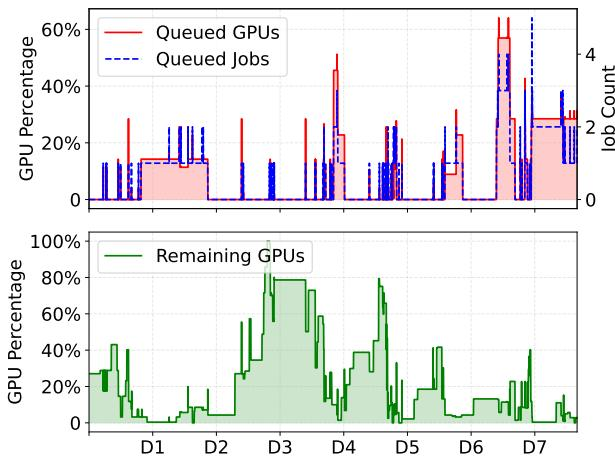  
Figure 1. Number of queued jobs, percentage of GPUs required by queued jobs, and percentage of available GPUs over a one-week period in our profiled cluster.

## 2 BACKGROUND AND MOTIVATION

## 2.1 Hybrid Parallelism for Distributed LLM Training

Hybrid parallelism is a common approach for scaling LLM training. Data parallelism (DP) (Rajbhandari et al., 2020; 2021; Zhao et al., 2023) partitions the input data into batches and distributes them across multiple GPUs. While standard DP replicates the training states, advanced implementations (e.g., ZeRO, FSDP) shard states to significantly mitigate memory constraints on individual devices. Tensor parallelism (TP) (Shoeybi et al., 2019; Smith et al., 2022) partitions specific model weights (intra-layer) across GPUs, enabling the parallel computation of individual layers. Furthermore, TP is frequently integrated with sequence parallelism (SP) (Korthikanti et al., 2023), to further minimize the memory footprint of activations. Pipeline parallelism (PP) (Huang et al., 2019) segments the model layers into distinct stages distributed across GPUs. Since each stage depends on the output of its predecessor, this dependency induces computation stalls, technically referred to as pipeline bubbles. To optimize resource utilization, virtual pipeline parallelism (VPP) (Narayanan et al., 2021) assigns multiple pipeline stages (model chunks) to a single GPU and interleaves their execution, thereby reducing the size of the pipeline bubble. Expert parallelism (EP) (Lepikhin et al., 2020; Fedus et al., 2022) allocates unique experts to distinct

Table 1. Comparison of elastic training systems. ✓supported, × unsupported, △ numerical consistency without maintaining floatpoint addition order for bitwise accuracy consistency. FlexTrain achieves bitwise consistent accuracy when scaling PP, but not when scaling DP+PP.  
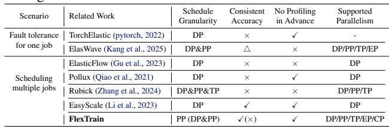

GPUs and routes tokens to their corresponding experts via All-to-All communication. Context parallelism (CP) (Liu et al., 2024b; Jacobs et al., 2023) is designed to handle extremely long sequences by partitioning the input sequence across GPUs specifically for the attention computation.

Among these parallel strategies, DP and PP are well-suited for scaling to support elasticity, as they schedule inputs and operations at a relatively high level, facilitating straightforward adaptation to changes in the number of GPUs. In contrast, TP, CP, and EP distribute intra-layer weights and activations, which complicates the adjustment of parallelism degrees. Moreover, increasing the degree of these dimensions often incurs substantial intra-layer communication overhead, which is difficult to overlap with computation.

However, adjusting DP degree while maintaining exactly consistent accuracy presents significant challenges. This requires not only consistent alignment of random number generators and input data shards, but also, more difficultly, the maintenance of an identical accumulation order (Li et al., 2023; Kang et al., 2025). PP offers a more suitable foundation for implementing elastic training within hybrid parallelism frameworks, as it inherently preserves consistency in model weights and activations. Consequently, we select PP as the primary dimension for scaling in response to a dynamic number of GPUs.

## 2.2 Fluctuated Cluster Utilization

LLM researchers and developers commonly leverage shared GPU clusters for LLM training, with a particular focus on supervised fine-tuning (SFT) jobs and model developmentrelated workloads. Figure 1 shows the percentage of remaining GPUs and the number of queued jobs that we collected from a production cluster. It reveals that GPU resources in the cluster are underutilized. This is primarily because of two reasons: (1) The time when users train LLMs exhibits a certain tidal pattern, resulting in low GPU utilization of the cluster during specific periods. For instance, the number of idle GPUs at midnight is about 7× higher than during the daytime on Day 2. (2) Training jobs usually require gang-scheduling (Weng et al., 2022), resulting in that even though there are idle GPUs in the cluster, jobs might still wait in queue as long as the number of idle GPUs is fewer than users’ requirements.

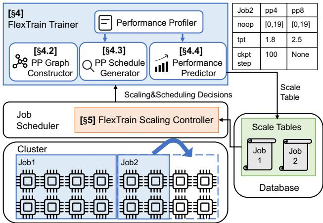  
Figure 2. Overview of the FlexTrain system architecture.

## 2.3 Elastic Training

Existing studies leverage elastic training for fault tolerance or to maximize cluster resource utilization by dynamically adjusting the number of GPUs allocated during job execution. Table 1 summarizes the distinctions between the existing systems and FlexTrain. In comparison, FlexTrain ensures accuracy consistency, eliminates the need for prior performance profiling, and supports a wider range of parallelism dimensions required for LLM training, with fewer restrictions on PP degree. While existing work primarily utilizes pipeline-based operations for efficient fault tolerance, FlexTrain leverages PP to flexibly exploit idle cluster resources for training acceleration.

## 3 FLEXTRAIN SYSTEM OVERVIEW

Figure 2 shows the architecture of the FlexTrain system, which integrates two primary modules into existing clusters:

FlexTrain Trainer (§ 4) enables efficient elastic training across varying resource configurations, while estimating throughput and memory requirements for different numbers of GPUs and persisting these metrics into the Scale Tables stored in the Database. This module comprises the PP Graph Constructor (§ 4.2), PP Schedule Generator (§ 4.3), Performance Predictor (§ 4.4), and Performance Profiler.

FlexTrain Scaling Controller (§ 5), located within the Job Scheduler of the Cluster, leverages these Scale Tables to make global scaling decisions. By analyzing the Scale Tables alongside real-time cluster status, the Controller determines when and how to scale jobs.

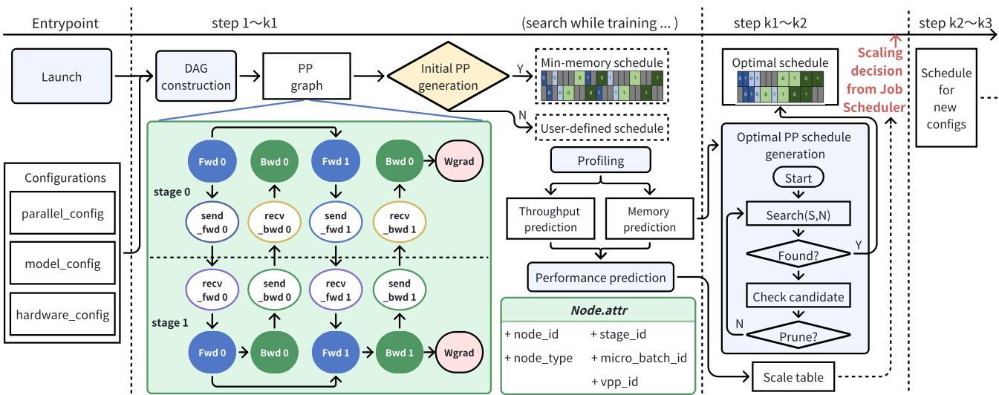  
Figure 3. Elastic training workflow performed within FlexTrain trainer. The green-outlined box shows FlexTrain’s PP execution abstraction.

When an LLM training job is submitted, it is initially allocated resources according to the developer’s specifications. If the developer opts for elastic acceleration, the training progress is executed via the FlexTrain Trainer and scheduled by the FlexTrain Scaling Controller.

## 4 ELASTIC TRAINER

In this Section, we elaborate on the detailed design of Flex-Train Trainer. We first introduce the workflow of FlexTrain Trainer. Then, we describe the three core designs of Flex-Train Trainer: PP Graph Constructor, PP Schedule Generator, and Performance Predictor.

## 4.1 Elastic Training Workflow

Figure 3 shows the elastic training workflow performed in FlexTrain Trainer. The white boxes represent the data flow, and the light blue boxes represent actions of the trainer.

Initially, the trainer launches an LLM training job based on user-specified settings, including configurations of parallelism (degrees of different parallelisms), model (number of Transformer layers), and hardware (number of GPUs).

Subsequently, the trainer executes the job using either a pre-defined PP schedule (e.g., PipeDream (Narayanan et al., 2019) or 1F1B (Narayanan et al., 2021)) or a generated memory-minimized PP schedule. The latter is primarily selected when there is uncertainty regarding whether a predefined schedule might trigger out-of-memory (OOM) errors. Figure 3 shows an example of the memory-minimized schedule when PP degree is 2 and VPP degree is 2. The peak activation memory of this schedule only contains the forward activation of one micro-batch.

Following the initial PP schedule, the PP Graph Constructor (§ 4.2) builds a Directed Acyclic Graph (DAG) to abstract the PP execution flow for the training job. During training with the initial PP schedule (step 0 to k1), the Performance Profiler collects fine-grained performance metrics for the current configuration. Then, the PP Schedule Generator (§ 4.3) automatically searches for the optimal PP schedule, leveraging the profiled information. Upon completing the search, the training process transitions to the optimal PP schedule to maximize throughput from step k1 to k2. Meanwhile, with the Performance Predictor (§ 4.4), the system continues to search for optimal schedules and predicts scaling outcomes for varying numbers of GPUs, producing a scale table. Finally, when a scaling decision is made based on this scale table, the training reconfigures to execute with the new GPU count from step k2 to k3.

## 4.2 PP Graph Constructor

We build a Directed Acyclic Graph (DAG) to represent the PP execution of one iteration (may include multiple microbatches). As illustrated by the green-framed box in Figure 3, a representative example is provided under the configuration of PP degree is 2, VPP degree is 1, and 2 micro-batches per iteration. Each computational and communicational operation, corresponding to individual micro-batches and model chunks, is abstracted as a Node in the graph. Directed edges are employed to encode two types of dependencies: (1) computation-computation dependencies, which govern the sequence of micro-batches within each stage and the ordering of model chunks across stages; and (2) computationcommunication dependencies. Through this formulation, a dedicated DAG is established for each training job. The Nodes are categorized into two types:

• Compute Node: Forward, Backward, Wgrad;

• Communication Node: Send forward, Receive forward, Send backward, Receive backward.

Algorithm 1 Schedule Search   
1: Input: Current schedule S, Set of DAG nodes N   
2: Output: A valid schedule or failure   
3: if |S| = |N | then   
4: return S, true   
5: end if   
6: Q ← InitPriorityQueue()   
7: for n in N do   
8: mest ← ESTPEAKMEM(S, n)   
9: if n.in degree = 0 and not n.visited and (n.stage.mem +   
mest ≤ n.stage.memmax) then   
10: INSERT(Q, n)   
11: end if   
12: end for   
13: while Q is not empty do   
14: n ← EXTRACTMIN(Q)   
15: mest ← ESTPEAKMEM(S, n)   
16: if n.stage.mem + mest > n.stage.memmax then   
17: continue {Pruning: exceed memory constraint}   
18: end if   
19: if n.tstart + n.tduration > Tbest end then   
20: continue {Pruning: exceed best known makespan}   
21: end if   
22: UPDATESTATE(n, Q) {Update time, memory, visited}   
23: S.append(n)   
24: Snew, found ← SCHEDULESEARCH(S, N )   
25: if found is true then   
26: return Snew, true   
27: end if   
28: BACKTRACK(n, Q) {Backtrace time, memory, visited}   
29: end while   
30: return null, false

During training, we record the execution time and memory variation of each Node. We represent the memory change during training as dynamic memory. Besides profiling the dynamic memory, we also record the static memory of each stage (typically model weights and optimizer states). The profiles are essential for PP search (§ 4.3.1) and the Performance Predictor (§ 4.4). The implementation details of the Performance Profiler are elaborated in § 6.

## 4.3 PP Schedule Generator

## 4.3.1 PP Schedule Search

To generate optimal PP schedules under different conditions, we develop a heuristic PP search algorithm that incorporates pruning based on GPU memory constraints. The objective of this algorithm is to identify a schedule that maximizes throughput while strictly adhering to memory limits.

Algorithm 1 presents the pseudocode for this procedure, offering a more detailed view than the high-level flow chart shown in the “Optimal PP schedule generation” block of Figure 3. First, FlexTrain performs a topological sort on the PP graph (lines 6–12); this ensures that the constructed schedule avoids deadlocks and execution errors. Subsequently, FlexTrain conducts a heuristic search to identify the optimal schedule (lines 13–29). As computation nodes are added to the schedule in topological order, the algorithm accumulates the memory usage for each PP stage. If the memory consumption of any stage exceeds the GPU capacity (lines 15–18), or if the estimated completion time exceeds that of the current best schedule (lines 19–21), FlexTrain prunes the current branch and proceeds to other branches. If a branch yields a valid schedule that performs higher throughput within the memory constraint, it replaces the current best schedule. Finally, the resulting optimal schedules are utilized for the subsequent training process from step k1 to k2 or the scaled-up training from step k2 to k3.

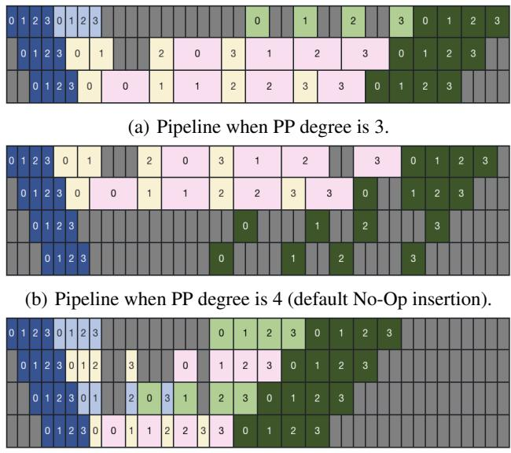  
(c) Pipeline when PP degree is 4 (No-Op optimized for MTP). Figure 4. Different pipelines when mtp head num = 2.

## 4.3.2 No-Op Insertion

Supporting any PP degree. To fully utilize any available GPU in the cluster, we do not restrict PP degree to divide the number of Transformer layers evenly. PP degree can be any integer as long as there is a valid PP schedule for this PP degree. To achieve this, we insert No-Op layers into the LLM, so that the number of Transformer layers and No-Op layers in total can be divided by PP degree evenly. Usually, a No-Op layer contains no model weights, nor does it perform any computation. It merely ensures the correctness of PP execution by passing the activations required by the preceding and subsequent PP stages.

Supporting MTP. Recent powerful LLMs such as DeepSeek v3 (Liu et al., 2024a) and Qwen3-Next (Qwen-Team, 2025) improve training and inference efficiency with Multi-Token Prediction (MTP) (Gloeckle et al., 2024). However, MTP introduces more computation and more memory requirements to the PP stages where MTP modules belong, resulting in an unbalanced pipeline. For example,

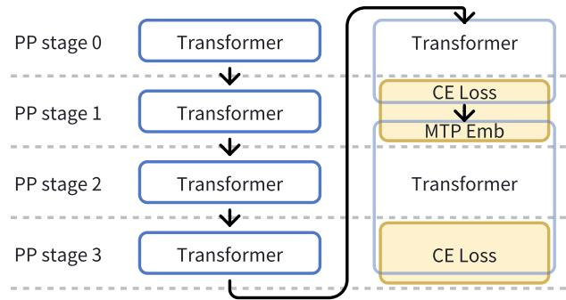  
Figure 5. Illustration of No-Op insertion and computation allocation across four pipeline stages in Figure 4(c).

Figure 4(a) and (b) show the PP timelines of training an LLM with MTP with 6 Transformer layers. When PP degree is 3 (Figure 4(a)), there are many pipeline bubbles because MTP modules’ execution time is longer than that of other hidden layers. Similarly, when PP degree is 4 (Figure 4(b)), if we insert No-Op layers in the same way as LLMs without MTP modules, the pipeline bubbles are substantial.

To mitigate pipeline imbalance, FlexTrain strategically inserts No-Op layers into the last and third last layers when necessitated by a specific PP degree. Concurrently, we relocate the Embedding and Cross-Entropy (CE) loss computations to these No-Op layers. This strategy balances computation and memory usage across all PP stages (Figure 4(c)), thereby significantly enhancing throughput. Figure 5 provides a detailed illustration of the configuration shown in Figure 4(c), where the Transformer+CE loss and Emb+Transformer+CE loss blocks are partitioned across four PP stages. Specifically, the No-Op layer inserted in the PP stage 1 executes the CE loss and MTP Embedding, while the No-Op layer in the PP stage 3 handles the CE loss. Furthermore, our constructed PP execution DAG is MTP-aware, enabling the search for optimal schedules in general scenarios with varying mtp head num, layer num, device num.

## 4.4 Performance Predictor

Performance Predictor is responsible for identifying the optimal parallel configuration across all feasible GPU counts. When the job requires consistent accuracy, only PP degree is scaled; otherwise, both DP and PP degrees are scaled concurrently to maximize performance gains. Other parallel degrees remain consistent with the job’s original settings.

Performance Predictor evaluates potential configurations that require varying numbers of GPUs, ranging from the current count to a predefined upper limit. Initially, it eliminates infeasible configurations based on hyperparameter constraints. For example, configurations are excluded if the global batch size cannot be evenly distributed across DP, if the PP degree exceeds the number of model layers, or if

EP cannot be allocated across DP. For each valid configuration, the Performance Predictor predicts both throughput and peak memory usage, selecting the schemes with the highest throughput for each GPU count, provided that it does not result in OOM. Finally, these selected schemes are constructed into a scaling table, which is subsequently recorded into the database.

## 4.4.1 Modeling-Based Throughput Prediction

We model the iteration time of different PP degrees without accounting for communication overhead, as it is typically overlapped with computation. For simplicity, we assume a micro-batch size of one, aligned with mainstream practices.

Given the ideal processing time for a pipeline,

$$
\tag{1}
$$

and the pipeline bubble time,

$$
\tag{2}
$$

virtual pipeline (VPP) is employed to enable finer-grained partitioning of PP stages, reducing bubble time to

$$
\tag{3}
$$

where m is the number of micro-batches in a batch per pipeline, p is PP degree, v is the number of virtual pipeline stages, tF and tB represent the time required for the forward and backward passes of a single micro-batch in a pipeline stage, respectively. To minimize Tbubble when training a model with L layers, we maximize v such that v = ⌈L/p⌉, ensuring that each virtual pipeline stage processes only a single layer. We denote the forward and backward pass times for one layer by t1lF and t1lB , respectively.

However, in this scenario, we observe that when scaling up p beyond m, the limited number of micro-batches is insufficient to fully utilize the warmup and cooldown stages, resulting in additional bubbles, which can be expressed as:

$$
\tag{4}
$$

Consequently, the total per-iteration time for the VPP schedule can be formulated as:

$$
\tag{5}
$$

In summary, given v = ⌈L/p⌉, increasing p (and thereby reducing v) can decrease Ttotal when m >= p. In contrast, when m < p, Ttotal is not significantly affected by scaling p.

Considering No-Op and MTP. Equation 5 provides an upper bound on the performance of a model with L computed layers, pipelined with inserted No-Op layers. However, various constraints and PP schedules can affect the actual performance achieved. Since the pipeline time is formulated with respect to a given number of layers L, this value can be interpreted as the total number of computational divisions, not limited to Transformer layers alone. For example, L may include the sum of an embedding layer, Transformer layers, and MTP heads.

Considering DP+PP Scaling. Since DP evenly divides the global batch across all pipelines, scaling DP can be incorporated as a factor in determining m in Equation 5:

$$
\tag{6}
$$

where d denotes the DP degree and B denotes the global batch size. Therefore, Equation 5 remains applicable for modeling scenarios that involve scaling both DP and PP.

## 4.4.2 Profiling-Based Throughput Prediction

Scaling PP Degree. We assume that no matter how PP degree is changed, the elapsed times of iterative Transformer layer Nodes are the same. If a Node also contains other modules, such as extra embeddings and CE loss for MTP, its elapsed time also includes the computation time of these special modules. We also assume that the elapsed times of these special modules remain the same. The final step time of a new PP degree p can be calculated as:

$$
\tag{7}
$$

$$
\tag{8}
$$

Scaling DP+PP Degrees. Since scaling the DP degree reassigns micro-batches across the pipeline, we reshard the profiled results associated with micro-batches from the original pipeline. The resharded data can then be utilized identically to how we scale the PP degree, enabling throughput prediction for the new DP+PP configuration.

## 4.4.3 Profiling-Based Memory Prediction

As we describe in § 4.3, the memory of a PP stage can be decomposed into the sum of static and dynamic memory:

$$
\tag{9}
$$

where i represents the index of the PP stage, j represents the micro-batch index, and k represents the VPP index. Our goal is to find a schedule that satisfies:

$$
\tag{10}
$$

Predicting dynamic memory. The dynamic memory of a given micro-batch index and VPP index depends on the

specific PP schedule, i.e., the sequence of executing these Nodes in the PP stage. Given an PP schedule S, the dynamic memory of the qth executed Node is:

$$
\tag{11}
$$

where Dn is the memory change of the nth executed Node in S. We use the profiled memory change of each microbatch and model chunk to estimate the corresponding memory change in a new PP degree. The memory change of No-Op layers is estimated as 0. Usually, the profiled memory change of forward computation Nodes is positive, and the backward computation Nodes are negative.

Predicting static memory. Static memory consists mainly of model weights and optimizer states. If the profiled stage i only contains iterative Transformer layers (i.e., normal layers), the static memory of one Transformer layer can be estimated as:

$$
\tag{12}
$$

Similar to predicting throughput, if the PP stage contains modules other than iterative Transformer layers (e.g., extra embeddings, extra CE loss for MTP, etc.), we estimate the memory of these modules as:

$$
\tag{13}
$$

Then, similar to predicting throughput, we map these special layers to the PP stages according to where the No-Op layers will be inserted. We estimate the static memory under PP degree p by adding the memory of the layers and modules in each PP stage. Additionally, when scaling DP+PP in scenarios using ZeRO-2 DP, we estimate the memory changes of optimizer states impacted by the DP degree.

## 4.4.4 Configuration filtering and Scale Table Generation

The Performance Predictor first enumerates all potential parallel configurations using profiling-based performance prediction, selecting the optimal one (without OOM) for each specific number of GPUs. It then conducts further configuration filtering to generate the final scale table for the scaling schedule. This filtering process traverses the profiling-based predicted speedups in ascending order of GPU count, with calibration against modeling-based predictions. A configuration is excluded from the scale table if any of the following conditions are met:(1) the two prediction methods show inconsistent upward/downward trends relative to their respective previous results;(2) there is an excessive discrepancy between their speedup values; or(3) increasing the GPU count does not yield a significant speedup compared to the last recorded valid configuration.

## 5 SCALING CONTROLLER

The Scaling Controller is responsible for decision-making processes such as selecting which elastic jobs to scale up or down, determining the timing for scaling actions, and specifying the number of GPUs to be allocated or released during scaling. It is integrated with the cluster scheduler.

## 5.1 Decision on Scaling Up

When idle GPU resources are available in the cluster and no jobs are waiting in the queue, it is advantageous to allocate these GPUs to currently running jobs to accelerate their completion. On the one hand, increasing the GPU resources allocated to target jobs reduces their JCT. On the other hand, the early completion of some jobs can free up additional GPU resources for incoming jobs. However, since clusters typically host a mixed workload of elastic and non-elastic jobs, it is imperative to mitigate any adverse impact on the queuing latency of non-elastic jobs caused by scaling.

Predictive Greedy Scheduling. To achieve this, we employ a greedy strategy constrained by job priority and benefit prediction based on the Poisson distribution. Periodically, the Scaling Controller examines elastic jobs in order of priority to determine whether idle GPUs satisfy the scaling-up conditions defined in the scale table. The priority scheme is configurable across scenarios, with a default preference for elastic jobs occupying fewer GPU resources. Once enough idle GPUs are available to scale up a job, the Scaling Controller determines its allocation size that yields the highest predicted throughput. Furthermore, the expanded GPU allocation does not exceed available resources and a preset maximum configured by the cluster administrator. In our experiments, we set this maximum to four times the job’s initial GPU allocation, based on empirical observations. Subsequently, the controller predicts whether scaling up will yield benefits; if so, it proceeds to scale the target job.

Poisson-Based Benefit Prediction. The fundamental tradeoff lies between the performance gains from the available resource window and the overhead incurred by the scaling operation. We estimate each job’s scaling overhead based on the profiling result of its init time prior to training iterations. Let “Speedup” denote the predicted speedup achieved by scaling up, Tavail represent the duration for which idle resources are available, and Toverhead represent the overhead of scaling operations. The decision aims to ensure a positive benefit from scaling, which can be formalized as:

$$
\tag{14}
$$

Since Tavail is unknown and must be predicted, we focus on the probability that idle resources will remain available for at least this required duration.

In practice, job arrivals in a production cluster are highly irregular and non-stationary over long horizons. However, over shorter timescales (e.g., several hours to one days), we often observe locally similar arrival patterns, including recurring periods of bursty demand or relative idleness. Therefore, rather than predicting the exact future idleness duration, we use a lightweight short-term model to estimate arrival pressure for scale-up decisions.

Specifically, within a recent time window, we approximate incoming job submissions as a locally stationary memoryless Poisson process. Under this approximation, the interarrival time follows an exponential distribution, and the probability that idle resources remain available for at least the required duration can be estimated as:

$$
\tag{15}
$$

where λ represents the arrival rate of new jobs, which is estimated from recent job submission records. We selectively count job submissions requiring GPU over a preset number, as large-scale jobs are primary candidates to reclaim GPUs from already scaled-up jobs.

Given a preset threshold probability Pth, and estimated Speedup, Toverhead, and λ, the scaling condition is:

$$
\tag{16}
$$

Satisfaction of this condition triggers job scaling to utilize available resources; otherwise, the original allocation remains. The threshold probability Pth, the time window for estimating the arrival rate λ, and the minimum GPU threshold for the job submissions counted in estimating λ can all be tuned to adapt to dynamic workload characteristics.

The benefit prediction mechanism with these parameters serve as a pragmatic filter that blocks scale-up actions likely to be harmful under short-term contention, while preserving opportunities for beneficial acceleration.

## 5.2 Decision on Scaling Down

In the event of resource contention, where a newly submitted job cannot be scheduled due to insufficient GPU availability, the Scaling Controller triggers a preemption mechanism to reclaim resources from existing elastic jobs. It prioritizes reclaiming GPUs from jobs that have gained the most significant performance benefits from their scaled-up allocations. If the total reclaimable GPUs remain insufficient for the new job after checking all elastic jobs, the preemption process is aborted. Existing jobs then continue running uninterrupted, and the new job is queued until resources become available from completed jobs. In cases where the new job requires only a subset of an elastic job’s scaled resources, that job will scale down to the configuration that maximizes its throughput with the available GPUs.

Table 2. Configurations for three elastic training test cases on MoE models of different scales.  
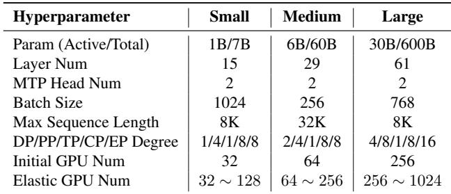

## 6 IMPLEMENTATION

The implementation of FlexTrain contains 9,000+ LOC, including 8,000+ LOC for FlexTrain Trainer and 1,000+ LOC for integrating the Scaling Controller into the cluster scheduler. The FlexTrain Trainer is implemented on Megatron (NVIDIA, 2025).

Performance Profiler. We profile the elapsed time and allocated/freed memory of every Node in the PP graph in runtime. This is implemented by wrapping each forward, backward, and communication function within a Python context. On entering the context, the Performance Profiler records the start time of the current Node and the current allocated GPU memory. Similarly, on exiting the context, the Performance Profiler records the Node’s end time and the remaining allocated GPU memory. The elapsed time of this Node is the interval between the start time and the end time, and the allocated/freed memory is the difference between the two recorded allocated memory.

Checkpoint reshard. FlexTrain might change the number and position of No-Op layers after scaling. If the checkpoints of LLMs are stored in a dict, where the keys contain the index of layers, the saved checkpoint might not be correctly loaded for further training. To avoid this problem, when saving checkpoints, FlexTrain also records the PP degree and where No-Op layers are inserted. When loading a checkpoint, FlexTrain checks the position of No-Op layers in this checkpoint as well as the position of No-Op layers in the current training configuration. It maps the checkpoint’s layer indexes to current indexes.

## 7 EVALUATION

In this section, we present the evaluation of FlexTrain through experiments conducted on three distinct configurations, as detailed in Table 2. First, we demonstrate that elastic-PP achieves accuracy consistency when scaling to different PP degrees during training. Second, we showcase the training performance improvements achieved by elasticity, which align with the predictions provided by our

Performance Predictor. All these experiments are conducted on a production GPU cluster comprising over a thousand machines, each equipped with 8 NVIDIA Hopper GPUs and interconnected via four 400 Gbps RDMA links.

Additionally, we conduct simulations to evaluate both the job completion time (JCT) of elastic jobs and the queue time of other jobs, using the three-month trace from the Seren cluster (Hu et al., 2024) with 2,288 NVIDIA A100 GPUs.

## 7.1 Accuracy Consistency

To validate the accuracy-consistency property of FlexTrain— whose core guarantee is to generate accuracy-consistent LLMs under an elastic number of GPUs when only the PP degree is scaled—we conduct experiments where FlexTrain is employed to train the LLMs listed in Table 2 across two or three distinct stages, each corresponding to a unique GPU configuration. Detailed stage configurations are presented in Figure 6, with transitions between stages simulating the scenario of job scaling. For each stage, the workloads were trained for a fixed 200 iterations to ensure consistent comparison conditions.

Figure 6(a) shows the training loss of training the small-size model under three experimental settings: (1) the baseline (no scaling), (2) scaling restricted exclusively to PP degree, and (3) scaling restricted exclusively to DP degree. As training proceeds, the loss values of all methods gradually decrease. Among these methods, the loss curves of baseline and scaling-PP are exactly identical. Figures 6(b) and 6(c) show the relative differences between these methods for training models of medium and large sizes. These results illustrate that FlexTrain provides accuracy consistency if only adjusting the degree of PP. If the developer wishes to achieve further performance gain by adjusting DP degree, accuracy consistency cannot be guaranteed.

## 7.2 Performance Prediction and Improvement

Since the Performance Predictor forecasts the speedup for different GPU counts and generates a scaling table to support scheduling decisions, we evaluate the deviation between predicted speedups and the actual speedups achieved through scaling. Figure 7 presents filtered records from the scaling table, which are limited to a maximum 4× scaling of the initial GPU count. The predicted speedups (lineconnected dots) and measured speedups (scattered dots) exhibit strong alignment. Both values show significant speedup gains as the number of allocated GPUs increases. This substantiates that FlexTrain can deliver the expected throughput improvement by elastically scaling jobs when there are idle GPUs available in the cluster.

Notably, scaling DP+PP achieves significantly better speedups than PP-only scaling for Small and Medium-scale cases. Furthermore, the PP degree is constrained by the number of model layers, resulting in a relatively limited scalable range—as illustrated in Figure 7(a) and Figure 8(a). Since DP scaling is also limited by the global batch size, DP+PP scaling enables a higher scalability upper bound. Additionally, in Large-scale scenarios (e.g., Figure 7(c)), the speedup gap between PP-only scaling and DP+PP scaling is relatively small. Given their comparable speedup performance, PP-only scaling emerges as a better choice due to its ability to ensure accuracy consistency.

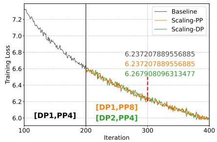  
(a) Small Case

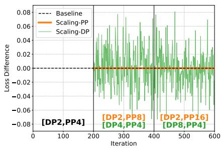  
(b) Medium Case

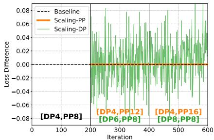  
(c) Large Case

Figure 6. Accuracy comparison between PP and DP scaling, implemented in FlexTrain. (a) presents the training loss curve of the Small case, while (b) and (c) present the relative loss differences (vs. unscaled baseline) of the Medium and Large cases.  
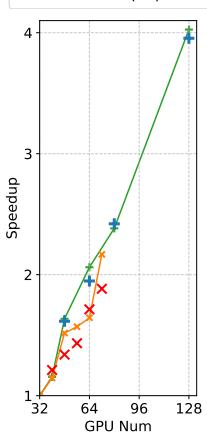

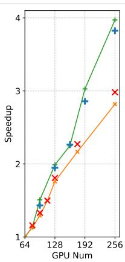  
(a) Small Case

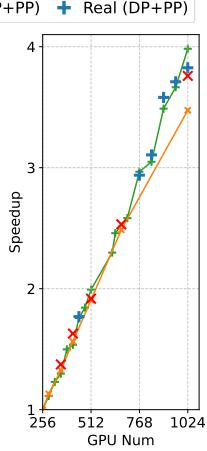  
(b) Medium Case  
(c) Large Case  
Figure 7. Comparison between predicted speedup in scale table and measured speedup during scaling PP or scaling DP+PP.

Figure 8 compares profiling-based and modeling-based prediction methods across all possible scaled GPU numbers. It is evident that the modeling method captures similar trends to the profiling method but exhibits numerical deviations for both PP and DP+PP scaling. Moreover, profiling-based methods may produce outliers when scaling DP+PP, due to the resharded profiling results, and speedup does not consistently increase with the number of GPUs. Therefore, the filtering process introduced in § 4.4.4 is essential to generate the high-quality scaling table presented in Figure 7.

Figure 9 shows the estimation of all potential parallel configurations of the Large test case. After filtering out configurations that are non-divisible or predicted to cause OOM, we select the parallel configuration with the highest throughput for each target GPU number, each corresponding to a data point in Figure 8.

## 7.3 System Overhead

FlexTrain introduces scaling overhead as there are time intervals between “suspending a job” and “restarting the job on a new set of GPUs”. To avoid introducing excessive additional modifications to the production cluster, which could lead to various issues, we adopt the most naive scaling approach: before scaling, FlexTrain saves the latest checkpoint of the model and stops the training job, then resumes training from this latest checkpoint on a new set of servers. In the case of scaling up, while the latest checkpoint is being saved, the newly added servers will pre-download images and install dependencies to overlap the scaling overhead.

Figure 10 shows the scaling overhead of the three cases. The main bottleneck lies in initializing communication groups, and this overhead increases as the training scale increases. The checkpoint overhead includes saving model weights, optimizer states, and data loader states. While larger models require saving larger model weights and optimizer states, saving checkpoints also necessitates waiting for the dataloader to complete data prefetching for the current iteration. This waiting time, however, does not increase with the growth of model size. As introduced in § 5.1, we estimate Toverhead based on the profiled init time for scaling decision, which can yield values comparable to the actual scaling overhead. Additionally, FlexTrain adds negligible profile overhead to the original init overhead.

## 7.4 End-to-End Results in Simulation

We evaluate FlexTrain against existing scheduling baselines, including non-elastic scheduling and ElasticFlow (Gu et al., 2023), using end-to-end simulations to demonstrate the efficacy of our method in large-scale clusters. It is important to note that prior elastic training systems, such as ElasticFlow, either fail to ensure accuracy consistency or support only a subset of the parallelism modes offered by FlexTrain. Therefore, we isolate the scheduling logic and compare the strategies by implementing them all upon the elastic training process provided by the FlexTrain Trainer.

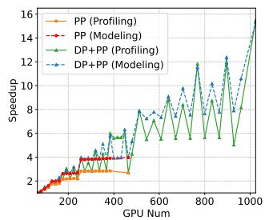  
(a) Medium Case

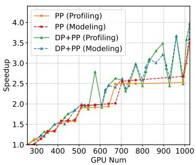  
(b) Large Case

Figure 8. Performance prediction results of potential GPU scales via profiling-based and modeling-based approaches  
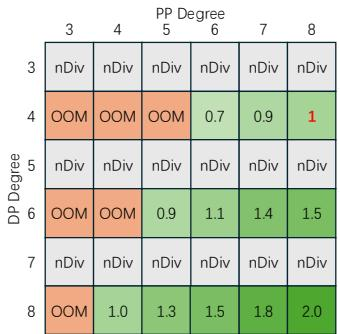  
Figure 9. Example of predicting potential DP+PP configurations.

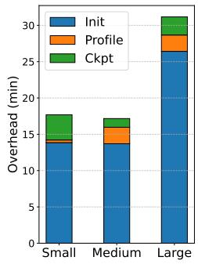  
Figure 10. Scaling overhead evaluation.

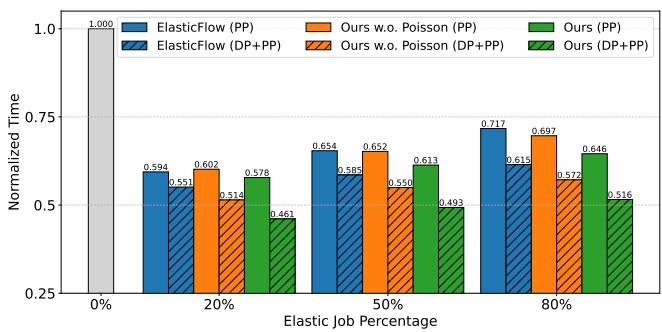  
(a) Normalized JCT of Elastic Jobs

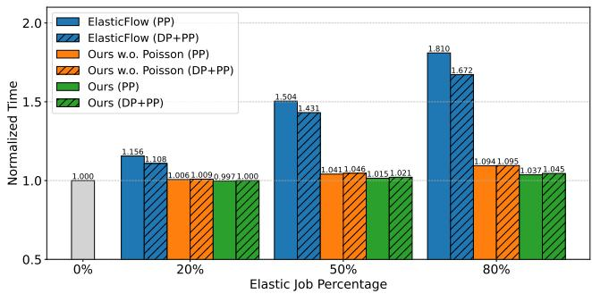  
(b) Normalized Queue Time of Other Non-Elastic Jobs  
Figure 11. Results of end-to-end scheduling simulation, normalized to the time under conventional non-elastic scheduling (shown at 0% elastic job percentage). “Ours w.o. Poisson” represents our greedy scheduling without Poisson-based benefit prediction for scale-up decisions, which scales up jobs whenever idle GPUs are detected, regardless of how long those resources are expected to remain available.

In simulations, we randomly select specific proportions of jobs using 32, 64, and 256 GPUs to represent three elastic cases, as detailed in Table 2. Within the Seren trace, jobs requiring 32, 64, or 256 GPUs account for 6k out of 9k jobs with a minimum GPU count of 32. To further ensure that the simulation aligns with real-world cases, we incorporate real-tested throughput data into our simulator. Additionally, for this experiment, we set the threshold probability Pth to 0.6, use a 8-hour window to estimate the arrival rate λ, and count only job submissions requesting at least 32 GPUs.

Figure 11(a) shows the normalized JCT of elastic jobs. When scaling PP degree and ensuring accuracy consistency, FlexTrain improves the training speed by 1.55× to 1.73×. As we expected, the fewer elastic jobs there are in the cluster, the more speedup can be achieved. This is because there are more available GPUs allocated to each elastic job if the elastic jobs are few. Meanwhile, as shown in Figure 11(b), the scaling overhead merely impacts the non-elastic jobs. Notably, scaling PP with our method yields optimal performance at an elastic percentage of 20%, where it decreases the normalized JCT of elastic jobs to 0.578 and lowers the normalized queue time of non-elastic jobs to 0.997. If relaxing the accuracy consistency is acceptable for developers, FlexTrain can speed up elastic training jobs by scaling DP+PP, improving LLM training speed by up to 2.27×.

Efficacy of Poisson-Based Benefit Prediction. As shown in Figure 11, incorporating Poisson-based benefit prediction into our greedy scheduling reduces the JCT of target elastic jobs while decreasing the queue time of non-elastic jobs, regardless of whether PP or DP+PP scaling is used. Specifically, the Poisson-based prediction amplifies the JCT improvements of our greedy strategy by 10% to 25% and mitigates its adverse effects on queue time by 50% to 100%.

In practice, this mechanism is not intended to enforce a strict Poisson arrival model through a high value of probability threshold. Instead, with an empirically chosen threshold of Pth = 0.6 and an 8-hour window for estimating λ, it serves as a practical filter for short-term arrival pressure. This setting suppresses scale-up actions that are likely to be harmful under near-term resource contention, while still preserving many opportunities for beneficial acceleration.

Although this filtering mechanism may also block some potentially beneficial scale-up opportunities compared with the greedy policy that always scales up whenever possible, evaluation on the full three-month trace indicates that the benefit of avoiding harmful scale-up decisions outweighs the efficiency loss introduced by occasional mispredictions. As a result, by precluding these inefficient allocations, the system effectively avoids rapid scale-downs that would detrimentally impact both JCT and queue time.

Comparison with Existing Elastic Training Work. As shown in Figure 11, ElasticFlow’s greedy scheduling (Gu et al., 2023) yields a JCT for elastic jobs comparable to our greedy scheduling approach without Poisson-based benefit prediction. However, it causes significantly longer queuing times for non-elastic jobs, with increases ranging from 10% to 65% compared to our greedy approach. Incorporating benefit prediction further amplifies the advantages of our greedy scheduling. This is because ElasticFlow is designed for clusters composed entirely of elastic training jobs, whereas our work targets mixed clusters where elastic jobs coexist with non-elastic ones. While ElasticFlow iteratively traverses all elastic jobs and allocates resources with a minimal allocation unit to optimize cluster throughput, our method considers reducing the impact on the queue times of non-elastic jobs by maximizing the acceleration benefit of selected elastic jobs via prediction.

While our implementation and evaluation focus on fixedsize private clusters to align with current production requirements, FlexTrain is adaptable to public cloud environments with dynamic cluster scaling. Specifically, the cluster monitor, job scaling operations, and scheduling strategies can be extended to accommodate the elasticity of cluster resources. We intend to explore this direction in future work.

## 8 CONCLUSION

In this paper, we propose FlexTrain, an elastic training system for LLM training, which provides accuracy consistency when training with different numbers of GPUs. Based on the results of runtime profiling, FlexTrain generates efficient PP schedules for each LLM training job under current training configurations and predicts its optimal performance for other configurations. Moreover, we develop a scheduling algorithm that dynamically allocates or deallocates resources to elastic jobs based on throughput improvement. Evaluation results show that FlexTrain can speed up elastic jobs by up to 1.73× while preserving consistent accuracy, with negligible influence on other jobs.

## ACKNOWLEDGEMENTS

We would like to thank our shepherd and the anonymous reviewers for their constructive feedback. This work was supported in part by the National Key R&D Program of China (No. 2024YFB4505800), the National Natural Science Foundation of China (No. 62402411), the Guangdong Basic and Applied Basic Research Foundation (No. 2023A1515110353), and the Guangdong Provincial Project (No. 2023QN10X252).

## REFERENCES

Fedus, W., Zoph, B., and Shazeer, N. Switch transformers: Scaling to trillion parameter models with simple and efficient sparsity. Journal of Machine Learning Research, 23(120):1–39, 2022.

Gloeckle, F., Idrissi, B. Y., Roziere, B., Lopez-Paz, D., and \` Synnaeve, G. Better & faster large language models via multi-token prediction. arXiv preprint arXiv:2404.19737, 2024.

Gu, D., Zhao, Y., Zhong, Y., Xiong, Y., Han, Z., Cheng, P., Yang, F., Huang, G., Jin, X., and Liu, X. Elasticflow: An elastic serverless training platform for distributed deep learning. In Proceedings of the 28th ACM International Conference on Architectural Support for Programming Languages and Operating Systems, Volume 2, ASPLOS 2023, pp. 266–280, 2023. doi: 10.1145/3575693.357572 1.

Hu, Q., Ye, Z., Wang, Z., Wang, G., Zhang, M., Chen, Q., Sun, P., Lin, D., Wang, X., Luo, Y., et al. Characterization of large language model development in the datacenter. In 21st USENIX Symposium on Networked Systems Design and Implementation (NSDI 24), pp. 709–729, 2024.

Huang, Y., Cheng, Y., Bapna, A., Firat, O., Chen, D., Chen, M., Lee, H., Ngiam, J., Le, Q. V., Wu, Y., et al. GPipe: Efficient Training of Giant Neural Networks Using Pipeline Parallelism. Advances in Neural Information Processing Systems, 32, 2019.

Jacobs, S. A., Tanaka, M., Zhang, C., Zhang, M., Song, S. L., Rajbhandari, S., and He, Y. Deepspeed ulysses: System optimizations for enabling training of extreme long sequence transformer models. arXiv preprint arXiv:2309.14509, 2023.

Jiang, Z., Lin, H., Zhong, Y., Huang, Q., Chen, Y., Zhang, Z., Peng, Y., Li, X., Xie, C., Nong, S., et al. {MegaScale}: Scaling large language model training to more than 10,000 {GPUs}. In 21st USENIX Symposium on Networked Systems Design and Implementation (NSDI 24), pp. 745–760, 2024.

Kang, X., Xiang, G., Wang, Y., Zhang, H., Fang, Y., Zhou, Y., Tang, Z., Lv, Y., Maman, E., Wasserman, M., et al. Elaswave: An elastic-native system for scalable hybridparallel training. arXiv preprint arXiv:2510.00606, 2025.

Korthikanti, V. A., Casper, J., Lym, S., McAfee, L., Andersch, M., Shoeybi, M., and Catanzaro, B. Reducing activation recomputation in large transformer models. Proceedings of Machine Learning and Systems, 5:341–353, 2023.

Lepikhin, D., Lee, H., Xu, Y., Chen, D., Firat, O., Huang, Y., Krikun, M., Shazeer, N., and Chen, Z. Gshard: Scaling giant models with conditional computation and automatic sharding. arXiv preprint arXiv:2006.16668, 2020.

Li, M., Andersen, D. G., Park, J. W., Smola, A. J., Ahmed, A., Josifovski, V., Long, J., Shekita, E. J., and Su, B.-Y. Scaling distributed machine learning with the parameter server. In Proceedings of 11th USENIX Symposium on Operating Systems Design and Implementation, (OSDI 2014), pp. 583–598, 2014.

Li, M., Xiao, W., Yang, H., Sun, B., Zhao, H., Ren, S., Luan, Z., Jia, X., Liu, Y., Li, Y., et al. Easyscale: Elastic training with consistent accuracy and improved utilization on gpus. In Proceedings of the International Conference for High Performance Computing, Networking, Storage and Analysis, pp. 1–14, 2023.

Liu, A., Feng, B., Xue, B., Wang, B., Wu, B., Lu, C., Zhao, C., Deng, C., Zhang, C., Ruan, C., et al. Deepseekv3 technical report. arXiv preprint arXiv:2412.19437, 2024a.

Liu, H., Zaharia, M., and Abbeel, P. Ringattention with blockwise transformers for near-infinite context. In The Twelfth International Conference on Learning Representations, 2024b. URL https://openreview.net /forum?id=WsRHpHH4s0.

Narayanan, D., Harlap, A., Phanishayee, A., Seshadri, V., Devanur, N. R., Ganger, G. R., Gibbons, P. B., and Zaharia, M. Pipedream: Generalized pipeline parallelism for dnn training. In Proceedings of the 27th ACM symposium on operating systems principles, pp. 1–15, 2019.

Narayanan, D., Shoeybi, M., Casper, J., LeGresley, P., Patwary, M., Korthikanti, V., Vainbrand, D., Kashinkunti, P., Bernauer, J., Catanzaro, B., et al. Efficient Large-Scale Language Model Training on GPU Clusters Using Megatron-LM. In Proceedings of the International Conference for High Performance Computing, Networking, Storage and Analysis, pp. 1–15, 2021.

News, S. D. Deeproute.ai unveils mass-production ready platform. https://selfdrivenews.com/deep

route-ai-unveils-mass-production-rea dy-platform/, 2025.

NVIDIA. Megatron-lm. https://github.com/NVI DIA/Megatron-LM, 2025.

OpenAI. Chatgpt. https://openai.com/zh-Han s-CN/index/chatgpt/, 2025.

otter.ai. The #1 ai meeting agent. https://https: //otter.ai/, 2025.

Paszke, A., Gross, S., Massa, F., Lerer, A., Bradbury, J., Chanan, G., Killeen, T., Lin, Z., Gimelshein, N., Antiga, L., et al. Pytorch: An imperative style, high-performance deep learning library. Advances in neural information processing systems, 32, 2019.

pytorch. elastic. https://github.com/pytorch/e lastic, 2022.

Qiao, A., Choe, S. K., Subramanya, S. J., Neiswanger, W., Ho, Q., Zhang, H., Ganger, G. R., and Xing, E. P. Pollux: Co-adaptive cluster scheduling for goodputoptimized deep learning. In Brown, A. D. and Lorch, J. R. (eds.), 15th USENIX Symposium on Operating Systems Design and Implementation, OSDI 2021, July 14- 16, 2021. USENIX Association, 2021. URL https: //www.usenix.org/conference/osdi21/p resentation/qiao.

QwenTeam. Qwen3-Next: Towards Ultimate Training & Inference Efficiency. https://qwen.ai/blog?i d=4074cca80393150c248e508aa62983f9cb 7d27cd&from=research.latest-advanceme nts-list, 2025. Accessed: 2025-10-27.

Rajbhandari, S., Rasley, J., Ruwase, O., and He, Y. Zero: Memory Optimizations Toward Training Trillion Parameter Models. In SC20: International Conference for High Performance Computing, Networking, Storage and Analysis, pp. 1–16. IEEE, 2020.

Rajbhandari, S., Ruwase, O., Rasley, J., Smith, S., and He, Y. Zero-Infinity: Breaking The GPU Memory Wall for Extreme Scale Deep Learning. In Proceedings of The International Conference for High Performance Computing, Networking, Storage and Analysis, pp. 1–14, 2021.

Shoeybi, M., Patwary, M., Puri, R., LeGresley, P., Casper, J., and Catanzaro, B. Megatron-LM: Training Multi-Billion Parameter Language Models Using Model Parallelism. arXiv preprint arXiv:1909.08053, 2019.

Smith, S., Patwary, M., Norick, B., LeGresley, P., Rajbhandari, S., Casper, J., Liu, Z., Prabhumoye, S., Zerveas, G., Korthikanti, V., et al. Using DeepSpeed and Megatron to

Train Megatron-Turing NLG 530B, A Large-Scale Generative Language Model. arXiv preprint arXiv:2201.11990, 2022.

Weng, Q., Xiao, W., Yu, Y., Wang, W., Wang, C., He, J., Li, Y., Zhang, L., Lin, W., and Ding, Y. {MLaaS} in the wild: Workload analysis and scheduling in {Large-Scale} heterogeneous {GPU} clusters. In 19th USENIX Symposium on Networked Systems Design and Implementation (NSDI 22), pp. 945–960, 2022.

Zhang, X., Zhao, H., Xiao, W., Jia, X., Xu, F., Li, Y., Lin, W., and Liu, F. Rubick: Exploiting job reconfigurability for deep learning cluster scheduling. arXiv preprint arXiv:2408.08586, 2024.

Zhao, Y., Gu, A., Varma, R., Luo, L., Huang, C.-C., Xu, M., Wright, L., Shojanazeri, H., Ott, M., Shleifer, S., et al. Pytorch fsdp: Experiences on scaling fully sharded data parallel. Proceedings of the VLDB Endowment, 16(12): 3848–3860, 2023.