# GRINNDER: BREAKING THE MEMORY CAPACITY WALL IN FULL-GRAPH GNN TRAINING WITH STORAGE OFFLOADING

Jaeyong Song 1 Seongyeon Park 1 Hongsun Jang 1 Jaewon Jung 1 Hunseong Lim 1 Junguk Hong 1 Jinho Lee 1

https://github.com/AIS-SNU/GriNNder

## ABSTRACT

Full-graph training of graph neural networks (GNNs) is widely used as it enables direct validation of algorithmic improvements by preserving complete neighborhood information. However, it typically requires multiple GPUs or servers, incurring substantial hardware and inter-device communication costs. While existing single-server methods reduce infrastructure requirements, they remain constrained by GPU and host memory capacity as graph sizes increase. To address this limitation, we introduce GriNNder, which is the first work to leverage storage devices to enable full-graph training even with limited memory. Because modern NVMe SSDs offer multi-terabyte capacities and bandwidths exceeding 10 GB/s, they provide an appealing option when memory resources are scarce. Yet, directly applying storage-based methods from other domains fails to address the unique access patterns and data dependencies in full-graph GNN training. GriNNder tackles these challenges by structured storage offloading (SSO), a framework that manages the GPU-host-storage hierarchy through coordinated cache, (re)gather, and bypass mechanisms. To realize the framework, we devise (i) a partition-wise caching strategy for host memory that exploits the observation on cross-partition dependencies, (ii) a regathering strategy for gradient computation that eliminates redundant storage operations, and (iii) a lightweight partitioning scheme that mitigates the memory requirements of existing graph partitioners. In experiments performed over various models and datasets, GriNNder achieves up to 9.78× speedup over state-of-the-art baselines and throughput comparable to distributed systems, enabling previously infeasible large-scale full-graph training even on a single GPU.

## 1 INTRODUCTION

Graph neural networks (GNNs) have emerged as essential tools for learning from graph-structured data, targeting social networks (Sharma et al., 2024), molecular interactions (Reau et al. ´ , 2023), and computer vision (Chen et al., 2024). As graphs can capture arbitrary relationships among entities, GNNs hold broad potential across diverse domains.

Among GNN training paradigms, full-graph training (Wan et al., 2022b;a; Jia et al., 2020a; Fey et al., 2021; Shi et al., 2023; Peng et al., 2022; Song et al., 2024) processes the entire graph per iteration, avoiding information loss. This provides high accuracy and theoretical guarantees, simplifying algorithmic validation. Our survey on recent GNN publications (Appendix A) reveals that many of them select full-graph training for these advantages, especially when the accuracy upper bound is unknown for new tasks or methods.

However, full-graph training requires storing all node activations and gradients across all GNN layers in memory, easily exceeding modern GPU capacity. Some single-server methods (Yang et al., 2023; Wang et al., 2023a) have been proposed, but remain fundamentally limited by GPU or host memory capacity for large graphs (Appendix B). While distributing workload across multiple GPUs is possible, this introduces significant hardware cost and inter-device communication overhead, often leading to poor scalability (Peng et al., 2022; Wan et al., 2022b).

These hardware-imposed limitations constrain researchers from flexibly designing and validating algorithms. Many studies in our survey (Appendix A) either co-design complicated memory-saving algorithms (e.g., sampling (Hamilton et al., 2017)) to fit data in memory (Bajaj et al., 2025), or report out-of-memory failures with large graphs rather than scaling to distributed environments.

To address this, we introduce GriNNder, the first framework that breaks through GPU and host memory limitations by leveraging storage as an additional memory hierarchy tier. Modern NVMe SSDs provide TB-scale storage and exceed 10 GB/s in bandwidth, making them practical for storing large volumes of intermediate training data. However, no prior full-graph training system has effectively exploited this storage tier—not because of fundamental hardware constraints, but because of the rigidity of existing frameworks.

One might expect that storage-based methods from other domains could alleviate GPU and host memory limits. However, these solutions cannot be directly applied to full-graph GNN training. LLM frameworks (Rajbhandari et al., 2021; Sheng et al., 2023) mainly offload model weights, but the weights’ memory is negligible in GNNs because parameters are shared across all vertices. Similarly, mini-batch-based GNN training systems with storage (Park et al., 2022; Waleffe et al., 2023; Liu et al., 2025; Jiang et al., 2024) leverage storage only to cache input features rather than intermediate activations and gradients. Extending them to full-graph settings (so-called micro-batch training (Yang et al., 2023)) inherits the same constraints while still suffering from GPU out-of-memory due to neighbor explosion (Appendix C).

When employing storage for full-graph GNN training, three key system-level challenges emerge:

1. Storage I/O Bottlenecks: Despite improved NVMe SSD bandwidth, storage remains far slower than host memory and suffers from inefficient I/O due to fixed page granularity and random access patterns.

2. Data Amplification: Existing frameworks (Paszke et al., 2017; Fey & Lenssen, 2019; Wang et al., 2023a) utilize activation snapshots to enable sequential accesses. However, this becomes impractical when used with storage, substantially inflating both memory usage and I/O traffic.

3. Memory-Hungry Partitioning: Full-graph training requires partitioning the graph until memory requirements fit GPU capacity. However, the standard partitioner (Karypis & Kumar, 1998; Karypis et al., 1997; LaSalle & Karypis, 2013) used in prior approaches (Yang et al., 2023; Wang et al., 2023a) often exceeds host memory limits during partitioning itself, necessitating a separate large-memory server that may harm practicality.

To address these challenges, we propose GriNNder, which introduces structured storage offloading (SSO), a general framework for managing the GPU-host-storage memory hierarchy in full-graph GNN training. SSO orchestrates three coordinated mechanisms—cache, (re)gather, and bypass— to enable efficient storage-aware training. This strategy is realized through the following specialized methods:

• Partition-wise graph caching: We observe that crosspartition dependencies follow a power-law distribution, similar to the degree distributions of real-world graphs. Exploiting this, we design partition-wise caching that uses host memory as an efficient cache with optimized I/O policies, minimizing inefficient storage access.

• Grad-engine activation regathering: A regathering strategy for the automatic gradient computation engine. It eliminates inefficient activation snapshotting in existing offloading solutions, thereby minimizing redundant data storage and movement.

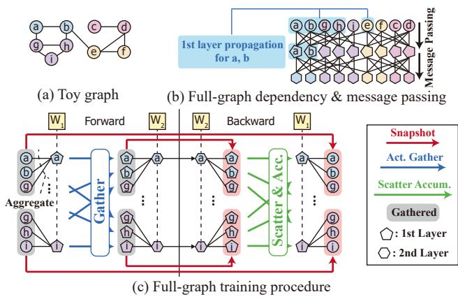  
Figure 1. Full-graph training procedure with a two-layer GNN.

• Switching-aware partitioning: A lightweight, memoryefficient partitioning algorithm specifically designed for host-memory-limited environments, avoiding the high memory footprint of standard graph partitioners.

We implement GriNNder as PyGriNNder, enabling users to leverage existing PyTorch Geometric (Fey & Lenssen, 2019) code by simple inheritance. Notably, GriNNder does not modify the training algorithm itself, ensuring seamless migration without risk of accuracy degradation. Our experiments demonstrate that GriNNder achieves up to 9.78× speedup over the state-of-the-art and throughput comparable to distributed baselines, enabling previously infeasible large-scale full-graph training even on a single GPU.

## 2 BACKGROUND: FULL-GRAPH GNN TRAINING

Full-graph GNN training (Jia et al., 2020a; Tripathy et al., 2020; Peng et al., 2022; Wan et al., 2022a;b) processes the entire graph in each training iteration without sampling, propagating information through message passing across multiple layers. Unlike subgraph training (e.g., minibatch (Hamilton et al., 2017)), it uses all edge connections, preserving complete neighborhood information. This approach simplifies algorithmic validation but requires storing intermediate activations/gradients for all |V | vertices across all |L| layers simultaneously with |H| hidden dimensions— often TBs for large graphs.

Figure 1 illustrates full-graph training using a two-layer GNN on the toy graph in Figure 1a. Figure 1b shows the two-layer dependency structure derived from this topology. Starting from input features (denoted with circled vertex IDs), features are propagated via message passing to destination vertices in the intermediate layer (e.g., a , b , g , h , e −→ a , b , shaded blue). The second layer applies the same process using these intermediate features to produce the final output embeddings.

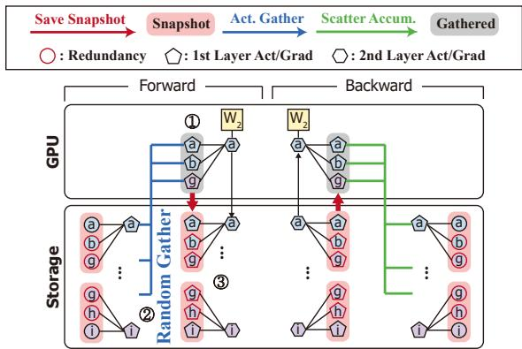  
Figure 2. Na¨ıve storage extension of full-graph training.

Figure 1c illustrates the layer-by-layer training procedure. Forward Pass. To compute an output feature vector, features from source vertices in the previous layer must be aggregated (e.g., averaged). For example, vertex feature a depends on a , b , and g , including an implicit selfloop. After aggregation, the features are multiplied with the shared weight matrix (e.g., W1), then processed through operations such as normalization and activation to produce the layer’s output features (denoted by ). For the next layer, these output features are gathered to create inputs for aggregation following the same dependency structure (blue arrows). The gathered activations are saved as snapshots in GPU or host memory for use in the backward pass.

Backward Pass. During backpropagation, the dependency flow is inverted. The gradient of vertex feature a is propagated to a , b , and g to compute their gradients. This requires loading the previously saved snapshots (red arrows), then scatter-accumulating the computed gradients to the vertices of the previous layer (green arrows).

When workloads fit in GPU memory, this procedure enables fast training through massive parallelism and high memory bandwidth. However, severe capacity pressure arises: the entire intermediate data, including activations/gradients, must fit within GPU memory. A straightforward solution is distributed training (Tripathy et al., 2020; Peng et al., 2022), but this incurs substantial hardware costs and inter-device communication overhead (often 80–98%, see Appendix B).

To mitigate GPU memory constraints, single-server methods (Yang et al., 2023; Wang et al., 2023a) have been recently proposed. However, they remain limited by GPU and host memory capacity and require memory-hungry partitioning operations that consume hundreds of GBs. We provide a detailed analysis of these limitations in Appendix B.

Na¨ıve Storage Employment. Given full-graph training as described in Figure 1, a straightforward method would place the small weights (and gradients) on the GPU and large activations (and gradients) on storage. Figure 2 illustrates an example procedure for processing a single vertex, a . Since the neighbors of a ( a , b , and g ) fit within GPU memory, training can proceed. However, this approach yields sub-optimal performance for three main reasons: 1 Ensuring gathered neighbor features fit within GPU memory is challenging due to power-law degree distributions. Memory requirements per partition vary dramatically, making GPU capacity violations difficult to avoid without memory-aware partitioning. 2 Gathering feature vectors requires random reads from storage. Since storage devices operate at page granularity (e.g., 16 KiB for NVMe SSDs), random access leads to severe read amplification and bandwidth saturation. 3 While existing snapshot features in PyTorch (Paszke et al., 2017) and prior methods (Wang et al., 2023a) enable sequential access, they introduce significant redundancy, inflating write traffic. For instance, g appears redundantly in snapshots of all neighboring vertices— a , h , and i .

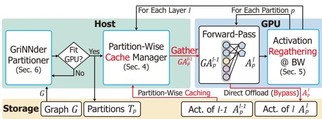  
Figure 3. Overall workflow with cache-(re)gather-bypass.

## 3 STRUCTURED STORAGE OFFLOADING: CACHE-(RE)GATHER-BYPASS

To address the limitations identified in Section 2, we propose GriNNder, the first framework enabling storage-offloaded full-graph GNN training to break the GPU and host memory wall. As na¨ıve storage employment demonstrates, efficient storage-based full-graph training requires a fundamentally different approach than simple offloading. We introduce structured storage offloading, a systematic framework for orchestrating data movement across the GPU-host-storage hierarchy, specifically designed for full-graph GNN training.

The core of structured storage offloading is the cache-(re)gather-bypass mechanism. The workflow is illustrated in Figure 3 (see Appendix D for the procedure). Assuming that the graph G is partitioned into small subgraphs (Tp) (Section 6), the workflow is organized as follows:

• Cache. To avoid frequent fine-grained random accesses, the vertex activations are loaded from storage and cached in the host memory at per-partition and per-layer granularity. For processing layer l, only the partitions from layer l − 1 need to be accessed from the storage. Thus, we can significantly reduce the working set, enabling efficient caching despite the limited capacity of host memory (Section 4).

• (Re)gather. In the GPU, the vertices in a single destination partition of layer l are processed in a batch, which requires their source vertex activations in layer l − 1. Because transferring the source vertex data in a partition granularity would be too costly, the host processor gathers and transfers the union of the source vertices of all destination vertices in the current partition (GAl−1p ), from the cached data. Unlike existing approaches, which snapshot the gathered input activation for the backward, we opt to regather it just-in-time at the backward. This significantly reduces the redundant I/O and memory pressure on the host/storage (Section 5).

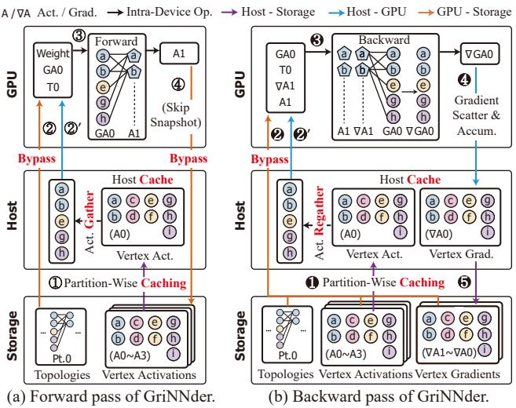  
Figure 4. GriNNder forward and backward procedures for layer 1.

• Bypass. Meanwhile, some data do not benefit from caching, such as the topology and the resulting output activation (Alp) for the destination partition. These data bypass the host memory, and are written directly to the storage to prevent pressure on the host memory cache.

Detailed Procedure. Figure 4 details the forward/backward passes (we use A0 to denote A0 for brevity). Figure 4a depicts the forward pass for partition 0 of layer 1. 1 (Cache) Layer 0 activations (A0) are loaded into the host cache at partition granularity. 2 Partitioned graph structure T0 uploads to GPU. 2 ’ (Gather) Required vertex activations GA0 are gathered in host memory and transferred to GPU. 3 GPU executes the forward pass to output A1. 4 (Bypass) Computed activations A1 are offloaded to storage via GPU Direct Storage (GDS) (NVIDIA, 2021), skipping snapshots to reduce redundancy (Section 5).

Figure 4b illustrates backward for the same partition. The procedure mirrors forward in reverse with added complexity from activation gradients (∇A1, ∇GA0). 1 (Cache) Activations (A0) are cached in host memory partition-wise for frequent reuse. 2 (Bypass) Activations A1 and gradients ∇A1 load directly from storage. Backward takes A1, ∇A1, GA0 as inputs producing ∇GA0. 2 ’ (Regather) GA0 is fetched from the host cache through regathering, not snapshots (Section 5). 3 GPU computes activation gradients (∇GA0) using loaded activations/gradients. 4

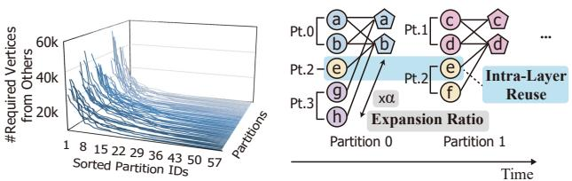  
(b) Expansion & intra-layer reuse(a) Partition dependency profile

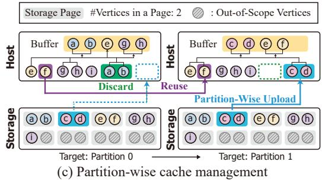  
Figure 5. Details and rationales of partition-wise graph caching. Pt.1 denotes Partition 1.

Source vertex gradients (∇GA0) update in host memory via scattered accumulation, ensuring correctness for vertices shared across partitions. Host memory serves as a write-back buffer for vertex activation gradients. 5 After processing the entire layer, gradients are offloaded to storage.

## 4 PARTITION-WISE GRAPH CACHING

Key takeaway: Similar to vertex degrees in real-world graphs, cross-partition dependencies also follow a powerlaw distribution. Exploiting this characteristic enables efficient storage I/O management through targeted caching.

Structured storage offloading manages host memory cache at partition granularity, exploiting locality while avoiding fine-grained storage access patterns. The cache replacement policy operates in two modes. Under sufficient host memory capacity, the cache retains complete layers, maximizing reuse across partition iterations. When host memory cannot accommodate all layers, the policy evicts entire layers in LRU order. For extreme cases where a single layer exceeds host memory capacity (observed only in Papers dataset in Section 8.2 and IGBM with reduced cache in Section 8.3), the policy degrades gracefully to partition-wise eviction. We now present the design rationale and mechanisms underlying this hierarchical cache management strategy.

Cross-partition access patterns exhibit power-law distributions analogous to vertex degree distributions in realworld graphs, emerging from inherent clustering tendencies (Leskovec et al., 2005). Figure 5a validates this on the IGBM dataset. For each partition (y-axis), we measure the required vertices from other partitions. Sorting these counts (x-axis) reveals that among 64 partitions, dependencies concentrate within approximately 10 partitions (additional datasets in Appendix E). We exploit this skewed distribution through two mechanisms.

Layer-Wise Partition Caching: Within a layer, partitions share activations and gradients due to cross-partition edges. In Figure 5b, vertex e’s activation is used in both partitions 0 and 1. With average expansion ratio α (#required/#target), activations are reused α − 1 times within that layer, causing redundant storage accesses. To mitigate this inefficiency, we introduce intra-layer reuse, caching frequently reused partitions in host memory. Data with minimal intra-layer reuse (graph topology, output activations) are placed in storage and bypass host memory using GPUDirect Storage (NVIDIA, 2021) (GDS), reducing I/O traffic and cache conflicts. Note that this design can be used in general even when GDS is unavailable (see Appendix S).

Partition-Wise Cache Management: GriNNder uses partitions as the load/evict granularity for host memory cache. Alternatively, vertex granularity would require reading single vertex features (64–1,024B) on cache misses. Since storage devices access data at page granularity (e.g., 16KiB), this incurs substantial unnecessary I/O. Partition-wise management reduces this overhead as partition sizes are typically a few GBs. For instance, processing partition 0 (vertices a, b) with dependencies to a, b, e, g, h loads three partitions (0, 2, 3) to host memory (Figure 5c). For partition 1 with dependencies to c, d, e, f spanning partitions 1 and 2, we reuse cached partition 2 and only load partition 1, evicting unused partition 0. This reuses vertex features without fine-grained random accesses. During this procedure, we keep a small buffer to send each partition’s input activations from the host to the GPU. In the worst case, partition-wise management incurs overhead when dependencies are uniformly distributed across many partitions. However, as shown in Figure 5a, the dependencies within a partition are concentrated in a few partitions, enabling stable caching performance. For the detailed comparison between the partition-wise and vertexwise management, see Appendix F. We further minimize latency by overlapping processing with cache management and maximizing sequential GPU access (Appendix G).

## 5 GRAD-ENGINE ACTIVATION REGATHERING

Key takeaway: PyTorch’s autograd engine requires redundant snapshot storage, causing α-fold1 data amplification. Our grad-engine activation regathering, a regatheringbased gradient engine for just-in-time activation reconstruction, eliminates snapshots and reduces storage I/O.

One of the key challenges for employing storage in fullgraph GNN training is data amplification, where repeated snapshots of input activations inflate memory capacity and storage I/O demands. As described in the previous section, GriNNder partitions the graph and caches graph features/gradients in the host memory at partition granularity.

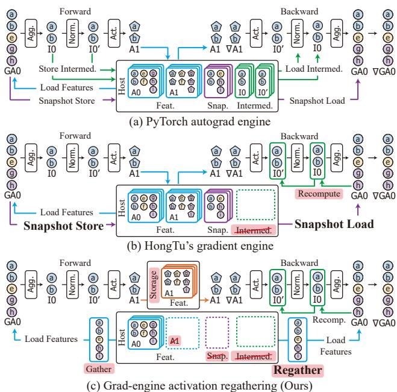  
Figure 6. Advantage of (c) grad-engine activation regathering compared to (a) PyTorch autograd and (b) HongTu.

However, existing autograd engines (Paszke et al., 2017; Fey & Lenssen, 2019) such as torch.autograd from PyTorch, even with generic activation checkpointing (Chen et al., 2016), are not designed with such optimizations and require substantial host memory when employing offloading, as illustrated in Figure 6a. The vanilla autograd engine stores activation snapshots (‘Snap.’) and intermediate snapshots of all operations (‘Intermed.’), such as normalization (I0) and activation function (I0′). While this design is reasonable for vision or language models with bounded activation sizes, it incurs significant memory overhead for GNNs, where activation (snapshot) sizes scale with graph size and the number of partitions with the magnitude of α.

The amplification problem reveals three core challenges. First, GNN propagation requires graph-topology-aware reconstruction rather than generic recomputation of tensor operations. Second, partition-wise caching necessitates coordinated optimization across the GPU-host-storage memory hierarchy. Third, the α-fold snapshot amplification (where α ≈ 8 for large graphs) incurs a huge memory footprint, as all partition snapshots are required during backpropagation. Prior techniques address related but distinct problems. Generic activation checkpointing (Chen et al., 2016) trades computation for memory but cannot account for graph topology or partition granularity. HongTu (Wang et al., 2023a) recomputes intermediate activations but still requires storing α-fold amplified snapshots, which will be discussed in the next paragraph. Ginex (Park et al., 2022) optimizes cache management for mini-batch training but does not address full-graph training’s snapshot amplification.

HongTu (Wang et al., 2023a) (Figure 6b) mitigates PyTorch autograd’s issue of snapshotting intermediates (e.g., I0 and I0′) by recomputing intermediate activations on demand. It employs a gradient engine to snapshot the gathered activations to reduce latency (by enabling sequential access to snapshots), but at the cost of increased snapshots and redundant vertex data across partitions. As a result, each vertex may be stored up to α times, which adversely impacts memory consumption and bandwidth requirements, particularly for large datasets. This is because it assumes abundant host memory and does not consider the use of storage, which has much lower bandwidth than host memory.

To address these limitations, we introduce grad-engine activation regathering, illustrated in Figure 6c, which eliminates snapshot redundancy through three optimizations. First, we observe that the activation snapshot GA0 is essentially a reorganization of activations A0 according to graph topology. Rather than pre-storing these reorganized snapshots, we regather them on-demand during backpropagation from the original activations A0 by applying the gather operation. While this introduces an additional regather operation at the host, it eliminates snapshot storage (proportional to α) and the associated I/O overhead. Critically, since storing all snapshots would overflow typical host memory capacity, pre-storing snapshots mandates additional storage I/O, which incurs far greater overhead than our regathering approach. Second, intermediate values are removed from the host memory and recomputed just in time from the regathered GA0. In the figure, I0 is recomputed by aggregation using the topology, and I0′ is obtained by further applying normalization. This shares the same principle as existing recomputation techniques (Wang et al., 2023a; Chen et al., 2016), but is merged with the regathering mechanism. Finally, to further reduce host memory pressure, the output feature A1 is bypassed and written directly to storage. The combination of these optimizations enables grad-engine activation regathering to operate with minimal host memory footprint while substantially reducing storage I/O volume.

It is also worth mentioning HongTu’s additional optimization, which is specific to GCN-like models. On top of the default HongTu engine depicted in Figure 6b, the optimization stores a snapshot of the aggregated intermediate activations (I0) instead of gathered activations (GA0) to reduce host-GPU traffic from αD to D. This is only possible because ∇GA0 can be directly computed from I0 in GCN. Therefore, this is infeasible for GAT-like models that apply additional attention operations during aggregation. Moreover, this additional method still requires D × L of additional host memory (D = |V ||H|). In host-memoryconstrained settings, this can easily cause OOM, thereby converting host-GPU traffic into slower storage traffic.

We can analyze the advantage of grad-engine activation regathering compared to this additional optimization as follows. In the forward pass, HongTu is slower than GriNNder because it additionally snapshots D activations, whereas grad-engine activation regathering eliminates snapshotting by regathering in the backward pass. In the backward pass, assuming HongTu’s D × L additional memory usage forces host-GPU traffic to spill into slow OS swap storage traffic, HongTu loads 2D activations and D gradients from storage, while offloading αD gradients to storage. On the other hand, GriNNder loads (α+1)D activations and D gradients from host memory, offloading αD gradients to host memory. Omitting computation, which is often negligible compared to I/O in resource-limited environments, and denoting host-GPU bandwidth as Bhost (typically x16 lanes) and SSD bandwidth as BSSD (typically x4 lanes), GriNNder is faster in the backward pass if:

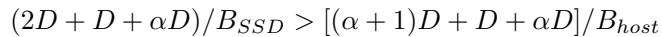

This simplifies to Bhost/BSSD > 2(α+1)/(α+3) ≈ 1.2− 1.6 for practical α = 2 − 8. Since physical lane differences typically yield Bhost/BSSD ≥ 2−4, grad-engine activation regathering is usually preferable. HongTu’s intermediate snapshotting is only effective when host memory is abundant or when graphs are small (i.e., when the host memory can accommodate the additional D × L).

I/O Volume and Memory Footprint. Let D = |V ||H|. During the forward pass of a layer, the baseline autograd engine consumes (2α + 3)D traffic between the GPU and the host, for the gathered input activations (αD), snapshots (αD), intermediate values (2D), and outputs (D). Since the baseline easily exceeds the host memory limit, it mandates using OS swap memory with storage, and most of that traffic becomes the IO between the GPU/host and the storage. GriNNder only consumes αD between the GPU and the host, D between the GPU and the storage, and D between the host and the storage while caching (when only cold misses exist). In other words, while the baseline suffers from huge and slow storage traffic proportional to α, grad-engine activation regathering only requires a 2D amount of storage traffic. In terms of the memory footprint during the forward, the baseline stores snapshots (αD), activations (D), and intermediate values (2D) per layer. On the other hand, grad-engine activation regathering only occupies D space in the host memory, and D in the storage for the outputs without redundancy. In the worst case, where the baseline utilizes OS swap memory with storage, this represents a 2α+32 ≈ 8.5× reduction in storage I/O for typical α ≈ 8. For more in-depth analyses (with another baseline (Wang et al., 2023a)), see Appendix H.

## 6 SWITCHING-AWARE PARTITIONING

Key takeaway: Existing partitioning algorithms (e.g., METIS-based) often incur a significant memory footprint, harming the practicality of iterative partitioning workflows in full-graph GNN training environments.

Graph partitioning is a critical enabler that allows GriNNder to efficiently utilize GPU memory, manage caches with minimal storage bandwidth, and minimize the traffic between host and GPU by reducing the expansion ratio (α). Although existing partitioners used in GNN domains produce nearoptimal partitions, they often exceed single-server memory limits (Figure 7a, measured with MT-METIS (LaSalle & Karypis, 2013)) for large datasets such as Papers (Hu et al., 2020). Crucially, partitioning must be performed iteratively to find an adequate #partitions that fit within GPU memory constraints—a process that becomes prohibitively expensive when each iteration requires external servers with sufficient host memory. This could harm the practicality of full-graph GNN training workflows, clearly demonstrating the need for a lightweight partitioner.

Inspired by streaming partitioning approaches for distributed cloud systems (Spinner (Martella et al., 2017)), we devise a lightweight switching-aware partitioning with low memory consumption. The key is to minimize the use of auxiliary data structures, whose size often largely surpasses that of the graph itself. From an arbitrary initial partition, we iteratively refine the partition assignments to reduce the number of dependent partitions until convergence. Detailed procedures and design insights are provided in Appendix I.

Algorithm Overview. Figure 7 outlines switching-aware partitioning’s procedure and implementation, with exact preference scores and objective functions omitted for clarity. At a high level, the algorithm attempts to move vertices to the partition with the most neighbors to reduce the number of dependent partitions while keeping partition sizes similar. Figure 7b illustrates an example intermediate state during partitioning. Following the CSR format, our data structure comprises source pointers (SrcPtr) and destination indices (DstIdx). We manage an additional array (Dst’s Partition) and fill this array with the partition ID of each destination index in DstIdx. For example in Figure 7b, vertex 0 has neighbors {1, 2, 5, 7, 4, 3}, and we fill Dst’s Partition with their partition IDs: {2, 2, 2, 0, 1, 1}.

In this state, vertex 0 prefers partition 2 (denoted as ‘1st Pref.’ in Figure 7c) because most of its neighbors reside in partition 2. We compute such preferences for each source vertex in parallel using source-level parallelism without additional memory usage, as illustrated in Figure 7c. After computing preferences, we relocate each source vertex to its preferred partition (label propagation). For example, vertex 0 moves to partition 2, as depicted in Figure 7d. Since vertex 0 now belongs to partition 2, all entries in Dst’s Partition pointing to vertex 0 must be updated to reflect this change. We perform this update efficiently using destination-level parallelism (Figure 7d), where threads independently update entries corresponding to different destination vertices. By iteratively updating preferred partitions following this procedure until convergence, we minimize the average expansion ratio (α) across partitions.

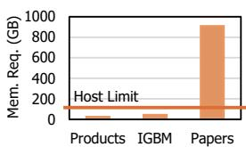

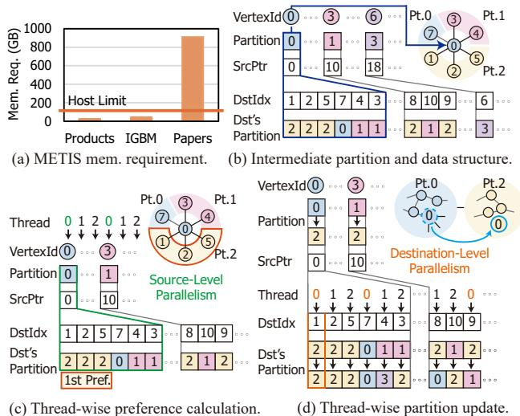  
Figure 7. Motivation and a high-level overview of switching-aware partitioning.

For the initial state, we randomly assign vertices to partitions and observe stable behavior across runs, with partition quality largely insensitive to this random initialization. In other words, while starting from a good initial state could reduce the number of iterations required for convergence, the final converged state is empirically independent of the initial state. Additionally, the partition sizes across partitions are balanced via an explicit size-based penalty in the partition scoring function as follows (see Appendix I for details). Given state Si and partition Pj :

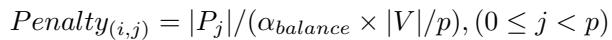

where |Pj | is the current partition size, |V | is the total number of vertices, p is the number of partitions, and αbalance controls balance strictness (default αbalance = 1.1, allowing partitions to be ∼10% larger than the equal size). This discourages the growth of oversized partitions and maintains balance during partitioning.

Memory Usage and Convergence. Switching-aware partitioning uses only a CSR representation (SrcPtr, DstIdx) and a Dst’s Partition array to record each neighbor’s current partition. This totals O(2|V | + 2|E|) space compared to METIS’ O(2|V | + |E| + PSi=1 |Ei| + |Vi|) requirement (Kaur & Gupta, 2021), where S is the number of partitioning stages in METIS. In practice, this achieves 7.10–24.37× memory reduction on large graphs (Table 4).

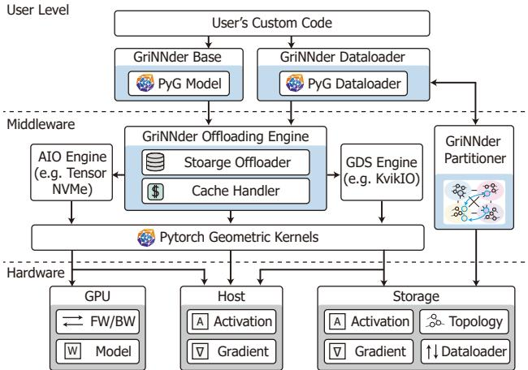  
Figure 8. Framework structure of GriNNder.

Switching-aware partitioning converges in 30–50 iterations, consuming only 0.07%/0.02%/0.39% of total training time on Products/IGBM/Papers datasets (Appendix O)—a negligible overhead for practical workflows. Despite its lightweight design, switching-aware partitioning achieves competitive partitioning quality compared to state-of-the-art lightweight partitioners (Section 8.5).

Integration with Training. We use METIS when host memory is sufficient, as it produces high-quality partitions. However, when memory constraints mandate partitioning on external infrastructure, switching-aware partitioning offers a fast and memory-efficient alternative with competitive partition quality. For detailed comparisons with Spinner (Martella et al., 2017) and state-of-the-art out-of-core partitioner (2PS-L (Mayer et al., 2022)), see Section 8.5.

## 7 GRINNDER API AND IMPLEMENTATION

We implement GriNNder as an extension to PyTorch’s torch.nn.Module (Paszke et al., 2017), providing a minimal-modification API for existing PyG (Fey & Lenssen, 2019) applications. Users inherit the GriNNderGNN base class and implement a single layer forward method to enable layer-wise execution required for partition-based full-graph training. This design decouples GNN model logic from the underlying offloading infrastructure, requiring typically several lines of code changes from standard PyG implementations (see Appendix K for API details).

Figure 8 illustrates the framework architecture. The userlevel provides the base GNN module and a custom dataloader that manages partition-aware data serving, maintains cross-partition dependency metadata, and coordinates I/O scheduling. The middleware integrates partition-wise caching (Section 4), gradient regathering (Section 5), and lightweight partitioning (Section 6). It implements the offloading engine, which orchestrates data movement through two specialized I/O engines: the Linux AIO interface wrapped by TensorNVMe (tensornvme) for host-storage transfers, and Kvikio (kvikio) for GPU-storage transfers via GPUDirect Storage (GDS) (NVIDIA, 2021).

The engine tracks each activation’s location and coordinates I/O operations across three hardware tiers. Since offloaded training is typically I/O-bound, we implement aggressive I/O overlap to hide transfer latency. Leveraging bidirectional PCIe bandwidth, the offloading engine pipelines the write of the previous partition’s activations with the prefetch of the current partition’s required activations. We implement the dataloader and partitioner in C++ for high performance and expose them to Python through pybind11 (pybind11).

## 8 EVALUATION

## 8.1 Experimental Settings and Baselines

Hardware: We run main experiments on a single GPU workstation with an AMD Ryzen9 7950X 3D CPU (16C 32T), 128GB DDR5-5600 RAM, one RTX A5000 (24GB) GPU, a PCIe 5.0 NVMe SSD (4TB), and a total 4TB swap space for swap-based experiments. We chose a single GPU setup to demonstrate how GriNNder breaks through the host/GPU memory limitations. For the multi-GPU extension, we utilized a multi-GPU server with four RTX4090 GPUs, 2×Intel Xeon Gold 6442Y, 512GB DDR5 DRAM, and 2TB PCIe5.0 NVMe SSD. For distributed baselines, we use a 4-server cluster; each node has four RTX A6000 GPUs interconnected by NVLink (NVIDIA, 2023b) and Infiniband SDR (NVIDIA, 2023a). For IGBM/Papers, we needed all 16 GPUs to fit the data in the GPU memory. For Products, using fewer GPUs could yield better performance, but we used all GPUs to maintain consistency among datasets.

Models/Datasets: We use 3-/5-layer GCN (Kipf & Welling, 2016) with a hidden dimension of 256. We also test GAT (Velickoviˇ c et al.´ , 2018) and GraphSAGE (Hamilton et al., 2017). Datasets range from medium to large scale: Products (Hu et al., 2020), IGBM (Khatua et al., 2023), and Papers (Hu et al., 2020). We also utilized Kronecker graphs (Leskovec et al., 2010) (average degree=10) with random initial features of dimension 128 and #classes of ten.

Baselines: (Training) We compare GriNNder (GRD) against various single-server/distributed methods (detailed in Appendix B): 1 Micro-batch training (Betty (Yang et al., 2023)), 2 Micro-batch training with storage extension (Ginex (Park et al., 2022)), 3 Host memory offloaded training (HongTu (Wang et al., 2023a)) with OS swap memory, 4 Distributed full-graph training (CAGNET (Tripathy et al., 2020)), 5 Distributed full-graph training with communication skipping (Sancus (Peng et al., 2022)), 6 Na¨ıve storage extension of full-graph training (ROC (Jia et al., 2020a)). We showed 6 only in Appendix X due to its much slower performance. In the appendix, we also tested two storage-based mini-batch training ( 7 DiskGNN (Liu et al., 2025), 8 GNNDrive (Jiang et al., 2024)) with microbatch extension2 (Appendix C). For out-of-memory issues in distributed baselines, we add host-memory checkpointing (∗) to enable execution. Since GriNNder does not change the training algorithm itself, GriNNder achieves equal final accuracy with all the baselines (see Appendix W) except 5 , which is non-exact due to its staleness. All baselines use the state-of-the-art partitioner MT-METIS (LaSalle & Karypis, 2013). For fairness, if MT-METIS exceeds our setting’s memory, we assume it was preprocessed elsewhere following standard practice, except for partitioning experiments. (Partitioning) We also compared switching-aware partitioning with other alternative lightweight partitioners. We chose Spinner (Martella et al., 2017) and 2PS-L (Mayer et al., 2022), a state-of-the-art out-of-core partitioner.

Table 1. Results of training time (min)/epoch.  
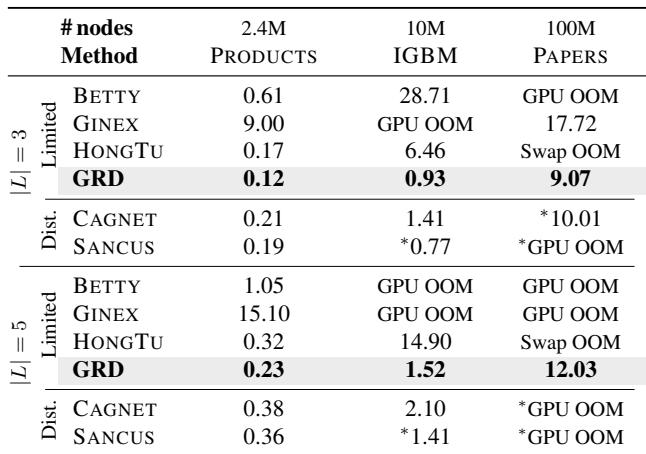  
SANCUS: Non-exact full-graph (with staleness)

Table 2. Training time (min)/epoch sensitivity for graph sizes with synthetic graphs. For results with ablation, see Appendix M.  
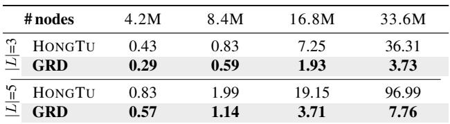

## 8.2 Large Graph Training Results

Table 1 presents per-epoch training time for GriNNder (GRD) compared to five baselines—Betty, Ginex, HongTu, CAGNET, and Sancus—using 3-/5-layer GCNs (hidden dimension 256) on Products, IGBM, and Papers.

Table 3. Sensitivity on effective cache size with ablation (training time (min)/epoch).  
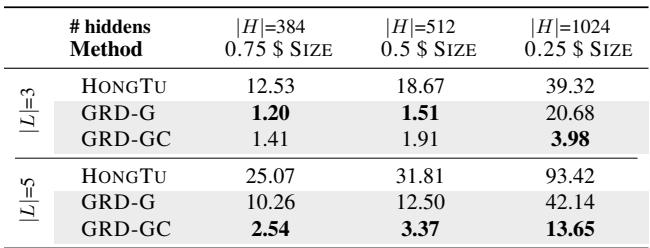

Micro-Batch (Betty, Ginex): Despite Betty’s memory-only design (no storage), GRD achieves up to 30.98× faster training, largely due to Betty’s redundant computation from the message flow graph’s neighbor explosion. Ginex uses storage to extract message flow graphs, yet still suffers from the same issue, which GRD improves by up to 77.92×.

Products (Medium): Since HongTu can fit Products entirely in host memory, one might expect it to outperform storage-based GRD. In practice, HongTu’s redundant snapshots slow it down, allowing GRD to beat it by 1.44/1.40× on 3-/5-layer GCNs.

IGBM (Large): Micro-batch methods suffer from GPU OOM on deeper models—Betty/Ginex often cannot handle the neighbor explosion. HongTu must manage large volumes of data in host memory, drastically increasing overhead. In contrast, GRD is 6.97/9.78× faster than HongTu with caching and non-redundancy. Even against multi-GPU CAGNET, GRD achieves 1.52/1.38× speedup because the distributed baselines are bottlenecked by inter-server communication over a slow 10Gbps interconnect.

Papers (100M): This highlights GRD’s scalability on larger datasets. Betty and Ginex often fail on deeper models with OOM from neighbor explosion, and HongTu fails from activation snapshots. GRD avoids these with efficient caching and no redundant snapshots. Ginex can run the 3-layer model but is 1.95× slower than GRD. Notably, GRD is faster than CAGNET (1.10×) despite using a single GPU.

Synthetic Graphs: In Table 2, we tested various-sized Kronecker graphs to validate scalability, where GriNNder provides stable speedup over HongTu (1.41–12.50×).

## 8.3 Ablation by Decreasing Effective Cache Size and Cache Hit Rate

Table 3 analyzes GriNNder ’s sensitivity to effective cache size by varying the hidden dimension on IGBM. We ablated GriNNder: HongTu, HongTu + grad-engine activation regathering (GRD-G), and GRD-G + partition-wise graph caching (GRD-GC). GriNNder outperforms HongTu by 6.84–12.34×. When host memory can cache most data (in 3 layers), GRD-G alone provides sufficient performance benefits. However, in 5-layer settings, host memory becomes a bottleneck, making cache replacement crucial. Thus, GRD-GC gains 3.09–4.04× speedup over GRD-G. Overall, GriN-Nder is robust on cache sizes. Also, we find that larger datasets have higher cache hit rates (53.70–92.77%) with more reuse from the higher #partitions in Appendix N.

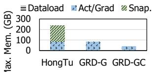  
(a) Max. Host Memory Usage

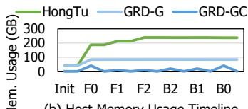  
(b) Host Memory Usage Timeline

Figure 9. Host memory usage of GriNNder on the IGBM.  
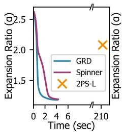  
(a) Products

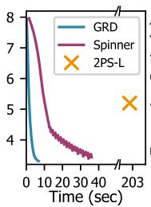

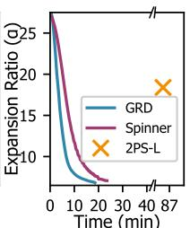  
(b) IGBM  
(c) Papers  
Figure 10. Time-to-quality comparison with alternatives on Products (4 parts), IGBM (32 parts), and Papers (2048 parts).

## 8.4 Analysis on Host Memory Usage

Figure 9a shows an ablation study on how GriNNder reduces host memory consumption. We compare GRD-G (i.e., HongTu + grad-engine activation regathering) and GRD-GC (GRD-G + partition-wise graph caching). For ablation purposes, GRD-GC imposes an explicit cache cap of one layer’s activations and gradients to demonstrate layer-wise caching on top of GRD-G. HongTu suffers from snapshots, while GRD-G eliminates them. GRD-GC’s layer-wise up/offload further cuts the peak usage from HongTu by 5.75×. Figure 9b shows the host memory usage timeline. GRD-GC shows significantly lower memory usage over all timelines.

## 8.5 Analysis on Partitioning Algorithms

Comparison with Alternatives and METIS: We compared the time-to-quality (i.e., expansion ratio α, lower is better) of switching-aware partitioning (GRD) with the famous streaming algorithm (Spinner) and state-of-the-art out-ofcore partitioner (2PS-L (Mayer et al., 2022)) in Figure 10. We ran 50 iterations for GRD/Spinner and used the default setting for 2PS-L. GriNNder quickly and stably results in higher-quality partitions compared to the lightweight alternatives. Furthermore, we compared the partition quality of switching-aware partitioning with METIS in Figure 11a for the same setup as Figure 10. While METIS achieves modestly better quality, it requires prohibitive memory usage – often exceeding available host memory for large graphs. Therefore, we use switching-aware partitioning when host memory is limited, as mentioned in Section 6. Convergence and Practical Overhead: We also reported the trend of partitioning quality improvement (convergence) and practical overhead of switching-aware partitioning in Appendix O. We observed that at most 50 iterations are enough for convergence. Also, the practical overhead was only 0.07/0.02/0.39% of the total training time on Products/IGBM/Papers, respectively.

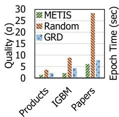  
(a) Partiton Quality

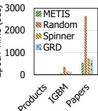  
(b) Partition Effect

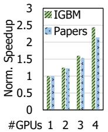  
(c) #GPUs Scalability  
Figure 11. Partitioning quality comparison, effect of partitioning on training time, and multi-GPU scalability.

Table 4. Memory usage (GB) of partitioning.  
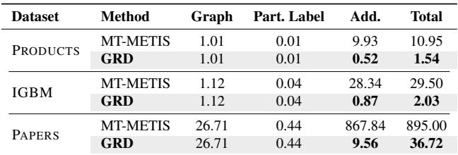

Partitioning and Training Time: Among datasets, only Papers exceeded the host memory capacity. Partitioning it into 16 parts with MT-METIS triggers host swap due to its large memory demand and took 77.26 min, making switching-aware partitioning 10.51× faster (7.35 min). We used #partitions=16 only in this experiment because MT-METIS showed out-of-time (over three hours) for the default #partitions=2048. Figure 11b evaluates how partitions affect the training of 3-layer GCNs on Products/IGBM. While MT-METIS with near-optimal partitions yields the shortest training time, it uses significantly more memory. GRD needs far less memory while improving training speed by 1.59×/2.80× on Products/IGBM over random partitioning. Compared to Spinner, GRD provides better partitioning quality, thereby achieving up to a 1.20× training speedup.

Memory Usage: Table 4 shows that GriNNder ’s partitioning greatly reduces memory usage by 7.10–24.37× compared to MT-METIS. MT-METIS requires additional memory for partitioning-stage-wise intermediates. In contrast, switching-aware partitioning only needs O(|E|) extra space. We excluded Spinner from this comparison because we ported it from its cloud-based implementation to a singleserver setup, applying GriNNder’s memory-optimized parallelization in our evaluations to ensure a fair comparison.

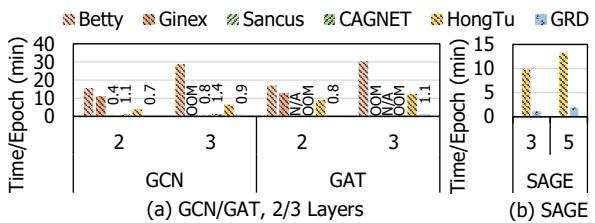  
Figure 12. Sensitivity to model types and #layers. Sancus does not provide GAT staleness implementation (denoted by N/A).

## 8.6 Multi-GPU Scalability

While evaluations were mainly conducted on a single GPU environment to demonstrate how GriNNder breaks through the host/GPU memory limitations, GriNNder is extendable to multi-GPU environments. As discussed in Appendix P, GriNNder supports multi-GPU execution via partition parallelism, where partitions are divided into disjoint sets, and each GPU processes its assigned set independently. Gradient synchronization is performed via CPU-side atomic vertex gradient accumulation and an all-reduce of weight gradients among GPUs before weight updates. We tested the multi-GPU scalability of GriNNder in Figure 11c. We excluded Products because it is too lightweight to be run on multiple GPUs. The speedup is scalable to the number of GPUs, but some overhead is incurred due to the system’s shared resources—host memory and storage bandwidth.

## 8.7 Sensitivity to Model, Number of Layers, and Partition Configuration

Figure 12 shows the comparison on other models (GAT (Velickoviˇ c et al.´ , 2018) and GraphSAGE (Hamilton et al., 2017)) and other numbers of layers, using IGBM. GriNNder maintains consistent and significant speedups over baselines, demonstrating its efficiency beyond GCN and across varying numbers of layers. GriNNder can also be extended for heterogeneous GNNs, showing stable performance (Appendix R). We examine the impact of #partitions configuration in Appendix Q. Compared to HongTu, from the efficient caching and redundancy elimination, GriNNder is much more robust to the #partitions.

## 8.8 Overhead of Regathering and Recomputation

We quantify recomputation/regathering overheads in Figure 13a, showing the time breakdown of a single backward pass for one partition at an intermediate layer in a 3-layer GCN on IGBM. Since host-GPU transfer dominates, regather accounts for 4.88%, and recompute 5.69% of the backward pass. Importantly, while measurable at the perpartition level, their impact on end-to-end training time is largely hidden by I/O overlap, as shown in Figure 17.

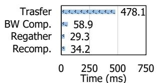  
(a) BW Time Breakdown

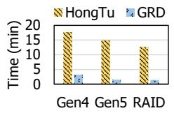  
(b) Bandwidth Sensitivity  
Figure 13. Profile of regather/recompute in the backward pass and SSD bandwidth sensitivity on training time/epoch.

## 8.9 Storage Bandwidth and Endurance Analysis

Sensitivity to Storage Bandwidth. We evaluate SSD bandwidth sensitivity in Figure 13b with PCIe Gen. 4 SSD (∼7 GB/s read/write), PCIe Gen. 5 SSD (original, ∼12 GB/s read/write), and RAID5 (8× Intel D7-P5520 SSDs, ∼56.8 GB/s read, ∼25.9 GB/s write). With lower-bandwidth SSDs, GriNNder remains robust, achieving significant speedup over HongTu. With near-DRAM bandwidth, speedup is not proportional to the bandwidth increase because GriNNder’s caching shifts the bottleneck to host-GPU communication.

SSD Write Volume and Endurance. We quantify SSD writes for GriNNder and HongTu using a 3-layer GCN trained on IGBM/Papers with the actual write profiles measured by smartmontools (smartmontools developers, 2025). HongTu writes 192.4GB/2.35TB and GriNNder writes 2.1GB/647.2GB per epoch on IGBM/Papers, respectively. GriNNder incurs significantly fewer writes than HongTu on IGBM through hierarchical caching that prioritizes host memory and redundancy elimination. On Papers, GriNNder shows higher writes due to limited host memory relative to graph size, but given that we can achieve full accuracy with 100 epochs (Appendix W), a total of 64.72TB of writes is required – only 0.23% of the endurance of a single Intel D7-P5520 SSD (∼28PBW) and 0.033% for our 8-SSD RAID5 setup (∼196PBW). Write volume can be further reduced via staleness techniques (Peng et al., 2022) (e.g., 2× reduction with single-step staleness), gradient compression techniques (Vogels et al., 2019; Song et al., 2023), or sparsity-based compression (Yoo et al., 2023).

## 9 DISCUSSION

## 9.1 Distributed Baselines on Modern Hardware

In main evaluations, the distributed baselines are primarily network-bottlenecked due to their broadcast pattern, and 10Gbps interconnect. As a further discussion, we analytically project distributed baselines for modern hardware as follows. We estimate CAGNET’s performance with Infini-Band HDR (200Gbps) on IGBM 3-layer, where CAGNET and GriNNder achieve 1.41 and 0.93 minutes/epoch (Table 1). Profiling on CAGNET shows that 80% of the execution time is from communication and 20% is from computation and static overheads. With 20× bandwidth improvement (10Gbps −→ 200Gbps), the execution time of CAGNET can be projected as 0.338 minutes. Therefore, the projected speedup of CAGNET over GriNNder is 2.75×. This assumes perfect bandwidth scaling and zero latency overhead – an optimistic upper bound favoring the distributed baseline. In the actual execution of GNN training, the broadcast operation is also affected by intra-server communication and would not scale perfectly. In terms of costs, a four-server 16-GPU A6000 cluster with InfiniBand HDR costs ∼\$132K, while our single A5000 workstation costs ∼\$3.3K (40× less expensive). While modern hardware can yield faster training as mentioned, GriNNder provides a cost-effective solution for resource-constrained settings where high-performance clusters are unavailable or prohibitively expensive.

## 9.2 Host Memory Caching of Hot Vertices

Host memory caching of hot vertices could reduce I/O by keeping frequently accessed activations in host memory. However, GriNNder’s caching operates at the partition level because hot-vertex caching requires vertex-level management, which incurs fine-grained storage access and read amplification due to storage-page granularity (see Appendix F). For power-law graphs, these overheads are expected to outweigh the benefits: although hot vertices are few, they are scattered across partitions, requiring fine-grained accesses. Nevertheless, carefully combining partition-level caching with hot-vertex awareness is a promising future direction.

## 9.3 Motivation for Single-GPU Training

Unlike transformer training, which benefits from arithmeticintensive operators that parallelize efficiently across GPUs, full-graph GNN training is dominated by highly irregular, fine-grained graph memory accesses. Under such conditions, adding GPUs introduces high synchronization and communication costs, resulting in low scaling efficiency. Although multi-GPU settings could be faster on high-speed interconnects, such inefficiency makes single-GPU solutions appealing for GNN training. Furthermore, single-GPU approaches for LLMs remain actively studied (Sheng et al., 2023; Rajbhandari et al., 2021; Dettmers et al., 2023; Jang et al., 2026) as a low-cost solution.

## 10 RELATED WORK

Full-Graph GNN Training. Full-graph training processes entire graphs without sampling, preserving complete input information (Wan et al., 2022b; Jia et al., 2020a; Wan et al., 2022a; Ma et al., 2019). Distributed systems (Peng et al., 2022; Tripathy et al., 2020; Liu et al., 2021b; Wang et al., 2022a) incur substantial communication overhead and require expensive multi-GPU clusters. Single-server methods (Yang et al., 2023; Wang et al., 2023a) remain constrained by GPU/host memory capacity. Hardware acceleration (Zhou et al., 2022; Kwon et al., 2022; An et al., 2023)

requires specialized devices. GriNNder breaks the memory capacity wall using commodity systems with NVMe SSDs.

Storage-Based GNN Training. Prior systems (Park et al., 2022; Liu et al., 2025; Jiang et al., 2024; Waleffe et al., 2023; Sun et al., 2023b) target subgraph-based training, managing initial features on storage for sampled subgraphs that fit in GPU memory. Full-graph training presents fundamentally different requirements, and GriNNder addresses them through caching and regathering-based gradient engine.

Activation Management. Checkpointing (i.e., snapshotting) (Chen et al., 2016; Mohan et al., 2021; Gupta et al., 2024) trades computation with memory. LLM works (Rajbhandari et al., 2021; Sheng et al., 2023) extend this through activation offloading. However, LLM activations exhibit sequential layer dependencies enabling straightforward layerby-layer management, while GNNs exhibit graph-structured dependencies requiring gathering from multiple partitions based on topology. Prior GNN checkpointing (Zhang et al., 2022; Wang et al., 2023a; Jia et al., 2020b) targets inmemory scenarios, introduces massive storage redundancy, or addresses only computational redundancy. GriNNder introduces a regathering mechanism to reduce storage I/O.

Graph Partitioning. METIS (Karypis & Kumar, 1998), adopted in various works (Wan et al., 2022b; Peng et al., 2022; Liu et al., 2021b), requires memory up to 13.8× the input graph size (Kaur & Gupta, 2021), precluding its use in memory-limited settings. Alternatives (Ma et al., 2019; Echbarthi & Kheddouci, 2016; Tsourakakis et al., 2014) assume sufficient memory (e.g., cloud environments) or produce lower-quality partitions. GriNNder’s lightweight partitioning operates with only a small working set of memory.

## 11 CONCLUSION

To our knowledge, GriNNder is the first to break the GPU and host memory capacity wall of full-graph GNN training with storage offloading. GriNNder introduces structured storage offloading, a general framework for managing the GPU-host-storage memory hierarchy through coordinated cache, regather, and bypass mechanisms. Its co-designed optimizations based on structured storage offloading enable up to 9.78× speedup over state-of-the-art baselines and throughput comparable to distributed systems.

## ACKNOWLEDGEMENTS

This work was primarily supported by Samsung Electronics. Jinho Lee is also funded by the National Research Foundation of Korea (NRF) grant funded by the Korea government (MSIT) (RS-2026-25495605), and Institute of Information & communications Technology Planning & Evaluation (IITP) (RS-2024-00395134, RS-2024-00347394).

## REFERENCES

aio. AIO, 2018. https://pagure.io/libaio, visited on 2024-05-22.

Akhremtsev, Y., Heuer, T., Sanders, P., and Schlag, S. Engineering a direct k-way hypergraph partitioning algorithm. In Workshop on Algorithm Engineering and Experiments (ALENEX), 2017.

An, J., Aliaj, E., and Jun, S.-W. Barad-dur: Near-storage accelerator for training large graph neural networks. In International Conference on Parallel Architectures and Compilation Techniques (PACT), 2023.

Bajaj, S., Son, H., Liu, J., Guan, H., and Serafini, M. Graph Neural Network Training Systems: A Performance Comparison of Full-Graph and Mini-Batch. Proceedings of the VLDB Endowment (VLDB), 2025.

Bulo, S. R., Porzi, L., and Kontschieder, P. In-place activated batchnorm for memory-optimized training of dnns. In IEEE conference on computer vision and pattern recognition (CVPR), 2018.

Chakaravarthy, V. T., Pandian, S. S., Raje, S., Sabharwal, Y., Suzumura, T., and Ubaru, S. Efficient scaling of dynamic graph neural networks. In International Conference for High Performance Computing, Networking, Storage and Analysis (SC), 2021.

Chakrabarti, A. and Moseley, B. Backprop with approximate activations for memory-efficient network training. Advances in Neural Information Processing Systems (NeurIPS), 2019.

Chen, C., Wu, Y., Dai, Q., Zhou, H.-Y., Xu, M., Yang, S., Han, X., and Yu, Y. A survey on graph neural networks and graph transformers in computer vision: A task-oriented perspective. IEEE Transactions on Pattern Analysis and Machine Intelligence, 2024.

Chen, H., Liu, M., Zhao, Y., Yan, X., Yan, D., and Cheng, J. G-Miner: an efficient task-oriented graph mining system. In European Conference on Computer Systems (EuroSys), 2018.

Chen, T., Xu, B., Zhang, C., and Guestrin, C. Training deep nets with sublinear memory cost. arXiv preprint arXiv:1604.06174, 2016.

Choi, K., Hong, D., Park, N., Kim, Y., and Lee, J. Qimera: Data-free quantization with synthetic boundary supporting samples. Advances in Neural Information Processing Systems (NeurIPS), 2021.

Choi, K., Lee, H. Y., Hong, D., Yu, J., Park, N., Kim, Y., and Lee, J. It’s all in the teacher: Zero-shot quantization brought closer to the teacher. In IEEE/CVF conference on computer vision and pattern recognition (CVPR), 2022.

Courbariaux, M., Bengio, Y., and David, J.-P. Binaryconnect: Training deep neural networks with binary weights during propagations. Advances in neural information processing systems (NeurIPS), 2015.

Davis, T. A., Hager, W. W., Kolodziej, S. P., and Yeralan, S. N. Algorithm 1003: Mongoose, a Graph Coarsening and Partitioning Library. ACM Transactions on Mathematical Software, 2020.

Demirci, G. V., Haldar, A., and Ferhatosmanoglu, H. Scalable Graph Convolutional Network Training on Distributed-Memory Systems. Proceedings of the VLDB Endowment (VLDB), 2022.

Dettmers, T., Pagnoni, A., Holtzman, A., and Zettlemoyer, L. Qlora: efficient finetuning of quantized llms. In Advances in Neural Information Processing Systems (NeurIPS), 2023.

Dong, J., Zheng, D., Yang, L. F., and Karypis, G. Global neighbor sampling for mixed cpu-gpu training on giant graphs. In ACM SIGKDD Conference on Knowledge Discovery and Data Mining (KDD), 2021.

Echbarthi, G. and Kheddouci, H. Streaming METIS partitioning. In IEEE/ACM International Conference on Advances in Social Networks Analysis and Mining (ASONAM), 2016.

Eisenman, A., Matam, K. K., Ingram, S., Mudigere, D., Krishnamoorthi, R., Nair, K., Smelyanskiy, M., and Annavaram, M. Check-N-Run: A checkpointing system for training deep learning recommendation models. In USENIX Symposium on Networked Systems Design and Implementation (NSDI), 2022.

Eyerman, S., Eeckhout, L., Karkhanis, T., and Smith, J. E. A performance counter architecture for computing accurate cpi components. In International Conference on Architectural Support for Programming Languages and Operating Systems (ASPLOS), 2006.

Fang, G., Ma, X., Song, M., Mi, M. B., and Wang, X. Depgraph: Towards any structural pruning. In IEEE/CVF Conference on Computer Vision and Pattern Recognition (CVPR), 2023.

Fey, M. and Lenssen, J. E. Fast graph representation learning with pytorch geometric. ICLR Workshop on Representation Learning on Graphs and Manifolds (ICLRW), 2019.

Fey, M., Lenssen, J. E., Weichert, F., and Leskovec, J. GN-NAutoScale: Scalable and expressive graph neural networks via historical embeddings. In International Conference on Machine Learning (ICML), 2021.

Frasca, F., Rossi, E., Eynard, D., Chamberlain, B., Bronstein, M., and Monti, F. Sign: Scalable inception graph neural networks. arXiv preprint arXiv:2004.11198, 2020.

Gandhi, S. and Iyer, A. P. P3: Distributed deep graph learning at scale. In USENIX Symposium on Operating Systems Design and Implementation (OSDI), 2021.

Gomez, A. N., Ren, M., Urtasun, R., and Grosse, R. B. The reversible residual network: Backpropagation without storing activations. Advances in neural information processing systems (NeurIPS), 2017.

Gruslys, A., Munos, R., Danihelka, I., Lanctot, M., and Graves, A. Memory-efficient backpropagation through time. Advances in neural information processing systems (NeurIPS), 2016.

Gupta, T., Krishnan, S., Kumar, R., Vijeev, A., Gulavani, B., Kwatra, N., Ramjee, R., and Sivathanu, M. Just-In-Time Checkpointing: Low Cost Error Recovery from Deep Learning Training Failures. In European Conference on Computer Systems (EuroSys), 2024.

Hamilton, W., Ying, Z., and Leskovec, J. Inductive representation learning on large graphs. In Advances in Neural Information Processing Systems (NeurIPS), 2017.

Han, S., Mao, H., and Dally, W. J. Deep compression: Compressing deep neural networks with pruning, trained quantization and huffman coding. In International Conference on Learning Representations (ICLR), 2016.

He, Y., Zhang, X., and Sun, J. Channel pruning for accelerating very deep neural networks. In IEEE international conference on computer vision (ICCV), 2017.

He, Y., Liu, P., Wang, Z., Hu, Z., and Yang, Y. Filter pruning via geometric median for deep convolutional neural networks acceleration. In IEEE/CVF conference on computer vision and pattern recognition (CVPR), 2019.

Heuer, T. and Schlag, S. Improving coarsening schemes for hypergraph partitioning by exploiting community structure. In International symposium on experimental algorithms (SEA), 2017.

Hu, W., Fey, M., Zitnik, M., Dong, Y., Ren, H., Liu, B., Catasta, M., and Leskovec, J. Open graph benchmark: Datasets for machine learning on graphs. In Advances in Neural Information Processing Systems (NeurIPS), 2020.

Huang, W., Zhang, T., Rong, Y., and Huang, J. Adaptive sampling towards fast graph representation learning. Advances in neural information processing systems (NeurIPS), 2018.

Jang, H., Song, J., Shin, C., Noh, S. U., Jung, J., Park, J., and Lee, J. A cost-effective near-storage processing solution for offline inference of long-context llms. In ACM International Conference on Architectural Support for Programming Languages and Operating Systems (ASP-LOS), 2026.

Jia, Z., Kwon, Y., Shipman, G., McCormick, P., Erez, M., and Aiken, A. A distributed multi-GPU system for fast graph processing. Proceedings of the VLDB Endowment (VLDB), 2017.

Jia, Z., Lin, S., Gao, M., Zaharia, M., and Aiken, A. Improving the Accuracy, Scalability, and Performance of Graph Neural Networks with Roc. In Conference on Machine Learning and Systems (MLSys), 2020a.

Jia, Z., Lin, S., Ying, R., You, J., Leskovec, J., and Aiken, A. Redundancy-free computation for graph neural networks. In ACM SIGKDD International Conference on Knowledge Discovery and Data Mining (KDD), 2020b.

Jiang, J., Xiao, P., Yu, L., Li, X., Cheng, J., Miao, X., Zhang, Z., and Cui, B. PSGraph: How Tencent trains extremely large-scale graphs with Spark? In International Conference on Data Engineering (ICDE), 2020.

Jiang, Q., Jia, L., and Wang, C. Gnndrive: Reducing memory contention and i/o congestion for disk-based gnn training. In International Conference on Parallel Processing (ICPP), 2024.

Kaler, T., Stathas, N., Ouyang, A., Iliopoulos, A.-S., Schardl, T., Leiserson, C. E., and Chen, J. Accelerating training and inference of graph neural networks with fast sampling and pipelining. In Conference on Machine Learning and Systems (MLSys), 2022.

Kaler, T., Iliopoulos, A.-S., Murzynowski, P., Schardl, T. B., Leiserson, C. E., and Chen, J. Communication-efficient graph neural networks with probabilistic neighborhood expansion analysis and caching. In Conference on Machine Learning and Systems (MLSys), 2023.

Karypis, G. and Kumar, V. A fast and high quality multilevel scheme for partitioning irregular graphs. SIAM Journal on scientific Computing, 1998.

Karypis, G. and Kumar, V. Multilevel k-way hypergraph partitioning. In ACM/IEEE design automation conference (VLSI Design), 1999.

Karypis, G., Schloegel, K., and Kumar, V. Parmetis: Parallel graph partitioning and sparse matrix ordering library. Technical report, University of Minnesota, 1997.

Kaur, G. and Gupta, R. GO: Out-Of-Core Partitioning of Large Irregular Graphs. In IEEE International Conference on Networking, Architecture and Storage (NAS), 2021.

Khatua, A., Mailthody, V. S., Taleka, B., Ma, T., Song, X., and Hwu, W.-m. Igb: Addressing the gaps in labeling, features, heterogeneity, and size of public graph datasets for deep learning research. In ACM SIGKDD Conference on Knowledge Discovery and Data Mining (KDD), 2023.

Kipf, T. N. and Welling, M. Semi-supervised classification with graph convolutional networks. arXiv preprint arXiv:1609.02907, 2016.

kvikio. Kvikio, 2024. https://github.com/ rapidsai/kvikio, visited on 2024-05-22.

Kwon, M., Gouk, D., Lee, S., and Jung, M. Hardware/Software Co-Programmable framework for computational SSDs to accelerate deep learning service on Large-Scale graphs. In USENIX Conference on File and Storage Technologies (FAST), 2022.

LaSalle, D. and Karypis, G. Multi-threaded graph partitioning. In IEEE International Symposium on Parallel and Distributed Processing (IPDPS), 2013.

Lee, Y., Kwon, Y., and Rhu, M. Understanding the implication of non-volatile memory for large-scale graph neural network training. IEEE Computer Architecture Letters (CAL), 20(2):118–121, 2021.

Leskovec, J., Kleinberg, J., and Faloutsos, C. Graphs over time: Densification laws, shrinking diameters and possible explanations. In ACM SIGKDD Conference on Knowledge Discovery and Data Mining (KDD), 2005.

Leskovec, J., Chakrabarti, D., Kleinberg, J., Faloutsos, C., and Ghahramani, Z. Kronecker graphs: An approach to modeling networks. JMLR, 2010.

Lin, D., Talathi, S., and Annapureddy, S. Fixed point quantization of deep convolutional networks. In International conference on machine learning (ICML), 2016.

Lin, Z., Li, C., Miao, Y., Liu, Y., and Xu, Y. Pagraph: Scaling gnn training on large graphs via computationaware caching. In ACM Symposium on Cloud Computing (SoCC), 2020.

Liu, L., Zhang, S., Kuang, Z., Zhou, A., Xue, J.-H., Wang, X., Chen, Y., Yang, W., Liao, Q., and Zhang, W. Group fisher pruning for practical network compression. In International Conference on Machine Learning (ICML), 2021a.

Liu, R., Wang, Y., Yan, X., Jiang, H., Cai, Z., Wang, M., Tang, B., and Li, J. Diskgnn: Bridging i/o efficiency and model accuracy for out-of-core gnn training. In International Conference on Management of Data (SIGMOD), 2025.

Liu, T., Chen, Y., Li, D., Wu, C., Zhu, Y., He, J., Peng, Y., Chen, H., Chen, H., and Guo, C. Bgl: Gpu-efficient gnn training by optimizing graph data i/o and preprocessing. arXiv preprint arXiv:2112.08541, 2021b.

Liu, Z., Zhou, K., Yang, F., Li, L., Chen, R., and Hu, X. EX-ACT: Scalable graph neural networks training via extreme activation compression. In International Conference on Learning Representations (ICLR), 2022.

Ma, L., Yang, Z., Miao, Y., Xue, J., Wu, M., Zhou, L., and Dai, Y. Neugraph: Parallel deep neural network computation on large graphs. In USENIX Annual Technical Conference (ATC), 2019.

Malewicz, G., Austern, M. H., Bik, A. J., Dehnert, J. C., Horn, I., Leiser, N., and Czajkowski, G. Pregel: a system for large-scale graph processing. In International Conference on Management of Data (SIGMOD), 2010.

Martella, C., Logothetis, D., Loukas, A., and Siganos, G. Spinner: Scalable Graph Partitioning in the Cloud. In IEEE International Conference on Data Engineering (ICDE), 2017.

Mayer, R., Orujzade, K., and Jacobsen, H.-A. Out-of-core edge partitioning at linear run-time. In International Conference on Data Engineering (ICDE), 2022.

Mohan, J., Phanishayee, A., and Chidambaram, V. Check-Freq: Frequent,Fine-Grained DNN Checkpointing. In USENIX Conference on File and Storage Technologies (FAST), 2021.

Nicolae, B., Li, J., Wozniak, J. M., Bosilca, G., Dorier, M., and Cappello, F. Deepfreeze: Towards scalable asynchronous checkpointing of deep learning models. In IEEE/ACM International Symposium on Cluster, Cloud and Internet Computing (CCGRID), 2020.

NVIDIA. GPUDirect Storage, 2021. https://developer.nvidia.com/ gpudirect-storage,visited on 2024-05-22.

NVIDIA. InfiniBand Network, 2023a. https: //docs.nvidia.com/networking/ display/MLNXOFEDv493150/InfiniBand+ Network,visited on 2023-01-30.

NVIDIA. NVLink Bridge, 2023b. https://www.nvidia.com/ en-us/design-visualization/ nvlink-bridges/,visited on 2023-06-01.

Park, Y., Min, S., and Lee, J. W. Ginex: SSD-enabled billionscale graph neural network training on a single machine via provably optimal in-memory caching. Proceedings of the VLDB Endowment (VLDB), 2022.

Paszke, A., Gross, S., Chintala, S., and Chanan, G. PyTorch: Tensors and dynamic neural networks in python with strong gpu acceleration. PyTorch, 2017.

Peng, J., Chen, Z., Shao, Y., Shen, Y., Chen, L., and Cao, J. Sancus: Staleness-Aware Communication-Avoiding Full-Graph Decentralized Training in Large-Scale Graph Neural Networks. Proceedings of the VLDB Endowment (VLDB), 2022.

pybind11. pybind11, 2024. https://github.com/ pybind/pybind11, visited on 2024-05-22.

Raghavan, U. N., Albert, R., and Kumara, S. Near linear time algorithm to detect community structures in largescale networks. Physical review E, 2007.

Rajbhandari, S., Ruwase, O., Rasley, J., Smith, S., and He, Y. Zero-infinity: Breaking the gpu memory wall for extreme scale deep learning. In International Conference for High Performance Computing, Networking, Storage and Analysis (SC), 2021.

Reau, M., Renaud, N., Xue, L. C., and Bonvin, A. M.´ Deeprank-gnn: a graph neural network framework to learn patterns in protein–protein interfaces. Bioinformatics, 2023.

Sanh, V., Wolf, T., and Rush, A. Movement pruning: Adaptive sparsity by fine-tuning. Advances in neural information processing systems (NeurIPS), 2020.

Sharma, K., Lee, Y.-C., Nambi, S., Salian, A., Shah, S., Kim, S.-W., and Kumar, S. A survey of graph neural networks for social recommender systems. ACM Computing Surveys, 2024.

Shaydulin, R. and Safro, I. Aggregative coarsening for multilevel hypergraph partitioning. arXiv preprint arXiv:1802.09610, 2018.

Shen, S., Dong, Z., Ye, J., Ma, L., Yao, Z., Gholami, A., Mahoney, M. W., and Keutzer, K. Q-bert: Hessian based ultra low precision quantization of bert. In AAAI Conference on Artificial Intelligence (AAAI), 2020.

Sheng, Y., Zheng, L., Yuan, B., Li, Z., Ryabinin, M., Chen, B., Liang, P., Re, C., Stoica, I., and Zhang, C. Flexgen: ´ High-throughput generative inference of large language models with a single gpu. In International Conference on Machine Learning (ICML), 2023.

Shi, Z., Liang, X., and Wang, J. LMC: Fast training of GNNs via subgraph sampling with provable convergence. In International Conference on Learning Representations (ICLR), 2023.

smartmontools developers. smartmontools. https:// www.smartmontools.org, 2025.

Song, J., Yim, J., Jung, J., Jang, H., Kim, H.-J., Kim, Y., and Lee, J. Optimus-cc: Efficient large nlp model training with 3d parallelism aware communication compression. In ACM International Conference on Architectural Support for Programming Languages and Operating Systems (ASPLOS), 2023.

Song, J., Jang, H., Lim, H., Jung, J., Kim, Y., and Lee, J. Granndis: Fast distributed graph neural network training framework for multi-server clusters. In International Conference on Parallel Architectures and Compilation Techniques (PACT), 2024.

Song, X., Lian, J., Huang, H., Wu, M., Jin, H., and Xie, X. Friend Recommendations with Self-Rescaling Graph Neural Networks. In ACM SIGKDD Conference on Knowledge Discovery and Data Mining (KDD), 2022.

Stanton, I. and Kliot, G. Streaming graph partitioning for large distributed graphs. In ACM SIGKDD international conference on Knowledge discovery and data mining (KDD), 2012.

Sun, J., Su, L., Shi, Z., Shen, W., Wang, Z., Wang, L., Zhang, J., Li, Y., Yu, W., Zhou, J., et al. Legion: Automatically Pushing the Envelope of Multi-GPU System for Billion-Scale GNN Training. In USENIX Annual Technical Conference (ATC), 2023a.

Sun, J., Sun, M., Zhang, Z., Xie, J., Shi, Z., Yang, Z., Zhang, J., Wu, F., and Wang, Z. Helios: An Efficient Out-of-core GNN Training System on Terabyte-scale Graphs with Inmemory Performance. arXiv preprint arXiv:2310.00837, 2023b.

tensornvme. tensorNVMe, 2023. https://github. com/hpcaitech/TensorNVMe, visited on 2024-05- 22.

Thorpe, J., Qiao, Y., Eyolfson, J., Teng, S., Hu, G., Jia, Z., Wei, J., Vora, K., Netravali, R., Kim, M., and Xu, G. H. Dorylus: Affordable, Scalable, and Accurate GNN Training with Distributed CPU Servers and Serverless Threads. In USENIX Symposium on Operating Systems Design and Implementation (OSDI), 2021.

Tripathy, A., Yelick, K., and Buluc¸, A. Reducing Communication in Graph Neural Network Training. In International Conference for High Performance Computing, Networking, Storage and Analysis (SC), 2020.

Tsourakakis, C., Gkantsidis, C., Radunovic, B., and Vojnovic, M. FENNEL: streaming graph partitioning for massive scale graphs. In ACM International Conference on Web Search and Data Mining (WSDM), 2014.

Velickovi ˇ c, P., Cucurull, G., Casanova, A., Romero, A., ´ Lio, P., and Bengio, Y. Graph attention networks. In\` International Conference on Learning Representations (ICLR), 2018.

Vogels, T., Karimireddy, S. P., and Jaggi, M. Powersgd: practical low-rank gradient compression for distributed optimization. In Advances in Neural Information Processing Systems (NeurIPS), 2019.

Waleffe, R., Mohoney, J., Rekatsinas, T., and Venkataraman, S. MariusGNN: Resource-Efficient Out-of-Core Training of Graph Neural Networks. In European Conference on Computer Systems (EuroSys), 2023.

Wan, C., Li, Y., Li, A., Kim, N. S., and Lin, Y. BNS-GCN: Efficient Full-Graph Training of Graph Convolutional Networks with Partition-Parallelism and Random Boundary Node Sampling. In Conference on Machine Learning and Systems (MLSys), 2022a.

Wan, C., Li, Y., Wolfe, C. R., Kyrillidis, A., Kim, N. S., and Lin, Y. PipeGCN: Efficient Full-Graph Training of Graph Convolutional Networks with Pipelined Feature Communication. In International Conference on Learning Representations (ICLR), 2022b.

Wan, X., Xu, K., Liao, X., Jin, Y., Chen, K., and Jin, X. Scalable and efficient full-graph gnn training for large graphs. In International Conference on Management of Data (SIGMOD), 2023.

Wang, Q., Zhang, Y., Wang, H., Chen, C., Zhang, X., and Yu, G. NeutronStar: Distributed GNN Training with Hybrid Dependency Management. In International Conference on Management of Data (SIGMOD), 2022a.

Wang, Q., Chen, Y., Wong, W.-F., and He, B. HongTu: Scalable Full-Graph GNN Training on Multiple GPUs. Proceedings of the ACM on Management of Data (PACM-MOD), 2023a.

Wang, Z., Kuang, W., Xie, Y., Yao, L., Li, Y., Ding, B., and Zhou, J. Federatedscope-gnn: Towards a unified, comprehensive and efficient package for federated graph learning. In ACM SIGKDD Conference on Knowledge Discovery and Data Mining (KDD), 2022b.

Wang, Z., Jia, Z., Zheng, S., Zhang, Z., Fu, X., Ng, T. E., and Wang, Y. Gemini: Fast failure recovery in distributed training with in-memory checkpoints. In Proceedings of the 29th Symposium on Operating Systems Principles (SOSP), 2023b.

Watts, D. and Strogatz, S. Collective dynamics of ‘smallworld’ networks. Nature, 1998.

Yang, J., Tang, D., Song, X., Wang, L., Yin, Q., Chen, R., Yu, W., and Zhou, J. Gnnlab: A factored system for sample-based gnn training over gpus. In European Conference on Computer Systems (EuroSys), 2022.

Yang, S., Zhang, M., Dong, W., and Li, D. Betty: Enabling Large-Scale GNN Training with Batch-Level Graph Partitioning. In ACM International Conference on Architectural Support for Programming Languages and Operating Systems (ASPLOS), 2023.

Ying, R., He, R., Chen, K., Eksombatchai, P., Hamilton, W. L., and Leskovec, J. Graph Convolutional Neural Networks for Web-Scale Recommender Systems. In ACM SIGKDD International Conference on Knowledge Discovery Data Mining (KDD), 2018.

Yoo, M., Song, J., Lee, J., Kim, N., Kim, Y., and Lee, J. SGCN: Exploiting Compressed-Sparse Features in Deep Graph Convolutional Network Accelerators . In IEEE International Symposium on High-Performance Computer Architecture (HPCA), 2023.

Zeng, H., Zhou, H., Srivastava, A., Kannan, R., and Prasanna, V. K. Graphsaint: Graph sampling based inductive learning method. In International Conference on Learning Representations (ICLR), 2020.

Zhang, D., Huang, X., Liu, Z., Zhou, J., Hu, Z., Song, X., Ge, Z., Wang, L., Zhang, Z., and Qi, Y. AGL: A Scalable System for Industrial-Purpose Graph Machine Learning. Proceedings of the VLDB Endowment (VLDB), 2020.

Zhang, H., Yu, Z., Dai, G., Huang, G., Ding, Y., Xie, Y., and Wang, Y. Understanding gnn computational graph: A coordinated computation, io, and memory perspective. Proceedings of Machine Learning and Systems (MLSys), 2022.

Zhang, R., Javaheripi, M., Ghodsi, Z., Bleiweiss, A., and Koushanfar, F. AdaGL: Adaptive Learning for Agile Distributed Training of Gigantic GNNs. In ACM/IEEE Design Automation Conference (DAC), 2023.

Zheng, D., Ma, C., Wang, M., Zhou, J., Su, Q., Song, X., Gan, Q., Zhang, Z., and Karypis, G. DistDGL: Distributed Graph Neural Network Training for Billion-Scale Graphs. arXiv preprint arXiv:2010.05337, 2020.

Zheng, D., Song, X., Yang, C., LaSalle, D., and Karypis, G. Distributed hybrid cpu and gpu training for graph neural networks on billion-scale heterogeneous graphs. In ACM SIGKDD Conference on Knowledge Discovery and Data Mining (KDD), 2022.

Zhou, S., Wu, Y., Ni, Z., Zhou, X., Wen, H., and Zou, Y. Dorefa-net: Training low bitwidth convolutional neural networks with low bitwidth gradients. arXiv preprint arXiv:1606.06160, 2016.

Zhou, Z., Li, C., Wei, X., Wang, X., and Sun, G. Gnnear: Accelerating full-batch training of graph neural networks with near-memory processing. In International Conference on Parallel Architectures and Compilation Techniques (PACT), 2022.

Zhu, R., Zhao, K., Yang, H., Lin, W., Zhou, C., Ai, B., Li, Y., and Zhou, J. Aligraph: A comprehensive graph neural network platform. Proceedings of the VLDB Endowment (VLDB), 2019.

Zhu, X. and Ghahramani, Z. Learning from Labeled and Unlabeled Data with Label Propagation. Technical report, Carnegie Mellon University, 2002.

Zhuang, B., Shen, C., Tan, M., Liu, L., and Reid, I. Towards effective low-bitwidth convolutional neural networks. In IEEE conference on computer vision and pattern recognition (CVPR), 2018.