# CRAFT: COST-AWARE EXPERT REPLICA ALLOCATION WITH FINE-GRAINED LAYERWISE ESTIMATIONS

Adrian Zhao 1 2 Zhenkun Cai 2 Zhenyu Song 2 Lingfan Yu 2 Haozheng Fan 2 Jun Wu 2 Yida Wang 2 Nandita Vijaykumar 1 2

1University of Toronto 2Amazon

## ABSTRACT

Mixture-of-Experts (MoE) has recently emerged as the mainstream architecture for efficiently scaling large language models while maintaining near-constant computational cost. Expert parallelism distributes parameters by partitioning experts across devices, but this introduces token-level load imbalance during inference. Expert replication is a widely adopted load-balancing technique in serving frameworks that alleviates load imbalance in large-scale deployments by replicating experts with high loads. In this work, we demonstrate that existing replication schemes often over-replicate, with many replicas providing marginal improvement. Replicas consume substantial GPU memory, which may lead to resource contention and throughput degradation. We present CRAFT, an efficient expert replication framework that maximizes load balance under a given memory budget by performing fine-grained, per-layer replication based on the estimated replication benefit. CRAFT can be seamlessly integrated into existing serving frameworks without any additional training or model changes. Our evaluation shows that CRAFT increases end-to-end serving throughput by 1.14× on average (up to 1.2×) over existing replication techniques in large-scale deployments with models ranging from hundreds of billions to a trillion parameters.

## 1 INTRODUCTION

Mixture-of-Experts (MoE) alleviates the steep compute and memory scaling of dense transformers by replacing the dense feed-forward blocks with a router and a pool of experts (Kaplan et al., 2020; Hoffmann et al., 2022; Shazeer et al., 2017). By activating only a subset of experts per token, MoE models decouple total parameters from per-token FLOPs and achieve near-constant inference cost as capacity scales (Du et al., 2022). It has become the foundation for recent large models across various domains, such as LLMs (Guo et al., 2025; Yang et al., 2025; Meta AI, 2025; Kimi Team et al., 2025), image and video diffusion models (Wan et al., 2025; Fang et al., 2024), and vision transformers (Chen et al., 2023), delivering competitive performance at substantially lower compute than dense counterparts. However, deploying MoE models incurs substantial operational costs, primarily due to the massive GPU memory footprint required to host all expert parameters (Rajbhandari et al., 2022; Fedus et al., 2022). Therefore, system-level optimizations that improve inference throughput yield significant cost-performance benefits by maximizing resource utilization and reducing GPU memory pressure (Eassa et al., 2024; Srivastava, 2025; Li et al., 2025).

To effectively distribute large expert parameters across devices, Expert Parallelism (EP) partitions experts across devices, with each device holding weights of a subset of experts. EP uses two all-to-all collectives to dispatch tokens to the devices that host the assigned experts and then recombines them (Fedus et al., 2022; Lepikhin et al., 2020). Despite its promising scalability, EP introduces a new system bottleneck during deployment — expert load imbalance. The MoE router routes tokens to experts based on input token distributions and often sends a disproportionate number of tokens to a few hot experts while other experts remain cold (Huang et al., 2024; Jin et al., 2025; Du et al., 2024). Thus, the cumulative token loads across GPUs become imbalanced, leading to: (i) idleness on GPUs with low load and (ii) network congestion during dispatch and combine due to imbalanced traffic (Li et al., 2023; Liu et al., 2025; He et al., 2022; Luo et al., 2025). This degrades communication and computation efficiency during MoE inference, necessitating load-balancing strategies for EP.

Expert placement and expert replication are two loadbalancing techniques applicable to any MoE model and are widely adopted in modern LLM serving frameworks (Zheng et al., 2024; Kwon et al., 2023; NVIDIA Corporation, 2023; Rajbhandari et al., 2022). Expert placement leverages expert load distribution to assign experts to devices such that the expected tokens per device and traffic patterns are balanced (Yao et al., 2024; Go & Mahajan, 2025; Li et al., 2023). However, expert placement fails in layers where a few experts dominate most of the token load, making a balanced packing impossible. Expert replication addresses this by replicating hot experts (Liu et al., 2024). This mitigates extreme load imbalance by distributing token loads from a single hot expert to multiple devices.

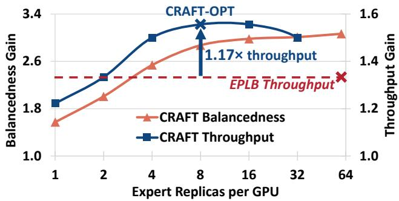  
Figure 1. Balancedness gain (orange) and throughput gain (blue) of CRAFT on Kimi-K2-1000B deployed on 64 GPUs, normalized to the baseline with only expert placement (refer to KE8 configuration in Section 3.1). EPLB is configured with 60 replicas per GPU on Kimi-K2 with 60 MoE layers (at minimum one replica per layer per GPU). The X-axis (expert replicas per GPU) is presented on a base-2 logarithmic scale.

Although expert replication is an effective load-balancing strategy that mitigates extreme expert load imbalance, it requires substantial GPU memory to store the replica weights. The most widely adopted replication technique EPLB (Liu et al., 2024) allocates one replica per layer per GPU, incurring significant GPU memory overhead on large MoE models with many MoE layers. Large-scale LLM deployments are already memory-intensive due to high parameter counts and the large KV cache necessary to efficiently process long-context requests (Kwon et al., 2023; Dao, 2023). Therefore, the memory overhead limits the practicality of replication for large-scale MoE deployments. Expert placement does not incur additional memory overhead, but it cannot handle extreme load skew during inference. Thus, efficiently achieving balanced expert load in large-scale deployment remains an important unsolved problem for large MoE models.

In this work, we perform a detailed characterization of the benefits and overheads of replication as a means to achieve load balance. We make two key observations: (1) As the number of replicas increases, balancedness gains diminish rapidly. (2) MoE layers benefit differently from replication, which can be roughly categorized into two types: layers with few experts dominating token load (high-skew) benefit substantially from replication, while layers with balanced token load (low-skew) benefit little. Leveraging these observations, we introduce CRAFT, an end-to-end cost-aware replica allocation framework for efficient expert replication. The key idea of CRAFT is to selectively allocate replicas at fine, per-layer granularity to layers that benefit more from replication. We develop a cost model that estimates the perlayer balancedness gain with replication (i.e., replication benefit). Based on this cost model, CRAFT computes a per-layer replication plan with optimal balancedness by assigning more replicas to layers with higher estimated gains.

Figure 1 demonstrates the effectiveness of CRAFT: (1) CRAFT allocates replicas for each layer based on estimated performance benefits. This enables replication under flexible memory budgets that are much lower than EPLB (depicted by the blue curve), reducing memory usage while preserving balancedness. (2) CRAFT with the optimal number of replicas (CRAFT-OPT) achieves 1.17× higher throughput compared to EPLB. The number of replicas can either be manually set by the user to meet specific memory constraints, or CRAFT can automatically set a value that optimizes replication efficiency. We implement CRAFT in three steps: First, we analyze offline expert load distributions and estimate per-layer benefits across different replica counts. Then, we use dynamic programming to select the optimal number of replicas per layer under the memory budget. Finally, we reserve memory and assign experts evenly across devices to minimize capacity imbalance, producing a complete replication plan for deployment.

## Our contributions are summarized as follows:

• To our knowledge, this is the first detailed characterization of how throughput and load balancedness scale with replication. We demonstrate that replication quickly yields diminishing returns due to the tradeoff between memory overhead and balanced load, and identify layer-specific behavior as critical to achieving efficiency with replication.

• We introduce CRAFT, an end-to-end expert replication framework designed for efficient expert replication in large-scale MoE deployments. CRAFT integrates directly into existing LLM serving frameworks (Liu et al., 2024; NVIDIA Corporation, 2023; Zheng et al., 2024; Kwon et al., 2023), offering significant throughput gains and reduced operational costs (Nguyen & Perez, 2025). CRAFT applies to any MoE architecture and requires no additional training or model changes.

• We evaluate CRAFT on a state-of-the-art LLM serving framework SGLang (Zheng et al., 2024) for a wide range of datasets and MoE models. We demonstrate that CRAFT achieves consistent throughput gains, outperforming EPLB by 1.14× on average (up to 1.2×) on an 8-node cluster.

## 2 BACKGROUND

## 2.1 Mixture of Experts

Mixture-of-Experts (MoE) replaces a dense feed-forward block with a fixed number of experts and a learned router that assigns each input token to a sparse subset of experts. Each expert is an independently parameterized feed-forward block consisting of an up-projection linear layer, a nonlinear activation, and a down-projection linear layer. The router typically implements a weighted top-K routing mechanism with a lightweight gating network (Shazeer et al., 2017). For each token, the gating network computes a score for each expert and selects the experts with the top-K scores for activation. In practice, K is often set to 8 in large-scale MoE models (Yang et al., 2025; Guo et al., 2025; Kimi Team et al., 2025). After passing through the feed-forward blocks of the activated experts, their outputs are gathered and aggregated into a weighted sum. Because each token only activates a few experts, MoE enables the scaling of model parameters by adding more experts without substantially increasing computation costs (Du et al., 2022).

## 2.2 Expert Load Imbalance

Unlike traditional dense models, where the compute load across devices is uniform, MoE with EP introduces devicelevel token load variance due to its dynamic routing. During MoE inference, the router activates experts based on the input tokens (Shazeer et al., 2017). Real-world natural language tokens follow a Zipfian distribution, in which a few tokens are extremely frequent while most others are rare (Roller et al., 2021; Piantadosi, 2014). This leads to expert load imbalance, producing high-load hot experts and low-load cold experts at each MoE layer (He et al., 2022; Zhou et al., 2022; Huang et al., 2024; Nie et al., 2023).

When deploying MoE models with EP, the expert load imbalance becomes device-level load imbalance: GPUs that host hot experts become performance bottlenecks, causing stalls on GPUs with cold experts and network contention during the all-to-all. Figure 2 illustrates an example of the expert load distribution of an MoE layer with 8 experts. The baseline placement strategy simply assigns experts to devices based on their ID. This leads to a significant load skew, where GPU 1 carries a much higher load than other GPUs, resulting in suboptimal performance.

## 2.3 Inference Load-Balancing Techniques

Despite the dynamic nature of MoE routing, the expert load at each layer typically follows a distinct distribution. Existing load-balancing techniques profile expert load distributions by recording token loads across three dimensions — batch, layer, and experts. Analysis of the load distribution identifies hot and cold experts in each layer, providing opportunities for load-balancing optimizations.

Expert placement is a widely adopted EP load-balancing technique that alleviates load imbalance by co-locating hot experts with cold experts, thereby minimizing load variance across devices (Liu et al., 2024; Go & Mahajan, 2025).

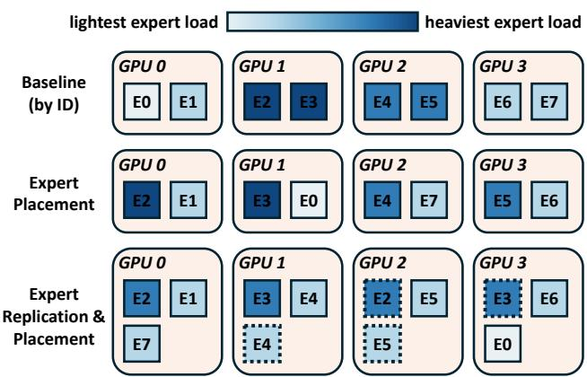  
Figure 2. Expert load distribution under different EP optimizations on an MoE layer with 8 experts. Color density represents the number of tokens assigned to the expert (expert load) during inference, and dotted experts represent replicas allocated during replication.

Figure 2 demonstrates the effectiveness of expert placement, as the GPU load is more balanced compared to the baseline placement. However, expert placement falls short when the load distribution is significantly skewed, in which a few experts dominate the token load. For example, in Figure 2, if experts 2 and 3 constitute the majority of the total token load, the GPU load post-placement would remain imbalanced.

Expert replication further improves load balance by replicating hot experts and spreading their load across replicas. Expert Parallelism Load Balancer (EPLB) (Liu et al., 2024) is a widely adopted load balancer in modern LLM serving frameworks (Zheng et al., 2024; Kwon et al., 2023; NVIDIA Corporation, 2023; Rajbhandari et al., 2022) that supports both expert placement and expert replication. It employs uniform replication, allocating the same number of replicas per layer on each GPU. In Figure 2, four replicas are created for experts 2, 3, 4, and 5, and each GPU reserves memory for one additional expert slot to host these replicas. Then, expert placement maps the experts (including replicas) across GPUs. As shown in the figure, expert replication can achieve near-perfect GPU load balance.

## 3 MOTIVATION

Although expert replication with placement mitigates most expert-level load imbalance, it introduces an important tradeoff between GPU memory usage and load balance. In this section, we present a detailed analysis of the effectiveness of expert replication.

## 3.1 Experimental Setup

System. Our experiments are conducted on a cluster of AWS EC2 p4de.24xlarge instances, each equipped with 8 NVIDIA A100 GPUs (80 GB each) interconnected via

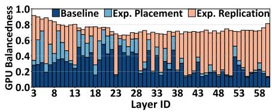  
(a) DE8

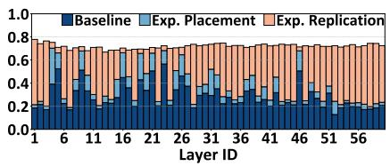  
(b) KJ6

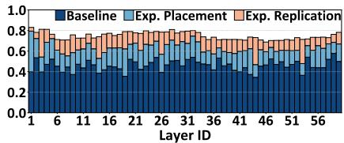  
(c) KA6

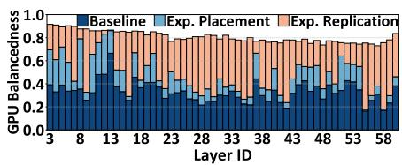  
(d) DL8

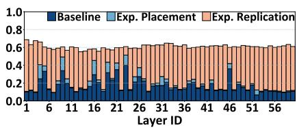  
(e) KJ12

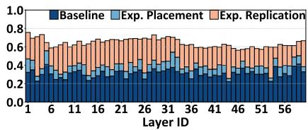  
(f) KA12  
Figure 3. Breakdown of the final post-replication balancedness by each technique’s contribution across various configurations. The total height of a bar represents the GPU balancedness in an MoE layer with expert replication. A technique constituting a higher portion of the bar implies higher contribution to the overall balancedness. Layers excluded in the figures are non-MoE dense layers.

NVLink. Inter-node communication uses the Elastic Fabric Adapter (EFA) (AWS, 2025) with direct peer-to-peer (P2P) GPU communication support. All evaluations use CUDA 12.8 and NCCL 2.26.2 (NVIDIA, 2025).

Metrics. Expert load is measured as the total number of tokens dispatched to an expert after routing. We evaluate load balance using balancedness, computed as the average load divided by the max load (higher means more balanced).

Models and Workloads. We use two large-scale MoE models in bfloat16 format: D — DeepSeek-R1-671B with 58 MoE layers (layers 3 - 60) and 256 experts (Guo et al., 2025), and K — Kimi-K2-1000B with 60 MoE layers (layers 1 - 60) and 384 experts (Kimi Team et al., 2025). Both models employ top-8 expert routing. We evaluate four workloads from three different datasets with long sequences. (1) FinePDFs dataset (Kydl´ıcek et al. ˇ , 2025): E — deu Latn split with German text, and J — jpn Jpan split with Japanese text. (2) L — Lambada dataset (Paperno et al., 2016). (3) RedPajama-Data-1T dataset (Weber et al., 2024): A — arxiv split. All inputs are truncated to 4096 tokens with a fixed-size output length of 256 tokens. For each workload, we randomly sample a pool of profiling sequences and run 3000 inference batches to collect the expert load distribution (Section 2.3). We evaluate balancedness using the offline load distribution unless otherwise specified.

Setup Configuration Syntax. We use a two-letter combination to represent different model-workload setups, followed by a number indicating the cluster size. For example, DE8 represents the DeepSeek-R1 model and the FinePDF deu Latn workload on a cluster of 8 nodes.

## 3.2 Replication Effectiveness on Load-Balancing

We analyze the effectiveness of EPLB placement and replication by measuring the achieved GPU load balancedness for each layer. Figure 3 illustrates the breakdown of the balancedness gains when applying expert replication. We make two observations.

Observation 1: The effectiveness of replication varies across layers. Although the effectiveness of replication matches or exceeds expert placement in many layers, some layers benefit little. To characterize this variation, we examine two representative layers in Figure 3(a) — layer 20 (least effective) and layer 51 (most effective). Figure 4 illustrates their average expert load distributions. Layer 20 exhibits a balanced, dispersed distribution. This explains its high baseline balancedness with placement, as the peak-tomean load ratio is only approximately 2.5×, allowing for effective hot–cold expert co-location. In contrast, layer 51 exhibits strong skew: the hottest expert receives > 27× the average load, and the top two experts account for ≈ 20% of the total load. Placement alone cannot achieve load balance because GPUs hosting these hot experts are inevitably overloaded. Replication mitigates this skew by distributing hot-expert traffic across replicas, substantially reducing the peak load and improving balancedness. We can thus roughly categorize all layers into these two types: high-skew layers (e.g., layer 51) — replication-effective layers, where the maximum expert load significantly exceeds the average expert load (> 10×); and low-skew layers (e.g., layer 20) — replication-ineffective layers, where the maximum load is similar to the average load.

Observation 2: As cluster size increases, overall load balancedness decreases and replication becomes more effective. In Figures 3(b), 3(c), 3(e), and 3(f), increasing cluster

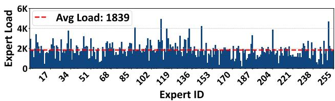  
(a) Layer 20 - low-skew layer (expert load range 0 - 6K)

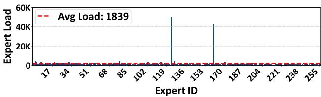  
(b) Layer 51 - high-skew layer (expert load range 0 - 60K)

Figure 4. Average expert load distribution of KE8. Total load is identical on both layers; the red line marks the average load.

size from 6 to 12 nodes decreases baseline balancedness and placement effectiveness across layers. This is because increasing the number of GPUs reduces the number of experts per GPU. This reduces opportunities for hot-cold expert colocation and weakens the averaging effect on each device, making the system more susceptible to skewed load distributions. Replication remains effective because the overall load distribution remains unchanged, and replicating hot experts still reduces peak load and improves balancedness. Moreover, Figures 3(c), 3(f) show that setup KA is relatively balanced with strong baseline balancedness and placement effectiveness at 6 nodes. However, as cluster size increases to 12, baseline balancedness substantially degrades, where replication becomes more effective than placement. This underscores the importance of expert replication at scale.

## 3.3 Replication Scaling

To mitigate performance degradation from replication memory overhead and identify the optimal balancedness-memory trade-off, we analyze how balancedness scales with replica count at fine-grained per-layer granularity. We study both aggregated balancedness across layers and per-layer balancedness scaling, and we make two observations.

Observation 3: Load balancedness scales sublinearly with the number of replicas. Figure 5 depicts the aggregated GPU balancedness. Across configurations, initial replication reduces peak expert load and improves load balance. After replicating hot experts sufficiently, placement alone balances the remaining load, and additional replicas yield little or no benefit. Doubling replicas beyond 16 offers negligible balancedness gains but doubles memory use. This indicates high memory inefficiency in existing uniform replication, where 64 replicas are excessive because most replicas do not contribute to load balance.

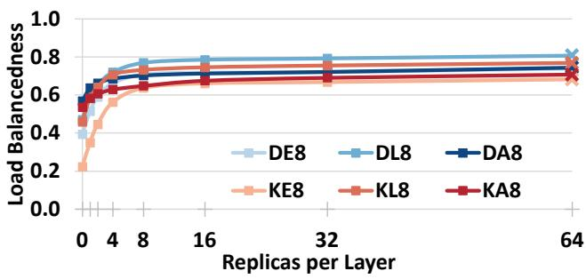

Figure 5. Load balancedness under varying per-layer replica counts across configurations. Balancedness is aggregated across all MoE layers. Each layer is allocated the same number of replicas; zero denotes the placement-only baseline. × indicates the minimum uniform replication (one replica per layer per GPU, Section 2.3).  
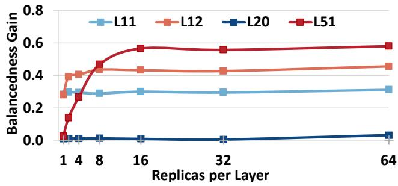  
Figure 6. Per-layer load balancedness gain in 4 sample layers under varying replica counts with configuration DE8.

Observation 4: The effective replica count varies across layers. Figure 6 depicts balancedness gains at different replica counts for four layers: aforementioned balanced layer 20 and skewed layer 51 (Figure 4), and two layers 11 and 12 with moderate skewness. We observe that (1) the replica count at which gains plateau varies by layer, and (2) benefits diminish beyond 16 replicas across layers, confirming Observation 3. Layer 20 gains little from replication, consistent with its already-balanced distribution (Observation 1). For layers 11, 12, and 51, the replica counts at which balancedness gains diminish are 1, 8, and 16, respectively. Hence, replication should be allocated at fine, per-layer granularity to match layer-specific needs; a fixed replica count over-allocates balanced layers and under-allocates skewed layers, leading to wasted memory.

## 4 DESIGN

We introduce CRAFT, an end-to-end replica allocation framework that enables replication under low memory budgets while preserving near-optimal load balance. We define the balancedness gain from replication as replication benefit, and the number of experts stored on each GPU as expert capacity. The core idea of CRAFT is to independently allocate replicas at the granularity of a layer, in proportion to the layer-specific replication benefit. This benefit-driven policy maximizes per-replica effectiveness and sustains high balancedness gains.

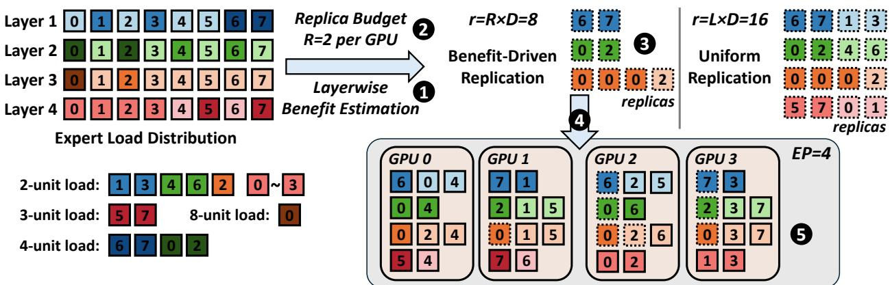  
Figure 7. CRAFT workflow. We assume a system with 4 devices, 4 layers, and 8 experts per layer (L = D = 4). Each layer has total load of 16 units. Darker color represents heavier load, and experts without load indication have 1 unit load. Dotted boxes present replicas. CRAFT achieves perfect load balance while using only half the number of replicas compared to uniform replication (top-right).

## 4.1 Design Challenges of CRAFT

Implementing per-layer fine-grained replica allocation requires addressing the following challenges:

Challenge 1: How do we determine the optimal number of replicas to allocate to each layer to maximize the overall balancedness gain? As discussed in Section 3.3, balancedness scales differently with replica count across layers. Selecting each layer’s locally optimal replica count is insufficient, because layers benefit from replication differently, and the total number of replicas is constrained by the replication memory budget.

Challenge 2: With varying replica counts per layer, how do we avoid memory imbalance when assigning replicas to devices? The uniform replication baseline allocates one replica per layer per device, so assignment is simple and memory usage is trivially balanced across devices. Under benefit-driven replication, layers have fewer replicas than devices, which challenges replica-to-device assignment for two reasons: (1) The expert capacity across GPUs for each layer may differ. This complicates expert placement within each layer and introduces additional imbalance, because each GPU may hold a different number of experts. (2) Replica memory allocation must remain consistent across devices to maintain a uniform KV cache size. Inconsistent KV cache sizes lead to memory fragmentation, where the maximum concurrency is determined by the device with the lowest KV cache size within a DP rank.

## 4.2 CRAFT Workflow

Figure 7 illustrates the high-level CRAFT workflow on an example with four MoE layers (L = 4) and four GPUs (D = 4). The replication factor R denotes the number of replicas per GPU, quantifying the replication memory usage. The total number of replicas r is calculated as r = R × D. CRAFT allocates replicas in three steps. First, we collect the balancedness scaling and estimate per-layer replication benefit by analyzing the offline expert load distribution 1 . Second, the value of R is determined either manually by the user or automatically according to the balancedness scaling that optimizes for high replication efficiency 2 . The example in Figure 7 uses R = 2 (r = 8). Lastly, the replica allocation algorithm computes an allocation plan of r replicas that maximizes balancedness 3 . As replica counts vary across layers, replica-to-device mapping becomes challenging (Challenge 2). CRAFT employs an interleaved expert assignment to minimize the intra-layer expert capacity imbalance across devices 4 . Then, a capacityaware greedy placement algorithm assigns experts to devices 5 . Compared to uniform replication, which allocates r = L × D = 16 replicas uniformly across layers and devices, CRAFT achieves load balance with half the memory budget. We present the design details of CRAFT in the following sections.

## 4.2.1 Benefit-Driven Replica Allocation

In this section, we formulate an optimization problem for benefit-driven replica allocation to address Challenge 1 (Section 4.1). The goal is to maximize the balancedness gain (i.e., replication benefit) under the r-replica budget. The allocation has three steps:

Step 1: Estimate per-layer replication benefit 1 . For each layer, we evaluate the replication benefit of K = log2 D + 1 different replica counts chosen from a base-2 geometric progression over [1, D]. We replay each inference batch from the offline load distribution and measure the balancedness gains at each chosen replica count (details in Appendix A.0.1). This replay-based analysis yields an

L × K balancedness gain matrix T that quantifies per-layer replication benefits across replica counts.

Step 2: Determine replication factor R 2 . CRAFT allows the user to manually set R that meets specific memory constraints. Alternatively, CRAFT supports the automatic selection of an R that optimizes for replication memory efficiency by analyzing the balancedness gains obtained in Step 1, as illustrated in Figure 5. Specifically, CRAFT selects the R that yields the highest per-replica balancedness gain, which avoids allocating replicas with diminishing benefits (Section 3.3). We demonstrate the effectiveness of this method by showing a strong correlation between diminished balancedness gains and end-to-end throughput degradation in Section 5.3.

Step 3: Compute an r-replica allocation plan with maximum benefit 3 . We transform the allocation problem into a Multiple-Choice Knapsack Problem (MCKP) — selecting one replica count per layer under the r-replica constraint that maximizes total replication benefit in T . Although MCKP is NP-hard, the parameters D, K, and L remain small even at large-scale deployment, enabling an efficient dynamic programming solution in pseudo-polynomial time (Martello & Toth, 1990). We provide a detailed implementation in Appendix A.0.2.

Figure 7 shows an example optimal replication plan from benefit-driven replica allocation. Layer 3 is the most skewed and receives 4 replicas (highest benefit). Layers 1 and 2 are moderately skewed and receive 2 replicas each (moderate benefit). Layer 4 is already balanced under expert placement and receives no replicas (zero benefit). This allocation achieves optimal balancedness using far fewer replicas than uniform replication.

## 4.2.2 Capacity-Aware Expert Assignment and Placement

CRAFT addresses Challenge 2 with capacity-aware expert assignment, which uses a greedy algorithm that iteratively assigns experts for each layer under two objectives:

Primary Objective: An additional expert is always assigned to a GPU with the fewest experts. Since r is a multiple of D (r = R × D, R is the number of replicas per GPU, and D is the number of GPUs), replication memory usage remains consistent across devices at completion. This constraint does not cause excessive replication, because D and L are of the same order in practice; the minimum setting R = 1, r = D incurs marginal memory overhead under benefit-driven replication (Section 4.2.1). This constraint also bounds per-layer, device-level capacity differences to at most one, reducing expert capacity skew.

Secondary Objective: Within each layer, additional experts are assigned in an interleaved manner across devices and nodes. While satisfying the primary objective, many GPUs may tie for the fewest experts. As a tie-breaking measure, we evenly distribute experts among nodes. For example, in Figure 7, the two additional experts in layer 1 are assigned to GPU 0 (node 0) and GPU 2 (node 1); those in layer 2 are assigned to GPU 1 (node 0) and GPU 3 (node 1). This interleaved assignment balances per-layer node-level expert capacity and further improves overall load balance.

We provide the detailed implementation of the greedy assignment algorithm in Appendix A.0.3. With these two objectives, capacity-aware expert assignment yields an optimized GPU memory allocation plan that minimizes expert capacity imbalance 4 . We then apply a greedy placement algorithm that iteratively assigns the most-loaded expert to the least-loaded device, following the standard strategy (Liu et al., 2024) while respecting the varying expert capacity across devices 5 . After placement, CRAFT produces a complete end-to-end replication plan.

## 5 EVALUATION

In this section, we address the following questions:

Question 1 : How does the balancedness-memory tradeoff from replication affect end-to-end performance?

Question 2 : What end-to-end performance improvement does CRAFT deliver compared to existing approaches?

Question 3 : How does inference performance scale with the cluster size under CRAFT?

Question 4 : Does CRAFT introduce any additional overhead in the serving framework?

## 5.1 Experimental Baseline

System, Models and Workloads. Refer to Section 3.1.

Baseline. We use SGLang v0.4.8 (Zheng et al., 2024) with Expert Parallelism Load Balancer (EPLB) (Liu et al., 2024) as the baseline. We configure the framework with DP, headparallel TP-attention and EP. We implement dynamic all-toall EP dispatch and combine with PyTorch and NCCL P2P collectives with EFA support. We enable mixed chunked prefill with maximum prefill chunk size 4096. EPLB is the most widely adopted EP load-balancing algorithm supporting expert placement and replication in mainstream LLM serving frameworks (Zheng et al., 2024; Kwon et al., 2023; Rajbhandari et al., 2022; NVIDIA Corporation, 2023). We implement and integrate CRAFT into SGLang as a direct replacement for EPLB and evaluate its performance. We exclude the profiling sequences used to obtain the offline expert load distribution from all evaluation input. We evaluate three setups — BASE: EPLB placement with no replication, EPLB: minimum EPLB replication with L replicas per GPU (L is the number of MoE layers), and CRA: our approach, suffixed with the replication factor R. In our deployment setup, R = 8 is generally the best-performing setting acquired by CRAFT across configurations (Section 4.2.1), and we use it for the subsequent end-to-end evaluations. We include an evaluation of the effect of R in Appendix B.

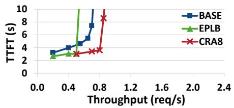  
(a) KE6

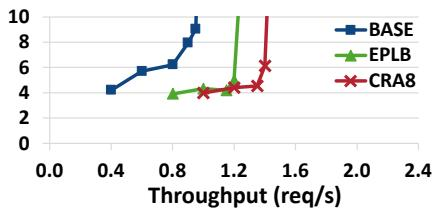  
(b) KE8

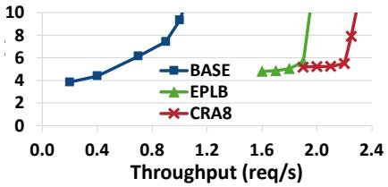  
(c) KE12

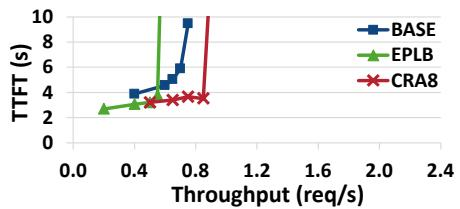  
(d) KJ6

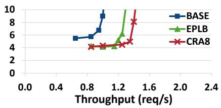

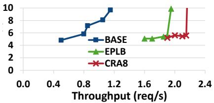  
(f) KJ12

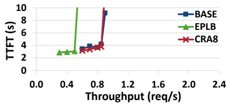  
(e) KJ8

(g) KL6  
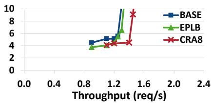  
(h) KL8

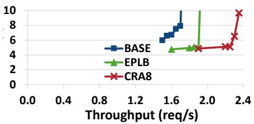  
(i) KL12

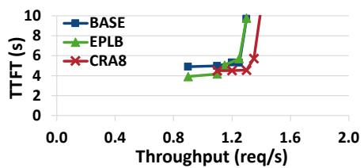  
(j) KA8

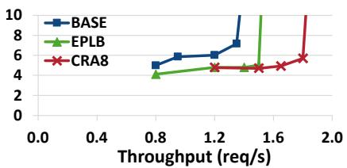  
(k) DE8

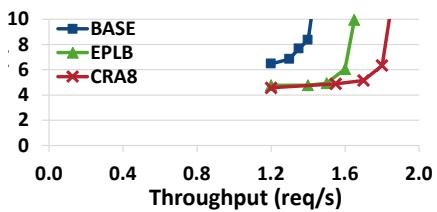  
(l) DJ8

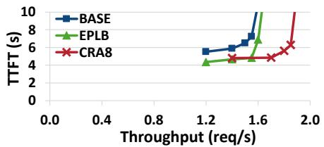  
(m) DL8

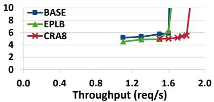  
(n) DA8  
Figure 8. End-to-end throughput to TTFT curves across different system setups for BASE, EPLB and CRA8.

Metrics. We report goodput as the primary metric in our experiments, defined as the maximum sustained throughput the system delivers before requests incur prolonged queuing delays. For prefill and decode performance, we report timeto-first-token (TTFT) and inter-token-latency (ITL).

## 5.2 End-to-end Performance

We address question 2 by measuring end-to-end serving throughput across configurations. Figure 8 plots request rate (throughput) versus time-to-first-token (TTFT) latency for each configuration. The knee point marks saturation, where further increasing request rates overloads the system and TTFT becomes dominated by queuing time rather than prefill time. This knee point defines the system goodput. We make three observations:

CRAFT consistently achieves higher goodput than

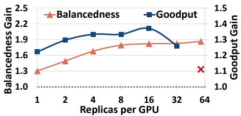  
(a) DE8

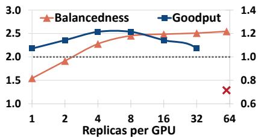  
(b) KE6

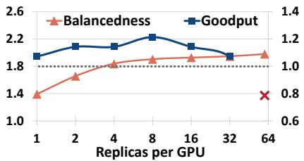  
(c) KJ6

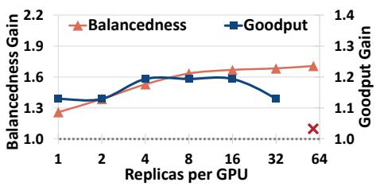  
(d) DL8

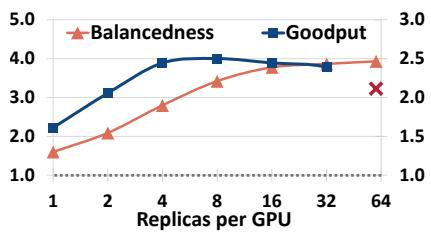  
(e) KE12

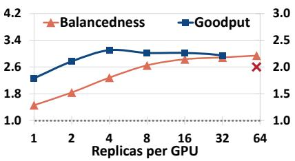  
(f) KJ12  
Figure 9. CRA end-to-end goodput gain (right, blue/red) and balancedness gain (left, orange) with different numbers of replicas allocated per GPU (replication factor R), normalized to BASE. Red × represents EPLB goodput (one replica per MoE layer per GPU). Goodput gains below the dotted line represent slowdowns compared to BASE. Number of replicas per GPU is presented on a log scale.

EPLB. Figure 8 demonstrates that compared to EPLB, CRA8 achieves on average 1.15× higher goodput (up to 1.2×) on DeepSeek-R1 and 1.12× (up to 1.17×) on Kimi-K2 in an 8-node cluster (setups suffixed with 8). This is because CRA8 allocates 7.25× and 7.5× fewer replicas than EPLB while achieving most of the balancedness gains on DeepSeek-R1 and Kimi-K2, respectively. The saved memory enables a larger KV cache and larger sequence batches without significant slowdown from load imbalance.

CRAFT improves TTFT. At a fixed request rate below saturation, both EPLB and CRA8 achieve lower TTFT than BASE. Figure 8 illustrates that CRA8 reduces TTFT by 29% on average (up to 58%) compared to BASE, closely matching EPLB (30% on average, up to 59%). This demonstrates that CRAFT’s benefit-driven replication reduces load imbalance and improves computational efficiency to a similar extent as EPLB during prefill.

CRAFT is robust across datasets with varying load imbalance. We analyze dataset skewness using each dataset’s offline load distribution, as in Figure 3. We observe that datasets E and J are highly skewed (low BASE balancedness), whereas datasets L and A are less skewed (high BASE balancedness). Compared to BASE, CRA8 improves goodput by 1.42× on highly skewed datasets and by 1.14× on less skewed datasets on average, demonstrating broad applicability. In comparison, EPLB yields a 1.24× goodput gain on highly skewed datasets but only 1.02× on less skewed datasets on average. This is because less skewed datasets benefit less from replication, where excessive replication from EPLB yields little benefit.

## 5.3 CRAFT Balancedness-Memory Trade-Off

Expert replication mitigates load imbalance but consumes additional GPU memory. In this section, we address Question 1 by empirically quantifying this trade-off in CRAFT and its impact on performance. Figure 9 depicts balancedness and end-to-end goodput gain of CRA at different values of the replication factor R, normalized to BASE. EPLB goodput is depicted by the rightmost red × in each figure. We make the following observations.

Excess replication leads to suboptimal goodput. The balancedness gain curves illustrate that CRA achieves most of the balancedness gains with far fewer replicas compared to EPLB. Allocating replicas excessively yields diminished benefits and impedes goodput because it reduces KV cache size. On D\*8, K\*6, and K\*12, EPLB reduces KV cache size by 19%, 75%, and 24% respectively (memory usage depends only on model and cluster size). Goodput drops when the concurrency loss from a smaller KV cache outweighs the benefit of higher balancedness. This explains why EPLB achieves lower throughput than BASE in Figures 9(b) and 9(c) with K\*6 — the 75% KV cache reduction outweighs the balancedness gains.

## 5.4 Scalability with Cluster Size

To answer question 3 , we study how goodput scales with different cluster sizes and setups. Figures 8(a)-8(i) depict the throughput–TTFT curves for cluster sizes of 6, 8, and 12 in KE, KJ and KL. Since the model size is fixed, smaller clusters imply more experts and less KV cache per device. Kimi-K2 (K) has 384 experts without replication, so each GPU holds 8, 6, and 4 experts for cluster sizes of 6, 8, and

12, respectively. We also scale the sequence batch size by setting each node as a DP rank. We make two observations:

CRAFT scales goodput efficiently with large cluster sizes and outperforms EPLB. The goodput scaling of BASE is poor, with unstable and elevated TTFT. This confirms Observation 2 in Section 3.2: placement-only baseline suffers from high load imbalance at larger clusters. CRA8 scales by 1.65× and 1.6× on average when increasing the cluster size from 6 to 8 and from 8 to 12, respectively, outperforming EPLB and demonstrating good scalability.

The memory overhead of EPLB replication impedes goodput more significantly at smaller clusters. In Figures 8(a), 8(d), and 8(g), EPLB goodput is on average 46% lower compared to BASE. The KV cache in a 6-node cluster is very limited; EPLB further shrinks it by 75% through excessive replication, significantly reducing goodput (Section 5.3). In comparison, CRA8 allocates far fewer replicas, reducing KV cache size by only 6%. Thus, CRA8 still achieves 1.14× higher goodput than BASE on average.

## 5.5 Overhead Analysis

We answer Question 4 and analyze both online and offline overhead of CRAFT. At inference time, CRAFT incurs no additional overhead. We present an inter-token-latency (ITL) evaluation in Appendix C. During initialization, the overhead of CRAFT is dominated by replication benefit estimation, as we sweep replica counts and replay the load distribution across all layers (Section 4.2.1). In our experiments, this process takes approximately 10 seconds, which is negligible since framework initialization typically takes minutes. With online periodic rebalancing, the estimation overhead can be overlapped with running batches on CPU.

## 6 RELATED WORK

Expert Placement. Many existing works aim to achieve optimal expert placement during inference to reduce all-toall traffic and mitigate load imbalance. A recent line of work reduces all-to-all traffic via topology-aware placement that co-locates experts with high activation affinity (Zhai et al., 2023; Nie et al., 2023; Hwang et al., 2023; Han et al., 2025). ExFlow (Yao et al., 2024) and MoETuner (Go & Mahajan, 2025) formulate placement as integer programs with topology and load constraints. Occult (Luo et al., 2025) constructs an expert-collaboration graph and derives placements by clustering. As discussed in Section 2.3, placementonly strategies cannot address load imbalance in extremely skewed workloads. However, we note that these approaches are orthogonal and can be integrated into CRAFT as a replacement for the current greedy placement (Section 4.2.2), further improving communication efficiency.

Expert Replication. Replication is widely used to mitigate load imbalance during distributed MoE training. FasterMoE (He et al., 2022) introduces shadow experts, selectively replicating hot experts to improve throughput. SwiftMoE (Skiadopoulos et al., 2025) adopts adaptive, non-uniform replication during training that tracks and replicates hot experts on the fly. However, efficient replication during training relies on overlapping replica weight transfers with gradient synchronization, and applying it during inference introduces an additional communication phase with prohibitive latency overheads. Concurrent work GraceMoE (Han et al., 2025) groups experts to reduce communication overhead. It allocates replicas dynamically for each layer, but restricts replication within a single group, since excessive replication impairs the effectiveness of grouping. CRAFT’s fine-grained replication is orthogonal to the grouping strategy and can potentially improve load balancedness by replicating across multiple groups.

Routing Prediction and Alteration. Many works use load distributions and routing patterns during inference to predict future expert activations (Kong et al., 2024; Cao et al., 2025; Fang et al., 2025; Chen et al., 2025; Song et al., 2024; Zhang et al., 2025; Yu et al., 2025; He et al., 2024). They typically combine host offloading with prefetching or caching. However, mispredictions can introduce high latency, and many target resource-constrained environments. Other works modify the routing mechanism to aid prediction and load balance (Hwang et al., 2024; Zhong et al., 2024; Zhou et al., 2022). These post-training router modifications add deployment overhead and risk compromising model accuracy.

Expert Sharding. Expert sharding is a variant of tensor parallelism that distributes expert weights across devices. Early large-scale MoE systems combine sharding with EP to scale the expert parameters (Lepikhin et al., 2020; Rajbhandari et al., 2022). Recent studies show that expert sharding can achieve near-perfect load balance during inference (Balmau et al., 2025). However, cross-node global token reduction incurs high inter-node communication overhead, significantly limiting its scalability (Singh et al., 2023; Jin et al., 2025).

## 7 CONCLUSION

In this work, we demonstrate the importance of fine-grained replication for mitigating expert load imbalance at low memory costs. We propose CRAFT, an intuitive and practical framework that allocates replicas based on estimated benefits to improve inference throughput. CRAFT can be flexibly integrated into mainstream serving frameworks, delivering significantly higher throughput and efficiency with no runtime overhead.

## REFERENCES

AWS. Elastic Fabric Adapter for AI/ML and HPC workloads on Amazon EC2. https://docs.aws.amazo n.com/AWSEC2/latest/UserGuide/efa.ht ml, 2025. Accessed: 2025-10-16.

Balmau, O., Kermarrec, A.-M., Pires, R., Santo, A. L. E., de Vos, M., and Vujasinovic, M. Accelerating moe model inference with expert sharding. In Proceedings of the 5th Workshop on Machine Learning and Systems, pp. 192– 199, 2025.

Cao, S., Liu, S., Griggs, T., Schafhalter, P., Liu, X., Sheng, Y., Gonzalez, J. E., Zaharia, M., and Stoica, I. Moelightning: High-throughput moe inference on memoryconstrained gpus. In Proceedings of the 30th ACM International Conference on Architectural Support for Programming Languages and Operating Systems, Volume 1, pp. 715–730, 2025.

Chen, H., Xie, W., Zhang, B., Tang, J., Wang, J., Dong, J., Chen, S., Yuan, Z., Lin, C., Qiu, C., et al. Ktransformers: Unleashing the full potential of cpu/gpu hybrid inference for moe models. In Proceedings of the ACM SIGOPS 31st Symposium on Operating Systems Principles, pp. 1014–1029, 2025.

Chen, T., Chen, X., Du, X., Rashwan, A., Yang, F., Chen, H., Wang, Z., and Li, Y. Adamv-moe: Adaptive multitask vision mixture-of-experts. In Proceedings of the IEEE/CVF International Conference on Computer Vision, pp. 17346–17357, 2023.

Dao, T. Flashattention-2: Faster attention with better parallelism and work partitioning. arXiv preprint arXiv:2307.08691, 2023.

Du, N., Huang, Y., Dai, A. M., Tong, S., Lepikhin, D., Xu, Y., Krikun, M., Zhou, Y., Yu, A. W., Firat, O., et al. Glam: Efficient scaling of language models with mixture-ofexperts. In International conference on machine learning, pp. 5547–5569. PMLR, 2022.

Du, Z., Li, S., Wu, Y., Jiang, X., Sun, J., Zheng, Q., Wu, Y., Li, A., Li, H., and Chen, Y. Sida: Sparsity-inspired dataaware serving for efficient and scalable large mixture-ofexperts models. Proceedings of Machine Learning and Systems, 6:224–238, 2024.

Eassa, A., Comly, N., Hill, W., and Ho, G. Achieving high mixtral 8x7b performance with NVIDIA H100 tensor core GPUs and NVIDIA TensorRT-LLM. https:// developer.nvidia.com/blog/achieving-h igh-mixtral-8x7b-performance-with-nvi dia-h100-tensor-core-gpus-and-tensorr t-llm/, July 2024. Accessed: 2025-10-29.

Fang, G., Ma, X., and Wang, X. Remix-dit: Mixing diffusion transformers for multi-expert denoising. Advances in Neural Information Processing Systems, 37:107494– 107512, 2024.

Fang, Z., Huang, Y., Hong, Z., Lyu, Y., Chen, W., Yu, Y., Yu, F., and Zheng, Z. Klotski: Efficient mixture-ofexpert inference via expert-aware multi-batch pipeline. In Proceedings of the 30th ACM International Conference on Architectural Support for Programming Languages and Operating Systems, Volume 2, pp. 574–588, 2025.

Fedus, W., Zoph, B., and Shazeer, N. Switch transformers: Scaling to trillion parameter models with simple and efficient sparsity. Journal of Machine Learning Research, 23(120):1–39, 2022.

Go, S. and Mahajan, D. Moetuner: Optimized mixture of expert serving with balanced expert placement and token routing. arXiv preprint arXiv:2502.06643, 2025.

Guo, D., Yang, D., Zhang, H., Song, J., Zhang, R., Xu, R., Zhu, Q., Ma, S., Wang, P., Bi, X., et al. Deepseek-r1: Incentivizing reasoning capability in llms via reinforcement learning. arXiv preprint arXiv:2501.12948, 2025.

Han, Y., Pan, L., Peng, J., Tao, Z., Zhang, W., and Zhang, Y. Grace-moe: Grouping and replication with locality-aware routing for efficient distributed moe inference. arXiv preprint arXiv:2509.25041, 2025.

He, J., Zhai, J., Antunes, T., Wang, H., Luo, F., Shi, S., and Li, Q. Fastermoe: modeling and optimizing training of large-scale dynamic pre-trained models. In Proceedings of the 27th ACM SIGPLAN Symposium on Principles and Practice of Parallel Programming, pp. 120–134, 2022.

He, X., Zhang, S., Wang, Y., Yin, H., Zeng, Z., Shi, S., Tang, Z., Chu, X., Tsang, I., and Soon, O. Y. Expertflow: Optimized expert activation and token allocation for efficient mixture-of-experts inference. arXiv preprint arXiv:2410.17954, 2024.

Hoffmann, J., Borgeaud, S., Mensch, A., Buchatskaya, E., Cai, T., Rutherford, E., de Las Casas, D., Hendricks, L. A., Welbl, J., Clark, A., et al. Training computeoptimal large language models. In Proceedings of the 36th International Conference on Neural Information Processing Systems, pp. 30016–30030, 2022.

Huang, H., Ardalani, N., Sun, A., Ke, L., Lee, H.-H. S., Bhosale, S., Wu, C.-J., and Lee, B. Toward efficient inference for mixture of experts. Advances in Neural Information Processing Systems, 37:84033–84059, 2024.

Hwang, C., Cui, W., Xiong, Y., Yang, Z., Liu, Z., Hu, H., Wang, Z., Salas, R., Jose, J., Ram, P., et al. Tutel: Adaptive mixture-of-experts at scale. Proceedings of Machine Learning and Systems, 5:269–287, 2023.

Hwang, R., Wei, J., Cao, S., Hwang, C., Tang, X., Cao, T., and Yang, M. Pre-gated moe: An algorithm-system codesign for fast and scalable mixture-of-expert inference. In 2024 ACM/IEEE 51st Annual International Symposium on Computer Architecture (ISCA), pp. 1018–1031. IEEE, 2024.

Jin, C., Jiang, Z., Bai, Z., Zhong, Z., Liu, J., Li, X., Zheng, N., Wang, X., Xie, C., Huang, Q., et al. Megascalemoe: Large-scale communication-efficient training of mixture-of-experts models in production. arXiv preprint arXiv:2505.11432, 2025.

Kaplan, J., McCandlish, S., Henighan, T., Brown, T. B., Chess, B., Child, R., Gray, S., Radford, A., Wu, J., and Amodei, D. Scaling laws for neural language models. arXiv preprint arXiv:2001.08361, 2020.

Kimi Team, Bai, Y., Bao, Y., Chen, G., Chen, J., Chen, N., Chen, R., Chen, Y., Chen, Y., Chen, Y., et al. Kimi k2: Open agentic intelligence. arXiv preprint arXiv:2507.20534, 2025.

Kong, R., Li, Y., Feng, Q., Wang, W., Ye, X., Ouyang, Y., Kong, L., and Liu, Y. Swapmoe: Serving off-the-shelf moe-based large language models with tunable memory budget. In Proceedings of the 62nd Annual Meeting of the Association for Computational Linguistics (Volume 1: Long Papers), pp. 6710–6720, 2024.

Kwon, W., Li, Z., Zhuang, S., Sheng, Y., Zheng, L., Yu, C. H., Gonzalez, J. E., Zhang, H., and Stoica, I. Efficient memory management for large language model serving with pagedattention. In Proceedings of the ACM SIGOPS 29th Symposium on Operating Systems Principles, 2023.

Kydl´ıcek, H., Penedo, G., and von Werra, L. Finepdfs. ˇ https://huggingface.co/datasets/Hugg ingFaceFW/finepdfs, 2025.

Lepikhin, D., Lee, H., Xu, Y., Chen, D., Firat, O., Huang, Y., Krikun, M., Shazeer, N., and Chen, Z. Gshard: Scaling giant models with conditional computation and automatic sharding. arXiv preprint arXiv:2006.16668, 2020.

Li, J., Jiang, Y., Zhu, Y., Wang, C., and Xu, H. Accelerating distributed MoE training and inference with lina. In 2023 USENIX Annual Technical Conference (USENIX ATC 23), pp. 945–959, Boston, MA, July 2023. USENIX Association. ISBN 978-1-939133-35-9. URL https: //www.usenix.org/conference/atc23/pr esentation/li-jiamin.

Li, L., Jung, S., Luo, A., and Pandey, S. Boosting llama 4 inference performance with AMD Instinct MI300X GPUs. https://rocm.blogs.amd.com/sof tware-tools-optimization/llama4-perfo

rmance-b/README.html, April 2025. Accessed: 2025-10-29.

Liu, A., Feng, B., Xue, B., Wang, B., Wu, B., Lu, C., Zhao, C., Deng, C., Zhang, C., Ruan, C., et al. Deepseek-v3 technical report. arXiv preprint arXiv:2412.19437, 2024.

Liu, X., Wang, Y., Fu, F., Miao, X., Zhu, S., Nie, X., and Cui, B. Netmoe: Accelerating moe training through dynamic sample placement. In The Thirteenth International Conference on Learning Representations, 2025.

Luo, S., Li, P., Peng, J., Wang, H., Cheng, Y., Chen, T., et al. Occult: Optimizing collaborative communication across experts for accelerated parallel moe training and inference. arXiv preprint arXiv:2505.13345, 2025.

Martello, S. and Toth, P. Knapsack problems: algorithms and computer implementations. John Wiley & Sons, Inc., 1990.

Meta AI. The llama-4 herd: natively multimodal moe releases. Blog and model card (Scout-17B-16E), 2025. URL https://ai.meta.com/blog/llama-4 -multimodal-intelligence/. Accessed: 2025.

Nguyen, V. and Perez, S. LLM Inference Benchmarking: How Much Does Your LLM Inference Cost? https: //developer.nvidia.com/blog/llm-infer ence-benchmarking-how-much-does-you r-llm-inference-cost, 2025. Accessed: 2025- 10-25.

Nie, X., Miao, X., Wang, Z., Yang, Z., Xue, J., Ma, L., Cao, G., and Cui, B. Flexmoe: Scaling large-scale sparse pre-trained model training via dynamic device placement. Proceedings of the ACM on Management of Data, 1(1): 1–19, 2023.

NVIDIA. NVIDIA Collective Communications Library (NCCL) Documentation. https://docs.nvidia. com/deeplearning/nccl/user-guide/doc s/index.html, 2025. Accessed: 2025-10-16.

NVIDIA Corporation. Tensorrt-llm. https://github .com/NVIDIA/TensorRT-LLM, 2023. Accessed: 2025-10-10.

Paperno, D., Kruszewski, G., Lazaridou, A., Pham, N. Q., Bernardi, R., Pezzelle, S., Baroni, M., Boleda, G., and Fernandez, R. The LAMBADA dataset: Word prediction requiring a broad discourse context. In Proceedings of the 54th Annual Meeting of the Association for Computational Linguistics (Volume 1: Long Papers), pp. 1525–1534, Berlin, Germany, August 2016. Association for Computational Linguistics. URL http: //www.aclweb.org/anthology/P16-1144.

Piantadosi, S. T. Zipf’s word frequency law in natural language: A critical review and future directions. Psychonomic bulletin & review, 21(5):1112–1130, 2014.

Rajbhandari, S., Li, C., Yao, Z., Zhang, M., Aminabadi, R. Y., Awan, A. A., Rasley, J., and He, Y. Deepspeed-moe: Advancing mixture-of-experts inference and training to power next-generation ai scale. In International conference on machine learning, pp. 18332–18346. PMLR, 2022.

Roller, S., Sukhbaatar, S., Weston, J., et al. Hash layers for large sparse models. advances in neural information processing systems, 34:17555–17566, 2021.

Shazeer, N., Mirhoseini, A., Maziarz, K., Davis, A., Le, Q., Hinton, G., and Dean, J. Outrageously large neural networks: The sparsely-gated mixture-of-experts layer. In International Conference on Learning Representations, 2017. URL https://openreview.net/forum ?id=B1ckMDqlg.

Singh, S., Ruwase, O., Awan, A. A., Rajbhandari, S., He, Y., and Bhatele, A. A hybrid tensor-expert-data parallelism approach to optimize mixture-of-experts training. In Proceedings of the 37th International Conference on Supercomputing, pp. 203–214, 2023.

Skiadopoulos, A., Zhao, M., Gandhi, S., Norrie, T., Mukherjee, S., and Kozyrakis, C. Accelerating mixture-ofexperts training with adaptive expert replication. arXiv preprint arXiv:2504.19925, 2025.

Song, X., Zhong, Z., Chen, R., and Chen, H. Promoe: Fast moe-based llm serving using proactive caching. arXiv preprint arXiv:2410.22134, 2024.

Srivastava, A. NVIDIA accelerates inference on Meta Llama 4 scout and maverick. https://developer. nvidia.com/blog/nvidia-accelerates-i nference-on-meta-llama-4-scout-and-m averick/, April 2025. Accessed: 2025-10-29.

Wan, T., Wang, A., Ai, B., Wen, B., Mao, C., Xie, C.-W., Chen, D., Yu, F., Zhao, H., Yang, J., Zeng, J., Wang, J., Zhang, J., Zhou, J., Wang, J., Chen, J., Zhu, K., Zhao, K., Yan, K., Huang, L., Feng, M., Zhang, N., Li, P., Wu, P., Chu, R., Feng, R., Zhang, S., Sun, S., Fang, T., Wang, T., Gui, T., Weng, T., Shen, T., Lin, W., Wang, W., Wang, W., Zhou, W., Wang, W., Shen, W., Yu, W., Shi, X., Huang, X., Xu, X., Kou, Y., Lv, Y., Li, Y., Liu, Y., Wang, Y., Zhang, Y., Huang, Y., Li, Y., Wu, Y., Liu, Y., Pan, Y., Zheng, Y., Hong, Y., Shi, Y., Feng, Y., Jiang, Z., Han, Z., Wu, Z.-F., and Liu, Z. Wan: Open and advanced large-scale video generative models. arXiv preprint arXiv:2503.20314, 2025.

Weber, M., Fu, D. Y., Anthony, Q., Oren, Y., Adams, S., Alexandrov, A., Lyu, X., Nguyen, H., Yao, X., Adams, V., Athiwaratkun, B., Chalamala, R., Chen, K., Ryabinin, M., Dao, T., Liang, P., Re, C., Rish, I., and Zhang, C.´ Redpajama: an open dataset for training large language models. NeurIPS Datasets and Benchmarks Track, 2024.

Yang, A., Li, A., Yang, B., Zhang, B., Hui, B., Zheng, B., Yu, B., Gao, C., Huang, C., Lv, C., et al. Qwen3 technical report. arXiv preprint arXiv:2505.09388, 2025.

Yao, J., Anthony, Q., Shafi, A., Subramoni, H., and Panda, D. K. D. Exploiting inter-layer expert affinity for accelerating mixture-of-experts model inference. In 2024 IEEE International Parallel and Distributed Processing Symposium (IPDPS), pp. 915–925. IEEE, 2024.

Yu, E., Zhang, Z., Dong, D., Wu, Y., and Liao, X. Prescope: Unleashing the power of prefetching for resource-constrained moe inference. arXiv preprint arXiv:2509.23638, 2025.

Zhai, M., He, J., Ma, Z., Zong, Z., Zhang, R., and Zhai, J. SmartMoE: Efficiently training sparsely-activated models through combining offline and online parallelization. In 2023 USENIX Annual Technical Conference (USENIX ATC 23), pp. 961–975, 2023.

Zhang, Y., Pinkert, G., Yang, N., Li, Y., and Yuan, D. Duoserve-moe: Dual-phase expert prefetch and cache scheduling for efficient moe llm inference. arXiv preprint arXiv:2509.07379, 2025.

Zheng, L., Yin, L., Xie, Z., Sun, C. L., Huang, J., Yu, C. H., Cao, S., Kozyrakis, C., Stoica, I., Gonzalez, J. E., et al. Sglang: Efficient execution of structured language model programs. Advances in neural information processing systems, 37:62557–62583, 2024.

Zhong, S., Liang, L., Wang, Y., Wang, R., Huang, R., and Li, M. Adapmoe: Adaptive sensitivity-based expert gating and management for efficient moe inference. In Proceedings of the 43rd IEEE/ACM International Conference on Computer-Aided Design, pp. 1–9, 2024.

Zhou, Y., Lei, T., Liu, H., Du, N., Huang, Y., Zhao, V., Dai, A. M., Le, Q. V., Laudon, J., et al. Mixture-ofexperts with expert choice routing. Advances in Neural Information Processing Systems, 35:7103–7114, 2022.

## A CRAFT ALGORITHMS

In this section, we present the pseudocode for the three main algorithms in CRAFT, detailing the step-by-step logic of each algorithm. When integrating CRAFT, we leverage vectorized operations to achieve maximum efficiency.

A.0.2 Solve Replica Allocation via Dynamic   
Programming   
The time complexity of the following dynamic programming   
is O(L · C · |T.keys()|), and the space complexity is O(L ·   
C ).

A.0.1 Estimate Per-Layer Replication Benefit Algorithm 2 Replica Allocation Solver Maximizing Repli-  
In CRAFT, the input positive replica counts are chosen cation Benefits   
from a base-2 geometric progression over [1, D] for compu- Input 1: map T : replica counts to balancedness gains   
tational efficiency (Section 4.2.1). map, acquired with Algorithm 1   
Input 2: expert capacity C (base experts & replicas)   
Algorithm 1 Per-Layer Replication Benefit Estimation Output: selection list x of length L with x[j] ∈ 0 ∪   
Input 1: positive replica counts R keys(T )   
Input 2: number of GPUs D and nodes N R = T.keys() // replica counts   
Input 3: offline load distribution W of shape B × L × E: L = length(T [R[0]]) // number of MoE layers   
B - # inference batches, L - # MoE layers, E - # experts // initialize DP states and selections   
per MoE layer, W [b][ℓ][e] - token load of expert e at layer dp[0..L][0..C ] = −∞   
ℓ in batch b dp[0][0] = 0   
Output: map T : keys - replica count r ∈ R ; values choice[0..L][0..C] = None   
- length L lists with per-layer GPU balancedness gain for ℓ = 1 to L do   
j = ℓ − 1   
compared to placement-only.   
Auxiliary Function: for c = 0 to C do   
PLACEMENT(W, E, N): returns an expert placement // option 1: no replication for current layer   
plan P given L × E load distribution W , expert count dp[ℓ][c] = dp[ℓ − 1][c]   
E including replicas, and number of nodes N. We use choice[ℓ][c] = N one   
a greedy placement algorithm, similar to EPLB. Place- // option 2: iterate through replica counts   
ment plan P describes expert-to-device mapping and the for r in R do   
number of replicas assigned for each expert. // check capacity and reachability   
Ws = W.sum(dim = 0) // Ws shape (L × E) if c ≥ r and dp[ℓ − 1][c − r] > −∞ then   
base = 0.0 // placement-only baseline balancedness // calculate new global balancedness gain   
for r in [0] + R do cand = dp[ℓ − 1][c − r] + r × T [r][j]   
placement plan P = PLACEMENT(Ws, E + r, N) // update DP states if a new best is found   
BAL = [0] ∗ L // cumulative GPU balancedness if cand > dp[ℓ][c] then   
for b = 0 to B − 1 and ℓ = 0 to L − 1 do dp[ℓ][c] = cand   
G = [0] ∗ D // per-GPU load choice[ℓ][c] = r   
for e = 0 to E − 1 do end if   
// expert copies include both base and replicas end if   
rel = P.num expert copies(e, ℓ) end for   
gel = P.gpus(e, ℓ) // GPUs with expert copy for g in gel do end for end for   
G[g] + = W [b][ℓ][e] // rel // per-GPU load x[0..L − 1] = 0 // output initialization   
end for // acquire per-layer replica count from DP states   
end for c = C   
BAL[ℓ] + = avg(G) / max(G) // balancedness for ℓ = L downto 1 do   
end for r = choice[ℓ][c]   
if r = 0 then if r is not N one then   
base = BAL[ℓ] / B // placement-only x[ℓ − 1] = r   
else c = c − r   
// per-layer average GPU balancedness gain end if   
T [r][ℓ] = (BAL[ℓ] / B) − base end for   
end if return x   
end for   
return T

## A.0.3 Capacity-Aware Interleaved Expert Assignment

Algorithm 3 Balanced Intra-Layer Interleaved Replica As  
signment   
Input 1: number of MoE layers L   
Input 2: number of GPUs D   
Input 3: replica count per-layer R[0..L − 1]   
Output: assignment matrix A of shape L × D, where   
A[ℓ][g] is the number of experts on GPU g for layer ℓ   
Auxiliary Functions:   
MINCUTOFF(v, r): returns the r-th smallest value in   
list v (1-based).   
INTERLEAVESELECT(I, k): given an ordered list of   
indices I, returns k indices that are as evenly spaced   
across I as possible (including endpoints when k > 1).   
// assign max number of experts uniformly to all GPUs   
// we only need to handle the remainders for each layer   
A[ℓ][g] = R[ℓ] for ℓ ∈ [0, L) and g ∈ [0, D)   
// total # experts per-GPU across all layers, should keep   
this consistent across all GPUs   
L   
G[g] = P A[ℓ][g] for g ∈ [0, D)   
ℓ=0   
for ℓ = 0 to L − 1 do   
// only need to handle remainder replicas at each layer   
r = R[ℓ] mod D   
if r > 0 then   
cutoff = MINCUTOFF(G, r)   
// GPUs with # experts < cutoff are always selected   
M = [g..] for all g ∈ G and g < cutoff   
q = r − |M |   
if q > 0 then   
// GPUs with tied # experts = cutoff   
K = sort([g..]) for all g ∈ G and g = cutoff   
// select among K in evenly-spread manner   
J = INTERLEAVESELECT(K, q) where J ⊆ K   
S = M ∪ J   
else   
S = M   
end if   
// assign replicas to GPUs   
for each g ∈ S do   
A[ℓ][g] + = 1   
G[g] + = 1   
end for   
end if   
end for   
return A

## B EFFECT OF REPLICATION FACTOR R

In this section, we evaluate the performance of CRAFT with different replication factors R. Figure 11 depicts the throughput-TTFT curve for CRA using various R values under different configurations. We observe a trade-off between R and goodput: When R is too small, the number of replicas is insufficient to fully mitigate load imbalance. When R is too large, excessive replication incurs significant memory overhead and causes slowdowns. This aligns with our observations in Section 5.3. In our deployment setup, R = 8 generally achieves the highest goodput across configurations.

## C INTER-TOKEN LATENCY EVALUATION

CRAFT maintains the same inter-token-latency (ITL). Figure 10 depicts the decoding ITL in all configurations at their maximum throughputs. We find that the decoding ITL is stable across different setups. This is because the load imbalance is less significant during decoding as the batch size is considerably smaller compared to prefill. Thus, the MoE blocks become more latency-bound from the collectives, and the attention module constitutes a higher percentage of layer time.

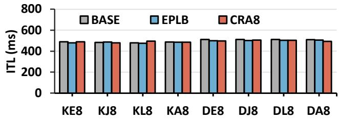  
Figure 10. Average inter-token-latency at maximum throughput across different system setups for BASE, EPLB and CRA8.

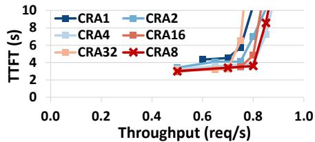  
(a) KE6

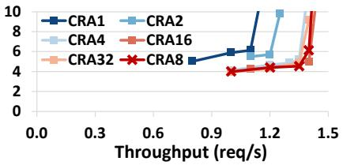  
(b) KE8

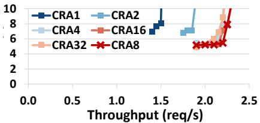  
(c) KE12

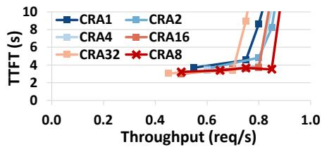  
(d) KJ6

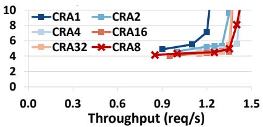  
(e) KJ8

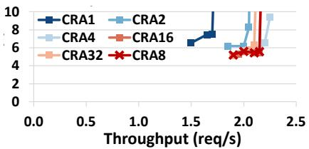  
(f) KJ12

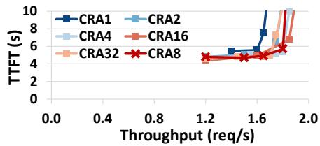  
(g) DE8

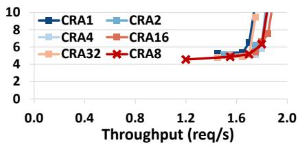  
(h) DJ8

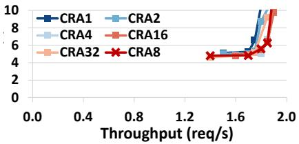  
(i) DL8  
Figure 11. End-to-end throughput to TTFT curves on various replication ratios R over different cluster sizes and configurations.