# WHEN MACHINE LEARNING ISN’T SURE: BUILDING RESILIENT ML-BASEDCOMPUTER SYSTEMS BY EMBRACING UNCERTAINTY

Varun Gohil 1 Nevena Stojkovic 1 Noman Bashir 1 Sundar Dev 2 Gaurang Upasani 2 David Lo 2 Parthasarathy Ranganathan 2 Christina Delimitrou 1

## ABSTRACT

Machine learning (ML) models are increasingly used in computer systems but often suffer from poor generalizability, leading to costly failures on out-of-distribution (OOD) data. We propose an uncertainty-aware framework that improves system resilience by quantifying prediction uncertainty at runtime and rejecting unreliable outputs before they cause harm. When a prediction is uncertain, the system gracefully degrades to a safe fallback strategy. We evaluate the framework across three case studies, server provisioning, cluster management, and storage I/O admission, and find that the best uncertainty estimator is not universal but depends on how its properties align with each task’s design and resource constraints. Similarly, the optimal fallback workflow (e.g., a lightweight and parallel vs. resource-intensive and sequential ) depends on task’s runtime latency constraints. Together, these findings offer a practical path towards building more reliable ML-driven computer systems.

## 1 INTRODUCTION

Machine learning (ML) helps manage the growing complexity of computer systems, showing impressive performance gains across tasks such as workload scheduling (Ling et al., 2024), resource management (Zhang et al., 2021), and compiler optimizations (VenkataKeerthy et al., 2024; Maas et al., 2020). Despite its benefits, widespread adoption in production systems is limited due to three key barriers (Bianchini et al., 2020): interpretability, efficient scalability, and generalizability. Interpretability, the degree to which a human can understand the reasoning behind a model’s decisions, is challenging because “black box” models are difficult to debug. Efficient scalability is the ability to execute large models within strict latency and resource constraints. While interpretability (Meng et al., 2020; Zhang et al., 2021) and scalability (Chen et al., 2022; Jouppi et al., 2017) are actively researched, generalizability remains comparatively under-explored in systems.

Generalizability refers to a model’s ability to predict accurately on data that was not in its training set (Goodfellow et al., 2016). This ability is hindered by random noise, outof-distribution (OOD) samples with different statistical properties (Yang et al., 2024), and adversarial samples crafted to exploit weaknesses (Apostolaki & Jin, 2025; Guesmi et al., 2021). These challenges are especially pronounced in dynamic production environments. For instance, cloud computing’s constant workload and infrastructure changes create persistent distribution shifts, frequently exposing models to OOD data ( § 4.2.3, § 4.1.3). This exposure can cause poor predictions with serious consequences. For example, a single scheduler misprediction could violate Quality-of-Service (QoS) guarantees for multiple colocated applications, affecting many customers (Larsson et al., 2025).

Periodic model retraining (Gulrajani & Lopez-Paz, 2020), the traditional solution to distribution shift, has two limitations in production. First, it is reactive, as retraining is triggered only after harm has occurred. Second, it is computationally intensive and slow, creating vulnerability windows during which systems use stale models. Even online learning approaches (Fu et al., 2025; Qiu et al., 2024; Khani et al., 2023) still permit mispredictions between training cycles.

We propose a complementary approach: building uncertainty-aware systems that proactively detect unreliable predictions before they are used. The key insight is that while we cannot predict specific errors, uncertainty, a measure of the model’s confidence or variance in its prediction, is a strong proxy. In our approach, an uncertainty estimator measures each prediction’s uncertainty. When this value exceeds a threshold, the system ignores the model’s prediction and falls back to a safer alternative (e.g., heuristics, human oversight). This approach transforms brittle ML-based systems into resilient ones that gracefully degrade.

Building uncertainty-aware systems requires answering two questions: “How to detect when the model is uncertain?” and “What to do when the model is uncertain?”. For the first question, we find the choice depends on how a task’s runtime and design constraints align with the characteristics of different estimators. For example, we show that a task with a strict microsecond-level latency budget (§ 4.3) makes fast, distance-based uncertainty estimators the only viable option. In contrast, we find tasks with relaxed latency constraint (§ 4.1) can afford the high overhead of bayesian NNs. We also identify model modifiability as a critical factor: if a model is pre-trained and fixed (§ 4.2), we must use a model-agnostic technique like conformal prediction.

For the second question, we find that the choice of a fallback strategy and its integration with the workflow also depend on the system’s runtime constraints. We show that a task with relaxed latency (§ 4.1) can sequentially execute a slow, resource-intensive fallback policy. Conversely, for tasks with strict, millisecond-scale latency (§ 4.2), we propose a lightweight fallback that runs in parallel with ML inference. This ensures a safe decision is immediately available without increasing end-to-end latency.

## We make the following contributions in this paper:

• We demonstrate via a production-scale case study that ML generalizability failures are a practical concern with real, measurable impacts on system performance (§ 4.1).

• We propose an uncertainty-aware framework for applying ML to computer systems tasks and demonstrate its applicability across multiple tasks with diverse runtime and design constraints in different environments (§ 4).

• We provide a comprehensive tradeoff analysis of uncertainty estimators, offering practical guidance towards selecting methods based on specific task constraints (§ 5).

## 2 BACKGROUND

This section describes the methods we use to estimate uncertainty in our case studies in Section 4.

Bayesian models output a posterior distribution over parameters, which is learned using a user-imposed prior (Yang et al., 2024). High variance in this distribution (e.g., assuming a Gaussian) signifies high uncertainty (He et al., 2025). A popular implementation, Bayesian Neural Networks (BNNs) (Neal, 2012), uses techniques like MCMC (Gamerman & Lopes, 2006), Laplace Approximation (Friston et al., 2007; Foong et al., 2019), or Variational Inference (Blei et al., 2017) and presents key computational tradeoffs.

BNNs using Monte Carlo sampling require multiple forward passes to build the output distribution. In contrast, BNNs with variance propagation are faster, providing the distribution in a single pass, but at the cost of increased memory consumption to store and compute additional parameters.

Conformal Prediction is a model-agnostic and distributionfree framework that provides prediction intervals (or sets) with a guaranteed probabilistic coverage (1−α) (Angelopoulos & Bates, 2022; Balasubramanian et al., 2014), where α is the user-defined desired miscoverage rate (e.g. α=0.1 for 90% coverage). It works in three phases as illustrated in Algorithm 1. First, during training, any ML model is trained on a training set (Line 7). Second, the calibration phase uses a separate calibration set to compute non-conformity scores, which measure how poorly the model’s predictions align with true values (Lines 9-11). Finally, during inference for a new sample, calibration scores are weighed based on distance (e.g., e−distance/τ , where τ is a temperature parameter controlling the weighting’s locality). The (1 − α)- quantile (q) of these weighted scores determines the interval width. For regression, the interval is [yˆ − q, yˆ + q] (Lines 13-18); or classification, it’s a set of classes below the threshold.

Algorithm 1 Conformal Prediction (Regression)   
1: Inputs:   
2: Dtrain: Training dataset   
3: Dcal = {(xi, yi)}ni=1: Calibration dataset   
4: xtest: New input for inference   
5: α: Miscoverage level (e.g., 0.1 for 90% coverage)   
6: τ : Temperature parameter for distance weighting   
Phase 1: Training   
7: Train model ˆf using Dtrain   
8:   
Phase 2: Calibration   
9: for each (xi, yi) ∈ Dcal do   
10: si ← |yi − ˆf(xi)| ▷ Compute non-conformity   
score   
11: end for   
12:   
Phase 3: Inference   
13: yˆtest ← ˆf (xtest) ▷ Predict point estimate   
14: for each xi ∈ Dcal do   
15: wi ← e−dist(xi,xtest)/τ ▷ Compute locality weight   
16: end for   
17: q ← (1 − α)-quantile of {si} weighted by {wi}   
18: return C(xtest) = [ˆytest − q, yˆtest + q]

The framework’s main advantage is that it offers finitesample coverage guarantees regardless of the model or data distribution. Its main drawback is the requirement for a separate calibration dataset. Although guarantees hold for any size, larger calibration sets are needed to produce tighter (more informative) intervals (Angelopoulos & Bates, 2022).

Distance-based methods assume OOD samples are far from the in-distribution data’s centroid, using this distance − measured in input, feature, or embedding space − as an uncertainty metric (Yang et al., 2024). Common distance functions include cosine similarity (Zaeemzadeh et al., 2021) and geodesic (Gomes et al., 2022) or Mahalanobis distance (Ren et al., 2021), as well as non-parametric approaches like nearest neighbors (Sun et al., 2022).

## 3 RELATED WORK

Prior work has taken a diverse set of approaches to mitigate the downsides of model mispredictions. We discuss each of these approaches below.

Data Slicing (Chung et al., 2020; Cito et al., 2021) identifies data subsets (“slices”) where a model underperforms or mispredicts. It partitions a validation dataset into slices using techniques like clustering, lattice search, or decision trees. Problematic slices are those with poor relative model performance, typically measured by accuracy or loss. While useful for pre-deployment analysis, data slicing is less effective at preventing mispredictions during deployment, especially when data distributions change dynamically.

Neural Network Verification for Systems (Eliyahu et al., 2021; Tan et al., 2023; Lin et al., 2025) applies formal methods to guarantee system properties (e.g., safety, liveness) when neural networks are used for decision-making. Although verification offers the strongest guarantees, it faces key limitations. First, these techniques suffer from poor scalability and work only for small models. Second, expressing complex system properties requires significant input feature engineering. Finally, developers struggle with writing the required formal specifications, a task that demands specialized knowledge. While prior work (Jin et al., 2024; Chaudhary et al., 2024) explores automatic specification generation, this remains an open research problem.

Predictions with Rejections (Wang et al., 2025; Jordaney et al., 2017; Tang & Sazonov, 2017; Zhai et al., 2021) is an emerging paradigm that identifies inputs where a model might not generalize and rejects those predictions. Our framework falls under this category, but differs from prior work in crucial ways. First, unlike efforts on narrow problems (code optimization, malware detection), we propose a generalizable framework across a wide range of systems problems (§ 4). Second, while prior work focused on using conformal predictors on classification tasks, we employ different uncertainty estimators for classification and regression tasks. Third, we address dynamically changing environments (§ 4.2, § 4.3), unlike prior work on stationary tasks. Finally, our case studies also provide insights into actions to take when a prediction is rejected (§ 5).

Guardrails/Safeguards: Safe reinforcement learning (Mao et al., 2019), for instance, uses a fallback policy when an agent enters a user-defined unsafe state. Guardrails for OS (Saxena et al., 2025), the closest to our work, uses userprovided specifications that define a system property and a corrective action for its violation, but is constrained by OS latency. While effective, both approaches are limited when the desired system behavior is difficult to formalize. Our framework complements these approaches by not requiring user-provided specifications. Users can thus leverage prior work for properties that are simple to specify, and our approach for those that are complex or difficult to formalize, thereby achieving more robust system reliability.

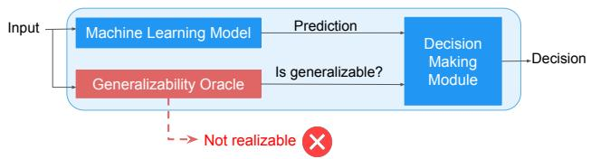  
(a) Ideal but unrealizable generalizability-aware system.

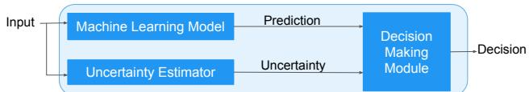  
(b) Practical and realizable uncertainty-aware system.  
Figure 1. Generalizability-aware vs uncertainty-aware system design. (a) An unrealizable generalizability oracle requires perfect knowledge of prediction accuracy before its use. (b) Our practical uncertainty-aware approach uses uncertainty estimation as a proxy for prediction reliability before using it.

## 4 UNCERTAINTY-AWARE FRAMEWORK

We propose a framework for building ML-based solutions for computer systems problems that are resilient to prediction failures. The key insight is using prediction uncertainty as a proactive proxy for error. While an ideal “generalizability oracle” (Figure 1a) that identifies mispredictions a priori is impossible–as accuracy requires post-hoc ground truth– uncertainty can be measured at inference time and strongly correlates with misprediction rates (He et al., 2025; Yang et al., 2024). Our uncertainty-aware framework (Figure 1b) operates by proactively estimating an input’s prediction uncertainty. This score is then passed to a decision-making module, which determines whether to accept or reject the model’s prediction.

We demonstrate the framework’s efficacy using three case studies. First, we highlight the poor reliability of standard ML-based systems with a server design case study from Google. Next, two academic case studies illustrate the utility of different uncertainty estimators and analyze the tradeoffs they offer.

These case studies are chosen to span the “ML for Systems” spectrum. They include classification (§ 4.3) and regression tasks (§ 4.1, § 4.2) operating in stationary (§ 4.1) and dynamic real time environments (§ 4.2, § 4.3). They also cover decision-making latencies ranging from microseconds (§ 4.3) and milliseconds (§ 4.2) to minutes (§ 4.1).

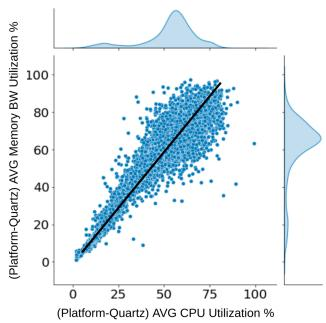

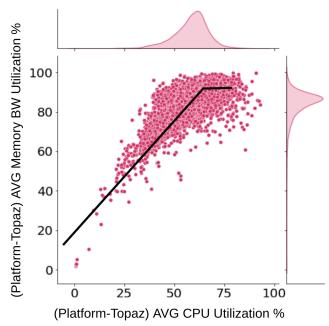  
Figure 2. Fleet-wide memory bandwidth versus CPU utilization. Each datapoint represents the median CPU and bandwidth utilization per node. Distributions along the axes show the histograms of CPU (horizontal) and memory bandwidth utilization (vertical).

From our case studies, we find that the optimal uncertainty estimator choice depends heavily on a task’s runtime constraints (e.g., latency, resource consumption) and design constraints (e.g., ability to change model architecture, need for intuitive unit-consistent uncertainty measures). We provide a detailed analysis of the tradeoffs of each uncertainty estimator in Section 5 and also provide guidelines to help practitioners choose the uncertainty estimator best suited to their task.

## 4.1 Server Resource Capacity Provisioning

## 4.1.1 Task Description

Server design is an iterative process where engineers provision optimal resource capacities (memory, network, cache) by progressively pruning a large parameter space (Nasr-Esfahany et al., 2025). This process often involves moving from fast, low-fidelity evaluations using analytical models to slower, high-fidelity simulation tools. These traditional modeling approaches present a fundamental speed-accuracy trade-off: analytical approaches are fast but oversimplified (Williams et al., 2009; Abel et al., 2023; Hill & Reddi, 2019), whereas detailed simulations are accurate but computationally expensive (Lowe-Power et al., 2020). This tradeoff has driven interest in machine learning models, which may offer a better balance between speed and accuracy (Li et al., 2022; Nasr-Esfahany et al., 2025).

Choosing suboptimal resource capacities creates imbalanced servers, hurting performance (Kozyrakis et al., 2010). For example, Figure 2 shows that Google’s server, Topaz, exhibits a roofline plot where memory bandwidth utilization plateaus after 60% CPU utilization. This contrasts with the balanced Quartz server, which shows a linear trend. The Topaz server’s bottleneck indicates under-provisioned memory bandwidth. To help designers avoid such imbalances, we develop an ML model to predict memory bandwidth utilization for a given workload mix.

Since we are developing a new model, we are free to choose any suitable model architecture. The runtime constraints are shaped by the existing workflow. Since alternatives like detailed simulators require hours, an ML model inference time of seconds to minutes is acceptable. Similarly, high CPU and memory consumption are not prohibitive, as simulators are also resource-intensive.

## 4.1.2 Task Setup

We collect 1.2 million data points by profiling four major server types (Quartz, Jade, Topaz, and Opal) in Google’s fleet using Google Wide Profiling (Ren et al., 2010). This dataset is split 75% for training and 25% for testing, with 20% of the training data used for validation. We train six different models: random forests, decision trees, histogram gradient boosters, neural networks, a bagging regressor, and a linear regressor, all optimized using mean square error loss.

Each model predicts the 90th percentile memory bandwidth utilization using server configurations (CPU, memory, cache capacities, etc.) and workload mix characteristics (resource utilization percentiles, scheduler hints) as inputs. Server designers can vary these configurations to model hypothetical servers, predict memory bandwidth usage, and ensure provisioned capacity is sufficient to prevent saturation.

## 4.1.3 Unreliability of ML-based performance modeling

Table 1 shows that while all models have low errors on test data from seen server types, their errors are considerably higher on the unseen server, Amber. An unseen server is one whose data was not used during model training. We observe poor generalization for models of all complexities, ranging from simple linear regression to complex neural networks and ensemble models, such as bagging regressors. Since all future servers are by definition unseen, this demonstrates that these models cannot reliably predict memory bandwidth usage for new hardware.

This failure occurs because the data from seen and unseen servers is not identically distributed. Figure 3 shows that while the training servers (Quartz, Jade, Topaz, Opal) have similar distributions for memory bandwidth and CPU utilization, the unseen Amber server’s distribution is significantly different. This distribution shift arises from differences in hardware characteristics between the server types.

## 4.1.4 Uncertainty-aware Memory Bandwidth Prediction

Our observations suggest that models are reliable only for indistribution (ID) data, failing on out-of-distribution (OOD) data. Hence, we propose a hybrid approach: using the ML model for ID configurations and falling back to a simulator for OOD ones. To achieve this, we use a 2-layer Bayesian neural network (BNN) that acts as both predictor and uncertainty estimator (Figure 4).We generate a prediction distribution by iteratively running Monte Carlo sampling until the the distribution’s standard deviation converges (change ≤ 5%). We define uncertainty as the standard deviation of this distribution, and the prediction is the mean of this distribution. A single inference pass takes 600 ms on an A100 GPU (batch size 512), and this latency accumulates with each run. However, the total inference time remains less than a minute, which is well within the acceptable latency limits for this design task.

Table 1. ML model MAPE when tested on seen and unseen servers  
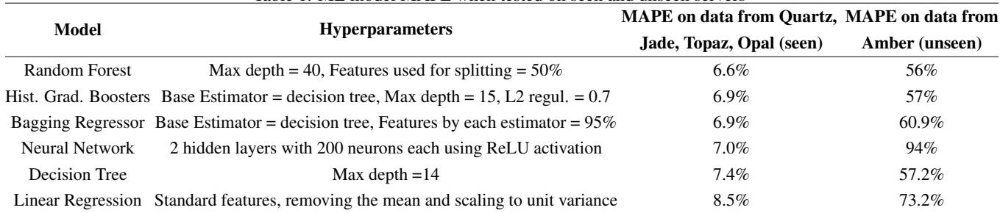

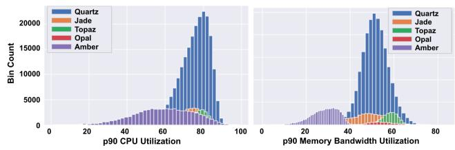  
Figure 3. Histogram of 90th percentile CPU utilization and 90th percentile memory bandwidth utilization on different servers.

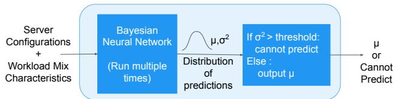  
Figure 4. Uncertainty-aware workflow that uses bayesian neural network for the server resource capacity provisioning task.

We first train a BNN on data from four servers (Quartz, Jade, Topaz, Opal) and test it on the unseen server Amber. Table 2 shows that the on seen servers, the BNN achieves an 8.7% MAPE with a low uncertainty of 1.2. While this predictive error is higher than the other models reported in Table 1 – making it the least accurate for the pure prediction task – its value lies in its uncertainty awareness. This is demonstrated when the model fails on the OOD server Amber (47% MAPE) and, critically, signals this failure with high uncertainty (15.6).

Next, we train a BNN on data from only two servers (Quartz, Topaz) and test it on three unseen servers: Jade, Opal, and Amber (Table 2). The model again fails on the server Amber, reporting high uncertainty (15). However, for Jade and Opal, whose data distributions are similar to the model’s training set, the BNN achieves low error (12.8% and 11.8% MAPE) and reports low uncertainty (1.9 and 3.4).

The results in Table 2 demonstrate the BNN’s key value: differentiating OOD from non-OOD unseen servers. This is incredibly useful in server capacity provisioning as server designers can now reliably use the ML model to predict memory bandwidth usage of future hypothetical configurations.

How to decide uncertainty threshold?: A key aspect of making this uncertainty practical is selecting an appropriate threshold. Since the uncertainty is the standard deviation of the BNN’s prediction distribution, it has the same unit as the output label: GBps, i.e. it is unit-consistent. Therefore, an uncertainty of 1 can be interpreted as the prediction being uncertain or off by approximately 1 GBps. Server designers can leverage their domain expertise to determine how much error they can tolerate at a particular stage in the server design cycle and set the uncertainty threshold accordingly.

What to do when we ignore model’s prediction?: For configurations where model predictions are highly uncertain, human oversight becomes essential. The server designer can either prune these configurations from the search space or employ alternative evaluation tools such as simulators or analytical models to make informed decisions about their viability.

Table 2. Results of Bayesian Neural Network Model  
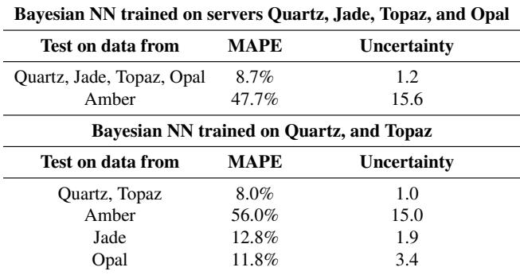

## 4.2 Cluster Resource Management

## 4.2.1 Task Description

Microservice architectures introduce significant resource management challenges (Gan et al., 2019). Interdependencies between services create “backpressure”, leading to cascading Quality of Service (QoS) violations that are difficult to trace. This problem is compounded by a “delayed queueing effect”: performance violations lag resource reductions, allowing queues to build up undetected. Once violations appear, these queues drain slowly even after resources are restored, leading to prolonged recovery. Therefore, improper allocation can cause cascading failures, while overly conservative approaches waste resources.

To address these challenges, Sinan (Zhang et al., 2021) uses a data-driven, hybrid two-stage ML model to manage microservice resources by predicting end-to-end performance and handling both immediate and delayed effects. The first stage, a Convolutional Neural Network (CNN), processes resource history, latency, and a proposed configuration to predict immediate tail latency, capturing dependencies between services. The second stage, a Boosted Trees model, uses the CNN’s output to predict the probability of delayed QoS violations (e.g., over the next 5 seconds), anticipating queueing effects before they manifest.

Operationally, Sinan is a centralized scheduler running in 1- second intervals. It collects metrics from distributed agents, uses the ML model to evaluate potential allocations, and enforces the optimal choice using Linux cgroups. Given the 1-second interval, Sinan must evaluate multiple candidate configurations, which requires individual ML model inference in the millisecond range. As it is deployed centrally on a dedicated machine, the scheduler’s own CPU and memory consumption are not major constraints. Additionally, for our case study we assume that the Sinan model architecture is pre-trained and fixed.

## 4.2.2 Task Setup

We reproduced Sinan using the authors’ open-sourced code, deploying the Social Network application from DeathStar-Bench (Gan et al., 2019) on a 7-machine CloudLab cluster (Duplyakin et al., 2019). The locust load generator (Heyman et al., 2024) sends requests to the application. Sinan ran on a dedicated machine managing the cluster, as per the original paper.

For comparison, we used two autoscaling baselines. AutoScalerOpt follows AWS’s recommended autoscaling policy, increasing resources by 10% and 30% when utilization reaches [60%, 70%) and [70%, 100%] respectively, and reducing resources by 10% and 30% when utilization falls within [30%, 40%) and [0%, 30%) (Amazon-EC2-Auto-Scaling-User-Guide). AutoScaleCons is a more conservative variant optimized for QoS preservation, increasing resources by 10% and 30% when utilization reaches [30%, 50%) and [50%, 100%], and only reducing resources by 10% when utilization falls within [0%, 10%].

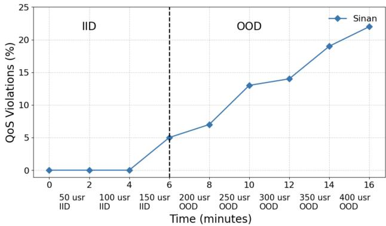  
Figure 5. Performance of Sinan on OOD samples

## 4.2.3 Unreliabilty of Sinan

While Sinan excels on workloads similar to its training data, achieving 89.2% accuracy on its test set, its ML model degrades significantly in out-of-distribution (OOD) scenarios. Figure 5 illustrates this: we incrementally increased the SocialNetwork user load every 2 minutes. During the in-distribution phase (0-6 minutes, 50-150 users), Sinan maintained near-zero QoS violations. However, once the load exceeded the training data (OOD, ≥150 users), violations rose dramatically, increasing from 5% at 200 users to over 22% at 450 users.

This demonstrates “model staleness” – the model’s learned resource-to-performance relationships became inaccurate. Unlike infrastructure changes (Section 4.1.3), this staleness stemmed from an application-level behavior shift: higher user counts increased the posts returned per Read-HomeTimeline request, which in turn increased per-request latency in a way the model had not been trained to anticipate. This highlights that model staleness can arise from both system and workload shifts.

## 4.2.4 Uncertainty-aware Cluster Resource Management

We integrate uncertainty estimators with Sinan to decide when to ignore its prediction. Since Sinan’s model is pretrained, we require a post-hoc, model-agnostic wrapper that avoids retraining. This constraint motivates our focus on model-agnostic approaches like conformal prediction and distance-based estimators, ruling out Bayesian approaches that would necessitate replacing the model entirely.

Conformal Prediction: We use residual (|true value - predicted value|) as the non-conformity score. At inference, we weigh the non-conformity scores of 3850 calibration samples based on their L2 distance to the test input (using an exponential kernel with τ = 1, per Section 2). From the weighted non-conformity scores, we select the 90th percentile score q (with α = 0.1), yielding a prediction interval [yˆ − q, yˆ + q]. We use relative uncertainty, defined as (prediction interval/mean prediction) × 100, and set a 15% threshold, which corresponds to ∼ 5ms of uncertainty.

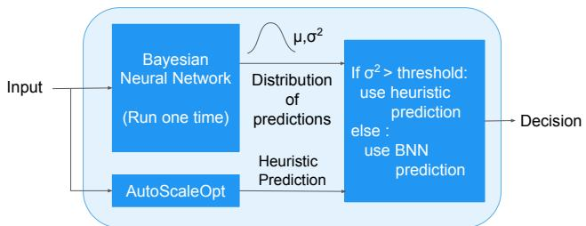  
(a) Bayesian Neural Network based workflow

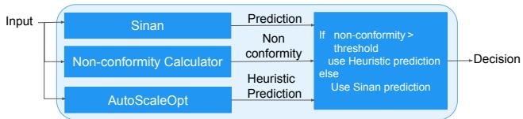  
(b) Sinan + Conformal Prediction Workflow

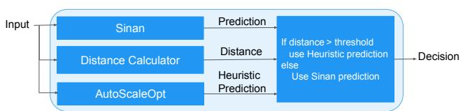  
(c) Sinan + Distance-based Uncertainty Workflow  
Figure 6. Uncertainty-aware workflows that use different uncertainty estimators for the cluster resource management task.

As Figure 6b shows, we compute uncertainty based on the non-conformity score in parallel with Sinan’s inference. If the uncertainty exceeds the threshold, we ignore the model’s prediction and use the AutoScaleOpt fallback heuristic, which also runs in parallel.

Distance-based uncertainty estimation: We extract the input’s latent vector using Sinan’s CNN and compute its Euclidean distance to the centroid of the training set’s latent vectors. If the distance exceeds the 90th percentile of all training sample distances to that centroid, we classify the model prediction for this input as uncertain.

Bayesian Neural Network: For a comprehensive evaluation, despite the violation of design constraints, we replace Sinan’s model with a BNN (Figure 6a) to predict QoS violations and quantify uncertainty via output variance. Our optimal model, found via grid search on Sinan’s dataset, is a 2-layer network (700 hidden units/layer) trained with ELBO loss and learning rate of 1e−04. This BNN achieves 88% accuracy compared to Sinan’s 89.2% accuracy on the test set. We use single-pass variance propagation for low-latency inference, which is faster than the multi-pass Monte-Carlo sampling used in Section 4.1.4. We use relative uncertainty (standard deviation / mean %) and set a 15% threshold, ignoring predictions above it.

What to do when we ignore the model’s prediction? When uncertainty exceeds the threshold, we discard Sinan’s prediction. Making no scaling decision is not viable, as it would risk QoS violations from inadequate resource provisioning. We therefore fall back to the AutoScaleOpt heuristic, which scales based on CPU utilization. As shown in Figure 6, this fallback computation runs in parallel with model inference and uncertainty estimation, adding no endto-end latency as Sinan’s inference time dominates.

Results: Figure 7 presents QoS violations and CPU allocation for the workflows. Following the methodology from Section 4.2.3, we increase user load every 2 min, causing inputs to become out-of-distribution after 6 min. While AutoScaleCons yields the lowest violations, it severely overallocates CPU (up to 3×). All uncertainty-aware workflows reduce QoS violations compared to baseline Sinan with similar CPU usage.

The Bayesian workflow achieves the best violation rate (4-16% fewer violations). However, it is infeasible as it breaks our primary design constraint: it requires replacing Sinan’s pre-trained model. Its computational cost is also significant (760MB memory usage, 98.3% CPU utilization); while acceptable for our centralized controller, this overhead would be prohibitive for per-node deployments.

This leaves the two post-hoc, model-agnostic approaches. Both are extremely lightweight, but conformal prediction emerges as the clear winner. It provides a substantial reduction in QoS violations (2-11%) for a low overhead. It has millisecond-scale inference latency, and uses only kilobytes of memory to store calibration samples, offering a better tradeoff between QoS violation rate and computational overhead than the Bayesian workflow. Furthermore, Figure 8 demonstrates that this trend holds across multiple load patterns.

How to decide uncertainty threshold?: The thresholdsetting method depends on whether the uncertainty measure is unit-consistent. Both Bayesian models and conformal prediction provide intuitive unit-consistent uncertainty, producing output intervals in the same units as the target variable. This allows experts to set a meaningful threshold based on their domain expertise and tolerance; we use relative uncertainty for both and set the threshold to 15%. Figure 9 shows the effect of the uncertainty threshold on the QoS violations and CPU allocation of the Sinan + conformal prediction and the bayesian neural network workflows. As expected, a higher uncertainty threshold results in lower fallback rate to heuristic and leads to higher QoS violations in OOD environments.

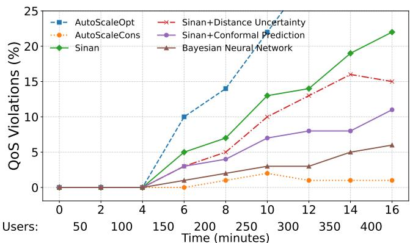  
(a) QoS violations of the workflows.

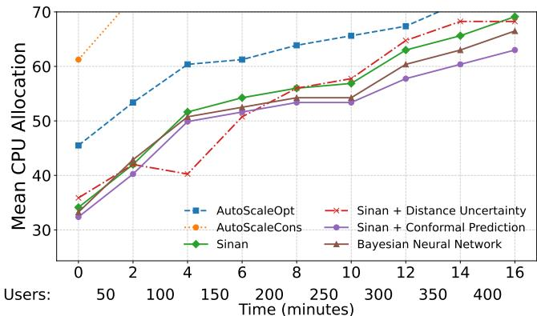  
(b) Resource allocation by the workflows.

Figure 7. QoS violations and CPU allocation of cluster management workflows on increasing social network users by 50 every 2 minutes.  
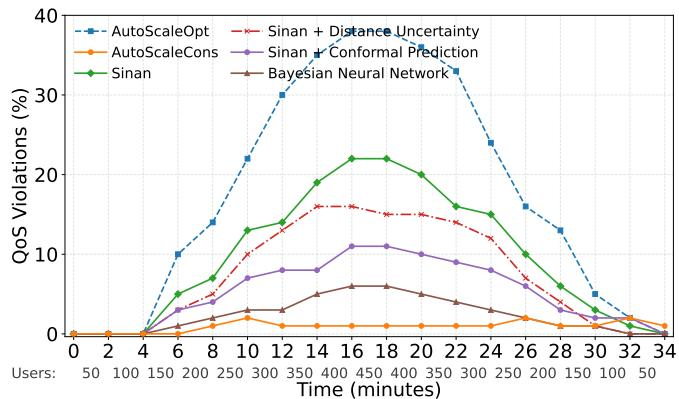  
(a) QoS violations with diurnal load.

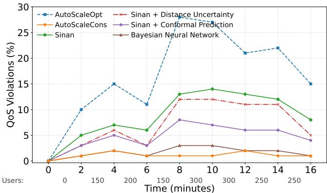  
(b) QoS violations with random load  
Figure 8. QoS violations of cluster management workflows on varying load patterns.

In contrast, distance-based uncertainty is non-intuitive, manifesting as distances in a high-dimensional embedding space. This prevents threshold setting via domain knowledge, forcing reliance on empirical calibration. Consequently, we set this threshold to the 90th percentile of the distances computed from the training dataset. This difference in unit-consistency of reported uncertainty is a critical noncomputational distinction between conformal prediction and distance-based uncertainty estimators.

## 4.3 Storage I/O Admission

## 4.3.1 Task Description

SSDs dominate modern datacenters with microsecond-scale I/O, but their performance is unstable. Internal garbage collection (GC) processes can block incoming requests, causing severe long-tail latencies that disrupt service predictability (Cao et al., 2017; He et al., 2017). During congestion, admitting all I/O requests builds queues and cascades delays, violating SLOs for latency-sensitive applications. Intelligent I/O admission control is therefore essential to maintain predictable performance by selectively admitting, redirecting, or deferring requests (Hao et al., 2020; Suresh et al., 2015; Kurniawan et al., 2025).

Heimdall (Kurniawan et al., 2025) addresses this with a device-specific, 2-layer neural network (128/16 neurons) that performs binary latency classification (fast/slow) for each I/O, achieving 93% accuracy. This lightweight model achieves microsecond-level inference using features such as I/O type, size, and recent queue, latency, and throughput history. I/Os with high predicted latency are redirected to an alternative SSD. Here, the system and deployment constraints are strict. The entire admission control decision, including model inference, must complete within a few microseconds to avoid adding overhead to fast storage I/O.

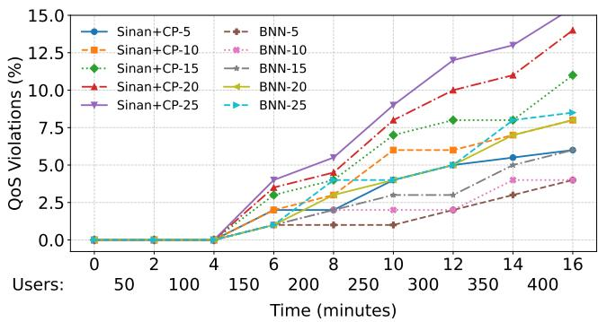  
(a) QoS violations with various uncertainty thresholds

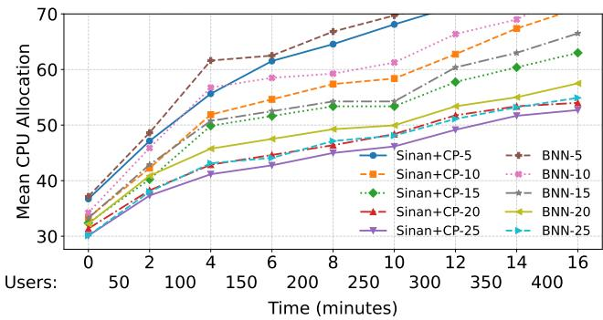  
(b) Resource allocation with various uncertainty thresholds  
Figure 9. Ablation study of uncertainty threshold. CP represents Conformal Prediction. BNN represents Bayesian Neural Network. The numeral in the suffix for each workflow represents the uncertainty threshold.

## 4.3.2 Task Setup

We deploy the open-source Heimdall code on a Chameleon Cloud storage nvme node equipped with two Samsung 970 PRO 1TB SSDs. Heimdall acts as a user-space controller, intercepting I/Os and using a device-specific model to predict latency. If the primary device’s model predicts high latency, the I/O is redirected to the secondary SSD; otherwise, it is admitted. Redirected I/Os are not re-predicted. We use 3-minute production traces (100K-10M I/Os) from Alibaba, Microsoft, and Tencent, which the Heimdall authors augmented with higher I/O rates and sizes to stress the SSDs and trigger tail latency events. We compare our method against three baselines: Static (no admission control, I/O goes to its original device), Random (simple load balancing), and Hedging (I/O is sent to both SSDs, and the first response is used).

## 4.3.3 Uncertainty-Aware Storage I/O Admission

We enhance the Heimdall workflow by incorporating uncertainty quantification to identify when the model’s predictions may be unreliable. The primary challenge is the extreme latency requirement: I/O admission decisions must be made at microsecond scale. This constraint makes common uncertainty methods unusable. Our implementation of a BNN that achieves comparable accuracy to Heimdall runs a single inference in 238 µs. This is a 33× overhead relative to the distance-based approaches that take ∼ 7µs. Similarly, while conformal prediction exhibits low latency (∼ 0.6µs) for computing individual nonconformity scores, weighing these scores based on distances from calibration samples requires computing multiple distances. This process increases latency in proportion to the size of the calibration dataset. Comparing against a large set (∼1000 samples) increases latency to ∼500 µs, while using fewer samples (∼100) causes 99.84% of I/O requests to be classified as uncertain, defeating the purpose of uncertainty quantification. These considerations demonstrate that in extremely latency-constrained environments, distance-based uncertainty estimators are the only viable option.

Distance-Based Hedging Workflow: Our approach integrates distance-based uncertainty with a hedging fallback. This method imposes minimal computational overhead: distance-based estimation requires only 7 µs per request and consumes a few bytes of memory to store the training dataset centroid. These overheads are negligible compared to typical I/O latencies (∼ 100µs).

We evaluate two distance measures: Euclidean distance and Mahalanobis distance. For each incoming I/O request, we either compute the Euclidean or Mahalanobis distance between it’s input feature vector and the centroid of the model’s training dataset. Requests whose distances exceed a predetermined threshold are classified as uncertain. We empirically determine this threshold by computing the distances from all training samples to the centroid and selecting the 90th percentile value.

When a request is flagged as uncertain by either distance metric, we bypass the model’s prediction and employ hedging: the request is dispatched to both SSDs simultaneously, and the redundant request is canceled upon receiving the first response. This approach guarantees minimal latency for uncertain requests while avoiding the overhead of hedging all requests indiscriminately.

Results: Figure 10 shows that our uncertainty-aware workflow substantially reduces both average and tail latency compared to the baseline Heimdall workflow. Mahalanobis distance achieved the best results (18% average and 57% 99.9th percentile latency reduction), while Euclidean distance was nearly as effective (12% average and 56% 99.9th percentile reduction). However, on average across all traces, the Euclidean method flagged only 5.22% of requests as uncertain, compared to 17.25% for Mahalanobis. Therefore, Euclidean distance is preferable, offering comparable tail latency, while significantly minimizing the hedging overhead.

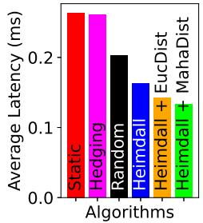

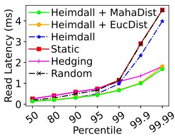  
Figure 10. Average and tail latency results for storage I/O admission workflows. EucDist stands for Euclidean distance and MahaDist stands for Mahalanobis distance.

## 5 TRADEOFF ANALYSIS

Implementing an effective uncertainty-aware workflow requires answering two fundamental questions: “How to detect when the model is uncertain?” and “What to do when the model is uncertain?”. The optimal choice for each depends on navigating the complex tradeoffs of both estimators and fallback policies, while satisfying the task’s design and runtime constraints. In this section, we analyze these sets of tradeoffs in detail.

## 5.1 How to detect when the model is uncertain?

Our case studies (Section 4) show that no single estimator is universally best for computer systems tasks. The optimal choice depends on balancing estimator tradeoffs against the task’s design and runtime constraints. Design constraints include model architecture modifications, calibration data availability, and the need for intuitive unit-consistent uncertainty. Runtime constraints involve latency, CPU, and memory budgets. Table 3 summarizes these tradeoffs.

We analyze estimators along two axes–design and runtime constraints–while balancing them against overall efficacy.

Efficacy and theoretical grounding: Bayesian methods and conformal prediction offer high, theoretically-grounded efficacy. Bayesian methods use posterior variance as a principled measure of uncertainty while conformal prediction offers formal, distribution-free coverage guarantees. In contrast, distance-based methods have low-to-medium efficacy, lack theoretical grounding, and assume that OOD samples are far from the in-distribution centroid.

Tradeoffs due to runtime constraints: Runtime constraints–primarily latency, memory, and CPU overhead– impose critical tradeoffs. Latency, in particular, is a key differentiator, varying by orders of magnitude. Distancebased estimators are fastest (µs), a requirement for our I/O task (§ 4.3). Conformal prediction has millisecond latency, with latency scaling with the calibration set size. Bayesian methods are the slowest (ms to sec) due to intensive computations like MC sampling, making them suitable for tasks with relaxed latency budgets (§ 4.1).

Memory and CPU overhead follow a similar pattern. Bayesian neural networks are the most resource-intensive (in MBs) due to the storage of variance parameters (§ 4.2). Conformal prediction has medium-to-high storage overhead (KBs–to-MBs) for its calibration set. Distance-based methods use only a few bytes of memory to store the centroid and impose minimal overhead. Notably, the energy overhead of uncertainty estimation varies considerably across methods. Bayesian neural networks incur the same energy cost as model inference, since uncertainty estimation itself requires a full forward pass. In contrast, conformal prediction and distance-based methods rely only on computing a small number of L2 norms, making their uncertainty estimation cost negligible relative to inference.

Tradeoffs due to design constraints: Design constraints involve tradeoffs in model-agnostic capabilities, calibration data, and unit-consistent uncertainty. Bayesian and conformal methods have intuitive unit-consistent uncertainties. Their outputs are in the prediction’s units, allowing for domain-expert thresholding (§ 4.1, § 4.2). Distancebased methods rank low, producing non-intuitive latentspace distances that require empirical thresholding. Modelagnosticism is also critical for retrofitting deployed models. Conformal prediction and distance-based estimators are model-agnostic, allowing them to wrap existing models without modification (§ 4.2). Bayesian methods are not model-agnostic and require architectural changes. Finally, conformal prediction uniquely requires a separate calibration dataset, a potential barrier in small-data regimes, unlike the other two approaches.

## 5.2 What to do when the model is uncertain?

When an ML model’s prediction is uncertain, it should be ignored as a likely misprediction. The system must then revert to a fallback strategy, the second core design decision in this framework. Fallback options generally fall into two categories:

Defer to human intervention. For offline tasks like capacity provisioning (§ 4.1) or anomaly detection, uncertain predictions are flagged for human review to prevent disruptive, unreliable decisions. In our provisioning case study (§ 4.1), the designer can either run an expensive simulation on the uncertain configuration or prune it.

Fall back to rule-based heuristics. While systems in stationary environments can simply abstain, dynamic environments requiring constant decisions need robust, automated fallbacks. In our cluster management case study (§ 4.2), for instance, we revert to AutoScaleOpt heuristics for resource allocation when the model is uncertain.

The choice and integration of a fallback policy are dictated by the task’s runtime constraints. Tasks with relaxed constraints can use slow, resource-intensive fallbacks. In our provisioning case study (§ 4.1), the task tolerates minutes of latency, allowing an expensive simulator to serve as a fallback. This enables a sequential workflow: the fallback runs only after a prediction is deemed uncertain, saving high resource costs when the model is certain.

Table 3. Tradeoffs between uncertainty estimation approaches.  
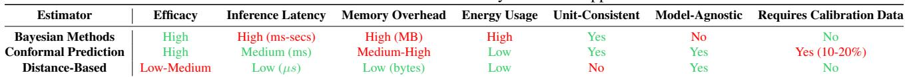

Conversely, strict low-latency constraints demand a lightweight fallback. In our cluster management case study (§ 4.2), the fast and simple AutoScaleOpt policy serves this role. The tight latency budget also necessitates a parallel workflow, running the fallback concurrently with model inference (Figure 6). As inference latency typically dominates, this parallel execution adds no end-to-end latency, ensuring a safe decision is always immediately available for millisecond-scale tasks.

## 5.3 Guidelines for Practitioners

Based on the tradeoffs analyzed above, we provide the following guidelines for practitioners implementing an uncertainty-aware framework.

To select an uncertainty estimator, practitioners must first evaluate the task’s constraints. If the task has a strict, microsecond-level latency constraint, a distance-based estimator must be selected, as it is the only viable option. If latency is less critical but there is a design constraint that the ML model must be pre-trained and fixed, then conformal prediction should be selected due to its model-agnostic nature. If, however, the task has relaxed constraints, practitioners should select a Bayesian Neural Network to leverage its high efficacy and intuitive, unit-consistent uncertainty.

To select the fallback integration strategy, practitioners must consider the policy’s overhead. If the fallback policy is resource-intensive, it must be executed sequentially after the uncertainty estimator. This workflow avoids unnecessary overhead by running the fallback only after a prediction has been identified as uncertain. Conversely, for latencysensitive tasks with a lightweight fallback, the fallback must be executed in parallel with the model inference.

## 6 DISCUSSION

## Improvements over prior work:

Our work offers three major improvements over prior work:

• Eliminating the need for formal specifications: Unlike prior verification (Eliyahu et al., 2021; Tan et al., 2023;

Lin et al., 2025) or guardrail methods (Saxena et al., 2025), our framework does not require operators to define complex unsafe states or formal properties (Jin et al., 2024; Chaudhary et al., 2024). By leveraging uncertainty estimation alone, we remove the need for specialized feature engineering and formalization, reducing the burden on operators.

• Multidimensional trade-off analysis: We shift the focus from narrow applications to a broad comparative study. By evaluating multiple estimators across varied tasks, we demonstrate that the “optimal” estimator is contextdependent.

• Analysis of fallback architectures: We extend the “predictions with rejections” (Wang et al., 2025; Jordaney et al., 2017; Tang & Sazonov, 2017; Zhai et al., 2021) paradigm into actionable system design. Our analysis provides a framework for choosing between parallellightweight and sequential-intensive fallback workflows, directly addressing the real-world trade-off between safety and runtime latency.

## Can this framework be applied when using LLMs for systems tasks?

Yes, our uncertainty-aware framework extends to LLMbased systems, using logit-based methods or selfconsistency sampling (Ma et al., 2025; Xia et al., 2025) for uncertainty quantification. These uncertainty measures can be applied to “LLM for systems” tasks like code generation (Pinckney et al., 2025) and configuration synthesis (Kon et al., 2024). While promising, applying our framework to LLMs is an area for future research.

## How will this framework integrate with existing ML deployment and management systems?

Our uncertainty estimation techniques can integrate seamlessly into existing ML deployment systems, like SOL (Wang et al., 2022) used in production cloud platforms such as Azure. The estimators would augment SOL’s AssessModel function, providing a proactive assessment before a prediction is used, rather than just a post-hoc accuracy check. This uncertainty score can then be passed in SOL’s Prediction object, allowing the TakeAction function to intelligently decide whether to trust the prediction or revert to a safe default.

## Will feature engineering help avoid mispredictions?

Yes, feature engineering and augmentation improve model accuracy and generalizability, which helps reduce mispredictions (Li et al., 2021). However, these techniques do not

eliminate all errors or yield perfect generalization (Li et al., 2021). Therefore, our framework remains useful even for highly feature-engineered models.

## Why use uncertainty-based prediction when one can retrain the model to avoid mispredictions?

While online retraining helps models adapt to data drift (Fu et al., 2025; Qiu et al., 2024; Khani et al., 2023), it does not eliminate mispredictions. Retraining happens periodically (Acun et al., 2021), meaning mispredictions can still occur within the interval between updates. Retraining is reactive, fixing errors after they happen. Our uncertaintybased approach is proactive, helping to mitigate the negative impact of mispredictions before the next retraining cycle completes.

## How does uncertainty-awareness influence the retraining pipeline?

Model uncertainty can guide when to trigger model retraining. System operators can monitor the model uncertainty over an interval, and decide to trigger retraining if the majority of the requests within that interval were uncertain. This will eliminate unnecessary periodic model training when it is not needed. Additionally, model uncertainty can guide which data samples to include in the retraining dataset, potentially reducing its size and speeding up the retraining process.

## What are the limitations of our proposed framework?

Our framework mitigates the downsides of mispredictions but does not prevent them. Furthermore, our approach proactively answers “if” a model might mispredict, but not “why” it mispredicts. Understanding the “why” is critical for model correction and safety. Existing feature attribution techniques (Zhang et al., 2021; Shi et al., 2019) provide only partial insight. Future work should leverage more advanced data attribution (Park et al., 2023; Ilyas et al., 2022) and neuron attribution methods (Cammarata et al., 2020; Ma et al., 2018) to gain deeper insights into model behavior.

## 7 CONCLUSION

The generalizability of machine learning models remains a critical barrier to their adoption for computer systems tasks, as they often fail unpredictably. To address this challenge, we present an uncertainty-aware framework that allows systems to identify potentially unreliable predictions and gracefully fall back to safer heuristics. Our analysis and three case studies show that the choice of uncertainty estimator and fallback strategy depends on the task’s runtime and design constraints, and offers a clear path toward building more reliable ML-driven computer systems for broader and safer deployment in real-world environments.

## ACKNOWLEDGEMENTS

We sincerely thank our shepherd, the Google Platforms team, the Architecture 2.0 Grad Cohort, Divyanshu Saxena, Christos Zarkos, Viansa Schmulbach, Qihang Chen, Monica Chiosa, and the anonymous reviewers for their feedback on earlier versions of this manuscript. This work was supported in part by NSF CAREER Award CCF-2326182, a Sloan Research Fellowship, an Intel Research Award, a Google Faculty Research Award, and a Jane Street Research Grant.

## REFERENCES

Abel, A., Sharma, S., and Reineke, J. Facile: Fast, accurate, and interpretable basic-block throughput prediction. In 2023 IEEE International Symposium on Workload Characterization (IISWC), pp. 87–99. IEEE, 2023.

Acun, B., Murphy, M., Wang, X., Nie, J., Wu, C.-J., and Hazelwood, K. Understanding Training Efficiency of Deep Learning Recommendation Models at Scale In 2021 IEEE International Symposium on High-Performance Computer Architecture (HPCA), pp. 802– 814, Los Alamitos, CA, USA, March 2021. IEEE Computer Society. doi: 10.1109/HPCA51647.2021.00072. URL https://doi.ieeecomputersociety. org/10.1109/HPCA51647.2021.00072.

Amazon-EC2-Auto-Scaling-User-Guide. Step and simple scaling policies for Amazon EC2 Auto Scaling. https://docs.aws.amazon. com/autoscaling/ec2/userguide/ as-scaling-simple-step.html. Accessed: 2025-10-20.

Angelopoulos, A. N. and Bates, S. A gentle introduction to conformal prediction and distribution-free uncertainty quantification, 2022. URL https://arxiv.org/ abs/2107.07511.

Apostolaki, M. and Jin, M. Robustifying ml-powered network classifiers with pants. In Proceedings of the 34th USENIX Conference on Security Symposium, SEC ’25, USA, 2025. USENIX Association. ISBN 978-1-939133- 52-6.

Balasubramanian, V., Ho, S.-S., and Vovk, V. Conformal prediction for reliable machine learning: theory, adaptations and applications. Newnes, 2014.

Bianchini, R., Fontoura, M., Cortez, E., Bonde, A., Muzio, A., Constantin, A.-M., Moscibroda, T., Magalhaes, G., Bablani, G., and Russinovich, M. Toward ml-centric cloud platforms. Commun. ACM, 63(2):50–59, January 2020. ISSN 0001-0782. doi: 10.1145/3364684. URL https://doi.org/10.1145/3364684.

Blei, D. M., Kucukelbir, A., and McAuliffe, J. D. Variational inference: A review for statisticians. Journal of the American statistical Association, 112(518):859–877, 2017.

Cammarata, N., Carter, S., Goh, G., Olah, C., Petrov, M., Schubert, L., Voss, C., Egan, B., and Lim, S. K. Thread: Circuits. Distill, 2020. doi: 10.23915/distill.00024. https://distill.pub/2020/circuits.

Cao, Z., Tarasov, V., Raman, H. P., Hildebrand, D., and Zadok, E. On the performance variation in modern storage stacks. In 15th USENIX conference on file and storage technologies (FAST 17), pp. 329–344, 2017.

Chaudhary, I., Lin, S., Tan, C., and Singh, G. Specification generation for neural networks in systems, 2024. URL https://arxiv.org/abs/2412.03028.

Chen, S., Jin, A., Delimitrou, C., and Mart´ınez, J. F. Retail: Opting for learning simplicity to enable qos-aware power management in the cloud. In 2022 IEEE International Symposium on High-Performance Computer Architecture (HPCA), pp. 155–168. IEEE, 2022.

Chung, Y., Kraska, T., Polyzotis, N., Tae, K. H., and Whang, S. E. Automated Data Slicing for Model Validation: A Big Data - AI Integration Approach IEEE Transactions on Knowledge & Data Engineering, 32(12):2284–2296, December 2020. ISSN 1558-2191. doi: 10.1109/TKDE.2019.2916074. URL https://doi.ieeecomputersociety.org/ 10.1109/TKDE.2019.2916074.

Cito, J., Dillig, I., Kim, S., Murali, V., and Chandra, S. Explaining mispredictions of machine learning models using rule induction. In Proceedings of the 29th ACM Joint Meeting on European Software Engineering Conference and Symposium on the Foundations of Software Engineering, ESEC/FSE 2021, pp. 716–727, New York, NY, USA, 2021. Association for Computing Machinery. ISBN 9781450385626. doi: 10.1145/ 3468264.3468614. URL https://doi.org/10. 1145/3468264.3468614.

Duplyakin, D., Ricci, R., Maricq, A., Wong, G., Duerig, J., Eide, E., Stoller, L., Hibler, M., Johnson, D., Webb, K., Akella, A., Wang, K., Ricart, G., Landweber, L., Elliott, C., Zink, M., Cecchet, E., Kar, S., and Mishra, P. The design and operation of Cloud-Lab. In 2019 USENIX Annual Technical Conference (USENIX ATC 19), pp. 1–14, Renton, WA, July 2019. USENIX Association. ISBN 978-1-939133-03-8. URL https://www.usenix.org/conference/ atc19/presentation/duplyakin.

Eliyahu, T., Kazak, Y., Katz, G., and Schapira, M. Verifying learning-augmented systems. In Proceedings of the 2021 ACM SIGCOMM 2021 Conference, SIGCOMM ’21, pp. 305–318, New York, NY, USA, 2021. Association for Computing Machinery. ISBN 9781450383837. doi: 10. 1145/3452296.3472936. URL https://doi.org/ 10.1145/3452296.3472936.

Foong, A. Y., Li, Y., Hernandez-Lobato, J. M., and Turner, ´ R. E. ’in-between’uncertainty in bayesian neural networks. arXiv preprint arXiv:1906.11537, 2019.

Friston, K., Mattout, J., Trujillo-Barreto, N., Ashburner, J., and Penny, W. Variational free energy and the laplace approximation. Neuroimage, 34(1):220–234, 2007.

Fu, Z.-S., Sudhakar, S., Karaman, S., and Sze, V. Dectrain: Deciding when to train a monocular depth dnn online. IEEE Robotics and Automation Letters, PP:1–8, 03 2025. doi: 10.1109/LRA.2025.3536206.

Gamerman, D. and Lopes, H. F. Markov chain Monte Carlo: stochastic simulation for Bayesian inference. Chapman and Hall/CRC, 2006.

Gan, Y., Zhang, Y., Cheng, D., Shetty, A., Rathi, P., Katarki, N., Bruno, A., Hu, J., Ritchken, B., Jackson, B., Hu, K., Pancholi, M., Clancy, B., Colen, C., Wen, F., Leung, C., Wang, S., Zaruvinsky, L., Espinosa, M., He, Y., and Delimitrou, C. An Open-Source Benchmark Suite for Microservices and Their Hardware-Software Implications for Cloud and Edge Systems. In Proceedings of the Twenty Fourth International Conference on Architectural Support for Programming Languages and Operating Systems (ASPLOS), April 2019.

Gohil, V., Dev, S., Upasani, G., Lo, D., Ranganathan, P., and Delimitrou, C. The importance of generalizability in machine learning for systems. IEEE Computer Architecture Letters, 23(01):95–98, January 2024. ISSN 1556-6064. doi: 10.1109/LCA.2024.3384449.

Gomes, E. D. C., Alberge, F., Duhamel, P., and Piantanida, P. Igeood: An information geometry approach to out-ofdistribution detection. arXiv preprint arXiv:2203.07798, 2022.

Goodfellow, I., Bengio, Y., and Courville, A. Deep Learning. MIT Press, 2016. http://www. deeplearningbook.org.

Guesmi, A., Alouani, I., Khasawneh, K. N., Baklouti, M., Frikha, T., Abid, M., and Abu-Ghazaleh, N. Defensive approximation: securing cnns using approximate computing. In Proceedings of the 26th ACM International Conference on Architectural Support for Programming Languages and Operating Systems, ASPLOS ’21,

pp. 990–1003, New York, NY, USA, 2021. Association for Computing Machinery. ISBN 9781450383172. doi: 10.1145/3445814.3446747. URL https://doi. org/10.1145/3445814.3446747.

Gulrajani, I. and Lopez-Paz, D. In search of lost domain generalization. arXiv preprint arXiv:2007.01434, 2020.

Hao, M., Toksoz, L., Li, N., Halim, E. E., Hoffmann, H., and Gunawi, H. S. LinnOS: Predictability on unpredictable flash storage with a light neural network. In 14th USENIX Symposium on Operating Systems Design and Implementation (OSDI 20), pp. 173–190. USENIX Association, November 2020. ISBN 978-1-939133-19-9. URL https://www.usenix.org/conference/ osdi20/presentation/hao.

He, J., Kannan, S., Arpaci-Dusseau, A. C., and Arpaci-Dusseau, R. H. The unwritten contract of solid state drives. In Proceedings of the twelfth European conference on computer systems, pp. 127–144, 2017.

He, W., Jiang, Z., Xiao, T., Xu, Z., and Li, Y. A survey on uncertainty quantification methods for deep learning, 2025. URL https://arxiv.org/abs/2302.13425.

Heyman, J., Holmberg, L., and Baldwin, A. Locust: Scalable user load testing tool written in python. https: //github.com/locustio/locust, 2024.

Hill, M. and Reddi, V. J. Gables: A roofline model for mobile socs. In 2019 IEEE International Symposium on High Performance Computer Architecture (HPCA), pp. 317–330. IEEE, 2019.

Ilyas, A., Park, S. M., Engstrom, L., Leclerc, G., and Madry, A. Datamodels: Predicting predictions from training data. In International Conference on Machine Learning (ICML), 2022.

Jin, S., Yan, F. Y., Tan, C., Kalia, A., Foukas, X., and Mao, Z. M. Autospec: Automated generation of neural network specifications, 2024. URL https://arxiv. org/abs/2409.10897.

Jordaney, R., Sharad, K., Dash, S. K., Wang, Z., Papini, D., Nouretdinov, I., and Cavallaro, L. Transcend: Detecting concept drift in malware classification models. In 26th USENIX Security Symposium (USENIX Security 17), pp. 625–642, Vancouver, BC, August 2017. USENIX Association. ISBN 978-1-931971-40-9. URL https://www.usenix.org/conference/ usenixsecurity17/technical-sessions/ presentation/jordaney.

Jouppi, N. P., Young, C., Patil, N., Patterson, D., Agrawal, G., Bajwa, R., Bates, S., Bhatia, S., Boden, N., Borchers, A., et al. In-datacenter performance analysis of a tensor

processing unit. In Proceedings of the 44th annual international symposium on computer architecture, pp. 1–12, 2017.

Khani, M., Ananthanarayanan, G., Hsieh, K., Jiang, J., Netravali, R., Shu, Y., Alizadeh, M., and Bahl, V. RECL: Responsive Resource-Efficient continuous learning for video analytics. In 20th USENIX Symposium on Networked Systems Design and Implementation (NSDI 23), pp. 917–932, Boston, MA, April 2023. USENIX Association. ISBN 978-1-939133-33-5. URL https://www.usenix.org/conference/ nsdi23/presentation/khani.

Kon, P. T. J., Liu, J., Qiu, Y., Fan, W., He, T., Lin, L., Zhang, H., Park, O. M., Elengikal, G. S., Kang, Y., Chen, A., Chowdhury, M., Lee, M., and Wang, X. Iac-eval: A code generation benchmark for cloud infrastructure-as-code programs. In Globerson, A., Mackey, L., Belgrave, D., Fan, A., Paquet, U., Tomczak, J., and Zhang, C. (eds.), Advances in Neural Information Processing Systems, volume 37, pp. 134488–134506. Curran Associates, Inc., 2024. URL https://proceedings.neurips. cc/paper\_files/paper/2024/file/ f26b29298ae8acd94bd7e839688e329b-Paperand\_Benchmarks\_Track.pdf.

Kozyrakis, C., Kansal, A., Sankar, S., and Vaid, K. Server engineering insights for large-scale online services. IEEE micro, 30(4):8–19, 2010.

Kurniawan, D. H., Putri, R. A., Qin, P., Zulkifli, K. S., Sinurat, R. A. O., Bhimani, J., Madireddy, S., Kistijantoro, A. I., and Gunawi, H. S. Heimdall: Optimizing storage i/o admission with extensive machine learning pipeline. In Proceedings of the Twentieth European Conference on Computer Systems, EuroSys ’25, pp. 1109–1125, New York, NY, USA, 2025. Association for Computing Machinery. ISBN 9798400711961. doi: 10.1145/3689031.3717496. URL https://doi. org/10.1145/3689031.3717496.

Larsson, O., Metsch, T., Klein, C., and Elmroth, E. Hardware-level qos enforcement features: Technologies, use cases, and research challenges. arXiv preprint arXiv:2505.15542, 2025.

Li, L., Pandey, S., Flynn, T., Liu, H., Wheeler, N., and Hoisie, A. Simnet: Accurate and high-performance computer architecture simulation using deep learning. Proceedings of the ACM on Measurement and Analysis of Computing Systems, 6(2):1–24, 2022.

Li, P., Li, D., Li, W., Gong, S., Fu, Y., and Hospedales, T. M. A simple feature augmentation for domain generalization. In Proceedings of the IEEE/CVF International

Conference on Computer Vision (ICCV), pp. 8886–8895, October 2021.

Lin, S., He, H., Wei, T., Xu, K., Zhang, H., Singh, G., Liu, C., and Tan, C. Nn4sysbench: characterizing neural network verification for computer systems. In Proceedings of the 38th International Conference on Neural Information Processing Systems, NIPS ’24, Red Hook, NY, USA, 2025. Curran Associates Inc. ISBN 9798331314385.

Ling, J., Worah, P., Wang, Y., Kong, Y., Kapoor, A., Wang, C., Stein, C., Gupta, D., Behmer, J., Bush, L. A., et al. Lava: Lifetime-aware vm allocation with learned distributions and adaptation to mispredictions. arXiv preprint arXiv:2412.09840, 2024.

Lowe-Power, J., Ahmad, A. M., Akram, A., Alian, M., Amslinger, R., Andreozzi, M., Armejach, A., Asmussen, N., Beckmann, B., Bharadwaj, S., et al. The gem5 simulator: Version 20.0+. arXiv preprint arXiv:2007.03152, 2020.

Ma, H., Chen, J., Zhou, J. T., Wang, G., and Zhang, C. Estimating llm uncertainty with evidence. arXiv preprint arXiv:2502.00290, 2025.

Ma, S., Liu, Y., Lee, W.-C., Zhang, X., and Grama, A. Mode: automated neural network model debugging via state differential analysis and input selection. In Proceedings of the 2018 26th ACM Joint Meeting on European Software Engineering Conference and Symposium on the Foundations of Software Engineering, ESEC/FSE 2018, pp. 175–186, New York, NY, USA, 2018. Association for Computing Machinery. ISBN 9781450355735. doi: 10.1145/3236024.3236082. URL https://doi. org/10.1145/3236024.3236082.

Maas, M., Andersen, D. G., Isard, M., Javanmard, M. M., McKinley, K. S., and Raffel, C. Learning-based memory allocation for c++ server workloads. In Proceedings of the Twenty-Fifth International Conference on Architectural Support for Programming Languages and Operating Systems, pp. 541–556, 2020.

Mao, H., Schwarzkopf, M., He, H., and Alizadeh, M. Towards safe online reinforcement learning in computer systems. In NeurIPS Machine Learning for Systems Workshop, volume 50, pp. 51–70. Curran Associates New York, NY, 2019.

Meng, Z., Wang, M., Bai, J., Xu, M., Mao, H., and Hu, H. Interpreting deep learning-based networking systems. In Proceedings of the Annual Conference of the ACM Special Interest Group on Data Communication on the Applications, Technologies, Architectures, and Protocols for Computer Communication, SIGCOMM ’20, pp. 154–171, New York, NY, USA, 2020. Association for Computing Machinery. ISBN 9781450379557.

doi: 10.1145/3387514.3405859. URL https://doi. org/10.1145/3387514.3405859.

Nasr-Esfahany, A., Alizadeh, M., Lee, V., Alam, H., Coon, B. W., Culler, D., Dadu, V., Dixon, M., Levy, H. M., Pandey, S., Ranganathan, P., and Yazdanbakhsh, A. Concorde: Fast and accurate cpu performance modeling with compositional analytical-ml fusion. In Proceedings of the 52nd Annual International Symposium on Computer Architecture, ISCA ’25, pp. 1480–1494, New York, NY, USA, 2025. Association for Computing Machinery. ISBN 9798400712616. doi: 10.1145/ 3695053.3731037. URL https://doi.org/10. 1145/3695053.3731037.

Neal, R. M. Bayesian learning for neural networks, volume 118. Springer Science & Business Media, 2012.

Park, S. M., Georgiev, K., Ilyas, A., Leclerc, G., and Madry, A. Trak: Attributing model behavior at scale. In International Conference on Machine Learning (ICML), 2023.

Pinckney, N., Batten, C., Liu, M., Ren, H., and Khailany, B. Revisiting verilogeval: A year of improvements in largelanguage models for hardware code generation. ACM Transactions on Design Automation of Electronic Systems, 2025.

Qiu, H., Mao, W., Patke, A., Cui, S., Wang, C., Franke, H., Kalbarczyk, Z. T., Basar, T., and Iyer, R. K. FLASH: Fast model adaptation in ML-centric cloud platforms. In Proceedings of the 7th Annual Conference on Machine Learning and Systems (MLSys 2024), 2024.

Ren, G., Tune, E., Moseley, T., Shi, Y., Rus, S., and Hundt, R. Google-wide profiling: A continuous profiling infrastructure for data centers. IEEE Micro, pp. 65–79, 2010. URL http://www.computer.org/portal/ web/csdl/doi/10.1109/MM.2010.68.

Ren, J., Fort, S., Liu, J., Roy, A. G., Padhy, S., and Lakshminarayanan, B. A simple fix to mahalanobis distance for improving near-ood detection. arXiv preprint arXiv:2106.09022, 2021.

Saxena, D., Chen, J., Yadalam, S., Ro, Y., Dwivedula, R., Campbell, E. H., Akella, A., Rossbach, C. J., and Swift, M. How i learned to stop worrying and love learned os policies. In Proceedings of the 2025 Workshop on Hot Topics in Operating Systems, HotOS ’25, pp. 1–7, New York, NY, USA, 2025. Association for Computing Machinery. ISBN 9798400714757. doi: 10. 1145/3713082.3730384. URL https://doi.org/ 10.1145/3713082.3730384.

Shi, Z., Huang, X., Jain, A., and Lin, C. Applying deep learning to the cache replacement problem. In Proceedings of the 52nd Annual IEEE/ACM International Symposium on Microarchitecture, MICRO-52, pp. 413–425, New York, NY, USA, 2019. Association for Computing Machinery. ISBN 9781450369381. doi: 10.1145/3352460.3358319. URL https://doi. org/10.1145/3352460.3358319.

Sun, Y., Ming, Y., Zhu, X., and Li, Y. Out-of-distribution detection with deep nearest neighbors. In Chaudhuri, K., Jegelka, S., Song, L., Szepesvari, C., Niu, G., and Sabato, S. (eds.), Proceedings of the 39th International Conference on Machine Learning, volume 162 of Proceedings of Machine Learning Research, pp. 20827–20840. PMLR, 17–23 Jul 2022. URL https://proceedings.mlr. press/v162/sun22d.html.

Suresh, L., Canini, M., Schmid, S., and Feldmann, A. C3: Cutting tail latency in cloud data stores via adaptive replica selection. In 12th USENIX Symposium on Networked Systems Design and Implementation (NSDI 15), pp. 513–527, 2015.

Tan, C., Liu, C., Jia, Z., and Wei, T. Building verified neural networks for computer systems with ouroboros. In Song, D., Carbin, M., and Chen, T. (eds.), Proceedings of Machine Learning and Systems, volume 5, pp. 728–742. Curan, 2023. URL https://proceedings.mlsys. org/paper\_files/paper/2023/file/ f025a252767e89e63426e42b4716d311-Paperpdf.

Tang, W. and Sazonov, E. S. Highly accurate recognition of human postures and activities through classification with rejection. IEEE journal of biomedical and health informatics, 18(1):309–315, 2017.

VenkataKeerthy, S., Jain, S., Kalvakuntla, U., Gorantla, P. S., Chitale, R. S., Brevdo, E., Cohen, A., Trofin, M., and Upadrasta, R. The next 700 ml-enabled compiler optimizations. In Proceedings of the 33rd ACM SIGPLAN International Conference on Compiler Construction, pp. 238–249, 2024.

Wang, H., Lenihan, P., and Wang, Z. Enhancing deployment-time predictive model robustness for code analysis and optimization. In Proceedings of the 23rd ACM/IEEE International Symposium on Code Generation and Optimization, CGO ’25, pp. 31–46, New York, NY, USA, 2025. Association for Computing Machinery. ISBN 9798400712753. doi: 10.1145/ 3696443.3708959. URL https://doi.org/10. 1145/3696443.3708959.

Wang, Y., Crankshaw, D., Yadwadkar, N. J., Berger, D., Kozyrakis, C., and Bianchini, R. Sol: safe on-node learn-

ing in cloud platforms. In Proceedings of the 27th ACM International Conference on Architectural Support for Programming Languages and Operating Systems, ASP-LOS ’22, pp. 622–634, New York, NY, USA, 2022. Association for Computing Machinery. ISBN 9781450392051. doi: 10.1145/3503222.3507704. URL https://doi. org/10.1145/3503222.3507704.

Williams, S., Waterman, A., and Patterson, D. Roofline: an insightful visual performance model for multicore architectures. Commun. ACM, 52(4):65–76, April 2009. ISSN 0001-0782. doi: 10.1145/1498765. 1498785. URL https://doi.org/10.1145/ 1498765.1498785.

Xia, Z., Xu, J., Zhang, Y., and Liu, H. A survey of uncertainty estimation methods on large language models, 2025. URL https://arxiv.org/abs/2503. 00172.

Yang, J., Zhou, K., Li, Y., and Liu, Z. Generalized outof-distribution detection: A survey, 2024. URL https: //arxiv.org/abs/2110.11334.

Zaeemzadeh, A., Bisagno, N., Sambugaro, Z., Conci, N., Rahnavard, N., and Shah, M. Out-of-distribution detection using union of 1-dimensional subspaces. In Proceedings of the IEEE/CVF conference on Computer Vision and Pattern Recognition, pp. 9452–9461, 2021.

mlsys2023.Zhai, S., Tang, Z., Nurmi, P., Fang, D., Chen, X., andWang, Z. Rise: robust wireless sensing using probabilistic and statistical assessments. In Proceedings of the 27th Annual International Conference on Mobile Computing and Networking, MobiCom ’21, pp. 309–322, New York, NY, USA, 2021. Association for Computing Machinery. ISBN 9781450383424. doi: 10. 1145/3447993.3483253. URL https://doi.org/ 10.1145/3447993.3483253.

Zhang, Y., Hua, W., Zhou, Z., Suh, G. E., and Delimitrou, C. Sinan: Ml-based and qos-aware resource management for cloud microservices. In Proceedings of the 26th ACM International Conference on Architectural Support for Programming Languages and Operating Systems, ASP-LOS ’21, pp. 167–181, New York, NY, USA, 2021. Association for Computing Machinery. ISBN 9781450383172. doi: 10.1145/3445814.3446693. URL https://doi. org/10.1145/3445814.3446693.