# ACCELOPT: A SELF-IMPROVING LLM AGENTIC SYSTEM FOR AI ACCELERATOR KERNEL OPTIMIZATION

Genghan Zhang 1 \* Shaowei Zhu 2 Anjiang Wei 1 \* Zhenyu Song 2 Allen Nie 2 \* Zhen Jia 2 Nandita Vijaykumar 2 3 Yida Wang 2 Kunle Olukotun 1

## ABSTRACT

We present AccelOpt, a self-improving large language model (LLM) agentic system that autonomously optimizes kernels for emerging AI acclerators, eliminating the need for expert-provided hardware-specific optimization knowledge. AccelOpt explores the kernel optimization space through iterative generation, informed by an optimization memory that curates experiences and insights from previously encountered slow-fast kernel pairs. We build NKIBench, a new benchmark suite of AWS Trainium accelerator kernels with varying complexity extracted from real-world LLM workloads to evaluate the effectiveness of AccelOpt. Our evaluation confirms that AccelOpt’s capability improves over time, boosting the average percentage of peak throughput from 49% to 61% on Trainium 1 and from 45% to 59% on Trainium 2 for NKIBench kernels. Moreover, AccelOpt is highly cost-effective: using open-source models, it matches the kernel improvements of Claude Sonnet 4 while being 26× cheaper.

## 1 INTRODUCTION

The unprecedented demand for compute power in the age of large models has prompted the rise of AI accelerators (Abts et al., 2022; Lie, 2022; Jouppi et al., 2023; Prabhakar et al., 2024; AWS, 2025). However, their performance critically depends on the efficiency of kernels—the low-level implementations that determine how machine learning operators are mapped onto hardware resources. Suboptimal kernels can severely limit system performance and, when scaled to large deployments, result in substantial waste of compute and financial resources (Spector et al., 2024; Ye et al., 2025; Zhao et al., 2025).

Kernel optimization, however, is notoriously difficult and demanding, even for well-understood architectures like GPUs. For instance, after NVIDIA released H100 in 2022, it took about a year for attention kernels to reach roughly 37% of theoretical peak performance (Dao, 2023) and another year to approach 85% (Shah et al., 2024). Achieving high efficiency requires navigating a complex interplay between workload characteristics, memory hierarchies, parallelism, and architecture-specific constraints. As a result, empirical tuning and extensive exploration of the optimization space are necessary for producing efficient kernels (Jia et al., 2019; Zheng et al., 2020; Wu et al., 2025). The challenge is even greater for emerging AI accelerators, whose architectures diverge significantly from GPUs, leaving kernel developers with limited performance intuition and few established optimization heuristics (Hsu et al., 2025; Fang et al., 2025).

In this work, we focus on improving kernels for AWS Trainium (AWS, 2025), a widely deployed and representative AI accelerator that exemplifies these challenges. Trainium is programmed with Neuron Kernel Interface (NKI), a Python-embedded kernel language, where both the hardware and the programming model remain relatively new (AWS, 2025). Consequently, developers lack the extensive optimization recipes and performance heuristics available for mature platforms like GPUs (Thakkar et al., 2023). This makes kernel optimization a critical, real-world challenge faced by engineers today for every new accelerator entering production (OpenAI, 2025; Qualcomm, 2025; Meta, 2024; Azure, 2024). As machine learning workloads continue to evolve, the demand for scalable, automated kernel optimization will grow more urgent (Kim et al., 2023).

Therefore, we explore the potential of using LLMs to generate optimized kernels for the Trainium accelerator. LLMs have shown the potential to automatically generate correct kernels with competitive performance in the context of GPUs, TPUs, and NPUs (Ouyang et al., 2025a; Wei et al., 2025; Baronio et al., 2025; Li et al., 2025; Lange et al., 2025; Agrawal et al., 2025; Hong et al., 2025; Novikov et al., 2025; Woo et al., 2025). In the context of Trainium, given the limited availability of Trainium-specific optimization knowledge and kernel tuning recipes, an important goal of this work is to investigate whether an LLM-based system can autonomously navigate the optimization space to produce high-performance kernels without relying on human-engineered heuristics or preexisting optimization examples.

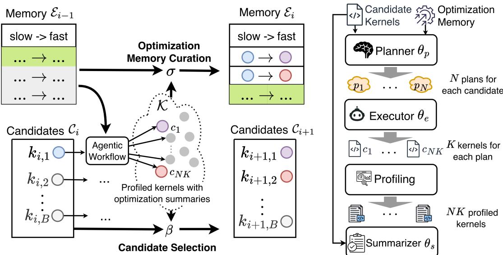  
Figure 1. At each iteration of AccelOpt, the agentic workflow shown on the right optimizes the candidate kernels with the latest optimization memory, and generates new candidate kernels, updating optimization memory with newly collected experiences. Section 2 explains the overall workflow and each component in detail.

This optimization task poses two significant challenges. First, similar to other AI accelerators, Trainium kernel optimization necessitates exploring a vast design space encompassing memory layouts, parallelization schemes, and scheduling strategies. However, since LLM queries incur substantial computational costs, this exploration must be conducted strategically to balance comprehensive search space coverage with cost efficiency. Second, we aim to enable the LLM-based system to autonomously accumulate optimization insights during such explorations, allowing the system to progressively improve its capabilities over time without requiring manual intervention.

To address these challenges, we propose AccelOpt, a selfimproving LLM agentic system, which utilizes beam search with optimization memory on top of an agentic workflow. AccelOpt uses beam search to explore the Trainium kernel optimization space through iterative generation of new kernels based on old ones, while retaining top-performing candidate kernels for consideration. When generating new kernels in each iteration, AccelOpt employs a threecomponent agentic workflow—planner, executor, and summarizer—that mimics how human experts approach the problem. Profiles of the generated kernels are obtained through a distributed profiling service and subsequently used to curate an optimization memory. This memory stores a selection of past exploration experiences, including key code changes that resulted in slow-to-fast kernel transformations, along with LLM-generated summaries of general optimization insights. The optimization memory then serves to inspire new optimization strategies in future iterations. To comprehensively evaluate AccelOpt, we construct NKIBench, a benchmark suite containing challenging kernels from real-world LLM workloads. A distinguishing feature of this benchmark is that we estimate the theoretical peak performance achievable by the hardware for each task. This enables us to assess the system’s position within the entire kernel optimization landscape, providing deeper insights beyond simply measuring relative speedup compared to the initial kernel.

The evaluation of AccelOpt shows promising results and interesting insights. We observe that AccelOpt is able to navigate the Trainium kernel optimization space by discovering both local optimizations and non-trivial global optimizations (Section 4.2). We also explore the cost-benefit trade-off in AccelOpt, where a large amount of kernels are sampled using LLMs, which can incur non-trivial cost, by evaluating the system under different optimization memory configurations and base LLMs (Section 4.5). Using opensource LLMs, AccelOpt improves the average percentage of peak throughput from 49% to 61% on Trainium 1, which is on par with Claude Sonnet 4 (thinking mode) but 26× cheaper, and from 45% to 59% on Trainium 2 at a similar cost across all tasks in NKIBench.

This work makes the following contributions:

• We propose AccelOpt, the first self-improving LLM agentic system for kernel optimization on emerging AI accelerators that combines search with memory accumulation. To the best of our knowledge, on emerging AI accelerators, AccelOpt is the first system that does not require expert-provided, hardware-specific optimization knowledge or predefined optimization recipes, among the open-source systems we are aware of.

• We construct NKIBench, the first benchmark suite for NKI kernel optimization on Amazon Trainium, with all kernels derived from real-world LLM workloads. NKIBench measures kernel performance against theoretical peak hardware performance on Trainium, rather than relying solely on relative speedup metrics, which can be ambiguous due to different baseline choices.

• We demonstrate that AccelOpt discovers substantial optimizations on real-world kernels in NKIBench. The 14 kernels in the current version of NKIBench establish a starting point for future NKI kernel optimization research. Furthermore, we show that AccelOpt can leverage open-source LLMs (gpt-oss-120b and Qwen3- Coder-480B-A35B-Instruct-FP8) to attain comparable performance improvements at significantly lower cost than those achieved using Claude Sonnet 4, one of the leading proprietary models for code generation.

• We verified that beam search is a more effective inference-time scaling technique than repeated sampling. Further, we find that including optimization memories with beam search affects cost efficiency in obtaining good-performing NKI kernels in various ways. However, it does not significantly improve the performance of the best kernels discovered if enough kernels are sampled, compared to beam search alone.

## 2 ACCELOPT

We will first introduce the overall architecture of AccelOpt in Section 2.1, before diving into the details on the design of beam search (Section 2.2) and optimization memory (Section 2.3) components.

## 2.1 Algorithm Overview

At a high level, AccelOpt comprises LLM agents that operate within a beam search framework while maintaining an optimization memory of past experiences. In each iteration, the system progressively expands the search frontier by generating new kernel implementations. Concurrently, it consolidates the knowledge acquired by the agents through profiling and summarization into the optimization memory, which then informs subsequent iterations.

The key insight of AccelOpt is to exploit the existing general understanding of performance optimizations baked into LLMs, and let the agents explore and learn from their own optimization experience for the new accelerator. Two mechanisms make this possible: beam search, which iteratively updates the frontier of candidate kernels and surfaces the best ones for the next round of exploration; optimization memory, which contains distilled optimization insights and key code changes from discovered slow-fast kernel pairs and transfers them to future iterations.

Algorithm 1 Candidate kernel frontier expansion and mem  
ory update in one iteration of AccelOpt.   
input $\mathcal { E } _ { i - 1 } \colon$ experience at iteration $i - 1 ; { \mathcal { C } } _ { i } \colon$ candidate   
kernels at iteration i, $| { \mathcal { C } } _ { i } | = B$   
Require: $\theta _ { p } \colon$ planner, $\theta _ { e } \mathrm { : }$ executor, $\theta _ { s } \mathrm { : }$ summarizer, r:   
profiler function, σ: optimization memory curation, β:   
candidate selection function   
1: $\kappa  \emptyset$   
2: for $c \in { \mathcal { C } } _ { i }$ do   
3: $\mathcal { P } = \{ p \mid p \sim \theta _ { p } ( p \mid c , \mathcal { E } _ { i - 1 } ) \}$ $\mathsf { \Delta } \mathsf { \mathsf { P } } | \mathcal { P } | = N$   
4: for $p \in \mathcal P$ do   
5: $\mathcal { A } _ { p } = \{ ( a , p , r ( a ) ) ~ | ~ a \sim \theta _ { e } ( e ~ | ~ p , c ) \}$   
6: $\mathcal { K } = \mathcal { K } \cup \mathcal { A } _ { p }$ $\mathsf { \Pi } _ { \mathsf { P } } | \mathcal { A } _ { p } | = K$   
7: end for   
8: end for   
9: $\mathcal { E } _ { i } = \sigma ( \mathcal { K } , \mathcal { E } _ { i - 1 } ; \theta _ { s } )$ ▷ See Algorithm 2   
10: $\mathcal { C } _ { i + 1 } = \beta ( \mathcal { K } \cup \mathcal { C } _ { i } , B )$   
output $\mathcal { K } , \mathcal { E } _ { i } , \mathcal { C } _ { i + 1 }$

The AccelOpt agentic workflow responsible for generating new kernels from existing implementations consists of three interacting agents, as illustrated in the right panel of Figure 1. The planner proposes optimization strategies based on the current kernel candidates and the optimization memory. The executor implements these optimization plans by modifying the code and subsequently verifying the correctness and profiling the performance of the generated kernels. The summarizer then extracts reusable insights from successful optimizations to guide subsequent iterations. Figure 2 presents the prompt template for each agent.

In a nutshell, Figure 3 shows a snapshot of an AccelOpt execution trace. In this example, the planner uses profiling results to identify memory operations as a performance bottleneck and proposes eliminating redundant computation accordingly. Guided by the plan, the executor performs kernel optimizations involving multi-level loop transformations and tensor layout changes. The summarizer then distills a generalizable optimization strategy, namely “reusing precomputed results”, and optimization segments of the slowfast pairs. Details of prompt design are in Appendix Section A.4. Next, we will describe two key machanisms to enable this procedure effectively.

## 2.2 Beam Search

Hong et al. (2025) has shown that beam search can effectively lead to performance improvements on LLM-generated kernels for some hardware accelerators. We also adopt this mechanism in this work, and we confirm that it is a more effective method compared to the simple parallel (repeated) sampling for open-source LLMs through our experiments. As shown in Algorithm 1 and Figure 1, at each iteration i, the planner agent generates N plans for each kernel in a set of B candidate kernels augmented with experiences from iteration i − 1. After that, the executor agent implements every plan with K attempts, generating $B \times N \times K$ kernels in total. By sampling multiple plans for the same candidate, the planner explores diverse optimization strategies, and multiple executor attempts increase the robustness of plan implementation against syntactic and semantic errors. From these generated kernels, high-quality optimizations are selected for the summarizer agent to generate experience items, which are used in the curation of the optimization memory. Finally, B kernels are selected to be explored in the next iteration from those $( B + B \times N \times K )$ kernels.

Central to the beam search algorithm, the candidate selection function $\beta$ is responsible for selecting the B candidates to continue exploring in the next iteration. We use the following heuristic to implement $\beta ,$ which ensures exploration of various optimization directions and also retains progress of previous explorations when new optimization ideas fail. $\beta$ first identifies the fastest correct kernel within each plan group $A _ { p }$ to construct a representative pool, ensuring that every explored direction contributes its best result. From this representative pool, it then selects the top-B kernels by measured latency. If fewer than B valid kernels exist, remaining slots are filled by the previous iteration’s candidates, allowing the system to dynamically allocate more sampling budget to difficult cases where no improvement was achieved.

## 2.3 Optimization Memory Curation

Although beam search can record exploration history through its evolving candidates, it cannot capture optimization experiences. Therefore, we design optimization memory curation, which collects optimization insights during exploration. This optimization memory expands the knowledge of the accelerator’s optimization space for both LLM agents and humans, and enhances exploration efficiency.

Algorithm 2 shows the optimization memory curation procedure $\sigma ,$ where the optimization memory is maintained as a queue of optimization items with a capacity cap (ExpN). Each new iteration can append up to TopK experience items to the tail, while the oldest entries in the memory will be discarded once ExpN is reached. Intuitively, increasing ExpN leads to higher inference costs due to more input tokens to the planner, yet the memory can retain more historical experiences that can potentially be beneficial. The TopK parameter controls how eager the memory system can be when updating the memory using the current iteration observations, and a higher TopK can also lead to higher inference costs due to more summarizer invocations. We provide a cost-benefit analysis of these parameters in Section 4.

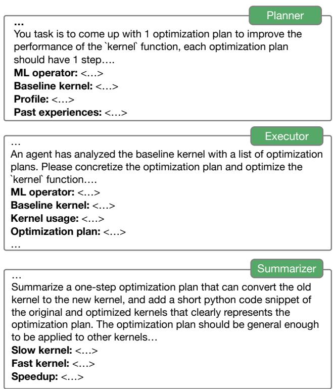  
Figure 2. Prompt template for each agentic in the agentic workflow.

Each experience item in the optimization memory consists of a slow-fast kernel pair and the corresponding generalizable optimization strategy curated by the summarizer agent. To prevent irrelevant code from distracting the planner, the summarizer extracts the optimized segment of each pair as pseudocode. Slow-fast pairs come from two sources: (1) the baseline kernel and a generated faster kernel (positive rewrites), and (2) a generated slower kernel and the baseline kernel (negative rewrites). Both positive and negative rewrites represent performance-improvement cases. One highlights successful optimization, and the other captures failed attempts. Therefore, we include both to provide balanced signals for the self-improving system. To ensure that only rewrites that have a non-trivial effect on performance are memorized, σ applies speedup thresholds $t _ { \mathrm { p o s } }$ and $t _ { \mathrm { n e g } }$ when updating the memory for positive and negative rewrites, respectively. To prevent similar memories with high speedups from occupying the whole memory space, σ groups kernels by their originating candidates and plans, selecting performance outliers within each subgroup.

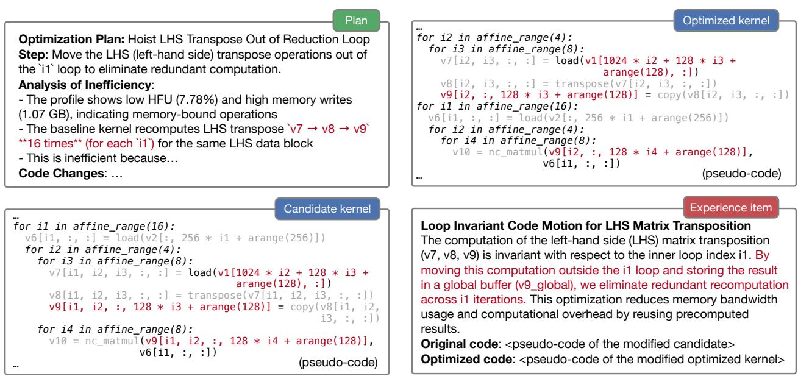  
Figure 3. A snapshot of AccelOpt’s execution trace. In the experience item, the pseudocode of the slow-fast pairs looks like the above candidate and optimized kernels where affine range is a NKI construct for parallel loops without carried dependency. The experience item will be stored in the optimization memory, and the optimized kernel will become a candidate for the next iteration.

Algorithm 2 Optimization memory curation procedure σ.   
input K, Ei−1   
Require: $\theta _ { s } ,$ TopK, ExpN, $t _ { p o s } , t _ { n e g }$   
1: $\mathcal { R } _ { p o s }  \emptyset , \mathcal { R } _ { n e g }  \emptyset$   
2: // Group by candidates and plans for each kernel   
3: ${ \boldsymbol { S } } = { \boldsymbol { K } } .$ .groupby(c, p)   
4: for $s _ { c , p } \in S$ do   
5: if ${ \mathit { s } } _ { c , p } .$ .max speedup $> t _ { p o s }$ then   
6: $\mathcal { R } _ { p o s } . \mathrm { a d d } ( ( \mathrm { c } , s _ { c , p } .$ .fastest kernel))   
7: else if ${ \mathit { s } } _ { c , p } .$ .max speedup $< 1 / t _ { n e g }$ then   
8: $\mathcal { R } _ { n e g } . \mathrm { a d d } ( ( s _ { c , p } .$ .slowest kernel, c))   
9: end if   
10: end for   
11: $\mathcal { E } _ { p o s } = \big [ \theta _ { s } ( r ) \big | r \in \mathcal { R } _ { p o s } . s o r t ( ) [ : \mathrm { T o p K } / / 2 ] \big ]$   
12: $\mathcal { E } _ { n e g } = \big [ \theta _ { s } ( r ) ~ | ~ r \in \mathcal { R } _ { n e g . } s o r t ( ) [ : \mathrm { T o p K } - | \bar { \mathcal { E } } _ { p o s } | ] \big ]$   
13: Ei+1 = -Epos, Eneg, Ei[: ExpN − |Epos| − |Eneg|]   
output Ei+1

## 3 BENCHMARKS AND EVALUATION INFRASTRUCTURE

At the time of constructing AccelOpt, no existing benchmark suite contained NKI kernels with sufficient baseline performance to serve as meaningful starting points for optimization. Moreover, existing accelerator kernel benchmarks typically lack information about how well a kernel is optimized relative to the hardware’s theoretical peak performance. To address these gaps, we construct NKIBench, which provides challenging kernel optimization tasks extracted from real-world LLM workloads for evaluating AccelOpt. Additionally, we describe the distributed kernel profiling service that enables efficient execution and evaluation of AccelOpt at scale.

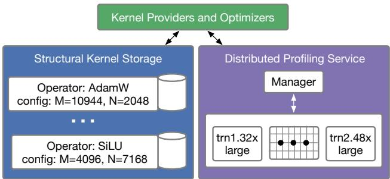  
Figure 4. NKIBench architecture. Kernels are grouped by the configuration of ML operators. The meshes represent cores of one Trainium chip; trn1.32xlarge and trn2.48xlarge are Amazon EC2 instances for Trainium 1 and 2, respectively.

## 3.1 NKIBench Task Construction

As shown in Figure 4, kernels stored in NKIBench are grouped by operator name and configuration in a structured storage format. Each kernel instance stores both the kernel code and profiling information. We collect 14 representative NKI kernels from popular LLM workloads with reasonable initial performance (Figure 5) as a starting point, with plans to further increase the diversity of initial kernels in future versions of NKIBench. One of the kernels comes from a non-transformer LLM, and the rest come from transformer LLMs (sources in Appendix Table 4). The benchmark includes both inference and training kernels, spanning a wide spectrum—from single operators (like Matmul and Batch-Matmul) to multi-operator chains (like Matmul+others and LoRA) and larger building blocks (like Group Query Attention and Mamba block). Due to the diversity in the complexity of the baseline kernels, their initial performance also differs a lot from each other, in terms of the achieved percentage of peak throughput.

## 3.2 Profiling Service

AccelOpt requires a profiling service with robust correctness checking and accurate performance measurement to provide reliable feedback signals to maintain an evolving high-quality set of kernels and accumulate useful optimization memory. Due to the vast amount of kernels that need to be sampled to explore the optimization space, it also requires sufficient parallelism in the evolution process.

For correctness checking, we check the kernels to be correct under inputs with several different random seeds, following the established practice in KernelBench (Ouyang et al., 2025a). We used the correctness criteria of ||output − $\mathrm { c p u } _ { \mathrm { r e f } } | | < t o l \times | | \mathrm { c p u } _ { \mathrm { r e f } } | |$ with a tight tol individually set for each task (Jiang et al., 2025).

For performance measurement, we measure only the execution time, excluding compilation latency. Each round includes warm-up iterations and averages results across multiple runs. To further mitigate fluctuation, we conduct several rounds and select either the round with the smallest performance fluctuation across multiple runs or the first round whose performance fluctuation is below a predefined threshold. Details are in Appendix Section A.2. Neuron Profile (AWS, 2025) is used to provide detailed profiling information (full list in Appendix Figure 19).

NKIBench supports AccelOpt by efficiently utilizing hardware parallelism (e.g., multiple cores per Trainium instance). AccelOpt exhibits task-level parallelism because each problem instance runs independently, and sample-level parallelism, where up to $B \times N \times K$ kernels (i.e., all the intermediate kernels generated in each iteration) can be profiled simultaneously for each problem. To execute these profiling tasks at scale, the distributed profiling service leverages the core-level and machine-level parallelism of Trainium hardware. Machines are connected via a shared network file system, with a centralized manager dispatching the requests and returning the profiling results. Empirically, cores are periodically rotated to mitigate performance fluctuations after long running.

## 3.3 Peak Performance Calculation

Prior work that uses LLMs to write accelerator kernels often measures relative speedup of LLM-generated kernels with respect to some baseline (Ouyang et al., 2025a), which is an effective metric to demonstrate progress. For NKIBench tasks, we also estimate the best achievable performance offered by the Trainium hardware, which offers additional insights on how effective AccelOpt has been in exploring the entire optimization landscape.

As shown in Figure 6, on Trainium chips, tensor, vector, and scalar engines run concurrently and communicate with HBM through kernel-managed on-chip memory. Therefore, using the roofline model analysis (Williams et al., 2009), we calculate the peak performance:

$$
T = \mathrm { m a x } \bigg ( \frac { \mathrm { T r a f f i c _ { M i n } } } { \mathrm { B a n d w i d t h } } , \frac { \mathrm { F L O P s _ { M M } } } { \mathrm { P e a k _ { M M } } } , \frac { \mathrm { F L O P s _ { V e c } } } { \mathrm { P e a k _ { V e c } } } \bigg )
$$

The percentage of peak throughput is calculated as $\textstyle { \frac { T } { t } }$ , where t is the measured latency. $\operatorname { T r a f f i c } _ { \operatorname { M i n } }$ is the minimal required traffic calculated as the summation of the size of all input tensors and output tensors measured in bytes. We count the matmul FLOPs in Numpy operators as $\mathrm { F L O P s _ { M M } }$ and all other FLOPs as $\mathrm { F L O P s } _ { \mathrm { V e c } } .$ . We use the summation of peak vector engine and peak scalar engine compute throughput as $\mathrm { P e a k } _ { \mathrm { V e c } }$ because non-matmul instructions can run on these two engines in parallel, and we assume the best case. Hardware specification details are in Appendix Table 3.

## 4 EVALUATION

We first report the overall performance achieved by AccelOpt (Section 4.1). Then, we investigate the optimizations proposed by AccelOpt (Section 4.2) followed by an analysis of its limitations (Section 4.3). After that, we conduct an ablation study of the effectiveness of beam search and optimization memory (Section 4.4). Finally, we identify key factors that affect the cost-benefit trade-off (Section 4.5).

## 4.1 Overall Performance

Setup For AccelOpt, we use Qwen3-Coder-480B as the executor model and gpt-oss-120b for the remaining agents with $t _ { p o s } = 1 . 0 4 , t _ { n e g } = 1 . 1 5 , \mathrm { T o p K } { = } 8 , \mathrm { E x p N } { = } 1 6 , \mathrm { B } { = } 6 ,$ $_ { \mathrm { N } = 1 2 }$ , and T=16. We also compare with a more direct kernel optimization agent using Claude Sonnet 4, which is evaluated using repeated sampling by querying the same prompt multiple times following the test-time scaling practice (Brown et al., 2024). The prompt for Claude Sonnet 4 is in Appendix Section A.5, similar to that for AccelOpt.

Performance Figure 5 shows the achieved percentage of peak throughput on Trainium 1, where AccelOpt performs comparably with Claude Sonnet 4 across most kernels. As shown in Figure 7, AccelOpt improves the average throughput from 49% to 61% of peak on Trainium 1 and from 45% to 59% on Trainium 2—matching Claude Sonnet 4 (thinking mode) while being 26× cheaper. Since Claude Sonnet 4’s internal reasoning tokens are unavailable, cost is defined as the sum of input and output tokens multiplied by the per-token price listed in the Appendix Table 5.

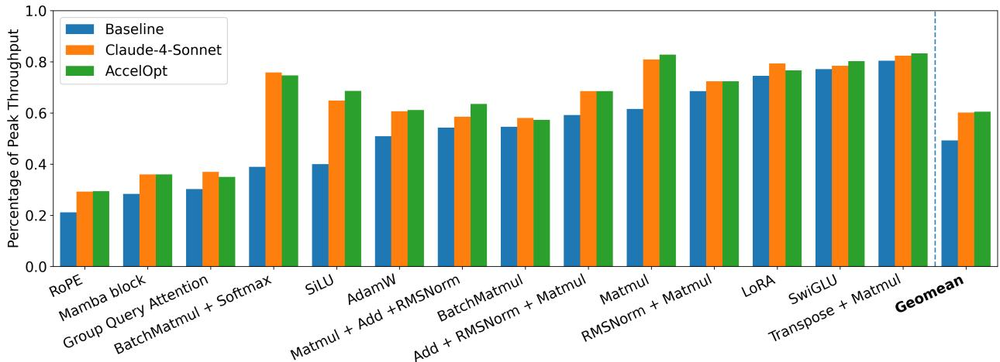  
Figure 5. Per-task kernel improvement achieved using Claude Sonnet 4 and AccelOpt on Trainium 1.

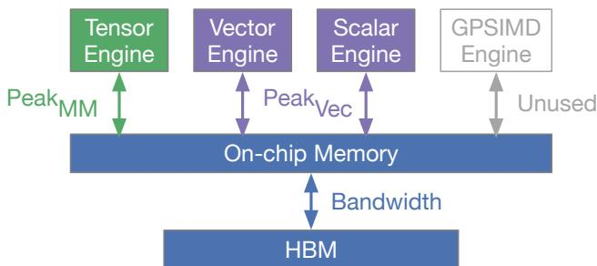  
Figure 6. One core of a Trainium chip with its device memory (HBM), shown in an abstracted form applicable to multiple chip generations. For additional architecture details, refer to the NKI documentation (AWS, 2025a).

## 4.2 Optimization Case Study

We exemplify a few cases of intriguing optimizations discovered using AccelOpt to illustrate its strengths.

Peephole Optimization AccelOpt can accomplish peephole optimizations like algebraic simplification and hardware-level intrinsic fusion. For example, AccelOpt simplifies the expression $\theta _ { t - 1 } - \gamma \lambda \theta _ { t - 1 } { \mathrm { t o } } \ ( 1 - \gamma \lambda ) \theta _ { t - 1 }$ enabling precomputation of $( 1 - \gamma \lambda )$ . Additionally, AccelOpt can recognize idiomatic instruction patterns such as reciprocal $\begin{array} { r l } { ( \mathrm { s q r t } \left( \dots \right) ) ~ ) } & { { } \Rightarrow \mathrm { r s q r t } \left( \dots \right) ~ ) } \end{array}$ which reduces intermediate tensors. For SiLU, AccelOpt can conduct transformation $x / ( 1 + e ^ { - x } ) \Rightarrow x \cdot { \mathrm { s i g m o i d } } ( x )$ to leverage NKI’s specialized instruction, resulting in more efficient execution.

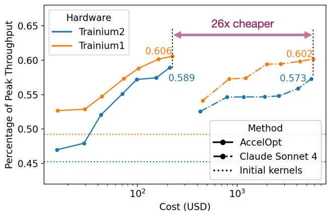  
Figure 7. Compare AccelOpt using open-source LLMs with repeated sampling of Claude Sonnet 4 on Trainium 1 and 2.

Loop Optimization Apart from peephole optimizations, AccelOpt can also discover non-local optimizations such as loop transformations. We pick two snapshots from one optimization trace of BatchMatmul + Softmax as shown in Figure 8. The baseline kernel (a) results in memory spilling because tiles v and $\mathrm { p }$ have to live across two loops. LLM agents identify this inefficiency and manage to remove the spilling by recomputing $\scriptstyle \mathtt { v } ^ { \prime }$ at kernel (b). Although this optimization reduces off-chip memory access, which improves the performance, it also introduces an extra matrix multiplication before the exp. On Trainium, matrix multiplication executes on tensor engine and exp executes on vector engine. Therefore, LLM agents decide to remove the recomputation and the extra m loop in kernel (c). In this way, the generated kernel achieves no spilling and higher vector engine utilization. This indicates that AccelOpt is capable of discovering global optimizations that require multiple steps of non-trivial reasoning that involve semantics of the kernel program, the underlying hardware architecture, and understanding of the profiler feedback.

Educational Impact In a graduate-level parallel computing course, we used AccelOpt to optimize a NKI kernel outside of NKIBench and achieved substantial speedup over the previous reference implementation. The resulting kernel and related optimization insights have been adopted to improve the course materials by illustrating principles of AI accelerator kernel optimization. This example underscores the generality of AccelOpt beyond NKIBench and highlights the educational impact of LLM-assisted kernel optimization.

## 4.3 Optimization Limitation Analysis

In Section 4.2, we investigate what AccelOpt can achieve. To understand the limitations of AccelOpt, we analyze the saturating behaviors where AccelOpt cannot further optimize the kernels with more iterations.

We observed two causes of saturating behaviors: (1) AccelOpt can still do effective exploration but cannot further improve the kernel performance because the kernel is close to peak, (2) AccelOpt cannot do effective exploration because the initial kernel is challenging to optimize. The first observation inspires a possible early-stopping criterion for agentic kernel optimization—further explorations can be omitted if kernel performance is reasonably close to peak. The second observation may indicate that there are certain optimizations that are hard for LLMs to come up with on their own without external information, and that the kernel programming DSL might not be expressive enough to effectively navigate all optimization design choices.

We use the trend and variation of performance metrics as a proxy for the effectiveness of optimization space exploration. Traffic efficiency measures how much of the data movement is necessary, defined as:

$$
\mathrm { T r a f f i c E H i c i e n c y } = \frac { \mathrm { T r a f f i c _ { M i n } } } { \mathrm { H B M } _ { \mathrm { R e a d } } + \mathrm { H B M } _ { \mathrm { W r i t e } } }
$$

Engine utilization (tensor, vector, or scalar) is directly obtained from profiling, which measures the ratio of engine active time to total kernel execution time, reflecting how busy the engine is. All metrics range from 0 to 1.

As shown in Figure 9, although the case exhibits a growing speedup window, the maximum speedup plateaus after iteration 7. This plateau does not indicate that the agent is merely repeating previous successful experiences—a pitfall when using self-generated in-context examples in optimization (Wan et al., 2025). Instead, the agent continues to explore diverse strategies that visibly affect performance: at iteration 10, the traffic efficiency shifts to a new distribution, and the maximum vector utilization continues to vary beyond iteration 7. Therefore, the exploration mechanism remains active; speedup saturates because the kernel discovered at iteration 7 has already reached about 82% of peak throughput, leaving little room for further improvement.

Unlike Figure 9, the speedup in Figure 10 saturates early. Although latency does not improve, the agents continue to propose meaningful rewrites rather than minor local tweaks. Their exploration is reflected in the large variations and shifting trends in vector utilization and traffic efficiency. In this problem, the non-reduction dimension N is large, leading to a wide memory-management search space. However, because the operator is dominated by matrix multiplication and the baseline already reaches about 83% of peak throughput, further gains are difficult.

As a different scenario, in the case of Figure 11, very few effective rewrites are discovered by AccelOpt. All the performance metrics barely change, and at iterations 7-9, no correct kernels are generated. This is because the problem is challenging to optimize: the problem size is small enough for all the data to fit on-chip, which causes the traffic efficiency to be nearly 100% in the baseline, and the reduction dimension K=64 is half of the hardware-native reduction dimension (128), so it is hard to fully utilize the tensor engine using current NKI APIs.

## 4.4 Ablation Study of AccelOpt Components

Beam Search vs. Repeated Sampling Only As shown in Figure 13, beam search outperforms repeated sampling of the agentic workflow, using the same LLMs. This is because each iteration builds upon previous best kernels, leading to progressively better optimizations. In Figure 12, the orange bars cluster near 1.0×, whereas the blue bars include more cases exceeding 1.0×, confirming that beam search yields cumulative performance gains.

Optimization Memory vs. Beam Search Only As shown in Figure 13, search-only experiments run the total T=16 iterations, while Search + Memory experiments achieve similar speedup in 13 iterations, saving 16-17% cost. Optimization memory increases the probability of generating fast kernels (higher cumulative Fast@p (Ouyang et al., 2025a)), yielding stronger candidate pools and, ultimately, higher best speedups using fewer iterations (see Figure 14). The candidate speedup is the geometric mean of the candidate kernels’ speedup over the initial kernel. We use cumulative

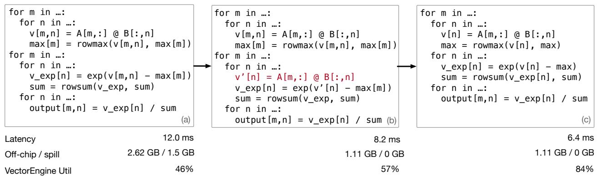  
Figure 8. Non-local optimization discovered by AccelOpt for the fused BatchMatmul+Softmax operator. All variables are tiles of tensors, and code has been simplified to highlight the changed dimensions of allocated tensors in the loop body.

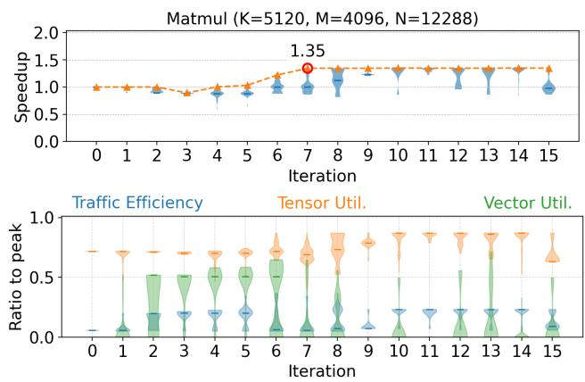  
Figure 9. Saturating speedup with effective exploration. Same as Figure 10 and Figure 11, the above panel is the speedup distribution of all generated kernels; the below is the distribution of additional performance metrics at each iteration.

Fast@p defined as:

$$
\mathrm { F a s t @ } p = \frac { 1 } { N } \sum _ { i = 1 } ^ { N } \mathbb { I } ( \mathrm { c o r r e c t } _ { i } \land \{ \mathrm { s p e e d u p } _ { i } > p \} )
$$

where N refers to all generated kernels until the current iteration. Based on the comparisons in Figure 13, we use B=6 and K=12 for other experiments.

## 4.5 Cost Analysis

This section conducts a cost analysis to identify key factors in optimization memory configuration and the best models that affect the cost-benefit trade-off. The benefit is meansured by the geometric mean across all problems of each problem’s maximum speedup achieved over all iterations.

Increasing memory capacity (ExpN) is more costefficient than increasing memory update eagerness (TopK). As shown in Figure 15, increasing TopK and ExpN both can help increase the best speedup. This demonstrates that more optimization memories and more frequent updates to the memory can both be beneficial. As the ExpN increases, σ can collect experiences from more iterations preceding the last iteration. As the TopK increases, σ can collect more experiences from the current iteration. Comparing ⃝1 and ⃝3 with ⃝2 and ⃝4 , under similar cost, the delta of speedup is much larger when increasing ExpN than when increasing the TopK. Therefore, we use TopK=8, ExpN=16 for experiments in Section 4.1.

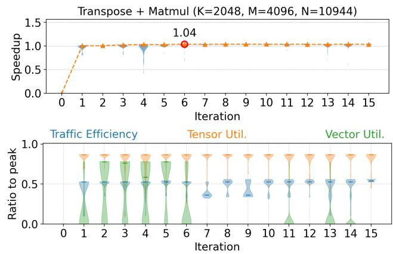  
Figure 10. Early saturating speedup with effective exploration.

We also observe that the effectiveness of increasing ExpN depends on the model. As shown in Table 1, Qwen3-Coder-30B gains 4.6% speedup improvement with extra \$12.33 cost. On the contrary, the extra \$13.81 cost only brings 0.6% speedup improvement in gpt-oss-120b.

Switching base models for agents can have different costbenefit trade-offs. As shown in Table 1, the executor model needs to be capable enough to understand and correctly implement the plan. Qwen3-Coder-30B and Qwen3-Coder-

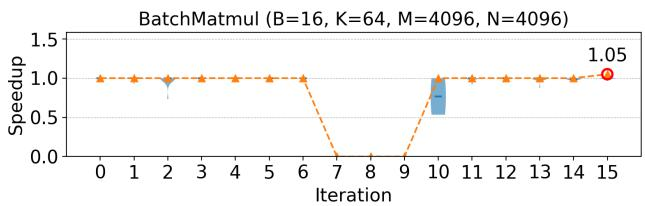

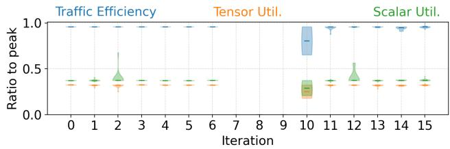  
Figure 11. Saturating speedup without effective exploration. Vector engine utilization is nearly zero, so we plot scalar engine utilization here.

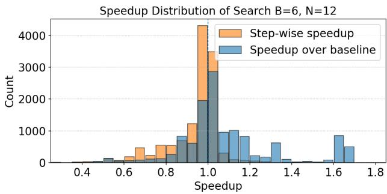  
Figure 12. The orange bars show the distribution of per-iteration speedup over the candidate kernels, while the blue bars show the speedup over the initial kernels. This plot collects the distribution of speedups from all tasks.

480B come from the same model family, and the larger one gets better performance. Qwen3-Coder-30B and gpt-oss-120b have the same cost per token, while gpt-oss-120b is a reasoning model. The extra reasoning tokens increase the price but also buy a higher speedup.

Using the best configuration discovered from Figure 15 and Table 1: gpt-oss-120b as executor with Topk=8, ExpN=16, we switch the planners in Table 2. Different from switching executors, we did not observe substantial differences in speedup when switching planners. This implies that further performance improvements could first focus on enhancing the executor’s capability.

## 5 RELATED WORK

AccelOpt and NKIBench advance the line of research on LLM-based agents for AI accelerator kernel optimization and corresponding benchmarks for their evaluation.

Memory for LLM Agents. Memorizing past experiences has been shown to be critical for developing self-evolving agent systems (Zhang et al., 2025c; Sun et al., 2025; Ouyang et al., 2025b). We demonstrate that adding a memory component to a search-based agentic system improves the cost efficiency of kernel optimization agents, but it does not improve the best speedup by much.

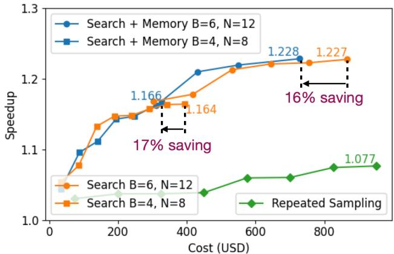  
Figure 13. Geometric mean of best speedup achieved up to a certain iteration across all tasks obtained through repeated sampling, beam search, and beam search + optimization memory. As defined in Algorithm 1, B is the number of candidates and N is the number of plans for each candidate. We consider the inference cost to properly compare with repeated sampling, which does not have a notion of iterations.

Table 1. Best speedup and cost comparison across different ExpN and executor model settings, fixing gpt-oss-120b as planner and summarizer.
<table><tr><td colspan="2">ExpN</td><td rowspan="2">8</td><td rowspan="2">16</td><td rowspan="2">Delta</td></tr><tr><td>Executor</td><td></td></tr><tr><td rowspan="2">Qwen3-Coder-30B</td><td></td><td>1.144</td><td>1.197</td><td>+4.6%</td></tr><tr><td>$96.10</td><td></td><td>$108.43</td><td>+$12.33</td></tr><tr><td rowspan="2">gpt-oss-120b</td><td></td><td>1.228</td><td>1.235</td><td>+0.6%</td></tr><tr><td>$125.19</td><td></td><td>$139.00</td><td>+$13.81</td></tr><tr><td rowspan="2">Qwen3-Coder-480B</td><td>1.209</td><td></td><td>1.230</td><td>+1.7%</td></tr><tr><td>$205.35</td><td></td><td>$223.23</td><td>+$17.88</td></tr></table>

LLM Agents for AI Accelerator Kernel Optimization. The agentic system proposed by Zhang et al. (2025b) translates ML operators to AI accelerator kernels but cannot optimize them. Autocomp (Hong et al., 2025) optimizes unfused kernels, and its planners rely on manually crafted, problemspecific lists of optimizations. AlphaEvolve (Novikov et al., 2025) optimizes matrix multiplication and FlashAttention kernels on TPUs, but the system implementation is not publicly available. GEPA (Agrawal et al., 2025) improves LLM-generated AMD NPU kernels by evolving prompts through automatic discovery and injection of architectural best practices on NPUs. This method can potentially be used to produce better prompts for the executor agent in AccelOpt. However, the optimization memories discovered by AccelOpt can potentially provide more detailed taskspecific insights (c.f. Figure 25 in Agrawal et al. (2025) vs. Figures 24 to 26 in Appendix).

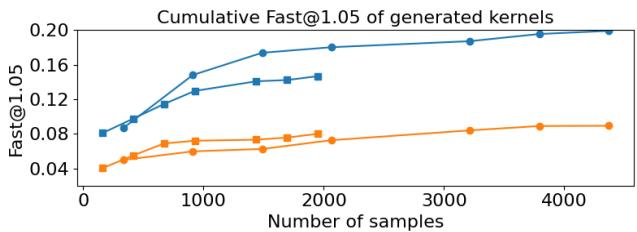

Average candidates' speedup over baseline at each iteration  
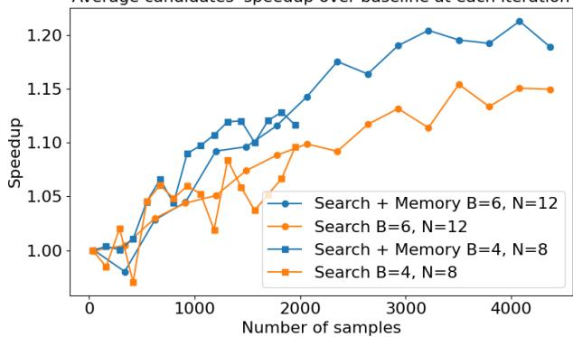  
Figure 14. Optimization memory improves cost-efficiency, leading to a higher percentage of good performing kernels (top) by improving the kernel quality per-iteration (below). To compare systems with different search hyperparameters, we consider the number of kernels sampled rather than the number of iterations. Note that the average current iteration candidates’ speedup over baseline can drop below 1.0× because $\beta$ selects from all correct kernels, not only those with speedups.

Table 2. Switching planners’ base models.
<table><tr><td>Planner</td><td>Speedup</td><td>Cost</td></tr><tr><td>gpt-oss-20b</td><td>1.234</td><td>$116.87</td></tr><tr><td>gpt-0ss-120b</td><td>1.235</td><td>$139.00</td></tr><tr><td>Qwen3-235B-Thinking</td><td>1.234</td><td>$316.21</td></tr></table>

Benchmarks for Kernel Optimization. Various benchmarks have been proposed for kernel optimization on GPUs and AI accelerators (Ouyang et al., 2025a; Wen et al., 2025; Tian et al., 2025). Recent work also improve interface usability (Saroufim et al., 2025; FlashInfer, 2025) and evaluation robustness (Lange et al., 2025; Zhang et al., 2025a). These benchmarks usually measure relative kernel speedup compared to certain performance baselines. Yet NKIBench also measures kernel performance using the ratio to peak throughput, offering an “absolute metric” to understand kernel performance on a given hardware platform.

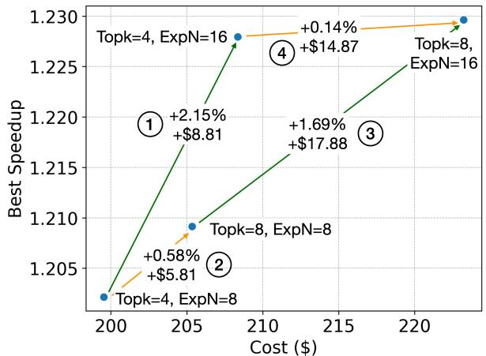  
Figure 15. Cost-benefit trade-off across different TopK and ExpN.

## 6 CONCLUSION

This paper presents AccelOpt, the first self-improving LLM agentic system for kernel optimization on emerging AI accelerators such as AWS Trainium that combines search with memory accumulation. We demonstrate that combining inference-time scaling with optimization memory enables LLM agents to autonomously optimize real-world Trainium kernels in NKIBench, our curated benchmark suite, without requiring expert optimization knowledge. Through systematic ablation studies, we confirm the effectiveness of beam search and optimization memory in obtaining highperforming kernels with improved cost efficiency. We also find that open-source models achieve higher cost efficiency than leading proprietary coding models for this task. Overall, AccelOpt and NKIBench provide a promising foundation for automated kernel optimization on emerging AI accelerators.

## ACKNOWLEDGMENT

We are grateful to the Amazon Neuron Science team, Jiin Woo, Simon Guo, Anne Ouyang, Yuhui Zhang, Tian Zhao, Ching-An Cheng, and many others for the helpful discussions and feedback throughout this project.

## REFERENCES

Abts, D., Kim, J., Kimmell, G., Boyd, M., Kang, K., Parmar, S., Ling, A., Bitar, A., Ahmed, I., and Ross, J. The groq software-defined scale-out tensor streaming multiprocessor: From chips-to-systems architectural overview. In 2022 IEEE Hot Chips 34 Symposium (HCS), pp. 1–69. IEEE Computer Society, 2022.

Agrawal, L. A., Tan, S., Soylu, D., Ziems, N., Khare, R., Opsahl-Ong, K., Singhvi, A., Shandilya, H., Ryan, M. J., Jiang, M., et al. Gepa: Reflective prompt evolution can outperform reinforcement learning. arXiv preprint arXiv:2507.19457, 2025.

Almazrouei, E., Alobeidli, H., Alshamsi, A., Cappelli, A., Cojocaru, R., Debbah, M., Goffinet, E., Hesslow, D., Lau- ´ nay, J., Malartic, Q., et al. The falcon series of open language models. arXiv preprint arXiv:2311.16867, 2023.

AWS. AWS Trainium: AI Training Accelerator. https://aws.amazon.com/ai/machinelearning/trainium/, 2025. Accessed: 2025-10- 25.

AWS. Neuron profile, 2025. URL https:// awsdocs-neuron.readthedocs-hosted.com/ en/latest/tools/neuron-sys-tools/ neuron-profile-user-guide.html.

AWS. Neuron kernel interface (nki) (beta) 2.20, 2025. URL https://awsdocsneuron.readthedocs-hosted.com/en/ latest/nki/nki rn.html#neuron-kernelinterface-nki-beta-2-20.

AWS. Trainium architecture. https://awsdocsneuron.readthedocs-hosted.com/en/ latest/about-neuron/arch/neuronhardware/trainium.html, 2025a. Accessed: 2025-10-25.

AWS. Neuroncore-v3 architecture. https: //awsdocs-neuron.readthedocshosted.com/en/latest/about-neuron/ arch/neuron-hardware/neuron-corev3.html#neuroncores-v3-arch, 2025b. Accessed: 2025-10-25.

Azure, M. Maia, 2024. URL https:// azure.microsoft.com/en-us/blog/azuremaia-for-the-era-of-ai-from-siliconto-software-to-systems/.

Baronio, C., Marsella, P., Pan, B., Guo, S., and Alberti, S. Kevin: Multi-turn rl for generating cuda kernels. arXiv preprint arXiv:2507.11948, 2025.

Brown, B., Juravsky, J., Ehrlich, R., Clark, R., Le, Q. V., Re, C., and Mirhoseini, A. Large language monkeys: ´ Scaling inference compute with repeated sampling. arXiv preprint arXiv:2407.21787, 2024.

Dai, D., Deng, C., Zhao, C., Xu, R., Gao, H., Chen, D., Li, J., Zeng, W., Yu, X., Wu, Y., et al. Deepseekmoe: Towards ultimate expert specialization in mixture-of-experts language models. arXiv preprint arXiv:2401.06066, 2024.

Dao, T. Flashattention-2: Faster attention with better parallelism and work partitioning. arXiv preprint arXiv:2307.08691, 2023.

Fang, S., Chen, H., Zhang, N., Li, J., Meng, H., Liu, A., and Zhang, Z. Dato: A task-based programming model for dataflow accelerators. arXiv preprint arXiv:2509.06794, 2025.

FlashInfer. Flashinfer-bench: Building the virtuous cycle for ai-driven llm systems. https://flashinfer.ai/ 2025/10/21/flashinfer-bench.html, October 2025. Accessed: 2025-10-25.

Gu, A. and Dao, T. Mamba: Linear-time sequence modeling with selective state spaces. In First Conference on Language Modeling, 2024.

Hong, C., Bhatia, S., Cheung, A., and Shao, Y. S. Autocomp: Llm-driven code optimization for tensor accelerators. arXiv preprint arXiv:2505.18574, 2025.

Hsu, O., Rucker, A., Zhao, T., Desai, V., Olukotun, K., and Kjolstad, F. Stardust: Compiling sparse tensor algebra to a reconfigurable dataflow architecture. In Proceedings of the 23rd ACM/IEEE International Symposium on Code Generation and Optimization, pp. 628–643, 2025.

Jia, Z., Padon, O., Thomas, J., Warszawski, T., Zaharia, M., and Aiken, A. Taso: optimizing deep learning computation with automatic generation of graph substitutions. In Proceedings of the 27th ACM Symposium on Operating Systems Principles, pp. 47–62, 2019.

Jiang, H., Zhu, S., Zhang, Z., Song, Z., Fu, X., Jia, Z., Wang, Y., and Li, J. Ttrace: Lightweight error checking and diagnosis for distributed training. arXiv preprint arXiv:2506.09280, 2025.

Jouppi, N., Kurian, G., Li, S., Ma, P., Nagarajan, R., Nai, L., Patil, N., Subramanian, S., Swing, A., Towles, B., et al. Tpu v4: An optically reconfigurable supercomputer for machine learning with hardware support for embeddings. In Proceedings of the 50th annual international symposium on computer architecture, pp. 1–14, 2023.

Kim, S., Hooper, C., Wattanawong, T., Kang, M., Yan, R., Genc, H., Dinh, G., Huang, Q., Keutzer, K., Mahoney,

M. W., et al. Full stack optimization of transformer inference: a survey. arXiv preprint arXiv:2302.14017, 2023.

Kwon, W., Li, Z., Zhuang, S., Sheng, Y., Zheng, L., Yu, C. H., Gonzalez, J. E., Zhang, H., and Stoica, I. Efficient memory management for large language model serving with pagedattention. In Proceedings of the ACM SIGOPS 29th Symposium on Operating Systems Principles, 2023.

Lange, R. T., Sun, Q., Prasad, A., Faldor, M., Tang, Y., and Ha, D. Towards robust agentic cuda kernel benchmarking, verification, and optimization. arXiv preprint arXiv:2509.14279, 2025.

Li, X., Sun, X., Wang, A., Li, J., and Shum, C. Cuda-l1: Improving cuda optimization via contrastive reinforcement learning. arXiv preprint arXiv:2507.14111, 2025.

Lie, S. Cerebras architecture deep dive: First look inside the hw/sw co-design for deep learning: Cerebras systems. In 2022 IEEE Hot Chips 34 Symposium (HCS), pp. 1–34. IEEE Computer Society, 2022.

Liu, A., Feng, B., Xue, B., Wang, B., Wu, B., Lu, C., Zhao, C., Deng, C., Zhang, C., Ruan, C., et al. Deepseek-v3 technical report. arXiv preprint arXiv:2412.19437, 2024.

Meta. Mtia, 2024. URL https://ai.meta.com/ blog/next-generation-meta-traininginference-accelerator-AI-MTIA/.

Novikov, A., Vu, N., Eisenberger, M., Dupont, E., Huang, ˜ P.-S., Wagner, A. Z., Shirobokov, S., Kozlovskii, B., Ruiz, F. J., Mehrabian, A., et al. Alphaevolve: A coding agent for scientific and algorithmic discovery. arXiv preprint arXiv:2506.13131, 2025.

OpenAI. Openai-designed ai accelerators, 2025. URL https://openai.com/index/openaiand-broadcom-announce-strategiccollaboration/.

Ouyang, A., Guo, S., Arora, S., Zhang, A. L., Hu, W., Re,´ C., and Mirhoseini, A. Kernelbench: Can llms write efficient gpu kernels? arXiv preprint arXiv:2502.10517, 2025a.

Ouyang, S., Yan, J., Hsu, I., Chen, Y., Jiang, K., Wang, Z., Han, R., Le, L. T., Daruki, S., Tang, X., et al. Reasoningbank: Scaling agent self-evolving with reasoning memory. arXiv preprint arXiv:2509.25140, 2025b.

Prabhakar, R., Sivaramakrishnan, R., Gandhi, D., Du, Y., Wang, M., Song, X., Zhang, K., Gao, T., Wang, A., Li, X., et al. Sambanova sn40l: Scaling the ai memory wall with dataflow and composition of experts. In 2024 57th IEEE/ACM International Symposium on Microarchitecture (MICRO), pp. 1353–1366. IEEE, 2024.

Pydantic. Logfire. https://pydantic.dev/ logfire, 2025. Accessed: 2025-10-25.

Qualcomm. Ai200 and ai250, 2025. URL https: //www.qualcomm.com/news/releases/2025/ 10/qualcomm-unveils-ai200-and-ai250- redefining-rack-scale-data-cent.

Qwen Team. Qwen3 technical report, 2025. URL https: //arxiv.org/abs/2505.09388.

Saroufim, M., Wang, J., Maher, B., Paliskara, S., Wang, L., Sefati, S., and Candales, M. Backendbench: An evaluation suite for testing how well llms and humans can write pytorch backends, 2025. URL https:// github.com/meta-pytorch/BackendBench.

Shah, J., Bikshandi, G., Zhang, Y., Thakkar, V., Ramani, P., and Dao, T. Flashattention-3: Fast and accurate attention with asynchrony and low-precision. Advances in Neural Information Processing Systems, 37:68658–68685, 2024.

Spector, B. F., Arora, S., Singhal, A., Fu, D. Y., and Re,´ C. Thunderkittens: Simple, fast, and adorable ai kernels. arXiv preprint arXiv:2410.20399, 2024.

Sun, Z., Liu, Z., Zang, Y., Cao, Y., Dong, X., Wu, T., Lin, D., and Wang, J. Seagent: Self-evolving computer use agent with autonomous learning from experience. arXiv preprint arXiv:2508.04700, 2025.

Thakkar, V., Ramani, P., Cecka, C., Shivam, A., Lu, H., Yan, E., Kosaian, J., Hoemmen, M., Wu, H., Kerr, A., Nicely, M., Merrill, D., Blasig, D., Qiao, F., Majcher, P., Springer, P., Hohnerbach, M., Wang, J., and Gupta, M. CUTLASS, January 2023. URL https: //github.com/NVIDIA/cutlass.

Tian, H., Mishra, A., Chen, Z., Hong Enriquez, R. P., Milojicic, D., Frachtenberg, E., and Huang, S. Heterobench: Multi-kernel benchmarks for heterogeneous systems. In Proceedings of the 16th ACM/SPEC International Conference on Performance Engineering, pp. 320–333, 2025.

Wan, X., Zhou, H., Sun, R., Nakhost, H., Jiang, K., and Arık, S. O. From few to many: Self-improving many-shot ¨ reasoners through iterative optimization and generation. arXiv preprint arXiv:2502.00330, 2025.

Wei, A., Nie, A., Teixeira, T. S. F. X., Yadav, R., Lee, W., Wang, K., and Aiken, A. Improving parallel program performance with LLM optimizers via agentsystem interfaces. In Forty-second International Conference on Machine Learning, 2025. URL https: //openreview.net/forum?id=3h80HyStMH.

Wen, Z., Zhang, Y., Li, Z., Liu, Z., Xie, L., and Zhang, T. Multikernelbench: A multi-platform benchmark for kernel generation. arXiv e-prints, pp. arXiv–2507, 2025.

Williams, S., Waterman, A., and Patterson, D. Roofline: an insightful visual performance model for multicore architectures. Communications of the ACM, 52(4):65–76, 2009.

Woo, J., Zhu, S., Nie, A., Jia, Z., Wang, Y., and Park, Y. Tritonrl: Training llms to think and code triton without cheating. arXiv preprint arXiv:2510.17891, 2025.

Wu, M., Cheng, X., Liu, S., Shi, C., Ji, J., Ao, M. K., Velliengiri, P., Miao, X., Padon, O., and Jia, Z. Mirage: A {Multi-Level} superoptimizer for tensor programs. In 19th USENIX Symposium on Operating Systems Design and Implementation (OSDI 25), pp. 21–38, 2025.

Ye, Z., Chen, L., Lai, R., Lin, W., Zhang, Y., Wang, S., Chen, T., Kasikci, B., Grover, V., Krishnamurthy, A., et al. Flashinfer: Efficient and customizable attention engine for llm inference serving. arXiv preprint arXiv:2501.01005, 2025.

Zhang, A. L., Sirovatka, M., Schultheis, E., Horowitz, B., and Saroufim, M. Kernelbot: A competition platform for writing heterogeneous gpu code. In Championing Open-source DEvelopment in ML Workshop@ ICML25, 2025a.

Zhang, G., Liang, W., Hsu, O., and Olukotun, K. Adaptive self-improvement llm agentic system for ml library development. arXiv preprint arXiv:2502.02534, 2025b.

Zhang, Z., Dai, Q., Bo, X., Ma, C., Li, R., Chen, X., Zhu, J., Dong, Z., and Wen, J.-R. A survey on the memory mechanism of large language model-based agents. ACM Transactions on Information Systems, 43(6):1–47, 2025c.

Zhao, C., Deng, C., Ruan, C., Dai, D., Gao, H., Li, J., Zhang, L., Huang, P., Zhou, S., Ma, S., et al. Insights into deepseek-v3: Scaling challenges and reflections on hardware for ai architectures. In Proceedings of the 52nd Annual International Symposium on Computer Architecture, pp. 1731–1745, 2025.

Zheng, L., Jia, C., Sun, M., Wu, Z., Yu, C. H., Haj-Ali, A., Wang, Y., Yang, J., Zhuo, D., Sen, K., et al. Ansor: Generating {High-Performance} tensor programs for deep learning. In 14th USENIX symposium on operating systems design and implementation (OSDI 20), pp. 863–879, 2020.

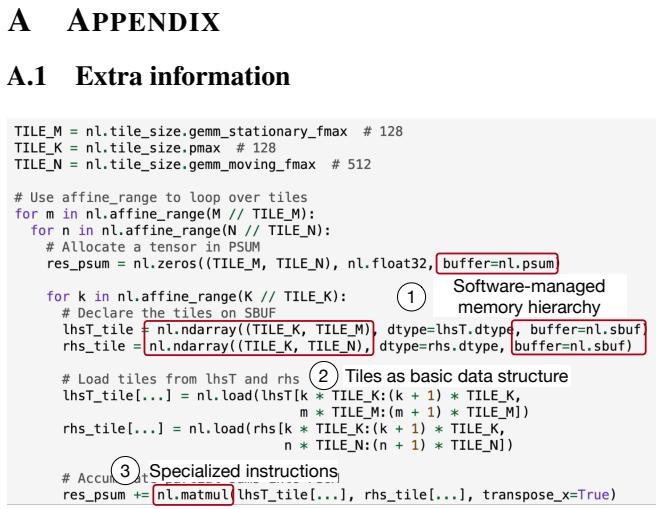  
Figure 16. An example NKI program snippet adopted from an official NKI example.

We use the single-core peak achievable hardware statistics from the Neuron Architecture documentation (AWS, 2025a;b) in Table 3. Notably, Trainium 2 offers greater computational capacity than Trainium 1, as each chip contains more cores and HBM stacks. In this work, we focus on optimizing NKI kernels for a single core, leaving multi-core kernel optimization to future work.

Table 3. Peak achievable hardware statistics
<table><tr><td>Metric (single core)</td><td>Trainium 1</td><td>Trainium 2</td></tr><tr><td>Peakbw (GB / s)</td><td>440.2</td><td>640.0</td></tr><tr><td>FP32 PeakMM (TFLOPS)</td><td>23.75</td><td>19.75</td></tr><tr><td>FP32 Peakvec (GFLOPS)</td><td>286.8</td><td>550.0</td></tr></table>

## A.2 Kernel Performance Measurement

We measure each kernel for up to 10 rounds, each with 2 warmup iterations and 10 timed runs. Performance fluctuation is measured by the relative different between the longest and shortest latency among 10 runs of one round. The performance fluctuation threshold is 1% for Trainium 1 and 4% for Trainium 2. Although running on CPU with full precision is slower than running the reference implementation on other accelertors like GPU especially for the data intensive applications NKIBench targets, it has higher fidelity because there is no IEEE standard for special functions like exponential and CPU implementation is widey accepted as the ground truth.

## A.3 Experiment details

We configure gpt-oss-20b and gpt-oss-120b with medium reasoning efforts, and we enable the thinking mode of Claude Sonnet 4 with max sequence length 20k and max output length 10k with temperature 1.0. We use the default sampling setting in vllm (Kwon et al., 2023) for all opensource models. We use logfire (Pydantic, 2025) to record the LLM query information.

We use T=16 for all experiments in Section 4. Before Section 4.5, Qwen3-Coder-480B acts as executor and gptoss-120b for other agents and on Trainium 1 if not noted. Section 4.1 and Section 4.3 use B=6, N=12, K=2, T=16, Topk=8, and ExpN=16 on Trainium 1 and 2. The optimizations in Section 4.2 appear in several experiments, and we select one from them. Peephole optimization appears in B=6, N=12, K=2, Topk=8, and ExpN=8 on Trainium 2. Loop optimization is from B=6, N=12, K=4.

Using Claude Sonnet 4 as agent backbones in AccelOpt can reduce expenses compared with repeated sampling, but is still more expensive than only using open-source models. Table 6 indicates that using gpt-oss-120b for both the planner and executor achieves the best performance and cost. Although extensive hyperparameter tuning was limited due to cost constraints, AccelOpt already reduces expenses compared with repeated sampling speedup 1.222 (\$5806.83).

Table 6. Apply Claude Sonnet 4 to AccelOpt.
<table><tr><td>Planner</td><td>Executor</td><td>Speedup (Cost)</td></tr><tr><td>Claude Sonnet 4</td><td>Claude Sonnet 4</td><td>1.226 ($1732.73)</td></tr><tr><td>gpt-oss-120b</td><td>Claude Sonnet 4</td><td>1.213 ($1269.98)</td></tr><tr><td>Claude Sonnet 4</td><td>gpt-oss-120b</td><td>1.208 ($1223.05)</td></tr><tr><td>gpt-oss-120b</td><td>gpt-oss-120b</td><td>1.235 ($139.00)</td></tr></table>

We found that LLMs, especially gpt-oss, can exploit the correctness checker for certain kernel workloads. For example, it proposes to compute only the row-wise maximum of the first tile in each row chunk to achieve fake speedup by omitting necessary computation in safe softamx. This finding calls for more rigorous equivalence checking than the common practice of testing with random inputs.

## A.4 Prompts

The system prompt Planner’s system prompt is composed of NKI base knowledge (Figure 18), profiling terminology (Figure 19), and a user template (Figure 20). Executor’s system prompt is composed of the same NKI base knowledge as planner, and a concentrated NKI programming guide (Figure 21 and Figure 22). This guide is adopted from the public NKI programming document and tuned for the agents based on their common errors. Empirically, we find that the planners’ output has a stable pattern. Therefore, we directly put planners’ output into executors’ prompt without extra formatting. We randomly change the order of profiling items across samples for higher randomness of planner.

Table 4. Description of each type of tasks that come from (Liu et al., 2024; Dai et al., 2024; Qwen Team, 2025; Almazrouei et al., 2023; Gu & Dao, 2024). “MM” for tensor engine, “Vec” for vector engine+scalar engine, and “Mem” for memory bandwidth.
<table><tr><td>Name</td><td>Workload</td><td>Config</td><td>Latency (ms)</td><td>Bound key</td></tr><tr><td>AdamW</td><td>DeepSeek-MoE-16B</td><td>M=10944,N=2048</td><td>1.999781</td><td>Mem</td></tr><tr><td>Add + RMSNorm + Matmul</td><td>Qwen3 0.6B</td><td> $\mathrm { K } { = } 1 0 2 4 , \mathrm { M } { = } 4 0 9 6 , \mathrm { N } { = } 2 0 4 8$ </td><td>1.221669</td><td>MM</td></tr><tr><td>BatchMatmul</td><td>Falcon-40B</td><td> $\mathrm { B } { = } 1 6 , \mathrm { K } { = } 6 4 , \mathrm { M } { = } 4 0 9 6 , \mathrm { N } { = } 4 0 9 6$ </td><td>4.610465</td><td>MM</td></tr><tr><td>BatchMatmul + Softmax</td><td>Falcon-40B</td><td> $\mathrm { K } { = } 6 4 , \mathrm { M } { = } 4 0 9 6 , \mathrm { N } { = } 4 0 9 6$ </td><td>12.017064</td><td>Vec</td></tr><tr><td>Group Query Attention</td><td>Qwen3 0.6B/1.7B</td><td> $\mathrm { B } { = } 1 , \mathrm { D } { = } 1 2 8 , \mathrm { K H } { = } 8 , \mathrm { N } { = } 4 0 9 6 , \mathrm { Q H } { = } 1 6$ </td><td>19.116845</td><td>MM</td></tr><tr><td>LoRA</td><td>DeepSeek-V2.5</td><td> $\mathrm { K } { = } 5 1 2 0 , \mathrm { M } { = } 4 0 9 6 , \mathrm { N } { = } 1 2 2 8 8 , \mathrm { R } { = } 1 2 8$ </td><td>30.171885</td><td>MM</td></tr><tr><td>Mamba block</td><td>Synthesized</td><td> $\mathrm { C } { = } 2 5 6 , \mathrm { M } { = } 7 1 6 8 , \mathrm { S } { = } 1 6$ </td><td>2.888772</td><td>Vec</td></tr><tr><td>Matmul + Add + RMSNorm</td><td>Qwen3 1.7B</td><td> $\mathrm { K } { = } 2 0 4 8 , \mathrm { M } { = } 4 0 9 6 , \mathrm { N } { = } 2 0 4 8$ </td><td>2.666759</td><td>MM</td></tr><tr><td>Matmul</td><td>DeepSeek-V2.5</td><td> $\mathrm { K } { = } 5 1 2 0 , \mathrm { M } { = } 4 0 9 6 , \mathrm { N } { = } 1 2 2 8 8$ </td><td>35.270497</td><td>MM</td></tr><tr><td>RMSNorm+Matmul</td><td>Qwen3 0.6B</td><td> $\mathrm { K } { = } 1 0 2 4 , \mathrm { M } { = } 4 0 9 6 , \mathrm { N } { = } 2 0 4 8$ </td><td>1.055673</td><td>MM</td></tr><tr><td>RoPE</td><td>Qwen3 32B</td><td> $\mathrm { B } { = } 1 , \mathrm { D } { = } 1 2 8 , \mathrm { H } { = } 6 4 , \mathrm { N } { = } 4 0 9 6$ </td><td>4.332847</td><td>Mem</td></tr><tr><td>SiLU</td><td>DeepSeek-V3 671B</td><td> $\mathrm { M } { = } 4 0 9 6 , \mathrm { N } { = } 7 1 6 8$ </td><td>1.332936</td><td>Mem</td></tr><tr><td>SwiGLU</td><td>Qwen3 0.6B</td><td> $\mathrm { K } { = } 1 0 2 4 , \mathrm { M } { = } 4 0 9 6 , \mathrm { N } { = } 3 0 7 2$ </td><td>4.221982</td><td>MM</td></tr><tr><td>Transpose+ Matmul</td><td>DeepSeek-MoE-16B</td><td> $\mathrm { K } { = } 2 0 4 8 , \mathrm { M } { = } 4 0 9 6 , \mathrm { N } { = } 1 0 9 4 4$ </td><td>9.612081</td><td>MM</td></tr></table>

Table 5. Token cost. For open-source models, we use Fireworks API price https://fireworks.ai/. For Claude Sonnet 4, we use Anthropic API price https://docs.claude.com/en/docs/about-claude/pricing. All prices were accessed on 2025-10- 18.
<table><tr><td>Model</td><td>Input cost ($ /1M tokens)</td><td>Output cost ($ /1M tokens)</td></tr><tr><td>Claude Sonnet 4</td><td>3</td><td>15</td></tr><tr><td>gpt-oss-20b</td><td>0.07</td><td>0.3</td></tr><tr><td>gpt-oss-120b</td><td>0.15</td><td>0.6</td></tr><tr><td>Qwen3-Coder-30B</td><td>0.15</td><td>0.6</td></tr><tr><td>Qwen3-235B-A22B-Thinking-2507</td><td>0.22</td><td>0.88</td></tr><tr><td> $\mathrm { Q w e n 3 – C o d e r  – 4 8 0 B }$ </td><td>0.45</td><td>1.8</td></tr></table>

if \_name\_ == " \_main\_ \_":   
inputs = get\_inputs()   
ref\_output = forward(\*inputs)   
kernel\_output = transform\_nki\_outputs(kernel(\*transform\_to\_nki\_inputs(inputs)), ref\_output)   
assert np.allclose(kernel\_output, ref\_output, atol=1e-4, rtol=1e-2)  
Figure 17. Kernel usage in executor’s user prompt template

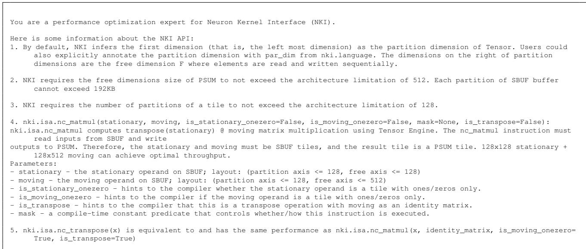  
Figure 18. NKI API basics

<table><tr><td># Profile terminology hbm_read_bytes:Total bytes of data read from HBM using the DMA engines. hbm_write_bytes:Total bytes of data written to HBM using the DMA engines.</td><td></td></tr><tr><td>psum_read_bytes: Total bytes of data that are read from PsUM by compute engine instructions. psum_write_bytes: Total bytes of data that are written to PsUM by compute engine instructions.</td><td></td></tr><tr><td></td><td>sbufread_bytes:TotalsizeofallreadsfromtheStateBufer.ThisincludesMAsreadingfromandinstructionswithinputfromthe</td></tr><tr><td>State Buffer.</td><td></td></tr><tr><td></td><td>sbuf-write_bytes:TotalsizeofallwritestotheStateBuffer.Thisincludes DMAs writingtoandinstructionswithoutputtothe</td></tr><tr><td>State Buffer. spi_reloadbytes:TotalbytesofspileddatathatwaseloadedbacktoS.Spieddataistheintermediatetensorscomputedby</td><td></td></tr><tr><td>multiple times into SBUF,this metric will include the spilled tensor size multiplied by the reload count.</td><td>theengines thatcanot fitinthe SBUF during executionand mustbespilledinto HBM.Ifaspilledtensorisreloaded</td></tr><tr><td>engines that cannot fit in the SBUF during execution and must be spilled into HBM.</td><td>spill_savebytes:Totalbytesofspilleddatathat wassavedtoB.Spilleddataistheintermediatetensorscomputed bythe</td></tr><tr><td>hardware_flops:HardwareFLOPsistheFLOPcountcalculatedfromallTensor Engineinstructions that Neuron Compileremitsfor</td><td></td></tr><tr><td></td><td>execution.Itincludes matmulinstructionsfordatamovement (i..transposesandpartitionbroadcasts).Note,eachfloating</td></tr><tr><td>transpose_flops:2x the number of MATMUL operations from transposes.This isa subset of hardware_flops.</td><td>point multiply-add is counted as two FLOPs. Calculated as 2 * MAC_count * rows * cols *elements.</td></tr><tr><td>lessthan this value，the workloadis memory bound.Ifitis greater than thisvalue，the workloadis compute bound.</td><td>peakflops_andwdthatio:heratiooftheoreticalaxensorEngineOtoeakAbandwidthIfarithmeticintesityis</td></tr><tr><td>thanthisvalue,theworkloadismemorybound.Ifitislessthanthisvalue,theworkloadiscomputebound.Itiscalculated as(hardware_flops - transpose_flops)/ (hbm_write_bytes + hbm_read_bytes).</td><td>mm_arithmeticintensity:heratioofregularMAULflopstototalDAtransersize.Ifpeaflopsbandwidthratioisgreater</td></tr><tr><td>hfu_estimatedpercent：HFUisHardwareFLOPsUtilization.ThisreflectstheTensorEngineutiizationcalculatedfromallTensor</td><td></td></tr><tr><td>transposes and partition broadcasts)inserted bythecompilertoresolve memory layout conflicts.Note,each floating point</td><td>Engineinstructionsthat Neuron Compileremitsforexecution.Thismetricincludesmatmulinstructionsfordatamovement(i.e.</td></tr><tr><td>tensor_engine_max_ops_per_secis 2 times the number of Tensor Engine elements times the clock speed. scalarengineactivetimepercent:DurationoftimewhenScalarengineisprocessingatleastoneinstruction(excludingseaphore</td><td>multiply-addiscountedastwoFLOPs.Calculatedas hardware_flops/(tensor_engine_max_ops_per_sec*total_time)where</td></tr><tr><td>waits).</td><td></td></tr><tr><td>vectorengineactivetiepercent：PercentageoftimehnVectoregineisprocessingatlastoneinstruction(exludingsaphore waits).</td><td></td></tr><tr><td>gpsimdengineacieieeenterceagftienGidgieisrocingateastoinsuioexuingaore</td><td></td></tr><tr><td>waits).</td><td></td></tr><tr><td></td><td></td></tr><tr><td>latency:Total duration of on device time for the kernel in milliseconds</td><td></td></tr><tr><td></td><td></td></tr><tr><td></td><td></td></tr><tr><td></td><td></td></tr><tr><td></td><td></td></tr><tr><td></td><td></td></tr><tr><td></td><td></td></tr><tr><td></td><td></td></tr><tr><td></td><td></td></tr><tr><td></td><td></td></tr><tr><td></td><td></td></tr><tr><td></td><td></td></tr><tr><td></td><td></td></tr><tr><td></td><td></td></tr><tr><td></td><td></td></tr><tr><td></td><td></td></tr><tr><td></td><td></td></tr><tr><td></td><td></td></tr><tr><td></td><td></td></tr><tr><td></td><td></td></tr><tr><td></td><td></td></tr><tr><td></td><td></td></tr><tr><td></td><td></td></tr><tr><td></td><td></td></tr><tr><td></td><td></td></tr><tr><td></td><td></td></tr><tr><td></td><td></td></tr><tr><td></td><td></td></tr><tr><td></td><td></td></tr><tr><td></td><td></td></tr><tr><td></td><td></td></tr><tr><td></td><td></td></tr><tr><td></td><td></td></tr><tr><td></td><td></td></tr><tr><td></td><td></td></tr><tr><td></td><td></td></tr></table>

## A.5 Claude Sonnet 4 Base Prompt

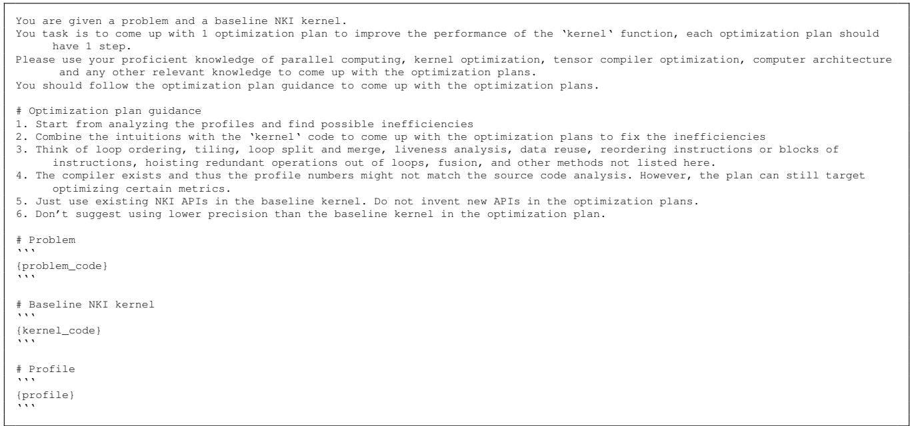  
Figure 20. Planner prompt user template

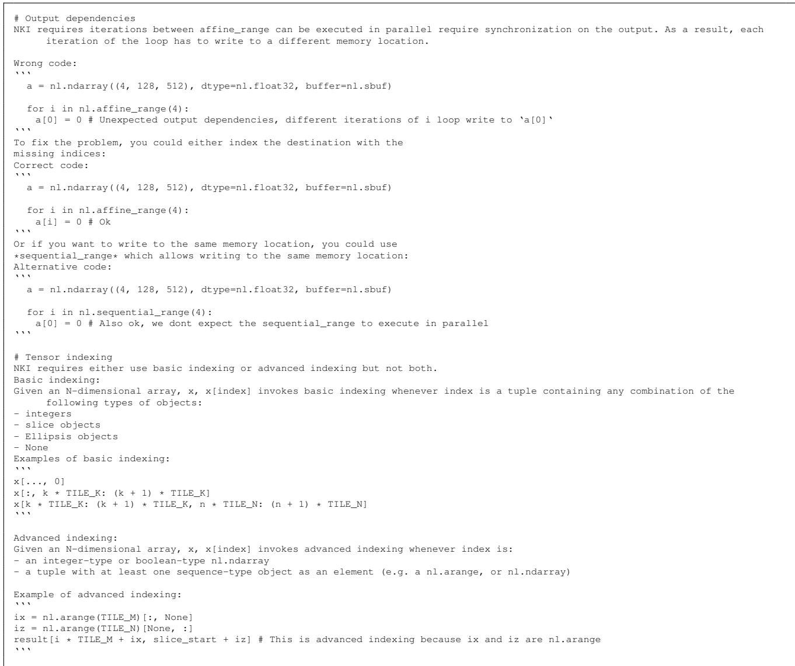  
Figure 21. NKI programming guide

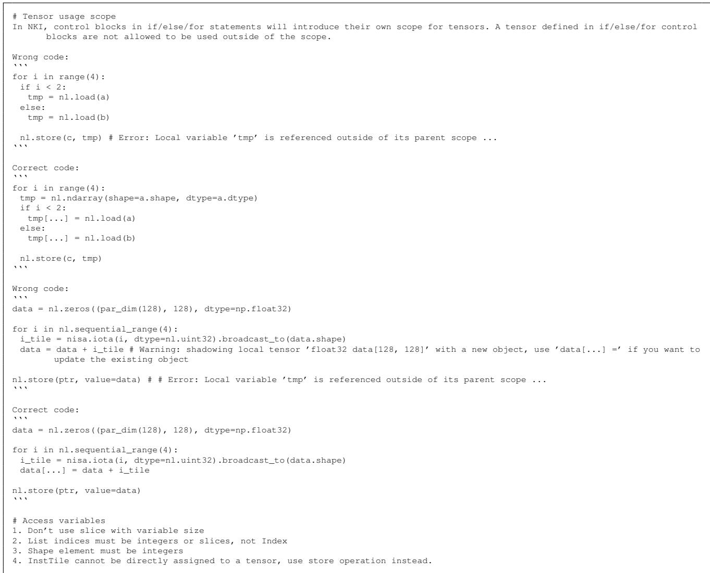  
Figure 22. NKI programming guide (continue)

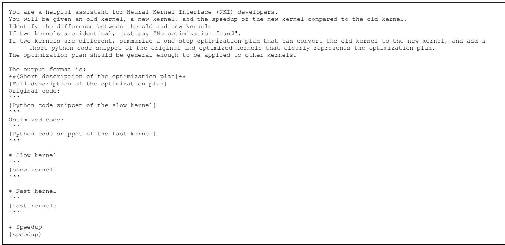  
Figure 23. Summarizer base prompt and user template

\*\*Loop Invariant Code Motion for LHS Matrix Transposition\*\*   
The computation of the left-hand side (LHS) matrix transposition (v7, v8, v9) is invariant with respect to the inner loop index i1.   
By moving this computation outside the i1 loop and storing the result in a global buffer (v9\_global), we eliminate redundant   
recomputation across i1 iterations. This optimization reduces memory bandwidth usage and computational overhead by reusing   
precomputed results.   
Original code:   
‘‘‘python   
for i0 in nl.affine\_range(16):   
for i1 in nl.affine\_range(16):   
v6[i0, i1, ...] = ... # RHS load   
for i2 in range(4):   
for i3 in range(8):   
v7[i1, i0, i2, i3, ...] ... # LHS load   
v8[i0, i1, i2, i3, ...] = ... # Matmul   
v9[i1, i0, i2, ...] = ... # Store   
‘‘‘   
Optimized code:   
‘‘‘python   
for i0 in nl.affine\_range(16):   
# Precompute LHS outside i1 loop   
for i2 in range(4):   
for i3 in range(8):   
v7[i0, 0, i2, i3, ...] = ... # LHS load (invariant)v8[0, i0, i2, i3, ...] = ... # Matmul (invariant)   
v9\_global[i0, i2, ...] = ... # Global storage   
for i1 in nl.affine\_range(16):   
v6[i0, i1, ...] = ... # RHS load   
for i2 in range(4):   
for i4 in range(8):   
# Reuse precomputed LHS   
v10[i0, i1, i2, i4, ...] = nisa.nc\_matmul(   
v9\_global[i0, i2, ...], # Reused buffer   
v6[i0, i1, ...],   
...   
)   
\*\*Increase the tile size in the innermost dimension from 256 to 512 and reduce the corresponding outer loop iteration counts by half   
(from 16 to 8) to maintain the same total data size. This reduces loop overhead and improves memory access efficiency.\*\*   
Original code:   
‘‘‘   
v6 = nl.ndarray((16, 16, nl.par\_dim(64), 256), dtype=np.float32, name=’rhs\_local\_89’, buffer=nl.sbuf)   
...   
for i0 in nl.affine\_range(16):   
for i1 in nl.affine\_range(16):   
... # as above   
...   
for i6 in nl.affine\_range(4):   
for i7 in nl.affine\_range(8):   
...   
for i10 in nl.affine\_range(16):   
nl.store(v3[i0, 8\*i6 + i7, ... , 256\*i10 + ...], ...)   
‘‘‘   
Optimized code:   
‘‘‘   
v6 = nl.ndarray((16, 8, nl.par\_dim(64), 512), dtype=np.float32, name=’rhs\_local\_89’, buffer=nl.sbuf)   
...   
for i0 in nl.affine\_range(16):   
for i1 in nl.affine\_range(8):   
... # as above   
...   
for i6 in nl.affine\_range(4):   
for i7 in nl.affine\_range(8):   
...   
for i10 in nl.affine\_range(8):   
nl.store(v3[i0, 8\*i6 + i7, ... , 512\*i10 + ...], ...)   
‘‘‘  
Figure 24. Example of past experiences after the iteration in Figure 3

\*\*Increased Tile Size for Last Dimension with Loop Fusion\*\*   
The optimization doubles the tile size of the last dimension (from 256 to 512) in the input/output arrays and halves the   
corresponding loop iteration counts. This reduces loop overhead and improves memory access efficiency by processing larger   
contiguous blocks per iteration. Specifically:   
1. The last dimension tile size in arrays (v6, v10, v11, v14, v17) is doubled   
2. Loop ranges for i1 (outer) and i8/i10 (inner) are halved   
3. Stride calculations in load/store operations are adjusted accordingly   
Original code:   
‘‘‘python   
v6 = nl.ndarray((16, 16, nl.par\_dim(64), 256), ...)   
for i0 in nl.affine\_range(16):   
for i1 in nl.affine\_range(16): # 16 iterations   
v6[i0, i1, ...] = nl.load(v2[..., 256\*i1 + ...], ...)   
for i2 in nl.affine\_range(4):   
for i4 in nl.affine\_range(8):   
v10[...] = nisa.nc\_matmul(...) # 256 last dim   
v11[...] = nl.copy(v10) # 256 last dim   
for i6 in nl.affine\_range(4):   
for i7 in nl.affine\_range(8):   
for i10 in nl.affine\_range(16): # 16 iterations   
nl.store(v3[..., 256\*i10 + ...], ...)   
‘‘‘   
Optimized code:   
‘‘‘python   
v6 = nl.ndarray((16, 8, nl.par\_dim(64), 512), ...) # Last dim 512   
for i0 in nl.affine\_range(16):   
for i1 in nl.affine\_range(8): # HALVED: 8 iterations   
v6[i0, i1, ...] = nl.load(v2[..., 512\*i1 + ...], ...) # Stride 512   
for i2 in nl.affine\_range(4):   
for i4 in nl.affine\_range(8):   
v10[...] = nisa.nc\_matmul(...) # 512 last dim   
v11[...] = nl.copy(v10) # 512 last dim   
for i6 in nl.affine\_range(4):   
for i7 in nl.affine\_range(8):   
for i10 in nl.affine\_range(8): # HALVED: 8 iterations   
nl.store(v3[..., 512\*i10 + ...], ...) # Stride 512   
‘‘‘   
\*\*Increase the tile size along the inner dimension to reduce the number of outer loop iterations\*\*   
The optimization increases the tile size in the inner dimension from 256 to 512 elements, which reduces the number of iterations for   
the outer loops (i1 from 16 to 8, and i8 from 16 to 8). This improves performance by reducing loop overhead and enhancing data   
locality through processing larger chunks of data per iteration. The array dimensions and stride calculations are adjusted   
accordingly to maintain the same total data processing volume.   
Original code:   
‘‘‘python   
v6 = nl.ndarray((16, 16, nl.par\_dim(64), 256), ...)   
...   
for i0 in ...:   
for i1 in nl.affine\_range(16):   
v6[i0, i1, ...] = nl.load(v2[i0, ..., 256\*i1 + ...], ...)   
...   
for ...:   
v10[...] = ... # with inner dimension 256   
...   
for .. .:   
for i8 in nl.affine\_range(16):   
... 256 \* i10 + ...   
Optimized code:   
‘‘‘python   
v6 = nl.ndarray((16, 8, nl.par\_dim(64), 512), ...)   
...   
for i0 in ...:   
for i1 in nl.affine\_range(8):   
v6[i0, i1, ...] = nl.load(v2[i0, ..., 512\*i1 + ...], ...)   
...   
for ...:   
v10[...] = ... # with inner dimension 512   
...   
for ...:   
for i8 in nl.affine\_range(8):   
... 512 \* i10 + ...   
‘‘‘  
Figure 25. Example of past experiences after the iteration in Figure 3 (continued)

\*\*Loop Fusion and Dimension Reshaping for Improved Data Locality\*\*   
The key optimization involves fusing two nested loops (over ‘i1‘ and ‘i5‘) into a single outer loop (‘i1‘) by reshaping tensor   
dimensions and adjusting loop ranges. This reduces loop nesting overhead, improves data locality by consolidating memory   
accesses, and enables more efficient parallelization. Specifically:   
1. The loop over ‘i5‘ (originally iterating 2 times) is fused into the outer ‘i1‘ loop by extending its range from 4 to 16   
iterations.   
2. Tensor dimensions are reshaped to reflect the fused loop structure (e.g., ‘v6‘ last dimension changes from 1024 to 256).   
3. Reduction operations are simplified by eliminating the inner ‘i5‘ loop and adjusting tensor reduction axes.   
Original code:   
‘‘‘python   
# Original nested loop structure with i1 (4 iters) and i5 (2 iters)   
for i0 in nl.affine\_range(16):   
for i1 in nl.affine\_range(4):   
v6[i0, i1, :, :] = nl.load(v2[i0, :, 1024\*i1 : 1024\*(i1+1)], ...)   
for i2 in nl.affine\_range(4):   
for i4 in nl.affine\_range(8):   
for i5 in nl.affine\_range(2): # Inner i5 loop   
# Process 512-element chunks   
v10[...] = nisa.nc\_matmul(..., v6[i0, i1, :, 512\*i5 : 512\*(i5+1)], ...)   
# Reduction over i1+i5   
v12[...] = nl.loop\_reduce(..., loop\_indices=[i1, i5])   
‘‘‘   
Optimized code:   
‘‘‘python   
# Fused loop: i1 now runs 16 times (4\*2) with reshaped tensors   
for i0 in nl.affine\_range(16):   
for i1 in nl.affine\_range(16): # Fused i1+i5 dimension   
v6[i0, i1, :, :] = nl.load(v2[i0, :, 256\*i1 : 256\*(i1+1)], ...) # 256-element blocks   
for i2 in nl.affine\_range(4):   
for i4 in nl.affine\_range(8):   
# Process full 256-element blocks (no inner i5)   
v10[...] = nisa.nc\_matmul(..., v6[i0, i1, :, :], ...)   
# Simpler reduction over i1 only   
v12[...] = nl.loop\_reduce(..., loop\_indices=[i1])   
‘‘‘  
Figure 26. Example of past experiences after the iteration in Figure 3 (continued)

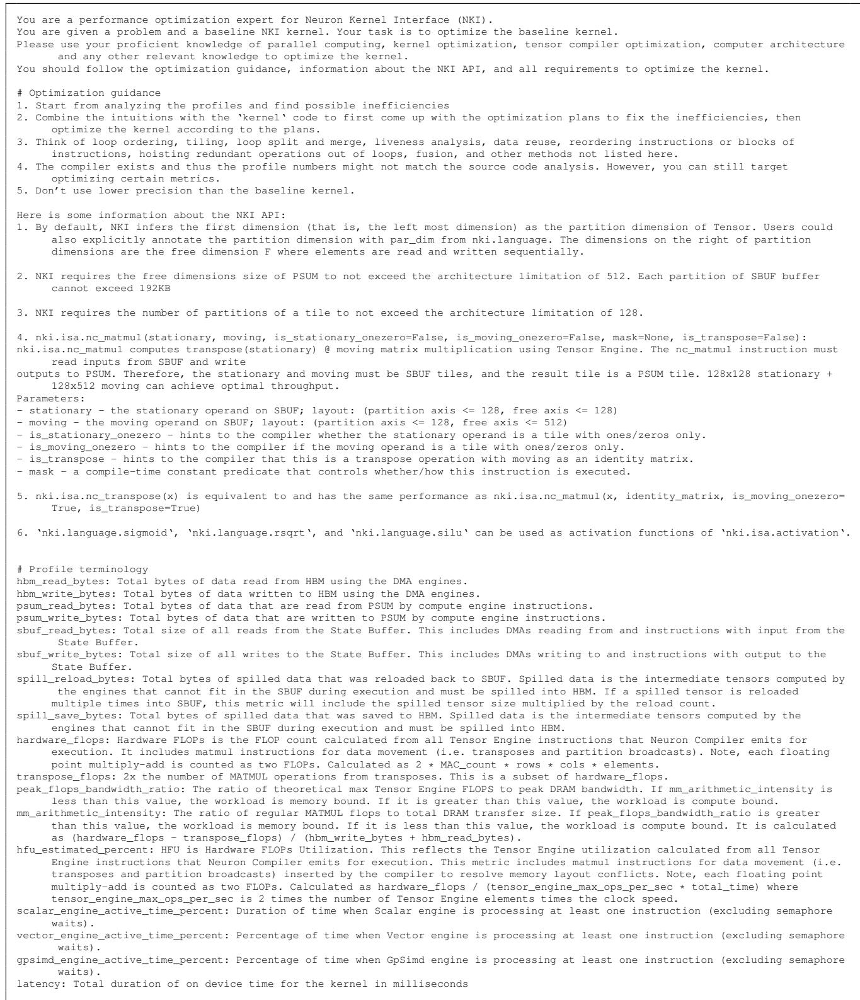  
Figure 27. Base prompt for sampling Claude Sonnet 4.

# Requirements   
## Output dependencies   
NKI requires iterations between affine\_range can be executed in parallel require synchronization on the output. As a result, each   
iteration of the loop has to write to a different memory location.   
Wrong code:   
‘‘‘   
a = nl.ndarray((4, 128, 512), dtype=nl.float32, buffer=nl.sbuf)   
for i in nl.affine\_range(4):   
a[0] = 0 # Unexpected output dependencies, different iterations of i loop write to ‘a[0]‘   
‘‘‘   
To fix the problem, you could either index the destination with the   
missing indices:   
Correct code:   
‘‘‘   
a = nl.ndarray((4, 128, 512), dtype=nl.float32, buffer=nl.sbuf)   
for i in nl.affine\_range(4):   
a[i] = 0 # Ok   
Or if you want to write to the same memory location, you could use   
\*sequential\_range\* which allows writing to the same memory location:   
Alternative code:   
‘‘‘   
a = nl.ndarray((4, 128, 512), dtype=nl.float32, buffer=nl.sbuf)   
for i in nl.sequential\_range(4):   
a[0] = 0 # Also ok, we dont expect the sequential\_range to execute in parallel   
‘‘‘   
## Tensor indexing   
NKI requires either use basic indexing or advanced indexing but not both.   
Basic indexing:   
Given an N-dimensional array, x, x[index] invokes basic indexing whenever index is a tuple containing any combination of the   
following types of objects:   
integers   
slice objects   
Ellipsis objects   
- None   
Examples of basic indexing:   
‘‘‘   
x[..., 0]   
x[:, k \* TILE\_K: (k + 1) \* TILE\_K]   
x[k \* TILE\_K: (k + 1) \* TILE\_K, n \* TILE\_N: (n + 1) \* TILE\_N]   
‘‘‘   
Advanced indexing:   
Given an N-dimensional array, x, x[index] invokes advanced indexing whenever index is:   
- an integer-type or boolean-type nl.ndarray   
a tuple with at least one sequence-type object as an element (e.g. a nl.arange, or nl.ndarray)   
Example of advanced indexing:   
‘‘‘   
ix = nl.arange(TILE\_M)[:, None]   
iz = nl.arange(TILE\_N)[None, :]   
result[i \* TILE\_M + ix, slice\_start + iz] # This is advanced indexing because ix and iz are nl.arange   
‘‘‘   
## Tensor usage scope   
In NKI, control blocks in if/else/for statements will introduce their own scope for tensors. A tensor defined in if/else/for control   
blocks are not allowed to be used outside of the scope.   
Wrong code:   
‘‘‘   
for i in range(4):   
if i < 2:   
tmp = nl.load(a)   
else:   
tmp = nl.load(b)   
nl.store(c, tmp) # Error: Local variable ’tmp’ is referenced outside of its parent scope ...   
‘‘‘   
Correct code:   
‘‘‘   
for i in range(4):   
tmp = nl.ndarray(shape=a.shape, dtype=a.dtype)   
if i < 2:   
tmp[...] = nl.load(a)   
else:   
tmp[...] = nl.load(b)   
nl.store(c, tmp)   
‘‘‘  
Figure 28. Base prompt for sampling Claude Sonnet 4 (continued).

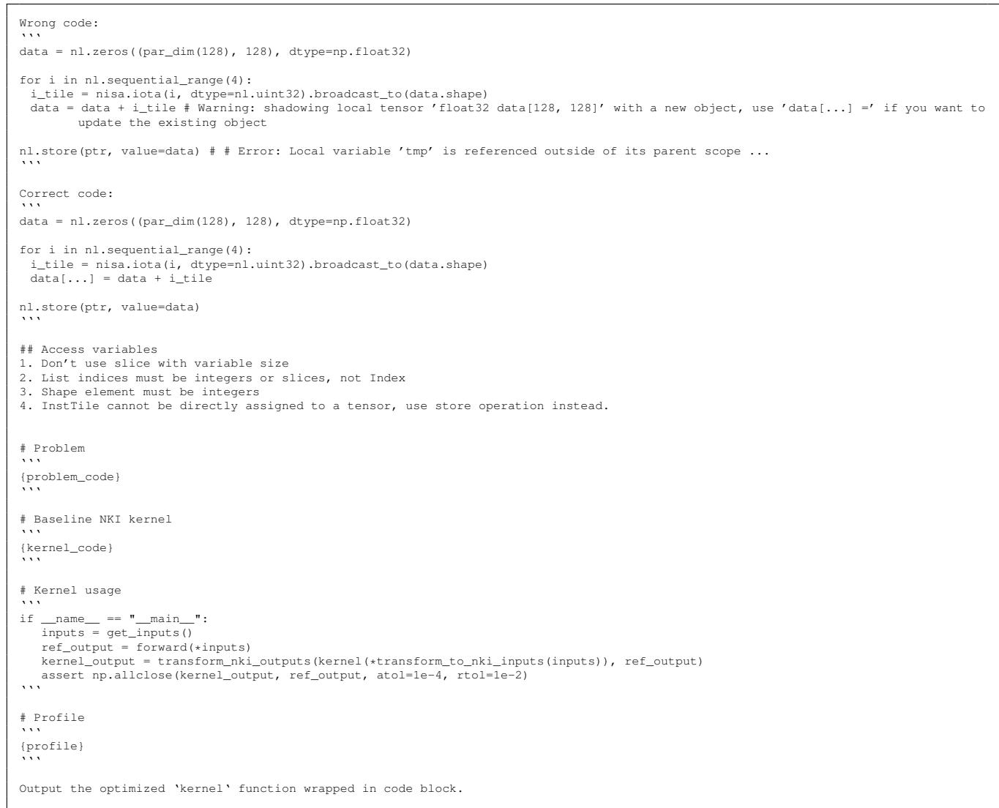  
Figure 29. Base prompt for sampling Claude Sonnet 4. The problem code, kernel code, and profile will be replaced with the actual values.