# OPKV: A HIGH-THROUGHPUT PLUGIN-DRIVEN FRAMEWORK FOR RECALLABLE SPARSITY IN PAGED KV CACHE SYSTEMS

Huazheng Lao 1 Xiaofeng Li 1 Rui Xu 1 Long Chen 1 Xia Zhu 1 Jinquan Zhang 2

## ABSTRACT

Long-context large language model (LLM) inference faces severe KV cache inflation, making GPU memory a key bottleneck. Existing recallable sparsity methods mitigate memory pressure by offloading non-critical key-value (KV) pairs to CPU memory and recalling them on demand, but they are intrusive to KV cache management in the existing inference frameworks and fail to cope with the linearly increasing recall overhead under high batches. To address these limitations, we propose OPKV, a high-throughput plugin-driven framework that seamlessly integrates recallable sparsity into paged KV cache systems and performs unified recall optimization. OPKV introduces a plugin interface that decouples sparsity logic from model and cache management, and applies object reaggregation and hot page hit algorithms to reduce the recall overhead based on the observation of spatial discreteness and temporal locality in critical KV selection. In addition, a local intra-iteration metadata manager is implemented to perform millisecond-level page retrieval and cache eviction. The experimental results show that OPKV helps the SoTA methods attain 1.3 - 1.8x higher decoding throughput under different batches.

## 1 INTRODUCTION

Large Language Models (LLMs) (Touvron et al., 2023; Kocon et al. ´ , 2023) have achieved remarkable progress in natural language processing, with their capabilities tightly tied to the context window length. Longer contexts enable more complex tasks, such as long document understanding (Bai et al., 2024), retrieval augmented generation (RAG) (Arslan et al., 2024), and multi-turn dialog (Wu et al., 2018). However, this trend exacerbates a severe system bottleneck: KV cache inflation (Hooper et al., 2024). As the KV cache stores intermediate key and value vectors to avoid redundant computations in attention layers, it scales linearly with context length. For a request with 10k context tokens, the KV cache alone can occupy up to 8 GB of GPU memory (e.g., for 13B-parameter models with multi-head attention and FP16 precision), yet dedicated inference GPUs (Choquette & Gandhi, 2020) typically have less than 48 GB of memory, most of which is reserved for loading model weights. This mismatch between KV cache demand and GPU memory capacity has become a primary barrier to deploying longcontext LLM inference efficiently at scale.

To address this bottleneck, previous work explores two directions: quantization-based and sparsity-based compression.

Quantization-based approaches (Liu et al., 2024; Hooper et al., 2024) reduce the size of KV tensors by lowering numerical precision (e.g., from FP16 to INT4/8), achieving linear memory savings with minimal accuracy loss. In contrast, sparsity-based approaches improve memory efficiency not by compressing all vectors but by retaining only critical KVs. Early works in this space (Xiao et al., 2024b; Zhang et al., 2023) relied on heuristic rules to discard noncritical KVs, while more recent cutting-edge works (Lee et al., 2024; Liu et al., 2025; Hao et al., 2025) have shifted to a speculative recall paradigm: they offload non-critical KVs to CPU memory and speculatively prefetch tokens that may be needed in future layers. Although this paradigm offers excellent memory-accuracy trade-offs, current implementations remain algorithmic prototypes rather than deployable systems.

Unfortunately, recallable sparsity is fundamentally incompatible with page-based KV cache systems such as PagedAttention (Kwon et al., 2023). Production frameworks manage KV memory at the page level, where each page groups tens of tokens to reduce fragmentation; by contrast, sparsity algorithms operate at the token level. This granularity mismatch leads to heavy I/O amplification and metadata synchronization overhead, degrading throughput when sparsity is applied directly. As a result, researchers face an undesirable trade-off: adopting recallable sparsity improves memory efficiency but sacrifices system throughput, while staying within framework constraints limits achievable sparsity.

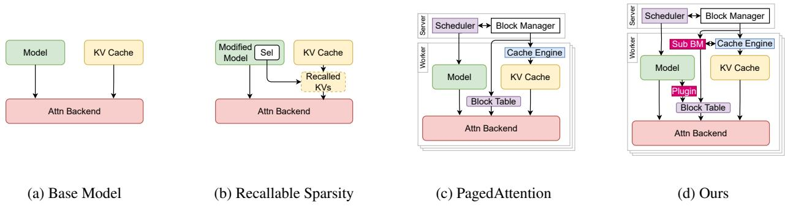  
Figure 1. Comparison of different inference frameworks.

Core Insight. These observations raise a central question: Is there a way to enable recallable KV sparsity methods to align with inference frameworks? If such a method exists, it would first facilitate rapid application and validation for algorithm researchers, which would eliminate the need for them to rebuild or modify the core inference infrastructure when testing new sparsity logistics. Second, it would enable the decoupling of the accuracy of the sparsity algorithms themselves from the efficiency of their system implementations. Consequently, an algorithm-agnostic KV cache prefetch framework could independently optimize inference throughput and latency.

In the paper, we introduce OPKV, a high-throughput plugin-driven framework for Object-level recallable sparsity methods in Page-level KV cache management (Figure 1d). OPKV implements a model-sparsity-cache inference paradigm that can be seamlessly integrated into existing inference frameworks. Through carefully designed extension points, it enables the injection of recallable sparsity methods without altering the original operation of the inference framework. In addition, OPKV designs an algorithmagnostic recall optimization strategy, which enables finegrained, intra-iteration KV recall through adaptive page coordination and low-latency metadata handling. Specifically, OPKV addresses three key challenges and we elaborate them as follows:

Challenge 1: Structural coupling between model, sparsity and KV cache management. Existing sparsity prototypes integrate three core components into a monolithic block: model modifications to support KV sparsity, logic for identifying critical KVs, and mechanisms for recalling offloaded KVs. This coupling creates severe scalability issues: adapting to a new model requires rewriting or duplicating large portions of code (e.g., embedding critical KV recall into transformer attention layers), leading to poor maintainability and slow iteration. To address the challenge, OPKV proposes a plugin solution and provides a clear interface for customized recallable KV sparsity methods. Through reserving extension points at each stage of the model operation, it decouples these components to enable clear data flows: the model requests critical KV indices by sparsity plugins, and the KV cache manager uses these indices to recall the required vectors.

Challenge 2: Spatial mismatch between token-level sparsity operations and page-level memory organization. PagedAttention manages KV cache at the page level, which groups dozens of tokens into a single block to minimize fragmentation. However, sparsity methods usually select individual critical KVs at the token level. And this mismatch makes integrating sparsity into PagedAttention non-trivial. Based on the observation of spatial discreteness and temporal locality in KV selection, OPKV proposes a duplicated page cache technique, which combines critical object aggregation and hot page loading. By aggregating the selected tokens into pages, it can adapt to the KV cache management of PagedAttention.

Challenge 3: Temporal mismatch between per-layer KV recalls and per-iteration metadata updates. Continuous batching (Yu et al., 2022) improves scheduling from the request level to the iteration level and inference frameworks manage KV metadata between iterations. However, recallable sparsity methods recall critical KVs between attention layers, and thus an inter-iteration metadata management is not enough. Furthermore, the computing time of an attention layer is in the millisecond range. Simply moving metadata management between layers would lead to significant overhead, including inter-process communication overhead and CPU computing overhead. To minimize the overhead from KV metadata management, OPKV implements an intra-iteration KV cache management system, including an efficient page hit algorithm and a fast cache eviction strategy. By overlapping CPU and GPU computing, the latency caused by metadata management can be reduced.

## 2 BACKGROUND AND MOTIVATION

KV sparsity is a critical technique for long-context LLM inference, as it ensures a stable KV budget and keeps the GPU memory footprint nearly constant even for extremely long contexts. Compared to the base model (Figure 1a), the recallable sparsity method (Figure 1b) introduces a selection module (Sel) to recall key-value pairs (recalled KVs), which collaborates with the KV cache within the Attention Backend.

Unlike the simple control logic of the base model, PagedAttention (Figure 1c) adopts a server-worker architecture and achieves efficient memory sharing by separating the physical operations of the KV cache from logical block management. Unfortunately, the invasiveness of the sparsity methods to the KV cache makes it impossible to simply integrate them into PagedAttention. And transforming the sparsity methods into an efficient, scalable, and reliable implementation requires addressing practical challenges at both the algorithmic and system levels with collaborative designs. Our work is motivated by three critical observations as follows:

Model-Cache Coupling Limits Reusability. As shown in Figure 1b, typical sparsity methods consist of three components, but their tight integration creates barriers: (1) model modification, which is often limited to a small set of LLMs with custom logic embedded in the compute path; (2) critical KV selection, the core algorithmic component that spans prefill preprocessing and decoding-time identification; and (3) KV recall, a performance-critical step (for recallable methods) optimized across algorithm and system levels. However, only the second part is inherently algorithmic, and tight coupling makes the other parts hard to reuse. This tight coupling leads to critical pain points in practical use. Developers must rewrite the transformer attention layer code, and only a small part of the sparsity-related code can be reused across different inference frameworks. As a result, a unified modular design is therefore necessary. Such a design would involve two key steps: explicitly decoupling the three components into a model-sparsity-cache tiered structure; and packaging sparsity as a standalone plugin that interfaces with both base models and the KV cache manager. This approach would substantially lower adaptation costs across different LLM architectures and facilitate efficient KV recall, which is critical for maintaining low latency in long-context decoding.

Token-Page Mismatch Causes I/O Amplification. We observed that page-level management is the de facto standard in modern inference systems, whereas most sparsification operates at the token-level. Mapping token-level methods directly to pages is inefficient, which leads to severe I/O amplification. Figure 2 shows the number of tokens selected by InfiniGen over 100 iterations and the possible I/O amplification, assuming a page contains 16 tokens. We found that compared with merely recalling selected tokens, recalling all the pages containing any one selected tokens would result in a stable I/O amplification of approximately four times. As shown in Figure 4a, selected token shows spatial discreteness in both InfiniGen and OmniKV. The key KVs are hardly concentrated together but are relatively evenly distributed across different pages. A simple approach is to aggregate the recalled tokens into blocks and discard them after computation, but it lacks efficiency. Figure 3 indicates temporal locality in selected tokens, and implies that aggregated pages are likely to be reused in the short term, so they can be maintained on the GPU.

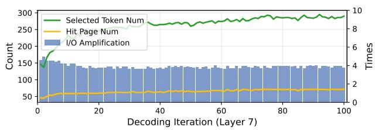  
Figure 2. Number of selected tokens (left) and possible I/O amplification (right) during multiple iterations in layer 7 of InfiniGen.

Linearly Increasing Recall Overhead Suppresses Throughput. A larger batch is usually beneficial for throughput growth, but it is often overlooked by recallable sparsity methods. For example, open-source implementations of Quest and ClusterKV are restricted to a batch size of 1, severely limiting parallelism. Although InfiniGen reports reasonable latency at a batch size of 20 (compared to UVM (Allen & Ge, 2021) and FlexGen (Sheng et al., 2023)), our experiments (Figure 9) show its decoding throughput plateaus as the batch size increases, indicating a fundamental bottleneck in scalability.

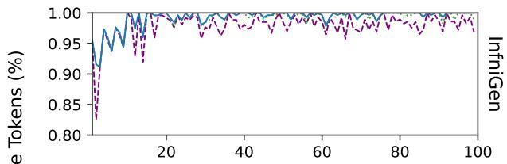

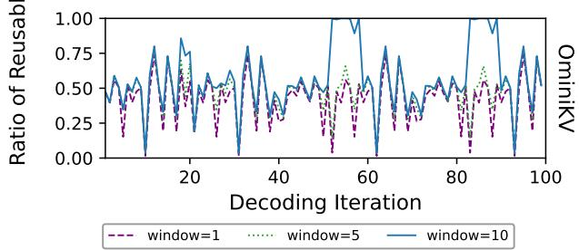  
Figure 3. The ratio of the reusable tokens in the past sliding window to the selected tokens in each iteration with different window sizes. In layer 7 of InfiniGen, there is a very strong similarity between iterations, so tokens of the last iteration can be reused very well. While in layer 2 of OmniKV, a large window size of 10 is helpful in parts of iterations. Even so, the last iteration can still meet most of the reuse requirements.

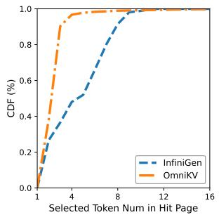  
(a) CDF of selected token number in each hit page.

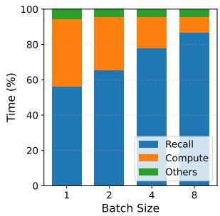  
(b) The proportion of overheads given various batch sizes in InfiniGen.  
Figure 4. Analysis of token selection and recall overheads.

The reason is that as the batch size increases, the recall overhead also increases linearly. Figure 4b shows the time proportions of each part in InfiniGen. When the batch size is 1, the overheads of computation and recall are approximately the same, so they can be well overlapped through prefetching. However, under a high batch size, even with optimized transmission technology and prefetching mechanism, the recall overhead still inevitably becomes a bottleneck.

Additional GPU memory is required to reduce CPU-to-GPU transfers, but managing them is risky due to two possible overheads: communication overhead. As shown in Figure 1c, PagedAttention manages the block metadata at the granularity of the iteration, typically via a centralized server that coordinates multiple workers on RPC and sends block tables in each iteration, and this centralized coarse-grained metadata handling proves prohibitively costly for layer-level token selection, inspiring us to build fine-grained and localized metadata management. retrieval overhead. Despite the strong temporal locality, the retrieval of recallable pages is still time-consuming. The computation of each attention layer is at the millisecond level, and matching of the selected token with hot pages is a complex set-coverage problem. Therefore, we must select the appropriate pages as soon as possible, even if this solution is sub-optimal.

## 3 OPKV DESIGN

In this section, we introduce the design of OPKV. To support diverse sparsify methods and recall strategies without modifying the core inference pipeline, OPKV decouples algorithms from the system via a standardized plugin interface and a per-worker Sub Block Manager (Sub BM) which supports request forwarding, KV recall, and cache metadata management. The design co-optimizes the recall path and cache layout to reduce potential communication latency and I/O amplification.

## 3.1 System Overview

Figure 1d illustrates an overview of OPKV. OPKV is similar to PagedAttention. The server is deployed on the host, with one worker instance running on each GPU. They are connected through Remote Procedure Call (RPC). The server is responsible for request scheduling and KV metadata management. For the model runner in the worker, it receives request tasks from the scheduler and performs computations using a highly optimized attention backend. The model runner does not directly manage the KV cache. Instead, the block table provided by Block Manager (BM) located in the server retrieves the required KV cache from the cache engine.

Unlike PagedAttention, when the request is scheduled to be processed by recallable sparsity methods, the scheduler lets the model runner apply the requested plugin, which selects the critical KVs that needs to participate in the attention calculation layer by layer through the extension points provided by the model. Sub BM located in the worker is activated to manage the KV cache metadata changed by KV recall within the process, thereby eliminating the communication overhead caused by RPC calls. Through Sub BM, a block table based on token selection is updated in real time to replace the original block table from BM.

## 3.2 Plugin Interface

To address these challenges of decoupling model logic from strategy implementation and enabling flexible integration of diverse KV cache optimizations, we designed a standardized plugin interface. The following subsection details the interface design (Figure 5) of OPKV, including its five core callbacks and their roles in the attention workflow:

1. register is invoked during the initialization of the attention layer. The plugin retrieves the configuration information of the layer and is initialized itself. It also provides supplementary information to the Sub BM to facilitate cache management. For example, indicate whether the KV cache of a certain layer must remain in the GPU memory or whether the same token will be recalled for several consecutive layers.

2. preprocess is executed during prefill and decoding iterations. The forward pass of the attention layer is divided into multiple stages, and the plugin can perform preprocessing operations between these stages, such as Singular Value Decomposition (SVD), index construction, or setup of other sophisticated data structures. In addition, it returns a flag indicating whether preprocessing is fully completed; Once ready, the selection operation can proceed.

```python
class RecallableSparsityPlugin:
def register(self, attn_layer):
layer_id = self._register(attn_layer)
return layer_id
def preprocess(self, layer_id, stage, context):
if stage == Stage.Start:
return self._process_start(layer_id, context)
if stage == Stage.End:
return self._process_end(layer_id, context)
def select(self, layer_id, context):
sel_token_idx_by_layer = self._select(
layer_id, context)
return sel_token_idx_by_layer
def fetch(self, sel_token_idx_by_layer, context):
requests = self._build(
sel_token_idx_by_layer, context)
outputs = [
sub_block_manager.async_fetch(requests)
for sub_block_manager in context.block_manager
]
err_code = self._handle_err(outputs)
return err_code
def recall(self, layer_id, context):
outputs = [
sub_block_manager.recall(layer_id)
for sub_block_manager in context.block_manager
]
err_code = self._handle_err(outputs)
block_table = self._handle_result(outputs)
return err_code, block_table
```  
Figure 5. Plugin Interface

3. select is processed during decoding iterations. The plugin can select tokens to be recalled for the current and/or subsequent layers, supporting cross-layer joint decision-making.

4. fetch submits requests to the Sub BM. It constructs requests based on the token IDs selected by select and submits them to the Sub BM for processing

5. recall checks with the Sub BM to confirm if the recall is complete, when the recalled tokens are required for computation; if not yet completed, it blocks until the operation finishes.

Figure 6 illustrates the collaborative workflow among plugins. In each registered layer, the preprocess step obtains the required context and passes it to select, which computes the critical KVs for the next one or more layers; these are then uniformly submitted to the sub block manager via fetch. Meanwhile, before the attention computation, recall retrieves the previously prefetched KVs. This enables overlap between GPU kernel computation and KV recall. Together, these interface functions form a modular and extensible framework, providing a foundational layer to advance KV cache sparsity research, balancing flexibility for innovation with robustness for practical deployment.

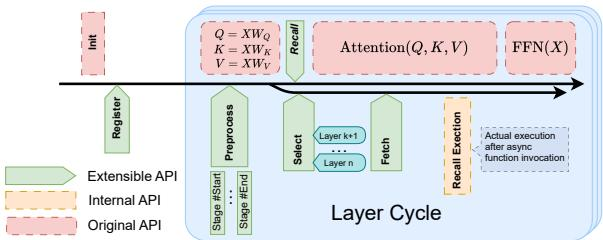  
Figure 6. Plugin Workflow

## 3.3 KV Recall

To address the challenge of mismatched granularity between token-level KV recall and page-level memory organization, we design a hot-page-based aggregation and retrieval algorithm.

We denote the original KV block, sequentially generated in prefill and decode phase, as Ordered Block and introduce the OP Block based on the temporal locality of critical KVs, which is aggregated by critical KVs for efficient caching and retrieval. Under this design, KV recall is decomposed into two coordinated stages: (1) page retrieval and (2) object aggregation. The majority of critical KVs are first retrieved directly from OP Blocks and the missing KVs are then gathered from the Ordered Blocks and aggregated into newly formed OP Blocks, which are subsequently recalled to complete the retrieval process.

Algorithm 1 OP Block Retrieval   
1: Input: selected token idx S, recalled token idx R, OP   
block list O, page hit ratio ρ, block size ξ   
2: B ← {}, M ← {}   
3: θ ← ⌈ρ · ξ⌉   
4: candidate C ← O.filter(S, < θ)   
5: for b ∈ C do   
6: if |S ∩ Tb| ≥ θ then   
7: B.append(b)   
8: M.append(b.repeat in(R))   
9: S ← S − Tb, R ← R ∪ Tb   
10: end if   
11: end for   
12: return S, R, B, M

The ideal goal of KV recall process is to cover all the critical

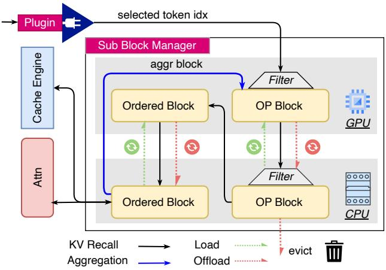  
Figure 7. Workflow of KV Recall

KVs with the minimum number of Ordered Blocks, which is similar to the classic set cover problem (SCP) (Feige, 1998) but only requires covering a subset. However, the critical KVs are sparsely distributed across different Ordered Blocks and the KV recall is inefficient and results in severe I/O amplification. OPKV introduces the extra aggregation process to copy these KVs into a new page, so we only need to cover approximately the subset as much as possible.

Let S be the set of selected token indices and O the set of existing OP Blocks (re-aggregated duplicates), where Tb ⊆ N denotes tokens in block b ∈ O. Our retrieval process is a constrained variant: find the smallest B ⊆ O such that Sb∈B Tb ⊇ S (full coverage of selected tokens) and ∀b ∈ B, |Tb ∩ S| ≥ θ (threshold constraint). This variant remains NP-hard, considering the trade-off between I/O amplification and search speed, we have designed a greedy retrieval algorithm for OP Blocks, with detailed descriptions provided in Algorithm 1.

To control I/O amplification, a variable page hit ratio ρ is introduced. A page will only be hit and retained in memory if the number of tokens to be retrieved in that page exceeds ρ · ξ, where ξ is the block size (line 3). For example, assuming ξ = 16 and given 256 token indexes, a minimum of 16 blocks are required. When ρ = 80%, a maximum of 19 blocks will be hit (containing ≥ 12.8 tokens to be reretrieved) and 1 new page will be retrieved, with 4 additional pages in the worst case.

Since the number of OP Blocks to be filtered may be large (related to cache budget and running time), full sequential traversal is time-consuming. We adopt a simple filtering algorithm that judges whether each block has the possibility of being hit and filters out blocks where the size of the intersection with the tokens to be retrieved is less than the threshold (line 4). This algorithm is implemented through vectorization, resulting in an extremely low overhead.

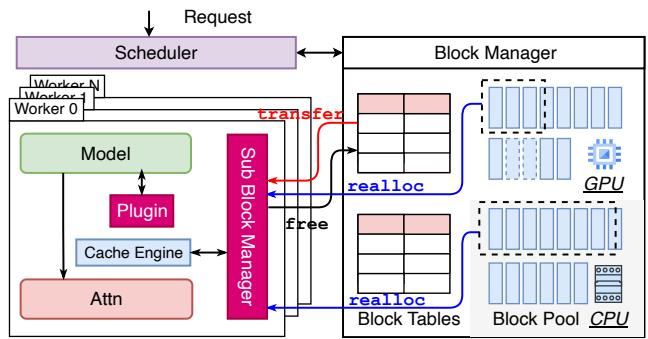  
Figure 8. Request Forwarding

We traverse the candidate set C to determine whether each block is hit; If hit, the recalled page is added to the set B (lines 6-7). To avoid duplicate tokens affecting the attention output, a variable op mask is designed, which records the indices of the current tokens that are duplicated with the already recalled tokens R, and then helps to mask them during attention computation (line 8). If it is necessary to maintain the consistency of the sparsity methods, all the tokens that are not selected can be masked. Even so, the recall of more KVs is usually beneficial to accuracy. After this step, sets S and R are updated (line 9).

For Ordered Blocks, since they are arranged in sequence in the block table, it is easy to determine which pages can be recalled through the indices of remaining tokens. Let the numbers of Ordered Blocks be O′. Retrieval traverses all blocks at most once, giving a time complexity of O(O +O′). If GPU/CPU memory usage not be constrained, O can be much larger than O′, which would hurt retrieval efficiency. We limit the memory usage to make O and O′ close, and the time complexity of retrieval could be O(N ).

After page retrieval, a small amount of selected tokens are still not recalled. They will be copied from Ordered Blocks and aggregated into one or more new OP Block(s). Object aggregation process selects k missed tokens from N Ordered Blocks according to their indices and then copies them to GPU memory, with a cost of O(k + k/block size), where k is a small fraction of total tokens. Hence the overall time complexity of page retrieval and object aggregation remains O(N).

Figure 7 shows the complete workflow of KV recall. When Sub BM receives the selected token indexes from the plugin, it performs page retrieval in the order of OP Block → Ordered Block and GPU → CPU; tokens that are not covered will be aggregated into new OP Blocks for recalling.

## 3.4 Sub Block Manager

Due to the significant communication overhead and latency in the inference engine designed for iterative-level scheduling, it is impossible to perform metadata updates for the per-layer recall. To address the challenge of mismatched granularity between per-layer KV recall and per-iteration metadata updates, we implement a local Sub Block Manager (Sub BM). Its core responsibilities include: (1) receiving and forwarding requests; (2) handling KV recall; (3) managing private cache metadata.

## 3.4.1 Request Forwarding

For regular requests, the Cache Engine receives coarsegrained instructions from BM, including swap in/ swap out/ copy operations, which only take effect on all blocks of a request. Therefore, for requests that need to be processed by sparsify methods, they will be forwarded by BM to Sub BM to support more fine-grained operations. BM will first transfer control of the request to Sub BM, and decide whether to allocate more GPU and CPU memory to Sub BM. After obtaining control, Sub BM can directly initiate operations to the cache engine to modify these blocks. As shown in Figure 8, the interaction between BM and Sub BM exposes three management primitives:

• transfer binds the request to Sub BM, enabling Sub BM to gain control over the request block table. During each iteration, BM retains only the last block and sends the addresses of the remaining blocks to Sub BM. At the same time, BM locks these addresses to avoid reoccupancy. After obtaining control of the block table, Sub BM will map each block into multiple blocks, with the maximum being the same as the number of attention layers. Each block is bound to 1 to multiple layers of physical blocks, depending on the registration information of the plugin, with a default of 1. For example, if the plugin always recalls the same token for layers 3 to 8, then we will not retain a copy of metadata for each layer.

• realloc reallocates GPU and CPU memory for Sub BM, which is used to store the sequentially generated KV Blocks (Ordered Blocks) during iteration and the re-aggregated duplicate Blocks (OP Blocks). BM allocates a small GPU cache and a relatively ample CPU cache to each Sub BM based on request number and prompt length. Although CPU memory is inexpensive and abundant, over-allocation yields diminishing returns and increases lookup overhead. Given the limited recall window, cache metadata must be maintained in a short time, and controlling cache size therefore accelerates the eviction of non-beneficial OP Blocks.

• free returns the Ordered Blocks to BM, and they may be discarded or used for prefix caching subsequently. Sub BM will directly destroy OP Blocks, but not return the part of GPU memory proactively, which will be immediately allocated to other requests.

## 3.4.2 Cache Metadata Management

In Sub BM, local cache metadata is divided into one GPU cache pool and two CPU cache pools, and the actual physical block operations are still performed by the cache Engine. The GPU cache pool is shared by both types of blocks with different requests, while the CPU cache pools hold Ordered Block and OP Block, respectively. When each request arrives, it creates an independent evictor, which continuously adds the aggregated or hit blocks and evicts the blocks when called. When the request is finished or aborted, Sub BM will just clear the evictor and flag the corresponding blocks as expired. During OP Block retrieval, it skips and deletes these expired blocks.

Some standard eviction policies have been integrated, including First-In-First-Out (FIFO), Least Recently Used (LRU), and S3FIFO (Yang et al., 2023). In Section 5.3.2, we evaluate the effectiveness of these three eviction policies. Surprisingly, due to the specific characteristics of this workload, LRU does not perform well; FIFO is more suitable because most cache reuse comes from adjacent critical KVs. S3FIFO turns out to be the best, as its fast demotion strategy can additionally retain a small number of reusable KVs, making it more appropriate for this kind of one-hit wonders workload.

For the GPU cache pool, while per-request eviction can follow these standard policies with isolated cache partitions, heterogeneity in request content and variability in hotpage counts render such partitioning suboptimal. We therefore adopt unified cache management across the GPU pool, jointly covering Ordered Blocks and OP Blocks. Specifically, we track per-request page hit counts and total page counts. When admitting new pages or when a CPU-resident page is hit, pages with the requests exhibiting the lowest hit rates will be preferentially evicted. Additionally, a relatively loose fairness threshold is implemented to prevent starvation of requests with low hit rates.

Regarding the CPU cache pools, OP Blocks may be thoroughly evicted, whereas Ordered Blocks are permanently retained until the request is finished or aborted to ensure uninterrupted token accessibility, which is an essential requirement for decoding processes. Given the potential surge in Ordered Block volume during decoding, a separate management framework is established: (1) a reserved space is dedicated to Ordered Blocks, with elastic capacity expansion triggered when their count approaches a predefined threshold; (2) a fixed-size cache partition is assigned to OP Blocks. To limit per-request lookup cost and avoid eviction interference from Ordered Blocks, a max-heap is constructed for request prioritization. Upon CPU cache saturation, the request with the largest OP Block count is selected for eviction.

## 4 IMPLEMENTATION

We implemented a prototype of OPKV on top of vLLM v0.7.2 (vLLM, 2025), comprising approximately 7,000 lines of Python and a small amount of CUDA. The system adopts a plugin-driven architecture and is integrated with the Llama (Touvron et al., 2023), OPT (Zhang et al., 2022), and Yi (Young et al., 2025) model families.

Attention Backend. Recalled pages may contain duplicate tokens, so we introduce an op mask to suppress their attention. We extend vLLM’s PagedAttention backend to accept this mask, while preserving the original execution path when masking is disabled.

Cache Layout. vLLM’s KV cache management targets iteration-level scheduling. We extend the Cache Engine with additional primitives to enable: (1) a shift from iterationlevel to hierarchical KV management; and (2) migration from request-level KV transfers to page-level KV swapping. We also implement basic object aggregation in PyTorch. These additions are non-intrusive, so the modified Cache Engine remains compatible with the original scheduling and commands of vLLM.

Algorithm Integration. We migrated and adapted different sparsity methods, and implemented dedicated algorithm plugins for them. Despite our clear interfaces for sparsity methods, vLLM’s advancements over traditional methods in terms of tensor shapes posed challenges. Specifically, original methods based on HuggingFace (Shen et al., 2023) typically feature a dedicated batch dimension, whereas vLLM performs horizontal concatenation of tensors from multiple requests. Such structural discrepancies posed difficulties in the integration process. Furthermore, for the sake of experimental fairness, we disabled CUDA Graph and other compilation-level optimization techniques to eliminate their potential confounding effects.

## 5 EVALUATION

## 5.1 Experiment Setup

To our knowledge, OPKV is the first inference acceleration framework designed for objective-level recallable sparsity methods in page-level KV cache management. To evaluate its generality, we integrate two state-of-the-art recallable sparsity methods with distinct recall mechanisms into OPKV and measure their performance improvements.

Baseline 1: InfiniGen. InfiniGen is an efficient recallable sparsity method that focuses on reducing recall overhead through dynamic KV cache management and speculative prefetching. It predicts and prefetches critical KVs for the next layer to overlap computation and recall. InfiniGen selects KVs independently for each attention head, and we perform a weighted aggregation of partial attention scores to make the selection at the layer granularity for fair comparison, similar to the approach of OmniKV.

Baseline 2: OmniKV. OmniKV exploits the similarity of attention between successive layers, and recalls the same tokens for multiple adjacent layers after several full-attention layers. This strategy reduces recall frequency but requires periodic full-attention computation to refresh the KV selection. As a result, up to 25% of all the KV cache is permanently stored in the GPU memory.

Key metrics. We primarily evaluate the decoding throughput and cache management efficiency using the following metrics: (1) Decoding Throughput (tokens/s): batch bize ∗ output len/decoding latency. (2) GPU Page Hit Ratio (%): gpu page hit num/recalled page num. (3) Recall Overhead (s): Ps∈S ts, where S means all stages in the recall process.

Model, dataset and server configurations. We evaluate OPKV using three LLMs with different context window sizes: OPT-6.7B, LLaMA-8B, and Yi-9B. We use ShareGPT (ShareGPT, 2025) as the testing dataset. We maintain the model and parameter configuration essentially the same as reported in the baselines, and Table 1 summarizes the details for each combination. The experiments are carried out on a single NVIDIA L40 GPU (48 GB memory) with a 256 GB host CPU memory server.

Table 1. Overview of method configuration. Since the number of recalled KVs by InfiniGen depends on a threshold, there is no fixed value.  
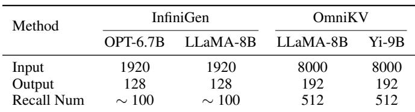

Parameter setting. For the overall performance evaluation, we use the same default parameters for both baselines with block size of 16, page hit ratio of 60%, and KV budget of 25%, of which KV budget means the ratio of the current GPU memory usage to the original KV cache. Following the setup in Figure 3, we apply FIFO to InfiniGen and S3FIFO to OmniKV as their eviction policy.

## 5.2 Case Study: InfiniGen

## 5.2.1 End-to-End Performance

Figure 9a presents the decoding throughput of OPKV and the InfiniGen prototype under varying batch sizes for OPT-6.7B. Across batch sizes from 2 to 10, OPKV improves the throughput of InfiniGen by 77.39%, 50.27%, 60.74%, 68.46%, and 75.73%, respectively. We further evaluate InfiniGen on LLaMA-8B to demonstrate the generality of OPKV. Figure 9b shows that for batch sizes from 2 to 10, OPKV achieves decoding throughput gains of 77.38%, 37.12%, 57.83%, 39.44%, and 38.44%, respectively. The reason lies in that OPKV minimizes data transfer between CPU and GPU through fine-grained page management, using only a small amount of additional GPU memory. Moreover, page-level operations incur significantly lower overhead than object-level operations, resulting in higher overall decoding efficiency.

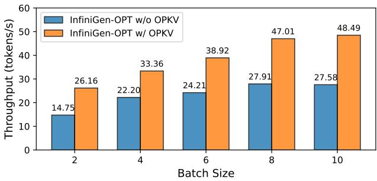

(a) OPT-6.7B  
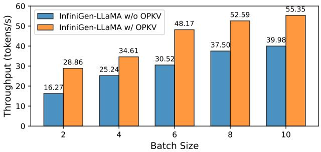  
(b) LLaMA-8B  
Figure 9. Decoding throughput between OPKV and InfiniGen under different batches

## 5.2.2 Parameter Sensitivity Analysis

We further analyze the influence of different parameters on the OPKV’s performance on OPT-6.7B. As shown in Figure 10, block size has the greatest influence on throughput. When the block size decreases to 8, throughput drops dramatically due to the increase in retrieval and metadata management overhead. As the block size increases, I/O amplification also increases because larger blocks reduce fine-grained cache reuse. A more reasonable size should be between 16 and 32, but considering the memory layout and fragmentation, this is not worth it. A lower page hit ratio is beneficial for improving cache reuse, but it also brings I/O amplification. Furthermore, even with a 10% budget, OPKV still achieves a 46.47% increase in decoding throughput compared to the prototype. This indicates that the transmission overhead caused by a small number of GPU page misses is still well overlapped.

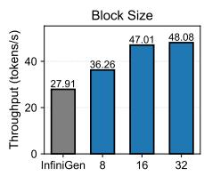

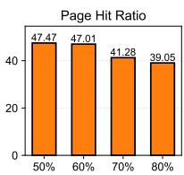

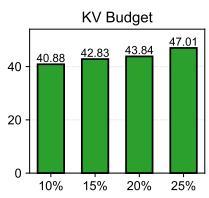  
Figure 10. Sensitivity analysis of block size, GPU page hit ratio, and KV budget on decoding throughput with a fixed batch size of 8 on OPT-6.7B.

## 5.2.3 Recall Process Analysis

We also examine the GPU page hit ratio and the overhead of each stage during the recall process on OPT-6.7B. Figure 11 shows the GPU page hit ratio of each of the 32 attention layers. The layers at the beginning and end have a higher hit ratio and a greater number of selected tokens. Although the hit ratio of the layers in the middle is lower, the overhead remains small because of the limited amount of recalled data. The overall GPU page hit ratio remains at 77.64%, which means that most of the KV cache can be reused directly on the GPU.

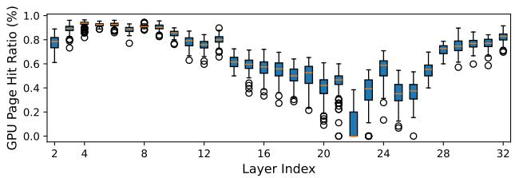  
Figure 11. The GPU page hit ratio of each layer on OPT-6.7B. The cache warms up with the first 28 iterations and retains the results of the next 100 iterations.

Figure 12 summarizes the time consumption of each stage. At small batch sizes (e.g., 2), object aggregation and native KV selection of InfiniGen are performance bottlenecks. However, page retrieval time increases linearly with batch size. Because the Global Interpreter Lock (GIL) and thread creation overhead of Python are too high to work within milliseconds, we can only perform the page retrieval of each batch serially. To further reduce CPU time consumption, one possible approach is to refactor the retrieval component using a high-performance programming language (e.g., C++).

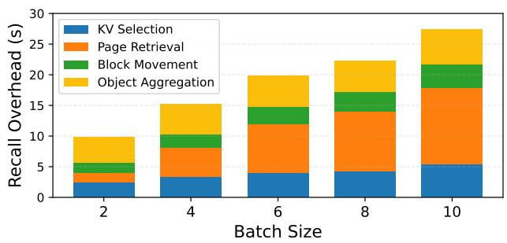  
Figure 12. The recall overhead of each stages under different batches on OPT-6.7B.

## 5.3 Case Study: OmniKV

## 5.3.1 End-to-End Performance

For LLaMA-8B, OmniKV executes the first two layers (layer 0,1) without modification and selects tokens at the filter layers (layer 2,8,18). Meanwhile, it maintains one full attention layer after each filter layer, retaining (2+3+3)/32 = 25% of the KV cache on the GPU memory for full attention computation, and using a total KV budget of 30%, as reported in its original paper. In comparison, OPKV keeps the first two layers and the filter layers, but uses only 10% of normal layers as the active KV budget. Thus, its total GPU allocation is (5 + 27 × 0.1)/32 ≈ 24%, which is slightly lower than OmniKV’s 25%.

Despite being allocated fewer GPU memory, OPKV still significantly improves the decoding throughput of OmniKV over its prototype, with measured gains of 35.77%, 51.08%, 52.22%, 56.44% and 55.62% for batch sizes ranging from 2 to 10, as depicted in Figure 13a. This is because simply using additional layers for buffering lacks flexibility and scalability. For different filter layers, they have an uneven number of tokens that need to be recalled (layer 2 need to recall layers 4-7 while layer 18 need to recall layers 19-31), and for long contexts, more tokens need to be recalled to maintain accuracy. Therefore, highly variable recall overhead requires more refined and efficient optimization.

Similarly for Yi-9B, Figure 13b shows the decoding throughput for batch sizes from 2 to 10. OPKV achieves throughput improvements of 40.86%, 39.04%, 32.94%, 51.73%, 44.99%, respectively. The result indicates that OPKV can achieve considerable performance improvements for different model architectures.

## 5.3.2 Eviction Policy Analysis

To ensure a fair comparison, we use a lower KV budget of 24% compared to 30% in OmniKV. However, this is still overly generous and thus fails to demonstrate the effectiveness of different eviction policies. In Figure 14, we evaluated the impact of different strategies on GPU page hit ratio and decoding throughput under lower KV budgets on LLAMA-8B, where 2% KV budget of normal layers means a total KV budget of (5 + 27 ∗ 0.02)/32 ≈ 17%.

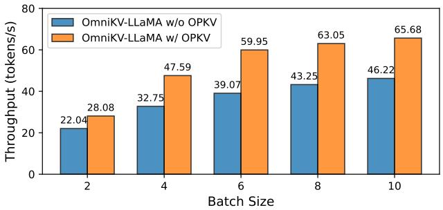

(a) LLaMA-8B  
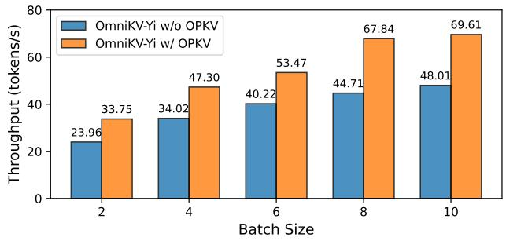  
(b) Yi-9B  
Figure 13. Decoding throughput between OPKV and OmniKV under different batches

Although widely used in cache systems, LRU shows significant performance degradation under low budgets, which demonstrates the difference between KV recall workloads and other workloads. Most of the reusable tokens are concentrated in the last iteration, and the LRU cannot promptly evict the tokens that are no longer recalled as the query changes, thus wasting precious GPU memory. In contrast,

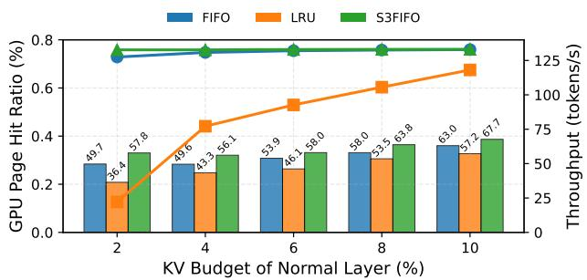  
Figure 14. The effectiveness of each eviction policy with different KV budgets and a fixed batch size of 8 on LLAMA-8B.

S3FIFO inherits the quick demotion mechanism of FIFO which is helpful to evict one-hit objects early, and uses an additional FIFO queue to retain important objects. Therefore, it has a better GPU page hit ratio and more object aggregation in GPU compared to FIFO, and maintains a high decoding throughput. With a total KV budget of 17%, it has a decoding throughput increase of 33.55% compared to OmniKV.

## 5.4 Ablation Study

To quantify the contribution of each core optimization in OPKV, we conduct an ablation study on two representative configurations: InfiniGen with OPT-6.7B and OmniKV with LLaMA-8B. We compare the full OPKV implementation against three ablated variants. All experiments use a fixed batch size of 8 and the same KV budget as in the main evaluation. Figure 15 reports the decoding throughput of each configuration.

Disabling OP Block Aggregation. In this variant, we fall back to using only Ordered Blocks, meaning we disable the creation and reuse of aggregated OP Blocks. Every selected KV must be fetched from Ordered Blocks and no token-level aggregation or duplication is performed. This ablated configuration isolates the benefit of OP Blocks in reducing I/O amplification and recall latency. As shown in Figure 15, disabling aggregation reduces throughput by 33.06% for InfiniGen and 23.51% for OmniKV compared to the full OPKV implementation, confirming that OP Blocks effectively mitigate the spatial discreteness of critical KVs.

Disabling Hot Page Reuse. Hot page reuse leverages temporal locality, where the OP Block will be kept on the GPU and directly reused without additional data transfer when it contains sufficient selectable tokens for an extended period of time. In this ablation, we disable this optimization entirely. All OP Blocks are forced to be offloaded into CPU memory and copied repeatedly when hit. As shown in Figure 15, disabling hot page reuse leads to a throughput drop of 14.25% for InfiniGen and 12.02% for OmniKV, demonstrating that reusing hot pages substantially reduces CPU-GPU traffic and recall overhead.

Replacing Selective Prefetch with Full Prefetch. The full OPKV implementation prefetches the hit blocks based on the threshold per layer. In this ablation, we remove tokenlevel selection and instead prefetch blocks that can cover all the selected KVs in the current iteration. This coarsegrained strategy loads more needless blocks, eliminating the benefit of selectivity. As shown in Figure 15, this change causes significant degradation, where the throughput falls by 19.66% for InfiniGen and 20.16% for OmniKV, indicating that token-level selection is indispensable for avoiding saturation of the CPU-GPU interconnect.

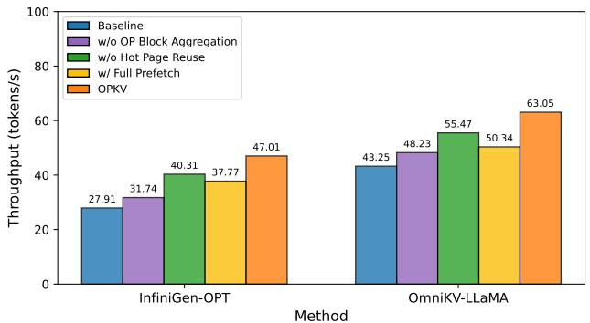  
Figure 15. Decoding throughput of InfiniGen on OPT-6.7B and OmniKV on LLaMA-8B under different ablation configurations with a fixed batch size of 8.

## 6 RELATED WORK

KV Sparsity Methods KV sparsity methods are rooted in the sparsity of attention scores—only a small subset of tokens contributes to most attention weights. The key to these approaches is to determine when and how many tokens should be evicted for effective compression and still maintain accuracy (WEI et al., 2025). Early static methods, including H2O (Zhang et al., 2023), StreamingLLM (Xiao et al., 2024b), and Keyformer (Adnan et al., 2024), evict KVs of unimportant tokens while keeping critical ones to preserve accuracy. They use fixed rules to allocate KV budgets, and those evicted tokens are permanently removed from future computations. However, without considering the dynamic shifts in token importance during iterations, one potential risk arises where evicted tokens may be needed later as queries update, yet are unavailable.

Dynamic sparsity methods are proposed to address this problem. PyramidKV (Cai et al., 2025) adjusts KV cache budget across different layers based on attention patterns and SnapKV (Li et al., 2024) refines it down to the attention head. InfLLM (Xiao et al., 2024a) keeps all the context available in CPU memory and recalls relevant KVs for attention computation. However, this approach increases the inference latency.

Inspired by PagedAttention, several works (e.g., Quest (Tang et al., 2024), ArkVale (Chen et al., 2024), and PSA (Zhou et al., 2025)) expand KV selection from token-level to block-level to reduce the time consumption with the cost of I/O amplification and additional KV budget. Meanwhile, some methods (e.g., InfiniGen (Lee et al., 2024), ClusterKV (Liu et al., 2025), and OmniKV (Hao et al., 2025)) utilize the inter-layer similarity to prefetch critical KVs for subsequent layers in advance to overlap KV recall and attention computation. OPKV helps token-level methods alleviate the recall overhead and avoids the possible I/O amplification caused by block-level methods.

KV Cache Management System LLM inference imposes enormous memory demands on KV cache; therefore, a large body of research focuses on optimizing KV cache memory management. In terms of in-memory management, the core idea is to reduce memory usage through structural optimization or reuse. Inspired by the page table mechanism in operating systems, PagedAttention (Kwon et al., 2023) proposes managing KV cache by pages to improve memory utilization. Prefix reuse (Gim et al., 2024) technology reduces redundant storage overhead by reusing identical prefix KV cache across different inference requests. SGLang (Zheng et al., 2024) further proposes an optimized prefix tree structure based on Radix trees, while CacheBlend (Yao et al., 2025) enables the reuse of non-prefix KV cache with the support of a small amount of additional computation.

For cross-storage tier management, research focuses on utilizing multi-level storage structures such as GPU memory, CPU memory, and disks to expand the storage capacity of KV cache. CachedAttention (Gao et al., 2024) proposes a hierarchical KV cache system that stores historical KV cache from multi-turn conversations in low-cost storage tiers such as CPU memory or disks. It enables KV cache reuse across multi-turn conversations through a layer-bylayer prefetching mechanism. Based on the observation of the temporal and spatial locality in the prefix KV cache, a workload-aware eviction strategy (Wang et al., 2025) is proposed to retain the KV cache that is more likely to be reused within the limited GPU/CPU memory. However, these methods focus on cross-request KV reuse and cannot face to fine-grained KV cache management within requests.

## 7 CONCLUSION

In the paper, we present OPKV, a high-throughput, plugindriven framework that unifies recallable sparsity with pagelevel KV cache management for long-context LLM inference. Based on three key observations, OPKV applies a unified model-sparsity-cache architecture and builds an intraiteration KV cache management system with low latency and millisecond-level response. Our experiments demonstrate that with reasonable additional caches, OPKV can help sparsity methods with recall optimization further reduce recall overhead and increase decoding throughput.

In the future, we will explore adaptive scheduling strategies to transparently enable sparsity plugins, so as to handle a mixture of regular and long-context requests. This approach can maximize throughput while satisfying SLOs by tuning the trade-off between recall and computation.

## 8 ACKNOWLEDGMENT

We thank the anonymous reviewers for their helpful feedback on improving the paper. This work is supported by the

Jiangsu Provincial Frontier Technology Development Program (No. BF2025601), and the National Natural Science Foundation of China (No. 62302095, 62363032).

## REFERENCES

Adnan, M., Arunkumar, A., Jain, G., Nair, P. J., Soloveychik, I., and Kamath, P. Keyformer: KV cache reduction through key tokens selection for efficient generative inference. In Proceedings of the 7th Machine Learning and Systems, volume 6 of MLSys’24, pp. 114–127, 2024. URL https://proceedings.mlsys.org/pa per\_files/paper/2024/file/48fecef47b 19fe501d27d338b6d52582-Paper-Confere nce.pdf.

Allen, T. and Ge, R. In-depth analyses of unified virtual memory system for GPU accelerated computing. In Proceedings of the International Conference for High Performance Computing, Networking, Storage and Analysis, SC’21, pp. 1–15, 2021. URL https://doi.org/10 .1145/3458817.3480855.

Arslan, M., Ghanem, H., Munawar, S., and Cruz, C. A survey on RAG with LLMs. Procedia computer science, 246:3781–3790, 2024. URL https://doi.org/10 .1016/j.procs.2024.09.178.

Bai, Y., Lv, X., Zhang, J., Lyu, H., Tang, J., Huang, Z., Du, Z., Liu, X., Zeng, A., Hou, L., Dong, Y., Tang, J., and Li, J. LongBench: A bilingual, multitask benchmark for long context understanding. In Proceedings of the 62nd Annual Meeting of the Association for Computational Linguistics, ACL ’24, pp. 3119–3137, 2024. URL https://acla nthology.org/2024.acl-long.172/.

Cai, Z., Zhang, Y., Gao, B., Liu, Y., Li, Y., Liu, T., Lu, K., Xiong, W., Dong, Y., Hu, J., and Xiao, W. Pyramidkv: Dynamic kv cache compression based on pyramidal information funneling, 2025. URL https: //arxiv.org/abs/2406.02069.

Chen, R., Wang, Z., Cao, B., Wu, T., Zheng, S., Li, X., Wei, X., Yan, S., Li, M., and Liang, Y. Arkvale: Efficient generative llm inference with recallable key-value eviction. In Globerson, A., Mackey, L., Belgrave, D., Fan, A., Paquet, U., Tomczak, J., and Zhang, C. (eds.), Advances in Neural Information Processing Systems, volume 37 of NeurIPS’24, pp. 113134–113155. Curran Associates, Inc., 2024. URL https://proceedings.neurip s.cc/paper\_files/paper/2024/file/cd4 b49379efac6e84186a3ffce108c37-Paper-C onference.pdf.

Choquette, J. and Gandhi, W. Nvidia A100 GPU: Performance & innovation for GPU computing. In 2020 IEEE Hot Chips 32 Symposium, HCS ’20, pp. 1–43, 2020. URL https://doi.org/10.1109/HCS49909.2020. 9220622.

Feige, U. A threshold of ln n for approximating set cover. Journal of the ACM, 45(4):634–652, 1998. URL https: //doi.org/10.1145/285055.285059.

Gao, B., He, Z., Sharma, P., Kang, Q., Jevdjic, D., Deng, J., Yang, X., Yu, Z., and Zuo, P. Cost-Efficient large language model serving for multi-turn conversations with CachedAttention. In 2024 USENIX Annual Technical Conference, ATC ’24, pp. 111–126, 2024. URL https: //www.usenix.org/conference/atc24/pr esentation/gao-bin-cost.

Gim, I., Chen, G., Lee, S.-s., Sarda, N., Khandelwal, A., and Zhong, L. Prompt cache: Modular attention reuse for low-latency inference. In Proceedings of the 7th Machine Learning and Systems, volume 6 of MLSys’24, pp. 325– 338, 2024. URL https://proceedings.mlsys. org/paper\_files/paper/2024/file/a66c aa1703fe34705a4368c3014c1966-Paper-C onference.pdf.

Hao, J., Zhu, Y., Wang, T., Yu, J., Xin, X., Zheng, B., Ren, Z., and Guo, S. Omnikv: Dynamic context selection for efficient long-context llms. In The 13th International Conference on Learning Representations, ICLR’25, 2025. URL https://openreview.net/pdf?id=ul CAPXYXfa.

Hooper, C., Kim, S., Mohammadzadeh, H., Mahoney, M. W., Shao, Y. S., Keutzer, K., and Gholami, A. KVQuant: Towards 10 million context length LLM inference with KV cache quantization. In Advances in Neural Information Processing Systems, volume 37 of NeurIPS’24, pp. 1270–1303, 2024. URL https: //proceedings.neurips.cc/paper\_files /paper/2024/file/028fcbcf85435d39a40 c4d61b42c99a4-Paper-Conference.pdf.

Kocon, J., Cichecki, I., Kaszyca, O., Kochanek, M., Szydło, ´ D., Baran, J., Bielaniewicz, J., Gruza, M., Janz, A., Kanclerz, K., Kocon, A., Koptyra, B., Mieleszczenko-´ Kowszewicz, W., Miłkowski, P., Oleksy, M., Piasecki, M., Łukasz Radlinski, Wojtasik, K., Wo ´ zniak, S., and ´ Kazienko, P. ChatGPT: Jack of all trades, master of none. Information Fusion, 99:101861, 2023. URL https://www.sciencedirect.com/scienc e/article/pii/S156625352300177X.

Kwon, W., Li, Z., Zhuang, S., Sheng, Y., Zheng, L., Yu, C. H., Gonzalez, J., Zhang, H., and Stoica, I. Efficient memory management for large language model serving with PagedAttention. In Proceedings of the 29th Symposium on Operating Systems Principles, SOSP ’23, pp. 611–626, 2023. URL https://doi.org/10.114 5/3600006.3613165.

Lee, W., Lee, J., Seo, J., and Sim, J. InfiniGen: Efficient generative inference of large language models with dynamic KV cache management. In 18th USENIX Symposium on Operating Systems Design and Implementation, OSDI’24, pp. 155–172, 2024. URL https://www.usenix.o rg/conference/osdi24/presentation/lee.

Li, Y., Huang, Y., Yang, B., Venkitesh, B., Locatelli, A., Ye, H., Cai, T., Lewis, P., and Chen, D. Snapkv: Llm knows what you are looking for before generation. In Globerson, A., Mackey, L., Belgrave, D., Fan, A., Paquet, U., Tomczak, J., and Zhang, C. (eds.), Advances in Neural Information Processing Systems, volume 37 of NeurIPS’24, pp. 22947–22970. Curran Associates, Inc., 2024. URL https://proceedings.neurips. cc/paper\_files/paper/2024/file/28ab4 18242603e0f7323e54185d19bde-Paper-Con ference.pdf.

Liu, G., Li, C., Zhao, J., Zhang, C., and Guo, M. ClusterKV: Manipulating LLM KV cache in semantic space for recallable compression. In 62nd ACM/IEEE Design Automation Conference, DAC’25, pp. 1–7, 2025. URL https://doi.org/10.1109/DAC63849.2025. 11132479.

Liu, Z., Yuan, J., Jin, H., Zhong, S. H., Xu, Z., Braverman, V., Chen, B., and Hu, X. KIVI: a tuning-free asymmetric 2bit quantization for KV cache. In Proceedings of the 41st International Conference on Machine Learning, volume 235 of ICML’24, pp. 32332–32344, 2024. URL https: //proceedings.mlr.press/v235/liu24bz .html.

ShareGPT. ShareGPT, 2025. URL https://shareg pt.com/. [Online].

Shen, Y., Song, K., Tan, X., Li, D., Lu, W., and Zhuang, Y. HuggingGPT: Solving AI tasks with ChatGPT and its friends in hugging face. In Advances in Neural Information Processing Systems, volume 36 of NeurIPS’23, pp. 38154–38180, 2023. URL https://proceedings. neurips.cc/paper\_files/paper/2023/fi le/77c33e6a367922d003ff102ffb92b658-P aper-Conference.pdf.

Sheng, Y., Zheng, L., Yuan, B., Li, Z., Ryabinin, M., Chen, B., Liang, P., Re, C., Stoica, I., and Zhang, C. FlexGen: High-throughput generative inference of large language models with a single GPU. In Proceedings of the 40th International Conference on Machine Learning, volume 202 of ICML’23, pp. 31094–31116, 2023. URL https: //proceedings.mlr.press/v202/sheng23a. html.

Tang, J., Zhao, Y., Zhu, K., Xiao, G., Kasikci, B., and Han, S. QUEST: query-aware sparsity for efficient long-context

LLM inference. In Proceedings of the 41st International Conference on Machine Learning, ICML’24, 2024. URL https://dl.acm.org/doi/10.5555/36920 70.3694025.

Touvron, H., Lavril, T., Izacard, G., Martinet, X., Lachaux, M.-A., Lacroix, T., Roziere, B., Goyal, N., Hambro, E., \` Azhar, F., Rodriguez, A., Joulin, A., Grave, E., and Lample, G. LLaMA: Open and efficient foundation language models. 2023. URL https://arxiv.org/abs/23 02.13971.

vLLM. vLLM, 2025. URL https://github.com/vllm-project/vllm/releases/tag/v0.7.2.[Online].

Wang, J., Han, J., Wei, X., Shen, S., Zhang, D., Fang, C., Chen, R., Yu, W., and Chen, H. KVCache cache in the wild: Characterizing and optimizing KVCache cache at a large cloud provider. In 2025 USENIX Annual Technical Conference, ATC’25, 2025. URL https: //www.usenix.org/conference/atc25/pr esentation/wang-jiahao.

WEI, G., Zhou, X., Sun, P., Zhang, T., and Wen, Y. Rethinking key-value cache compression techniques for large language model serving. In Proceedings of the 8th Machine Learning and System, MLSys’25, 2025. URL https: //openreview.net/forum?id=ou0AsNbXVG.

Wu, X., Mart´ınez, A., and Klyen, M. Dialog generation using multi-turn reasoning neural networks. In Walker, M., Ji, H., and Stent, A. (eds.), Proceedings of the 2018 Conference of the North American Chapter of the Association for Computational Linguistics: Human Language Technologies, NAACL’18, pp. 2049–2059, 2018. URL https://aclanthology.org/N18-1186/.

Xiao, C., Zhang, P., Han, X., Xiao, G., Lin, Y., Zhang, Z., Liu, Z., and Sun, M. Infllm: Training-free long-context extrapolation for llms with an efficient context memory. In Globerson, A., Mackey, L., Belgrave, D., Fan, A., Paquet, U., Tomczak, J., and Zhang, C. (eds.), Advances in Neural Information Processing Systems, volume 37 of NeurIPS’24, pp. 119638–119661. Curran Associates, Inc., 2024a. URL https://proceedings.neur ips.cc/paper\_files/paper/2024/file/d 842425e4bf79ba039352da0f658a906-Paper -Conference.pdf.

Xiao, G., Tian, Y., Chen, B., Han, S., and Lewis, M. Efficient streaming language models with attention sinks. In The 12th International Conference on Learning Representations, ICLR’24, 2024b. URL https://openre view.net/forum?id=NG7sS51zVF.

Yang, J., Zhang, Y., Qiu, Z., Yue, Y., and Vinayak, R. FIFO queues are all you need for cache eviction. In Proceedings of the 29th Symposium on Operating Systems Principles, SOSP’23, pp. 130–149, 2023. URL https://doi. org/10.1145/3600006.3613147.

Yao, J., Li, H., Liu, Y., Ray, S., Cheng, Y., Zhang, Q., Du, K., Lu, S., and Jiang, J. Cacheblend: Fast large language model serving for rag with cached knowledge fusion. In Proceedings of the 20th European Conference on Computer Systems, EuroSys’25, pp. 94–109, 2025. URL https://doi.org/10.1145/3689031. 3696098.

Young, A., Chen, B., Li, C., Huang, C., Zhang, G., Zhang, G., Wang, G., Li, H., Zhu, J., Chen, J., Chang, J., Yu, K., Liu, P., Liu, Q., Yue, S., Yang, S., Yang, S., Xie, W., Huang, W., Hu, X., Ren, X., Niu, X., Nie, P., Li, Y., Xu, Y., Liu, Y., Wang, Y., Cai, Y., Gu, Z., Liu, Z., and Dai, Z. Yi: Open foundation models by 01.ai, 2025. URL https://arxiv.org/abs/2403.04652.

Yu, G.-I., Jeong, J. S., Kim, G.-W., Kim, S., and Chun, B.- G. Orca: A distributed serving system for Transformer-Based generative models. In 16th USENIX Symposium on Operating Systems Design and Implementation, OSDI’22, pp. 521–538, 2022. URL https://www.usenix.o rg/conference/osdi22/presentation/yu.

Zhang, S., Roller, S., Goyal, N., Artetxe, M., Chen, M., Chen, S., Dewan, C., Diab, M., Li, X., Lin, X. V., Mihaylov, T., Ott, M., Shleifer, S., Shuster, K., Simig, D., Koura, P. S., Sridhar, A., Wang, T., and Zettlemoyer, L. Opt: Open pre-trained transformer language models, 2022.

Zhang, Z., Sheng, Y., Zhou, T., Chen, T., Zheng, L., Cai, R., Song, Z., Tian, Y., Re, C., Barrett, C., Wang, Z. A., ´ and Chen, B. H2O: Heavy-hitter oracle for efficient generative inference of large language models. In Advances in Neural Information Processing Systems, volume 36 of NeurIPS’23, pp. 34661–34710, 2023. URL https: //proceedings.neurips.cc/paper\_files /paper/2023/file/6ceefa7b15572587b78 ecfcebb2827f8-Paper-Conference.pdf.

Zheng, L., Yin, L., Xie, Z., Sun, C., Huang, J., Yu, C. H., Cao, S., Kozyrakis, C., Stoica, I., Gonzalez, J. E., Barrett, C., and Sheng, Y. SGLang: Efficient execution of structured language model programs. In Advances in Neural Information Processing Systems, volume 37 of NeurIPS’24, pp. 62557–62583, 2024. URL https: //proceedings.neurips.cc/paper\_files /paper/2024/file/724be4472168f31ba1c 9ac630f15dec8-Paper-Conference.pdf.

Zhou, Q., Yin, P., Zuo, P., and Cheng, J. Progressive sparse attention: Algorithm and system co-design for efficient attention in llm serving, 2025. URL https://arxiv. org/abs/2503.00392.