# GHOSTSERVE: A LIGHTWEIGHT CHECKPOINTING SYSTEM IN THE SHADOW FOR FAULT-TOLERANT LLM SERVING

Shakya Jayakody \* 1 Youpeng Zhao \* † 1 Chinmay Nehate 1 Jun Wang 1

## ABSTRACT

The rise of million-token, agent-based applications has placed unprecedented demands on large language model (LLM) inference services. The long-running nature of these tasks increases their susceptibility to hardware and software faults, leading to costly job failures, wasted resources, and degraded user experience. The stateful key-value (KV) cache, which grows with the sequence length, presents a central challenge as it is a critical and vulnerable component in distributed serving systems. In this work, we propose GhostServe, a novel checkpointing solution to facilitate fault-tolerant LLM serving. Specifically, GhostServe protects the streaming KV cache in the shadow by applying erasure coding to generate and store the parity shards in host memory. In the event of device failures, GhostServe enables fast reconstruction of the lost KV cache, allowing the inference process to resume seamlessly without costly full recomputation or state replication. Evaluations demonstrate that GhostServe reduces checkpointing latency by up to 2.7× and recovery latency by 2.1× for a single batch, and 1.2× median response latency improvement compared to existing methods, in the presence of system failures, paving the way for high-availability and cost-effective LLM serving at scale.

## 1 INTRODUCTION

The development of large language models (LLMs) has brought the prospect of artificial general intelligence (AGI) within closer reach, due to their exceptional performance across diverse language understanding and generation tasks (Brown et al., 2020; OpenAI, 2025b; Meta, 2024; Guo et al., 2025). A key driving force behind this rapid progress is the prevalence of scaling laws, which indicate that the performance of LLMs improves as the model size increases (Kaplan et al., 2020; Hoffmann et al., 2022). Naturally, the deployment of inference serving has become increasingly popular in distributed environments, where specialized accelerators such as GPUs or TPUs are utilized to accommodate these compute- and memory-intensive workloads (Google, 2024; Kwon et al., 2023; Zheng et al., 2024; Agrawal et al., 2023; Qin et al., 2025). Subsequently, the power of LLMs has been continually pushed to the next level, where agent-based applications like GPT Codex (OpenAI, 2025a), and Claude Code (Anthropic, 2025) are capable of performing million-token complex coding tasks, further streamlining and accelerating scientific and engineering development.

However, as the intensity of LLM serving workloads rapidly increases, hardware or software errors are often unavoidable, especially in large-scale distributed environments. Interruptions are common and frequent in enterprise-level high-performance computing (HPC) data centers (Mohan et al., 2021; Wang et al., 2023; Wan et al., 2024; Wang et al., 2024; Gandhi & Kozyrakis, 2024). With the emergence of LLM-based AI agent applications, a single point of failure could result in catastrophic consequences for the entire workflow, degraded user experiences, and even huge financial losses if not promptly recovered (OpenAI, 2024; Wikipedia, 2024; CNN, 2025). Recent studies highlight the importance of resilient LLM services and the dire need for inference engine and infrastructure improvements to reduce mitigation time and impact (Ranganathan et al., 2025; Jiang et al., 2025; Wang et al., 2024). Furthermore, the autoregressive characteristic of LLM inference requires storing crucial but growing transient intermediate states, e.g., key-value (KV) cache for efficient token generation (Zhao et al., 2024; Ott et al., 2019; Kwon et al., 2023). In the event of a failure, this volatile state is lost, forcing the system to restart the inference job from the very beginning. For long-context tasks, this implies a costly recomputation of the entire KV cache and can take as long as tens of minutes (Zhu et al., 2024; Yang et al., 2024). Therefore, it has become increasingly essential to promote real-world system reliability and improve cost-effectiveness for LLM serving at scale (Ranganathan et al., 2025; Jiang et al., 2025; Agrawal et al., 2024).

Table 1. Comparison of prior works and GhostServe.  
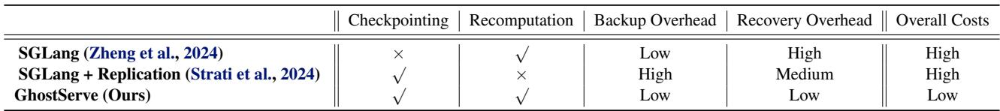

Although there have been prior research efforts to address the fault-tolerant issues for LLM applications (Wang et al., 2023; Wan et al., 2024; Strati et al., 2025; 2024; NVIDIA, 2019; Wan et al., 2025), such designs often fall short in the case of LLM serving. First, previous systems are generally optimized for offline LLM training, where the workloads are often homogeneous and predictable. The protection of model weights and optimizer states can be readily achieved via low-latency concurrent checkpointing (Strati et al., 2025; Wan et al., 2024; Gandhi & Kozyrakis, 2024). In the case of LLM serving, due to the variety of input prompts and output lengths, the computation procedure is more dynamic, thus harder to determine and profile beforehand. Second, applying naive checkpointing for LLM serving could induce severe latency overheads, due to the growing memory footprint of the KV cache. While methods like Dej´ aVu \` propose to alleviate such overhead by overlapping the I/O with computation in pipeline parallelism, they do not work well in intra-node tensor parallelism for real-time LLM serving (Strati et al., 2024). Moreover, replication of the entire KV cache often leads to significant host memory overhead, as the KV cache size can be as big as hundreds of gigabytes (GBs) for million-token contexts. The lack of sufficient node memory could lead to CPU oversubscription, further downgrading the system throughput performance and predictability (Baset et al., 2012; Ganguly et al., 2021).

In this work, inspired by the idea of erasure coding (Li & Li, 2013; Aguilera et al., 2005), we propose GhostServe, a new lightweight checkpointing framework to facilitate fault-tolerant LLM serving in the wild. The concept of erasure coding has been widely implemented in modern distributed storage systems, where data is split and encoded to generate redundant data shards for data recovery in the event of complete disk failures (Huang et al., 2012; Li & Li, 2013; Yiu et al., 2017; Zhang et al., 2016). The key insight behind GhostServe is that instead of directly protecting the entire KV cache, we only need to protect the encoded redundant pieces in the host memory, thus significantly reducing the I/O transfer latency and memory overheads. As shown in Figure 2, our method reduces the host memory overhead and checkpointing latency by 75% and 73%, respectively. However, achieving such improvements demands solving two unique challenges.

First, applying erasure coding is not straightforward. Erasure codes are often defined over binary fields, making them incompatible with the floating-point (FP) representation of the KV cache. To address this issue, we adopt an integercentric view of the KV cache and develop a suite of highly optimized GPU kernels to perform lossless encoding operations with low latency, supporting a range of standard codes, like XOR (Aguilera et al., 2005), RDP (Corbett et al., 2004), and Reed-Solomon (Reed et al., 1960). Thanks to such implementations, GhostServe silently operates in the shadow, induces minimal overhead in both checkpointing and recovery processes.

Second, during distributed serving, each worker independently generates its portion of the KV cache. A strawman solution of applying erasure coding to a distributed KV cache encounters the issue of GPU memory overhead, degrading LLM serving throughput. To this end, GhostServe conducts the erasure coding at the granularity of a chunk (group of tokens), and assigns a dedicated worker for parity generation. Such a design removes the GPU memory overhead, while offering flexibility and fine-grained fault tolerance for users, and can be further combined with a recomputation strategy to foster faster recovery time. Moreover, to ensure system stability and steady GPU utilization, GhostServe features a workload balancing strategy to rotate encoding assignment in a round-robin manner, where each GPU performs the encoding operation for each chunk at a time. As shown in Table 1, compared against prior methods, GhostServe provides a much more cost-effective checkpointing solution towards million-token LLM serving, with much lower system overheads.

To summarize, this paper makes the following contributions:

• We identify fault tolerance issues for LLM serving and propose a novel lightweight checkpointing system based on erasure coding, termed GhostServe.

• We develop a suite of specialized GPU kernels to support KV cache encoding and reconstruction with minimal latency overhead.

• GhostServe performs checkpointing at the chunk-level for distributed KV cache and a rotating workload balancing method to ensure minimal overhead and system stability.

• We implement GhostServe in distributed settings on top of SGLang, and evaluate it across diverse workload scenarios. Experiments demonstrate that GhostServe significantly improves the fault-tolerance capabilities of existing LLM serving systems, offering substantial checkpointing latency reduction and recovery time speedup.

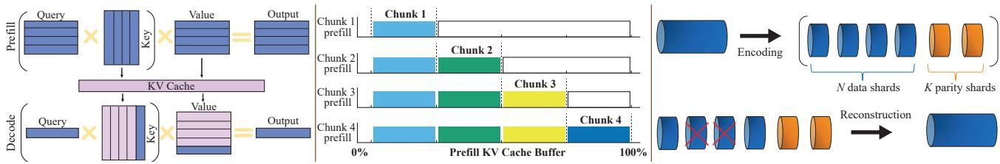  
Figure 1. (a) Left: Prefill and decode stages in LLM inference. In the prefill stage, all queries are processed with keys and values computed and stored in memory. During the subsequent decode stage, only the attention for new queries is needed, significantly reducing attention computation. (b) Middle: Chunked prefill mechanism. During prefill, the input is divided into chunks of tokens, where the corresponding KV cache is written sequentially into contiguous chunks of the KV cache buffer. (c) Right: Illustrative example of erasure coding. The input data is first partitioned into N shards, which are then encoded to generate K parity shards. In the event of failures, the lost shards can be reconstructed from parity shards and the surviving data shards.

## 2 BACKGROUND

LLM Inference. Inference in transformer-based large language models (LLMs) (Vaswani et al., 2017) typically follows a two-phase pipeline: the prefill stage and the decode stage (Pope et al., 2023), as shown in Figure 1 (a). In the prefill stage, the model processes the entire input prompt in parallel, generating the key-value (KV) tensors, often known as the KV cache (Ott et al., 2019). For prompts that often span thousands, and even millions of tokens, chunked-prefill is employed, where the input is partitioned into fixed-size chunks that are processed sequentially (Zheng et al., 2024; Agrawal et al., 2023). This can reduce peak GPU memory usage, allowing for processing very long input prompts without running out of memory. Furthermore, chunking creates opportunities for parallelism, where systems can begin the memory-bound decoding work at the same time, thus improving overall GPU utilization. The mechanism of chunked-prefill is shown in Figure 1 (b). Once prefill completes, the decode stage begins, where the model generates tokens one-at-a-time, making it memory-bound instead of compute-bound.

Distributed Serving. The immense memory footprint of modern LLMs, driven by both billion-level parameter weights and the dynamic KV cache for long contexts, has made it infeasible to serve them on a single accelerator. Consequently, distributed serving has become a necessity, leveraging model parallelism techniques (Shoeybi et al., 2019; Huang et al., 2019). A common practice is to employ tensor parallelism for intra-node scenarios, where each operator weight is split across multiple accelerators, with each device executing part of the computation in parallel with devicedevice synchronization at each transformer layer (Shoeybi et al., 2019). Specialized serving systems have introduced further optimization to address the overhead of the growing KV cache (Kwon et al., 2023; Qin et al., 2025; Zheng et al., 2024). vLLM proposes PagedAttention to virtually eliminate memory fragmentation in the KV cache, significantly improving throughput and memory efficiency (Kwon et al., 2023). MoonCake further develops a KVCache-centric architecture to leverage GPU, CPU, and SSD for efficient disaggregated KV cache at scale (Qin et al., 2025). In terms of fault tolerance, the prevalent strategies for most serving systems are recomputation (NVIDIA, 2019). While Dej´ aVu \` leverages replication method to perform concurrent KV cache ‘checkpointing’ (Strati et al., 2024), it does not work well for existing high-performance serving systems, such as SGLang (Zheng et al., 2024), especially in intra-node tensor parallelism.

Erasure Coding. Erasure coding has long been a cornerstone of reliability in large-scale distributed storage systems, offering robust protection against hardware failures while significantly reducing the storage overhead of naive replication (Huang et al., 2012; Li & Li, 2013). The core idea is to generate parity shards using existing data, creating redundancy, as shown in Figure 1 (c). Among its variants, exclusive-OR (XOR) coding provides a simple yet efficient mechanism to generate a parity block by performing bitwise XOR across multiple data shards (Luo et al., 2013). However, its resilience is limited to single-failure recovery, leaving the system vulnerable to correlated or multiple failures in large-scale clusters. Row–Diagonal Parity (RDP) (Corbett et al., 2004) further introduces a lightweight, systematic XOR-based scheme that protects data using two parity shards, namely row parity and diagonal parity, enabling recovery from any two simultaneous shard failures via an efficient diagonal-walk reconstruction (Goel & Corbett, 2012). In contrast, Reed–Solomon (RS) coding (Reed et al., 1960) performs encoding and decoding over Galois fields using unique coefficients per parity symbol, providing higher fault tolerance but higher latency and storage costs.

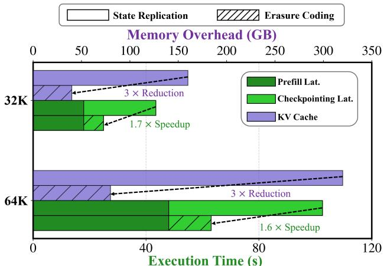  
Figure 2. Comparison of checkpointing latency and memory overhead of our erasure coding (8:2) method and state replication (Strati et al., 2024) during prefill. Results are profiled with LLaMA-3-70B using SGLang with a batch size of 16, and varying input sequence lengths (32/64K), a chunk size of 2K, in tensor parallelism (TP=8) across 8×H200 GPUs.

## 3 MOTIVATION

While recent efforts have dramatically improved LLM serving performance, fault tolerance and reliability remain critical, yet often overlooked, aspects of system design. In production, LLMs are deployed on multi-GPU and multi-node infrastructures where a single device failure can halt the entire serving process (Wang et al., 2024; Strati et al., 2024). A Microsoft study of 156 high-severity production incidents shows that around 60% of failures occur at the inference engine level, including but not limited to KV cache errors, memory leaks, and crashes (Ranganathan et al., 2025). This new analysis echoes prior studies indicating GPU errors dominate the root causes for large-scale ML training applications (Kokolis et al., 2024; Wan et al., 2025). As agentbased applications are increasingly embedded in our daily lives, processing million-token workloads has become a reality in production-level systems, where a single point of failure could lead to minutes or even hours of wasted time and resources (Zhu et al., 2024; Yang et al., 2024).

Unlike in LLM training, the central challenge for reliable LLM serving is protecting the transient KV cache, which expands with sequence length and batch size. This fragility is especially acute for long-context generation. A full restart of requests with millions of tokens to recompute the massive KV cache is expensive. For instance, processing 1M context length for a 405B model can take 20 minutes on a single node with 8×H100 GPUs (Yang et al., 2024). Although traditional solutions like checkpointing are effective for distributed training, they are ill-suited for the unique demands of LLM serving due to two primary drawbacks:

• Prohibitive Latency Overhead. Checkpointing, while straightforward, introduces severe latency by stalling the prefill stage to write the KV cache state to host memory or disk. This overhead is amplified in intranode tensor parallelism, where the I/O operations cannot be effectively overlapped with computation. As shown in Figure 2, this can increase prefill latency by as much as 113% for 70B models. Such a bottleneck will be exacerbated as applications scale to process million-token contexts. This necessitates a more efficient, lightweight method for protecting the KV cache with minimal performance impact.

• Excessive Memory Overhead. Prevalent checkpointing methods also suffer from high memory consumption. While storing a full copy of the KV cache in host memory is simple, this brute-force replication can exhaust node memory, ironically degrading overall system reliability. In Figure 2, we can see that the KV cache memory footprint can consume over 300 GB for long-sequence inputs. Furthermore, in high-capacity serving scenarios, host memory often acts as a buffer for the KV cache of preempted requests (Kwon et al., 2023; Wu et al., 2023). Adding a full checkpointed KV cache creates further resource contention. Therefore, an efficient and flexible memory management and scheduling strategy for fault tolerance is crucial.

## 4 METHODOLOGY

In this work, we propose a new lightweight checkpointing system, GhostServe, for distributed LLM serving based on the idea of erasure coding to address the fault-tolerance challenges outlined in Section 3. The overview system architecture is shown in Figure 3 (a). Compared to naive replication-based checkpointing, GhostServe leverages erasure coding to generate parity shards for the KV cache at the granularity of a chunk (group of tokens). The parity shards are stored in host memory and retrieved when one or multiple KV caches are lost during GPU failures. To promote stability, GhostServe also features a load-balancing strategy to assign parity generation workloads in a round-robin manner.

## 4.1 Erasure Coding for LLMs

To mitigate checkpointing overheads, we employ erasure coding to protect the streaming KV cache during LLM serving. Unlike replication, which duplicates the entire KV cache, our approach stores only K parity shards for N data shards (K ≪ N ). If a failure occurs, lost data is reconstructed using the surviving data and parity shards from the remaining workers. This method substantially reduces storage costs. As shown in Figure 2, an 8:2 data-to-parity ratio reduces overhead by 75% compared to full replication.

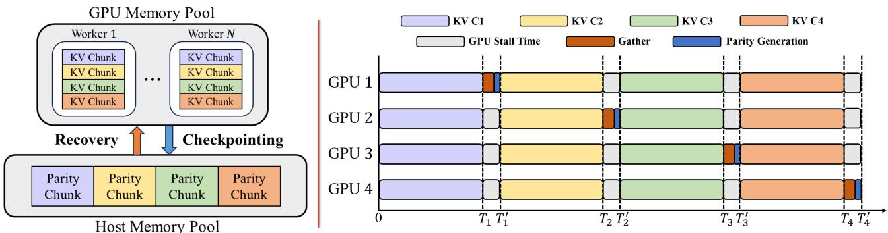  
Figure 3. (a) Left: System overview of GhostServe. (b) Right: Illustration of the chunk-level checkpointing and load-balancing strategy in terms of GPU execution timeline. As KV cache chunks are generated (T1, T2, T3, T4), a different GPU is assigned in a round-robin fashion to gather and compute the corresponding parity chunk, thereby distributing the checkpointing overhead. The computation for subsequent chunks then resumes after checkpointing (T 1, T 2, T 3, T 4).

However, applying erasure codes directly to the KV cache is far from trivial. One challenge is the format incompatibility, as standard schemes operate on bit-wise parity, as opposed to the floating-point (FP) KV tensors. We address this by reinterpreting each FP16 tensor value as a fixed-width integer bit pattern based on the IEEE-754 standard (Saikia, 2020; Mathis & Stine, 2022). This reinterpretation is fully reversible, ensuring lossless recovery of the original floatingpoint values, and it simplifies the design of efficient, lowlatency GPU kernels. Moreover, the unique structure of erasure codes like Reed-Solomon (RS) requires the tensors to be treated as coefficients of a polynomial over a finite Galois Field (Reed et al., 1960). A direct PyTorch implementation would run into issues of excessive global memory access times, thus dominating the runtime and inducing significant latency overhead.

To this end, we design custom native CUDA kernels by fusing FP16-to-uint16 packing, parity computation, and unpacking into single GPU passes using 64-bit indexing, grid-stride loops, and warp-synchronous execution to maximize occupancy and avoid race conditions. Compared to conventional tensor-wise casting or CPU-assisted checksum computation, our approach eliminates format conversion overheads and intermediate memory transfers. Consequently, our kernels deliver significantly lower latency than native PyTorch-based implementations, as shown in Figure 6. Furthermore, GhostServe provides flexibility by implementing three standard erasure coding schemes, namely, XOR (Aguilera et al., 2005), RDP (Corbett et al., 2004), and Reed-Solomon (Reed et al., 1960), allowing users to select a protocol based on their fault-tolerance needs. In distributed tensor parallelism settings, GhostServe encodes data across the N data shards (devices) and can reconstruct data from up to K simultaneous failures (parity shards). Detailed implementations can be found in Section 5.

## 4.2 GhostServe Scheduler

Our proposal to implement erasure coding provides flexible, low-latency fault tolerance for checkpointing and recovering the KV cache. While the concept is straightforward for single-GPU scenarios, its application in distributed settings is non-trivial, particularly for tensor parallelism. The key problem is how to efficiently schedule the checkpointing process and manage the data/parity shards. A natural solution is to have each device perform erasure coding independently, storing necessary shards from peers in its local HBM memory. However, such a strawman solution suffers from two main drawbacks.

First, it has been shown that the performance of LLM serving highly depends on the availability of GPU memory (Kwon et al., 2023; Wu et al., 2023; Zheng et al., 2024). Such a naive approach would induce significant GPU memory overhead, as each GPU would have to allocate additional space to store data or parity shards from other GPUs. This severely limits the serving capacity and may lead to a degradation in the quality of service (QoS). Furthermore, coordinating the data and parity shards across GPUs involves complex communication protocols, which often require ring-based operations, such as all-to-all. These additional communication overheads could lead to potential system bottlenecks.

Chunk-level Checkpointing. To this end, we propose to perform checkpointing at the granularity of a chunk, defined as a group of tokens. Instead of conducting erasure coding on each device individually, we collect all the KV cache and view each KV cache as an individual data shard, and generate corresponding parity shards. An illustration of the above process is shown in Figure 3. After each KV cache chunk is generated (T1, T2, T3, T4), a GPU is specified to gather the KV cache chunk and conduct the parity generation workloads. The GPUs are then synchronized after parity generation to resume the inference process for the next chunk. (T ′1, T ′2, T ′3, T ′4). Thanks to fast intra-node NVLink and our fast erasure coding kernel, the idle time in between each chunk accounts for less than 5%. These parity shards are subsequently offloaded to host memory, thus eliminating GPU memory overhead. Unlike the strawman, which requires large, persistent HBM allocations on each GPU to store peer shards, our approach only requires a small, fixed-size temporary buffer for the gather operation. This process can be seamlessly integrated into chunked prefill and, by operating at the chunk level, also minimizes its impact on decode throughput.

Algorithm 1 GhostServe Checkpointing Workflow.   
Initialization: Initialize erasure coding compute unit   
EC, KV cache KV , chunk size m, input length s, num  
ber of prefill chunks c = ⌈s/m⌉, the number of GPUs   
N, number of parity shards K, GPU assignment index   
k .   
1: i, k = 0, 1   
2: for all i < c do   
3: for all j < N do   
4: # Generate KV cache chunk   
5: KV j = GPUj.Process(m, i)   
6: end for   
7: # Gather KV cache to k-th GPU   
8: KVi = torch.dist.gather(KV 1:Ni , GPUk)   
9: # Perform erasure coding   
10: Pi = EC.encode(KVi)   
11: # Transfer parity shards to host memory   
12: Pi PCIe−−−→ DRAM   
Async   
13: if k == N then   
14: # Reset assignment index   
15: k = 0   
16: else   
17: # Move to the next GPU for encoding   
18: k = k + 1   
19: end if   
20: end for

Recovery with Partial Recomputation. To further speed up the recovery process, GhostServe employs a hybrid strategy, where partial preceding KV cache is recomputed. Upon failure, the system initiates GPU-side recomputation only for the initial portion of the KV cache, while the remaining segments are recovered using the available parity and surviving data shards. This hybrid mechanism eliminates the need for GPUs to remain idle until all parity shards are transferred from CPU to GPU memory. Instead, it overlaps recomputation with I/O transfers, effectively hiding latency and ensuring continuous GPU utilization during the recovery process.

Load Balancing. A static assignment, where one GPU is repeatedly tasked with parity computations, would create potential straggler effects, inducing severe workload imbalance and performance bottleneck (Lin et al., 2025; He et al., 2025). To prevent ‘hotspots’ and reduce the risks of single-device thermal wear-out, GhostServe features a load balancing strategy that distributes the parity computation load, as shown in Figure 3 (b). The duty is rotated across devices in a round-robin manner (e.g., GPU 0 computes parity for Chunk 0, GPU 1 for Chunk 1, and so on). This strategy ensures that the computational and communication overhead of erasure coding is shared equally, promoting balanced GPU utilization. Redundancy is generated on-the-fly without intermediate memory staging, enabling high GPU occupancy and sustained NVLink bandwidth for efficient, fault-tolerant LLM serving.

Overall Workflow. Combining the above-mentioned techniques, we now describe the workflow of GhostServe scheduler in detail, including the checkpointing and recovery process.

1) Redundancy-based Checkpointing. We present the detailed procedure of our checkpointing process in Algorithm 1. For readability, we describe the checkpointing only for the prefill, since the same process can be applied for decoding, where the parity is updated once the KV cache for a chunk of tokens is generated. GhostServe employs dynamic chunking, where a request with an input length s is partitioned into ⌈s/m⌉ chunks, and the final partial chunk is handled using thread-masking and bounds-checking within our CUDA kernels, where the parity is only computed for active KV caches. In lines 3-6, for each input chunk, all N GPUs work in parallel to compute their respective portions of the KV cache. In lines 8-13, once a full KV cache chunk has been generated across all GPUs, we first collect the distributed pieces of the chunk, denoted as KV j on a single, designated GPU, indexed by k, using torch.dist.gather. Next, GPUk uses an encoding function EC.encode(·) to compute a set of redundant parity shards for the entire chunk. The newly created parity shards are immediately moved to the main system’s host memory. Lastly, to ensure balanced workloads, the GPU assignment index is updated at every chunk until all input tokens are processed.

2) Hybrid Recovery. We also present the design of our recovery procedure in Algorithm 2. We use failure during prefill and a single-GPU failure as examples for simplicity. Failure scenarios for both decoding and multi-GPU can be readily generalized, as the recovery function is applied to the failed GPUs separately. Compared to prior checkpointing methods, we adopt a hybrid recovery mechanism, integrating recomputation to further reduce stall time. During interruption, the process begins when a failure is detected on a specific GPU, e.g., k-th GPU after a certain number of chunks (n-th chunk) have been processed. In lines 3-

Algorithm 2 GhostServe Recovery Workflow.   
Initialization: Initialize erasure coding compute unit   
EC, KV cache KV , chunk size m, input length s, num  
ber of prefill chunks c = ⌈s/m⌉, the number of GPUs   
N , number of parity shards K. Assuming k-th GPU   
failed after n-th chunk.   
1: ...   
2: Failure.detect()   
3: # Calculate the recompute units   
4: r = get recompute units(s, m, N, K)   
5: if r >= n then   
6: # Perform recomputation   
7: for all i < n do   
8: KV ki = GPUk.Process(s, i)   
9: end for   
10: else   
11: # Perform recomputation + reconstruction   
12: for all i < r do   
13: KV ki = GPUk.Process(s, i)   
14: end for   
15: # Gather remaining KV cache to k-th GPU   
16: KV1:n−r = torch.dist.gather(KV 1:N1:n−r, GPUk)   
17: P1:n−r PCIe−−−→ GPUk   
Async   
18: # Perform reconstruction   
19: With CUDA.Streams():   
20: KV1:n−r = EC.reconstruct(KV1:n−r, P1:n−r)   
21: end if   
22: Serving.Resume()   
23: ...

4, we first compute the optimal number of chunks (r) that should be recomputed from scratch. For short sequences, full recomputation is conducted for recovery, which avoids the communication overhead of gathering data for erasure coding reconstruction (see lines 5-9). In the case of longcontext scenarios, erasure coding is further applied. Apart from recomputing r KV cache chunks, the scheduler gathers (n − r) chunks of data shards from surviving GPUs and transfers the parity shards from CPU memory to the failed GPU in an asynchronous fashion. Next, the reconstruction function EC.reconstruct(·) for erasure coding is applied for each chunk individually with CUDA streams (lines 18-20). Once the failed GPU state has been fully restored through either recomputation or reconstruction, the inference job resumes from the interruption point.

We note that GhostServe is primarily designed for intra-node serving, thus focusing on individual device memory software faults, such as silent data corruptions (Ma et al., 2025; Mitra et al., 2025), memory errors (Cui et al., 2025), kernel faults (Salpekar et al., 2026), and resource leaks (Pietro et al., 2013), which do not usually require a hard restart of the entire node. In this work, we only consider scenarios where the failed GPUs can be restarted to rejoin the surviving GPUs to resume inference services. In practice, the recovery process also includes re-establishing NCCL connections, GPU warmups, and CUDA graph capture, which should occur before KV cache recovery. Failure scenarios for both decoding and multi-GPU can be readily generalized, as the recovery function is applied to the failed GPUs separately. GhostServe can tolerate up to K number of simultaneous GPU failures, same as the number of parity shards, without resorting to pure recomputation.

## 5 IMPLEMENTATION

GhostServe is an end-to-end system implemented with 4K lines of Python and 1.5K lines of C++/CUDA. We use SGLang version 0.5.1 (Zheng et al., 2024) as our backend and implement our method as a plug-in module. In practice, GhostServe can be integrated into existing serving engines such as vLLM (Kwon et al., 2023) and HuggingFace-TGI (Wolf et al., 2019) with minimal modifications, making it portable and easy to adopt. For the attention backend, we adopt FlashInfer version 0.3.1 (Ye et al., 2025), built on top of PyTorch 2.8 with CUDA 12.6. We use NCCL version 2.21.5 for GPU communication within the node. Our demo code is available here1.

Kernel Optimization. Since GhostServe introduces additional compute overhead, achieving high performance requires carefully optimized GPU kernels. We implement three key optimization techniques: (1) Kernel fusion. We reduce the kernel launch overhead by fusing multiple operations into a single GPU kernel. Instead of separately invoking the conversion, encoding, and reconstruction operations, we perform kernel fusion for both the checkpointing and recovery procedures in a single pass. (2) CUDA Graph. As the erasure coding is conducted at the chunk level with a fixed size, we further leverage the CUDA graph to minimize kernel launch overhead, where graphs of encoding and reconstruction operations are captured and replayed. (3) CUDA Streams. To accelerate recovery when multiple chunks of the KV cache must be reconstructed concurrently, GhostServe employs a multi-stream CUDA execution strategy. Each chunk is assigned to a dedicated CUDA stream, enabling concurrent parity decoding fully utilizing the available GPU SMs.

Continuous Batching. While GhostServe is primarily designed for long-input batched inference, we also extend GhostServe for online serving by creating a CUDA stream pool to manage each request. During the forward checkpointing process, each incoming request is assigned a CUDA context, which generates and updates the parity individually.

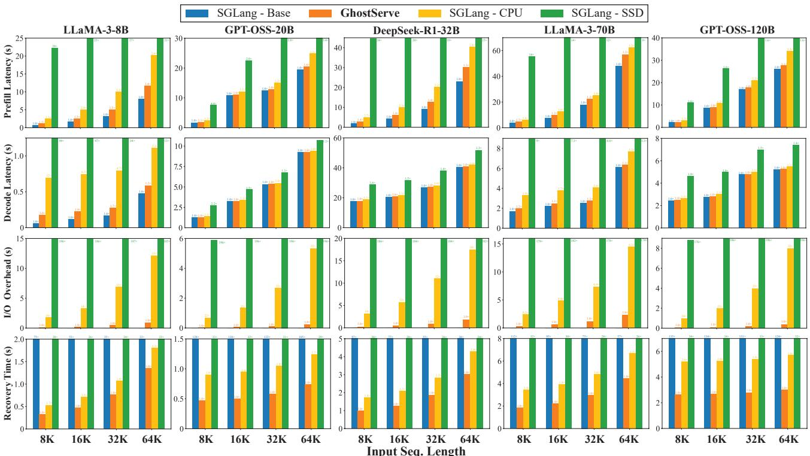  
Figure 4. Performance comparison of different fault-tolerant methods. The latency results are measured with a batch size of 16, chunk size of 2K, and an output length of 4K, using varying input lengths that range from 2K to 64K. I/O overhead represents the total I/O latency incurred during the checkpointing process. Recovery latency denotes the time required to restore 50% of the chunks to resume inference. All models are running with an 8:2 parity ratio for GhostServe.

In the event of KV cache loss, multiple streams are launched to recover the KV cache for each request, allowing the GPU to overlap kernel executions.

## 6 EVALUATION

## 6.1 Experimental Setup

Hardware. We conduct our experiments on a private cluster, configured with 8 NVIDIA H200 GPUs, connected over NVLink Gen 4, and two 48-core Intel processors, with 1024 GB DDR5 memory, connected through PCIe Gen 4 with a maximum unidirectional bandwidth of 32 GB/s.

Models. We evaluate GhostServe on a diverse range of LLMs to demonstrate its generalization across model types and scales. Specifically, we use LLaMA-3-8/70B (Meta, 2024), GPT-OSS-20/120B (OpenAI, 2025b), and DeepSeek-R1-32B (Guo et al., 2025). All models are executed in half precision (FP16).

Workloads and Metrics. We synthesize traces using the Medha generator (Agrawal et al., 2024) to generate a mix of long-input-short-output and short-input-long-output requests, with various batch sizes (4∼64) and sequence lengths (4K∼1M). For request timestamps, we model request arrival times according to a Poisson distribution. For efficiency metrics, we use prefill, decode, and recovery latency for batched inference, and P50 and P99 latency for online serving. In terms of cost-benefit analysis, we use (1) Effective-Inference-Time-Ratio (EITR): Defined as the division of actual inference time and total runtime. This helps quantify the overhead/costs for checkpointing. (2) Mean-Time-To-Recover (MTTR): Defined as the average recovery time for entire request traces. This helps quantify the benefits of checkpointing.

Failure Simulation. In terms of fault injection, we first build a failure model using statistics from prior work (Strati et al., 2024; Ranganathan et al., 2025; Wang et al., 2024; Wan et al., 2025). We mimic device faults by completely flushing the memory buffers of particular workers and hanging the other workers until all the data is recovered. Following prior works (Ranganathan et al., 2025; Wang et al., 2024), we vary the overall failure rate from 5% to 15%, and inject failure at random points throughout the request’s execution runtime.

Baselines. We compare GhostServe with three previous baseline methods:

• SGLang - Base: The majority of LLM serving engines lack a sufficient recovery mechanism for the KV cache, and employ a simple recomputation technique when an interruption occurs (NVIDIA, 2019; Kwon et al., 2023; Zheng et al., 2024). We refer to this baseline as SGLang - Base.

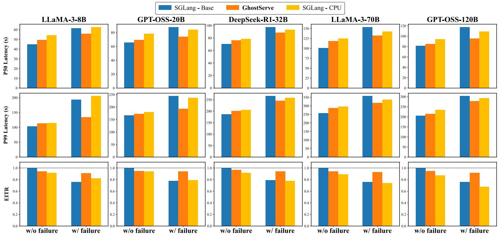  
Figure 5. Performance comparison of different fault-tolerant methods in online serving. Here, we measure P50/99 latency and effectiveinference-time-ratio (EITR) under both failure-free and failure-induced environments. Faults are injected at random steps with a failure rate 15%.

• SGLang - SSD: Existing training-based methods provide a mechanism to checkpoint the model weights to persistent storage, such as NVMe SSD. Here, we reproduce a similar asynchronous baseline based upon the state-of-the-art PCCheck (Strati et al., 2025), and refer to SGLang - SSD.

• SGLang - CPU: Dej´ aVu is the state-of-the-art LLM \` fault-tolerant solution for multi-GPU serving, which utilizes a state replication method to store KV cache in CPU memory (Strati et al., 2024). Here, we implement Dej´ aVu for SGLang in an asynchronous manner \` for intra-node tensor parallelism, where we refer to SGLang - CPU.

## 6.2 End-to-End Results

Batched Inference. Figure 4 demonstrates the performance comparison across different models and scales with varying input sequence lengths for different methods. We observe that GhostServe shows significant improvements against prior checkpointing methods. Three key insights emerge from these results. First, GhostServe consistently yields lower latency overhead during prefill. It delivers an average 2.7× speedup over CPU-based replication, despite its complex procedure. Second, it also has a minimal impact on the decode latency, inducing less than a 10% overhead. GhostServe delivers a dramatic 47× speedup over SSDbased replication. This efficiency stems from our efficient erasure coding kernel operation and reduced checkpointing memory overhead. It can be seen that GhostServe achieves a 13× reduction in I/O overhead relative to CPU checkpointing and a 132× reduction compared to SSD checkpointing. Third, GhostServe consistently achieves the lowest recovery latency, even on large models such as GPT-OSS-120B and LLaMA-70B, while competing approaches incur orders of magnitude higher costs. For instance, on LLaMA-3-70B with 64K input tokens, GhostServe recovers in under 5 seconds, compared to close to 2 minutes for the SSD-based method. These results confirm that GPU-centric parity generation substantially minimizes checkpointing latency and memory overhead, making GhostServe far more practical for large-scale fault-tolerant LLM serving.

Online Serving. Figure 5 further shows the efficacy of our method in continuous serving scenarios. Specifically, we compare how each method affects the normal inference process. Here, we summarize three key observations. First, in failure-free settings, GhostServe provides much lower checkpointing overheads in terms of mean and tail latency, with up to 11% reduction. Second, GhostServe significantly mitigates the effect of interruptions or failures during serving. For instance, in the LLaMA-70B model, thanks to the fast recovery mechanism of erasure coding, GhostServe achieves 1.2× and 1.1× speedups in P50 and P99 latency against naive recomputation, respectively. Third, Ghost-Serve achieves consistently high EITR (> 90%) compared to baseline methods. In particular, GhostServe improves upon replication by an average of 23% under failures. The benefits of CPU-checkpointing diminish as the model size scales up, where for larger models, such as 70B and 120B, it actually underperforms the recomputation baseline, due to its high I/O overheads, further demonstrating the costeffectiveness and practicality of GhostServe in real-world serving.

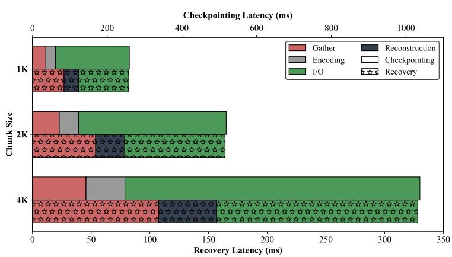

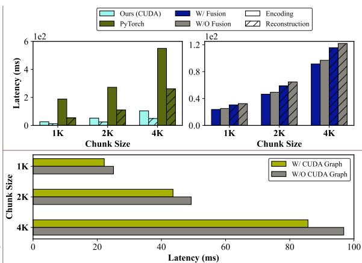  
Figure 6. Kernel Microbenchmark. All experiments are conducted using LLaMA-3-70B with a batch size of 16. (a) Left: Performance breakdown for erasure coding kernel during checkpointing and recovery for different chunk sizes. (b) Right: Impact of implementation method (PyTorch vs CUDA), kernel fusion, and CUDA graph on the erasure coding performance for different chunk sizes.

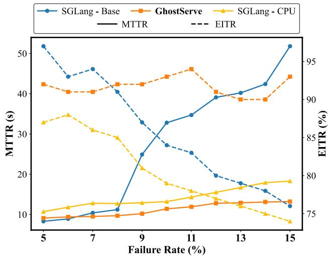  
Figure 7. Cost-benefit analysis for serving LLaMA-3-70B model over the entire serving traces. Here, we compare the EITR and MTTR for different methods under varying failure rates (5%∼15%).

## 6.3 Performance Analysis

Cost-Benefit Analysis. Figure 7 demonstrates the detailed reliability analysis of GhostServe on serving LLaMA-3-70B. Here, we summarize two observations. First, GhostServe can maintain relatively high EITR under varying failure rates, showcasing its robustness in different scenarios. In contrast, both baseline methods suffer from performance degradation as the failure rate rises. Second, GhostServe provides much lower mean-time-to-recover (MTTR) than replication across different settings. This is thanks to the hybrid approach of GhostServe, which combines both recomputation and erasure coding, operating in parallel to speed up the KV cache recovery.

Kernel Microbenchmark. Figure 6 presents the kernellevel latency breakdown of GhostServe, revealing three key observations. First, the overhead from collection and erasure coding is modest, remaining significantly lower than the dominant GPU-to-CPU I/O transfer time. Second, parity generation and reconstruction complete faster than the NCCL operations used for KV cache collection, and the reconstruction process takes less time than the NCCL operations to collect the KV cache. One reason for this is the inherent nature of many-to-one torch.dist.gather operation, requiring all GPUs to be synchronized. Third, our custom kernel delivers significantly lower latency than a native PyTorch-based implementation. Kernel fusion and CUDA graphs further accelerate the erasure coding by up to 1.05× and 1.13× on encoding and reconstruction, respectively, across different chunk size configurations.

Sensitivity Studies. Figure 8 presents the results of Ghost-Serve for further performance analysis for different parity ratios, batch sizes, and the impact of recomputation in our hybrid recovery procedure. Here, we summarize four key insights. First, GhostServe remains robust under different fault-tolerance requirements, where increasing the parity ratios adds marginal overheads to both checkpointing and recovery latency, indicating the scalability of our method. Second, similar to sequence length scaling, GhostServe outperforms prior methods consistently in terms of checkpointing overheads and recovery latency, and scales well with batch sizes. Third, GhostServe consistently outperforms CPU-checkpointing in high TP settings (TP>2). For TP=2, the benefit of erasure coding vanishes due to its extra overhead in encoding and no reduction in I/O transfer latency. Last, we observe that our hybrid recovery mechanism of combining recomputation and reconstruction results in significant recovery time improvement, achieving up to 42.9%. This stems from the reduced amount of host-device data transferred and computation load for reconstruction, thereby lowering recovery latency.

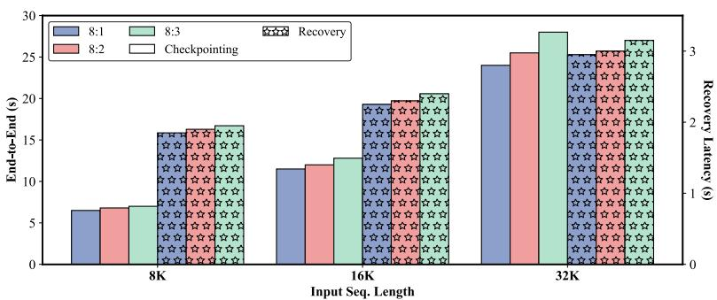

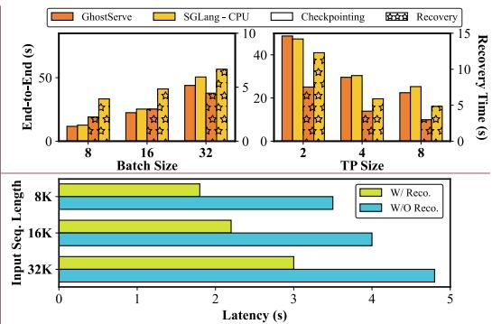  
Figure 8. Sensitivity Studies. All experiments are conducted using LLaMA-3-70B with a chunk size of 2K. Recovery latency is the time required to restore 50% of the KV cache. (a) Left: Performance comparison of GhostServe under different parity ratios. (b) Top Right: Performance comparison of different fault-recovery methods with varying batch sizes and TP sizes. (c) Bottom Right: Ablation studies on the impact of recomputation on the recovery latency.

Scaling to Million Tokens. We further conduct experiments with extremely long sequences, up to 1M tokens, as shown in Figure 9. We make two key observations. First, GhostServe induces less than 6% overhead upon the baseline method, highlighting the scalability of our method in real-world, agent-based workloads. Moreover, compared to Dej´ aVu, our method significantly reduces the checkpointing \` overhead. For instance, in 1M prefill, the overhead drops from 2.6 mins to only 9 seconds. This demonstrates that our solution is far more practical for production-level serving systems when dealing with long-sequence inputs.

## 7 RELATED WORK

LLM Serving Systems. A large body of work focuses on improving LLM serving for high throughput and low latency through efficient KV cache management (Kwon et al., 2023; Zhao et al., 2024; Zhao & Wang, 2024), and kernel optimization (Ye et al., 2025; Dao, 2023). Notably, vLLM introduces paged key-value (KV) cache to improve memory efficiency and reduce fragmentation (Kwon et al., 2023). SARATHI proposes chunked-prefill and stall-free batching to overlap prefill and decode stages to improve GPU utilization. (Agrawal et al., 2023). Kernel libraries, such as FlashAttention (Dao, 2023) and FlashInfer (Ye et al., 2025), aim to improve the execution speed at the operator level.

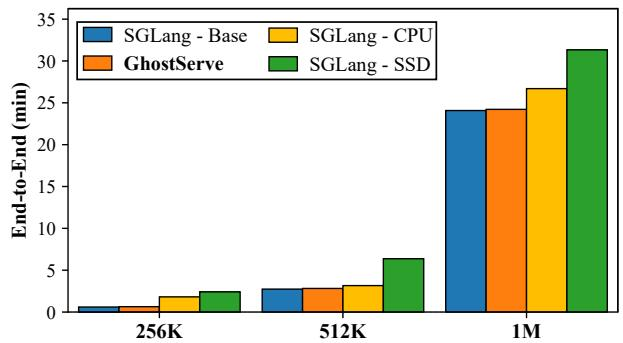  
Figure 9. Performance comparison of different methods when scaling to million-tokens. Results are reported using LLaMA-3-70B, with a batch size of 1, chunk size of 2K, and output length of 4K.

Nonetheless, these systems do not consider the aspect of fault tolerance and resort to naive recomputation for KV cache recovery. Furthermore, methods like Dej´ aVu induce \` too much overhead for these high-performance systems in tensor parallelism settings. To bridge this gap, GhostServe leverages erasure coding to enable lightweight checkpointing for distributed LLM serving.

Fault-Tolerance for LLMs. Providing fault-tolerance support during LLM training has become increasingly critical as model scales and training durations continue to grow (Mohan et al., 2021; Wan et al., 2025; Gandhi & Kozyrakis, 2024; Pandya, Chirag and Rice, Tristan, 2024). CheckFreq is among the first to enable automatic checkpointing for deep neural networks (DNNs) at the iteration level (Mohan et al., 2021). PCCheck further leverages concurrent checkpointing to minimize overhead and recovery time (Strati et al., 2025). For large-scale LLM training, ByteCheckpoint (Wan et al., 2024) develops a unified library to support checkpointing at the scale of tens of thousands of GPUs. MoEtion proposes a distributed, sparse in-memory checkpointing for mixture-ofexpert (MoE) model training (Gandhi & Kozyrakis, 2024). TorchTitan offers a unified library with step-level fault tolerance for training LLMs at scale (Pandya, Chirag and Rice, Tristan, 2024). Despite these efforts, traditional replicationbased checkpointing is not optimal for LLM serving.

Fault-tolerance in Distributed Systems. Fault tolerance has long been a fundamental concern in distributed systems, where reliability is critical in the presence of hardware faults, network disruptions, or node crashes. Classic redundancybased techniques, such as replication and checkpointing, provide strong protection but often incur prohibitive storage and performance overheads at scale. Erasure coding, particularly Reed–Solomon (RS) (Guruswami & Wootters, 2016) and its variants, has emerged as a more storage-efficient solution and has been widely adopted in large-scale storage infrastructures. Beyond storage, distributed computing frameworks such as MapReduce (Dean & Ghemawat, 2008) and MPI-based high-performance systems integrate checkpoint/restart and log-based recovery to mitigate task or node failures. In this work, we aim to leverage the classical idea of erasure coding to promote reliability for LLM serving.

## 8 DISCUSSION AND LIMITATION

Cross-node Scalability. GhostServe can be further extended to cross-node environments through hierarchical fault-tolerance coordination and bandwidth-aware parity placement. For inter-node redundancy, GhostServe can designate one or more parity coordinators that aggregate parity blocks across nodes using NCCL over InfiniBand or NIC. The challenge of providing node-level reliability lies in the bandwidth disparity between hierarchical interconnects. High-speed intra-node links (e.g., NVLink) are constrained by slower inter-node fabrics. Different parallelism strategies also affect both the placement and communication patterns of the distributed KV cache. Future work must address this by developing a topology-aware communication strategy that intelligently schedules data transfers. Furthermore, remote storage disks must come into play in multi-node environments, due to their durability to sustain node-level failures. Potential solutions should include efficient scheduling algorithms and implementations that dynamically select the most efficient communication paths for checkpointing and recovery.

Full-stack Fault Tolerance. While GhostServe provides lightweight and efficient redundancy for KV cache protection, it does not achieve full-stack fault tolerance across the GPU runtime. In the event of a GPU failure, GhostServe successfully restores the missing KV cache using erasurebased recovery, but the underlying parallelism topology remains static. This means that failed GPUs cannot be dynamically excluded or replaced during ongoing inference, as the NCCL communication graph and tensor partitioning are initialized at launch time (Shoeybi et al., 2019). Without runtime reorganization of TP groups or model weight redistribution, inference must pause until the failed GPU recovers or the system creates a new topology. Consequently, Ghost-Serve primarily targets data-level GPU memory ‘soft’ errors that do not induce hard system failure. For hardware faults that cannot be recovered with system reboots, GPU resource overprovisioning (Coppock et al., 2025; Kokolis et al., 2024) is often a must to ensure minimal impact and real-time live service migration. Integrating GhostServe with full-stack frameworks like TorchFT (Pandya, Chirag and Rice, Tristan, 2024) would enable end-to-end resilience, bridging the gap between memory-level protection and system-level fault recovery.

Real-world Serving. While GhostServe has shown promising results in serving long-input prefill-heavy workloads, its application to decode-heavy reasoning workloads requires further investigation. A key challenge lies in the unpredictability of decode lengths, thus complicating the encoding protocol. Furthermore, as prefill-decode (PD) disaggregated architectures have become mainstream for real-world serving (Qin et al., 2025; Zhong et al., 2024), how to provide fault tolerance for both prefill and decode workers remains an open question.

## 9 CONCLUSION

This work identifies the fault-tolerance issues for LLM serving and proposes erasure coding to achieve low-latency checkpointing and recovery in the presence of system faults. Built upon chunk-level checkpointing and load balancing techniques, we design and implement a system solution, termed GhostServe, and evaluate it across different workloads and model scales. Extensive experiments show that GhostServe consistently outperforms existing methods, achieving up to 2.1× and 2.7× latency improvement in checkpointing and recovery, respectively, and up to 1.2× median response latency speedup.

## ACKNOWLEDGMENTS

We want to thank anonymous MLSys reviewers for their constructive feedback and our Shepherd, Mark Zhao, for guiding our revision process. This work was sponsored in part by the Lambda Research Grant and the U.S. National Science Foundation (NSF) under Grants 1907765, 2400014, and 2426368. This work also used Delta at UIUC NCSA through allocation CIS250367 and 250473 from the Advanced Cyberinfrastructure Coordination Ecosystem: Services & Support (ACCESS) program, which is supported by U.S. NSF grants 2138259, 2138286, 2138307, 2137603, and 2138296. Authors Youpeng Zhao and Jun Wang are inventors on a pending patent application (Wang & Zhao, 2025).

## REFERENCES

Agrawal, A., Panwar, A., Mohan, J., Kwatra, N., Gulavani, B. S., and Ramjee, R. Sarathi: Efficient llm inference by piggybacking decodes with chunked prefills. arXiv preprint arXiv:2308.16369, 2023.

Agrawal, A., Qiu, H., Chen, J., Goiri, ´I., Zhang, C., Shahid, R., Ramjee, R., Tumanov, A., and Choukse, E. No request left behind: Tackling heterogeneity in long-context llm inference with medha. arXiv preprint arXiv:2409.17264, 2024.

Aguilera, M. K., Janakiraman, R., and Xu, L. Using erasure codes efficiently for storage in a distributed system. In 2005 International Conference on Dependable Systems and Networks (DSN’05), pp. 336–345. IEEE, 2005.

Anthropic. Claude code, 2025. URL https://www. claude.com/product/claude-code.

Baset, S., Wang, L., and Tang, C. Towards an understanding of oversubscription in cloud. In USENIX conference on Hot topics in management of internet, cloud, and enterprise networks and services, 2012.

Brown, T., Mann, B., Ryder, N., Subbiah, M., Kaplan, J. D., Dhariwal, P., Neelakantan, A., Shyam, P., Sastry, G., Askell, A., et al. Language models are few-shot learners. Advances in neural information processing systems, 33: 1877–1901, 2020.

CNN. Amazon global outage 2025. https: //www.cnn.com/business/live-news/ amazon-tech-outage-10-20-25-intl, 2025.

Coppock, P. H., Zhang, B., Solomon, E. H., Kypriotis, V., Yang, L., Sharma, B., Schatzberg, D., Mowry, T., and Skarlatos, D. Lithos: An operating system for efficient machine learning on gpus. ArXiv, abs/2504.15465, 2025.

Corbett, P., English, B., Goel, A., Grcanac, T., Kleiman, S., Leong, J., and Sankar, S. Row-diagonal parity for double disk failure correction. In Proceedings of the 3rd USENIX Conference on File and Storage Technologies, pp. 1–14. San Francisco, CA, 2004.

Cui, S., Patke, A., Chen, Z., Ranjan, A., Nguyen, H., Cao, P. M., Jha, S., Bode, B., Bauer, G., Narayanaswami, C., Sow, D. M., Martino, C. D., Kalbarczyk, Z. T., and Iyer, R. K. Story of two gpus: Characterizing the resilience of hopper h100 and ampere a100 gpus. Proceedings of the International Conference for High Performance Computing, Networking, Storage and Analysis, 2025.

Dao, T. Flashattention-2: Faster attention with better parallelism and work partitioning. ArXiv, abs/2307.08691, 2023.

Dean, J. and Ghemawat, S. Mapreduce: simplified data processing on large clusters. Communications of the ACM, 51(1):107–113, 2008.

Gandhi, S. and Kozyrakis, C. Moetion: Efficient and reliable sparse checkpointing for mixture-of-experts models at scale. 2024.

Ganguly, D., Melhem, R. G., and Yang, J. An adaptive framework for oversubscription management in cpu-gpu unified memory. 2021 Design, Automation & Test in Europe Conference & Exhibition (DATE), pp. 1212–1217, 2021.

Goel, A. and Corbett, P. Raid triple parity. ACM SIGOPS Operating Systems Review, 46(3):41–49, 2012.

Google. Announcing trillium, the sixth generation of google cloud tpu, 2024. URL https://cloud. google.com/blog/products/compute/ introducing-trillium-6th-gen-tpus.

Guo, D., Yang, D., Zhang, H., Song, J., Zhang, R., Xu, R., Zhu, Q., Ma, S., Wang, P., Bi, X., et al. Deepseek-r1: Incentivizing reasoning capability in llms via reinforcement learning. arXiv preprint arXiv:2501.12948, 2025.

Guruswami, V. and Wootters, M. Repairing reed-solomon codes. In Proceedings of the forty-eighth annual ACM symposium on Theory of Computing, pp. 216–226, 2016.

He, S., Cai, W., Huang, J., and Li, A. Capacity-aware inference: Mitigating the straggler effect in mixture of experts. ArXiv, abs/2503.05066, 2025.

Hoffmann, J., Borgeaud, S., Mensch, A., Buchatskaya, E., Cai, T., Rutherford, E., de Las Casas, D., Hendricks, L. A., Welbl, J., Clark, A., Hennigan, T., Noland, E., Millican, K., van den Driessche, G., Damoc, B., Guy, A., Osindero, S., Simonyan, K., Elsen, E., Rae, J. W., Vinyals, O., and Sifre, L. Training compute-optimal large language models. ArXiv, abs/2203.15556, 2022.

Huang, C., Simitci, H., Xu, Y., Ogus, A., Calder, B., Gopalan, P., Li, J., and Yekhanin, S. Erasure coding in windows azure storage. In 2012 USENIX Annual Technical Conference (USENIX ATC 12), pp. 15–26, 2012.

Huang, Y., Cheng, Y., Bapna, A., Firat, O., Chen, D., Chen, M., Lee, H., Ngiam, J., Le, Q. V., Wu, Y., et al. Gpipe: Efficient training of giant neural networks using pipeline parallelism. Advances in neural information processing systems, 32, 2019.

Jiang, Y., Fu, F., Yao, X., He, G., Miao, X., Klimovic, A., Cui, B., Yuan, B., and Yoneki, E. Demystifying costefficiency in llm serving over heterogeneous gpus. ArXiv, abs/2502.00722, 2025.

Kaplan, J., McCandlish, S., Henighan, T. J., Brown, T. B., Chess, B., Child, R., Gray, S., Radford, A., Wu, J., and Amodei, D. Scaling laws for neural language models. ArXiv, abs/2001.08361, 2020.

Kokolis, A., Kuchnik, M., Hoffman, J., Kumar, A., Malani, P., Ma, F., DeVito, Z., Sengupta, S., Saladi, K., and Wu, C.-J. Revisiting reliability in large-scale machine learning research clusters. 2025 IEEE International Symposium on High Performance Computer Architecture (HPCA), pp. 1259–1274, 2024.

Kwon, W., Li, Z., Zhuang, S., Sheng, Y., Zheng, L., Yu, C. H., Gonzalez, J. E., Zhang, H., and Stoica, I. Efficient memory management for large language model serving with pagedattention. Proceedings of the ACM SIGOPS 29th Symposium on Operating Systems Principles, pp. 611–626, 2023.

Li, J. and Li, B. Erasure coding for cloud storage systems: A survey. Tsinghua Science and Technology, 18(3):259– 272, 2013.

Lin, J., Jiang, Z., Song, Z., Zhao, S., Yu, M., Wang, Z., Wang, C., Shi, Z., Shi, X., Jia, W., Liu, Z., Wang, S., Lin, H., Liu, X., Panda, A., and Li, J. Understanding stragglers in large model training using what-if analysis. ArXiv, abs/2505.05713, 2025.

Luo, J., Shrestha, M., Xu, L., and Plank, J. S. Efficient encoding schedules for xor-based erasure codes. IEEE Transactions on Computers, 63(9):2259–2272, 2013.

Ma, J., Pei, H., Lausen, L., and Karypis, G. Understanding silent data corruption in llm training. In Annual Meeting of the Association for Computational Linguistics, 2025.

Mathis, B. and Stine, J. E. Implementation of high performance ieee 754-posit conversion hardware. In 2022 IEEE International Symposium on Circuits and Systems (ISCAS), pp. 934–937. IEEE, 2022.

Meta. Introducing llama 3.1: Our most capable models to date, 2024. URL https://ai.meta.com/blog/ meta-llama-3-1/.

Mitra, S., Banerjee, S., Dixon, M., Fuller, M., Govindaraju, R. K., Hochschild, P., Liu, E. X., Parthasarathy, B., and Ranganathan, P. Silent data corruption by 10× test escapes threatens reliable computing. IEEE Design & Test, 42: 40–53, 2025.

Mohan, J., Phanishayee, A., and Chidambaram, V. {CheckFreq}: Frequent,{Fine-Grained}{DNN} checkpointing. In 19th USENIX Conference on File and Storage Technologies (FAST 21), pp. 203–216, 2021.

NVIDIA. Fastertransformer, 2019. URL https:// github.com/NVIDIA/FasterTransformer.

OpenAI. Openai incidents, 2024. URL https:// status.openai.com/history.

OpenAI. Codex – openai’s coding agent, 2025a. URL https://chatgpt.com/features/codex.

OpenAI. Introducing gpt-oss, 2025b. URL https:// openai.com/index/introducing-gpt-oss.

Ott, M., Edunov, S., Baevski, A., Fan, A., Gross, S., Ng, N., Grangier, D., and Auli, M. fairseq: A fast, extensible toolkit for sequence modeling. In North American Chapter of the Association for Computational Linguistics, pp. 6151–6162, 2019.

Pandya, Chirag and Rice, Tristan. Fault tolerance for large scale training. https: //github.com/pytorch/torchft/blob/ main/media/fault\_tolerance\_poster.pdf, 2024.

Pietro, R. D., Lombardi, F., and Villani, A. Cuda leaks. ACM Transactions on Embedded Computing Systems (TECS), 15:1 – 25, 2013.

Pope, R., Douglas, S., Chowdhery, A., Devlin, J., Bradbury, J., Levskaya, A., Heek, J., Xiao, K., Agrawal, S., and Dean, J. Efficiently scaling transformer inference. Proceedings of Machine Learning and Systems, 5, 2023.

Qin, R., Li, Z., He, W., Cui, J., Ren, F., Zhang, M., Wu, Y., Zheng, W., and Xu, X. Mooncake: Trading more storage for less computation - a kvcache-centric architecture for serving llm chatbot. In USENIX Conference on File and Storage Technologies, 2025.

Ranganathan, B., Zhang, M., and Wu, K. Enhancing reliability in ai inference services: An empirical study on real production incidents. ArXiv, abs/2511.07424, 2025.

Reed, I. S., Solomon, G., and March, K. H. Polynomial codes over certain finite fields. Journal of The Society for Industrial and Applied Mathematics, 8:300–304, 1960.

Saikia, M. An efficient d2d quaternion encryption system for iot using ieee 754 standards. Internet of Things, 11: 100261, 2020.

Salpekar, O., Varma, R., Yu, K., Ivanov, V., Wang, Y., Sharif, A., Si, M., Xu, S., Tian, F., Zheng, S., Rice, T., Garg, A., Peng, S., Siravara, S., Fu, W., de Castro, R., Gangidi, A., Obraztsov, A. S., Narang, S., Edunov, S., Naumov, M., Tang, C., and Oldham, M. Training llms with fault tolerant hsdp on 100,000 gpus. ArXiv, abs/2602.00277, 2026.

Shoeybi, M., Patwary, M., Puri, R., LeGresley, P., Casper, J., and Catanzaro, B. Megatron-lm: Training multibillion parameter language models using model parallelism. arXiv preprint arXiv:1909.08053, 2019.

Strati, F., McAllister, S., Phanishayee, A., Tarnawski, J., and Klimovic, A. Dej´ avu: Kv-cache streaming for fast, \` fault-tolerant generative llm serving. In Forty-first International Conference on Machine Learning, 2024.

Strati, F., Friedman, M., and Klimovic, A. Pccheck: Persistent concurrent checkpointing for ml. In Proceedings of the 30th ACM International Conference on Architectural Support for Programming Languages and Operating Systems, Volume 1, pp. 811–827, 2025.

Vaswani, A., Shazeer, N., Parmar, N., Uszkoreit, J., Jones, L., Gomez, A. N., Kaiser, Ł., and Polosukhin, I. Attention is all you need. Advances in neural information processing systems, 30, 2017.

Wan, B., Han, M., Sheng, Y., Peng, Y., Lin, H., Zhang, M., Lai, Z., Yu, M., Zhang, J., Song, Z., Liu, X., and Wu, C. Bytecheckpoint: A unified checkpointing system for large foundation model development. In Symposium on Networked Systems Design and Implementation, 2024.

Wan, B., Liu, G., Song, Z., Wang, J., Zhang, Y., Sheng, G., Wang, S., Wei, H., Wang, C., Lou, W., Yang, X., Zhang, M., Jiang, K., Ren, C., Zhi, X., Yu, M., Nan, Z., Zheng, Z., Zhong, B., Wang, Q., Yu, H., Chi, J., Zhang, W., Li, Y., Du, Z., Zhao, S., Zhang, Y., Tang, J., Liu, Z., Wu, C., Peng, Y., Lin, H., Xiao, W., Liu, X., and Xiang, L. Robust llm training infrastructure at bytedance. In Symposium on Operating Systems Principles, 2025.

Wang, J. and Zhao, Y. Dynamic erasure-coded kv cache with live migration for llm inference. U.S. Patent Application 63877653, September 2025. Patent Pending.

Wang, Y., Chen, Y., Li, Z., Kang, X., Fang, Y., Zhou, Y., Zheng, Y., Tang, Z., He, X., Guo, R., Wang, X., Wang, Q., Zhou, A. C., and Chu, X. Burstgpt: A real-world workload dataset to optimize llm serving systems. Proceedings of the 31st ACM SIGKDD Conference on Knowledge Discovery and Data Mining V.2, 2024.

Wang, Z., Jia, Z., Zheng, S., Zhang, Z., Fu, X., Ng, T. S. E., and Wang, Y. Gemini: Fast failure recovery in distributed training with in-memory checkpoints. Proceedings of the 29th Symposium on Operating Systems Principles, 2023.

Wikipedia. 2024 crowdstrike-related it outages. https://en.wikipedia.org/wiki/2024 CrowdStrike-related\_IT\_outages, 2024.

Wolf, T., Debut, L., Sanh, V., Chaumond, J., Delangue, C., Moi, A., Cistac, P., Rault, T., Louf, R., Funtowicz, M., and Brew, J. Huggingface’s transformers: State-of-theart natural language processing. ArXiv, abs/1910.03771, 2019.

Wu, B., Zhong, Y., Zhang, Z., Huang, G., Liu, X., and Jin, X. Fast distributed inference serving for large language models. arXiv preprint arXiv:2305.05920, 2023.

Yang, A., Yang, J., Ibrahim, A., Xie, X., Tang, B., Sizov, G. G., Reizenstein, J., Park, J., and Huang, J. Context parallelism for scalable million-token inference. ArXiv, abs/2411.01783, 2024.

Ye, Z., Chen, L., Lai, R., Lin, W., Zhang, Y., Wang, S., Chen, T., Kasikci, B., Grover, V., Krishnamurthy, A., and Ceze, L. Flashinfer: Efficient and customizable attention engine for llm inference serving. ArXiv, abs/2501.01005, 2025.

Yiu, M. M. T., Chan, H. H. W., and Lee, P. P. C. Erasure coding for small objects in in-memory kv storage. Proceedings of the 10th ACM International Systems and Storage Conference, 2017.

Zhang, H., Dong, M., and Chen, H. Efficient and available in-memory kv-store with hybrid erasure coding and replication. ACM Transactions on Storage (TOS), 13:1 – 30, 2016.

Zhao, Y. and Wang, J. Alise: Accelerating large language model serving with speculative scheduling. Proceedings of the 43rd IEEE/ACM International Conference on Computer-Aided Design, 2024.

Zhao, Y., Wu, D., and Wang, J. Alisa: Accelerating large language model inference via sparsity-aware kv caching. ArXiv, abs/2403.17312, 2024.

Zheng, L., Yin, L., Xie, Z., Sun, C. L., Huang, J., Yu, C. H., Cao, S., Kozyrakis, C., Stoica, I., Gonzalez, J. E., et al. Sglang: Efficient execution of structured language model programs. Advances in neural information processing systems, 37:62557–62583, 2024.

Zhong, Y., Liu, S., Chen, J., Hu, J., Zhu, Y., Liu, X., Jin, X., and Zhang, H. Distserve: Disaggregating prefill and decoding for goodput-optimized large language model serving. In USENIX Symposium on Operating Systems Design and Implementation, 2024.

Zhu, Q., Duan, J., Chen, C., Liu, S., Li, X., Feng, G., Lv, X., Cao, H., Xiao, C., Zhang, X., Lin, D., and Yang, C. Sampleattention: Near-lossless acceleration of long context llm inference with adaptive structured sparse attention. ArXiv, abs/2406.15486, 2024.