# FAASCALE: UNLOCKING FAST LLM SCALING FOR SERVERLESS INFERENCE

Minchen Yu \* 1 Rui Yang \* 2 Chaobo Jia 1 Zhaoyuan Su 2 Sheng Yao 3 Tingfeng Lan 2 Yuchen Yang 3 Yue Cheng 2 Wei Wang 3 Ao Wang 4 Ruichuan Chen 5

## ABSTRACT

Serverless computing is an attractive paradigm for cloud-based large language model (LLM) inference, but scaling LLMs on demand remains a major challenge due to high data transfer cost. We present FaaScale, a serverless LLM system that enables fast and resource-efficient model scaling. The key idea is a co-design principle—pipelined multicast inference—which synergizes multicast with dynamic, cross-node pipeline-parallel execution during model transfer. FaaScale implements this design through PipeCast, a model scaling scheme that adaptively multicasts model blocks and dynamically forms inference pipelines on the fly. Coupled with efficient memory management across GPU and host memory, FaaScale handles bursty LLM inference workloads effectively, achieving up to 5× lower tail time-to-first-token latency and 31.3% cost reduction on real-world LLM traces.

## 1 INTRODUCTION

Recent advancements in machine learning (ML) and artificial intelligence (AI) have fueled a surging demand for cloud-based ML inference services (Zhang et al., 2023; 2019; Shen et al., 2019; Choi et al., 2022; Gujarati et al., 2020). Serverless computing has emerged as a compelling paradigm for handling inference workloads. In this paradigm, users can deploy their models as inference endpoints and query these services through API calls; the serverless platform automatically scales resources to accommodate dynamic inference requests and multiplex resources among a large number of models from various users (Alibaba, a; Yang et al., 2022; Yu et al., 2021; Ali et al., 2020; Fu et al., 2024; Wang et al., 2024). Additionally, serverless inference platforms charge users only for actual resource usage, delivering substantial cost savings given the high expense of GPUs. Owing to these benefits, serverless inference has been widely adopted by leading ML platforms, such as Amazon SageMaker Serverless Endpoints (AWS, c), Alibaba Serverless GPU (Alibaba, a), and Hugging Face Serverless Inference Endpoints (HuggingFace, b).

However, the rapid adoption of large language models (LLMs) presents fundamental challenges for serverless inference platforms, characterized by three key properties.

(1) Bursty request patterns: Our analysis of production LLM traces reveals that these workloads exhibit extremely bursty request arrival patterns, e.g., with request rates spiking by over an order of magnitude within seconds (see §2.2). These rapid fluctuations require fast, sub-second scaling of model-serving instances across tens or hundreds of nodes to maintain low inference latency and meet service-level objectives (SLOs). (2) Large resource footprint: A single LLM often requires substantial GPU memory resources up to hundreds of GB, e.g., 140 GB of memory for Llama-70B. Deploying such a LLM service incurs high startup delays of several minutes due to prolonged model loading and initialization, i.e., cold starts. (3) Model proliferation: The number of fine-tuned LLM variants is surging—for example, Hugging Face hosts over half a million fine-tuned LLMs, with the number growing exponentially (Wang et al., 2025). Meanwhile, serverless inference platforms promise to support any user-uploaded models from model hubs (AWS, c; HuggingFace, b; Alibaba, a). This extreme diversity imposes resource pressure: the aggregate memory demand often far exceeds GPU cluster capacity, forcing frequent model eviction/reloading, which worsens cold start delays.

These challenges create a trilemma for serverless inference platforms: the combination of massive per-model resource demands and the ever-growing number of fine-tuned variants makes cold starts prohibitively expensive, severely limiting platforms’ capacity of fast scaling to accommodate bursty inference workloads. Current approaches to mitigate cold starts employ three main strategies, but each falls short under real-world conditions. (1) Remote loading: Systems like Hugging Face inference endpoints (HuggingFace, b) fetch models on demand from remote registries or object stores (e.g., S3), but this introduces long network delays due to low downloading bandwidth. (2) Over-provisioning: Platforms like SageMaker Endpoints offer tenants the option to pin already provisioned model instances even during periods of low utilization (AWS, c;b), which compromises resource efficiency and deviates from serverless’ core pay-per-use pricing model. (3) Local caching: Others cache models in local host memory or SSDs to reduce retrieval time (Yang et al., 2022; ali; Bai et al., 2020; Yu et al., 2025a; Fu et al., 2024; Alibaba, a; Brooker et al., 2023). However, as model sizes grow and tenant diversity increases, this approach suffers from poor cache hit rates and scalability limits (see §2.3). None of these approaches achieves the right balance of elasticity, scalability, and cost effectiveness needed to support bursty, multi-tenant LLM inference workloads.

An efficient serverless inference platform should not settle for the fundamental tradeoff between startup latency and resource overprovisioning. Ideally, it should scale out rapidly in response to load spikes without incurring additional resource costs. Fast model scaling is achievable through two key insights. First, modern GPU clusters employ high-speed network interconnects (e.g., 400Gbps with RDMA capability) (Hu et al., 2024; Kundu et al., 2024; Azure), providing opportunities for efficient model multicast. Second, model inference can begin as soon as partial model parameters are received, enabling collaborative, distributed inference execution across multiple nodes during model multicast.

Building on these insights, we build FaaScale, a scalable serverless LLM inference platform that delivers fast and resource-efficient model scaling. A key design principle behind FaaScale is the synergistic co-design of scalable model multicast and pipelined inference execution. By dynamically coordinating model multicast with pipeline parallel execution, FaaScale enables distributed inference to begin while the model is being transferred, significantly reducing request waiting. We refer to this principle as pipelined multicast inference, where model distribution and execution are tightly overlapped to minimize startup latency and enhance scalability under dynamic workloads.

To implement this principle, FaaScale introduces PipeCast, a novel scheme for fast model scaling. PipeCast partitions models into fine-grained blocks for efficient, binomialpipeline-based multicast, and dynamically constructs inference execution pipelines across multiple nodes during model transmission, thereby enabling immediate collaborative execution as blocks arrive. PipeCast incorporates three key designs. (1) Inference-aware Model Multicast: PipeCast proposes an efficient model multicast algorithm based on the binomial pipeline (Behrens et al., 2018; Ganesan & Seshadri, 2005) algorithm, which optimizes the granularity and transfer order of model blocks to enable the rapid construction of execution pipelines, thus improving overall inference performance. (2) Pipelined Inference Execution: PipeCast dynamically groups GPU nodes along the multicast route to form execution pipelines at runtime, effectively reducing the time to first token (TTFT) and improving overall throughput. (3) Mode Switching: PipeCast allows nodes to switch to the local execution mode after receiving the full model, eliminating cross-node communication overhead.

Beyond PipeCast, FaaScale proposes two key system designs for efficient model management and inference execution. (1) Locality-driven Model Startup: FaaScale proposes a multi-level model startup mechanism that dynamically adapts to storage locality (e.g., GPU or host memory). It also enables GPU-resident and host-memory-cached model instances to collaborate in scaling for improved overall performance. (2) Efficient Memory Management: FaaScale implements a unified memory management system that seamlessly consolidates data within model blocks for efficient bulk transfer. It also supports GPU memory pre-allocation to reduce runtime overhead. Together, these designs enable FaaScale to effectively leverage available resources, delivering superior scaling performance.

To summarize, we make the the following contributions:

• We introduce the pipelined multicast inference design principle for serverless LLM platforms.

• We develop PipeCast, a novel model-scaling scheme that integrates model multicast with pipeline execution for optimized scaling performance.

• We have built FaaScale, a serverless LLM inference system that implements PipeCast and other system optimizations to enable fast and resource-efficient model scaling.

• We have thoroughly evaluated FaaScale against stateof-the-art solutions including ServerlessLLM (Fu et al., 2024), FaaSNet (Wang et al., 2021), and NCCL (NVIDIA, b), where FaaScale achieves 2.4×-5× improvement in P90 TTFT latency and reduces GPU costs by 17.8%- 31.3% on real-world LLM inference traces (Wang et al., 2024).

## 2 BACKGROUND AND MOTIVATION

## 2.1 Basics of LLM Inference

LLM inference services are increasingly adopted in modern ML platforms, which autoregressively generate text output token by token from a user input (prompt) until reaching the end-of-sequence (EOS) token or the maximum token limit. As each token depends on prior context, the model typically uses a KV cache (Kwon et al., 2023a) to cache the context from previous computations. Tokens are streamed to the user as they are produced, enabling real-time interaction. Performance is typically measured by time-to-first-token latency or TTFT (time to generate the first token) and tokensper-second or TPS (token generation throughput).

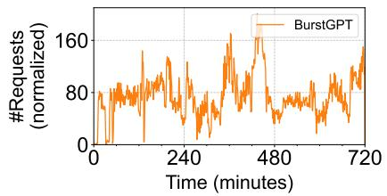

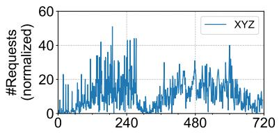  
Time (minutes)

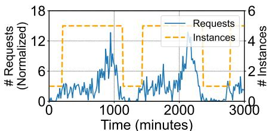  
Figure 1: Request rates of three representative serverless LLM inference traces: BurstGPT (Wang et al., 2024) (a) and XYZ (b)-(c). (c) depicts the request rate of a representative tenant and the number of overprovisioned model instances over time.

Recently, serverless computing has emerged as a compelling option for hosting model inference services—often termed “serverless inference” (Yang et al., 2022; Yu et al., 2021; Zhang et al., 2019; Ali et al., 2022; 2020; Hong et al., 2024; Fu et al., 2024; Romero et al., 2021; Lv et al., 2025). This approach abstracts away infrastructure management tasks, allowing users to simply publish models as inference endpoints while the platforms automatically handle provisioning, resource scaling, and fault tolerance. Serverless inference is also economically attractive: the platform can efficiently multiplex resources across a wide variety of models, delivering high resource utilization; users are billed based on actual resource usage at a fine granularity, enabling substantial cost savings given the high expense of GPUs and dynamic inference workloads (Shen et al., 2019; Zhang et al., 2023; Gujarati et al., 2020; Han et al., 2022; Lee et al., 2018; Kosaian et al., 2019; Romero et al., 2021; Crankshaw et al., 2017; Choi et al., 2022). These advantages have led to a growing trend of serverless LLM inference services (Fu et al., 2024; Zeng et al., 2025; HuggingFace, a).

However, LLM inference significantly amplifies the cold start problem in serverless platforms due to three reasons. First, real-world LLM inference services often need to handle dynamic and bursty request patterns. As shown in Fig.1, inference request rates from representative LLM traces—XYZ (name anonymized), a leading global cloud provider, and a regional Azure OpenAI GPT service (Wang et al., 2024)—can surge by more than 10× within minutes. Second, hosting LLM inference requires a large resource footprint and incurs substantial model startup delays (e.g., several minutes), far exceeding the sub-second latency requirements of typical inference services (Zhang et al., 2019; Zhong et al., 2024). Third, the rapid proliferation of finetuned LLM variants significantly strains platform resources. Collectively, these factors pose fundamental challenges to fast model scaling.

## 2.3 Problems of Existing Solutions

Solution#1: Loading remote models. Existing platforms such as Hugging Face inference endpoints (HuggingFace, b) launch model-serving instances by retrieving model parameters from remote model registries or storage services (e.g., S3) to GPU nodes. However, the large resource footprint of

LLMs results in significant overhead during remote model loading (§2.2). This overhead is further exacerbated by parallel model loading due to network bandwidth contention and registry throttling (Wang et al., 2021), rendering this approach unsuitable for real-time inference services.

Solution#2: Overprovisioning GPUs. To mitigate the cold start problem, existing serverless inference solutions opt to overprovisioning an excessive number of active function instances with reserved GPUs, even when these instances are idling (AWS, a; Yang et al., 2022; Alibaba, b). For example, XYZ preprovisions serverless LLM instances with bound GPUs to reduce cold starts (see Fig. 1(c)). Overprovisioning results in substantial GPU idling and resource waste during periods of low demand, which directly contradicts the pay-per-use model fundamental to serverless computing (Yu et al., 2025a).

Solution#3: Caching models in host memory and SSDs. Recent studies propose to cache models in host memory and then load them into GPU upon request arrivals (Bai et al., 2020; Jeong et al., 2023; Fu et al., 2024; Yu et al., 2025a). While this approach reduces the reservation cost compared to GPU overprovisioning, it still fails to achieve fast scaling in large-scale, multi-tenant serverless GPU clusters due to three key factors. (1) The dynamic and bursty nature of inference workloads often requires concurrent executions of a model on many nodes. (2) Large-scale platforms typically host thousands—or even tens of thousands—of LLMs with substantial host memory consumption (§2.2). (3) Each node has limited host memory (e.g., up to 100s of GBs), which is often insufficient to accommodate even a few large models. As a result, platforms frequently encounter host memory cache misses and must fall back to slower NVMe storage, significantly degrading model scaling efficiency. Our measurements (see testbed in §7.1) show that loading a Llama-70B model from an SSD to a GPU takes over 30 seconds even with optimized implementations—an order of magnitude slower than loading from host memory.

Short model keep-alive time in memory. To illustrate this problem, we first examine how long a model instance remains in memory before being evicted in a multi-tenant inference platform. Each node’s memory is configured to hold up to 3 models, while 12 models are stored in SSDs. This configuration is based on the size of Llama-70B and the hardware specifications of our testbed (see §7.1). This configuration is conservative compared to XYZ’s production environment, where approximately 4,000 fine-tuned LLMs— collectively requiring hundreds of TB of memory—compete for just 20 TB of aggregate CPU memory cache, resulting in an even lower cache-to-workload size ratio. We set each model’s per-node request rate to 1 per minute, which reflects a typical request pattern in production serverless inference platforms (Yu et al., 2025a). We use the LRU eviction policy and depict the distribution of model’s keep-alive times in Fig. 2. As we can see, models are frequently reloaded and evicted from memory, with over 95% of them staying in memory for fewer than 15 seconds before being evicted.

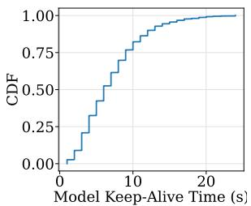  
Figure 2: CDF of models’ keep-alive time.

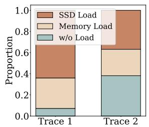  
Figure 3: Proportion of 3 types of model loading.

High cache miss ratio. Next, we measure the cache miss ratio for models cached in memory by replaying the two traces shown in Fig. 1. Based on the findings of Fig. 2, we set models’ keep-alive time to 15 seconds—the tail of the distribution. Fig. 3 shows the proportion of three loading cases across the two traces: model load from memory, model load from SSD, and a hot start (w/o load). We observe that SSD loads (i.e., cache misses) account for 64% and 36% across the two traces, respectively. This indicates that relying on memory caching alone is inadequate, resulting in a significant portion of slow model loads from SSDs or even remote storage, which severely impacts scalability and user experience.

## 3 FAASCALE OVERVIEW

High-speed interconnects in modern GPU clusters enables rapid transfer of large models, making fast model multicast feasible. Additionally, cooperative, pipelined inference during model transmission creates opportunities to further reduce cold-start latency and improve throughput under load surges. Following these insights, we introduce FaaScale, a serverless LLM inference system for fast and efficient model scaling.

Fig. 4 depicts a high-level overview of the FaaScale design. FaaScale runs a cluster manager to dispatch enduser prompt queries to worker nodes, manage global resources, and coordinate model scaling and pipeline execution. FaaScale implements an efficient model scaling scheme—PipeCast—on the model scaling and pipeline execution controllers. PipeCast supports a binomial-pipelinebased approach (Ganesan & Seshadri, 2005; Behrens et al., 2018) for block-level model multicast. In this approach, the nodes are organized into a hypercube communication topology1, where each node transmits model blocks to its adjacent nodes. The model scaling controller coordinates fine-grained, block-level model distribution across participating nodes2. Additionally, the pipeline execution controller is responsible for distributing inference execution across nodes during model scaling. Each worker node deploys user-provided models as model-serving instances and operates a node controller that synchronizes with the cluster manager, reports local status, and coordinates node-level tasks. FaaScale runs a model manager at each node to track local resources such as GPUs and host memory and manage model instances. The model manager is responsible for model execution and transmission tasks according to the instructions of the node controller. It leverages GPUDirect RDMA (GDR) (NVIDIA, a) to efficiently exchange data across GPUs on different nodes, bypassing the data movement through the host to GPUs. It also supports direct access to models stored in remote memory via RDMA.

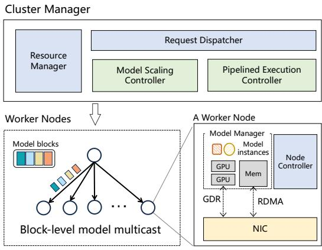  
Figure 4: FaaScale architecture overview. In this example, one node initiates a multicast process to other nodes for a model partitioned into four color-coded model blocks. Each participating worker node transmits a model block in a sequential step, pipelining and parallelizing transfer and reception across network interconnect links. Each receiver worker node may forward the blocks it has received to its neighbors, depending on the multicast algorithm and topology used.

To achieve fast model scaling, FaaScale addresses two key challenges. C1: Coordinated model multicast and inference execution. Existing multicast schemes (e.g., binomial pipelines (Behrens et al., 2018; Ganesan & Seshadri, 2005)) are designed for generic data transfer and are agnostic to model-inference semantics. Naively applying them cannot fully exploit parallel inference to maximize computation-communication overlap. Additionally, inference should begin while models are partially loaded, requiring efficient, dynamic configuration of inference pipelines at runtime. Therefore, FaaScale adopts a synergistic co-design of model multicast and execution, introducing an adaptive multicast scheme and enabling dynamic generation of inference pipelines for improved end-to-end performance (see §4). C2: Cross-storage-tier model management. Serverless LLM platforms rely on multiple storage tiers (e.g., GPU and host memory) to cache model instances. FaaScale coordinates model instances across heterogeneous storage tiers using optimized model and memory management schemes, enabling efficient scaling while minimizing the overall resource footprint (see §5).

## 4 PIPECAST DESIGN

## 4.1 Design Rationale and Overview

PipeCast aims to efficiently support collaborative, distributed inference execution before nodes receive the entire model. The key objective is to maximize the overall system throughput—measured by tokens generated per second for LLM inference—which in turn reduces request queueing under load spikes. We design PipeCast based on a key principle: synergizing scalable multicast with dynamic LLM inference enables in-flight requests to be served as early as possible.

PipeCast introduces the abstraction of a dynamic execution pipeline for distributed inference. The dynamic execution pipeline serves as a model-serving instance spanning a dynamic fleet of GPU nodes that collectively maintain a complete model and jointly perform pipeline parallelism (Fig. 5). Inference requests are assigned to specific execution pipelines, and the designated pipeline iteratively computes all output tokens (Fig. 6 (a)). This minimizes the amount of intermediate data exchanged between nodes and eliminates the need to transfer the KV cache, ensuring efficient distributed execution.

PipeCast provides efficient supports for elastic execution pipelines through three key designs. First, PipeCast extends the binomial pipeline to enable adaptive model multicast, supporting fast model distribution under various scaling scenarios and minimizing the time required to generate execution pipelines. Second, PipeCast adopts an efficient strategy to generate execution pipelines and fully leverage the advantages of adaptive model multicast, which improves overall inference performance. Finally, PipeCast allows participating nodes to switch to local execution mode once they have received the full model replica. In addition to cross-node scaling, execution pipelines can also be applied in memory-based model loading, which we describe in §5.

Algorithm 1 k-Way Transmission Strategy   
Input: – k sub-groups {G0, . . . , Gk−1}   
– b ordered model blocks {M0, . . . , Mb−1}   
Output:   
– Block transfer orders for k sub-groups {O0, . . . , Ok−1}   
1: l ← ⌈b/k⌉ ▷ Size of block chunks   
2: S ← {{Mj | j ∈ [l·i, min(l·(i+1), b)−1]} | i ∈ [0, k−1]}   
▷ Partition blocks into k chunks   
3: for i ∈ [0, k − 1] do ▷ Generate Oi via circular shift   
4: Oi ← Uk−1j=0 (k: −1 S(i+j) mod k

## 4.2 Adaptive Model Multicast

Sub-groups. Consider a cluster of N nodes and a scaling scenario where the source node holds a model instance and needs to distribute it to the remaining N − 1 destination nodes.

More generally, we consider a scaling operation k → N, i.e., k nodes distributing the model to the remaining N − k nodes (where 1 ≤ k < N ) 3. PipeCast evenly divides the N nodes into k sub-groups. Each sub-group consists of L nodes, where L is either ⌊N/k⌋ or N%k, and each subgroup performs a 1 → L scaling. This process supports k → N scaling for arbitrary values of k and N .

Selective block sizes. Determining the block size b is critical to the performance of model multicast. PipeCast selectively configures this parameter to balance the transmission performance and execution efficiency. We note that finegrained model partitioning (i.e., a small b) often results in longer end-to-end transmission times (i.e., a large T ), while increasing b generates fewer model blocks and also leads to additional communication overhead for intermediate results during pipeline execution. According to our modeling, T exhibits an ”elbow point” with respect to b: increasing the block size initially enhances transmission performance, but the benefits diminish beyond a certain threshold. Therefore, we empirically optimize b in order to achieve good transmission performance while minimizing the additional overhead in pipeline execution; here, configuring b requires only offline profiling. This design targets the stable, RDMAcapable networks commonly used for LLM serving, where a single offline-selected b remains effective across our tested settings. More adaptive tuning for highly volatile network conditions is orthogonal to FaaScale’s current design and left to future work.

Optimized transfer order. We propose a k-way transmission strategy to optimize the order of model block transfers across k sub-groups, which enables PipeCast to minimize the time required for assembling a complete model. Algorithm 1 outlines the k-way transmission strategy. It first partitions the model blocks into k equal-sized chunks (lines 1-2) and then generates the block transfer orders for each subgroup by circularly shifting these chunks (lines 3-4). This design ensures that the sub-groups work in tandem, with the first complete model instance becoming available after only b/k time steps.

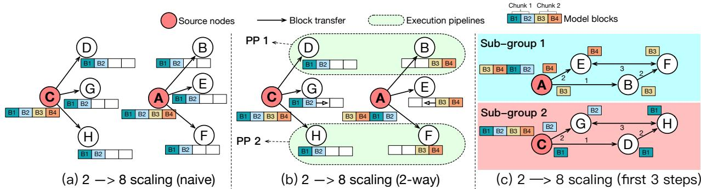  
Figure 5: Illustration of PipeCast with the 2 → 8 scaling example. (a) shows the native multicast and our k-way strategy, respectively. (b) shows the multicast process with PipeCast’s 2-way dynamic pipeline parallelism. (c) details the first three steps of the binomial-pipeline-based multicast (Ganesan & Seshadri, 2005; Behrens et al., 2018) supported by PipeCast. (see our technical report (Yu et al., 2025b) for more details.) PP: pipeline parallel. Model blocks (B1-B4) represent the multicast transfer data granularity, while chunks (Chunk1, Chunk2) represent the pipeline parallel execution granularity.

PipeCast visualization. Fig. 5 illustrates the synergy of model block multicast with dynamic pipeline parallelism when scaling k = 2 source nodes to 8. In contrast to the naive approach, which performs independent multicasts within each subgroup (Fig. 5a), PipeCast enables efficient, cooperative multicast across subgroups (Fig. 5b-c). Each sub-group performs multicast concurrently but uses circular shifting to manipulate the transfer order of model blocks. Specifically, sub-group 1 transfers {B3, B4} before {B1, B2}, while sub-group 2 transfers {B1, B2} before {B3, B4}. This allows complementary blocks to be transferred in parallel across the two sub-groups. As a result, certain destination nodes—such as PP1 (nodes B and D) and PP2 (nodes F and H)—can jointly assemble two complete model instances early and initiate pipeline-parallel inference without waiting for all blocks to arrive at every node. These execution pipelines are dynamically formed across sub-groups once any two nodes collectively possess all model blocks.

## 4.3 Pipelined Inference Execution

Generating execution pipelines. Building on the optimized block transfer order, we propose an efficient execution pipeline generation strategy outlined in Algorithm 2. The key idea is to construct execution pipelines from as many sub-groups as possible, maximizing the benefits of k-way transmission. Specifically, when the remaining unassigned nodes belong to only one sub-group, PipeCast directly forms an execution pipeline using these nodes (lines 3-5). Otherwise, it selects one node from each available sub-group to construct the pipeline (lines 6-12). FaaScale prioritizes pipeline configurations where each sub-group has an equal number of nodes (i.e., N mod k = 0). At runtime, execution pipelines are generated incrementally as complementary model blocks arrive at different nodes. Once a set of nodes collectively holds the required blocks, FaaScale launches an execution pipeline on those nodes; after a node assembles a complete replica, it transitions naturally from distributed execution to local inference. This enables serving requests with partially assembled replicas rather than waiting for all destination nodes to finish loading.

Algorithm 2 Execution Pipeline Generation Strategy   
Input: – k sub-groups {G0, . . . , Gk−1}   
– Li: the number of nodes in Gi   
– nj : the jth node in Gi   
Output: – All generated execution pipelines P   
1: G ← sub-groups with unassigned nodes   
2: while |G| > 0 do   
3: if |G| = 1 then ▷ A pipeline within a single sub-group   
4: P ← ordered nodes in G0   
5: P ← append(P, P )   
6: else ▷ Generate pipelines across sub-groups   
7: a ← minG ∈G Li   
8: for t ∈ [0, a − 1] do   
9: P ← []   
10: for Gi ∈ G do   
11: P ← append(P , nti)   
12: P ← append(P, P )   
13: Update G

2D execution pipelines. Fig. 6a illustrates how a 4-node execution pipeline processes multiple batches (one or multiple requests) of inference requests in parallel using a 2- dimensional pipelining strategy. Along the first dimension, each node is assigned a specific model block and computes a different batch of requests. Once a node completes processing a batch for its assigned block, it passes the intermediate result to the next node and starts computing the next batch along the second dimension. This 2D pipeline strategy efficiently utilizes resources distributed along the multicast route, enabling rapid scaling and processing of accumulated requests during spikes. FaaScale schedules requests across multiple pipelines based on their available resources to improve overall resource efficiency.

Large models spanning multiple GPUs. When a model spans multiple GPUs, PipeCast generates execution pipelines across GPUs within the same node and/or from nodes to minimize performance loss during model scaling. Fig. 6 illustrates the multi-GPU model scaling scenario, where each model instance is distributed across multiple GPUs. During scaling, as model blocks partially arrive, PipeCast dynamically selects one of the three execution strategies based on model size and resource availability (i.e., whether a node has multiple GPUs). Case 1: Cross-node execution pipeline for single-GPU models (models fitting in a single GPU): This is the default execution strategy already described in §4.2. Case 2: Cross-node execution pipeline for multi-GPU models (models that do not fit in a single GPU): GPUs that have received complete blocks can immediately begin forming execution pipelines across nodes to support distributed, pipelined inference for large models, without waiting for the full model to load (see Fig. 6b). Case 3: Intra-node scaling-up for single-GPU models: PipeCast can opportunistically leverage multiple local GPUs on the same node to accelerate scaling if there are available local GPU resources on the same node. As soon as the first GPU receives model blocks, it can quickly replicate them to other local GPUs using high-speed nodelocal communication mediums like NVLink, which offers bandwidth up to an order of magnitude higher than RDMA networks (see Fig. 6c). This fast intra-node replication enables rapid local model scaling-up. Replicated model blocks can then form cross-node execution pipelines (Case 1). This hybrid approach maximizes resource utilization and enhances inference performance by opportunistically reducing data movement overhead.

Design trade-offs. Dynamic execution pipelines require lightweight control-plane coordination to track block availability, update pipeline membership, and retire pipelines once nodes assemble complete replicas. In practice, this overhead remains small because it is limited to transient metadata management during scale-out and does not introduce additional model transfer or GPU computation. This design therefore improves scale-out responsiveness while keeping the data path unchanged.

## 5 EFFICIENT MODEL MANAGEMENT

FaaScale supports efficient model management in both host memory and GPUs through two key system designs.

Locality-driven model startup. FaaScale introduces a multi-level, locality-driven model startup scheme to efficiently support model instances stored in various storage tiers. FaaScale optimizes locality using several startup strategies: (1) GPU (hot start): The model is fully loaded into GPU memory, enabling fast, local execution. (2) Memory (warm start): The model is cached in host memory. FaaScale directly loads host-memory-cached models into GPUs for inference execution, and before models are fully loaded, constructs an execution pipeline across multiple nodes of this kind for enhanced inference performance (PipeCast in §4). (3) Null (cold start): The model is neither cached in GPU or host memory, requiring FaaScale to perform cold-start scaling by directly retrieving model blocks from remote GPU and/or remote host memory.

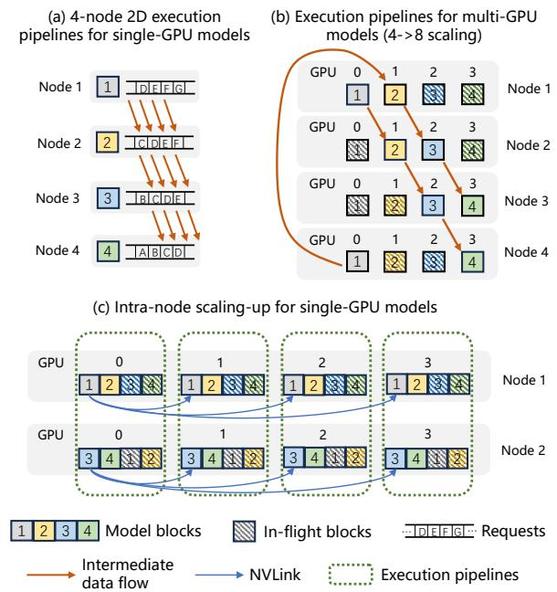  
Figure 6: Example of execution pipelines. (a) A 4-node execution pipeline where each node executes its associated model block for multiple in-flight requests in parallel. (b) Execution pipelines across multi-GPU nodes where each pipeline contains GPUs from different nodes. (c) Intra-node model replication to scale up the inference performance, where each local model block replica forms a separate crossnode execution pipeline.

Efficient memory management. FaaScale employs two strategies to manage GPU and host memory for model blocks. (1) Tensor packing: FaaScale maps each model block to a contiguous memory region for enhanced transmission efficiency. By consolidating all tensor data associated with a single model block into a contiguous memory chunk, FaaScale enables bulk transfer of entire blocks, improving bandwidth efficiency. Notably, the tensor memory layout optimization has no impact on inference execution. (2) GPU memory pre-allocation: FaaScale pre-allocates memory chunks for model blocks and intermediate results, as their sizes remain consistent across requests during pipeline execution. Runtime states with dynamic memory requirements (e.g., KV caches) are internally managed by inference engines (e.g., vLLM (Kwon et al., 2023b)). This design does not require all replicas to remain resident in GPU memory. At scale-out time, FaaScale only requires one complete replica in RDMA-accessible registered memory somewhere in the cluster, either in GPU memory or host memory. Model blocks are multicast from that source buffer to destination GPUs, allowing the same mechanism to cover both 1-to-N expansion from an active replica and 0-to-N expansion from an in-memory replica. This ensures memory efficiency while minimizing memory allocation overhead at runtime.

## 6 FAASCALE IMPLEMENTATION

We have implemented FaaScale in 10K lines of Python and 1K lines of C++, structured into two core components: the cluster manager and worker nodes. The source code of FaaScale and its RDMA P2P transfer library are publicly available (FaaScale, a;b).

The Cluster Manager is implemented in Python (see Fig. 4). Each worker node contains a Model Manager, which consists of two key modules: (1) an inference module, responsible for executing both local inference (within a GPU) and distributed inference (across nodes) and (2) a transfer module, which implements GDR/RDMA-based model block transfer. For the inference module, we extend the codebase of Meta’s Llama inference framework (Meta) to support both local and distributed inference using Python. We build the transfer module on top of Derecho’s RDMC (Behrens et al., 2018; der), where we reuse its resource initialization and RDMA queue pair/connection management components, and extend support to enable one-sided RDMA and GDR. We implemented the binomial pipeline (Ganesan & Seshadri, 2005) algorithm in Cluster Manager and its GDR/RDMA semantics in Model Manager’s transfer module. Specifically, we reuse ∼470 lines from RDMC and add ∼520 lines for one-sided RDMA and memory-region extensions. All the key RDMA P2P transfer APIs (e.g., RDMA queue pair establishment and RDMA read operation) are exposed to Python via Pybind11 (Pybind11).

## 7 EVALUATION

We evaluate FaaScale by addressing three key questions: (1) How fast can FaaScale distribute model blocks across a GPU cluster (§7.2)? (2) How does FaaScale scale LLM inference performance compared to state-of-the-art baselines under concurrent, stress-test workloads (§7.3)? (3) How elastic and cost-effective is FaaScale under a bursty real-world LLM workload (§7.4)? Additional microbenchmark evaluation, sensitivity analysis, and ablation study are provided in our technical report (Yu et al., 2025b).

Table 1: Testbed Configurations. Each testbed uses single 400Gb/s InfiniBand NIC.  
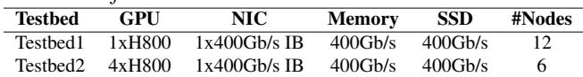

## 7.1 Experiment Setup

Testbeds. All experiments are conducted on a shared HPC cluster, with an exclusive allocation of up to 24 NVIDIA H800 GPUs and 12 nodes per user. We configure two testbeds to evaluate FaaScale under different scalability scenarios (Table 1). Testbed1 is used when a single GPU is sufficient to host the entire model (e.g., Llama-2 7B), allowing to stress the scalability test via inter-node communication. Testbed2 is used when a single GPU is not large enough to host a model (e.g., Llama-2 70B), requiring multiple GPUs per node to validate scalability while involving inter-node communication (e.g., model parallel inference).

Models and configurations. We consider two primary experimental parameters: model size and k (refer to k-way transmission in §4.2 for details). We test FaaScale with the Llama-2 (Touvron et al., 2023) series LLMs with 7B, 13B, and 70B parameters and a k value ranging from {1, 2, 4}. Experiments for Llama-2 7B and 13B are conducted on Testbed1, while Llama-2 70B tests run on Testbed2. Unless explicitly stated, all configurations follow these defaults.

Measurement metrics. Our evaluation focuses on key metrics as following: (1) Throughput (tokens per second) measures FaaScale’s ability to sustain high-load inference requests. (2) Latency (time-to-first-token) reflects FaaScale’s efficiency in generating the first token quickly, a critical metric for low-latency LLM serving. (3) Cost-effectiveness (GPU time) evaluates how elastically FaaScale provisions and releases GPU resources.

Baselines. We compare FaaScale against three baselines, covering both industry-standard and state-of-the-art research systems as discussed in §2.3. (1) ServerlessLLM (Fu et al., 2024): The state-of-the-art serverless LLM inference system designed for dynamic scaling. We implement Serverless-LLM and remove Ray Serve’s (Moritz et al., 2018) cluster management overhead to isolate its inference performance. (2) FaaSNet (Wang et al., 2021): An industryadopted serverless function container provisioning system that optimizes P2P transfer topology for auto-scaling. We use its default binary tree topology and extend it to support GDR-based model loading. (3) NCCL (NVIDIA, b): An industry-standard communication library for multi-GPU training and inference developed by NVIDIA, optimizing collective communication primitives such as all-reduce and broadcast using GDR. Since NCCL lacks native multicast support, we adapt its broadcast primitive by dynamically forming process groups and transmitting model blocks to designated groups, effectively enabling multicast. Fig. 7 focuses on FaaSNet and NCCL, as both are directly comparable to FaaScale for cross-node model multicast over RDMA/GDR. ServerlessLLM is not included in this figure because it primarily targets multi-tier model loading rather than network-based model multicast.

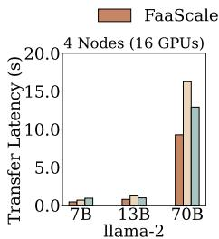

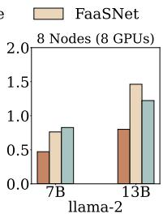

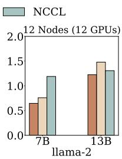  
Figure 7: End-to-end model multicast latency. The 4-node 70B test involves 16 GPUs (4 GPUs per node), while the 8-node 7B and 12-node 13B tests use 8 and 12 single-GPU nodes, respectively. All tests have k = 1 (a single source).

## 7.2 Multicast Performance

Fig. 7 shows the end-to-end multicast latency with different GPU cluster settings. Overall, FaaScale achieves up to a 1.82× and 1.53× speedups over FaaSNet and NCCL, respectively. We observe that FaaScale’s multicast performance advantage increases with both model size and cluster scale. For smaller models on fewer nodes (e.g., 7B on 4 nodes), FaaScale is only modestly faster than the other systems; however, with larger models or more nodes (e.g., 70B on 4 nodes and 13B on 12 nodes), FaaScale ’s performance benefit expands considerably. This improvement comes from FaaScale’s binomial pipeline, which splits a model into blocks and utilizes the entire cluster bandwidth resource to transmit blocks, maximizing link utilization and parallelism. The smaller gain at 12 nodes does not reflect a limitation of the binomial multicast design. On our testbed, it is mainly caused by GPU–NIC NUMA placement and topology-aware optimizations in NCCL, which partially mask topology-induced costs.

## 7.3 Throughput and Latency Performance

Throughput. We measure FaaScale’s throughput scaling ability under high-stress loads by varying k and compare it against ServerlessLLM, FaaSNet, and NCCL (Fig. 8). In Fig. 8, k denotes the number of sub-groups, each with one source node initially holding a complete model instance. All systems use the same k configurations; for the baselines, varying k changes only the number of initial source replicas, not the transfer mechanism itself. FaaScale can begin serving once an execution pipeline is formed from partially loaded model blocks, whereas the baselines wait until the new model instances complete weight replication. Therefore, FaaScale (green) consistently outperforms the baselines by achieving peak throughput significantly faster across various k levels. Specifically, while FaaSNet, NCCL, and ServerlessLLM steadily scale their throughput on a similar timeline (e.g., 0.6s for FaaSNet for Llama-2 7B), FaaScale effectively halves its ramp-up time when its k increases. For the Llama-2 7B example, FaaScale begins scaling at around 0.6s when k = 1, whereas with k = 4, scaling starts significantly earlier, at around 0.15s. This is because PipeCast combines efficient block transfer with opportunistic execution pipelines, allowing GPUs to collaboratively load model blocks and serve requests as soon as sufficient data reaches GPU memory, rather than waiting for the full model to be transferred (see §4.2). In contrast, ServerlessLLM-SSD scales out slowly due to lack of GDR/RDMA multicast and LLM-specific loading optimizations, while FaaSNet and NCCL achieve faster multicast transmission but lack collaborative distributed execution and high transmission parallelism. When k ≥ 2, FaaScale also exhibits a staircase-shaped plateau. This behavior arises mainly from the current overhead of distributed pipelined inference, especially the synchronization and transfer of intermediate data across pipeline stages. The plateau is more visible for k = 2 and k = 4 because the distributedexecution window occupies a larger fraction of the end-toend scaling period, whereas for k = 1 that window is short. Since these intermediate transfers remain within each small pipeline rather than requiring cluster-wide synchronization, the effect does not represent a fundamental scalability bottleneck.

Latency. Fig. 9a-c plots the TTFT latency and Fig. 9d-f shows the zoomed-in CDF given a specific RPS (requests per second) level. We observe that FaaScale starts serving all 50 requests in 1.1s, which is 2×, 1.4×, and 8× faster than FaaSNet, NCCL, ServerlessLLM, respectively. The 7B and 70B models exhibit a similar trend. ServerlessLLM-SSD suffers from a long-tail TTFT latency, caused by: (1) slow SSD I/Os during on-demand loading, and (2) delayed inference execution due to waiting for the entire model to be fully loaded into GPUs.

## 7.4 Real-World LLM Workload

In this section, we evaluate FaaScale’s performance using BurstGPT (Wang et al., 2024), a real-world LLM workload trace collected from regional Azure OpenAI GPT services. The original workload is highly bursty and we select a 30- minute trace snippet from the workload for evaluation. We make the following assumptions: NCCL and FaaSNet prioritize loading models from remote GPUs using GDR and only fall back to local SSD load if none of the GPUs in the cluster have an available model instance. ServerlessLLM relies solely on local-cache-based loading—it loads models from host memory on a cache hit and from SSD on a cache miss. As ServerlessLLM, FaaScale supports best-effort local host memory caching but falls back to PipeCast multicast if the requested model is not in host memory.

Scaling behaviors. Fig. 10 shows the dynamic GPU allocation timeline in response to fluctuating RPS. Ideal Scaling assumes zero model-loading overhead, where a model can be instantly loaded into and swapped out of GPU(s) without delay. This is not practically achievable due to real-world constraints such as resource limitation and data transfer cost. FaaScale scales out and in significantly faster than other systems across three model sizes. All three baselines experience delayed scaling out and delayed scaling in when responding to workload spikes. To quantify the cost effectiveness of GPU resources, we measure the cumulative GPU time for each system. FaaScale consumes up to 17.8%, 18.1%, and 31.3% less GPU resource than FaaS-Net, NCCL, and ServerlessLLM, respectively. While Ideal Scaling achieves the lowest cumulative GPU time, FaaScale maintains the closest GPU consumption to this ideal case, with a small gap ranging from 4.3-18.6%.

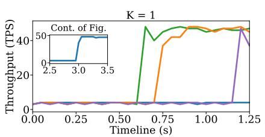

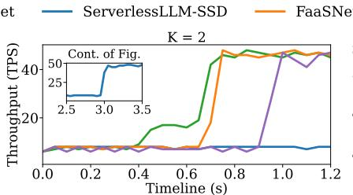

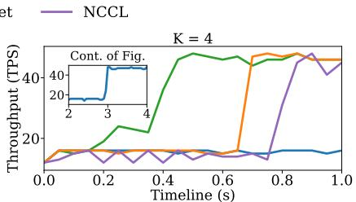

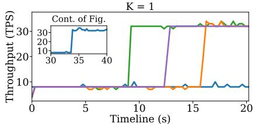

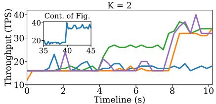  
Figure 8: Throughput scaling via GDR with varying model sizes. Top: Llama-2 7B. Bottom: Llama-2 70B. ServerlessLLM relies on local SSDs during scaling, while all other systems use GDR for inter-node communication. The k configurations apply to all systems. The mini-plots show the extended timeline for ServerlessLLM.

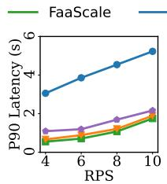

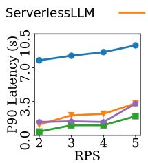  
(a) Llama-2 7B (b) Llama-2 13B (c) Llama-2 70B

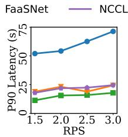

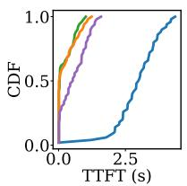

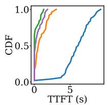

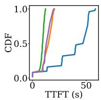  
(d) 7B; RPS=6 (e) 13B; RPS=3 (f) 70B; RPS=1.5  
Figure 9: Latency scaling via GDR.

TTFT comparison. Fig. 11 shows the TTFT distribution, FaaScale outperforms all baselines across the three models Compared to previous TTFT latency results reported under static workloads (§7.3), two key observations emerge. First, the CDF curves of NCCL and FaaSNet shift rightward, due to frequent model loading from SSD, leading to longer tail latency. Second, the CDF curve of ServerlessLLM shifts leftward, likely due to a high cache hit rate when loading models into GPUs.

## 8 RELATED WORK AND DISCUSSION

Pipelined inference and model scaling. Prior works on pipelined inference typically rely on static resource configurations (Crankshaw et al., 2017; Shen et al., 2019; Dhakal et al., 2020; Bai et al., 2020; Li et al., 2023; Mei et al., 2025), whereas FaaScale focuses on dynamically constructing execution pipelines during model scale-out. BlitzScale (Zhang et al., 2024) addresses the same broad problem, but combines chain-based model scaling with an execution schedule tailored to Prefill/Decoding (P/D) disaggregated LLM inference settings (Zhong et al., 2024). In contrast, FaaScale emphasizes scalable multicast through a binomial pipeline and targets a more general serverless environment without assuming P/D disaggregation. DynamoLLM (Stojkovic et al., 2025) leverages predictability for model prefetching, while FaaScale is designed for bursty and unpredictable workloads. Medusa (Zeng et al., 2025) reduces single-node startup overhead by materializing CUDA graphs and KV cache states, complementing FaaScale’s focus on distributed, cross-node model transfer and execution while targeting single-node startup overhead rather than multi-node coordination.

Networking assumptions and applicability. FaaScale targets modern AI-serving clusters with stable RDMA-capable networks, where fast cross-node model transfer is a firstorder concern. This setting matches emerging inference infrastructures that provide high-bandwidth communication and direct GPU data paths. At the same time, FaaScale’s core design is not tied to a specific interconnect. Its main benefit comes from overlapping model transfer with inference once the required model blocks arrive. The same design therefore remains applicable in clusters with lower bandwidth, higher jitter, or even non-RDMA networks, although the absolute gains would decrease as communication becomes slower and less predictable.

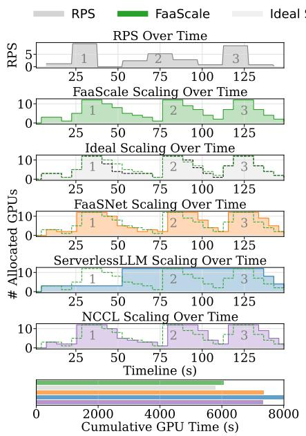  
(a) Llama-2 7B

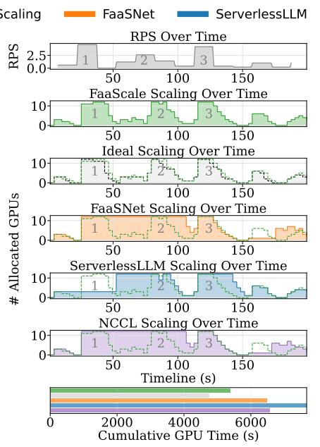  
(b) Llama-2 13B

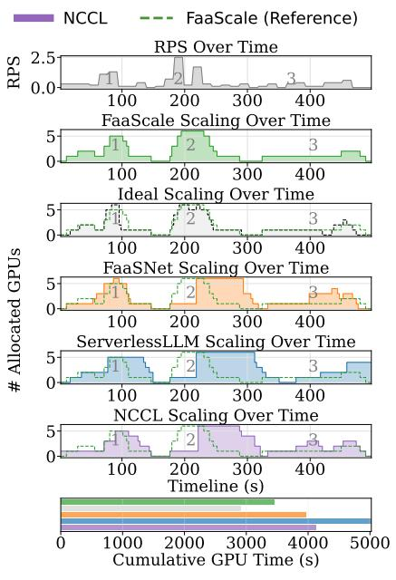  
(c) Llama-2 70B

Figure 10: GPU allocation over time under a 30-minute BurstGPT workload. Top: RPS over time. Middle (Row 2-6): System-specific results sharing the same timeline. Bottom: Cumulative GPU consumption of all systems. The RPS timeline includes labeled spikes (Top). The green dotted line shadows FaaScale’s scaling behavior, allowing direct comparison against other systems. The baselines are shown in separate subfigures to reduce visual clutter while preserving a common time axis across rows. In each baseline row, the green dotted line overlays FaaScale to highlight the difference in scaling responsiveness, and the bottom row summarizes cumulative GPU-time consumption.  
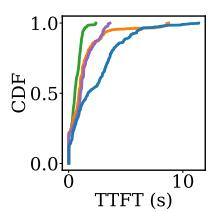

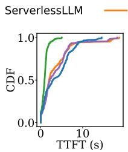

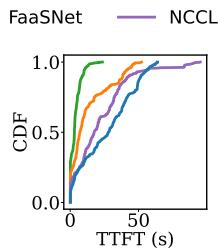  
(a) Llama-2 7B (b) Llama-2 13B (c) Llama-2 70B  
Figure 11: CDF of TTFT under the BurstGPT workload.

Multi-tenancy and heterogeneity. Multi-tenant serving requires both fast per-model elasticity and cluster-wide coordination across models. FaaScale contributes the former by providing a low-latency scale-out path that can rapidly instantiate additional replicas for an individual model under bursty demand. This capability is complementary to multi-model serving systems such as Aegaeon (Xiang et al., 2025), which optimize resource sharing, admission control, and request scheduling across tenants. Additionally, FaaScale’s multicast-execution co-design can be combined with heterogeneous-cluster schedulers such as Helix (Mei et al., 2025) by constructing sub-groups from nodes with similar compute capability and forming pipelines within those sub-groups, while the higher-level scheduler decides model placement and capacity allocation across diverse resources.

KV cache reuse. KV-cache reuse integrates naturally with FaaScale’s fast model scaling. During scale-out, FaaScale accelerates the distribution and assembly of model parameters, enabling new instances to begin serving quickly; once these instances are available, existing KV-cache management techniques can provide reusable cache state. For example, systems such as Mooncake (Qin et al., 2025) support cluster-level KV-cache pools that can be managed and accessed efficiently at scale, making them a natural complement to FaaScale over the same high-speed network fabric. Additionally, Medusa (Zeng et al., 2025) offers a complementary optimization by materializing KV-related state to reduce single-node startup overhead, whereas FaaScale targets cross-node model fast scaling.

## 9 CONCLUSION

This paper presents FaaScale, a serverless inference system designed for fast and efficient model scaling. FaaScale leverages high-speed RDMA networks for fast model scaling and introduces a pipelined multicast inference strategy that enables collaborative, cross-node execution during model multicast. Combined with efficient model management, FaaScale sustains bursty workloads and achieves up to 5× tail-latency improvement over state-of-the-art systems.

## ACKNOWLEDGEMENTS

We thank the shepherd and anonymous reviewers for their constructive feedback. This work was supported in part by the CUHK-Shenzhen Research Grant (UDF01003466), Alibaba Innovative Research (AIR) Grant, RGC CRF Grant (Ref. #C6015-23G), RGC GRF Grants (Ref. #16217124 and #16210822), and NSFC/RGC CRS Grant (Ref. #CRS HKUST601/24). We thank the Derecho/RDMC team for their binomial pipeline multicast implementation and the guidance for our work.

## REFERENCES

Alibaba Cloud Function Compute. https://www. alibabacloud.com/product/functioncompute.

Derecho GitHub. https://github.com/derechoproject.

Al-Fares, M., Loukissas, A., and Vahdat, A. A scalable, commodity data center network architecture. ACM SIG-COMM computer communication review, 38(4):63–74, 2008.

Ali, A., Pinciroli, R., Yan, F., and Smirni, E. BATCH: Machine learning inference serving on serverless platforms with adaptive batching. In Proc. ACM/IEEE Supercomputing, 2020.

Ali, A., Pinciroli, R., Yan, F., and Smirni, E. Optimizing inference serving on serverless platforms. Proceedings of the VLDB Endowment, 15(10), 2022.

Alibaba. Alibaba cloud: Serverless gpu overview. https://www.alibabacloud.com/technews/a/serverless/4o2cc4hux4qserverless-gpu-overview, a.

Alibaba. Aliyun Function Compute Billing Scheme. https://www.alibabacloud.com/help/ en/function-compute/latest/billingbilling, b.

AWS. AWS Lambda Provisioned Concurrency. https: //docs.aws.amazon.com/lambda/latest/ dg/provisioned-concurrency.html, a.

AWS. Provisioned Concurrency for Lambda Functions. https://aws.amazon.com/blogs/aws/newprovisioned-concurrency-for-lambdafunctions/, b.

AWS. Deploy models with Amazon SageMaker Serverless Inference. https://docs.aws.amazon. com/sagemaker/latest/dg/serverlessendpoints.html, c.

Azure. How microsoft’s bet on azure unlocked an ai revolution. https://news.microsoft.com/source/ features/ai/how-microsofts-bet-onazure-unlocked-an-ai-revolution/.

Bai, Z., Zhang, Z., Zhu, Y., and Jin, X. PipeSwitch: Fast pipelined context switching for deep learning applications. In Proc. USENIX OSDI, 2020.

Behrens, J., Jha, S., Birman, K., and Tremel, E. Rdmc: A reliable rdma multicast for large objects. In 2018 48th Annual IEEE/IFIP International Conference on Dependable Systems and Networks (DSN), pp. 71–82, 2018.

Brooker, M., Danilov, M., Greenwood, C., and Piwonka, P. On-demand container loading in AWS lambda. In 2023 USENIX Annual Technical Conference (USENIX ATC 23), pp. 315–328, Boston, MA, July 2023. USENIX Association. ISBN 978-1-939133-35-9. URL https://www.usenix.org/conference/ atc23/presentation/brooker.

Choi, S., Lee, S., Kim, Y., Park, J., Kwon, Y., and Huh, J. Serving heterogeneous machine learning models on multi-GPU servers with spatio-temporal sharing. In Proc. USENIX ATC, 2022.

Crankshaw, D., Wang, X., Zhou, G., Franklin, M. J., Gonzalez, J. E., and Stoica, I. Clipper: A low-latency online prediction serving system. In Proc. USENIX NSDI, 2017.

Dhakal, A., Kulkarni, S. G., and Ramakrishnan, K. K. GSLICE: controlled spatial sharing of GPUs for a scalable inference platform. In Proc. ACM SoCC, 2020.

FaaScale. FaaScale codebase. https://github.com/ lambda-scale/lambda-scale, a.

FaaScale. FaaScale RDMA P2P codebase. https:// github.com/lambda-scale/rdma-p2p, b.

Fu, Y., Xue, L., Huang, Y., Brabete, A.-O., Ustiugov, D., Patel, Y., and Mai, L. ServerlessLLM: Locality-enhanced serverless inference for large language models. In Proc. USENIX OSDI, 2024.

Ganesan, P. and Seshadri, M. On cooperative content distribution and the price of barter. In 25th IEEE International Conference on Distributed Computing Systems (ICDCS’05), pp. 81–90, 2005.

Gujarati, A., Karimi, R., Alzayat, S., Hao, W., Kaufmann, A., Vigfusson, Y., and Mace, J. Serving DNNs like clockwork: Performance predictability from the bottom up. In Proc. USENIX OSDI, 2020.

Han, M., Zhang, H., Chen, R., and Chen, H. Microsecondscale preemption for concurrent GPU-accelerated DNN inferences. In Proc. USENIX OSDI, 2022.

Hong, Z., Lin, J., Guo, S., Luo, S., Chen, W., Wattenhofer, R., and Yu, Y. Optimus: Warming serverless ml inference via inter-function model transformation. In Proceedings of the Nineteenth European Conference on Computer Systems, pp. 1039–1053, 2024.

Hu, Q., Ye, Z., Wang, Z., Wang, G., Zhang, M., Chen, Q., Sun, P., Lin, D., Wang, X., Luo, Y., Wen, Y., and Zhang, T. Characterization of large language model development in the datacenter. In 21st USENIX Symposium on Networked Systems Design and Implementation (NSDI 24), pp. 709–729, Santa Clara, CA, April 2024. USENIX Association. ISBN 978-1-939133-39-7. URL https://www.usenix.org/conference/ nsdi24/presentation/hu.

HuggingFace. HuggingFace Serverless Inference. Hugging Face documentation, a.

HuggingFace. Hugging Face Serverless Inference Endpoints. Hugging Face documentation, b.

Jeong, J., Baek, S., and Ahn, J. Fast and efficient model serving using multi-gpus with direct-host-access. In Proc. ACM EuroSys, 2023.

Kosaian, J., Rashmi, K. V., and Venkataraman, S. Parity models: erasure-coded resilience for prediction serving systems. In Proc. ACM SOSP, 2019.

Kundu, J., Guo, W., BanaGozar, A., Alwis, U. D., Sengupta, S., Gupta, P., and Mallik, A. Performance modeling and workload analysis of distributed large language model training and inference, 2024. URL https://arxiv. org/abs/2407.14645.

Kwon, W., Li, Z., Zhuang, S., Sheng, Y., Zheng, L., Yu, C. H., Gonzalez, J., Zhang, H., and Stoica, I. Efficient memory management for large language model serving with pagedattention. In Proceedings of the 29th Symposium on Operating Systems Principles, SOSP ’23, pp. 611–626, New York, NY, USA, 2023a. Association for Computing Machinery. ISBN 9798400702297. URL https://doi.org/10. 1145/3600006.3613165.

Kwon, W., Li, Z., Zhuang, S., Sheng, Y., Zheng, L., Yu, C. H., Gonzalez, J. E., Zhang, H., and Stoica, I. Efficient memory management for large language model serving with pagedattention. In Proceedings of the ACM SIGOPS 29th Symposium on Operating Systems Principles, 2023b.

Lee, Y., Scolari, A., Chun, B.-G., Santambrogio, M. D., Weimer, M., and Interlandi, M. PRETZEL: Opening the black box of machine learning prediction serving systems. In Proc. USENIX OSDI, 2018.

Li, Z., Zheng, L., Zhong, Y., Liu, V., Sheng, Y., Jin, X., Huang, Y., Chen, Z., Zhang, H., Gonzalez, J. E., and Stoica, I. AlpaServe: Statistical multiplexing with model parallelism for deep learning serving. In 17th USENIX Symposium on Operating Systems Design and Implementation (OSDI 23), 2023.

Lv, C., Shi, X., Lei, Z., Huang, J., Tan, W., Zheng, X., and Zhao, X. Dilu: Enabling GPU resourcing-on-demand for serverless DL serving via introspective elasticity. In Proc. ACM ASPLOS, 2025.

Mei, Y., Zhuang, Y., Miao, X., Yang, J., Jia, Z., and Vinayak, R. Helix: Serving large language models over heterogeneous gpus and network via max-flow. In Proc. ACM ASPLOS, 2025.

Meta. Meta Inference Engine. https://github.com/ meta-llama/llama-models.

Moritz, P., Nishihara, R., Wang, S., Tumanov, A., Liaw, R., Liang, E., Elibol, M., Yang, Z., Paul, W., Jordan, M. I., and Stoica, I. Ray: a distributed framework for emerging ai applications. In Proceedings of the 13th USENIX Conference on Operating Systems Design and Implementation, OSDI’18, pp. 561–577, USA, 2018. USENIX Association. ISBN 9781931971478.

NVIDIA. Nvidia gpudirect rdma documentation. https: //docs.nvidia.com/cuda/gpudirectrdma/index.html, a.

NVIDIA. NCCL. https://developer.nvidia. com/nccl, b.

Pybind11. Libibverbs. https://pybind11. readthedocs.io/en/stable/.

Qin, R., Li, Z., He, W., Cui, J., Ren, F., Zhang, M., Wu, Y., Zheng, W., and Xu, X. Mooncake: Trading more storage for less computation — a KVCachecentric architecture for serving LLM chatbot. In 23rd USENIX Conference on File and Storage Technologies (FAST 25), pp. 155–170. USENIX Association, 2025. URL https://www.usenix.org/conference/ fast25/presentation/qin.

Romero, F., Li, Q., Yadwadkar, N. J., and Kozyrakis, C. INFaaS: Automated model-less inference serving. In Proc. USENIX ATC, 2021.

Shen, H., Chen, L., Jin, Y., Zhao, L., Kong, B., Philipose, M., Krishnamurthy, A., and Sundaram, R. Nexus: a GPU cluster engine for accelerating DNN-based video analysis. In Proc. ACM SOSP, 2019.

Stojkovic, J., Zhang, C., Goiri, I., Torrellas, J., and Choukse, E. DynamoLLM: Designing LLM Inference Clusters for

Performance and Energy Efficiency . In 2025 IEEE International Symposium on High Performance Computer Architecture (HPCA), pp. 1348–1362, Los Alamitos, CA, USA, March 2025. IEEE Computer Society. URL https://doi.ieeecomputersociety.org/ 10.1109/HPCA61900.2025.00102.

Touvron, H., Martin, L., Stone, K., Albert, P., Almahairi, A., Babaei, Y., Bashlykov, N., Batra, S., Bhargava, P., Bhosale, S., Bikel, D., Blecher, L., Ferrer, C. C., Chen, M., Cucurull, G., Esiobu, D., Fernandes, J., Fu, J., Fu, W., Fuller, B., Gao, C., Goswami, V., Goyal, N., Hartshorn, A., Hosseini, S., Hou, R., Inan, H., Kardas, M., Kerkez, V., Khabsa, M., Kloumann, I., Korenev, A., Koura, P. S., Lachaux, M.-A., Lavril, T., Lee, J., Liskovich, D., Lu, Y., Mao, Y., Martinet, X., Mihaylov, T., Mishra, P., Molybog, I., Nie, Y., Poulton, A., Reizenstein, J., Rungta, R., Saladi, K., Schelten, A., Silva, R., Smith, E. M., Subramanian, R., Tan, X. E., Tang, B., Taylor, R., Williams, A., Kuan, J. X., Xu, P., Yan, Z., Zarov, I., Zhang, Y., Fan, A., Kambadur, M., Narang, S., Rodriguez, A., Stojnic, R., Edunov, S., and Scialom, T. Llama 2: Open foundation and fine-tuned chat models, 2023. URL https://arxiv.org/abs/2307.09288.

Wang, A., Chang, S., Tian, H., Wang, H., Yang, H., Li, H., Du, R., and Cheng, Y. FaaSNet: Scalable and fast provisioning of custom serverless container runtimes at alibaba cloud function compute. In Proc. USENIX ATC, 2021.

Wang, Y., Chen, Y., Li, Z., Kang, X., Tang, Z., He, X., Guo, R., Wang, X., Wang, Q., Zhou, A. C., and Chu, X. Burstgpt: A real-world workload dataset to optimize llm serving systems, 2024. URL https://arxiv.org/ abs/2401.17644.

Wang, Z., Lan, T., Su, Z., Yang, J., and Cheng, Y. Towards efficient llm storage reduction via tensor deduplication and delta compression, 2025. URL https://arxiv. org/abs/2505.06252.

Xiang, Y., Li, X., Qian, K., Yu, W., Zhai, E., et al. Aegaeon: Effective GPU pooling for concurrent LLM serving on the market. In Proceedings of the 31st Symposium on Operating Systems Principles, pp. 1030–1045, 2025.

Yang, Y., Zhao, L., Li, Y., Zhang, H., Li, J., Zhao, M., Chen, X., and Li, K. INFless: a native serverless system for low-latency, high-throughput inference. In Proc. ACM ASPLOS, 2022.

Yu, M., Jiang, Z., Ng, H. C., Wang, W., Chen, R., and Li, B. Gillis: Serving large neural networks in serverless functions with automatic model partitioning. In Proc. IEEE ICDCS, 2021.

Yu, M., Wang, A., Chen, D., Yu, H., Luo, X., Li, Z., Wang, W., Chen, R., Nie, D., Yang, H., and Ding, Y. Torpor: Gpu-enabled serverless computing for low-latency, resource-efficient inference. In Proc. USENIX ATC, 2025a.

Yu, M., Yang, R., Jia, C., Su, Z., Yao, S., Lan, T., Yang, Y., Wang, Z., Cheng, Y., Wang, W., Wang, A., and Chen, R. λScale: Enabling fast scaling for serverless large language model inference, 2025b. URL https: //arxiv.org/abs/2502.09922.

Zeng, S., Xie, M., Gao, S., Chen, Y., and Lu, Y. Medusa: Accelerating serverless LLM inference with materialization. In Proc. ACM ASPLOS, 2025.

Zhang, C., Yu, M., Wang, W., and Yan, F. MArk: Exploiting cloud services for cost-effective, SLO-aware machine learning inference serving. In Proc. USENIX ATC, 2019.

Zhang, D., Wang, H., Liu, Y., Wei, X., Shan, Y., Chen, R., and Chen, H. Fast and live model auto scaling with o(1) host caching, 2024. URL https://arxiv.org/ abs/2412.17246.

Zhang, H., Tang, Y., Khandelwal, A., and Stoica, I. SHEP-HERD: Serving DNNs in the wild. In Proc. USENIX NSDI, 2023.

Zhong, Y., Liu, S., Chen, J., Hu, J., Zhu, Y., Liu, X., Jin, X., and Zhang, H. DistServe: Disaggregating prefill and decoding for goodput-optimized large language model serving. In 18th USENIX Symposium on Operating Systems Design and Implementation (OSDI 24), 2024.