# Beyond the Buzz: A Pragmatic Take on Inference Disaggregation

Tiyasa Mitra Ritika Borkar Nidhi Bhatia Ramon Matas Shivam Raj

Dheevatsa Mudigere Ritchie Zhao

Maximilian Golub Arpan Dutta

Sailaja Madduri Dharmesh Jani

Brian Pharris Bita Darvish Rouhani

NVIDIA Corporation

## Abstract

As inference scales to multi-node deployments, disaggregation—splitting inference into distinct phases—offers a promising path to improving the throughputinteractivity Pareto frontier. Despite growing enthusiasm and a surge of open-source efforts, practical deployment of disaggregated serving remains limited due to the complexity of the optimization search space and system-level coordination. In this paper, we present the first systematic study of disaggregated inference at scale, evaluating hundreds of thousands of design points across diverse workloads and hardware configurations. We find that disaggregation is most effective for prefillheavy traffic patterns and larger models. Our results highlight the critical role of dynamic rate matching and elastic scaling in achieving Pareto-optimal performance. Our findings offer actionable insights for efficient disaggregated deployments to navigate the trade-off between system throughput and interactivity.

## 1 Introduction

One of the primary drivers of modern AI applications is scale. Inference serving is rapidly evolving from traditional single-node endpoints to multi-node deployments at data center scale. This shift unlocks new opportunities for system-level optimization, enabling exploration across a broader, more expressive design space.

The community is actively exploring a range of techniques to improve the Pareto frontier of server throughput (amortized cost) and interactivity (quality of service) for inference serving. Disaggregation is a prominent example, offering the potential to expand the throughput–interactivity trade-off when applied effectively. Reflecting this promise, the past year has seen a surge in research efforts and open-source implementations. Despite growing interest in disaggregation, adoption at scale has been limited––mainly due to the complexity of the underlying design space.

At its core, disaggregation is straightforward: divide inference into phases with distinct compute characteristics and optimize each phase independently. In autoregressive LLMs, this typically corresponds to separating the prefill and decode phases. This paper focuses on LLMs as the primary case study due to their widespread use, though the same principles should apply to VLMs.

The design space for disaggregation is broad and highly dependent on traffic characteristics. Unlocking performance gains through disaggregation requires careful decisions around model sharding, concurrency, and rate matching between phases to balance throughput and interactivity trade-offs.

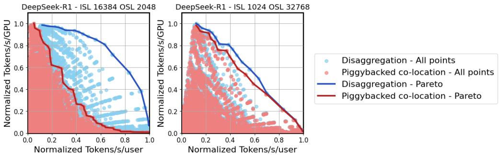  
Figure 1: Throughput–interactivity Pareto frontier for DeepSeek-R1. The benefits of disaggregated serving vary with the target tokens/s/user (i.e., interactivity) and traffic patterns: (left) prefill-heavy vs. (right) generation-heavy traffic. Most results in this paper are presented in normalized form, as our primary objective is to convey trends rather than make specific performance claims.

In this work, we systematically quantify the search space for LLM disaggregation and examine the system-level trade-offs and implications within this emerging landscape.

This paper seeks to clarify the practical aspects of disaggregated serving and to provide design guidance for large-scale deployments. While disaggregation holds significant promise for improving LLM inference, it also comes with new optimization challenges. Figure 1 provides an example of how the benefits of disaggregation, over piggybacked co-location, can vary significantly across different traffic patterns – i.e., Input Sequence Length (ISL) and Output Sequence Length (OSL).

This paper, for the first time, extensively explores the design space of large-scale disaggregated inference by simulating hundreds of thousands of design points across a range of workloads, traffic patterns, and hardware configurations. Our analysis reveals that disaggregation provides the greatest benefits in prefill-heavy traffic scenarios (i.e., ISL >> OSL) and when serving larger models (e.g., >10B parameters). Our results also underscore the importance of dynamic rate matching and elastic scaling to fully realize the advantages of disaggregation. Similarly, for co-located serving, we find that the effectiveness of context chunking is highly sensitive to the attention mechanism (e.g., Multi-Latent Attention (MLA) vs. Group Query Attention (GQA)) and is most beneficial under relaxed latency targets and generation-heavy traffic patterns. Through extensive experimentation and system-level analysis, we hope this paper serves as a foundation for building high-performance disaggregated inference systems at scale in the future.

## 2 Background

In traditional co-located LLM inference serving, both the prefill and decode phases occur on the same model instance within a monolithic pipeline. To maximize throughput, requests in different phases are batched together to share model weights and GPU memory. Many deployments employ in-flight batching (IFB), which allows new requests to be added to a batch as soon as an in-flight request completes. Piggybacking [1, 2] builds upon IFB by reducing decode stalls through context chunking when new requests are introduced.

Despite these optimizations, co-located serving forces a single model instance to simultaneously optimize for two metrics: low First Token Latency (FTL) for new prompts and low Token-to-Token Latency (TTL) for ongoing generation. Each metric exhibits different bottlenecks, leading to inherent tension in resource scheduling.

In contrast, disaggregated inference serving [3–7] decouples the prefill and decode phases, allowing each to run on a separate model instance — potentially across different GPUs. This separation enables each phase to independently adopt model partitioning and batching strategies tailored to its performance targets. Moreover, it eliminates artificial slowdowns in prefill caused by strict TTL service-level agreements, as seen in piggybacking. Figure 2 illustrates these modes of serving.

As demonstrated in Figure 1, disaggregation is not a universal solution. In the following sections, we examine the performance benefits of disaggregated inference serving across a broad design space. Appendix A summarizes the key metrics referenced throughout the paper.

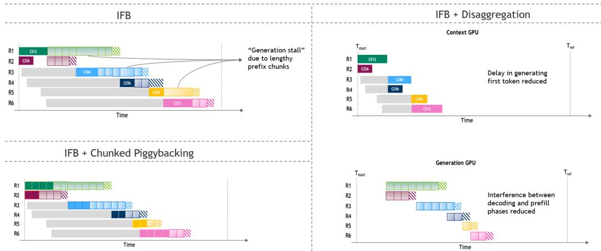  
Figure 2: Visualization of (left) co-located and (right) disaggregated inference serving, illustrating the temporal distribution of prefill (dark boxes) and decode iterations (light boxes) across different requests (color-coded).

## 3 Design space exploration

A versatile inference optimization should maximize the area under the throughput–interactivity Pareto frontier (see Figure 1 as an example). In the case of disaggregated serving, achieving this goal requires optimization across two distinct dimensions: (i) the model partitioning strategy for prefill (a.k.a., context) and decode (a.k.a., generation) instances, and (ii) the scaling/rate matching strategy for prefill and decode GPUs.

## 3.1 Model partitioning

Each point along the Pareto frontier corresponds to a different model partitioning strategy. To explore this space, we evaluate different parallelism strategies including Tensor Parallelism (TP) [8], Expert Parallelism (EP) [9], Pipeline Parallelism (PP) [10, 11], Chunked Pipeline Parallelism (CPP), and TEP (Tensor Parallel Attention and EP FFNs), across a wide range of batch sizes.

The optimal partitioning strategy for a given model depends on several factors: the serving mode (e.g., co-located or disaggregated), traffic characteristics (input sequence length, output sequence length, and queries per second), target hardware, and latency constraints. Throughout this paper, we use a proprietary, high-fidelity GPU performance simulator designed for datacenter-scale inference. The simulator takes as input the model architecture, traffic pattern, and GPU configuration, and outputs the corresponding latency and throughput across different batch sizes and parallelism strategies. These outputs are used to construct Pareto frontiers under various serving conditions.

For co-located serving, we evaluate configurations both with and without context-chunked piggybacking and explore the sensitivity of piggybacking to model architecture and traffic patterns. In piggybacked setups, our simulator determines the optimal mix of prefill and decode tokens in a batch for each ISL–OSL combination. This ratio varies across the Pareto frontier and depends on the latency constraints.

In the disaggregated setting, a key source of performance gain is the ability to use different model partitioning strategies for the prefill and decode stages. To reflect this, we simulate the prefill and decode pools separately, allowing each to independently optimize for its corresponding service level agreements. Our analysis focuses on modern Blackwell systems [12] using FP4 precision [13], which represent the state of the art in LLM inference infrastructure.

## 3.2 Scaling and rate matching

Once the optimal model partitioning for prefill and decode is identified, disaggregated serving requires a rate matching strategy to determine the appropriate ratio of prefill to decode instances and ensure a balanced throughput between the two phases.

To construct the Pareto frontier shown in Figure 1, we first fix the prefill mapping that satisfies the FTL constraint. Then, for each candidate decode mapping, we use a rate matching algorithm that employs an integer solver to find the right balance between the throughput of prefill and decode phases – subject to the TTL constraint and total GPU count minimization. Details can be found in Appendix B. All design points with an FTL > 10 seconds, a relaxed yet practical constraint, are excluded from our search space.

Figure 3 shows the high-level overview of the rate matching methodology used to quantify each disaggregated design point. Each blue circle in Figure 1 is the output of a rate matching step. Our simulation assumes a datacenter setting with sufficient GPUs and incoming requests to fully utilize the rate-matched deployment. We further assume the KV cache produced at each layer by the prefill pool is transferred to the generation pool immediately as it becomes available, overlapping with the computation of subsequent layers. The implications of this assumption are discussed in Section 5.1.

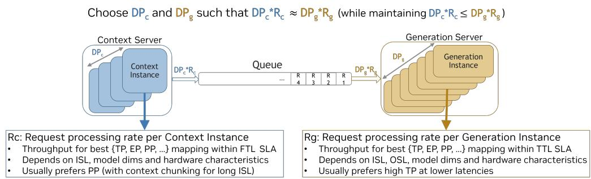  
Figure 3: High-level overview of rate matching for disaggregated serving. KV cache and weights are hosted in HBM memory and capacity constraints are accounted for.

## 4 Disaggregation in practice

The performance gains from disaggregated serving depend on multiple factors—including target latency, underlying model architecture and scale, traffic patterns, and hardware configurations. In this section, we analyze the sensitivity of disaggregated serving to each of these dimensions.

In real-world deployments, service level agreements (SLA) are typically defined by two latency metrics: (i) FTL, ranging from hundreds of milliseconds to several minutes, and (ii) TTL, typically spanning a few milliseconds. The reciprocal of TTL (i.e., 1/TTL) serves as a proxy for interactivity, measured in tokens per second per user. Together, FTL and TTL determine where a system should operate along the throughput–interactivity Pareto frontier for optimal performance.

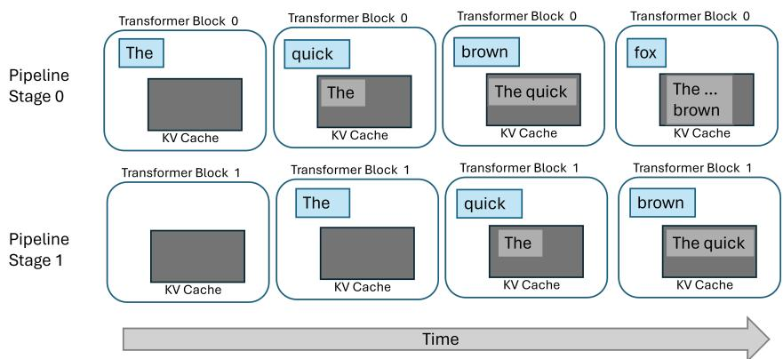  
Figure 4: High-level overview of chunked pipeline parallelism. It works by: (i) splitting the input sequence into smaller chunks, (ii) processing each chunk independently, using the KV cache from previous chunks but not their outputs, and (iii) overlapping the processing of earlier layers of new chunks with the later layers of previous ones using pipeline parallelism.

In disaggregated serving, FTL constraints apply only to the prefill (context) pool. To maintain high system throughput while reducing FTL across mixed-length sequences, we found Chunked Pipeline Parallelism (CPP) to be especially effective. As shown in Figure 4, chunked pipelining splits context processing into smaller, parallel segments. This allows context GPUs to handle long sequences within the given FTL, without the complexity of wide tensor parallelism. Figure 5 shows, for DeepSeek-R1, how FTL can be reduced as we increase the PP, while keeping throughput high.

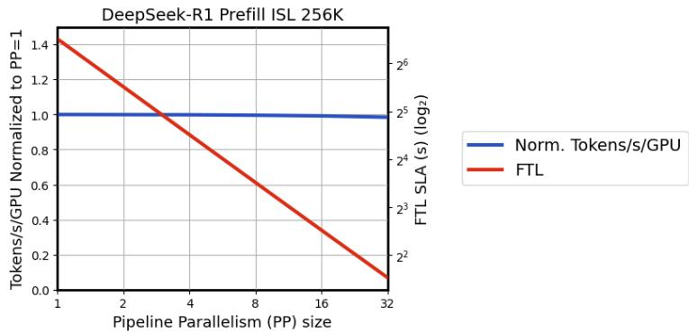  
Figure 5: Chunked pipeline parallelism during Prefill is an optimal strategy to maximize throughput while complying with strict FTL SLA. Prefill performance is shown for DeepSeek-R1 with ISL of 256K on 64 GPUs using EP and PP $( \mathrm { E P } \times \mathrm { P P } = 6 4 )$ .

TTL constraints, on the other hand, govern the decode (generation) pool. In Figure 1, moving left to right corresponds to increasingly stringent TTL requirements (i.e., higher tokens/s/user). As TTL constraints tighten, configurations shift toward smaller batch sizes and greater tensor parallelism.

Consider DeepSeek-R1 [14] with ISL of 16k and OSL of 2k: across the Pareto frontier, expert parallelism within the NVLink domain is consistently preferred. However, attention computation transitions from data parallelism in the high-throughput regime to tensor parallelism under tighter TTL constraints. Batch sizes are in the hundreds at the high-throughput end, decreasing progressively as interactivity increases. A similar trend is observed in Llama-3.1-70B [15], where tensor parallelism scales from 2× to 64× as TTL constraints tighten, with batching behavior closely mirroring that of DeepSeek-R1. While both co-located and disaggregated serving favor high tensor parallelism under tight TTL SLAs, disaggregated decoding is able to pursue this strategy more aggressively. Freed from the need to balance math-heavy prefill performance with decoding speed, disaggregated decode pools can better adapt to tightening latency demands — leading to superior performance in the medium-latency regime.

## 4.1 Model sensitivity

In this section, we examine the sensitivity of disaggregated serving to model architecture and size.

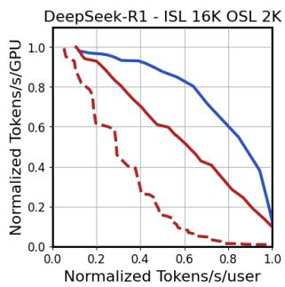

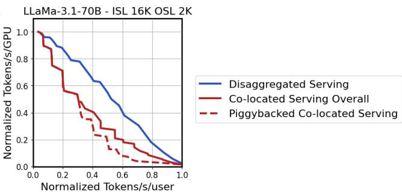  
Figure 6: Disaggregated vs. co-located serving. Co-located serving overall (red-solid) is the superposition of piggybacked (red-dotted) and non-piggybacked configurations.

Model architecture sensitivity. Model architecture plays a key role in inference serving decisions. Figure 6 compares disaggregated and co-located serving under context-heavy traffic for DeepSeek-R1 and Llama-3.1-70B. We evaluate the sensitivity of disaggregation to traffic pattern in the next section. Note that the benefits of disaggregation manifest differently across different latency regimes for each model architecture. Our analysis further reveals that DeepSeek-R1 experiences additional overhead in piggybacked co-located serving due to prefill chunking—specifically, redundant computation of down and up projections in multi-latent attention for each prefill chunk. This can be mitigated by temporarily caching the up-projected KV values from earlier chunks. To capture these trade-offs, our co-located baseline Pareto curves include both piggybacked and non-piggybacked configurations.

Model size sensitivity. Figure 7 presents the throughput-latency characteristics for Llama 8B, 70B, and 405B under both disaggregated and co-located serving configurations. Our analysis indicates that the benefits of disaggregated inferencing become more pronounced with larger models. This enhanced performance can be attributed to the fact that larger models are typically mapped across more GPUs, enabling a broader range of parallelization strategies. Consequently, the advantage of selecting distinct model mappings for prefill and decode phases becomes more significant.

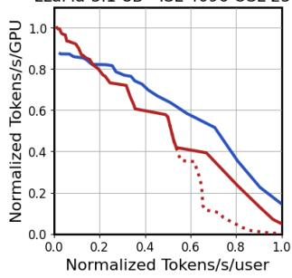

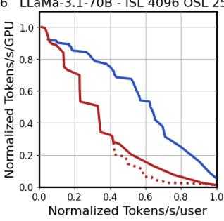

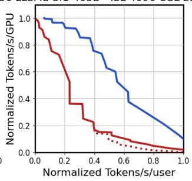  
Figure 7: Larger models benefit more from disaggregated serving due to a richer search space.

## 4.2 Traffic sensitivity

A critical factor in estimating the performance of disaggregated serving is the traffic pattern. In Figure 8, we present the Pareto for DeepSeek-R1 across four distinct traffic patterns. Our analysis reveals that the benefits of disaggregation are most pronounced for prefill-heavy workloads where mappings, if prioritized to balance decoding speed, can significantly compromise prefill processing throughput. Similarly, for co-located serving, piggybacking is most promising on decode-heavy traffic.

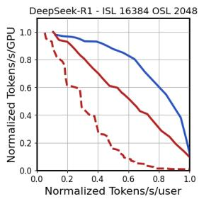

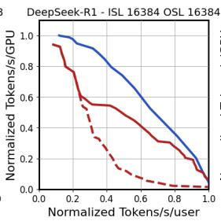

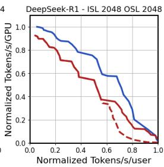

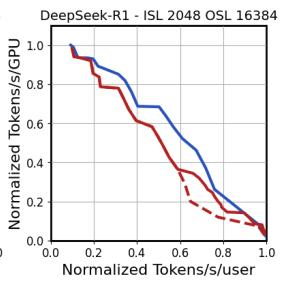  
Disaggregated Serving Co-located Serving Overall Piggybacked Co-located Serving  
Figure 8: Disaggregation helps most under prefill-heavy traffic.

It is important to note that our simulation with constant ISL and OSL represents an approximation of dynamic traffic, where these values correspond to power-of-two approximations of the 50th percentile ISL and OSL. See Appendix C for a demonstration of how using the P50 ISL/OSL provides a reliable representation of the Pareto frontier under dynamic real-world traffic conditions.

## 4.3 Dynamic rate matching considerations

The optimal context-to-generation GPU ratio exhibits significant variation with model characteristics and target latency, as shown in Figure 9. Therefore, a versatile disaggregated serving system should incorporate a dynamic rate matching mechanism to adapt to changes in serving requirements.

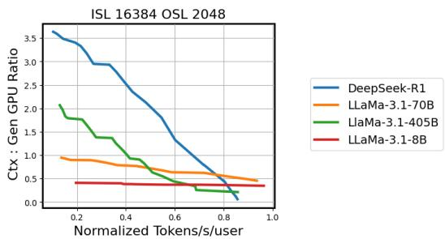  
Figure 9: The optimal ratio of ctx-to-gen GPUs varies across models and target latencies.

Figure 10 illustrates the performance degradation of DeepSeek-R1 when rate matching is constrained to a fixed ratio. A similar effect is expected in small-scale GPU deployments, where limited resources can restrict the rate matching search space.

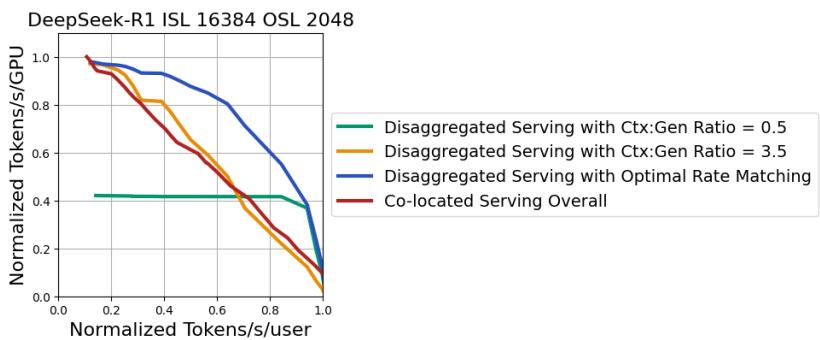  
Figure 10: Optimal rate matching dynamically adapts Ctx:Gen ratio to deliver Pareto optimal performance. A ratio of 3.5 is performant at the most relaxed latency target but degrades as latency tightens. Conversely, a ratio of 0.5 favors tight latency but suffers significantly under relaxed latency.

## 4.4 NVLink sensitivity

Figure 11 shows the Pareto performance of disaggregated serving for two NVLink domain sizes. The analysis reveals that larger NVLink domains consistently enhance disaggregated serving performance. The benefit comes from the flexibility to choose wider expert and tensor parallelism during generation.

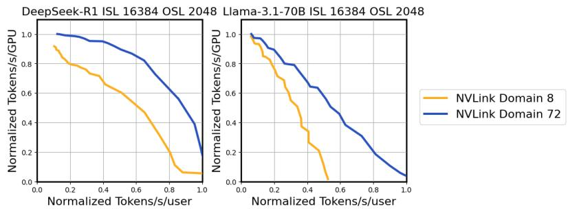  
Figure 11: Larger NVLink domain helps disaggregated serving performance. DeepSeek-R1 benefits from higher EP and batching at medium-latency. Llama-3.1-70B benefits from high TP at low-latency.

## 5 Deployment considerations

Disaggregated inferencing incurs a one-time overhead per request for transferring KV cache from prefill to decode GPUs. In this section, we analytically quantify the bandwidth requirements necessary to prevent KV cache transfer from becoming a performance bottleneck.

## 5.1 Bandwidth requirements for KV cache transfer

Prefill GPUs generate KV cache on a layer-by-layer basis, creating an opportunity to overlap KV transfer with prefill computation. The required egress bandwidth per GPU to fully overlap KV cache transfer with prefill compute can be derived as:

$$
\ B W _ { e g r e s s } = \frac { N _ { l a y e r s } \times B S _ { p r e f i l l } \times I S L \times d _ { h e a d } \times N _ { k v _ { h e a d s } } \times b y t e s _ { e l e m e n t } } { F T L \times N u m G P U _ { p r e f i l l } }\tag{1}
$$

where $N _ { l a y e r s }$ represents the number of layers in the model, $B S _ { p r e f i l l }$ denotes the batch size of the prefill instance, ISL indicates the input sequence length, $d _ { h e a d }$ represents the attention head dimension, $N _ { k v _ { h e a d s } }$ specifies the number of KV heads, byteselement indicates the number of KV cache bytes per token, F T L represents the time required for prefill computation to complete, and $N u m G P U _ { p r e f i l l } ^ { - }$ denotes the GPU count in each prefill instance that uniquely shards the KV cache.

The ingress bandwidth requirement for decode GPUs is constrained by decode computation time to receive KV cache. The bandwidth per decode GPU can be derived as:

$$
B W _ { i n g r e s s } = \frac { N _ { l a y e r s } \times B _ { d e c o d e } \times I S L \times d _ { h e a d } \times N _ { k v _ { h e a d s } } \times b y t e s _ { e l e m e n t } } { T T L \times O S L \times N u m G P U _ { d e c o d e } }\tag{2}
$$

where $B S _ { d e c o d e }$ represents the batch size of the decode instance, T T L indicates the time required to decode each output token, OSL denotes the output sequence length, and $N u m G P U _ { d e c o d e }$ specifies the number of GPUs in each decode instance that uniquely shards the KV cache.

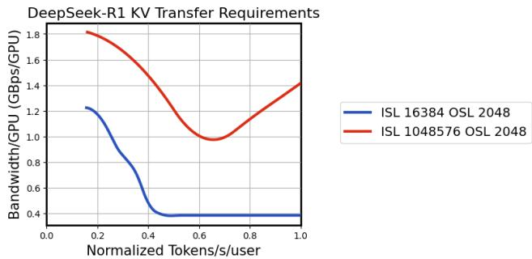  
Figure 12: Bandwidth requirements for KV cache transfer: Maximum of egress and ingress bandwidth across various TTLs, showing the relationship between SLA constraints and bandwidth needs.

It’s important to note that some parallelism schemes replicate the KV cache rather than sharding it. For example, when the tensor parallelism domain exceeds the number of KV heads, the KV cache is duplicated across tensor parallel ranks. The duplication factor in this case is equal to the ratio of tensor parallel ranks to KV heads. As a result, when calculating per-GPU bandwidth requirements, only the GPUs that actually shard the KV cache should be considered in the normalization.

Due to the quadratic cost of attention during prefill, FTL scales superlinearly with ISL, whereas the KV cache size scales linearly. This divergence implies that the egress bandwidth requirement decreases as ISL increases. On the decode side, both the KV cache size and TTL scale linearly with ISL, effectively canceling out their impact on ingress bandwidth. However, ingress bandwidth is inversely proportional to OSL. As TTL constraints tighten, more decode GPUs are required to meet latency targets, which effectively lowers the per-GPU ingress bandwidth requirement.

As for the impact of model scale on bandwidth requirements, FTL scales linearly with the number of active parameters. However, the KV cache size does not grow proportionally to the number of model parameters. Consequently, larger models with optimized attention (i.e., MLA in DeepSeek-R1) may require less egress bandwidth than smaller models with less efficient attention architectures.

Figure 12 shows the maximum of egress and ingress bandwidth requirements for two sequence length combinations on DeepSeek-R1 under varying TTLs. Our analysis indicates that existing provisioned datacenter bandwidth is sufficient to support KV cache transfer without becoming a bottleneck.

## 6 Related work

Over the years, several works [16–19] have explored the efficiency of LLM serving at scale without reference to disaggregation. Recently, disaggregated serving has emerged as a new paradigm for improving the efficiency of large-scale LLM inference. In response to its potential, the past year has seen a wave of academic research [5, 20–28] and implementations [3, 4, 6, 7] exploring various facets of disaggregation. However, widespread adoption remains limited, mostly due to the inherent complexity of the design space—including challenges in workload balancing and parallelism.

While existing open-source implementations offer a valuable starting point, they fall short of providing concrete guidance on when and how disaggregation is beneficial. Similarly, prior research has largely focused on small-scale testbeds and peak throughput scenarios, without examining the full throughput–interactivity Pareto frontier.

To our knowledge, this work presents the first systematic study of disaggregated serving at datacenter scale, offering a comprehensive analysis of the key design trade-offs and practical considerations needed for real-world deployment.

## 7 Future work

The optimization space for large-scale inference serving is expanding rapidly with new algorithmic techniques and hardware innovations. Of the many interesting directions to explore, the impacts of KV cache reuse, speculation, inference-time compute techniques, and model architecture evolution appear to be particularly promising directions to pursue.

## 8 Conclusions

In this work, we present design principles for efficient disaggregated serving and evaluate its effectiveness at large scale. Our analysis shows that the optimal configurations for disaggregated serving depend on a combination of factors, including model size and architecture, traffic patterns, latency constraints, and hardware resources. We also highlight scenarios where disaggregation offers limited benefit—such as serving small-scale models or generation-heavy traffic. These findings provide practical guidance for at scale deployment, where balancing throughput and latency remains a critical challenge in meeting the evolving demands of LLM serving.

## References

[1] Amey Agrawal, Ashish Panwar, Jayashree Mohan, Nipun Kwatra, Bhargav S. Gulavani, and Ramachandran Ramjee. SARATHI: Efficient LLM Inference by Piggybacking Decodes with Chunked Prefills. 2023. URL https://arxiv.org/abs/2308.16369.

[2] Amey Agrawal, Nitin Kedia, Ashish Panwar, Jayashree Mohan, Nipun Kwatra, Bhargav Gulavani, Alexey Tumanov, and Ramachandran Ramjee. Taming Throughput-Latency Tradeoff in LLM Inference with Sarathi-Serve. pages 117–134, 2024. URL https://www.usenix.org/conference/osdi24/ presentation/agrawal.

[3] NVIDIA. TensorRT-LLM: Disaggregated Serving Implementation. 2024. URL https://docs.nvidia. com/dynamo/latest/architecture/disagg\_serving.html. NVIDIA Documentation.

[4] vLLM Team. vLLM: Disaggregated Prefilling (experimental). 2024. URL https://docs.vllm.ai/ en/stable/features/disagg\_prefill.html. vLLM Documentation.

[5] Yinmin Zhong, Shengyu Liu, Junda Chen, Jianbo Hu, Yibo Zhu, Xuanzhe Liu, Xin Jin, and Hao Zhang. DistServe: Disaggregating Prefill and Decoding for Goodput-optimized Large Language Model Serving. pages 193–210, 2024. URL https://www.usenix.org/conference/osdi24/presentation/ zhong-yinmin.

[6] Ruoyu Qin, Zheming Li, Weiran He, Jialei Cui, Feng Ren, Mingxing Zhang, Yongwei Wu, Weimin Zheng, and Xinran Xu. Mooncake: Trading More Storage for Less Computation — A KVCache-centric Architecture for Serving LLM Chatbot. pages 155–170, 2025. URL https://www.usenix.org/ conference/fast25/presentation/qin.

[7] Yibo Jin, Tao Wang, Huimin Lin, Mingyang Song, Peiyang Li, Yipeng Ma, Yicheng Shan, Zhengfan Yuan, Cailong Li, Yajing Sun, Tiandeng Wu, Xing Chu, Ruizhi Huan, Li Ma, Xiao You, Wenting Zhou, Yunpeng Ye, Wen Liu, Xiangkun Xu, Yongsheng Zhang, Tiantian Dong, Jiawei Zhu, Zhe Wang, Xijian Ju, Jianxun Song, Haoliang Cheng, Xiaojing Li, Jiandong Ding, Hefei Guo, and Zhengyong Zhang. P/D-Serve: Serving Disaggregated Large Language Model at Scale. 2024. URL https://arxiv.org/abs/2408.08147.

[8] Mohammad Shoeybi, Mostofa Patwary, Raul Puri, Patrick LeGresley, Jared Casper, and Bryan Catanzaro. Megatron-LM: Training Multi-Billion Parameter Language Models Using Model Parallelism. 2020. URL https://arxiv.org/abs/1909.08053.

[9] Dmitry Lepikhin, HyoukJoong Lee, Yuanzhong Xu, Dehao Chen, Orhan Firat, Yanping Huang, Maxim Krikun, Noam Shazeer, and Zhifeng Chen. GShard: Scaling Giant Models with Conditional Computation and Automatic Sharding. 2021. URL https://openreview.net/forum?id=qrwe7XHTmYb.

[10] Yanping Huang, Youlong Cheng, Ankur Bapna, Orhan Firat, Dehao Chen, Mia Chen, HyoukJoong Lee, Jiquan Ngiam, Quoc V Le, Yonghui Wu, and zhifeng Chen. GPipe: Efficient Training of Giant Neural Networks using Pipeline Parallelism. 32, 2019. URL https://proceedings.neurips.cc/paper\_ files/paper/2019/file/093f65e080a295f8076b1c5722a46aa2-Paper.pdf.

[11] Deepak Narayanan, Aaron Harlap, Amar Phanishayee, Vivek Seshadri, Nikhil R. Devanur, Gregory R. Ganger, Phillip B. Gibbons, and Matei Zaharia. PipeDream: generalized pipeline parallelism for DNN training. pages 1–15, 2019. URL https://doi.org/10.1145/3341301.3359646.

[12] NVIDIA. NVIDIA Blackwell Architecture Technical Brief, 2024. URL https://cdn. prod.website-files.com/61dda201f29b7efc52c5fbaf/6602ea9d0ce8cb73fb6de87f\_ nvidia-blackwell-architecture-technical-brief.pdf. NVIDIA Technical Documentation.

[13] Bita Darvish Rouhani, Ritchie Zhao, Ankit More, Mathew Hall, Alireza Khodamoradi, Summer Deng, Dhruv Choudhary, Marius Cornea, Eric Dellinger, Kristof Denolf, Stosic Dusan, Venmugil Elango, Maximilian Golub, Alexander Heinecke, Phil James-Roxby, Dharmesh Jani, Gaurav Kolhe, Martin Langhammer, Ada Li, Levi Melnick, Maral Mesmakhosroshahi, Andres Rodriguez, Michael Schulte, Rasoul Shafipour, Lei Shao, Michael Siu, Pradeep Dubey, Paulius Micikevicius, Maxim Naumov, Colin Verrilli, Ralph Wittig, Doug Burger, and Eric Chung. Microscaling Data Formats for Deep Learning. 2023. URL https://arxiv.org/abs/2310.10537.

[14] DeepSeek-AI, Daya Guo, Dejian Yang, Haowei Zhang, Junxiao Song, Ruoyu Zhang, Runxin Xu, Qihao Zhu, Shirong Ma, Peiyi Wang, Xiao Bi, Xiaokang Zhang, Xingkai Yu, Yu Wu, Z. F. Wu, Zhibin Gou, Zhihong Shao, Zhuoshu Li, Ziyi Gao, Aixin Liu, Bing Xue, Bingxuan Wang, Bochao Wu, Bei Feng, Chengda Lu, Chenggang Zhao, Chengqi Deng, Chenyu Zhang, Chong Ruan, Damai Dai, Deli Chen, Dongjie Ji, Erhang Li, Fangyun Lin, Fucong Dai, Fuli Luo, Guangbo Hao, Guanting Chen, Guowei Li, H. Zhang, Han Bao, Hanwei Xu, Haocheng Wang, Honghui Ding, Huajian Xin, Huazuo Gao, Hui Qu, Hui Li, Jianzhong Guo, Jiashi Li, Jiawei Wang, Jingchang Chen, Jingyang Yuan, Junjie Qiu, Junlong Li, J. L. Cai, Jiaqi Ni, Jian Liang, Jin Chen, Kai Dong, Kai Hu, Kaige Gao, Kang Guan, Kexin Huang, Kuai Yu, Lean Wang, Lecong Zhang, Liang Zhao, Litong Wang, Liyue Zhang, Lei Xu, Leyi Xia, Mingchuan Zhang, Minghua Zhang, Minghui Tang, Meng Li, Miaojun Wang, Mingming Li, Ning Tian, Panpan Huang, Peng Zhang, Qiancheng Wang, Qinyu Chen, Qiushi Du, Ruiqi Ge, Ruisong Zhang, Ruizhe Pan, Runji Wang, R. J. Chen, R. L. Jin, Ruyi Chen, Shanghao Lu, Shangyan Zhou, Shanhuang Chen, Shengfeng Ye, Shiyu Wang, Shuiping Yu, Shunfeng Zhou, Shuting Pan, S. S. Li, Shuang Zhou, Shaoqing Wu, Shengfeng Ye, Tao Yun, Tian Pei, Tianyu Sun, T. Wang, Wangding Zeng, Wanjia Zhao, Wen Liu, Wenfeng Liang, Wenjun Gao, Wenqin Yu, Wentao Zhang, W. L. Xiao, Wei An, Xiaodong Liu, Xiaohan Wang, Xiaokang Chen, Xiaotao Nie, Xin Cheng, Xin Liu, Xin Xie, Xingchao Liu, Xinyu Yang, Xinyuan Li, Xuecheng Su, Xuheng Lin, X. Q. Li, Xiangyue Jin, Xiaojin Shen, Xiaosha Chen, Xiaowen Sun, Xiaoxiang Wang, Xinnan Song, Xinyi Zhou, Xianzu Wang, Xinxia Shan, Y. K. Li, Y. Q. Wang, Y. X. Wei, Yang Zhang, Yanhong Xu, Yao Li, Yao Zhao, Yaofeng Sun, Yaohui Wang, Yi Yu, Yichao Zhang, Yifan Shi, Yiliang Xiong, Ying He, Yishi Piao, Yisong Wang, Yixuan Tan, Yiyang Ma, Yiyuan Liu, Yongqiang Guo, Yuan Ou, Yuduan Wang, Yue Gong, Yuheng Zou, Yujia He, Yunfan Xiong, Yuxiang Luo, Yuxiang You, Yuxuan Liu, Yuyang Zhou, Y. X. Zhu, Yanhong Xu, Yanping Huang, Yaohui Li, Yi Zheng, Yuchen Zhu, Yunxian Ma, Ying Tang, Yukun Zha, Yuting Yan, Z. Z. Ren, Zehui Ren, Zhangli Sha, Zhe Fu, Zhean Xu, Zhenda Xie, Zhengyan Zhang, Zhewen Hao, Zhicheng Ma, Zhigang Yan, Zhiyu Wu, Zihui Gu, Zijia Zhu, Zijun Liu, Zilin Li, Ziwei Xie, Ziyang Song, Zizheng Pan, Zhen Huang, Zhipeng Xu, Zhongyu Zhang, and Zhen

Zhang. DeepSeek-R1: Incentivizing Reasoning Capability in LLMs via Reinforcement Learning, 2025.   
URL https://arxiv.org/abs/2501.12948.

[15] Aaron Grattafiori, Abhimanyu Dubey, Abhinav Jauhri, Abhinav Pandey, Abhishek Kadian, Ahmad Al-Dahle, Aiesha Letman, Akhil Mathur, Alan Schelten, Alex Vaughan, Amy Yang, Angela Fan, Anirudh Goyal, Anthony Hartshorn, Aobo Yang, Archi Mitra, Archie Sravankumar, Artem Korenev, Arthur Hinsvark, Arun Rao, Aston Zhang, Aurelien Rodriguez, Austen Gregerson, Ava Spataru, Baptiste Roziere, Bethany Biron, Binh Tang, Bobbie Chern, Charlotte Caucheteux, Chaya Nayak, Chloe Bi, Chris Marra, Chris McConnell, Christian Keller, Christophe Touret, Chunyang Wu, Corinne Wong, Cristian Canton Ferrer, Cyrus Nikolaidis, Damien Allonsius, Daniel Song, Danielle Pintz, Danny Livshits, Danny Wyatt, David Esiobu, Dhruv Choudhary, Dhruv Mahajan, Diego Garcia-Olano, Diego Perino, Dieuwke Hupkes, Egor Lakomkin, Ehab AlBadawy, Elina Lobanova, Emily Dinan, Eric Michael Smith, Filip Radenovic, Francisco Guzmán, Frank Zhang, Gabriel Synnaeve, Gabrielle Lee, Georgia Lewis Anderson, Govind Thattai, Graeme Nail, Gregoire Mialon, Guan Pang, Guillem Cucurell, Hailey Nguyen, Hannah Korevaar, Hu Xu, Hugo Touvron, Iliyan Zarov, Imanol Arrieta Ibarra, Isabel Kloumann, Ishan Misra, Ivan Evtimov, Jack Zhang, Jade Copet, Jaewon Lee, Jan Geffert, Jana Vranes, Jason Park, Jay Mahadeokar, Jeet Shah, Jelmer van der Linde, Jennifer Billock, Jenny Hong, Jenya Lee, Jeremy Fu, Jianfeng Chi, Jianyu Huang, Jiawen Liu, Jie Wang, Jiecao Yu, Joanna Bitton, Joe Spisak, Jongsoo Park, Joseph Rocca, Joshua Johnstun, Joshua Saxe, Junteng Jia, Kalyan Vasuden Alwala, Karthik Prasad, Kartikeya Upasani, Kate Plawiak, Ke Li, Kenneth Heafield, Kevin Stone, Khalid El-Arini, Krithika Iyer, Kshitiz Malik, Kuenley Chiu, Kunal Bhalla, Kushal Lakhotia, Lauren Rantala-Yeary, Laurens van der Maaten, Lawrence Chen, Liang Tan, Liz Jenkins, Louis Martin, Lovish Madaan, Lubo Malo, Lukas Blecher, Lukas Landzaat, Luke de Oliveira, Madeline Muzzi, Mahesh Pasupuleti, Mannat Singh, Manohar Paluri, Marcin Kardas, Maria Tsimpoukelli, Mathew Oldham, Mathieu Rita, Maya Pavlova, Melanie Kambadur, Mike Lewis, Min Si, Mitesh Kumar Singh, Mona Hassan, Naman Goyal, Narjes Torabi, Nikolay Bashlykov, Nikolay Bogoychev, Niladri Chatterji, Ning Zhang, Olivier Duchenne, Onur Çelebi, Patrick Alrassy, Pengchuan Zhang, Pengwei Li, Petar Vasic, Peter Weng, Prajjwal Bhargava, Pratik Dubal, Praveen Krishnan, Punit Singh Koura, Puxin Xu, Qing He, Qingxiao Dong, Ragavan Srinivasan, Raj Ganapathy, Ramon Calderer, Ricardo Silveira Cabral, Robert Stojnic, Roberta Raileanu, Rohan Maheswari, Rohit Girdhar, Rohit Patel, Romain Sauvestre, Ronnie Polidoro, Roshan Sumbaly, Ross Taylor, Ruan Silva, Rui Hou, Rui Wang, Saghar Hosseini, Sahana Chennabasappa, Sanjay Singh, Sean Bell, Seohyun Sonia Kim, Sergey Edunov, Shaoliang Nie, Sharan Narang, Sharath Raparthy, Sheng Shen, Shengye Wan, Shruti Bhosale, Shun Zhang, Simon Vandenhende, Soumya Batra, Spencer Whitman, Sten Sootla, Stephane Collot, Suchin Gururangan, Sydney Borodinsky, Tamar Herman, Tara Fowler, Tarek Sheasha, Thomas Georgiou, Thomas Scialom, Tobias Speckbacher, Todor Mihaylov, Tong Xiao, Ujjwal Karn, Vedanuj Goswami, Vibhor Gupta, Vignesh Ramanathan, Viktor Kerkez, Vincent Gonguet, Virginie Do, Vish Vogeti, Vítor Albiero, Vladan Petrovic, Weiwei Chu, Wenhan Xiong, Wenyin Fu, Whitney Meers, Xavier Martinet, Xiaodong Wang, Xiaofang Wang, Xiaoqing Ellen Tan, Xide Xia, Xinfeng Xie, Xuchao Jia, Xuewei Wang, Yaelle Goldschlag, Yashesh Gaur, Yasmine Babaei, Yi Wen, Yiwen Song, Yuchen Zhang, Yue Li, Yuning Mao, Zacharie Delpierre Coudert, Zheng Yan, Zhengxing Chen, Zoe Papakipos, Aaditya Singh, Aayushi Srivastava, Abha Jain, Adam Kelsey, Adam Shajnfeld, Adithya Gangidi, Adolfo Victoria, Ahuva Goldstand, Ajay Menon, Ajay Sharma, Alex Boesenberg, Alexei Baevski, Allie Feinstein, Amanda Kallet, Amit Sangani, Amos Teo, Anam Yunus, Andrei Lupu, Andres Alvarado, Andrew Caples, Andrew Gu, Andrew Ho, Andrew Poulton, Andrew Ryan, Ankit Ramchandani, Annie Dong, Annie Franco, Anuj Goyal, Aparajita Saraf, Arkabandhu Chowdhury, Ashley Gabriel, Ashwin Bharambe, Assaf Eisenman, Azadeh Yazdan, Beau James, Ben Maurer, Benjamin Leonhardi, Bernie Huang, Beth Loyd, Beto De Paola, Bhargavi Paranjape, Bing Liu, Bo Wu, Boyu Ni, Braden Hancock, Bram Wasti, Brandon Spence, Brani Stojkovic, Brian Gamido, Britt Montalvo, Carl Parker, Carly Burton, Catalina Mejia, Ce Liu, Changhan Wang, Changkyu Kim, Chao Zhou, Chester Hu, Ching-Hsiang Chu, Chris Cai, Chris Tindal, Christoph Feichtenhofer, Cynthia Gao, Damon Civin, Dana Beaty, Daniel Kreymer, Daniel Li, David Adkins, David Xu, Davide Testuggine, Delia David, Devi Parikh, Diana Liskovich, Didem Foss, Dingkang Wang, Duc Le, Dustin Holland, Edward Dowling, Eissa Jamil, Elaine Montgomery, Eleonora Presani, Emily Hahn, Emily Wood, Eric-Tuan Le, Erik Brinkman, Esteban Arcaute, Evan Dunbar, Evan Smothers, Fei Sun, Felix Kreuk, Feng Tian, Filippos Kokkinos, Firat Ozgenel, Francesco Caggioni, Frank Kanayet, Frank Seide, Gabriela Medina Florez, Gabriella Schwarz, Gada Badeer, Georgia Swee, Gil Halpern, Grant Herman, Grigory Sizov, Guangyi Zhang, Guna Lakshminarayanan, Hakan Inan, Hamid Shojanazeri, Han Zou, Hannah Wang, Hanwen Zha, Haroun Habeeb, Harrison Rudolph, Helen Suk, Henry Aspegren, Hunter Goldman, Hongyuan Zhan, Ibrahim Damlaj, Igor Molybog, Igor Tufanov, Ilias Leontiadis, Irina-Elena Veliche, Itai Gat, Jake Weissman, James Geboski, James Kohli, Janice Lam, Japhet Asher, Jean-Baptiste Gaya, Jeff Marcus, Jeff Tang, Jennifer Chan, Jenny Zhen, Jeremy Reizenstein, Jeremy Teboul, Jessica Zhong, Jian Jin, Jingyi Yang, Joe Cummings, Jon Carvill, Jon Shepard, Jonathan McPhie, Jonathan Torres, Josh Ginsburg, Junjie Wang, Kai Wu, Kam Hou U, Karan Saxena, Kartikay Khandelwal, Katayoun Zand, Kathy Matosich, Kaushik Veeraraghavan, Kelly Michelena, Keqian Li, Kiran Jagadeesh, Kun Huang, Kunal Chawla, Kyle Huang, Lailin Chen, Lakshya Garg, Lavender A, Leandro Silva, Lee Bell, Lei Zhang, Liangpeng Guo, Licheng Yu, Liron Moshkovich, Luca Wehrstedt, Madian Khabsa, Manav Avalani, Manish Bhatt, Martynas Mankus, Matan Hasson,

Matthew Lennie, Matthias Reso, Maxim Groshev, Maxim Naumov, Maya Lathi, Meghan Keneally, Miao Liu, Michael L. Seltzer, Michal Valko, Michelle Restrepo, Mihir Patel, Mik Vyatskov, Mikayel Samvelyan, Mike Clark, Mike Macey, Mike Wang, Miquel Jubert Hermoso, Mo Metanat, Mohammad Rastegari, Munish Bansal, Nandhini Santhanam, Natascha Parks, Natasha White, Navyata Bawa, Nayan Singhal, Nick Egebo, Nicolas Usunier, Nikhil Mehta, Nikolay Pavlovich Laptev, Ning Dong, Norman Cheng, Oleg Chernoguz, Olivia Hart, Omkar Salpekar, Ozlem Kalinli, Parkin Kent, Parth Parekh, Paul Saab, Pavan Balaji, Pedro Rittner, Philip Bontrager, Pierre Roux, Piotr Dollar, Polina Zvyagina, Prashant Ratanchandani, Pritish Yuvraj, Qian Liang, Rachad Alao, Rachel Rodriguez, Rafi Ayub, Raghotham Murthy, Raghu Nayani, Rahul Mitra, Rangaprabhu Parthasarathy, Raymond Li, Rebekkah Hogan, Robin Battey, Rocky Wang, Russ Howes, Ruty Rinott, Sachin Mehta, Sachin Siby, Sai Jayesh Bondu, Samyak Datta, Sara Chugh, Sara Hunt, Sargun Dhillon, Sasha Sidorov, Satadru Pan, Saurabh Mahajan, Saurabh Verma, Seiji Yamamoto, Sharadh Ramaswamy, Shaun Lindsay, Sheng Feng, Shenghao Lin, Shengxin Cindy Zha, Shishir Patil, Shiva Shankar, Shuqiang Zhang, Sinong Wang, Sneha Agarwal, Soji Sajuyigbe, Soumith Chintala, Stephanie Max, Stephen Chen, Steve Kehoe, Steve Satterfield, Sudarshan Govindaprasad, Sumit Gupta, Summer Deng, Sungmin Cho, Sunny Virk, Suraj Subramanian, Sy Choudhury, Sydney Goldman, Tal Remez, Tamar Glaser, Tamara Best, Thilo Koehler, Thomas Robinson, Tianhe Li, Tianjun Zhang, Tim Matthews, Timothy Chou, Tzook Shaked, Varun Vontimitta, Victoria Ajayi, Victoria Montanez, Vijai Mohan, Vinay Satish Kumar, Vishal Mangla, Vlad Ionescu, Vlad Poenaru, Vlad Tiberiu Mihailescu, Vladimir Ivanov, Wei Li, Wenchen Wang, Wenwen Jiang, Wes Bouaziz, Will Constable, Xiaocheng Tang, Xiaojian Wu, Xiaolan Wang, Xilun Wu, Xinbo Gao, Yaniv Kleinman, Yanjun Chen, Ye Hu, Ye Jia, Ye Qi, Yenda Li, Yilin Zhang, Ying Zhang, Yossi Adi, Youngjin Nam, Yu Wang, Yu Zhao, Yuchen Hao, Yundi Qian, Yunlu Li, Yuzi He, Zach Rait, Zachary DeVito, Zef Rosnbrick, Zhaoduo Wen, Zhenyu Yang, Zhiwei Zhao, and Zhiyu Ma. The Llama 3 Herd of Models, 2024. URL https://arxiv.org/abs/2407.21783.

[16] Reza Yazdani Aminabadi, Samyam Rajbhandari, Minjia Zhang, Ammar Ahmad Awan, Cheng Li, Du Li, Elton Zheng, Jeff Rasley, Shaden Smith, Olatunji Ruwase, and Yuxiong He. DeepSpeed-Inference: Enabling Efficient Inference of Transformer Models at Unprecedented Scale. pages 1–15, 2022. URL https://doi.org/10.1109/SC41404.2022.00051.

[17] Gyeong-In Yu, Joo Seong Jeong, Geon-Woo Kim, Soojeong Kim, and Byung-Gon Chun. Orca: A Distributed Serving System for Transformer-Based Generative Models. pages 521–538, 2022. URL https://www.usenix.org/conference/osdi22/presentation/yu.

[18] Woosuk Kwon, Zhuohan Li, Siyuan Zhuang, Ying Sheng, Lianmin Zheng, Cody Hao Yu, Joseph Gonzalez, Hao Zhang, and Ion Stoica. Efficient Memory Management for Large Language Model Serving with PagedAttention. In Proceedings of the 29th Symposium on Operating Systems Principles, SOSP ’23, pages 611–626, 2023. URL https://doi.org/10.1145/3600006.3613165.

[19] Reiner Pope, Sholto Douglas, Aakanksha Chowdhery, Jacob Devlin, James Bradbury, Jonathan Heek, Kefan Xiao, Shivani Agrawal, and Jeff Dean. Efficiently Scaling Transformer Inference. pages 606–624, 2023. URL https://proceedings.mlsys.org/paper\_files/paper/2023/file/ c4be71ab8d24cdfb45e3d06dbfca2780-Paper-mlsys2023.pdf.

[20] Pratyush Patel, Esha Choukse, Chaojie Zhang, Aashaka Shah, Íñigo Goiri, Saeed Maleki, and Ricardo Bianchini. Splitwise: Efficient Generative LLM Inference Using Phase Splitting. pages 118–132, 2024. URL https://doi.org/10.1109/ISCA59077.2024.00019.

[21] Foteini Strati, Sara Mcallister, Amar Phanishayee, Jakub Tarnawski, and Ana Klimovic. DéjàVu: KVcache Streaming for Fast, Fault-tolerant Generative LLM Serving. pages 46745–46771, 2024. URL https://proceedings.mlr.press/v235/strati24a.html.

[22] Chaoyi Ruan, Yinhe Chen, Dongqi Tian, Yandong Shi, Yongji Wu, Jialin Li, and Cheng Li. DynaServe: Unified and Elastic Tandem-Style Execution for Dynamic Disaggregated LLM Serving. 2025. URL https://arxiv.org/abs/2504.09285.

[23] S. Chen, R. Jiang, D. Yu, J. Xu, M. Chao, F. Meng, C. Jiang, W. Xu, and H. Liu. KVDirect: Distributed Disaggregated LLM Inference. 2024. URL https://arxiv.org/abs/2501.14743.

[24] Cunchen Hu, Heyang Huang, Liangliang Xu, Xusheng Chen, Jiang Xu, Shuang Chen, Hao Feng, Chenxi Wang, Sa Wang, Yungang Bao, Ninghui Sun, and Yizhou Shan. Inference without Interference: Disaggregate LLM Inference for Mixed Downstream Workloads. 2024. URL https: //arxiv.org/abs/2401.11181.

[25] Jiaao He and Jidong Zhai. FastDecode: High-Throughput GPU-Efficient LLM Serving using Heterogeneous Pipelines. 2024. URL https://arxiv.org/abs/2403.11421.

[26] Youhe Jiang, Ran Yan, and Binhang Yuan. HexGen-2: Disaggregated Generative Inference of LLMs in Heterogeneous Environment. 2024. URL https://openreview.net/forum?id=Cs6MrbFuMq.

[27] Cunchen Hu, Heyang Huang, Junhao Hu, Jiang Xu, Xusheng Chen, Tao Xie, Chenxi Wang, Sa Wang, Yungang Bao, Ninghui Sun, and Yizhou Shan. MemServe: Context Caching for Disaggregated LLM Serving with Elastic Memory Pool. 2024. URL https://arxiv.org/abs/2406.17565.

[28] Shaoyuan Chen, Wencong Xiao, Yutong Lin, Mingxing Zhang, Yingdi Shan, Jinlei Jiang, Kang Chen, and Yongwei Wu. Efficient Heterogeneous Large Language Model Decoding with Model-Attention Disaggregation. 2025. URL https://arxiv.org/abs/2405.01814.

## A Terminology

This section defines key terms and metrics used throughout the paper. We use prefill and context processing interchangeably, as well as decode and generation.

Table 1: Summary of metrics used throughout the paper.
<table><tr><td>Metric</td><td>Acronym</td><td>Definition</td></tr><tr><td>First Token Latency</td><td>FTL</td><td>Latency to run prefill and generate the first token.</td></tr><tr><td>Token-to-Token Latency</td><td>TTL</td><td>Latency to generate each new token in decoding.</td></tr><tr><td>Tokens per Second per User</td><td>TPS</td><td>The rate of token generation per user (1/TTL).</td></tr><tr><td>Service Level Agreement</td><td>SLA</td><td>Agreed upon P5O TTL and FTL for a service.</td></tr><tr><td>Batch (a.k.a.,concurrency)</td><td></td><td>The number of requests a system can serve per model replica.</td></tr><tr><td>Context Throughput (per GPU)</td><td></td><td>The throughput per context (prefill) GPU expressed in re- quests/second/GPU. This accounts for only the context (pre- fill) GPUs deployed.</td></tr><tr><td>Decode Throughput (per GPU)</td><td></td><td>The throughput per decode (generation) GPU expressed in tokens/second/GPU.This accounts for only the decode (gen- eration) GPUs deployed.</td></tr><tr><td>Overall Throughput (per GPU)</td><td></td><td>The total throughput of the system expressed in to- kens/second/GPU. This accounts for all GPUs deployed (pre- fill and decode).</td></tr><tr><td>Utilization</td><td></td><td>For a hardware resource,the percentage of execution time that the resource would be busy assuming 10o% effciency.</td></tr></table>

## B Procedure for optimizing prefill & decode balance (a.k.a., rate matching)

Algorithm 1 Prefill Configuration Selection   
1: procedure PREFILLCONFIGSELECTION (FTL\_cutoff, tuple\_list (prefill\_config, FTL))   
2: best\_throughput ← 0   
3: best\_conf ig ← None   
4: for (pref ill\_conf ig, F T L) in tuple\_list do   
5: if F T L < F T L\_cutoff then   
6: B ← pref ill\_conf ig.batch\_size   
7: G ← pref ill\_conf ig.num\_gpus   
8: throughput ← F T L×G B   
9: if throughput > best\_throughput then   
10: best\_throughput ← throughput   
11: best\_conf ig ← pref ill\_conf ig   
12: end if   
13: end if   
14: end for   
15: return (best\_conf ig, best\_throughput)   
16: end procedure

Algorithm 2 Rate Matching Prefill with Decode GPUs   
1: procedure RATEMATCHING (best\_prefill\_config, best\_prefill\_throughput, decode\_tuple\_list   
(decode\_config, TTL), OSL, tolerance = 0.03)   
2: rate\_matched\_list ← [ ]   
3: for (decode\_conf ig, T T L) in decode\_tuple\_list do   
4: B ← decode\_conf ig.batch\_size   
5: G ← decode\_conf ig.num\_gpus   
6: decode\_throughput ← BT T L×G B   
7: decode\_request\_throughput ← decode\_throughputOSL−1   
8: α ← round best\_pref ill\_throughput tolerance   
decode\_request\_throughput ,   
9: num\_pref ill\_gpus ← numerator(α) × G   
10: num\_decode\_gpus ← denominator(α) × best\_pref ill\_conf ig.num\_gpus   
11: throughput ← decode\_throughput 1+α   
12: rate\_matched\_list.append(throughput, num\_decode\_gpus, num\_pref ill\_gpus)   
13: end for   
14: return rate\_matched\_list   
15: end procedure

## C Using 50th percentile (P50) statistics as proxy for performance analysis

Figure 13 presents the CDF of input and output sequence lengths (ISL and OSL) from a real-world deployed workload. Absolute values have been obfuscated for privacy.

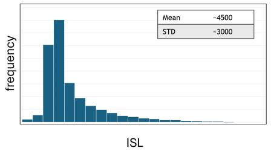

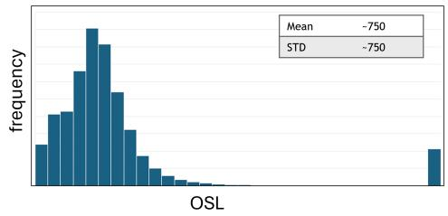  
Figure 13: Example distribution of ISL and OSL in dynamic traffic.

Figure 14 shows the resulting Pareto frontiers when this traffic distribution is simulated directly versus when it is approximated using a simplified approach: the closest power-of-two values to the P50 of ISL and OSL. Notably, the approximated frontier closely matches the original, indicating that using P50 ISL and OSL as an approximation provides a reasonable overview of the trends.

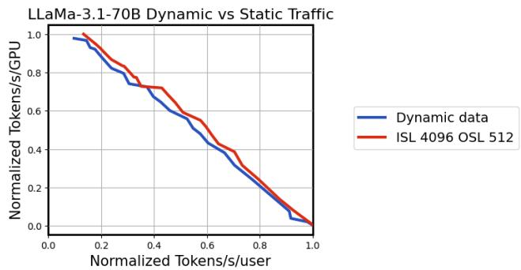  
Figure 14: Comparison of Pareto frontiers using dynamic traffic simulation versus P50 approximation.