# A PRAGMATIC EXPLORATION OF PREFILL-DECODE DISAGGREGATION IN LARGE SCALE INFERENCE

Tiyasa Mitra 1 Ritika Borkar 1 Nidhi Bhatia 1 Shivam Raj 1 Hongkuan Zhou 1 Yan Ru Pei 1 Vishwanath Venkatesan 1 Kyle Kranen 1 Ramon Matas 1 Dheevatsa Mudigere 1 Ritchie Zhao 1 Maximilian Golub 1 Arpan Dutta 1 Suresh Nambi 1 Sailaja Madduri 1 Dharmesh Jani 1 Brian Pharris 1 Itay Neeman 1 Bita Darvish Rouhani 1

## ABSTRACT

As inference scales to multi-node deployments, prefill-decode disaggregation — splitting inference into distinct phases — offers a promising path to improving the throughput-interactivity Pareto frontier. Despite growing enthusiasm and a surge of open-source efforts, large-scale deployment of disaggregated serving remains limited due to the complexity of the optimization search space and system-level coordination. In this paper, we present the first systematic study of disaggregated inference at scale, evaluating hundreds of thousands of design points across diverse workloads and hardware configurations. We find that disaggregation is most effective for prefill-heavy traffic patterns and larger models. Our results highlight the critical role of dynamic rate matching and elastic scaling in achieving Pareto-optimal performance. These insights, in conjunction with the deployment flexibility enabled by NVIDIA Dynamo, provide a foundation to navigate the trade-off between system throughput and interactivity in efficient disaggregated deployments.

## 1 INTRODUCTION

One of the primary drivers of modern AI applications is scale. Inference serving is rapidly evolving from traditional single-node endpoints to multi-node deployments at data center scale. This shift unlocks new opportunities for system-level optimization, enabling exploration across a broader, more expressive design space.

The community is actively exploring a range of techniques to improve the Pareto frontier of server throughput (amortized cost) and interactivity (quality of service) for inference serving. Disaggregation is a prominent example, offering the potential to expand the throughput–interactivity tradeoff curve when applied effectively. Reflecting this promise, the past year has seen a surge in research efforts and opensource implementations to enable disaggregated serving deployments. Despite the growing interest, adoption of disaggregation at scale has been limited - mainly due to the complexity of the underlying design space.

At its core, disaggregation is straightforward: divide inference into phases with distinct compute characteristics and optimize each phase independently. In autoregressive LLM inference, this corresponds to separating the prefill and decode phases of operation. Our work focuses on LLMs as the primary case study due to their widespread popularity, but the same principles apply to multimodal models.

The design space for disaggregation is broad and highly dependent on traffic characteristics. Unlocking performance gains through disaggregation requires careful decisions around model sharding, concurrency, and rate matching between phases to balance throughput and interactivity tradeoffs. In this work, we systematically quantify the search space for LLM disaggregation and examine the system-level trade-offs and implications within this emerging landscape.

This paper seeks to clarify the practical aspects of disaggregated serving and to provide design guidance for largescale deployments. While disaggregation holds significant promise for improving LLM inference, it also comes with new optimization challenges. Figure 1 provides an example of how the benefits of disaggregation, over piggybacked co-location, can vary significantly across different traffic patterns – i.e., Input Sequence Length (ISL) and Output Sequence Length (OSL).

This paper, for the first time, extensively explores the design space of large-scale disaggregated inference by simulating millions of design points across a range of workloads, traffic patterns, and hardware configurations. Our analysis reveals that disaggregation provides the greatest benefits in prefillheavy traffic scenarios (i.e., ISL >> OSL) and when serving larger models (e.g., > 10B parameters). Our results underscore the importance of dynamic rate matching and elastic scaling to realize the advantages of disaggregation. Similarly, we find that co-located serving is most beneficial under relaxed latency targets and generation-heavy traffic patterns, and that the effectiveness of context chunking is highly sensitive to the attention mechanism (e.g., Multi-Latent Attention (MLA) vs. Group Query Attention (GQA)).

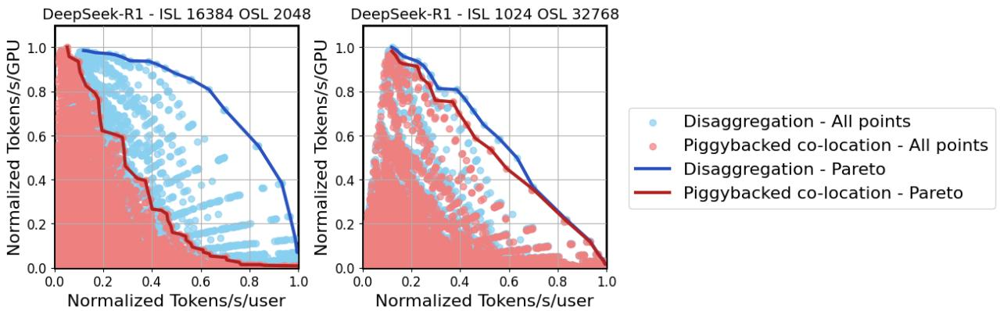  
Figure 1. Throughput–interactivity Pareto frontier for DeepSeek-R1. The benefits of disaggregated serving vary with the target tokens/s/user (i.e., interactivity) and traffic patterns: (left) prefill-heavy vs. (right) generation-heavy traffic. Most results in this paper are presented in normalized form, as our primary objective is to convey trends rather than make specific performance claims.

As inference deployments grow to span multiple racks with disaggregated serving, it is critical to utilize compute, storage and networking resources effectively and efficiently across the system. NVIDIA Dynamo (NVIDIA Dynamo Team, 2025), a production-grade open-source disaggregated serving framework, provides the necessary infrastructure to build high-performance disaggregated inference systems at scale. It has served as an effective platform for our real-world experiments, where necessary to supplement simulation-based findings. We hope the extensive exploration, system-level analysis and deployment considerations highlighted in this work will serve as a foundation for adoption of disaggregated serving in production.

## 2 BACKGROUND

In traditional co-located LLM inference serving, both the prefill and decode phases occur on the same model instance within a monolithic pipeline. To maximize throughput, requests in different phases are batched together to share model weights and GPU memory. Many deployments employ in-flight batching (IFB), which allows new requests to be added to a batch as soon as an in-flight request completes. Piggybacking (Agrawal et al., 2023; 2024) builds upon IFB by reducing decode stalls through context chunking when new requests are introduced.

Despite these optimizations, co-located serving forces a single model instance to simultaneously optimize for two metrics: low First Token Latency (FTL) for new prompts and low Token-to-Token Latency (TTL) for ongoing generation. Each metric exhibits different bottlenecks, leading to inherent tension in resource scheduling.

In contrast, disaggregated inference serving (NVIDIA Dynamo Team, 2025; vLLM Team, 2024; Zhong et al., 2024; Qin et al., 2025; Jin et al., 2024) decouples the prefill and decode phases, allowing each to run on a separate model instance — potentially across different GPUs. This separation enables each phase to independently adopt model partitioning and batching strategies tailored to its performance targets. Moreover, it eliminates artificial slowdowns in prefill caused by strict TTL service-level agreements, as seen in piggybacking. Figure 2 illustrates these modes of serving.

As demonstrated in Figure 1, disaggregation is not a universal solution. In the following sections, we examine the performance benefits of disaggregated inference serving across a broad design space.

Appendix A defines key terms and metrics used throughout the paper. We use prefill and context processing interchangeably, as well as decode and generation.

## 3 DESIGN SPACE EXPLORATION

A versatile inference optimization strategy should maximize the area under the throughput–interactivity Pareto frontier (see Figure 1 as an example). In the case of disaggregated serving, achieving this goal requires optimization across two distinct dimensions: (i) the model partitioning strategy for prefill (a.k.a., context) and decode (a.k.a., generation) instances, and (ii) the scaling/rate matching strategy for prefill and decode GPUs.

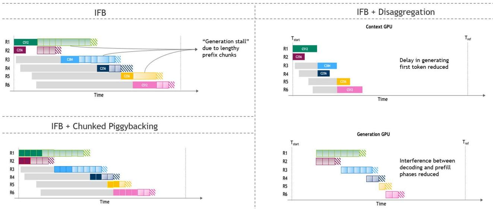  
Figure 2. Visualization of (left) co-located and (right) disaggregated inference serving, illustrating the temporal distribution of prefill (dark boxes) and decode iterations (light boxes) across different requests (color-coded).

## 3.1 Model partitioning

Each point along the Pareto frontier corresponds to a different model partitioning strategy. To explore this space, we evaluate different parallelism strategies including Tensor Parallelism (TP) (Shoeybi et al., 2020), Expert Parallelism (EP) (Lepikhin et al., 2021), Pipeline Parallelism (PP) (Huang et al., 2019; Narayanan et al., 2019), Chunked Pipeline Parallelism (CPP), and TEP (Tensor Parallel Attention and EP FFNs), across a wide range of batch sizes.

The optimal partitioning strategy for a given model depends on several factors: the serving mode (e.g., co-located or disaggregated), traffic characteristics (input sequence length, output sequence length, and queries per second), target hardware, and latency constraints. Such an extensive design space is intractable to explore exhaustively via benchmarking. Hence, throughout this paper, we use an NVIDIAproprietary, high-fidelity GPU performance simulator designed for datacenter-scale inference. At the device level, this simulator includes a detailed architecture representation of the GPU, down to the memory hierarchy, compute units, communication modules and datapath latencies. It employs a kernel-aware approach to analytically estimate the performance of each operation, complete with operation overlapping and power management tradeoffs. At the system level, the simulator supports state-of-the-art model partitioning strategies, supported by a detailed network model with optimized communication collectives over both NVLink and Ethernet. In data-center scale performance modeling, errors can compound with every level of abstraction, making simulator accuracy extremely important. Our simulator has been exhaustively validated against silicon performance measurements across multiple GPU generations and is capable of parallelizing the exploration of a vast design space without the need for hardware access. It takes as input the model architecture, traffic pattern, and GPU configuration, and outputs the corresponding latency and throughput across different batch sizes and parallelism strategies. These outputs are used to construct Pareto frontiers under various serving conditions. In addition, where applicable, we provide benchmarking results to capture the real-world implications of design principles discussed.

For co-located serving, we evaluate configurations both with and without context-chunked piggybacking and explore the sensitivity of piggybacking to model architecture and traffic patterns. In piggybacked setups, our simulator determines the optimal mix of prefill and decode tokens in a batch for each ISL–OSL combination. This ratio varies across the Pareto frontier and depends on the latency constraints.

In the disaggregated setting, a key source of performance gain is the ability to use different model partitioning strategies for the prefill and decode stages. To reflect this, we simulate the prefill and decode pools separately, allowing each to independently optimize for its corresponding service level agreements. Our simulator-based analysis focuses on modern Blackwell systems (NVIDIA, 2024a) using FP4 precision (Rouhani et al., 2023), which represent the state of the art in LLM inference infrastructure. However, benchmarking results shared may range across hardware configurations and model architectures, since they are curated from realworld deployment studies. This bolsters the generalizability of our findings.

## 3.2 Scaling and rate matching

Once the optimal model partitioning for prefill and decode is identified, disaggregated serving requires a rate matching strategy to determine the appropriate ratio of prefill to decode instances and ensure a balanced throughput between the two phases.

To construct the Pareto frontier shown in Figure 1, we first fix the prefill mapping that satisfies the FTL constraint, as detailed in Algorithm 1. Then, for each candidate decode mapping, we use a rate matching algorithm that employs an integer solver to find the right balance between the throughput of prefill and decode phases, subject to the TTL constraint and total GPU count minimization. This is detailed in Algorithm 2. These design principles are also reflected in the dynamic rate matching algorithm for our NVIDIA Dynamo (NVIDIA, 2024b) based experiments detailed in Section 4.3. To ensure relevance to practical deployments, all design points with an FTL > 10 seconds are excluded from our search space.

Figure 3 illustrates the high-level overview of the rate matching methodology used to quantify each disaggregated design point. Each blue circle in Figure 1 represents one such design point, the output of a rate matching step. Our simulation assumes a datacenter setting with sufficient GPUs and incoming requests to fully utilize the rate-matched deployment. We further assume the KV cache produced at each layer by the prefill pool is transferred to the generation pool immediately as it becomes available, overlapping with the computation of subsequent layers. The implications of this assumption are discussed in Section 5.1. Unless otherwise specified, the results assume no KV cache sharing.

Algorithm 1 Prefill Configuration Selection   
1: Input: FTL cutoff, config ftl tuple list   
2: Initialize best throughput = 0   
3: Initialize best config = None   
4: for (prefill config, FTL) in   
config ftl tuple list do   
5: if FTL < FTL cutoff then   
6: B ← prefill config.batch size   
7: G ← prefill config.num gpus   
8: throughput ← FTL·G B   
9: if throughput > best throughput then   
10: best throughput ← throughput   
11: best config ← prefill config   
12: end if   
13: end if   
14: end for   
15: return (best config, best throughput)

Algorithm 2 Rate Matching Prefill with Decode GPUs   
1: Input: prefill config, prefill throughput,   
decode config ttl tuple list, tolerance   
2: Initialize rate matched list = [ ]   
3: PG ← prefill config.num gpus   
4: for (decode config, TTL) in   
decode config ttl tuple list do   
5: B ← decode config.batch size   
6: DG ← decode config.num gpus   
7: decode throughput ← TTL×DG B   
8: decode req throughput ← decode throughputOSL−1   
9: α ← round decode req throughput , tolerance prefill throughput   
10: num prefill gpus ← numerator(α) × DG   
11: num decode gpus ← denominator(α) × PG   
12: throughput ← decode throughput 1+α   
13: rate matched list.append(throughput,   
14: num decode gpus, num prefill gpus)   
15: end for   
16: return rate matched list

## 4 DISAGGREGATION IN PRACTICE

The performance gains from disaggregated serving depend on multiple factors — including target latency, underlying model architecture and scale, traffic patterns, and hardware configurations. In this section, we analyze the sensitivity of disaggregated serving to each of these dimensions.

In real-world deployments, service level agreements (SLAs) are defined by two latency metrics: (i) FTL or the time to generate the first token, ranging from hundreds of milliseconds to several minutes, and (ii) TTL or the time to generate each subsequent token, typically spanning a few milliseconds on modern GPUs. The reciprocal of TTL (i.e., 1/TTL) serves as a proxy for the interactivity that a user perceives, measured in tokens per second per user. Together, FTL and TTL constraints determine where a system should operate along the throughput–interactivity Pareto frontier for optimal performance. Disaggregated serving allows the deployer to independently optimize towards each of these metrics.

Optimizing for FTL constraints with Chunked Pipeline Parallelism: In a disaggregated scenario, FTL constraints apply only to the prefill (context) pool. As LLMs continue to push toward longer context lengths—now reaching hundreds of thousands of tokens—meeting FTL SLAs has become increasingly challenging. To address this challenge, we found Chunked Pipeline Parallelism (CPP), a technique that allows context GPUs to satisfy tight FTL SLAs without relying on heavy tensor parallelism, to be especially effective for long context lengths.

Figure 4 illustrates the chunked pipelining mechanism, which leverages the inherently parallelizable nature of LLM context processing. It works by: (i) splitting the input sequence into smaller chunks, (ii) processing each chunk independently, using the KV cache from previous chunks, and (iii) overlapping the processing of earlier layers of new chunks with the later layers of previous ones using pipeline parallelism. While each chunk does depend on the previous chunks’ KV cache, it does not depend on previous chunks’ outputs, allowing them to enter the pipeline earlier. This allows the context GPUs to finish processing the full context sooner, without the complexity of wide tensor parallelism.

Choose DPc and DP\_ Such that DP\*Rc ≈ DP \*Rg (while maintaining DPc\*Rc≤ DP \*Rg)  
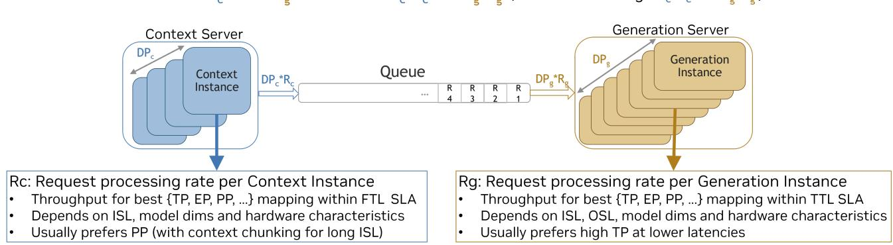  
Figure 3. High-level overview of rate matching for disaggregated serving. KV cache and weights are hosted in HBM memory and capacity constraints are accounted for.

Our analysis shows that as FTL constraints become tighter, chunked pipelining is consistently preferred over tensor parallelism for optimal prefill mapping. This advantage arises from the substantially lower communication overhead of chunked pipeline parallelism, which enables context GPUs to sustain high math utilization while still meeting tight FTL requirements.

$$
\tag{1}
$$

$$
\tag{2}
$$

Where ISL is the input sequence length, dmodel is the model dimension, Nlayers is the number of layers, Npp is the number of pipeline stages, and byteselem is the number of bytes per element.

Equation 1 defines the allreduce communication volume incurred by each GPU per prefill request in tensor parallelism, whereas Equation 2 defines the corresponding send–receive communication volume in chunked pipeline parallelism. Since the number of pipeline stages is typically much smaller than the total number of layers, and because send–receive communication is generally less expensive than allreduce operations, chunked pipeline parallelism achieves markedly lower communication overhead.

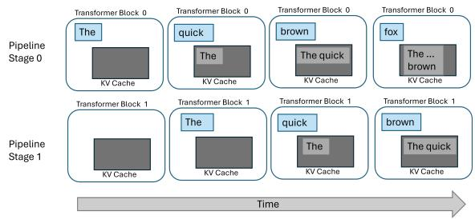  
Figure 4. High-level overview of Chunked Pipelining (CPP) for context (prefill) processing. CPP helps reduce the need for costly TP to meet tight FTLs.

Figure 5 shows, for DeepSeek-R1, how FTL can be reduced as we increase the PP, while keeping throughput high. This is consistent with our design principles, which suggest that chunked pipeline parallelism is an optimal strategy to maximize throughput while complying with strict FTL SLA.

Optimizing for TTL constraints across the Pareto frontier: TTL constraints, on the other hand, govern the decode (generation) pool. In Figure 1, moving left to right corresponds to increasingly stringent TTL requirements (i.e., higher tokens/s/user). As TTL constraints tighten, configurations shift toward smaller batch sizes and greater tensor parallelism.

Consider DeepSeek-R1 (DeepSeek-AI et al., 2025) with ISL of 16k and OSL of 2k: across the Pareto frontier, expert parallelism within the NVLink domain is consistently preferred. However, attention computation transitions from data parallelism in the high-throughput regime to tensor parallelism under tighter TTL constraints. Batch sizes are in the hundreds at the high-throughput end, decreasing progressively as interactivity increases. A similar trend is observed for Llama-3.1-70B (Grattafiori et al., 2024), where tensor parallelism scales from 2× to 64× as TTL constraints tighten, with batching behavior closely mirroring that of DeepSeek-

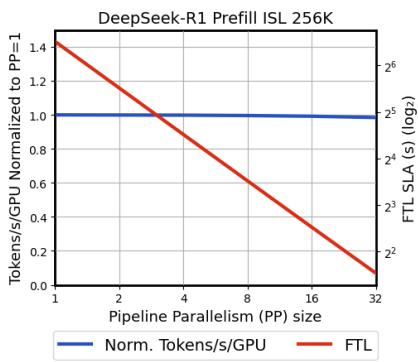  
Figure 5. Chunked pipeline parallelism during Prefill is an optimal strategy to maximize throughput while complying with strict FTL SLA. Prefill performance is shown for DeepSeek-R1 with ISL of 256K on 64 GPUs using EP and PP (EP × PP = 64).

R1. While both co-located and disaggregated serving favor high tensor parallelism under tight TTL SLAs, disaggregated decoding is able to pursue this strategy more aggressively. Freed from the need to balance math-heavy prefill performance with decoding speed, disaggregated decode pools can better adapt to tightening latency demands — enabling superior performance at medium-latency SLAs.

We observe that the hardware resource utilization on decode GPUs shifts significantly across the Pareto frontier. In the high throughput domain, larger batches allow the GPUs to achieve good compute utilization. As TTL constraints tighten, batch sizes become smaller, and the pressure on memory and communication bandwidth increases. A versatile decode pool must provide reasonable performance across the board.

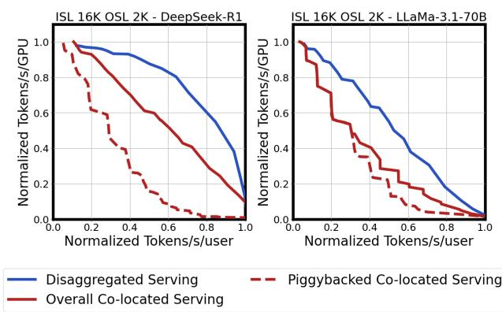  
Figure 6. Disaggregated vs. co-located serving. Co-located serving overall (red-solid) is the superposition of piggybacked (reddotted) and non-piggybacked configurations.

## 4.1 Model sensitivity

In this section, we examine the sensitivity of disaggregated serving to model architecture and size.

Model architecture sensitivity. Model architecture plays a key role in inference serving decisions. Figure 6 compares disaggregated and co-located serving under context-heavy traffic for DeepSeek-R1 and Llama-3.1-70B. We evaluate the sensitivity of disaggregation to traffic pattern in the next section. The benefits of disaggregation manifest differently across different latency regimes for each model architecture. MoE models, like DeepSeek-R1, have an additional degree of parallelism to exploit in the expert dimension. This allows for larger gains from disaggregation in the medium-latency regime, particularly over piggybacked co-located serving.

We also observe that DeepSeek-R1 experiences additional overhead in piggybacked co-located serving due to prefill chunking — specifically, redundant computation of down and up projections in multi-latent attention for each prefill chunk. This can be mitigated by temporarily caching the upprojected KV values from earlier chunks. To capture these trade-offs, our co-located baseline Pareto curves include both piggybacked and non-piggybacked configurations.

Model size sensitivity. Figure 7 presents the throughputlatency characteristics for Llama 8B, 70B, and 405B under both disaggregated and co-located serving configurations. Our analysis indicates that the benefits of disaggregated inference become more pronounced with larger models. This enhanced performance can be attributed to the fact that larger models are typically mapped across more GPUs, enabling a broader range of parallelization strategies. Consequently, the advantage of selecting distinct model mappings for prefill and decode phases becomes more significant.

## 4.2 Traffic sensitivity

A critical factor in estimating the performance of disaggregated serving is the traffic pattern. In Figure 8, we present the Pareto for DeepSeek-R1 across four distinct traffic patterns. Our analysis reveals that the benefits of disaggregation are most pronounced for prefill-heavy workloads. In decode-heavy traffic, mappings that prioritize decoding speed are preferred, but this can significantly compromise prefill processing throughput. Similarly, for co-located serving, piggybacking is most promising on decode-heavy traffic when latency targets are not too tight. It is important to note that our simulation with constant ISL and OSL represents an approximation of dynamic traffic, where these values correspond to power-of-two approximations of the 50th percentile ISL and OSL. See Appendix B for a demonstration of how using the P50 ISL/OSL provides a reliable representation of the Pareto frontier under dynamic real-world traffic conditions.

## 4.3 Dynamic rate matching considerations

The optimal context-to-generation GPU ratio exhibits significant variation with model characteristics and target latency, with more context GPUs being necessary for larger models and at higher throughput serving scenarios, as shown in Figure 9. Furthermore, the optimal ratio is sensitive to specific serving choices and inference optimizations. As an example, using prefix-caching can reduce the number of context GPUs necessary at a target latency, while enabling speculative decoding might reduce the number of generation GPUs required. Therefore, a versatile disaggregated serving system should incorporate a dynamic rate matching mechanism to adapt to changes in serving requirements.

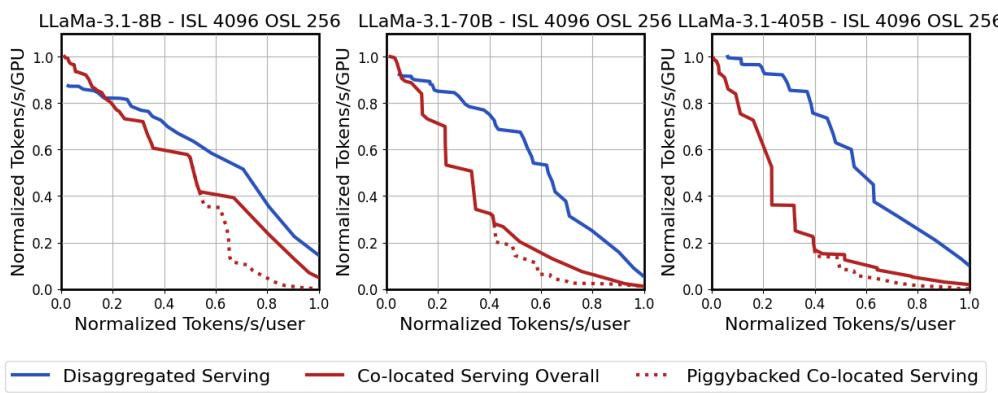  
Figure 7. Larger models benefit more from disaggregated serving due to a richer search space.

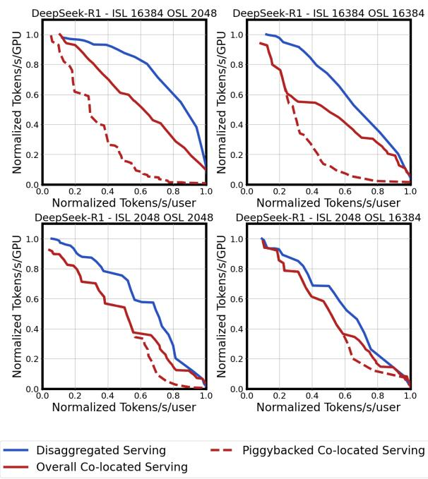

Figure 8. Disaggregation helps most under prefill-heavy traffic.  
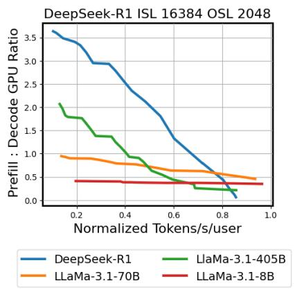  
Figure 9. The optimal ratio of context to generation GPUs varies across models and target latencies.

Figure 10 illustrates the performance degradation of DeepSeek-R1 when rate matching is constrained to a fixed context-to-generation GPU ratio. A similar effect is observed in small-scale GPU deployments, where limited resources can restrict the rate matching search space.

Dynamo Planner: SLA-Aware Dynamic Rate Matching As evidenced, in production environments, dynamic rate matching needs to maintain the SLA on FTL and TTL for dynamic traffic with varying ISL, OSL, and arrival rate. To address this challenge, NVIDIA Dynamo implements an SLA-aware dynamic rate matching algorithm in Dynamo Planner (NVIDIA Dynamo Team, 2025) that continuously adjusts the context-to-generation GPU allocation to meet latency targets under changing traffic conditions.

To ensure best performance for a target workload, the SLAaware algorithm first runs a sweep over different parallelization mapping strategies (i.e., TP, PP, EP, TEP) to identify the optimal engine configuration. For the prefill phase, since the ISL is usually long enough to saturate the GPUs, the sweeping script simply measures the FTL under different parallelization mapping for the user-provided reference ISL. For the decode phase, since the TTL depends on the status of all in-flight requests, it measures the TTL with different numbers of concurrent requests informed by the userprovided ISL and OSL for each parallelization mapping. The best parallelization mapping is the one that achieves the highest throughput per GPU while adhering to the SLAs.

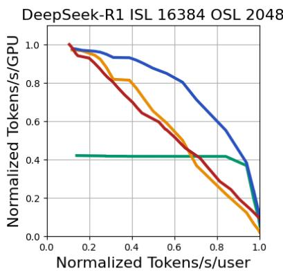  
Disaggregated Serving with Ctx:Gen Ratio = 0.5 Disaggregated Serving with Ctx:Gen Ratio = 3.5 Disaggregated Serving with Optimal Rate Matching Co-located Serving Overall

Figure 10. Optimal rate matching dynamically adapts Ctx:Gen ratio to deliver Pareto optimal performance. A ratio of 3.5 is performant at the most relaxed latency target but degrades as latency tightens. Conversely, a ratio of 0.5 favors tight latency but suffers significantly under relaxed latency.  
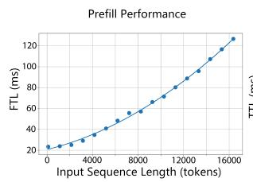

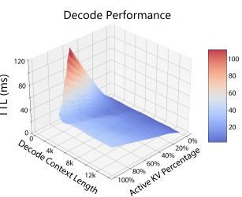  
Figure 11. Left: FTL under different ISL for DeepSeek-R1 Distilled Llama 8B model using SGLang backend in Dynamo with H200 GPU and TP1. Right: TTL under different sizes of in-flight KV cache blocks and decode context lengths in the same setting.

Once the optimal engine configuration is identified, SLAaware Dynamo Planner performs an in-depth profiling to better understand the performance of the selected prefill and decode configuration under different loads. For prefill, the profiler captures FTL and throughput per GPU across a range of ISLs (Figure 11, left). For decode, the profiler characterizes TTL as a function of both active KV cache usage for the batch and average context length per request. As shown in Figure 11 (right), TTL exhibits near-linear growth with active KV usage under fixed context length, with the slope steepening as context length decreases. These profiling results enable the Planner to accurately predict performance under dynamic traffic and adjust rate matching in real time.

During runtime, the SLA-aware Planner continuously monitors the ISL, OSL, and request rate to adjust the number of prefill and decode replicas. To account for the cold start latency, it applies time-series forecasting (Harvey, 1990; Facebook, 2024) to predict the future ISL, OSL, and request rate to scale in advance. Additionally, the interpolation model of the SLA-aware Dynamo Planner is calibrated using automatic moving-average correction factors to attribute the deviation caused by hard-to-model factors such as KV prefix reuse, prefill queueing, and ISL/OSL variance.

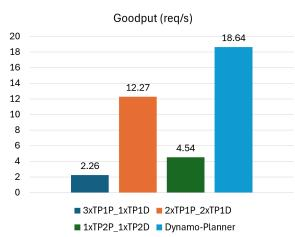

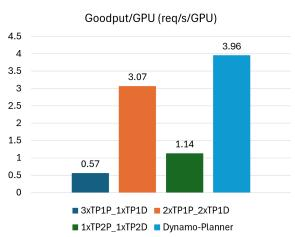  
Figure 12. Goodput and goodput per GPU of different disaggregated serving configurations for DeepSeek-R1 Distilled Llama 8B model on H200 GPUs.

For a prototype disaggregated deployment of DeepSeek-R1 Distilled Llama 8B model on H200 GPUs, with a synthetic load of 3K ISL, 300 OSL, and request rate varying between 5–45 requests/s and FTL SLA of 200ms and TTL SLA of 10ms, SLA-aware Dynamo Planner achieves (Figure 12):

• 8× better goodput and 7× better goodput per GPU compared to a deployment with inefficient prefill and decode ratio (3:1 Ctx:Gen ratio, TP1 ctx and gen).

• 4× better goodput and 3.5× better goodput per GPU compared to a deployment with inefficient parallelization mapping (1:1 Ctx:Gen ratio, TP2 ctx and gen).

• 2× better goodput and 2× better goodput per GPU compared to the best static deployment (1:1 Ctx:Gen ratio, TP1 ctx and gen).

## 4.4 NVLink sensitivity

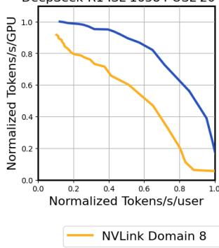

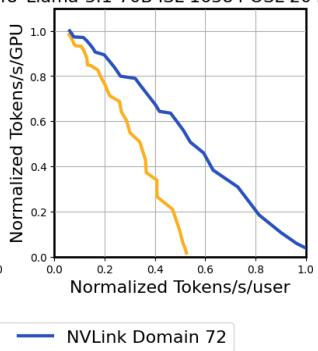  
Figure 13. Larger NVLink domain helps disaggregated serving. DeepSeek-R1 benefits from higher EP and batching at mediumlatency. Llama-3.1-70B benefits from high TP at low-latency.

Figure 13 shows the Pareto performance of disaggregated serving for two NVLink (NVIDIA, 2024b) domain sizes. The analysis reveals that larger NVLink domains consistently enhance disaggregated serving performance. The benefit comes from the flexibility to choose wider expert and tensor parallelism during generation.

## 5 DEPLOYMENT CONSIDERATIONS

Disaggregated inference incurs a one-time overhead per request for transferring KV cache from prefill to decode GPUs. In this section, we analytically quantify the bandwidth requirements necessary for efficient KV cache transfer and discuss the practical considerations for KV cache transfer in production.

## 5.1 Bandwidth requirements for KV cache transfer

Prefill GPUs generate KV cache on a layer-by-layer basis, creating an opportunity to overlap KV transfer with prefill computation. The required egress bandwidth per GPU to fully overlap KV cache transfer with prefill compute can be derived as:

$$
\tag{3}
$$

where NL represents the number of layers in the model, Bctx denotes the batch size of the prefill instance, ISL indicates the input sequence length, dh represents the attention head dimension, Nkv specifies the number of KV heads, byteselem indicates the number of KV cache bytes per token, FTL represents the time required for prefill computation to complete, NumGPUctx denotes the GPU count in each prefill instance that uniquely shards the KV cache and Sutil is the utilization scaling factor adjusted based on the ratematching ratio between context and generation GPUs. It compensates for disparities in their fan-in/fan-out ratios during distributed inference as well as other system overheads.

The ingress bandwidth requirement for decode GPUs is constrained by decode computation time to receive KV cache. The bandwidth per decode GPU can be derived as:

$$
\tag{4}
$$

where Bgen represents the batch size of the decode instance, TTL indicates the time required to decode each output token, OSL denotes the output sequence length, and NumGPUgen specifies the number of GPUs in each decode instance that uniquely shards the KV cache. These equations ignore the latency term in KV transfer time as it is several orders of magnitude smaller than the prefill and decode computation times. They also assume that the KV cache is transferred in layer-grouped bursts, such that they can saturate the bandwidth of the interconnect. Sections 5.2 and 5.3 provide more details on how this is achieved in practice.

Note that some parallelism schemes replicate the KV cache rather than sharding it. For example, when the tensor parallelism domain exceeds the number of KV heads, the KV cache is duplicated across tensor parallel ranks. The duplication factor in this case is equal to the ratio of tensor parallel ranks to KV heads. As a result, when calculating per-GPU bandwidth requirements, only the GPUs that actually shard the KV cache should be considered in the normalization.

Due to the quadratic cost of attention during prefill, FTL scales superlinearly with ISL, whereas the KV cache size scales linearly. This divergence implies that the egress bandwidth requirement decreases as ISL increases. On the decode side, both the KV cache size and TTL scale linearly with ISL, effectively canceling out their impact on ingress bandwidth. However, ingress bandwidth is inversely proportional to OSL. As TTL constraints tighten, more decode GPUs are required to meet latency targets, which effectively lowers the per-GPU ingress bandwidth requirement.

As for the impact of model scale on bandwidth requirements, FTL scales linearly with the number of active parameters. However, the KV cache size does not grow proportionally to the number of model parameters. Consequently, larger models with optimized attention (i.e., MLA in DeepSeek-R1) may require less egress bandwidth than smaller models with less efficient attention architectures.

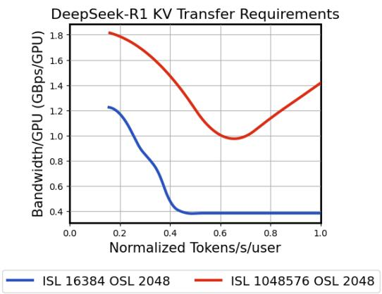  
Figure 14. Bandwidth requirements for KV cache transfer with Sutil = 1: Maximum of egress and ingress bandwidth across various TTLs, showing the relationship between SLA constraints and bandwidth needs.

Figure 14 shows the maximum of egress and ingress bandwidth requirements for two traffic patterns on DeepSeek-R1 under varying TTLs. Our analysis indicates that existing provisioned datacenter bandwidth is sufficient to support KV cache transfer without becoming a bottleneck. However, careful consideration of network topology and latency constraints is essential when designing datacenter-scale disaggregated serving systems.

## 5.2 NIXL for KV cache transfer

KV transfer communication is peer-to-peer, sparse and bipartite with a constantly changing set of communicating GPUs. Further, to enable the inference engine to continue uninterrupted, KV transfer APIs should be non-blocking and asynchronous. We find that using NVIDIA Inference Transfer Library (NIXL) (NVIDIA, 2025d), a non-blocking and asynchronous KV transfer API, is instrumental in achieving the optimal performance for disaggregated inference serving. NIXL utilizes a metadata-based peer-to-peer communication model that enables a new inference worker to join an existing set of prefill and decode workers simply by exchanging metadata with the existing workers.

NIXL is deployed as a foundational layer within distributed inference system architectures to support low latency, high throughput KV cache transfers across GPUs, CPUs, local SSDs, and various networked storage backends, including cloud platforms and distributed file systems. It offers a unified asynchronous communication interface that abstracts away the complexities of heterogeneous hardware components and network topologies, while remaining independent of the underlying inference framework. Upon a KV cache transfer being initiated, NIXL determines the most optimal data path available, with hints from the inference system. Such optimal paths may include Remote Direct Memory Access (RDMA) through InfiniBand (NVIDIA, 2024a) or Ethernet (Metcalfe & Boggs, 1976) networks, NVLink, or GPUDirect (Potluri et al., 2013) Storage, depending on system configuration and transfer context. Its integration with advanced communication libraries such as UCX (Shamis et al., 2015) and S3 (Boisrond, 2021), along with support for nonblocking operations and memory type agnostic behavior, enables seamless and efficient cache movement regardless of the cache’s location. This architecture allows distributed inference workloads to scale elastically, with cache blocks dynamically offloaded or prefetched from any storage tier as needed, resulting in ultra-fast and reliable cache transfers for disaggregated inference serving in production environments. NIXL and Dynamo have been widely adopted across various open-source inference frameworks, enabling us to leverage them for our experiments.

## 5.3 KV cache layout

KV cache consists of the key and value tensors generated for each token processed by every attention head of every layer in a transformer model. KV cache tensors are grouped into small, fixed-size blocks or pages for efficient memory allocation and management. The organization of KV cache blocks, both in terms of layerwise layout and head-wise blocking can significantly affect memory utilization and prevent fragmentation. A well-designed storage strategy should aim to support effective on-demand allocation, enhance memory utilization, and reduce fragmentation, especially when processing sequences of varying lengths.

## 5.4 KV cache routing considerations

In production deployments, KV cache reuse introduces additional complexity to disaggregated serving. Both KV caching itself at the kernel/engine layer and cache-aware routing strategies at the orchestration layer affect the scaling of FTL. When requests share common prompt prefixes, cached key-value blocks can be reused to reduce prefill cost. However, the distribution of cached blocks across workers depends on the routing strategy. Cache-oblivious strategies like round-robin can fragment cache states, while cacheaware routing strategies (NVIDIA, 2025b) direct requests to workers with existing cache overlap.

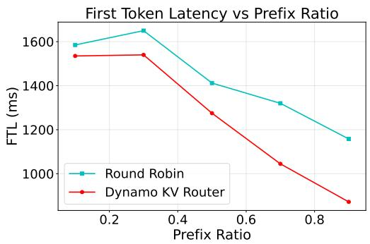  
Figure 15. Scalability of FTL with prefix ratio. Higher prefix ratios simulate increased shared prefix content. KV-aware routing (Dynamo KV Router) maintains better performance stability compared to round-robin as cache reuse opportunities increase.

An additional consideration in disaggregated settings is how KV caching interacts with KV transfer, especially without KV-centric storage systems (Qin et al., 2025; NVIDIA, 2025c). If both prefill and decode workers maintain their own KV caches, the framework should optimize bandwidth usage by orchestrating transfers of only non-cached blocks. Reducing bandwidth requirements via engine support for such selective transfer is a key implementation detail for production systems.

Figure 15 shows the impact of routing strategy on FTL as prefix ratio varies. We use DeepSeek-R1-Distill-Llama-8B as a prototyping example on 8 L40S GPUs (ISL=14K, OSL=200, 20 prefix groups) using Dynamo’s AIPerf benchmarking tool (NVIDIA, 2025a). KV-aware routing maintains more stable performance as prefix ratio increases, whereas round-robin exhibits degradation due to cache fragmentation. We expect this trend to hold across model sizes as well as hardware configurations.

## 6 RELATED WORK

Over the years, a substantial body of work (Aminabadi et al., 2022; Yu et al., 2022; Kwon et al., 2023; Pope et al., 2023) has explored the efficiency of large language model (LLM) serving at scale. These efforts have primarily focused on optimizing monolithic serving architectures by improving batching strategies, memory management, and parallel execution to maximize throughput and reduce latency. While highly effective within traditional deployment paradigms, these approaches largely assume tightly coupled systems and do not explicitly consider disaggregation as a first-class design principle.

Recently, disaggregated serving has emerged as a compelling new paradigm for improving the efficiency and scalability of large-scale LLM inference. The core idea of decoupling different stages of inference such as prefill and decode across heterogeneous resources opens up new opportunities for resource utilization and system-level optimization. In response to this promise, the past couple of years have seen a surge of academic interest (Zhong et al., 2024; Patel et al., 2024; Strati et al., 2024; Ruan et al., 2025; Chen et al., 2024; Hu et al., 2024b; He & Zhai, 2024; Jiang et al., 2024; Hu et al., 2024a; Chen et al., 2025), with works exploring scheduling policies, communication patterns, KVcache management, and hardware-software co-design for disaggregated systems. However, despite this growing body of research, most prior works evaluate disaggregation in relatively constrained settings, often comprising small-scale clusters, synthetic workloads, or narrowly defined optimization goals such as maximizing throughput or minimizing latency in isolation. As a result, these studies do not fully capture the fundamental trade-off space between throughput and interactivity, nor do they characterize the Pareto frontier that practitioners must navigate in real deployments.

In parallel, a rich ecosystem of open-source frameworks (NVIDIA Dynamo Team, 2025; vLLM Team, 2024; Qin et al., 2025; Jin et al., 2024) has begun to expose disaggregated serving primitives to practitioners. These systems provide flexible abstractions for separating compute stages, managing KV caches across nodes, and experimenting with different parallelization strategies. While they significantly lower the barrier to entry, they also reveal the complexity of the design space: deployers must reason about workload heterogeneity, dynamic load balancing, communication overheads, and the interplay between different forms of parallelism (e.g., tensor, pipeline, and request-level). This complexity has, in practice, slowed widespread adoption at scale.

To our knowledge, this work presents the first systematic study of disaggregated serving at datacenter scale. Rather than focusing on isolated optimizations or limited experimental setups, we take a holistic view by mapping out the full throughput-interactivity Pareto frontier and surfacing the key trade-offs that govern real-world deployments. Our analysis highlights not only the performance potential of disaggregation, but also the practical considerations such as scheduling stability, resource fragmentation, and system robustness that are critical for making it viable in production environments.

## 7 FUTURE WORK

The optimization space for large-scale inference serving is expanding rapidly with new algorithmic techniques and hardware innovations. Of the algorithmic directions to explore, speculation, inference-time compute techniques, and model architecture evolution appear to be particularly promising to pursue. From the hardware and model performance perspective, leveraging heterogeneous hardware architectures to accelerate the performance of different model components appears to be a particularly promising direction.

## 8 CONCLUSIONS

In this work, we present design principles for efficient disaggregated serving, evaluate its effectiveness at-scale, and provide a blueprint for practical deployment with NVIDIA Dynamo. Our analysis shows that the optimal configurations for disaggregated serving depend on a combination of factors, including model size and architecture, traffic patterns, latency constraints, and hardware resources. We also highlight scenarios where disaggregation offers limited benefit, such as serving smaller models or decode-heavy traffic. These findings provide practical guidance for at-scale deployment, where balancing throughput and latency remains critical in meeting the evolving demands of LLM serving.

## REFERENCES

Agrawal, A., Panwar, A., Mohan, J., Kwatra, N., Gulavani, B. S., and Ramjee, R. SARATHI: Efficient LLM Inference by Piggybacking Decodes with Chunked Prefills. arXiv preprint arXiv:2308.16369, 2023. URL https://arxiv.org/abs/2308.16369.

Agrawal, A., Kedia, N., Panwar, A., Mohan, J., Kwatra, N., Gulavani, B., Tumanov, A., and Ramjee, R. Taming Throughput-Latency Tradeoff in LLM Inference with Sarathi-Serve. Proceedings of the USENIX Symposium on Operating Systems Design and Implementation (OSDI), pp. 117–134, 2024. URL https://www.usenix.o rg/conference/osdi24/presentation/ag rawal.

Aminabadi, R. Y., Rajbhandari, S., Zhang, M., Awan, A. A., Li, C., Li, D., Zheng, E., Rasley, J., Smith, S.,

Ruwase, O., and He, Y. DeepSpeed-Inference: Enabling Efficient Inference of Transformer Models at Unprecedented Scale. Proceedings of the International Conference for High Performance Computing, Networking, Storage and Analysis (SC), pp. 1–15, 2022. URL https: //doi.org/10.1109/SC41404.2022.00051.

Boisrond, P. A position paper on amazon web services (aws) simple storage service (s3) buckets, 8 2021.

Chen, S., Jiang, R., Yu, D., Xu, J., Chao, M., Meng, F., Jiang, C., Xu, W., and Liu, H. KVDirect: Distributed Disaggregated LLM Inference. arXiv preprint arXiv:2501.14743, 2024. URL https://arxiv.org/abs/2501.1 4743.

Chen, S., Xiao, W., Lin, Y., Zhang, M., Shan, Y., Jiang, J., Chen, K., and Wu, Y. Efficient Heterogeneous Large Language Model Decoding with Model-Attention Disaggregation. arXiv preprint arXiv:2405.01814, 2025. URL https://arxiv.org/abs/2405.01814.

Zhao, L., Wang, L., Zhang, L., Xu, L., Xia, L., Zhang,

M., Zhang, M., Tang, M., Li, M., Wang, M., Li, M., Tian,

N., Huang, P., Zhang, P., Wang, Q., Chen, Q., Du, Q., Ge,

R., Zhang, R., Pan, R., Wang, R., Chen, R. J., Jin, R. L.,

S., Zhou, S., Pan, S., Li, S. S., Zhou, S., Wu, S., Ye, S.,

Yun, T., Pei, T., Sun, T., Wang, T., Zeng, W., Zhao, W.,

Liu, W., Liang, W., Gao, W., Yu, W., Zhang, W., Xiao,

W. L., An, W., Liu, X., Wang, X., Chen, X., Nie, X.,

Cheng, X., Liu, X., Xie, X., Liu, X., Yang, X., Li, X., Su,

X., Lin, X., Li, X. Q., Jin, X., Shen, X., Chen, X., Sun,

X., Wang, X., Song, X., Zhou, X., Wang, X., Shan, X.,

Li, Y. K., Wang, Y. Q., Wei, Y. X., Zhang, Y., Xu, Y., Li,

Y., Zhao, Y., Sun, Y., Wang, Y., Yu, Y., Zhang, Y., Shi,

Y., Xiong, Y., He, Y., Piao, Y., Wang, Y., Tan, Y., Ma,

Y., Liu, Y., Guo, Y., Ou, Y., Wang, Y., Gong, Y., Zou,

Y., He, Y., Xiong, Y., Luo, Y., You, Y., Liu, Y., Zhou, Y.,

Zhu, Y. X., Xu, Y., Huang, Y., Li, Y., Zheng, Y., Zhu,

Y., Ma, Y., Tang, Y., Zha, Y., Yan, Y., Ren, Z. Z., Ren,

Z., Sha, Z., Fu, Z., Xu, Z., Xie, Z., Zhang, Z., Hao, Z.,

Capability in LLMs via Reinforcement Learning, 2025. URL https://arxiv.org/abs/2501.12948.

Facebook. Prophet: Automatic forecasting procedure. ht tps://github.com/facebook/prophet, 2024. GitHub repository.

Grattafiori, A., Dubey, A., Jauhri, A., Pandey, A., Kadian, A., Al-Dahle, A., Letman, A., Mathur, A., Schelten, A., Vaughan, A., Yang, A., Fan, A., Goyal, A., Hartshorn, A., Yang, A., Mitra, A., Sravankumar, A., Korenev, A., Hinsvark, A., Rao, A., Zhang, A., Rodriguez, A., Gregerson, A., Spataru, A., Roziere, B., Biron, B., Tang, B., Chern, B., Caucheteux, C., Nayak, C., Bi, C., Marra, C., McConnell, C., Keller, C., Touret, C., Wu, C., Wong, C., Ferrer, C. C., Nikolaidis, C., Allonsius, D., Song, D., Pintz, D., Livshits, D., Wyatt, D., Esiobu, D., Choudhary, D., Mahajan, D., Garcia-Olano, D., Perino, D., Hupkes, D., Lakomkin, E., AlBadawy, E., Lobanova, E., Dinan, E., Smith, E. M., Radenovic, F., Guzman, F., Zhang, F., ´ Synnaeve, G., Lee, G., Anderson, G. L., Thattai, G., Nail, G., Mialon, G., Pang, G., Cucurell, G., Nguyen, H., Korevaar, H., Xu, H., Touvron, H., Zarov, I., Ibarra, I. A., Kloumann, I., Misra, I., Evtimov, I., Zhang, J., Copet, J., Lee, J., Geffert, J., Vranes, J., Park, J., Mahadeokar, J., Shah, J., van der Linde, J., Billock, J., Hong, J., Lee, J., Fu, J., Chi, J., Huang, J., Liu, J., Wang, J., Yu, J., Bitton, J., Spisak, J., Park, J., Rocca, J., Johnstun, J., Saxe, J., Jia, J., Alwala, K. V., Prasad, K., Upasani, K., Plawiak, K., Li, K., Heafield, K., Stone, K., El-Arini, K., Iyer, K., Malik, K., Chiu, K., Bhalla, K., Lakhotia, K., Rantala-Yeary, L., van der Maaten, L., Chen, L., Tan, L., Jenkins, L., Martin, L., Madaan, L., Malo, L., Blecher, L., Landzaat, L., de Oliveira, L., Muzzi, M., Pasupuleti, M., Singh, M., Paluri, M., Kardas, M., Tsimpoukelli, M., Oldham, M., Rita, M., Pavlova, M., Kambadur, M., Lewis, M., Si, M., Singh, M. K., Hassan, M., Goyal, N., Torabi, N., Bashlykov, N., Bogoychev, N., Chatterji, N., Zhang, N., Duchenne, O., C¸ elebi, O., Alrassy, P., Zhang, P., Li, P., Vasic, P., Weng, P., Bhargava, P., Dubal, P., Krishnan, P., Koura, P. S., Xu, P., He, Q., Dong, Q., Srinivasan, R., Ganapathy, R., Calderer, R., Cabral, R. S., Stojnic, R., Raileanu, R., Maheswari, R., Girdhar, R., Patel, R., Sauvestre, R., Polidoro, R., Sumbaly, R., Taylor, R., Silva, R., Hou, R., Wang, R., Hosseini, S., Chennabasappa, S., Singh, S., Bell, S., Kim, S. S., Edunov, S., Nie, S., Narang, S., Raparthy, S., Shen, S., Wan, S., Bhosale, S., Zhang, S., Vandenhende, S., Batra, S., Whitman, S., Sootla, S., Collot, S., Gururangan, S., Borodinsky, S., Herman, T., Fowler, T., Sheasha, T., Georgiou, T., Scialom, T., Speckbacher, T., Mihaylov, T., Xiao, T., Karn, U., Goswami, V., Gupta, V., Ramanathan, V., Kerkez, V., Gonguet, V., Do, V., Vogeti, V., Albiero, V., Petrovic, V., Chu, W., Xiong, W., Fu, W., Meers, W., Martinet, X., Wang, X., Wang, X., Tan, X. E., Xia, X., Xie, X., Jia, X., Wang,

X., Goldschlag, Y., Gaur, Y., Babaei, Y., Wen, Y., Song, Y., Zhang, Y., Li, Y., Mao, Y., Coudert, Z. D., Yan, Z., Chen, Z., Papakipos, Z., Singh, A., Srivastava, A., Jain, A., Kelsey, A., Shajnfeld, A., Gangidi, A., Victoria, A., Goldstand, A., Menon, A., Sharma, A., Boesenberg, A., Baevski, A., Feinstein, A., Kallet, A., Sangani, A., Teo, A., Yunus, A., Lupu, A., Alvarado, A., Caples, A., Gu, A., Ho, A., Poulton, A., Ryan, A., Ramchandani, A., Dong, A., Franco, A., Goyal, A., Saraf, A., Chowdhury, A., Gabriel, A., Bharambe, A., Eisenman, A., Yazdan, A., James, B., Maurer, B., Leonhardi, B., Huang, B., Loyd, B., De Paola, B., Paranjape, B., Liu, B., Wu, B., Ni, B., Hancock, B., Wasti, B., Spence, B., Stojkovic, B., Gamido, B., Montalvo, B., Parker, C., Burton, C., Mejia, C., Liu, C., Wang, C., Kim, C., Zhou, C., Hu, C., Chu, C.- H., Cai, C., Tindal, C., Feichtenhofer, C., Gao, C., Civin, D., Beaty, D., Kreymer, D., Li, D., Adkins, D., Xu, D., Testuggine, D., David, D., Parikh, D., Liskovich, D., Foss, D., Wang, D., Le, D., Holland, D., Dowling, E., Jamil, E., Montgomery, E., Presani, E., Hahn, E., Wood, E., Le, E.-T., Brinkman, E., Arcaute, E., Dunbar, E., Smothers, E., Sun, F., Kreuk, F., Tian, F., Kokkinos, F., Ozgenel, F., Caggioni, F., Kanayet, F., Seide, F., Florez, G. M., Schwarz, G., Badeer, G., Swee, G., Halpern, G., Herman, G., Sizov, G., Zhang, G., Lakshminarayanan, G., Inan, H., Shojanazeri, H., Zou, H., Wang, H., Zha, H., Habeeb, H., Rudolph, H., Suk, H., Aspegren, H., Goldman, H., Zhan, H., Damlaj, I., Molybog, I., Tufanov, I., Leontiadis, I., Veliche, I.-E., Gat, I., Weissman, J., Geboski, J., Kohli, J., Lam, J., Asher, J., Gaya, J.-B., Marcus, J., Tang, J., Chan, J., Zhen, J., Reizenstein, J., Teboul, J., Zhong, J., Jin, J., Yang, J., Cummings, J., Carvill, J., Shepard, J., McPhie, J., Torres, J., Ginsburg, J., Wang, J., Wu, K., U, K. H., Saxena, K., Khandelwal, K., Zand, K., Matosich, K., Veeraraghavan, K., Michelena, K., Li, K., Jagadeesh, K., Huang, K., Chawla, K., Huang, K., Chen, L., Garg, L., A, L., Silva, L., Bell, L., Zhang, L., Guo, L., Yu, L., Moshkovich, L., Wehrstedt, L., Khabsa, M., Avalani, M., Bhatt, M., Mankus, M., Hasson, M., Lennie, M., Reso, M., Groshev, M., Naumov, M., Lathi, M., Keneally, M., Liu, M., Seltzer, M. L., Valko, M., Restrepo, M., Patel, M., Vyatskov, M., Samvelyan, M., Clark, M., Macey, M., Wang, M., Hermoso, M. J., Metanat, M., Rastegari, M., Bansal, M., Santhanam, N., Parks, N., White, N., Bawa, N., Singhal, N., Egebo, N., Usunier, N., Mehta, N., Laptev, N. P., Dong, N., Cheng, N., Chernoguz, O., Hart, O., Salpekar, O., Kalinli, O., Kent, P., Parekh, P., Saab, P., Balaji, P., Rittner, P., Bontrager, P., Roux, P., Dollar, P., Zvyagina, P., Ratanchandani, P., Yuvraj, P., Liang, Q., Alao, R., Rodriguez, R., Ayub, R., Murthy, R., Nayani, R., Mitra, R., Parthasarathy, R., Li, R., Hogan, R., Battey, R., Wang, R., Howes, R., Rinott, R., Mehta, S., Siby, S., Bondu, S. J., Datta, S., Chugh, S., Hunt, S., Dhillon, S., Sidorov, S., Pan, S., Mahajan, S., Verma, S., Yamamoto,

S., Ramaswamy, S., Lindsay, S., Feng, S., Lin, S., Zha, S. C., Patil, S., Shankar, S., Zhang, S., Wang, S., Agarwal, S., Sajuyigbe, S., Chintala, S., Max, S., Chen, S., Kehoe, S., Satterfield, S., Govindaprasad, S., Gupta, S., Deng, S., Cho, S., Virk, S., Subramanian, S., Choudhury, S., Goldman, S., Remez, T., Glaser, T., Best, T., Koehler, T., Robinson, T., Li, T., Zhang, T., Matthews, T., Chou, T., Shaked, T., Vontimitta, V., Ajayi, V., Montanez, V., Mohan, V., Kumar, V. S., Mangla, V., Ionescu, V., Poenaru, V., Mihailescu, V. T., Ivanov, V., Li, W., Wang, W., Jiang, W., Bouaziz, W., Constable, W., Tang, X., Wu, X., Wang, X., Wu, X., Gao, X., Kleinman, Y., Chen, Y., Hu, Y., Jia, Y., Qi, Y., Li, Y., Zhang, Y., Zhang, Y., Adi, Y., Nam, Y., Wang, Y., Zhao, Y., Hao, Y., Qian, Y., Li, Y., He, Y., Rait, Z., DeVito, Z., Rosnbrick, Z., Wen, Z., Yang, Z., Zhao, Z., and Ma, Z. The Llama 3 Herd of Models, 2024. URL https://arxiv.org/abs/2407.21783.

Harvey, A. C. Arima models. In Eatwell, J., Milgate, M., and Newman, P. (eds.), Time Series and Statistics, pp. 22–24. Palgrave Macmillan UK, London, 1990. ISBN 978-1-349-20865-4. doi: 10.1007/978-1-349-20865-4 2. URL https://doi.org/10.1007/978-1-349 -20865-4\_2.

He, J. and Zhai, J. FastDecode: High-Throughput GPU-Efficient LLM Serving using Heterogeneous Pipelines. arXiv preprint arXiv:2403.11421, 2024. URL https: //arxiv.org/abs/2403.11421.

Hu, C., Huang, H., Hu, J., Xu, J., Chen, X., Xie, T., Wang, C., Wang, S., Bao, Y., Sun, N., and Shan, Y. MemServe: Context Caching for Disaggregated LLM Serving with Elastic Memory Pool. arXiv preprint arXiv:2406.17565, 2024a. URL https://arxiv.org/abs/2406.1 7565.

Hu, C., Huang, H., Xu, L., Chen, X., Xu, J., Chen, S., Feng, H., Wang, C., Wang, S., Bao, Y., Sun, N., and Shan, Y. Inference without Interference: Disaggregate LLM Inference for Mixed Downstream Workloads. arXiv preprint arXiv:2401.11181, 2024b. URL https://ar xiv.org/abs/2401.11181.

Huang, Y., Cheng, Y., Bapna, A., Firat, O., Chen, D., Chen, M., Lee, H., Ngiam, J., Le, Q. V., Wu, Y., and Chen, z. GPipe: Efficient Training of Giant Neural Networks using Pipeline Parallelism. Advances in Neural Information Processing Systems, 32, 2019. URL https://proc eedings.neurips.cc/paper\_files/paper /2019/file/093f65e080a295f8076b1c572 2a46aa2-Paper.pdf.

Jiang, Y., Yan, R., and Yuan, B. HexGen-2: Disaggregated Generative Inference of LLMs in Heterogeneous Environment. Proceedings of the International Conference on

Learning Representations (ICLR), 2024. URL https: //openreview.net/forum?id=Cs6MrbFuMq.

Jin, Y., Wang, T., Lin, H., Song, M., Li, P., Ma, Y., Shan, Y., Yuan, Z., Li, C., Sun, Y., Wu, T., Chu, X., Huan, R., Ma, L., You, X., Zhou, W., Ye, Y., Liu, W., Xu, X., Zhang, Y., Dong, T., Zhu, J., Wang, Z., Ju, X., Song, J., Cheng, H., Li, X., Ding, J., Guo, H., and Zhang, Z. P/D-Serve: Serving Disaggregated Large Language Model at Scale. arXiv preprint arXiv:2408.08147, 2024. URL https://arxiv.org/abs/2408.08147.

Kwon, W., Li, Z., Zhuang, S., Sheng, Y., Zheng, L., Yu, C. H., Gonzalez, J., Zhang, H., and Stoica, I. Efficient Memory Management for Large Language Model Serving with PagedAttention. In Proceedings of the 29th Symposium on Operating Systems Principles, SOSP ’23, pp. 611–626, 2023. URL https://doi.org/10.1 145/3600006.3613165.

Lepikhin, D., Lee, H., Xu, Y., Chen, D., Firat, O., Huang, Y., Krikun, M., Shazeer, N., and Chen, Z. GShard: Scaling Giant Models with Conditional Computation and Automatic Sharding. Proceedings of the International Conference on Learning Representations (ICLR), 2021. URL https://openreview.net/forum?id=qrwe 7XHTmYb.

Metcalfe, R. M. and Boggs, D. R. Ethernet: distributed packet switching for local computer networks. Commun. ACM, 19(7):395–404, July 1976. ISSN 0001-0782. doi: 10.1145/360248.360253. URL https://doi.org/ 10.1145/360248.360253.

Narayanan, D., Harlap, A., Phanishayee, A., Seshadri, V., Devanur, N. R., Ganger, G. R., Gibbons, P. B., and Zaharia, M. PipeDream: generalized pipeline parallelism for DNN training. Proceedings of the ACM Symposium on Operating Systems Principles (SOSP), pp. 1–15, 2019. URL https://doi.org/10.1145/3341301. 3359646.

NVIDIA. NVIDIA Blackwell Architecture Technical Brief, 2024a. URL https://cdn.prod.website-f iles.com/61dda201f29b7efc52c5fbaf/66 02ea9d0ce8cb73fb6de87f\_nvidia-blackwe ll-architecture-technical-brief.pdf. NVIDIA Technical Documentation.

NVIDIA. TensorRT-LLM: Disaggregated Serving Implementation. NVIDIA Documentation, 2024b. URL https://docs.nvidia.com/dynamo/lates t/index.html. NVIDIA Documentation.

NVIDIA. Introduction to infiniband. https://networ k.nvidia.com/pdf/whitepapers/IB\_Intr o\_WP\_190.pdf, 2024a. NVIDIA InfiniBand Documentation.

NVIDIA. Nvidia nvlink tm high-speed interconnect: Application performance. https://info.nvidianews. com/rs/nvidia/images/NVIDIA%20NVLink %20High-Speed%20Interconnect%20Applic ation%20Performance%20Brief.pdf, 2024b.

NVIDIA. AIPerf: Comprehensive Benchmarking Tool for Generative AI Models, 2025a. URL https://gith ub.com/ai-dynamo/aiperf. NVIDIA Dynamo Framework.

NVIDIA. Dynamo: KV Cache Routing. NVIDIA Documentation, 2025b. URL https://docs.nvidia.com/ dynamo/latest/architecture/kv\_cache\_ routing.html. NVIDIA Dynamo Documentation.

NVIDIA. Dynamo: KV Block Manager Architecture. NVIDIA Documentation, 2025c. URL https://do cs.nvidia.com/dynamo/latest/architec ture/kvbm\_architecture.html. NVIDIA Dynamo Documentation.

NVIDIA. NVIDIA Inference Xfer Library (NIXL). NVIDIA Documentation, 2025d. URL https://github.com /ai-dynamo/nixl/blob/main/docs/nixl.m d. NVIDIA NIXL Documentation.

NVIDIA Dynamo Team. Nvidia dynamo: High-throughput, low-latency inference framework designed for serving generative ai and reasoning models in multi-node distributed environments. https://github.com/a i-dynamo/dynamo, 2025.

Patel, P., Choukse, E., Zhang, C., Shah, A., Goiri, I., Maleki, S., and Bianchini, R. Splitwise: Efficient Generative LLM Inference Using Phase Splitting. Proceedings of the International Symposium on Computer Architecture (ISCA), pp. 118–132, 2024. URL https://doi.or g/10.1109/ISCA59077.2024.00019.

Pope, R., Douglas, S., Chowdhery, A., Devlin, J., Bradbury, J., Heek, J., Xiao, K., Agrawal, S., and Dean, J. Efficiently Scaling Transformer Inference. Proceedings of Machine Learning and Systems (MLSys), pp. 606–624, 2023. URL https://proceedings.mlsys.org/paper\_ files/paper/2023/file/c4be71ab8d24cd fb45e3d06dbfca2780-Paper-mlsys2023.p df.

Potluri, S., Hamidouche, K., Venkatesh, A., Bureddy, D., and Panda, D. K. Efficient inter-node mpi communication using gpudirect rdma for infiniband clusters with nvidia gpus. In 2013 42nd International Conference on Parallel Processing, pp. 80–89, 2013. doi: 10.1109/ICPP.2013.17.

Qin, R., Li, Z., He, W., Cui, J., Ren, F., Zhang, M., Wu, Y., Zheng, W., and Xu, X. Mooncake: Trading

More Storage for Less Computation — A KVCachecentric Architecture for Serving LLM Chatbot. Proceedings of the USENIX Conference on File and Storage Technologies (FAST), pp. 155–170, 2025. URL https://www.usenix.org/conference/fa st25/presentation/qin.

Rouhani, B. D., Zhao, R., More, A., Hall, M., Khodamoradi, A., Deng, S., Choudhary, D., Cornea, M., Dellinger, E., Denolf, K., Dusan, S., Elango, V., Golub, M., Heinecke, A., James-Roxby, P., Jani, D., Kolhe, G., Langhammer, M., Li, A., Melnick, L., Mesmakhosroshahi, M., Rodriguez, A., Schulte, M., Shafipour, R., Shao, L., Siu, M., Dubey, P., Micikevicius, P., Naumov, M., Verrilli, C., Wittig, R., Burger, D., and Chung, E. Microscaling Data Formats for Deep Learning. arXiv preprint arXiv:2310.10537, 2023. URL https://arxiv.or g/abs/2310.10537.

Ruan, C., Chen, Y., Tian, D., Shi, Y., Wu, Y., Li, J., and Li, C. DynaServe: Unified and Elastic Tandem-Style Execution for Dynamic Disaggregated LLM Serving. arXiv preprint arXiv:2504.09285, 2025. URL https://arxiv.or g/abs/2504.09285.

Shamis, P., Venkata, M. G., Lopez, M. G., Baker, M. B., Hernandez, O., Itigin, Y., Dubman, M., Shainer, G., Graham, R. L., Liss, L., Shahar, Y., Potluri, S., Rossetti, D., Becker, D., Poole, D., Lamb, C., Kumar, S., Stunkel, C., Bosilca, G., and Bouteiller, A. Ucx: An open source framework for hpc network apis and beyond. In 2015 IEEE 23rd Annual Symposium on High-Performance Interconnects, pp. 40–43, 2015. doi: 10.1109/HOTI.2015.13.

Shoeybi, M., Patwary, M., Puri, R., LeGresley, P., Casper, J., and Catanzaro, B. Megatron-LM: Training Multi-Billion Parameter Language Models Using Model Parallelism. arXiv preprint arXiv:1909.08053, 2020. URL https: //arxiv.org/abs/1909.08053.

Strati, F., Mcallister, S., Phanishayee, A., Tarnawski, J., and Klimovic, A. Dej´ aVu: KV-cache Streaming for Fast, \` Fault-tolerant Generative LLM Serving. Proceedings of the International Conference on Machine Learning (ICML), pp. 46745–46771, 2024. URL https://proc eedings.mlr.press/v235/strati24a.html.

vLLM Team. vLLM: Disaggregated Prefilling (experimental). vLLM Documentation, 2024. URL https: //docs.vllm.ai/en/stable/features/di sagg\_prefill.html. vLLM Documentation.

Yu, G.-I., Jeong, J. S., Kim, G.-W., Kim, S., and Chun, B.- G. Orca: A Distributed Serving System for Transformer-Based Generative Models. Proceedings of the USENIX Symposium on Operating Systems Design and Implementation (OSDI), pp. 521–538, 2022. URL https:

//www.usenix.org/conference/osdi22/p resentation/yu.

Zhong, Y., Liu, S., Chen, J., Hu, J., Zhu, Y., Liu, X., Jin, X., and Zhang, H. DistServe: Disaggregating Prefill and Decoding for Goodput-optimized Large Language Model Serving. Proceedings of the USENIX Symposium on Operating Systems Design and Implementation (OSDI), pp. 193–210, 2024. URL https://www.usenix.o rg/conference/osdi24/presentation/zh ong-yinmin.