# ZORSE: OPTIMIZING LLM TRAINING EFFICIENCY ON HETEROGENEOUS GPU CLUSTERS

Runsheng Benson Guo 1 Utkarsh Anand 1 Khuzaima Daudjee 1 Rathijit Sen 2

## ABSTRACT

Large language models (LLMs) require vast amounts of GPU compute to train, but limited availability and high costs of GPUs make homogeneous clusters impractical for many organizations. Instead, assembling heterogeneous clusters by pooling together GPUs of different generations allows them to achieve higher aggregate compute and make use of all available GPUs. However, training on heterogeneous clusters presents significant challenges. The workload must be carefully partitioned such that GPUs in the cluster with limited compute, memory, or network bandwidth do not bottleneck the training process. Existing heterogeneous training systems cannot do so efficiently since they integrate data, pipeline, and tensor parallelism in a way that trades off communication for memory overhead. Combining vanilla data parallelism with pipeline parallelism is communication-efficient but results in high memory overhead from replicating model parameters. Alternatively, using sharded data parallelism or tensor parallelism reduces memory overhead but increases communication overhead when combined with pipeline parallelism. To address this problem, we designed Zorse, a system that uses Pipeline-Efficient ZeRO DP, a novel integration of pipeline parallelism and data parallelism that is both communication- and memory-efficient. Zorse uses a planner to automatically find an optimized training configuration from the vast search space of possibilities on heterogeneous clusters, and our evaluation shows that Zorse achieves up to 3× higher training throughput than state-of-the-art systems across representative heterogeneous training scenarios.

## 1 INTRODUCTION

Large Language Models (LLMs) are built on the transformer architecture and self-attention mechanism (Vaswani et al., 2017), which effectively captures contextual dependencies in language data. These models achieve state-of-the-art performance in NLP tasks, including language generation, translation, and summarization, making them highly versatile and widely adopted.

Their training process involves substantial matrix multiplications, which, although computationally intensive, are highly parallelizable. As a result, training is often accelerated using GPUs, leveraging their thousands of cores for parallel processing. Given the high memory and computational demands of training LLMs, the process is typically distributed across a cluster of GPUs. Distributed training strategies can be broadly categorized into data and model parallelism. In data parallelism, each GPU processes a separate batch of data using the full model. Techniques like ZeRO-3 (Rajbhandari et al., 2020; Zhao et al., 2023) reduce memory overhead by sharding rather than replicating training state data, which includes model parameters, gradients, and optimizer state. Parameters need to be gathered through an AllGather (NVIDIA, 2024) collective before computation.

Model parallelism partitions the model itself across multiple GPUs. Pipeline model parallelism (Huang et al., 2019; Narayanan et al., 2019) partitions a model into stages of consecutive model layers that are assigned to different GPUs. The global batch of inputs is divided into smaller microbatches that are pipelined through the stages to parallelize computation. Rather than dividing the layers of the model, tensor model parallelism (Shazeer et al., 2018; Shoeybi et al., 2019) divides the computation within each layer across GPUs. This splits the computation at a finer granularity but requires extra communication to aggregate layer results.

Some systems combine both data and model parallelism to enhance training efficiency (Narayanan et al., 2021; Zheng et al., 2022; Jiang et al., 2024). For example, Megatron-LM (Narayanan et al., 2021) employs heuristics to select the most appropriate parallelization strategies: tensor parallelism (TP) within nodes with fast interconnects, pipeline parallelism (PP) across nodes with slower connections, and data parallelism (DP) for further scaling.

Distributed training systems typically assume deployment on clusters of homogeneous GPUs, which simplifies the parallelism configuration. Since each GPU has the same compute and memory capacity, they can be assigned an equal share of the workload. However, many machine learning practitioners do not have access to large, homogeneous clusters due to frequent GPU release cycles, limited cloud availability, and GPU shortages (Zhang et al., 2024b; Jiang et al., 2025; Yan et al., 2025; Um et al., 2024; Ding et al., 2021; Nie et al., 2024). High-end GPUs are expensive, and most organizations cannot afford to purchase a new cluster every year to keep up with the rapid release of new GPUs. Instead, they often incrementally acquire GPUs, resulting in clusters of heterogeneous GPUs over time. Additionally, several studies have highlighted the limited availability of GPUs in the cloud (Jiang et al., 2025; Duan et al., 2024; Strati et al., 2024). Newer GPU models are rarely accessible, and it is often difficult to reserve more than 32 GPUs, even for older generations (Guo et al., 2024; Jiang et al., 2025). Nevertheless, users can still reserve larger GPU clusters for computation by combining GPUs of different generations.

For these reasons, clusters of heterogeneous GPUs are becoming more and more ubiquitous, and there has been interest in developing efficient distributed training systems for heterogeneous clusters (Zhang et al., 2024b; Yan et al., 2025; Um et al., 2024; Park et al., 2020). However, training on such clusters introduces challenges:

(1) Diverse GPU capabilities: Different GPUs vary in compute power and memory capacity. Efficient training requires flexible parallelism strategies tailored to each device.

(2) Network heterogeneity: Variability in interconnect bandwidth (e.g., inter- vs. intra-node, inter- vs. intradatacenter) requires communication-efficient parallelism techniques that support large differences in link speeds.

(3) Memory constraints: GPUs with less memory capacity demand efficient management of training state to maximize compute utilization without running out of memory.

Existing systems focus on evenly distributing the computational workload by balancing the compute assigned across heterogeneous GPUs according to their compute capacity. However, they are unable to simultaneously address challenges in network heterogeneity and memory constraints. PP is often used to scale training across multiple nodes, since inter-node communication is typically significantly slower than intra-node communication (Yan et al., 2025; Um et al., 2024; Jia et al., 2022). Within each node, GPUs can parallelize training with a combination of DP and TP. However, there are tradeoffs in each of these approaches.

(1) Data Parallelism: Using vanilla DP does not scale for large models since it requires replicating model parameters across all GPUs. ZeRO-3 (Rajbhandari et al., 2020) (or

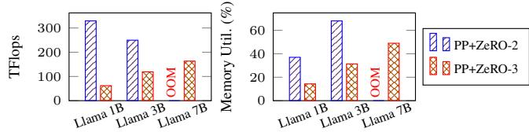  
Figure 1. Comparison of PP with ZeRO-2 vs ZeRO-3 across different Llama (Touvron et al., 2023; Zhang et al., 2024a) model sizes on 8 V100s + 8 T4s. OOM indicates Out-of-Memory.

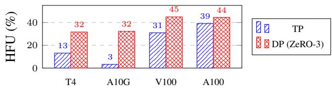  
Figure 2. Hardware Flops Utilization (HFU (Chowdhery et al., 2023)) of tensor parallelism (TP) vs data parallelism (DP) with ZeRO-3 on 8 GPU AWS VMs.

FSDP (Zhao et al., 2023) in PyTorch) is a variant of DP designed to avoid redundant storage of training state data across GPUs. While this method significantly reduces the memory requirement for storing training state data by a factor proportional to the number of GPUs in the cluster, it also increases communication overhead. Specifically, ZeRO-3 must gather parameter shards before each forwards and backwards computation (parameters are sharded afterwards). This overhead is exacerbated when ZeRO-3 is combined with PP, as PP divides a batch of inputs into microbatches that are pipelined to overlap computation across pipeline stages. Consequently, the frequency of parameter gathering increases proportionally with the number of microbatches, creating a significant communication overhead.

Alternatively, PP can be combined with ZeRO-2, which shards optimizer state and gradients but keeps a full set of parameters in memory. This avoids the need to gather parameters before each computation, achieving higher training throughput but significantly increases memory usage, as shown in Figure 1. This is especially problematic in heterogeneous clusters, where some GPUs can be memory constrained relative to their compute capacity (Guo et al., 2024). In Figure 1, although both V100s and T4s have the same memory, V100s are more than three times faster. As model size increases, V100s in PP+ZeRO-2 are unable to process a workload proportional to its compute capacity due to memory constraints, resulting in lower throughput.

(2) Tensor Parallelism: TP also reduces memory utilization by sharding computation and activations, but requires frequent all-to-all communication between model layers. Without high-bandwidth interconnects, the overhead from these communications becomes prohibitively large, despite optimizations that overlap communication with computation (Wang et al., 2024). In Figure 2, we compare the GPU utilization when training with TP versus data parallelism (DP) across common AWS VMs. The plot shows that GPU utilization with TP is low relative to DP for most VMs, and is only comparable to DP on the 8×A100 VM that has high bandwidth NVSwitch.

Like prior work, Zorse combines PP and DP by partitioning the model into stages, pipelining computation across them, and applying DP within each stage. However, Zorse employs a novel design of PP and DP called Pipeline-Efficient ZeRO DP which enables more efficient large-scale heterogeneous training by sharding parameters in a way that reduces GPU memory utilization with minimal overhead. Unlike existing PP approaches, each stage is divided into multiple smaller ministages and computation is interleaved in a way that avoids materializing all ministage parameters and gradients in memory, improves communication-computation overlap, and avoids gathering parameters for every microbatch. Moreover, both activations and parameters are offloaded to CPU memory when not in use, further reducing memory overhead while overlapping these transfers with computation to hide transfer latency. Our paper makes the following contributions:

1. We built Zorse, a flexible system that addresses heterogeneous training challenges through a novel and efficient integration of pipeline and data parallelism called Pipeline-Efficient ZeRO DP.

2. We design a planner that efficiently navigates the large search space of configurations in Zorse, automatically optimizing training for a given workload and cluster.

3. We demonstrate that Zorse greatly outperforms existing heterogeneous training systems, achieving up to 3× higher training throughput on three representative clusters for models scaling up to 65 billion parameters.

4. We make Zorse available as open-source software 1 for adoption and future extension by the community.

## 2 BACKGROUND AND RELATED WORK

In this section, we discuss existing systems and techniques applicable to heterogeneous training.

General 3D Parallel Frameworks. Most state-of-the-art distributed training systems (Liang et al., 2024; Rasley et al., 2020; Miao et al., 2022; Narayanan et al., 2021) integrate DP, PP, and TP by organizing GPUs into a 3D mesh, with one parallelization strategy per axis. Moreover, each DP group is configured to process the same batch size of inputs.

This configuration simplifies system design and narrows the parallelism plan search space. However, in heterogeneous clusters, this approach may overlook efficient training configurations. Such clusters often contain asymmetry, with variations in GPU count per node, hardware, and datacenter location. Efficient training configurations would ideally group GPUs of the same datacenter, node, or GPU type for DP, while applying PP across different groups, ensuring that GPUs within each DP group share similar networking and computational capabilities. Assigning differing batch sizes across DP groups enables more fine-grained distribution of the workload, as the batch size is typically much larger than the number of layers in modern LLMs.

Heterogeneity-Aware 3D Parallel Frameworks. Frameworks such as HexiScale (Yan et al., 2025), Metis (Um et al., 2024), Whale (Jia et al., 2022), and Sailor (Strati et al., 2025) are designed for 3D parallelism in heterogeneous clusters. They support asymmetric PP and permit varying batch sizes within a DP group, enabling balanced computation across different GPUs. However, these frameworks do not support ZeRO-3 parameter sharding due to communication bottlenecks when integrated with PP. Instead, they employ ZeRO-2 and standard DP, respectively. For larger models where training is infeasible without parameter sharding, TP is employed. However, TP incurs high communication overheads and poor GPU utilization, particularly for non-high end GPU VMs without NVSwitch.

Heterogeneity-Aware ZeRO-3. Systems like Cephalo (Guo et al., 2024) and Poplar (Zhang et al., 2025) utilize ZeRO-3 for training on heterogeneous clusters. Instead of using PP or TP to scale training for larger batch sizes, Cephalo employs gradient accumulation to reduce the memory requirements by splitting large batch sizes into smaller microbatches. It also reorders the computation to avoid regathering parameters for each microbatch. However, due to the lack of support for PP, Cephalo cannot efficiently utilize network resources in highly heterogeneous networks, resulting in networking bottlenecks when the batch size is insufficient to hide communication latencies.

## 3 DESIGN

To overcome the challenges in heterogeneous training discussed in Section 2, we developed Zorse. Zorse uses Pipeline-Efficient ZeRO DP, which combines PP and DP in a way that is simultaneously communication- and memoryefficient. Zorse also supports Heterogeneous Pipeline Parallelism, allowing asymmetric partitioning of GPUs across pipeline stages and varying batch sizes within a DP group. Finally, Zorse’s planner automatically determines optimized training configurations for a given workload.

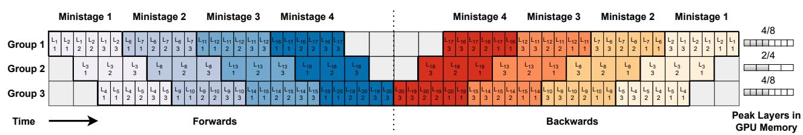  
Figure 3. Pipeline-Efficient ZeRO DP in Zorse. The diagram shows a training iteration for a model with 20 layers (Li) and 3 microbatches. There are 3 GPU groups, each with 4 ministages, for a total of 8 layers in Group 1, 4 layers in group 2, and 8 layers in group 3. Due to different computational speeds, groups have different numbers of layers per ministage. Each group maintains the current and next ministage, offloading others to CPU memory.

## 3.1 Pipeline-Efficient ZeRO Data Parallelism

Pipeline-Efficient ZeRO DP in Zorse is a novel integration of PP and ZeRO-based DP that leverages interleaved pipelining and offloading to reduce memory utilization while avoiding large communication overheads. Instead of conventional PP which assigns one stage per GPU, Zorse uses interleaved pipelining which assigns multiple smaller ministages to each GPU and interleaves computation across them.

## 3.1.1 Interleaved Pipelining

Figure 3 illustrates how computation is interleaved in Pipeline-Efficient ZeRO DP. The forwards pass is processed for each ministage sequentially, finishing all microbatches for a ministage before moving on to the next. The backwards pass is processed similarly in the reverse order. Since the microbatches are all processed together for each ministage, we offload to CPU memory ministages that are not actively being used. With this design, Zorse needs to maintain only the parameters for 2 ministages in memory at a time (the current ministage and the next ministage that is being prefetched in parallel), rather than all the parameters in the stage in standard PP+ZeRO-2. As in ZeRO, the gradients and optimizer state are sharded across each DP group. Note that this design differs from traditional interleaved pipelining which interleaves computation across ministages with a 1F1B schedule (Narayanan et al., 2021), requiring frequent parameter gathering if parameters were sharded.

Let L be the total number of layers in the stage, S be the number of stages, Player be the number of parameters in each layer, Ddp be the degree of DP, and M be the number of microbatches. Table 1 summarizes the parameter memory and communication requirements of Zorse (Pipeline-Efficient ZeRO DP) , PP+ZeRO-2, and PP+ZeRO-3. As the number of ministages increases, the memory utilization of Zorse approaches that of PP+ZeRO-3 and is significantly lower than PP+ZeRO-2. Additionally, Zorse has similar communication requirements as PP+ZeRO-2, with one All-Gather per layer in the forwards and backwards pass. This is significantly lower than PP+ZeRO-3, which requires one AllGather per microbatch of each layer. This strategy is distinct from Breadth-first PP (Lamy-Poirier, 2023; Dubey et al., 2024), which does not balance compute well in heterogeneous clusters since each ministage is a single layer. A detailed comparison is presented in Appendix 2.

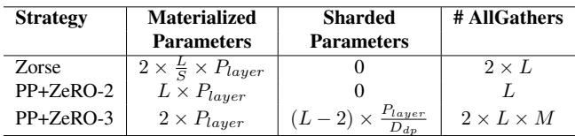  
Table 1. Memory and communication comparison of strategies.

## 3.1.2 Interleaved Optimizer Updates

Zorse further takes advantage of its interleaved pipelining schedule to interleave optimizer updates. Instead of starting the optimizer update after the backwards pass completes for all layers, Zorse starts the optimizer update for each ministage as soon as its own backwards pass completes, while the computation for the next ministage is simultaneously starting. This design (Figure 4) offers two key advantages:

(1) Reduced peak memory utilization: By freeing the gradients of each ministage as soon as its optimizer update is finished, Zorse avoids the need to retain gradients until the entire backward pass is complete.

(2) Decreased communication overhead: The optimizer update requires averaging gradients across GPUs within its DP group. By interleaving optimizer updates, this communication can overlap with the computation of subsequent ministages. This overlap is not possible if all optimizer updates start at the end of the pipeline schedule.

## 3.1.3 Activation Checkpointing and Offloading

As in prior work (Narayanan et al., 2021; PyTorch, 2023; Yan et al., 2025), Zorse checkpoints activations after each transformer layer, discarding activations between layer boundaries and recomputing them when they are needed in the backwards pass. However, the remaining activations at layer boundaries still require a significant chunk of GPU memory due to the pipeline schedule. Sequential processing of all forwards passes before backwards passes means that layer boundary activations for all microbatches of all layers need to be maintained in memory. With a batch size of B, L layers, sequences of length S, a hidden layer size of H, and D bytes per parameter, the memory overhead is B × L activations of size S ×H ×D bytes. Even at smaller training scales, this can amount to many GBs of memory.

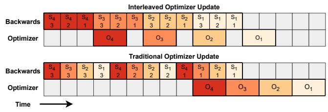  
Figure 4. Interleaved optimizer updates in Zorse vs. traditional pipeline parallelism (4 ministages, 3 microbatches).

Thus, in addition to offloading parameters, Zorse also offloads layer boundary activations to CPU memory during the forwards pass, which are loaded back during the backwards pass. With offloading, Zorse needs to maintain activations for only the current microbatch being computed and for the next microbatch being prefetched.

To offload parameters, the host machine must have sufficient memory to store all ministages and boundary activations for all GPUs in CPU memory. GPU VMs typically have much more CPU RAM than GPU VRAM and this requirement is satisfied by our VMs for the largest workloads. For example, the largest model we evaluate requires 130 GB of host memory, whereas the AWS 8×A100 VMs used provide 1152 GB. The PCIe bandwidth on our VMs supports per-GPU 16 GB/s CPU-GPU bandwidth, which is sufficient to ensure that CPU-GPU transfers do not bottleneck training in practice.

In Section 4.4, we describe how Zorse efficiently overlaps offloading (and loading) of activations, and model parameters with computation to hide offloading overhead.

## 3.2 Heterogeneous Pipeline Parallelism

Zorse implements heterogeneous pipeline parallelism, enabling pipeline stages with varying numbers of GPUs and heterogeneous GPU types. This flexibility enables efficient PP and DP configurations in heterogeneous clusters by accommodating variations in GPU quantities, types, and capabilities across nodes.

Figure 5 demonstrates heterogeneous PP on a 3-node cluster spanning two regions with 1, 2, and 4 GPUs of different types. The approach combines Region 1’s nodes into a single 3-GPU stage and Region 2’s node into a 4-GPU stage. This configuration exploits high-bandwidth intra-region connections for DP while limiting PP communication to lowerbandwidth inter-region links, requiring only two pipeline stages. In contrast, traditional PP necessitates six single-GPU stages to maintain uniformity, substantially increasing pipeline overhead and reducing flexibility in balancing model layers across stages.

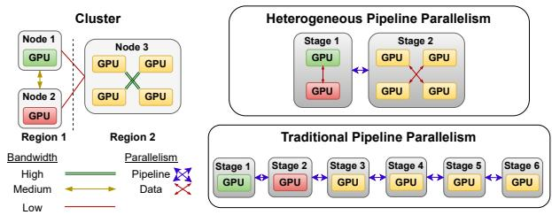  
Figure 5. Heterogeneous pipeline parallelism in Zorse compared to traditional pipeline parallelism.

Cross-stage Communication Algorithm. Traditional PP enables straightforward one-to-one communication between uniform GPUs across stages. Heterogeneous PP, however, requires many-to-many communication patterns to reshuffle data between stages with varying GPU counts and types.

Zorse computes an optimized communication plan to redistribute microbatches across stages and balance computation within each stage. Microbatches are assigned to GPUs based on their relative layer runtimes. This algorithm estimates completion times for microbatches of the current stage and remaining compute time for each GPU in the next stage. It then assigns the ith completed microbatch to the GPU with the ith highest remaining runtime, prioritizing GPUs with more work to minimize overall stage runtime. More details and pseudocode are provided in Appendix 1.

## 3.3 Planner

Given a heterogeneous cluster of GPUs and a training workload, the planner determines a configuration for Zorse that is optimized for training throughput. Zorse initially profiles the cluster and workload to gather model runtime and networking statistics, which are then used by the planner to determine the final training configuration (Figure 6). Zorse’s planner employs a two-phase optimization process to optimize the training configuration:

## 3.3.1 Profiling.

We measure inter-node and intra-node bandwidths between pairs of nodes and GPUs, respectively, for use in cluster partitioning. We profile model layer runtimes on each GPU for small batch sizes and fit a linear model to predict runtimes for unseen batch sizes, which is a lightweight yet accurate method for estimating runtime (Guo et al., 2024;

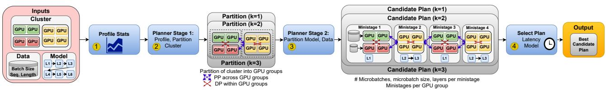  
Figure 6. Architecture of Zorse’s planner: ⃝1 profile workload and cluster, ⃝2 partition cluster into GPU groups, ⃝3 partition model and data across GPU groups, and ⃝4 select the best plan considered.

Um et al., 2024). These bandwidth measurements and runtime predictions are used to estimate training latencies in Phase 2. We model the AllGather and ReduceScatter latencies based on profiled network bandwidths, assuming a ring-based implementation (Strati et al., 2024). To accelerate profiling, we: (1) parallelize intra-node profiling, and (2) profile inter-node bandwidths only between unique VM configurations, as large clusters often contain redundant configurations. Further details are provided in Appendix 4.

## 3.3.2 Phase 1: Cluster Partitioning.

The first phase determines the division of the cluster into k GPU groups, where GPUs within groups use DP while PP operates across groups. The objective is minimizing inter-group bandwidth usage to enable efficient PP over lower bandwidth links between groups and DP over faster intra-group links.

The cluster is represented as a fully connected graph G = (V, E), with vertices V representing GPUs and edge weights w(u, v) indicating bandwidth between GPUs u and v. The partitioning task is formulated as a min-k cut problem, aiming to divide V into k disjoint subsets V1, V2, . . . , Vk that minimize the total weight of inter-subset edges:

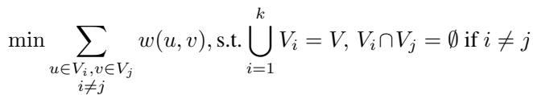

This optimization ensures higher bandwidth links remain within groups. The problem is solved for each k from 1 to N (total GPU count).

Given the impractical O(N k2) exponential time complexity of exact min-k cut algorithms (Goldschmidt & Hochbaum, 1988), we employ the SPLIT greedy approximation algorithm (Saran & Vazirani, 1995), which guarantees solutions within 2 − 2/k of optimal. SPLIT iteratively computes min 2-cuts and removes edges until k components remain, enabling efficient approximate solutions for all k values in a single pass. With min 2-cuts requiring O(N 3) time (Stoer & Wagner, 1997) and N iterations needed, the overall complexity is O(N 4).

## 3.3.3 Phase 2: Model Configuration.

Phase 2 leverages cluster partitions from Phase 1 to optimize the training configuration, determining model layer partitioning into ministages, GPU group ordering, and microbatch sizes. Given the large configuration space, Zorse applies heuristics to filter candidates before evaluating remaining options using latency and memory models.

Heuristics. Pipeline parallelism performance is limited by the slowest GPU group. To minimize latency, model layers are partitioned proportionally to each group’s aggregate processing speed, computed as the sum of per-GPU layer processing rates. These layer assignments are divided into equal-sized ministages and ordered across groups in round-robin fashion. GPU group ordering affects pipeline startup as the first ministage must gather sharded parameters without overlapping communication. Groups are ordered by descending intra-group bandwidth to minimize initial communication overhead.

Enumeration. The planner enumerates configurations of batch size and ministages per group (bounded by layer count), yielding O(B · L) combinations where B is global batch size and L is layer count. A lightweight latency and memory model identifies the fastest configuration meeting memory constraints.

## 3.3.4 Latency Model.

The total training latency is modeled as: Ltotal = (Lforwards + Lbackwards) · Nministages + Lstartup, where Lforwards and Lbackwards represent ministage processing latencies for forward and backward passes, Nministages denotes ministages per GPU group, and Lstartup pipeline initialization latency.

The model accounts for microbatch computation overlap, Pipeline-Efficient ZeRO DP communication requirements, and non-overlappable pipeline bubbles. Forward, backward, and network latencies are derived from profiling (Section 3.3.1), with additional details in Appendix 5.

## 3.3.5 Memory Model.

The total per-GPU memory consumption is modeled as: Mtotal = Mparams + Mgrads + Moptim + Mactivations, where Mparams, Mgrads, Moptim, and Mactivations represent memory allocated for model parameters, gradients, optimizer states, and activations respectively.

The model considers parameter and activation offloading in Pipeline-Efficient ZeRO DP, along with storage requirements for both full and half-precision parameter copies in FP16 mixed-precision training. See Appendix 5 for details.

## 4 IMPLEMENTATION

In this section, we provide details on Zorse’s implementation and optimizations. Zorse is built on PyTorch FSDP.

## 4.1 Pipeline-Efficient ZeRO DP

We modified FSDP’s parameter management to support interleaved pipeline parallelism by addressing key timing assumptions. Unlike ZeRO-2 which keeps parameters materialized between forward and backward passes, we reshard and offload ministage parameters to CPU post-forward pass, then reload and unshard during the backward passes. To handle FSDP’s premature resharding after the first microbatch’s backward pass, we delay resharding until all microbatches complete. We limit memory usage by configuring the FSDP prefetcher to fetch only the next immediate ministage. Finally, we create per-ministage optimizers that execute after their corresponding backward passes complete.

## 4.2 Communication Libraries

We use NCCL for DP communication within GPU groups. For PP communication, we encountered limitations with NCCL’s blocking P2P behavior (NVIDIA Corporation, 2020), which can cause deadlocks in heterogeneous PP due to cyclic dependencies. We implemented a hybrid approach using NCCL where possible and GLOO P2P (nonblocking) between GPU groups where cycles in communication are possible. While GLOO cannot utilize NVLink, this was not a performance bottleneck as NVLink typically connects GPUs within the same DP group rather than across PP groups. Since GLOO is used only for PP communication, this overhead occurs primarily during pipeline warmup, when communication cannot be overlapped with computation. After the pipeline is saturated, computation time can typically fully hide the overhead of GLOO. More details are provided in Appendix 1.

## 4.3 Computation-Networking Overlap

We optimize communication-computation overlap by managing parameter sharding at the layer level instead of ministage level. By gathering layers sequentially rather than as a single large chunk, computation can begin once the first layer is ready while subsequent layers are prefetched in parallel. Similarly, in the backwards pass we prefetch CPU-offloaded parameters.

## 4.4 Computation-Offloading Overlap

PyTorch’s built-in CPU offloading incurs significant performance overhead by blocking GPU computation and executing optimizer steps on CPU when parameter offloading is enabled. Our implementation utilizes separate CUDA streams for parameter and activation offloading without blocking GPU computation. Similarly, we prefetch activations and parameters in advance to prevent stalling during backward pass. Finally, we execute optimizer steps on GPU prior to offloading to avoid optimizer updates on CPU.

## 5 PERFORMANCE EVALUATION

We compare Zorse to state-of-the-art heterogeneous training systems across three representative clusters with up to 128 GPUs, and LLMs with up to 65B parameters. Details on training configurations and an ablation study on Zorse’s key components are provided in Appendix 3.

## 5.1 Experimental Setup

For all systems, we train with a global batch size of 1 million tokens using FP16 mixed precision and apply activation checkpointing to reduce memory overhead (PyTorch, 2023). We use Llama (Touvron et al., 2023) and GPT (Brown et al., 2020) models with up to 65 billion parameters. Model specifications are provided in Appendix 3.

Clusters. We evaluate on three clusters representative of common heterogeneous training scenarios. Clusters include VMs from Azure and AWS, with up to 128 GPUs of low-, mid-, and high-end GPUs, and span up to 2 regions. Appendix 6 details GPU specifications, while Table 2 presents the cluster configurations. We use sequence lengths of 4096, 1024, and 512 for clusters A, B, and C respectively, using longer sequences on clusters with more powerful GPUs.

Table 2. Cluster GPU Configurations  
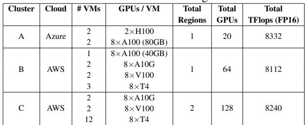

Baselines. We compare against representative state-of-the-

art techniques for training on heterogeneous GPU clusters:

TorchTitan-Het: 3D parallelism in TorchTitan (Liang et al., 2024) adapted for heterogeneous clusters by partitioning the model unevenly to balance compute across PP stages. We try different combinations of DP (ZeRO-2), PP, and TP, reporting the best performing configuration.

HexiScale: Combines DP (ZeRO-2), TP, and PP, leveraging a planner to select an optimized training configuration.

Cephalo: Distributes compute workload and training state data unevenly with FSDP to utilize heterogeneous resources.

Metrics. We evaluate training performance using: (1) TFlops: Floating point operations per second, and (2) Hardware FLOPS Utilization (HFU (Chowdhery et al., 2023)): Ratio of achieved TFlops to the cluster’s peak theoretical TFlops, quantifying GPU utilization efficiency.

## 5.2 Training Throughput

We compare Zorse to existing systems across three common heterogeneous training scenarios. A summary of the results is provided in Table 3.

Cluster A: Small-size cluster of high-end GPUs. This cluster comprises 4 H100s and 16 A100s, representing scenarios with limited high-end GPUs combined into a larger cluster. GPUs within nodes connect via NVSwitch, while inter-node bandwidth is 50 Gbps. Zorse outperforms all baselines, with relative speedup increasing with model size.

TorchTitan-Het partitions the model into 5 stages, each with 4 GPUs, one grouping the 4 H100s together and the rest grouping the A100s. It employs a 2 × 2 ZeRO-2 DP×TP configuration, which works well for smaller models but runs out of memory on larger ones. Gradient accumulation is used to reduce memory utilization, but this adds parameter gathering communication per accumulation step.

HexiScale utilizes PP+ZeRO-2 DP and adjusts parallelism degrees for memory management. However, memory pressure with larger models leads to suboptimal partitioning and H100 underutilization. Despite H100s having 3× the TFlops of A100s but only 15% more memory, they cannot scale proportionally to their compute capacity.

Cephalo applies ZeRO-3 across all GPUs but suffers from the 35-fold disparity between intra-node and inter-node bandwidths, creating communication bottlenecks in All-Gather and ReduceScatter operations.

In contrast, Zorse maintains high efficiency even with larger models by grouping GPUs within each node for DP and applying PP across nodes, possible with Zorse’s support for heterogeneous PP. Its memory optimizations allow it to train larger models while evenly balancing computation across GPUs, unlike other systems that must compromise performance to avoid running out of memory.

To validate generalizability of Zorse to other model architectures, we also evaluate on GPT model variants in cluster A, demonstrating similar performance improvements relative to baselines.

Cluster B: Medium-size cluster of low, middle, and high end GPUs. This cluster comprises 8 A100s, 16 A10Gs, 16 V100s, and 24 T4s, representing scenarios where users have limited access to GPUs with diverse performance capabilities but aim to utilize them concurrently for training. The cluster presents challenges due to its heterogeneity in computational power, memory, and networking. For instance, V100s and A100s benefit from faster intra-node NVLink interconnects, whereas T4s and A10Gs rely on PCIe; T4s and V100s share the same memory capacity, yet V100s are twice as fast; A10Gs and V100s have similar computational speeds, but A10Gs offer 1.5 times more memory.

Zorse organizes the cluster into four groups based on GPU type and hardware configuration, enabling ZeRO-2 DP within groups that share networking hardware to prevent slower interconnects from impacting faster ones. For 13B and 33B models, Zorse implements 4 and 6 ministages per GPU respectively, enhancing parameter offloading and reducing memory consumption. This approach optimizes performance by freeing memory for more efficient layer distribution across GPUs. Zorse achieves 1.5× – 4× higher training throughput compared to all baselines.

TorchTitan-Het and HexiScale lack effective activation offloading mechanisms and rely on extensive PP partitioning for memory management. However, the limited number of model layers prevents effective computation balancing across PP stages. For instance, HexiScale divides the Llama 33B model into over 16 stages, but with only 40 layers available, the partitioning remains too coarse for effective load balancing. The A100’s 5× higher TFlops compared to the T4 would require proportionally more layers to achieve balance. TorchTitan-Het’s inflexible PP and DP configuration results in out-of-memory errors when training Llama 33B.

Cephalo efficiently manages memory by fully sharding parameters across the cluster, balancing computation across GPUs. However, it faces bottlenecks due to collective communication in the highly heterogeneous network.

Cluster C: Large-size cluster of low- and middle-end GPUs. This cluster consists of 128 GPUs distributed across two AWS regions: 16 A10Gs and 48 T4s in one region, and 16 V100s and 48 T4s in the other. It represents scenarios where users have access to numerous low- and mid-tier GPUs rather than high-end hardware. The large GPU count, limited memory per GPU (≤ 24GB), and high cross-region communication latencies present significant training challenges, resulting in reduced throughput and utilization. Despite these constraints, Zorse maintains a consistent 1.5× performance advantage over baselines.

Table 3. Throughput (TFlops) and GPU utilization (HFU) of Zorse compared to other systems across different model sizes and clusters (higher is better). OOM denotes Out-of-Memory.  
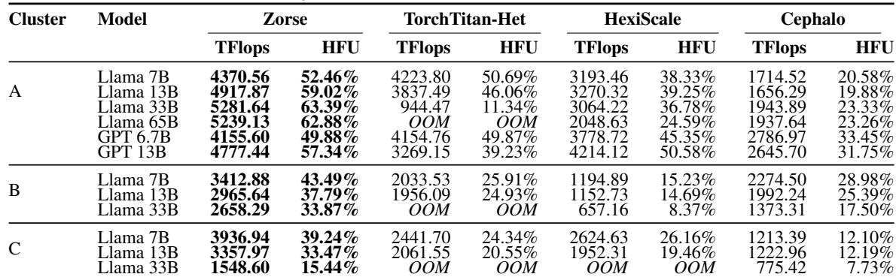

Zorse prevents OOM errors by configuring DP group sizes based on each VM’s capabilities. The A10Gs operate as a single DP group, while V100s form two 8-GPU groups to handle comparable layer counts with half the memory capacity. T4s, processing fewer layers due to computational constraints, are divided into two 24-GPU groups per region to minimize cross-region communication overhead.

The baseline systems encounter various limitations. TorchTitan-Het requires excessive PP partitioning due to its symmetric GPU grouping constraints, resulting in high pipeline overhead. HexiScale suffers from communication bottlenecks due to its reliance on TP for memory management. While Cephalo reduces V100 memory pressure through asymmetric state partitioning, cross-region communication remains a significant performance bottleneck.

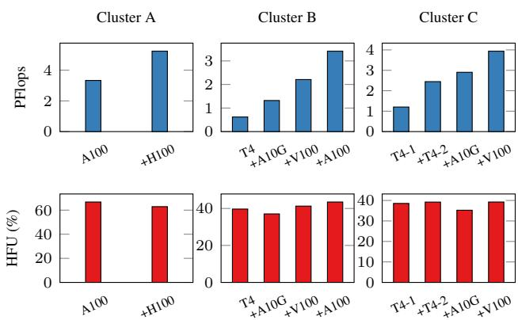  
Figure 7. PFlops (1k TFlops) and HFU scaling as heterogeneous GPUs are added to the clusters.

## 5.3 Cluster Scaling

We validate Zorse’s scalability with increasingly heterogeneous and larger clusters. For each cluster, we first evaluate the training performance of the largest model that can be trained on the slowest GPUs. We then incrementally add faster GPUs to the training group, gradually increasing the total number of GPUs and heterogeneity until the entire cluster is utilized. Results are presented in Figure 7.

Adding heterogeneous GPUs into the training group across various clusters significantly improves training throughput. Furthermore, cluster utilization (HFU) generally remains stable or improves, as observed in Cluster B. Improvements can be attributed to reduced memory requirements per GPU with the addition of more GPUs, enabling more efficient training configurations that better balance computation. These results demonstrate that when homogeneous GPUs are limited, they can be pooled together to achieve higher throughput without sacrificing training efficiency.

## 5.4 Comparison to Homogeneous Training

We assess the training efficiency of Zorse on heterogeneous versus homogeneous clusters in Figure 8. For each heterogeneous cluster, we compare the HFU achieved per GPU type when training on the entire cluster against training on only the homogeneous subset of those GPUs within the cluster. This evaluation uses the largest model that can be trained across all cluster configurations without running out of memory. Homogeneous training is typically expected to be more efficient due to its smaller scale and uniform hardware, which reduces communication overhead and eliminates the need for balancing computation. Nevertheless, our results demonstrate that Zorse consistently achieves efficiency levels comparable to homogeneous training, reflecting its ability to balance network, compute, and memory heterogeneity. These results, along with Section 5.3, showcase Zorse’s capability to scale training effectively across heterogeneous clusters, achieving significantly higher throughput than when limited to homogeneous training, while preserving GPU efficiency.

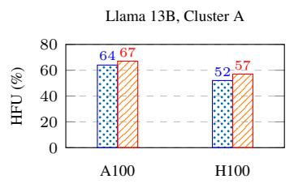

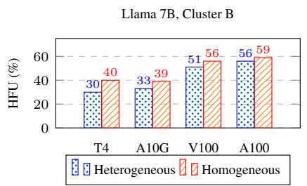

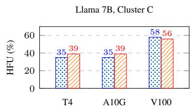

Figure 8. GPU Utilization on heterogeneous clusters vs homogeneous subgroups of GPUs within the clusters.  
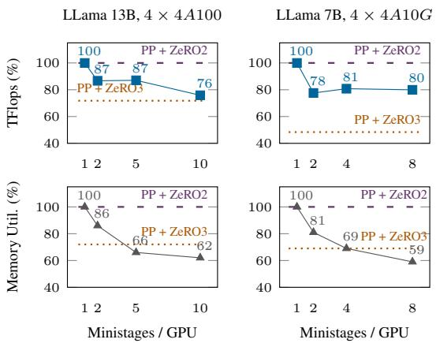  
Figure 9. TFlops and memory utilization for varying ministages per GPU. Values are normalized to 1 microstage.

## 5.5 Pipeline-Efficient ZeRO DP Analysis

PP+ZeRO-3 provides memory efficiency but suffers from low throughput due to communication overhead, while PP+ZeRO-2 achieves high throughput but is memory inefficient. Here we analyze how Pipeline-Efficient ZeRO DP in Zorse is able to achieve a good balance between low memory and high throughput. This tradeoff can be adjusted through the interleaving factor, which represents the number of ministages assigned per GPU.

Figure 9 evaluates Pipeline-Efficient ZeRO DP on two homogeneous clusters (16 A100s and 16 A10Gs) to isolate interleaving effects from heterogeneous compute imbalances. Increasing from 1 to 2 ministages per GPU causes a small throughput reduction due to pipelining overhead. Further increases in ministages yield minimal additional throughput impact while continuing to decrease memory usage. At maximum interleaving, memory utilization decreases by 40% with only a 20% throughput reduction. This memorythroughput tradeoff enables more balanced computation across GPUs in memory-constrained heterogeneous settings, which often offsets the additional pipelining overhead.

Compared to PP+ZeRO-3, Pipeline-Efficient ZeRO DP achieves substantially higher throughput with similar memory efficiency, particularly on A10Gs with slower interconnects. At maximum interleaving, Pipeline-Efficient ZeRO DP uses even less memory through parameter offloading, with offloading overhead less than 3% across all workloads. While Pipeline-Efficient ZeRO DP was designed as a solution for efficient training on heterogeneous clusters that are both memory and bandwidth constrained, it is also effective for resolving similar bottlenecks on homogeneous clusters.

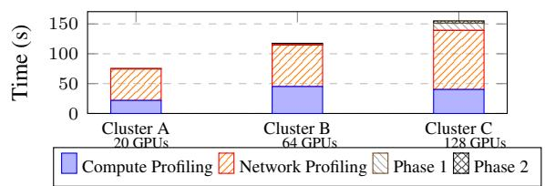  
Figure 10. Planner runtime breakdown per cluster.

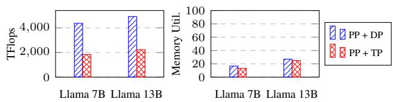  
Figure 11. Training performance of Zorse with PP + TP vs Zorse with PP + DP on Cluster A.

## 5.6 Pipeline-Efficient ZeRO DP vs TP

Zorse employs Pipeline-Efficient ZeRO DP instead of TP since it achieves comparable memory utilization with significantly lower communication overhead. For flexibility and comparison, we integrated TP with Sequence Parallelism for normalization layers into Zorse, enabling training parallelization using TP within pipeline stages rather than DP. Figure 11 evaluates Zorse with PP+DP versus PP+TP on cluster A. This is an ideal setting for TP due to highbandwidth NVLink interconnects between GPUs within nodes. The model is divided into 4 stages across nodes, with TP applied within each stage.

Results show PP+TP underperforms PP+DP for both Llama 7B and 13B models. Sequential dependencies in gathering and reducing layer inputs prevent complete overlap, resulting in high communication overhead despite fast NVLink operations. Memory utilization remains comparable between TP and DP as both approaches shard model activations and parameters, though through different dimensions. TP shards by sequence and hidden dimensions while DP shards by batch dimension. While these experiments used larger ministages with DP, configurations with many small ministages can achieve lower GPU memory utilization than TP by offloading inactive ministage parameters to CPU.

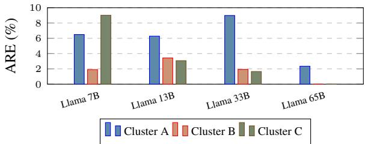  
Figure 12. Planner latency model absolute relative error.

## 5.7 Planner Optimization Time and Accuracy

The search space for optimal training configurations in Zorse encompasses asymmetric combinations of PP and DP, model partitioning, interleaved pipelining, and microbatch sizes. Despite the complexity, Zorse’s planner completes optimization within 3 minutes across all workloads, comparable to reconfiguration times of dynamic parallelism systems (Wagenlander et al. ¨ , 2024; Li et al., 2025). This gives Zorse flexibility to adapt training strategies for elastic resource allocation and node failures. Fast planning is achieved through a two-phase optimization approach using approximation algorithms and search space pruning heuristics. Figure 10 shows optimization time breakdown for the largest models in each cluster. Profiling time dominates but scales sublinearly with GPU count through parallelization and avoiding redundant measurements on duplicate hardware. As shown in Figure 12, the planner’s latency model maintains accuracy within 10% of actual measurements. Our memory model was also accurate within 10% of observed memory utilization.

## 6 DISCUSSION

Zorse achieves efficient training for heterogeneous clusters through a combination of PP and DP. This section discusses Zorse’s applicability to homogeneous clusters and integration with other forms of parallelism.

## 6.1 Benefits in Homogeneous Clusters

Several of Zorse’s techniques can also be useful in homogeneous clusters. Section 5.5 evaluates Pipeline-Efficient ZeRO DP in a homogeneous setting, showing substantial training speedups over PP + ZeRO-3 and significantly lower memory usage than PP + ZeRO-2.

Interleaved optimizer updates and activation offloading are low-overhead memory optimizations that provide similar benefits in homogeneous clusters. Finally, Zorse’s planner remains effective in homogeneous environments, since the homogeneous clusters are a strict subset of the heterogeneous search space it is designed to handle. Moreover, even homogeneous GPU clusters exhibit communication heterogeneity (e.g., intra- vs. inter-node links), making the planner’s considerations directly applicable.

## 6.2 Tensor Parallelism

Although Zorse does not support TP due to TP’s ineffectiveness in common heterogeneous training scales (Guo et al., 2024; Um et al., 2024; Yan et al., 2025; Park et al., 2020), TP remains valuable for exceptionally large models whose layers cannot fit on a single GPU. In such scenarios, PP and DP run out of memory because they cannot partition computation at a finer granularity than a layer. While few organizations train at this scale, future work could support this use case by extending Zorse to consider DP + TP (including context parallelism (Li et al., 2023)) combinations within each GPU group. We discuss how this can be implemented in Appendix 7.

## 7 CONCLUSION

We present Zorse, a system for efficient training of LLMs on heterogeneous clusters with diverse compute, memory, and networking capabilities. Through optimized integration of PP and DP, Zorse achieves both memory efficiency and low communication overhead. The system employs an efficient planner to navigate the vast configuration space and determine optimized training strategies for heterogeneous environments. Experimental results demonstrate that Zorse delivers up to 3× higher training throughput compared to state-of-the-art systems across multiple representative heterogeneous scenarios.

## 8 ACKNOWLEDGEMENTS

This work was supported by compute resources from Microsoft Azure, funding from the Natural Sciences and Engineering Research Council of Canada, and Amazon Web Services credits. We are thankful to the anonymous reviewers for providing valuable feedback and Lori Paniak for hardware support used in this work.

## REFERENCES

Brown, T., Mann, B., Ryder, N., Subbiah, M., Kaplan, J. D., Dhariwal, P., Neelakantan, A., Shyam, P., Sastry, G., Askell, A., et al. Language models are few-shot learners. Advances in neural information processing systems, 33: 1877–1901, 2020.

Chowdhery, A., Narang, S., Devlin, J., Bosma, M., Mishra, G., Roberts, A., Barham, P., Chung, H. W., Sutton, C., Gehrmann, S., Schuh, P., Shi, K., Tsvyashchenko, S., Maynez, J., Rao, A., Barnes, P., Tay, Y., Shazeer, N., Prabhakaran, V., Reif, E., Du, N., Hutchinson, B., Pope, R., Bradbury, J., Austin, J., Isard, M., Gur-Ari, G., Yin, P., Duke, T., Levskaya, A., Ghemawat, S., Dev, S., Michalewski, H., Garcia, X., Misra, V., Robinson, K., Fedus, L., Zhou, D., Ippolito, D., Luan, D., Lim, H., Zoph, B., Spiridonov, A., Sepassi, R., Dohan, D., Agrawal, S., Omernick, M., Dai, A. M., Pillai, T. S., Pellat, M., Lewkowycz, A., Moreira, E., Child, R., Polozov, O., Lee, K., Zhou, Z., Wang, X., Saeta, B., Diaz, M., Firat, O., Catasta, M., Wei, J., Meier-Hellstern, K., Eck, D., Dean, J., Petrov, S., and Fiedel, N. Palm: scaling language modeling with pathways. J. Mach. Learn. Res., 24(1), January 2023. ISSN 1532-4435.

Ding, Y., Botzer, N., and Weninger, T. Hetseq: Distributed gpu training on heterogeneous infrastructure. In Proceedings of the AAAI Conference on Artificial Intelligence, volume 35, pp. 15432–15438. AAAI Press, May 2021. doi: 10.1609/aaai.v35i17.17813.

Duan, J., Song, Z., Miao, X., Xi, X., Lin, D., Xu, H., Zhang, M., and Jia, Z. Parcae: proactive, liveput-optimized dnn training on preemptible instances. In Proceedings of the 21st USENIX Symposium on Networked Systems Design and Implementation, NSDI’24, USA, 2024. USENIX Association. ISBN 978-1-939133-39-7.

Dubey, A., Jauhri, A., Pandey, A., Kadian, A., Al-Dahle, A., Letman, A., Mathur, A., Schelten, A., Yang, A., Fan, A., et al. The llama 3 herd of models. arXiv preprint arXiv:2407.21783, 2024.

Goldschmidt, O. and Hochbaum, D. S. A polynomial algorithm for the k-cut problem for fixed k. In Proceedings of the 29th Annual Symposium on Foundations of Computer Science (FOCS), pp. 444–451. IEEE Computer Society, 1988.

Guo, R. B., Anand, U., Chen, A., and Daudjee, K. Cephalo: Harnessing heterogeneous gpu clusters for training transformer models, 2024. URL https://arxiv.org/ abs/2411.01075.

Huang, Y., Cheng, Y., Bapna, A., Firat, O., Chen, D., Chen, M., Lee, H., Ngiam, J., Le, Q. V., Wu, Y., et al. Gpipe:

Efficient training of giant neural networks using pipeline parallelism. Advances in neural information processing systems, 32, 2019.

Jia, X., Jiang, L., Wang, A., Xiao, W., Shi, Z., Zhang, J., Li, X., Chen, L., Li, Y., Zheng, Z., Liu, X., and Lin, W. Whale: Efficient giant model training over heterogeneous GPUs. In 2022 USENIX Annual Technical Conference (USENIX ATC 22), pp. 673–688, Carlsbad, CA, July 2022. USENIX Association. ISBN 978-1-939133-29-57. URL https://www.usenix.org/conference/at c22/presentation/jia-xianyan.

Jiang, Y., Fu, F., Yao, X., He, G., Miao, X., Klimovic, A., Cui, B., Yuan, B., and Yoneki, E. Demystifying costefficiency in llm serving over heterogeneous gpus, 2025. URL https://arxiv.org/abs/2502.00722.

Jiang, Z., Lin, H., Zhong, Y., Huang, Q., Chen, Y., Zhang, Z., Peng, Y., Li, X., Xie, C., Nong, S., Jia, Y., He, S., Chen, H., Bai, Z., Hou, Q., Yan, S., Zhou, D., Sheng, Y., Jiang, Z., Xu, H., Wei, H., Zhang, Z., Nie, P., Zou, L., Zhao, S., Xiang, L., Liu, Z., Li, Z., Jia, X., Ye, J., Jin, X., and Liu, X. Megascale: scaling large language model training to more than 10,000 gpus. In Proceedings of the 21st USENIX Symposium on Networked Systems Design and Implementation, NSDI’24, USA, 2024. USENIX Association. ISBN 978-1-939133-39-7.

Lamy-Poirier, J. Breadth-first pipeline parallelism. In Song, D., Carbin, M., and Chen, T. (eds.), Proceedings of Machine Learning and Systems, volume 5, pp. 48–67. Curan, 2023.

Li, H., Fu, F., Ge, H., Lin, S., Wang, X., Niu, J., Wang, Y., Zhang, H., Nie, X., and Cui, B. Malleus: Stragglerresilient hybrid parallel training of large-scale models via malleable data and model parallelization. Proceedings of the ACM on Management of Data, 3(3):1–28, Jun 2025. ISSN 2836-6573. doi: 10.1145/3725322.

Li, S., Xue, F., Baranwal, C., Li, Y., and You, Y. Sequence parallelism: Long sequence training from system perspective. In Rogers, A., Boyd-Graber, J., and Okazaki, N. (eds.), Proceedings of the 61st Annual Meeting of the Association for Computational Linguistics (Volume 1: Long Papers), pp. 2391–2404, Toronto, Canada, July 2023. Association for Computational Linguistics. doi: 10.18653/v1/2023.acl-long.134. URL https: //aclanthology.org/2023.acl-long.134/.

Liang, W., Liu, T., Wright, L., Constable, W., Gu, A., Huang, C.-C., Zhang, I., Feng, W., Huang, H., Wang, J., Purandare, S., Nadathur, G., and Idreos, S. Torchtitan: Onestop pytorch native solution for production ready llm pre-training, 2024. URL https://arxiv.org/ab s/2410.06511.

Miao, X., Wang, Y., Jiang, Y., Shi, C., Nie, X., Zhang, H., and Cui, B. Galvatron: Efficient transformer training over multiple gpus using automatic parallelism. Proc. VLDB Endow., 16(3):470–479, nov 2022. ISSN 2150- 8097. doi: 10.14778/3570690.3570697. URL https: //doi.org/10.14778/3570690.3570697.

Narayanan, D., Harlap, A., Phanishayee, A., Seshadri, V., Devanur, N. R., Ganger, G. R., Gibbons, P. B., and Zaharia, M. Pipedream: Generalized pipeline parallelism for dnn training. In Proceedings of the 27th ACM Symposium on Operating Systems Principles, pp. 1–15, 2019.

Narayanan, D., Shoeybi, M., Casper, J., LeGresley, P., Patwary, M., Korthikanti, V., Vainbrand, D., Kashinkunti, P., Bernauer, J., Catanzaro, B., et al. Efficient large-scale language model training on gpu clusters using megatronlm. In Proceedings of the International Conference for High Performance Computing, Networking, Storage and Analysis, pp. 1–15, 2021.

Nie, C., Maghakian, J., and Liu, Z. Cannikin: Optimal adaptive distributed dnn training over heterogeneous clusters. In Proceedings of the 25th International Middleware Conference, Middleware ’24, pp. 299–312, New York, NY, USA, 2024. Association for Computing Machinery. ISBN 9798400706233. doi: 10.1145/3652892.3700767. URL https://doi.org/10.1145/3652892. 3700767.

NVIDIA. NCCL: NVIDIA Collective Communications Library. https://developer.nvidia.com/n ccl, 2024.

NVIDIA Corporation. Point to point communication functions. NVIDIA NCCL User Guide API documentation, version 2.26.2, 2020. URL https://docs.nvidia. com/deeplearning/nccl/user-guide/doc s/api/p2p.html. Accessed: 2025-04-17.

Park, J. H., Yun, G., Chang, M. Y., Nguyen, N. T., Lee, S., Choi, J., Noh, S. H., and Choi, Y.-r. {HetPipe}: Enabling large {DNN} training on (whimpy) heterogeneous {GPU} clusters through integration of pipelined model parallelism and data parallelism. In 2020 USENIX Annual Technical Conference (USENIX ATC 20), pp. 307–321, 2020.

PyTorch. Training a 1 trillion parameter model with pytorch fully sharded data parallel on aws. https://shortu rl.at/6Y4LT, 2023. Accessed: 2024-01-30.

Rajbhandari, S., Rasley, J., Ruwase, O., and He, Y. Zero: Memory optimizations toward training trillion parameter models. In SC20: International Conference for High Performance Computing, Networking, Storage and Analysis, pp. 1–16. IEEE, 2020.

Rasley, J., Rajbhandari, S., Ruwase, O., and He, Y. Deepspeed: System optimizations enable training deep learning models with over 100 billion parameters. In Proceedings of the 26th ACM SIGKDD International Conference on Knowledge Discovery & Data Mining, pp. 3505–3506, 2020.

Saran, H. and Vazirani, V. V. Finding k cuts within twice the optimal. SIAM Journal on Computing, 24(1):101–108, 1995. doi: 10.1137/S0097539792251730. URL https: //doi.org/10.1137/S0097539792251730.

Shazeer, N., Cheng, Y., Parmar, N., Tran, D., Vaswani, A., Koanantakool, P., Hawkins, P., Lee, H., Hong, M., Young, C., et al. Mesh-tensorflow: Deep learning for supercomputers. Advances in neural information processing systems, 31, 2018.

Shoeybi, M., Patwary, M., Puri, R., LeGresley, P., Casper, J., and Catanzaro, B. Megatron-lm: Training multibillion parameter language models using model parallelism. CoRR, abs/1909.08053, 2019. URL http: //arxiv.org/abs/1909.08053.

Stoer, M. and Wagner, F. A simple min-cut algorithm. Journal of the ACM, 44(4):585–591, 1997. doi: 10.1145/ 263867.263872.

Strati, F., Elvinger, P., Kerimoglu, T., and Klimovic, A. Ml training with cloud gpu shortages: Is cross-region the answer? In Proceedings of the 4th Workshop on Machine Learning and Systems, EuroMLSys ’24, pp. 107–116, New York, NY, USA, 2024. Association for Computing Machinery. ISBN 9798400705410. doi: 10.1145/3642 970.3655843. URL https://doi.org/10.1145/ 3642970.3655843.

Strati, F., Zhang, Z., Manos, G., Periz, I. S., Hu, Q., Chen, ´ T., Buzcu, B., Han, S., Delgado, P., and Klimovic, A. Sailor: Automating distributed training over dynamic, heterogeneous, and geo-distributed clusters, 2025. URL https://arxiv.org/abs/2504.17096.

Touvron, H., Lavril, T., Izacard, G., Martinet, X., Lachaux, M.-A., Lacroix, T., Roziere, B., Goyal, N., Hambro, E., \` Azhar, F., et al. Llama: Open and efficient foundation language models. arXiv preprint arXiv:2302.13971, 2023.

Um, T., Oh, B., Kang, M., Lee, W.-Y., Kim, G., Kim, D., Kim, Y., Muzzammil, M., and Jeon, M. Metis: Fast automatic distributed training on heterogeneous {GPUs}. In 2024 USENIX Annual Technical Conference (USENIX ATC 24), pp. 563–578, 2024.

Vaswani, A., Shazeer, N., Parmar, N., Uszkoreit, J., Jones, L., Gomez, A. N., Kaiser, Ł., and Polosukhin, I. Attention is all you need. Advances in neural information processing systems, 30, 2017.

Wagenlander, M., Li, G., Zhao, B., Mai, L., and Pietzuch, ¨ P. Tenplex: Dynamic parallelism for deep learning using parallelizable tensor collections. In Proceedings of the ACM SIGOPS 30th Symposium on Operating Systems Principles, SOSP ’24, pp. 195–210, New York, NY, USA, 2024. Association for Computing Machinery. ISBN 9798400712517. doi: 10.1145/3694715.3695975. URL https://doi.org/10.1145/3694715.3695 975.

Wang, Y., He, H., Wright, L., Wehrstedt, L., Liu, T., and Liang, W. Distributed w/ torchtitan: Introducing async tensor parallelism in pytorch, 2024. URL https:// discuss.pytorch.org/t/distributed-w-t orchtitan-introducing-async-tensor-p arallelism-in-pytorch/209487. Accessed: 2025-02-24.

Yan, R., Jiang, Y., Nie, X., Fu, F., Cui, B., and Yuan, B. Hexiscale: Accommodating large language model training over heterogeneous environment, 2025. URL https://arxiv.org/abs/2409.01143.

Zhang, P., Zeng, G., Wang, T., and Lu, W. Tinyllama: An open-source small language model, 2024a.

Zhang, S., Diao, L., Wu, C., Cao, Z., Wang, S., and Lin, W. HAP: SPMD DNN Training on Heterogeneous GPU Clusters with Automated Program Synthesis. In Proceedings of the European Conference on Computer Systems (EuroSys ’24), pp. 18, New York, NY, USA, 2024b. ACM. doi: 10.1145/3627703.3629580. URL https: //doi.org/10.1145/3627703.3629580.

Zhang, W., Hu, Y., Shi, J., and Bai, X. Poplar: Efficient scaling of distributed dnn training on heterogeneous gpu clusters. In Proceedings of the AAAI Conference on Artificial Intelligence, volume 39, pp. 22587–22595, 2025.

Zhao, Y., Gu, A., Varma, R., Luo, L., Huang, C.-C., Xu, M., Wright, L., Shojanazeri, H., Ott, M., Shleifer, S., Desmaison, A., Balioglu, C., Damania, P., Nguyen, B., Chauhan, G., Hao, Y., Mathews, A., and Li, S. Pytorch fsdp: Experiences on scaling fully sharded data parallel. Proc. VLDB Endow., 16(12):3848–3860, August 2023. ISSN 2150-8097. doi: 10.14778/3611540.3611569. URL https://doi.org/10.14778/3611540.361 1569.

Zheng, L., Li, Z., Zhang, H., Zhuang, Y., Chen, Z., Huang, Y., Wang, Y., Xu, Y., Zhuo, D., Xing, E. P., et al. Alpa: Automating inter-and {Intra-Operator} parallelism for distributed deep learning. In 16th USENIX Symposium on Operating Systems Design and Implementation (OSDI 22), pp. 559–578, 2022.