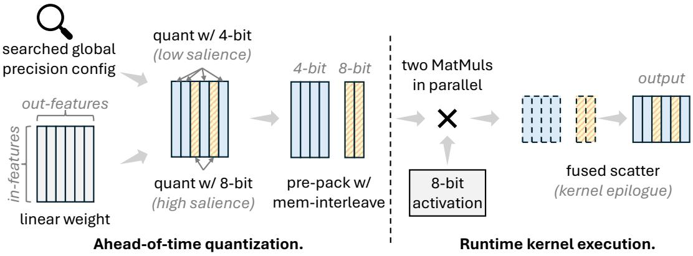
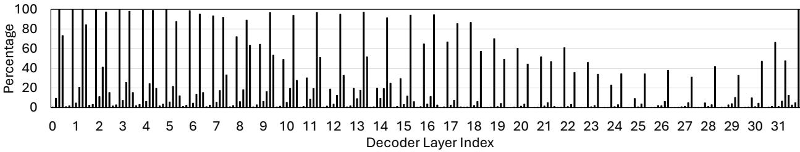
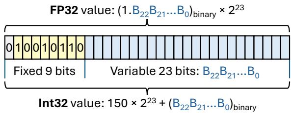
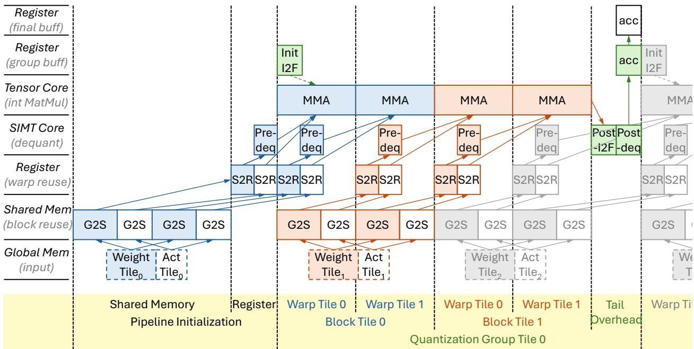
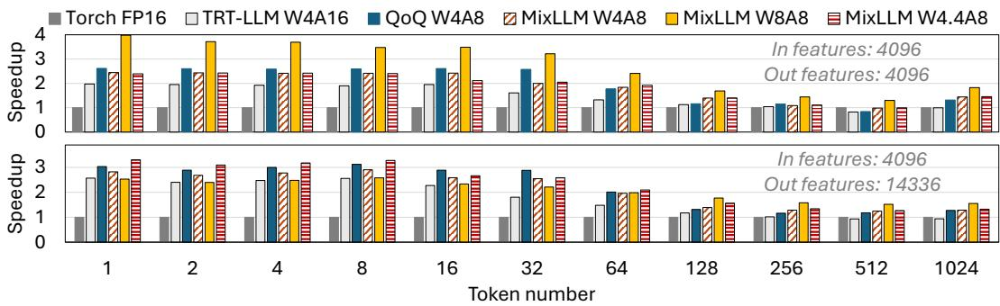

# MixLLM: LLM Quantization with Global Mixed-precision between Output-features and Highly-efficient System Design

Zhen Zheng∗, Xiaonan Song, Chuanjie Liu Microsoft

## Abstract

Quantization has become one of the most effective methodologies to compress LLMs into smaller size. However, the existing quantization solutions still show limitations of either non-negligible accuracy drop or system inefficiency. In this paper, we make a comprehensive analysis of the general quantization principles on their effect to the triangle of accuracy, memory consumption and system efficiency. We propose MixLLM that explores the new optimization space of mixed-precision quantization between output feature based on the insight that different output feature matter differently in the model. MixLLM identifies the output feature with high salience in the global view rather than within each single layer, effectively assigning the larger bit-width to output features that need it most to achieve good accuracy with low memory consumption. We present the sweet spot of quantization configuration of algorithmsystem co-design that leads to high accuracy and system efficiency. To address the system challenge, we design the two-step dequantization to make use of the int8 Tensor Core easily and fast data type conversion to reduce dequantization overhead significantly, and present the software pipeline to overlap the memory access, dequantization and the MatMul to the best. Extensive experiments show that with only 10% more bits, the PPL increasement can be reduced from about 0.5 in SOTA to within 0.2 for Llama 3.1 70B, while on average MMLU-Pro improves by 0.93 over the SOTA of three popular models. In addition to its superior accuracy, MixLLM also achieves state-of-the-art system efficiency.

## 1 Introduction

Large language models (LLMs) [7, 32] have shown remarkable performance on various tasks. But their large memory consumption and massive computation cost have become an obstacle for the efficient deployment [43, 44]. Quantization has become one of the most sufficient solution to compress LLMs into smaller size [14, 26, 45, 46], by representing the weight or activation with smaller bit-width. However, the existing quantization solutions still show limitations of either non-negligible accuracy drop or system inefficiency.

There is a triangle of characteristics for efficient LLM quantization: accuracy, memory consumption of parameters, and system efficiency of execution, which we call effectiveness triangle of quantization. The existing quantization solutions have different focus and trade-off in the triangle:

• The weight-only methodologies target to solve the memory consumption problem, and can speedup the small-batched decoding execution that faces the memory-wall problem [43, 21]. But their accuracy drop of 4-bit quantization can be a challenge for the production workloads sensitive to accuracy, which becomes more serious in the new models with higher information density like Llama 3 [32], as illustrated in recent studies [42, 22]. Besides, the weight-only method can lead to system performance drop for large-batched workloads (e.g., the SOTA W4A16 kernel only achieves 83% performance of its float16 counterpart at batch size 512 with hidden size 4096, shown in Fig.5).

• The weight-activation quantization represents the activation with low-bit values along with the weights, potentially lead to higher system efficiency. But it can lead to larger accuracy drop than the weight-only method as the activation is usually harder to quantize [50, 3, 27]. Besides, it introduces more dequantization overhead for the activation that can hurt the system efficiency. The transformation optimizations in some works can make the system efficiency even worse.

  
Figure 1: Illustration of the quantization with mixed-precision between output features and kernel execution.

• Outlier separation and mixed-precision technologies emerge to improve the accuracy of low-bit quantization by either excluding the unstructured high-salience weights from quantization [11, 21] or assigning larger bit-width for the quantization of structured high-salience weights [50]. The former shows system efficiency problem due to the low efficiency of half precision (i.e., float16/bfloat16) sparse tensor processing. The state-of-the-art mixed-precision solution [50] aims for low-bit quantization but shows non-negligible accuracy drop, even inferior to the 4-bit weight-only quantization.

Contributions. In this paper, we provide an extensive analysis of the general quantization principles. To address the limitations of the previous works and cover the three characteristics in the effectiveness triangle, we propose MixLLM, which makes the following contributions:

▶ High accuracy with low memory consumption: mixed-precision between output features on the weight, with global salience identification. Given that different neurons matter differently to the model’s output, we use different bit-width for different output features (i.e., output channels) for the weight quantization, 8-bit for output features with high salience and 4-bit for others (Fig.1). Rather than using a uniformed number of outliers within each layer according to the estimated salience w.r.t. each single layer [50], MixLLM identifies the salience of different output features globally according to the estimated loss to the model’s output. This is because different layers can have different importance to the model. Besides, the mixed-precision between output features makes the system design easier than between input features because the calculation of different output features are disjoint sub-problems.

▶ High accuracy with good system efficiency: the co-designed quantization configuration and GPU kernel optimization. We observe the sweet spot of several quantization decisions to achieve both good accuracy and system efficiency. MixLLM uses 8-bit for activation quantization as it can retain a good accuracy. Besides, MatMul execution tends to be bound more on the larger weight tensor rather than the smaller activation tensor, which weakens the need to push the activation smaller (refer to Sec.3.1). MixLLM uses symmetric quantization for 8-bit and asymmetric for 4-bit for good accuracy, both in groupwise manner. Such configuration makes it challenging to achieve good system efficiency. We design the two-step dequantization to enable using fast int8 Tensor Core for such configuration, along with the fast integer-float conversion to decrease the dequantization overhead. We also present the software pipeline design of the quantized linear kernel on the modern GPU1.

Extensive evaluation shows that, with only 10% of 8-bits (i.e., W4.4A8), MixLLM outperforms all the existing 4-bit quantization algorithms while achieving the state-of-the-art system efficiency.

## 2 Background, Related Work, and Discussion

## 2.1 Background of Quantization

The quantizaiton maps the tensor X into the target range with smaller bit-width representation through affine transformation: $X _ { q } = c l a m p ( \lfloor \frac { X } { s } \rceil + z , r a n g e )$ , where s is the scale and z is the zero point. The value can be recovered (i.e., dequantization) through: $X ^ { \prime } = ( X _ { q } - z ) \times s . \ X ^ { \prime }$ is pushed to the discrete chunks rather than recovered to the original value, thus has accuracy loss. The bit-width is essential for the accuracy of quantization as it determines the number of chunks for the quantized values $( 2 ^ { b i t \_ w i d t h } )$ . Take an example, enlarging the bit-width from 4 to 5 can double the number of chunks, so that the 5-bit RTN quantization can easily beat the 4-bit quantizations of advanced techniques (Tab.1).

The scale and zero point can be calculated from the whole channel/token vector or a small group within the channel/token, the former is called per-channel/token quantization and the latter is group-wise quantization. The group-wise scheme results in smaller accuracy loss due to the smaller chunk scale, but requires more complex GPU kernel design. The symmetric quantization uses 0 as the zero point value, which simplifies the computations $\ ( X _ { q } = \stackrel { \_ } { c l a m p } ( \lfloor \frac \dot { W } { s } \rceil , r a n g e )$ $X ^ { \prime } = X _ { q } \times s )$ and enables many works to design the per-channel/per-token quantized kernels by multiplying the scales at the epilogue of the whole MatMul (matrix multiplication) for dequantization [45, 40]. However, it leads to larger loss than the asymmetric one as the data distribution can be usually asymmetric, especially for smaller bit-widths like 4-bit.

## 2.2 Related Works and Discussion of General Quantization Principles

This paper mainly focuses on post-training quantization (PTQ).

Systems that affect the quantization requirement. The continuous batching technology [47] enables to batch the decoding tasks from different requests together to enlarge the batch dimension of MatMul during LLM inference. The chunked-prefill method [19, 2, 51] advances the continuous batching by merging the prefill and decoding tasks into the same batch, further enlarging the MatMul shapes. These technologies pushes many LLM jobs to become compute-bound and motivate the demand to reduce computation.

Weight-only quantization and its limitation. There emerges a wide range of technologies to improve the accuracy of weight-only quantization. GPTQ [14] advances OBC [13] on OBS-based [18] weight compensation with blocked updating and reordering. AWQ [26] proposes to scale the weight according to the characteristic of activation. OminiQuant [37]) proposes the learnable scaling and weight clipping factors. SpQR [11], SqueezeLLM [21] and OWQ [25] separate the outliers from the quantiation and with half precision. QuiP [8] aims to achieve extreme low-bit quantization with incoherence processing. ZeroQuant(4+2) [42] aims to improve accuracy with medium-sized FP6 quantization.

The weight-only quantization does not reduce the computation but introduces the extra dequantization operations. The low-bit weight will be dequantized to float16 to execute the MatMul in float16 datatype. The current weight-only quantization faces two challenges: 1) From the accuracy aspect, there is still an accuracy gap between the 4-bit quantization and the float16 model, especially for many real business scenarios sensitive to the small accuracy drop, as discussed in the recent works [42, 44]. 2) It can lead to system efficiency drop on busy servers as the recent LLM inference serving systems will usually batch the processing of different requests together on the server and form large MatMuls. The large MatMuls are compute-bound and will suffer from the dequantization overhead [27].

Weight-activation quantization and the challenges. The weight-activation quantization helps to make use of the low-bit computing unit. LLM.int8() [10] observes the activation outlier problem and separates outliers from quantization with half precision. ZeroQuant [46] proposes the per-token activation quantization and group-wise weight quantization. SmoothQuant [45] addresses the activation outlier problem through smoothing, and AffineQuant [29] proposes the general affine transformation for quantization. RPTQ [48] reorders the channels to cluster similar scaled values together. SpinQuant [28] and QuaRot [3] leverages matrix rotation properties to alleviate the outlier phenomenon. Atom [50] uses the mixed-precision between input features to improve accuracy of 4-bit activation quantization. QoQ [27] is a holistic quantization solution with progressive group quantization, attention smoothing, rotation, and channel reordering.

Even though the weight-activation quantization has the advantage of reduced MatMul computation (i.e., MatMul in smaller bit-width to make use of the smaller bit-width computing unit with higher computation throughput2), it faces the challenge of accuracy drop caused by the activation quantization, especially that the activation is usually harder to quantize than the weight. The SOTA low-bit weight-activation solutions [3, 28, 27] still have a gap to the 4-bit weight only quantization.

Beside the accuracy drop, the activation quantization will introduce more dequantization overhead than the weight-only one, which makes it challenging to design efficient GPU kernels. When enabling the asymmetric quantization, the result of $\left( X _ { q } - z \right)$ may exceed the range of the bit-width of $X _ { q } ,$ making it hard to use the corresponding Tensor Core computation. Systems like Atom [50] thus avoid using the asymmetric quantization, with the cost of larger accuracy drop. The group-wise quantization requires fine-grained integer-to-float (I2F) conversion to apply per-group scales. However, the I2F instruction is more expensive than the common computation instructions on the GPU [1] and can lead to large system performance drop (> 10% drop in our practice). Besides, the throughput of Tensor Core is much higher than that of SIMT Cores, 624 TOPS of int8 Tensor Core vs. 19.5 TFLOPS/TOPS of FP32/INT32 SIMT Cores. There still lacks a well designed software pipeline to overlap the Tensor Core computation and SIMT Core based dequantization in the existing works while achieving a high accuracy.

In general, the existing solutions focus on partial of the effectiveness triangle, but cannot cover all of them well. MixLLM is orthogonal to the above works by exploring the mixed-precision between output features with global salience identification, and the co-designed quantization decision and GPU kernels.

## 3 Methodology

## 3.1 Quantization Design and Decision in MixLLM

To cover the three aspects of the effectiveness triangle simultaneously, we make the following design and decision of weight and activation quantization according to the analysis in Sec.2.2.

## 3.1.1 Mixed-precision between output features of weight, with global salience identification.

It is known that different elements of the weight show different salience to the network’s loss when being quantized [21, 11]. The outlier separation method can improve the accuracy by using float16 to store the high-salience elements, but can suffer from the inefficient sparse MatMul. We observe that the elements with high salience tend to show distribution along the output channels for most of the linear layers in many LLMs. Based on this observation, we can assign larger bit-width to the output channels of high salience, and smaller bit-with to the others, forming structured mixed-precision quantization. Through the experiments, we get the same conclusion with the existing works [21, 11] that there is only a small set of elements with high salience contributing significantly to the model’s accuracy drop. Thus we only need to assign the large bit-width to a small portion of the output channels to achieve good accuracy and retain a small memory consumption at the same time.

The structured mixed-precision between different output channels can be friendly to the system efficiency and kernel development, due to the nature that different output features are disjoint in the MatMul and the computation of them are different sub-problems. Fig.1 shows how the linear layer computes with the mixedprecision between output features. It divides the linear into independent sub-problems, and finally gathers the output of the sub-problems together to form the final result. This optimization space is orthogonal to the existing quantization optimizations, e.g., GPTQ [14], and can be applied together with them.

One critical problem is how to identify the high-salience output channels in the model. The fixed threshold [11] or the fixed number/ratio [50, 25] of high salience elements computed by the local loss of layers can be sub-optimal to the end-to-end model, as different layers can show different importance to the model’s final output [16, 30, 12]. A high salience channel w.r.t. a layer may not be a high salience channel of the end-to-end model. In MixLLM, we compute the high salience channels globally according to their impact to the model’s final loss (Sec.3.2). As a result, different layers will have different number of high salience channels. Fig.2 shows the distribution of the top 10% high-salient out features in Llama 3.1 8B, showing huge difference in different linear layers.

  
Figure 2: The percentage of high-salient out features within each linear layer of Llama 3.1 8B model according to each feature’s contribution to the final loss after quantizing to 4-bit, with 10% high-salient features globally. Each decoder layer contains q proj, k proj, v proj, o proj, gate proj, up proj, and down proj in order.

Note that this design is different from the mixed-precision in Atom [50] from two aspects. 1) MixLLM first addresses the problem of identifying the high-salience channels globally rather than locally. 2) MixLLM applies the mixed-precision between output features rather than input features, which is more system performant and algorithm flexible3 as the output features are disjoint naturally.

## 3.1.2 Quantization decision with algorithm-system consideration: 8-bit symmetric activation and 4-bit asymmetric weight quantization in group-wise manner.

MixLLM makes the same decision with QoQ [27] on activation quantization to use 8-bit, as the 4-bit activation can lead to a large accuracy drop but does not lead to significant system efficiency improvement as MatMul execution tends to be bound more on the larger weight tensor rather than the smaller activation tensor. It can be partially indicated from the compute intensity of the linear layer. Given token number M and in/out features $K / N$ , the compute intensity $\begin{array} { r } { I = \frac { 2 M N K } { M K B _ { a c t } + K N B w e i q h t } . ~ B _ { a c t } } \end{array}$ and $B _ { w e i g h t }$ are the bytes per element of activation and weight. Given $M = 5 1 2$ and $N = K = 4 0 \breve { 9 } 6$ , reducing $B _ { w e i g h t }$ from 8 to 4 will results in an 80% increasement of I, while reducing $B _ { a c t }$ from 8 to 4 will only achieve 5.88% increasement.

Instead of using per-token activation quantization, MixLLM uses group-wise RTN method. On the one hand, Tab.1 shows that simple group-wise RTN quantization performs better than token-wise smoothing method. On the other hand, the weight is already group-wise in MixLLM, and the group-wise activation does not lead to significant more dequantization overhead in the system. We observe symmetric quantization is enough for the 8-bit activation (refer to MixLLM W8A8 in Tab.1), while asymmetric can be essential for the 4-bit weight. The group-wise method with asymmetric can lead to a difficulty for the kernel to make use int8 Tensor Core, for which QoQ [27] introduces the two-step quantization method. Instead, we design a two-step dequantization method with the property of the mix of symmetric and asymmetric (Sec.3.3).

## 3.2 Global Precision Search Algorithm

As discussed in Sec.3.1, MixLLM determines the precision of all output features in all layers globally rather than locally. It identifies the salience of these features with respect to the final loss of the model, and assigns larger bit-width to the features leading to larger loss.

Specifically, it calculates the salience S of a channel c as:

$$
S _ { c } = | l ( c _ { q } ) - l ( c _ { 0 } ) |\tag{1}
$$

which is the distance of the model’s loss between quantizing and not quantizing this single channel. In Eq.1, l() is the loss function of the model w.r.t. a single channel, $c _ { q }$ is the quantized weight of the channel and $c _ { 0 }$ is the original weight. Note that it regards other neurons except c as constant in $l ( )$

We use the Taylor Expansion method to estimate the loss function l(c) (similar with the existing quantization works, ignoring the high-order items):

$$
l ( c ) \approx l ( c _ { 0 } ) + g ^ { T } ( c - c _ { 0 } ) + \frac { 1 } { 2 } ( c - c _ { 0 } ) ^ { T } H ( c - c _ { 0 } )\tag{2}
$$

where $\begin{array} { r } { \boldsymbol { g } = \mathbb { E } [ \frac { \partial } { \partial \boldsymbol { c } } l ( \boldsymbol { c } ) ] } \end{array}$ is the loss’s gradient w.r.t. the channel, and $\begin{array} { r } { H = \mathbb { E } [ \frac { \partial ^ { 2 } } { \partial c ^ { 2 } } l ( c ) ] } \end{array}$ is the second-order gradient (i.e., Hessian matrix) w.r.t. the channel.

It is infeasible to calculate the Hessian matrix as it is too costly. We approximate the Hessian H with the (empirical) Fisher information matrix $F$ on the calibration dataset $D \colon$

$$
H \approx F = \frac { 1 } { | D | } \sum _ { d \in D } g _ { d } g _ { d } ^ { T }\tag{3}
$$

Note that F is w.r.t. a channel, differing from the diagonal Fisher information matrix in the recent works that ignores any cross-neuron interactions [23, 21].

Based on this approximation, the second order loss factor ${ \scriptstyle { \frac { 1 } { 2 } } } ( c - c _ { 0 } ) ^ { T } ( g _ { d } g _ { d } ^ { T } ) ( c - c _ { 0 } )$ can be further simplified to $\begin{array} { r } { \frac { 1 } { 2 } ( g _ { d } ^ { T } ( c - c _ { 0 } ) ) ^ { 2 } } \end{array}$ , simplifying the expensive chained matrix multiplication into a single vector product. Finally, the salience can be calculated by:

$$
S _ { c } = \frac { 1 } { | D | } \sum _ { d \in D } | g _ { d } ^ { T } ( c _ { q } - c _ { 0 } ) + \frac { 1 } { 2 } ( g _ { d } ^ { T } ( c _ { q } - c _ { 0 } ) ) ^ { 2 } |\tag{4}
$$

We do not ignore the first order information during the calculation, differing from OBD [24] and many recent quantization works [14, 11, 21]. This is because the first order factor can be more significant in the estimation in $\operatorname { E q . 4 } ,$ as the estimated second order factor is the square of the first order factor divided by two for each sample. Considering that g can be very small for the well pretrained models and the delta of the quantized weight is usually not large, the first order factor can be larger than the second order one. Besides, what we require is the loss itself rather than the arguments of the loss function, and thus we do not need to ignore the first order factor to simplify the arguments calculation.

Algorithm 1 Global precision search procedure.   
Input: Linear layer number $L ,$ weight and gradient of all linear layers $( W _ { i } \in \mathbb { R } ^ { O , I } , G _ { i } \in \mathbb { R } ^ { O , I }$ for layer i).   
Output: Global channel index with large and small bit width (largebit channels, smallbit channels).   
1: $S _ { g l o b a l }  [ ]$   
2: for $i = 1 , 2 , . . . , L$ do   
3: W deltai ← quantize(Wi) - Wi   
4: $S _ { 1 s t }  \mathrm { s u m } ( G _ { i } \odot W _ { i } ^ { d e l t a }$ , dim=1) ▷ Per-channel dot product between $G _ { i }$ and $W _ { i } ^ { d e l t a }$   
5: $S _ { 2 n d } \gets 0 . 5 * ( S _ { 1 s t } ) ^ { 2 }$   
6: $S \gets | S _ { 1 s t } + S _ { 2 n d } |$ ▷ $S \in \mathbb { R } ^ { O }$ , the salience of the O channels   
7: for channe $\iota _ { - } i d = 1 , 2 , . . , O$ do ▷ Log the salience of each output channel of this layer   
8: Sglobal.append(tuple(i, channel id, S[channel id]))   
9: sort $( S _ { g l o b a l } )$ ▷ Sort according to the salience, descending   
10: largebit channels, smallbit channels $ S _ { g l o b a l } [ : N _ { l a r g e b i t } ] , S _ { g l o b a l } [ N _ { l a r g e b i t } : ]$

Algo.1 illustrates the procedure of the global precision search. It calculates the salience of all the output channels of all linear layers and sort them in descending order globally. Given the global threshold $N _ { l a r g e b i t }$ as the number of large-bit precision channels, the first $N _ { l a r g e b i t }$ channels are intended to be quantized with 8-bit, and the other channels will be quantized with smaller bit-width (i.e., 4-bit in this paper). Any quantization methodologies (e.g., GPTQ, clip search) can be applied independently to these two disjoint parts of channels. Note that we calculate the salience of the channels in one pass rather than iterative identifying the highsalience parts in a smaller step, as we observe the single-pass method show similar results with the iterative method and saves a lot of computation overhead than the latter.

  
Figure 3: The float and integer value of binary (010010110xx...x), each within a consecutive range.

## 3.3 Efficient Quantization Computation System

Two-step dequantization to make use of int8 Tensor Core. As for the W4A8 computation, the dequantized weight and activations are $( W _ { q } - z ) s _ { w }$ and $A _ { q } s _ { a }$ , where $W _ { q }$ and z are uint4 datatype, $A _ { q }$ is int8 datatype, and $s _ { w }$ and $s _ { a }$ are float16 datatype. Directly dequantizing the tensors into float16 datatype before the MatMul computation will prevent us using the fast 8-bit Tensor Core on the GPU. Instead, MixLLM uses a two step dequantization within each group. Specifically, MixLLM first partially dequantizes the weight into $\left( W _ { q } - z \right)$ , and then multiply it by $A _ { q }$ with the 8-bit Tensor Core. Finally, it multiplies this MatMul result by the two scales within each group. Note that we use int8 datatype for $\left( W _ { q } - z \right)$ so that there is no overflow problem.

Fast Int to Float conversion with partially fusing into Tensor Core instruction. In the above two-step dequantization computation, the step 2 is the MatMul between the integer tensor $A _ { q } ( W _ { q } - z )$ and the float tensor $s _ { a } s _ { w }$ . It requires the integer to float conversion (I2F) before the multiply operation. The I2F instruction is expensive on the modern GPUs. Instead, we make use of the range-dependent fast I2F transformation to convert the I2F instruction into two add/sub instructions4. Specifically, it is based on the fact that there exists a certain range where an integer value’s binary is the same as a corresponding float binary. As shown in Fig.3, the binary with the first 9 bits as 010010110 represents a series of consecutive int32 and float32 values, respectively. We can add a bias to an integer value to make it within this consecutive range, and then subtract a corresponding bias in float (same underling binary) to restore its value in float type. We take the middle value in this range as the bias to maximize the data range that can be safely converted, whose hexadecimal number is 0x4b400000 (i.e., in the remaining 23 bits, the first bit is 1 and the other bits are 0). This allows to convert a consecutive range of $2 ^ { 2 3 }$ int32 numbers to float32. The range of dot product of k int8 elements is $2 ^ { 1 6 } k$ , thus the above fast I2F conversion allows the k value up to 128. We use quantization group size as 128 and can use the fast I2F safely:

1 // b i a s i n t = a s i n t ( 0 x 4 b 4 0 0 0 0 0 ) , b i a s f p = a s f l o a t ( 0 x 4 b 4 0 0 0 0 0 ) ;   
2 i n t tmp = s r c i n t + b i a s i n t ;   
3 i n t d s t f l o a t = ∗ ( ( f l o a t ∗ )&tmp ) − b i a s f p ;

We further fuse the integer subtraction into the Tensor Core mma (Matrix Multiply-Accumulate) instruction. The mma instruction computes $D = A B + D$ during the MatMul computation. We initialize the accumulator D as the bias int before MatMul computation of each quantization group, and will only need to subtract the bias fp after the MatMul. In another word, the expensive I2F is converted into a single float subtraction. The above I2F simplification brings more than 20 TOPS performance improvement for the 512/4096/4096 (M/N/K) quantized MatMul computation on an A100 GPU.

  
Figure 4: The GPU kernel software pipeline of group-wise W4A8/W8A8 quantized MatMul. It assumes perfect overlapping. G2S: load global to shared memory; S2R: load shared memory to register; MMA: matrix multiply-accumulation; I2F: integer to float conversion; deq: dequantize; acc: accumulate.

End-to-end software pipeline of the quantized linear kernel on the GPU. Fig.4 shows the software pipeline of the quantized kernel. Beside the basic warp tile and block tile, we introduce the quantization group tile for the fast I2F and per-group scale multiplication. It uses two output buffers for the output accumulation at register level, one for the per-group accumulation, and the other for the global accumulation. This allows to apply the per-group scales on the group-level buffer. We initialize the group buffer with the bias int at the beginning of the group tile, and subtract bias fp at the end of the group tile. As for the two-step dequantization, the first step is within the warp tile where each input element will subtract the zero-point before feeding into MMA, the second step is at the end of the group tile by multiplying the scale. We use the vectorized intrinsic to perform four int8 subtract in a single instruction (vsub4) [27]. Besides, to improve the global memory loading efficiency, we prepack the memory layout of the weight tensor ahead-of-time to avoid the runtime permutation of the input elements. In general, this software pipeline can overlap the memory loading and computation, and the dequantization computation with SIMT Core and the MatMul computation with Tensor Core to the best, and minimizes the overhead of group-wise dequantization.

Parallel execution of sub-problems of different bit-width. As for the execution shown in Fig.1, MixLLM executes different sub-problems in parallel on the GPU with CUDA Graph. Finally, the MatMul execution of the two parts write to the same target tensor with different channel indices to generate the final output. We implement this function with the fused epilogue of MatMul to scatter the output to the corresponding indices, which is basically costless.

## 4 Evaluation

## 4.1 Setup

As for MixLLM evaluation in this paper, we use 0%, 10%, 20%, 50% and 100% percent of 8-bit based on the 4-bit quantization, respectively. Meanwhile, we use 8-bit for activation quantization. Both the weight and activation are group-wise quantized with group size 128. The 4-bit part is asymmetric quantized and the 8-bit part (including that in weight) is symmetric, which is a good trade-off between accuracy and system efficiency. Note that any other bit-width percentage configuration can be used for real scenarios to trade-off memory usage, system efficiency and accuracy in practice. We enable GPTQ in MixLLM for the all models. We also apply clip search for all the models except for the 32B, 70B and 72B models as the clip search is time consuming for large models.

Baselines and configurations. We compare MixLLM with the state-of-the-art (SOTA) quantization solutions of both weight-only and weight-activation methods. As for the weight only quantization, we compare MixLLM with the basic round-to-nearst (RTN) 4-bit and 5-bit quantization, and the productionlevel SOTA GPTQ [14] and AWQ[26]. As for the weight-activation quantization, we compare MixLLM with the most widely used SmoothQuant [45] and the recent SOTA QoQ [27] and QuaRot[3] (of both W4A4 and W4A8). The 8-bit tensors are all symmetric quantized in all baselines and MixLLM. We also compare the perplexity with SqueezeLLM[21], OminiQuant[37], AffineQuant[29], Atom[50] and SpinQuant[28] according to their reported numbers.

We make use of AutoGPTQ lib [5] (v0.7.1) to evaluate GPTQ, AutoAWQ lib [4] (v0.2.7) to evaluate AWQ, lmquant lib [33] (commit 9d62c5c) to evaluate SmoothQuant and QoQ, and the official repo to evaluat QuaRot. We enable the reorder trick for GPTQ evaluation, and use asymmetric and group size 128 for both GPTQ and AWQ. We follow the official configurations in lmquant to use 0.85/0.15 as the alpha/beta parameter for SmoothQuant, and 0.3/0.7 for QoQ. We use symmetric and per-channel/token quantization in QuaRot, following the configuration in its paper. We disable the KV quantization of QoQ and QuaRot in our experiments to make the comparison fair.

Models and Datasets. We evaluate MixLLM and the baselines on a variety of widely used LLMs of different sizes, ranging from 0.5B to 72B. The models include Llama 3.1 8B and 70B [32], Llama 3.2 1B, Qwen2.5 0.5B, 1.5B, 7B and 32B [17], and Mistral 7B v0.3 [20].

We use wikitext2 dataset [31] as the calibration set for GPTQ and MixLLM. We use the default pile dataset [34] as the calibration dataset for AWQ, SmoothQuant and QoQ, to enable their better performance. GPTQ, AWQ and MixLLM uses 128 samples with sequence length of 2048 for calibration. SmoothQuant and QoQ uses 64 samples with sequence length of 1024 for calibration (larger dataset results in OOM in our experiment).

Metrics. As for the algorithm accuracy, we compare the perplexity (ppl) between all the baselines on wikitext2 and C4 [35] dataset. Meanwhile, we compare a set of popular downstream tasks on Llama 3.1 8B, Qwen2.5 7B, and Mixtral 7B v0.3, including BBH [39], GPQA [36], MMLU-Pro [41], MuSR [38], ARC challenge [6], and HellaSwag [49]. We use lm-eval [15] for the downstream tasks evaluation, for which the task names are leaderboard bbh, leaderboard gpqa, leaderboard mmlu pro, leaderboard musr, arc challenge, and hellaswag. We use the average number for each of the tasks.

We conduct the system experiments on NVIDIA A100 (80G) GPUs with CUDA 12.1. We use PyTorch 2.4.1 and transformers 4.45.2.

## 4.2 Perplexity Evaluation

Tab.1 shows the perplexity on Wikitext2 and C4 dataset for the commonly used open source LLMs, of different baselines. It shows that:

• Using 4.4 bits of weights with MixLLM can achieve the similar accuracy with 5 bits RTN weight-only quantization, even with 8-bit activation quantization enabled in MixLLM. This is mainly because MixLLM assigns the high-salience output channels with larger bit-widths than the uniform 5-bit solution.

• As for the weight-only quantization baselines, MixLLM W4.4A8 outperforms the production SOTA solutions GPTQ and AWQ, with only 10% more bit-width, and even with 8-bit activation quantization enabled in MixLLM. Meanwhile, the RTN W5A16 method also outperforms GPTQ and AWQ, which means a slightly larger bit-width can defeat the well tuned smaller bit-width easily. MixLLM W4.4A8 benefits from the larger bits on the top 10% output features with high salience.

Table 1: Perplexity evaluation (↓) on wikitext2/c4 (gray for c4), sequence length 2048. NA means no support. Abn means the value is too large (> 105). For MixLLM, pn means n% 8-bit.
<table><tr><td rowspan="2" colspan="2">baselines</td><td colspan="3">Llama 3.1/3.2</td><td colspan="4">Qwen2.5</td><td rowspan="2">Mistral 7B v0.3</td></tr><tr><td>1B</td><td>8B</td><td>70B</td><td>0.5B</td><td>1.5B</td><td>7B</td><td>32B</td></tr><tr><td colspan="2">foat16</td><td>9.75/12.72</td><td>6.24/8.95</td><td>2.81/6.68</td><td>13.07/17.55</td><td>9.26/13.11</td><td>6.85/10.44 5.02/8.95</td><td></td><td>5.32/7.84</td></tr><tr><td rowspan="2">RTN</td><td>W4A16</td><td>11.72/15.56</td><td>6.82/9.72</td><td>3.55/7.43</td><td>15.54/20.55</td><td>10.35/14.35</td><td>7.23/10.88</td><td>5.27/9.14</td><td>5.51/8.04</td></tr><tr><td>W5A16</td><td>10.15/13.25</td><td>6.40/9.15</td><td>3.16/9.52</td><td>13.61/18.17</td><td>9.52/13.38</td><td>6.95/10.53 5.09/8.99</td><td></td><td>5.38/7.91</td></tr><tr><td rowspan="2">GPTQ AWQ</td><td>W4A16</td><td>10.38/14.15</td><td>6.52/9.55</td><td> Abn/Abn</td><td>14.01/19.04</td><td>9.64/13.75</td><td>7.09/10.75 5.20/9.08</td><td></td><td>5.49/8.19</td></tr><tr><td>W4A16</td><td>10.81/14.12</td><td>6.65/9.48</td><td>3.28/6.96</td><td>15.04/19.75</td><td>9.95/13.85</td><td>7.10/10.71</td><td>5.23/9.08</td><td>5.44/7.98</td></tr><tr><td rowspan="3">SmoothQuant QoQ</td><td>W8A8</td><td>9.89/12.91</td><td>6.34/9.08</td><td>2.92/6.77</td><td></td><td></td><td>13.84/18.40 9.63/13.49 7.17/10.85 5.12/9.04</td><td></td><td>5.35/7.88</td></tr><tr><td>W4A8</td><td>Abn/Abn</td><td>6.64/9.49</td><td>3.49/7.07</td><td>Abn/Abn</td><td>Abn/Abn</td><td>7.39/11.06 5.55/9.31</td><td></td><td>5.44/7.98</td></tr><tr><td>W4A4</td><td>Abn/Abn</td><td>8.34/11.95</td><td>6.16/9.91</td><td> NA/NA</td><td> Abn/Abn</td><td>8.15/12.05 6.26/9.98</td><td></td><td>5.83/8.50</td></tr><tr><td rowspan="5">MixLLM</td><td>W4A8</td><td>Abn/Abn</td><td>6.60/9.67</td><td>3.43/7.10</td><td>NA/NA</td><td>Abn/Abn</td><td>7.03/10.68 5.23/9.10</td><td></td><td>5.40/7.99</td></tr><tr><td>W4A8 (p0)</td><td>10.36/14.09</td><td>6.54/9.62</td><td>3.30/7.24</td><td>14.43/19.61</td><td>9.66/13.79</td><td>7.03/10.75 5.21/9.08</td><td></td><td>5.42/8.02</td></tr><tr><td>W4.4A8 (p10)</td><td>10.05/13.51</td><td>6.42/9.33</td><td>3.02/6.83</td><td>13.42/18.13</td><td>9.44/13.43</td><td>6.92/10.57 5.12/9.01</td><td></td><td>5.36/7.93</td></tr><tr><td>W4.8A8 (p20) W6A8 (p50)</td><td>9.95/13.25 9.85/12.98</td><td>6.37/9.22 6.30/9.09</td><td>2.97/6.79 2.86/6.73</td><td>13.32/17.99 13.21/17.78</td><td>9.40/13.35 9.33/13.25</td><td>6.90/10.53 5.09/9.00 6.88/10.49 5.05/8.98</td><td></td><td>5.35/7.90</td></tr><tr><td>W8A8 (p100)</td><td>9.76/12.75</td><td>6.25/8.97</td><td>2.81/6.68</td><td></td><td>13.12/17.60 9.28/13.14 6.86/10.45 5.02/8.96</td><td></td><td></td><td>5.33/7.87 5.32/7.84</td></tr></table>

Table 2: PPL (wikitext2) comparison with the reported numbers in the related works.
<table><tr><td>LLaMA 2</td><td>FP16</td><td>SqueezeLLM W4A16 0.45%</td><td>OminiQuant W4A16/W4A4</td><td>AfineQuant W4A16/W4A4</td><td>Atom W4A4 128 outliers</td><td>SpinQuant W4A8</td><td>MixLLM W4.4A8</td></tr><tr><td>7B</td><td>5.47</td><td>5.57</td><td>5.58/14.26</td><td>5.58/12.69</td><td>6.03</td><td>5.7</td><td>5.55</td></tr><tr><td>13B</td><td>4.88</td><td>4.96</td><td>4.95/12.30</td><td>4.95/11.45</td><td>5.27</td><td>5.0</td><td>4.93</td></tr></table>

• As for the weight-activation quantization baselines, MixLLM W4.4A8 shows a comparable accuracy with SmoothQuant with much smaller bit-width (60% of that in SmoothQuant). MixLLM W4.4A8 shows better accuracy than QoQ and QuaRot with only 10% larger bit-width. It shows MixLLM achieves a good balance of memory consumption and accuracy.

• Note that MixLLM W8A8 quantization shows nearly lossless performance compared to the float16 baseline. This is part of the motivation that MixLLM uses group-wise quantization for the activation.

Comparison with More Related Works We compare MixLLM with more recent quantization works according to the reported numbers in their papers (Tab.2), showing that MixLLM achieves superior accuracy to a broad range of related works with similar memory consumption.

## 4.3 System Performance

We have evaluated MixLLM for the single linear layer of token number ranging from 1 to 1024 with in features 4096 and out features 4096/14336, and compared it with the SOTA W4A16 (TRT-LLM) and QoQ [27], shown in Fig.5. It also shows MixLLM kernel performance of different percent of 8-bits (W4A8 0% 8-bit, W4.4A8 10% 8-bit, and W8A8 100% 8-bit). It shows that:

• MixLLM outperforms the float16 counterpart for all token numbers, achieving 1.90×, 2.75×, and 1.88× averaged speedup with MixLLM W4A8, W8A8, and W4.8A8 respectively.

• MixLLM outperforms the SOTA W4A16 solution, achieving 1.26×, 1.78×, and 1.25× averaged speedup with MixLLM W4A8, W8A8, and W4.8A8 respectively.

• MixLLM achieves similar performance with QoQ with similar bit-width, achieving 0.99×, 1.39×, and 0.99× averaged speedup with MixLLM W4A8, W8A8, and W4.8A8 respectively. Note that MixLLM has better accuracy than QoQ (Tab.1, Tab.3).

  
Figure 5: The speedup of two types of single linear layers over torch float16 baseline on the A100 GPU.

Table 3: Downstream tasks evaluation (↑) on Llama-3.1-8B/Qwen2.5-7B/Mistral-7B-v0.3. The above is the average of the three models. BBH is 3 shot, MMLU pro is 5 shot, and others are zero shot.
<table><tr><td></td><td>BBH</td><td>GPQA</td><td>MMLU-Pro</td><td>MuSR</td><td>ARCc</td><td>HellaSwag</td></tr><tr><td>float16</td><td>48.62 46.52/54.09/45.25 31.08/33.11/28.39</td><td>30.86</td><td>35.52 32.91/43.86/29.80</td><td>41.07 37.99/44.51/40.72</td><td>52.24 53.41/51.02/52.30</td><td>79.43 78.92/78.94/80.43</td></tr><tr><td>GPTQ W4A16</td><td>47.08 46.28/51.97/43.00</td><td>30.98 30.81/34.59/27.53</td><td>33.66 31.20/41.02/28.75</td><td>41.83 39.06/44.64/41.78</td><td>51.37 53.24/48.98/51.88</td><td>78.46 77.85/78.10/79.44</td></tr><tr><td>AWQ W4A16</td><td>47.62 45.59/52.71/44.57</td><td>30.86 29.76/33.17/29.65</td><td>34.31 31.57/42.78/28.59</td><td>40.36 38.27/42.37/40.44</td><td>51.17 52.39/50.60/50.51</td><td>78.77 78.29/78.35/79.68</td></tr><tr><td>SmoothQuant W8A8</td><td>47.82 46.37/52.57/44.52</td><td>30.90 31.40/33.94/27.36</td><td>35.04 32.61/42.98/29.52</td><td>42.06 39.05/46.39/40.73</td><td>51.74 53.33/50.00/51.88</td><td>79.20 78.88/78.48/80.24</td></tr><tr><td>QoQ W4A8</td><td>45.78 40.98/51.23/45.14 28.99/32.50/28.56 28.16/41.72/28.63 37.60/41.59/40.57</td><td>30.02</td><td>32.84</td><td>39.92</td><td>50.54 51.28/49.15/51.19 76.90/77.52/79.89</td><td>78.10</td></tr><tr><td>Quarot W4A4</td><td>41.10 36.96/45.42/40.9225.41/28.94/28.2322.99/34.40/25.42 37.92/40.68/39.7743.00/46.33/48.6372.87/73.54/78.14</td><td>27.53</td><td>27.60</td><td>39.46</td><td>45.99</td><td>74.85</td></tr><tr><td>Quarot W4A8</td><td>46.95 44.95/52.98/42.92</td><td>30.28 30.96/30.71/29.18</td><td>33.60 29.95/42.45/28.41</td><td>41.65 39.05/45.58/40.32</td><td>51.39</td><td>78.55 50.00/52.30/51.88 77.83/77.84/79.98</td></tr><tr><td>MixLLMW4A8</td><td>46.92 43.44/44.75/52.59</td><td>29.90 29.58/28.26/31.87</td><td>33.75 30.18/29.59/41.49 38.81/43.11/43.19</td><td>41.70</td><td>51.82 51.71/51.88/51.88</td><td>78.61 77.94/79.71/78.17</td></tr><tr><td>MixLLM W4.4A8</td><td>48.17 46.27/52.58/45.66</td><td>30.09 29.17/31.75/29.36</td><td>34.53 31.08/43.26/29.26</td><td>41.74 39.32/44.79/41.11</td><td>52.70 53.67/51.96/52.47</td><td>79.00 78.20/78.58/80.21</td></tr><tr><td>MixLLM W8A8</td><td>48.84 46.84/54.35/45.34</td><td>30.93 30.51/33.21/29.07</td><td>35.54 33.00/43.80/29.83</td><td>40.94 37.32/44.91/40.59</td><td>52.10 53.24/50.94/52.13</td><td>79.42 78.98/78.88/80.40</td></tr></table>

## 4.4 Downstream Tasks Evaluation

Tab.3 shows the accuracy of the downstream tasks on three popular LLMs. The result shows that:

• MixLLM W4.4A8 outperforms all the 4-bit weight quantizations, with only 10% more weight consumption. For example, for the MMLU-Pro task, the average metric of MixLLM W4.4A8 is improved by 1.69, 6.93, and 0.93 over QoQ, QuaRot W4A4, and QuaRot W4A8, respectively.

• MixLLM W8A8 is nearly lossless, showing higher accuracy than SmoothQuant. This comes from the group-wise quantized activation of MixLLM.

## 4.5 Detailed Analysis

## 4.5.1 Ablation Study

Fig.6 shows the perplexity of Llama 3.1 8B model by adding different optimizations gradually. With the basic RTN quantization, using 8-bit for activation, and asymmetric and group-wised weight quantization contribute significantly to the accuracy improvement. This demonstrates the effectiveness of the decisions made in Sec.3.1.2. Based on these decisions, the 10% of 8-bit output features improves the accuracy to a high level, for which using blocked Fisher and including the first-order Taylor factor also contributes to the accuracy. Finally, applying GPTQ and clipping can further improve the accuracy.

<table><tr><td rowspan="6">prreesseieeg</td><td rowspan="5">W4A4 RTN per-channel/token sym + activation 8-bit</td><td>744.414</td></tr><tr><td></td></tr><tr><td></td></tr><tr><td>9.867</td></tr><tr><td>8.551</td></tr><tr><td>+ weight asym + weight g128 6.937</td><td></td></tr><tr><td>Ceqolg paxiu</td><td>+ activation g128</td></tr><tr><td>+ 10% 8-bit,diagnal Fisher,no 1st order</td><td>6.830</td></tr><tr><td>+ blocked Fisher and 1st order</td><td>6.496</td></tr><tr><td></td><td>6.489</td></tr><tr><td>+ GPTQ w/o reorder + group-reorder of GPTQ</td><td></td></tr><tr><td rowspan="3">suoppt</td><td></td></tr><tr><td>6.424</td></tr><tr><td></td></tr><tr><td rowspan="2">+ clip</td><td>6.422</td></tr><tr><td>6.420</td></tr></table>

Figure 6: The perplexity (wikitext2) of Llama 3.1 8B model with different configurations.

Table 4: The average percentage of 8-bit out features in the seven classes of linear layers in Llama 3.1 8B, with 10% global 8-bit out features in MixLLM.
<table><tr><td>layer</td><td>q-proj</td><td>k-proj</td><td>v-proj</td><td>o-proj</td><td>： gate-proj</td><td>up-proj</td><td>jdown-proj</td></tr><tr><td>avg 8-bit percent (%)</td><td>3.93</td><td>12.36</td><td>71.22</td><td>18.70</td><td>0.73</td><td>1.46</td><td>53.82</td></tr></table>

## 4.5.2 High Precision Distribution

Fig.2 shows the percentage of 8-bit out features in each of the linear layers of Llama 3.1 8B, with 10% global 8-bit out features searched by MixLLM (i.e., W4.4A8). It shows that high-salient (i.e., 8-bit) features are distributed very differently in different linear layers. Specifically, the v proj and down proj layers show much higher percentage of high-salient features than other layers, for which Tab.4 shows the average percentage of different classes of linear layers.

## 4.5.3 One-pass vs. Progressive Search

As described in Sec.3.2, MixLLM searches the high-salience features within a single pass. We have tried the progressive procedure on Llama 3.1 8B and Mistral 7B models, which identifies smaller portions of the high-salience features iteratively. Results show that the accuracy is the same to the one-pass method to two decimal places. However, the progressive method shows much higher search time due to the repeated procedure. The one-pass method takes 7 minutes for each of the two models to search 10% high-salience features, while the progressive method that searches 2% high-salience iteratively takes 30 minutes to find top 10% features.

## 4.5.4 Overhead of Global Precision Search

Tab.5 shows the global precision search overhead described in Sec.3.2. As noted in Sec.4.1, the calibration dataset has 128 samples with sequence length of 2048. We use a single A100 GPU for the 1.5B, 7B and 8B models, and 4 A100 GPUs for the 70B models to perform the search. We make use of device map in huggingface for multi-GPU execution, which is sequential execution of layers on different devices. The 7B/8B models require about 7 minutes and the 70B models require less than 60 minutes to complete the search.

Table 5: The overhead of global precision search in MixLLM.
<table><tr><td rowspan="2">Models</td><td colspan="2">Llama 3.1</td><td rowspan="2">Mistral 7B v0.3</td><td colspan="2">Qwen2.5</td></tr><tr><td>8B</td><td>70B</td><td>1.5B</td><td>7B</td></tr><tr><td>Time (min)</td><td>7</td><td>55</td><td>7</td><td>2</td><td>7</td></tr></table>

Considering that the quantization only needs to be performed once, the searching algorithm is practical for the real workloads.

## 5 Summary

We have presented MixLLM, achieving high accuracy with low memory consumption and high system efficiency with the rarely explored optimization space of mixed-precision quantization between output features. MixLLM identifies the salience of each output feature according to the loss distance estimation w.r.t. the global model loss rather than local layer loss. By assigning larger bit-width to the features need it most, MixLLM achieves the superior accuracy to SOTA with low memory consumption. The sub-problems of different bit-widths are disjoint and can run in parallel efficiently on the GPU. We have identified the sweet spot of the quantizaiton configuration that is friendly to both accuracy and system efficiency. To address the challenge of system efficiency, we design the two-step dequantization to enable using int8 Tensor Core computation and the fast integer-float conversion to reduce the dequantization overhead. We have designed the end-to-end software pipeline to overlap the memory access, the dequantization computation with SIMT Core and the MatMul with Tensor Core. Experiment results show that MixLLM achieves superior accuracy to existing works and state-of-the-art system efficiency with low memory cost.

## References

[1] Hamdy Abdelkhalik, Yehia Arafa, Nandakishore Santhi, and Abdel-Hameed A. Badawy. Demystifying the nvidia ampere architecture through microbenchmarking and instruction-level analysis. In IEEE High Performance Extreme Computing Conference, HPEC 2022, Waltham, MA, USA, September 19- 23, 2022, pages 1–8. IEEE, 2022.

[2] Amey Agrawal, Nitin Kedia, Ashish Panwar, Jayashree Mohan, Nipun Kwatra, Bhargav S. Gulavani, Alexey Tumanov, and Ramachandran Ramjee. Taming throughput-latency tradeoff in LLM inference with sarathi-serve. In 18th USENIX Symposium on Operating Systems Design and Implementation, OSDI 2024, Santa Clara, CA, USA, July 10-12, 2024, pages 117–134. USENIX Association, 2024.

[3] Saleh Ashkboos, Amirkeivan Mohtashami, Maximilian L. Croci, Bo Li, Martin Jaggi, Dan Alistarh, Torsten Hoefler, and James Hensman. Quarot: Outlier-free 4-bit inference in rotated llms. CoRR, abs/2404.00456, 2024.

[4] AutoAWQ. Autoawq. https://github.com/casper-hansen/AutoAWQ, Cited Sep. 2024.

[5] AutoGPTQ. Autogptq. https://github.com/AutoGPTQ/AutoGPTQ, Cited Sep. 2024.

[6] Michael Boratko, Harshit Padigela, Divyendra Mikkilineni, Pritish Yuvraj, Rajarshi Das, Andrew Mc-Callum, Maria Chang, Achille Fokoue-Nkoutche, Pavan Kapanipathi, Nicholas Mattei, Ryan Musa, Kartik Talamadupula, and Michael Witbrock. A systematic classification of knowledge, reasoning, and context within the ARC dataset. In Eunsol Choi, Minjoon Seo, Danqi Chen, Robin Jia, and Jonathan Berant, editors, Proceedings of the Workshop on Machine Reading for Question Answering@ACL 2018, Melbourne, Australia, July 19, 2018, pages 60–70. Association for Computational Linguistics, 2018.

[7] S´ebastien Bubeck, Varun Chandrasekaran, Ronen Eldan, Johannes Gehrke, Eric Horvitz, Ece Kamar, Peter Lee, Yin Tat Lee, Yuanzhi Li, Scott M. Lundberg, Harsha Nori, Hamid Palangi, Marco T´ulio Ribeiro, and Yi Zhang. Sparks of artificial general intelligence: Early experiments with GPT-4. CoRR, abs/2303.12712, 2023.

[8] Jerry Chee, Yaohui Cai, Volodymyr Kuleshov, and Christopher De Sa. Quip: 2-bit quantization of large language models with guarantees. In Alice Oh, Tristan Naumann, Amir Globerson, Kate Saenko, Moritz Hardt, and Sergey Levine, editors, Advances in Neural Information Processing Systems 36: Annual Conference on Neural Information Processing Systems 2023, NeurIPS 2023, New Orleans, LA, USA, December 10 - 16, 2023, 2023.

[9] CUTLASS. Cutlass. https://github.com/NVIDIA/cutlass, Cited Sep. 2024.

[10] Tim Dettmers, Mike Lewis, Younes Belkada, and Luke Zettlemoyer. Llm.int8(): 8-bit matrix multiplication for transformers at scale. CoRR, abs/2208.07339, 2022.

[11] Tim Dettmers, Ruslan Svirschevski, Vage Egiazarian, Denis Kuznedelev, Elias Frantar, Saleh Ashkboos, Alexander Borzunov, Torsten Hoefler, and Dan Alistarh. Spqr: A sparse-quantized representation for near-lossless LLM weight compression. In The Twelfth International Conference on Learning Representations, ICLR 2024, Vienna, Austria, May 7-11, 2024. OpenReview.net, 2024.

[12] Zhen Dong, Zhewei Yao, Amir Gholami, Michael W. Mahoney, and Kurt Keutzer. HAWQ: hessian aware quantization of neural networks with mixed-precision. In 2019 IEEE/CVF International Conference on Computer Vision, ICCV 2019, Seoul, Korea (South), October 27 - November 2, 2019, pages 293–302. IEEE, 2019.

[13] Elias Frantar and Dan Alistarh. Optimal brain compression: A framework for accurate post-training quantization and pruning. In Sanmi Koyejo, S. Mohamed, A. Agarwal, Danielle Belgrave, K. Cho, and A. Oh, editors, Advances in Neural Information Processing Systems 35: Annual Conference on Neural Information Processing Systems 2022, NeurIPS 2022, New Orleans, LA, USA, November 28 - December 9, 2022, 2022.

[14] Elias Frantar, Saleh Ashkboos, Torsten Hoefler, and Dan Alistarh. GPTQ: accurate post-training quantization for generative pre-trained transformers. CoRR, abs/2210.17323, 2022.

[15] Leo Gao, Jonathan Tow, Baber Abbasi, Stella Biderman, Sid Black, Anthony DiPofi, Charles Foster, Laurence Golding, Jeffrey Hsu, Alain Le Noac’h, Haonan Li, Kyle McDonell, Niklas Muennighoff, Chris Ociepa, Jason Phang, Laria Reynolds, Hailey Schoelkopf, Aviya Skowron, Lintang Sutawika, Eric Tang, Anish Thite, Ben Wang, Kevin Wang, and Andy Zou. A framework for few-shot language model evaluation, 07 2024.

[16] Andrey Gromov, Kushal Tirumala, Hassan Shapourian, Paolo Glorioso, and Daniel A. Roberts. The unreasonable ineffectiveness of the deeper layers. CoRR, abs/2403.17887, 2024.

[17] Alibaba Group. Qwen2.5: A party of foundation models. https://qwenlm.github.io/blog/qwen2.5/, Cited Nov. 2024.

[18] Babak Hassibi, David G. Stork, and Gregory J. Wolff. Optimal brain surgeon and general network pruning. In Proceedings of International Conference on Neural Networks (ICNN’88), San Francisco, CA, USA, March 28 - April 1, 1993, pages 293–299. IEEE, 1993.

[19] Connor Holmes, Masahiro Tanaka, Michael Wyatt, Ammar Ahmad Awan, Jeff Rasley, Samyam Rajbhandari, Reza Yazdani Aminabadi, Heyang Qin, Arash Bakhtiari, Lev Kurilenko, and Yuxiong He. Deepspeed-fastgen: High-throughput text generation for llms via MII and deepspeed-inference. CoRR, abs/2401.08671, 2024.

[20] Albert Q. Jiang, Alexandre Sablayrolles, Arthur Mensch, Chris Bamford, Devendra Singh Chaplot, Diego de Las Casas, Florian Bressand, Gianna Lengyel, Guillaume Lample, Lucile Saulnier, L´elio Renard Lavaud, Marie-Anne Lachaux, Pierre Stock, Teven Le Scao, Thibaut Lavril, Thomas Wang, Timoth´ee Lacroix, and William El Sayed. Mistral 7b. CoRR, abs/2310.06825, 2023.

[21] Sehoon Kim, Coleman Hooper, Amir Gholami, Zhen Dong, Xiuyu Li, Sheng Shen, Michael W. Mahoney, and Kurt Keutzer. Squeezellm: Dense-and-sparse quantization. In Forty-first International Conference on Machine Learning, ICML 2024, Vienna, Austria, July 21-27, 2024. OpenReview.net, 2024.

[22] Tanishq Kumar, Zachary Ankner, Benjamin F Spector, Blake Bordelon, Niklas Muennighoff, Mansheej Paul, Cengiz Pehlevan, Christopher R´e, and Aditi Raghunathan. Scaling laws for precision. arXiv preprint arXiv:2411.04330, 2024.

[23] Woosuk Kwon, Sehoon Kim, Michael W. Mahoney, Joseph Hassoun, Kurt Keutzer, and Amir Gholami. A fast post-training pruning framework for transformers. In Sanmi Koyejo, S. Mohamed, A. Agarwal, Danielle Belgrave, K. Cho, and A. Oh, editors, Advances in Neural Information Processing Systems 35: Annual Conference on Neural Information Processing Systems 2022, NeurIPS 2022, New Orleans, LA, USA, November 28 - December 9, 2022, 2022.

[24] Yann LeCun, John S. Denker, and Sara A. Solla. Optimal brain damage. In David S. Touretzky, editor, Advances in Neural Information Processing Systems 2, [NIPS Conference, Denver, Colorado, USA, November 27-30, 1989], pages 598–605. Morgan Kaufmann, 1989.

[25] Changhun Lee, Jungyu Jin, Taesu Kim, Hyungjun Kim, and Eunhyeok Park. OWQ: outlier-aware weight quantization for efficient fine-tuning and inference of large language models. In Michael J. Wooldridge, Jennifer G. Dy, and Sriraam Natarajan, editors, Thirty-Eighth AAAI Conference on Artificial Intelligence, AAAI 2024, Thirty-Sixth Conference on Innovative Applications of Artificial Intelligence, IAAI 2024, Fourteenth Symposium on Educational Advances in Artificial Intelligence, EAAI 2014, February 20-27, 2024, Vancouver, Canada, pages 13355–13364. AAAI Press, 2024.

[26] Ji Lin, Jiaming Tang, Haotian Tang, Shang Yang, Wei-Ming Chen, Wei-Chen Wang, Guangxuan Xiao, Xingyu Dang, Chuang Gan, and Song Han. AWQ: activation-aware weight quantization for on-device LLM compression and acceleration. In Phillip B. Gibbons, Gennady Pekhimenko, and Christopher De Sa, editors, Proceedings of the Seventh Annual Conference on Machine Learning and Systems, MLSys 2024, Santa Clara, CA, USA, May 13-16, 2024. mlsys.org, 2024.

[27] Yujun Lin, Haotian Tang, Shang Yang, Zhekai Zhang, Guangxuan Xiao, Chuang Gan, and Song Han. Qserve: W4A8KV4 quantization and system co-design for efficient LLM serving. CoRR, abs/2405.04532, 2024.

[28] Zechun Liu, Changsheng Zhao, Igor Fedorov, Bilge Soran, Dhruv Choudhary, Raghuraman Krishnamoorthi, Vikas Chandra, Yuandong Tian, and Tijmen Blankevoort. Spinquant: LLM quantization with learned rotations. CoRR, abs/2405.16406, 2024.

[29] Yuexiao Ma, Huixia Li, Xiawu Zheng, Feng Ling, Xuefeng Xiao, Rui Wang, Shilei Wen, Fei Chao, and Rongrong Ji. Affinequant: Affine transformation quantization for large language models. In The Twelfth International Conference on Learning Representations, ICLR 2024, Vienna, Austria, May 7-11, 2024. OpenReview.net, 2024.

[30] Xin Men, Mingyu Xu, Qingyu Zhang, Bingning Wang, Hongyu Lin, Yaojie Lu, Xianpei Han, and Weipeng Chen. Shortgpt: Layers in large language models are more redundant than you expect. CoRR, abs/2403.03853, 2024.

[31] Stephen Merity, Caiming Xiong, James Bradbury, and Richard Socher. Pointer sentinel mixture models. In 5th International Conference on Learning Representations, ICLR 2017, Toulon, France, April 24-26, 2017, Conference Track Proceedings. OpenReview.net, 2017.

[32] Meta. Llama 3. https://ai.meta.com/blog/meta-llama-3, Cited Sep. 2024.

[33] MIT-Han-Lab. lmquant. https://github.com/mit-han-lab/lmquant, Cited Sep. 2024.

[34] MIT-Han-Lab. Pileval. https://huggingface.co/datasets/mit-han-lab/pile-val-backup, Cited Sep. 2024.

[35] Colin Raffel, Noam Shazeer, Adam Roberts, Katherine Lee, Sharan Narang, Michael Matena, Yanqi Zhou, Wei Li, and Peter J. Liu. Exploring the limits of transfer learning with a unified text-to-text transformer. J. Mach. Learn. Res., 21:140:1–140:67, 2020.

[36] David Rein, Betty Li Hou, Asa Cooper Stickland, Jackson Petty, Richard Yuanzhe Pang, Julien Dirani, Julian Michael, and Samuel R. Bowman. GPQA: A graduate-level google-proof q&a benchmark. CoRR, abs/2311.12022, 2023.

[37] Wenqi Shao, Mengzhao Chen, Zhaoyang Zhang, Peng Xu, Lirui Zhao, Zhiqian Li, Kaipeng Zhang, Peng Gao, Yu Qiao, and Ping Luo. Omniquant: Omnidirectionally calibrated quantization for large language models. In The Twelfth International Conference on Learning Representations, ICLR 2024, Vienna, Austria, May 7-11, 2024. OpenReview.net, 2024.

[38] Zayne Sprague, Xi Ye, Kaj Bostrom, Swarat Chaudhuri, and Greg Durrett. Musr: Testing the limits of chain-of-thought with multistep soft reasoning. In The Twelfth International Conference on Learning Representations, ICLR 2024, Vienna, Austria, May 7-11, 2024. OpenReview.net, 2024.

[39] Mirac Suzgun, Nathan Scales, Nathanael Sch¨arli, Sebastian Gehrmann, Yi Tay, Hyung Won Chung, Aakanksha Chowdhery, Quoc V. Le, Ed H. Chi, Denny Zhou, and Jason Wei. Challenging big-bench tasks and whether chain-of-thought can solve them. In Findings of the Association for Computational Linguistics: ACL 2023, Toronto, Canada, July 9-14, 2023, pages 13003–13051. Association for Computational Linguistics, 2023.

[40] TensorRT-LLM. Tensorrt-llm. https://github.com/NVIDIA/TensorRT-LLM, Cited Sep. 2024.

[41] Yubo Wang, Xueguang Ma, Ge Zhang, Yuansheng Ni, Abhranil Chandra, Shiguang Guo, Weiming Ren, Aaran Arulraj, Xuan He, Ziyan Jiang, Tianle Li, Max Ku, Kai Wang, Alex Zhuang, Rongqi Fan, Xiang Yue, and Wenhu Chen. Mmlu-pro: A more robust and challenging multi-task language understanding benchmark. CoRR, abs/2406.01574, 2024.

[42] Xiaoxia Wu, Haojun Xia, Stephen Youn, Zhen Zheng, Shiyang Chen, Arash Bakhtiari, Michael Wyatt, Reza Yazdani Aminabadi, Yuxiong He, Olatunji Ruwase, Leon Song, and Zhewei Yao. Zeroquant(4+2): Redefining llms quantization with a new fp6-centric strategy for diverse generative tasks. CoRR, abs/2312.08583, 2023.

[43] Haojun Xia, Zhen Zheng, Yuchao Li, Donglin Zhuang, Zhongzhu Zhou, Xiafei Qiu, Yong Li, Wei Lin, and Shuaiwen Leon Song. Flash-llm: Enabling low-cost and highly-efficient large generative model inference with unstructured sparsity. Proc. VLDB Endow., 17(2):211–224, 2023.

[44] Haojun Xia, Zhen Zheng, Xiaoxia Wu, Shiyang Chen, Zhewei Yao, Stephen Youn, Arash Bakhtiari, Michael Wyatt, Donglin Zhuang, Zhongzhu Zhou, Olatunji Ruwase, Yuxiong He, and Shuaiwen Leon Song. Quant-llm: Accelerating the serving of large language models via fp6-centric algorithm-system co-design on modern gpus. In Saurabh Bagchi and Yiying Zhang, editors, Proceedings of the 2024 USENIX Annual Technical Conference, USENIX ATC 2024, Santa Clara, CA, USA, July 10-12, 2024, pages 699–713. USENIX Association, 2024.

[45] Guangxuan Xiao, Ji Lin, Micka¨el Seznec, Hao Wu, Julien Demouth, and Song Han. Smoothquant: Accurate and efficient post-training quantization for large language models. In Andreas Krause, Emma

Brunskill, Kyunghyun Cho, Barbara Engelhardt, Sivan Sabato, and Jonathan Scarlett, editors, International Conference on Machine Learning, ICML 2023, 23-29 July 2023, Honolulu, Hawaii, USA, volume 202 of Proceedings of Machine Learning Research, pages 38087–38099. PMLR, 2023.

[46] Zhewei Yao, Reza Yazdani Aminabadi, Minjia Zhang, Xiaoxia Wu, Conglong Li, and Yuxiong He. Zeroquant: Efficient and affordable post-training quantization for large-scale transformers. In Sanmi Koyejo, S. Mohamed, A. Agarwal, Danielle Belgrave, K. Cho, and A. Oh, editors, Advances in Neural Information Processing Systems 35: Annual Conference on Neural Information Processing Systems 2022, NeurIPS 2022, New Orleans, LA, USA, November 28 - December 9, 2022, 2022.

[47] Gyeong-In Yu, Joo Seong Jeong, Geon-Woo Kim, Soojeong Kim, and Byung-Gon Chun. Orca: A distributed serving system for transformer-based generative models. In Marcos K. Aguilera and Hakim Weatherspoon, editors, 16th USENIX Symposium on Operating Systems Design and Implementation, OSDI 2022, Carlsbad, CA, USA, July 11-13, 2022, pages 521–538. USENIX Association, 2022.

[48] Zhihang Yuan, Lin Niu, Jiawei Liu, Wenyu Liu, Xinggang Wang, Yuzhang Shang, Guangyu Sun, Qiang Wu, Jiaxiang Wu, and Bingzhe Wu. RPTQ: reorder-based post-training quantization for large language models. CoRR, abs/2304.01089, 2023.

[49] Rowan Zellers, Ari Holtzman, Yonatan Bisk, Ali Farhadi, and Yejin Choi. Hellaswag: Can a machine really finish your sentence? In Anna Korhonen, David R. Traum, and Llu´ıs M\`arquez, editors, Proceedings of the 57th Conference of the Association for Computational Linguistics, ACL 2019, Florence, Italy, July 28- August 2, 2019, Volume 1: Long Papers, pages 4791–4800. Association for Computational Linguistics, 2019.

[50] Yilong Zhao, Chien-Yu Lin, Kan Zhu, Zihao Ye, Lequn Chen, Size Zheng, Luis Ceze, Arvind Krishnamurthy, Tianqi Chen, and Baris Kasikci. Atom: Low-bit quantization for efficient and accurate LLM serving. In Proceedings of the Seventh Annual Conference on Machine Learning and Systems, MLSys 2024, Santa Clara, CA, USA, May 13-16, 2024, 2024.

[51] Zhen Zheng, Xin Ji, Taosong Fang, Fanghao Zhou, Chuanjie Liu, and Gang Peng. Batchllm: Optimizing large batched llm inference with global prefix sharing and throughput-oriented token batching. arXiv preprint arXiv:2412.03594, 2024.