# DATAFLOW IS ALL YOU NEED

Darshan Gandhi 1 Pushkar Nandkar 1 David Koeplinger 1 Nasim Farahini 1 Romy Tsoupidi 1 Samuel Rydh 1 Matheen Musaddiq 1 Tuowen Zhao 1 Reid Goodbar 1 Nathan Sheeley 1 Leon Zhang 1 Matthew Shaffer 1 John Long 1 Han Wang 1 Angela Wang 1 Arjun Sabnis 1 Joshua Brot 1 Yun Du 1 Hakan Zeffer 1 Mingran Wang 1 Raghu Prabhakar 1

## ABSTRACT

The autoregressive decode phase of token generation is often a major performance bottleneck in modern AI workflows due to its memory-bandwidth-bound characteristics, which are amplified by powerful open-source models with large context windows and techniques such as chain-of-thought reasoning. Popular GPU architectures extract as little as 21% of the available memory bandwidth from loading weights and KV caches, as the scope of asynchronous execution is limited by CPU scheduling overheads, kernel synchronization overheads, and inadequate compute-communication overlap. While prior work attempts to address these overheads with kernel fusion and asynchronous execution on GPUs, they mostly focus on a single GPU and do not generalize across different model architectures. We argue that to truly mitigate these overheads, Dataflow Is All You Need. In this paper, we chronicle a co-design approach to achieve peak decoding performance on a dataflow architecture – the SambaNova SN40 Reconfigurable Dataflow Unit (RDU), substantiated by three key dataflow enabled optimizations – KernelLooping, BatchStreaming, and ScheduleOffloading – that generalize to models that are small, large, dense, MoEs, or hybrids, and that use different attention mechanisms. Collectively, these optimizations deliver more than 75% of the theoretical peak roofline performance for a wide range of popular open-source models and demonstrate a speedup of more than 6× when using popular speculative decoding techniques. Finally, we show that speculative decoding is 1.7× faster on 16 SN40 chips than on a DGX H100 despite both systems having comparable HBM bandwidth. The techniques described in this paper and the models used in the evaluation are deployed in a production AI inference cloud at cloud.sambanova.ai.

## 1 INTRODUCTION

Powerful open-source foundational models have transformed the landscape of AI research and adoption. Models like Llama (Dubey et al., 2024), Mistral (Jiang et al., 2024a), Qwen (Yang et al., 2024; Team, 2024), and DeepSeek (DeepSeek-AI, 2024) are trained on trillions of tokens – almost all recorded textual data – on large GPU clusters, thus encapsulating a lot of knowledge within model parameters. Furthermore, these model architectures support large context windows of up to 128K tokens. Large context windows enable AI applications to embed a lot of information into a prompt – like documents, source code, conversation history – to elicit a precise response from the model. Consequently, the AI community has made rapid advances in harnessing the value of test-time or inferencetime computation. The thesis behind this idea is simple: models can produce more accurate responses by increasing the amount of compute performed during inference on the same model (OpenAI, 2024; Beeching et al.; Brown et al., 2024), and this approach is more scalable than training-time scaling (Snell et al., 2024).

Token generation consists of two distinct phases: the prefill phase – generating the first token – and the decode phase – producing the subsequent tokens. The prefill phase is compute-bound because of high operational intensity. The prefill phase computes the KV cache (Pope et al., 2022) that is later used during decode. The decode phase is memorybound because of low operational intensity. The Time-Per-Output-Token (TPOT) during decode is hence bound by the speed of reading weights and KV-cache values from High Bandwidth Memory (HBM) on GPUs. Reasoning models such as DeepSeek-R1 (DeepSeek-AI et al., 2025) vastly increase the ratio of output tokens generated per input token to almost 10:1 (Son) as they produce several intermediate tokens. In addition, context caching techniques (Google; OpenAI; Claude) lower the time to the first token and further shift the focus from prefill to decode. Consequently, achieving peak decode throughput is crucial to enable the next wave of AI applications and increase PerfTCO for AI cloud providers.

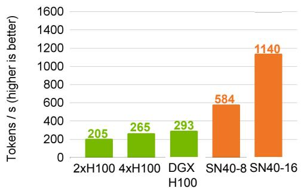

(a) Draft-model (Llama 3.1 8B at BS=1) decoding speed in tokens/second.  
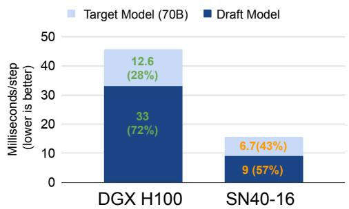  
(b) Time-per-step (milliseconds) breakdown with speculative decoding  
Figure 1. Performance comparisons between H100 and SN40 for the Llama3.1 8B-Draft model alone (1a) and the 70B-Target model with speculative decoding with the 8B draft producing 9 tokens per step (1b). H100 executes small models inefficiently, lowering the overall speedup from speculative decoding.

Figure 1 compares token generation speeds for Llama3.1 8B and 70B. Data were obtained from public benchmarks (Artificial Analysis) and verified locally using TensorRT-LLM (NVIDIA, d). Figure 1a shows that the performance of small models scales poorly on GPUs. A 4× increase in GPUs leads to a small (1.42×) improvement in speed. Specifically, a speed of 300 tokens/s on 8xH100 uses only 21% of the total HBM bandwidth (24 TB/s) to load weights and KV caches.

Figure 2 provides a time breakdown to explain GPU overheads. Forced synchronization overheads at kernel boundaries and inadequate compute-communication overlap are the primary reasons for GPU inefficiencies. Prior work on Mixture-of-Experts (MoEs) has similarly shown that about 68% of the time is spent on non-overlapped collective communications like AllToAll and AllGather, while the GPU remains idle (Jiang et al., 2024b).

Non-decoder ops AllReduce RMSNorm, SilU, Mul SDPA GEMMs  
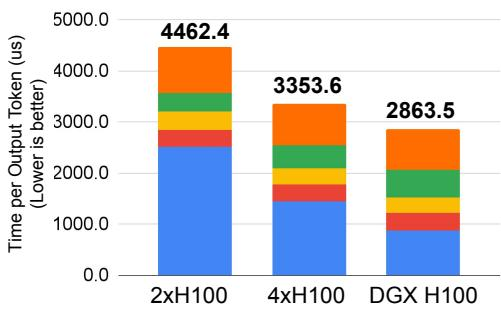  
(a) DGX H100 raw TPOT breakdown.

Non-decoder ops  AllReduce  RMSNorm, SilU, Mul SDPA GEMMs  
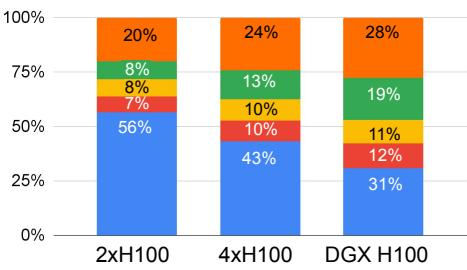  
(b) DGX H100 TPOT breakdown by percentage.  
Figure 2. Time-per-Output-Token (TPOT) breakdown for Llama3.1-8B on 2, 4, and 8 H100s. GEMMs scale better than other operators. Allreduce scales poorly and is not overlapped with compute.

To mitigate these overheads, the community has recently proposed megakernels (Spector et al., 2025a;b; Wu et al., 2025; Aimuyo et al., 2025). In short, megakernels fuse large portions of the model into a kernel to mitigate kernel overhead. However, megakernels do not fully eliminate HBM accesses in the middle of the kernel. Furthermore, current megakernel approaches focus on single GPUs which do not emphasize overlapping collective communications with compute (Spector et al., 2025a; Wu et al., 2025). Finally, prior works that try to overlap communication with compute (DeepSeek; Zhao et al., 2025; Shulai Zhang & Liu, 2025; Aimuyo et al., 2025) using tools like NVSH-MEM (nvs) still incur extra HBM traffic, as GPU-to-GPU communication occurs only via global (HBM) memory. For bandwidth-sensitive applications such as decode, this makes it harder to achieve peak performance.

Furthermore, these overheads reduce the gains from Speculative Decoding (SD), a common decode optimization to speed up a model with a smaller draft model (Leviathan et al., 2023; Chen et al., 2023; Miao et al., 2024; Liu et al.,

2024; vLLM Team; NVIDIA, e). Figure 1b shows that GPUs spend 72% of the time per step in the draft model when an 8B draft model is used to accelerate a 70B target model. Note that Figure 1 does not account for the CPU scheduling overhead between the draft and the target, which will further lower the performance on GPUs.

In this paper, we describe how dataflow naturally mitigates these overheads with aggressive kernel fusion and asynchronous execution across several chips, on the SambaNova SN40 Reconfigurable Dataflow Unit (RDU). The SN40 RDU executes large subgraphs of operations asynchronously on one or more chips without accessing HBM in between. This execution model enables one to aggressively fuse large modules – such as the entire decoder layer – into a single kernel. Furthermore, operations are executed when their data is available. Consequently, computation, memory access, and communication are all asynchronous and overlapped by construction. Communication between chips happens in a fine-grain way directly between on-chip memories, bypassing HBM and RDMA engines entirely.

We introduce three optimizations that are enabled by dataflow on the SN40 RDU: KernelLooping, BatchStreaming, and ScheduleOffloading. KernelLooping is a compiler optimization that rewrites groups of repeated kernel calls into a single kernel call with a pipelined outer loop. Kernel looping has two key benefits: (i) it eliminates synchronization between calls to the same kernel, and (ii) it overlaps the compute and communication across kernels. Even with KernelLooping, batching introduces additional unwanted synchronization overheads at layer boundaries and at the host. We mitigate this with BatchStreaming and ScheduleOffloading. BatchStreaming is a compiler optimization in which samples in a batch overlap execution between decoder layers to avoid synchronization. ScheduleOffloading eliminates host overhead by offloading the kernel execution schedule for speculative decoding entirely to SN40. ScheduleOffloading works with MOEs, while techniques such as CUDA Graphs (NVIDIA, a) are incompatible with MoE’s dynamic expert routing patterns (Aimuyo et al., 2025).

We empirically show that the techniques presented in this paper generalize over a wide variety of models: size (small and large), architecture (dense, MoE, alternating dense-sparse layers), and attention mechanisms (GQA, MLA, alternating sparse and full attention). We evaluate this extensively over several popular open source models over various batch sizes and context lengths. We further show that the proposed techniques can extract more value from speculative decoding over state-of-the-art systems.

The key contributions of this paper are listed below.

1. We quantify and describe GPU inefficiencies due to kernel synchronizations and lack of compute-

communication overlap.

2. We describe three key optimizations enabled by dataflow: KernelLooping, BatchStreaming, and ScheduleOffloading to eliminate various system overheads in Section 4.

3. We perform a comprehensive evaluation of the proposed techniques using SN40 in Section 5.2. We individually quantify the benefits of the proposed optimizations. We demonstrate overall speedups of more than 6× over the target model.

4. We study speculative decoding in detail: we quantify the acceptance rates with various models, datasets, and speculation window sizes in Section 2.

5. We show that speculative decoding using SN40, achieves 75% of the maximum roofline performance and outperforms speculative decoding on DGX-H100 by 1.7×.

The techniques described in this paper have been deployed in a commercial AI inference cloud.

## 2 SPECULATIVE DECODING

This section reports the empirically measured acceptance rates with speculative decoding on various combinations of draft/target models and benchmarks. We then introduce a performance model that will be used in subsequent sections.

## 2.1 Acceptance Rates

We first define a few terms that will be used in the rest of the section.

• A ‘step’ in speculative decoding corresponds to a set of draft model runs, followed by one target model run. One step can produce one (from the target) or more tokens (if some draft tokens are accepted).

• Speculation window, or ’k’: Number of draft tokens generated per step. The value ’k’ also corresponds to the number of draft-model runs per step.

• Acceptance rate, or ’AR’: The fraction of draft tokens accepted by the target model in each step. If the draft produces ’k’ tokens and the target model accepts ’a’ draft tokens, the acceptance rate is defined as (a + 1)/(k + 1).

Table 1 shows the acceptance rates for three dimensions: the combination of the draft and the target model, the size of the speculation window, and three popular benchmarks: AlpacaEval, HumanEval, and GSM8K. AlpacaEval (Li et al.,

Table 1. Acceptance rates for various draft/target models, speculation window sizes, and benchmarks AlpacaEval (Li et al., 2023), HumanEval (Chen et al., 2021), and GSM8K (Cobbe et al., 2021).  
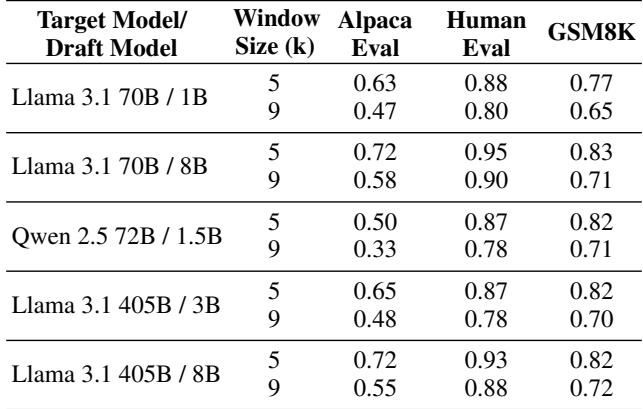

2023) is a general benchmark with a wide variety of prompts on various topics. HumanEval (Chen et al., 2021) is a benchmark that focuses on coding-related prompts and responses. GSM8K (Cobbe et al., 2021) is a math and reasoning benchmark. The table shows that speculative decoding performs better on the coding tasks in HumanEval than on the broader AlpacaEval benchmark. Furthermore, we note that with larger k, the acceptance rate drops by different amounts, based on the benchmark and the draft model. Consequently, choosing a larger k can lead to higher performance, but also to higher variability in the observed performance to the user.

## 2.2 Roofline Model

The number of draft tokens k and the acceptance rate AR are key factors in the performance of speculative decoding, as outlined in the previous section. We introduce the following simple equations for latency (1), throughput (2) and a simple roofline performance model during memory-bound execution(3). Equation 3 is later used in section 5.5.

$$
\tag{1}
$$

$$
\tag{2}
$$

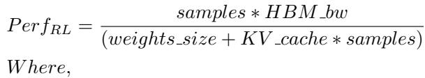

$$
\tag{3}
$$

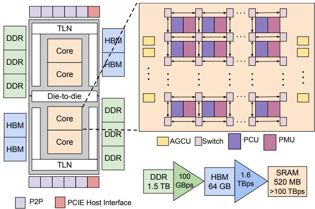  
Figure 3. SN40 Architecture. Packaged as a two-die socket in 5FF TSMC process. Each die features 2 dense compute Cores, 2 HBM modules, and 3 DDR channels. Cores are interconnected via the Top Level Network (TLN) and can communicate with other SN40s using peer-to-peer (P2P) interfaces. Each Core is comprised of PCUs and PMUs connected in a mesh network, RDN, enabling seamless data exchange.

## 3 SN40 SYSTEM OVERVIEW

This section describes SN40 (Prabhakar et al., 2024; Prabhakar, 2024), a commercial dataflow AI accelerator built to accelerate modern AI training and inference. Figure 3 shows a high-level diagram of SN40 with four SN40 cores connected to DDR, HBM, Peer-to-Peer (P2P) links, and the host. One socket delivers 638 TFLOPs of peak BF16 compute TFLOPs, and 520 MB of on-chip SRAM. Each socket also interfaces with 64 GB of HBM memory providing 1.6 TB/s of peak bandwidth, and 1.5 TB of DDR memory providing over 100 GB/s of peak bandwidth. The Top-Level Network (TLN) connects cores to IO blocks.

Figure 3 further shows the key components of a single SN40 core. Each socket consists of 1040 Pattern Compute Units (PCUs) and 1040 Pattern Memory Units (PMUs). PCUs provide systolic and streaming compute capabilities. When configured as a systolic array, it accelerates matrix multiplications. Inputs to the systolic array are streamed left-to-right and top-to-bottom, and results are drained left-to-right into output FIFOs. Matrix multiplications can be further parallelized across multiple PCUs. Each PMU provides 512 KB of program-managed on-chip memory along with dedicated hardware for tensor transformations and address computations to aid efficient operator fusion. PMUs are used to store on-chip tensors such as input, parameters, metadata, and intermediate results. PCUs and PMUs exchange packets of data through a programmable Reconfigurable Device Network (RDN). Address Generation and Coalescing Units (AGCUs) act as bridges for the SN40 core to access local device memory (HBM, DDR), host memory, remote SN40 device memory, and remote SN40 cores. AGCUs implement a lightweight peer-to-peer (P2P) communication protocol to directly stream data between SN40 cores on different sockets without involving DDR or HBM. The P2P protocol provides primitives to build asynchronous collective communication primitives between multiple SN40 cores, such as AllReduce without involving HBM. A hardware graph orchestration mechanism in the AGCU enables executing kernel launches without host involvement.

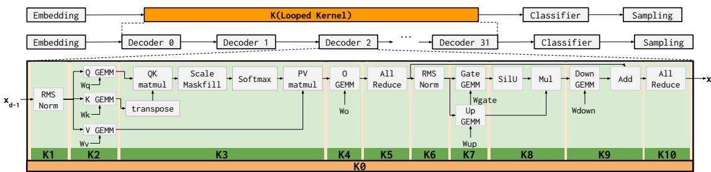

(a) Llama3.1-8B with 32 decoder layers, and the operators within one decoder layer. Labels K1 – K10 (green) are kernel calls on the DGX H100, obtained by profiling TensorRT-LLM (NVIDIA, d) with the NVIDIA Nsight profiler (NVIDIA, c). Label K0 (orange) corresponds to one kernel call on SN40 for the entire decoder layer. Collective communication operations like allreduce do not execute asynchronously with other operators on the DGX H100. On SN40, allreduce is pipelined and overlapped with other operators.  
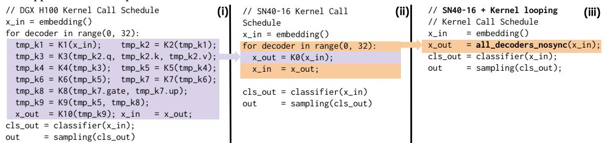  
(b) Pseudocode showing kernel call schedule to generate one output token on (i) DGX H100 with TensorRT-LLM (NVIDIA, d), (ii) SN40-16 with layer fusion, and (iii) KernelLooping. With KernelLooping, only 4 kernel calls are needed per output token on SN40.  
Figure 4. Kernel transformation opportunity enabled by SN40 over DGX H100.

The compiler translates a model into a series of kernels (a fused subgraph of operations) and schedules (a specification of kernel invocation order) and assembles them into a single Processor Execution Format (PEF) file.

## 4 OPTIMIZATIONS

In this section, we describe the three optimizations used to accelerate speculative decoding on SN40.

## 4.1 Kernel Looping

To illustrate inefficiencies resulting from synchronization during the token generation phase on DGX H100 (dgx) and SN40-16, we use a tensor parallel (TP) implementation of Llama3.1-8B, a common choice for the draft model, as a driving example. As depicted in Figure 4a, execution of the 8B model consists of four major types of blocks: one Embedding layer, 32 Decoder layers, one Classifier layer, and Sampling. On both platforms, a ”kernel” of work is dispatched to the accelerator to execute one or more (fused) PyTorch operators. Each kernel boundary acts as a forced synchronization barrier. In H100, a decoder is broken up and executed as 10 kernel calls labeled K1 - K10 (in green) in Figure 4a. In contrast, SN40-16 executes all operators in the decoder layer as a single kernel, labeled K0 (in orange) in Figure 4a. The kernel breakdown for H100 is obtained using TensorRT-LLM (NVIDIA, d) to run Llama3.1-8B and by extracting kernel call information using the NVIDIA Nsight Systems profiler (NVIDIA, c). The decoder-level fusion on SN40-16 has been described in prior literature (Prabhakar, 2024). Communication operators introduced by the TP mapping, such as allreduce, are performed using the NVIDIA Collective Communications Library (NVIDIA, b) on H100, while SN40 implements the operators using the chip-to-chip peer-to-peer protocol.

KernelLooping exploits the general structure of modern day LLMs which exhibit repetitive encoder/decoder blocks with same set of mathematics operations, but operating on different data. After the proposed transformation, the model mapping absorbs the data dependencies between loop iterations, resulting in a single kernel call for the decoder portion of the model. Figure 4b describes the impact of KernelLooping with pseudocode. With looping, Llama 8B

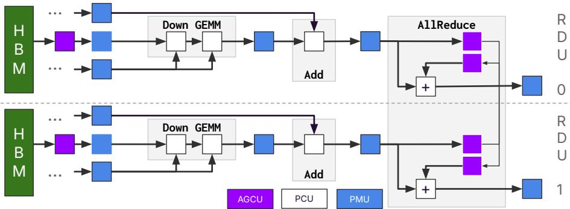  
Figure 5. A subset of operations from Figure 4a K8 - K10: Down GEMM, Add, and AllReduce. On the RDU, AllReduce executes asynchronously with GEMM and Add. Data is streamed between RDUs directly to on-chip PMUs, without involving HBM.

SN40 needs just one kernel call for all 32 decoders, as shown by Figure 4b(iii). In contrast, the H100 requires 320 calls.

Figure 5 shows a zoomed-in view of a subset of operations in the decoder. On SN40, PCUs and PMUs asynchronously execute GEMM, Add, and Allreduce. PMUs and AGCUs stream data between RDUs without involving HBM, which frees up HBM bandwidth to load weights and KV caches.

## 4.1.1 Implementation Details

KernelLooping is implemented with a combination of user directives and a compiler optimization pass. User directives in modeling code (easily implementable using decorators in python) identify the scope of operations (for instance, one decoder) to be fused into one kernel. This creates a call schedule where the same kernel is called repeatedly, albeit with different input/output tensors. The compiler recognizes a sequence of such repeated calls (say, N) and rewrites the kernel to have an outer loop of size N.

The KernelLooping pass is composed of two primary phases: Pattern Matching and Transformation. Pattern Matching isolates a compatible contiguous list of kernel calls using a dataflow analysis pass, ensuring user directed kernel parameters follow a strict pattern of usage across repeated calls. For example, in the case of chained decoders, the chained output tensor of a previous kernel call must only be used by the next decoder’s kernel call, and the output parameter must be consistently used by the same input parameter for the pair to be eligible for on-chip buffering.

Following matching, the Transformation phase constructs a unified kernel that replaces the identified sequence with a single looped invocation. This phase applies a series of transformation rules, including: (i) concatenation and reshaping of kernel inputs, (ii) introduction of an outer loop iterator and its propagation throughout the kernel body, and (iii) allocation of intermediate buffers with appropriate placement across the memory hierarchy (e.g., SRAM, HBM, or DRAM), based on performance and capacity considerations.

Figure 6 shows the result of the compiler pass on chained matrix-multiplication operations (with tiling size of T) where the output activation of the previous matrix-multiply operation serves as the input activation of the next matrixmultiply. Weight tensors are independent of each other. The transformation introduces on-chip memory buf0 to host the chained intermediate result. This buffer is reread while the next iteration is being produced, so it will be double buffered. Additionally, since all intermediate results are live, the write to output z occurs at the end of every outermost iteration rather than at the end of the entire kernel. As independent parameters, the weights are simply grouped together and iterated using the iterator n.

## 4.1.2 Dataflow Hardware Impact

Synchronous architectures (e.g. SIMT) approximate asynchrony in software, but use expensive synchronization mechanisms to coordinate execution. For example, megakernels (Spector et al., 2025a;b) use counter-based dependency tracking via global memory. Synchronization through highlatency memory accesses introduces substantial overheads; reported costs exceed 200 µs, accounting for over 20% of the latency budget in sub-millisecond inference. Furthermore, this overhead grows with device count, and also adds to memory traffic in addition to the movement of activations. In comparison, native dataflow support in SN40 supports asynchrony via lightweight control handshake signals, reducing the latency to nanoseconds and overheads to zero, as the handshake is often pipelined with computation. Consequently, maximum overlap of memory, compute, and communication is achieved.

In KernelLooping, the key insight is to keep the data flowing: between RDUs, between memory and RDU, and between units within the RDU. Intermediate results between units in the RDU are streamed from producers to consumers. Some tensors need to be partially materialized and double buffered when tensors need to be transposed or reread after reductions. The on-chip interconnect and memory system facilitates this form of execution with much higher capacity and bandwidth compared to GPUs.

Original Program Transformed Program   
kernel\_d(w[MxM], x[MxN], z[MxN]) kernel\_d(w[3xMxM], x[MxN], z[3xMxN])   
for (t = 0; t < M; t += T) @onchip buf0[MxN] = x   
z[t::t+T] = w[t::t+T] \* x @onchip buf1[MxN]   
program example\_d() for(n = 0; n < 3; ++n)   
w0[MxM], w1[MxM], w2[MxM] for (t = 0; t < M; t += T)   
x[MxN], y[MxN], z[MxN], r[MxN] buf1[t::t+T] = w[n][t::t+T] \* buf0   
call0 = kernel\_d(w0, x, y) buf0 = buf1   
call1 = kernel\_d(w1, y, z) z[n] = buf1   
call2 = kernel\_d(w2, z, r) program example\_d()   
w0[MxM], w1[MxM], w2[MxN]   
x[MxN], y[MxN], z[MxN], r[MxN]   
kernel\_d({w0, w1, w2}, x, {y, z, r})  
Figure 6. Example of the kernel looping optimization using chained matrix multiplication operations with a tiling size of T. The left column shows a subset of the original program. The right column shows the corresponding transformed subset.

Additionally, KernelLooping pipelines the execution of multiple instances of the original kernel as distinct loop iterations. This eliminates any dead time between kernels and always keeps the memory system busy. The performance of most models during decode is bandwidth bound, and is sensitive to the number of independent channels available when accessing the intermediate activations, weights, and KV cache.

The SN40’s hardware support for asynchronous dataflow execution and peer-to-peer communication allows its compiler to include a generic KernelLooping pass. This pass is both applicable across workloads, from HPC kernels to repetitive structures of almost all modern AI models. The pass is also scalable from a single device to multi-device configurations.

## 4.2 Batch Streaming

KernelLooping effectively removes kernel calls. However, batching introduces an artificial synchronization boundary at the end of the decoder, where all samples executing the previous decoder finish before any sample begins the next decoder. This artificial synchronization leads to the pipeline warm-up cost being taken once for every decoder layer. The performance impact is more pronounced on smaller draft models with a big scale-up domain, where the time spent on each decoder layer is only a few microseconds.

BatchStreaming mitigates this overhead by introducing a non-blocking communication channel between decoder layers so that samples can flow through decoder layers asynchronously. Such a non-blocking channel fits naturally into the dataflow paradigm that maps on to SN40’s on-chip resources.

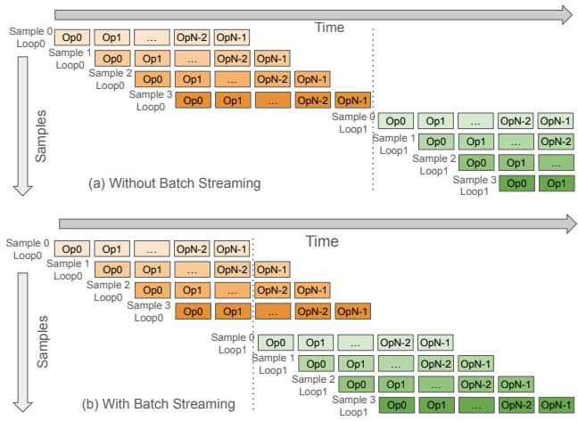  
Figure 7. The effect of BatchStreaming. We can see that without BatchStreaming (a) all the samples of the batch need to finish processing before we start the next layer. On the other hand, with BatchStreaming (b) we see that Sample 0 begins processing much earlier and all the stages of the pipeline are occupied.

The gain in performance from BatchStreaming optimization is primarily due to initiation of the processing of the first batch element of the next loop as soon as the result of the last stage of the pipeline for the corresponding sample is available. As a result, while the last stage of the pipeline is still processing the second (and later) samples of the batch, the first stage of the pipeline has started working on the previous result of the first sample from the current batch. This eliminates any dead time and keeps every stage of the pipeline busy during steady-state execution. This is illustrated in Figure 7. Section 5.3 quantifies the performance benefit of BatchStreaming on various draft models.

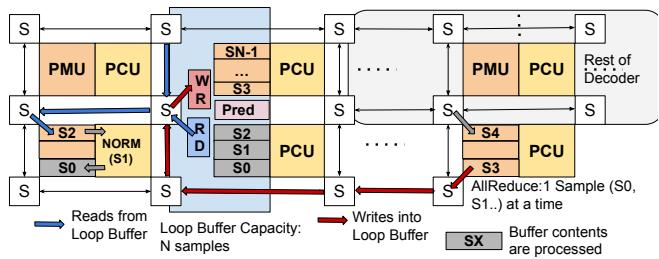  
Figure 8. BatchStreaming on SN40. LoopBuffer implements distributed write, read, and predication logic across PMUs, used to hold the output of a looped decoder block.

## 4.2.1 Implementation Details

Figure 8 illustrates the BatchStreaming execution flow in SN40. Cross-decoder operations are pipelined via a logical buffer, LoopBuffer, which has a holding capacity for all samples in a batch. LoopBuffer is held on-chip by composing multiple PMUs as a larger virtual scratchpad memory. LoopBuffer receives writes at appropriate logical offsets (data flow denoted by the red path) as soon as a decoder completes processing a sample, and performs asynchronous reads (data flow denoted by the blue path) when the subsequent decoder can accept new inputs, while enforcing read-after-write dependencies. All data movement and execution is driven solely by the availability of data at the inputs in each unit. In other words, there is no global synchronization across decoder layers. By decoupling decoder boundaries, LoopBuffer enables the next decoder to begin execution without waiting for all samples to complete the previous stage.

## 4.2.2 Dataflow Hardware Impact

In a native dataflow execution model, independent samples within a batch are pipelined over distributed compute, memory, and communication resources. The cost of an asynchronous control handshake is negligible and overlapped with compute. This lightweight control handshake between producers and consumers is the key building block that enables BatchStreaming. In contrast, GPU producers and consumers need to synchronize via the memory system, which incurs significantly higher overheads, and is harder to overlap with useful work.

## 4.3 Schedule Offloading

The decode schedule compiled into the PEF is capable of generating one token at a time. At runtime, to generate multiple tokens, the application needs to run the same decode schedule until the end of sequence token is generated, iteratively feeding the output of each schedule run on to the next. This means that the control is transferred back to the host after each token is generated. This is undesirable because host intervention negates the advantage gained by the dataflow architecture. The logical path forward is to feed the output of one decode schedule to the next and form a chain of schedules that runs in a hardware orchestrated mode. It is noteworthy that the how many such schedules need to be chained is an execution time decision, controlled by upstream application.

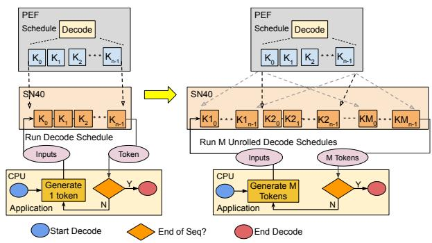  
Figure 9. Left : Decode Loop with host intervention : Iterative execution of N kernels (K0 to Kn−1) on SN40, with control returning to the host after each token generation. Right : With ScheduleOffloading, SN40 generates M tokens without host intervention.

## 4.3.1 Implementation Details

The SN40 runtime supports dynamic concatenation of execution schedules, referred to as ScheduleOffloading. As described earlier, a schedule within a PEF consists of an ordered sequence of kernel invocations, where each kernel is associated with a bitfile and may be invoked multiple times with different inputs. The runtime parses the schedule and stitches the kernel bitfile loads to enable fully hardwareorchestrated execution. Leveraging this mechanism, the runtime can concatenate multiple schedules as requested by the application, which is aware of available schedules in the PEF and may offload the same schedule repeatedly.

For correct composition, outputs of one schedule must match the inputs of the next. The runtime ensures compatibility by validating types and sizes and patching memory addresses, enabling seamless hardware orchestration. This reduces host intervention and improves token generation throughput.

ScheduleOffloading on SN40 allows the application to control the number of tokens generated per schedule. As shown in Figure 9, host involvement decreases as the schedule is unrolled multiple times. The unrolling factor (M ) is determined heuristically based on the speculation window (k) and I/O characteristics, and, in practice, remains bounded by k. For speculative decoding, draft and target models can be configured independently, enabling applications to tune token iteration (k) for improved acceptance rates.

Table 2. Model configurations evaluated in this paper. GPT-OSS (OpenAI, 2025), DeepSeek R1(DeepSeek-AI, 2025), Llama (lla) (Dubey et al., 2024), Mixtral (Jiang et al., 2024a), and Qwen (Team, 2024). Each model is evaluated under several batch sizes.  
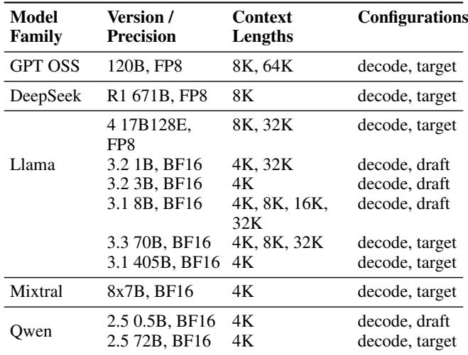

## 4.3.2 Dataflow Hardware Impact

CUDA Graphs (NVIDIA, a) similarly reduce CPU overhead by capturing and replaying kernel execution sequences via a single CudaGraphLaunch. However, as noted in (Aimuyo et al., 2025), they are less effective for dynamic workloads (e.g., expert routing in MoE models). Likewise, heuristic and runtime-dependent choices, such as schedule unrolling in speculative decoding, are not fully compatible with static graph creation and execution model. Nonetheless, such graph-based approaches may be partially applicable under constrained dynamic conditions or extended with additional engineering support.

## 5 EVALUATION

In this section, we quantify the decode speed of several models on SN40. We first quantify each optimization individually. We then quantify the impact of combining all optimizations against SN40’s roofline and GPU.

## 5.1 Experimental Setup

Table 2 summarizes the workload configurations used to quantify the impact of our optimizations on the decode performance on SN40. Table 3 describes the hardware platform under evaluation, including the number of sockets, their compute TFLOPS, and the memory bandwidth. As this paper focuses on the decode stage of inference, all evaluations in this section measure and report decode throughput as the primary metric. The throughput number is obtained by measuring the time per output token (TPOT) in steady state on all platforms. DGX H100 performance numbers are obtained by executing the models using TensorRT-LLM (NVIDIA, d) and using the included benchmarking scripts that measure steady-state token generation throughput. SN40 performance numbers are obtained by measuring and averaging the tokens/second on 10 prompts that generate a range of output tokens (< 100 to > 1000 output tokens).

Table 3. TFLOPs and HBM bandwidths of the hardware configurations being evaluated.  
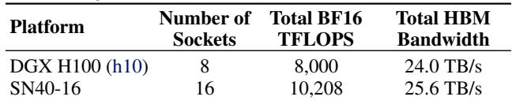

## 5.2 Kernel Looping

Figure 10 shows the speedups obtained on SN40-16 with KernelLooping enabled, over a baseline without KernelLooping. The optimization speeds up on a wide variety of model architectures, parameter sizes, batch sizes, and sequence lengths, with a geomean speedup of 1.6×. We highlight that kernel looping is not limited only to smaller models. Figure 10 shows that larger models such as Qwen2.5-72B observe speedups close to 2× even at large batch sizes, highlighting the non-trivial impact of synchronization overheads on decode performance without KernelLooping. Figure 11 illustrates the benefits of kernel looping with an HBM bandwidth utilization trace obtained from a single socket of a SN40-16 system running Llama3.1-8B. KernelLooping (orange) sustains a much higher HBM bandwidth utilization compared to baseline (blue), which shows periodic drops in HBM bandwidth due to synchronization overheads. Consequently, KernelLooping enables us to run many more decoder layers during a fixed time window.

## 5.3 Batch Streaming

Figure 12 shows the speedup achieved when running the Llama 1B, 3B, and 8B models for batch sizes of 2, 4, 8, and 16. For a batch size of 1, BatchStreaming has no effect and is therefore omitted from the figure.

The effectiveness of BatchStreaming optmization improves for all evaluated models when the batch size is increased from 2 to 4 and from 4 to 8. The reason is that the extra samples hide more of the per-layer warm-up cost. When the batch size is increased to 16, we still see a healthy speedup for all models. However, the speedup for the 1B and 3B models with a batch size of 16 is a bit lower than when run with a batch size of 8. This is because most of the benefits of the optimization are already harvested at a batch size of 8 and that the per-layer warm-up cost, relatively speaking, is smaller with a higher batch size.

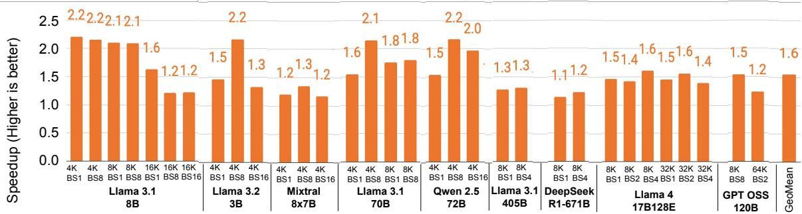  
Figure 10. Kernel looping speeds up on a broad variety of model architectures, batch sizes, and sequence lengths.

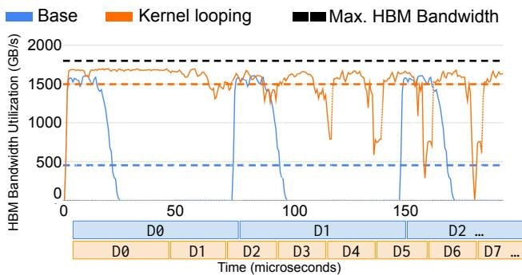  
Figure 11. HBM bandwidth trace from one SN40 socket running Llama3.1-8B. Kernel looping(orange) sustains higher HBM bandwidth utilization over the baseline (blue).

The speedup is more pronounced for models with a higher compute-to-memory ratio. This explains the lower gains we see on the 8B model compared to the 1B and 3B models.

## 5.4 Schedule Offloading

Figure 13 presents the draft model only speedup achieved by ScheduleOffloading compared to the baseline – without schedule offloading – when generating nine tokens. By allowing multiple draft model runs to proceed consecutively without repeated host-side coordination, ScheduleOffloading technique significantly reduces overhead and improves total throughput.

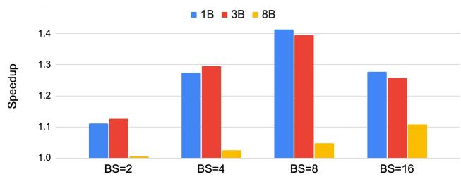  
Figure 12. Throughput improvement with batch streaming for a set of Llama (Dubey et al., 2024) draft models. 1B, 3B, and 8B are sizes of models.

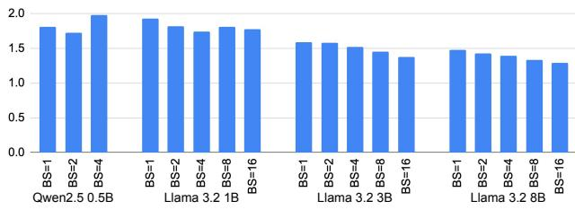  
Figure 13. Schedule offloading speedup (compared to no offloading) for various batch sizes(BS) and k = 9.

Note that smaller models reach higher speedup numbers when compared with larger models. The reason is that the host overhead targeted by the schedule offload optimization is greater, relatively speaking, for the smaller models.

In addition, note that larger batch sizes typically yield less speedup. This is explained by the somewhat longer latencies of these configurations.

## 5.5 SN40 vs. GPU vs. Roofline

We compare the speculative decoding performance on SN40- 16 and DGX H100 against (a) roofline target model performance (Figure 14a) and (b) roofline speculative decoding performance (Figure 14b). Speedup is calculated relative to the algorithmic roofline of a standalone target model on an HBM-driven architecture (equation 3).

Roofline speculative decode performance is computed using equation 3 for both draft and target models, combined in a k : 1 ratio.

The estimated DGX H100 performance (equation 4) is based on standalone draft and target model benchmarks with sequence length 1, using the TensorRT-LLM (NVIDIA, d) setup. These results are applied to a speculative decoding trace from an inference request on SN40. The trace includes iteration counts, token statistics, and acceptance data, helping to remove discrepancies due to compiler and numerical format differences. However, speculative decoding overhead and longer sequence effects on target model performance are not captured, making DGX H100 estimates optimistic.

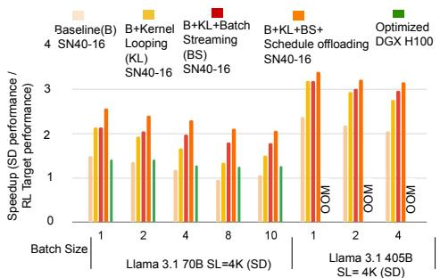

(a) Speedup with speculative decoding (SD) on SN40 and GPU vs. peak target model performance.  
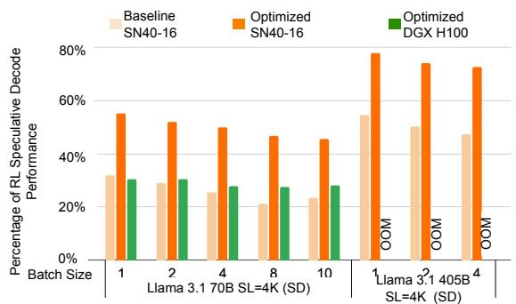  
(b) Comparison of achieved speculative decoding (SD) performance over roofline (RL) SD performance.  
Figure 14. SN40-16 vs. DGX H100 performance

$$
\tag{4}
$$

Figure 14 shows that SN40-16 achieves a 60–80% higher speedup than DGX H100 on the Llama 3.1 70B speculative decoding workload. The 405B model could not run on DGX H100 due to memory limits. SN40-16 also achieves 45–78% of its theoretical roofline across batch sizes. As model size increases—from 70B to 405B—efficiency improves. Despite having similar HBM bandwidth, SN40-16’s architecture and earlier-discussed optimizations yield superior speculative decoding performance.

To better understand the time distribution on SN40-16 systems for the workloads in Figure 14, we break down the key components in Figure 15a. The SN40-Memory Roofline represents time taken by the draft and target models, based on the HBM roofline equation (equation 3). The Host slice captures time spent in the speculative decoding (SD) algorithm, including token acceptance, logits processing, and related transfers.

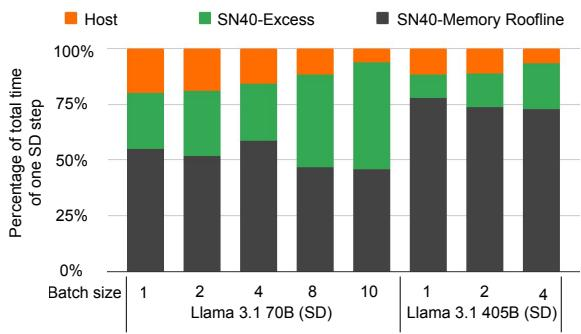

(a) Batch sizes.  
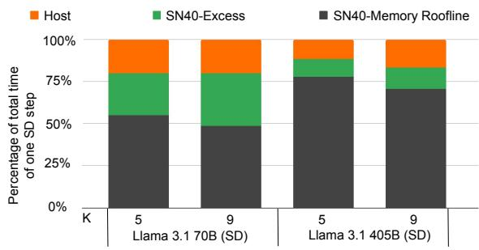  
(b) k.  
Figure 15. Time distribution in speculative decoding on SN40 for various workload configurations.

Figure 15a shows that larger batch sizes increase the proportion of time spent beyond the roofline estimate (SN40- Excess), likely due to: A) increased compute-bound behavior not captured by the HBM-based roofline, and B) greater I/O overhead. As the target model size increases, both SN40-Excess and Host time decrease—attributed to: A) better HBM utilization, bringing performance closer to the roofline, and B) SD workload remaining constant, as it depends on vocabulary size, not model size.

Finally, Figure 15b illustrates the impact of the choice of the k value for speculative decoding. As k increases, the time spent on the draft model also increases. Draft models typically exhibit more wasted performance due to their smaller size, limited parallelization potential, and warm-up latencies inherent in any given architecture. However, increasing the k value can improve the number of accepted draft model tokens, thereby reducing the number of calls to slower target models. This is reflected in the reduced fraction of SN40-Memory Roofline from k = 5 to k = 9.

Table 4. Normalized speculative decode performance of SN40 for the different workload configurations.  
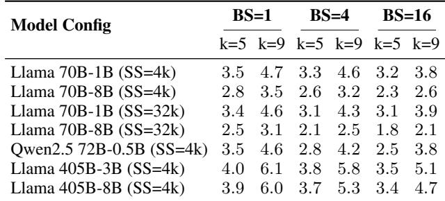

## 5.6 Batched Speculative Decode

Table 4 shows the speedup of batched speculative decoding compared to the target model baseline, illustrating how various factors – including the ratio of target to draft model size, sequence length, batch size, and the speculative decoding parameter k – affect the speedup achieved.

In general, larger draft-to-target model ratios yield greater gains. For example, using the same draft model yields higher speedups for the Llama 405B model compared to the Llama 70B model. Conversely, using smaller 1B draft model for 70B target model provides better speedups compared to using 8B draft model.

However, speedup diminish as the batch size grows. Large models benefit more from batch scaling because their onetime weight-loading cost is amortized over more samples, while the KV cache overhead for the smaller draft model becomes a bigger fraction of its total latency. Consequently, the performance gap between the draft and the target model narrows at higher batch sizes, reducing speculative decoding speedups. A similar effect occurs with longer sequence lengths. Increasing the sequence length from 4K to 32K disproportionately increases the latency of the draft model due to larger KV caches, so the relative advantage over the target model shrinks.

Additionally, a higher k value (e.g., k = 9 vs. k = 5) typically improves speedups by allocating more generation steps to the faster draft model. However, the benefit of a larger k decreases as the batch size increases, again because the throughput of the draft model does not scale as well as the larger model under these conditions.

## 6 DEPLOYMENT EXPERIENCE

All techniques in this paper are deployed across all models on the SambaNova Cloud platform (cloud.sambanova.ai). Key metrics—Time to First Token (TTFT), token throughput, and context length—are available via third-party benchmarks such as Artificial Analysis (Artificial Analysis) and Open-

Router (OpenRouter). We highlight key optimization aspects below.

Graph Compilation: Compile-time optimizations, including KernelLooping and BatchStreaming, add negligible overhead. User annotations of looping regions constrain eligible subgraphs, reducing transformation complexity. In practice, a single compute graph instance is compiled; under tensor parallel (TP), graphs are identical across devices. Looping further reduces this to one decoder graph, compiled once on a single device. Thus, compile time and memory do not scale with decoder count. Model parameters do not affect compilation, as they do not change the graph structure to the compiler. Specifically, the sizes of intermediate tensor shapes are determined by the tile sizes chosen for the weights and KV caches, where the tile size is a function of the compute and memory latencies and not the size of the weights and KV caches themselves.

Runtime Memory ScheduleOffloading is controlled by application heuristics. PEF schedule memory scales linearly with unrolling factor M , but remains small (a few MB). In practice, we notice that the benefit of M plateaus around 20. The added capacity overheads are negligible in relation to available HBM (100s of GB) and DRAM (TBs).

Checkpoint Processing KernelLooping requires checkpoint weights to be formatted and arranged differently so that they can be read efficiently from HBM. Specifically, weights across decoder layers need to be packed into higherdimensional tensors. Automatic checkpoint preprocessing infrastructure reads in compiler-generated metadata to appropriately restructure the checkpoint inputs.

## 7 CONCLUSIONS

This work demonstrates that overcoming decode inefficiency requires rethinking execution from first principles. We show that dataflow is all you need to deliver near-roofline performance for large-scale AI inference.

Dataflow execution inherently overlaps compute, memory, and communication across chips. Through hardware–software co-design on the SambaNova SN40 Reconfigurable Dataflow Unit (RDU), we demonstrate how compiler-driven optimizations – KernelLooping, Batch-Streaming, and ScheduleOffloading – achieve over 75% of the theoretical roofline across diverse models, from small dense LLMs to large MoEs. End-to-end results with speculative decoding show 6× faster token generation performance compared to single-model baselines and 1.7× higher throughput than a DGX H100 system with comparable aggregate HBM bandwidth. These techniques have proven robust in deployment, powering production inference at cloud.sambanova.ai.

## REFERENCES

Nvidia dgx h100 datasheet. https://resources.nv idia.com/en-us-dgx-systems/ai-enterpr ise-dgx.

Nvidia h100 tensor core gpu architecture. https://re sources.nvidia.com/en-us-tensor-core.

The llama 4 herd: The beginning of a new era of natively multimodal ai innovation. https://ai.meta.co m/blog/llama-4-multimodal-intelligenc e/.

Nvidia nvshmem. https://docs.nvidia.com/nv shmem/.

Aimuyo, O. J., Oh, B., and Singh, R. Flashdmoe: Fast distributed moe in a single kernel, 2025. URL https: //arxiv.org/abs/2506.04667.

Artificial Analysis. Artificial analysis: Independent analysis of ai models and api providers. URL https://arti ficialanalysis.ai/.

Beeching, E., Tunstall, L., and Rush, S. Scaling test-time compute with open models. URL https://huggin gface.co/spaces/HuggingFaceH4/blogpo st-scaling-test-time-compute.

Brown, B., Juravsky, J., Ehrlich, R., Clark, R., Le, Q. V., Re,´ C., and Mirhoseini, A. Large language monkeys: Scaling inference compute with repeated sampling, 2024. URL https://arxiv.org/abs/2407.21787.

Chen, C., Borgeaud, S., Irving, G., Lespiau, J.-B., Sifre, L., and Jumper, J. Accelerating large language model decoding with speculative sampling, 2023. URL https: //arxiv.org/abs/2302.01318.

Chen, M., Tworek, J., Jun, H., Yuan, Q., de Oliveira Pinto, H. P., Kaplan, J., Edwards, H., Burda, Y., Joseph, N., Brockman, G., Ray, A., Puri, R., Krueger, G., Petrov, M., Khlaaf, H., Sastry, G., Mishkin, P., Chan, B., Gray, S., Ryder, N., Pavlov, M., Power, A., Kaiser, L., Bavarian, M., Winter, C., Tillet, P., Such, F. P., Cummings, D., Plappert, M., Chantzis, F., Barnes, E., Herbert-Voss, A., Guss, W. H., Nichol, A., Paino, A., Tezak, N., Tang, J., Babuschkin, I., Balaji, S., Jain, S., Saunders, W., Hesse, C., Carr, A. N., Leike, J., Achiam, J., Misra, V., Morikawa, E., Radford, A., Knight, M., Brundage, M., Murati, M., Mayer, K., Welinder, P., McGrew, B., Amodei, D., McCandlish, S., Sutskever, I., and Zaremba, W. Evaluating large language models trained on code. 2021.

Claude. Prompt caching with claude. URL https://ww w.anthropic.com/news/prompt-caching.

Cobbe, K., Kosaraju, V., Bavarian, M., Chen, M., Jun, H., Kaiser, L., Plappert, M., Tworek, J., Hilton, J., Nakano, R., Hesse, C., and Schulman, J. Training verifiers to solve math word problems. arXiv preprint arXiv:2110.14168, 2021.

DeepSeek. Deepgemm: clean and efficient fp8 gemm kernels with fine-grained scaling. URL https://gith ub.com/deepseek-ai/DeepGEMM.

DeepSeek-AI. Deepseek-v2: A strong, economical, and efficient mixture-of-experts language model, 2024.

DeepSeek-AI, Liu, A., Feng, B., Xue, B., Wang, B., Wu, B., Lu, C., Zhao, C., Deng, C., Zhang, C., Ruan, C., Dai, D., Guo, D., Yang, D., Chen, D., Ji, D., Li, E., Lin, F., Dai, F., Luo, F., Hao, G., Chen, G., Li, G., Zhang, H., Bao, H., Xu, H., Wang, H., Zhang, H., Ding, H., Xin, H., Gao, H., Li, H., Qu, H., Cai, J. L., Liang, J., Guo, J., Ni, J., Li, J., Wang, J., Chen, J., Chen, J., Yuan, J., Qiu, J., Li, J., Song, J., Dong, K., Hu, K., Gao, K., Guan, K., Huang, K., Yu, K., Wang, L., Zhang, L., Xu, L., Xia, L., Zhao, L., Wang, L., Zhang, L., Li, M., Wang, M., Zhang, M., Zhang, M., Tang, M., Li, M., Tian, N., Huang, P., Wang, P., Zhang, P., Wang, Q., Zhu, Q., Chen, Q., Du, Q., Chen, R. J., Jin, R. L., Ge, R., Zhang, R., Pan, R., Wang, R., Xu, R., Zhang, R., Chen, R., Li, S. S., Lu, S., Zhou, S., Chen, S., Wu, S., Ye, S., Ye, S., Ma, S., Wang, S., Zhou, S., Yu, S., Zhou, S., Pan, S., Wang, T., Yun, T., Pei, T., Sun, T., Xiao, W. L., Zeng, W., Zhao, W., An, W., Liu, W., Liang, W., Gao, W., Yu, W., Zhang, W., Li, X. Q., Jin, X., Wang, X., Bi, X., Liu, X., Wang, X., Shen, X., Chen, X., Zhang, X., Chen, X., Nie, X., Sun, X., Wang, X., Cheng, X., Liu, X., Xie, X., Liu, X., Yu, X., Song, X., Shan, X., Zhou, X., Yang, X., Li, X., Su, X., Lin, X., Li, Y. K., Wang, Y. Q., Wei, Y. X., Zhu, Y. X., Zhang, Y., Xu, Y., Xu, Y., Huang, Y., Li, Y., Zhao, Y., Sun, Y., Li, Y., Wang, Y., Yu, Y., Zheng, Y., Zhang, Y., Shi, Y., Xiong, Y., He, Y., Tang, Y., Piao, Y., Wang, Y., Tan, Y., Ma, Y., Liu, Y., Guo, Y., Wu, Y., Ou, Y., Zhu, Y., Wang, Y., Gong, Y., Zou, Y., He, Y., Zha, Y., Xiong, Y., Ma, Y., Yan, Y., Luo, Y., You, Y., Liu, Y., Zhou, Y., Wu, Z. F., Ren, Z. Z., Ren, Z., Sha, Z., Fu, Z., Xu, Z., Huang, Z., Zhang, Z., Xie, Z., Zhang, Z., Hao, Z., Gou, Z., Ma, Z., Yan, Z., Shao, Z., Xu, Z., Wu, Z., Zhang, Z., Li, Z., Gu, Z., Zhu, Z., Liu, Z., Li, Z., Xie, Z., Song, Z., Gao, Z., and Pan, Z. Deepseek-v3 technical report, 2025. URL https://arxiv.org/abs/2412.19437.

DeepSeek-AI, D. G. e. a. Deepseek-r1: Incentivizing reasoning capability in llms via reinforcement learning, 2025. URL https://arxiv.org/abs/2501.12948.

Dubey, A., Jauhri, A., Pandey, A., Kadian, A., Al-Dahle, A., Letman, A., Mathur, A., Schelten, A., Yang, A., Fan,

A., et al. The llama 3 herd of models. arXiv e-prints, pp. arXiv–2407, 2024.

Google. Context caching - google gemini api documentation. URL https://ai.google.dev/gemini-api /docs/caching.

Jiang, A. Q., Sablayrolles, A., Roux, A., Mensch, A., Savary, B., Bamford, C., Chaplot, D. S., de las Casas, D., Hanna, E. B., Bressand, F., Lengyel, G., Bour, G., Lample, G., Lavaud, L. R., Saulnier, L., Lachaux, M.-A., Stock, P., Subramanian, S., Yang, S., Antoniak, S., Scao, T. L., Gervet, T., Lavril, T., Wang, T., Lacroix, T., and Sayed, W. E. Mixtral of experts, 2024a. URL https://arxi v.org/abs/2401.04088.

Jiang, C., Tian, Y., Jia, Z., Zheng, S., Wu, C., and Wang, Y. Lancet: Accelerating mixture-of-experts training via whole graph computation-communication overlapping, 2024b. URL https://arxiv.org/abs/2404.1 9429.

Leviathan, Y., Kalman, M., and Matias, Y. Fast inference from transformers via speculative decoding. In International Conference on Machine Learning, pp. 19274– 19286. PMLR, 2023.

Li, X., Zhang, T., Dubois, Y., Taori, R., Gulrajani, I., Guestrin, C., Liang, P., and Hashimoto, T. B. Alpacaeval: An automatic evaluator of instruction-following models. https://github.com/tatsu-lab/alpaca\_ eval, 5 2023.

Liu, X., Daniel, C., Hu, L., Kwon, W., Li, Z., Mo, X., Cheung, A., Deng, Z., Stoica, I., and Zhang, H. Optimizing speculative decoding for serving large language models using goodput, 2024. URL https://arxiv.org/ abs/2406.14066.

Miao, X., Oliaro, G., Zhang, Z., Cheng, X., Wang, Z., Zhang, Z., Wong, R. Y. Y., Zhu, A., Yang, L., Shi, X., Shi, C., Chen, Z., Arfeen, D., Abhyankar, R., and Jia, Z. Specinfer: Accelerating large language model serving with tree-based speculative inference and verification. In Proceedings of the 29th ACM International Conference on Architectural Support for Programming Languages and Operating Systems, Volume 3, ASPLOS ’24, pp. 932–949, New York, NY, USA, 2024. Association for Computing Machinery. ISBN 9798400703867. doi: 10.1145/3620666.3651335. URL https: //doi.org/10.1145/3620666.3651335.

NVIDIA. Getting started with cuda graphs. https://de veloper.nvidia.com/blog/cuda-graphs/, a.

NVIDIA. Collective communications library (nccl). http s://developer.nvidia.com/nccl, b.

NVIDIA. Nsight systems. https://developer.nv idia.com/nsight-systems, c.

NVIDIA. Tensorrt-llm. https://docs.nvidia.co m/tensorrt-llm/index.html, d.

NVIDIA. Tensorrt-llm speculative decoding boosts inference throughput by up to 3.6x, e. URL https: //developer.nvidia.com/blog/tensorrt -llm-speculative-decoding-boosts-inf erence-throughput-by-up-to-3-6x/.

OpenAI. Prompt caching - openai. URL https://plat form.openai.com/docs/guides/prompt-c aching.

OpenAI. “learning to reason with llms,”, 2024. URL http s://openai.com/index/learning-to-rea son-with-llms/.

OpenAI, S. A. e. a. gpt-oss-120b gpt-oss-20b model card, 2025. URL https://arxiv.org/abs/2508.1 0925.

OpenRouter. Openrouter: The unified interface for llms. URL https://openrouter.ai/.

Pope, R., Douglas, S., Chowdhery, A., Devlin, J., Bradbury, J., Levskaya, A., Heek, J., Xiao, K., Agrawal, S., and Dean, J. Efficiently scaling transformer inference, 2022.

Prabhakar, R. Sambanova sn40l rdu: Breaking the barrier of trillion+ parameter scale gen ai computing. In 2024 IEEE Hot Chips 36 Symposium (HCS), pp. 1–24, Los Alamitos, CA, USA, aug 2024. IEEE Computer Society. doi: 10.1109/HCS61935.2024.10664717. URL https: //doi.ieeecomputersociety.org/10.110 9/HCS61935.2024.10664717.

Prabhakar, R., Sivaramakrishnan, R., Gandhi, D., Du, Y., Wang, M., Song, X., Zhang, K., Gao, T., Wang, A., Li, K., Sheng, Y., Brot, J., Sokolov, D., Vivek, A., Leung, C., Sabnis, A., Bai, J., Zhao, T., Gottscho, M., Jackson, D., Luttrell, M., Shah, M. K., Chen, E., Liang, K., Jain, S., Thakker, U., Huang, D., Jairath, S., Brown, K. J., and Olukotun, K. Sambanova sn40l: Scaling the ai memory wall with dataflow and composition of experts, 2024. URL https://arxiv.org/abs/2405.07518.

Shulai Zhang, Ningxin Zheng, H. L. Z. J. W. B. C. J. Q. H. W. C. S. Z. L.-W. C. Q. C. and Liu, X. Comet: Fine-grained computation-communication overlapping for mixture-ofexperts, 2025.

Snell, C., Lee, J., Xu, K., and Kumar, A. Scaling llm test-time compute optimally can be more effective than scaling model parameters, 2024. URL https://arxi v.org/abs/2408.03314.

Son, G. Qwq-longcot dataset on huggingface. URL https: //huggingface.co/datasets/amphora/Qw Q-LongCoT-130K.

Spector, B., Juravsky, J., Sul, S., Dugan, O., Lim, D., Fu, D., Arora, S., and Re, C. Look ma, no bubbles! designing a ´ low-latency megakernel for llama-1b, May 2025a. URL https://hazyresearch.stanford.edu/bl og/2025-05-27-no-bubbles.

Spector, B., Juravsky, J., Sul, S., Lim, D., Dugan, O., Arora, S., and Re, C. We bought the whole gpu, so we’re damn ´ well going to use the whole gpu, September 2025b. URL https://hazyresearch.stanford.edu/bl og/2025-09-28-tp-llama-main.

Team, Q. Qwen2.5: A party of foundation models, September 2024. URL https://qwenlm.github.io/b log/qwen2.5/.

vLLM Team. How speculative decoding boosts vllm performance by up to 2.8x. URL https://blog.vllm. ai/2024/10/17/spec-decode.html.

Wu, M., Cheng, X., Liu, S., Shi, C., Ji, J., Ao, K., Velliengiri, P., Miao, X., Padon, O., and Jia, Z. Mirage: A multi-level superoptimizer for tensor programs. In 19th USENIX Symposium on Operating Systems Design and Implementation (OSDI 25), Boston, MA, July 2025. USENIX Association.

Yang, A., Yang, B., Hui, B., Zheng, B., Yu, B., Zhou, C., Li, C., Li, C., Liu, D., Huang, F., Dong, G., Wei, H., Lin, H., Tang, J., Wang, J., Yang, J., Tu, J., Zhang, J., Ma, J., Xu, J., Zhou, J., Bai, J., He, J., Lin, J., Dang, K., Lu, K., Chen, K., Yang, K., Li, M., Xue, M., Ni, N., Zhang, P., Wang, P., Peng, R., Men, R., Gao, R., Lin, R., Wang, S., Bai, S., Tan, S., Zhu, T., Li, T., Liu, T., Ge, W., Deng, X., Zhou, X., Ren, X., Zhang, X., Wei, X., Ren, X., Fan, Y., Yao, Y., Zhang, Y., Wan, Y., Chu, Y., Liu, Y., Cui, Z., Zhang, Z., and Fan, Z. Qwen2 technical report. arXiv preprint arXiv:2407.10671, 2024.

Zhao, C., Zhou, S., Zhang, L., Deng, C., Xu, Z., Liu, Y., Yu, K., Li, J., and Zhao, L. Deepep: an efficient expertparallel communication library. https://github.c om/deepseek-ai/DeepEP, 2025.