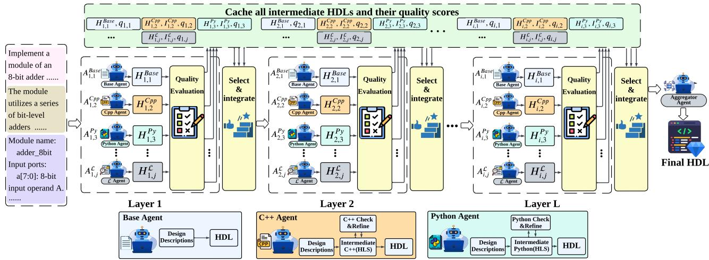
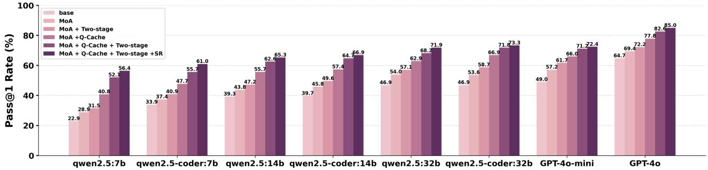
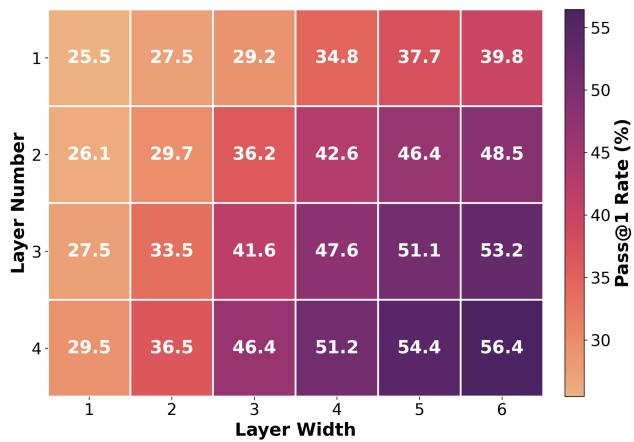
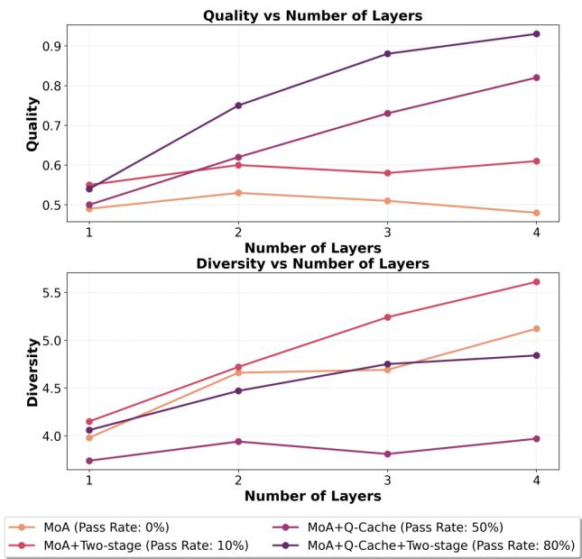

# VERIMOA: A MIXTURE-OF-AGENTS FRAMEWORK FOR SPEC-TO-HDL GENERATION

Heng Ping 1 Arijit Bhattacharjee 2 Peiyu Zhang 1 Shixuan Li 1 Wei Yang 1 Anzhe Cheng 1 Xiaole Zhang 1 Jesse Thomason 1 Ali Jannesari 2 Nesreen Ahmed 3 Paul Bogdan 1

## ABSTRACT

Automation of Register Transfer Level (RTL) design can help developers meet increasing computational demands. Large Language Models (LLMs) show promise for Hardware Description Language (HDL) generation, but face challenges due to limited parametric knowledge and domain-specific constraints. While prompt engineering and fine-tuning have limitations in knowledge coverage and training costs, multi-agent architectures offer a training-free paradigm to enhance reasoning through collaborative generation. However, current multi-agent approaches suffer from two critical deficiencies: susceptibility to noise propagation and constrained reasoning space exploration. We propose VERIMOA, a training-free mixture-of-agents (MoA) framework with two synergistic innovations. First, a quality-guided caching mechanism to maintain all intermediate HDL outputs and enables quality-based ranking and selection across the entire generation process, encouraging knowledge accumulation over layers of reasoning. Second, a multi-path generation strategy that leverages C++ and Python as intermediate representations, decomposing specification-to-HDL translation into two-stage processes that exploit LLM fluency in high-resource languages while promoting solution diversity. Comprehensive experiments on VerilogEval 2.0 and RTLLM 2.0 benchmarks demonstrate that VERIMOA achieves 15–30% improvements in Pass@1 across diverse LLM backbones, especially enabling smaller models to match larger models and fine-tuned alternatives without requiring costly training.

## 1 INTRODUCTION

As the semiconductor industry faces unprecedented pressure to deliver high-performance hardware, the automation of Register Transfer Level (RTL) design, a critical component of the chip development pipeline, has become increasingly vital (Liu et al., 2023). The ability to automatically generate accurate Hardware Description Language (HDL) from natural language specifications would dramatically accelerate design cycles and reduce engineering pressure (Lu et al., 2024). Recent advances in Large Language Models (LLMs) have demonstrated remarkable capabilities across diverse domains, including Electronic Design Automation (EDA), where they have shown promising potential for automating HDL generation from natural language instructions (Thakur et al., 2023). Unfortunately, despite their impressive performance in general-purpose programming tasks, applying LLMs to HDL generation presents unique challenges.

Unlike widely-used languages such as C++ or Python, HDL represents a specialized domain with limited representation in LLM pretraining corpora, resulting in comparatively sparse parametric knowledge for hardware design (Liu et al., 2024b). Moreover, HDL exhibits distinct operational semantics and constraints. For example, HDL must capture concurrent hardware behavior, satisfy timing constraints, and adhere to synthesis requirements, requiring reasoning over temporal and physical limitations inherent to circuit design. These domain-specific characteristics make it difficult for general-purpose LLMs to generate correct and efficient HDL code from specifications (Alsaqer et al., 2025).

To address these limitations, initial research focused on model-centric strategies to enhance LLM’s HDL generation capabilities. The first wave employed prompt engineering to elicit the LLM’s sparse HDL knowledge: ParaHDL (Sun et al., 2025) proposed task-specific prompt paradigms embedding HDL syntax patterns, while AoT (DeLorenzo et al., 2025) used tailored Chain-of-Thought templates for different circuit categories. However, these methods are fundamentally limited by the LLM’s inadequate pre-existing HDL understanding. A second wave progressed towards augmenting parametric knowledge through fine-tuning on highquality HDL datasets. Methods like RTLCoder (Liu et al., 2024a) and AutoVCoder (Gao et al., 2024) curated largescale, simulation-verified HDL corpora for supervised finetuning, while VeriSeek (Wang et al., 2024b) and ChipSeek-R1 (Chen et al., 2025) employed reinforcement learning to further enhance reasoning. Despite substantial improvements, the model-centric philosophy faces critical limitations: prompt engineering remains bounded by limited preexisting knowledge; fine-tuning requires significant data curation and training costs; most fundamentally, both rely on monolithic generation, lacking mechanisms for systematic collaboration and progressive improvement.

Recognizing the risks of a monolithic generation process, an alternative research direction constructs system-level frameworks, with multi-agent architectures emerging as a prominent approach for HDL generation. However, the prevailing collaborative paradigms are fundamentally flawed, ranging from the rigid, linear pipelines of MAGE (Zhao et al., 2024) that propagate errors, to the unstructured debates of CoopetitiveV (Mi et al., 2024) that lead to chaotic exploration. This progression exposes two profound deficiencies in current approaches. First, the collaborative processes of these frameworks are highly susceptible to noise and cannot guarantee information gain. Without a principled mechanism to filter out flawed information, the system’s knowledge base can be easily corrupted, preventing it from productively building upon prior successes. Second, even when correct information is preserved, they operate within a constrained reasoning space. Both brittle and chaotic structures struggle to systematically navigate the vast design space of HDL, a limitation that causes them to converge prematurely on local optima. The failure of current paradigms to both effectively capitalize on valuable findings and adequately explore the solution space highlights the critical need for a more advanced framework.

To overcome these fundamental deficiencies, we propose VERIMOA (Quality-guided Multi-path Mixtureof-Agents for HDL Generation), a framework that systematically addresses both noise susceptibility and constrained reasoning space in current multi-agent approaches. Building upon the Mixture-of-Agents (MoA) paradigm (Wang et al., 2024a), which aggregates outputs from the preceding layer, we introduce two key innovations. While MoA’s layer-wise aggregation partially mitigates error propagation compared to linear pipelines, it still suffers from cascaded dependencies where hallucination errors accumulate across layers. We address noise susceptibility through a quality-guided caching mechanism that fundamentally breaks cascaded dependencies by evaluating and caching intermediate HDL outputs from all previous layers, enabling deeper agents to selectively leverage the highest-quality code from the entire process rather than being confined to the immediately preceding layer. For constrained reasoning space, we introduce multi-path generation strategies within each layer, incorporating intermediate representation paths via C++ and Python that decompose specification-to-HDL translation into two-stage processes (specification → high-level code → HDL), substantially expanding the solution space at each layer.

These two innovations synergistically enhance HDL generation performance. The quality-guided caching ensures monotonic knowledge accumulation across layers, preventing valuable insights from being lost. The multi-path generation leverages LLMs’ rich parametric knowledge in C++ and Python while introducing structured diversity across generation paths (direct HDL, C++-guided, Python-guided) for comprehensive solution space exploration. Additionally, our framework can integrate simulation-based self-refinement to further enhance code quality, culminating in superior outputs.

Our contributions are summarized as follows:

• Quality-Guided Mixture-of-Agents Architecture: We propose a novel multi-agent framework that combines quality-guided caching with layered progress, ensuring monotonic knowledge accumulation and preventing information loss across layers.

• Multi-Path Generation with Intermediate Representations: We introduce parallel generation paths incorporating C++ and Python as intermediate representations, enabling two-stage HDL synthesis that leverages LLMs’ strengths in high-level languages while promoting solution diversity.

• Comprehensive Empirical Validation: Through experiments on VerilogEval 2.0 and RTLLM 2.0 benchmarks, we demonstrate VERIMOA achieves superior performance with 15–30% improvements in Pass@1 across diverse LLM backbones, validating the effectiveness of our quality-guided multi-path approach.

## 2 PROBLEM DEFINITION

We formalize the HDL generation task and establish the optimization objective for benchmark evaluation. Given a hardware design benchmark B consisting of N design problems, each problem $i \in \{ 1 , 2 , \ldots , N \}$ is characterized by a tuple $( \mathcal { D } _ { i } , \mathcal { T } _ { i } , \mathcal { S } _ { i } )$ , where $\mathcal { D } _ { i }$ denotes the natural language design description, $\tau _ { i }$ represents the golden testbench for simulation-based verification, and $s _ { i }$ denotes the simulator that validates functional correctness. The objective is to construct an LLM-based generation system G that produces HDL code $H _ { i }$ for each design description $\mathcal { D } _ { i }$

$$
H _ { i } = \mathcal { G } ( \mathcal { D } _ { i } ; \theta )\tag{1}
$$

where θ represents the system setting and generation strategy. The generated code $H _ { i }$ is evaluated through simulation $\operatorname { P a s s } _ { i } = { \mathcal { S } } _ { i } ( H _ { i } , { \mathcal { T } } _ { i } ) \in \{ { \mathrm { T r u e } } , { \mathrm { F a l s e } } \}$ , where Passi = True indicates that $H _ { i }$ passes all test cases, demonstrating both syntactic validity and functional correctness.

  
Figure 1. Overview of VERIMOA. The framework employs L layers with M agents per layer, featuring three agent types (Base, C++, Python) that generate HDL through different paths. A global cache stores all intermediate outputs with quality scores, enabling qualityguided selection across layers. Agents at each layer receive top-n quality HDL codes from all previous layers, ensuring monotonic improvement. The final aggregator synthesizes high-quality candidates into the output.

For practical deployment, the system generates multiple trials for each problem, and we measure performance using standard code generation metrics. Let $\mathcal { M } _ { k } ( \mathcal { G } , B )$ denote the pass@k metric that evaluates whether at least one correct solution exists among k generated trials, averaged across all problems in benchmark B. Our goal is to design a generation system $\mathcal { G } ^ { * }$ that maximizes this metric:

$$
\mathcal { G } ^ { * } = \arg \operatorname* { m a x } _ { \mathcal { G } } \mathcal { M } _ { k } ( \mathcal { G } , B )\tag{2}
$$

## 3 QUALITY-GUIDED MULTI-PATH MIXTURE-OF-AGENTS FOR HDL GENERATION

Existing multi-agent frameworks for HDL generation suffer from two critical deficiencies: susceptibility to noise propagation and constrained reasoning space exploration. To address these limitations, we propose Quality-guided Multi-path Mixture-of-Agents for HDL Generation (VERIMOA), a framework that introduces two synergistic innovations: (1) a quality-guided caching mechanism ensuring monotonic knowledge accumulation across layers, and (2) multi-path generation strategies leveraging high-level code as intermediate representations for expanded solution space exploration. This section presents the implementation details of our framework, organized into two subsections corresponding to these core innovations.

## 3.1 Quality-Guided Architecture with Global Caching

As shown in Fig. 1, our quality-guided MoA consists of three interconnected components: MoA layers, a quality evaluator, and a global cache. The architecture is designed to break the cascaded dependencies of standard MoA while preserving structured information flow across layers.

MoA Layers. The framework employs a hierarchical structure comprising L layers, organized into proposer layers (layers 1 through L − 1) and an aggregator layer (layer L). Each proposer layer contains M agents operating in parallel to generate diverse HDL candidates. For an agent $A _ { i , j }$ in the i-th proposer layer $( i \in \{ 1 , \ldots , L - 1 \} , j \in \{ 1 , \ldots , M \} )$ , the generation process is formalized as:

$$
H _ { i , j } = A _ { i , j } ( \mathcal { P } _ { i , j } )\tag{3}
$$

where $\mathcal { P } _ { i , j }$ denotes the prompt and $H _ { i , j }$ represents the HDL output. Following standard MoA conventions (Wang et al., 2024a), we maintain consistent agent configurations across proposer layers $( A _ { i , j } = A _ { i ^ { \prime } , j }$ for all $i , i ^ { \prime } \in \{ 1 , \ldots , L - 1 \} ,$ ). The aggregator synthesizes high-quality candidates from previous layers into the final HDL output.

Quality Evaluation. The quality evaluator Q assesses each generated HDL candidate through simulation-based evaluation, producing a quality score $q _ { i , j } ~ = ~ \mathcal { Q } ( H _ { i , j } , \mathcal { T } , S )$ This score reflects both syntactic validity and functional correctness, serving as the foundation for quality-guided selection. The evaluator implements a hierarchical scoring strategy detailed in Algorithm 1, which incorporates HDL domain-specific knowledge through three evaluation paths: (1) perfect scores for fully correct implementations, (2) severity-weighted penalties for functional failures with valid syntax, and (3) rule-based fallback evaluation for syntactic failures. The quality scores encode hardware design principles such as reset signal requirements, signal driving conflicts and timing constraints into explicit evaluation criteria, providing agents with HDL-specific feedback that injects domain expertise lacking in general-purpose LLMs.

Algorithm 1 Quality Evaluation with HDL-Specific Criteria   
Require: HDL code H, testbench T , simulator S   
Ensure: Quality score q ∈ [0, qperfect]   
1: passsyntax ← SyntaxTest(H, S)   
2: passfunc ← FunctionTest(H, T , S)   
3: if passsyntax = True and passfunc = True then   
4: return $q = q _ { \mathrm { p e r f e c t } }$   
5: else if passsyntax = True and passfunc = False then   
6: psevere ← EvaluateSevereErrors(H) {Logic errors,   
∈ [0, αsevere]}   
7: pmoderate ← EvaluateSynthesisIssues(H) {Synthesis   
concerns, ∈ [0, αmoderate]}   
8: pminor ← EvaluateStyleIssues(H) {Style issues, ∈   
$[ 0 , \alpha _ { \mathrm { m i n o r } } ] \}$   
9: return q = qbase − psevere − pmoderate − pminor   
10: else   
11: qstructure ← CheckModuleStructure(H) {Module/IO,   
∈ [0, βstructure]}   
12: qlogic ← CheckLogicKeywords(H) {Logic con  
structs, $\in [ 0 , \beta _ { \mathrm { l o g i c } } ] \}$   
13: qformat ← CheckFormatting(H) {Formatting, ∈   
[0, βformat]}   
14: return q = qstructure + qlogic + qformat   
15: end if

Global Cache and Quality-Guided Selection. To address the unstable information propagation in standard MoA, we propose a global cache that maintains all intermediate outputs and enables quality-based selection across the entire generation process. All intermediate HDL outputs and their corresponding quality scores are stored in a global cache:

$$
\mathcal { C } = \{ ( H _ { i , j } , q _ { i , j } ) \ | \ i \in \{ 1 , \ldots , L - 1 \} , j \in \{ 1 , \ldots , M \} \}\tag{4}
$$

This cache decouples information flow from rigid layer-bylayer dependencies, enabling agents to access high-quality references from any previous layer. For the first proposer layer, agents receive only the design description: $\mathcal { P } _ { 1 , j } =$ D. For subsequent layers $( i \geq 2 )$ , each agent receives an augmented prompt:

$$
\mathcal { P } _ { i , j } = \mathcal { D } \oplus \mathcal { H } _ { i } ^ { ( n ) }\tag{5}
$$

where ⊕ denotes concatenation and $\mathscr { H } _ { i } ^ { ( n ) } = \mathrm { T o p N } ( \mathscr { C } _ { < i } , n )$ represents the top-n highest-quality HDL codes selected from all previous layers. The TopN operation is defined as:

$$
\mathrm { T o p N } ( { \mathcal C } _ { < i } , n ) = \{ H \ | \ ( H , q ) \in { \mathcal C } _ { < i } , q \in \mathrm { t o p } { \cdot } n \ \mathrm { s c o r e s } \}\tag{6}
$$

where $\mathcal { C } _ { < i } \ = \ \{ ( H _ { k , j } , q _ { k , j } ) \ : \ : | \ : \ : k \ : < \ : i , j \ : \in \ : \{ 1 , \ldots , M \} \}$ denotes the cache subset containing outputs from all layers before layer i. This quality-guided selection ensures

that deeper agents always access the best available references, thereby breaking cascaded dependencies and enabling monotonic knowledge accumulation.

## 3.2 Multi-Path Generation with High-level Code as Intermediate Representations

While the quality-guided caching mechanism ensures monotonic knowledge accumulation at the architectural level, we further enhance the framework by improving proposer layers internally through the multi-path generation strategy. The strategy leverages high-level programming languages as intermediate representations, enabling LLMs to utilize their superior C++/Python knowledge while exploring diverse reasoning paths within each layer. Let L ∈ {C++, Python} denote the intermediate language. For an agent following the L-path in layer i, generation proceeds in two stages:

Stage 1: Specification to Intermediate Code. To further leverage the quality-guided caching mechanism, we evaluate and cache intermediate codes analogously to HDL codes, storing them in intermediate code cache $\mathcal { C } _ { \mathcal { L } } = \{ ( I _ { i , j } ^ { \mathcal { L } } , q _ { i , j } ^ { \mathcal { L } } ) \ |$ $i \in \{ 1 , \ldots , L - 1 \} , j \in \{ 1 , \ldots , M _ { \mathcal { L } } \} \}$ for each language L. The agent generates intermediate code as:

$$
I _ { i , j } ^ { \mathcal { L } } = A _ { i , j } ^ { \mathrm { S t a g e l } } ( \mathcal { P } _ { i , j } ^ { \mathcal { L } } )\tag{7}
$$

where the prompt is constructed as:

$$
\mathcal { P } _ { i , j } ^ { \mathcal { L } } = \left\{ { \begin{array} { l l } { D } & { \mathrm { i f ~ } i = 1 } \\ { D \oplus { \mathcal { T } } _ { i } ^ { \mathcal { L } , ( k ) } } & { \mathrm { i f ~ } i \geq 2 } \end{array} } \right.\tag{8}
$$

For the first layer, the agent generates intermediate code directly from the design description. For subsequent layers $( i ~ \geq ~ 2 )$ , the prompt is augmented with $\bar { \mathcal { T } } _ { i } ^ { \mathcal { L } , ( k ) } \ =$ TopK $( { \mathcal { C } } _ { { \mathcal { L } } , < i } , k )$ , which represents the top-k highest-quality intermediate codes selected from all previous layers. We then perform syntax validation using checking scripts and invoke the agent for self-refinement based on cheching feedback, producing refined intermediate code $I _ { i , j } ^ { \mathcal { L } , \mathrm { r e f i n e d } }$

Stage 2: Intermediate Code to HDL. Using the refined intermediate code as a reference, the agent generates HDL:

$$
H _ { i , j } ^ { \mathcal { L } } = A _ { i , j } ^ { \mathrm { S t a g e 2 } } ( \mathcal { D } \oplus I _ { i , j } ^ { \mathcal { L } , \mathrm { r e f i n e d } } \oplus \mathcal { H } _ { i } ^ { ( n ) } )\tag{9}
$$

where $\mathcal { H } _ { i } ^ { ( n ) }$ denotes the top-n HDL references from the global cache. For $\textit { i } = \ 1$ , this simplifies to $H _ { 1 , j } ^ { \mathcal { L } } ~ =$ $A _ { 1 , j } ^ { \mathrm { S t a g e 2 } } ( \mathcal { D } \oplus I _ { 1 , j } ^ { \mathcal { L } , \mathrm { r e f i n e d } } )$ as no prior HDL references exist.

To enable quality-guided selection of intermediate codes across layers, we assign each intermediate code a quality score based on the HDL it generates:

$$
q _ { i , j } ^ { \mathcal { L } } = q ( H _ { i , j } ^ { \mathcal { L } } )\tag{10}
$$

where $q ( H _ { i , j } ^ { \mathcal { L } } )$ is evaluated by the evaluator Q described in Algorithm 1. This task-aligned evaluation prioritizes intermediate codes that enable high-quality HDL translation.

Multi-Path Proposer Configuration. We define three agents: Baseline agents $( A _ { i , j } ^ { \mathrm { { B a s e } } } )$ generate HDL directly from the design description, C++ agents $( A _ { i , j } ^ { \mathrm { C p p } } )$ and Python agents $( A _ { i , j } ^ { \mathrm { P y } } )$ follow the two-stage process with C++ and Python as intermediate languages, respectively. Each proposer layer consists of M agents operating in parallel, with each position $j \in \{ 1 , \dots , M \}$ assigned one agent type:

$$
\mathcal { A } _ { i } = \{ A _ { i , j } ^ { t _ { j } } \ | \ j \in \{ 1 , \dots , M \} , t _ { j } \in \{ \mathrm { B a s e } , \mathrm { C p p } , \mathrm { P y } \} \}\tag{11}
$$

This heterogeneous mixture explores multiple reasoning paths simultaneously, where baseline agents prioritize hardware idioms, C++ agents emphasize bit-level control, while Python agents leverage high-level expressiveness, leading to diverse HDL implementations for identical specifications.

Optional Simulator-Based Self-Refinement. Following established practices (Mi et al., 2024; Zhao et al., 2024), our framework can optionally integrate simulator-based selfrefinement. After generating initial HDL output $H _ { i , j }$ , agents invoke simulator $s$ with testbench T to obtain execution feedback for refinement. This mechanism applies uniformly to all agent types in both proposer and aggregator layers.

## 4 THEORETICAL ANALYSIS OF QUALITY-GUIDED MULTI-PATH GENERATION

This section provides theoretical analysis of our VERIMOA framework, establishing formal guarantees for performance improvement and explaining how quality-guided caching and multi-path generation enhance HDL generation. We connect our design to established Mixture-of-Agents principles, prove monotonic quality guarantees, and analyze how multi-path strategies amplify both quality and diversity.

## 4.1 Foundation: MoA Performance Decomposition

Recent empirical analysis of Mixture-of-Agents (Li et al., 2025) demonstrates that MoA performance exhibits strong positive correlation with two key factors: proposer quality and proposer diversity. Through statistical analysis across reasoning benchmarks, they establish that MoA performance t can be approximated by a linear model:

$$
t = \alpha \times q + \beta \times d + \gamma\tag{12}
$$

where q represents proposer quality, d represents proposer diversity, and $\alpha , \beta , \gamma$ are regression coefficients with $\alpha > \beta ,$ indicating quality exerts stronger influence than diversity.

In HDL generation, proposer quality encompasses agent capability and reference code quality from previous layers. Let $\mathcal { A } _ { i } = \{ A _ { i , 1 } , . . . , A _ { i , M } \}$ denote the agent configuration at layer $i ,$ and $\mathcal { H } _ { i } ^ { ( n ) }$ the reference HDL set. The effective

proposer quality is:

$$
Q _ { i } = f ( \mathrm { c a p a b i l i t y } ( \mathcal { A } _ { i } ) , \mathrm { q u a l i t y } ( \mathcal { H } _ { i } ^ { ( n ) } ) )\tag{13}
$$

where f captures the combined effect of agent capability and reference quality. With fixed agent configurations across layers, improving $Q _ { i }$ reduces to enhancing quality $( \mathcal { H } _ { i } ^ { ( n ) } )$ . Given $\alpha > \beta ,$ , our framework prioritizes maximizing reference quality through quality-guided caching while promoting diversity through multi-path generation.

## 4.2 Quality Guarantee through Global Caching

Error Accumulation in Standard MoA. Applying standard MoA to HDL generation causes performance degradation as layer depth increases. This occurs because LLMs’ limited HDL knowledge causes each layer to introduce nontrivial errors. In standard MoA, each proposer layer only receives outputs from the preceding layer without qualitybased selection. Consequently, low-quality outputs from layer i − 1 contaminate layer i’s reference set, harming final performance through cascaded error propagation.

Monotonic Quality Improvement. Our quality-guided caching mechanism addresses error accumulation by maintaining a global cache and selecting only top-n quality outputs across all previous layers, ensuring monotonic improvement while breaking rigid layer-by-layer propagation.

For any layer $i \geq 2 ,$ , the quality guarantee can be formalized as:

$$
\operatorname* { m i n } _ { H \in \mathcal { H } _ { i + 1 } ^ { ( n ) } } q ( H ) \geq \operatorname* { m i n } _ { H \in \mathcal { H } _ { i } ^ { ( n ) } } q ( H )\tag{14}
$$

$$
\frac { 1 } { n } \sum _ { H \in \mathcal { H } _ { i + 1 } ^ { ( n ) } } q ( H ) \geq \frac { 1 } { n } \sum _ { H \in \mathcal { H } _ { i } ^ { ( n ) } } q ( H )\tag{15}
$$

Equation (14) ensures the minimum quality is nondecreasing, while Equation (15) guarantees average quality improvement. These properties hold by construction of the TopN operation (Equation (6)): since $c _ { < i + 1 } \supset { \mathcal { C } } _ { < i }$ , selecting top-n from a strictly larger set that includes all previous top-n elements plus new candidates from layer i cannot decrease either minimum or average quality.

This quality guarantee establishes non-decreasing information quality flow across proposer layers. Consequently, agents in deeper layers operate on strictly superior reference materials, leading to expected quality improvements:

$$
\mathbb { E } [ q _ { i + 1 , j } ] \ge \mathbb { E } [ q _ { i , j } ] , \quad \forall j \in \{ 1 , \dots , M \}\tag{16}
$$

where the expectation is taken over LLM generation stochasticity. This monotonicity property prevents information loss during multi-layer process, enabling consistent performance gains as depth increases, in contrast to the degradation observed in standard MoA.

## 4.3 Synergistic Enhancement through Multi-Path Generation

The multi-path generation strategy synergistically addresses both dimensions of MoA performance (Equation (12)): proposer quality and diversity.

Quality Enhancement via Intermediate Representations. Recall that proposer quality $Q _ { i }$ depends on both agent capability and reference code quality (Equation (13)). The two-stage mechanism enhances agent capability by leveraging LLMs’ substantially stronger parametric knowledge of C++/Python (Xiong et al., 2024). In Stage 1, the LLM decomposes abstract design requirements into explicit algorithmic constructs (control flow, data structures, and computational patterns) that directly correspond to hardware behavior (Xu et al., 2024). This intermediate representation serves as a structured scaffold for Stage 2 HDL generation, effectively translating the LLM’s strong high-level language comprehension into accurate hardware implementations.

To formalize quality propagation in multi-path generation, consider an agent following the L-path at layer i. The expected HDL quality depends on both intermediate code quality and reference HDL quality:

$$
\mathbb { E } [ q ( H _ { i , j } ^ { \mathcal { L } } ) ] = \mathbb { E } [ g ( q ( I _ { i , j } ^ { \mathcal { L } } ) , \mathrm { q u a l i t y } ( \mathcal { H } _ { i } ^ { ( n ) } ) ) ]\tag{17}
$$

where g represents the Stage 2 translation process, whose expected output quality increases monotonically with both input arguments. Quality-guided caching for intermediate codes ensures:

$$
\operatorname* { m i n } _ { I \in \mathcal { T } _ { i + 1 } ^ { \mathcal { L } , ( k ) } } q ( I ) \geq \operatorname* { m i n } _ { I \in \mathcal { T } _ { i } ^ { \mathcal { L } , ( k ) } } q ( I )\tag{18}
$$

$$
\frac { 1 } { k } \sum _ { I \in \mathcal { T } _ { i + 1 } ^ { \mathcal { L } , ( k ) } } q ( I ) \geq \frac { 1 } { k } \sum _ { I \in \mathcal { T } _ { i } ^ { \mathcal { L } , ( k ) } } q ( I )\tag{19}
$$

Combined with HDL quality guarantees (Equations (14) (15)), we have:

$$
\mathrm { q u a l i t y } ( \mathcal { H } _ { i + 1 } ^ { ( n ) } ) \geq \mathrm { q u a l i t y } ( \mathcal { H } _ { i } ^ { ( n ) } )\tag{20}
$$

Since $g$ is expected to be monotonically increasing and both inputs improve, applying the monotonicity yields:

$$
\begin{array} { r l } & { \mathbb { E } [ q ( H _ { i + 1 , j } ^ { \mathcal { L } } ) ] = \mathbb { E } [ g ( q ( I _ { i + 1 , j } ^ { \mathcal { L } } ) , \mathsf { q u a l i t y } ( \mathcal { H } _ { i + 1 } ^ { ( n ) } ) ) ] } \\ & { \qquad \ge \mathbb { E } [ g ( q ( I _ { i , j } ^ { \mathcal { L } } ) , \mathsf { q u a l i t y } ( \mathcal { H } _ { i } ^ { ( n ) } ) ) ] = \mathbb { E } [ q ( H _ { i , j } ^ { \mathcal { L } } ) ] } \\ & { \qquad ( 2 1 ) } \end{array}
$$

This monotonicity extends across all agent types (Baseline, C++, Python), collectively ensuring $Q _ { i + 1 } \geq Q _ { i }$

Diversity Amplification through Heterogeneous Paths. The multi-path architecture amplifies diversity through fundamentally different reasoning trajectories: baseline agents translate directly to HDL, C++ agents reason through imperative abstractions, while Python agents leverage high-level expressiveness. Let $\mathcal { H } _ { i } ^ { \mathrm { B a s e } } , \mathcal { H } _ { i } ^ { \mathrm { C p p } }$ , and $\mathcal { H } _ { i } ^ { \mathrm { P y } }$ denote the HDL outputs from each agent type at layer i. The structural diversity is characterized by:

$$
d _ { i } = \mathbb { E } [ \mathrm { d i s s i m i l a r i t y } ( \mathcal { H } _ { i } ^ { \mathrm { B a s e } } , \mathcal { H } _ { i } ^ { \mathrm { C p p } } , \mathcal { H } _ { i } ^ { \mathrm { P y } } ) ]\tag{22}
$$

where dissimilarity captures differences in code structure and implementation patterns, directly enhancing the diversity term d in Equation (12).

Synergistic Performance Maximization. The heterogeneous mixture of quality-improving paths (Equation (21)), each exploring distinct solution spaces (Equation (22)), synergistically maximizes MoA performance according to Equation (12). Quality-guided caching ensures monotonic accumulation of high-quality references across all paths, while multi-path generation expands the solution space through diverse reasoning strategies.

## 5 EXPERIMENTS

We conduct comprehensive experiments to evaluate the effectiveness of our VERIMOA framework. Our evaluation is designed to address four key research questions:

RQ1: How does VERIMOA compare to state-of-the-art methods in HDL generation performance?

RQ2: What is the contribution of each core component to the overall performance?

RQ3: How sensitive is the framework to variations in key parameters?

RQ4: Can VERIMOA effectively explore diverse solutions and propagate high-quality information across layers?

## 5.1 Experimental Setup

Benchmarks. We evaluate on VerilogEval 2.0 (Pinckney et al., 2025) (156 problems covering combinational and sequential circuits) and RTLLM 2.0 (Liu et al., 2024b) (50 complex real-world design tasks).

Baselines. We compare VERIMOA against representative methods from two categories. For non-training approaches, we include Direct (direct generation without prompting strategies), CoT (Wei et al., 2022) (Chain-of-Thought prompting), HDLCoRe (Ping et al., 2025) (difficultyadaptive prompting with RAG), and VeriMaAS (Bhattaram et al., 2025) (adaptive multi-agent system), evaluated across various LLMs including Qwen2.5 series and GPT-4o models. For fine-tuned models, we include RTLCoder-Mistral (Liu et al., 2024a), RTLCoder-DeepSeek-Coder (Liu et al., 2024a), OriGen-DeepSeek-Coder-7Bv1.5 (Cui et al., 2024), HaVen-CodeQwen1.5 (Yang et al.,

Table 1. Performance comparison of non-training baselines and our VERIMOA on VerilogEval 2.0 and RTLLM 2.0 benchmarks.
<table><tr><td rowspan="2">Model</td><td rowspan="2">Method</td><td colspan="3">VerilogEval 2.0 （%）</td><td colspan="3">RTLLM 2.0 (%)</td></tr><tr><td>Pass@1</td><td>Pass@3</td><td>Pass@5</td><td>Pass@1</td><td>Pass@3</td><td>Pass@5</td></tr><tr><td rowspan="4">Qwen2.5-7B</td><td>Direct</td><td>22.90</td><td>32.20</td><td>40.39</td><td>18.99</td><td>30.53</td><td>36.51</td></tr><tr><td>CoT HDLCoRe</td><td>26.87 ↑3.97</td><td>35.33 ↑3.13</td><td>42.58 ↑2.19</td><td>27.49 ↑8.50</td><td>34.76 ↑4.23</td><td>39.95 ↑3.44</td></tr><tr><td></td><td>30.92 个8.02</td><td>37.86 ↑5.66</td><td>46.49 ↑6.10</td><td>34.68 ↑15.69</td><td>40.32 ↑9.79</td><td>44.82 ↑8.31</td></tr><tr><td>VeriMaAS VERIMOA</td><td>32.81 ↑9.91 56.44 个33.54</td><td>40.25 ↑8.05 62.07 个29.87</td><td>49.07 ↑8.68 65.27 ↑24.88</td><td>40.33 ↑21.34 52.07 个33.08</td><td>47.24 ↑16.71 58.10 个27.57</td><td>50.47 ↑13.96 60.46 ↑23.95</td></tr><tr><td>Qwen2.5-Coder-7B</td><td>Direct CoT HDLCoRe VeriMaAS VERIMOA</td><td>33.91 36.74 ↑2.83 40.67 ↑6.76 44.73 ↑10.82 60.96 ↑27.05</td><td>43.90 45.88 ↑1.98 47.81 ↑3.91 51.62 个7.72 68.13 ↑24.23</td><td>48.06 50.99 ↑2.93 52.64 ↑4.58 55.78 ↑7.72 70.69 ↑22.63</td><td>26.16 31.87 个5.71 36.26 ↑10.10 44.71 个18.55</td><td>36.94 39.36 ↑2.42 45.61 ↑8.67 51.37 ↑14.43</td><td>41.11 45.36 ↑4.25 51.12 个10.01 56.46 ↑15.35</td></tr><tr><td>Qwen2.5-14B</td><td>Direct CoT HDLCoRe VeriMaAS VERIMOA Direct</td><td>39.26 41.24 ↑1.98 45.18 ↑5.92 48.97 ↑9.71 65.27 7个26.01 39.74</td><td>49.98 51.62 个1.64 55.83 ↑5.85 57.84 ↑7.86 71.61 ↑21.63 49.72</td><td>53.74 54.37 ↑0.63 59.42 ↑5.68 61.77 个8.03 74.64 个20.90</td><td>54.43 个28.27 31.71 36.49 ↑4.78 41.78 ↑10.07 48.14 ↑16.43 55.06 个23.35</td><td>62.52 ↑25.58 40.20 44.64 ↑4.44 49.97 ↑9.77 54.28 ↑14.08 62.76 ↑22.56</td><td>66.24 ↑25.13 45.87 48.29 ↑2.42 53.17 ↑7.30 58.76 ↑12.89 66.33 ↑20.46</td></tr><tr><td>Qwen2.5-Coder-14B</td><td>CoT HDLCoRe VeriMaAS VERIMOA Direct CoT</td><td>43.81 ↑4.07 46.82 ↑7.08 50.96 ↑11.22 66.86 个27.12 46.85 48.72 ↑1.87 51.75 ↑4.90</td><td>51.27 个1.55 54.79 ↑5.07 58.48 ↑8.76 73.24 ↑23.52 56.11</td><td>52.21 54.11 ↑1.90 57.04 ↑4.83 62.63 个10.42 76.38 个24.17 58.41</td><td>35.61 40.65 ↑5.04 47.86 ↑12.25 51.20 个15.59 59.76 ↑24.15 43.62</td><td>42.34 48.77 6.43 55.19 ↑12.85 58.93 ↑16.59 64.33 ↑21.99 48.73</td><td>46.43 51.72 ↑5.29 58.18 ↑11.75 61.67 ↑15.24 67.22 ↑20.79</td></tr><tr><td>Qwen2.5-32B Qwen2.5-Coder-32B</td><td>HDLCoRe VeriMaAS VERIMOA Direct CoT HDLCoRe</td><td>53.57 ↑6.72 71.85 ↑25.00 46.93 48.65 ↑1.72 51.28 ↑4.35</td><td>57.25 ↑1.14 59.63 ↑3.52 61.82 ↑5.71 76.48 ↑20.37 55.73 56.31 ↑0.58</td><td>59.80 ↑1.39 61.79 ↑3.38 64.26 ↑5.85 78.16 ↑19.75 57.12</td><td>46.99 ↑3.37 50.95 ↑7.33 54.18 个10.56 63.81 ↑20.19 40.40</td><td>50.50 ↑1.77 54.06 ↑5.33 57.21 ↑8.48 67.60 ↑18.87 45.42</td><td>50.75 52.46 ↑1.71 58.98 ↑8.23 61.54 ↑10.79 69.88 ↑19.13 48.24</td></tr><tr><td>GPT-40-mini</td><td>VeriMaAS VERIMOA Direct CoT HDLCoRe VeriMaAS</td><td>56.67 ↑9.74 73.31 ↑26.38 48.97 52.20 ↑3.23</td><td>58.63 ↑2.90 63.46 ↑7.73 79.05 ↑23.32 56.94 59.83 ↑2.89 61.46 ↑4.52</td><td>59.34 ↑2.22 61.47 ↑4.35 66.92 ↑9.80 81.27 ↑24.15 58.62 60.93 ↑2.31</td><td>45.72 个5.32 51.72 ↑11.32 55.82 个15.42 65.49 ↑25.09 46.60 48.27 个1.67</td><td>48.75 ↑3.33 54.73 ↑9.31 59.97 个14.55 71.42 ↑26.00 50.71 53.56 ↑2.85</td><td>50.29 ↑2.05 59.64 个11.40 62.31 ↑14.07 74.11 ↑25.87 51.95 55.48 ↑3.53</td></tr><tr><td>GPT-40</td><td>VERIMOA Direct CoT</td><td>53.50 ↑4.53 57.24 ↑8.27 72.43 ↑23.46 64.74 66.38 ↑1.64</td><td>64.77 ↑7.83 76.94 ↑20.00 69.89 71.18 ↑1.29</td><td>63.72 ↑5.10 66.85 ↑8.23 79.46 ↑20.84 71.66 74.22 ↑2.56</td><td>51.19 ↑4.59 57.25 个10.65 64.23 ↑17.63 52.48 54.89 ↑2.41</td><td>56.72 ↑6.01 61.46 ↑10.75 67.45 ↑16.74 56.18 59.22 ↑3.04</td><td>59.01 ↑7.06 63.17 ↑11.22 68.67 个16.72 57.62</td></tr><tr><td></td><td>HDLCoRe VeriMaAS VERIMOA</td><td>69.60 ↑4.86 71.34 ↑6.60 84.97 ↑20.23</td><td>73.53 个3.64 76.12 ↑6.23 89.65 ↑19.76</td><td>75.86 ↑4.20 79.21 ↑7.55 91.03 个19.37</td><td>56.27 ↑3.79 61.70 ↑9.22 69.17 个16.69</td><td>61.47 ↑5.29 67.25 ↑11.07 73.68 个17.50</td><td>61.77 ↑4.15 63.23 ↑5.61 68.84 个11.22 75.62 个18.00</td></tr></table>

2025), VeriRL-DeepSeek-Coder (Teng et al., 2025), and VeriRL-CodeQwen2.5 (Teng et al., 2025).

Evaluation Metric. We evaluate HDL generation performance from the perspective of functional correctness using the widely adopted pass@k metric (Pinckney et al., 2025), which estimates the proportion of problems for which at least one of k generated solutions passes functional verification. The metric is defined as:

$$
\operatorname { p a s s } @ k : = \mathbb { E } \left[ 1 - { \frac { { \binom { n - c } { k } } } { { \binom { n } { k } } } } \right]\tag{23}
$$

where $n \geq k$ is the number of sampled outputs per problem and c is the number of correct outputs among them. Following the experimental setting in VerilogEval 2.0 (Pinckney et al., 2025), we set n = 10 in all our experiments.

Implementation Details. We use Icarus Verilog (iverilog)

as our simulator for its efficiency and ease of integration. For LLM generation, we adopt the sampling strategy with temperature=0.8 and top p=0.95, following the configuration in VerilogEval 2.0 (Pinckney et al., 2025) to ensure fair comparison. Our VERIMOA framework uses 4 proposer layers with 6 parallel agents per layer, consistent with the standard MoA configuration (Wang et al., 2024a). The code is available at: https://github.com/hping666/ HDL\_Generation.

## 5.2 HDL Generation Performance (RQ1)

We evaluate VERIMOA’s HDL generation performance against state-of-the-art baselines on VerilogEval 2.0 and RTLLM 2.0 benchmarks. Tables 1 and 2 present comprehensive results across multiple LLM backbones and baseline methods.

Table 2. Performance comparison of fine-tuned Verilog-specific models and our VERIMOA on VerilogEval 2.0 and RTLLM 2.0 benchmarks. First , second , and third best results are highlighted for each metric.
<table><tr><td rowspan="2"></td><td rowspan="2">Model</td><td rowspan="2">Size</td><td colspan="3">VerilogEval 2.0 (%）</td><td colspan="3">RTLLM 2.0(%)</td></tr><tr><td>Pass@1</td><td>Pass@3</td><td>Pass@5</td><td>Pass@1</td><td>Pass@3</td><td>Pass@5</td></tr><tr><td rowspan="7">Verilog-Specific (finetune)</td><td>RTLCoder-Mistral</td><td>7B</td><td>35.62</td><td>36.63</td><td>37.71</td><td>38.68</td><td>40.86</td><td>41.84</td></tr><tr><td>RTLCoder-DeepSeek-Coder</td><td>6.7B</td><td>39.67</td><td>43.66</td><td>45.99</td><td>40.75</td><td>46.94</td><td>49.83</td></tr><tr><td>OriGen-DeepSeek-Coder-7B-v1.5</td><td>7B</td><td>51.19</td><td>54.88</td><td>56.78</td><td>41.11</td><td>52.09</td><td>58.48</td></tr><tr><td>HaVen-CodeQwen1.5</td><td>7B</td><td>55.40</td><td>59.73</td><td>62.76</td><td>51.04</td><td>57.38</td><td>60.89</td></tr><tr><td>VeriRL-DeepSeek-Coder</td><td>6.7B</td><td>64.57</td><td>68.96</td><td>71.78</td><td>58.64</td><td>63.92</td><td>66.26</td></tr><tr><td>VeriRL-CodeQwen2.5</td><td>7B</td><td>66.28</td><td>71.35</td><td>73.43</td><td>61.53</td><td>65.27</td><td>68.94</td></tr><tr><td>Qwen2.5-Coder-7B+VERIMoA</td><td>7B</td><td>60.96</td><td>68.13</td><td>70.69</td><td>54.43</td><td>62.52</td><td>66.24</td></tr><tr><td rowspan="2">Ours</td><td>Qwen2.5-Coder-14B+VERIMOA</td><td>14B</td><td>66.86</td><td>73.24</td><td>76.38</td><td>59.76</td><td>64.33</td><td>66.22</td></tr><tr><td>Qwen2.5-Coder-32B+VERIMOA</td><td>32B</td><td>73.31</td><td>79.05</td><td>81.27</td><td>65.49</td><td>71.42</td><td>74.11</td></tr></table>

  
Figure 2. Ablation Study of techniques adopted in our framework. Pass@1 performance [Higher is Better] reported on VerilogEval 2.0 dataset.

Comparison with Non-Training Methods. Table 1 demonstrates that VERIMOA consistently outperforms all nontraining baselines across different LLM backbones and both benchmarks, with particularly significant improvements on smaller LLMs. On VerilogEval 2.0, VERIMOA with Qwen2.5-7B achieves 56.44% Pass@1, outperforming Direct (22.90%) by 33.54 points and VeriMaAS (32.81%) by 23.63 points. Remarkably, VERIMOA with Qwen2.5-7B (56.44%) surpasses VeriMaAS with the larger Qwen2.5- 32B (53.57%), and VERIMOA with Qwen2.5-Coder-7B (60.96%) exceeds VeriMaAS with Qwen2.5-Coder-32B (56.67%), showing that our framework enables smaller LLMs to match and even exceed larger models through superior information propagation and solution space exploration. At larger scales with Qwen2.5-Coder-32B, VERI-MOA achieves 73.31% versus VeriMaAS’s 56.67% (16.64 points improvement). Performance gains extend to commercial models: GPT-4o-mini reaches 72.43% versus Veri-MaAS’s 56.24% (16.19 points improvement), and GPT-4o attains 84.97% versus 71.34% (13.63 points improvement). On RTLLM 2.0, VERIMOA consistently outperforms Veri-MaAS by 7–12 points of Pass@1 across model scales, with stronger gains for smaller models. These results validate that our quality-guided caching and multi-path generation strategies enchance HDL generation performance through architectural innovations applicable to diverse LLMs.

Comparison with Fine-Tuned Models. Table 2 shows that VERIMOA achieves competitive or superior performance without requiring training. With Qwen2.5-Coder-7B, VERIMOA attains 60.96% Pass@1 on VerilogEval 2.0, approaching fine-tuned models like VeriRL-DeepSeek-Coder (64.57%) and demonstrating that effective architectural design can partially compensate for domain-specific training. With Qwen2.5-Coder-14B, VERIMOA achieves 66.86%, matching the best fine-tuned 7B model VeriRL-CodeQwen2.5 (66.28%). Using Qwen2.5-Coder-32B, VE-RIMOA reaches 73.31%, surpassing all fine-tuned models by substantial margins (7.03 points improvement over VeriRL-CodeQwen2.5). This demonstrates our training-free framework can match or exceed fine-tuned models through quality-guided progress and diverse solution exploration.

## 5.3 Ablation Study (RQ2)

We conduct ablation studies to analyze the contribution of each core component. We evaluate six configurations across multiple LLM backbones using Pass@1 on VerilogEval 2.0 basesd on the following techniques: Base (direct generation), MoA (standard Mixture-of-Agents), Two-stage (high-level code as intermediate representations), Q-Cache (quality-guided caching mechanism), and SR (simulatorbased self-refinement). Figure 2 reveals that Q-Cache provides substantially greater benefits than Two-stage alone.

  
Figure 3. VeriMoA performance (Pass@1)[Darker is Better] on VerilogEval 2.0 using Qwen2.5:7b with varying layer configurations.

On Qwen2.5-7B, adding Q-Cache to MoA improves Pass@1 from 28.86% to 40.79% (11.93 points improvement), while adding Two-stage to MoA only yields 31.46% (2.60 points improvement). This pattern holds across all models: with GPT-4o, Q-Cache contributes 8.43 points improvement versus Two-stage’s 2.78 points improvement.

More importantly, Q-Cache is essential for realizing Twostage’s full potential. MoA + Two-stage achieves modest gains, but MoA + Q-Cache + Two-stage shows substantial improvements. For Qwen2.5-7B, adding Two-stage on top of Q-Cache improves from 40.79% to 52.06% (11.27 points), while adding Two-stage to baseline MoA yields only 2.60 points improvement, demonstrating that Q-Cache enables effective multi-path exploration with high-quality information propagation. The complete framework with SR achieves the best performance across all models, with particularly strong gains for smaller LLMs (Qwen2.5-7B: 22.90% to 56.44%). These results validate that Q-Cache serves as the critical enabler for effective multi-path generation.

## 5.4 Parameter Sensitivity Analysis (RQ3)

We investigate the impact of two key hyperparameters on QMMoA’s performance: layer number (depth) and layer width (number of parallel agents per layer). Figure 3 presents Pass@1 results on VerilogEval 2.0 using Qwen2.5- 7B across different configurations.

The results reveal that both dimensions must reach sufficient scale for strong performance. With minimal width (1 agent) or shallow depth (1 layer), performance remains low (25.5%-39.8%). Significant improvements emerge only when both parameters reach adequate thresholds: configurations with 3+ layers and 4+ agents achieve 47.6%-56.4% Pass@1, substantially outperforming sparse configurations. This validates that our framework requires sufficient capacity in both dimensions to effectively accumulate high-quality solutions and explore diverse reasoning paths.

  
Figure 4. Quality and diversity metrics during LIFObuffer generation from RTLLM 2.0 across 10 trials.

When comparing configurations with equal total agents, increasing width yields greater gains than increasing depth. For instance, with 12 total agents, the 3-layer-4-width configuration achieves 47.6% versus the 4-layer-3-width configuration’s 46.4%. Furtherly, 2-layer-6-width achieves 48.5%, outperforming the former both. This demonstrates that width (parallel diversity) maters importantly, validating our multi-path generation strategy’s emphasis on exploring diverse solution spaces through heterogeneous agent mixtures within each layer.

## 5.5 Case Study: Quality and Diversity Analysis (RQ4)

We analyze quality and diversity evolution on a complex task from RTLLM 2.0, named ”LIFObuffer”, by using Qwen2.5- 7B with layer width of 6. We measure the top-6 cached HDL candidates at each layer across four configurations, averaging metrics over 10 trials. Quality is evaluated using our scoring mechanism, while diversity is measured by Vendi score (Li et al., 2025). Figure 4 reveals distinct patterns. Standard MoA and MoA+Two-stage show stagnant quality (0.49 to 0.48 and 0.55 to 0.61) with 0-10% pass rates. MoA+Q-Cache achieves monotonic quality improvement (0.50 to 0.82, 50% pass rate), while MoA+Q-Cache+Twostage demonstrates the strongest growth (0.54 to 0.93, 80% pass rate). This validates that Q-Cache enables progressive quality improvement, which Two-stage amplifies when built upon this stable foundation.

For diversity, MoA and MoA+Two-stage maintain high values (3.98-5.61) but achieve low pass rates, indicating unfocused exploration. MoA+Q-Cache shows modest diversity (3.74-3.97) but reasonable performance through quality filtering. MoA+Q-Cache+Two-stage achieves both high diversity (4.06-4.84) and the best pass rate (80%), confirming that diversity alone is insufficient—effective exploration requires quality-guided selection to ensure diverse candidates contribute meaningful improvements rather than noise.

## 6 CONCLUSION

This paper introduces VERIMOA, a quality-guided multipath Mixture-of-Agents framework that systematically addresses noise susceptibility and constrained reasoning space in multi-agent HDL generation. By combining a qualityguided caching mechanism that ensures monotonic knowledge accumulation with a multi-path generation strategy leveraging C++ and Python as intermediate representations, VERIMOA achieves 15–30% improvements in Pass@1 across diverse LLM backbones on both VerilogEval 2.0 and RTLLM 2.0 benchmarks. Our framework enables smaller LLMs to match and even exceed larger models, fine-tuned alternatives without costly training, demonstrating that effective architectural design through quality-guided progress and diverse solution exploration offers a practical and scalable approach for automated RTL design.

## REFERENCES

Alsaqer, S., Alajmi, S., Ahmad, I., and Alfailakawi, M. The potential of llms in hardware design. Journal of Engineering Research, 13(3):2392–2404, 2025.

Bhattaram, A., Ramamoorthy, J., Gupta, R., Marculescu, D., and Stamoulis, D. Automated multi-agent workflows for RTL design. In 39th Conference on Neural Information Processing Systems (NeurIPS 2025) Workshop: ML for Systems, 2025.

Chen, Z., Chang, Y., Du, Z., Zhang, X., Kang, Z., Yu, Y., Bai, C., Huang, Y., and Chen, L. ChipSeek-R1: Generating human-surpassing RTL with LLM via hierarchical reward-driven reinforcement learning. arXiv preprint arXiv:2507.04736, 2025.

Cui, F., Yin, C., Zhou, K., Xiao, Y., Sun, G., Xu, Q., Guo, Q., Liang, Y., Zhang, X., Song, D., and Lin, D. Origen: Enhancing rtl code generation with code-to-code augmentation and self-reflection. In Proceedings of the 43rd IEEE/ACM International Conference on Computer-Aided Design, pp. 1–9. IEEE/ACM, 2024.

DeLorenzo, M., Chowdhury, A. B., Gohil, V., Thakur, S., Pearce, H., Karri, R., and Rajendran, J. Abstractions-ofthought: Intermediate representations for LLM reasoning

in hardware design. arXiv preprint arXiv:2505.15873, 2025.

Gao, M., Zhao, J., Lin, Z., Ding, W., Hou, X., Feng, Y., Li, C., and Guo, M. AutoVCoder: A systematic framework for automated Verilog code generation using LLMs. arXiv preprint arXiv:2407.18333, 2024.

Li, W., Lin, Y., Xia, M., and Jin, C. Rethinking mixture-ofagents: Is mixing different large language models beneficial? arXiv preprint arXiv:2502.00674, 2025.

Liu, M., Ene, T.-D., Kirby, R., Cheng, C., Pinckney, N., Liang, R., Alben, J., Anand, H., Banerjee, S., Bayraktaroglu, I., et al. Chipnemo: Domain-adapted llms for chip design. arXiv preprint arXiv:2311.00176, 2023.

Liu, S., Fang, W., Lu, Y., Wang, J., Zhang, Q., Zhang, H., and Xie, Z. RTLCoder: Fully open-source and efficient LLM-assisted RTL code generation technique. IEEE Transactions on Computer-Aided Design of Integrated Circuits and Systems, 2024a.

Liu, S., Lu, Y., Fang, W., Li, M., and Xie, Z. Openllm-rtl: Open dataset and benchmark for llm-aided design rtl generation. In 2024 IEEE/ACM International Conference on Computer-Aided Design (ICCAD), pp. 1–9. IEEE, 2024b.

Lu, Y., Liu, S., Zhang, Q., and Xie, Z. Rtllm: An opensource benchmark for design rtl generation with large language model. In 29th Asia and South Pacific Design Automation Conference (ASP-DAC), pp. 722–727. IEEE, 2024.

Mi, Z., Zheng, R., Zhong, H., Sun, Y., Kneeland, S., Moitra, S., Kutzer, K., Xu, Z., and Huang, S. Coopetitivev: Leveraging llm-powered coopetitive multi-agent prompting for high-quality verilog generation. arXiv preprint arXiv:2412.11014, 2024.

Pinckney, N., Batten, C., Liu, M., Ren, H., and Khailany, B. Revisiting verilogeval: A year of improvements in largelanguage models for hardware code generation. ACM Transactions on Design Automation of Electronic Systems, 2025.

Ping, H., Li, S., Zhang, P., Cheng, A., Duan, S., Kanakaris, N., Xiao, X., Yang, W., Nazarian, S., Irimia, A., and Bogdan, P. Hdlcore: A training-free framework for mitigating hallucinations in llm-generated hdl. arXiv preprint arXiv:2503.16528, 2025.

Sun, W., Li, B., Zhang, G. L., Yin, X., Zhuo, C., and Schlichtmann, U. Paradigm-based automatic HDL code generation using LLMs. arXiv preprint arXiv:2501.12702, 2025.

Teng, F., Pan, M., Zhang, X., He, Z., Yang, Y., Chai, X., Qi, M., Lu, L., and Yin, J. Verirl: Boosting the llm-based verilog code generation via reinforcement learning. arXiv preprint arXiv:2508.18462, 2025.

Thakur, S., Blocklove, J., Pearce, H., Tan, B., Garg, S., and Karri, R. Autochip: Automating hdl generation using llm feedback. arXiv preprint arXiv:2311.04887, 2023.

Wang, J., Wang, J., Athiwaratkun, B., Zhang, C., and Zou, J. Mixture-of-agents enhances large language model capabilities. arXiv preprint arXiv:2406.04692, 2024a.

Wang, N., Yao, B., Zhou, J., Wang, X., Jiang, Z., and Guan, N. Large language model for Verilog generation with code-structure-guided reinforcement learning. arXiv preprint arXiv:2407.18271, 2024b.

Wei, J., Wang, X., Schuurmans, D., Bosma, M., Ichter, B., Xia, F., Chi, E., Le, Q., and Zhou, D. Chain-of-thought prompting elicits reasoning in large language models. Advances in Neural Information Processing Systems, 35: 24824–24837, 2022.

Xiong, C., Huang, H., Zhao, R., and Chen, D. Hlspilot: Llm-based high-level synthesis. arXiv preprint arXiv:2408.06810, 2024.

Xu, K., Zhang, G. L., Yin, X., Zhuo, C., Schlichtmann, U., and Li, B. Automated c/c++ program repair for highlevel synthesis via large language models. arXiv preprint arXiv:2407.03889, 2024.

Yang, Y., Teng, F., Liu, P., Qi, M., Lv, C., Li, J., Zhang, X., and He, Z. Haven: Hallucination-mitigated llm for verilog code generation aligned with hdl engineers. arXiv preprint arXiv:2501.04908, 2025.

Zhao, Y., Zhang, H., Huang, H., Yu, Z., and Zhao, J. MAGE: A multi-agent engine for automated RTL code generation. arXiv preprint arXiv:2412.07822, 2024.