# NEST: NETWORK- AND MEMORY-AWARE DEVICE PLACEMENT FOR DISTRIBUTED DEEP LEARNING

Irene Wang 1 Vishnu Varma Venkata 1 Arvind Krishnamurthy 2 Divya Mahajan 1

## ABSTRACT

The growing scale of deep learning demands distributed training frameworks that jointly reason about parallelism, memory, and network topology. Prior works often rely on heuristic or topology-agnostic search (Tarnawski et al., 2020; Zheng et al., 2022; Wang et al., 2024), handling communication and memory separately. Without per-device memory awareness, these methods typically ensure feasibility post hoc by sharding parameters and activations across many devices, increasing synchronization, inflating communication, and underutilizing compute—limiting scalability and efficiency on real datacenter networks. We present NEST, a network-, compute-, and memory-aware device placement framework that unifies model parallelism, topology modeling, and memory feasibility via structured dynamic programming. NEST ’s DP operates on operator graphs with tensor and expert parallel configurations, explicit allreduce latencies across hierarchical or arbitrary networks, and memory/compute profiles. By factoring parallelism across tensor, pipeline, data, and expert dimensions, NEST defines a principled search space for hybrid strategies while jointly optimizing co-location, network latency, and memory feasibility. Evaluations across diverse hardware and networks show NEST achieves up to 2.43× higher throughput, better memory efficiency, and improved scalability over state-of-the-art baselines, providing a foundation for codesigning parallelization strategies and datacenter interconnects for next-generation AI infrastructure. The source code of NEST is available at: https://github.com/scai-tech/Nest.

## 1 INTRODUCTION

The rapid growth of deep learning in both parameter count and model complexity has made efficient distributed training a key bottleneck in scaling modern AI systems (NVIDIA, c; 2022; Rasley et al., 2020). Models like GPT-3 and Llama3 are trained on clusters with over 10,000 GPUs (Langston, 2020; Patel, 2024), where efficiency depends on how models are partitioned across devices and how these partitions interact with the physical interconnect. Even with abundant compute, inefficient placement can make the network the performance bottleneck, increasing training time and reducing infrastructure utilization.

To distribute training, we leverage multiple parallelization strategies, tensor, pipeline, data, expert, and optimizer-level schemes like ZeRO (Huang et al., 2019; Narayanan et al., 2019; Krizhevsky et al., 2017; Lepikhin et al., 2020; Rajbhandari et al., 2020). Each of these introduces distinct communication patterns and memory trade-offs, and realworld training systems rely on complex hybrid combinations to meet scaling and efficiency targets. Performance thus depends critically on datacenter interconnects, which handle collectives such as all-reduce for gradients and reducescatter/all-gather for activations or expert exchanges (Lee et al., 2025). Yet, most existing device placement frameworks (Tarnawski et al., 2021; Zheng et al., 2022; Tarnawski et al., 2020; Wang et al., 2024; Phanishayee et al., 2025) assume uniform or flat networks, overlooking the heterogeneous, hierarchical, and often oversubscribed nature of real-world topologies. For example, NVIDIA’s DGX SuperPOD links GPUs via NVSwitch within nodes and InfiniBand across nodes (NVIDIA, 2024); Microsoft’s MAIA clusters use hierarchical RDMA networks with bandwidthaware routing (Microsoft, 2024); and Google’s TPU v4 Pods employ torus topologies with non-uniform communication costs (Jouppi et al., 2023). These variations in latency and bandwidth can significantly impact performance-critical collectives, often making network interconnects a major bottleneck in distributed training (Go et al., 2025).

Recent works such as Alpa and TopoOpt (Zheng et al., 2022; Wang et al., 2023) introduce topology-aware device placement but remain limited in scalability and generality. TopoOpt uses Monte Carlo-based random search, offering no optimality guarantees and scaling poorly as the search space grows. Alpa assumes a simplified 2D mesh and validates communication-driven sharding only after placement, causing over-sharding, excessive communication, and underutilized compute—limiting scalability beyond 64 GPUs or heterogeneous clusters. As shown in Figure 1, existing frameworks do not jointly handle model parallelism, memory constraints, and realistic network topology while ensuring scalable, near-optimal search. Bridging this gap is essential for improving training throughput, cost efficiency, and guiding co-design of model architectures and datacenter interconnects. A principled, topology-aware placement framework that integrates computation, communication, and memory can expose how network capabilities and training strategies should co-evolve for maximal efficiency.

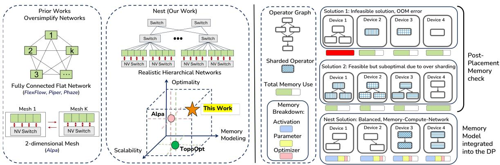  
Figure 1. (Left) NEST compared to prior works across network modeling, optimality, scalability, and memory modeling axes. (Right) Comparison of placement with and without integrated memory modeling. Sharded operators are shown through patterns.

As such, in this work, we introduce NEST, a principled, extensible, and compute–memory–network aware device placement framework that unifies model and network optimization through a novel dynamic programming formulation. NEST’s novel dynamic programming optimizer operates over the operator graph augmented with multiple tensor, sequence, expert, and context parallel configurations, precomputed communication latencies across network levels, and profiled compute and memory statistics. It inherently accounts for ZeRO for memory savings, pipeline parallelism for layer splitting, and data parallelism for scalability. This forms the combinatorial search space for the DP optimizer, enabling principled exploration of hybrid parallelism strategies under realistic network and memory constraints.

A key insight of NEST is its incremental handling of communication and memory costs. Since placement is solved backward, a layer’s communication depends on unknown downstream placements. NEST addresses this by precomputing latencies between abstract network levels (e.g., intranode, intra-rack, and other topologies) and evaluating transitions across multiple candidate downstream placements, preserving both network accuracy and provable optimality.

To further enhance efficiency and extensibility, NEST integrates a detailed memory model that tracks activations, gradients, parameters, and optimizer states during optimization, rather than relying on post-placement checks. This allows adaptive application of ZeRO stages to unlock previously infeasible configurations. Parallelism strategies are categorized along orthogonal dimensions, enabling systematic composition of hybrid strategies without exploding the search space. Finally, NEST ’s flexible network interface supports realistic datacenter topologies—including oversubscribed trees, fat-trees, spine-leaf fabrics, and torus networks—facilitating rigorous evaluation and co-design of model placement and datacenter infrastructure.

As such, the main contributions of NEST are:

1. Efficient Network-aware dynamic programming algorithm with provable optimality guarantees for hierarchical, heterogeneous interconnects.

2. Unified support for diverse parallelism strategies (tensor, pipeline, data, expert, sequence, context, ZeRO) with structured composition for tractable large-scale search.

3. Comprehensive network and memory modeling that reflects production-scale topologies and enables systematic exploration of placement–infrastructure trade-offs.

We evaluate NEST on large-scale training workloads with billions of parameters in realistic datacenter settings. NEST consistently outperforms manual, Monte Carlo–based, and state-of-the-art dynamic programming baselines, achieving up to 2.43× higher throughput and sustaining performance beyond 1,000 GPUs. It also finds optimal placements under memory constraints by adaptively leveraging ZeRO stages.

## 2 BACKGROUND AND MOTIVATION

Distributed Deep Learning. Modern frameworks such as Megatron-LM (NVIDIA, c), NeMo (NVIDIA, 2022), and DeepSpeed (Rasley et al., 2020) enable scalable training via multiple parallelization strategies. Intra-layer tensor parallelism (TP) splits individual layers across multiple accelerators, with sequence parallelism (SP) further partitioning activations along the sequence dimension to reduce memory pressure. Expert parallelism (EP) distributes Mixture-of-Experts (MoE) modules across devices, introducing unique all-to-all communication patterns. Context parallelism (CP) (Yang et al., 2025) segments the input sequence across multiple GPUs, specifically to handle the quadratic memory scaling of long-context attention mechanisms. Pipeline parallelism assigns layers to different devices, enabling micro-batch processing to reduce per-device memory usage (Huang et al., 2019; Narayanan et al., 2019), and data parallelism replicates the model across devices. Memory optimizations like ZeRO (Rajbhandari et al., 2020) partition optimizer states, gradients, and parameters to reduce memory usage. Each approach introduces distinct communication patterns and resource trade-offs, requiring careful orchestration for efficient training.

Table 1. Comparison of prior network- and memory- aware device placement works.
<table><tr><td>Feature</td><td>TopoOpt (Wang et al., 2023)</td><td>Alpa (Zheng et al., 2022)</td><td>Mist (Zhu et al., 2025)</td><td> NEST (Ours)</td></tr><tr><td>Parallelism Strategies</td><td>Data,Pipeline, Operator</td><td>Pipeline,Intra-operator (including Data)</td><td>Data, Pipeline,Tensor, ZeRO</td><td>Data, Pipeline, Tensor, ZeRO, Expert, Sequence, Context</td></tr><tr><td>Algorithm</td><td>MCMC (random search)</td><td>DP + ILP (joint search)</td><td>HierarchicalMILP+ brute-force enumeration</td><td>Dynamic Programming</td></tr><tr><td>Network Awareness</td><td>√TopoOpt Specific</td><td>■2D mesh only</td><td>X Profiles interference for offloading only</td><td>√Multi-level Hierarchi- cal &amp; oversubscribed √ Native; prunes in-</td></tr><tr><td>Memory Modeling</td><td>× Post-hoc check</td><td>X Post-hoc check (de- faults to over-sharding to fit memory)</td><td>√Integrated memory optimizations</td><td>valid states and prevents over-sharding while opti- mization</td></tr><tr><td>Scalability Expert &amp;</td><td>1 Poor with large search spaces</td><td>■Poor beyond ≈64 GPUs</td><td>1 IPoor with large search space</td><td>√ Scales to 1000+ GPUs</td></tr><tr><td>ZeRO Sup- port</td><td>× Not supported</td><td>Integrated in Intra- Operator</td><td>ZeRO support only</td><td>Native, adaptive sup- port</td></tr><tr><td>Optimality Guarantees</td><td>X None (random search)</td><td>Heuristic,limited by network &amp; partitioning strategy</td><td>IYes,limited by network &amp; partitioning strategy</td><td>Structured optimality via DP</td></tr></table>

Datacenter Network Topologies. Real-world datacenters are rarely uniform, typically employing hierarchical topologies such as Fat-Tree, Spine-Leaf, or Clos networks to balance scalability, fault tolerance, and cost (Microsoft, 2024; NVIDIA, 2024). Practical deployments often feature oversubscription or non-uniform interconnects due to physical layout and cost constraints, resulting in widely varying latency and bandwidth across intra-node, intra-rack, and interrack links. For instance, same-rack communication may use full-bandwidth NVSwitch connectivity, whereas cross-rack transfers traverse spine switches with shared or oversubscribed bandwidth. These hierarchical non-uniformities make distributed training highly topology-dependent. Appendix B illustrates common network configurations.

Prior Device Placement Techniques. Many works have explored automated model partitioning using reinforcement learning (Mirhoseini et al., 2017), Markov Chain Monte Carlo (MCMC) (Wang et al., 2023), and dynamic programming (DP) (Tarnawski et al., 2020; 2021; Wang et al., 2024; Zheng et al., 2022). Early systems such as PipeDream (Narayanan et al., 2019) focused primarily on pipeline parallelism, while later frameworks including (Tarnawski et al., 2021; Zheng et al., 2022; Zhu et al., 2025; Liu et al., 2024) combined data, operator, and inter-layer parallelism. However, most assume flat or simplified networks and do not fully support emerging strategies such as expert parallelism or memory optimizations like ZeRO.

In practice, datacenter networks are hierarchical and often oversubscribed, with latency and bandwidth varying across intra-node, intra-rack, and inter-rack links. These differences directly affect performance-critical collectives such as AllReduce, AllGather, and ReduceScatter, which frequently dominate distributed training overhead (Won et al., 2023; Go et al., 2025).

Several topology-aware approaches attempt to address these realities but remain limited in scalability or optimality. TopoOpt explores placements stochastically, lacks optimality guarantees, is sensitive to initialization, and scales poorly as the number of parallelization dimensions grows. Alpa uses dynamic programming, but to keep the search tractable it assumes simplified 2D mesh networks that cannot capture oversubscription or multi-level hierarchy. It prioritizes minimizing communication without jointly modeling compute latency and checks memory feasibility only after generating placement plans (i.e., post hoc). The lack of integrated memory modeling further increases search time and reduces the ability to find feasible placements on smaller clusters. To meet memory budgets, Alpa aggressively shards parameters and activations across GPUs. On larger clusters, it optimizes each pipeline stage independently and constructs a single pipeline; additional devices are used to further shard layers rather than scale via pipeline replication. This can lead to hardware underutilization and excessive communication, limiting effective scaling beyond roughly 64 GPUs.

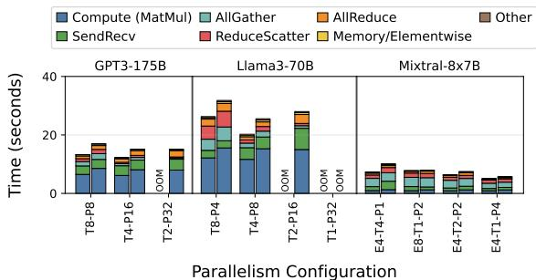  
Figure 2. Impact of communication latency on training time across different parallelism strategies on an oversubscribed 64-GPU cluster; left bar (without) and right (with) activation recomputation.

To address these limitations, more recent works shift focus toward memory feasibility and scheduling, though often at the expense of explicit network modeling. Aceso (Liu et al., 2024) uses greedy, bottleneck-chasing heuristics to improve memory balance and hardware utilization. However, its local search can stall in suboptimal configurations and provides no global optimality guarantees. Mist (Zhu et al., 2025) formulates placement and scheduling using MILP, emphasizing temporal overlap of communication and computation. While it handles memory more robustly than Alpa, it treats network topology as a secondary constraint and relies on hierarchical, brute-force search for parallelization, limiting scalability on large, hierarchical clusters.

This contrast between prior works is showcased in Table 1.

The Need for Topology-Aware Placement. As training scales to hundreds of accelerators, small differences in placement can cause large performance variations. Figure 2 illustrates this for GPT3-175B, Llama3-70B, and Mixtral-8×7B models on a 2:2 oversubscribed 64-GPU cluster, where communication accounts for a significant portion of total training time. The most efficient parallelization strategy depends on both the model and the underlying topology—what works on a uniform mesh may perform poorly on a hierarchical or bandwidth-asymmetric cluster. Efficient training, therefore, requires a placement framework that explicitly models network hierarchy, asymmetry, and oversubscription.

Motivation for NEST. These limitations highlight the need for a placement framework that (i) Strategy-aware, cooptimizing data, tensor, pipeline, expert, and memory parallelism; (ii) Network-aware, explicitly modeling hierarchical, oversubscribed, and asymmetric interconnects; and (iii) Scalable and principled, using structured optimization like dynamic programming rather than heuristics or sampling.

We introduce NEST, a network- and memory-aware dynamic programming framework that addresses these gaps. Unlike prior works that rely on stochastic search or simplified topology models, NEST explicitly models hierarchical, oversubscribed, and heterogeneous networks while integrating memory-modeling into its search methodology. This enables NEST to systematically explore feasible placements that balance communication, compute, and memory efficiency, scaling effectively across heterogeneous and oversubscribed datacenter architectures.

## 3 NEST OVERVIEW

NEST jointly models compute, memory, and communication during the search process to optimize network-aware device placement and distributed parallelization strategy for largescale training under realistic data center conditions. Figure 3 illustrates the NEST framework and the representative set of parallelization strategies supported by it.

## 3.1 Categorization of Parallelization Strategies

A key insight behind NEST is that distributed training parallelization techniques can be organized along orthogonal dimensions based on their interaction with the model graph and hardware. This principled categorization makes the dynamic programming search tractable by separating local, intra-operator transformations from global, inter-operator scheduling decisions. It enables NEST to compose strategies such as tensor, pipeline, data, expert, sequence, and context parallelism into hybrid configurations without combinatorial growth of the search space. Factoring optimization along these dimensions yields a systematic, extensible framework: new parallelization methods can be integrated seamlessly, and hybrid placements explored efficiently within a unified dynamic programming formulation. Building on this principle, NEST classifies strategies into two categories—subgraph and graph-global—each corresponding to a distinct abstraction level in the computation graph.

SUB-GRAPH strategies. These strategies operate within individual operators or small subgraphs, such as tensor and expert parallelism. NEST classifies a strategy as SUB-GRAPH if it modifies an operator’s internal execution, e.g., by partitioning parameters or adjusting tensor dimensions per accelerator, while preserving the model’s overall control and dataflow (i.e., layer sequence and dependencies). Its goal is to alleviate compute and memory bottlenecks within a layer by splitting its workload (e.g., weight matrices or expert activations) across devices. This fine-grained partitioning introduces tightly coupled collective operations, such as AllReduce for tensor parallelism and AllToAll for expert parallelism, AllGather and ReduceScatter for sequence and context parallelism to synchronize results. Because these transformations are local and self-contained, NEST profiles their operator-level compute, memory, and communication costs offline. These pre-characterized costs are then composed analytically during higher-level placement, without expanding the dynamic programming (DP) search space. Any operator-level technique replacing a layer with an equivalent distributed implementation can be integrated as a SUB-GRAPH strategy by providing its transformed computation graph and runtime annotations.

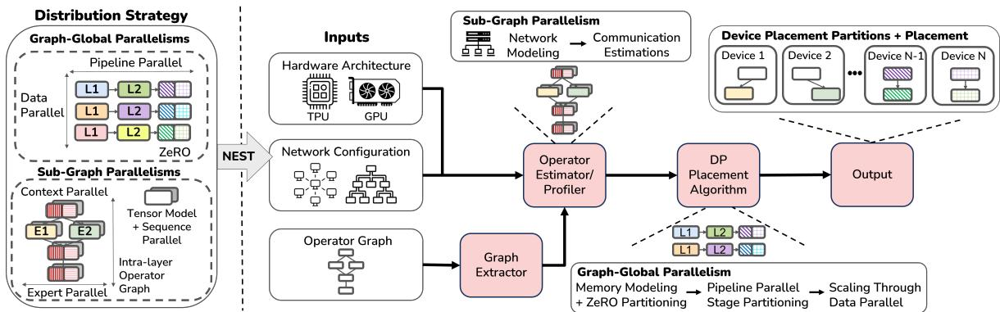  
Figure 3. NEST search space and workflow. GRAPH-GLOBAL strategies partition entire layers, whereas SUB-GRAPH strategies partition computations within individual layers. Different colors denote device assignments, and dashed boxes show ZeRO and context parallelism.

GRAPH-GLOBAL strategies. GRAPH-GLOBAL strategies act over the entire model computation graph such as pipeline parallelism (partitioning layers into stages), data parallelism (replicating the full model and synchronizing gradients), and ZeRO-style sharding (distributing optimizer states). They decide how layers, parameters, and data batches are distributed and scheduled across multiple devices or nodes, thereby reshaping the global execution plan. These strategies affect the global communication structure, memory balance, and inter-stage dependencies, and their impact cannot be localized to individual operators. NEST therefore incorporates GRAPH-GLOBAL strategies directly within its novel DP-based search, where it optimizes stage boundaries, replication factors, memory footprint, and communication overhead jointly under system-level constraints.

Discussion. By treating SUB-GRAPH and GRAPH-GLOBAL strategies as orthogonal dimensions, with local transformations and global scheduling, NEST avoids the combinatorial explosion of enumerating all configurations. Instead, it composes pre-profiled local strategies within a globally optimized placement, enabling systematic integration of new parallelism forms (e.g., expert or activation sharding) under a unified compute–memory–communication cost model.

## 3.2 NEST Workflow

NEST constructs a unified optimization workflow across three stages: graph extraction, runtime estimation, and placement search. Importantly, NEST operates strictly as a planning system: it preserves the mathematical equivalence of the original training formulation and does not modify the underlying model code or kernels.

It takes as input (1) a hardware specification (e.g., GPUs, TPUs, or domain-specific accelerators), (2) the model’s operator graph, and (3) a detailed network configuration specifying topology, bandwidth, latency, and communication protocols.

Graph Extraction. NEST extracts the operator graph from training scripts using symbolic tracing and applies userspecified or predefined logical SUB-GRAPH transformations to represent standard intra-layer parallelization strategies (e.g., tensor or expert splits). It then inserts the corresponding communication operators into the cost model. Each resulting variant produces a self-contained operator graph that serves as the foundation for runtime modeling.

Runtime Estimation. For each extracted graph, NEST performs an offline analysis to annotate compute and communication operators with platform-specific runtimes. Compute costs are derived from hardware estimators or profilers such as PyTorch (PyTorch, 2021), while communication costs are estimated using network simulators like AstraSim (Won et al., 2023). This provides a unified view of computation, communication, and memory behavior across the hierarchy.

Solver. Given operator graphs annotated with compute and communication costs, per-layer memory usage, and the cluster’s network characteristics, the DP solver explores GRAPH-GLOBAL configurations, including pipeline stage divisions, replication degrees, and data partitions, while incorporating the cost models of SUB-GRAPH strategies. This structured approach evaluates trade-offs among latency, memory, and bandwidth, identifying placements that maximize end-to-end throughput under memory and communication constraints. The final output is a parallelism configuration and placement plan. By integrating fine-grained SUB-GRAPH modeling with global GRAPH-GLOBAL exploration, NEST achieves scalable and generalizable device placement. Because NEST utilizes established parallel strategies without modifying the underlying mathematical operators, the resulting plan can be executed on standard distributed frameworks such as Megatron-LM (NVIDIA, c) and NeMO (NVIDIA, 2022) while preserving the mathematical equivalence of the original training formulation.

## 3.3 NEST Memory Modeling

Following the approach in prior works (Wang et al., 2024; Zhu et al., 2025; Lin et al., 2024), NEST employs symbolicbased analysis via Torch.fx (Reed et al., 2021) to estimate workload memory requirements. During graph extraction, NEST traces the dependency graph to annotate operator metadata, including parameters, input sizes, and activation tensors. This is used by the Solver for memory modeling.

The peak memory footprint for a contiguous subgraph (stage) S is modeled during the pipeline’s “steady state” and comprises five components: model weights, accumulated gradients, optimizer states, current intermediate activations, and stashed data(activations held for in-flight microbatches). The volume of stashed data is schedule-dependent: for 1F1B, a stage at index s from the pipeline end holds (s − 1) microbatches; for GPipe, this scales by $B / d .$

NEST evaluates two recomputation strategies: (1) Without Recomputation, where all intermediate activations are stashed; and (2) With Recomputation, where only stageboundary input activations are stashed, with intermediate tensors re-materialized during the backward pass.

NEST calculates peak memory using the equation:

$$
\begin{array} { r } { \mathrm { M e m } ( S , s ) = \qquad } \\ { \displaystyle \sum _ { L _ { i } \in S } \Big ( 2 \cdot \mathrm { w e i g h t s } + \mathrm { o p t . s t a t e s } + \mathrm { a c t i v a t i o n s } \Big ) + } \\ { \displaystyle ( s - 1 ) \cdot \mathrm { s t a s h e d . d a t a } } \end{array}\tag{1}
$$

By modeling memory as a linear function of the stage position s, the solver avoids redundant computations across different pipeline positions, significantly accelerating the search optimization. NEST memory modeling was validated against compiled kernels and validated to be on average within 7% across evaluated models. Summary of the model estimations is in Appendix H

## 4 NEST’S DYNAMIC PROGRAMMING

NEST introduces a novel network-, compute-, and memoryaware dynamic programming (DP) formulation that directly embeds network topology characteristics, bandwidth asymmetry, and per-stage compute latency and memory constraints into the optimization process. Even though prior works have employed DP for device placement, none have integrated network, compute, and memory awareness into a unified optimization framework (Zheng et al., 2022; Wang et al., 2024; Tarnawski et al., 2021). By doing so, NEST can reason about co-location, overlap, and pruning jointly, ensuring feasible and high-efficiency placements across heterogeneous clusters. This section presents the design of this DP solver, evolving from a baseline formulation to a fully integrated, topology- and memory-conscious optimizer.

DP Inputs and Search Space. NEST’s DP takes as input profiled operator graphs capturing multiple candidate configurations for tensor and expert parallelism. Each configuration records operator compute latency, collective communication costs (e.g., AllReduce, AllToAll), and per-layer memory usage. The DP also accounts for memory-saving techniques such as ZeRO sharding (parameters, gradients, optimizer), pipeline parallelism for layer partitioning, and data parallelism for scalable replication.

These profiled graphs and system characterizations define the DP search space. Each state represents a partial assignment of layers, devices, and parallelization strategies, while each DP transition is a feasible extension respecting memory and network constraints. By reasoning over this structured search space, NEST systematically explores thousands of hybrid placements without explicit enumeration, balancing compute distribution, communication locality, and memory feasibility within a unified optimization framework.

Local vs. Global Parallelism in the DP. NEST separates subgraph (local) and graph-global strategies within its DP formulation. Local strategies, such as tensor and expert parallelism, modify how a layer’s internal computation and parameters are distributed across accelerators. Their effects are captured during profiling and influence the per-stage latency term load(·). In contrast, graph-global strategies, such as data, pipeline, and ZeRO parallelism, reshape the boundaries between layers or stages and are explicitly explored by the DP during partitioning and placement. This separation allows NEST to maintain a tractable state space while still enabling hybrid configurations (e.g., tensor + pipeline + data parallelism) to be composed systematically. Subgraph strategies incorporate network awareness by modeling collective communication at multiple locality levels, such as intra-node, inter-node, and inter-rack, allowing the DP to reason about how local communication costs vary with physical placement and topology.

Baseline DP: Network-Agnostic. We start with a simplified baseline that ignores network and memory constraints. Let dp[D][k][s] denote the minimum latency of executing a downset D (a prefix of the layer graph) across k devices and s pipeline stages. The recurrence enumerates all subgraphs $D ^ { \prime } \subseteq D$ and possible device allocations $^ { a , }$ considering local strategies such as tensor or expert parallelism width (t, e):

$$
\begin{array} { l } { { d p ^ { t } [ D ] [ k ] [ s ] = \displaystyle \operatorname* { m i n } _ { D ^ { \prime } \subseteq D } \operatorname* { m i n } _ { a } \mathrm { m a x } } } \\ { { \quad \Big ( d p ^ { t e } [ D ^ { \prime } ] [ k - a ] [ s - 1 ] , \mathrm { l o a d } ^ { t e } ( D \setminus D ^ { \prime } , a , s ) \Big ) } } \end{array}\tag{2}
$$

Here, $D \ \backslash \ D ^ { \prime }$ denotes the new stage assigned to a devices, while load $^ { t e } ( S , a , s )$ estimates the latency of that stage given the chosen tensor and expert parallelism configuration. The recurrence then proceeds recursively, optimizing the remaining layers over the remaining k − a devices and s − 1 stages. This formulation efficiently prunes suboptimal decompositions but assumes a fully connected, uniform-cost network and ignores memory-induced constraints.

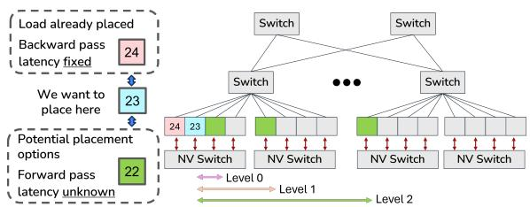  
Figure 4. The forward-pass dependency challenge and NEST ’s level-wise abstraction. The cost from unassigned Layer 22 to Layer 23 is unknown but abstracted as a discrete communication level (e.g., Level 0, 1, or 2).

Challenge and Level-Wise Network Abstraction. When network heterogeneity is introduced, a core challenge emerges: each pipeline stage’s latency depends not only on its own compute and backward communication, but also on the unknown placement of its predecessors that produce forward activations. Since the DP proceeds backward (from last to first stage), the producer’s location, and thus its communication cost, is unknown at decision time.

Figure 4 illustrates this challenge. When placing layer 23, the backward link to layer 24 (already placed) has a known latency based on their relative placement, but the forward link from layer 22 depends on where that stage will be located (e.g., same node, same rack, or remote). This asymmetry breaks the optimal substructure assumption.

Level-Wise Network Abstraction. To restore tractability, NEST introduces a level-wise abstraction that groups devices by communication locality. Instead of modeling every device pair, NEST treats the network level l as a discrete DP state variable. This abstraction allows NEST to generalize to real-world topologies by populating a level-wise cost matrix based on physical interconnects. Examples include:

• Hierarchical Fabrics (NVIDIA HGX/Spine-Leaf/Fat Tree): Levels map directly to switch tiers and link types. For example, $l _ { 0 }$ represents intra-node NVLink (e.g., 900 GB/s for H100), while $l _ { 1 }$ and $l _ { 2 }$ capture the significant bandwidth asymmetry of inter-node Ethernet/InfiniBand and oversubscribed inter-rack Spine-Leaf links. This allows the DP to avoid placing high-bandwidth pipeline stages across oversubscribed boundaries.

• Non-Uniform Meshes (TPUv4 Torus): In torus-based systems, levels represent hop-distance or coordinateaffinity classes (e.g., l0: same tile, l1: 1-hop, $l _ { 2 } \colon$ remote). By mapping these to profiled latencies, NEST accounts for non-uniform communication costs when scaling to thousands of accelerators.

As shown in Figure 4, the unknown forward cost is represented by a few network levels (typically 3–5). This lets the DP reason over levels instead of all device pairs, reducing combinatorial complexity while preserving hierarchical topology fidelity. Appendix C shows how this abstraction generalizes to non-uniform mesh and torus architectures.

Key Observation. This abstraction is topology-agnostic. By decoupling locality from a fixed hierarchy, the level-wise abstraction allows NEST’s DP to generalize to diverse and future interconnects, preserving scalability while adapting to new topologies and communication models.

Proposed DP: Network-Aware. With this abstraction, the DP recurrence becomes:

$$
\begin{array} { l } { { d p ^ { t e } [ l ] [ D ] [ k ] [ s ] = \displaystyle \operatorname* { m i n } _ { D ^ { \prime } \subseteq D } \operatorname* { m i n } _ { a } \mathrm { m a x } } } \\ { { \left( d p ^ { t e } [ l ^ { \prime } ] [ D ^ { \prime } ] [ k - a ] [ s - 1 ] , \mathrm { l o a d } _ { l } ^ { t e } ( D \setminus D ^ { \prime } , a , s ) \right) } } \end{array}\tag{3}
$$

Here, $d p ^ { t e } [ l ] [ D ] [ k ] [ s ]$ denotes the minimum possible latency (i.e., the cost of the bottleneck stage) to execute the suffix of layers $D$ using k devices partitioned into s pipeline stages under tensor/expert parallel configurations (t, e). The key new term is l (level). Since the DP proceeds backward, from the last layer toward the first, the placement of the next stage (e.g., layer 22 in Figure 4) is unknown when placing the current stage (e.g., layer 23). l represents the assumed communication distance of the yet-unplaced producer stage relative to the first stage in D, acting as a “deferred forward cost” that preserves optimal substructure.

Unified Cost Model and Recurrence. Equation 3 jointly finds the optimal pipeline cut-point (D′) and device allocation (a) for the new stage $( D \setminus D ^ { \prime } )$ , exploring transitions across communication levels while pruning memoryinfeasible states. The latency estimate loadtel (·) is central to co-optimization, capturing:

• Compute latency: derived from profiled per-operator runtimes, scaled by tensor/expert parallelism degrees.

• Network latency: determined by the level-wise communication cost matrix, accounting for collectives and both forward (from level l) and backward (to D′) traffic.

• Memory-Optimization Co-design: AR and ZeRO are natively integrated into the state transition. If a state exceeds device memory, the solver incrementally increases ZeRO levels (1, 2, or 3) until feasibility is reached, adding the resulting collective overhead to the latency. Similarly, recomputation is modeled as a binary optimization choice that reduces the ”stashed data” memory term at the expense of higher compute latency.

The recurrence uses max(·, ·) to balance the new stage’s cost (loadtel ) with the remaining stages $( d p ^ { t e } [ l ^ { \prime } ] [ D ^ { \prime } ] [ k - a ] [ s - 1 ] )$ where $l ^ { \prime }$ encodes the communication level between consecutive stages. This unified model ensures NEST considers only valid configurations, automatically trading off memory reduction (sharding) against communication overhead (co-location). Overall, this formulation lets NEST jointly optimize placement, communication, and memory, favoring co-location of frequently communicating stages while penalizing cross-level traffic.

Example. Consider the example in Figure 4. When placing layer 23, the DP enumerates its possible locations at each communication level relative to layer 24. For each option, it pre-computes the deferred forward costs corresponding to potential placements of layer 22. These partial sub-solutions are stored in dp[l][23,24][2][2]. Later, when placing layer 22, NEST simply uses these precomputed costs to select the globally optimal configuration—achieving optimality without exhaustive enumeration.

Summary. NEST’s dynamic programming is novel in three ways: (1) a hierarchical level-wise abstraction making network-aware placement tractable, (2) a unified compute–network–memory model embedding feasibility in the recurrence, and (3) orthogonal handling of local and global parallelism within a structured optimization framework.

## 5 EVALUATION

## 5.1 Methodology and Setup

Models: Table 2 lists the large language models used to evaluate NEST, including Llama2-7B (Touvron et al., 2023), Llama3-70B (Grattafiori et al., 2024) (Hugging Face (Wolf et al., 2019)), and BertLarge (Devlin et al., 2019), GPT3-175B, and Mixtral8x7B (Brown et al., 2020; Jiang et al., 2024) (tensor and expert parallelism; Megatron-LM (NVIDIA, c; Shoeybi et al., 2020)). Operator graphs are extracted with Torch.fx (Reed et al., 2021). A global batch size of 4096, and microbatch size of 1 is used for all experiments, unless stated otherwise.

Operator-Level Estimates, Runtime Profiles, and NEST Execution: For TPUv4-like accelerators, operator latencies are estimated using hardware-validated libraries Sunstone (Olyaiy et al., 2023) (tensor cores) and Tandem (Ghodrati et al., 2024) (vector cores), with ILP-based layer scheduling from prior work (Wang et al., 2024). For GPUs, compute latencies are profiled at operator and layer levels using the PyTorch Profiler (PyTorch, 2021), and communication collectives are modeled and validated with AstraSim (Won et al., 2023) (Appendix E). NEST runs on an H100 GPU to extract operator graphs and runtime profiles. Experiments use RHEL 9.6, Python 3.10, and a C++ solver compiled with g++ 12.4.0.

Baselines. We compare NEST against five baselines: (1) Manual placements from prior work (Narayanan et al., 2021b; Wang et al., 2024), scaling data parallelism across cluster sizes. (2) Phaze (Wang et al., 2024), a networkunaware DP framework built on Piper (Tarnawski et al., 2021); we evaluate only its device placement component. (3) MCMC-based placement (Wang et al., 2023), implemented to explore the same parallelization strategies as NEST. (4) Alpa (Zheng et al., 2022), a state-of-the-art DP framework leveraging intra-operator parallelism. (5) Mist (Zhu et al., 2025), a state-of-the-art DP framework focusing on scheduling and memory optimizations.

For fairness, NEST and baselines, use PipeDream-Flush schedule (Narayanan et al., 2021a) and shared cost model. All MCMC baselines were run 10 times, reporting the bestperforming result to ensure robust comparison. A key challenge with Alpa at scale is that its native design requires full-cluster access for runtime profiling, which is infeasible for large-scale deployments. To address this, we create an offline variant, Alpa-E (Alpa Estimator), which retains Alpa’s core optimization while replacing its hardware-dependent profiler with our unified estimator. This isolates differences in search efficiency and placement quality under identical cost assumptions. In Section 5.4, we evaluate Alpa’s original profiling-based implementation, Alpa-O, on real hardware where direct profiling is feasible.

Similarly, the Mist placement search algorithm requires execution on at least one physical device to function, and its current implementation is optimized specifically for NVIDIA architectures. Consequently, we evaluate Mist exclusively in Section 5.3 during our large-scale experiments on NVIDIA H100 GPUs. This ensures that the baseline is evaluated within its intended operational environment. In this evaluation, we compare against Mist’s placement strategy rather than its scheduling optimizations, as we consider those optimizations orthogonal to NEST ’s goals. We expect even larger gains if NEST ’s network-aware placement is combined with Mist’s scheduling algorithm.

## 5.2 Accelerators with Fat-Tree Execution

We evaluate NEST on fat-tree topologies with 64–1,024 TPUv4-like accelerators. Each node has eight accelerators connected via an HGX-style link (900 GB/s), with four nodes per first-level switch (100 GB/s) and second-level aggregation at 400 GB/s (Figure 8a). Table 2 lists workloads, and Figure 5 reports throughput gains. Alpa is limited to 512 devices due to profiling overhead, which grows rapidly as it enumerates all layer–mesh configurations (up to 48 hours, and in some cases doesn’t converge in 3 days). In contrast, NEST completes optimization in 3 minutes to 1.5 hours—scaling from BertLarge to GPT-3 175B on 1,024 devices—by constructing valid subgraphs per device and using template-based parallelism. MCMC and Phaze show similar runtimes. We further study the impact of ZeRO Optimization in Appendix D under a similar network topology.

Table 2. Model workloads evaluated using NEST. Hyperparameters: number of layers (#L), attention heads (#AH), and hidden size (H). Distributed strategies for 512 devices specify pipeline depth (p), data-parallel width (d), tensor model-parallel width (t), sequence parallel width (s), expert degree (e), and context-parallel degree (c), formatted as {p, d, t, s, (e,c)}. Sequence-parallel width (s), if applied, equals tensor model-parallel width (t), as both are partitioned across the same set of devices. For Alpa, only the number of pipelines per stage is listed, as it performs intra-operator sharding within each stage.
<table><tr><td rowspan="2">Model</td><td rowspan="2">Model</td><td rowspan="2">Sequence</td><td rowspan="2">Hyper parameters</td><td rowspan="2">TMP</td><td rowspan="2">Expert</td><td rowspan="2"></td><td colspan="7">DistributedStrategy{p,d,t,s,(e,c)}</td></tr><tr><td>Context</td><td>Manual</td><td>MCMC</td><td>Alpa</td><td>Phaze</td><td>Nest</td><td>Recomputation</td></tr><tr><td></td><td>Parameters</td><td>Length</td><td>#L,#AH, H</td><td>Widths</td><td>Degree</td><td>Degree</td><td></td><td></td><td></td><td></td><td></td><td></td><td>vs.Stashing</td></tr><tr><td>Llama2 7B</td><td>7B</td><td>4096</td><td>32,32,4096</td><td>，</td><td>-</td><td>-</td><td>{8,64,1,1}</td><td></td><td>{11, 46,1,1}</td><td>{32,-</td><td>{6,85,1,1}</td><td>{8,64,1,1}</td><td>Recomputation</td></tr><tr><td>Llama3 70B</td><td>70B</td><td>4096</td><td>80,64,8192</td><td></td><td>-</td><td>-</td><td>{80,6,1,1</td><td></td><td>{80,6,1,1}</td><td>{52，</td><td>{41, 12, 1,1]</td><td>{81,6,1,1}</td><td>Recomputation</td></tr><tr><td>Tensor Model Parallel Models</td><td></td><td></td><td></td><td></td><td>1</td><td>-</td><td></td><td></td><td></td><td></td><td></td><td></td><td></td></tr><tr><td>BertLarge</td><td>350M</td><td>512</td><td>24,16,1024</td><td>1,2.48</td><td>1</td><td>1</td><td>{8,64,1,1}</td><td></td><td>{2,256,1,1}</td><td>{24，,,,-}</td><td>{1,512,1,1}</td><td>{1,512,1,1}</td><td>Stashing</td></tr><tr><td>Megatron GPT3</td><td>175B</td><td>2048</td><td>96,96,12288</td><td>4.8</td><td></td><td></td><td>{32,4,4,1}</td><td></td><td>{9,7,8,1}</td><td>{72,}</td><td>{16,8,4,1}</td><td>{16,8,4,4}</td><td>Recomputation</td></tr><tr><td></td><td>Expert Parallel Models</td><td></td><td></td><td></td><td></td><td></td><td></td><td></td><td></td><td></td><td></td><td></td><td></td></tr><tr><td>Mixtral 8x7B</td><td>47B</td><td>4096</td><td>32,32,14336</td><td></td><td>1,2,48</td><td>1,2.4.8</td><td></td><td>{32,4,1,1,4,1}</td><td>{32,4,1,1,4,1}</td><td>{32，</td><td>{16,8,1,1,4,1}</td><td>{8,8,1,1,4,2}</td><td>Recomputation</td></tr></table>

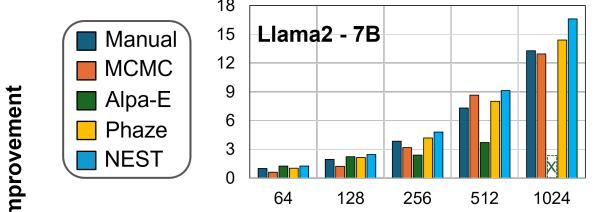

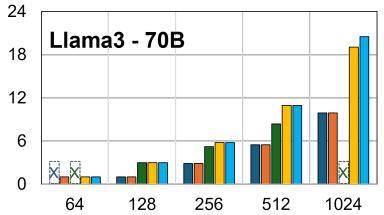

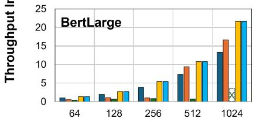

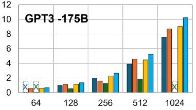

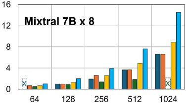  
Figure 5. Throughput comparison between NEST and baselines on a Fat-Tree network of TPUv4 accelerators. Throughput improvements are relative to the manual baseline’s smallest valid result. “X” indicates cases where the baseline failed to find a valid placement.

## 5.2.1 Throughput Improvements

On average, NEST ’s distribution strategy achieves 1.59× higher throughput than manual placements, 1.71× higher than MCMC-based search, 2.43× higher than Alpa-E, and 1.19× higher than Phaze. Importantly, NEST scales nearly linearly with cluster size, while other baselines either fail to find valid placements or experience diminishing returns. These results demonstrate the effectiveness of NEST ’s network-aware optimization and systematic search in delivering both high performance and robust scalability.

## Comparison with Random Search Methods (MCMC).

MCMC-based methods rely on random exploration and offer no optimality guarantees, with performance degrading as cluster size and model scale grow. While small models like BertLarge may see competitive strategies, larger models such as Megatron-GPT3 and Mixtral8x7B require far more iterations for meaningful gains. Even after an extensive search, MCMC underperforms both manual placements and NEST, and is highly sensitive to initialization. For example, on Llama2-7B, MCMC matches NEST only at 512 devices but fails at other scales; GPT3 and Llama3-70B show similar trends. These results motivate NEST: the need for structured, deterministic optimization that efficiently explores the parallelization space without exhaustive search.

Comparison with Phaze. Phaze’s dynamic programming (DP) assumes a flat, uniform network. While it balances computation, it overlooks communication costs, reducing throughput on heterogeneous interconnects—especially at scale. In contrast, NEST incorporates network topology and bandwidth heterogeneity directly into its DP solver, cooptimizing across an expanded search space that includes SP and CP. NEST incorporates network topology and bandwidth heterogeneity into its DP, selecting parallelism degrees and stage assignments that minimize communication while balancing computation. For example, in Llama2-7B and Mixtral-8×7B, NEST’s network-aware partitioning improves pipeline balance and reduces stalls. Even under a similar parallelism plan (e.g., GPT3-175B), NEST achieves higher throughput by assigning fewer layers to stages connected via slower links, equalizing total stage time (compute + communication). This topology-adaptive balancing mitigates pipeline bubbles and link bottlenecks, sustaining nearlinear scaling as models and clusters grow. When the model fits within a single pipeline stage (p = 1) or each layer forms its own stage (p = #L), Phaze and NEST achieve similar throughput (e.g., BertLarge).

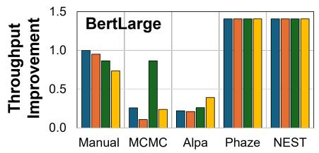

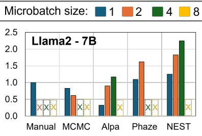  
Parallelization Strategy

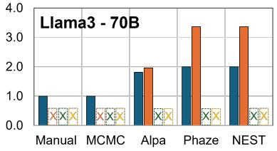  
Figure 6. Throughput improvement relative to a manual baseline (microbatch size 1). “X” marks baseline failures due to memory constraints. High memory requirements limit Llama2-7B and Llama3-70B to microbatch sizes 4 and 2, respectively.

Insight: Topology-adaptive partitioning enables NEST to equalize stage latency across heterogeneous links, maintaining balanced pipelines and sustaining linear scaling where topology-agnostic baselines stall.

Comparison with Alpa. At small scales (≤128 devices), Alpa-E achieves throughput comparable to NEST, with gains up to 3%, stemming from its fine-grained operator and layer sharding. On larger clusters and communication-heavy models like GPT-3-175B and Mixtral 8×7B, Alpa’s performance drops due to three main limitations: (1) memory feasibility is checked only post placements, (2) pipeline stages are optimized independently, limiting data-parallel scaling, and (3) Alpa’s 2D mesh assumes uniform communication, ignoring hierarchical network effects, which leads to over-sharding and suboptimal placements at larger scales.

Memory Modeling. Alpa verifies memory feasibility post hoc, often forcing aggressive sharding of activations and parameters, increasing search time and can fail on large models for small clusters (e.g., GPT3-175B or Llama3-70B on 64 GPUs). In contrast, NEST integrates memory and network constraints into its dynamic programming, evaluating each subgraph placement against memory budgets. Combined with ZeRO-based subgraph decomposition, this enables efficient scaling of large models on fewer devices.

Effects of Over-sharding. Alpa optimizes stages independently, scaling larger clusters by splitting layers across devices rather than replicating pipelines, increasing communication and reducing utilization, especially for smaller models like BertLarge or clusters beyond 128 devices. NEST avoids this by first optimizing intra-stage efficiency and then replicating pipelines to fully utilize hardware while balancing throughput and communication. This enables partial cluster utilization when beneficial, whereas Alpa enforces full device usage even when it lowers per-device efficiency.

Insight: Explicit memory-aware optimization. Accurate memory modeling enables NEST to detect bottlenecks early and apply targeted optimizations, making training feasible where memory-limited baselines fail.

## 5.2.2 Intra-operator vs Template-based Parallelism

Alpa uses fine-grained intra-operator sharding to maximize parallelism but incurs high communication overhead, limiting performance on larger or heterogeneous clusters (beyond 128 devices). NEST and Phaze use template-based parallelism, such as tensor and expert parallelism, which exploit the repetitive structure of Transformer models with coarser granularity and lower communication. Phaze, however, assumes a flat interconnect and ignores network topology and bandwidth asymmetry, limiting performance at scale (e.g., 1,024 devices). NEST overcomes these limitations by integrating network-aware placement into its template-based design, co-optimizing stage partitioning and inter-device communication based on real topology and bandwidth. This ensures balanced stage execution and avoids communication stalls, allowing NEST to match Alpa and Phaze on small clusters while delivering increasing throughput gains as cluster size grows.

## 5.2.3 Joint Exploration with Microbatch Size

Microbatch size and parallelization strategy strongly affect training throughput. NEST incorporates runtime factors like microbatch size and activation recomputation into graph extraction and cost estimation, enabling joint optimization with subgraph-level parallelism. Figure 6 shows throughput for NEST and baselines on BertLarge, Llama2-7B, and Llama3-70B across a 256-device cluster; 512-device results in Appendix F show similar trends, except Alpa scales poorly due to oversharding.

Optimal microbatch size varies by model and strategy. For instance, while Llama models benefit from larger microbatches, BertLarge shows little improvement under NEST and even degrades under manual placement. Changes in microbatch size shift compute intensity and memory footprint, often altering the optimal parallelism configuration (e.g., Llama2-7B shifts from {P =8, D=64, T =1} to {16, 32, 1} as batch size increases from 1 to 2). Alpa-E also benefits from larger microbatches, improving throughput by up to 1.8× for small models like BertLarge, but requires over 80 hours to sweep four batch sizes. In contrast, NEST completes the same joint exploration in 50 minutes, over 90× faster, while achieving consistently higher throughput, making comprehensive joint optimization practical at scale.

## 5.3 H100 GPU Based Spine-Leaf Execution

To demonstrate NEST ’s generality across hierarchical topologies, we evaluate it on a 1,024-GPU H100 spine–leaf cluster based on the real topology in Figure 2. Each node has eight H100-80GB GPUs (NVLink 900 GB/s); firstlevel switches connect four nodes at 12.5 GB/s to two spine switches, forming a 2:2 oversubscribed topology. Operator runtimes are profiled on H100 GPUs, and collective communication costs are modeled with AstraSim.

We exclude Alpa-O from this large-scale evaluation because it requires full-cluster access for profiling, which is impractical at this scale. While Alpa-E supports cost estimation, using it here would be inconsistent with our profiled H100-based setup and would prevent a fair comparison. Direct hardware-based comparisons with Alpa-O are instead presented on smaller clusters in Section 5.4. Instead, we compare against Mist (Zhu et al., 2025), a state-of-the-art DP framework focusing on scheduling and memory optimizations, which only requires access to a single H100 for strategy tuning.

We compare against the same set of models listed in Table 2, along with a scaled-down GPT-3 model (GPT3-35B; details in Appendix G). We use this smaller variant because Mist does not support GPT models with a hidden dimension larger than 8192, as used in the standard GPT3-175B configuration. In addition, Mist does not support MoE models such as Mixtral. Figure 5 shows the resulting throughput improvements. On average, NEST ’s distribution strategy achieves 1.47× higher throughput than manual placements, 1.40× higher than MCMC-based search, 1.49× higher than Mist, and 1.16× higher than Phaze. These gains stem from its ability to align computation stages with available bandwidth, delivering robust and scalable performance across diverse hardware and network configurations.

Both hardware and network variations strongly influence training performance, determining whether computation or communication becomes the bottleneck. For example, in the Mixtral model, communication can account for up to 10% of total execution time on a constrained network, compared to only 1% on a fat-tree topology. NEST distinguishes itself by explicitly modeling topology and communication costs during workload partitioning, enabling it to balance computation and communication effectively. In contrast, Phaze’s network-agnostic strategy can create severe latency imbalances under limited bandwidth, and MCMC-based random search often fails to adapt in oversubscribed settings. For instance, for the BertLarge model, Phaze selects a configuration of p=13, d=78, t=1, which results in frequent cross-node communication and up to 2× imbalance in per-stage latency. In comparison, NEST recognizes the low inter-node bandwidth of this network configuration and instead selects p=8, d=128, t=1, keeping pipeline communication within a single node. As a result, it reduces inter-stage latency variation to under 2% and consistently achieves higher throughput. This allows NEST to deliver stable throughput gains and strong generalization across diverse hardware and network scales.

Comparison with Mist. NEST achieves higher throughput across all evaluated models due to its network-aware stage partitioning and placement strategy. For most models, NEST favors shallower pipelines to reduce pipeline bubbles and minimize cross-node communication frequency, instead leveraging higher data-parallel degrees to scale throughput. While Mist supports uneven layer partitioning across pipeline stages, this feature is primarily designed to accommodate varying memory optimizations and maximize compute-communication overlap. Because Mist lacks network awareness, it cannot account for bandwidth heterogeneity across links; consequently, it fails to balance the actual communication-to-compute ratio across the cluster. In contrast, NEST’s topology-adaptive approach ensures that stage latencies remain equalized even when crossing oversubscribed rack links.

Furthermore, NEST demonstrates significantly higher search efficiency than Mist. Across all evaluated models, the NEST solver achieves shorter runtimes, finding optimal placements on average 30% faster than Mist under identical model and hardware configurations. A breakdown of the exploration time for each model is provided in Appendix I.

## 5.4 V100 GPU Based Spine–Leaf Execution

We validate NEST on real hardware using 8- and 16-GPU clusters (2×V100 per node, NVLink 300 GB/s, nodes connected via 12.5 GB/s switches). Alpa’s profiling-based variant (Alpa-O), which performs fine-grained intra- and inter-operator sharding, is highly effective at small scales and serves as a strong baseline. We run Alpa-O on the full cluster, while NEST leverages pre-profiled traces and simulator-guided placement to eliminate extensive profiling overhead. On a scaled-down Mixtral model (Appendix J), NEST achieves throughput within 7% of Alpa on the 8-GPU cluster while reducing optimization time from 1 hour to 5 minutes, and outperforms Alpa by 1.8× on the 16-GPU cluster. These results show that NEST matches highly optimized, profiling-based strategies on real hardware at small scales while scaling more efficiently to larger clusters.

## 6 RELATED WORKS

Device Placement Frameworks. Systems such as FlexFlow (Jia et al., 2019), Piper (Tarnawski et al.,

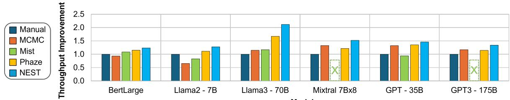  
Figure 7. Throughput comparison between NEST and baselines on a Spine-Leaf network of 1024 H100 GPUs. Throughput improvements are relative to the manual baseline. Mist does not support GPT3-175B and Mixtral-8x7B, as indicated with an ”X”.

2021), Pip (Tarnawski et al., 2020), and RL-based approaches (Mirhoseini et al., 2017) automate parallelism configuration using reinforcement learning, dynamic programming, or random search, but typically assume simplified or flat networks and ignore topology heterogeneity. Alpa (Zheng et al., 2022) adds limited topology awareness with a two-level mesh and hybrid ILP–DP search, but lacks support for hierarchical or oversubscribed networks, integrated memory modeling, and expert parallelism. Recent work expands the design space along different axes. Aceso (Liu et al., 2024) emphasizes memory feasibility and utilization via greedy, bottleneck-driven search but relies on local heuristics without global optimality guarantees. Mist (Zhu et al., 2025) uses MILP to optimize compute–communication overlap, yet treats topology as secondary and scales poorly to large hierarchical clusters. Other systems provide tooling rather than unified optimization. For example, nnScaler (Lin et al., 2024) supports manual exploration of scaling strategies but does not jointly optimize compute, memory, and network placement.

Joint Optimization with Device Placement. Phaze (Wang et al., 2024) and WHAM (Adnan et al., 2024; Phanishayee et al., 2022) optimize part of the search space—including hardware and placement—using ILP for operator scheduling but assume a flat network. TopoOpt (Wang et al., 2023) adds topology awareness via FlexNet and MCMC-based placement, yet lacks optimality guarantees, scales poorly in large search spaces, and does not support ZeRO or expert parallelism. NEST advances this direction with a dynamic programming framework for placement on fixed accelerator architectures, unifying communication, memory, and topology modeling to enable hybrid parallelism across hierarchical and oversubscribed networks while preserving scalability and optimality.

Network-Aware Distributed Machine Learning. Works such as Cassini (Chen et al., 2022) and Themis (Rashidi et al., 2022) study network-aware scheduling in multi-tenant ML clusters. Cassini uses geometric abstractions for job placement, while Themis coordinates collective operations to reduce congestion. These approaches mitigate inter-job interference, whereas NEST focuses on optimizing a single distributed training job.

## 7 LIMITATION AND DISCUSSION

NEST uses a flexible, level-wise abstraction of network locality. While applied here to hierarchical topologies such as fat-tree, it is not limited to them. By decoupling logical locality from physical hierarchy, NEST ’s dynamic programming engine generalizes across diverse interconnects. For non-hierarchical networks (e.g., 3D torus), levels can represent affinity classes based on hop distance or coordinate proximity, with costs derived from profiled or analytical latencies. This enables NEST to adapt to new architectures by updating the cost model without changing the DP formulation. NEST also provides a structured framework for integrating existing and emerging parallelism (e.g., sequence parallelism), while focusing on placement optimization rather than new parallelization techniques.

## 8 CONCLUSION

We presented NEST, the first structured, network-, compute-, and memory-aware device placement framework that unifies model parallelism and placement via structured dynamic programming. By modeling hierarchical networks and supporting a wide variety of parallelism strategies, NEST enables efficient, scalable training across diverse hardware. Evaluations demonstrate consistent gains in throughput, memory efficiency, and scalability over state-of-the-art baselines, providing a foundation for co-designing parallelization strategies and AI datacenter infrastructure.

## 9 ACKNOWLEDGMENTS

We would like to thank Amar Phanishayee for early discussions that helped inspire and shape the initial direction of this project, as well as our shepherd and reviewers for their insightful comments. This project is partially supported by gifts from Google, AMD, and the Natural Sciences and Engineering Research Council of Canada (NSERC), [funding reference number 587440-2024]. This research was supported in part through cyber-infrastructure research resources and services provided by the Partnership for an Advanced Computing Environment (PACE) at the Georgia Institute of Technology, Atlanta, Georgia, USA.

## REFERENCES

Adnan, M., Phanishayee, A., Kulkarni, J., Nair, P. J., and Mahajan, D. Workload-aware hardware accelerator mining for distributed deep learning training, 2024.

Brown, T., Mann, B., Ryder, N., Subbiah, M., Kaplan, J. D., Dhariwal, P., Neelakantan, A., Shyam, P., Sastry, G., Askell, A., Agarwal, S., Herbert-Voss, A., Krueger, G., Henighan, T., Child, R., Ramesh, A., Ziegler, D., Wu, J., Winter, C., Hesse, C., Chen, M., Sigler, E., Litwin, M., Gray, S., Chess, B., Clark, J., Berner, C., McCandlish, S., Radford, A., Sutskever, I., and Amodei, D. Language models are few-shot learners. In Larochelle, H., Ranzato, M., Hadsell, R., Balcan, M., and Lin, H. (eds.), Advances in Neural Information Processing Systems, volume 33, pp. 1877–1901. Curran Associates, Inc., 2020.

Chen, Z., Ananthanarayanan, G., Guan Restrepo, J., Kandula, S., and Zhang, M. Cassini: A fast and networkaware job scheduler for ml clusters. In 19th USENIX Symposium on Networked Systems Design and Implementation (NSDI 22), pp. 541–556. USENIX Association, April 2022. ISBN 978-1-939133-27-4.

Devlin, J., Chang, M.-W., Lee, K., and Toutanova, K. BERT: Pre-training of Deep Bidirectional Transformers for Language Understanding, 2019.

Ghodrati, S., Kinzer, S., Xu, H., Mahapatra, R., Ahn, B. H., Wang, D. K., Karthikeyan, L., Yazdanbakhsh, A., Park, J., Kim, N. S., and Esmaeilzadeh, H. Tandem processor: Grappling with emerging operators in neural networks. In ASPLOS, 2024.

Go, S., Park, J., More, S., Wu, H., Wang, I., Jezghani, A., Krishna, T., and Mahajan, D. Characterizing the efficiency of distributed training: A power, performance, and thermal perspective. In Proceedings of the 58th Annual IEEE/ACM International Symposium on Microarchitecture (MICRO), Seoul, South Korea, 2025.

Grattafiori, A., Dubey, A., Jauhri, A., Pandey, A., Kadian, A., Al-Dahle, A., Letman, A., Mathur, A., Schelten, A., Vaughan, A., and et al. The llama 3 herd of models, 2024. URL https://arxiv.org/abs/2407.21783.

Huang, Y., Cheng, Y., Bapna, A., Firat, O., Chen, D., Chen, M. X., Lee, H., Ngiam, J., Le, Q. V., Wu, Y., and Chen, Z. GPipe: Efficient Training of Giant Neural Networks using Pipeline Parallelism. In Advances in Neural Information Processing Systems 32: Annual Conference on Neural Information Processing Systems 2019, NeurIPS 2019, 8- 14 December 2019, Vancouver, BC, Canada, pp. 103–112, 2019.

Jia, Z., Zaharia, M., and Aiken, A. Beyond data and model parallelism for deep neural networks. In Talwalkar, A., Smith, V., and Zaharia, M. (eds.), Proceedings of Machine Learning and Systems, volume 1, pp. 1–13, 2019.

Jiang, A. Q., Sablayrolles, A., Roux, A., Mensch, A., Savary, B., Bamford, C., Chaplot, D. S., de las Casas, D., Hanna, E. B., Bressand, F., Lengyel, G., Bour, G., Lample, G., Lavaud, L. R., Saulnier, L., Lachaux, M.-A., Stock, P., Subramanian, S., Yang, S., Antoniak, S., Scao, T. L., Gervet, T., Lavril, T., Wang, T., Lacroix, T., and Sayed, W. E. Mixtral of experts, 2024. URL https://arxi v.org/abs/2401.04088.

Jouppi, N., Kurian, G., Li, S., Ma, P., Nagarajan, R., Nai, L., Patil, N., Subramanian, S., Swing, A., Towles, B., Young, C., Zhou, X., Zhou, Z., and Patterson, D. A. Tpu v4: An optically reconfigurable supercomputer for machine learning with hardware support for embeddings. In Proceedings of the 50th Annual International Symposium on Computer Architecture, ISCA ’23, New York, NY, USA, 2023. Association for Computing Machinery. ISBN 9798400700958. doi: 10.1145/3579371.3589350.

Krizhevsky, A., Sutskever, I., and Hinton, G. E. ImageNet Classification with Deep Convolutional Neural Networks. Commun. ACM, 60(6):84–90, May 2017.

Langston, J. Microsoft announces new supercomputer, lays out vision for future ai work. https://news.microsoft.com/source/features/innovation/openaiazure-supercomputer/, 2020.

Lee, S., Oh, J., Go, S., and Mahajan, D. Characterizing compute-communication overlap in gpu-accelerated distributed deep learning: Performance and power implications. In 2025 IEEE International Symposium on Performance Analysis of Systems and Software (ISPASS), pp. 353–355, 2025. doi: 10.1109/ISPASS64960.2025.00041.

Lepikhin, D., Lee, H., Xu, Y., Chen, D., Firat, O., Huang, Y., Krikun, M., Shazeer, N., and Chen, Z. Gshard: Scaling giant models with conditional computation and automatic sharding, 2020. URL https://arxiv.org/abs/ 2006.16668.

Lin, Z., Miao, Y., Zhang, Q., Yang, F., Zhu, Y., Li, C., Maleki, S., Cao, X., Shang, N., Yang, Y., Xu, W., Yang, M., Zhang, L., and Zhou, L. nnScaler: Constraint-Guided parallelization plan generation for deep learning training. In 18th USENIX Symposium on Operating Systems Design and Implementation (OSDI 24), pp. 347–363, Santa Clara, CA, July 2024. USENIX Association. ISBN 978-1-939133-40-3. URL https: //www.usenix.org/conference/osdi24/p resentation/lin-zhiqi.

Liu, G., Miao, Y., Lin, Z., Shi, X., Maleki, S., Yang, F., Bao, Y., and Wang, S. Aceso: Efficient parallel dnn training through iterative bottleneck alleviation. In Proceedings of the Nineteenth European Conference on Computer Systems, EuroSys ’24, pp. 163–181, New York, NY, USA, 2024. Association for Computing Machinery. ISBN 9798400704376. doi: 10.1145/3627703.3629554. URL https://doi.org/10.1145/3627703.3629 554.

Microsoft. Inside maia 100: Revolutionizing ai workloads with microsoft’s custom ai accelerator, 2024. URL ht tps://techcommunity.microsoft.com/bl og/azureinfrastructureblog/inside-mai a-100-revolutionizing-ai-workloads-w ith-microsofts-custom-ai-accelerat/4 229118.

Mirhoseini, A., Pham, H., Le, Q. V., Steiner, B., Larsen, R., Zhou, Y., Kumar, N., Norouzi, M., Bengio, S., and Dean, J. Device placement optimization with reinforcement learning. In Proceedings of the 34th International Conference on Machine Learning - Volume 70, ICML’17, pp. 2430–2439. JMLR.org, 2017.

Narayanan, D., Harlap, A., Phanishayee, A., Seshadri, V., Devanur, N. R., Ganger, G. R., Gibbons, P. B., and Zaharia, M. PipeDream: Generalized Pipeline Parallelism for DNN Training. In Proceedings of the 27th ACM Symposium on Operating Systems Principles, pp. 1–15. ACM, 2019.

Narayanan, D., Phanishayee, A., Shi, K., Chen, X., and Zaharia, M. Memory-efficient pipeline-parallel DNN training. In International Conference on Machine Learning, pp. 7937–7947. PMLR, 2021a.

Narayanan, D., Shoeybi, M., Casper, J., LeGresley, P., Patwary, M., Korthikanti, V., Vainbrand, D., Kashinkunti, P., Bernauer, J., Catanzaro, B., Phanishayee, A., and Zaharia, M. Efficient large-scale language model training on gpu clusters using megatron-lm. In Proceedings of the International Conference for High Performance Computing, Networking, Storage and Analysis, SC ’21, New York, NY, USA, 2021b. Association for Computing Machinery. ISBN 9781450384421. doi: 10.1145/3458817.3476209.

NVIDIA. H100. https://www.nvidia.com/en-u s/data-center/h100/, a.

NVIDIA. Hgx. https://www.nvidia.com/en-u s/data-center/hgx/, b.

NVIDIA. Megatron-lm. https://github.com/NVI DIA/Megatron-LM, c.

NVIDIA. Nemo, 2022. URL https://github.com /NVIDIA/NeMo.

NVIDIA. Nvidia dgx superpod: Next generation scalable infrastructure for ai leadership reference architecture featuring nvidia dgx b200, 2024. URL https: //docs.nvidia.com/dgx-superpod/refere nce-architecture-scalable-infrastruct ure-b200/latest/abstract.html.

Olyaiy, M., Ng, C., Fedorova, A., and Lis, M. Sunstone: A Scalable and Versatile Scheduler for Mapping Tensor Algebra on Spatial Accelerators. In 2023 IEEE International Symposium on Performance Analysis of Systems and Software (ISPASS), 2023.

Patel, A. Wide open: Nvidia accelerates inference on meta llama 3. https://resources.nvidia.com/e n-us-nim/wide-open-accelerate-inferen ce, 2024.

Phanishayee, A., Mahajan, D., Kulkarni, J., Castro, M., and Adnan, M. Workload-aware hardware architecture recommendations, 2022. URL https://patents. google.com/patent/US20240126611A1/en. US Patent App. 17/965,681.

Phanishayee, A., Mahajan, D., and Tarnawski, J. M. Integrated hardware architecture and distribution strategy optimization for deep learning models, 2025. URL https://patents.google.com/patent/US 20250061533A1/en. US Patent App. 18/452,162.

PyTorch. Pytorch profiler, 2021. URL https://pyto rch.org/tutorials/recipes/recipes/pr ofiler\_recipe.html.

Rajbhandari, S., Rasley, J., Ruwase, O., and He, Y. Zero: memory optimizations toward training trillion parameter models. In Proceedings of the International Conference for High Performance Computing, Networking, Storage and Analysis, SC ’20. IEEE Press, 2020. ISBN 9781728199986.

Rashidi, S., Won, W., Srinivasan, S., Sridharan, S., and Krishna, T. Themis: a network bandwidth-aware collective scheduling policy for distributed training of dl models. In Proceedings of the 49th Annual International Symposium on Computer Architecture, ISCA ’22, pp. 581–596, New York, NY, USA, 2022. Association for Computing Machinery. ISBN 9781450386104. doi: 10.1145/3470496.3527382.

Rasley, J., Rajbhandari, S., Ruwase, O., and He, Y. Deepspeed: System optimizations enable training deep learning models with over 100 billion parameters. In Proceedings of the 26th ACM SIGKDD International Conference on Knowledge Discovery & Data Mining, KDD ’20, pp. 3505–3506, New York, NY, USA, 2020. Association for Computing Machinery. ISBN 9781450379984. doi: 10.1145/3394486.3406703.

Reed, J. K., DeVito, Z., He, H., Ussery, A., and Ansel, J. torch.fx: Practical program capture and transformation for deep learning in python. CoRR, abs/2112.08429, 2021.

Shoeybi, M., Patwary, M., Puri, R., LeGresley, P., Casper, J., and Catanzaro, B. Megatron-lm: Training multibillion parameter language models using model parallelism, 2020.

Tarnawski, J., Phanishayee, A., Devanur, N., Mahajan, D., and Paravecino, F. N. Efficient algorithms for device placement of dnn graph operators. In Proceedings of the 34th International Conference on Neural Information Processing Systems, NIPS ’20, Red Hook, NY, USA, 2020. Curran Associates Inc. ISBN 9781713829546.

Tarnawski, J., Narayanan, D., and Phanishayee, A. Piper: Multidimensional Planner for DNN Parallelization. In NeurIPS 2021, December 2021. URL https://www. microsoft.com/en-us/research/publica tion/piper-multidimensional-planner-f or-dnn-parallelization/.

Touvron, H., Martin, L., Stone, K., Albert, P., Almahairi, A., Babaei, Y., Bashlykov, N., Batra, S., Bhargava, P., Bhosale, S., Bikel, D., Blecher, L., Ferrer, C. C., Chen, M., Cucurull, G., Esiobu, D., Fernandes, J., Fu, J., Fu, W., Fuller, B., Gao, C., Goswami, V., Goyal, N., Hartshorn, A., Hosseini, S., Hou, R., Inan, H., Kardas, M., Kerkez, V., Khabsa, M., Kloumann, I., Korenev, A., Koura, P. S., Lachaux, M.-A., Lavril, T., Lee, J., Liskovich, D., Lu, Y., Mao, Y., Martinet, X., Mihaylov, T., Mishra, P., Molybog, I., Nie, Y., Poulton, A., Reizenstein, J., Rungta, R., Saladi, K., Schelten, A., Silva, R., Smith, E. M., Subramanian, R., Tan, X. E., Tang, B., Taylor, R., Williams, A., Kuan, J. X., Xu, P., Yan, Z., Zarov, I., Zhang, Y., Fan, A., Kambadur, M., Narang, S., Rodriguez, A., Stojnic, R., Edunov, S., and Scialom, T. Llama 2: Open foundation and fine-tuned chat models, 2023.

Wang, I., Tarnawski, J., Phanishayee, A., and Mahajan, D. Integrated hardware architecture and device placement search. In International Conference on Machine Learning, 2024.

Wang, W., Khazraee, M., Zhong, Z., Ghobadi, M., Jia, Z., Mudigere, D., Zhang, Y., and Kewitsch, A. TopoOpt: Cooptimizing network topology and parallelization strategy for distributed training jobs. In 20th USENIX Symposium on Networked Systems Design and Implementation (NSDI 23), pp. 739–767, Boston, MA, April 2023. USENIX Association. ISBN 978-1-939133-33-5.

Wolf, T., Debut, L., Sanh, V., Chaumond, J., Delangue, C., Moi, A., Cistac, P., Rault, T., Louf, R., Funtowicz, M., and Brew, J. Huggingface’s transformers: State-of-theart natural language processing. CoRR, abs/1910.03771, 2019.

Won, W., Heo, T., Rashidi, S., Sridharan, S., Srinivasan, S., and Krishna, T. Astra-sim2.0: Modeling hierarchical networks and disaggregated systems for large-model training at scale. In 2023 IEEE International Symposium on Performance Analysis of Systems and Software (ISPASS), pp. 283–294, 2023. doi: 10.1109/ISPASS57527.2023.00035.

Yang, A., Yang, J., Ibrahim, A., Xie, X., Tang, B., Sizov, G., Park, J., and Huang, J. Context parallelism for scalable million-token inference. In Eighth Conference on Machine Learning and Systems, 2025. URL https: //openreview.net/forum?id=Vmf09yVJhT.

Zheng, L., Li, Z., Zhang, H., Zhuang, Y., Chen, Z., Huang, Y., Wang, Y., Xu, Y., Zhuo, D., Xing, E. P., Gonzalez, J. E., and Stoica, I. Alpa: Automating inter- and Intra-Operator parallelism for distributed deep learning. In 16th USENIX Symposium on Operating Systems Design and Implementation (OSDI 22), pp. 559–578, Carlsbad, CA, July 2022. USENIX Association. ISBN 978-1-939133- 28-1.

Zhu, Z., Giannoula, C., Andoorveedu, M., Su, Q., Mangalam, K., Zheng, B., and Pekhimenko, G. Mist: Efficient distributed training of large language models via memoryparallelism co-optimization. In Proceedings of the Twentieth European Conference on Computer Systems, EuroSys ’25, pp. 1298–1316, New York, NY, USA, 2025. Association for Computing Machinery. ISBN 9798400711961. doi: 10.1145/3689031.3717461. URL https: //doi.org/10.1145/3689031.3717461.

## APPENDIX

## A ARTIFACT APPENDIX

## A.1 Abstract

NEST is a network-, compute-, and memory-aware framework for automatic device placement that unifies model parallelism and placement via structured dynamic programming for large-scale distributed training. This artifact provides the source code, bash scripts, and instructions necessary to reproduce the key results in Section 5 for NEST and all evaluated baselines. NEST is compatible with any NVIDIA GPU supporting PyTorch 2.5 and CUDA 12.4 with at least 100 GB of RAM. When using the provided operator graphs and estimates included as part of this artifact, most experiments can also be executed in CPU-only environments with at least 64 GB of RAM. Note that an active Gurobi license is required to run the NEST solver; however, most academic users can obtain a free Gurobi WLS license.

## A.2 Artifact check-list (meta-information)

• Algorithm: Dynamic programming-based network-aware automatic device placement.

• Program: C++ solver for the DP algorithm; Python for graph extraction and workflow management.

• Compilation: C++ solver compiled with g++ version 12.4.0.

• Data set: Large language model operator graphs (GPT-3 175B, Llama2-7B, Llama3-70B, BertLarge, Mixtral-8x7B) from HuggingFace Transformers and Megatron-LM (included in the artifact).

## • Run-time environment:

– Python 3.10, PyTorch 2.5 with torch.fx, and Gurobi Optimizer.

– Anaconda/Miniconda for environment management.

– Linux, primarily tested on RHEL 9.6.

– Note: An active Gurobi license is required to run the solver (most academic users can obtain a free Gurobi WLS license).

– Collecting operator graphs from scratch requires CUDA 12.4 or similar.

## • Hardware:

– Ideal: Any GPU supporting PyTorch 2.5 and CUDA 12.4 with at least 100 GB RAM.

– If using provided operator graphs/estimates: any CPU with 64 GB RAM is sufficient for most experiments.

– Profiling operator latency from scratch requires an NVIDIA H100 GPU.

• Execution: A single GPU or CPU is sufficient for execution.

• Metrics: Training throughput, optimization time, and scalability up to 1,024 GPUs/accelerators.

• Output: Throughput improvement for each baseline is printed to the console and saved as a plot. Raw throughput results are saved in a .csv file.

• Experiments: Prepared with bash scripts and detailed instructions in the README. Throughput results should be deterministic; however, runtime results may vary based on the execution environment (reported runtime results were primarily obtained on H100 GPUs).

• Disk space required: Under 30 GB for source code, profiles, model graphs, and the Conda environment.

• Preparation time: Approximately 1 hour.

• Experiment time: Approximately 4 hours using the provided profiles and model graphs; over 5 days to collect Alpa-E baseline results (excluded from the Artifact Evaluation).

• Publicly available: Yes.

• Code licenses: MIT License.

• Archived (DOI): 10.5281/zenodo.18826203 (pre-reserved, will be published at the end of artifact evaluation)

## A.3 Description

## A.3.1 How delivered

The source code and scripts are available at https://github.com/scai-tech/Nest.

The artifact is also publicly available as a Trovi artifact at https://trovi.chameleoncloud.org/artifacts/a8a96d3d-4921-448e-a9fa-09db5950e26d/

## A.3.2 Hardware dependencies

Experiments were conducted on H100 and V100 GPUs and also tested on RTX 6000 GPUs (CUDA 12.4, at least 100 GB RAM). When using the provided operator graphs and estimates, any GPU or CPU supporting PyTorch 2.5 or higher with at least 64 GB RAM is sufficient for most experiments.

## A.3.3 Software dependencies

• Requires a Linux environment (tested with RHEL 9.6 and Ubuntu 22.04) with Anaconda or Miniconda. All Python dependencies, including PyTorch 2.5 and the Gurobi Python interface, are managed via the provided environment.yml file.

• g++ version 12.4.0 or higher for the DP solver.

• Gurobi Optimizer license (academic users can obtain a free Gurobi WLS license).

• Python 3.10 with PyTorch 2.5.

• Astra-Sim and Sunstone simulators (included with the source code).

## A.3.4 Data sets and Models

Extracted operator graphs for all evaluated LLM models are included in the GitHub repository.

## A.4 Installation

git clone https://github.com/scai-tech/Nest .git

```batch
cd Nest
conda env create -f environment.yml
conda activate nestenv
```

By default, conda activate should set \$CONDA PREFIX automatically. Verify this by running:

```shell
echo $CONDA_PREFIX
```

If it is not set, please manually export it to point to your Conda environment directory. Then, build the DP solver and simulator components:

./setup.sh

```shell
source $CONDA_PREFIX/etc/conda/activate.d/
nest_paths.sh
```

[Not required for AE] If running on a GPU supporting CUDA 12.4 and you wish to extract graphs from scratch, install the APEX library:

./setup.sh --apex\_only

## A.5 Experiment workflow

We provide scripts for reproducing all results. We recommend following the README.md, which provides detailed explanations for each step.

1. (Optional) Run scripts to collect operator graphs and estimates/profiles from scratch.

2. (Optional) Collect Alpa baseline results.

3. Run the evaluation scripts to execute NEST and the compared baselines (Manual, MCMC, Phaze) across the models and network configurations evaluated in the paper.

Note: Alpa-E experiments have specific hardware requirements and a long execution time; they are therefore excluded from the standard artifact evaluation. Instead, we provide the pre-collected results presented in the paper. Full instructions for running Alpa-E are available in the repository for completeness.

## A.6 Evaluation and expected results

The artifact reproduces the results shown in Figures 5 and 6 and Table 7. Outputs are printed to the terminal and saved to scripts/<setup name>/out; plots are saved to scripts/<setup name>/plots. The <setup name> values are tpuv4 fatTree and h100 spineLeaf, corresponding to the network setups evaluated in the paper.

Expected overall runtimes are based on H100 GPU execution on an HPC cluster with network-mounted storage. Local machines with SSD storage may run faster. First-time runs may be slower due to Python and CUDA compilation caching. Actual NEST solving times are also reported in the execution logs.

1. Figure 5 (TPUv4, Llama2-70B): Reproduce results for the 70B model [≈10 minutes].

2. Figure 5 (All models): Reproduce results for Bert-Large, Llama2-7B, Llama3-70B, GPT-3 175B, and Mixtral-8x7B [≈2 hours].

3. Figure 6 (Batch size sweep): Reproduce the microbatch size sweep with Llama2-7B [≈20 minutes].

4. Figure 7 (H100, Mixtral): Reproduce spine-leaf topology results for Mixtral [≈10 minutes].

## A.7 Experiment customization

The README.md provides instructions for running NEST with custom network configurations, models, and other parameters.

## B HIERARCHICAL NETWORK TOPOLOGY

Modern data centers typically adopt multi-level hierarchical network topologies such as Spine-Leaf or Clos networks, which provide high aggregate bandwidth while maintaining modularity and fault tolerance. Fat-Tree is frequently used as a simplified abstraction for evaluation settings, real-world clusters often implement oversubscribed or non-uniform versions of hierarchical topologies due to cost, physical layout, or workload demands. Figure 8 shows representative examples of these common topologies. NEST supports a wide range of such configurations through a flexible modeling interface. Users can provide a network description specifying device identifiers, connectivity between nodes, per-link latencies and bandwidths, and the type of collective communication protocols to be used.

Table 3. Models evaluated with resource-constrained architectures. Distributed strategy formatted as {p,d,t}
<table><tr><td rowspan=1 colspan=2>Model</td><td rowspan=1 colspan=1>Llama3 70B</td><td rowspan=1 colspan=1>BertLarge</td></tr><tr><td rowspan=1 colspan=2>HBM</td><td rowspan=1 colspan=1>24GB</td><td rowspan=1 colspan=1>120MB</td></tr><tr><td rowspan=1 colspan=2>Number of Device Used</td><td rowspan=1 colspan=1>641</td><td rowspan=1 colspan=1>980</td></tr><tr><td rowspan=1 colspan=2>Distributed Strategy</td><td rowspan=1 colspan=1>{81,1,1}</td><td rowspan=1 colspan=1>{25,1,1}</td></tr><tr><td rowspan=1 colspan=1>ZeRO</td><td rowspan=1 colspan=1>Layer O (embedding)Remaining Layers</td><td rowspan=1 colspan=1>NoneZeRO-3: (degree 8)</td><td rowspan=1 colspan=1>ZeRO-2: (degree 2)ZeRO-3: (degree 4)</td></tr></table>

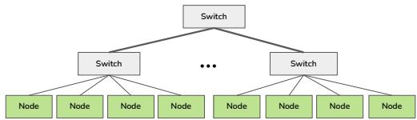  
(a) Multi-level Hierarchical Tree Topology

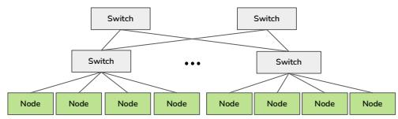  
(b) Spine-Leaf Topology

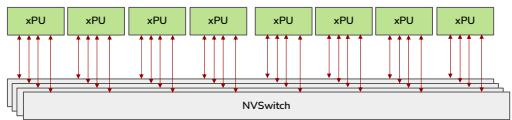  
(c) Intra-Node, HGX-style (NVIDIA, b)

Figure 8. Hierarchical Network Topologies  
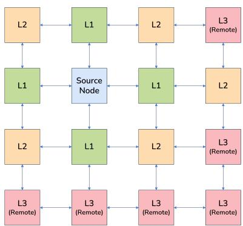  
Figure 9. Level-Wise Abstraction for Mesh/Torus Topologies. NEST maps physical Manhattan hop distances to discrete communication levels (l) relative to a reference source node. This abstraction preserves optimal substructure in the DP by grouping nodes into affinity classes (L1: 1-hop, L2: 2-hops, L3: Remote), where each class corresponds to a modeled communication latency or bandwidth constraint.

## C MESH AND TORUS MODELING

For non-uniform meshes or torus architectures like TPU clusters, NEST maps physical proximity to logical levels. As Figure 9 shows, we define coordinate-affinity classes based on Manhattan hop distance or heterogeneous bandwidth (BW) from a source node.

• Level 1 (L1): Represents immediate neighbors (1-hop) or high-bandwidth local tiles with the lowest latency.

• Level 2 (L2): Captures nodes at a 2-hop distance or those connected via intermediate-speed links.

• Level 3 (L3 / Remote): Groups all nodes beyond a specific distance threshold or those limited by low-bandwidth inter-mesh bottlenecks into a “remote” class.

This mapping allows the DP solver to treat mesh distance and non-uniform link bandwidth with the same mathematical rigor as tree-based switch tiers. By grouping devices based on these performance characteristics, the placement engine remains topology-agnostic while still accurately respecting physical throughput and latency bottlenecks.

## D ABLATION STUDY: ZERO OPTIMIZATION

NEST incorporates memory optimization techniques, including ZeRO and activation recomputation, to overcome memory bottlenecks and enable training configurations that would otherwise be infeasible. ZeRO is most beneficial when even a single model layer exceeds device memory. Using detailed memory modeling, NEST automatically detects such constraints and applies the appropriate ZeRO stage (1, 2, or 3) as needed, generating valid and efficient training strategies under tight memory budgets.

Although most evaluated models fit within current hardware (TPUv4 64 GB HBM, H100 80 GB HBM), we perform ablations with reduced-memory configurations to isolate ZeRO’s impact. As shown in Table 3, NEST assigns each layer—including embeddings—to a single pipeline stage and selectively applies ZeRO partitioning, confirming that training becomes infeasible without it. For each model, NEST determines the optimal ZeRO configuration at the layer level, identifying which states (optimizer, gradient, or parameter) to partition and how many devices to allocate. This fine-grained strategy ensures every layer fits in memory while minimizing cross-device communication.

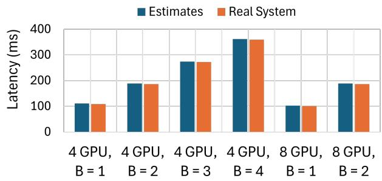

Figure 10. Validation of Collective Communication Estimations (Won et al., 2023) against H100 GPU nodes

## E HARDWARE VALIDATION

We validated our framework’s collective communication estimates against real-system measurements on clusters of 4 and 8 NVIDIA H100 SXM5 80GB GPUs (NVIDIA, a). The GPUs are connected via a switch-based topology with four NVSwitches, each linking eight GPUs through NVLinks offering 450GB/s unidirectional bandwidth. Figure 10 compares end-to-end iteration time (forward+backward) for GPT-3 across batch sizes 1–4, showing up to 2% latency difference between measured and predicted results. Computation latency was measured using PyTorch, while communication latency was simulated.

## F MICROBATCH SIZE SCALING AT 512 DEVICES

Figure 11 shows microbatch performance for BertLarge, Llama2-7B, and Llama3-70B on a 512-device cluster. Trends mirror those at 256 devices (Section 5.2), with optimal microbatch size depending on model and parallelization. Alpa benefits from larger microbatches, improving up to 1.5× from size 1 to 8, but its performance on BertLarge drops at 512 devices due to excessive oversharding.

## G MODEL CONFIGURATION FOR MIST H100 COMPARISON

Table 4 shows the scaled-down GPT-3 model (GPT3-35B) used in Section 5.3. Reduced from 175B parameters to allow comparison with Mist, which supports hidden dimensions ¡8192, contrast with GPT3-175B’s original hidden size of 12,288. A microbatch size of 1 was used in all experiments.

Table 4. Configuration of the scaled-down GPT3 model.
<table><tr><td>Parameter</td><td>Value</td></tr><tr><td>Number of Layers</td><td>64</td></tr><tr><td>Hidden Dimension</td><td>8192</td></tr><tr><td>NumberofHeads</td><td>64</td></tr><tr><td>Intermediate Dimension</td><td>16384</td></tr><tr><td>Sequence Length</td><td>2048</td></tr></table>

## H MEMORY ESTIMATION

NEST memory per-layer modeling estimates is, on average, 7% with compiled executables from Alpa (Zheng et al., 2022) across evaluated models.

Table 5. Per layer Memory requirement estimations between profiled Alpa executables and NEST estimations
<table><tr><td>Model</td><td></td><td>AlpaExecutables(GB)NESTEstimates(GB)</td></tr><tr><td>GPT-3175B</td><td>10.1</td><td>9.7</td></tr><tr><td>Llama3 70B</td><td>24.8</td><td>22.9</td></tr><tr><td>Llama2 7B</td><td>9.8</td><td>8.1</td></tr><tr><td>BertLarge</td><td>0.21</td><td>0.21</td></tr></table>

## I RUNTIME COMPARISON WITH MIST

NEST on average achieves, on average, over 30% faster runtime than Mist across all explore models. Table 4 presents the breakdown of each model runtime for each framework

Table 6. Runtime comparison of NEST against baseline.
<table><tr><td>Model</td><td>Baseline (min)</td><td>NEST (min)</td><td>Time Reduction(%)</td></tr><tr><td>GPT-3 35B</td><td>17</td><td>15</td><td>11.8%</td></tr><tr><td>Llama370B</td><td>30</td><td>6</td><td>80.0%</td></tr><tr><td>Llama27B</td><td>8</td><td>2.3</td><td>71.3%</td></tr><tr><td>BertLarge</td><td>3</td><td>2</td><td>33.3%</td></tr></table>

## J MODEL CONFIGURATION FOR REALSYSTEM VALIDATION

Table 7 shows the configuration of the scaled-down Mixtral 8×7B model used in Section 5.4. This model was reduced from the full 47B parameter version to enable feasible profiling and end-to-end execution on the resource-constrained 8- and 16-GPU V100 validation clusters. This model has a total of 790M parameters. Microbatch size of 1 used for the experiments.

Table 7. Configuration of the scaled-down Mixtral model.
<table><tr><td>Parameter</td><td>Value</td></tr><tr><td>Number of Layers</td><td>8</td></tr><tr><td>Number of Experts</td><td>8</td></tr><tr><td>Hidden Dimension</td><td>1024</td></tr><tr><td>NumberofHeads</td><td>16</td></tr><tr><td>Intermediate Dimension</td><td>3584</td></tr><tr><td>Sequence Length</td><td>1024</td></tr></table>

## K ALGORITHM FOR DEVICE PLACEMENT

Algorithm 1 walks through the full pseudo code of the network-aware device placement algorithm.

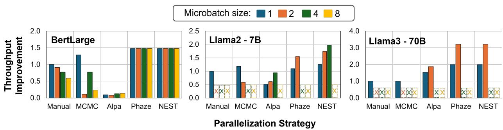  
Figure 11. Throughput improvement relative to manual strategy with microbatch size 1 across different parallelization strategies. “X” indicates cases where the baseline fails to find a feasible placement within memory constraints. Llama2-7B and Llama3-70B are realizable only up to batch size 4 and 2 respectively due to high memory requirements.

Algorithm 1 Device Placement Optimization with Latency and Memory Considerations   
Input: Layerwise latency/memory estimates, Architecture & Network configs   
Output: Device placement, tbatch   
1: Init: $d p [ \ell ] [ i \bar { d ] } [ k ] [ s ]  ( \infty , \emptyset )$ // dp[level][downset][accelerators][stages]   
2: $d p [ \ell ] [ \varnothing ] [ * ] [ 0 ]  ( 0 ,$ init) // Base case: no layers assigned   
3: for id ∈ Downsets $\setminus \{ D _ { \mathrm { f u l l } } \}$ do   
4: isZeRO ← ISZEROMEMORY(LAYERMEMREQ(id)) // ZeRO opt. if applicable   
5: for subId ⊂ id, load ← id \ subId do   
6: loads ← GETLOADOFSTAGE(load, isZeRO) // Latencies for all placements   
7: for s ∈ [1, Smax], k ∈ [1, Kmax], a ∈ VALIDACCELCOUNTS(load) do   
8: prev ← dp[GETIDX(·)][subId][k−a][s−1]   
9: for each level ℓ do   
10: c ← max(prev .latency, loads[ℓ][a].latency)   
11: if $c < d p [ \ell ] [ i d ] [ k ] [ s ]$ .first then   
12: $d p [ \ell ] [ i d ] [ k ] [ s ]$ .first ← c // Update min-max latency   
13: end if   
14: end for   
15: end for   
16: end for   
17: end for   
18: $t _ { \mathrm { m i n } } \gets \infty$ // Find best end-to-end batch time   
19: for sub $\iota d \subset D _ { \mathrm { f u l l } } , F  D _ { \mathrm { f u l l } } \backslash$ subId do   
20: load ← GETLOADOFSTAGE(F, subId) // Latency for remaining layers   
21: for $s \in [ 1 , S _ { \operatorname* { m a x } } ] , \ k \in [ 1 , K _ { \operatorname* { m a x } } ] , \ a \in$ VALIDACCELCOUNTS(F ) do   
22: $p r e v \gets d p [ \mathrm { G E T I D X ( \cdot ) } ] [ s u b I d ] [ k { - } a ] [ s { - } 1 ]$   
23: tstage ← max(prev .latency, load [ℓ][a].latency)   
24: tbatch ← tstage · (mbs + s − 1) + SYNCCOST(F ) // Pipeline + sync   
25: if $t _ { \mathrm { b a t c h } } < t _ { \mathrm { m i n } }$ then   
26: $t _ { \mathrm { m i n } } \gets t _ { \mathrm { b a t c h } }$   
27: end if   
28: end for   
29: end for   
30: return RECONSTRUCTSTAGES(dp, Dfull) // Retrieve final device placement