# CONTEXTPILOT: FAST LONG-CONTEXT INFERENCE VIA CONTEXT REUSE

Yinsicheng Jiang \* 1 Yeqi Huang \* 1 Liang Cheng 1 Cheng Deng 1 Xuan Sun 1 Luo Mai 1

## ABSTRACT

AI applications increasingly depend on long-context inference, where LLMs consume substantial context to support stronger reasoning. Common examples include retrieval-augmented generation, agent memory layers, and multi-agent orchestration. As input contexts get longer, prefill latency becomes the main bottleneck. Yet today’s prefill acceleration techniques face a trade-off: they either preserve reasoning quality but deliver little KV-cache reuse, or improve reuse at the cost of degraded reasoning quality.

We present CONTEXTPILOT, a system that accelerates prefill by introducing context reuse as a new mechanism for faster long-context inference. CONTEXTPILOT introduces a context index to identify overlapping context blocks across LLM interactions (e.g., across users and turns). It further proposes context alignment and de-duplication techniques to maximize KV-cache reuse. To preserve reasoning quality under reuse, it introduces succinct context annotations that prevent quality degradation. Finally, CONTEXTPILOT is built around a modular architecture with a clean interface that integrates with existing inference engines. Extensive evaluation shows that CONTEXTPILOT reduces LLM prefill latency by up to 3! compared to state-of-the-art methods while preserving reasoning quality. At longer context lengths, it can even improve reasoning quality. CONTEXTPILOT is open-sourced at: https://github.com/EfficientContext/ContextPilot.

## 1 INTRODUCTION

Long-context inference is now central to many AI applications. Whether through retrieval-augmented generation (RAG) (Lewis et al., 2020), AI memory layers such as Mem0 (Chhikara et al., 2025), multi-agent orchestration, or personal AI assistants that interact with external data across conversations (e.g., OpenClaw), modern workloads routinely feed LLMs tens to hundreds of thousands of tokens of external context. In a typical pipeline, a retriever (e.g., FAISS, Qdrant, ElasticSearch), memory store, or agent tool call (e.g., file reading, web search) fetches relevant documents, chunks, or memories for a user query, and an inference engine (e.g., SGLang, vLLM, TensorRT-LLM) consumes them as input context.

We call these discrete units of external context context blocks (CBs). During the prefill phase, the engine computes key–value (KV) caches, which are then reused during decode to generate output tokens sequentially. The key performance goal in prefill is to reduce time-to-first-token (TTFT). To that end, inference engines use a prefix cache that stores KV caches from prior prompts, avoiding recomputation for repeated inputs or prompts that share a prefix.

AI applications are feeding LLMs ever larger amounts of external context to unlock stronger capabilities, making prefill latency a key bottleneck. This trend is driven by two forces. First, many studies show that more context—ranging from retrieved knowledge-base content to long-horizon memories in agentic systems—improves performance on complex reasoning tasks (e.g., lemmas in AI4Math) (Varambally et al., 2025), strengthens access to up-to-date information (e.g., AI4Search) (Alzubi et al., 2025; Zilliz, 2025; Gupta et al., 2026), and reduces hallucinations (Ayala & Bechard, 2024; Shuster et al., 2021; AboulEla et al., 2025). Second, while chunking is widely used to shrink per-request inputs, recent findings (Rajasekaran et al., 2025) suggest that overly aggressive chunking can harm reasoning quality; in contrast, processing larger, less fragmented context (e.g., full documents) often yields better results—further increasing prefill latency.

To speed up long-context inference, existing systems adopt two main techniques, yet each faces a trade-off between reuse efficiency and model accuracy. The first, exact prefix matching, used in systems such as RadixCache (Zheng et al., 2024), LMCache (Cheng et al., 2025), and RAGCache (Jin et al., 2024b), reuses cached KV states only when a new prompt exactly matches a previous prefix. This approach preserves accuracy but yields low cache-hit ratios in practice, as long-context workloads often retrieve large sets of documents or memories in varying orders, leaving most KV caches unused. The second category, approximate KVcache matching, exemplified by CacheBlend (Yao et al., 2025) and PromptCache (Gim et al., 2024), matches KV caches by floating-point similarity rather than exact prefixes. While this increases reuse and shortens TTFT, we observe in evaluation that it can significantly degrade model accuracy.

To reduce TTFT for long-context inputs without sacrificing accuracy, we propose a new approach based on the observation that real-world long-context workloads often exhibit overlapping context blocks, commonly (i) across multiple turns within the same conversation and (ii) among parallel sessions (e.g., prompts or user queries) in domain-specific applications. Leveraging this observation, we identify three opportunities for context reuse with negligible accuracy loss: (1) Aligning context blocks with previously cached prefixes, improving cache-hit ratios; (2) De-duplicating context blocks to avoid recomputation for already cached content; and (3) Adding context annotations to inform the model of original relevance ranking and deduplicated block locations, mitigating accuracy loss.

In this paper, we present CONTEXTPILOT, a system that accelerates prefill by introducing context reuse as a new mechanism for faster long-context inference. CONTEXTPILOT targets practical long-context settings with parallel sessions and multi-turn conversations, where substantial portions of the input context recur across requests. Our key contributions are summarized below.

(1) Context Indexing. We design an indexing mechanism that efficiently tracks cached context blocks across parallel sessions and multi-turn conversation histories. The index supports fast retrieval of previously stored contexts by (i) aligning prefix overlaps between the incoming context and cached blocks, and (ii) traversing blocks referenced in multiturn histories to recover reusable segments beyond the immediate prefix match, while maintaining low construction and maintenance overhead.

(2) Context Alignment. We propose a context alignment algorithm that queries the index to align context blocks with the prefix cache, with the explicit goal of maximizing cache hit ratio under a fixed context budget. To mitigate potential accuracy loss introduced by aligning, we introduce concise order annotations that preserve the original relevance ranking and structural cues, allowing the LLM to interpret the aligned prompt consistently with the intended semantics.

(3) Context De-Duplication. We further improve reuse efficiency via context de-duplication. By querying the index, CONTEXTPILOT identifies context blocks that overlap with already cached contexts (including partial overlaps), and replaces duplicated spans with succinct location annotations that point to their original occurrences in the prompt (or prior turns), thereby avoiding redundant prefill while preserving accuracy.

Extensive evaluations show that CONTEXTPILOT delivers strong performance across diverse baselines and real-world datasets. Across long-context workloads—including RAG (multi-turn, multi-session, and hybrid), agentic memory systems (Mem0), emerging multi-agent reasoning paradigms, and real-world agent deployments (OpenClaw)—it reuses contexts to accelerate prefill, outperforming state-of-theart systems (CacheBlend, LMCache, RadixCache, and RAGCache) by 1.5–3→ on MultihopRAG, NarrativeQA, QASPER, and MT-RAG with negligible accuracy loss. As context length grows, CONTEXTPILOT can even improve reasoning quality and answer accuracy, thanks to its novel context-annotation design.

CONTEXTPILOT also scales to very large MoE models (Jiang et al., 2025): on DeepSeek-R1 (671B), it improves prefill throughput by 1.52–1.81→ on 16–32 GPUs. Beyond cloud deployments, CONTEXTPILOT reduces prefill latency by 63.6% in a real-world agent pipeline (OpenClaw on a single RTX 5090), and achieves 2.4 latency reduction on Apple Silicon laptops, demonstrating broad applicability from data center to edge.

Building on these results, we are working towards broader academic and industry deployment with multiple adopters, and have open-sourced CONTEXTPILOT on GitHub. We expect it to be deployed in more challenging multi-user serverless scenarios (Fu et al., 2024) and can serve as an extensible software foundation for context engineering (Hua et al., 2025; Zhan et al., 2025), replay (Liu et al., 2025b), management (Chang & Geng, 2025; Yu et al., 2025), and optimization (Kang et al., 2025; Li et al., 2025).

## 2 BACKGROUND AND MOTIVATION

## 2.1 Long-context inference systems

Long-context inference systems augment LLMs with external context blocks—retrieved documents, chunks, or memories—to enhance factual grounding and reasoning. We use the term context block throughout this paper to refer to any discrete unit of external context injected into the model, whether a retrieved document, a document chunk, or a memory entry. Two dominant paradigms drive this trend: (1) Retrieval-augmented generation (RAG) (Lewis et al., 2020; Gao et al., 2024) retrieves the top-K most relevant documents per query from an external corpus, serving both online latency-sensitive services (e.g., semantic search, dialogue, deep research (Zilliz, 2025; Guo et al., 2024b)) and offline throughput-oriented pipelines (e.g., large-scale annotation, synthetic data generation (Shen et al., 2025; Zhou et al., 2024; NVIDIA, 2024; Zhang et al., 2025c)). (2) AI memory layer systems (e.g., Mem0 (Chhikara et al., 2025)) dynamically extract, consolidate, and retrieve user-specific memories across sessions (Hu et al., 2025), injecting relevant context blocks into each query to enable personalized interactions. In both cases, the inference engine performs prefill to encode these context blocks and decode to generate responses.

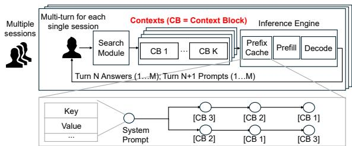  
Figure 1. Overview of a long-context inference system with prefix caching.

A typical system ( Figure 1) alternates between retrieval (or memory lookup) and generation across sessions and dialogue turns. At each turn, M concurrent prompts receive K relevant context blocks each. The inference engine encodes the context and generates responses, which feed into the next step with updated dialogue history, enabling efficient multi-turn reasoning.

These long-context inference systems often use prefix caching to improve prefill efficiency (Lumer et al., 2026). A trie-based implementation (Zheng et al., 2024) organizes tokens hierarchically, with each node storing a token sequence and its KV cache, enabling longest-prefix matching through a single traversal. An alternative hash-table design (Kwon et al., 2023) directly maps complete prefixes to KV-block identifiers.

## 2.2 Emerging challenge: growing context lengths

Long-context inference systems face a critical prefill latency bottleneck as modern LLMs demand expanding context windows. This is driven by two reasons: (1) increasing the number of retrieved context blocks to broaden information coverage (Li et al., 2024; Jin et al., 2024a; Yue et al., 2025; Laban et al., 2024; Chung et al., 2025), and (2) enriching contextual information by retrieving complete documents or full memory histories and applying context engineering methods (Rajasekaran et al., 2025).

Analysis of our workload data reveals that both approaches deliver significant accuracy gains. Scaling the retrieval parameter (k) from lower to higher values enhances accuracy by as much as 20%, while retrieving full documents achieves similar performance improvements, confirmed by recent context engineering studies (Zhang et al., 2025b).

However, expanded context windows (i.e., longer context block inputs) introduce substantial prefill overhead and can even degrade reasoning quality beyond a certain length (Du et al., 2025; Raju et al., 2026). Our trace data shows that LLM inference engines often process 20k–130k prefill tokens, leading to 3–10 second latency when executing 32B dense models on a single H100 GPU. For larger models such as Mixture-of-Experts (MoEs), the prefill latency can be even higher. As a result, the prefill becomes the dominant bottleneck, downgrading user experience and preventing long-context applications from being widely deployed.

## 2.3 Issues of existing KV cache reuse methods

To address the growing cost of longer retrieved contexts, existing KV-cache reuse methods exhibit several issues:

Exact-prefix matching yields low KV-cache reuse. Existing prefix-caching mechanisms rely heavily on exact tokenlevel matching, e.g., RadixCache (Zheng et al., 2024), or document-level matching, e.g., LMCache (Cheng et al., 2025) and RAGCache (Jin et al., 2024b): even minor variations, such as whitespace differences or slightly reordered tokens and documents, prevent reuse. Our evaluation (Section 7.1) shows that despite substantial overlap in retrieved documents across related queries, cache hit ratios remain persistently low. For example, for the dataset multihopRAG with Qwen3-32B, the KV-cache hit ratio is only 4.6%, indicating low KV cache reuse. For NarrativeQA with Llama3.3- 70B, the hit ratio is also only 5.5%, leaving most cache unused.

Approximate KV-cache matching degrades quality. To improve low cache-hit ratios, recent techniques such as CacheBlend (Yao et al., 2025) adopt approximate KV-cache matching. Instead of exact-prefix matching, they measure similarity in KV values (floating-point vectors) and reuse cached states when the proximity exceeds an empirically decided threshold. However, KV-value similarity is not a reliable indicator of whether cached states can be reused across different contexts and requests. Approximate matching degrades accuracy, with errors compounding over multi-turn interaction. Our evaluations (Section 7.1) show that across multiple models (e.g., Qwen3-32B, Qwen3-4B, Llama3.3-70B) and datasets (e.g., MultihopRAG, NarrativeQA, QASPER), approximate matching can degrade accuracy by 9–11% (dropping from around 60% to approximately 50%), preventing its deployment in many services where high fidelity is necessary.

## 3 DESIGN OVERVIEW

## 3.1 Observation: significant overlap in long context

Our design is motivated by a key observation: real-world long-context workloads exhibit substantial overlap in context blocks across both sessions and conversation turns:

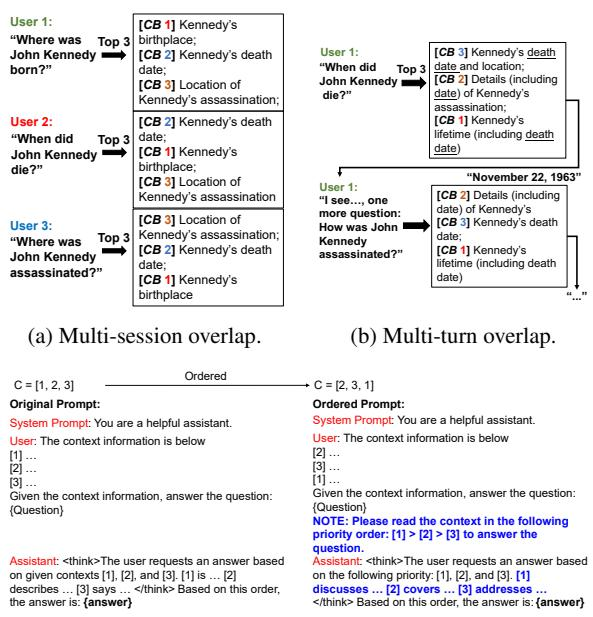  
(c) Context annotations for recovering relevance ranking semantics.  
Figure 2. Context overlap and reuse opportunities in long-context inference.

(1) Overlap across sessions. Figure 2a illustrates overlapping retrievals among multiple users querying different aspects of the same person. Although the retrieved documents appear in different orders reflecting per-query relevance, their content largely coincides. Trace studies on MultihopRAG (Tang & Yang, 2024), NarrativeQA (Kocisk ˇ y et al. ´ , 2017), and QASPER (Dasigi et al., 2021) confirm this trend: 79.2%, 57.4%, and 49.6% of questions respectively draw from the top 20% most frequently accessed documents (Figure 11 in Appendix C), indicating extensive context sharing across sessions.

(2) Overlap within multi-turn conversations. Figure 2b shows that in multi-turn interactions, users often revisit related topics, causing the retriever to return the same documents with slightly different rankings. As previous turns become part of the input, later retrievals frequently duplicate content already present in the cached history. Our MT-RAG (Katsis et al., 2025) trace study quantifies this effect: on average, 40% of retrieved documents in any turn overlap with earlier ones in the same session. Even within a single turn, distinct context blocks can share overlapping content (e.g., Kennedy’s death date appears across multiple blocks), creating content-level redundancy.

## 3.2 Design opportunities for context reuse

The significant overlap among context blocks reveals clear opportunities for context reuse, boosting KV-cache hit ratio.

Table 1. Reproducing DEmO ordering study with newer models. Modern LLMs show negligible ordering gaps even on datasets that showed large gaps in the original study.  
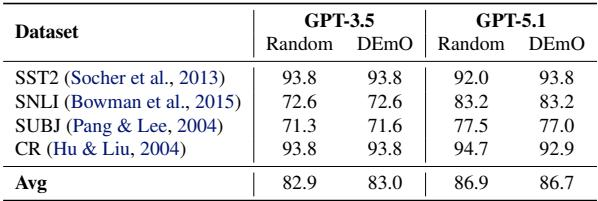

Specifically, we identify three opportunities that commonly arise in real-world long-context applications:

(1) Aligning context blocks with the prefix cache across sessions boosts KV-cache reuse. As shown in Figure 2a, if the context blocks for the second and third users are aligned to match the first user’s sequence, all three contexts would share an identical prefix, achieving 100% KV-cache reuse.

Trace-based alignment experiments on MultihopRAG, NarrativeQA, and QASPER confirm this potential. Aligning context block order with prefix-cache structure raises KVcache hit ratio to 38.9%, 20.2%, and 16.5%, respectively, representing 3–8→ higher utilization than the baseline (Section 7.4). Thus, strategic context alignment can dramatically cut redundant prefill computation across users.

Crucially, such alignment incurs minor accuracy loss: only 0.1–3.3% on the same datasets (Section 7.4). As shown in Table 1, our reproduction of the DEmO ordering study (Guo et al., 2024a) with newer models confirms that modern LLMs are substantially less sensitive to input ordering than earlier generations, with near-zero variance on datasets (SST2 (Socher et al., 2013), SNLI (Bowman et al., 2015), SUBJ (Pang & Lee, 2004), CR (Hu & Liu, 2004)) that showed large gaps in the original study. The small residual degradation arises because prefix-optimized alignment can occasionally move important context blocks toward the middle of the list, exposing them to the lost-in-the-middle effect (Liu et al., 2023).

We later discuss strategies to largely recover this minor loss. Note that context block alignment poses no additional privacy or security risks, sharing the same guarantees as prior KV-cache reuse methods (e.g., RadixCache).

(2) De-duplicating multi-turn overlaps reduces prefill cost. Figure 2b shows that multi-turn retrievals often return overlapping context blocks across conversation turns. By deduplicating these blocks and processing only new content together with dialogue history, the amount of contextual data during prefill can be greatly reduced, lowering computation cost. Beyond whole-block duplication, distinct context blocks often share content at a finer granularity—as underlined in the figure, where overlapping content about Kennedy’s death date spans multiple blocks. Such contentlevel overlap is especially prevalent when context blocks originate from shared templates or contain standardized sections, as commonly seen in contract analysis, financial filings, and code repositories.

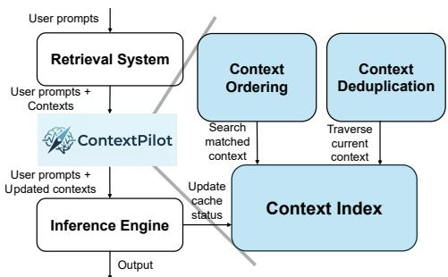  
Figure 3. System Overview of ContextPilot.

Our MT-RAG trace study quantifies this benefit and shows that de-duplication causes only 1–3% accuracy degradation, which can be recovered with techniques discussed later. This minor loss occurs because the LLM can still access the deduplicated content through prior conversation history, preserving quality while avoiding duplicated computation.

(3) Context annotation compensates for accuracy perturbation from alignment and de-duplication. Carefully designed context annotation can largely compensate for the negligible accuracy perturbation introduced by context block alignment and de-duplication. As shown in Figure 2c, these annotations help the model reconstruct the original ordering relationships within its internal tokens, mitigating accuracy loss.

Evaluations show that context annotations effectively recover accuracy—and in multi-hop reasoning tasks, even improve it beyond the unordered baseline. On NarrativeQA and MultihopRAG, for instance, accuracy increases by 0.3–3.9% relative to approximate matching methods (Section 7.4), confirming the effectiveness of incorporating context annotations for enhanced reasoning.

Note that the context annotation does not affect the model’s instruction-following ability, as it only conveys minimal retrieval metadata without altering the user prompt.

## 3.3 ContextPilot system overview

Prior work treats accuracy (e.g., context graphs, agentic memory) and system performance (exact prefix caching) in isolation. CONTEXTPILOT uniquely bridges this gap through three contributions: (1) a context index with a novel distance function that actively aligns documents with the prefix cache to maximize reuse—converting cache misses into hits that prior systems cannot achieve; (2) succinct context annotations that allow LLMs to recover semantic

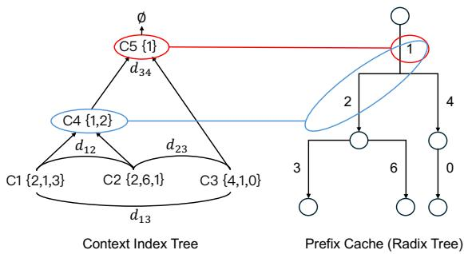

Figure 4. Context index construction with prefix-cache semantics. priority despite aligning; and (3) multi-turn context traversal that identifies and deduplicates previously memorized documents, reducing prefill overhead especially under model context length constraints. This co-design enables simultaneous gains in efficiency and quality that neither approach achieves alone.

CONTEXTPILOT realizes the three design opportunities above, achieving context reuse with negligible accuracy loss. It features a clean, minimal interface compatible with common retrieval modules (e.g., FAISS and ElasticSearch), AI memory layer stores (e.g., Mem0), and inference engines (e.g., SGLang and vLLM), requiring only request ID tracking in the prefix cache of each engine without affecting existing functionality, enabling rapid deployment. Specifically, CONTEXTPILOT takes user prompts and their context blocks (retrieved documents, chunks, or memories), updates the context to enable effective reuse, and then passes the updated context to the inference engine for processing.

Figure 3 illustrates the key components in CONTEXTPILOT: a context index that tracks prefix-cache state, a context alignment mechanism that aligns and schedules context blocks with the prefix cache for maximum cache hits, and a context de-duplication mechanism that removes redundant blocks across multi-turn conversations. The following sections describe each component in detail.

## 4 CONTEXT INDEX

The context index is designed to: (1) efficiently track the inference engine’s prefix-cache status to enable KV-cache reuse; (2) support fast lookup of previously stored KV caches via prefix matching, enabling cross-session context reuse when overlaps exist; and (3) traverse KV caches in multi-turn conversations to detect duplicated context.

## 4.1 Key designs for context index

Figure 4 illustrates the structure of the context index with an example. The left panel shows the index tree, and the right panel shows the corresponding prefix-cache status. The index is organized as a tree whose root represents an empty context. Each node corresponds to a prefix stored in the prefix cache and contains child nodes that extend this prefix. Every node maintains four attributes: (1) the context containing context block IDs, (2) the search path from the root to this node, (3) an access frequency counter for cache eviction, and (4) the clustering distance at which the node was created.

Index creation. The index is built via hierarchical clustering based on prefix matching. First, we compute pairwise distances between all contexts using their overlap rate. Next, we iteratively merge the closest pair, creating a virtual node whose context is the sorted intersection representing their shared prefix. Finally, each leaf node records its search path from the root, enabling efficient traversal for both crosssession prefix matching and multi-turn duplicate detection.

As shown in Figure 4, the process begins with C1 {2, 1, 3}, C2 2, 6, 1 , and C3 4, 1, 0 as leaf nodes. Since C1 and C2 have the smallest distance (sharing {1, 2}), they merge first into a virtual node C4 with context 1, 2 . C3 then merges with C4 to form the root C5 with context 1 . The resulting tree has C1–C3 as leaves storing their search paths from C5, while C4 and C5 serve as virtual nodes representing shared prefixes for cache reuse.

This construction runs in O(N 2) time, where N is the number of contexts, and is fully parallelizable on CPUs and GPUs. In practice, building the index for 2,000 contexts takes 8 s on CPUs and 0.82 s on GPUs. The space complexity is O(N  K), where K is the average number of context blocks per query. Because the index stores only block IDs and metadata rather than full texts, its space overhead is minimal. The complete hierarchical clustering pseudocode is provided in Algorithm 4 (Appendix H).

Quantifying the overlapping between contexts. A key challenge in index construction is quantifying the overlap between contexts. We propose a context distance function that satisfies two requirements: (1) it captures the number of shared documents between contexts, and (2) it accounts for their positional alignment, since retrieval systems rank documents by query relevance.

To illustrate the need for this design, consider four contexts: A {3, 5, 1, 7}, B {2, 6, 3, 5}, C {3, 5, 8, 9}, and D {2, 6, 4, 0}. A naive overlap-only metric assigns identical distances (0.5) to pairs A–B, B–C, and B–D because each shares two documents. However, B and D share {2, 6} at positions 1–2, while A and B share {3, 5} at different positions. Our distance function (Equation 1) assigns a smaller distance to B–D, as their overlaps occur in similar positions, reflecting both overlap magnitude and positional alignment. Such patterns cannot be captured by conventional distance measures like cosine, L1, or L2 similarity, which ignore positional structure. More formally, our distance function is

defined as:

$$
\tag{1}
$$

where Sij denotes the set of shared documents, pi(k) is the position of document k in context i, and ω  [0.001, 0.01] ensures overlap count remains the dominant factor while incorporating positional alignment.

Index update. The context index stays synchronized with the inference engine’s prefix cache through lightweight request ID tracking. Each leaf node is associated with a request ID maintained by the engine. When the engine evicts cached entries, it sends the corresponding request IDs to ContextPilot, which looks up the affected nodes via a request-to-node mapping and removes them. Empty parent nodes are recursively pruned to keep the tree compact. The overall update cost is O(h), where h is the tree height, requiring only a single traversal per eviction.

## 4.2 Key operations with context index

## The context index provides two key operations:

Context search. CONTEXTPILOT frequently searches for previously stored contexts based on the current one to enable reuse. The index search algorithm (Algorithm 1, Appendix H) efficiently locates matching contexts by greedily descending from the root, selecting at each level the child with the minimum distance while recording positions to form a search path. The search stops upon reaching a leaf or when all children are equidistant, indicating the longest shared prefix. Updates are localized and efficient: matching an internal node appends the new context as a child (O(1)), while matching a leaf creates a new internal node with their intersection (O( C )). Unlike K-Means reclustering or HNSW graph rebuilding, these updates require no tree restructuring, enabling dynamic index maintenance with minimal overhead.

For example, given context C6 2, 1, 4 , we search the index in Figure 4. C6 first compares with the root’s child C5 and finds a shared prefix 1 , descending to C5 and recording its position [0]. At C5, C6 shares {1, 2} with C4 but only {1} with C3, so it selects C4 and appends another [0], yielding [0,0]. At C4’s children C1 1, 2, 3 and C2 1, 2, 6 , all have equal distance, so the search stops and identifies C4 as the best match with path [0,0]. C6 is then inserted into C4’s children list at position 2, forming the final search path [0,0,2].

Search complexity scales with tree height. For contexts with common prefixes, h = O(log n) yields O(|C| · log n) complexity, where n denotes the number of stored contexts. Empirically, search takes approximately 0.068 ms per request (Appendix D.3), negligible compared to prefill

latency.

Context traversal. In multi-turn conversations, CON-TEXTPILOT updates node context lengths by traversing the index using the stored search path. Starting from the root, it sequentially follows indices along the path until reaching the target node, then performs the update. Traversal costs O(h) and is subsumed by the search overhead above.

## 5 CONTEXT ALIGNMENT

The context alignment mechanism aims to: (1) align incoming contexts with the current prefix cache to maximize KV-cache reuse; (2) schedule the aligned contexts to the inference engine with awareness of cache generation and eviction policies to enhance hit ratio; and (3) insert context annotations that recover pre-alignment semantics and maintain accuracy.

## 5.1 Context alignment algorithm

Formally, the context alignment algorithm (Algorithm 2, Appendix H) takes a batch of requests with their context blocks as input, aligns them with the prefix cache based on prefix matches from the context index, and returns aligned contexts with maximized shared prefixes.

As illustrated in Figure 5, we begin with initialization contexts C1 {2, 1, 3}, C2 {2, 6, 1}, and C3 {4, 1, 0}, followed by new contexts C6 {2, 1, 4}, C7 {5, 7, 8}, and C8 {1, 2, 9}. Initialization contexts inherit prefixes from their parent nodes (C1, C2 from C4 with {1, 2}; C3 from C5 with {1}), while new contexts search the index (C6 and C8 match C4 and inherit 1, 2 ). Each context then concatenates its matched prefix with remaining documents in their original order, producing C1 ↔ {1, 2, 3}, C2 ↔ {1, 2, 6}, C6 ↔ {1, 2, 4}, and C8 ↔ {1, 2, 9}. Unmatched contexts (e.g., C7) remain unchanged and form standalone branches. This strategy ensures overlapping contexts share common prefixes while preserving the ranking of non-shared documents.

The algorithm is invoked whenever CONTEXTPILOT processes a new request. It runs in O( C  log n) time, where n is the number of stored contexts, taking approximately 0.047 ms per request (Appendix D.3)—negligible compared to prefill.

## 5.2 Scheduling requests with aligned contexts

After aligning contexts, CONTEXTPILOT must schedule their execution to match the inference engine’s KV-cache generation and eviction policies; otherwise, cache reuse becomes ineffective. We therefore design a scheduling algorithm that: (1) reuses the search paths obtained during context alignment to avoid redundant tree lookups; (2) groups contexts by the first element of their search path, naturally separating cache regions; and (3) sorts contexts within each group by path length in descending order, ensuring longer prefix matches execute before shorter ones.

Figure 6 illustrates this process. In the baseline order C6, C3, C7, C8, limited cache capacity allows only one context: C6 caches {1, 2, 4}, but C3 reuses only {1} and evicts {2, 4}. C7 causes a full miss, caching {5, 7, 8} and evicting all previous entries, which then forces another miss for C8 despite its shared prefix {1, 2} with C6. This inefficiency arises because contexts with shared prefixes are not executed consecutively.

Our scheduler rearranges the execution to C6, C8, C3, C7, grouping prefix-sharing contexts together. C6 first caches {1, 2, 4}, then C8 immediately reuses {1, 2} before eviction. C3 and C7 run afterward without disrupting this reuse, maximizing cache hit ratio.

Our scheduler performs O(N) grouping by root-prefix path and O(N log N) in-group sorting over N contexts, with negligible real-time overhead. In contrast, existing indexing methods such as RAGCache and SGLang’s LPM use a global prefix selection that rescans a radix tree with M nodes at each decision point, yielding O(N log M ) + O(N log N ) overall as cache state evolves. By draining groups sequentially, our method avoids repeated tree searches, better preserves reuse under tight KV budgets, and keeps complexity independent of M. The full scheduling pseudocode is given in Algorithm 5 (Appendix H).

## 5.3 Context annotation for context alignment

Why aligning is safe. As shown in Section 3.2, our reproduction of the DEmO study (Guo et al., 2024a) confirms that modern LLMs are substantially less sensitive to input ordering (Table 1), explaining why aligning for cache efficiency introduces only minor accuracy perturbation and making lightweight correction mechanisms sufficient.

Why annotations still help. Despite the reduced sensitivity, aligning can still cause minor accuracy perturbation on some datasets (e.g., ↗1.1% on QASPER). Annotations mitigate this by reducing the model’s reliance on positional signals to infer relevance. On multi-hop tasks where chaining evidence across context blocks benefits from explicit guidance, annotations not only recover lost accuracy but actively improve it beyond the no-alignment baseline (e.g., +4.0% F1 on MultihopRAG with Qwen3-32B; see Appendix D.2). Gains are consistent across model scales: Qwen3-4B gains +1.4% on MultihopRAG and +1.3% on NarrativeQA, while Qwen3-32B gains +4.0% and +1.2% respectively. Attention map analysis (Appendix B) confirms that annotations reshape internal attention, aligning it with semantic rather than positional priority.

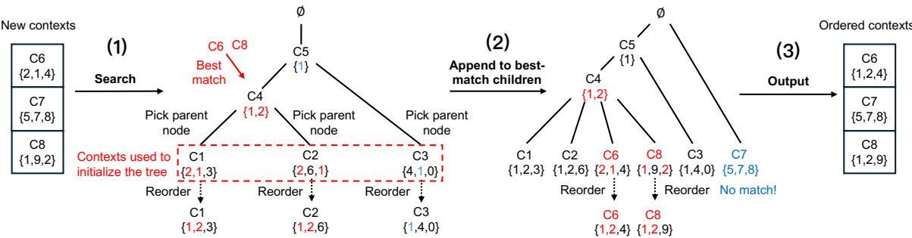  
Figure 5. Example for aligning context with prefix cache: (1) find best-matching nodes, (2) align by shared prefix and append as a child, and (3) output aligned context.

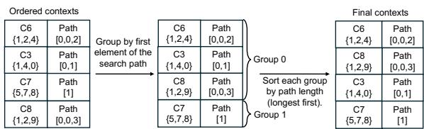  
Figure 6. Example of scheduling requests with aligned contexts.

Annotation mechanism. We provide the LLM with succinct annotations indicating the original relevance ranking of context blocks. Aligning contexts alters this ranking, which encodes document relevance critical for answer quality. Consider context C6, where the retriever returns documents in order {2, 1, 4}. The baseline prompt is:

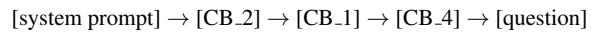

After aligning to {1, 2, 4} for cache efficiency, we append an order annotation before the question:

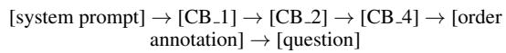

The annotation explicitly specifies the original relevance priority:

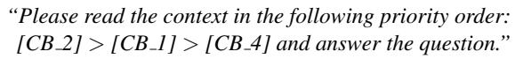

This short instruction adds negligible token overhead during prefill yet effectively preserves the model’s ability to attend to documents by their original relevance ranking. As a result, CONTEXTPILOT achieves aggressive cache optimization with minor accuracy perturbation (↘1% on most datasets), and often improved accuracy on multi-hop reasoning tasks.

## 6 CONTEXT DEDUPLICATION

The context de-duplication mechanism has two goals: (1) eliminate redundant content—both entire context blocks repeated across turns and shared content across distinct context blocks—whose KV caches are already stored, thereby minimizing redundant prefill computation; and (2) provide annotations informing the LLM which content has been deduplicated and where the corresponding information resides in the earlier context.

Algorithm 3 (Appendix H) formalizes the full de-duplication procedure, which operates at two levels. The algorithm runs in O(|C|) time, taking approximately 0.6 ms per request (Appendix D.3)—negligible compared to prefill.

Context-block-level de-duplication. The context index maintains a per-conversation record of all context blocks processed in prior turns, populated when the first turn’s context is aligned and inserted into the index (Section 5). Given a new context, the algorithm looks up these previously indexed blocks, identifies exact matches, and generates a location annotation for each duplicate. The current turn’s blocks are then registered for future comparisons.

We illustrate with an example. Consider a session where user C6 initially retrieves context {1, 2, 4} in the first turn. During context alignment (Section 5), these blocks are inserted into the context index and recorded in C6’s conversation history. In the second turn, a new query yields 1, 5, 2 . The algorithm queries the index’s conversation record, identifies {1, 2} as already cached from the first turn, and replaces them with location annotations, leaving only the novel block 5 to be fully processed.

Content-level de-duplication. Context-block-level deduplication handles exact matches across turns, but distinct context blocks often share overlapping content—as illustrated in Figure 2b, where information about Kennedy’s death date appears across multiple context blocks. Inspired by content-defined chunking in deduplication storage systems (Muthitacharoen et al., 2001), we split each novel context block into variable-length sub-blocks at boundaries where HASH(ε) mod M = 0 for a text line ε. Unlike fixed-size chunking, where a single insertion or deletion shifts all subsequent boundaries and prevents hash matches, content-defined boundaries are determined solely by local content, ensuring that identical text always produces the same sub-blocks regardless of its offset within different

context blocks.

Each sub-block is hashed. Any sub-block matching a hash from a different context block is replaced with a location annotation pointing to the first occurrence. After deduplication, the context index is updated to reflect these changes for the request.

Context annotation for de-duplicated context blocks. Simply removing duplicates can degrade answer quality. To maintain quality, we insert location annotations (e.g., “Please refer to [CB 1] in the previous conversation”) that direct the LLM to corresponding context blocks in the conversation history, guiding the LLM to prior context without repeating prefill. For C6’s second turn, the prompt changes from:

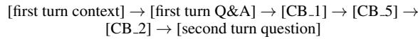

to:

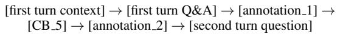

## 7 EVALUATION

Our evaluation of CONTEXTPILOT shows: (1) CONTEXTPI-LOT improves prefill throughput by up to 3.1→ and accuracy by up to 4.0% over numerous state-of-the-art systems and methods across multi-turn, multi-session, and hybrid RAG workloads, (2) It outperforms strong baselines by 1.5-3 in throughput and 1.9-3.7% in accuracy in emerging agentic AI applications, including real-world agent deployments, (3) Each component (context alignment, de-duplication, and annotation design) yields clear gains and robustness with negligible overhead, (4) Benefits scale with longer contexts and larger retrieval sizes, and (5) gains extend to edge devices, achieving ↑2.4→ latency reduction on consumer hardware without GPU servers.

Evaluation setup. Our CONTEXTPILOT implementation supports SGLang 0.4.6 and vLLM 0.10.0, requiring only request ID tracking in each engine’s prefix cache without affecting existing functionality, making the changes easy to upstream and merge.

We compare CONTEXTPILOT against the following baselines: (i) LMCACHE (version 0.3.8), representing the state of the art in prompt caching; (ii) CACHEBLEND, the state of the art in KV-cache matching, integrated with LMCache; and (iii) RADIXCACHE, based on SGLang’s implementation with a Longest-Prefix-Match scheduling policy.

We omit additional baselines that achieve comparable performance to those above. (iv) HICACHE (Xie et al., 2025) extends RadixCache by expanding prefix caches to lower-tier memory; since it directly builds on RadixCache, we compare against RadixCache instead. (v) RAGCACHE adopts a similar radix-tree structure at document granularity and shows comparable performance to RadixCache. It is not open-sourced and thus excluded from our evaluation.

Our evaluation is conducted on two GPU clusters: (1) a 16! H100 GPU cluster and (2) a 12! A6000 GPU cluster. For all baselines, we tune system parameters for optimal performance and accuracy, aligning our configurations with the best results reported in their respective papers. We set ω = 0.001 for the distance metric in Equation 1 across all experiments.

## 7.1 Performance in Retrieval-Augmented Generation

We evaluate on four RAG datasets: QASPER (Dasigi et al., 2021), MultihopRAG (Tang & Yang, 2024), NarrativeQA (Kocisk ˇ y et al. ´ , 2017), and MT-RAG (Katsis et al., 2025). For QASPER, MultihopRAG, and NarrativeQA, we use a chunk size of 1024 following (Bhat et al., 2025), while MT-RAG performs document-level retrieval without chunking. We use gte-Qwen2-7B-Instruct as the embedding model, FAISS for similarity search on MultihopRAG and NarrativeQA, and BM25 for QASPER and MT-RAG. This setup demonstrates CONTEXTPILOT’s effectiveness across diverse retrieval paradigms.

We further test CONTEXTPILOT under three RAG workloads: (1) multi-session, where independent users query concurrently; (2) multi-turn, for extended single-user dialogues; and (3) combined multi-session and multi-turn, representing production-scale conversational systems. For multi-session experiments, CONTEXTPILOT operates in offline mode: all contexts are pre-fetched and the context index is built before large-batch inference begins. For multi-turn and Mem0 experiments, CONTEXTPILOT operates in online mode with cold-start: the context index is incrementally built and updated as each turn arrives.

Multi-session RAG. We evaluate multi-session RAG on QASPER, MultihopRAG, and NarrativeQA using three models—Qwen3-4B-Instruct-2507, Qwen3-32B, and Llama3.3-70B-Instruct—on H100 GPUs with top-k=15.

Table 2 reports F1 scores and prefill throughput. CON-TEXTPILOT delivers up to 3.08!, 2.05!, and 2.13! speedups over LMCache, RadixCache, and CacheBlend on MultihopRAG, and 1.3–1.6! gains on NarrativeQA and QASPER, by aligning contexts with the prefix cache to maximize overlap. In contrast, LMCache and RadixCache depend on exact prefix matching, causing recomputation even for overlapping content, while LMCache also incurs high CPU offloading costs for long contexts. CONTEXTPILOT also maintains or improves accuracy via order annotations (e.g., 60.4 64.4 on MultihopRAG with Qwen3-32B), while CacheBlend degrades sharply (F1 drops to 11.3 on NarrativeQA with

Table 2. Multi-session RAG results: F1 (%) and prefill throughput for four methods across three models on three datasets.  
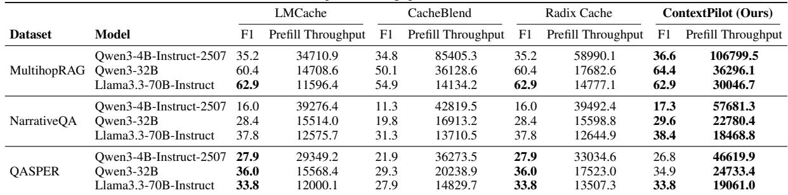

Qwen3-4B) due to approximate KV matching disrupting coherence.

Effectiveness with ever larger MoE models. We further evaluate DeepSeek-R1 (671B) on a GPU cluster with 32 H20 GPUs, provided by a potential industry adopter. On MultihopRAG, CONTEXTPILOT increases the cache hit ratio from 5% to 60%; on NarrativeQA, it raises the hit ratio from 6% to 38%. These improvements translate into 1.81x and 1.52x higher prefill throughput on 16xH20, respectively. Scaling to 32xH20 yields similar speedups, confirming that our approach generalizes to larger reasoning models and multi-node deployments. We provide a more detailed analysis of the DeepSeek-R1 results in Appendix A.

Multi-turn RAG. We evaluate multi-turn RAG on the MT-RAG dataset using Qwen3-4B-Instruct-2507, Llama3.1-8B-Instruct, and Qwen3-30B-A3B-Thinking-2507 on a single H100 GPU. Models with longer context windows are used to handle the growing conversation history. Answer accuracy is measured via the LLM-as-a-judge method from RADBench (Kuo et al., 2025) with GPT-5, as recommended by MT-RAG.

Table 3a reports accuracy and time-to-first-token (TTFT). CONTEXTPILOT cuts TTFT by removing redundant document processing across turns through context de-duplication. It achieves 3.45!, 3.35!, and 3.09! speedups over LM-Cache on Qwen3-4B, Llama3.1-8B, and Qwen3-30B, respectively, and up to 2.00! over RadixCache and 1.55! over CacheBlend. CONTEXTPILOT also preserves accuracy via location annotations that direct models to previously seen documents (e.g., 62.56% 64.27% on Qwen3-4B), while CacheBlend drops to 50.33% due to approximate KV matching disrupting multi-turn coherence.

Multi-session, multi-turn RAG. We evaluate the combined multi-session and multi-turn scenario under real-world deployment using Qwen3-4B-Instruct-2507 on H100 GPUs, varying concurrency from 2 to 32 sessions.

Table 3b shows that CONTEXTPILOT achieves the lowest TTFT at all concurrency levels by aligning contexts with the prefix cache. At 2 sessions, it delivers 3.38!, 1.92!, and 1.67! speedups over LMCache, RadixCache, and CacheBlend, respectively; at 32 sessions, the gains remain substantial at 2.65!, 1.49!, and 1.20!. These improvements confirm that context alignment maintains prefix overlap as concurrency scales.

## 7.2 Performance in Agentic Applications

We study three representative agentic workloads that are increasingly common in production—multi-agent reasoning, AI memory, and real-world agent deployment—all of which repeatedly surface long contexts across turns and sessions, making them natural candidates for context reuse.

Multi-agent reasoning. We evaluate CONTEXTPILOT with Chain-of-Agent (CoA) (Zhang et al., 2024), where worker agents handle document segments and a manager aggregates results. CONTEXTPILOT enhances CoA through agentaware routing: in multi-session settings, recurring documents are routed to the agent that previously processed them for KV-cache reuse; in multi-turn conversations, repeated documents are deduplicated with location annotations directing agents to prior content. We deploy three CoA configurations on MultihopRAG, each with 15 agents using Llama3.1-8B, Llama3.2-3B, or Qwen3-4B-Instruct (k=15). With Qwen3-4B, accuracy increases from 48.3% to 50.2% and throughput by 1.8!; with Llama3.1-8B, accuracy rises from 50.7% to 54.4% with a 2.1! speedup.

Agentic memory systems. We evaluate CONTEXTPILOT with Mem0 (Chhikara et al., 2025), a popular AI memory system that repeatedly retrieves user-specific memories as context blocks, creating substantial cross-request overlap. Using Qwen3-4B on LoCoMo (Maharana et al., 2024) with GPT-4.1 as judge, CONTEXTPILOT indexes and aligns fetched memories with the prefix cache in online mode. At k=100, it reduces TTFT from 0.101 s to 0.055 s (1.83 speedup) with a minor accuracy trade-off (0.437↔0.420). At k=20, although LoCoMo conversations are relatively short ( 26K tokens across all turns on average), CON-TEXTPILOT still improves both TTFT (0.038 s 0.031 s,

Table 3. Performance metrics across different tasks: (a) MT-RAG results, (b) Hybrid RAG sessions, (c) Context index construction latency.  
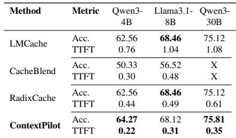  
(a) Accuracy (%) and time-to-first-token (TTFT)(s) on MT-RAG for four methods across three models. X = not supported.

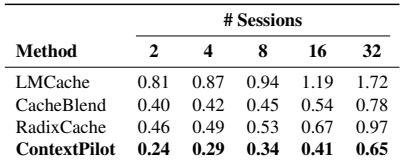  
(b) Time-to-first-token (seconds) performance in seconds for Qwen3-4B-Instruct-2507 model evaluated under hybrid RAG workloads with varying concurrent session counts ranging from 2 to 32 sessions.

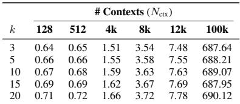  
(c) Context index construction latency (seconds) as a function of the number of contexts Nctx and top-k. Columns labeled 128–100k denote the total contexts inserted at build time (Nctx; 1k = 1,000).

Table 4. OpenClaw + SGLang with and without ContextPilot on claw-tasks.  
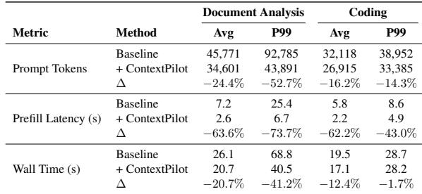

1.23 ) and accuracy (0.440 0.460), as alignment places more relevant memories earlier.

Real-world agent deployment. To evaluate CONTEXTPI-LOT in an end-to-end agent pipeline, we integrate it with OpenClaw served via SGLang 0.5.9 on a single RTX 5090. The OpenClaw agent issues requests through the CON-TEXTPILOT proxy, which aligns prompts with the prefix cache, deduplicates overlapping context both across turns and within context blocks, and forwards optimized prompts to the inference engine (Figure 14 in Appendix E). We evaluate on the claw-tasks benchmark using Qwen3- 4B-Instruct-2507, covering two workload types: document analysis (60 tasks, 22 documents, 250 turns) and coding (10 tasks). Document analysis is prefill-heavy (average 45K prompt tokens, only 984 decode tokens), while coding tasks generate longer outputs, making prefill a smaller fraction of wall time.

Table 4 reports the reduction in prompt tokens, wall time, and prefill latency. On document analysis, CONTEXTPILOT reduces prompt tokens by 24.4% on average and 52.7% at P99, with prefill latency dropping by 63.6% and wall time by 20.7%. On coding tasks, prefill savings remain large (↗62.2%), but wall-time reduction is modest (↗12.4%) since decode dominates.

Table 5. Llama-3.2-1B on edge devices with llama.cpp (MultihopRAG). ContextPilot achieves 1.5–2.4↓ latency reduction across Apple Silicon laptops and the Jetson AGX Orin.  
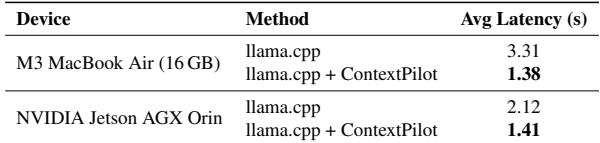

## 7.3 Deployment on Edge Devices

To demonstrate that CONTEXTPILOT’s benefits extend beyond GPU servers, we evaluate Llama-3.2-1B-Instruct on two edge platforms using llama.cpp with batch size 1. Table 5 reports average latency on MultihopRAG. On the M3 MacBook Air (16 GB), CONTEXTPILOT reduces latency from 3.31 s to 1.38 s (2.41 ); on the NVIDIA Jetson AGX Orin, latency drops from 2.12 s to 1.41 s (1.50 ). These results confirm that CONTEXTPILOT’s context reduction translates directly to wall-clock savings on resource-constrained edge devices.

## 7.4 Performance breakdown, overhead and robustness

Contribution of alignment and scheduling. We analyze how aligning and scheduling each contribute on MultihopRAG (k=15) across SGLang and vLLM on H100 GPUs. As shown in Figure 7, each component adds incremental cache hit ratio gains. For SGLang with Qwen3-32B, hit ratio rises from 8.49% to 20.56% (+ aligning) to 33.97% (+ scheduling)—a 4! improvement. vLLM with Llama3.3- 70B follows a similar trend: 10.7% 30.8% 43.2%, directly translating to reduced prefill computation.

Performance with long-running workloads. Time-series analysis (Appendix D.1) confirms that CONTEXTPILOT’s gains are sustained: it maintains 34% cache hit ratio versus the baseline’s ↑7% (a consistent 5→ advantage) throughout the entire workload, with both alignment and scheduling contributing to the improvement.

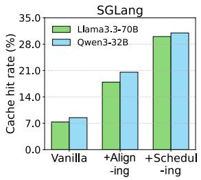

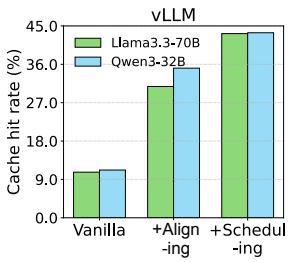

Figure 7. Performance breakdown of key components.  
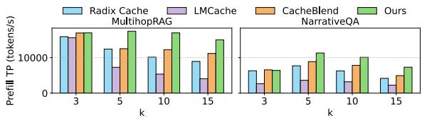  
Figure 8. Prefill throughput under different top k values.

Model accuracy under context reuse. A per-component breakdown (Appendix D.2) shows that alignment alone causes ↘1% F1 variation, while adding annotations recovers this gap and even improves accuracy by +1.4–4.4%.

Overhead of context index construction. As shown in Table 3c, index construction scales smoothly from 128 to 100K contexts on A6000 GPUs with minimal sensitivity to retrieval depth k. At 12K contexts, construction completes in 7.48 s—negligible relative to total prefill latency. Even at 100K, CONTEXTPILOT finishes within 12 minutes, far faster than multi-hour offline prefilling. Per-request overhead is just ↑0.7 ms (Appendix D.3), negligible compared to seconds of prefill latency.

Performance with growing context lengths. We evaluate CONTEXTPILOT under varying retrieval depths (k=3,5,10,15) on NarrativeQA and MultihopRAG using A6000 GPUs. As shown in Figure 8, CONTEXTPILOT consistently achieves the highest prefill throughput across all k values. On MultihopRAG, it sustains 1.5–2.0! speedups over baselines as k grows from 3 to 15; on NarrativeQA, it maintains 1.3–1.6! gains.

Effectiveness of context annotations. We tested placing annotations before and after questions, observing negligible impact on accuracy (variations below 0.5%). Attention heatmap analysis further confirms that annotations effectively guide the model toward relevant documents, improving downstream accuracy. We include this analysis in the supplementary materials (Appendix B).

Impact of prefix cache size. Larger prefix caches benefit CONTEXTPILOT disproportionately: on MultihopRAG, SGLang hit ratios improve from 29.64% to 33.97% and vLLM from 35.90% to 43.4% when moving from A6000 (48 GB) to H100 (80 GB), while baselines see smaller gains.

Details are in Appendix G.

## 8 RELATED WORKS

RAG system optimization. System-level approaches such as METIS (Ray et al., 2025) and Chameleon (Jiang et al., 2024) optimize workflow and hardware efficiency, jointly tuning retrieval settings or using heterogeneous accelerators (He et al., 2025) to reduce latency and boost throughput. CONTEXTPILOT complements them by improving KV-cache reuse.

Reranking in retrieval systems. Rerankers refine retrieval results via learned ranking models (Adeyemi et al., 2024; Li et al., 2023; Zhang et al., 2025d); HyperRAG (An et al., 2025) further enables KV reuse at the reranking stage. CON-TEXTPILOT instead operates downstream, aligning reranked document IDs with the prefix cache while preserving relevance through order annotations.

Fine-tuning with positional re-encoding. Methods like BlockAttention, KVLink, and TurboRAG (Ma et al., 2025; Yang et al., 2025a; Lu & Tang, 2024) fine-tune models to reuse KV caches via position re-encoding and pre-stored states. They improve efficiency but require heavy training and large cache storage. CONTEXTPILOT is training-free and shows strong promise in numerous RAG applications.

Faster KV-cache compute. CacheBlend (Yao et al., 2025) and related works (Liu et al., 2024; Agarwal et al., 2025; Yang et al., 2025b; Deng et al., 2025; Liu et al., 2025a; Du et al., 2026; Pan et al., 2025; Tang et al., 2024; Wu et al., 2025; Chen et al., 2025; Zhang et al., 2025a) optimize KVcache computation through compression, decoding, parallel encoding, cache sharing, or FLOP-aware admission and eviction policies. CONTEXTPILOT complements these by operating at the context level, aligning and de-duplicating inputs to maximize reuse, and can be combined with them for further gains.

## 9 CONCLUSION

We presented CONTEXTPILOT, a context-reuse system that accelerates long-context prefill with negligible accuracy loss. CONTEXTPILOT uniformly represents external inputs as context blocks and applies a common set of mechanisms— context indexing, alignment, de-duplication, and succinct annotations to boost prefix KV cache reuse across diverse workloads. Its modular design enables new system and algorithmic research on context engineering, management, and optimization for long-context AI. Looking ahead, we envision CONTEXTPILOT as a co-optimization framework that jointly decides what context to feed and how to serve it, maximizing both inference efficiency and output quality.

## ACKNOWLEDGEMENTS

We sincerely thank our shepherd and the MLSys reviewers for insightful feedback that significantly improved this manuscript. We also thank Minjie Wang (formerly Amazon AI Labs, now The University of Hong Kong (Shanghai X-Lab)) for valuable early-stage discussions, and Ryan Tsui (The University of Edinburgh) for contributions to the implementation. We further thank the Tencent WeChat (Weixin) Group for access to H20 GPU clusters for large-scale MoE evaluation and for insightful feedback. Finally, we thank the School of Informatics, University of Edinburgh and the Edinburgh International Data Facility (EIDF) for providing GPU resources and funding that supported this research.

## REFERENCES

AboulEla, S., Zabihitari, P., Ibrahim, N., Afshar, M., and Kashef, R. Exploring rag solutions to reduce hallucinations in llms. In 2025 IEEE International systems Conference (SysCon), pp. 1–8, 2025. doi: 10.1109/ SysCon64521.2025.11014810.

Adeyemi, M., Oladipo, A., Pradeep, R., and Lin, J. Zeroshot cross-lingual reranking with large language models for low-resource languages. In Ku, L.-W., Martins, A., and Srikumar, V. (eds.), Proceedings of the 62nd Annual Meeting of the Association for Computational Linguistics (Volume 2: Short Papers), pp. 650–656, Bangkok, Thailand, August 2024. Association for Computational Linguistics. doi: 10.18653/v1/2024.acl-short. 59. URL https://aclanthology.org/2024. acl-short.59/.

Agarwal, S., Sundaresan, S., Mitra, S., Mahapatra, D., Gupta, A., Sharma, R., Kapu, N. J., Yu, T., and Saini, S. Cache-craft: Managing chunk-caches for efficient retrieval-augmented generation. Proc. ACM Manag. Data, 3(3), June 2025. doi: 10.1145/3725273. URL https://doi.org/10.1145/3725273.

Alzubi, S., Brooks, C., Chiniya, P., Contente, E., von Gerlach, C., Irwin, L., Jiang, Y., Kaz, A., Nguyen, W., Oh, S., Tyagi, H., and Viswanath, P. Open deep search: Democratizing search with open-source reasoning agents, 2025. URL https://arxiv.org/abs/2503.20201.

An, Y., Cheng, Y., Park, S. J., and Jiang, J. Hyperrag: Enhancing quality-efficiency tradeoffs in retrievalaugmented generation with reranker kv-cache reuse, 2025. URL https://arxiv.org/abs/2504.02921.

Ayala, O. and Bechard, P. Reducing hallucination in structured outputs via retrieval-augmented generation. In Proceedings of the 2024 Conference of the North American Chapter of the Association for Computational Linguistics: Human Language Technologies (Volume 6: Industry

Track), pp. 228–238. Association for Computational Linguistics, 2024. doi: 10.18653/v1/2024.naacl-industry. 19. URL http://dx.doi.org/10.18653/v1/ 2024.naacl-industry.19.

Bhat, S. R., Rudat, M., Spiekermann, J., and Flores-Herr, N. Rethinking chunk size for long-document retrieval: A multi-dataset analysis, 2025. URL https://arxiv. org/abs/2505.21700.

Bowman, S. R., Angeli, G., Potts, C., and Manning, C. D. A large annotated corpus for learning natural language inference. In EMNLP, 2015.

Chang, E. Y. and Geng, L. Sagallm: context management, validation, and transaction guarantees for multi-agent llm planning. arXiv preprint arXiv:2503.11951, 2025.

Chen, G., Feng, Q., Ni, J., Li, X., and Shieh, M. Q. RAPID: Long-context inference with retrieval-augmented speculative decoding. In International Conference on Machine Learning (ICML), pp. 8093–8107. PMLR, 2025.

Cheng, Y., Liu, Y., Yao, J., An, Y., Chen, X., Feng, S., Huang, Y., Shen, S., Du, K., and Jiang, J. Lmcache: An efficient kv cache layer for enterprise-scale llm inference, 2025. URL https://arxiv.org/abs/ 2510.09665.

Chhikara, P., Khant, D., Aryan, S., Singh, T., and Yadav, D. Mem0: Building production-ready ai agents with scalable long-term memory, 2025. URL https: //arxiv.org/abs/2504.19413.

Chung, Y., Kakkar, G. T., Gan, Y., Milne, B., and Ozcan, F. Is long context all you need? leveraging LLM’s extended context for NL2SQL. In Proceedings of the VLDB Endowment, 2025. URL https://arxiv.org/abs/ 2501.12372.

Dasigi, P., Lo, K., Beltagy, I., Cohan, A., Smith, N. A., and Gardner, M. A dataset of information-seeking questions and answers anchored in research papers, 2021. URL https://arxiv.org/abs/2105.03011.

Deng, Y., You, Z., Xiang, L., Li, Q., Yuan, P., Hong, Z., Zheng, Y., Li, W., Li, R., Liu, H., Mouratidis, K., Yiu, M. L., Li, H., Shen, Q., Mao, R., and Tang, B. Alayadb: The data foundation for efficient and effective long-context llm inference. In Companion of the 2025 International Conference on Management of Data, SIGMOD/PODS ’25, pp. 364–377, New York, NY, USA, 2025. Association for Computing Machinery. ISBN 9798400715648. doi: 10.1145/ 3722212.3724428. URL https://doi.org/10. 1145/3722212.3724428.

Du, D., Cao, S., Cheng, J., Mai, L., Cao, T., and Yang, M. Bitdecoding: Unlocking tensor cores for long-context llms with low-bit kv cache. In 2026 IEEE International Symposium on High-Performance Computer Architecture (HPCA), 2026.

Du, Y., Tian, M., Ronanki, S., Rongali, S., Bodapati, S., Galstyan, A., Wells, A., Schwartz, R., Huerta, E. A., and Peng, H. Context length alone hurts LLM performance despite perfect retrieval. In Findings of the Association for Computational Linguistics: EMNLP, 2025. URL https://arxiv.org/abs/2510.05381.

Fu, Y., Xue, L., Huang, Y., Brabete, A., Ustiugov, D., Patel, Y., and Mai, L. Serverlessllm: Low-latency serverless inference for large language models. In Gavrilovska, A. and Terry, D. B. (eds.), 18th USENIX Symposium on Operating Systems Design and Implementation, OSDI 2024, Santa Clara, CA, USA, July 10-12, 2024, pp. 135–153. USENIX Association, 2024. URL https://www.usenix.org/conference/ osdi24/presentation/fu.

Gao, Y., Xiong, Y., Gao, X., Jia, K., Pan, J., Bi, Y., Dai, Y., Sun, J., Wang, M., and Wang, H. Retrieval-augmented generation for large language models: A survey, 2024. URL https://arxiv.org/abs/2312.10997.

Gim, I., Chen, G., seob Lee, S., Sarda, N., Khandelwal, A., and Zhong, L. Prompt cache: Modular attention reuse for low-latency inference, 2024. URL https: //arxiv.org/abs/2311.04934.

Guo, Q., Wang, L., Wang, Y., Ye, W., and Zhang, S. What makes a good order of examples in in-context learning. In Ku, L.-W., Martins, A., and Srikumar, V. (eds.), Findings of the Association for Computational Linguistics: ACL 2024, pp. 14892–14904, Bangkok, Thailand, August 2024a. Association for Computational Linguistics. doi: 10.18653/v1/2024.findings-acl. 884. URL https://aclanthology.org/2024. findings-acl.884/.

Guo, S., Deng, C., Wen, Y., Chen, H., Chang, Y., and Wang, J. Ds-agent: Automated data science by empowering large language models with case-based reasoning. arXiv preprint arXiv:2402.17453, 2024b.

Gupta, N., Chatterjee, R., Haas, L., Tao, C., Wang, A., Liu, C., Oiwa, H., Gribovskaya, E., Ackermann, J., Blitzer, J., Goldshtein, S., and Das, D. DeepSearchQA: Bridging the comprehensiveness gap for deep research agents, 2026. URL https://arxiv.org/abs/2601.20975.

He, C., Huang, Y., Mu, P., Miao, Z., Xue, J., Ma, L., Yang, F., and Mai, L. Waferllm: Large language model inference at wafer scale. In Zhou, L. and Zhou, Y. (eds.),

19th USENIX Symposium on Operating Systems Design and Implementation, OSDI 2025, Boston, MA, USA, July 7-9, 2025, pp. 257–273. USENIX Association, 2025. URL https://www.usenix.org/conference/ osdi25/presentation/he.

Hu, M. and Liu, B. Mining and summarizing customer reviews. In KDD, 2004.

Hu, Y., Liu, S., Yue, Y., Zhang, G., Liu, B., Zhu, F., Lin, J., Guo, H., Dou, S., Xi, Z., et al. Memory in the age of AI agents, 2025. URL https://arxiv.org/abs/ 2512.13564.

Hua, Q., Ye, L., Fu, D., Xiao, Y., Cai, X., Wu, Y., Lin, J., Wang, J., and Liu, P. Context engineering 2.0: The context of context engineering. arXiv preprint arXiv:2510.26493, 2025.

Jiang, W., Zeller, M., Waleffe, R., Hoefler, T., and Alonso, G. Chameleon: a heterogeneous and disaggregated accelerator system for retrieval-augmented language models. Proc. VLDB Endow., 18(1):42–52, 2024.

Jiang, Y., Fu, Y., Huang, Y., Nie, P., Lu, Z., Xue, L., He, C., Sit, M.-K., Xue, J., Dong, L., Miao, Z., Du, D., Xu, T., Zou, K., Ponti, E., and Mai, L. Moe-cap: Benchmarking cost, accuracy and performance of sparse mixture-ofexperts systems. In Advances in Neural Information Processing Systems (NeurIPS), 2025.

Jin, B., Yoon, J., Han, J., and Arik, S. O. Long-context llms meet rag: Overcoming challenges for long inputs in rag, 2024a. URL https://arxiv.org/abs/ 2410.05983.

Jin, C., Zhang, Z., Jiang, X., Liu, F., Liu, X., Liu, X., and Jin, X. Ragcache: Efficient knowledge caching for retrievalaugmented generation, 2024b. URL https://arxiv. org/abs/2404.12457.

Kang, M., Chen, W.-N., Han, D., Inan, H. A., Wutschitz, L., Chen, Y., Sim, R., and Rajmohan, S. Acon: Optimizing context compression for long-horizon llm agents. arXiv preprint arXiv:2510.00615, 2025.

Katsis, Y., Rosenthal, S., Fadnis, K., Gunasekara, C., Lee, Y.-S., Popa, L., Shah, V., Zhu, H., Contractor, D., and Danilevsky, M. Mtrag: A multi-turn conversational benchmark for evaluating retrieval-augmented generation systems, 2025. URL https://arxiv.org/abs/ 2501.03468.

Kirsch, L., Harrison, J., Sohl-Dickstein, J., and Metz, L. General-purpose in-context learning by meta-learning transformers. arXiv preprint arXiv:2212.04458, 2022.

Kocisk ˇ y, T., Schwarz, J., Blunsom, P., Dyer, C., Hermann, ´ K. M., Melis, G., and Grefenstette, E. The narrativeqa reading comprehension challenge, 2017. URL https: //arxiv.org/abs/1712.07040.

Kuo, T.-L., Liao, F.-T., Hsieh, M.-W., Chang, F.-C., Hsu, P.-C., and Shiu, D.-S. Rad-bench: Evaluating large language models capabilities in retrieval augmented dialogues, 2025. URL https://arxiv.org/abs/ 2409.12558.

Kwon, W., Li, Z., Zhuang, S., Sheng, Y., Zheng, L., Yu, C. H., Gonzalez, J. E., Zhang, H., and Stoica, I. Efficient memory management for large language model serving with pagedattention, 2023. URL https:// arxiv.org/abs/2309.06180.

Laban, P., Fabbri, A. R., Xiong, C., and Wu, C.-S. Summary of a haystack: A challenge to long-context LLMs and RAG systems. In Proceedings of the 2024 Conference on Empirical Methods in Natural Language Processing (EMNLP), pp. 9885–9903, 2024.

Lewis, P., Perez, E., Piktus, A., Petroni, F., Karpukhin, V., Goyal, N., Kuttler, H., Lewis, M., Yih, W.-t., Rockt ¨ aschel, ¨ T., et al. Retrieval-augmented generation for knowledgeintensive nlp. In Advances in Neural Information Processing Systems (NeurIPS), 2020.

Li, C., Liu, Z., Xiao, S., and Shao, Y. Making large language models a better foundation for dense retrieval, 2023.

Li, G., Zhou, X., Zhang, X., and Zhang, H. Database perspective on LLM inference systems. Proceedings of the VLDB Endowment, 18, 2025. URL https://www. vldb.org/pvldb/vol18/p5504-li.pdf.

Li, Z., Li, C., Zhang, M., Mei, Q., and Bendersky, M. Retrieval augmented generation or long-context llms? a comprehensive study and hybrid approach. arXiv preprint arXiv:2407.16833, 2024.

Liu, N. F., Lin, K., Hewitt, J., Paranjape, A., Bevilacqua, M., Petroni, F., and Liang, P. Lost in the middle: How language models use long contexts, 2023. URL https: //arxiv.org/abs/2307.03172.

Liu, Y., Li, H., Cheng, Y., Ray, S., Huang, Y., Zhang, Q., Du, K., Yao, J., Lu, S., Ananthanarayanan, G., Maire, M., Hoffmann, H., Holtzman, A., and Jiang, J. Cachegen: Kv cache compression and streaming for fast large language model serving, 2024. URL https://arxiv.org/ abs/2310.07240.

Liu, Y., Huang, Y., Yao, J., Feng, S., Gu, Z., Du, K., Li, H., Cheng, Y., Jiang, J., Lu, S., Musuvathi, M., and Choukse, E. Droidspeak: Kv cache sharing for crossllm communication and multi-llm serving, 2025a. URL https://arxiv.org/abs/2411.02820.

Liu, Y., Si, C., Narasimhan, K. R., and Yao, S. Contextual experience replay for self-improvement of language agents. In Proceedings of the 63rd Annual Meeting of the Association for Computational Linguistics (Volume 1: Long Papers), pp. 14179–14198, 2025b.

Lu, S. and Tang, Y. Turborag: Accelerating retrievalaugmented generation with precomputed kv caches for chunked text. arXiv preprint arXiv:2410.07590, 2024.

Lumer, E., Nizar, F., Jangiti, A., Frank, K., Gulati, A., Phadate, M., and Subbiah, V. K. Don’t break the cache: An evaluation of prompt caching for long-horizon agentic tasks, 2026. URL https://arxiv.org/abs/ 2601.06007.

Ma, D., Wang, Y., and Tian, L. Block-attention for efficient prefilling, 2025. URL https://arxiv.org/abs/ 2409.15355.

Maharana, A., Lee, D.-H., Tulyakov, S., Bansal, M., Barbieri, F., and Fang, Y. Evaluating very long-term conversational memory of LLM agents. In ACL, 2024.

Muthitacharoen, A., Chen, B., and Mazieres, D. A low- \` bandwidth network file system. In SOSP, 2001.

NVIDIA. How nvidia uses rag to generate synthetic data for llm improvement. https://developer.nvidia. com/blog, 2024.

Pan, R., Wang, Z., Jia, Z., Karakus, C., Zancato, L., Dao, T., Wang, Y., and Netravali, R. Marconi: Prefix caching for the era of hybrid LLMs. In Proceedings of Machine Learning and Systems (MLSys), 2025. URL https: //arxiv.org/abs/2411.19379.

Pang, B. and Lee, L. A sentimental education: Sentiment analysis using subjectivity summarization based on minimum cuts. In ACL, 2004.

Rajasekaran, P., Dixon, E., Ryan, C., and Hadfield, J. Effective context engineering for AI agents, 2025. URL https://www.anthropic.com. Anthropic Engineering blog.

Raju, R., Ji, M., Upasani, S., Li, B., and Thakker, U. The limits of long-context reasoning in automated bug fixing, 2026. URL https://arxiv.org/abs/2602. 16069.

Ray, S., Pan, R., Gu, Z., Du, K., Feng, S., Ananthanarayanan, G., Netravali, R., and Jiang, J. Metis: Fast quality-aware rag systems with configuration adaptation. In Proceedings of the ACM SIGOPS 31st Symposium on Operating Systems Principles, SOSP ’25, pp. 606–622, New York, NY, USA, 2025. Association for Computing Machinery. ISBN 9798400718700.

doi: 10.1145/3731569.3764855. URL https://doi. org/10.1145/3731569.3764855.

Shen, H., Yan, H., Xing, Z., Liu, M., Li, Y., Chen, Z., Wang, Y., Wang, J., and Ma, Y. Ragsynth: Synthetic data for robust and faithful rag component optimization, 2025. URL https://arxiv.org/abs/2505.10989.

Shuster, K., Poff, S., Chen, M., Kiela, D., and Weston, J. Retrieval augmentation reduces hallucination in conversation, 2021. URL https://arxiv.org/abs/2104. 07567.

Socher, R., Perelygin, A., Wu, J., Chuang, J., Manning, C. D., Ng, A., and Potts, C. Recursive deep models for semantic compositionality over a sentiment treebank. In EMNLP, 2013.

Tang, J., Zhao, Y., Zhu, K., Xiao, G., Kasikci, B., and Han, S. QUEST: Query-aware sparsity for efficient long-context LLM inference. In Proceedings of the 41st International Conference on Machine Learning (ICML), pp. 47901– 47911, 2024.

Tang, Y. and Yang, Y. Multihop-rag: Benchmarking retrieval-augmented generation for multi-hop queries, 2024. URL https://arxiv.org/abs/2401. 15391.

Varambally, S., Voice, T., Sun, Y., Chen, Z., Yu, R., and Ye, K. Hilbert: Recursively building formal proofs with informal reasoning, 2025. URL https://arxiv.org/ abs/2509.22819.

Wu, W., Pan, Z., Fu, K., Wang, C., Chen, L., Bai, Y., Wang, T., Wang, Z., and Xiong, H. TokenSelect: Efficient longcontext inference and length extrapolation for LLMs via dynamic token-level KV cache selection. In Proceedings of the 2025 Conference on Empirical Methods in Natural Language Processing (EMNLP), pp. 21275–21292, 2025.

Xie, Z., Xu, Z., Zhao, M., An, Y., Mailthody, V. S., Mahlke, S., Garland, M., and Kozyrakis, C. Strata: Hierarchical context caching for long context language model serving, 2025. URL https://arxiv.org/abs/2508. 18572.

Yang, J., Hou, B., Wei, W., Bao, Y., and Chang, S. Kvlink: Accelerating large language models via efficient kv cache reuse, 2025a. URL https://arxiv.org/abs/ 2502.16002.

Yang, X., Chen, T., and Chen, B. Ape: Faster and longer context-augmented generation via adaptive parallel encoding, 2025b. URL https://arxiv.org/abs/ 2502.05431.

Yao, J., Li, H., Liu, Y., Ray, S., Cheng, Y., Zhang, Q., Du, K., Lu, S., and Jiang, J. Cacheblend: Fast large language model serving for rag with cached knowledge fusion. In Proceedings of the Twentieth European Conference on Computer Systems, pp. 94–109, 2025. doi: 10.1145/3689031.3696098. URL https: //doi.org/10.1145/3689031.3696098.

Yu, H., Chen, T., Feng, J., Chen, J., Dai, W., Yu, Q., Zhang, Y.-Q., Ma, W.-Y., Liu, J., Wang, M., and Zhou, H. MemAgent: Reshaping long-context LLM with multiconv RL-based memory agent, 2025. URL https: //arxiv.org/abs/2507.02259.

Yue, Z., Zhuang, H., Bai, A., Hui, K., Jagerman, R., Zeng, H., Qin, Z., Wang, D., Wang, X., and Bendersky, M. Inference scaling for long-context retrieval augmented generation. In The Thirteenth International Conference on Learning Representations (ICLR), 2025.

Zhan, H., Guo, Y., Wen, B., Li, Z., Ling, C., and Zhao, L. A survey of context engineering for large language models, 2025. URL https://arxiv.org/abs/2507. 13334.

Zhang, H., Ji, X., Chen, Y., Fu, F., Miao, X., Nie, X., Chen, W., and Cui, B. PQCache: Product quantization-based KVCache for long context LLM inference. Proceedings of the ACM on Management of Data, 3(3):1–30, 2025a.

Zhang, Q., Hu, C., Upasani, S., Ma, B., Hong, F., Kamanuru, V., Rainton, J., Wu, C., Ji, M., Li, H., Thakker, U., Zou, J., and Olukotun, K. Agentic context engineering: Evolving contexts for self-improving language models, 2025b. URL https://arxiv.org/abs/2510.04618.

Zhang, X., Zhang, P., Luo, S., Tang, J., Wan, Y., Yang, B., and Huang, F. Culturesynth: A hierarchical taxonomyguided and retrieval-augmented framework for cultural question-answer synthesis, 2025c. URL https:// arxiv.org/abs/2509.10886.

Zhang, Y., Sun, R., Chen, Y., Pfister, T., Zhang, R., and Arik, S. Chain of agents: Large language models collaborating on long-context tasks. Advances in Neural Information Processing Systems, 37:132208–132237, 2024.

Zhang, Y., Li, M., Long, D., Zhang, X., Lin, H., Yang, B., Xie, P., Yang, A., Liu, D., Lin, J., Huang, F., and Zhou, J. Qwen3 embedding: Advancing text embedding and reranking through foundation models. arXiv preprint arXiv:2506.05176, 2025d.

Zheng, L., Yin, L., Xie, Z., Sun, C., Huang, J., Yu, C. H., Cao, S., Kozyrakis, C., Stoica, I., Gonzalez, J. E., Barrett, C., and Sheng, Y. Sglang: Efficient execution of structured language model programs, 2024. URL https://arxiv.org/abs/2312.07104.

Zhou, J., Liu, Z., Liu, Z., Xiao, S., Wang, Y., Zhao, B., Zhang, C. J., Lian, D., and Xiong, Y. Megapairs: Massive data synthesis for universal multimodal retrieval, 2024. URL https://arxiv.org/abs/2412.14475.

Zilliz. Deepsearcher: Open-source deep research on private data. GitHub repository, 2025. URL https: //github.com/zilliztech/deep-searcher.