# COST-AWARE DURATION PREDICTION FOR SOFTWARE UPGRADES IN DATACENTERS

Yi Ding 1 Aijia Gao 2 Thibaud Ryden 2 Michal Sedlak 2 Essam Ewaisha 2 Igor Marnat 2 Henry Hoffmann 3

## ABSTRACT

Software upgrades are critical to maintaining server reliability in datacenters. While job duration prediction and scheduling have been extensively studied, the unique challenges posed by software upgrades remain largely under-explored. This paper presents the first in-depth investigation into software upgrade scheduling at datacenter scale. We begin by characterizing various types of upgrades and then frame the scheduling task as a constrained optimization problem. To address this problem, we introduce Acela, a cost-aware duration prediction framework designed to improve upgrade scheduling efficiency and throughput while meeting service-level objectives (SLOs). Acela accounts for asymmetric misprediction costs, strategically selects the best predictive models, and mitigates straggler-induced overestimations. Evaluations on Meta’s production datacenter systems demonstrate that Acela significantly increases efficiency of the existing upgrade scheduler by improving upgrade window utilization by 1.25×, increasing the number of scheduled and completed upgrades by 33% and 41%, and reducing cancellation rates by 2.4×. The code and data sets will be released after paper acceptance.

## 1 INTRODUCTION

Modern internet services operate on hyperscale datacenters housing millions of servers (Govindan et al., 2016). At this scale, any deficiencies in system infrastructure can hurt the datacenter’s ability to efficiently handle workloads (Oppenheimer et al., 2003) and affect billions of users (Naseer et al., 2020). To improve system reliability and mitigate the risk of unplanned downtime, regular software upgrade is imperative (Barroso et al., 2013). A software upgrade refers to the process of replacing an existing version of a software application or system with a newer version that offers enhanced features, improved performance, bug fixes, security patches, and compatibility with updated technologies or hardware. Common software upgrades include upgrades for operating systems, firmware, and kernel (Liu et al., 2013; Hu et al., 2015; Ranganathan et al., 2021). The key differences between software upgrades and service jobs (e.g., video streaming and search) are detailed in §2.1.

Scheduling software upgrades in hyperscale datacenters requires coordination across millions of servers. While job scheduling has been well studied (Krishnaswamy et al.,

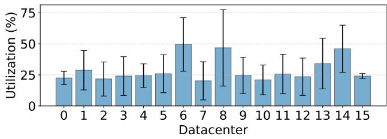  
Figure 1. Average utilization of upgrade windows for running software upgrades across 16 Meta datacenters over 5 months. The black whiskers indicate standard deviations.

2004; Curino et al., 2014; Boutin et al., 2014; Jalaparti et al., 2015; Jyothi et al., 2016; Rajan et al., 2016; Tumanov et al., 2016; Iorgulescu et al., 2017; Chung et al., 2018; Park et al., 2018; Jajoo et al., 2022), software upgrade scheduling at the datacenter scale remains under-explored. To understand its unique challenges, we describe its key steps from Meta’s real-world datacenters. In particular, servers are grouped into upgrade groups (Barroso & Clidaras, 2022), which rotate through upgrade window (a fixed time slot for running upgrades). Operators aim to meet service level objectives (SLO), typically requiring 95% of upgrades to complete within upgrade window (Okuno et al., 2019). More details of this process are in §2.2.

To meet SLOs, Meta has adopted a conservative approach that assumes fixed, worst-case durations for all upgrades and schedules few upgrades per server for a long period. While safe, this leads to low efficiency, with frequent idle time and more cycles needed to complete upgrades. As shown in Figure 1, upgrade window utilization (i.e., fraction of time for doing upgrades) across 16 Meta datacenters over 5 months averages just 20–40%, with some reaching 50%. High variance further highlights the lack of robust scheduling and underutilization of upgrade windows.

To overcome this limitation, we propose to integrate upgrade duration prediction to improve its scheduling efficiency. We first characterize millions of upgrades from Meta’s datacenters to uncover optimization opportunities. We then introduce Acela, a cost-aware duration prediction framework that enhances scheduling throughput and efficiency while meeting SLOs. Acela incorporates three key techniques: (1) it models asymmetric misprediction costs using a tree-based quantile regressor to estimate conditional quantiles, rather than minimizing symmetric loss; (2) it designs a custom scoring function to select models that minimize prediction error while meeting SLOs; and (3) it improves accuracy and mitigates overprediction by training on augmented datasets with stragglers removed.

We implement Acela on top of Meta’s existing software upgrade scheduler, integrating duration predictions seamlessly into the scheduling pipeline. We trained Acela on over 4 millions software upgrades collected over three months and tested on 1 million software upgrades during a subsequent month. Our evaluation shows that, compared to the existing scheduler, Acela improves upgrade window utilization by 1.25× (compared to Figure 1), driven by a 33% increase in scheduled software upgrades and 41% more completed software upgrades. Despite handling more software upgrades, Acela meets the SLO by reducing cancellation rates by 2.4×.

To our knowledge, this is the first datacenter-scale study of software upgrades and the first deployed solution to enhance upgrade efficiency. Our key contributions include:

• A large-scale characterization and analysis of software upgrades at Meta datacenter production systems.

• A formalization of software upgrade scheduling as a constrained optimization problem.

• Identification of asymmetric prediction costs unique to upgrade scenarios.

• Novel model selection and training methods for upgrade duration prediction.

• Deployment of Acela and evaluation on real-world datacenter upgrades with substantial efficiency gains.

## 2 BACKGROUND

In this section, we first compare software upgrades with service jobs to highlight their distinct scheduling challenges. We then describe how Meta manages software upgrades, with key terms in bold and defined in Table 1.

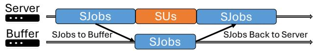  
Figure 2. Service jobs (SJobs) and software upgrades (SUs) represent distinct phases of a server’s lifecycle.

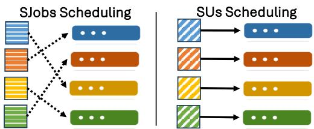  
Figure 3. Service jobs (SJobs) scheduling vs. software upgrades (SUs) scheduling. Service jobs scheduling is flexible (dotted arrows) with no fixed assignment to servers, while software upgrades scheduling has a fixed assignment (solid arrows), as each server has specific upgrade requirements.

## 2.1 Software Upgrades vs. Service Jobs

Software upgrades and service jobs represent different phases in a server’s lifecycle. Service jobs (e.g., cloud services, search, video streaming) run during normal operation, while software upgrades occur when a server is taken offline and temporarily removed from service. As shown in Figure 2, these phases do not overlap. During upgrades, service jobs are migrated to a buffer server (see §2.2) and return once the upgrade completes.

Scheduling software upgrades differs from service job scheduling. As shown in Figure 3, service jobs are usually flexibly distributed across servers to optimize performance metrics like latency and throughput. In contrast, software upgrades are often tied to specific servers due to their specific upgrade requirements. Moreover, their SLO is more than just latency requirement, but instead requires that at least 95% of upgrades complete within a designated upgrade window. This combination of tied server assignments and unique SLO makes upgrade scheduling challenging.

## 2.2 Circle-based Upgrade Process in Meta

In Meta’s datacenters, servers are organized into racks, with each rack sharing power and networking infrastructure. As shown in Figure 4, all servers within a rack form an upgrade group (UG)—the basic unit for managing upgrades, which proceed cyclically at the UG level.

At any time, a server can play one of three roles: (1) a regular server running service jobs or software upgrades, (2) a buffer servers hosting service jobs migrated from servers undergoing upgrades, or (3) an overflow servers handling jobs from failed servers undergoing repair 1. These roles rotate to balance service load and upgrade progress.

Table 1. Explanations of common terms used in the upgrade process in Meta’s datacenters.  
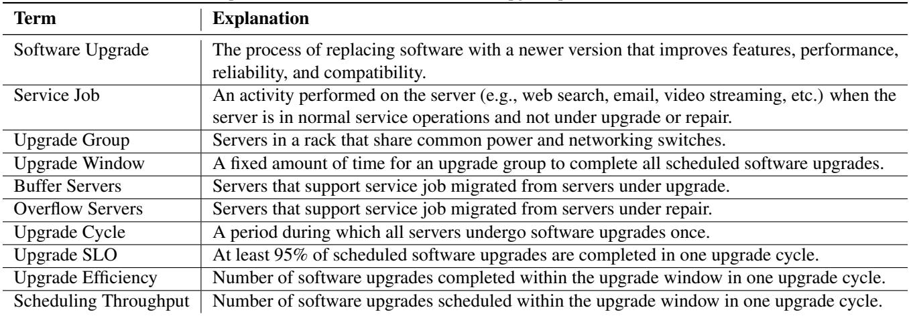

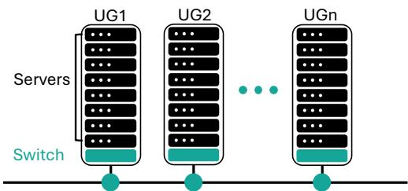  
Figure 4. Upgrade groups (UGs). Each UG consists of multiple servers in a rack that share power supply and networking switch. All UGs are connected to the internet.

As illustrated in Figure 5, most servers run service jobs or upgrades, while a small subset serves as buffer or overflow. During an upgrade cycle, when a UG is scheduled, its service jobs are temporarily migrated to buffer servers. After the upgrade window ends, servers reboot and service jobs return, with the next UG entering the upgrade phase. If a server takes too long to run software upgrades and misses its upgrade window, it is marked for repair and its jobs are migrated to overflow servers to maintain service continuity.

Within a UG, software upgrades are performed in a partially sequential manner; no more than a fixed fraction (e.g., 25%) of servers can be upgraded simultaneously due to limited buffer capacity for migrated service jobs. Each server scheduled for upgrade receives at least one upgrade. To meet the SLO, it is essential to avoid overloading a server with too many upgrades in a single cycle, which would increase the risk of exceeding the upgrade window otherwise. If a server fails to finish on time, it is marked for repair, and its service job is moved to an overflow server to maintain service continuity. Crucially, missing the SLO makes it difficult to distinguish between slow and faulty servers without costly manual inspection. Meeting such SLO will reduce these inspections, improve operational efficiency, and help identify true hardware issues early.

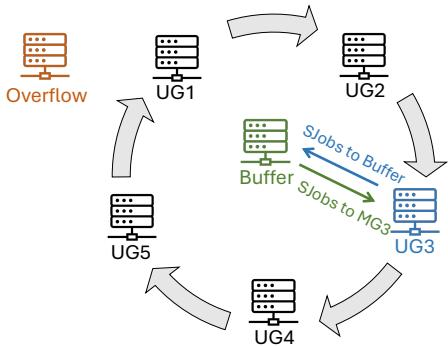  
Figure 5. An illustration of an upgrade cycle consisting of 5 regular UGs, 1 buffer UG, and 1 overflow UG. In this cycle, UG1-5 are regular servers handling service job or software upgrades. When upgrade is scheduled for UG3, it will migrate all its service job to the Buffer UG before running software upgrades. After the upgrade window closes, service job will be returned to UG3. Then, upgrade will move to UG4.

## 3 PROBLEM ANALYSIS

We first discuss the key challenges in duration prediction and then analyze how different types of prediction errors affect scheduling outcomes.

## 3.1 Challenges in Prediction

As shown in Figure 1, the current upgrade scheduler exhibits low upgrade efficiency, resulting in long idle time within upgrade windows and requiring more cycles to complete all upgrades. This inefficiency is from assuming uniform, worst-case durations across all upgrades, ignoring their type or hardware context. To improve upgrade efficiency, we must accurately predict durations for different upgrades. However, there are two challenges in obtaining high-quality duration predictions, outlined below.

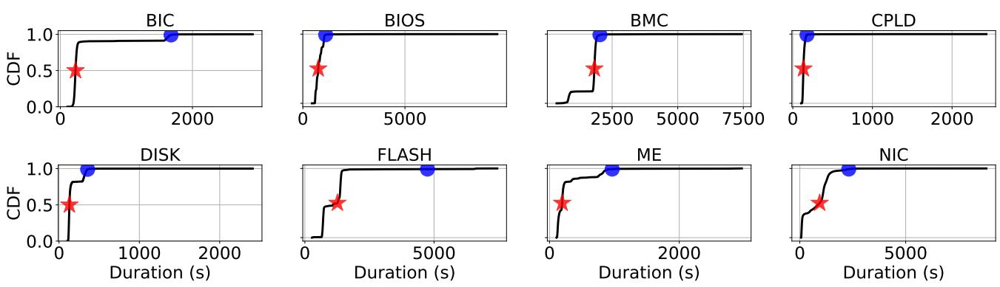  
Figure 6. CDFs of firmware upgrades durations. Median and p99 are marked by red stars and blue dots.

Challenge #1. Software upgrades include various types, each with different duration distributions. For instance, firmware upgrades—key software upgrades in datacenters (Liu et al., 2013; Hu et al., 2015; Ranganathan et al., 2021) and the focus of our evaluation (more details in §6)— include types such as BIC (bic), BIOS (bio), CPLD (cpl), DISK (dis), FLASH (fla), ME (me), NIC (nic), and BMC (bmc). Figure 6 shows the cumulative distribution functions of these upgrade durations. The diversity and long tails in distributions make prediction challenging.

Challenge #2. Our ultimate goal is to maximize upgrade scheduling efficiency while meeting SLOs, whereas most machine learning predictors aim to maximize accuracy. This creates a mismatch between system objectives and prediction accuracy, so we should design our predictor to directly support the system goal rather than accuracy alone.

## 3.2 Four Types of Mispredictions

To design the upgrade duration predictor, we analyze four misprediction types, each affecting outcomes differently.

Underprediction occurs when predicted durations are shorter than actual ones, potentially leading to overloaded upgrade windows. This can delay server recovery and stall the upgrade cycle.

Extreme underprediction significantly underestimates durations, often due to stragglers caused by hardware failures. These require repair and overflow server use, and if present in training data, can bias models toward extreme overprediction.

Overprediction occurs when predicted durations are longer than actual ones, causing the scheduler to underutilize the upgrade window. However, mild overprediction is generally preferable, as it aligns with the scheduling objective of ensuring timely completion.

Extreme overprediction significantly overestimates durations, mirroring the existing worst-case-based scheduler and resulting in low upgrade efficiency.

In summary, effective predictors should slightly overpredict to meet the SLO, minimize straggler influence during training, and account for variation across upgrade types.

## 4 ACELA

We present Acela, a cost-aware duration prediction framework that improves scheduling throughput and upgrade efficiency while meeting the SLO. This section walks through step-by-step development of Acela.

## 4.1 Design Principles

Acela is guided by the following design principles:

• Account for asymmetric costs. As discussed in §3.2, underprediction hurts SLO compliance more than overprediction. Therefore, the training loss function should reflect such imbalance.

• Balance upgrade efficiency and SLO compliance. Overprediction helps meet SLOs by preventing upgrade overload, but excessive overprediction can reduce upgrade efficiency.

• Limit extreme overprediction. Stragglers in training data can cause significant overprediction. Reducing their influence is key to improving prediction quality.

• Capture duration variability. Different upgrade types have different duration distributions (Figure 6). The models should account for these differences.

Next, we will present the techniques we developed in Acela following the principles above.

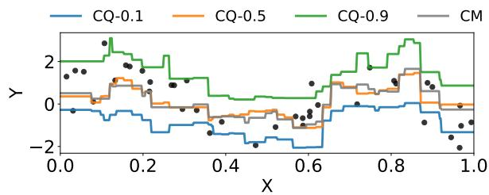  
Figure 7. An example for comparing conditional quantiles to conditional mean. CQ-τ represents conditional quantile when τ = 0.1, 0.5, 0.9, respectively. CM represents conditional mean. The black dots are true data.

## 4.2 Quantile Regression for Asymmetric Costs

Acela uses quantile gradient boosting trees to account for asymmetric costs between under- and overpredictions in software upgrade duration predictor. We will first explain conditional quantiles, then quantile loss, and finally how quantile gradient boosting trees work.

Conditional quantile. Most regression methods predict conditional mean by minimizing a symmetric loss function. Let Y represent software upgrade duration and X the software upgrade features. Given a X = x, the conditional mean minimizes the expected squared error loss (also known as the L2 loss function):

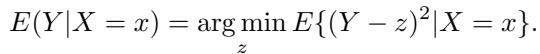

However, this loss function is symmetric and cannot address asymmetric costs in software upgrade duration prediction. To overcome this limitation, Acela estimates the conditional quantile rather than the conditional mean. Let F (y|X = x) = P (Y ≤ y|X = x) be the conditional distribution function for Y . The τ -quantile qτ (x) of Y is defined such that the probability of Y being smaller than qτ (x) is, for a given X = x, exactly equal to τ :

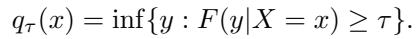

The conditional quantile gives information about the distribution of software upgrade duration. Figure 7 compares conditional quantile to conditional mean when fitting the same dataset. As seen, CQ-0.9 is higher than CQ-0.5, CQ-0.1, and CM, reflecting that for the same x, CQ-0.9 predicts a longer software upgrade duration. By selecting a higher value for τ (e.g., > 0.5), we can overpredict software upgrade durations.

Quantile loss. To estimate conditional quantile from data, we need to minimize a quantile loss function. The quantile loss function Lτ (0 < τ < 1) is defined as

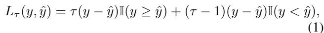

where τ is the input quantile parameter, I(·) = 1 if its · is true and 0 otherwise, y and yˆ are true and predicted durations, respectively. When quantile regression underpredicts, I(y ≥ yˆ) = 1, and the loss function becomes τ (y − yˆ). When quantile regression overpredicts, I(y < yˆ) = 1, and the loss function becomes (τ − 1)(y − yˆ).

The quantile loss penalize underpredictions (y ≥ yˆ) and overpredictions (y < yˆ) asymmetrically. When τ > 0.5 it penalizes more on underprediction than overprediction. When τ < 0.5, it penalizes more on overprediction than underprediction. When τ = 0.5, it penalizes them equally. Therefore, to overpredict software upgrade durations, τ should be set above 0.5.

Quantile Gradient boosting trees (QGBT). Acela uses QGBT to estimate conditional quantiles (Meinshausen & Ridgeway, 2006). QGBT is a tree-based ensemble method that builds trees sequentially, with each new tree trained to correct the residuals of the previous one. Trees are added until a set limit is reached or no further improvement is observed. The final prediction is the sum of all tree outputs. The key difference between QGBT and standard GBT lies in how data is handled during tree growth. Standard GBT retains only the mean of the data in each node after splitting, while QGBT preserves the full distribution of values. This enables QGBT to model conditional distributions and adjust predictions based on the desired quantile, allowing fine control over under- or overprediction.

When using QGBT for training predictors, Acela needs to pre-specify the quantile parameter τ . Choosing this parameter is essential to optimize upgrade efficiency while meeting the SLO, leading us to the next subsection.

## 4.3 Custom Scoring for Model Selection

The optimal quantile parameter τ in QGBT should balance upgrade efficiency and SLO compliance. To find the best τ , Acela introduces a custom score function for model selection. It trains multiple QGBT models across different quantiles and evaluates them on a validation set designed to reflect real-world deployment—containing upgrades that occur chronologically after the training set. The model with the lowest score is selected. The custom score function is:

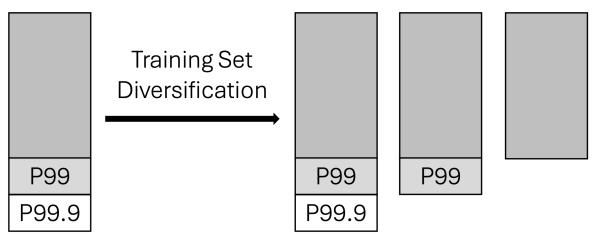  
Figure 8. An illustration of training set diversification.

$$
\tag{2}
$$

MAE is the mean absolute error on the validation set, measuring prediction accuracy (lower is better). OPR is the overprediction rate, which is the fraction of upgrades with predicted durations exceeding actual durations. The SLO is set at 95%, meaning at least 95% of upgrades must complete within the upgrade window. The parameter α controls the penalty for underprediction.

The score function is designed with the following intuition: If OPR ≥ SLO, it suggests the SLO will be met, so the focus shifts to minimizing MAE to improve scheduling throughput by avoiding excessive overprediction. If OPR < SLO, it implies a risk of missing the SLO, and a penalty is applied and increases more severe as OPR drops further below the target. This scoring mechanism balances SLO compliance with upgrading efficiency.

## 4.4 Training Set Diversification for Reducing Bias

The quality of prediction results depends not only on the model but also on the data. As shown in Figure 6, stragglers exist in the training data, which can cause extreme overprediction, decreasing upgrade efficiency.

To address this, Acela diversifies the training dataset to reduce prediction bias from stragglers. The idea is to create several truncated datasets by excluding software upgrades with extreme long durations, such as those in the 99th and 99.9th percentiles (p99 and p99.9), as shown in Figure 8. For each truncated dataset, Acela trains several QGBT models using different quantile parameters and then selects the best-performing model with the lowest score (Equation (2)), evaluated with the validation set. The empirical evaluation indicates that this approach ensures more accurate and reliable predictions (Table 4).

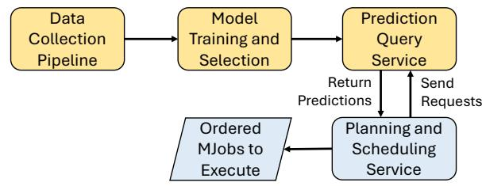  
Figure 9. Integrating Acela into scheduling. The modules of the existing software upgrade scheduler are in blue. Acela’s new modules are in yellow.

## 4.5 Putting It All Together

Acela trains software upgrade duration predictors through a multi-step process. It builds a separate QGBT model for each upgrade type to capture duration variability. In an online setting, it continuously updates training and validation data by adding recent upgrades and discarding outdated ones. It enriches the dataset by creating truncated datasets that remove stragglers (those above p99 and p99.9) and trains QGBT models on multiple quantiles for each dataset. Using the SLO and penalty parameter α, Acela scores all models and selects the one with the lowest value from Equation 2. It then deploys the best-performing model for each upgrade type to make predictions.

## 5 INTEGRATION WITH SCHEDULING

Acela is integrated into existing datacenter software upgrade schedulers as an enhancement layer rather than a replacement. We first describe how Acela interfaces with the scheduler through additional system modules, and then explain the upgrade scheduling logic driven by priority and duration awareness. Importantly, the improvement in upgrade efficiency comes from the joint integration of duration prediction and scheduling decisions, rather than from either component in isolation.

Integration. Figure 9 shows the workflow of integrating Acela into the scheduling process, where three new modules are added to the existing scheduler: the Data Collection Pipeline (DCP), the Model Training and Selection (MTS), and the Prediction Query Service (PQS). All modules communicate via custom remote procedure calls (RPCs) and RESTful APIs (Fielding, 2000). Next, we describe each module in detail.

The DCP module continuously logs software upgrade data. These features include software upgrade details like type, upgrade versions (current and future), hardware specifics (CPU architecture, core count, RAM, and disk size), and manufacturing and upgrade information, such as device specifics, location, and last upgrade date. Details of features are in the Appendix.

The MTS module uses this data to train and select QGBT models. It splits the data into training and validation sets, ensuring the validation set has newer software upgrades to handle changes in data distribution. It uses the LightGBM library (Ke et al., 2017) to build QGBT models, tuning hyperparameters like the number of trees, tree depth, and learning rate. The MTS adjusts the quantile parameter using the custom score function and regularly updates models with new data while removing old data.

The PQS module receives the selected model from MTS to provide duration predictions for specific software upgrades requested by the scheduling service. It processes JSONformatted requests with server ID, software upgrade type, and desired upgrade version, returning duration predictions to the scheduling service, which then generates an ordered list of software upgrades for scheduling.

Scheduling Logic. We extend the existing upgrade scheduler with duration-aware decision making while preserving its original priority semantics. An upgrade’s priority mainly depends on three factors: (1) Upgrade history: an upgrade type receives higher priority if it has not been performed recently. (2) Dependency constraints: if upgrade A depends on upgrade B, then B is ranked higher and scheduled first; if A is subsumed within B, we prioritize B and avoid redundant scheduling of A. (3) Stakeholder interests: upgrades deemed critical by operators or service owners may be promoted regardless of historical frequency.

Acela leverages duration prediction to facilitate scheduling under these priorities. First, when two upgrades have equal priority, the scheduler favors the one with the shorter predicted duration to improve overall throughput. Second, when priority and predicted duration conflict (e.g., upgrade A has higher priority but a longer duration than B), the scheduler typically executes the higher-priority upgrade first to maintain policy compliance. For complex or ambiguous scenarios, datacenter operators retain the ability to intervene and make the final decision.

## 5.1 Discussion

We conducted failure mode analysis by focusing on how prediction and system integration can break the upgrade SLO under operational constraints like rack-based upgrade groups, limited buffer capacity, and repair/overflow handling. Specifically, we analyzed (1) correlated underprediction within an upgrade group (UG): even small errors become harmful if many servers in the same rack are underestimated together; (2) distribution shift after new upgrade versions, since Acela retrains weekly and depends on upgrade-version features; (3) straggler removal side effects; and (4) service-level dependency failures such as Prediction Query Service timeouts or missing features, which could silently fall back to unsafe defaults. Each failure mode can be tied to measurable signals they already report (cancellation rate, utilization, OPR) and tested via replay or small fault injections, making it practical to execute.

For worst-case analysis, since upgrades are scheduled in fixed windows and failure to finish may trigger repair workflows, the worst case is when a subset of upgrades run much longer than expected and push the upgrade group over the window, causing cancellations and operational ambiguity between slow and faulty servers. This scenario highlights that robustness is not only about prediction accuracy, but also about bounding tail execution time and providing operators with clear signals to distinguish genuine failures from duration outliers. We leave the in-depth worse-cases analysis for future work.

## 6 EVALUATION

In this section, we present our evaluation results, covering methodology, main production results, and detailed predictions across upgrade types and design choices.

## 6.1 Methodology

Evaluation setup. We train Acela on over 4 million software upgrades collected over three months and evaluate it on 198 UGs, spanning nearly 1 million upgrades from a month of real datacenter operations. Each UG schedules at least 1,000 upgrades to ensure robust analysis. Among these, 151 UGs use Acela, while 47 follow the Heuristic baseline with uniform worst-case durations; because Acela increases scheduling volume, it is applied to more UGs. The SLO requires at least 95% of upgrades to finish within the upgrade window, and we set the score penalty parameter α to 10. We chose this value through cross-validation over [0.1, 1, 10, 100, 1000]. In practice, we revisit it every month to keep up with the upgrade evolution. To limit straggler effects, we truncate training data at the 99th and 99.9th percentiles and retrain Acela weekly as new data arrives. In this work, we focus on firmware upgrades because they represent the most operationally challenging upgrade category in production datacenters. Empirically, firmware upgrades exhibit both long execution times (typically 1–2 hours) and substantial duration variance across servers and upgrade groups, making them difficult to schedule efficiently and reliably under fixed maintenance windows. In contrast, other common upgrade types show different characteristics. OS upgrades have comparable durations (1–2 hours) but are significantly more stable and predictable due to standardized workflows and mature tooling. Kernel and network switch upgrades are generally much shorter (often under 30 minutes), which limits their impact on scheduling efficiency and reduces the need for duration prediction. As a result, firmware upgrades present the highest uncertainty and operational difficulty, making them the most suitable and impactful target for duration prediction techniques such as Acela. Table 2 lists eight firmware upgrades studied in this paper, which together represent over 99% of all firmware upgrades.

Table 2. Eight software upgrades evaluated in this paper.  
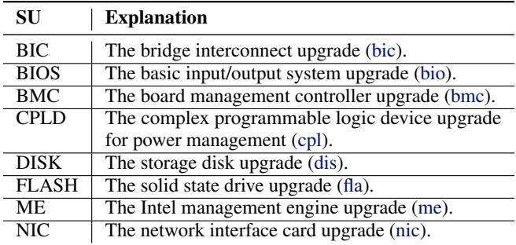

Comparisons. In real-world evaluation, we compare Acela against Heuristic, which applies fixed heuristics and conservative duration estimates long used by Meta’s datacenter schedulers. We further evaluate Acela through simulation, comparing it with Strawman, which predicts durations using per-type training averages, and Na¨ıve-ML, a standard ML model optimized for accuracy. We cannot deploy Strawman or Na¨ıve-ML in production because each server experiences a specific upgrade only once, and deploying them solely for testing would require substantial implementation and validation efforts. Our simulation closely mirrors realworld behavior, with less than 1% deviation in testing. For fairness, Na¨ıve-ML uses the same gradient boosting tree model as Acela, but predicts conditional means instead of conditional quantiles.

Metrics. We measure upgrade efficiency using two metrics: utilization, the fraction of upgrade window time spent actively upgrading (higher is better), and cancellation rate, the fraction of upgrades that fail to complete within the window (lower is better). We also report the total number of scheduled and completed upgrades.

## 6.2 Main Production Results

For real-world evaluation, we compare upgrade window utilization, cancellation rate, number of scheduled software upgrades, and number of completed software upgrades between Heuristic and Acela in Figure 10. On average, Acela achieves 1.25× higher upgrade window utilization than Heuristic, driven by a 33% increase in scheduled software upgrades and 41% more completed software upgrades. This improvement stems from Acela’s ability to predict varying durations for different software upgrades, rather than assuming uniform, long durations for all software upgrades as Heuristic. Despite handling more software upgrades, Acela meets the SLO by reducing the software upgrade cancellation rate by 2.4×. Heuristic fails to meet the SLO, which requires a cancellation rate below 5%. This is because Heuristic, which does not account for software upgrade durations, may schedule actual long-duration software upgrades in a upgrade window. In contrast, Acela prevents this by incorporating duration predictions into its scheduling decisions.

(a) Utilization (%)  
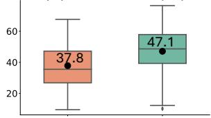  
(c) #Scheduled SUs

(b) Cancellation Rate (%)  
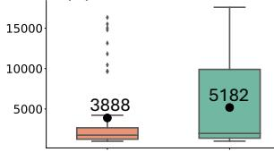

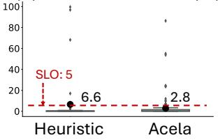

(d) #Completed SUs  
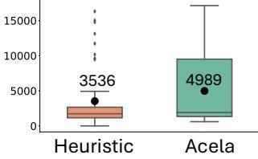  
Figure 10. Main production results between Heuristic and Acela (§6.2). The black dot and the number show the mean of the data displayed in the boxplot. The SLO of 95% software upgrades completed requires the cancellation rate below 5%. On average, Acela meets it and Heuristic fails to do so.

Table 3. Simulation results on a UG (§6.3). #Scheduled and #Completed are the number of scheduled and completed software upgrades respectively, and a higher value is better. CR refers to cancellation rate, and a lower value is better. The best number in each metric is in bold.  
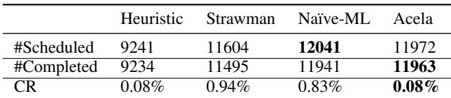

## 6.3 Simulation Results on an Upgrade Group

To compare Acela against other baseline predictors, we simulate scheduling process on a real-world UG with 14,515 total requested software upgrades. Table 3 presents the results for number of scheduled software upgrades, number of completed software upgrades, and cancellation rate (CR). Heuristic schedules and completes the fewest software upgrades due to its assumption of fixed, long durations for all software upgrades. In contrast, Strawman, Na¨ıve-ML, and Acela schedule and complete up to 30% more software upgrades than Heuristic. While Na¨ıve-ML schedules the most jobs, Acela completes the highest number of software upgrades. Despite completing the most, Acela maintains a low cancellation rate, matching Heuristic and performing 11.75× better than Strawman and 10.4× better than Na¨ıve-ML.

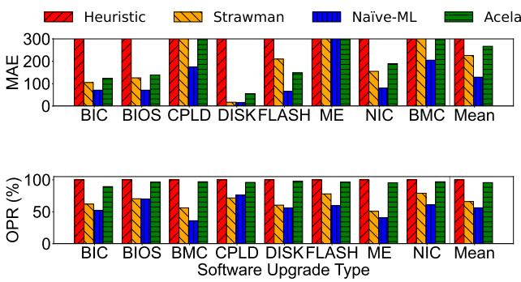  
Figure 11. Prediction accuracy (MAE) and overprediction rate (OPR) for each firmware upgrade type (§6.4). To improve readability, MAE bar charts are capped at 300. Lower MAE indicates higher prediction accuracy.

Acela completes the most software upgrades with the lowest cancellation rate by effectively integrating duration prediction and priority. Although Na¨ıve-ML schedules more software upgrades, it overloads servers, resulting in a high cancellation rate. Strawman faces similar issues. Acela avoids this by using a unique training process that slightly overpredicts software upgrade durations, allowing it to schedule effectively, complete more jobs, and keep the cancellation rate low.

## 6.4 Duration Prediction Results

We show duration prediction results for different firmware upgrade types, evaluated using two metrics: prediction accuracy (MAE) and overprediction rate (OPR). MAE is the mean absolute error between predicted and actual durations, and a lower value indicates better accuracy. OPR measures the fraction of software upgrades that are overpredicted in an UG, which directly affects the ability to meet the SLO. An OPR slighter above the SLO target (i.e., 95%) indicates near-optimal results.

Figure 11 show two rows of bar charts for MAE and OPR respectively, where the x-axis represents the firmware upgrade, y-axis represents MAE/OPR, and the last column Mean is the arithmetic mean over all firmware upgrade types. For MAE, Heuristic performs the worst, with MAE values 38- 79× higher than the other three due to its assumption of fixed and long durations for all software upgrades, regardless of type. Na¨ıve-ML achieves the best MAE, with values 1.8-79× lower than the other three, as it uses a na¨ıve machine learning technique—training gradient boosting trees with the squared loss function—focused on optimizing prediction accuracy. Strawman and Acela fall in between, with Strawman using average durations per software upgrade type, while Acela optimizes a custom score function that balances SLO and upgrade efficiency.

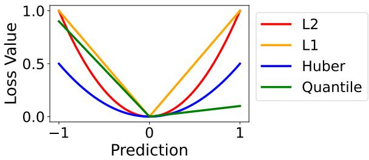

Figure 12. Comparing different loss functions. δ is set to 1 in the Huber loss. τ is set 0.9 in the Quantile loss.  
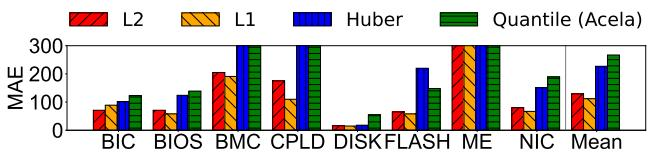

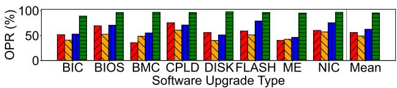  
Figure 13. Prediction accuracy (MAE) and overprediction rate (OPR) for different loss functions (§6.5). L2, L1, and Huber are symmetric loss functions, while quantile (Acela) is asymmetric. To improve readability, MAE bar charts are capped at 300, with mean values labeled directly. Lower MAE indicates higher prediction accuracy.

## 6.5 Versus Other Loss Functions

This section justifies our choice of loss function in Acela by comparing the quantile loss—an asymmetric loss function—to three commonly used symmetric regression losses: L2 (Gareth et al., 2013), L1 (Tibshirani, 1996), and Huber (Meyer, 2021). As shown in Figure 12, where the x-axis indicates the prediction and the y-axis shows the corresponding loss, all three symmetric losses (L2, L1, and Huber) exhibit balanced penalty structures for under- and overpredictions. In contrast, the quantile loss introduces asymmetry—when the quantile parameter is set to 0.9 (i.e., above the median), it penalizes underpredictions more heavily than overpredictions.

Figure 11 shows duration prediction results using each loss function. We can see that Acela has the highest MAE, performing 1.2-2.4× worse in prediction accuracy compared to the other three loss functions. It is because all three loss functions try to minimize the differences between true and predicted durations, while Acela optimizes a designed score function rather than the prediction accuracy.

Table 4. Prediction accuracy (MAE), overprediction rate (OPR), and score (Equation (2)) across quantiles and straggler removal levels. q X Y denotes training at X% quantile with Y-th percentile stragglers removed. Bold models are selected by Acela.  
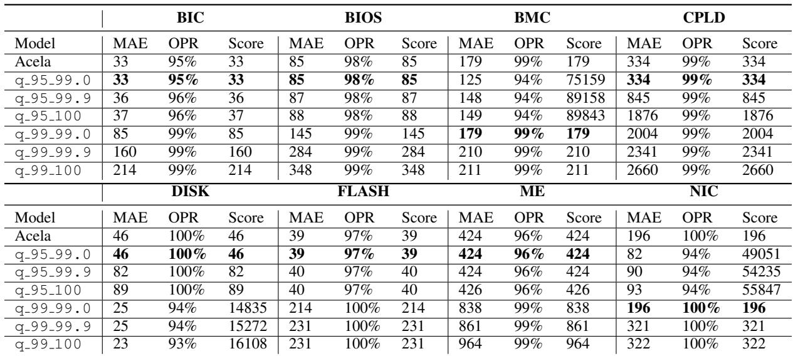

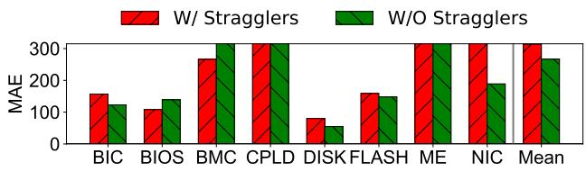

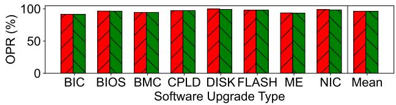  
Figure 14. Prediction accuracy (MAE) and overprediction rate (OPR) with vs. without stragglers (§6.6). To improve readability, MAE bar charts are capped at 300, with mean values labeled directly. Lower MAE reflects better prediction accuracy. Given the 95% SLO, an OPR slightly above 95% is considered nearlyoptimal. While both W/ Straggler and W/O Stragglers achieve similar OPR, the latter has better accuracy.

However, prediction accuracy alone does not provide the full picture—it is equally important to assess whether the SLO is met. When looking at OPR, all methods using symmetric loss functions yield low OPRs, around 50%, which falls short of the targeted SLO. This happens because they estimate the conditional mean, while Acela estimates a conditional quantile that encourages overprediction. As a result, only Acela with the quantile loss meets the SLO, achieving an OPR of 95%.

## 6.6 Impact of Removing Stragglers

We analyze the impact of removing stragglers—identified by their high tail latency at p99 and p99.9—from the training set. Figure 14 compares prediction performance with stragglers included (W/ Stragglers) versus excluded (W/O Stragglers, as used by Acela). The OPRs are nearly identical: 96.275% vs. 96.075%, since including stragglers only slightly increases overprediction by biasing predictions upward. However, W/ Stragglers shows 1.2× worse MAE, confirming that removing stragglers improves prediction accuracy and, in turn, upgrade efficiency.

We further explore the combined effects of quantile selection, straggler removal, and score-based model selection. Table 4 reports MAE, OPR, and scores across models trained at 95% and 99% quantiles, with straggler removal at the 99th, 99.9th, and 100th percentiles (no removal). Two key insights emerge. First, all models chosen by Acela (lowest scores) remove stragglers, confirming the value of straggler filtering. Second, models meeting the 95% SLO consistently achieve lower scores, while those falling short are heavily penalized, reflecting the design of the score function.

## 6.7 Sensitivity to Quantile Parameter

We evaluate Acela’s sensitivity to the quantile parameter (τ in Equation (1)) by examining its impact on upgrade outcomes (number of scheduled software upgrades, number of completed software upgrades, and cancellation rate) and prediction metrics (MAE and OPR) for the same UG in §6.3. We sweep τ across {0.5, 0.6, 0.7, 0.8, 0.9, 0.95, 0.99} to observe the resulting trends.

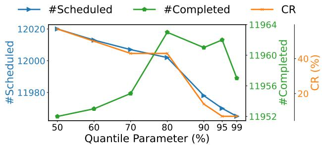  
Figure 15. Sensitivity analysis of quantile parameter τ on the upgrade outcomes in the number of scheduled software upgrades (#Scheduled), the number of completed software upgrades (#Completed), and cancellation rate (CR) (§6.7).

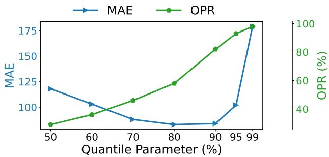  
Figure 16. Sensitivity analysis of quantile parameter τ on prediction results in MAE and OPR (§6.7).

In Figure 15, the number of scheduled upgrades and cancellations initially fluctuate, but both decrease at higher τ , reaching a minimum at 0.95 and 0.99. This is because moderate overpredictions reduce cancellation, but excessive overprediction leads to fewer upgrades being scheduled. Completed upgrades show a more nuanced trend, influenced by both predicted durations and upgrade priorities.

In Figure 16, OPR steadily increases with τ , peaking at 0.99, as higher quantiles lead to more conservative (overpredicted) durations. Interestingly, MAE decreases with τ initially, and then increases. This is because the data distribution is skewed: the mean (the point that minimizes mean squared error) and median (the point that minimizes MAE) do not align, meaning that a standard regression focused on the average will produce a higher MAE than one focused on specific quantiles. When we explored data, we observed that the data distribution is left-skewed, where the median is higher than the mean. Therefore, a model that overpredicts relative to the mean by using a higher quantile is actually moving closer to the true median, which mathematically

reduces MAE.

## 7 RELATED WORK

Learning-based behavior prediction. Machine learning has wide applications in predicting system behaviors such as latency (Belay et al., 2014), throughput (Li et al., 2020), and energy consumption (Yuan & Nahrstedt, 2003). These predictive models serve as valuable tools in addressing resource management and performance optimization challenges (Ipek et al., 2005; ¨Ipek et al., 2006; Deng et al., 2017; Bhatia et al., 2019; Garza et al., 2019; Shi et al., 2019; Mao et al., 2019). CPR employs linear regression to predict multiprocessor performance (Lee et al., 2008). Paragon uses collaborative filtering to predict quality of service performance in datacenter applications (Delimitrou & Kozyrakis, 2013). CALOREE predicts control parameters for dynamic adaptation through hierarchical Bayesian models (Mishra et al., 2018). Seer uses deep learning to predict performance in microservices (Gan et al., 2019). These work shares a common goal of prioritizing maximum prediction accuracy, assuming it will directly translate to optimal system outcomes. Ding et al. (Ding et al., 2019) and NURD (Ding et al., 2022), however, demonstrate that improving prediction accuracy may not lead to improved system outcomes. Acela shares this similar insight but operates in the domain of software upgrades.

Prediction-based job scheduling. Prior work has focused on service jobs scheduling by optimizing resource allocation and execution order to maximize their performance. Many efforts have been made in scheduling service jobs by predicting service job durations (Krishnaswamy et al., 2004; Curino et al., 2014; Boutin et al., 2014; Jalaparti et al., 2015; Jyothi et al., 2016; Rajan et al., 2016; Tumanov et al., 2016; Iorgulescu et al., 2017; Chung et al., 2018; Park et al., 2018; Jajoo et al., 2022). Corral forecasts job latency by considering future workload characteristics to mitigate the effects of network congestion (Jalaparti et al., 2015). TetriSched predicts resource requirements for current job execution based on past job executions (Tumanov et al., 2016). 3Sigma uses the full distribution of relevant runtime histories to predict job runtimes (Park et al., 2018). SLearn recognizes the input and temporal sensitivity of job runtimes and introduces a sampling technique (Jajoo et al., 2022). Prior work optimizes prediction accuracy for near-optimal scheduling. In contrast, we introduce a constrained optimization problem in software upgrades, showing accuracy alone is not enough to improve system outcomes.

Network change scheduling. Prior work has studied network changes and scheduling. Janus plans network changes while minimizing the risk by adapting to traffic dynamics (Alipourfard et al., 2019). CORNET is a framework for quick and easy adaptation of network change management (Mahimkar et al., 2021). Dionysus is a system for fast and consistent network updates in software-defined networks (Jin et al., 2014). Unlike these systems, Acela targets datacenter-scale software upgrades, tackling their distinct scheduling challenges and operational constraints.

## 8 CONCLUSION

Software upgrades are vital for datacenter reliability but remain under-explored. To address this, we present the first large-scale characterization and analysis using data from Meta’s real-world production datacenters. We introduce Acela, a cost-aware duration prediction framework that enhances scheduling throughput and upgrade efficiency while meeting the SLOs. Real-world evaluation shows Acela outperforms existing baseline. We hope this work sparks further research on datacenter-scale upgrades.

## REFERENCES

Bic. https://github.com/facebook/OpenBIC.

Bios. https://github.com/openbios/ openbios.

Openbmc. https://github.com/openbmc.

Cpld. https://github.com/mikeroyal/ CPLD-Guide.

Disk. https://docs.netapp. com/us-en/ontap-cli-9141/ storage-disk-firmware-update.html.

Flash. https://www.intel.com/ content/www/us/en/download/17903/ intel-ssd-firmware-update-tool.html.

Intelme. https://www.intel.com/content/ www/us/en/support/articles/000025619/ software.html.

Nic. https://github.com/Netronome/ nic-firmware.

Alipourfard, O., Gao, J., Koenig, J., Harshaw, C., Vahdat, A., and Yu, M. Risk based planning of network changes in evolving data centers. In Proceedings of the 27th ACM Symposium on Operating Systems Principles, 2019.

Barroso, L. A. and Clidaras, J. The datacenter as a computer: An introduction to the design of warehouse-scale machines. Springer Nature, 2022.

Barroso, L. A., Clidaras, J., and Holzle, U. The datacenter as ¨ a computer: An introduction to the design of warehousescale machines. Synthesis lectures on computer architecture, 8(3):1–154, 2013.

Belay, A., Prekas, G., Klimovic, A., Grossman, S., Kozyrakis, C., and Bugnion, E. Ix: A protected dataplane operating system for high throughput and low latency. In 11th USENIX Symposium on Operating Systems Design and Implementation (OSDI 14), pp. 49–65, 2014. doi: 10.1145/2997641.

Bhatia, E., Chacon, G., Pugsley, S., Teran, E., Gratz, P. V., and Jimenez, D. A. Perceptron-based prefetch filtering. In ´ 2019 ACM/IEEE 46th Annual International Symposium on Computer Architecture (ISCA), pp. 1–13. IEEE, 2019.

Boutin, E., Ekanayake, J., Lin, W., Shi, B., Zhou, J., Qian, Z., Wu, M., and Zhou, L. Apollo: Scalable and coordinated scheduling for cloud-scale computing. In 11th USENIX symposium on operating systems design and implementation (OSDI 14), pp. 285–300, 2014.

Chung, A., Park, J. W., and Ganger, G. R. Stratus: Costaware container scheduling in the public cloud. In Proceedings of the ACM symposium on cloud computing, pp. 121–134, 2018.

Curino, C., Difallah, D. E., Douglas, C., Krishnan, S., Ramakrishnan, R., and Rao, S. Reservation-based scheduling: If you’re late don’t blame us! In Proceedings of the ACM Symposium on Cloud Computing, pp. 1–14, 2014.

Delimitrou, C. and Kozyrakis, C. Paragon: Qos-aware scheduling for heterogeneous datacenters. ACM SIG-PLAN Notices, 48(4):77–88, 2013.

Deng, Z., Zhang, L., Mishra, N., Hoffmann, H., and Chong, F. T. Memory cocktail therapy: A general learning-based framework to optimize dynamic tradeoffs in nvms. In Proceedings of the 50th Annual IEEE/ACM International Symposium on Microarchitecture, pp. 232–244, 2017.

Ding, Y., Mishra, N., and Hoffmann, H. Generative and multi-phase learning for computer systems optimization. In Proceedings of the 46th International Symposium on Computer Architecture, pp. 39–52, 2019.

Ding, Y., Rao, A., Song, H., Willett, R., and Hoffmann, H. H. Nurd: Negative-unlabeled learning for online datacenter straggler prediction. Proceedings of Machine Learning and Systems, 4:190–203, 2022.

Fielding, R. T. Architectural styles and the design of network-based software architectures. University of California, Irvine, 2000.

Gan, Y., Zhang, Y., Hu, K., Cheng, D., He, Y., Pancholi, M., and Delimitrou, C. Leveraging deep learning to improve performance predictability in cloud microservices with seer. ACM SIGOPS Operating Systems Review, 53(1): 34–39, 2019.

Gareth, J., Daniela, W., Trevor, H., and Robert, T. An introduction to statistical learning: with applications in R. Spinger, 2013.

Garza, E., Mirbagher-Ajorpaz, S., Khan, T. A., and Jimenez, ´ D. A. Bit-level perceptron prediction for indirect branches. In 2019 ACM/IEEE 46th Annual International Symposium on Computer Architecture (ISCA), pp. 27–38. IEEE, 2019.

Govindan, R., Minei, I., Kallahalla, M., Koley, B., and Vahdat, A. Evolve or die: High-availability design principles drawn from googles network infrastructure. In Proceedings of the 2016 ACM SIGCOMM Conference, pp. 58–72, 2016.

Hu, S., Chen, K., Wu, H., Bai, W., Lan, C., Wang, H., Zhao, H., and Guo, C. Explicit path control in commodity data centers: Design and applications. In 12th USENIX Symposium on Networked Systems Design and Implementation (NSDI 15), pp. 15–28, 2015.

Iorgulescu, C., Dinu, F., Raza, A., Hassan, W. U., and Zwaenepoel, W. Don’t cry over spilled records: Memory elasticity of data-parallel applications and its application to cluster scheduling. In 2017 USENIX Annual Technical Conference (USENIX ATC 17), pp. 97–109, 2017.

Ipek, E., De Supinski, B. R., Schulz, M., and McKee, S. A. An approach to performance prediction for parallel applications. In European Conference on Parallel Processing, pp. 196–205. Springer, 2005.

¨Ipek, E., McKee, S. A., Caruana, R., de Supinski, B. R., and Schulz, M. Efficiently exploring architectural design spaces via predictive modeling. ACM SIGOPS Operating Systems Review, 40(5):195–206, 2006.

Jajoo, A., Hu, Y. C., Lin, X., and Deng, N. A case for task sampling based learning for cluster job scheduling. In 19th USENIX Symposium on Networked Systems Design and Implementation (NSDI 22), pp. 19–33, 2022.

Jalaparti, V., Bodik, P., Menache, I., Rao, S., Makarychev, K., and Caesar, M. Network-aware scheduling for dataparallel jobs: Plan when you can. ACM SIGCOMM Computer Communication Review, 45(4):407–420, 2015.

Jin, X., Liu, H. H., Gandhi, R., Kandula, S., Mahajan, R., Zhang, M., Rexford, J., and Wattenhofer, R. Dynamic scheduling of network updates. ACM SIGCOMM Computer Communication Review, 44(4), 2014.

Jyothi, S. A., Curino, C., Menache, I., Narayanamurthy, S. M., Tumanov, A., Yaniv, J., Mavlyutov, R., Goiri, I., Krishnan, S., Kulkarni, J., and Rao, S. Morpheus: Towards automated slos for enterprise clusters. In 12th USENIX Symposium on Operating Systems Design and Implementation (OSDI 16), pp. 117–134, 2016.

Ke, G., Meng, Q., Finley, T., Wang, T., Chen, W., Ma, W., Ye, Q., and Liu, T.-Y. Lightgbm: A highly efficient gradient boosting decision tree. Advances in neural information processing systems, 30, 2017.

Krishnaswamy, S., Loke, S. W., and Zaslavsky, A. Estimating computation times of data-intensive applications. IEEE Distributed Systems Online, 5(4), 2004.

Lee, B. C., Collins, J., Wang, H., and Brooks, D. Cpr: Composable performance regression for scalable multiprocessor models. In 2008 41st IEEE/ACM International Symposium on Microarchitecture, pp. 270–281. IEEE, 2008.

Li, S., Wang, X., Kalim, F., Zhang, X., Jyothi, S. A., Grover, K., Kontorinis, V., Narodytska, N., Legunsen, O., Kodakara, S., et al. Thunderbolt:throughputoptimized,quality-of-service-aware power capping at scale. In 14th USENIX Symposium on Operating Systems Design and Implementation (OSDI 20), pp. 1241–1255, 2020.

Liu, H. H., Wu, X., Zhang, M., Yuan, L., Wattenhofer, R., and Maltz, D. zupdate: Updating data center networks with zero loss. In Proceedings of the ACM SIGCOMM 2013 Conference on SIGCOMM, pp. 411–422, 2013.

Mahimkar, A., de Andrade, C. E., Sinha, R., and Rana, G. A composition framework for change management. In Proceedings of the 2021 ACM SIGCOMM 2021 Conference, 2021.

Mao, H., Schwarzkopf, M., Venkatakrishnan, S. B., Meng, Z., and Alizadeh, M. Learning scheduling algorithms for data processing clusters. In Proceedings of the ACM special interest group on data communication, pp. 270– 288. 2019.

Meinshausen, N. and Ridgeway, G. Quantile regression forests. Journal of machine learning research, 7(6), 2006.

Meyer, G. P. An alternative probabilistic interpretation of the huber loss. In Proceedings of the ieee/cvf conference on computer vision and pattern recognition, 2021.

Mishra, N., Imes, C., Lafferty, J. D., and Hoffmann, H. Caloree: Learning control for predictable latency and low energy. ACM SIGPLAN Notices, 53(2):184–198, 2018.

Naseer, U., Niccolini, L., Pant, U., Frindell, A., Dasineni, R., and Benson, T. A. Zero downtime release: Disruptionfree load balancing of a multi-billion user website. In Proceedings of the Annual conference of the ACM Special Interest Group on Data Communication on the applications, technologies, architectures, and protocols for computer communication, pp. 529–541, 2020.

Okuno, S., Iikura, F., and Watanabe, Y. Maintenance scheduling for cloud infrastructure with timing constraints of live migration. In 2019 IEEE International Conference on Cloud Engineering (IC2E), 2019.

Oppenheimer, D., Ganapathi, A., and Patterson, D. A. Why do internet services fail, and what can be done about it? In 4th Usenix Symposium on Internet Technologies and Systems (USITS 03), 2003.

Park, J. W., Tumanov, A., Jiang, A., Kozuch, M. A., and Ganger, G. R. 3sigma: distribution-based cluster scheduling for runtime uncertainty. In Proceedings of the Thirteenth EuroSys Conference, pp. 1–17, 2018.

Rajan, K., Kakadia, D., Curino, C., and Krishnan, S. Perforator: eloquent performance models for resource optimization. In Proceedings of the Seventh ACM Symposium on Cloud Computing, pp. 415–427, 2016.

Ranganathan, P., Stodolsky, D., Calow, J., Dorfman, J., Hechtman, M. G., Smullen, C., Kuusela, A., Laursen, A. J., Ramirez, A., Wijaya, A. A., Salek, A., Cheung, A., Gelb, B., Fosco, B., Kyaw, C. M., He, D., Munday, D. A., Wickeraad, D., Persaud, D., Stark, D., Walton, D., Indupalli, E., Perkins-Argueta, E., Lou, F., Wu, H. K., Chong, I. S., Jayaram, I., Feng, J., Maaninen, J., Lucke, K. A., Mahony, M., Wachsler, M. S., Tan, M., Penukonda, N., Dasharathi, N., Kongetira, P., Chauhan, P., Balasubramanian, R., Macias, R., Ho, R., Springer, R., Huffman, R. W., Foss, S., Bhatia, S., Gwin, S. J., Sekar, S. K., Sokolov, S. N., Muroor, S., Rautio, V.-M., Ripley, Y., Hase, Y., and Li, Y. Warehouse-scale video acceleration: co-design and deployment in the wild. In Proceedings of the 26th ACM International Conference on Architectural Support for Programming Languages and Operating Systems, pp. 600–615, 2021.

Shi, Z., Huang, X., Jain, A., and Lin, C. Applying deep learning to the cache replacement problem. In Proceedings of the 52nd Annual IEEE/ACM International Symposium on Microarchitecture, pp. 413–425, 2019.

Tibshirani, R. Regression shrinkage and selection via the lasso. Journal of the Royal Statistical Society Series B: Statistical Methodology, 1996.

Tumanov, A., Zhu, T., Park, J. W., Kozuch, M. A., Harchol-Balter, M., and Ganger, G. R. Tetrisched: global rescheduling with adaptive plan-ahead in dynamic heterogeneous clusters. In Proceedings of the Eleventh European Conference on Computer Systems, pp. 1–16, 2016.

Yuan, W. and Nahrstedt, K. Energy-efficient soft realtime cpu scheduling for mobile multimedia systems. ACM SIGOPS Operating Systems Review, 37(5):149–163, 2003.