# SEARCH YOUR BLOCK FLOATING POINT SCALES!

Tanmaey Gupta 1 2 Hayden Prairie 3 2 Shirley Wu 2 Reyna Abhyankar 2 Qingyang Wu 2 Austin Silveria 2   
Pragaash Ponnusamy 2 Jue Wang 2 Ben Athiwaratkun 2 Leon Song 2 Tri Dao 4 2 Daniel Y. Fu 3 2 Chris De Sa 1 2

## ABSTRACT

Quantization has emerged as a standard technique for accelerating inference for generative models by enabling faster low-precision computations and reduced memory transfers. Recently, GPU accelerators have added firstclass support for microscaling Block Floating Point (BFP) formats. Standard BFP algorithms use a fixed scale based on the maximum magnitude of the block. We observe that this scale choice can be suboptimal with respect to quantization errors. In this work, we propose ScaleSearch, an alternative strategy for selecting these scale factors: using a fine-grained search leveraging the mantissa bits in microscaling formats to minimize the quantization error for the given distribution. ScaleSearch can be integrated with existing quantization methods such as Post Training Quantization and low-precision attention, and is shown to improve their performance. Additionally, we introduce ScaleSearchAttention, an accelerated NVFP4-based attention algorithm, which uses ScaleSearch and adapted prior techniques to ensure near-0 performance loss for causal language modeling. Experiments show that ScaleSearch reduces quantization error by 27% for NVFP4 and improves language model PTQ by up to 15 points for MATH500 (Qwen3-8B), while ScaleSearchAttention improves Wikitext-2 PPL by upto 0.77 points for Llama 3.1 70B. The proposed methods closely match baseline performance while providing quantization accuracy improvements.

## 1 INTRODUCTION

Quantization plays a key role in optimizing inference efficiency for generative models (Gholami et al., 2022) — though maintaining accuracy at ultra-low bit-widths is challenging to achieve. Block Floating Point (BFP) formats have recently gained prominence over fixed-point and floatingpoint formats, offering a balanced trade-off between dynamic range, memory efficiency, and computational throughput (Drumond et al., 2018; Darvish Rouhani et al., 2020; Zhang et al., 2022). Recent advancements have improved the algorithmic accuracy and hardware support for lowbitwidth BFP formats. In particular, NVIDIA’s Blackwell architecture (Alvarez et al., 2025) introduces fast FP4 arithmetic through NVFP4 and MXFP4 (Rouhani et al., 2025) microscaling formats, enabling 4-bit matrix multiplications directly on Tensor Cores, achieving 2× higher throughput compared to FP8 compute on B200 GPUs and 3× higher throughput on the B300. A critical question is how to best use these formats to optimize machine learning models. Existing BFP implementations in both research and production frameworks (e.g., TensorRT, vLLM) (NVIDIA; vLLM; Darvish Rouhani et al., 2023; 2020; Drumond et al., 2018; Gholami et al., 2022; Li et al., 2024a) predominantly rely on a reasonable baseline, where the block scale is determined by the maximum absolute value in each block, which maps the values to the range representable by the low-precision format. We observe that this approach can be suboptimal, and alternative scale choices can lower quantization errors.

In this paper, we propose an alternate approach, ScaleSearch (shown Figure 1). Recent microscaling BFP formats like NVFP4 introduce mantissa bits in block scales (E4M3 Floating Point), which can be employed for fine-grained tuning of the scale. Building upon this insight, ScaleSearch searches for the optimal block scale to minimize quantization error for a given distribution. ScaleSearch is architecture-agnostic and can be integrated into various quantization pipelines. We demonstrate its benefits across Post-Training Quantization (PTQ) of weights and activations, as well as in low-precision attention computation.

Further, we extend FP4 optimizations to the attention mechanism and KV cache—components that dominate inferencetime memory and compute costs due to their quadratic complexity (Dao et al., 2022). While recent works have explored FP4 quantization for weights and activations in PTQ and QAT (AI & vLLM Project, 2024; NVIDIA, 2025c), and even full FP4-based training (Wang et al., 2025; Tseng et al., 2025; Chmiel et al., 2025) with negligible accuracy loss (NVIDIA, 2025a), FP4-native attention and KV cache compression remain underexplored.

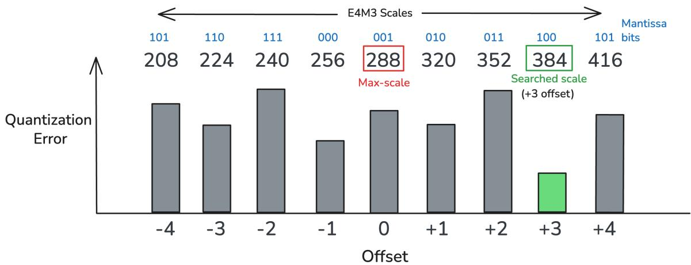  
Figure 1: ScaleSearch searches for a block scale which gives the minimum quantization error.

To this extent, we propose ScaleSearchAttention, an extension to ScaleSearch that enables NVFP4 quantization of the KV cache and attention mechanism for causal language modeling. We use ScaleSearch to select scale values for queries, keys, and values in attention, as well as the partial attention matrix in FlashAttention (Dao et al., 2022). ScaleSearchAttention enables the use of fast NVFP4 Tensor Core operations without dequantization for QKT and P V attention matrix multiplications. To achieve near-0 model accuracy degradations, ScaleSearchAttention further employs Incoherence Processing (Chee et al., 2023; Tseng et al., 2024) and matrix decomposition to reduce outliers and the average magnitude of Q and K tensors, which in turn reduces quantization error. We also use attention-sink-aware (Xiao et al., 2023b) mixed precision caching, where the first few tokens and the most recent tokens are stored in full precision, and are quantized to NVFP4 once enough tokens have been generated.

We evaluate ScaleSearch across three common FP4 quantization settings: weights PTQ, low-precision attention for diffusion model generation and causal language modeling. For weights PTQ, ScaleSearch improves model performance by upto 15 points for MATH500 (Qwen3-8B). For FP4 attention, ScaleSearch improves upon SageAttention3 (Zhang et al., 2025a) by 14 points for VQA-t performed using the Mochi model. ScaleSearchAttention reduces PPL from 3.4 to 2.6348 for Llama 3.1 70B and improves the accuracy on GPQA Diamond test benchmark by 5 points for Llama 8.1B Instruct model. The proposed methods closely match baseline performance while providing quantization accuracy improvements. ScaleSearch introduces a minimal overhead of 1.74x during FP32 to NVFP4 quantization, and achieves 98.3% of SageAttention3’s attention throughout.

In summary, we make the following contributions in this paper:

1. We introduce ScaleSearch, a scale-searching algorithm for Block Floating Point quantization that minimizes block-wise quantization error by exploring neighboring representable scales. Our analysis is primarily based on NVFP4’s E4M3 format where, unlike traditional max-scaling, ScaleSearch leverages the mantissa resolution of the block scale to select a quantizer that achieves the lowest mean-squared error. We show that ScaleSearch reduces quantization error by 26% for synthetic gaussian data, seamlessly integrates into existing PTQ and attention workflows and consistently improves quantized model performance.

2. We propose ScaleSearchAttention, a co-optimized FP4 attention mechanism that performs both QKT and P V matrix multiplications directly in NVFP4 precision on Tensor Cores—without any de-quantization overhead—and stores the KV cache in compact 4.5-bit NVFP4 format. ScaleSearchAttention employs ScaleSearch and other adapted quantization techniques, enabling end-to-end FP4 inference while preserving near-zero accuracy degradation.

3. We conduct extensive experiments on largescale language models to evaluate the efficacy of ScaleSearch and ScaleSearchAttention. Our results demonstrate consistent gains in perplexity and benchmark accuracy over prior FP4 baselines such as SageAttention3 for both language and diffusion models.

## 2 RELATED WORK

Block scaling quantization for DNN Quantized number representation format is a critical design choice that provides a spectrum across dimensions of precision, dynamic range, and hardware support. Fixed-point numbers (Lin et al., 2016; Jacob et al., 2018a) have fast hardware implementation, but their limited dynamic range is not suitable for representing outliers seen in DNN models. Floating point numbers (Micikevicius et al., 2022), on the other hand, have high computation costs due to the required alignment of mantissa for MAC operations, and narrow representations have low dynamic range. Hence, Block Floating Point (BFP) formats have recently emerged as a compelling middle ground between these two extremes (Drumond et al., 2018; Darvish Rouhani et al., 2020; Zhang et al., 2022). The central idea of BFP is that elements within a tensor block often share similar magnitudes and therefore can be represented by a shared exponent and individual integer mantissas. This shared-exponent structure drastically reduces storage overhead and enables the use of integer matrix multiplication pipelines while preserving much of the dynamic range flexibility of floating-point representations.

Recent advances have led to microscaled BFP formats such as MXFP4, NVFP4, and MXFP8 (Rouhani et al., 2025; Alvarez et al., 2025), which refine traditional block scaling for modern accelerators. These formats introduce compact perblock scale encodings optimized for Tensor Core operations, enabling efficient low-bit arithmetic without dequantization. Unlike earlier BFP variants that stored only exponent bits, NVFP4 (Alvarez et al., 2025) uniquely incorporates mantissa bits within the scale representation, offering finer granularity and improved dynamic range at minimal overhead. Standard BFP and microscaled formats employ max-based scaling, where the block scale is derived from the maximum absolute value within each block—ensuring representability (Darvish Rouhani et al., 2020; Drumond et al., 2018; Gholami et al., 2022).

Quantization for Generative Models Quantization is a fundamental technique which reduces numerical precision across different model components and targets optimization across dimensions like memory transfer, matrix-multiplication speeds, and end-to-end training time. Broadly, quantization approaches fall into three categories: post-training quantization (PTQ), quantization-aware training (QAT), and fully quantized training. Post-training quantization (PTQ) algorithms like GPTQ (Frantar et al., 2022), AWQ (Lin et al., 2024), and ZeroQuant (Yao et al., 2022) quantize model weights post-training, often using secondorder error metrics, activation-aware heuristics, or outlierchannel handling to minimize degradation. SmoothQuant (Xiao et al., 2023a) extends PTQ to activations by learning per-channel affine transformations that reduce activation variance. Works like Qserve (Lin\* et al., 2024) and llm.int8()(Dettmers et al., 2022) demonstrate mixedprecision quantization for different components or outliers. QuIP (Chee et al., 2023) advances PTQ by using adaptive rounding and incoherence processing, while QuIP# (Tseng et al., 2024) introduces Hadamard transforms and E8-lattice vector quantization. We adapt the incoherence processing step in our method from these works. In contrast, quantization-aware training (QAT) (Stock et al., 2021; Jacob et al., 2018b) incorporates quantization simulation into the forward pass during training and which makes low-bit inference robust to quantization loss. Finally, fully quantized training—which quantizes weights, activations, and gradients—has become feasible due to advances in low-bit numerical formats (Wang et al., 2025; Tseng et al., 2025). Recent innovations, such as FP4 training using NVFP4 and MXFP4 formats, enable training and inference on 4-bit floating-point hardware.

KV Cache Compression As the KV cache increases linearly with sequence length and batch size, significant efforts have been put into reducing its memory footprint. Architecture variants like sparse transformers (Jiang et al., 2024; Zhang et al., 2025b), low-rank approximations (Choromanski et al., 2020), and shared KV head methods (Shazeer, 2019; Ainslie et al., 2023; Liu et al., 2024a) inherently reduce the cache size. In a parallel direction of using a subset of KV cache, StreamingLLM (Xiao et al., 2023b) stores only the initial and recent tokens, and methods like Gist Tokens and SnapKV (Li et al., 2024b; Mu et al., 2023) compress the initial prompt into ”important tokens” based on learning-based methods. H2O (Zhang et al., 2023), RocketKV (Behnam et al., 2025), and FastGen (Ge et al., 2024) take an alternative approach of dynamic identification of crucial tokens and eviction. Another approach (Liu et al., 2024b; Yang et al., 2024b) shares the KV cache between layers and may additionally store relative vectors.

Previous KV-cache quantization methods face challenges from attention dynamics and outlier channels, making slow compression (e.g., adaptive rounding, lattice codebooks) impractical for high-throughput inference. Token-wise methods like ZipCache (He et al., 2024) and WKVQuant (Yue et al., 2024) localize errors, while channel-wise approaches such as KVQuant (Hooper et al., 2024) and KIVI (Liu et al., 2024d) better adapt to magnitude variation. Error correction techniques include Gear’s low-rank modeling (Kang et al., 2024) and QuaRot’s orthogonal transformations (Ashkboos et al., 2024). Mixed-precision strategies (e.g., KIVI (Liu et al., 2024d), IntactKV (Liu et al., 2024c), KVTuner (Li et al., 2025)) statically assign higher precision to critical tokens, but their fixed heuristics and runtime complexity limit scalability. Dynamic approaches (MiKV (Yang et al., 2024a), ZipCache (He et al., 2024)) incur overheads and are incompatible with static-graph inference.

## 3 BACKGROUND ON FP4 FORMATS

Four-bit floating point arithmetic is now being used to to enable highly memory- and compute-efficient inference at training at ultra-low precision. All FP4 formats discussed here follow the standard E2M1 structure: 1 sign bit, 2 exponent bits, and 1 mantissa bit. This FP4 format can represent the real numbers RE2M1 ⊂ R, where

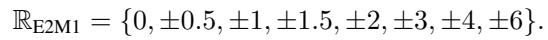

Block Floating Point formats have been widely used for quantizing DNN and Generative models as they offer an optimal tradeoff between precision, dynamic range, and hardware acceleration. The standard underlying structure for BFP formats involves a common exponent-only scale factor for a group of low-precision floating-point numbers. This common scale is responsible for projecting the unquantized numbers into the range of values representable by the low-precision format. The standard practice of this “calibration” computes the scale as the ratio of the maximum value present in the block and the maximum value representable by the low-precision format

The NVIDIA Blackwell architecture introduces support for two 4-bit block floating-point formats: NVFP4 and MXFP4. Each of these formats represents a micro-block (i.e. a fixedlength chunk of a vector) of numbers as a vector of FP4 numbers multiplied by a single 8-bit scale factor.

NVFP4. NVFP4 (Alvarez et al., 2025) is a hardwareaccelerated FP4 format that operates over micro-blocks of 16 values, each of which shares a scale factor stored as an 8-bit E4M3 floating-point number. Let RUE4M3 ⊂ R+ denote the set of positive scale values representable in that FP8 format. Then the representable blocks in NVFP4 can be denoted by the set

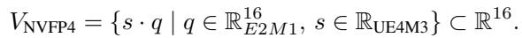

A tensor X ∈ R···×N×D (for D divisible by 16) is represented in NVFP4 by quantizing each row in non-overlapping blocks of size 16, resulting in a pair (Q, S) with

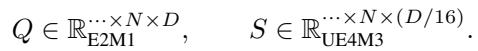

This uses an average of 4.5 bits per number.

To quantize (round) a real micro-block vector x ∈ R16 to NVFP4, the standard approach proceeds by first (after dividing by the global scale from row, column, and/or tensor scaling) computing a shared scale s ∈ RFP8 and then the vector q ∈ R16F P 4 as

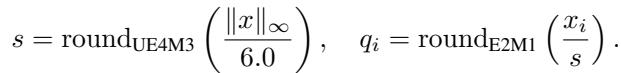

/ input float SFScaleVal is global scale   
// vecMax = max of abs of input vector   
float SFValue = SFScaleVal \* (vecMax \* \_\_frcp\_rz(6.0f)); \_nv\_fp8\_e4m3 tmp = \_\_nv\_fp8\_e4m3(SFValue);   
float SFValue = float(tmp);   
float outputScale = SFValue == 0 ? 0.0f : frcp\_rz(SFValue\*\_\_frcp\_rz(SFScaleVal)); set fp2Vals = input vec \* outputScale   
uint32\_t e2m1Vec=fp32\_vec\_to\_e2m1(fp2Vals);

Figure 2: Pseudocode showing how VLLM rounds to nvfp4. This is a simplification of rounding code found in vllm/c src/quantization/fp4/nvfp4\_utils.cuh

Here, 6.0 is the largest magnitude representable in RE2M1, roundF denotes ordinary nearest-neighbor rounding into the format F , and the infinity-norm ∥x∥∞ = maxi |x| is the largest absolute magnitude of an entry of x. The underlying arithmetic operations needed to do this (finding the absmax, dividing by 6, dividing by the scale) are usually done in FP32. This is illustrated in the code in Figure 2, which is thinly simplified from the VLLM codebase (Kwon et al., 2023): this code is representative of the standard approach to rounding to NVFP4 in use today.

To quantize a whole tensor, the standard approach simply applies this rounding algorithm independently to each 16- sized block of the tensor.

Dequantization reconstructs the full-precision tensor via

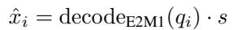

or, in matrix form, producing Xˆ ∈ RN×D

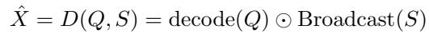

where Broadcast(S) ∈ RN×D expands each sg over its corresponding block, and ⊙ denotes elementwise multiplication. But note that for typical operations, which use FP4 Tensor Cores, explicit dequantization is never performed: instead, the hardware uses the NVFP4 values direcly to compute a low-precision matrix multiplication.

MXFP4. The MXFP4 format follows the same 4-bit E2M1 encoding but uses a larger group size of 32 values per block, paired with a simpler power-of-two scaling factor. Concretely, it uses a UE7M0 8-bit floating-point format instead of the UE4M3 format of NVFP4: otherwise, the quantization and dequantization algorithms are identical. NVFP4, with its smaller block size and higher-precision FP8 scale, achieves lower quantization error and better accuracy retention in practice, but trades off for a worse dynamic range and a (very slightly) higher bits-per-number.

## 4 SC A L ESE A R C H

The standard approach of choosing the scale based only on the maximum magnitude of the input vector x is obviously not optimal, in the sense that it is not guaranteed to find the vector in VNVFP4 that is closest to x—but this choice of scale is generally assumed to be “close enough” to optimal to be a good heuristic. Perhaps surprisingly, as we show in this section, it can be significantly suboptimal, and other scales can yield quantized vectors with much lower mean squared error, on both synthetic random vectors and real neural network data.

Algorithm 1 NVFP4 Scale Search   
Input: Block x ∈ R16, search range [fmin, fmax]   
Output: Best scale s∗, fp4 vector q∗, best offset f ∗   
xmax ← maxi∈{1,...,16} |xi|   
s ← roundUE4M3 (xmax · (1.0/6.0)) ▷ Standard scale   
sint8 → reinterpret(s, int8)   
ℓ∗ ← +∞ ▷ Initialize best loss   
for f = fmin to fmax do   
if 1 ≤ sint8 + f ≤ 127 then ▷ If scale in range   
s(f) ← reinterpret(sint8 + f, fp8UE4M3)   
qi ← roundE2M1 xi/s(f) , ∀i ▷ Quantize   
xˆi ← qi · s(f), ∀i ▷ Dequantize   
ℓ ← P16i=1(xi − xˆi)2 ▷ Compute loss   
if ℓ < ℓ∗ then ▷ Update best scale   
ℓ ∗ ← l   
s∗ ← s(f)   
q ∗ ← q   
end if   
end if   
end for   
re turn s ∗ , q ∗ , f ∗

We observe that the extra budget of scale mantissa bits in NVFP4 creates an opportunity for fine-grained searching of the block scale factor, rather than using the default scale based on the maximum value of the block. We implement this search mechanism by adding offsets to the default scale s and selecting the scale that minimizes the quantization error of the block. We focus on the NVFP4 format to implement ScaleSearch as it is the only format, to the best of our knowledge, that has a floating-point scale factor and is supported by modern hardware for accelerated computations. We then propose ScaleSearch, which searches multiple FP8 scales to reduce the error of micro-block floating point quantization.

The main algorithmic idea of ScaleSearch is to search a number of scales that are nearby the standard maximummagnitude scale. Specifically, if s ∈ RUE4M3 denotes the “standard” scale (Section 3), we consider scales s(f) that are offset from s by an integer f , where

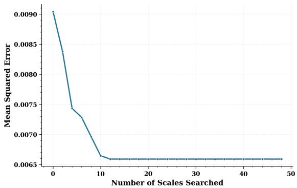  
Figure 3: Quantization MSE for unit Gaussian tensor

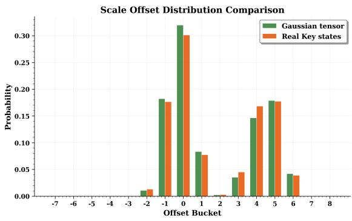  
Figure 4: Offset distribution for Gaussian and real key states tensor for nvfp4 format.

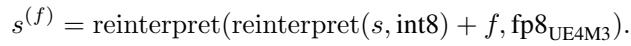

That is, s(0) = s, s(1) is the smallest UE4M3 value larger than s, s(−1) is the largest UE4M3 value smaller than s, etc., such that

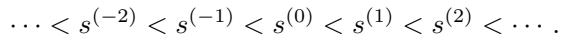

ScaleSearch exhaustively searches all f between some minimum fmin and maximum fmax for the search that minimizes the (mean squared) quantization error. The full algorithm for NVFP4 is presented in Algorithm 1; this algorithm can easily be modified to handle other micro-block floating point formats.

Obviously, if we let fmin = −127 and fmax = +127, searching exhaustively over all scales, then Algorithm 1 would be guaranteed to find the closest representable vector to the input x. But this would be computationally costly. In the next subsection, we will show via experiments on synthetic and real data that searching only a small subset of scale offsets suffices to get a substantial reduction in error and come very close to the optimal MSE.

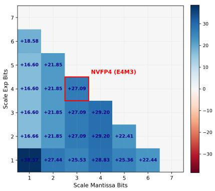  
(a)

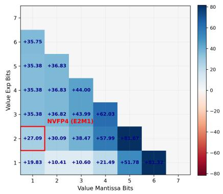  
(b)

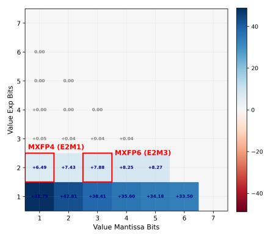  
(c)

Figure 5: Simulated percentage improvement by ScaleSearch for different scale and value configurations. (a) Scale representation sweep with value format fixed at E2M1. (b) Value representation sweep with scale format fixed at E4M3. (c) MXFP value representation sweep with scale format fixed at E8M0. Standard formats are marked in red.  
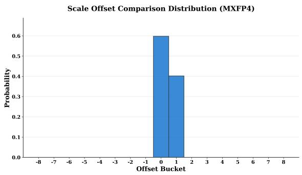  
Figure 6: Offset distribution for Gaussian data for mxfp4 format.

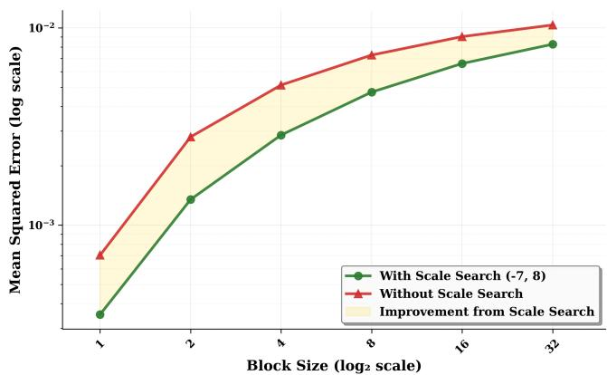  
Figure 7: ScaleSearch advantage reduces as the block size increases.

## 4.1 Synthetic Validation

We first test our approach on synthetic data by generating a large FP32 tensor with values sampled from a standard Gaussian distribution and quantizing it to NVFP4 with Algorithm 1 across a range of different numbers of scales searches (the number of scales searched is fmax − fmin + 1, and we chose ranges where fmin = 1 − fmax). Figure 3 shows the quantization mean squared error (MSE) for this tensor: as the number of scales searched is increased, the quantization error reduces, until it saturates without any further reduction with an increase in search scope. On these synthetic data, the MSE went down from 0.0990 to 0.0066, an reduction by about 25%.

Offset distribution Motivated by a need to reduce the range of the search, we look at the distribution of offsets chosen for different blocks. Figure 4 shows the empirical distribution of offsets resulting from a exhausive search. The distribution has a bimodal structure with two curves centered around offsets 0 and 4 for a generated Gaussiansampled tensor. The figure also plots the same distribution for a real Key state tensor taken from Llama 3.1 8B model, showing that this behavior persists even when quantizing real data. This suggests that the scale search analysis done on a Gaussian-sampled tensor can be safely applied for the quantization of real model tensors, owing to the similar offset distribution as seen in Figure 4. Based on this empirical analysis, we choose an offset set range of fmin = −2 to fmax = +6 while searching for the optimal scale in our real model quantization pipeline: we use this search range for the remainder of the NVFP4 experiments in this paper.

The intuition for the observed distribution is that the “default” block scale (offset 0) is chosen such that the largestmagnitude entry will have low error when represented with the largest-magnitude fp4 value, 6 (or -6). The popularity of offsets near 0 corresponds to quantizations where the largest-magnitude entry will be represented by 6 (or -6). But another way the largest-magnitude entry can be stored in fp4 is as 4 (or -4), the second-largest-magnitude fp4 value.

Here, we want the scale to be about 1.5x = 6/4 larger than the “default” block scale, to account for the fact that the largest-magnitude entry is stored as 4 rather than 6. An offset of around 4 or 5 typically corresponds to about a 1.5x factor: to illustrate, the e4m3 number 1.0 corresponds to the bit pattern 0 1000 000 = 64, and adding an offset of 4 to this yields 0 1000 100 = 68, which corresponds to the number 1.5. The mode of the distribution around 4&5 in Figure 4. corresponds to quantizations where the largest-magnitude entry will be represented by 4 (or -4). There is no “third mode” for representing the largest-magnitude entry with 3 (or -3) because this cannot do better than representing it with 6 (or -6) and halving the scale.

The above considerations are generic, rather than depending on any particular data distribution. And this is validated by our empirical observation that the offset distribution has a mode presented in Figure 4, which emerges for both synthetic Gaussian tensors and real activation tensors.

Other formats ScaleSearch can be used with any block quantization format, with varying benefits depending on the scale and value format used. We simulated ScaleSearch improvements for a range of configurations with varying number of exponent and mantissa bits for scale and value formats. Figure 5a shows the percentage improvement realised by ScaleSearch for hypothetical block quantization formats having different scale representation bits with value format fixed at E2M1 (same as in NVFP4). Figure 5b shows the same analysis for different value representation bits with scale format fixed as E4M3 (same as in NVFP4). ScaleSearch reduces the quantization error upto about 80%, with a reduction of 27% in particular for NVFP4 format. We also study the effect of ScaleSearch for the standardised MXFP format (Figure 5c), and we observe a reduction of quantization MSE of 11% for MXFP6 with E2M3 values and 8% for MXFP4.

We further note that ScaleSearch has better performance for recent low-precision formats such as NVFP4 for two reasons. First, we observe that the benefit of ScaleSearch is more pronounced with smaller block sizes. Figure 7 shows that as the block size increases, the MSE gap between search and no-search cases reduces. Prior quantization methods had larger block sizes ranging from per column/row to per-tensor scaling, wherein the benefit of ScaleSearch would be diminished. Second, as Figure 4 shows, it is most profitable to search scales near the max-abs-scale s, and the representable scale values in MXFP4 are simply spread out more over a larger range, placing fewer of them “close” to s. This behavior can be seen explicitly in Figure 6, which plots the same distribution for MXFP4 scaling: observe that only two offsets are ever used and the most common choice is no offset.

## 4.2 Application to language modelling

We extend ScaleSearch to develop ScaleSearchAttention, an end-to-end attention method which optimizes attention computation for inference by formulating the problem into native NVFP4 format with a hardware-aware pipeline void of any de-quantization overheads. All tensors involved in the attention layer (Q, K, P, V) are quantized to the NVFP4 format and directly multiplied using the NVFP4 Tensor Cores with a FP32 accumulator, enabling higher throughput. Observe that, in addition to any compute benefits, this reduces the memory footprint of the KV cache by storing it in NVFP4 format (4.5 bits). Block scales for (Q, K, P, V) are computed using ScaleSearch after per-row scaling, and quantization is done along the reduction dimension of a matrix multiply, which is constrained by the requirements of the NVFP4 MMA instruction (NVIDIA, 2025b). To close the accuracy gap with respect to unquantized models, ScaleSearchAttention integrates two additional techniques on top of ScaleSearch.

Incoherence Processing with magnitude reduction Multiple prior works like QuIP (Chee et al., 2023), QuIP# (Tseng et al., 2024), QuaRot (Ashkboos et al., 2024) have proposed using Incoherence Processing (IP) as a principled way of reducing outliers in the tensor to be quantized. Following QuIP# (Tseng et al., 2024), we use a Hadamard matrix H to transform Q and K matrices, in a way that preserves the attention scores, while reducing quantization error. On top of traditional IP, we implement an additional transformation that reduces the average squared magnitude of the projected query (Q) and key (K) representations, as this directly reduces the quantization error. Specifically, we introduce a pair of linear transformations:

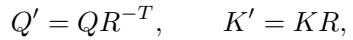

where R ∈ Rd×d is an invertible transformation. This transformation preserves the attention scores, while reducing the quantization error for query (Q) and key (K):

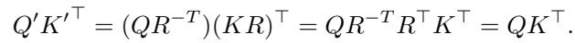

A derivation of these formulas, along with a proof that they in some sense minimize the averaged squared magnitude of the projected Q and K matrices, appears in the Appendix - we omit it here both for brevity and as it is in some sense orthogonal to our main contribution of ScaleSearch.

Attention-sink-aware mixed-precision cache Attention sink analysis (Xiao et al., 2023b) presented that attention scores are concentrated towards the most recent “local” tokens and initial tokens of the context. Following this observation, some previous KV cache compression methods like KVQuant (Hooper et al., 2024) and IntactKV (Liu et al., 2024c) preserve the KV cache corresponding to initial and “pivot” tokens in high precision. Expanding on this idea, ScaleSearchAttention uses mixed-precision attention computation, wherein the entire attention matrix (QKT ) is divided into blocks of size B and the first and last (most recent) blocks are computed in high precision, while all other blocks are computed in lower precision. This is implemented by storing a constant O(B) sized KV cache in unquantized form. This does not scale with context or generation length, and hence does not make inference more memory-bound. Block size B can modified with respect to performance-optimality for given memory and compute resources. The only requirement is m ≥ 16 as V is quantized along the token dimension and quantization is performed in groups of 16 when using the NVFP4 format.

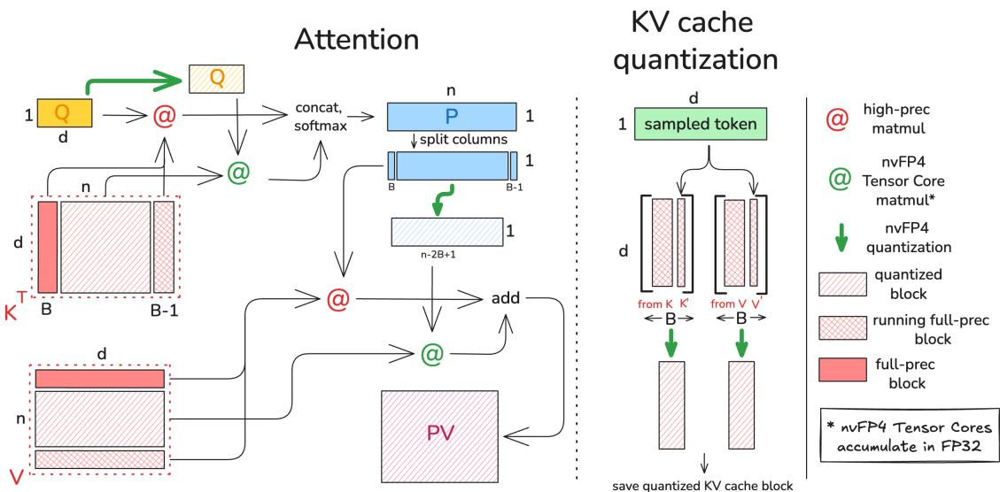  
Figure 8: ScaleSearchAttention workflow example for inference, where n tokens (such that n mod B = B − 1) have been processed. Mixed precision K is multiplied with Q using a majority of nvFP4 Tensor Core instructions, which accumulates P in FP32. P is further quantized and undergoes a mixed-precision multiply with V. The Key, Value states corresponding to the new sampled token completes the block of size B, which is then sent for quantization and stored in the compressed KV cache.

ScaleSearchAttention workflow Figure 8 presents the implementation and workflow for ScaleSearchAttention, with an inference example in the prefill stage where n tokens (such that n%B = B − 1) have been processed. Mixed-precision KV cache corresponding to these n tokens contains the first block and the incomplete last block (containing B − 1 tokens)in full-precision, while rest of the KV cache is in the NVFP4 format. Quantized K is multiplied with quantized Q using a nvFP4 Tensor Core instructions, while the full precision matrix multiplications are done with high-precision matmul instructions. Since unquantized values do not scale with context length, majority of the computations are performed using the fast nvFP4 Tensor Cores, which accumulates the results in FP32. Results from the two matrix multiply operations are concatenated to compose QKT , which is used to calculate probabilities using the softmax operation. P matrix is further quantized and undergoes a mixed-precision multiply with V (similar to QKT ) - the only difference being that V matrix is partitioned along the rows, and hence P matrix needs to be split along columns to perform the partial high and low precision matrix multiply, which is then added together to get the P V matrix. The Key, Value states corresponding to the new sampled token are concatenated at the end of the incomplete unquantized K and V blocks respectively, and the complete blocks are then quantized into nvFP4 and stored as compressed KV cache. Since all matrices are quantized and nvFP4 Tensor Cores accumulate in FP32, there is no dequantization step involved.

## 5 EXPERIMENTS

We evaluate the impact of using ScaleSearch by validating the following claims about ScaleSearch’s improved numerical stability and minimal overhead. First, we evaluate the improved quality of ScaleSearch in the context of PTQ of language models and ultra-low-precision attention for diffusion models inference. Furthermore, we benchmark the throughput of ScaleSearch in comparison to other low-precision attention alternatives to illustrate the minimal overhead of ScaleSearch. Finally, we evaluate ScaleSearchAttention for language models.

Table 1: ScaleSearch as a PTQ technique evaluated across several general capability benchmarks averaged across 5 runs (MMLU is run once). Higher is better, and bold is best.  
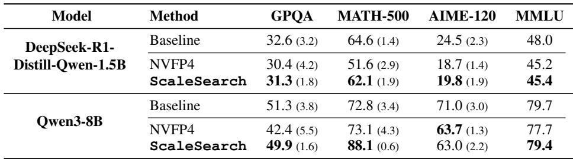

## 5.1 ScaleSearch

Post-Training Quantization We evaluate the use of ScaleSearch as a technique for offline Post-Training Quantization (PTQ) of DeepSeek-R1-Distill-Qwen-1.5B (Guo et al., 2025) and Qwen3-8B (Yang et al., 2025). We compare against the base model and an NVFP4 model quantized using TensorRT-Model-Optimizer (NVIDIA, 2025c) (ModelOpt). For ScaleSearch we modify the ModelOpt NVFP4 quantization path to conduct ScaleSearch. We utilize five general capability benchmarks (GPQA (Rein et al., 2023), MATH-500 (Hendrycks et al., 2021), AIME-120 (Jia, 2024), MMLU (Hendrycks et al., 2020)). GPQA tests graduatelevel scientific reasoning and multi-hop inference, highlighting quantization’s impact on domain knowledge. AIME and MATH-500 focus on high-school math, stressing symbolic reasoning and precision. MMLU spans diverse subjects like history and law, evaluating world knowledge and problemsolving. The results are presented in Table 1.

We observe ScaleSearch outperforms NVFP4 across all benchmarks by up to 15 percentage points. In the only instance where NVFP4 is better (AIME-120 on Qwen3- 8B), ScaleSearch is still within one standard deviation (which we believe is due to the randomness inherent within these benchmarks). Notably, we see ScaleSearch close the gap on benchmarks where there is a significant difference between the non-quantized baseline and NVFP4 (10.5 on MATH-500, 7.5 on GPQA, and 1.7 on MMLU). These trends are consistent across model sizes.

Diffusion Inference attention We additionally evaluate the quality of ScaleSearch in combination with SageAttention3 (Zhang et al., 2025a) for end-to-end video diffusion model inference. We compare SageAttention3 (Zhang et al., 2025a) with and without ScaleSearch in Mochi (Team, 2024) and CogvideoX-2B (Yang et al., 2024c), using CLIPSIM and CLIP-Temp (CLIP-T) to measure text-tovideo alignment and VQA-a, VQA-t, and FScore to measure quality and consistency. We evaluate these models on the SageAttention3 evaluation dataset (Zhang et al., 2025a).

As seen in Table 2, ScaleSearch improves quality for Mochi and CogVideoX over SageAttention3 in VQA-a, VQA-t, and FScore, while matching in CLIPSIM and CLIP-T. Similar to our PTQ results, we observe that ScaleSearch matches naive SageAttention3 in metrics where SageAttention3 is close to full-precision attention (e.g., CLIPSIM and CLIP-T). However, we find that in metrics where SageAttention3 struggles in comparison to full-precision attention, incorporating ScaleSearch significantly improves quality (e.g., VQA-a, VQA-t, FScore).

## 5.2 ScaleSearchAttention

In this section, we evaluate ScaleSearchAttention using simulated quantization framework developed on top of Pytorch (Meta). We test task-independent PPL of quantized and unquantized models.

Perplexity We use Llama 3.1 8B, Llama 3.1 70B (Dubey et al., 2024), Qwen3 4B, and Qwen3 8B (Yang et al., 2025) for measuring token perplexity on the test set of Wikitext-2 dataset (Salesforce). For PPL evaluation, we compare against the full native precision of the respective model (FullPrec), the vanilla FP4 quantization (Naive-FP4) (Alvarez et al., 2025), and SageAttention3 (SA3) (Zhang et al., 2025a). For SageAttention3, we simulate the given algorithm (Algorithm 1) using our FP4 simulator as the provided code is numerically unstable when used in a causal setting. Table 3 presents these results. ScaleSearchAttention outperforms SageAttention3 and Naive-FP4 across all models, and reduces PPL by upto 22% for Llama 3.1 70B model. Note that ScaleSearchAttention provides significant improvement for models of larger sizes as well, for which quantization generally produces less effect (Liu et al., 2025). We use perplexity evaluation to also study the effect of ScaleSearch by adding it on top of naive NVFP4 (naive-FP4) quantization and SageAttention3(SA3). Naive-FP4 involves simulated quantization of Q, K, V, P using the algorithm provided by NVIDIA (Alvarez et al., 2025). Adding ScaleSearch improves the PPL for both SageAttention3 and Naive-FP4, validating its effectiveness and applicability across a wide set of quantization algorithms.

Table 2: Mochi and CogVideoX quality (VQA-a, VQA-t, FScore) and video-caption alignment (CLIPSIM, CLIP-t) using SageAttention3 and SageAttention3 + ScaleSearch on the SageAttention3 evaluation dataset (Zhang et al., 2025a). Higher is better, and bold is best.  
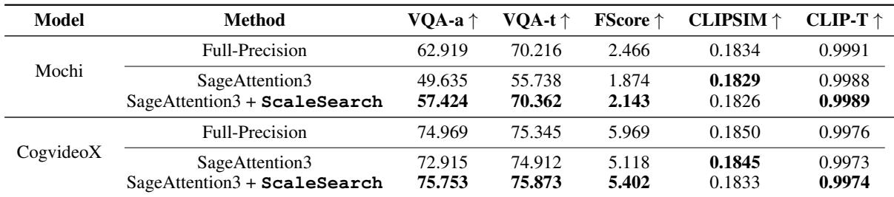  
Table 3: Perplexity evaluation on Wikitext-2 test set. Lower is better, and bold is best.

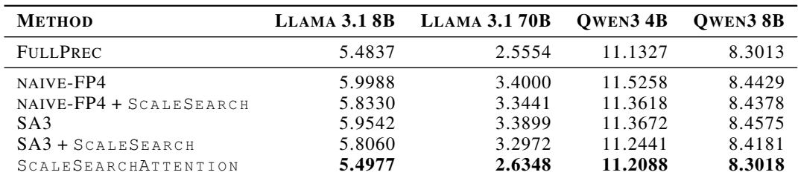

Table 4: Language benchmark evaluation on GPQA:diamond for Llama 3.1 8B Instruct model. Bold is best.  
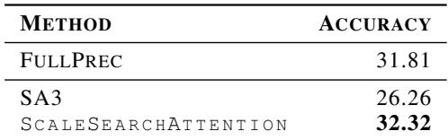

Table 5: Ablation analysis of ScaleSearchAttention (SSA) variants. Note : w/o refer to without.  
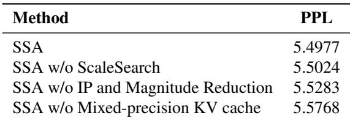

Language benchmark We further evaluate our method on the GPQA Diamond (Rein et al., 2023) benchmark using the Llama 3.1 8B Instruct model. Consistent with the perplexity results, ScaleSearchAttention achieves the best performance, attaining an accuracy of 32.32, outperforming SA3 (26.26), and matching the full precision evaluation.

ScaleSearchAttention ablation We also study the importance of each component of ScaleSearchAttention in the ablation analysis presented in 5. The full ScaleSearchAttention configuration achieves the lowest perplexity (5.4977), indicating the effectiveness of jointly combining all proposed components. Removing ScaleSearch leads to a noticeable degradation (5.5024), highlighting the importance of optimal microscaling. Similarly, disabling importance preservation (IP) and magnitude reduction increases perplexity further (5.5283), while the largest drop in performance is observed when mixed-precision KV cache is removed (5.5768), underscoring its critical contribution to preserving attention quality.

## 5.3 Overhead and Efficiency

In this section, we analyze the performance of ScaleSearch by evaluating (i) quantization overhead under different search ranges, (ii) attention throughput, and (iii) end-to-end generation latency.

Quantization overhead. We first measure the overhead introduced by ScaleSearch during FP32 to NVFP4 quantization. The experiment is conducted on a random Gaussian matrix of size 2048 × 2048, using vLLM’s quantization implementation as the baseline, upon which ScaleSearch is integrated. As shown in 6, the baseline quantization takes 0.0258 ms, while incorporating ScaleSearch with a restricted search range [−1, 1] increases the time to 0.0328 ms (1.27× overhead). Expanding the search to the full range [−2, 6] results in 0.0449 ms (1.74× overhead). This indicates that ScaleSearch introduces minimal practical overhead during quantization while providing consistent improvements in quantization MSE.

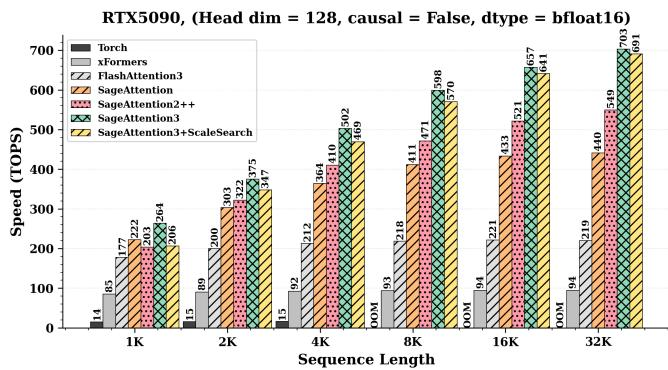

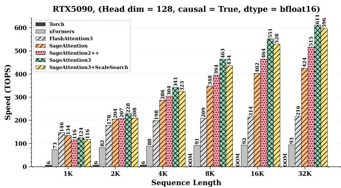  
Figure 9: We benchmark the combination of SageAttention3 (Zhang et al., 2025a) and ScaleSearch against other ultra-low precision techniques (Zhang et al., 2024; Zhang et al.), flash-attention (Shah et al., 2024), xformers (Lefaudeux et al., 2022), and eager torch given an input of data type bfloat16. We find the ScaleSearch doesn’t significantly impact the throughput of both causal and non-causal attention, especially at larger sequence lengths.

Table 6: Quantization overhead of ScaleSearch under different search ranges.  
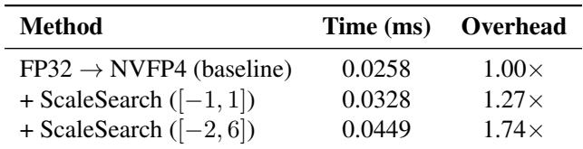

Attention throughput. Next, we evaluate the impact of ScaleSearch on attention throughput in an experimental setup inspired by SageAttention3 (Zhang et al., 2025a). As shown in Figure 9, combining ScaleSearch with SageAttention3 achieves throughput nearly identical to the baseline across both causal and non-causal settings. In particular, at long sequence lengths (32K), ScaleSearch attains up to 98.3% of baseline TOPs in non-causal attention and 97.5% in causal attention. This demonstrates that the additional scaling search does not introduce meaningful runtime overhead in the critical attention kernel, especially in the high-throughput regime.

End-to-end latency. Finally, we measure end-to-end latency on text-to-video generation models. As shown in Table 7, both SageAttention3 and SageAttention3 + ScaleSearch significantly reduce latency compared to full-precision attention. Importantly, ScaleSearch introduces only a marginal increase over SageAttention3 (e.g., 353.40 s vs. 364.68 s for Mochi, and 61.72 s vs. 63.09 s for CogvideoX), confirming that its overhead is minimal in realistic generation workloads. Overall, these results demonstrate that ScaleSearch achieves improved numerical performance with negligible impact on system efficiency.

Table 7: We report the average end-to-end latency in seconds of text-to-video generation models Mochi (Team, 2024) and CogvideoX (Yang et al., 2024c) on tweleve different prompts, using full-precision (blfoat16) attention, SageAttention3 (Zhang et al., 2025a), and SageAttention3 with ScaleSearch. Lower is better. Bold is best, and underline is second best.  
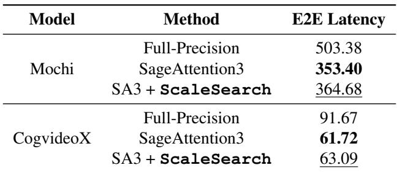

## 6 CONCLUSION

In this paper, we introduce ScaleSearch, a technique for selecting micro-block scaling values for nvFP4 quantization. We find that ScaleSearch reduces quantization error, leading to improvements in end-to-end quality for language modeling and video diffusion. As an extension, we propose ScaleSearchAttention, a first-of-its-kind attention algorithm for nvFP4 quantization of the KV cache using ScaleSearch. We hope these methods can help drive further development and innovation for quantization.

## REFERENCES

AI, R. H. and vLLM Project. LLM Compressor, 8 2024. URL https://github.com/vllm-proj ect/llm-compressor.

Ainslie, J., Lee-Thorp, J., de Jong, M., Zemlyanskiy, Y., Lebron, F., and Sanghai, S. Gqa: Training general-´ ized multi-query transformer models from multi-head checkpoints, 2023. URL https://arxiv.org/ab s/2305.13245.

Alvarez, E., Almog, O., Chung, E., Layton, S., Stosic, D., Krashinsky, R., and Aubrey, K. Introducing nvfp4 for efficient and accurate low-precision inference, 2025. URL https://developer.nvidia.com/blog/ introducing-nvfp4-for-efficient-andaccurate-low-precision-inference/.

Ashkboos, S., Mohtashami, A., Croci, M. L., Li, B., Cameron, P., Jaggi, M., Alistarh, D., Hoefler, T., and Hensman, J. Quarot: Outlier-free 4-bit inference in rotated LLMs. In The Thirty-eighth Annual Conference on Neural Information Processing Systems, 2024. URL https://openreview.net/forum ?id=dfqsW38v1X.

Behnam, P., Fu, Y., Zhao, R., Tsai, P.-A., Yu, Z., and Tumanov, A. RocketKV: Accelerating long-context LLM inference via two-stage KV cache compression. In Fortysecond International Conference on Machine Learning, 2025. URL https://openreview.net/forum ?id=RyOpooIxDF.

Chee, J., Cai, Y., Kuleshov, V., and De Sa, C. M. Quip: 2-bit quantization of large language models with guarantees. Advances in Neural Information Processing Systems, 36: 4396–4429, 2023.

Chmiel, B., Fishman, M., Banner, R., and Soudry, D. Fp4 all the way: Fully quantized training of llms, 2025. URL https://arxiv.org/abs/2505.19115.

Choromanski, K., Likhosherstov, V., Dohan, D., Song, X., andreea, G., Sarlos, T., Hawkins, P., Davis, J., Mohiuddin, A., Kaiser, L., et al. Rethinking attention with performers. arXiv preprint arXiv:2009.14794, 2020.

Dao, T., Fu, D., Ermon, S., Rudra, A., and Re, C. Flashat-´ tention: Fast and memory-efficient exact attention with io-awareness. Advances in neural information processing systems, 35:16344–16359, 2022.

Darvish Rouhani, B., Lo, D., Zhao, R., Liu, M., Fowers, J., Ovtcharov, K., Vinogradsky, A., Massengill, S., Yang, L., Bittner, R., et al. Pushing the limits of narrow precision inferencing at cloud scale with microsoft floating point. Advances in neural information processing systems, 33: 10271–10281, 2020.

Darvish Rouhani, B., Zhao, R., Elango, V., Shafipour, R., Hall, M., Mesmakhosroshahi, M., More, A., Melnick, L., Golub, M., Varatkar, G., et al. With shared microexponents, a little shifting goes a long way. In Proceedings of the 50th Annual International Symposium on Computer Architecture, pp. 1–13, 2023.

Dettmers, T., Lewis, M., Belkada, Y., and Zettlemoyer, L. LLM.int8(): 8-bit matrix multiplication for transformers at scale. NIPS ’22, Red Hook, NY, USA, 2022. Curran Associates Inc. ISBN 9781713871088.

Drumond, M., Lin, T., Jaggi, M., and Falsafi, B. Training dnns with hybrid block floating point. Advances in Neural Information Processing Systems, 31, 2018.

Dubey, A., Jauhri, A., Pandey, A., Kadian, A., Al-Dahle, A., Letman, A., Mathur, A., Schelten, A., Yang, A., Fan, A., et al. The llama 3 herd of models. arXiv e-prints, pp. arXiv–2407, 2024.

Frantar, E., Ashkboos, S., Hoefler, T., and Alistarh, D. Gptq: Accurate post-training quantization for generative pretrained transformers. arXiv preprint arXiv:2210.17323, 2022.

Ge, S., Zhang, Y., Liu, L., Zhang, M., Han, J., and Gao, J. Model tells you what to discard: Adaptive KV cache compression for LLMs. In The Twelfth International Conference on Learning Representations, 2024. URL https: //openreview.net/forum?id=uNrFpDPMyo.

Gholami, A., Kim, S., Dong, Z., Yao, Z., Mahoney, M. W., and Keutzer, K. A survey of quantization methods for efficient neural network inference. In Low-power computer vision, pp. 291–326. Chapman and Hall/CRC, 2022.

Guo, D., Yang, D., Zhang, H., Song, J., Zhang, R., Xu, R., Zhu, Q., Ma, S., Wang, P., Bi, X., et al. Deepseek-r1: Incentivizing reasoning capability in llms via reinforcement learning. arXiv preprint arXiv:2501.12948, 2025.

He, Y., Zhang, L., Wu, W., Liu, J., Zhou, H., and Zhuang, B. Zipcache: Accurate and efficient kv cache quantization with salient token identification. Advances in Neural Information Processing Systems, 37:68287–68307, 2024.

Hendrycks, D., Burns, C., Basart, S., Zou, A., Mazeika, M., Song, D., and Steinhardt, J. Measuring massive multitask language understanding. arXiv preprint arXiv:2009.03300, 2020.

Hendrycks, D., Burns, C., Kadavath, S., Arora, A., Basart, S., Tang, E., Song, D., and Steinhardt, J. Measuring mathematical problem solving with the math dataset. arXiv preprint arXiv:2103.03874, 2021.

Hooper, C. R. C., Kim, S., Mohammadzadeh, H., Mahoney, M. W., Shao, S., Keutzer, K., and Gholami, A. KVQuant: Towards 10 million context length LLM inference with KV cache quantization. In The Thirty-eighth Annual Conference on Neural Information Processing Systems, 2024. URL https://openreview.net /forum?id=0LXotew9Du.

Jacob, B., Kligys, S., Chen, B., Zhu, M., Tang, M., andrew, H., Adam, H., and Kalenichenko, D. Quantization and training of neural networks for efficient integerarithmetic-only inference. In Proceedings of the IEEE conference on computer vision and pattern recognition, pp. 2704–2713, 2018a.

Jacob, B., Kligys, S., Chen, B., Zhu, M., Tang, M., andrew, H., Adam, H., and Kalenichenko, D. Quantization and training of neural networks for efficient integerarithmetic-only inference. In 2018 IEEE/CVF Conference on Computer Vision and Pattern Recognition, pp. 2704– 2713, 2018b. doi: 10.1109/CVPR.2018.00286.

Jia, M. Aime problem set 2024, 2024. URL https://huggingface.co/datasets/Ma xwell-Jia/AIME\_2024.

Jiang, H., Li, Y., Zhang, C., Wu, Q., Luo, X., Ahn, S., Han, Z., Abdi, A. H., Li, D., Lin, C.-Y., et al. Minference 1.0: Accelerating pre-filling for long-context llms via dynamic sparse attention. Advances in Neural Information Processing Systems, 37:52481–52515, 2024.

Kang, H., Zhang, Q., Kundu, S., Jeong, G., Liu, Z., Krishna, T., and Zhao, T. Gear: An efficient kv cache compression recipe for near-lossless generative inference of llm, 2024. URL https://arxiv.org/abs/2403.05527.

Kwon, W., Li, Z., Zhuang, S., Sheng, Y., Zheng, L., Yu, C. H., Gonzalez, J., Zhang, H., and Stoica, I. Efficient memory management for large language model serving with pagedattention. In Proceedings of the 29th symposium on operating systems principles, pp. 611–626, 2023.

Lefaudeux, B., Massa, F., Liskovich, D., Xiong, W., Caggiano, V., Naren, S., Xu, M., Hu, J., Tintore, M., Zhang, S., Labatut, P., Haziza, D., Wehrstedt, L., Reizenstein, J., and Sizov, G. xformers: A modular and hackable transformer modelling library. https://github.c om/facebookresearch/xformers, 2022.

Li, M., Lin, Y., Zhang, Z., Cai, T., Li, X., Guo, J., Xie, E., Meng, C., Zhu, J.-Y., and Han, S. Svdquant: Absorbing outliers by low-rank components for 4-bit diffusion models. arXiv preprint arXiv:2411.05007, 2024a.

Li, X., XING, Z., Li, Y., Qu, L., Zhen, H.-L., Yao, Y., Liu, W., Pan, S. J., and Yuan, M. KVTuner: Sensitivity-aware layer-wise mixed-precision KV cache quantization for efficient and nearly lossless LLM inference. In Fortysecond International Conference on Machine Learning, 2025. URL https://openreview.net/forum ?id=zDwipF6h06.

Li, Y., Huang, Y., Yang, B., Venkitesh, B., Locatelli, A., Ye, H., Cai, T., Lewis, P., and Chen, D. SnapKV: LLM knows what you are looking for before generation. In The Thirty-eighth Annual Conference on Neural Information Processing Systems, 2024b. URL https://openre view.net/forum?id=poE54GOq2l.

Lin, D., Talathi, S., and Annapureddy, S. Fixed point quantization of deep convolutional networks. In Balcan, M. F. and Weinberger, K. Q. (eds.), Proceedings of The 33rd International Conference on Machine Learning, volume 48 of Proceedings of Machine Learning Research, pp. 2849–2858, New York, New York, USA, 20–22 Jun 2016. PMLR. URL https://proceedings.mlr. press/v48/linb16.html.

Lin, J., Tang, J., Tang, H., Yang, S., Chen, W.-M., Wang, W.-C., Xiao, G., Dang, X., Gan, C., and Han, S. Awq: Activation-aware weight quantization for on-device llm compression and acceleration. In Gibbons, P., Pekhimenko, G., and Sa, C. D. (eds.), Proceedings of Machine Learning and Systems, volume 6, pp. 87–100, 2024. URL https: //proceedings.mlsys.org/paper\_files/ paper/2024/file/42a452cbafa9dd64e9b a4aa95cc1ef21-Paper-Conference.pdf.

Lin\*, Y., Tang\*, H., Yang\*, S., Zhang, Z., Xiao, G., Gan, C., and Han, S. Qserve: W4a8kv4 quantization and system co-design for efficient llm serving. arXiv preprint arXiv:2405.04532, 2024.

Liu, A., Feng, B., Wang, B., Wang, B., Liu, B., Zhao, C., Dengr, C., Ruan, C., Dai, D., Guo, D., et al. Deepseek-v2: A strong, economical and efficient mixture-of-experts language model. arXiv preprint arXiv:2405.04434, 2024a.

Liu, A., Liu, J., Pan, Z., He, Y., Haffari, G., and Zhuang, B. Minicache: Kv cache compression in depth dimension for large language models. Advances in Neural Information Processing Systems, 37:139997–140031, 2024b.

Liu, R., Bai, H., Lin, H., Li, Y., Gao, H., Xu, Z., Hou, L., Yao, J., and Yuan, C. IntactKV: Improving large language model quantization by keeping pivot tokens intact. In Ku, L.-W., andre, M., and Srikumar, V. (eds.), Findings of the Association for Computational Linguistics: ACL 2024, pp. 7716–7741, Bangkok, Thailand, August 2024c. Association for Computational Linguistics. doi: 10.18653/v1/

2024.findings-acl.460. URL https://aclantholo gy.org/2024.findings-acl.460/.

Liu, R., Sun, Y., Zhang, M., Bai, H., Yu, X., Yu, T., Yuan, C., and Hou, L. Quantization hurts reasoning? an empirical study on quantized reasoning models, 2025. URL http s://arxiv.org/abs/2504.04823.

Liu, Z., Yuan, J., Jin, H., Zhong, S. H., Xu, Z., Braverman, V., Chen, B., and Hu, X. Kivi: a tuning-free asymmetric 2bit quantization for kv cache. In Proceedings of the 41st International Conference on Machine Learning, ICML’24. JMLR.org, 2024d.

Meta. Pytorch. URL https://pytorch.org/.

Micikevicius, P., Stosic, D., Burgess, N., Cornea, M., Dubey, P., Grisenthwaite, R., Ha, S., Heinecke, A., Judd, P., Kamalu, J., et al. Fp8 formats for deep learning. arXiv preprint arXiv:2209.05433, 2022.

Mu, J., Li, X., and Goodman, N. Learning to compress prompts with gist tokens. Advances in Neural Information Processing Systems, 36:19327–19352, 2023.

NVIDIA. Working with quantized types. URL https://docs.nvidia.com/deeplearni ng/tensorrt/latest/inference-library /work-quantized-types.html.

NVIDIA. Nvidia blackwell delivers world-record deepseek-r1 inference performance, 2025a. URL https://developer.nvidia.com/blog/nv idia-blackwell-delivers-world-record -deepseek-r1-inference-performance/.

NVIDIA. Ptx warp-level block scaling, 2025b. URL https://docs.nvidia.com/cuda/paralle l-thread-execution/#warp-level-block -scaling.

NVIDIA. TensorRT-Model-Optimizer, 2025c. URL https://github.com/NVIDIA/TensorRT-M odel-Optimizer/tree/main.

Rein, D., Hou, B. L., Stickland, A. C., Petty, J., Pang, R. Y., Dirani, J., Michael, J., and Bowman, S. R. Gpqa: A graduate-level google-proof q&a benchmark, 2023.

Rouhani, B. D., Garegrat, N., Savell, T., More, A., Han, K.-N., Zhao, R., Hall, M., Klar, J., Chung, E., Yu, Y., Schulte, M., Wittig, R., Bratt, I., Stephens, N., Milanovic, J., Brothers, J., Dubey, P., Cornea, M., Heinecke, A., andres, R., Langhammer, M., Deng, S., Naumov, M., Micikevicius, P., Siu, M., and Verrilli, C. Ocp microscaling formats (mx) specification, 2025. URL https://www.opencompute.org/docu ments/ocp-microscaling-formats-mx-v1- 0-spec-final-pdf.

Salesforce. Wikitext-2 dataset. URL https: //huggingface.co/datasets/Salesfor ce/wikitext/viewer/wikitext-2-v1.

Shah, J., Bikshandi, G., Zhang, Y., Thakkar, V., Ramani, P., and Dao, T. Flashattention-3: Fast and accurate attention with asynchrony and low-precision. Advances in Neural Information Processing Systems, 37:68658–68685, 2024.

Shazeer, N. Fast transformer decoding: One write-head is all you need. arXiv preprint arXiv:1911.02150, 2019.

Stock, P., Fan, A., Graham, B., Grave, E., Gribonval, R., Jegou, H., and Joulin, A. Training with quantization noise for extreme model compression. In International Conference on Learning Representations, 2021. URL https: //openreview.net/forum?id=dV19Yyi1fS3.

Team, G. Mochi 1. https://github.com/genmoai /models, 2024.

Tseng, A., Chee, J., Sun, Q., Kuleshov, V., and De Sa, C. Quip#: Even better llm quantization with hadamard incoherence and lattice codebooks. arXiv preprint arXiv:2402.04396, 2024.

Tseng, A., Yu, T., and Park, Y. Training llms with mxfp4, 2025. URL https://arxiv.org/abs/ 2502.20586.

vLLM. Quantization. URL https://docs.vllm.ai /en/latest/features/quantization/ind ex.html.

Wang, R., Gong, Y., Liu, X., Zhao, G., Yang, Z., Guo, B., Zha, Z.-J., and CHENG, P. Optimizing large language model training using FP4 quantization. In Fortysecond International Conference on Machine Learning, 2025. URL https://openreview.net/forum ?id=uK7JArZEJM.

Xiao, G., Lin, J., Seznec, M., Wu, H., Demouth, J., and Han, S. Smoothquant: Accurate and efficient post-training quantization for large language models. In International conference on machine learning, pp. 38087–38099. PMLR, 2023a.

Xiao, G., Tian, Y., Chen, B., Han, S., and Lewis, M. Efficient streaming language models with attention sinks. arXiv preprint arXiv:2309.17453, 2023b.

Yang, A., Li, A., Yang, B., Zhang, B., Hui, B., Zheng, B., Yu, B., Gao, C., Huang, C., Lv, C., Zheng, C., Liu, D., Zhou, F., Huang, F., Hu, F., Ge, H., Wei, H., Lin, H., Tang, J., Yang, J., Tu, J., Zhang, J., Yang, J., Yang, J., Zhou, J., Zhou, J., Lin, J., Dang, K., Bao, K., Yang, K., Yu, L., Deng, L., Li, M., Xue, M., Li, M., Zhang, P., Wang, P., Zhu, Q., Men, R., Gao, R., Liu, S., Luo,

S., Li, T., Tang, T., Yin, W., Ren, X., Wang, X., Zhang, X., Ren, X., Fan, Y., Su, Y., Zhang, Y., Zhang, Y., Wan, Y., Liu, Y., Wang, Z., Cui, Z., Zhang, Z., Zhou, Z., and Qiu, Z. Qwen3 technical report, 2025. URL https: //arxiv.org/abs/2505.09388.

Yang, J. Y., Kim, B., Bae, J., Kwon, B., Park, G., Yang, E., Kwon, S. J., and Lee, D. No token left behind: Reliable kv cache compression via importance-aware mixed precision quantization, 2024a. URL https://arxiv.org/ab s/2402.18096.

Yang, Y., Cao, Z., Chen, Q., Qin, L., Yang, D., Zhao, H., and Chen, Z. Kvsharer: Efficient inference via layer-wise dissimilar kv cache sharing. arXiv preprint arXiv:2410.18517, 2024b.

Yang, Z., Bao, F., Kong, Z., Wu, Z., He, J., Zhai, H., Wu, J., Zhao, X., Yu, H., Lv, H., Mao, Q., Huang, Y., Feng, X., Zhang, C., Chen, J., Chen, W., Ding, W., Wang, C., Hong, W., Chen, W., Shang, S., Lu, X., Tang, J., Chen, W., and Wang, Y. Cogvideox: Text-to-video diffusion models with an expert transformer. arXiv preprint arXiv:2408.06072, 2024c.

Yao, Z., Yazdani Aminabadi, R., Zhang, M., Wu, X., Li, C., and He, Y. Zeroquant: Efficient and affordable posttraining quantization for large-scale transformers. Advances in neural information processing systems, 35: 27168–27183, 2022.

Yue, Y., Yuan, Z., Duanmu, H., Zhou, S., Wu, J., and Nie, L. Wkvquant: Quantizing weight and key/value cache for large language models gains more. arXiv preprint arXiv:2402.12065, 2024.

Zhang, J., Huang, H., Zhang, P., Zhu, J., Chen, J., et al. Sageattention2: Efficient attention with smoothing q and per-thread quantization. In First Workshop on Scalable Optimization for Efficient and Adaptive Foundation Models.

Zhang, J., Wei, J., Huang, H., Zhang, P., Zhu, J., and Chen, J. Sageattention: Accurate 8-bit attention for plug-and-play inference acceleration. arXiv preprint arXiv:2410.02367, 2024.

Zhang, J., Wei, J., Zhang, P., Xu, X., Huang, H., Wang, H., Jiang, K., Zhu, J., and Chen, J. Sageattention3: Microscaling fp4 attention for inference and an exploration of 8-bit training. arXiv preprint arXiv:2505.11594, 2025a.

Zhang, J., Xiang, C., Huang, H., Wei, J., Xi, H., Zhu, J., and Chen, J. Spargeattn: Accurate sparse attention accelerating any model inference. arXiv preprint arXiv:2502.18137, 2025b.

Zhang, S. Q., McDanel, B., and Kung, H. Fast: Dnn training under variable precision block floating point with stochastic rounding. In 2022 IEEE International Symposium on High-Performance Computer Architecture (HPCA), pp. 846–860. IEEE, 2022.

Zhang, Z., Sheng, Y., Zhou, T., Chen, T., Zheng, L., Cai, R., Song, Z., Tian, Y., Re, C., Barrett, C., et al. H2o: ´ Heavy-hitter oracle for efficient generative inference of large language models. Advances in Neural Information Processing Systems, 36:34661–34710, 2023.

## A PROOF OF MAGNITUDE REDUCTION TRANSFORMATION

Let the original query and key matrices be Q, K ∈ RB×d. We introduce a pair of linear transformations:

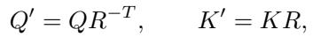

where R ∈ Rd×d is an invertible transformation. This transformation preserves the attention scores:

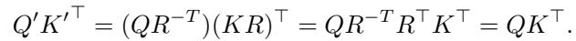

Let the second-moment (or Hessian) matrices of Q and K be:

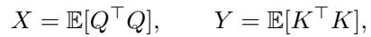

which capture the energy distributions of Q and K along each feature direction.

After applying the reparameterization R, the average squared magnitudes of the transformed queries and keys become:

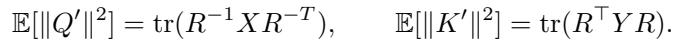

To jointly minimize their overall energy (and hence the quantization error), we minimize the product of these quantities:

$$
\tag{1}
$$

We solve (1) analytically using singular value decomposition (SVD). Let

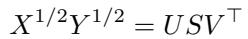

be the SVD of the symmetric positive semi-definite matrix product X1/2Y 1/2, where U, V are orthogonal and S = diag(si) contains the singular values.

Define the optimal transformation as:

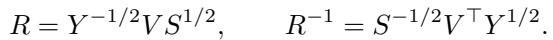

such that it makes the traces equal.

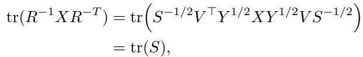

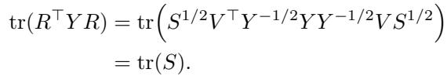

Hence, the minimized joint energy becomes:

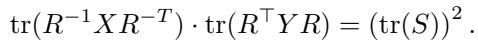

This is the minimum achievable value of (1), and the corresponding R aligns the spectral bases of X and Y optimally.