# A LIGHTWEIGHT HIGH-THROUGHPUT COLLECTIVE-CAPABLE NOCFOR LARGE-SCALE ML ACCELERATORS

Luca Colagrande \* 1 Lorenzo Leone \* 1 Chen Wu 1 Tim Fischer 1 Raphael Roth 2 Luca Benini 1

## ABSTRACT

The exponential increase in Machine Learning (ML) model size and complexity has driven unprecedented demand for high-performance acceleration systems. As technology scaling enables the integration of thousands of computing elements onto a single die, the boundary between distributed and on-chip systems has blurred, making efficient on-chip collective communication increasingly critical. In this work, we present a lightweight, collective-capable Network on Chip (NoC) that supports efficient barrier synchronization alongside scalable, high-bandwidth multicast and reduction operations, co-designed for the next generation of ML accelerators. We introduce Direct Compute Access (DCA), a novel paradigm that grants the interconnect fabric direct access to the cores’ computational resources, enabling high-throughput in-network reductions with a small 16.5% router area overhead. Through in-network hardware acceleration, we achieve 2.9× and 2.5× geomean speedups on multicast and reduction operations involving between 1 and 32 KiB of data, respectively. Furthermore, by keeping communication off the critical path in GEMM workloads, these features allow our architecture to scale efficiently to large meshes, resulting in up to 3.8× and 2.4× estimated performance gains through multicast and reduction support, respectively, compared to a baseline unicast NoC architecture, and up to 1.17× estimated energy savings.

## 1 INTRODUCTION

With the explosion of transformer-based models and the exponential increase in model size and complexity (Tirumala & Wong, 2024), the demand for high-performance systems has surged dramatically. To meet these requirements, massively parallel accelerators must evolve rapidly, pushing the limits of computational capability. Modern architectures are integrating an ever-growing number of Processing Elements (PEs) to boost peak performance. For example, NVIDIA’s latest Blackwell GPU roughly doubles the number of CUDA cores over the previous generation (Choquette, 2023).

However, this rapid growth in computational power has not been matched by proportional improvements in data movement. Performance has far outpaced memory and communication bandwidth: over the past two decades, peak FLOPS throughput improved by about 60000×, whereas DRAM bandwidth grew only around 100× (Gholami et al., 2024). This widening gap between computation and data movement has become a significant bottleneck for modern systems, often leading to memory-bound or communicationbound workloads (Musavi et al., 2025; Mutlu et al., 2023).

Among the various parallel computing paradigms, collective communication plays a crucial role in enabling efficient data exchange among PEs. Recent analyses of MPI usage (Laguna et al., 2019) show that the most frequently used collective operations, such as reduction, barrier, and broadcast, are essential for synchronizing data across multiple nodes. To mitigate the overhead of these operations in large-scale distributed systems, dedicated hardware engines (NVIDIA, 2024b; Kumar & Faraj, 2013) and optimized software libraries (NVIDIA, 2024a) for multi-GPU and multi-node systems have been developed.

However, as technology scaling has allowed the integration of thousands of PEs and specialized compute coprocessors (e.g. tensor units) onto a single die, the boundary between distributed and on-chip systems has blurred. Tile-based manycore systems-on-chip (SoCs), as the one represented in Figure 1a, have effectively become self-contained parallel systems, making efficient on-chip collective communication increasingly critical. Without proper support, collective operations can quickly saturate memory and interconnect resources, limiting performance scalability.

As shown in Section 4.3, we observe that on large-scale accelerator configurations GEMM kernels become memorybound, resulting in < 50% utilization on a 256x256 mesh. By accelerating collective communication primitives we can reduce the communication time, resulting in up to 3.8× speedups on the overall kernel runtime. Similarly, FlatAttention (Zhang et al., 2025) has demonstrated the potential of coordinated on-chip collective operations to reduce external memory traffic and improve utilization of on-device tensor engines, reporting up to 4× speedups over FlashAttention-3.

In this work, we present a complete design of the first lightweight collective-capable NoC tailored for generalpurpose manycore ML systems. To the best of our knowledge, this is also the first work to demonstrate that highthroughput arithmetic reductions can be efficiently implemented on-chip, by sharing resources between the interconnect fabric and accelerator clusters. Specifically:

• We present the design and implementation1, of a general-purpose collective-capable NoC that enables high-performance and efficient in-network computing primitives. In particular, our NoC supports multicast and reduction operations for both low-latency synchronization and high-bandwidth communication tasks, targeting general-purpose many-core ML accelerators.

• We demonstrate the flexibility of our design by integrating it into a multi-cluster SoC for NoC evaluation (Fischer et al., 2025). We introduce a novel paradigm, Direct Compute Access (DCA), granting the interconnect fabric direct access to the cores’ compute resources, to enable low-cost high-throughput in-network compute.

• We implement our collective-capable NoC in an advanced technology node, demonstrating that our design incurs a small router area overhead of 16.5% compared to the State-of-the-Art (SoA) FlooNoC baseline, accounting for a negligible < 1% area increase on a full compute tile, without degrading timing performance.

• We provide a comprehensive performance evaluation of the proposed architecture through cycle-accurate simulation and analytical modeling, comparing to highly optimized software implementations of multicast and reduction primitives. In a 4×4 mesh, we measure geomean speedups of 2.9× and 2.5× respectively, on transfers involving between 1 and 32 KiB of data.

## 2 BACKGROUND

## 2.1 FlooNoC

This work builds on FlooNoC (Fischer et al., 2025), a SoA, AXI-compliant2 (Arm, 2020), open-source NoC designed for the requirements of next generation ML accelerators, in which bulk data transfers coexist with short latency-critical messages. This is achieved by providing two dedicated networks for the different traffic classes: a “wide” network for high-bandwidth bursted data transfers and a “narrow” network for latency-critical messages, respectively 512- and 64-bit wide in our reference implementation.

A Network Interface (NI) at every endpoint maps the AXI channels from these two networks to three distinct physical links at the NoC level: a wide link carrying wide read and write transfers, a req link carrying both wide and narrow requests and narrow write transfers, and a rsp channel carrying both wide and narrow responses and narrow read transfers. A multi-link router at every endpoint, composed of separate routers for each of the three physical links, routes flits (in FlooNoC terminology equivalent to packets) between the respective NI and neighbouring endpoints.

## 2.2 Baseline SoC Architecture

For our evaluation, we adopt a similar system to FlooNoC (Fischer et al., 2025), integrating multiple compute and memory tiles in a 2D mesh topology, as shown in Figure 1a. Each memory tile includes a 1 MB L2 Scratch-Pad Memory (SPM), while each compute tile hosts a Snitch cluster (Zaruba et al., 2021) composed of 8 energy-efficient RV32I Snitch cores. Each core is paired with a 64-bit SIMDcapable Floating Point Unit (FPU), and shares a 128 KiB L1 SPM within the cluster. Each cluster also features a ninth Snitch core with a Direct Memory Access (DMA) engine to orchestrate high-bandwidth data transfers between tiles.

The DMA in the initiator tile transfers data in bursts from a source tile to a destination tile over the wide network. A DMA transaction proceeds as follows: 1) the initiator issues a read request (AR) to the source, 2) the corresponding read beats (R) are returned to the initiator, 3) which are forwarded as write beats (AW/W) to the destination, and 4) a final response (B) is sent back to the initiator. The trasfer time can be modeled as Ttransf er = α + nβ, where α denotes the round-trip latency of the transfer (including the initiatorsource-initiator and initiator-destination-initiator paths), n is the number of beats in the transfer and β represents the inverse bandwidth, expressed in cycles per beat.

## 2.3 Multi-address encoding

A key challenge in enabling collective operations lies in efficiently encoding multiple destination addresses. Previous work (Colagrande & Benini, 2025) on a multicastcapable crossbar (XBAR) extended the AXI protocol to support multi-address representation by pairing a destination address with a mask. The mask, equal in width to the destination address, is carried in the user-defined AWUSER AXI signal (Arm, 2020). When a mask bit is set to 1, the corresponding address bit is treated as a “don’t care” (X), representing both logic 0 and 1. By masking n bits in the address, up to 2n distinct destinations can be represented within a single transaction.

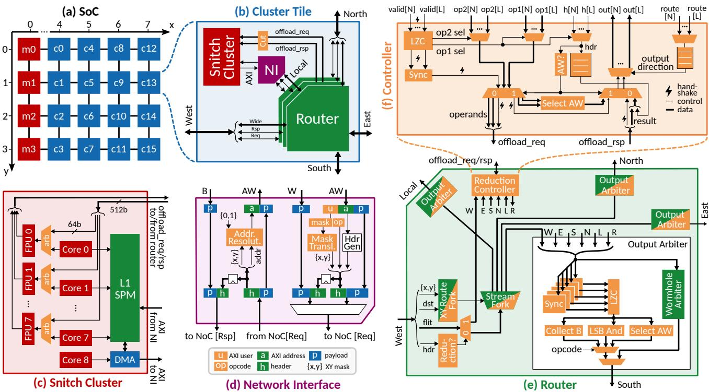  
Figure 1. (a) Overview of the 5 × 4 collective-capable NoC system. (b) Cluster tile and its main components: (c) compute cluster, (d) network interface and (e) router with collective extensions. (f) Centralized reduction controller enabling arithmetic in-network computation. Highlighted in orange are all modules affected (partially highlighted) or introduced (fully highlighted) by our extensions.

Although this encoding scheme restricts the set of address combinations that can be represented, it remains highly scalable3: the encoding grows logarithmically with the address space size and is independent of the number of destinations. This property makes it particularly well suited for largescale architectures such as massively parallel accelerators.

## 3 ARCHITECTURE

## 3.1 Collective-Capable NoC

We extend the FlooNoC (Fischer et al., 2025) architecture to support collective communication operations, with a focus on multicast and reduction. All extensions are designed to remain fully compliant with the AXI4 protocol (Arm, 2020) supported by FlooNoC. As detailed in Section 2.3, we extend the AWUSER field to carry the multi-address mask, and an opcode specifying the collective operation to perform.

Furthermore, the AXI4 protocol inherently couples multicast and reduction operations. When a manager issues a multicast request (AW), it is delivered to multiple destinations, each producing a corresponding response (B). Since the manager expects a single response to its request, the network must aggregate the responses from all destinations, effectively performing a reduction on the responses within the network. Conversely, when a reduction operation is initiated by multiple managers, the resulting response from the destination must be multicast back to all initiators.

## 3.1.1 Network Interface

The NI forms the bridging point between the NoC and the endpoint protocol, translating incoming AXI packets into the NoC protocol and vice versa. Figure 1d illustrates a highlevel block diagram of the NI, where only the channels and logic affected by the collective extensions are highlighted.

While the multicast-capable AXI XBAR described in (Colagrande & Benini, 2025) routes packets by directly comparing their destination address and mask, flits in the NoC are routed using the X and Y coordinates of their destination and source nodes. Thus, to represent the multiple destination nodes of one-to-many operations (e.g., multicast) and the multiple source nodes of many-to-one operations (e.g., reduction), the NoC protocol must be provided with equivalent coordinate masks. As shown in Figure 1d, the

NI translates the address mask in the AWUSER field into the corresponding X and Y masks, which are appended to the AW flit header. As W and AW beats form part of the same AXI transaction, they must use the same X and Y masks; this information is therefore stored in a register and reused when injecting the subsequent W flits.

Conversely, when a collective request arrives at the NI from the NoC, the local endpoint coordinates (e.g. {0,1}) are used to “resolve” the incoming multi-address, translating it back into the endpoint’s local address space. An additional buffer in the NI stores the incoming mask information to generate the appropriate collective response, namely a multicast response to reduction requests and vice versa.

## 3.1.2 Multicast Router Extension

Figure 1e illustrates a simplified schematic of the router, highlighting the components affected by our extensions. The xy\_route\_fork at each input port is responsible for calculating the output port onto which an incoming packet should be routed, based on its destination coordinates (dst). Since multicast involves forking incoming packets to multiple output directions, we extend the xy\_route\_fork to select multiple output ports according to the X and Y masks in the request. As discussed in Section 3.1.1, these masks are generated by the NI and, together with the destination coordinates in the flit header, are used to represent the multiple destination nodes of a multicast request. Following the method presented in (Colagrande & Benini, 2025), if a bit in the X (or Y) mask is set to 1, the corresponding bit in dst.X (or dst.Y) is treated as a “don’t care”, encoding both logic 0 and 1. Masking n bits in the dst coordinates therefore allows the (dst, mask) pair to represent 2n destination nodes. Finally, the xy\_route\_fork drives the downstream stream\_fork module, which demultiplexes the incoming packet to the output ports specified by the select signal, while ensuring that the input is accepted only once all output ports are ready to receive it.

## 3.1.3 Parallel Reduction Router Extension

Because of the coupling between multicast and reduction operations inherent to the AXI protocol, introduced in Section 3.1, supporting multicast operations requires minimal support for reductions as well. To reduce incoming packets from multiple input directions, every output port is equipped with an output\_arbiter, which extends the functionality of the original wormhole\_arbiter with reduction capabilities. As shown in Figure 1e, the output arbiter directs unicast packets from all input directions to the wormhole\_arbiter, where these are arbitrated and forwarded to the output port one at a time. Reduction packets, on the other hand, are redirected to a dedicated reduction\_arbiter where packets from selected input

## directions are reduced together.

The input directions involved in a reduction operation are determined by the X and Y mask encoded in the flit header, together with the coordinates of the source node that issued the packet. This logic is implemented in the synchronization module, which takes one input as reference for said calculation, and waits for the corresponding reduction flits expected at the other inputs to arrive. These are forwarded downstream only once the packets from all the selected input directions are available. A synchronization module per input port is instantiated and a leading\_zero\_counter is then used to arbitrate between concurrent reduction operations. This design allows multiple reductions to coexist without deadlocks, even when their paths cross within the network, as the replicated synchronization modules ensure that each incoming reduction is only arbitrated if it is guaranteed it can be carried out to completion.

Once an incoming reduction is selected, a dedicated computation block performs the reduction operation on all inputs in parallel. Multiple blocks can be instantiated to support a variety of operations, and selected through the reduction opcode in the header flit. In this work, we implement three lightweight operations: 1) CollectB, reduces the multiple B responses to a multicast operation; 2) LsbAnd, performs a bitwise AND-reduction on the least significant bits in the incoming packets; and 3) SelectAW, aggregates the multiple AW requests from a reduction operation. While the CollectB and SelectAW operations are respectively required to support multicast and reductions in AXI, we use the LsbAnd operation to implement efficient barrier synchronization primitives, as shown in Section 4.2.1.

## 3.1.4 Wide Reduction Router Extension

For more complex reduction operations, e.g. involving floating-point operands on the wide network, implementing a 5-input reduction tree in hardware may be prohibitively expensive. Despite this limitation, supporting reduction operations limited to two inputs per router can still be beneficial, as shown in Section 4.2.3. These operations often rely on pipelined arithmetic units, requiring additional logic to handle the reduction. Unlike the lightweight parallel reduction logic replicated at every output port, we provide a single centralized instance of the wide reduction logic, shared across all outputs, as illustrated in Figures 1e and 1f.

A synchronization module again ensures that all input operands, up to two in this case, are received before being forwarded to the arithmetic unit. Unlike the parallel reduction, we instantiate a single synchronization module, with an upstream arbiter (lzc) selecting the reference input. At any given time, we support a single reduction operation of this kind per router, preventing deadlocks while simplifying the design compared to the parallel reduction scheme.

To accommodate pipelined functional units, a hdr buffer is required to temporarily store the header flit until the result is produced by the arithmetic unit. The result is then concatenated with the header and routed as a regular unicast packet to the output wormhole arbiter. By increasing the depth of the buffer, multiple reduction operations can be issued back-to-back, effectively hiding the pipeline latency and achieving a throughput of one reduction per cycle. This is particularly beneficial for bursted reduction operations, as occur on the wide network. To avoid stalls, the buffer depth must be greater than the functional unit’s pipeline depth.

Finally, we provide an offload port for 2-input reductions that can be executed by external compute resources, as described in Section 3.2.1.

## 3.2 System-Level Integration

Figures 1b and 1c illustrate the integration of the collectivecapable NoC within the baseline SoC architecture described in Section 2.2. We extend the DMA engine and Snitch’s Load-Store Unit (LSU) to inject the collective opcode in the AWUSER field of their outgoing AXI requests.

## 3.2.1 Direct Compute Access (DCA)

We further extend the Snitch cluster to support Direct Compute Access (DCA), a novel paradigm that enables direct access to the cluster’s compute resources. Analogous to how DMA engines can directly access memory while the cores perform other tasks, DCA grants the interconnect fabric direct access to the cores’ compute resources, e.g. to carry out in-network computations, while the cores perform other work or enter a low-power state to save energy.

To support DCA, we equip the Snitch cluster with three 512-bit ports: two for input operands and one for the result. Additional control signals on the interface specify the operation type. Inside the cluster, each 512-bit operand is divided into eight 64-bit slices, which are distributed to the respective cores’ FPUs for parallel processing. Within the Snitch core complex, DCA requests are arbitrated with the core’s own FPU requests. A tag is used to differentiate DCA and core requests, propagated through the FPU’s pipeline stages and used to route the result to the correct destination.

We connect the DCA interface of the Snitch cluster to the router’s offload interface, reusing the existing datapath to perform wide in-network reduction operations with a negligible overhead, as shown in Section 4.1. With the SIMD capabilities of Snitch’s FPUs, the system can perform up to 8× double-precision or 64× 8-bit precision floating-point reductions per cycle.

The operands sent by the router can be buffered within the pipeline registers (cut) between the router and the arithmetic units and all paths are further provided with independent valid-ready interfaces, which allow the arithmetic unit to exert backpressure on an operand to wait for the other.

## 3.2.2 System Address Map

As described in Section 2.3, the adopted multi-address encoding scheme (Colagrande & Benini, 2025) trades flexibility for scalability, imposing specific constraints on the system design. In particular, the collective-targetable region of the NoC must form a submesh defined by parameters (X, Y, W, H), where W and H specify the width and height of the submesh, and (X, Y ) denotes the coordinates of its bottom-left tile. To maintain compatibility with the encoding scheme, the following conditions must hold: 1) both W and H must be powers of two, and 2) X and Y must be aligned to integer multiples of W and H, respectively. In most cases, these conditions can be satisfied by “padding” the mesh, i.e. by artificially aligning the collectivetargetable region, as shown in Figure 1a.

To further simplify the translation logic from address mask to X and Y masks, we assume that the address space of all nodes in the collective-targetable region is 1) of equal size, 2) aligned to the same power of two, and 3) mapped consecutively following the Y-major ordering of the node coordinates. Under these assumptions, the translation reduces to an efficient bit-select operation on the address mask.

## 3.3 Generalizability

We demonstrate our implementation on a Snitch cluster and FlooNoC-based system as it represents an open-source instance of a common architectural template. In fact, the proposed approach does not rely on any Snitch- or FlooNoCspecific mechanims, but instead builds on three general architectural features shared by a broad class of accelerators:

1. Structured 2D mesh topology: the XY routing and coordinate-based multi-address encoding (Section 2.3) require a regular mesh topology (Section 3.2.2).

2. Arithmetic units: the DCA paradigm requires each compute tile to expose arithmetic units that can be borrowed to perform the in-network reductions4.

3. Programmable communication: the proposed mechanism assumes that communication and data movement can be orchestrated programmatically, independent of the specific control interface or data movement engine, e.g. DMA, tensor streaming engine or LSU.

These features are characteristic of many recent academic and industrial programmable ML accelerators. To name a few, Cerebras WSE-3 (Lie, 2024), Tenstorrent’s Black-

4While in our implementation the cluster’s 8× 64-bit FPUs match the 512-bit data width of the wide network and the DCA interface, the same mechanism could be extended to narrower or wider (through time-sharing) interfaces than the compute datapath.

hole (Vasiljevic & Capalija, 2024a), AMD’s XDNA (Rico et al., 2024), SambaNova’s SN40L (Prabhakar et al., 2024) and Meta’s MTIA (Firoozshahian et al., 2023) among industrial accelerators, and Venus (Yang et al., 2023), Adyna (Li et al., 2025), FlatAttention (Zhang et al., 2025), MA-GIA (Isachi et al., 2025), and Azul (Feldmann et al., 2024) among academic accelerators, all share a regular 2D tiled topology, arithmetic resources embedded in each tile and programmable engines for orchestrating communication and data movement, either at the tile or global level.

## 4 RESULTS

## 4.1 Area and Timing Analysis

We implement the NI and router modules, as well as a full cluster tile, in TSMC 7 nm technology using FUSION COMPILER 2024.09, with a 1 GHz frequency target under worst-case conditions (SS, −40◦C, 0.675 V), observing no timing degradations.

Since the extensions to the NI are identical regardless of which collective operations are supported, we compare the baseline NI with the version featuring full collective support, which adds only a 3.5% area overhead.

To assess the impact of individual collective operations on the router area, we compare the baseline router with multiple configurations of the collective-capable router, progressively adding support for multicast, parallel reductions and wide reductions. Figure 2a reports the area of all configurations.

Adding multicast support introduces flit-forking logic in both the narrow and wide routers, resulting in only a 6.4% area overhead compared to the baseline. As described in Section 3.1.3, minimal support for parallel reduction is also required in the response router to merge responses from multiple subordinates. This resource accounts for 36.4% of the response router area, leading to a total router area overhead of just 5.8% for full multicast support.

Enabling parallel reduction for synchronization mechanisms increases the router area by only 2.7%. The main addition lies in the narrow request router, where the reduction arbiters combining the incoming flit data introduce 1.13 kGE per output port. Because of the coupling between multicast and reduction, enabling reduction also requires forking logic in the response router to multicast responses.

Adding wide reduction support introduces an additional 13.62 kGE overhead, primarily due to the increased data width. 56.3% of this logic is combinational and 43.7% sequential, the former dominated by multiplexers for input arbitration and the latter by the flit header buffer. Overall, full support for all collective communication operations described in Section 3 results in a modest 16.5% area increase over the baseline router.

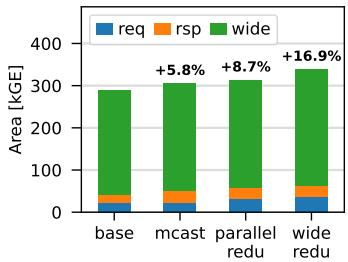  
(a)

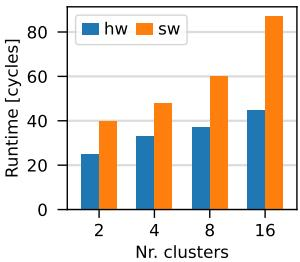  
(b)  
Figure 2. (a) Area breakdown of the router for different hardware configurations. Percentages indicate the area overhead with respect to the baseline. (b) Runtime of the software and hardware barriers.

To better quantify the impact of our approach at the system level, we reproduce the place-and-route flow of the cluster tile from (Fischer et al., 2025). Figure 3 highlights the area occupied by the FlooNoC router and the cluster’s FPUs. As we can see, the FPUs occupy a significant portion of the tile area, well beyond the area of the router, highlighting the significance of the DCA paradigm in enabling high-throughput in-network reductions at low hardware cost. Compared to the 5.6 MGE cluster tile area, the overhead introduced by our extensions is negligible, falling below < 1%.

## 4.2 Performance Evaluation of Collective Primitives

We conduct the performance evaluation through cycleaccurate RTL simulations of the system described in Sections 2.2 and 3.2, using QUESTASIM 2023.4.

All benchmark codes are implemented in bare-metal C++, compiled using a custom C++ runtime and compiler toolchain for Snitch based on LLVM 15 with highest optimization level (-O3), and further optimized by hand to reduce or hide the overhead of non-communication related instructions. For transparency and accountability, all codes are open source5.

## 4.2.1 Narrow Reduction

We assess the benefit of hardware-accelerated narrow reduction operations using a simple yet fundamental parallel programming primitive: barrier synchronization. Prior studies have shown that parallel performance is not only limited by sequential code, as Amdahl’s law suggests (Amdahl, 1967), but also by synchronization overheads (Yavits et al., 2014; Eyerman & Eeckhout, 2010). Accelerating barrier synchronization can therefore improve parallel performance, as we further demonstrate in Sections 4.2.2 and 4.2.3.

Typical software implementations of the barrier primitive rely on all participants atomically incrementing a centralized counter (Culler et al., 1998), which we allocate in cluster 0’s

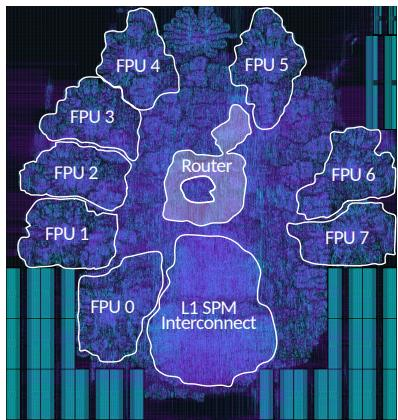  
Figure 3. Placed-and-routed implementation of the cluster tile, with the FPUs, the router and the L1 SPM interconnect highlighted. The remaining area is occupied by the Snitch cores, L1 SPM, I\$ subsystem and cluster DMA, which are not highlighted for clarity.

L1 SPM. For an efficient and scalable implementation, we use the RISC-V amoadd atomic instruction: every atomic operation arriving at the destination memory completes with a latency of 3 cycles, that is one cycle for each of the 1) read, 2) modify and 3) write operations implied by the atomic operation. Cluster interrupts are used to notify all participants of barrier completion, avoiding busy-waiting, and in-network multicast support is leveraged to distribute interrupts simultaneously. Barrier runtime is measured from the arrival of the first core to the departure of the last.

We compare this software baseline against a barrier implemented using in-network reductions. In this version, all participants perform an LsbAnd reduction on the central counter, followed by a RISC-V fence instruction, which stalls the core until all memory operations complete; reduction operations only complete once all cores have sent their contribution, i.e. once they have arrived on the barrier.

Figure 2b presents the results of this comparison, for varying numbers of clusters participating in the barrier. Although both implementations scale linearly with the number of clusters, the hardware-assisted barrier scales significantly better, as packets are reduced in the network along their path to the destination, avoiding wasteful read-modify-write cycles. Through linear regression, we find slopes of 3.3 and 1.3 cycles per additional cluster for the software and hardware barriers, respectively, which match well the expected values of 3 and 1 cycles per cluster.

## 4.2.2 Wide Multicast

While the narrow network primarily transports short, latency-critical synchronization messages, the wide network transfers large data bursts initiated by the DMA engines. These transfers typically overlap with the computation in a double-buffered fashion (Potocnik et al., 2024; Zhang et al.,

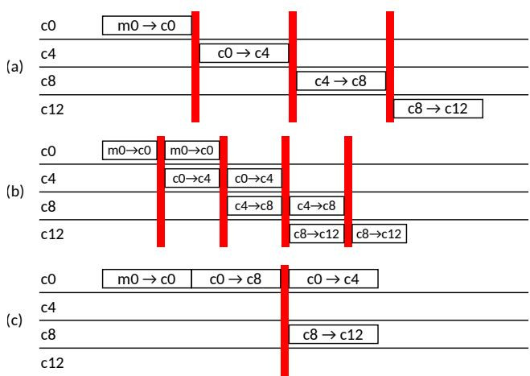  
Figure 4. Three software multicast implementations: (a) naive sequential, (b) pipelined sequential, (c) tree-based. Each block represents a DMA transfer: the containing row represents the initiator and the label indicates source and destination (source → destination). Red lines represent barriers.

2025). Optimizing transfer time can substantially improve performance in memory-bound workloads. When spatial data reuse is present, multicast can be employed to this end, as demonstrated in Section 4.3.

To evaluate the benefit of hardware-accelerated multicast transfers, we compare against the runtime of two optimized software baselines. Both baselines employ the DMA engines to orchestrate data transfers and adopt the hardwareaccelerated barrier from Section 4.2.1, leveraging the hardware reduction extension in the narrow router, for intercluster synchronization. To simplify the analysis, we begin with a 1D multicast along a single row, moving data from memory tile 0 to the L1 SPM of every cluster in row 0.

In the first baseline, each cluster fetches data from its left neighbour once that neighbour has completed its own transfer. As shown in Figure 4a, each transfer starts only after the full transfer in the previous iteration is complete, requiring synchronization among clusters at each iteration. Given c clusters in a row, the runtime can be modeled by:

$$
\tag{1}
$$

where αi is the round-trip latency of the DMA transfer in each iteration i, β the inverse bandwidth (cycles per beat), n the transfer size (in beats) and δ the synchronization time. Figure 4b illustrates an optimized implementation (seq) dividing the transfer into k batches that are pipelined across clusters. The runtime then becomes:

$$
\tag{2}
$$

As this equation suggests, an optimal batch size exists that minimizes overall transmission time. Intuitively, this is due to the additional round-trip latency (α) and synchronization (δ) overheads offsetting the benefit from the decreased batch size nk . Our second baseline (tree) implements a binarytree multicast, as depicted in Figure 4c, modeled as:

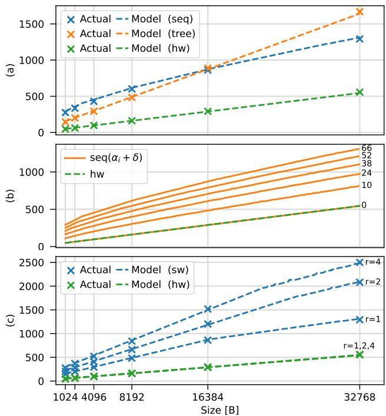  
Figure 5. Runtime (in cycles) of: (a) a 1D multicast transfer; (b) the seq implementation for various settings of αi + δ, ∀ i > 0, labeled next to each curve; (c) a 2D multicast transfer.

$$
\tag{3}
$$

Both implementations have been extensively studied and detailed comparisons can be found in the networking literature (Barnett et al., 1996). We focus on the comparison with hardware-accelerated multicast6, with runtime:

$$
\tag{4}
$$

Figure 5a presents the results of this comparison. All runtimes are measured from the start of the first DMA transfer, to the end of the last, and the optimal batch size is assumed for the seq implementation. As can be seen, all models accurately reflect the measured runtimes. The hardware multicast implementation consistently outperforms both software baselines, with speedups between 2.3× and 3.2× over the best software baseline, Tsw = min(Tseq, Ttree), for all transfer sizes between 1 and 32 KiB.

Furthermore, we note that the hw implementation can be viewed as a degenerate case of the seq implementation, in which the transfers are overlapped with a granularity of a single beat (k = n), and without incurring any overhead from splitting the transfer in batches (αi = 0, ∀ i > 0 and δ = 0). Figure 5b illustrates this behaviour, showing how Tseq converges to Thw as αi + δ approaches 0. This highlights the importance of minimizing the barrier synchronization overhead (δ), as shown in Section 4.2.1.

Figure 4 and Equations (1)–(4) can be easily generalized to a multicast transfer involving multiple rows, as presented in Appendix B.1. In short, a 2D multicast transfer can be implemented in two steps: 1) a first 1D multicast distributes the data across one row, and 2) c independent 1D transfers then distribute the data to each column, in parallel. Figure 5c compares the runtime of the hw and best software implementation for varying numbers of rows r. While the runtime of the software implementations significantly increases with the number of rows, the hardware implementation remains nearly constant, enabling scalable and efficient multicast operations on large networks.

## 4.2.3 Wide Reduction

Likewise, reduction operations can also benefit from innetwork acceleration. As discussed in Section 4.3, such operations are common in ML workloads, and accelerating them can greatly improve application performance.

We compare hardware-accelerated reductions against two optimized software baselines, starting with a 1D reduction. As in Section 4.2.2, both baselines use the DMAs and the hardware-accelerated barrier for synchronization. In this operation, each cluster contributes a stream of data from its L1 SPM to be elementwise reduced with all other clusters’ data into a centralized destination, e.g. cluster 0.

The software implementations of the reduction operation, represented in Figure 6, resemble the multicast baselines presented in Section 4.2.2, with two substantial differences: 1) the flow of the data is mirrored (one-to-many for multicast vs. many-to-one for reduction), and 2) reduction involves not only data movement but also computation. We further optimize the naive tree implementation shown in Figure 6a by tiling the computation to overlap data movement and computation, as illustrated in Figure 6b. The runtime of the optimized tree (tree) and sequential (seq) implementations can be modeled as:

$$
\tag{5}
$$

$$
\tag{6}
$$

with tm = αm+ n βm and tc = αc+ n βc, given αm and βm the round-trip latency and inverse bandwidth of the DMA transfers, and αc and βc respectively a constant instruction overhead and the inverse throughput (cycles per beat) of the computation. As seen for multicast, tiling the transfers introduces additional synchronization and round-trip latency overheads, leading to the existence of an optimal tile size which minimizes the transmission time.

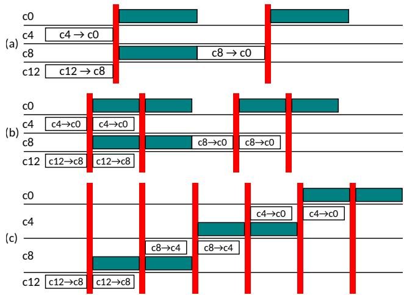  
Figure 6. Three software reduction implementations: (a) naive tree, (b) double-buffered tree, (c) pipelined sequential. Each block represents a DMA transfer: the containing row represents the initiator and the label indicates source and destination (source → destination). Red lines represent barriers. Colored blocks represent the reduction computations.

Figure 7a presents the comparison to hardware-accelerated reduction. Again, our models accurately reflect the measured runtimes. The hardware implementation consistently outperforms both baselines, achieving speedups between 2.0× and 3.0× over the best software baseline, Tsw = min(Tseq, Ttree), for transfer sizes between 1 and 32 KiB.

Figure 6 and Equations (5)–(6) can be easily generalized to a reduction involving multiple rows, as presented in Appendix B.2. In short, a 2D reduction can be implemented in two steps: 1) c independent 1D reduction operations combine the data across each row, in parallel, and 2) a final column-wise 1D reduction combines these partial results.

Figure 7b shows a comparison between the runtime of the hw implementation and the best software implementation for a 2D reduction involving varying number of rows r. Differently from the multicast case, the runtime of the hardware implementation increases significantly when going from a 1D to a 2D reduction. As only 2 inputs can be combined at a time, reducing more than 2 inputs requires multiple cycles. This is the case at the routers of the first column (excluding the northern-most router), which receive data from three inputs (specifically the east, north and local inputs). This results in a throughput of only one fully-reduced beat every 2 cycles, explaining the 1.9× slowdown of the 32 KiB transfer. Nonetheless, while the software implementations scale poorly with the number of rows, the runtime of the hardware implementation remains near constant beyond two rows, thus enabling scalable and efficient reduction operations on large networks.

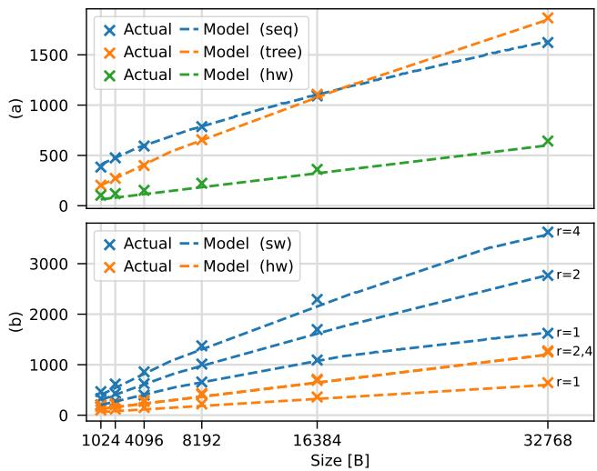  
Figure 7. Runtime (in cycles) of: (a) a reduction transfer of varying size to one row of clusters; (b) a 2D reduction transfer.

## 4.3 Evaluation of GEMM Kernels

In this section, we demonstrate and explain how multicast and reduction acceleration can translate to actual kernel speedups. We illustrate these concepts through the use of two examples, targeting GEMM, a key kernel for ML workloads. For this evaluation, we develop analytical models of the GEMM runtime, as a composition of empiricallyvalidated models: those developed in Section 4.2 for Tcomm, and a model developed in previous work for Tcomp.

## 4.3.1 SUMMA GEMM

Consider a GEMM operation C = αA × B + βC, with matrices A, B and C respectively of size M × K, K × N and M × N. We map the GEMM computation on the system described in Sections 2.2 and 3.2, employing the SUMMA dataflow (van de Geijn & Watts, 1995), with double-buffering to overlap computation and communication, as illustrated in Figure 8a. In every iteration, each cluster computes a subproblem of size Mt × Nt × Kt. To benefit from data reuse at the L2 memory level, we assume that the memory tiles are dimensioned to jointly fit a maximum problem size M × N × K that satisfies either one of the following conditions: M ≫ rMt, N ≫ cNt and K ≫ Kt. For the sake of example, we assume K ≫ Kt, M = rMt and N = cNt, but analogous arguments can be made for other configurations.

Under the K ≫ Kt assumption, we can ignore boundary

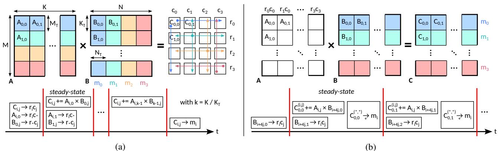  
Figure 8. GEMM dataflows mapped onto a 4×4 tile-based architecture: (a) SUMMA GEMM (van de Geijn & Watts, 1995); (b) FusedConcatLinear GEMM (Potocnik et al., 2024). Colored background indicates L2 storage location (blue: m0, teal: m1, yellow: m2, red: m3). Colored arrows illustrate data movement: the tail marks the initiator, the color the source L2 tile, and the traversed clusters are the destinations. In the timing diagrams: red lines indicate barriers; i and j denote row and column indices, respectively. The (Y → x) notation denotes a data transfer of matrix tile Y to destination x: stars imply collective operations (multicast if on the right-hand side, reduction if on the left-hand side), with an operator on the arrow specifying the reduction operation.

iterations and focus on a steady-state iteration’s runtime:

$$
\tag{7}
$$

$$
\tag{8}
$$

$$
\tag{9}
$$

where TmcastA and TmcastB are the times required to transfer a submatrix Ai,∗ to all clusters in row i and a submatrix B∗,j to all clusters in column j, respectively.

We use Equations (2)–(4) to model these transfers, selecting the best software implementation on a case-by-case basis, and evaluate the effect of supporting in-network multicast operations on GEMM performance. Figure 9a shows the results of this evaluation for different mesh sizes, assuming the maximum square problem size fitting in a cluster L1 SPM of 16 KiB, and a 98.1% utilization7. By accelerating multicast in hardware, the operation stays compute-bound up to a notable 256×256 mesh size, while the software implementation becomes memory-bound already on a 16×16 mesh, resulting in speedups between 1.1× and 3.8×.

## 4.3.2 FusedConcatLinear GEMM

To evaluate reductions, we focus on the use-case illustrated by (Potocnik et al., 2024), though other works have also demonstrated the benefit of fast reductions on ML workloads (Zhang et al., 2025). Consider a Multi-Head Attention (MHA) layer (Vaswani et al., 2017), where each cluster is assigned the computation of a distinct attention head. (Potocnik et al., 2024) demonstrate that by fusing the final concatenation and linear layers with the attention computations, costly external memory accesses can be avoided. This scheme boils down to a GEMM distributed across clusters along the K dimension, as illustrated in Figure 8b. As a result, a final reduction operation is required to aggregate the partial results of C from all clusters.

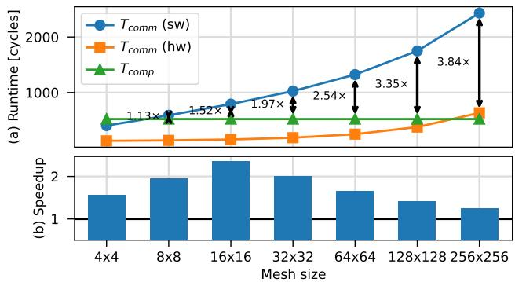  
Figure 9. (a) Runtime of the communication and computation phases of the SUMMA GEMM kernel. (b) Hardware vs. software reduction speedup for the FusedConcatLinear GEMM kernel. The X-axis uses a logarithmic (base 2) scale.

Figure 9b shows the results of this evaluation. While the trend differs from the multicast case, these results similarly highlight the benefit of accelerating reductions in hardware, demonstrating up to 2.4× speedups on a key computational kernel for ML workloads, in the evaluated scenario8.

Table 1. Energy cost of primitive operations and data movement/compute counts per GEMM implementation on a 16×16 mesh. Transfer counts are in kilo-bytes [kB] and compute counts in kilo-operations [kOP].  
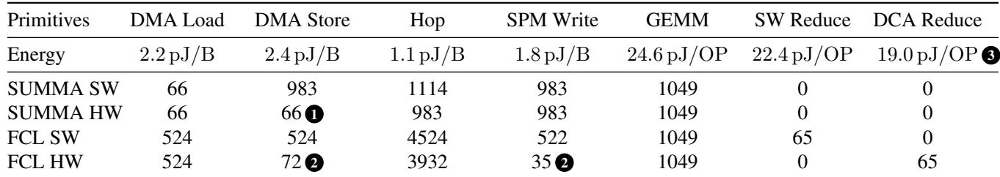

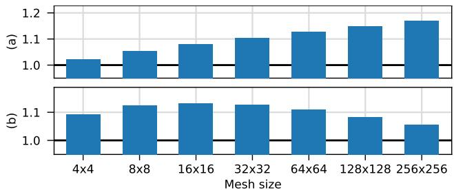  
Figure 10. Energy saving of the hardware-accelerated over the software-based GEMM implementations for the SUMMA (a) and FusedConcatLinear (b) dataflows across different mesh sizes.

## 4.3.3 GEMM Energy

To evaluate the impact of our extensions on energy, we estimate the energy consumption of both GEMM workloads, with and without hardware-accelerated collectives, across different mesh sizes. We perform gate-level simulations of the full-system mesh, after replacing cluster tile 0 with its post-layout netlist. We then use PRIMETIME 2022.03 to estimate the energy of cluster tile 0, from the switching activity extracted during simulation, in the typical corner (TT, 25◦C, 0.75 V) with a 1 GHz clock frequency.

We measure the energy of the primitive operations reported in Table 1. We then break down each GEMM workload into its constituent operations, and count the number of occurrences of each primitive across all cluster tiles (reported in Table 1 for a 16×16 mesh), to obtain an estimate of the total energy9. The software-based implementation always assumes the fastest software collective as in Section 4.3.

Figure 10a reports the energy savings on the SUMMA GEMM kernel across different mesh sizes. As quantified in Table 1 1 , hardware multicast reduces the number of DMA operations involved in the multicast transfers of Ai,∗ and B∗,j submatrices. While the total energy consumption remains dominated by computation, the communication savings grow with the mesh size, reaching overall energy efficiency improvements of up to 1.17× for a 256 × 256 mesh, and demonstrating the increasing benefit of multicast support with scale.

Figure 10b shows the energy savings enabled by reduction support for the FusedConcatLinear GEMM. The in-network reduction and DCA paradigm yield energy improvements of up to 1.13×. These gains stem from two main factors. First, the baseline software implementation requires explicit inter-cluster data movement to accumulate partial results, increasing communication energy 2 . Second, without DCA, the baseline must keep all eight Snitch cores active to initiate FPU operations. On the other hand, with our approach the FPU operations are initiated directly by the DCA requests, allowing the cores to remain in a low-power state 3 .

## 4.3.4 General Observations

While our evaluation is limited to two GEMM kernels, this selection serves to illustrate the general, kernel-independent conditions for hardware collective acceleration to translate to tangible kernel speedups:

1. communication must be on the critical path of the kernel’s runtime and

2. the communication pattern must map to multicast or reduction operations.

Any double-buffered kernel, responding to Equation (7), meets condition 1 if the workload is communication-bound (Tcomm > Tcomp). In this regime, reducing Tcomm results in a reduction of the total runtime T . For any kernel in which Tcomm is an additive term in T , e.g. the reduction in FusedConcatLinear GEMM, condition 1 is always met and the speedup depends only on the fraction of Tcomm over T .

While we do not develop a full end-to-end network evaluation in this work, prior studies consistently show that GEMM-based operators dominate the runtime of many modern ML workloads. (Karami et al., 2024) reports that GEMM-based operators account for approximately 42.8%- 96.6% of total inference latency across 17 widely used models spanning multiple tasks, while (Dice & Kogan, 2021) shows that GEMM kernels account for 66.2%-91.5% of transformer inference runtime on CPUs, depending on sequence length and thread count. We therefore expect tangible improvements in end-to-end inference time, even though we focus improvements on GEMM runtime alone.

## 5 RELATED WORK

Numerous works have explored the design of multicastcapable on-chip networks, which can be classified into pathbased and tree-based approaches. Path-based methods deliver packets to destinations sequentially, resulting in higher latency but simpler designs (Lu et al., 2006; Ebrahimi et al., 2010; Ouyang et al., 2023; Deng et al., 2025). Conversely, tree-based methods replicate packets at intermediate routers, reducing latency at the expense of increased complexity.

This added complexity largely stems from the use cases and design goals targeted by prior works, which primarily focus on the one-to-many and many-to-one traffic pattens characteristic of cache-coherency protocols (Jerger et al., 2008; Abad et al., 2009; Krishna et al., 2011; Krishna & Peh, 2014), e.g. deriving from invalidation and acknowledgment messages. To support such scenarios, prior architectures have prioritized flexibility, often at the cost of performance and scalability, through complex mechanisms handling arbitrary multicast patterns (Rodrigo et al., 2008; Wang et al., 2009; 2011; Samman et al., 2008b; Hu et al., 2011; Krishna et al., 2011; Ma et al., 2012; Zhong et al., 2014; Samman et al., 2012; Konstantinou et al., 2020). For example, several works adopt tag-based encodings to represent arbitrary destination sets, requiring additional tree setup (Jerger et al., 2008; Samman et al., 2008a; Ouyang et al., 2021; Doe & Smith, 2020) or network partitioning (Rodrigo et al., 2008; Wang et al., 2009) steps which lead to increased latency, while others employ highly flexible yet non-scalable destination encodings (Shen et al., 2017). Other works aim to balance link utilization (Wang et al., 2009; Abad et al., 2009; Krishna et al., 2011; Samman et al., 2012), a key factor in mitigating congestion caused by dense, irregular multicast traffic in cache-coherent shared-memory systems. These approaches are, however, susceptible to deadlock, prompting the development of sophisticated deadlock avoidance or recovery mechanisms (Malumbres et al., 1996; Samman et al., 2011; Jerger et al., 2008; Samman et al., 2012).

In contrast to prior works focused on cache-coherent sharedmemory systems, few have targeted ML accelerators and their characteristic coarse-grained (or bursted), softwaremanaged data transfers. Recent studies have proposed designs tailored to multicast patterns in ML workloads (Ouyang et al., 2021; 2023), but these remain specialized for narrow, fixed-function accelerator templates rather than general-purpose programmable systems. One exception is (Colagrande & Benini, 2025), which targets XBAR-based interconnects. However, such interconnects offer limited scalability for large-scale, tile-based ML accelerators (Fischer et al., 2025). From an industrial perspective, multicast support has also appeared in several commercial accelerator chips, such as Meta’s MTIA (Firoozshahian et al., 2023), SambaNova’s SN40L (Prabhakar et al., 2024) and Tenstorrent’s Blackhole (Vasiljevic & Capalija, 2024b) accelerators. However, these solutions are proprietary and closed-source; the exact mechanisms, scalability characteristics, and performance implications are not publicly documented or quantitatively evaluated. To the best of our knowledge, our work is the first to demonstrate scalable and open-source end-to-end hardware support for collective operations in programmable ML accelerators.

On the other hand, conventional wisdom suggests that onchip hardware support for many-to-one traffic should be avoided (Krishna et al., 2011) due to prohibitive area costs. As a result, only a few studies have examined support for many-to-one collective operations, either focusing solely on “gather” primitives (Heißwolf et al., 2013; Tiwari et al., 2020) or on combined multicast-reduction operations (Krishna et al., 2011; Ma et al., 2012), where reduction is limited to the aggregation of short acknowledgment messages. To the best of our knowledge, our work is also the first to demonstrate high-throughput arithmetic reduction operations, traditionally deemed too costly for on-chip implementation, enabled by the DCA paradigm.

Finally, none of the previous works evaluate hardware-based collective primitives against optimized software baselines, as such comparisons can not be made for irregular, dynamic hardware-generated traffic. The sole exception is (Colagrande & Benini, 2025), which targets a different topology. Other studies compare only software-based implementations (Barnett et al., 1995; 1996; Matienzo & Jerger, 2013). In contrast, we present a detailed comparison of hardware-accelerated and optimized software implementations, complemented by modeling efforts and an analysis on the relationship between the two approaches.

## 6 CONCLUSION

In this work, we introduced a lightweight collective-capable NoC tailored for large-scale next-generation ML accelerators, extending the SoA FlooNoC architecture with hardware support for barrier synchronization, multicast and reduction operations. At its core, the proposed Direct Compute Access (DCA) paradigm enables high-throughput innetwork reduction operations with only 16.5% router area overhead. Compared to highly-optimized software baselines, our hardware-accelerated multicast and reduction primitives achieve 2.9× and 2.5× geomean speedups, respectively, on transfers between 1 and 32 KiB of data. Our evaluation is complemented by extensive modeling efforts, providing insights into the relationship between software and hardware collective implementations. Finally, by keeping communication off the critical path of GEMM workloads, we estimate performance gains up to 3.8× and energy savings up to 1.17×, demonstrating the benefits of in-network computation for scalable ML acceleration.

## REFERENCES

Abad, P., Puente, V., and Gregorio, J.-A. MRR: Enabling fully adaptive multicast routing for CMP interconnection networks. In 2009 IEEE 15th International Symposium on High Performance Computer Architecture, pp. 355– 366, 2009.

Amdahl, G. M. Validity of the single processor approach to achieving large scale computing capabilities. In Proceedings of the April 18-20, 1967, Spring Joint Computer Conference, AFIPS ’67 (Spring), pp. 483–485, New York, NY, USA, 1967.

AMBA® AXI and ACE Protocol Specification Issue H. Arm, March 2020. URL https://developer.arm.com/ documentation/ihi0022/h/.

Barnett, M., Littlefield, R., Payne, D., and Vandegeijn, R. Global Combine Algorithms for 2-D Meshes with Wormhole Routing. Journal of Parallel and Distributed Computing, 24(2):191–201, 1995.

Barnett, M., Payne, D. G., van de Geijn, R. A., and Watts, J. Broadcasting on Meshes with Wormhole Routing. J. Parallel Distrib. Comput., 35(2):111–122, June 1996.

Choquette, J. NVIDIA Hopper H100 GPU: Scaling Performance. IEEE Micro, 43(3):9–17, 2023.

Colagrande, L. and Benini, L. A Multicast-Capable AXI Crossbar for Many-core Machine Learning Accelerators. In 2025 IEEE 7th International Conference on Artificial Intelligence Circuits and Systems (AICAS), pp. 1–5, 2025.

Colagrande, L., Leone, L., Coco, M., Deaconeasa, A., and Benini, L. Towards Zero-Stall Matrix Multiplication on Energy-Efficient RISC-V Clusters for Machine Learning Acceleration. ISLPED ’25, pp. 1–6, New York, NY, USA, 2025.

Culler, D., Singh, J. P., and Gupta, A. Parallel Computer Architecture: A Hardware/Software Approach. Morgan Kaufmann Publishers Inc., San Francisco, CA, USA, 1998.

Deng, Y., Kong, F., Yi, X., Antonio, R., and Verhelst, M. Torrent: A distributed dma for efficient and flexible pointto-multipoint data movement, 2025. URL https://arxiv. org/abs/2512.17589.

Dice, D. and Kogan, A. Optimizing inference performance of transformers on cpus. In Proceedings of the 1st Workshop on Machine Learning and Systems, 2021.

Doe, J. and Smith, A. Low-power NoC router. U.S. Patent 10,123,456, February 2020.

Ebrahimi, M., Daneshtalab, M., Liljeberg, P., and Tenhunen, H. HAMUM - A Novel Routing Protocol for Unicast and Multicast Traffic in MPSoCs. In 2010 18th Euromicro Conference on Parallel, Distributed and Network-based Processing, pp. 525–532, 2010.

Eyerman, S. and Eeckhout, L. Modeling critical sections in Amdahl’s law and its implications for multicore design. In Proceedings of the 37th Annual International Symposium on Computer Architecture, ISCA ’10, pp. 362–370, New York, NY, USA, 2010.

Feldmann, A., Golden, C., Yang, Y., Emer, J. S., and Sanchez, D. Azul: An accelerator for sparse iterative solvers leveraging distributed on-chip memory. In 2024 57th IEEE/ACM International Symposium on Microarchitecture (MICRO), pp. 643–656, 2024. doi: 10.1109/MICRO61859.2024.00054.

Firoozshahian, A., Coburn, J., Levenstein, R., Nattoji, R., Kamath, A., Wu, O., Grewal, G., Aepala, H., Jakka, B., Dreyer, B., Hutchin, A., Diril, U., Nair, K., Aredestani, E. K., Schatz, M., Hao, Y., Komuravelli, R., Ho, K., Abu Asal, S., Shajrawi, J., Quinn, K., Sreedhara, N., Kansal, P., Wei, W., Jayaraman, D., Cheng, L., Chopda, P., Wang, E., Bikumandla, A., Karthik Sengottuvel, A., Thottempudi, K., Narasimha, A., Dodds, B., Gao, C., Zhang, J., Al-Sanabani, M., Zehtabioskuie, A., Fix, J., Yu, H., Li, R., Gondkar, K., Montgomery, J., Tsai, M., Dwarakapuram, S., Desai, S., Avidan, N., Ramani, P., Narayanan, K., Mathews, A., Gopal, S., Naumov, M., Rao, V., Noru, K., Reddy, H., Venkatapuram, P., and Bjorlin, A. MTIA: First generation silicon targeting Meta’s recommendation systems. In Proceedings of the 50th Annual International Symposium on Computer Architecture, ISCA ’23, New York, NY, USA, 2023.

Fischer, T., Rogenmoser, M., Benz, T., Gürkaynak, F. K., and Benini, L. FlooNoC: A 645-Gb/s/link 0.15-pj/B/hop open-source NoC with wide physical links and end-to-end AXI4 parallel multistream support. IEEE Transactions on Very Large Scale Integration (VLSI) Systems, 33(4): 1094–1107, 2025.

Gholami, A., Yao, Z., Kim, S., Hooper, C., Mahoney, M. W., and Keutzer, K. AI and memory wall. IEEE Micro, 44 (3):33–39, 2024.

Heißwolf, J., Weichslgartner, A., Zaib, A., König, R., Wild, T., Herkersdorf, A., Teich, J., and Becker, J. Hardware supported adaptive data collection for Networks on Chip. In 2013 IEEE International Symposium on Parallel & Distributed Processing, Workshops and Phd Forum, pp. 153–162, 2013.

Hu, W., Lu, Z., Jantsch, A., and Liu, H. Power-efficient treebased multicast support for Networks-on-Chip. In 16th

Asia and South Pacific Design Automation Conference (ASP-DAC 2011), pp. 363–368, 2011.

Isachi, V., Nadalini, A., Gallotta, R. F., Garofalo, A., Conti, F., and Rossi, D. Fractalsync: Lightweight scalable global synchronization of massive bulk synchronous parallel ai accelerators. In Proceedings of the 22nd ACM International Conference on Computing Frontiers (CF), pp. 84–87, 2025.

Jerger, N. E., Peh, L.-S., and Lipasti, M. Virtual circuit tree multicasting: A case for on-chip hardware multicast support. In 2008 International Symposium on Computer Architecture, pp. 229–240, 2008.

Karami, R., Moar, C., Kao, S.-C., and Kwon, H. Nongemm bench: Understanding the performance horizon of the latest ml workloads with nongemm workloads. arXiv preprint arXiv:2404.11788, 2024.

Konstantinou, D., Nicopoulos, C., Lee, J., Sirakoulis, G. C., and Dimitrakopoulos, G. Smartfork: Partitioned multicast allocation and switching in Network-on-Chip routers. In 2020 IEEE International Symposium on Circuits and Systems (ISCAS), pp. 1–5, 2020.

Krishna, T. and Peh, L.-S. Single-cycle collective communication over a shared network fabric. In 2014 Eighth IEEE/ACM International Symposium on Networks-on-Chip (NoCS), pp. 1–8, 2014.

Krishna, T., Peh, L.-S., Beckmann, B. M., and Reinhardt, S. K. Towards the ideal on-chip fabric for 1-to-many and many-to-1 communication. In 2011 44th Annual IEEE/ACM International Symposium on Microarchitecture (MICRO), pp. 71–82, 2011.

Kumar, S. and Faraj, D. Optimization of MPI\_Allreduce on the blue Gene/Q supercomputer. In Proceedings of the 20th European MPI Users’ Group Meeting, pp. 97–103, Madrid Spain, September 2013.

Laguna, I., Marshall, R., Mohror, K., Ruefenacht, M., Skjellum, A., and Sultana, N. A large-scale study of MPI usage in open-source HPC applications. In Proceedings of the International Conference for High Performance Computing, Networking, Storage and Analysis, pp. 1–14, Denver Colorado, November 2019.

Li, Z., Yang, B., Li, J., Chen, T., Li, X., and Gao, M. Adyna: Accelerating dynamic neural networks with adaptive scheduling. In Proceedings of the IEEE International Symposium on High-Performance Computer Architecture (HPCA), pp. 549–562, 2025. doi: 10.1109/HPCA61900. 2025.00049.

Lie, S. Wafer-scale AI: GPU impossible performance. In Proceedings of the 36th IEEE Hot Chips Symposium (HCS), pp. 1–71. IEEE, 2024.

Lu, Z., Yin, B., and Jantsch, A. Connection-oriented multicasting in wormhole-switched networks on chip. In IEEE Computer Society Annual Symposium on Emerging VLSI Technologies and Architectures (ISVLSI’06), pp. 6 pp.–, 2006.

Ma, S., Jerger, N. E., and Wang, Z. Supporting efficient collective communication in NoCs. In IEEE International Symposium on High-Performance Comp Architecture, pp. 1–12, 2012.

Malumbres, M. P., Duato, J., and Torrellas, J. An efficient implementation of tree-based multicast routing for distributed shared-memory multiprocessors. In Proceedings of the 8th IEEE Symposium on Parallel and Distributed Processing (SPDP ’96), SPDP ’96, pp. 186, USA, 1996.

Matienzo, J. and Jerger, N. E. Performance analysis of broadcasting algorithms on the Intel single-chip cloud computer. In 2013 IEEE International Symposium on Performance Analysis of Systems and Software (ISPASS), pp. 163–172, 2013.

Musavi, M., Irabor, E., Das, A., Alarcón, E., and Abadal, S. Communication characterization of AI workloads for large-scale multi-chiplet accelerators. In 2025 IEEE International Symposium on Circuits and Systems (ISCAS), pp. 1–5, 2025.

Mutlu, O., Ghose, S., Gómez-Luna, J., and Ausavarungnirun, R. A Modern Primer on Processing in Memory. Springer Nature Singapore, Singapore, 2023.

NVIDIA. NVIDIA Collective Communication Library (NCCL). https://developer.nvidia.com/nccl, 2024a. Accessed: 2025-05-03.

NVIDIA. NVIDIA Scalable Hierarchical Aggregation and Reduction Protocol (SHARP), Revision 3.9.0, 2024b. Accessed: 2025-05-03.

Ouyang, Y., Tang, F., Hu, C., Zhou, W., and Wang, Q. MMNNN: A tree-based multicast mechanism for NoCbased deep neural network accelerators. Microprocess. Microsyst., 85(C), September 2021.

Ouyang, Y., Wang, J., Sun, C., Wang, Q., and Liang, H. URMP: using reconfigurable multicast path for NoCbased deep neural network accelerators. J. Supercomput., 79(13):14827–14847, April 2023.

Potocnik, V., Colagrande, L., Fischer, T., Bertaccini, L., Pagliari, D. J., Burrello, A., and Benini, L. Optimizing foundation model inference on a many-tiny-core opensource RISC-V platform. IEEE Transactions on Circuits and Systems for Artificial Intelligence, 1(1):37–52, 2024.

Prabhakar, R., Sivaramakrishnan, R., Gandhi, D., Du, Y., Wang, M., Song, X., Zhang, K., Gao, T., Wang, A., Li, X., Sheng, Y., Brot, J., Sokolov, D., Vivek, A., Leung, C., Sabnis, A., Bai, J., Zhao, T., Gottscho, M., Jackson, D., Luttrell, M., Shah, M. K., Chen, Z., Liang, K., Jain, S., Thakker, U., Huang, D., Jairath, S., Brown, K. J., and Olukotun, K. SambaNova SN40L: Scaling the AI memory wall with dataflow and composition of experts. In 2024 57th IEEE/ACM International Symposium on Microarchitecture (MICRO), pp. 1353–1366, 2024.

Rico, A., Pareek, S., Cabezas, J., Clarke, D., Ozgul, B., Barat, F., Fu, Y., Münz, S., Stuart, D., Schlangen, P., Duarte, P., Date, S., Paul, I., Weng, J., Santan, S., Kathail, V., Sirasao, A., and Noguera, J. AMD XDNA™ NPU in ryzen™ AI processors. IEEE Micro, 44(6):62–71, 2024. doi: 10.1109/MM.2024.3423692.

Rodrigo, S., Flich, J., Duato, J., and Hummel, M. Efficient unicast and multicast support for CMPs. In 2008 41st IEEE/ACM International Symposium on Microarchitecture, pp. 364–375, 2008.

Samman, F., Hollstein, T., and Glesner, M. New theory for deadlock-free multicast routing in wormhole-switched virtual-channelless Networks-on-Chip. IEEE Transactions on Parallel and Distributed Systems, 22(4):544–557, 2011.

Samman, F. A., Hollstein, T., and Glesner, M. Multicast parallel pipeline router architecture for Network-on-Chip. In 2008 Design, Automation and Test in Europe, pp. 1396– 1401, 2008a.

Samman, F. A., Hollstein, T., and Glesner, M. Planar adaptive router microarchitecture for tree-based multicast network-on-chip. In Proc. Int’l Workshop on Network on Chip Architectures, pp. 6–13, 2008b.

Samman, F. A., Hollstein, T., and Glesner, M. Planar adaptive network-on-chip supporting deadlock-free and efficient tree-based multicast routing method. Microprocess. Microsyst., 36(6):449–461, August 2012.

Shen, X.-W., Ye, X.-C., Tan, X., Wang, D., Zhang, L., Li, W.-M., Zhang, Z.-M., Fan, D.-R., and Sun, N.-H. An efficient Network-on-Chip router for dataflow architecture. Journal of Computer Science and Technology, 32 (1):11–25, Jan 2017.

Siemens EDA. QuestaSim. EDA Software Tool, 2023. https://eda.sw.siemens.com/en-US/ic/questa/ simulation/advanced-simulator/.

Synopsys, Inc. PrimeTime. EDA Software Tool, 2022. https: //www.synopsys.com/implementation-and-signoff/ signoff/primetime.html.

Synopsys, Inc. Fusion Compiler. EDA Software Tool, 2024. https://www.synopsys.com/ implementation-and-signoff/rtl-synthesis-test/ fusion-compiler.html.

Tirumala, A. and Wong, R. NVIDIA blackwell platform: Advancing generative AI and accelerated computing. In 2024 IEEE Hot Chips 36 Symposium (HCS), pp. 1–33, 2024.

Tiwari, B., Yang, M., Wang, X., Jiang, Y., and Muthukumar, V. Improving the performance of a NoC-based CNN accelerator with gather support. In 2020 IEEE 33rd International System-on-Chip Conference (SOCC), pp. 72–77, 2020.

van de Geijn, R. A. and Watts, J. Summa: Scalable universal matrix multiplication algorithm. Technical report, USA, 1995.

Vasiljevic, J. and Capalija, D. Blackhole & TT-Metalium: The standalone AI computer and its programming model. In Proceedings of the 36th IEEE Hot Chips Symposium (HCS), pp. 1–30. IEEE, 2024a.

Vasiljevic, J. and Capalija, D. Blackhole & TT-Metalium: The standalone AI computer and its programming model. In 2024 IEEE Hot Chips 36 Symposium (HCS), pp. 1–30, 2024b.

Vaswani, A., Shazeer, N., Parmar, N., Uszkoreit, J., Jones, L., Gomez, A. N., Kaiser, L., and Polosukhin, I. Attention is all you need. In Proceedings of the 31st International Conference on Neural Information Processing Systems, NIPS’17, pp. 6000–6010, Red Hook, NY, USA, 2017.

Wang, L., Jin, Y., Kim, H., and Kim, E. J. Recursive partitioning multicast: A bandwidth-efficient routing for Networks-on-Chip. In Proceedings of the 2009 3rd ACM/IEEE International Symposium on Networks-on-Chip, NOCS ’09, pp. 64–73, USA, 2009.

Wang, X., Yang, M., Jiang, Y., and Liu, P. On an efficient NoC multicasting scheme in support of multiple applications running on irregular sub-networks. Microprocess. Microsyst., 35(2):119–129, March 2011.

Yang, J., Zheng, H., and Louri, A. Venus: A versatile deep neural network accelerator architecture design for multiple applications. In Proceedings of the 60th ACM/IEEE Design Automation Conference (DAC), pp. 1–6, 2023. doi: 10.1109/DAC56929.2023.10247897.

Yavits, L., Morad, A., and Ginosar, R. The effect of communication and synchronization on Amdahl’s law in multicore systems. Parallel Comput., 40(1):1–16, January 2014.

Zaruba, F., Schuiki, F., Hoefler, T., and Benini, L. Snitch: A tiny pseudo dual-issue processor for area and energy efficient execution of floating-point intensive workloads. IEEE Transactions on Computers, 70(11):1845–1860, 2021.

Zhang, C., Colagrande, L., Andri, R., Benz, T., Islamoglu, G., Nadalini, A., Conti, F., Li, Y., and Benini, L. FlatAttention: Dataflow and fabric collectives co-optimization for efficient multi-head attention on tile-based many-PE accelerators. In 2025 IEEE Computer Society Annual Symposium on VLSI (ISVLSI), volume 1, pp. 1–6, 2025.

Zhong, M., Wang, Z., Gu, H., and Le Beux, S. An improved minimal multicast routing algorithm for meshbased Networks-on-Chip. In 2014 IEEE International Conference on Signal Processing, Communications and Computing (ICSPCC), pp. 775–779, 2014.

## A HARDWARE TERMINOLOGY

## A.1 AXI (Advanced eXtensible Interface)

AXI (Arm, 2020) is an on-chip communication protocol defined by Arm as part of the AMBA specification. It organizes transactions into five independent channels: read address (AR), read data (R), write address (AW), write data (W), and write response (B), each using valid/ready handshaking. AXI supports burst transactions: a single address transaction (AR or AW) can be followed by multiple data transfers, each called a beat, allowing large payloads to be streamed without repeating address-phase overhead. AXI also supports outstanding transactions, i.e. multiple in-flight requests before prior responses are received, enabling high link utilization. The AWUSER field is a user-defined sideband signal in the write address channel; this work uses it to extend the AXI protocol with collective communication support.

## A.2 RTL and Gate-Level Simulation

Register Transfer Level (RTL) simulation evaluates a hardware design expressed as registers connected by combinational logic, resolved cycle by cycle. It enables cycleaccurate functional verification and performance measurement. In this work, RTL simulation is performed using QUESTASIM 2023.4 (Siemens EDA, 2023). Gate-level simulation operates on the synthesized netlist (the design expressed as standard library cells, i.e. logic gates and flip-flops), and can incorporate propagation delays from the physical layout. Gate-level simulation is used here to extract realistic switching-activity data for power estimation with PRIMETIME 2022.03 (Synopsys, Inc., 2022).

## A.3 Physical Design and EDA Flow

Physical design maps the synthesized netlist to chip locations (placement) and connects them with metal wires (routing), producing a layout from which parasitic RC values are extracted for timing and power evaluation. In this work, synthesis and place-and-route are performed with FU-SION COMPILER 2024.09 (Synopsys, Inc., 2024), a Synopsys EDA tool that combines logic synthesis and physical implementation in a unified flow. QUESTASIM (Siemens EDA, 2023) is a simulation tool by Siemens EDA supporting RTL and gate-level simulation of RTL designs. PRIMETIME (Synopsys, Inc., 2022) is a Synopsys tool for static timing analysis and power estimation from switchingactivity data.

## B GENERALIZATION TO 2D COLLECTIVES

## B.1 Multicast

Formulas for the runtime of a 2D multicast transfer, corresponding to the naive, seq and tree implementations depicted in Figures 11–13:

$$
\tag{10}
$$

$$
\tag{11}
$$

$$
\tag{12}
$$

The same formula for the hw implementation:

$$
\tag{13}
$$

## B.2 Reduction

Formulas for the runtime of a 2D reduction, corresponding to the tree and seq implementations depicted in Figures 15–16:

$$
\tag{14}
$$

$$
\tag{15}
$$

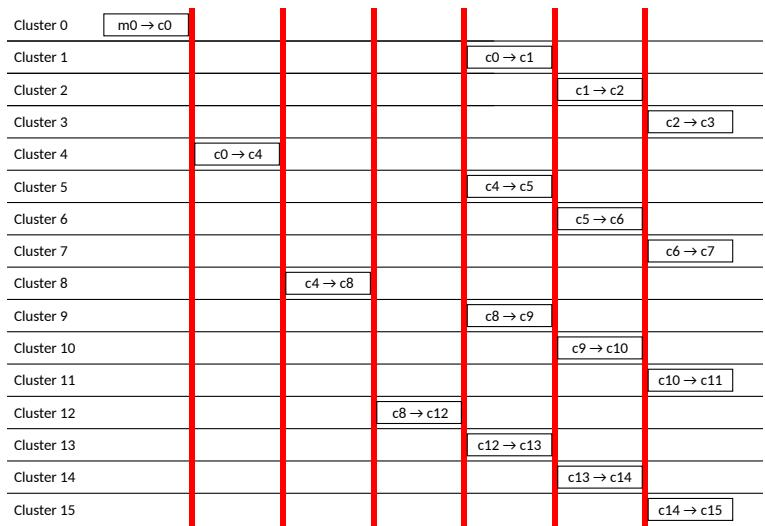

Figure 11. 2D naive sequential multicast.  
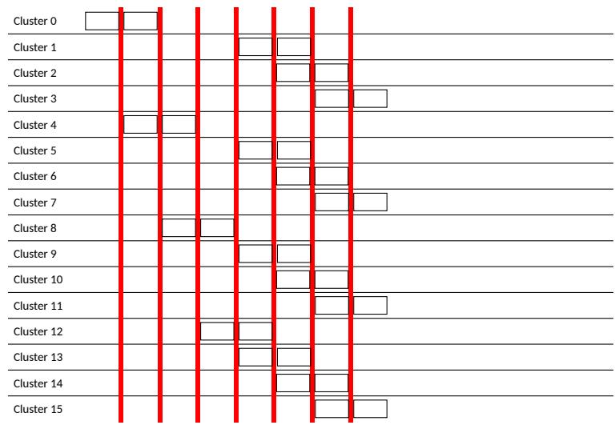

Figure 12. 2D pipelined sequential multicast.  
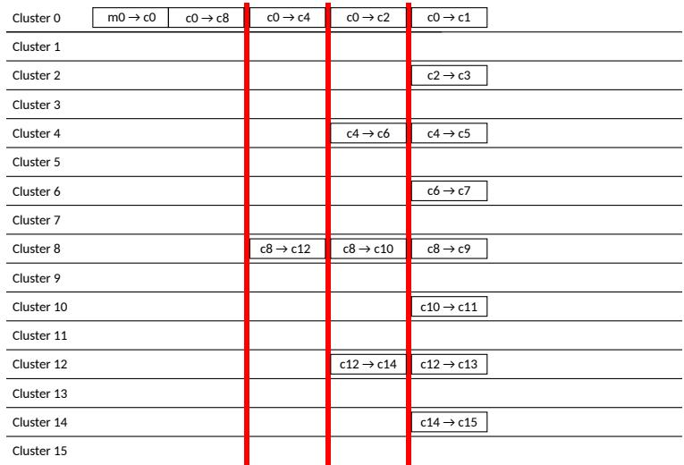  
Figure 13. 2D tree multicast.

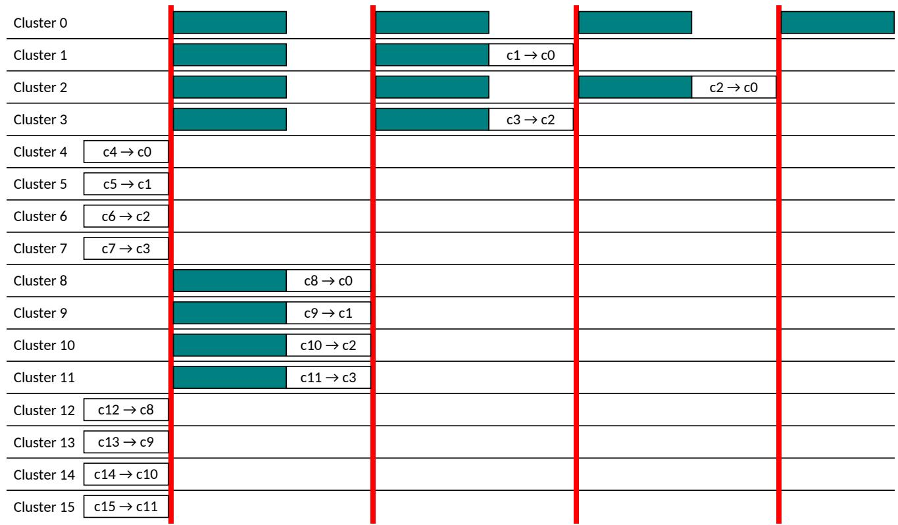  
Figure 14. 2D naive tree reduction.

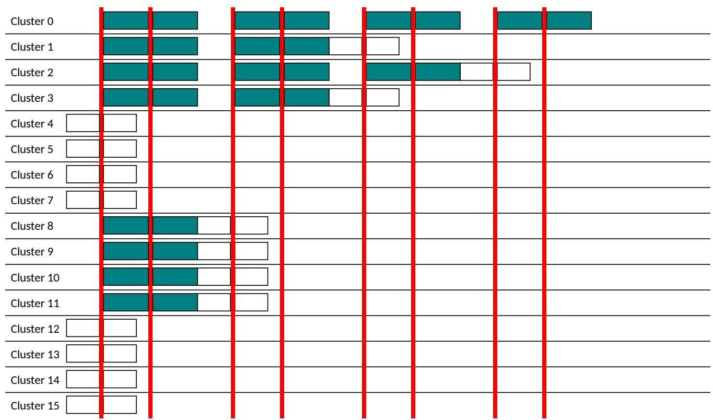  
Figure 15. 2D double-buffered tree reduction.

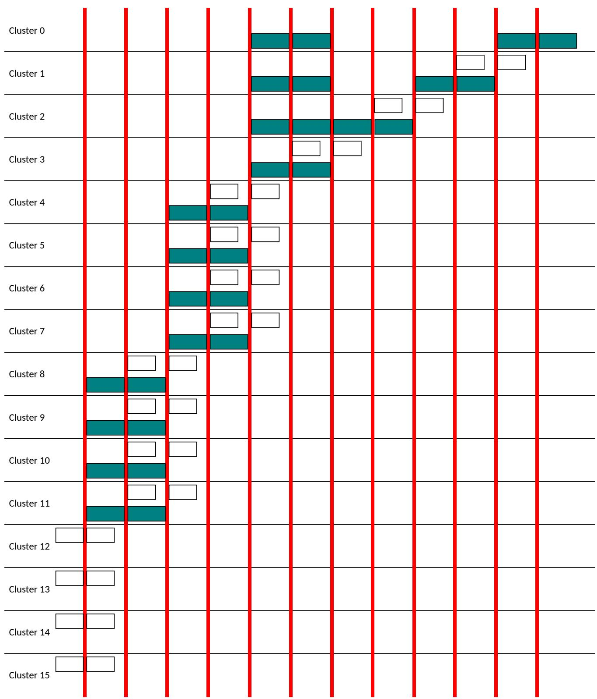  
Figure 16. 2D pipelined sequential reduction.