# BEAM: JOINT RESOURCE–POWER OPTIMIZATION FOR ENERGY-EFFICIENT LLM INFERENCE UNDER SLO CONSTRAINTS

Hyunjae Lee 1 Sangjin Choi 1 Seungjae Lim 1 Youngjin Kwon 1

## ABSTRACT

Large Language Model (LLM) serving is rapidly becoming one of the most power-intensive workloads in modern datacenters. Unlike training, where throughput dominates, inference must satisfy strict per-request latency targets such as Time-to-First-Token (TTFT) and Time-Between-Tokens (TBT). Once an SLO is met, the remaining latency slack between the earliest possible completion and the deadline offers an opportunity for energy savings. Existing systems, however, exploit only one dimension of this trade-off: batching improves resource efficiency, while DVFS improves power efficiency. These two axes are tightly coupled, and optimizing one while fixing the other yields only a local optimum. We present BEAM, a fine-grained controller that dynamically co-optimizes resource and power efficiency under per-request SLOs. BEAM continuously allocates the available latency slack across both dimensions by jointly tuning GPU frequency, chunk size, and microbatch count in real time. Its event-driven design responds instantly to request arrivals and completions, while a lightweight predictive model enables sub-millisecond decision making with negligible overhead. Implemented atop the vLLM runtime, BEAM reduces end-to-end GPU energy consumption by up to 51% compared to vLLM.

## 1 INTRODUCTION

Large Language Model (LLM) serving has become one of the most power-hungry workloads in modern datacenters (Niu et al., 2025; Stojkovic et al., 2024; Luccioni et al., 2024; Patterson et al., 2022). As model sizes and request volumes continue to grow, GPU clusters face a mounting tension between meeting strict Service-Level Objectives (SLOs) and operating within limited power budgets. Unlike training, where throughput is the primary goal, inference systems must meet per-request latency constraints such as Time-To-First-Token (TTFT) and Time-Between-Tokens (TBT). Once an SLO is met, any remaining latency slack, the time between a request’s earliest possible completion and its deadline, represents an opportunity for energy savings.

Recent work has started to exploit this slack by trading small amounts of latency headroom for significant reductions in power draw (Kakolyris et al., 2025; Stojkovic et al., 2024; 2025). However, existing approaches optimize along only one dimension at a time. Traditional serving systems focus purely on resource efficiency, forming larger batches to improve throughput (Crankshaw et al., 2017; Shen et al., 2019; Zhang et al., 2019) while energy-aware systems adjust power efficiency through Dynamic Voltage and Frequency Scaling (DVFS) (Kakolyris et al., 2024; Shi et al., 2024). Both approaches are inherently limited, since batching and DVFS share the same SLO slack budget: optimizing one while fixing the other finds only a local optimum. Our analysis shows that these two axes are tightly coupled. The optimal GPU frequency depends on batch size and vice versa, forming a non-linear control space that current serving systems fail to capture.

This paper presents BEAM (Batch-Energy Adaptive Manager), a fine-grained controller that dynamically cooptimizes resource and power efficiency under per-request SLO constraints. BEAM continuously spends the available latency slack across both axes of resource and power efficiency, jointly tuning GPU frequency, chunk size, and microbatch count to minimize total energy while guaranteeing SLO compliance. Unlike prior systems that operate at coarse timescales (Shi et al., 2024; Kakolyris et al., 2025) or cluster-level granularity (Stojkovic et al., 2025), BEAM makes millisecond-level decisions in response to runtime events, enabling real-time adaptation to bursty, stochastic workloads.

BEAM ’s design is grounded in three key principles. First, it adopts an event-driven control loop that reacts immediately to fine-grained runtime changes such as new request arrivals or completions. By making decisions only when meaningful events occur, BEAM maintains negligible overhead during steady-state operation while responding instantly to high-frequency interference. Second, it employs phase-aware scheduling to handle the asymmetric nature of LLM inference. The system separates control across two distinct phases—the compute-intensive prefill and the memorybound decode—each optimized by a specialized scheduler guided by its own SLO (TTFT or TBT). Finally, it leverages a lightweight, model-driven optimization strategy built on an offline profiling stage. This predictive model allows BEAM to estimate latency and energy for any joint configuration of control knobs in constant time, transforming a complex, coupled optimization problem into a fast bounded search suitable for millisecond-scale control.

Together, these design principles enable BEAM to convert the static trade-off between performance and energy into a dynamic, fine-grained optimization process that adapts continuously to workload fluctuations.

BEAM is built upon vLLM (Kwon et al., 2023), where we add energy-critical event handling within vLLM’s scheduler. These events are intercepted and directed to BEAM’s Prefill Scheduler or Decode Scheduler based on the current state. BEAM makes instantaneous decisions on energy-efficient knob configuration. It applies these configurations by either dynamically modifying scheduling constraints within vLLM or by invoking Dynamic Voltage and Frequency Scaling (DVFS) through NVML (NVIDIA Corporation, 2025).

BEAM delivers substantial energy savings, reducing endto-end GPU energy consumption by 30% compared to our energy-aware baseline, Window-DVFS (which leverages periodic DVFS techniques from prior SOTA work like DynamoLLM (Stojkovic et al., 2025) to save energy for LLM serving under SLO), and by up to 51% against Vanilla vLLM. Crucially, this efficiency is accomplished with negligible loss in SLO attainment relative to Window-DVFS: BEAM maintains high attainment rates of 94.9% TTFT and 94.5% TBT, exhibiting a TTFT SLO attainment loss of just 0.1% and a TBT loss of only 0.9%.

In summary, this paper makes the following contributions:

1. We identify and formalize the coupling between resource and power efficiency in LLM inference.

2. We design BEAM, an event-driven, phase-aware controller that jointly optimizes batching and DVFS under per-request SLOs.

3. We develop lightweight predictive models that enable ms level decision making with minimal offline profiling.

4. We evaluate BEAM on real-world LLM serving workloads, showing significant energy savings without violating latency SLOs.

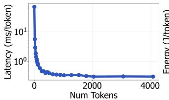

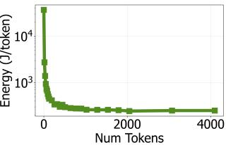  
Figure 1. The effect of batching on per-token latency (Left) and energy consumption (Right). Larger token batches dramatically reduce both metrics by improving resource efficiency. (Llama 3.3- 70B model, 8×A100-80GB, TP=2, PP=4).

## 2 BACKGROUND AND MOTIVATION

## 2.1 Energy Saving under SLO Constraint

The goal of LLM serving is not to achieve the lowest possible latency but to consistently meet per-request Service Level Objectives (SLOs) (Kakolyris et al., 2025; 2024). For LLM serving, performance is typically measured by two key metrics: Time-To-First-Token (TTFT), which is the time from request arrival until the first output token is generated, and Time-Between-Tokens (TBT), which is the time to generate each subsequent token. This distinction creates a crucial latency slack—the window between an individual request’s earliest possible completion and its non-negotiable deadline. In today’s power-constrained GPU clusters, where rack power budgets and oversubscription are the norm, this slack presents a key opportunity to treat energy saving as a firstclass objective. This has spurred a growing body of work to explore the fundamental trade-off between performance and energy in LLM inference (Samsi et al., 2023; Stojkovic et al., 2024; Fernandez et al., 2025; Stojkovic et al., 2025; Shi et al., 2024). These systems explore the trade-off by combining coarse-grained, node-level techniques, such as tensor parallelism with DVFS, and cluster-level controls, like instance scaling, to save energy while adhering to strict performance SLOs.

## 2.2 Two Axes of Energy Optimization

To minimize energy consumption, a system can tackle two fundamental components of the Energy = T ime×P ower equation. This creates a two-dimensional optimization space defined by resource efficiency and power efficiency.

Axis 1: Resource efficiency (tackling Time). The traditional and most powerful lever for optimization is improving resource efficiency to reduce the total time a task occupies the GPU. The primary tool here is batching (Sheng et al., 2023; Kwon et al., 2023). However, batching introduces a fundamental trade-off: to form a larger, more efficient batch, the system must wait for requests to arrive. This queueing delay is the primary way that systems spend their per-request SLO latency budget on the resource efficiency axis. By spending this time budget upfront in waiting, the system can then amortize the significant overheads of kernel launches and weight loading, which dramatically improves computational efficiency (Nabavinejad et al., 2022; Inoue, 2021). As shown in Figure 1, a batch of ∼2000 aggregate input tokens achieves 145× lower per-token latency and 144× lower per-token energy than single-token batches.

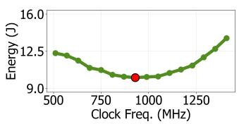

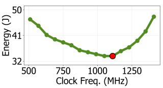  
Figure 2. The effect of frequency control on energy consumption, shown for a small, memory-bound batch (16 tokens, Left) and a large, compute-bound batch (512 tokens, Right). The shift in the energy-optimal valley (the point of lowest consumption) between these workloads illustrates the critical coupling between resource and power efficiency. (Llama 3.3-70B model, 4×A6000 GPUs, TP=1, PP=4).

Axis 2: Power efficiency (tackling Power). The second, more direct lever is improving power efficiency to reduce the instantaneous power draw of the GPU (Choi et al., 2023). This axis is non-trivial: as Figure 2 illustrates, every workload exhibits an energy valley curve, where a single, optimal frequency minimizes energy. A purely performance-driven strategy that only maximizes resource efficiency with maximum frequency is therefore a fundamentally limited approach to saving energy (Patel et al., 2024), as it ignores the significant power savings available from spending the per-request SLO latency budget on the power axis.

Coupled optimization axes. Crucially, these two axes are not independent but are tightly coupled. A decision on the resource efficiency axis (e.g., setting a batch size) fundamentally alters the workload’s computational characteristics. This, in turn, shifts the entire energy-optimal operating curve on the power efficiency axis, changing the ideal DVFS setting, as shown in Figure 2.

The latency slack provided by the per-request SLO is the critical budget for exploiting this coupling. This budget is a single, finite pool of time that both axes must draw from. However, existing systems spend this budget on only one axis at a time. Traditional serving systems (Crankshaw et al., 2017; Shen et al., 2019; Zhang et al., 2019) spend their budget entirely on the resource efficiency axis. To maximize throughput and cost-effectiveness, they form larger, computationally efficient batches (spending the budget as queueing delay), but run them at maximum frequency, ignoring the power-efficiency axis.

Conversely, recent energy-aware systems (Kakolyris et al., 2025; 2024) spend the same budget on the power efficiency axis. They reduce the frequency to save energy (spending the budget as slower execution time) but typically do so for a given, pre-determined batch, treating the batching policy as fixed. This static approach, however, fails to exploit the coupling; it finds only a local optimum (the best frequency for that one curve) while missing the global optimum on a new, far more efficient curve that a different batching policy would unlock.

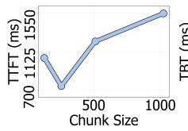

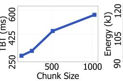

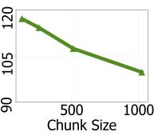

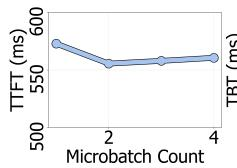  
(a) Chunk Sensitivity

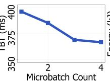  
(b) Microbatch Sensitivity

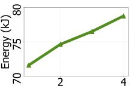  
Figure 3. Energy, TTFT, TBT compared w.r.t. different control knob configuration. Run by 4×A6000 GPUs using a TP=1, PP=4 configuration with the Llama 3.3-70B model.

This reveals a fundamental gap: these optimization fronts are treated in isolation. The batching decision (Axis 1) is made by a performance-first policy, and power optimization (Axis 2) is applied given the resulting batch. While DynamoLLM (Stojkovic et al., 2025) is the first to jointly consider both axes, it does so at a coarse, cluster-level—tuning heavyweight system configurations (like instance counts and model parallelism) against frequency.

Our work bridges this gap at a fine granularity. We spend the SLO budget across both axes simultaneously, dynamically co-optimizing the batching policy (which manages the queueing time component of the slack) with the frequency policy (which manages the execution time component of the slack). This fine-grained co-optimization allows us to find the true Energy = T ime × P ower minimum without violating the SLO.

## 2.3 Fine-Grained Control Knobs

The highly dynamic nature of LLM inference, with its stochastic arrivals and wide variance in sequence lengths, demands a controller that can react at millisecond timescales. This requirement renders coarse-grained techniques, such as the model re-sharding or instance scaling explored in DynamoLLM (Stojkovic et al., 2025), far too slow to adapt to real-time fluctuations (Su et al., 2025). Effective control at this timescale therefore requires a different set of tools: finegrained, low-overhead scheduling knobs that can directly influence the resource efficiency and power efficiency.

Since modern large language models often exceed the memory capacity of a single GPU, Model Parallelism is necessary. We focus on Pipeline Parallelism (PP) (Huang et al., 2019) and its inference-level extensions(Agrawal et al., 2024b), which partitions the model layers across devices and splits the input sequence during the initial prefill stage. PP is essential for high resource utilization and memory scaling in large LLMs and introduces two critical, tunable knobs for the resource efficiency axis: chunk size and microbatch count.

Chunk Size. The chunk size dictates how the input sequence is broken down for the pipelined chunked prefill (Agrawal et al., 2024a) stage. While larger chunk sizes are desirable as they improve resource efficiency and lower energy consumption by enabling larger effective token batches, they fundamentally harm latency by introducing a larger pipeline bubble. This bubble occurs because the first GPU stage spends a significantly longer time processing the massive initial chunk before it can pass data to subsequent stages. Every downstream stage must wait for this extended duration, which sharply degrades overall pipeline utilization, increasing TTFT and TBT. Conversely, smaller chunks protect latency by high pipeline utilization but sacrifice resource efficiency, leading to higher energy use. Figure 3a illustrates this trade-off, showing how the chunk size affects latency and energy consumption.

Microbatch Count. The microbatch count is also a critical knob that manages the trade-off between pipeline utilization and resource efficiency. A high microbatch count (small microbatch size) maximizes pipeline utilization by minimizing the pipeline bubble. Because small microbatches are forwarded promptly, pipeline stages remain active, thus reducing latency. However, this comes at the cost of resource efficiency, as operations on small microbatches are less computationally efficient, leading to higher overall energy consumption. Conversely, a low microbatch count (large microbatch size) maximizes resource efficiency and minimizes energy consumption. The drawback is poor pipeline utilization from larger bubbles, which degrades latency. Figure 3b illustrates this trade-off, showing how the microbatch count affects latency and energy consumption.

GPU DVFS. GPU Dynamic Voltage and Frequency Scaling (DVFS) is a well-established control knob for the power efficiency axis, extensively studied in prior works (Tang et al., 2019; Patel et al., 2024; Choi et al., 2023; You et al., 2023; Chung et al., 2024). It allows for runtime tuning of the GPU’s operating frequency, enabling explicit power–performance trade-offs with minimal overhead (∼10 ms). When combined with other resource-efficiency controls, DVFS expands the explorable search space for optimal, energy-efficient scheduling. As shown in Figure 2, varying the frequency creates a characteristic ”valley curve” with an energy-optimal operating point. Crucially, this optimal point is not fixed; the valley’s shape and minimum shift based on the workload’s computational properties (e.g., batch size), which are determined by the other control knobs.

## 2.4 Challenges

Co-optimizing resource and power efficiency at a fine granularity is difficult. An effective design must overcome three fundamental challenges: (1) the unpredictable nature of the system (2) the conflicting goals of the distinct workload phases, and (3) the complex, coupled, and non-linear control space.

C1: High-Frequency Dynamics and Interference. Inference workloads are highly dynamic and stochastic (Agrawal et al., 2024a; Zhong et al., 2024). Request arrivals are unpredictable, and both input (prefill) and output (decode) lengths vary significantly. This creates high-frequency, stochastic interference patterns. This high-frequency volatility renders static policies or coarse-grained (second-scale) adaptations ineffective. A controller must be able to react within the timescale of these interference events, which requires both extremely low-overhead decision-making and fast, lowoverhead control knob adjustment.

C2: Asymmetric and Entangled Workload Phases. LLM inference is not a monolithic workload. It contains two fundamentally different phases: compute-intensive prefills and memory-bound decodes (Kamath et al., 2025). These phases have distinct performance characteristics and separate SLOs: Time-To-First-Token (TTFT) for prefill and Time-Between-Token (TBT) for decode. For prefill - decode aggregated nodes, these phases are entangled, competing for the same set of finite resources (e.g., SMs, memory bandwidth). Control knobs rarely have a uniform effect; a decision that improves prefill (e.g., a larger prefill chunk) can easily starve the decode phase, causing a TBT SLO violation (Zhong et al., 2024). Any viable controller must therefore navigate the conflicting impacts of its decisions across these two asymmetric phases.

C3: A Coupled and Non-Linear Control Space. The finegrained knobs (chunk size, microbatch count, DVFS) do not operate in isolation. As motivated in § 2.2, their effects are tightly coupled, and their impact on performance and energy is highly non-linear (as shown in Figure 2). The optimal DVFS setting (Axis 2) depends directly on the computational intensity of the batch, which is determined by the batching and chunking policies (Axis 1). This coupling creates a vast and complex search space. The core challenge is to navigate this multi-dimensional space in real-time to find a single operating point that is the true energy minimum while simultaneously satisfying two separate and often-competing SLOs (TTFT and TBT).

## 3 DESIGN

Guided by the challenges identified in §2.4, BEAM is designed as a fine-grained, event-driven controller that cooptimizes resource and power efficiency under per-request SLO constraints. Its goal is to make energy-optimal scheduling decisions at millisecond timescales with negligible overhead. BEAM’s design is built on three core principles.

## 3.1 Principles

P1: Event-Driven Control. To cope with high-frequency interference and stochastic request arrivals (C1), BEAM employs an event-driven control loop. Static or windowbased policies are too sluggish. Consequently, they miss the opportunity to save more energy. Instead, BEAM makes a new decision only when a meaningful event changes the system state:

1. Arrival of a new prefill request.

2. Completion of any request (prefill or decode).

This design enables BEAM to react immediately to transient workload shifts, ensuring responsiveness to dynamic bursts while incurring zero control overhead during steady-state periods.

P2: Phase-Aware Scheduling. To handle the conflicting objectives of asymmetric and entangled workload phases (C2), BEAM divides and conquers. Its central controller is phase-aware, delegating control to two specialized schedulers:

1. Prefill Scheduler (S1): Optimizes the interferenceheavy prefill + decode phase.

2. Decode Scheduler (S2): Optimizes the stable, memory-bound decode-only phase.

Upon each triggering event, the controller identifies the active phase and dispatches control to the corresponding scheduler. This separation of concerns allows each scheduler to focus on phase-specific optimization goals and SLOs, TTFT for prefill and TBT for decode, while jointly preserving global energy efficiency.

P3: Model-Driven Joint Optimization. To navigate the coupled and non-linear control space (C3) within millisecond deadlines, BEAM employs a lightweight predictive model derived from an offline profiling stage. This model enables schedulers (S1 and S2) to instantly estimate latency and energy for any joint configuration of control knobs (e.g., chunk size, microbatch count, and clock frequency). By transforming a complex, multi-dimensional optimization into a fast, bounded search, BEAM identifies the energyoptimal combination of knobs in real time. This capability is key to sustaining SLO compliance in dynamic, bursty workloads while minimizing power draw.

Together, these principles enable BEAM to convert the static trade-off between throughput and energy into a dynamic, fine-grained optimization process that continuously adapts to workload fluctuations. The following sections detail the overall system architecture, the offline profiling model, and the two phase-specific schedulers.

## 3.2 System Architecture

Figure 4 illustrates the overall design of BEAM integrated with the vLLM runtime (Kwon et al., 2023). BEAM operates in an event-driven loop that continuously monitors system state and dynamically adjusts fine-grained control knobs to minimize energy consumption while satisfying per-request SLOs.

When a new request arrives, it enters either the prefill or decode queue in vLLM. A lightweight State Monitor Hook tracks queue lengths, GPU utilization, and completion events. Whenever a significant change occurs, such as a new prefill arrival or request completion, the hook triggers a new event to BEAM.

BEAM maintains the global system state and invokes one of two specialized schedulers according to event types: Prefill Scheduler (S1) or Decode Scheduler (S2). Each scheduler performs a joint search over its respective control knobs using the Perf–Energy Lookup Table, which is prebuilt by the Offline Profiler. The profiler characterizes per-shard latency and energy across (num tokens, frequency) pairs, enabling constant-time lookup at runtime.

Based on current queue state and lookup results, the scheduler selects the energy-optimal configuration that satisfies both TTFT and TBT SLO constraints. It then issues new actions to the vLLM runtime (updating chunk size or microbatch count) and to the DVFS Controller, which applies GPU frequency scaling across devices. This loop repeats in real time as events occur, allowing BEAM to adapt scheduling and power settings at millisecond granularity with negligible overhead.

## 3.3 Offline Profiling

Co-optimizing three knobs—chunk size, microbatch count, and frequency—creates an exponentially larger search space compared to frequency-only methods. Exhaustive online profiling or multi-dimensional offline characterization of this space is intractable. Our key insight is that the performance and energy impact of the chunk size (for prefill) and microbatch count (for decode) knobs primarily manifest through the resulting number of tokens processed in a single forward pass, which we term num tokens.

Therefore, the Offline Profiler characterizes only the fundamental relationship between performance (Latency) and energy (Energy) for the primitive operation: a single forward pass, parameterized by (num tokens, frequency). This reduces the dimensionality of the required profile from three knobs down to these two core parameters.

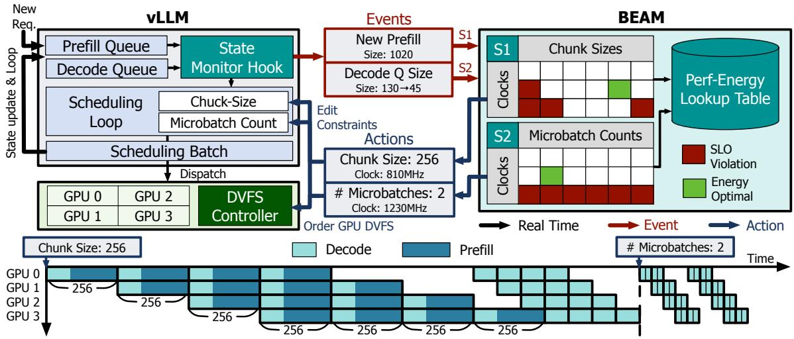  
Figure 4. BEAM overall architecture

Furthermore, we construct this 2D profile efficiently in approximately 30 minutes for a given model and GPU-parallel configuration. We leverage the predictable, tile-quantized scaling of GPU performance with respect to num tokens (NVIDIA Corporation, 2023). Instead of measuring every possible value, the profiler uses sparse sampling:

• For small num tokens values (relevant to decode steps), we observe that latency and energy often increase in discrete steps (tile quantization). Thus, profiling only a few representative points in this range is sufficient.

• For large num tokens values (relevant to prefill steps), we only profile the specific values corresponding to the potential chunk size settings the S1 scheduler might select.

Measurements are taken across the target frequencies. This targeted, sparse profiling provides sufficient accuracy for our predictive models without requiring a costly profiling.

## 3.4 S1: Prefill Scheduler

The Prefill Scheduler (S1) is activated whenever a new prefill request arrives. Its goal is to identify the energyoptimal (chunk size c, frequency f ) pair that satisfies both the incoming prefill’s TTFT SLO and the ongoing decodes’ TBT SLOs.

$$
\tag{1}
$$

Predictive Model. S1 relies on a lightweight performance model to estimate latency and energy. It queries the offline lookup table for the per-shard latency L(c, f) and energy E(c, f ) of a single forward pass with token count c at frequency f. Using these primitives, Equation 1 analytically composes TTFT, TBT, and energy metrics across the entire pipeline. This algebraic model enables millisecond-level decision making without expensive runtime profiling.

S1 performs an exhaustive yet lightweight search across all candidate (c, f ) combinations (Lines 2–3), as shown in Algorithm 1. For each pair, it predicts TTFT and TBT from Equation 1 (Line 4). Candidates violating either SLO are pruned immediately (Line 5). Among the feasible set, it calculates the resulting energy (Line 6) and S1 selects the (c⋆, f ⋆) pair that yields the lowest total energy (Lines 7–9).

Figure 5 illustrates S1’s search space for a sample prefill of 2048 tokens. The TTFT and TBT models form a convex feasible region of (c, f ) pairs that satisfy both SLOs. Points outside this region violate either TTFT or TBT constraints and are discarded. Within this feasible space, S1 selects the configuration that minimizes total energy.

For instance, configuration B (256, 810) uses smaller chunks, which shortens TBT but lengthens TTFT due to reduced resource efficiency. Configuration A (384, 1100), in contrast, uses larger chunks at a higher clock frequency—trading a small increase in TBT for a significant energy reduction while meeting both SLOs.

Algorithm 1 S1: Chunk–Clock Search under TTFT/TBT   
Constraints   
Require: K (prefill tokens), P (pipeline size), Tqueue,   
(TTFTSLO, TBTSLO)   
Require: Offline profiles L(c, f) and E(c, f )   
1: min energy ← +∞, (c⋆, f ⋆) ← (∅, ∅)   
2: for each c ∈ C do   
3: for each f ∈ F do   
4: Predict TTFT(c, f) and TBT(c, f) using Equa  
tion 1   
5: if TTFT(c, f) ≤ TTFTSLO and TBT(c, f) ≤   
TBTSLO then   
6: energy ← Energy(c, f)   
7: if energy < min energy then   
8: (c⋆, f ⋆) ← (c, f ); min energy ← energy   
9: end if   
10: end if   
11: end for   
12: end for   
13: return (c⋆, f ⋆)

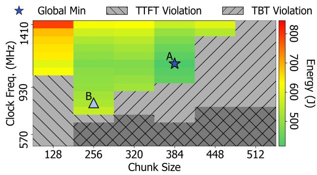

Decode Prefill Time   
GPU 0   
GPU 1GPU 2 384 384 A 450J   
GPU 3 384   
TBTA   
TA   
GPU 0   
GPU 1GPU 2 256 256 B 680J   
GPU 3 256   
TBTB   
TTFTB   
(b) Prefill Simulation  
Figure 5. Overview of the S1 scheduler’s decision process. It predicts the TTFT and TBT-stall for each (chunk size, frequency) pair, prunes the search space of SLO violators, and finds the energyoptimal point.

Efficiency and Accuracy. This model-based search is both fast and accurate. Estimating TTFT and TBT for any (c, f) pair requires only two LUT lookups and a few arithmetic operations, allowing over 100 combinations to be evaluated in real time with negligible overhead. Empirically, TTFT and TBT are predicted within 27% and 19% MAPE (Mean Absolute Percentage Error) respectively, confirming the model’s fidelity (Table 1 in § 5.6). Moreover, the convex structure of the search space enables early termination once frequency scaling begins to violate SLOs.

Composability. A key benefit of this approach is composability: the offline LUT characterizes each model shard’s latency–energy behavior independently, and S1 composes these profiles analytically to derive full-pipeline metrics. This decomposition drastically reduces the time and data required for offline profiling while maintaining accuracy across diverse configurations and workloads.

## 3.5 S2: Decode Scheduler

$$
\tag{2}
$$

The Decode Scheduler (S2) is triggered whenever the system enters or updates the decode-only state (i.e., when a prefill phase completes or a decode request finishes). Its goal is to identify the energy-optimal (microbatch count m, frequency f) pair that satisfies the decode-phase TBT SLOs.

Predictive Model. S2 uses the same lightweight predictive model framework as S1, composed from per-shard latency–energy profiles in the offline LUT. While PP addresses the prefill phase by chunking long input sequences to prevent pipeline stalls, it handles the decode phase by dividing the active batch of D concurrent requests into 1 ≤ m ≤ P smaller microbatches to increase GPU utilization. For each candidate (m, f), S2 computes the number of tokens per microbatch, b = ⌈D/m⌉, and predicts both latency and energy using LUT lookups: L(b, f) for latency and E(b, f) for energy. These primitives are then composed analytically—modeling the total pipeline processing latency as L(b, f) × P —to estimate the expected Time-Between-Token (TBT) and total energy under the given configuration. The model captures the key trade-off of microbatching:

• High m: smaller microbatches, better pipeline utilization (smaller pipeline bubbles), but lower computational efficiency.

• Low m: larger microbatches, higher efficiency, but increased pipeline idle time (larger pipeline bubbles).

S2 performs a bounded search over all candidate microbatch counts and GPU frequencies (Lines 2 and 4), as shown in Algorithm 2. For each microbatch count m, it calculates the number of tokens per microbatch (Line 3). Then, for each (m, f ) pair, it predicts TBT (Line 5) and energy (Line 7) using the LUT-based model. Any configuration violating the TBT SLO is immediately pruned (Line 6). Among the feasible set, S2 selects the pair that minimizes total energy per decode step (Lines 8–10).

Algorithm 2 S2: Microbatch–Clock Search for Energy Min  
imization (Decode)   
Require: (#decode requests) Nreq, (TBTSLO)   
Require: Offline profiles L(c, f) and E(c, f )   
1: min energy ← +∞, (m⋆, f ⋆) ← (∅, ∅)   
2: for each m ∈ M do   
3: b ← ⌈D/m⌉   
4: for each f ∈ F do   
5: Predict TBT(b, f) using Equation 2   
6: if TBTs2(b, f ) ≤ TBTSLO then   
7: energy ← Energys2(b, f)   
8: if energy < min energy then   
9: (m⋆, f ⋆) ← (m, f )   
10: min energy ← energy   
11: end if   
12: end if   
13: end for   
14: end for   
15: return (m⋆, f ⋆)

S2 dynamically adapts to the number of active decode requests. When decode requests increase, S2 tends to select smaller microbatches (larger m) to improve pipeline utilization. Conversely, when the decode workload thins out, it favors larger microbatches (smaller m) to regain computational efficiency. In both cases, S2 jointly adjusts the GPU frequency f to reach the energy-optimal operating point within the TBT SLO boundary.

Efficiency and Composability. Similar to S1, S2’s algebraic structure enables evaluating dozens of (m, f ) pairs in real time with negligible overhead. Each prediction requires only a few LUT lookups and arithmetic operations. Moreover, because both schedulers share the same LUT-based primitives, they are fully composable: a single offline profile suffices for both S1 and S2, minimizing profiling effort while maintaining consistent prediction fidelity.

## 4 IMPLEMENTATION

We implemented BEAM atop the vLLM serving framework (v0.11+), adding approximately 1,100 lines of code (LOC). To minimize system overhead, our architecture heavily leverages asynchronous execution for both software scheduling and hardware actuation.

Asynchronous Scheduling and DVFS. The S1 and S2 schedulers operate directly within vLLM’s scheduling loop. Because vLLM’s scheduling is asynchronous to GPU kernel dispatch, BEAM evaluates state changes and makes routing decisions without stalling active GPU execution. To prevent hardware actuation from blocking this critical path, we decoupled Dynamic Voltage and Frequency Scaling (DVFS). Frequency adjustments are dispatched via background threads that utilize the NVIDIA Management Library (NVML) API (nvmlDeviceSetGpuLockedClocks) to securely lock and release GPU clocks.

Energy Profiling and Monitoring. All energy metrics are captured directly via the NVML API. During live inference, a lightweight sidecar process continuously polls NVML’s per-GPU energy counters (nvmlDeviceGetTotalEnergyConsumption) at 200 ms intervals. This ensures accurate post-hoc energy accounting without intruding on the primary workload’s critical path.

## 5 EVALUATION

Our evaluation for BEAM is designed to address the following key questions:

1. Energy Efficiency & SLO Adherence: How effective is BEAM in maximizing energy savings while strictly adhering to SLOs under a real-world, bursty workload?

2. Event-Driven Advantage: What is the performance benefit of BEAM’s event-driven control compared to prior work’s periodic, window-based methods?

3. Control Knob Contribution: How do BEAM’s finegrained control knobs contribute to achieving superior overall energy saving and SLO adherence?

## 5.1 Methodology and Setup

Experiments are primarily conducted on an A100-80GB × 8 SXM4 node, utilizing the Llama3.3-70B-Instruct model (Grattafiori et al., 2024) configured with a (TP = 2, PP = 4) parallelism setting. For our end-to-end experiments, we additionally employ an A100-80GB × 4 SXM node to evaluate the Qwen2.5-32B model (TP = 2, PP = 2) (Qwen et al., 2025). Furthermore, our fidelity (§ 5.6) experiments incorporate various other models to ensure comprehensive analysis. Alternative parallelism configurations and their performance trade-offs are detailed in § 5.7.

## Baselines. We compare BEAM against two baselines:

1. Vanilla vLLM: The standard, unoptimized deployment of the widely-used, high-throughput LLM serving framework (Kwon et al., 2023).

2. Window-DVFS: A frequency-scaling baseline that reconfigures the GPU clock every 5-second window based on sampled load to achieve energy-optimal, SLO-adhering operation. This method relies on a pregenerated performance-energy model, which we establish by profiling vLLM across various frequencies (600MHz∼1400MHz) and loads (600TPS∼6400TPS), recording TTFT, TBT, and Power. This approach uses the core periodic sampling and DVFS mechanism similar to the prior SOTA work, DynamoLLM (Stojkovic et al., 2025). However, it is strictly limited to single-node DVFS and does not implement complex multi-node/model features (e.g., TP/PP reconfiguration, Model Shard Scaling, or Request Length Pooling). We use this configuration to provide a fair comparison isolating the benefits of BEAM’s event-driven scheduling over periodic, load-based control.

## 5.2 End-to-end Evaluation

We evaluate BEAM on a realistic trace derived from (Xiang et al., 2025)’s m-small trace for 1 hour, which we scaled down and re-generated using their methodology. Specifically, we focus on the bursty timeframe 19:00∼20:00 with an average load of 1800 tokens per second for a one-hour duration. To demonstrate the robustness of our approach, we conduct this evaluation across two distinct hardware and model configurations: an A100-80GB×8 node serving Llama3.3-70B, and an A100-80GB×4 node serving Qwen-2.5-32B.

Our end-to-end evaluation, shown in Figure 6, demonstrates that BEAM consistently achieves high SLO attainment while delivering substantial energy savings across both deployments.

In the Llama3.3-70B setup, BEAM effectively manages the workload using only 49% of the energy consumed by Vanilla vLLM, which also represents a 30% relative energy reduction compared to the Window-DVFS baseline. This efficiency is accomplished while maintaining SLO attainment comparable to both baselines. Specifically, BEAM maintains high attainment rates for both TTFT at 94.9% and TBT at 94.5%.

These results extend to the Qwen-2.5-32B setup, where BEAM reduces energy consumption to just 53% of Vanilla vLLM’s baseline, while improving upon Window-DVFS baseline. BEAM maintains SLO adherence in this scenario as well, with 98.2% TTFT and 100.0% TBT attainment rate alongside both baselines.

SLO Slack Reclamation for Energy Savings. BEAM’s superior efficiency stems from its ability to convert available SLO slack time into energy savings. Figure 7 displays TTFT and TBT latency histograms collected during this experiment. We observe that BEAM effectively shifts both the mean and the P90 values of TTFT and TBT closer to the SLO. BEAM effectively reclaims the latency slack budget with its control knobs that leads into large energy savings without causing tail latency violations.

## 5.3 Sensitivity to Bursts

We further evaluate BEAM’s capability to react to sudden bursts, and highlight the superiority of event-driven control mechanism on both performance and energy saving.

Here, we prepare a serving scenario with a synthetically generated workload following the Poisson arrival process. We run random requests with average input size 256, output size 64. We set a static request rate of 4 req/s (∼1000tps), and set up a synthetic burst at a specific time (60s∼80s) with 20req/s (∼4800tps).

Figure 8 illustrates a timeline of key metrics, sampled at 3s intervals, showing the difference between event-driven and periodic control mechanisms.

SLO adherence. Under low request rates, BEAM and Window-DVFS satisfy the SLO and naturally select reduced GPU frequencies. When a burst begins, BEAM’s eventdriven controller reacts immediately by raising the GPU frequency and switching to TTFT-optimal chunk sizes; once the burst subsides, it promptly lowers the frequency and reverts its knobs to energy-efficient settings. In contrast, the Window-DVFS baseline lags because it relies on accumulated historical load: it increases frequency too slowly and not sufficiently to meet the TTFT SLO during the burst, and then maintains elevated frequencies well after the burst has ended, thereby consuming more energy than necessary.

## 5.4 Sensitivity to Load

BEAM aggressively exploits latency slack at low load and dynamically adapts its control knobs as demand increases, preserving throughput capacity until system saturation. We demonstrate this robustness using a synthetic trace with Poisson arrivals (average input length 1024, output length 64 tokens), linearly ramping the request rate from 2 req/s (∼ 2000 tps) to 6.4 req/s (∼ 6400 tps). Figure 9 presents the timeline of these results.

At low rates (2000∼4000 tps), all methods satisfy the SLOs. Here, BEAM explicitly exploits TTFT/TBT slack to minimize power by selecting energy-efficient frequencies and chunk sizes. As the request rate increases (4000∼6400 tps), BEAM reconfigures its control knobs to higher performance settings to meet the tighter slack budget. Consequently, its behavior converges toward Vanilla vLLM as the system approaches saturation. At the highest rate tested (6400 tps), BEAM and all baselines violate the TTFT SLO, indicating that demand exceeds system capacity.

## 5.5 Ablation Study

We finally conduct an ablation study to investigate the impact of each design component within BEAM on energy efficiency and performance. We compare the following four

A100-80GBx8 with Llama3.3-70b  
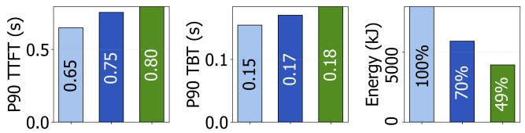

A100-80GBx4 with Qwen2.5 32b  
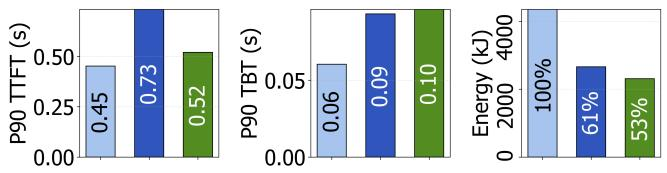  
(a) P90 TTFT, P90 TBT, and Energy Consumption

A100-80GBx8 with Llama3.3-70b  
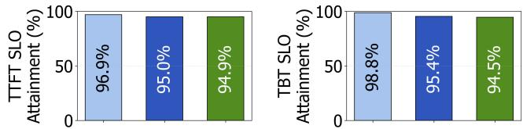

A100-80GBx4 with Qwen2.5 32b  
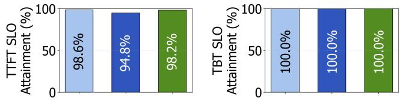  
(b) TTFT and TBT SLO Attainment

Figure 6. End-to-end evaluation results on real-world trace.  
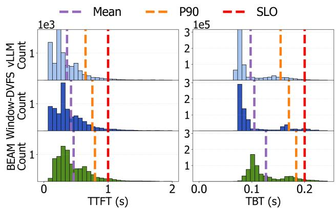  
Figure 7. TTFT and TBT latency histograms demonstrating SLO slack reclamation (A100x8, Llama 3.3-70B). This figure displays the latency distribution for the experiment in Figure 6.

1. vLLM: Vanilla vLLM running on the default GPU fre-quency.

2. DVFS Only: Runs the S1 policy, but restricts the chunk size selection to the default value (256 tokens), utilizing only DVFS.

3. S1 Only: Runs the full S1 policy, which includes both DVFS and dynamic chunk-size selection.

## configurations:

4. BEAM: The full implementation, incorporating both the S1 and S2 policies.

For these tests, we use a synthetic serving trace designed to emulate a realistic workload. The trace follows a Poisson arrival process with a rate of 3 requests per second. The average input size is set to 512 tokens, and the average output size is 64 tokens. The trace runs for approximately 1 minute.

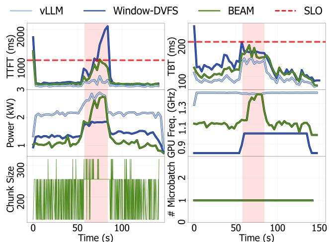  
Figure 8. Sensitivity to Workload Bursts: Event-Driven vs. Periodic Control. Timeline illustrating the system response to a burst (shaded in pink).

Figure 10 highlights each component’s contribution to converting SLO slack budget into tangible energy savings. Compared to the baseline vLLM, the DVFS Only configuration significantly reduces energy usage to 73%. The inclusion of the dynamic chunk-size selection algorithm (moving from DVFS Only to S1 Only) further contributes an extra ≈ 2% in energy savings, demonstrating the efficacy of jointly optimizing frequency and chunk-size. Adding the S2 component further reduces energy consumption by approximately 19%, with only a negligible penalty to TTFT/TBT. This gain exploits the decode-heavy characteristics of the workload—specifically its memory-bound operation and small batch sizes. By reducing pipeline-parallel stages to increase batch size, the system achieves the substantial energy savings shown in Figure 1.

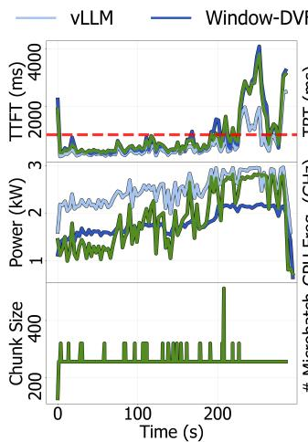

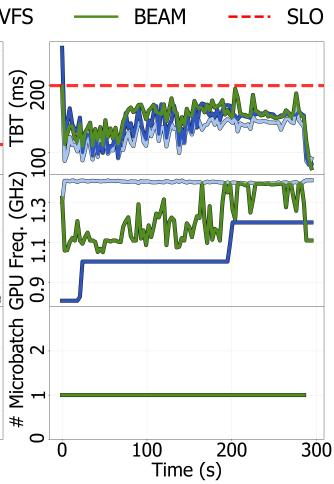  
Figure 9. Timeline illustrating BEAM’s response to a linear load ramp (2000 tps → 6400 tps). BEAM aggressively exploits latency slack for energy savings at low load and dynamically shifts to highperformance configurations as demand increases, preserving SLO adherence until saturation (∼ 6000 tps).

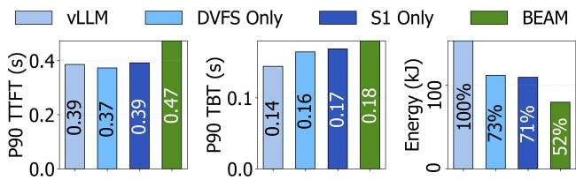  
Figure 10. Ablation of BEAM components. Joint DVFS + chunk tuning (S1) improves efficiency; adding S2 (BEAM) achieves the best energy-latency trade-off

## 5.6 Performance Model Fidelity

We evaluate the fidelity of our performance model by comparing predicted values against ground truth measurements across multiple architectures (Qwen 2.5 14B/32B, Llama 3.3 70B) and parallelism configurations. To test representative serving scenarios, we isolate prefill-heavy (averaging 1000 input and 50 output tokens) and decode-heavy (averaging 100 input and 500 output tokens) synthetic workloads. As shown in Table 1, the Mean Absolute Percentage Error (MAPE) ranges from 9.2% to 18.8% for TBT and 11.0% to 27.0% for TTFT. While the upper TTFT error margin is higher, the model provides a sufficiently reliable signal for BEAM’s real-time scheduling decisions.

## 5.7 Sensitivity to TBT SLO and Parallelism

We investigate BEAM’s sensitivity to the TBT SLO and the impact of different model parallelism configurations on the energy-latency trade-off. Using synthetic trace with an average input length of 2000 tokens and an output length of 64 tokens (at 1 request/s, 2000 TPS), we compare two distinct parallelism configurations: Pipeline-Parallel

Table 1. TBT and TTFT prediction fidelity across model configurations. All values are MAPE (%); lower is better. The label tp4pp2 indicate an 8-GPU configuration with tensor-parallel degree 4, and pipeline-parallel degree 2.  
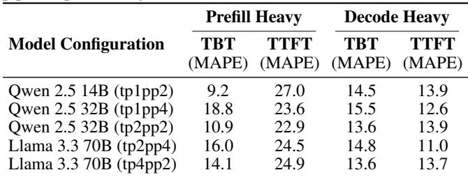

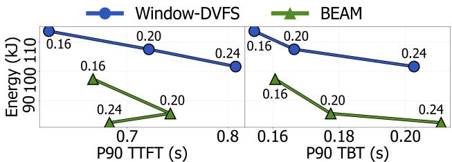

(a) Pipeline-Parallel Heavy (TP = 2, PP = 4)  
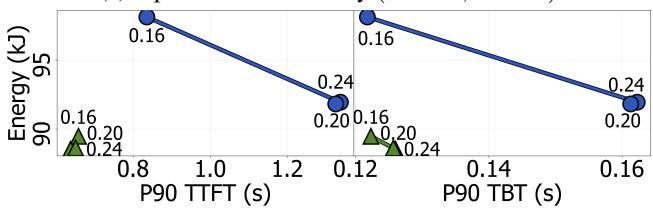  
(b) Tensor-Parallel Heavy (TP = 4, PP = 2)  
Figure 11. Pareto front achieved by our system and Window-DVFS baseline, under varying TBT SLOs (160ms to 240ms) and fixed TTFT SLO (1000ms). The number on the top of each marker represents the TBT SLO. Closer to the bottom-left is better

Heavy (TP = 2, PP = 4) and Tensor-Parallel Heavy (TP = 4, PP = 2). We evaluate the energy consumption and latency against a fixed TTFT SLO of 1000ms and varying TBT SLOs (160ms, 200ms, 240ms). As shown in Figure 11, for both parallelism configurations, BEAM successfully achieves a new, superior pareto-optimal front compared to the Window-DVFS baseline, demonstrating its effectiveness in co-optimizing energy and latency. The diagram shows that how different TBT SLOs determine the position of the pareto front, illustrating the tunable trade-off between latency and energy savings. Notably, the results show that the Pipeline-Parallel Heavy configuration (TP = 2, PP = 4) becomes more energy-efficient compared to the Tensor-Parallel Heavy configuration. This finding justifies our decision to utilize the (TP = 2, PP = 4) configuration as the primary setup throughout our entire experimental evaluation.

## 5.8 Overhead Analysis

We evaluate the latency overhead of BEAM’s core components to confirm its viability for real-time control. Table 2 summarizes the execution times for the predictive schedulers and DVFS actuation.

Table 2. Latency Overhead of BEAM Components  
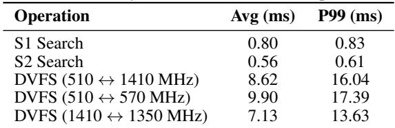

BEAM introduces minimal overhead on the critical path. The S1 and S2 schedulers execute their bounded searches in under 1 ms. Because vLLM’s existing scheduling logic runs non-blocking to GPU execution (the primary system bottleneck), embedding S1 and S2 within this scheduling phase introduces minimal interference. Furthermore, while NVML-based DVFS actuation requires roughly 7 to 10 ms regardless of the frequency step size, BEAM dispatches these calls to a separate background thread. This ensures the frequency scaling mechanism remains strictly non-blocking and never stalls the vLLM scheduling loop.

## 6 RELATED WORK

Energy-Efficient ML Training. Zeus (You et al., 2023) couples mini-batch sizing with power capping to optimize energy-performance trade-offs in DNN training. EnvPipe (Choi et al., 2023) and Perseus (Chung et al., 2024) adjust per-GPU frequencies to minimize performance degradation while maximizing energy savings. These training systems prioritize aggregate throughput over fixed epochs, whereas inference must satisfy strict per-request latency SLOs. Unlike these approaches, BEAM targets LLM inference with strict TTFT and TBT constraints, employing millisecond-granularity co-optimization of resource and power efficiency.

Energy-Efficient ML Inference. BatchSizer (Nabavinejad et al., 2021) treats batch size and GPU clock as control knobs for throughput optimization under power caps, but assumes single-GPU deployments without LLM-specific complexities like model parallelism or prefill-decode phases. DynamoLLM (Stojkovic et al., 2025) jointly tunes cluster-scale knobs (tensor parallelism, instance count, request pooling) with DVFS, but operates at coarse 5-second intervals with heavyweight reconfigurations that limit responsiveness to bursts. ThrottleLL’em (Kakolyris et al., 2025) forecasts KVcache sizes to optimize frequency and tensor parallelism for decode only clusters. GreenLLM (Shi et al., 2024) uses prefill-decode disaggregation with length-based routing and

DVFS, but it doesn’t exploit batching-power coupling within a node.

BEAM generalizes to prefill-decode disaggregated architectures as well with only minor modifications. In a disaggregated setup, BEAM’s prefill scheduler (S1) naturally resides in the prefiller; because the Time-Between-Tokens (TBT) constraint is no longer required in a prefill-only setting, S1 explicitly optimizes the trade-off between Time-To-First-Token (TTFT) and energy. Meanwhile, BEAM’s decode scheduler (S2) already manages control knobs directly relevant to decode-only execution, allowing it to be deployed in the decoder as-is.

BEAM operates at millisecond, event-driven granularity with specialized schedulers for prefill (S1, TTFT SLO) and decode (S2, TBT SLO), jointly tuning chunk size, microbatch count, and GPU frequency in real time. BEAM is modular and composable, allowing it to work in conjunction with cluster-level energy saving solutions and disaggregated systems.

## 7 CONCLUSION

LLM serving has latency slack within its SLOs, creating an opportunity to save energy. However, resource efficiency (like batching) and power efficiency (using DVFS) are closely coupled, making optimization difficult. BEAM is a fine-grained controller designed to solve this by dynamically co-optimizing both resource and power efficiency while adhering to per-request SLOs. By employing an event-driven, phase-aware control loop built atop vLLM, BEAM leverages a lightweight predictive model for decision making that jointly tunes all three interdependent knobs—GPU frequency, chunk size, and microbatch count—in real time. BEAM yields significant energy savings with minimal loss of SLO attainment.

## ACKNOWLEDGEMENTS

We greatly appreciate the anonymous reviewers and our shepherd for their constructive comments and feedback. This work was supported by the National Research Foundation of Korea(NRF) grant funded by the Korea government(MSIT) (No. RS-2024-00359979). This work was supported by Institute for Information & communications Technology Promotion(IITP) grant funded by the Korea government(MSIP) (RS-2024-00395134, DPU-Centric Datacenter Architecture for Next-Generation AI Devices and No. RS-2024-00459026, Energy-Aware Operating System for Disaggregated System). This work was further supported by Samsung Electronics (HiPER SCOUT).

## 7.1 Citations and References

## REFERENCES

Agrawal, A., Kedia, N., Panwar, A., Mohan, J., Kwatra, N., Gulavani, B., Tumanov, A., and Ramjee, R. Taming {Throughput-Latency} tradeoff in {LLM} inference with {Sarathi-Serve}. In 18th USENIX Symposium on Operating Systems Design and Implementation (OSDI 24), pp. 117–134, 2024a.

Agrawal, A., Qiu, H., Chen, J., Goiri, ´I., Zhang, C., Shahid, R., Ramjee, R., Tumanov, A., and Choukse, E. Medha: Efficiently serving multi-million context length llm inference requests without approximations. arXiv preprint arXiv:2409.17264, 2024b.

Choi, S., Koo, I., Ahn, J., Jeon, M., and Kwon, Y. EnvPipe: Performance-preserving DNN training framework for saving energy. In 2023 USENIX Annual Technical Conference (USENIX ATC 23), pp. 851–864, Boston, MA, July 2023. USENIX Association. ISBN 978-1-939133-35-9. URL https://www.usenix.org/conference/ atc23/presentation/choi.

Chung, J.-W., Gu, Y., Jang, I., Meng, L., Bansal, N., and Chowdhury, M. Reducing energy bloat in large model training. In Proceedings of the ACM SIGOPS 30th Symposium on Operating Systems Principles, SOSP ’24, pp. 144–159. ACM, November 2024. doi: 10.1145/3694715. 3695970. URL http://dx.doi.org/10.1145/ 3694715.3695970.

Crankshaw, D., Wang, X., Zhou, G., Franklin, M. J., Gonzalez, J. E., and Stoica, I. Clipper: a low-latency online prediction serving system. In Proceedings of the 14th USENIX Conference on Networked Systems Design and Implementation, NSDI’17, pp. 613–627, USA, 2017. USENIX Association. ISBN 9781931971379.

Fernandez, J., Na, C., Tiwari, V., Bisk, Y., Luccioni, S., and Strubell, E. Energy considerations of large language model inference and efficiency optimizations. In Che, W., Nabende, J., Shutova, E., and Pilehvar, M. T. (eds.), Proceedings of the 63rd Annual Meeting of the Association for Computational Linguistics (Volume 1: Long Papers), pp. 32556–32569, Vienna, Austria, July 2025. Association for Computational Linguistics. ISBN 979-8-89176-251-0. doi: 10.18653/v1/2025.acl-long. 1563. URL https://aclanthology.org/2025. acl-long.1563/.

Grattafiori, A., Dubey, A., Jauhri, A., Pandey, A., Kadian, A., Al-Dahle, A., Letman, A., Mathur, A., Schelten, A., Vaughan, A., Yang, A., Fan, A., Goyal, A., Hartshorn, A., Yang, A., Mitra, A., Sravankumar, A., Korenev, A., Hinsvark, A., Rao, A., Zhang, A., Rodriguez, A.,

Gregerson, A., Spataru, A., Roziere, B., Biron, B., Tang, B., Chern, B., Caucheteux, C., Nayak, C., Bi, C., Marra, C., McConnell, C., Keller, C., Touret, C., Wu, C., Wong, C., Ferrer, C. C., Nikolaidis, C., Allonsius, D., Song, D., Pintz, D., Livshits, D., Wyatt, D., Esiobu, D., Choudhary, D., Mahajan, D., Garcia-Olano, D., Perino, D., Hupkes, D., Lakomkin, E., AlBadawy, E., Lobanova, E., Dinan, E., Smith, E. M., Radenovic, F., Guzman, F., Zhang, F., ´ Synnaeve, G., Lee, G., Anderson, G. L., Thattai, G., Nail, G., Mialon, G., Pang, G., Cucurell, G., Nguyen, H., Korevaar, H., Xu, H., Touvron, H., Zarov, I., Ibarra, I. A., Kloumann, I., Misra, I., Evtimov, I., Zhang, J., Copet, J., Lee, J., Geffert, J., Vranes, J., Park, J., Mahadeokar, J., Shah, J., van der Linde, J., Billock, J., Hong, J., Lee, J., Fu, J., Chi, J., Huang, J., Liu, J., Wang, J., Yu, J., Bitton, J., Spisak, J., Park, J., Rocca, J., Johnstun, J., Saxe, J., Jia, J., Alwala, K. V., Prasad, K., Upasani, K., Plawiak, K., Li, K., Heafield, K., Stone, K., El-Arini, K., Iyer, K., Malik, K., Chiu, K., Bhalla, K., Lakhotia, K., Rantala-Yeary, L., van der Maaten, L., Chen, L., Tan, L., Jenkins, L., Martin, L., Madaan, L., Malo, L., Blecher, L., Landzaat, L., de Oliveira, L., Muzzi, M., Pasupuleti, M., Singh, M., Paluri, M., Kardas, M., Tsimpoukelli, M., Oldham, M., Rita, M., Pavlova, M., Kambadur, M., Lewis, M., Si, M., Singh, M. K., Hassan, M., Goyal, N., Torabi, N., Bashlykov, N., Bogoychev, N., Chatterji, N., Zhang, N., Duchenne, O., C¸ elebi, O., Alrassy, P., Zhang, P., Li, P., Vasic, P., Weng, P., Bhargava, P., Dubal, P., Krishnan, P., Koura, P. S., Xu, P., He, Q., Dong, Q., Srinivasan, R., Ganapathy, R., Calderer, R., Cabral, R. S., Stojnic, R., Raileanu, R., Maheswari, R., Girdhar, R., Patel, R., Sauvestre, R., Polidoro, R., Sumbaly, R., Taylor, R., Silva, R., Hou, R., Wang, R., Hosseini, S., Chennabasappa, S., Singh, S., Bell, S., Kim, S. S., Edunov, S., Nie, S., Narang, S., Raparthy, S., Shen, S., Wan, S., Bhosale, S., Zhang, S., Vandenhende, S., Batra, S., Whitman, S., Sootla, S., Collot, S., Gururangan, S., Borodinsky, S., Herman, T., Fowler, T., Sheasha, T., Georgiou, T., Scialom, T., Speckbacher, T., Mihaylov, T., Xiao, T., Karn, U., Goswami, V., Gupta, V., Ramanathan, V., Kerkez, V., Gonguet, V., Do, V., Vogeti, V., Albiero, V., Petrovic, V., Chu, W., Xiong, W., Fu, W., Meers, W., Martinet, X., Wang, X., Wang, X., Tan, X. E., Xia, X., Xie, X., Jia, X., Wang, X., Goldschlag, Y., Gaur, Y., Babaei, Y., Wen, Y., Song, Y., Zhang, Y., Li, Y., Mao, Y., Coudert, Z. D., Yan, Z., Chen, Z., Papakipos, Z., Singh, A., Srivastava, A., Jain, A., Kelsey, A., Shajnfeld, A., Gangidi, A., Victoria, A., Goldstand, A., Menon, A., Sharma, A., Boesenberg, A., Baevski, A., Feinstein, A., Kallet, A., Sangani, A., Teo, A., Yunus, A., Lupu, A., Alvarado, A., Caples, A., Gu, A., Ho, A., Poulton, A., Ryan, A., Ramchandani, A., Dong, A., Franco, A., Goyal, A., Saraf, A., Chowdhury, A., Gabriel, A., Bharambe, A., Eisenman, A., Yazdan, A., James, B., Maurer, B., Leonhardi, B., Huang, B., Loyd, B., Paola, B. D., Paranjape, B.,

Liu, B., Wu, B., Ni, B., Hancock, B., Wasti, B., Spence, B., Stojkovic, B., Gamido, B., Montalvo, B., Parker, C., Burton, C., Mejia, C., Liu, C., Wang, C., Kim, C., Zhou, C., Hu, C., Chu, C.-H., Cai, C., Tindal, C., Feichtenhofer, C., Gao, C., Civin, D., Beaty, D., Kreymer, D., Li, D., Adkins, D., Xu, D., Testuggine, D., David, D., Parikh, D., Liskovich, D., Foss, D., Wang, D., Le, D., Holland, D., Dowling, E., Jamil, E., Montgomery, E., Presani, E., Hahn, E., Wood, E., Le, E.-T., Brinkman, E., Arcaute, E., Dunbar, E., Smothers, E., Sun, F., Kreuk, F., Tian, F., Kokkinos, F., Ozgenel, F., Caggioni, F., Kanayet, F., Seide, F., Florez, G. M., Schwarz, G., Badeer, G., Swee, G., Halpern, G., Herman, G., Sizov, G., Guangyi, Zhang, Lakshminarayanan, G., Inan, H., Shojanazeri, H., Zou, H., Wang, H., Zha, H., Habeeb, H., Rudolph, H., Suk, H., Aspegren, H., Goldman, H., Zhan, H., Damlaj, I., Molybog, I., Tufanov, I., Leontiadis, I., Veliche, I.-E., Gat, I., Weissman, J., Geboski, J., Kohli, J., Lam, J., Asher, J., Gaya, J.-B., Marcus, J., Tang, J., Chan, J., Zhen, J., Reizenstein, J., Teboul, J., Zhong, J., Jin, J., Yang, J., Cummings, J., Carvill, J., Shepard, J., McPhie, J., Torres, J., Ginsburg, J., Wang, J., Wu, K., U, K. H., Saxena, K., Khandelwal, K., Zand, K., Matosich, K., Veeraraghavan, K., Michelena, K., Li, K., Jagadeesh, K., Huang, K., Chawla, K., Huang, K., Chen, L., Garg, L., A, L., Silva, L., Bell, L., Zhang, L., Guo, L., Yu, L., Moshkovich, L., Wehrstedt, L., Khabsa, M., Avalani, M., Bhatt, M., Mankus, M., Hasson, M., Lennie, M., Reso, M., Groshev, M., Naumov, M., Lathi, M., Keneally, M., Liu, M., Seltzer, M. L., Valko, M., Restrepo, M., Patel, M., Vyatskov, M., Samvelyan, M., Clark, M., Macey, M., Wang, M., Hermoso, M. J., Metanat, M., Rastegari, M., Bansal, M., Santhanam, N., Parks, N., White, N., Bawa, N., Singhal, N., Egebo, N., Usunier, N., Mehta, N., Laptev, N. P., Dong, N., Cheng, N., Chernoguz, O., Hart, O., Salpekar, O., Kalinli, O., Kent, P., Parekh, P., Saab, P., Balaji, P., Rittner, P., Bontrager, P., Roux, P., Dollar, P., Zvyagina, P., Ratanchandani, P., Yuvraj, P., Liang, Q., Alao, R., Rodriguez, R., Ayub, R., Murthy, R., Nayani, R., Mitra, R., Parthasarathy, R., Li, R., Hogan, R., Battey, R., Wang, R., Howes, R., Rinott, R., Mehta, S., Siby, S., Bondu, S. J., Datta, S., Chugh, S., Hunt, S., Dhillon, S., Sidorov, S., Pan, S., Mahajan, S., Verma, S., Yamamoto, S., Ramaswamy, S., Lindsay, S., Lindsay, S., Feng, S., Lin, S., Zha, S. C., Patil, S., Shankar, S., Zhang, S., Zhang, S., Wang, S., Agarwal, S., Sajuyigbe, S., Chintala, S., Max, S., Chen, S., Kehoe, S., Satterfield, S., Govindaprasad, S., Gupta, S., Deng, S., Cho, S., Virk, S., Subramanian, S., Choudhury, S., Goldman, S., Remez, T., Glaser, T., Best, T., Koehler, T., Robinson, T., Li, T., Zhang, T., Matthews, T., Chou, T., Shaked, T., Vontimitta, V., Ajayi, V., Montanez, V., Mohan, V., Kumar, V. S., Mangla, V., Ionescu, V., Poenaru, V., Mihailescu, V. T., Ivanov, V., Li, W., Wang, W., Jiang, W., Bouaziz, W., Constable, W., Tang, X., Wu, X., Wang,

X., Wu, X., Gao, X., Kleinman, Y., Chen, Y., Hu, Y., Jia, Y., Qi, Y., Li, Y., Zhang, Y., Zhang, Y., Adi, Y., Nam, Y., Yu, Wang, Zhao, Y., Hao, Y., Qian, Y., Li, Y., He, Y., Rait, Z., DeVito, Z., Rosnbrick, Z., Wen, Z., Yang, Z., Zhao, Z., and Ma, Z. The llama 3 herd of models, 2024. URL https://arxiv.org/abs/2407.21783.

Huang, Y., Cheng, Y., Bapna, A., Firat, O., Chen, M. X., Chen, D., Lee, H., Ngiam, J., Le, Q. V., Wu, Y., and Chen, Z. Gpipe: Efficient training of giant neural networks using pipeline parallelism, 2019. URL https: //arxiv.org/abs/1811.06965.

Inoue, Y. Queueing analysis of gpu-based inference servers with dynamic batching: A closed-form characterization. Performance Evaluation, 147:102183, 2021.

Kakolyris, A. K., Masouros, D., Xydis, S., and Soudris, D. SLO-Aware GPU DVFS for Energy-Efficient LLM Inference Serving . IEEE Computer Architecture Letters, 23(02):150–153, July 2024. ISSN 1556-6064. doi: 10.1109/LCA.2024.3406038. URL https://doi.ieeecomputersociety.org/ 10.1109/LCA.2024.3406038.

Kakolyris, A. K., Masouros, D., Vavaroutsos, P., Xydis, S., and Soudris, D. throttll’em: Predictive gpu throttling for energy efficient llm inference serving. In 2025 IEEE International Symposium on High Performance Computer Architecture (HPCA), pp. 1363–1378, 2025. doi: 10.1109/ HPCA61900.2025.00103.

Kamath, A. K., Prabhu, R., Mohan, J., Peter, S., Ramjee, R., and Panwar, A. Pod-attention: Unlocking full prefilldecode overlap for faster llm inference. In Proceedings of the 30th ACM International Conference on Architectural Support for Programming Languages and Operating Systems, Volume 2, pp. 897–912, 2025.

Kwon, W., Li, Z., Zhuang, S., Sheng, Y., Zheng, L., Yu, C. H., Gonzalez, J., Zhang, H., and Stoica, I. Efficient memory management for large language model serving with pagedattention. In Proceedings of the 29th symposium on operating systems principles, pp. 611–626, 2023.

Luccioni, S., Jernite, Y., and Strubell, E. Power hungry processing: Watts driving the cost of ai deployment? In Proceedings of the 2024 ACM Conference on Fairness, Accountability, and Transparency, FAccT ’24, pp. 85–99, New York, NY, USA, 2024. Association for Computing Machinery. ISBN 9798400704505. doi: 10.1145/3630106.3658542. URL https://doi. org/10.1145/3630106.3658542.

Nabavinejad, S. M., Reda, S., and Ebrahimi, M. Batchsizer: Power-performance trade-off for dnn inference.

In Proceedings of the 26th Asia and South Pacific Design Automation Conference, ASPDAC ’21, pp. 819–824, New York, NY, USA, 2021. Association for Computing Machinery. ISBN 9781450379991. doi: 10.1145/ 3394885.3431535. URL https://doi.org/10. 1145/3394885.3431535.

Nabavinejad, S. M., Reda, S., and Ebrahimi, M. Coordinated batching and dvfs for dnn inference on gpu accelerators. IEEE Transactions on Parallel and Distributed Systems, 33(10):2496–2508, 2022. doi: 10.1109/TPDS. 2022.3144614.

Niu, C., Zhang, W., Zhao, Y., and Chen, Y. Energy efficient or exhaustive? benchmarking power consumption of llm inference engines. SIGENERGY Energy Inform. Rev., 5(2):56–62, August 2025. doi: 10.1145/ 3757892.3757900. URL https://doi.org/10. 1145/3757892.3757900.

NVIDIA Corporation. Matrix multiplication background user’s guide. https://docs. nvidia.com/deeplearning/performance/ dl-performance-matrix-multiplication/ index.html#tile-quant, February 2023. NVIDIA Deep Learning Performance Documentation. Last updated February 1, 2023.

NVIDIA Corporation. NVIDIA Management Library (NVML). https://developer.nvidia.com/ management-library-nvml, 2025. Accessed: 30 October 2025.

Patel, P., Choukse, E., Zhang, C., Goiri, I. n., Warrier, B., Mahalingam, N., and Bianchini, R. Characterizing power management opportunities for llms in the cloud. In Proceedings of the 29th ACM International Conference on Architectural Support for Programming Languages and Operating Systems, Volume 3, ASPLOS ’24, pp. 207–222, New York, NY, USA, 2024. Association for Computing Machinery. ISBN 9798400703867. doi: 10.1145/3620666.3651329. URL https://doi. org/10.1145/3620666.3651329.

Patterson, D., Gonzalez, J., Holzle, U., Le, Q., Liang, C., ¨ Munguia, L.-M., Rothchild, D., So, D. R., Texier, M., and Dean, J. The carbon footprint of machine learning training will plateau, then shrink. Computer, 55(7):18–28, 2022.

Qwen, :, Yang, A., Yang, B., Zhang, B., Hui, B., Zheng, B., Yu, B., Li, C., Liu, D., Huang, F., Wei, H., Lin, H., Yang, J., Tu, J., Zhang, J., Yang, J., Yang, J., Zhou, J., Lin, J., Dang, K., Lu, K., Bao, K., Yang, K., Yu, L., Li, M., Xue, M., Zhang, P., Zhu, Q., Men, R., Lin, R., Li, T., Tang, T., Xia, T., Ren, X., Ren, X., Fan, Y., Su, Y., Zhang, Y., Wan, Y., Liu, Y., Cui, Z., Zhang, Z., and Qiu, Z. Qwen2.5

technical report, 2025. URL https://arxiv.org/ abs/2412.15115.

Samsi, S., Zhao, D., McDonald, J., Li, B., Michaleas, A., Jones, M., Bergeron, W., Kepner, J., Tiwari, D., and Gadepally, V. From words to watts: Benchmarking the energy costs of large language model inference. In 2023 IEEE High Performance Extreme Computing Conference (HPEC), pp. 1–9. IEEE, 2023.

Shen, H., Chen, L., Jin, Y., Zhao, L., Kong, B., Philipose, M., Krishnamurthy, A., and Sundaram, R. Nexus: a gpu cluster engine for accelerating dnn-based video analysis. In Proceedings of the 27th ACM Symposium on Operating Systems Principles, SOSP ’19, pp. 322–337, New York, NY, USA, 2019. Association for Computing Machinery. ISBN 9781450368735. doi: 10. 1145/3341301.3359658. URL https://doi.org/ 10.1145/3341301.3359658.

Sheng, Y., Zheng, L., Yuan, B., Li, Z., Ryabinin, M., Chen, B., Liang, P., Re, C., Stoica, I., and Zhang, C. Flexgen: ´ High-throughput generative inference of large language models with a single gpu. In International Conference on Machine Learning, pp. 31094–31116. PMLR, 2023.

Shi, T., Wu, Y., Liu, S., and Ding, Y. Greenllm: Disaggregating large language model serving on heterogeneous gpus for lower carbon emissions. arXiv preprint arXiv:2412.20322, 2024.

Stojkovic, J., Choukse, E., Zhang, C., Goiri, , and Torrellas, J. Towards greener llms: Bringing energy-efficiency to the forefront of llm inference. In EMC2 at ASPLOS, April 2024. URL https://www.microsoft. com/en-us/research/publication/ towards-greener-llms-bringing-energy-efficiency-t

Stojkovic, J., Zhang, C., Goiri, , Torrellas, J., and Choukse, E. Dynamollm: Designing llm inference clusters for performance and energy efficiency. In 2025 IEEE International Symposium on High Performance Computer Architecture (HPCA), pp. 1348–1362, 2025. doi: 10.1109/HPCA61900.2025.00102.

Su, Q., Zhao, W., Li, X., Andoorveedu, M., Jiang, C., Zhu, Z., Song, K., Giannoula, C., and Pekhimenko, G. Seesaw: High-throughput llm inference via model re-sharding. arXiv preprint arXiv:2503.06433, 2025.

Tang, Z., Wang, Y., Wang, Q., and Chu, X. The impact of gpu dvfs on the energy and performance of deep learning: An empirical study. In Proceedings of the Tenth ACM International Conference on Future Energy Systems, pp. 315–325, 2019.

Xiang, Y., Li, X., Qian, K., Yu, W., Zhai, E., and Jin, X. Servegen: Workload characterization and generation of large language model serving in production. arXiv preprint arXiv:2505.09999, 2025.

You, J., Chung, J.-W., and Chowdhury, M. Zeus: Understanding and optimizing GPU energy consumption of DNN training. In 20th USENIX Symposium on Networked Systems Design and Implementation (NSDI 23), pp. 119–139, Boston, MA, April 2023. USENIX Association. ISBN 978-1-939133-33-5. URL https://www.usenix.org/conference/ nsdi23/presentation/you.

Zhang, C., Yu, M., Wang, W., and Yan, F. MArk: Exploiting cloud services for Cost-Effective, SLO-Aware machine learning inference serving. In 2019 USENIX Annual Technical Conference (USENIX ATC 19), pp. 1049–1062, Renton, WA, July 2019. USENIX Association. ISBN 978-1-939133-03-8. URL https://www.usenix.org/conference/ atc19/presentation/zhang-chengliang.

Zhong, Y., Liu, S., Chen, J., Hu, J., Zhu, Y., Liu, X., Jin, X., and Zhang, H. {DistServe}: Disaggregating prefill and decoding for goodput-optimized large language model serving. In 18th USENIX Symposium on Operating Systems Design and Implementation (OSDI 24), pp. 193–210, 2024.

## ARTIFACT APPENDIX

## A.1 Abstract

The BEAM artifact provides the full source code, offline profiles, benchmark traces, and automation scripts needed to reproduce the end-to-end energy and latency results reported in the paper. BEAM is implemented as a modified vLLM (v0.11+) V1 scheduler that jointly tunes GPU clock frequency, prefill chunk size, and decode microbatch count in response to per-request SLO slack. The artifact is packaged as a Docker Compose environment: a single setup reviewer.sh prepares the host (NVIDIA driver, Fabric Manager, nvidia-persistenced, Hugging Face token), and run all.sh drives the full evaluation pipeline. Reviewers can additionally run smoke test.sh for a ∼30 min functional check that exercises all schedulers on a short trace. The artifact reproduces Figures 6–11 and Tables 1–2 of the paper.

## A.2 Artifact check-list (meta-information)

Algorithm: BEAM event-driven, phase-aware joint DVFS + chunk-size + microbatch-count controller (schedulers S1, S2).

Program: Modified vLLM V1 runtime (Python ∼86%, CUDA / C++ ∼12%, shell ∼1%), plus benchmarking, profiling, and plotting scripts. About 1,100 LOC added on top of upstream vLLM.

Compilation: CUDA 12.x, PyTorch 2.x (installed inside the provided Docker image). Custom vLLM C++/CUDA extensions are built automatically during the first docker compose up.

Model: meta-llama/Llama-3.3-70B-Instruct (primary), Qwen/Qwen2.5-32B-Instruct (secondary), plus Qwen2.5-14B for fidelity experiments. Weights are downloaded at runtime through a user-supplied HF TOKEN.

Data set: A 1-hour bursty trace derived from the Serve-Gen m-small language workload. Pre-committed under benchmarks/energy/datasets/ and regenerable via dataset-generation/generate.py.

Run-time environment: Ubuntu 22.04 host with NVIDIA Driver ≥535, NVIDIA Container Toolkit, Docker ≥24, and Docker Compose v2. The container uses --privileged so NVML can lock GPU clocks (nvmlDeviceSetGpuLockedClocks).

Hardware: Primary: 8×NVIDIA A100-80GB SXM4 with NVSwitch and nvidia-fabricmanager + nvidia-persistenced running. Secondary: 4×A100-80GB SXM for the Qwen2.5-32B experiments. 1–8 GPU configurations are auto-detected.

Metrics: P90 TTFT (s), P90 TBT (s), TTFT/TBT SLO attainment (%), total GPU energy (kJ) via nvmlDeviceGetTotalEnergyConsumption, per-GPU clock frequency (MHz), and per-GPU power (W).

Output: Timestamped result directories under end to end/ and sensitivity tests/, containing JSON benchmark logs, per-GPU energy/frequency CSVs, S1/S2 decision logs, and plot-ready summaries.

Experiments: Reproduce Fig. 6–7 (end-to-end), Fig. 8 (burst sensitivity), Fig. 9 (load ramp), Table 1 (performance model fidelity), Table 2 (overhead), Fig. 10 (Pareto frontier across parallelism), and Fig. 11 (ablation).

Disk space required: ≥200 GB (Hugging Face weight cache dominates; Docker image is ∼25 GB).

Workflow preparation time: ∼30–60 min (Docker image build + model download), assuming good network.

Experiment completion time: ∼30 min for the smoke test; ∼5–6 h for run all.sh; add ∼1 h for the full Pareto pipeline.

Publicly available? Yes.

Code licenses: Apache 2.0 (inherited from vLLM).

Workflow framework used? Docker Compose + Bash orchestration (utils.sh).

Archived (DOI)? Yes 10.5281/zenodo.19415798 (mirror of GitHub release v0.1.1+mlsys.artifact).

## A.3 Description

A.3.1 How to access. A permanent, citable snapshot of the artifact is archived on Zenodo at https:// doi.org/10.5281/zenodo.19415798. The working repository is hosted at https://github.com/ jlee335/BEAM-artifact under the release tag v0.1.1+mlsys.artifact, from which the Zenodo deposit is generated.

A.3.2 Hardware dependencies. The paper’s primary numbers require an 8×A100-80GB SXM4 node with NVSwitch (for the TP=2, PP=4 Llama-3.3-70B configuration). The secondary Qwen2.5-32B experiments use 4×A100-80GB SXM (TP=2, PP=2). The scripts also run on smaller (1– 4 GPU) nodes with reduced parallelism; per-GPU counts are auto-detected via nvidia-smi. Non-SXM GPUs are supported for functional testing but cannot reproduce the paper’s NVSwitch-based TP communication path. The user must have privileges to run --privileged Docker containers so that NVML can lock and unlock GPU clocks.

A.3.3 Software dependencies. Docker ≥24, Docker Compose v2, NVIDIA Container Toolkit, NVIDIA Driver ≥535, nvidia-persistenced, and nvidia-fabricmanager (SXM only). All remaining dependencies (CUDA, PyTorch, vLLM, pynvml, profiling utilities, plotting libraries) are pinned inside docker/Dockerfile and installed automatically. check fabricmanager.sh validates the host configuration before the container starts.

A.3.4 Data sets. The primary end-to-end trace is a 1-hour bursty segment (19:00–20:00) extracted from the ServeGen m-small language workload at an average load of ∼1,800 tokens/s. It is pre-committed under benchmarks/energy/datasets/. Synthetic Poisson traces for the burst, stair, and Pareto studies are generated on the fly by the respective run \*.sh scripts.

A.3.5 Models. Llama-3.3-70B-Instruct, Qwen2.5-32B-Instruct, and Qwen2.5-14B-Instruct are pulled from Hugging Face using HF TOKEN. All three are gated and require accepting the model licenses.

## A.4 Installation

```shell
git clone https://github.com/jlee335/←-
,→ BEAM-artifact.git
cd BEAM-artifact
export HF_TOKEN=<your_huggingface_token←-
,→ >
./setup_reviewer.sh
docker exec -it \
-w /workspace/benchmarks/energy \
vllm_evaluator_env bash
```

setup reviewer.sh builds the Docker image on first run (several minutes for vLLM C++ extension compilation), verifies the NVIDIA services, and starts the evaluator container.

## A.5 Experiment workflow

The following shows shell from container environment. (/workspace/benchmarks/energy):

```shell
# Sanity check (˜30 min)
./smoke_test.sh
# Full pipeline using pre-shipped A100
# profiles (˜5-6 h)
TRACE="datasets/requests_lang_m-small_\
day1_19h00m-20h00m_3600s_3rps.csv"
MODEL="meta-llama/Llama-3.3-70B-←-
,→ Instruct"
./run_all.sh --skip-profiling \
--model $MODEL --tp 2 --pp 4 \
--dataset-path $TRACE
```

Individual stages can be invoked directly: run offline profile.sh and run dynamo benchmark.sh regenerate the perf–energy lookup tables used by S1/S2 and by the Window-DVFS profiles; run e2e.sh, run ablation.sh, run burst.sh, run stair.sh, run fidelity.sh, and run pareto pipeline.sh produce the main results.

## A.6 Evaluation and expected results

Each run \*.sh writes a timestamped directory under end to end/ or sensitivity tests/ containing JSON benchmark results, gpu energy and frequency \*.csv (captured by gpu energy monitor.py at 200 ms intervals via NVML), S1/S2 decision logs, and a \* summary.txt. Plots are regenerated by:

```prolog
# Fig. 6, 7, 11
python3 visualization/←-
,→ visualize_multiple_traces.py \
end_to_end/<run_dir>/
```

# Fig. 8, 9   
python3 visualization/←-   
,→ visualize\_timeline.py \   
sensitivity\_tests/burst/<run\_dir>/ ←-   
,→ \   
--window-size 3.0   
# Table 1   
python3 visualization/←-   
,→ visualize\_fidelity.py \   
sensitivity\_tests/fidelity/<run\_dir←-   
,→ >/

Table 3 maps each script to the paper result it reproduces, together with wall-clock time on the primary 8×A100-80GB SXM4 setup.

Table 3. Mapping between run \*.sh scripts and paper claims.  
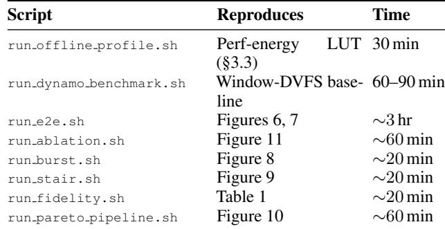

Expected key claims. On the primary setup, BEAM consumes ∼49% of Vanilla vLLM’s energy on the Llama-3.3-70B trace (a ∼30% reduction over Window-DVFS) while sustaining ≥94.9% TTFT and ≥94.5% TBT SLO attainment. The Qwen2.5-32B run on the 4×A100 setup yields ∼53% of Vanilla vLLM’s energy at 98.2% TTFT / 100% TBT attainment. Due to stochastic request arrivals and thermal variation across runs, individual P90 values may differ by ≲5% across repeated trials, but the ordering Vanilla vLLM > Window-DVFS > BEAM in total energy is stable.

## A.7 Experiment customization

All run \*.sh scripts accept --model, --tp, --pp, and (where applicable) --dataset-path, --request-rate, and --duration. The SLO thresholds (TTFTSLO, TBTSLO) and the frequency grid F used by S1/S2 are defined in vllm/v1/core/sched/energy model.py.

To port BEAM to a different GPU, rerun run offline profile.sh to regenerate the pershard LUT.