# LOCALITY-AWARE BEAM SCHEDULING FOR EFFICIENT TEST-TIME COMPUTE WITH A CONSUMER-GRADE GPU

Hsing-Ti Wang 1 Hung-Tso Shiao 1 Chia-Lin Yang 1

## ABSTRACT

Large Language Models (LLMs) are central to modern NLP applications, yet their deployment on consumer-grade GPUs is constrained by limited memory capacity and bandwidth. In typical single-batch inference on local devices, the key–value (KV) cache occupies only a small fraction of total memory, so prior studies have largely focused on model weights. The rise of test-time compute (TTC), however, introduces a new bottleneck: the rapidly expanding KV cache. In TTC methods such as step-wise beam search, concurrent decoding paths cause KV cache size and transfer costs to scale with exploration space, resulting in severe I/O stalls on consumer-grade GPUs. We identify two complementary forms of data locality in TTC workloads. Inter-token locality occurs within each decoding step, as consecutive tokens in the same beam access nearly identical KV cache data. Inter-beam locality arises across decoding steps, as beams that share common prefixes reuse overlapping KV segments. Building on these observations, we propose Locality-Aware Beam Scheduling, which exploits these locality patterns to reduce redundant KV cache transfers. It also employs balanced grouping with prefetching to overlap data movement with computation. Evaluated on OPT-6.7B, LLaMA-2-7B, and Qwen-7B, our method reduces KV cache transfer volume by over 95% and achieves consistent end-to-end speedups of 3.39×–9.72×, 3.60×–8.74×, and 4.17×–7.99×, respectively, compared to layer-wise offloading.

## 1 INTRODUCTION

Large language models (LLMs) have rapidly advanced natural language processing (NLP), driving broad adoption in academia and industry. Representative commercial (e.g., GPT (OpenAI, 2023), Claude (Anthropic, 2024)) and opensource models (e.g., OPT (Zhang et al., 2022), LLaMA (Touvron et al., 2023), Qwen (Yang et al., 2024)) achieve state-of-the-art performance across diverse tasks. While scaling model size and training data has historically yielded consistent performance gains, this trend is now approaching diminishing returns. In response, recent studies have introduced test-time compute (TTC) (Snell et al., 2025; Liu et al., 2025b), which allocates additional computation at inference to explore multiple reasoning paths and select better outputs, yielding notable improvements on complex tasks such as math reasoning and code generation. This marks a shift from static model scaling to computation scaling at inference.

While LLM deployment has traditionally relied on servergrade GPUs in large data centers, rising demands for privacy (Toro et al., 2023), customization (Lyu et al., 2023), and cost- and energy-efficient inference have driven research on deploying LLMs to more accessible and cost-effective hardware, such as consumer-grade GPUs (Sheng et al., 2023; Alizadeh et al., 2023; Song et al., 2024; Liu et al., 2025a; Fan et al., 2025). Unlike data centers focused on highthroughput inference (Yu et al., 2022; Kwon et al., 2023), local deployments on PCs and edge devices emphasize low latency and small or single-batch processing.

The major challenge in deploying LLMs on consumergrade GPUs lies in overcoming the memory capacity wall. LLMs contain billions of parameters and maintain a growing key–value (KV) cache during autoregressive decoding, which together impose substantial demands on GPU memory. To mitigate this issue, prior research has proposed model compression techniques such as quantization (Xiao et al., 2023) and pruning (Ma et al., 2023) to reduce storage overhead. Another widely adopted direction is model offloading, which expands effective GPU memory by transferring selected model components (e.g., weights, activations, or KV caches) to host memory or other external storage. For example, previous studies have explored offloading at different levels of granularity, including layer-wise state migration (Sheng et al., 2023; Gerganov, 2023), expert offloading in Mixture-of-Experts architectures (Eliseev & Mazur, 2023; Yi et al., 2025), and tensor-level activation management (Alizadeh et al., 2023; Song et al., 2024). Collectively, these techniques extend the usable memory of consumer-grade GPUs and form the foundation for enabling large-scale model inference under constrained hardware conditions.

In typical LLM inference on consumer-grade GPUs, workloads are generally executed with a single batch. Under such conditions, the KV cache accounts for only a small portion of total memory consumption, often less than one tenth of the model weights, and has therefore attracted limited research attention. However, the introduction of test-time compute (TTC), often realized through beam search (Snell et al., 2025; Liu et al., 2025b; Zhu et al., 2024), fundamentally changes the inference behavior. Each decoding path maintains its own KV cache, causing memory usage to grow linearly with the number of paths (or beams). As the number of concurrent decoding paths increases, the total KV cache size can easily reach several times that of the model weights, eventually becoming the dominant contributor to overall memory consumption under TTC. Although some offloading frameworks like layer-wise offloading support transferring the KV cache along with model weights, their efficiency deteriorates sharply as the KV cache grows. Other studies leverage KV cache sparsity to limit cache growth by selectively retaining high-importance tokens (Zhang et al., 2023; Lee et al., 2024), but these approaches are designed for long-context scenarios, where token relevance decays over time, and are not applicable to TTC. Meanwhile, datacenter solutions leverage high-bandwidth interconnects such as NVLink or InfiniBand to distribute KV caches across multiple GPUs (Qianli et al., 2025). However, these approaches depend on specialized multi-GPU hardware and interconnects that are not available in consumer environments. Therefore, enabling efficient TTC inference on consumergrade GPUs calls for new solutions to address the emerging KV cache bottleneck.

In this paper, we address the emerging KV cache bottleneck in test-time compute (TTC) on consumer-grade GPUs through path execution scheduling. To the best of our knowledge, this is the first work to systematically highlight and tackle the growing KV cache memory issue in TTC workloads. Our approach exploits KV cache reuse patterns during TTC decoding to determine the execution order of decoding paths, thereby reducing KV cache transfers between the CPU and GPU. Step-wise beam search (Snell et al., 2025; Liu et al., 2025b; Zhu et al., 2024) is a representative TTC method that expands and prunes beams over multi-token segments instead of a single token, making more informed decoding decisions. Based on step-wise beam search, we identify two major forms of data locality. Within each step, beams progress independently and synchronize only at step boundaries, while each beam repeatedly accesses nearly identical KV cache across consecutive tokens, referred to as inter-token locality. The other type of locality is interbeam locality. Across decoding steps, multiple beams share the same prefix tokens, resulting in overlapping KV cache regions that can be reused across beams. Building on these insights, we propose Locality-aware Beam Scheduling, which organizes beam execution to maximize KV reuse and minimize data movement. Beams whose combined KV cache fits within the available GPU memory are grouped together and executed as a unit, keeping their KV data resident until the group completes its decoding step, to exploit intertoken locality. Beams sharing common prefixes are placed in the same group to leverage inter-beam locality. Compared to commonly used step-wise beam search implementations, which advances all beams together, the proposed Localityaware beam scheduling method can reduce the KV cache transfers between CPU and GPU significantly.

In summary, this paper makes the following contributions:

• We conduct the first comprehensive experimental analysis of test-time compute (TTC) workloads and quantitatively highlight the KV cache as a major memory bottleneck. We conducted experiments showing that the KV cache dominates GPU memory consumption under wide-exploration decoding, accounting for more than 70% of total memory usage with 32 decoding paths and over 80% with 64 paths. Under these conditions, layer-wise offloading becomes inefficient, as frequent host–device transfers lead to poor GPU utilization.

• We identify two key forms of data locality in stepwise beam search, namely inter-token and inter-beam locality, which reveal opportunities to optimize path execution order for efficient cache reuse.

• We propose Locality-aware Beam Scheduling, leveraging locality patterns to reduce KV cache transfers, together with a balanced grouping mechanism that prefetches the next group’s KV caches and overlaps data transfers with computation to enhance efficiency. Experiments show over 95% reduction in KV cache transfer volume compared to layer-wise offloading. Across different model architectures, we observe consistent speedups in end-to-end request latency: 3.39×–9.72× on OPT-6.7B, 3.60×–8.74× on LLaMA-2-7B, and 4.17×–7.99× on Qwen-7B, confirming the effectiveness of improving data locality and scheduling across diverse model architectures.

## 2 BACKGROUND

## 2.1 Large Language Model

Transformer Architecture. Modern large language models (LLMs) are built upon the Transformer architecture and typically adopt a decoder-only design (Vaswani et al., 2017). Each decoder layer contains a Multi-Head Attention (MHA) module, which models contextual dependencies among tokens, and a Feed-Forward Network (FFN), which refines token representations through nonlinear transformations.

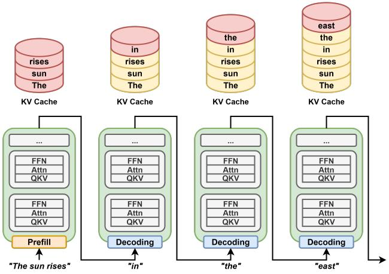  
Figure 1. Auto-regressive generation in a large language model, where the KV cache is initialized during the prefill stage and dynamically expands as new tokens are generated.

Auto-regressive Generation. LLM inference involves two stages: prefill and decoding. In prefill, the model processes the entire prompt to establish context and produce the first token. During decoding, the model autoregressively generates tokens by feeding each new token back into the model to predict the next, as illustrated in Figure 1. Within each layer, attention must reference all previous tokens; recomputing the keys and values for every past token at each iteration would cause redundant computation and quadratic growth in attention cost with respect to sequence length. To avoid this, LLMs store keys and values data as a key–value (KV) cache, enabling efficient incremental decoding. Figure 1 also shows how prefill initializes the cache, while subsequent steps append and reuse KV entries across iterations.

## 2.2 Test-Time Compute

As large language models (LLMs) reach diminishing returns from scaling model size and training data, recent studies have shifted their focus toward improving inference-time performance. Test-time compute (TTC) (Snell et al., 2025; Liu et al., 2025b), also known as test-time scaling, enhances inference by allocating additional computational resources to explore multiple reasoning paths and select the most promising output. This paradigm has demonstrated significant gains in challenging tasks such as mathematical reasoning and code generation, offering a practical alternative to conventional single-path decoding. TTC techniques have been adopted by major industry players such as Google (Snell et al., 2025), OpenAI (OpenAI, 2024), and NVIDIA (Huang, 2025), underscoring the growing influence of this paradigm in modern LLM inference systems.

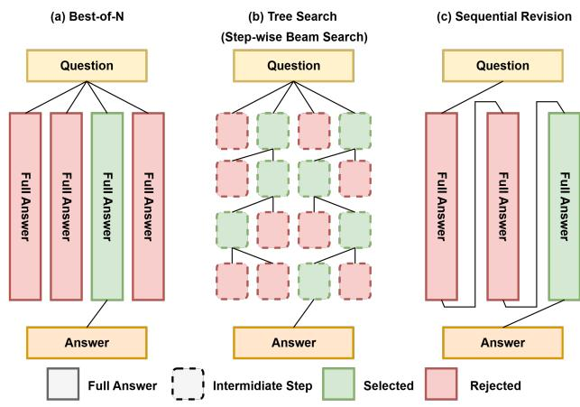  
Figure 2. Representative TTC strategies: (a) Best-of-N, (b) Tree Search, (c) Sequential Revision.

Current TTC methods (Snell et al., 2025), as illustrated in Figure 2, fall into two categories: search-based and revisionbased approaches.

• Search-based methods, such as Best-of-N (BoN) and Tree Search, generate multiple candidates either independently or through incremental path expansion. BoN (Figure 2(a)) selects the best output from a set of complete generations, while Tree Search (Figure 2(b)) evaluates paths during generation and prunes less promising branches to focus computation on stronger ones.

• Revision-based methods, such as Sequential Revision (Figure 2(c)), iteratively refine an initial draft through model-guided self-correction.

Among these approaches, Tree Search offers a good balance between performance and practicality. Unlike BoN, which selects the best output only after generation, Tree Search integrates in-process evaluation for early pruning and efficient computation. Unlike revision-based methods requiring extra training for self-evaluation, it needs no parameter changes and applies easily across models and tasks. Given these advantages, we build upon Tree Search as the foundation of our optimization strategies.

## 2.3 Step-Wise Beam Search

Common decoding in large language models (LLMs) proceeds in a strictly token-by-token manner. In a naive way, Tree Search (or beam search) also treats tokens as the basic branching units (Hugging Face, 2025a). However, evaluating candidates at this fine granularity makes it hard to identify promising reasoning paths, since individual tokens carry limited global information. To overcome this limitation, recent test-time compute (TTC) research (Snell et al., 2025) adopts step-wise beam search, which expands the branching unit from a single token to a multi-token step, defined either as a fixed-length block of tokens (e.g., 32 or 64) or as a semantically determined segment (e.g., \n\n), providing richer context for candidate evaluation.

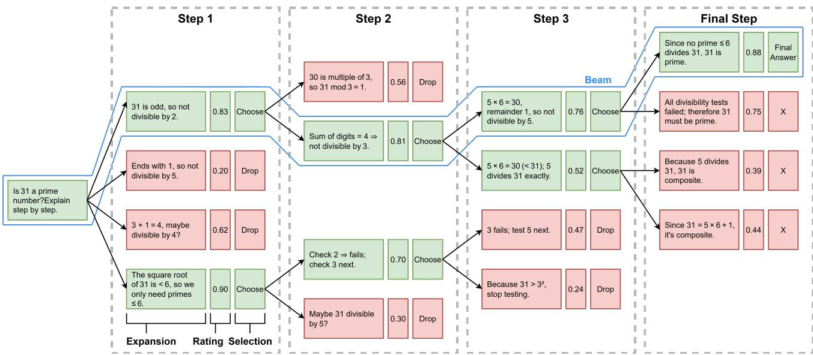  
Figure 3. Overview of step-wise beam search. Each dashed box corresponds to one decoding step, which consists of three phases: expansion, rating, and selection. In this example, the search is configured with beam width = 2 (two candidate sequences generated per beam at each step) and beam size = 2 (two beams retained after selection). Weaker candidates are pruned at the end of each step, while the top beams are propagated forward.

Figure 3 illustrates the step-wise beam search decoding process. Each beam represents an active candidate sequence extended across decoding rounds (blue box). Each dashed box corresponds to a decoding step, within which multiple tokens of each beam are explored independently. The decoding process can be divided into three phases:

• Expansion: From each of the current beam size candidates (2 in example), the model generates beam width new sequences (e.g., 2), producing beam size × beam width candidates (2 × 2 = 4).

• Rating: Each generated sequence is scored according to predefined criteria (e.g., log-probability or task-specific metrics), as shown by the numbers in the boxes.

• Selection: The top beam size candidates are retained (shown in green) to continue into the next step, while the rest are discarded (shown in red).

## 2.4 Memory Offloading in LLM Inference

Deep neural networks (DNNs) have become one of the most important classes of GPU workloads. However, their memory footprints often far exceed the GPU memory capacity. To prevent out-of-memory errors during execution, one popular solution is to use the host memory as external memory for swapping data in and out of GPU memory. Several studies have explored such offloading techniques (Hildebrand et al., 2020; Peng et al., 2020; Ren et al., 2021), which dynamically offload inactive data to fit large workload within limited GPU memory.

With the emergence of large language models (LLMs), this memory challenge has become even more critical. LLMs not only contain billions of parameters but also maintain a growing key–value (KV) cache during autoregressive decoding, further amplifying the memory demand. To address these requirements, a variety of offloading mechanisms have been proposed, such as leveraging activation sparsity to reduce weight transfer volume (Sheng et al., 2023; Alizadeh et al., 2023), or exploiting conditional computation in Mixture-of-Experts (MoE) architectures to offload inactive experts (Eliseev & Mazur, 2023; Xue et al., 2024; Yi et al., 2025). Among these approaches, one of the most common and generally applicable techniques is layer-wise offloading (Aminabadi et al., 2022; Gerganov, 2023; Sheng et al., 2023), which has been widely adopted in inference frameworks such as Hugging Face Transformers (Hugging Face, 2025b), llama.cpp (ggml-org, 2025), Deep-

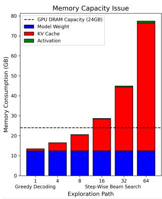  
(a)

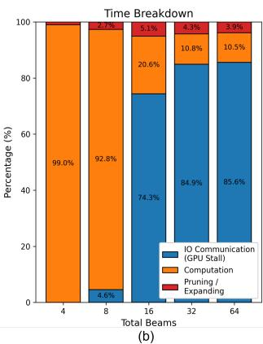  
Figure 4. (a) GPU memory usage breakdown and (b) runtime breakdown of step-wise beam search under different beam numbers. The results are obtained using OPT-6.7B with a sequence length of 2048 on an RTX 4090 GPU.

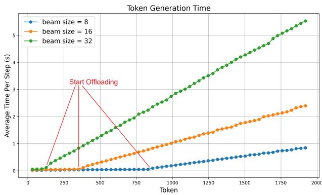  
Figure 5. Average decoding latency per step under step-wise beam search with different beam numbers. The results are obtained using OPT-6.7B with a sequence length of 2048 on an RTX 4090 GPU.

Speed (deepspeedai, 2025), and FlexGen (FMInference, 2025), making it a reasonable reference point for evaluating optimization methods.

In layer-wise offloading, model weights and KV caches are swapped between GPU and CPU on a per-layer basis. When all tensors fit in GPU memory, inference achieves minimal latency but limited scalability; with offloading, inactive layers are stored in host or flash memory and fetched on demand, reducing memory pressure but adding transfer latency. Prefetching overlaps data movement with computation in the preceding layer to hide latency, yet performance remains constrained by transfer volume and interconnect bandwidth. In this work, layer-wise offloading serves as our baseline for comparison.

## 3 MOTIVATION: KV CACHE PRESSURE IN TEST-TIME COMPUTE

Test-time compute (TTC) strategies have gained widespread adoption for enhancing large language model (LLM) inference accuracy by exploring multiple generation paths. Recent works (Snell et al., 2025; Liu et al., 2025b) have shown that inference accuracy continues to scale effectively with increased beam size up to 256. However, maintaining multiple candidate generation paths simultaneously leads to a substantial increase in memory pressure. Figure 4(a) and (b) show the GPU memory composition and runtime breakdown under different beam numbers 1. The KV cache rapidly dominates total memory usage, while model weights remain constant and activations contribute minimally. For instance, with 16 beam numbers, the KV cache already accounts for over 55% of total memory usage; at 32, it exceeds 70%; and at 64, it surpasses 80%. Once the overall data footprint exceeds the GPU’s 24 GB capacity, the system begins to offload portions of the KV cache to host memory, leading to longer GPU stall times. As shown in Figure 4(b), I/O stalls from host–device data transfers quickly dominate total runtime, accounting for up to 85% of overall latency under 64 beams. This stall time represents GPU idle waiting rather than useful computation or preprocessing, underscoring the severe inefficiency of existing layer-wise offloading under wide-exploration TTC workloads. We further analyze how decoding latency evolves with sequence length. Figure 5 shows the average time per decoding step, which remains relatively stable at first but rises sharply once the total KV cache size exceeds GPU memory capacity and offloading is triggered. This sharp increase in latency confirms that the performance bottleneck originates from host–GPU I/O transfers after the KV cache can no longer fit entirely in device memory.

## 4 LOCALITY-AWARE BEAM SCHEDULING

## 4.1 Beam Scheduling Strategy

Step-wise beam search generates multiple tokens before performing candidate pruning, expanding each decoding step into a short sequence rather than a single token. Therefore, the execution order of beams within a step can be flexibly rearranged without affecting inference accuracy. Figure 6(a) illustrates the required KV cache for decoding the token for 4 beams in a step. As shown in this example, generating token j-th requires accessing the accumulated KV cache from all previously decoded tokens along the same beam path. In other words, the KV cache exhibits strong temporal reuse across consecutive tokens, referred to as inter-token locality in this paper. However, the KV cache reuse cannot be well utilized with straightforward implementation, where all beams advance together token by token (Figure 6(b)), if GPU memory cannot hold all KV caches. When offloading is required, parts of the KV cache required for generating token i could be swapped out already, so they need to be reloaded again into the GPU.

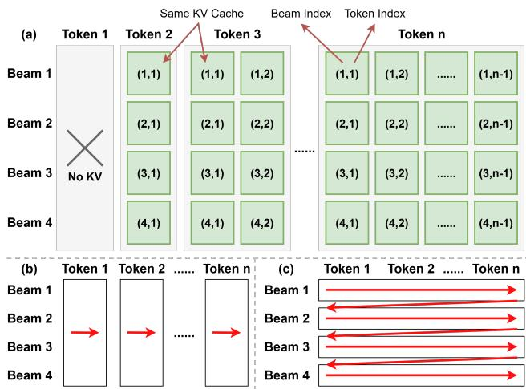  
Figure 6. (a) Generating a new token requires all previously accumulated KV cache along the same beam. (b) In a token-by-token manner, all beams advance together, limiting KV reuse when offloading occurs. (c) In a beam-by-beam manner, each beam (or beam group) completes decoding before eviction, enabling more efficient KV reuse.

The central idea behind the proposed locality-aware beam scheduling is to schedule decoding in a beam-by-beam manner, allowing each beam’s KV cache to be fully reused before eviction (Figure 6(c)). Beams whose combined KV cache fits within the available memory budget are grouped into a beam group, which is executed as a unit with its KV cache kept resident until the group completes its decoding step. For example, if 4 GB of GPU memory is allocated for the KV cache and each beam requires 0.6 GB, up to six beams can form a group; thus, a total of twelve beams would be scheduled as two groups of six.

To quantify the impact of this reordering strategy, we develop an analytical model comparing the data movement of a conventional token-by-token implementation with our proposed approach. The model is constructed based on a mathematical simulation, and the symbols used in our analysis are summarized in Table 1. In the token-by-token strategy, the model assumes that when GPU memory is insufficient to hold all KV caches, data is offloaded to host memory on a per-layer basis while retaining as many layer caches as possible in GPU memory (Eq. 1). During decoding, offloaded KV caches are reloaded for each new token (Eq. 2), and the total transfer volume is accumulated across the entire sequence (Eq. 3). In our proposed scheduling strategy, each beam group’s KV cache is transferred only once per decoding step (Eq. 4), and the total data movement is computed on a per-step basis (Eq. 5). As illustrated in Figure 7, our method significantly reduces KV cache transfer overhead, with greater savings observed under larger beam sizes and longer decoding steps. For instance, with 64 beams, the total data movement drops from 53,012 GB in the baseline to 2,052 GB, 1,044 GB, and 540 GB for step lengths of 32, 64, and 128, respectively.

Table 1. Notations used in the KV cache transfer analysis.  
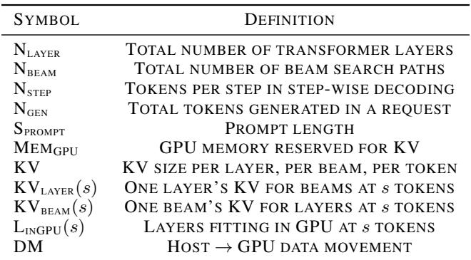

Token-by-Token Strategy.

$$
\tag{1}
$$

$$
\tag{2}
$$

$$
\tag{3}
$$

Beam Scheduling Strategy.

$$
\tag{4}
$$

$$
\tag{5}
$$

Implementing this scheduling mechanism requires deciding the number of beams per group (#Beam) and selecting which beams to form each group (BeamSet). Because GPU memory usage varies during execution due to temporary tensors and reserved buffers, #Beam cannot be determined in advance. Instead, we determine it dynamically: at each decoding step, we query the GPU runtime for current memory usage and adapt #Beam according to the remaining memory budget. To decide BeamSet, our strategy is to exploit inter-beam locality across decoding steps, as illustrated in Figure 8. This example shows the tree structure after step 4 pruning in step-wise beam search. Beams with longer shared prefixes exhibit higher KV cache reuse.

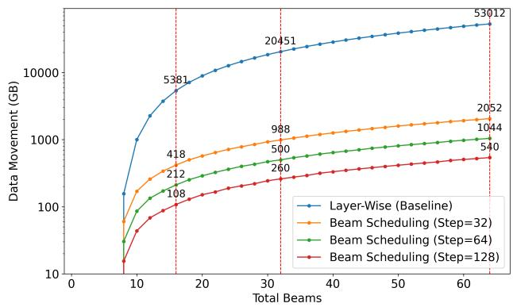  
Figure 7. Theoretical host-to-GPU KV cache data movement under different offloading strategies, assuming OPT-6.7B, sequence length of 2048, and 7 GB GPU memory reserved for KV cache.

So in this example, beam 1-4 have the same KV contents before Step 4. If these beams were scheduled in different groups, the overlapping KV cache segments would need to be reloaded multiple times from host memory. Therefore, beams with common prefixes are grouped together to maximize cache reuse and minimize redundant transfers. 2 An optimal grouping solution would require exhaustively enumerating all beam assignments, but the search space grows exponentially with the number of beams, making this approach infeasible. Therefore, we adopt a greedy construction algorithm in this work. Starting from any unassigned beam, we iteratively add other beams that maximize overlap with the group’s current prefix until the GPU memory budget is reached. The process is then repeated for the remaining beams until all have been assigned to groups. We summarize the overall procedure for #Beam selection and BeamSet construction in each decoding step in Algorithm 1.

The offloading mechanism operates on a per-group basis and is triggered once the KV cache size exceeds the available GPU memory. When decoding a beam group, its corresponding KV cache data are loaded from host memory to the GPU, while newly generated KV entries are continuously written back to host memory during token generation to keep both sides synchronized. This process iterates over beam groups step by step during decoding.

## 4.2 Prefetching Technique

Prefetching is commonly employed alongside offloading to hide CPU–GPU data transfer latency. To enable prefetching, a portion of GPU memory must be reserved as a prefetch buffer, which reduces the memory available for active computation and results in fewer beams being scheduled per group. However, scheduling smaller beam groups introduces additional GPU execution overheads due to the way CUDA launches and manages kernels. First, it increases the number of kernel launches. In CUDA, each decoding operation (e.g., attention, feed-forward, normalization) is executed by a sequence of GPU kernels. When all beams are executed together, this kernel sequence is launched once. If the same workload is divided into m smaller groups, the identical sequence must be launched m times, since each group has distinct input tensors and requires its own kernel configuration and CPU-side setup before execution. These repeated launches introduce additional overhead. Second, each additional kernel launch also requires reloading data from global GPU memory. In CUDA’s execution model, every kernel operates independently: once a kernel completes, its on-chip caches and registers are released for use by the next kernel. Consequently, subsequent launches must reload the same model weights from DRAM into on-chip memory before computation begins. Although the arithmetic workload remains unchanged, this repeated data loading is inherent to CUDA’s per-launch execution behavior and accumulates significant latency as the number of groups increases.

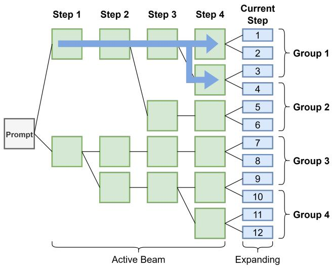  
Figure 8. Tree structure after step 4 pruning. Beams with shared prefixes are grouped together to transfer each overlapping KV cache segment only once from host memory. As shown by the blue arrows, beam group 1 reuses the KV cache of their shared prefix instead of reloading identical data for each beam. (GPU capacity = 3 beams, beam size = 6, beam width = 2)

To better understand the system behavior after applying the proposed locality-aware beam scheduling, we analyze the GPU runtime characteristics to evaluate whether the potential gains can offset the computation overhead. We observe that the GPU stall time caused by CPU–GPU data transfers is significantly reduced, dropping from 70%–90% to below 15% of the total runtime, as shown in Figure 11. Therefore, to balance computation efficiency and transfer overlap, we adopt a conservative prefetching design. Instead of reserving a fixed portion of GPU memory exclusively for prefetching, we maintain the same number of groups but distribute beams more evenly across groups, a strategy we refer to as Balanced Grouping.

Algorithm 1 Beam Scheduling   
1: Input:   
2: num beam: total number of beams   
3: kv blocks: KV cache blocks used by each beam   
4: Output:   
5: groups: list of grouped beams   
6:   
7: budget ← get budget()   
8: beam size ← get beam size()   
9: group size ← min{num beam, ⌊budget/beam size⌋}   
10: unused ← {1, 2, . . . , num beam}   
11: groups ← [ ]   
12:   
13: while unused ̸= ∅ do   
14: cur ← ∅   
15: while |cur| < group size and unused ̸= ∅ do   
16: U ← S kv blocks[j]   
j∈cur   
17: best ← arg max kv blocks[i] ∩ U   
i∈unused   
18: cur ← cur ∪ {best}   
19: unused ← unused − {best}   
20: end while   
21: append cur to groups   
22: end while   
23: return groups

At each decoding step, we first determine the minimum number of rounds (groups) required to process all beams based on the GPU memory budget and the KV-cache size per beam. If the GPU can accommodate at most B beams simultaneously and the total number of beams is N , the minimum number of rounds is ⌈N/B⌉. We keep this round count unchanged to avoid additional kernel-launch overhead, since increasing the number of rounds would require launching the same sequence of CUDA kernels more times. We then distribute beams as evenly as possible across rounds. For example, if there are 16 beams and the GPU can hold 7 beams per round, the minimum is ⌈16/7⌉ = 3 rounds, and Balanced Grouping assigns beam counts of [5, 5, 6] instead of a greedy packing such as [7, 7, 2].

After determining the per-round beam counts, we apply Algorithm 1 to decide which beams are grouped together, with the modification that the group size constraint is determined by these balanced limits rather than simply packing to the maximum GPU capacity.

When executing group i, we prefetch KV-cache data for group i + 1. The number of beams that can be prefetched is (B − |Gi|), where B is the GPU capacity and |Gi| is the size of the current group. This allows a portion of the next group’s KV cache to be transferred while computation proceeds.

Balanced Grouping introduces a trade-off between locality preservation and prefetch overlap. Smaller and more evenly sized groups may slightly reduce KV-cache locality within each group, but they create headroom to prefetch part of the next group’s KV cache during the current group’s computation. Our evaluation shows that the resulting prefetch benefit outweighs the locality loss.

## 5 EVALUATION

## 5.1 Experimental Setup

All experiments were conducted on a workstation with an Intel Core i9-14900KF CPU, an NVIDIA RTX 4090 GPU (24 GB VRAM), and 128 GB DDR4 memory connected via PCIe Gen4 x8, representing a consumer-grade setup. In edge environments, GPU memory often restricts deployment to relatively small models, which may lag behind larger models in complex tasks. Test-time compute (TTC) provides an attractive alternative by improving accuracy through additional inference-time computation rather than increasing model size. Therefore, in this work we focus on three small LLMs whose weights fit within GPU memory: OPT-6.7B (Zhang et al., 2022), LLaMA-2-7B (Touvron et al., 2023), and Qwen-7B (Yang et al., 2024). To stress memory usage, the prompt length is fixed at 128 tokens and 1920 output tokens are generated. Step-wise beam search is used with 4–64 total beams, where the beam width is 2 and beam size 2–32. We examine step lengths of 32, 64, and 128 tokens, which define the synchronization granularity in step-wise beam search.

Our evaluation compares three execution strategies:

• In-GPU: The entire model state and KV cache are kept in GPU memory without any offloading.

• Layer-wise offloading: KV caches that exceed GPU capacity are evicted to host memory on a per-layer basis and reloaded before each layer’s computation, following token-by-token execution that causes frequent transfers.

• Locality-aware Beam Scheduling (LBS): Our approach improves offloading efficiency by exploiting KV cache locality.

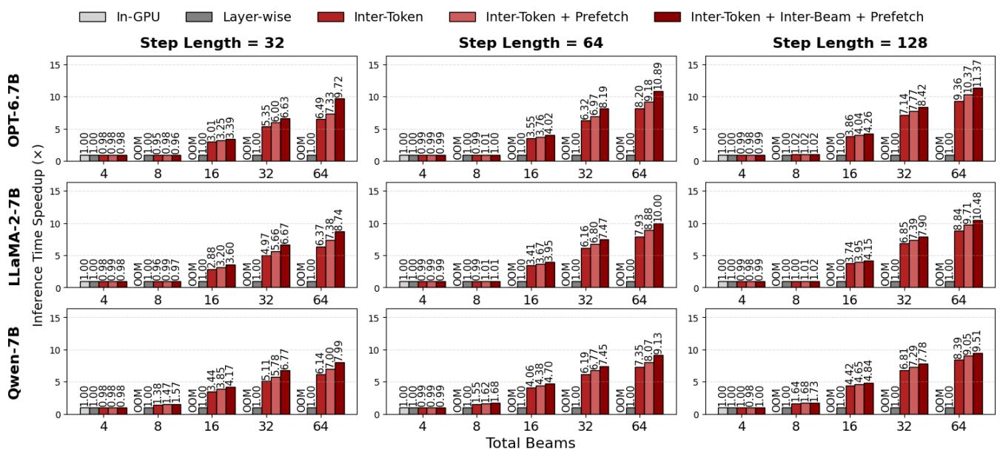  
Figure 9. End-to-end inference time speedup normalized to the layer-wise offloading baseline. Compare the effect of our optimizations, highlighting their individual contributions to overall efficiency improvement. “OOM” indicates out-of-memory cases in the in-GPU baseline.

We further perform a study to isolate the effect of each component, including inter-token locality (executing each beam group to completion within a decoding step), interbeam locality (grouping beams with overlapping prefixes to reuse shared KV segments), and prefetching (overlapping KV cache transfers with computation through balanced grouping).

## 5.2 End-to-End Inference Performance

To validate the effectiveness of our proposed design, we conduct end-to-end inference experiments across different model architectures, beam sizes, and step lengths. Figure 9 presents the speedup over the layer-wise offloading baseline, with each variant showing the effect of the proposed components.

At small beam sizes, different methods exhibit nearly identical performance since GPU memory can accommodate the full KV cache and offloading is seldom triggered. However, as the beam size increases, the KV cache grows proportionally and layer-wise offloading must repeatedly transfer large volumes of KV data at every token, resulting in significant stalls. Our method avoids such redundant transfers. At larger beams, our method achieves up to 9.72× speedup on OPT-6.7B (3.39×–9.72× across beam sizes), 8.74× on LLaMA-2-7B (3.60×–8.74×), and 7.99× on Qwen-7B (4.17×–7.99×). Step length also plays an important role. Longer steps provide more opportunities for intra-step KV cache reuse, since each group can advance further before eviction is required. Consequently, longer step length consistently outperforms shorter configurations, showing that more intra-step computation amplifies the benefits of our beam scheduling strategy. Overall, the results show that each optimization incrementally reduces I/O stalls and improves performance, enabling robust scalability across models and beam settings under test-time compute workloads.

## 5.3 KV Cache Movement Analysis

We evaluate the reduction of host–to–GPU KV cache transfers considering two factors: (i) varying step lengths for inter-token locality and (ii) prefix reuse for inter-beam locality. Figure 10(a) shows transfer volume under different step lengths. Compared with the layer-wise baseline, exploiting inter-token locality cuts transfers to below 5% of the original volume—on OPT-6.7B with 64 beams, to 3.7%, 1.8%, and 0.9% for step lengths of 32, 64, and 128, respectively. Similar trends appear on LLaMA-2-7B and Qwen-7B. These results match our analytical model (Figure 7), confirming that Beam Scheduling effectively suppresses redundant KV transfers, with benefits growing at larger beams and longer steps. Figure 10(b) further isolates inter-beam locality by comparing configurations with and without prefix reuse. Enabling it yields more than a 2× reduction in transfer volume, highlighting that avoiding redundant transfers of shared KV segments is key to scaling step-wise beam search to wider exploration.

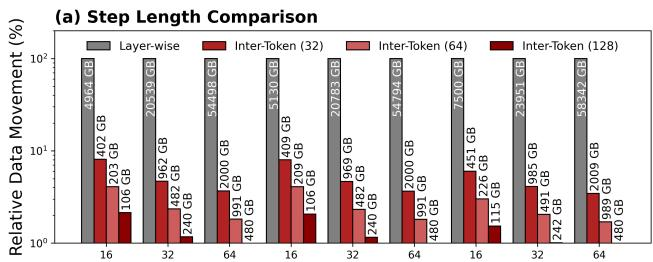

(b) Prefix Reuse Comparison  
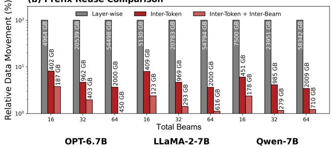

Figure 10. KV cache transfer volume analysis. (a) Impact of intertoken locality across different step lengths. (b) Impact of interbeam locality. Transfer volumes are normalized to the layer-wise offloading baseline, with absolute values (in GB) shown on bars.  
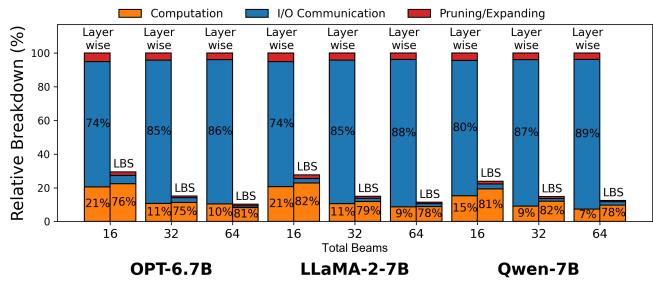  
Figure 11. Time breakdown normalized to the layer-wise total runtime, measured with step length 32.

## 5.4 Decoding Time Breakdown and I/O Analysis

To analyze the source of efficiency gains, we decompose end-to-end runtime into computation, I/O communication (non-overlapped GPU stall), and pruning/expansion. As shown in Figure 11, layer-wise offloading is dominated by I/O communication, occupying 70%–90% of total runtime across models and beam sizes. In comparison, our localityaware beam scheduling reduces I/O overhead to below 15%, restoring computation as the dominant cost. For example, on OPT-6.7B with 64 beams, I/O drops from 86% to 10%, with similar trends on LLaMA-2-7B and Qwen-7B, demonstrating that improved KV cache locality alleviates the offloading bottleneck. To further isolate the sources of these improvements, Figure 12 reports an ablation study. Leveraging inter-token locality alone cuts I/O time to 5%–10% of the baseline by removing redundant KV transfers. Prefetching overlaps data movement with computation for additional reduction, and inter-beam locality lowers the remaining I/O to below 2% in several configurations. Overall, these results show that locality-aware scheduling rebalances runtime toward computation, making the execution closer to an in-GPU scenario.

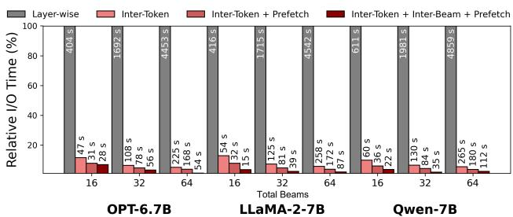  
Figure 12. Ablation study of I/O time. The y-axis shows I/O time normalized to the layer-wise baseline, with absolute times (s) annotated. All results are measured under step length 32.

## 5.5 Evaluation on Other GPU Architectures

To evaluate the generality of our approach across different hardware configurations, we conduct additional experiments on a less powerful GPU, the NVIDIA RTX 3080 Ti (12 GB VRAM). Due to its smaller memory capacity, we use smaller models (OPT-2.7B and Qwen-4B) for end-to-end inference evaluation.

Figure 13 shows the speedup over the layer-wise offloading baseline. Similar to the results on the RTX 4090, our method consistently improves performance as beam size increases, achieving up to a 6.85× speedup on OPT-2.7B and 3.52× on Qwen-4B.

OPT-2.7B shows more performance improvement over Qwen-4B because its smaller model size leaves more GPU memory available for KV caches, increasing the headroom for grouping and prefetching.

## 6 RELATED WORK

Model Compression. Many studies reduce LLM parameter footprints via compression. Quantization (Xiao et al., 2023) converts floating-point weights to low-bit formats, while pruning (Ma et al., 2023) removes low-importance weights or neurons, yielding smaller and faster models. These methods shrink parameter memory but do not mitigate runtime growth from intermediate states.

LLM Sparsity. Another class of approaches exploits sparsity to reduce runtime cost. Activation sparsity (Song et al., 2024; Alizadeh et al., 2023) skips computations involving zero or near-zero activations, reducing both computation and memory traffic. KV sparsity instead targets the key-value (KV) cache, which grows linearly with sequence length and batch size in autoregressive decoding. To mitigate this, several studies have proposed token eviction mechanisms based on KV sparsity (Zhang et al., 2023; Lee et al., 2024), particularly effective in long-context scenarios where the importance of earlier tokens diminishes. However, such sparsity is less pronounced in short sequences, limiting the applicability of these approaches to broader use cases.

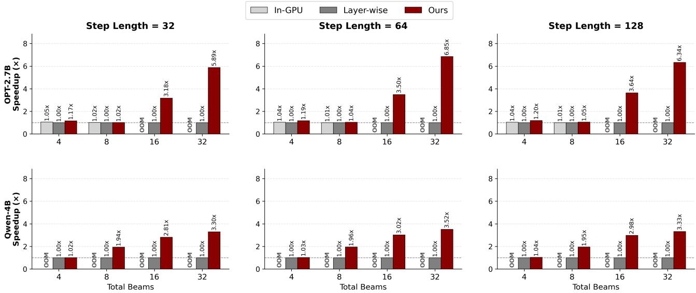  
Figure 13. End-to-end inference speedup on RTX 3080 Ti normalized to the layer-wise offloading baseline.

Data-center KV cache optimizations. In data center deployments, several system-level KV cache optimizations have also been explored (Zhong et al., 2024; Qin et al., 2025). These include overlapping prefill and decoding phases across concurrent requests to hide KV transfer latency, and leveraging high-bandwidth interconnects (e.g., NVLink or InfiniBand) to shard and share KV caches across GPUs, thereby expanding available memory. Nevertheless, such solutions often depend on specialized hardware and are not readily applicable to resource-constrained environments.

Offloading. When GPU memory cannot accommodate the full model state, offloading parts of the weights or KV cache to host memory is a widely adopted solution (Aminabadi et al., 2022; Gerganov, 2023; Sheng et al., 2023). As discussed in Section 2.4, this strategy enables inference under tight memory budgets but incurs substantial PCIe transfer overhead, making it a critical performance bottleneck on consumer-grade GPUs.

Concurrently with our work, FastTTS (Chen et al., 2026) addresses test-time scaling in memory-constrained settings by leveraging data reuse to accelerate inference. FastTTS is built on top of the vLLM serving framework, whereas our approach adopts layer-wise offloading with prefetching as a general and widely used baseline.

## 7 CONCLUSION AND FUTURE WORKS

The rise of test-time compute (TTC) poses new challenges for inference on consumer GPUs, where the enlarged exploration space causes rapid KV cache growth and a dominant memory bottleneck. We address this issue with Locality-Aware Beam Scheduling, which exploits inter-token and inter-beam locality to manage KV caches efficiently under limited GPU memory. Our approach reorders computation to maximize data reuse, minimizes redundant transfers, and further employs prefetching to hide remaining I/O latency. Extensive experiments across various models and configurations demonstrate that our method consistently achieves substantial latency reduction.

This work primarily focuses on KV cache offloading, assuming that model weight fits in GPU memory. Our approach is orthogonal to existing weight-offloading systems such as PowerInfer (Song et al., 2024) and llama.cpp (Gerganov, 2023), which place model weights on the CPU and transfer only small activation tensors during execution. An interesting direction for future work is to jointly optimize the allocation of GPU memory between model weights and KV caches under combined weight and KV offloading. In addition, integrating our scheduling framework into end-to-end TTC pipelines that incorporate verifiers or process reward models (PRMs) is an important direction for future research.

## ACKNOWLEDGEMENTS

This work was supported in part by research grants from the National Science and Technology Council of Taiwan (112-2221-E-002-116-MY3), and sponsored by Macronix Inc., Hsin-chu, Taiwan (115HT912003).

## REFERENCES

Alizadeh, K., Mirzadeh, I., Belenko, D., Khatamifard, K., Cho, M., Mundo, C. C. D., Rastegari, M., and Farajtabar, M. Llm in a flash: Efficient large language model inference with limited memory. arXiv preprint arXiv:2312.11514, 2023.

Aminabadi, R. Y., Rajbhandari, S., Awan, A. A., Li, C., Li, D., Zheng, E., Ruwase, O., Smith, S., Zhang, M., Rasley, J., et al. Deepspeed-inference: enabling efficient inference of transformer models at unprecedented scale. In Proceedings of the International Conference on High Performance Computing, Networking, Storage and Analysis (SC 22). IEEE Press, 2022.

Anthropic. Claude ai, 2024. URL https://claude. ai/. Accessed: 2025-08.

Chen, H. M., Mo, Z., Lu, G., Liang, S., Ma, L., Luk, W., and Fan, H. Fasttts: Accelerating test-time scaling for edge llm reasoning, 2026. URL https://arxiv.org/ abs/2509.00195.

deepspeedai. Deepspeed. https://github.com/ deepspeedai/DeepSpeed, 2025. Accessed: 2025- 08.

Eliseev, A. and Mazur, D. Fast inference of mixture-ofexperts language models with offloading. arXiv preprint arXiv:2312.17238, 2023.

Fan, J., Zhang, Y., Li, X., and Nikolopoulos, D. S. Parallel cpu-gpu execution for llm inference on constrained gpus. arXiv preprint arXiv:2506.03296, 2025.

FMInference. Flexgen. https://github.com/ FMInference/FlexLLMGen, 2025. Accessed: 2025- 08.

Gerganov, G. Llm inference in c/c++, 2023. URL https: //github.com/ggml-org/llama.cpp. Accessed: 2025-08.

ggml-org. llama.cpp. https://github.com/ ggml-org/llama.cpp, 2025. Accessed: 2025-08.

Hildebrand, M., Khan, J., Trika, S., Lowe-Power, J., and Akella, V. Autotm: Automatic tensor movement in heterogeneous memory systems using integer linear programming. In Proceedings of the 25th International

Conference on Architectural Support for Programming Languages and Operating Systems (ASPLOS 20), pp. 875–890, New York, NY, USA, 2020. Association for Computing Machinery. doi: 10.1145/3373376.3378465.

Huang, J. Ces 2025 keynote: Nvidia, 2025. URL https: //www.ces.tech/videos/nvidia-keynote/. Accessed: 2025-08.

Hugging Face. Hugging face transformers documentation: Generation strategies. https: //huggingface.co/docs/transformers/ generation\_strategies, 2025a. Accessed: 2025-08.

Hugging Face. Hugging face transformers. https: //github.com/huggingface/transformers, 2025b. Accessed: 2025-08.

Kwon, W., Li, Z., Zhuang, S., Sheng, Y., Zheng, L., Yu, C. H., Gonzalez, J., Zhang, H., and Stoica, I. Efficient memory management for large language model serving with pagedattention. In Proceedings of the 29th Symposium on Operating Systems Principles (SOSP 23), pp. 611–626, New York, NY, USA, 2023. Association for Computing Machinery.

Lee, W., Lee, J., Seo, J., and Sim, J. InfiniGen: Efficient generative inference of large language models with dynamic KV cache management. In 18th USENIX Symposium on Operating Systems Design and Implementation (OSDI 24), pp. 155–172, Santa Clara, CA, 2024. USENIX Association.

Liu, L., Zhao, S., Li, B., Ren, H., Xu, Z., Wang, M., Li, X., Han, Y., and Wang, Y. Make llm inference affordable to everyone: Augmenting gpu memory with ndp-dimm. In 2025 IEEE International Symposium on High Performance Computer Architecture (HPCA 25), pp. 1751– 1765, 2025a. doi: 10.1109/HPCA61900.2025.00129.

Liu, R., Gao, J., Zhao, J., Zhang, K., Li, X., Qi, B., Ouyang, W., and Zhou, B. Can 1b llm surpass 405b llm? rethinking compute-optimal test-time scaling. In Proceedings of the ICLR Workshop on Reasoning and Planning for Large Language Models, 2025b.

Lyu, H., Jiang, S., Zeng, H., Xia, Y., Wang, Q., Zhang, S., Chen, R., Leung, C., Tang, J., and Luo, J. Llm-rec: Personalized recommendation via prompting large language models. arXiv preprint arXiv:2307.15780, 2023.

Ma, X., Fang, G., and Wang, X. Llm-pruner: On the structural pruning of large language models. arXiv preprint arXiv:2305.11627, 2023.

OpenAI. Gpt-4 technical report. arXiv preprint arXiv:2303.08774, 2023.

OpenAI. Learning to reason with llms, 2024. URL https://openai.com/zh-Hant/index/ learning-to-reason-with-llms/. Accessed: 2025-08.

Peng, X., Shi, X., Dai, H., Jin, H., Ma, W., Xiong, Q., Yang, F., and Qian, X. Capuchin: Tensor-based gpu memory management for deep learning. In Proceedings of the 25th International Conference on Architectural Support for Programming Languages and Operating Systems (ASPLOS 20), pp. 891–905. Association for Computing Machinery, 2020. doi: 10.1145/3373376.3378505.

Qianli, L., Zicong, H., Fahao, C., Peng, L., and Song, G. Mell: Memory-efficient large language model serving via multi-gpu kv cache management. arXiv preprint arXiv:2501.06709, 2025.

Qin, R., Li, Z., He, W., Cui, J., Ren, F., Zhang, M., Wu, Y., Zheng, W., and Xu, X. Mooncake: Trading more storage for less computation — a KVCache-centric architecture for serving LLM chatbot. In 23rd USENIX Conference on File and Storage Technologies (FAST 25), pp. 155–170, Santa Clara, CA, 2025. USENIX Association.

Ren, J., Luo, J., Wu, K., Zhang, M., Jeon, H., and Li, D. Sentinel: Efficient tensor migration and allocation on heterogeneous memory systems for deep learning. In 2021 IEEE International Symposium on High-Performance Computer Architecture (HPCA 21), pp. 598–611, 2021. doi: 10.1109/HPCA51647.2021.00057.

Sheng, Y., Zheng, L., Yuan, B., Li, Z., Ryabinin, M., Chen, B., Liang, P., Re, C., Stoica, I., and Zhang, C. FlexGen: High-throughput generative inference of large language models with a single GPU. In Proceedings of the 40th International Conference on Machine Learning (PMLR), volume 202, pp. 31094–31116. PMLR, 2023.

Snell, C., Lee, J., Xu, K., and Kumar, A. Scaling llm test-time compute optimally can be more effective than scaling parameters for reasoning. In International Conference on Learning Representations (ICLR 25), 2025.

Song, Y., Mi, Z., Xie, H., and Chen, H. Powerinfer: Fast large language model serving with a consumer-grade gpu. In Proceedings of the ACM SIGOPS 30th Symposium on Operating Systems Principles (SOSP 24), pp. 590–606, New York, NY, USA, 2024. Association for Computing Machinery.

Toro, I. M., Vico, D. G., and Orgaz, P. Privategpt, 2023. URL https://github.com/imartinez/ privateGPT/. Accessed: 2025-08.

Touvron, H., Martin, L., Stone, K., Albert, P., Almahairi, A., Babaei, Y., Bashlykov, N., Batra, S., Bhargava, P.,

Bhosale, S., et al. Llama 2: Open foundation and finetuned chat models. arXiv preprint arXiv:2307.09288, 2023.

Vaswani, A., Shazeer, N., Parmar, N., Uszkoreit, J., Jones, L., Gomez, A. N., Kaiser, L., and Polosukhin, I. Attention is all you need. In Neural Information Processing Systems (NIPS), 2017.

Xiao, G., Lin, J., Seznec, M., Wu, H., Demouth, J., and Han, S. Smoothquant: accurate and efficient post-training quantization for large language models. In Proceedings of the 40th International Conference on Machine Learning (ICML 23). JMLR.org, 2023.

Xue, L., Fu, Y., Lu, Z., Mai, L., and Marina, M. Moe-infinity: Efficient moe inference on personal machines with sparsity-aware expert cache. arXiv preprint arXiv:2401.14361, 2024.

Yang, A., Yang, B., Hui, B., Zheng, B., Yu, B., Zhou, C., Li, C., Li, C., Liu, D., Huang, F., et al. Qwen2 technical report. arXiv preprint arXiv:2407.10671, 2024.

Yi, R., Guo, L., Wei, S., Zhou, A., Wang, S., and Xu, M. Edgemoe: Empowering sparse large language models on mobile devices. arXiv preprint arXiv:2308.14352, 2025.

Yu, G.-I., Jeong, J. S., Kim, G.-W., Kim, S., and Chun, B.- G. Orca: A distributed serving system for Transformer-Based generative models. In 16th USENIX Symposium on Operating Systems Design and Implementation (OSDI 22), pp. 521–538, Carlsbad, CA, 2022. USENIX Association.

Zhang, S., Roller, S., Goyal, N., Artetxe, M., Chen, M., Chen, S., Dewan, C., Diab, M., Li, X., Lin, X. V., et al. Opt: Open pre-trained transformer language models. arXiv preprint arXiv:2205.01068, 2022.

Zhang, Z., Sheng, Y., Zhou, T., Chen, T., Zheng, L., Cai, R., Song, Z., Tian, Y., Re, C., Barrett, C., et al. H2o: Heavy-hitter oracle for efficient generative inference of large language models. In 37th Conference on Neural Information Processing Systems (NIPS), 2023.

Zhong, Y., Liu, S., Chen, J., Hu, J., Zhu, Y., Liu, X., Jin, X., and Zhang, H. DistServe: Disaggregating prefill and decoding for goodput-optimized large language model serving. In 18th USENIX Symposium on Operating Systems Design and Implementation (OSDI 24), pp. 193–210, Santa Clara, CA, 2024. USENIX Association.

Zhu, T., Zhang, K., Xie, J., and Su, Y. Deductive beam search: Decoding deducible rationale for chainof-thought reasoning. In Conference on Language Model (COLM), 2024.