# WHEN ENOUGH IS ENOUGH: RANK-AWARE EARLY TERMINATION FOR VECTOR SEARCH

Jianan Lu 1 Asaf Cidon 2 Michael J. Freedman 1

## ABSTRACT

Graph-based vector search underpins modern LLM applications such as retrieval-augmented generation (RAG), but its efficiency is increasingly constrained by disk I/O. Existing systems continue searching long after discovering the higher-ranked (i.e., more valuable) results for downstream applications. We present Terminus, a rank-aware early termination mechanism that dynamically aligns I/O spending with application utility. Terminus models per-I/O search utility using a rank-weighted function and terminates once additional I/Os yield negligible utility gains. By adaptively terminating search based on rank-aware signals, Terminus improves recovery of top-ranked results that matter most for downstream tasks, achieving a better performance–accuracy trade-off. It delivers up to 1.4× higher throughput at the same accuracy target compared to existing early termination schemes, and up to 3.2× higher throughput relative to a baseline without early termination, with minimal impact on RAG accuracy.

## 1 INTRODUCTION

Vector search (Indyk & Motwani, 1998) has rapidly become the backbone of modern large language model (LLM) applications such as retrieval-augmented generation (RAG) (Lewis et al., 2020) and agent-based reasoning (Yao et al., 2023). It retrieves data based on their semantic similarity, typically measured by cosine or Euclidean distance, within a high-dimensional embedding space, instead of relying on exact keyword matches. This semantic retrieval capability enables models to efficiently access and ground their reasoning in relevant external knowledge beyond their static training data.

At the same time, embeddings are becoming denser and higher-dimensional because modern models need to capture richer semantic relationship across an ever-growing range of data and tasks. For instance, OpenAI’s text embedding models range from 1536 to 3072 dimensions (OpenAI, 2024). Graph-based approximate nearest neighbor (ANN) indices (Malkov & Yashunin, 2020; Fu et al., 2019; Subramanya et al., 2019; Wang et al., 2024) are designed to enable fast and accurate similarity search over high-dimensional datasets at scale. At a high level, they organize vectors (i.e., embeddings) into a proximity graph that preserves both similarity and neighborhood connectivity. During search, it traverses the graph in a greedy manner, moving to vectors that are more similar to the query at each hop. The search for the top-k most similar vectors terminates once further graph traversals can no longer improve the current best-k results.

As data volumes grow and index sizes increase, graphs can no longer be fully stored in memory and are instead offloaded to local or network-attached storage (Subramanya et al., 2019; Wang et al., 2024; Guo & Lu, 2025; Ni et al., 2023; Singh et al., 2021; Zhang & He, 2018). Since the traversal path depends on both the query and the graph structure, it is inherently random and unpredictable. As a result, graph traversal generates a workload dominated by small, random disk reads. As shown in Figure 2(a), a single ANN query can issue tens to hundreds of I/Os, making disk IOPS—the number of I/O operations a storage device can serve per second—the primary bottleneck. To illustrate this point, Table 1 summarizes the IOPS capabilities of different storage classes and the resulting theoretical upper bound on ANN search throughput per disk when each query incurs approximately 100 I/Os. This I/O bottleneck becomes even more pronounced in cloud environments, where disks are often shared among multiple tenants (Calder et al., 2011; Shu et al., 2024; Xue et al., 2020; Zhang et al., 2024), further reducing the effective I/O resources available per workload.

To alleviate the I/O bottleneck, prior work (Subramanya et al., 2019; Wang et al., 2024; Ni et al., 2023) focuses on static optimizations at index construction time or data layout. DiskANN (Subramanya et al., 2019) reduces the number of disk reads per query by adding longer-range edges during graph construction, effectively creating “express lanes” for faster search convergence. More recently, Starling (Wang et al., 2024) improves on-disk locality by grouping similar neighboring vectors into the same storage block, enabling the search to reach the closest neighbors of a query vector with fewer I/O requests. While these techniques reduce I/O costs, they do not address a more fundamental inefficiency in the search process itself. Specifically, they continue searching until they can no longer improve all best-k results found, even when all the important results have already been retrieved.

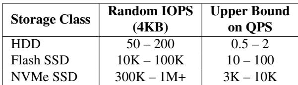  
Table 1. IOPS and upper bound on ANN search throughput across different storage classes, assuming 100 I/Os per query.

In this work, we make two key observations. First, the highest-ranked (i.e., most similar) results are typically discovered early in the search. This leads to diminishing returns as the search progresses: additional I/Os yield smaller improvements in overall result quality, yet the system continues searching and wastes valuable I/O resources. Second, top-ranked results dominate task accuracy in downstream applications such as RAG, whereas lower-ranked results contribute very little. Therefore, we can terminate the search much earlier once the most valuable (i.e., top-ranked) results have been found, thereby significantly reducing the I/O cost per query with minimal impact on application accuracy.

We present Terminus, a utility-driven early termination mechanism for graph-based ANN search. It intelligently allocates I/O during search to maximize application utility. Unlike prior termination techniques that are coarse-grained and rank-agnostic (Zhang et al., 2023; Teofili & Lin, 2025), Terminus incorporates rank awareness directly into the decision process. It recognizes that top-ranked results contribute far more to application accuracy than lower-ranked ones. Terminus uses a tunable weight function that controls the relative importance of each result rank. During search, it estimates the utility contributed by each I/O based on how much it improves the rank-weighted quality of the current best-k results found and dynamically terminates once additional I/Os yield diminishing returns. By aligning I/O spending with application utility, Terminus achieves a better trade-off between vector search performance and application accuracy.

Furthermore, we find that the traditional evaluation metric in vector search, Recall, is poorly suited for rank-sensitive workloads. It measures only how many of the true best results are retrieved, without considering which ones. As a result, it fails to reflect rank-level importance, which is crucial for tasks such as RAG, where top-ranked results have a greater impact on task accuracy than lower-ranked ones. To address this limitation, we introduce Ranked Recall, a new metric that weights matches by their rank positions, assigning greater weight to top-ranked matches and providing a more faithful measure of retrieval quality in rank-sensitive scenarios.

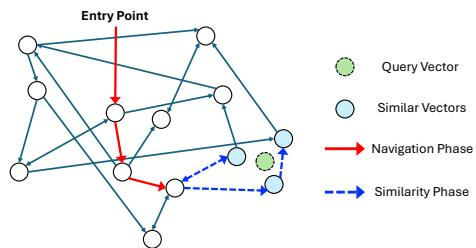  
Figure 1. Graph-based ANN search retrieving the top-3 most similar vectors to a query. The search proceeds in two logical phases— navigation and similarity—illustrated by the red solid and blue dashed lines, respectively.

Our paper makes the following contributions:

1. Terminus. A utility-driven early termination mechanism for graph-based ANN that reduces the number of I/Os per query while preserving downstream application accuracy.

2. Rank-Aware Utility Modeling. A rank-aware utility model that estimates search quality based on applicationlevel rank importance, aligning termination behavior with downstream utility.

3. Ranked Recall Metric. A rank-sensitive accuracy metric that captures fine-grained rank-level importance more effectively than traditional, set-based recall.

4. Better performance-accuracy trade-off. Terminus achieves up to 1.4× higher vector search throughput at the same accuracy target than existing early termination techniques. It also consistently delivers higher throughput— up to 3.2×—than a baseline without early termination, with minimal impact on application accuracy.

## 2 BACKGROUND

Graph-based ANN search. Graph-based ANN indices (Malkov & Yashunin, 2020; Fu et al., 2019; Subramanya et al., 2019) organize data into a proximity graph that preserves both semantic similarity and navigability, enabling fast sublinear-time lookup. During index construction, each vector is connected to its nearest (i.e., most similar) vectors with short edges and to a few more distant (i.e., less similar) vectors with long edges, forming a small-world structure (Watts & Strogatz, 1998) that supports efficient retrieval. The search consists of two logical phases—navigation and similarity—as illustrated in Figure 1. The search starts from a fixed or random entry point in the graph, enters the navigation phase, and follows long edges to converge toward the target neighborhood. It then enters the similarity phase, following short local edges to retrieve vectors most similar to the query.

More concretely, the system maintains a search queue of size L (where L ≥ k), typically implemented as a priority queue, which stores the best candidate vectors discovered so far, ranked by their similarity to the query in descending order. At each iteration, it selects the most similar unvisited vector from a candidate queue, explores its neighbors, and inserts those closer to the query back into the queue. The search terminates once all candidates in the queue have been visited—i.e., when further exploration no longer yields results better than the current top-L results. This termination condition is inherently static, depending solely on the queue size L: increasing L increases search time and resource consumption but may produce higher-quality results.

DiskANN and Starling. DiskANN (Subramanya et al., 2019) is a graph-based ANN system designed for diskresident indices. Its primary goal is to reduce graph traversals during search, thereby minimizing I/O. To accelerate the navigation phase, DiskANN modifies neighbor pruning and introduces a tunable parameter that increases the number of long edges to distant vectors, creating “express lanes” that help the search converge to the target neighborhood more quickly. It stores vectors on disk using a naive sequential layout based on vector IDs. However, these IDs have no correlation to their similarity structure in the embedding space, leading to poor spatial locality during I/O.

Starling (Wang et al., 2024) further minimizes I/O in both the navigation and similarity phases. It optimizes the ondisk layout of graph-based ANN indices using a greedy block-assignment heuristic that groups similar neighboring vectors together, improving spatial locality and amortizing I/O costs. As a result, a single disk read often fetches multiple vectors that will be traversed later, effectively reducing the total number of I/Os per query. In addition, Starling incorporates several system-level optimizations: it maintains an in-memory navigation graph to quickly identify better entry points and bypass the on-disk navigation phase, and employs block-level search with I/O–computation pipelining to further reduce search time. As shown in Figure 2(a), Starling consistently achieves higher search performance and accuracy than DiskANN. Consequently, we focus on Starling in the rest of this work.

Retrieval-augmented generation (RAG). Retrievalaugmented generation (RAG) (Lewis et al., 2020) is a paradigm that combines large language models (LLMs) with an external retrieval component to ground generation on factual or domain-specific information. It is particularly useful in scenarios where the model must produce accurate, up-to-date, or context-aware responses beyond what is stored in its static parameters, including open-domain question answering, enterprise knowledge access, or scientific document summarization. RAG systems relies on vector search to retrieve semantically relevant documents that are used to construct augmented prompts for language models, enhancing generation quality. We will use documents, contexts and results interchangeably in the rest of this work.

## 3 MOTIVATION

In this section, we first motivate early termination in graphbased ANN search and then highlight the opportunity to leverage rank awareness to achieve a better trade-off between search efficiency and application accuracy.

As graph-based ANN search progresses, more I/Os yield diminishing returns. As illustrated in Figure 1, once the search enters the second similarity phase, it reaches the target neighborhood and can efficiently discover the best results. Figure 2(b) shows the frequency at which the best results are discovered at each I/O in Starling. We observe that the most similar results (e.g., ranks 0–1) are usually found early in the search (e.g., during I/Os 3–7) , while later I/Os retrieve less similar results. Furthermore, we find that retrieving lower-ranked, less similar results requires substantially more resources. Figure 2(c) shows the CDF of the number of I/Os required to discover the ith best result, where a larger i corresponds to a lower rank with lower similarity. Notably, retrieving the 19th best result requires roughly two times more I/Os than retrieving the 0th one. Consequently, additional I/Os yield diminishing improvements in search quality while incurring substantial I/O cost, widening the gap between resource consumption and utility as the search progresses.

Top-ranked results dominate task accuracy in knowledge-retrieval RAG. Retrieval-augmented generation (RAG) uses vector search results as additional supporting knowledge to improve the accuracy of the underlying LLM. To better understand how each retrieved result rank affects downstream accuracy, we conduct the following experiments. We first determine the retrieval size k via a parameter sweep that retrieves the top-k documents from the corpus using exhaustive search, which provides an oracle upper bound on retrieval quality. As shown in Figure 2(d), RAG accuracy on the Natural Questions task plateaus for both Pythia-1B and LLaMA-2-7B when k ≥ 20. We therefore set k = 20 for the remainder of the analysis, as it is the smallest retrieval size that saturates downstream task accuracy, avoiding unnecessary retrieval overhead while preserving task performance. Next, we construct augmented LLM inputs by retrieving the top-20 most relevant documents from the corpus, sorted by their relevance from high to low. At each step, we drop the ith document and feed the remaining 19 documents to the RAG pipeline. We define accuracy loss as the difference in accuracy between the oracle setting that uses all top-20 documents and the setting that uses only 19 documents excluding the ith one. We further normalize each accuracy loss by the maximum observed loss. Each data point in Figure 3 reflects this normalized accuracy loss of missing the ith best document. This allows us to approximate the contribution of each rank to the overall task accuracy. Despite minor model differences, the same trend holds: the impact of each document drops sharply with rank. Top-ranked results contribute disproportionately to task accuracy, while lower-ranked results have only marginal influence.

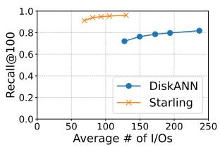  
(a)

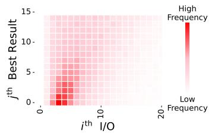  
(b)

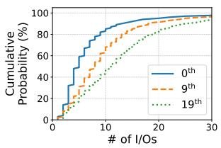  
(c)

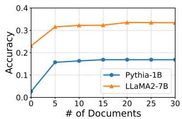  
(d)

Figure 2. (a) Recall and average I/O cost per query for ANN search with k = 100 in DiskANN and Starling. (b) Frequency of discovering the jth best result at each I/O during ANN search. Rank j = 0 denotes the top-ranked result with the highest similarity. (c) CDF of the number of I/Os required to discover the ith best result. (d) RAG accuracy (Exact Match) as a function of the number of best documents retrieved via exhaustive search for different language models on the Natural Questions task.  
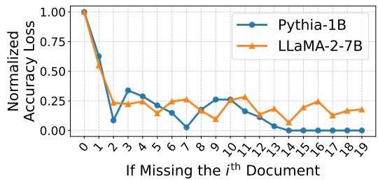  
Figure 3. Normalized accuracy loss in Exact Match for RAG on the Natural Questions task across different models. Each point reflects the relative contribution of the ith best document within the top 20 retrieved documents to end-to-end accuracy.

Guided by these observations, we identify a fundamental misalignment between search cost and application benefit. Later I/Os retrieve low-ranked results that contribute little to downstream accuracy, whereas the top-ranked results that matter most are typically retrieved early. This motivates our design of rank-aware early termination in Terminus. Unlike prior termination techniques that are coarsegrained and rank-agnostic (Zhang et al., 2023; Teofili & Lin, 2025), Terminus makes fine-grained, dynamic termination decisions by incorporating rank awareness directly into the search process. Terminus allocates its I/O resources where it yields the highest utility (i.e., retrieving higher-ranked results early) and stops once additional I/Os provide negligible rank-weighted benefit. By aligning I/O spending with application utility, Terminus achieves a better performance–accuracy trade-off compared to conventional early termination methods.

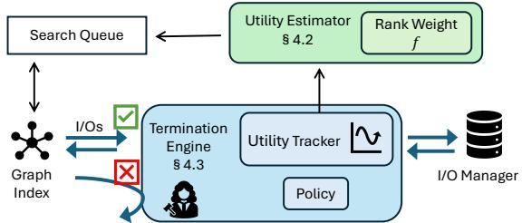  
Figure 4. Terminus system components.

## 4 DESIGN

Before describing Terminus’s system components, we first outline our design goals:

1. Alleviate disk IOPS bottlenecks. The system should reduce the number of I/Os per ANN query to mitigate the disk IOPS bottleneck and improve overall performance, achieving higher throughput and lower latency.

2. Preserve the accuracy of high-value results. The system should maintain the accuracy of top-ranked results, which dominate downstream RAG utility, while avoiding unnecessary tail retrieval.

3. Achieve a better performance–accuracy trade-off. The system should deliver higher ANN search throughput while incurring minimal loss in application accuracy.

## 4.1 Design Overview

Figure 4 depicts the high-level architecture of Terminus. It dynamically decides how much to search based on the observed utility of each issued I/O. By aligning search effort with application benefit, Terminus allocates resources on retrieving more valuable results and avoid wasting I/Os on results that contribute little to the overall search quality.

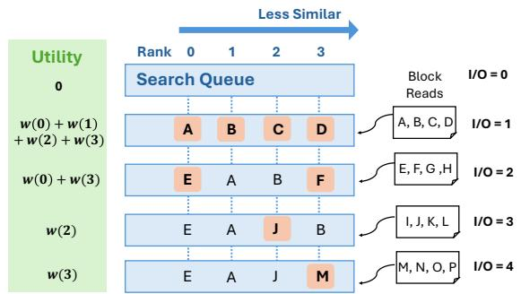  
Figure 5. Search utility over I/Os. The search queue size is set to 4. Newly inserted results at each I/O are highlighted in orange.

Terminus introduces two new components into the vector search system: a utility estimator and a termination engine. The utility estimator records the rank positions of newly inserted results in the similarity-ranked search queue after each new I/O. It then computes the weighted sum of these affected rank positions to derive a utility score that approximates each I/O’s contribution to the overall search quality. By applying a rank-weighted function, the estimator places greater emphasis on changes at higher ranks, making the system more sensitive to improvements in the top-ranked results.

The termination engine uses a tracker to monitor utility changes on a per-I/O basis. It applies a termination policy that triggers when the utility gains from the most recent I/Os fall below a predefined threshold. Positioned between the graph traversal logic and the I/O manager, the engine decides on the fly whether to allow or reject each I/O. When termination is triggered, it signals the index to stop further exploration and returns the currently discovered results to the application.

## 4.2 Rank-Aware Utility Modeling

Since Terminus cannot know in advance when the best results will be discovered during traversal, its core challenge is to estimate search utility in a way that is sensitive to improvements in higher-ranked results.

Graph-based ANN search systems typically maintain a search queue of the best results found so far, sorted by their similarity scores (e.g., cosine or Euclidean distance) in descending order. A naive approach is to measure the absolute improvement in similarity scores of the results in the search queue over time. However, we find this approach ineffective, particularly during the middle phase of the search when the queue already contains moderately good results. For example, the next I/O may retrieve the true best result, but because the current results in the queue already have high similarity scores, the resulting absolute increase in similarity can be negligibly small and easily overshadowed. As a result, this similarity score-based approach is highly insensitive to improvements in the best results.

We observe that during search, the absolute improvement in similarity scores is largely irrelevant—whether it increases by 0.01 or by 1000 makes little difference. What matters instead is a binary signal: whether the newly discovered result is better than the current ones. If so, it will be inserted into a higher-ranked position in the similarity-sorted search queue. This observation shifts our focus from fragile, noisy changes in similarity score to more robust structural changes in rank. Our key insight is to infer search utility directly from rank transitions as the search progresses. To make the utility signal more sensitive to improvements at higherranked positions, we apply a rank-weighted function that assigns different importance to different ranks. Intuitively, an improvement at rank 0 should contribute more to overall utility than an improvement at rank 9. Accordingly, the utility of an I/O is defined as the weighted sum of the ranks of all newly inserted items into the search queue during that I/O.

More formally, let ∆Rt denote the set of ranks of the newly inserted results into the search queue at I/O t. We define a rank-weight function w(r) that captures the relative importance of rank r.

The search utility contributed by I/O t is then defined as:

$$
\tag{1}
$$

Figure 5 assumes a search queue size of 4 and illustrates the utility contributed by each I/O as it reads a disk block and updates the search queue. At t = 2, the search discovers E and F , which have higher similarity scores and are inserted at positions 0 and 3. The utility of this I/O is therefore the sum of their respective rank weights, i.e., , w(0) + w(3).

We model rank weights as an exponential decay function:

$$
\tag{2}
$$

The parameter τ determines where the decay occurs: smaller τ emphasizes the top ranks by causing an early drop, while larger τ spreads weight more evenly. The parameter β controls how sharply the curve bends: higher β concentrates weight on the top few ranks, whereas lower β yields a more gradual decay. Together, τ and β allow us to precisely control the sensitivity of the utility function to rank-level improvements. For simplicity, in this work we fix β and vary only τ to tune the curve shape.

Figure 6(a) illustrates the weight function for different values of τ . When τ = 0.1, the function places almost all the weight on rank 0, making the utility highly sensitive to improvements at the top rank. In contrast, when τ = 10000, the weights become nearly uniform, making all ranks to contribute almost equally to the overall search utility. Figure 6(b) shows the effect of this rank sensitivity on retrieval outcomes. Under the same I/O budget, a smaller τ of 0.1 retrieves a larger fraction of top-ranked results (e.g., ranks 0–5) than a larger τ of 10000. This shows that emphasizing higher ranks enables the search to terminate earlier once the most important results have been retrieved, leading to more efficient allocation of I/O across queries. For the remainder of this paper, we set τ = 1.8 to shape the curve in a way that closely matches the application-level rank importance observed in Figure 3.

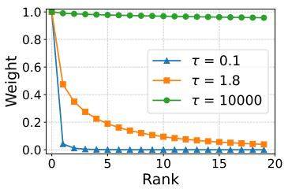  
(a)

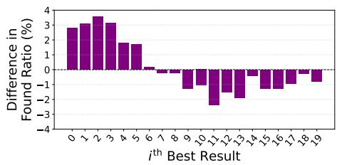  
(b)

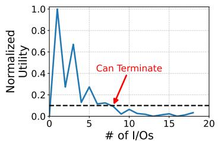  
(c)  
Figure 6. (a) The rank-weight function for different τ values. β = 0.5. (b) Difference in the percentage of the ith best results found between τ = 0.1 and τ = 10000, under the same average number of I/Os per query. i = 0 corresponds to the highest-ranked (best) result. (c) Evolution of search utility over I/Os for a randomly sampled query. τ = 1.8, β = 0.5 and k = 20. The dashed line at y = 0.1 indicates the early termination threshold.

In summary, our rank-aware utility model enables reliable estimation of per-I/O search utility without oracle knowledge. By weighting rank-level improvements, it identifies when the most valuable results have already been retrieved, enabling early termination with minimal impact on application accuracy. This formulation underpins our dynamic termination mechanism described in the next section.

## 4.3 Dynamic Early Termination

Once we can estimate the utility of each I/O, the next challenge is deciding when to stop the search without significantly hurting accuracy. Static termination policies (e.g., searching a fixed number of I/Os) are brittle: they may stop too early and miss important results, or continue searching far longer than necessary and waste resources. We observe that the utility curve rises sharply early in the search as high-ranked results are discovered, then quickly flattens once most top-ranked results have been found. Figure 6(c) illustrates this behavior for a randomly sampled query with k = 20. The utility spikes initially as the search queue is empty, and again at the third I/O when the 1st, 9th, 10th, and 13thth best results are retrieved together. A third spike occurs at the fifth I/O with the discovery of the highest-ranked result. By the first 10 I/Os, the search has already found all top-5 and 9 of the top-10 results. Smaller bumps in the tail reflect occasional discoveries of mid-ranked results beyond

rank 10.

This observation suggests that when the utility of recent I/Os remains consistently negligible, further search yields diminishing returns and can be safely terminated. Accordingly, Terminus tracks the utility of recent I/Os using a sliding window of size X. It triggers termination when the utility of each I/O within the window falls below a configurable threshold ε. Formally, the termination policy is expressed as:

$$
\tag{3}
$$

where Ui denotes the utility of the i-th I/O.

The sliding window size X and threshold ε expose a clear accuracy–cost trade-off. A smaller ε or larger X leads to longer searches and higher accuracy, while a larger ε enables more aggressive early termination. As shown in Figure 2(c), graph search often exhibits long-tail behavior, where good results may appear after several low-utility I/Os. If X is too small, the system may stop prematurely. Empirically, we find that setting X to 2 or 3 strikes a good balance between search efficiency and accuracy. We provide a more detailed analysis of the impact of X and ε in Section 6.2.

## 5 RANKED RECALL METRIC

As demonstrated in Section 3, downstream applications often value higher-ranked results far more than lower-ranked ones. However, the standard evaluation metric in vector search, Recall@k, is rank-agnostic: it measures the fraction of the true top-k results retrieved among the k returned results. This set-based, coarse-grained metric assumes all k results are equally valuable, but fails to reflect the priorities of rank-sensitive workloads such as RAG, where top-ranked results typically dominate utility. This misalignment highlights a fundamental gap between Recall and the evaluation needs of rank-sensitive applications.

We introduce Ranked Recall, a new evaluation metric that captures which true best results are retrieved, not just how many. Let G denote the ground truth sequence of the best-k results and R the sequence of k retrieved results, both sorted by similarity in descending order. Ranked Recall@k assigns different weights to retrieved ground-truth results based on their rank positions in G. It is defined as:

Table 2. Summary of key parameters.  
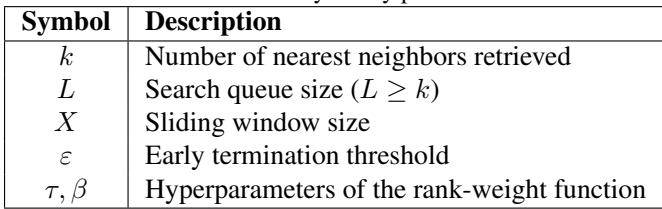

Table 3. Dataset statistics.  
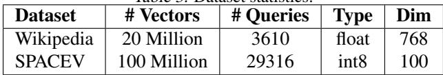

$$
\tag{4}
$$

where (Gi ∈ R) equals 1 if the ith best result appears in the retrieval sequence, and 0 otherwise. The weight function assigns higher weights to higher-ranked positions to emphasize their importance during evaluation. Our formulation generalizes traditional recall: when all ranks receive equal weight, Ranked Recall reduces to standard Recall.

To summarize, Ranked Recall captures rank-level differences and provides a more meaningful measure of search quality for rank-sensitive scenarios. As we show in §6.1, it distinguishes cases where systems achieve the same Recall but differ in the quality of their top-ranked results.

## 6 EVALUATION

We evaluate Terminus by answering the following questions:

• How does Terminus compare to other early termination methods for vector search? (§6.1)

• What are the impacts of early termination? (§6.2)

• What is the overall trade-off between vector search performance and RAG accuracy in Terminus? (§6.3)

Configuration. All vector search experiments are conducted on a CloudLab (Duplyakin et al., 2019) r650 node equipped with 72 CPU cores, 256 GB of RAM, and a 1.6 TB NVMe SSD, running Ubuntu 22.04.5 LTS. RAG evaluations are performed on GPU-equipped systems, including a local workstation with two NVIDIA RTX 2080 Ti GPUs and CloudLab r7525 nodes with two NVIDIA GV100GL GPUs. All systems use asynchronous I/O with a uniform block size and pipeline computation with disk I/O. Disk reads bypass the OS page cache by issuing requests with O DIRECT. To eliminate caching effects, we clear the OS page cache between experimental runs. Table 2 lists the key parameters used in our evaluation, while Table 4 summarizes the graph index configurations.

Table 4. Graph index configurations.  
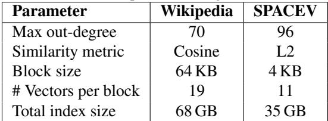

Datasets. We evaluate vector search on two representative datasets that exhibit different data characteristics. Wikipedia-20M is a public dataset released by the MassiveDS project (Shao et al., 2025). It contains dense text embeddings of the entire English Wikipedia corpus. The query set is derived from the Natural Questions benchmark (Kwiatkowski et al., 2019), a question–answering dataset curated from Wikipedia articles. All embeddings are generated using the Contriever-MSMARCO model (Lei et al., 2023). This dataset represents more traditional, structured textual knowledge distributions commonly used in open-domain retrieval and RAG workloads. SPACEV-100M is derived from the publicly available SPACEV1B dataset (Chen et al., 2021) by selecting the first 100 million vectors. SPACEV1B is a large-scale dataset released by Microsoft based on its Bing web search scenario. Each vector represents a web document, and the accompanying query set represents real-world search queries. This dataset reflects web-scale embedding distributions typical of large retrieval systems. Table 3 summarizes key dataset statistics, including the number of vectors, dimensionality, and data types.

Workloads. For vector search, we use the query sets corresponding to each dataset listed in Table 3. Each query retrieves the top-k most similar vectors using ANN search. We vary retrieval quality by tuning search parameters. The retrieved results from the Wikipedia-20M dataset are then used for the RAG workload. Unless otherwise specified, we use k = 20, the minimum number of documents that saturates the downstream RAG task considered in our evaluation, ensuring a fair comparison between Terminus and the baselines. Figure 8(b) is the only exception, where we evaluate a larger k = 100.

For downstream RAG evaluation, we use the Natural Questions task (Kwiatkowski et al., 2019) consisting of 3,610 queries. We adopt the modified EleutherAI/lm-eval-harness RAG pipeline from the MassiveDS project (Shao et al., 2025). It constructs the prompt by first retrieving the top-20 most relevant text chunks using vector search, reordering them according to their original positions in the data corpus, then appending five-shot in-context examples, and finally concatenated with the original query. We generate prompts of varying quality by adjusting the retrieval quality of the underlying vector search results. We evaluate two language models: Pythia-1B (Biderman et al., 2023), a smaller base model, and LLaMA-2-7B (Touvron et al., 2023), a larger, instruction-tuned model trained on a more diverse corpus. This comparison allows us to examine how retrieval quality influences downstream performance across models with different capacities and training paradigms.

Metrics. We report both Recall@k and Ranked Recall@k for all vector search experiments. Ranked Recall uses the rank-weight function defined in Equation 2, parameterized by τ = 1.8 and β = 0.5, to assign greater importance to higher-ranked results. We use Exact Match (EM) as the primary end-to-end RAG accuracy metric for the Natural Questions task. EM is a robust metric for short-form question answering tasks of this type. We also compute the F1 score, but since it exhibits a similar trend to EM, we omit it for brevity.

Baselines. Starling (Wang et al., 2024) is an optimized DiskANN baseline. It uses the default termination policy, which stops once further traversals fail to find better candidates than those currently in the search queue. We implement Terminus and all other early termination methods in Starling’s codebase for consistency and a fair comparison. VBASE (Zhang et al., 2023) is a coarse-grained termination scheme that halts the search when results discovered within the most recent time window, X, are worse than the top-E candidates currently in the search queue, where E ≥ k. Following the recommendation of the original paper, we set X = 1 and vary E to control the aggressiveness of early termination. IO-Budget is an I/O–first rank-agnostic strawman that terminates once the number of I/Os issued for a query exceeds a predefined budget, B. We vary B to adjust the termination threshold. In contrast, Terminus monitors the rank-level search utility across I/Os and terminates when the utility of all I/Os within the most recent window of size X falls below a threshold ε. By default, we set X = 2 and use a rank-weight function parameterized by τ = 1.8 and β = 0.5. We vary ε to tune the sensitivity of early termination.

## 6.1 Vector Search Efficiency

We begin by comparing the vector search efficiency of Terminus against other early termination methods. Figure 7 presents the average number of I/Os issued per ANN search query for retrieving the top-k results, with respect to retrieval quality measured by Recall@k and Ranked Recall@k. For each system, we perform a parameter sweep over the search queue size L and its corresponding earlytermination parameters, and report the best-performing data points on the accuracy–cost curve. VBASE is a conservative method that terminates when the top-E results in the search queue stabilize, where E ≥ k. As a result, it typically achieves very high retrieval quality—often above 0.9 accuracy—but at the cost of increased I/O consumption. In contrast, Terminus and IO-Budget is more fine-grained, allowing more flexible termination to better navigate the cost–accuracy trade-off.

Furthermore, we find that Terminus consistently outperforms IO-Budget in Ranked Recall. This is because it efficiently retrieves more higher-ranked results than IO-Budget under the same I/O cost. Figure 8(a) shows the percentage of queries that successfully retrieve the ith best result for the two systems when they issue the same average number of I/Os per query. Terminus discovers a higher fraction of topranked best results—around 80% for the higher ranks. Compared to the rank-agnostic IO-Budget, it retrieves around 5% to 10% more results for ranks 0-10. This gain stems from Terminus’s rank-aware design as its rank-weight utility function assigns greater importance to higher ranks, enabling the system to allocate I/O resources more effectively towards retrieving top-ranked results. Moreover, the performance gap between Terminus and other baselines becomes more pronounced as k increases. This occurs because other baselines spend more I/Os to identify all high-quality top-k results, whereas Terminus focuses on retrieving only a few highest-ranked ones. Figure 8(b) shows that when k = 100, Terminus issues on average 5 fewer I/Os per query than IO-Budget to achieve the same Ranked Recall. Overall, Terminus delivers the highest gains in the medium-high accuracy range (i.e., 0.6 - 0.9). However, due to the longtail I/O behavior in graph-based ANN search, as shown in Figure 2(c), all systems must spend substantially more I/O resources to achieve very high accuracy.

Finally, Figures 7(c) and 7(d) show that the Recall–I/O curves across all systems are nearly identical. This indicates that Recall fails to capture rank-level differences in the retrieved results across systems under the same I/O cost, as also illustrated in Figure 8(a). Therefore, for the remainder of the evaluation, we use Ranked Recall as a more reliable metric for retrieval quality in rank-sensitive scenarios such as RAG workloads.

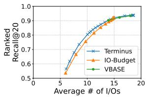  
(a)

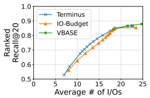  
(b)

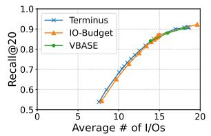  
(c)

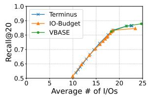  
(d)

Figure 7. Average number of I/Os per ANN search query versus retrieval quality for k = 20. (a–b) Ranked Recall and (c–d) Recall on Wikipedia-20M and SPACEV-100M, respectively.  
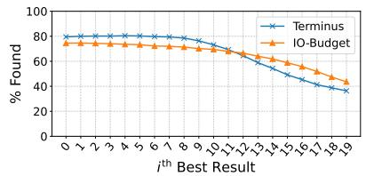  
(a)

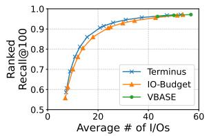  
(b)

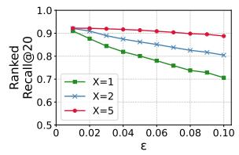  
(c)

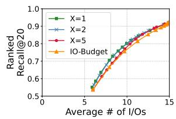  
(d)  
Figure 8. (a) Percentage of each ith best result discovered by Terminus and IO-Budget, respectively, under the same average number of I/Os per query. (b) Average number of I/Os per ANN search query versus Ranked Recall for k = 100 on Wikipedia-20M. (c) Ranked Recall versus the termination threshold ε for Terminus under different sliding window sizes X. A larger ε indicates more aggressive early termination. Search queue size L = 20. (d) Average number of I/Os per ANN search query versus Ranked Recall for Terminus under different sliding window sizes X and IO-Budget.

## 6.2 Impacts of Early Termination

Sensitivity of window size X. We first study the sensitivity of Terminus to the sliding window size X. We fix the search queue size and vary the termination threshold ε to generate data points for each value of X. A smaller X makes Terminus more susceptible to noise and may cause premature termination before discovering enough valuable results. As shown in Figure 8(c), under the same termination threshold ε, X = 1 consistently leads to lower retrieval quality. As ε decreases, all X values require longer searches and achieve similarly high retrieval accuracy. Figure 8(d) shows the impact of X on the trade-off between I/O cost and retrieval quality in Terminus. Surprisingly, very small values of X do not degrade the performance frontier of Terminus. However, with a larger X, Terminus becomes more conservative and may converge toward other baselines in certain accuracy regions. When X = 5, Terminus requires more I/O utility statistics to stabilize before early termination, reducing its advantage in the low-accuracy and low-I/O region. In contrast, in the high-accuracy and high-I/O regions, its rank-awareness remains effective and it continues to outperform IO-Budget. In practice, we find that X = 2 provides a good balance between search efficiency and retrieval quality.

Sensitivity analysis of termination threshold ε. We next perform a parameter sweep over the early termination threshold ε. To ensure a fair comparison, we fix the search queue size and evaluate Terminus against the baseline, Starling, which does not employ early termination. Figure 9(a) shows the end-to-end RAG accuracy under varying ε values, evaluated on the Pythia-1B model. It also reports the relative vector search throughput improvement of Terminus compared to the baseline, represented by ε = 0. A larger ε value indicates more aggressive early termination, reducing the number of I/Os and thereby improving QPS substantially. However, as retrieval quality declines, accuracy also decreases. Overall, Terminus delivers substantial QPS improvements with minimal accuracy degradation. For instance, at ε = 0.09, Terminus achieves nearly 150% higher QPS relative to the baseline while still maintaining a high accuracy above 0.16. For context, the accuracy without RAG is 0.0263.

Interestingly, accuracy does not decrease monotonically with larger ε values. We attribute this behavior to the imperfections of the embedding model itself. For example, we find cases where the embedding model assigns a higher similarity score to a text chunk about Pink Floyd’s song related to the moon than a text chunk describing the Apollo missions when responding to the query “When was the last time someone was on the Moon?” This suggests that embedding models can not always capture true semantic relevance. Moreover, smaller language models are also more easily misled by superficially similar but irrelevant content and suffer from the ‘lost-in-the-middle’ effect and similar phenomena (Liu et al., 2023). Accurately encoding semantic information remains an open challenge, and we leave further investigation of improved embedding models to future work.

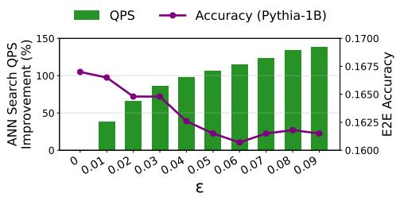  
(a)

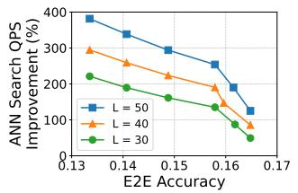  
(b)

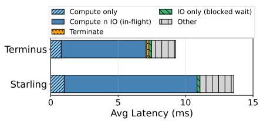  
(c)  
Figure 9. (a) ANN search throughput improvement and RAG accuracy under varying ε values in Terminus compared to the baseline without early termination (ε = 0). A larger ε indicates more aggressive early termination. Search queue size L = 40. (b) RAG accuracy and search throughput improvement of Terminus relative to the baseline under different search queue sizes (L). (c) Per-query latency breakdown for Terminus and Starling, the baseline without early termination.

Effect of search queue size L. We next evaluate the impact of early termination under different search queue sizes. Each curve in Figure 9(b) shows the throughput improvement relative to Starling under the same search queue size. The x-axis shows the end-to-end RAG accuracy. We observe that as L increases, Terminus delivers even greater QPS improvements with almost no impact on accuracy. This is because, with a larger search queue, the baseline must examine more candidates, consume additional resources, and take longer for the search to converge, whereas the top-ranked results are typically discovered within the first few I/Os. Consequently, Terminus consistently identifies high-quality results within a nearly constant number of early I/Os and terminates quickly, regardless of the search queue size. This leads to minimal accuracy degradation while significantly improving QPS, especially for larger search queue sizes.

Early termination overheads. Finally, we measure the additional overhead introduced by early termination. Figure 9(c) presents the per-query latency breakdown for Terminus and Starling. Compute refers to the time spent on distance computations and graph navigation. Both systems employ compute–I/O pipelining and asynchronous I/O, allowing computation and disk access to overlap effectively. As a result, a large fraction of execution time overlaps between compute and I/O (i.e., 73% for Starling and 68% for Terminus, respectively), leaving negligible time (i.e., 2%) spent waiting on blocked I/O. The overhead introduced by early termination in Terminus is also minimal, contributing no more than 2% of total query latency. It arises from tracking rank-level changes in the search queue between I/Os and computing per-I/O utility scores using the rank-weight function. This additional overhead depends on the sliding window size X and the search queue size L, both of which are typically very small, and therefore remains negligible compared to the overall query time.

Overall, these results demonstrate the robustness of Terminus and the tunability of ε in balancing search efficiency and end-to-end accuracy.

## 6.3 The Overall Trade-Off

We now evaluate the end-to-end performance–accuracy trade-off of early termination on retrieval-augmented generation (RAG) workloads. For each termination scheme, we sweep both the search queue size and its tunable parameters, reporting the best-performing data points. Figures 10(a) and 10(b) present the results for Pythia-1B and LLaMA-2-7B, respectively. Since VBASE maintains very high retrieval quality, it also provides high application accuracy but at the cost of substantially lower throughput. Even under these high-accuracy targets, Terminus can deliver notable throughput gains. For instance, it achieves 1.6× higher throughput than VBASE at an accuracy of 0.33 on LLaMA-2-7B. Furthermore, Terminus consistently outperforms IO-Budget due to its rank-aware termination. It stops earlier on easier queries and allocates more search effort to harder ones. Consequently, it improves the discovery of higher-ranked results that contribute more to downstream task accuracy while consuming the same amount of I/O. For instance, at a moderate accuracy level of 0.16 on Pythia-1B, Terminus achieves 1.4× higher QPS than IO-Budget. Although their performance gap narrows on LLaMA-2-7B, Terminus still provides measurable gains, such as 1.16x higher QPS at a high accuracy of 0.31. Overall, Terminus achieves higher ANN search throughput at the same application accuracy, providing a better balance between vector search efficiency and application utility than existing early termination methods.

Figure 10(c) shows the correlation between retrieval quality and model accuracy. The y-axis shows the task accuracy of using RAG prompts constructed from our ANN search. The x-axis represents Ranked Recall, which places greater emphasis on top-ranked results. We can see that, despite differences in model size and training style, both Pythia-1B and LLaMA-2-7B exhibit a strong, monotonic relationship between Ranked Recall@20 and end-to-end task accuracy. As Ranked Recall improves, downstream RAG accuracy increases almost linearly. Furthermore, it shows that achieving very high task accuracy requires disproportionately better top-ranked retrieval results, emphasizing the importance of rank awareness in vector search.

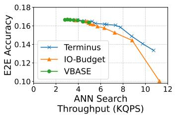  
(a)

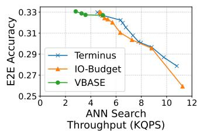  
(b)

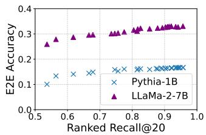  
(c)

Figure 10. Throughput–accuracy trade-off of Terminus versus other early-termination methods under (a) Pythia-1B and (b) LLaMA-2-7B. (c) The correlation between retrieval quality and application accuracy across different language models.  
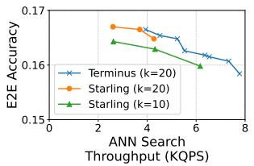  
(a)

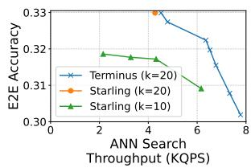  
(b)  
Figure 11. Throughput–accuracy trade-off of Terminus versus Starling, the baseline without early termination, under (a) Pythia-1B and (b) LLaMA-2-7B.

Finally, we compare Terminus with Starling, the baseline system without early termination, using a default k = 20. We also evaluate Starling using a smaller retrieval size k = 10, which retrieves fewer documents and runs faster. For each system, we sweep the search queue size (L) for Starling and both L and ε for Terminus, reporting the bestperforming configurations in Figure 11. Under the same k, Terminus consistently achieves higher throughput than the baseline at the same accuracy target. For instance, in Pythia-1B, Terminus attains up to 1.2× higher QPS. Moreover, Terminus also outperforms the baseline that uses a smaller k = 10. Specifically, Terminus achieves up to 2× higher QPS in Pythia-1B and 3.2× higher QPS in LLaMA-2-7B, respectively. We believe there are two key reasons why Terminus significantly outperforms the baseline with a smaller k. First, a larger k expands the search space and increases the likelihood of retrieving the most relevant, top-ranked results—those that have the greatest impact on downstream task accuracy, especially for larger models such as LLaMA-2-7B. Second, although lower-ranked results are less contextually relevant, they still contain useful information that can complement the higher-ranked results and improve answer completeness. In contrast, the baseline with a smaller k sacrifices this broader contextual coverage, increasing the risk of missing critical or supporting information. By retaining more relevant results while optimizing I/O efficiency, Terminus achieves both higher search throughput and better end-to-end application accuracy.

## 7 DISCUSSION

In this section, we discuss the practical considerations for deploying Terminus in real-world retrieval and RAG pipelines.

Matching rank sensitivity to downstream applications. The design of Terminus is generic and does not depend on a specific weighting curve. Its rank-weight function is fully configurable and can support alternative forms such as Reciprocal Rank (Voorhees, 1999), DCG-style logarithmic decay (Jarvelin & Kek ¨ al¨ ainen ¨ , 2002), and piecewise functions. The effectiveness of Terminus depends primarily on aligning its rank-weight function with the rank-dependent impact of retrieved results on downstream task accuracy. This application-specific rank sensitivity can be estimated empirically by analyzing the relationship between retrieval rank and downstream task accuracy, as illustrated in Figure 3, or specified by practitioners based on prior knowledge of their applications.

Configuring the rank-weight function. We adopt an exponential decay function because it can be flexibly tuned to match the rank sensitivity of different downstream models. The hyperparameters τ and β are chosen empirically. For instance, we set τ = 1.8 and β = 0.5 to match the emprical decay of RAG accuracy observed on the Natural Questions task (Figure 3). We believe it generalizes well to RAG workloads, where the contribution of retrieved contexts typically decreases rapidly with rank.

Workloads best suited for Terminus. Terminus is most effective in the medium-to-high accuracy regime, where modest reductions in retrieval quality can significantly improve vector search throughput without noticeably degrading application-level accuracy. This makes Terminus particularly well suited for workloads such as RAG and other probabilistic generation pipelines, where the downstream model can tolerate slight imperfections in the retrieved information. However, due to the long-tail I/O behavior of graph-based ANN search (Figure 2(c)), achieving extremely high retrieval quality requires substantially more I/Os to explore deeper regions of the graph index. As a result, for applications requiring near-perfect retrieval quality, it is recommended to disable early termination or adopt more conservative termination thresholds.

Factors beyond the retrieval system. We note that the effectiveness of Terminus can also depend on factors outside the retrieval system. As discussed in Section 6.2, embedding models used to generate vector representations may not perfectly capture semantic similarity, introducing noise between similarity scores and true relevance. In addition, different language models may interpret retrieved contexts, including potentially misleading ones, differently (Wu et al., 2024; Cho et al., 2024). Together, these factors can lead to the behavior that RAG accuracy does not follow a strictly monotonic relationship with retrieval quality (Figure 9(a)). While such effects are outside the control of similarity-based ANN search systems, Terminus helps mitigate them by allowing users to configure the rank-weight function based on empirical observations, enabling early termination decisions to better align with downstream application behavior rather than relying solely on similarity.

## 8 RELATED WORK

Optimizations in graph-based ANN search systems. A rich body of work improves the efficiency of graph-based approximate nearest neighbor (ANN) search through graphstructure and system-level optimizations. HNSW (Malkov & Yashunin, 2020) builds a hierarchical small-world graph that progressively refines search across multiple layers, achieving sublinear query time, while NSG (Fu et al., 2019) prunes redundant edges while preserving navigability to shorten traversal paths. Recent efforts exploit hardware–software co-design to further accelerate graph search. CXL-ANNS (Jang et al., 2023) disaggregates DRAM using CXL, caches hot graph nodes in local memory and parallelizes distance computation and traversal through hardware endpoints to FusionANNS (Tian et al., 2025) uses a CPU/GPU collaborative multi-tier index with re-ranking and I/O deduplication to reduce query I/O and improve throughput. In contrast, our work is orthogonal to these structural and hardware optimizations and focuses on dynamic, utility-driven termination during search.

Early termination in vector indices. Prior work has explored early termination mechanisms to reduce search overhead in graph-based ANN systems. Li et al. (2020) train a decision tree model to predict when to stop the search at runtime while maintaining a target recall. VBASE (Zhang et al., 2023) introduces a heuristic that monitors the “drift” in vector similarity during traversal and halts exploration when new candidates are unlikely to outperform those already in the search queue. Teofili & Lin (2025) propose a threshold-based strategy that terminates search once the set of top candidates no longer improves over several iterations. These approaches are either coarse-grained or rank-agnostic and do not consider the impact of early termination on downstream application utility.

Rank-sensitive retrieval metrics. The information retrieval (IR) literature has long studied rank-sensitive evaluation metrics that account for the positional importance of retrieved results. Mean Average Precision (MAP) (Manning et al., 2008) measures ranking quality by averaging the precision at the positions where relevant documents appear. Reciprocal Rank (RR) and its aggregate form Mean Reciprocal Rank (MRR) (Voorhees, 1999) focus on how early the first relevant document appears. Discounted Cumulative Gain (DCG) and its normalized variant NDCG (Jarvelin¨ & Kekal¨ ainen ¨ , 2002) evaluate ranking quality using logarithmic rank discounting and rely on graded relevance signals. In traditional web search scenarios, such signals (e.g., click-through rates) are readily available. However, in vector search workloads, relevance labels are typically obtained through human annotation for benchmarks and are unavailable for many popular vector datasets, including SIFT (Lowe, 2004), GIST (Oliva & Torralba, 2001), and SPACEV1B (Chen et al., 2021). Moreover, it is unclear whether such benchmark relevance labels correlate well with downstream task accuracy. In contrast, Ranked Recall does not rely on graded relevance and serves as a more appropriate proxy metric for assessing retrieval quality in terms of downstream task utility.

## 9 SUMMARY

In summary, Terminus is a rank-aware early termination mechanism for graph-based vector search that intelligently aligns I/O spending with application utility. It stops early once the most important (i.e., higher-ranked) results are found, saving I/O and achieving a better trade-off between search efficiency and downstream accuracy.

## REFERENCES

Biderman, S., Schoelkopf, H., Anthony, Q., Bradley, H., O’Brien, K., Hallahan, E., Khan, M. A., Purohit, S., Prashanth, U. S., Raff, E., Skowron, A., Sutawika, L., and Van Der Wal, O. Pythia: a suite for analyzing large language models across training and scaling. In Proceedings of the 40th International Conference on Machine Learning, ICML’23. JMLR.org, 2023.

Calder, B., Wang, J., Ogus, A., Nilakantan, N., Skjolsvold, A., McKelvie, S., Xu, Y., Srivastav, S., Wu, J., Simitci, H., Haridas, J., Uddaraju, C., Khatri, H., Edwards, A., Bedekar, V., Mainali, S., Abbasi, R., Agarwal, A., ul Haq, M. F., ul Haq, M. I., Bhardwaj, D., Dayanand, S., Adusumilli, A., McNett, M., Sankaran, S., Manivannan, K., and Rigas, L. Windows azure storage: a highly available cloud storage service with strong consistency. In Wobber, T. and Druschel, P. (eds.), Proceedings of the 23rd ACM Symposium on Operating Systems Principles 2011, SOSP 2011, Cascais, Portugal, October 23-26, 2011, pp. 143–157. ACM, 2011. doi: 10.1145/2043556.2043571. URL https://doi. org/10.1145/2043556.2043571.

Chen, Q., Zhao, B., Wang, H., Li, M., Liu, C., Li, Z., Yang, M., and Wang, J. Spann: highly-efficient billion-scale approximate nearest neighbor search. In Proceedings of the 35th International Conference on Neural Information Processing Systems, NIPS ’21, Red Hook, NY, USA, 2021. Curran Associates Inc. ISBN 9781713845393.

Cho, S., Jeong, S., Seo, J., Hwang, T., and Park, J. C. Typos that broke the RAG’s back: Genetic attack on RAG pipeline by simulating documents in the wild via low-level perturbations. In Findings of the Association for Computational Linguistics: EMNLP 2024, pp. 2826– 2844, 2024. doi: 10.18653/v1/2024.findings-emnlp. 161. URL https://aclanthology.org/2024. findings-emnlp.161/.

Duplyakin, D., Ricci, R., Maricq, A., Wong, G., Duerig, J., Eide, E., Stoller, L., Hibler, M., Johnson, D., Webb, K., Akella, A., Wang, K., Ricart, G., Landweber, L., Elliott, C., Zink, M., Cecchet, E., Kar, S., and Mishra, P. The design and operation of Cloud-Lab. In 2019 USENIX Annual Technical Conference (USENIX ATC 19), pp. 1–14, Renton, WA, July 2019. USENIX Association. ISBN 978-1-939133-03-8. URL https://www.usenix.org/conference/ atc19/presentation/duplyakin.

Fu, C., Xiang, C., Wang, C., and Cai, D. Fast approximate nearest neighbor search with the navigating spreadingout graph. Proc. VLDB Endow., 12(5):461–474, January 2019. ISSN 2150-8097. doi: 10.14778/3303753.

3303754. URL https://doi.org/10.14778/ 3303753.3303754.

Guo, H. and Lu, Y. Achieving low-latency graph-based vector search via aligning best-first search algorithm with ssd. In Proceedings of the 19th USENIX Conference on Operating Systems Design and Implementation, OSDI ’25, USA, 2025. USENIX Association. ISBN 978-1- 939133-47-2.

Indyk, P. and Motwani, R. Approximate nearest neighbors: towards removing the curse of dimensionality. In Proceedings of the Thirtieth Annual ACM Symposium on Theory of Computing, STOC ’98, pp. 604–613, New York, NY, USA, 1998. Association for Computing Machinery. ISBN 0897919629. doi: 10.1145/276698.276876. URL https://doi.org/10.1145/276698.276876.

Jang, J., Choi, H., Bae, H., Lee, S., Kwon, M., and Jung, M. CXL-ANNS: Software-Hardware collaborative memory disaggregation and computation for Billion-Scale approximate nearest neighbor search. In 2023 USENIX Annual Technical Conference (USENIX ATC 23), pp. 585–600, Boston, MA, July 2023. USENIX Association. ISBN 978- 1-939133-35-9. URL https://www.usenix.org/ conference/atc23/presentation/jang.

Jarvelin, K. and Kek ¨ al¨ ainen, J. Cumulated gain-based ¨ evaluation of ir techniques. ACM Trans. Inf. Syst., 20 (4):422–446, October 2002. ISSN 1046-8188. doi: 10.1145/582415.582418. URL https://doi.org/ 10.1145/582415.582418.

Kwiatkowski, T., Palomaki, J., Redfield, O., Collins, M., Parikh, A., Alberti, C., Epstein, D., Polosukhin, I., Devlin, J., Lee, K., Toutanova, K., Jones, L., Kelcey, M., Chang, M.-W., Dai, A. M., Uszkoreit, J., Le, Q., and Petrov, S. Natural questions: A benchmark for question answering research. Transactions of the Association for Computational Linguistics, 7:452–466, 2019. doi: 10. 1162/tacl a 00276. URL https://aclanthology. org/Q19-1026/.

Lei, Y., Ding, L., Cao, Y., Zan, C., Yates, A., and Tao, D. Unsupervised dense retrieval with relevance-aware contrastive pre-training. In Rogers, A., Boyd-Graber, J., and Okazaki, N. (eds.), Findings of the Association for Computational Linguistics: ACL 2023, pp. 10932–10940, Toronto, Canada, July 2023. Association for Computational Linguistics. doi: 10.18653/v1/2023.findings-acl. 695. URL https://aclanthology.org/2023. findings-acl.695/.

Lewis, P., Perez, E., Piktus, A., Petroni, F., Karpukhin, V., Goyal, N., Kuttler, H., Lewis, M., Yih, W.-t., Rockt ¨ aschel, ¨ T., Riedel, S., and Kiela, D. Retrieval-augmented generation for knowledge-intensive nlp tasks. In Proceedings

of the 34th International Conference on Neural Information Processing Systems, NIPS ’20, Red Hook, NY, USA, 2020. Curran Associates Inc. ISBN 9781713829546.

Li, C., Zhang, M., Andersen, D. G., and He, Y. Improving approximate nearest neighbor search through learned adaptive early termination. In Proceedings of the 2020 ACM SIGMOD International Conference on Management of Data, SIGMOD ’20, pp. 2539–2554, New York, NY, USA, 2020. Association for Computing Machinery. ISBN 9781450367356. doi: 10.1145/ 3318464.3380600. URL https://doi.org/10. 1145/3318464.3380600.

Liu, N. F., Lin, K., Hewitt, J., Paranjape, A., Bevilacqua, M., Petroni, F., and Liang, P. Lost in the middle: How language models use long contexts, 2023. URL https: //arxiv.org/abs/2307.03172.

Lowe, D. G. Distinctive image features from scale-invariant keypoints. International Journal of Computer Vision, 60 (2):91–110, 2004.

Malkov, Y. A. and Yashunin, D. A. Efficient and robust approximate nearest neighbor search using hierarchical navigable small world graphs. IEEE Trans. Pattern Anal. Mach. Intell., 42(4):824–836, April 2020. ISSN 0162- 8828. doi: 10.1109/TPAMI.2018.2889473. URL https: //doi.org/10.1109/TPAMI.2018.2889473.

Manning, C. D., Raghavan, P., and Schutze, H. ¨ Introduction to Information Retrieval. Cambridge University Press, 2008.

Ni, J., Xu, X., Wang, Y., Li, C., Yao, J., Xiao, S., and Zhang, X. Diskann++: Efficient page-based search over isomorphic mapped graph index using query-sensitivity entry vertex, 2023. URL https://arxiv.org/abs/ 2310.00402.

Oliva, A. and Torralba, A. Modeling the shape of the scene: A holistic representation of the spatial envelope. International Journal of Computer Vision, 42(3):145–175, 2001.

OpenAI. New embedding models and api updates. https://openai.com/index/ new-embedding-models-and-api-updates/, 2024. Accessed: 2025-10-30.

Shao, R., He, J., Asai, A., Shi, W., Dettmers, T., Min, S., Zettlemoyer, L., and Koh, P. W. Scaling retrievalbased language models with a trillion-token datastore. In Proceedings of the 38th International Conference on Neural Information Processing Systems, NIPS ’24, Red Hook, NY, USA, 2025. Curran Associates Inc. ISBN 9798331314385.

Shu, J., Qian, K., Zhai, E., Liu, X., and Jin, X. Burstable cloud block storage with data processing units. In 18th USENIX Symposium on Operating Systems Design and Implementation (OSDI 24), pp. 783–799, Santa Clara, CA, July 2024. USENIX Association. ISBN 978-1- 939133-40-3. URL https://www.usenix.org/ conference/osdi24/presentation/shu.

Singh, A., Subramanya, S. J., Krishnaswamy, R., and Simhadri, H. V. Freshdiskann: A fast and accurate graphbased ann index for streaming similarity search, 2021. URL https://arxiv.org/abs/2105.09613.

Subramanya, S. J., Devvrit, Kadekodi, R., Krishaswamy, R., and Simhadri, H. V. DiskANN: fast accurate billionpoint nearest neighbor search on a single node. Curran Associates Inc., Red Hook, NY, USA, 2019.

Teofili, T. and Lin, J. Patience in proximity: A simple early termination strategy for hnsw graph traversal in approximate k-nearest neighbor search. In Advances in Information Retrieval: 47th European Conference on Information Retrieval, ECIR 2025, Lucca, Italy, April 6–10, 2025, Proceedings, Part III, pp. 401–407, Berlin, Heidelberg, 2025. Springer-Verlag. ISBN 978-3-031-88713-0. doi: 10.1007/978-3-031-88714-7 39. URL https:// doi.org/10.1007/978-3-031-88714-7\_39.

Tian, B., Liu, H., Tang, Y., Xiao, S., Duan, Z., Liao, X., Jin, H., Zhang, X., Zhu, J., and Zhang, Y. Towards highthroughput and low-latency billion-scale vector search via cpu/gpu collaborative filtering and re-ranking. In Proceedings of the 23rd USENIX Conference on File and Storage Technologies, FAST ’25, USA, 2025. USENIX Association. ISBN 978-1-939133-45-8.

Touvron, H., Martin, L., Stone, K., Albert, P., Almahairi, A., Babaei, Y., Bashlykov, N., Batra, S., Bhargava, P., Bhosale, S., Bikel, D., Blecher, L., Ferrer, C. C., Chen, M., Cucurull, G., Esiobu, D., Fernandes, J., Fu, J., Fu, W., Fuller, B., Gao, C., Goswami, V., Goyal, N., Hartshorn, A., Hosseini, S., Hou, R., Inan, H., Kardas, M., Kerkez, V., Khabsa, M., Kloumann, I., Korenev, A., Koura, P. S., Lachaux, M.-A., Lavril, T., Lee, J., Liskovich, D., Lu, Y., Mao, Y., Martinet, X., Mihaylov, T., Mishra, P., Molybog, I., Nie, Y., Poulton, A., Reizenstein, J., Rungta, R., Saladi, K., Schelten, A., Silva, R., Smith, E. M., Subramanian, R., Tan, X. E., Tang, B., Taylor, R., Williams, A., Kuan, J. X., Xu, P., Yan, Z., Zarov, I., Zhang, Y., Fan, A., Kambadur, M., Narang, S., Rodriguez, A., Stojnic, R., Edunov, S., and Scialom, T. Llama 2: Open foundation and fine-tuned chat models, 2023. URL https://arxiv.org/abs/2307.09288.

Voorhees, E. M. The trec-8 question answering track report. In Proceedings of the Eighth Text REtrieval Conference (TREC-8), 1999.

Wang, M., Xu, W., Yi, X., Wu, S., Peng, Z., Ke, X., Gao, Y., Xu, X., Guo, R., and Xie, C. Starling: An i/o-efficient disk-resident graph index framework for high-dimensional vector similarity search on data segment. Proc. ACM Manag. Data, 2(1), March 2024. doi: 10.1145/3639269. URL https://doi.org/10. 1145/3639269.

22nd USENIX Conference on File and Storage Technologies (FAST 24), pp. 277–291, Santa Clara, CA, February 2024. USENIX Association. ISBN 978-1-939133-38-0. URL https://www.usenix.org/conference/ fast24/presentation/zhang-weidong.

Watts, D. J. and Strogatz, S. H. Collective dynamics of ‘small-world’ networks. Nature, 393(6684):440–442, 1998. doi: 10.1038/30918.

Wu, K., Wu, E., and Zou, J. Clasheval: Quantifying the tug-of-war between an llm’s internal prior and external evidence. In Advances in Neural Information Processing Systems (NeurIPS), 2024. URL https://proceedings.neurips. cc/paper\_files/paper/2024/file/ 3aa291abc426d7a29fb08418c1244177-Paper-Datasets and\_Benchmarks\_Track.pdf. Datasets and Benchmarks Track.

Xue, S., Zhao, S., Chen, Q., Deng, G., Liu, Z., Zhang, J., Song, Z., Ma, T., Yang, Y., Zhou, Y., Niu, K., Sun, S., and Guo, M. Spool: Reliable virtualized NVMe storage pool in public cloud infrastructure. In 2020 USENIX Annual Technical Conference (USENIX ATC 20), pp. 97–110. USENIX Association, July 2020. ISBN 978- 1-939133-14-4. URL https://www.usenix.org/ conference/atc20/presentation/xue.

Yao, S., Zhao, J., Yu, D., Du, N., Shafran, I., Narasimhan, K., and Cao, Y. React: Synergizing reasoning and acting in language models, 2023. URL https://arxiv. org/abs/2210.03629.

Zhang, M. and He, Y. Zoom: Ssd-based vector search for optimizing accuracy, latency and memory, 2018. URL https://arxiv.org/abs/1809.04067.

Zhang, Q., Xu, S., Chen, Q., Sui, G., Xie, J., Cai, Z., Chen, Y., He, Y., Yang, Y., Yang, F., Yang, M., and Zhou, L. VBASE: Unifying online vector similarity search and relational queries via relaxed monotonicity. In 17th USENIX Symposium on Operating Systems Design and Implementation (OSDI 23), pp. 377–395, Boston, MA, July 2023. USENIX Association. ISBN 978-1-939133-34-2. URL https://www.usenix.org/conference/ osdi23/presentation/zhang-qianxi.

Zhang, W., Xu, E., Wang, Q., Zhang, X., Gu, Y., Lu, Z., Ouyang, T., Dai, G., Peng, W., Xu, Z., Zhang, S., Wu, D., Peng, Y., Wang, T., Zhang, H., Wang, J., Yan, W., Dong, Y., Yao, W., Wu, Z., Zhu, L., Shi, C., Wang, Y., Liu, R., Wu, J., Zhu, J., and Wu, J. What’s the story in EBS glory: Evolutions and lessons in building cloud block store. In