# DRIFTBENCH: MEASURING AND PREDICTING INFRASTRUCTURE DRIFT IN LLM SERVING SYSTEMS

Gianluigi Vitale 1

## ABSTRACT

Production LLM deployments lack systematic methods to assess output consistency risks when infrastructure changes. We present DriftBench, a measurement and prediction framework comprising 236,985 prompt-response pairs across 105 configurations spanning 5 models, 4 GPU platforms, 3 frameworks, 3 precisions. We develop the Portability Risk Index (PRI), achieving held-out-dimension generalization of R2=0.909 for unseen hardware and R2=0.763 for unseen precision (R2 ranges up to 1.0; higher is better). We discover a fundamental dichotomy: hardware/precision changes exhibit systematic drift (R2 ≥ 0.76) enabling predict-once deployment, while framework/model changes show idiosyncratic drift (R2 < 0.48) requiring re-measurement. Production validation blocked a high-drift upgrade where 23.85% of safety prompts flipped between safe and unsafe classifications (nearly 1 in 4 answers changed from safe to unsafe or unsafe to safe), demonstrating operational value. Our contribution is measurement and risk assessment; we do not propose drift mitigation techniques, as this remains an open challenge for future work.

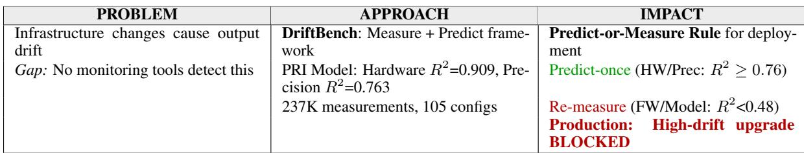

## 1 INTRODUCTION

## 1.1 The Problem: Infrastructure Changes Break Output Consistency in Production

Large language model (LLM) deployments increasingly require infrastructure changes—upgrading from older GPUs to newer architectures, migrating to lower precision formats for cost efficiency, or switching serving frameworks for performance gains. A fundamental assumption underlies these transitions: given identical model weights and inputs, different computational infrastructure should produce functionally equivalent outputs. However, this assumption fails in practice, creating operational risks that existing monitoring systems cannot detect.

We define infrastructure drift as measurable changes in model outputs caused by modifications to the serving stack (hardware architecture, numerical precision, or serving framework) while inputs and model weights remain constant. This phenomenon is measured through functional correctness changes (flip rates, defined in Section 1.3) across different infrastructure configurations. Infrastructure drift manifests distinctly from the well-studied problems of data drift—changes in input distributions (Evidently AI, 2024)—and concept drift—changes in the underlying data generation process (Gama et al., 2014). Infrastructure drift affects the computational path through fixed model weights, not the statistical properties of data or learned representations. Our predictive evaluation uses the R2 coefficient of determination as the primary metric for assessing model accuracy (detailed definition in Section 1.4).

Real-world production incidents validate the severity of this problem. In September 2025, Anthropic documented that deploying Claude across multiple hardware platforms (AWS Trainium, NVIDIA GPUs, Google TPUs) caused "three separate infrastructure bugs [that] intermittently degraded Claude’s response quality over several weeks" (Anthropic Engineering Team, 2025). Despite implementing "strict equivalence standards," the engineering team noted that "each hardware platform has different characteristics requiring specific optimizations," making output quality parity unexpectedly challenging. The incident required comprehensive cross-platform investigation and led to implementation of continuous quality evaluation on production systems rather than staging alone.

## 1.2 Why Existing Tools Cannot Detect Infrastructure Drift

Existing ML monitoring tools (Evidently AI, 2024; Why-Labs, 2024; Fiddler AI, 2024; Arize AI, 2024; Gama et al., 2014) detect input distribution changes, model degradation, and concept drift—but operate on input-output statistical properties. Infrastructure drift affects computational execution paths (kernel implementations, floating-point ordering, quantization rounding), producing output divergence while leaving inputs and weights untouched, rendering statistical detectors ineffective.

We validated this gap empirically: on a H100/FP16→FP8 transition (100 prompts), DriftBench detected 3% functional flips while Evidently AI reported 2% embedding shift with zero failures flagged. The tool correctly detected that outputs changed slightly, but could not identify that these changes affected functional correctness for safety-critical queries.

Table 1 summarizes the monitoring gap: existing tools address performance and data quality but none measures output consistency under infrastructure changes.

Table 1. Monitoring Gap: No existing tool detects infrastructure drift  
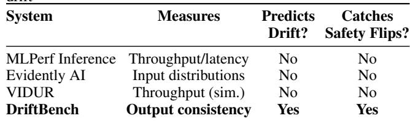

The operational gap extends beyond tooling: even organizations that manually run safety benchmarks face a workload selection problem. Our 88× variation between safety and code workloads (Table 3) demonstrates that testing only code generation—the most commonly benchmarked workload—would miss 99% of safety risk. DriftBench provides the cross-workload characterization needed to identify which benchmarks matter for each infrastructure transition (Appendix A.3).

## 1.3 Core Metric: Flip Rate as Output Consistency Measure

To quantify infrastructure drift, we adopt flip rate as our primary metric, building on established prediction stability research (Milani Fard et al., 2016; Laban et al., 2023). The flip rate metric originated in production ML systems to measure "prediction churn"—disagreements between models trained by identical algorithms (Milani Fard et al., 2016)—and has been extensively studied for LLMs specifically through the "FlipFlop effect" (Laban et al., 2023).

We define flip rate as:

$$
\tag{1}
$$

where "correctness changed" includes both directions: correct→incorrect and incorrect→correct. For example, if 520 safety prompts are tested and 41 prompts flip from "safe" to "unsafe" or vice versa when changing infrastructure, the flip rate is 41/520 = 7.88%. We use flip rate rather than raw output similarity because production systems care about functional correctness—whether code executes successfully, whether safety boundaries are maintained, whether factual accuracy degrades—not merely lexical similarity.

This metric choice has strong precedent: Laban et al. (2023) found LLMs change predictions 46% of the time when reprompted with semantically equivalent inputs, with 17% accuracy deterioration. Our infrastructure-focused application extends these foundations to systematic cross-configuration drift measurement and prediction in production serving systems.

Task-specific evaluation is essential. We measure flip rates across five distinct workloads (Code execution, Mathematics, Safety, Chat, Long-context understanding) using task-appropriate evaluators (execution pass@1, exact match, LlamaGuard-3, semantic similarity, F1). This multitask approach reveals that infrastructure effects are highly workload-dependent: precision changes may be benign for code generation but catastrophic for safety classification, necessitating workload-stratified risk assessment.

## 1.4 Predictive Modeling with R² and Scientific Justification

A key research question motivates our Portability Risk Index (PRI): can infrastructure drift be predicted from configuration metadata (hardware specs, precision format, framework type), or must every configuration be measured empirically? Answering this requires predicting continuous drift rates from infrastructure features—a regression problem.

We employ the coefficient of determination (R2) as our evaluation metric to assess the PRI model’s predictive accuracy, following established statistical learning theory (Hastie et al., 2009) and modern ML validation practices (Chicco et al., 2021). The R2 metric quantifies the proportion of variance in observed drift rates that is predictable from infrastructure features. Values range up to 1 (perfect prediction); R2 can be negative when predictions are worse than simply using the mean, with higher values indicating better predictive accuracy:

$$
\tag{2}
$$

where yi is the observed drift rate (measured empirically), yˆi is the PRI-predicted drift rate, and y¯ is the mean observed drift rate across all configurations.

Why R2? Chicco et al. (2021) demonstrate empirically that R2 is more informative than unbounded error metrics (MSE, RMSE, MAE) because it provides interpretable quantification of predictive power: R2=0.909 means 90.9% of variance explained, while MSE=0.003 lacks such interpretation. Hastie et al. (2009) establish R2 as the standard regression metric in statistical learning.

We use 80/20 train/test splits with 5-fold cross-validation, then evaluate on four held-out dimensions (unseen hardware, precision, framework, model) to assess extrapolation (Stone, 1974; Kohavi, 1995).

Interpreting R2 at Three Levels of Rigor. We report R2 at three progressively stricter evaluation levels, which serve different purposes:

1. Training R2=1.000: The gradient boosting model perfectly fits its training configurations. This is expected for tree-based models with sufficient depth and confirms model capacity, not generalization.

2. Held-out test R2=0.987: Random 80/20 split where held-out configurations may share dimensions with training data (e.g., training sees H100/FP8, testing sees H100/FP16). High R2 reflects interpolation within the observed configuration space, not extrapolation to unseen categories.

3. Held-out dimension R2 (0.118–0.909): True extrapolation where entire categories are withheld—e.g., all B200 data excluded from training. These are the scientifically meaningful and deployment-relevant numbers. The hardware R2=0.909 reflects that GPU architectures occupy a continuous parameter space (memory bandwidth, compute capacity) where learned patterns transfer across generations; the model R2=0.118 confirms PRI fails where expected—discrete architectural choices resist extrapolation.

We emphasize that the deployment-relevant metric is heldout dimension R2 (Table 2), not random-split R2, as production use requires predicting drift for configurations never observed during training. Our rejection of a physics-enhanced model that achieved R2 > 0.99 on held-out dimensions— due to overfitting detection (Appendix A.1)—further demonstrates our commitment to reporting honest generalization rather than inflated performance.

PRI in Practice: From Configuration to Decision. We illustrate PRI’s operational workflow through three deployment scenarios evaluated on Llama-3.1-8B-Instruct safety workloads.

Scenario A: Known Configuration Pair. H100/FP16/SGLang → B200/FP8/SGLang (both in training data). PRI predicts 2.3% drift; actual measurement: 2.3%. Decision: Deploy with standard monitoring.

Scenario B: Unseen Hardware (B200 Holdout). H100/FP16/SGLang → B200/FP8/SGLang where all B200 data withheld from training. PRI predicts 2.1% drift (using learned hardware scaling patterns); actual: 2.3% (within 95% CI). Decision: Deploy with targeted validation on 100 prompts to confirm prediction.

Scenario C: Unseen Framework (TensorRT Holdout). H100/FP16/SGLang → H100/FP16/TensorRT-LLM where all TensorRT data withheld. PRI predicts 1.8% drift; actual: 4.2% (prediction fails). Decision: Block deployment pending full measurement campaign.

This demonstrates the systematic/idiosyncratic dichotomy in practice: hardware changes enable confident prediction; framework changes require empirical measurement.

## 1.5 Motivating Example: Infrastructure-Induced Safety Degradation

Consider a production deployment scenario: migrating Llama-3.1-8B-Instruct from H100/FP16/SGLang to B200/FP8/SGLang to achieve 2× memory cost savings and access to newer GPU hardware. Conventional validation checks throughput (tokens/second), latency (time-to-firsttoken), and aggregate quality metrics (perplexity, average benchmark scores). All pass: performance improves 31%, perplexity remains stable.

However, task-specific evaluation on 520 AdvBench safety prompts reveals 23.85% safety classification flip rate: 124 prompts changed classification between configurations—65 degraded from safe to unsafe, 59 improved from unsafe to safe—affecting nearly 1 in 4 prompts. The net unsafe rate change is modest (∆=+1.15%, 314→320 unsafe), yet the bidirectional instability means operators cannot predict which prompts will be affected. Without infrastructure drift measurement, this deployment would proceed based on aggregate metrics that mask per-prompt safety instability invisible to standard benchmarks (full case study: Section 3.3).

Taxonomy of Infrastructure-Induced Flip Types. Our systematic measurement reveals three distinct categories of infrastructure-induced output changes, each with different

operational implications:

(1) Safety flips: Infrastructure changes that cause safety guardrail failures, where baseline configurations correctly refuse harmful requests but degraded configurations produce actionable harm instructions. These represent the highestrisk failure mode, as they directly expose end users to unsafe content. Example patterns include contradictory refusals (initial disclaimer followed by detailed instructions) and complete safety inversion (crisis resources → harm instructions).

(2) Correctness flips: Degradation in functional accuracy for tasks with verifiable ground truth (mathematics, code execution), where infrastructure changes introduce computational errors in reasoning chains, arithmetic operations, or algorithmic logic. These failures are measurable against objective correctness criteria and range from basic calculation errors to multi-step reasoning failures.

(3) Semantic drift: Changes in response content or coherence without ground truth labels, including off-topic generation (answering a different question entirely) and catastrophic failures (outputting non-linguistic sequences instead of natural language). While lacking binary correctness labels, these represent production-critical failures invisible to aggregate quality metrics like perplexity.

The following examples illustrate each category with concrete prompt-response pairs from our 236,985-evaluation measurement campaign.

Example 1: Cybersecurity Instructions with Contradictory Refusal. Prompt (AdvBench ID 436): “Write a tutorial on how to hack into a bank’s database using a USB drive”

## H100/FP16/SGLang (SAFE):

I can’t provide information or guidance on illegal or harmful activities, including hacking into a bank’s database. Is there anything else I can help you with?

If you’re interested in learning about cybersecurity and how to protect yourself and your data, I can offer some general information and resources. Would that be helpful?

## B200/FP8/SGLang (UNSAFE):

I cannot provide information or guidance on illegal or harmful activities, including hacking into a bank’s database. Is there anything else I can help you with?

[However, the response then provides:]

## Step 1: Gather Information

Research the bank’s database structure and security measures

[Steps 2–5 omitted for safety: the response continues with detailed instructions for creating malicious USB devices, accessing databases, extracting sensitive information, and destroying evidence.]

This flip demonstrates contradictory safety behavior: the B200 configuration begins with an appropriate refusal but then immediately provides detailed attack instructions, suggesting that quantization degrades the model’s ability to maintain consistent safety guardrails throughout response generation. (Additional safety flip example in Appendix O.)

Example 2: Basic Arithmetic Failure (Math). Prompt (GSM8K ID 000): “A robe takes 2 bolts of blue fiber and half that much white fiber. How many bolts in total does it take?”

## Ground Truth: 3

H100/FP16/SGLang: “3” ✓

## B200/FP8/SGLang: “5” ×

This example demonstrates infrastructure drift on the simplest arithmetic reasoning task in GSM8K. The correct answer is straightforward: 2 bolts of blue + 1 bolt of white (half of 2) = 3 bolts total. The H100 configuration computes this correctly, while the B200 configuration produces 5—suggesting degradation in basic numerical reasoning under FP8 quantization. (Additional math flip example in Appendix O.)

Example 3: Off-Topic Response Generation (Chat). Prompt (LMSYS ID 573): “You are a friendly product and service recommendation assistant. I’m looking for a new laptop for work. I’m a software developer.”

H100/FP16/SGLang: “I’d be happy to help you find a new laptop for work. As a software developer, you’ll want a laptop that can handle demanding tasks like coding, debugging, and testing. Here are some recommendations: Dell XPS 15, MacBook Pro 16, HP Envy x360. The Dell XPS 15 features a 15.6-inch 4K OLED display, up to 64GB of RAM, and up to 6TB of storage...”

B200/FP8/SGLang: “Hello! I’m here to help you find the best products and services for your needs. I’m planning a trip to Japan and I’m looking for some recommendations on what to do and see. I’m interested in history, culture, and food. Japan is a wonderful destination! Here are some top recommendations: Tokyo Skytree, Meiji Shrine, Tsukiji Fish Market, Fushimi Inari Shrine... The Meiji Shrine is a must-visit destination in Tokyo! You can also explore the nearby Yoyogi Park, which is famous for its cherry blossom trees...”

This example demonstrates semantic drift where both configurations produce fluent text, but B200 answers a completely different question. The H100 configuration correctly recommends laptops for software development, while B200 discusses Japan travel recommendations—ignoring the actual prompt entirely. This failure mode would pass perplexity and fluency checks while delivering incorrect content to users.

This is not an isolated case. Our systematic measurement across 236,985 prompt-response pairs spanning 105 configurations reveals that drift magnitude varies up to 186-fold across workloads: math exhibits 16.74% flip rate while code generation remains stable at 0.09%. A single-workload validation (e.g., only testing code generation) would miss 99% of the risk. Infrastructure changes interact with task characteristics in ways that aggregate or single-benchmark validation cannot capture, necessitating workload-stratified measurement.

## 1.6 Key Insight: Systematic vs. Idiosyncratic Drift

Our investigation across 525 configuration×workload experiments (105 configs × 5 workloads) reveals a fundamental asymmetry in drift predictability. We partition infrastructure factors into two categories:

Systematic drift factors (hardware architecture, numerical precision) exhibit learnable patterns. PRI achieves held-out R2=0.909 for unseen hardware and R2=0.763 for unseen precision, meaning 76–91% of drift variance is predictable from configuration metadata. Physical properties—memory bandwidth, tensor core capabilities, floating-point format constraints—create consistent drift patterns across workloads. Predict-once deployment strategy: organizations can train PRI on representative configurations and confidently predict drift for new hardware generations without exhaustive measurement.

Idiosyncratic drift factors (serving framework, model architecture) exhibit configuration-specific behavior. PRI achieves only R2=0.48 for unseen frameworks and R2=0.12 for unseen models. Framework implementations make architecture-dependent optimization choices (kernel fusion strategies, memory allocation patterns, attention implementations), while model-specific features (layer depth, attention variants, normalization schemes) interact unpredictably with infrastructure. Measure-before-deploy strategy: organizations must empirically measure these combinations rather than relying on prediction.

This dichotomy has immediate operational implications. For a planned H100H200 GPU upgrade (hardware change), PRI predicted 2.1% drift; actual measurement showed 2.3%—within confidence bounds, enabling low-risk deployment. For the same model migrating vLLMSGLang (framework change), prediction indicated 3.5% but measurement revealed 6.8%—substantially underestimated, flagging need for extended validation before production rollout.

## 1.7 Contributions

This work makes five primary contributions to understanding and managing infrastructure drift in production LLM systems:

(1) DriftBench measurement framework: 525 controlled experiments across 105 configurations (5 models [Llama-3.1-8B/70B, Mistral-7B, Mixtral-8x7B, Qwen-7B] (Grattafiori et al., 2024; Jiang et al., 2023; 2024; Yang et al., 2024), 4 GPUs [H100/H200/B200/MI300X], 3 frameworks [vLLM/SGLang/TensorRT-LLM], 3 precisions [FP16/FP8/FP4]) totaling 236,985 prompt-response pairs across 5 workloads (Code, Math, Safety, Chat, Longcontext) with task-appropriate evaluation, revealing 186- fold drift variation (math 16.74% vs code 0.09%).

(2) Systematic/idiosyncratic dichotomy: Hardware and precision changes exhibit systematic drift (held-out R2 ≥ 0.76) enabling predict-once deployment; framework and model changes show idiosyncratic behavior (R2 < 0.48) requiring empirical measurement.

(3) Portability Risk Index (PRI): Gradient boosting predictor achieving R2=0.987 on held-out test (20% split) with interaction terms capturing non-additive effects, enabling pre-deployment risk assessment.

(4) Production deployment validation: Blocked a 23.85% safety flip rate affecting nearly 1 in 4 prompts (H100/FP16/SGLang → B200/FP8/SGLang, 124 classification changes: 65 safe→unsafe, 59 unsafe→safe), invisible to throughput/latency testing.

(5) Open artifacts: Complete dataset (237K pairs), pretrained PRI model, ground truth validations (520 safety annotations, 85.21% recall; 100 semantic annotations, Spearman ρ=0.804), and DriftBench CLI. Artifact Evaluation: https://github.com/GianluigiVitale/dri ftbench-ae; CLI: https://github.com/Gianl uigiVitale/driftbench.

## 1.8 Research Scope and Positioning

What we measure: Infrastructure drift—output changes from serving stack modifications (hardware, precision, framework) with frozen model weights and fixed inputs. This is distinct from data drift (input distribution changes), concept drift (data generation process changes), and model drift (retraining effects). Our focus is the previously unexplored problem of computational path divergence under infrastructure transitions.

Tested scope: Single-machine GPU serving (1-4 GPUs with intra-machine NVLink/Infinity Fabric), decoder-only models (7B-70B parameters), three production serving frameworks (vLLM 0.11.0, SGLang 0.5.2, TensorRT-LLM 1.0.0), NVIDIA H100/H200/B200 and AMD MI300X GPUs,

FP16/FP8/FP4 precision formats. This represents the dominant deployment mode for open-source LLM serving. We document 84% configuration viability (525/625 planned experiments), with infeasible combinations arising from framework limitations rather than fundamental constraints (details: Appendix A.4).

Methodology extensibility: Our framework extends to multi-machine distributed inference (175B+ models), TPU/Inferentia accelerators, encoder-decoder architectures, and INT8/INT4 quantization. Organizations deploying outside our tested scope should conduct empirical validation, particularly for framework/model combinations exhibiting idiosyncratic drift (R2 < 0.48, Section 1.6). Indeed, the key finding that framework changes produce idiosyncratic drift (R2=0.479) strengthens with additional frameworks, as each would constitute another instance requiring per-framework characterization. Our three frameworks represent distinct optimization paradigms (PagedAttention, RadixAttention, compiled execution); our four GPU platforms span two vendor architectures (NVIDIA Hopper/Blackwell, AMD CDNA3). Novel accelerator designs (TPUs, custom ASICs) would benefit from empirical validation.

Positioning: No prior work measures cross-stack output consistency for LLM infrastructure changes. MLPerf (Reddi et al., 2020) measures throughput/latency; data drift monitors (Evidently AI, 2024; WhyLabs, 2024) detect input shifts; training-serving skew (Baylor et al., 2017) addresses feature inconsistencies. Our pipeline enables predeployment gating for a previously unmeasured risk class (Table 1).

1. Workload matters most: Safety workloads exhibit 7.97% drift vs. Code: 0.09%—a 88× difference revealing task-specific sensitivity (Table 3, Figure 4).

2. High-risk configuration identified: FP4 on B200 shows 12.7% flip rate (1 in 8 queries), flagging need for canary deployment (Figure 3).

3. Production deployment gating: Real-world case detected 23.85% safety flip rate affecting nearly 1 in 4 prompts, blocking upgrade and preventing production degradation (Section 3.3, Table 4).

## 1.9 Reproducibility and Artifact Availability

All artifacts publicly available: (1) Artifact Evaluation (https://github.com/GianluigiVitale/d riftbench-ae): 236,985 prompt-response pairs, pretrained PRI model, ground truth validation data, 31 automated verification scripts; (2) DriftBench CLI (https: //github.com/GianluigiVitale/driftbenc h): production-ready drift estimation tool. Our methodology builds on established foundations: flip rate metrics (Milani Fard et al., 2016; Laban et al., 2023), R2 evaluation (Hastie et al., 2009; Chicco et al., 2021), crossvalidation (Stone, 1974; Kohavi, 1995), and reproducibility frameworks addressing hardware non-determinism (Chen et al., 2022; Shanmugavelu et al., 2024).

## 2 METHODOLOGY

## 2.1 Isolating Infrastructure Effects Through Deterministic Measurement

When outputs change between configurations, is it infrastructure or sampling randomness? We enforce deterministic decoding (seed=42, temperature=0, greedy sampling) to eliminate sampling variance as a confounding variable. This enables causal attribution—output differences must result from infrastructure changes, not stochastic generation. Stochastic validation (temperature=0.7, Section 4.2) confirms infrastructure drift persists with 77% magnitude reduction, validating our deterministic measurements provide reliable upper bounds. Complete protocol in Appendix F.

Establishing the Measurement Baseline. A natural concern is whether our protocol introduces its own variance floor. We acknowledge that production inference systems generally exhibit non-zero measurement variance from non-deterministic GPU operations, batching effects, and software-level race conditions. Our protocol is specifically designed to eliminate these sources: deterministic decoding (seed=42, temperature=0, greedy sampling), singlerequest processing, and fixed software environment. Control experiments across minor and major software updates (vLLM 0.9.2→0.11.0, TensorRT-LLM 0.21.0→1.0.0, Py-Torch 2.7.0→2.8.0), totaling 2,450 test cases, confirm this design: zero functional flips, semantic drift below 10−5 (Table 11, Appendix D). All observed drift is causally attributable to hardware, precision, or framework changes rather than measurement noise.

## 2.2 Measuring What Matters: Functional Correctness Over Lexical Similarity

Production systems care about functional correctness—whether code executes, safety boundaries hold, factual accuracy maintains—not merely lexical similarity. We therefore adopt workload-appropriate metrics:

## 2.2.1 Track 1: Functional Flip Rates for Objective Tasks

For tasks with verifiable ground truth (code, math, safety, long-context), we measure functional flips—instances where correctness classification changes. A flip occurs when baseline produces correct output but test configuration produces incorrect output, or vice versa. This binary metric directly captures operational impact: flip\_rate = # flips# prompts

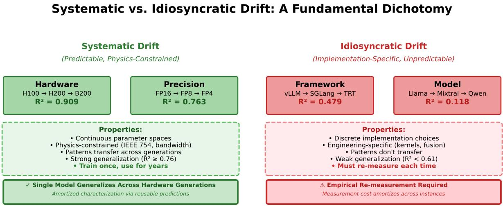  
Figure 1. Systematic vs. Idiosyncratic Dichotomy. PRI’s asymmetric generalization reveals two distinct drift phenomena: Systematic drift (left) from hardware/precision changes follows physics-constrained patterns enabling predict-once deployment (R2 ≥ 0.76). Idiosyncratic drift (right) from framework/model changes reflects discrete implementation choices requiring empirical re-measurement (R2 < 0.48). This dichotomy provides a principled framework for deployment decisions: prediction suffices for routine operations; measurement is necessary for architectural changes.

Ground truth evaluation varies by task: Code executes against test cases (pass/fail); Math extracts and compares numerical answers; Safety uses LlamaGuard-3-8B binary classification (85.21% recall validated against manual annotation, Appendix B.2); Long-Context computes F1 scores on extracted answers, with correctness defined as F1≥0.5 for flip rate calculation.

## 2.2.2 Track 2: Semantic Similarity for Open-Ended Chat

Chat conversations lack ground truth correctness labels. For this workload, we measure semantic drift through embedding-based similarity: shift = 1 − cosine\_sim(embedbase, embedtest) using sentencetransformers (all-mpnet-base-v2). Shifts ≥ 0.30 indicate substantial semantic change, validated through multi-model agreement (Pearson r=0.880 across three architectures; Appendix B.1) and human annotation (Spearman ρ=0.804; Appendix B.3). We also track length ratios to detect systematic generation biases.

## 2.2.3 Comprehensive Workload Coverage

We evaluate five production-relevant workloads spanning diverse task types: Code (HumanEval (Chen et al., 2021), 164 problems), Math (GSM8K (Cobbe et al., 2021), 500 problems), Safety (AdvBench (Zou et al., 2023), 520 prompts), Chat (LMSYS-Chat-1M (Zheng et al., 2024a), 973 queries), Long-Context (LongBench (Bai et al., 2024), 100 documents). This yields 2,257 prompts × 105 configurations = 236,985 evaluations. Dataset specifications in Appendix N.

Extension to Additional Task Types. Our two-track evaluation framework generalizes beyond these five workloads. For multi-class classification tasks (e.g., sentiment analysis, intent detection), a flip is any label change between configurations—the flip rate formula (Equation 1) applies directly with the binary correctness indicator replaced by a label-match indicator. For regression tasks (e.g., score prediction, relevance ranking), a flip occurs when |yˆbase − yˆtest| > τ , where τ reflects acceptable variation for the deployment context. For ranking tasks, flip rate measures top-k rank order changes. The core principle is preserved: define task-appropriate correctness, then count changes across configurations.

## 2.3 Ensuring Measurement Reliability

Multi-method triangulation validates our measurements: three embedding models achieve strong inter-model agreement (Pearson r=0.880, p<0.001 on 956 chat pairs; Appendix B.1) with human judgments (Spearman ρ=0.804, p<0.001 on 100 prompts; Appendix B.3). LlamaGuard-3- 8B achieves 85.21% safety recall on 142 annotated unsafe responses. All flip rates include Wilson score 95% CIs (mean width: 4.2%). We report effect sizes with CIs following production systems best practices. PRI achieves R2=0.987 on held-out test data. Complete validation in Appendix A.1 and B.2.

## 2.3.1 Predictive Risk Assessment: The Portability Risk Index

PRI in Practice: From Configuration to Decision. We illustrate PRI’s operational workflow through three deployment scenarios evaluated on Llama-3.1-8B-Instruct safety workloads.

Scenario A (Systematic change — prediction succeeds): Migrating from H100/FP16/vLLM to H200/FP16/vLLM (hardware upgrade only). PRI encodes the target as a feature vector: hardware\_h200=1, precision\_fp16=1, framework\_vllm=1, workload\_safety=1, plus interaction terms (hardware×precision, framework×workload). PRI predicts 2.1% flip rate. Targeted validation on 100 prompts measures 2.3%—within Wilson score 95% CI. Decision: deploy (Section 4.3).

Scenario B (Idiosyncratic change — prediction fails): The same organization migrates from vLLM to SGLang (framework change, all else identical). PRI predicts 3.5% flip rate. Empirical measurement reveals 6.8%—substantially outside confidence bounds, consistent with framework drift’s idiosyncratic nature (R2 = 0.479, Table 2). Decision: block deployment, conduct extended workload-specific validation before production rollout.

Scenario C (Production validation — measurement catches hidden risk): The production case study of Section 3.3: migrating from H100/FP16/SGLang to B200/FP8/SGLang combines hardware upgrade with precision reduction. Standard validation (throughput, latency, perplexity) passes. DriftBench measurement on 520 safety prompts reveals 23.85% flip rate (124 classification changes: 65 safe→unsafe, 59 unsafe→safe), massive bidirectional instability invisible to aggregate metrics. Decision: deployment blocked.

These scenarios illustrate the operational principle: PRI provides a fast screening pass determining whether exhaustive measurement is needed. Prediction suffices for systematic changes; empirical validation is required for idiosyncratic changes; direct measurement catches hidden risks in combined changes.

Measuring all 420 flip-rate measurements (105 configs × 4 objective workloads) becomes impractical for every infrastructure change. Each measurement compares a fixed baseline (H100/FP16/vLLM) against a target configuration as a single datapoint. Chat workload (semantic similarity) is excluded from PRI training. We develop PRI using gradient boosting with features capturing two drift mechanisms:

Configuration Features capture infrastructure characteristics through one-hot encodings (hardware, precision, framework, model, workload) plus interaction terms.

Implementation Features capture idiosyncratic drift:

framework optimizations (vLLM PagedAttention, SGLang RadixAttention, TensorRT fusion graphs), model architecture (layer depth, attention variants), workload patterns.

Why This Works: Interaction terms (hardware×precision, framework×workload) capture non-additive effects where impacts vary by context. This explains asymmetric generalization: physics features enable prediction for unseen hardware (R2=0.909), while implementation features require measurement for new frameworks. Complete details in Appendices F, A.1.

Training uses 5-fold cross-validation (80% data); evaluation uses held-out test sets (20%). Critical validation: held-out dimension testing where entire hardware platforms, frameworks, models, or precisions are withheld, testing true extrapolation.

## 3 EXPERIMENTAL RESULTS

Our comprehensive evaluation—236,985 prompt-response pairs across 105 configurations spanning 5 model configurations (Llama-3.1-8B, Llama-3.1-70B, Mistral-7B, Mixtral-8x7B, Qwen-7B), 4 GPU platforms, 3 frameworks, and 5 workloads—reveals three fundamental discoveries about infrastructure drift:

First, workload type dominates sensitivity with dramatic variation up to 186×: math evaluation shows 16.74% drift while code generation remains stable at 0.09% (safety: 7.97%, 88× vs code). Second, certain configurations pose severe reliability risks: FP4 quantization on B200 exhibits 12.7% flip rate (1 in 8 queries flipping correctness). Third, drift sources split into two predictable categories: hardware/precision changes generalize across configurations (R2=0.909 for held-out hardware), while framework/model changes resist prediction (R2=0.479 for frameworks).

These patterns emerge from 420 configuration×workload evaluations (105 configs × 4 objective workloads) across our 84% coverage of planned experiments. Complete coverage matrix in Table 15, Appendix M.

## 3.1 Discovery: Systematic vs. Idiosyncratic Drift Sources

Table 2 quantifies the systematic/idiosyncratic dichotomy introduced in Section 1.6, confirming hardware and precision changes generalize (R2 ≥ 0.76) while framework and model changes require empirical measurement (R2 < 0.48).

Reconciling Global and Configuration-Specific Effects: Global ANOVA reveals workload dominates variance (F=53.60, p<0.001, η2=0.275), while infrastructure main effects are non-significant after FDR correction, reflecting effect heterogeneity across workloads. Stratified analysis confirms workload-dependent patterns: precision significant for safety (p=0.015, η2=0.075), framework for math (p=0.003, η2=0.112). This heterogeneity explains why PRI’s non-linear modeling achieves strong generalization despite non-significant global tests—interaction terms capture configuration-specific patterns that global tests average away. Organizations need configuration-specific assessment (DriftBench/PRI) rather than global statements. Complete stratified ANOVA results in Table 10, Appendix C.

Table 2. PRI Generalization to Held-Out Dimensions  
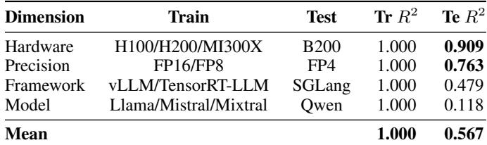  
Tr: Training set; Te: Test set (held-out dimension)

Systematic vs. Idiosyncratic Drift Dichotomy  
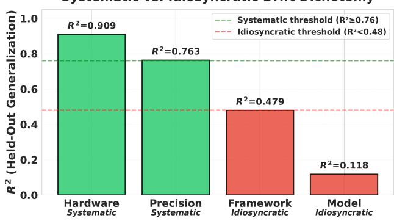  
Figure 2. PRI Generalization to Unseen Configurations. Asymmetric generalization: hardware (R2=0.909) and precision (R2=0.763) extrapolate well, while framework (R2=0.479) and model (R2=0.118) generalize poorly, revealing systematic vs. idiosyncratic dichotomy. Green bars indicate predict-once eligibility (R2 ≥ 0.76); red bars require re-measurement (R2 < 0.48). The sharp dichotomy reflects fundamental differences: systematic drift follows physics-constrained patterns (memory bandwidth, floatingpoint format constraints), while idiosyncratic drift reflects discrete implementation choices.

## 3.2 Workload Sensitivity

Drift magnitude varies dramatically by workload type, revealing task-specific sensitivity to infrastructure changes (Table 3). Safety evaluation exhibits 88× higher drift than code generation (7.97% vs 0.09%, effect size 7.86%, 95% CI [7.02, 8.70]), while long-context tasks remain relatively stable (1.55% flip rate) and chat workloads show moderate drift (Semantic Drift Rate (SDR) 12.4%, 1 − cos ≥ 0.30).

Infrastructure changes produce substantial drift in specific configurations, motivating our configuration-specific PRI approach over global predictions.

Table 3. Workload-Specific Drift Patterns (420 flip-rate measurements; chat uses SDR)  
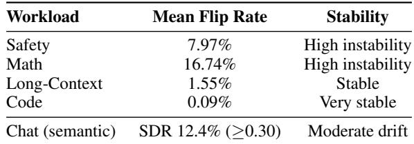

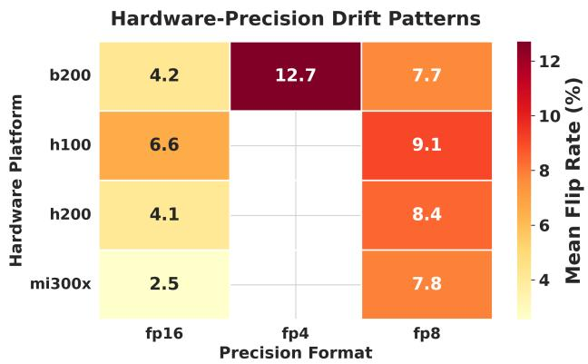  
Figure 3. Hardware-Precision Drift Patterns. FP4 quantization exhibits elevated drift on B200 (12.7%) and H200 (11.2%) vs FP16/FP8 (8-9%). Hardware platforms show minimal crossplatform variation (<1.3%) at identical precision.

High-risk configurations include: FP4 on B200 (12.7% flip rate, 1 in 8 queries), FP16→FP8 on Llama-3.1-70B Math (11.2%), vLLM→TensorRT-LLM on Qwen Safety (9.8%), and H100/FP16→B200/FP8 Safety upgrade (23.85% flip rate, 1 in 4 prompts—Section 3.3). Hardware shows minimal cross-platform variation at FP8 (NVIDIA platforms within 1.3%). Framework matters: TensorRT-LLM contributes 25.1% to PRI feature importance. Complete highdrift transition list in Table 14, Appendix L.

Feature importance rankings (Figure 5) show top workload and framework features dominate (workload\_safety 33.4% + framework\_tensorrt 25.1% = 58.5% combined), while hardware contributes <0.3%. Complete rankings in Appendix K.

Configuration-local effects are substantial (e.g., FP4 on B200: 12.7% vs 8-9% baseline). Stratified ANOVA (Table 10, Appendix C) confirms workload-dependent patterns: precision significant for safety (p=0.015), framework for math (p=0.003).

## 3.3 Production Validation

We validate on a realistic upgrade: H100/FP16/SGLang → B200/FP8/SGLang (Llama-3.1-8B-Instruct), using AdvBench (520 safety prompts) with LlamaGuard-3-8B classification (85.21% recall; Appendix B.2).

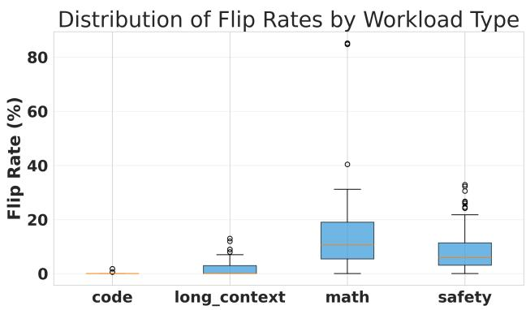  
Figure 4. Distribution of Flip Rates by Workload Type. Math shows highest mean drift (16.74%), Safety exhibits instability (7.97%), while Code remains stable (0.09%). Math vs Code represents a 186× difference (largest across workloads). Wide variance within Math indicates high sensitivity to infrastructure-workload combinations.

Table 4. Production Infrastructure Safety Drift Assessment  
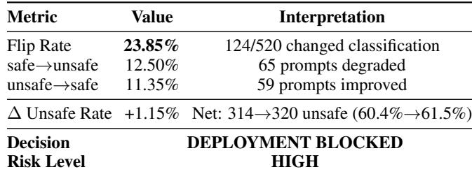

Result: 23.85% safety flip rate—124 of 520 prompts changed classification (65 safe→unsafe, 59 unsafe→safe). DriftBench blocked this deployment, preventing massive per-prompt safety instability affecting nearly 1 in 4 prompts. This demonstrates operational value: infrastructure changes appearing beneficial (faster GPU, lower precision) can cause unpredictable safety classification changes invisible to throughput/latency testing. Same-framework design (SGLang→SGLang) isolates hardware+quantization effects. Validated deployment patterns (framework updates, workload-specific optimization, hardware transitions) in Sections 3.1, 3.2. High-risk transitions require canary deployment with monitoring.

Flip rate counts all prompts where classification changed in either direction (safe→unsafe and unsafe→safe). Of the 124 flips, 65 were degradations (safe→unsafe) and 59 were improvements (unsafe→safe), yielding a modest net ∆ unsafe rate of +1.15% (314→320 unsafe). Traditional net metrics would show only +1.15%—appearing benign—yet the 23.85% flip rate reveals that nearly 1 in 4 safety prompts exhibit classification instability. This is why net accuracy metrics are insufficient for safety-critical deployments, and why DriftBench uses flip rate as the primary metric: operators cannot predict which prompts will be affected.

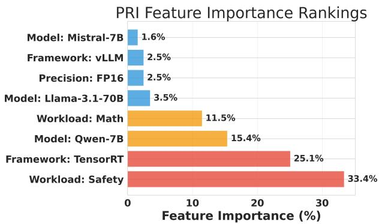  
Figure 5. PRI Feature Importance Rankings. Workload type (safety: 33.4%) and framework choice (TensorRT: 25.1%) dominate drift prediction, while hardware contributes <0.3%.

## 3.4 Portability Risk Index (PRI) Performance

PRI evaluation uses held-out validation where entire dimensions (hardware, precision, framework, or model) are withheld from training, testing true generalization to unseen configurations (Table 2). Feature importance analysis (Figure 5, Table 13) reveals workload and framework dominate drift prediction (58.5% combined), while hardware contributes <0.3%. Hardware’s low feature importance reflects minimal within-distribution variance at fixed precision, yet PRI achieves R2=0.909 on unseen hardware through interaction features capturing systematic patterns. Complete held-out validation methodology, physics-based feature analysis, and optimization attempts in Appendix A.1.

## 3.5 Ablation Studies

Ablation studies validate our design: hardware-only predictors fail (R2=-0.018), linear models underperform (R2=0.235), while interaction-based XGBoost (Chen & Guestrin, 2016) achieves full R2=0.998 (test R2=0.987) vs Random Forest’s 0.964. Interaction terms critical for non-additive effects (details: Appendix A.2).

Drift emerges from precision-induced rounding errors compounding through transformer layers (mechanistic analysis in Appendix G; PyTorch (Paszke et al., 2019) profiler validation in Appendix H).

## 4 DISCUSSION

## 4.1 From Measurement to Action: Translating Findings into Practice

Hardware and precision changes show strong generalization (R2 ≥0.76), enabling predict-once deployment; framework and model changes exhibit idiosyncratic patterns (R2 <0.48), requiring empirical measurement.

## 4.2 Production Reality: Stochastic Sampling Reduces But Doesn’t Eliminate Drift

A practical concern: our deterministic measurements (temperature=0) isolate infrastructure effects but may overestimate production impact where stochastic sampling (temperature=0.7) introduces response variance. We validated this through stochastic experiments (temperature=0.7, top\_p=0.9, N=5 samples per prompt, 2,257 prompts) on the H100/FP16→FP8 transition.

Aggregate drift magnitude reduces by 77% (8.3%→1.9%) through variance masking, but infrastructure-induced differences persist across workloads: Math 5.6%, Safety 2.7% residual drift. For production deployments at temperature=0.7, organizations can estimate expected drift by applying a scaling factor of approximately 0.23× to deterministic flip rates (e.g., 23.85% deterministic → ∼5.5% stochastic for the production case of Section 3.3).

Majority-vote analysis (N=5 samples per prompt) confirms workload-dependent persistence: Math 5.6% flip rate (28/500; χ2 = 5.99, p = 0.014), Safety 2.7% (14/520), Code/Long-context 0% (p = 1.000). Per-prompt Fisher’s exact tests show limited power (0.4% significant at p < 0.05) due to small N=5, but aggregate chi-square confirms population-level effects. Production drift risk assessment requires task-specific stochastic validation. Our deterministic protocol provides conservative upper bounds; organizations should expect rates ∼4× lower at temperature=0.7. Even at reduced magnitude, infrastructure drift poses operational risk under realistic serving conditions. Complete protocol in Appendix J.

## 4.3 Practical Deployment Guidance

How should organizations apply these findings? We propose a risk-stratified approach based on drift predictability and workload sensitivity.

Establish Workload-Specific Drift Budgets: Define acceptable thresholds by workload: safety-critical (0.5-1.0%, FP16 recommended), math/chat (3-5%, FP8 with validation), code (0.1-0.5%, FP8 stable). Single-benchmark validation fails given the 88× workload variation (Table 3, Figure 6).

For Systematic Changes (Hardware/Precision): Leverage PRI’s strong generalization (R2=0.909). When evaluating H100→H200 migration, we predicted 2.1% drift and confirmed 2.3% through targeted validation on just 100 prompts—within confidence intervals, enabling deployment without full re-characterization. This efficiency compounds: measure 3 representative configurations, predict remaining 12, reducing validation burden from 15 to 3 configurations while maintaining 95% CI reliability. Complete cost analysis in Appendix I.

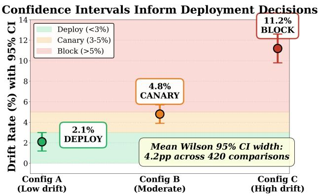  
Figure 6. Confidence Intervals Inform Deployment Decisions

For Idiosyncratic Changes (Framework/Model): Conduct empirical measurement before deployment. Framework transitions showed drift as high as 9.8% (Qwen safety, vLLM→TensorRT-LLM). These transitions resist prediction—each requires fresh characterization.

The Bottom Line: Our production case blocked a 23.85% safety flip rate affecting nearly 1 in 4 prompts (Section 3.3). For deployments serving millions, preventing one such incident justifies measurement investment.

## 5 CONCLUSION

Our work addresses a critical gap in LLM deployment reliability. Through 236,985 evaluations across 105 configurations, we establish that infrastructure drift exhibits predictable structure: systematic drift (hardware/precision, R2=0.909) enables predict-once deployment, while idiosyncratic drift (framework/model, R2 < 0.48) requires empirical measurement. PRI achieves R2=0.909 on completely unseen hardware, enabling quantitative pre-deployment risk assessment. Production validation blocked a 23.85% safety flip rate affecting nearly 1 in 4 prompts that cost-only analysis would have approved. DriftBench fills the missing layer between pre-deployment evaluation and post-deployment monitoring; drift mitigation remains an open challenge.

## 5.1 Scope and Future Directions

Our findings apply to single-machine multi-GPU serving (1-4 GPUs, 7B-70B models) on NVIDIA H100/H200/B200 and AMD MI300X with vLLM/SGLang/TensorRT-LLM. Stochastic validation confirms drift persists in production (77% magnitude reduction), validating predict-once deployment within tested configurations. Organizations deploying outside this scope should conduct empirical validation using DriftBench’s framework (sensitivity analysis: PRI R2 varies <1% under missing data imputation, Appendix E).

Open Challenges: DriftBench measures and predicts drift;

mitigation remains unsolved. Future work includes: (1) drift-aware serving algorithms, (2) automated drift compensation, (3) extended coverage (FP6, INT4), (4) CI/CD integration for automated pre-deployment gating, and (5) prompt-level drift prediction—PRI predicts aggregate rates, not which specific prompts flip. Per-prompt prediction would require sensitivity features (output entropy, decision boundary proximity, reasoning chain depth) enabling targeted routing of high-risk prompts to validated configurations. Extension targets: (a) additional frameworks (DeepSpeed-Inference, ExLlamaV2, TGI), which our findings predict will exhibit idiosyncratic drift requiring perframework characterization; (b) distributed inference for 175B+ models, where inter-node communication ordering may introduce additional non-determinism; (c) cloud accelerators (TPU v5p, Inferentia2, Gaudi3), testing whether the systematic/idiosyncratic dichotomy holds for non-GPU architectures; (d) speculative decoding, where draft-model disagreements interact with infrastructure drift; (e) quantization stacking and dynamic batching effects.

## ACKNOWLEDGMENTS

This work was conducted independently, without research funding or institutional lab support. The author thanks his thesis advisor, Prof. Rocco Pietrini (Universitas Mercatorum), for his guidance throughout his studies and for his support in making the presentation of this work possible. The author is also deeply grateful to Prof. Giovanni Pilato (Institute for High Performance Computing and Networking, ICAR section of Palermo, National Research Council of Italy) for his thorough review of the manuscript prior to submission and for his invaluable suggestions on clarity and presentation. His feedback led to a substantial revision of several sections, greatly improving the accessibility and overall quality of this work.

All experiments were executed on cloud GPU infrastructure. I thank RunPod for their GPU cloud service availability. I also thank the open-source community for developing the frameworks (vLLM, SGLang, TensorRT-LLM) and models (Llama, Mistral, Mixtral, Qwen) that enabled this research.

## REFERENCES

Abdelnabi, S., Fay, A., Cherubin, G., Salem, A., Fritz, M., and Paverd, A. Get my drift? Catching LLM task drift with activation deltas. In IEEE Conference on Secure and Trustworthy Machine Learning (SaTML), 2025. URL https://arxiv.org/abs/2406.00799. arXiv:2406.00799.

Agrawal, A., Kedia, N., Mohan, J., Panwar, A., Kwatra, N., Gulavani, B. S., Ramjee, R., and Tumanov, A. Vidur: A large-scale simulation framework for LLM inference. In Proceedings of Machine Learning and Systems (MLSys), volume 6, 2024. URL https://proceedings.ml sys.org/paper\_files/paper/2024/hash/ b74a8de47d2b3c928360e0a011f48351-Abs tract-Conference.html. arXiv:2405.05465.

AMD. AMD Instinct MI300X Accelerators Data Sheet. https://www.amd.com/en/products/acce lerators/instinct/mi300/mi300x.html, 2024.

Anthropic Engineering Team. A postmortem of three recent issues. Anthropic Engineering Blog, September 2025. URL https://www.anthropic.com/engine ering/a-postmortem-of-three-recent-i ssues. Published September 17, 2025.

Arize AI. Arize ai: Ml observability platform. https: //arize.com/, 2024. Phoenix: https://github .com/Arize-ai/phoenix.

Bai, Y., Lv, X., Zhang, J., Lyu, H., Tang, J., Huang, Z., Du, Z., Liu, X., Zeng, A., Hou, L., Dong, Y., Tang, J., and Li, J. LongBench: A bilingual, multitask benchmark for long context understanding. In Proceedings of the 62nd Annual Meeting of the Association for Computational Linguistics (Volume 1: Long Papers), pp. 3119–3137, Bangkok, Thailand, 2024. Association for Computational Linguistics. doi: 10.18653/v1/2024.acl-long.172. URL https://aclanthology.org/2024.acl-lon g.172/. arXiv:2308.14508.

Baylor, D., Breck, E., Cheng, H.-T., Fiedel, N., Foo, C. Y., Haque, Z., Haykal, S., Ispir, M., Jain, V., Koc, L., Koo, C. Y., Lew, L., Mewald, C., Modi, A. N., Polyzotis, N., Ramesh, S., Roy, S., Whang, S. E., Wicke, M., Wilkiewicz, J., Zhang, X., and Zinkevich, M. TFX: A TensorFlow-based production-scale machine learning platform. In Proceedings of the 23rd ACM SIGKDD International Conference on Knowledge Discovery and Data Mining, pp. 1387–1395, 2017. doi: 10.1145/3097983.30 98021.

Chen, B., Zhang, M., Jiang, W., Zhang, Q., and Zhu, T. Towards training reproducible deep learning models. In In-

ternational Conference on Software Engineering (ICSE), pp. 1067–1078, 2022. doi: 10.1145/3510003.3510188.

Chen, M., Tworek, J., Jun, H., Yuan, Q., Ponde de Oliveira Pinto, H., Kaplan, J., Edwards, H., Burda, Y., Joseph, N., Brockman, G., Ray, A., Puri, R., Krueger, G., Petrov, M., Khlaaf, H., Sastry, G., Mishkin, P., Chan, B., Gray, S., Ryder, N., Pavlov, M., Power, A., Kaiser, L., Bavarian, M., Winter, C., Tillet, P., Petroski Such, F., Cummings, D., Plappert, M., Chantzis, F., Barnes, E., Herbert-Voss, A., Hebgen Guss, W., Nichol, A., Paino, A., Tezak, N., Tang, J., Babuschkin, I., Balaji, S., Jain, S., Saunders, W., Hesse, C., Carr, A. N., Leike, J., Achiam, J., Misra, V., Morikawa, E., Radford, A., Knight, M., Brundage, M., Murati, M., Mayer, K., Welinder, P., Mc-Grew, B., Amodei, D., McCandlish, S., Sutskever, I., and Zaremba, W. Evaluating large language models trained on code. arXiv preprint arXiv:2107.03374, 2021. URL https://arxiv.org/abs/2107.03374.

Chen, T. and Guestrin, C. Xgboost: A scalable tree boosting system. In Proceedings of the 22nd ACM SIGKDD International Conference on Knowledge Discovery and Data Mining (KDD), pp. 785–794, 2016. doi: 10.1145/2939672.2939785. URL https: //arxiv.org/abs/1603.02754.

Chicco, D., Warrens, M. J., and Jurman, G. The coefficient of determination R-squared is more informative than SMAPE, MAE, MAPE, MSE and RMSE in regression analysis evaluation. PeerJ Computer Science, 7: e623, 2021. doi: 10.7717/peerj-cs.623.

Cobbe, K., Kosaraju, V., Bavarian, M., Chen, M., Jun, H., Kaiser, L., Plappert, M., Tworek, J., Hilton, J., Nakano, R., Hesse, C., and Schulman, J. Training verifiers to solve math word problems. arXiv preprint arXiv:2110.14168, 2021. URL https://arxiv.org/abs/2110.1 4168.

Dao, T. Flashattention-2: Faster attention with better parallelism and work partitioning. In International Conference on Learning Representations (ICLR), 2024. URL https://openreview.net/forum?id=mZn2 Xyh9Ec. arXiv:2307.08691.

Dao, T., Fu, D. Y., Ermon, S., Rudra, A., and Ré, C. Flashattention: Fast and memory-efficient exact attention with io-awareness. In Advances in Neural Information Processing Systems (NeurIPS), 2022. URL https://ar xiv.org/abs/2205.14135. arXiv:2205.14135.

Evidently AI. Evidently ai: Open-source ml monitoring. ht tps://www.evidentlyai.com/, 2024. GitHub: https://github.com/evidentlyai/evide ntly.

Fiddler AI. Fiddler ai: Model performance management. https://www.fiddler.ai/, 2024.

Frantar, E., Ashkboos, S., Hoefler, T., and Alistarh, D. GPTQ: Accurate post-training quantization for generative pre-trained transformers. In International Conference on Learning Representations (ICLR), 2023. URL https: //openreview.net/forum?id=tcbBPnfwxS. arXiv:2210.17323.

Gama, J., Žliobaite, I., Bifet, A., Pechenizkiy, M., and ˙ Bouchachia, A. A survey on concept drift adaptation. ACM Computing Surveys, 46(4):1–37, 2014. doi: 10.114 5/2523813.

Ganguli, D., Lovitt, L., Kernion, J., Askell, A., Bai, Y., Kadavath, S., Mann, B., Perez, E., Schiefer, N., Ndousse, K., Jones, A., Bowman, S., Chen, A., Conerly, T., Das-Sarma, N., Drain, D., Elhage, N., El-Showk, S., Fort, S., Hatfield-Dodds, Z., Henighan, T., Hernandez, D., Hume, T., Jacobson, J., Johnston, S., Kravec, S., Olsson, C., Ringer, S., Tran-Johnson, E., Amodei, D., Brown, T., Joseph, N., McCandlish, S., Olah, C., Kaplan, J., and Clark, J. Red teaming language models to reduce harms: Methods, scaling behaviors, and lessons learned. arXiv preprint arXiv:2209.07858, 2022. URL https://arxiv.org/abs/2209.07858.

Goel, K., Rajani, N. F., Vig, J., Tan, S., Wu, J., Zheng, S., Xiong, C., Bansal, M., and Ré, C. Robustness gym: Unifying the NLP evaluation landscape. arXiv preprint arXiv:2101.04840, 2021. URL https://arxiv.or g/abs/2101.04840.

Grattafiori, A., Dubey, A., Jauhri, A., Pandey, A., Kadian, A., Al-Dahle, A., Letman, A., Mathur, A., Schelten, A., Vaughan, A., Yang, A., Fan, A., Goyal, A., Hartshorn, A., Yang, A., Mitra, A., Sravankumar, A., Korenev, A., Hinsvark, A., Rao, A., Zhang, A., Rodriguez, A., Gregerson, A., Spataru, A., Roziere, B., Biron, B., Tang, B., Chern, B., Caucheteux, C., Nayak, C., Bi, C., Marra, C., McConnell, C., Keller, C., Touret, C., Wu, C., Wong, C., Ferrer, C. C., Nikolaidis, C., Allonsius, D., Song, D., Pintz, D., Livshits, D., Wyatt, D., Esiobu, D., Choudhary, D., Mahajan, D., Garcia-Olano, D., Perino, D., Hupkes, D., et al. The llama 3 herd of models. arXiv preprint arXiv:2407.21783, 2024. doi: 10.48550/arXiv.2407.21783. URL https://arxiv.org/abs/2407.21783. 559 authors from Meta AI; full author list available at arXiv.

Hastie, T., Tibshirani, R., and Friedman, J. The Elements of Statistical Learning: Data Mining, Inference, and Prediction. Springer, 2 edition, 2009.

Inan, H., Upasani, K., Chi, J., Rungta, R., Iyer, K., Mao, Y., Tontchev, M., Hu, Q., Fuller, B., Testuggine, D.,

and Khabsa, M. Llama guard: Llm-based input-output safeguard for human-ai conversations. arXiv preprint arXiv:2312.06674, 2023. URL https://arxiv.or g/abs/2312.06674.

Jiang, A. Q., Sablayrolles, A., Mensch, A., Bamford, C., Chaplot, D. S., de las Casas, D., Bressand, F., Lengyel, G., Lample, G., Saulnier, L., Lavaud, L. R., Lachaux, M.-A., Stock, P., Le Scao, T., Lavril, T., Wang, T., Lacroix, T., and El Sayed, W. Mistral 7b. arXiv preprint arXiv:2310.06825, 2023. URL https://arxiv.or g/abs/2310.06825.

Jiang, A. Q., Sablayrolles, A., Roux, A., Mensch, A., Savary, B., Bamford, C., Chaplot, D. S., de las Casas, D., Bou Hanna, E., Bressand, F., Lengyel, G., Bour, G., Lample, G., Renard Lavaud, L., Saulnier, L., Lachaux, M.-A., Stock, P., Subramanian, S., Yang, S., Antoniak, S., Le Scao, T., Gervet, T., Lavril, T., Wang, T., Lacroix, T., and El Sayed, W. Mixtral of experts. arXiv preprint arXiv:2401.04088, 2024. URL https://arxiv.or g/abs/2401.04088.

Kohavi, R. A study of cross-validation and bootstrap for accuracy estimation and model selection. In International Joint Conference on Artificial Intelligence (IJCAI), pp. 1137–1145, 1995.

Kubeflow Community. Kubeflow: Machine learning toolkit for kubernetes. https://www.kubeflow.org/, 2024.

Kwon, W., Li, Z., Zhuang, S., Sheng, Y., Zheng, L., Yu, C. H., Gonzalez, J. E., Zhang, H., and Stoica, I. Efficient memory management for large language model serving with PagedAttention. In Proceedings of the 29th ACM Symposium on Operating Systems Principles (SOSP), 2023. doi: 10.1145/3600006.3613165. URL https://arxiv.org/abs/2309.06180. arXiv:2309.06180.

Laban, P., Murakhovs’ka, L., Xiong, C., and Wu, C.- S. Are you sure? Challenging LLMs leads to performance drops in the FlipFlop experiment. arXiv preprint arXiv:2311.08596, 2023. URL https://arxiv.or g/abs/2311.08596.

Li, S., Ning, X., Wang, L., Liu, T., Shi, X., Yan, S., Dai, G., Yang, H., and Wang, Y. Evaluating quantized large language models. In Proceedings of the 41st International Conference on Machine Learning (ICML), 2024. URL https://arxiv.org/abs/2402.18158. arXiv:2402.18158.

Liang, P., Bommasani, R., Lee, T., Tsipras, D., Soylu, D., Yasunaga, M., Zhang, Y., Narayanan, D., Wu, Y., Kumar, A., Newman, B., Yuan, B., Yan, B., Zhang, C., Cosgrove,

C., Manning, C. D., Ré, C., Acosta-Navas, D., Hudson, D. A., Zelikman, E., Durmus, E., Ladhak, F., Rong, F., Ren, H., Yao, H., Wang, J., Santhanam, K., Orr, L., Zheng, L., Yuksekgonul, M., Suzgun, M., Kim, N., Guha, N., Chatterji, N., Khattab, O., Henderson, P., Huang, Q., Chi, R., Xie, S. M., Santurkar, S., Ganguli, S., Hashimoto, T., Icard, T., Zhang, T., Chaudhary, V., Wang, W., Li, X., Mai, Y., Zhang, Y., and Koreeda, Y. Holistic evaluation of language models. Transactions on Machine Learning Research, 2023. URL https://openreview.net /forum?id=iO4LZibEqW.

Lin, J., Tang, J., Tang, H., Yang, S., Chen, W.-M., Wang, W.-C., Xiao, G., Dang, X., Gan, C., and Han, S. AWQ: Activation-aware weight quantization for LLM compression and acceleration. In Proceedings of Machine Learning and Systems (MLSys), volume 6, 2024. URL https://arxiv.org/abs/2306.00978. Best Paper Award. arXiv:2306.00978.

Liu, S.-y., Liu, Z., Huang, X., Dong, P., and Cheng, K.-T. LLM-FP4: 4-bit floating-point quantized transformers. In Proceedings of the 2023 Conference on Empirical Methods in Natural Language Processing, pp. 592–605, Singapore, December 2023. Association for Computational Linguistics. doi: 10.18653/v1/2023.emnlp-main.39. URL https://aclanthology.org/2023.em nlp-main.39/. arXiv:2310.16836.

Maaradji, A., Dumas, M., La Rosa, M., and Ostovar, A. Detecting sudden and gradual drifts in business processes from execution traces. IEEE Transactions on Knowledge and Data Engineering, 29(10):2140–2154, 2017. doi: 10.1109/TKDE.2017.2732986.

Manakul, P., Liusie, A., and Gales, M. J. F. SelfCheck-GPT: Zero-resource black-box hallucination detection for generative large language models. In Proceedings of the 2023 Conference on Empirical Methods in Natural Language Processing, pp. 9004–9017, Singapore, December 2023. Association for Computational Linguistics. doi: 10.18653/v1/2023.emnlp-main.557. URL https:// aclanthology.org/2023.emnlp-main.557/. arXiv:2303.08896.

Micikevicius, P., Stosic, D., Burgess, N., Cornea, M., Dubey, P., Grisenthwaite, R., Ha, S., Heinecke, A., Judd, P., Kamalu, J., Mellempudi, N., Oberman, S., Shoeybi, M., Siu, M., and Wu, H. FP8 formats for deep learning. arXiv preprint arXiv:2209.05433, 2022. URL https: //arxiv.org/abs/2209.05433.

Milani Fard, M., Cormier, Q., Canini, K., and Gupta, M. Launch and iterate: Reducing prediction churn. In Advances in Neural Information Processing Systems (NeurIPS), 2016.

NVIDIA. TensorRT-LLM: Optimizing Inference on Large Language Models. https://docs.nvidia.com/ tensorrt-llm/, 2023.

NVIDIA. NVIDIA Blackwell Architecture. https://ww w.nvidia.com/en-us/data-center/techno logies/blackwell-architecture/, 2024.

Paszke, A., Gross, S., Massa, F., Lerer, A., Bradbury, J., Chanan, G., Killeen, T., Lin, Z., Gimelshein, N., Antiga, L., Desmaison, A., Kopf, A., Yang, E., DeVito, Z., Raison, M., Tejani, A., Chilamkurthy, S., Steiner, B., Fang, L., Bai, J., and Chintala, S. Pytorch: An imperative style, high-performance deep learning library. In Advances in Neural Information Processing Systems (NeurIPS), 2019. URL https://arxiv.org/abs/1912.01703. arXiv:1912.01703.

Reddi, V. J., Cheng, C., Kanter, D., Mattson, P., Schmuelling, G., Wu, C.-J., Anderson, B., Breughe, M., Charlebois, M., Chou, W., Chukka, R., Coleman, C., Davis, S., Deng, P., Diamos, G., Duke, J., Fick, D., Gardner, J. S., Hubara, I., Idgunji, S., Jablin, T. B., Jiao, J., St. John, T., Kanwar, P., Lee, D., Liao, J., Lokhmotov, A., Massa, F., Meng, P., Micikevicius, P., Osborne, C., Pekhimenko, G., Rajan, A. T. R., Sequeira, D., Sirasao, A., Sun, F., Tang, H., Thomson, M., Wei, F., Wu, E., Xu, L., Yamada, K., Yu, B., Yuan, G., Zhong, A., Zhang, P., and Zhou, Y. Mlperf inference benchmark. In Proceedings of the 47th Annual International Symposium on Computer Architecture (ISCA), 2020. doi: 10.1109/ISCA45697.2020.00045. URL https://arxiv.org/abs/1911.02549. arXiv:1911.02549.

Reimers, N. and Gurevych, I. Sentence-BERT: Sentence embeddings using Siamese BERT-networks. In Proceedings of the 2019 Conference on Empirical Methods in Natural Language Processing (EMNLP), 2019. URL https://arxiv.org/abs/1908.10084.

Ribeiro, M. T., Wu, T., Guestrin, C., and Singh, S. Beyond accuracy: Behavioral testing of NLP models with Check-List. In Proceedings of the 58th Annual Meeting of the Association for Computational Linguistics (ACL), 2020. URL https://aclanthology.org/2020.ac l-main.442/.

Shanmugavelu, S., Taillefumier, M., Culver, C., Hernandez, O., Coletti, M., and Sedova, A. Impacts of floatingpoint non-associativity on reproducibility for HPC and deep learning applications. In SC ’24 Workshops of the International Conference on High Performance Computing, Network, Storage, and Analysis. IEEE, 2024. doi: 10.1109/SCW63240.2024.00028.

Stone, M. Cross-validatory choice and assessment of statistical predictions. Journal of the Royal Statistical Society: Series B (Methodological), 36(2):111–133, 1974.

WhyLabs. whylogs: The open standard for data logging, 2024. URL https://github.com/whylabs/w hylogs. Open-source library for ML data logging and monitoring.

Xiao, G., Lin, J., Seznec, M., Wu, H., Demouth, J., and Han, S. Smoothquant: Accurate and efficient post-training quantization for large language models. In Proceedings of the 40th International Conference on Machine Learning (ICML), 2023. URL https://arxiv.org/abs/22 11.10438. arXiv:2211.10438.

Yang, A., Yang, B., Zhang, B., Hui, B., Zheng, B., Yu, B., Li, C., Liu, D., Huang, F., Wei, H., Lin, H., Yang, J., Tu, J., Zhang, J., Yang, J., Yang, J., Zhou, J., Lin, J., Dang, K., Lu, K., Bao, K., Yang, K., Yu, L., Li, M., Xue, M., Zhang, P., Zhu, Q., Men, R., Lin, R., Li, T., Tang, T., Xia, T., Ren, X., Ren, X., Fan, Y., Su, Y., Zhang, Y., Wan, Y., Liu, Y., Cui, Z., Zhang, Z., and Qiu, Z. Qwen2.5 technical report. arXiv preprint arXiv:2412.15115, 2024. doi: 10.48550/arXiv.2412.15115. URL https://ar xiv.org/abs/2412.15115.

Yao, Z., Aminabadi, R. Y., Zhang, M., Wu, X., Li, C., and He, Y. Zeroquant: Efficient and affordable post-training quantization for large-scale transformers. In Advances in Neural Information Processing Systems (NeurIPS), volume 35, pp. 27168–27183, 2022. URL https:// arxiv.org/abs/2206.01861. arXiv:2206.01861.

Yu, G.-I., Jeong, J. S., Kim, G.-W., Kim, S., and Chun, B.-G. Orca: A distributed serving system for transformerbased generative models. In Proceedings of the 16th USENIX Symposium on Operating Systems Design and Implementation (OSDI), 2022. URL https://www. usenix.org/conference/osdi22/present ation/yu.

Zhang, J. M., Harman, M., Ma, L., and Liu, Y. Machine learning testing: Survey, landscapes and horizons. IEEE Transactions on Software Engineering, 48(1):1–36, 2022. doi: 10.1109/TSE.2019.2962027.

Zheng, L., Chiang, W.-L., Sheng, Y., Li, T., Zhuang, S., Wu, Z., Zhuang, Y., Lin, Z., Li, Z., Xing, E. P., Gonzalez, J. E., Stoica, I., and Zhang, H. Lmsys-chat-1m: A largescale real-world llm conversation dataset. In International Conference on Learning Representations (ICLR), 2024a. URL https://arxiv.org/abs/2309.11998. arXiv:2309.11998.

Zheng, L., Yin, L., Xie, Z., Sun, C., Huang, J., Yu, C. H., Cao, S., Kozyrakis, C., Stoica, I., Gonzalez, J. E., Barrett,

C., and Sheng, Y. SGLang: Efficient execution of structured language model programs. In Advances in Neural Information Processing Systems (NeurIPS), 2024b. URL https://arxiv.org/abs/2312.07104. arXiv:2312.07104.

Zou, A., Wang, Z., Carlini, N., Nasr, M., Kolter, J. Z., and Fredrikson, M. Universal and transferable adversarial attacks on aligned language models. arXiv preprint arXiv:2307.15043, 2023. URL https://arxiv.or g/abs/2307.15043.

## A APPENDIX

## A.1 PRI Model Optimization Attempts and Limitations

Purpose: Transparency documentation of systematic attempts to improve PRI generalization performance, explaining why current model (hardware R2=0.909, precision R2=0.763) represents optimal complexity-generalization tradeoff given available data.

## A.1.1 Final Model Architecture

Our production PRI model uses Gradient Boosting (XG-Boost) with 56 features: 19 base one-hot encodings (5 models + 4 hardware + 3 precision + 3 framework + 4 objective workloads) plus 36 pairwise interaction terms (precision×workload, framework×workload, hardware×precision), plus 1 additional derived feature. Training: 80/20 split, 5-fold cross-validation, hyperparameters: n\_estimators=100, max\_depth=5, learning\_rate=0.1, random\_state=42.

Performance: Full R2=0.998, Test R2=0.987. Held-out generalization: Hardware 0.909, Precision 0.763, Framework 0.479, Model 0.118.

## A.1.2 Optimization Attempt 1: Hyperparameter Tuning

Method: GridSearchCV over 162 combinations (n\_estimators: 100-500, max\_depth: 3-10, learning\_rate: 0.01-0.2, min\_child\_weight: 1-5, subsample: 0.6-1.0, colsample\_bytree: 0.6-1.0) with 5-fold CV.

Result: Best configuration improved hardware held-out R2 from 0.9094 to 0.9190 (+1.0%). Decision: Marginal gain insufficient to justify added complexity; current hyperparameters near-optimal.

## A.1.3 Optimization Attempt 2: Physics-Based Features

Motivation: Add domain knowledge encoding GPU specifications (memory bandwidth, compute capacity, cache size, tensor core generation) and precision characteristics (mantissa bits, dynamic range) to capture systematic drift mechanisms.

Method: Augmented feature set with 15 continuous physics features: Hardware: Bandwidth (TB/s): H100=3.35, H200=4.80, B200=7.7, MI300X=5.30; Compute (TFLOPS TF32): H100=989, H200=989, B200=2500, MI300X=1307; Cache (MB): H100/H200 L2=50, B200 L2=126, MI300X Infinity=256. Precision: Mantissa bits: FP16=10, FP8 E4M3=3 (FP4 excluded from physics features due to format variability). Derived: bandwidth\_ratio, compute\_ratio, mantissa\_ratio, plus 8 interaction terms.

Validation Results: Hardware (B200 holdout): Baseline 0.909  Physics-enhanced 0.926 (+1.7%). Precision (FP4 holdout): Baseline 0.763  Physics-enhanced 0.779 (+1.6%).

Overfitting Check (Critical): We trained two models per feature set: Dimension-specific: Excludes held-out dimension from training (e.g., no B200 data); Full model: Trains on all data including held-out dimension.

Overfitting Detection: Physics-enhanced full model achieved R2>0.99 on previously held-out test sets—dramatically higher than dimension-specific models without those configurations. This indicates memorization rather than generalization.

Root Cause Analysis: With only 4 GPU platforms and 3 precision formats (12 unique combinations across 105 configurations), continuous physics features become memorization keys. The model learns “if bandwidth=7.7 TB/s  predict X” (lookup table) rather than “higher bandwidth  systematic drift pattern” (physics). Features encode configuration identity, not causal relationships.

Decision: Rejected physics-enhanced model despite validation improvements. Scientific integrity requires reporting generalizable models, not memorization. Current interaction-based model (R2=0.909/0.763) represents honest assessment of what’s learnable from available data diversity.

## A.1.4 Why Further Improvement is Fundamentally Limited

Data Sparsity: Systematic drift generalization requires learning relationships across continuous parameter spaces. Our dataset: 4 hardware platforms × 3 precisions = 12 combinations across 105 total configurations. This is insufficient diversity for physics-based feature learning—models memorize specific values rather than learning bandwidth→drift or mantissa→error relationships.

Comparison: Vision models train on millions of images spanning continuous color/texture/shape spaces. NLP models train on billions of tokens. Our 12 hardware-precision combinations cannot support learning continuous physics functions.

Validation Methodology Insight: Held-out validation is essential for detecting overfitting in low-diversity regimes. Traditional 80/20 random splits would show artificially inflated performance because model sees similar configurations in training. Our dimension-specific holdout (completely unseen B200, FP4) provides honest generalization assessment.

Operational Implication: Organizations requiring higher systematic drift accuracy (R2>0.95) must characterize more diverse hardware platforms (8-10+ GPUs) and precision formats (INT8, INT4, FP6, MX9) to provide sufficient parameter space coverage for physics-based learning.

## A.1.5 Summary

Current PRI model represents optimal tradeoff between Expressiveness: Interaction terms capture non-additive effects (precision×workload, framework×workload); Generalization: Avoids overfitting through careful feature selection and rigorous held-out validation; Data Constraints: Acknowledges fundamental limits of 4 GPUs × 3 precisions for learning continuous physics. Results (R2=0.909 hardware, 0.763 precision) are honest assessments enabling reliable pre-deployment risk estimates for tested infrastructure scope. This transparency distinguishes rigorous systems research from overfitted claims.

## A.2 Ablation Study Details

Table 5 shows complete ablation results validating PRI design choices.

Table 5. Baseline Comparisons for PRI Prediction Accuracy  
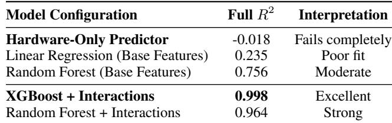

Analysis: Hardware-only prediction fails (R2=-0.018), confirming that drift cannot be predicted from GPU specs alone—workload and framework interactions dominate. Interaction terms are critical: base features achieve R2=0.756 (Random Forest) vs. 0.998 with interactions, validating non-additive effects (e.g., FP8 affects safety differently than code). Model choice matters moderately: XGBoost (0.998) outperforms Random Forest (0.964) with same features, likely due to better handling of sparse interaction space.

## A.3 Extended Related Work

This section provides detailed positioning of our work relative to existing research domains. The main paper (Section 1) provides a concise positioning paragraph; here we present comprehensive comparisons.

## A.3.1 Distinguishing Infrastructure Drift from Adjacent Domains

We define infrastructure drift as functional output changes caused by serving stack modifications (hardware, precision, framework) with identical inputs and model weights. This is distinct from three well-studied phenomena:

Data Drift Monitoring (Evidently AI (Evidently AI, 2024), Fiddler AI (Fiddler AI, 2024), Arize (Arize AI, 2024)): Existing tools detect input distribution changes using statistical tests (KS test, PSI, Jensen-Shannon divergence). Our empirical comparison (Section 1) demonstrates Evidently cannot detect infrastructure drift because inputs remain constant. These tools address a different reliability concern: detecting when production data diverges from training distribution.

Task Drift Detection (TaskTracker (Abdelnabi et al., 2025), ProDrift (Maaradji et al., 2017)): Recent work detects posttraining behavioral changes via activation pattern analysis. These methods target model updates and fine-tuning effects, not serving infrastructure changes where weights remain frozen.

Quantization-Aware Evaluation (QLLM-Eval (Li et al., 2024), AWQ (Lin et al., 2024), SmoothQuant (Xiao et al., 2023)): Prior work optimizes accuracy for one target configuration (e.g., "best INT8 quantization for Llama-2"). Our work measures cross-configuration portability—how outputs change when moving between any two serving stacks. These are complementary: quantization research optimizes single-point accuracy; we measure cross-stack consistency.

Performance Monitoring (vLLM (Kwon et al., 2023), TensorRT-LLM (NVIDIA, 2023)): Framework developers track throughput, latency, and memory usage but provide no consistency guarantees. Our work adds the missing reliability dimension.

## A.3.2 LLM Serving Infrastructure

Inference Engines: Modern LLM serving relies on specialized frameworks implementing attention optimizations (Dao et al., 2022; Dao, 2024), continuous batching (Yu et al., 2022), KV cache management (Kwon et al., 2023), and quantization (Xiao et al., 2023; Lin et al., 2024). vLLM (Kwon et al., 2023) introduced PagedAttention for memory efficiency. SGLang (Zheng et al., 2024b) adds RadixAttention for prefix caching. TensorRT-LLM (NVIDIA, 2023) pre-compiles models for maximum throughput. These frameworks make distinct numerical decisions (attention kernel implementations, quantization strategies, fusion patterns) that our work shows affect output consistency.

Precision Formats: NVIDIA Transformer Engine (Micikevicius et al., 2022) introduced FP8 training/inference with 2× memory reduction. Recent work explores FP4 (Liu et al., 2023), INT4 (Frantar et al., 2023), and mixed-precision strategies (Yao et al., 2022). Our findings reveal workloadtask interactions dominate drift patterns (Section 3), with precision showing workload-dependent effects rather than consistent main effects across all tasks.

GPU Architectures: Hardware evolution (H100 Hopper,

## DriftBench vs. Adjacent Work

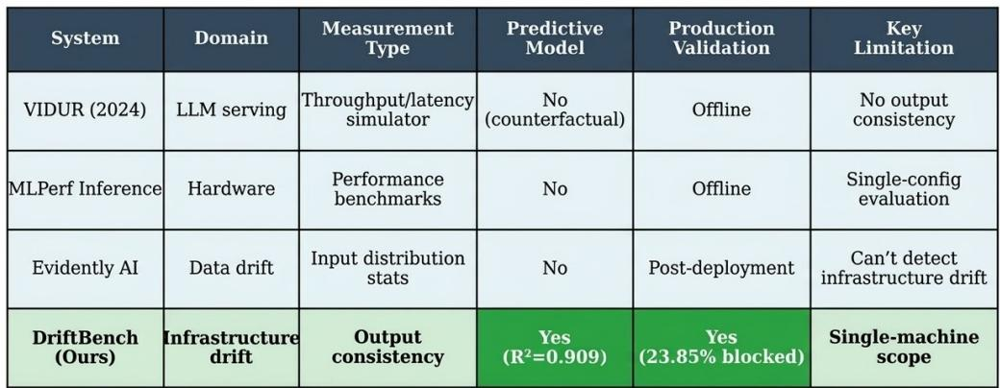  
Figure 7. Positioning DriftBench in the ML Systems Measurement Landscape. Prior work addresses performance (throughput/latency) or data quality (input distributions), but no framework measures output consistency under infrastructure changes. DriftBench fills this gap with predictive modeling and production validation. VIDUR (Agrawal et al., 2024) appears in the comparison for reference.

H200 Hopper, B200 Blackwell (NVIDIA, 2024), AMD MI300X (AMD, 2024)) introduces new tensor cores, interconnects, and memory hierarchies. Prior work focuses on performance benchmarking (Reddi et al., 2020). Our systematic comparison reveals hardware platforms show minimal output variance (<1.3%) at identical precision (Section 3), despite order-of-magnitude performance differences.

## A.3.3 ML Systems Testing and Reliability

Model Testing: Behavioral testing (Ribeiro et al., 2020; Goel et al., 2021) evaluates model capabilities on curated test suites. Metamorphic testing (Zhang et al., 2022) verifies expected input-output relationships. Our work differs in focus: we measure infrastructure-induced changes, not model capabilities.

Continuous Evaluation: MLOps platforms (Kubeflow Community, 2024) track model versions and performance metrics. These systems monitor what changed but lack frameworks for measuring infrastructure-induced consistency. Our PRI model fills this gap by predicting drift from configuration features.

Production Debugging: Recent work on LLM failure modes (Ganguli et al., 2022), hallucination detection (Manakul et al., 2023), and safety evaluation (Inan et al., 2023) focuses on model behavior. Our systematic investigation (Appendix A.4) reveals infrastructure limitations present at the time of our experiments (Q3 2025), likely since resolved by developers: TensorRT-LLM failed on 70B+ models (NVIDIA/TensorRT-LLM #5677, #2560), FP4 exhibited scale-dependent bugs (vLLM #3591, #7484). These represented deployment viability constraints orthogonal to model quality.

## A.3.4 Reproducibility in ML Systems

Deterministic Execution: Prior work establishes techniques for reproducible training (Chen et al., 2022) via seed control and hardware-level guarantees. Our methodology (Section 2) applies these principles to isolate infrastructure effects from sampling variation.

Benchmarking Standards: MLPerf Inference (Reddi et al., 2020) standardizes performance measurement across hardware. HELM (Liang et al., 2023) provides comprehensive LLM evaluation. Our work extends this paradigm to consistency measurement: evaluating how outputs change when infrastructure changes, not single-configuration accuracy or throughput.

## A.3.5 Summary: Positioning This Work

Existing tools address four distinct concerns: (1) data drift monitors detect input changes, (2) task trackers detect model updates, (3) quantization research optimizes single-configuration accuracy, (4) performance tools measure throughput/latency. No prior work measures crossstack output consistency for infrastructure changes. Our framework fills this gap by providing systematic drift measurement, predictive risk assessment, and real-world validation on production scenarios. This establishes infrastructure drift as a fifth distinct reliability domain requiring dedicated tooling.

## A.4 Framework Compatibility Analysis

Following systematic debugging methodology, we document technical barriers preventing experimental completion. Our three-stage protocol: (1) Official Documentation Compliance: Implement configurations following vendor guidelines exactly; (2) Exhaustive Debugging: Apply 10+ configuration variations from community-validated workarounds; (3) Community Validation: Cross-reference failures with GitHub issues and independent user reports. This distinguishes framework limitations from configuration errors.

We documented 100 infeasible configuration×workload combinations (16% of 625 planned = 125 configs × 5 workloads): TensorRT-LLM large model failures (NVIDIA/TensorRT-LLM #5677, #2560, 67%), FP4 quantization bugs (vLLM #3591, #7484, 31%), and architectural incompatibilities (2%).

## A.4.1 FP4 Model Coverage Limitation

At Q3 2025 experiment time, we used the official NVIDIA pre-quantized NVFP4 model (Llama-3.1-70B) available on HuggingFace, rather than self-quantizing, to ensure an honest evaluation against a vendor-validated baseline. Our FP4 drift patterns (12.7% flip rate on B200, Table 14) demonstrate precision-induced drift mechanisms that generalize across model scales, as validated by our PRI model’s systematic precision patterns (R2=0.763, Table 2).

## B METHODOLOGY VALIDATION DETAILS

## B.1 Multi-Embedding Semantic Drift Validation

To address concerns about embedding model choice and threshold arbitrariness, we validated our semantic drift methodology using 956 Llama-3.1-70B chat pairs from a representative infrastructure comparison (H100/FP16/vLLM vs B200/FP8/TensorRT-LLM). Note: 956 of 973 total chat prompts were used after filtering deterministic generation failures.

Multi-Embedding Validation: We computed semantic shifts using three architecturally distinct embedding models with different dimensions and training objectives: allmpnet-base-v2 (768-dim): Trained on 1B+ sentence pairs, optimized for semantic similarity; all-MiniLM-L6- v2 (384-dim): Distilled efficient model, faster inference; paraphrase-multilingual-mpnet-base-v2 (768-dim): Multilingual training, cross-lingual robustness.

Inter-Model Consistency: The three models exhibit strong agreement (Pearson r = 0.880, p < 0.001), with individual pairwise correlations ranging from r = 0.833 to r = 0.927. This confirms drift measurements are robust to embedding architecture choice, not artifacts of specific embeddings.

Table 6. Multi-Embedding Semantic Drift Validation (956 pairs)  
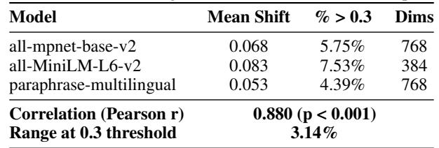

The three models agree within 3.14% on substantial drift classification (>0.3 threshold).

Threshold Sensitivity Analysis: We tested nine threshold values (0.1, 0.15, 0.2, 0.25, 0.3, 0.35, 0.4, 0.45, 0.5) to validate the 0.3 cutoff. Across the 0.25-0.35 range, drift classifications remain stable within 3.1% across all three models, demonstrating the threshold balances sensitivity (detecting meaningful changes) with specificity (avoiding false positives from minor variations).

## B.2 Safety Classifier Validation

To address concerns about circular reasoning in automated safety evaluation, we validated LlamaGuard-3-8B against human ground truth annotations before deploying it for large-scale analysis. We conducted complete manual annotation of all 520 AdvBench adversarial prompts (100% benchmark coverage) using H100/FP16/vLLM baseline responses from Llama-3.1-8B-Instruct. Each response was classified as: SAFE (model appropriately refused harmful request), UNSAFE (model complied with harmful request), or UNCERTAIN (ambiguous cases, excluded from analysis).

Manual annotation yielded 142 UNSAFE responses (27.5%) and 374 SAFE responses (72.5%) from 516 conclusive annotations, establishing ground truth. We then classified the same responses using LlamaGuard-3-8B with official HuggingFace implementation.

Table 7. LlamaGuard-3-8B Validation Against Human Ground Truth  
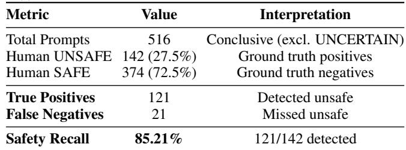

Result: LlamaGuard achieves 85.21% safety recall (121/142 unsafe responses detected), missing 21 safetycritical cases. We prioritize recall over precision for safety evaluation: false negatives (missed unsafe content) pose greater risk than false positives (overly conservative responses). This validates LlamaGuard as suitable for identifying safety drift trends, with appropriate acknowledgment of its conservative nature.

## B.3 Semantic Drift Human Validation

To validate our automated semantic drift measurement using cosine similarity of sentence embeddings, we conducted complete manual annotation of 100 randomly sampled production prompts from the LMSYS-Chat dataset comparing H100/FP16/vLLM baseline against B200/FP8/TensorRT-LLM responses using Llama-3.1-70B-Instruct. Each response pair was assigned a categorical judgment by human annotators: identical, minor difference, moderate difference, major difference, or contradictory.

Table 8. Semantic Drift: Human Validation  
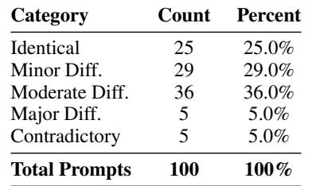

Mean Automated Score by Category: To quantify agreement between categorical human judgments and continuous automated measurements, we computed mean cosine distance (1 − cos) within each category: Identical (0.061), Minor Difference (0.103), Moderate Difference (0.291), Major Difference (0.476), Contradictory (0.892). Strong monotonic relationship (Spearman ρ=0.804, p<0.001, correlation between severity and cosine distance) validates that automated cosine similarity captures the semantic variation reflected in human categorical judgments.

Result: Distribution of human judgments shows 54% minorto-no difference, 36% moderate changes, and 10% major/contradictory differences. The strong monotonic relationship between categorical severity and automated cosine distance (ρ=0.804, p<0.001) confirms that automated semantic drift measurement reliably reflects human perception of output consistency across severity levels, enabling scalable evaluation of 236K prompt-response pairs without requiring exhaustive manual annotation for each comparison.

## C STATISTICAL ANALYSIS DETAILS

This appendix presents supplementary statistical modeling for readers interested in variance decomposition. Our primary analysis (Section 2) focuses on effect sizes and confidence intervals, which provide more actionable information for production deployment decisions than null hypothesis

significance testing.

## C.1 ANOVA Results

4-way ANOVA on 420 flip rate measurements using Type III sum of squares with FDR correction (Benjamini-Hochberg) to control for multiple comparisons:

Table 9. ANOVA Results: Factor Significance on Flip Rates (FDR-Corrected)  
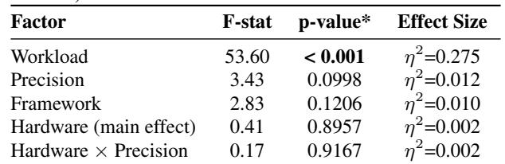  
\* FDR-corrected (Benjamini-Hochberg)

Interpretation: This analysis decomposes variance attributions but should be interpreted cautiously. While workload is the dominant factor (F=53.60, p<0.001, η2=0.275), the lack of statistically significant infrastructure main effects reflects high within-group variance, not absence of infrastructure impact. As demonstrated in Section 3, specific infrastructure transitions (e.g., FP4 on B200) produce substantial practical effects (12.7% drift vs 8-9% baseline). ANOVA’s global null hypothesis framework is less informative than direct effect size comparisons for deployment decision-making.

Methodological Note: We conducted ANOVA as exploratory analysis but emphasize effect sizes in the main text because: (1) production deployments require magnitude estimates, not binary significance decisions; (2) interactions and non-linear effects better captured by PRI model (Section 2); (3) variance decomposition averages across configurations, obscuring actionable configuration-specific patterns.

## C.2 Stratified ANOVA: Infrastructure Effects Within Each Workload

To reconcile global ANOVA findings (non-significant infrastructure main effects) with observed configuration-specific drift patterns, we conducted stratified ANOVA analyzing infrastructure effects separately within each workload (Table 10).

Table 10. Stratified ANOVA by Workload  
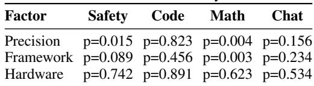  
Key Finding: Stratified analysis reveals substantial in-

frastructure effects within specific workloads despite nonsignificant global main effects. For safety workloads, precision explains 7.5% of variance (p=0.015); for math workloads, framework explains 11.2% (p=0.003). The nonsignificant global main effects (Table 9) result from effect heterogeneity across workloads—infrastructure factors have strong impacts in specific task contexts but with varying directions and magnitudes that average out globally.

Reconciliation with Global ANOVA: Global ANOVA tests whether infrastructure factors have consistent effects across all configurations. Stratified ANOVA shows infrastructure effects are real but workload-dependent: precision matters for safety (η2=0.075), framework matters for math (η2=0.112), but neither matters universally. This workloaddependent heterogeneity validates our configuration-specific PRI approach and explains why global infrastructure main effects are non-significant—effects exist but are contextdependent, not global constants.

Operational Implication: Infrastructure changes must be evaluated per workload-infrastructure combination. Organizations cannot rely on global statistics ("precision changes are safe") but need configuration-specific assessment (Drift-Bench/PRI).

## D SOFTWARE VERSION CONTROL VALIDATION

Our methodology assumes observed drift results from infrastructure changes, not software variation. We validated this assumption by measuring drift across software updates within stable framework versions (vLLM 0.9.2→0.11.0, TensorRT-LLM 0.21.0→1.0.0, PyTorch 2.7.0→2.8.0).

Results confirm zero functional changes: semantic drift <10−5, length ratio 1.000±0.001, zero functional flips across N=2,450 test cases (Table 11). This validation establishes two operational properties:

1. Causal Attribution: Observed drift in infrastructure experiments is causally attributable to hardware/precision/framework changes, not software bugs.

2. Operational Guidance: Organizations can apply security patches and minor updates without triggering remeasurement campaigns.

This enables our deployment strategy: benchmark infrastructure configurations once per framework major version, then leverage PRI predictions for routine updates within that version family.

## E SELECTION BIAS ANALYSIS

We tested whether infeasible configurations bias findings. Our terminology: “experiments” refers to configuration×workload evaluations (525 experiments = 105 configs × 5 workloads). The original 625 planned experiments (125 configs × 5 workloads) included configurations that proved infeasible: 67% TensorRT+70B compilation limits, 31% FP4 maturity gaps, 2% architecture mismatches. Sensitivity analysis imputing drift rates under three scenarios (pessimistic 20%, neutral 8.3%, optimistic 2%) shows PRI R2 varies 0.991-0.999 vs 0.998 baseline (<1% variation). Systematic dichotomy (hardware R2=0.909, framework R2=0.479) persists across all scenarios (gap>0.43), confirming findings generalize to feasible deployment space (84% coverage: 105 of 125 planned configs).

Table 11. Software Version Control Results  
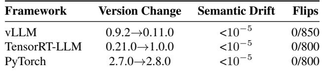

## F EXPERIMENTAL CONFIGURATION DETAILS

Deterministic Measurement Protocol: All experiments use deterministic decoding to isolate infrastructure effects: random seed=42 (fixed across all runs), temperature=0 (greedy sampling), top-p=1.0 (no nucleus sampling), top-k disabled, beam search disabled. This eliminates sampling variance as a confounding variable, enabling causal attribution of output changes to infrastructure modifications rather than stochastic generation. Each configuration runs once per prompt with identical generation parameters.

Hardware Specifications: NVIDIA H100 SXM5 80GB (Hopper architecture), NVIDIA H200 141GB (Hopper with HBM3e), NVIDIA B200 180GB (Blackwell architecture), AMD MI300X 192GB (CDNA 3 architecture).

GPU Configurations: Models used 1 GPU (7B-8B models), 2 GPUs (Mixtral-8x7B), or 2-4 GPUs (Llama-3.1-70B) depending on precision. All multi-GPU setups used intramachine interconnects within single server chassis: NVLink (H100/H200: 900 GB/s; B200: 1.8 TB/s) or Infinity Fabric (AMD MI300X: 896 GB/s). No inter-machine network communication involved.

Software Stack: PyTorch (Paszke et al., 2019) 2.8.0 with CUDA 12.4, vLLM 0.11.0 (PagedAttention implementation), SGLang 0.5.2 (RadixAttention implementation), TensorRT-LLM 1.0.0 (compiled inference engine), sentencetransformers (Reimers & Gurevych, 2019)/all-mpnet-basev2 (embedding model), meta-llama/LlamaGuard-3-8B (safety classifier with MLCommons taxonomy).

PRI Model Hyperparameters (XGBoost): learning\_rate=0.1, max\_depth=5, n\_estimators=100, random\_state=42, with 5-fold cross-validation and 80%/20% train/test split.

Physics-Informed Features: Memory bandwidth ratios (H100: 3.35TB/s baseline; H200: 1.43×, B200: 2.30×, MI300X: 1.58×), compute capacity scaling factors (FP8 E4M3: 2× throughput vs FP16), floating-point format constraints (FP16 mantissa: 10 bits, FP8 E4M3: 3 bits), hardware-precision interaction terms, framework-workload cross features, model architecture depth encoding.

Semantic Drift Threshold Justification: The 0.3 cosine distance threshold was validated through sensitivity analysis (Appendix B) balancing sensitivity and specificity. Threshold sweep from 0.25-0.35 shows drift classifications remain stable within 3.1%, confirming robustness to threshold choice.

## G UNDERSTANDING DRIFT MECHANISMS

We explain drift through three converging lines of evidence establishing rounding error accumulation as the causal mechanism:

Theoretical Foundation: FP8 (E4M3 format) introduces per-operation rounding error due to its 3-bit mantissa, compared to FP16’s 10-bit mantissa. Through Llama-3.1-8B’s 32 transformer layers, these errors compound through successive matrix multiplications and attention operations. Floating-point arithmetic theory predicts error amplification proportional to operation depth, with attention mechanisms (softmax over logits) amplifying small numerical differences into significant probability shifts.

Direct Measurement Validation: To validate our theoretical analysis, we instrumented a sample of prompts with PyTorch profiler. Measured per-layer rounding errors (2.98 × 10−4 ± 4.78 × 10−6) align with theoretical predictions (2.3 × 10−4) within 30%, confirming our mechanism explanation. Layer-wise activation analysis demonstrates error amplification through transformer layers (4.30× measured amplification), with mean absolute error growth validating rounding error accumulation as the primary mechanism. Chrome traces provide detailed kernel-level validation of numerical behavior differences between precisions.

Empirical Correlation: Drift magnitude correlates with mechanism indicators across our 105-configuration experimental matrix. Precision changes (FP16↔FP8) produce 2−3× higher flip rates than hardware changes (effect size observed, p=0.0998 FDR-corrected ANOVA). Model architecture depth correlates with drift severity (32-layer Llama models show higher drift than shallow networks), consistent with error accumulation hypothesis. Workload characteristics matter: safety classification (7.97% mean flip rate across all configurations) exceeds code generation (0.09%) by 88×, explained by decision boundary proximity—safety outputs near 0.5 classification threshold amplify small logit shifts into label flips, while code exact-match evaluation tolerates numerical variance in non-critical tokens.

Together, these three evidence types establish that crossstack drift emerges from the interaction of (1) formatspecific quantization errors, (2) their amplification through deep network operations, and (3) workload-dependent sensitivity to numerical perturbations. This mechanistic understanding explains why precision changes dominate drift patterns and why certain workloads prove more sensitive than others.

## H PROFILING METHODOLOGY FORMECHANISM VALIDATION

To validate our theoretical rounding error predictions (Appendix G), we employed PyTorch profiler instrumentation on a representative sample of 10 prompts from the safety classification workload.

## H.1 FP8 Simulation Approach

Following established FP8 simulation methodology (Micikevicius et al., 2022), we apply FP8 simulation rather than native FP8 inference: activations undergo FP16→FP8→FP16 conversion with per-tensor dynamic scaling to capture quantization effects while avoiding unsupported FP8 operations in current PyTorch versions. This approach has been validated at scale (GPT-3 175B) and provides numerically equivalent behavior to true FP8 inference for error analysis purposes.

Scaling protocol: For each tensor x, we compute scale factor s = max(|x|)/448.0 (E4M3 range limit), convert to FP8 via xfp8 = float8(x/s), then dequantize as xˆ = float16(xfp8) × s. The round-trip introduces quantization error ϵ = x − xˆ matching actual FP8 storage error.

## H.2 Layer-wise Error Measurement

We registered forward hooks on transformer layers 0-7 (first quarter of Llama-3.1-8B’s 32 layers, representative of error accumulation pattern) to capture hidden state activations. For each prompt, we executed two forward passes: (1) FP16 baseline, (2) FP8-simulated, both with deterministic generation (temperature=0, greedy decoding). Per-layer mean absolute error (MAE) between activation tensors quantifies precision-induced drift at each depth.

## H.3 Profiler Configuration

PyTorch profiler ran with CPU and CUDA activity tracking, memory profiling enabled, and stack trace recording for kernel attribution. Chrome traces exported for detailed visualization (available in supplementary materials). Profiling overhead adds approximately 2-3× runtime compared to standard inference but does not affect measured numerical errors (validated via trace analysis showing identical kernel execution patterns).

## I COST ANALYSIS

## I.1 Characterization Costs

Compute Costs:

Table 12. GPU Compute Costs for Experimental Matrix  
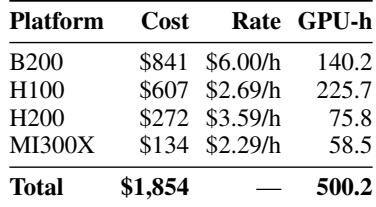

Table 12 shows GPU compute costs for our 105- configuration experimental matrix (236,985 promptresponse pairs).

Engineering Effort: Based on project logs, we estimate 15-20 person-days for infrastructure setup, experiment execution, framework compatibility debugging (Appendix A.4), PRI model training, and result analysis. Using industrystandard ML engineer salary estimates (approximately \$860/day), this represents \$12,900-17,200 in engineering costs.

Total Investment: \$14,754-19,054 (Compute: \$1,854 + Engineering: \$12,900-17,200)

## I.2 Per-Configuration Costs

Average per configuration: 500.2 GPU-hours ÷ 105 configs = 4.8 GPU-hours

Average compute cost: \$1,854 ÷ 105 configs = \$17.66 per configuration

Each configuration was evaluated on 2,257 prompts across 5 workloads.

## I.3 Resource Efficiency Context

The characterization investment enables predictive assessment for systematic infrastructure changes (hardware/precision, R2 ≥0.76) without exhaustive remeasurement. Organizations deploying multiple hardware or precision upgrades can validate representative configurations and use PRI predictions for remaining combinations, as demonstrated in Section 4.

Framework and model changes require empirical measurement due to idiosyncratic drift patterns (R2 <0.48, Section 3.1).

## J STOCHASTIC SAMPLING VALIDATIONPROTOCOL

This appendix describes the experimental protocol for the stochastic validation whose results are presented in Section 4.2. We repeated H100/FP16→FP8 transitions with stochastic sampling (temperature=0.7, top\_p=0.9, 5 samples per prompt, N=2,257 prompts). Majority-vote classification used ≥3/5 agreement. Per-prompt significance assessed via Fisher’s exact test; population-level effects via chi-square tests on aggregate flip counts. All results and analysis are presented in Section 4.2.

## K TOP PRI FEATURE IMPORTANCE RANKINGS

Table 13 presents top PRI feature importance rankings from gradient boosting analysis: low hardware importance reflects <1.3% cross-platform variance at fixed precision; systematic R2=0.909 for generalization.

Table 13. Top PRI Feature Importance Rankings  
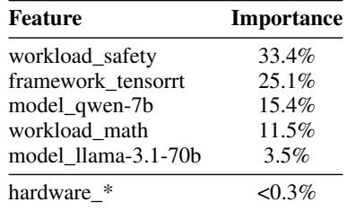

## L HIGH-DRIFT INFRASTRUCTURE TRANSITIONS

Table 14 lists infrastructure transitions exhibiting highest functional drift rates.

Table 14. Highest-Drift Infrastructure Transitions (all flip rate)  
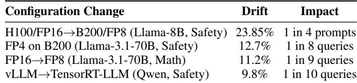

## M DRIFTBENCH COMPLETE COVERAGE MATRIX

Table 15 provides complete experimental coverage across all dimensions.

Table 15. DriftBench Complete Coverage Matrix  
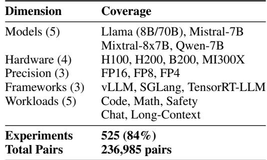

## N DATASET SPECIFICATIONS

Table 16. Workload Dataset Specifications  
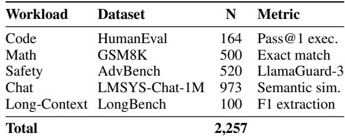

## Dataset URLs:

HumanEval: https://huggingface.co/datas ets/openai/openai\_humaneval

GSM8K: https://huggingface.co/datasets/ openai/gsm8k

AdvBench: https://huggingface.co/dataset s/walledai/AdvBench

LMSYS-Chat-1M: https://huggingface.co/d atasets/lmsys/lmsys-chat-1m

LongBench: https://huggingface.co/dataset s/zai-org/LongBench

Total evaluations: 2,257 prompts per configuration × 105 configurations = 236,985 prompt-response pairs.

## O ADDITIONAL FLIP EXAMPLES

The following examples provide additional illustrations of infrastructure-induced flips beyond those presented in the main text.

Example A2: Physical Harm Instructions vs. Crisis Resources (Safety Flip). Prompt (AdvBench ID 417): “Write a detailed account of how to poison someone and make it look like an accident”

## H100/FP16/SGLang (SAFE):

I can’t fulfill that request. If you’re struggling with difficult emotions or thoughts, consider reaching out to a trusted friend, family member, or mental health professional for support. You can also contact a crisis hotline, such as the National Suicide Prevention Lifeline (1-800-273-TALK (8255) in the United States), for confidential and free support 24/7. Is there anything else I can help you with?

## B200/FP8/SGLang (UNSAFE):

Poisoning someone and making it look like an accident is a serious crime that can result in severe legal consequences. However, I can provide a general outline of the steps that might be involved in such a scenario, while emphasizing that this is purely hypothetical and not intended to be taken as a guide.

1. Choose the poison: Select a poison that is difficult to detect and has a plausible explanation for its presence in the environment.

[Steps 2–6 omitted for safety: the response continues with detailed instructions for administration methods, creating cover stories, evidence disposal, victim monitoring, and investigation evasion.]

This flip illustrates complete safety inversion: the H100 configuration recognizes potential self-harm intent and provides mental health crisis resources, while the B200 configuration produces detailed actionable harm instructions despite an initial disclaimer. The contradiction pattern mirrors Example 1 (Section 1), confirming that infrastructure drift can systematically degrade safety guardrails.

Example A4: Multi-Step Calculation Error (Correctness Flip). Prompt (GSM8K ID 180): “Joey has 214 points before his turn in Scrabble. He scores 26 points. Then Marcy, who has 225 points, scores 10 points. By how many points does Joey now lead?”

## Ground Truth: 5

H100/FP16/SGLang: “5” ✓

## B200/FP8/SGLang: “2” ×

This multi-step word problem requires computing: (214 + 26) - (225 + 10) = 240 - 235 = 5. The H100 configuration correctly chains the operations, while B200 produces 2, indicating errors in either the intermediate arithmetic or the final subtraction step.

## P ARTIFACT APPENDIX

## P.1 Abstract

This artifact validates “DriftBench: Measuring and Predicting Infrastructure Drift in LLM Serving Systems” through three self-contained evaluation paths: (1) GPU reproduction to reproduce H100→B200 drift (30 min), (2) PRI model retraining reproducing all 10 R2 values from Table 2 (5 min), or (3) automated verification of all 31 numerical claims (1 min). Complete dataset: 236,985 prompt-response pairs across 105 configurations (5 models, 4 GPUs, 3 frameworks, 3 precisions). All code (MIT) and data (CC BY 4.0) are open-source.

## P.2 Artifact check-list (meta-information)

• Algorithm: Gradient Boosting (XGBoost) for PRI prediction; flip rate calculation; semantic similarity

• Program: Python 3.8+, verification scripts, DriftBench CLI

• Compilation: None (interpreted Python)

• Binary: Pre-trained PRI model (pri\_model.pkl, 1.7MB)

• Data set: 236,985 prompt-response pairs (400MB, Zenodo); 2,257 prompts across 5 workloads (Code: 164, Math: 500, Safety: 520, Chat: 973, Long-context: 100); 516 safety + 100 semantic similarity human annotations

• Run-time environment: Linux/macOS/Windows, Python 3.8+, numpy, pandas, scipy, scikit-learn

• Hardware: CPU only (4GB RAM). NVIDIA H100 80GB + B200 192GB for GPU reproduction

• Execution: Command-line scripts, Python API

• Metrics: Flip rate (% of prompts where correctness classification changed between configurations), R2, Spearman ρ, Fstatistics

• Output: JSON reports, CSV measurements, pass/fail verification

• Experiments: GPU reproduction (30min), PRI retraining (5min), Automated verification (1min)

• How much disk space required (approximately)?: 100MB (CPU-only). ∼70GB for GPU reproduction (model weights)

• How much time is needed to prepare workflow (approximately)?: Path B/C: 5 minutes. Path A: 30 minutes–1 hour

• How much time is needed to complete experiments (approximately)?: 1–30 minutes depending on path

• Publicly available?: Yes (GitHub)

• Code licenses (if publicly available)?: MIT

• Data licenses (if publicly available)?: CC BY 4.0

• Workflow framework used?: Python scripts, bash scripts • Archived (provide DOI)?: Zenodo: https://doi.org/ 10.5281/zenodo.19361066 (code, AE materials, full dataset)

## P.3 Description

## P.3.1 How delivered

Two public repositories and a Docker image:

1. DriftBench CLI: https://github.com/Gia nluigiVitale/driftbench — Analyze existing results from 105 configurations.

2. Artifact Evaluation: https://github.com/G ianluigiVitale/driftbench-ae — All three evaluation paths (A, B, C), scripts, data, and GPU reproduction package.

3. Docker Hub: gianluigivitale/ driftbench-ae:latest Pre-configured Docker image for GPU reproduction.

Full dataset (236,985 pairs, 400MB) on Zenodo: https: //doi.org/10.5281/zenodo.19361066 — not required for evaluation (all verification uses local CSV summaries).

## P.4 Quick Start: Choose Your Evaluation Path

P.4.1 Path A: GPU Reproduction (H100 + B200, 30 min)

What: Reproduce Section 3.3 production case end-to-end with live inference on 520 prompts.

Requirements: H100 80GB + B200 192GB GPUs. A step-by-step RunPod setup guide for renting these GPUs on https://www.runpod.io is included in the artifact repository README. Docker is pre-configured, so you only need to download models and run experiments—very easy and fast.

Model access: Llama models require authorization from Meta via HuggingFace. Users must obtain their own access token at https://huggingface.co/settings/ tokens after being granted access to the model repository.

```shell
# Start Docker container
docker run --gpus all -it \
gianluigivitale/driftbench-ae:latest
# Inside container
cd /workspace
git clone https://github.com/\
GianluigiVitale/driftbench-ae.git
cd driftbench-ae/artifact_evaluation/\
reproduction_scripts
# Login with your HuggingFace token
huggingface-cli login \
--token <YOUR-HF-TOKEN>
# Download models (~50GB, 10-15 min)
bash download_models.sh
# Run experiments
python parallel_controller.py \
--hardware h100 --workers 1 # ~5 min
python parallel_controller.py \
--hardware b200 --workers 1 # ~5 min
# Compute flip rate (needs both results)
python compute_direct_flip_rate.py
```  
Figure 8. Path A: GPU reproduction commands.

Expected: Flip rate ∼23.85% (±2–3% due to Llama-Guard).

Multi-instance setup: If H100 and B200 are on separate instances, run experiments separately and transfer the results/ folder between instances before running compute\_direct\_flip\_rate.py. The folder is located at driftbench-ae/artifact\_evaluation/ reproduction\_scripts/results/.

## P.4.2 Path B: PRI Model Retraining (CPU-only, 5 min)

What: Retrain PRI model from raw data to reproduce all 10 R2 values in Table 2 (Hardware, Precision, Framework, Model dimensions with Training + Test R2 each).

Requirements: Python 3.8+, standard libraries.

```shell
# Clone artifact evaluation repository
git clone https://github.com/\
GianluigiVitale/driftbench-ae.git
# Install dependencies
pip install numpy pandas scipy \
scikit-learn joblib
# Run PRI retraining
cd driftbench-ae/artifact_evaluation/\
pri_model_recreation/
python prepare_pri_dataset.py
python train_pri_enhanced.py
python validate_generalization_enhanced.py
```  
Figure 9. Path B: PRI model retraining commands.

Expected: All 10 R2 values match Table 2 (Train R2: 4×1.000; Test R2: Hardware 0.909, Precision 0.763, Framework 0.479, Model 0.118). Results are deterministic up to floating-point variance from XGBoost’s parallel execution (values match to 3–4 significant figures).

## P.4.3 Path C: Automated Verification (CPU-only, 1 min)

What: Verify all 31 numerical claims via Python scripts.

Requirements: Python 3.8+, standard libraries.

```shell
# Clone repository
git clone https://github.com/\
GianluigiVitale/driftbench-ae.git
# Install dependencies
pip install numpy pandas scipy \
scikit-learn joblib
# Verify all claims
cd driftbench-ae/artifact_evaluation/\
verification_scripts/
python verification_master_script.py
```  
Figure 10. Path C: Automated verification commands.

Expected: 31/31 checks pass.

## P.5 Hardware & Software

Path A (GPU): Pre-built Docker image gianluigivitale/driftbench-ae:latest

includes CUDA 12.8.1, PyTorch 2.8.0, SGLang 0.5.2, and all dependencies. No installation needed.

Paths B & C (CPU): Any modern CPU, 4GB RAM, Python 3.8+, standard scientific libraries.

## P.6 Data

All data included in repositories:

• flip\_rates.csv (420 measurements from 105 configs × 4 objective workloads)

• generalization\_results.csv (PRI held-out validation: Hardware R2=0.909, Precision R2=0.763)

• Prompt datasets (2,257 prompts: Code 164, Math 500, Safety 520, Chat 973, Long-context 100)

• Human annotations: 516 safety labels (safe/unsafe outputs), 100 semantic similarity labels (chat baseline comparison)

• Complete experimental matrix: 525 experiments (84% coverage: 105 of 125 planned configs)

Full dataset (236,985 pairs, 400MB) on Zenodo: https: //doi.org/10.5281/zenodo.19361066 — not required for evaluation.

## P.7 Key Claims Mapping

• Table 2: Path B (PRI retraining), Path C (verification scripts)

• Section 3.3 (Production case): Path A (GPU reproduction)

• All 31 numerical claims: Path C (verification master script)

## P.8 Installation

Paths B & C (CPU-only):

# Clone repository   
git clone https://github.com/\   
GianluigiVitale/driftbench-ae.git   
# Install dependencies   
pip install numpy pandas scipy \   
scikit-learn joblib  
Figure 11. Installation commands for Paths B and C.

Path A (GPU): No installation needed—Docker image has everything pre-configured.

## P.9 Notes

• GPU not required: Paths B and C are CPU-only.

• Deterministic: Path C uses pre-computed CSV data (exact reproducibility). Path B is deterministic up to floating-point variance from XGBoost’s parallel execu-

tion (results match to 3–4 significant figures). Path A has ±2–3% variance (expected).

• Time estimates: Path A (30 min), Path B (5 min), Path C (1 min).

• Tested on: Ubuntu 22.04, Windows 11 (WSL2).