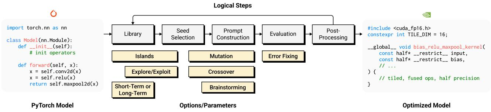
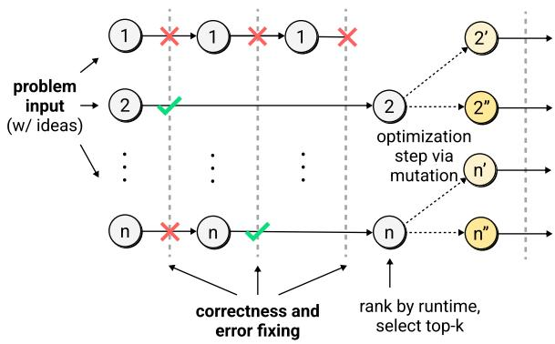
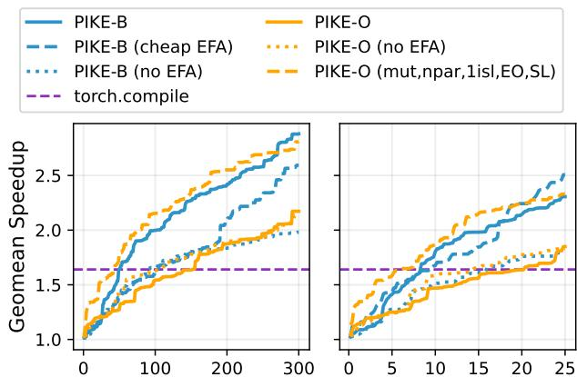
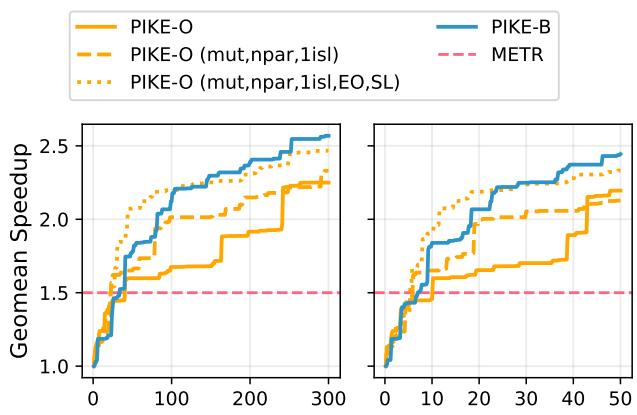
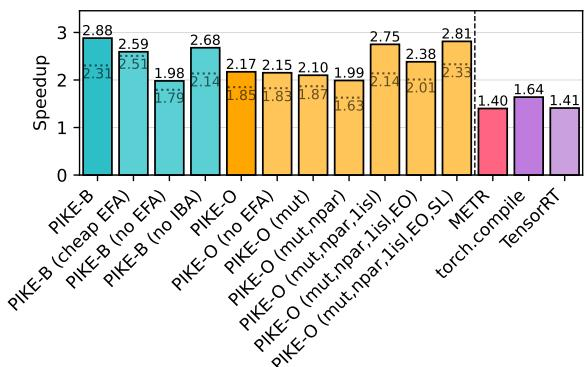
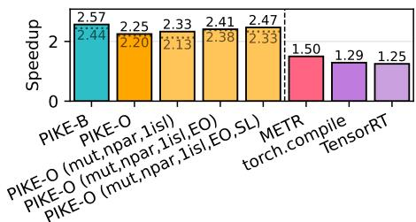
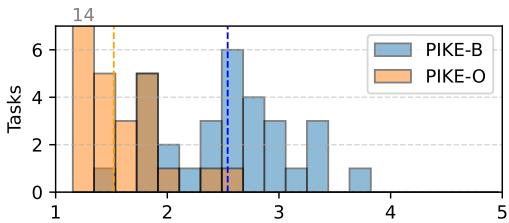
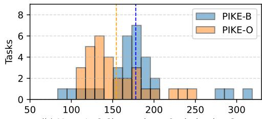
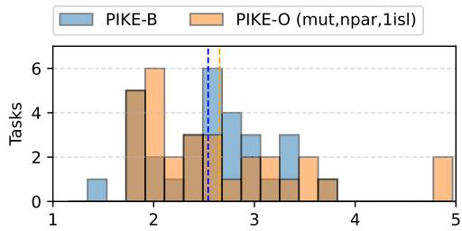
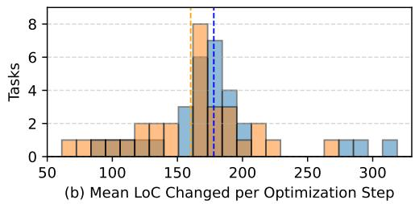

# OPTIMIZING PYTORCH INFERENCE WITH LLM-BASED MULTI-AGENT SYSTEMS

Kirill Nagaitsev 1 Luka Grbcic 2 Samuel Williams 2 Costin Iancu 2

## ABSTRACT

Maximizing performance on available GPU hardware is an ongoing challenge for modern AI inference systems. Traditional approaches include writing custom GPU kernels and using specialized model compilers to tune high-level code for specific GPU targets. Recent work shows that LLM-based multi-agent systems can effectively perform such tuning, often outperforming existing compilers and eliminating the need for manual kernel development. However, the dynamics of multi-agent systems for this task remain unexplored. In this work, we present a logical framework for comparing multi-agent PyTorch optimization systems. Our evaluation shows that exploit-heavy strategies perform best when paired with error-fixing agents, and that performance correlates with the granularity of optimization steps. The best implementation achieves an average 2.88× speedup on an H100 GPU across diverse tasks in KernelBench, a benchmark suite covering a range of machine learning architectures in PyTorch.

## 1 INTRODUCTION

One of the most crucial areas of performance optimization today is that of AI/ML workloads. As the landscape of GPUs rapidly evolves, AI/ML software must constantly adapt to capitalize on the performance benefits of new hardware. Unfortunately, the optimization of GPU kernels remains one of the most technically demanding frontiers in performance engineering, requiring mastery of GPU parallelism, memory hierarchies, and scheduling behavior.

Numerous model-level compilers enable fully automated AI/ML model optimization (Ansel et al., 2024; NVIDIA Corporation, 2024; Microsoft Corporation, 2024; Sabne, 2020), but they require continual updates to target new GPUs and often fall short of hand-tuned performance. For instance, the original custom FlashAttention kernel (Dao et al., 2022) achieved a 7.6× speedup over a generic Py-Torch implementation before being integrated as a built-in attention operator.

Domain-specific languages and libraries simplify manual GPU development and tuning (Kerr et al., 2017; Tillet et al., 2019; Spector et al., 2024), yet achieving peak performance with tools like Triton (Tillet et al., 2019) still demands substantial time and expertise, including mastery of GPU memory hierarchies, tiling, and block sizing.

Recent work has applied LLM-based methods to the AI/ML GPU tuning problem. An influential effort is Kernel-

Bench (Ouyang et al., 2025), the first open benchmark for LLM-generated GPU kernels, which frames the task as translating PyTorch operators into optimized kernels. Several studies have developed agent-driven systems for KernelBench (Lange et al., 2025a;b; Li et al., 2025; METR, 2025; Andrews & Witteveen, 2025; Baronio et al., 2025) or related challenges, including direct kernel optimization (Novikov et al., 2025; Wei et al., 2025).

Despite this progress, the dynamics of multi-agent systems for this PyTorch/kernel search problem remain unexplored. Specifically, the roles of individual agents, prompting strategies, and solution library designs have not been systematically examined.

LLM-based PyTorch/kernel optimization can be viewed as a search for an optimal solution, and an explore-exploit tradeoff emerges from this search process. Exploration builds a broad base of valid solutions to avoid premature convergence, whereas exploitation concentrates effort on the best existing solutions. We analyze how system components interact in multi-agent PyTorch optimization systems, focusing on the explore–exploit tradeoff, and identify an optimal configuration for PyTorch inference optimization.

To summarize, this work makes the following contributions:

• We develop a logical framework for comparing multiagent PyTorch optimization systems, along with our implementations within it, collectively defined as Py-Torch Inference Kernel Evolution (PIKE).

• We develop PIKE-B, a multi-agent evolutionary branching strategy, along with PIKE-O, an OpenEvolve-based (Sharma, 2025) strategy, finding that the exploit-heavy strategies with error fixing substantially outperform explore-heavy strategies.

• We analyze the optimization trajectories and agent roles in these strategies, finding that performance correlates with the granularity of steps, with aggressive, exploit-heavy steps yielding better results within our budget.

• We achieve state-of-the-art speedups on a refined KernelBench suite (Ouyang et al., 2025; METR, 2025), with best solutions implemented in both CUDA and Triton.

## 2 LOGICAL FRAMEWORK

Our objective is to translate PyTorch models into optimized versions that achieve inference speedups. To this end, we develop an LLM-based multi-agent logical framework and analyze its dynamics to identify the strategies that deliver the best performance.

Figure 1 shows the multi-agent framework for optimizing PyTorch inference. It takes a PyTorch model as input and produces a translated, performance-optimized version for efficient execution. Parameter choices within the framework either move the search process towards being exploitative, where the focus is on using the existing best model implementations found so far, or explorative, where a broad set of prior implementations are used to avoid premature convergence. The process is organized into several stages, each addressing a specific aspect of the optimization pipeline.

The process begins with the library, which stores the initial PyTorch model and valid solutions generated by the LLM, where a solution is code generated by a single LLM invocation. The framework can loop multiple times, potentially adding new solutions to the library at each iteration. The library maintains either a long-term or short-term history of solutions, discarding the oldest entries after a set cutoff. Additionally, it may be organized into islands, where each island has its own separate history of solutions. Islands are a concept from island-based genetic algorithms (Tanese, 1989), and are used by numerous LLM-based agent frameworks (Novikov et al., 2025; Sharma, 2025). In the library phase, the Initial Brainstorming Agent (IBA) can take the problem statement and input code as a seed to generate a list of n optimization ideas for agents to pursue.

In the seed selection phase, an island is chosen (if multiple exist), helping to determine the specific library segment sampled in this stage. The selection process uses an explore/exploit ratio to randomly pick a seed solution for the next LLM prompt. With a ratio of ε : (1 − ε), the probability of selecting from all history is ε, while elite solutions are chosen with probability 1 − ε. The explore/exploit ratio interacts with other parameters to influence the system’s overall behavior, determining whether it leans toward exploration or exploitation. For instance, increasing the number of islands enhances exploration by utilizing distinct solution pools.

During the prompt construction phase, an LLM prompt is developed to optimize the original PyTorch model. This can involve mutation (using one solution) or crossover (drawing from multiple solutions) from the library. The Code Optimization Agent (COA) takes the problem statement, the original model, and any additional seeds to generate an optimized version. Though mutation typically implies small changes in traditional evolutionary algorithms, the LLM is not limited to minor adjustments. Additionally, an optional brainstorming element can be included, incorporating ideas from the IBA or previous LLM queries. The prompt is then used to query the LLM, generating a new solution.

The evaluation stage entails compiling and running the generated solution. This includes verifying correctness (ensuring functional equivalence with the original model) and measuring performance based on a defined metric (e.g., speedup). If compilation or correctness checks fail, an error fixing loop may be initiated, where the Error Fixing Agent (EFA) makes an LLM query to address code issues before reevaluating the solution.

The final stage, post-processing, involves sending the validated new solution to the library alongside evaluation metrics. If an exit condition is met (e.g., exceeding a maximum number of iterations), the absolute best solution (according to the objective metric) is returned.

Importantly, our logical framework supports implementations that can invoke iterations of the logical loop in parallel. In such cases, the seed selection from the library phase draws from solutions generated only by completed iterations.

As we refine our multi-agent logical framework for optimizing PyTorch models, it is crucial to explore the various configurable parameters and their interactions to maximize performance. Key questions arise: How do different settings of the explore/exploit ratio impact the overall efficiency of the optimization process? In what ways does the number of islands influence both exploration and exploitation dynamics? Additionally, what effect does varying the elite archive size have on performance outcomes?

We must also investigate whether the inclusion of the EFA contributes to improved results and under what circumstances it is most beneficial. Understanding these interactions will help us determine optimal configurations for specific tasks and ensure that our framework effectively balances the trade-off between exploration and exploitation. By systematically addressing these configuration questions, we aim to enhance the adaptability and efficacy of our LLM-based approach in translating and optimizing PyTorch models.

  
Figure 1. Logical framework which multi-agent systems operate in, for the task of PyTorch inference optimization. Logical steps of the optimization process are shown above, and core options/parameters are shown below near the steps they relate to.

  
Figure 2. PIKE-B implementation, illustrating parallel evaluation and error fixing, followed by top-k selection and mutation

## 3 EVOLUTIONARY STRATEGIES FOR PYTORCH OPTIMIZATION

## 3.1 PIKE-B: Branching Search

Our PIKE-B search algorithm is outlined in Algorithm 1. We describe this strategy as an evolutionary branching search algorithm because it selects the top-k solutions found in each iteration and duplicates those solutions as seeds across the population size n for the next round. This approach emphasizes an exploitative strategy, as the seed selection relies solely on successful prior solutions to guide future exploration. Specifically, the algorithm operates with a short-term memory library and does not utilize islands, resulting in a 100% exploit-based framework. It is characterized as mutation-only evolution since all seed prompts are derived solely from a single prior solution. This makes PIKE-B particularly effective in honing in on promising solutions, leveraging previous successes to drive further optimization.

In our PIKE-B algorithm, several components of the logical framework are activated to facilitate the optimization of PyTorch models. The process begins with the library, which stores the initial model as well as valid solutions generated by the LLM. During the seed selection phase, PIKE-B selects the top-k solutions from the library, focusing exclusively on these successful prior solutions to inform the next round of optimization. The algorithm relies heavily on the evaluation stage, where generated solutions are compiled, validated, and measured based on defined performance metrics, such as speedup. If errors occur, the EFA engages to fix them, demonstrating the framework’s support for iterative refinement. By leveraging these framework elements, PIKE-B aims for rapid improvements while minimizing exploration of less promising areas, effectively utilizing the structured processes designed for performance enhancement.

Figure 2 further illustrates how seeds are selected, followed by parallel evaluation and error fixing. By focusing on a limited set of high-quality solutions, PIKE-B aims to maximize efficiency in the optimization process, making it well-suited for scenarios where rapid improvements are desired without extensive exploration of less promising areas of the solution space.

## 3.2 PIKE-O: OpenEvolve

OpenEvolve (Sharma, 2025) is an open-source framework for LLM-based code evolution, inspired by AlphaEvolve (Novikov et al., 2025), which enhances code through continuous evaluator feedback. To optimize code, it requires the initial code, an evaluator for validating LLM-generated solutions, and parameters to measure improvement (e.g., speedup).

Our PIKE-O implementation builds on OpenEvolve and integrates cohesively into our logical framework for PyTorch model optimization. Within OpenEvolve, the choice between short-term and long-term solution history is governed by the population parameter, which dictates the number of solutions retained in memory, while the archive size controls the history of elite solutions. Solutions are organized into island segments through the islands parameter (≥ 1), allowing for focused exploration.

Algorithm 1 PIKE-B: Multi-Agent Branching Search with   
Evolutionary Mutation   
Require: Task T , population size n, error-fixing attempts   
allowed m, top candidates k, query budget b   
Initialize query count q ← 0   
Initialize seeds S ← [ ]   
IBA generates n initial ideas list Ideas using T   
for all I ∈ Ideas in parallel do   
Create seed p with idea I and code from T   
append p to S   
end for   
while q < b do   
for all s ∈ S in parallel do   
COA generates code C from seed s   
Evaluate C, generates error summary E   
attempts ← 0   
while E indicates error and attempts < m do   
ErrorFixingAgent attempts to fix C using E   
Evaluate C˜, generates error summary E˜   
C ← C , E ˜ ← E˜   
attempts ← attempts + 1   
end while   
if E indicates no error then   
Mark code solution as valid   
else   
Discard code   
end if   
q ← q + 1   
end for   
S ← [ ]   
Solutions ← all valid solutions thus far   
Sort Solutions by objective metric   
T opK ← first k solutions   
for all b ∈ T opK do   
Create seed p with code from b   
append (n/k) copies of p to S   
end for   
end while   
return best overall solution based on objective metric

OpenEvolve features both explore and exploit ratio parameters; if their sum is less than 1, the remaining portion is allocated for random sampling from any segment. By default, it operates in a crossover-only mode, utilizing five or more prior elite solutions as inspirations for LLM prompts. This can be switched to mutation-only by disabling additional inspiration prompts. In our implementation, we’ve modified OpenEvolve to incorporate error fixing via an EFA, filling a gap in its original capabilities for iterative refinement. Workers perform LLM querying followed by evaluation, and we enhanced these workers with the EFA loop. Notably, the IBA was not included, resulting in a purely exploit-focused mechanism during prompt generation.

Our logical framework supports parallel invocations of the optimization loop, where the seed selection phase accesses only solutions from completed iterations of prior runs. OpenEvolve’s parallel evaluations parameter manages worker distribution across islands to enable simultaneous evolution. However, this added parallelism can lead to an exploration-heavy dynamic, as workers may not wait for elite solutions to complete, potentially missing valuable opportunities for exploitation. This creates a balance in the exploration-exploitation tradeoff, where certain configurations (e.g., disabling parallel evaluations and islands) can transition PIKE-O to an exploit-heavy approach similar to PIKE-B.

## 4 EXPERIMENTAL SETUP

## 4.1 Benchmarks: KernelBench

The original KernelBench (Ouyang et al., 2025) framework consists of 250 tasks, each comprising a self-contained Py-Torch model and a random input generation function, organized into levels of increasing complexity. Level 1 includes simple operations like matrix multiplication and convolution, Level 2 combines these primitives, and Level 3 contains critical components of large ML architectures (e.g., AlexNet, MinGPT).

METR (METR, 2025) refines KernelBench by filtering tasks and adding a new Level 5. They remove Levels 1 and 2 tasks prone to noise, particularly those with low signal-to-noise ratios or that are overly simplistic. Level 4 tasks are also excluded due to their reliance on parsing complex external codebases from the HuggingFace transformers library.

We utilize the METR-refined variant of KernelBench, focusing on significant challenges by excluding Levels 1 and 2 and further filtering Level 3 to remove LSTM and GRU tasks due to high measurement noise. We refer to this filtered version as Level 3-pike, averaging 85 lines of code (LoC) excluding whitespace/comments. We also use METR’s Level 5, which includes tasks averaging 493 LoC. Our final refined suite is detailed in Table 1.

Table 1. Refined KernelBench Suite for Evaluation.
<table><tr><td>Level</td><td>Description</td><td>Examples</td><td>Tasks</td></tr><tr><td>3-pike (Filtered)</td><td>Curated blocks from older mod- els; focuseson holistic compo-</td><td>MLP, RNNs, Attention, conv. layers,Mamba components</td><td>30</td></tr><tr><td>5 (New)</td><td>nent optimization. Frontier work- loads from SOTA 2024 models; focuses on novel kernel generation.</td><td>DeepSeek- V3,Llama 3, RWKV, SD3, Mamba-2, S4, Hunyuan Video</td><td>14</td></tr></table>

## 4.2 Comparison Targets

Numerous works have developed agent-driven systems for KernelBench benchmarks (Lange et al., 2025a;b; Li et al., 2025; METR, 2025; Andrews & Witteveen, 2025; Baronio et al., 2025). Our focus is on comparing against METRgenerated solutions, as it is the only LLM-based approach tuned for H100 with publicly available outputs for our target tasks. Although the METR framework is not open-source, we ran their best solutions on our hardware.

We compare our implementations with PyTorch Eager, which uses basic kernel selection and lacks autotuning. We also compare against models compiled with TorchInductor (torch.compile) with maximum autotuning enabled, as well as models compiled with TensorRT. We prioritize these compilers because TorchInductor has been shown to significantly outperform others with the release of PyTorch 2 (Ansel et al., 2024), yet it has not been compared to TensorRT.

## 4.3 Code Evaluation, Correctness, and Testbed

Our evaluator compiles LLM-generated solutions, verifies correctness relative to the original PyTorch model, and does performance runs. If any of these steps fail for a given solution, the sequence stops and issues/errors are passed back in the form of stdout/stderr or error tolerance issues. When all steps succeed, the final runtime is passed back. The evaluator is designed for robustness, efficiency, and accuracy. It is containerized using Docker (Docker, Inc., 2013), where individual solutions are run in separate processes.

To check correctness of solutions, we adopt the same numerical equivalence tests and tolerance values as used in the prior works (Ouyang et al., 2025; METR, 2025). We pass a randomly generated input into the original PyTorch model, and compare the output against that of the LLM-generated solution, within an error tolerance. More details can be found in Appendix A.

We allocate 40+ CPU threads for our evaluator, allowing 20+ CUDA/Triton compilations to happen in parallel. All evaluations in this work are done using bare metal NVIDIA H100 GPUs with 80 GB HBM3 GPU memory connected over PCIe, as well as Intel Xeon Platinum 8480+ CPUs using allocations of 40+ CPU threads.

## 4.4 Evolutionary Strategies Hyperparameters

Each strategy utilizes all available agents unless noted otherwise. PIKE-O operates without the IBA. In both implementations, a maximum of 5 error-fixing attempts is allowed when using the EFA. We set the LLM temperature to 0.8 to encourage exploration during parallel optimization steps with identical seeds.

PIKE-B: After initial tuning, we select parameters: population size n = 10, maximum error-fix attempts m = 5, and top-k candidates k = 4. We conduct ablations on PIKE-B to analyze the effects of disabling error fixing (no EFA) and brainstorming (no IBA).

PIKE-O: This implementation builds on configurations from the OpenEvolve MLX Metal kernel optimization and attention optimization examples, with increased parallel evaluations. Key parameters are set as follows: population = 25, archive size = 12, islands = 3, explore ratio = 0.2, exploit ratio = 0.7, and parallel evaluations = 10.

The default PIKE-O variants differs from PIKE-B primarily in its lack of brainstorming, presence of islands, use of crossover, and support for longer-term memory. Through ablations described below, PIKE-O parameters are incrementally modified until it is virtually identical to PIKE-B, excluding brainstorming.

We experiment with various PIKE-O variants to refine its performance. The PIKE-O (mut) variant narrows the focus to mutation by utilizing only one prior seed for inspiration. The PIKE-O (mut,npar) variant reduces parallelism while still maintaining three islands. In contrast, the PIKE-O (mut,npar,1isl) variant further simplifies the configuration by eliminating parallel evaluations and utilizing a single island. We then introduce the PIKE-O (mut,npar,1isl,EO), which elevates the exploit ratio to 1, enhancing exploitation. Finally, the PIKE-O (mut,npar,1isl,EO,SL) variant incorporates a shortterm library with an archive size of 4 to align more closely with the PIKE-B setup. These variations allow us to explore how different configurations impact the overall performance of the PIKE-O implementations.

Due to the high cost of experimentation, we were unable to conduct a complete hyperparameter sweep for both methods within our budget. This limitation highlights the dynamic nature of our logical framework, which supports targeted optimizations while managing resource constraints effectively.

## 4.5 Cost Metrics, Budget, and LLMs

In our evaluation, we consider two related cost metrics: LLM query count and monetary cost. The LLM query count, used in prior works such as METR (METR, 2025), is simple to track, while budget-conscious users may prioritize the monetary cost of queries.

The publicly available METR results represent the best LLM-generated code from multiple runs, each with a 300- query budget, using different LLMs like o1, Claude 3.5 Sonnet, gpt-4o, and o3-mini-high. In comparison, we use Gemini 2.5 Pro/Flash to focus on the efficacy of multi-agent techniques on a single SOTA model. Gemini 2.5 Pro is used throughout the work, except in the case of cheap EFA, which uses Gemini 2.5 Flash for the EFA.

For each benchmark run, our current PIKE implementation operates under a fixed budget of 300 queries for all agents, including EFA and IBA. This aligns with the METR budget, noting that our single 300-query runs are compared against the best results from 4 or more METR runs of 300 queries each. A 300-query run corresponds to approximately \$30-50 per task. All tasks in our Level 3-pike experiments exceed \$25 given this budget, and \$50 for Level 5. These amounts are comparable to the \$20 budget used in METR. All dollar amounts in this work are in USD; as of this writing, Gemini 2.5 Pro input/output prices are \$1.25/\$10.00 per 1M tokens and Gemini 2.5 Flash prices are \$0.30/\$2.50 per 1M tokens, respectively (Google, 2025).

## 4.6 Objective Metric: Speedup

To measure a solution’s runtime, an exclusive lock must be acquired to use a GPU. At this point, Triton’s do\_bench utility is used for timing, ensuring at least 1 warmup run (which accounts for autotuning), followed by many timed runs of the benchmark, taking the mean of these runs to get a final runtime. CUDA device synchronization is performed within the timed region after the benchmark completes.

Speedup relative to PyTorch Eager is computed as eager\_runtime / eval\_runtime. If speedup on any task solution is found to be < 1, the speedup for that solution is set to 1, given that a user could trivially fall back to using an original model with PyTorch Eager. Therefore, using our results to compare a PIKE implementation against torch.compile, for example, one is effectively comparing against the best speedup between BOTH torch.compile and PyTorch Eager itself.

The speedup of an approach for a given level and budget is defined as the geometric mean (geomean) of the speedups achieved on each individual task on that level, without exceeding the per-task budget for any of the tasks. For example, if we consider PIKE-B with a budget of \$25 per task on Level 3-pike, which contains 30 tasks, the total cost to run the suite under that budget amounts to \$25 × 30 = \$750, and the speedup is computed according to the best runtimes that PIKE-B could achieve on each task with \$25 per task. In our evaluation, we sweep the per-task budget from zero up to the maximum budget to analyze our implementation performance trajectories as the budget increases.

## 4.7 Comparative Analysis

We focus here on the complexity and granularity of the optimization steps that these LLM-based methods take. We compute the mean EFA error fix attempts required to fix broken solutions, indicating that certain strategies produce solutions which are more challenging to fix than others. To give some insight on complexity, we analyze the size of generated solutions at optimization steps by taking the SLOC (source lines of code), obtained using radon (Lacchia, 2023) after stripping out comment and whitespace lines.

To further understand what is happening at optimization steps, we collect a set of all (seed, generated\_code) pairs for each optimization strategy. In the case of PIKE-B, that seed is the single prior solution included in the prompt for the COA, whereas for PIKE-O the seed is the main solution that the optimizer is told to change (excluding other elite/inspiration solutions provided).

For each (seed, generated\_code) we compute the LoC (lines of code) changed at that step. This is done by adding the count of lines added and lines removed according to diff. We then compute the mean LoC changed across steps for a task, telling us how drastically optimization steps change the code according to raw LoC. For each pair, we also use OpenAI’s text-embedding-3-large model to place each of the 2 pieces of code in an embedding space, then we measure the cosine similarity of the 2 vectors (using numpy), giving insight into the semantic similarity of generated code relative to the seed at optimization steps. We compute the mean cosine similarity across steps for a task.

## 5 RESULTS AND DISCUSSION

## 5.1 Performance Comparison

Figure 3(a) illustrates the Level 3-pike geomean speedup achieved by various PIKE configurations relative to Py-

Torch Eager as a function of LLM queries per task. It is evident that all PIKE variants exhibit an increasing speedup with higher query counts. Notably, the PIKE-B configuration, with the EFA, demonstrates the most significant performance boost (2.88 speedup over Eager), particularly at elevated query levels. PIKE-O (mut,npar,1isl,EO,SL) also shows substantial speedup (2.81 speedup over Eager), highlighting the benefits of tuning OpenEvolve into a more exploitation-focused method. Furthermore, the figure includes torch.compile as it exhibits the best geomean speedup of all competitors. While it offers some performance enhancements, the PIKE configurations consistently outperform it, especially as the number of queries increases. PIKE-B gains substantial benefit from incorporating the EFA into the discovery loop, while default PIKE-O does not. Overall, these results underscore the effectiveness of both PIKE-B and PIKE-O in optimizing PyTorch inference.

Figure 3(b) illustrates the geomean speedup achieved by different PIKE configurations based on cost per task, as opposed to the number of LLM queries. This analysis highlights the tradeoffs between performance gains and cost, demonstrating how each configuration scales with budget constraints. Notably, the PIKE-B configuration with a cheap EFA (Gemini 2.5 Flash) provides the most significant speedup of 2.51 for a \$25 per task budget, indicating this method offers the best performance return on investment. Close behind are PIKE-B and PIKE-O (mut,npar,1isl,EO,SL) with the expensive EFA (Gemini 2.5 Pro), achieving speedups of 2.31 and 2.33 for the same budget, respectively. Additionally, while torch.compile is a viable option, especially for budgets below \$10 per task, it falls short of the performance offered by the PIKE methods, particularly as costs rise. Overall, considering both cost and performance, PIKE-B (especially with cheap EFA) stands out as the optimal choice for maximizing inference efficiency while effectively managing expenses.

Figure 4 presents a comparative analysis of geomean speedup achieved by different PIKE configurations across the Level 5 benchmark suite, focusing on LLM queries per task (Figure 4(a)) and cost per task (Figure 4(b)). In terms of speedup versus the number of LLM queries, PIKE-B shows significant improvements over PIKE-O as the query count increases (with speedups of 2.57 over 2.25, respectively), maintaining a clear advantage throughout. For speedup by cost per task, PIKE-B again outperforms $\mathrm { P I K E - O , }$ although both configurations provide respectable gains as costs rise (with respective speedups of 2.44 and 2.2 for a \$50 per task budget). These results indicate that while both configurations enhance performance relative to budget, PIKE-B remains the leading choice, demonstrating consistently higher geomean speedup across varying costs.

  
(a) LLM Queries per Task  
(b) Cost per Task (\$)

Figure 3. Geomean speedup across Level 3-pike tasks of each PIKE implementation by (a) LLM queries per task and (b) cost in \$ per task, all on an H100.  
  
(a) LLM Queries per Task  
(b) Cost per Task (\$)  
Figure 4. Geomean speedup across Level 5 tasks of each PIKE implementation by (a) LLM queries per task and (b) cost in \$ per task, all on an H100.

  
(a) Level 3-pike, dashed line shows budget \$25

  
(b) Level 5, dashed line shows budget \$50  
Figure 5. Speedup relative to PyTorch Eager of our approaches (including extra ablations) and other approaches, using an H100. All of our approaches get a budget of exactly 300 LLM queries.

However, the exploitation-tuned PIKE-O (mut,npar,1isl,EO,SL) achieves speedup of 2.47 with 300 queries per task budget, and 2.33 with \$50 per task budget, reaching quite similar performance levels to PIKE-B. This is a notable improvement over PIKE-O (mut,npar,1isl) which achieves speedup 2.33 with a 300 query budget and 2.13 with a \$50 budget. This improvement suggests that library size may play a role in this variant’s advantage over default PIKE-O, as we explore further in §5.2.2.

METR is included for comparison due to having the best geomean speedup of all competitors. A METR trajectory is not shown because only final METR solutions are available publicly. It shows lower speedup (1.5 for the best solutions across tasks), underscoring the effectiveness of the PIKE approaches in optimizing efficiency for Level 5 tasks. Overall, these findings affirm the advantage of PIKE-B in maximizing inference efficiency and performance, making it the optimal choice across benchmark tasks and costs.

## 5.2 Component & Comparative Analysis

## 5.2.1 PIKE-B Ablation

In this section, we analyze the various configurations of PIKE-B to understand their individual contributions to performance improvements. The algorithm employs an evolutionary strategy which is exploit-heavy and mutation-based, with results from the Level 3-pike suite, shown in Figure 5(a), indicating distinct performance characteristics for each configuration.

The PIKE-B (with expensive EFA) configuration achieves the highest speedup of 2.88, demonstrating that robust error correction is crucial for optimizing system performance. The EFA effectively identifies and rectifies errors in the code generated by the COA, ensuring high-quality outputs. In contrast, the PIKE-B (no EFA) variant shows diminished performance with a speedup of only 1.98. The absence of an error correction mechanism significantly decreases its effectiveness, highlighting the EFA’s critical role in maintaining optimization efficiency.

The PIKE-B (no IBA) configuration, with a speedup of 2.68, illustrates that while brainstorming generates ideas, its impact on performance is comparable to configurations using the IBA, which achieve speedups of 2.88 (PIKE-B) and 2.59 (PIKE-B with cheap EFA). The PIKE-B (cheap EFA) configuration produces a speedup of 2.59, balancing cost and performance but still relying on error correction to avoid pitfalls in generating untested optimizations. Using cheap EFA brings the mean cost per EFA query across all Level 3-pike tasks from \$0.15 to \$0.04 for PIKE-B, but this comes at the expense of error fixing success, as the percentage of solutions working before the 5 attempt EFA max drops from 79.3% for original PIKE-B to 71.1% with cheap EFA (see §5.2.4 for more details on PIKE-B statistics).

These insights suggest that an optimal setup for developing effective LLM-based multi-agent systems for PyTorch inference should emphasize an exploitative approach that leverages the best-known solutions while incorporating mutations to explore variations. A critical recommendation is to prioritize resources toward robust error correction mechanisms through the EFA to ensure reliable optimizations. In conclusion, focusing on error correction, particularly through the EFA, while utilizing strategies that exploit highquality solutions will lead to a more robust, efficient, and high-performing system.

## 5.2.2 PIKE-O Ablation

To understand the performance of PIKE-O, we evaluate several configurations under the Level 3-pike and Level 5 benchmark suite. The default PIKE-O is designed with three independent islands, each maintaining a recent-program buffer and long-term library of solutions (elite archive) for exploitation sampling, while enabling parallel evaluations. While structurally similar to PIKE-B in terms of general evolutionary principles, the default PIKE-O differs in its distribution of search effort across multiple islands and its default parallelism level. Due to time and cost constraints, we do not evaluate all combinatorial versions of PIKE-O components. We instead focus on consecutive steps which each align PIKE-O more closely with PIKE-B in our logical framework.

The Level 3-pike results are shown in Figure 5(a). The base PIKE-O configuration for Level 3-pike achieves a score of 2.17 with EFA enabled. Removing EFA yields a nearly identical score of 2.15, indicating that, unlike PIKE-B, the base PIKE-O’s performance is not substantially affected by error correction. This suggests that its multi-island architecture and inherent redundancy in seed diversity compensate for occasional optimization errors, reducing EFA’s marginal benefit.

The PIKE-O (mut) variant modifies the prompting behavior. The basic PIKE-O resembles a crossover-heavy evolutionary strategy, often including 5 or more prior elite or diverse solutions as inspiration alongside a target seed program for modification. In PIKE-O (mut), we deliberately remove these additional inspirations and provide exactly one previous seed program per prompt, making the search mutation-focused and directly comparable to PIKE-B’s mutation-only mode. This adjustment does not materially change PIKE-O’s performance, which remains at 2.15.

PIKE-O (mut,npar), which reduces parallelism but retains three islands, drops to 1.99. Multiple islands keep the strategy exploration-oriented despite the parallelism constraint, reducing the exploitative nature that benefits the best-performing variant. This difference also highlights the unintended exploratory bias introduced by high parallelism (parallel evaluations = 10): quick-to-evaluate but low-quality solutions can push the algorithm to generate more early-stage seeds rather than maturing complex solutions that achieve better performance.

The PIKE-O (mut,npar,1isl) variant demonstrates a performance boost, achieving a score of 2.75. In this configuration, the number of islands is set to one. Building on this, the most notable result is observed in PIKE-O (mut,npar,1isl,EO,SL), which attains the highest score of 2.81. This variant eliminates parallel evaluations (setting them to 1), reduces the number of islands from three to one, sets the exploit ratio to 1, and utilizes just 4 elites in the short-term library. These changes sharply limit exploration and shift the focus toward an exploitation-heavy approach.

In contrast, the PIKE-O (mut,npar,1isl,EO) variant, which also has a high exploit ratio, achieves only a modest score of 2.38. This suggests that the score difference between PIKE-O (mut,npar,1isl) and PIKE-O (mut,npar,1isl,EO,SL) is largely due to the limited size of the short-term library in the latter.

The operational mode of PIKE-O (mut,npar,1isl,EO,SL) closely mirrors that of PIKE-B’s mutation-exploitation strategy. Both methods perform similarly, achieving approximate speedups of 2.3 at a \$25 budget. In this setup, each iteration builds directly upon the most promising recent solution, thereby maximizing the payoff from proven code paths.

The Level 5 results are illustrated in Figure 5(b). The default PIKE-O variant shows the lowest performance, achieving a speedup of 2.25 at full budget. In contrast, PIKE-O (mut,npar,1isl,EO,SL) emerges as the top PIKE-O performer, recording a score of 2.47 for the full budget and 2.33 for the \$50 per task budget. The differences in performance among the variants are less pronounced than in Level 3; for instance, the second-best variant, PIKE-O (mut,npar,1isl,EO), attains a speedup of 2.41 at full budget and outperforms the former variant for the \$50 budget. Closely following is PIKE-O (mut,npar,1isl), which lags behind with scores of 2.33 for the full budget and 2.13 for the \$50 per task budget.

The difference between the exploitation-focused PIKE-O variants is less pronounced in Level 5. However, the main takeaway is that, compared to the default PIKE-O variant, which combines exploitative and exploratory strategies, the more exploitative configurations yield better performance for this type of task. Notably, while PIKE-O (mut,npar,1isl,EO,SL) consistently remains the top performer, the second and third places have switched, with PIKE-O (mut,npar,1isl,EO) outpacing PIKE-O (mut,npar,1isl). This shift suggests that maximizing the exploit ratio can be beneficial.

Overall, these results indicate that the greatest improvements in PIKE-O performance arise from adjusting the search dynamics towards exploitation. By reducing the number of islands, limiting parallelism, and minimizing the elite archive, we achieve a focused, mutation-driven optimization that closely aligns with the strengths observed in PIKE-B.

## 5.2.3 Competitors

Alternative solutions such as torch.compile, TensorRT, and METR for Level 3-pike (Figure 5(a)) show diminished speedup performance, recorded at 1.64, 1.41, and 1.40, respectively. Similarly diminished performance is demonstrated in Level 5 (Figure 5(b)), with the methods achieving speedups of 1.29, 1.25, and 1.50, respectively. This indicates that these alternatives do not optimize as well as the PIKE methodologies under the budgets used. Overall, the results further illustrate the effectiveness of the PIKE approaches in enhancing performance, particularly highlighting the PIKE-B and exploitation-tuned PIKE-O configurations as the most beneficial options for users pursuing optimal speedups in their applications.

## 5.2.4 Dynamics of PIKE-B and PIKE-O

For the PIKE-B and PIKE-O configurations, the mean number of error-fix attempts per task was computed and binned into the histogram as shown in Figure 6(a). PIKE-O requires fewer fixes, with most tasks averaging 1.5 attempts or less, while PIKE-B generally exceeds 2 attempts, indicating more challenging repairs. Since EFA prompts are identical for both methods, this difference arises from their distinct seeding and prompting strategies. Figure 6(b) further shows that PIKE-B modifies more LoC per optimization step than PIKE-O. Taken together, the data show that within the 300- query budget, exploit-heavy PIKE-B performs larger, riskier code transformations, whereas PIKE-O makes smaller, more conservative changes that are easier to correct.

We also compare PIKE-B with the exploitative PIKE-O variant (mut,npar,1isl), as the PIKE-O ablation study shows that tuning toward heavier exploitation yields performance comparable to PIKE-B. On Level 3-pike, Figure 7(a) indicates that this PIKE-O variant requires slightly more error-fix attempts than PIKE-B, with some tasks exceeding four attempts. Figure 7(b) shows that its mean lines of code changed per optimization step are slightly lower than PIKE-B. Together, these results suggest that PIKE-B and exploitative PIKE-O behave similarly when considering both error-fix effort and the magnitude of code changes per step.

We did not include PIKE-O (mut,npar,1isl) without EFA due to budget constraints. We infer that it would struggle without EFA, given that solutions show similar errorfixing behavior to PIKE-B. Therefore, we conjecture that the need for error-fixing is driven by exploit-heavy optimization which rapidly increases code complexity.

Additional performance statistics for PIKE-B and PIKE-O are presented in Table 2. PIKE-B tends to generate larger programs during optimization steps (mean SLOC = 244 vs. 169 for PIKE-O). As a result, fewer optimization steps can be completed within the fixed task budget of \$25 (160 for PIKE-B vs. 198 for PIKE-O), and the overall cost to reach a fixed LLM query budget of 300 is higher (\$50.96 vs. \$39.59).

Table 2. Statistics for PIKE-B and PIKE-O on Level 3-pike
<table><tr><td>Statistic</td><td>PIKE-B</td><td>PIKE-O</td></tr><tr><td>Mean SLOC of generated code at optimization steps</td><td>244</td><td>169</td></tr><tr><td>Mean steps completed per task with budget $25</td><td>160</td><td>198</td></tr><tr><td>Mean cost per task with LLM query budget of 300</td><td>$50.96</td><td>$39.59</td></tr><tr><td>Percent solutions working be- fore EFA 5 attempt max</td><td>79.3%</td><td>96.7%</td></tr><tr><td>Mean cos sim.between steps</td><td>0.91</td><td>0.87</td></tr><tr><td>Best sols.using CUDA /Triton</td><td>6/23</td><td>19 /11</td></tr></table>

  
(a) Mean Error Fix Attempts

  
(b) Mean LoC Changed per Optimization Step

Figure 6. PIKE-B and PIKE-O Level 3-pike per step analysis of (a) correctness attempt count (b) LoC changed. Dashed lines indicate mean of means for each implementation.  
  
(a) Mean Error Fix Attempts

  
Figure 7. PIKE-B and PIKE-O (mut,npar,1isl) Level 3- pike per-step analysis of (a) correctness attempt count (b) LoC changed. Legend is shared between (a) and (b). Dashed lines indicate mean of means for each implementation.

Error correction outcomes also differ. PIKE-O’s solutions can more frequently be made correct within the five-attempt EFA budget (96.7% vs. 79.3%), suggesting that its exploratory bias combined with smaller code outputs leads to fewer syntactic or semantic errors at generation time. In both methods, the EFA succeeds in repairing most invalid programs within the five-attempt limit, though these results indicate that further tuning may be beneficial for challenging tasks or more exploit-heavy strategies.

Despite substantial LoC changes during optimization, the semantic similarity between seeds and optimized solutions remains high in both systems (mean cosine similarity = 0.91 for PIKE-B, 0.87 for PIKE-O). This indicates that optimizations often preserve the semantic structure of seeds while introducing targeted changes.

A particularly interesting trend is observed in the distribution of best solutions across backends. The betterperforming, exploit-heavy PIKE-B produces more top solutions in Triton (23 vs. 11), whereas the more exploreoriented PIKE-O yields more top solutions in CUDA (19 vs. 6). This may reflect differing backend advantages aligned to each search style: exploit-heavy strategies can better leverage Triton’s autotuning capabilities, while exploration tends to uncover more CUDA-specific optimizations.

## 5.3 Task-wise Benchmark Analysis

Speedup breakdowns for primary PIKE implementations and competitors on Level 3-pike and Level 5 with budget 300 queries are shown in Table 3 and Table 4, respectively. Best speedups for a given task are bolded. Any speedups < 1 are set to 1, as any of the approaches could trivially fall back to PyTorch Eager.

Across both Level 3-pike and Level 5, the largest speedups arise from a small set of recurring optimization patterns. The most impactful is precision reduction (e.g., FP16) combined with replacing default PyTorch attention with custom Triton flash attention kernels, often enhanced with fused projection operations and backend autotuning. Full-model or large subgraph fusion into a single custom CUDA/Triton kernel is another consistent winner, eliminating intermediate memory writes and reducing launch overhead. Reordering expensive compute and pooling operations to reduce input size before heavy compute, as well as targeted operator fusion within monolithic Triton kernels, also contribute to large gains. These strategies often stack, yielding double-digit speedups on challenging models.

Furthermore, a small number of tasks were removed due to pathological baselines (e.g., LSTM/GRU with extreme launch overhead), and some invalid or noisy results were excluded from aggregates. Overall, the results suggest that precision reduction, aggressive kernel fusion, and architecture-specific tuning form a general recipe for substantial performance improvements across tasks, with similar patterns emerging in both PIKE and the strongest competing systems. A detailed analysis of all of the performance outliers and their strategies can be found in the Appendix B.

Table 3. Breakdown of task speedups for best PIKE strategies and others on Level 3-pike relative to PyTorch Eager, using an H100. PB = PIKE-B, PO’ = PIKE-O (mut,npar,1isl,EO,SL), TI = TorchInductor (torch.compile), MET = METR, TRT = TensorRT
<table><tr><td>Task</td><td>PB</td><td>PO’</td><td>MET</td><td>TI</td><td>TRT</td></tr><tr><td>VanillaRNN</td><td>1.00</td><td>1.05</td><td>1.05</td><td>1.00</td><td>1.00</td></tr><tr><td>SwinMLP</td><td>1.03</td><td>1.50</td><td>1.13</td><td>1.46</td><td>1.69</td></tr><tr><td>DenseNet121</td><td>1.16</td><td>1.63</td><td>1.00</td><td>1.63</td><td>1.00</td></tr><tr><td>MLP</td><td>1.20</td><td>1.00</td><td>1.00</td><td>1.12</td><td>1.18</td></tr><tr><td>MobileNetV2</td><td>1.23</td><td>3.35</td><td>1.00</td><td>1.00</td><td>1.00</td></tr><tr><td>SwinV2</td><td>1.23</td><td>1.59</td><td>1.19</td><td>1.92</td><td>2.44</td></tr><tr><td>ResNet101</td><td>1.25</td><td>4.12</td><td>1.00</td><td>1.00</td><td>1.00</td></tr><tr><td>ShallowWideMLP</td><td>1.33</td><td>1.41</td><td>1.06</td><td>1.29</td><td>1.24</td></tr><tr><td>EfficientNetB2</td><td>1.36</td><td>1.35</td><td>1.00</td><td>2.86</td><td>1.00</td></tr><tr><td>GoogleNetIM</td><td>1.55</td><td>1.00</td><td>1.51</td><td>1.00</td><td>1.69</td></tr><tr><td>Mamba2ReturnY</td><td>1.79</td><td>2.29</td><td>1.00</td><td>4.58</td><td>1.00</td></tr><tr><td>ShuffleNet</td><td>2.01</td><td>2.70</td><td>1.57</td><td>1.00</td><td>1.05</td></tr><tr><td>DenseNet201</td><td>2.40</td><td>1.13</td><td>1.00</td><td>1.33</td><td>1.00</td></tr><tr><td>LeNet5</td><td>2.58</td><td>1.68</td><td>1.16</td><td>1.45</td><td>1.19</td></tr><tr><td>RegNet</td><td>2.58</td><td>3.51</td><td>1.00</td><td>2.19</td><td>1.49</td></tr><tr><td>EfficientNetM</td><td>2.61</td><td>3.51</td><td>1.00</td><td>1.00</td><td>1.06</td></tr><tr><td>ResNet18</td><td>2.99</td><td>3.45</td><td>1.04</td><td>2.15</td><td>1.00</td></tr><tr><td>ResNetBB</td><td>3.00</td><td>2.55</td><td>2.19</td><td>1.91</td><td>1.50</td></tr><tr><td>MobileNetV1</td><td>3.39</td><td>1.24</td><td>1.22</td><td>1.36</td><td>1.00</td></tr><tr><td>DenseNet121DB</td><td>3.41</td><td>1.44</td><td>1.22</td><td>2.05</td><td>1.45</td></tr><tr><td>ReLUSelfAtt</td><td>3.61</td><td>3.87</td><td>1.00</td><td>1.87</td><td>1.00</td></tr><tr><td>EfficientNetB1</td><td>3.70</td><td>1.37</td><td>1.33</td><td>1.47</td><td>1.00</td></tr><tr><td>EfficientNetB0</td><td>4.64</td><td>1.91</td><td>1.40</td><td>1.68</td><td>1.00</td></tr><tr><td>MinGPTBlock</td><td>4.73</td><td>10.91</td><td>11.83</td><td>1.26</td><td>4.92</td></tr><tr><td>ShuffleNetUnit</td><td>5.48</td><td>4.33</td><td>1.86</td><td>1.62</td><td>2.76</td></tr><tr><td>SqueezeNet</td><td>6.50</td><td>8.56</td><td>1.22</td><td>4.16</td><td>4.24</td></tr><tr><td>MinGPTCausAtt</td><td>10.83</td><td>14.59</td><td>12.13</td><td>1.25</td><td>3.93</td></tr><tr><td>Mamba2ReturnF</td><td>12.26</td><td>15.01</td><td>1.11</td><td>5.48</td><td>1.00</td></tr><tr><td>DenseNet121TL</td><td>12.98</td><td>13.00</td><td>2.75</td><td>2.48</td><td>2.65</td></tr><tr><td>VisionAtt</td><td>28.67</td><td>10.34</td><td>1.00</td><td>1.00</td><td>1.10</td></tr><tr><td>Geomean</td><td>2.88</td><td>2.81</td><td>1.40</td><td>1.64</td><td>1.41</td></tr></table>

Table 4. Breakdown of task speedups for best PIKE strategies and others on Level 5 relative to PyTorch Eager, using an H100. PB = PIKE-B, PO’ = PIKE-O (mut,npar,1isl,EO,SL), TI = TorchInductor (torch.compile), MET = METR, TRT = TensorRT
<table><tr><td>Task</td><td>PB</td><td>PO&#x27;</td><td>MET</td><td>TI</td><td>TRT</td></tr><tr><td>DeepSeek3</td><td>1.00</td><td>1.01</td><td>1.00</td><td>1.00</td><td>1.00</td></tr><tr><td>RWKVTorch</td><td>1.00</td><td>1.00</td><td>1.00</td><td>2.35</td><td>1.00</td></tr><tr><td>Llama2Dec</td><td>1.18</td><td>2.31</td><td>1.00</td><td>1.09</td><td>1.00</td></tr><tr><td>Llama2</td><td>1.28</td><td>1.40</td><td>1.00</td><td>1.00</td><td>1.00</td></tr><tr><td>StableDiff3</td><td>1.29</td><td>2.23</td><td>5.75</td><td>1.11</td><td>3.87</td></tr><tr><td>DeepSeek3MLA</td><td>1.30</td><td>1.31</td><td>1.00</td><td>1.04</td><td>1.00</td></tr><tr><td>HunyuanTrans</td><td>1.46</td><td>1.00</td><td>1.00</td><td>1.00</td><td>1.00</td></tr><tr><td>DeepSeek3MLAD</td><td>1.88</td><td>1.02</td><td>1.00</td><td>1.13</td><td>1.00</td></tr><tr><td>DeepSeek3MOEl</td><td>3.06</td><td>4.29</td><td>1.05</td><td>1.00</td><td>1.00</td></tr><tr><td>S4</td><td>4.25</td><td>2.72</td><td>9.89</td><td>1.00</td><td>1.00</td></tr><tr><td>HunyuanEnc</td><td>6.77</td><td>9.74</td><td>1.00</td><td>1.00</td><td>2.72</td></tr><tr><td>HunyuanDec</td><td>8.72</td><td>4.02</td><td>1.00</td><td>1.00</td><td>2.09</td></tr><tr><td>DeepSeek3MOEs</td><td>9.41</td><td>10.38</td><td>1.00</td><td>1.00</td><td>1.00</td></tr><tr><td>Mamba2</td><td>10.81</td><td>6.78</td><td>4.99</td><td>10.57</td><td>1.00</td></tr><tr><td>Geomean</td><td>2.57</td><td>2.47</td><td>1.50</td><td>1.29</td><td>1.25</td></tr></table>

## 6 RELATED WORK

Agent-based systems range from single-agent designs for sequential, context-rich tasks, to multi-agent systems (MAS) that split work among specialized agents for profiling, planning, coding, and testing. Mixture-of-Agents approaches combine outputs from different LLMs (commercial or opensource) into improved results, as shown by AutoGen (Wu et al., 2024) and MetaGPT (Hong et al., 2024). Benchmarks like Terminal-Bench (Team, 2025), Recovery-Bench (Tan et al., 2025), SWE-bench (Jimenez et al., 2023), GSO (Shetty et al., 2025), BuildBench (Zhang et al., 2025), and MLAgentBench (Huang et al., 2024) reveal that architecture often matters more than the base LLM, especially in LLM-based optimization, which needs long-horizon planning and integration with tools. Evolutionary MAS variants such as AlphaEvolve (Novikov et al., 2025), OpenEvolve (Sharma, 2025), GEPA (Agrawal et al., 2025), AgentNet (Yang et al., 2025), EvoAgent (Yuan et al., 2024), SE-agent (Lin et al., 2025), and LEAR (Gurkan et al., 2025) demonstrate iterative search and adaptation for code, model, and prompt optimization. Cost-focused strategies like Frugal-GPT (Chen et al., 2024), Yue et al. (Yue et al., 2024), and BudgetMLAgent (Gandhi et al., 2025) cascade cheaper models for reasoning tasks, but budget-aware MAS comparisons remain unexplored.

In GPU code optimization, model-level compilers such as TorchInductor (Ansel et al., 2024), TensorRT (NVIDIA Corporation, 2024), ONNX Runtime (Microsoft Corporation, 2024), and XLA (Sabne, 2020) automate graph optimizations, kernel fusion, and selection from libraries like cuBLAS/cuDNN (NVIDIA Corporation, 2007; Chetlur et al., 2014), or generate kernels via libraries/DSLs like Triton (Tillet et al., 2019), CUTLASS (Kerr et al., 2017), and ThunderKittens (Spector et al., 2024). Autotuners like Kernel Tuner (van Werkhoven, 2019), CLTune (Nugteren & Codreanu, 2015), and ATF (Rasch & Gorlatch, 2018) empirically search kernel parameters using heuristics or metaheuristics, reducing manual engineering while exploiting complex hardware.

Agent-Driven PyTorch/CUDA Optimization replaces traditional compiler/autotuner workflows with LLM agent pipelines for end-to-end GPU kernel engineering. Lange et al. (Lange et al., 2025b;a) translate PyTorch to CUDA, iteratively optimizing via evolutionary search, ensembling, and LLM-based verification to avoid incorrect solutions—highlighting KernelBench Level 1–2 issues. Li et al. (Li et al., 2025) introduce CUDA-L1, combining fine-tuning, self-supervised learning, and contrastive RL with runtime feedback for generalizable optimizations and reward-hacking prevention. METR (METR, 2025) refine KernelBench by removing flawed tasks and adding Level 5 workloads, achieving strong results with KernelAgent yet still trailing expert engineers. Andrews et al. (Andrews & Witteveen, 2025) present GPU Kernel Scientist, iterating AMD kernels through experiment-driven loops without profilers. Chen et al. (Chen et al., 2025) propose Feature Search and Reinforcement (FSR) for validated and profiled architecture-aware speedups. Baronio et al. (Baronio et al., 2025) train Kevin, a multi-turn RL CUDA optimizer balancing correctness and performance, exceeding frontier models. Wei et al. (Wei et al., 2025) offer Astra, a MAS targeting production SGLang (Zheng et al., 2025) kernels, coordinating generation, testing, profiling, and planning agents for real-world speedups.

## 7 CONCLUSION

Maximizing AI model performance on target GPU hardware remains an ongoing problem, and numerous traditional and LLM-based solutions have been proposed. We have presented a logical framework for comparing multi-agent PyTorch optimization systems. We develop and evaluate a range of implementations that fit into this framework. Our best implementation achieves an average speedup of 2.88× on an H100 GPU over a range of complex KernelBench tasks. We find that exploit-heavy optimization strategies paired with an error-fixing agent perform best. We find strategy performance to relate to optimization step granularity, with more substantial steps leading to better performance.

## ACKNOWLEDGEMENTS

This material is based upon work supported by the U.S. Department of Energy, Office of Science, Office of Advanced Scientific Computing Research, through “Advancements in Artificial Intelligence for Science”, DE-FOA-0003264 award number FP00018807, under contract number DE-AC02-05CH11231. Additionally, this paper used resources of the National Energy Research Scientific Computing Center, which is supported by the Office of Science of the U.S. Department of Energy under Contract No. DE-AC02- 05CH11231. The authors would like to thank the Information Technology Division at Lawrence Berkeley National Laboratory (LBL-IT) for their support. This work benefited from the assistance of CBorg Chat, an AI-powered chat assistant developed by LBL-IT. Kirill Nagaitsev was supported by the U.S. Department of Energy Computational Science Graduate Fellowship (DE-SC0024386).

## REFERENCES

Agrawal, L. A., Tan, S., Soylu, D., Ziems, N., Khare, R., Opsahl-Ong, K., Singhvi, A., Shandilya, H., Ryan, M. J., Jiang, M., et al. Gepa: Reflective prompt evolution can outperform reinforcement learning. arXiv preprint arXiv:2507.19457, 2025.

Andrews, M. and Witteveen, S. Gpu kernel scientist: An llm-driven framework for iterative kernel optimization. arXiv preprint arXiv:2506.20807, 2025.

Ansel, J., Yang, E., He, H., Gimelshein, N., Jain, A., Voznesensky, M., Bao, B., Bell, P., Berard, D., Burovski, E., Chauhan, G., Chourdia, A., Constable, W., Desmaison, A., DeVito, Z., Ellison, E., Feng, W., Gong, J., Gschwind, M., Hirsh, B., Huang, S., Kalambarkar, K., Kirsch, L., Lazos, M., Lezcano, M., Liang, Y., Liang, J., Lu, Y., Luk, C. K., Maher, B., Pan, Y., Puhrsch, C., Reso, M., Saroufim, M., Siraichi, M. Y., Suk, H., Zhang, S., Suo, M., Tillet, P., Zhao, X., Wang, E., Zhou, K., Zou, R., Wang, X., Mathews, A., Wen, W., Chanan, G., Wu, P., and Chintala, S. Pytorch 2: Faster machine learning through dynamic python bytecode transformation and graph compilation. In Proceedings of the 29th ACM International Conference on Architectural Support for Programming Languages and Operating Systems, Volume 2, ASPLOS ’24, pp. 929–947, New York, NY, USA, 2024. Association for Computing Machinery. ISBN 9798400703850. doi: 10.1145/3620665.3640366. URL https://doi. org/10.1145/3620665.3640366.

Baronio, C., Marsella, P., Pan, B., Guo, S., and Alberti, S. Kevin: Multi-turn rl for generating cuda kernels. arXiv preprint arXiv:2507.11948, 2025.

Chen, L., Zaharia, M., and Zou, J. Frugalgpt: How to use large language models while reducing cost and improving performance. Transactions on Machine Learning Research, 2024.

Chen, W., Zhu, J., Fan, Q., Ma, Y., and Zou, A. Cuda-llm: Llms can write efficient cuda kernels. arXiv preprint arXiv:2506.09092, 2025.

Chetlur, S., Woolley, C., Vandermersch, P., Cohen, J., Tran, J., Catanzaro, B., and Shelhamer, E. cudnn: Efficient primitives for deep learning. arXiv preprint arXiv:1410.0759, 2014.

Contributors, P. torch.allclose — pytorch 2.9 documentation, 2025. URL https://docs.pytorch.org/docs/ stable/generated/torch.allclose.html. Accessed: 2025-10-17.

Dao, T., Fu, D. Y., Ermon, S., Rudra, A., and Re, C. FlashAt-´ tention: Fast and memory-efficient exact attention with IO-awareness. In Advances in Neural Information Processing Systems (NeurIPS), 2022.

Docker, Inc. Docker: Empowering app development for developers. https://www.docker.com/, 2013. Accessed: 2025-10-30.

Gandhi, S., Patwardhan, M., Vig, L., and Shroff, G. Budgetmlagent: A cost-effective llm multi-agent system for automating machine learning tasks. In Proceedings of the 4th International Conference on AI-ML Systems, AIMLSystems ’24, New York, NY, USA, 2025. Association for Computing Machinery. ISBN 9798400711619. doi: 10.1145/3703412.3703416. URL https://doi. org/10.1145/3703412.3703416.

Google. Gemini developer api pricing. https://ai. google.dev/gemini-api/docs/pricing, October 2025. Accessed: 2025-10-30.

Gurkan, C., Jwalapuram, N. K., Wang, K., Danda, R., Rasmussen, L., Chen, J., and Wilensky, U. Lear: Llm-driven evolution of agent-based rules. In Proceedings of the Genetic and Evolutionary Computation Conference Companion, pp. 2309–2326, 2025.

Hong, S., Zhuge, M., Chen, J., Zheng, X., Cheng, Y., Wang, J., Zhang, C., Wang, Z., Yau, S. K. S., Lin, Z., Zhou, L., Ran, C., Xiao, L., Wu, C., and Schmidhuber, J. MetaGPT: Meta programming for a multi-agent collaborative framework. In The Twelfth International Conference on Learning Representations, 2024. URL https: //openreview.net/forum?id=VtmBAGCN7o.

Huang, Q., Vora, J., Liang, P., and Leskovec, J. Mlagentbench: evaluating language agents on machine learning experimentation. In Proceedings of the 41st International Conference on Machine Learning, ICML’24. JMLR.org, 2024.

Jimenez, C. E., Yang, J., Wettig, A., Yao, S., Pei, K., Press, O., and Narasimhan, K. Swe-bench: Can language models resolve real-world github issues? arXiv preprint arXiv:2310.06770, 2023.

Kerr, A., Merrill, D., Demouth, J., and Tran, J. Cutlass: Fast linear algebra in cuda c++. NVIDIA Developer Blog, December 2017. URL https: //developer.nvidia.com/blog/cutlasslinear-algebra-cuda/.

Lacchia, M. Radon: Code metrics in python, March 2023. URL https://pypi.org/project/ radon/. Python package.

Lange, R. T., Prasad, A., Sun, Q., Faldor, M., Tang, Y., and Ha, D. The ai cuda engineer: Agentic cuda kernel discovery, optimization and composition. Technical report, Technical report, Sakana AI, 02 2025, 2025a.

Lange, R. T., Sun, Q., Prasad, A., Faldor, M., Tang, Y., and Ha, D. Towards robust agentic cuda kernel benchmarking, verification, and optimization. arXiv preprint arXiv:2509.14279, 2025b.

Li, X., Sun, X., Wang, A., Li, J., and Shum, C. Cuda-l1: Improving cuda optimization via contrastive reinforcement learning. arXiv preprint arXiv:2507.14111, 2025.

Lin, J., Guo, Y., Han, Y., Hu, S., Ni, Z., Wang, L., Chen, M., Liu, H., Chen, R., He, Y., et al. Se-agent: Self-evolution trajectory optimization in multi-step reasoning with llmbased agents. arXiv preprint arXiv:2508.02085, 2025.

METR. Measuring automated kernel engineering. https: //metr.org/blog/2025-02-14-measuringautomated-kernel-engineering/, February 2025. Accessed: 2025-02-14.

Microsoft Corporation. ONNX Runtime. https:// onnxruntime.ai/, 2024.

Novikov, A., Vu, N., Eisenberger, M., Dupont, E., Huang, ˜ P.-S., Wagner, A. Z., Shirobokov, S., Kozlovskii, B., Ruiz, F. J., Mehrabian, A., et al. Alphaevolve: A coding agent for scientific and algorithmic discovery. arXiv preprint arXiv:2506.13131, 2025.

Nugteren, C. and Codreanu, V. Cltune: A generic autotuner for opencl kernels. In 2015 IEEE 9th International Symposium on Embedded Multicore/Many-core Systemson-Chip, pp. 195–202. IEEE, 2015.

NVIDIA Corporation. NVIDIA cuBLAS. https: //docs.nvidia.com/cuda/cublas/index. html, 2007.

NVIDIA Corporation. NVIDIA TensorRT. https:// developer.nvidia.com/tensorrt, 2024.

Ouyang, A., Guo, S., Arora, S., Zhang, A. L., Hu, W., Re,´ C., and Mirhoseini, A. Kernelbench: Can llms write efficient gpu kernels?, 2025. URL https://arxiv. org/abs/2502.10517.

Rasch, A. and Gorlatch, S. Atf: A generic auto-tuning framework. In Proceedings of the 27th International Symposium on High-Performance Parallel and Distributed Computing, pp. 3–4, 2018.

Sabne, A. Xla : Compiling machine learning for peak performance, 2020.

Sharma, A. Openevolve: an open-source evolutionary coding agent. https://github.com/codelion/ openevolve, 2025. GitHub repository.

Shetty, M., Jain, N., Liu, J., Kethanaboyina, V., Sen, K., and Stoica, I. Gso: Challenging software optimization tasks for evaluating swe-agents. arXiv preprint arXiv:2505.23671, 2025.

Spector, B. F., Arora, S., Singhal, A., Fu, D. Y., and Re,´ C. Thunderkittens: Simple, fast, and adorable ai kernels. arXiv preprint arXiv:2410.20399, 2024.

Tan, S., Lin, K., Sen, K., and Zaharia, M. Recovery-bench: Evaluating agentic recovery from mistakes. In NeurIPS 2025 Workshop on Evaluating the Evolving LLM Lifecycle: Benchmarks, Emergent Abilities, and Scaling, 2025.

Tanese, R. Distributed Genetic Algorithms for Function Optimization. PhD thesis, University of Michigan, Ann Arbor, MI, 1989. URL https://hdl.handle.net/ 2027.42/162372. PhD thesis.

Team, T. T.-B. Terminal-bench: A benchmark for ai agents in terminal environments, Apr 2025. URL https://github.com/laudeinstitute/terminal-bench.

Tillet, P., Kung, H.-T., and Cox, D. Triton: an intermediate language and compiler for tiled neural network computations. In Proceedings of the 3rd ACM SIGPLAN International Workshop on Machine Learning and Programming Languages, pp. 10–19, 2019.

van Werkhoven, B. Kernel tuner: A search-optimizing gpu code auto-tuner. Future Generation Computer Systems, 90:347–358, 2019.

Wei, A., Sun, T., Seenichamy, Y., Song, H., Ouyang, A., Mirhoseini, A., Wang, K., and Aiken, A. Astra: A multiagent system for gpu kernel performance optimization. arXiv preprint arXiv:2509.07506, 2025.

Wu, Q., Bansal, G., Zhang, J., Wu, Y., Li, B., Zhu, E., Jiang, L., Zhang, X., Zhang, S., Liu, J., et al. Autogen: Enabling next-gen llm applications via multi-agent conversations. In First Conference on Language Modeling, 2024.

Yang, Y., Chai, H., Shao, S., Song, Y., Qi, S., Rui, R., and Zhang, W. Agentnet: Decentralized evolutionary coordination for llm-based multi-agent systems. arXiv preprint arXiv:2504.00587, 2025.

Yuan, S., Song, K., Chen, J., Tan, X., Li, D., and Yang, D. Evoagent: Towards automatic multi-agent generation via evolutionary algorithms. arXiv preprint arXiv:2406.14228, 2024.

Yue, M., Zhao, J., Zhang, M., Du, L., and Yao, Z. Large language model cascades with mixture of thought representations for cost-efficient reasoning. In The Twelfth International Conference on Learning Representations, 2024. URL https://openreview.net/forum? id=6okaSfANzh.

Zhang, Z., Bajaj, A. P., Handa, D., Liu, S., Raj, A. S., Chen, H., Wang, H., Liu, Y., Basque, Z. L., Nath, S., et al. Buildbench: Benchmarking llm agents on compiling real-world open-source software. arXiv preprint arXiv:2509.25248, 2025.

Zheng, L., Yin, L., Xie, Z., Sun, C., Huang, J., Yu, C. H., Cao, S., Kozyrakis, C., Stoica, I., Gonzalez, J. E., Barrett, C., and Sheng, Y. Sglang: efficient execution of structured language model programs. In Proceedings of the 38th International Conference on Neural Information Processing Systems, NIPS ’24, Red Hook, NY, USA, 2025. Curran Associates Inc. ISBN 9798331314385.

## A CORRECTNESS

To check correctness of solutions, we adopt the same numerical equivalence tests and tolerance values as used in the prior works. More specifically, each benchmark provides a function for generating random inputs of correct dimensions for the problem. We pass this input into the original PyTorch model, using the output as the gold standard output to compare against. We pass the input into LLM-generated solutions as well. Then, we compare to the gold standard output using torch.allclose (Contributors, 2025) with atol = 0.01 (absolute tolerance) and rtol = 0.01 (relative tolerance), exactly as in prior works (Ouyang et al., 2025; METR, 2025). A solution is considered valid if it satisfies this element-wise condition, where gold is the gold standard output and other is the output of the LLM-generated solution:

$$
| \mathrm { g o l d } _ { i } - \mathrm { o t h e r } _ { i } | \leq \mathsf { a t o l } + \mathrm { r t o l } \times | \mathrm { o t h e r } _ { i } |
$$

Using an error tolerance is needed to account for floating point imprecision between models. As a result, this also allows precision reduction to FP16 on certain problems.

## B DETAILED ANALYSIS OF BENCHMARK TASKS & OUTLIERS

Outlier solutions described below are found to be valid unless otherwise noted. We organize this analysis by breaking tasks and related outlier observations into the following categories:

• Tasks which require refinement/removal based on our outlier analysis

• Tasks that we keep unchanged, but that lead to outlier results in certain cases (most of which we found to be valid upon manual inspection)

• Optimization techniques which can lead to timing challenges

## B.1 Task Refinement/Removal

## B.1.1 LSTM and GRU Removal

We opted to remove LSTM and GRU tasks entirely from Level 3-pike, as our LLM-generated solutions on these benchmarks frequently used CUDA Graphs to report ∼1000× speedups. While CUDA Graph solutions are not inherently invalid when using correct synchronization techniques, they do reveal glaring issues with these particular tasks entirely.

We found that the PyTorch implementations of LSTM and GRU are poorly optimized for the chosen model size in KernelBench, launching each gate and each timestep as independent CUDA kernels for each layer of these operators. As a result, 1,000s of CUDA kernels are launched according to ncu profiling tool, leading to a straw man baseline where kernel launch overhead dominates. Work could be done to extend the models or tune model hyperparameters, but we instead opted to remove these non-essential tasks.

## B.1.2 MLP Task Noise

We found the Multilayer Perceptron (MLP) tasks in Level 3-pike (tasks 1 and 2) to be susceptible to noise during our analysis, given their small input and layer sizes. We find Triton’s do\_bench utility to be much more stable for timing these smaller benchmarks compared to PyTorch’s Timer utility, likely due to Triton’s additional cache flushing and synchronization safety measures. Increasing batch size can also help to negate this issue. Though we optimized for batch size 1 in our evaluation, we recommend increasing batch size to 1,000 for future use of this benchmark.

## B.2 Level 3-pike Outliers

The speedup breakdown for individual tasks on Level 3-pike can be found in Table 3, including valid outlier speedups which are described here. We refer to the specific PIKE variants in this table as the PIKE implementations below.

## B.2.1 VisionAttention

The PIKE-B VisionAttention solution achieves 28.67× on this benchmark through a combination of lowering precision to FP16, as well as replacing the built-in PyTorch nn.MultiheadAttention with a custom Triton flash attention implementation. Numerous solutions find this combination of optimizations, but the 28.67× solution goes beyond that to include custom Triton kernels for fused input and output projection.

## B.2.2 Mamba2ReturnFinalState

The PIKE implementations achieve speedups of 12.26 (PIKE-B) and 15.01 (PIKE-O (mut,npar,1isl,EO,SL)) by fusing all model operations into single, monolithic CUDA/Triton kernels, including calculating chunk sums, performing the inter-chunk scan, performing the intra-chunk scan, and accumulating final state. PIKE-B’s fused kernel includes shared memory optimizations, vectorized accesses, and parallel scans implemented via warp-shuffle intrinsics, among other expert-level optimizations.

## B.2.3 MinGPT

The MinGPT examples benefit from lowering precision to FP16. These examples include a hand-written, unoptimized PyTorch implementation of causal self-attention, without any use of built-in PyTorch attention operations. As a result, the ideal optimization strategy is to identify how this unoptimized attention implementation can be replaced with a built-in PyTorch flash attention operator, or possibly a custom Triton-based attention implementation. METR successfully performs this combination of optimizations on both MinGPT tasks, achieving speedup of ∼12 on each. PIKE-O (mut,npar,1isl,EO,SL) performs these optimizations as well in both cases, achieving similar performance to METR on both tasks. PIKE-B finds this optimal combination on 1 of the 2 MinGPT tasks.

## B.2.4 DenseNet121TransitionLayer

The best PIKE solutions for this task find a valid transformation that reorders Conv2d → AvgPool2d operations to AvgPool2d → Conv2d. The convolution has kernel size 1 × 1, and the pool has kernel size 2 × 2, allowing the convolution operation to commute and reducing the number of elements it gets applied to. Combining this with precision reduction to FP16 and using custom fused kernels can yield speedup of ∼13.

## B.2.5 SqueezeNetFireModule

PIKE-O (mut,npar,1isl,EO,SL) achieves speedup of 8.56 on this task via a fused expand layer Triton kernel. The ReLU is also fused with the final convolutions in a separate Triton kernel, avoiding intermediate writes. This solution uses Triton’s built-in autotuning as well.

## B.3 Level 5 Outliers

The speedup breakdown for individual tasks on Level 5 can be found in Table 4, including valid outlier speedups which are described here. We refer to the specific PIKE variants in this table as the PIKE implementations below.

## B.3.1 S4

On S4, the original model and the PIKE implementations take an FFT-based approach to the problem. METR abandons the FFT-based approach entirely. METR’s solution implements a direct, time-domain convolution inside a single monolithic kernel, gaining a substantial performance advantage over PIKE implementations to achieve speedup of 9.89.

## B.3.2 StableDiffusion3

On StableDiffusion3, METR uses a fused Triton attention kernel which includes QKV projection, and also lowers precision to FP16, achieving speedup of 5.75. Our PIKE implementations stay in FP32 and use the built-in PyTorch attention operator, achieving lower speedups than METR.

## B.3.3 Mamba2

Similar to the Level 3-pike Mamba2 components, the PIKE-B Mamba2 model for Level 5 is optimized by fusing all model scan operations into a single, monolithic CUDA kernel, achieving speedup of 10.81 in this case.

## B.3.4 DeepSeek3MOESmallBatch

Both of our PIKE implementations optimize DeepSeek3MOESmallBatch (DeepSeek3MOEs) by eliminating the MOE expert computation for-loop, instead performing the expert computations all in parallel. The PIKE implementations pack expert weights into contiguous vectors to enable batch computations like batched/grouped matrix multiplication, executing one larger kernel for the matrix multiplication instead of many smaller ones. This results in speedup of ∼10 for the PIKE implementations.

## B.3.5 HunyuanVideo

PIKE-B performs well on HunyuanVideoVAEDecoder (HunyuanDec) via a custom flash attention Triton kernel, with on-the-fly causal masking, similar to PIKE optimizations in Level 3-pike attention-based tasks, achieving speedup of 8.72 on this task.

Both PIKE implementations perform well on Hunyuan-VideoVAEEncoder (HunyuanEnc) by recognizing that the time embeddings can be removed entirely for the encoding path of this task, allowing unneeded branches to be eliminated. PIKE-O (mut,npar,1isl,EO,SL) implements on-the-fly causal masking here, outperforming PIKE-B to achieve speedup of 9.74.

## B.3.6 Invalid Solutions

We found an invalid METR solution for task DeepSeek3MLA, implementing rotary embedding as a no-op. We set the METR speedup on this task to 1, as no other METR solutions are available to fall back to.

## B.4 Challenging CUDA Techniques

We found that for evaluation, CUDA Stream timing is only valid when torch.cuda.synchronize is placed after each timing iteration, within the timed region. The same applies for CUDA Graphs. In our PIKE-O (no EFA) results for Level 3-pike, we found one result using torch.jit.trace in combination with a custom CUDA kernel. We removed this result due to invalid timing measurements, likely as a result of internal synchronization issues.