# MASSIVE-SCALE OUT-OF-CORE UMAP ON THE GPU

Jinsol Park \* 1 Corey J. Nolet \* 1 2 Akira Naruse 1 Edward Raff 3 2 Tim Oates 2

## ABSTRACT

The Uniform Manifold Approximation and Projection (UMAP) algorithm has become a widely popular technique to reduce the dimensionality of a set of vectors, both for visualization and as a pre-processing step for follow-on machine learning tasks. UMAP is often an integral part of iterative and exploratory workflows, but the heavy amount of compute and memory required makes scaling to tens or even hundreds of gigabytes of vectors intractable on the CPU, often taking several hours to days to complete. In this paper, we show how we improved UMAP while unlocking performance that permits interactive analysis, even at massive-scale, by introducing an out-of-core strategy with optional multi-GPU support. We observe 22.7x speedup using a single GPU on smaller data scales where CPU baseline runs to completion, and project up to 74x speedup using multiple GPUs on a single node at larger scales where CPU was not able to complete by extrapolating measured scaling behavior.

## 1 INTRODUCTION

Manifold learning is an important technique for visualizing and analyzing high-dimensional data. Unlike traditional linear methods like Principal Component Analysis (PCA) (Hotelling, 1933), which only preserve global structure, the Uniform Manifold Approximation and Projection algorithm (UMAP) (McInnes et al., 2018a) provides parameters to trade-off the preservation of global versus local structure.

UMAP’s capability to preserve both local and global neighborhoods while scaling efficiently has led to its wide use across various domains such as genomics (Hao et al., 2021; Korsunsky et al., 2019; Becht et al., 2019), cancer research (Mart´ınez-Ruiz et al., 2023; De Zuani et al., 2024; Friebel et al., 2020), natural language processing and topic modeling (Costa-Jussa et al. \` , 2022; Perez et al., 2023; Grootendorst, 2022), and time-series data analysis (Altin & Cakir, 2024). Across these diverse applications, UMAP functions as an important tool for compressing high-dimensional data to low-dimensional embeddings for visualization as well as a pre-processing step for follow-on machine learning tasks.

Many workflows invoking UMAP are iterative and exploratory, often requiring the algorithm to run multiple times on the same dataset for analysis or tuning of parameters. However, the first and most crucial step in the algorithm, the construction of the all-neighbors kNN graph, is computationally prohibitive at scale. Unlike online vector search, where a small query set is compared against a larger training dataset, an all-neighbors kNN uses each data point for both train and search. As a result, it has become common practice to pre-compute it, reusing it for subsequent UMAP runs. While this alleviates the computational burden, the number of nearest neighbors k decides the balance between local and global structure that UMAP captures, and fixing it limits the method’s usefulness.

Prior work (Nolet et al., 2021) has introduced a fully GPUaccelerated implementation of UMAP, reducing runtime compared to the widely used CPU implementation (McInnes et al., 2018b). However, two factors still contribute to the all-neighbors graph construction being the bottleneck in UMAP on GPU. The first is compute, because building the all-neighbors graph with naive methods, such as exhaustive brute-force, scales quadratically with the number of vectors in the dataset. Figure 1 shows that this graph construction dominates the total runtime, taking up to 99% of the overall execution time on the GPU for larger datasets, and over 75% of the time on CPU. Our evaluation shows that this proportion increases further as the dataset size continues to grow, since the quadratic time complexity of brute force distance computation causes it to increasingly dominate overall runtime. The second challenge is memory usage. Since constructing the all-neighbors graph is the only step that requires the full dataset to reside in GPU memory, this stage often becomes a hard limitation that prevents running UMAP end-to-end on large datasets.

In this paper, we introduce a scalable GPU-accelerated implementation of UMAP that builds upon the work of (Nolet et al., 2021) to address both the compute and memory

Proportion of building all-neighbors graph in end-to-end UMAP (a) GPU UMAP with brute-force all-neighbors graph build

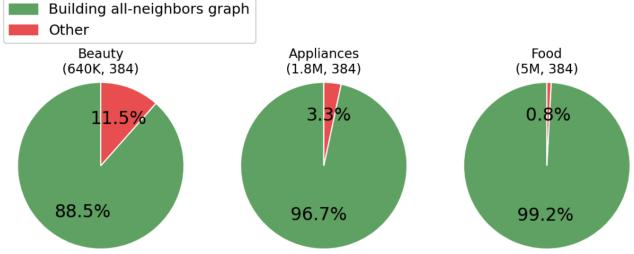

(b) CPu UMAP with approximate all-neighbors graph build  
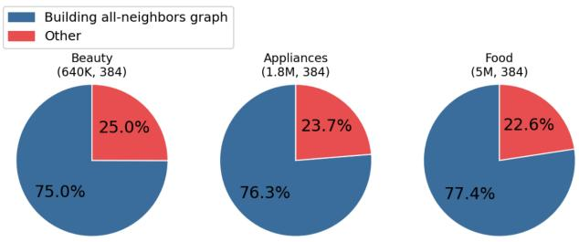  
Figure 1. Proportion of time spent on building all-neighbors graph within end-to-end UMAP on the GPU (Nolet et al., 2021) and CPU (McInnes et al., 2018b). This proportion increases with the dataset size ((rows, dims) in figure). Detailed dataset descriptions are provided in Section 4.

challenges of end-to-end UMAP on large datasets. We contribute three components addressing the growing demand for scalable UMAP. First, we enable and evaluate GPU-accelerated UMAP at previously unreachable scales for datasets that exceed a single GPU’s memory, establishing a practical baseline for future research. Second, we introduce a scalable out-of-core, multi-GPU all-neighbors graph construction algorithm that can be applied to any downstream machine learning pipeline that relies on large-scale all-neighbors graphs. Moreover, we contribute everything as a fully open-source implementation, making our method accessible to the community and impactful by enabling adoption in real-world large-scale ML workflows. Our scalable all-neighbors graph construction implementation is available in the NVIDIA cuVS library. Our end-to-end scalable UMAP algorithm is available in the NVIDIA cuML library.

The remainder of this paper is organized as follows. Section 2 describes related works, discussing how our algorithm draws upon popular techniques for accelerated vector search and ultimately benefits many other important data mining algorithms. Section 3 outlines our approach for scaling UMAP to handle massive datasets on the GPU. We share our experiment setup and results in Section 4 and Section 5, respectively. In Section 6 we summarize our contributions and discuss opportunities for future optimizations.

## 2 RELATED WORK

UMAP’s increasing use for large-scale work across many domains motivates us to improve its computational efficiency and ease of use with datasets that exceed GPU memory. One common use case is visualization. Some notable examples include interpreting semantic differences in LLM prompts (Shen et al., 2024) and text corpus evaluations (Costa-Jussa et al. \` , 2022). In genomics, UMAP is used to visualize and characterize cell populations (Hao et al., 2021; Korsunsky et al., 2019; Becht et al., 2019). Visualizations can also be exploited for general exploratory data analysis (Ali et al., 2023) or even in reinforcement learning (Haarnoja et al., 2024). Beyond visualization, UMAP is often used as a feature-extraction or embedding step in larger machine learning pipelines. UMAP has been integrated into topic modeling frameworks for dimensionality reduction (Grootendorst, 2022; Angelov, 2020). Sarthi et al. (2024) enhanced retrieval-augmented generation using UMAP embeddings. In time series analysis, UMAP is used for anomaly detection (Altin & Cakir, 2024).

## 2.1 Manifold learning

Manifold learning, as employed by methods such as UMAP, is a class of nonlinear dimensionality reduction techniques based on the manifold hypothesis (Cayton et al., 2005). This is the assumption that high-dimensional data are only artificially high-dimensional and lie on a low-dimensional manifold. The ultimate goal of manifold learning is to uncover the low-dimensional structure while preserving meaningful relationships between data points. Manifold learning algorithms tend to consist of three general steps; construction of a neighborhood graph, weighting the graph based on neighborhood affinities, and finally learning a low-dimensional representation that models neighborhoods from the graph. The first step is often the most computationally intensive, as it requires computing nearest neighbors for every vector in a training dataset.

In addition to UMAP, several other manifold learning algorithms can benefit from our scalable all-neighbors construction algorithm because they share this computation as their initial step. These algorithms include Isomap (Tenenbaum et al., 2000), Locally Linear Embeddings (LLE) (Roweis & Saul, 2000), Laplacian Eigenmaps (aka spectral embedding) (Belkin & Niyogi, 2003), and t-Distributed Stochastic Neighbor Embeddings (T-SNE) (Maaten & Hinton, 2008).

## 2.2 Vector Search

To construct the neighborhood graph for manifold learning algorithms, top-k nearest neighbors are computed for the entire training dataset, resulting in an all-neighbors kNN graph. In contrast to latency sensitive workloads like online search, where a kNN graph is constructed for a small number of vectors at a time, the all-neighbors kNN graph is an offline throughput bound task, requiring substantially more compute and memory.

The exhaustive nature of brute-force makes it unsuitable for computing the all-neighbors graph at scale, so many algorithms rely on approximate nearest-neighbor methods (ANNs). Many ANN algorithms are machine learning models which build an index that helps to reduce the number of distance computations during search. On the CPU, these algorithms are often optimized for low latency online search, with some modern and widely-used methods including hierarchical navigable small-world graphs (HNSW) (Malkov & Yashunin, 2018; Munyampirwa et al., 2024), DiskANN (Jayaram Subramanya et al., 2019), Faiss’ FastScan (Douze et al., 2025), and SCaNN (Guo et al., 2020). Neighborhood graph construction in our work needs to be high throughput, and GPU-accelerated variants of algorithms like IVF-PQ (Johnson et al., 2019b; Simhadri et al., 2022) and graphbased CAGRA (Ootomo et al., 2024) can significantly improve query throughput for large batches of queries, while the nearest neighbors descent (nn-descent) algorithm (Dong et al., 2011) improves upon the performance of the aforementioned ANN methods by directly approximating the allneighbors graph. The subsequent GPU port of nn-descent (Wang et al., 2021a) further improves this performance.

Our approach is inspired by the clustered graph-build approach used by DiskANN (Jayaram Subramanya et al., 2019). This approach uses a technique common to vectorbased inverted file index (IVF) algorithms called “spilling” (Liu et al., 2004; Sun et al., 2023; Jayaram Subramanya et al., 2019; Bergum, 2022), which partitions vectors into k-means clusters and assigns each vector to multiple partitions, ensuring that true neighbors near partition boundaries are not missed. We adopt this partitioned approach with spilling, but rather than separating index construction and query routing as in standard IVF search, we construct an all-neighbors graph fully independently in each partition, and stitch the results together into a single global graph.

## 2.3 All-neighbors Graph Construction

Several approaches exist for finding nearest neighbors at scale. One of the most naive approaches, called uniform sharding, breaks the training dataset into some number of chunks uniformly at random, and trains an ANN index on each chunk. At search time, every vector in the dataset is broadcast to every chunk, where each chunk computes its local k-nearest neighbors. The nearest neighbors from each chunk are then reduced down to a final set of k-nearest neighbors by taking the smallest distances from all chunks. While this method is simple to implement and can be executed across multiple processing units like GPUs, it requires costly all-to-all communications in the broadcasting of each vector. Many vector databases have implemented this method (Wang et al., 2021b; Xian et al., 2024), since it is trivial to develop and fits well within existing log-structured merge tree architectures (O’Neil et al., 1996). This method allows for more chunks and greater parallelism through local reductions within each chunk. However, architectures based on log-structured merge trees typically exploit the ordering of structured data in order to scale efficiently, but sorting vectors does not improve ANN search because vector similarity is geometric rather than order-based. Thus, the need to have every chunk involved in the computation for every vector makes it challenging to scale in a performant manner.

Ideally, a scalable and performant solution would allow for more independent computation. An additional method, called global indexing, enables this by establishing spatial locality up front (Guo et al., 2020; Johnson et al., 2019a), using a clustering algorithm to partition the points into c clusters, rather than distributing the points uniformly. This can be viewed as a form of ordering the vectors to provide better quality and scale. With this method, search points can be dispatched to their c closest clusters, thus enabling only a subset of clusters to be used for search. K-means is often used for clustering, and a hierarchical variant of k-means can provide better load balancing of points across clusters. The resulting clusters also do not need to be disjoint, as points can be spilled (Liu et al., 2004; Sun et al., 2023; Jayaram Subramanya et al., 2019) into multiple clusters and de-duplicated at search time to improve search quality. Global indexing is also referred to as an IVF. While it can often improve scale for online search, it still requires a significant amount of communication to multicast every vector to its closest clusters and gather the resulting nearest neighbor graphs into a single global all-neighbors graph.

Therefore, from an algorithmic perspective, constructing a full all-neighbors graph is challenging. Even with multiple GPUs, such as in Faiss (Douze et al., 2025), efficiently distributing the work across GPUs or partitions remains difficult (appendix A). Each vector still requires communication or replication across partitions, and the standard search-focused optimizations do not translate directly to the all-neighbors graph workload. Prior work such as LargeVis (Tang et al., 2016) has also constructed an approximate kNN graph as part of a downstream machine learning task, but as a CPU-based method this does not scale to the dataset sizes we target (appendix Section B). This motivates the need for a specialized algorithm that is explicitly optimized for large-scale all-neighbors graph construction.

## 2.4 Alternate UMAP Implementations

The widely used reference implementation of UMAP on the CPU (McInnes et al., 2018b) partially mitigates the compute and memory challenges by using pynndescent (McInnes, 2021), a Python version of the nn-descent algorithm. However, building the all-neighbors graph still dominates the end-to-end runtime, and fails to run on large datasets due to excessive memory consumption during this step.

A few GPU-accelerated implementations of UMAP exist in an attempt to exploit GPU parallelism. However, many methods (Van Assel et al.; Eisenmann) operate as “ports” of the original CPU implementation (McInnes et al., 2018b), relying on general-purpose frameworks such as PyTorch (Imambi et al., 2021) or Numba (Lam et al., 2015) to dispatch GPU work, without considering GPU characteristics such as memory capacity and access patterns. Nolet et al. (2021) fully accelerated UMAP on GPU showing improved performance. However, all approaches suffer from requiring the entire dataset to fit in GPU memory, which we resolve in this work.

## 3 SCALING UMAP WITH GPUS

As mentioned in Section 2.1, the UMAP algorithm is a manifold learning algorithm that consists of three main steps, but the first step dominates the end-to-end runtime, and is thus the focus of our scaling and acceleration efforts in this paper. In this section, we propose a scalable and highly parallel algorithm that is accelerated on the GPU end-toend, and efficiently computes the all-neighbors graph on datasets that far surpass the memory of the GPU.

The fixed degree k in our all-neighbors graph construction directly corresponds to the n neighbors parameter in UMAP. This parameter controls the number of nearest neighbors considered for each point when building the neighborhood graph, thereby influencing the trade-off between preserving local structure versus introducing more global structure into the embedded space. Smaller values focus more on fine-grained local relationships, while larger values capture broader patterns.

## 3.1 Scalable all-neighbors Graph Construction

Following from the global indexing solution outlined in Section 2.3, our approach establishes spatial locality and uses an IVF, spilling points across clusters to induce overlap. However, rather than performing online search against a subset of closest clusters, we gather only the vectors assigned to each cluster at a time onto the GPU and build a local all-neighbors graph on each cluster independently. The reason for this is two-fold– first, it avoids the communication overhead of multi-casting vectors to their nearest clusters– second, it allows for larger amounts of spilling without having to actually duplicate vectors on any GPU at any point in time.

Spilling trades off quality for additional computation, allowing intermediate local all-neighbors graphs to be merged into a single high-quality global all-neighbors graph while preserving as much of the actual neighborhood structure as possible. As we show in Section 4, this graph allows our GPU-accelerated UMAP implementation to faithfully reproduce the resulting visualization from the reference implementation on the CPU.

Our method consists of four main steps. Each step is illustrated in detail in Figure 2.

1. Compute c cluster centers to approximately evenly partition the space using a load-balanced variant of k-means

2. Assign each data vector to its nearest s clusters, where s is a spilling factor

3. For each cluster in c, compute a local all-neighbors graph

4. Merge local all-neighbors graphs for each c into a single global all-neighbors graph

The first two steps preprocess the dataset to preserve spatial locality. Steps three and four are performed on each cluster c, and yield the final output.

Compute cluster centers using hierarchical balanced kmeans To determine spatially meaningful partitions, we first run a clustering algorithm to compute cluster centroids. Since our approach targets datasets that exceed GPU memory, we randomly sample Nc vectors from the dataset to C   
run the clustering algorithm on the GPU, where N is the number of vectors in the dataset. This subsample is assumed to be representative of the overall data distribution while remaining small enough to fit in GPU memory, allowing cluster centroids to be efficiently extracted on GPU without processing the full dataset.

We employ a two-level hierarchical balanced k-means scheme to capture both global and local structure while reducing overall computational cost. At the meso level, balanced k-means divides the subsample into c coarse clusters, capturing the global spatial layout of the dataset. Each meso cluster is then refined independently by another round of balanced k-means, producing approximately c fine clusters within each region. The total number of clusters thus becomes c, yielding a balanced c– c hierarchy that provides uniform spatial resolution and naturally limits the per-cluster workload. Because each fine-level clustering operates on a much smaller subset of data, this hierarchical decomposition significantly reduces the overall runtime compared to performing a single flat clustering over all c clusters.

Our balanced k-means is designed to achieve approximate, rather than exact, uniformity of cluster sizes. During the iterative process, after each assignment step, we monitor the size of all clusters. If a cluster falls below a predefined minimum size threshold, it is removed, and the largest cluster is split into two new clusters to maintain the total cluster count. This heuristic adjustment prevents the emergence of degenerate tiny clusters while redistributing data points from overpopulated regions. Unlike strict capacity-constrained formulations, this approach provides a lightweight and GPUfriendly mechanism to maintain roughly balanced partitions without sacrificing local spatial structure.

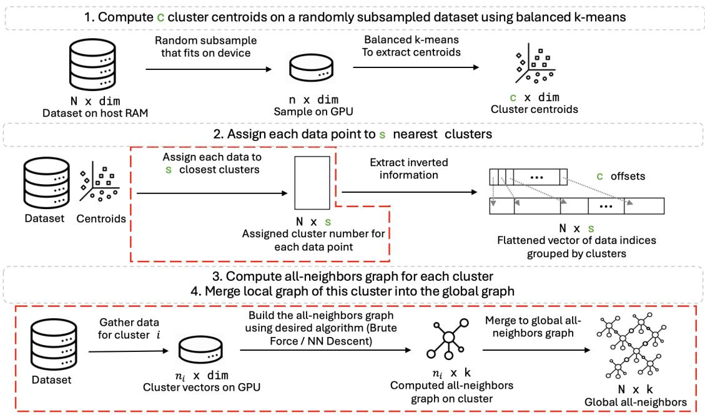  
Figure 2. Four steps of our out-of-core all-neighbors construction. Green text indicates user-configurable parameters that affect GPU memory usage or all-neighbors graph accuracy. Red boxes highlight steps that can be parallelized across multiple GPUs.

Assign each data vector to nearest s clusters Instead of hard assigning each vector to a single cluster to produce disjoint clusters, our approach spills vectors across clusters by assigning each vector in the training dataset to its s closest clusters, where s is called a spill factor. Spilling increases the likelihood that we can find the true neighborhoods, even when faced with points very close to the cluster boundaries. Spilling provides connections across clusters, so they can ultimately be stitched into a single global coherent all-neighbors graph.

Using the cluster assignment information, we construct a compressed-sparse row (CSR) matrix to represent an inverted index to map each vector in the training dataset to its assigned clusters. Each row corresponds to a cluster id, and the nonzero entries indicate data indices that belong to that cluster. This structure allows for efficient data gathering during the subsequent all-neighbors graph construction step.

Compute local all-neighbors for each cluster Since we expect the points to be approximately balanced across clusters, we can use c and s to control the relative number of points in each cluster, which ultimately determine how much GPU memory is required. The vectors assigned to each cluster, in addition to the corresponding all-neighbors graph, need to fit in a single GPU at a given time. Equation (1) shows the approximate memory components used on the GPU for a local all-neighbors graph construction.

$$
\tag{1}
$$

Equation 1. Memory components used on the GPU for a local allneighbors graph construction, D is the dimension of the dataset, N is the number of vectors in the training dataset, T is the data type of the corresponding data arrays.

For each cluster, we use the inverted index constructed in the previous step to obtain the data indices assigned to that cluster. The corresponding vectors are gathered as a contiguous chunk in system memory and transferred to the GPU, where the local all-neighbors graph is computed. This method is agnostic to the nearest neighbors algorithm used to build the all-neighbors graph, allowing for any ANN algorithm to be used. Our implementation supports GPU-accelerated versions of brute-force and nn-descent algorithms, but it can easily be extended to use others.

Merge local all-neighbors graphs into global allneighbors graph A single global all-neighbors graph is maintained in GPU memory throughout the computations of the local all-neighbors graphs. After each local graph is computed, it is merged into the global graph.

Two or more all-neighbors graphs are merged by performing a column-wise concatenation followed by a row-level kselection, effectively reducing the degree of the final graph back down to k. The k-selection requires a row-wise sort by distance so that the neighborhoods are ordered by their proximity from the target vector. Duplicates introduced by the spill factor s are then removed and only the top-k entries retained from the final list of neighbors in each row.

Algorithm 1 CUDA kernel to merge all-neighbors sub  
graphs   
input k, distsa, indsa, distsb, indsb, map   
output Updated distsa, indsa   
keys[2k] {shared memory for distances}   
values[2k] {shared memory for indices}   
Brow ← blockIdx.x   
Arow ← map[Brow]   
keys[: k] ← distsa[Arow]   
values[: k] ← indsa[Arow]   
keys[k : 2k] ← distsb[Brow]   
values[k : 2k] ← indsb[Brow]   
sorted keys, sorted values ←   
cub::BlockMergeSort(keys, values)   
unique keys, unique values ←   
GetUnique(sorted keys, sorted values)   
distsa[Arow] ← unique keys[: k]   
indsa[Arow] ← unique values[: k]   
function GetUnique (sorted keys, sorted values)   
mask[2k] {shared memory for mask}   
M [i] ← sorted keys[i] ̸= sorted keys[i − 1]   
Perform prefix sum Pi = Pij=0 Mj   
unique keys[Pi] = sorted keys[i] where Mi = 1   
unique values[Pi] = sorted values[i] where Mi = 1   
end function

Algorithm 1 contains the pseudo code for merging two all-neighbors graphs together. Each all-neighbors graph is stored as a CSR matrix. Since the graph has a fixed degree of k, the array mapping each row to its column offsets is omitted. The remaining two arrays we refer to as inds and dists store the column indices and distances, respectively. These arrays both have a size of N × k, where N denotes the number of vectors in the current cluster for a local graph, or in the full dataset for the global graph. We leverage the inverted index constructed in step 2 to map local row indices to their corresponding indices in the original dataset. The CUDA kernel for this merge operation uses a separate thread block to process each row in the CSR.

To minimize additional GPU memory allocation, and to improve performance, distances and indices from the same row in A and B graphs are concatenated in CUDA shared memory. The distances are treated as keys and the indices as values in a block-wise collaborative sort using NVIDIA CUB’s (CCCL Development Team, 2023) BlockMergeSort to exploit all threads in each block to sort the concatenated result by distances.

Following the sort, a de-duplication step is performed on each neighbor list to account for duplicates introduced by the overlap of the spilling parameter s. Assuming duplicated indices occupy adjacent spaces in the sorted neighborhood list, CUDA threads collaboratively compute a bit-level mask within each thread block, marking the first occurrence of each id in the concatenated 2k-length list with 1, and subsequent duplicates with 0. A prefix-sum is computed on the unique mask to determine the positions of unique items in the final graph and the de-duplicated results are written back to the merged graph.

## 3.2 Using multiple GPUs

We further improve the scale and performance of our algorithm by distributing computation across multiple GPUs. Since constructing the all-neighbors graph for each cluster can be done independently, our algorithm can parallelize well across multiple GPUs, removing the need for costly inter-GPU communication of data vectors. For parallelizing across ngpu number of GPUs, we launch ngpu threads, each responsible for submitting CUDA kernels on a single GPU. Figure 2 notes the stages that can be parallelized across multiple GPUs.

Assign each data vector to nearest s clusters The matrix of cluster centroids computed in step 1 tends to be fairly small in footprint, so it is broadcasted to all GPUs. During the cluster assignment stage, each GPU is responsible for processing approximately n vecs per gpu = ngpu N data vectors, where N is the number of vectors in the training dataset. n data per gpu vectors are further divided into smaller batches if necessary to fit within the GPU’s memory capacity. The closest s k-means centroids are assigned to each vector in the batch and each thread writes the results from its batch to a global N × s matrix.

Compute local all-neighbors for each cluster In the allneighbors graph computation step, each GPU is responsible for processing a similar number of clusters out of c. Iterating through its assigned range of clusters, each GPU independently uses the inverted index to efficiently gather vectors that belong to each of its clusters from system memory, and builds a local all-neighbors graph on the GPU. Again, the use of balanced k-means clustering produces clusters of roughly uniform size, ensuring that each GPU receives a comparable amount of work without significant stragglers or additional scheduling overhead.

Merge local all-neighbors graphs into global allneighbors graph As each GPU finishes computing their local all-neighbors graph for each partition, the result is merged into the global all-neighbors graph. As an optional intermediate step to increase parallelism and decrease the need for costly synchronization, multiple intermediate allneighbors graphs can be maintained so that several local graphs can be merged together independently of all others prior to merging into the final global all-neighbors graph. This hierarchical merging pattern can also be done as a tree reduction to reduce synchronization points further and enable efficient scaling to larger numbers of GPUs, even across physical node boundaries.

## 4 EXPERIMENTS

We compare the execution time and correctness of our implementation against the reference UMAP implementation on the CPU (McInnes et al., 2018b), which uses Numba (Lam et al., 2015) just-in-time (JIT) compilation to parallelize Python loops across CPU threads to improve throughput on multi-core systems. The reference implementation was configured to take advantage of all the available cores on the machine and defaults to using ANN (pynndescent) (McInnes, 2021) for efficient all-neighbors graph construction.

Our work focuses on scalability with efficient memory management and end-to-end performance. The existing GPU alternatives to our approach (Eisenmann; Van Assel et al.) fall short in both of the categories above, and therefore we do not consider them comparable baselines in our largescale out-of-core experiments. We share experiments of other GPU alternatives in appendix C.

All experiments were conducted on an NVIDIA DGX machine with 8 NVIDIA H100 GPUs (NVIDIA, 2022) and an Intel Xeon 8480CL 224-core CPU with 2T iB of RAM. The remainder of this section is as follows: Section 4.1 provides an overview of the datasets used in our experiments. Section 4.2 and Section 4.3 outline the workflows used to measure the performance and correctness of our implementation against the reference UMAP implementation on CPU. Section 4.4 discusses our correctness metric and Section 4.5 highlights the UMAP configurations that were used in the experiments.

## 4.1 Datasets

Table 1 summarizes the datasets used for our experiments. The Amazon reviews text datasets (Ni et al., 2019) consist of user reviews collected from Amazon, organized into multiple categories. We selected four categories from this dataset (beauty, appliances, food, and electronics reviews) to evaluate scalability and performance across various shapes and scales. Some datasets required embedding raw text data, for which we used the sentence-transformers Python library (Reimers & Gurevych, 2019). For the 384 dimensional embeddings, we used the all-MiniLM-L6-v2 model and for the 768 dimensional embeddings we used the all-mpnet-base-v2 model. The dataset we refer to as Wiki-all contains multilingual text chunks from Kaggle 1 and Cohere 2, embedded with the paraphrase-multilingual-mpnet-base-v2 model. The MIRACL dataset (Zhang et al., 2023) is composed of wikipedia passages across multiple languages embedded with the llama-3.2-nvembed model. The larger datasets (Wiki and MIRACL) exceed the memory capacity of modern GPUs to help evaluate the scalability of our out-of-core approach.

Table 1. Summary of datasets used for evaluation.  
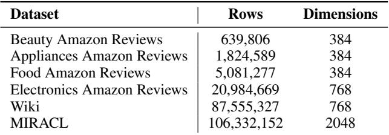

## 4.2 End-to-End Comparison

We compare end-to-end performance and correctness of our UMAP implementation on GPU against the reference UMAP implementation on CPU. Memory bottlenecks in the all-neighbors graph production prevented UMAP on CPU from successfully running on on Wiki-all and MIRACL, even when 2TiB of system memory was available. For these massive datasets, we project the performance of UMAP on CPU by measuring its performance on smaller subsets and extrapolating to the full datasets. Section 5.1 shows how the performance was projected and compares against the performance measurements on GPU.

## 4.3 Precomputed all-neighbors on GPU

Since the all-neighbors graph on CPU is prohibitive at the larger scales, we precompute it on the GPU using the algorithm outlined in Section 3 in order to demonstrate the performance benefits when comparing CPU and GPU versions. This experiment also shows that our approach achieves correctness comparable to CPU on the larger datasets Wiki-all and MIRACL, even while they failed to run end-to-end on the CPU.

## 4.4 Metrics

We report time in seconds for the performance metric, but evaluate two aspects as a correctness metric– trustworthiness and visual inspection.

Trustworthiness Score The trustworthiness score (Venna & Kaski, 2001) measures the degree to which the local neighborhood structure in the original high-dimensional data is preserved in the low-dimensional space. The score ranges between 0 and 1, with values closer to 1 indicating better preservation of local neighborhood structure. Computing the trustworthiness score can be prohibitive at larger scales because it requires computing the full pairwise distances of the high-dimensional vectors. Empirically, we find that computing trustworthiness scores over multiple uniformly sampled subsets and averaging the results provides a fast converging approximation of the true global trustworthiness score, which can be viewed as a monte-carlo approximation.

Visual Inspections We have found the trustworthiness score can sometimes be deceiving when quantifying the degree to which a visualization maintains faithfulness across implementations, so we also perform visual inspections of the resulting 2-dimensional embeddings. Since we are evaluating datasets at massive-scale, we uniformly subsample vectors from the low-dimensional embedding so that the final visualization provides intuitive confirmation that our implementation faithfully compares to the reference implementation on the CPU.

## 4.5 UMAP Configurations

We used the default values for both CPU and GPU implementations in all experiments with the exception that the embedding initialization method was set to random for both. We selected specific values for c and s to efficiently utilize available GPU memory. The parameters (c = 16, s = 2) were used for Wiki-all and (c = 64, s = 2) were used for MIRACL to balance memory usage and computational efficiency. More details about how these parameters affect the memory usage and trustworthiness score are outlined in Section 5.4.

## 5 RESULTS

## 5.1 End-to-end Speedup

We conduct end-to-end comparisons between CPU UMAP and our UMAP implementation, where each method constructs its own all-neighbors graph as part of the full pipeline. Due to the high computational cost and memory requirements of all-neighbors graph construction in CPU UMAP, we were unable to complete end-to-end runs on the largest datasets Wiki-all and MIRACL despite the full dataset fitting in our CPU memory. Running CPU UMAP on a 16M subsample of the MIRACL dataset required approximately 1.4TB of CPU memory. Following this, we were unable to run the 32M subsample on our machine.

Therefore, as mentioned in Section 4.3, we predicted the end-to-end CPU UMAP run times by taking smaller subsamples from larger datasets and ultimately extrapolating points for the full dataset. To model the relationship between dataset size and execution time, we fit a power-law function of the following form for each large dataset: T (N ) = aN b, where T (N) denotes the runtime for a dataset of N data vectors, and a and b are fitting parameters. This function is used for extrapolation because the all-neighbors graph construction shows power law scaling and dominates the end-to-end runtime.

Extrapolated points are plotted with the measured points in Figure 3 (a). We note that the projected CPU UMAP run times grow super-linearly with sampled dataset size. This is not only due to the inherent algorithmic complexity, but also because larger datasets consume increasing amounts of system memory, particularly during the all-neighbors graph construction step. On the CPU, this memory pressure eventually brings usage to the system’s full capacity, even on the 2TiB RAM machine used in our experiments, significantly impacting performance. This demonstrates that running such large problems on CPUs quickly becomes prohibitive at these scales.

Figure 3 (b) shows the resulting speedups and trustworthiness scores for varying dataset scales. Based on the predicted end-to-end CPU runtime in Figure 3 (a), our implementation achieves 74× speedup on the largest MIRACL dataset. It also achieves noticeable speedups on smaller datasets while maintaining similar trustworthiness scores. Beyond the performance gain, this result highlights a key advantage of our approach. Our memory and performance aware implementation makes processing such large datasets tractable on GPU, whereas the CPU implementation struggles to complete within practical time or memory limits.

To the best of our knowledge, there is no publicly available multi-node CPU implementation of UMAP today. By using the fastest (original) single-node CPU implementation and using perfect linear extrapolation, we are overestimating

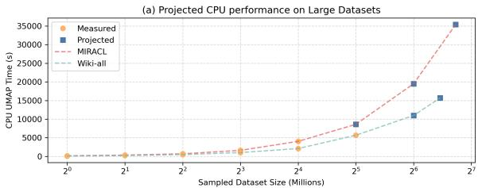

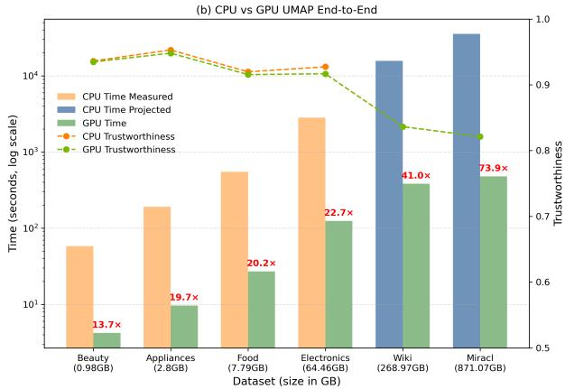  
Figure 3. (a) shows measured and projected CPU UMAP runtimes for the Wiki-all and MIRACL datasets for varying subsample sizes. (b) shows end-to-end runtime and trustworthiness scores for various datasets. The blue projections come from the full size data performance projection in (a). We use 8 GPUs for Wiki and MIRACL, and 1 GPU for all other datasets. Our implementation delivers strong performance gains while maintaining comparable trustworthiness.

CPU performance, which disadvantages our approach. The isoefficiency considerations for network communication, latency, and overheads are 0 for CPU UMAP in this analysis, whereas our empirical multi-GPU implementation accounts for all of these overheads. Our 74x speedup, despite this disadvantage, ensures our method is both a conservative estimate and significant improvement in practice.

## 5.2 Precomputed kNN on GPU

In this section, we present the performance and trustworthiness scores of running the remaining steps of CPU UMAP and our GPU-accelerated UMAP, using an all-neighbors graph that was pre-computed on the GPU. The time required to construct the all-neighbors graph is in Table 2, where k = 15 to match the default n neighbors parameter in both CPU and GPU implementations.

Figure 4 compares the end-to-end execution time across different datasets. Our GPU-accelerated implementation achieves up to 121× speedup over the CPU baseline on the largest MIRACL dataset, without noticeable degradation of trustworthiness score against the CPU implementation.

Table 2. Shows mean time in seconds ± variance to build the allneighbors graph. We used multiple GPUs for an efficient build for larger datasets.  
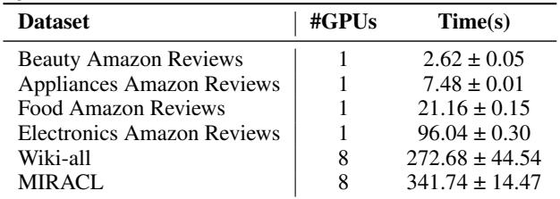

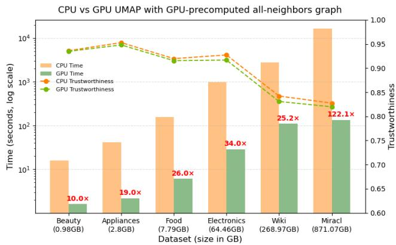  
Figure 4. Runtime and trustworthiness of UMAP on CPU vs GPU using a GPU-precomputed all-neighbors graph. Our implementation delivers strong performance gains running remaining steps of UMAP while maintaining comparable trustworthiness.

To further validate embedding quality, we include qualitative comparisons of the final two-dimensional UMAP projections for both CPU and GPU implementations. As shown in Figure 5, for the largest MIRACL dataset, the embedding produced by our UMAP closely matches that of CPU UMAP, confirming that our GPU-accelerated UMAP correctly preserves the structure of the dataset. Embedding visualization comparisons for smaller datasets are in appendix Section D.

## 5.3 Scaling with Multiple GPUs

To evaluate the multi-GPU scalability of our UMAP implementation, we measure the strong scaling for end-to-end execution time of distributing the workload across multiple GPUs on our two larger datasets Wiki-all and MIRACL. Figure 6 (a) and (b) show the observed scaling trend. The results show that the execution time decreases with the number of GPUs, demonstrating that parallelizing the all-neighbors construction provides significant performance benefits. Also note the robustness of our approach, as the trustworthiness score remains consistent regardless of the number of GPUs.

We note in Figure 6 (c) that the all-neighbors construction speedup gain is not perfectly linear as the number of GPUs increases. One of the primary sources of the observed sublinear scaling is CPU-side utilization. Our GPU nn-descent implementation includes multi-threaded operations that are done on CPU within each iteration. With more GPUs, the number of CPU cores available per GPU to do these multithreaded operations is reduced, thus causing contention for the CPU. We observe that the per-thread CPU time to do these multi-threaded operations increases by 1.3x and 1.95x for 4 and 8 GPUs, respectively, compared to 2 GPUs. For the 8 GPU case, the multi-threaded CPU operations account for 13% of the end-to-end kNN construction time. This explains the observed speedup being more pronounced for the larger dataset (MIRACL), where a greater proportion is GPU compute-bound.

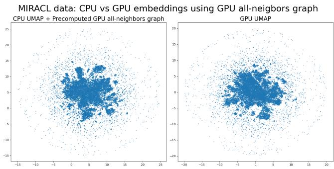  
Figure 5. Resulting embeddings of CPU UMAP using a GPUprecomputed all-neighbors graph, and our GPU UMAP one the MIRACL dataset. We randomly sampled 30,000 points for visualization.

The serialization point for merging the local graphs from the GPU into the global graph does not introduce a significant bottleneck. Profiling on the Wiki dataset (88M x 768) with 8 GPUs (c = 16, s = 2) reveals that the average CPU launch wait per merge kernel execution accounts for 0.02% of the end-to-end kNN construction (merge kernel is launched c times). This efficiency arises because our merging kernel is highly optimized to avoid unnecessary GPU memory allocations, and to exploit CUDA shared memory. A single merge kernel execution runtime contributes to 0.4% of the total end-to-end kNN construction time. Additionally, GPUs process k-means clusters of varying sizes and complete at slightly different times, further hiding latencies and reducing serialization overhead.

## 5.4 Impact of kNN Parameters

We analyze how the number of clusters c and spill factor s in our all-neighbors construction algorithm affect the trustworthiness and end-to-end performance of UMAP. We also report the GPU memory usage during the all-neighbors construction stage to show how c and s affect memory usage.

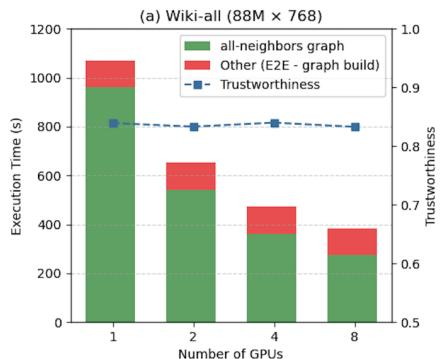

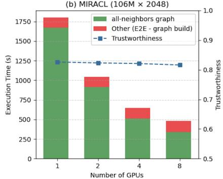

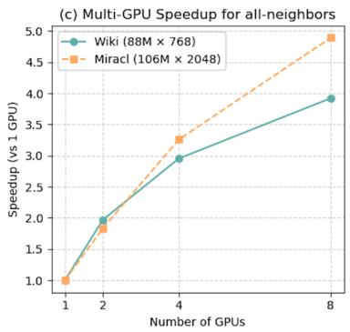  
Figure 6. (a) and (b) show strong scaling results of our approach for increasing number of GPUs. (c) shows the speedup of the allneighbors graph construction step for the Wiki-all and MIRACL datasets, relative to using a single GPU. Execution time continues to shrink as more GPUs are added, showing our approach scales well with multiple GPUs.

The parameter c defines the number of clusters, thus impacting the GPU memory usage. A larger c produces smaller clusters, thereby reducing the memory pressure during the all-neighbors construction. The parameter s determines the degree of spilling. A larger s increases computation by adding more vectors per cluster, but enhances the accuracy of the resulting all-neighbors graph by improving crosscluster connectivity. Each cluster contains approximately N · s data vectors where N is the number of data vectors in the whole dataset.

In practice, Equation (1) can be used to estimate values of s and c that satisfy the target GPU memory constraints.

For a fixed ratio z, where z = s , which preserves per-GPU memory usage, improving kNN graph recall can be achieved by increasing s while adjusting c in proportion to keep z constant. A typical tuning strategy is to begin with s = 2 and increase s in small integer steps while still maintaining a constant z. In practice, good kNN recall and embedding quality are often achieved after only a few increases (s = 2 → 3 → 4). For very large datasets where c is large (e.g. c > 100), increasing s in slightly larger steps (s = 2 → 4 → 6) may be more appropriate. However, s should not be increased excessively, as higher values of s improve kNN recall at the expense of increased computation.

Figure 7 shows the result of running the Wiki-all dataset with varying (s, c) configurations. Figure 7 (a) shows GPU memory usage excluding the global all-neighbors graph for better observation of how s and c impact the memory usage. The peak GPU memory usage for all-neighbors construction roughly halves as c increases from 16 to 64 with s = 2, because larger c reduces the size of each cluster. Comparing configurations (2, 16), (4, 32), and (8, 64), we see similar memory usage, as they all result in comparable number of vectors in GPU memory. A small overhead remains for larger c because additional clusters and data vector assignments need to be maintained.

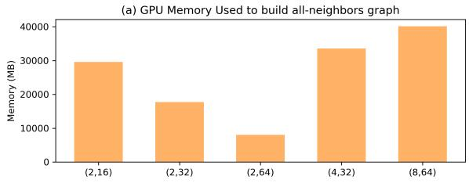

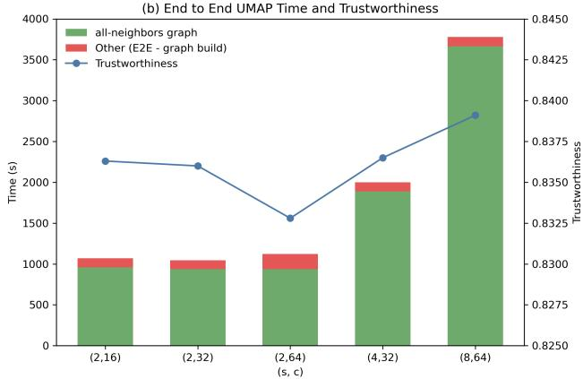  
Figure 7. (a) shows peak GPU memory (in megabytes) used for building the all-neighbors graph, excluding the GPU memory allocated for the global all-neighbors graph. x axis is for different configurations of (s, c). (b) shows runtime and trustworthiness scores. Trustworthiness improves with the spilling factor s, and memory usage improves with number of clusters c.

Figure 7 (b) shows the runtime and trustworthiness scores of running UMAP on the same configurations. Although the differences in trustworthiness scores are not significant, we observe a trend. Trustworthiness drops slightly as c is increased from 16 to 64 with s = 2, because true neighbors are more likely to fall into different partitions. While comparing configurations (2, 16), (4, 32), and (8, 64), we notice larger s improves trustworthiness scores because it increases the chance of seeing a true neighbor by being assigned to multiple clusters. The end-to-end runtime increases with s, as higher values require processing more vectors. It’s important to note that the UMAP algorithm itself provides several parameters to tune the quality of the embedding, while this experiment is only concerned with demonstrating the impact of c and s on trustworthiness. The two parameters s and c exhibit a clear trade-off between performance and GPU memory usage, while also affecting the trustworthiness of the UMAP embedding. The impacts that these parameters directly have on the kNN recall is in appendix E.

## 6 CONCLUSION

In this work, we introduced a novel algorithm for computing a UMAP embedding out-of-core on GPU, providing the ability to scale to massive datasets. Our algorithm introduces two new parameters, c and s, for trading off space and time, allowing it to scale far beyond the memory capacity of a single GPU. Further, our contribution reduces the burden of communications as it scales, allowing it to be executed efficiently across multiple GPUs. We analyzed how our method improves all-neighbors graph construction, which is the primary runtime and memory bottleneck on both CPU and GPU today, and we outlined an algorithm based on IVF with spilling that maintains quality of the resulting UMAP embedding.

We demonstrated groundbreaking speedup at scale and believe our work will open new opportunities for iterative and exploratory large-scale analysis with UMAP, enabling both academic research and industrial applications to operate interactively on datasets that were previously intractable on the CPU. Our GPU-accelerated UMAP implementation is fully open-source within cuML with Python wrappers for ease of use. In addition to enabling massive-scale UMAP, our partitioned all-neighbors construction framework can serve as a foundation for many other GPU-accelerated data mining algorithms in the manifold learning and clustering space. This capability is already available as a standalone feature in cuVS.

While this algorithm has unlocked extreme scale for many of today’s demanding applications and workflows, its primary limitation is the requirement that the final all-neighbors graph fit into the memory space of a single GPU. This constraint ultimately imposes an upper bound on the number of data vectors it can handle. As applications continue to push to billion-scale and beyond, we continue to improve upon our approach with the goal of scaling efficiently to utilize 1) the larger space of system memory, 2) multiple physical nodes, and 3) the massive bandwidth of emerging NVMe technologies being enabled by PCIe 5 and above.

## REFERENCES

Ali, S., Abuhmed, T., El-Sappagh, S., Muhammad, K., Alonso-Moral, J. M., Confalonieri, R., Guidotti, R., Del Ser, J., D´ıaz-Rodr´ıguez, N., and Herrera, F. Explainable artificial intelligence (xai): What we know and what is left to attain trustworthy artificial intelligence. Information fusion, 99:101805, 2023.

Altin, M. and Cakir, A. Exploring the influence of dimensionality reduction on anomaly detection performance in multivariate time series. IEEE Access, 12:85783–85794, 2024.

Angelov, D. Top2vec: Distributed representations of topics. arXiv preprint arXiv:2008.09470, 2020.

Becht, E., McInnes, L., Healy, J., Dutertre, C.-A., Kwok, I. W., Ng, L. G., Ginhoux, F., and Newell, E. W. Dimensionality reduction for visualizing single-cell data using umap. Nature biotechnology, 37(1):38–44, 2019.

Belkin, M. and Niyogi, P. Laplacian eigenmaps for dimensionality reduction and data representation. Neural computation, 15(6):1373–1396, 2003.

Bergum, J. K. Billion-scale vector search using hybrid HNSW-IF blog.vespa.ai. https://blog.vespa.ai/ vespa-hybrid-billion-scale-vector-sear 2022. [Accessed 11-02-2026].

Cayton, L. et al. Algorithms for manifold learning. Univ. of California at San Diego Tech. Rep, 12(1-17):1, 2005.

CCCL Development Team. CCCL: CUDA C++ Core Libraries, 2023. URL https://github.com/ NVIDIA/cccl. [Accessed 30-10-2025].

Costa-Jussa, M. R., Cross, J.,\` C¸ elebi, O., Elbayad, M., Heafield, K., Heffernan, K., Kalbassi, E., Lam, J., Licht, D., Maillard, J., et al. No language left behind: Scaling human-centered machine translation. arXiv preprint arXiv:2207.04672, 2022.

De Zuani, M., Xue, H., Park, J. S., Dentro, S. C., Seferbekova, Z., Tessier, J., Curras-Alonso, S., Hadjipanayis, A., Athanasiadis, E. I., Gerstung, M., et al. Single-cell and spatial transcriptomics analysis of non-small cell lung cancer. Nature communications, 15(1):4388, 2024.

Dong, W., Moses, C., and Li, K. Efficient k-nearest neighbor graph construction for generic similarity measures. In Proceedings of the 20th international conference on World wide web, pp. 577–586, 2011.

Douze, M., Guzhva, A., Deng, C., Johnson, J., Szilvasy, G., Mazare, P.-E., Lomeli, M., Hosseini, L., and J ´ egou, H.´ The faiss library. IEEE Transactions on Big Data, 2025.

Eisenmann, P. GitHub - p3732/gpumap: GPU-Parallelized UMAP — github.com. https://github.com/ p3732/gpumap. [Accessed 30-10-2025].

Friebel, E., Kapolou, K., Unger, S., Nu´ nez, N. G., Utz, S., ˜ Rushing, E. J., Regli, L., Weller, M., Greter, M., Tugues, S., et al. Single-cell mapping of human brain cancer reveals tumor-specific instruction of tissue-invading leukocytes. Cell, 181(7):1626–1642, 2020.

Grootendorst, M. Bertopic: Neural topic modeling with a class-based tf-idf procedure. arXiv preprint arXiv:2203.05794, 2022.

Guo, R., Sun, P., Lindgren, E., Geng, Q., Simcha, D., Chern, F., and Kumar, S. Accelerating large-scale inference with anisotropic vector quantization. In International Conference on Machine Learning, pp. 3887–3896. PMLR, 2020.

Haarnoja, T., Moran, B., Lever, G., Huang, S. H., Tirumala, D., Humplik, J., Wulfmeier, M., Tunyasuvunakool, S., Siegel, N. Y., Hafner, R., et al. Learning agile soccer skills for a bipedal robot with deep reinforcement learning. Science Robotics, 9(89):eadi8022, 2024.

Hao, Y., Hao, S., Andersen-Nissen, E., Mauck, W. M., Zheng, S., Butler, A., Lee, M. J., Wilk, A. J., Darby, h/, C., Zager, M., et al. Integrated analysis of multimodal single-cell data. Cell, 184(13):3573–3587, 2021.

Hotelling, H. Analysis of a complex of statistical variables into principal components. Journal of educational psychology, 24(6):417, 1933.

Imambi, S., Prakash, K. B., and Kanagachidambaresan, G. Pytorch. In Programming with TensorFlow: solution for edge computing applications, pp. 87–104. Springer, 2021.

Jayaram Subramanya, S., Devvrit, F., Simhadri, H. V., Krishnawamy, R., and Kadekodi, R. Diskann: Fast accurate billion-point nearest neighbor search on a single node. Advances in neural information processing Systems, 32, 2019.

Johnson, J., Douze, M., and Jegou, H. Billion-scale similar-´ ity search with gpus. IEEE Transactions on Big Data, 7 (3):535–547, 2019a.

Johnson, J., Douze, M., and Jegou, H. Billion-scale similar-´ ity search with GPUs. IEEE Transactions on Big Data, 7 (3):535–547, 2019b.

Korsunsky, I., Millard, N., Fan, J., Slowikowski, K., Zhang, F., Wei, K., Baglaenko, Y., Brenner, M., Loh, P.-r., and Raychaudhuri, S. Fast, sensitive and accurate integration of single-cell data with harmony. Nature methods, 16(12): 1289–1296, 2019.

Lam, S. K., Pitrou, A., and Seibert, S. Numba: A llvmbased python jit compiler. In Proceedings of the Second Workshop on the LLVM Compiler Infrastructure in HPC, pp. 1–6, 2015.

LargeVis. Largevis. https://github.com/ lferry007/LargeVis, 2016. [Accessed 18-02- 2026].

Liu, T., Moore, A., Yang, K., and Gray, A. An investigation of practical approximate nearest neighbor algorithms. Advances in neural information processing systems, 17, 2004.

Maaten, L. v. d. and Hinton, G. Visualizing data using t-sne. Journal of machine learning research, 9(Nov): 2579–2605, 2008.

Malkov, Y. A. and Yashunin, D. A. Efficient and robust approximate nearest neighbor search using hierarchical navigable small world graphs. IEEE transactions on pattern analysis and machine intelligence, 42(4):824– 836, 2018.

Mart´ınez-Ruiz, C., Black, J. R., Puttick, C., Hill, M. S., Demeulemeester, J., Larose Cadieux, E., Thol, K., Jones, T. P., Veeriah, S., Naceur-Lombardelli, C., et al. Genomic– transcriptomic evolution in lung cancer and metastasis. Nature, 616(7957):543–552, 2023.

McInnes, L. Pynndescent, 2021.

McInnes, L., Healy, J., and Melville, J. Umap: Uniform manifold approximation and projection for dimension reduction. arXiv preprint arXiv:1802.03426, 2018a.

McInnes, L., Healy, J., Saul, N., and Grossberger, L. Umap: Uniform manifold approximation and projection. The Journal of Open Source Software, 3(29):861, 2018b.

Munyampirwa, B., Lakshman, V., and Coleman, B. Down with the hierarchy: The’h’in hnsw stands for” hubs”. arXiv preprint arXiv:2412.01940, 2024.

Ni, J., Li, J., and McAuley, J. Justifying recommendations using distantly-labeled reviews and fine-grained aspects. In Proceedings of the 2019 conference on empirical methods in natural language processing and the 9th international joint conference on natural language processing (EMNLP-IJCNLP), pp. 188–197, 2019.

Nolet, C. J., Lafargue, V., Raff, E., Nanditale, T., Oates, T., Zedlewski, J., and Patterson, J. Bringing umap closer to the speed of light with gpu acceleration. In Proceedings of the AAAI Conference on Artificial Intelligence, volume 35, pp. 418–426, 2021.

NVIDIA, i. NVIDIA H100 GPU Whitepaper — resources.nvidia.com. https://resources. nvidia.com/en-us-hopper-architecture/ nvidia-h100-tensor-c, 2022. [Accessed 30-10-2025].

Ootomo, H., Naruse, A., Nolet, C., Wang, R., Feher, T., and Wang, Y. Cagra: Highly parallel graph construction and approximate nearest neighbor search for gpus, 2024. URL https://arxiv.org/abs/2308.15136.

O’Neil, P., Cheng, E., Gawlick, D., and O’Neil, E. The log-structured merge-tree (lsm-tree). Acta informatica, 33(4):351–385, 1996.

Perez, E., Ringer, S., Lukosiute, K., Nguyen, K., Chen, E., Heiner, S., Pettit, C., Olsson, C., Kundu, S., Kadavath, S., et al. Discovering language model behaviors with modelwritten evaluations. In Findings of the association for computational linguistics: ACL 2023, pp. 13387–13434, 2023.

Reimers, N. and Gurevych, I. Sentence-bert: Sentence embeddings using siamese bert-networks. In Proceedings of the 2019 Conference on Empirical Methods in Natural Language Processing. Association for Computational Linguistics, 11 2019. URL https://arxiv.org/ abs/1908.10084.

Roweis, S. T. and Saul, L. K. Nonlinear dimensionality reduction by locally linear embedding. science, 290(5500): 2323–2326, 2000.

Sarthi, P., Abdullah, S., Tuli, A., Khanna, S., Goldie, A., and Manning, C. D. Raptor: Recursive abstractive processing for tree-organized retrieval. In The Twelfth International Conference on Learning Representations, 2024.

Shen, X., Chen, Z., Backes, M., Shen, Y., and Zhang, Y. ” do anything now”: Characterizing and evaluating inthe-wild jailbreak prompts on large language models. In Proceedings of the 2024 on ACM SIGSAC Conference on Computer and Communications Security, pp. 1671–1685, 2024.

Simhadri, H. V., Williams, G., Aumuller, M., Douze, M., ¨ Babenko, A., Baranchuk, D., Chen, Q., Hosseini, L., Krishnaswamny, R., Srinivasa, G., et al. Results of the neurips’21 challenge on billion-scale approximate nearest neighbor search. In NeurIPS 2021 Competitions and Demonstrations Track, pp. 177–189. PMLR, 2022.

Sun, P., Simcha, D., Dopson, D., Guo, R., and Kumar, S. Soar: improved indexing for approximate nearest neighbor search. Advances in Neural Information Processing Systems, 36:3189–3204, 2023.

Tang, J., Liu, J., Zhang, M., and Mei, Q. Visualizing largescale and high-dimensional data. In Proceedings of the 25th international conference on world wide web, pp. 287–297, 2016.

Tenenbaum, J. B., Silva, V. d., and Langford, J. C. A global geometric framework for nonlinear dimensionality reduction. science, 290(5500):2319–2323, 2000.

Van Assel, H., Courty, N., Flamary, R., Garivier, A., Massias, M., Vayer, T., and Vincent-Cuaz, C. TorchDR. URL https://github.com/TorchDR/ TorchDR. [Accessed 30-10-2025].

Venna, J. and Kaski, S. Neighborhood preservation in nonlinear projection methods: An experimental study. In International conference on artificial neural networks, pp. 485–491. Springer, 2001.

Wang, H., Zhao, W.-L., Zeng, X., and Yang, J. Fast k-nn graph construction by gpu based nn-descent. In Proceedings of the 30th ACM International Conference on Information & Knowledge Management, pp. 1929–1938, 2021a.

Wang, J., Yi, X., Guo, R., Jin, H., Xu, P., Li, S., Wang, X., Guo, X., Li, C., Xu, X., et al. Milvus: A purpose-built vector data management system. In Proceedings of the 2021 international conference on management of data, pp. 2614–2627, 2021b.

Xian, J., Teofili, T., Pradeep, R., and Lin, J. Vector search with openai embeddings: Lucene is all you need. In Proceedings of the 17th ACM International Conference on Web Search and Data Mining, pp. 1090–1093, 2024.

Zhang, X., Thakur, N., Ogundepo, O., Kamalloo, E., Alfonso-Hermelo, D., Li, X., Liu, Q., Rezagholizadeh, M., and Lin, J. MIRACL: A Multilingual Retrieval Dataset Covering 18 Diverse Languages. Transactions of the Association for Computational Linguistics, 11: 1114–1131, 09 2023. ISSN 2307-387X. doi: 10.1162/ tacl a 00595. URL https://doi.org/10.1162/ tacl\_a\_00595.

## A MULTI-GPU ALL-NEIGHBORS WITH FAISS

To show that our all-neighbors algorithm is robust and scalable, we compare results against building an all-neighbors graph with multi-GPU Faiss IVF-PQ. IVF-Flat is not applicable at the scales we target in this paper, since it requires the full dataset to reside in GPU memory.

Faiss supports two multi-GPU modes. The first is replication, where the full index is copied to each GPU and queries are distributed across them. Second is uniform sharding mentioned in Section 2.3, which requires all queries to be broadcasted to all GPUs during search time. In this section we use replication mode, which offers better multi-GPU performance when the index fits on a single GPU.

Since IVF-PQ uses lossy compression, a refinement step is necessary to improve recall by re-ranking candidates using exact distances. We use Faiss’s IndexRefineFlat, which recomputes exact distances for given candidates.

To compare the two approaches, we evaluate on smaller subsets of the Wiki-all dataset (1M, 5M, 10M, and 20M vectors) for which ground truth can be computed via brute force. We run our all-neighbors algorithm across these subsamples with a fixed (c, s) = (4, 2) to be able to run it with 4 NVIDIA H100 GPUs. We tune Faiss’ IVF-PQ to achieve recall levels comparable to our results and report end-to-end runtime. Experiments for Faiss were done using the same 4 NVIDIA H100 GPUs.

We set n list = n rows, and n probes to 10% of n list. Increasing n probes alone proved insufficient to close the recall gap. To reach recall levels comparable to our algorithm, we found it necessary to use 96 subquantizers, which is the maximum PQ code length supported by Faiss for GPU IVF-PQ. Remaining tuning was performed via the refinement factor, where the search retrieves k × refinement factor number of nearest neighbors for candidates for refinement. Detailed configurations for each run is in Table 3.

Table 3. Configuration of Faiss’ IVF-PQ used to match our allneighbors recall for various subsample sizes. Number of subquantizers is fixed to 96.  
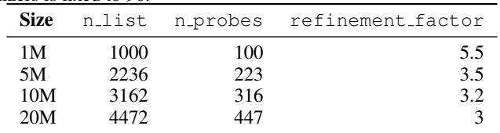

Figure 8 shows the recall and end-to-end runtime for each of the data subsamples. To achieve comparable recall, Faiss’ IVF-PQ requires significantly more computation than our algorithm, with the gap widening as the dataset size increases, ranging from 3.5× at 1M vectors to 19.8× at 20M vectors.

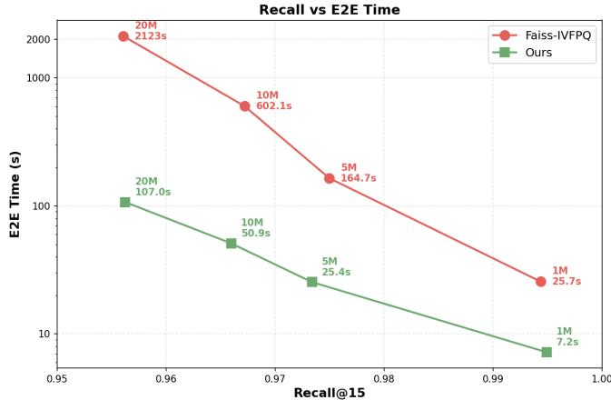  
Figure 8. Recall vs E2E time in seconds for Faiss’ IVF-PQ and our all-neighbors algorithm. 4 NVIDIA H100 GPUs are used for all runs. The speed gap to reach the same recall increases as the dataset size increases.

## B ALL-NEIGHBORS IN LARGEVIS

LargeVis (Tang et al., 2016) constructs an approximate kNN graph before learning the low-dimensional embedding for visualization. It first generates candidate neighbors using multiple random projection trees, where the points that fall into the same leaf node are treated as potential neighbors. The neighbor lists are then refined through a neighbors exploration procedure that evaluates neighbors of neighbors.

We evaluated the official LargeVis implementation (LargeVis) for kNN graph construction using the same DGX system in our Section 4. Compared to our all-neighbors construction on a single GPU, LargeVis is 20× slower on the Beauty dataset (640K × 384) and 41× slower on the Appliances dataset (1.8M × 384).

Table 4. kNN graph construction time comparison against LargeVis. All time in seconds. For computing speedup of our algorithm, we use the single-GPU all-neighbors kNN construction time reported in Table 2.  
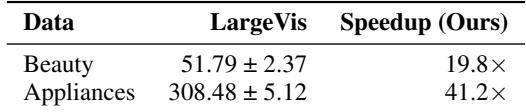

## C ALTERNATE UMAP IMPLEMENTATIONS

Our primary contribution is our out-of-core, multi-GPU all-neighbors graph construction, which enables UMAP to operate at dataset scales previously out of reach. The engineering effort to adapt prior implementations is significant enough that attempting to modify them would require devising a new publishable result, as they are non-viable as is. This is exemplified by prior work (Nolet et al., 2021) showing that GPUMAP (Eisenmann) fails to maintain a faithful UMAP representation and falls short in performance even for small datasets.

Table 5. TorchDR results. All time in seconds. For computing speedup of our algorithm, we use the end-to-end time of our GPU UMAP reported in Figure 3 (b).  
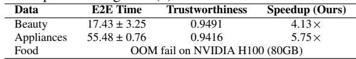

The newer TorchDR (Van Assel et al.) maintains similar trustworthiness but is 5.7× slower than our approach on a single GPU for small datasets (Appliances), even when using its fastest method, the Faiss (Douze et al., 2025) IVF backend. Moreover, the medium-sized Food dataset, which is about 8GB in size, causes an out-of-memory error for TorchDR on an 80GB H100 GPU. For these reasons, we focus on our method’s scaling and, where possible, compare it to best-case extrapolations of prior art.

## D GPU-PRECOMPUTED KNN UMAP VISUALIZATIONS

This section presents the visualization introduced in Figure 5 for smaller datasets (Figure 9, Figure 10, Figure 11, Figure 12, Figure 13). Note that UMAP embeddings are invariant to global translations, rotations, or reflections, so visual differences in orientation or position do not indicate differences in embedding quality.

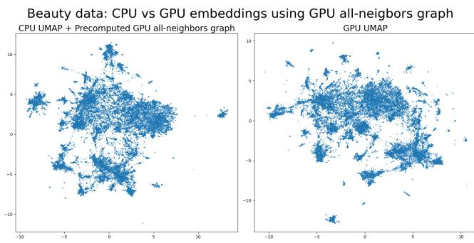  
Figure 9. Resulting embeddings of CPU UMAP (left) and our GPU UMAP (right) using a GPU-precomputed kNN graph on the Beauty Amazon Reviews dataset.

## E IMPACT OF s AND c ON KNN RECALL

This section presents runtime and recall of the all-neighbors kNN graph construction across various values of s and c in Figure 14. We evaluate on smaller subsets of MIRACL for which ground truth can be computed via brute force. Configurations with similar s values show comparable runtimes due to similar computational requirements. For a fixed ratio z = sc , using large s (and therefore c) values achieve higher recall at the cost of increased runtime.

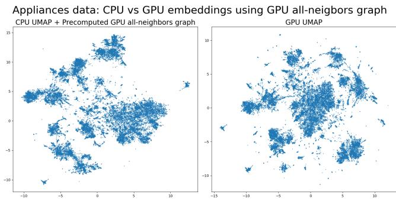

Figure 10. Resulting embeddings of CPU UMAP (left) and our GPU UMAP (right) using a GPU-precomputed kNN graph on the Appliances Amazon Reviews dataset.  
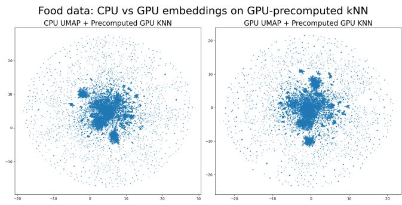

Figure 11. Resulting embeddings of CPU UMAP (left) and our GPU UMAP (right) using a GPU-precomputed kNN graph on the Food Amazon Reviews dataset.  
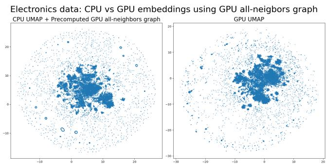  
Figure 12. Resulting embeddings of CPU UMAP (left) and our GPU UMAP (right) using a GPU-precomputed kNN graph on the Electronics Amazon Reviews dataset.

Wiki-all data: CPU vs GPU embeddings using GPU all-neigbors graph CPU UMAP + Precomputed GPU all-neighbors graph GPU UMAP  
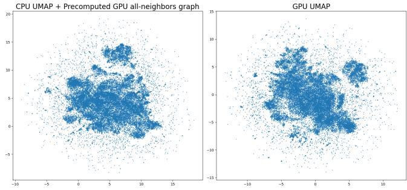

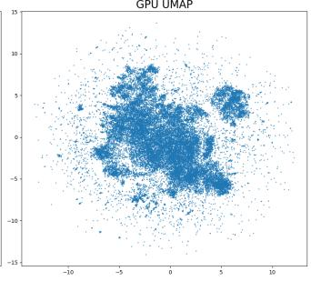  
Figure 13. Resulting embeddings of CPU UMAP (left) and our GPU UMAP (right) using a GPU-precomputed kNN graph on the Wiki-all dataset.

Brute Force Recall@15 Comparison  
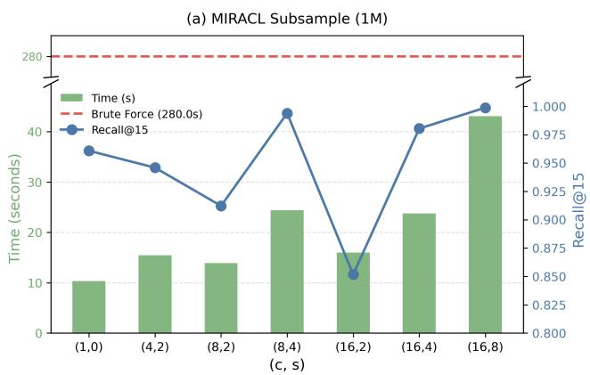

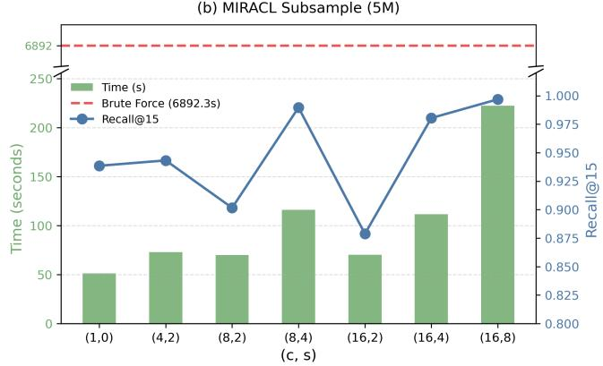  
Figure 14. Result of runtime and recall for varying configurations of (c, s). For a fixed ratio z = s , using large s (and therefore c) values achieve higher recall at the cost of increased runtime.