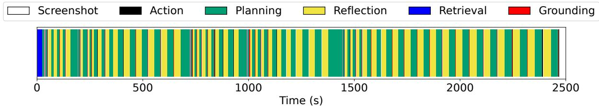
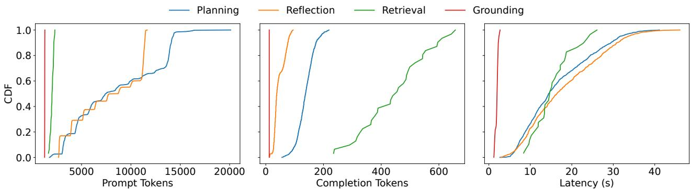
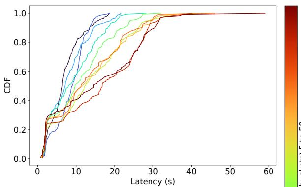
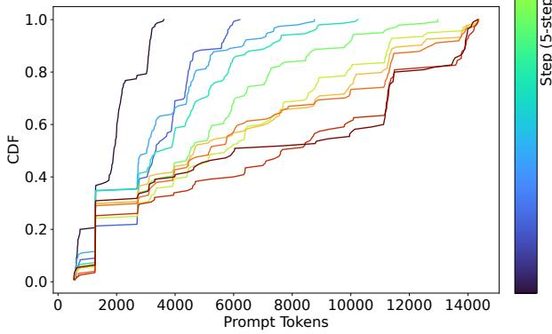
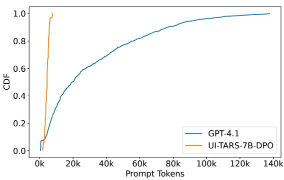
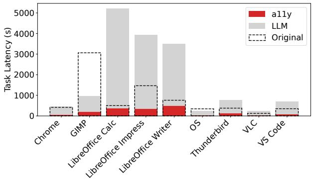

# OSWorld-Human: Benchmarking the Efficiency of Computer-Use Agents

Reyna Abhyankar 1 Qi Qi 1 Yiying Zhang 1 2

## Abstract

Generative AI is being leveraged to solve a variety of computer-use tasks involving desktop applications. State-of-the-art systems have focused solely on improving accuracy on leading benchmarks. However, these systems are practically unusable due to extremely high end-to-end latency (e.g. tens of minutes) for tasks that typically take humans just a few minutes to complete. To understand the cause behind this and to guide future developments of computer agents, we conduct the first study on the temporal performance of computer-use agents on OSWorld, the flagship benchmark in computer-use AI. We find that large model calls for planning and reflection account for most of the overall latency, and as an agent uses more steps to complete a task, each successive step can take 3× longer than steps at the beginning of a task. We then construct OSWorld-Human, a manually annotated version of the original OSWorld dataset that contains a human-determined trajectory for each task. We evaluate 16 agents on their efficiency using OSWorld-Human and found that even the highestscoring agents on OSWorld take 1.4−2.7× more steps than necessary.

## 1. Introduction

Computer-use agents, designed to autonomously control computer systems, have the potential to revolutionize productivity and accessibility. As generative AI (gen-AI) models grow increasingly powerful, these agents have surged in capability, now able to perform complex, multi-step tasks across a wide range of computer applications. Gen-AI models, particularly transformer-based large language models (LLMs) (Vaswani et al., 2017) and vision language models (VLMs) (Dosovitskiy et al., 2021), provide the core reasoning and perceptual abilities that allow agents to understand instructions, interpret screen content, plan actions, and execute them through keyboard and mouse inputs. Prominent examples include commercial products like OpenAI’s Operator (OpenAI, 2024), Anthropic’s Claude Computer Use, Google’s Project Mariner (Google DeepMind, 2024) and open-source projects like ByteDance’s UI-TARS (Qin et al., 2025), Agent S2 (Agashe et al., 2025), InfantAgent (Lei, 2024), and Jedi (Xie et al., 2025).

Although these agents have shown impressive advancements in accuracy on complex benchmarks, a critical bottleneck remains: latency. Our evaluation of real-world computer tasks suggests that computer-use agents can take tens of minutes to complete a task, which is in stark contrast to the couple of minutes a human expert might require for the same task. For instance, changing the line spacing of two paragraphs in a document to double-spaced takes 12 minutes for a computer-use agent. However, for a typical computer user, this task should take under 30 seconds. This significant time disparity limits the practical applicability of these agents, especially in interactive or time-sensitive scenarios, which hinders their integration into real-time workflows.

Prior research has predominantly focused on improving the accuracy and generality of computer-use agents, aiming to increase the percentage of tasks they can successfully complete. Although achieving high accuracy is always valuable, the temporal efficiency of these agents is equally crucial for real-world deployment and user experience.

This paper presents the first in-depth study specifically focused on understanding and analyzing the latency implications of computer-use agents. Specifically, we investigate the performance of state-of-the-art agents on the OS-World benchmark (Xie et al., 2024), a realistic benchmark designed to evaluate multimodal agents in real computer environments (Ubuntu, Windows, MacOS) across a diverse suite of 369 real-world tasks across 9 applications (Chromium (The Chromium Project, 2008), GIMP (The GIMP Development Team, 1995), LibreOffice Suite (The Document Foundation, 2011), OS, Thunderbird (Mozilla Foundation, 2003), VLC (The Chromium Project, 2008), and Visual Studio Code (Microsoft, 2015)) via both graphical user interfaces

## (GUI) and command-line interfaces (CLI).

To understand where latency originates within agent execution, we perform a detailed step breakdown analysis of agent trajectories on a representative set of 37 OS-World tasks using the Agent S2 (Agashe et al., 2025) framework, a popular, leading open-source compute-use agent. We categorize steps taken by S2 and similar agents into relevant information retrieval, step planning, step grounding (e.g., finding coordinates), action-taking (e.g., mouse click, text input, keyboard shortcut), screenshoting, and reflection. From our analyzed latency breakdowns, planning and reflection steps, both involving calling LLMs, take the majority of time, accounting for 75% to 94% of the total latency across all tasks, and their latencies grow as a task takes more steps. This key finding suggests two promising approaches for speeding up computer agent execution: reducing the latency of planning and reflection calls and minimizing the number of steps for a task.

Based on this insight, we build OSWorld-Human, a manually-constructed set of human trajectories for all 369 OSWorld tasks, to guide future researchers and practioners on how to optimize computer-use agents. OSWorld-Human establishes a baseline for expected efficiency and can be used to identify potential areas for latency improvement. We then compare the trajectories of 16 popular computeruse agents against the paths in OSWorld-Human. The bestperforming agent on OS-World achieves a 42.5% success rate but only 17.4% on our strictest metric. Our analysis using OSWorld-Human shows that the leading agents still take 1.4−2.7× more steps than what is required to complete the task. This stark difference highlights the need for more efficient and practical agents.

Overall, this study provides valuable empirical data and analysis highlighting the current limitations in the temporal efficiency of state-of-the-art computer-use agents operating in realistic environments. We demonstrate that while agents can achieve reasonable accuracy on some tasks, their inefficient execution paths lead to substantial latency. We believe that addressing these latency issues by optimizing agent planning and execution strategies is crucial for the widespread adoption and practical utility of these agents in automating complex computer tasks. To foster further research and development focused on improving the temporal efficiency of computer-use agents, we will publicly release the OSWorld-Human dataset and all our raw findings data, including detailed step latency breakdowns and comparisons.

## 2. Background and Motivation

Autonomous agents capable of operating computer systems on behalf of human users represent a significant frontier in AI research. These computer-use agents (CUAs) aim to bridge the gap between high-level natural language instructions and low-level computer interactions, offering the potential to automate complex digital workflows and enhance accessibility. This section provides background on computer-use agents, their common technical approaches, and the latency challenge that motivates our work.

## 2.1. Computer-Use Agents (CUAs)

Computer-use agents are AI systems designed to perceive and interact with digital environments, such as operating systems, web browsers, and applications, much like a human user does. Their primary goal is to execute tasks by controlling the computer through standard interfaces, typically simulating keyboard inputs and mouse actions. CUAs can improve productivity by automating repetitive or tedious digital tasks, freeing up human users for more creative or strategic work. For individuals with disabilities, CUAs offer a potential pathway to increased computer accessibility by allowing interaction through natural language or other modalities. Furthermore, they serve as a challenging benchmark for evaluating the general capabilities of AI systems in complex, open-ended environments.

The rise of powerful large language models (LLMs) and multimodal models (LMMs), such as GPT-4V (OpenAI, 2023), Qwen-VL (Bai et al., 2024), Llama-3 (Meta, 2024), and Gemini (Pichai & Hassabis, 2023), has significantly advanced CUA capabilities. Several prominent research projects and emerging products demonstrate the progress in this area. OpenAI’s Computer-Using Agent (OpenAI, 2025) is a notable example that leverages models like GPT-4o’s (OpenAI et al., 2024) vision capabilities to interpret raw screenshots to interact with the computer. Similarly, Anthropic has explored computer use capabilities, enabling models like Claude (Anthropic, 2024) to interact with computer interfaces through defined tools and an agentic loop (Anthropic, 2025). Other research focuses on refining perception and action spaces, such as Aguvis (Li et al., 2025), which explores a pure vision-based framework for cross-platform GUI agents, OmniParser (Lu et al., 2024), which improves visual grounding through structured screen parsing, and UI-TARS (Qin et al., 2025), a fine-tuned VLM for grounding tasks. Agentic systems like Agent S2 (Agashe et al., 2025) and InfantAgent (Lei, 2024) utilize a combination of approaches and models to enhance computer use.

## 2.2. Common CUA Approaches

Effective computer-use agents rely on sophisticated techniques for perceiving the environment and acting within it.

Perception is typically achieved through three primary modalities: computer screenshots, which provides a direct visual representation of the current state to a model; accessibility trees, which is a structured representation of UI elements that includes information about their roles, names, values, and hierarchical relationships, including unseen elements; and Set-of-Marks (Li et al., 2023), which overlays unique identifiers (marks) onto interactive UI elements in a screenshot and present these marks to a model for prediction.

The action space defines the set of operations an agent can perform. For CUAs, this typically involves simulating fundamental human interactions like mouse movements, clicks (at specific coordinates and frequencies), scrolling, and keyboard inputs.

CUA architectures often combine perception and action generation within a planning and reasoning loop, typically powered by foundation and fine-tuned LLMs/VLMs using techniques like Chain-of-Thought (Wei et al., 2022) or Re-Act (Yao et al., 2023) to break down tasks, observe results, and correct errors.

## 2.3. CUA Latency Challenges

While significant progress has been made in the accuracy and task completion capabilities of CUAs, latency remains a critical impediment to their practical utility. For CUAs to be seamlessly integrated into human workflows and to be useful for interactive tasks, their response time needs to approach human levels. Waiting tens of minutes for an agent to complete a task that a human could finish in a couple of minutes fundamentally limits their applicability in time-sensitive scenarios, such as rapid content editing, responding to frequent visual adjustments, and application execution.

Reducing CUA latency is challenging due to several inherent factors. First, most computer tasks, and thus agent trajectories, involve a sequence of discrete steps. The total latency accumulates across all these steps, including perception, reasoning, and action execution for each step. Second, CUAs rely heavily on large LLMs and VLMs. These models are called upon for planning and reflection at each step, and they often involve long prompts, further increasing their computation time. Third, unlike a human expert who often follows a direct, efficient path, CUAs may engage in trialand-error, explore irrelevant parts of the interface, spend considerable time recovering from errors, or perform a correct but less efficient sequence of actions, all of which add significant latency.

Before latency inefficiencies can be addressed, a foundational step is to fully understand where inefficiencies come from and their severity for different computer-use tasks. Unfortunately, as far as we know, no existing work has properly studied the latency aspect of CUAs. This work directly investigates the impact of steps in CUA trajectories across a wide range of applications, provides a human-based gold standard, and directly identifies sources of inefficiency of CUAs.

## 3. The First CUA Latency Study

To understand the bottlenecks of computer-use agents, we study the performance of Agent S2 (Agashe et al., 2025), the leading open-source system on the OSWorld leaderboard (Xie et al., 2024).

Methodology. We use Agent S2’s default value that allows it to take up to 50 steps for each task. The original paper conducts their evaluation on both GPT-4o and Claude-3.7 as the foundational model for planning, reflection, and retrieval. In this study, we use GPT-4.1 (OpenAI, 2025) as the planner, reflection, and retrieval models. For grounding, we use UI-TARS-7B-DPO (Qin et al., 2025) as in the original paper. The grounding model is hosted on a single NVIDIA A6000 GPU using SGLang (Zheng et al., 2023), a stateof-art inference engine. We utilize the OSWorld-provided subset of 37 tasks, or 10% of the entire benchmark. We then run Agent S2 on each of the tasks and collect detailed timing and token traces.

## 3.1. Task Latency Analysis

At the beginning of a task, the agent retrieves documents that describe similar task procedures from a database. This knowledge is fused into the prompt for the high-level plan. At each step, the agent collects the screenshot, generates a per-step plan using the planner model, and generates finegrained coordinates using the grounding model. This action is executed in the environment, upon which a new screenshot is generated. Based on this screenshot, the agent reflects upon whether the previous action accomplished its goal. These steps repeat until the task is either completed, deemed infeasible, or the maximum number of steps is reached.

Figure 1 illustrates a timeline view of how Agent S2 completes a task for the OS application. Specifically, the task is to create an SSH user with a given username and password that is only allowed access to a specific folder. The agent completes this task in 50 steps, which is the maximum number of steps allowed. Planning, reflection, and retrieval all leverage the large foundation model (in this case, GPT-4.1). From the figure, per-step planning and reflection is responsible for the bulk of the end-to-end latency of over 40 minutes.

We further break down the average time spent in each stage by application in Table 1. For all applications, planning and reflection makes up 75% to 94% of the total task latency. These tasks involve LLM/VLM calls usually with long context, explaining their long latency. Planning takes more time than reflection overall because planning takes place at each step and after the completion of a sub-task, while reflection only takes place at each step. Retrieval accounts for 0.7% to 8.9% of the overall latency. While retrieval does leverage the large model, it only occurs once at the beginning of the task, which means its overhead is constant. Meanwhile, grounding invokes a much smaller model and is served using a popular and efficient inference engine, SGLang (Zheng et al., 2023). The throughput of the grounding model is dependent on both the size of the model, the performance of the GPU, and the serving engine. Meanwhile, screenshot and action execution are the least intensive. Neither of them require significant GPU resources like LLMs and VLMs do. It is clear that gen-AI model calling dominates the latency for a task, hence we conduct a more thorough per-step breakdown.

  
Figure 1. Timeline view of an OS task successfully completed by Agent S2.

Table 1. Percentage breakdown of time spent performing a certain sub-function grouped by application.
<table><tr><td rowspan=1 colspan=4>Application (Tasks)</td><td rowspan=1 colspan=1>Screenshot</td><td rowspan=1 colspan=1>Action</td><td rowspan=1 colspan=1>Planning</td><td rowspan=1 colspan=1>Reflection</td><td rowspan=1 colspan=1>Retrieval</td><td rowspan=1 colspan=1>Grounding</td></tr><tr><td rowspan=2 colspan=4>LibreOffice Calc (3)VLC (2)</td><td rowspan=1 colspan=1>1.4%</td><td rowspan=1 colspan=1>1.3%</td><td rowspan=1 colspan=1>51.4%</td><td rowspan=1 colspan=1>36.9%</td><td rowspan=1 colspan=1>2.7%</td><td rowspan=1 colspan=1>4.0%</td></tr><tr><td rowspan=1 colspan=1>3.6%</td><td rowspan=1 colspan=1>1.8%</td><td rowspan=1 colspan=1>59.2%</td><td rowspan=1 colspan=1>15.9%</td><td rowspan=1 colspan=1>8.9%</td><td rowspan=1 colspan=1>6.1%</td></tr><tr><td rowspan=8 colspan=4>Multi Apps (17)Chrome (4)VS Code (3)OS (2)LibreOffice Impress (2)LibreOffice Writer (2)Thunderbird (2)GIMP (2)</td><td rowspan=1 colspan=1>1.2%</td><td rowspan=1 colspan=1>1.9%</td><td rowspan=1 colspan=1>51.8%</td><td rowspan=1 colspan=1>36.9%</td><td rowspan=1 colspan=1>2.9%</td><td rowspan=1 colspan=1>3.3%</td></tr><tr><td rowspan=1 colspan=1>1.6%</td><td rowspan=1 colspan=1>1.7%</td><td rowspan=1 colspan=1>51.9%</td><td rowspan=1 colspan=1>36.0%</td><td rowspan=1 colspan=1>2.3%</td><td rowspan=1 colspan=1>3.5%</td></tr><tr><td rowspan=2 colspan=1>2.2%2.1%</td><td rowspan=1 colspan=1>1.5%</td><td rowspan=1 colspan=1>58.9%</td><td rowspan=1 colspan=1>25.0%</td><td rowspan=1 colspan=1>4.0%</td><td rowspan=1 colspan=1>4.4%</td></tr><tr><td rowspan=1 colspan=1>1.5%</td><td rowspan=1 colspan=1>52.2%</td><td rowspan=1 colspan=1>35.8%</td><td rowspan=1 colspan=1>2.5%</td><td rowspan=1 colspan=1>3.9%</td></tr><tr><td rowspan=1 colspan=1>1.7%</td><td rowspan=1 colspan=1>1.5%</td><td rowspan=1 colspan=1>55.2%</td><td rowspan=1 colspan=1>29.9%</td><td rowspan=1 colspan=1>3.5%</td><td rowspan=1 colspan=1>3.7%</td></tr><tr><td rowspan=2 colspan=2>ice Write</td><td rowspan=2 colspan=2>riter (2)</td><td rowspan=1 colspan=1>1.3%</td><td rowspan=1 colspan=1>1.7%</td><td rowspan=1 colspan=1>51.5%</td><td rowspan=1 colspan=1>39.6%</td><td rowspan=1 colspan=1>1.5%</td><td rowspan=1 colspan=1>3.1%</td></tr><tr><td rowspan=1 colspan=1>1.1%</td><td rowspan=1 colspan=1>2.3%</td><td rowspan=1 colspan=1>53.7%</td><td rowspan=1 colspan=1>34.4%</td><td rowspan=1 colspan=1>1.8%</td><td rowspan=1 colspan=1>4.0%</td></tr><tr><td rowspan=1 colspan=1>1.0%</td><td rowspan=1 colspan=1>0.9%</td><td rowspan=1 colspan=1>48.9%</td><td rowspan=1 colspan=1>45.2%</td><td rowspan=1 colspan=1>0.7%</td><td rowspan=1 colspan=1>3.1%</td></tr></table>

## 3.2. LLM Call Analysis

The above latency analysis shows that LLM calls are the major contribution to task end-to-end latency. To understand LLM calls in CUAs, we analyze the LLM calls at different steps in a trajectory of Agent S2 for each task. Figure 3 shows the LLM call latency and prompt token count distributions across all our subset of 37 tasks. Each line represents the average value across five consecutive steps (ten lines in total for 50 maximum steps). As seen in the figure, when Agent S2 gets to the later steps, LLM calls take longer and have longer prompts. This is due to the prompting mechanism for most CUAs: at each step, the prompt sent to the LLM includes the history of all previous steps. For example, if the agent is on step 10, the prompt will include the screenshot for steps 1-9, along with planning details and reflection feedback.

We further study the comparison across different types of LLM calls (planning, reflection, retrieval, and grounding). Figure 2 plots the distribution of prompt tokens, output tokens, and the latency of each type of LLM calls in a CDF. Overall, planning, reflection, and retrieval calls take longer than grouding calls because of their need for calling large models. Grounding maintains a constant and small number of prompt and output tokens because it only receives a single screenshot, as opposed to the entire history. Furthermore, its output is a set of coordinates, which is always fixed at 12 tokens in this framework. The latency of planning and reflection is dominated by the prefill stage of LLM inference due to the large number of prompt tokens for each. Retrieval, however, does not take a screenshot as input since it occurs at the beginning of the task. Instead, the LLM only processes the relevant document retrieved from the database and the user’s question. Therefore, it has a stable and relatively small number of prompt tokens. Instead, its latency is dominated by the decoding stage since the model is tasked with integrating the document into the execution plan. Since retrieval only occurs once, its overall contribution to the end-to-end latency of a task is minimal.

  
Figure 2. Comparison of prompt tokens, completion tokens, and latency for different types of calls to an LLM.

  
Figure 3. Probability distribution of latency and prompt tokens for a single step.

## 3.3. Observation Types

In addition to studying LLM call behavior, we also study how different approaches to perception, specifically screenshot, accessibility (A11y) trees, and Set-of-Marks (SoM) (Li et al., 2023) (§2.2), affect task latency.

We sampled one task per application (excluding multi-app workflows) and charted prompt tokens consumed per model in Figure 4 and task latency in Figure 5 with a 10k token cutoff for the A11y tree. SoM does not incur significant overhead from labeling the screenshot and hence is omitted from figure 5. By and large, inclusion of the A11y tree drastically increases the per-task latency for two reasons, though this effect varies based on the application. First, generating the tree itself takes time and is dependent on the elements that exist in the current window, including hidden and visible elements. This can take anywhere from 3 seconds to 26 seconds. Applications that have more elements, such as the LibreOffice suite (The Document Foundation, 2011), incur a much higher latency from generating the tree. Other applications, such as GIMP (The GIMP Development Team, 1995), may benefit from utilizing the tree to complete the task quicker. Second, the tokenized tree is included in each prompt to the model, which can be thousands more tokens per step. This can significantly affect tasks with longer trajectories.

  
Figure 4. Prompt token distribution when including the a11y tree, separated by model.

We also show the number of steps taken for each task across observation types in Table 2. Adding A11y trees to screenshots (SS) increases the number of steps for most applications. Visually rich applications like the LibreOffice Suite (The Document Foundation, 2011) see a particularly high increase because trees can contain thousands of nodes for such applications. Adding A11y tree decreases the number of steps for OS, GIMP (The GIMP Development Team, 1995), and Chrome (The Chromium Project, 2008), because either the application contains fewer distinct visual elements or the tree assists the CUA in completing the task faster. Adding SoM in addition to A11y trees lowers the number of steps overall and achieves the fewest number of steps for LibreOffice Writer, VLC (VideoLAN, 2001), Thunderbird (Mozilla Foundation, 2003), and GIMP. It does, however, use more steps for Visual Studio Code (Microsoft, 2015) and Chrome (The Chromium Project, 2008) while SoM ties the SS+A11y result in the highest steps for Libre-Office Impress. This is likely task-dependent, as opposed to application-dependent. Overall, the marked screenshot contains useful information for the model to complete the task using fewer steps.

  
Figure 5. End-to-end task latency for each application. Dashed box represents screenshot-only latency while colored bars show the breakdown when including the a11y tree.

Table 2. Number of steps per sampled task per application for each observation type. Bolded highlights the fewest steps for that application’s task.
<table><tr><td>Application</td><td>SS</td><td>SS+A11y</td><td>SS+A11y+SoM</td></tr><tr><td>OS</td><td>8</td><td>5</td><td>5</td></tr><tr><td>Thunderbird</td><td>14</td><td>20</td><td>8</td></tr><tr><td>VS Code</td><td>9</td><td>13</td><td>16</td></tr><tr><td>LibreOffice Writer</td><td></td><td>50</td><td>16</td></tr><tr><td>VLC</td><td></td><td>3</td><td>2</td></tr><tr><td>GIMP</td><td>2134932</td><td>17</td><td>12</td></tr><tr><td>LibreOffice Impress</td><td></td><td>50</td><td>50</td></tr><tr><td>Chrome</td><td>11</td><td>8</td><td>17</td></tr><tr><td>LibreOffice Calc</td><td>14</td><td>50</td><td>10</td></tr></table>

## 3.4. Study Generalizability

While our study focuses on Agent S2, its implications go beyond a single agent. This is because Agent S2’s framework is representative of other agentic systems. In each step, Agent S2 calls a series of LLMs with the observation as part of the prompt to output the final action(s) for a step. While the exact LLM calls and prompts may differ, this pattern is common in other CUA systems. For example, InfantAgent (Lei, 2024), a top-5 solution on the OSWorld leaderboard as of May 2025, uses the same framework as Agent S2: it invokes reasoning and utilizes previous history to output a set of actions. Then, it performs an evaluation and summary (i.e. reflection) before starting the next step. Another system, Jedi (Xie et al., 2025), uses two models like Agent S2: one large model for planning (e.g. GPT-4o) and a fine-tuned smaller model for grounding, while following the same iterative pattern.

A more straightforward alternative to using agentic systems is to make a single call to a fine-tuned model, such as the UI-TARS-1.5 (Qin et al., 2025). This study is still applicable to calling a single model for two reasons. First, the framework of “observe-call-act” remains the same. Hence, the behavior of a single call to a large model can resemble an agentic system that deploys multiple small models, both in latency and tokens consumed. Second, the overall trend is towards agentic systems in these settings due to their superior performance. When Claude 3.7 was released in February 2025, it occupied the top spot on the OSWorld leaderboard with a success rate of 28% using 100 steps. Three weeks later, Agent S2 with Claude 3.7 released its score on OSWorld, outperforming the original model with a score of 34.5% in only 50 steps.

## 4. OSWorld-Human

Based on the findings in §3, we constructed OSWorld-Human, a manually annotated version of OSWorld that lists the minimal humanly-perceived steps required to successfully complete a task. We now describe our construction of OSWorld-Human.

Table 3. Average Steps per Trajectory by Application
<table><tr><td rowspan=1 colspan=4>Application</td><td rowspan=1 colspan=1>Single</td><td rowspan=1 colspan=1>Grouped</td></tr><tr><td rowspan=9 colspan=4>OSThunderbirdVS CodeLibreOffice WriterVLCGIMPLibreOffice ImpressChromeLibreOffice Calc</td><td rowspan=1 colspan=1>4.9</td><td rowspan=1 colspan=1>3.8</td></tr><tr><td rowspan=1 colspan=1>9.6</td><td rowspan=1 colspan=1>8.8</td></tr><tr><td rowspan=1 colspan=1>6.3</td><td rowspan=1 colspan=1>5.1</td></tr><tr><td rowspan=1 colspan=1>9.0</td><td rowspan=1 colspan=1>6.1</td></tr><tr><td rowspan=1 colspan=1>6.3</td><td rowspan=1 colspan=1>4.8</td></tr><tr><td rowspan=1 colspan=1>4.6</td><td rowspan=1 colspan=1>3.2</td></tr><tr><td rowspan=1 colspan=1>press</td><td rowspan=1 colspan=1>8.5</td><td rowspan=1 colspan=1>4.5</td></tr><tr><td rowspan=1 colspan=3></td><td rowspan=1 colspan=1>6.8</td><td rowspan=1 colspan=1>5.0</td></tr><tr><td rowspan=1 colspan=1>13.6</td><td rowspan=1 colspan=1>5.9</td></tr></table>

## 4.1. Gold Trajectory Construction

To construct OSWorld-Human, we first seek, perform, and verify ground-truth trajectories (i.e., steps) for all OSWorld tasks. In the original OSWorld benchmark, most tasks contain a “source” that details a concrete ground-truth trajectory for solving the task. For example, users may ask a question in an online forum regarding editing their browser settings.

The responses given in the forum provide the set of actions needed to complete the task. We manually map the steps given by the source to the action space defined in OSWorld. We refrain from listing exact coordinates, as these may change across environments.

For tasks without a listed source or where the source is ambiguous, we manually identify the necessary steps and compare with the ground truth from the original benchmark (e.g., OSWorld provides a gold file for all LibreOffice tasks). For all applications besides OS, we refrain from using any programmatic methods (unless mentioned in the source) to solve the task (for example, using the LibreOffice scripting language to modify a given spreadsheet), as that is beyond the expectation of what the typical user can do. However, we do utilize application-specific information, such as keyboard shortcuts, as a typical user is likely to be familiar with them.

The dataset was constructed using two passes by two computer science graduate students. Then, each student crossvalidated the other’s results for a consensus. The final dataset was validated by manually performing the actions in the OSWorld virtual machine setup and obtaining a successful evaluation score for each task. OSWorld-Human contains the same number of examples (369) as the original OSWorld.

## 4.2. Action Grouping

When inspecting ground-truth actions taken to accomplish OSWorld tasks, we find that multiple actions can often be performed consecutively in sequence without any observation or prediction in between. For example, the following steps can be performed in succession without the need for more detailed planning: click on a text field, type text, and press <enter>. This implies that CUA systems can potentially perform one observation and LLM call for a group of actions, thereby reducing the number of steps and overall task latency.

To provide insights into this feature, we construct a singleaction trajectory as well as a grouped-action trajectory for each task in OSWorld-Human. The single-action trajectory lists all actions necessary to complete a task. The grouped-action trajectory consists of groups of actions that can be executed consecutively. Specifically, we group actions based on whether they can be correctly executed using the same visual observation. For example, a list of actions may include clicking on a cell, typing a formula, and filling the column. These actions can be grouped together because the UI elements needed for all actions are present in a single screenshot. The grouped-action trajectory contains strictly less than or the same number of steps as the single-action trajectory.

Table 3 summarizes our construction of single- and groupedaction trajectories. For grouped-actions, we count each group as a step, while single-actions use one step per action. Overall, all applications benefit from grouping; the total number of steps and thus LLM calls are reduced. For applications where actions frequently trigger new windows, popups, or otherwise significant UI changes, there is a smaller difference between single-action and grouped-action trajectories. On the other hand, applications that operate on the same page or sheet, such as LibreOffice Writer or LibreOffice Calc, are much less disruptive.

## 4.3. Weighted Efficiency Score

As OSWorld-Human’s goal is to evaluate CUA systems’ temporal performance, we want to approximate end-to-end latency by measuring how closely an agent performs compared to ground-truth human trajectories. An easy way to measure this is to compare the expected, human-performed number of steps $( t _ { e x p } )$ to the actual, agent-generated number of steps $( { t _ { a c t u a l } } )$ for a task. However, only looking at efficiency favor an agent that fails a task with fewer steps over one that succeeds with more steps.

To accommodate this issue, we propose a new metric for evaluating CUAs: Weighted Efficiency Score, or WES. For a task t that was completed successfully $( r _ { t } = 1 )$ , we weight the result based on its efficiency $( i . e . ~ t _ { e x p } / t _ { a c t u a l } )$ This is based on the premise that a success in fewer steps is strictly preferable to a success that takes more steps. For a task t that was unsuccessful $( r _ { t } = 0 )$ , we weight the result with a penalty, $t _ { a c t u a l } / S$ , where S is the maximum steps allowed. This favors an agent that fails quickly over one that takes the full allotment of steps. We compute this over all n tasks in the dataset.

$$
\mathrm { W E S } ^ { + } = \sum _ { t } ^ { n } r _ { t } ( \frac { t _ { e x p } } { t _ { a c t u a l } } )\tag{1}
$$

$$
\mathrm { W E S ^ { - } } = \sum _ { t } ^ { n } - ( 1 - r _ { t } ) ( \frac { t _ { a c t u a l } } { S } )\tag{2}
$$

${ \mathrm { W E S } } ^ { + }$ can range from 0 to 1. A score of 0 can mean an agent fails to complete most tasks or it is very inefficient. An agent that scores closer to 1 is both successful and efficient. Meanwhile, $\mathbf { W E S } ^ { - }$ ranges from 0 to −1. Here, a score of 0 means that an agent completes most tasks successfully or fails very quickly. This is by design, as the impracticality of inefficient agents will hamper their usage. On the other hand, a score of −1 means an agent fails to complete most tasks and is very inefficient. Together, ${ \mathrm { W E S } } ^ { + }$ and WES− provide a clear picture of an agent’s accuracy and efficiency.

Notably, agentic systems may each have different values for S, which will result in different scoring for WES−. This is because S acts as a cutoff point; if a system sets S to a higher value, it may take more steps for a particular task. Thus, using each agent’s value for S when penalizing failures with WES− is the most fair policy.

## 5. Evaluation

This section presents our evaluation of all CUAs with published trajectories on the OSWorld leaderboard at the time of writing, conducted on all 369 examples in OSWorld-Human.

Table 4 presents the single-action and grouped-action WES scores for all the CUAs, together with their success rate as reported by OSWorld. We segment the CUAs by observation type, as the OSWorld leaderboard does. For each CUA, we use its reported trajectory and our definition of grouped actions to determine which actions can be grouped. Since WES− is not based on the expected number of steps for a task $( t _ { e x p } ) .$ , both single-action and grouped-action share the same value for WES−.

The best-performing baselines on OSWorld also performs the best on both single-action and grouped-action WES+. However, the absolute performance value is drastically reduced. Agent S2 w/ Gemini 2.5 holds the highest score on single-action WES+ (28.2%) and grouped-action WES+ (17.4%), a 1.5× and 2.4× reduction respectively from the comparative OSWorld score of 41.4%. Intuitively, this represents the average number of extra steps the agent takes. The performance when using multi-action trajectories for computing the expected number of steps is strictly worse across all baselines, as expected. Interpreting WES− is also straightforward: how much of the allotted budget does an agent use. The top performing system on WES− is UI-TARS-72B-DPO, which scores −0.16. However, this score is accompanied by the model’s poor performance on both WES+ metrics, suggesting that it tends to complete all tasks quickly. Finally, the relative order among baselines on OS-World is largely preserved by WES+, since it is the original accuracy score weighted by task efficiency.

## 6. Conclusion

This paper performs the first study on the latency behavior of computer-use agents. We conduct a detailed analysis of Agent S2 on 37 OSWorld tasks with three types of perception approaches. Our findings suggest LLM calls to be the major latency bottleneck and many steps could potentially be avoided without affecting the end results. Accordingly, we construct OSWorld-Human, a manually-annotated version of OSWorld with human-determined task trajectories. We evaluate OSWorld-Human on 16 CUAs and found that even the leading agents are extremely inefficient with 1.4−2.7× longer trajectories than necessary. We believe this work and its open-sourced dataset will foster future research in the space of compute-use agents in new directions.

## Impact Statement

This paper presents work whose goal is to advance the field of Machine Learning. There are many potential societal consequences of our work, none which we feel must be specifically highlighted here.

## Acknowledgements

We would like to thank Zijian He and Vikranth Srivatsa for their valuable contributions and feedback on this paper. This material is based upon work supported by gifts from AWS, Google, and Meta. Any opinions, findings, conclusions, or recommendations expressed in this material are those of the authors and do not necessarily reflect the views of these institutions.

## References

Agashe, S., Wong, K., Tu, V., Yang, J., Li, A., and Wang, X. E. Agent s2: A compositional generalist-specialist framework for computer use agents. arXiv preprint arXiv:2504.00906, 2025.

Anthropic. Claude, large language model. https://www. anthropic.com, 2024.

Anthropic. Computer use (beta). 2025. Accessed: 2025-05- 16.

Bai, J., Bai, S., Yang, S., Wang, S., Tan, S., Wang, P., Lin, J., Zhou, C., and Zhou, J. Qwen-VL: A versatile vision-language model for understanding, localization, text reading, and beyond. https://openreview. net/forum?id=qrGjFJVl3m, 2024.

Dosovitskiy, A., Beyer, L., Kolesnikov, A., Weissenborn, D., Zhai, X., Unterthiner, T., Dehghani, M., Minderer, M., Heigold, G., Gelly, S., Uszkoreit, J., and Houlsby, N. An image is worth 16x16 words: Transformers for image recognition at scale. ICLR, 2021.

Google DeepMind. Project mariner. https://deepmind.google/models/ project-mariner/, 2024. A research prototype exploring the future of human-agent interaction, starting with browsers.

Lei, B. Infant agent: A tool-integrated, logic-driven agent with cost-effective api usage. arXiv preprint arXiv:2411.01114, 2024.

Li, M., Huang, Y., Zhang, Y., et al. Set-of-mark prompting unleashes extraordinary capabilities of gpt-4v. arXiv preprint arXiv:2310.10601, 2023.

Table 4. Performance of SOTA CUAs on OSWorld-Human with Single-Action and Grouped-Action Trajectories
<table><tr><td>Observation</td><td>Baseline (Max Steps)</td><td>Original (%)</td><td>Single WES+ (%)</td><td>Grouped WES+(%)</td><td>WES</td></tr><tr><td rowspan="6">Screenshot (SS)</td><td>UI-TARS-1.5 (100)</td><td>42.5</td><td>23.7</td><td>14.3</td><td>-0.22</td></tr><tr><td>Agent S2 w/ Gemini 2.5 (50)</td><td>41.4</td><td>28.2</td><td>17.4</td><td>-0.26</td></tr><tr><td>InfantAgent (50)</td><td>35.3</td><td>13.3</td><td>8.2</td><td>-0.22</td></tr><tr><td>Agent S2 w/ Claude 3.7 (50)</td><td>34.5</td><td>20.0</td><td>11.4</td><td>-0.42</td></tr><tr><td>UI-TARS-1.5 7B (100)</td><td>26.9</td><td>12.4</td><td>7.9</td><td>-0.33</td></tr><tr><td>UI-TARS-72B-DPO (50)</td><td>24.6</td><td>15.6</td><td>10.6</td><td>-0.16</td></tr><tr><td rowspan="5">A11y Tree</td><td>GPT-4 (15)</td><td>12.2</td><td>8.6</td><td>6.1</td><td>-0.29</td></tr><tr><td>GPT-4o (15)</td><td>11.4</td><td>5.5</td><td>3.5</td><td>-0.19</td></tr><tr><td>Qwen-Max (15)</td><td>6.9</td><td>4.2</td><td>2.4</td><td>-0.36</td></tr><tr><td>Gemini-Pro-1.5 (15)</td><td>4.8</td><td>2.7</td><td>1.8</td><td>-0.49</td></tr><tr><td>Llama-3-70B (15)</td><td>1.6</td><td>0.4</td><td>0.3</td><td>-0.70</td></tr><tr><td rowspan="3">SS + A11y Tree</td><td>GPT-4V (15)</td><td>12.2</td><td>8.5</td><td>5.7</td><td>-0.46</td></tr><tr><td>GPT-4o (15)</td><td>11.2</td><td>6.7</td><td>4.2</td><td>-0.26</td></tr><tr><td>Gemini-Pro-1.5 (15)</td><td>5.1</td><td>2.1</td><td>1.3</td><td>-0.59</td></tr><tr><td rowspan="2">Set-of-Mark</td><td>GPT-4V (15)</td><td>11.8</td><td>6.9</td><td>4.5</td><td>-0.44</td></tr><tr><td>Gemini-Pro Vision (15)</td><td>1.1</td><td>0.5</td><td>0.3</td><td>-0.72</td></tr></table>

Li, S., Yan, X., et al. Aguvis: A unified pure vision-based framework for autonomous gui agents. arXiv preprint arXiv:2501.09884, 2025.

Lu, Y., Yang, J., Shen, Y., and Awadallah, A. Omniparser for pure vision based gui agent, 2024. URL https: //arxiv.org/abs/2408.00203.

Meta. Meta llama 3. https://llama.meta.com/ llama3/, 2024.

Microsoft. Visual Studio Code. https://code. visualstudio.com/, 2015.

Mozilla Foundation. Mozilla Thunderbird. https:// www.thunderbird.net, 2003.

OpenAI. GPT-4V(ision) System Card. System card / technical report, OpenAI, September 2023. URL https:// openai.com/index/gpt-4v-system-card/. Published on September 25, 2023.

OpenAI. Computer-using agents, 2024. URL https:// openai.com/index/computer-using-agent. Accessed: 2024-05-16.

OpenAI. Gpt-4.1. https://openai.com/index/ gpt-4-1/, 2025. Large language model released April 14, 2025, featuring major improvements in coding, instruction following, and long-context comprehension.

OpenAI. Computer-using agent. 2025. Accessed: 2025-05- 16.

OpenAI et al. Gpt-4o system card. arXiv preprint arXiv:2410.21276, 2024.

Pichai, S. and Hassabis, D. Introducing gemini: our largest and most capable ai model.

https://blog.google/technology/ai/ google-gemini-ai/, 2023.

Qin, Y., Ye, Y., Fang, J., Wang, H., Liang, S., Tian, S., Zhang, J., Li, J., Li, Y., Huang, S., et al. Ui-tars: Pioneering automated gui interaction with native agents. arXiv preprint arXiv:2501.12326, 2025.

The Chromium Project. Chromium. https://www. chromium.org, 2008.

The Document Foundation. LibreOffice. https://www. libreoffice.org, 2011.

The GIMP Development Team. GIMP – GNU Image Manipulation Program. https://www.gimp.org, 1995.

Vaswani, A., Shazeer, N., Parmar, N., Uszkoreit, J., Jones, L., Gomez, A. N., Kaiser, L. u., and Polosukhin, I. Attention is all you need. In Guyon, I., Luxburg, U. V., Bengio, S., Wallach, H., Fergus, R., Vishwanathan, S., and Garnett, R. (eds.), Advances in Neural Information Processing Systems, volume 30, Long Beach, CA, December 2017. URL https://proceedings.neurips. cc/paper\_files/paper/2017/file/ 3f5ee243547dee91fbd053c1c4a845aa-Paper. pdf.

VideoLAN. VLC Media Player. https://www. videolan.org/vlc/, 2001.

Wei, J., Wang, X., Schuurmans, D., Bosma, M., Ichter, B., Xia, F., Chi, E., Le, Q., and Zhou, D. Chain-of-thought prompting elicits reasoning in large language models. arXiv preprint arXiv:2201.11903, 2022.

Xie, T., Zhang, D., Chen, J., Li, X., Zhao, S., Cao, R., Hua, T. J., Cheng, Z., Shin, D., Lei, F., Liu, Y., Xu, Y.,

Zhou, S., Savarese, S., Xiong, C., Zhong, V., and Yu, T. Osworld: Benchmarking multimodal agents for openended tasks in real computer environments. Advances in Neural Information Processing Systems, 37, 2024.

Xie, T., Deng, J., Li, X., Yang, J., Wu, H., Chen, J., Hu, W., Wang, X., Xu, Y., Wang, Z., Xu, Y., Wang, J., Sahoo, D., Yu, T., and Xiong, C. Scaling computer-use grounding via user interface decomposition and synthesis, 2025. URL https://arxiv.org/abs/2505.13227.

Yao, S., Zhao, J., Yu, D., Du, N., Shafran, I., Narasimhan, K., and Cao, Y. ReAct: Synergizing reasoning and acting in language models. In International Conference on Learning Representations (ICLR), 2023. URL https://arxiv.org/abs/2210.03629.

Zheng, L., Yin, L., Xie, Z., Huang, J., Sun, C., Yu, C. H., Cao, S., Kozyrakis, C., Stoica, I., Gonzalez, J. E., Barrett, C., and Sheng, Y. Efficiently programming large language models using sglang, 2023.