# WAVE: A SYMBOLIC PYTHON DSL AND COMPILER FOR HIGH PERFORMANCE MACHINE LEARNING

Harsh Menon 1 Oleksandr Zinenko 2 Gaurav Verma 1 Stanley Winata 1 Ivan Butygin 3 Nithin Meganathan 1 Sanket Pandit 1 William Hatch 1 Surya Jasper 1 Megan Kuo 1 Sahil Faizal 1 Ashay Rane 1 Aurore De Spirlet 2 Martin Paul Lücke 3

## ABSTRACT

Modern ML models demand ever-greater compute, prompting hardware vendors to add specialized matrix cores to their GPUs. While these units unlock high throughput, they impose intricate programming models and addressing schemes that are difficult to manage by hand. This paper introduces Wave, a Python-embedded DSL for kernel authoring that automates these complex address computations and lets authors focus on core computation. In experiments, it matches or surpasses the performance of state-of-the-art kernel DSLs and libraries.

## 1 INTRODUCTION

Generative Machine Learning (ML) models have seen tremendous success across domains ranging from image generation to natural language processing and agentic applications. Their success comes with a significant computational cost, making such models the driving force behind the design and evolution of high-performance GPUs and specialized accelerators. Extracting maximum performance from these increasingly sophisticated devices requires one to effectively leverage increasingly specialized units, such as Nvidia Tensor cores (Choquette et al., 2021; Choquette, 2022), AMD Matrix cores (Sitaraman et al., 2022) or Google TPU’s systolic arrays (Jouppi et al., 2017) for efficient matrix multiplication. A missed optimization opportunity preventing a computational kernel from using these units, falling back to more conventional arithmetic resources, may result in an order-of-magnitude performance penalty.

As hardware grows in complexity, it exposes increasingly complex programming models required to tap into the full performance potential. Historically, GPUs have been programmed using the Single Instruction Multiple Threads (SIMT) model, pioneered by CUDA (Luebke, 2008), and adopted by HIP (ROCm Authors, 2025) and OpenCL (Munshi, 2009). Having allowed us to bootstrap utilization of GPUs beyond graphics, the SIMT model does not fully correspond to the execution model of the underlying hardware. Rather than being completely independent, threads in a workgroup are arranged into subgroups, referred to as warps in CUDA and waves in HIP1, that are processed similarly to Single Instruction Multiple Data (SIMD) vectors by dedicated wide Vector Arithmetic and Logic Units (VALUs). Dedicated units for lower-precision matrix computations often share register and scratchpad memory resources with VALUs and require access by a subgroup (or multiple subgroups) simultaneously rather than by individual threads. This poses a programmability challenge in thread-oriented programming models.

On the other hand, the widespread adoption of generative models led to more integrated hardware-agnostic software stacks, such as vLLM (Kwon et al., 2023) and SGLang (Zheng et al., 2024) inference servers, calling for hardware-decoupled tools to implement high-performance kernels to avoid code size and complexity explosion otherwise needed to handle specialized units with sizes and configurations varying across hardware generations even from the same vendor for a collection of ML models of varying size. This requirement is at odds with the low-level programming models currently exposed by the hardware.

Kernel generation Domain-Specific Languages (DSLs) are often proposed to fill the abstraction gap between lowerlevel hardware programming models and higher-level programming models expected by ML frameworks such as PyTorch (Paszke et al., 2019) or software stacks built on them. The highly popular Triton DSL (Tillet et al., 2019) features workgroup-level abstractions to effectively leverage workgroup (or shared) memory. Tile DSLs, such as TileLang (Wang et al., 2025) or cuTile (Adelstein Lelbach, 2025), focus on data decomposition from full tensors to workgroup and subgroup levels. However, these languages still tightly couple computational logic with hardware-specific address arithmetic needed for distribution, tiling, and swizzling strategies. This entanglement makes kernels difficult to understand, maintain, and adapt across different hardware targets or problem dimensions.

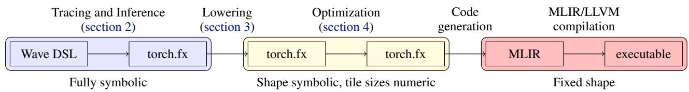  
Figure 1. Wave compilation and optimization use torch.fx as a substrate and progressively specializes the kernel from symbolic to an optimized fixed shape.

We introduce Wave, a Python-embedded DSL for ML kernel authoring. Wave adopts a wave-level (subgroup) programming model, where address computations are implicit: rather than explicitly computing memory offsets in the source code, authors specify distribution and tiling constraints separately from the kernel logic. The compiler derives per-thread addressing expressions using index sequences—triples of (offset, size, stride) expressions that capture block-strided memory access patterns required by matrix cores. Both kernel logic and constraints are expressed symbolically, allowing for the substitution of tile sizes and hardware parameters without code modification. We demonstrate that Wave kernels achieve competitive performance with Triton and hand-tuned libraries on attention and matrix multiplication for Large Language Models (LLMs).

Overall, this paper makes the following contributions:

• Design of a subscript-free Wave DSL for ML workloads embedded into Python, primarily targeting AMD matrix cores.

• Compact representation of block-strided layouts compatible with matrix and tensor cores via index sequences and a set of transformations using those to target the GPU memory subsystem.

• An evaluation of Wave on AMD Instinct MI300, MI325 and Radeon RX9070RT GPUs demonstrating improved performance for attention and matrix multiplication kernels relevant to LLMs.

## 2 WAVE DSL

## 2.1 Design Rationale and Programming Model

Modern GPUs and similar accelerators are usually composed of multiple compute units (CU) consisting of dedicated hardware units for matrix multiplications and arithmetic operations. Activating the matrix cores requires the product operands to be distributed across registers dedicated to specific threads or stored in the workgroup memory in a certain format using specialized instructions. Prior to invoking the computational instruction, individual threads must bring the data to registers, performing non-trivial address computations based on lane, thread and workgroup indices to obtain the offset of the data required by the thread in the global memory space. This leads to intricate and fragile indexing arithmetic being present in the kernel source code.

A distinct issue sharing the common cause is the lack of portability, sometimes even within the same generation of accelerators, as matrix multiplication cores may marshall different amounts of data with different inter-thread data distribution constraints, such as the AMD CDNA matrix cores which support 16x16x16 and 32x32x8 bfloat16 multiplication, float32 accumulation matrix product configurations (Sitaraman et al., 2022). Both issues are exacerbated in kernels designed for processing large inputs with data tiling and other work distribution techniques, increasing the complexity of the address computation (Salykov et al., 2025) .

Wave is a kernel authoring DSL embedded into Python with the programming model based around two principles:

• Implicit Indexing—the address computations are implicitly derived from hardware and target configuration.

• Symbolic Mapping—quantities pertaining to address computations, including tile sizes and mapping configuration, are kept in the symbolic form.

This model hides address computation from the user and makes it easily portable as symbols representing, e.g., tile sizes or SIMD vector widths, can be substituted with concrete values late in the compilation process. It complements the SIMT programming model as well as the block-level programming model, pioneered by Triton (Tillet et al., 2019), both of which require explicit address computation, by delegating hardware-specific address generation to a compiler.

## 2.2 Expressing Computation

Computations in Wave are expressed as a function operating on tensors with symbolic shapes, located in registers or memory as described in subsection 3.1. Each operation can be seen as implicitly iterating through the elements of its operand tensors. The iteration domain of the operation consists of the dimensions (co-)indexing the corresponding tensors, associated with the symbols used in tensor shapes. Iteration domain dimensions may be tiled and mapped to parallel work- and subgroups using constraints as described in subsection 2.3. At most one remaining dimension may correspond to an implicit sequential innermost loop. The remaining sequential dimensions, including reduction dimensions, must be introduced using the explicit iteration construct. This construct is a decorator function taking as arguments and returning the loop-carried variables, with initial values provided in the decorator arguments along with the symbol of the dimension being indexed over. Note the absence of the explicit loop induction variable: one can instead construct a tensor containing the current value of any symbol when needed (e.g., for masking or filtering).

Listing 1 represents a M ⇥ N ⇥ K matrix product where the symbols are used directly in the tensor data type. It reads the inputs, uses the Wave mma operator to denote matrix multiplication and accumulation, and defers to the iterate loop construct to accumulate partial reduction results in the c\_reg register before writing the result back to the memory provided for this purpose.

```julia
@wave(...) # parameters omitted for brevity
def mm(
a: Memory[M, K, ADDRESS_SPACE_0, f16],
b: Memory[N, K, ADDRESS_SPACE_0, f16],
c: Memory[M, N, ADDRESS_SPACE_1, f32]):
c_reg = Register[M, N, f32](0.0)
@iterate(K, init_args=[c_reg])
def loop(acc: Register[M,N,f32])-> Register[M,N,f32]:
a_reg = read(a)
b_reg = read(b)
acc = mma(a_reg, b_reg, acc)
return acc
# The name of the loop is also used as its result.
write(loop, c)
```  
Listing 1. Mixed-precision C = A ⇥ BT expressed in Wave. Symbols M, N, K are used for tensor shapes and ADDRESS\_SPACE\_0 is a symbol allowing one to parameterize data placement in the memory hierarchy. Address computation is implicit.

The iteration domain of the write operation is M  N as these are the dimensions indexing both loop and c. The iteration domain of both read operations is M ⇥ N ⇥ K with K being indexed over by the explicit loop. Without further specification either of M or N , or both are expected to be mapped to concurrent work- and/or subgroups.

Wave is sufficiently expressive to capture performancecritical kernels in transformer models including extend attention (Appendix A.1), persistent GEMM (Appendix A.2), and mixture-of-experts (MoE) (Appendix A.3). It supports symbolic remapping expressions for tensor subscripts, where symbols may be bound to values computed within the kernel (Listing 2) as well as value-dependent while loops and conditionals. In the remainder of the paper, we focus on impactful GEMM and attention kernels for brevity.

```julia
@wave(...) # omitted for brevity
def fused_moe_gemm(
b: Memory[E, N, K, ADDRESS_SPACE_B,f16],
expert_ids: Memory[NUM_BLOCKS,ADDRESS_SPACE_A,i32],
..): # more arguments omitted for brevity
# Using a value (workgroup ID) computed in the kernel
# directly in a subscript via remapping.
wid = scalar(WORKGROUP_2, i32)
expert_id = read(expert_ids, mapping=IndexMapping(
inputs={NUM_BLOCKS: d0},
outputs={NUM_BLOCKS: i},
dynamic_val_mappings={NUM_BLOCKS: i}),
mapping_dynamic_vals=(wid,))
# Using a value read by the kernel in subscripts
# via a named symbol.
set_symbol(IDX, expert_id)
b_reg = read(b, mapping=IndexMapping(
inputs={E: IDX, N: i, K: j},
outputs={N: i, K: j})
#
```  
Listing 2. Excerpt from a Mixture-of-Experts Wave kernel demonstrating usage of dynamic values in subscripts.

## 2.3 Device Mapping

The computation from Listing 1 is mapped to a GPU after a multi-level tiling to achieve a blocked matrix product allowing for efficient execution. The tile sizes and mapping decisions are provided by the user in the configuration object consisting of a list of constraints passed into the @wave decorator. Listing 3 is an example of such a configuration mapping the computation to a 2D grid of 2D workgroups. Note that constraints in the configuration are allowed to use further symbolic values.

```python
constraints = [
# Specifies that dimensions indexed by M, N respec-
# tively are mapped to workgroup indices x and y.
WorkgroupConstraint(M, BLOCK_M, 0),
WorkgroupConstraint(N, BLOCK_N, 1),
# Specifies that dimensions indexed by M, N respec-
# tively are further mapped to concurrent waves
# with each wave processing a subset of iterations.
WaveConstraint(M, BLOCK_M / 2),
WaveConstraint(N, BLOCK_N / 2),
# Requires the dimension indexed by K to be tiled.
TilingConstraint(K, BLOCK_K),
# Specifies the MMA configuration to use and the
# subgroup (warp/wave) size.
HardwareConstraint(threads_per_wave=64,
mma_type=MMAType.F32_16x16x16_F16)
@wave(constraints)
def mm(...): #body
```  
Listing 3. An example of a configuration for the matrix product kernel above. BLOCK\_M, BLOCK\_N and BLOCK\_K are symbolic values.

In this listing, the workgroup constraints indicate how the indexing spaces are further mapped to parallel workgroups. The workgroup indexes 0, 1, 2 are equivalent to block-Idx.x, y, z, respectively, in CUDA or HIP. The wave constraint indicates that the iteration space and address space dimensions corresponding to certain symbols are further mapped to concurrent waves (warps) within the workgroup, with the parameter indicating the number of elements per wave. The constraint system expects only the dimensions that have workgroup constraints to have wave constraints. In absence of a wave constraint, the size of the wave subspace is taken to be equal to that of the workgroup subspace. This can be seen as a second, wave level of tiling for parallel dimensions. In Listing 3, each workgroup consists of four waves (inferred from dividing the per-dimension size of the iteration subspace mapped to each workgroup to subspace mapped to each wave) processing a BLOCK\_M/2 ⇥ BLOCK\_N/2 subset of the iteration space.

The tiling constraints indicate loop tiling for dimensions that are implemented as sequential, either because they carry dependencies or because they were not mapped to workgroup dimensions with concurrent waves. In Listing 3, the sequential reduction dimension K is tiled with size BLOCK\_K. Wave requires tiling constraints to be specified for all dimensions that are not associated with workgroups and waves. When actual tiling is not desired, the tile size may be set to the expected size of the dimension.

Finally, the hardware constraint indicates the desired kind of matrix multiply and accumulate (MMA) instruction to use, in this case the 16 ⇥ 16 ⇥ 16 one, which informs the Wave compiler of the desired distribution of tensor values across threads. The compiler contains a mapping from known MMA instructions to distribution index sequences described in subsection 3.2.

The overall mapping process comprises three hierarchical levels of iteration domain tiling: workgroup-level within devices, wave-level within workgroups, and register-level (implicitly determined by MMA layout requirements). Therefore, block sizes are expected to be non-increasing. Tile sizes are expected to be known at compile time, similar to most ML kernel generators, but are exposed for tuning. Shapes and other symbolic expressions may be optionally substituted with their numeric values to specialize the kernel and enable more aggressive optimization. Otherwise, the Wave compiler performs symbolic expression simplification and emits parametric code. This, in particular, enables it to generate prefill (symbolic sequence length) and specialized decode (sequence length of 1) attention kernels from the same source. When tile sizes cannot be proven to evenly divide problem shapes, Wave resorts to masking or padding (controlled by a tunable compiler option) to avoid out-ofbounds accesses. Partial tiles may be peeled off to avoid overhead from masking.

## 3 LOWERING

Once compilation options are set, the Wave compiler progressively lowers the program to an executable by inferring tensor dimensions and addresses. It then tiles and expands

the program, respecting the mapping constraints, to match matrix core sizes. This process is fully hardware-agnostic.

## 3.1 Data Movement and Type Inference

Data in Wave resides in one of three address spaces: registers accessible to arithmetic operations, workgroup (shared) memory or global memory accessible to read/write operations for data motion. Wave adopts a hybrid stance: it automates global-to-shared data movement while keeping register-level operations explicit, so the compiler can infer synchronization and coalescing. The user can request kernel arguments, initially located in global memory, to be staged through workgroup memory by setting address space of the type, either directly or by using a parameter that will later be substituted. If staging is requested, Wave will automatically insert a copy from global to workgroup memory before the original read that is always required to bring data into registers. The newly inserted operations are subject to optimizations from section 4 and may be implemented as asynchronous copies, with or without swizzling, depending on hardware support. The allocation size in workgroup memory is computed to fit a full data tile deduced from mapping and tiling constraints on the dimensions indexing the argument, plus 64-bit padding to mitigate bank conflicts. For example, for an M ⇥ K-shaped argument, the workgroup constraint (M, BM , 0) and the tiling constraint (K, BK ) will lead to a BM Bk + 64bit allocation.

Following this transformation, Wave compiler infers types (symbolic shape and address space) for all program values using an optimistic forward sparse dataflow analysis with the lattice consisting of  and  states, and an intermediate state for each concrete type the join of which is . This analysis initializes all unknown types to  and proceeds to propagate type information using operation-specific transfer function: join of operands for elementwise and control flow operations, projecting out reduction dimensions for MMA and reductions, swap address space in the type for memory operations. Programs where type inference reaches >, which may arise, (e.g., when differently-shaped arguments are supplied to an elementwise operation), are rejected as incorrectly typed.

After type inference, the types feature symbolic shapes indicating both the overall size of the tensor across all threads and workgroups and the symbols used to index the tensor. For example, c\_reg = Register[M, N, f32] in Listing 1 indicates that c\_reg is register-resident with overall size M  N ; the actual number of registers per thread is determined later based on constraints.

## 3.2 Constructing Address Computations

The core component in lowering Wave programming model to SIMT is to idenitfy address expressions for data each thread must load into registers before computation, in particular for MMA. Wave defines an index sequence mapping each symbolic dimension S to a triple (OS, NS, DS) of closed-form algebraic expressions over parameters, workgroup/thread identifiers, and loop induction variables. Here OS (offset) is the base logical index; NS (size) is the number of elements per thread along  (the per thread vector width); and DS (stride) is the spacing, in element indices, between consecutive elements within that per-thread vector. For each dimension S, the triple compactly represents the set of element indices {O + iD | 0  i < N }.

Index sequences can be defined for all dimensions involved in any operation though they are most relevant for memory operations. They are obtained using a sparse optimistic dataflow analysis propagating indexing information both forward and backward. Specifically, it initializes index sequences for all operations based on the constraints and then propagates indexing information from:

• MMA operations and their configuration, forward from results and backward from operands;

• other reduction operations, similarly;

• memory operations, forward from reads and backward from writes.

The propagation is based on a lattice defined as a pair "provenance, index sequence", (p, ) in addition to the canonical lattice bottom and top states. The provenance indicates where the index statement originally comes from, and is ordered: pmma > preduce > pmem > ?. This ordering is a heuristic motivated by order-of-magnitude performance penalties for not utilizing MMA engines or in-subgroup reduction schemes, which are common in modern GPUs. The join of two lattices is defined as:

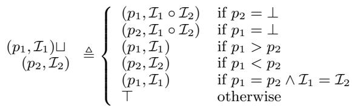

where index sequence composition is defined as I1  I2 = {O1 + D1(O2 + D2 · i2 + N2D2i1) | 0  i1 < N1, 0  i2 < N2}. In other words, this means that the index sequence induced by an MMA overrides that induced by a reduction, which in turn overrides that induces by a memory access, and that all of them compose with the index sequence initially assigned to the operations.

The analysis propagates forward by joining the lattices of all operands and backward by joining the lattices of all results until a fix point is reached. If the lattice top is reached, the program is rejected as incorrect.

Continuing with the example in Listing 1 and Listing 3, the index sequence for the first read from A is M (Wx BLOCK\_M)+(bTx/64c(BLOCK\_M/2))+ (Tx mod 16), 1, 1 ,

K (iK BLOCK\_K) + 4 (Tx mod 64)/16 , 4, 1 while the index sequence for the write to C is: M ! (Wx · BLOCK\_M) + (bTx/64c(BLOCK\_M/2)), 1, 1), N ! (Wy · BLOCK\_N + Ty(BLOCK\_N/2), 1, 1).

Here W refer to workgroup and T to thread x, y, z indices respectively and i refers to the induction variable of an explicit loop. Each additive term in the offset comes from a constraint: ⌅Tx/64⇧ obtains the subgroup index from the thread index Tx (subgroup size 64); term Tx mod 16 selects the relative thread position within the subgroup tile, while the index sequence for the write is:

The mma operation requires each thread to provide 4 elements of the input tensor, setting the initial value of D = 4 for operands along K and for the result along N . These will be propagated to the corresponding read and write operations, indicating that they are to access vectors of 4 values. Note that in absence of the mma operation, the kernel would read and write one element per thread (D = 1) instead of four since no constraint requires otherwise. A hardware constraint or a parameter of read/ write operations may specify a different value to force vectorized memory access.

Finally, offsets of index sequences are used as indices along the memory dimension indexed by the corresponding symbol in memory-access operations and sizes are used to indicate how many elements each access touches. Multiplying them with strides of the corresponding tensors leads to the required, complex address computation expression required when manually implementing similarly distributed kernels.

## 3.3 Expansion

After index sequence propagation establishes address computation patterns, the Wave compiler performs expansion, converting the wave-level representation into a thread-level representation. This transformation resolves the mapping from the high-level, wave-oriented operations to the finegrained, per-thread operations required by the SIMT execution model, effectively transitioning from SIMW (Single Instruction Multiple Waves) to SIMD (Single Instruction Multiple Data) representation.

Prior to expansion, operations such as read, mma, and write are expressed as wave-level operations on symbolic tiles, abstracting over the distribution of work across individual threads. The underlying hardware, however, requires each thread within a wave to perform specific operations on its assigned subset of data. Expansion creates multiple copies of each operation, one for each sub-tile that a thread must process to cover the wave’s iteration space. For instance, for a wave-level mma operation processing a 16 ⇥ 16 tile, where each thread must invoke the instruction multiple times to cover a larger workgroup tile, expansion creates these multiple per-thread invocations.

Static Resolution of Wave Tile Geometry Although Wave maintains symbolic representation throughout most of the compilation pipeline, expansion requires that the following three values be statically known at compile time for each dimension  with constraints:

• T : the tile size from WorkgroupConstraint or TilingConstraint.

• W : the number of waves per workgroup along dimension .

• V : the vector size (elements per thread per operation) along dimension .

The number of copies for dimension  is then computed as: dim\_scaling(S) = TSW V

This represents the number of times each operation must be replicated per thread along dimension S. While T , W , and V must be concrete values for expansion to proceed, what is fundamentally fixed is the per-wave tile size T /W . The system preserves parametricity at higher levels: The number of workgroups launched remains symbolic. Thus, the kernel maintains fully unrolled inner loops for a fixed per-wave tile geometry, while remaining agnostic to varying input and workgroup tile sizes.

Graph Transformation Expansion employs a depth-first traversal, starting from the leaf nodes of the computation graph (write nodes). For each node, the compiler generates all combinations of indices where each dimension S ranges over [0, dim\_scaling(S)), and creates a new copy of the operation for each combination. Given the original index sequence (O , N , D ) from subsection 3.2, the offset for the i-th expanded copy along dimension S (where 0  i < dim\_scaling(S)) is updated to O0 = O + i · N · D . For mma operations expanded along the reduction dimension, accumulation is implemented by chaining the copies: The accumulator input of the i-th copy is connected to the output of the (i  1)-th copy, creating a sequential dependency that implements the reduction.

The inputs to each expanded operation are recursively expanded in the same manner, creating a fully unrolled computation graph where all wave-level abstractions have been lowered to concrete per-thread operations.

## 4 OPTIMIZATION

We devise a series of GPU-oriented optimizations to improve kernel performance, in addition to those already available in the MLIR (Lattner et al., 2021)/LLVM (Lattner & Adve, 2004) infrastructure. These optimizations rely on target-specific information, such as the memory hierarchy description and the respective latencies of computational and memory operations.

## 4.1 Global Memory Optimizations

After initial index sequence propagation and expansion/unrolling, a Wave program typically includes multiple vector or even scalar reads from consecutive locations in global memory. The sizes of these reads are most likely driven by the shape of the MMA operations, (e.g., for the running example Listing 1 and Listing 3), each operation is expected to read 4 bfloat16 elements, or 4 16 64 = 4096 bits per subgroup. However, CDNA3-enabled hardware such as AMD MI300X provides eight 1024-bit memory channels for a total of 8192 bits, so such a read would utilize only half of the available bandwidth.

Global read coarsening transformations increase the number of elements fetched by each read instruction so as to saturate the High-Bandwidth Memory (HBM) bandwidth and decrease the total number of memory transactions. It proceeds by identifying consecutive reads from the same global memory-resident tensor such that the total size of data read is below the device-specific memory bandwidth and cannot be increased further by adding another read. Two reads with index sequences (O1, D1, N1) and (O2, D2, N2) associated with the innermost dimension are consecutive if O2 = O1 + D1, and they read (D1 + D2) · 8 · sizeof(Tel) bits where Tel is the elemental type of the tensor being read. When all combined reads have Di > 1, (i.e., the innermost dimension is used for vectorized load/store), they can be simply replaced with a single wider read operation with D = P Di and O = O1. When a non-innermost dimension has Di > 1 and consequently the innermost has Di = 1, coarsening essentially transposes the read by having each read operation access consecutive elements. In this case, exactly Di operations are expected to be combined.

Thus coarsened reads would often result in elements required by different threads to be loaded in a single thread. For example, loading 8 consecutive elements for the A matrix from our running example in Listing 1 would bring in 4 elements for thread 0 and 4 elements for thread 16 in the registers of the same thread. We therefore immediately store the result of the global load into workgroup memory. After a workgroup synchronization, each thread can load the required 4 consecutive elements from workgroup memory instead. This transformation is only enabled for global loads that are already stored into the workgroup memory to avoid increasing the workgroup memory usage and thus decreasing occupancy and thus performance.

## 4.2 Scheduling Optimization

Schedule reordering This optimization is a combination of software pipelining (Lam, 1988) with a variation of the “ping-pong” task alternation between subgroups (Shah et al., 2024). It supports pipelining schemes specialized for matrix multiplications and attentions as well as a more generalized modulo scheduling (Rau & Glaeser, 1981). The transformation is specifically targeted to concurrent hardware units, such as matrix cores that can run concurrently to memory accesses. It starts by identifying MMA operations nested in an explicit loop whose indexing symbol also indexes the operands, which is a pre-requirement for software pipelining. It then identifies reads and writes surrounding this operation, along with eventual casts, and ensures there are not interfering writes that would violate dependencies. It first applies classical software pipelining by issuing reads for a hardware-specific initiation interval k of loop iterations, before alternating reads for iteration i+k with MMAs and writes for iteration i and an epilogue consisting only of the latter. It additionally doubles the amount of subgroups and distributes loads and MMAs between them. Thus when a subgroup is stalled waiting for data to arrive, the Compute Unit (CU) can rapidly context switch to another subgroup that is ready to perform an MMA.

Workgroup Reordering: Common GPU architectures have multiple CUs that share the same L2 cache. Direct distribution of (tiled) data across workgroup may result in workgroups executing on units with shared cache accessing distant, non-overlapping data regions leading to cache thrashing and ultimately decreased memory subsystem performance. Workgroup reordering changes how workgroup data tiles are mapped to actual workgroups to allow for better cache locality, (e.g., using stripes of consecutive tiles or Morton order (Perdacher et al., 2020)). This transformation can be easily achieved by first defining a closed-form expression mapping physical workgroup indices to logical indices following the desired grouping strategy, referred to as a reordering constraint, and then substituting this expression instead of physical indices in the index sequences. This process is purely mechanical thanks to Wave maintaining symbolic expressions at this stage.

## 5 IMPLEMENTATION

## 5.1 Compiler Architecture

The Wave compiler combines the flexibility of the torch.fx ecosystem (Reed et al., 2022) at the high level with the robustness of the industry-grade MLIR infrastructure at the low level.

We use the torch.fx tracing compiler to process Wave DSL and produce an initial graph capturing the computational structure of the kernel. By itself, it supports a handful of nodes, including call\_function that allows “calls” to opaque operators. We leverage this by embedding Wave operations into the node attribute storage and rely on Python type casting to reconstruct Python classes corresponding to these operations on-the-fly when desired. This preserves compatibility with torch.fx tooling, including debugging aids and visualization, while allowing us to naturally express semantically-loaded transformations on Wave operations. Symbolic expressions for index sequences and parameters are encoded using Sympy (Meurer et al., 2017). Control flow constructs are captured as attributes referencing torch.fx subgraphs.

After tracing, Wave compiler lowers the abstraction level, performing type and index sequence inference, followed by graph expansion (section 3) using the torch.fx abstraction. Following expansion, tile sizes are fixed and no longer parametric. It then optionally applies high-level optimizations (section 4) and lowers to MLIR base (arith, vector, scf) and vendor-specific (amdgpu) dialects for low-level optimization and device-specific code generation as shown in Figure 1. Fully lowered Intermediate Representation (IR) fixes all parameters and is no longer symbolic in any aspect. It is finally (JIT-)compiled via LLVM into a binary.

## 5.2 Integration

Wave kernels integrate with PyTorch as nn.Module subclasses, adhering to PyTorch’s C++ ABI for zero-copy tensor access. A compilation cache amortizes overhead across repeated invocations. We further integrated Wave as an attention backend for SGLang (Zheng et al., 2024), implementing an ABI-conforming adapter layer that eliminates data copies while supporting KV cache management. The implementation provides extend (Jin et al., 2024), paged decode (Kwon et al., 2023), and prefill (Kamath et al., 2025) attention variants for LLM inference.

## 6 EVALUATION

## 6.1 Experimental Setup

We evaluate standalone Wave kernels on the following systems: 1) AMD EPYC 9554 64-Core CPU with eight AMD Instinct MI300x GPUs (MI300), 2) AMD EPYC 9655 96- Core CPU with eight AMD Instinct MI325x GPUs (MI325) and 3) AMD Ryzen ThreadRipper PRO 7995WX 96-Core CPU with 2 Radeon RX9070XT GPUs, all running running Ubuntu Linux 22.04 and AMD ROCm package 7.0.0-38. We use Wave version 3.7.0 with IREE version 3.7.0 with LLVM/MLIR at 8243dfc.

For baselines, we use PyTorch 2.8.0 (Ansel et al., 2024), Triton 3.4.0 (Tillet et al., 2019), the Tile language (Wang et al., 2025) 0.1.6.post1+5d66d32a and TVM 0.19 (Chen et al., 2018) with Ansor (Zheng et al., 2020) and MetaSchedule scheduling algorithms.

All measurements are taken using PyTorch profiler support, which defers to vendor-provided benchmarking utilities. For each kernel, we execute 20 warmup invocations and 100 measured invocations We measure the time taken by the kernel on device and report arithmetic means. To compare Wave and Triton fairly on attention with different layouts across different hardware, we standardized hyperparameter tuning. Triton attention kernel evaluated in this work, autotunes six presets per shape (covering block sizes, num\_warps, waves per execution unit, and related constraints). We mirrored this by testing six Wave configurations per layout, varying block sizes and MMA variant, then selecting a single machine-specific configuration applied uniformly across all shapes. Autotuning takes on the order of single-digit minutes per kernel, depending on kernel complexity.

## 6.2 Attention Kernel Performance

We evaluated attention kernels extracted from popular LLMs and diffusion models with the BxHxS\_qxS\_kxD shapes as follows: Llama-2-13B 1x40x706x706x128; Llama-3.1-8B 1x32x642x642x128; Llama-3.3-70B 1x64x642x642x128; Mistral-7B 1x32x706x706x128; Stable Diffusion XL (SDXL) cross-attention 2  20  1024  1024  64, where B stands for batch size, H for head count, D for head size and Sq, Sk are query and key sequence dimensions. We compared against PyTorch (eager) and Triton in prefill mode.

We evaluated two data layouts: BHSD (Batch, Heads, Sequence, other Dimensions) and BSHD (Batch, Sequence, Heads, other Dimensions). The former is the default format for attention query, key and value tensors. The latter layout transposes head and (both) sequence dimensions to improve locality for operations across heads. In Wave, it can be obtained by simply swapping the symbolic indexing dimensions at the function boundary and having them propagated through the kernel.

For BHSD attention (MI300/MI325), we use the following tile sizes: BLOCK\_B=1, BLOCK\_M=128, BLOCK\_N=128, BLOCK\_K2=64. For BSHD attention (MI300/MI325), we set BLOCK\_B=1, BLOCK\_H=2, BLOCK\_D\_KV=64, BLOCK\_N\_KV=32, with BLOCK\_N\_Q=64 (MI300) and 128 (MI325). For matrix multiplication (all hardware), we use BLOCK\_M=128, BLOCK\_N=128, BLOCK\_K2=64.

For BHSD layout on MI300X (all listed shapes), Wave is 5- 294% (harmonic mean 101.7%) than PyTorch (eager), and 6-152% (harmonic mean 37.8%) faster than Triton. From the performance counters for LLama-2.1-13b-hf, we see that Wave trades a small drop in nominal per-CU occupancy versus Triton (0.566 vs 0.622) for on-chip reuse by using 34 KB more Local Data Store (CDNA term for workgroup/shared memory) (LDS), which aligns with the higher end-to-end throughput observed versus PyTorch and the competitive performance versus Triton.

For BSHD layout on MI325X (all listed shapes), On MI300X (BHSD layout), Wave is 20–166% (harmonic mean

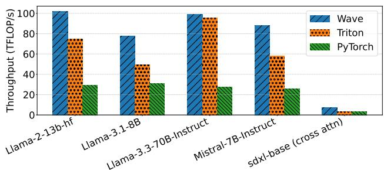

(a) BHSD attention throughput.  
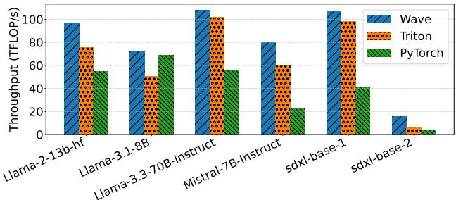  
(b) BSHD attention throughput.

Figure 2. Attention throughput on MI300X (higher is better).  
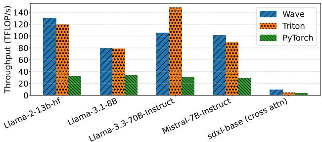

(a) BHSD attention throughput.  
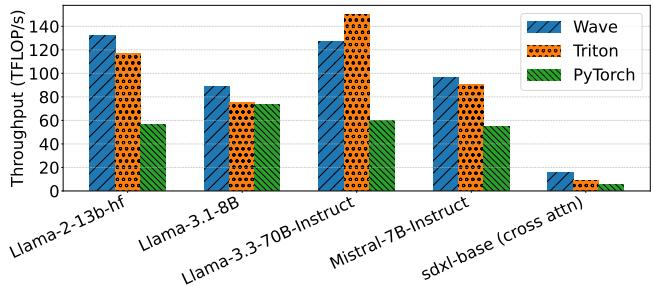  
(b) BSHD attention throughput.  
Figure 3. Attention throughput on MI325x (higher is better).

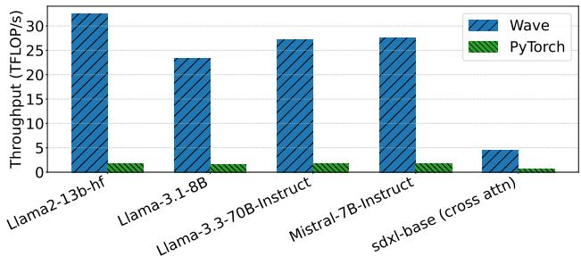

(a) BHSD attention throughput.  
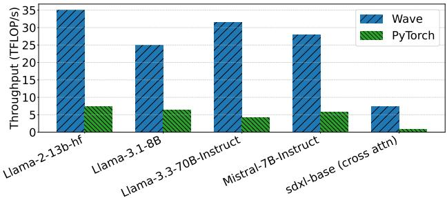  
(b) BSHD attention throughput.  
Figure 4. Attention throughput on RX9070XT (higher is better).

94.3%) faster than PyTorch (eager), and ranges from 15% slower to 74% faster than Triton (harmonic mean 8.2% faster). For Llama-2-13b-hf, Wave and Triton show similar core-attention occupancy (approx. 1.0002 waves/active CU and approx. 0.64 waves/CU), but Wave uses 25 KB LDS per workgroup while Triton uses none, trading extra on-chip storage for reuse. The PyTorch kernel shows a Mean Occupancy/ActiveCU = 7.46 and Mean Occupancy/CU = 6.83. It uses more global writes/reads between pipeline stages, which degrades end-to-end attention throughput.

We also evaluate BHSD and BSHD layouts on a Radeon GPU Figure 4. For BHSD, the Wave kernel outperforms PyTorch fused kernels for fp16 attention with Llama-2-13b shape on a RT9070XT. Although both have a similar number of instructions, the Wave IR shows key advantages, namely, it uses 5 llvm.amdgcn.ds.bpermute intrinsics for in-register reductions, about 48 LDS loads, and only 6 barriers. In contrast, PyTorch kernels rely on 1–6 global and LDS loads and up to 9 barriers, without any ds.bpermute or mfma intrinsics, indicating LDS-based reductions. These differences reduce synchronization overhead and LDS traffic in Wave, leading to higher throughput through radeonspecific wavefront optimizations. Similarly, for BSHD layout, Wave performs about 60 LDS loads and 18 stores in LDS with minimal global-memory use, yielding an LDS share of ⇡ 80% compared to only 30–35% in PyTorch fused kernels. In contrast, PyTorch relies on 2–6 global and LDS loads per fused kernel with up to 8–10 barrier calls and lacks any ds.bpermute or mfma intrinsics, signaling heavier LDS-based synchronization across fused kernels.

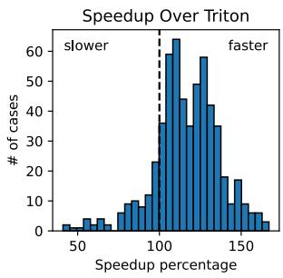

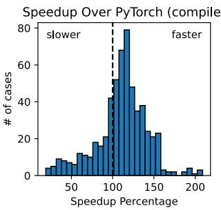  
Figure 5. Distribution of speedups for matmul kernels. Wave is predominantly faster than Triton and is faster than PyTorch compiler in  60% of the cases relevant for LLMs.

Table 1. Matmul shapes selected from major transformer models based on kernel invocation count and total multiply-accumulate operations, and their operational intensity.  
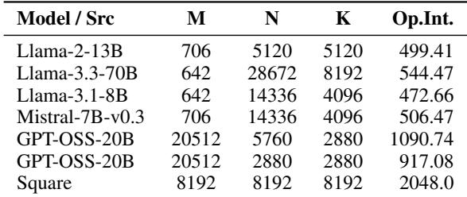

## 6.3 Matrix Multiplications

We evaluate 573 out of 626 transposed matrix multiplication (C = ABT ) shapes extracted from LLama 2 and 3, Mistral-7B and GPT-OSS-20B LLMs captured in the IREE kernel benchmark (Nod-AI, 2024) that are not matrix-vector multiplications, (i.e., M = 1) . We complement this set with a 81923 case. All cases are evaluated using float16 precision. In most cases, Wave delivers superior performance compared to both PyTorch (compile) and Triton, with the distribution shown in Figure 5.

We selected a small subset of frequently-invoked kernels, presented in Table 1 with high multiply-accumulate counts for a deeper investigation. These specific shapes offer broad case coverage. The target hardware has a FP16 MMA peak of 940 TFLOP/s and bandwidth of 42 TB/s for HBM, 76 TB/s for L2 and 119 TB/s for L1 cache, and 177 TB/s for LDS, leading to the machine balance of 22.4, 12.4, 7.9 and 5.3 for these parts of the memory subsystem respectively. For example, the 81923 case has the arithmetic intensity as shown in Table 1 FLOPs/byte, making it computebound. We indeed practically measured its performance at 900 TFLOP/s against 940 TFLOP/s peak.

In contrast, the 706 ⇥ 14336 ⇥ 4096 case is bound by L1 and L2 bandwidth rather than compute throughput. The achieved arithmetic intensity (approx. 10–20 FLOPs/Byte)

falls near the L1 ridge point (approx. 12 FLOPs/Byte) and below the L2 ridge point (approx. 28 FLOPs/Byte). The corresponding throughput (approximately 350–400 TFLOP/s) remains well below the 940 TFLOP/s compute roof, despite having a similar instruction-level structure. Small M and large N reduce output reuse per tile and increases the number of global and L2 reloads for B fragments.

We compare throughput of these kernels with PyTorch (compile), Triton, TileLang, TVM Ansor and MetaSchedule. For Triton, we invoke the gemm\_a16w16 from the ROCm AITER library that defers to a tuned Triton implementation. For TileLang, we use kernels from the TileLang Benchmark Suite (Tile-AI, 2024).

As seen in Figure 6a, Wave outperforms Triton and Py-Torch by 20–30% for larger models (GPT OSS 20B, Llama 3.3 70B) and offers performance comparable to Triton on smaller models (LLama 2 13B, Llama 3.1 8B and Mistral), where PyTorch outperforms both by 10–20%, deferring to optimized libraries. Wave is 2⇥ faster than TileLang on average and outperforms TVM-based solutions by an order of magnitude. The latter struggle to converge after over 4096 iterations, or at least one successful compilation configuration and is lacking lower-level optimizations targeting AMD instruction sets.

Instruction-level analysis demonstrates that Wave successfully utilizes matrix cores through v\_mfma\_f32\_16x16x16\_f16 instructions for 16 16 16 float16 multiply float32 accumulation, as well as efficient data staging via ds\_read2\_b64/ds\_write2\_b64 for wide LDS access as well as buffer\_load\_dwordx4 and buffer\_store\_dwordx4 for coalesced vectorized global memory access. For large, well-aligned shapes such as 20512x5760x2880, the kernels remain largely branch-free, and only minor predication appears to handle residual macro-tiles—less than 0.2% of the workload. In contrast, smaller or irregular shapes (e.g., 706  14336  4096), exhibit a higher proportion of partial tiles, increasing inactive lanes and triggering additional predicated control flow. Combined with higher Vector General-Purpose Register (VGPR) usage, which restricts the number of active waves per compute unit (AMD, 2024), these reduce the effective utilization of both compute and memory pipelines, particularly for large-tile matmuls. The assembly inspection shows that Wave makes efficient use of hardware-level primitives such as MFMA pipelines and prefetch mechanisms. Nonetheless, residual performance gaps arise from occupancy and boundary-condition constraints on irregular shapes, indicating that additional low-level tuning and launch-configuration optimization could further improve efficiency.

On RX9070RT, Figure 7, we ran Wave unchanged at the algorithm level to show performance portability. This required changing target parameters (e.g., threads\_per\_wave and the MFMA variant) and re-tuning, without modifying the kernel algorithm. Between Wave and PyTorch, Wave is on par or better for almost all kernels. For GEMM specifically, Wave is 4–47% faster than PyTorch (harmonic mean 13.9%). Porting Wave to Radeon only required setting threads\_per\_wave=32, and mma\_type = MMAType.RDNA4\_F32\_16x16x16\_F16 to adhere to the underlying hardware specification. The variant RDNA4\_F32\_16x16x16\_F16 specifies the instrinsic dimensions and data types. Based on our static analysis, Wave IR had 32 WMMA calls (vs 16 in PyTorch) which keeps a higher compute/memory balance and reduces bandwidth pressure. WMMA calls are tile-level Wave Matrix Multiply-Accumulate operations that use the GPU’s matrix cores. It does fewer data-motion ops (64 vector ops vs 168, 44 loads vs 92), further lowering instruction and memory overhead. There are only 2 branches in Wave vs 34 in PyTorch, which reduces divergence.

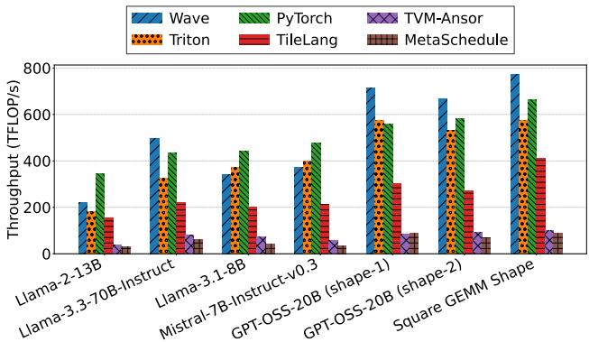

(a) MI300x: Matmul (AB>) throughput across frameworks (higher is better).  
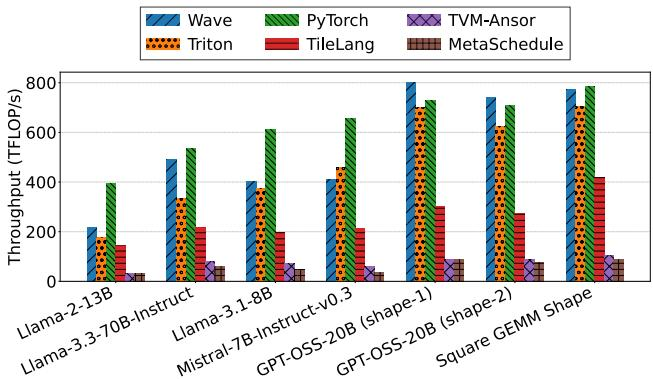  
(b) MI325x: Matmul (AB>) throughput across frameworks (higher is better).  
Figure 6. Matmul (AB>) throughput comparison across frameworks. Wave outperforms alternatives for large models and remains in the same performance segment as Triton and PyTorch for smaller models.

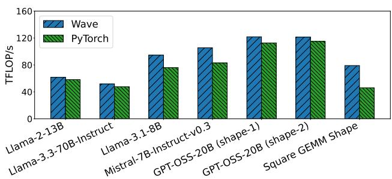

Figure 7. Wave Performance (throughput) portability to RX9070RT for Matmul (AB>)  
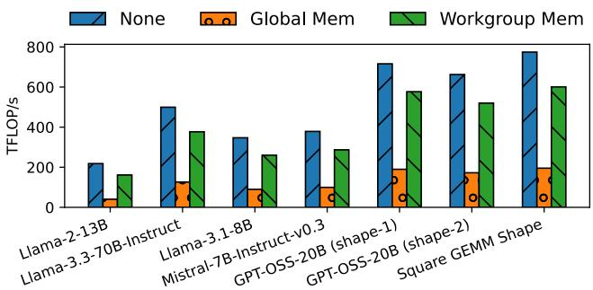  
Figure 8. Disabling optimizations (section 4) results in systematic performance degradation.

## 6.4 Impact of Optimizations

To evaluate the effect of optimizations implemented in Wave, we perform an ablation study selectively disabling them for the kernels from the previous section. Configuration remains unchanged and no re-tuning is performed.

As demonstrated in Figure 8, disabling global memory optimizations (subsection 4.1) results in a 2.7–4.4 slowdown (harmonic mean 3.0⇥) whereas disabling scheduling optimization (subsection 4.2) results in a 24–35% slowdown (harmonic mean 30%). Effects of optimizations are observed across all cases, with smaller kernels affected more, 4.4⇥ global memory-induced slowdown for LLama-2 13b compared to 2.7⇥ for GPT OSS 20B, since they are struggling to hide access latency by the amount of parallelism.

Assembly-level analysis of LLama-2-13b shows that the kernel uses 12 buffer\_load\_dwordx4 instructions for 128- bit loads per thread with global memory optimization and 20 buffer\_load\_dwordx2 for 64-bit loads without it. We additionally capture TCC\_EA0\_RDREQ and TCC\_EA0\_WRREQ performance counters for 32B reads and 64B writes, respectively, and calculate memory throughput by dividing the total amount of data read and written by the kernel duration. Global memory optimization increases memory bandwidth from 248 GB/s to 599 GB/s. Inefficient loads also increase usage of other storage (244 VGPR instead of 192, 80 LDSaccessing instructions instead of 24 with 46 s\_waitcnt synchronizations instead of 32), which compounds the overall throughput drop from 215.6 to 40.1 TFLOPs.

## 7 DISCUSSION

While our evaluation targets the latest generations of AMD GPUs as this platform is underserved by publicly available tooling, Wave is designed with retargetability in mind. By exposing target-specific constants, such as the threads per wave/warp and matrix multiplication configurations, as tunable parameters, Wave kernels can be adapted to different architectures with minimal modification provided MLIR/L-LVM backend support. This is demonstrated by moving from MI300/MI325 (CDNA3 architecture with 64 threads per wave, mma instructions) to RX9070RT (RDNA4 architecture with 32 threads per wave, mfma instructions). It is technically possible to execute wave on Nvidia hardware; however, only the memory optimizations would be relevant, since wgmma instructions on the Hopper and Blackwell architectures operate directly on shared memory.

Our implicit indexing design enables portability across different MMA engines and makes the code more compact. For example, the extend attention kernel would use 15 additional statements to compute memory indices without it.

## 8 RELATED WORK

GPU DSLs span a wide design space in how they express indexing, expose/automate parallelism, and separate algorithms from schedules. Triton (Tillet et al., 2019) and Helion (Pytorch, 2025) emphasize block-level control; Exo (Ikarashi et al., 2025) offers correctness-preserving rewrites; Lift/Elevate (Lücke et al., 2021) use functional combinators; and Halide (Ragan-Kelley et al., 2013) / TVM (Chen et al., 2018) derive loop nests from schedules. Wave proposes an alternative: it represents computation and distribution with symbolic index sequences that defer concrete indices to codegen, enabling uniform reasoning about mapping patterns without manual loop transformations.

Rather than an explicit, user-written schedule (as in Halide /TVM or template-driven transforms like Fireiron (Hagedorn et al., 2020), Wave composes symbolic constraints and propagates dependencies so that fused kernels and execution order emerge from the composition itself. This makes scheduling declarative and analytical instead of procedural, unifying index reasoning, mapping, and synchronization within one abstraction layer.

On programming model and abstraction, CUDA/HIP expose thread-level control (max flexibility, high complexity), while Triton/Helion operate at block granularity and Halide/TVM/Lift/Elevate work at loop/functional levels. Wave targets the wavefront/subgroup-level to align with modern GPU execution and tensor-core cooperation. In memory control, existing systems range from automated staging (Triton/Helion) to directive-driven (Halide/ TVM) to fully manual (Exo). Wave adopts a hybrid stance: globalto-shared movement is implicit while memory-to-register movement is explicit in the code.

## 9 CONCLUSION

In this work, we introduced Wave, a lightweight and extensible framework for defining and compiling custom GPU kernels. By abstracting hardware-specific details while retaining fine-grained control, Wave bridges the gap between low-level performance tuning and high-level programmability. We believe Wave can serve as a foundation for exploring new kernel designs and compiler transformations across a range of workloads. Future efforts will focus on improving interoperability with existing MLIR-based infrastructures and expanding support for emerging GPU architectures. Another direction is to extend Wave’s indexing symbols to express irregular and sparse tensors using dependentiterator semantics (Kjolstad et al., 2017), without changing the control-flow primitives. This can leverage MLIR’s existing sparse tensor compilation (Bik et al., 2022) support.

## REFERENCES

Adelstein Lelbach, B. cuTile, the new/old kid on the block: Python programming models for GPUs. In SciPy 2025, July 2025.

AMD. AMD GPU Architecture and Programming Documentation. https://gpuopen.com/amd-gpu-a rchitecture-programming-documentation /, 2024.

Ansel, J., Yang, E., He, H., Gimelshein, N., Jain, A., Voznesensky, M., Bao, B., Bell, P., Berard, D., Burovski, E., Chauhan, G., Chourdia, A., Constable, W., Desmaison, A., DeVito, Z., Ellison, E., Feng, W., Gong, J., Gschwind, M., Hirsh, B., Huang, S., Kalambarkar, K., Kirsch, L., Lazos, M., Lezcano, M., Liang, Y., Liang, J., Lu, Y., Luk, C. K., Maher, B., Pan, Y., Puhrsch, C., Reso, M., Saroufim, M., Siraichi, M. Y., Suk, H., Zhang, S., Suo, M., Tillet, P., Zhao, X., Wang, E., Zhou, K., Zou, R., Wang, X., Mathews, A., Wen, W., Chanan, G., Wu, P., and Chintala, S. Pytorch 2: Faster machine learning through dynamic python bytecode transformation and graph compilation. In Proceedings of the 29th ACM International Conference on Architectural Support for Programming Languages and Operating Systems, Volume 2, ASPLOS ’24, pp. 929–947, New York, NY, USA, 2024. Association for Computing Machinery. ISBN 9798400703850. doi: 10.1145/3620665.3640366. URL https: //doi.org/10.1145/3620665.3640366.

Bik, A., Koanantakool, P., Shpeisman, T., Vasilache, N., Zheng, B., and Kjolstad, F. Compiler support for sparse tensor computations in mlir. ACM Transactions on Architecture and Code Optimization (TACO), 19(4):1–25, 2022.

Chen, T., Moreau, T., Jiang, Z., Zheng, L., Yan, E., Shen, H., Cowan, M., Wang, L., Hu, Y., Ceze, L., et al. {TVM}: An automated {End-to-End} optimizing compiler for deep learning. In 13th USENIX Symposium on Operating Systems Design and Implementation (OSDI 18), pp. 578–594, 2018.

Choquette, J. Nvidia Hopper GPU: Scaling Performance . In 2022 IEEE Hot Chips 34 Symposium (HCS), pp. 1–46, Los Alamitos, CA, USA, August 2022. IEEE Computer Society. doi: 10.1109/HCS55958.2022.9895592. URL https://doi.ieeecomputersociety.org/ 10.1109/HCS55958.2022.9895592.

Choquette, J., Gandhi, W., Giroux, O., Stam, N., and Krashinsky, R. Nvidia a100 tensor core gpu: Performance and innovation. IEEE Micro, 41(2):29–35, 2021. doi: 10.1109/MM.2021.3061394.

Hagedorn, B., Elliott, A. S., Barthels, H., Bodík, R., and Grover, V. Fireiron: A scheduling language for high-performance linear algebra on gpus. CoRR, abs/2003.06324, 2020. URL https://arxiv.or g/abs/2003.06324.

Ikarashi, Y., Qian, K., Droubi, S., Reinking, A., Bernstein, G. L., and Ragan-Kelley, J. Exo 2: Growing a scheduling language. In Proceedings of the 30th ACM International Conference on Architectural Support for Programming Languages and Operating Systems, Volume 1, pp. 426– 444, 2025.

Jin, H., Han, X., Yang, J., Jiang, Z., Liu, Z., Chang, C.- Y., Chen, H., and Hu, X. Llm maybe longlm: Selfextend llm context window without tuning. arXiv preprint arXiv:2401.01325, 2024.

Jouppi, N. P., Young, C., Patil, N., Patterson, D., Agrawal, G., Bajwa, R., Bates, S., Bhatia, S., Boden, N., Borchers, A., Boyle, R., Cantin, P.-l., Chao, C., Clark, C., Coriell, J., Daley, M., Dau, M., Dean, J., Gelb, B., Ghaemmaghami, T. V., Gottipati, R., Gulland, W., Hagmann, R., Ho, C. R., Hogberg, D., Hu, J., Hundt, R., Hurt, D., Ibarz, J., Jaffey, A., Jaworski, A., Kaplan, A., Khaitan, H., Killebrew, D., Koch, A., Kumar, N., Lacy, S., Laudon, J., Law, J., Le, D., Leary, C., Liu, Z., Lucke, K., Lundin, A., MacKean, G., Maggiore, A., Mahony, M., Miller, K., Nagarajan, R., Narayanaswami, R., Ni, R., Nix, K., Norrie, T., Omernick, M., Penukonda, N., Phelps, A., Ross, J., Ross, M., Salek, A., Samadiani, E.,

Severn, C., Sizikov, G., Snelham, M., Souter, J., Steinberg, D., Swing, A., Tan, M., Thorson, G., Tian, B., Toma, H., Tuttle, E., Vasudevan, V., Walter, R., Wang, W., Wilcox, E., and Yoon, D. H. In-datacenter performance analysis of a tensor processing unit. SIGARCH Comput. Archit. News, 45(2):1–12, June 2017. ISSN 0163- 5964. doi: 10.1145/3140659.3080246. URL https: //doi.org/10.1145/3140659.3080246.

Kamath, A. K., Prabhu, R., Mohan, J., Peter, S., Ramjee, R., and Panwar, A. Pod-attention: Unlocking full prefilldecode overlap for faster llm inference. In Proceedings of the 30th ACM International Conference on Architectural Support for Programming Languages and Operating Systems, Volume 2, pp. 897–912, 2025.

Kjolstad, F., Chou, S., Lugato, D., Kamil, S., and Amarasinghe, S. Taco: A tool to generate tensor algebra kernels. In 2017 32nd IEEE/ACM International Conference on Automated Software Engineering (ASE), pp. 943–948. IEEE, 2017.

Kwon, W., Li, Z., Zhuang, S., Sheng, Y., Zheng, L., Yu, C. H., Gonzalez, J., Zhang, H., and Stoica, I. Efficient memory management for large language model serving with pagedattention. In Proceedings of the 29th Symposium on Operating Systems Principles, SOSP ’23, pp. 611–626, New York, NY, USA, 2023. Association for Computing Machinery. ISBN 9798400702297. doi: 10.1145/3600006.3613165. URL https://doi. org/10.1145/3600006.3613165.

Lam, M. Software pipelining: an effective scheduling technique for vliw machines. SIGPLAN Not., 23(7):318–328, June 1988. ISSN 0362-1340. doi: 10.1145/960116.54022. URL https://doi.org/10.1145/960116.5 4022.

Lattner, C. and Adve, V. Llvm: A compilation framework for lifelong program analysis & transformation. In International symposium on code generation and optimization, 2004. CGO 2004., pp. 75–86. IEEE, 2004.

Lattner, C., Amini, M., Bondhugula, U., Cohen, A., Davis, A., Pienaar, J., Riddle, R., Shpeisman, T., Vasilache, N., and Zinenko, O. Mlir: Scaling compiler infrastructure for domain specific computation. In 2021 IEEE/ACM International Symposium on Code Generation and Optimization (CGO), pp. 2–14, 2021. doi: 10.1109/CGO51591.2021.9370308.

Lücke, M., Steuwer, M., and Smith, A. Integrating a functional pattern-based ir into mlir. In Proceedings of the 30th ACM SIGPLAN International Conference on Compiler Construction, CC 2021, pp. 12–22, New York, NY, USA, 2021. Association for Computing Machinery. ISBN 9781450383257. doi: 10.1145/3446804.3446844. URL

https://doi.org/10.1145/3446804.3446 844.

Luebke, D. Cuda: Scalable parallel programming for highperformance scientific computing. In 2008 5th IEEE International Symposium on Biomedical Imaging: From Nano to Macro, pp. 836–838, 2008. doi: 10.1109/ISBI.2 008.4541126.

Meurer, A., Smith, C. P., Paprocki, M., Certík, O., Kirpichev, ˇ S. B., Rocklin, M., Kumar, A., Ivanov, S., Moore, J. K., Singh, S., et al. Sympy: symbolic computing in python. PeerJ Computer Science, 3:e103, 2017.

Munshi, A. The opencl specification. In 2009 IEEE Hot Chips 21 Symposium (HCS), pp. 1–314, 2009. doi: 10.1 109/HOTCHIPS.2009.7478342.

Nod-AI. IREE Kernel Benchmark, 2024. URL h t t p s : / / g i t h u b . c o m / n o d - a i / i r e e - k e r n e l- b e n c h m a rk. See iree\_kernel\_benchmark/gemmbench/problems.py.

Paszke, A., Gross, S., Massa, F., Lerer, A., Bradbury, J., Chanan, G., Killeen, T., Lin, Z., Gimelshein, N., Antiga, L., Desmaison, A., Köpf, A., Yang, E., DeVito, Z., Raison, M., Tejani, A., Chilamkurthy, S., Steiner, B., Fang, L., Bai, J., and Chintala, S. PyTorch: An Imperative Style, High-Performance Deep Learning Library, December 2019. URL http://arxiv.org/abs/1912.0 1703. arXiv:1912.01703 [cs, stat].

Perdacher, M., Plant, C., and Böhm, C. Improved data locality using morton-order curve on the example of lu decomposition. In 2020 IEEE International Conference on Big Data (Big Data), pp. 351–360, 2020. doi: 10.110 9/BigData50022.2020.9378385.

Pytorch. Helion. https://github.com/pytorch /helion, 2025.

Ragan-Kelley, J., Barnes, C., Adams, A., Paris, S., Durand, F., and Amarasinghe, S. Halide: a language and compiler for optimizing parallelism, locality, and recomputation in image processing pipelines. Acm Sigplan Notices, 48(6): 519–530, 2013.

Rau, B. R. and Glaeser, C. D. Some scheduling techniques and an easily schedulable horizontal architecture for high performance scientific computing. ACM SIGMICRO Newsletter, 12(4):183–198, 1981.

Reed, J., DeVito, Z., He, H., Ussery, A., and Ansel, J. torch. fx: Practical program capture and transformation for deep learning in python. Proceedings of Machine Learning and Systems, 4:638–651, 2022.

ROCm Authors. HIP documentation - AMD ROCm™software 7.0.2. AMD ROCm™Software (online), 2025. URL https://rocm.docs.amd. com/projects/HIP/en/latest/.

Salykov, A., Luo, A., Huang, C., and Sun, P. Matrix core programming on AMD CDNA™ 3 and CDNA™ 4 architecture – AMD ROCm blogs. AMD ROCm blogs (online), September 2025. URL https://rocm.blo gs.amd.com/software-tools-optimizatio n/matrix-cores-cdna/README.html.

Shah, J., Bikshandi, G., Zhang, Y., Thakkar, V., Ramani, P., and Dao, T. Flashattention-3: Fast and accurate attention with asynchrony and low-precision. In Globerson, A., Mackey, L., Belgrave, D., Fan, A., Paquet, U., Tomczak, J., and Zhang, C. (eds.), Advances in Neural Information Processing Systems, volume 37, pp. 68658– 68685. Curran Associates, Inc., 2024. URL https: //proceedings.neurips.cc/paper\_files /paper/2024/file/7ede97c3e082c6df10a 8d6103a2eebd2-Paper-Conference.pdf.

Sitaraman, G., McDougall, D., Oostrum, R. V., Malaya, N., Chalmers, N., and O’Reilly, O. AMD matrix cores – AMD ROCm™blogs, November 2022. URL https: //rocm.blogs.amd.com/software-tools-o ptimization/matrix-cores/README.html.

Tile-AI. TileLang Benchmark Suite. https://gith ub.com/tile-ai/tilelang-benchmark, 2024. Accessed: 2024.

Tillet, P., Kung, H. T., and Cox, D. Triton: an intermediate language and compiler for tiled neural network computations. In Proceedings of the 3rd ACM SIG-PLAN International Workshop on Machine Learning and Programming Languages, pp. 10–19, Phoenix AZ USA, June 2019. ACM. ISBN 978-1-4503-6719-6. doi: 10.1145/3315508.3329973. URL https://dl.acm .org/doi/10.1145/3315508.3329973.

Wang, L., Cheng, Y., Shi, Y., Tang, Z., Mo, Z., Xie, W., Ma, L., Xia, Y., Xue, J., Yang, F., et al. Tilelang: A composable tiled programming model for ai systems. arXiv preprint arXiv:2504.17577, 2025.

Zheng, L., Jia, C., Sun, M., Wu, Z., Yu, C. H., Haj-Ali, A., Wang, Y., Yang, J., Zhuo, D., Sen, K., et al. Ansor: Generating {High-Performance} tensor programs for deep learning. In 14th USENIX symposium on operating systems design and implementation (OSDI 20), pp. 863–879, 2020.

Zheng, L., Yin, L., Xie, Z., Sun, C., Huang, J., Yu, C. H., Cao, S., Kozyrakis, C., Stoica, I., Gonzalez, J. E., Barrett, C., and Sheng, Y. Sglang: Efficient execution of

structured language model programs. In Globerson, A., Mackey, L., Belgrave, D., Fan, A., Paquet, U., Tomczak, J., and Zhang, C. (eds.), Advances in Neural Information Processing Systems, volume 37, pp. 62557– 62583. Curran Associates, Inc., 2024. URL https: //proceedings.neurips.cc/paper\_files /paper/2024/file/724be4472168f31ba1c 9ac630f15dec8-Paper-Conference.pdf.