# TRIINFER: HYBRID DISAGGREGATED SCHEDULING FOR MULTIMODALLARGE LANGUAGE MODEL SERVING

Xianzhe Dong 1 Tongxuan Liu 1 2 Yuting Zeng 1 Weizhe Huang 2 Xiaoyang Zhao 2 Siyu Wu 3 Liangyu Liu 1 Yang Liu 1 Yu Wu 1 Hailong Yang 3 Ke Zhang 2 Jing Li 1

## ABSTRACT

Existing MLLM inference systems are typically designed based on the architecture of language models, coupling image processing and language processing. This design struggles to accommodate the heterogeneous demands of different stages in terms of computational resources, memory access patterns, and service-level objectives (SLOs), leading to low resource utilization and high request latency, ultimately failing to meet the service requirements of diverse inference scenarios. To address these challenges, we propose TriInfer, an efficient MLLM inference system that adopts a Hybrid Encode-Prefill-Decode (EPD) Disaggregation architecture. By scheduling the three stages — encode, prefill, and decode — onto separate heterogeneous inference instances, the system flexibly reallocates resources across stages, significantly reducing idle computation, alleviating resource bottlenecks, and improving overall system throughput and scalability. In addition, TriInfer supports a stage-level batching strategy that enhances load balancing, enables parallel execution of visual and language models, and further optimizes inference performance. Experiments under real multimodal inference workloads demonstrate that TriInfer can achieve up to 2.4× higher inference throughput compared to state-of-the-art systems (e.g., vLLM, SGLang) while meeting the 90th percentile request SLO. The source code of TriInfer will be released at https://github.com/dongxianzhe/triinfer.

## 1 INTRODUCTION

In recent years, Multimodal Large Language Models (MLLMs) (Bai et al., 2023; Li et al., 2023a; Liu et al., 2023; Team et al., 2023; Zhu et al., 2023; Hu et al., 2024c; Lu et al., 2024; Wang et al., 2024; Bai et al., 2025) have demonstrated impressive capabilities across various domains, including image understanding and visual question answering. The typical inference process of MLLMs typically consists of three stages: the image encode stage extracts visual features from input images; the prefill stage feeds visual features and the text prompt into the language model to generate the first output token; and the decode stage iteratively generates subsequent tokens based on the cache (Yin et al., 2024). Notably, input images are converted into hundreds or even thousands of tokens during inference (Cai et al., 2024), requiring significantly more GPU resources compared to large language models (Chen et al., 2024). Consequently, reducing the inference cost of MLLMs has emerged as a critical research topic.

There are now many studies aimed at improving the performance of multimodal inference systems. Firstly, current systems such as vLLM (Kwon et al., 2023), SGLang (Zheng et al., 2024), TGI (Face, 2023) performs vision and language processing sequentially, failing to exploit inherent cross-modal parallelism. This results in suboptimal hardware utilization. Secondly, although techniques such as continuous batching (Yu et al., 2022), chunked prefill and stall-free scheduling (Agrawal et al., 2024) optimize language model scheduling for throughput and latency, they prevent stage-specific optimization crucial for multimodal inference. As shown in Figure 3, different stages have different characteristics. Consequently, these methods struggle to trade off throughput and latency, frequently violating Timebetween-Tokens (TBT) Service Level Objectives (SLOs). Thirdly, current large-scale inference systems deploy disaggregated architecture across multiple inference instances (Zhong et al., 2024; Singh et al., 2025; Qiu et al., 2025; Guo et al., 2025). Although disaggregation methods such as E+P+D (encode, prefill, decode all separated), EP+D (encode, prefill co-located, separated with decode), and ED+P (encode, decode co-located, separated with prefill) have specific advantages, existing systems use a single and fixed disaggregation method regardless of varying scenarios, resulting in low goodput.

To address these limitations, we introduce TriInfer, a novel MLLM inference system designed and implemented from the ground up. Firstly, we propose a dual-stream architecture that allocates image encoding tasks to the vision stream while processing prefill and decode tasks in the language stream. This enables parallel execution of heterogeneous stages across requests, significantly improving hardware utilization and system throughput. Secondly, we propose a Stage-level Schedule strategy, which decompose each request into fine-grained stages. By applying stage-specific scheduling and batching optimizations, this strategy eliminates bottlenecks inherent in coarse-grained scheduling while enabling precise execution time control. Thirdly, we propose a Hybrid Encode-Prefill-Decode disaggregation architecture, which enables each instance to execute configurable stage subsets with automatically adjust the appropriate disaggregation method based on historical trace, maximizing the system’s goodput.

To validate the effectiveness of TriInfer , we conduct comprehensive evaluations across various MLLMs and representative tasks, including image captioning (Sidorov et al., 2020), visual question answering (Gurari et al., 2018; Singh et al., 2019), model evaluation (Li et al., 2023b; Fu et al., 2024). The results of experiments demonstrate that TriInfer consistently outperforms state-of-the-art inference frameworks including vLLM and SGLang. Specifically, under different SLO constraints, TriInfer achieving up to 1.2x, 1.5x, 2.4x, 1.8x, and 1.7x goodput improvements on MME (Fu et al., 2024), POPE (Li et al., 2023b), TextCaps (Sidorov et al., 2020), TextVQA (Singh et al., 2019), and VizWiz (Gurari et al., 2018) datasets, respectively. Our main contributions are as follows:

• We identify and analyze key challenges in existing inference systems for MLLMs, particularly in parallelism, scheduling granularity, and disaggregation method selection.

• We design Hybrid Encode-Prefill-Decode disaggregation architecture, and automatically selects the optimal disaggregation method based on workload and SLO profiles for flexible resource allocation.

• We propose a stage-level scheduling strategy, which applies batching optimizations at different inference stages and incorporates a multi-stream parallel execution model to improve system throughput and resource efficiency.

• Comprehensive evaluation across diverse models and scenarios demonstrating strong generality and significant service capacity improvements, substantially advancing the state of multimodal inference systems.

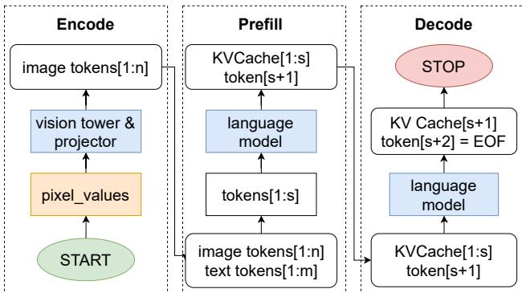  
Figure 1: Vision-language model autoregressive inference process.

## 2 BACKGROUND

## 2.1 MLLM Autoregressive Inference

As shown in Figure 1, the inference process of a transformerbased (Vaswani et al., 2017) vision-language model can be divided into three distinct stages (Yin et al., 2024). The first stage is the encode stage, where the model’s vision tower and projector process the image of request to obtain the image tokens I[a1, a2, . . . , an]. The second stage is the prefill stage. During this stage, the request prompt is encoded into text tokens T [b1, b2, . . . , bm], and then are concatenated with image tokens to form the final input X [x1, x2, . . . , xs], where s = n + m. This input X is fed into the large language model to generate a token xs+1 and a series of kvcache used for the decode stage. The third stage is the decode stage to generate tokens iteratively until the generated token is <eos> or the maximum token limit is reached. Due to the data dependencies in the decode stage, this stage is executed sequentially.

## 2.2 Inference Engine Performance Metrics

TTFT (Time-to-First-Token) measures the time from when a request arrives at the system until the first output token is produced, reflecting the system’s responsiveness. TBT (Time-between-Tokens) measures the interval between consecutive output tokens for a request, indicating the overall smoothness of the response. Throughput refers to the number of requests processed per second. Requests are associated with TTFT SLOs and TBT SLOs. If a request’s TTFT is less than its TTFT SLO and 90% of its TBT values are below the TBT SLO, the request is considered to have met the SLO (Service Level Objective). SLO attainment is defined as the percentage of requests that meet their SLOs out of all requests. Goodput is defined as the maximum request rate at which the SLO attainment reaches at least 90%. Our optimization objective is to maximize the per-GPU goodput.

Table 1: Symbols related to the architecture of the model and the batch of requests.  
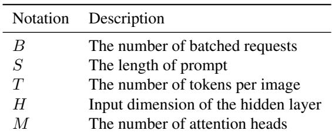

Table 2: Arithmetic intensity and Memory Acceess of primary operations in MLLMs.  
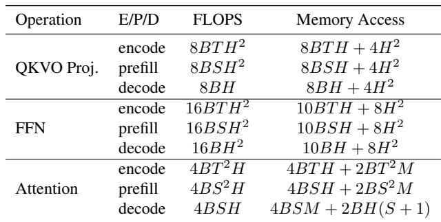

## 3 MOTIVATION

## 3.1 Insufficient Parallelism

Diverse Compute and Memory Characteristics. The prefill stage is primarily compute-bound, while the decode stage is memory-bound. To optimize resource utilization, it is crucial to balance compute-intensive and memoryintensive operations (Agrawal et al., 2024). Our theoretical analysis of FLOPs and memory access patterns for key operations in MLLMs, detailed in Appendix B, with the results summarized in Tables 1 and 2, shows that the encode stage has characteristics that lie between those of the prefill and decode stages in terms of computational and memory usage. Figure 2 illustrates the relationship between arithmetic intensity and token count under varying image batch sizes. When the token count is small (i.e., during the decode stage), the operations are memory-bound; in this region, increasing the number of images in the batch raises arithmetic intensity. Conversely, when the token count is large (i.e., during prefill stage), the workload is compute-bound, and batching encode with prefill reduces arithmetic intensity.

Takeaway-1: The distinct compute and memory characteristics of each stage suggest the potential for optimization through parallel execution of vision and language models.

## 3.2 Suboptimal Scheduling Granularity

Batching. To improve GPU utilization, large language model serving systems employ batching techniques to process multiple requests simultaneously. A larger batch size helps amortize the cost of accessing model parameters across multiple requests (Agrawal et al., 2024; Yu et al., 2022). Figure 3 shows how throughput changes with batch size. We observe that the encode stage reaches saturation at a batch size of around 6. The prefill stage achieves saturation even with a single request. The decode stage shows roughly linear throughput improvement with increasing batch size, saturating at around 512. Once the batch size exceeds the saturation point for each stage, increasing it further does not lead to additional throughput gains, while latency increases linearly.

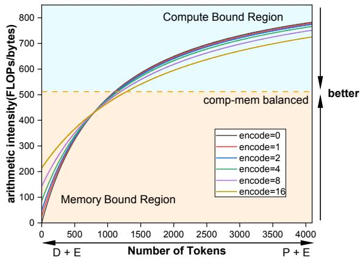  
Figure 2: Arithmetic intensity trend for LLaMA1.5-7B linear operations with different number of images and tokens.

Takeaway-2: Different stages achieve their maximum throughput at different batch sizes. Beyond that point, larger batch sizes lead to a linear increase in latency.

Trading off Throughput and TBT Latency. Batch processing enhances throughput but can lead to high tail TBT latency when decode tasks are included, a phenomenon known as generation stall (Agrawal et al., 2024). Figure 4 illustrates different scheduling strategies with four requests (A, B: decode stage; C, D: new arrivals) on a timeline. Prefill-prioritized scheduling increases throughput by prioritizing the prefill stage of new requests, but causes decode requests to stall, thereby increasing tail TBT latency. In contrast, stall-free scheduling (Agrawal et al., 2024), used by Sarathi Serve, prioritizes decode tasks to reduce tail TBT latency, though it slightly lowers throughput. This method batches both prefill and decode requests together, allowing continuous decoding as new requests arrive. To mitigate the impact of new prefill requests, chunked prefill technology segments prompts for partial processing. Additionally, stall-free scheduling also limits the maximum token count per batch to control execution time and ensure TBT latency guarantees. However, this approach is less effective for MLLMs, as it does not account for image encoding latency.

Takeaway-3: Existing scheduling strategies for language models struggle to precisely control execution time in multimodal inference, frequently resulting in violations of TBT SLOs.

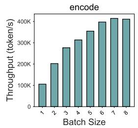

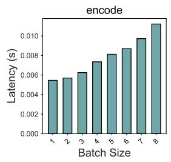

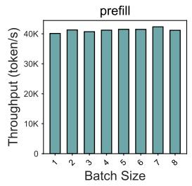

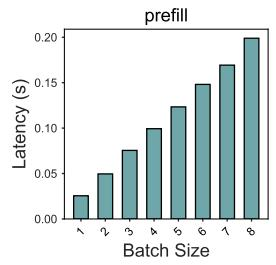

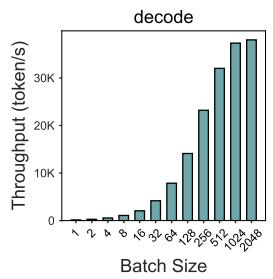

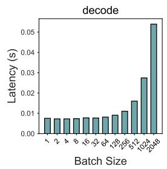  
Figure 3: The performance of the LLaVA-1.5-7B model under varying batch sizes. For both the prefill and decode stages, we use a prompt length of 1024 tokens. For the encode stage, the input image resolution is 336×336, corresponding to 576 visual tokens per image.

## 3.3 Difficulty in Disaggregation Method Selection

Various Disaggregated Architures. In multimodal inference, some possible existing disaggregation methods include: (1) E+P+D: This design frees the encode instance from storing the KV cache and loading the language model, allowing for a larger image cache. This increases throughput by maximizing batch size without execution time constraints and improves cache hit rates for repeated images. (2) EP+D: Only one KV cache transfer is required, helping to reduce transfer overhead. And both the vision model and the language model can be processed in parallel. (3) ED+P: The vision model and language model can be processed in parallel, with the prefill stage remaining independent, which helps reduce TTFT.

Effect of Different Instance Ratios. Figure 5 shows how different instance ratios affect performance using the TextCaps dataset (8 requests/sec). In the EP+D architecture, a low number of EP instances (e.g., 1EP+7D) leads to high computational loads and increased TTFT. Conversely, more D instances yield lower TBT, but as EP instances increase and D instances decrease, TBT rises. Specifically, at 7EP+1D, the lack of D instances causes decode bottlenecks, increasing queuing delays and TTFT. In the ED+P disaggregated architecture, insufficient ED instances lead to bottlenecks in both the encode and decode stages, negatively impacting both TTFT and TBT. When P instances are insufficient, the prefill stage becomes the primary bottleneck, similarly resulting in increased TTFT. For the fully disaggregated E+P+D architecture, results indicate a negative correlation between TBT and the number of D instances. Additionally, certain E-to-P instance ratios can significantly reduce TTFT for a given number of D instances.

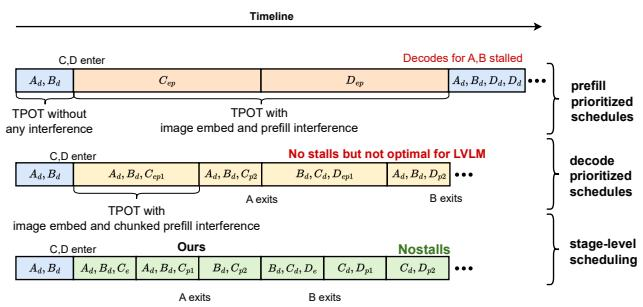  
Figure 4: Comparison of the generation stall problem under different scheduling strategies. A, B, C, and D represent different requests. The subscript ”e” denotes the image encode stage, ”p” denotes the complete prefill stage, and ”d” denotes the decode stage. ”ep” represents the serial execution of encode and prefill, while ”p1” and ”p2” represent chunked prefill.

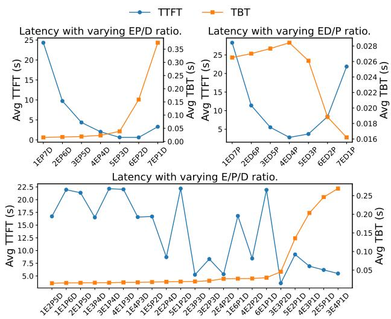  
Figure 5: The effect of instance ratios on average TBT and TTFT under the three disaggregation methods.

Takeaway-4: Optimal instances ratios of different disaggregation methods depends on the requirements of the SLO.

MME POPE TextCaps   
0.25 0.25 0.25   
TTFT SLOs (s) 0.5 TTFT SLOs (s) 0.5 TTFT SLOs (s) 0.5   
12 1 1   
2 2   
4 4   
8 8 8   
000℃ 000 o 00   
TBT SLOs (s) TBT SLOs (s) TBT SLOs (s)   
TextVQA VizWiz   
0.25 0.25   
TTFT SLOs (s) 0.5 TTFT SLOs (s) 0.5   
1 1   
2 2 E+P+D   
4 4 EP+D   
8 8 ED+P   
2   
0.0.0.   
TBT SLOs (s) TBT SLOs (s)  
Figure 6: The effect of workload and SLOs on optimal disaggregation method selection.

Effect of Different Disaggregation Methods. Existing systems (Singh et al., 2025; Qiu et al., 2025; Guo et al., 2025) rely on a single, static disaggregation method that does not adapt to different scenarios, leading to suboptimal goodput performance. To investigate this, we conducted experiments using the LLaVA-Next-7B model, examining how different workload characteristics and SLO thresholds (TBT/TTFT) influence the selection of disaggregation methods. As shown in Figure 6, the fully disaggregated E+P+D architecture shows significant advantages under stringent TTFT constraints. In contrast, ED+P and EP+D show superior performance in other scenarios.

Takeaway-5: In multimodal large models, various disaggregation methods such as E+P+D, EP+D, and ED+P should be weighed against load characteristics and SLOs to achieve the maximization of resource utilization.

## 4 DESIGN AND IMPLEMENTATION

As illustrated in Figure 7, we present TriInfer to address the aforementioned challenges with its core component, Hybrid EPD Disaggregation (§ 4.4), which dynamically selects the optimal disaggregation method and instance configurations. The system receives client requests via the API Server, which forwards them to the Request Scheduler. Based on request types, the scheduler performs load balancing and dispatches them to the corresponding Encode or Prefill instances. Each type of instance loads specific model on demand and allocates its own cache space accordingly. Within each instance, a Batch Scheduler (§ 4.2) aggregates requests to improve processing parallel efficiency, while the Migrate Scheduler (§ 4.3) manages request migration between instances to achieve dynamic load balancing. Additionally, the Request Processor (§ 4.1) handles preprocessing of newly received requests.

Algorithm 1 Stage-level Batching.   
Input: Instance type T , maximum TTFT required for   
SLO T T F Tmax, maximum TBT required for SLO   
T BTmax, the queue for waiting requests Qwaiting, the   
set for running requests Srunning.   
Output: batch of requests B.   
1: if T in {“E”, “EP”, “P”} then   
2: LAT ENCYmax ← α ∗ T T F Tmax   
3: else if T in {“ED”, “EPD”, “D”, “PD”} then   
4: LAT ENCYmax ← T BTmax   
5: Initialize τt, τe ← search budget(LAT ENCYmax)   
6: Initialize nt ← 0, ne ← 0, B ← ∅   
7: for R in Srunning do   
8: if is decode stage(R) then   
9: nt ← nt + 1; B ← B ∪ {R}   
10: for R in Srunning do   
11: if is prefill stage(R) and nt < τt then   
12: nt ← nt+ get chunked size(R);   
13: B ← B ∪ {R}   
14: if is encode stage(R) and ne < τe then   
15: ne ← ne+ get image number(R);   
16: B ← B ∪ {R}   
17: while nt < τt do   
18: R ← get next text request(Qwaiting)   
19: nt ← nt+ get chunked prefill size(R);   
20: B ← B ∪ {R}   
21: while ne < τe do   
22: R ← get next multi media request(Qwaiting)   
23: ne ← ne+ get image number(R);   
24: B ← B ∪ {R}   
25: Return B

## 4.1 Request Processor

To enable a stage-level scheduling strategy, we introduce a Request Processor that preprocess incoming requests. The Request Processor first performs tokenization and image processing before passing the requests to the Stage Processor, which then transforms it into a sequence of tasks (encode, prefill, decode, or migrate) and proactively prepares control parameters for these tasks. Finally, these tasks are dispatched to the Batch Scheduler for intra-instance scheduling. This design is motivated by the following considerations: By offloading part of the request scheduling computation to the Request Processor ahead of time, we reduce the CPU overhead during subsequent autoregressive inference. This preprocessing can be parallelized, mitigating the bottleneck caused by CPU-intensive tasks (e.g., generating control parameters for inference) and I/O-intensive operations (e.g., image processing). Additionally, this architecture enhances system extensibility, allowing for the easy integration of additional stages and token pruning optimizations.

## 4.2 Batch Scheduler

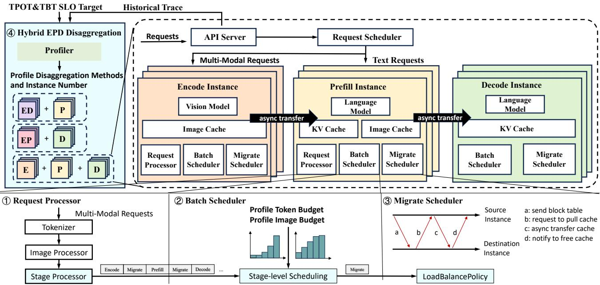  
Figure 7: TriInfer system architecture.

Stage-level Scheduling. We propose a unified scheduling strategy utilizing a Stage-level batching algorithm, which is designed for different types of instances and operates at the stage granularity in an iterative manner, enabling intrainstance request scheduling. As illustrated in Algorithm 1, the Stage-level scheduling first sets the image budget for vision model and the token budget for language model based on the user-defined SLO. Specifically, for the E, EP, and P instances, we ensure the TTFT SLOs of the requests by limiting the execution time of each batch to α ∗ T T F Tmax (line 1-2), where α is a constant. In our scheduling strategy, we set it to 0.5, as each request must go through at least two iterations to output the first token: the first iteration completes the image encoding and the second one finalizes the prefill stage. For ED, EPD, D, PD instances, we limit the execution time of each batch to T BTmax to meet the TBT SLOs (line 3-4). As the excution latency of a batch generally increases monotonically with the batch size (Figure 3), we use binary search to profile the maximum encode batch size (also called image budget) and maximun token batch size (also called token budget) during system initialization (line 5). This design ensures the maximization of system throughput while adhering to the TTFT and TBT SLOs defined by user requirements. As shown in Figure 4, after system initialization, each iteration first includes all ongoing decode requests into the current batch (line 7-9). Then, we check if there are any partially computed chunked prefill tasks or encode tasks and include them in the batch if available (line 10-16). Finally, new requests are added to fill τt and τe, in order to maximize throughput (line 17-24).

Dual-stream Parallelism. Inspired by NanoFlow (Zhu et al., 2024), we employ dual CUDA streams to achieve kernel-level parallelism between the vision model and the language model. Specifically, one vision stream is dedicated to image encoding task, the other language stream is allocated for prefill and decode tasks. In sequential execution, low compute utilization during the decode stage or low memory utilization during prefill stage results in underutilized GPU resources; instead, parallel multi-stream execution enhances throughput for both the language model and the vision model, thereby optimizing GPU resource utilization.

## 4.3 Migrate Scheduler

The Migrate Scheduler is responsible for request migration using a pull-based model to prevent cache overflows at the receiving instance, mitigating issues such as KV cache or image cache exhaustion. The migration process consists of four steps. Firstly, the Migrate Scheduler at the source instance sends the request’s control information, including KV and image cache page tables, to the target instance, which enqueues the request at the head of Qwaiting. Secondly, when the request is scheduled, the target instance creates new page tables and requests the cache blocks from the source. Thirdly, the source instance asynchronously transfers the KV and image caches to the target instance. Finally, after the migration is complete, the target instance notifies the source instance to release the resources associated with the request. Additionally, the Migrate Scheduler manages load balancing across multiple target instances by employing a default round-robin strategy, which also supports customizable options such as random selection, least-load priority, and prioritization of instances with higher prefix cache hit rates.

Algorithm 2 Hybrid EPD Disaggregation Profiler.   
Input: Historical trace H and its number of requestsNr,   
number of instances N, GPU memory capacity C,   
model weight memory cost Cmodel, TTFT SLO   
T T F Tmax, TBT SLO T BTmax   
Output: a mapping from instance type to number S.   
1: Initialize workload We ← 0,Wp ← 0,Wd ← 0   
2: for each request R in H do   
3: We ← We+ get visual token number(R)   
4: Wp ← Wp+ get prompt and visual token number(R)   
5: Wd ← Wd+ get decode token number(R)   
6: τe ← search image budget(α ∗ T T F Tmax)   
7: τp ← search token budget(β ∗ T T F Tmax)   
8: τd ← search token budget(T BTmax)   
9: τd ← min(τd, γ ∗ (C−Cmodel)∗NrWp+Wd )   
10: tpe, tpp, tpd ← profile throughput(τe, τp, τd)   
11: te ← tpe tp ← We ; Wptpp ; td ← tpp. Wd tpd   
12: Ne, Np, Nd ← partition(N, te, tp, td)   
13: Initialize best goodput ← 0   
14: Let E P D ← {“E” : Ne, “P ” : Np, “D” : Nd}   
15: Let EP D ← {“EP ” : Ne + Np, “D” : Nd}   
16: Let ED P ← {“ED” : Ne + Nd, “P ” : Np}   
17: for each method in {E P D, EP D, ED P } do   
18: start inference server(method)   
19: goodput ← replay trace(H)   
20: if goodput > best goodput then   
21: best goodput ← goodput   
22: best method ← method   
23: Return best method

## 4.4 Hybrid EPD Disaggregation

To achieve an efficient disaggregated inference system, we design a hybrid EPD disaggregation architecture, as illustrated in Figure 7. Built on a general-purpose inference engine, the system flexibly generates specialized instances (E, P, D, EP, ED) by configuring parameters such as the number of KV cache blocks and image cache blocks. Each instance internally adopts a unified task batching and scheduling strategy, as detailed in Algorithm 1.

At the deployment level, instances are composed into different disaggregation methods based on task functionalities, such as EP+D, ED+P, and E+P+D, to support diverse inference workflows. Initially, the system runs with the default disaggregation method, with general EPD instance, while collecting a period of request trace that include image resolution, prompt length, decode length, and timestamps. Under the assumption of a stable workload, we design a heuristic search algorithm (Algorithm 2) to perform workload analysis and request replay on historical data to find the optimal disaggregation method. The algorithm begins by calculating the total number of tokens for all request stages (line 1-5). By calculating the maximum batch size for each batch under full load, it then estimates the throughput (tokens per second) of E, P, and D instances to calculate the execution time required for these workloads. Specificallly, we first binary search the image budget and token budget for different instances based on the SLOs of TTFT and TBT (line 6-8), where α and β are empirical parameters set to 0.5. Using historical trace, we then estimate the cache required for each request to calculate the maximum number of concurrent requests that can be executed in the D instance (line 9), with memory utilization used for cache γ set to 0.9. The minimum value of the token budge and the maximum number of concurrent requests determines the maximum batch size per iteration under full load (line 10). Next, we obtain the throughput under full load for different instances through profiling (line 11). We then partition the entire cluster based on the ratio of the three execution times, rounding the values to ensure that there is at least one instance is allocated for each stage(line 12). Finally, we test these three disaggregation methods by replaying the historical request trace, measuring the goodput, and determining the optimal disaggregation method (line 13-22).

Complexity. Since both EP+D and ED+P have C1N− combination ways, and E+P+D has C2 N −1 combination ways, the total search space for our heuristic search algorithm is given by 2C1N−1 + C2N−1, where N is the total number of instances. In comparison to brute force search, our heuristic search is theoretically 32C1N−1+C2N−1 times faster. In actual measurements, the time required to estimate throughput is approximately one minute. Since we can reuse the profiling results during system startup from the batch scheduler, this time is negligible. For request replay, we only sample requests for a few minutes, so the total execution time of the algorithm is approximately serveral minutes.

Redeploy. The disaggregation method and number of instances are fine-tuned for a particular workload pattern. However, this setup may become inefficient if the workload evolves over time. To address this, TriInfer performs periodic adjustments. We regularly analyze historical request traces, and whenever a noticeable shift in the workload pattern is detected, TriInfer triggers a rerun of the algorithm using the latest trace. This process is highly efficient, with the algorithm completing in several minutes and reloading model weights taking only a few minutes—much faster than the hourly intervals typically observed in real-world workload fluctuations. We assume that workload characteristics do not change abruptly over very short timescales. Under sudden and extreme workload shifts, the system may temporarily make suboptimal scheduling decisions. However, such behavior is typically short-lived, and its impact remains bounded when the workload shift persists only for a brief duration. We also assume that the total instance number is determined by resource constraints. While a planner-based approach similar to those used in training systems could be built on top of TriInfer using its per-role throughput profiles, we intentionally adopt a lightweight heuristic to avoid the overhead of online global planning in latency-sensitive inference settings. As future work, we plan to explore mechanisms such as fast role switching among instances and dynamic scaling of instance counts, enabling the system to adapt more quickly to abrupt workload changes.

Stage-Centric Abstraction and Generality. TriInfer introduces a stage-centric abstraction for multimodal inference, in which encode, prefill, and decode are treated as first-class stages with heterogeneous resource and SLO characteristics. By decoupling stage semantics from fixed instance roles, this abstraction provides a flexible foundation for organizing and scheduling inference pipelines. Importantly, the abstraction is inherently general: it is not limited to image–text MLLMs or a fixed three-stage pipeline, and can naturally accommodate additional stages such as video or audio processing. While our evaluation focuses on image–text models, the design of TriInfer generalizes by construction to richer and evolving multimodal inference pipelines.

## 4.5 Implementation

TriInfer is an efficient online inference system for MLLMs, comprising approximately 10K lines of Python code and 3K lines of C++ and CUDA code. The frontend and inference engine are implemented in Python, while the data transmission modules and model computation kernels are implemented in C++ and CUDA. It adopts a RESTful API frontend that connects to multiple parallel inference engine instances, compatible with OpenAI-style APIs. We build the multi-instance inference system using Ray (Moritz et al., 2018), where each instance is implemented as a Ray actor. Data transfer for the image cache and KV cache is enabled through CUDA IPC memory handles (Corporation, 2007) and NCCL (Corporation, 2016). We utilize the FlashAttention (Dao, 2023) and FlashInfer (Ye et al., 2024) kernels to implement page attention (Kwon et al., 2023). Additionally, to facilitate request migration and cache reuse between requests, we employ a paged management approach for image caching like kv cache.

## 5 EVALUATION

## 5.1 Experiments Setup

Cluster Testbed. We deploy TriInfer on 4 servers, each equipped with 8 NVIDIA H20 GPUs (141 GB), 2×200Gbps InfiniBand NICs, connected with NVLink, 96-CPU cores, and 2TB of RAM.

Baselines. We use vLLM (version 0.11.0) (Kwon et al., 2023) and SGLang (version 0.5.3) (Zheng et al., 2024) as high-performance serving baselines in their standard (non-disaggregated) configurations. In addition, we include EPDServe (Singh et al., 2025) and DistServe (Zhong et al., 2024) as baselines that explicitly adopt disaggregated architectures.

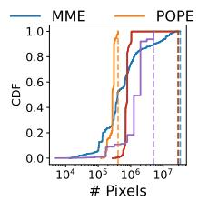

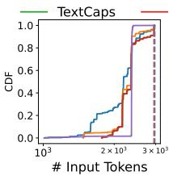

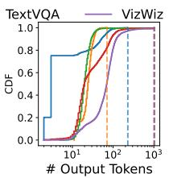  
Figure 8: The workload of the LLaVA-NeXT-7B model across different datasets.

Models. We test various models to demonstrate the generalization ability of our system. Specifically, we evaluate LLaVA-1.5-7B (Liu et al., 2023), LLaVA-NeXT-7B (Li et al., 2024), and Qwen2-VL-7B (Bai et al., 2023).

The number of tokens generated for the same image varies across these models, which in turn impacts the request load. LLaVA-1.5 encodes each image into 576 tokens, while LLaVA-NeXT and Qwen2-VL employ different methods to adjust the number of tokens based on the image resolution. Workloads. We use diverse datasets to encompass various application scenarios: TextCaps (Sidorov et al., 2020), POPE (Li et al., 2023b), MME (Fu et al., 2024), TextVQA (Singh et al., 2019), VizWiz (Gurari et al., 2018). We extract one-tenth of the dataset as historical traces to profile the disaggregation method, and then use the remaining data for performance evaluation. To ensure consistent load across different baselines, we first perform inference on the datasets and record the number of tokens generated during decoding. For subsequent tests, we set the max tokens parameter and the ignore eos parameter to fix the number of output tokens. Different datasets have varying workloads. The results obtained from LLaVA-NeXT-7B inference are shown in Figure 8. To ensure realistic workload distribution, we adopt the inter-arrival timestamps of requests from the production inference trace (Qin et al., 2024), scaling the timestamps to achieve different request rates (requests per second).

Details. The testing environment uses CUDA version 12.4. The KV cache block size is 16, while image cache block size is 576. All models, along with intermediate variables, KV cache, and image cache, are set to fp16 precision. vLLM runs in eager mode. All inference engines employ the same chat template. Since different systems adopt prefix cache and CUDA Graph optimizations in different ways, which may obscure the benefits of our approach, we disable prefix cache and CUDA Graph to ensure fairness in the experimental evaluation. Due to differences in the models supported by existing open-source implementations, it is non-trivial to directly evaluate EPDServe and DistServe under a unified experimental setup. To enable a fair comparison, we implement their core disaggregation methods (E+P+D and EP+D, respectively) within our system and use them as baselines.

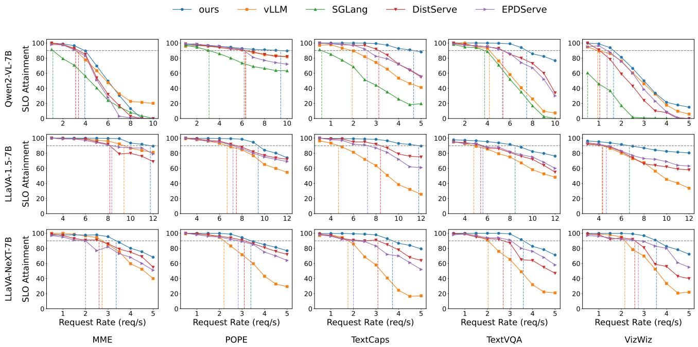  
Figure 9: Comparison of SLO attainment, the Request Rate is the average load per-GPU.

## 5.2 SLO Attainment Evaluation

In this section, We compare the SLO attainment of different methods at various request rates across different workloads. The SLO settings are detailed in Appendix A. For the vLLM and SGLang baselines, we deploy 32 instances with roundrobin scheduling. For EPDServe and DistServe, we use configurations of 4E8P20D and 12EP20D, respectively.

The experimental results are presented in Figure 9. The gray dashed line indicates the 90% SLO attainment threshold, while the vertical dashed line marks the request rate at which each inference system achieves 90% SLO attainment, measured as goodput. It is evident that our system consistently achieves significantly higher goodput than the other systems. Specifically, for the Qwen2-VL-7B model, our system outperforms SGLang by 2.0x to 7.9x in goodput. For the LLaVA-1.5-7B and LLaVA-NeXT-7B models, we achieve goodput improvements of 1.3x–3.7x and 1.2x-2.1x compared to vLLM, respectively. This performance gain is attributed to our Hybrid EPD Disaggregation architecture, which effectively selects appropriate disaggregation methods and reduces interference between different execution stages, thereby lowering TBT for requests and increasing the SLO attainment rate. However, the improvement is smallest for the MME dataset, as the requests in this dataset require a minimal number of tokens to be output, limiting the optimization effect of our scheduling method on TBT. Nevertheless, the hybrid disaggregation architecture and multi-stream parallelism still contribute to some throughput optimization.

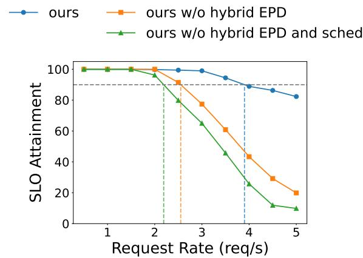  
Figure 10: Ablation study of hybrid EPD disaggregation and batch schedule policy.

## 5.3 Ablaion Study

To validate the effectiveness of our scheduling strategy (Algorithm 1) and Hybrid EPD Disaggregation (§ 4.4) in controlling TBT and improving the SLO achievement rates, we conducte a comparative experiment on the TextCaps dataset using the LLaVA-Next-7B model. As shown in Figure 10, we first disable the Hybrid EPD Disaggregation method and use a E+P+D disaggregation architecture with the cluster instances evenly partitioned into three parts. In this configuration, we observed a drop in goodput from 3.9 to 2.6 req/s, highlighting that an appropriately selected disaggregation strategy can significantly improve resource utilization and SLO satisfaction. Subsequently, we disable the stage-level scheduling policy. This further reduction in goodput, from 2.6 to 2.2 req/s, demonstrates that our stage-level scheduling strategy effectively limits the execution time of each batch, leading to tighter adherence to TBT.

Table 3: Average Rank of Heuristic-Selected Deployment Strategies  
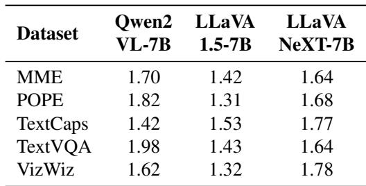

## 5.4 Optimality Analysis

Providing formal optimality guarantees for our heuristic algorithm 2 is challenging due to the combinatorial nature of the search space. The problem jointly considers disaggregation methods and instance ratios, whose combinations grow quadratically with instance number. As a result, exhaustive enumeration becomes infeasible in large-scale clusters, and the global optimum is generally unknown. Instead of pursuing analytical optimality proofs, we focus on empirically evaluating how close our heuristic comes to the optimal solution in settings where exhaustive search is tractable. We perform an exhaustive search on small-scale clusters where the global optimum can be explicityly computed. Specifically we consider a cluster with 8 instances. We enumerate all candidate deployment strategies by combining different disaggregation methods and instance ratios, resulting in 35 deployment strategies in total. For each model-dataset pair and each SLO setting(like figure 6), we evaluate all strategies and rank them according to the goodput. The deployment strategy selected by our heuristic algorithm 2 is then compared against the exhaustive ranking. This allows us to quantify how well the heuristic performs relative to the optimal solution and other candidate strategies.

Table 3 reports the average rank of the deployment strategies selected by our heuristic across different models and datasets. We observe that the heuristic consistently identifies high-quality solutions, with the selected strategies ranking near the top among all candidates. Notably, the high-ranking performance is not incidental. Across different SLO settings, the disaggregation methods and instance ratios selected by the heuristic remain well-balanced and closely aligned with stage-level workload demands. This indicates that the heuristic captures the structural character-

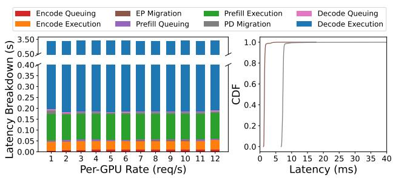  
Figure 11: Latency breakdown when serving llava1.5-7B on textcaps dataset.

Table 4: SLO Violations and Migration Latency under Different Settings  
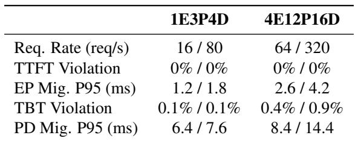  
istics of the scheduling problem rather than overfitting to specific SLO values.

## 5.5 Latency Breakdown

To better understand the performance characteristics of TriInfer and identify potential system bottlenecks, we conduct a detailed latency breakdown analysis of service requests. We divide the lifecycle of each request into multiple stages: encode queueing, encode execution, EP migration, prefill queueing, prefill execution, PD migration, decode queueing, and decode execution. We measure the average latency for each stage using the LLaVA-1.5-7B model on the TextCaps dataset with a 1E3P4D disaggregation configuration. The latency distribution across stages is shown in Figure 11, indicating that the majority of the request latency is concentrated in the decode stage, followed by the prefill and encode stages. The overhead introduced by image cache and KV cache migration is minimal, accounting for less than 1% of the total latency. Specifically, 95% of image cache migration complete within 2ms, and 95% of KV cache migration complete within 8ms — both typically shorter than the execution time of a single decode batch. Therefore, their impact on TBT can be considered negligible.

We also conduct a detailed latency breakdown analysis of migration overhead under various conditions, as summarized in Table 4. We first clarify that migration events in TriInfer are inherently infrequent and tightly bounded: for each multimodal request, at most one EP migration and one PD migration can occur. The two types of migrations affect different latency metrics. EP migration only impacts the TTFT, while PD migration affects only the TBT of the first decoded token and does not influence steady-state decoding throughput. In multi-node deployments, intra-node transfers leverage NVLink, for which our experiments show migration latency to be negligible. For inter-node communication, we use InfiniBand, and our deployment strategy preferentially colocates different instance roles within the same node whenever possible, thereby minimizing crossnode migrations. When inter-node migration is unavoidable, the system prioritizes placing EP migrations across nodes, as image cache sizes are significantly smaller than KV caches. As shown in Table 4, across different cluster scales and workload settings, the SLO violations caused by migration remain negligible.

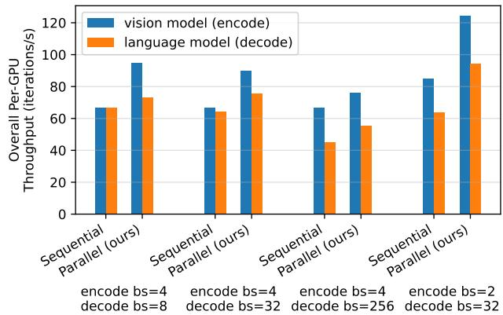  
Figure 12: Overall per-GPU throughput when executing LLaVA-1.5-7B’s vision model (encode) and language model (decode) sequential or parallel under different batch size. The KV cache length of decode is 1024.

## 5.6 Dual-stream Parallelism

In this section, we investigate the impact of dual-stream parallelism on throughput during encode and decode stages using LLaVA-1.5-7B. As shown in Figure 12, the dual-stream parallelism significantly improves throughput of both the vision model and the language model compared to sequential execution across various batch sizes. This improvement arises from the simultaneous processing of the encode and decode stages in separate CUDA streams, which optimizes resource utilization and minimizes idle time. In contrast, the Sequential executes the stages in a round-robin manner, with each stage taking 50% share of the execution time. This approach inherently limits throughput, as it forces the system to wait for one stage to complete before starting the next, leading to increased idle periods and reduced overall efficiency.

## 6 RELATED WORK

MLLM serving systems. Several works have focused on optimizing MLLM serving systems. Singh et al. (Singh et al., 2025) proposed EPD disaggregation to optimize resource allocation. Qiu et al. (Qiu et al., 2025) conducted a comprehensive performance analysis of MLLM serving characteristics and proposed a decoupled architecture concept with separate Image Nodes and Text Nodes. Zhonget al. (Guo et al., 2025) utilizes EPD disaggregation and orchestrates both intra- and inter-reauest pipelines to minimize latency and optimize paralelism. However, these works only consider the methods where the vision model and language model are either disaggregated or co-located but executed sequentially, overlooking the potential GPU efficiency gains from co-locating and executing them in multi-stream parallel. We comprehensively assess both decoupled and colocated multi-stream parallel strategies to identify the optimal model disaggregation method, including designs within the subset of E+P+D disaggregation methods. Our findings indicate that these approaches are not optimal in many scenarios. Notably, we did not directly evaluate these specific methods, as they are not open-sourced or implemented. On the other hand, works like Inf-MLLM (Ning et al., 2024) and Elastic Cache (Liu et al., 2024) reduce computational overhead or memory footprint through KV cache approximate reuse or pruning. These model-level approaches trade off model performance to reduce performance overhead, which is orthogonal to our system-level and schedulinglevel optimizations that unchanged model performance. The widely used SOTA LLM inference frameworks, including SGLang (Zheng et al., 2024), vLLM (Kwon et al., 2023), TGI (Face, 2023) and xLLM (Liu et al., 2025), also extended themselves to support MLLM model inference. However, all of them mix Encode, Prefill, and Decode within the same instances, leading to potential interference among the three stages, which can impact SLO guarantees adversely. Very recently, Cornserve (Ma et al., 2025) and vLLM-Omni (Yin et al., 2026) propose general-purpose serving systems for any-to-any multimodal models, representing model architectures as heterogeneous computation graphs and executing them in a disaggregated manner.

LLM scheduling optimization. Numerous works have explored optimizations for LLM scheduling. Early works (Yu et al., 2022; Kwon et al., 2023) proposed continuous batching to improve GPU utilization. However, the co-located sequential execution of prefill and decode stages create a trade-off between TTFT and TBT. Sarathi-Serve introduced chunked-prefill (Agrawal et al., 2024), attempting to balance TTFT and TBT by splitting long prefill stages into chunks and interleaving them with decode tasks. Nonetheless, this approach inherently sacrifices TTFT for TBT without fundamentally eliminating prefill-decode interference. DistServe (Zhong et al., 2024) proposed a decoupled architecture that isolates prefill and decode stages on separate GPUs to avoid interference entirely, but introduces challenges of reduced GPU utilization and KV cache transfer overhead. While these works are not directly applicable to MLLM inference, their decoupling philosophy inspired subsequent multimodal research. Concurrently, works on KV cache reuse (Qin et al., 2024; Hu et al., 2024a), KV cache migration optimization (Patel et al., 2024; Jin et al., 2024), and placement dynamic adjustment (Hu et al., 2024b; Patel et al., 2024) are orthogonal to our approach.

## 7 CONCLUSION

This paper proposes TriInfer, an efficient system architecture for multimodal large model inference tasks. To address issues such as coupling during image-text processing and inflexible scheduling in existing systems, TriInfer introduces the Hybrid Encode-Prefill-Decode Disaggregation design, enabling efficient scheduling and utilization of resources across different stages. TriInfer supports stage-level batch processing and parallel execution mechanisms, improving the system’s throughput. Experimental results demonstrate that the system can effectively handle diverse multimodal inference workloads while ensuring service quality, showcasing strong generality and performance advantages.

## 8 ACKNOWLEDGEMENTS

We sincerely thank our shepherd and the anonymous reviewers for their valuable feedback. This work is supported by the National Natural Science Foundation of China (62322201). This research is carried out in collaboration with USTC-CloudLab (Cloud Computing Laboratory, University of Science and Technology of China) and Beihang-HiPO (HiPO Research Group, Beihang University), and JD.com. Hailong Yang, Ke Zhang, and Jing Li are corresponding authors.

## REFERENCES

Agrawal, A., Kedia, N., Panwar, A., Mohan, J., Kwatra, N., Gulavani, B. S., Tumanov, A., and Ramjee, R. Taming throughput-latency tradeoff in llm inference with sarathiserve, 2024.

Bai, J., Bai, S., Yang, S., Wang, S., Tan, S., Wang, P., Lin, J., Zhou, C., and Zhou, J. Qwen-vl: A versatile vision-language model for understanding, localization, text reading, and beyond, 2023. URL https: //arxiv.org/abs/2308.12966.

Bai, S., Chen, K., Liu, X., Wang, J., Ge, W., Song, S., Dang, K., Wang, P., Wang, S., Tang, J., et al. Qwen2. 5-vl technical report. arXiv preprint arXiv:2502.13923, 2025.

Cai, M., Liu, H., Park, D., Mustikovela, S. K., Meyer, G. P., Chai, Y., and Lee, Y. J. Vip-llava: Making large multi-

modal models understand arbitrary visual prompts, 2024. URL https://arxiv.org/abs/2312.00784.

Chen, L., Zhao, H., Liu, T., Bai, S., Lin, J., Zhou, C., and Chang, B. An image is worth 1/2 tokens after layer 2: Plug-and-play inference acceleration for large visionlanguage models, 2024. URL https://arxiv.org/ abs/2403.06764.

Corporation, N. Memory Management, 2007. URL https://docs.nvidia.com/cuda/ cuda-runtime-api/index.html.

Corporation, N. NVIDIA Collective Communications Library (NCCL), 2016. URL https://developer. nvidia.com/nccl.

Dao, T. Flashattention-2: Faster attention with better parallelism and work partitioning, 2023. URL https: //arxiv.org/abs/2307.08691.

Face, H. Text generation inference. https://github.com/huggingface/ text-generation-inference, 2023. Accessed: 2025-05-04.

Fu, C., Chen, P., Shen, Y., Qin, Y., Zhang, M., Lin, X., Yang, J., Zheng, X., Li, K., Sun, X., Wu, Y., and Ji, R. Mme: A comprehensive evaluation benchmark for multimodal large language models, 2024. URL https: //arxiv.org/abs/2306.13394.

Guo, T., Xu, T., Chen, X., Chen, J., Xiao, N., and Zhang, X. Rserve: Overlapping encoding and prefill for efficient lmm inference, 2025. URL https://arxiv.org/ abs/2509.24381.

Gurari, D., Li, Q., Stangl, A. J., Guo, A., Lin, C., Grauman, K., Luo, J., and Bigham, J. P. Vizwiz grand challenge: Answering visual questions from blind people, 2018. URL https://arxiv.org/abs/1802.08218.

Hu, C., Huang, H., Hu, J., Xu, J., Chen, X., Xie, T., Wang, C., Wang, S., Bao, Y., Sun, N., et al. Memserve: Context caching for disaggregated llm serving with elastic memory pool. arXiv preprint arXiv:2406.17565, 2024a.

Hu, C., Huang, H., Xu, L., Chen, X., Xu, J., Chen, S., Feng, H., Wang, C., Wang, S., Bao, Y., Sun, N., and Shan, Y. Inference without interference: Disaggregate llm inference for mixed downstream workloads, 2024b. URL https://arxiv.org/abs/2401.11181.

Hu, S., Tu, Y., Han, X., He, C., Cui, G., Long, X., Zheng, Z., Fang, Y., Huang, Y., Zhao, W., et al. Minicpm: Unveiling the potential of small language models with scalable training strategies. arXiv preprint arXiv:2404.06395, 2024c.

Jin, Y., Wang, T., Lin, H., Song, M., Li, P., Ma, Y., Shan, Y., Yuan, Z., Li, C., Sun, Y., et al. P/d-serve: Serving disaggregated large language model at scale. arXiv preprint arXiv:2408.08147, 2024.

Kwon, W., Li, Z., Zhuang, S., Sheng, Y., Zheng, L., Yu, C. H., Gonzalez, J. E., Zhang, H., and Stoica, I. Efficient memory management for large language model serving with pagedattention, 2023. URL https:// arxiv.org/abs/2309.06180.

Li, F., Zhang, R., Zhang, H., Zhang, Y., Li, B., Li, W., Ma, Z., and Li, C. Llava-next-interleave: Tackling multiimage, video, and 3d in large multimodal models, 2024. URL https://arxiv.org/abs/2407.07895.

Li, J., Li, D., Savarese, S., and Hoi, S. Blip-2: Bootstrapping language-image pre-training with frozen image encoders and large language models, 2023a. URL https:// arxiv.org/abs/2301.12597.

Li, Y., Du, Y., Zhou, K., Wang, J., Zhao, W. X., and Wen, J.-R. Evaluating object hallucination in large visionlanguage models, 2023b. URL https://arxiv. org/abs/2305.10355.

Liu, H., Li, C., Wu, Q., and Lee, Y. J. Visual instruction tuning, 2023. URL https://arxiv.org/abs/2304. 08485.

Liu, T., Peng, T., Yang, P., Zhao, X., Lu, X., Huang, W., Liu, Z., Chen, X., Liang, Z., Xiong, J., Jin, D., Zhang, M., Guo, J., Deng, Y., Zhang, X., Dong, X., Wang, S., Wu, S., Wu, Y., Tang, Z., Zeng, Y., Wang, Y., Liu, J., Kang, M., Li, M., Wang, Y., Liu, Y., Ma, X., Wang, Y., Zhang, Y., Yin, J., Zheng, K., Yin, J., Zhang, J., Wang, Z., Lin, X., Liu, L., Lan, L., Liu, Y., Peng, C., Liu, H., Ren, S., Wang, X., Shen, Y., Wang, Y., Liu, G., Chen, H., Yang, T., Yang, H., Li, J., Ding, G., and Zhang, K. xllm technical report, 2025. URL https://arxiv.org/abs/2510.14686.

Liu, Z., Liu, B., Wang, J., Dong, Y., Chen, G., Rao, Y., Krishna, R., and Lu, J. Efficient inference of vision instruction-following models with elastic cache. In European Conference on Computer Vision, pp. 54–69. Springer, 2024.

Lu, H., Liu, W., Zhang, B., Wang, B., Dong, K., Liu, B., Sun, J., Ren, T., Li, Z., Yang, H., et al. Deepseek-vl: towards real-world vision-language understanding. arXiv preprint arXiv:2403.05525, 2024.

Ma, J. J., Chung, J.-W., Ahn, J., Liang, Y., Jajoo, A., Lee, M., and Chowdhury, M. Cornserve: Efficiently serving any-to-any multimodal models, 2025. URL https:// arxiv.org/abs/2512.14098.

Moritz, P., Nishihara, R., Wang, S., Tumanov, A., Liaw, R., Liang, E., Elibol, M., Yang, Z., Paul, W., Jordan, M. I., and Stoica, I. Ray: A distributed framework for emerging ai applications, 2018. URL https://arxiv.org/ abs/1712.05889.

Ning, Z., Zhao, J., Jin, Q., Ding, W., and Guo, M. Inf-mllm: Efficient streaming inference of multimodal large language models on a single gpu. arXiv preprint arXiv:2409.09086, 2024.

Patel, P., Choukse, E., Zhang, C., Shah, A., ´Inigo Goiri, ˜ Maleki, S., and Bianchini, R. Splitwise: Efficient generative llm inference using phase splitting, 2024. URL https://arxiv.org/abs/2311.18677.

Qin, R., Li, Z., He, W., Zhang, M., Wu, Y., Zheng, W., and Xu, X. Mooncake: A kvcache-centric disaggregated architecture for llm serving. arXiv preprint arXiv:2407.00079, 2024.

Qiu, H., Biswas, A., Zhao, Z., Mohan, J., Khare, A., Choukse, E., Goiri, ´I., Zhang, Z., Shen, H., Bansal, C., et al. Towards efficient large multimodal model serving. arXiv preprint arXiv:2502.00937, 2025.

Sidorov, O., Hu, R., Rohrbach, M., and Singh, A. Textcaps: a dataset for image captioning with reading comprehension, 2020. URL https://arxiv.org/abs/2003. 12462.

Singh, A., Natarajan, V., Shah, M., Jiang, Y., Chen, X., Batra, D., Parikh, D., and Rohrbach, M. Towards vqa models that can read, 2019. URL https://arxiv. org/abs/1904.08920.

Singh, G., Wang, X., Hu, Y., Yu, T., Xing, L., Jiang, W., Wang, Z., Bai, X., Li, Y., Xiong, Y., Zhang, Y., and Fan, Z. Efficiently serving large multimodal models using epd disaggregation, 2025. URL https://arxiv.org/ abs/2501.05460.

Team, G., Anil, R., Borgeaud, S., Alayrac, J.-B., Yu, J., Soricut, R., Schalkwyk, J., Dai, A. M., Hauth, A., Millican, K., et al. Gemini: a family of highly capable multimodal models. arXiv preprint arXiv:2312.11805, 2023.

Vaswani, A., Shazeer, N., Parmar, N., Uszkoreit, J., Jones, L., Gomez, A. N., Kaiser, Ł., and Polosukhin, I. Attention is all you need. Advances in neural information processing systems, 30, 2017.

Wang, P., Bai, S., Tan, S., Wang, S., Fan, Z., Bai, J., Chen, K., Liu, X., Wang, J., Ge, W., Fan, Y., Dang, K., Du, M., Ren, X., Men, R., Liu, D., Zhou, C., Zhou, J., and Lin, J. Qwen2-vl: Enhancing vision-language model’s perception of the world at any resolution, 2024. URL https://arxiv.org/abs/2409.12191.

Ye, Z., Chen, L., Lai, R., Zhao, Y., Zheng, S., Shao, J., Hou, B., Jin, H., Zuo, Y., Yin, L., Chen, T., and Ceze, L. Accelerating self-attentions for llm serving with flashinfer, February 2024. URL https://flashinfer.ai/ 2024/02/02/introduce-flashinfer.html.

Yin, P., Zhu, J., Gao, H., Zheng, C., Huang, Y., Zhou, T., Yang, R., Liu, W., Chen, W., Guo, C., Deng, D., Mo, Z., Wang, C., Cheng, J., Wang, R., and Liu, H. vllmomni: Fully disaggregated serving for any-to-any multimodal models, 2026. URL https://arxiv.org/ abs/2602.02204.

Yin, S., Fu, C., Zhao, S., Li, K., Sun, X., Xu, T., and Chen, E. A survey on multimodal large language models. National Science Review, 11(12), November 2024. ISSN 2053-714X. doi: 10.1093/nsr/nwae403. URL http: //dx.doi.org/10.1093/nsr/nwae403.

Yu, G.-I., Jeong, J. S., Kim, G.-W., Kim, S., and Chun, B.- G. Orca: A distributed serving system for Transformer-Based generative models. In 16th USENIX Symposium on Operating Systems Design and Implementation (OSDI 22), pp. 521–538, Carlsbad, CA, July 2022. USENIX Association. ISBN 978-1-939133-28-1. URL https://www.usenix.org/conference/ osdi22/presentation/yu.

Zheng, L., Yin, L., Xie, Z., Sun, C., Huang, J., Yu, C. H., Cao, S., Kozyrakis, C., Stoica, I., Gonzalez, J. E., Barrett, C., and Sheng, Y. Sglang: Efficient execution of structured language model programs, 2024. URL https://arxiv.org/abs/2312.07104.

Zhong, Y., Liu, S., Chen, J., Hu, J., Zhu, Y., Liu, X., Jin, X., and Zhang, H. Distserve: Disaggregating prefill and decoding for goodput-optimized large language model serving, 2024. URL https://arxiv.org/abs/2401. 09670.

Zhu, D., Chen, J., Shen, X., Li, X., and Elhoseiny, M. Minigpt-4: Enhancing vision-language understanding with advanced large language models, 2023. URL https://arxiv.org/abs/2304.10592.

Zhu, K., Zhao, Y., Zhao, L., Zuo, G., Gu, Y., Xie, D., Gao, Y., Xu, Q., Tang, T., Ye, Z., Kamahori, K., Lin, C.-Y., Wang, S., Krishnamurthy, A., and Kasikci, B. Nanoflow: Towards optimal large language model serving throughput, 2024. URL https://arxiv.org/abs/2408. 12757.

## A SLO SETTINGS

Table 5: SLO settings under different workloads.  
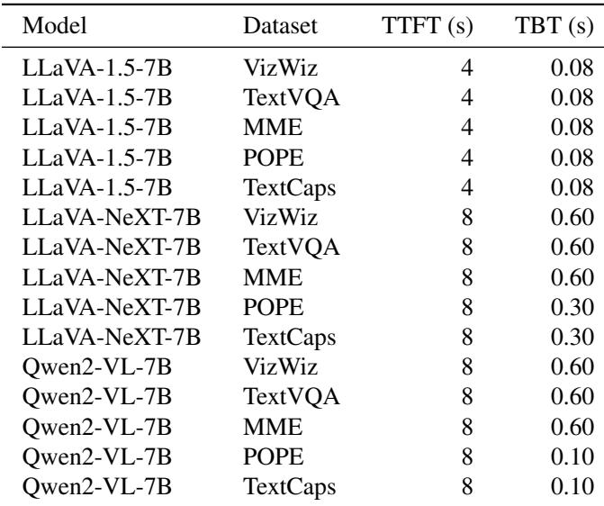

As different models encode the same image into varying numbers of tokens, this leads to different prefill and decode workloads, which in turn affect the SLO configuration. Therefore, we define separate SLO thresholds for each model and dataset, as detailed in Table 5.

## B COMPUTATION AND MEMORY ACCESS IN MLLMS

Table 2, shows the symbol definitions. To simplify the model, we assume that all requests have the same prompt, and each request corresponds to a single image, with the image having the same token count. Different H, M should been applied according to different model (vision or language).

In modern serving systems (Kwon et al., 2023; Zheng et al., 2024), some operations like softmax and layernorm are usually fused with matrix multiplication kernels for efficiency (Dao, 2023; Ye et al., 2024). Therefore, attention and matrix multiplication in both feed-forward layers and attention layers dominate the overall computation and memory access, and our analysis focuses on them.

For the encode stage, the batch has BT tokens. For QKVO projection in the attention layer, each matrix multiplication has one multiply and one add operation, so the arithmetic intensity is:

$$
\tag{1}
$$

Since it is necessary to read the model parameters and inputs,

and write the outputs, the memory access amount is:

$$
\tag{2}
$$

For the feed forward layer, there are up projection and down projection, we assume intermediate size is 4H. The arithmetic intensity is:

$$
\tag{3}
$$

The memory access amount is:

$$
\tag{4}
$$

The fused attention kernel involves multiplying the query with the key and multiplying the value, and we ignore softmax. The arithmetic intensity is approximately:

$$
\tag{5}
$$

The reading of the query, key, and value, as well as the reading and writing of the attention scores and output, involve memory access. The amount is:

$$
\tag{6}
$$

The prefill stage and decode stage are similar to the encode stage, except that the token count is BS and B, respectively. Additionally, the decode stage needs to read the previous KV cache. Based on the above calculations, we summarize the computational and memory access requirements at different stages in Table 2.

Through this analysis, we can roughly determine whether an operator is a computational bottleneck or a memory bottleneck, which in turn guides our scheduling design.