# FarSkip-Collective: Unhobbling Blocking Communication in Mixture of Experts Models

Yonatan Dukler, Guihong Li, Deval Shah, Vikram Appia, Emad Barsoum Advanced Micro Devices Inc. (AMD)

## Abstract

Blocking communication presents a major hurdle in running MoEs efficiently in distributed settings. To address this, we present FarSkip-Collective which modifies the architecture of modern models to enable overlapping of their computation with communication. Our approach modifies the architecture to skip connections in the model and it is unclear a priori whether the modified model architecture can remain as capable, especially for large state-of-the-art models and while modifying all of the model layers. We answer this question in the affirmative and fully convert a series of state-of-the-art models varying from 16B to 109B parameters to enable overlapping of their communication while achieving accuracy on par with their original open-source releases. For example, we convert Llama 4 Scout (109B) via self-distillation and achieve average accuracy within 1% of its instruction tuned release averaged across a wide range of downstream evaluations. In addition to demonstrating retained accuracy of the large modified models, we realize the benefits of FarSkip-Collective through optimized implementations that explicitly overlap communication with computation, accelerating both training and inference in existing frameworks.

## 1 Introduction

Mixture of Experts (MoE) models have emerged as the de-facto model architecture for leading large language models (LLMs) in recent years [34, 11, 7]. MoEs activate a sparse subset of their total parameters, usually via a mixture of experts layer to replace the dense MLP sub-block. The sparsity and reduced computational cost of MoEs makes them amenable to even larger parameter scaling with new open-source MoE models routinely exceeding 500B total parameters [9, 18, 25]. Because of the fixed memory capacity of compute accelerators, MoEs require even more distribution for training and inference setups as compared to their dense LLM counterparts [8].

However, distributed training and inference is not without a cost as activations and model weights need to be communicated between devices quickly; especially when the communication operations are blocking, where the communication can only commence at a particular stage of processing and the next operation in the compute graph relies on it. Blocking communication patterns result in exposed idle time when the accelerator is not running computations; this commonly appears in popular parallelism techniques such as Expert, Sequence, and Tensor Parallelism [27, 34] and is especially tricky to overcome during inference. The new age of large and sparsely activated MoE architectures along with improved hardware computation speeds exacerbates these issues as communication becomes a relatively larger portion of the end-to-end workload [42].

In this work we present a method to modify models’ architectures to use available activations for the next computation at the onset of the communication call, which may be outdated or partially materialized, in order to avoid the blocking communication and start the next computation during the communication operation. We name our approach FarSkip-Collective as we start the next computation immediately using available activations and run the communication collective in parallel, far-skipping the communicated result to the residual of the next layer and making that activation available for future layers. By running communication overlapped with computation, as long as the duration of the computation leading up to the next residual is longer than the communication we avoid idle compute time.

Mathematically, FarSkip-Collective is “dropping” connections of the network as the input to the next computation is now a residual which does not include the latest communicated output block. Characteristically, this can damage the capabilities of the model architecture. We therefore focus on evaluating whether the modified architecture connectivity can perform on par with regular MoE connectivity and study the capabilities of models exhaustively over a wide array of evaluations and model scales.

By developing FarSkip-Collective Self-Distill (FCSD) we answer in the affirmative, demonstrating that state-of-the-art open-source MoE models of scales ranging from 16B to 109B can be fully converted into FarSkip-Collective models with minimal loss of capabilities of the model with a maximum average performance drop of 2.5% across the three models [31, 25, 10] each benchmarked over eleven evaluation datasets. FCSD is a simple yet effective knowledge distillation recipe we identified via a systemic study which can be applied to any model with the absence of a powerful teacher.

Independently of this work, we became aware of recent works exploring similar approaches, modifying the model architecture and running computations with either “outdated” [41] or “partial” [29, 20] activations to overlap communication. In contrast with our work, existing approaches focus has been limited to tensor-parallelism in dense models. Such works have also only studied the problem of model capabilities at smaller-scale models or achieved only partial modification of the model layers. It therefore remained unclear whether the modified connectivity architecture can be applied to overlap communication in all layers and perform at the scale of today’s state-of-the-art MoE LLMs. Indeed it is not uncommon for model architecture modification to show promise at a smaller scale but scale poorly as compared with regular transformers when studied at frontier-LLM scale with more challenging tasks. We find the results with FCSD encouraging in that even at the 100B+ model scale over a wide range of generation and likelihood-based tasks, FarSkip-Collective can achieve within 1% on average from the original model’s accuracy.

Just because the new model architecture obviates dependencies in the model that regularly lead to blocking communication, it does not imply the architecture will automatically overlap computation and communication in practice if not implemented carefully. To this end, we realize the overlapping opportunities of the models by developing performant and overlapped implementations for training and inference. For training, we develop on top of Megatron-LM [27] and achieve 88.4% computationcommunication overlapping of the Expert Parallelism communication (87.6% in forward, 89.0% in backward) using asynchronous execution of communication collectives and novel scheduling techniques at the PyTorch API layer. On the inference side, we implement our method on top of vLLM & SGLang and integrate our approach with HIP/CUDA-graphs achieving up to 97.6% communication overlap. Overall we implement our approach for wide use across different hardware and avoid low-level kernel optimizations in favor of more general implementation at the PyTorch API level. We plan to open-source our implementation and modified model checkpoints and provide easy integration with the upstream frameworks.

We summarize our contributions as follows:

• We present FarSkip-Collectives, a method to convert the execution dependency of model layers that eliminates blocking communication patterns in MoEs, thereby allowing inference and training speed-ups.

• We demonstrate at the 100B+ parameter scale that MoEs using the FarSkip-Collective architecture modifications retain the capabilities of modern MoEs while speeding-up their execution in distributed settings. In particular we fully convert the Llama 4 Scout MoE (109B) while maintaining average accuracy of the model within 1.0% of the instruction-tuned open-sourced model release.

• We develop FCSD, an efficient and general knowledge self-distillation recipe to convert existing LLMs into FarSkip models using < 10B training tokens, and convert DeepSeek-V2 Lite (16B), Qwen-3-30B MoE (30B), and Llama 4 Scout (109B) achieving within 2.5% of their original performance.

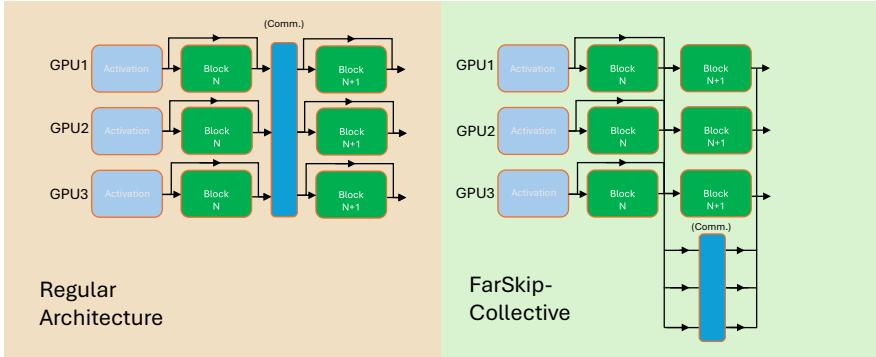  
Figure 1: FarSkip-Collective modifies the connectivity between sub-blocks to avoid blocking communication in collectives. Computation continues with available activations, partial (e.g., Block N output) or outdated (e.g., Activation).

• For large-scale training, we integrate our method into Megatron-LM and achieve 88.4% communication overlap for the previously blocking all-to-all communication collectives responsible for MoE expert parallelism in the forward and backward passes.

• For model inference, we provide an optimized implementation of FarSkip in vLLM & SGLang that overlaps the communication for distributed inference. For example, for the modified Llama-4 Scout model, we achieve 18.5% speed-up in Time To First Token.

The rest of the paper is organized as follows, in Section 2 we present background followed by our approach in Section 3 and explicit optimized implementation of the method in Section 4. In Section 5, we present our experimental results and review related works in Section 6 followed by conclusion (Section 7).

## 2 Background

## 2.1 MoE parallelism at training and inference

Two of the key parallelism techniques for MoE training and inference are Tensor and Expert Parallelism.

Tensor Parallelism In Tensor Parallelism (TP), an MLP or a Self-Attention sub-block will be split by slicing the sub-block’s dense weight matrices evenly across their columns or rows. Let $A \in \mathbb { R } ^ { \overset { \underset { \mathbf { 1 } } { } } { \boldsymbol { B } } \times d }$ be a model input activation for a modern MLP layer of the form

$$
\mathbf { M L P } ( A ) = \sigma ( A W _ { 1 } ^ { \top } \cdot g ( A W _ { 2 } ^ { \top } ) ) W _ { 3 } ^ { \top } ,
$$

with $g , \sigma$ being entrywise non-linearities and $W _ { 1 } , W _ { 2 } \in \mathbb { R } ^ { c \times d } , W _ { 3 } \in \mathbb { R } ^ { d \times c }$ . TP of size k will split the matrices into

$$
\begin{array} { r l } & { W _ { \{ 1 , 2 \} } ^ { i } = \left( W _ { \{ 1 , 2 \} } \right) _ { [ i * c / k : ( i + 1 ) * c / k , : ] } \in \mathbb { R } ^ { ( c / k ) \times d } , } \\ & { \quad W _ { 3 } ^ { i } = \left( W _ { 3 } \right) _ { [ : , i * c / k : ( i + 1 ) * c / k ] } \in \mathbb { R } ^ { d \times ( c / k ) } , } \end{array}
$$

for $0 \leq i \leq k - 1$ . Then computation of each TP rank can run independently until the end of the sub-block where an all-reduce communication collective is applied to construct the final output.

$$
\begin{array} { r } { \mathbf { M L P } ( A ) _ { i } = \sigma ( A W _ { 1 } ^ { i ^ { \top } } \cdot g ( A W _ { 2 } ^ { i ^ { \top } } ) ) W _ { 3 } ^ { i ^ { \top } } , } \end{array}\tag{1}
$$

$$
\mathrm { \mathbf { M L P } } ( A ) = \mathrm { a l l - r e d u c e } \bigl ( \mathrm { M L P } ( A ) _ { i } \bigr ) .\tag{2}
$$

The selection of Column-Parallel $W _ { \{ 1 , 2 \} } ^ { i }$ split followed by Row-Parallel $W _ { 3 } ^ { i }$ split makes it possible to only apply communication once at the end of the MLP sub-block.

For multi-head self-attention (or efficient variants) implemented with TP, the computation is decomposed into independent computations partitioned across the different attention heads; this allows for a similar implementation employing Column-Parallelism (Q, K, V ) followed by Row-Parallelism (O) and a single all-reduce.

Expert Parallelism The key parallelism component of MoE layers is Expert Parallelism (EP). An MoE layer with E experts generalizes the MLP as

$$
\mathbf { M o E } ( A ) = \sum _ { j = 1 } ^ { E } G ( A ) _ { j } \cdot \mathbf { M L P } ^ { j } ( A ) ,
$$

where $G ( A ) = s ( A W _ { R } ^ { \top } )$ is a linear classification layer followed by a sparse router selection function $s ( )$ activating only a subset of the ML ${ \bf P } ^ { j } { \bf s }$ . Here ML $\cdot ^ { \boldsymbol { \mathsf { P } } ^ { j } } ( A )$ refers to a distinct “expert” for $1 \leq j \leq E$ With $\mathrm { E P }$ of rank $k ,$ subsets of $\sim E / k$ experts will be distributed across the k parallel ranks. Unlike TP, during training different input token activations will be mapped to the different experts based on the router selection G(A). Mechanically, specific tokens $A _ { [ l , : ] } \in \mathbb { R } ^ { d }$ will be grouped and mapped to a subset of experts $P _ { l } \subset \{ 1 , \dots E \}$ requiring permutation of A followed by an all-to-all collective that sends and receives data between the ranks according to the router-defined data partition map.

$A _ { i } = R _ { i } \times A$ placed on rank i (Dispatch),

with ${ R _ { i } } \in \{ 0 , 1 \} ^ { B _ { i } \times d }$ being the indicator of $G ( A )$ ; this is referred to as “Dispatch” and will have different bandwidth requirements depending on various factors such as the expert parallel size k and the sparsity of s (e.g., the assigned “TopK” value). After each expert receives its dedicated tokens and computes ML $\mathring { \mathbf { P } } ^ { j } ( A )$ of the relevant experts on its rank, a dual all-to-all collective, referred to as “Combine” is applied to aggregate and sum the routed experts’ activations back into the output activation of the MoE layer. In addition, modern MoE designs will also typically include a “shared-experts” MLP layers that will process all tokens in addition to the routed MoE experts.

Putting these together, typical training execution of an MoE transformer layer would follow 1) the attention sub-block computation (including layer-norm) 2) potential post-attention communication collective if TP or CP is enabled 3) layer-norm, gating, and router scores computation (duplicated on each rank) 4) Dispatch communication 5) routed expert computation and potentially shared-experts computation, and finally 6) Combine collective communication to aggregate the routed experts from the different ranks. This execution leads to three potential blocking communication bubbles: (a) post-attention blocking communication if TP/CP is used, (b) during Dispatch and (c) during Combine, although (c) may be partially overlapped if a shared expert is present.

For inference, there are different approaches for MoE execution, with only some involving all-to-all “Dispatch + Combine” [8]. In this work, we focus on the approach implemented by vLLM and SGLang [45, 19] where an optimized all-reduce is used instead of the all-to-all collective and input activations to the routed experts are replicated and indexed across the expert parallel ranks.

## 2.2 Model Distillation

FarSkip-Collective modifies the model architecture followed by self-distillation to recover the original model’s capabilities. As a basic approach, one can simply fine-tune the model with high-quality data via Supervised Fine-tuning (SFT) according to

$$
\mathcal { L } _ { \mathrm { S F T } } ( \theta ) = - \mathbb { E } _ { ( x , y ) \sim \mathcal { D } } \left[ \sum _ { t = 1 } ^ { | y | } \log p _ { \theta } ( y _ { t } \mid x , y _ { < t } ) \right] ,\tag{3}
$$

where θ denotes the model parameters, and $( x , y ) \sim \mathcal { D }$ are input–output supervision pairs with |y| output tokens in the pair. When converting the model with a target model in mind (e.g., in our case aiming to recover the original model), one may train with knowledge distillation [14, 17] with the Kullback-Leibler divergence (KL) which is defined against a fixed teacher model q. Logit-based knowledge distillation optimizes pθ to match the teacher’s predictive distribution according to

$$
\mathcal { L } _ { \mathrm { K D } } ( \theta ) = \underset { x \sim \mathcal { D } } { \mathbb { E } } \left[ \sum _ { t = 1 } ^ { | y | } \mathrm { K L } \big ( q ( \cdot \mid x , y _ { < t } ) \mid \mid p _ { \theta } ( \cdot \mid x , y _ { < t } ) \big ) \right] .\tag{4}
$$

In addition to an objective on the model outputs, one may also increase alignment of a model to a teacher model q by aligning the model with the intermediate representations of the teacher [39] as

$$
\mathcal { L } _ { L 2 } ( \theta ) = \sum _ { i = 1 } ^ { L } \parallel o _ { i } ( \theta ) - t _ { i } \parallel _ { 2 } ^ { 2 } ,\tag{5}
$$

where $o _ { i }$ and $t _ { i }$ denote the matching hidden activations of the student and teacher models, respectively, over L layers.

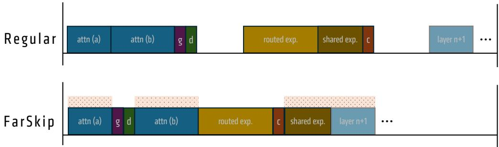  
Figure 2: FarSkip-Collective MoE layer main operator execution. g,d and c refer to gating+routing, Dispatch start, and Combine start respectively. For communication operations, we only denote the starting point of the operation. The overlapping window enabled by FarSkip-Collective is illustrated with the shaded area above the operators.

## 3 FarSkip-Collective Framework

Modern networks use residual connections, meaning that self-attention, MLP, or MoE sub-block outputs are incrementally added to the residual activation. Denote the output activation of a network after k layers as $o _ { k }$ , and denote the ith sub-block (layer) of the network as $f _ { i }$ , the output $o _ { k }$ is computed as

$$
o _ { k } = f _ { 1 } ( o _ { 0 } ) + f _ { 2 } ( o _ { 1 } ) + \cdot \cdot \cdot + f _ { k } ( o _ { k - 1 } ) .\tag{6}
$$

Since the computation of $f _ { k }$ can involve blocking communication, $O _ { k }$ is blocked from being used as an input to the computation of $f _ { k + 1 }$ and $O k { + 1 }$ until $O _ { k }$ is ready, which can lead to idle computation resources during sub-block communication.

We propose to use an available activation instead, denoted as $o _ { k } ^ { * }$ , as the input to $f _ { k + 1 }$ and compute the next layer while the communication collective is running to produce $o _ { k } . ~ o _ { k + 1 }$ will be updated with the communicated $o _ { k }$ once it is ready; however, now the communication of $o _ { k }$ can be “far-skipped” and overlapped over the duration of the computation of $f _ { k + 1 } ( o _ { k } ^ { * } )$ with $o _ { k } ^ { * }$ as the input.

$$
o _ { k } = o _ { 0 } + f _ { 1 } ( o _ { 0 } ) + f _ { 2 } ( o _ { 1 } ^ { * } ) + \cdot \cdot \cdot + f _ { k } ( o _ { k - 1 } ^ { * } ) .\tag{7}
$$

We consider two options for the modified $o _ { k } ^ { * }$ input,

$$
\{ \begin{array} { l l } { o _ { k } ^ { * } = o _ { k - 1 } } & { ( ^ {  } \mathrm { o u t d a t e d } ^ { \prime \prime } ) } \\ { \mathrm { o r } } & \end{array} \tag{8a}
$$

$$
\lfloor \ o _ { k } ^ { * } = o _ { k - 1 } + f _ { k } ^ { * } \bigl ( o _ { k - 1 } ^ { * } \bigr ) \quad \mathrm { ( ^ { * } p a r t i a l ^ { * } ) }\tag{8b}
$$

Here, $f _ { k } ^ { * }$ denotes the independent computation piece of block $f _ { k }$ which is ready before the collective, e.g., MLPi(A) in Eq. 2. In both cases, the output activation $o _ { k }$ will consist of the same number of blocks as before, but the difference will be in terms of the input activation into each block. $f _ { k + 1 }$ still has access to all of the previous block representations except for the full representation of block $f _ { k } ;$ nonetheless, all future layers $f _ { j }$ for $j \ge \bar { k } + 2$ will have access to the full $f _ { k }$

Skipping more computations enables greater overlapping but more of the input is omitted which can degrade the model’s capabilities. When converting pre-trained MoEs with FarSkip-Collective, we use a combination of the partial and outdated approaches to maximize overlap opportunities along with accuracy. In particular, for the attention sub-block of layer k, $o _ { k } ^ { * }$ will correspond to (8b) the partial activation of the shared-expert part of the MLP computation but will not include the routed-experts that need to be communicated via the Combine collective. For the MoE sub-block inputs, we follow (8a) which will pass the final output of the previous layer which will contain all previous outputs except for the recent kth attention sub-block output. Let $o _ { k } ^ { * } ( \mathrm { a t t n } )$ be the input to the kth attention sub-block. We propose to use the partial activation

$$
\mathrm { a t t n - i n } _ { k } : = o _ { k } ^ { \ast } ( \mathrm { a t t n } ) = o _ { k - 2 } + \mathrm { a t t n - o u t } _ { k - 1 } + \mathrm { s h a r e d - e x p - o u t } _ { k - 1 } .
$$

For the MLP block input, $o _ { k } ^ { * } ( \mathrm { m l p } )$ is the outdated activation

$$
\mathrm { \ m l p { - } i n } _ { k } : = o _ { k } ^ { * } ( \mathrm { m l p } ) = o _ { k - 1 } .
$$

Compared with attn-ink, mlp-ink has one additional input and can be decomposed as, mlp-ink = attn-ink + routed-exp-outk−1. With this connectivity, we have that each input is at most one subblock apart for better accuracy. At the same time, the shared-expert and attention computation is independent of the preceding routed experts which means the Combine operation can be overlapped with the sub-block’s operations and the MLP input is now independent of the attention calculation which means that the Dispatch can also be overlapped with the Attention sub-block. We provide the details of the execution and overlapping of FarSkip-Collective in the next section.

We leave more aggressive multi-block variants of “far-skipping” as future work, which may be useful if the communication duration exceeds that of the full sub-block’s computation time, for example in the case of extremely sparse and large-scale MoEs or in the case of network-topology aware MoEs.

## 3.1 Distilling existing models with the FarSkip-Collective Framework

The FarSkip-Collective method modifies the architecture connectivity without changing the model’s parameter layout making it possible to use an existing checkpoint with FarSkip-Collective connectivity using the same main kernels and with relatively few modifications to the model’s definition. In Fig. 3, we demonstrate this by loading the original Qwen-3-30B MoE model checkpoint into models with various numbers of FarSkip-Collective layers activated and evaluate its performance on different benchmarks. We observe that as we increase the number of converted layers, the model performance degrades considerably and the model achieves random baseline accuracy on MMLU and 0% on HumanEval+ when all layers are converted. This is unsurprising, since we pass different input activations than the ones the model was trained with, leading to out-of-distribution outputs.

We, however, show that by continuing training the original checkpoint via KL Knowledge Distillation using typical instruction-tuning data, we are able to recover the original model’s performance in a small fraction of the compute needed to retrain it from scratch with the FarSkip-Collective architecture (∼100 − 1000× cheaper). We systematically study different approaches for the distillation training which we present in Tab. 2 and find that using KL-based knowledge distillation with the original model as the teacher (self-distillation) performs best or on par as compared to the different approaches we tested. We also study the effect of different aspects such as the batch-size and learning rate and find that they play a big role in the final model performance and training stability. Based on our empirical evaluation we propose a simple and robust “FarSkip-Collective Self-Distillation” (FCSD) recipe to convert any MoE model into the FarSkip-Collective connectivity. Compared with fine-tuning directly with instruction-tuned data, self-distillation to the original model’s probabilities provides more granular signal for recovering the existing representations of the model. Using the teacher’s model probability distribution as the training signal also reduces the reliance on meticulously curated and high quality SFT data as the FarSkip-Collective model is not aligned to the output data itself. Since the modified architecture only modifies the connectivity of the original model, (i.e., all the model parameters have the same shapes etc.) KL knowledge distillation is effective in coarsely aligning with the original model quickly and improves with continued training. Nonetheless later in training when the student and teacher models are already roughly aligned, KL knowledge distillation may lead to training instabilities as relatively small discrepancies between the teacher and student model lead to occasional large gradients. We tested different approaches to overcome this but find that training with early stopping enables us to avoid the issue. For the early stopping validation we use the MBPP+[23] dataset as a fast proxy for detecting instabilities and evaluate every 1000 training steps with a patience of 20 evaluations and performance delta of 2%. MBPP+ provides for quick evaluation and being a code-generation dataset it is sensitive to damaging distribution shifts caused by training instabilities. When evaluating other methods we apply the same early stopping procedure for fair comparison.

## 4 Explicit overlapping of FarSkip models

Modern GPUs, equipped with hundreds of independent Compute Units (Streaming Multiprocessors), can process multiple Queues (Streams) of kernels independently by scheduling work on different sets of processing units at the same time [44, 30, 8]. Both computation and communication operations utilize compute units to run operations, with communication operations only utilizing a fraction of the total available units, allowing for overlap with computation. Computation-communication overlap, however, requires dedicated implementation, and aside from standard predefined patterns, modern frameworks such as PyTorch and JAX will not accomplish this automatically. Therefore, even though the modified FarSkip-Collective model will logically facilitate parallel and non-blocking flow through the computational graph, without careful explicit implementation, the models will not automatically overlap communication with computation. Below, we describe our explicit implementation of

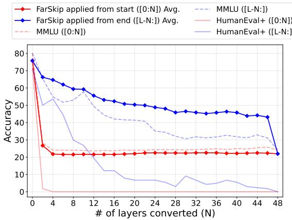  
Figure 3: Accuracy of Qwen-3-30B MoE modified with N FarSkip-Collective layers without training. Modified layers applied to the last N layers (blue) and first N layers (red).

the FarSkip-Collective framework which enables high degree of overlapping of communication calls with computation. As a design choice, we aim to make our implementation generalizable and as hardware-independent as possible by sticking to the framework level as opposed to lower-level kernels or Triton. To enable scheduling of non-blocking communication calls, we rely on torch.dist’s async\_op=True parameter or using the torch.cuda.Stream() context that provides more granular control of scheduling of kernels on the non-main queue. Note that by overlapping operations, one diverts some of the processing units, which can lead to unavoidable slowdown in computations as compared to when they are solely executed on the hardware.

## 4.1 Training

For training, we consider MegatronLM [27] GPT training with MoE layers. We mainly consider the settings which include shared experts, Multi-head Latent Attention (MLA) and running with EP and no TP for attention, following the DeepSeek’s V3 model training recipe. Regularly in this setup, the all-to-all collective will lead to two communication bubbles as part of Dispatch and Combine, appearing both during the forward and backward pass of each layer. With the blocking dependency removed by our modified architecture, we modify the execution order discussed in Section 2. In particular, we split the attention sub-block calculation into two parts: a) MLA preparation of (q, k, v) and b) core-attention + output projection. This enables us to easily launch a communication kernel asynchronously between the two parts and then immediately continue the attention calculation. For the DeepSeek model setup, we execute the FarSkip-Collective MoE layer forward pass as 1) attention part (a) computation; 2) synchronize Combine communication if last layer was a FarSkip-Collective MoE layer; 3) MoE gating and router scores computation; 4) initiate Dispatch (async-op mode will queue and yield immediately); 5) attention part (b) computation; 6) synchronize Dispatch communication followed by routed expert computation; 7) initiate Combine (async-op mode); 8) run shared experts computation. We provide a visual demonstration of this execution as compared with the regular operation flow in Fig. 2 which enables us to maximize the window of communication overlap during the forward call as

$$
T _ { \mathrm { D i s p a t c h } } + T _ { \mathrm { C o m b i n e } } \leq T _ { \mathrm { o v e r l a p p a b l e ~ c o m p u t a t i o n } } = T _ { \mathrm { l a y e r } } - ( T _ { \mathrm { R o u t e d ~ E x p e r t s } } + T _ { \mathrm { G a t e } } ) .\tag{9}
$$

With FarSkip-Collective, the only computations of the layers that cannot be overlapped are the routed experts and gating operator. This is since with the modified architecture the routed experts will require the output of the previous Dispatch and will serve as the input for the next Combine call, and the gating operation will require the output of previous Combine call and serve as an input to the next Dispatch call.

For the backward pass, we would like to overlap the Combine and Dispatch gradient calls which will also trigger blocking all-to-all communication collectives. If run naively, one will need to run the backward communication outside of async-op mode as its outputs will need to be synchronized for the next gradient in the graph, making the communication blocking again. The standard approach to explicitly control the operator ordering and ensure proper synchronization is to use a custom torch.autograd.Function for the entire MoE transformer block layer backward computation (implementing just Dispatch and Combine with a custom backward or sub-parts does not enable one to define the synchronization points outside of it, which is needed to overlap). Implementing such a large layer’s backward computation graph manually, however, is tedious and error-prone as each of the operations and model weights needs to be wired correctly to their next input.

Instead, we present two innovative techniques that continue to rely on the automatic autograd for backward propagation while cleanly achieve overlap. First, we implement an async all-to-all custom autograd function with a stateful dictionary of both forward and backward communication handles. During the forward pass, the forward all-to-all communication handles are being generated by the collective in async-op mode; nonetheless the backward all-to-all communication handles do not exist yet but have a dedicated key in the layer’s stateful dictionary. When backward is called on the operator, it runs backward in async-op mode and will populate the dictionary with the corresponding backward communication handles. This enables us to store and access the backward handle while not directly controlling the execution of the backward call. We then implement a backward-hook which we hook to the input tensor nodes of the all-to-all communication operator and will trigger synchronization of communication right before the processing of the inputs. This makes it possible to run the all-to-all communication in the backward pass asynchronously while ensuring the gradients are ready when accessed.

As we are trying to optimize overlap in the forward pass, the communication in the forward pass is implemented so that as soon as the computation leading to the input of the communication finishes, the communication launches, which enables us to maximize the overlapping window in the forward pass. In the backward pass, however, this leads to the opposite effect as the inputs to communication calls will now be launched immediately after the backward communication call and the handles are forced to be synchronized and wait for the communication to finish immediately after launching. To resolve this, we “hijack” the priority ordering of torch.autograd via the Sequence Number PyTorch autograd’s internal implementation1. In torch autograd, the computational graph will be processed according to a topological sorting algorithm of the dependencies between nodes; however, when multiple nodes are ready for processing at the same time, autograd uses Sequence Numbers ordered based on node’s creation during forward to decide the ordering of which node will be processed first. With FarSkip-Collective, the dependency drops means that one can process an entire sub-block’s backward pass autograd nodes before reaching a dependency barrier on the input to the communication call. Harnessing this, we reprioritize the autograd priority queue to process nodes in the sub-block’s computation and de-prioritize the processing of the computations leading to the input of the communication call by reassigning them custom Sequence Numbers. With this, those nodes will be launched only after the sub-block backward computations took place, allowing for large overlap opportunities without handwriting of large backward functions. Using our optimized implementation, we achieve an overlap of 88.4% of the all-to-all communication time when training a DeepSeek-V2 Lite with EP8 on a single node as observed in Tab. 3. Note that the first all-to-all in backward and last all-to-all of forward pass cannot be overlapped as there are no additional potential computations to overlap them with.

## 4.2 Inference

For inference, we implemented FarSkip in vLLM and later extended it to SGLang. SGLang and vLLM serve as modern LLM inference engines with TP, EP, and PP support for MoEs such as DeepSeek. Unlike other MoE EP implementations that use a pair of all-to-all collectives for Dispatch and Combine, in vLLM and SGLang model activations are replicated across the ranks but model weights including expert weights are still distributed via EP. This approach eliminates the need for Dispatch and Combine and is implemented with optimized all-reduce operations applied to the activations after the MLP layers finish. For the attention sub-block, vLLM and SGLang adopt regular

Table 1: Original and distilled FarSkip-Collective model performance on downstream evaluation tasks.
<table><tr><td>Model</td><td>Params</td><td>PIQA</td><td>ARC-E</td><td>ARC-C</td><td>HS</td><td>CSQa</td><td>WG</td><td>HEval+</td><td>MMLU</td><td>OBook</td><td>GSM-8K</td><td>MBPP+</td><td>Avg</td></tr><tr><td>DeepSeek-V2-Lite (Orig.)</td><td>16B</td><td>80.1</td><td>80.2</td><td>53.8</td><td>80.8</td><td>69.1</td><td>72.1</td><td>40.2</td><td>56.8</td><td>45.2</td><td>70.1</td><td>60.8</td><td>64.5</td></tr><tr><td>DeepSeek-V2-Lite (FCSD)</td><td>16B</td><td>79.9</td><td>78.9</td><td>50.0</td><td>76.9</td><td>70.1</td><td>68.4</td><td>41.5</td><td>50.5</td><td>41.8</td><td>64.2</td><td>59.8</td><td>62.0</td></tr><tr><td>DeepSeek-V2-Lite (SFT)</td><td>16B</td><td>78.2</td><td>74.3</td><td>43.8</td><td>74.1</td><td>65.5</td><td>69.0</td><td>11.0</td><td>48.0</td><td>41.2</td><td>54.3</td><td>45.8</td><td>55.0</td></tr><tr><td>Qwen-3-30B MoE(Orig.)</td><td>30B</td><td>80.5</td><td>84.8</td><td>61.9</td><td>79.7</td><td>84.8</td><td>72.9</td><td>73.8</td><td>80.2</td><td>45.0</td><td>86.9</td><td>84.4</td><td>75.9</td></tr><tr><td>Qwen-3-30B MoE(FCSD)</td><td>30B</td><td>80.4</td><td>83.3</td><td>58.5</td><td>77.2</td><td>84.9</td><td>74.0</td><td>73.2</td><td>74.0</td><td>42.8</td><td>87.6</td><td>74.4</td><td>73.7</td></tr><tr><td>Qwen-3-30B MoE (SFT)</td><td>30B</td><td>77.8</td><td>69.4</td><td>44.9</td><td>75.6</td><td>68.9</td><td>65.6</td><td>0.6</td><td>63.1</td><td>41.4</td><td>76.0</td><td>71.7</td><td>59.5</td></tr><tr><td>Llama-4-Scout (Orig.)</td><td>109B</td><td>81.1</td><td>87.3</td><td>64.6</td><td>82.9</td><td>84.4</td><td>76.6</td><td>62.2</td><td>80.0</td><td>45.2</td><td>88.6</td><td>83.6</td><td>76.0</td></tr><tr><td>Llama-4-Scout (FCSD)</td><td>109B</td><td>80.8</td><td>87.0</td><td>62.4</td><td>82.0</td><td>82.4</td><td>75.8</td><td>63.4</td><td>75.9</td><td>44.4</td><td>89.8</td><td>81.7</td><td>75.1</td></tr><tr><td>Llama-4-Scout (SFT)</td><td>109B</td><td>80.7</td><td>80.3</td><td>52.4</td><td>80.0</td><td>72.0</td><td>76.2</td><td>14.0</td><td>69.7</td><td>43.8</td><td>78.6</td><td>73.5</td><td>65.6</td></tr></table>

TP approach with an all-reduce collective. Both of the all-reduce calls are regularly blocking as the activations are needed in the next layer.

To implement FarSkip-Collective for the MoE layer, we run the all-reduce in async-op mode and synchronize it only before the next MoE computations, as those activations are no longer needed for Dispatch. For the attention layer, we focus on modifying the output projection layer that will regularly run a RowParallelLinear layer that includes the all-reduce and modify it to run in async-op mode and apply the synchronization call only before the next attention layer. For specialized attention such as MLA in DeepSeek models, prefill and generation will run different fused kernels, and we treat each case separately but apply an all-reduce async-op call in each scenario. To integrate FarSkip with HIP/CUDA-graphs we use graph-compatible communication API calls and use direct Python binding (PyNCCL). We test our inference pipeline using the self-distilled models fine-tuned with FCSD and observe that our distillation recovers the model performance in chat-based generation (see Appendix for sample generation).

## 5 Experiments

In this section we describe our experiments evaluating the model capabilities of FarSkip-Collective models, followed by evaluation of the FarSkip-enabled overlapped implementation.

## 5.1 Model Capabilities

We present the main results of our distillation experiments in Tab. 1, where we consider three open-source state-of-the-art MoEs at different scales: DeepSeek-V2-Lite (16B-A3B), Qwen-3-30B MoE (30B-A3B), and Llama-4 Scout (109B-A17B). Each model’s checkpoint corresponds to the instruction-tuned / chat version of the open-source model release. We apply FarSkip-Collective to all of the model’s layers and train each model for up to 10B tokens of SFT data [43, 22]. We train with standard settings using AdamW, cosine-annealing learning rate scheduler, and 1000-step warm-up period. We use relativity large batch-size and learning rate with FCSD and run short sweeps to identify the best batch-size and learning rate for each model. In particular we conduct two sweeps for 2000 training steps each, first for batch-size selection among $\{ 2 ^ { 1 6 } , 2 ^ { 1 7 } , \dot { 2 } ^ { 1 8 } \}$ with a learning rate of 2e-5 followed by a learning rate sweep among $\{ 2 \mathrm { e } { - } 5 , 4 \mathrm { e } { - } 5 , 8 \mathrm { e } { - } 5 \}$ where we use the training loss for selection. We observe rapid initial improvement on all benchmarks using the KL

Table 2: Downstream performance of different training settings of FarSkip-Collective distillation for Qwen-3-30B MoE. We evaluate different training settings and conversion settings trained for 500M tokens. (∗ for 0.25×BS and 4×BS we keep the same number of training steps)
<table><tr><td colspan="5">MODEL ARC-C HEVAL+ GSM-8K MMLU AVG-11</td></tr><tr><td>ORIGINAL</td><td>61.9</td><td>73.8 86.9</td><td>80.2</td><td>75.9</td></tr><tr><td>KL (FAR 50%) KL (FAR 75%)</td><td>60.0 58.8</td><td>67.1 83.9 67.7 85.3</td><td>77.5 75.4</td><td>74.6 74.3 74.1</td></tr><tr><td>KL (FAR 90%) KL (FAR 100%)</td><td>59.3 73.8 54.6 61.6</td><td>85.1 79.6</td><td>73.4 64.1</td><td>68.2</td></tr><tr><td>KL</td><td>54.6 61.6</td><td>79.6</td><td>64.1</td><td>68.2</td></tr><tr><td>KL + INTER.L2</td><td>53.8</td><td>48.8 80.6</td><td>58.9</td><td>65.4</td></tr><tr><td>SFT</td><td>44.4</td><td>1.2</td><td>76.0 64.5</td><td>58.1</td></tr><tr><td></td><td></td><td></td><td></td><td></td></tr><tr><td>KLEMBED.</td><td>55.5</td><td>56.1</td><td>79.5 63.3</td><td>67.6</td></tr><tr><td>KL 0.25×BS*</td><td>53.2</td><td>53.7</td><td>78.4 60.6</td><td>65.7</td></tr><tr><td></td><td></td><td></td><td></td><td></td></tr><tr><td>KL 4×Bs*</td><td>54.1</td><td>50.6</td><td>82.5</td><td>62.4 66.6</td></tr></table>

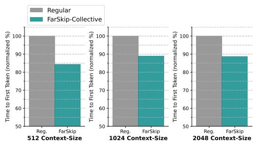  
(a) Llama 4 Scout

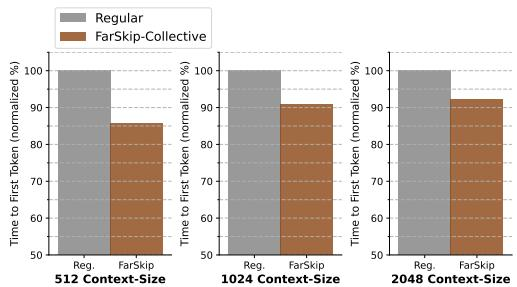  
(b) DeepSeek V2  
Figure 4: Time To First Token (prefill stage) with vLLM inference engine under varying prompt length. Each model is served with EP=8 for the MLP sub-block and TP=8 for attention serving 16 concurrent requests.

objective and further gradual improvement as training continues. We also observe occasional training instabilities where the distilled FarSkip-Collective model exhibits mode-collapse later in training. We tested different approaches to overcome this in Tab. 2, and resort to using early stopping with MBPP+. As a baseline conversion method, we test standard SFT training with the same training schedule and sweep selection for the batch-size and learning rate. In addition we apply the same early stopping as FCSD. Overall, SFT significantly underperforms the FCSD recipe and the resulting model exhibits catastrophic forgetting, particularly in generation tasks. With our knowledge distillation training, even for code generation task such as HumanEval+ which are more easily affected by distribution shifts, FarSkip-Collective models are able to achieve performance on par with the original instruction-tuned checkpoint, demonstrating the inherent capacity of the modified architecture. Especially since the models were not originally trained with this connectivity and are forced to adapt to it after pre-training. For pre-training from scratch, we also observe on par performance at smaller-scale pre-training, where we pre-train a DeepSeek-V2-Lite model architecture (16B) for 50B tokens (see Appendix).

In Tab. 2, we study the effect of different distillation techniques and the effect of partial conversion of the model into FarSkip-Collective layers. We train Qwen-3-30B MoE using a short training schedule of 500M tokens using a batch size of $2 ^ { 1 7 }$ tokens, 2e-5 learning rate annealed to 1e-5 and test 1) SFT training (Eq. 3) 2) KL + INTER. L2 Combining KL with intermediate activation L2 loss (Eq. 4 + Eq. 5) for which we sweep over different L2 loss coefficients. 3) KL  EMBED. freezing the embedding and LM-head layers to reduce training instabilities 4) varying batch-sizes but maintaining the same number of training steps. Overall we observe that using the KL objective is the most effective and that freezing the embedding layers does not lead to a significant effect in the model’s performance. In addition we study the effect of applying FarSkip-Collective to only a subset of the layers, with the layers applied to from the end, i.e., 75% corresponds to the last 75% layers of the model converted into FarSkip-Collective layers (cf. Fig. 3). In this settings we still optimize all of the model’s parameters and observe that converting fewer layers makes the conversion task significantly easier especially for generation-based datasets such as HEval+.

We continue to study the effect of the number of modified layers in Fig. 3 where we use the original checkpoint of Qwen-3-30B MoE and evaluate it under different number of modified layers without training. The x-axis corresponds to how many layers are being replaced with FarSkip connectivity (N ) and we test replacement of layers modifying 1) the first N layers along with the 2) the last N layers. e.g., layers $L - N \leq k < \mathbf { \bar { \relax { L } } }$ (“FarSkip-Collective applied from the end”) and $0 \leq k < N$ (“FarSkip-Collective applied from the start”). Modifying the initial layers is more detrimental for performance, which we suspect is the result of two factors. 1) corrupting the early layers will cascade down as corrupted input to later layers and 2) for layer k, $f _ { k }$ will have full access to $\textstyle { \frac { k - 1 } { k } }$ of the previous layers via the residual connection, making it less probable to have lost critical dependency connection for larger k.

## 5.2 Explicit Overlapping

We measure the single-node performance of our overlapped implementation in Megatron-LM in Tab. 3, specifically focusing on the all-to-all collectives appearing in the MoE layers. We benchmark training on 1xMI325X 8GPU machine and consider two models, DeepSeek-V2 Lite (16B) training with a micro-batch size of 8 and global batch-size of 128, and a short DeepSeek-V3 (DS-V3) model with 6 layers (71B) with a micro batch-size of 1 and global batch-size of 64. Both models are trained with EP8 and sequence length of 4096. We use the short DS-V3 (L = 6) model as it has the same layer dimensions as the full model and allows us to study the computation-communication trade-off of a layer while isolating orthogonal factors such as Pipeline-Parallelism (PP). We observe using FarSkip-Collective leads to high degree of overlapping in both the forward (87.6%, 92.9%) and backward pass (89.0%, 84.1%) leading to 11% and 4% end-to-end speed-ups in single-node settings for DS-V2 Lite and DS-V3 respectively. This benchmark does not incorporate optimizations such as fused MLA attention that will enable additional acceleration and will make the exposed communication in the model even more critical.

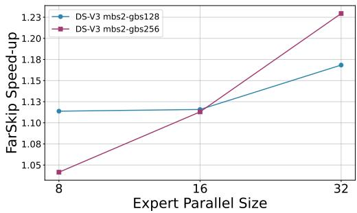  
Figure 5: DeepSeek-V3 (L = 6) FarSkip-Collective training speed-up under different Expert-Parallelism sizes and batch size configurations.

Table 3: Computation-communication overlap of all-to-all collectives in overlapped FarSkip-Collective MegatronLM training with EP=8. We evaluate the training of DeepSeek-V2 Lite and a shortened DeepSeek-V3 model with 6 layers.
<table><tr><td rowspan="2">Method</td><td colspan="4">all-to-all % overlap</td></tr><tr><td>fwd</td><td>bwd</td><td>Total</td><td>end-to-end speed-up</td></tr><tr><td>DS-V2 Lite Reg.</td><td>0.0</td><td>0.0</td><td>0.0</td><td>1.0x</td></tr><tr><td>DS-V2 Lite Far.</td><td>87.6</td><td>89.0</td><td>88.4</td><td>1.11x</td></tr><tr><td>DS-V3 (L = 6) Reg.</td><td>0.00</td><td>0.0</td><td>0.0</td><td>1.0x</td></tr><tr><td>DS-V3 (L = 6)Far.</td><td>92.9</td><td>84.1</td><td>88.9</td><td>1.04x</td></tr></table>

We extend the training benchmarking of FarSkip-Collective to multi-node training scenarios on a 4 node system with 4xMI325X each equipped with 8GPUs and inter-node communication bandwidth of 400Gbps between nodes. We study the end-to-end speed-up of the DS-V3 L = 6 model with FarSkip as compared with the regular model training when increasing the number of nodes from 1 to 4 in porportion with the Expert-Parallelism size, while keeping the micro (mbs) and global (gbs) batch-sizes fixed (strong-scaling). In Fig. 5 we observe that FarSkip-Collective improvement scale as we increase the EP size, with EP=32 leading to 1.22x end-to-end training speed-up.

For inference with vLLM, we benchmark the prefill phase which has a considerable communication component where we consider the DeepSeek-V2 (235B) and Llama 4 Scout (109B) models. We test both models using 1xMI300X 8GPU machine. In the benchmarking we adopt standard practices and use FP8 quantization and fused-MoE forward kernel (for routed experts). With this setup we evaluate the Time-To-First Token (TTFT) with different input context lengths (L=512, 1024, 2048), per-device batch size of BS=2 and EP=8. For the attention layer the vLLM implementation will mirror the EP size with TP=8. We observe speed-ups of 8.2% - 16.8% and 12.2% - 18.5% in both DeepSeek-V2 and in Llama-4 using FarSkip-Collective. The smaller number of experts in Llama-4 as compared with DeepSeek-V2 leads to faster computation and makes exposed communication more critical. In addition, we achieve communication overlap of the all-reduce of 95.3% and 97.6% for Llama-4 and DeepSeek-V2 (compared with 0% overlap in regular execution). In the appendix we share layer execution traces for both training and inference that illustrate the computation-communication overlap enabled by our implementation.

For SGLang inference, we evaluate the DeepSeek-V3 (671B) model architecture equipped with FarSkip-Collective for large-scale MoE inference for both prefill and decoding. In the prefill phase, e.g. benchmarking Time-to-First-Token (TTFT) FarSkip enables up to 1.34x speed-up with TP=8, EP=8. The prefill stage is compute-bound and Fig. 6 (left) demonstrates linear scaling of the duration of TTFT with the numbers of tokens processed. In both Fig. 6 (left) and (right) we also observe a fairly consistent speed-up provided by FarSkip. The duration and speed-up behavior can be attributed to the fact that both the compute-bound computation portion and the bandwidth-bound blocking communication portion scale directly with the number of tokens processed.

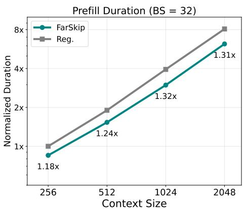

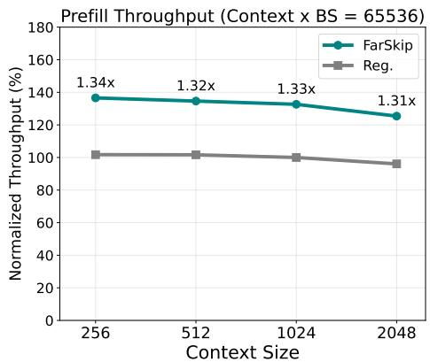  
Figure 6: DeepSeek-V3 Time To First Token (prefill stage) with SGLang under varying batch-size and prompt length. Each model is served with EP=8 for the MLP sub-block and TP=8 for attention.

Unlike the prefill phase, LLM decoding is memorybandwidth-bound; especially in large MoEs such as DeepSeek-V3. In single-node settings, the large parameter count that needs to be loaded per-GPU, translates to slower decoding and also leads to reduced maximum batch-size due to the limited memory capacity left for the KV cache. On the communication side, the all-reduce calls are applied to just the newly predicted tokens which will have smaller message-sizes as compared to prefill, especially with the smaller batches dictated by single-node serving. Together, this makes computation time (that is dictated by memory bandwidth) dominate the singlenode large MoE workload as compared with communication. Nonetheless, in a multi-node set-up FarSkip leads to a significant benefit. Distributing the MoE experts over a larger number of GPUs both directly decreases the computation time and increases the communication time. With wide-EP, the number of experts and parameters per GPU directly decrease and allow for significantly larger batch-sizes. This increases the throughput significantly making large MoE decoding suitable for large-scale distributed setups in general. At the same time, by switching to multi-node serving one relies on scale-out interconnects and the bigger batch-sizes also lead to larger message sizes. Together these changes shift the computation-communication balance making FarSkip-Collective significant in this setting. To this end, we evaluate DeepSeek-V3 decoding with TP=16, EP=16 in the large-batch setting (BS=1024) on a 2-node system connected with 8 400Gbs NICs for inter-node communication. In Fig. 7 we observe consistent speed-up with FarSkip under varying prompt lengths as multi-node settings allow for larger batch-sizes.

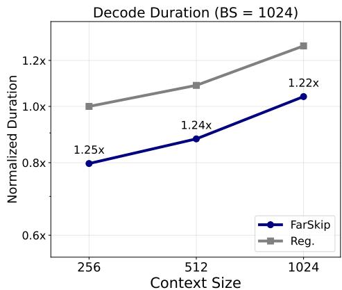  
Figure 7: Time Between Tokens (decode stage) with SGLang DeepSeek-V3 for 2-node inference under varying prompt length. Each model is served with EP=16 for the MLP subblock and TP=16 for attention.

## 6 Related Work

Computation-communication overlap in distributed deep learning traditionally focuses on “bit-exact” approaches that retain the mathematical formulation of the model and instead focus on improved execution of the algorithm on hardware. Most existing parallelism techniques aim to achieve minimal exposed communication [44, 32]. A common theme to achieve overlap is decomposing operators into smaller pieces and scheduling computation and communications in tandem, this includes operator decomposition such as AsyncTP [38, 30], and multi-layer pipelines [46, 16, 21].

More specific to this work are model architectural changes aimed at reducing exposed communication at runtime. Our work is similar to the recent work of [41] that follows the “outdated” formulation (8a)

to enable computation-communication overlapping of dense models with TP. In contrast our work studies MoEs and proves out the connectivity approach at large-scale models (100B+) applied to all of the model layers. On the implementation side, we develop optimized overlapped implementation for expert parallelism for both training (forward & backward) and inference. In the “partial” formulation front (8b), our work is most similar to [29] and [20] nonetheless both operate only on dense models and TP at order of magnitude smaller scales as compared with state of art models when studying model capabilities. More broadly [28] designs the model architecture for computation-communication pipelining of the communication and computation heavy layers, and the works of [3, 37] reduce the required communication in Transformer blocks via parallel MLP & attention sub-blocks. Further the work of [12] reduces required model communication for large-scale models via “track-parallelism”.

## 7 Conclusion

In this work we present a modified connectivity architecture for MoEs that removes model dependencies between network blocks and therefore has the potential to unhobble blocking communication in their training and execution. We demonstrate the modified architecture has the capabilities to perform well at scale and by using knowledge distillation we are able to convert a series of state-of-the-art MoE models with increasing scale of up to 109B model parameters efficiently while retaining 99% of the model accuracy. After demonstrating the modified architecture is viable as a replacement of the regular MoE, we move to realize the benefits of FarSkip-Collective by developing optimized training and inference implementations that enable 88.9% overlapping of all-to-all communication during MoE training and on the inference side enable up to 18.5% speed-up in time-to-first-token. Moving forward, by making model execution amenable to overlapping we hope one can revisit existing MoE architectural configurations and parallelism settings and enable the exploration of larger parallelism and architecture search spaces.

## References

[1] Jacob Austin, Augustus Odena, Maxwell Nye, Maarten Bosma, Henryk Michalewski, David Dohan, Ellen Jiang, Carrie Cai, Michael Terry, Quoc Le, and Charles Sutton. Program synthesis with large language models. arXiv preprint arXiv:2108.07732, 2021.

[2] Yonatan Bisk, Rowan Zellers, Ronan Le Bras, Jianfeng Gao, and Yejin Choi. Piqa: Reasoning about physical commonsense in natural language. In Thirty-Fourth AAAI Conference on Artificial Intelligence, 2020.

[3] Sidney Black, Stella Biderman, Eric Hallahan, Quentin Anthony, Leo Gao, Laurence Golding, Horace He, Connor Leahy, Kyle McDonell, Jason Phang, Michael Pieler, USVSN Sai Prashanth, Shivanshu Purohit, Laria Reynolds, Jonathan Tow, Ben Wang, and Samuel Weinbach. Gpt-neox-20b: An open-source autoregressive language model. In Proceedings of BigScience Episode #5 – Workshop on Challenges & Perspectives in Creating Large Language Models, pages 95–136, virtual+Dublin, 2022. Association for Computational Linguistics.

[4] Mark Chen, Jerry Tworek, Heewoo Jun, Qiming Yuan, Henrique Ponde de Oliveira Pinto, Jared Kaplan, Harri Edwards, Yuri Burda, Nicholas Joseph, Greg Brockman, Alex Ray, Raul Puri, Gretchen Krueger, Michael Petrov, Heidy Khlaaf, Girish Sastry, Pamela Mishkin, Brooke Chan, Scott Gray, Nick Ryder, Mikhail Pavlov, Alethea Power, Lukasz Kaiser, Mohammad Bavarian, Clemens Winter, Philippe Tillet, Felipe Petroski Such, Dave Cummings, Matthias Plappert, Fotios Chantzis, Elizabeth Barnes, Ariel Herbert-Voss, William Hebgen Guss, Alex Nichol, Alex Paino, Nikolas Tezak, Jie Tang, Igor Babuschkin, Suchir Balaji, Shantanu Jain, William Saunders, Christopher Hesse, Andrew N. Carr, Jan Leike, Josh Achiam, Vedant Misra, Evan Morikawa, Alec Radford, Matthew Knight, Miles Brundage, Mira Murati, Katie Mayer, Peter Welinder, Bob McGrew, Dario Amodei, Sam McCandlish, Ilya Sutskever, and Wojciech Zaremba. Evaluating large language models trained on code. arXiv preprint arXiv:2107.03374, 2021.

[5] Peter Clark, Isaac Cowhey, Oren Etzioni, Tushar Khot, Ashish Sabharwal, Carissa Schoenick, and Oyvind Tafjord. Think you have solved question answering? try arc, the ai2 reasoning challenge. arXiv:1803.05457v1, 2018.

[6] Karl Cobbe, Vineet Kosaraju, Mohammad Bavarian, Jacob Hilton, Reiichiro Nakano, Christopher Hesse, and John Schulman. Training verifiers to solve math word problems, 2021.

[7] Damai Dai, Chengqi Deng, Chenggang Zhao, RX Xu, Huazuo Gao, Deli Chen, Jiashi Li, Wangding Zeng, Xingkai Yu, Yu Wu, et al. Deepseekmoe: Towards ultimate expert specialization in mixture-of-experts language models. arXiv preprint arXiv:2401.06066, 2024.

[8] DeepSeek-AI. Deepseek-v3 technical report. arXiv preprint arXiv:2412.19437, 2024.

[9] DeepSeek-AI. Deepseek-r1: Incentivizing reasoning capability in llms via reinforcement learning, 2025.

[10] DeepSeek-AI, Zhihong Shao, Damai Dai, et al. Deepseek-v2: A strong, economical, and efficient mixture-of-experts language model. arXiv preprint arXiv:2405.04434, 2024.

[11] William Fedus, Barret Zoph, and Noam Shazeer. Switch transformers: Scaling to trillion parameter models with simple and efficient sparsity. Journal of Machine Learning Research, 23(120):1–39, 2022.

[12] Tom Gunter, Zirui Wang, Chong Wang, Ruoming Pang, Andy Narayanan, Aonan Zhang, Bowen Zhang, Chen Chen, Chung-Cheng Chiu, David Qiu, Deepak Gopinath, Dian Ang Yap, Dong Yin, Feng Nan, Floris Weers, Guoli Yin, Haoshuo Huang, Jianyu Wang, Jiarui Lu, John Peebles, Kewei Ye, Mark Lee, Nan Du, Qibin Chen, Quentin Keunebroek, Sam Wiseman, Syd Evans, Tao Lei, Vivek Rathod, Xiang Kong, Xianzhi Du, Yanghao Li, Yongqiang Wang, Yuan Gao, Zaid Ahmed, Zhaoyang Xu, Zhiyun Lu, et al. Apple intelligence foundation language models. arXiv preprint arXiv:2407.21075, 2024.

[13] Dan Hendrycks, Collin Burns, Steven Basart, Andy Zou, Mantas Mazeika, Dawn Song, and Jacob Steinhardt. Measuring massive multitask language understanding. Proceedings of the International Conference on Learning Representations (ICLR), 2021.

[14] Geoffrey Hinton, Oriol Vinyals, and Jeff Dean. Distilling the knowledge in a neural network. arXiv preprint arXiv:1503.02531, 2015.

[15] Jordan Hoffmann, Sebastian Borgeaud, Arthur Mensch, Elena Buchatskaya, Trevor Cai, Eliza Rutherford, Diego de Las Casas, Lisa Anne Hendricks, Johannes Welbl, Aidan Clark, et al. Training compute-optimal large language models. arXiv preprint arXiv:2203.15556, 2022.

[16] Yanping Huang, Youlong Cheng, Ankur Bapna, Orhan Firat, Dehao Chen, Mia Xu Chen, HyoukJoong Lee, Jiquan Ngiam, Quoc V. Le, Yonghui Wu, and Zhifeng Chen. Gpipe: Efficient training of giant neural networks using pipeline parallelism. In Advances in Neural Information Processing Systems, volume 32, pages 103–112, 2019.

[17] Yoon Kim and Alexander M. Rush. Sequence-level knowledge distillation. In Jian Su, Kevin Duh, and Xavier Carreras, editors, Proceedings of the 2016 Conference on Empirical Methods in Natural Language Processing, pages 1317–1327, Austin, Texas, November 2016. Association for Computational Linguistics.

[18] Team Kimi, Yifan Bai, Yiping Bao, Guanduo Chen, Jiahao Chen, Ningxin Chen, Ruijue Chen, Yanru Chen, Yuankun Chen, Yutian Chen, et al. Kimi k2: Open agentic intelligence. arXiv preprint arXiv:2507.20534, 2025.

[19] Woosuk Kwon, Zhuohan Li, Siyuan Zhuang, Ying Sheng, Lianmin Zheng, Cody Hao Yu, Joseph E. Gonzalez, Hao Zhang, and Ion Stoica. Efficient memory management for large language model serving with pagedattention. In Proceedings of the ACM SIGOPS 29th Symposium on Operating Systems Principles, 2023.

[20] Itay Lamprecht, Asaf Karnieli, Yair Hanani, Niv Giladi, and Daniel Soudry. Tensor-parallelism with partially synchronized activations. arXiv preprint arXiv:2506.19645, 2025.

[21] Fanxin Li, Shixiong Zhao, Yuhao Qing, Xusheng Chen, Xiuxian Guan, Sen Wang, Gong Zhang, and Heming Cui. Fold3d: Rethinking and parallelizing computational and communicational tasks in the training of large dnn models. IEEE Transactions on Parallel and Distributed Systems, 34(5):1432–1449, 2023.

[22] Jijie Li, Li Du, Hanyu Zhao, Bo wen Zhang, Liangdong Wang, Boyan Gao, Guang Liu, and Yonghua Lin. Infinity instruct: Scaling instruction selection and synthesis to enhance language models, 2025.

[23] Jiawei Liu, Chunqiu Steven Xia, Yuyao Wang, and Lingming Zhang. Is your code generated by chatGPT really correct? rigorous evaluation of large language models for code generation. In Thirty-seventh Conference on Neural Information Processing Systems, 2023.

[24] Jiawei Liu, Chunqiu Steven Xia, Yuyao Wang, and Lingming Zhang. Is your code generated by chatgpt really correct? rigorous evaluation of large language models for code generation. In Thirty-seventh Conference on Neural Information Processing Systems, 2023.

[25] Meta AI. The llama 4 herd: The beginning of a new era of natively multimodal ai innovation. Meta AI Blog, April 2025.

[26] Todor Mihaylov, Peter Clark, Tushar Khot, and Ashish Sabharwal. Can a suit of armor conduct electricity? a new dataset for open book question answering. In EMNLP, 2018.

[27] Deepak Narayanan, Mohammad Shoeybi, Jared Casper, Patrick LeGresley, Mostofa Patwary, Vijay Korthikanti, Dmitri Vainbrand, Prethvi Kashinkunti, Julie Bernauer, Bryan Catanzaro, Amar Phanishayee, and Matei Zaharia. Efficient large-scale language model training on gpu clusters using megatron-lm. In Proceedings of the International Conference for High Performance Computing, Networking, Storage and Analysis, pages 1–15, 2021.

[28] Maxim Naumov, Dheevatsa Mudigere, Hao-Jun Michael Shi, Jianyu Huang, Narayanan Sundaraman, Jongsoo Park, Xiaodong Wang, Udit Gupta, Carole-Jean Wu, Alisson G. Azzolini, Dmytro Dzhulgakov, Andrey Mallevich, Ilia Cherniavskii, Yinghai Lu, Raghuraman Krishnamoorthi, Ansha Yu, Volodymyr Kondratenko, Stephanie Pereira, Xianjie Chen, Wenlin Chen, Vijay Rao, Bill Jia, Liang Xiong, and Misha Smelyanskiy. Deep learning recommendation model for personalization and recommendation systems. CoRR, abs/1906.00091, 2019.

[29] Rohan Baskar Prabhakar, Hengrui Zhang, and David Wentzlaff. Kraken: Inherently parallel transformers for efficient multi-device inference. In Advances in Neural Information Processing Systems, volume 37, 2024.

[30] PyTorch Team. Distributed w/ torchtitan: Introducing async tensor parallelism in pytorch. PyTorch Discussion Forum, 2024.

[31] Team Qwen. Qwen3 technical report, 2025.

[32] Jeff Rasley, Samyam Rajbhandari, Olatunji Ruwase, and Yuxiong He. Deepspeed: System optimizations enable training deep learning models with over 100 billion parameters. In Proceedings of the 26th ACM SIGKDD International Conference on Knowledge Discovery & Data Mining, KDD ’20, pages 3505–3506, New York, NY, USA, 2020. Association for Computing Machinery.

[33] Keisuke Sakaguchi, Ronan Le Bras, Chandra Bhagavatula, and Yejin Choi. Winogrande: An adversarial winograd schema challenge at scale. arXiv preprint arXiv:1907.10641, 2019.

[34] Noam Shazeer, Azalia Mirhoseini, Krzysztof Maziarz, Andy Davis, Quoc Le, Geoffrey Hinton, and Jeff Dean. Outrageously large neural networks: The sparsely-gated mixture-of-experts layer. arXiv preprint arXiv:1701.06538, 2017.

[35] Alon Talmor, Jonathan Herzig, Nicholas Lourie, and Jonathan Berant. CommonsenseQA: A question answering challenge targeting commonsense knowledge. In Proceedings of the 2019 Conference of the North American Chapter of the Association for Computational Linguistics: Human Language Technologies, Volume 1 (Long and Short Papers), pages 4149–4158, Minneapolis, Minnesota, June 2019. Association for Computational Linguistics.

[36] Hugo Touvron, Thibaut Lavril, Gautier Izacard, Xavier Martinet, Marie-Anne Lachaux, Timothée Lacroix, Baptiste Rozière, Naman Goyal, Eric Hambro, Faisal Azhar, Aurelien Rodriguez, Armand Joulin, Edouard Grave, and Guillaume Lample. Llama: Open and efficient foundation language models, 2023.

[37] Ben Wang and Aran Komatsuzaki. Gpt-j-6b: A 6 billion parameter autoregressive language model. https://github.com/kingoflolz/mesh-transformer-jax, May 2021.

[38] Shibo Wang, Jinliang Wei, Amit Sabne, et al. Overlap communication with dependent computation via decomposition in large deep learning models. In ASPLOS, pages 93–106, 2023.

[39] Mingyu Yang, Mehdi Rezagholizadeh, Guihong Li, Vikram Appia, and Emad Barsoum. Zebrallama: Towards extremely efficient hybrid models. In Advances in Neural Information Processing Systems, volume 39, 2025. NeurIPS 2025.

[40] Rowan Zellers, Ari Holtzman, Yonatan Bisk, Ali Farhadi, and Yejin Choi. Hellaswag: Can a machine really finish your sentence? In Proceedings of the 57th Annual Meeting of the Association for Computational Linguistics, 2019.

[41] Muru Zhang, Mayank Mishra, Zhongzhu Zhou, William Brandon, Jue Wang, Yoon Kim, Jonathan Ragan-Kelley, Shuaiwen Leon Song, Ben Athiwaratkun, and Tri Dao. Ladder-residual: parallelism-aware architecture for accelerating large model inference with communication overlapping. arXiv preprint arXiv:2501.06589, 2025.

[42] Chenggang Zhao, Chengqi Deng, Chong Ruan, Damai Dai, Huazuo Gao, Jiashi Li, Liyue Zhang, Panpan Huang, Shangyan Zhou, Shirong Ma, Wenfeng Liang, Ying He, Yuqing Wang, Yuxuan Liu, and Y. X. Wei. Insights into deepseek-v3: Scaling challenges and reflections on hardware for ai architectures. arXiv preprint arXiv:2505.09343, 2025.

[43] Henry Hengyuan Zhao, Pan Zhou, Difei Gao, and Mike Zheng Shou. Genqa: Generating millions of instructions from a handful of prompts. arXiv preprint arXiv:2406.10323, 2024.

[44] Yanli Zhao, Andrew Gu, Rohan Varma, Liang Luo, Chien-Chin Huang, Min Xu, Less Wright, Hamid Shojanazeri, Myle Ott, Sam Shleifer, Alban Desmaison, Can Balioglu, Pritam Nguyen, Bernard Chauhan, Yuchen Hao, Ajit Mathews, and Shen Li. Pytorch fsdp: Experiences on scaling fully sharded data parallel. Proceedings of the VLDB Endowment, 16(12):3848–3860, 2023.

[45] Lianmin Zheng, Liangsheng Yin, Zhiqiang Xie, Chuyue Sun, Jeff Huang, Cody Hao Yu, Shiyi Cao, Christos Kozyrakis, Ion Stoica, Joseph E. Gonzalez, Clark Barrett, and Ying Sheng. Sglang: Efficient execution of structured language model programs. In A. Globerson, L. Mackey, D. Belgrave, A. Fan, U. Paquet, J. Tomczak, and C. Zhang, editors, Advances in Neural Information Processing Systems, volume 37, Vancouver, Canada, December 2024.

[46] Kan Zhu, Yilong Zhao, Liangyu Zhao, Gefei Zuo, Yile Gu, Dedong Xie, Yufei Gao, Qinyu Xu, Tian Tang, Zihao Ye, Keisuke Kamahori, Chien-Yu Lin, Stephanie Wang, Arvind Krishnamurthy, and Baris Kasikci. Nanoflow: Towards optimal large language model serving throughput. In Proceedings of the 19th USENIX Symposium on Operating Systems Design and Implementation, OSDI ’25, Santa Clara, CA, USA, 2025. USENIX Association.

## Appendix

## A Pre-training results

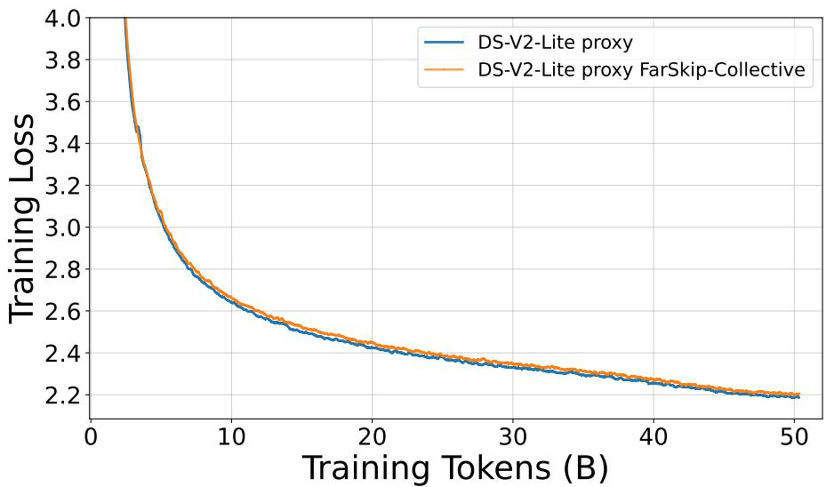  
Figure 8: MoE pretraining loss with regular and FarSkip-Collective architectures. We pretrain 16B parameter MoE for 50B tokens using the DeepSeek-V2-Lite model architecture. We observe FarSkip-Collective closely matches the loss of the regular model.

Table 4: Pretraining evaluation results of Regular and FarSkip-Collective architectures on pre-training tasks.
<table><tr><td>Model</td><td>Train Tokens</td><td>Train Loss</td><td></td><td>ARC-C ARC-E 1</td><td>BoolQ</td><td>HS</td><td>MMLU</td><td>OBook PIQA</td><td></td><td>SCIQ</td><td>WG Avg</td><td></td></tr><tr><td>DS-V2-lite Reg.</td><td>50B</td><td>2.187</td><td>36.6</td><td>59.3</td><td>56.2</td><td>59.0</td><td>26.7</td><td>34.6</td><td>75.1</td><td>85.1</td><td></td><td>56.8 54.4</td></tr><tr><td>DS-V2-lite Far.</td><td>50B</td><td>2.205</td><td>35.2</td><td>59.6</td><td>61.4</td><td>58.0</td><td>26.2</td><td>37.2</td><td>75.1</td><td>84.1</td><td>55.9</td><td>54.7</td></tr></table>

We test the pre-training of the FarSkip-Collective architecture by pre-training an MoE model from scratch using the DeepSeek-V2 Lite model architecture and configuration (64 experts) in Megatron-LM. We train the model on 50B training tokens randomly sampled from a larger corpus of high quality mix of publicly available data using a sequence length of 4096 tokens and a batch size of 4194304 tokens. With 2.4B active parameters, this corresponds to simplistic Chinchilla scaling estimate with respect to the model’s active parameters [15]. We denote the model as “proxy” in that we use the DeepSeek-V2-Lite model architecture but not the training recipe and data. We repeat the training with the exact settings but with FarSkip-Collective turned off (original MegatronLM implementation) as a baseline. We observe the loss curves of both models match closely and that the FarSkip-Collective model achieves a final training loss of 2.205 as compared with 2.187 averaged over the last 50 steps. For evaluation we use the evaluation datasets from the Llama-1 paper [36] to discern early signal from the pre-training and observe that FarSkip-Collective performs on par with the regular model architecture achieving 54.7 vs. 54.4 of the regular model on average. This result further reinforces the viability of the FarSkip-Collective MoE model modification in addition to the larger-scale self-distillation results in the main paper.

## B Qualitative Model Generation Samples

We further validate our converted models and our inference implementation by testing the FarSkip-Collective models qualitatively in chat-based generation for which we use the same generation

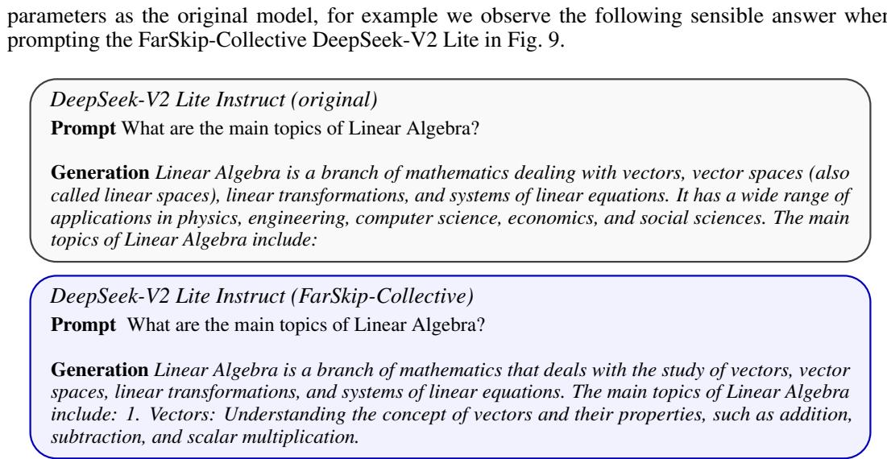  
Figure 9: Model generations of a fully converted FarSkip-Collective DeepSeek-V2-Lite model (bottom) and the original model checkpoint (top). Both generations use the default generation hyperparameters $( \tau = 0 . 3 , p = 0 . 9 5 )$ .

## C FarSkip-Collective Layer Traces

We present excerpt layer traces of explicitly overlapped FarSkip Models during training and inference. In each trace we show the duration of one layer. As FarSkip reduces the total duration of a layer, the FarSkip traces are more zoomed-in compared when compared with the regular layer traces.

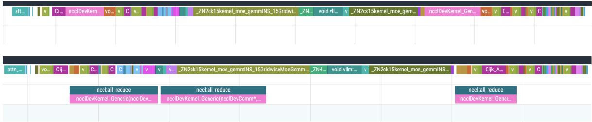  
Figure 10: DeepSeek-V2 vLLM prefill inference layer execution (Top) regular connectivity (Bottom) FarSkip-Collective. In the bottom figure the all-reduce collectives are overlapped during the attention and MoE sub-blocks by running asynchronously on a second hardware queue.

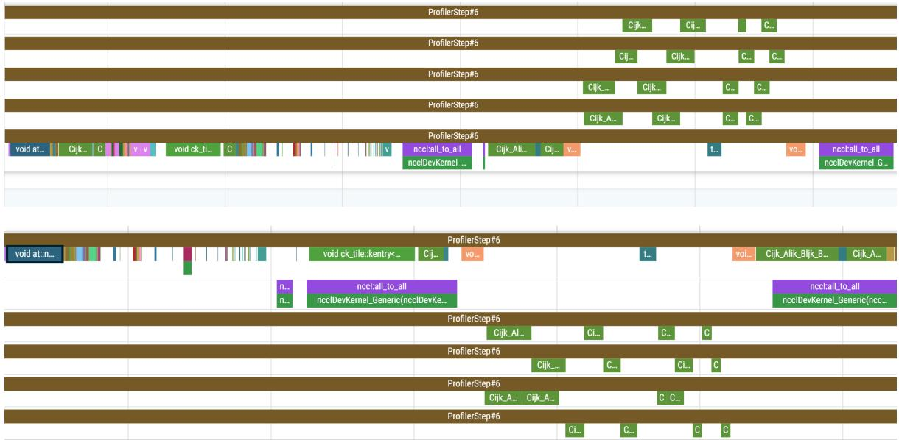  
Figure 11: DeepSeek-V2-Lite pre-training forward-pass layer execution (Top) regular connectivity (Bottom) FarSkip-Collective. In the bottom, all-to-all communication is overlapped with computation, the first call corresponds to Dispatch which gets overlapped with the core-attention computation. In the second call, the all-to-all corresponds to Combine and is overlapped with the shared-expert and the next layer’s q, k, v computation for attention.

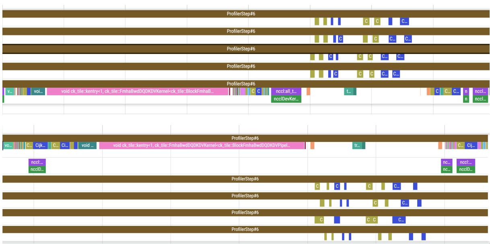  
Figure 12: DeepSeek-V2-Lite pre-training backward-pass layer execution (Top) regular connectivity (Bottom) FarSkip-Collective. The backward-pass operator execution order is “hijacked” from the default torch.autograd Sequence Number ordering to re-order operations for overlap. In particular, routed-expert backward computation launches immediately after the finished synchronization point of the Combine all-to-all backwards gradient and the Dispatch gradient launches before the gradient of the first part of attention (q, k, v calculation) to allow for overlapping with it before synchronization.