# PROFINFER: AN EBPF-BASED FINE-GRAINED LLM INFERENCE PROFILER

Bohua Zou 1 2 Debayan Roy 1 Dhimankumar Yogesh Airao 1 Weihao Xu 2 Binqi Sun 2 Yutao Liu 1 Haibo Chen 3 4

## ABSTRACT

As large language models (LLMs) move from research to production, understanding how inference engines behave in real time has become both essential and elusive. Unlike general-purpose engines such as ONNX Runtime, today’s LLM inference systems offer little operator-level visibility, leaving developers blind to where time and resources go. Even basic questions—is this workload memory-bound or compute-bound?—often remain unanswered. To close this gap, we develop a fine-grained, non-intrusive profiling framework for modern LLM inference engines, exemplified by llama.cpp but applicable to similar runtime architectures. Built on extended Berkeley Packet Filter (eBPF) technology, our system dynamically attaches probes to runtime functions across multiple layers—without modifying or recompiling the source. It transforms collected traces into rich visualizations of operators, graphs, timelines, and hardware counter trends, exposing how dense inference, Mixtureof-Experts routing, and operator offloading behave in practice. With less than 4% runtime overhead and high profiling fidelity, our framework makes LLM inference both transparent and diagnosable, turning performance profiling into a practical tool for optimization, scheduling, and resource-aware deployment.

## 1 INTRODUCTION

Large language models (LLMs) are reshaping how we interact with computers by powering conversational agents, writing assistants, multilingual translation services, travelplanning aids, and personalized tutors. Underpinned by transformer architectures that process tokens while computing inter-token attention relationships, LLMs deliver strong natural-language understanding and generation capabilities. Deploying LLM inference on mobile and edge devices rather than relying exclusively on cloud infrastructure opens important opportunities, including offline operation, lower latency, enhanced user privacy, and reduced network dependence (Wang et al., 2023; Apple, 2024).

Enabling on-device LLM inference is far from trivial. Even when employing highly optimized inference engines, the computation and memory demands of LLMs are orders of magnitude greater than those of traditional mobile neural networks. A model may generate text token-by-token, rather than in a single forward pass, and its inference proceeds through distinct phases: a prefill phase that is typically compute-bound, and a decode phase that is often memoryor bandwidth-bound. Meanwhile, mobile devices impose stringent limits on processor power, memory size, caching behavior, thermal dissipation, and energy budgets. As recent studies highlight (Chen et al., 2025; Li et al., 2025), deploying LLMs on mobile hardware requires careful balancing of model size, memory management, and accelerator usage. In such constrained and heterogeneous environments, accurate and low-overhead performance visibility becomes essential for identifying inefficiencies and guiding optimizations.

Profiling tools are crucial for understanding and optimizing ML workloads: by exposing operator-level timings, memory usage, and threading behavior, they enable developers to pinpoint performance bottlenecks. General-purpose ML inference engines such as ONNX Runtime (Microsoft, 2025) and TensorRT (NVIDIA Corporation, 2024) provide built-in profilers for operator execution time, memory allocation, and thread utilization, aiding optimization in latency- and resource-sensitive settings. Yet for LLM inference engines, especially those targeting on-device and edge scenarios, we observe a striking lack of fine-grained and non-intrusive profiling support. Existing profilers often require recompilation or runtime instrumentation, offer only coarse-grained metrics such as throughput or token rate, and fail to expose critical dimensions of execution such as dynamic operator graphs, per-thread scheduling, hardware-counter events, and phase-specific behaviors. Besides, some hardware-based profilers typically rely on support from the underlying hardware and often introduce non-negligible overhead.

While extended Berkeley Packet Filter (eBPF) has recently been used for tracing deep learning performance (Chu et al.,

2025; Yang et al., 2025; Craun et al., 2024), it remains largely decoupled from LLM execution semantics. Existing work rarely correlates low-level hardware metrics with high-level operator semantics, nor has it been adapted to mobile or edge environments where runtime overhead and observability constraints are more stringent. Consequently, developers lack the necessary observability to understand how quantization, KV-cache reuse, accelerator offloading, or memory bandwidth constraints affect end-to-end latency and efficiency on-device.

To address these limitations, we present ProfInfer, a profiling framework tailored to on-device LLM inference. The design of ProfInfer emphasizes three key attributes. First, it offers fine-grained observability by capturing every forward pass and operator invocation (e.g., matrix multiplication, attention, softmax) along with tensor dimensions, operator types, and the dynamically constructed computational DAG. Second, it ensures non-intrusive instrumentation through the use of eBPF probes that attach to runtime functions without requiring source modification, enabling easy deployment on Linux-based mobile and edge operating systems. Third, it supports hardware-counter integration and visual analytics, collecting per-operator performance monitoring counter (PMC) data, such as cache misses, memory accesses, and thread execution, and presenting them through timeline views, DAG visualizations, and per-operator plots.

We implement ProfInfer over the llama.cpp (Gerganov & contributors, 2025) inference engine, with a high-level overview illustrated in Figure 1. Before starting the workload, the tracer attaches several probes to the runtime libraries and enables relevant system tracing events. Online, the tracer continuously gathers and logs the submitted buffer from each probe handler in the kernel space and conditionally switches off the unnecessary probes. Offline, the analyzer parses the collected results, identifies the computation and the backend types, and then provides three different representations of the structural and performance metrics at the token, graph, and operator level.

The main contributions of this paper are as follows:

• We propose ProfInfer, an eBPF-based profiling framework for LLM inference that is fine-grained, nonintrusive, and lightweight, making it suitable for both mobile and edge environments.

• ProfInfer enables comprehensive visibility across the entire inference pipeline—covering each forward pass, computation graph, operator execution, and processor thread, while collecting a rich set of performance metrics through hardware counters.

• It offers intuitive performance analytics, including timeline views, DAG visualizations, and op-level plots that correlate model structure with hardware behavior.

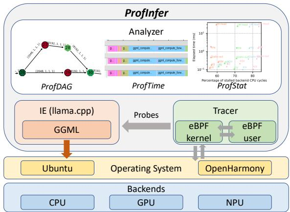  
Figure 1. High-level design of ProfInfer comprising eBPF-based tracers followed by trace analyzers.

• We demonstrate how ProfInfer facilitates analysis of compute and memory bottlenecks, KV-cache effects, workload interference, backend performance divergence, and the dynamic characteristics of MoE models.

## 2 BACKGROUND

## 2.1 Large language model (LLM)

Large Language Models (LLMs) are mostly transformerbased models leveraging the self-attention mechanism to capture contextual information (Vaswani et al., 2017). After GPT (Radford et al., 2018) is released, the decoder-only LLM model is primarily adopted for generative tasks and exhibits superior general intelligence. Recently, an increasing number of LLMs have been open-sourced, and their performance now rivals that of many closed-sourced LLMs.

Diving into the architecture of a decoder-only LLM of LLaMA family (Grattafiori et al., 2024), it inherits the basic design of GPT, stacking multiple transformer layers of the identical shape. Each layer is composed of a selfattention layer and a feed-forward network (FFN). In particular, LLaMA differs by adopting grouped query attention (GQA) (Ainslie et al., 2023), rotary positional embedding, root-mean-squared layer-normalization (RMS Norm), and SwiGLU as the activation function. Other families of LLMs, such as Qwen (Bai et al., 2023), Phi, Gemma, also have a unique architectural design. Except for the training dataset and the maximum context length, the most fundamental difference lies in the structural dimension determined by several hyperparameters, such as the number of layers, hidden size, and number of attention heads.

## 2.2 LLM inference and inference engine

## 2.2.1 LLM inference

Most decoder-only LLMs employ an auto-regressive manner to do the inference. After processing the prompt in the prefill stage, the LLM generates only one token at each decoding iteration to ensure causality, until it reaches a pre-set maximum length or a special token like <eos>. The performance of an LLM is commonly evaluated using two key metrics: the time to the first token (TTFT) in the prefill stage, and the decoding speed or period, i.e., tokens per second (TPS) or time per output token (TPOT), in the decoding iteration. Both two metrics are determined by the model size, architecture, and the hardware configuration.

By exploring the sparsity inside LLMs, more architecturewise innovations, such as dynamic pruning (PowerInfer (Song et al., 2024)), and mixture-of-experts (MoE) (Lepikhin et al., 2021), can further accelerate on-device LLM inference by activating only a part of the weights online. Besides, speculative decoding can boost the overall decoding speed by running a smaller draft LLM while using a bigger target LLM for verification after a certain number of tokens have been generated (Leviathan et al., 2023). The uncertainty introduced by these dynamic workloads can also lead to performance fluctuations. For example, in MoE models, the frequency with which the same experts are activated affects runtime memory and disk I/O overhead, which also impacts the inference performance.

## 2.2.2 LLM inference engine

Unlike conventional neural networks that only perform a forward pass, LLM inference also handles tokenization, sampling, and KV cache management. As LLM inference usually requires much more computing and memory resources, some light-weight designs are usually adopted in the LLM IEs. vLLM (Kwon et al., 2023) utilizes the paged attention to optimize the memory allocation for the KV cache across different batches, while it is not suitable for mobile scenarios where the batch size is usually 1. MNN-LLM (Wang et al., 2024) and mlc-llm (MLC team, 2023-2025) are two representative IEs for mobile devices that support different types of models and hardware. The former is a C++-based library that optimizes the memory layout and access pattern and also utilizes the combined quantization. The latter is based on Apache TVM (Chen et al., 2018) and implements operator- and graph-level optimization during compilation.

ProfInfer mainly focuses on llama.cpp (Gerganov & contributors, 2025), one of the most widely used open-source IEs, which has a bunch of well-known front-ends, like Ollama (Team, 2023), many bindings in other programming languages, and also many derivatives, such as PowerInfer (Song et al., 2024). As a C/C++ based IE, llama.cpp provides versatile functionalities, such as llama-server, speculative decoding, and multimodal model inference. Moreover, llama.cpp is built upon GGML, a machine learning runtime library that executes the graph and operator computation, which supports deployment across heterogeneous backends, including CPU, GPU, and certain types of NPU.

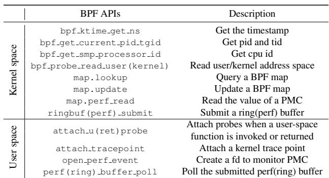

Table 1. A list of BCC-offered APIs used in our BPF C and Python programs. libbpf also offers equivalent ones.  
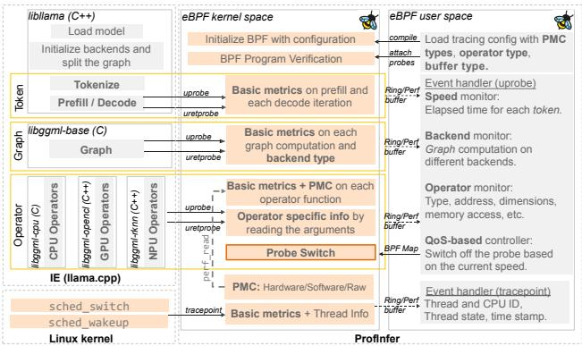  
Figure 2. An operational overview of ProfInfer’s tracer for LLM inferences over llama.cpp. Basic metrics refer to type of the probe, time stamp, thread ID and CPU ID.

## 2.3 Extended Berkeley Packet Filter (eBPF)

eBPF is a powerful technology that enables to run sandboxed programs in the kernel space, thereby extending kernel functionality without requiring to modify and recompile the kernel source code (Rice, 2023). It was first supported by Linux—introduced in 2014—but later expanded to macOS and Windows. Since it offers avenues to hook into kernel events and system calls, and to attach probes to userspace function calls and returns, it can be used to develop sophisticated system profiling tools (Cassagnes et al., 2020).

In this work, we use two popular frameworks, libbpf and BCC (BPF Compiler Collection), to implement eBPF programs. BCC provides Python bindings and is ideal for rapid prototyping, hence, we use it to implement ProfInfer over Ubuntu. However, since OpenHarmony does not support a Python environment by default, we implement ProfInfer over it using a C library libbpf. In Table 1, we summarize the BPF APIs used in our BCC-based implementation of ProfInfer’s tracer, as detailed in Section 3.

## 3 LLM TRACER IN PROFINFER

Figure 2 gives an overview of ProfInfer’s tracer. A part of the tracer operates in user space while the other part runs in kernel space. Further, it attaches probes to several functions of llama.cpp to enable tracing LLM inferences at different granularities. The probe handlers are implemented to collect runtime information about an inference facilitating both architectural and performance analyses. The remainder of this section will explore the implementation and various features of the tracer in greater detail.

## 3.1 ProfInfer in user space

ProfInfer implements a user-space application that is primarily responsible for compiling, launching, and verifying the BPF program. It specifies the compilation flags—according to a user-defined configuration file—for the BPF program, thereby filtering out unnecessary information to reduce tracing overheads. For example, a flag can be set to retrieve tensor dimensions when needed for an analysis. The user-space application further attaches probes (uprobes, uretprobes, and tracepoints) to target functions. It subsequently polls for the buffers submitted by the probe handlers in the kernel space. When it receives a buffer, it will asynchronously process the data based on the probe type in the event handler. It also conditionally writes back into the BPF maps to control the probes and the information to be traced. That is, when it detects a degradation in the inference performance, i.e., the overall decoding speed is under the Quality of Service (QoS) requirement, it can disable certain tracing features to reduce the overhead and improve the speed.

## 3.2 ProfInfer in kernel space

ProfInfer implements several probe handlers that run in the kernel space. Each of them traces the PID of the thread executing the probed function, the CPU where the thread is running, and the timestamp when the handler is invoked. Further, some of the handlers examine the arguments of the probed function, and by parsing them, they can infer the state of the inference. These arguments are typically C structs or pointers to C structs containing information about the current operator including its type, input and output tensors, among others. To log the traced data, a handler submits a ring buffer or a perf buffer to ProfInfer’s userspace application where the former can enhance efficiency but at the cost of unreported missing events.

## 3.3 Multi-granularity eBPF tracing

Considering that llama.cpp is an open-source IE, we traverse its logic to identify specific functions to probe based on our requirements of examining its performance at different granularities, i.e., with respect to each token, computational graph, and operator. Nevertheless, we note that it is a vast and complex project, which makes this non-trivial. Besides the IE, we trace a few kernel events that are relevant to thread scheduling. Table 2 summarizes the important details of the probes we have designed and implemented.

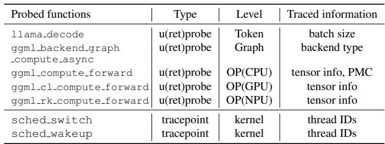  
Table 2. Probes in ProfInfer. The timestamp, the thread ID, and the CPU ID are logged in all probe handlers.

## 3.3.1 Token-level tracing

Profiling an inference running over llama.cpp at the token level covers the prefill stage and each decoding iteration. In libllama, llama decode is the generic function that is invoked to generate the next token both during prefill and decode stages. Embeddings of the tokenized input are passed to it. By attaching uprobe and uretprobe to this function, we obtain the timestamps of its invocation and the corresponding return; the difference between the timestamps gives TTFT during prefill and TPOT during decoding. In this work, we use these values during runtime to dynamically adjust the tracing overheads based on the decoding speed QoS requirement (e.g. 5 tokens/s) by switching the probes on or off. Besides, a future work is to use them to adjust resource allocations to inferences based on timing requirements especially when there are parallel workloads.

## 3.3.2 Graph-level tracing

To manage heterogeneous backends, llama.cpp adopts graph partitioning and a backend scheduling strategy within the GGML library. That is, if multiple backends are selected to run an LLM inference, several computational graphs are constructed during the initialization phase such that all operators in a graph run using the same backend. For example, if a certain number of transformer layers are to be offloaded to a GPU (e.g., using a CUDA backend) due to its restricted memory capacity, two or more graphs are created depending on the selected layers for offloading. To compute the execution time of each graph in a forward pass, we attach uprobe and uretprobe to the function ggml backend graph compute async and collect timestamps from their handlers. Such information can be useful to discern as well as optimize the graph partitioning and scheduling heuristic in llama.cpp. Further, the uprobe handler extracts the value of guid, a 16-digit backend identifier, from a function argument.

## 3.3.3 Operator-level tracing

For a given backend, we identify the function that executes the logic to identify the type of an operator and, correspondingly, call its low-level implementation. Currently, we support CPU and OpenCL backends, along with a selfdeveloped Rockchip NPU backend, while extending to other backends remains future work. The identified function in each of our target backends is listed in Table 2. We attach probes to the function to collect timestamps of its invocation and return, thereby obtaining the execution time of each tensor operation. We also parse ggml tensor, the second function argument and a C struct. By traversing this data structure using eBPF APIs, we can extract information about the name and type of an operation, e.g., ffn out-0 and GGML OP MUL MAT (the output matrix multiplication of the feedforward network in the first transformer layer), as well as the pointer address and dimension of source and target tensors. Such trace data enable to construct the computational graph and operator schedules as well as analyze performance of each operator during an LLM inference.

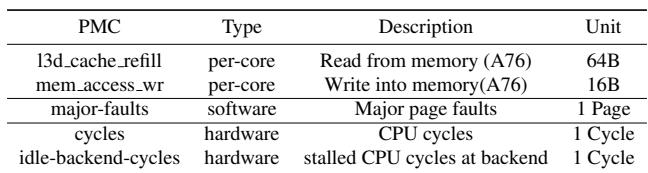  
Table 3. A summary of the PMCs to reflect memory access, computational efficiency, and disk IO efficiency.

## 3.3.4 Scheduler tracing

Besides user-space tracing, we hook into two tracepoints in Linux scheduler, i.e., sched switch and sched wakeup. The handlers of these tracepoints can read the state of a thread, i.e., running, runnable, or idle. We apply filters to only trace the events related to the inference threads otherwise the overheads might become unacceptable as there can be numerous such events. This tracing feature helps to identify interfering parallel workloads as well as to study their impact on an inference.

## 3.4 Enabling PMCs

Considering that PMCs offer low-level insights into CPU behavior with respect to computations and memory accesses, they are essential for profiling and optimizing software performance. Hence, in ProfInfer, we offer the possibility for opening and reading a PMC at the operator level. In Table 3, we list a few meaningful PMCs that we can trace.

Let us consider an example where we want to determine the amount of data fetched from DRAM for an operator. Percore l3d cache refill is a useful PMC for that (Pradhan et al., 2025). We use open perf event in the userspace program to open and configure a file descriptor for each thread and via it we can read l3d cache refill counter per thread. Now, in the handlers of uprobe and uretprobe to ggml compute forward, we read the counter using perf read. The difference between the two values gives how many times L3 data cache was refilled with 64 B of data by an inference thread for the operator. Summing these values over all inference threads can indicate the total amount of data fetched from DRAM for the operator.

We note that such a PMC-based analysis can assist in identifying resource under-utilization or boundedness and other performance bottlenecks for each operator.

## 3.5 Tracing expert activations in MoE models

When running an inference based on an MoE model, different experts can be activated in the FFN of a transformer layer during each decoding iteration. Expert activations are determined by a gating mechanism, which is usually implemented by a softmax or a sigmoid operator followed by a top k operator. The result is a tensor of length k comprising the IDs of k activated experts. Based on this understanding, we have attached a uprobe to the function ggml compute forward mul mat id where the probe handler reads the k expert IDs by traversing the third source ggml tensor using two-level pointer dereferencing. We note that the DRAM of a mobile device is typically insufficient to accommodate all available experts. Hence, when an activated expert is not in the DRAM, it has to be fetched from the storage, which increases operator’s execution time. That is, traced information related to expert activations enables accurate analysis of performance data at the operator level.

## 4 LLM TRACE ANALYZERS IN PROFINFER

Taking an LLM and the hardware configuration as input, ProfInfer generates the raw tracing data and then, through further analysis, produces the following three types of views.

## 4.1 Profiled DAG (ProfDAG) view

To reduce the memory footprint of the model, llama.cpp compresses the model into gguf format, which excludes any structural information. Instead, ProfDAG view can illustrate the topology of the workload in a DAG along with the profiling results for each operator, after analyzing the tracing data. The concrete process of ProfDAG retrieval is presented in Algorithm 1.

We first categorize the raw data by different thread IDs, and filter the targeting iteration only with all the operator functions (lines 1-4). Subsequently, it iterates over each starting event (with a step of 2), and assigns the corresponding attributes and profiling metrics to the node (lines 5-14). The elapsed time should be calculated between the first invocation and the last return of the operator functions across multiple threads, while the difference of PMCs should be calculated on each thread and summed up. The type, name, and dimension of the operator inside the ′info′ help identify each operator, while the execution order reflects the topological sort generated by the llama.cpp.

The structural information is obtained by iteratively querying the source nodes’ addresses of each node (lines 15- 20). The encountered source nodes that were not previously added to the graph represent constant tensors—typically weight matrices—that are not involved in any operator computation. For each existing dependency between two nodes, we add a directed edge to the graph. A graph processing package can help generate and plot the graph, e.g., networkx (Hagberg et al., 2008). Figure 3 depicts a ProfDAG of LLaMA3.2-1B-F16 running with two Cortex-A76 CPU cores on Orangepi 5 Ultra w.r.t. memory bandwidth.

Algorithm 1: ProfDAG Retrieving.   
Input: dfraw: a table with all raw buffer entries   
ntar: target decoding iteration   
Output: graph: a ProfDAG given of LLM   
1 dfs ops ← {};   
2 foreach dftid in dfraw.groupby(tid) do   
3 dftid ← dftid.sorted(by = timestamp);   
4 df opsitertid ← dftid[f unc == op ∧ niter == ntar]   
dfs ops ← dfs ops ∪ {df opsitertid };   
5 graph ← DAG()   
6 df ops ← dfs ops[0]; // One thread’s result   
7 for i ← 1 to len(df ops) step 2; // At start   
8 do   
9 opcur ← df ops[′addr′]   
10 opcur[′ts′] ← get end to end time(df s ops, i);   
11 opcur[′pmc′] ← sum pmc dif f (df s ops, i)   
12 opcur[′inf o′] ← get op inf o(df s ops, i)   
13 opcur [′order′] ← i;   
14 graph.add node(opcur);   
15 foreach oppre in dfs ops[0][′src′] do   
16 if oppre not in graph.nodes then   
17 graph.add node(oppre);   
18 graph.add edge(oppre, opcur);   
19 return graph;   
Avg. memory bandwidth (MB/s) 2 × 104 27 [8192, 1, 1] 28   
  
[204B, 1.1] 26 [2048, 1, 1] [8192, 1, 1] [8192, 1, 1] 29 30 31   
10 4 12048.1. 25 <048,11   
24 [2048, 1, 1] 32   
MUL UNARY MUL\_MAT With constant data input   
ADD RMS\_NORM Without constant data input

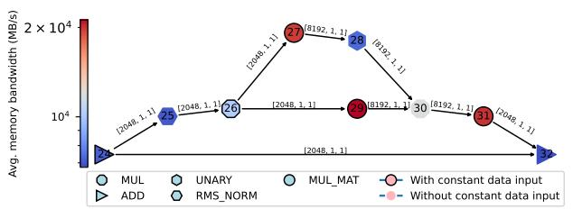  
Figure 3. Graphical view of an FFN for LLaMA-3.2-1B, in terms of memory bandwidth.

## 4.2 Timeline (ProfTime) view

To visualize the temporal execution behavior over the entire workflow, ProfInfer can generate a timeline view (ProfTime) for token-level, graph-level, and operator-level activities, as well as the scheduling behaviors across different threads. For instance, ProfTime can show how the computation graph is partitioned and scheduled over different backends.

To reveal the underlying scheduler behaviors, ProfInfer captures all the thread IDs of the inference. From the context given by sched switch and sched wakeup, we identify the next status of the working thread (Abaza et al., 2024). If the working thread is switched out with prev state equal to 0, it is preempted and turns ”idle”. If the working thread is woken up or switched out with prev state equal to 1, the thread turns ”runnable”. Working thread that switches in is considered ”running”. Also, the processor ID is appended to each event’s name. By converting the raw trace data into the Chrome Trace Event Format (tra, 2025), ProfTime can visualize the timeline with the help of Perfetto (Google LLC, 2025).

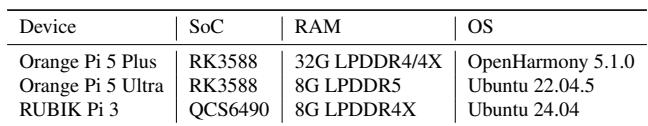  
Table 4. List of test devices and their configurations.

## 4.3 Statistical (ProfStat) view

To analyze the detailed characteristics that inherently impact the inference performance and to uncover the correlation among them, we propose ProfStat view in three dimensions. Across tokens: By varying the number of tokens of the prompt and the generated context, we analyze the variation of the time of both prefill and each decoding iteration, as well as the influential operators. Per-operator type: Given a fixed type of the operator, e.g., matrix multiplication (MatMul), the actual performance also depends on the dimensions of the input and output tensors, which are determined by the model and the inputs. PMCs’ values on CPU and profiling results on the other backend can further help identify the performance bottleneck of a certain type of operator. Across experts: For MoE models, ProfStat can help plot the activated experts over iterations and derive some insights about expert reuse.

## 5 EVALUATIONS

We evaluate ProfInfer on three devices listed in Table 4. While ProfInfer is developed using libbpf on the Orange Pi 5 Plus due to a light-weight design of OpenHarmony, BCC is used on other devices that have more features.

## 5.1 Overhead analysis

Overhead of existing ML profilers. llama.cpp has a builtin function called ggml graph dump dot that writes the computational graph representing an LLM into a .dot format file. The output contains only the architectural information of a model without any performance data. This functionality involves making one forward pass through the model, however, the time for that pass is 13% longer than when it is not used, i.e., it incurs a 13% overhead in execution time. As a sophisticated machine learning library, ONNX Runtime (ONNX Runtime developers, 2021) also supports a profiling tool, whose time overhead is around 8% of the model execution time through our preliminary experiments.

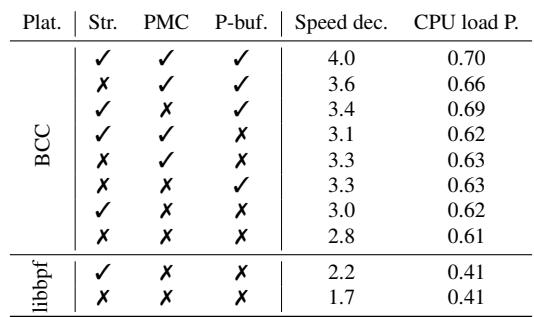  
Table 5. Overhead analysis with 2 and 4 Cortex-A76 cores on Orangepi 5 Pro (BCC) and Orangepi 5 Plus (libbpf). Str.: parsing the operator structure. PMC: enabling PMC reading. P-buf.: using perf buffer. Speed dec.: the relative decrease of the decoding speed in percentage. CPU load P.: the average CPU load of the probe handlers in percentage.

Overhead of ProfInfer. To analyze the online overhead caused by ProfInfer, we used bpftool to collect the cost of every probe. Besides, as the decoding stage is memoryintensive, the message passing and logging of the tracer can also lead to a degradation of the decoding speed. Table 5 summarizes the relative decrease in the decoding speed and the average CPU load costed by the probes w.r.t. the runtime (e.g., we observed the CPU load when using 4 threads is always 400%, then the average CPU load of the probes on each core is equal to P(tprobe)/(truntime × 4)). Specifically, there is no impact on the prefill stage.

As shown, ProfInfer supports three major controlling flags that are configured in the initialization phase. Str. refers to tracing the address, dimensions, and also source tensors of each operator. PMC refers to reading the PMC value at each probe handler. P-buf. means using the perf buffer to be aware of the missing events, while the ring buffer is chosen for lower memory overhead. The average CPU load of the probes is basically negligible. In BCC, the decoding speed degradation can vary from 2.8% to 4%. As a C-based library, libbpf has the lowest speed drop of 1.7%, while some features are still not supported. Besides, the results are collected without switching off any type of operator. When tracing only at the token and graph level, the speed decrease is only 0.1%.

## 5.2 Profile-driven insights

## 5.2.1 ProfDAG visualization

We apply ProfInfer to obtain ProfDAG of three LLMs, namely LLaMA3.2-1B, Qwen2.5-1.5B, and Gemma2-2B. Using them, we infer the following: (i) The differences in the self-attention implementation of them can be observed in Figure 4. Compared to LLaMA3.2-1B, we see that inside one transformer layer Qwen2.5-1.5B has an ADD (e.g., 4,8, or 12 denoted by ) after three MUL MAT (i.e., 3, 7, and 11 denoted by ). Further, Gemma2-2B has six more operators compared to LLaMA3.2-1B including three SOFT MAX ( ) and one each of UNARY ( ), RMS NORM ( ), and MUL ( ). (ii) ProfDAG shows the execution order of tensor operators during an LLM inference. Here, we see that MUL MAT 3, 6, and 9 in LLaMA3.2-1B do not execute consecutively despite having the same intermediate tensor as input. A similar observation can be made for Qwen2.5-1.5B and Gemma. (iii) In all three ProfDAGs, we see that two MatMuls (e.g., MUL MAT 4 and 28 in Gemma2-2B) are the most heavy operations in self-attention. Also, the same operation takes longer in LLaMA3.2-1B (MUL MAT 3) and Gemma2-2B (MUL MAT 4) compared to Qwen2.5-1.5B (MUL MAT3). In Figure 4, the color of a node conveys the execution time, however, any other metric (e.g., Figure 3 shows average memory bandwidth utilization) can be visualized as well.

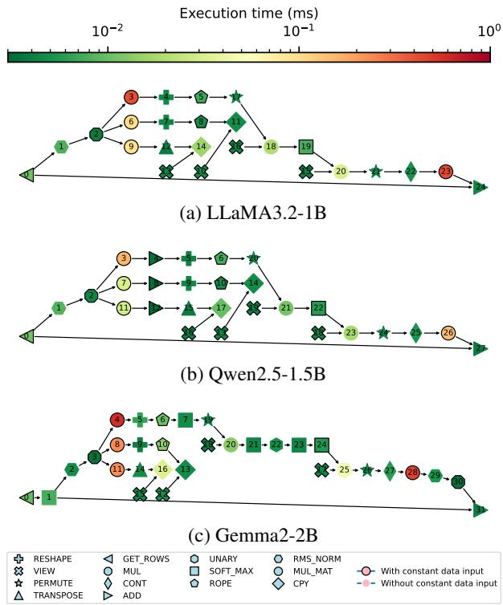

Figure 4. Architecture differences in the self-attention of different LLMs.  
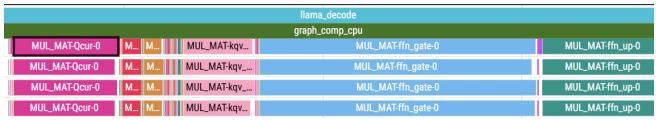  
Figure 5. Timeline view in Perfetto. Only intra-operator parallelism is observed. (LLaMA3.2-1B-F16 with 4 threads.)

## 5.2.2 ProfTime visualization

We run an inference based on LLaMA3.2-1B-F16 over llama.cpp with 4 CPU threads on Orange Pi 5 Ultra. ProfInfer generates a ProfTime (timeline) visualization of it using which we can infer the following: (i) Figure 5 shows that llama.cpp runs tensor operations one after the other. However, one tensor operation, e.g., MatMul, can be run by multiple threads. That is, it exploits intra-operator parallelism but there is no inter-operator parallelization. (ii) It can be further observed in the extracted segment, that Mat-Muls dominate other operations which holds for the entire inference as well, i.e., more than 97% of TTFT and TPOT is spent on MatMuls.

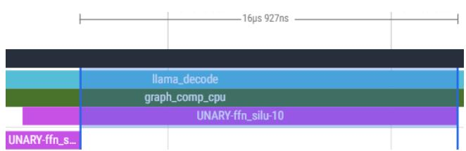  
(a) Activation function

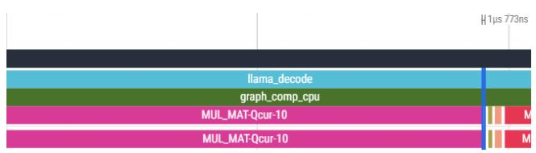  
(b) Matrix multiplication

Figure 6. (Un)balanced operator load across threads.  
  
(a) Rockchip NPU backend (graph-level).

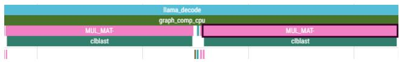  
(b) CLBlast backend for ARM Mali GPU (operator-level).

  
(c) OpenCL backend for Adreno GPU (graph-level and kernellevel observability combined with built-in OpenCL profiling).  
Figure 7. Timeline view of graph and operator execution on different backends.

Figure 6 demonstrates that the computational load is not uniformly distributed among inference threads for all operators. Here, LLaMA3.2-1B-F16 is run by two threads. In (a), we see that most computations in the activation function are performed by one thread while the other is idle for almost 80% of the operator’s runtime. However, (b) shows that the computations in a MatMul can be distributed almost equally between two threads.

Figure 7 demonstrates ProfTime’s capability to show how LLM inferences run across multiple backends. (a) and (c) shows graph partitioning in llama.cpp where an inference is decomposed into multiple computation graphs that run on different backends, i.e., CPU and Rockchip NPU backends in (a) and CPU and OpenCL (for Adreno GPU) backends in (c). Here, the backend is determined at the graph level. (b) shows nested backends, i.e., the CLBlast backend is implemented under the CPU backend. CLBlast backend is at the operator level, e.g., we see that when a MatMul is encountered by the CPU backend, it offloads the operation via CLBlast to ARM Mali GPU on Orange Pi 5 Ultra. In all three cases, ProfTime shows the exact backend at the graph level. (a) and (b) further shows the operator’s runtime directly from our tracing results, while for OpenCL, we need to turn on the flag GGML OPENCL PROFILING to enable the built-in profiling tool and combine it with our results. The reason is that the OpenCL backend selects the OpenCL kernels for each operator and enqueues them into a command queue (CQ), from which the kernels are dispatched asynchronously.

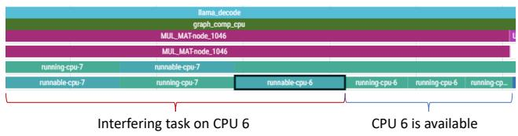

Figure 8. Timeline view of the thread and operator tracing of running LLaMA3.2-1B on 2 Cortex-A76 cores with a interfering task on one core.  
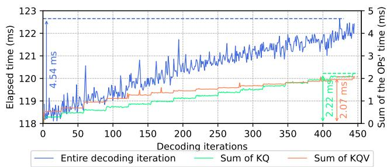  
Figure 9. The elapsed time for generating one token and the sum of the KQ and KQV across layers in each decoding iteration. The model is LLaMA3.2-1B, which runs with 2 threads. It outputs 450 tokens. The increase in the iteration time is caused by KQ and KQV.

ProfTime can pinpoint if an operator is delayed due to interference from a high-priority task, as shown in Figure 8. Here, two inference threads are bound to CPUs 6 and 7, while the interfering thread is running on CPU 6. We see that the two threads share CPU7 while CPU6 is occupied. After CPU6 becomes available, both threads run simultaneously on the two CPUs. The experiment shows how ProfTime can help debug unexpected delays in the inference.

## 5.2.3 ProfStat visualization

To analyze the performance across the tokens, we look into the profiling results of the CPU backend, as it still provides the near-optimal performance. In the decoding stage, the KV-cache mechanism reduces some computation, resulting in stable decoding throughput. However, as the KV cache grows, the elapsed time for each iteration still increases, as shown in Figure 9. After analyzing all the operators, we find that the operators KQ and KQV contribute the most to the degradation, with a step-wise time increase as the context length grows.

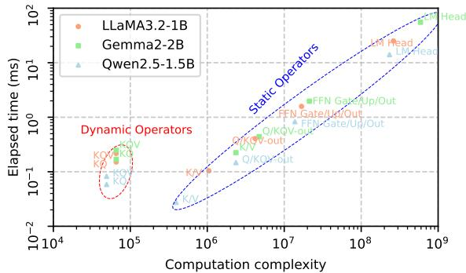

Figure 10. The execution time of the operator matrix multiplication in the first decoding iteration with 2 Cortex-A76 CPUs as the backend. The x-axis represents the computational complexity, i.e., O(M × N × K × H), given a matrix multiplication A(M,K) × B(K,N). KQ and KQV also introduce the dimension of attention heads H. M is 1 in the decoding stage.  
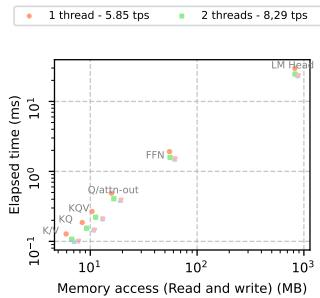  
(a) Memory access

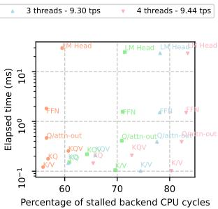  
(b) Backend bound  
Figure 11. Memory access and stalled cycle ratio of matrix multiplications in the decoding stage with different numbers of thread settings.

Looking further into all MatMul operators in a single decoding iteration, all of them are matrix-vector multiplications, some of which with a broadcasting dimension of attention heads (KQ and KQV). Except for these two operators, the runtimes of the others are proportional to the computation complexity, as shown in Figure 10. Qwen2.5-1.5B has a slightly lower intercept and thus a faster speed for an operator with the same dimension, which is possibly caused by the smaller hidden dimension (1536).

As decoding is memory-intensive, we read two per-core counters of Cortex-A76 CPUs to calculate the data transferred between the last-level cache and main memory. Figure 11a illustrates the elapsed time of each MatMul w.r.t. the memory access. We see that increasing the number of threads can improve the speed dramatically, only up to 2 threads. More threads can solely speed it up slightly, yet reach the memory bandwidth bottleneck and could cause some unnecessary cache misses. Figure 11b also shows the ratio of stalled backend cycles w.r.t. the total CPU cycles. It implies that 4 threads can cause more than 80% of stalled cycles, which is a waste of resources. In conclusion, due to the linear correlation of the MatMuls, the decoding speed of a dense model can be predictable given the hyperparameters.

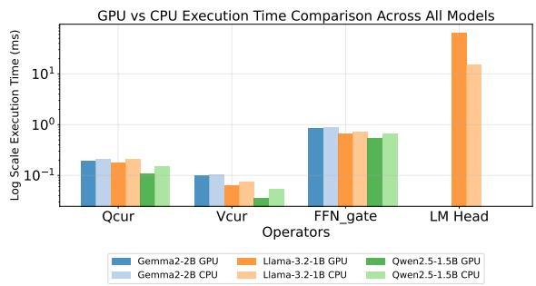  
Figure 12. The comparison of matrix multiplication operators of the GPU and CPU on Rubik Pi. Both settings are at their peak decoding speeds.

In the prefill stage, many existing techniques can leverage the parallelism well with heterogeneous backends (Song et al., 2024; Xu et al., 2025), while CPU can also utilize some libraries to better exploit the cache locality for Mat-Mul, such as BLIS (Van Zee & van de Geijn, 2015). By implementing BLIS on 4 Cortex-A76 cores, the prefill speed is twice as fast as when it is not used. By reading the PMCs l3d cache refill and mem access wr, we find that it reduces the original memory access by 75%.

When offloading the layers to the accelerators, ProfInfer can also provide a fine-grained comparison on different backends. Taking the Adreno GPU of the Rubik Pi as an example, Figure 12 depicts the execution time of all the static MatMuls on both the CPU (with peak performance at 4 threads) and the GPU with these 3 LLMs of 4-bit quantization. For Gemma2-2B and Qwen2.5-1.5B, LM Head cannot be offloaded due to the size limit of OpenCL kernels. We observe that the GPU outperforms the CPU only in a certain range of dimensions. For the LM Head, whose matrix size is much larger, there is a dramatic drop in GPU performance. Thus, regardless of the data transfer between CPU and GPU, selective operator offloading based on the tensor dimension can potentially accelerate the inference speed.

Figure 13 shows a profiling result of a MatMul in the FFN layer of an MoE model, Qwen1.5-MoE-A2.7B (Bai et al., 2023), which has 60 experts at each FFN layer and activates 4 of them each time. Even with 4-bit quantization, it still requires 8.9 GB of storage, which cannot be fully loaded into the main memory of the Orangepi 5 Ultra and is only runnable by using mmap. The lower x-axis refers to each decoding iteration, while the left y-axis refers to each expert ID. The top x-axis shows the density distribution of the activated experts over iterations, where we plot the frequency with which each expert is activated across the runs. The right y-axis represents the elapsed time. Inside the figure, we annotate the distance between two consecutive activated experts and calculate the average distance of the four experts of the current iteration. After a few iterations, we observe that the operator time is approximately proportional to the average distance. It indicates that the long-distance experts are likely to be evicted from the memory. By monitoring the major page faults and memory access, we conclude that the bottleneck of the MoE model inference is located in disk I/O rather than memory bandwidth.

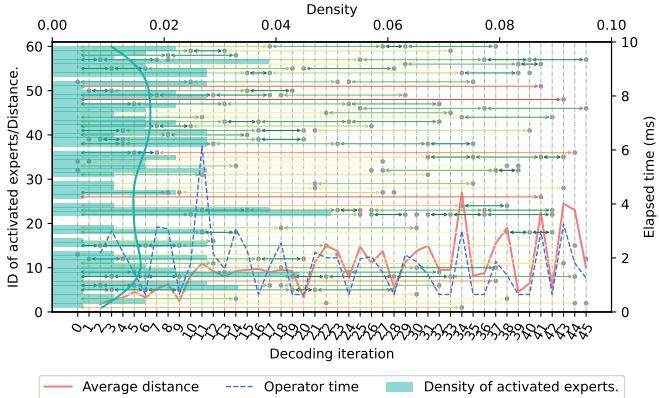  
Figure 13. The activated experts of the ffn moe up-0 operator of Qwen1.5-MoE-A2.7B-Q4 (60 experts in total with 4 activated experts each time). Lower x-axis: each decoding iteration. Upper x-axis: density distribution of the activated experts. Left y-axis: ID of the experts. Right y-axis: Elapsed time of the operator. The average distance refers to the mean value of the distance between the current iteration and when the 4 experts were activated last time.

## 6 RELATED WORKS

Built-in profilers in general-purpose ML frameworks. Profiling and observability are critical for identifying performance bottlenecks in machine learning inference engines. Traditional frameworks such as TensorFlow Lite (Tensor-Flow Team, 2024), ONNX Runtime (Microsoft, 2025), and TensorRT (NVIDIA Corporation, 2024) offer built-in profilers to report operator execution time, memory allocation, and threading behavior. Recent LLM inference engines, such as vLLM (Kwon et al., 2023) and TensorRT-LLM (NVIDIA Corporation, 2025) optimize batching and memory scheduling for high-throughput generation. However, these profilers are typically intrusive, i.e., requiring runtime flags or compilation options. Moreover, their observability features remain coarse-grained, typically exposing aggregate throughput, token rate, and latency.

eBPF-Based profiling and system tracing. Recent advances leverage eBPF for performance analysis in deep learning systems. eInfer (Chu et al., 2025) demonstrates fine-grained tracing for distributed LLM inference using eBPF to collect runtime call graphs without source modification. Similarly, eGPU (Yang et al., 2025) extends eBPF programmability to GPUs, and Craun et al. (Craun et al., 2024) propose techniques to eliminate eBPF tracing overhead on untraced processes. These studies highlight the promise of eBPF for low-intrusion telemetry, yet they stop short of providing semantic alignment between ML operators and hardware performance counters. Moreover, existing tools are evaluated primarily on server-class CPUs or GPUs and do not consider the constraints of on-device LLM inference and dynamic execution behaviors (e.g., mixture-of-experts routing or speculative decoding).

Mobile and on-device inference profiling. Mobile inference frameworks prioritize efficiency under tight resource budgets. For example, MNN (Jiang et al., 2020) provides a lightweight cross-platform runtime for DNNs on smartphones and embedded systems, focusing on latency and energy metrics rather than detailed operator introspection. Recent benchmarks such as PalmBench (Li et al., 2025) evaluate compressed and quantized LLMs across mobile devices, emphasizing throughput and accuracy. However, these evaluations still lack fine-grained, non-intrusive profiling, which prevents developers from understanding how different operators and dynamic execution behaviors impact on-device LLM performance.

In summary, prior profilers either (i) require intrusive instrumentation within ML runtimes, (ii) provide only coarse metrics through serving frameworks, or (iii) apply eBPF tracing without integrating operator semantics or supporting mobile hardware. ProfInfer bridges these gaps by combining eBPFbased dynamic probes with operator-level performancecounter monitoring. It achieves non-intrusive, fine-grained observability for LLM inference, correlating runtime events with hardware behavior and enabling detailed visualization of model execution on mobile platforms.

## 7 CONCLUSION AND DISCUSSION

We propose a light-weight LLM inference profiling tool based on eBPF for mobile systems. By extracting the core functions of the software stack of llama.cpp, combined with hardware observabilities through performance monitoring counters, we derive fine-grained profiling results with three types of views to identify the performance bottlenecks.

As future work, based on the operator-level profiling results, we could implement graph partitioning to further exploit the inter-tensor parallelism for the decoding stage across heterogeneous backends. Additionally, we could utilize a memory benchmark (Zuepke et al., 2024; Pradhan et al., 2025) that reveals the maximum memory access capability to better understand the performance limit of the hardware.

## REFERENCES

Trace event format. https://docs.google.com/ document/d/1CvAClvFfyA5R-PhYUmn5OOQt YMH4h6I0nSsKchNAySU/preview?tab=t.0# heading=h.uxpopqvbjezh, 2025. Google Docs document.

Abaza, H., Roy, D., Fan, S., Saidi, S., and Motakis, A. Trace-enabled timing model synthesis for ros2-based autonomous applications. In 2024 Design, Automation & Test in Europe Conference & Exhibition (DATE), pp. 1–6. IEEE, 2024.

Ainslie, J., Lee-Thorp, J., de Jong, M., Zemlyanskiy, Y., Lebron, F., and Sanghai, S. GQA: Training generalized multi-query transformer models from multi-head checkpoints. In Proceedings of the 2023 Conference on Empirical Methods in Natural Language Processing, pp. 4895–4901, Singapore, December 2023. Association for Computational Linguistics. doi: 10.18653/v1/2023.emn lp-main.298. URL https://aclanthology.org /2023.emnlp-main.298/.

Apple. Introducing apple’s on-device and server foundation models. https://machinelearning.apple. com/research/introducing-apple-found ation-models, 2024. Accessed 7 Feb 2025.

Bai, J., Bai, S., Chu, Y., Cui, Z., Dang, K., Deng, X., Fan, Y., Ge, W., Han, Y., Huang, F., et al. Qwen technical report. arXiv preprint arXiv:2309.16609, 2023.

Cassagnes, C., TRESTIOREANU, L. A., Joly, C., et al. The rise of ebpf for non-intrusive performance monitoring. IEEE Xplore, 2020.

Chen, L., Feng, D., Feng, E., Wang, Y., Zhao, R., Xia, Y., Xu, P., and Chen, H. Characterizing mobile soc for accelerating heterogeneous llm inference. In Proceedings of the ACM SIGOPS Symposium on Operating Systems Principles (SOSP), pp. 359–374, 2025.

Chen, T., Moreau, T., Jiang, Z., Zheng, L., Yan, E., Shen, H., Cowan, M., Wang, L., Hu, Y., Ceze, L., et al. {TVM}: An automated {End-to-End} optimizing compiler for deep learning. In 13th USENIX Symposium on Operating Systems Design and Implementation (OSDI 18), pp. 578–594, 2018.

Chu, K., Su, J., Zhang, Y., Zhao, C., Yang, Y., Zheng, Y., Lin, S., Zhao, S., and Zhang, W. einfer: Unlocking finegrained tracing for distributed llm inference with ebpf. In Proceedings of the 3rd Workshop on eBPF and Kernel Extensions, pp. 76–83, 2025.

Craun, M., Hussain, K., Gautam, U., Ji, Z., Rao, T., and Williams, D. Eliminating ebpf tracing overhead on untraced processes. In Proceedings of the ACM SIGCOMM

2024 Workshop on eBPF and Kernel Extensions, pp. 16– 22, 2024.

Gerganov, G. and contributors. llama.cpp: LLM inference in C/C++. https://github.com/ggml-org/l lama.cpp, 2025.

Google LLC. Perfetto: System profiling, app tracing and trace analysis. https://perfetto.dev/, 2025. Open-source tracing stack for Android, Linux and Chrome; version v52.0.

Grattafiori, A., Dubey, A., Jauhri, A., Pandey, A., Kadian, A., Al-Dahle, A., Letman, A., Mathur, A., Schelten, A., Vaughan, A., et al. The llama 3 herd of models. arXiv preprint arXiv:2407.21783, 2024.

Hagberg, A. A., Schult, D. A., and Swart, P. J. Exploring network structure, dynamics, and function using networkx. In Varoquaux, G., Vaught, T., and Millman, J. (eds.), Proceedings of the 7th Python in Science Conference, pp. 11 – 15, Pasadena, CA USA, 2008.

Jiang, X., Wang, H., Chen, Y., Wu, Z., Wang, L., Zou, B., Yang, Y., Cui, Z., Cai, Y., Yu, T., et al. Mnn: A universal and efficient inference engine. Proceedings of Machine Learning and Systems (MLSys), 2:1–13, 2020.

Kwon, W., Li, Z., Zhuang, S., Sheng, Y., Zheng, L., Yu, C. H., Gonzalez, J., Zhang, H., and Stoica, I. Efficient memory management for large language model serving with pagedattention. In Proceedings of the 29th symposium on operating systems principles, pp. 611–626, 2023.

Lepikhin, D., Lee, H., Xu, Y., Chen, D., Firat, O., Huang, Y., Krikun, M., Shazeer, N., and Chen, Z. Gshard: Scaling giant models with conditional computation and automatic sharding. In 9th International Conference on Learning Representations, ICLR, 2021.

Leviathan, Y., Kalman, M., and Matias, Y. Fast inference from transformers via speculative decoding. In International Conference on Machine Learning, pp. 19274– 19286. PMLR, 2023.

Li, Y., Liu, J., Zhang, H., Narayanan, M. B., Sharma, U., Zhang, S., Zeng, Y., Raghuram, J., and Banerjee, S. Palmbench: A comprehensive benchmark of compressed large language models on mobile platforms. In International Conference on Learning Representations (ICLR), 2025.

Microsoft. Onnx runtime: Profiling tools. https://on nxruntime.ai/docs/performance/tune-p erformance/profiling-tools.html, 2025.

MLC team. MLC-LLM, 2023-2025. URL https://gi thub.com/mlc-ai/mlc-llm.

NVIDIA Corporation. Tensorrt best practices: Profiling interfaces. https://docs.nvidia.com/deeple arning/tensorrt/archives/tensorrt-803 /best-practices/index.html, 2024.

NVIDIA Corporation. NVIDIA TensorRT-LLM: Optimized Inference for Large Language Models. https://gi thub.com/NVIDIA/TensorRT-LLM, 2025.

ONNX Runtime developers. Onnx runtime. https://on nxruntime.ai/, 2021.

Pradhan, A., Ottaviano, D., Jiang, Y., Huang, H., Zhang, J., Zuepke, A., Bastoni, A., and Caccamo, M. Predictable memory bandwidth regulation for dynamiq arm systems. In 2025 IEEE 31st International Conference on Embedded and Real-Time Computing Systems and Applications (RTCSA), pp. 126–137. IEEE, 2025.

Radford, A., Narasimhan, K., Salimans, T., and Sutskever, I. Improving language understanding by generative pretraining. Technical report, OpenAI, 2018. URL https: //cdn.openai.com/research-covers/lang uage-unsupervised/language\_understan ding\_paper.pdf.

Rice, L. Learning eBPF. ” O’Reilly Media, Inc.”, 2023.

Song, Y., Mi, Z., Xie, H., and Chen, H. Powerinfer: Fast large language model serving with a consumer-grade gpu. In Proceedings of the ACM SIGOPS 30th Symposium on Operating Systems Principles, pp. 590–606, 2024.

Team, O. Ollama: Run large language models locally. https://github.com/ollama/ollama, 2023. Accessed: 2025-10-27.

TensorFlow Team. Optimize tensorflow performance using the profiler. https://www.tensorflow.org/g uide/profiler, 2024.

Van Zee, F. G. and van de Geijn, R. A. BLIS: A framework for rapidly instantiating BLAS functionality. ACM Transactions on Mathematical Software, 41(3):14:1–14:33, June 2015. URL https://doi.acm.org/10.1 145/2764454.

Vaswani, A., Shazeer, N., Parmar, N., Uszkoreit, J., Jones, L., Gomez, A. N., Kaiser, Ł., and Polosukhin, I. Attention is all you need. Advances in neural information processing systems (NeurIPS), 30, 2017.

Wang, Y., Chen, H., Tang, Y., Guo, T., Han, K., Nie, Y., Wang, X., Hu, H., Bai, Z., Wang, Y., Liu, F., Liu, Z., Guo, J., Zeng, S., Zhang, Y., Xu, Q., Liu, Q., Yao, J., Xu, C., and Tao, D. Pangu-π: Enhancing language model architectures via nonlinearity compensation, 2023. URL https://arxiv.org/abs/2312.17276.

Wang, Z., Yang, J., Qian, X., Xing, S., Jiang, X., Lv, C., and Zhang, S. Mnn-llm: A generic inference engine for fast large language model deployment on mobile devices. In Proceedings of the 6th ACM International Conference on Multimedia in Asia Workshops, pp. 1–7, 2024.

Xu, D., Zhang, H., Yang, L., Liu, R., Huang, G., Xu, M., and Liu, X. Fast On-device LLM Inference with NPUs. Proceedings from Architectural Support for Programming Languages and Operating Systems (ASPLOS), pp. 445– 462, 2 2025. doi: 10.1145/3669940.3707239. URL ht tps://doi.org/10.1145/3669940.3707239.

Yang, Y., Yu, T., Zheng, Y., and Quinn, A. egpu: Extending ebpf programmability and observability to gpus. In Proceedings of the 4th Workshop on Heterogeneous Composable and Disaggregated Systems, pp. 73–79, 2025.

Zuepke, A., Bastoni, A., Chen, W., Caccamo, M., and Mancuso, R. Mempol: polling-based microsecond-scale percore memory bandwidth regulation. Real-Time Systems, 60(3):369–412, 2024.