# ACCELERATING LARGE-SCALE REASONING MODEL INFERENCE:SELF-SPECULATIVE DECODING WITH SPARSE ATTENTION

Yilong Zhao 1 \* Jiaming Tang 2 \* Kan Zhu 3 Zihao Ye 4 Chi-Chih Chang 5 Chaofan Lin 6 Jongseok Park 1   
Guangxuan Xiao 2 Mohamed S. Abdelfattah 5 Mingyu Gao 6 Baris Kasikci 3 Song Han 2 4 Ion Stoica 1

## ABSTRACT

Reasoning language models have demonstrated remarkable capabilities on challenging tasks by generating elaborate chain-of-thought solutions. However, such lengthy generation shifts the inference bottleneck from compute-bound to memory-bound. To generate each token, the model applies full attention to all previously generated tokens, requiring memory access to an increasingly large KV-Cache. Consequently, longer generations demand more memory access for every step, leading to substantial pressure on memory bandwidth.

To address this, we introduce SparseSpec, a speculative decoding framework that reuses the same model as both the draft and target models (i.e., self-speculation). SparseSpec features a novel sparse attention mechanism, PillarAttn, as the draft model, which accurately selects critical tokens via elegantly reusing information from the verification stage. Furthermore, SparseSpec co-designs self-speculation with three system optimizations: (1) a unified scheduler to batch both draft and verification phases to maximize parallelism, (2) delayed verification for CPU/GPU overlap, and (3) dynamic KV-Cache management to enable host memory offload to maximize GPU memory utilization. Across various models and datasets, SparseSpec outperforms state-of-the-art solutions, with an up to 2.13× throughput gain. Code is open-sourced at github.com/sspec-project/SparseSpec.

## 1 INTRODUCTION

Recent advances in reasoning language models (RLMs), such as OpenAI-o1 (OpenAI, 2024), have demonstrated remarkable capabilities in solving complex reasoning tasks. These models typically generate tens of thousands of tokens from problems described in only hundreds of tokens through extensive chain-of-thought (CoT) (Snell et al., 2024; DeepSeek-AI, 2025a). This lengthy, deliberate reasoning paradigm shifts the performance bottleneck of inference from compute-bound to memory-bound (Zhao et al., 2024b). Due to the auto-regressive nature of RLMs, generating each token requires loading all previously generated key-value vectors (KV-Cache), making long-output tasks memorybound. In fact, the total amount of KV-Cache that needs to be loaded increases quadratically with output length (Tang et al., 2024). For example, when serving Qwen3-8B (Yang et al., 2025) on an H100 with a batch size of 128 and an output of 8192, loading the KV-Cache takes on average 21 ms per step, accounting for over 70% of the end-to-end latency.

To mitigate the memory bandwidth bottleneck, researchers have proposed a lossless technique, speculative decoding (Chen et al., 2023). In a nutshell, speculative decoding employs a smaller and faster draft model to generate multiple candidate tokens sequentially. These candidates are then verified in parallel by the original target model. This requires reading the large KV-Cache only once. In contrast, without speculation, the entire KV-Cache needs to be loaded for every token. As a result, speculative decoding substantially reduces memory access and improves throughput.

However, existing speculative decoding methods require additional training or modification for each target model, limiting their applicability. Specifically, some solutions require training a separate standalone draft model (Chen et al., 2023); others modify the model architecture by adding decoder layers (Li et al., 2025a). These additional steps increase the complexity of real-world deployment. For example, training a small draft model requires careful data curation for a specific workload and may not generalize (Liu et al., 2024b). Moreover, deployment also needs to redesign the inference framework to orchestrate both models efficiently (Miao et al., 2024). Ultimately, this creates significant barriers to adoption (Zhang et al., 2024).

Other work explores training-free methods, which either employ rule-based heuristics (e.g., N-Gram (Fu et al., 2024)) or leverages the model itself via self-speculation (Liu et al., 2024a; Sun et al., 2024). For example, MagicDec (Chen et al., 2024) adopts the full model with a sliding window attention to draft tokens, followed by a full attention to verify. As the sparse attention greatly reduces the memory access by up to 95% of the full attention, the overall throughput is improved correspondingly. However, existing methods fail to provide ideal speedups for RLMs, due to its unique algorithmic and systematic challenges (§ 3.3).

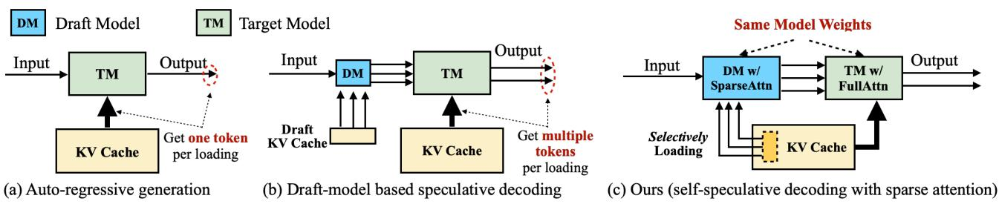  
Figure 1. Comparison between autoregressive generation (a), draft model-based speculative decoding (b), and SparseSpec (c). SparseSpec identifies the KV-Cache loading as the key bottleneck during token generation, and uses the same model weights with dynamic sparse attention as the draft model to achieve high efficiency and a high acceptance rate without additional training.

Algorithmically, existing methods provide inaccurate drafted tokens, due to the lack of adaptivity to the high context dynamics in RLMs. These reasoning models are inherently trained to generate diverse contexts (DeepSeek-AI, 2025a; Kimi Team, 2025). For example, when solving a math problem, the model explores alternate solutions, resulting in dynamic contexts (Guan et al., 2025). Systematically, speculative decoding and RLMs jointly introduce the following unique challenges: (1) workload fluctuation: as the draft and verify phases have heterogeneous resource usages, the workload is imbalanced across iterations, leading to hardware underutilization; (2) explicit synchronization: the draft and verify phases require synchronization to ensure the validation of the drafted tokens, which prevents the expensive CPU operations from being overlapped with the GPU operations; (3) KV-Cache underutilization: the unpredictability of the output lengths from RLMs makes it difficult to fully saturate the KV-Cache, leading to GPU memory waste.

To alleviate these challenges, we present SparseSpec, a lossless and training-free acceleration framework specialized for RLMs inference. In a nutshell, SparseSpec reuses the same (target) model as the draft model, with a novel dynamic sparse attention as the drafting mechanism. Co-designed with several system innovations, SparseSpec fully unleashes the potential of self-speculation for RLMs.

At the core of SparseSpec lies PillarAttn, a dynamic sparse attention tailored for speculative decoding on RLMs (§ 4.1). PillarAttn selectively loads and computes only the critical tokens—those with the highest attention scores during inference—thereby significantly reducing memory bandwidth usage. To handle context dynamics in reasoning, PillarAttn identifies critical tokens by leveraging the exact attention scores obtained by full attention in each verification phase. These critical tokens are then used in the following draft steps, enabling high speculation accuracy through sparsity that adapts to various contexts (Zhang et al., 2025; Yang et al., 2024). With such co-design with speculative decoding, PillarAttn achieves zero memory overhead critical token identification compared to existing dynamic sparse methods.

In addition to PillarAttn, SparseSpec introduces innovations that address the three systematic challenges above mentioned: (1) a unified batch scheduler (§ 4.2) that batches the sparse draft and dense verification into a single batch to amortize weight loading, and evenly distributes requests across draft and verify so per-iteration resource usage stays balanced, thus mitigating workload fluctuation; (2) delayed verification (§ 4.3) that delays verification by one iteration to remove CPU verification from the critical path. After launching a unified batch at the (i-1)-th iteration, the CPU asynchronously prepares all metadata for the i-th iteration excluding verification requests, while verification requests are postponed to the (i+1)-th iteration to overlap CPU work from (i-1)-th verification with GPU operations at i; (3) a dynamic KV-Cache manager (§ 4.4) that offloads/loads to and from CPU memory via an asynchronous and chunk-wise manner, thereby maximizing KV-Cache utilization.

We prototype and evaluate SparseSpec across various reasoning models, including Qwen3-1.7B/8B/14B (Yang et al., 2025), DeepSeek-R1-Distill-Llama3-8B (DeepSeek-AI, 2025a), and QwQ-32B (Qwen Team, 2025), using NVIDIA DGX-H100 servers with various tensor parallelism configurations. On real-world workloads such as AIME (Numina, 2025), OlympiadBench (He et al., 2024), and Live-CodeBench (Jain et al., 2024b), SparseSpec achieves up to 2.13× throughput improvement compared to the stateof-the-art serving framework vLLM (Kwon et al., 2023). Furthermore, when compared to existing training-free methods vLLM-NGram, MagicDec (Chen et al., 2024), and Tri-Force (Sun et al., 2024), SparseSpec achieves up to 1.56×, 1.36× and 1.76× throughput gain, respectively.

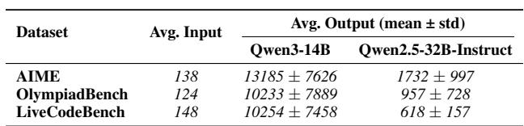  
Table 1. Average (mean ± std) token lengths on three reasoning evaluation datasets. Input length is identical for both models; output lengths include their standard deviations.

Our paper provides the following contributions:

• We analyze the performance bottleneck of batch RLMs inference, and pinpoint the potential benefit of sparse self-speculation with a theoretical formulation.

• We prototype a lossless and training-free acceleration framework, SparseSpec, with a novel sparse attention PillarAttn, a unified batch scheduler, delayed verification, and a dynamic KV-Cache manager.

• We comprehensively evaluate our framework with realworld workloads, demonstrating 2.13× speedup compared to state-of-the-art inference frameworks.

## 2 BACKGROUND

## 2.1 Transformer-based Large Language Models

Transformer-based LLMs mainly consist of two components: a multi-layer perceptron (MLP) and a self-attention module. However, MLP and attention exhibit different performance characteristics during batch inference: MLP is typically compute-bound, while attention is memorybound (Tang et al., 2024). For general matrix-matrix multiplication (GEMM) operations in MLP, batched requests share the same model weight, which can amortize memory loading cost, resulting in high arithmetic intensity. Therefore, considering a latency function TGEMM(B) that maps the batch size B to the latency, it remains nearly constant before a certain threshold Bˆ, and then increases linearly with B after GPU is fully saturated (Zhao et al., 2024a). In contrast, different requests have independent context (i.e., KV-Cache), which cannot be amortized across a batch. Thus, memory traffic scales linearly with sequence length and batch sizes, yielding consistently low arithmetic intensity and a linear latency function TAttn(M ), where M is the total memory size of KV-Cache. In this paper, we focus on optimizing memory-bound attention, which is the primary bottleneck for long-output RLMs inference (§ 3.1).

## 2.2 Evolving Workloads of RLMs

Reasoning language models (RLMs) are a class of LLMs designed to solve complex tasks through enhanced reasoning capabilities, as demonstrated by OpenAI-o1 (OpenAI, 2024) and DeepSeek-R1 (DeepSeek-AI, 2025a). Unlike traditional LLMs, they are explicitly incentivized to follow deliberate CoT via reinforcement learning (RL) (Kimi Team, 2025). Therefore, RLMs typically generate significantly more tokens during inference than non-reasoning models. To demonstrate this, we collect the average input and output lengths of several reasoning tasks. As shown in Table 1, the RLM Qwen3-14B generates on average 13542 tokens on the AIME dataset, approaching 7× more tokens than only 2593 tokens from a non-reasoning Qwen-2.5-32B.

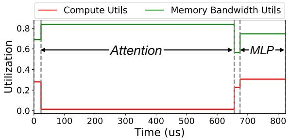  
Figure 2. Compute and memory bandwidth utilization of Qwen3- 8B on an H100, with an average output of 12K on AIME.

Such lengthy outputs pose significant challenges for both the training and deployment phases of RLMs. During RL post-training, RLMs are deployed to generate multiple rollouts, which are then scored by the reward model to evolve the model. Such rollouts generation is throughput-oriented offline inference, which could take more than 90% of the end-to-end RL training time (Luo et al., 2025). Besides, the deployment of RLMs including chatbots and agentic workflows is latency-oriented online inference, which is also bottlenecked by the memory-bound attention. In this paper, we focus on lossless acceleration that can be applied to both training and deployment phases.

## 2.3 Speculative Decoding

To mitigate the memory-inefficiency, speculative decoding is proposed as a lossless acceleration by trading off computation for memory (Chen et al., 2023; Fu et al., 2024). The core idea is to leverage a lightweight draft model to propose k candidate tokens sequentially, which are then verified in parallel by the original target model. Candidate tokens that align with the target model are accepted, while the rest are discarded and regenerated via the same workflow, ensuring lossless generation quality of the original model.

Assuming the latency of draft and target models are Tdraft and Ttarget, respectively, the acceleration comes from the fact that Tdraft ≪ Ttarget. Therefore, despite only α · k + 1 candidate tokens are accepted (with an acceptance rate α and a bonus token), the end-to-end latency when enabling speculative decoding is (k · Tdraft + Tverify) is smaller than the latency (αk + 1) · Ttarget without speculative decoding.

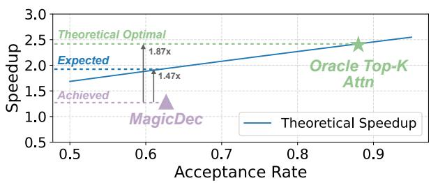  
Figure 3. Theoretical and achieved speedup over vLLM of MagicDec and self-speculation with oracle Top-K attention. Assume a sparsity ratio s = 0.05 and speculative step k = 8.

## 3 MOTIVATION

## 3.1 Batch RLMs Inference is Attention-bound

The long-generation of RLMs introduces a significant memory bottleneck in batched inference. Unlike short-generation tasks, each reasoning request accumulates a large KV-Cache until completion, rapidly exhausting GPU memory and severely constraining the number of concurrent requests (i.e., batch size). For example, serving Llama-3-8B on an H100 can accommodate only 64 requests with an 8K generation length. Inference at such small batch sizes is memorybound for both MLP and attention, and with the KV-Cache often larger than model weights, attention emerges as the dominant runtime component.

To demonstrate this, we profile bandwidth and compute utilization over end-to-end execution for RLMs running on vLLM. We visualize the utilization within a single iteration in Figure 2. Compute is consistently underutilized below 50% even when executing MLP; In contrast, memory bandwidth is heavily used across the entire iteration, indicating a memory-bound workload. Although both MLP and attention are memory-bound, attention is dominant and accounts for more than 77% of end-to-end execution time.

## 3.2 Sparse Self-Speculative Decoding Helps

Self-speculative decoding with sparse attention. As discussed in § 3.1, the RLMs inference is attention-bound due to the execessive memory access of KV-Cache under batch scenarios. Fortunately, prior studies on sparse attention show that a small subset of tokens in KV-Cache (e.g., 5%) dominates the attention output, providing nearly lossless speedup (Tang et al., 2024; Lin et al., 2025). Therefore, by selectively loading and computing the most critical tokens, memory access can be substantially reduced, trading off accuracy for efficiency. To ensure lossless acceleration, such methods can be applied as the draft model in speculative decoding, working with the full target model (i.e. sparse self-speculative decoding (Sun et al., 2024)).

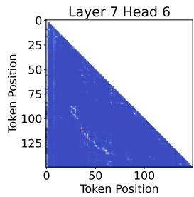

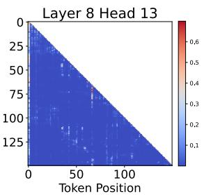  
Figure 4. Visualization of attention scores of Qwen3-8B on the AIME dataset. While the attention pattern has spatial locality, it undergoes substantial changes during generation.

Theoretical analysis of speedup. We now formulate the theoretical speedup of sparse self-speculative decoding, to estimate the potential improvement. We define the speedup η as the ratio of the average generation latency per token with and without speculative decoding (i.e., Tbase/Tspec). Specifically, let M be the total memory size of KV-Cache and B be the number of concurrent requests. With the same notations in § 2.1, Tbase = TGEMM(B) + TAttn(M ), ignoring other small operations for simplicity.

Assuming k the drafting length, α the acceptance rate, and s the sparsity ratio of the draft attention, we calculate Tspec by considering an entire round of speculation with k draft and 1 verification phases. Thus, we have (kα + 1) · Tspec = k · Tdraft + Tverify, where Tdraft = TGEMM(B) + TAttn(M · s) and Tverify = TGEMM((k + 1) · B) + TAttn(M ). As the B concurrent requests are randomly distributed across the k draft and 1 verification stages, the average input size for GEMMs is 2k+1k+1 B, while the average input size for attention is ks+1k+1 M . Thus, we can simpify the previously k+1 derived equation of (kα + 1) · Tspec as:

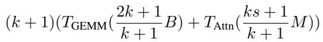

As discussed in § 2.1, TGEMM is non-linear function when GPU is not fully saturated, while TAttn is approximately linear. Thus, the Tspec can be approximated as:

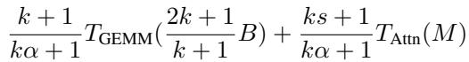

Given the formulation of latency per accepted token Tspec, and the latency per token Tbase on vanilla generation, the speedup η is derived as η = Tbase/Tspec.

Practical performance implications. As GEMM and attention have dramatically different characteristics, we analyze the implications of η over GEMM and attention separately.

For attention, since TAttn(M ) dominates Tbase in RLMs inference as discussed in § 3.1, the reduction ratio of KV-Cache access is (ks + 1)/(kα + 1), contributing the most to the speedup. Since α ≫ s in practice, the attention latency can be greatly reduced. For example, with k = 16, α = 0.75, s = 0.05, the attention latency is reduced by 6.78×.

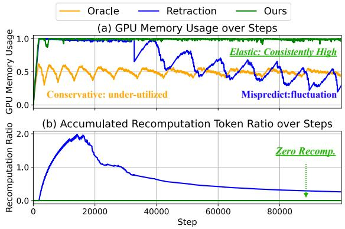  
Figure 5. GPU memory utilization and recomputation ratio during the first 100K steps when serving Qwen3-8B with AIME on H100. We compare three policies: (1) Oracle, which knows output lengths in advance and schedules conservatively to avoid retraction, achieving zero recomputation but low utilization; (2) Retraction, which predicts output length and schedules accordingly, achieving higher utilization but incurring frequent recomputation from retraction; and (3) our dynamic KV-Cache manager with offloading, which achieves near-full utilization without recomputation.

However, such memory reduction comes with the cost of extra GEMM computations, trading off computation for memory. In practice, to avoid untolerable latency increase, the batch size should typically be limited to a certain threshold Bˆ, so that TGEMM is not oversaturated. For example, on Hopper GPUs, Bˆ = 256 only incurs minimal latency increase. Besides, α is also crucial to limit the latency increase, as the speedup η is inversely proportional to α.

## 3.3 Existing Methods Fall Short on RLMs

However, we find that existing methods fail to provide expected speedup under RLMs inference, as modeled in § 3.2. As shown in Figure 3, when serving Qwen3-8B on an H100 with AIME, MagicDec fails to approach the acceptance rate of the oracle top-k attention (Lin et al., 2025), thus falling far behind the theoretical optimal speedup. This is because the draft model in existing methods is not adaptive to the context dynamics in RLMs, leading to inaccurately drafted tokens. Furthermore, even with the same acceptance rate, existing methods still have a non-negligible gap between the expected speedup, due to several system challenges.

Context dynamics. For long output of RLMs, sparsity patterns shift significantly based on semantic context during generation. As shown in Figure 4, the critical tokens of the KV-Cache differs dramatically over time. Therefore, instead of using a static sparsity pattern (e.g., sliding window attention), a dynamic sparse attention mechanism that adapts to the context dynamics is necessary to achieve a high acceptance rate α during drafting.

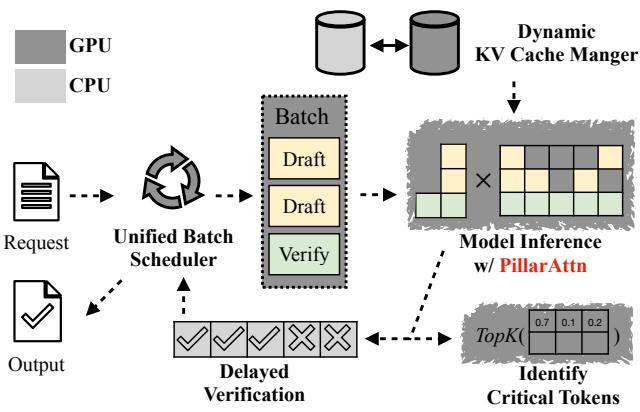  
Figure 6. Overview of SparseSpec.

Moreover, such sparse attention design should incur minimal computation or storage overhead, to avoid adding complexity to the system.

Workload fluctuation. As draft and verify phases have heterogeneous resource usages, naive scheduling these two phases separately leads to workload fluctuation across iterations, incurring substantial hardware underutilization. This heterogeneity mainly comes from GEMM operations. For instance, given a batch size B and speculative steps k, a sequential execution pattern (all draft phases followed by one verification phase) requires: (1) k GEMM operations with input size B, and (2) one verification GEMM with input size (k + 1)B. This leads to under-utilization during drafting and oversaturation during verification, with a total time of kTGEMM(B)+TGEMM((k+1)B). Instead, a uniform scheduling incurs a total time of (k + 1)TGEMM ( 2k+1 B). k+1 Considering the non-linearity of TGEMM before saturation, TGEMM( 2k+1k+1 B) < TGEMM(2B) ≈ TGEMM(B) when B is k+1 far below the saturation point. Therefore, the naive scheduling incurs up to 2× longer execution time.

Explicit synchronization. The paradigm of speculative decoding, i.e., drafting candidate tokens followed by verification, introduces an explicit synchronization between CPU and GPU, preventing the expensive CPU operations from being overlapped with the GPU operations. Specifically, the GPU must wait for the CPU to complete the verification process, which cleans metadata of rejected tokens from requests and resets draft status for the next generation step.

As a result, state-of-the-art inference frameworks (Zheng et al., 2024; Kwon et al., 2023) must run CPU operations on the critical path when enabling speculative decoding, incurring significant overhead. Such inefficiency is further exacerbated in sparse self-speculative decoding, where each iteration has verification requests under unified scheduling.

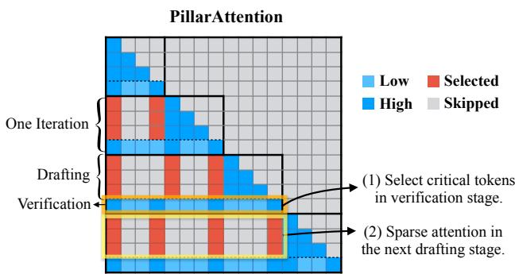  
Figure 7. Illustration of PillarAttn. PillarAttn performs full attention and uses attention scores in the verification phase to identify sparsity patterns for the next k draft phases.

KV-Cache underutilization. The huge variance of output lengths from RLMs (§ 2.2) makes it hard to perfectly manage KV-Cache, as the output lengths are unknown before generation. We collect the memory utilization and recomputation (i.e., the ratio of recomputed tokens to generated unique tokens) from a real-world trial. As shown in Figure 5, existing methods either underutilize KV-Cache capacity or lead to excessive recomputation due to misprediction. Such underutilization of KV-Cache severely limits the selfspeculation speedup, as the efficiency metric η decreases with smaller KV-Cache size (§ 3.2).

## 3.4 SparseSpec: Unleashing Sparse Self-Speculation with Efficient Algorithm-System Co-design

Opportunities. In this paper, we aim to leverage the sparse self-speculative decoding to mitigate the memory bandwidth bottleneck of long-generation from batch RLMs inference, providing lossless and training-free acceleration.

Challenges. However, realizing the theoretical speedup of self-speculation presents several challenges, requiring algorithm-system co-design: (1) how to design a sparse attention that adapts to the context dynamics with minimal overhead; (2) how to schedule draft and verify phases to avoid workload fluctuation; (3) how to handle the explicit synchronization to enable CPU/GPU overlap; and (4) how to fully utilize the KV-Cache capacity without recomputation.

## 4 DESIGN

In this section, we describe the design of SparseSpec’s components, including a dynamic sparse attention algorithm (§ 4.1), a unified batch scheduler (§ 4.2), delayed verification (§ 4.3), and a dynamic KV-Cache manager (§ 4.4). We visualize the design overview of SparseSpec in Figure 6.

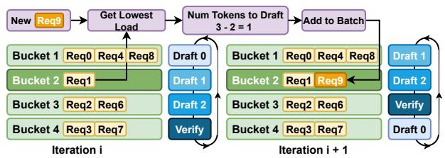  
Figure 8. Illustration of scheduling new requests. Unified and Resource-aware Batch Scheduler identifies the least-loaded bucket and schedules new requests to it by adjusting the drafting length.

## 4.1 PillarAttn: Dynamic Sparse Attention Tailored for Self-Speculative Decoding

As discussed in § 3.2, both a high sparsity ratio s and a high acceptance rate α are critical to the performance of sparse self-speculation. Therefore, a sparse attention that accurately and efficiently identifies sparsity patterns is necessary. To this end, SparseSpec proposes PillarAttn, a sparse attention mechanism tailored for self-speculation decoding.

Dynamic sparsity pattern. To adapt to the context dynamics as discussed in § 3.3, instead of using a fixed sparsity pattern (e.g., sliding window or static patterns from prompts), PillarAttn periodically re-identifies and updates the sparsity pattern used in the drafting phase. Built on the assumption that the contextual semantics have spatial locality, PillarAttn updates the sparsity pattern at a small stride, within which the sparsity patterns are fixed. Therefore, the overhead of identification can be amortized over a stride of iterations.

Overhead-free identification. Such a stride is co-designed with the paradigm of self-speculative decoding, with the same value as the speculative steps k. After every k draft steps with sparse attention, a verification step with full attention is performed, which computes the attention scores for all tokens in the KV-Cache as intermediate results. To avoid extra computation and storage overhead, PillarAttn on-the-fly dumps the attention scores during verification via customized attention kernels. Therefore, the sparsity pattern can be directly identified by reusing and applying Top-K on the dumped attention scores, which are first averaged over k draft tokens and query heads (within same group) if group query attention is applied. Specifically, the attention logits and logarithm summation of exponential are cached during verification, which are used to rematerialized attention scores for identification. We visualize the workflow of PillarAttn in Figure 7, where the sparsity pattern is updated during verification after every 3 draft phases.

## 4.2 Unified Batch Scheduler

As discussed in § 3.3, the draft and verification phases have heterogeneous resource usages, which leads to underutilization thus suboptimal performance. To address this, SparseSpec introduces a unified batch scheduler, that provides a uniform abstraction and workload-aware scheduling for both phases. Furthermore, to enhance hardware efficiency, SparseSpec introduces a fused attention kernel that efficiently batches sparse and full attention into a single kernel.

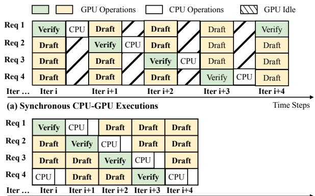  
(b) Asynchronous CPU-GPU Executions with Delayed Verification Time Steps  
Figure 9. Illustration of delayed drafting to achieve asynchronous CPU-GPU execution. Requests in the verification phase stall for one cycle for the CPU to determine the number of accepted tokens and the critical tokens, while other requests can still move forward.

Uniform abstraction for draft and verification. Since draft and target models share the same model weights in self-speculation, both phases go through the exactly same on-GPU data and control flow, except for sparse attention and full attention. Fortunately, modern inference frameworks already integrate PagedAttention (Kwon et al., 2023), which is essentially a sparse attention implementation at the granularity of the page. Therefore, by using a page size of 1, both sparse and full attention can be unified with the same pipeline, which greatly simplifies the system design and unleashes the flexibility of scheduling in both phases.

Workload-aware scheduling. As shown in § 3.3, sequential execution of all draft phases followed by one verification phase results in poor hardware utilization, due to the extremely unbalanced workload. Therefore, given the scheduling flexibility enabled by the unified abstraction, SparseSpec evenly mixes requests from both phases in each batch (at each generation step). To achieve perfect balance, SparseSpec introduces a greedy bin-packing strategy that assigns incoming new requests into different draft phases in a workload-aware way. Specifically, SparseSpec maintains k buckets to track request counts for each draft phase and assigns each incoming request to the least-loaded bucket. This scheduling strategy is illustrated in Figure 8.

Fused sparse and full attention. Even under ideal scheduling, the attention operation still suffers from low hardware utilization due to its heterogeneity in the draft and verification phases. This is because the attention in draft and verification has different arithmetic intensities due to different input token counts, leading to different best kernel implementations (e.g., tile sizes and MMA instruction). To demonstrate this, we profile state-of-the-art FlashInfer (Ye et al., 2025) for both sparse and full attention. Results show that the kernel optimized for verification (full) attention achieves near 85% bandwidth but less than 50% for draft (sparse) attention; kernels optimized for sparse attention deliver over 80% bandwidth, but degrade to 50% on full attention. To address this, SparseSpec introduces a fused attention kernel in persistent-kernel style, which on-chip dispatches verification and draft attention into their best template instead of launching two kernels, achieving the best of both. We evaluate the fused kernel in § 5.6.

## 4.3 Delayed Verification

As detailed in § 3.3, the verification phase introduces an explicit synchronization between CPU and GPU, preventing the expensive CPU operations from being overlapped with the GPU operations. For example, the execution of i-th iteration depends on the verification results of (i − 1)-th, specifically on rejected tokens and the updated sparsity pattern. Such sequential execution can account for over 20% of end-to-end latency (Srivatsa et al., 2024).

Our key observation is that such synchronization only applies to requests in the verification phase. Under balanced scheduling in § 4.2, such requests occupy only a small fraction ( 1k+1 ) of the batch B. Therefore, instead of stalling the entire batch, SparseSpec allows the metadata preparation for non-verification requests on CPU to proceed directly without waiting for the verification results from GPU. For example, only verification requests from (i − 1)-th iteration are stalled and taken out from the i-th iteration. After getting the verification results from GPU, the requests are issued to the GPU for execution at (i + 1)-th iteration. We illustrate the delayed verification in Figure 9.

## 4.4 Dynamic KV-Cache Management

Aggressive CPU Offloading. Given the high output length variance in RLMs (Table 1), achieving high KV cache utilization without recomputation is challenging (Figure 5). Therefore, instead of optimizing output-length prediction, SparseSpec prefers to aggressively increase request concurrency to fully utilize KV-Cache, while offloading KV-Cache to host once approaching out-of-memory to avoid recomputation. Note that both offloading and loading follow the FIFO order, assuring fairness and avoiding starvation.

Overhead analysis. First, SparseSpec achieves offloading with negligible overhead by breaking the large KV-Cache into chunks and offloading chunk-by-chunk asynchronously. For instance, when running Qwen3-8B on a single H100 GPU with a batch size of 128, each decoding step generates just 128 new tokens, requiring only 18MB of KV-Cache memory 1. Since the GPU latency per iteration is on the magnitude of 10 ms, the necessary bandwidth is only 18 GB/s to overlap offloading with GPU computation, which is well below the PCIe bandwidth limit. Besides, SparseSpec prioritizes scheduling the offloaded requests whenever GPU has available memory. This strategy bounds worst-case CPU usage to GPU capacity, e.g., 640GB for an 8×H100 server, well within typical CPU DRAM limits in data centers.

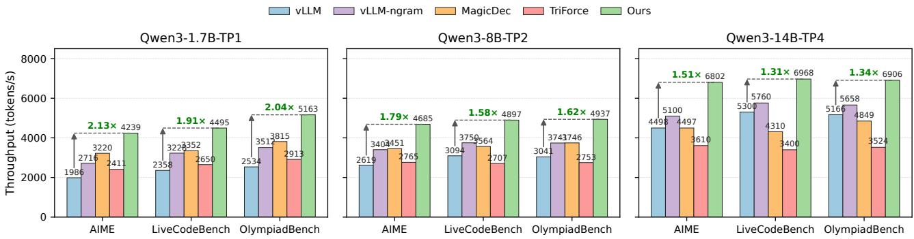  
Figure 10. End-to-end throughput comparison of SparseSpec and existing training-free acceleration frameworks.

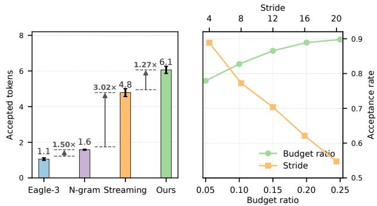  
Figure 11. Left: Number of accepted tokens for EAGLE-3, Ngram, Streaming, and SparseSpec when drafting k=8 tokens. Bars show the average across all models and datasets; error bars denote the standard deviation across model × dataset combinations. Right: Acceptance-rate sensitivity, with budget ratio on the bottom axis (k=8) and stride on the top axis (sparsity 0.05). Both curves are averaged over all evaluated models and datasets.

## 5 EVALUATION

## 5.1 Evaluation Setup

Models and Hardwares. We primarily evaluate SparseSpec using three state-of-the-art open-sourced RLMs: (1) Qwen3-1.7B, (2) Qwen3-8B, and (3) Qwen3-14B (Yang et al., 2025). To demonstrate generality across model architectures, we additionally evaluate on DeepSeek-R1-Distill-Llama3-8B (DeepSeek-AI, 2025a) and QwQ-32B (Qwen

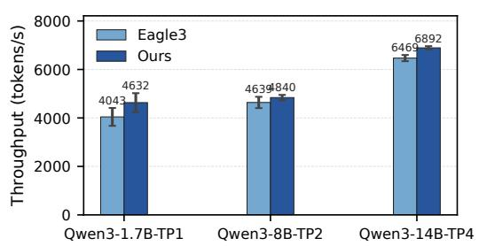  
Figure 12. End-to-end throughput comparison of SparseSpec and draft model based methods, averaged over three datasets. Error bars denote the standard deviation across datasets.

Team, 2025). We use tensor parallelism (TP) to partition models across multiple GPUs, selecting the parallelization that achieves the highest throughput per GPU, with TP1/2/4 for 1.7B/8B/14B, respectively. We use NVIDIA DGX-H100-SXM5 GPUs as our testbed.

Datasets. We use the following datasets as target reasoning workloads spanning math, general knowledge, and programming: (1) AIME (Veeraboina, 2023): Math problems from the American Invitational Mathematics Examination; (2) OlympiadBench (He et al., 2024): Olympiad-level bilingual scientific problems across STEM requiring advanced multistep reasoning, and we use its text QA subset for evaluation; and (3) LiveCodeBench (Jain et al., 2024a): Coding questions collected from LeetCode, AtCoder, and Codeforces. For each workload, we randomly sample 2048 requests to saturate the pipeline for the following evaluations. We set the temperature as 0.65 following common practice. Baselines. We compare SparseSpec against the following serving frameworks combined with different speculative decoding algorithms: (1) vLLM2: we enable vLLM-V1 by default for best performance; (2) vLLM-NGram (Leviathan et al., 2023): a training-free speculative decoding integrated into vLLM; (3) MagicDec (Chen et al., 2024): as the original open-sourced one is hard-coded for short output lengths and cannot be easily adapted, we reproduced MagicDec within our framework strictly following their paper; and (4) TriForce (Sun et al., 2024): similar to MagicDec, we reproduced TriForce based on vLLM; and (5) vLLM-EAGLE3 (Li et al., 2025a): a state-of-the-art draft-model based speculative decoding algorithm integrated by vLLM. We adopt all EAGLE3 draft models open-sourced by Tencent (Contributors, 2025). For all baselines, we enable chunked prefill, CUDA graph, and continuous batching. We set up the best configuration for both NGram (k = 4) and EAGLE3 (k = 3) according to our tests, with the tree-speculation disabled in batch inference following (Li et al., 2025a). We set the maximal batch size for all frameworks to 256, which is large enough to saturate GPU memory in our setup.

Table 2. Throughput speedup of SparseSpec over vLLM on non-Qwen3 models. SparseSpec achieves consistent gains across different model families and TP configurations.  
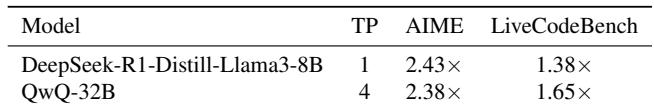

## 5.2 End-to-End Performance

Ours vs. training-free speculative decoding. SparseSpec is a training-free speculative decoding system by design. Thus, we compare SparseSpec with training-free speculative decoding methods including vLLM-NGram (Leviathan et al., 2023), MagicDec (Chen et al., 2024), and Tri-Force (Sun et al., 2024). Specifically, TriForce, as a hierarchical framework, comprises three speculation layers, one of which relies on a standalone draft model; because no usable small draft model is available for recent RLMs, we replace that layer with a training-free NGram. For the middle layer, we use sliding window attention as the draft model, the same as MagicDec. We set k equal to 1 and 6 for the first and middle layer, which performs best in our setup.

As shown in Figure 10, SparseSpec consistently outperforms all baselines, achieving up to 2.13× speedup compared to state-of-the-art framework, vLLM. When compared to existing speculative decoding frameworks, SparseSpec achieves up to 1.36× throughput improvement. Interestingly, TriForce consistently falls behind MagicDec, mainly because the additional layer of NGram has a low acceptance rate (Figure 11 (left)) that leads to excessive computation. Besides, all speculative decoding methods achieve lower speedup with larger models and TP degrees. This is because, though available GPU memory increases, the per-token memory usage increases much less. For example,

Table 3. Breakdown of execution time (ms) on Qwen3-8B.  
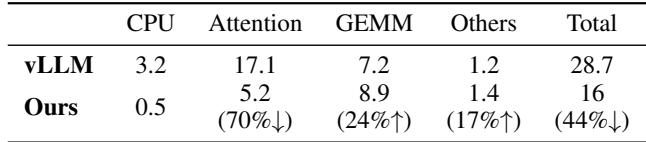

Qwen3-8B and -14B share the same head dimension and number of key/value heads. Therefore, the maximal B of requests increases a lot, which approaches the saturation point Bˆ, incurring more computation overhead in speculation.

Ours vs. draft model based speculative decoding. We also compare SparseSpec with a state-of-the-art draft model based speculative decoding method, EAGLE3, which require additional training. Under this setting, SparseSpec still achieves better performance over all datasets and models, despite requiring no additional training. SparseSpec further delivers similar or higher throughput while completely avoiding the additional cost and engineering effort associated with draft-model fine-tuning and deployment.

Ours vs. self-speculative decoding. Layer-skipping selfspeculation methods such as LayerSkip (Elhoushi et al., 2024), Self-SD (Zhang et al., 2024), and SkipDecode (Corro et al., 2023) require model fine-tuning or layer-wise optimization, and are therefore not directly applicable to RLMs. Swift (Xia et al., 2025) removes the fine-tuning requirement but is inherently limited to single-request inference, as different requests require skipping different layers, making batch serving infeasible. Even in the single-request setting where Swift is most favorable, we reproduce it with its official implementation on Llama-2-13B and observe only a 1.47× speedup on AIME, well below the > 2× speedup SparseSpec achieves.

Generality across model architectures. To validate that SparseSpec’s generality across model architectures, we evaluate on DeepSeek-R1-Distill-Llama3-8B (TP1) and QwQ-32B (TP4), as shown in Table 2. SparseSpec achieves consistent speedups of 2.43× and 2.38× on AIME, confirming that the analytical framework in § 3.2 generalizes across transformer-based autoregressive models.

Performance on shorter workloads. As analyzed in § 3.2, self-speculation benefits diminish as shorter outputs allow larger batch sizes, shifting the workload from memorybound to compute-bound. On GPQA-Diamond (Rein et al., 2024) (∼8000 average output tokens), SparseSpec achieves 1.66× and 1.44× speedup on Qwen3-1.7B and Qwen3-8B, respectively, confirming effectiveness on moderately long workloads.

Execution time breakdown. To breakdown the improvement, we profile the execution latency for CPU operations, attention, and GEMM in SparseSpec on Qwen3-8B model with AIME dataset, and compare it with vLLM in Table 3. Results show that SparseSpec successfully reduces the execution time of Attention by 3.29×, with only a slight time increase in GEMM (1.7ms), consistent with our estimation in § 3.2. Moreover, SparseSpec maintains exceptionally low CPU overhead (< 1 ms), resulting in high GPU utilization.

Table 4. Average time per output token (TPOT) on AIME under fixed batch sizes. SparseSpec reduces per-token latency as its throughput gains come from higher token parallelism within the same set of requests.  
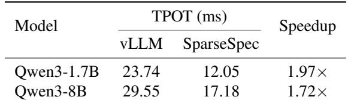

Latency analysis. Because SparseSpec increases token parallelism without adding concurrent requests, throughput gains translate directly into lower per-output-token latency (TPOT). We measure the average TPOT on AIME under fixed batch sizes to isolate queuing effects, as shown in Table 4. Compared to vLLM, SparseSpec reduces TPOT by 1.97× and 1.72× on Qwen3-1.7B and Qwen3-8B, respectively.

## 5.3 Speculation Acceptance Rate

We evaluate the acceptance rate of PillarAttn by measuring the average acceptance length when drafting 8 tokens (i.e., k = 8) across different models and datasets. We do not count the bonus token for all methods. As shown in Figure 11 (left), PillarAttn achieves an average acceptance token length of 6.16 out of 8 tokens, surpassing all other drafting methods. In comparison, both NGram and EAGLE3 can only draft fewer than 2 accepted tokens. We hypothesize this is because those reasoning tasks are out-of-distribution from EAGLE3’s training datasets, indicating less generality.

## 5.4 Sensitivity Tests

We conduct sensitivity tests over three datasets to quantify how the speculation steps k and the sparsity ratio s affect the performance of PillarAttn, as shown in Figure 11 (right). Despite fixing s = 0.05 and k = 8 in our evaluation, SparseSpec has no rigid constraints on these hyperparameters during runtime, which in fact allows arbitrary combinations and heterogeneous request configurations.

Speculation steps k. Fixing the sparsity ratio s = 0.05, we vary the drafting length from 4 to 20. We set the draft length k = 8 to balance acceptance and verification overhead.

Sparsity ratio s. We vary the sparsity ratio in PillarAttn and measure the acceptance rate when generating 8 tokens.

Table 5. Comparison of PillarAttn against Quest (Tang et al., 2024) on AIME with Qwen3-1.7B (k=8, sparsity 0.05). Top-10 Recall measures the fraction of selected tokens overlapping with the oracle top-10 tokens. Attn Coverage measures the total attention score covered by the sparse attention selection.  
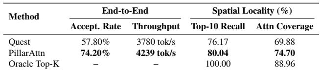

We set the sparsity ratio to 0.05, as performance saturates with further increases in selected tokens.

## 5.5 PillarAttn Analysis

Comparison with state-of-the-art sparse attention. We compare PillarAttn against Quest (Tang et al., 2024), a stateof-the-art query-aware sparse attention method, on AIME with Qwen3-1.7B while keeping all other system optimizations identical. As shown in Table 5, PillarAttn achieves a 74.20% acceptance rate compared to Quest’s 57.80%, and delivers 12% higher end-to-end throughput. This improvement is attributed to PillarAttn’s use of exact attention scores from the verification phase, as opposed to Quest’s approximate importance estimation via key pooling.

Spatial locality analysis. PillarAttn relies on the observation that sparsity patterns exhibit spatial locality across the speculation stride, despite the dynamic contexts in RLMs. We measure how well each method’s selected tokens overlap with the oracle top-K tokens on AIME at 5% sparsity, as shown in Table 5. PillarAttn consistently achieves higher recall and attention coverage than Quest. This is because the speculation stride is small (k=8–12 tokens), so the sparsity pattern refreshes frequently enough to track semantic shifts during reasoning.

## 5.6 Ablation Study

To isolate the contribution of each design component, we start from a naive implementation for sparse self-speculative decoding, and incrementally enable the unified batch scheduler, dynamic KV-Cache manager, and delayed verification. The throughput for AIME with Qwen3-1.7B is shown in Figure 13. Our experiments reveal that three designs boost the performance by 1.23×, 1.61×, and 1.12×, respectively, culminating in an aggregate throughput gain of 2.22×. We also provide detailed profiling for each component:

Batch size and compute utilization. Figure 14 presents a comparative analysis of GEMM input batch sizes and hardware utilization (in TFlops) between systems with and without unified batching. With unified batching enabled, the input batch size remains stable across iterations, while traditional scheduling causes significant variance and leads to hardware underutilization during the drafting phase.

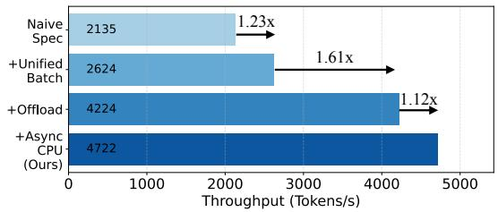  
Figure 13. Ablation study of SparseSpec on Qwen3-1.7B with AIME. Each component contributes to significant improvement.

Fused attention. We evaluate the performance of the fused sparse and full attention kernel against two baselines: sequentially launching two kernels (Sequential) and a naive kernel that computes both attention types jointly (Naive Batch). The result is shown in Figure 15. Our fused kernel achieves a 1.3× speedup over sequentially running and a 1.8× speedup compared to naive batching, which comes from the following two factors: (1) best kernel configuration dispatched to both draft and verification attention; (2) higher bandwidth utilization when having more transaction bytes within a single kernel to overlap pipeline latency.

Memory capacity utilization. We compare the memory utilization and recomputation of SparseSpec with baselines including oracle and preemption as described in § 4.4. As shown in Figure 5, SparseSpec utilizes nearly all available GPU memory without incurring recomputation. We further quantify the overhead of offloading by comparing the execution time with offload operations enabled against a baseline where these operations are replaced with an empty kernel. The results indicate that offloading prolongs cycle time by only 0.5% on average, which is practically negligible.

## 6 DISCUSSION

SparseSpec on mixture-of-expert (MoE) models. SparseSpec can be seamlessly applied to MoE models, as only the attention module is involved without modifying FFN. Furthermore, as only a subset of the experts is activated during inference, the input token size per expert decreases significantly, which increases the saturation point Bˆ for the sparsified FFN computation. Therefore, self-speculation has a higher potential due to the reduced computation overhead.

SparseSpec with multi-token prediction (MTP). SparseSpec can be combined with other lightweight drafting methods, including EAGLE3 and MTP, into a hierarchical speculation approach as proposed in TriForce (Sun et al., 2024). For example, MTP is used to draft k1 tokens at once, which are verified by PillarAttn into a buffer; when k2 tokens are accepted and accumulated, the underlying full attention is used for verification. Such a hierarchical approach can reduce the amount of FFN computation besides KV-Cache loading, leading to a great opportunity for further speedup.

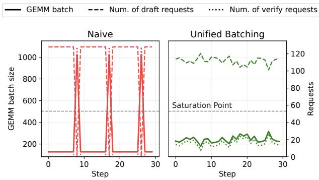  
Figure 14. GEMM input batch size and request counts when running Qwen3-8B on H100 with different scheduling policies. Naive alternates between all-draft and all-verify phases, yielding fluctuation; Unified mixes draft/verify evenly with a stable batch size, preventing both GPU underutilization and oversaturation.

Delayed verification overhead. Delayed verification introduces a one-cycle stall for 1k+1 of requests per iteration, but this cost is offset by removing CPU operations from the critical path. For example, when running Qwen3-14B with 4×H100 on AIME, GPU execution requires 18.37 ms per step while CPU operations require 8.55 ms per step on average. The resulting CPU savings (8.55/18.37 ≈ 46.5%) exceed the delayed verification overhead (1/(k+1) ≈ 11% for k=8), yielding a net 1.12× throughput improvement as shown in the ablation study (§ 5.6).

Limitation. The proposed method focuses on improving the memory efficiency of long-generation workloads. For tasks with short output lengths, the achievable batch size is large enough to saturate GPU computation, making the workload compute-bound (Zhu et al., 2024). As analyzed in § 3.2, once the average output length drops below a model-specific threshold, the additional computation from speculation outweighs the memory savings. Similarly, when FFN rather than attention dominates latency, the speedup from sparse attention is reduced. Nevertheless, as RLMs continue to scale output lengths, attention-bound scenarios are expected to become increasingly prevalent (Snell et al., 2024), broadening SparseSpec’s applicability.

## 7 RELATED WORK

Long-context sparse attention. Prior works have widely explored speeding up attention by exploiting its inherent sparsity. Static approaches (Xiao et al., 2024b; Zhang et al., 2023; Li et al., 2024a) employ a fixed KV-cache pruning strategy, thus cannot adapt to evolving reasoning contexts.

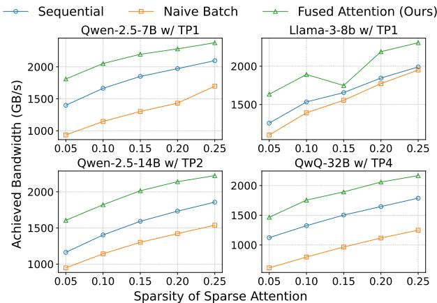  
Figure 15. Performance comparison between sequentially launching FlashInfer kernels for full and sparse attention (Sequential), naively batching full and sparse attention using one FlashInfer (Naive Batch), and our fused sparse and full attention kernels.

While query-aware methods (Tang et al., 2024; Zhu et al., 2025; Xiao et al., 2024a; Wu et al., 2025; Lin et al., 2025) dynamically identify important tokens during generation, they incur non-negligible overhead in estimating token importance. In contrast, PillarAttn naturally reuses attention scores from the verification phase of speculative decoding, to dynamically select critical tokens for the next drafting phase, with minimal overhead.

Speculative decoding. Speculative decoding provides lossless acceleration for long-output tasks. Training-based approaches-including the EAGLE series (Li et al., 2025b; 2024b; 2025a), Hydra (Ankner et al., 2024), Multi-token Prediction (DeepSeek-AI, 2025b) and EESD (Liu et al., 2024a)-improve acceptance rates effectively via different draft model designs or learning approaches, but at the cost of higher deployment complexity. Training-free methods like N-gram (Leviathan et al., 2023), Lookahead Decoding (Fu et al., 2024), and SAM Decoding (Hu et al., 2024) predict future tokens from the current context, suffering from degraded accuracy on reasoning tasks. MagicDec (Chen et al., 2024) and TriForce (Sun et al., 2024) adopt static sparse attention as draft for long-input scenarios but struggle with long, dynamic reasoning outputs. The suffix tree approach in RhymeRL (He et al., 2025) and SuffixDecoding (Oliaro et al., 2024) is effective in RL rollouts but does not adapt to serving, where each document only occurs once. Self-speculative methods such as LayerSkip (Elhoushi et al., 2024), Self-SD (Zhang et al., 2024), and SkipDecode (Corro et al., 2023) skip layers during drafting but require model fine-tuning or optimization. Swift (Xia et al., 2025) is training-free but less effective under batch serving, as different requests may require skipping different layers.

In contrast, SparseSpec identifies attention as the bottleneck in reasoning inference and seamlessly integrates the original model with an accurate dynamic sparse attention module PillarAttn as the draft model, achieving substantial end-toend speedups without requiring extra training or storage.

## 8 CONCLUSION

Due to long output sequences, reasoning model inference is heavily memory-bound. We propose SparseSpec, a lossless and training-free framework for reasoning models that adopts sparse self-speculation. SparseSpec identifies critical tokens during full attention in the verification phase and uses them to guide sparsity during drafting. With system-level optimizations-including a unified and resource-aware batch scheduler, delayed verification, and dynamic KV-Cache manager-SparseSpec achieves up to 2.13× throughput improvement over state-of-the-art serving frameworks.

## ACKNOWLEDGEMENTS

We thank MIT-IBM Watson AI Lab, Amazon and National Science Foundation for supporting this research. We thank NVIDIA for donating the DGX server.

## REFERENCES

Ankner, Z., Parthasarathy, R., Nrusimha, A., Rinard, C., Ragan-Kelley, J., and Brandon, W. Hydra: Sequentiallydependent draft heads for medusa decoding, 2024. URL https://arxiv.org/abs/2402.05109.

Chen, C., Borgeaud, S., Irving, G., Lespiau, J.-B., Sifre, L., and Jumper, J. Accelerating large language model decoding with speculative sampling, 2023. URL https: //arxiv.org/abs/2302.01318.

Chen, J., Tiwari, V., Sadhukhan, R., Chen, Z., Shi, J., Yen, I. E.-H., and Chen, B. Magicdec: Breaking the latencythroughput tradeoff for long context generation with speculative decoding. arXiv preprint arXiv:2408.11049, 2024.

Contributors, T. A. P. AngelSlim, 7 2025. URL https: //github.com/Tencent/AngelSlim.

Corro, L. D., Giorno, A. D., Agarwal, S., Yu, B., Awadallah, A., and Mukherjee, S. Skipdecode: Autoregressive skip decoding with batching and caching for efficient llm inference, 2023. URL https://arxiv.org/abs/ 2307.02628.

DeepSeek-AI. Deepseek-r1: Incentivizing reasoning capability in llms via reinforcement learning, 2025a. URL https://arxiv.org/abs/2501.12948.

DeepSeek-AI. Deepseek-v3 technical report, 2025b. URL https://arxiv.org/abs/2412.19437.

Elhoushi, M., Shrivastava, A., Liskovich, D., Hosmer, B., Wasti, B., Lai, L., Mahmoud, A., Acun, B., Agarwal, S., Roman, A., Aly, A., Chen, B., and Wu, C.- J. Layerskip: Enabling early exit inference and selfspeculative decoding. In Proceedings of the 62nd Annual Meeting of the Association for Computational Linguistics (Volume 1: Long Papers), pp. 12622–12642. Association for Computational Linguistics, 2024. doi: 10.18653/v1/2024.acl-long.681. URL http://dx.d oi.org/10.18653/v1/2024.acl-long.681.

Fu, Y., Bailis, P., Stoica, I., and Zhang, H. Break the sequential dependency of llm inference using lookahead decoding, 2024. URL https://arxiv.org/abs/ 2402.02057.

Guan, X., Zhang, L. L., Liu, Y., Shang, N., Sun, Y., Zhu, Y., Yang, F., and Yang, M. rstar-math: Small llms can master math reasoning with self-evolved deep thinking, 2025. URL https://arxiv.org/abs/2501.04519.

He, C., Luo, R., Bai, Y., Hu, S., Thai, Z. L., Shen, J., Hu, J., Han, X., Huang, Y., Zhang, Y., Liu, J., Qi, L., Liu, Z., and Sun, M. Olympiadbench: A challenging benchmark for promoting agi with olympiad-level bilingual multimodal scientific problems, 2024. URL https://arxiv.or g/abs/2402.14008.

He, J., Li, T., Feng, E., Du, D., Liu, Q., Liu, T., Xia, Y., and Chen, H. History rhymes: Accelerating llm reinforcement learning with rhymerl. arXiv preprint arXiv:2508.18588, 2025.

Hu, Y., Wang, K., Zhang, X., Zhang, F., Li, C., Chen, H., and Zhang, J. Sam decoding: Speculative decoding via suffix automaton, 2024. URL https://arxiv.org/ abs/2411.10666.

Jain, N., Han, K., Gu, A., Li, W.-D., Yan, F., Zhang, T., Wang, S., Solar-Lezama, A., Sen, K., and Stoica, I. Livecodebench: Holistic and contamination free evaluation of large language models for code. arXiv preprint arXiv:2403.07974, 2024a. URL https://arxiv.or g/abs/2403.07974.

Jain, N., Han, K., Gu, A., Li, W.-D., Yan, F., Zhang, T., Wang, S., Solar-Lezama, A., Sen, K., and Stoica, I. Livecodebench: Holistic and contamination free evaluation of large language models for code, 2024b. URL https://arxiv.org/abs/2403.07974.

Kimi Team. Kimi k1.5: Scaling reinforcement learning with llms, 2025. URL https://arxiv.org/abs/2501 .12599.

Kwon, W., Li, Z., Zhuang, S., Sheng, Y., Zheng, L., Yu, C. H., Gonzalez, J. E., Zhang, H., and Stoica, I. Efficient

memory management for large language model serving with pagedattention, 2023. URL https://arxiv.or g/abs/2309.06180.

Leviathan, Y., Kalman, M., and Matias, Y. Fast inference from transformers via speculative decoding, 2023. URL https://arxiv.org/abs/2211.17192.

Li, Y., Huang, Y., Yang, B., Venkitesh, B., Locatelli, A., Ye, H., Cai, T., Lewis, P., and Chen, D. Snapkv: Llm knows what you are looking for before generation, 2024a. URL https://arxiv.org/abs/2404.14469.

Li, Y., Wei, F., Zhang, C., and Zhang, H. Eagle-2: Faster inference of language models with dynamic draft trees, 2024b. URL https://arxiv.org/abs/2406.1 6858.

Li, Y., Wei, F., Zhang, C., and Zhang, H. Eagle-3: Scaling up inference acceleration of large language models via training-time test, 2025a. URL https://arxiv.or g/abs/2503.01840.

Li, Y., Wei, F., Zhang, C., and Zhang, H. Eagle: Speculative sampling requires rethinking feature uncertainty, 2025b. URL https://arxiv.org/abs/2401.15077.

Lin, C., Tang, J., Yang, S., Wang, H., Tang, T., Tian, B., Stoica, I., and Gao, M. Twilight: Adaptive attention sparsity with hierarchical top-p pruning. arXiv preprint arXiv:2502.02770, 2025.

Liu, J., Wang, Q., Wang, J., and Cai, X. Speculative decoding via early-exiting for faster llm inference with thompson sampling control mechanism, 2024a. URL https://arxiv.org/abs/2406.03853.

Liu, X., Hu, L., Bailis, P., Cheung, A., Deng, Z., Stoica, I., and Zhang, H. Online speculative decoding, 2024b. URL https://arxiv.org/abs/2310.07177.

Luo, M., Tan, S., Wong, J., Shi, X., Tang, W. Y., Roongta, M., Cai, C., Luo, J., Li, L. E., Popa, R. A., and Stoica, I. Deepscaler: Surpassing o1-preview with a 1.5b model by scaling rl. https://pretty-radio-b75.notio n.site/DeepScaleR-Surpassing-O1-Previ ew-with-a-1-5B-Model-by-Scaling-RL-1 9681902c1468005bed8ca303013a4e2, 2025. Notion Blog.

Miao, X., Oliaro, G., Zhang, Z., Cheng, X., Wang, Z., Zhang, Z., Wong, R. Y. Y., Zhu, A., Yang, L., Shi, X., Shi, C., Chen, Z., Arfeen, D., Abhyankar, R., and Jia, Z. Specinfer: Accelerating large language model serving with tree-based speculative inference and verification. In Proceedings of the 29th ACM International Conference on Architectural Support for Programming Languages and Operating Systems, Volume

3, ASPLOS ’24, pp. 932–949. ACM, April 2024. doi: 10.1145/3620666.3651335. URL http://dx.doi.o rg/10.1145/3620666.3651335.

Numina, P. Aimo progress prize competition. https: //huggingface.co/datasets/AI-MO/aimo -validation-aime, 2025. [Accessed 13-04-2025].

Oliaro, G., Jia, Z., Campos, D., and Qiao, A. Suffixdecoding: A model-free approach to speeding up large language model inference. arXiv preprint arXiv:2411.04975, 2024.

OpenAI. Openai o1 system card, 2024. URL https: //arxiv.org/abs/2412.16720.

Qwen Team. Qwq-32b: Embracing the power of reinforcement learning. https://qwenlm.github.io/b log/qwq-32b/, 2025. [Accessed 13-04-2025].

Rein, D., Hou, B. L., Stickland, A. C., Petty, J., Pang, R. Y., Dirani, J., Michael, J., and Bowman, S. R. Gpqa: A graduate-level google-proof q&a benchmark. In First Conference on Language Modeling, 2024. URL https: //openreview.net/forum?id=Ti67584b98.

Snell, C., Lee, J., Xu, K., and Kumar, A. Scaling llm test-time compute optimally can be more effective than scaling model parameters, 2024. URL https://arxi v.org/abs/2408.03314.

Srivatsa, V., Li, D., Zhang, Y., and Abhyankar, R. Can scheduling overhead dominate llm inference performance? a study of cpu scheduling overhead on two popular llm inference systems. https://mlsys.wukl ab.io/posts/scheduling\_overhead/, 2024. [Accessed 06-04-2025].

Sun, H., Chen, Z., Yang, X., Tian, Y., and Chen, B. Triforce: Lossless acceleration of long sequence generation with hierarchical speculative decoding. arXiv preprint arXiv:2404.11912, 2024.

Tang, J., Zhao, Y., Zhu, K., Xiao, G., Kasikci, B., and Han, S. Quest: Query-aware sparsity for efficient long-context llm inference, 2024. URL https://arxiv.org/ab s/2406.10774.

Veeraboina, H. Aime problem set 1983-2024, 2023. URL https://www.kaggle.com/datasets/hemi shveeraboina/aime-problem-set-1983-2 024.

Wu, W., Pan, Z., Wang, C., Chen, L., Bai, Y., Wang, T., Fu, K., Wang, Z., and Xiong, H. Tokenselect: Efficient long-context inference and length extrapolation for llms via dynamic token-level kv cache selection, 2025. URL https://arxiv.org/abs/2411.02886.

Xia, H., Li, Y., Zhang, J., Du, C., and Li, W. Swift: On-thefly self-speculative decoding for llm inference acceleration, 2025. URL https://arxiv.org/abs/2410 .06916.

Xiao, C., Zhang, P., Han, X., Xiao, G., Lin, Y., Zhang, Z., Liu, Z., and Sun, M. Infllm: Training-free long-context extrapolation for llms with an efficient context memory, 2024a. URL https://arxiv.org/abs/2402.0 4617.

Xiao, G., Tian, Y., Chen, B., Han, S., and Lewis, M. Efficient streaming language models with attention sinks, 2024b. URL https://arxiv.org/abs/2309.1 7453.

Yang, A., Li, A., Yang, B., Zhang, B., Hui, B., Zheng, B., Yu, B., Gao, C., Huang, C., Lv, C., Zheng, C., Liu, D., Zhou, F., Huang, F., Hu, F., Ge, H., Wei, H., Lin, H., Tang, J., Yang, J., Tu, J., Zhang, J., Yang, J., Yang, J., Zhou, J., Zhou, J., Lin, J., Dang, K., Bao, K., Yang, K., Yu, L., Deng, L., Li, M., Xue, M., Li, M., Zhang, P., Wang, P., Zhu, Q., Men, R., Gao, R., Liu, S., Luo, S., Li, T., Tang, T., Yin, W., Ren, X., Wang, X., Zhang, X., Ren, X., Fan, Y., Su, Y., Zhang, Y., Zhang, Y., Wan, Y., Liu, Y., Wang, Z., Cui, Z., Zhang, Z., Zhou, Z., and Qiu, Z. Qwen3 technical report, 2025. URL https: //arxiv.org/abs/2505.09388.

Yang, S., Sheng, Y., Gonzalez, J. E., Stoica, I., and Zheng, L. Post-training sparse attention with double sparsity, 2024. URL https://arxiv.org/abs/2408.07092.

Ye, Z., Chen, L., Lai, R., Lin, W., Zhang, Y., Wang, S., Chen, T., Kasikci, B., Grover, V., Krishnamurthy, A., and Ceze, L. Flashinfer: Efficient and customizable attention engine for llm inference serving, 2025. URL https://arxiv.org/abs/2501.01005.

Zhang, H., Ji, X., Chen, Y., Fu, F., Miao, X., Nie, X., Chen, W., and Cui, B. Pqcache: Product quantization-based kvcache for long context llm inference, 2025. URL ht tps://arxiv.org/abs/2407.12820.

Zhang, J., Wang, J., Li, H., Shou, L., Chen, K., Chen, G., and Mehrotra, S. Draft and verify: Lossless large language model acceleration via self-speculative decoding. In Proceedings of the 62nd Annual Meeting of the Association for Computational Linguistics (Volume 1: Long Papers), pp. 11263–11282. Association for Computational Linguistics, 2024. doi: 10.18653/v1/2024.acl-long.607. URL http://dx.doi.org/10.18653/v1/202 4.acl-long.607.

Zhang, Z., Sheng, Y., Zhou, T., Chen, T., Zheng, L., Cai, R., Song, Z., Tian, Y., Re, C., Barrett, C., Wang, Z., and ´ Chen, B. H2o: Heavy-hitter oracle for efficient generative

inference of large language models, 2023. URL https: //arxiv.org/abs/2306.14048.

Zhao, Y., Lin, C.-Y., Zhu, K., Ye, Z., Chen, L., Zheng, S., Ceze, L., Krishnamurthy, A., Chen, T., and Kasikci, B. Atom: Low-bit quantization for efficient and accurate llm serving, 2024a. URL https://arxiv.org/abs/ 2310.19102.

Zhao, Y., Yang, S., Zhu, K., Zheng, L., Kasikci, B., Zhou, Y., Xing, J., and Stoica, I. Blendserve: Optimizing offline inference for auto-regressive large models with resourceaware batching, 2024b. URL https://arxiv.org/ abs/2411.16102.

Zheng, L., Yin, L., Xie, Z., Sun, C., Huang, J., Yu, C. H., Cao, S., Kozyrakis, C., Stoica, I., Gonzalez, J. E., Barrett, C., and Sheng, Y. Sglang: Efficient execution of structured language model programs, 2024. URL https://arxiv.org/abs/2312.07104.

Zhu, K., Zhao, Y., Zhao, L., Zuo, G., Gu, Y., Xie, D., Gao, Y., Xu, Q., Tang, T., Ye, Z., Kamahori, K., Lin, C.-Y., Wang, S., Krishnamurthy, A., and Kasikci, B. Nanoflow: Towards optimal large language model serving throughput, 2024. URL https://arxiv.org/abs/2408 .12757.

Zhu, K., Tang, T., Xu, Q., Gu, Y., Zeng, Z., Kadekodi, R., Zhao, L., Li, A., Krishnamurthy, A., and Kasikci, B. Tactic: Adaptive sparse attention with clustering and distribution fitting for long-context llms, 2025. URL https://arxiv.org/abs/2502.12216.