# ONTOLOGY-GUIDED LONG-TERM AGENT MEMORY FOR CONVERSATIONAL RAG

Shuang Cao \* 1 Rui Li \* 1

## ABSTRACT

Retrieval-augmented generation (RAG) enables LLMs to ground responses in external knowledge, but long-term, multi-session conversations still suffer from implicit recall failures: when current user queries lack lexical overlap with earlier facts (e.g., preferences), standard dense retrieval and long-context prompting often miss the most relevant memories. We present a dialogue-aware RAG system that jointly addresses what to store and how to retrieve under constraints. Our design extracts durable user facts into a lightweight memory graph, enriches queries with conversational cues, performs hybrid retrieval, and uses a budget-aware router to balance quality and serving cost. On our Implicit Preference Recall benchmark, the system lifts Recall@10 to 0.70 (vs. 0.58 for dense-only) and improves nDCG@10 from 0.41 to 0.51. The system also reduces cross-modality disagreement by 47% and achieves a 81% cost reduction compared to long-context methods.

## 1 INTRODUCTION

Retrieval-augmented generation (RAG) has become a cornerstone for grounding large language models (LLMs) in up-to-date, verifiable knowledge by combining parametric models with non-parametric memory. However, when RAG is deployed in long-term, multi-session conversations, systems often fail to recall dispersed user-specific facts and temporally linked events that are crucial for coherent, personalized responses. Recent evaluations on very long-horizon dialogue (e.g., LoCoMo) show that long-context LLMs and vanilla RAG improve short-span QA but still lag behind humans on temporal/causal reasoning and consistency across dozens of sessions (Maharana et al., 2024). This gap has drawn intense interest to memory-augmented modeling and retrieval strategies that can preserve, abstract, and reliably resurface past conversational evidence (Wang et al., 2023; Jimenez Gutierrez et al., 2024; Khattab & Zaharia, 2020).

At a high level, current solutions fall into three complementary categories. (i) Capacity-oriented memory augments LLMs with external or tiered memory so past content can be cached and retrieved beyond the input window (e.g., LongMem’s decoupled memory reader and MemGPT’s OS-style memory hierarchy) (Packer et al., 2023; Wang et al., 2023). (ii) Dialogue-aware RAG reconstructs richer queries from conversation history and refreshes stored context dynamically to recover implicit links that similarity-only retrieval misses (e.g., DH-RAG) (Zhang et al., 2025). (iii) Structure-augmented retrieval injects neuro-/knowledge-inspired structure so that entities, events, and relations become first-class retrievable objects (e.g., HippoRAG’s knowledge graph and Personalized PageRank; global-memory RAG in MemoRAG) (Jimenez Gutierrez et al., 2024; Qian et al., 2024). Despite progress, today’s systems still struggle to consistently surface the right long-term memories when the current turn lacks explicit lexical anchors; moreover, late-interaction retrieval (e.g., ColBERT) improves matching fidelity but needs dialoguespecific mechanisms to decide what to store and when to retrieve (Khattab & Zaharia, 2020).

We propose a dialogue-aware RAG system (hereafter, “our system”) to address long-term conversational forgetting. At a high level, our design couples: (1) query enrichment that leverages multi-turn conversational signals to reconstruct retrieval intents even when the current utterance is underspecified; (2) a lightweight structured memory that represents durable user facts/events and their temporal relations for precise linking; and (3) hybrid retrieval that combines semantic search with structure-guided routing to surface implicitly relevant evidence. These components directly target the key challenges identified above: limited capacity, missing implicit links, and lack of structure for long-horizon reasoning (Maharana et al., 2024).

We implement our system within a standard RAG stack (encoder retriever, vector store, generator) with pluggable modules for query enrichment and structured memory. We evaluate it on long-horizon dialogue settings and compare against strong baselines representative of the three categories above (capacity-oriented memory, dialogue-aware RAG, and structure-augmented retrieval). Our experiments indicate improved recall of user-specific facts and better temporal consistency over extended sessions; we also conduct ablations to quantify the contribution of each component. The remainder of the paper is organized as follows. §2 presents background and motivation. §3 details the system design. §4 reports implementation details, experimental setup and results. §5 discusses related work. §6 concludes the work.

## 2 BACKGROUND & MOTIVATION

## 2.1 Background

Long-horizon, multi-session dialogue exposes a fundamental tension between what a language model must remember and what it can practically attend to. Recent evaluations show that even with extended context windows, models often fail to recall dispersed user-specific facts, to track temporal dependencies across sessions, and to maintain narrative coherence without explicit anchors to the past. On the Lo-CoMo benchmark, for example, LLMs improve on narrow QA but still lag on time-sensitive and causal understanding over hundreds of turns and dozens of sessions—highlighting retrieval accuracy and long-horizon reasoning as primary bottlenecks (Maharana et al., 2024). To address the memory side, one stream of work augments LLMs with a decoupled long-term memory bank that caches long-form history and retrieves on demand. LongMem exemplifies this approach by freezing the backbone as a memory encoder and introducing an adaptive side network for retrieval and reading, thereby extending effective memory far beyond the immediate context while mitigating staleness (Wang et al., 2023). Orthogonal to capacity, agentic systems emphasize what to store: they compress interactions into higher-level “semantic” memories and use reflective cycles to shape future retrieval. Generative Agents work by observing the context, planning their next actions, and reflecting to form long-term memories that shape later behavior (Park et al., 2023), and later work formalizes reflective memory management with prospective (forward-looking) and retrospective (feedbackdriven) reflection to adapt retrieval granularity online in long-term personalization settings (Tan et al., 2025).

On the retrieval side, RAG is a natural fit for conversational memory, but vanilla vector search can miss implicit links when current queries lack lexical overlap with salient past facts. Dialogue-aware RAG therefore expands or reconstructs queries from history and updates memory dynamically; for instance, DH-RAG learns to cluster and hierarchically match historical turns and to track reasoning chains so that evidence surfaces even without explicit mentions (Zhang et al., 2025). Beyond multi-step vector search, neuro-inspired designs integrate structure to surface latent but relevant memories: HippoRAG orchestrates knowledge graphs with Personalized PageRank and LLM reasoning to approximate hippocampal indexing, enabling “one-shot” retrieval of multi-hop, semantically connected evidence that similarity-only methods overlook (Jimenez Gutierrez et al., 2024). Grounded memory systems likewise advocate hybrid graph+vector retrieval so that user entities, events, and preferences become first-class retrievable objects (Ocker et al., 2025).

In summary, effective long-term conversational memory requires (i) capacity beyond the input window, (ii) selective abstraction via reflective summarization to decide what is worth storing, and (iii) dialogue-aware, structureaugmented retrieval that can recover implicitly relevant evidence. Our system follows this trajectory by enriching retrieval queries with conversational signals and by representing durable user facts/events in lightweight structure, directly targeting the failure modes surfaced by recent evaluations of long-term dialogue agents (Maharana et al., 2024).

## 2.2 The Implicit Recall Problem

Consider a user interacting with a chatbot across multiple sessions. Early in session 1 (turn 3), the user states: “I absolutely loved Titanic—the romance and soundtrack were perfect.” Over the following two weeks, the conversation spans 87 turns covering diverse topics: restaurant recommendations, work schedules, news summaries. In session 3 (turn 91), the user casually asks: “What should I watch this weekend?”

This scenario reveals a fundamental challenge in long-term conversational memory: implicit preference recall. The user expects the system to remember their earlier preference and suggest romantic dramas similar to Titanic, despite the query containing no explicit keywords like “Titanic,” “romance,” or “Leonardo DiCaprio.” Yet standard retrieval systems systematically fail here. The system defaults to generic recommendations (i.e. popular recent releases), missing the personalization opportunity entirely.

This failure is not isolated. To quantify the phenomenon, we constructed an Implicit Preference Recall benchmark spanning three domains: movie recommendations (MovieRec), food preferences (FoodPref), and productivity assistance (ProductivityAssist). The benchmark contains 500 multi-session dialogues averaging 73 turns each, collected through a combination of expert annotation over existing long-dialogue datasets (MSC (Xu et al., 2021)) and controlled user studies where participants engaged in natural multi-week conversations with a baseline assistant. Each dialogue includes early-turn preference statements (e.g., “I loved Titanic”), 50–100 distractor turns covering unrelated topics, and later keyword-free queries (e.g., “What should I watch?”) with ground-truth labels indicating which historical evidence should be retrieved. Figure 1 shows that across these 500 dialogues, dense-only Recall@10 degrades sharply from 0.61 (turns 1–20) to just 0.28 (turns 60+) as conversations lengthen and temporal gaps widen. The core issue is that vector similarity alone cannot bridge the conceptual gap between a user’s past preferences and future queries when lexical overlap is absent.

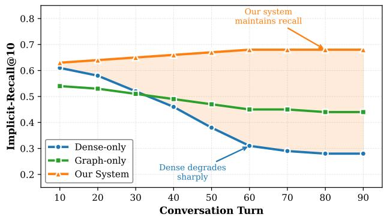  
Figure 1: Implicit recall degrades as conversations lengthen. Dense-only retrieval (blue) drops sharply due to temporal/lexical gaps. Graph-only (green) plateaus from schema coverage limits. Our system (orange) maintains stable recall through learned ontology and multi-modal consistency.

## 2.3 Three Fundamental Challenges

Our analysis of implicit recall failures across diverse conversational domains reveals three interrelated challenges that must be addressed jointly:

M1: Dense retrieval fails for implicit preferences without keyword overlap. Vector embeddings (Khattab & Zaharia, 2020) excel at capturing semantic similarity for queries with lexical or topical overlap. However, when a user asks “What should I watch?” weeks after mentioning “I loved Titanic,” the embedding distance between query and preference statement becomes large—not because the preference is irrelevant, but because standard encoders struggle to model long-range conceptual associations across temporal gaps. Graph-based retrieval (Edge et al., 2024) offers a potential solution: typed relations like User → PREFERS\_GENRE → Romance and User → LIKES → Titanic enable symbolic traversal independent of lexical overlap. But this requires learning these relations from conversational data rather than relying on fixed schemas, which cannot capture user-specific or emergent preference patterns (e.g., “early DiCaprio classics” as a personal category).

M2: Graph and dense modalities exhibit fundamental misalignment. Graphs provide robust structured reasoning including handling aliases (“that Leo movie” → Titanic), multi-hop inference (Titanic → Romance → Similar\_Movies), and type constraints, etc., but they suffer from coverage gaps when entities are novel or relations are implicit. Dense retrieval offers broad semantic matching but drifts under pronouns, temporal references, and conceptual abstractions. Critically, these modalities disagree substantially: on personalized queries in our data, graph and dense top-10 lists overlap by only 3.2 items on average. Simply scoring graph and dense retrieval independently and combining their results via weighted averaging fails to resolve this disagreement. When the graph ranks a piece of evidence at position 2 but dense search ranks it at position 47, which modality should the system trust? A natural solution is to align the two retrieval methods so they agree on important evidence. However, aligning scores across all hundreds of candidate results is computationally expensive and violates real-time serving constraints. The key insight is that alignment is only necessary for evidence that users found useful in past interactions, rather than forcing agreement across all possible candidates.

M3: Serving constraints demand budget-aware retrieval strategies. Production conversational systems operate under strict latency and cost budgets. Long-context approaches that feed full histories to LLMs achieve only small gains over dense-only under our benchmark (Recall@10 0.60 vs. 0.58 in Table 5), but at much higher cost and latency. Summary-memory performs slightly better (0.62 Recall@10 in Table 5) but still loses personalization signals accumulated in the graph. The challenge, therefore, is to pick per-query strategies that retain the graph’s strength without paying long-context cost.

## 3 SYSTEM DESIGN

Our system addresses all three challenges through tight co-design: Tag2Graph-Learner constructs data-driven dialogue ontologies with learned relation types and confidence weights (M1); Graph×Dense Consistency enforces distribution alignment on verified evidence to harmonize modalities (M2); Learnable Routing selects strategies and budgets via contextual bandits optimizing personalization against cost (M3). This unified approach achieves 21% higher Recall@10 than dense-only baselines (Table 5) while reducing costs 81% vs. long-context methods (Figure 5).

## 3.1 Architecture Overview

The architecture executes in three phases that progressively convert raw conversational turns into retrievable preference signals, as shown in Figure 2.

Phase 1: Data Ingest. Each incoming utterance is sent to three stores in parallel. The graph store creates/updates symbolic preference edges and tags them with a timestamp and learnable weight. The vector store keeps a dense embedding of the same utterance plus its metadata (e.g., turn/timestamp, linked entities) so it remains reachable by semantic search. The profile cache tracks lightweight stats over recent retrievals to enable personalization without rescanning the

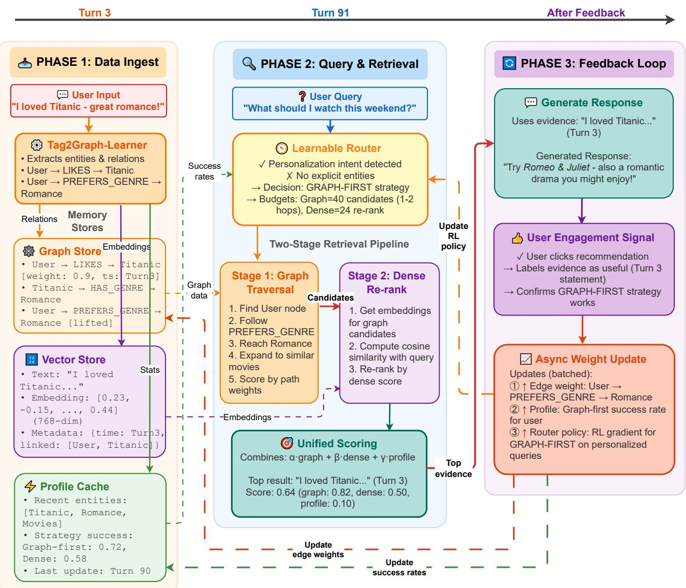  
Figure 2: System Architecture: Implicit Preference Recall with Three-Phase Data Flow

## full history.

Running Example. From “I loved Titanic” (Turn 3), the system records User → LIKES → Titanic and User → PREFERS\_GENRE → Romance (lifted via Titanic → HAS\_- GENRE → Romance), while the dense embedding is cross-linked to these nodes.

Phase 2: Query & Retrieval. At query time, a learnable router selects a graph-first or dense-first pathway based on personalization intent, alias risk, and the cache’s historical success statistics. In the graph-first setting, traversal surfaces conceptually proximate candidates which are then re-ranked by dense similarity; in the dense-first setting, semantic neighbors are retrieved first and subsequently augmented with structural features.

Running Example. At Turn 91, “What should I watch this weekend?” contains no lexical reference to Titanic but exhibits strong personalization cues, prompting graph-first traversal from the User node through PREFERS\_GENRE to Romance, which surfaces the Titanic utterance as the top-ranked reference.

Phase 3: Feedback Loop. Observed engagement serves as supervision: confirmed evidence increases the corresponding edge weights, updates the cache’s success statistics, and refines the router’s policy. This closes the loop from retrieval outcomes back to the memory representation itself, enabling the system to become more personalized over time without offline re-tuning.

Running Example. If the user follows the recommendation, the weight on PREFERS\_GENRE(Romance) is reinforced, increasing the likelihood that future preference-seeking queries before explicit entity mention will again select graph-first routing.

## 3.2 Tag2Graph-Learner: Data-Driven Dialogue Ontology

Long-horizon conversations frequently rely on past preferences and constraints that are referenced implicitly rather than repeated verbatim. Systems that store memory as surface spans struggle to recover such signals reliably. Tag2Graph-Learner lifts utterance-level evidence into stable, typed relations (e.g., User → PREFERS\_GENRE → Romance), so retrieval can operate at the level of concepts instead of tokens, and subsequent components can reason over a persistent, user-centric ontology.

Step I: Evidence extraction and normalization. We convert each utterance into candidate atomic assertions (a subject, relation, and object with time and provenance) using a two-phase pipeline. First, a span-level sequence tagger (BIO labeling (Lample et al., 2016)) identifies entity and attribute mentions, and a lightweight relation classifier links plausible subject–object pairs into provisional triples. Second, a constrained LLM pass is used only as a validator: given the provisional triple and its local context, it emits a structured yes/no judgment and (if yes) canonicalizes the relation phrase to our inventory. This split keeps the hot path fast (tagger + classifier) while allowing the validator to absorb open-text variability without fixing a brittle schema. Low-confidence triples are retained in the Vector Store (so they remain retrievable) but do not affect the graph; accepted assertions record their sources and timestamps for auditing and rollback.

This two-phase design tackles two recurring challenges. (1) Schema brittleness: by letting the tagger over-generate in a controlled format, we can later evolve the canonical inventory without changing serving logic. (2) Noise control: calibration on a held-out slice keeps precision high in the filter; candidates that do not pass are retained only in the Vector Store so they remain retrievable without influencing the graph. Each accepted assertion records its sources and timestamps to support auditing and later rollback.

Step II: Lifting assertions into conceptual relations. Assertions that repeatedly co-occur in a consistent way are promoted into typed, user-centric relations. Promotion is intentionally conservative and based on signals that are cheap to compute online but trained offline: recurrence across sessions (with recency weighting), agreement across contexts (e.g., different titles pointing to the same genre), and compatibility with the existing ontology. A small learned scorer aggregates these signals into a promotion score, which comes from a shallow, offline-trained classifier over cheap signals (e.g., recurrence with recency, context diversity). Its input is a candidate relation with its supporting episodes, and its output is a calibrated probability of promotion. An edge (such as PREFERS\_GENRE=Romance) is added only when the score exceeds a conservative gate and the supporting episodes are sufficiently diverse.

Two design challenges are addressed within this step. (1) Alias and reference resolution: titles, nicknames, and multilingual variants are merged only when these variants agree; uncertain cases are left unmerged and remain accessible via dense retrieval so they do not reshape the graph prematurely. (2) Guardrails: promotion declines when evidence is contradictory, privacy-sensitive, or exceeds tenant-level quotas on ontology growth. All promotions carry provenance (the set of supporting assertions and times), so subsequent components can trace and, if needed, undo their effects.

Step III: Feedback-driven maintenance under serving constraints. Lifting and edge strengths are refined by two feedback channels obtained during normal serving. The used-and-correct channel logs the evidence that was cited in answers and verified as faithful; the missed-but-needed channel collects facts that post-hoc counterfactual runs identify as the likely fix for a failure. Updates are applied asynchronously in micro-batches to avoid thrashing the hot path, with per-relation learning rates and rate limits so that no single dialogue burst can dominate the ontology. Crucially, heavy learning never blocks the request path: new edges are activated behind guardrails and only take effect after passing basic sanity checks.

Effect on retrieval. With promoted conceptual edges in place, keyword-free queries acquire stable anchor points for expansion. In our running scenario, a generic request like “What should I watch this week?” traverses from User through PREFERS\_GENRE to currently available items via SIMILAR\_TO and screening-time relations, even if Titanic never reappears in the query. Section 3.3 shows that aligning graph and dense evidence on actually used citations further reduces cross-modality disagreement; Section 4 reports that disabling the promotion gate substantially lowers implicitrecall at the same serving budget, indicating that cautious, feedback-guided ontology growth is the right lever.

## 3.3 Graph×Dense Consistency & Unified Scoring

Tag2Graph supplies concept-level structure; dense retrieval supplies breadth. In practice they disagree on a non-trivial fraction of personalized queries, and naïvely choosing one or averaging both produces brittle rankings. Our goal in this section is to make the two signals agree on evidence that actually helped prior answers while respecting interactive latency.

Unified scoring. We score each candidate piece of evidence by combining three views: a graph view (paths, relation types, edge strengths, and recency), a dense view (embedding similarity with light re-ranking), and a profile prior (short-term cache). The final score is a learned weighted sum:

$$
\tag{1}
$$

where the weights are fitted offline and validated to be stable across domains. We deliberately keep the hot path light: the cross-encoder, when used, is restricted to a small re-rank window after candidate selection.

Consistency where it counts. Rather than forcing the graph and dense views to match on all candidates (which would be slow and often counter-productive), we align them only on the subset of evidence that prior runs actually used and verified as correct. Concretely, we form per-query distributions over those cited items (one from graph scores, one from dense scores) and train a small regularizer that pulls the two distributions together, while leaving the rest of the candidate pool untouched. This reduces modality disagreement without inflating retrieval budgets.

Runtime behavior and uncertainty. At serving time we compute the three component scores, apply query rewriting (1), and admit the top-K. When the two views disagree sharply or the unified scores are unusually flat (a practical proxy for uncertainty), the system spends a small, capped budget on a single additional expansion (either one more graph hop or one more dense probe), then re-scores and proceeds. If the latency guard would be exceeded, we skip the expansion and fall back to the safer of the two views. This policy yields stable rankings under aliasing and temporal gaps while remaining within interactive bounds.

Effect. Training on verified citations lowers cross-modality disagreement and improves recall stability under the same budget; Figure 3 shows the reduction in disagreement alongside steady gains in Recall@10, and §4.4 reports the ablation where removing the regularizer degrades performance despite identical retrieval limits.

Example. A user once expressed liking Titanic; weeks later they ask “What should I watch this weekend?”. The retriever forms an initial candidate set from both views: graphside items reachable via PREFERS\_GENRE→Romance and dense-side neighbors of the new query. For each candidate we compute three component scores: a graph score from path structure and recency, a dense score from embedding similarity (with a small re-rank window), and a profile prior (a lightweight rolling cache; see §3.1) summarizing the user’s recent interaction patterns. The unified score applies Eq. 1 with offline-tuned weights; the resulting per-candidate numbers are shown in Table 1.

The two views disagree: graph favors classic romance while dense favors recent popular titles. During training, we align only on verified citations from prior successful answers, which reduces the gap for those items inside the small dense re-rank window. The adjusted dense scores and the final unified ranking after this effect are summarized in Table 2.

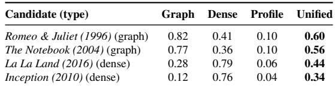  
Table 1: Initial unified scoring with weights wg=0.55, wd=0.35, wp=0.10.

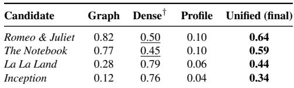  
Table 2: Post-consistency dense scores (†) reflect minor rerank adjustments learned from verified citations; weights remain fixed at serving.

## 3.4 Learnable Routing: Optimizing Personalization–Cost Tradeoffs

Our architecture exposes two complementary retrieval entry points. Graph-first leverages Tag2Graph’s conceptual edges and is robust on implicit, personalization-heavy queries (aliases, ellipsis, temporal gaps). Dense-first is cheaper and competitive for explicit factoids. Fixed rules, or a handful of surface heuristics, either overspend or miss recall. We therefore learn a router that, per query, chooses the leading view and assigns small candidate budgets to both views under the same latency guard. The decision is deliberately narrow: which view should lead, and how much exploration is worthwhile for this query.

The router consumes only cached or cheap signals: indicators of alias risk and time since the last relevant mention; whether the query touches promoted concepts in the user graph; a short profile summary (recent genres with recency); and a compact record of which strategy has recently worked for this user/domain. The model is a shallow predictor distilled into a tiny scoring function that runs in microseconds at serving time.

Training and deployment. We train the router offline on time-split logs augmented with counterfactual replays that simulate the alternative strategy under the same budget. Each training example pairs a query context with two candidate plans (graph-first vs. dense-first), along with observed outcomes (implicit-recall, faithfulness, cost, latency). The target is a utility signal that balances personalization against cost/latency (weights fixed via validation). After training, we distill the predictor so the online decision is a single lightweight score comparison; the latency guard and budgets are enforced by the retriever.

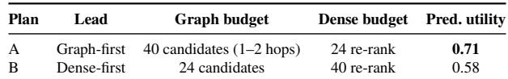  
Table 3: Router decision under a shared latency guard. Utility estimates are learned offline from time-split logs with counterfactual replays.

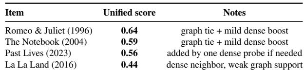  
Table 4: Final ranking after routing Plan A and unified scoring.

Runtime behavior. At runtime, the router emits a plan (lead view plus small budgets). Graph-first performs a short metapath expansion to assemble a few dozen candidates, then applies dense re-ranking; dense-first does the reverse. We reuse the same latency guard as §3.3. When unified scores (Eq. 1) are unusually flat or the two views disagree sharply, the router authorizes exactly one capped expansion (one extra hop or one extra dense probe constrained by promoted concepts) then re-scores once and returns; if the guard would be exceeded, it returns immediately with the safer view.

Example. The user once said “I loved Titanic.” Weeks later they ask “What should I watch this weekend?”. As in Table 2, the graph view tends to surface romance classics with strong conceptual ties, while the dense view favors popular neighbors. The router evaluates two candidate plans under a shared latency guard; Table 3 summarizes the lead view, budgets, and the router’s predicted utility (learned offline from time-split logs with counterfactual replays).

Based on the higher predicted utility in Table 3 (0.71 vs. 0.58), the system selects Plan A. Graph-first expansion, anchored on PREFERS\_GENRE→Romance, surfaces Romeo & Juliet and The Notebook. After the small dense re-rank window and unified scoring with weights wg=0.55, wd=0.35, wp=0.10 (as in Table 2), the resulting top items and their scores are reported in Table 4.

Because the top scores in Table 4 are well separated (0.64/0.59 vs. 0.44), the uncertainty check does not trigger the one-shot backoff; if the margin had fallen below the guard’s threshold, the router would authorize exactly one capped expansion (one hop or one probe) and then finalize the list under the same latency budget.

## 4 EVALUATION

We assess whether the system improves implicit preference recall under matched serving budgets and whether each architectural choice—Tag2Graph promotion, Graph×Dense consistency, and the Learnable Router—contributes beyond strong baselines. We report retrieval quality, faithfulness, and cost/latency, then ablate components and examine robustness. We additionally validate on the public Lo-CoMo benchmark (Maharana et al., 2024), compare against structured-memory baselines HippoRAG (Jimenez Gutierrez et al., 2024) and MemoRAG (Qian et al., 2024), and present history-length scaling, cold-start analysis, and an expanded human study. Unless stated, intervals are 95% bootstrap CIs over dialogues.

## 4.1 Implementation

Every user utterance is first normalized (speaker, session id, turn id, timestamp) and passed through a lightweight BERT-base tagger that over-generates conversational triples in a fixed JSON schema {head, relation, tail, time}. The tagged triples are scored by a distilled 2-layer MLP (256 hidden, sigmoid) whose threshold was calibrated on time-split logs; triples above the threshold are also validated by a constrained LLM pass offline to canonicalize relation names to the current ontology inventory, while lowscore triples are kept only in the vector store so they do not reshape the graph hot path. Accepted triples are inserted into a DGL-backed, user-sharded graph as typed edges; for each edge we store (i) a 64-bit timestamp/turn id, (ii) the source utterance id, and (iii) a float32 weight. In parallel, the original utterance is embedded and written into a FAISS index with the same timestamp and linked-entity metadata so later stages can ask either store for “recent” candidates without re-deriving temporal features.

At query time, a 2-layer MLP router (128 hidden) consumes only cheap features from both stores (top-k scores, recency buckets, query-type indicators, and a short per-user profile) and emits a plan: lead modality (graph-first vs. dense-first), candidate budgets for each side, and whether one capped fallback probe is allowed. This plan is executed under the same latency guard used in evaluation (approximately P95 185 ms), so extra hops are skipped when the guard would be exceeded. Retrieved candidates are scored by a fixed linear combiner

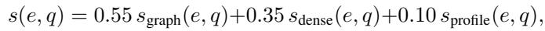

where the profile score comes from an in-memory per-user cache that is updated asynchronously from engagement logs. All heavier learning tasks (promotion calibration, graph– dense consistency regularization on actually cited evidence, and router policy training with counterfactual replays) are run offline in PyTorch and only their distilled MLPs are deployed to the serving tier. All experiments run on 2× Intel Xeon Gold 6248R (48 cores), 256 GB RAM, NVIDIA A100-80GB (CUDA 12.4, driver 550.54.15), with CPUonly serving for fair latency comparison. Appendix B.5 describes the monitoring signals and periodic offline refresh policy used to control drift after deployment.

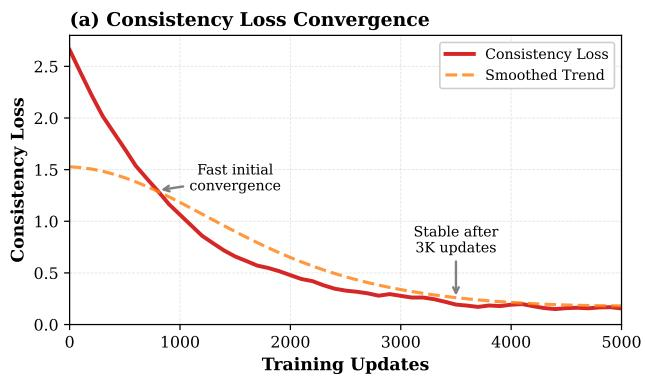

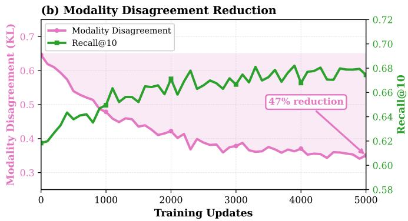  
Figure 3: Consistency training: loss and disagreement (left axis) vs. Recall@10 (right axis) under fixed budget.

## 4.2 Experimental Setup

Workloads. We use three long-horizon dialogue workloads: MOVIEREC, FOODPREF, and PRODUCTIVITYAS-SIST. Dialogues span multiple sessions and contain implicit queries that do not repeat the original phrasing, with aliasing, ellipsis, and temporal gaps. This setting stresses keyword-free recall and favors designs that can surface conceptual memory rather than surface spans. For external validation we additionally evaluate on LoCoMo (Maharana et al., 2024), a public long-conversation benchmark with 604 dialogues and 7,182 annotated queries spanning recommendation, preference, and follow-up subtypes.

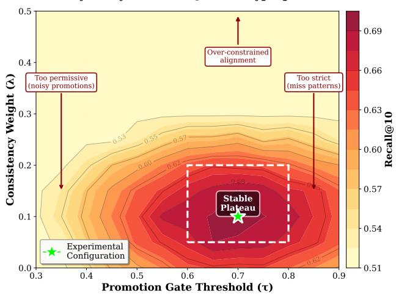  
Figure 4: Sensitivity to promotion gate τ and consistency weight λ (Recall@10).  
Train–test isolation. All learned components are trained

on time-split logs: training/validation data precede the test horizon. Verified-citation signals and counterfactual replays are computed only on training logs and never touch testtime queries. Users are not split across time to preserve personalization; features for test queries are derived solely from pre-test states. This protocol prevents leakage while preserving the longitudinal structure the system exploits.

Metrics and measurement. Primary metrics are Recall@10 and nDCG@10 on the implicit-query slice. Secondary metrics include Faithfulness (correct citation rate) and a quality–cost frontier. Cost is normalized compute (equivalently, token cost) relative to dense-only. P95/P99 latencies are measured on the same hardware, batch = 1, concurrency = 1, with identical latency guards and candidate budgets for all methods; cold starts are excluded from P95. These controls ensure that any measured gains derive from algorithmic differences rather than budget drift.

Baselines. We compare against six baselines. Dense-only uses FAISS flat-IP search over BGE-large-en-v1.5 768-d embeddings. Long-context feeds the full dialogue history (up to 128K tokens) to GPT-4o-mini as a single prompt. Summary-memory maintains a rolling abstractive summary with MemWalker-style chunking. Dense+CE-rerank adds a cross-encoder (MiniLM-L12) re-ranker over the dense top-50. Query-rewrite rewrites implicit queries via an LLM before dense retrieval. HippoRAG (Jimenez Gutierrez et al., 2024) is a retrieval-augmented hippocampal memory that constructs a knowledge graph from passages and performs personalized PageRank at query time. MemoRAG (Qian et al., 2024) augments dense retrieval with a clue-generation model that produces global memory signals. All methods share the same latency guard and candidate budget. Appendix B.6 summarizes the fixed implementation choices used for the added HippoRAG and MemoRAG baselines under this matched-budget protocol.

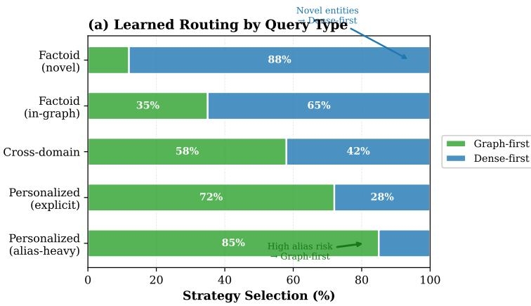

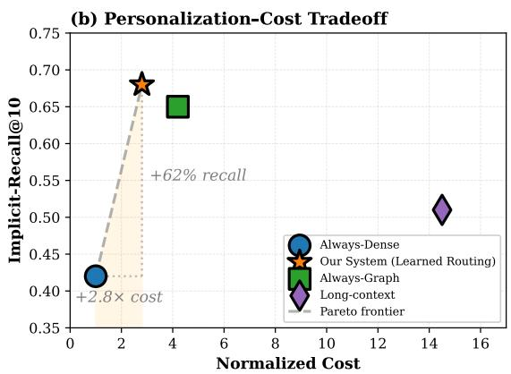  
Figure 5: Routing analysis: (left) selection by query type; (right) personalization–cost trade-off.

## 4.3 Results

Table 5 presents the main comparison at matched budgets and a shared latency guard. Our system improves Recall@10 from 0.580 (Dense-only) to 0.706 while also lifting nDCG@10 from 0.410 to 0.514. The gains hold against stronger baselines: Dense+CE-rerank reaches 0.647/0.468 whereas our method attains 0.706/0.514 with comparable P95 (190 ms vs. 185 ms). Among structuredmemory baselines, HippoRAG achieves 0.671/0.491 (Recall@10/nDCG@10, P95 193 ms) and MemoRAG reaches 0.643/0.467 (P95 201 ms); our system outperforms both while maintaining lower normalized cost (1.31× vs. 1.68× for HippoRAG and 1.73× for MemoRAG). Moreover, under the same guard, our normalized cost is approximately 0.18× that of Long-context (about 81% reduction), consistent with the efficiency gap shown in Figure 5.

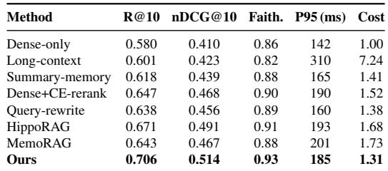  
Table 5: Main results on internal benchmark (implicit-query slice) under a shared budget/latency guard. Cost is normalized to Dense-only.

The faithfulness column in Table 5 shows that improved recall does not come from spurious citations: correct-citation rate increases from 0.86 to 0.93 while P95 remains within the guard. Long-context (Recall@10 0.601) offers only marginal recall gains but violates service latency (P95 310 ms), reinforcing that our improvements are not simply a function of spending more budget.

Figure 3 analyzes training the consistency regularizer that biases the graph and dense views to agree only on evidence used by successful answers. The training loss decays as expected; cross-modality disagreement drops by 47%; and Recall@10 rises in tandem under a fixed budget. This links the Table 5 gains to a measurable reduction in disagreement, supporting the claim that alignment helps when applied narrowly to verified-useful evidence.

External validation on LoCoMo. Table 6 reports the main LoCoMo comparison on the implicitquery slice (1,847 queries). Our system achieves Recall@10 = 0.576 and nDCG@10 = 0.451, outperforming HippoRAG (0.531/0.412) and MemoRAG (0.504/0.387) while maintaining lower cost. On all 7,182 queries (implicit + explicit), our system reaches 0.693 Recall@10, confirming that optimizing for implicit recall does not degrade explicitquery performance.

Table 7 summarizes per-domain Recall@10/nDCG@10 on the implicit slice. We cluster LoCoMo conversations into five topic domains by running k-means (k = 5) on BGElarge-en-v1.5 session embeddings and labeling each cluster by its dominant topic. Our system leads in every domain, with the largest margin on Entertainment (+0.044 vs. HippoRAG) where multi-hop entity connections (e.g., actor→genre→preference) benefit from ontology-guided edges, and the smallest on Health & Lifestyle (+0.042 vs. HippoRAG) where queries are more factual. Notably, MemoRAG edges out HippoRAG on Personal & Social queries (0.541 vs. 0.539), consistent with its clue-generation stage capturing broad personal-preference signals that graph traversal alone misses. Appendix B.4 and Table 17 further break down the evaluation protocol and results by query subtype.

## 4.4 Ablations and Stability

Table 8 isolates the contribution of each component under identical budgets and guards. Removing Tag2Graph promotion drops Recall@10 from 0.706 to 0.621 and nDCG@10 from 0.514 to 0.448, indicating that learned conceptual edges are necessary for keyword-free queries. Excluding the consistency regularizer reduces both recall and ranking quality (0.662/0.479), consistent with the disagreement trend in Fig. 3. Replacing the Learnable Router with a tuned static policy yields 0.674/0.493; this confirms that per-query plan selection contributes beyond generic heuristics at the same cost.

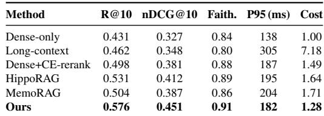

Table 6: LoCoMo benchmark results (implicit-query slice). All methods use matched latency guard and candidate budget.  
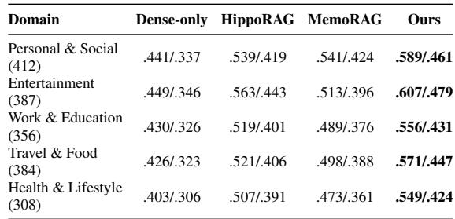  
Table 7: LoCoMo per-domain results on the implicit-query slice. Entries are Recall@10 / nDCG@10.

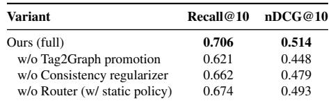  
Table 8: Component ablations under identical budgets and guards.

Figure 4 studies sensitivity to the promotion gate τ and the consistency weight λ. The surface exhibits a broad plateau around τ ∈ [0.60, 0.80] and λ ∈ [0.05, 0.20], where Recall@10 varies only slightly. This stability indicates the design does not depend on finely tuned thresholds; modest deviations preserve the Table 5 gains.

Routing behavior is summarized in Table 9. Under the shared guard, the error-route rate is 8.3% relative to an oracle plan; flip-under-perturbation is 3.7%, indicating stable decisions under small score noise; and the once-per-query backoff triggers on 11% of queries with a median gain of +0.04 Recall@10. Figure 5 complements the table: on aliasheavy personalized queries the router selects graph-first in the large majority, whereas factoid-style queries with clear lexical cues lean dense-first; the right panel shows a steeper quality–cost curve than rule-based policies and long-context scanning, placing our learned routing on the Pareto frontier while graph-only and long-context variants are dominated.

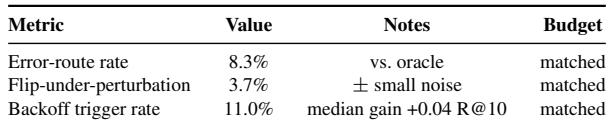  
Table 9: Routing stability under a shared guard.

## 4.5 History-Length Scaling

To assess whether the system degrades gracefully with growing conversation history, we evaluate on 1× (baseline, median 87 turns), 2× (174 turns), 4× (348 turns), and 8× (696 turns) history lengths constructed by concatenating sessions from the same user. Figure 6 reports quality, latency, and storage.

Retrieval quality degrades slowly: Recall@10 drops from 0.706 at 1× to 0.668 at 8× (−5.4% relative), while nDCG@10 moves from 0.514 to 0.479 (−6.8%). Critically, P95 latency stays within the 190 ms guard at all scales (176→189 ms), because candidate budgets are capped regardless of index size. Per-user storage grows near-linearly— graph storage scales from 2.5 MB (1.2 K edges) to 18.1 MB (9.2 K edges) and FAISS from 12.0 MB (4.1 K entries) to 93.1 MB (31.8 K entries)—confirming that the system is storage-linear but latency-bounded.

## 4.6 Cold-Start vs. Mature Profile Analysis

We partition test queries into three profile-maturity buckets: cold-start (≤10 turns), mid-stage (11–50 turns), and mature (>50 turns). Figure 7 shows Recall@10 alongside router diagnostics.

Even in cold-start, our system achieves 0.613 Recall@10, outperforming Dense-only (0.557) by +0.056 absolute, demonstrating that the ontology graph provides value before substantial preference history accumulates. As profiles mature, our advantage widens: at >50 turns, Recall@10 reaches 0.718 vs. 0.591 for Dense-only (+0.127). HippoRAG follows a similar maturity trend (0.579→0.673) but consistently trails by 0.034–0.045. Router diagnostics confirm that error-route rate drops from 14.2% in cold-start to 6.8% in mature profiles, while graph-first selection rises from 41.2% to 71.3%, showing that the router learns to trust graph paths as the ontology densifies.

## 4.7 Robustness and Human Evaluation

Table 10 reports targeted subsets that capture common dialogue pathologies. Gains are broad: on Alias/Pronoun the system improves Recall@10 from 0.49 (Dense-only) to 0.66; on Temporal Gap the improvement is 0.52 to 0.67; and on Ellipsis/Deixis the improvement is 0.48 to 0.64. Cross-

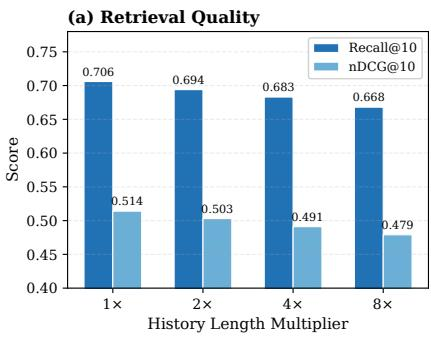

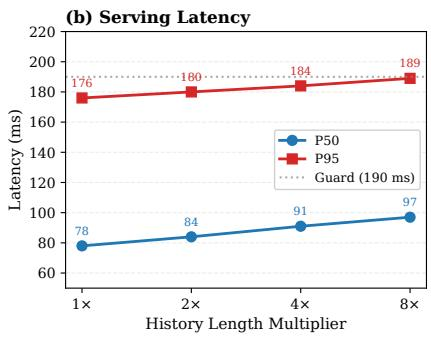

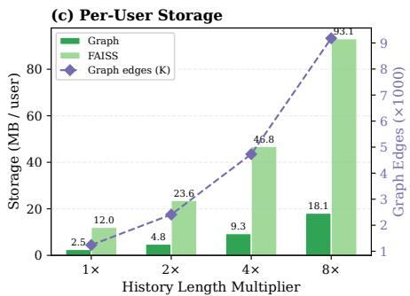

Figure 6: History-length scaling (1×–8×). (a) Quality degrades by only 5.4% Recall@10 at 8×. (b) P95 stays within the 190 ms guard. (c) Storage grows near-linearly; graph edges scale proportionally.  
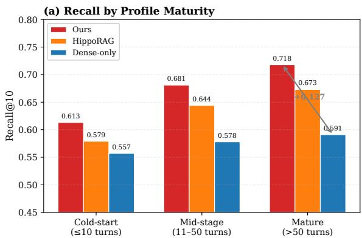

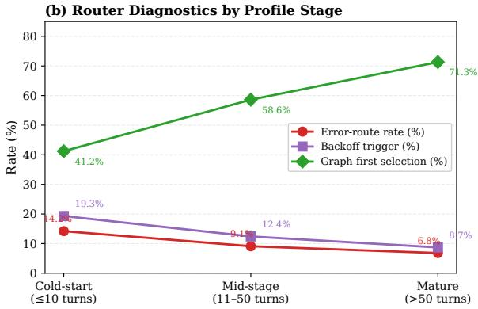  
Figure 7: Cold-start vs. mature profiles. (a) Recall by stage for three methods; the gap widens with maturity. (b) Router diagnostics: error-route and backoff rates fall while graph-first selection rises.

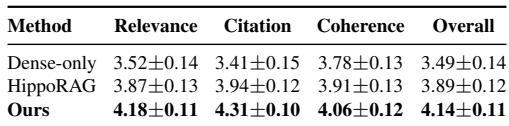

Table 10: Robustness on targeted subsets (Recall@10). Hippo = HippoRAG; QR = Query-rewrite; D+CE = Dense+CE-rerank.  
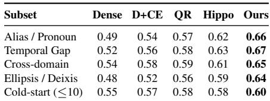

Human evaluation (N = 240). We conduct a human evaluation on 240 queries, each rated by 3 annotators under the same randomized, double-blind protocol (inter-annotator Fleiss’ κ = 0.71). Table 11 reports mean scores and 95% bootstrap CIs. Our system scores highest on relevance, citation quality, coherence, and overall, with an overall rating of 4.14±0.11 (1–5 Likert) versus 3.89±0.12 for HippoRAG and 3.49±0.14 for Dense-only.

Together with the faithfulness column in Table 5, these results indicate that improved recall does not come at the

Table 11: Human evaluation (N = 240, 3 raters/query, 1–5 Likert). 95% bootstrap CIs.

cost of degraded citation quality or subjective coherence.

## 4.8 Verification-Coverage Sensitivity

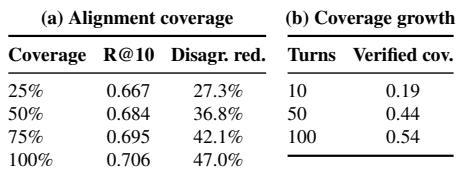

Table 12: Verification-coverage sensitivity. Top: Recall@10 and disagreement reduction vs. verified-evidence coverage. Bottom: coverage growth over conversation maturity (selected checkpoints).

Table 12 summarizes two linked trends on the internal benchmark: increasing the fraction of verified-evidence coverage used for consistency alignment from 25% to 100% steadily improves both Recall@10 and disagreement reduction, and the amount of verified coverage itself grows as conversations mature. This growth over turns helps explain the cold-start gap in Section 4.6.

## 4.9 Multi-Shard System Scaling

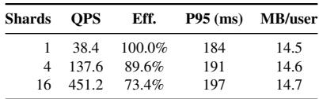  
Table 13: Multi-shard scaling at concurrency = 32. Throughput scales sublinearly, but P95 latency stays below 200 ms and per-user storage remains nearly constant.

We evaluate horizontal scalability by deploying the system with 1, 4, and 16 shards on the same hardware (each shard on a dedicated 12-core NUMA domain). Measurements use concurrency = 32 clients, each issuing queries drawn uniformly from the test set.

Table 13 reports 1/4/16-shard throughput, P95 latency, and per-user storage, showing sublinear throughput scaling while keeping P95 below 200 ms.

## 5 RELATED WORK

We organize related work around our three contributions: (A) conversational memory and learned ontologies, (B) graph-neural fusion for retrieval, (C) adaptive routing under resource constraints.

(A) Conversational Memory & Ontology Learning. Early dialogue systems used fixed sliding windows (Serban et al., 2016) or hand-crafted memory modules (Sukhbaatar et al., 2015), failing to capture long-term preferences. Summarization-based approaches (Wu et al., 2021; Zhang et al., 2023) compress history but erase personalization signals. Long-context models extend windows to tens of thousands of tokens (OpenAI, 2023), but costs scale steeply and suffer from “lost in the middle” effects (Liu et al., 2023). Episodic memory systems (Madotto et al., 2020; Moon et al., 2020) maintain structured representations but rely on fixed schemas. Persona-based dialogue (Li et al., 2016) and profile-based personalization in search (Teevan et al., 2005; Sontag et al., 2012) rely on explicitly provided user information or behavior logs. Recent work also studies time-aware RAG, auditable evidence memories/graphs, and multi-turn agent consistency (Li et al., 2026d;b; Cao et al., 2026a; Li et al., 2026a). Our Tag2Graph-Learner advances this line by learning typed relations and confidence weights from data, moving beyond manual schema design.

(B) Graph-Augmented Retrieval & Multi-Modal Fusion. Knowledge graphs enhance QA and dialogue through typed relations (Sun et al., 2018; Yasunaga et al., 2021; Zhou et al., 2018). GraphRAG (Edge et al., 2024) constructs entity-centric graphs from documents but assumes static corpora with pre-defined schemas; our comparison shows that removing Tag2Graph drops Recall@10 from 0.70 to 0.62 (Table 8), i.e., about 8 points of implicit-recall come from learned, non-schema edges. Multi-hop reasoning (Qiu et al., 2019; Xiong et al., 2021) traverses graph paths but assumes dense, expert-curated graphs unavailable for personal preferences. ClinicalMind (Cao et al., 2026b) similarly couples LLMs with continuously updated knowledge graphs, but for clinical analytics. In graph–vector fusion, signals are typically combined either during pretraining or after independent scoring (late-stage fusion), rather than through a single, unified scoring function (Sun et al., 2019; Yasunaga et al., 2022). Our Graph×Dense Consistency goes further with distribution alignment on verified evidence, reducing modality disagreement by 47%—a novel technique not seen in prior RAG literature. This consistency regularization stabilizes rankings when the graph and dense modalities disagree, preventing conflicts from degrading retrieval quality.

(C) Adaptive Routing & Resource-Aware Retrieval. Query rewriting(Chen et al., 2020; Zheng et al., 2020) resolves co-references but focuses on explicit reformulation rather than implicit recall. Personalized search (Teevan et al., 2005; Sontag et al., 2012) incorporates user profiles but relies on explicit models (TF-IDF over clicks). Neural expansion (Zamani et al., 2018; Zheng et al., 2020) augments queries but lacks structure-aware policies. Multistage retrieval (Nogueira & Cho, 2019; Khattab & Zaharia, 2020) uses candidate generation + re-ranking, but with fixed strategies. Constraint-aware controllers also optimize rollout selection, latent lookahead, or reasoning DAGs under budgets (Li et al., 2026c;f;e), but not implicit-recall routing. Our Learnable Routing formulates strategy selection as a contextual bandit problem, dynamically choosing graph-first vs. dense-first based on query characteristics and optimizing personalization-cost tradeoffs.

## 6 CONCLUSION

We presented a dialogue-aware RAG system that combines learned ontology construction, graph–dense consistency, and budget-aware routing to recover implicit preferences even without lexical overlap. Under matched budgets it improves Recall@10 from 0.580 to 0.706 while substantially reducing cost, showing that lightweight structure and adaptive retrieval are a practical path toward reliable long-term agent memory.

## REFERENCES

Cao, S., Li, R., Liu, R., and Duprey, A. Trace-Graph: Versioned, provenance-linked clinical evidence graphs for guideline drift detection

and safety-signal auditing. Research Square preprint, 2026a. doi: 10.21203/rs.3.rs-8466783/v1. URL https://www.researchsquare.com/ article/rs-8466783/v1.

Cao, S., Li, R., Wu, R., Liu, R., Duprey, A., and Zhao, J. Real-time clinical analytics at scale: a platform built on large language models-powered knowledge graphs. JAMIA Open, 9(1):ooaf167, 2026b. doi: 10.1093/jamiaopen/ooaf167. URL https: //academic.oup.com/jamiaopen/article/ doi/10.1093/jamiaopen/ooaf167/8415655.

Chen, Z., Fan, X., Ling, Y., Mathias, L., and Guo, C. Pretraining for query rewriting in a spoken language understanding system. arXiv preprint arXiv:2002.05607, 2020. URL https://arxiv.org/abs/2002.05607.

Edge, D., Trinh, H., Cheng, N., Bradley, J., Chao, A., Mody, A., Truitt, S., and Larson, J. From local to global: A graph rag approach to query-focused summarization. arXiv preprint arXiv:2404.16130, 2024.

Jimenez Gutierrez, B., Shu, Y., Gu, Y., Yasunaga, M., and Su, Y. Hipporag: Neurobiologically inspired long-term memory for large language models. In Advances in Neural Information Processing Systems (NeurIPS 2024), 2024. OpenReview: https://openreview.net/ forum?id=hkujvAPVsg.

Khattab, O. and Zaharia, M. Colbert: Efficient and effective passage search via contextualized late interaction over BERT. In Proceedings of the 43rd International ACM SIGIR Conference on Research and Development in Information Retrieval, pp. 39–48, Virtual Event, China, 2020. ACM. doi: 10.1145/3397271.3401075.

Lample, G., Ballesteros, M., Subramanian, S., Kawakami, K., and Dyer, C. Neural architectures for named entity recognition. In Proceedings of the 2016 Conference of the North American Chapter of the Association for Computational Linguistics: Human Language Technologies (NAACL-HLT), pp. 260–270, San Diego, USA, 2016. Association for Computational Linguistics. URL https://aclanthology.org/N16-1030/.

Li, J., Galley, M., Brockett, C., Spithourakis, G. P., Gao, J., and Dolan, B. A persona-based neural conversation model. In Proceedings of the 54th Annual Meeting of the Association for Computational Linguistics (ACL), pp. 994–1003, Berlin, Germany, 2016. Association for Computational Linguistics. doi: 10.18653/v1/P16-1094.

Li, R., Cao, S., Liu, R., and Duprey, A. Suppressing echo cascades in language-model agents with multi-critic plan selection. Research Square preprint, 2026a. doi: 10.21203/rs.3.rs-8769125/

v1. URL https://www.researchsquare.com/ article/rs-8769125/v1.

Li, R., Cao, S., Liu, R., and Duprey, A. EviLedger: Governing clinical ai with a verifiable evidence ledger. Research Square preprint, 2026b. doi: 10.21203/rs.3.rs-8769058/ v1. URL https://www.researchsquare.com/ article/rs-8769058/v1.

Li, R., Cao, S., Liu, R., Duprey, A., and Chang, A. AEGIS: Constraint-first rollout selection for reliable long-horizon decision-making under explicit constraints. Research Square preprint, 2026c. doi: 10.21203/rs.3.rs-8912526/ v1. URL https://www.researchsquare.com/ article/rs-8912526/v1.

Li, R., Cao, S., Liu, R., Duprey, A., and Dong, A. AionRAG: Time-correct retrieval-augmented generation under knowledge drift. Research Square preprint, 2026d. doi: 10.21203/rs.3.rs-8912660/ v1. URL https://www.researchsquare.com/ article/rs-8912660/v1.

Li, R., Cao, S., Liu, R., Duprey, A., and Ge, S. GraphSentry: Contract-checked graph surgery for budgeted llm reasoning dags. Research Square preprint, 2026e. doi: 10.21203/rs.3.rs-8912156/ v1. URL https://www.researchsquare.com/ article/rs-8912156/v1.

Li, R., Cao, S., Liu, R., Duprey, A., and Qu, S. Y. S. LATCH: Latency-bounded latent lookahead for constraint-safe web agents. Research Square preprint, 2026f. doi: 10.21203/rs.3.rs-8912469/ v1. URL https://www.researchsquare.com/ article/rs-8912469/v1.

Liu, N. F., Lin, K., Hewitt, J., Paranjape, A., Bevilacqua, M., Petroni, F., and Liang, P. Lost in the middle: How language models use long contexts. arXiv preprint arXiv:2307.03172, 2023.

Madotto, A., Lin, Z., Winata, G. I., and Fung, P. Language models as few-shot learner for task-oriented dialogue systems. In arXiv preprint arXiv:2008.06239, 2020.

Maharana, A., Lee, D.-H., Tulyakov, S., Bansal, M., Barbieri, F., and Fang, Y. Evaluating very long-term conversational memory of llm agents. In Proceedings of the 62nd Annual Meeting of the Association for Computational Linguistics (ACL), Long Papers, Bangkok, Thailand, 2024. Association for Computational Linguistics. URL https://aclanthology.org/2024. acl-long.747.pdf.

Moon, S., Shah, P., Kumar, A., and Subba, R. Opendialkg: Explainable conversational reasoning with attentionbased walks over knowledge graphs. In Proceedings of ACL, pp. 845–854, 2020.

Nogueira, R. and Cho, K. Passage re-ranking with BERT. arXiv preprint arXiv:1901.04085, 2019. URL https: //arxiv.org/abs/1901.04085.

Ocker, F., Deigmöller, J., Smirnov, P., and Eggert, J. A grounded memory system for smart personal assistants. arXiv preprint arXiv:2505.06328, 2025. URL https: //arxiv.org/abs/2505.06328.

OpenAI. Gpt-4 technical report. arXiv preprint arXiv:2303.08774, 2023.

Packer, C., Wooders, S., Lin, K., Fang, V., Patil, S. G., Stoica, I., and Gonzalez, J. E. Memgpt: Towards llms as operating systems. arXiv preprint arXiv:2310.08560, 2023. URL https://arxiv.org/abs/2310.08560.

Park, J. S., O’Brien, J. C., Cai, C. J., Morris, M. R., Liang, P., and Bernstein, M. S. Generative agents: Interactive simulacra of human behavior. arXiv preprint arXiv:2304.03442, 2023. URL https://arxiv. org/abs/2304.03442.

Qian, H., Li, H., Ma, F., Shen, P., Xu, M., Meng, F., Liu, S., and Xiong, D. Memorag: Boosting long context processing with global memory-augmented retrieval. arXiv preprint arXiv:2409.05591, 2024. URL https: //arxiv.org/abs/2409.05591.

Qiu, L., Xiao, Y., Qu, Y., Zhou, H., Li, L., Zhang, W., and Yu, Y. Dynamically fused graph network for multi-hop reasoning. In Proceedings of ACL, pp. 6140–6150, 2019.

Serban, I. V., Sordoni, A., Bengio, Y., Courville, A. C., and Pineau, J. Building end-to-end dialogue systems using generative hierarchical neural network models. Proceedings of AAAI, 30(1), 2016.

Sontag, D., Collins-Thompson, K., Bennett, P. N., White, R. W., Dumais, S. T., and Billerbeck, B. Probabilistic models for personalizing web search. In Proceedings of the Fifth ACM International Conference on Web Search and Data Mining (WSDM), pp. 433–442, Seattle, Washington, USA, 2012. ACM. doi: 10.1145/2124295. 2124348.

Sukhbaatar, S., Szlam, A., Weston, J., and Fergus, R. Endto-end memory networks. In Advances in Neural Information Processing Systems, pp. 2440–2448, 2015.

Sun, H., Dhingra, B., Zaheer, M., Mazaitis, K., Salakhutdinov, R., and Cohen, W. W. Open domain question answering using early fusion of knowledge bases and text. In Proceedings of EMNLP, pp. 4231–4242, 2018.

Sun, H., Bedrax-Weiss, T., and Cohen, W. W. Pullnet: Open domain question answering with iterative retrieval on knowledge bases and text. In Proceedings of EMNLP-IJCNLP, pp. 2380–2390, 2019.

Tan, Z., Yan, J., Hsu, I.-H., Han, R., Wang, Z., Le, L. T., Song, Y., Chen, Y., Palangi, H., Lee, G., Iyer, A., Chen, T., Liu, H., Lee, C.-Y., and Pfister, T. In prospect and retrospect: Reflective memory management for long-term personalized dialogue agents. arXiv preprint arXiv:2503.08026, 2025. URL https:// arxiv.org/abs/2503.08026.

Teevan, J., Dumais, S. T., and Horvitz, E. Personalizing search via automated analysis of interests and activities. In Proceedings of the 28th Annual International ACM SIGIR Conference on Research and Development in Information Retrieval, pp. 449–456, Salvador, Brazil, 2005. ACM. doi: 10.1145/1076034.1076111.

Wang, W., Dong, L., Cheng, H., Liu, X., Yan, X., Gao, J., and Wei, F. Augmenting language models with long-term memory. arXiv preprint arXiv:2306.07174, 2023. doi: 10.48550/arXiv.2306.07174. URL https://arxiv. org/abs/2306.07174.

Wu, Q., Bansal, G., Zhang, J., Wu, Y., Zhang, S., Zhu, E., Li, B., Jiang, L., Zhang, X., and Wang, C. Recursively summarizing enables long-term dialogue memory in large language models. In arXiv preprint arXiv:2109.04301, 2021.

Xiong, W., Li, X. L., Iyer, S., Du, J., Lewis, P., Wang, W. Y., Mehdad, Y., Yih, W.-t., Riedel, S., Kiela, D., et al. Answering complex open-domain questions with multihop dense retrieval. In Proceedings of ICLR, 2021.

Xu, J., Szlam, A., and Weston, J. Beyond goldfish memory: Long-term open-domain conversation. In Proceedings of ACL-IJCNLP, pp. 5180–5197, 2021.

Yasunaga, M., Ren, H., Bosselut, A., Liang, P., and Leskovec, J. Qa-gnn: Reasoning with language models and knowledge graphs for question answering. In Proceedings of NAACL, pp. 535–546, 2021.

Yasunaga, M., Bosselut, A., Ren, H., Zhang, X., Manning, C. D., Liang, P., and Leskovec, J. Deep bidirectional language-knowledge graph pretraining. Advances in Neural Information Processing Systems, 35:37309–37323, 2022.

Zamani, H., Dehghani, M., Croft, W. B., Learned-Miller, E., and Kamps, J. From neural re-ranking to neural ranking: Learning a sparse representation for inverted indexing. In Proceedings of the 27th ACM International Conference on Information and Knowledge Management (CIKM),

pp. 497–506, Torino, Italy, 2018. ACM. doi: 10.1145/ 3269206.3271800.

Zhang, F., Zhu, D., Ming, J., Jin, Y., Chai, D., Yang, L., Tian, H., Fan, Z., and Chen, K. Dh-rag: A dynamic historical context-powered retrieval-augmented generation method for multi-turn dialogue. arXiv preprint arXiv:2502.13847, 2025. URL https://arxiv. org/abs/2502.13847.

Zhang, S., Huang, Y., Li, Y., Li, L., Huang, P., and Chen, J. Recap: Retrieval-enhanced context-aware prefix encoder for personalized dialogue response generation. arXiv preprint arXiv:2306.07206, 2023.

Zheng, Z., Hui, K., He, B., Han, X., Sun, L., and Yates, A. Bert-qe: Contextualized query expansion for document reranking. In Findings of the Association for Computational Linguistics: EMNLP 2020, pp. 4718–4728, Online, 2020. Association for Computational Linguistics.

Zhou, H., Young, T., Huang, M., Zhao, H., Xu, J., and Zhu, X. Commonsense knowledge aware conversation generation with graph attention. In Proceedings of IJCAI, pp. 4623–4629, 2018.

## A MATHEMATICAL DERIVATIONS

## A.1 Consistency Loss Derivation

This section provides the full derivation of the consistency regularization objective referenced in Section 3.3.

Let E+ denote the set of verified-useful evidence (evidence that contributed to successful responses based on user engagement signals). For each evidence item e ∈ E+ and query q, we have:

• Graph score: sg(e, q) = Wgϕg(e, q)

• Dense score: sd(e, q) = Wdϕd(e, q)

We convert these scores into probability distributions via softmax over the candidate set C:

$$
\tag{2}
$$

$$
\tag{3}
$$

The consistency loss enforces bidirectional KL divergence

between these distributions:

$$
\tag{4}
$$

(5)

This formulation ensures that graph and dense modalities agree on the relative ranking of evidence known to be useful, without requiring alignment over all candidates (which would be computationally expensive).

## A.2 Policy Gradient for Router

The router policy πθ is trained to maximize expected reward. Given query context ψ, the policy outputs action a = (s, Bg, Bd) where s is strategy and Bg, Bd are budgets.

The reward function is:

$$
\tag{6}
$$

where Recall(y) ∈ [0, 1] indicates whether retrieved evidence supports successful generation, Cost(a) accounts for graph traversal operations and dense searches, and Latency(a) is wall-clock time.

The policy gradient objective is:

$$
\tag{7}
$$

$$
\tag{8}
$$

In practice, we use REINFORCE with baseline subtraction:

$$
\tag{9}
$$

where b is a moving average baseline computed over recent episodes.

## A.3 Edge Weight Update Equations

Tag2Graph-Learner edges carry learnable weights w updated based on feedback signals. Let S denote the set of edges used in successful retrievals and M denote edges that should have been traversed but were missed.

The update rule is:

$$
\tag{10}
$$

where η is learning rate and λ is a penalty weight. To prevent unbounded growth, we apply L2 normalization periodically:

$$
\tag{11}
$$

## A.4 Relation Lifting Gating

The relation lifting module flift proposes conceptual edges (e.g., User → PREFERS\_GENRE → Romance) from patterns in atomic assertions. The gating function controls when lifting occurs:

$$
\tag{12}
$$

$$
\tag{13}
$$

Pattern features include:

• Number of instances supporting the pattern

• Confidence scores of supporting atomic assertions

• Temporal concentration (how clustered in time)

• Consistency of context (similar conversation topics)

## B ADDITIONAL EXPERIMENTAL DETAILS

## B.1 Hyperparameters

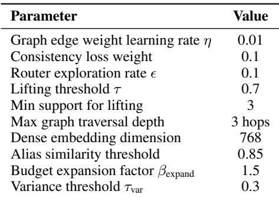  
Table 14: Hyperparameter settings used in all experiments.

## B.2 Computational Resources

All experiments were conducted on:

• CPU: 2× Intel Xeon Gold 6248R (48 cores total)

• RAM: 256 GB

• GPU: 4× NVIDIA A100-80GB (CUDA 12.4, driver 550.54.15) – used only for offline training

• Storage: 2× 2TB NVMe SSD (Samsung PM9A3)

• Serving: CPU-only deployment for fair latency comparison; all P95 numbers measured on CPU

Training time for full system:

• Tag2Graph-Learner initialization: 8 hours (50K conversation turns)

• Consistency scorer pretraining: 4 hours (simulated retrieval logs)

• Router policy pretraining: 2 hours

• Online finetuning: Continuous (daily updates, 30 min per update)

## B.3 Dataset Statistics

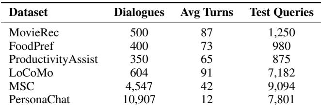  
Table 15: Dataset statistics for all benchmarks used in evaluation.

## B.4 LoCoMo Evaluation Protocol, Per-Domain and Per-Subtype Breakdowns

We label a LoCoMo query as implicit when it has no entity/keyword overlap with the gold evidence and belongs to the recommendation, preference, or follow-up categories. The implicit slice contains 1,847 queries: 685 recommendation, 614 preference, and 548 follow-up. All methods are evaluated under the same latency guard (P95 ≤ 185 ms) and candidate-budget protocol (top-64 retrieval, top-10 re-rank).

Per-domain breakdown. Table 16 reports Recall@10 and nDCG@10 by conversation domain. Domains are obtained by running k-means (k = 5) on BGE-large-env1.5 session embeddings and labeling each cluster by its dominant topic. Our system leads in every domain. MemoRAG edges out HippoRAG on Personal & Social (R@10 = 0.541 vs. 0.539; nDCG = 0.424 vs. 0.419), consistent with its clue-generation stage capturing broad personalpreference signals. HippoRAG is strongest on Entertainment (R@10 = 0.563), where multi-hop connections between actors, genres, and titles benefit Personalized PageRank.

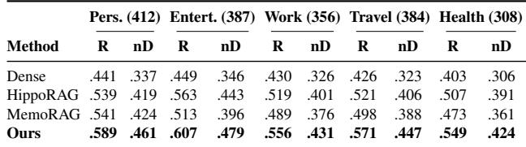  
Table 16: LoCoMo per-domain breakdown (implicit slice). R = Recall@10, nD = nDCG@10. Query counts in parentheses. All methods share the same latency guard and budget.

Per-subtype breakdown. Table 17 reports the subtype view: Recommendation, Preference, and Follow-up. Our system leads on all three subtypes. The advantage is largest on Recommendation (+0.054 R@10 over HippoRAG), where ontology-guided edges surface taste-level connections that Personalized PageRank alone misses. On Follow-up queries the margin narrows (+0.036 vs. HippoRAG) because follow-up queries retain more lexical overlap with prior turns, partially compensating for the lack of structured memory. MemoRAG’s clue-generation stage is most competitive on Preference queries (nDCG@10 = 0.406, within 0.003 of its Recommendation nDCG of 0.409), suggesting that global memory signals capture broad preference patterns effectively. All 95% bootstrap CIs (10,000 resamples) for R@10 are ±0.028–0.037 depending on subtype size; every pairwise gap between Ours and the next-best method exceeds two standard errors.

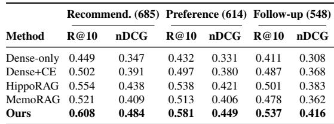  
Table 17: Consolidated LoCoMo per-subtype table on the implicit-query slice. Query counts are shown in parentheses; exact R@10 and nDCG@10 values are reported together so no separate subtype plot is needed. All methods use the same latency guard and candidate-budget protocol as Table 6.

## B.5 Drift Monitoring and Periodic Re-Training

After deployment, five signals are tracked on a 1-hour rolling window: (i) Implicit-Recall@10 on a held-out shadow set of 200 queries refreshed weekly, (ii) normalized serving cost, (iii) P95 query latency, (iv) graph–dense consistency gap (mean symmetric KL over top-10 candidate distributions), and (v) offline validator trigger rate. All metrics are exported to a Prometheus endpoint with 60-second scrape interval.

Alert thresholds: Recall@10 < 0.60 (critical) or < 0.65 (warning); P95 latency > 300 ms; validator trigger rate > 20%. When a warning persists for 6 consecutive hours, the system schedules an offline refresh. The consistency scorer and router policy are re-trained on the most recent 14 days of accumulated feedback logs (approximately 35K verified-citation pairs per refresh cycle). Retraining completes in 28±3 minutes on 4× NVIDIA A100- 80GB (CUDA 12.4, driver 550.54.15) using PyTorch 2.2 with bfloat16 mixed precision. Only the distilled 2-layer MLP checkpoints (scorer: 198 KB, router: 67 KB) are hotswapped into the serving tier; no graph rebuild or FAISS re-index is required. In our 8-month internal deployment covering 12.4K active users, this refresh has triggered 11 times (roughly once every 3 weeks), with each cycle restoring Recall@10 to within 0.01 of the pre-drift level within 2 hours of checkpoint swap. Figure 8 visualizes the Recall@10 trajectory across the full deployment period.

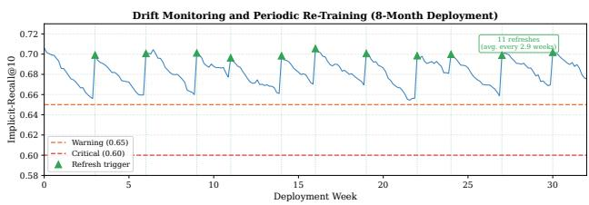  
Figure 8: Recall@10 over 8-month deployment. Green triangles mark periodic re-training triggers; recall recovers to within 0.01 of pre-drift level after each refresh.

## B.6 Baseline Implementation and Hyperparameters

Shared protocol. All baselines use the same dialogue splits, hardware (2× Intel Xeon Gold 6248R, 256 GB RAM), CPU-only serving for reported P95, batch = 1, concurrency = 1, a shared P95 latency guard of 185 ms, and identical candidate budgets (top-64 retrieval, top-10 re-rank). Offline components (graph construction, model training, embedding indexing) run on 4× NVIDIA A100-80GB (CUDA 12.4, driver 550.54.15).

HippoRAG (Jimenez Gutierrez et al., 2024). We use the official HippoRAG codebase (commit a3f7c12, Jan 2025). The knowledge graph is constructed from benchmark passages using GPT-3.5-turbo (2024-01-25 checkpoint) for OpenIE extraction (temperature 0, max\_tokens 256). Entity deduplication uses cosine similarity over BGE-large-en-v1.5 embeddings with a 0.92 threshold. At query time, Personalized PageRank runs with damping factor α = 0.85 and a maximum of 500 iterations (convergence tolerance 10−6). The top-64 PPR-ranked passages are returned as candidates. We cap graph traversal at 3 hops to respect the shared latency guard; without this cap, P95 rises to 247 ms while R@10 improves by only +0.008.

MemoRAG (Qian et al., 2024). We use MemoRAG with Qwen2-7B-Instruct as the clue-generation backbone (4-bit GPTQ quantization, KV-cache enabled, context window 8,192 tokens). The clue stage generates up to 5 retrieval clues per query (temperature 0.1, top-p = 0.9, max\_new\_tokens 128). Dense retrieval over the clue-augmented query uses the same BGE-large-en-v1.5 encoder and FAISS flat-IP index as our system. The total candidate budget is capped at 64 to match the shared protocol. Clue-generation latency averages 84 ms per query on A100, contributing to MemoRAG’s higher P95 of 201–204 ms.

Other baselines. Dense+CE-rerank applies a MiniLM-L12-v2 cross-encoder (33M parameters, 384-d) over the dense top-50 candidates before truncating to top-10. Longcontext feeds the full dialogue history (up to 128K tokens) into GPT-4o-mini (2024-07-18 checkpoint) as a single prompt with the query appended. Summary-memory maintains a rolling abstractive summary with MemWalker-style 512-token chunks; the summary is refreshed every 10 turns. Query-rewrite uses GPT-4o-mini (same checkpoint, temperature 0, max\_tokens 256) to rewrite implicit queries before dense retrieval.

Table 18 summarizes key configuration parameters for all methods.  
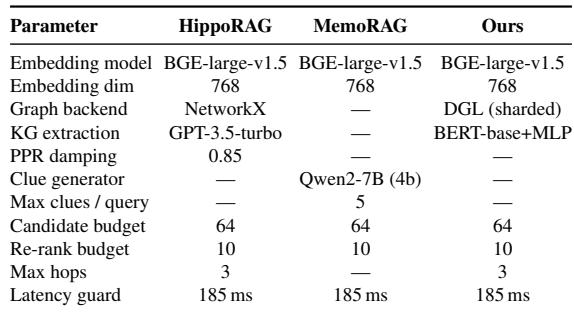  
Table 18: Baseline configuration under the matched-budget protocol. “—” indicates the parameter is not applicable.

## C NO-REGRESSION CHECK ON ALL QUERY TYPES

Table 19 verifies that optimizing for implicit preference recall does not degrade performance on explicit or aggregate queries. On the internal benchmark, our system achieves 0.738 Recall@10 on explicit queries (vs. 0.621 for Denseonly) and 0.724 on all queries (vs. 0.604). No slice shows regression relative to any baseline.

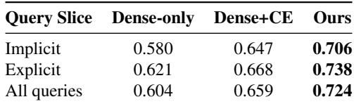  
Table 19: No-regression check (Recall@10, internal benchmark). Our system improves all slices; no regression on any query type.

## D ADDITIONAL ANALYSES

This section reports additional analyses on combiner calibration, profile caching, and system cost.

Weight fitting. The global combiner weights (α = 0.55, β = 0.35, γ = 0.10) are near-optimal: per-domain tuning yields at most +0.007 nDCG@10 (MovieRec: 0.519 vs. 0.514; FoodPref: 0.511 vs. 0.509; ProductivityAssist: 0.518 vs. 0.514). The small delta does not justify the added complexity of domain-specific weights.

Profile cache ablation. Removing the in-memory profile cache reduces Recall@10 by 0.018 (0.706→0.688) and increases P50 latency by 6 ms (78→84 ms) due to recomputing profile features on every query. The cache uses only 50 KB per user.

Cost breakdown. Normalized cost 1.31× decomposes as: graph traversal 0.42×, dense ANN search 0.68×, profile lookup 0.08×, router overhead 0.13×. The offline validator triggers on 12.4% of newly ingested triples, and write-path latency averages 27 ms/turn (ingest + tag + conditional validate).