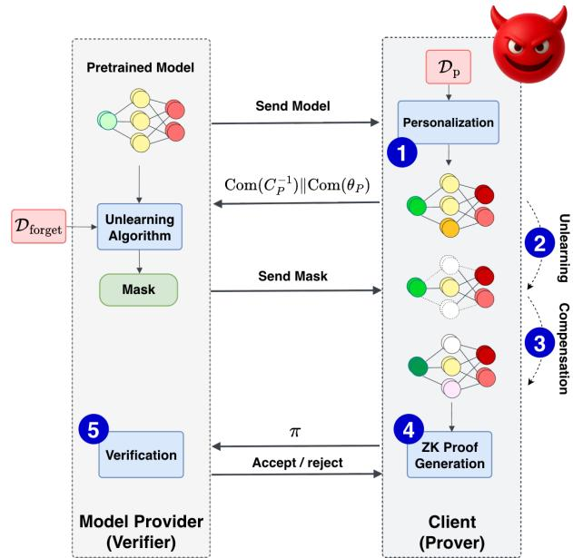
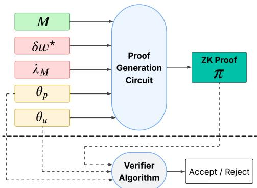
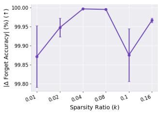
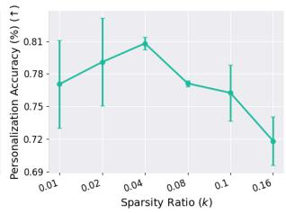
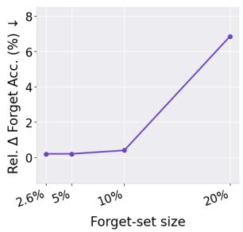
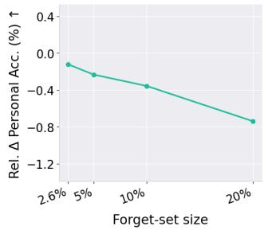

# ZK-APEX: ZERO-KNOWLEDGE APPROXIMATE PERSONALIZED UNLEARNING WITH EXECUTABLE PROOFS

Mohammad M Maheri 1 Sunil Cotterill 1 Alex Davidson 2 Hamed Haddadi 1

## ABSTRACT

Machine unlearning removes the influence of specified data from trained models to satisfy privacy, copyright, and safety requirements (e.g., the “right to be forgotten”). In practice, providers distribute a global model to edge devices, that each locally personalize the model based on their private data. However, since clients may ignore or falsify deletion requests, providers must verify correct unlearning for these distributed models, without accessing private parameters. This is particularly challenging for personalized models, which must forget designated samples without degrading local utility, while ensuring that verification remains efficient and scalable on resource-constrained edge devices.

We formalize personalized unlearning and develop a zero-shot approximate unlearning algorithm that works directly on the personalized model without retraining. Our novel method, ZK-APEX, combines provider-side sparse masking for targeted removal with client-side Group-OBS compensation computed from a block-wise empirical Fisher. This technique yields a curvature-aware update designed for low-overhead execution and proof generation. Using modern Halo2 ZK-SNARKs, we prove operator compliance by showing that the unlearned model exactly matches the committed output of the prescribed transformation, without revealing personalized model parameters or data.

On Vision Transformer (ViT) classification models, our approach recovers approximately 99% Top-1 personalization accuracy while enforcing effective forgetting. We further evaluate the unlearning algorithm on a generative model, the autoregressive language model OPT125M, trained on the CodeParrot code dataset, achieving ∼70% recovery of original accuracy. ZK-SNARK proof generation for the ViT case completes in ≈2 hours, which is more than $1 0 ^ { 7 } \times$ faster than retraining based verification, with peak memory under 0.7 GB and proof sizes about 400 MB. Together, these results establish the first verifiable personalized unlearning framework practical for deployment on resource constrained edge devices.

## 1 INTRODUCTION

Machine unlearning aims to remove the influence of specific data points from trained models, thereby aligning machine learning systems with privacy regulations such as General Data Protection Regulation (GDPR) (Mantelero, 2013) and California Privacy Rights Act (CPRA) (Harding et al., 2019), which grant individuals the right to be forgotten (Regulation, 2016; Cao & Yang, 2015). Beyond privacy compliance, unlearning is also required for mitigating biases (Liu et al., 2025), correcting corrupted data, or retracting samples obtained under invalid consent (Li et al., 2025). In many practical deployments, such as smartphone keyboards (Hard et al., 2018; Singhal et al., 2021), photo categorization models (for example Google Photos and Apple Photos) (Gunter et al., 2024), and voice assistants (Du et al., 2024), the model provider, typically a company, distributes a pretrained model to edge client devices. Each device personalizes the model on locally collected private data, as recently demonstrated in Apple Intelligence (Gunter et al., 2024), which enables largescale on-device adaptation through lightweight foundation models. When the provider later requests the removal of certain samples, it must verify that each client has executed the unlearning correctly, while the clients must not expose their personalized models, which contain sensitive private information (Balle et al., 2022; Leino & Fredrikson, 2020). This creates a verification challenge: the client, who holds a locally personalized model, must convince the model provider that the specified data has been erased, without exposing the underlying model parameters or private samples. The problem is further complicated in edge environments, where storage, compute, and communication constraints make full retraining or model sharing infeasible. Consequently, there is a growing need for privacy-preserving verification mechanisms that can attest to correct unlearning on-device. A natural direction for enabling such verifiable unlearning is the use of zero-knowledge succinct non-interactive arguments of knowledge (ZK-SNARKs), a cryptographic primitive that enables verifiable computation without revealing private information. ZK-SNARKs allow a prover (e.g., an edge device) to generate a compact proof that a computation, such as an unlearning update, has been performed correctly, while the verifier (e.g., the model provider) can efficiently check its validity without accessing the personalized model parameters or intermediate values (Kang et al., 2022; Maheri et al., 2025; Rabanser et al., 2025).

However, performing unlearning in personalized settings on edge devices introduces distinctive challenges. Unlike centralized unlearning frameworks (Kurmanji et al., 2023; Thudi et al., 2022a; Chundawat et al., 2023a;b; Jia et al., 2023), where the model provider can compute and distribute global unlearning updates, directly applying such updates to locally personalized models often degrades their taskspecific adaptation. Moreover, naive strategies that require the provider to send the forget-set to each client and demand proof of its removal are infeasible for several reasons. First, generating zero-knowledge proofs (ZKP) for complete unlearning procedures such as multi-epoch gradient ascent (Graves et al., 2021; Thudi et al., 2022a), retraining (Bourtoule et al., 2021; Eisenhofer et al., 2025; Yu et al., 2023; Xia et al., 2025), or fine-tuning over the retained dataset (Hong et al., 2024) imposes significant computational and memory overhead (Qu et al., 2025; Maheri et al., 2025; Sun et al., 2024a). Compared to inference, producing ZKPs for training is substantially more complex (Qu et al., 2025; Sun et al., 2024a). Prior studies (Abbaszadeh et al., 2024; Garg et al., 2023; Waiwitlikhit et al., 2024) have explored proofs of training for different machine learning models. However, these methods remain prohibitively expensive and impractical for real-world deployment, especially on edge devices. Second, sharing the raw forget-set with clients is undesirable, as these samples are typically sensitive in unlearning applications (Xia et al., 2025; Nguyen et al., 2025). These limitations motivate a new paradigm for verifiable personalized unlearning that is both computationally tractable and privacy-preserving. The key objective is to develop an unlearning mechanism that (i) effectively removes the influence of designated samples from personalized models without sacrificing their local performance, and (ii) remains compatible with ZKP, ensuring that the verification of unlearning is computationally tractable for edge devices. In this work, we address this challenge by introducing a ZK-friendly approximate unlearning framework tailored for personalized models in resource-constrained edge environments.

Recent studies have shown that information in deep networks tends to localize within specific neurons or filters (Ghorbani & Zou, 2020; Lin et al., 2020). This observation suggests that removing or masking a small subset of highly influential weights can effectively erase the knowledge associated with targeted samples. Building on this insight, we design our unlearning request as a saliency-based pruning operation, where each weight is scored according to its contribution to the forget-set, using first- and secondorder statistics such as gradients and curvature. Masking the weights with the highest scores removes the influence of the forget samples from the model (Jia et al., 2023; Hong et al., 2024). However, directly applying such a mask to a personalized model substantially degrades its accuracy, since personalization relies on locally adapted features that often overlap with those associated with the forget-set. To mitigate this, we formulate a compensation step grounded in the Optimal Brain Surgeon (OBS) framework (LeCun et al., 1989; Kurtic et al., 2022), which computes a second-order weight adjustment that restores performance on the personalized data while maintaining high loss on the forget domain. This two-part procedure achieves the first goal of effective unlearning on personalized models while preserving their utility. The second goal is verifiability under zero knowledge (ZK). Our algorithm is inherently ZK-friendly because it is zero-shot, performing no stochastic training or iterative optimization after applying the unlearning transformation, and thus avoids the randomness of SGD, which has been shown to enable forging attacks in verifiable unlearning (Zhang et al., 2024). Instead, the client only needs to prove that (i) the specified mask correctly zeroed the targeted parameters and (ii) the compensation weights were computed according to the prescribed rule from committed inputs, including the Fisher information matrix of the personalized model (evaluated on the personalization set) and the public mask. These operations reduce to sparse matrix–vector computations that can be efficiently verified within a ZK-SNARK circuit. As a result, we introduce ZK-APEX, Zero-Knowledge Approximate Personalized Unlearning with EXecutable Proofs, which enables practical and privacy-preserving verification of personalized unlearning across diverse deployment scenarios. ZK-APEX achieves proof generation that is even more computationally efficient than typical ZK-SNARKbased inference verification on a single sample.

Contributions. We present the following key contributions.

• Novel formulation of personalized unlearning. We introduce and formalize the personalized unlearning problem, which removes the influence of forget-set samples from locally adapted models while preserving userspecific performance. This formulation goes beyond conventional unlearning by modeling realistic scenarios where models personalized on private data must remain verifiable under trustless and privacy-sensitive conditions.

• Principled curvature-based and ZK-friendly unlearning method. We propose a framework that removes forget-set information through curvature-aware masking and OBS compensation, leveraged for the first time in machine unlearning. Grounded in a principled formulation, the method balances forgetting efficacy and personalization retention by exploiting second-order curvature while ensuring tractability. Its closed-form linear design makes it computationally efficient and naturally compatible with ZKP generation.

• Verifiable unlearning via efficient zero knowledge. We design a ZK-SNARK-based verification system that certifies correct execution of the unlearning procedure without exposing private data or model parameters. The proof construction only involves sparse and linear operations, leading to proving costs substantially lower than prior ZK-SNARK approaches for training and even more efficient than inference-level verification.

• Comprehensive empirical validation. We evaluate our method across personalized learning scenarios, including classification with Vision Transformers (ViT) and generation with large language models (LLM). We measure unlearning efficacy, personalization retention, and ZK-SNARK proof efficiency under Halo2, and further test on mobile devices to confirm practical, resource-efficient verifiable unlearning.

Our open-source implementation is available at https: //github.com/mammadmaheri7/ZK-APEX.

## 2 RELATED WORKS AND BACKGROUND

Approximate Machine Unlearning. Machine unlearning was first introduced to ensure that trained models could forget specific data as if it had never been used (Cao & Yang, 2015; Bourtoule et al., 2021; Graves et al., 2021). Approaches such as SISA (Bourtoule et al., 2021) and CAUSE (Xia et al., 2025) achieve this through retraining on data partitions or maintaining multiple checkpoints of the training process. While these methods guarantee deletion in theory, they depend on access to the full dataset and impose substantial storage and computation costs, making them impractical for large-scale or distributed deployments.

To address these limitations, approximate unlearning methods modify the trained model directly to emulate the effect of retraining (Kurmanji et al., 2023; Golatkar et al., 2020; Chundawat et al., 2023a; Thudi et al., 2022a). A common formulation is class unlearning, where the goal is to erase representations associated with particular semantic categories, while preserving the model’s ability to generalize to the remaining classes (Chundawat et al., 2023b; Seo et al., 2025; Fan et al., 2024). The main challenge lies in suppressing class-specific information without damaging the broader structure of shared features, as excessive removal can harm retained-class accuracy.

More recently, studies have shown that neural representations are spatially and structurally localized (Frantar & Alistarh, 2023; Meng et al., 2022), motivating sparsity-based unlearning approaches that identify and mask a small set of influential weights to remove targeted information (Fan et al., 2023; Jia et al., 2023; Pochinkov & Schoots, 2024). Such methods have been successfully applied to both discriminative architectures (Jia et al., 2023) and generative models (Fan et al., 2023; Pochinkov & Schoots, 2024) such as large language models, demonstrating that selective parameter masking can effectively achieve forgetting, while preserving global performance. Despite their efficiency, existing approximate unlearning approaches generally assume a centralized setup, where the model provider performs unlearning on a shared global model using the forget-set data. In contrast, our work considers unlearning in personalized models that have been locally adapted using private client data, aiming to remove provider-specified class information while retaining personalization-specific knowledge.

Verifiable Machine Learning and Unlearning. ZKPs (Goldreich & Oren, 1994) enable verifiable ML by allowing a prover to demonstrate correct computation without revealing private inputs or intermediate states. ZK-SNARKs (Bitansky et al., 2012; Kilian, 1992; Micali, 2000) are widely used for ML verification owing to their short proofs, fast verification, and modular circuits that can be partitioned across layers (Maheri et al., 2025; Liu et al., 2021; Lee et al., 2024; Sun et al., 2024b; Zcash, 2022). While suitable for large-scale auditing, proof generation remains costly in time and memory (Kang et al., 2022).

Verification of machine unlearning ensures that models have genuinely forgotten target data. Existing methods include backdoor and sensitivity-based verification, which use poisoned or sensitivity of samples to test deletion (Sommer et al., 2022; Gao et al., 2024; Guo et al., 2023; Zhou et al., 2025), but can be bypassed by a dishonest prover, and reproducing verification, which replays unlearning traces via proofs of learning (Thudi et al., 2022b; Weng et al., 2024; Eisenhofer et al., 2025) but remains computationally heavy. Recent cryptographic frameworks instantiate proofs of unlearning with SNARKs and hash chains (Eisenhofer et al., 2025), yet these verify exact unlearning (full retraining), making proof generation impractical. Furthermore, they are vulnerable to the stochasticity of SGD (Zhang et al., 2024): an adversary can exploit minibatch randomness to retrain on retained samples whose gradients mimic those of the removed data, producing an apparently valid proof even though the model still encodes the forget-set information. This motivates ZK-friendly approximate unlearning methods that achieve verifiability without retraining.

  
Figure 1: Provider sends a public mask removing forget-set associated weights, the client performs local compensation to recover personalized utility, and ZKP verifies the update’s correctness without exposing the client’s private model.

## 2.1 Optimal Brain Surgeon

Optimal Brain Surgeon and Fisher-based compensation. Second-order pruning methods such as Optimal Brain Damage (LeCun et al., 1989) and Optimal Brain Surgeon (Hassibi et al., 1993) introduced a principled approach to compensate for parameter removal by modeling loss curvature. By expanding the loss near an optimum, these methods derive closed-form updates that minimally affect performance after zeroing selected weights. Later work proposed scalable variants using empirical Fisher information (Amari, 1998), block-diagonal curvature (Singh & Alistarh, 2020), and structured sparsity (Kurtic et al., 2022), enabling efficient use in pruning, quantization, and compression of modern networks (Dong et al., 2017; Wang et al., 2019; Kuznedelev et al., 2024).

We revisit the OBS framework from a new perspective, employing curvature-based compensation for controlled forgetting in personalized unlearning. Building on block-wise Fisher curvature approximations, we repurpose OBS beyond pruning and compression into a verifiable, ZK-compatible unlearning operator that removes provider-specified knowledge while preserving user adaptation and privacy fidelity.

## 3 SYSTEM AND PROBLEM FORMULATION

Notation. Mathematical notations are listed in Appendix F.

Overview. The goal of our methodology is to enable effective and verifiable unlearning for personalized models while ensuring computational efficiency, which aims to minimize time, memory, and proof size overhead during ZKP generation. Figure 1 provides an overview of the proposed framework, illustrating how unlearning is performed and how the corresponding ZK proof certifies its correctness using public and private (committed) inputs. Section 3 formulates the personalized unlearning problem, defining the setting and objectives. Section 4 presents our proposed unlearning mechanism, which removes the influence of the forget-set while preserving personalization accuracy through curvature-based masking and compensation. Finally, Section 5 describes the construction of the ZK-SNARK proof system enabling efficient and confidential verification of the correctness of the unlearning procedure.

Setting. Let ${ \mathcal { Z } } = { \mathcal { X } } \times { \mathcal { Y } }$ and let $\ell ( \theta ; z )$ be a per-example loss for parameters $\theta \in \Theta \subseteq \mathbb { R } ^ { d }$ . A model provider trains an initial model on pretraining data $D = \{ z _ { i } \} _ { i = 1 } ^ { N }$ 1 by empirical risk minimization:

$$
\theta _ { 0 } \in \arg \operatorname* { m i n } _ { \theta \in \Theta } L ( \theta ; D ) : = \left. \frac { 1 } { | D | } \sum _ { z \in D } \ell ( \theta ; z ) . \right.\tag{1}
$$

A client holds a private personalization set $D _ { p }$ and obtains a personalized model by applying a fixed operator $P ( \mathrm { { e . g . } }$ short-horizon SGD, low-rank adapters such as LoRA (Hu et al., 2022), or linear probes): $\theta _ { p } \ : = \ : P ( \theta _ { 0 } ; D _ { p } )$

Deletion request and gold standard. Upon a deletion request, the provider identifies a forget-set $D _ { f } \subseteq D$ and defines the retain set $D _ { r } : = D \backslash D _ { f }$ . The exact unlearning model, serving as the gold-standard of unlearning, retrains on $D _ { r }$ and then personalizes on $D _ { p }$ using the same $P 3$

$$
\theta _ { r } ^ { \star } \in \arg \operatorname* { m i n } _ { \theta \in \Theta } L ( \theta ; D _ { r } ) , \qquad \theta ^ { \star } : = P ( \theta _ { r } ^ { \star } ; D _ { p } ) .\tag{2}
$$

Here, $\theta ^ { \star }$ is the counterfactual model that would have arisen had $D _ { f }$ never influenced pretraining.

Why approximate unlearning. Exact unlearning in (2) is often impractical for several reasons: (i) the client does not have access to either $D _ { r }$ r or $D _ { f } ;$ (ii) retraining and repersonalizing for each deletion request scale with the total number of optimization steps, requiring approximately $\mathcal { O } ( E _ { r } | D _ { r } | + E _ { p } | D _ { p } | )$ forward and backward passes, where $E _ { r }$ and $E _ { p }$ denote the number of epochs on $D _ { \ i }$ r and $D _ { p } ,$ respectively; and (iii) generating zero-knowledge proofs for full retraining and personalization far exceeds practical proving budgets. We therefore seek a client-side approximate unlearning procedure that operates directly on $\theta _ { p } ,$ and approximates the behavior of $\theta ^ { \star }$

Prediction-level alignment to the gold standard. Let $p ( \cdot \mid x ; \theta )$ denote the predictive distribution. We quantify agreement with the gold standard using a divergence d between predictive distributions; following common practice in unlearning, we take d to be the forward Kullback–Leibler divergence,

$$
d ( p ( \cdot \mid x ; \theta ) , p ( \cdot \mid x ; \theta ^ { \star } ) ) = \mathrm { K L } ( p ( \cdot \mid x ; \theta ) \parallel p ( \cdot \mid x ; \theta ^ { \star } ) ) .
$$

We evaluate alignment separately on the personalization and forget domains:

$$
\mathcal { A } _ { i } ( \theta , \theta ^ { \star } ) : = \frac { 1 } { | D _ { i } | } \sum _ { ( x , y ) \in D _ { i } } d ( p ( \cdot  { | } x ; \theta ) , p ( \cdot  { | } x ; \theta ^ { \star } ) ) .\tag{3}
$$

Alignment on the personalization domain, $D _ { p }$ , preserves personalization; alignment on the forget domain, $D _ { f }$ , enforces that the unlearned model behaves like the retrained model that never used $D _ { f }$ ·

Approximate personalized unlearning (definition). Given $( \theta _ { 0 } , D , D _ { f } )$ and a client’s $D _ { p } .$ , an approximate unlearning procedure maps $\theta _ { p }$ to $\theta _ { u }$ such that, for tolerances $\varepsilon _ { p } , \varepsilon _ { f } \geq 0$

$$
\mathcal { A } _ { p } ( \theta _ { u } , \theta ^ { \star } ) \leq \varepsilon _ { p } \qquad \mathrm { a n d } \qquad \mathcal { A } _ { f } \big ( \theta _ { u } , \theta ^ { \star } \big ) \leq \varepsilon _ { f } .\tag{4}
$$

Condition (4) specifies success relative to the gold standard while remaining algorithm-agnostic. Our method (Section 4) constructs $\theta _ { u }$ from $\theta _ { p }$ using only client-side resources and targets small tolerances in (4). Here, $\varepsilon _ { f }$ captures forgetting on $D _ { f }$ in prediction space (the model’s predictions on $D _ { f }$ align with those of the counterfactual (exact unlearning) that never used $D _ { f } )$ , whereas $\varepsilon _ { p }$ guarantees that personalization effectiveness on $D _ { p }$ is preserved. The gold standard $\theta ^ { \star }$ is used exclusively for offline evaluation and is not computed by either party in deployment: constructing $\theta ^ { \star }$ requires access to both $D _ { r }$ (provider side) and $D _ { p }$ (client side). It plays no role in the unlearning protocol or its ZK verification.

Feasible unlearning operators. We work with a class U of feasible unlearning operators $U : \Theta \to \Theta$ acting on the personalized model: $\theta _ { u } \ : = \ : U ( \theta _ { p } ; \Psi )$

where Ψ denotes public, provider-agreed traceability artifacts. This section is method-agnostic. In our instantiation, Ψ is a sparse mask (see Section 4).

System and Threat Model. Our goal is to let the provider (verifier) cryptographically verify that the client (prover) applied the agreed approximate unlearning operator $U \in \mathfrak { U }$ to its personalized model $\theta _ { p } ,$ , producing $\theta _ { u } = U ( \theta _ { p } ; \Psi )$ without learning $\theta _ { p }$ or any information about $D _ { p }$

Parties and data. The model provider holds $\theta _ { 0 } .$ , the pretraining corpus D, the forget/retain split $( D _ { f } , D _ { r } )$ , and publishes traceability artifacts Ψ (e.g., a sparse mask $m ^ { \star } )$ . The client holds private data $D _ { p }$ and its personalized model $\theta _ { p } = P ( \theta _ { 0 } ; D _ { p } )$ , and executes $U ( \cdot ; \Psi )$ locally to obtain $\theta _ { u } .$ As in prior work (Kang et al., 2022; Weng et al., 2023; Maheri et al., 2025), the model architecture is public; model weights $( \theta _ { p } , \theta _ { u } )$ remain private.

Workflow (reader map). At a high level, the provider publishes a public traceability artifact Ψ that specifies the agreed unlearning transformation. Given Ψ, the client locally computes the unlearned model $\theta _ { u } = U ( \theta _ { p } ; \Psi )$ and generates a zero-knowledge proof π certifying operator compliance for the committed inputs and outputs. The provider then verifies π against the public inputs $( \Psi , \mathrm { C o m } ( \theta _ { p } ) , \mathrm { C o m } ( \theta _ { u } ) )$ ), thereby certifying correct execution of U without learning the client’s private model parameters or personalization data.

Proof system primitives. In a ZK setting, verification is conducted through an arithmetic circuit that encodes the agreed computation U . A concise overview of circuit representations, constraint systems, and polynomial commitment schemes used in ZK-SNARKs is provided in Appendix B. Here, the client acts as the prover and generates a proof π attesting that the committed personalized model $\theta _ { p }$ was correctly transformed into $\theta _ { u }$ under the public artifact Ψ. The provider acts as the verifier and checks the validity of π without accessing any private inputs. The public inputs to the circuit are the traceability artifact Ψ and the cryptographic commitments $\mathsf { C o m } ( \theta _ { p } )$ and $\mathsf { C o m } ( \theta _ { u } )$ ), which bind model parameters to their corresponding proofs without revealing them. This guarantee ensures that the agreed unlearning step was actually applied to the committed model and was not silently skipped or altered, thereby providing the basic trust anchor on which empirical forgetting evaluation builds. Formal definitions of the proof system properties—soundness, correctness, and zero-knowledge—as well as the binding and hiding guarantees of the commitment scheme are provided in Appendix C. We assume that a valid commitment $\mathsf { C o m } ( \theta _ { p } )$ has been established beforehand, for example through a proof-of-training or proof-ofpersonalization protocol (Garg et al., 2023; Abbaszadeh et al., 2024; Sun et al., 2024a).

Threat model. Adversaries are computationally bounded. (i) Privacy (curious verifier/provider): The verifier (including a curious provider) observes only the public inputs $( \Psi , \mathsf { C o m } ( \theta _ { p } ) , \mathsf { C o m } ( \theta _ { u } ) )$ and an argument π. By the zeroknowledge property (Appendix B) and the hiding property of $\mathsf { C o m } ( \cdot )$ , the proof transcript reveals nothing about $\theta _ { p } , \theta _ { u }$ or $D _ { p }$ beyond what is already implied by the public inputs. The model architecture is public, whereas all model weights and client-specific statistics remain part of the private witness. (ii) Integrity (dishonest client/prover): A dishonest prover may attempt to produce an accepting proof for some $\theta _ { u } ~ \neq ~ U ( \theta _ { p } ; \Psi )$ By knowledge soundness, the verifier accepts only if the publicly committed $\theta _ { u }$ equals the (deterministic) output of the agreed operator U applied to the committed $\theta _ { p }$ under Ψ. After acceptance, all subsequent predictions and updates must reference $\mathsf { C o m } ( \theta _ { u } )$ , ensuring the deployed model is exactly the certified output of U . (iii) Black-box leakage (unlearning quality): An external party may have black-box access to the unlearned model outputs; this is not a protocol break. Any residual dependence on $D _ { f }$ is treated as unlearning quality and evaluated separately in our experiments measured by MIA success in Table 1. Operationally, this means the next predictions are produced by the committed $\theta _ { u } .$ , not by any model that still encodes forget-set patterns. All security properties are inherited from Halo2 (Zcash, 2022); formal definitions and assumptions appear in Appendix C.

Scope. We do not address secure erasure of the client’s pre-unlearning model, as an archival copy of $\theta _ { p }$ may persist on the device. Secure deletion is a challenging problem in its own right, often requiring trusted hardware-based method (Hunt et al., 2018; Wu et al., 2024), and is considered orthogonal to our goal of verifiable unlearning. Our guarantee is verifiable use: after acceptance, any future inference or update must reference $\mathsf { C o m } ( \theta _ { u } )$ , so deployed predictions are produced by the certified unlearned model, and do not rely on parameters that encode forget-set patterns. Operational controls (e.g., requiring a valid proof per update/inference) can enforce this usage constraint, but the physical deletion of prior weights is out of scope.

Procedural ZK guarantee vs. semantic unlearning. An accepting proof certifies procedural correctness: the committed output satisfies $\theta _ { u } = U ( \theta _ { p } ; \Psi )$ for the committed witness, while revealing neither $\theta _ { p } , \theta _ { u }$ , nor $D _ { p }$ beyond public inputs. Semantic forgetting is not a cryptographic guarantee; because U is approximate relative to the gold standard in (2), unlearning quality is assessed empirically (e.g., via prediction-level alignment in (3)).

Design goals for proof efficiency. We aim for ZK circuits that (i) minimize the number of constraints by verifying operator-specific identities instead of re-running heavy optimization (e.g., SGD) or training inside the circuit; (ii) utilise only linear operations (matrix–vector products, inner products), to avoid non-linear activations and large lookup tables that dominate SNARK cost (Maheri et al., 2025); and (iii) avoid stochastic optimization inside the circuit — we verify deterministic operator identities and eliminate randomness — thereby preventing prover adaptivity and the forging attacks observed in verification–unlearning settings that leverage SGD randomness (Zhang et al., 2024).

In Section 5, we instantiate these goals with a block-wise circuit organization and a sparse-mask interface, and we avoid non-linear activations during verification, thereby meeting the above efficiency targets.

## 4 PROPOSED APPROXIMATE UNLEARNING ALGORITHM

From formulation to method. Consistent with Definition (4), we instantiate a sparse, client-side operator $U \in \mathfrak { U }$ that acts directly on the personalized model to increase loss on $D _ { f }$ while preserving utility on $D _ { p }$ . We work with the decomposition

$$
\theta _ { p } = \theta _ { 0 } + \Delta _ { p } , \qquad \Delta _ { p } = B A , \qquad \mathrm { r a n k } ( \Delta _ { p } ) \leq r \ll d ,\tag{5}
$$

which captures common adapter-style personalization $( \mathrm { e . g . }$ LoRA). The algorithm itself does not assume low rank.

Saliency and mask selection at the personalized model. We denote by $\Delta L _ { f }$ the change in the forget-set loss when the personalized parameters are perturbed by $\delta w ,$ as shown below:

$$
\Delta L _ { f } : = L ( \theta _ { p } + \delta w ; D _ { f } ) - L ( \theta _ { p } ; D _ { f } ) .\tag{6}
$$

A successful unlearning operation should maximize $\Delta L _ { f }$ i.e., increase the loss on $D _ { f }$ , reflecting stronger forgetting. Assuming $L ( \cdot ; D _ { f } )$ is $c ^ { 2 }$ with locally Lipschitz Hessian near $\theta _ { p } ,$ , a second-order expansion gives

$$
\begin{array} { r l } & { \Delta L _ { f } = g _ { f } ( \theta _ { p } ) ^ { \top } \delta w + \frac { 1 } { 2 } \delta w ^ { \top } H _ { f } ( \theta _ { p } ) \delta w + R _ { 3 } ( \delta w ) , } \\ & { \qquad \| R _ { 3 } ( \delta w ) \| \le c \| \delta w \| ^ { 3 } . } \end{array}\tag{7}
$$

where $g _ { f } ( \theta ) = \nabla _ { \theta } L ( \theta ; D _ { f } )$ and $H _ { f } ( \theta ) = \nabla _ { \theta } ^ { 2 } L ( \theta ; D _ { f } )$ Zeroing coordinate i at $\theta _ { p }$ corresponds to $\delta w = - \theta _ { p , i } e _ { i }$ yielding the local forgetting gain

$$
\begin{array} { r } { \Delta L _ { f } ^ { ( i ) } \approx - g _ { f , i } ( \theta _ { p } ) \theta _ { p , i } + \frac { 1 } { 2 } H _ { f , i i } ( \theta _ { p } ) \theta _ { p , i } ^ { 2 } . } \end{array}\tag{8}
$$

Coordinates that yield larger $\Delta L _ { f } ^ { ( i ) }$ contribute more to the desired loss increase and are therefore more suitable for masking. We rank parameters by the per-coordinate saliency

$$
\begin{array} { r } { S _ { i } ( \theta _ { p } ; D _ { f } ) : = - g _ { f , i } ( \theta _ { p } ) \theta _ { p , i } + \frac { 1 } { 2 } [ C _ { f } ( \theta _ { p } ) ] _ { i i } \theta _ { p , i } ^ { 2 } , } \end{array}
$$

where $C _ { f } ( \theta _ { p } ) \simeq \mathrm { d i a g } ( H _ { f } ( \theta _ { p } ) )$ is a diagonal curvature proxy (Hessian-diag or diagonal empirical Fisher) with damping. The top-k indices that maximize the cumulative predicted forgetting gain are selected:

$$
m ^ { \star } \in \arg \operatorname* { m a x } _ { m \in \{ 0 , 1 \} ^ { d } } \ \sum _ { i = 1 } ^ { d } m _ { i } S _ { i } ( \theta _ { p } ; D _ { f } ) \quad \mathrm { s . t . } \quad \| m \| _ { 0 } = k ,\tag{9}
$$

and we denote $M : = \operatorname { s u p p } ( m ^ { \star } ) , C : = [ d ] \setminus M .$

Masking the personalized model and loss decomposition. Applying the mask to the personalized parameters,

$$
\theta _ { u } \ = \ \theta _ { p } + \delta w _ { m } + \delta w _ { c } , \quad \delta w _ { m } : = - \theta _ { p } \odot m ^ { \star } , \quad m ^ { \star } \odot \delta w _ { c } = { \bf 0 } .\tag{10}
$$

Inserting $\delta w = \delta w _ { m } + \delta w _ { c }$ into (7) and partitioning by (M, C) yields

$$
\begin{array} { r l } & { \displaystyle \Delta L _ { f } \approx \underbrace { \sum _ { i \in M } \bigg ( - \ y _ { f , i } ( \theta _ { p } ) \theta _ { p , i } + \frac { 1 } { 2 } H _ { f , i i } ( \theta _ { p } ) \theta _ { p , i } ^ { 2 } \bigg ) } _ { \mathrm { m a x - o n l y ~ i n c r a s } } } \\ & { \quad \quad + \underbrace { g _ { f , C } ( \theta _ { p } ) ^ { \top } \delta w _ { c } } _ { \mathrm { r e s i a n a l i n e a r o } C } + \underbrace { \delta w _ { c } ^ { \top } [ H _ { f } ( \theta _ { p } ) ] _ { C , M } \delta w _ { m } ^ { M } } _ { \mathrm { c r o s s ~ c u r a t r } } } \\ & { \quad \quad + \underbrace { \frac { 1 } { 2 } \delta w _ { c } ^ { \top } [ H _ { f } ( \theta _ { p } ) ] _ { C , C } \delta w _ { c } } _ { \mathrm { q u a r a t i c o n } C } + R _ { 3 } . } \end{array}\tag{1}
$$

Why do the cross and compensation terms remain controlled? While the compensation step helps maintain personalization utility, it is not intended to undo the forgetting effect; our goal is to keep the overall change $\Delta L _ { f }$ positive and large. In (11), the non-mask contribution on $C$ consists of three components: a residual linear term arising from $g _ { f , C }$ , a cross-curvature term from $[ H _ { f } ] _ { C , M }$ , and a quadratic term defined over C. The residual gradient term remains small because the mask in (9) concentrates the $D _ { f }$ -sensitivity on the masked subset $M ,$ leaving minimal spillover to $C .$ The cross-curvature component is moderate, as the model is partitioned by architectural modules (layers or heads) for which the $D _ { f }$ Hessian is empirically close to block-diagonal, thereby limiting $[ H _ { f } ( \theta _ { p } ) ] _ { C , M }$ . Finally, the quadratic term is controlled through standard damping applied to the C-block, which ensures positive definiteness and penalizes large compensations, bounding the magnitude of any negative contribution. A detailed derivation with explicit bounds for these non-mask terms is provided in Appendix A.

OBS compensation on C anchored at the personalized model. While pruning yields a binary mask that removes parameters to induce forgetting, directly applying such a mask to a personalized model is problematic. Personalized models have adapted their parameters to sensitive local data; thus, indiscriminate pruning based on global importance scores can erase features essential for the personalization task, leading to significant accuracy degradation. This degradation arises because pruning typically targets neurons influential to the forget-set without accounting for their contribution to the retained personalized data, as neural representations often entangle multiple data sources. To mitigate this effect, we leverage the Optimal Brain Surgeon (OBS) framework (LeCun et al., 1989; Hassibi et al., 1993;

Kuznedelev et al., 2023), which uses second-order information to optimally adjust the remaining weights after pruning.

To protect personalization on $D _ { p }$ , we enforce $( \theta _ { u } ) _ { M } = 0$ while minimizing a quadratic surrogate of $L ( \cdot ; D _ { p } )$ at $\theta _ { p } ,$ assuming approximate stationarity:

$$
\begin{array} { r } { g _ { p } ( \theta _ { p } ) = \nabla _ { \theta } L ( \theta _ { p } ; D _ { p } ) \approx \mathbf { 0 } . } \end{array}\tag{12}
$$

Let $C _ { p } : = F _ { p } ( \theta _ { p } ) + \lambda I$ be a damped empirical Fisher on $D _ { p }$ such that $\lambda > 0 .$

$$
F _ { p } ( \theta _ { p } ) = \frac { 1 } { | D _ { p } | } \sum _ { ( x , y ) \in D _ { p } } \nabla _ { \theta } \ell ( \theta _ { p } ; ( x , y ) ) \nabla _ { \theta } \ell ( \theta _ { p } ; ( x , y ) ) ^ { \top } .
$$

We solve the group-OBS quadratic program

$$
\begin{array} { r l } { \displaystyle \underset { \delta w } { \operatorname* { m i n } } \frac { 1 } { 2 } \delta w ^ { \top } C _ { p } \delta w } & { \mathrm { s . t . } \quad E _ { M } ^ { \top } \delta w + w _ { p , M } = 0 , } \\ & { } \\ { w _ { p } : = \theta _ { p } , \qquad E _ { M } = [ e _ { i } ] _ { i \in M } , } \end{array}\tag{13}
$$

whose KKT solution is

$$
\begin{array} { r } { \boxed { \delta w ^ { \star } = - C _ { p } ^ { - 1 } E _ { M } \left( E _ { M } ^ { \top } C _ { p } ^ { - 1 } E _ { M } \right) ^ { - 1 } w _ { p , M } . } } \end{array}\tag{14}
$$

The final parameters $\theta _ { u } = \theta _ { p } + \delta w ^ { \star }$ obey $( \theta _ { u } ) _ { M } = 0$ . In practice, we compute $C _ { p } ^ { - 1 } E _ { M }$ via damped Fisher-vector products and conjugate gradients, and invert only the small $| M | \times | M |$ Schur complement. Following prior work (Kurtic et al., 2022; Kuznedelev et al., 2023), we adopt a blockwise Fisher structure for computational efficiency while accurately capturing the user-specific curvature.

Provider-side mask selection at $\theta _ { 0 }$ (efficiency, privacy, and traceability). Selecting $m ^ { \star }$ at $\theta _ { p }$ via (9) is clientspecific and, in deployment, misaligned with the privacy constraint. The provider (who owns $D _ { f } )$ cannot evaluate $g _ { f } ( \theta _ { p } )$ without access to $\theta _ { p }$ , and the client (who owns $\theta _ { p } )$ cannot evaluate $g _ { f }$ without access to $D _ { f }$ . We therefore compute the mask once provider-side at the pretrained weights,

$$
\begin{array} { r } { S _ { i } ( \theta _ { 0 } ; D _ { f } ) : = - g _ { f , i } ( \theta _ { 0 } ) \theta _ { 0 , i } + \frac { 1 } { 2 } [ C _ { f } ( \theta _ { 0 } ) ] _ { i i } \theta _ { 0 , i } ^ { 2 } , } \end{array}\tag{15}
$$

and publish the resulting binary support $M = \operatorname { s u p p } ( m ^ { \star } )$ as the traceability artifact Ψ. This choice is computationally efficient (one mask for all clients) and ZK friendly, as the proving burden for mask selection remains provider side (see Section 5). The provider-side score in (15) closely approximates the client-side score at $\theta _ { p } .$ Write $\theta _ { p } = \theta _ { 0 } +$ BA. Under the $C ^ { 3 }$ smoothness assumed above and using Taylor expansions at $\theta _ { 0 }$

$$
g _ { f } ( \theta _ { 0 } + B A ) = g _ { f } ( \theta _ { 0 } ) + H _ { f } ( \theta _ { 0 } ) B A + R _ { g } ,\tag{16}
$$

$$
H _ { f } ( \theta _ { 0 } + B A ) = H _ { f } ( \theta _ { 0 } ) + \mathcal { T } _ { f } ( \theta _ { 0 } ) [ B A ] + R _ { H } ,\tag{17}
$$

$$
\| R _ { g } \| = O ( \| B A \| ^ { 2 } ) , \quad \| R _ { H } \| = O ( \| B A \| ^ { 2 } ) .
$$

  
Figure 2: Structure of the ZK-SNARK circuit used for verification. The circuit enforces linear constraints corresponding to the unlearning operator.

which implies a first-order perturbation of the per-coordinate saliency:

$$
\begin{array} { r l } & { \left. S _ { i } ( \theta _ { p } ; D _ { f } ) - S _ { i } ( \theta _ { 0 } ; D _ { f } ) \right. \leq \alpha _ { i } \left. B A \right. + O ( \left. B A \right. ^ { 2 } ) , } \\ & { \alpha _ { i } = O \left( \left. \theta _ { 0 i } \right. \left. H _ { f } ( \theta _ { 0 } ) \right. + { \theta _ { 0 } } _ { i } ^ { 2 } \left. \mathcal { T } _ { f } ( \theta _ { 0 } ) \right. + \left. g _ { f , i } ( \theta _ { 0 } ) \right. \right) . } \end{array}\tag{18}
$$

where $c _ { i } ( \theta )$ is the damped diagonal curvature proxy used in Equation 9. For adapter style personalization (low rank, short horizon updates), $\| B A \|$ is small and concentrated in a few modules, so the discrepancy in (18) remains modest in practice. To reduce client cost, and in ZK settings to avoid the substantial increase in proof generation due to per client gradient and curvature evaluation at $\theta _ { p }$ (see Section 5), we adopt $\theta _ { 0 }$ based mask selection by default and use (18) to justify its closeness to the client specific alternative.

Operator and implementation. The resulting operator is

$$
U ( \theta _ { p } ; m ^ { \star } ) = ( { \bf 1 } - m ^ { \star } ) \odot \theta _ { p } + \delta w ^ { \star } ,\tag{19}
$$

where $m ^ { \star }$ is selected once by the provider using (15)–(9) (approximated at $\theta _ { 0 } )$ and $\delta w ^ { \star }$ is computed on the client via (13)–(14). This separation allows a single public, provideragreed mask (traceability artifact Ψ) and private, client-side compensation, and is ZK-friendly. As per Section 3, the counterfactual $\theta ^ { \star }$ is not needed to run the algorithm and is used solely for offline evaluation of alignment.

## 5 EFFICIENT ZERO-KNOWLEDGE PROOF GENERATION

Goal. We construct a ZK-SNARK circuit that enables the model provider (verifier) to confirm that the client (prover) correctly applied the agreed unlearning operator U to its personalized model $\theta _ { p } ,$ producing the unlearned model $\theta _ { u } ,$ , as defined in Section 4, without revealing $\theta _ { p } , \theta _ { u } ,$ , or any data-dependent quantities from $D _ { p }$ . The end-to-end prover–verifier workflow corresponding to this circuit is illustrated in Figure 2 and summarized in Algorithm 1.

Public and private objects. Public inputs to the circuit are the traceability artifact Ψ (mask m⋆ and its support M ), together with the commitments $\mathsf { C o m } ( \theta _ { p } )$ , Com(θu), and $\mathsf { C o m } ( C _ { p } )$ . Private witnesses include $\theta _ { p } , \theta _ { u } ,$ , the compensation vector δw (aggregating $\delta w _ { m } + \delta w _ { c } )$ , the Lagrange multipliers $\lambda _ { M }$ , and the block-wise Fisher proxy $C _ { p }$ (opened privately to match its public commitment). As stated in Section $3 , C _ { p }$ is computed offline on the client using a small subsample of $D _ { p }$ (e.g., 1K samples). It relies solely on firstorder gradients (empirical Fisher approximation), requires no second-order differentiation, and does not need to be recomputed per unlearning request.

Circuit verification of the Group-OBS certificates. The circuit enforces the algebraic equalities implied by the Group-OBS KKT system (Section 4), together with model assembly and mask constraints:

$$
\begin{array} { r } { ( \mathbf { A s s e m b l y } ) \theta _ { u } = \theta _ { p } + \delta w , } \end{array}\tag{20a}
$$

(Mask feasibility) $E _ { M } ^ { \top } \delta w + w _ { p , M } = 0 ,$

(20b)

$$
w _ { p , M } : = E _ { M } ^ { \top } \theta _ { p } ,\tag{20c}
$$

(KKT stationarity) $C _ { p } \delta w + E _ { M } \lambda _ { M } = 0 .$

(20d)

Here $E _ { M } \in \mathbb { R } ^ { d \times k }$ stacks the standard basis vectors for the masked coordinates $( | M | = k )$ . Eq. (20c) ensures that the masked parameters are zeroed $( ( \theta _ { u } ) _ { M } = 0 )$ , while Eq. (20d) verifies that δw satisfies the first-order optimality (KKT) condition of the Group-OBS program. Because the objective is strictly convex $( C _ { p } \ \succ \ 0 )$ with linear constraints, Eqs. (20c)–(20d) are necessary and sufficient for optimality—any feasible pair $( \delta w , \lambda _ { M } )$ satisfying them must correspond to the unique primal solution $\delta w ^ { \star }$ of the OBS system.

Block-wise Fisher and linear algebraic checks. We adopt the block decomposition of Section 4, writing We partition the personalized curvature matrix $C _ { p }$ into B disjoint blocks,

$$
C _ { p } = \mathrm { d i a g } ( C _ { p } ^ { ( 1 ) } , \ldots , C _ { p } ^ { ( B ) } ) , \quad C _ { p } ^ { ( b ) } \in \mathbb { R } ^ { d _ { b } \times d _ { b } } , \sum _ { b = 1 } ^ { B } d _ { b } = d ,
$$

so that each block acts on its corresponding parameter slice $\delta w ^ { ( b ) } \in \mathbb { R } ^ { d _ { b } }$ . Each block $C _ { p } ^ { ( b ) } \in \mathbb { R } ^ { d _ { b } \times d _ { b } }$ acts on its corresponding parameter slice $\delta \boldsymbol { \dot { w } } ^ { ( b ) } \in \mathbb { R } ^ { d _ { b } }$ , producing

$$
y ^ { ( b ) } = C _ { p } ^ { ( b ) } \delta w ^ { ( b ) } , \quad y = \bigoplus _ { b } y ^ { ( b ) } .
$$

The circuit verifies the global condition $y + E _ { M } \lambda _ { M } = 0$ All constraints are purely linear-algebraic—matrix–vector products, inner products, and additions—avoiding any nonlinear activations or lookup tables, in line with the efficiency design goals defined in Section 3.

Circuit completeness and efficiency. Equation (20a) binds the public commitments of $\theta _ { p }$ and $\theta _ { u } .$ , ensuring consistency between the personalized and unlearned model parameters. Equation (20c) verifies that the unlearning mask has been applied correctly, while Equation (20d) certifies the optimality of the compensation vector under the private curvature matrix $C _ { p } .$ . Together, these constraints guarantee that the committed output $\theta _ { u }$ exactly matches the deterministic operator output $U ( \theta _ { p } ; \Psi )$ , as defined in Equations (10) and (14), without executing any iterative solver within the circuit. An analytical estimate of dimensionality and computational cost is given in Appendix D.

## 6 EVALUATION

## 6.1 Experimental Questions

Our evaluation focuses on four key questions. (EQ1) Forgetting efficacy: Does ZK-APEX effectively remove the influence of the designated forget-set while maintaining model stability? (EQ2) Personalization retention: To what extent does the unlearned personalized model preserve its performance on the client’s personalization data? (EQ3) Verification efficiency: What level of computation and resources are required to generate and verify the ZKP of unlearning? (EQ4) Design sensitivity: How do key algorithmic and structural parameters influence the trade-off between forgetting, retention, and verification cost? Collectively, they assess the framework’s effectiveness, efficiency, and generality.

## 6.2 Baselines

We evaluate our method against representative approximate and exact unlearning approaches.

Approximate unlearning. We evaluate two gradient-based baselines. (i) Gradient Ascent (GA) (Graves et al., 2021; Thudi et al., 2022a) increases the loss on the forget-set without accounting for retained data. (ii) SCRUB (Kurmanji et al., 2023) alternates ascent on the forget-set and descent on the retain set to balance forgetting and utility. Both require iterative optimization, making them expensive to verify in zero-knowledge circuits.

Exact unlearning. As a reference, we retrain the model on the retain set and then re-personalize on each client, following (Eisenhofer et al., 2025). This achieves exact unlearning but is computationally infeasible for edge deployment.

These baselines, spanning gradient-based to fully retrained methods, highlight the efficiency advantage of our zero-shot,

ZK-verifiable personalized unlearning framework.

## 6.3 Experimental Setup

Models and datasets. We evaluate two models: Google’s ViT-B/16 for classification and Meta’s OPT-125M for language modeling. Each model was fine-tuned on a separate personalization set to emulate the provider–client setup. ViT, pretrained on ImageNet, was personalized on ImageNet-Sketch using full fine-tuning; in Appendix I, we additionally evaluate AdaptFormer (Chen et al., 2022) to demonstrate the extensibility of our method across different personalization algorithms. For OPT-125M, we first fine-tune on Scala, C, C++, and Java using LoRA (Hu et al., 2022) to narrow its broad pretraining scope and enable a distinct forget-set, and then personalize on Rust from CodeParrot’s GitHub Clean dataset, again using LoRA (Hu et al., 2022). Both setups capture domain shifts typical of client-side personalization.

Unlearning and compensation. A forget-set, $D _ { f } ,$ consisting of 33,600 samples (2.6% of the original training data) was selected for the ViT. For the LLM, $D _ { f }$ was chosen as a subset of the Scala training examples, representing 4.8% of the Scala training split and 1.2% of the overall training data. Unless stated otherwise, we construct $D _ { f }$ by uniform random sampling from the designated source split. To study a structured (class-conditional) forgetting regime, we additionally evaluate cases where $D _ { f }$ is concentrated in a single (or a small number of) classes; see Appendix J.

In both cases an unlearning mask is computed on the pretrained model, targeting only the MLP sublayers across all transformer blocks and pruning 4% of their parameters while leaving attention heads intact, following (Pochinkov & Schoots, 2024; Meng et al., 2022) which show MLP pruning to be more effective for unlearning. The saliency score in Section 4 is used with curvature estimated from a diagonal block-wise empirical Fisher All hyperparameters are tuned on a separate validation split, and sensitivity analyses are reported in Section G

Appendix K further studies sensitivity to the forget-set size $| D _ { f } |$ by increasing $| D _ { f } |$ beyond our default setting and tracing the resulting forgetting–personalization accuracy tradeoff. In particular, we report how forgetting effectiveness and retention effect as $| D _ { f } |$ grows, providing a clearer picture of robustness under larger unlearning requests.

Evaluation. For the image-classification task, we use Top-1 accuracy as the primary utility metric. We additionally evaluate black-box membership leakage via a membership inference attack (MIA) adapted to unlearning (Kurmanji et al., 2023): we form an attack dataset using the unlearned model’s per-example output loss on forget-set samples (members) versus an identically distributed held-

Table 1: Unlearning efficacy and ZK proof efficiency. Left (unlearning): lower is better for Forget Acc. and MIA AUC; higher is better for Personal Acc. (all in %). Right (ZKP): lower is better for proving time (h), peak memory (GB), proof size (MB), and verification time (min).
<table><tr><td rowspan="2">Method</td><td colspan="3">Unlearning Efficacy</td><td colspan="4">ZK Proof Efficiency</td></tr><tr><td>Forget Acc.</td><td>Personal Acc.</td><td>MIA AUC</td><td>Proving Time</td><td>Peak Mem.</td><td>Proof Size</td><td>Verification Time</td></tr><tr><td>Pre-unlearning model</td><td>89.5</td><td>81.0</td><td>54.0</td><td>1</td><td>1</td><td>1</td><td>1</td></tr><tr><td>Mask only (4%)</td><td> $5 0 . 2 \pm 0 . 1$ </td><td> $7 4 . 3 \pm 0 . 3$ </td><td> $5 0 . 4 \pm 0 . 2$ </td><td> $1 . 5 \pm 0 . 1$ </td><td> $0 . 5 \pm 0 . 0 1$ </td><td> $3 9 1 . 4 \pm 0 . 0 6$ </td><td>9.3</td></tr><tr><td>GA (1 epoch)</td><td> $5 0 . 2 \pm 0 . 1$ </td><td> $7 2 . 6 \pm 0 . 4$ </td><td> $5 0 . 3 \pm 0 . 1$ </td><td> $4 . 9 * 1 0 ^ { 6 }$ </td><td> $2 4 5 . 3 \pm 1 0 . 3$ </td><td> $5 . 8 * 1 0 ^ { 7 }$ </td><td>216.7</td></tr><tr><td>SCRUB (1 epoch)</td><td> $5 3 . 3 \pm 0 . 8$ </td><td> $7 9 . 6 \pm 0 . 4$ </td><td> $5 0 . 6 \pm 0 . 3$ </td><td> $9 . 7 * 1 0 ^ { 6 }$ </td><td> $2 4 5 . 3 \pm 1 0 . 3$ </td><td> $1 . 1 * 1 0 ^ { 8 }$ </td><td>433.3</td></tr><tr><td>ZK-APEX</td><td> ${ \bf 5 0 . 2 \pm 0 . 1 }$ </td><td> ${ \bf 8 0 . 9 \pm 0 . 2 }$ </td><td> ${ \bf 5 0 . 2 \pm 0 . 1 }$ </td><td> ${ \bf 2 . 0 \pm 0 . 1 }$ </td><td> ${ \bf 0 . 7 \pm 0 . 0 1 }$ </td><td> ${ \bf 4 0 1 . 5 \pm 1 . 4 }$ </td><td>10.0</td></tr><tr><td>Exact unlearning</td><td>50.1</td><td>81.0</td><td>50.0</td><td> $2 . 5 * 1 0 ^ { 7 }$ </td><td> $2 4 5 . 3 \pm 1 0 . 3$ </td><td> $2 . 9 8 * 1 0 ^ { 8 }$ </td><td> $4 . 0 * 1 0 ^ { 6 }$ </td></tr></table>

Forgetting vs. personalization retention. Table 1 reports the effect of different unlearning strategies on the personalized model’s performance, measured on held-out subsets of the forget-set and personalization data. The pruning-based

We present the main empirical results addressing EQ1–EQ3, focusing on the forgetting–retention trade-off and the computational feasibility of ZKP generation. The ablation study for EQ4, examining the sensitivity of key hyperparameters, is included in Appendix G.

All main experiments in Section 6.4 are conducted on a virtual machine with 32 vCPUs and 256 GB of RAM. To assess deployment feasibility on constrained hardware, Section 6.5 reports additional results for ZK-SNARK proof generation executed on an iPhone 14 Pro Max (A17 chip, 6-core CPU).

Table 2: Unlearning efficacy on LLM. Forgetting vs. personalization trade-off. Acc. is in % (higher is better); PPL is perplexity (lower is better).

## 6.4 Main Results

out test set (non-members), train an attack classifier on a class-balanced split, and report its performance on a disjoint held-out evaluation split using the area under the receiver operating characteristic curve (AUC) (values closer to 50% indicate a weaker membership signal). This diagnostic measures distinguishability from model outputs and is independent of the zero-knowledge privacy of the proof transcript. For the generation task, we report both Top-1 accuracy and perplexity (PPL).

<table><tr><td rowspan="2">Method</td><td colspan="2">Forget</td><td colspan="2">Personal</td></tr><tr><td>Acc.</td><td>PPL</td><td>Acc.</td><td>PPL</td></tr><tr><td>Pre-unlearning</td><td>65.3</td><td>6.89</td><td>77.4</td><td>3.16</td></tr><tr><td>Mask only (2%)</td><td>61.9</td><td>10.85</td><td>71.6</td><td>3.44</td></tr><tr><td>ZK-APEX</td><td>61.8</td><td>10.62</td><td>75.6</td><td>3.20</td></tr><tr><td>Exact unlearning</td><td>61.5</td><td>10.53</td><td>77.3</td><td>3.28</td></tr></table>

mask sharply reduces accuracy on the forget-set while lowering personalized accuracy by about 3.4%, highlighting the trade-off between forgetting and retention. ZK-APEX recovers nearly 99% of the personalized accuracy lost due to masking, while further suppressing the forget-set accuracy.

Compared to gradient-ascent and SCRUB baselines, both limited to a single epoch for ZK tractability, our approach achieves stronger forgetting, better retention, and MIA leakage. These results demonstrate that curvature-aware compensation effectively mitigates the loss of personalized utility caused by mask-based forgetting.

ZK proof generation efficiency. Table 1 summarizes the computational cost of generating and verifying ZKP for different unlearning operators. In our deployment setting, the reported costs correspond to an unlearning window/event: the provider batches deletion requests within a window, publishes a single public artifact Ψ for that window, and each client generates one proof certifying $\theta _ { u } = U ( \theta _ { p } ; \Psi )$ for its locally personalized model (rather than producing a separate proof per individual deletion request). For approximate (GA, SCRUB) and exact unlearning baselines, the gradient computation circuits exceeded available memory; following standard practice (Zcash, 2022; Maheri et al., 2025), we partitioned the computation into multiple sub circuits, each capped at $2 ^ { 2 0 }$ rows to fit within 256,GB RAM. The persample proving time, proof size, and verification time were measured for each sub-circuit and then scaled by the number of sub-circuits per sample and by the total number of samples in each unlearning or learning procedure. A brief note on batching and the resulting throughput/communication interpretation is provided in Appendix H.

Our method achieves orders-of-magnitude lower proving time and memory usage than optimization-based baselines. This improvement stems from its linear formulation, which avoids iterative updates and gradient reconstruction inside the circuit. The results confirm that efficient, verifiable personalized unlearning is feasible for high-capacity models without compromising performance or proof succinctness.

Table 3: Edge-device proof overhead. Per-block (ViT-B/16) proving cost on the client device.
<table><tr><td>Fisher block</td><td>k</td><td>Proving time</td><td>Peak mem.</td><td>Proof size</td></tr><tr><td rowspan="3">256</td><td>2%</td><td>0.61</td><td>87</td><td>34.6</td></tr><tr><td>4%</td><td>1.12</td><td>96</td><td>34.9</td></tr><tr><td>8%</td><td>1.58</td><td>98</td><td>35.6</td></tr><tr><td rowspan="3">512</td><td>2%</td><td>0.77</td><td>110</td><td>52.1</td></tr><tr><td>4%</td><td>1.40</td><td>360</td><td>52.1</td></tr><tr><td>8%</td><td>2.80</td><td>890</td><td>54.2</td></tr></table>

## 6.5 Edge-Device Evaluation

To assess real-world feasibility, we measure proofgeneration performance on an iPhone 14 Pro Max. The prover runs locally on the device, while the verifier executes on a remote server. We record wall-clock proving time, peak memory usage, and proof size for a single block update under different pruning ratios in Table 3.

Despite the computational limits of mobile hardware, proof generation remains practical. As shown in Table 3, proving time scales nearly linearly with the pruning ratio k and subquadratically with the Fisher block size, while memory and proof sizes stay within device capacity. For a ViT-B/16 block, end-to-end proof generation completes within a few hours without requiring high memory and can further reduce wall-clock time by parallelizing block proofs. Because ZK-SNARK verification is lightweight, the provider can validate proofs from many clients in parallel. These results confirm that the proposed ZK-APEX framework is feasible for edge intelligence deployments, such as on-device personalization in transformer based Apple Intelligence (Gunter et al., 2024), where users can locally prove correct unlearning while the provider verifies multiple clients concurrently.

## 7 CONCLUSION AND FUTURE WORK

This work introduced the first framework for verifiable personalized unlearning on edge devices, motivated by the need to enforce user-data deletion under privacy and regulatory constraints without relying on trust in local computation. We proposed a pruning-based approximate unlearning algorithm with OBS compensation, designed to be zero-shot (requiring no retraining iterations) and inherently compatible with ZKP systems. The approach enables providers to verify, in zero knowledge, that a client correctly executed an agreed unlearning transformation on its personalized model without revealing model weights or private data. Our linear operation formulation avoids stochastic optimization inside the circuit, eliminating vulnerabilities linked to randomness in SGD and thereby improving robustness against forging attacks on verifiable unlearning.

Empirical results on personalized ViT models fine-tuned on ImageNet-Sketch confirm that the proposed method effectively removes forget-set influence while recovering over 99% of the personalized accuracy lost through naive pruning. These findings demonstrate that efficient, privacy-preserving verification of approximate unlearning is feasible even for large transformer architectures on mobile devices.

Several directions remain for future research. Our current formulation assumes that residual-gradient, cross-curvature, and quadratic effects on unmasked parameters are sufficiently small, so that compensation does not negate forgetting. One extension is to project compensation onto subspaces orthogonal to forget directions, canceling these terms while remaining computationally light and ZK-compatible. Exploring alternative proving systems, such as MPC-based or polynomial-commitment-based SNARKs, could further improve scalability and reduce proof latency. From a privacy perspective, incorporating differential privacy into mask construction may help defend against inversion and reconstruction attacks during verification (Zhang et al., 2024; mahdi Maheri et al.). At the systems level, hardware-assisted secure erasure would complement our cryptographic verification by ensuring that prior model states are permanently removed from device storage.

Another promising direction is to extend the framework beyond sample-defined forget sets to richer forms of forgetting. In particular, concept-level unlearning aims to remove knowledge associated with semantic concepts rather than individual samples, while feature-level unlearning targets finer-grained attributes or representation components. Adapting verifiable unlearning mechanisms to support these richer request types remains an open challenge. More broadly, it would be valuable to support additional deletion strategies within the same verifiable interface, provided they can be expressed as deterministic, circuit-checkable operators. Finally, when personalization and forget-set distributions overlap substantially, balancing retention and forgetting becomes inherently difficult. Determining whether approximate unlearning suffices, or whether exact retraining remains necessary in such regimes, is an important open question for future work.

## REFERENCES

Abbaszadeh, K., Pappas, C., Katz, J., and Papadopoulos, D. Zero-knowledge proofs of training for deep neural networks. In Proceedings of the 2024 on ACM SIGSAC Conference on Computer and Communications Security, pp. 4316–4330, 2024.

Amari, S.-I. Natural gradient works efficiently in learning. Neural computation, 10(2):251–276, 1998.

Balle, B., Cherubin, G., and Hayes, J. Reconstructing train-

ing data with informed adversaries. In 2022 IEEE Symposium on Security and Privacy (SP), pp. 1138–1156. IEEE, 2022.

Bartoldson, B., Morcos, A., Barbu, A., and Erlebacher, G. The generalization-stability tradeoff in neural network pruning. Advances in neural information processing systems, 33:20852–20864, 2020.

Bitansky, N., Canetti, R., Chiesa, A., and Tromer, E. From extractable collision resistance to succinct noninteractive arguments of knowledge, and back again. In Goldwasser, S. (ed.), Innovations in Theoretical Computer Science 2012, Cambridge, MA, USA, January 8- 10, 2012, pp. 326–349. ACM, 2012. doi: 10.1145/ 2090236.2090263. URL https://doi.org/10. 1145/2090236.2090263.

Bourtoule, L., Chandrasekaran, V., Choquette-Choo, C. A., Jia, H., Travers, A., Zhang, B., Lie, D., and Papernot, N. Machine unlearning. In 2021 IEEE symposium on security and privacy (SP), pp. 141–159. IEEE, 2021.

Cao, Y. and Yang, J. Towards making systems forget with machine unlearning. In 2015 IEEE symposium on security and privacy, pp. 463–480. IEEE, 2015.

Chen, S., Ge, C., Tong, Z., Wang, J., Song, Y., Wang, J., and Luo, P. Adaptformer: Adapting vision transformers for scalable visual recognition. Advances in Neural Information Processing Systems, 35:16664–16678, 2022.

Chundawat, V. S., Tarun, A. K., Mandal, M., and Kankanhalli, M. Can bad teaching induce forgetting? unlearning in deep networks using an incompetent teacher. In Proceedings of the AAAI Conference on Artificial Intelligence, volume 37, pp. 7210–7217, 2023a.

Chundawat, V. S., Tarun, A. K., Mandal, M., and Kankanhalli, M. Zero-shot machine unlearning. IEEE Transactions on Information Forensics and Security, 18:2345– 2354, 2023b.

Dong, X., Chen, S., and Pan, S. Learning to prune deep neural networks via layer-wise optimal brain surgeon. Advances in neural information processing systems, 30, 2017.

Du, Y., Zhang, Z., Yue, L., Huang, X., Zhang, Y., Xu, T., Xu, L., and Chen, E. Communication-efficient personalized federated learning for speech-to-text tasks. In ICASSP 2024-2024 IEEE International Conference on Acoustics, Speech and Signal Processing (ICASSP), pp. 10001–10005. IEEE, 2024.

Eisenhofer, T., Riepel, D., Chandrasekaran, V., Ghosh, E., Ohrimenko, O., and Papernot, N. Verifiable and provably secure machine unlearning. In 2025 IEEE Conference on

Secure and Trustworthy Machine Learning (SaTML), pp. 479–496. IEEE, 2025.

Fan, C., Liu, J., Zhang, Y., Wong, E., Wei, D., and Liu, S. Salun: Empowering machine unlearning via gradientbased weight saliency in both image classification and generation. arXiv preprint arXiv:2310.12508, 2023.

Fan, C., Liu, J., Hero, A., and Liu, S. Challenging forgets: Unveiling the worst-case forget sets in machine unlearning. In European Conference on Computer Vision, pp. 278–297. Springer, 2024.

Frankle, J. and Carbin, M. The lottery ticket hypothesis: Finding sparse, trainable neural networks. arXiv preprint arXiv:1803.03635, 2018.

Frantar, E. and Alistarh, D. Sparsegpt: Massive language models can be accurately pruned in one-shot. In International conference on machine learning, pp. 10323–10337. PMLR, 2023.

Gao, X., Ma, X., Wang, J., Sun, Y., Li, B., Ji, S., Cheng, P., and Chen, J. Verifi: Towards verifiable federated unlearning. IEEE Transactions on Dependable and Secure Computing, 21(6):5720–5736, 2024.

Garg, S., Goel, A., Jha, S., Mahloujifar, S., Mahmoody, M., Policharla, G.-V., and Wang, M. Experimenting with zero-knowledge proofs of training. In Proceedings of the 2023 ACM SIGSAC conference on computer and communications security, pp. 1880–1894, 2023.

Ghorbani, A. and Zou, J. Y. Neuron shapley: Discovering the responsible neurons. Advances in neural information processing systems, 33:5922–5932, 2020.

Golatkar, A., Achille, A., and Soatto, S. Forgetting outside the box: Scrubbing deep networks of information accessible from input-output observations. In European Conference on Computer Vision, pp. 383–398. Springer, 2020.

Goldreich, O. and Oren, Y. Definitions and properties of zero-knowledge proof systems. Journal of Cryptology, 7 (1):1–32, 1994.

Graves, L., Nagisetty, V., and Ganesh, V. Amnesiac machine learning. In Proceedings of the AAAI Conference on Artificial Intelligence, volume 35, pp. 11516–11524, 2021.

Groth, J. On the size of pairing-based non-interactive arguments. In Annual international conference on the theory and applications of cryptographic techniques, pp. 305– 326. Springer, 2016.

Gunter, T., Wang, Z., Wang, C., Pang, R., Narayanan, A., Zhang, A., Zhang, B., Chen, C., Chiu, C.-C., Qiu, D., et al. Apple intelligence foundation language models. arXiv preprint arXiv:2407.21075, 2024.

Guo, Y., Zhao, Y., Hou, S., Wang, C., and Jia, X. Verifying in the dark: Verifiable machine unlearning by using invisible backdoor triggers. IEEE Transactions on Information Forensics and Security, 19:708–721, 2023.

Hard, A., Rao, K., Mathews, R., Ramaswamy, S., Beaufays, F., Augenstein, S., Eichner, H., Kiddon, C., and Ramage, D. Federated learning for mobile keyboard prediction. arXiv preprint arXiv:1811.03604, 2018.

Harding, E. L., Vanto, J. J., Clark, R., Hannah Ji, L., and Ainsworth, S. C. Understanding the scope and impact of the california consumer privacy act of 2018. Journal of Data Protection & Privacy, 2(3):234–253, 2019.

Hassibi, B., Stork, D. G., and Wolff, G. J. Optimal brain surgeon and general network pruning. In IEEE international conference on neural networks, pp. 293–299. IEEE, 1993.

Hong, Y., Zou, Y., Hu, L., Zeng, Z., Wang, D., and Yang, H. Dissecting fine-tuning unlearning in large language models. arXiv preprint arXiv:2410.06606, 2024.

Hu, E. J., Shen, Y., Wallis, P., Allen-Zhu, Z., Li, Y., Wang, S., Wang, L., Chen, W., et al. Lora: Low-rank adaptation of large language models. ICLR, 1(2):3, 2022.

Hunt, T., Zhu, Z., Xu, Y., Peter, S., and Witchel, E. Ryoan: A distributed sandbox for untrusted computation on secret data. ACM Transactions on Computer Systems (TOCS), 35(4):1–32, 2018.

Jia, J., Liu, J., Ram, P., Yao, Y., Liu, G., Liu, Y., Sharma, P., and Liu, S. Model sparsity can simplify machine unlearning. Advances in Neural Information Processing Systems, 36:51584–51605, 2023.

Kang, D., Hashimoto, T., Stoica, I., and Sun, Y. Scaling up trustless dnn inference with zero-knowledge proofs. arXiv preprint arXiv:2210.08674, 2022.

Kilian, J. A note on efficient zero-knowledge proofs and arguments. In Proceedings of the twenty-fourth annual ACM symposium on Theory of computing, pp. 723–732, 1992.

Kurmanji, M., Triantafillou, P., Hayes, J., and Triantafillou, E. Towards unbounded machine unlearning. Advances in neural information processing systems, 36:1957–1987, 2023.

Kurtic, E., Campos, D., Nguyen, T., Frantar, E., Kurtz, M., Fineran, B., Goin, M., and Alistarh, D. The optimal bert surgeon: Scalable and accurate second-order pruning for large language models. arXiv preprint arXiv:2203.07259, 2022.

Kuznedelev, D., Kurtic, E., Frantar, E., and Alistarh, D. Cap: ´ Correlation-aware pruning for highly-accurate sparse vision models. Advances in Neural Information Processing Systems, 36:28805–28831, 2023.

Kuznedelev, D., Kurtic, E., Frantar, E., and Alistarh, D. Cap: ´ Correlation-aware pruning for highly-accurate sparse vision models. Advances in Neural Information Processing Systems, 36, 2024.

Langley, P. Crafting papers on machine learning. In Langley, P. (ed.), Proceedings of the 17th International Conference on Machine Learning (ICML 2000), pp. 1207–1216, Stanford, CA, 2000. Morgan Kaufmann.

LeCun, Y., Denker, J., and Solla, S. Optimal brain damage. Advances in neural information processing systems, 2, 1989.

Lee, S., Ko, H., Kim, J., and Oh, H. vcnn: Verifiable convolutional neural network based on zk-snarks. IEEE Transactions on Dependable and Secure Computing, 2024.

Leino, K. and Fredrikson, M. Stolen memories: Leveraging model memorization for calibrated {White-Box} membership inference. In 29th USENIX security symposium (USENIX Security 20), pp. 1605–1622, 2020.

Li, N., Zhou, C., Gao, Y., Chen, H., Zhang, Z., Kuang, B., and Fu, A. Machine unlearning: Taxonomy, metrics, applications, challenges, and prospects. IEEE Transactions on Neural Networks and Learning Systems, 2025.

Lin, M., Ji, R., Wang, Y., Zhang, Y., Zhang, B., Tian, Y., and Shao, L. Hrank: Filter pruning using high-rank feature map. In Proceedings of the IEEE/CVF conference on computer vision and pattern recognition, pp. 1529–1538, 2020.

Liu, T., Xie, X., and Zhang, Y. Zkcnn: Zero knowledge proofs for convolutional neural network predictions and accuracy. In Proceedings of the 2021 ACM SIGSAC Conference on Computer and Communications Security, pp. 2968–2985, 2021.

Liu, Z., Maharjan, S., Wu, F., Parikh, R., Bayar, B., Sengamedu, S. H., and Jiang, M. Disentangling biased knowledge from reasoning in large language models via machine unlearning. In Proceedings of the 63rd Annual Meeting of the Association for Computational Linguistics (Volume 1: Long Papers), pp. 6105–6123, 2025.

mahdi Maheri, M., Cadet, X., Chin, P., and Haddadi, H. Warp: Weight teleportation for attack-resilient unlearning protocols. In The Fourteenth International Conference on Learning Representations.

Maheri, M., Haddadi, H., and Davidson, A. Telesparse: Practical privacy-preserving verification of deep neural networks. In 25th Privacy Enhancing Technologies Symposium (PETS), Washington, DC and Online, 2025.

Mantelero, A. The eu proposal for a general data protection regulation and the roots of the ‘right to be forgotten’. Computer Law & Security Review, 29(3):229–235, 2013.

Meng, K., Bau, D., Andonian, A., and Belinkov, Y. Locating and editing factual associations in gpt. Advances in neural information processing systems, 35:17359–17372, 2022.

Micali, S. Computationally sound proofs. SIAM Journal on Computing, 30(4):1253–1298, 2000.

Nguyen, T. T., Huynh, T. T., Ren, Z., Nguyen, P. L., Liew, A. W.-C., Yin, H., and Nguyen, Q. V. H. A survey of machine unlearning. ACM Transactions on Intelligent Systems and Technology, 16(5):1–46, 2025.

Pochinkov, N. and Schoots, N. Dissecting language models: Machine unlearning via selective pruning. arXiv preprint arXiv:2403.01267, 2024.

Qu, W., Sun, Y., Liu, X., Lu, T., Guo, Y., Chen, K., and Zhang, J. zkgpt: An efficient non-interactive zeroknowledge proof framework for llm inference. In 34st USENIX Security Symposium (USENIX Security 25), 2025.

Rabanser, S., Shamsabadi, A. S., Franzese, O., Wang, X., Weller, A., and Papernot, N. Confidential guardian: Cryptographically prohibiting the abuse of model abstention. In Forty-second International Conference on Machine Learning, 2025. URL https://openreview.net/ forum?id=MwBxNUl9AV.

Regulation, P. Regulation (eu) 2016/679 of the european parliament and of the council. Regulation (eu), 679(2016): 10–13, 2016.

Seo, S., Kim, D., and Han, B. Revisiting machine unlearning with dimensional alignment. In 2025 IEEE/CVF Winter Conference on Applications of Computer Vision (WACV), pp. 3206–3215. IEEE, 2025.

Singh, S. P. and Alistarh, D. Woodfisher: Efficient secondorder approximation for neural network compression. Advances in Neural Information Processing Systems, 33: 18098–18109, 2020.

Singhal, K., Sidahmed, H., Garrett, Z., Wu, S., Rush, J., and Prakash, S. Federated reconstruction: Partially local federated learning. Advances in Neural Information Processing Systems, 34:11220–11232, 2021.

Sommer, D. M., Song, L., Wagh, S., and Mittal, P. Athena: Probabilistic verification of machine unlearning. Proceedings on Privacy Enhancing Technologies, 2022.

Sun, H., Bai, T., Li, J., and Zhang, H. Zkdl: Efficient zeroknowledge proofs of deep learning training. IEEE Transactions on Information Forensics and Security, 2024a.

Sun, H., Li, J., and Zhang, H. zkllm: Zero knowledge proofs for large language models. In Proceedings of the 2024 on ACM SIGSAC Conference on Computer and Communications Security, pp. 4405–4419, 2024b.

Thudi, A., Deza, G., Chandrasekaran, V., and Papernot, N. Unrolling sgd: Understanding factors influencing machine unlearning. In 2022 IEEE 7th European Symposium on Security and Privacy (EuroS&P), pp. 303–319. IEEE, 2022a.

Thudi, A., Jia, H., Shumailov, I., and Papernot, N. On the necessity of auditable algorithmic definitions for machine unlearning. In 31st USENIX security symposium (USENIX Security 22), pp. 4007–4022, 2022b.

Waiwitlikhit, S., Stoica, I., Sun, Y., Hashimoto, T., and Kang, D. Trustless audits without revealing data or models. arXiv preprint arXiv:2404.04500, 2024.

Wang, C., Grosse, R., Fidler, S., and Zhang, G. Eigendamage: Structured pruning in the kronecker-factored eigenbasis. In International conference on machine learning, pp. 6566–6575. PMLR, 2019.

Weng, J., Weng, J., Tang, G., Yang, A., Li, M., and Liu, J.-N. pvcnn: Privacy-preserving and verifiable convolutional neural network testing. IEEE Transactions on Information Forensics and Security, 18:2218–2233, 2023.

Weng, J., Yao, S., Du, Y., Huang, J., Weng, J., and Wang, C. Proof of unlearning: Definitions and instantiation. IEEE Transactions on Information Forensics and Security, 19: 3309–3323, 2024.

Wu, Y., Roesner, F., Kohno, T., Zhang, N., and Iqbal, U. Secgpt: An execution isolation architecture for llm-based systems. CoRR, 2024.

Xia, X., Wang, Z., Sun, R., Liu, B., Khalil, I., and Xue, M. Edge unlearning is not “on edge”! an adaptive exact unlearning system on resource-constrained devices. In 2025 IEEE Symposium on Security and Privacy (SP), pp. 2546–2563. IEEE, 2025.

Yu, G., Jiang, Y., Wang, Q., Wang, X., Ma, B., Sun, C., Ni, W., and Liu, R. P. Split unlearning. arXiv preprint arXiv:2308.10422, 2023.

Zcash. The halo2 book, 2022. URL https://zcash. github.io/halo2/.

Zhang, B., Chen, Z., Shen, C., and Li, J. Verification of machine unlearning is fragile. In ICML, 2024. URL https: //openreview.net/forum?id=OkChMnjF6s.

Zhou, C., Gao, Y., Fu, A., Chen, K., Zhang, Z., Xue, M., Dai, Z., Ji, S., and Zhang, Y. Truvrf: Towards triple-granularity verification on machine unlearning. IEEE Transactions on Information Forensics and Security, 2025.

## ACKNOWLEDGEMENTS

We wish to acknowledge the thorough and useful feedback from anonymous reviewers and our shepherd. The research in this paper was supported by the UKRI Open Plus Fellowship (EP/W005271/1 Securing the Next Billion Consumer Devices on the Edge) and EU CHIST-ERA GNNs for Network Security and Privacy (GRAPHS4SEC) projects. Alex Davidson’s work is funded by national funds through FCT — Fundac¸ao para a Ci ˜ encia e a Tecnolo-ˆ gia, I.P., under the project “Fully-Homomorphic Encryption from Post-Quantum Code-Based Assumptions”, ref. 2024.12595.CMU, DOI 10.54499/2024.12595.CMU, and under the LASIGE Research Unit, ref. UID/00408/2025, DOI 10.54499/2024.07643.IACDC, and the LASIGE Research Unit, ref. UID/00408/2025 – LASIGE.

## A WHY THE NON-MASK TERMS CANNOT UNDO UNLEARNING

## A.1 Goal and setup

Objective. For the decomposition in (11), prove that the non-mask contribution on the complement block C—the sum of the residual linear term, the cross-curvature term, and the quadratic term on C—cannot be strongly negative; i.e., it cannot undo the increase produced by the mask-only part.

Anchor and notation. Let $a : = \theta _ { p } = \theta _ { 0 } + B A$ . Define the forget-set derivatives at a:

$$
g : = \nabla _ { \boldsymbol { \theta } } L ( \boldsymbol { a } ; D _ { f } ) , \qquad H : = \nabla _ { \boldsymbol { \theta } } ^ { 2 } L ( \boldsymbol { a } ; D _ { f } ) .
$$

Block-partition by the mask support M and its complement C :

$$
g = \left[ g _ { M } \right] , \qquad H = \left[ { \begin{array} { l l } { H _ { M M } } & { H _ { M C } } \\ { H _ { C M } } & { H _ { C C } } \end{array} } \right] .
$$

Masking enforces $( a + \delta W ) _ { M } = 0$ via $\delta W _ { m } = ( - a _ { M } , 0 _ { C } )$ where $a _ { M } : = ( a ) _ { M }$ . The compensation $\delta W _ { c }$ is supported on $C \left( \mathrm { i . e . , } \left( \delta W _ { c } \right) _ { M } = 0 \right)$ .

Quadratic model. Using (7) at a and substituting $\delta W =$ $\delta W _ { m } + \delta W _ { c }$ yields

$$
\Delta L _ { f } \approx S _ { \mathrm { m a s k } } + f ( \delta W _ { c } ) + R _ { 3 } ,\tag{21}
$$

with

$$
\begin{array} { r } { { \cal S } _ { \mathrm { m a s k } } : = - g _ { M } ^ { \top } a _ { M } + \frac { 1 } { 2 } a _ { M } ^ { \top } { \cal H } _ { M M } a _ { M } , } \\ { f ( \delta W _ { c } ) : = g _ { C } ^ { \top } \delta W _ { c } + \delta W _ { c } ^ { \top } { \cal H } _ { C M } ( - a _ { M } ) } \\ { ~ + \frac { 1 } { 2 } \delta W _ { c } ^ { \top } { \cal H } _ { C C } \delta W _ { c } . \qquad } \end{array}\tag{22}
$$

Set

$$
\begin{array} { r l } & { b : = g _ { C } - H _ { C M } a _ { M } , } \\ & { Q : = H _ { C C } + \lambda I \quad ( \lambda > 0 \mathrm { ~ f o r ~ d a m p i n g } , \sec Q \succ 0 ) . } \end{array}\tag{23}
$$

so

$$
f ( \delta W _ { c } ) \ = \ b ^ { \top } \delta W _ { c } \ + \ \textstyle { \frac { 1 } { 2 } } \delta W _ { c } ^ { \top } Q \delta W _ { c } .\tag{24}
$$

The cubic remainder satisfies $\| R _ { 3 } \| \leq c \| \delta W _ { m } + \delta W _ { c } \| ^ { 3 }$ and is small for sparse masks and damped compensation.

## A.2 Worst-case (most negative) analysis on $D _ { f }$

Lemma B.1 (completion of the square). For any $Q \succ 0$ and any x, y,

$$
\begin{array} { r } { x ^ { \top } y + \frac { 1 } { 2 } y ^ { \top } Q y = \frac { 1 } { 2 } \left\| Q ^ { 1 / 2 } ( y + Q ^ { - 1 } x ) \right\| _ { 2 } ^ { 2 } - \frac { 1 } { 2 } \left\| Q ^ { - 1 / 2 } x \right\| _ { 2 } ^ { 2 } . } \\ { ( 2 5 ) \quad \quad } \end{array}
$$

Applying (25) with $x = b , y = \delta W _ { c }$ and using (24) gives

$$
\begin{array} { r } { f ( \delta W _ { c } ) = \frac { 1 } { 2 } \big \| Q ^ { 1 / 2 } ( \delta W _ { c } + Q ^ { - 1 } b ) \big \| _ { 2 } ^ { 2 } - \frac { 1 } { 2 } \big \| Q ^ { - 1 / 2 } b \big \| _ { 2 } ^ { 2 } . } \end{array}\tag{26}
$$

Corollary B.2 (most negative value). From (26),

$$
\begin{array} { r }  \frac { \displaystyle \operatorname* { m i n } _ { \delta W _ { c } } f ( \delta W _ { c } ) = - \frac { 1 } { 2 } \| Q ^ { - 1 / 2 } b \| _ { 2 } ^ { 2 } , ~ } \\ { \mathrm { a t t a i n e d ~ a t } ~ \delta W _ { c } ^ { \star } = - Q ^ { - 1 } b . } \end{array}\tag{27}
$$

Bound B.3 (spectral control). Let $\mu _ { \mathrm { m i n } } ( Q )$ be the smallest eigenvalue of Q. Then

$$
\begin{array} { r l r } {  { \| Q ^ { - 1 / 2 } b \| _ { 2 } ^ { 2 } \leq \frac { 1 } { \mu _ { \operatorname* { m i n } } ( Q ) } \| b \| _ { 2 } ^ { 2 } } } \\ & { } & { \leq \frac { 1 } { \mu _ { \operatorname* { m i n } } ( Q ) } \Big ( \| g _ { C } \| _ { 2 } + \| H _ { C M } \| \| a _ { M } \| _ { 2 } \Big ) ^ { 2 } . } \end{array}\tag{28}
$$

Derivation: the first inequality is the Rayleigh bound; the second uses the triangle inequality and $\| H _ { C M } a _ { M } \| _ { 2 } \leq$ $\| H _ { C M } \| \| a _ { M } \| _ { 2 }$

Consequence. No choice of $\delta W _ { c }$ can reduce the mask-only increase by more than $\frac { 1 } { 2 \mu _ { \mathrm { m i n } } ( Q ) } \big ( \| g _ { C } \| _ { 2 } ~ +$ $\Vert { \cal H } _ { C M } \Vert \Vert { a } _ { M } \Vert _ { 2 } ) ^ { 2 } .$ This bound tightens with stronger damping (larger $\mu _ { \mathrm { m i n } } ( Q ) )$ , weaker cross-curvature $\| H _ { C M } \|$ smaller residual gradient $\| g _ { C } \|$ on C, and moderate mask budgets (smaller $\| a _ { M } \| _ { 2 } )$ .

## A.3 Actual compensation used next (group-OBS on Dp)

Setup. Let $C _ { p } \ \succ \ 0$ be the OBS metric (e.g., damped empirical Fisher) and $K : = C _ { p } ^ { - 1 }$ . Group-OBS solves

$$
\operatorname* { m i n } _ { \delta W } \begin{array} { l l l } { \frac { 1 } { 2 } \delta W ^ { \top } C _ { p } \delta W } & { \mathrm { s . t . } } & { E _ { M } ^ { \top } \delta W + a _ { M } = 0 , } \end{array}\tag{29}
$$

with ${ \cal E } _ { M } = [ e _ { i } ] _ { i \in M }$ . The KKT solution is

$$
\begin{array} { r l } & { \delta W ^ { \mathrm { o b s } } \ = \ - K E _ { M } \big ( E _ { M } ^ { \top } K E _ { M } \big ) ^ { - 1 } a _ { M } , } \\ { \Rightarrow \ } & { \delta W _ { c } ^ { \mathrm { o b s } } \ = \ - A a _ { M } , \quad A : = K _ { C , M } \big ( K _ { M , M } \big ) ^ { - 1 } . } \end{array}\tag{30}
$$

Contribution on $D _ { f }$ . Define

$$
u : = Q ^ { - 1 / 2 } b , \qquad v : = Q ^ { 1 / 2 } A a _ { M } .\tag{31}
$$

Substituting $\delta W _ { c } ^ { \mathrm { o b s } }$ into (24) and factoring by $Q ^ { 1 / 2 }$ yields

$$
\begin{array} { r } { f ( \delta W _ { c } ^ { \mathrm { o b s } } ) = - u ^ { \top } v + \frac { 1 } { 2 } \| v \| _ { 2 } ^ { 2 } = \frac { 1 } { 2 } \| v - u \| _ { 2 } ^ { 2 } - \frac { 1 } { 2 } \| u \| _ { 2 } ^ { 2 } . } \end{array}
$$

Hence,

$$
\begin{array} { r l } { - \frac 1 2 \| u \| _ { 2 } ^ { 2 } \le f ( \delta W _ { c } ^ { \mathrm { o b s } } ) \le \frac 1 2 \| v \| _ { 2 } ^ { 2 } + \| u \| _ { 2 } \| v \| _ { 2 } , } & { } \\ { \mathrm { a n d } \quad f ( \delta W _ { c } ^ { \mathrm { o b s } } ) \ge 0 \mathrm { w h e n e v e r } \ \| v \| _ { 2 } \ge 2 \| u \| _ { 2 } . } & { } \end{array}\tag{32}
$$

With

(33)

$$
\begin{array} { l } { \| u \| _ { 2 } \leq \frac { \| g _ { C } \| _ { 2 } + \| H _ { C M } \| \| a _ { M } \| _ { 2 } } { \sqrt { \mu _ { \operatorname* { m i n } } ( Q ) } } , } \\ { \| v \| _ { 2 } \leq \| Q ^ { 1 / 2 } A \| \| a _ { M } \| _ { 2 } . } \end{array}\tag{34}
$$

damping in Q and $C _ { p }$ (which shrinks $\| A \| )$ , and moderate mask budgets make $\dot { \boldsymbol { f } } ( \delta W _ { c } ^ { \mathrm { o b s } } )$ small (often nonnegative).

Takeaway. Combining (21) with the bounds in (26)–(34) yields a robust lower bound $\begin{array} { r } { \Delta L _ { f } \ge S _ { \mathrm { m a s k } } - \frac { 1 } { 2 } \| Q ^ { - 1 / 2 } b \| _ { 2 } ^ { 2 } - } \end{array}$ $\left| R _ { 3 } \right|$ and, for the compensation used next, the explicit range in (33). With standard damping and modest residual gradient/cross-curvature (i.e., small $\| g _ { C } \|$ and $\| H _ { C M } \| )$ and moderate mask budgets, the non-mask terms remain uniformly controlled and do not materially offset the mask-only increase.

## A.4 How each equation follows

• (11) is the blockwise expansion of (7) with $\delta W =$ $\delta W _ { m } + \delta W _ { c } .$

• (22)–(24) define the mask-only and non-mask terms, isolate b, and fold damping into Q.

• Lemma 25 is the standard completion-of-square identity for SPD Q.

• (27) follows by minimizing (26).

• (28) uses the Rayleigh quotient and submultiplicativity.

• (29)–(30) are the KKT solution of a strictly convex quadratic program; the C-block form is the Schur complement.

• (32) comes from substituting $- A a _ { M }$ into $f ( \cdot )$ and factoring by $Q ^ { 1 / 2 }$

• The norm bounds in (33)–(34) follow from operator norms and $\mu _ { \mathrm { m i n } } ( Q )$

## B BACKGROUND: CIRCUITS ANDZERO-KNOWLEDGE PROOF SYSTEMS

Modern ZKP systems enable one party (the prover) to convince another (the verifier) that a computation was executed correctly without revealing private inputs or intermediate states. For instance, in the context of verifiable unlearning, the computation corresponds to the application of the unlearning operator $U ( \cdot )$ on a personalized model. Below we outline the key building blocks of ZK-SNARKs, from circuit representation to proof generation.

Arithmetic circuits. Any deterministic computation can be expressed as an arithmetic circuit over a finite field F. The circuit is a directed acyclic graph composed of addition and multiplication gates whose wires carry field elements. Each wire represents an intermediate variable, and a satisfying witness is an assignment of values to these wires that makes all gate constraints valid.

From circuits to R1CS. To check circuit correctness algebraically, each multiplication gate is converted into a rank-1 constraint of the form $\langle \mathbf { a } , \mathbf { s } \rangle \cdot \langle \mathbf { b } , \mathbf { s } \rangle = \langle \mathbf { c } , \mathbf { s } \rangle$ , where s denotes all wire values. A set of m gates yields m such constraints, collectively called a Rank-1 Constraint System (R1CS). Satisfying all R1CS equations is equivalent to evaluating the original circuit correctly.

From R1CS to QAP. The R1CS constraints are further encoded into a single Quadratic Arithmetic Program (QAP), which represents all constraints as a polynomial identity. Let $t ( x )$ be a target polynomial vanishing at predetermined points; the prover constructs polynomials $U ( x ) , V ( x ) , W ( x )$ from the circuit such that

$$
U ( x ) V ( x ) - W ( x ) = H ( x ) t ( x ) .
$$

This holds if and only if the witness satisfies the entire circuit, thereby transforming constraint satisfaction into a single polynomial divisibility condition (Groth, 2016).

From QAP to succinct proofs. zk-SNARK constructions such as Pinocchio and Groth16 use homomorphic commitments and bilinear pairings to let the verifier check the above polynomial identity at a random evaluation point without learning any private information. This reduction allows the verifier to confirm that a prover knows a valid witness with only a few cryptographic checks, yielding succinct proofs and constant verification time. The circuit description is fixed and public; the witness, encoding private model parameters or data, remains hidden.

Halo2 and modern polynomial commitments. Halo2 (Zcash, 2022) extends the above paradigm using transparent polynomial commitment schemes (e.g., KZG-type) that avoid trusted setup and support recursive proofs. It represents circuits as constraint systems over field polynomials and verifies each constraint through low-degree testing. Halo2 thus achieves scalability while preserving soundness, correctness, and zero-knowledge under standard cryptographic assumptions. These three properties, informally ensure that proofs are both reliable and privacy-preserving:

• Soundness: a malicious prover cannot convince the verifier of a false statement;

• Correctness: an honest prover can always convince the verifier of a true statement;

• Zero-knowledge: the verifier learns nothing beyond the validity of the statement.

Formal definitions of these properties, together with the binding and hiding guarantees of the underlying commitment scheme, are provided in Appendix C.

Relevance to our framework. In our setting, the circuit encodes the unlearning transformation $U ( \cdot )$ , the public inputs correspond to the provider’s traceability artifacts Ψ, and the private witness includes the client’s model parameters $\theta _ { p }$ and personalization data. Halo2’s modular arithmetic-circuit abstraction allows efficient verification of sparse linear updates such as our Group-OBS compensation, making it a suitable foundation for verifiable personalized unlearning.

## C FORMAL PROPERTIES OF HALO2 ANDCOMMITMENT SCHEMES

Let κ denote the security parameter, and let $\nu ( \kappa )$ be a negligible function. Below we restate the formal guarantees provided by the Halo2 proving system, together with the standard properties of its underlying polynomial commitment scheme.

Soundness.: A proving system is sound if no efficient (possibly malicious) prover can convince the verifier of a false claim, except with negligible probability. Formally, for every probabilistic polynomial-time (PPT) prover ${ \mathcal { P } } ^ { * }$ and any statement $\phi \notin L$

$$
\displaystyle \operatorname* { P r } [ \langle \mathcal { P } ^ { * } , \mathcal { V } \rangle ( \phi ) = 1 \mid \phi \notin L ] \leq \nu ( \kappa ) .\tag{35}
$$

Correctness.: A proving system is correct if an honest prover can always convince the verifier of a true statement. For any valid instance $\phi \in L$ and witness $w ,$

$$
\mathrm { P r } [ \langle \mathcal { P } , \mathcal { V } \rangle ( \phi , w ) = 1 ] = 1 - \nu ( \kappa ) .\tag{36}
$$

Zero-Knowledge.: A proving system satisfies the zeroknowledge property if the verifier learns nothing beyond

the validity of the proven statement. Formally, for any PPT verifier $\nu ^ { * }$ , there exists a simulator S that can produce an indistinguishable view:

$$
\operatorname { V i e w } ( { \mathcal { P } } ( w ) , { \mathcal { V } } ^ { * } ( \phi ) ) \approx { \mathcal { S } } ( \phi ) .\tag{37}
$$

Halo2 implements a polynomial commitment scheme (e.g., KZG-type) that enables succinct and verifiable polynomial evaluations, while maintaining confidentiality of witness data. Such schemes satisfy two essential security properties: binding and hiding.

Binding.: The binding property ensures that a prover cannot open a single commitment to two distinct values. Let Comm : $\mathbb { F } ^ { n } \to \mathcal { C }$ denote the commitment function. For any two distinct vectors $\mathbf { v } , \mathbf { v } ^ { \prime } \in \mathbb { F } ^ { n }$ , it is computationally infeasible to find randomizers $r , r ^ { \prime }$ such that both open to the same commitment:

$$
\begin{array} { r l } { \forall \operatorname { P P T } \operatorname { a l g o s } \mathcal { A } , } & { \operatorname* { P r } \Big [ ( c , \mathbf { v } , \mathbf { v } ^ { \prime } )  \mathcal { A } ( \boldsymbol { \ O } ) \ \Big | \ \operatorname { C o m m } ( \mathbf { v } ; r ) = c , } \\ & { \operatorname { C o m m } ( \mathbf { v } ^ { \prime } ; r ^ { \prime } ) = c , \ \mathbf { v } \neq \mathbf { v } ^ { \prime } \Big ] \ \leq \ \nu ( \kappa ) . } \end{array}\tag{38}
$$

Hiding.: A commitment scheme is hiding if the committed value remains computationally indistinguishable to any adversary without the opening randomness. For any $\mathbf { v } , \mathbf { v } ^ { \prime } \in \mathbb { F } ^ { n }$ and independent random coins $r , r ^ { \prime }$ , the distributions of $\mathrm { C o m m } ( \mathbf { v } ; r )$ and Comm $( { \bf { v } } ^ { \prime } ; r ^ { \prime } )$ are indistinguishable to all PPT adversaries A:

$$
\begin{array} { r l } & { \Big | \operatorname* { P r } [ \mathcal { A } ( \operatorname { C o m m } ( \mathbf { v } ; r ) ) = 1 ] - } \\ & { \qquad \operatorname* { P r } [ \mathcal { A } ( \operatorname { C o m m } ( \mathbf { v } ^ { \prime } ; r ^ { \prime } ) ) = 1 ] \Big | \ \leq \ \nu ( \kappa ) . } \end{array}\tag{39}
$$

Together, these properties—soundness, correctness, zeroknowledge, binding, and hiding—guarantee that proofs in our framework (built upon Halo2) are both verifiable and privacy-preserving under standard cryptographic assumptions.

## D DIMENSIONALITY AND COMPUTATIONAL COST ANALYSIS

Let d denote the total number of model parameters, $k = | M |$ the number of masked parameters, and $\{ d _ { b } \}$ the dimensions of the Fisher blocks. Each block $C _ { p } ^ { ( b ) } \in \mathbb { R } ^ { d _ { b } \times d _ { b } }$ operates on its corresponding parameter slice $\delta w ^ { ( b ) } \in \mathbb { R } ^ { d _ { b } }$ , with Lagrange multipliers $\lambda _ { M } \in \mathbb { R } ^ { k }$

Verifying the KKT stationary condition (20d) requires one matrix–vector multiplication per block. This incurs a cost of $\mathcal { O } ( d _ { b } ^ { 2 } )$ for dense blocks or $\mathcal { O } ( \mathrm { n n z } ( C _ { p } ^ { ( b ) } ) )$ when the curvature is sparse or structured. The mask-feasibility (Equation 20c) and assembly (Equation 20a) constraints add a smaller $O ( k + d )$ overhead.

Algorithm 1 Verifiable Approximate Unlearning (Group-  
OBS, block-wise Fisher)   
Input: Public traceability artifact $\Psi = ( m ^ { \star } , M )$ ; public com  
mitments Com $( \theta _ { p } ) ,$ Com(Cp)   
Output: Public commitment $\mathsf { C o m } ( \theta _ { u } ) ;$ ZK-SNARK proof π   
Client (offline, once): Compute block-wise empirical Fisher   
$C _ { p }$ on a small subsample of $D _ { p }$ (first-order gradients only);   
publish Com $\left( C _ { p } \right)$ .   
Unlearning request: Provider sends $\Psi = ( m ^ { \star } , M )$   
Local unlearning (client):   
1. Form the selector ${ \cal E } _ { M } = [ e _ { i } ] _ { i \in M }$ and extract $w _ { p , M } =$   
$E _ { M } ^ { \top } \theta _ { p }$ (privately).   
2. Compute the Group-OBS update (closed form):   
$\delta w = - { C } _ { p } ^ { - 1 } E _ { M } \left( E _ { M } ^ { \top } { C } _ { p } ^ { - 1 } E _ { M } \right) ^ { - 1 } w _ { p , M } .$   
3. Assemble the unlearned model: ${ \theta _ { u } } \gets { \theta _ { p } } + \delta w .$   
Proof generation (client): Produce a ZK-SNARK π attesting   
that private witnesses $\theta _ { p } , \dot { \theta } _ { u } , \delta w , \lambda _ { M } , C _ { p }$ satisfy the linear KKT   
certificates:   
(Assembly) $\begin{array} { r } { \theta _ { u } = \theta _ { p } + \delta w , } \end{array}$   
(Mask feasibility) $\begin{array} { r } { E _ { M } ^ { \top } \delta w + w _ { p , M } = 0 , w _ { p , M } = E _ { M } ^ { \top } \theta _ { p } , } \end{array}$   
(KKT stationarity) $C _ { p } \delta w + E _ { M } \lambda _ { M } = 0 ,$   
and that these openings match Com $( \theta _ { p } ) _ { \cdot }$ , Com $\left( C _ { p } \right)$ , and define   
Com $\left( \theta _ { u } \right)$   
Verification (provider): Check π against public inputs   
(Ψ, Com(θp), Com $( C _ { p } ) ,$ , Com(θu)); accept iff valid.

Hence, the dominant computational effort arises from the blockwise products $C _ { p } ^ { ( b ) } \delta w ^ { ( b ) }$ , giving an overall asymptotic complexity of

$$
\sum _ { b } \mathcal { O } ( d _ { b } ^ { 2 } ) \approx \mathcal { O } ( \mathrm { n n z } ( C _ { p } ) + d + k ) .
$$

Because all constraints are linear, the resulting circuit is highly efficient, requiring only lightweight arithmetic operations and supporting succinct proof generation even on memory-constrained edge devices.

## E ALGORITHM PSEUDOCODE

Algorithm 1 outlines the complete procedure for our verifiable personalized unlearning framework, summarizing the client-side unlearning, compensation, and zero-knowledge proof generation steps described in Sections 4 and 5.

## F NOTATION TABLE

For a list of mathematical notations, please refer to Table 6.

100.000  
0.810  
99.995  
99.990- 0.795  
99.985 0.780-  
99.980-  
0.765  
64 200 1536 64 256  
Fisher Block Size Fisher Block Size  
Figure 3: Effect of Fisher block size. Larger block sizes improve curvature stability during unlearning.

0.810   
99.995   
99.990 0.795   
99.985   
0.780   
Damping (λ) Damping (λ)  
Figure 4: Effect of damping coefficient. Moderate damping yields the best trade-off between numerical stability and precision in curvature compensation.

## G ABLATIONS AND SENSITIVITY STUDY

To address EQ4, we ablate study sensitivity to key hyperparameters. Results are averaged over the top-5 performing runs using the same ViT personalized setup as in Section 6.4.

## H DEPLOYMENT MODEL AND THROUGHPUT/COMMUNICATION INTERPRETATION

We consider a windowed deployment in which deletion requests are accumulated over a fixed interval and aggregated into a forget-set $D _ { f }$ . For each window, the provider publishes a single public traceability artifact Ψ (e.g., a sparse mask), and each client produces a proof certifying that its released update satisfies $\theta _ { u } = U ( \theta _ { p } ; \Psi )$ for its locally personalized model. Accordingly, the costs in Table 1 should be interpreted at the granularity of one client proof per window.

A minimal systems interpretation follows from two measured quantities in Table 1: proof size S and verification time $t _ { \mathrm { v e r } }$ . On the client side, the upload time under uplink bandwidth b (bits/s) is

$$
t _ { \mathrm { u p } } \approx { \frac { 8 S } { b } } .
$$

For the ViT-B/16 configuration in Table $1 \left( S \approx 4 0 1 \mathbf { M } \mathbf { B } \right)$ this corresponds to approximately 2–3 minutes at $b = 2 0 -$ 25 Mbps. On the verifier side, a single verifier instance has throughput

$$
\lambda _ { \mathrm { v e r } } \approx \frac { 1 } { t _ { \mathrm { v e r } } } ,
$$

  
Figure 5: Effect of sparsity ratio. Higher sparsity enhances proof efficiency while maintaining strong unlearning performance.

so with $t _ { \mathrm { v e r } }$ ≈ 10 minutes the instance processes roughly one proof per ∼ 10 minutes; throughput scales linearly with the number of verifier instances.

The reported S and $t _ { \mathrm { v e r } }$ are totals across all verified model blocks. Since our prover is block-decomposed, block proofs can be generated in parallel and streamed as they are produced, allowing overlap between proving and transmission and improving wall-clock latency in practice. If communication becomes the dominant bottleneck, recursive composition can aggregate block proofs into a single succinct proof to reduce transmitted proof material; we view this as a systems optimization direction and report unaggregated costs in Table 1.

## I BEYOND FULL FINE-TUNING: ADAPTFORMER PERSONALIZATION

In the main ViT experiments (Section 6.4), we instantiate client-side personalization using full fine-tuning. However, ZK-APEX is defined as a feasible, deterministic unlearning operator $U ( \theta _ { p } ; \Psi )$ acting on the resulting personalized parameters (Section 3): the provider publishes a public traceability artifact Ψ (a sparse mask), and the client computes a curvature-aware compensation from $D _ { p }$ (Group-OBS) and proves operator compliance in zero knowledge. Since this workflow depends on the personalized model $\theta _ { p }$ but not on the specific optimization procedure used to obtain $\theta _ { p }$ from $\theta _ { 0 } ,$ it should extend to other widely used personalization methods. To validate this claim, we repeat the ViT pipeline while changing only the personalization operator P : instead of full fine-tuning, we personalize ViT-B/16 on ImageNet-Sketch using AdaptFormer (Chen et al., 2022), while keeping the unlearning configuration identical to Section 6.3 (mask computed on the pretrained model, targeting MLP sublayers across Transformer blocks, with the same pruning ratio and the same Group-OBS compensation and ZK statement).

AdaptFormer (Chen et al., 2022) is a parameter-efficient adaptation method for vision transformers that freezes the pretrained backbone and injects lightweight bottleneck “adapter” modules into Transformer blocks (typically as an additional residual branch alongside the block MLP/FFN), training only the adapter parameters. A typical adapter computes a down-projection to a low-dimensional bottleneck, applies a nonlinearity, and projects back to the model dimension, which is then added (with a learnable scale) to the block representation, enabling scalable adaptation with a small number of trainable parameters relative to full finetuning. Table 4 reports the forgetting–personalization tradeoff under AdaptFormer personalization, using the same metrics as Table 1 but focusing on accuracy: “Pre-unlearning model” refers to the AdaptFormer-personalized $\theta _ { p }$ prior to unlearning, “Exact unlearning” is the gold-standard retrainon-retain then re-personalize using the same AdaptFormer operator P (Equation 2), and ZK-APEX applies our masked unlearning plus Group-OBS compensation starting from the AdaptFormer-personalized model.

Table 4: Unlearning efficacy on ViT under Adapt-Former personalization. Comparison of the forgetting– personalization trade-off.
<table><tr><td rowspan="2">Method</td><td colspan="2">Unlearning Efficacy</td></tr><tr><td>Forget Acc. (%) ↓</td><td>Personal Acc.(%） 个</td></tr><tr><td>Pre-unlearning</td><td>92.5</td><td>82.5</td></tr><tr><td rowspan="2">Mask only (4%) ZK-APEX</td><td>54.8</td><td>77.9</td></tr><tr><td>54.7</td><td>81.4</td></tr><tr><td>Exact unlearning</td><td>54.7</td><td>82.3</td></tr></table>

Under AdaptFormer personalization (Table 4), we observe the same qualitative behavior as with full fine-tuning. Maskonly unlearning attains comparable forgetting but incurs an approximately 4.4-point drop in personalization accuracy relative to the exact unlearning gold standard. In contrast, ZK-APEX recovers about 3.5 points of this gap (roughly 80% recovery), while matching the gold standard on forgetting. Overall, this is consistent with the full fine-tuning results: ZK-APEX substantially narrows the retention gap between naive masking and retrain-and-repersonalize, supporting its applicability across different personalization algorithms.

## J STRUCTURED FORGET SETS: PER-CLASS AND FEW-CLASS UNLEARNING

In the main evaluation, we construct the forget-set $D _ { f }$ by sampling examples uniformly at random from the designated source split (Section 6.3), which typically yields a class-diverse forget-set. Real unlearning requests can be more structured and thus more correlated, e.g., when a request targets data associated with a particular class or a small set of related labels. To probe this regime, we consider class-conditional forget sets where $D _ { f }$ is restricted to fewer classes, increasing intra-forget-set correlation. Concretely, we evaluate two settings on ViT: (i) 1-class forgetting, where $D _ { f }$ consists of 600 examples from a single class, and (ii) 8-class forgetting, where $D _ { f }$ consists of 600 examples from each of 8 distinct classes (4,800 total). To enable comparisons across different forget-set constructions, Table 5 reports the relative deviation of ZK-APEX from the Exact unlearning gold standard, computed as (metric(ZK-APEX) − metric(Exact))/metric(Exact) for both forget accuracy and personalization accuracy; the Random row corresponds to the main setting (Table 1). With this normalization, negative values for forget accuracy indicate stronger forgetting than the gold standard, while positive values for personalization accuracy indicate better retention.

Table 5: Structured forget sets: relative deviation from exact unlearning. Relative differences (%) between ZK-APEX and Exact unlearning across forget-set constructions.
<table><tr><td rowspan="2">Forget-set</td><td colspan="2">Relative diff. to Exact (%)</td></tr><tr><td> $\pmb { \Delta } _ { \mathbf { f o r g e t } } \left( \downarrow \right)$ </td><td> $\Delta _ { \mathrm { p e r s o n a l } } \left( \uparrow \right)$ </td></tr><tr><td>Random (Table 1)</td><td>+ 0.20</td><td>- 0.12</td></tr><tr><td>8-class</td><td>+ 0.25</td><td>+ 0.12</td></tr><tr><td>1-class</td><td>0.00</td><td>+ 0.37</td></tr></table>

For these structured forget sets, we keep the provider-side masking procedure fixed (i.e., the same masking construction and selection rule as in the main experiments) and only retune the client-side compensation hyperparameters. This aligns with the provider–client workflow in our threat model: the provider publishes a single public traceability artifact Ψ that is not customized per client, whereas each client can locally choose compensation settings to best preserve its personalization utility under the imposed unlearning request. This protocol isolates the impact of increased forget-set structure on the forgetting–retention trade-off without relying on per-client tuning of the masking stage.

As shown in Table 5, ZK-APEX remains tightly aligned with the Exact unlearning gold-standard under structured (class-conditional) forget sets, and the alignment is slightly stronger when the forget set is concentrated in fewer classes. A plausible explanation is that increasing intra- $D _ { f }$ correlation makes the forget signal more spatially and semantically localized in the representation space, so the provider mask can more cleanly isolate parameters tied to the targeted content while leaving client-relevant directions intact. Interestingly, in the 8-class and especially 1-class regimes, the masked update with compensation not only preserves personalization relative to the gold-standard but slightly improves it, consistent with the broader observation that mild sparsification/pruning can act as an implicit regularizer and occasionally improve generalization (and thus accuracy) rather than only compressing the model (Bartoldson et al., 2020; Frankle & Carbin, 2018).

  
Figure 6: Scaling $| D _ { f } |$ : relative forget accuracy vs. exact unlearning. Each point corresponds to a different forget-set fraction (up to 20%). Lower (more negative) values indicate stronger forgetting relative to the Exact unlearning oracle.

## K SENSITIVITY TO FORGET-SET SIZE

In the main ViT evaluation (Table 1), we consider a default forget-set size of $| D _ { f } | / | D | = 2 . 6 \%$ . In practice, unlearning requests may be substantially larger, and it is important to understand how the forgetting–personalization trade-off scales as a larger fraction of the training data is removed. To this end, we increase the forget-set fraction from the default setting up to 20% by sampling $D _ { f }$ uniformly at random from the same source split as in Section 6.3, and evaluate ZK-APEX across these regimes. For each forget-set fraction, we compare against the Exact unlearning oracle (retrain on $D \backslash D _ { f }$ and then re-personalize) and report results using the same metrics as the main ViT experiments.

To make comparisons across different $| D _ { f } |$ values scalefree, we plot the relative deviation of ZK-APEX from Exact unlearning for both forget accuracy and personalization accuracy, using the same normalization as in Section J. Concretely, for a metric m(·) we compute

$$
\Delta _ { m } ( \mathcal { Y } _ { 0 } ) = 1 0 0 \cdot \frac { m ( \mathsf { Z K } \mathsf { \bar { A } P E X } ) - m ( E x a c t ) } { m ( E x a c t ) } .
$$

We report $\Delta _ { \mathrm { f o r g e t } }$ for forget accuracy and $\Delta _ { \mathrm { p e r s o n a l } }$ for personalization accuracy. Under this convention, negative $\Delta _ { \mathrm { f o r g e t } }$ indicates stronger forgetting than the oracle (lower forget accuracy), while positive $\Delta _ { \mathrm { p e r s o n a l } }$ indicates better retention than the oracle (higher personalization accuracy). Figure 6 summarizes how these relative deviations evolve as the forget-set fraction increases up to 20%.

Across increasing forget-set sizes (up to 20% of training data), personalization remains relatively stable: the relative deviation in personalization accuracy between ZK-APEX and Exact unlearning stays below 1% in all cases, indicating that the client-side compensation continues to preserve personalized utility as $| D _ { f } |$ grows. On the forgetting side, ZK-APEX closely tracks the oracle for small-to-moderate forget ratios (up to 10%), with only negligible relative differences. The only clear degradation appears at the largest forget ratio (20%), where forgetting becomes noticeably weaker. This behavior is consistent with our protocol in which the provider-side masking hyperparameter is fixed (e.g., k = 4%): for very large unlearning requests, a fixed mask budget can become a bottleneck, limiting how much of the oracle’s unlearning update can be expressed, whereas for smaller requests it remains sufficient to match the oracle while maintaining retention.

Table 6: Notation. Vectors/matrices are real-valued; d is the number of parameters.
<table><tr><td colspan="4">Data, sets,and distributions</td></tr><tr><td> $\mathcal { Z } = \mathcal { X } \times \mathcal { Y }$ </td><td>set set</td><td>input-label space</td><td></td></tr><tr><td> $D = \{ z _ { i } \} _ { i = 1 } ^ { N }$ </td><td>set</td><td></td><td>pretraining corpus</td></tr><tr><td> $D _ { f } , D _ { r }$ </td><td></td><td></td><td>forget-set;retain set  $( D _ { r } = D \setminus D _ { f } )$ </td></tr><tr><td> $D _ { p }$ </td><td></td><td>set</td><td>client&#x27;s personalization set</td></tr><tr><td> $p ( \cdot \mid x ; \theta )$ </td><td></td><td>dist.</td><td>predictive distribution of model 0</td></tr><tr><td> $d ( \cdot , \cdot )$ </td><td></td><td>func.</td><td>divergencebetweenI predictive dists.  $\mathrm { ( K L _ { f w d } }$  in experiments)</td></tr><tr><td> $A _ { p } , A _ { f }$ </td><td></td><td>scalar</td><td>alignment on  $D _ { p } , D _ { f } \ ( \mathrm { E q . } \ ( 3 ) )$ </td></tr><tr><td colspan="4">Models and parameters</td></tr><tr><td> $\boldsymbol { \theta } \in \mathbb { R } ^ { d }$ </td><td></td><td></td><td>model parameters</td></tr><tr><td> $\theta _ { 0 }$ </td><td></td><td>vec. vec.</td><td>pretrained/global model (ERMon D)</td></tr><tr><td> $\theta _ { p } = P ( \theta _ { 0 } ; D _ { p } )$ </td><td></td><td>vec.</td><td>personalized model (via operator P)</td></tr><tr><td>旺</td><td></td><td>vec.</td><td>retrained model on  $D _ { r }$ </td></tr><tr><td> $\dot { { \theta ^ { \star } } } = P ( \theta _ { r } ^ { \star } ; D _ { p } )$ </td><td></td><td>vec.</td><td>gold-standard (exact) personalized model</td></tr><tr><td> $\theta _ { u }$ </td><td></td><td>vec.</td><td>unlearned personalized model (output)</td></tr><tr><td> $\Delta _ { p } = B A$ </td><td></td><td> mat./ten.</td><td>low-rank personalization update  $( \operatorname { r a n k } \leq r ;$ </td></tr><tr><td>r</td><td></td><td>int</td><td>conceptual) rank budget for  $\Delta _ { p }$  (when used)</td></tr><tr><td colspan="4">Losses and curvature</td></tr><tr><td> $\ell ( \theta ; z )$ </td><td></td><td>func.</td><td>per-example loss</td></tr><tr><td> $\begin{array} { r } { L ( \boldsymbol { \theta } ; D ) = \frac { 1 } { | D | } \sum _ { z \in D } \ell ( \boldsymbol { \theta } ; z ) } \end{array}$ </td><td></td><td>func.</td><td>empirical risk on D</td></tr><tr><td> $g _ { f } ( \theta ) = \nabla _ { \theta } \overset { \cdot } { L } ( \theta ; D _ { f } )$ </td><td></td><td>vec.</td><td> gradient on forget-set</td></tr><tr><td> $g _ { p } ( \theta ) = \nabla _ { \theta } L ( \theta ; D _ { p } )$ </td><td></td><td>vec.</td><td>gradient on personalization set</td></tr><tr><td> $H _ { f } ( \theta ) = \nabla _ { \theta } ^ { 2 } L ( \theta ; D _ { f } )$ </td><td></td><td>mat.</td><td>Hessian on forget-set</td></tr><tr><td> $\dot { H _ { p } } ( \dot { \theta } ) = \nabla _ { \theta } ^ { 2 } L ( \dot { \theta } ; \dot { D _ { p } } )$ </td><td></td><td>mat.</td><td>Hessian on personalization set</td></tr><tr><td> $F _ { p } ( \theta )$ </td><td></td><td>mat.</td><td>empirical Fisher on  $D _ { p }$ </td></tr><tr><td> $C _ { p } ^ { \hat { \phantom { * } } } = F _ { p } ( \theta _ { p } ) + \lambda I \succ 0$ </td><td></td><td>mat.</td><td>damped curvature proxy at  $\theta _ { p }$ </td></tr><tr><td> $\dot { C _ { f } } ( \theta _ { 0 } ) \overset { \cdot } { \simeq } \dot { \mathrm { d i a g } } ( H _ { f } ( \theta _ { 0 } ) )$ </td><td></td><td>mat.</td><td>diagonal curvature proxy on  $D _ { f }$ </td></tr><tr><td> $\lambda > 0$ </td><td></td><td>scalar</td><td>damping(Tikhonov)</td></tr><tr><td colspan="4">Masking, saliency, and indexing</td></tr><tr><td>S()</td><td></td><td>scalar</td><td>SNIP-style score for coordinate i</td></tr><tr><td> $m ^ { \star } \in \{ 0 , 1 \} ^ { d }$ </td><td></td><td>vec.</td><td>binary mask(1=masked/zeroed)</td></tr><tr><td> $k = \| m ^ { \star } \| _ { 0 }$ </td><td></td><td>int</td><td>mask budget (number of zeroed coords)</td></tr><tr><td> $M = \operatorname { s u p p } ( m ^ { \star } ) , C = [ d ] \setminus M$ </td><td></td><td>set</td><td>masked index set; its complement</td></tr><tr><td> ${ \cal E } _ { M } = [ e _ { i } ] _ { i \in M }$ </td><td></td><td>mat.</td><td>column selector (stacks basis vectors)</td></tr><tr><td>。</td><td></td><td>op.</td><td>Hadamard(elementwise)product</td></tr><tr><td colspan="4">Updates and OBS compensation</td></tr><tr><td>Sw</td><td></td><td>vec.</td><td>total parameter update applied to</td></tr><tr><td> $\delta w _ { m } = - \theta _ { p } \odot m ^ { \star }$ </td><td></td><td>vec.</td><td>mask-induced removal (zeros M)</td></tr><tr><td> $\delta w _ { c }$ </td><td></td><td>vec.</td><td>compensation on C</td></tr><tr><td> $\delta w ^ { \star }$ </td><td></td><td>vec.</td><td>Group-OBS compensation  $\begin{array} { r l } { ( w _ { p , M } } & { { } = } \end{array}$   $E _ { M } ^ { \top } \theta _ { p } )$ </td></tr><tr><td> $\lambda _ { M }$ </td><td></td><td>vec.</td><td>KKTmultipliers for Group-OBS con-</td></tr><tr><td> $U ( \theta _ { p } ; m ^ { \star } )$ </td><td></td><td></td><td>straints unlearning operator:  $( { \bf 1 } - m ^ { \star } ) \odot \theta _ { p } + \delta w ^ { \star }$ </td></tr><tr><td colspan="4">ZK verification (public vs.private artifacts)</td></tr><tr><td>亚</td><td></td><td>pub.</td><td>traceability artifact (published mask and M)</td></tr><tr><td>Com(·)</td><td></td><td>pub.</td><td>binding commitment to an object  $C _ { p } , \theta _ { u } \big )$ </td></tr></table>